# Table_Title 基于因子及事件的智能替换策略

## —多因子 Alpha 系列报告之（二十八）

## 报告摘要：

## 因子策略巧妙结合事件驱动

多因子策略收益稳健，但面临风格依赖和期指大幅贴水空间收窄；事件驱动策略潜在收益巨大，波动也更为剧烈。本报告提出基于多因子策略的事件替换策略以控制风险，加强收益。

## 风格平衡，精准替换

多因子策略之所以能获得长期稳健收益，在于其各类风格上的相对平衡，而事件个股参与替换后容易打破该平衡。我们详细剖析了各事件自身风险特征，分别设定最优替换规则，使得替换之后能够最小化风格偏离，稳定投资收益。

## 多事件综合替换，捕捉丰厚收益

单事件的替换策略收益改善空间有所差别，由于各事件发生的频率和次数各不相同，为充分获取事件收益，我们建议采用多事件同时监测的办法，构建多事件综合替换策略，进一步获取超额收益。

## 实证结果

就事件本身而言，业绩预增、业绩快报、高管增持、股权激励和定增破发事件在发生时点上分布并不均匀。在风格和行业偏离上也都具有各自不同的特点。

单事件替换策略回测结果来看，业绩快报和高管增持利用“一个月股价反转”因子进行替换后的收益情况最佳，年化收益率能够达到 26.6%和27.0%，胜率、最大回撤和信息比等指标相较多因子策略也都有大幅提升。

多事件替换策略结合了各单事件的最优替换规则，在结果上的改善更为明显，年化收益率进一步提升至28.0%，而信息比更是达到了2.51。

## 核心风险

本模型采用量化方法对各类风格历史表现进行统计回测，并推荐相关的因子及相应构造方法，不一定具有严格的经济逻辑，也未必符合当前市场环境特点，请结合自身产品特征及对市场的判断进行恰当使用。

## 业绩快报事件替换策略

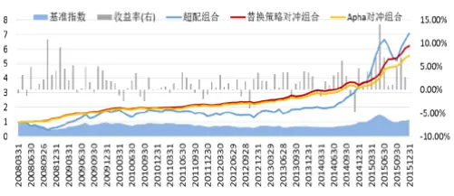

## 高管增持事件替换策略

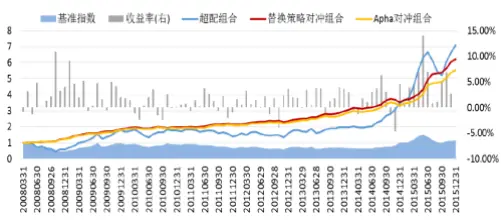

## 多事件替换策略

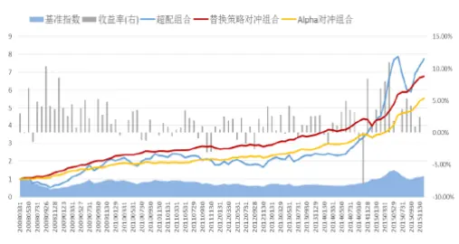
分析师：史庆盛 S0260513070004

公020-87577060

sqs@gf.com.cn

## 相关研究：

多因子 Alpha 系列报告之（二2015-7
十四）——财报因子使用方法
新探
多因子 Alpha 系列报告之（二2015-8
十五）——反转因子再优化，更
精准把握拐点
多因子 Alpha 系列报告之（二2016-1
十六）——基于牛股归因的风
格动量策略

## 一、前言

近期市场走弱，长期盘整，股票择时难以获取稳定收益。相对来说，通过选股策略对冲股指期货，能够捕捉更多的alpha 超额收益。常用的选股体系中，多因子选股框架应用最为广泛，收益也表现突出。目前多因子策略在常规中性策略思路上发展出风格轮动、行业轮动等敞口策略，一方面获取 alpha收益，另一方面通过一定程度风险敞口的暴露对收益进行增强。本篇报告分析了以多因子策略为主，结合事件驱动选股的思路与方法，试图在打开敞口的同时加强对风险的把控，获取更为稳健的超额收益。

图1.多因子策略基本步骤
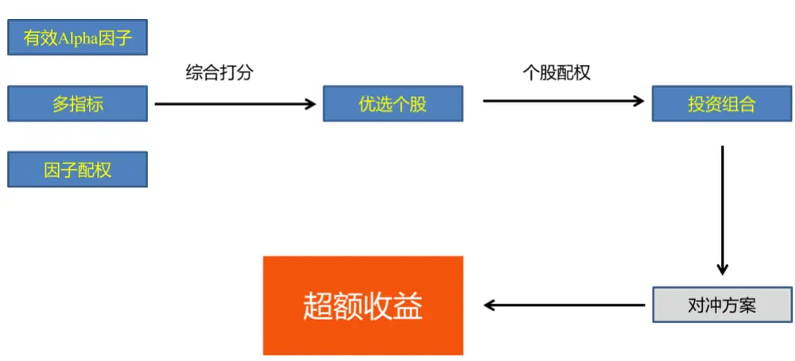
数据来源：广发证券发展研究中心

采用多因子策略选股首先需要挖掘有效因子，利用因子回报稳定有效的多类别因子综合打分，从而优选出在各个因子中综合表现较好的个股，再按合适权重配置资金，构建投资组合。多因子策略相对单一因子而言，由于其综合考量了多个风格维度，避免了投资过程对单一风格的严重依赖，收益空间巨大又能兼顾长期稳健性；再者，选用合适的股指期货标的进行对冲，又能进一步剥离市场风险，获取alpha 绝对收益。

图2.事件驱动基本步骤
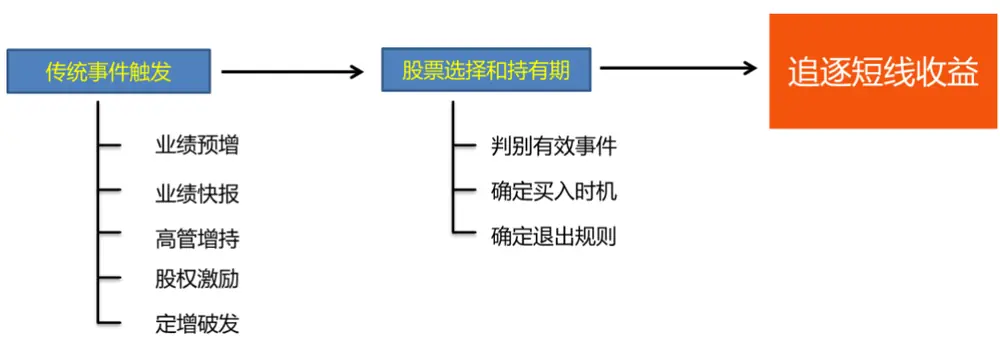
数据来源：广发证券发展研究中心

事件驱动策略是通过捕捉上市公司在发生特定事件时的机会，进行短期投资获利的策略。其运用前提是目标公司发生了某些特定或突发事件，但事件的发展结局一般会在较短期内见分晓，投资者可以通过对局势的分析和判断，做出投资决策，择机迈入和退出。在投资界，事件驱动策略已经得到广泛的认可和运用，成为对冲基金管理者采用的主流策略之一。常见的事件类型包括了业绩事件（业绩预增、业绩快报等）、投资者行为事件（高管增持等）、上市公司动态事件（定向增发首日破发、股权激励等）。

表1.多因子和事件驱动策略对比

| 选股策略 | 优势 | 劣势 |
| --- | --- | --- |
| 多因子策略 | 收益稳定风险可控长期有效 | 风格依赖空间收窄 |
| 事件驱动策略 | 潜在收益巨大管理相对灵活资金利用率高 | 波动较大市场不成熟 |

数据来源：广发证券发展研究中心

比较两类选股策略，在收益、风险和管理操作方面各有优劣，多因子策略以把握长期稳健收益见长，但面临风格依赖和期指大幅贴水空间收窄等困境；事件驱动策略能够精准投资，资金利用率较高，潜在收益巨大，但市场还不够成熟、波动也更为剧烈。因此，我们希望将两类策略相结合构建新的选股框架以捕获更高收益、降低波动程度。但相对于因子类策略，事件型策略在时点和数量上并不确定，两者节奏对应上的偏差显著存在，导致资金管理面临困难。现如今常见做法是按比例在两类策略上分配资金，分别选股，但事件策略波动较大的问题还是难以克服，同时多因子的稳定收益也可能被稀释。因此，我们希望寻求新的结合方式，在因子类策略稳定性基础上进行事件驱动增强，关注长期基本面的同时也考虑市场最新动态，构建一个基于多因子策略的事件智能替换策略。

## 二、策略思想

前面我们简单介绍了多因子策略和事件驱动策略各自的特点及优劣比较，并提出由此衍生出的智能替换策略思路，下面将具体就该策略构建的主要思想以及步骤进行详细描述。

图3.智能替换策略基本思想及步骤
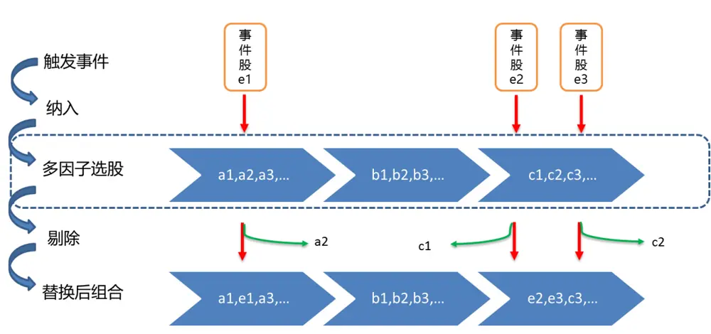
数据来源：广发证券发展研究中心

## 1) 期初按照多因子策略进行组合构建和开仓；

在因子的选择上，结合我们之前一系列报告的研究，从IC、多空年化收益率、因子IR以及胜率等有效性指标角度出发，从八大类风格因子中挑选了共21个有效风格因子，并且对因子值进行预处理和行业中性调整作为多因子策略的选股依据。具体因子如下表所示：

表2.有效风格因子表

| 大类风格 | 具体风格因子 |
| --- | --- |
| 盈利 | 销售净利率、毛利率 |
| 成长 | 净利润增长率、EPS增长率、ROE增长率、主营业务收入增长率 |
| 流动 | 1个月成交金额、近3个月平均成交量 |
| 技术 | 一个月股价反转、三个月股价反转、六个月股价反转、一年股价反转/动量 |
| 规模 | 流通市值、总资产 |
| 质量 | 固定比、净利润现金占比、营业费用比率 |
| 估值 | CFP、BP |
| 波动率 | 日频波动率、周频波动率 |

数据来源：广发证券发展研究中心

这一环节与一般多因子策略期初选股构建投资组合的步骤完全一致，通过排序法超配因子综合得分最高的一档股票，并在个股权重配置上采取等权处理。

## 2) 在组合持有周期内监测事件驱动的机会，若某交易日有组合外的个股发生目标事件，则将其纳入组合中，同时剔除原组合内同等数量的个股；

我们考虑的目标事件包括业绩预增、业绩快报、高管增持、股权激励和定增破发这五类市场较为常见的事件。由于事件个股在风险因子暴露上具有自身特征，并且每一个事件的特征不尽相同（例如有些事件在规模较大、估值较低的个股中发生频率较高，或是有些事件在某几个特定的行业经常发生），用这些事件个股替换原多因子组合内的股票时原本风格上的平衡将会被打破，偏向特定风格或行业，从而使替换个股后的新组合风险提高。因此我们希望能够制定与事件对应的风格修复规则，针对不同事件采用具体的替换规则，使得替换之后的组合在行业和风格上均不发生大幅偏离，维持各风格维度的相对平衡。

首先是基于行业的替换规则：对于每一个新纳入组合的事件个股记录其所在行业，在原投资组合中从该行业内剔除因子得分最低的个股以完成替换。

另外是基于风格的替换规则：对于每一个新纳入组合的事件个股记录其在特定因子上的风险暴露，在原投资组合中寻找该因子上暴露程度最为接近的个股进行剔除。

## 3) 在组合持有期内反复进行以上替换，直至周期结束平仓。

在具体的替换规则中，我们将对替换的比例进行限制，以保证多因子组合仍旧占据主体地位。即满足替换个股达到原投资组合一定比例后，即便继续有事件发生，也不再进行识别和替换。

## 三、事件特征分析

前文提到，不同的事件个股可能具有不同的特征，为制定各个事件最为匹配的替换规则，我们首先从事件发生次数、行业相对分布和整体因子暴露这三个维度对分别五类事件进行了特征分析，本部分主要展示了对业绩预增和股权激励两类事件的分析结果。为与后续实证研究相匹配，这一部分的样本选自中证800指数成分股的月度数据，时间范围从2008年3月至2015年12月。

## 3.1 业绩预增事件特征

图4.业绩预增事件发生次数
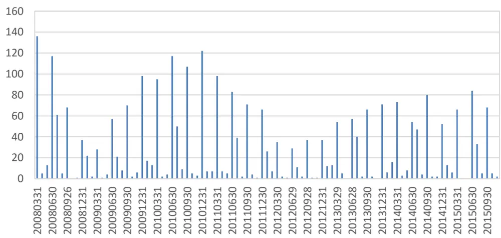
数据来源：广发证券发展研究中心

事件发生事件次数而言，业绩预增事件样本的日历效应强，发生时点较为分散。该事件数据属于财务报告数据，在财报截止的每个季末月度事件大量发生，次数一般都在40次以上，部分月份甚至超过100；而在其他月份则相对较少甚至完全没有发生。具有类似情况的事件还有业绩快报事件。

图5.业绩预增事件行业相对分布
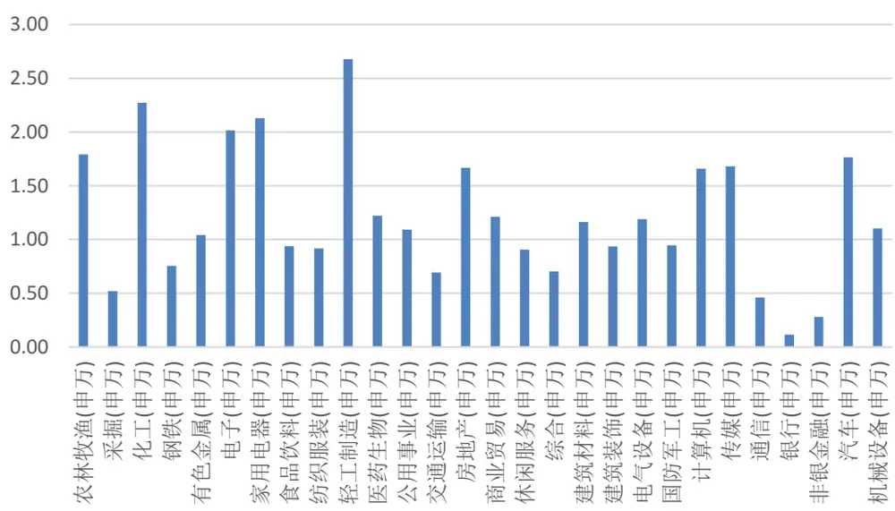
数据来源：广发证券发展研究中心

该表中的数值表示事件个股在各行业上的分布相对中证800指数成分股行业分布的比例，大于1表示过于集中在该行业，小于1则表示发生次数较少。过去几年，业绩预增事件在行业分布上较基准发生明显偏离，事件相对较多地发生在轻工、化工等板块，而金融板块却较为少见，用标准差衡量的行业偏离度达到0.61。

图6.业绩预增事件整体因子暴露
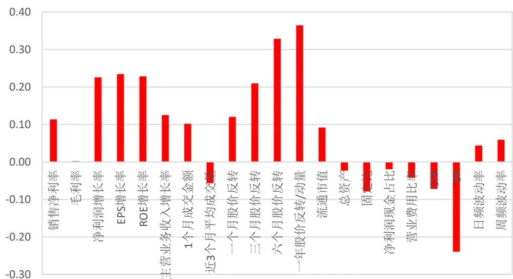
数据来源：广发证券发展研究中心

风格偏离角度来看，图中的整体因子暴露度量的是所有该事件个股在每个风格因子上的平均因子值。总览21个风格因子可以看出，相对中证800指数成分股而言，业绩预增事件在风格上主要体现为高估值，而在股价反转技术因子上同样表现突出，业绩预增的个股通常前期都会提前上涨。

## 3.2 股权激励事件特征

图7.股权激励事件发生次数
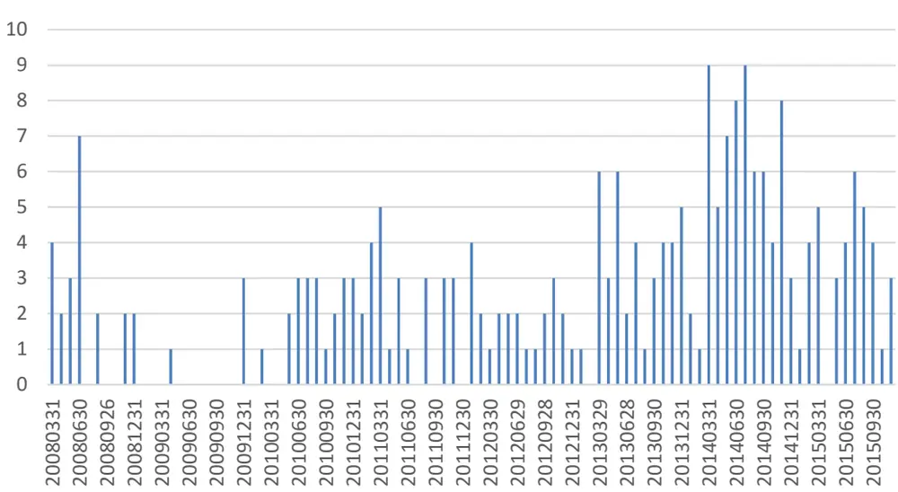
数据来源：广发证券发展研究中心

对比业绩预增事件，股权激励类事件的的样本数量少了很多，部分月份甚至完全无事件发生，最多的月份也不超过10次。但从2014年以来，事件发生的的次数有了明显增加，并且发生的频率也较为稳定，在近期受到了广泛关注，相应个股也通常能取得不错的表现。

图8.股权激励事件行业相对分布
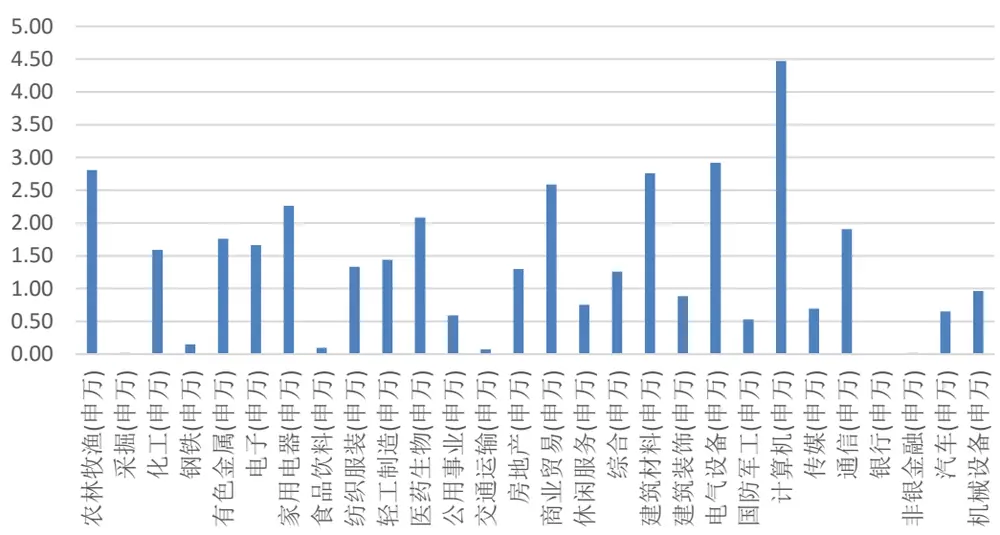
数据来源：广发证券发展研究中心

股权激励事件由于本身次数较少，在行业分布上的不均匀显得更为极端，部分行业集中触发事件，尤以计算机、农业等板块最为突出，而在金融、采掘、钢铁、交通板块则几乎从未发生过，行业偏离度高达1.08。

图9.股权激励事件整体因子暴露
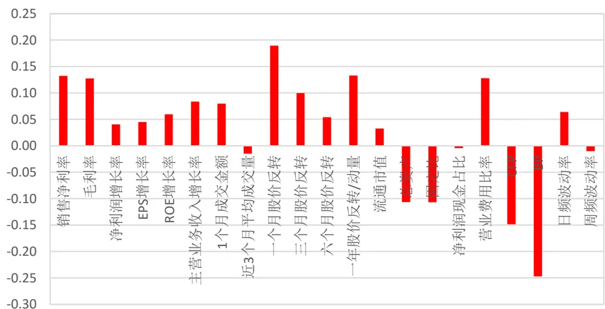
数据来源：广发证券发展研究中心

风格偏离角度来看，总览21个风格因子。相对中证800成分股而言，股权激励事件在盈利和成长性上有着更佳的表现，估值因子大多数依旧偏高，整体来说风格偏离依旧严重。

## 四、单事件替换策略

## 4.1 单事件替换策略构建框架

单事件替换策略指的是在替换时仅考虑某一种事件的发生，对照前文分析的五类事件在发生时点、频率、行业、风格上的特点，为实现多因子组合风格平衡的延续，我们将分别制定对应每一个事件具体的最优替换规则。在构建最优替换策略时，需全面考虑以下几点：

1) 替换依据（随机/行业/因子）及替换标准；

2) 事件个股替换时点及持仓时间；

3) 投资组合在事件上的替换比例。

在进行实证分析时，我们选取的样本为中证800指数成分股自2008年3月至2015年12月的月度数据，并对21个风格因子进行去极值、标准化及行业相对处理这三步数据预处理工作。

多因子策略主体框架构成：

1) 每个月末将中证800指数成分股按照因子综合得分进行排序，根据排序从小到大将股票组合平均分为10档；

2) 超配前10%（第十档）的股票作为下一个月的资产组合，个股间等权配资；

3) 以中证800指数作为资产组合的基准指数，并进行对冲。

在该框架基础上，用事件驱动策略选股进行个股替换，具体要求如下：

1) 从持有资产组合的第n天开始进行替换（n的选择参考纯事件驱动策略常用的平均持仓期），分别考虑以行业和因子作为替换依据，并持有新加入的事件个股至该月月末；

2) 最高调仓比例不超过10%，即如果某日判定替换后的比例超过该阈值，则不进行此次替换。

## 4.2单事件替换策略实证结果——业绩快报事件

业绩快报事件在各类风格上最突出的是股价涨跌幅，样本统计显示业绩快报盈利增长的个股在公布快报之前倾向于显著上涨，因此对这类事件我们选择反映前期涨跌幅的因子进行替换，结合纯事件驱动策略15天的平均持仓期，得到以下替换规则：

每个月第5个交易日开始替换，剔除与事件个股“一个月股价”反转因子最为接近的个股。

图10.业绩快报事件回测结果
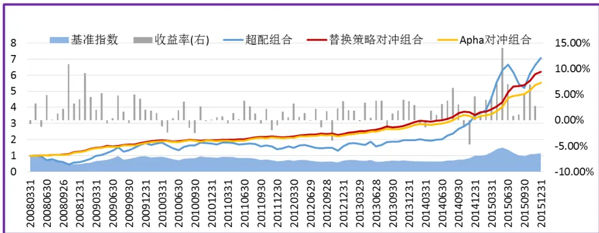
数据来源：广发证券发展研究中心

表3.业绩快报事件策略表现

|  | 累计净值 | 平均年化收益率 | 胜率 | 最大回撤 | 信息比 |
| --- | --- | --- | --- | --- | --- |
| 多因子策略 | 454.70% | 24.70% | 75.30% | 5.77% | 2.26 |
| 替换策略 | 521.60% | 26.60% | 76.30% | 5.77% | 2.39 |

数据来源：广发证券发展研究中心

可以看出，考虑了业绩快报事件的替换规则下，相对多因子策略而言，在回撤不变的情况下，2008年以来的累计净值有了大幅提升，年化收益率提高了接近2%，胜率提高了1%，信息比则从2.26提升至2.39。

## 4.3单事件替换策略实证结果——高管增持事件

高管增持事件在各类风格上最突出的同样是股价涨跌幅，样本统计显示高管增持事件的个股在公告之前倾向于于显著下跌，因此对这类事件我们也选择反映前期涨跌幅的因子进行替换，结合纯事件驱动策略20天的平均持仓期，得到以下替换规则：

每个月第1个交易日开始替换，剔除与事件个股“一个月股价”反转因子最为接近的个股。

图11.高管增持事件回测结果
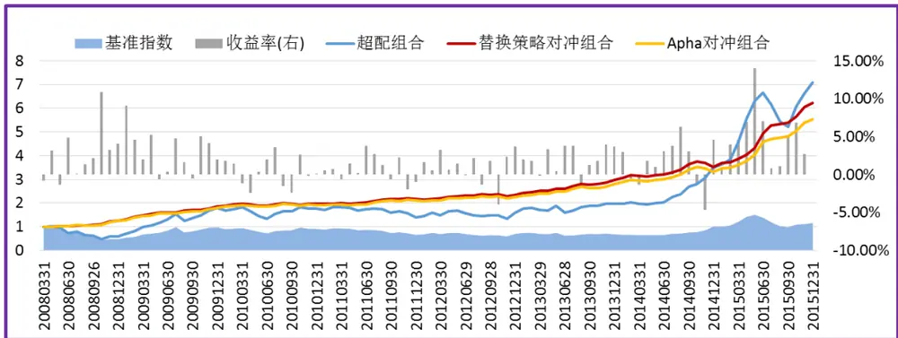
数据来源：广发证券发展研究中心

表4.高管增持事件策略表现

|  | 累计净值 | 平均年化收益率 | 胜率 | 最大回撤 | 信息比 |
| --- | --- | --- | --- | --- | --- |
| 多因子策略 | 454.70% | 24.70% | 75.30% | 5.77% | 2.26 |
| 替换策略 | 535.70% | 27.00% | 77.40% | 5.75% | 2.40 |

数据来源：广发证券发展研究中心

可以看出，考虑了高管增持事件的替换规则下，相对多因子策略而言的盈利能力有了更大幅度的提升，年化收益率提高了接近2.5%，胜率提高了2.1%，信息也则从2.26提升至2.40；同时最大回撤由原先的5.77%降低至5.75%。

## 4.4单事件替换策略实证结果——股权激励事件

股权激励的事件个股在各类风格上最突出的是估值类因子，大多数事件个股表现出高估值的特征，因此对这类事件我们选择前期反映估值的因子CFP进行替换，结合纯事件驱动策略20天的平均持仓期，得到以下替换规则：

每个月第1个交易日开始替换，剔除与事件个股“CFP”估值因子最为接近的个股。

图12.股权激励事件回测结果
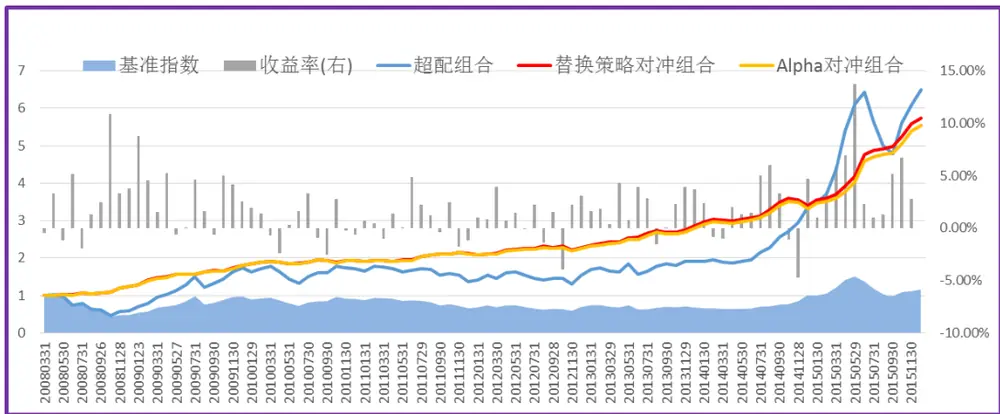
数据来源：广发证券发展研究中心

表5.股权激励事件策略表现

|  | 累计净值 | 平均年化收益率 | 胜率 | 最大回撤 | 信息比 |
| --- | --- | --- | --- | --- | --- |
| 多因子策略 | 454.70% | 24.70% | 75.30% | 5.77% | 2.26 |
| 替换策略 | 464.30% | 25.00% | 75.30% | 5.77% | 2.31 |

数据来源：广发证券发展研究中心

可以看出，考虑了股权激励事件的替换规则下，相对多因子策略而言，由于该事件样本比较少，发生频率也较低，累计净值和信息比虽略有提高，但幅度不是很明显，胜率和回撤也并没有直接的提升。

## 4.5单事件替换策略实证结果——业绩预增事件

业绩预增事件在各类风格上最突出的是成长类因子和前期涨跌幅，但根据前文分析，其在行业分布上同样偏离较为严重，因此对这类事件我们选择在行业内进行替换，结合纯事件驱动策略10天的平均持仓期，得到以下替换规则：

每个月第10个交易日开始替换，在行业内进行剔除。

图13.业绩预增事件回测结果
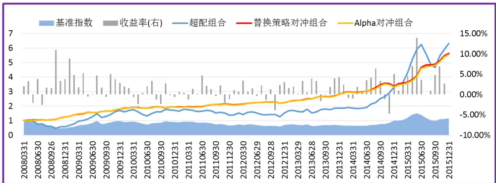
数据来源：广发证券发展研究中心

表6.业绩预增事件策略表现

|  | 累计净值 | 平均年化收益率 | 胜率 | 最大回撤 | 信息比 |
| --- | --- | --- | --- | --- | --- |
| 多因子策略 | 454.70% | 24.70% | 75.30% | 5.77% | 2.26 |
| 替换策略 | 462.40% | 25.00% | 74.20% | 5.86% | 2.27 |

数据来源：广发证券发展研究中心

可以看出，考虑了业绩预增事件的替换规则下，相对多因子策略而言，由于该事件样本的分布很不均匀，有部分月份甚至没有一次事件发生，我们的替换规则在这种情况下不能完全发挥改善收益的功效。结果是累计净值和信息比虽有小幅提升，但胜率却降低，回撤也有所放大。

## 4.6单事件替换策略实证结果——定增破发事件

定增破发事件在各类风格上的平均暴露本身便不具有突出特点，但在行业相对分布上却严重偏离，因此对这类事件我们选择在行业内进行替换，结合纯事件驱动策略20天的平均持仓期，得到以下替换规则：

每个月第1个交易日开始替换，在行业内进行剔除。

图14.定增破发事件回测结果
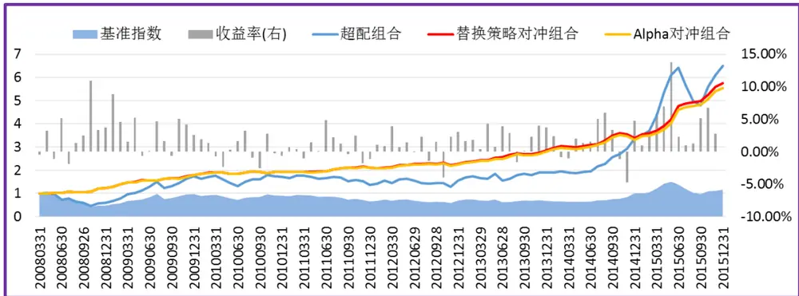
数据来源：广发证券发展研究中心

表7.定增破发事件策略表现

|  | 累计净值 | 平均年化收益率 | 胜率 | 最大回撤 | 信息比 |
| --- | --- | --- | --- | --- | --- |
| 多因子策略 | 454.70% | 24.70% | 75.30% | 5.77% | 2.26 |
| 替换策略 | 467.60% | 25.10% | 75.30% | 6.05% | 2.28 |

数据来源：广发证券发展研究中心

可以看出，考虑了定增破发事件的替换规则下，相对多因子策略而言，该事件同样由于样本较少改进幅度有限，累计净值和信息比相较业绩预增事件虽再略有提升，但回撤情况也继续增大。

## 五、多事件替换策略

## 5.1 多事件替换策略构建框架

总结单事件策略的实证结果，不同事件所对应的最优替换规则不完全相同，对多因子策略的改善幅度也有所区别，考虑到单事件策略样本数量不均匀的问题，我们建议采用多事件策略同时监测的办法，结合各事件最优替换规则，采用综合多事件进行替换。

表8.单事件策略替换规则和收益

| 事件名称 | 替换依据 | 替换起始日 | 年化收益率 |
| --- | --- | --- | --- |
| 业绩快报 | 一个月股价反转因子 | 第 5 天 | 26.6% |
| 高管增持 | 一个月股价反转因子 | 第1天 | 27.0% |
| 股权激励 | CFP 因子 | 第1天 | 25.0% |
| 业绩预增 | 行业内 | 第 10 天 | 25.0% |
| 定增破发 | 行业内 | 第1 天 | 25.1% |

数据来源：广发证券发展研究中心

为尽可能多得充分获取各事件带来的超额收益，同时保持原有风格的平衡，多事件替换策略框架构建如下：

1) 最高调仓比例限制从单事件的 10%放宽至 40%；

2) 在多因子组合持有期内，每日逐一判断五个事件是否触发，是否有个股需要替换进入组合（在此多事件替换策略中，每一个事件的替换依据和起始日严格对应该事件在单事件策略中的替换标准）。

## 5.2 多事件替换策略实证结果

在上述多事件替换策略的规则下，利用同样的样本数据，我们再次进行回测，得到的结果基本与预期相符，相较单事件而言，多事件替换策略确实能够进一步加强收益。

图15.多事件替换回测结果
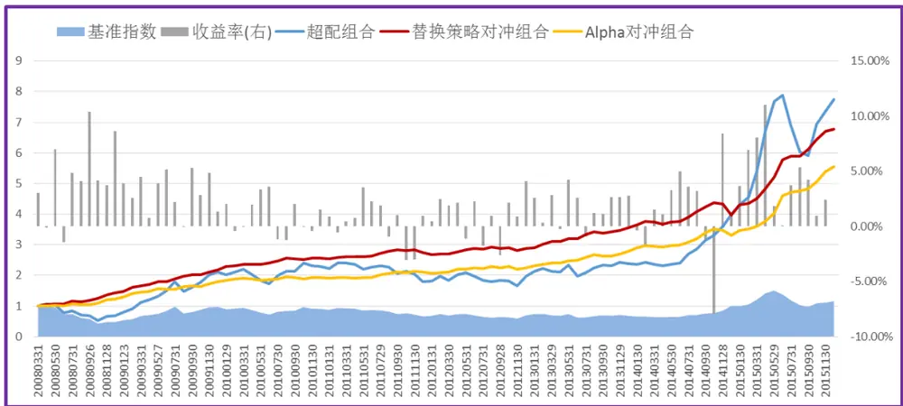
数据来源：广发证券发展研究中心

表9.多事件替换策略表现

|  | 累计净值 | 平均年化收益率 | 胜率 | 最大回撤 | 信息比 |
| --- | --- | --- | --- | --- | --- |
| 多因子策略 | 454.70% | 24.70% | 75.30% | 5.77% | 2.26 |
| 替换策略 | 577.70% | 28.00% | 75.30% | 9.13% | 2.51 |

数据来源：广发证券发展研究中心

可以看出，改进之后的多事件替换策略相对多因子策略的改善效果非常明显，也胜过每一个单事件替换策略；回撤角度虽有放大，但胜率增加，年化收益率大幅提升3.2%，信息比也由原先的2.26提高到2.51。

## 总结

为增强多因子策略的主动收益，本策略将事件驱动与其灵活结合，实证结果表明：

1、不同事件各自的最优替换方案下，多因子组合的行业特征和因子暴露均没有发生较大的变化，因此可以在最大程度上保留多因子组合的风险特征；

2、相较单一多因子策略而言，我们的替换策略实现了 1%至 3%的年化收益率增强；有效控制风险的前提下，最大回撤在可接受范围内，信息比也同样均有所增加;

3、根据单事件最优替换规则设计的多事件策略控制回撤基础之上，超额收益率和信息比上均较单事件而言又有了进一步提升。

我们的整个策略思路在于首先找到事件的最明显特征，给事件贴上标签，使纳入和剔除的个股两者具有一个可比较的参照，在此基础上设计的替换策略，目标并不是围绕收益最大化，而是使事件对原有因子组合平衡风格的冲击最小化，所以单个策略来看的收益改善并不算大，但结合之后的策略避免了事件策略高波动的问题，信息比也比较高。最后通过整合多事件侧路的方法来提高资金利用效率和事件参与率，进一步显著提高了收益。

我们并没有特别介绍具体的引资策略及事件策略本身的表现，而是更多地强调两者相结合的一种替换思路，给读者新的启迪。实际应用中，根据具体因子策略类型的不同，选用事件方向的不同，以及投资者对收益和风险偏好的不同，相应的替换规则都可以做一些灵活调整和改进。

## 风险提示

本模型采用量化方法对各类风格历史表现进行统计回测，并推荐相关的因子及相应构造方法，不一定具有严格的经济逻辑，也未必符合当前市场环境特点，请结合自身产品特征及对市场的判断进行恰当使用。

## 广发证券—行业投资评级说明

买入： 预期未来12个月内，股价表现强于大盘10%以上。

持有： 预期未来12个月内，股价相对大盘的变动幅度介于-10%～+10%。

卖出： 预期未来12个月内，股价表现弱于大盘10%以上。

## 广发证券—公司投资评级说明

买入： 预期未来12个月内，股价表现强于大盘15%以上。

谨慎增持： 预期未来12个月内，股价表现强于大盘5%-15%。

持有： 预期未来12个月内，股价相对大盘的变动幅度介于-5%～+5%。

卖出： 预期未来12个月内，股价表现弱于大盘5%以上。

## 联系我们

|  | 广州市 | 深圳市 | 北京市 | 上海市 |
| --- | --- | --- | --- | --- |
| 地址 | 广州市天河区林和西路 | 深圳市福田区金田路4018 | 北京市西城区月坛北街2 | 上海市浦东新区富城路99 |
|  | 9 号耀中广场 A 座 1401 | 号安联大厦 15 楼 A 座 03- 04 | 号月坛大厦18层 | 号震旦大厦18楼 |
| 邮政编码 | 510075 | 518026 | 100045 | 200120 |
| 客服邮箱 | gfyf@gf.com.cn |  |  |  |
| 服务热线 | 020-87577060 |  |  |  |

## 免责声明

广发证券股份有限公司具备证券投资咨询业务资格。本报告只发送给广发证券重点客户，不对外公开发布。

本报告所载资料的来源及观点的出处皆被广发证券股份有限公司认为可靠，但广发证券不对其准确性或完整性做出任何保证。报告内容仅供参考，报告中的信息或所表达观点不构成所涉证券买卖的出价或询价。广发证券不对因使用本报告的内容而引致的损失承担任何责任，除非法律法规有明确规定。客户不应以本报告取代其独立判断或仅根据本报告做出决策。

广发证券可发出其它与本报告所载信息不一致及有不同结论的报告。本报告反映研究人员的不同观点、见解及分析方法，并不代表广发证券或其附属机构的立场。报告所载资料、意见及推测仅反映研究人员于发出本报告当日的判断，可随时更改且不予通告。

本报告旨在发送给广发证券的特定客户及其它专业人士。未经广发证券事先书面许可，任何机构或个人不得以任何形式翻版、复制、刊登、转载和引用，否则由此造成的一切不良后果及法律责任由私自翻版、复制、刊登、转载和引用者承担。