# 个股配对思想在因子策略中的应用

## ——多因子 Alpha 系列报告之三十

## 报告摘要：

## 反转因子在历史上表现优异

股票收益率在长期存在反转的趋势, 即在过去收益率低（高）的股票在未来有着较好（差）的市场表现,常见的反转因子有“N 月股价反转”“最高价长度”“容量比”等，反转因子的策略在历史上都有较好的表现。

## 配对反转原理与反转因子

传统的反转因子主要有两类分别是相对大盘的反转和相对行业的反转。配对反转因子捕捉行业内个股之间的反转机会，与反转因子的思路一脉相承，核心思想与配对交易一致，不同之处在于将配对交易止盈止损条件改为定期平仓。

## 基于个股配对的指数增强策略

基于个股配对因子的对冲策略做了三个实证研究，检验了配对反转因子的有效性。我们以月度为调仓周期，股票池为中证 800 指数成分股，按申万一级行业分类，本文提出了基于个股配对的权重调整方法，用于指数增强策略，2007年-2016年年化超额收益率达8%。

## 个股配对在多因子组合中应用

个股配对思想不仅可以用于指数增强，也可以用于多因子组合的周度调仓增强，本文选取十二个常见因子构建基准多因子组合，每周最后一个使用上文提出的权重调整方法，对周度配对调仓策略进行分析，即使考虑交易费用，周度配对调仓依然有增强效果，在样本期 2007 年-2016 年，基准多因子组合收益率424.40%，配对调仓组合收益率501.59%。

## 总结

月度调仓的频率下，配对反转因子获取超额收益能力突出，配对反转信号可以用于指数增强，亦可用于优化多因子组合提高收益率。

## 核心风险

本文中所引入的假设以及基于假设所构建的模型，均是对所要研究问题的主要矛盾以及矛盾主要方面的一种抽象，因此模型以及基于模型所得出的相关结论并不能完全准确的刻画现实环境与预测未来。

图 1：指数增强策略净值
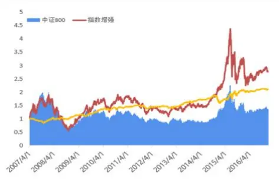

图2：配对调仓VS基准多因子组合
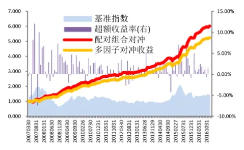

分析师： 史庆盛 S0260513070004

公020-87577060

sqs@gf.com.cn

## 相关研究：

2015-08多因子 Alpha系列报告之（二十五）——反转因子再优化，更精准把握拐点

多因子 ALPHA 系列报告之2014-09
（二十一）：alpha 因子何处
寻 掘金海量技术指标

## 一、前言

自有效市场理论诞生以来，技术分析就面对各种争议和挑战。随着时间推移，人们逐渐发现众多市场异象，特别是我国股市，股价的随机游走和有效性被怀疑，因此，通过主动投资管理获取超额收益一直是很多人孜孜以求的目标，技术分析便是手段之一。

在多因子选股体系中，技术因子、反转因子具有举足轻重的地位，在我们的历史研究中，反转因子均有不错的收益，如：SLP反转因子与基于筹码分布的价格相对位置。图1展示了常见的技术指标。

图 1：常见反转因子的定义与思路
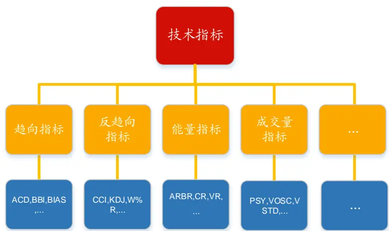
资料来源：广发证券发展研究中心

本文提出了根据个股配对的思想，构造了配对反转因子，并将策略运用于对冲，指数增强和多因子周度动态调仓。

## 二、配对反转原理与反转因子

本节的论述按照图2的思路展开。首先介绍反转效应和反转因子，在对个股配对交易理论进行梳理，最后构造本文所使用的配对反转因子。传统的反转因子是相对大盘或行业指数的反转，而配对反转因子是相对行业内个股的反转。

图 2：传统反转因子分类
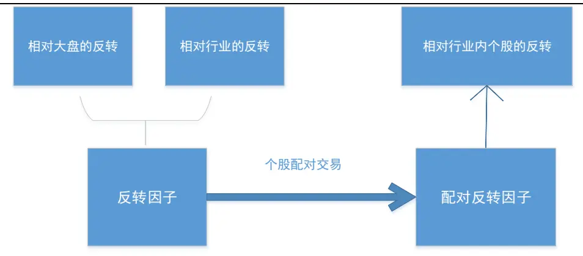
资料来源：广发证券发展研究中心
识别风险，发现价值

与欧美市场普遍存在的中期动量效应所不同，我国股市表现出显著的中期反转特。反转趋势指的是在过去收益率低（高）的股票在未来有着较好（差）的市场表现。这或与我国股市较为独特的市场微观结构相关：中小投资者（散户）是我国股市的参与主体，急涨急跌情形时有出现。由于非完全理性，投资者往往会过高或者过低地估计历史信息的影响从而使股票收益表现为反应过度或者反应不足。基于个股配对的因子选股策略基于以下的思想:股票收益率在长期存在反转的趋势, 即在过去收益率低的股票在未来有着较好的市场表现, 收益率较高;而过去收益率高的股票在未来表现不佳。从而, 采用反转投资策略, 买入过去表现较差而卖出过去表现较好的股票构成一个投资组合,在合适的时点方向 能够获得超额收益。有效市场理论和行为金融学理论从不同的角度，对收益率的反转效应进行了解释。

## 2.1反转原理与反转因子

与欧美市场普遍存在的中期动量效应所不同，我国股市表现出显著的中期反转特。反转趋势指的是在过去收益率低（高）的股票在未来有着较好（差）的市场表现。这或与我国股市较为独特的市场微观结构相关：中小投资者（散户）是我国股市的参与主体，急涨急跌情形时有出现。由于非完全理性，投资者往往会过高或者过低地估计历史信息的影响从而使股票收益表现为反应过度或者反应不足。基于个股配对的因子选股策略基于以下的思想:股票收益率在长期存在反转的趋势, 即在过去收益率低的股票在未来有着较好的市场表现, 收益率较高;而过去收益率高的股票在未来表现不佳。从而, 采用反转投资策略, 买入过去表现较差而卖出过去表现较好的股票构成一个投资组合,在合适的时点方向 能够获得超额收益。有效市场理论和行为金融学理论从不同的角度，对收益率的反转效应进行了解释。

传统的反转因子主要有两类分别是相对大盘的反转和相对行业的反转。以钢铁行业个股为例，图3以钢铁行业个股为例，展示了鞍钢股份相对上证综指（大盘）超跌反弹的走势。图4展示了方大特钢相对钢铁（申万）指数超跌反弹的走势。

图 3：相对大盘的反转
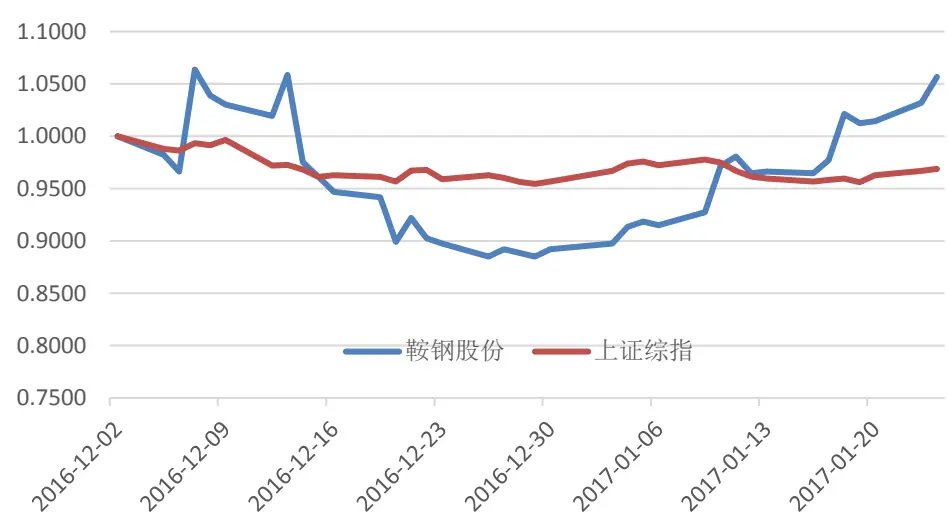
资料来源：广发证券发展研究中心

图 4：相对大盘的反转
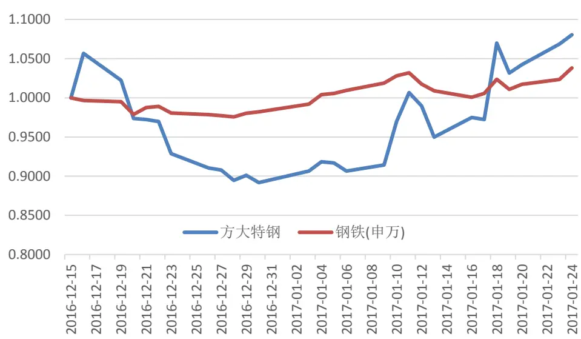
资料来源：广发证券发展研究中心

本文构造的配对反转因子，捕捉相同行业内个股之间的反转机会.如下图所示，一般的反转因子更容易到相对行业超跌的股票A，配对反转因子希望能够捕捉到相对于股票B超跌的股票C。

图 5：相对个股的反转机会
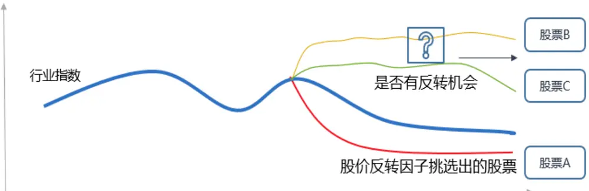
资料来源：广发证券发展研究中心

在前文的八大类技术因子中，反转因子（反趋向指标）是重要的一类，用于分析价格/成交量的发展趋势以及其将来是否有转势的意愿。

常见的反转因子包括一个月股价反转、三个月股价反转、六个月股价反转、一年股价反转、最高价长度、容量比、SLP反转因子和基于筹码分布的价格相对位置等，也是我们定期报告中长期跟踪的因子。前四个指标都给定了一个固定的时间窗口来计算相关标的在此时间窗口中的涨跌幅。定义如表1所示：

表1.常见反转因子定义思路

| 因子描述 因子定义 | 因子思路 |
| --- | --- |

识别风险，发现价值

| N个月股价反转 | (当前股价-N个月前股价)/N个月前股价 | 固定时窗口的涨跌幅 |
| --- | --- | --- |
| 最高价长度 | 前20 日内最高价距离现在的天数 | 考虑了时间维度的反转效应 |
| 容量比 | 前 26 日内上涨的成交量/下降的成交量 | 考虑成交量加权的买卖气势 |
| SLP反转因子 | 当前价位与最近拐点的斜率 | 动态时间窗口，加入拐点界定 |
| 基于筹码分布的 价格相对位置 | (当前价格-平均成本）/平均成本 | 指标值越小，当前所处的价位就越低 |

数据来源：广发证券发展研究中心

多因子选股策略中，在较长的回测时间段（2007年3月-2017年1月）上，表现较好的选股因子为数甚少，技术因子中的反转因子便是其中之一。从下表中可以看出，反转因子的IC绝对值在各类因子中名列前茅，在LS收益率、LS胜率、LS_IR、IC_IR、IC_P1等各项指标上都表现较好。

表2.各类因子历史表现

| 因子分类 | 因子描述 | IC | LS 收益 率 | LS 胜率 | LS_IR | IC_IR | IC_P |
| --- | --- | --- | --- | --- | --- | --- | --- |
| 反转因子 | 一个月股价反转 | -5.72% | 21.84% | 64.41% | 0.99 | 0.72 | 0.0% |
|  | 三个月股价反转 | -4.75% | 20.33% | 59.32% | 0.81 | 0.92 | 0.2% |
|  | 六个月股价反转 | -4.10% | 18.13% | 56.78% | 0.77 | 0.78 | 0.5% |
|  | 一年股价反转/动量 | -3.55% | 17.66% | 61.02% | 0.83 | 0.83 | 1.1% |
|  | 最高点距离 | 2.28% | 14.43% | 60.17% | 1.00 | 0.86 | 1.2% |
|  | 容量比 | -2.39% | 9.45% | 60.17% | 0.58 | 0.71 | 0.8% |
| 盈利因子 | 销售凈利率 | -0.31% | 0.11% | 53.39% | 0.01 | 0.36 | 36.6% |
|  | 毛利率 | 0.94% | 2.62% | 51.69% | 0.19 | 0.61 | 11.0% |
|  | ROE | 0.12% | 2.85% | 53.39% | 0.16 | 0.78 | 45.6% |
|  | ROA | 0.27% | 2.57% | 50.00% | 0.15 | 0.63 | 40.4% |
| 成长因子 | 股东权益增长率 | -1.10% | 3.16% | 52.54% | 0.24 | 0.42 | 6.7% |
|  | 总资产增长率 | -0.48% | -1.54% | 49.15% | -0.12 | 0.46 | 26.0% |
|  | 净利润增长率 | 0.31% | 3.02% | 55.08% | 0.25 | 0.75 | 30.5% |
|  | 每股净资产增长率 | -0.37% | 0.21% | 51.69% | 0.02 | 0.45 | 25.4% |
|  | EPS 增长率 | 0.67% | 3.79% | 57.63% | 0.33 | 0.76 | 11.9% |
|  | ROE 增长率 | 0.92% | 5.26% | 57.63% | 0.52 | 0.78 | 5.1% |
|  | 主营业务收入增长率 | 0.43% | 4.08% | 52.54% | 0.33 | 0.77 | 26.8% |
| 杠杆因子 | 流通股本/总股本 | 1.40% | 5.17% | 58.47% | 0.49 | 0.71 | 1.3% |
|  | 流通市值/总市值 | 1.41% | 5.14% | 58.47% | 0.49 | 0.70 | 1.2% |
|  | 资产负债率 | -0.56% | 1.18% | 54.24% | 0.07 | 0.49 | 31.4% |
| 流动因子 | 1个月成交金额 | -5.80% | 25.52% | 71.19% | 1.07 | 1.19 | 0.0% |
|  | 近3个月平均成交量 | -3.96% | 14.55% | 59.32% | 0.58 | 0.79 | 0.2% |
| 规模因子 | 换手率 | -4.71% | 15.51% | 55.93% | 0.59 | 0.65 | 0.1% |
|  | 流通市值 | -4.39% | 16.01% | 61.86% | 0.65 | 0.90 | 0.3% |
|  | 总资产 | -2.29% | 6.55% | 55.93% | 0.23 | 0.53 | 10.9% |
| 质量因子 | 存货周转率 | -0.65% | 3.34% | 52.54% | 0.23 | 0.69 | 11.9% |
|  | 长期负债比率 | -1.16% | 3.55% | 53.39% | 0.31 | 0.82 | 8.2% |
|  | 每股负债比 | -0.33% | 0.41% | 51.69% | 0.02 | 0.52 | 39.2% |
|  | 财务费用比例 | -0.92% | 5.07% | 53.39% | 0.41 | 0.62 | 10.9% |
|  | 固定比 | -1.93% | 6.69% | 56.78% | 0.45 | 0.72 | 1.1% |
|  | 速动比率 | 0.64% | 1.99% | 48.31% | 0.14 | 0.48 | 24.5% |
|  | 流动比率 | 0.76% | 3.69% | 55.08% | 0.26 | 0.41 | 18.6% |
|  | 净利润现金占比 | 0.89% | 2.12% | 59.32% | 0.30 | 0.69 | 2.4% |
|  | 总资产周转率 | 0.19% | 0.05% | 50.85% | 0.00 | 0.61 | 40.2% |
|  | 流动负债率 | 0.91% | 3.07% | 53.39% | 0.25 | 0.60 | 12.8% |
|  | 营业费用比例 | 1.58% | 5.60% | 52.54% | 0.35 | 0.64 | 7.6% |
| 估值因子 | 每股派息/股价 | 1.49% | 8.26% | 55.93% | 0.53 | 1.33 | 5.6% |
|  | CFP(行业相对) | 1.34% | 7.20% | 56.78% | 0.47 | 1.32 | 9.4% |
|  | EP(行业相对) | 2.32% | 10.19% | 54.24% | 0.53 | 1.26 | 3.7% |
|  | SP(行业相对) | 1.50% | 6.99% | 53.39% | 0.53 | 0.93 | 7.0% |
|  | BP(行业相对) | 3.33% | 15.02% | 55.93% | 0.64 | 0.99 |  |
|  | CFP | 1.14% | 6.46% | 55.08% | 0.42 | 1.25 | 1.2% |
|  | EP | 2.35% | 11.51% | 55.08% | 0.57 | 1.29 | 14.6% 4.5% |
|  | SP | 1.60% |  |  |  | 0.99 |  |
|  |  |  | 7.97% | 50.85% | 0.56 |  | 6.6% |
|  | BP | 3.38% | 15.13% | 57.63% | 0.61 | 1.01 | 1.8% |

数据来源：广发证券发展研究中心

图 6：股价反转因子分行业 IC
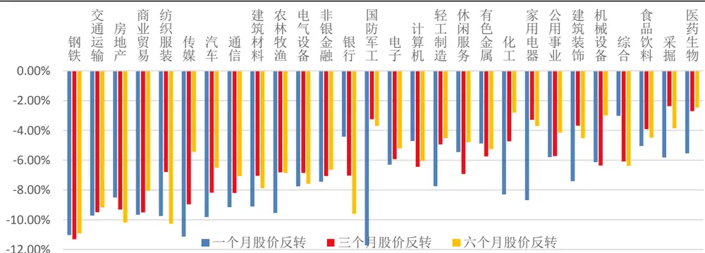
资料来源：广发证券发展研究中心

图6是2007年3月-2016年12月之间，股价反转因子在各个行业上的IC值，从图中可以看出，股价反转因子在钢铁、交通运输、房地产和商业贸易的IC值较高。

## 2.2从个股配对交易到配对反转因子

配对交易策略滥觞于上世纪八十年代的华尔街，略显古老而经久不衰，是颇受欢迎的市场中性策略。随着时间的流逝，配对交易的研究工具日渐繁多。除了常见的协整检验，还有基于O-U过程的随机价差方法、Vasicek模型、随机控制方法等。

基于协整的配对交易思想简单明了:由于不同资产之间价格关系的均值回复性，当两类资产的价差或价格比超出正常范围，购入低估资产同时卖出高估资产，待价差回归平仓获利，或者因价差扩大而止损离场。

配对交易中，假设PA和 $P_{t}^{B}$ 分别代表资产A和B在 t时刻的价格，并且他们的对数序列满足协整关系，协整系数为γ，则 t时刻两个资产的价差为:

$$
ln(P_{t}^{A})-\gamma ln(P_{t}^{B})=\mu+Spread_{t}
$$

剔除均值后的价差序列:

$$
Spread_{t}=ln(P_{t}^{A})-\gamma ln(P_{t}^{B})-\mu
$$

第一步：协整回归。首先对变量 $ln(P_{t}^{A})和ln(P_{t}^{B})$ 进行单位根检验,若两者均为 I(d)序列, 进行OLS 回归。

$$
ln(P_{t}^{A})=\hat{\mu}+\hat{\gamma}ln(P_{t}^{B})+\widehat{Spread}_{t}
$$

第二步：单位根ADF检验。若 ${\cdot}Spread_{t}$ 为平稳序列，则 $ln(P_{t}^{A})和ln(P_{t}^{B})$ 具有协整关系。

图 7：协整股票对数价格走势与协整回归
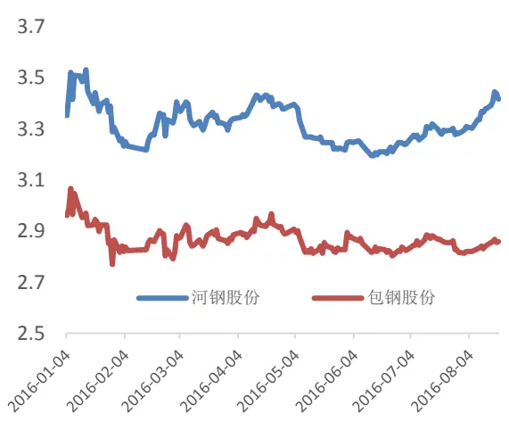
资料来源：广发证券发展研究中心

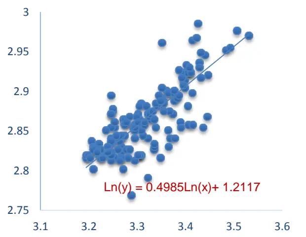

进行协整检验后，计算指标： $I=\widehat{Spread}_{t}/\sigma_{t}=(ln(P_{t}^{A})-\widehat{\gamma}ln(P_{t}^{B})-\widehat{\mu})/\sigma_{t}\quad,\quad\sigma_{t}$ 为学习期 $Spread_{t}$ 的标准差。

基于协整的配对交易中，有以下几个重要参数：(1) 资产相关性阈值C；(2)学习期长度 ；(3)开仓阈值 $.T1>0;$ ；(4)获利平仓阈值 $T2>0$ 且 $.T2<T1$ ；(5)止损平仓阈值 $T3>0且T3>T1$ ；(6)最长持有期限 。

计算以下指标：

$$
I_{t}=Spread_{t}/\sigma_{t}=(log(P_{t}^{A})-\gamma log(P_{t}^{B})-\mu)/\sigma_{t}\tag{3}
$$

其中， $\sigma_{t}$ 为学习期 $Spread_{t}$ 的标准差。配对交易开仓规则考虑两种情形，图 8是两种情形所对应的图形示例：

识别风险，发现价值

- 情形一：当  时，资产 A 相对强势，资产 B 相对弱势，做空 1 份资产A，做多γ份资产B。

- 情形二：当  时，资产A相对弱势，资产B相对强势，做多 1份资产 A，做空γ份资产 B。

图 8：配对交易开仓的两种情形
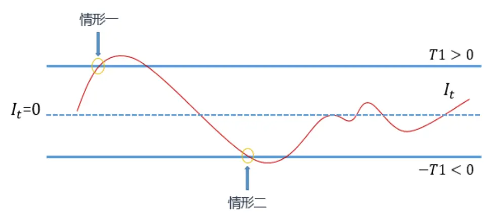
资料来源：广发证券发展研究中心

配对反转因子与反转因子的思路一脉相承，核心思想与配对交易一致，不同之处在于将配对交易止盈止损条件改为定期平仓。配对反转因子认为过去相对强/弱势的，股票在未来有着较好/差的表现,从而买入过去表现相对弱势而卖出过去表现相对强势的股票。图9和图10的例子为交易期固定的多空配对交易，表明配对交易不设置止盈止损条件，固定持仓时间长度，也可能会有正收益。

图 9：多空配对范例:南京新百 vs 深圳华强
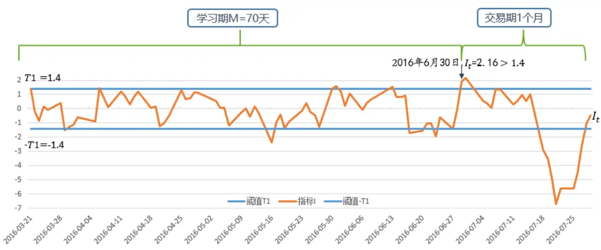
资料来源：广发证券发展研究中心

图 10：多空配对范例:南京新百 vs深圳华强
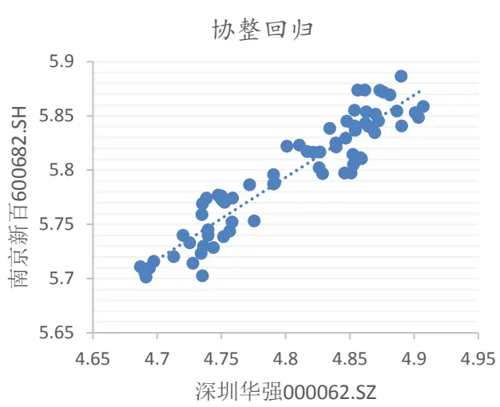
资料来源：广发证券发展研究中心

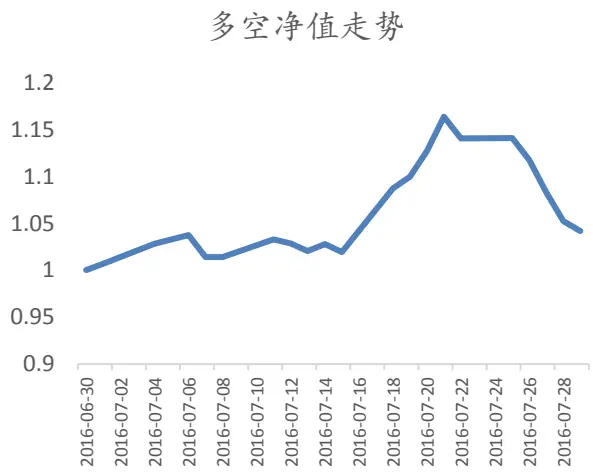

## 三、基于个股配对因子的对冲策略

## 3.1因子有效性测试流程

本文对配对反转因子测试与传统的单因子测试的不同点在于：(1)配对反转因子还需考虑两种资产、即多头和空头的配置比例（协整系数） ,其他因子计算收益差时，超低配组合比例为 1：1；(2)本文只考虑资产相关性阈值 C；学习期长度 ；开仓阈值 三个参数。测试不考虑获利/止损平仓，统一在每月最后交易日开仓和平仓。具体流程详见图11。

图 11：配对反转因子测试流程
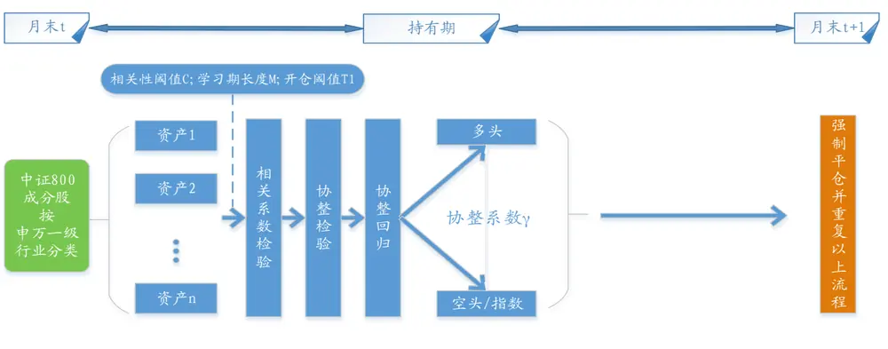
资料来源：广发证券发展研究中心

## 3.2 假设与参数设置

- 调仓频率：月度调仓，每月末强制平仓。

- 股票池：中证 800 指数成分股，按申万一级行业分类，并将每月最后一个交易日停牌的股票剔除。

- 若多空比例为 1:γ，则保持不变；若多空比例为γ:1，则转化为 1: γ

- 测试期：2007 年 4 月-2016 年 12 月。

- 资产相关性阈值 C：统一取 C=0.7。

- 学习期长度 ：40-90 个交易日，步长为5 个交易日。

- 开仓阈值 ：0.5-3.0，即（2）式中剔除均值后的价差序列 t的 0.5倍-3倍标准差。

- 协整检验显著性水平 ：5%。

## 3.3 实证分析结果

图 12 展示了不同行业的最优学习期长度 ：全行业平均值为 59.29 天。其中，有色金属、纺织服装、通信最优学习期长度位列前三位、分别为 90、90和85 天。交通运输、房地产、建筑装饰位列后三位，都为40天。

图13展示了不同行业的开仓阈值 ：全行业平均值为1.54。其中，采掘、计算机、化工最优开仓阈值位列前三位、分别为3.0、2.9、2.8。电子、轻工制造、银行位列后三位，分别为1.0、1.0、1.0。

开仓阈值T1与交易机会/行业历史平均股票数高度负相关，相关系数为-0.83，详见图14。

图 12：测试期交易机会行业分布
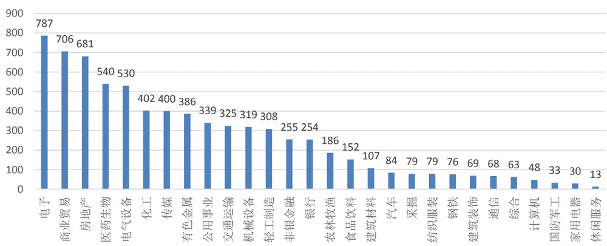
资料来源：广发证券发展研究中心

图 13：交易机会/行业历史平均股票数
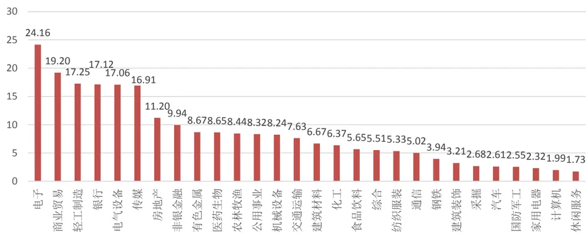
资料来源：广发证券发展研究中心

图 14：开仓阈值 T1与交易机会/行业历史平均股票数的关系
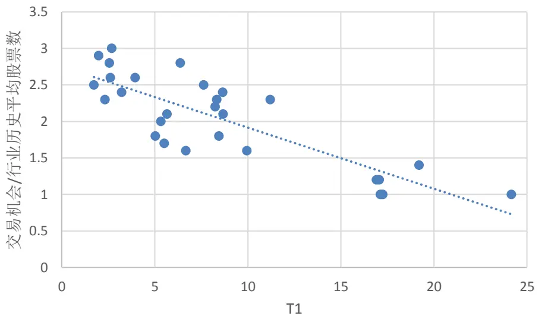
资料来源：广发证券发展研究中心

本节的基于个股配对因子的对冲策略做了三个实证研究。

实证一使用配对反转因子选股，进行多空对冲，同时考虑了个股配对协整系数，未考虑融资成本。图15 实证检验结果的净值走势，表 3 是分年度的策略表现统计。

图 15：配对反转因子选股多空对冲净值
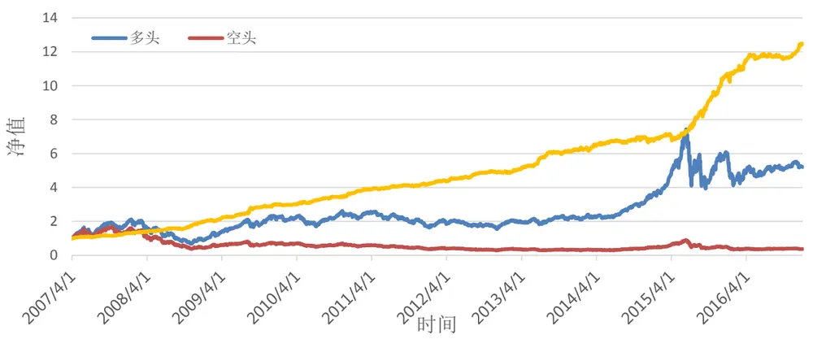
资料来源：广发证券发展研究中心

表3. 配对反转因子选股多空对冲表现

|  | 2007 | 2008 | 2009 | 2010 | 2011 | 2012 | 2013 | 2014 | 2015 | 2016 | 全样本 |
| --- | --- | --- | --- | --- | --- | --- | --- | --- | --- | --- | --- |
| 年化收益 | 31.17% | 50.85% | 51.19% | 21.39% | 14.26% | 14.75% | 25.75% | 9.10% | 59.01% | 17.05% | 1246.06% |
| 最大回撤 | 4.44% | 4.62% | 4.61% | 2.97% | 2.64% | 2.23% | 2.57% | 4.99% | 5.48% | 4.07% | 5.48% |
| 胜率 | 58.38% | 60.57% | 59.02% | 58.26% | 58.20% | 59.66% | 59.66% | 51.02% | 59.84% | 59.43% | 58.27% |
| 交易机会 | 1061 | 997 | 1466 | 1015 | 862 | 910 | 879 | 756 | 923 | 1031 | 9900 |
| 交易日天数 | 185 | 246 | 244 | 242 | 244 | 243 | 238 | 245 | 244 | 244 | 2375 |

数据来源：广发证券发展研究中心

实证二使用配对反转因子选股，只选出股票对的多头，对冲指数为中证800，未考虑个股配对协整系数，未考虑交易成本。图16实证检验结果的净值走势，表 4是分年度的策略表现统计。

图 16：多头对冲中证 800指数：未考虑协整系数
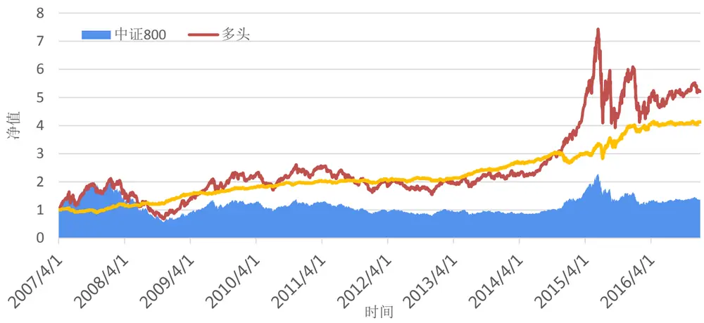
资料来源：广发证券发展研究中心

表4. 多头对冲中证800指数：未考虑协整系数表现

|  | 2007 | 2008 | 2009 | 2010 | 2011 | 2012 | 2013 | 2014 | 2015 | 2016 | 全样本 |
| --- | --- | --- | --- | --- | --- | --- | --- | --- | --- | --- | --- |
| 年化收益 | 5.37% | 32.43% | 27.85% | 10.99% | 1.86% | 3.42% | 22.68% | 8.28% | 50.03% | 3.04% | 413.05% |
| 最大回撤 | 15.79% | 7.71% | 5.01% | 4.26% | 4.76% | 5.93% | 3.48% | 11.92% | 15.84% | 5.98% | 15.84% |
| 胜率 | 52.97% | 59.76% | 60.25% | 59.50% | 52.05% | 54.20% | 62.18% | 57.55% | 62.70% | 58.20% | 57.91% |
| 信息比率 | 0.58 | 2.33 | 2.83 | 1.70 | 0.34 | 0.48 | 2.87 | 0.86 | 2.42 | 0.35 | 1.51 |
| 交易机会 | 725 | 695 | 1051 | 783 | 650 | 676 | 691 | 608 | 673 | 767 | 7319 |

数据来源：广发证券发展研究中心

实证三使用配对反转因子选股，只选出股票对的多头，对冲指数为中证 800，同时考虑个股配对协整系数，未考虑交易成本。图17 实证检验结果的净值走势，表5是分年度的策略表现统计，可以看出，考虑了协整系数后，策略整体收益有所提高，波动也加大。

图 17：多头对冲中证 800指数：考虑协整系数
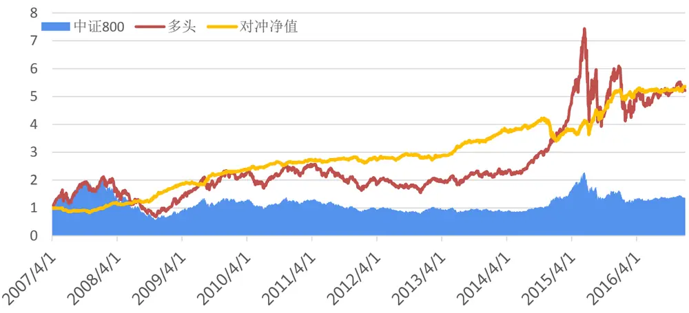
资料来源：广发证券发展研究中心

表5. 多头对冲中证800指数：考虑协整系数表现

|  | 2007 | 2008 | 2009 | 2010 | 2011 | 2012 | 2013 | 2014 | 2015 | 2016 | 全样本 |
| --- | --- | --- | --- | --- | --- | --- | --- | --- | --- | --- | --- |
| 年化收益 | -1.34% | 63.75% | 42.35% | 15.72% | 2.74% | 4.45% | 25.36% | -0.63% | 53.30% | 2.43% | 534.72% |
| 最大回撤 | 17.24% | 6.68% | 6.12% | 5.27% | 5.30% | 5.69% | 5.11% | 18.13% | 12.39% | 6.80% | 19.49% |
| 胜率 | 51.35% | 64.23% | 60.66% | 61.16% | 51.23% | 55.46% | 65.13% | 54.69% | 63.11% | 54.51% | 58.16% |
| 信息比率 | -0.10 | 3.49 | 3.32 | 2.05 | 0.52 | 0.62 | 2.80 | -0.09 | 2.76 | 0.28 | 1.68 |
| 交易机会 | 725 | 695 | 1051 | 783 | 650 | 676 | 691 | 608 | 673 | 767 | 7319 |

数据来源：广发证券发展研究中心

本小节将配对反转因子挑选出来的且具有协整关系的组合进行多空对冲，得到较为有效的参数组合。测试结果发现，配对反转因子能够在个股的层面上捕捉股价反转和价差的均值回复特性。以中证800指数作为基准，配对反转因子所挑选的多头组合也具有一定的超额收益。

## 四、个股配对思想在指数增强中的应用

## 4.1基于个股配对思想的指数增强方法

要将传统的配对交易用于指数增强需要融券，融券在实战中并不灵活且费用较

高，本文设计了基于个股配对思想的指数增强方法，根据个股配对调整中证800 成分股权重进行指数增强。

图 18：基于个股配对思想的指数增强方法
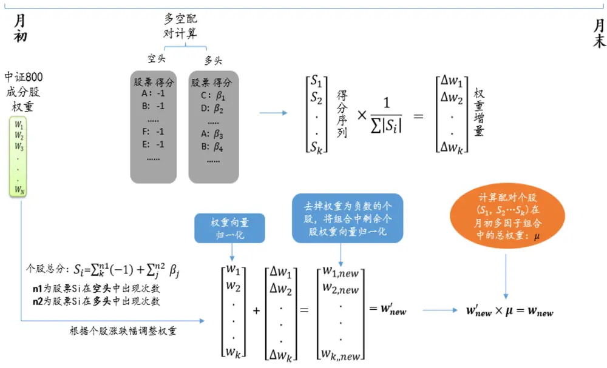
资料来源：广发证券发展研究中心

图 19：基于个股配对思想的指数增强方法
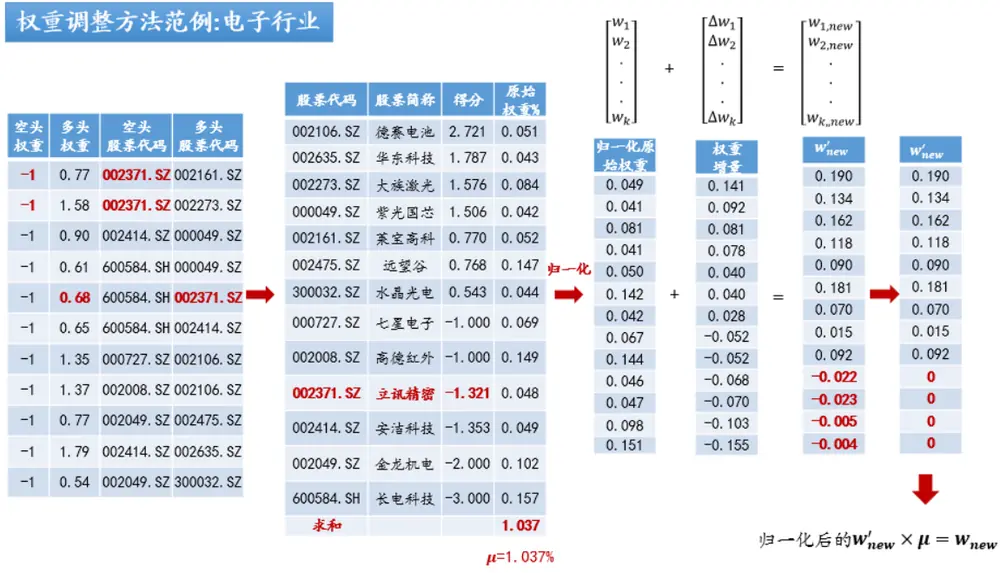
资料来源：广发证券发展研究中心

## 4.2 假设与参数设置

本节实证分析的假设如下：

- 增强周期：月度

- 增强方法：每周月末按照配对系数对个股权重进行调整

- 股票池：中证 800 指数成分股，按申万一级行业分类，并将每月最后一个交易日停牌的股票剔除。

- 测试期：2007 年 4 月-2016 年 12 月。

- 资产相关性阈值 C：统一取 C=0.7。

- 学习期长度 M/开仓阈值 T1 ：取最优参数

- 协整检验显著性水平α：5%

## 4.3 实证分析结果

图20和表6展示了基于个股配对思想的指数增强策略的净值走势和相关统计指标。

图 20：指数增强策略的净值走势
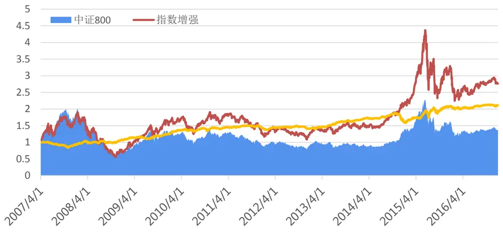
资料来源：广发证券发展研究中心

表6. 指数增强策略的净值走势

|  | 2007 | 2008 | 2009 | 2010 | 2011 | 2012 | 2013 | 2014 | 2015 | 2016 | 全样本 |
| --- | --- | --- | --- | --- | --- | --- | --- | --- | --- | --- | --- |
| 超额收益 | -6.68% | 12.40% | 17.14% | 13.15% | -0.32% | 0.18% | 18.17% | -4.65% | 31.83% | 1.94% | 216.24% |
| 最大回撤 | 17.38% | 7.18% | 6.49% | 6.56% | 6.43% | 6.15% | 4.26% | 15.27% | 11.56% | 3.90% | 17.38% |
| 胜率 | 44.86% | 57.72% | 55.33% | 61.57% | 54.10% | 55.04% | 64.71% | 57.55% | 61.07% | 57.38% | 57.09% |

识别风险，发现价值

| 信息比率 | -0.96 | 1.36 | 2.06 | 1.84 | -0.06 | -0.01 | 2.48 | -0.49 | 2.15 | 0.18 | 0.97 |
| --- | --- | --- | --- | --- | --- | --- | --- | --- | --- | --- | --- |
| 权重调整 股票数 | 1364 | 1390 | 1895 | 1535 | 1356 | 1422 | 1385 | 1230 | 1284 | 1462 | 14323 |

数据来源：广发证券发展研究中心

图21是指数增强策略的月度换手率。可以看出，除了部分月份，其余时间的策略换手率都处于比较平稳的水平。

图 21：指数增强策略的月度换手率
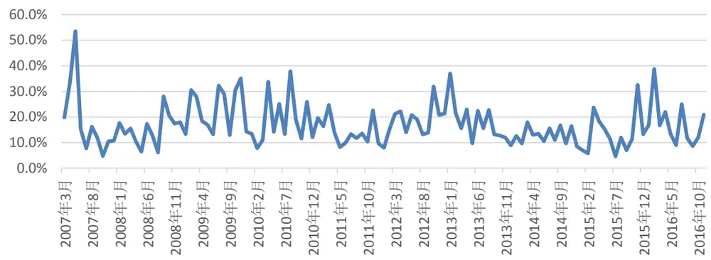
资料来源：广发证券发展研究中心

## 五、多因子组合配对调仓

个股配对思想不仅可以用于指数增强，也可以用于多因子组合的周度调仓增强，本节将使用上文提出的权重调整方法，对周度配对调仓策略进行分析。

## 5.1基准多因子组合

为了检验配对调仓的效果，本文首先构造以下的基准多因子组合，该组合选用了以下因子：1个月成交金额、换手率、一个月股价反转、三个月股价反转、流通市值、总资产、营业费用比例、总资产周转率、CFP、EP、SP 和BP 十二个因子，加权方式为等权，股票池为中证 800，选股结果分10组，第 1 组为超配组合。基准多因子组合的表现见图22。

图 22：基准多因子组合表现
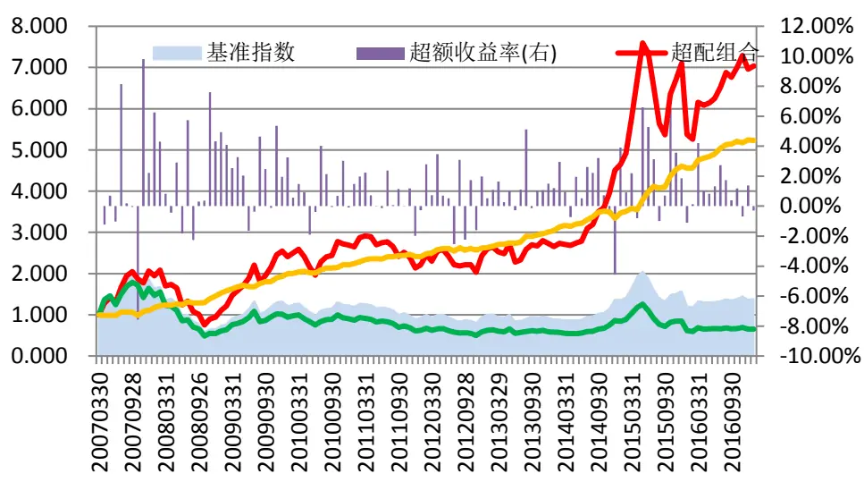
资料来源：广发证券发展研究中心

## 5.2 配对调仓策略原理

配对调仓的原理与指数增强类似，不同之处在于此处是周度调仓，并且配对调仓会加入或剔除股票，而指数增强只会剔除股票。配对调仓策略原理如图 23 所示。在本节的测试中，调仓频率为周度。

图 23：基于个股配对思想的多因子组合配对调仓方法
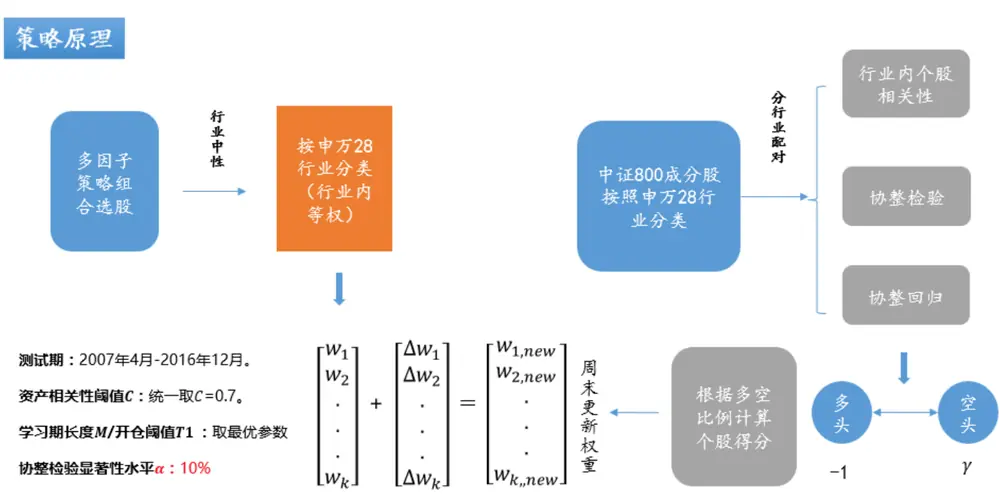
资料来源：广发证券发展研究中心

## 5.3实证分析结果

在进行策略参数寻优时，既可以所有行业使用统一参数，也可以分行业寻优，

但要避免过度优化之嫌，本文分别对两种方法进行实证分析。

（1）所有行业使用统一参数。寻优范围与上文相同，学习期长度 为40-90个交易日，步长为5个交易日；开仓阈值 为0.5-3.0，步长为0.1。以学习期长度为 x轴，开仓阈值为y轴，累计收益率为 z轴，参数寻优结果见图24，可以看出，若所有行业使用统一参数，结果较为稳定，对参数不是很敏感。

图 24：参数优化
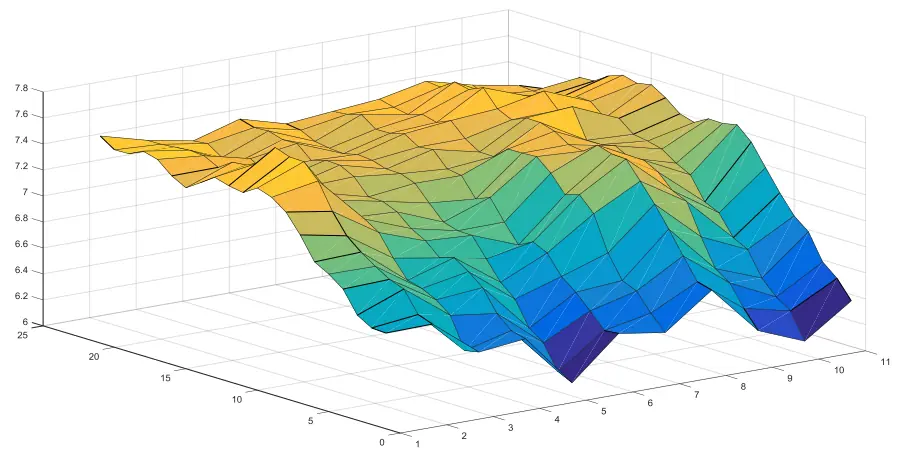
资料来源：广发证券发展研究中心

在图25中，选择学习期长度 为 75，开仓阈值 为2.2的配对调仓策略结果，当所有行业用同一的参数，效果并不显著。

图 25：基准多因子组合表现
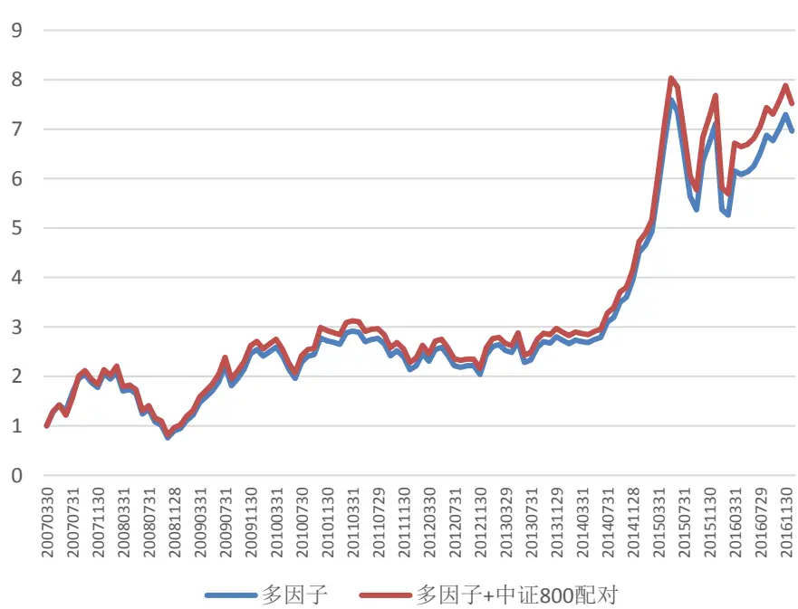
资料来源：广发证券发展研究中心

（1）分行业寻优。为避免过度优化，分别绘制除申万一级行业的参数寻优图形，以下只展示部分行业。从图 26和图27中可以看出，某些行业对于参数变化并不敏感，比如纺织服装行业，某些行业对于学习期长度 比较敏感，对于开仓阈值 不太敏感，比如非银金融行业。总体而言，各行业对于开仓阈值 不太敏感，对于学习期长度 可能敏感。

图 26：纺织服装行业参数优化
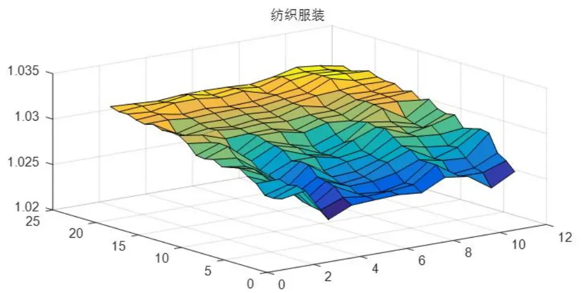
资料来源：广发证券发展研究中心

图 27：非银金融行业参数优化
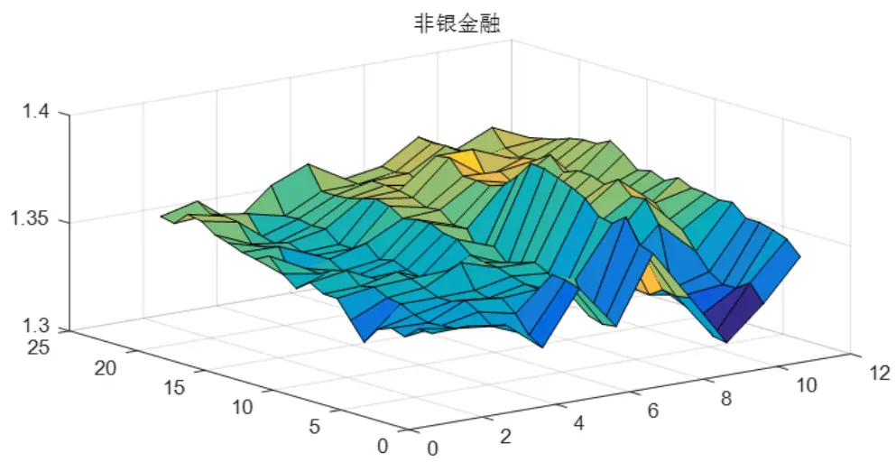
资料来源：广发证券发展研究中心

基于行业的参数特征，本文设计了以下的参数选择方法，一定程度上避免了过度优化，并减少了参数敏感性：在下面的参数矩阵中，行代表代表学习期长度 ，列代表开仓阈值 ， $c_{ij}.$ 代表学习期长度 ，开仓阈值 的一个组合。选择一个 1*7的向量模板（红色方框），从参数矩阵的 $\mathbf{c_{11}}$ 开始，每次向右移动一个元素，计算每个模板对应收益率的均值和方差，第 2-12 行以此类推。剔除收益率方差大于所有方差中位数的模板，再取出收益率均值最大的模板，从最终挑选出的模板中随机选取策略参数。

| C11 | C12 | C13 | C14 | C15 | C16 | C17 | C18 | C1,251 |
| --- | --- | --- | --- | --- | --- | --- | --- | --- |
| C21 | C22 | C23 | C24 | C25 | C26 | C27 | C28 | C2,25 |
| C31 | C32 | C33 | C34 | C35 | C36 | C37 | C38 | C3,25 |
| C41 | C42 | C43 | C44 | C45 | C46 | C47 | C48 | C4,25 |
| C51 | C52 | C53 | C54 | C55 | C56 | C57 | C58 | C5,25 |
| C61 | C62 | C63 | C64 | C65 | C66 | C67 | C68 | C6,25 |
| C71 | C72 | C73 | C74 | C75 | C76 | C77 | C78 | C7,25 |
| : | : | ： | ： | ： | : | ： | ： | … |
| [c12,1 | C12,2 | C12,3 | C12,4 | C12,5 | C12,6 | C12,7 | C12,8 | C12,25] |

使用上述方法，实证分析结果见图 28，从图中可以看出，将个股思想用于多因子配对调仓可以提高收益水平。

图 28：个股配对调仓和基准多因子策略对冲收益
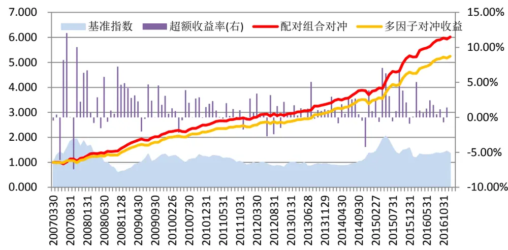
资料来源：广发证券发展研究中心

表7和表8显示了个股配对调仓和基准多因子策略对冲收益分年度表现。除了2009年、2012年、2013年、2014年收益小幅低于基准多因子策略，其他年份都有较大的收益提升。

表7. 个股配对调仓策略分年度表现，交易费用单边千一

|  | 2007 | 2008 | 2009 | 2010 | 2011 | 2012 | 2013 | 2014 | 2015 | 2016 | 全样本 |
| --- | --- | --- | --- | --- | --- | --- | --- | --- | --- | --- | --- |
| 年化超额收益 | 18.58% | 37.45% | 32.16% | 15.51% | 9.67% | 7.69% | 14.00% | 10.53% | 42.13% | 14.31% | 501.59% |
| 月胜率 | 66.67% | 75.00% | 83.33% | 75.00% | 83.33% | 66.67% | 83.33% | 75.00% | 83.33% | 83.33% | 77.78% |

数据来源：广发证券发展研究中心

表8. 基准多因子策略分年度表现

|  | 2007 | 2008 | 2009 | 2010 | 2011 | 2012 | 2013 | 2014 | 2015 | 2016 | 全样本 |
| --- | --- | --- | --- | --- | --- | --- | --- | --- | --- | --- | --- |
| 年化超额收益 | 10.64% | 31.32% | 33.09% | 14.35% | 9.37% | 8.46% | 14.77% | 11.08% | 37.80% | 13.80% | 424.40% |
| 月胜率 | 55.56% | 75.00% | 75.00% | 66.67% | 75.00% | 66.67% | 83.33% | 75.00% | 83.33% | 83.33% | 74.36% |

数据来源：广发证券发展研究中心

图 29：个股配对调仓策略策略月度换手率
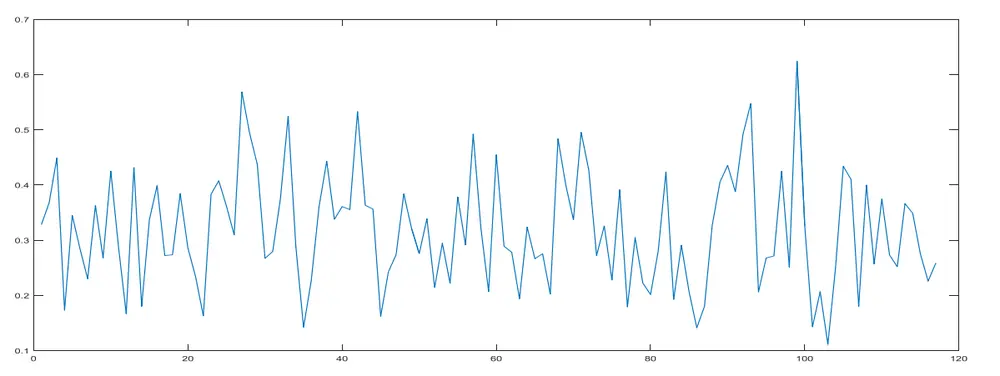
资料来源：广发证券发展研究中心

图 30：个股配对调仓策略每月调整股票数
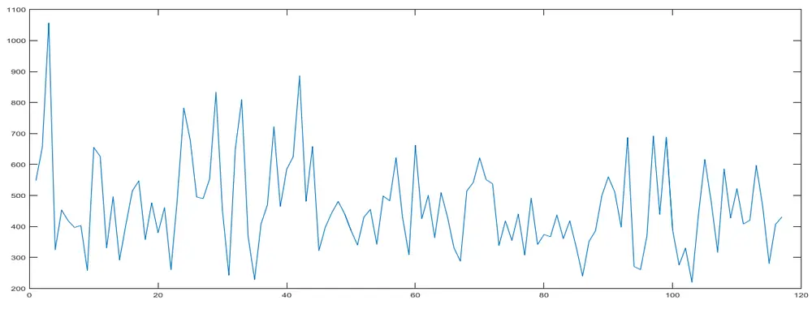
资料来源：广发证券发展研究中心

图29和图30分别为个股配对调仓策略月度换手率和每月调整股票数，可以看出，由于该策略调仓频率为周度，每月调整股票数目较大，但换手率都维持在 30%的水平上下波动。换手率对交易费用有较大的影响，图 31显示，即使考虑交易费用，周度配对调仓依然有增强效果。

图 31：基准多因子组合、配对调仓组合走势
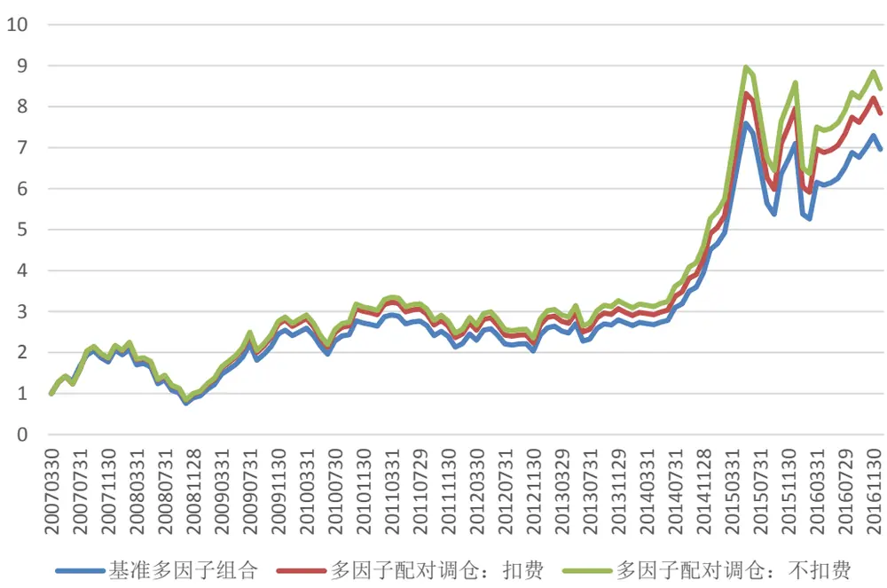
资料来源：广发证券发展研究中心

## 六、总结

月度调仓的频率下，配对反转因子获取超额收益能力突出，配对反转信号可以用于指数增强，亦可用于优化多因子组合提高收益率。

## 风险提示

本文旨在对所研究问题的主要关注点进行分析，因此对市场及相关交易做了一些合理假设，但这样会导致建立的模型以及基于模型所得出的结论并不能完全准确地刻画现实环境。而且由于分析时采用的相关数据都是过去的时间序列，因此可能会与未来真实的情况出现偏差。本文内容并不是适合所有的投资者，客户在制定投资策略时，必须结合自身的环境和投资理念。同时，本文未对交易中的市场风险，交易对手违约风险，期权、现货的流动性风险，比如冲击成本等因素进行讨论，在实际中应当把相关的风险都进行考虑。

## Table_RatingIndustry 广发证券—行业投资评级说明

买入： 预期未来12个月内，股价表现强于大盘10%以上。

持有： 预期未来 12 个月内，股价相对大盘的变动幅度介于-10%～+10%。

卖出： 预期未来12个月内，股价表现弱于大盘10%以上。

## Table_RatingCompany 广发证券—公司投资评级说明

买入： 预期未来12个月内，股价表现强于大盘15%以上。

谨慎增持： 预期未来12个月内，股价表现强于大盘5%-15%。

持有： 预期未来12个月内，股价相对大盘的变动幅度介于-5%～+5%。

卖出： 预期未来12个月内，股价表现弱于大盘5%以上。

Table_Ad联系我们

|  | 广州市 | 深圳市 | 北京市 | 上海市 |
| --- | --- | --- | --- | --- |
| 地址 |  | 广州市天河区林和西路9 深圳市福田区福华一路6号 北京市西城区月坛北街2号上海市浦东新区富城路99号 |  |  |
|  | 号耀中广场 A 座 1401 | 免税商务大厦17楼 | 月坛大厦18层 | 震旦大厦18楼 |
| 邮政编码 | 510620 | 518000 | 100045 | 200120 |
| 客服邮箱 | gfyf@gf.com.cn |  |  |  |

## Table_Disclaimer 免 责声 明

广发证券股份有限公司具备证券投资咨询业务资格。本报告只发送给广发证券重点客户，不对外公开发布。

本报告所载资料的来源及观点的出处皆被广发证券股份有限公司认为可靠，但广发证券不对其准确性或完整性做出任何保证。报告内容仅供参考，报告中的信息或所表达观点不构成所涉证券买卖的出价或询价。广发证券不对因使用本报告的内容而引致的损失承担任何责任，除非法律法规有明确规定。客户不应以本报告取代其独立判断或仅根据本报告做出决策。

广发证券可发出其它与本报告所载信息不一致及有不同结论的报告。本报告反映研究人员的不同观点、见解及分析方法，并不代表广发证券或其附属机构的立场。报告所载资料、意见及推测仅反映研究人员于发出本报告当日的判断，可随时更改且不予通告。

本报告旨在发送给广发证券的特定客户及其它专业人士。未经广发证券事先书面许可，任何机构或个人不得以任何形式翻版、复制、刊登、转载和引用，否则由此造成的一切不良后果及法律责任由私自翻版、复制、刊登、转载和引用者承担。