# Tabl e_Title 基于多期限的选股策略研究

## ——多因子 Alpha 系列报告之（三十四）

## Table_Sum ary报告摘要 ：

## 动量、反转效应与多期限因子

动量效应与反转效应是金融市场上长期存在的特殊现象。本篇专题报告构建了一个基于多期限下的因子，通过分析不同期限的均线数据来同时捕捉短中长期限下的动量、反转效应特征。在多期限的指标下，通过综合考虑价格来刻画个股的收益特征。

## 基于多期限因子的构建

在周频调仓情况下，构建基于不同期限下的因子，实证结果表明在全市场、中证 500 指数和中证 800 指数成分股中，因子对股票收益率都有良好的区分效果。在实证区间内，基于多期限均线构建的因子在全市场选股中证 500 指数对冲情况下，年化收益率为 25.40%，最大回撤为 9.11%，信息比率为 2.44。

## 改进后的 LLT趋势因子

针对均线对价格延迟性较差的缺点，本篇专题报告结合之前的研究成果 LLT 低延迟趋势线，构造了基于 LLT 指标的因子，以 LLT 线代替 MA线。实证结果表明，在全市场选股中证 500 指数对冲下，在实证区间内年化收益率 29.58%，最大回撤为 11.57%，信息比率为 2.51。改进的 LLT 趋势因子相对之前的基于 MA 构建的因子在全市场、中证 500 以及中证 800指数中结果都有较大的改进。

## 核心假设风险：

本文所做的数据测算完全基于历史行情数据完成，市场表现受诸多因素影响，注意模型失效风险。

## 多期限因子在全市场分档表现

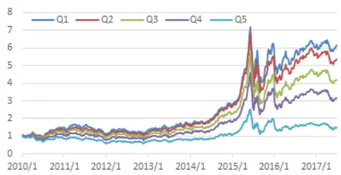

## 多期限因子全市场对冲累积收益率

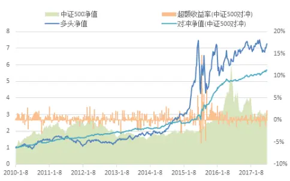

Table_Aut hor 分析师： 史庆盛，S0260513070004

020-87577060

sqs@gf.com.cn

分析师： 陈原文，S0260517080003

0755-82797057

chenyuanwen@gf.com.cn

## Table_Report 相关研究：

《基于大数据挖掘的行业轮

动策略-互联网大数据挖掘系 2017-03-15列专题之（十）》

策略研究——互联网大数据2016-05-17挖掘系列专题之（八）》

动策略-互联网大数据挖掘系 2016-08-22列专题之（九）》

## 一、背景介绍

## 1.1 动量效应与反转效应

自有效市场理论提出起，关于市场有效性的争论就未曾停止，反对者认为现实金融市场中长期存在一些异常现象，根据有效市场理论无法解释。最典型异常现象如 Jegadeesh 和 Titman (1993) 提出的中期动量效应，Lehmann (1990) 提出的短期反转效应，DeBondt 和 Thaler (1985) 提出的长期反转效应等。

动量效应指在过去一段时间内收益率较高的股票，在未来一段时间内期望收益率也较高。反转效应正好相反，指在过去一段时间内收益率较低的股票，在未来一段时间内期望收益率更高。国内学者如程兵、梁衡义和肖宇谷 (2004)，樊家鸣 (2010)等对 A 股的实证分析中发现，在 A 股市场中也存在中期动量效应和短期反转效应。

本篇专题报告中构建了一个新的因子，通过分析不同期限的均线价格数据来同时捕捉短期反转、中期动量、长期反转等价格趋势。进一步，本篇专题报告针对移动平均线延迟性差的缺点，引入低延迟的 LLT 趋势线，构造基于不同期限下的LLT因子。

## 1.2 理论模型

Yufeng Han，Guofu Zhou 和 Yingzi Zhu (2016) 在论文中提出一个信息非对称下的市场模型：

1. 市场中仅有两类交易者，一类是根据移动平均线进行交易的技术面交易者，另一类是了解市场信息的知情交易者。

2. 市场只有一种风险资 $\dot{\mathcal{P}}$ ，股利 $D_{t}$ 服从随机过程： $dD_{t}=(\pi_{t}-\alpha_{D}D_{t})dt+\sigma_{D}dB_{1t}$

3. 平均股利 $\pi_{t}$ 服从随机过程： $\mathrm{d}\pi_{\mathrm{t}}=\alpha_{\pi}({\bar{\pi}}-\pi_{t})dt+\sigma_{\pi}dB_{2t}$ 0

4. 风险资产供应量为 $1+\theta_{\mathrm{t}}$ ，其中 $\theta_{\mathrm{t}}$ 服从随机过程： $d_{\theta_{t}}=-\alpha_{\theta}\theta_{t}dt+\sigma_{\theta}dB_{3t}$

5. 技术面交易者根据资产历史价格走势进行交易，均线 $\begin{array}{r}{A_{t}=\int_{-\infty}^{t}e^{-\alpha(t-s)}P_{s}ds}\end{array}$

6. 均衡状态下，知情交易者已知资产的股利信息。

根据以上条件可以推出均衡状态下的资产价格, 其中 $p_{1},p_{2},p_{3},p_{4}$ 是模型参数:

$$
P_{t}=p_{0}+p_{1}D_{t}+p_{2}\pi_{t}+p_{3}\theta_{t}+p_{4}A_{t}\tag{1}
$$

在 (1) 式两边取差分后得：

$$
\begin{array}{r}{\Delta P_{t}=p_{1}\varDelta D_{t}+p_{2}\varDelta\pi_{t}+p_{3}\varDelta\theta_{t}+p_{4}(P_{t}-\alpha A_{t})\varDelta t}\end{array}\tag{2}
$$

在 (2) 式两边处以价格得到资产的预期收益率：

$$
r_{t+1}=a+\beta\frac{A_{t}}{P_{t}}+\epsilon_{t}\tag{3}
$$

如 (3) 式所示，移动平均线价格对资产收益率有预测作用，实际应用中 $A_{t}$ 用 N 日

移动平均价代替。

## 1.3 Beta系数与资产价格收益率

表达式 $\begin{array}{r}{r_{t+1}=a+\beta\frac{A_{t}}{P_{t}}+\epsilon_{t}}\end{array}$ 中，当系数 $\beta>0$ 时 $\frac{A_{t}}{P_{t}}$ 因子对资产收益率表现出反转效应，而当系数 $\beta<0$ 时 $\frac{A_{t}}{P_{t}}$ 因子对资产收益率表现出动量效应。同一时刻不同均线指标所对应的 β 系数的方向可能不一样，因此表现出不一样的动量、反转特征。于是本篇专题报告考虑在多周期下的指标下，综合考虑 $\beta$ 系数方向，来刻画资产收益率特征。

## 二、基于不同期限下的因子构造

## 2.1 因子构造流程

为了同时捕捉短期、中期、长期的价格趋势，本篇专题报告取 3, 5, 10, 20, 30, 60,90, 120, 180, 240, 270, 300 等不同期限的均线数据，每期期末d 计算当期的均线因子数据:

$$
A_{jt,L}=\frac{P_{j,d-L+1}^{t}+\dots+P_{j,d}^{t}}{L}\tag{4}
$$

进一步得到标准化后均线因子：

$$
\tilde{A}_{jt,L}=\frac{A_{jt,L}}{P_{j}^{t}}\tag{5}
$$

记股票 j 的 t 周收益率为 $r_{j,t}$ ，把 $r_{j,t}$ 与前一周的均线因子进行回归，得到回归系数 $\beta_{j,t}$ ：

$$
r_{j,t}=\beta_{0,t}+\Sigma_{i}\beta_{i,t}\tilde{A}_{jt-1,L_{i}}+\epsilon_{j,t}\tag{6}
$$

计算近 25 周回归系数的均值，作为下周回归系数预测值：

$$
E\left[\beta_{i,t+1}\right]=\frac{1}{25}\sum_{m=1}^{25}\beta_{i,t+1-m}\tag{7}
$$

用预测的回归系数 $E\left[\beta_{i,t+1}\right]$ 与新一周的因子值 $\tilde{A}_{jt,L}$ 代入 (6) 式，计算股票的下周预期收益率:

$$
E\left[r_{j,t+1}\right]={{\varSigma}_{i}}E\left[{{\beta}_{i,t+1}}\right]{{\tilde{A}}_{jt,{{L}_{i}}}}\tag{8}
$$

根据回归得到的个股预期收益率降序排列，选择下期预期收益最 $\frac{\dot{\pi}}{\vert\nabla\pmb{\vert\tau}\vert}$ 的一档股票作为多头组合，预期收益率最低的一档股票作为空头组合。

图 1：基于不同期限因子构造流程

| 1. 计算均线 | 对股票j计算不同周期L下的均线 $\begin{array}{r}{A_{jt,L}=\frac{P_{j,d-L+1}^{t}+\dots+P_{j,d}^{t}}{L}}\end{array}$ 及因子 $\begin{array}{r}{\tilde{A}_{jt,L}=\frac{A_{jt,L}}{P_{j}^{t}}\circ}\end{array}$ |
| --- | --- |
| 2. 截面回归 | 将t周股票i的收益率 $r_{j,t}$ 与t - 1 周的因子 $\tilde{A}_{jt-1,L}$ 进行回归，得到回归系数 $\beta_{j,t}$ $r_{j,t}=\beta_{0,t}+\Sigma_{i}\beta_{i,t}\tilde{A}_{jt-1,L_{i}}+\epsilon_{j,t}$ |
| 3. 预测回归系数 | 计算近25 周回归系数的均值，作为下周回归系数预测值： $\begin{array}{r}{E\big[\beta_{i,t+1}\big]=\frac{1}{25}\sum_{m=1}^{25}\beta_{i,t+1-m}}\end{array}$ |
| 4. 下期收益率 | 用预测的回归系数与新一周的因子值 $\tilde{A}_{jt,L}$ 计算股票的下周预期收益率： $E\big[r_{j,t+1}\big]=\Sigma_{i}\ E\big[\beta_{i,t+1}\big]\ \tilde{A}_{jt,L_{i}}$ |
| 根据个股预期收益率降序排列，选择预期收益高的个股做多，预期收益率低的个股做5. 构建组合 空。 |  |

数据来源：广发证券发展研究中心

## 2.2 实证分析

根据上述流程得到因子后，本篇专题报告构建了以下的选股策略：

- 选股范围：全部 A 股，剔除上市交易时间不满一年的股票、剔除交易日停牌的股票和剔除ST股票

- 回测区间：2010年1月到2017年6月

- 换仓频率：周度换仓

- 换仓策略：根据预测的下期收益率从高至低排列，分5档进行测算。

- 期限组合：共选取十二条不同期限的均线 L = [3, 5, 10, 20, 30, 60, 90, 120, 180,240, 270, 300]。

不同指数成分股中因子的IC表现略有不同：全部A股中IC均值为0.026，标准差为0.111，正IC占比为61.46%；在中证500指数成分股中IC均值为0.037，标准差为0.124，正IC占比为61.98%；在中证800指数成分股中IC均值为0.030，标准差为0.141，正IC占比为60.68%。

表 1：期限因子在不同指数成分股中IC值特征

|  | IC均值 | IC标准差 | 最大IC值 | 最小IC值 | 正IC占比 |
| --- | --- | --- | --- | --- | --- |
| 全部A股 | 0.026 | 0.111 | 0.421 | -0.335 | 61.46% |
| 中证500 | 0.037 | 0.124 | 0.444 | -0.305 | 61.98% |
| 中证800 | 0.030 | 0.141 | 0.536 | -0.457 | 60.68% |

数据来源：广发证券发展研究中心
识别风险，发现价值

从表1的结果中可以看到，不论是全体A股还是在指数成分股中，基于不同期限下的因子值均以正IC为主，说明基于不同期限下的因子预期收益率越高的股票未来有较强的正向收益。

图 2：基于不同期限下因子在全市场中周度 IC 值
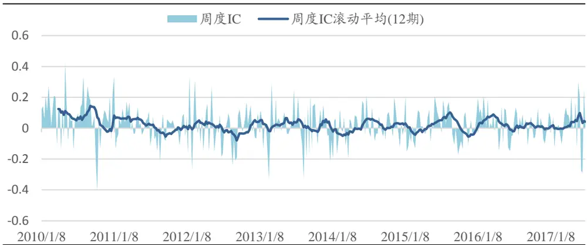
数据来源：广发证券发展研究中心

进一步，分别在全部A股、中证500成分股和中证800成分股中根据预期收益率从高至低分成五档，测算结果发现在各种成分股中因子对股票收益的区分度都比较明显，最高的分位数组合表现最好。

图 3：基于不同期限的因子在全部A股中分档表现
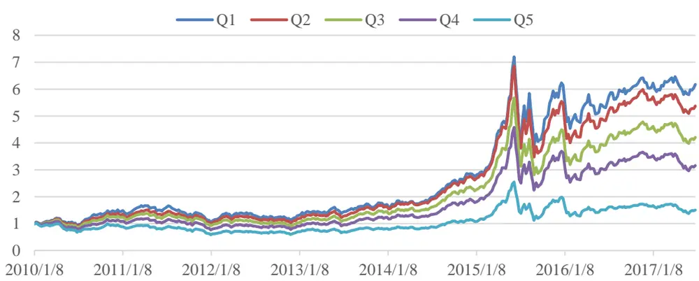
数据来源：广发证券发展研究中心

图 4：基于不同期限的因子在中证500成分股分档表现
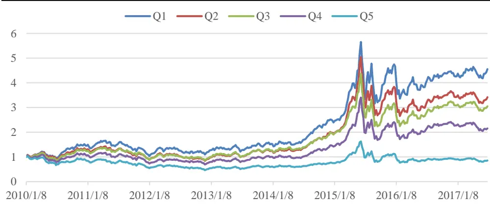
识别风险，发现价值

图 5:在中证800指数成分股分档表现
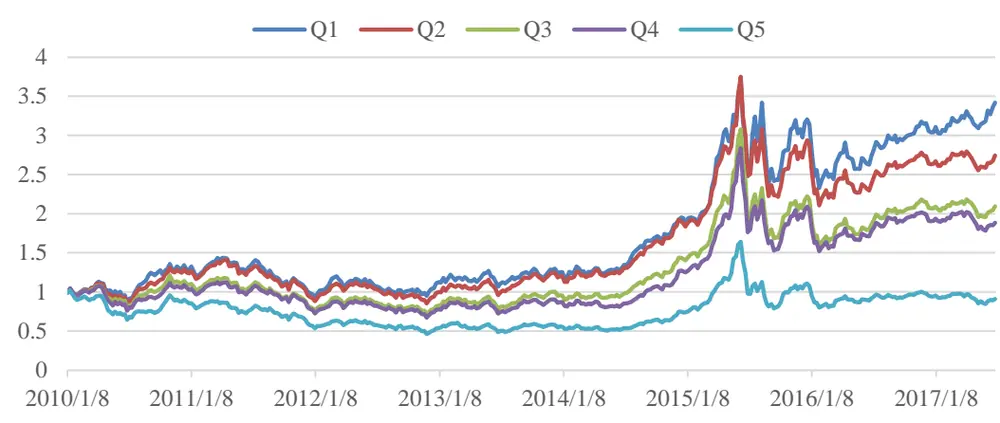
数据来源：广发证券发展研究中心

再观察不同均线周期组合下因子的表现，可以看到不同期限组合的差异明显，多均线组合下效果比单均线组合更加稳健。

图 6：单条 MA 均线因子表现
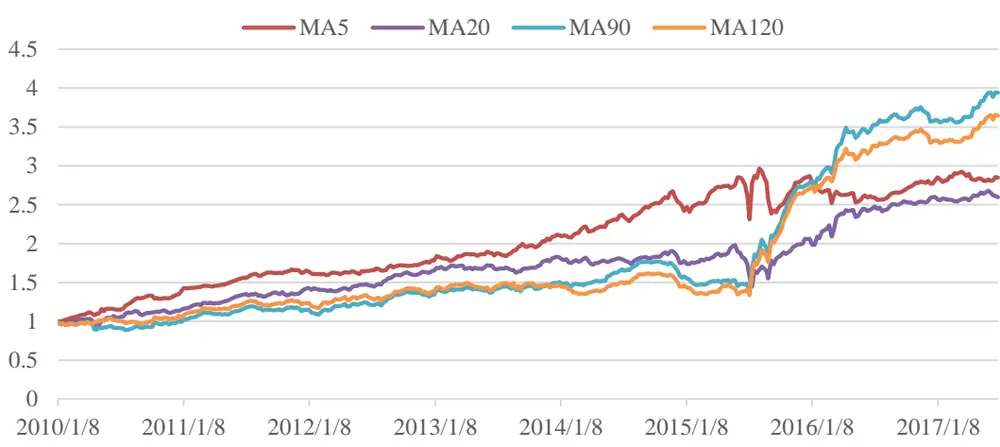
数据来源：广发证券发展研究中心

图 7：多条 MA 均线因子表现
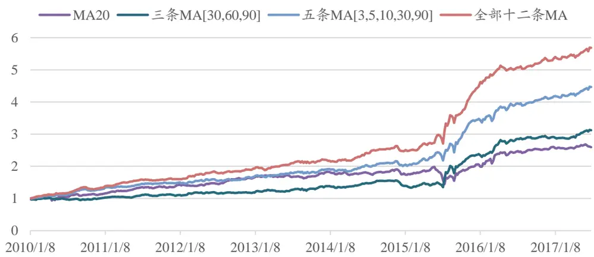

基于不同期限下的因子在全市场下多空对冲表现：从 2010 年以来，策略取得了 25.58% 的对冲年化收益率，14.12% 的年化波动率，13.31% 的最大回撤和 1.81的信息比率。

图 8：基于不同期限因子在全市场多空对冲累积收益率
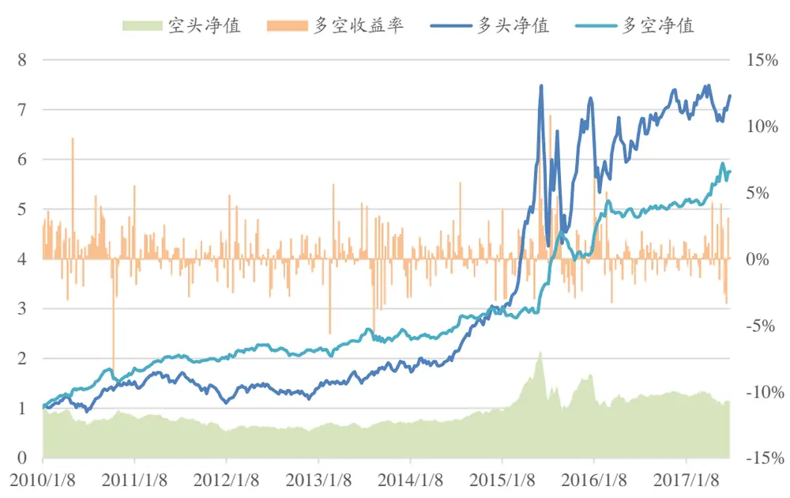
数据来源：广发证券发展研究中心

对冲策略分年度表现情况如下表所示，除了在 2012年外，策略在每年都取得了超过 10% 的超额收益。

表 2：全市场多空对冲下分年度表现

|  | 收益率 | 最大回撤 | 年化波动率 | 年化收益率 | 信息比率 |
| --- | --- | --- | --- | --- | --- |
| 2010年 | 71.47% | 13.31% | 17.79% | 69.67% | 3.92 |
| 2011年 | 16.88% | 6.80% | 9.55% | 16.52% | 1.73 |
| 2012年 | 7.94% | 9.68% | 11.48% | 7.94% | 0.69 |
| 2013年 | 13.61% | 10.19% | 16.09% | 13.32% | 0.83 |
| 2014年 | 19.38% | 3.56% | 10.00% | 18.19% | 1.82 |
| 2015年 | 42.09% | 12.50% | 19.09% | 40.19% | 2.11 |
| 2016年 | 22.95% | 6.44% | 12.00% | 22.95% | 1.91 |
| 2017年 (截至6月) | 12.18% | 5.87% | 12.93% | 24.73% | 1.91 |

识别风险，发现价值

| 全部 | 474.96% 13.31% | 14.12% | 25.58% | 1.81 |
| --- | --- | --- | --- | --- |

数据来源：广发证券发展研究中心

从图9及图10的结果中可以看到基于不同期限的因子多头组合的换手率情况，每期平均换手率为 0.63，标准差为 0.16。

图 9：基于不同期限因子换手率
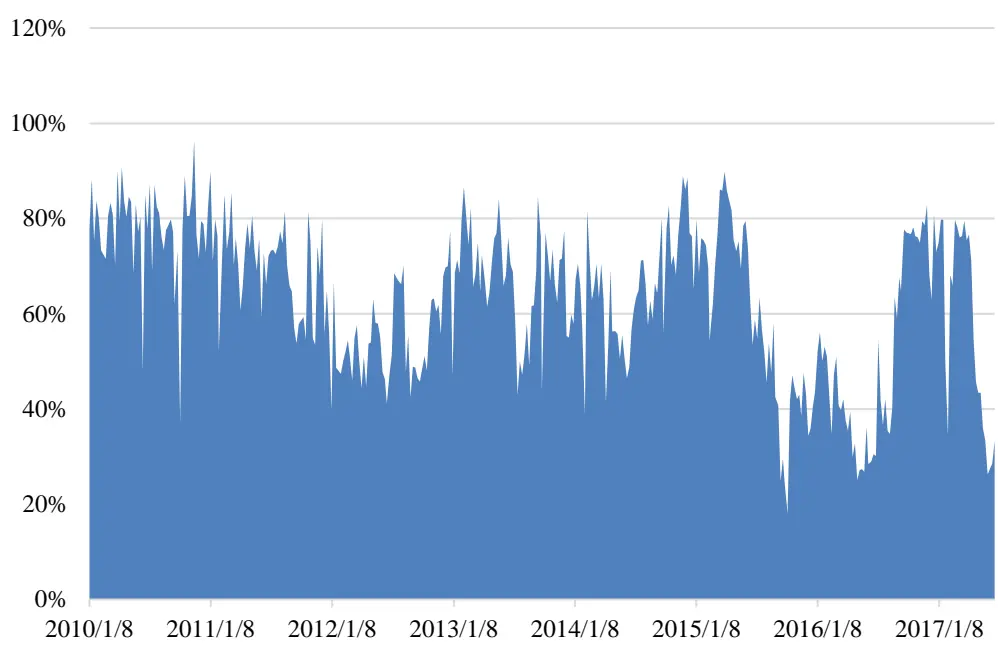
数据来源：广发证券发展研究中心

而分年度看，基于不同期限构建的因子多头组合的换手率都较高，每年平均每期换手率都在50% 以上。

表 3：Q1档分年度换手率

|  | 平均换手率 | 标准差 | 最大换手率 | 最小换手率 | 累积换手率 |
| --- | --- | --- | --- | --- | --- |
| 2010年 | 0.78 | 0.1 | 0.96 | 0.37 | 39.91 |
| 2011年 | 0.7 | 0.09 | 0.9 | 0.52 | 35.75 |
| 2012年 | 0.55 | 0.09 | 0.77 | 0.4 | 27.54 |
| 2013年 | 0.67 | 0.11 | 0.87 | 0.43 | 34.12 |
| 2014年 | 0.66 | 0.11 | 0.89 | 0.39 | 34.75 |
| 2015年 | 0.58 | 0.19 | 0.9 | 0.18 | 30.35 |
| 2016年 | 0.51 | 0.19 | 0.83 | 0.25 | 25.57 |
| 2017年 (截至6月) | 0.58 | 0.2 | 0.8 | 0.26 | 14.38 |

识别风险，发现价值

| 全部 0.63 | 0.16 0.96 0.18 |
| --- | --- |

数据来源：广发证券发展研究中心

用中证500指数对冲时，对冲策略的表现如下图10所示。从 2010 年以来，策略取得了 25.40% 的对冲年化收益率，10.42% 的年化波动率，9.11% 的最大回撤和2.44 的信息比率。

图 10：不同期限因子在全市场中证500指数对冲累积收益率
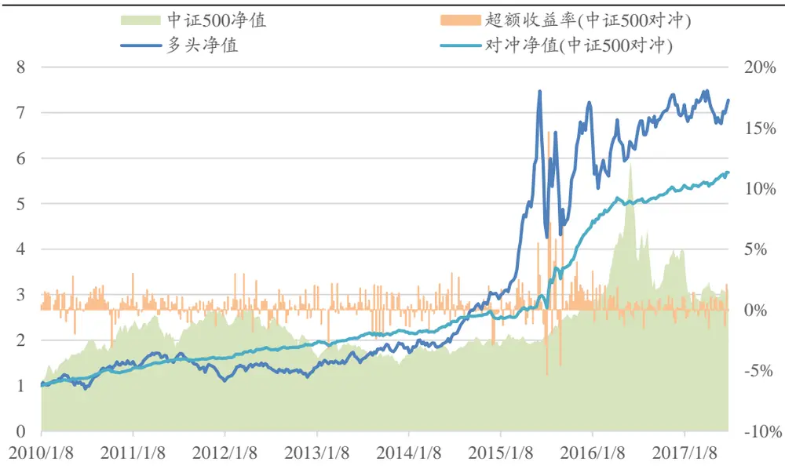
数据来源：广发证券发展研究中心

全市场选股中证500指数对冲策略分年度表现情况如下表所示，除了在 2017年前 6 个月为 6.26%，策略在每年都取得了超过 10% 的超额收益。

表 4：全市场中证500指数对冲分年度表现

|  | 收益率 | 最大回撤 | 年化波动率 | 年化收益率 | 信息比率 |
| --- | --- | --- | --- | --- | --- |
| 2010年 | 34.66% | 5.11% | 7.14% | 33.88% | 4.75 |
| 2011年 | 18.35% | 2.13% | 5.30% | 17.96% | 3.39 |
| 2012年 | 21.15% | 3.46% | 7.15% | 21.15% | 2.96 |
| 2013年 | 12.45% | 4.32% | 8.62% | 12.19% | 1.41 |
| 2014年 | 13.69% | 6.41% | 7.88% | 12.87% | 1.63 |
| 2015年 | 81.49% | 9.11% | 21.48% | 77.37% | 3.6 |
| 2016年 | 19.44% | 2.92% | 6.39% | 19.44% | 3.04 |

识别风险，发现价值

| 2017年 (截至6月) | 6.26% | 1.70% | 5.85% | 12.39% | 2.12 |
| --- | --- | --- | --- | --- | --- |
| 全部 | 468.60% | 9.11% | 10.42% | 25.40% | 2.44 |

数据来源：广发证券发展研究中心

全部A股用中证500指数进行行业中性策略，从 2010 年以来，策略取得了26.01% 的对冲年化收益率，12.66% 的年化波动率，10.37% 的最大回撤和 2.51 的信息比率。

图 11：全市场中证500行业中性策略表现
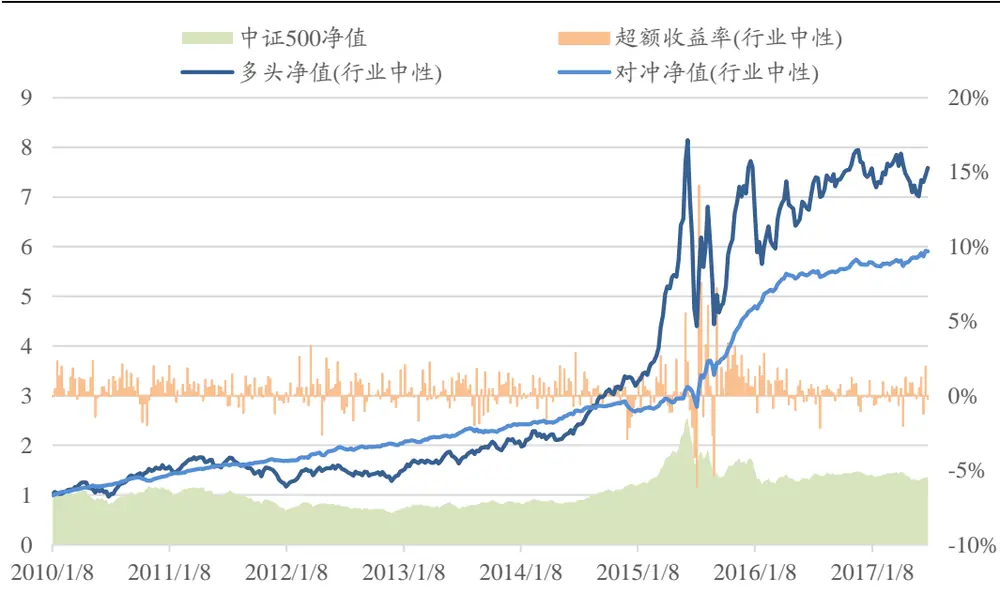
数据来源：广发证券发展研究中心

行业中性策略分年度表现情况如下表所示，除了在 2017年前 6 个月外，策略在每年都取得了超过 10% 的超额收益。

表 5：全市场中证500行业中性策略表现

|  | 收益率 | 最大回撤 | 年化波动率 | 年化收益率 | 信息比率 |
| --- | --- | --- | --- | --- | --- |
| 2010年 | 38.74% | 5.03% | 6.58% | 37.85% | 5.75 |
| 2011年 | 21.45% | 2.02% | 4.98% | 20.99% | 4.21 |
| 2012年 | 21.03% | 3.45% | 7.76% | 21.03% | 2.71 |
| 2013年 | 18.12% | 3.57% | 6.94% | 17.73% | 2.56 |
| 2014年 | 11.29% | 7.25% | 6.98% | 10.61% | 1.52 |
| 2015年 | 76.99% | 12.66% | 22.32% | 73.15% | 3.28 |
| 2016年 | 19.89% | 2.22% | 6.27% | 19.89% | 3.17 |

识别风险，发现价值

| 2017年 (截至6月) | 3.79% | 2.21% | 5.88% | 7.42% | 1.26 |
| --- | --- | --- | --- | --- | --- |
| 全部 | 490.43% | 12.66% | 10.37% | 26.01% | 2.51 |

数据来源：广发证券发展研究中心

在中证500指数成分股中选股以中证500指数进行对冲，从 2010 年以来，策略取得了 19.54% 的对冲年化收益率，10.33% 的年化波动率，8.37% 的最大回撤和1.89 的信息比率。

图 12：基于不同期限因子在中证500成分股中对冲后表现
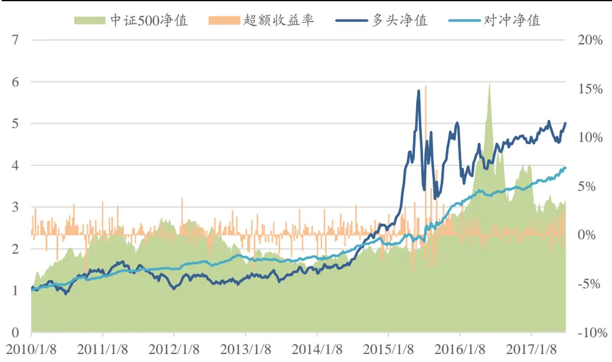
数据来源：广发证券发展研究中心

在中证500指数成分股中选股用中证500指数进行对冲，对冲策略分年度表现情况如下表所示，除了 2013 年外，策略在每年都取得了超过 10% 的超额收益。

表 6：中证500成分股对冲后分年度表现

|  | 收益率 | 最大回撤 | 年化波动率 | 年化收益率 | 信息比率 |
| --- | --- | --- | --- | --- | --- |
| 2010年 | 31.22% | 5.56% | 9.15% | 30.52% | 3.34 |
| 2011年 | 15.68% | 1.98% | 6.20% | 15.35% | 2.47 |
| 2012年 | 18.87% | 6.11% | 7.40% | 18.87% | 2.55 |
| 2013年 | 0.67% | 6.39% | 7.66% | 0.66% | 0.09 |
| 2014年 | 15.32% | 6.97% | 8.17% | 14.39% | 1.76 |
| 2015年 | 47.59% | 7.29% | 20.47% | 45.40% | 2.22 |
| 2016年 | 12.90% | 3.63% | 6.19% | 12.90% | 2.08 |

识别风险，发现价值

| 2017年 |  |  |  |  |  |
| --- | --- | --- | --- | --- | --- |
| (截至6月) | 12.81% | 1.76% | 7.72% | 26.10% | 3.38 |
| 全部 | 293.73% | 8.37% | 10.33% | 19.54% | 1.89 |

## 三、LLT 因子构建

## 3.1 LLT低延迟趋势线回顾

前述通过不同期限 MA 均线组合回归预测下期股票收益率，综合考虑不同期限MA均线下对股价“动量”和“反转”特征的刻画。经过实证分析发现中证500指数对冲下，2010 年以来，策略的对冲年化收益率为 25.40%，年化波动率 10.42%，最大回撤 9.11%，信息系数 2.44。同时可以看到MA 均线存在对价格的敏感度较低，对趋势刻画不及时的缺点。从这点出发本篇专题报告用延迟性更好的 LLT 趋势线代替MA 均线，构造改进后的 LLT 趋势因子。

LLT 是低延迟趋势线 (Low-lag Trendline) 的简称，广发金工团队于 2013 年 7月 26 日发表了题为《低延迟趋势线与交易性择时》的择时报告，介绍了基于信号处理技术中的二阶线性滤波器构造的 LLT 趋势线。LLT 指标与传统 MA 移动平均线、EMA 指数加权移动平均线相比，具有跟踪延迟大幅降低的优势，能更好地把握股价的“反转”或“动量”效应特征。LLT 指标的递推公式如下，其中 $\begin{array}{r}{\alpha=\frac{2}{1+N}}\end{array}$ 是介于 0 和 1 之间的参数：

$$
LLT=\left\{\begin{array}{c}{{P(T),\quad T=1,2}}\\{{\displaystyle(2-2\alpha)LLT(T-1)-(1-\alpha)^{2}LLT(T-2)+\left(\alpha-\frac{\alpha^{2}}{4}\right)P(T)}}\\{{\displaystyle+\left(\frac{\alpha^{2}}{2}\right)P(T-1)-\left(\alpha-\frac{3}{4}\alpha^{2}\right)P(T-2),\quad else}}\end{array}\right.\tag{9}
$$

因此本篇专题报告考虑以 LLT 趋势线替代 $\begin{array}{r}{r_{t+1}=a+\beta\frac{A_{t}}{P_{t}}+\epsilon_{t}}\end{array}$ 式中的指标 $A_{t}$ 进行改进。

图 13：LLT 指标和传统 MA、EMA 指标的比较
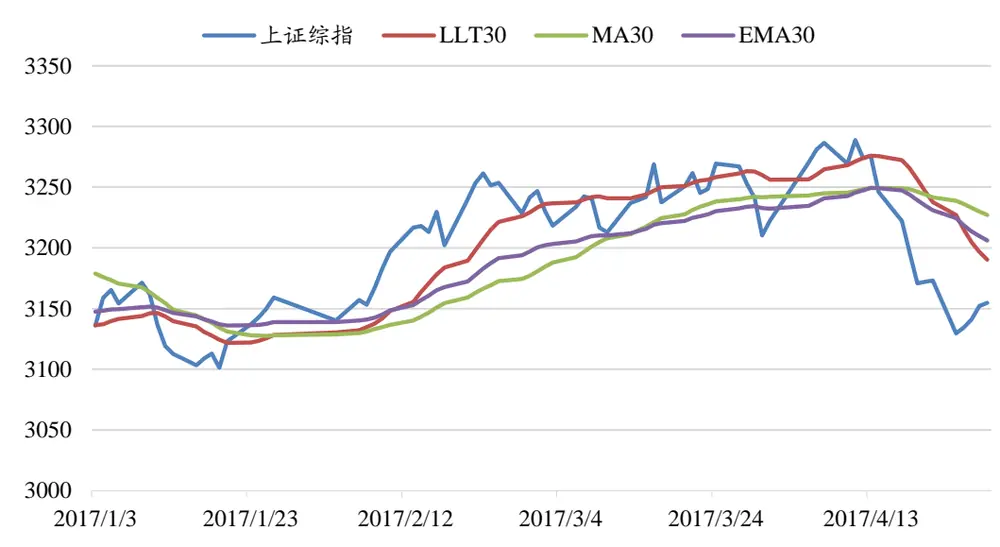
数据来源：广发证券发展研究中心

## 3.2 LLT 因子实证分析

LLT 趋势线在不同组合下因子的表现情况：可以看到不同期限组合的差异明显，多均线组合下效果比单均线组合更加稳健。

图 14：单个LLT指标因子表现
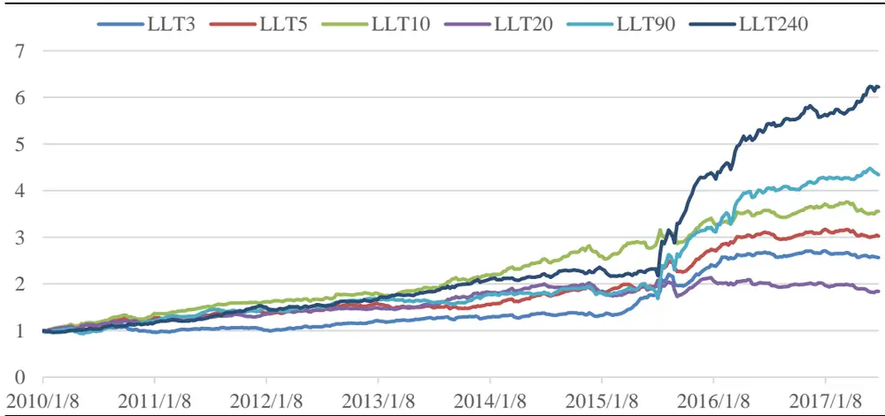
数据来源：广发证券发展研究中心

图 15：多个LLT指标因子表现
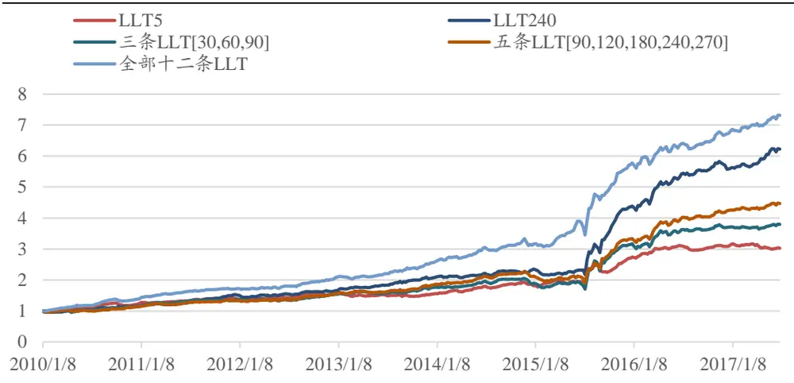
数据来源：广发证券发展研究中心

比较两种指标构造的因子在全市场中的IC值，可以发现基于LLT指标构建的因子的IC均值、正IC占比均高于基于MA指标因子，说明基于LLT指标构建的因子与资产收益率的相关性比基于M指标构建的因子更高。

表 7：LLT指标与MA指标因子IC值特征

|  | IC均值 | IC标准差 | 最大IC值 | 最小IC值 | 正IC占比 |
| --- | --- | --- | --- | --- | --- |
| MA指标 | 0.026 | 0.111 | 0.421 | -0.335 | 61.46% |
| LLT指标 | 0.036 | 0.105 | 0.411 | -0.368 | 66.93% |

数据来源：广发证券发展研究中心

图 16：基于LLT指标因子在全市场中周度 IC 值
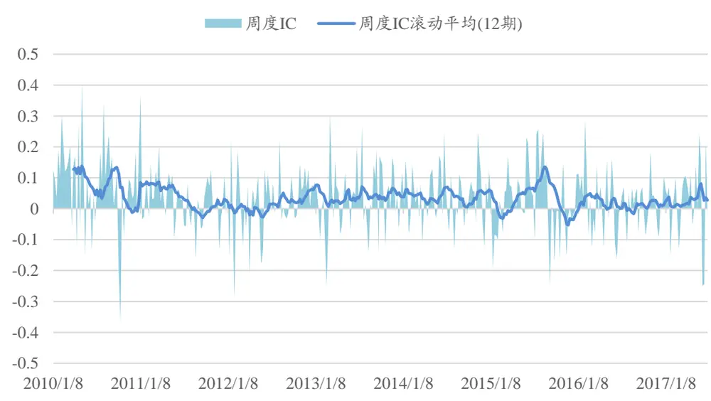
数据来源：广发证券发展研究中心

在全市场中分别基于LLT以及MA指标构建因子进行分档测试，从结果中可以看出基于LLT指标构建的因子最高档组合的收益率、信息比率更高，最低档组合的收益率、信息比率更低，说明基于LLT指标构建的因子对股票的区分性更好。

表 8：LLT指标与MA指标构建因子在全市场分档表现比较

|  | 收益率 | 最大回撤 | 年化波动率 | 年化收益率 | 信息比率 |
| --- | --- | --- | --- | --- | --- |
| Q1(LLT) | 630.06% | 44.76% | 31.72% | 29.54% | 0.93 |
| Q1(MA) | 460.66% | 45.77% | 31.54% | 25.17% | 0.8 |
| Q2(LLT) | 473.05% | 47.75% | 30.29% | 25.52% | 0.84 |
| Q2(MA) | 424.78% | 49.51% | 30.15% | 24.09% | 0.8 |
| Q3(LLT) | 343.08% | 49.97% | 29.94% | 21.39% | 0.71 |
| Q3(MA) | 326.61% | 49.92% | 29.75% | 20.79% | 0.70 |
| Q4(LLT) | 205.47% | 52.85% | 29.89% | 15.65% | 0.52 |
| Q4(MA) | 224.32% | 51.74% | 30.19% | 16.56% | 0.55 |
| Q5(LLT) | 17.16% | 58.61% | 30.79% | 2.08% | 0.07 |
| Q5(MA) | 63.01% | 56.05% | 30.96% | 6.57% | 0.21 |

数据来源：广发证券发展研究中心

从图17中可以看出基于LLT指标构建的因子在全市场下多空对冲表现：从 2010年以来，策略取得了 35.83% 的对冲年化收益率，14.11% 的年化波动率，15.64% 的最大回撤和 2.54 的信息比率。

图 17：基于LLT指标构建多空策略表现
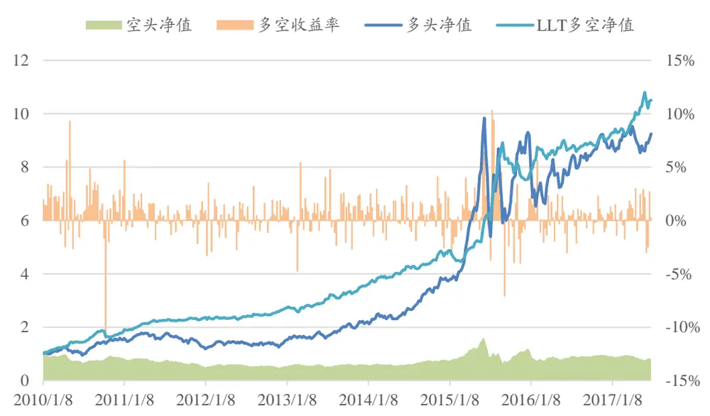
数据来源：广发证券发展研究中心

分年度看, 基于LLT指标构建的因子多空对冲策略表现比较稳健，每年都取得了10%以上的收益率。

表 9：基于LLT指标构建的因子多空对冲分年度表现

|  | 收益率 | 最大回撤 | 年化波动率 | 年化收益率 | 信息比率 |
| --- | --- | --- | --- | --- | --- |
| 2010年 | 80.77% | 13.48% | 19.17% | 78.68% | 4.1 |
| 2011年 | 29.85% | 2.89% | 8.75% | 29.18% | 3.33 |
| 2012年 | 15.00% | 3.84% | 9.58% | 15.00% | 1.57 |
| 2013年 | 31.56% | 6.86% | 12.40% | 30.86% | 2.49 |
| 2014年 | 36.92% | 3.97% | 9.76% | 34.51% | 3.53 |
| 2015年 | 58.27% | 15.64% | 22.96% | 55.50% | 2.42 |
| 2016年 | 19.84% | 5.02% | 10.43% | 19.84% | 1.9 |
| 2017年 (截至6月) | 13.90% | 5.46% | 11.10% | 28.45% | 2.56 |
| 全部 | 950.46% | 15.64% | 14.11% | 35.83% | 2.54 |

数据来源：广发证券发展研究中心

基于LLT指标构建的因子多头组合平均每期换手率为 0.69，标准差为 0.13，从2010 年起累积换手率为 264.66，在换手率方面与基于MA指标构建的因子相比更高。

图 18：基于LLT指标构建因子换手率表现
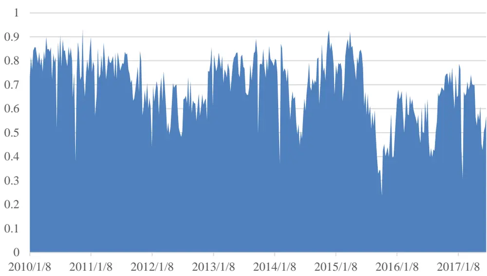
数据来源：广发证券发展研究中心

分年度看基于LLT指标以及基于MA指标构建的因子换手率都较高，平均每期换手率都在 60% 以上。

表 10：基于LLT指标构建因子分年度换手率

|  | 平均换手率 | 标准差 | 最大换手率 | 最小换手率 | 累积换手率 |
| --- | --- | --- | --- | --- | --- |
| 2010年 | 0.79 | 0.09 | 0.93 | 0.38 | 40.45 |
| 2011年 | 0.75 | 0.08 | 0.9 | 0.57 | 38.09 |
| 2012年 | 0.63 | 0.09 | 0.86 | 0.44 | 31.64 |
| 2013年 | 0.77 | 0.07 | 0.89 | 0.5 | 39.19 |
| 2014年 | 0.7 | 0.12 | 0.93 | 0.37 | 37.31 |
| 2015年 | 0.63 | 0.18 | 0.92 | 0.23 | 32.73 |
| 2016年 | 0.6 | 0.1 | 0.77 | 0.4 | 30.06 |
| 2017年 (截至6月) | 0.61 | 0.12 | 0.79 | 0.31 | 15.19 |
| 全部 | 0.69 | 0.13 | 0.93 | 0.23 | 264.66 |

数据来源：广发证券发展研究中心

比较基于MA指标以及LLT指标构建因子用不同指数对冲的表现结果，可以发现不论是多空对冲、中证500指数对冲、中证800指数对冲，基于LLT指标构建因子的收益率、信息比率方面都比基于MA指标构建的因子表现更为优异。并以多空对冲收益率最高、中证800指数对冲收益率对冲收益率其次、中证500指数对冲收益率最低。

图 19：MA、LLT指标构建因子不同指数对冲表现对比
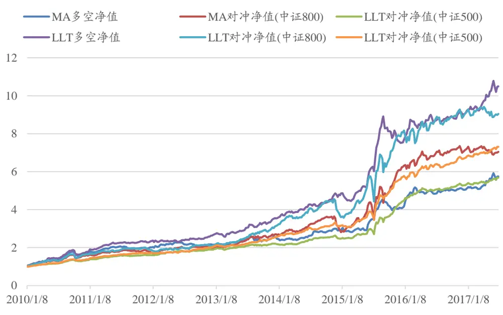
数据来源：广发证券发展研究中心

从信息比率角度看，以中证 500 指数对冲的基于LLT构建的因子表现最优。

表 11：MA、LLT指标构建因子不同指数对冲表现对比

|  | 收益率 | 最大回撤 | 年化波动率 | 年化收益率 | 信息比率 |
| --- | --- | --- | --- | --- | --- |
| 多空对冲 (LLT) | 950.46% | 15.64% | 13.82% | 35.83% | 2.54 |
| 多空对冲 (MA) | 474.96% | 13.31% | 13.84% | 25.58% | 1.81 |
| 中证500对冲 (LLT) | 631.64% | 11.57% | 10.24% | 29.58% | 2.83 |
| 中证500对冲 (MA) | 468.60% | 9.11% | 10.21% | 25.40% | 2.44 |
| 中证800对冲 (LLT) | 804.87% | 23.26% | 18.28% | 33.22% | 1.78 |
| 中证800对冲 (MA) | 604.50% | 22.96% | 18.18% | 28.94% | 1.56 |

数据来源：广发证券发展研究中心

基于LLT指标构建的因子在全市场选以中证500指数进行对冲的表现：从 2010年以来，策略取得了 29.58% 的对冲年化收益率，10.46% 的年化波动率，11.57% 的最大回撤和 2.51 的信息比率。

图 20：基于LLT指标构建因子在全市场中证500指数对冲累积收益率
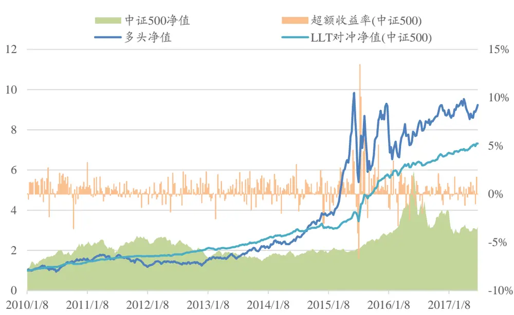
数据来源：广发证券发展研究中心

基于LLT指标构建的因子基于全市场选股中证500对冲策略分年度表现情况如下表所示，每年的的收益率都大于零，除了在 2017年前 6 个月外，策略每年都取得了超过 15% 的超额收益。

表 12：基于LLT指标构建的因子在全市场中证500指数对冲分年度表现

|  | 收益率 | 最大回撤 | 年化波动率 | 年化收益率 | 信息比率 |
| --- | --- | --- | --- | --- | --- |
| 2010年 | 39.36% | 4.51% | 7.76% | 38.46% | 4.96 |
| 2011年 | 23.36% | 1.38% | 5.15% | 22.85% | 4.43 |
| 2012年 | 21.27% | 2.18% | 6.57% | 21.27% | 3.24 |
| 2013年 | 23.38% | 3.84% | 7.08% | 22.88% | 3.23 |
| 2014年 | 23.12% | 6.46% | 8.73% | 21.68% | 2.48 |
| 2015年 | 82.37% | 11.57% | 21.05% | 78.20% | 3.71 |
| 2016年 | 17.89% | 4.12% | 9.17% | 17.89% | 1.95 |
| 2017年 (截至6月) | 7.46% | 1.16% | 5.16% | 14.83% | 2.87 |
| 全部 | 631.64% | 11.57% | 10.46% | 29.58% | 2.83 |

数据来源：广发证券发展研究中心
识别风险，发现价值

基于LLT指标构建的因子在全市场选用中证500指数进行业中性策略，从 2010年以来策略取得了 29.42% 的对冲年化收益率，10.60% 的年化波动率，12.78% 的最大回撤和 2.78 的信息比率。

图 21：LLT指标构建因子中证500行业中性策略表现
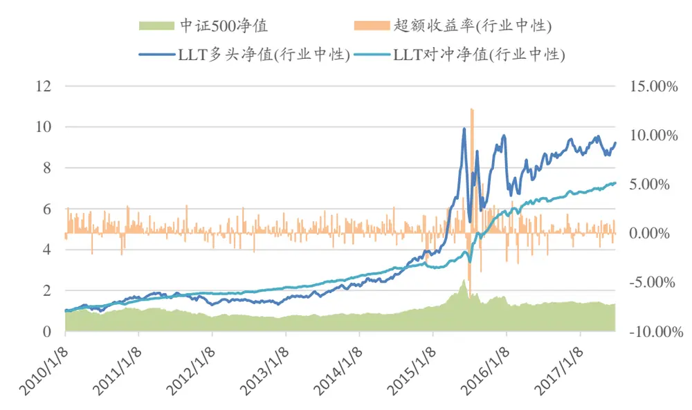
数据来源：广发证券发展研究中心

基于LLT指标构建的因子行业中性策略分年度表现情况如下表所示，每年的的收益率都大于零，除了在 2017年前 6 个月外，策略每年都取得了超过 10% 的超额收益。

表 13：基于LLT指标构建因子中证500行业中性策略分年度表现

|  | 收益率 | 最大回撤 | 年化波动率 | 年化收益率 | 信息比率 |
| --- | --- | --- | --- | --- | --- |
| 2010年 | 48.61% | 4.36% | 7.68% | 47.46% | 6.18 |
| 2011年 | 25.88% | 1.41% | 4.80% | 25.31% | 5.28 |
| 2012年 | 13.97% | 2.23% | 6.43% | 13.97% | 2.17 |
| 2013年 | 24.85% | 1.63% | 5.95% | 24.31% | 4.09 |
| 2014年 | 17.65% | 6.93% | 7.07% | 16.57% | 2.34 |
| 2015年 | 88.06% | 12.78% | 22.36% | 83.55% | 3.74 |
| 2016年 | 15.67% | 4.25% | 9.35% | 15.67% | 1.68 |
| 2017年 (截至6月) | 6.37% | 1.40% | 4.74% | 12.62% | 2.66 |
| 全部 | 624.76% | 12.78% | 10.60% | 29.42% | 2.78 |

数据来源：广发证券发展研究中心
识别风险，发现价值

通过比较基于MA以及基于LLT指标构建的因子行业中性策略，可以发现 LLT指标构建的因子明显表现优于基于MA指标构建的因子，取得了 29.42% 的对冲年化收益率，10.60% 的年化波动率，12.78% 的最大回撤和 2.78 的信息比率。

图 22：MA、LLT指标构建因子行业中性策略比较
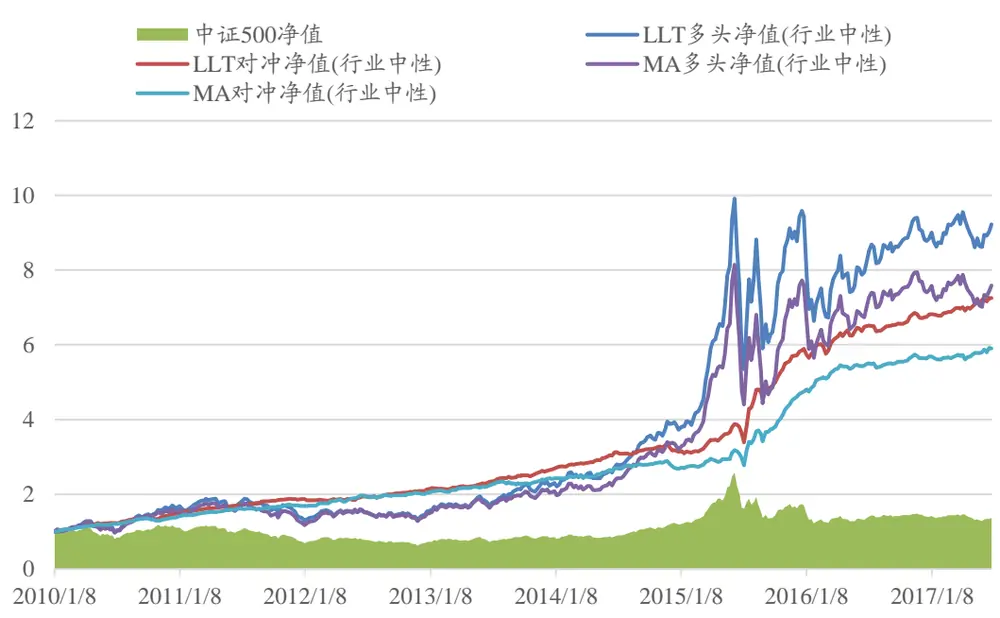
数据来源：广发证券发展研究中心

表 14：基于MA、LLT指标构建因子行业中性策略比较

|  | 收益率 | 最大回撤 | 年化波动率 年化收益率 |  | 信息比率 |
| --- | --- | --- | --- | --- | --- |
| LLT多头组合 (行业中性) | 808.40% | 45.35% | 31.82% | 33.28% | 1.02 |
| MA多头组合 (行业中性) | 627.48% | 43.07% | 31.36% | 29.48% | 0.92 |
| LLT对冲净值 (行业中性) | 624.76% | 12.78% | 10.60% | 29.42% | 2.78 |
| MA对冲净值 (行业中性) | 468.60% | 9.11% | 10.21% | 25.40% | 2.44 |

数据来源：广发证券发展研究中心

在中证 500 指数成分股中用LLT指标构建因子进行选股以中证 500 指数对冲，从 2010 年以来策略取得了 17.40% 的对冲年化收益率，9.80% 的年化波动率，6.26% 的最大回撤和 1.77 的信息比率。

图 23：基于LLT指标构建因子在中证500成分股中表现
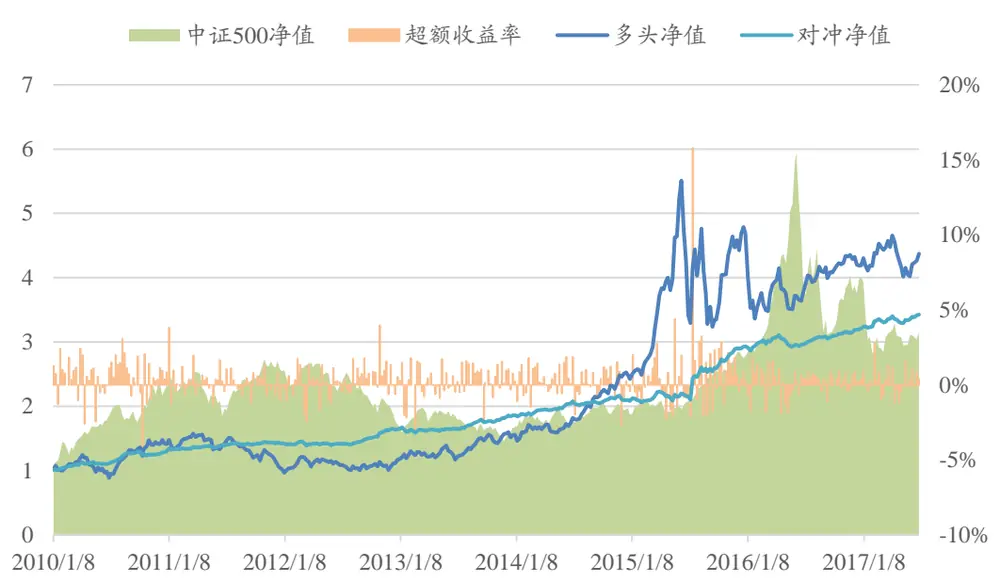
数据来源：广发证券发展研究中心

分年度看，基于LLT指标构建的因子在中证500成分股中表现也很稳健，每年收益率都超过 5%，且最大回撤仅为 6.26%。

表 15：基LLT指标构建因子在中证500成分股中分年度表现

|  | 收益率 | 最大回撤 | 年化波动率 | 年化收益率 | 信息比率 |
| --- | --- | --- | --- | --- | --- |
| 2010年 | 29.60% | 5.41% | 9.88% | 28.94% | 2.93 |
| 2011年 | 9.82% | 1.77% | 6.20% | 9.62% | 1.55 |
| 2012年 | 15.65% | 4.38% | 7.59% | 15.65% | 2.06 |
| 2013年 | 12.96% | 4.97% | 7.68% | 12.69% | 1.65 |
| 2014年 | 12.14% | 3.82% | 6.81% | 11.42% | 1.68 |
| 2015年 | 40.66% | 6.26% | 18.93% | 38.82% | 2.05 |
| 2016年 | 9.44% | 5.80% | 6.19% | 9.44% | 1.52 |
| 2017年 (截至6月) | 6.77% | 3.20% | 6.47% | 13.43% | 2.08 |
| 全部 | 242.70% | 6.26% | 9.80% | 17.40% | 1.77 |

数据来源：广发证券发展研究中心

## 四、总结

本篇报告中，提出了一个全新的基于不同期限构建的因子，通过分析不同期限的均线数据来同时捕捉短期反转、中期动量、长期反转等价格趋势。在实证分析的时间区间内取得了 25.40% 的对冲年化收益率，10.42% 的年化波动率，9.11% 的最大回撤和 2.44 的信息比率。

进一步针对均线对价格趋势不敏感、延迟性差的缺点，本篇专题报告结合广发金工历史研究成果《低延迟趋势线与交易性择时》中提出的LLT低延迟趋势线，构造了基于LLT指标的因子，以LLT指标代替MA指标。在实证分析的时间区间内取得了29.58% 的对冲年化收益率，10.46% 的年化波动率，11.57% 的最大回撤和 2.51的信息比率。

## 风险提示

本篇专题报告所做的数据测算完全基于历史行情数据完成，市场表现受诸多因素影响，注意模型失效风险。

## Table_RatingIndustry 广发证券—行业投资评级说明

买入： 预期未来 12 个月内，股价表现强于大盘 10%以上。

持有： 预期未来12个月内，股价相对大盘的变动幅度介于-10%～+10%。

卖出： 预期未来12个月内，股价表现弱于大盘10%以上。

## Table_RatingCompany 广发证券—公司投资评级说明

买入： 预期未来12个月内，股价表现强于大盘15%以上。

谨慎增持： 预期未来12个月内，股价表现强于大盘5%-15%。

持有： 预期未来12个月内，股价相对大盘的变动幅度介于-5%～+5%。

卖出： 预期未来12个月内，股价表现弱于大盘5%以上。

## Table_Ad联系我们

|  | 广州市 | 深圳市 | 北京市 | 上海市 |
| --- | --- | --- | --- | --- |
| 地址 |  | 广州市天河区林和西路9 深圳福田区益田路6001号 | 北京市西城区月坛北街2号 | 上海浦东新区世纪大道8号 |
|  | 号耀中广场 A 座 1401 | 太平金融大厦31层 | 月坛大厦18层 | 国金中心一期 16 层 |
| 邮政编码 | 510620 | 518000 | 100045 | 200120 |
| 客服邮箱 | gfyf@gf.com.cn |  |  |  |
| 服务热线 |  |  |  |  |
| IT服务台 | 020-66317575 |  |  |  |

## Table_Disclaimer 免 责声 明

广发证券股份有限公司（以下简称“广发证券”）具备证券投资咨询业务资格。本报告只发送给广发证券重点客户，不对外公开发布，只有接收客户才可以使用，且对于接收客户而言具有相关保密义务。广发证券并不因相关人员通过其他途径收到或阅读本报告而视其为广发证券的客户。本报告的内容、观点或建议并未考虑个别客户的特定状况，不应被视为对特定客户关于特定证券或金融工具的投资建议。本报告发送给某客户是基于该客户被认为有能力独立评估投资风险、独立行使投资决策并独立承担相应风险。

本报告所载资料的来源及观点的出处皆被广发证券股份有限公司认为可靠，但广发证券不对其准确性或完整性做出任何保证。报告内容仅供参考，报告中的信息或所表达观点不构成所涉证券买卖的出价或询价。广发证券不对因使用本报告的内容而引致的损失承担任何责任，除非法律法规有明确规定。客户不应以本报告取代其独立判断或仅根据本报告做出决策。

广发证券可发出其它与本报告所载信息不一致及有不同结论的报告。本报告反映研究人员的不同观点、见解及分析方法，并不代表广发证券或其附属机构的立场。报告所载资料、意见及推测仅反映研究人员于发出本报告当日的判断，可随时更改且不予通告。

本报告旨在发送给广发证券的特定客户及其它专业人士。未经广发证券事先书面许可，任何机构或个人不得以任何形式翻版、复制、刊登、转载和引用，否则由此造成的一切不良后果及法律责任由私自翻版、复制、刊登、转载和引用者承担。