# 宏观视角下的风格轮动探讨

## ——多因子 Alpha 系列报告之（三十五）

## 报告摘要：

## 宏观环境变化影响风格轮动规律

股市的波动与宏观经济的的变化有着密不可分的关系。一般而言，股市中投资者的投资风格、市场的风险偏好等都会因宏观经济环境的变化而发生明显的转换。因而，通过对宏观经济在短期形成的特定的宏观事件、宏观经济趋势是否发生“历史重演”，利用统计方法寻找样本内部的轮动规律，便可以利用这些规律为投资者在进行不同风格配臵提供有效的建议。

## 宏观事件驱动策略实证结果

在宏观事件驱动策略中，通过为各个风格因子找到对应的能够使风格因子表现凸显的宏观事件，从而在每期中根据宏观事件是否触发找到本期应当配臵的风格因子，进而获取更高的收益。从2009 年至今，策略对冲上证综指共获得 346.59%的累计超额收益率，胜率为66.44%，最大回撤为51.79%，2018 年以来共获得-0.12%的超额收益率，胜率为 66.67%，最大回撤为 4.12%。

## 宏观趋势匹配策略实证结果

在宏观趋势匹配策略中，通过将当前市场的宏观走势与历史上的宏观走势进行对比，并将最佳匹配所在的时间点作为当前的最佳匹配时间点，将最佳匹配时间点的未来一段时间的风格有效性作为当前风格轮动的依据，可以构建出我们的宏观趋势匹配策略。从2009年至今，策略对冲上证综指共获得 183.66%的累计超额收益率，胜率为 65.14%，最大回撤仅为19.42%，2018 年以来共获得-3.91%的超额收益率，胜率为 33.33%，最大回撤为 2.79%。

## 综合策略实证结果

在综合策略中，我们综合考虑了前两个策略的方法，通过宏观事件驱动策略确定每期应当配臵的风格因子，再通过宏观趋势匹配策略来对风格因子进行权重的配臵，从而获得更加稳定的收益。从 2009年至今，策略对冲上证综指共获得 270.88%的累计超额收益率，胜率为 71.56%，最大回撤仅为 22.08%，2018 年以来共获得-1.45%的超额收益率，胜率为 66.67%，最大回撤为 3.34%。

## 风险提示

本篇报告通过历史数据统计、建模和测算完成，仅作为风格轮动中风格配臵的研究，在宏观政策超出预期的波动以及市场环境变化下可能存在失效风险。

图1、宏观事件驱动策略表现
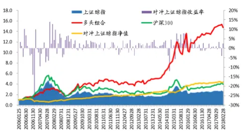
数据来源：wind，广发证券发展研究中心

图 2、宏观趋势匹配表现
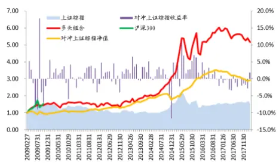
数据来源：wind，广发证券发展研究中心

图 3、综合策略表现
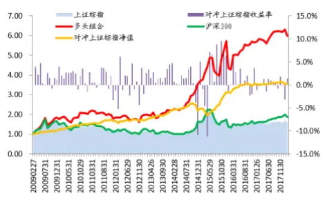
数据来源：wind，广发证券发展研究中心

Table_A 分析师：ut hor 史庆盛 S0260513070004

公020-87577060

sqs@gf.com.cn

相关研究：

| 从宏观因子走势中挖掘大 | 2017-7-4 |
| --- | --- |
| 类资产投资机会 大类资产配置体系：基于 |  |
| 宏观因子 | 2017-4-14 |
| 大类资产配置体系：基于 |  |
| 宏观因子 |  |
| 宏观事件驱动下的风格轮 | 2016-4-2 |
| 动 |  |

## 一、前言

股市的波动与宏观经济的的变化有着密不可分的关系。一般而言，股市中投资者的投资风格、市场的风险偏好等都会因宏观经济环境的变化而发生明显的转换。因而，通过对宏观经济的近期变化、宏观经济的历史变化趋势的观察，可为投资者在进行不同风格配臵提供有效的建议。

图1：大盘价值指数与小盘成长指数近2年表现对比
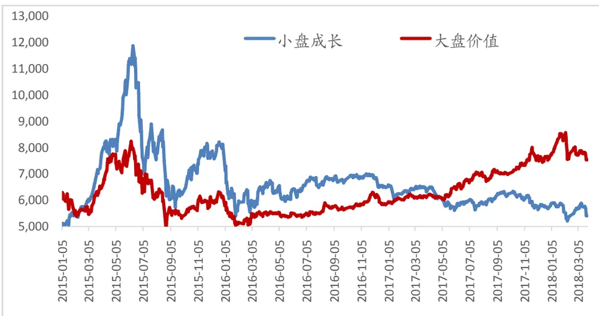
数据来源：wind，广发证券发展研究中心

在进行风格配臵时，价值与成长风格，大小盘风格等风格的轮动一直是市场关注的重点。不同的投资风格在不同的阶段及市场环境下表现具有明显的差异。以大盘价值指数与小盘成长指数两者为例，可以从近3年的表现看出，在2015年的牛市及股灾中，小盘成长指数在前期表现显著优于大盘价值股，但在股灾来临后，两者均大幅下跌，但2016年以来，大盘蓝筹股的表现一直稳步上行，而小盘成长股则表现弱势，由于市场的避险偏好而表现为震荡下行。因而，若能很好地把握在不同的宏观环境下市场的风格偏好，并相应地构建策略来捕获这种收益，那么将为投资者带来额外的超额收益。

本文将围绕着风格轮动这一主题展开研究讨论，并尝试通过几种统计方法来找到风格轮动中的内在规律，我们将主要分为以下几个部分展开来阐述我们的研究成果：

第一部分：前言，简单介绍风格投资的基本理论并重点强调风格轮动的重要性。

第二部分：简单介绍风格轮动的基本方法，例如“日历效应”、“牛熊市效应”等等，引入宏观因子及宏观事件等概念，同时介绍本文中讨论的风格因子，最后展示宏观事件筛选的流程以及一部分宏观事件的例子。

第三部分：基于第二部分介绍宏观事件驱动策略的表现以及宏观事件驱动策略的触发对照表。

第四部分：介绍宏观趋势匹配策略的具体逻辑及策略表现。

第五部分：基于宏观事件驱动策略以及宏观趋势匹配策略构建综合策略，并展示综合策略的表现。

## 二、宏观因子事件模式

## （一）风格轮动方法简介

在市场中实际上已经有较多常见的风格轮动模型，这些模型可以主要分为2大类：

## 1) 样本分类法

这种方法在于首先分析时间样本的统计规律，根据统计规律在不同的时间点进行不同风格的配臵。常见的方法为“日历效应”，“牛熊市效应”以及“投资时钟”等方法。这类方法往往易于操作，但由于分类方法过于简单，往往无法捕捉风格突发性变化的投资机会。

## 2) 时间序列回归

此类方法采用回归的方法，利用宏观数据或者市场情绪等数据对未来的风格走势进行拟合，从而利用拟合的趋势对风格走势进行预测。这一方法也较为简单，但缺点在于缺乏足够清晰的逻辑以及容易陷入过拟合。

结合了以上方法思想，在本文中我们主要考虑了如下两种新的方法思路：

## 3) 宏观事件驱动法

由于股票市场与宏观经济紧密相关，因此在特定的宏观事件触发的背景下，市场对特定风格的偏好往往表现得更加显著，因而本文将通过分析历史信息获得宏观事件与风格的内在规律。

## 4) 宏观趋势匹配法

从历史规律上看,宏观周期与股市周期具有一定的联系，相似的宏观环境也会影响投资者有相似的风险偏好和投资情绪。通过对比当前的宏观环境与历史上各个时期的宏观环境，从而利用最佳匹配时间点的股市未来走势对当前的股市风格配臵进行预测。

## （二）宏观因子及宏观事件模式定义

在本报告中，我们主要考虑以下9大类宏观因子(见表1)，但单纯分析宏观因子难以获得有效信息，因此我们还必须定义相应的特定场景（即是下方提到的宏观事件模式）,通过将不同的宏观因子和不同的宏观事件模式相结合，构成特定的宏观事件，并统计分析在不同的宏观事件下风格因子的表现，从而筛选出对于特定风格因子具有显著影响力的宏观事件。

表 1: 宏观因子汇总

| 因子类别 因子名称 数据来源 |  |  | 公布频率 | 滞后期数 |
| --- | --- | --- | --- | --- |
| 工业与固定资产投资 | 工业增加值当月同比 | 国家统计局 | 月 | 1个月 |
|  | 固定资产投资完成额同比 | 国家统计局 | 月 | 1个月 |
|  | 产量：发电量：当月同比 | 国家统计局 | 月 | 1个月 |
| 消费与价格指数 | 社会消费品零售总额：当月同比 | 国家统计局 | 月 | 1个月 |
|  | 贸易差额：当月值 | 国家统计局 | 月 | 1个月 |
|  | 22个省市：平均价：猪肉：月 | 国家统计局 | 周 | 无 |
|  | CPI：当月同比 | 国家统计局 | 月 | 1个月 |
|  | CPI：当月环比 | 国家统计局 | 月 | 1个月 |
|  | PPI：当月同比 | 国家统计局 | 月 | 1个月 |
|  | PPI：当月环比 | 国家统计局 | 月 | 1个月 |
| 货币 | M0：当月同比 | 国家统计局 | 月 | 1个月 |
|  | M1：当月同比 | 国家统计局 | 月 | 1个月 |
|  | M2：当月同比 | 国家统计局 | 月 | 1个月 |
| 银行 | 金融机构各项贷款余额同比 | 国家统计局 | 月 | 1个月 |
|  | 金融机构新增人民币贷款：当月 | 国家统计局 | 月 | 1个月 |
|  | 金融机构各项存款余额同比 | 国家统计局 | 月 | 1个月 |
|  | 金融机构新增人民币存款：当月 | 国家统计局 | 月 | 1个月 |
| 利率及利差 | 1年期国债利率 | 国家统计局 | 日 | 无 |
|  | 5年期国债利率 | 国家统计局 | 日 | 无 |
|  | 10年期国债利率 | 国家统计局 | 日 | 无 |
|  | 1 年期国债利率-5 年期国债利率 | 国家统计局 | 日 | 无 |
|  | 1年期国债-10年期国债利率 | 国家统计局 | 日 | 无 |
| 市场景气度 | PMI | 国家统计局 | 月 | 无 |
|  | 消费者信心指数 | 国家统计局 | 月 | 2个月 |
|  | 波罗的海干散货指数 | Wind | 日 | 无 |
|  | OECD 综合领先指标：中国 | Wind | 月 | 2个月 |
|  | 宏观经济景气指数：先行指数 | 国家统计局 | 月 | 2个月 |
| 海外市场 | 美国10年期国债收益率 | 美联储 | 日 | 无 |
|  | 人民币：实际有效汇率指数 | 国际清算银行 | 月 | 1个月 |
|  | 美元指数 | Wind | 日 | 无 |
|  | WTI 原油 | NYMEX | 日 | 无 |

识别风险，发现价值

|  | 美国新增非农就业人数：当月值 | 美国劳工部 | 月 | 1个月 |
| --- | --- | --- | --- | --- |
| 权益市场 | PE_TTM | Wind | 日 | 无 |
|  | PB | Wind | 日 | 无 |
|  | 换手率 | Wind | 日 | 无 |
|  | ROE | Wind | 季 | 不定 |
|  | 盈利增速 | Wind | 季 | 不定 |
| 国民经济 | GDP 同比 | 国家统计局 | 季 | 1个月 |

数据来源：wind，广发证券发展研究中心

表 2: 事件模式说明

| 事件模式名称 | 事件模式描述（其中K为参数） |
| --- | --- |
| 短期突破布林带上界 | 因子最新值高于（过去K个月均值+两倍过去K个月标准差） |
| 短期突破布林带下界 | 因子最新值低于（过去K个月均值-两倍过去K个月标准差） |
| 连续上涨 | 因子值连续上涨K个月 |
| 连续下跌 | 因子值连续下跌K个月 |
| 近期新高 | 因子值创过去K个月新高 |
| 近期新低 | 因子值创过去K个月新低 |
| 因子连续下跌反转为上涨 | 因子值连续下跌K个月后最新一期上涨 |
| 因子连续上涨反转为下跌 | 因子值连续上涨K个月后最新一期下跌 |

数据来源：wind，广发证券发展研究中心

值得注意的是，以上宏观因子数据的更新滞后时间不同，更新频率也不同，为了能够统一在同一个框架下进行观测，因此在本报告中都将默认以最新更新的数据作为本期最新的观测值，同时由于策略均是月频换仓，而数据的频率不同，因此我们需要将根据数据的频率进行一定的调整。若是月频数据，则无须进行调整；若是日度数据，将用月末的数据作为该月的数据；而若是季度数据，由于考虑到若直接在同个季度中使用相同的数据会影响事件模式的应用，因而，我们将直接将宏观事件模式应用到季频数据上。

例如，若要考虑使用全市场ROE这一宏观因子，同时采用连续上涨4期这一事件模式，这两者所构成的宏观事件实际上为季度更新数据，在研究过程中，我们将观察过去4个季度（而不是过去4个月）的全市场ROE数据是否连续上涨，从而来判断这一事件是否触发。

在这种情况下，我们综合考虑了以上39个宏观因子以及8种宏观事件模式，总共可以得到312种宏观事件模式，根据下方的训练流程，将为每个因子找到合适的触发事件及相应的参数。

另一方面，在本报告中，我们主要考虑包括盈利类，成长类，技术类等7大类共45个风格因子（见下方表格）。

根据我们对于各个风格因子经济学意义的理解以及风格因子在A股市场上长期的综合表现，我们为每个因子设定了初始的预判方向。例如，正常而言，我们认为盈利类因子对股票未来的收益率应该有正向预测作用，尽管A股市场上盈利类因子的有效性相对较弱，并且有些因子在长期来看对未来收益率具有负向预测作用（即IC为负），但根据Fama三因子模型，盈利类因子应当能为组合带来正向的回报，因而在下方我们在训练模型时也会优选出能够使得盈利类因子多空收益表现为正的宏观事件。

类似地， 成长类因子、价值类因子都应当默认对股票收益率有正向预测作用。由于小市值效应及A股市场长期的技术反转效应，规模因子以及技术因子基本上都对股票收益率有负向预测作用。其他因子的处理方式也会同时综合考虑A股市场的实际情况及其经济学意义进行设臵。

表 3: 风格因子汇总

| 大类名称 | 序号 | 因子名称 | 预定方向 | 大类名称 | 序号 | 因子名称 | 预定方向 |  |  |  |
| --- | --- | --- | --- | --- | --- | --- | --- | --- | --- | --- |
| 盈利 | 1 | 销售净利率 | 十 | 规模 | 24 | 流通市值 |  |  |  |  |
|  | 2 | 毛利率 | 十 |  | 25 | 总资产 |  |  |  |  |
|  | 3 | ROE | 十 |  | 26 | 存货周转率 | 十 |  |  |  |
|  | 4 | ROA | 十 |  | 27 | 长期负债率 |  |  |  |  |
| 成长 | 5 | 股东权益增长率 | + |  | 28 | 每股负债比 |  |  |  |  |
|  | 6 | 总资产增长率 | + |  |  |  |  |  | 29 | 财务费用比例 |
|  | 7 | 净利润增长率 | 十 |  |  |  | 30 | 固定比 |  |  |
|  | 8 | 每股净资产增长率 | + | 质量 | 31 | 速动比率 | + |  |  |  |
|  | 9 | EPS增长率 | 十 |  | 32 | 流动比率 | 十 |  |  |  |
|  | 10 | ROE增长率 | + |  | 33 | 净利润现金占比 | 十 |  |  |  |
|  | 11 | 主营业务收入增长率 | 十 |  |  |  | 34 | 总资产周转率 | 十 |  |
| 杠杆 | 12 | 流通股本/总股本 | + |  | 35 | 流动负债率 |  |  |  |  |
|  | 13 | 流通市值/总市值 | + |  | 36 | 营业费用比例 |  |  |  |  |
|  | 14 | 资产负债率 |  | 价值 | 37 | 股息率 | + |  |  |  |
| 技术 | 15 | 1个月成交金额 |  |  | 38 | CFP(行业相对) | 十 |  |  |  |
|  | 16 | 近3个月平均成交量 |  |  | 39 | EP(行业相对) | 十 |  |  |  |
|  | 17 | 换手率 |  |  | 40 | SP(行业相对) | 十 |  |  |  |
|  | 18 | 一个月股价反转 |  |  | 41 | BP(行业相对) | 十 |  |  |  |
|  | 19 | 三个月股价反转 |  |  |  |  | 42 | CFP | + |  |

识别风险，发现价值

| 20 | 六个月股价反转 |  | 43 | EP | 十 |  |  |
| --- | --- | --- | --- | --- | --- | --- | --- |
| 21 | 一年股价反转/动量 |  |  |  | 44 | SP | 十 |
| 22 | 最高点距离 | 十 | 45 | BP | 十 |  |  |
| 23 | 容量比 |  |  |  |  |  |  |

数据来源：wind，广发证券发展研究中心

## （三）正向宏观事件的训练及筛选

在采用不同的参数情况下（见表2中的K）,不同的宏观事件对不同的风格具有不同的影响。因而为每个风格寻找具有正向预测作用的宏观事件或者具有显著反向预测作用的宏观事件都是十分重要的环节。我们希望为所有的风格找到明显具有正向预测作用的宏观事件，使得在事件触发后，风格的表现能够显著超越它在全样本情况下风格的表现，同时我们还将训练并得到在这个事件下的最佳参数。

对于以上指定的宏观因子及指定的宏观事件模式，我们首先需要通过如下的评估它对于指定的风格的预测有效性，并由此确定参数K:

1) 确定样本训练时间区间，这里采用的是从2005年1月到2017年12月。

2) 首先分别设定训练参数 K =6，9，12个月（值得注意的是，若数据为季度更新，那么训练参数 K = 4，6，8个季度）；

3) 根据给定的参数，分别计算三种训练参数下，宏观事件的触发时间点；

4) 单独计算事件触发后风格的表现，计算如下几个指标：触发次数，触发后的平均收益率，触发IR、触发胜率；

5) 第一步筛选：若触发后在该参数下事件的触发次数超过15次，触发的风格平均收益率为正并且触发胜率超过50%，那么认为该事件初步有效。若全部参数下均不满足条件，说明该事件模式对该风格无显著预测作用，直接剔除该事件。

6) 第二步筛选：要求在该参数下事件的触发IR,IC，胜率超过全样本下事件相应的表现。

7) 在特殊情况下，有可能不止一个参数满足以上筛选规则，此时我们按照胜率进行排序，只保留触发后胜率最高的参数作为最佳参数（若胜率也相同，那么将按照IR再进行排序，仍只保留IR最高的一个宏观），若经过两步筛选后无可选参数，那么该宏观因子下的指定宏观事件模式直接弃用。

值得注意的是，同一个风格可能有多个有效的宏观事件（宏观事件由宏观因子和宏观事件模式一同构成），为了尽可能地提高宏观事件对风格的预测能力，在经过以上训练后，我们将根据IR的表现筛选出最多前5个有效的宏观事件作为该风格因子的预测事件。若同一个风格对应的有效的宏观事件不足5个，那么将保留全部有效宏观事件。

## （四）反向宏观事件的训练及筛选

当然，由于A股市场中，规模类因子以及动量反转类因子往往受投资者关注，这两种风格的切换会引起投资者的格外关注。为了能够很好地捕获这两大类风格发生切换时产生的收益，我们专门针对这两种风格研究了发生风格反转（也即是方向与预定方向相反的情况下）时相应的触发事件。

由于从全样本上看，A股市场偏小市值风格及反转风格，因此上述方法并不完全适用于对大市值风格以及动量风格的触发筛选。因此我们综合考虑风格的有效性限制，给出了如下新的筛选规则：我们仅针对流通市值，总资产，一个月股价动量，三个月股价动量，六个月股价动量，以及十二个月股价动量这几种风格因子进行测算：

1) 确定样本训练时间区间，这里采用的是从2005年1月到2017年12月 。

2) 首先分别设定参数 K =6，9，12个月（值得注意的是，若数据为季度更新，那么参数 K = 4，6，8个季度）；

3) 根据给定的参数，分别计算三种参数下，宏观事件的触发时间点；

4) 单独计算触发事件后风格的表现，计算如下几个指标：触发IC、触发IR、触发胜率；

5) 第一步筛选：若触发后在该参数下事件的触发次数超过10次（对反向的触发次数限制降低，因为风格发生反转的次数更少），触发的风格平均收益率为正并且触发胜率超过50%，那么认为该事件初步有效。若全部参数下均不满足条件，说明该事件模式对该风格无显著预测作用，直接剔除该事件。

6) 第二步筛选：要求在该参数下事件的触发IR,IC，胜率至少有一个超过指定的阈值，例如触发IR超过0.7，触发IC超过0.02，触发胜率超过70%。

7) 在特殊情况下，有可能不止一个参数满足以上筛选规则，此时我们按照胜率进行排序，只保留触发后胜率最高的参数作为最佳参数（若胜率也相同，那么将按照IR再进行排序，仍只保留IR最高的一个宏观），若经过两步筛选后无可选参数，那么该宏观因子下的指定宏观事件模式直接弃用。

同样地这里我们也类似于上方的做法，最多保留5个宏观事件。

## （五）有效宏观事件模式举例

经过了以上的筛选过程,我们可以获得针对每种风格的特定的宏观事件，并且针对于规模因子和反转因子我们还找到了风格反转的触发事件。下面我们将针对于其中一些比较重要的风格因子展示它对应有效的部分宏观事件，并分析宏观事件以及风格因子之间的内在联系。在以下的展示过程中,柱状图表示风格因子IC的有效性，红线和绿线分别表示触发时间点风格的IC值, 其中红线表示IC值为正, 绿线表示IC值为负。

图2：流通市值（小盘）的事件驱动示例
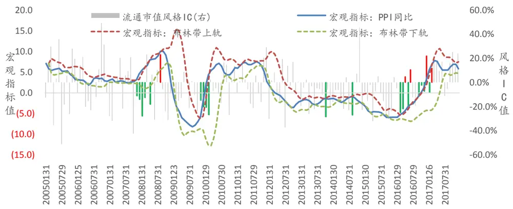
数据来源：广发证券发展研究中心，wind资讯

在大小盘轮动中，可以看到，当观测到PPI同比突破6个月的布林带（2倍标准差）上轨时，由于物价上涨，说明宏观经济环境向好，此时中小企业的营业能力将得到改善，小市值风格将表现更加显著。从统计规律上看，这一事件发生了23次，小盘股跑赢大盘股的胜率高达82.61%，并且流通市值（小盘）风格的年化IR达到了3.97。

图3：流通市值（大盘）的事件驱动示例
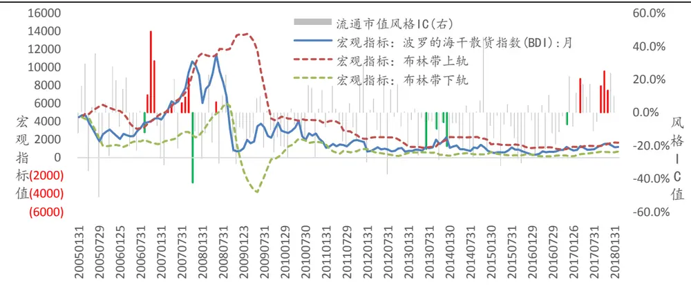
数据来源：wind，广发证券发展研究中心

在大小盘轮动中，可以看到，当观测到波罗的海干散货指数突破2倍标准差的布林带上轨时，由于从这一指标可以看到,由于原材料运费显著上涨,企业经营成本上升,相比较而言,大公司更能抵御成本上升的风险,在成本控制方面相比小企业更具优势。从统计规律上看，这一事件发生了20次，大盘股跑赢小盘股的胜率高达60%，并且流通市值（大盘）的年化IR达到了1.09。

图4：毛利率风格的事件驱动示例
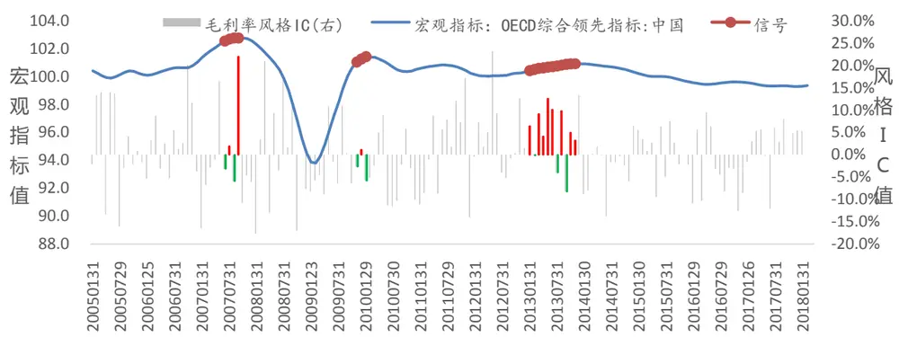
数据来源：wind，广发证券发展研究中心

在盈利因子方面，当OECD综合领先指标：中国连续上涨9期时，说明市场具有较大的概率进入过热阶段，此时企业扩大生产，盈利能力增强，因此毛利率风格收益更加显著。从统计规律上看，这一事件发生了18次，毛利率风格因子获得多空收益的胜率高达77.78%，并且风格因子的年化IR达到了1.63。

图5：EP风格的事件驱动示例
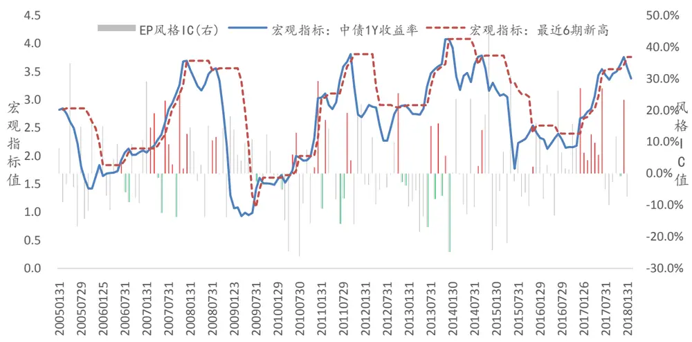
数据来源：wind，广发证券发展研究中心

在估值风格方面，当观察到1年期的国债利率创下最近6期新高，由于货币流动性下降，投资者投资情绪下降，因而价值股更受青睐，EP风格因子有效性升高。从统计规律上看，这一事件发生了51次，EP风格因子获得多空收益的胜率高达76.47%，并且风格因子的年化IR达到了2.07。

图6：一个月股价反转风格的事件驱动示例
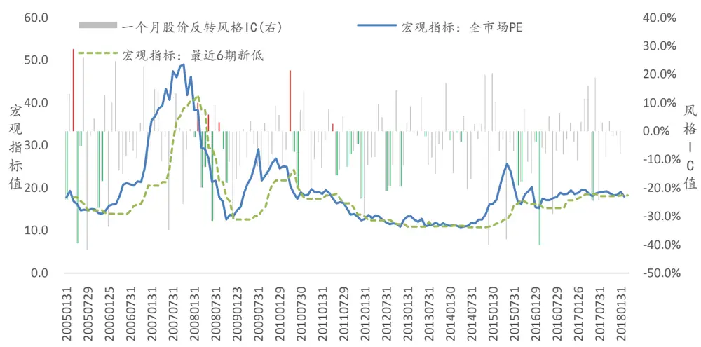
数据来源：wind，广发证券发展研究中心

当观察到全A股市场的PE值创下最近6期新低时，这一状况一般是由于市场整体下跌或者市场整体的盈利改善而造成的，若是前者，市场大概率迎来触底反弹，若是后者，说明市场盈利状况改善，投资者具有更高的投机热情，因而股价反转风格更加显著。从统计规律上看，这一事件发生了36次，一个月股价反转风格因子获得多空收益的胜率高达86.11%，并且风格因子的年化IR达到了3.22。

图7：一年股价动量风格的事件驱动示例
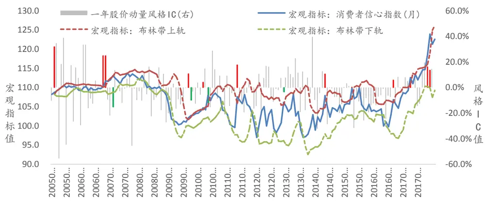
数据来源：wind，广发证券发展研究中心
识别风险，发现价值

当观察到消费者信心指数突破2倍标准差的布林带上轨时，由于投资者对未来预期向好，因此投资者更倾向于在股价上扬时继续持有股票，而不是获利离场，因而一年期股价动量风格表现更加显著。从统计规律上看，这一事件发生了16次，一年股价动量风格因子获得多空收益的胜率高达68.75%，并且风格因子的年化IR达到了1.77。

经过了这一训练过程，我们可以利用这些宏观事件的触发来构建我们的宏观事件驱动策略。

## 三、基于宏观事件驱动的风格轮动策略

## （一）策略表现测算

样本设臵：wind数据库中的全市场非停牌并且满足上市满1年的A股股票的行情数据 、财务数据、估值数据等，并相应地进行加工处理；

样本区间：2005年-2018年，由于需要保留一部分时间用于计算宏观事件的事件模式的触发数据，因此回测从2006年2月开始，到2018年2月截止，其中2006年-2017年为样本内数据，在这段期间我们为各个风格因子训练最佳的宏观事件，2018年开始为样本外数据。

风格因子收益率计算：为了能够直接利用风格因子进行配臵，我们首先需要计算风格因子在行业中性化处理下每期在多头和空头部分的收益率。在行业中性化处理上，对于每个风格因子，我们均将个股按照行业进行分类，再在每个行业内将该行业的个股的风格因子值进行排序，挑选出每个行业排序前10%（这里默认已经将风格因子的大小方向进行了调整）的个股进行等权配臵，组成该风格因子的多头组合，类似地，挑选出每个行业排序后10%的个股进行等权配臵，组成该风格因子的空头组合。

行业分类标准：在计算行业中性的风格因子的收益率时，我们采用申万一级行业分类，一共分为28个行业；

策略设臵：每个月末交易日作为策略的起点，首先更新宏观数据并判断宏观事件是否触发（若风格因子正向和反向的宏观事件均触发，那么将优先配臵反向的风格因子），同时计算所有风格在中性化处理下的多头部分和空头部分的收益率，接着根据训练好的宏观事件及风格因子对照表挑选本期选中的风格，最后等权配臵选中的风格获得收益率。

策略对冲设臵：我们采用上证综指作为对冲标的，同时计算多空组合的收益率进行对比。

## （二）实证结果

从以下回测结果可以看到，在考虑了宏观事件驱动来对风格因子进行配臵后，策略从2006年到2018年3月的累计超额收益率达到346.59%，胜率达到了66.44%，但是由于2008年的金融危机，策略的最大回撤相对较大，为51.79%,若排除金融危机的影响，策略的最大回撤在20%左右，在正常可接受范围内。

图8：宏观事件驱动策略回测结果
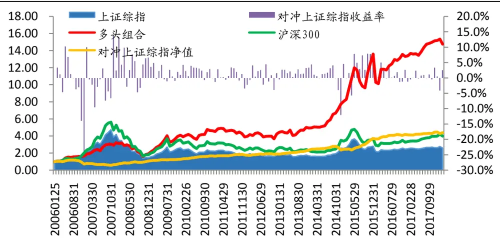
数据来源：wind，广发证券发展研究中心

表 4宏观事件驱动策略分年度收益表现

| 超额收益率 (上证综指） | 胜率 |
| --- | --- |
| 全样本 346.59% | 66.44% |
| 2006 -30.23% | 45.45% |
| 2007 -6.92% | 33.33% |
| 2008 59.66% | 75.00% |
| 2009 19.49% | 66.67% |
| 2010 30.50% | 83.33% |
| 2011 7.37% | 66.67% |
| 2012 5.63% | 58.33% |
| 2013 24.51% | 91.67% |
| 2014 0.23% | 66.67% |
| 2015 57.80% | 83.33% |
| 2016 12.46% | 66.67% |
| 2017 6.85% | 58.33% |
| 2018(截止 03.30) -0.12% | 66.67% |

数据来源：wind，广发证券发展研究中心

表5风格因子对应事件驱动表

| 风格因子 | 宏观因子 | 事件模式 |
| --- | --- | --- |
| 销售净利率 | 人民币：实际有效汇率指数 | 连续上涨(6期) |
| 毛利率 | OECD 综合领先指标:中国 | 连续上涨(9期) |
|  | 人民币：实际有效汇率指数 | 连续上涨(6期) |
| 股东权益增长率 | 22 省市猪肉均价 | 突破布林带上界(9 期) |
| 总资产增长率 | 22 省市猪肉均价 | 突破布林带上界(9期) |
| 净利润增长率 | 22 省市猪肉均价 | 突破布林带上界(9期) |
| 每股净资产增长率 | 美元指数：月 | 突破布林带下界(6期) |
|  | 22 省市猪肉均价 | 突破布林带上界(9期) |
|  | 22 省市猪肉均价 | 最近新高(6期) |
|  | CPI同比 各项存款余额同比 | 最近新高(6 期) |
| ROE 增长率 | 盈利增速(季度) | 突破布林带下界(6期) 最近新高(6 期) |
|  | 社会消费品零售总额同比 | 最近新高(6 期) |
|  | 22 省市猪肉均价 | 最近新高(6 期) |
|  | CPI 同比 |  |
|  | 消费者信心指数(月) | 最近新高(6 期) 最近新高(9 期) |
| 流通股本/总股本 | 盈利增速(季度) | 最近新高(4 期) |
|  | PPI:全部工业品:环比 | 最近新高(6 期) |
|  | 各项存款余额同比 | 最近新高(12 期) |
|  | 波罗的海干散货指数(BDI):月 | 突破布林带上界(6 期) |
|  | 美元指数:月 | 突破布林带下界(6期) |
| 流通市值/总市值 | 全市场 PE | 突破布林带上界(9 期) |
|  | 发电量当月同比 | 最近新高(12 期) |
|  | CPI环比 | 突破布林带上界(6 期) |
|  | PPI 同比 | 突破布林带上界(9期) |
|  | 美国国债10Y 收益率 | 突破布林带下界(12 期) |
| 资产负债率 | WTI原油期货价 | 最近新低(12 期) |
|  | 22 省市猪肉均价 | 突破布林带上界(9期) |
|  | CPI 同比 | 突破布林带上界(6期) |
|  | OECD 综合领先指标:中国 | 连续上涨(9期) |
|  | 全市场换手率 | 最近新低(12期) |
| 1个月成交金额 | PPI 同比 | 最近新高(6 期) |
|  | 中债1Y收益率 | 最近新高(6期) |
|  | 中债5Y收益率 | 最近新高(6 期) |
|  | GDP 同比(季度) |  |
|  |  | 最近新低(4期) |
| 近3个月平均成交量 | 盈利增速(季度) PPI 同比 | 最近新低(4 期) |
|  | 金融机构各项贷款余额同比 | 最近新高(6期) 突破布林带下界(6期) |
|  | 金融机构各项贷款余额同比 | 最近新低(9期) |

识别风险，发现价值

|  | 各项存款余额同比 | 最近新高(6期) |
| --- | --- | --- |
|  | 盈利增速(季度) | 最近新低(4期) |
| 换手率 | PPI 同比 | 突破布林带上界(6 期) |
|  | M2 同比 | 突破布林带下界(6期) |
|  | 宏观经济景气指数:先行指数 | 最近新高(9期) |
|  | 美元指数：月 | 最近新低(9期) |
|  | 全市场换手率 | 最近新高(6 期) |
| 一个月股价反转 | 消费者信心指数(月) | 最近新低(6期) |
|  | OECD 综合领先指标:中国 | 最近新低(6 期) |
|  | 宏观经济景气指数：先行指数 | 最近新低(6期) |
|  | 全市场 PE | 最近新低(6 期) |
|  | GDP 同比(季度) | 最近新低(4期) |
| 三个月股价反转 | 固定资产投资完成额累计同比 | 连续下跌(6 期) |
|  | PPI 同比 | 最近新高(6 期) |
|  | OECD 综合领先指标:中国 | 最近新低(6 期) |
|  | GDP 同比(季度) | 最近新低(4 期) |
|  | 盈利增速(季度) | 最近新低(4 期) |
| 六个月股价反转 | 消费者信心指数(月) | 最近新低(6期) |
|  | OECD 综合领先指标:中国 | 最近新低(6 期) |
|  | 宏观经济景气指数：先行指数 | 最近新低(6期) |
|  | GDP 同比(季度) |  |
|  | 盈利增速(季度) | 最近新低(4 期) |
| 一年股价反转 | 中债5Y收益率 | 最近新低(4期) 最近新低(9 期) |
|  | 消费者信心指数(月) |  |
|  | OECD 综合领先指标:中国 | 最近新低(6期) |
|  |  | 最近新低(6 期) |
|  | GDP 同比(季度) 盈利增速(季度) | 最近新低(4 期) |
| 最高点距离 |  | 最近新低(4 期) |
|  | M1 同比 | 最近新低(6期) |
|  | 消费者信心指数(月) | 突破布林带下界(6期) |
|  | 消费者信心指数(月) | 最近新低(6期) |
|  | 全市场 PE | 最近新低(6 期) |
| 容量比 | 全市场 PB | 最近新低(6期) |
|  | M1 同比 | 最近新低(9 期) |
|  | 中债1Y收益率：-中债5Y收益率 中债1Y 收益率:-中债10Y 收益率 | 最近新低(6期) |
|  |  | 最近新低(6 期) |
|  | 宏观经济景气指数：先行指数 | 最近新低(12 期) |
| 流通市值 | 全市场 PB 社会消费品零售总额同比 | 最近新低(12 期) |
|  | 贸易差额:当月值 | 最近新高(6期) |
|  |  | 最近新高(6 期) |
|  | PPI 同比 | 突破布林带上界(6期) |
|  | PPI 同比 | 最近新高(6 期) |
|  | 金融机构各项贷款余额同比 | 最近新高(6期) |

识别风险，发现价值

| 总资产 | 发电量当月同比 | 最近新高(6 期) |
| --- | --- | --- |
|  | PPI 同比 | 最近新高(6期) |
|  | 金融机构各项贷款余额同比 | 最近新高(6 期) |
|  | 当月新增人民币贷款 | 最近新高(6 期) |
|  | 消费者信心指数(月) | 最近新低(12 期) |
| 存货周转率 | 波罗的海干散货指数(BDI):月 | 突破布林带上界(6期) |
|  | 宏观经济景气指数:先行指数 | 最近新高(6 期) |
|  | 全市场 PB | 最近新高(9期) |
|  | GDP 同比(季度) | 最近新高(4 期) |
| 长期负债比率 | 发电量当月同比 | 最近新高(12 期) |
|  | M1 同比 | 突破布林带上界(12 期) |
|  | 全市场换手率 | 最近新低(9期) |
| 每股负债比 | PPI 同比 | 最近新高(6 期) |
|  | PMI | 最近新低(12 期) |
|  | OECD 综合领先指标:中国 | 连续上涨(9期) |
|  | 人民币：实际有效汇率指数 | 最近新高(12 期) |
|  | 美元指数:月 | 突破布林带上界(6 期) |
| 财务费用比例 | 22 省市猪肉均价 | 最近新高(6 期) |
|  | CPI 同比 | 最近新高(6 期) |
|  | PPI:全部工业品：环比 | 突破布林带下界(6期) |
|  | OECD 综合领先指标:中国 | 连续上涨(6期) |
|  | OECD 综合领先指标：中国 | 最近新高(12 期) |
| 固定比 | PMI | 最近新高(12 期) |
|  | OECD 综合领先指标：中国 | 连续上涨(6期) |
|  | OECD 综合领先指标:中国 | 最近新高(9 期) |
|  | GDP 同比(季度) | 突破布林带下界(8期) |
|  | GDP 同比(季度) | 最近新高(6 期) |
| 速动比率 | OECD 综合领先指标：中国 | 连续上涨(9期) |
|  | 美元指数:月 | 突破布林带上界(6 期) |
|  | 美元指数:月 |  |
|  | 美国新增非农人数 | 最近新高(6 期) |
|  | 全市场换手率 | 最近新高(6 期) |
| 流动比率 | OECD 综合领先指标:中国 | 最近新低(9期) |
|  | 人民币：实际有效汇率指数 | 连续上涨(9 期) |
|  | 美元指数:月 | 连续上涨(6 期) |
|  | 美国新增非农人数 | 突破布林带上界(6 期) |
|  | 全市场换手率 | 最近新高(6期) |
| 净利润现金占比 | 固定资产投资完成额累计同比 | 最近新低(12 期) 突破布林带下界(9期) |
|  | M2 同比 | 最近新高(9 期) |
|  | 消费者信心指数(月) | 最近新高(12 期) |
|  | 美元指数:月 | 突破布林带下界(6 期) |
|  | WTI原油期货价 | 突破布林带上界(6期) |

识别风险，发现价值

| 总资产周转率 | M1 同比 | 突破布林带下界(6 期) |
| --- | --- | --- |
|  | 中债1Y收益率：-中债10Y收益率 | 最近新低(6期) |
| 流动负债率 | 22 省市猪肉均价 | 突破布林带下界(6 期) |
|  | 22 省市猪肉均价 | 最近新低(6期) |
|  | 中债5Y收益率 | 最近新低(6 期) |
|  | PMI | 最近新低(9期) |
| 营业费用比例 | 人民币:实际有效汇率指数 | 突破布林带上界(12 期) |
|  | M0 同比 | 最近新低(6期) |
|  | 金融机构各项贷款余额同比 | 最近新低(12 期) |
|  | 各项存款余额同比 | 最近新高(6期) |
|  | 宏观经济景气指数:先行指数 | 突破布林带上界(6 期) |
|  | 美国新增非农人数 | 最近新高(6 期) |
| 每股派息/股价 | 22 省市猪肉均价 | 最近新高(12 期) |
|  | PPI 同比 | 连续上涨(6 期) |
|  | 中债5Y收益率 | 突破布林带上界(9 期) |
|  | 人民币：实际有效汇率指数 | 突破布林带上界(6期) |
|  | WTI 原油期货价 | 最近新高(9 期) |
| CFP(行业相对) | CPI 同比 | 最近新高(12 期) |
|  | 各项存款余额同比 | 最近新低(6 期) |
|  | 中债5Y收益率 | 突破布林带上界(9期) |
|  | WTI原油期货价 | 突破布林带上界(6 期) |
|  | WTI原油期货价 | 最近新高(9期) |
| EP(行业相对) | 22 省市猪肉均价 | 最近新高(6 期) |
|  | 各项存款余额同比 | 最近新低(6期) |
|  | 中债1Y收益率 | 最近新高(6 期) |
|  | 波罗的海干散货指数(BDI):月 |  |
|  | GDP 同比(季度) | 最近新高(6 期) 最近新低(4 期) |
| SP(行业相对) | M2 同比 | 最近新高(12 期) |
|  | 中债 1Y 收益率:-中债 5Y 收益率 |  |
|  | 宏观经济景气指数：先行指数 | 最近新低(9 期) |
|  | 美元指数:月 | 最近新低(12 期) |
|  | WTI 原油期货价 | 突破布林带下界(6 期) |
| BP(行业相对) | PPI 同比 | 突破布林带上界(9期) 最近新高(6 期) |
|  | 中债1Y收益率 |  |
|  | OECD 综合领先指标:中国 | 最近新高(6期) |
|  | WTI原油期货价 | 最近新低(6 期) |
|  | GDP 同比(季度) | 最近新高(6期) 最近新低(4 期) |
| CFP | CPI 同比 | 最近新高(12 期) |
|  | 各项存款余额同比 | 最近新低(6 期) |
|  | 中债5Y收益率 | 突破布林带上界(9期) |
|  | WTI 原油期货价 WTI 原油期货价 | 突破布林带上界(6期) 最近新高(6期) |

识别风险，发现价值

|  | 发电量当月同比 | 最近新低(6期) |
| --- | --- | --- |
| EP | PPI 同比 | 最近新高(6期) |
|  | 中债1Y收益率 | 最近新高(6 期) |
|  | WTI 原油期货价 | 最近新高(6期) |
|  | GDP 同比(季度) | 最近新低(4 期) |
|  | 中债1Y收益率：-中债5Y收益率 | 最近新低(9期) |
|  | 宏观经济景气指数:先行指数 | 最近新低(12 期) |
|  | 美元指数：月 | 突破布林带下界(6期) |
|  | WTI 原油期货价 | 突破布林带上界(6 期) |
|  | 全市场PB | 最近新低(12 期) |
| BP | M1 同比 | 最近新低(6 期) |
|  | 各项存款余额同比 | 突破布林带下界(6期) |
|  | 各项存款余额同比 | 最近新低(6 期) |
|  | GDP 同比(季度) | 最近新低(4期) |
|  | 盈利增速(季度) | 最近新高(4 期) |
| 一个月股价动量 | 工业增加值同比 | 突破布林带上界(6期) |
|  | 工业增加值同比 | 最近新高(6 期) |
|  | 社会消费品零售总额同比 | 突破布林带上界(6期) |
|  | M0 同比 | 突破布林带下界(9期) |
|  | 消费者信心指数(月) | 最近新高(6期) |
|  | 工业增加值同比 | 突破布林带下界(9 期) |
| 三个月股价动量 | 工业增加值同比 | 最近新低(12 期) |
|  | 发电量当月同比 | 突破布林带下界(6期) |
|  | 中债1Y收益率：-中债5Y收益率 | 最近新高(12 期) |
|  | 波罗的海干散货指数(BDI):月 |  |
|  | 发电量当月同比 | 突破布林带上界(12 期) |
| 六个月股价动量 | 社会消费品零售总额同比 | 突破布林带下界(6期) 突破布林带上界(6 期) |
|  | CPI环比 |  |
|  | 金融机构各项贷款余额同比 | 突破布林带上界(9期) |
|  |  | 突破布林带下界(9 期) |
|  | 波罗的海干散货指数(BDI):月 | 突破布林带上界(12 期) |
| 一年股价动量 | 社会消费品零售总额同比 | 突破布林带上界(6 期) |
|  | CPI环比 | 突破布林带上界(6期) |
|  | 消费者信心指数(月) | 突破布林带上界(6 期) |
|  | 消费者信心指数(月) | 最近新高(6期) |
|  | 波罗的海干散货指数(BDI):月 | 突破布林带上界(12 期) |
| 流通市值(大) | 波罗的海干散货指数(BDI):月 | 突破布林带上界(12 期) |
|  | 各项存款余额同比 | 最近新低(6 期) |
|  | 中债5Y收益率 | 突破布林带上界(9期) |
|  | 波罗的海干散货指数(BDI):月 | 突破布林带上界(12 期) |
|  | 波罗的海干散货指数(BDI):月 | 最近新高(6期) |
|  | 盈利增速(季度) | 最近新高(4 期) |

数据来源：wind，广发证券发展研究中心

## 四、基于宏观趋势匹配的风格轮动策略

## （一）基本逻辑

在前一个策略中，我们测算了宏观事件触发与风格轮动的关系。从另一个角度看，当当前一段时间的宏观因子整体走势与历史上某一个时期的整体走势十分相似时，那么说明这两个时期的宏观环境相对较为接近，由于投资者会综合考虑宏观环境因素来进行投资，在相似的宏观环境下，投资者更可能基于之前的相同经验进行投资，从而市场上的风格表现会大概率与历史上相似宏观环境的未来一段时间的风格表现一致。

由于宏观因子数量众多，若是同时将所有宏观因子同时考虑，并以此去判别它跟历史上是否具有整体性相似的时点，那么将很难找到较为相似的时间点，因而无法为我们带来增量信息。若是直接遍历所有宏观因子的可能组合，那么效率较低并容易落入过拟合而缺乏经济逻辑的陷阱。若是考虑的宏观因子太少，又有可能由于容易找到众多相似的宏观走势的时间点从而使得历史时间点缺乏参考意义。基于以上考虑，我们考虑从市场中较受关注的并且与股票市场具有较直接关系的宏观因子中去寻找这样一组宏观因子来进行相似性匹配的研究。由于同一类别的宏观因子往往具有较高相似性，例如货币供应量类的宏观因子中有M1同比及M2同比两个较常见因子，一般而言，通过观察这两个因子的任意一个已经能够获得足够的关于货币供应量的信息，因此我们对于同一类别的宏观因子仅保留一个最具有匹配意义的因子。我们将在样本内通过训练数据的方式找到这样一组最佳的宏观因子，利用这组宏观因子来寻找当前宏观环境与历史中宏观环境最相似的时间点。

## （二）最优宏观因子组合的训练

基于以上的思路，我们将采用以下方法从以上的宏观因子中训练出一组合适的宏观因子：

1) 确定样本训练时间区间，这里采用的是从2009年2月到2017年12月；

2) 首先根据宏观因子数据所在的分类，分别将宏观因子数据分为8大类（见待选宏观因子表）；

3) 分别从所有大类宏观因子中各选出一个宏观因子构成宏观因子组合，并固定该组合；

4) 在每个月末交易日，利用最近12个月的宏观因子数据与历史上所有时间点12个月的宏观因子组合计算匹配度，找到匹配度最高的时间点称为最佳匹配时点，利用最佳匹配时点的未来6个月的风格因子走势作为当前时间点未来宏观因子走势的预测，并从中筛选出最有效的10个风格因子进行配臵，配臵权重为当前的过去12期的宏观因子走势和该匹配时间点未来的6个月的风格因子走势之和；

5) 根据以上的策略运行方式，计算出在该宏观因子走势下策略的最终表现，并记录在本次固定的宏观因子之下策略的IR表现；

6) 遍历完（3）中提及的所有宏观因子组合并找出IR表现最高的一组宏观因子组合，将该宏观因子组合记为策略的最佳宏观因子组合；

7) 经过以上步骤，最终我们获得了如最佳宏观因子组合表的组合。

表6待选宏观因子

| 经济增长类指标 | GDP同比 |
| --- | --- |
|  | 固定资产投资完成额：累计同比 |
| 通胀指标 | CPI同比,PPI同比 |
| 货币指标 | M1：同比 |
|  | M2：同比 |
| 利率指标 | 3个月国债收益率 |
|  | 10年国债收益率 |
| 全市场估值指标 | 全部A股-PE同比 |
|  | 全部A股-PB同比 |
|  | SW大盘指数，SW小盘指数-PE同比 |
|  | SW大盘指数，SW小盘指数-PB同比 |
| 全市场盈利指标 | 全部A股-ROE |
|  | 全部A股-ROA |
|  | SW大盘指数，SW小盘指数-ROE |
|  | SW大盘指数，SW小盘指数-ROA |
| 全市场公司质量指标 | 全部A股-总资产周转率 |
|  | SW大盘指数，SW小盘指数-总资产周转率 |
| 全市场成长指标 | 全部A股-eps |
|  | 全部A股-盈利增速 |
|  | SW大盘指数，SW小盘指数-eps |
|  | SW大盘指数，SW小盘指数-盈利增速 |

数据来源：广发证券发展研究中心， wind资讯

在以上的训练过程中涉及到了匹配度的概念，对于一组给定的宏观因子组合以及给定的两个时间点而言，匹配度的具体计算公式如下：分别计算每个宏观因子在两个时间点最近12个月的相关系数，再计算相关系数的均值称之为匹配度，可以看到，当宏观因子组合在两个时间点的相关系数均值越高，也即是匹配都越高，那么两个时间点宏观因子的整体走势更加相似。

例如，在2016年9月，通过与历史上所有时间点的宏观因子进行匹配对比，可以发现，2007年11月-2008年10月与2015年10月-2016年9月的匹配度最高，达到了78%，因而我们将根据2016年之后6个月风格因子的IR表现，筛选出其中最有效的10个风格因子作为本期风格因子配臵的依据，最终策略在该期获得2.24%的超额收益率。

图9：宏观趋势匹配示例（2016/09/30与2008/10/31）
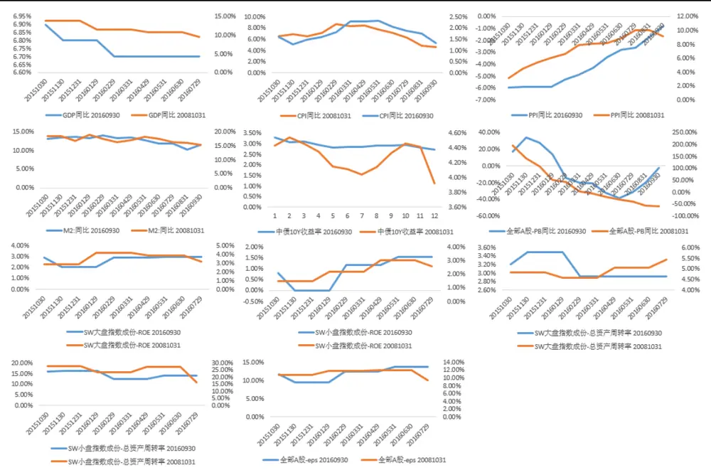
数据来源：广发证券发展研究中心，wind资讯

表7最佳宏观因子组合

| 经济增长类指标 | GDP同比 |
| --- | --- |
| 通胀指标 | CPI同比，PPI同比 |
| 货币指标 | M1：同比 |
| 利率指标 | 3个月国债收益率 |
| 全市场估值指标 | 全部A股-PB同比 |
| 全市场盈利指标 | SW大盘指数，SW小盘指数-ROE |
| 全市场公司质量指标 | SW大盘指数，SW小盘指数-总资产周转率 |
| 全市场成长指标 | 全部A股-eps |

数据来源：广发证券发展研究中心，wind资讯

## （三）策略表现测算

样本设臵： wind数据库中的全市场非停牌并且满足上市满1年的A股股票的行情数据、财务数据、估值数据等，并相应地进行加工处理。

样本区间：2009年-2017年，由于需要用到宏观事件数据，回测从2006年2月开始，其中2009年-2017年为样本内数据，2018年为样本外数据。

风格因子收益率计算：与宏观事件驱动策略相同。

策略设臵：每个月末交易日作为策略的起点，首先根据最佳宏观因子组合，将过去12期的宏观因子数据组分别与之前的宏观因子数据计算相关系数，将相关系数的均值作为匹配度，每期将匹配度最高的历史时间点作为当前时间点的最佳历史匹配时点，接着计算最佳历史匹配时点未来6期的IR表现，仅保留IR表现最高的10个风格因子作为本期的配臵风格因子，再根据最近12期的IR表现以及最佳匹配历史匹配时点的未来6期的IR表现之和（归一化）作为风格因子的配臵权重。

策略对冲：我们采用上证综指作为对冲标的。

## （三）实证结果

从以下回测结果可以看到，在考虑了宏观趋势匹配策略来对风格因子进行配臵后，策略从2009年到2018年2月的累计超额收益率达到192.34%，胜率达到了65.74%，最大回撤仅为18.48%，可以看到最大回撤远比宏观事件驱动策略更小，这主要来源于这一策略的测算时间避开了2008年的金融危机，另一方面，采用了风格趋势的配权方式相比于宏观事件驱动中的等权配臵方式有更高的稳定性。

图10：宏观趋势匹配策略回测结果
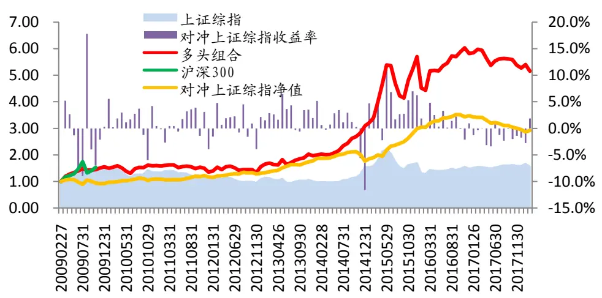
数据来源：wind，广发证券发展研究中心

表 8宏观趋势匹配策略分年度收益表现

| 超额收益率 | 胜率 | 最大回撤 |
| --- | --- | --- |
| 全样本 183.66% | 65.14% | -19.42% |
| 2009 -9.18% | 40.00% | -17.29% |
| 2010 18.15% | 83.33% | -7.14% |
| 2011 7.60% | 58.33% | -3.93% |
| 2012 11.58% | 66.67% | -4.61% |
| 2013 35.65% | 83.33% | -0.91% |
| 2014 -0.26% | 75.00% | -16.55% |
| 2015 68.86% | 91.67% | -2.25% |
| 2016 16.07% | 75.00% | -2.30% |
| 2017 -14.97% | 16.67% |  |
| 2018(截止 03.30) -3.91% | 33.33% | -14.97% -2.79% |

数据来源：wind，广发证券发展研究中心

## 五、综合策略

## （一）基本逻辑

在上方的模型中，我们在事件驱动策略中仅简单使用等权方式对触发事件的风格因子进行配臵，若能同时结合对于风格趋势的强度来对每期配臵的权重进行调整，那么策略将能够获得更高并且更加稳定的超额收益。另一方面，利用宏观趋势匹配策略可以很好地把握对风格因子强度的判断。因而我们考虑将在宏观趋势匹配策略中获得的对风格因子的有效性强弱的判断放入宏观事件驱动策略中。根据这一思想，我们构建了新的策略。在每期进行风格轮动时，首先通过事件驱动策略获得本期被选中的风格因子，称之为触发因子，再通过宏观趋势匹配策略找到最佳匹配时间点，从而找到在最佳匹配时间点未来6期触发因子的IR表现，类似于宏观趋势匹配的做法，我们结合触发因子在当前时刻下最近12期的IR表现，综合这两种因素，从而获得对触发因子的最佳配臵权重，构造出我们每期的风格组合，我们将这一方法称为综合策略。

## （二）策略表现测算

样本设臵：wind数据库中的全市场非停牌并且满足上市满1年的A股股票的行情数据、财务数据、估值数据等，并相应地进行加工处理。

样本区间：2006年-2017年，由于需要用到宏观事件数据，回测从2009年2月开始，其中2009年-2017年为样本内数据，2018年为样本外数据。

风格因子收益率计算：与宏观事件驱动策略相同。

策略设臵：每个月末交易日作为策略的起点，首先根据宏观事件驱动策略找到本期触发的风格因子，利用宏观趋势匹配策略找到最佳历史匹配时点，利用最佳历史匹配时点未来6期的IR表现以及当前最近12期的IR表现对触发的风格因子进行权重配臵。

策略对冲：仍然采用上证综指作为对冲标的。

## （三）实证结果

从以下回测结果可以看到，在考虑了综合策略来对风格因子进行配臵后，策略从2009年到2018年3月的累计超额收益率达到270.88%，胜率达到了71.56%，最大回撤仅为22.08%，可以看到累积超额收益率以及胜率都相比于宏观趋势匹配策略有明显的提高。另一方面，在大部分年份综合策略的胜率和最大回撤相比于宏观事件驱动策略也都有所提高。

图11：综合策略回测结果
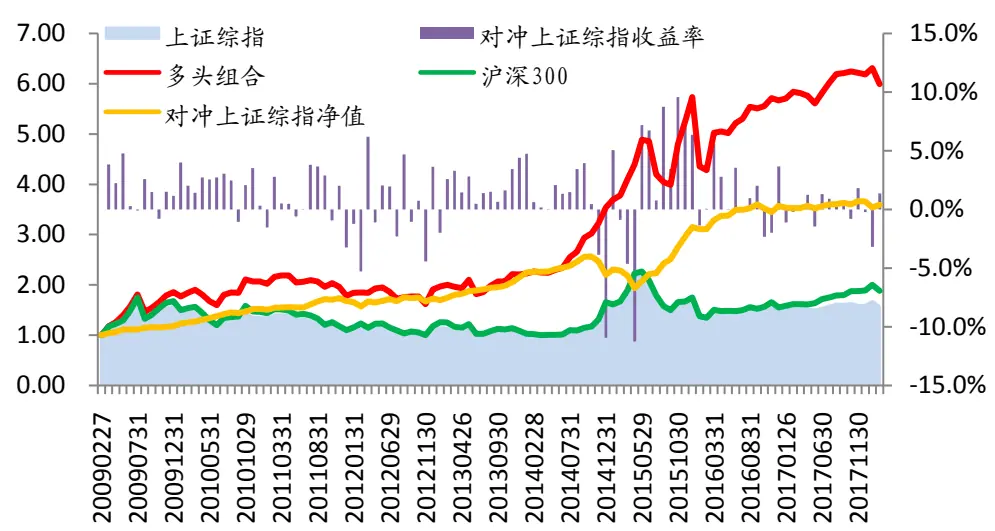
数据来源：广发证券发展研究中心，wind资讯

表 9综合策略分年度收益表现

| 超额收益率 | 胜率 | 最大回撤 |
| --- | --- | --- |
| 全样本 270.88% | 71.56% | -22.08% |
| 2009 15.79% | 80.00% | -2.88% |
| 2010 29.24% | 91.67% | -1.12% |
| 2011 9.10% | 66.67% | -3.03% |
| 2012 5.88% | 50.00% | -4.76% |
| 2013 23.22% | 83.33% | -1.32% |
| 2014 3.84% | 83.33% | -13.67% |
| 2015 46.43% | 75.00% | -13.95% |
| 2016 13.96% | 66.67% | -4.26% |
| 2017 1.96% | 50.00% | -2.51% |
| 2018(截止 03.30) -1.45% | 66.67% | -3.34% |

数据来源：广发证券发展研究中心
识别风险，发现价值

## 六、总结

## （一）策略表现概述

宏观因子的变化反映了经济周期的变化，也反映了宏观环境的变化，投资者的投资情绪，投资风险偏好等方面也会在不同宏观环境下相应作出调整，这一调整会直接作用在股市上，从而影响股市中的风格发生转变。在宏观因子的选择上，我们综合多方面的考虑，分别将货币政策，财政政策，流动性，通胀水平，股市整体性指标等多方面数据，利用统计学方法，通过多种方式寻找宏观因子和风格因子之间的关系，在假设这种关系保持稳定的情况下，根据实时观测到的宏观数据来预测风格未来一段时间的有效性，从而为风格轮动策略提供参考建议并获取超额收益。

在第一种策略中，我们考虑了利用宏观事件这一方法去观察在近期宏观因子的“异常”走势对各个风格因子不同的影响，并从中筛选出对风格因子具有显著影响的宏观事件，利用这一宏观事件的触发来为每期配臵的风格因子提供参考建议。从策略表现看，这一方法为策略带来了显著的超额回报，但是在极端的环境下这一策略也会产生较大的回撤。

除此之外，基于相似的宏观因子趋势会使得市场对未来的风格走势有相同的预期的假设，我们构建了宏观趋势匹配策略，通过比较当前整体的宏观趋势与历史上的相同宏观因子的趋势是否足够相似，也即是匹配度足够高，来利用该历史时点未来一段时间的风格走势对当前风格的配臵提供建议，在这一方法下策略也能获得较稳定的超额回报。

最后，综合考虑了以上两种策略，我们利用宏观事件驱动方法寻找当前时刻应当配臵的风格因子，并利用宏观趋势匹配策略为风格因子提供权重配臵的建议，构建了新的综合策略。从综合策略的表现可以看到,它相比于前两个策略的表现更加稳定，并且能够获得更高的超额回报。

当然，本报告中也存在着一些不足。在本报告中，由于策略在训练过程中训练目标为尽可能地提高策略的多空对冲表现，而在策略的测算过程中，我们采用的是利用上证综指对策略的多头组合进行对冲。训练过程与测算过程中目标的不匹配导致策略表现存在着一定的摩擦，因而若我们进一步改进训练目标使之与测算过程相匹配，那么策略还有进一步的提升空间。

## （二）策略最新推荐

根据我们的综合策略的最新推荐，在2018年4月，我们推荐如下风格因子组合：

表10综合策略2018年4月推荐风格因子组合

| 风格因子 | 配置权重 |
| --- | --- |
| 每股负债比 | 22.40% |
| 资产负债率 | 13.88% |
| CFP(行业相对) | 12.83% |
| CFP | 10.58% |
| 流动负债率 | 9.47% |
| BP(行业相对) | 5.75% |
| EP | 5.70% |
| 一个月股价反转 | 5.45% |
| SP | 5.26% |
| 六个月股价反转 | 2.62% |
| 一年股价反转 | 2.49% |
| 总资产 | 2.16% |
| 股息率 | 1.41% |

数据来源：wind，广发证券发展研究中心

## 风险提示

本篇报告通过历史数据统计、建模和测算完成，仅作为风格轮动中风格配臵的研究，在宏观政策超出预期的波动以及市场环境变化下可能存在失效风险。

## Table_RatingIndustryTable_RatingIndustry 广发证券—行业投资评级说明

买入： 预期未来 12 个月内，股价表现强于大盘 10%以上。

持有： 预期未来12个月内，股价相对大盘的变动幅度介于-10%～+10%。

卖出： 预期未来12个月内，股价表现弱于大盘10%以上。

## Table_RatingCompany 广发证券—公司投资评级说明

买入： 预期未来12个月内，股价表现强于大盘15%以上。

谨慎增持： 预期未来12个月内，股价表现强于大盘5%-15%。

持有： 预期未来12个月内，股价相对大盘的变动幅度介于-5%～+5%。

卖出： 预期未来12个月内，股价表现弱于大盘5%以上。

## Table_Ad联系我们

|  | 广州市 | 深圳市 | 北京市 | 上海市 |
| --- | --- | --- | --- | --- |
| 地址 | 号耀中广场 A 座 1401 | 广州市天河区林和西路9 深圳福田区益田路6001号 | 北京市西城区月坛北街2号 | 上海浦东新区世纪大道8号 |
| 邮政编码 | 510620 | 太平金融大厦31层 | 月坛大厦18层 | 国金中心一期16层 |
|  |  | 518000 | 100045 | 200120 |
| 客服邮箱 服务热线 | gfyf@gf.com.cn |  |  |  |

## Table_Disclaimer 免 责声 明

广发证券股份有限公司（以下简称“广发证券”）具备证券投资咨询业务资格。本报告只发送给广发证券重点客户，不对外公开发布，只有接收客户才可以使用，且对于接收客户而言具有相关保密义务。广发证券并不因相关人员通过其他途径收到或阅读本报告而视其为广发证券的客户。本报告的内容、观点或建议并未考虑个别客户的特定状况，不应被视为对特定客户关于特定证券或金融工具的投资建议。本报告发送给某客户是基于该客户被认为有能力独立评估投资风险、独立行使投资决策并独立承担相应风险。

本报告所载资料的来源及观点的出处皆被广发证券股份有限公司认为可靠，但广发证券不对其准确性或完整性做出任何保证。报告内容仅供参考，报告中的信息或所表达观点不构成所涉证券买卖的出价或询价。广发证券不对因使用本报告的内容而引致的损失承担任何责任，除非法律法规有明确规定。客户不应以本报告取代其独立判断或仅根据本报告做出决策。

广发证券可发出其它与本报告所载信息不一致及有不同结论的报告。本报告反映研究人员的不同观点、见解及分析方法，并不代表广发证券或其附属机构的立场。报告所载资料、意见及推测仅反映研究人员于发出本报告当日的判断，可随时更改且不予通告。

本报告旨在发送给广发证券的特定客户及其它专业人士。未经广发证券事先书面许可，任何机构或个人不得以任何形式翻版、复制、刊登、转载和引用，否则由此造成的一切不良后果及法律责任由私自翻版、复制、刊登、转载和引用者承担。