# 机器学习多因子动态调仓策略

## ——多因子 Alpha 系列报告之（三十六）

## Table_Sum ary报告摘要 ：

## 传统因子表现不佳，因子择时大显身手

在历史上表现良好的规模、反转和流动性因子在 17年以来都出现了明显的回撤，导致主流多因子选股策略表现欠佳。在这样的大背景下，如何把握Alpha 因子的风格轮动，选择最有效的风格因子，成为重要的研究课题。

## 基于机器学习的因子择时框架

本报告选择常见的 7 个风格因子，通过机器学习方法，基于历史数据提炼因子风格轮动的规律，将因子 IC 历史信息、宏观经济变量、市场变量等信息作为特征，采用性能优良的 XGBoost 模型对因子未来的 IC 进行预测，来衡量不同风格因子未来选股的有效性。在因子配权时，赋予预期表现好的因子更高的权重，而减小预期表现不佳的因子的权重。

## 基于机器学习的多因子动态调仓策略

根据机器学习模型对不同风格因子未来一期 IC 的预测，对因子动态加权得到复合因子。根据复合因子得分进行调仓，等权买入复合因子得分最高一档的个股。

与因子等权策略相比，因子动态调仓策略的换手率较高，导致多因子组合的部分收益被交易成本蚕食，降低每次调仓的换手率能够显著增强本报告提出的动态调仓策略。

基于滚动样本训练的机器学习多因子动态调仓策略能够更好地追踪市场风格的变化，2014 年以来该策略累积收益率达到 107.89%，胜率达到63.21%，年化收益率达到 20.08%，最大回撤为 7.68%，信息比为 1.74，分别较因子等权策略和固定模型的多因子策略提高了59.6%和 27.9%。

## 结论

回测表明，限制换手率的多因子动态调仓策略的表现显著好于因子等权策略，而基于模型滚动训练的策略则进一步提升了策略表现，在胜率、年化收益率、信息比、最大回撤等各项指标上都显著高于因子等权策略。分年度来看，在市场风格稳定的年份里，基于模型滚动训练的多因子策略能够获得更高的超额收益，而在市场风格剧变的年份里，该策略也能做出相应调整，始终获得更好的表现。

## 风险提示

本报告提出的机器学习多因子动态调仓策略基于历史数据进行回测，策略模型并非百分百有效，市场结构及交易行为的改变以及类似交易参与者的增多有可能使得策略失效。

图 1：机器学习多因子动态调仓策略的样本外净值曲线
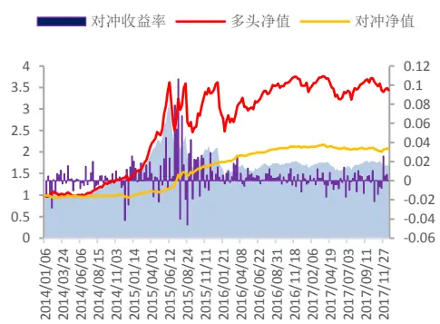
图 2：因子等权以及两种动态调仓策略的样本外净值曲线

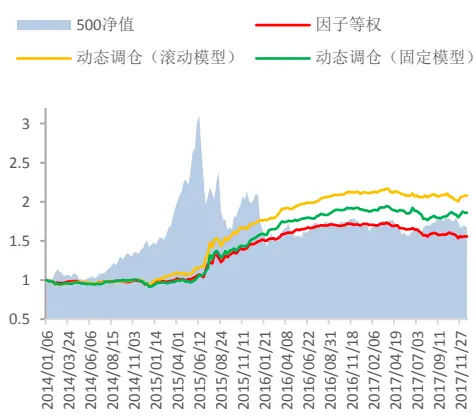

Table_Aut h 分析师： or 文巧钧 S0260517070001

020-87555888-8400

wenqiaojun@gf.com.cn

分析师： 安宁宁 S0260512020003

0755-23948352

ann@gf.com.cn

## Table_Report 相关研究：

| 多因子 ALPHA 系列报告之 | 2012-08-01 |
| --- | --- |
| （十二）--从ICIR角度探讨 |  |
| 风格因子的均值回复性 |  |
| 多因子 ALPHA 系列报告之 | 2014-08-25 |
| (二十)-- 基于风格回复的 |  |
| 多因子动态调仓策略 | 2018-04-08 |
| 多因子 ALPHA 系列报告之 |  |
| (三十五)--宏观视角下的 风格轮动探讨 |  |

## 一、背景介绍

## 1.1 主流因子历史表现

多因子选股策略是A股市场最主流的量化交易策略之一，其本质是：市场中的个股行情会出现分化，对个股的分化特征进行提取得到所谓的风格因子。风格因子是Alpha收益的最终来源，而因子的有效性则直接影响Alpha策略的收益。通过对国内A股市场进行分析，我们发现在不同阶段，个股均出现不同的分化规律，这意味着A股市场长期存在Alpha。然而，股市是一个博弈的游戏，随着时间的推移和市场博弈，任何一个风格因子都不可能长期产生稳定的Alpha收益。在中证500成份股的备选池下，按月调仓，考察自2011年1月至2017年12月主流因子的表现，如图1所示，在历史上表现良好的规模因子、反转因子和流动性因子在17年以来都出现了明显的回撤，导致主流的多因子组合表现欠佳。

本报告从常见的盈利、质量、成长、估值、规模、流动性、技术等7大类因子中各选择一个典型因子，表1统计了各个因子从2007年1月至2017年12月在中证500成份股内选股的IC值，其中负向因子的IC值取相反数进行调整，因而经过方向调整的IC值越大，表示因子选股的性能越好。如表1所示，速动比率、流通市值、月成交金额、一个月动量这四个因子在近一年的平均IC值较长期的历史均值有明显的降低，而ROE、ROE同比和EP这三个因子在近一年的平均IC值较长期的历史均值有明显的提升，这也说明了因子风格不是一成不变的。在这样的大背景下，如何把握Alpha因子的走向，动态地对选择最有效的风格因子，成为非常有意义的研究课题。

国外的学者早在2000年以前就发现在美股市场，存在着明显的价值类因子（PE、PB等）和规模类因子（流通市值等）之间的风格轮动。G. Nalbantov, R.Bauer等人通过研究发现，因子风格轮动现象与系统的经济状况和市场状况有关。Keith Miller和Hong Li等人发现Alpha因子的有效性与动量、历史波动率等市场变量和原油价格、美元汇率等宏观经济变量紧密相关。

本报告研究的是“因子择时”，通过机器学习方法，基于历史数据提炼因子风格轮动的规律，对因子的未来表现进行预测，在因子配权时，赋予预期表现好的因子更高的权重，而减小预期表现不佳的因子的权重。

图1：主流因子历史累积收益率曲线
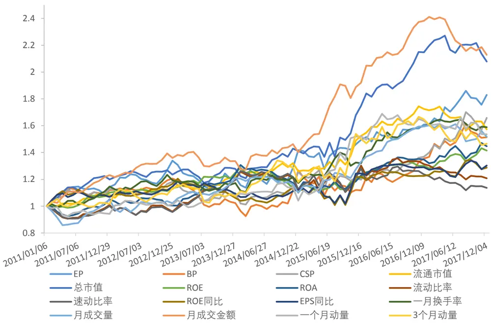
数据来源：广发证券发展研究中心，Wind

表 1：常见因子历史 IC 统计表

| 因子名称 | 因子 方向 | 近1年 平均 IC | 近2年 平均 IC | 近3年 平均IC | 近11年 平均IC | 近11年IC 标准差 | 近11年 ICIR | 1年IC- 11年IC |
| --- | --- | --- | --- | --- | --- | --- | --- | --- |
| ROE | 正 | 3.83 | 2.56 | 2.15 | 0.72 | 12.42 | 0.06 | 3.10 |
| 速动比率 | 正 | -0.62 | -0.39 | 0.66 | 0.68 | 11.22 | 0.06 | -1.30 |
| ROE 同比 | 正 | 3.28 | 2.02 | 1.84 | 0.88 | 7.62 | 0.12 | 2.39 |
| EP | 正 | 4.95 | 4.84 | 4.06 | 3.01 | 12.14 | 0.25 | 1.94 |
| 流通市值 | 负 | -2.83 | 0.94 | 3.18 | 2.87 | 9.91 | 0.29 | -5.71 |
| 月成交金额 | 负 | 2.41 | 5.98 | 6.55 | 5.87 | 13.55 | 0.43 | -3.46 |
| 一个月动量 | 负 | 1.93 | 4.69 | 6.63 | 6.44 | 15.94 | 0.40 | -4.52 |

数据来源：广发证券发展研究中心,Wind

## 1.2 因子择时理论

市场上主流的因子择时方法主要有两大类。一类是从因子收益率时间序列本身出发，探究因子风格在不同的时间长度内可能存在的动量或者反转效应。因子IC指的是截面因子值与个股下期收益率之间的相关系数，能够反映因子提供超额收益的能力。《多因子Alpha系列报告之（十二）——从ICIR角度探讨风格因子的均值回复性》中，我们实证了因子IC与ICIR之间存在显著的负相关关系，因此基于因子均值回复性的因子择时策略能够有效提高多因子Alpha策略的收益情况。而另一类，则认为宏观经济情况、市场情况等外部条件会对因子收益率有潜在影响，当给定这些外在条件的取值时，我们可以通过统计模型来预测因子未来的收益情况。

影响因子风格轮动的宏观经济变量和市场变量有很多，比如CPI、汇率、国债利率、市场的波动率，等等。而且这些变量对因子收益率影响的方式各不相同，这种复杂关系很难通过线性模型来刻画。

提升树模型是一个性能强大的非线性机器学习模型，相对于线性回归等模型，它不对输入特征的分布有过多假设，对异常值更加鲁棒，且能够学习到特征之间复杂的非线性关系。一般来说，我们可以通过对特征做交叉、采用核函数等方式，使得线性模型也能处理非线性问题，但是如何做特征交叉、选择什么核函数都需要人工干预，事实上要在模型学习前确定合理的特征交叉方式和核函数是很有难度的。而随着决策树的生长，提升树模型能够自适应地产生高度非线性的模型。此外，相对于神经网络等复杂模型来说，提升树模型的可解释性更强，可控性更好。因此，本报告中采用提升树模型来预测因子的有效性。

本报告提出的基于XGBoost模型的多因子动态调仓策略是综合了以上两类因子择时思想，分别将因子IC序列本身、宏观经济变量、市场变量等信息作为特征，采用性能优良的XGBoost模型对因子IC进行预测，根据IC值动态调整各个因子的权值。

## 二、因子择时框架

在之前的多因子Alpha系列报告中，我们已经建立了一个完整的多因子Alpha选股模型，包括风格因子库的建立、风格因子有效性的检测、Alpha因子的整合以及组合优化和对冲等主要步骤。本报告主要侧重于Alpha因子的整合和赋权。如图2所示，我们首先选择了7大类常见的风格因子，然后将宏观变量、因子历史IC序列以及市场变量作为输入的特征，利用XGBoost模型来预测每个风格因子未来的IC值。在Alpha因子整合阶段，根据预期的IC值对各个因子赋权。

图2：因子择时整体框架示意图
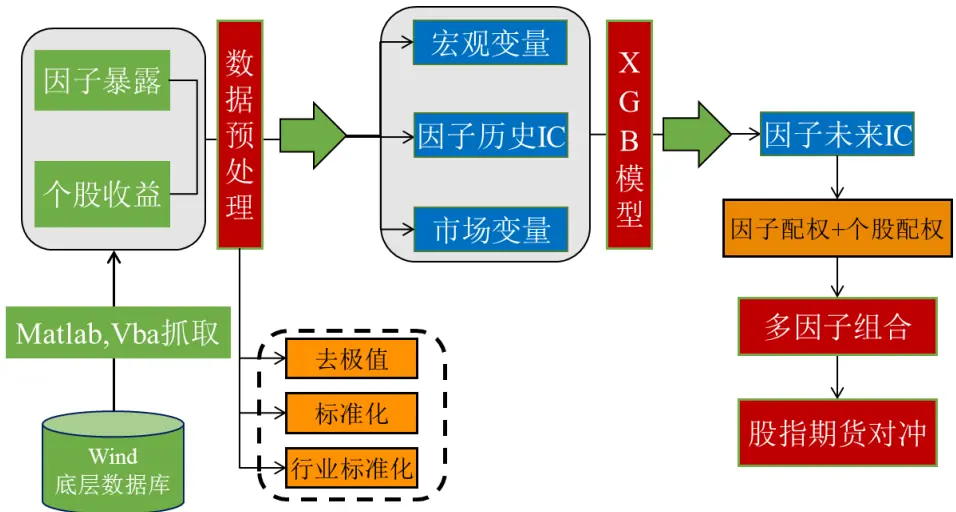
数据来源：广发证券发展研究中心

## 2.1 风格因子的选取

本报告从常见的盈利、质量、成长、估值、规模、流动性、技术等7大类因子中选取7个典型因子作为研究对象，所选因子如下表所示。

表 2：所选因子及其分类

| 因子类别 | 因子名称 | 因子描述 |
| --- | --- | --- |
| 盈利 | ROE | 净资产收益率 |
| 质量 | 速动比率 | 上期财报速动比率 |
| 成长 | YOYROE | ROE 同比增长率 |
| 估值 | EP | 市盈率的倒数 |
| 规模 | 流通市值 | 流通市值 |
| 流动性 | 月成交金额 | 过去20 个交易日成交金额算术平均 |
| 技术 | 股价反转 | 过去20个交易日涨跌幅 |

数据来源：广发证券发展研究中心

每个因子都采用分位数变换进行标准化，只保留因子排名信息，这种标准化方法的优点是可以避免极端值的影响。具体做法是，对于每一个因子，每只股票先根据因子值进行排序得到 $Rank(stock_{i},factor_{j})$ ，这样，第i只股票在第j个因子上的取值为

$$
Score(stock_{i},factor_{j})=\frac{Rank\left(stock_{i},factor_{j}\right)}{N}
$$

其中N表示参与排名的股票总数。

## 2.2 外部变量的选取

A股市场受市场交易行为以及宏观经济因素的影响较大，因此风格因子的有效性也与市场变量和宏观变量密切相关。本报告选择了6个市场变量，其中沪深300过去20日的涨跌幅和中证500过去20日的涨跌幅用来表征大小盘市场的强弱，沪深300过去20日的波动率和中证500过去20日的波动率用来表征市场波动性的高低，沪深300过去20日平均换手率和中证500过去20日平均换手率用来表征市场流动性的好坏。选择了7个关键的宏观经济变量：CPI同比、M1同比、M2同比、一周上海银行间同业拆放利率（SHIBOR1W）、PPI同比、PMI和美元兑人民币汇率。

值得注意的是宏观经济类的数据通常在次月公布，因此实际应用时，此类数据有一个月的滞后期。此外，有些宏观变量在时间轴上的分布非平稳，不同时期的取值可能存在很大的差别，不具备可比性。如下图所示，2009年下半年M2同比创下新高，此后保持一种下降的趋势。可以通过对其作一阶差分，得到更加平稳的时间序列，使不同历史时期的取值具有可比性。假设因子Factor在第i个月取值为 $x_{i}$ ，第i+1个月取值为 $x_{i+1}$ ，则第i+1个月因子的一阶差分为 ${\mathrm{diff}}=x_{i+1}-x_{i}$ 。此外，从实际的角度来说，人们有时候对变量取值变化的敏感度要超过对变量取值本身，因此差分处理是合适的。

图3：宏观因子处理前后分布对比图（%）
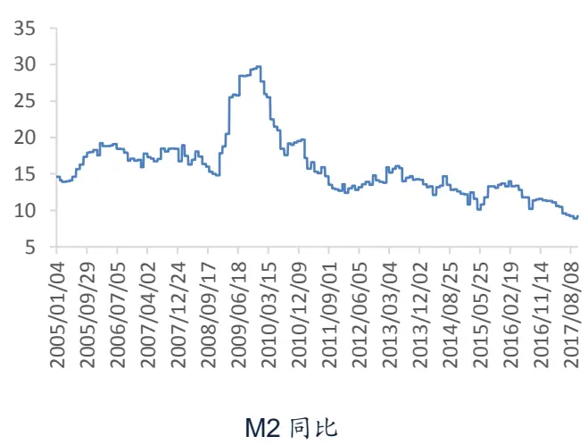
数据来源：广发证券发展研究中心,Wind

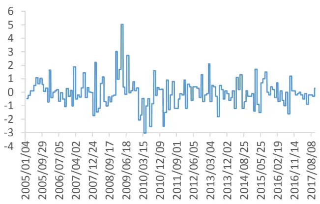
M2 同比的一阶差分

不同的外部变量具有不同的分布特性，需要采取不同的处理方法，使他们具有相对合理的分布。对于本报告中所选的市场变量和宏观变量的处理方法如表3所示。

表 3：所选的外部变量及其处理方法

| 变量类别 | 变量名称 | 变量处理方法 |
| --- | --- | --- |
| 市场变量 | 沪深 300月涨跌幅 | 一阶差分 |
|  | 中证500月涨跌幅 | 一阶差分 |
|  | 沪深 300月波动率 | 不处理 |
|  | 中证500 月波动率 | 不处理 |
|  | 沪深300月均换手率 | 变化率 |
|  | 中证500 月均换手率 | 变化率 |
| 宏观变量 | CPI 同比 | 一阶差分 |
|  | M1 同比 | 一阶差分 |
|  | M2 同比 | 一阶差分 |
|  | SHIBOR1W | 变化率 |
|  | PPI 同比 | 一阶差分 |
|  | PMI | 一阶差分 |
|  | 美元兑人民币汇率 | 变化率 |

数据来源：广发证券发展研究中心

## 2.3 XGBoost 模型简介

提升（Boosting）是一种集成学习方法，它是基于这样一种思想：对于一个复杂任务来说，将多个专家的判断进行适当的综合所得出的判断，要比其中任何一个专家独立决定要好，实际上，就是“三个臭皮匠顶个诸葛亮”的道理。对于分类问题来说，给定数据集的情况下，求一个粗糙的分类规则比求一个精确的分类规则要容易的多，提升方法就是从弱学习算法出发，反复学习，得到一系列弱分类器（也叫基本分类器），然后对这些弱分类器进行组合，最后构成一个强分类器。

提升树（Boosting Tree）是以分类树或回归树为基本分类器的提升方法，它被认为是统计学习中性能最好的方法之一。多棵树的线性组合可以很好地拟合训练数据，能够刻画输入与输出数据之间复杂的非线性关系。因此它是一个高功能的学习算法，近年来获得了非常广泛的应用，在各大知名机器学习比赛上（例如国外的Kaggle平台，国内的天池平台），获奖选手几乎有一半以上都会使用到这个模型。

由于提升方法应用广泛而且有效，关于这方面的研究很多，很多相关算法被提出，其中最具代表性的是AdaBoost算法和梯度提升算法（Gradient Boosting）。本报告采用的XGBoost模型是近年来非常火的一种机器学习模型，全称是eXtremeGradient Boosting，由华盛顿大学的陈天奇博士发起，是梯度提升树的一种高效实现，曾经横扫Kaggle大赛。本节将对XGBoost模型做一个简单的介绍。

## 2.3.1 决策树模型

CART分类器是一种流行的决策树模型，全称是分类与回归树（ClassificationAnd Regression Tree, CART），常被用作梯度提升树的基本分类器。CART每个节点只分裂成两个子节点，是一棵二叉树，可用于分类和回归问题。

我们先引入生活中的一个简单例子来描述如何用决策树来处理回归问题。假如我们已知某个小区里N个居民的每周上网时长，每个居民分别对应年龄、性别、职业等特征，我们要预测某个未统计过的居民小王的每周上网时长。如图4所示，我们根据小王的年龄、性别等可以将其划入某个分组，假设该组里有n个样本，那么取这n个样本的均值来作为小王上网时长的预测值，这就是决策树回归。

图4：CART示意图
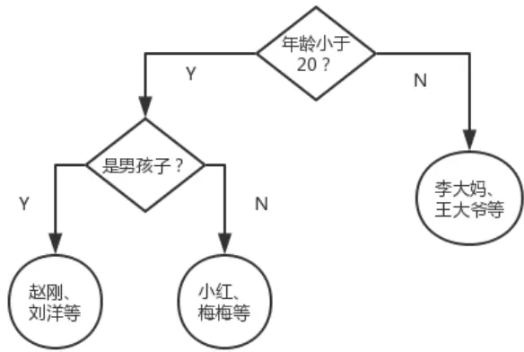
数据来源：广发证券发展研究中心

下面我们来介绍一下用于处理回归问题的决策树生成的具体过程。假设X和Y分别为输入和输出变量，并且Y是连续变量，给定的训练集是

$$
D=\{(x_{1},y_{1}),(x_{2},y_{2}),\ldots,(x_{N},y_{N})\}
$$

其中， $x_{i}=(x_{i1},x_{i2},\ldots,x_{im}),x_{ij}$ 表示第i个样本的第j维特征。

与图4所示的例子类似，一个回归树最终要把输入空间划分成K个空间$(R_{1},R_{2},\dots,R_{K})$ ，在每个空间都有一个输出值 $.c_{k}$ ，于是回归树模型可以表示为：

$$
f(x)=\sum_{k=1}^{K}c_{k}I(x\in R_{k})
$$

其中当且仅当 $\boldsymbol{x}\in R_{k}$ 时， $I(x\in R_{k})=1$ ，否则取0。

那我们怎么对输入空间进行划分呢？我们采用启发式的方法，选择第j个特征 $:x^{j}$ 为切分变量，取切分点为s，则可以得到两个区域：

$$
R_{1}(j,s)=\left\{x\middle|x^{j}\leq s\right\}\mathcal{\vec{H}}R_{2}(j,s)=\left\{x\middle|x^{j}>s\right\}
$$

对于寻找j和s，就是求解

$$
min\left[min\sum_{c_{1}}(y_{i}-c_{1})^{2}+min\sum_{c_{2}}(y_{i}-c_{2})^{2}\right]
$$

对于固定的输入变量j，我们可以通过遍历可能的切分点找到最优切分点s。对于输出值，显然 ${\widehat{c_{1}}}=ave{\big(}y_{i}{\big|}x_{i}\in R_{1}(j,s){\big)},\ {\widehat{c_{2}}}=ave(y_{i}|x_{i}\in R_{2}(j,s))$

这样遍历所有的输入变量，找到最优的切分变量j，构成一个对(j,s)，依此将输入空间划分成两个区域。接着对每个区域重复上述划分过程，直到满足停止条件为止。

决策树的优势主要在于：1. 训练速度快，使用简单；2. 既可以处理离散特征，又可以处理连续特征；3. 可以实现非线性分类和回归。但是如果决策树的深度太深，容易产生过拟合问题。一般我们可以通过设置树的最大深度、叶子节点总数的上限、每个叶子节点最少样本数、节点划分所需最小样本数等手段来控制过拟合问题，这些都可以作为决策树划分的停止条件。

## 2.3.2 XGBoost模型的数学原理

以决策树为基本分类器的提升方法称为提升树（Boosting Tree）。XGBoost模型是提升树模型的一种高效实现方法，它不仅支持以CART为基分类器，还支持线性分类器。

我们以一个简单的例子来说明以CART为基分类器的XGBoost模型在预测股票涨跌上的应用。假设输入为个股的对应因子值，如PE、PB、总市值、流通市值、月换手率、月回报率等，输出为20个交易日后股票的回报率，选择树的棵数M=2，则模型建立过程如下图所示。

图5：XGBoost建树示意图
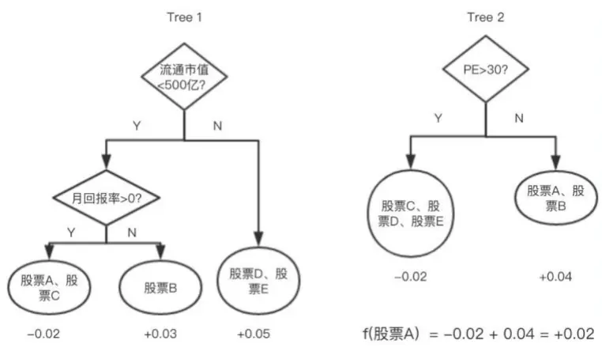
数据来源：广发证券发展研究中心

以上的例子是一个回归问题，常见的目标函数为平方误差函数，最后的预测值是每棵树上得分的总和。我们也可以选择交叉熵等函数作为目标函数，这样就可以处理分类问题。

提升树模型（以下指代XGBoost模型）可表示为决策树的加法模型，采用前向分步法，首先确定初始提升树 $\hat{y}_{i}^{0}=f_{0}(x_{i})=0$ ，第t步求解的模型是：

$$
\hat{y}_{i}^{t}=et{}{'}\sum_{k=1}f_{k}(x_{i})=\hat{y}_{i}^{t-1}+f_{t}(x_{i})
$$

其中， $\hat{y}_{i}^{t}.$ 表示总共t棵决策树组成的模型， $f_{t}(x_{i})$ 表示第t课决策树。

求解第t棵决策树时，最小化以下目标函数：

$$
\begin{array}{c}{{Obj^{t}=\displaystyle\sum_{i=1}^{n}l(y_{i},\hat{y}_{i}^{t})+\displaystyle\sum_{i=1}^{t}\varOmega(f_{i})}}\\{{=\displaystyle\sum_{i=1}^{n}l\big(y_{i},\hat{y}_{i}^{t-1}+f_{t}(x_{i})\big)+\varOmega(f_{t})+constant}}\end{array}
$$

其中， $\varOmega(f_{i})$ 表示决策树的复杂度。

对上述目标函数在 $\hat{y}_{i}^{t-1}$ 附近作二阶泰勒展开可得：

$$
Obj^{t}=\sum_{i=1}^{n}\left[l\big(y_{i},\hat{y}_{i}^{t-1}\big)+g_{i}f_{t}(x_{i})+\frac{1}{2}h_{i}f_{t}^{2}(x_{i})\right]+\varOmega(f_{t})+constant
$$

其中， $g_{i}=\partial_{\hat{y}_{i}^{t-1}}\left(l\big(y_{i},\hat{y}_{i}^{t-1}\big)\right),h_{i}=\partial_{\hat{y}_{i}^{t-1}}^{2}\left(l\big(y_{i},\hat{y}_{i}^{t-1}\big)\right)$

如图5所示，每棵决策树都包含T个叶子节点，取值分别为 $w_{1},~w_{2},~\ldots,~w_{T}$ 那么第t棵决策树可表示为：

$$
f_{t}(x)=w_{q(x)},\ w\in R^{T},\ q{:}R^{d}\to\{1,2,\dots,T\}
$$

决策树的复杂度 $\varOmega(f_{i})$ 定义为：

$$
\varOmega(f_{i})=\gamma T+\frac{1}{2}\lambda\sum_{j=1}^{T}w_{j}^{2}
$$

其中 $\gamma{\mathrm{:}}$ 和λ分别都表示惩罚系数。

然后，抹去常数项，我们将目标函数改写为：

$$
\begin{array}{cl}{{}}&{{Obj^{t}=\displaystyle\sum_{i=1}^{n}\left[g_{i}f_{t}(x_{i})+\frac12h_{i}f_{t}^{2}(x_{i})\right]+\varOmega(f_{t})}}\\{{}}&{{}}\\{{}}&{{=\displaystyle\sum_{i=1}^{n}\left[g_{i}w_{q(x_{i})}+\frac12h_{i}w_{q(x_{i})}^{2}\right]+\gamma T+\frac12\lambda\sum_{j=1}^{T}w_{j}^{2}}}\\{{}}&{{}}\\{{}}&{{=\displaystyle\sum_{j=1}^{T}\left[\left(\sum_{i\in I_{j}}g_{i}\right)w_{j}+\frac12\biggl(\sum_{i\in I_{j}}h_{i}+\lambda\biggr)w_{j}^{2}\right]+\gamma T}}\end{array}
$$

其中 $I_{j}$ 表示属于第j个叶子节点的样本集合。上式是关于 $\mathbf{w_{j}}$ 的一元二次方程，因此能够找到使目标函数取值最小的 $\mathbf{w_{j}}$ 。

定义： $\begin{array}{r}{G_{j}=\sum_{i\in I_{j}}g_{i},H_{j}=\sum_{i\in I_{j}}h_{i}}\end{array}$ ，则可通过一元二次函数求极值的方式求出，当 $\begin{array}{r}{\mathbf{w}_{j}^{*}=-\frac{G_{j}}{H_{j}+\lambda}\mathbb{E}}\end{array}$ 时，目标函数取最小值： $\begin{array}{r}{Obj=-\frac{1}{2}\sum_{j=1}^{T}\frac{G_{j}^{2}}{H_{j}+\lambda}+\gamma T.}\end{array}$

每一次决策树分裂时，一个节点分裂成左右两个子节点，该次分裂的信息增益可通过比较分裂前后目标函数值来表示，即：

$$
Gain={\frac{G_{L}^{2}}{H_{L}+\lambda}}+{\frac{G_{R}^{2}}{H_{R}+\lambda}}-{\frac{(G_{L}+G_{R})^{2}}{H_{L}+G_{R}+\lambda}}-\gamma
$$

对于每个特征，事先已经按照特征取值，将所有样本排序储存起来。实际分裂时，遍历每个特征的每个可能的分裂点，使Gain值最大的特征及对应的分裂点即为该次分裂的最优切分变量和切分点。我们也可以给Gain设置一个阈值，只有当Gain超过该阈值时，决策树才会分裂，否则停止分裂，这可以控制模型的复杂度，防止过拟合。

## 2.3.3 XGBoost模型分析特征重要性

上一小节中讲到，决策树每次分裂时，都会从备选特征中选择使信息增益最大的特征和对应的切分点来作为分裂依据。而在整个提升树建立过程中，假设每棵树平均分裂k次，总共有t棵决策树，那么总的分裂次数为kt。在这个kt次分裂过程中，被用来当做切分变量的次数越多，说明该特征相对来说更重要。因此，提升树模型自带有分析特征重要性的功能。

XGBoost提供了3种方式来作特征重要性分析：

1）默认为方式为‘weight’，即上文提到的，比较特征在整个建树过程中作为分裂依据的次数，这也是最常见的方式

2）‘gain’，比较特征作为分裂依据时，使目标函数下降的平均值

3）‘cover’，比较特征作为分裂依据时，平均的样本覆盖率。这是考虑到，通常情况下决策树都包含一定的深度，离根节点越近的节点处理的样本数越多，此时作为分裂依据的特征就更加重要。

## 三、多因子动态调仓策略

## 3.1 XGBoost 预测模型

因子择时的核心是动态地调整多因子组合中每个风格因子的权重，即赋予未来一期有效的风格因子更高的权重，赋予无效的因子更小的权重或者直接剔除。因子IC表示因子值与个股下期收益率之间的相关系数，能够反映因子提供超额收益的能力。IC的绝对值越大，说明因子取值与个股下期收益率之间的相关系数越高，选股能力越强。

本报告选取7类风格因子，其中盈利因子（ROE）、质量因子（速动比率）、成长因子（ROE同比）、估值因子（EP）为正向因子，而规模因子（流通市值）、流动性因子（月成交金额）、技术因子（20日收益率）为负向因子。因此，本报告通过以下方式定义因子的有效性：

对于正向因子，若未来一期因子IC>0，则因子有效，且取值越大说明因子越有效，IC<0则认为该因子无效；

同理，对于负向因子，若未来一期因子IC<0，则因子有效，且绝对值越大说明因子越有效，IC>0则认为该因子无效。

如图2所示，本报告基于XGBoost模型，利用宏观变量、因子历史IC序列和市场变量等信息来预测每个风格因子未来一期选股的IC值，即预测个股下期回报率与因子当前取值之间的相关系数，然后根据预测的IC值对风格因子赋予权重。

一般的，预测时间间隔越短，机器学习模型的预测能力会越强，但是短时间内股票价格的涨跌幅度一般较小，可能不足以覆盖交易成本及买卖股票对市场造成的冲击。综合考虑到模型预测的准确程度和交易成本，本报告选择以周为换仓周期，机器学习模型也选择以周为预测周期，即在每天收盘时进行预测，预测中证500成份股5个交易日之后的回报率与风格因子当前取值之间的相关系数。

在模型输入特征的选择上，本报告主要从因子历史IC序列本身及外部变量两个维度来提取，而外部变量又分为市场变量和宏观变量两部分。其中，从风格因子历史IC序列本身出发，我们提取了不同频率下（日频、周频和月频）每个因子上期的IC值，时间间隔分别为1天、5天和20天，总共得到21个特征（3*7=21）。其中，因子间隔5天的IC值表示中证500成份股过去5个交易日的回报率与5个交易日前因子取值之间的相关系数，其余不同时间间隔的IC特征与此类似。而外部变量包括6个市场变量和7个宏观变量，如表3所示。这样，整个模型共包含34个特征。此外，本报告对每个风格因子都建立了预测模型，因此总共有7个模型，模型输入为相同的34维特征，输出为下期的IC值。

本报告中，多因子策略的选择股票池为中证500成份股，以2008年1月至2013年12月的市场行情为样本内训练数据，以2014年1月至2017年12月的市场行情为样本外回测数据。一般来说，对机器学习模型进行训练时，我们希望有更多的样本，这样训练得到的模型泛化能力更强、稳定性更高。但是，某些情况下市场风格比较多变，比较久远的历史市场行情可能与待遇测的市场行情差别较大。在这种情况下，相距比较久远的历史样本可能反而产生负面的作用，所以我们选择训练样本时，也需要考虑训练样本与待预测样本的关系。比如2017年以来，在历史上具有良好表现的规模、反转等因子表现不佳，我们希望模型能够在一定程度上跟随当前市场的特点。因此，如图6所示，模型的训练采用两种方式，一种是固定的预测模型，即模型在样本内训练完以后，不再更新；另一种是滚动预测模型，每个季度采用最新的数据更新模型，保持训练集样本数一致。样本内共有1456条样本，样本外共有972条样本。

图6：固定预测模型与滚动预测模型示意图

| 1/1/2008 | 1/1/2014 12/22/2017 |
| --- | --- |
| 固定模型：样本内 | 样本外 |

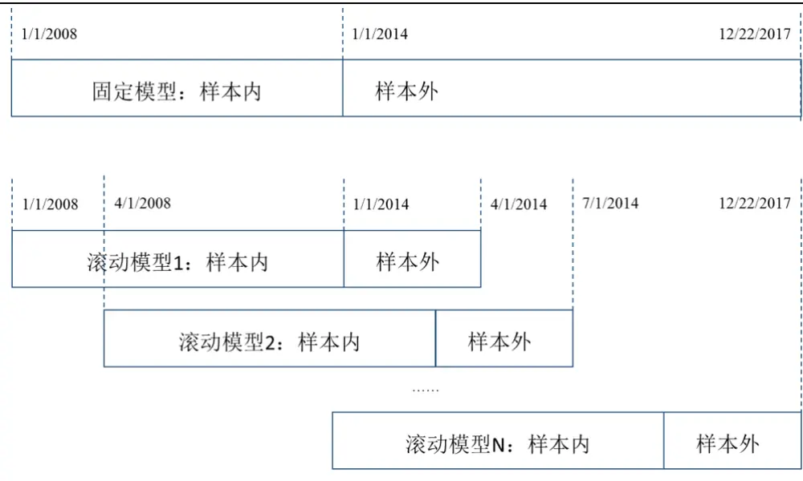
数据来源：广发证券发展研究中心

在实际训练时，我们将样本内数据按照4:1随机切分成训练集和验证集，通过模型在验证集上的表现来确定模型的超参数。XGBoost模型需要调节的参数主要包括弱学习器数量(n_estimators)、学习率 (learning_rate)、树的最大深度(max_depth)、子采样率(subsample)和特征随机采样比例(colsample_bytree)。最终的参数选取如下表所示。

表 4：XGBoost 模型超参数

| 参数名称 | 参数取值 |
| --- | --- |
| n_estimator | 通过验证集 early_stopping 确定 |
| learning_rate | 0.02 |
| max_depth | 3 |
| subsample | 0.8 |
| colsmple_bytree | 0.8 |

数据来源：广发证券发展研究中心

## 3.2 特征重要性分析

在本报告2.3.3节中，我们介绍了利用XGBoost模型来分析特征的重要性。分类树每次节点分裂时，都会从备选特征中选择使目标函数下降最多的特征作为分裂依据。因此，特征被用来当作节点分裂依据的次数代表了特征的重要程度，即被用作分裂依据的次数越多，说明特征越重要。我们通过以下方式对特征重要性做了归一化：

$$
relativeimportance(i)=\frac{n_{i}}{\sum_{j=1}^{N}n_{i}}
$$

其中，N表示了特征的个数， $n_{i}$ 表示第i个特征被用作节点分裂依据的次数。每个特征的相对重要性等于该特征被用来作为节点分裂依据的次数比上总分裂次数。

在这里，我们以ROE这个因子对应的IC预测模型为例，分析特征的重要性。如图7所示，中证500波动率和M1同比增长率是相对来说最重要的特征，这也说明了我们将市场变量和宏观经济变量纳入模型特征是很有必要的。在某些情况下，我们可以设定一个阈值α，将相对重要性低于这个阈值的特征删除，有时候能够起到抑制过拟合、加快模型训练速度的效果。而在本例中，特征维数不大，且没有相对重要性显著低于其他的特征，因此不作特征筛选。

图7：ROE因子的IC预测模型（固定）特征重要性示意图
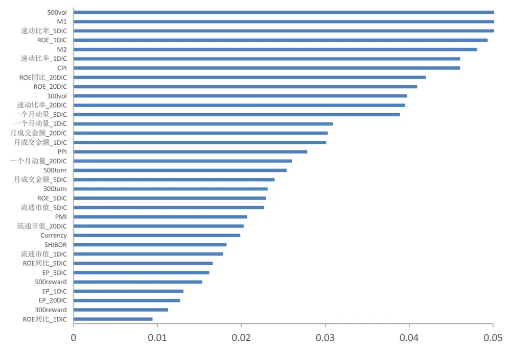
数据来源：广发证券发展研究中心

## 3.3 模型预测效果评估

为了评估XGBoost模型的预测效果，我们选择了四种评价指标，分别是因子IC值的平均绝对误差、风格轮动的秩相关系数、单因子择时选股效果以及多因子动态调仓策略效果。

## 3.3.1 因子IC值的平均绝对误差

考虑到模型预测周期较短（5个工作日），风格因子具有一定的动量效应，我们拿上一期因子的IC值作为下一期IC值的估计值，将这个估计值作为基准，来比较模型的预测效果。我们选择的指标为平均绝对误差（Mean Absolute Error,MAE），即：

$$
MAE=\frac{1}{N}\sum_{t=1}^{N}\left|f_{t}-y_{t}\right|
$$

其中， $f_{t}$ ， $y_{t}$ 分别表示预测值和真实值，N表示样本外的样本数。

模型在样本外的预测结果如表5所示，相对于基于动量效应的因子IC估计值，XGBoost模型预测得到的IC值与实际IC值之间的平均绝对误差明显更小，平均的误差降低率在20%左右。

表 5：预测的因子 IC与实际因子 IC的平均绝对误差统计表

| 因子名称 | 风格动量 | XGBoost模型 | 误差降低率 |
| --- | --- | --- | --- |
| ROE | 0.1332 | 0.1046 | 21.51% |
| 速动比率 | 0.1250 | 0.1023 | 18.20% |
| YOYROE | 0.0808 | 0.0631 | 21.84% |
| EP | 0.1435 | 0.1205 | 16.06% |
| 流通市值 | 0.1082 | 0.0854 | 21.05% |
| 月成交金额 | 0.1651 | 0.1256 | 23.95% |
| 股价反转 | 0.1681 | 0.1291 | 23.21% |

数据来源：广发证券发展研究中心,Wind

## 3.3.2 风格轮动的秩相关系数

因子IC指的是截面因子值与个股下期收益率之间的相关系数，能够反映因子提供超额收益的能力。本报告提出的多因子策略根据模型预测得到的IC值给各个初始因子赋权，因此与因子IC类似，在这里我们定义风格轮动的秩相关系数，它代表了在横截面上，7个风格因子的IC预测值与实际值的秩相关系数。这个值越大，说明预测效果越好。如果风格轮动的秩相关系数为0，说明预测结果是随机的。

从图8和表6从可以看出，XGBoost模型预测得到的因子IC值与实际值之间的秩相关系数在样本外的平均值达到18.19%，显著高于风格动量模型的7.79%，这说明模型能够很好的预测因子IC值之间的相对大小关系。

图8：XGBoost模型与风格动量模型的风格轮动秩相关系数对比图
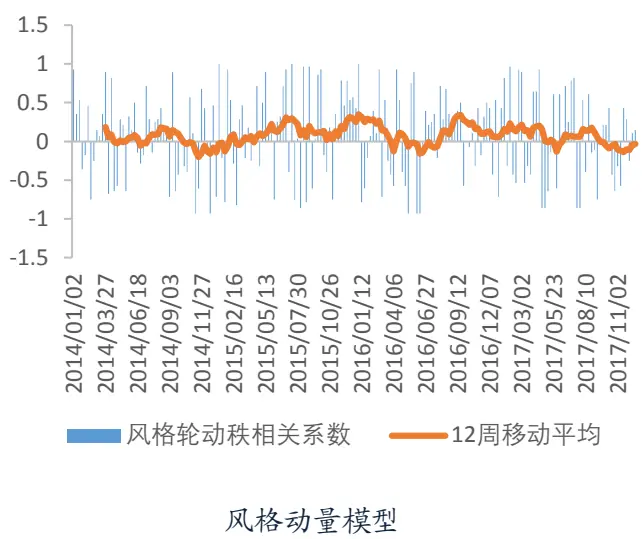
数据来源：广发证券发展研究中心,Wind

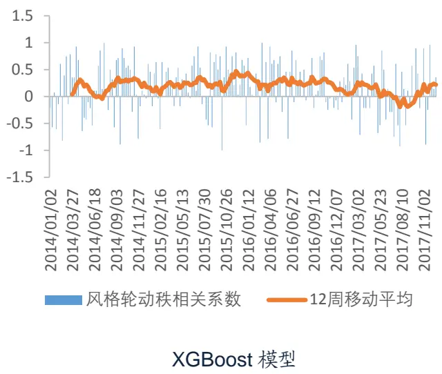

表 6：XGBoost模型与风格动量模型的风格轮动秩相关系数

| 模型名称 | 风格动量 XGBoost 模型 |
| --- | --- |
| 平均值 7.79% | 18.19% |
| 标准差 | 55.74% 48.92% |
| 权值 IR | 0.14 0.37 |
| 正值占比 | 58.43% 63.50 |

数据来源：广发证券发展研究中心,Wind

## 3.3.3 单因子择时选股

不考虑交易成本，我们对比了7个初始因子自2014年1月至2017年12月在中证500成份股内通过单因子选股和单因子择时选股的表现。调仓时将股票池均分成10档，单因子选股时始终按照因子得分取最高的一档，单因子择时选股时，如果预测未来一期因子有效则按照因子得分取最高一档，否则选择持有中证500指数。调仓期为5个交易日，以中证500指数进行对冲，两种策略样本外表现如表7所示。单因子择时选股时，年化超额收益较不择时有所降低，但是年化波动率都显著降低，最大回撤也普遍更小，7个因子中有4个因子的信息比得到了提升，这证明了因子择时是有效果的。

表7：单因子选股与单因子择时选股表现对比

| 选股方式 | 观察指标 | ROE | 速动比率 | YOYROE | EP | 流通市值 | 月成交金额 | 股价反转 |
| --- | --- | --- | --- | --- | --- | --- | --- | --- |
| 单因子择时选股 | 年化收益率 | 3.48% | 0.78% | 4.42% | 11.73% | 6.90% | 18.31% | 5.33% |
|  | 年化波动率 | 4.53% | 7.25% | 6.72% | 8.16% | 7.29% | 6.63% | 10.87% |
|  | 信息比 | 0.77 | 0.11 | 0.66 | 1.44 | 0.95 | 2.76 | 0.49 |
|  | 最大回撤 | -10.15% | -11.38% | -8.57% | -9.86% | -9.10% | -7.04% | -15.32% |
|  | 周度胜率 | 54.33% | 49.01% | 54.69% | 57.60% | 57.42% | 69.12% | 50.94% |
| 单因子选股 | 年化收益率 | 4.49% | 0.38% | 6.51% | 13.80% | 8.33% | 19.47% | 8.63% |
|  | 年化波动率 | 6.47% | 8.21% | 7.40% | 9.65% | 7.70% | 8.77% | 11.24% |
|  | 信息比 | 0.69 | 0.05 | 0.88 | 1.43 | 1.08 | 2.22 | 0.77 |
|  | 最大回撤 | -10.62% | -15.87% | -7.24% | -11.48% | -12.49% | -9.00% | -12.26% |
|  | 周度胜率 | 54.92% | 49.22% | 52.85% | 55.44% | 58.03% | 63.21% | 54.92% |

数据来源：广发证券发展研究中心,Wind

## 3.3.4 多因子动态调仓策略

模型的实际效果最终要从多因子动态调仓策略的表现中去验证。本报告中以周为调仓频率，在t时刻我们通过XGBboost模型预测各个因子在未来一期选股的IC值，即预测个股在5个交易日后的回报率与当前因子取值之间的相关系数。本报告选取的7个初始风格因子，其中盈利因子（ROE）、质量因子（速动比率）、成长因子（ROE同比）、估值因子（EP）为正向因子，而规模因子（流通市值）、流动性因子（月成交金额）、技术因子（一个月动量）为负向因子。本报告提出的多因子动态调仓策略通过以下方法对风格因子赋权：

1) 在t时刻，通过XGBoost模型对因子i未来一期选股的IC值进行预测，得到$IC_{i,t}$ ；

2) 对于正向因子，当 $IC_{i,t}>0$ 时，权值 $.w_{i,t}=IC_{i,t}$ ，否则认为因子未来一期失效，权值 ${\mathbf{}}_{{W}_{i,t}}=0;$

3) 对于负向因子，当 $IC_{i,t}<0$ 时，权值 $w_{i,t}=-IC_{i,t}$ ，否则认为因子未来一期失效，权值 ${w_{i,t}}=0$

4) 对 $w_{i,t}$ 进行归一化，使得∑ $w_{i,t}=1$ ，如果预测未来一期所有因子都失效，则采取基准的因子等权方式，即 $w_{i,t}=1/7$

也就是说，每期选股时，只选择IC预测值与因子方向相同的因子，按照预测的IC进行加权；而将IC预测值与因子方向相反的因子剔除，即赋予零权重。

其余回测参数设置如下：

调仓周期：5个交易日

股票池：中证500成份股，剔除ST股票，剔除交易日停牌的股票

超配组合：调仓时将股票池均分成10档，等权买入复合得分最高一档的个股

对冲方案：中证500指数对冲

初始因子选择：7个固定因子，如表2所示

因子加权：IC加权

样本内模型训练期：2008年1月——2013年12月

样本外回测期：2014年1月——2017年12月

交易成本：交易成本为双边千分之三。

## 四、实证分析

## 4.1 多因子动态调仓策略实证结果

为了验证基于XGBoost模型的多因子动态调仓策略的有效性，首先我们将因子等权策略作为对照基准，即对全部7个初始因子采用最简单的平均加权法进行多因子组合构造。因子等权策略样本外的表现情况如表8所示，其净值曲线如图9所示。因子等全策略在2014年以来累积收益率仅有55.83%，最大回撤为11.26%，该策略自2017年以来表现不佳，出现较大的回撤。

表 8：因子等权策略的样本外表现

| 因子等权策略回测结果（中证500 指数对冲） |
| --- |
| 年化收益率 11.73% |
| 年化波动率 10.75% |
| 信息比 1.09 |
| 平均换手率 23.23% |
| 最大回撤 -11.26% |
| 累积收益率 55.83% |
| 周度胜率 55.44% |

数据来源：广发证券发展研究中心,Wind

图9：因子等权策略的样本外净值曲线
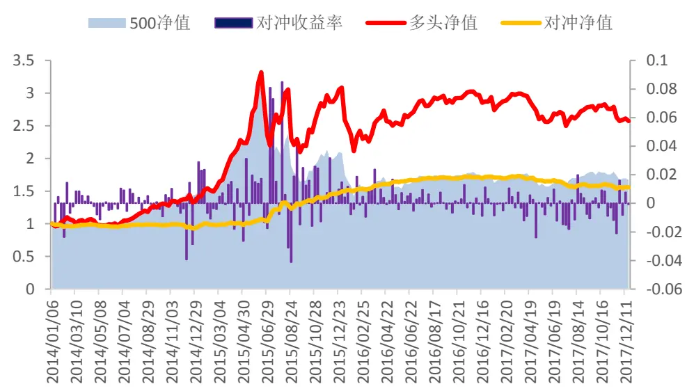
数据来源：广发证券发展研究中心,Wind

接下来，我们考察基于风格因子动量效应的多因子动态调仓策略，即对于每个初始因子，我们都将上一期的IC值作为下一期IC值的估计值，然后根据IC的估计值以本报告3.3.4节中描述的方式对因子进行动态加权。基于风格动量的多因子策略在样本外的表现情况如表9所示，其净值曲线如图10所示。该策略在2014年以来累积收益率仅有45.77%，最大回撤为13.92%。该策略的整体表现不如因子等权策略，因此本报告之后的内容不再对其进行讨论。

表 9：基于风格动量的多因子策略的样本外表现

| 基于风格动量的策略回测结果（中证500 指数对冲） |  |
| --- | --- |
| 年化收益率 9.88% |  |
| 年化波动率 | 11.18% |
| 信息比 | 0.88 |
| 平均换手率 | 66.00% |
| 最大回撤 | -13.92% |
| 累积收益率 | 45.77% |
| 周度胜率 | 56.48% |

数据来源：广发证券发展研究中心,Wind

图10：基于风格动量的多因子策略的样本外净值曲线
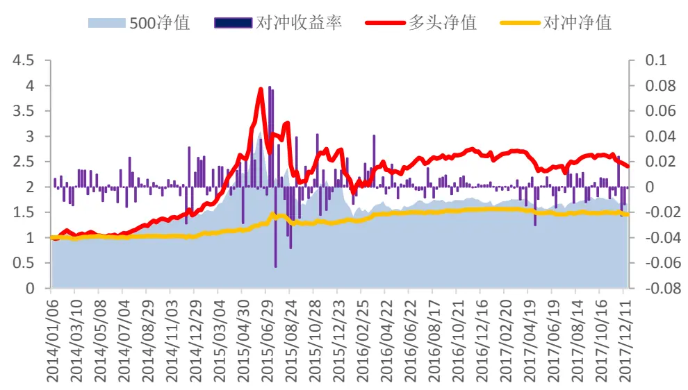
数据来源：广发证券发展研究中心,Wind

最后，我们考察基于XGBoost模型的多因子动态调仓策略，即根据XGBoost模型对每个初始因子未来一期IC值的预测，以本报告3.3.4节中描述的方式对因子进行动态加权，因子权重如图11所示（图中为了便于展示，用每天预测权重的10日移动平均作为权重画在图上）。从图中可以看出，流通市值、月成交金额、一个月动量的权重占比较大，3者的占比之和平均约在70%以上。该策略在样本外的表现情况如表10所示，其净值曲线如图12所示。该策略在2014年以来累积收益率达到88.18%，最大回撤为15.36%。

图11：基于XGBoost模型的多因子策略因子权重
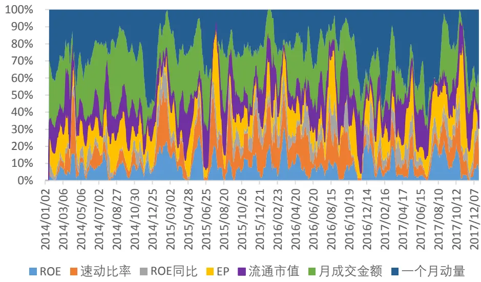
数据来源：广发证券发展研究中心,Wind

表 10：基于XGBoost模型的多因子策略的样本外表现

| 基于 XGBoost 模型的策略回测结果（500 指数对冲） |  |
| --- | --- |
| 年化收益率 | 17.12% |
| 年化波动率 | 13.22% |
| 信息比 | 1.30 |
| 平均换手率 | 55.08% |
| 最大回撤 | -15.36% |
| 累积收益率 | 88.18% |
| 周度胜率 | 55.96% |

数据来源：广发证券发展研究中心,Wind

图12：基于XGBoost模型的多因子策略的样本外净值曲线
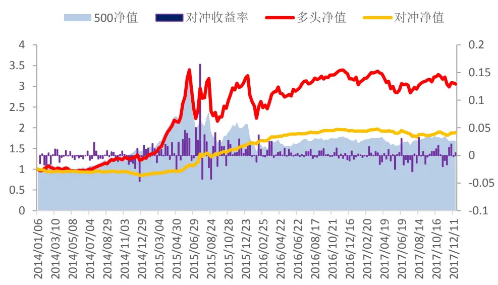
数据来源：广发证券发展研究中心,Wind
识别风险，发现价值

动态调仓策略

三种多因子策略的样本外回测表现对比如表11所示，与因子等权策略相比，基于XGBoost模型的多因子策略的年化收益率有明显提升，信息比为因子等权策略的1.19倍，但是最大回撤比因子等权策略要高。

表 11：3种多因子策略样本外的回测表现对比

| 策略名称 | 因子等权 | 风格动量 | XGBoost 模型 |
| --- | --- | --- | --- |
| 年化收益率 | 11.73% | 9.88% | 17.12% |
| 年化波动率 | 10.75% | 11.18% | 13.22% |
| 信息比 | 1.09 | 0.88 | 1.30 |
| 平均换手率 | 23.23% | 66.00% | 55.08% |
| 最大回撤 | -11.26% | -13.92% | -15.36% |
| 累积收益率 | 55.83% | 45.77% | 88.18% |
| 周度胜率 | 55.44% | 56.48% | 55.96% |

数据来源：广发证券发展研究中心,Wind

## 4.2 限制换手率的多因子动态调仓策略实证结果

在4.1节中，我们发现相对于因子等权策略，基于XGBoost模型的机器学习多因子动态调仓策略在年化收益率和信息比上较因子等权策略有提高，但是最大回撤不如因子等权策略。经过仔细分析后，我们发现因子等权策略由于是静态加权，不同期选取的组合相对更稳定，平均换手率较低；而因子择时类策略每期都会对各个因子的权重进行动态调整，因此导致换手率显著提高。如图13所示，基于XGBoost模型的多因子动态调仓策略的换手率显著高于因子等权策略。较高的换手率导致组合收益被交易成本蚕食。如果降低组合的换手率，有望减小交易成本损耗，提高策略的表现。

图13：因子等权策略与动态调仓策略换手率对比图
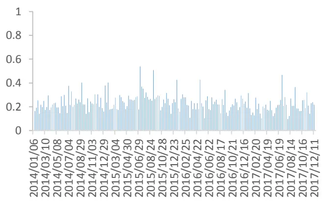
因子等权策略
数据来源：广发证券发展研究中心,Wind

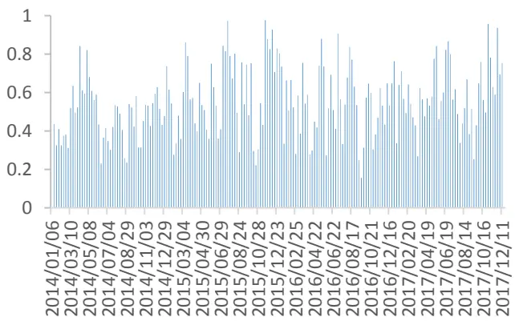

在之前的交易策略中，我们在调仓时将股票池均分成10档，等权买入复合得分最高一档的个股（个股总数的10%）。为了降低每期选股的换手率，我们考虑设置一个包含K只股票的缓冲池，如果上期持有的个股排名在最新打分的最高一档或者在缓冲池内，那么这些股票优先保留，保留的股票数目如果少于股票池内个股总数的10%，则按照个股复合得分排名，从高到低选择新股票予以补充，仍然保持每期等权买入的股票数为股票池内个股总数的10%。

控制换手率能够减少由交易成本引起的损失，但是缓冲池的存在会导致Alpha的损失，因此限制策略换手率实质上在Alpha和交易成本之间做一个权衡。

考虑将缓冲池内的股票数目分别设置成股票池内个股总数的5%、10%和15%。这三种情况下，基于XGBoost模型的多因子动态调仓策略在样本外的表现如表12所示，净值曲线如图14所示。我们发现随着缓冲池内股票数目的增加，即换手率控制的加强，交易成本得到有效降低，策略的表现逐渐提高；但是当超过一个阈值后，随着换手控制继续加强，策略表现不升反降，这是因为此时Alpha的损失已经超过了交易成本的降低。从样本外回测结果来看，控制缓冲池内的股票数为股票池内个股总数的5%~15%之间是比较合理的，模型表现最优。当缓冲池个股数占比为10%时，动态调仓策略的平均换手率下降了38.2%，年化收益率比因子等权策略和无换手率限制分别提高61.4%和10.3%，信息比为因子等权策略的1.35倍，最大回撤和胜率较因子等权策略也有一定提升。

表 12：不同换手率限制下动态调仓策略样本外的回测表现对比

| 缓冲池个股数占比 | 因子等权 | 0（无限制） | 5% | 10% | 15% |
| --- | --- | --- | --- | --- | --- |
| 年化收益率 | 11.73% | 17.12% | 18.54% | 18.89% | 16.78% |
| 年化波动率 | 10.75% | 13.22% | 13.49% | 12.86% | 12.30% |
| 信息比 | 1.09 | 1.30 | 1.37 | 1.47 | 1.36 |
| 平均换手率 | 23.23% | 55.08% | 42.28% | 34.06% | 28.59% |
| 最大回撤 | -11.26% | -15.36% | -11.06% | -10.16% | -9.41% |
| 累积收益率 | 55.83% | 88.18% | 97.43% | 99.76% | 85.96% |
| 周度胜率 | 55.44% | 55.96% | 56.48% | 59.59% | 54.92% |

数据来源：广发证券发展研究中心,Wind

图14：不同换手率限制下动态调仓策略样本外的净值曲线
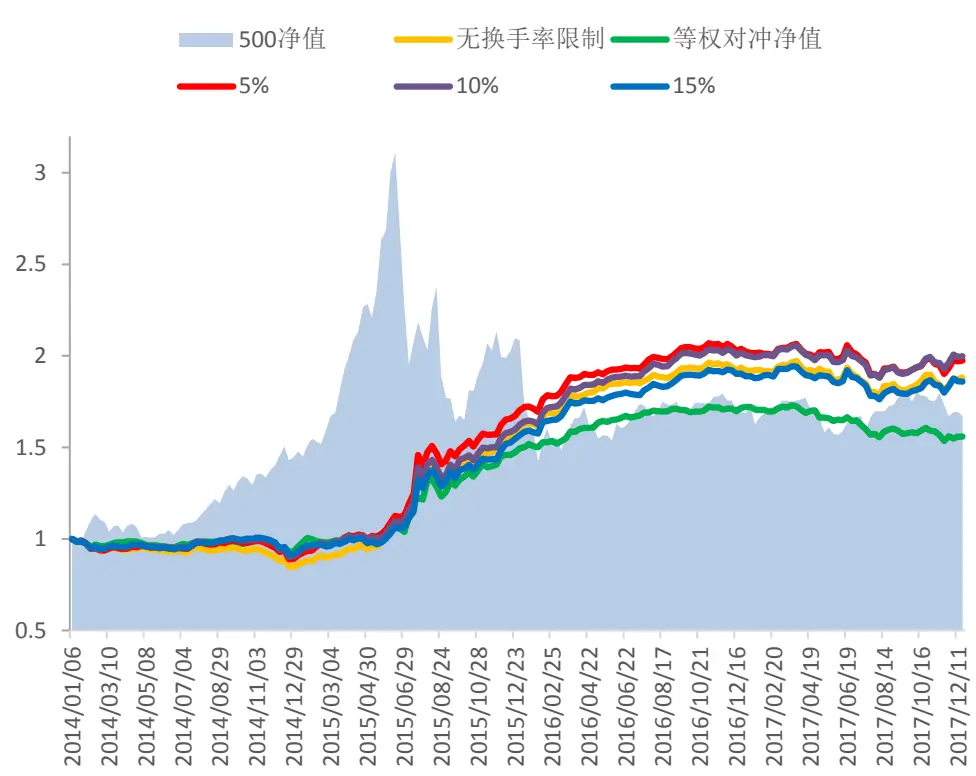
数据来源：广发证券发展研究中心,Wind

## 4.3 模型滚动训练的多因子动态调仓策略实证结果

金融市场瞬息万变，如3.1节中描述的那样，为了让机器学习模型能够及时学习到市场特征的变化，除了采用固定训练集的方法进行训练外，我们还可以通过滚动训练的方式，每隔一段时间更新机器学习模型。在本节中，我们在每个季度采用最新的数据更新模型，但保持训练集样本数量一致。根据XGBoost模型对每个初始因子未来一期IC值的预测，以本报告3.3.4节中描述的方式对因子进行动态加权，因子权重如图15所示（图中为了便于展示，用每天预测权重的10日移动平均作为权重画在图上）。从图中可以看出，从2017年5开始，流通市值、月成交金额和一个月动量这三个因子权重之和的占比较之前显著减小，EP和ROE权重的占比显著提高。我们从图1中可以看出，规模、反转、流动性等因子是从2017年4月份开始表现不佳，这说明滚动训练的模型更好地追踪到了市场风格的这一种变化。

图15：基于XGBoost模型（滚动）的多因子策略因子权重
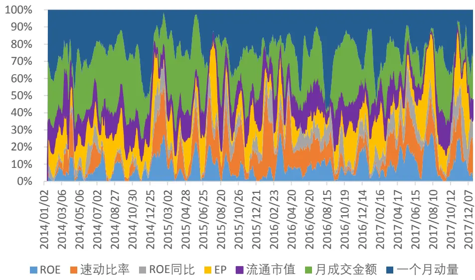
数据来源：广发证券发展研究中心,Wind

与此前相同，滚动训练的XGBoost模型预测得到各个初始因子的IC值后，我们根据IC值对各个因子进行加权得到复合因子。通过因子等权方法得到的复合因子和基于滚动训练的XGBoost模型得到的复合因子的每期IC如图16所示。如表13所示，相比于因子等权复合因子，基于滚动训练的XGBoost模型得到复合因子的平均IC值提高了21.7%，但波动性更大一些，ICIR与因子等权复合因子基本相当。

图16：因子等权策略与动态调仓策略（滚动训练）复合因子IC对比
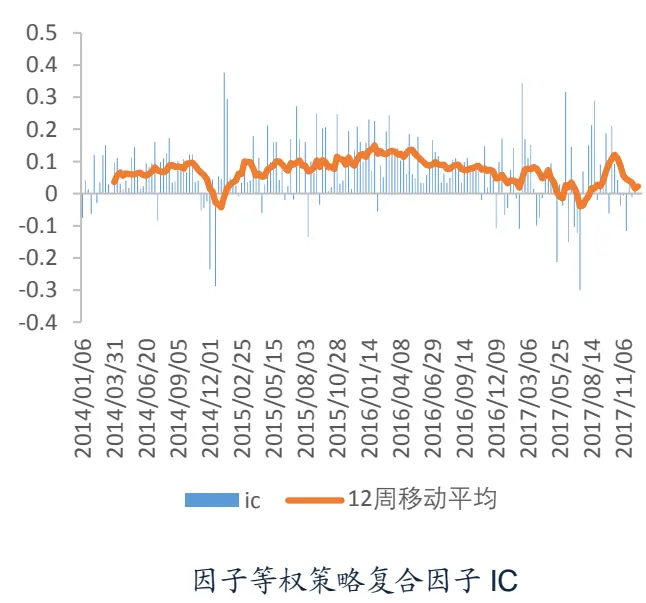
数据来源：广发证券发展研究中心,Wind

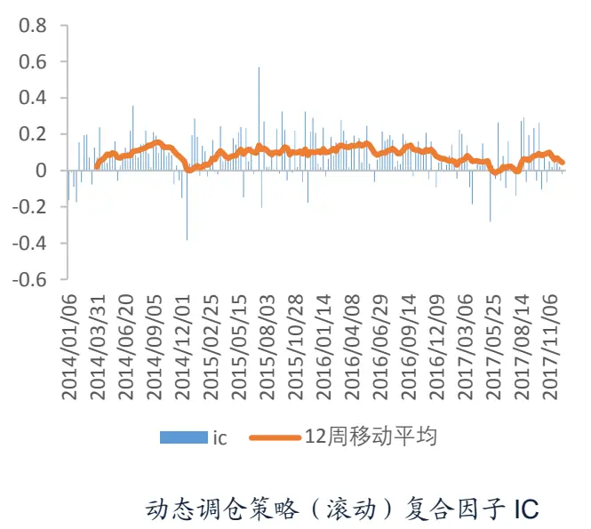

表 13：因子等权策略和动态调仓策略的复合因子IC 对比

| 策略名称 | 因子等权 | 动态调仓（滚动） |
| --- | --- | --- |
| IC 平均值 | 0.0679 | 0.0826 |
| IC 标准差 | 0.1033 | 0.1246 |
| ICIR | 0.6572 | 0.6627 |

数据来源：广发证券发展研究中心,Wind

将缓冲池个股数限制在股票池个股总数的15%，模型滚动训练的多因子策略在样本外的表现如表14所示，净值曲线如图17所示。该策略在2014年以来累积收益率达到107.89%，周度胜率达到63.21%，年化收益率达到20.08%，最大回撤仅为7.68%。

表 14：基于模型滚动训练的多因子策略的样本外表现

| 基于模型滚动训练的多因子策略回测结果（500指数对冲） |  |
| --- | --- |
| 年化收益率 | 20.08% |
| 年化波动率 | 11.51% |
| 信息比 | 1.74 |
| 平均换手率 | 27.33% |
| 最大回撤 | -7.68% |
| 累积收益率 | 107.89% |
| 周度胜率 | 63.21% |

数据来源：广发证券发展研究中心,Wind

图17：基于模型滚动训练的多因子策略的样本外净值曲线
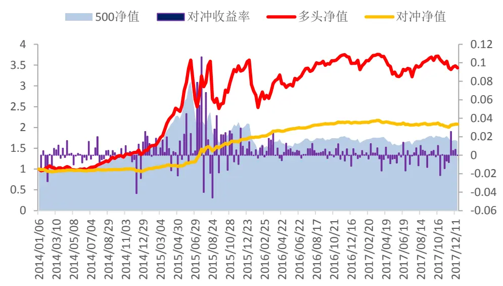
数据来源：广发证券发展研究中心,Wind

模型滚动训练的多因子策略与固定模型的多因子策略以及因子等权策略在样本外的表现对比如表15所示，净值曲线对比如图18所示，其中模型滚动训练的多因子策略与固定模型的多因子策略的缓冲池个股数限制在股票池个股总数的15%，因子等权策略不对换手率作任何限制。模型滚动训练的多因子策略的信息比为1.74，分别较因子等权策略和固定模型的多因子策略提高了59.6%和27.9%，而且在胜率、年化收益率、最大回撤等多项指标上也有明显提升。

表 15：因子等权以及两种动态调仓策略的回测表现对比

| 策略名称 | 因子等权 | 动态调仓 （固定模型） | 动态调仓 （滚动模型） |
| --- | --- | --- | --- |
| 年化收益率 | 11.73% | 16.78% | 20.08% |
| 年化波动率 | 10.75% | 12.30% | 11.51% |
| 信息比 | 1.09 | 1.36 | 1.74 |
| 平均换手率 | 23.23% | 28.59% | 27.33% |
| 最大回撤 | -11.26% | -9.41% | -7.68% |
| 累积收益率 | 55.83% | 85.96% | 107.89% |
| 周度胜率 | 55.44% | 54.92% | 63.21% |

数据来源：广发证券发展研究中心,Wind

图18：因子等权以及两种动态调仓策略的样本外净值曲线
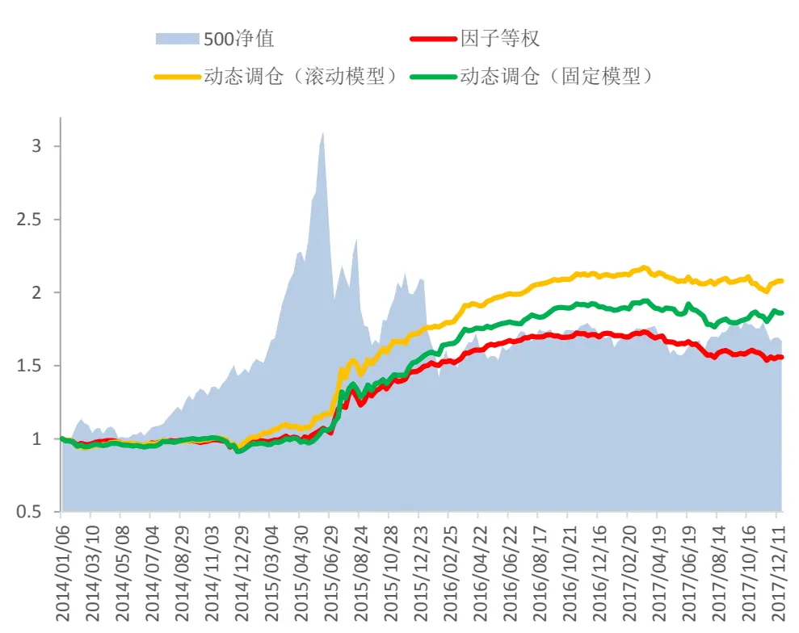
数据来源：广发证券发展研究中心,Wind

模型滚动训练的多因子策略与固定模型的多因子策略以及因子等权策略在样本外历年的表现如表16所示。分年度来看，基于模型滚动训练的多因子策略在每一年的表现都是三种模型中最优的。在市场风格稳定的年份里，基于模型滚动训练的多因子策略能够获得更高的超额收益，而在市场风格剧变的年份里，该策略也能作出相应调整，将回撤控制在最小的水平，始终获得比因子等权策略更好的表现。

表16：因子等权以及两种动态调仓策略分年度表现

| 分年度/策略名称 |  | 2014 | 2015 | 2016 | 2017 |
| --- | --- | --- | --- | --- | --- |
| 因子等权 | 超额收益率 | -6.75% | 60.28% | 15.14% | -9.45% |
|  | 周度胜率 | 50.00% | 65.31% | 63.27% | 42.55% |
|  | 最大回撤 | -7.13% | -7.10% | -1.55% | -11.26% |
| 动态调仓 （固定模型） | 超额收益率 | -8.28% | 70.80% | 20.62% | -1.59% |
|  | 周度胜率 | 43.75% | 71.43% | 63.27% | 40.43% |
|  | 最大回撤 | -9.41% | -6.48% | -1.81% | -9.23% |
| 动态调仓 （滚动模型） | 超额收益率 | -4.56% | 83.75% | 21.04% | -2.06% |
|  | 周度胜率 | 52.08% | 75.51% | 73.47% | 51.06% |
|  | 最大回撤 | -6.54% | -6.49% | -1.21% | -7.68% |

数据来源：广发证券发展研究中心,Wind

## 五、总结

随着时间的推移和市场博弈，任何一个风格因子都不可能长期产生稳定的Alpha收益。在历史上表现良好的规模因子、反转因子和流动性因子在2017年以来纷纷失效，导致基于传统加权方式的多因子组合表现欠佳。

本报告提出基于XGBoost模型的多因子动态调仓策略，选择常见的7个风格因子作为初始因子，将因子的IC序列本身、宏观经济变量、市场变量等信息作为特征，采用机器学习模型对各个因子未来一期的IC值进行预测，然后根据IC值动态调整多因子组合中各个初始因子的权重。赋予未来一期有效的风格因子更高的权重,赋予无效的因子更小的权重或者直接剔除。

历史回测表明，限制换手率的多因子动态调仓策略的表现显著好于因子等权策略，而基于模型滚动训练的多因子动态调仓策略则进一步提升了回测表现，在胜率、年化收益率、信息比、最大回撤等各项指标上都显著高于因子等权策略。分年度来看，在市场风格稳定的年份里，基于模型滚动训练的多因子策略能够获得更高的超额收益，而在市场风格剧变的年份里，该策略也能做出相应调整，始终获得比因子等权策略更好的表现。

## 风险提示

策略模型并非百分百有效，市场结构及交易行为的改变以及类似交易参与者的增多有可能使得策略失效。

## Table_RatingIndustry 广发证券—行业投资评级说明

买入： 预期未来12个月内，股价表现强于大盘10%以上。

持有： 预期未来12个月内，股价相对大盘的变动幅度介于-10%～+10%。

卖出： 预期未来12个月内，股价表现弱于大盘10%以上。

## Table_RatingCompany 广发证券—公司投资评级说明

买入： 预期未来12个月内，股价表现强于大盘15%以上。

谨慎增持： 预期未来12个月内，股价表现强于大盘5%-15%。

持有： 预期未来12个月内，股价相对大盘的变动幅度介于-5%～+5%。

卖出： 预期未来12个月内，股价表现弱于大盘5%以上。

## Table_Ad联系我们

|  | 广州市 | 深圳市 | 北京市 | 上海市 |
| --- | --- | --- | --- | --- |
| 地址 | 广州市天河区林和西路 | 深圳福田区益田路6001 | 北京市西城区月坛北街2 | 上海浦东新区世纪大道8号 |
|  | 9 号耀中广场 A 座 1401 | 号太平金融大厦31层 | 号月坛大厦18层 | 国金中心一期 16 层 |
| 邮政编码 | 510620 | 518000 | 100045 | 200120 |
| 客服邮箱 | gfyf@gf.com.cn |  |  |  |
| 服务热线 |  |  |  |  |

## Table_Disclaimer 免 责声 明

广发证券股份有限公司（以下简称“广发证券”）具备证券投资咨询业务资格。本报告只发送给广发证券重点客户，不对外公开发布，只有接收客户才可以使用，且对于接收客户而言具有相关保密义务。广发证券并不因相关人员通过其他途径收到或阅读本报告而视其为广发证券的客户。本报告的内容、观点或建议并未考虑个别客户的特定状况，不应被视为对特定客户关于特定证券或金融工具的投资建议。本报告发送给某客户是基于该客户被认为有能力独立评估投资风险、独立行使投资决策并独立承担相应风险。

本报告所载资料的来源及观点的出处皆被广发证券股份有限公司认为可靠，但广发证券不对其准确性或完整性做出任何保证。报告内容仅供参考，报告中的信息或所表达观点不构成所涉证券买卖的出价或询价。广发证券不对因使用本报告的内容而引致的损失承担任何责任，除非法律法规有明确规定。客户不应以本报告取代其独立判断或仅根据本报告做出决策。

广发证券可发出其它与本报告所载信息不一致及有不同结论的报告。本报告反映研究人员的不同观点、见解及分析方法，并不代表广发证券或其附属机构的立场。报告所载资料、意见及推测仅反映研究人员于发出本报告当日的判断，可随时更改且不予通告。

本报告旨在发送给广发证券的特定客户及其它专业人士。未经广发证券事先书面许可，任何机构或个人不得以任何形式翻版、复制、刊登、转载和引用，否则由此造成的一切不良后果及法律责任由私自翻版、复制、刊登、转载和引用者承担。