# able_Title探寻资金流背后的风格轮动规律

## 多因子 Alpha 系列报告之（三十七）

## 报告摘要：

## 风格因子组合的资金流比率可以用于指导风格轮动配置

资金向来是推动市场发生变化的直接推动力。不管是机构还是散户资金，抑或是融资融券资金以及北上资金，资金流动的变化都代表了该方投资者当前对市场的预期观点。

一方面，单纯统计资金的流入流出无法带来增量信息，只能从中观测到资金和股价变动的同步性，预测效果滞后。

另一方面，宽基指数自身的风格特征并不够明显，因此直接观测宽基指数的资金流入流出并不能有效地指导风格配置。

最后，从观察到的数据可以看到，资金比率的突然暴涨，甚至可能暴跌都可能对风格因子的收益率表现有一定的预测作用。

综合以上三点，构建恰当的资金比率来衡量资金在不同的风格组合中的强弱，可以从中挖掘规律并指导未来的风格配置。

## 策略实证结果

我们综合考虑了净流入资金、融资余额、沪深股通三类资金，并从横向和纵向两个角度分别构造了在交易额中的占比、环比增长率两个比率，利用资金流偏好度，我们产生了 6个子策略。

由于沪深股通数据较短，本文最终综合考虑使用其余 4种资金流比率的风格组合进行等权配置，形成了综合策略。

从回测效果上看，综合策略在 2010年5月7日至2018 年6 月29日的样本区间内，累计获得 673.1%的超额收益率，胜率为63.8%，最大回撤仅-16.0%。

## 最新风格推荐

根据模型最新一期识别结果，6月 29日主要推荐低流动性、低估值和一个月反转的综合风格配置组合。

## 核心风险

本模型采用量化方法通过历史数据统计、建模和测算完成，并受本文作者主观判断的影响，所推荐的风格配置未必具有严格的投资逻辑，也未必符合当前宏观环境特点，在极端的市场环境变化中有失效的风险。

图 1 综合策略历史回测结果
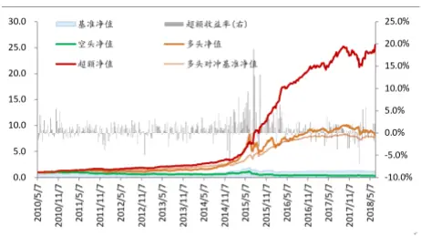
数据来源：wind广发证券发属研究中心

表 2 综合策略分年度表现

|  | 超额收益率 | 胜率 | 最大回撤 |
| --- | --- | --- | --- |
| 全样本 | 673% | 64% | -16% |
| 2010 | 26% | 71% | -4% |
| 2011 | 6% | 57% | -9% |
| 2012 | 7% | 54% | -6% |
| 2013 | 39% | 73% | -3% |
| 2014 | 16% | 68% | -16% |
| 2015 | 164% | 81% | -15% |
| 2016 | 29% | 68% | -5% |
| 2017 | -3% | 49% | -8% |
| 2018(截止6.29) | 1% | 48% | -9% |

数据来源：wind，广发证券发展研究中心

图 3 综合策略最新配置组合
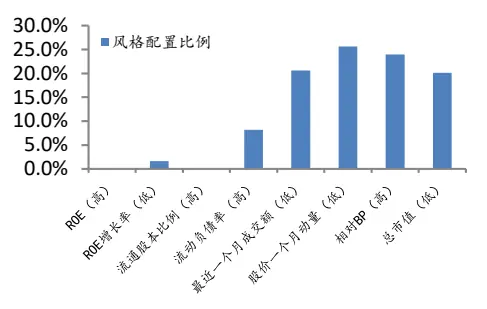

Table_Aut hor 分析师： 史庆盛 S0260513070004

020-87555888-8618

sqs@gf.com.cn

## Table_Report 相关研究：

宏观视角下的风格轮动2018-4-10
探讨：多因子 Alpha系列
报告之（三十五）

## 一、前言

2017年A股市场走出了大盘蓝筹行情，持续时间之长远胜于历史情形，在这样的情形下，拥抱白马龙头股是十分正确的选择。但到了2018年市场的风格变化开始出现明显的分歧，风格轮动的效益显著提升。

一方面，资金向来是推动市场发生变化的直接推动力。不管是机构还是散户资金，抑或是融资融券资金以及北上资金，资金流动的变化都代表了该方投资者当前对市场的预期观点。由于不同来源的资金所对应的投资者不同，其反映的投资情绪以及投资需求也有明显的不同，因此对不同来源的资金我们应当从中挖掘出不同的规律。

另一方面，单纯统计资金的流入流出无法带来增量信息，而只能观测资金和股价变动的同步性，预测效果滞后。

图1 资金与指数变化的同步性
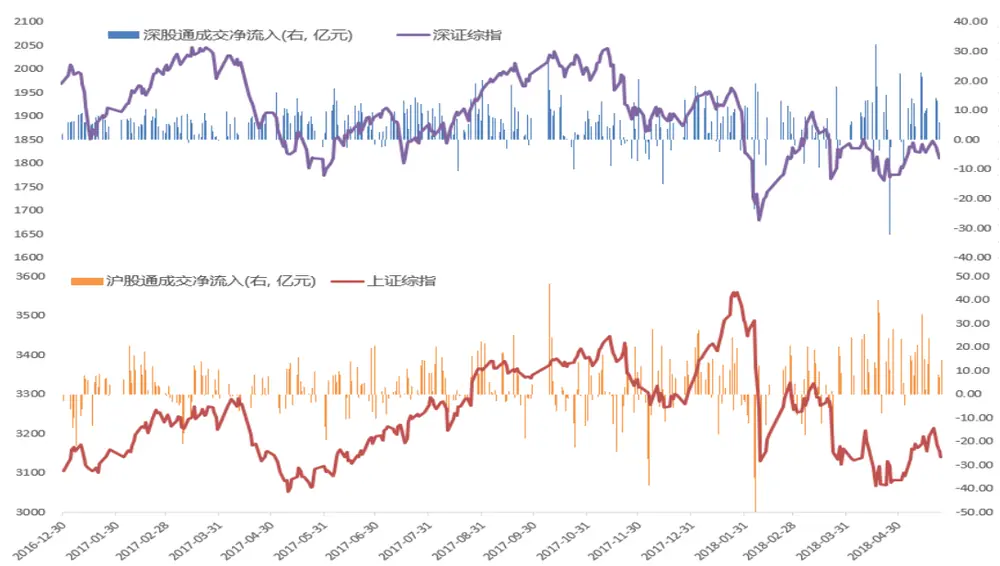
数据来源：广发证券发展研究中心

我们进一步研究资金在宽基指数的流入占比与资金在风格组合中的流入占比的相关系数，可以看到，虽然从表中可以看到，虽然资金流入大市值股票于资金流入大盘蓝筹指数的相关系数较高，分别达到了66.48%以及86.24%，但资金流入小市值股票并没有如预期那样与创业扳指、中小创指数相关系数有非常高的相关性，从这一角度看，直接观测宽基指数的资金流入流出并不能有效地指导风格配置。

图2 净流入比率：指数与风格因子的相关性

|  | 上证50 | 沪深300 | 中证1000 | 创业板指 | 中小板指 |
| --- | --- | --- | --- | --- | --- |
| 盈利风格(ROE: 低盈利20%股票组合) | 31.03% | 33.97% | 60.93% | 30.79% | 16.74% |
| 盈利风格(ROE: 高盈利20%股票组合) | 38.65% | 52.80% | 45.42% | 41.16% | 43.34% |
| 成长风格(ROE增长率: 低成长20%股票组合) | 21.72% | 31.83% | 51.75% | 37.74% | 34.27% |
| 成长风格(ROE增长率: 高成长20%股票组合) | 36.26% | 47.86% | 47.56% | 29.30% | 29.28% |
| 估值风格(BP(行业相对):低估值20%股票组合) | 45.34% | 53.44% | 45.15% | 30.56% | 27.46% |
| 估值风格(BP(行业相对):高估值20%股票组合) | 21.14% | 29.67% | 58.30% | 41.72% | 36.29% |
| 规模风格(总市值:小盘股20%股票组合) | 24.09% | 31.31% | 38.86% | 63.94% | 21.84% |
| 规模风格(总市值: 大盘股20%股票组合) | 66.48% | 86.24% | 43.98% | 33.00% | 34.07% |

数据来源：广发证券发展研究中心
识别风险，发现价值

最后，从以下市值风格银子的净流入资金增量环比增长率上看，资金比率的突然暴涨，甚至可能暴跌都可能对风格因子的收益率表现有一定的预测作用。

例如在下方的图表中，可以看到，当资金突然显著流入大市值股票组合时，盈利风格将在未来一段时间具有显著的正收益。

图3 净流入资金环比增长率：盈利风格
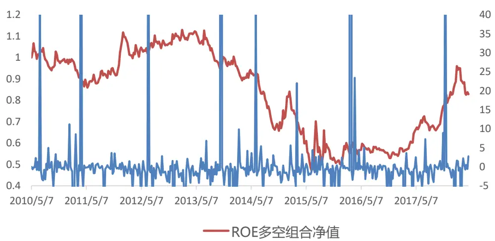
数据来源：广发证券发展研究中心

基于以上考虑，我们将在本篇报告中考虑通过构建恰当的资金比率来衡量资金在不同的风格组合中的强弱，从中挖掘规律并指导未来的风格配置。

## 二、资金流的定义及基本构造

为了能够全面地对市场上资金的变化进行考察，在本次报告中，我们将主要分析以下3类资金：主动净流入资金，融资余额资金，北上资金。

同时我们也将从纵向和横向两方面对资金的变化进行比较，以找到每个时刻市场上最受资金关注的风格，并从这一个风格中中寻找未来的风格配置规律。

## 2.1 资金流定义

由于市场的监管的逐渐放开以及市场中资金来源的逐渐丰富，当前可以流入股市并且容易观测的资金数据分别有主动净流入资金，两融资金以及沪深港通资金。

## 1) 主动净流入资金

交易一般在双方同时进行，因此无法直接通过观测交易额或者交易量的变化了解买卖双方的力量对比。主动买入指的是投资者主动去成交已经存在的卖单，对应地，被动买入指的是挂单等待买入，主动卖出指的是投资者主动去成交已经存在的买单。由于市场中一般存在着大量的挂单，交易活跃的短期投资者更倾向直接主动成交符合他内心定价的挂单。从该资金的定义可以看出，主动净流入资金体现市场交易中更显活跃的一方的资金流动情况。为了衡量市场中交易活跃的投资者的资金偏好，我们将通过检测主动净流入资金来对这一种资金偏好进行观测。

具体定义为：个股的主动净流入资金 = 个股的主动买入成交额 – 个股的主动卖出成交额。

图4 全A股净流入资金变化
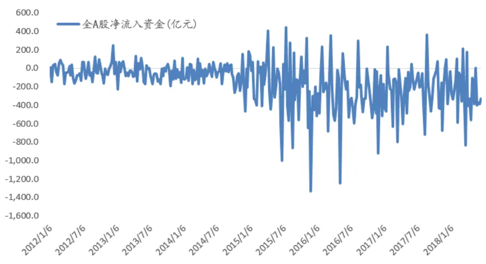
数据来源：wind，广发证券发展研究中心

## 2) 两融余额

2010年1月8日，证券公司的融资融券业务正式开始试点经营。直至今日，融资融券业务的市场规模随着市场的开放性逐渐地提高，交易也逐渐活跃，并且仍然是A股市场中进行杠杆交易以及卖空交易的重要手段之一。通过观测两融资金的交易活跃程度以及资金流向，可以间接地观测市场中激进投资者对不同的风格的关注程度。

由于融券业务的整体规模较小，因而在本报告中，我们仅分析融资业务的资金流变化。

图5 融资融券余额变化
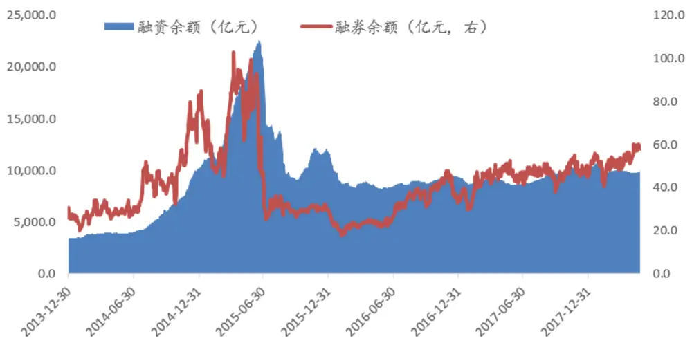
数据来源：wind，广发证券发展研究中心

## 3) 沪深港通资金

沪深港通自2014年开通以来，一直是国内市场投资港股市场以及港股市场投资国内市场的重要手段。港股市场相比于A股市场更加成熟完善，市场主要由机构投资者构成。通过监测北上资金的动向，可以观察香港市场对A股市场的投资情绪。另外，由于深港通的资金额度明显小于沪港通的资金额度，并且沪深两市联系较为紧密，因此以下在分析时将会将深港通和沪港通的资金合并，共同研究北上资金在A股市场的变化。

图6 沪深股通可用额度变化
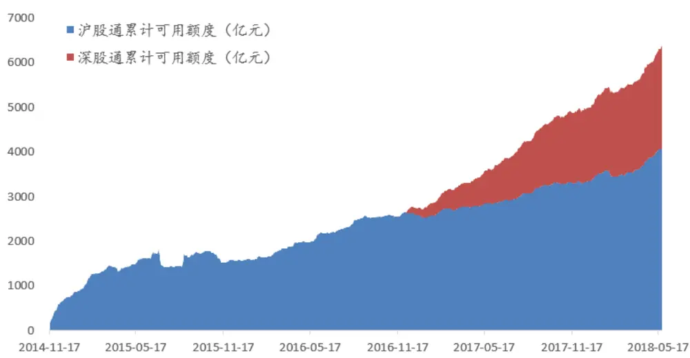
数据来源：wind，广发证券发展研究中心
识别风险，发现价值

## 2.2 资金流比率简介

承接上一部分，若直接观测资金额度的变化，由于资金与股市的同步性太高，因而预测能力明显滞后，对我们进行风格配置帮助不大，为此我们将横向和纵向的资金变动幅度来观测资金的变化。

## 1) 资金在交易额中的占比

从横向上看，若资金流在某一种风格上交易十分活跃，那么一般该风格是市场中买卖力量交锋的重要战场，一般该风格的资金流会长期或者短期地影响投资者在该风格上的偏好，使得该风格与一些相关联的风格反映出明显的市场偏好规律。

定义资金在交易额中的占比 = 本期的资金增量 / 本期的交易额之和。

## 2) 资金环比增长率

从纵向上看，若资金流在短时间内突然大量流入某一种风格同时大量流出该风格的反面，这样的资金流剧变会引起当前市场对该风格风格走势的关注并极可能对未来一期在风格的配置或者该风格关联的风格的配置上产生较大的影响。

定义资金环比增长率 = 本期的资金增量 / 上一期的资金增量 – 1。

## 2.3 风格因子简介

在介绍了以上具体的资金流以及具体的资金流比率后，下面我们简单介绍我们使用的风格因子库。

我们使用的风格因子库主要分为盈利、成长、杠杆、流动、技术、规模、质量、价值共8大类因子，其中预定方向表示在一般情况下，投资该因子的风格因子的方向，其中“+”表示在一般情况下，我们会配置该风格因子

由于同类因子的相关性及表现一般较为相似，因此我们仅在每个大类风格因子中各挑出一个风格因子进行研究，分别是ROE、ROE增长率、流通股本/总股本、近1周成交金额、近4周股价反转、BP(行业相对)、流动负债率、总市值。

表1 风格因子列表

| 大类名称 | 序号 | 因子名称 | 预定方向 | 大类名称 | 序号 | 因子名称 | 预定方向 |
| --- | --- | --- | --- | --- | --- | --- | --- |
| 盈利 | 1 | 销售净利率 | 十 | 规模 | 24 | 总市值 |  |
|  | 2 | 毛利率 | 十 |  | 25 | 总资产 |  |
|  | 3 | ROE | + | 质量 | 26 | 存货周转率 | + |
|  | 4 | ROA | 十 |  | 27 | 长期负债率 |  |
| 成长 | 5 | 股东权益增长率 | 十 |  | 28 | 每股负债比 |  |
|  | 6 | 总资产增长率 | 十 |  | 29 | 财务费用比例 |  |

识别风险，发现价值

|  | 7 | 净利润增长率 | + |  | 30 | 固定比 |  |  |
| --- | --- | --- | --- | --- | --- | --- | --- | --- |
|  | 8 | 每股净资产增长率 | + |  | 31 | 速动比率 | + |  |
|  | 9 | EPS增长率 | + |  | 32 | 流动比率 | + |  |
|  | 10 | ROE增长率 | + |  | 33 | 净利润现金占比 | + |  |
|  | 11 | 主营业务收入增长率 | + |  |  | 34 | 总资产周转率 | + |
| 杠杆 | 12 | 流通股本/总股本 | + |  |  | 35 | 流动负债率 |  |
|  | 13 | 流通市值/总市值 | + |  | 36 | 营业费用比例 |  |  |
|  | 14 | 资产负债率 |  | 价值 | 37 | 股息率 | + |  |
| 流动 | 15 | 近1周成交金额 |  |  | 38 | CFP(行业相对) | 十 |  |
|  | 16 | 近4周平均成交量 |  |  | 39 | EP(行业相对) | 十 |  |
|  | 17 | 近4周换手率 |  |  | 40 | SP(行业相对) | + |  |
| 技术 | 18 | 近4周股价反转 |  |  | 41 | BP(行业相对) | + |  |
|  | 19 | 近12周股价反转 |  |  | 42 | CFP | + |  |
|  | 20 | 近24周股价反转 |  |  | 43 | EP | + |  |
|  | 21 | 近240天股价反转 | . |  | 44 | SP | + |  |
|  | 22 | 最高点距离 | + |  | 45 | BP | 十 |  |
|  | 23 | 容量比 | . |  |  |  |  |  |

数据来源：wind，广发证券发展研究中心

## 2.4 风格因子收益率序列的构造

在本报告中，由于我们最终配置的是风格因子，因此需要先构造风格因子的收益率序列。我们将按照如下的流程计算每个风格因子的收益率序列：

1) 数据清洗：对因子进行基本的操作，包括剔除离群值，补全缺失值，标准化及行业中性化处理等；

2) 市值中性化：将股票按照市值分为10分组，再在每个市值分组中按照因子值大小将股票等分为10分组，将每个市值分组中因子值最高的一组合并构成top分组，将每个市值分组中因子值最低的一组合并构成bottom分组。

3) 计算收益率：分别将每期top分组和bottom分组的股票等权配置并计算该期的收益率。

4) 计算费用：由于本报告是周度报告，因此交易费用不可忽略，在本报告中均按照0.2%计算交易费用。

从以上的构造流程可以看到，对每个风格因子，我们均相应地可以构造出它的多头组合(top)的收益率序列以及空头组合(bottom)的收益率序列。

备注：以下提到的top组合（也称为多头组合）或bottom组合（也称为空头组合）均是指这一方法计算得到的股票组合。

## 2.5 资金流偏好度的构造

定义指定风格的资金流偏好度为某一种风格因子的多头组合以及空头组合按照既定的资金流和既定的计算方法的资金的偏离度，具体计算方法如下：

1) 在每一期按照既定的资金流分别计算风格多头组合和空头组合的资金流之和，并用多头组合的资金流之和减去空头组合的资金流之和得到当期该风格因子的资金流差

2) 若是按照资金在交易额中的占比计算比率，那么使用资金流差除以多头组合和空头组合两者的交易额之和得到比率；若是按照环比增长率，那么使用资金流差除以上一期的同一风格的资金流差得到风格的资金流环比增长率。

3) 完成以上步骤后，将根据资金流的正负判断资金流入的方向并记录。

图7 资金偏好度定义
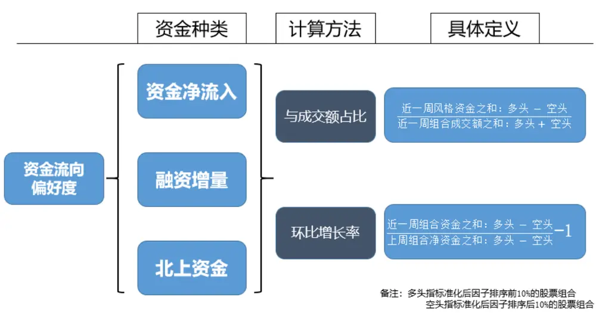
数据来源：广发证券发展研究中心

根据资金流偏好度的定义，结合以上介绍的资金流和资金流比率我们可以定义如下6种资金流偏好度：

1) 净流入比率

2) 融资余额交易额占比

3) 沪深股通交易额占比

4) 主动流入资金增量环比增长

5) 融资余额增量环比增长

6) 沪深股通增量环比增长

其中前3个资金流偏好度使用的是资金流在交易额中的占比的计算方法，后3个资金流偏好度使用的是环比增长率的计算方法。

## 2.6 策略框架

根据以上构造的资金流偏好度，我们可以基于以下的策略思想进行回测。

从个股角度上看，针对当期的大量资金地突然流入或流出，市场都会迅速将信息反馈到股市中，正如股市中常提及的“放量上涨”、“缩量下跌”等等。

从风格配置角度上看，资金流集聚在某种特定的风格或者资金流大量流入某一种风格都意味着该风格正迅速获得市场的关注并将能用于指导风格的轮转。

图8 策略回测的基础框架
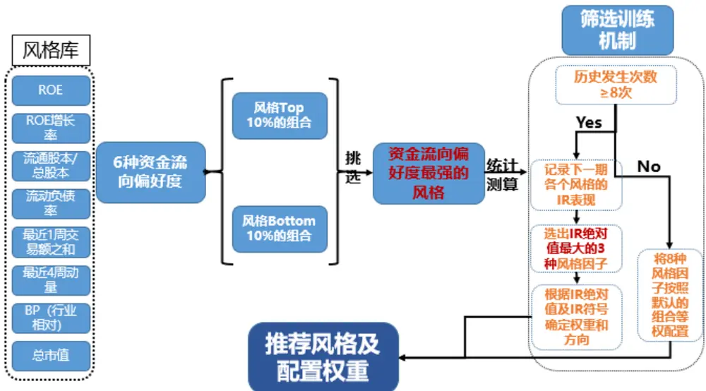
数据来源：广发证券发展研究中心

在给定资金偏好度的情况下，具体研究过程如下：

1) 在每一期分析每个风格的资金偏好度，并找到其中资金偏好度最强的风格（这里不考虑正负符号，正负符号仅用于配置风格时配置top组合还是bottom组合），将该风格称之为偏好度最强风格。

2) 在训练样本内，分别记录每期的偏好度最强风格及其方向，并按照最强风格和方向分别统计出现的次数，注意这里需要区分方向。因此对一种风格，资金偏好度为正或者为负需要分开统计。

例如，我们选用了8种风格，因此可能有8种风格成为最强风格，并且共有2种可能的方向，因此我们需要分别统计16种不同最强风格（考虑方向）随后一期市场中各个风格的表现。

3) 对以上16种最强风格的任意1种分别进行如下的统计分析：

a) 确定该最强风格的时间点，并对随后一期的8种风格的多头组合对冲空头组合的平均收益率、胜率、波动率、IR等进行统计。

b) 若某一种最强风格在整个样本区间内出现次数不超过8次，则认为该最强风格不具有一般性，无法用于对未来风格进行推荐，因此选择等权配置8种风格，配置风格的方向见风格因子列表。

由于沪深股通回测历史较短，因此对沪深股通进行测算时，我们将8次的限制降低为6次，下一点也相同。

c) 若某一种最强风格在整个样本区间内出现次数大于或等于8次，则选出最强风格随后一期8种风格中风格IR绝对值最高的3个风格作为该最强风格的推荐配置，配置的方向将根据IR的正负符号表示，配置的权重将根据IR的大小进行归一化计算。

## 2.7 资金流偏好度实例

下面我们将展示资金流偏好度训练过程的例子。

以净流入比率为例，并分析当最强风格为市值风格（资金流入：小市值>大市值）的情形，从下表中可以看到，历史上该情形出现过128次，随后一期的表现中，流动负债率因子、最近1周交易额因子和总市值因子IR绝对值最高，因此若最强风格为市值风格（资金流入：小市值>大市值）那么将推荐高流动负债率、低流动性、小市值风格的组合。

表2 净流入比率-总市值风格训练结果

| 最强风格 | 下期配置风格 | 胜率 | 周均收益率 | 标准差 | IR |
| --- | --- | --- | --- | --- | --- |
| 总市值(流入：小市值>大市 值) 历史出现次数：128次 | ROE | 52.3% | -0.02% | 2.97% | -0.04 |
|  | ROE增长率 | 44.5% | -0.17% | 1.41% | -0.84 |
|  | 流通股本/总股本 | 57.0% | -0.08% | 2.32% | -0.24 |
|  | 流动负债率 | 59.4% | 0.30% | 1.69% | 1.29 |
|  | 最近1周交易额之 和 | 30.5% | -0.92% | 2.36% | -2.80 |
|  | 最近4周动量 | 47.7% | -0.20% | 3.42% | -0.42 |
|  | BP(行业相对) | 49.2% | 0.14% | 2.54% | 0.39 |
|  | 总市值 | 31.3% | -0.81% | 3.52% | -1.65 |

数据来源：wind，广发证券发展研究中心

图9 资金偏好小市值推动高流动负债率风格
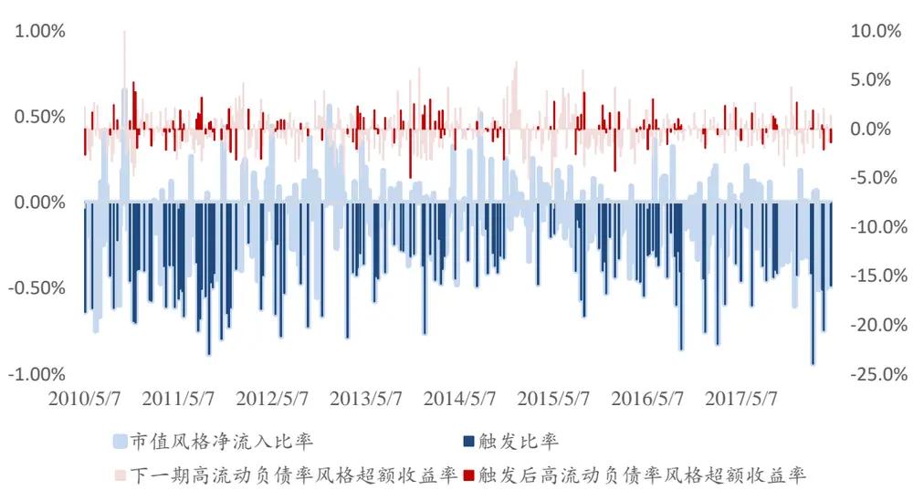
数据来源：wind，广发证券发展研究中心

从以上的图表中可以看到，当从横向观测资金的动向时，若观测到资金在小市值和大市值风格之间的资金差异在所有8种风格中最明显时（上方图表中的深蓝色时间点，下同），对应着，下一期高流动负债率对冲低流动负债率风格组合的超额收益率（深红色区域，下同）将十分显著，IR高达1.29（负号表示低流动性表现优于高流动性）。从侧面反映若市场资金追逐小盘股，市场同时也会更加关注

图10 资金偏好小市值推动低流动性风格
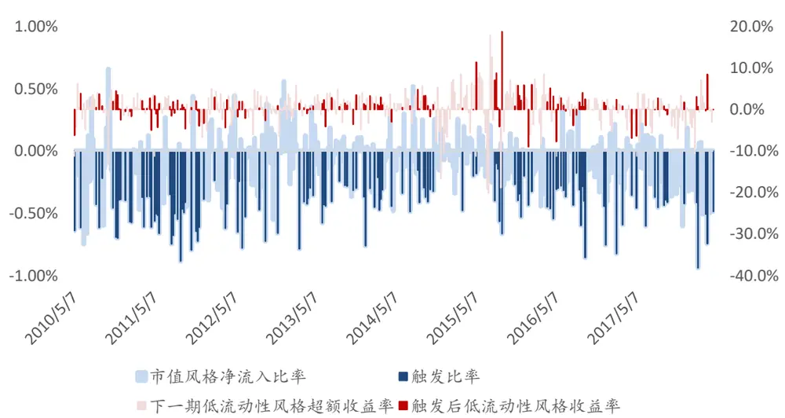
数据来源：wind，广发证券发展研究中心

从以上的图表中可以看到，当从横向观测资金的动向时，若观测到资金在小市值和大市值风格之间的资金差异在所有8种风格中最明显时，下一期低流动性对冲高流动性风格组合的超额收益率（深红色区域）将十分显著，IR高达-2.80。一般而言，小盘股的流动性弱于大盘股，从这里可以看到市场资金偏好小市值的同时也要求获得较高的流动性溢价。

图11 资金偏好小市值推动小市值风格
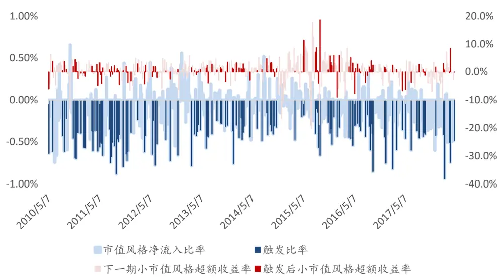
数据来源：wind，广发证券发展研究中心

从以上的图表中可以看到，当从横向观测资金的动向时，若观测到资金在小市值和大市值风格之间的资金差异在所有8种风格中最明显时，资金对市值风格而言具有动量效应，下一期小市值组合将显著超越大市值股票获得超额收益，在触发后的IR高达-1.65（负号表示小市值表现优于大市值）。

根据以上训练结果，当按照净流入比率计算的资金偏好度在市值风格中最强时，我们将按照IR的绝对值大小对风格进行配置。在上面的例子中，我们将按照21.4%，48.9%，29.7%配置高流动负债率风格组合、低流动性风格组合、小市值风格组合，同时相应对三种风格的对立组合进行相同权重的对冲。

## 2.8 配置矩阵

依据以上的训练过程，我们可以依次对6种风格进行训练并得到以下6个配置矩阵，在下方的矩阵中，第一列表示本期最强的风格，对应的每一行表示该风格为最强风格。由于资金流向存在正负两个方向（主要流向top组合还是bottom组合），因此同一个风格因子存在着两种不同情形的资金流向。

若该风格无推荐，则直接根据上述因子表中给定的因子方向进行等权配置，也即是分别等权配置高盈利、高成长、低杠杆、低流动负债率、低流动性、反转、低估值、小市值组合。

表3 净流入比率配置矩阵

| 本期资金偏好 度最强风格 | 资金流入方向 | ROE | ROE增 长率 | 流通股 本/总股 本 | 流动负 债率 | 最近一 周交易 额之和 | 最近4 周动量 | BP（行 总市值 业相对） |
| --- | --- | --- | --- | --- | --- | --- | --- | --- |
| ROE | 低盈利>高盈利 |  |  | 28.5% |  | -24.8% | 46.7% |  |
| 最近一周交易 额之和 | 低流动性>高流 动性 | 42.5% |  | 25.1% |  | -32.3% |  |  |
| BP（行业相对） | 高估值>低估值 | 33.9% |  |  | 35.6% |  |  | 30.5% |
| 总市值 | 小市值>大市值 |  |  | 21.4% | -48.9% |  |  | -29.7% |
| ROE | 高盈利>低盈利 | 45.2% |  | -25.9% |  | -28.8% |  |  |
| 最近4周动量 | 动量>反转 | 35.2% |  |  | -33.4% |  |  | -31.4% |
| BP（行业相对） | 低估值>高估值 |  |  | 28.7% | -43.6% |  |  | -27.7% |
| 总市值 | 大市值>小市值 | -33.4% | -40.9% |  |  |  |  | -25.7% |

数据来源：wind，广发证券发展研究中心

表4 融资余额交易额占比配置矩阵

| 本期资金偏好 度最强风格 | 资金流入方向 | ROE | ROE增 长率 | 流通股 本/总股 本 | 流动负 债率 | 最近一 周交易 额之和 | 最近4 周动量 | BP（行 总市值 业相对） |
| --- | --- | --- | --- | --- | --- | --- | --- | --- |
| 流通股本/总股 本 | 低杠杆>高杠杆 |  | 29.4% | 33.7% |  |  | -37.0% |  |
| 流动负债率 | 低流动负债率> 高流动负债率 | 40.4% |  | 35.0% |  |  | -24.6% |  |
| BP（行业相对） | 高估值>低估值 | -43.7% |  |  | -32.1% | -24.2% |  |  |
| 总市值 | 小市值>大市值 |  |  |  |  | -53.2% | 26.4% | -20.4% |
| ROE | 高盈利>低盈利 | 26.0% |  |  |  | -37.4% | 36.5% |  |
| 最近一周交易 额之和 | 高流动性>低流 动性 |  |  |  | -49.3% |  | 24.3% | -26.4% |
| 最近4周动量 | 动量>反转 |  |  | 49.9% | -29.5% |  |  | -20.6% |
| BP（行业相对） | 低估值>高估值 |  |  |  |  |  |  |  |
| 总市值 | 大市值>小市值 |  |  | 27.2% | -42.9% |  |  | -29.9% |

数据来源：wind，广发证券发展研究中心

表5 沪深股通交易额占比配置矩阵

| 本期资金偏好 度最强风格 | 资金流入方向 | ROE | ROE增 长率 | 流通股 本/总股 本 | 流动负 债率 | 最近一 周交易 额之和 | 最近4 周动量 | BP（行 业相对） | 总市值 |
| --- | --- | --- | --- | --- | --- | --- | --- | --- | --- |
| ROE | 低盈利>高盈利 | 19.1% |  |  | 62.8% |  |  |  | 18.1% |
| ROE | 高盈利>低盈利 | 29.8% |  | 42.4% |  | 27.8% |  |  |  |
| 总市值 | 大市值>小市值 | -38.1% |  |  |  |  |  | 33.7% | 28.2% |

数据来源：wind，广发证券发展研究中心

表6 主动流入资金增量环比增长配置矩阵

| 本期资金偏好 度最强风格 | 资金流入方向 | ROE | 流通股 ROE增 本/总股 长率 本 | 流动负 债率 | 最近一 周交易 额之和 | 最近4 周动量 | BP（行 业相对） | 总市值 |
| --- | --- | --- | --- | --- | --- | --- | --- | --- |
| ROE | 低盈利>高盈利 |  |  | 36.1% | -36.0% |  |  | -27.9% |
| ROE增长率 流通股本/总股 | 低成长>高成长 | 35.4% |  |  | -18.4% |  | 46.2% |  |
| 本 流动负债率 | 低杠杆>高杠杆 |  | -26.0% |  | -41.8% |  |  | -32.2% |
| 最近一周交易 | 低流动负债率> 高流动负债率 | -26.1% |  |  | -39.0% |  |  | -34.9% |
| 额之和 | 低流动性>高流 动性 | 28.9% | -47.3% |  |  |  |  | -23.8% |
| 最近4周动量 BP（行业相对） | 反转>动量 | 17.1% | 0.0% | 62.4% |  | -20.5% |  |  |
|  | 高估值>低估值 |  | -14.3% | 0.0% | -57.6% |  |  | -28.1% |
| 总市值 | 小市值>大市值 | 28.8% |  | 44.7% |  |  | 26.5% |  |
| ROE | 高盈利>低盈利 | 49.0% |  | 19.0% | 32.0% |  |  |  |
| ROE增长率 流通股本/总股 | 高成长>低成长 |  |  | 28.7% | -42.4% | -28.9% |  |  |
| 本 | 高杠杆>低杠杆 |  |  |  | -34.2% | -26.8% |  | -39.0% |
| 流动负债率 | 高流动负债率> 低流动负债率 | 17.5% |  |  | -55.2% |  | 27.3% |  |
| 最近一周交易 | 高流动性>低流 |  |  |  |  |  |  |  |
| 额之和 最近4周动量 | 动性 | 41.7% | 31.9% |  |  |  |  | 26.4% |
|  | 动量>反转 |  |  |  | -34.0% | -37.9% |  | -28.0% |
| BP（行业相对） | 低估值>高估值 |  | 33.1% | 44.5% |  |  |  | -22.4% |
| 总市值 | 大市值>小市值 | 39.5% |  |  | 27.0% |  | 33.5% |  |

数据来源：wind，广发证券发展研究中心

表7 融资余额增量环比增长配置矩阵

| 本期资金偏好 度最强风格 | 资金流入方向 | ROE | ROE增 长率 | 流通股 流动负 本/总股 债率 本 | 最近一 周交易 额之和 | 最近4 周动量 | BP（行 业相对） | 总市值 |
| --- | --- | --- | --- | --- | --- | --- | --- | --- |
| ROE | 低盈利>高盈利 | -31.6% |  |  | -37.4% |  |  | -31.0% |
| ROE增长率 流通股本/总股 | 低成长>高成长 | -22.5% |  |  | -46.1% |  |  | -31.4% |
| 本 | 低杠杆>高杠杆 | 40.7% 27.3% |  |  |  |  | 32.0% |  |
| 流动负债率 | 低流动负债率> 高流动负债率 |  |  |  | -31.5% |  | -33.8% | -34.7% |
| 最近一周交易 | 低流动性>高流 |  |  |  | -37.7% | -35.9% |  | -26.4% |
| 额之和 最近4周动量 | 动性 |  |  |  |  |  |  |  |
| BP（行业相对） 总市值 | 反转>动量 |  |  |  | -36.3% | -31.0% |  | -32.7% |
|  | 高估值>低估值 | 28.8% |  | 44.1% |  | 27.0% |  |  |
| ROE | 小市值>大市值 |  |  |  | -38.5% | -31.1% | 30.4% |  |
| ROE增长率 | 高盈利>低盈利 | 24.0% |  |  |  | 53.9% | 22.1% |  |
| 流通股本/总股 | 高成长>低成长 | 32.1% |  | 31.4% |  | -36.5% |  |  |
| 本 | 高杠杆>低杠杆 | -23.1% | -60.6% |  |  | 16.3% |  |  |
| 流动负债率 | 高流动负债率> 低流动负债率 | 48.7% | -29.7% |  | -21.6% |  |  |  |
| 最近4周动量 | 动量>反转 |  |  | 24.7% | -44.0% |  |  | -31.4% |
| BP（行业相对） | 低估值>高估值 | -31.1% |  |  | -39.1% |  |  | -29.7% |
| 总市值 | 大市值>小市值 | 48.1% 31.5% |  | 20.4% |  |  |  |  |

数据来源：wind，广发证券发展研究中心

表8 沪深股通增量环比增长配置矩阵

| 本期资金偏好 度最强风格 | 资金流入方向 | ROE | ROE增 长率 | 流通股 本/总股 本 | 流动负 债率 | 最近一 周交易 额之和 | 最近4 周动量 | BP（行 业相对） | 总市值 |
| --- | --- | --- | --- | --- | --- | --- | --- | --- | --- |
| ROE增长率 | 低成长>高成长 |  | -46.2% |  | 30.8% |  |  |  | -23.0% |
| 流动负债率 | 低流动负债率> 高流动负债率 |  | 31.1% | 35.4% | 33.6% |  |  |  |  |
| 流动负债率 | 高流动负债率> 低流动负债率 | 34.1% |  | 37.2% |  |  |  |  | 28.6% |

数据来源：wind，广发证券发展研究中心

## 三、实证检验

在这一部分实证中，我们将针对以上定义的6种不同形式的资金流强度相应地构建策略进行回测检验。值得注意的是以下实证中，除了使用的资金流强度不同之外，策略的其余部分均相同。另外涉及到沪深股通的两个资金流强度策略，由于数据时间区间的限制，因此回测从2017年3月份开始。

## 3.1 净流入比率策略

样本来源：wind底层数据库中的全市场非停牌并且上市满1年的股票，并根据风格因子依次构造收益率序列（见2.4）；

样本区间：2010年5月7日-2018年6月29日，其中2010年5月7日-2018年4月20日为样本内训练，其余为样本外数据；

行业分类：行业中性采用申万一级行业分类，一共为28个行业；

策略设置：每个自然周末作为策略的起点，根据每个风格因子上的净流入比率判断当期资金流偏好度最高的风格因子，根据上面筛选训练机制训练得到的该风格因子对应的配置方案，对下一周的风格进行配置

策略基准：选用上证综指进行对冲。

交易费率：由于策略是周度换仓， 忽略交易费用的影响，因此设置交易费率为0.2%。

在接下来的几个小节中，除非特别进行说明，否则样本来源、样本区间、行业分类、策略设置、策略基准、交易费率等均与本部分相同，相同的描述将不再给出。

策略回测结果如下所示：

图12 策略历史回测结果
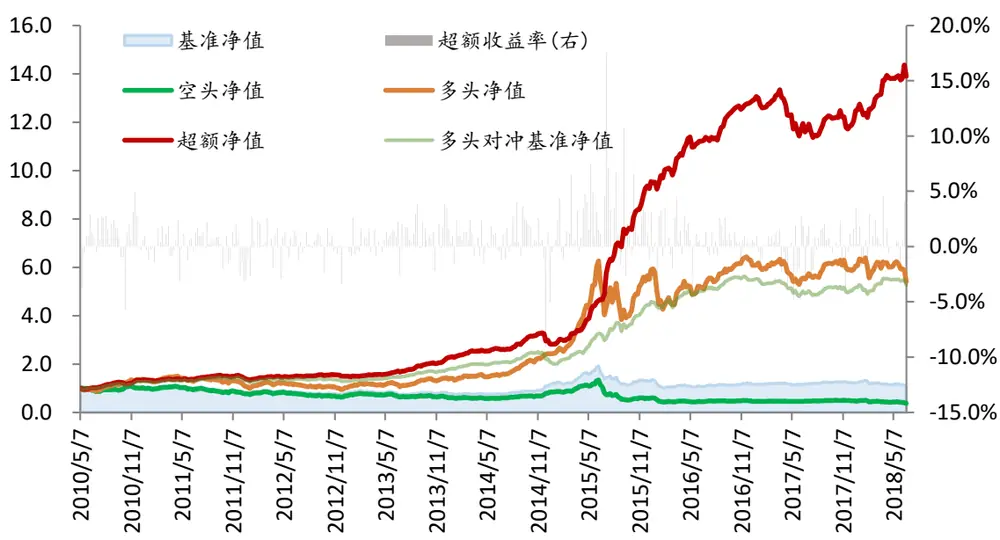
数据来源：wind，广发证券发展研究中心

表 9 分年度收益表现

| 超额收益率 | 胜率 最大回撤 |
| --- | --- |
| 全样本 428% | 64% -20% |
| 2010 27% | 62% -7% |
| 2011 |  |
| 1% | 59% -11% |
| 2012 1% | 56% -8% |
| 2013 38% | 71% -3% |
| 2014 11% 2015 | 64% -20% |
| 127% 2016 21% | 81% -10% |
|  | 68% -7% |
| 2017 -6% 2018(截止 6.29) 2% | 51% -13% 56% -7% |

数据来源：wind，广发证券发展研究中心

从回测结果可以看到除了2017年超额收益率为负之外，在其余年份超额收益率均为正。并且在2018年时，策略在市场剧烈波动的情况下依然成功地捕获了中间超跌修复阶段的收益，最终截止6月末，虽然超额收益率有所回收，但2018年整体的收益率依然高于上证综指。

## 3.2 融资余额增量占比策略

图13 策略历史回测结果
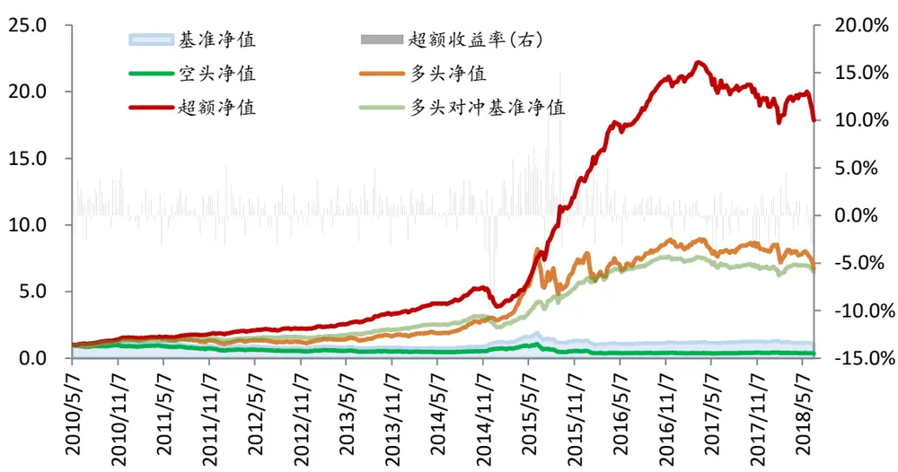
数据来源：wind，广发证券发展研究中心

表 10 分年度收益表现

| 超额收益率 | 胜率 最大回撤 |
| --- | --- |
| 全样本 546% | 65% -27% |
| 2010 33% | 65% -5% |
| 2011 2% | 53% -8% |
| 2012 15% | 58% -6% |
| 2013 43% | 75% -3% |
| 2014 4% | 68% -27% |
| 2015 159% | 83% -14% |
| 2016 24% | 64% -6% |
| 2017 -10% | 53% -12% |
| 2018(截止 6.29) -3% | 60% -9% |

数据来源：wind，广发证券发展研究中心

从回测结果可以看到本策略十分善于捕捉牛市中的小市值行情，但与净流入比率策略相比，受杠杆资金在配置偏好上的限制，本策略的推荐配置并没有指向大市值股票组合，因而策略难以把握住2017年以来的大盘蓝筹行情，在近2年表现不佳。

## 3.3 沪深股通资金流入交易额占比策略

样本区间：2017年3月17日-2018年6月29日，其中2017年3月17日-2018年4月20日为样本内训练，其余为样本外数据；

图14 策略历史回测结果
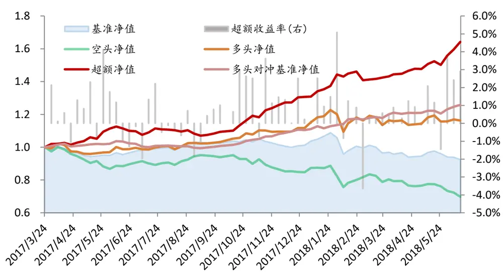
数据来源：wind，广发证券发展研究中心

表 11 分年度收益表现

| 超额收益率 | 胜率 | 最大回撤 |
| --- | --- | --- |
| 全样本 | 26% 71% | -4% |
| 2017 | 10% 69% | -4% |
| 2018(截止6.29) | 14% 75% | -1% |

数据来源：wind，广发证券发展研究中心

从回测结果可以看到沪深股通资金流入交易额占比策略表现出色，在近2年间都显著跑赢了基准。这是因为相比于国内市场基金，沪深股通的投资标的范围更加偏向于大盘股，另一方面相比于国内市场，香港投资者更加偏好于盈利确定性，因此主要布局于盈利，大市值股票。通过我们的训练筛选机制也进一步地证实了这一点。但由于训练时间较短（数据限制），因此我们将阶段性根据新增的数据重新对策略的筛选训练机制进行训练。

## 3.4 主动流入资金环比增长策略

在前面的3个策略中，我们均是从资金流偏好度的横向对比角度来找出资金偏好度最高的风格，在接下来的3个策略中，我们将从资金流偏好度的纵向变化对比来找出资金偏好度最高的风格。

图15 策略历史回测结果
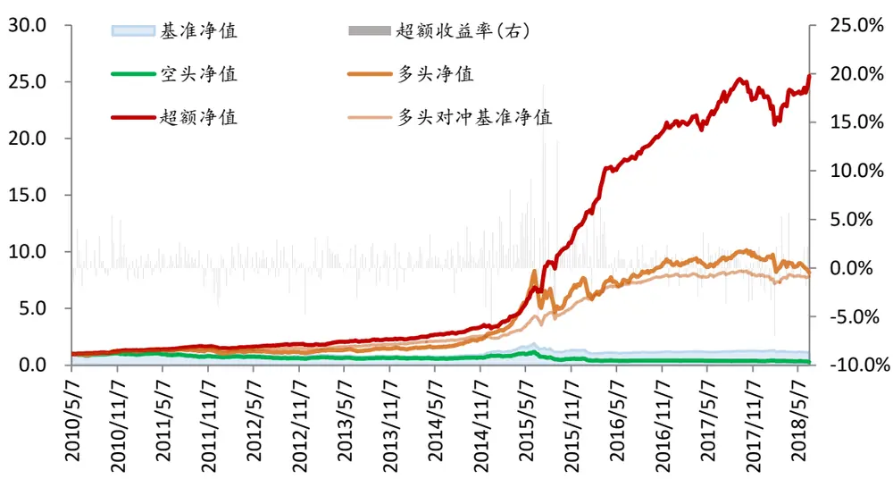
数据来源：wind，广发证券发展研究中心

表 12 分年度收益表现

| 超额收益率 | 胜率 最大回撤 |
| --- | --- |
| 全样本 686% | 66% -18% |
| 2010 22% | 68% -3% |
| 2011 8% | 59% -9% |
| 2012 8% | 52% -7% |
| 2013 32% | 76% -3% |
| 2014 26% | 68% -10% |
| 2015 150% | 83% -18% |
| 2016 36% | 70% -2% |
| 2017 -2% | 55% -6% |
| 2018(截止 6.29) 0% | 56% -9% |

数据来源：wind，广发证券发展研究中心

从回测结果可以看到近2年，沪深股通资金流入交易额占比策略表现出色，在近2年间都显著跑赢了基准。这是因为相比于国内市场基金，沪深股通的投资标的范围更加偏向于大盘股，另一方面相比于国内市场，海外市场那个更加偏好于盈利确定性，因此主要布局于盈利，大市值股票。通过我们的训练筛选机制也进一步地证实了这一点。但由于训练时间较短（数据限制），因此我们将阶段性根据新增的数据重新对策略的筛选训练机制进行训练。

识别风险，发现价值

## 3.5 融资增量环比增长策略

图16 策略历史回测结果
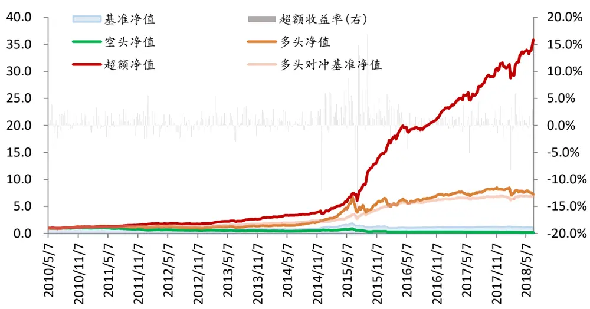
数据来源：wind，广发证券发展研究中心

表 13 分年度收益表现

| 超额收益率 | 胜率 最大回撤 |
| --- | --- |
| 全样本 593% | 65% -22% |
| 2010 18% | 59% -4% |
| 2011 10% | 59% -7% |
| 2012 3% | 58% -9% |
| 2013 38% | 69% -5% |
| 2014 19% | 72% -10% |
| 2015 130% | 79% -22% |
| 2016 28% | 66% -5% |
| 2017 6% | 59% -5% |
| 2018(截止 6.29) 2% | 56% -9% |

数据来源：wind，广发证券发展研究中心

从回测效果看，这一策略在所有年份的超额收益率均为正，不仅能比较好地捕捉牛市中的小市值行情，也很好地把握住了2017年以来大盘蓝筹的行情，但值得注意的是策略在2015年的熊市中不能很好地利用上证综指对冲风险，产生了较高的最大回撤。

## 3.6 沪深股通环比增长策略

样本区间：2017年3月17日-2018年6月29日，其中2017年3月17日-2018年4月20日为样本内训练，其余为样本外数据；

图17 策略历史回测结果
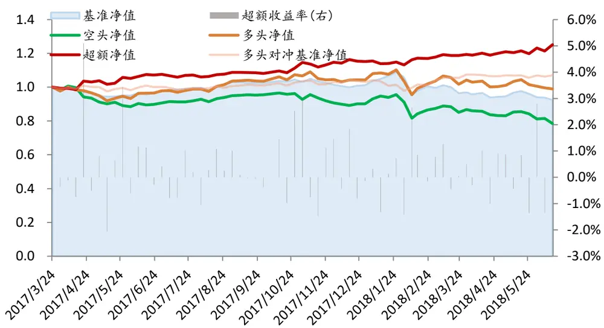
数据来源：wind，广发证券发展研究中心

表 14 分年度收益表现

| 超额收益率 | 胜率 | 最大回撤 |
| --- | --- | --- |
| 全样本 | 7% 52% | -6% |
| 2017 | 3% 54% | -3% |
| 2018(截止 6.29) | 4% 50% | -6% |

数据来源：wind，广发证券发展研究中心

从回测结果可以看到沪深股通环比增长策略表现也较好，在近2年间也都跑赢了基准，但策略的表现并不如沪深股通资金流入交易额占比策略。从两个策略的风格配置推荐矩阵上看，前面的策略更加偏好推荐大市值和盈利风格，而本策略则侧重于杠杆类因子的推荐，因此没能最大化近2年的超额收益率。

## 3.7 综合策略

经过了对面6个单策略的研究，我们可以看到由于资金流以及使用的资金流偏好度的计算方法的不同，6个单策略的表现各有优劣，因而我们可以考虑综合其中4个资金流偏好度的配置方案并构成最终的综合配置方案。

在每期，我们将分别监测4个资金流偏好度当期的最强风格因子，若其有推荐的配置方案，则记录下对应的推荐风格及相应的权重，最终等权配置具有推荐配置因子的方案归一化后得到最终的综合策略配置方案。

图18 综合策略的回测框架
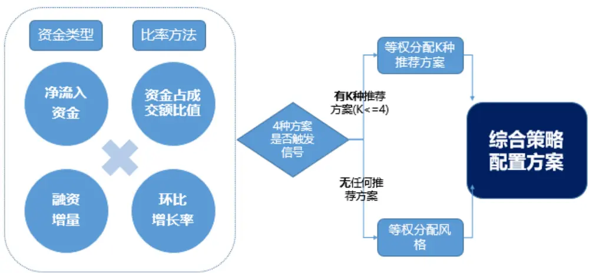
备注：由于沪深股通资金数据公布时间较晚，不作为综合策略参考依据
数据来源：广发证券发展研究中心

策略回测效果如下

图19 策略历史回测结果
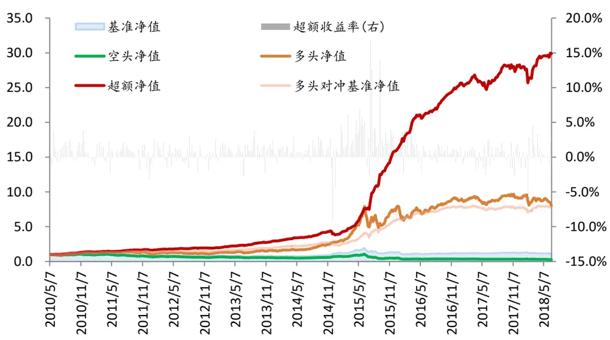
数据来源：wind，广发证券发展研究中心

表 15 分年度收益表现

| 超额收益率 | 胜率 最大回撤 |
| --- | --- |
| 全样本 673% | 64% -16% |
| 2010 26% | 71% -4% |
| 2011 6% | 57% -9% |
| 2012 7% | 54% -6% |
| 2013 39% | 73% -3% |
| 2014 16% | 68% -16% |
| 2015 164% | 81% -15% |
| 2016 29% | 68% -5% |
| 2017 -3% | 49% -8% |
| 2018(截止 6.29) 1% | 48% -9% |

数据来源：wind，广发证券发展研究中心

从策略分年度表现来看，策略相比于横向角度的两种资金流因子，它的超额收益率有了非常大的提高，对比纵向角度的两个资金流偏好度策略，策略的稳定得到了一定的提高，并且策略的最大回撤也得到了极大的改善。

## 四、总结

## 4.1 总结

由策略的回测结果我们可以看到，采用资金流比率对资金强度进行刻画，找到当前市场中资金关注的焦点，并分析随后市场风格轮动的规律，可以为我们在风格轮动中提供重要的建议。

## 1) 优点

在上一篇多因子报告《宏观视角下的风格轮动探讨——多因子Alpha系列报告之（三十五）》，我们从宏观事件，宏观趋势匹配等多个角度对风格轮动进行了探讨，侧重的是整个市场的经济环境，政策环境等对风格轮动的影响。在本次研究报告我们另辟蹊径，从相对更加微观的资金流的角度对风格轮动进行了规律的研究，从结果上看，不同的资金流，不同的资金流考量方式对风格轮动的影响具有明显的区别。当我们最终构成综合策略后可以看到，综合策略融合了4种策略各自的一些优点，表现更加稳定。

## 2) 不足

由于沪深股通资金数据的公布期限较短，因此无法用于构建综合策略。但从这6种资金偏好度的推荐配置矩阵看，沪深股通资金更能够捕获未来一周大市值上涨的超额收益，因此若能将其也加入综合策略的考量中，将能更好地弥补策略整体在大市值风格配置上的不足。

## 4.2 最新结果

根据模型最新一期识别结果，6月29日最新一周的风格配置组合如下表（负号表示配置因子值较小的10%的股票组合）。

表 16 最新风格轮动策略最新推荐（2018-06-29）

| 资金流分类 | 本期最强风格 | ROE | ROE增 长率 | 流通股 本/总 股本 | 流动负 债率 | 最近 1W 交易额 之和 | 最近 4W 动量 | BP(行 业相 对) | 总市值 |
| --- | --- | --- | --- | --- | --- | --- | --- | --- | --- |
| 净流入比率 | ROE（资金流入：低 ROE> 高 ROE) |  |  |  | 28.5% |  | -24.8% | 46.7% |  |
| 融资增量占比 | ROE（资金流入：高 ROE> 低 ROE) |  |  |  |  | -34.2% | -26.8% |  | -39.0% |
| 主动流入资金 环比增长 | 总市值（资金流入：小 盘股>大盘股) |  | 26.0% |  |  |  | -37.4% | 36.5% |  |
| 融资增量环比 增长 沪深股通增量 | 流通股本/总股本(资金 流入：高杠杆>低杠杆） |  | -31.6% |  |  | -37.4% |  |  | -31.0% |
| 占比 沪深股通环比 | ROE（资金流入：低 ROE> 高 ROE) | 19.1% |  |  | 62.8% |  |  |  | 18.1% |
| 增长 | 流动负债率（资金流 入：低流动负债率>高流 | 34.1% |  | 37.2% |  |  |  |  | 28.6% |
|  | 动负债率) 综合策略 | -1.6% |  |  |  |  |  | 23.9% | -20.1% |

数据来源：wind，广发证券发展研究中心

图20 综合策略配置组合（2018-06-29）
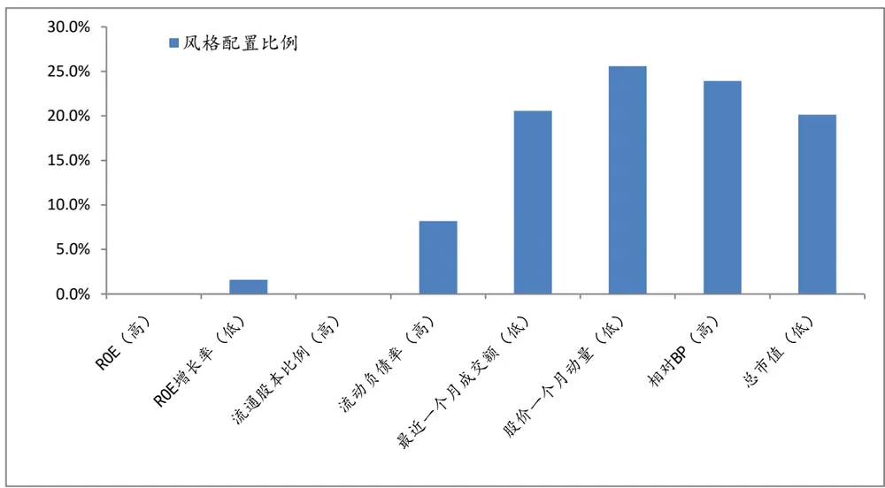
数据来源：wind，广发证券发展研究中心

从表中可以看出，本周资金主要偏好盈利类风格，根据历史规律，在接下来的一期，我们主要推荐低流动性、低估值和一个月反转的风格组合。

## 风险提示

本模型采用量化方法通过历史数据统计、建模和测算完成，并受本文作者主观判断的影响，所推荐的风格配置未必具有严格的投资逻辑，也未必符合当前宏观环境特点，在极端的市场环境变化中有失效的风险。

## 广发证券—行业投资评级说明

买入： 预期未来12个月内，股价表现强于大盘10%以上。

持有： 预期未来12个月内，股价相对大盘的变动幅度介于-10%～+10%。

卖出： 预期未来12个月内，股价表现弱于大盘10%以上。

## Table_RatingCompany 广发证券—公司投资评级说明

买入： 预期未来12个月内，股价表现强于大盘15%以上。

谨慎增持： 预期未来12个月内，股价表现强于大盘5%-15%。

持有： 预期未来12个月内，股价相对大盘的变动幅度介于-5%～+5%。

卖出： 预期未来12个月内，股价表现弱于大盘5%以上。

Table_Ad联系我们

|  | 广州市 | 深圳市 | 北京市 | 上海市 |
| --- | --- | --- | --- | --- |
| 地址 | 广州市天河北路183号 大都会广场5楼 | 深圳市福田区金田路4018 号安联大厦 15 楼 A 座 | 北京市西城区月坛北街2号 月坛大厦18层 | 上海市浦东新区富城路99号 震旦大厦18楼 |
| 邮政编码 |  | 03-04 |  |  |
| 客服邮箱 | 510075 | 518026 | 100045 | 200120 |
|  | gfyf@gf.com.cn |  |  |  |
| 服务热线 | 020-87555888-8612 |  |  |  |

## Table_Disclaimer 免 责声 明

广发证券股份有限公司具备证券投资咨询业务资格。本报告只发送给广发证券重点客户，不对外公开发布。

本报告所载资料的来源及观点的出处皆被广发证券股份有限公司认为可靠，但广发证券不对其准确性或完整性做出任何保证。报告内容仅供参考，报告中的信息或所表达观点不构成所涉证券买卖的出价或询价。广发证券不对因使用本报告的内容而引致的损失承担任何责任，除非法律法规有明确规定。客户不应以本报告取代其独立判断或仅根据本报告做出决策。

广发证券可发出其它与本报告所载信息不一致及有不同结论的报告。本报告反映研究人员的不同观点、见解及分析方法，并不代表广发证券或其附属机构的立场。报告所载资料、意见及推测仅反映研究人员于发出本报告当日的判断，可随时更改且不予通告。

本报告旨在发送给广发证券的特定客户及其它专业人士。未经广发证券事先书面许可，任何机构或个人不得以任何形式翻版、复制、刊登、转载和引用，否则由此造成的一切不良后果及法律责任由私自翻版、复制、刊登、转载和引用者承担。