# [Table_Title] 从个股分化看风格轮动

## 多因子 Alpha 系列报告之（三十八）

## [Table_Summary]报告摘要：

## A股风格与分化特征回顾

观察历年各指数年度收益情况，近年呈现以下新特征：

一方面，部分主流风格出现较大逆转，中小创优势不再，取而代之的是上证 50及沪深300等蓝筹指数相对抗跌；

其次，个股分化减弱，市场“一九”效应凸显，Alpha空间缩小。

## 从个股分化看风格轮动

从个股分化度的视角，可窥见风格轮动的些许规律。2015下半年，随着股市暴跌个股出现较大分化，基于风格的反转轮动策略能够捕捉到显著的超额收益；而近年来，随着 A 股分化回归历史相对低位，风格轮动呈现出强者恒强的“抱团格局”，风格趋势策略显著优于风格均衡及风格反转。

本篇报告中，采用收益率标准差作为个股分化度的刻画，用于衡量特定股票样本之间的分化程度。考虑到近两年A 股极端的“一九”分化结构及缩量特征，在计算分化度时将股票池涨跌幅首尾各 10%剔除，在剩余80%个股中采用相对成交量加权对分化度指标进行改进，得到成交量修正后的分化度指标 MADI。当 MADI 低于特定阈值时，选择风格趋势策略，反之则采用风格反转策略。

## 策略实证结果

基于 MADI 指标分别在中证 800、中证 500 及沪深300 指数的成分股构建动态风格轮动策略，回测在 2007 年 3 月至 2018 年 12 月的样本区间内展开，从回测效果上看，基于分化度的动态风格轮动策略，相对静态因子加权、趋势及反转加权策略均取得显著的改进效果。

以中证 800 策略为例，基于分化度的动态风格策略，年化超额收益率由静态因子策略的 13.2%及风格趋势策略的 15.6%提高到17.6%。

## 最新风格推荐

截止 2018 年12 月，基于三个不同指数计算的分化度均处于较低水平，策略上依然采用“风格趋势”。最新一期（截止 2018 年 12 月）风格配置上以价值、流动性及盈利成长风格为主，以中证 800为例，其中“股息率”、“市现率”、“换手率”及“EPS 增长率”因子的权重均为17%。

## 核心风险提示

本模型采用量化方法通过历史数据统计、建模和测算完成，并受本文作者主观判断的影响，结论在极端市场环境变化中有失效的风险。

图 大盘主流指数年度收益率回顾
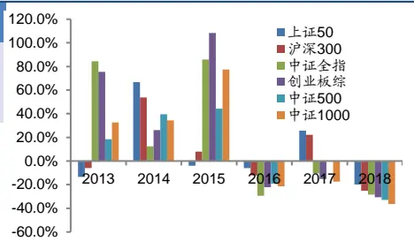
图 趋势策略风格动态打分原理

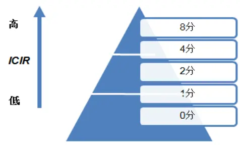
图 中证800动态风格策略表现

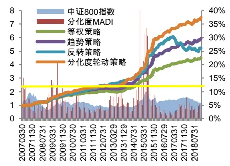

[分析师： Table_Author]史庆盛

SAC 执证号：S0260513070004

02087577060

shiqingsheng@gf.com.cn分析师： 文巧钧

SAC 执证号：S0260517070001

SFC CE No. BNI358

0755-82797057

wenqiaojun@gf.com.cn

请注意，史庆盛并非香港证券及期货事务监察委员会的注册持牌人，不可在香港从事受监管活动。

## [Table_ 相关研究：DocRe

探寻资金流背后的风格轮动 2018-07-05 规律

宏观视角下的风格轮动探讨 2018-04-08

## 一、A股 Alpha 特征及分化度简介

## 1.1 A股风格与分化特征

2018年主流宽基指数全线下跌，从“大/小盘”风格看延续了2017年的特征：中小创跌幅相对较大，大中蓝筹则相对抗跌，其中中证1000下跌36.3%，而上证50下跌19.8%。

观察历年各指数年度收益情况，近年来呈现以下新特征：

一方面，以市值规模为代表的部分主流风格出现较大逆转，2013年以来中小创一路领先的格局不存，取而代之的是上证50及沪深300等蓝筹指数相对抗跌；

其次，除领涨的指数，其余指数之间分化显著减弱，市场“一九”效应凸显，传统Alpha策略空间被大大压缩。

图1 大盘主流指数年度收益率回顾
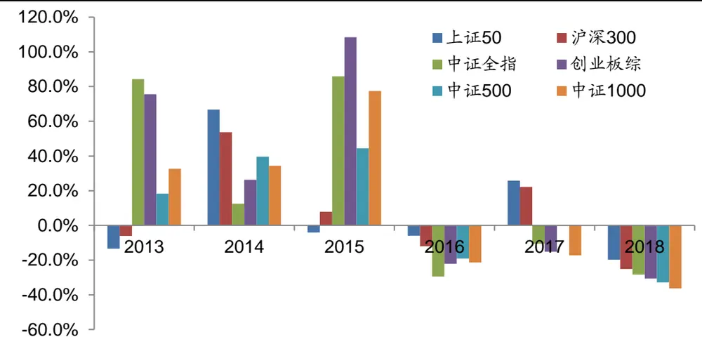
数据来源：Wind，广发证券发展研究中心

以中证800成分股每月收益标准差作为股票分化度指标，下图显示近十年来A股分化度变化，在2007年及2015年的牛市后期个股分化达到历史高位，而自2016年底以来，A股重新回到弱风化的结构特征。

图2 A股历史分化度变化（分化度为左轴）
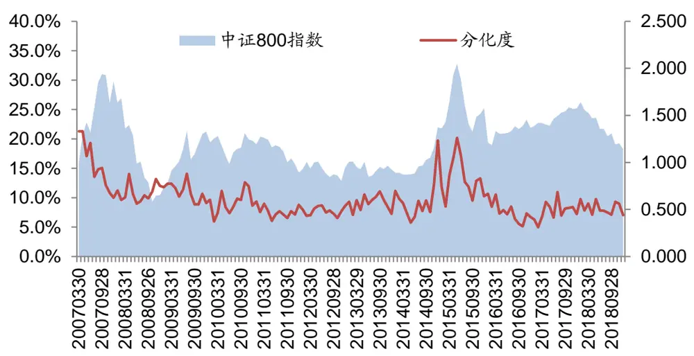
数据来源：Wind，广发证券发展研究中心

上述在A股指数近年来呈现的新特征，一方面是风格轮动上的变化，另一方面则对应个股结构分化的新特征，伴随着整体波动持续收窄且流动性偏弱，A股缺乏持续赚钱效应，对于主流风格的轮动把握重要性甚至高于对大盘方向的择时。

风格轮动的常见做法分别是风格趋势与风格反转，近年来A股中前者显著优于后者，而二者背后的有效性切换是否与A股当前处于较弱的分化特征存在密切关联？本篇报告将围绕个股分化度与风格轮动之间的关系展开研究。

## 1.2 分化度定义

个股分化度一定程度上反映了市场投资热点轮动及分化的程度，也体现了投资者情绪高低，报告中采用股票横截面月收益率标准差作为特定股票池分化度定义。

第t期个股分化度DIt计算如下：

$$
DI_{t}=\sqrt{\frac{1}{N-1}\sum(r_{it}-\bar{r}_{it})^{2}}
$$

考虑到近两年A股极端的“一九”结构特征，实际上80-90%的个股分化程度，将决定Alpha策略的大部分空间，因此考虑将股票池涨跌幅首尾各10%剔除，在剩余80%个股中计算新的分化度；此外，考虑到个股成交量水平同样是影响投资者情绪及风格的重要影响因素，将分化度乘以相对成交量（个股当月成交量除以近M期成交量，M=12），得到成交量调整分化度指标VADI（Volume adjustmentdifferentiation index）。

$$
VADI_{t}=DI_{t}\times\frac{Vol_{t}}{M}\sum Vol_{t}
$$

## 1.3 A股分化与风格轮动规律初探

随着投资者情绪以及预期的波动，市场投资热点及风格的处于不断切换变化当

中，而从个股分化度的视角，可窥见风格轮动的些许规律。

2015下半年，随着股市暴跌个股出现较大分化，基于风格的反转轮动策略能够捕捉到显著的超额收益；而近年来，随着A股分化回归历史相对低位，风格轮动呈现出强者恒强的“抱团格局”，风格趋势策略显著优于风格均衡及风格反转。从个股分化度的视角，可窥见风格轮动的些许规律。

以中证800成分股分化度为例，自2007年以来，个股分化度DI平均值为9.7%，剔除前后10%，分化度显著降低，并考虑成交量修正后，平均VADI为6.7%。

图3 A股历史分化度变化（分化度为左轴）
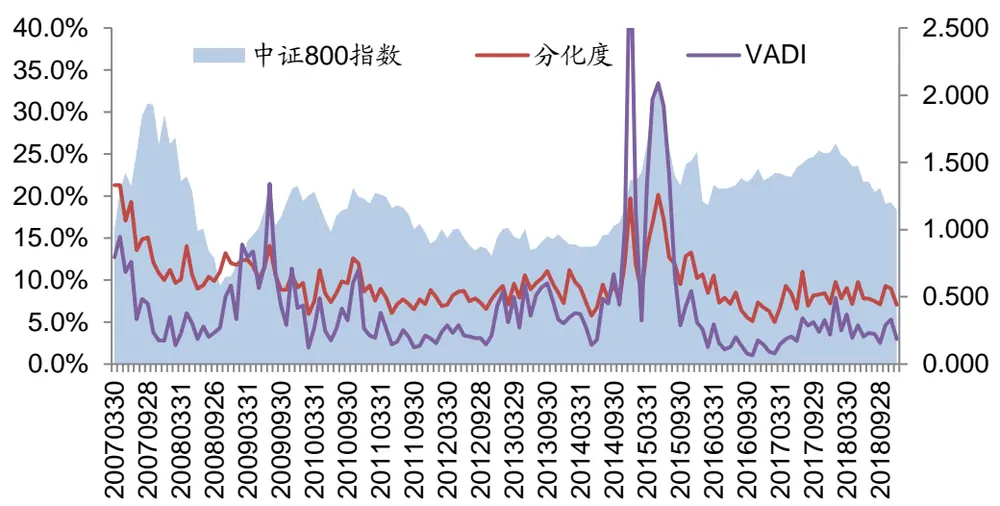
数据来源：Wind，广发证券发展研究中心

分别构造基于中证800的多因子风格趋势及风格反转策略，下图为两个不同风格轮动策略表现及分化度MADI变化，可以直观看出但个股分化度处于较低水平时，风格趋势策略整体来说表现优于反转策略。

下一节将详细介绍风格趋势及反转轮动策略的构造原理，并探讨分化度指标与风格轮动的规律。

图4 分化度与风格轮动规律（分化度为右轴）
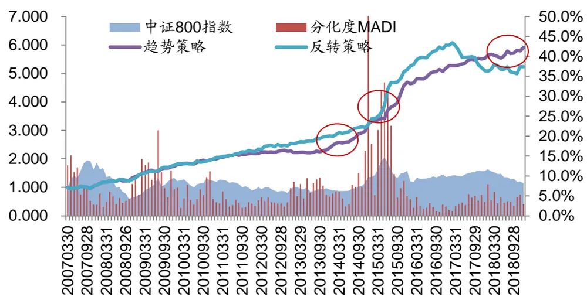
数据来源：Wind，广发证券发展研究中心

## 二、基于分化度的风格轮动策略及实证

## 2.1 风格轮动策略简介

随着政策、市场环境以及投资者情绪的变化，风格在不同时期可能会出现较大的转变，传统的多因子静态策略受风格变化会出现较大的波动和回撤，甚至持续性失效。2014年底以及2017年以来的市场风格切换就是比较典型的代表。因此我们需要更加灵活的策略，能够应对不同的市场环境，自动选择更加合适或自适应调整各风格的权重。广发金融工程团队围绕风格轮动尝试过不同的方法，可以参考多因子系列研究中的相关报告。其中最为经典的轮动策略是风格趋势和反转。

下面我们以“基于IC_IR加权的风格趋势多因子策略”为例，介绍动态多因子趋势及反转策略的构造原理。

在备选的K个因子中，计算t时刻过去N期（下文取N=6）的 $IC\_IR_{\mathrm{i,i}}$ ，将因子历史IC_IR绝对值为5档，根据 $IC\_IR_{\mathrm{t,i}}$ 绝对值所处的档位从低到高分别给因子打分。

风格趋势策略给予过去ICIR越高的风格权重越高，风格反转策略则反之。

图5因子 ICIR风格“趋势”加权

数据来源：Wind，广发证券发展研究中心

图6因子 ICIR风格“反转”加权
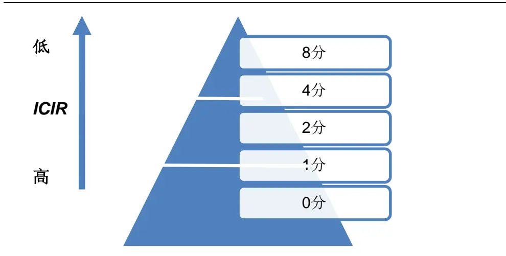
数据来源：Wind，广发证券发展研究中心

将所有得分归一处理，得到各因子的权重比例：

$$
w_{i}={\sqrt[{Score}}_{i}{\Big/}_{\sum_{j=1}^{N}Score_{j}}
$$

上述风格“趋势”及“反转”策略适用于A股市场不同阶段，下文我们将尝试基于分化度指标MADI，对上述两类风格轮动策略进行动态选择。

## 2.2 基于分化度的动态风格轮动策略构建

上一节中，我们通过对比A股历史分化度与对应风格趋势反转策略有效性变化，得出初步判断：个股分化度越低，越适合采用风格趋势策略，反之则采用反转策略。

下文我们尝试针对不同的股票池，构建基于分化度的动态风格轮动策略，而策略的关键在于：找到合适的阈值F用于判断分化度水平，当个股分化度MADI<F，则选用上述趋势策略进行风格因子加权，反之则使用上述反转策略进行风格因子加权。

图7 分化度与风格轮动策略表现（分化度为右轴）
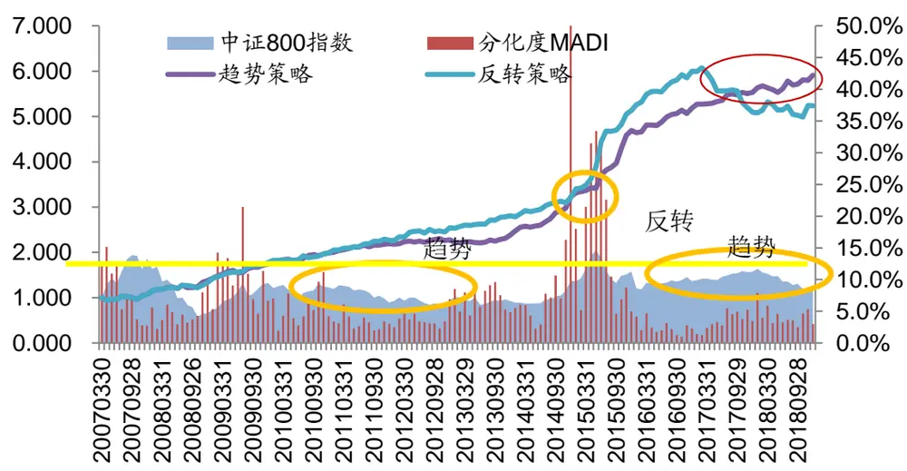
数据来源：Wind，广发证券发展研究中心

## 2.3 实证分析

在这一部分，我们围绕不同指数，构建并测试上述基于个股分化度的风格轮动策略。

股票样本：分别基于中证800、中证500及沪深300成分股进行测算；

日期区间：2007年3月-2018年12月；

行业分类：行业中性采用申万一级行业分类，共28个行业；

选用因子：在个股样本池内，测算历史全样本因子有效性，并选择若干个因子固定配置；

策略设置：每个自然月作为策略的起点，根据成分股内计算的当期分化度MADI判断当期应该选用风格“趋势”或“反转”策略，对上述因子进行动态权重配置；

## 策略基准：股票池对应指数

在接下来的几个小节中，除非特别进行说明，否则样本来源、样本区间、行业分类、策略设置、策略基准等均与本部分相同，相同的描述将不再给出。

## （1）中证800实证分析

根据测试结果，我们从每类因子中分别筛选出了若干收益率突出且稳定性较好的因子作为代表。

表 1：中证 800策略因子筛选

| 编号 |  | 因子IC | LS 收益率 | LS 胜率 | LS_IR | L_IR | IC_P |
| --- | --- | --- | --- | --- | --- | --- | --- |
| 1 | ROE | 0.79% | 3.50% | 49.6% | 0.22 | 0.52 | 20.64% |
| 2 | EPS增长率 | 0.87% | 1.58% | 56.7% | 0.13 | 0.31 | 8.04% |
| 3 | 1 个月成交金额 | -6.75% | 28.42% | 67.4% | 1.25 | 0.99 | 0.00% |
| 4 | 换手率 | -6.33% | 24.25% | 65.2% | 1.04 | 0.69 | 0.00% |
| 5 | 一个月股价反转 | -4.74% | 17.16% | 63.8% | 0.85 | 0.62 | 0.01% |
| 6 | 三个月股价反转 | -4.25% | 19.65% | 61.0% | 0.90 | 0.81 | 0.06% |
| 7 | 流通市值 | -3.37% | 15.00% | 58.9% | 0.96 | 1.00 | 0.02% |
| 8 | CFP | 1.72% | 9.20% | 56.7% | 0.75 | 0.93 | 1.66% |
| 9 | EP | 2.91% | 12.98% | 58.9% | 0.88 | 0.87 | 0.17% |
| 10 | SP | 1.62% | 5.56% | 53.2% | 0.41 | 0.78 | 3.01% |
| 11 | BP | 3.36% | 15.24% | 55.3% | 0.74 | 0.83 | 0.46% |
| 12 | DP | 2.81% | 12.67% | 59.6% | 1.17 | 0.95 | 0.00% |

数据来源：Wind，广发证券发展研究中心

图 8 中证 800 策略选用因子 IC
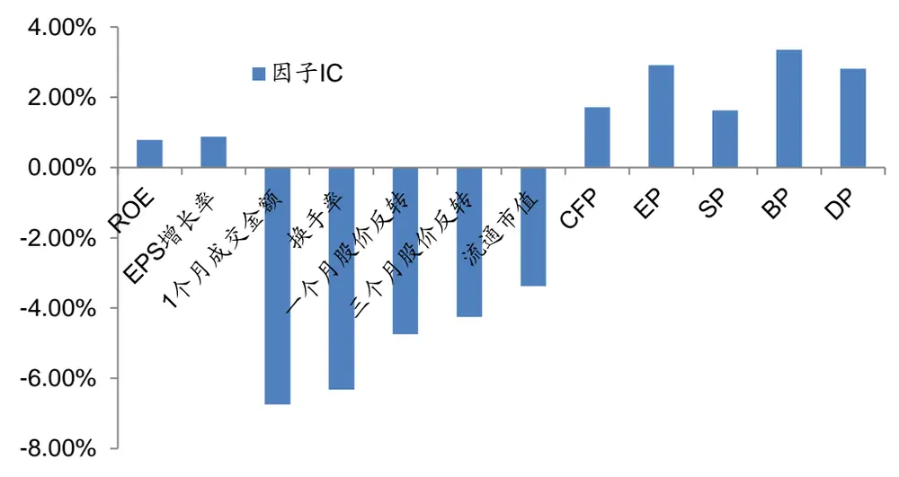
数据来源：Wind，广发证券发展研究中心

表 2：中证 800策略表现对比

| 因子加权 | 等权 | 趋势 | 反转 | 动态 |
| --- | --- | --- | --- | --- |
| 组合类型 | 行业中性 | 行业中性 | 行业中性 | 行业中性 |
| 月度胜率 | 72.3% | 75.2% | 67.4% | 76.6% |
| 年化超额 | 13.2% | 15.6% | 14.6% | 17.6% |
| 年化波动 | 8.0% | 8.5% | 9.5% | 9.2% |
| 信息比率 | 1.65 | 1.83 | 1.54 | 1.92 |
| 最大回撤 | 6.4% | 7.5% | 17.9% | 7.5% |
| 月换手率 | 47.0% | 45.5% | 50.8% | 49.5% |

数据来源：Wind，广发证券发展研究中心

本策略中，分化度阈值为F=8%。从回测结果可以看到，整体来说中证800成分股中更加适合采用风格趋势策略，若引入个股分化度作为参考指标进行趋势反转动态切换，则策略年化超额收益率由单纯的趋势策略从15.6%提高到17.6%，而静态等权的多因子策略年化超额仅为13.2%。

图 9 中证 800策略表现对比（分化度为右轴）
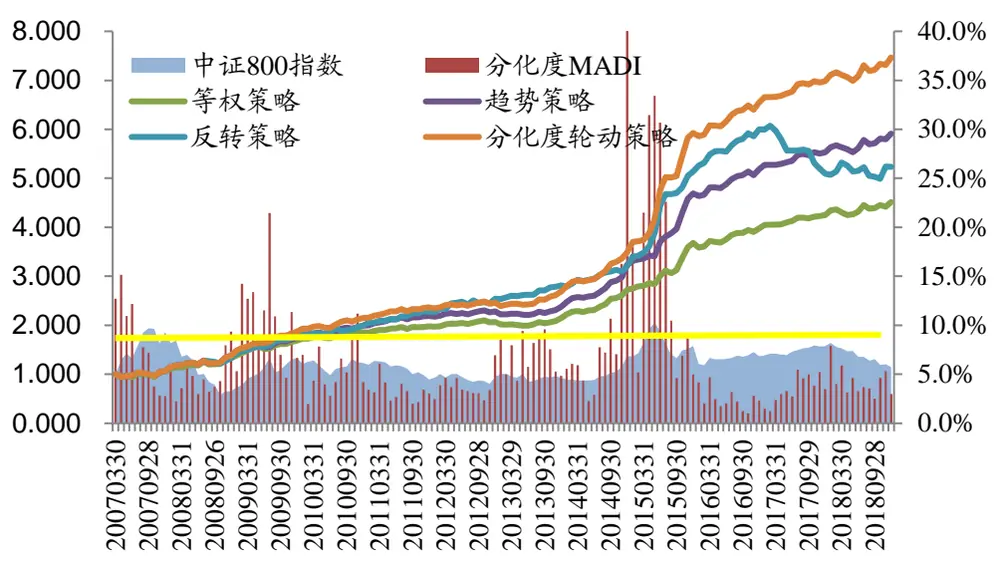
数据来源：Wind，广发证券发展研究中心

图10 策略风格权重变化（分化度为右轴）
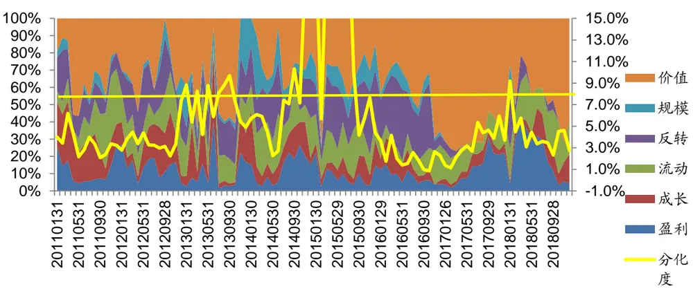
数据来源：Wind，广发证券发展研究中心

从策略的风格权重变化结果可以看到除了2013年及2015年由于个股出现较大分化，随着个股热点频现风格切换速度加快，风格策略上选择了动态趋势方案，其余多数时间均采用风格趋势策略方案。

截止2018年12月底，A股整体分化度依然较低，风格趋势特征并未改变，各类风格中趋势最强的价值风格权重占比超过50%，此外，盈利、成长及流动性均有小比例权重，而市值权重则降为0。

## （2）中证500实证分析

根据测试结果，我们从每类因子中分别筛选出了若干收益率突出且稳定性较好的因子作为代表。

表 3：中证 500策略因子筛选

| 编号 |  | 因子IC | LS 收益率 | LS 胜率 | LS_IR | L_IR | IC_P |
| --- | --- | --- | --- | --- | --- | --- | --- |
| 1 | ROE | 0.98% | 5.31% | 54.6% | 0.30 | 0.71 | 18.01% |
| 2 | EPS 增长率 | 0.70% | 4.01% | 57.4% | 0.36 | 0.51 | 9.57% |
| 3 | 1个月成交金额 | -5.19% | 21.83% | 67.4% | 0.97 | 0.95 | 0.00% |
| 4 | 换手率 | -5.20% | 16.54% | 58.2% | 0.67 | 0.53 | 0.01% |
| 5 | 一个月股价反转 | -4.40% | 16.30% | 59.6% | 0.77 | 0.51 | 0.04% |
| 6 | 三个月股价反转 | -3.55% | 15.71% | 56.0% | 0.66 | 0.63 | 0.66% |
| 7 | 流通市值 | -2.51% | 9.24% | 56.0% | 0.39 | 0.63 | 4.31% |
| 8 | CFP | 1.34% | 7.73% | 56.7% | 0.50 | 1.13 | 9.08% |
| 9 | EP | 2.87% | 13.52% | 58.9% | 0.68 | 1.23 | 1.27% |
| 10 | SP | 1.64% | 7.45% | 53.2% | 0.54 | 0.83 | 4.05% |
| 11 | BP | 3.19% | 14.31% | 56.0% | 0.60 | 0.94 | 1.37% |
| 12 | DP | 2.22% | 10.05% | 57.4% | 0.65 | 1.26 | 0.64% |

数据来源：Wind，广发证券发展研究中心

图 11中证 500策略选用因子 IC
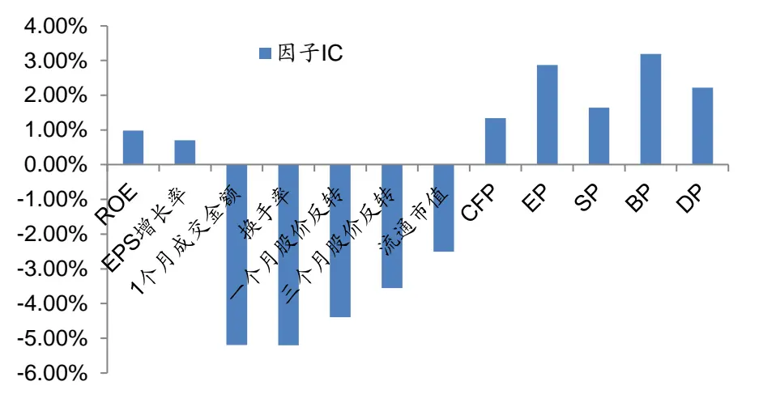
数据来源：Wind，广发证券发展研究中心

表 4：中证 500策略表现对比

| 因子加权 | 等权 | 趋势 | 反转 | 动态 |
| --- | --- | --- | --- | --- |
| 组合类型 | 行业中性 | 行业中性 | 行业中性 | 行业中性 |
| 月度胜率 | 75.2% | 69.5% | 69.5% | 69.5% |
| 年化超额 | 15.2% | 14.2% | 16.6% | 17.1% |
| 年化波动 | 7.5% | 7.4% | 9.4% | 9.1% |
| 信息比率 | 2.03 | 1.91 | 1.77 | 1.87 |
| 最大回撤 | 6.4% | 6.8% | 6.8% | 6.8% |
| 月换手率 | 42.4% | 42.7% | 49.0% | 51.7% |

数据来源：Wind，广发证券发展研究中心

本策略中，分化度阈值为F=5%。从回测结果可以看到，整体来说中证500成分股中更加适合采用风格反转策略，若引入个股分化度作为参考指标进行趋势反转动态切换，则策略年化超额收益率由单纯的反转策略从16.6%提高到17.1%，而静态等权的多因子策略年化超额仅为15.2%。

图 12中证500策略表现对比（分化度为右轴）
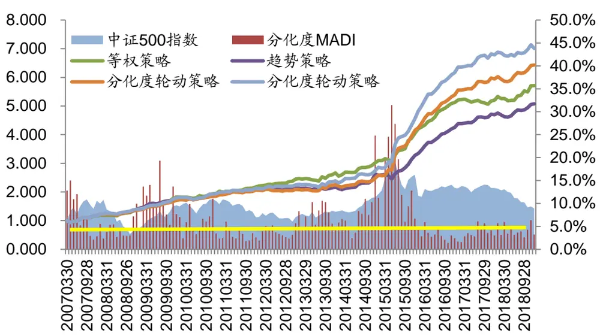
数据来源：Wind，广发证券发展研究中心

图13策略风格权重变化（分化度为右轴）
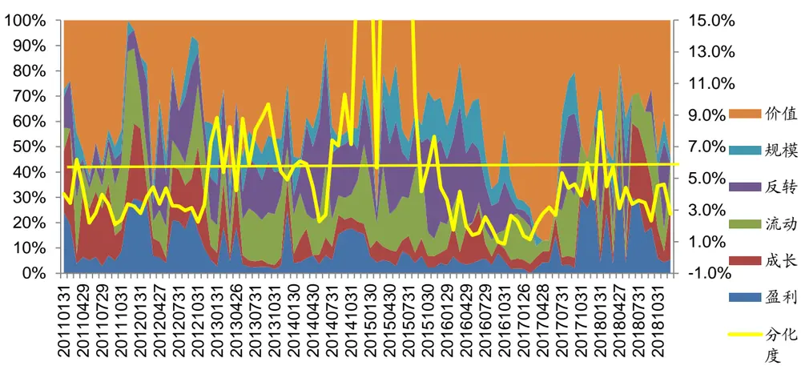
数据来源：Wind，广发证券发展研究中心

从策略的风格权重变化结果可以看到，在5%阈值水平下，中证500的轮动策略有更多时间采用了反转策略，其中以2013年到2015年之间最具代表性，此外2017年底2018年初由于个股分化加大，风格策略也采取了反转轮动方案。

截止2018年12月底，A股整体分化度依然较低，风格趋势特征并未改变，各类风格中趋势最强的价值风格权重占比约50%，此外，盈利、成长及流动性均有小比例权重，而市值及股价因子权重则降为0。

## （3）沪深300实证分析

根据测试结果，我们从每类因子中分别筛选出了若干收益率突出且稳定性较好的因子作为代表。

表 5：沪深 300策略因子筛选

| 编号 |  | 因子IC | LS 收益率 | LS 胜率 | LS_IR | L_IR | IC_P |
| --- | --- | --- | --- | --- | --- | --- | --- |
| 1 | ROE | 2.09% | 8.50% | 59.1% | 0.39 | 0.65 | 4.08% |
| 2 | 主营业务收入增长率 | 0.87% | 7.86% | 59.8% | 0.49 | 0.58 | 12.75% |
| 3 | 1个月成交金额 | -2.53% | 8.98% | 58.5% | 0.35 | 0.34 | 1.86% |
| 4 | 换手率 | -4.18% | 11.30% | 57.3% | 0.44 | 0.26 | 0.12% |
| 5 | 一个月股价反转 | -3.26% | 12.16% | 54.3% | 0.49 | 0.38 | 1.11% |
| 6 | 容量比 | -1.99% | 8.94% | 62.8% | 0.50 | 0.46 | 2.01% |
| 7 | 流通市值 | -0.59% | 3.10% | 49.4% | 0.12 | 0.35 | 34.98% |
| 8 | 营业费用比例 | 2.14% | 5.56% | 54.3% | 0.31 | 0.50 | 2.29% |
| 9 | 固定比 | -2.77% | 10.72% | 57.9% | 0.59 | 0.41 | 0.21% |
| 10 | EP | 4.33% | 18.44% | 56.1% | 0.85 | 0.99 | 0.08% |
| 11 | BP | 3.01% | 13.62% | 53.0% | 0.50 | 0.66 | 2.91% |

数据来源：Wind，广发证券发展研究中心

图 14沪深300策略选用因子 IC
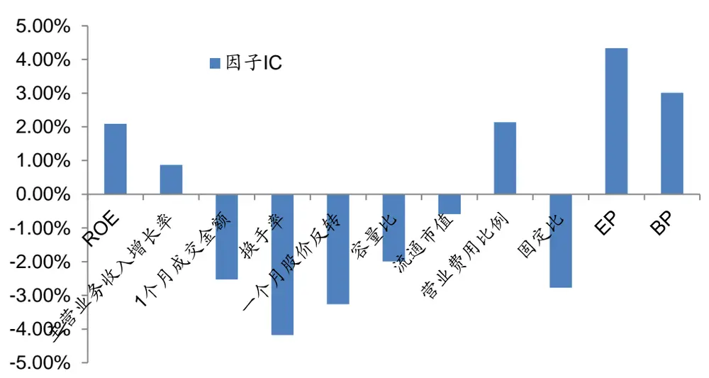
数据来源：Wind，广发证券发展研究中心

表6：沪深 300策略表现对比

| 因子加权 | 等权 | 趋势 | 反转 | 动态 |
| --- | --- | --- | --- | --- |
| 组合类型 | 行业中性 | 行业中性 | 行业中性 | 行业中性 |
| 月度胜率 | 64.5% | 62.4% | 66.7% | 69.5% |
| 年化超额 | 12.6% | 9.5% | 12.6% | 13.8% |
| 年化波动 | 8.3% | 8.1% | 9.2% | 9.5% |
| 信息比率 | 1.52 | 1.18 | 1.36 | 1.45 |
| 最大回撤 | 19.6% | 11.5% | 21.4% | 11.7% |
| 月换手率 | 52.5% | 48.4% | 52.4% | 55.4% |

数据来源：Wind，广发证券发展研究中心

本策略中，分化度阈值为F=4.5%。从回测结果可以看到，整体来说样本池缩小之后，沪深300成分股中同样风格反转策略相对趋势策略占优，若引入个股分化度作为参考指标进行趋势反转动态切换，则策略年化超额收益率由单纯的反转策略从12.6%提高到13.8%，而静态等权的多因子策略年化超额同样约为12.6%。

图 15沪深300策略表现对比（分化度为右轴）
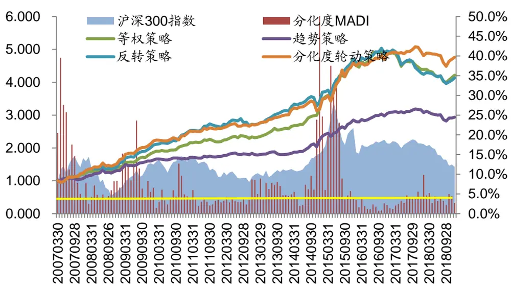
数据来源：Wind，广发证券发展研究中心

图 16 策略风格权重变化（分化度为右轴）
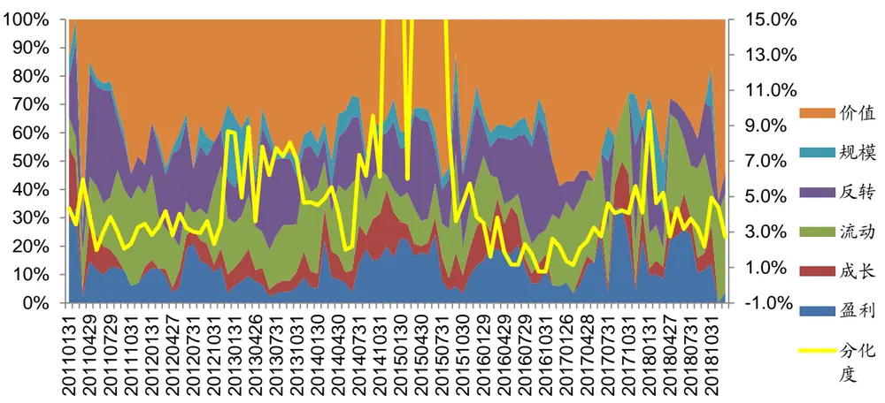
数据来源：Wind，广发证券发展研究中心

从策略的风格权重变化结果可以看到，在5%阈值水平下，沪深300的轮动策略有更多时间采用了反转策略，其中以2013年及2015年最具代表性，此外2017年底2018年初由于个股分化加大，风格策略也采取了反转轮动方案。

截止2018年12月底，A股整体分化度依然较低，风格趋势特征并未改变，各类风格中趋势最强的为价值和流动性风格，而市值、成长及股价因子权重则降为0。

## 三、总结

## 3.1 背景及策略原理

通过分析A股指数近年来表现，呈现的新特征可总结为：

一方面，以市值规模为代表的部分主流风格出现了较大逆转，2013年以来中小创一路领先的格局不存，取而代之的是上证50及沪深300等蓝筹指数相对抗跌；

其次，除领涨的指数，其余指数之间分化显著减弱，市场“一九”效应凸显，传统Alpha策略空间被大大压缩。

伴随着整体波动持续收窄且流动性偏弱，A股缺乏持续赚钱效应，对于主流风格的轮动把握重要性甚至高于对大盘方向的择时，而风格轮动的主流做法分别是风格趋势与风格反转，近年来前者显著由于后者，二者背后是否与近年来A股处于较弱的分化特征存在密切关联，报告主要围绕个股分化度与风格轮动之间的关系展开研究。

报告中采用收益率标准差个股分化度的计算，此外考虑到近两年A股极端的“一九”分化结构及缩量特征，在计算分化度时将股票池涨跌幅首尾各10%剔除，在剩余80%个股中采用相对成交量进行加权调整。得到成交量修正后的分化度指标MADI。

识别风险，发现价值

基于MADI指标分别在中证800、中证500及沪深300指数的成分股构建动态风格轮动策略，均取得显著的改进效果。

## 3.2 最新风格配置结果

中证800中，最新策略推荐风格配置权重如下：

图 17 中证 800 策略最新风格权重（截止 2018.12.28）
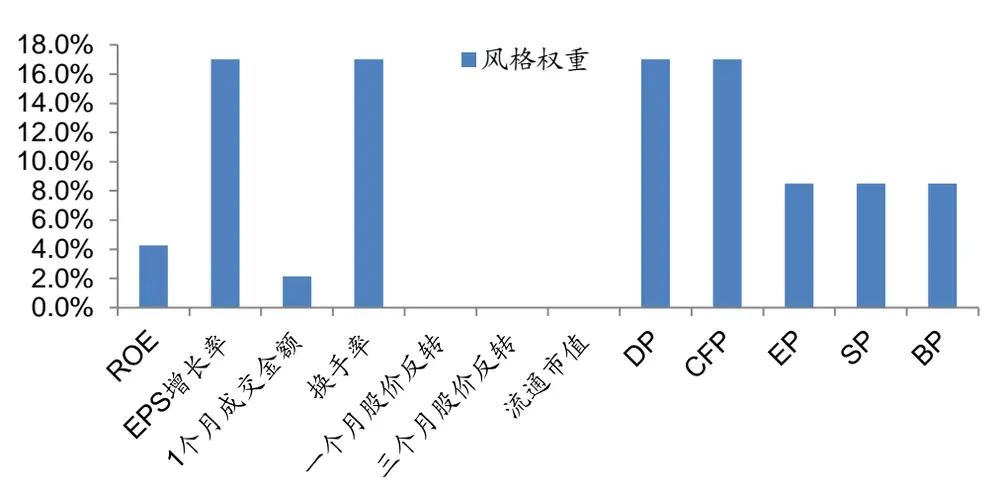
数据来源：Wind，广发证券发展研究中心

表7：中证 800策略最新风格权重（截止 2018.12.28）

|  | ROE | EPS增长 率 | 1个月成交 金额 | 换手率 | 一个月股 价反转 | 三个月股 价反转 | 流通市 值 | DP | CFP | EP | SP | BP |
| --- | --- | --- | --- | --- | --- | --- | --- | --- | --- | --- | --- | --- |
| 风格权重 | 4.3 | 17.0% | 2.1% | 17.0% | 0.0% | 0.0% | 0.0% | 17.0 | 17.0 | 8.5 | 8.5 | 8.5 |
|  | % |  |  |  |  |  |  | % | % | % | % | % |

数据来源：Wind，广发证券发展研究中心

中证500中，最新策略推荐风格配置权重如下：

图 18 中证 500 策略最新风格权重（截止 2018.12.28）
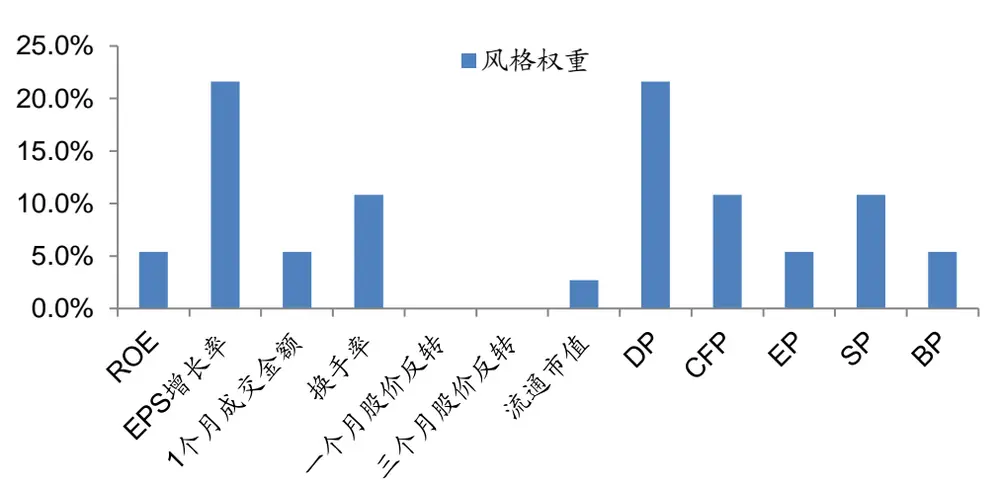
数据来源：Wind，广发证券发展研究中心
识别风险，发现价值

表8：中证 500策略最新风格权重（截止 2018.12.28）

|  | ROE | EPS增长 率 | 1个月成交 金额 | 换手率 | 一个月股 价反转 | 三个月股 价反转 | 流通市 值 | DP | CFP | EP | SP | BP |
| --- | --- | --- | --- | --- | --- | --- | --- | --- | --- | --- | --- | --- |
| 风格权重 | 5.4 % | 21.6% | 5.4% | 10.8% | 0.0% | 0.0% | 2.7% | 21.6 % | 10.8 % | 5.4 % | 10.8 % | 5.4 % |

数据来源：Wind，广发证券发展研究中心

沪深300中，最新策略推荐风格配置权重如下：

图 19 沪深 300 策略最新风格权重（截止 2018.12.28）
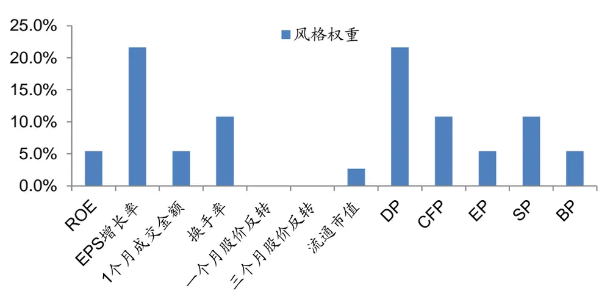
数据来源：Wind，广发证券发展研究中心

表9：沪深 300策略最新风格权重（截止 2018.12.28）

|  | ROE | 主营业务收 入增长率 | 1个月成交 金额 | 换手率 | 一个月股 价反转 | 流通市 容量比 |  | 营业 费用 比例 | 固定 比 | EP | BP |  |
| --- | --- | --- | --- | --- | --- | --- | --- | --- | --- | --- | --- | --- |
|  |  |  |  |  |  |  |  |  |  |  |  | 值 |
| 风格权重 | 3.8% | 0.0% | 3.8% | 30.8% | 3.8% | 3.8% | 0.0% | 0.0% | 7.7% | 15.4% | 30.8% |  |

数据来源：Wind，广发证券发展研究中心

## 3.3 展望

报告选择基于个股分化度视角，对风格轮动中常见的趋势和反转策略进行动态调整，取得了显著的改善效果。

后续将继续从分化度的构造原理和逻辑拆解方面进行细化研究，同时考虑深入不同行业，分析各版块中分化度的差异对风格轮动的驱动规律。

## 风险提示

本模型采用量化方法通过历史数据统计、建模和测算完成，所得出的规律及推介风格未必具有严格的投资逻辑，也未必符合当前宏观环境特点，在极端的市场环境变化中有失效的风险。

## [Table_IndustryInvestDescription] 广发证券—行业投资评级说明

买入： 预期未来 12 个月内，股价表现强于大盘 10%以上。

持有： 预期未来12个月内，股价相对大盘的变动幅度介于-10%～+10%。

卖出： 预期未来12个月内，股价表现弱于大盘10%以上。

## [Table_CompanyInvestDescription] 广发证券—公司投资评级说明

买入： 预期未来12个月内，股价表现强于大盘15%以上。

增持： 预期未来12个月内，股价表现强于大盘5%-15%。

持有： 预期未来12个月内，股价相对大盘的变动幅度介于-5%～+5%。

卖出： 预期未来12个月内，股价表现弱于大盘5%以上。

## [Table_Address] 联系我们

| 地址 | 广州市 广州市天河北路183 号大都会广场5楼 | 深圳市 深圳市福田区益田路 | 北京市 北京市西城区月坛北 | 上海市 上海市浦东新区世纪 | 香港 香港中环干诺道中 111 号永安中心 14 楼 |  |
| --- | --- | --- | --- | --- | --- | --- |
|  |  |  |  |  |  | 街2号月坛大厦18层 大道8号国金中心一 |
| 邮政编码 |  | 31层 |  | 期16楼 | 1401-1410 室 |  |
|  | 510075 | 518026 | 100045 | 200120 |  |  |
| 客服邮箱 | gfyf@gf.com.cn |  |  |  |  |  |

## [Table_LegalDisclaimer] 法律主体声明

本报告由广发证券股份有限公司或其关联机构制作，广发证券股份有限公司及其关联机构以下统称为“广发证券”。本报告的分销依据不同国家、地区的法律、法规和监管要求由广发证券于该国家或地区的具有相关合法合规经营资质的子公司/经营机构完成。

广发证券股份有限公司具备中国证监会批复的证券投资咨询业务资格，接受中国证监会监管，负责本报告于中国（港澳台地区除外）的分销。广发证券（香港）经纪有限公司具备香港证监会批复的就证券提供意见（4 号牌照）的牌照，接受香港证监会监管，负责本报告于中国香港地区的分销。

本报告署名研究人员所持中国证券业协会注册分析师资质信息和香港证监会批复的牌照信息已于署名研究人员姓名处披露。

## [重要声明 Table_Important

广发证券股份有限公司及其关联机构可能与本报告中提及的公司寻求或正在建立业务关系，因此，投资者应当考虑广发证券股份有限公司及其关联机构因可能存在的潜在利益冲突而对本报告的独立性产生影响。投资者不应仅依据本报告内容作出任何投资决策。

本报告署名研究人员、联系人（以下均简称 研究人员 ）针对本报告中相关公司或证券的研究分析内容，在此声明：（ ）本报告的全部分析结论、研究观点均精确反映研究人员于本报告发出当日的关于相关公司或证券的所有个人观点，并不代表广发证券的立场；（2）研究人员的部分或全部的报酬无论在过去、现在还是将来均不会与本报告所述特定分析结论、研究观点具有直接或间接的联系。

研究人员制作本报告的报酬标准依据研究质量、客户评价、工作量等多种因素确定，其影响因素亦包括广发证券的整体经营收入，该等经营收入部分来源于广发证券的投资银行类业务。

本报告仅面向经广发证券授权使用的客户/特定合作机构发送，不对外公开发布，只有接收人才可以使用，且对于接收人而言具有保密义务。广发证券并不因相关人员通过其他途径收到或阅读本报告而视其为广发证券的客户。在特定国家或地区传播或者发布本报告可能违反当地法律，广发证券并未采取任何行动以允许于该等国家或地区传播或者分销本报告。

本报告所提及证券可能不被允许在某些国家或地区内出售。请注意，投资涉及风险，证券价格可能会波动，因此投资回报可能会有所变化，过去的业绩并不保证未来的表现。本报告的内容、观点或建议并未考虑任何个别客户的具体投资目标、财务状况和特殊需求，不应被视为对特定客户关于特定证券或金融工具的投资建议。本报告发送给某客户是基于该客户被认为有能力独立评估投资风险、独立行使投资决策并独立承担

## 相应风险。

本报告所载资料的来源及观点的出处皆被广发证券认为可靠，但广发证券不对其准确性、完整性做出任何保证。报告内容仅供参考，报告中的信息或所表达观点不构成所涉证券买卖的出价或询价。广发证券不对因使用本报告的内容而引致的损失承担任何责任，除非法律法规有明确规定。客户不应以本报告取代其独立判断或仅根据本报告做出决策，如有需要，应先咨询专业意见。

广发证券可发出其它与本报告所载信息不一致及有不同结论的报告。本报告反映研究人员的不同观点、见解及分析方法，并不代表广发证券的立场。广发证券的销售人员、交易员或其他专业人士可能以书面或口头形式，向其客户或自营交易部门提供与本报告观点相反的市场评论或交易策略，广发证券的自营交易部门亦可能会有与本报告观点不一致，甚至相反的投资策略。报告所载资料、意见及推测仅反映研究人员于发出本报告当日的判断，可随时更改且无需另行通告。广发证券或其证券研究报告业务的相关董事、高级职员、分析师和员工可能拥有本报告所提及证券的权益。在阅读本报告时，收件人应了解相关的权益披露（若有）。

## [Table_InterestDisclos权益披露

(1)广发证券（香港）跟本研究报告所述公司在过去12 个月内并没有任何投资银行业务的关系。

## [Table_Copyright]版权声明

未经广发证券事先书面许可，任何机构或个人不得以任何形式翻版、复制、刊登、转载和引用，否则由此造成的一切不良后果及法律责任由私自翻版、复制、刊登、转载和引用者承担。