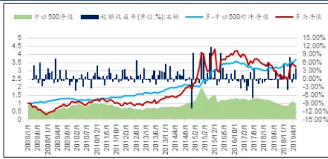
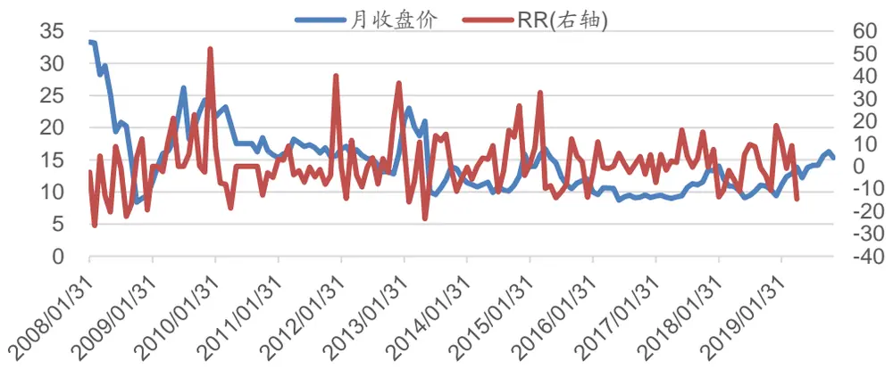
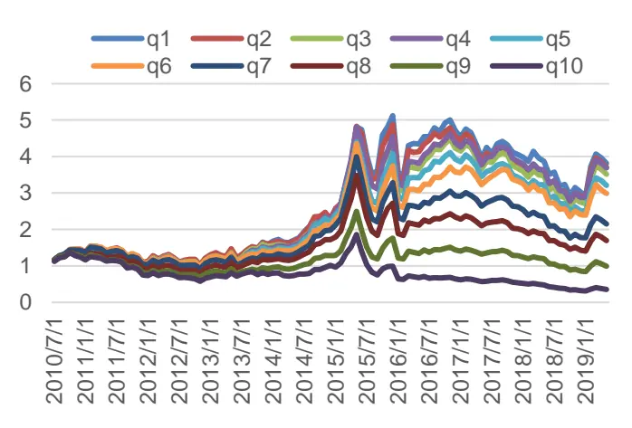
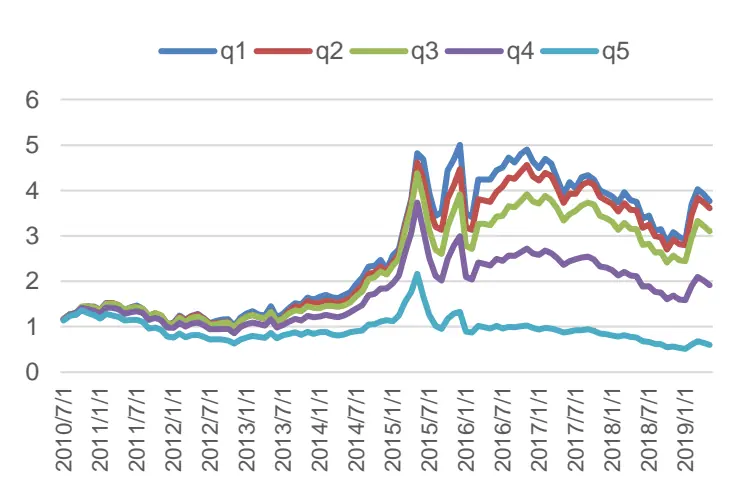
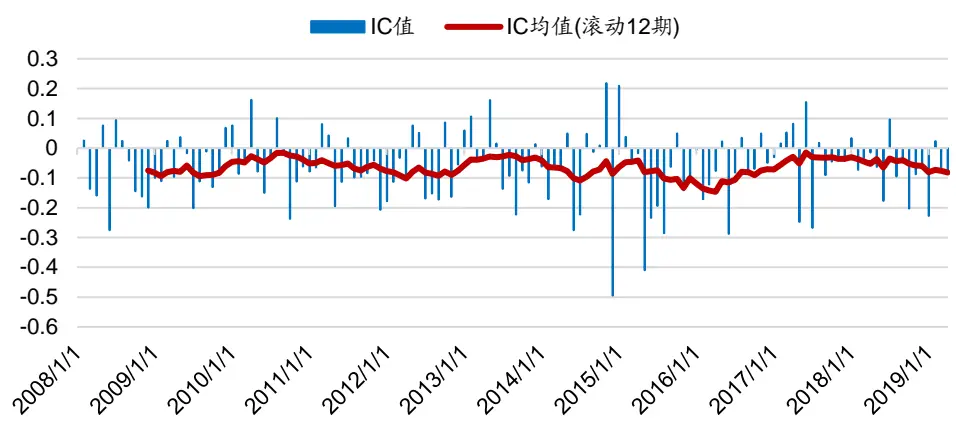
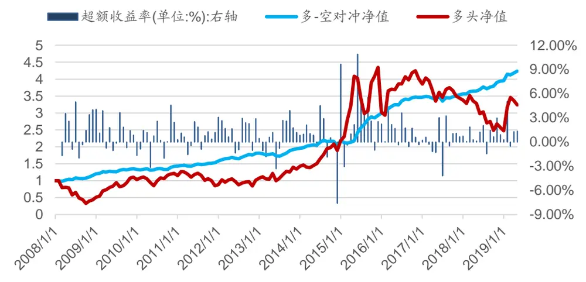
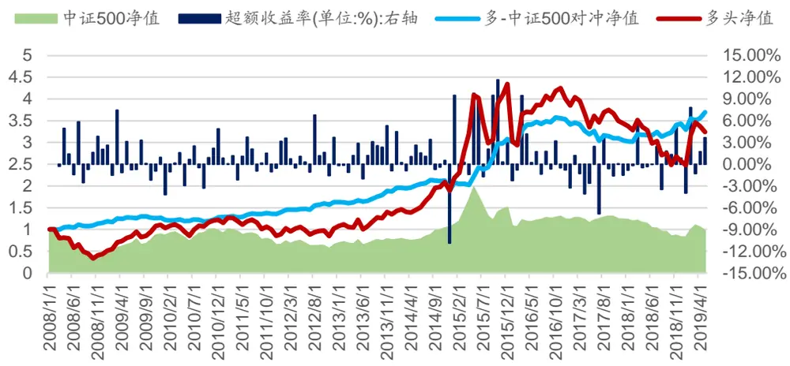
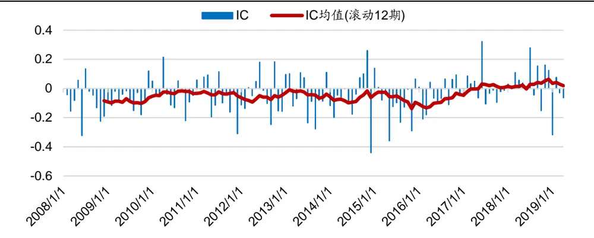
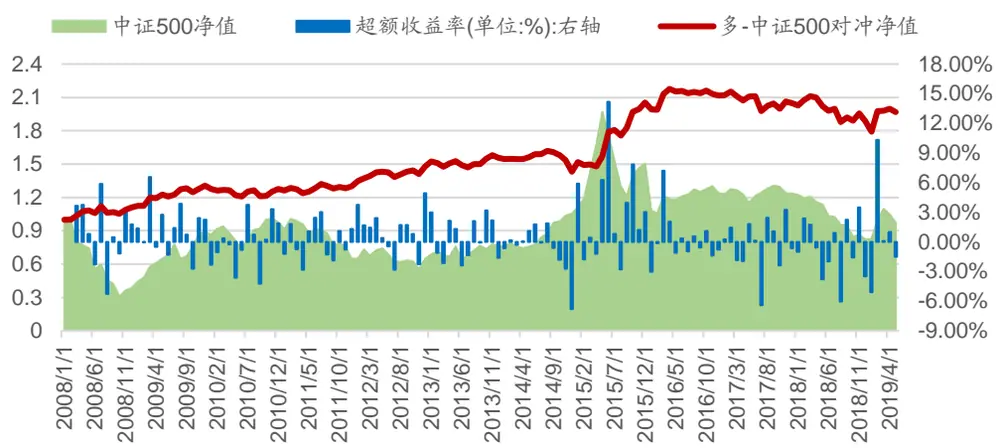
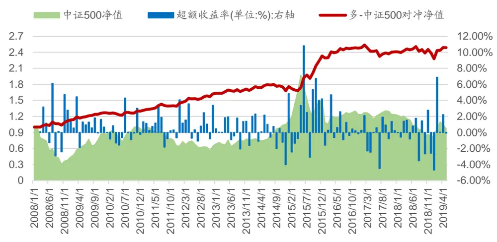

# 分析师一致预期下的反转策略研究

# 多因子 Alpha 系列报告之（三十九）

## 报告摘要：

## 有效市场假说与反转效应

有效市场假说认为市场是有效的，过去、现在的事件，甚至将来事件的贴现值都已经反映在股票的价格中。但国内外大量的实证研究表明，股票价格变化规律直接冲击了市场有效理论，呈现出一定的“异象”规律。股票收益率有“惯性”的趋势，即惯性效应，也存在“反转”的可能，即反转效应。简而言之，“惯性”效应表现了股票收益率存在正的自相关现象，而“反转”反应则描述了股票收益率之间存在负的自相关现象。

## 结合分析师一致预期的残差收益(Residual Return)因子构建

个股的收益可以由三部分组成：理性风险补偿的预期收益、关于公司未来现金流改变的预期以及公司未来折现率改变的预期。本篇专题报告定义残差收益率因子(Residual Return)，用来衡量个股收益率所不能被预期现金流和预期均衡收益解释的收益，该因子由三部分构成：个股当期收益（RE）、条件均衡收益（U）和未来现金流信息折现的收益（CF）。个股未来现金流相关的信息作为较困难估计的信息，本篇专题报告将分析师一致预期相关的信息作为个股未来现金流估计的代理变量，估计出个股的预期收益信息，从而得到残差收益因子(Residual Return)，研究残差收益因子在选股中的有效性。

## 策略结果实证分析

在全市场、中证 500 指数成分股内月度调仓历史回测中，残差收益因子分档效果区分度明显，单调性较为显著。残差收益因子在全市场、中证500指数内选股均能获得较稳定的超额收益。在月度调仓、全市场范围选股下，残差收益因子表现较佳，月度 IC均值为-0.06，负 IC占比为 71%，相对中证 500指数年化超额收益率为 12.22%。

## 核心假设风险。

本报告旨在对所研究问题的主要关注点进行分析，因此对市场及相关交易做了一些合理假设，但这样会导致建立的模型以及基于模型所得出的结论并不能完全准确地刻画现实环境，在此可能会与未来真实的情况出现偏差。本文内容并不是适合所有的投资者，客户在制定投资策略时，必须结合自身的环境和投资理念。

证券研究报告

## 全市场选股策略净值走势

分析师： [Table_Author罗军]

同SAC 执证号：S0260511010004

公020-66335128

luojun@gf.com.cn

分析师： 安宁宁

SAC 执证号：S0260512020003

SFC CE No. BNW179

0755-23948352

anningning@gf.com.cn

分析师： 陈原文

SAC 执证号：S0260517080003

0755-82797057

chenyuanwen@gf.com.cn

请注意，罗军,陈原文并非香港证券及期货事务监察委员会的注册持牌人，不可在香港从事受监管活动。

## [Table_ 相关研究：DocRe

景气视角下的行业轮动策略: 2019-05-06——重构行业轮动框架之二：

## 下游消费篇

宏观视角下的行业轮动策略: 2019-03-01——重构量化行业轮动框架：

## 宏观篇

从个股分化看风格轮动:——2019-01-08
多因子 Alpha系列报告之（三
十八）

## 一、有效市场假说与反转效应

## 有效市场假说

有效市场假说认为市场对信息的反馈是及时、有效的，过去、现在的事件，甚至将来相关的信息的贴现值都已经反应在个股的价格中了，股票的价格能充分反映所有可获得的信息，即“信息有效”，当信息变动时，股票的价格就一定会随之变动。一个利好消息或利空消息传出时，股票的价格异动，当相关信息已经路人皆知时，股票的价格也已调整至对应的价位了。

但国内外大量的实证研究表明，股票价格变化规律直对市场有效假说理论形成了一定的冲击，股票价格的变化呈现出一定的“异象”规律，如股票收益率有“惯性”的趋势，即惯性效应，也存在“反转”的可能，即反转效应。

在股票市场中，当新消息发生时，无论相对于个股是正面的还是负面的，投资者对此类信息无所反应，或者在一段时间内股票价格沿着之前的方向继续前进随后慢慢调整至合理价位，这种现象被称为反应不足。相反地，当投资者对新发生的信息反应剧烈，股票价格发生剧烈变动，超出预期的价格水平波动水平，之后再调整修正至合理的价位，这种现象被称为反应过度。

惯性效应是股票市场存在反应不足的一种体现，而反转效应是股票市场存在反应过度的表现。简单而言，反应不足表现了股票收益率存在正的自相关现象，而过度反应则描述了股票收益率之间存在负的自相关现象。

## 反转效应

人们对新信息的反应过度直接造成了反转效应。反应过度在股票市场的主要表现有二：赢家-输家效应、市盈率异常。

## 1. 赢家-输家效应

是指投资者看好过去一段时间涨幅较好的个股，看低过去一段时间涨幅较低的个股，导致股票价格偏离其基础价格。但是经过一段时间，市场逐渐回归理性，过去的赢家相对过去的输家获得负的相对收益。

## 2. 市盈率异常

在理论上，市盈率低的股票比市盈率高的能够获得更高的收益率。但往往投资者对市盈率低的股票相对比较悲观，通常会导致股票价值被低估。当预期未来盈利好于之前不合理的预期，股票价格将会得到迅速提升。同样，市盈率高的股票其价值往往会被投资者高估。

## 反转效应的两种解释

## 1. Fama-French三因子模型

Fama和French于1993年提出经典的三因子模型：

$$
E[R_{t}]-R_{f}=\beta_{i}\big(E[R_{m}]-R_{f}\big)+s_{i}SMB+h_{i}HML
$$

其中， $E[R_{t}]$ 为股票i的预期收益率， $R_{f}$ 为无风险收益率，SMB 代表公司的规模因素，表示小市值股票组合与市值股票组合的收益率之差，HML 代表账面价值与市值比因素，表示账面市值高的股票组合与账面市值比较低的股票组合收益率之差。

Fama-French三因子模型的实证结果不仅能够较好地解释公司规模、账面价值与市值比建立的股票投资组合的超额收益，也能够较好地解释E/P、销售增长率等异象。

## 2. Cash Flow News模型

传统Cash FlowNews模型反映企业未来现金流的信息，并不反应当前或过去现金流中的信息。相反，它是对所有变量（包括股票回报率、盈利能力、账面市值和机构持股比例）信息的总结。具体来说，Cash FlowNews被定义为长期对数价格变化的预测值，由VAR状态变量产生的冲击所驱动。从长远来看，高股价必须由高现金流基本面支撑，因此Cash Flow News与预期未来现金流的变化相关。

根据Cash FlowNews理论的定义，公司的股票收益是由对预期现金流的冲击和/或对预期收益的冲击所驱动的。CashFlowNews衡量的是股票价格固定成分的变化。如果预期收益不变，CashFlowNews必然等于股票收益。然而，公司长期价值的变化可能伴随着预期回报率的消息（即股价的临时成分的变化），这会放大或减弱CashFlow News对股价的即时影响。

## 二、残差收益(Residual Return)因子构造

## 残差收益因子(Residual Return)构造

个股的收益可以由三部分组成：理性风险补偿的预期收益、关于公司未来现金流改变的预期以及公司未来折现率改变的预期。本篇专题报告定义残差收益因子(Residual Return)，用来衡量个股收益率所不能被预期现金流和预期均衡收益解释的收益，该因子由三部分构成：个股当期收益（RE）、条件均衡收益（U）和未来现金流信息折现的收益（CF）：

- 个股当期收益（RE）

- 条件均衡收益（U）

- 未来现金流信息折现的收益（CF）

$$
{\mathrm{Residual~Return}}({\mathrm{RR}})=~{\mathrm{RE-U-CF}}
$$

## 条件均衡收益(U)和 Cash-Flow News(CF)的构造

本篇专题报告利用股票在过去一段时间所不能被预期收益和现金流解释的盈利部分来刻画未来的反转力度。条件均衡收益(U)和Cash-Flow News(CF)，主要是通过Fama-French三因子模型和分析师一致预测来实现的，具体计算如下：

## 1. 条件均衡收益(U)

该指标首先通过Fama-French三因子模型估算各因子beta系数，进而求出每只个股的条件均衡收益。具体步骤如下：

步骤一：股票按每期期末时的市值大小进行排序，按照50%分位值把股票分为S(small)和B(big)两组；

步骤二：再依据个股每期期末时的账面市值比，取1/PB，按大小对股票进行排序，分为L(low,30%)、M(medium,40%)、H(high,30%)三组；

步骤三：再分别对S、B和L、M、H取交集，股票即被分为了SL,SM,SH,BL,BM,BH 六组。

步骤四：计算每个投资组合的月收益率，计算投资组合的月收益率时，要算市值加权的收益率。

## 步骤五：计算三因子

（1）SMB（市值因子）

$$
SMB=1/3*(SL+SM+SH)-1/3*(BL+BM+BH)
$$

其中，SL表示股票组合SL的加权收益率，以此类推。

（2）HML（账面市值比因子）

$$
HML=(SH+BH)/2-(SL+BL)/2
$$

（3）MKT（市场因子）

## RM−Rf

其中，RM表示全市场收益率，Rf为无风险利率，取一年期定期存款利率。

步骤六：计算窗口内（取48-60个月）每期全市场的三因子，并添加一列单位向量，合并成n*4的矩阵X（n为窗口值，如48、60）；获取个股窗口内每期收益率为n*1矩阵Y。对Y与X进行简单线性回归，求出每个因子的beta系数；然后通过公式计算个股条件均衡收益：

$$
\mu_{t}=R_{f}+\beta_{i}\big(E[R_{m}]-R_{f}\big)+s_{i}SMB+h_{i}HML
$$

步骤七：重复步骤六，计算全市场每只个股的条件均衡收益。

## 2. Cash-Flow News(CF)

Cash flow News为News about future cash flows，即未来现金流的信息，反映的是企业长期增长情况。该指标基于分析师一致预期，估算个股长期增长情况，具体步骤如下

步骤一：计算未来1-5年的预期收益

$$
\begin{array}{rl}&{X_{t,t+1}=A1_{t}}\\&{X_{t,t+2}=A2_{t}}\\&{X_{t,t+3}=A2_{t}(1+LTG_{t})}\\&{X_{t,t+4}=X_{t,t+3}(1+LTG_{t})}\\&{X_{t,t+5}=X_{t,t+4}(1+LTG_{t})}\end{array}
$$

其中，A1表示分析师一致预期本年年末个股的每股收益，A2表示分析员一致预测下一年年末的个股的每股收益，LTGt表示分析师一致预期净利润的年化增长率。

步骤二：计算未来6-10年的预期收益

$$
X_{t,t+j+1}=X_{t,t+j}\left[1+LTG_{t}+{\frac{j-4}{5}}(g_{t}-LTG_{t})\right]
$$

其中，g为全部股票LTG的均值

步骤三：计算对数预期会计收益(expected log accounting return)，其中ψ取0.05.

$$
e_{t,t+j+1}=\left\{\begin{array}{l}{log\left(1+\frac{X_{t,t+j+1}}{B_{t,t+j}}\right)for0\leq j\leq9,}\\{log\left(1+\frac{g_{t}}{1-\varphi}\right)forj\geq10,}\end{array}\right.
$$

步骤四：计算三阶段增长模型(three-stage growth model), 其中，ρ取0.95.

$$
E_{t}\sum_{j=0}^{\infty}\rho^{j}e_{t+j+1}=\sum_{j=0}^{9}\rho^{j}e_{t+j+1}+\frac{\rho^{10}}{1-\rho}log\left(1+\frac{g_{t}}{1-\varphi}\right)
$$

步骤五：计算CF指标

$$
CF_{t+1}=E_{t+1}\sum_{j=0}^{\infty}\rho^{j}e_{t+j+1}-E_{t}\sum_{j=0}^{\infty}\rho^{j}e_{t+j+1}
$$

条件均衡收益(U)和Cash-Flow News(CF)计算完成后，通过公式Residual Return(RR) = RE − U − CF 计算残差收益因子RR。

## 三、基于预期未来现金流的反转选股策略构建

## 策略构建

图 1：某个股月度RR因子值与股票价格走势图

数据来源：Wind，广发证券发展研究中心

以某个股如图1所述为例，对于一支股票而言，如果一只股票价格长期处于高位，并且收益率无法被预期未来现金流和收益率解释，反映在图里意味着较高的RR因子

识别风险，发现价值

值和收盘价，股票价格将在未来下跌，收益率降低。

当某支股票残差收益RR因子较大时，股价长期位于高位，未来下跌的可能性很大，因为U的影响有限，考虑到这一点，本篇专题报告把残差收益RR因子计算公式简化为：

$$
{\mathrm{Residual~Return}}({\mathrm{RR}})=~{\mathrm{RE-CF}}
$$

据此，本篇专题报告构造如下交易策略：根据股票价格与未来预期现金流，在调仓日买进RR较低的组合，同时卖出处于RR较大的组合。

## 四、策略结果实证分析

## 数据说明

- 选股范围：全市场范围、中证500指数成分股内，剔除上市不满一年的股票，剔除ST股票、*ST股票，剔除交易日停牌的股票

- 回测区间：2008年至2019年

- 分档方式：根据当期股票的因子值，从小到大分为十档或者5档；

- 调仓周期：每个月第一个交易日调仓、交易费用千分之三（卖出时收取）

## 实证结果-全市场选股

图 2：全市场RR因子分档-10档

数据来源：Wind，广发证券发展研究中心

图 3：全市场RR因子分档-5档

数据来源：Wind，广发证券发展研究中心

从分档回测结果看来看，分10档和分5档都能看出较为明显的单调性。从下表1可以看出因子在样本内月度IC均值为-0.06,负IC占比为71%。

以下实证分析结果为因子分成10档测算的结果。

表 1：全市场选股-IC分年度表现

| 年份 | 均值 | 负IC占比 | 标准差 最大值 | 最小值 |
| --- | --- | --- | --- | --- |
| 2008年 | -0.08 | 0.64 | 0.12 0.09 | -0.28 |
| 2009年 | -0.06 | 0.75 | 0.08 0.07 | -0.20 |
| 2010年 | -0.04 | 0.75 | 0.11 0.16 | -0.24 |
| 2011年 | -0.07 | 0.75 | 0.08 0.08 | -0.21 |
| 2012年 | -0.08 | 0.75 | 0.10 0.09 | -0.18 |
| 2013年 | -0.03 | 0.58 | 0.10 0.16 | -0.22 |
| 2014年 | -0.09 | 0.67 | 0.18 0.22 | -0.50 |
| 2015年 | -0.10 | 0.75 | 0.16 0.21 | -0.41 |
| 2016年 | -0.07 | 0.75 | 0.09 0.05 | -0.29 |
| 2017年 | -0.04 | 0.58 | 0.12 0.15 | -0.27 |
| 2018年 | -0.06 | 0.83 | 0.08 0.10 | -0.20 |
| 2019年 | -0.09 | 0.75 | 0.09 0.02 | -0.23 |
| All | -0.06 | 0.71 0.12 | 0.22 | -0.50 |

数据来源：Wind，广发证券发展研究中心

图 4：全市场RR因子IC值

数据来源：Wind，广发证券发展研究中心

图 5：全市场选股-多-空策略净值走势-月度调仓

数据来源：Wind，广发证券发展研究中心

表 2：全市场选股多头净值表现

| 年份 | 累计收益 率% | 年化收益 率% | 年化波动 率% | 最大回 撤% | 信息比 率 |
| --- | --- | --- | --- | --- | --- |
| 2008年 | -56.48 | -59.65 | 36.15 | 66.70 | -1.65 |
| 2009年 | 115.26 | 115.26 | 24.53 | 13.24 | 4.70 |
| 2010年 | 18.19 | 18.19 | 26.74 | 23.61 | 0.68 |
| 2011年 | -25.81 | -25.81 | 29.63 | 32.89 | -0.87 |
| 2012年 | 14.71 | 14.71 | 31.61 | 19.77 | 0.47 |
| 2013年 | 24.91 | 24.91 | 37.30 | 17.76 | 0.67 |
| 2014年 | 32.57 | 32.57 | 35.20 | 9.40 | 0.93 |
| 2015年 | 99.24 | 99.24 | 152.82 | 26.93 | 0.65 |
| 2016年 | 32.56 | 32.56 | 82.78 | 5.68 | 0.39 |
| 2017年 | -10.69 | -10.69 | 65.98 | 17.03 | -0.16 |
| 2018年 | -23.86 | -23.86 | 62.62 | 29.37 | -0.38 |
| 2019年 | 30.97 | 91.07 | 115.59 | 6.30 | 0.79 |
| All | 224.18 | 10.94 | 80.66 | 66.70 | 0.14 |

数据来源：Wind，广发证券发展研究中心

表 3：全市场选股多空对冲净值表现

| 年份 | 累计收益 | 年化收益 | 年化波动 | 最大回 | 信息比 |
| --- | --- | --- | --- | --- | --- |
| 2008年 | 率% 15.85 | 率% 17.41 | 率% 8.81 | 撤% | 率 |
| 2009年 | 12.46 | 12.46 | 6.96 | 2.29 1.19 | 1.98 1.79 |
| 2010年 | 7.21 | 7.21 | 9.71 | 3.15 | 0.74 |
| 2011年 | 7.00 | 7.00 | 5.78 | 1.99 | 1.21 |
| 2012年 | 14.49 | 14.49 | 9.23 | 2.30 | 1.57 |
| 2013年 | 6.90 | 6.90 | 12.88 | 5.15 | 0.54 |
| 2014年 | 2.03 | 2.03 | 21.90 | 9.16 | 0.09 |
| 2015年 | 33.69 | 33.69 | 29.17 | 3.42 | 1.16 |
| 2016年 | 15.53 | 15.53 | 16.99 | 0.56 | 0.91 |
| 2017年 | 2.00 | 2.00 | 23.60 | 4.19 | 0.08 |
| 2018年 | 10.56 | 10.56 | 14.77 | 1.45 | 0.71 |
| 2019年 | 7.23 | 18.24 | 27.53 | 0.52 | 0.66 |
| All | 323.79 | 13.59 | 18.28 | 9.16 | 0.74 |

数据来源：Wind，广发证券发展研究中心

图 6：全市场选股-多-中证500策略净值走势-月度调仓

数据来源：Wind，广发证券发展研究中心

表 4：全市场选股相对中证 500 表现

| 年份 | 累计收益 | 年化收益 | 年化波动 | 最大回 | 信息比 |
| --- | --- | --- | --- | --- | --- |
| 2008年 | 率% 15.36 | 率% 16.86 | 率% 9.60 | 撤% 3.23 | 率 1.76 |
| 2009年 | 7.49 | 7.49 | 11.37 | 3.11 | 0.66 |
| 2010年 | 4.91 | 4.91 | 9.60 | 3.75 | 0.51 |
| 2011年 | 5.04 | 5.04 | 7.21 | 2.15 | 0.70 |
| 2012年 | 16.59 | 16.59 | 11.89 | 1.58 | 1.39 |
| 2013年 | 15.09 | 15.09 | 12.55 | 2.00 | 1.20 |
| 2014年 | -3.14 | -3.14 | 26.28 | 11.42 | -0.12 |
| 2015年 | 48.66 | 48.66 | 40.86 | 2.49 | 1.19 |
| 2016年 | 17.19 | 17.19 | 32.68 | 1.36 | 0.53 |
| 2017年 | -10.73 | -10.73 | 32.15 | 12.04 | -0.33 |
| 2018年 | 13.40 | 13.40 | 27.32 | 3.46 | 0.49 |
| 2019年 | 12.20 | 31.81 | 38.13 | 1.29 | 0.83 |
| All | 269.51 | 12.22 | 26.89 | 15.58 | 0.45 |

数据来源：Wind，广发证券发展研究中心

表 5：全市场选股-分年度换手率

| 年份 | 均值 | 最大值 | 最小值 | 标准差 | 累计值 |
| --- | --- | --- | --- | --- | --- |
| 2008年 | 91.20% | 96.49% | 82.20% | 0.044 | 911.97% |
| 2009年 | 91.99% | 96.27% | 85.50% | 0.034 | 1103.89% |
| 2010年 | 91.94% | 97.20% | 85.61% | 0.034 | 1103.24% |
| 2011年 | 91.63% | 96.18% | 85.29% | 0.032 | 1099.60% |
| 2012年 | 92.50% | 96.41% | 86.89% | 0.030 | 1110.04% |
| 2013年 | 93.12% | 97.62% | 86.73% | 0.031 | 1117.39% |
| 2014年 | 90.15% | 95.12% | 83.25% | 0.040 | 1081.82% |
| 2015年 | 94.16% | 97.91% | 88.46% | 0.024 | 1129.91% |
| 2016年 | 92.14% | 96.73% | 88.21% | 0.027 | 1105.71% |
| 2017年 | 88.97% | 95.45% | 78.19% | 0.047 | 1067.64% |
| 2018年 | 89.98% | 94.57% | 79.18% | 0.039 | 1079.78% |
| 2019年 | 90.09% | 95.71% | 84.34% | 0.041 | 1081.11% |
| All | 91.49% | 97.91% | 78.19% | 0.035 | 12992.10% |

数据来源：Wind，广发证券发展研究中心

在全市场选股中，RR因子表现出较为优异的选股区分度，因子IC均值为-0.06，负IC占比71%。在多头相对中证500指数的表现中，策略整体的年化超额收益率为12.22%，信息比率为0.45，在2015、2016、2018年市场趋势较大时表现较为优异。策略的最大回撤发生在2017年，策略整体换手率平均保持在90%左右。

## 实证结果-中证500指数内选股

表 6：中证 500指数内选股-IC表现

| 均值 | 负IC占比 | 标准差 | 最大值 | 最小值 |
| --- | --- | --- | --- | --- |
| 全样本 -0.04 | 0.67 | 0.12 | 0.32 | -0.44 |

数据来源：Wind，广发证券发展研究中心

图 7：中证500指数RR因子IC值

数据来源：Wind，广发证券发展研究中心

图 8：中证500选股-多-中证500指数策略净值走势-月度调仓

数据来源：Wind，广发证券发展研究中心

表 7：中证 500指数内选股-多头分年度策略表现

| 年份 | 累计收益 率% | 年化收益 率% | 年化波动 率% | 最大回撤% | 信息比率 |
| --- | --- | --- | --- | --- | --- |
| 2008年 | -58.64 | -61.83 | 35.93 | 68.16 | -1.72 |
| 2009年 | 131.41 | 131.41 | 24.36 | 12.70 | 5.39 |
| 2010年 | 11.95 | 11.95 | 29.71 | 26.83 | 0.40 |
| 2011年 | -27.29 | -27.29 | 29.07 | 35.27 | -0.94 |
| 2012年 | 7.42 | 7.42 | 29.84 | 26.47 | 0.25 |
| 2013年 | 11.48 | 11.48 | 30.59 | 18.15 | 0.38 |
| 2014年 | 27.13 | 27.13 | 20.54 | 5.53 | 1.32 |
| 2015年 | 82.39 | 82.39 | 104.98 | 30.02 | 0.78 |
| 2016年 | 20.52 | 20.52 | 48.62 | 5.68 | 0.42 |
| 2017年 | -2.79 | -2.79 | 31.36 | 11.48 | -0.09 |
| 2018年 | -38.07 | -38.07 | 40.09 | 39.83 | -0.95 |
| 2019年 | 27.06 | 77.68 | 76.76 | 11.98 | 1.01 |

数据来源：Wind，广发证券发展研究中心

表 8：中证 500指数内选股-多-中证500指数对冲分年度策略表现

| 年份 | 累计收益 率% | 年化收益 率% | 年化波动 率% | 最大回撤% | 信息比率 |
| --- | --- | --- | --- | --- | --- |
| 2008年 | 10.95 | 12.00 | 10.94 | 5.96 | 1.10 |
| 2009年 | 16.18 | 16.18 | 8.17 | 2.72 | 1.98 |
| 2010年 | 0.03 | 0.03 | 8.19 | 5.29 | 0.00 |
| 2011年 | 3.13 | 3.13 | 6.15 | 3.56 | 0.51 |
| 2012年 | 9.67 | 9.67 | 7.36 | 3.26 | 1.31 |
| 2013年 | 2.06 | 2.06 | 6.95 | 3.70 | 0.30 |
| 2014年 | -7.36 | -7.36 | 7.78 | 11.51 | -0.95 |
| 2015年 | 35.43 | 35.43 | 16.02 | 2.80 | 2.21 |
| 2016年 | 6.19 | 6.19 | 8.43 | 2.80 | 0.73 |
| 2017年 | -3.42 | -3.42 | 8.76 | 8.18 | -0.39 |
| 2018年 | -6.90 | -6.90 | 9.61 | 11.08 | -0.72 |
| 2019年 | 9.87 | 25.35 | 17.75 | 1.51 | 1.43 |
| All | 96.85 | 6.16 | 10.37 | 17.68 | 0.59 |

数据来源：Wind，广发证券发展研究中心

表 9：中证 500指数内选股-分年度换手率

| 年份 | 均值 | 最大值 | 最小值 | 标准差 | 累计值 |
| --- | --- | --- | --- | --- | --- |
| 2008年 | 88.70% | 98.00% | 73.33% | 0.072 | 887.01% |
| 2009年 | 92.03% | 97.78% | 82.00% | 0.039 | 1104.39% |
| 2010年 | 91.24% | 96.00% | 83.67% | 0.038 | 1094.94% |
| 2011年 | 91.26% | 98.00% | 85.71% | 0.041 | 1095.17% |
| 2012年 | 91.78% | 96.00% | 84.00% | 0.042 | 1101.37% |
| 2013年 | 92.15% | 97.44% | 79.59% | 0.046 | 1105.79% |
| 2014年 | 90.29% | 100.00% | 77.55% | 0.057 | 1083.42% |
| 2015年 | 92.85% | 100.00% | 88.10% | 0.033 | 1114.19% |
| 2016年 | 88.74% | 93.88% | 84.09% | 0.035 | 1064.82% |
| 2017年 | 89.47% | 95.83% | 74.42% | 0.056 | 1073.58% |
| 2018年 | 87.42% | 95.74% | 68.09% | 0.073 | 1049.02% |
| 2019年 | 86.63% | 97.83% | 73.33% | 0.083 | 433.16% |
| All | 90.21% | 100.00% | 68.09% | 0.051 | 12206.87% |

数据来源：Wind，广发证券发展研究中心

在中证500选股中，RR因子IC均值为-0.04，负IC占比67%。在相对中证500指数表现中，策略整体相对中证500指数年化超额收益率为6.16%，换手率均值为90%，策略的最大回撤发生在2018年，在2012、2015年市场趋势较大的年份，策略表现更为突出。

图 9：中证500选股-多-中证500指数策略净值走势-月度调仓-行业中性

数据来源：Wind，广发证券发展研究中心

表 10：中证 500指数内选股-多头分年度策略表现-行业中性

| 年份 | 累计收益 率% | 年化收益 率% | 年化波动 率% | 最大回撤% | 信息比率 |
| --- | --- | --- | --- | --- | --- |
| 2008年 | -58.56 | -61.75 | 35.86 | 68.74 | -1.72 |
| 2009年 | 121.49 | 121.49 | 26.11 | 16.00 | 4.65 |
| 2010年 | 14.63 | 14.63 | 29.21 | 25.89 | 0.50 |
| 2011年 | -25.33 | -25.33 | 30.00 | 33.10 | -0.84 |
| 2012年 | 10.54 | 10.54 | 30.23 | 23.07 | 0.35 |
| 2013年 | 13.17 | 13.17 | 32.20 | 16.69 | 0.41 |
| 2014年 | 34.06 | 34.06 | 19.41 | 6.28 | 1.75 |
| 2015年 | 79.50 | 79.50 | 111.45 | 27.92 | 0.71 |
| 2016年 | 22.87 | 22.87 | 53.07 | 5.05 | 0.43 |
| 2017年 | -2.77 | -2.77 | 39.82 | 14.08 | -0.07 |
| 2018年 | -33.66 | -33.66 | 43.89 | 33.66 | -0.77 |
| 2019年 | 27.14 | 77.93 | 86.57 | 9.49 | 0.90 |
| All | 118.14 | 7.12 | 59.25 | 68.74 | 0.12 |

数据来源：Wind，广发证券发展研究中心

表 11：中证 500指数内选股-多-中证500指数对冲分年度策略表现-行业中性

| 年份 | 累计收益 率% | 年化收益 率% | 年化波动 最大回撤% 率% | 信息比率 |
| --- | --- | --- | --- | --- |
| 2008年 | 11.68 | 12.81 | 9.91 5.17 | 1.29 |
| 2009年 | 11.75 | 11.75 | 4.83 1.88 | 2.43 |
| 2010年 | 2.43 | 2.43 | 5.81 3.52 | 0.42 |
| 2011年 | 5.81 | 5.81 | 4.46 2.71 | 1.30 |
| 2012年 | 12.16 | 12.16 | 5.83 1.47 | 2.09 |
| 2013年 | 3.28 | 3.28 | 4.60 2.07 | 0.71 |
| 2014年 | -2.31 | -2.31 | 6.27 6.67 | -0.37 |
| 2015年 | 32.43 | 32.43 | 13.66 4.50 | 2.37 |
| 2016年 | 8.08 | 8.08 | 5.62 0.92 | 1.44 |
| 2017年 | -3.11 | -3.11 | 6.56 8.49 | -0.47 |
| 2018年 | -0.77 | -0.77 | 6.72 4.78 | -0.11 |
| 2019年 | 9.20 | 23.52 | 13.02 0.09 | 1.81 |
| All | 148.71 | 8.37 | 8.01 10.25 | 1.04 |

数据来源：Wind，广发证券发展研究中心

表 12：中证 500指数内选股-分年度换手率-行业中性

| 年份 | 均值 | 最大值 | 最小值 | 标准差 | 累计值 |
| --- | --- | --- | --- | --- | --- |
| 2008年 | 88.29% | 98.39% | 76.36% | 0.060 | 882.92% |
| 2009年 | 89.35% | 98.28% | 82.76% | 0.048 | 1072.25% |
| 2010年 | 89.01% | 94.92% | 80.00% | 0.049 | 1068.07% |
| 2011年 | 89.50% | 93.10% | 84.91% | 0.027 | 1073.95% |
| 2012年 | 91.24% | 100.00% | 81.03% | 0.048 | 1094.92% |
| 2013年 | 88.60% | 96.55% | 77.19% | 0.056 | 1063.25% |
| 2014年 | 88.05% | 94.44% | 80.70% | 0.043 | 1056.64% |
| 2015年 | 91.60% | 98.04% | 83.93% | 0.040 | 1099.18% |
| 2016年 | 88.02% | 95.16% | 83.02% | 0.037 | 1056.24% |
| 2017年 | 87.26% | 96.15% | 73.58% | 0.064 | 1047.11% |
| 2018年 | 86.94% | 96.49% | 78.95% | 0.060 | 1043.24% |
| 2019年 | 83.92% | 92.73% | 73.08% | 0.070 | 419.62% |
| All | 88.48% | 98.04% | 78.95% | 0.050 | 11977.39% |

数据来源：Wind，广发证券发展研究中心

## 五、总结

本篇专题报告根据个股基本面相关的信息，将个股的收益分解为三部分组成：理性风险补偿的预期收益、关于公司未来现金流改变的预期以及公司未来折现率改变的预期，定义残差收益因子(Residual Return)，用来衡量个股收益率所不能被预期现金流和预期均衡收益解释的收益，该因子由三部分构成：个股当期收益（RE）、条件均衡收益（U）和未来现金流信息折现的收益（CF）。

残差收益因子(Residual Return)在历史回测期内，从分档结果来看，残差收益因子在全市场、中证500指数成分股内对个股收益率的区分度相对较为明显。实证结果表明、全市场范围选股下，RR因子表现较为优异，相对中证500指数年化超额收益率为12.22%。在中证500指数成分股内选股，月度IC均值为-0.04，负IC占比为67%，回测期内相对中证500指数年化超额收益率为6.16%。

## 六、风险提示

本报告旨在对所研究问题的主要关注点进行分析，因此对市场及相关交易做了一些合理假设，但这样会导致建立的模型以及基于模型所得出的结论并不能完全准确地刻画现实环境，在此可能会与未来真实的情况出现偏差。本文内容并不是适合所有的投资者，客户在制定投资策略时，必须结合自身的环境和投资理念。

## [Table_ResearchTeam] 广发金融工程研究小组

罗军 ：首席分析师，华南理工大学硕士，从业 14年，2010年进入广发证券发展研究中心。

安 宁 宁 ：联席首席分析师，暨南大学硕士，从业 12年，2011年进入广发证券发展研究中心。

史 庆 盛 ：资深分析师，华南理工大学硕士，从业 8年，2011年进入广发证券发展研究中心。

马 普 凡 ：资深分析师，英国拉夫堡大学硕士，从业 9年，2014年进入广发证券发展研究中心。

张 超 ：资深分析师，中山大学硕士，从业 7年，2012年进入广发证券发展研究中心。

文 巧 钧 ：资深分析师，浙江大学博士，从业 4年，2015年进入广发证券发展研究中心。

陈 原 文 ：资深分析师，中山大学硕士，从业 4年，2015年进入广发证券发展研究中心。

樊 瑞 铎 ：资深分析师，南开大学硕士，从业 4年，2015年进入广发证券发展研究中心。

李豪 ：资深分析师，上海交通大学硕士，从业 3年，2016年进入广发证券发展研究中心。

郭 圳 滨 ：研究助理，中山大学硕士， 2018年进入广发证券发展研究中心。

## [Table_IndustryInvestDescription] 广发证券—行业投资评级说明

买入： 预期未来12个月内，股价表现强于大盘10%以上。

持有： 预期未来12个月内，股价相对大盘的变动幅度介于-10%～+10%。

卖出： 预期未来 12 个月内，股价表现弱于大盘 10%以上。

## [Table_CompanyInvestDescription] 广发证券—公司投资评级说明

买入： 预期未来12个月内，股价表现强于大盘15%以上。

增持： 预期未来12个月内，股价表现强于大盘5%-15%。

持有： 预期未来12个月内，股价相对大盘的变动幅度介于-5%～+5%。

卖出： 预期未来12个月内，股价表现弱于大盘5%以上。

## [Table_Address] 联系我们

| 地址 | 广州市 | 深圳市 | 北京市 | 上海市 | 香港 |
| --- | --- | --- | --- | --- | --- |
|  | 广州市天河区马场路 | 深圳市福田区益田路 | 北京市西城区月坛北 | 上海市浦东新区世纪 | 香港中环干诺道中 |
|  | 26号广发证券大厦35 | 6001号太平金融大厦 | 街2号月坛大厦18层 | 大道8号国金中心一 | 111 号永安中心 14 楼 |
|  | 楼 | 31层 |  | 期16楼 | 1401-1410室 |
| 邮政编码 客服邮箱 | 510627 gfyf@gf.com.cn | 518026 | 100045 | 200120 |  |

## [法律主体 Table_LegalDisclaimer 声明]

本报告由广发证券股份有限公司或其关联机构制作，广发证券股份有限公司及其关联机构以下统称为“广发证券”。本报告的分销依据不同国家、地区的法律、法规和监管要求由广发证券于该国家或地区的具有相关合法合规经营资质的子公司/经营机构完成。

广发证券股份有限公司具备中国证监会批复的证券投资咨询业务资格，接受中国证监会监管，负责本报告于中国（港澳台地区除外）的分销。广发证券（香港）经纪有限公司具备香港证监会批复的就证券提供意见（4 号牌照）的牌照，接受香港证监会监管，负责本报告于中国香港地区的分销。

本报告署名研究人员所持中国证券业协会注册分析师资质信息和香港证监会批复的牌照信息已于署名研究人员姓名处披露。

## [Table_I 重要mportant 声明N

广发证券股份有限公司及其关联机构可能与本报告中提及的公司寻求或正在建立业务关系，因此，投资者应当考虑广发证券股份有限公司及其关联机构因可能存在的潜在利益冲突而对本报告的独立性产生影响。投资者不应仅依据本报告内容作出任何投资决策。

本报告署名研究人员、联系人（以下均简称“研究人员”）针对本报告中相关公司或证券的研究分析内容，在此声明：（ ）本报告的全部分析结论、研究观点均精确反映研究人员于本报告发出当日的关于相关公司或证券的所有个人观点，并不代表广发证券的立场；（2）研究人员的部分或全部的报酬无论在过去、现在还是将来均不会与本报告所述特定分析结论、研究观点具有直接或间接的联系。

研究人员制作本报告的报酬标准依据研究质量、客户评价、工作量等多种因素确定，其影响因素亦包括广发证券的整体经营收入，该等经营收入部分来源于广发证券的投资银行类业务。

本报告仅面向经广发证券授权使用的客户/特定合作机构发送，不对外公开发布，只有接收人才可以使用，且对于接收人而言具有保密义务。广发证券并不因相关人员通过其他途径收到或阅读本报告而视其为广发证券的客户。在特定国家或地区传播或者发布本报告可能违反当地法律，广发证券并未采取任何行动以允许于该等国家或地区传播或者分销本报告。

本报告所提及证券可能不被允许在某些国家或地区内出售。请注意，投资涉及风险，证券价格可能会波动，因此投资回报可能会有所变化，过去的业绩并不保证未来的表现。本报告的内容、观点或建议并未考虑任何个别客户的具体投资目标、财务状况和特殊需求，不应被视为对特定客户关于特定证券或金融工具的投资建议。本报告发送给某客户是基于该客户被认为有能力独立评估投资风险、独立行使投资决策并独立承担相应风险。

本报告所载资料的来源及观点的出处皆被广发证券认为可靠，但广发证券不对其准确性、完整性做出任何保证。报告内容仅供参考，报告中的信息或所表达观点不构成所涉证券买卖的出价或询价。广发证券不对因使用本报告的内容而引致的损失承担任何责任，除非法律法规有明确规定。客户不应以本报告取代其独立判断或仅根据本报告做出决策，如有需要，应先咨询专业意见。

广发证券可发出其它与本报告所载信息不一致及有不同结论的报告。本报告反映研究人员的不同观点、见解及分析方法，并不代表广发证券的立场。广发证券的销售人员、交易员或其他专业人士可能以书面或口头形式，向其客户或自营交易部门提供与本报告观点相反的市场评论或交易策略，广发证券的自营交易部门亦可能会有与本报告观点不一致，甚至相反的投资策略。报告所载资料、意见及推测仅反映研究人员于发出本报告当日的判断，可随时更改且无需另行通告。广发证券或其证券研究报告业务的相关董事、高级职员、分析师和员工可能拥有本报告所提及证券的权益。在阅读本报告时，收件人应了解相关的权益披露（若有）。

本研究报告可能包括和/或描述/呈列期货合约价格的事实历史信息（“信息”）。请注意此信息仅供用作组成我们的研究方法/分析中的部分论点/依据/证据，以支持我们对所述相关行业/公司的观点的结论。在任何情况下，它并不（明示或暗示）与香港证监会第5类受规管活动（就期货合约提供意见）有关联或构成此活动。

## [Table_Interest 权益披露Disclosur

(1)广发证券（香港）跟本研究报告所述公司在过去12 个月内并没有任何投资银行业务的关系。

## [Table_Copyright] 版权声明

未经广发证券事先书面许可，任何机构或个人不得以任何形式翻版、复制、刊登、转载和引用，否则由此造成的一切不良后果及法律责任由私自翻版、复制、刊登、转载和引用者承担。