# 科技板块量化选股策略研究

## 多因子 Alpha 系列报告之（四十）

## 报告摘要：

科技股数量：近年来，A 股市场的科技股数量和权重占比有明显上升，截至 2020年 6月底，A股市场一共有 621只科技股，沪深300指数中科技股权重占比为 14.12%，中证 500 指数中科技股权重占比为 18.31%。

科技股特点：科技股的研发费用高，科技股中有大量公司属于消费电子、5G、新基建、科技龙头、芯片等概念板块。从2007 年以来，科技股相关行业指数（申万电子、计算机、通信指数）和科技股等权组合都显著跑赢了沪深 300 指数。

研发费用因子：重视研发创新是科技公司的主要特点，科技股公司的研发投入持续增长，2019年年报数据表明，科技股公司的平均研发费用达到 1.06 亿元。科技股研发费用与股票未来 1 年收益率的IC 均值为 0.12，在 2016 年 4 月以来，IC 均值达到了 0.19，近年来研发费用因子的选股能力有所增强。根据研发费用因子进行选股，多空年化收益率为 21.58%。

传统风格因子：盈利因子和成长因子都是科技股未来表现的驱动因子，其中，单季度 ROE 的季度 IC 为 0.08，年化多空收益为 12.04%，单季度净利润同比增长的季度 IC为0.12，年化多空收益为17.16%。此外，低估值、小市值、低换手和 1 月反转因子等传统因子在科技股板块都有一定的选股能力。

实证分析：基于研发费用因子和其他风格因子，本报告构建了月度调仓的科技股多因子选股策略。从 2007 年以来，策略年化超额收益为19.20%，超额最大回撤为-8.16%，年化换手率为 5.43 倍，月胜率为79.2%。

风险提示：策略模型并非百分百有效，市场结构及交易行为的改变以及类似交易参与者的增多有可能使得策略失效。

图1：科技股平均每年研发费用
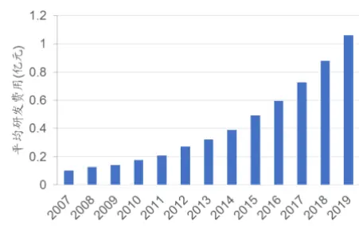
数据来源：Wind，广发证券发展研究中心

图 2：科技股多因子选股策略表现
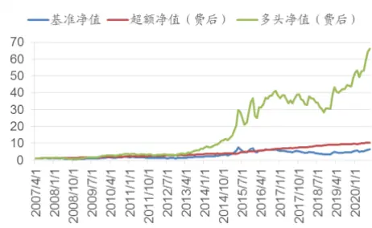
数据来源：Wind，广发证券发展研究中心
[Table_Author] 分析师： 文巧钧

同SAC 执证号：S0260517070001

0755-88286935

wenqiaojun@gf.com.cn分析师： 安宁宁

SAC 执证号：S0260512020003

SFC CE No. BNW179

0755-23948352

anningning@gf.com.cn

分析师： 罗军

SAC 执证号：S0260511010004

020-66335128

luojun@gf.com.cn

请注意，罗军并非香港证券及期货事务监察委员会的注册持牌人，不可在香港从事受监管活动。

## 一、科技股概述

## （一）科技股的行业特点

在A股市场，科技股是一个相对模糊的概念，一般来说，从事通信、电子、计算机软硬件、新能源、新材料、航空航天、生物医药制品的服务与生产的公司可以统称为科技行业公司。这些公司行业覆盖面广，业务差异巨大。

简单起见，本报告考察的科技股是属于申万行业分类中电子、通信和计算机这三个一级行业的股票。其主要特点是都属于信息技术领域，而且研发投入的占比较高。

根据2019年年报数据，电子、通信、计算机等三个行业的平均研发费用占营收的比例分别达到7%、9%和13%，在所有申万一级行业中处于前4的水平（除了这三个行业，国防军工行业的研发费用占比排名第三）。

图 1：不同申万一级行业股票的平均研发费用占比
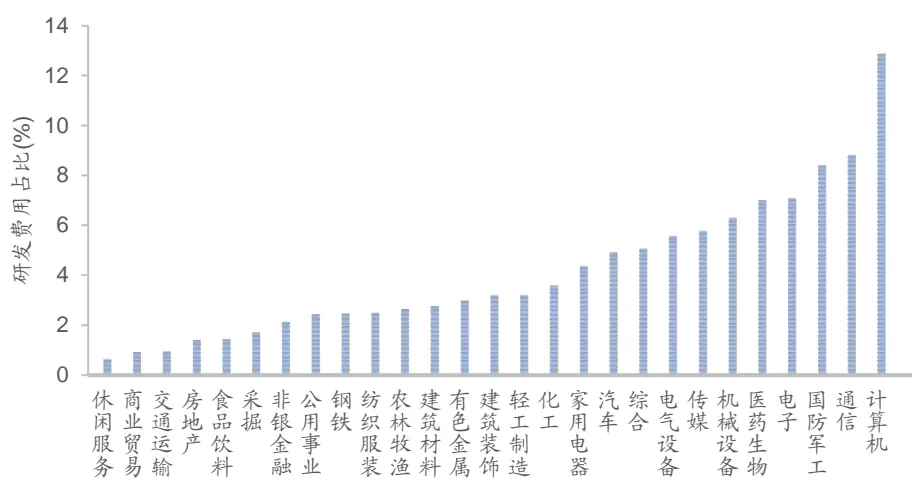
数据来源：Wind，广发证券发展研究中心

2011年以来，科技股上市公司数量迅速上升。截至2020年6月底，共有621只科技股。

图 2：A股科技股数量走势（截至2020年6月）
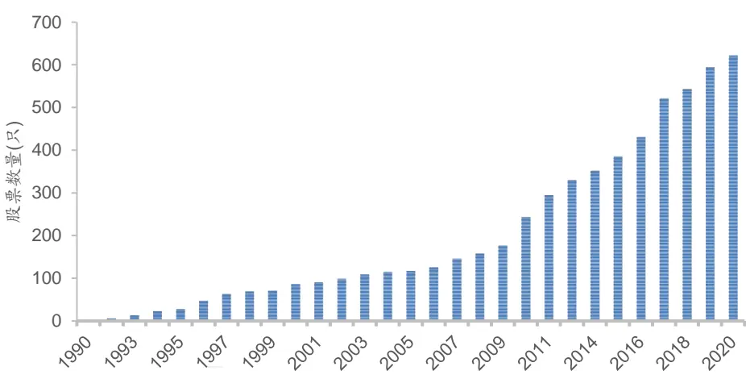
数据来源：Wind，广发证券发展研究中心

沪深300和中证500指数中的科技股权重占比有明显上升。截至2020年6月底，沪深300指数中科技股权重占比为14.12%，而中证500指数中科技股权重占比为18.31%。

图 3：主要宽基指数中科技股权重占比
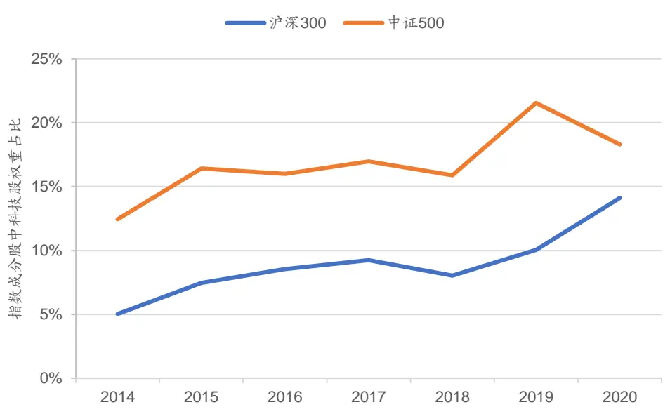
数据来源：Wind，广发证券发展研究中心

在全A的科技股中，电子行业股票占了267只，其中，成份股数量最多的二级行业是光学光电子和电子制造，成份股数量最多的三级行业是电子零部件制造和集成电路。计算机行业股票占了237只，成份股数量最多的二级行业是计算机应用，三级行业是IT服务。通信行业股票有105只，成份股数量最多的二级行业是通信设备，三级行业是通信传输设备。

表1：科技股申万二级行业和三级行业分布（截至2020年6月）

| 一级行业 | 个数 | 二级行业 | 个数 | 三级行业 | 个数 |
| --- | --- | --- | --- | --- | --- |
| 电子 | 267 | 元件Ⅱ | 41 | 印制电路板 被动元件 | 24 17 |
|  |  | 光学光电子 | 75 | LED 光学元件 | 32 11 |
|  |  |  |  | 显示器件Ⅲ | 32 |
|  |  | 其他电子Ⅱ | 33 | 其他电子Ⅲ 分立器件 | 33 6 |
|  |  | 半导体 | 52 | 半导体材料 集成电路 | 9 37 |
|  |  | 电子制造 | 66 | 电子系统组装 电子零部件制造 | 17 49 |
| 计算机 | 237 | 计算机应用 | IT服务 |  | 104 |
|  |  | 计算机设备Ⅱ | 189 | 软件开发 计算机设备Ⅲ | 85 |
| 通信 | 105 |  | 48 | 终端设备 | 48 31 |
|  |  | 通信设备 | 101 | 通信传输设备 通信配套服务 | 40 30 |
|  |  | 通信运营Ⅱ | 4 | 通信运营Ⅲ | 4 |

数据来源：Wind，广发证券发展研究中心

从Wind的概念板块来看，科技股的所属概念板块主要是：消费电子产业、华为概念、5G概念、新基建概念、智慧城市概念、国产软件概念等。

表2：科技股主要概念板块分布（截至2020年6月）

| 电子 | 相关概念股 票数量(只) | 通信 | 相关概念股 | 计算机 | 相关概念股 票数量(只) |  |
| --- | --- | --- | --- | --- | --- | --- |
|  |  |  |  |  |  | 票数量(只) |
| 消费电子产业 | 86 | 5G | 46 | 智慧城市 | 60 |  |
| 华为概念 | 74 | 新基建 | 23 | 国产软硬件 | 52 |  |
| 手机产业 | 64 | 科技龙头 | 21 | 区块链 | 50 |  |
| 科技龙头 | 54 | 宽带提速 | 20 | 科技龙头 | 48 |  |
| 集成电路 | 49 | 光通信 | 20 | 金融科技 | 42 |  |
| 半导体产业 | 47 | 5G应用 | 18 | 5G应用 | 41 |  |
| 5G 应用 | 41 | 4G | 14 | 云计算 | 39 |  |
| 小米产业链 | 37 | 员工持股 | 14 | 华为鲲鹏 | 38 |  |
| 芯片 | 36 | 物联网 | 13 | 新基建 | 36 |  |
| 液晶显示 | 33 | 网络优化 | 13 | 大数据 | 32 |  |

数据来源：Wind，广发证券发展研究中心

总体而言，电子、计算机和通信行业内公司的研发费用高，有大量公司属于消费电子、5G、新基建、科技龙头研报接受邮箱 p6 、芯片等概念板块。

## （二）科技股的市值、估值分布和走势

从股票市值来看，截至2020年6月底，科技股的流通市值主要集中在20亿-500亿，流通市值超过1000亿的股票有18家，占比3%。

图 4：科技股流通市值分布
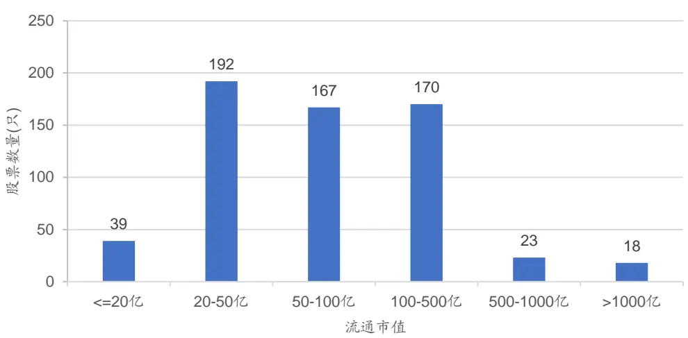
数据来源：Wind，广发证券发展研究中心

从股票TTM市盈率来看，截至2020年6月底，科技股的市盈率主要集中在20-100倍。市盈率超过300倍的公司有37家，占比6%，总体而言，科技公司的市盈率偏高。

图 5：科技股市盈率分布
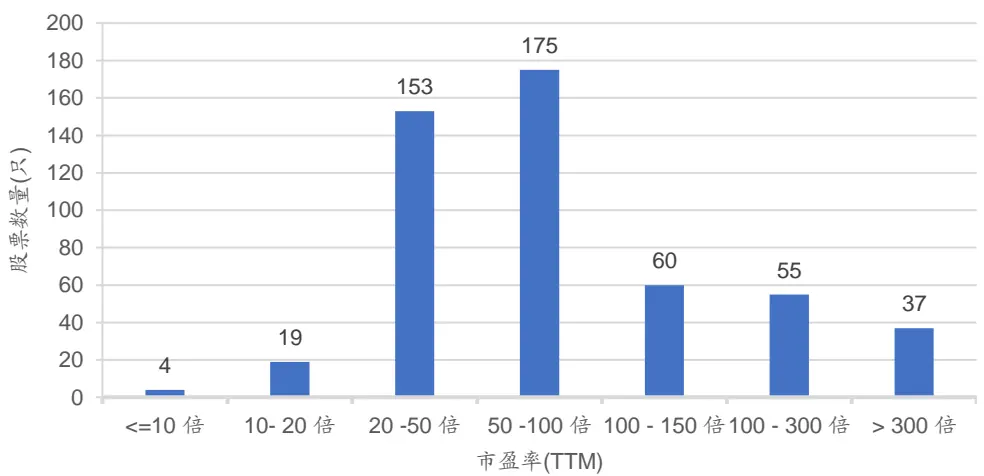
数据来源：Wind，广发证券发展研究中心

从股票市净率来看，截至2020年6月底，科技股的市净率主要集中在2-10倍。市净率小于2倍的有63家，占比10%；超过30倍的有5家，占比0.8%。

图 6：科技股市净率分布
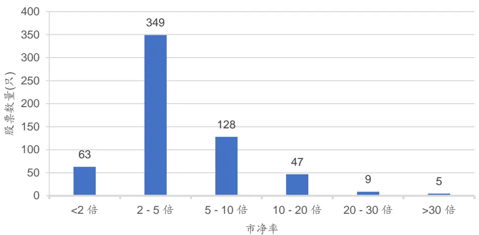
数据来源：Wind，广发证券发展研究中心

从科技股的走势来看，自2007年4月以来，电子、计算机和通信指数的年化收益率分别为8.06%、10.41%和3.57%，沪深300指数的年化收益率为2.30%。3个申万一级指数相对沪深300指数都有超额收益。本报告构建了科技股等权指数，该指数由所有科技股票等权构成。从2007年4月以来，科技股等权指数的年化收益率为14.81%，相对沪深300指数的年化超额收益率为12.51%。

图 7：申万电子、计算机、通信指数走势以及科技股等权指数走势
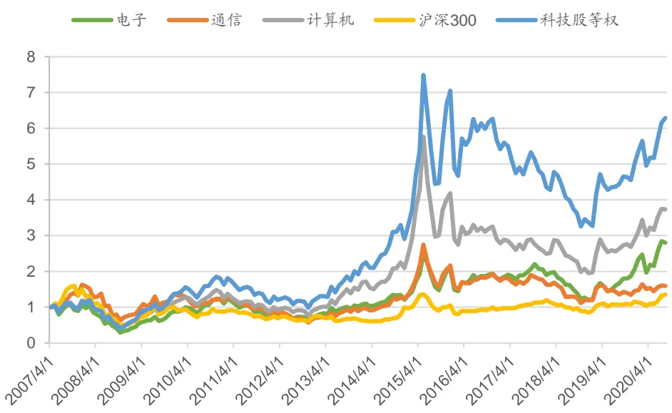
数据来源：Wind，广发证券发展研究中心

表3：科技股指数和宽基指数从2007年4月以来的风险收益特征

| 指数 | 累计收益率 | 年化收益率 | 历史最大回撤 |
| --- | --- | --- | --- |
| 电子 | 180.46% | 8.06% | -72.60% |
| 计算机 | 273.27% | 10.41% | -66.15% |
| 通信 | 59.46% | 3.57% | -65.18% |
| 科技股等权 | 527.98% | 14.81% | -67.03% |
| 沪深 300 | 35.34% | 2.30% | -70.75% |

数据来源：Wind，广发证券发展研究中心

## 二、研究创新对科技股表现的影响

## （一）科技股的研发投入情况

重视研发创新是科技公司的主要特点。本报告根据研发费用因子来考察科技股的创新研发投入情况，近年来，A股上市公司披露研发费用的比例越来越高。2007年，A股市场仅有23.4%的公司披露年度研发费用，而2019年有87.4%的公司披露研发费用数据。科技股的研发费用披露比例更高，2014年以来，每年都有99%以上的科技公司披露年度研发费用。即使是研发费用披露比例较低的半年报，科技股公司近年来也有98%以上的公司会披露研发费用数据，因子覆盖度显著高于其他行业。

图 8：年报研发费用因子覆盖度
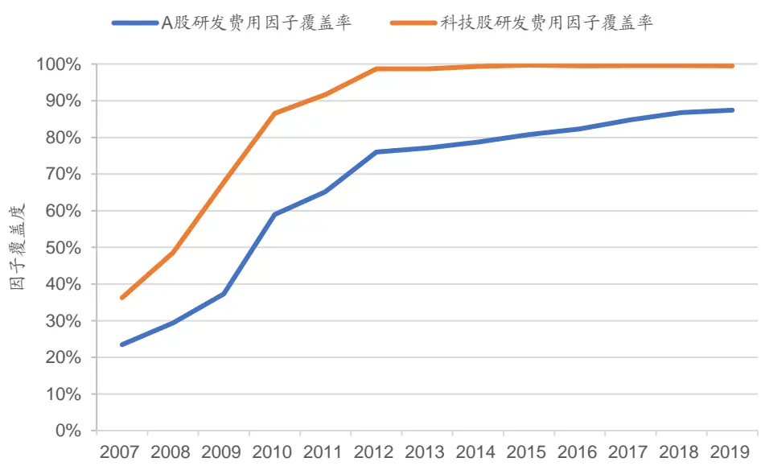
数据来源：Wind，广发证券发展研究中心

与其他行业公司相比，科技公司的研发投入更高。近年来，科技股公司的研发投入持续增长。截至2019年年报，科技股公司的平均研发费用达到1.06亿元（根据研报接受邮箱 p9有研发费用数据披露的公司进行平均）。

图 9：分年度的平均研发费用走势
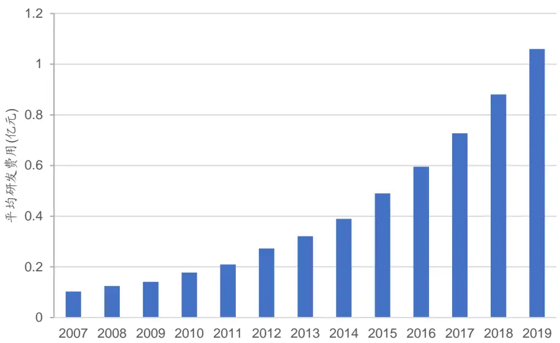
数据来源：Wind，广发证券发展研究中心

研发费用体现了公司在研究创新方面的投入，而公司申请的研究专利数量体现了公司在研究创新方面的成果。2015年至2020年6月底，科技股公司每年新增的专利数量总体平稳。

图 10：分年度平均新增专利数量（截至2020年6月）
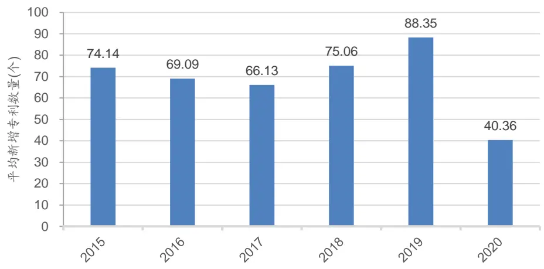
数据来源：通联数据，广发证券发展研究中心

下图展示了公司的年度平均研发费用与新增专利数量有很强的相关性（横纵坐标都已经取对数）。总体来看，当公司投入的研发费用越高时，更有可能新增较多的专利和研究成果。

图 11：研发费用（对数）与新增专利数量（对数）的关系
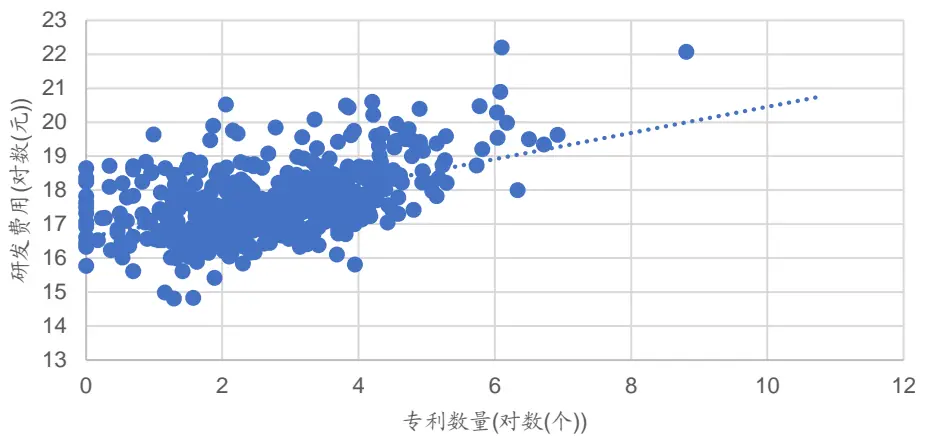
数据来源：Wind，通联数据，广发证券发展研究中心

从公司研发人员数量来看，近5年来，科技股公司的研发人员平均占比逐年增加，且增长速度较为稳定。至2019年底，研发人员占比接近30%。

图 12：研发人员数量和研发人员数量占比走势
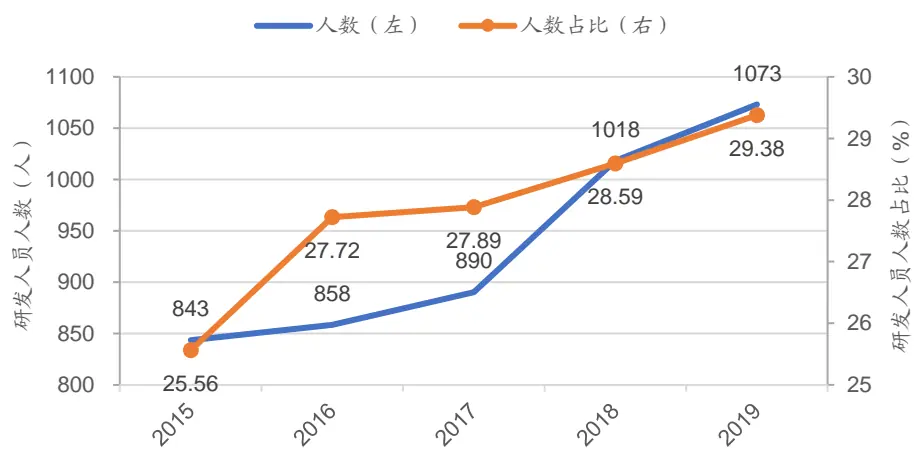
数据来源：Wind，广发证券发展研究中心

总体而言，科技股公司对于科研创新的投入越来越大，包括加大研发费用，提高研发人员数量占比等。

## （二）研究创新对股票表现的影响

为了分析研究创新对公司股价走势的影响，本报告首先考察研发费用与股价走势的关系。

科技股的研发费用（对数）与市值（对数）具有明显的正相关的线性关系。即当股票的市值较大的时候，其研发费用也会较大，或者说，头部公司会投入更多的资金进行研发。

图 13：对数研发费用与对数市值的关系
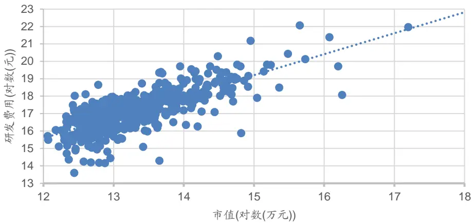
数据来源：Wind，广发证券发展研究中心

由于研发费用具有明显的头部效应，如果直接采用研发费用因子来选股，会倾向于选出大市值的股票。为了剔除市值的影响，本报告对研发费用进行市值中性，下文所说的研发费用因子是指市值中性之后的因子值。

根据上一年度年报数据进行选股，自2008年4月以来，科技股研发费用因子与未来1年收益率（这里1年是指从当年4月底至第二年4月底）的IC的均值为0.12。特别地，在2016年4月以来，IC的均值达到了0.19。总体而言，研发费用因子具有显著的选股能力，股票的研发费用越高时，股票在此后1年的收益率越高，而且该因子在近年来的选股表现更加显著。

图 14：研发费用（市值中性）与未来1年收益率分年度的IC
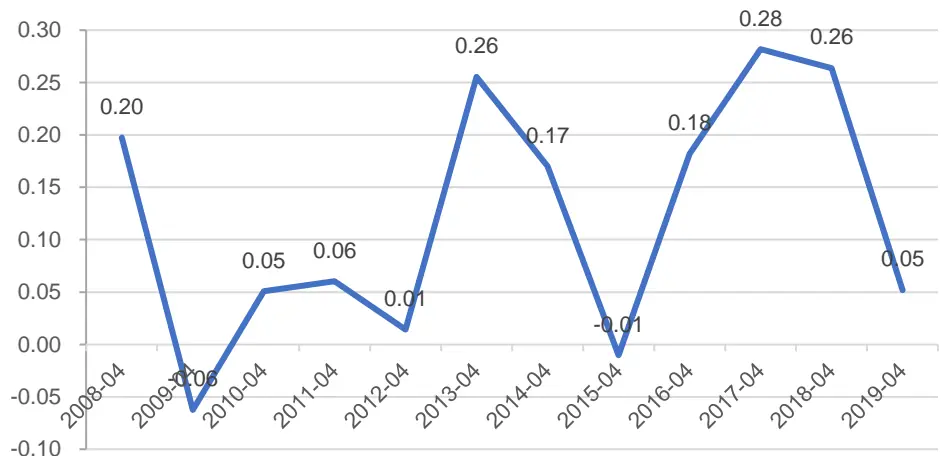
数据来源：Wind，广发证券发展研究中心

科技股自2008年4月以来的年均研发费用（市值中性）与未来1年平均收益率的关系如下图所示。平均研发费用与未来1年平均收益率的相关性为0.03。

图 15：平均研发费用与未来一年平均收益率的关系
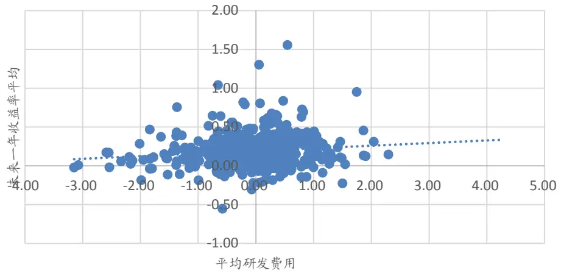
数据来源：Wind，广发证券发展研究中心

使用研发费用因子选股分档收益率如下图所示。其中调仓时点为每年4月底、8月底和10月底。第一档（高研发费用）股票的累计收益率为1733.47%，年化收益率为25.08%。第五档（低研发费用）股票的累计收益率为56.33%，年化收益率为3.50%。多空年化超额收益率为21.58%。

图 16：研发费用因子的分档收益表现
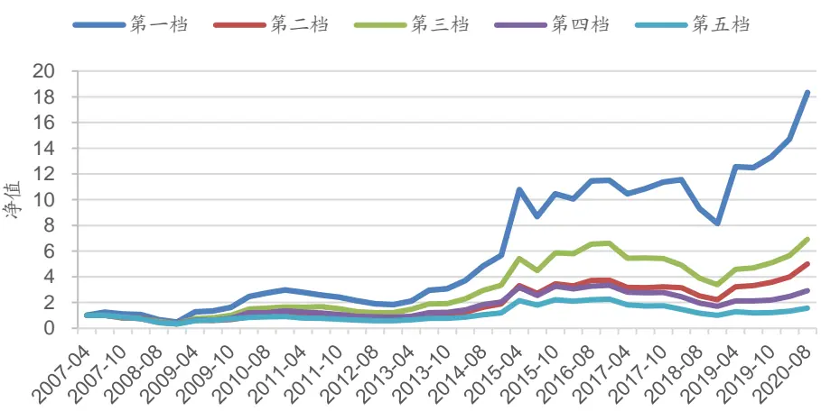
数据来源：Wind，广发证券发展研究中心

图 17：研发费用因子的多空超额收益
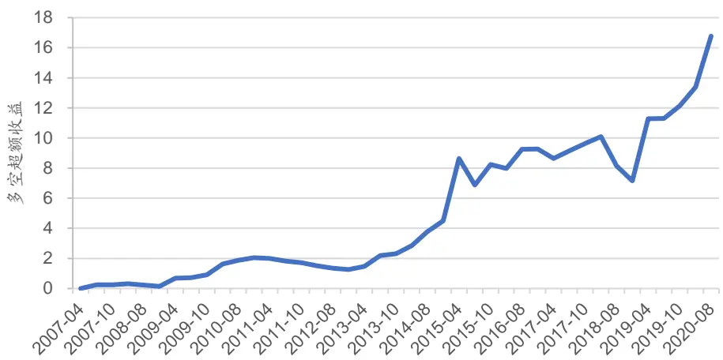
数据来源：Wind，广发证券发展研究中心

## 三、财报数据对科技股表现的影响

本报告分别考察盈利、成长、质量因子等财报数据在科技股中的因子IC 和多空收益。根据财报数据，调仓时点为每年4 月底、8月底和 10月底。

## （一）盈利因子

盈利因子主要包括: 单季度 ROE、单季度ROA、单季度销售净利率、单季度销售毛利率、单季度每股收益、单季度销售期间费用率、销售毛利率、投入资本回报率、净资产收益率、销售净利率、每股息税前利润。

实证分析表明，盈利因子是科技股表现的重要驱动因素，高盈利的公司在未来的股价表现较好。

在11个盈利因子中，代表指标是单季度ROE 和单季度 ROA，这两个因子的 IC都为 0.08，多空年化收益为 11%～12%。其中，7 个因子的季度 IC 在 0.04 以上，有一半因子的多空年化收益率超过 7%，表现出了不错的选股能力。同时，这些因子的多头相对基准都有超额收益。

图 18：盈利因子多空超额收益表现
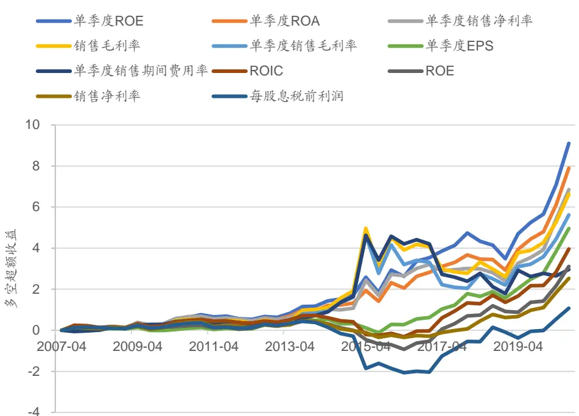
数据来源：Wind，广发证券发展研究中心

表4：盈利因子IC统计

| 因子 | 平均IC | 多空年化超额 | 相对基准年化超额 |
| --- | --- | --- | --- |
| 单季度 ROE | 0.08 | 12.04% | 6.50% |
| 单季度 ROA | 0.08 | 11.34% | 5.42% |
| 单季度销售净利率 | 0.05 | 10.31% | 4.53% |
| 单季度销售毛利率 | 0.04 | 9.07% | 4.92% |
| 销售毛利率 | 0.03 | 8.01% | 4.08% |
| 单季度EPS | 0.08 | 7.76% | 3.07% |
| 单季度销售期间费用率 | 0.00 | 4.47% | 1.92% |
| ROIC | 0.04 | 5.06% | 3.79% |
| ROE | 0.04 | 4.37% | 2.57% |
| 销售净利率 | 0.03 | 3.86% | 1.54% |
| 每股息税前利润 | 0.04 | 1.49% | 1.32% |

数据来源：Wind，广发证券发展研究中心

## （二）成长因子

本报告考察的成长因子主要包括：单季度净利润同比增长、单季度营业收入同比增长、ROE 同比增长。

实证结果表明，成长因子是科技股未来表现的重要驱动因素，高成长个股在未来一段时间有望获取超额收益。

3 个成长因子的 IC 都很显著，都超过 0.10，多空超额年化收益率均在 12%以上，其中单季度净利润同比增长因子的高达 17.16%，表现出不错的选股能力，3个因子的多头相对基准的超额年化收益率在 7%～9%之间。

识别风险，发现价值

图 19：成长因子多空超额
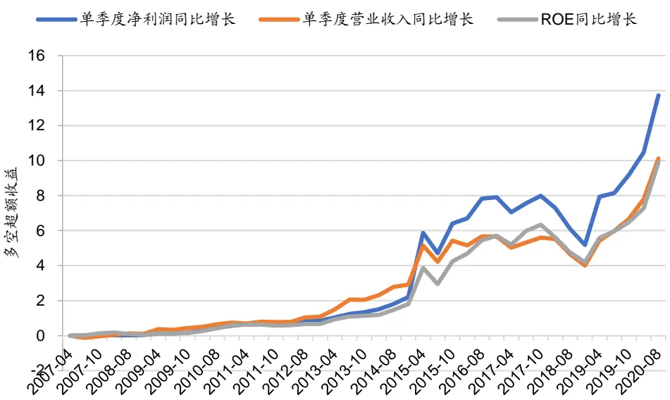
数据来源：Wind，广发证券发展研究中心

表5：成长因子IC统计

| 因子 | 平均IC | 多空年化超额 | 相对基准年化超额 |
| --- | --- | --- | --- |
| 单季度净利润同比增长 | 0.12 | 17.16% | 9.04% |
| 单季度营业同比增长 | 0.10 | 12.90% | 7.20% |
| ROE 同比增长 | 0.10 | 12.13% | 7.28% |

数据来源：Wind，广发证券发展研究中心

## （三）质量因子

本报告考察的质量因子主要包括：总资产周转率、流动资产周转率、息税前利润现金含量、营业利润现金含量、资产负债率、存货周转率、应收账款周转率等。

实证分析表明，质量因子对于科技股未来表现的影响较弱。除了总资产周转率的季度 IC 为0.04之外，其他质量因子的季度 IC 都不高于0.02，以上质量因子年化多空超额收益率为 0.73%至 5.01%。

图 20：质量因子多空超额
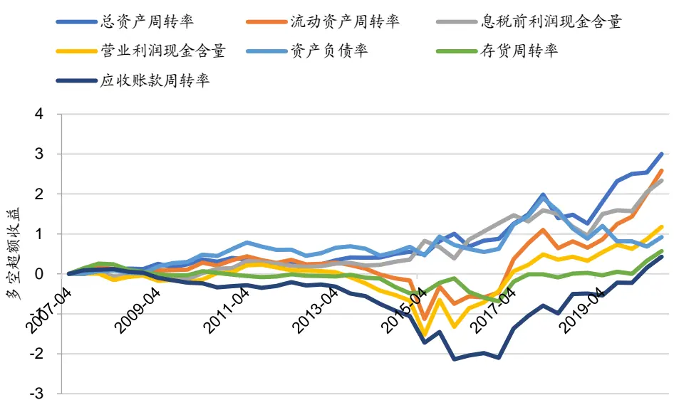
数据来源：Wind，广发证券发展研究中心

表6：质量因子IC统计

| 因子 | 平均 IC | 多空年化超额 | 相对基准年化超额 |
| --- | --- | --- | --- |
| 总资产周转率 | 0.04 | 5.01% | 1.21% |
| 流动资产周转率 | 0.02 | 4.02% | 1.44% |
| 息税前利润现金含量 | 0.01 | 3.38% | 1.82% |
| 营业利润现金含量 | 0.01 | 1.82% | 0.46% |
| 资产负债率 | 0.01 | 1.56% | -0.53% |
| 存货周转率 | 0.00 | 0.91% | -0.26% |
| 应收账款周转率 | 0.01 | 0.73% | -1.01% |

数据来源：Wind，广发证券发展研究中心

总体而言，财报数据中，盈利因子和成长因子都是科技股未来表现的驱动因子。而质量因子对科技股走势的影响较弱。

## 四、估值和其他风格因子对科技股表现的影响

## （一）科技股估值走势

相对其他行业来说，科技股的PE TTM和PB都处于较高的位置。

图 21：科技股PE TTM走势
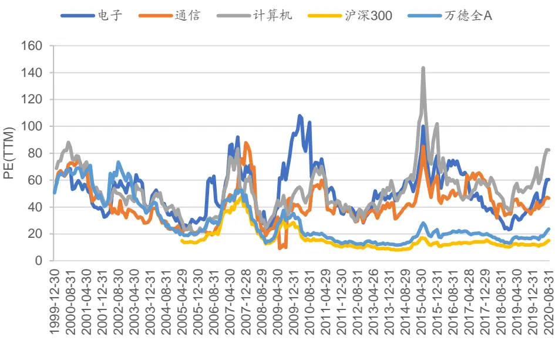
数据来源：Wind，广发证券发展研究中心

图 22：科技股PB走势
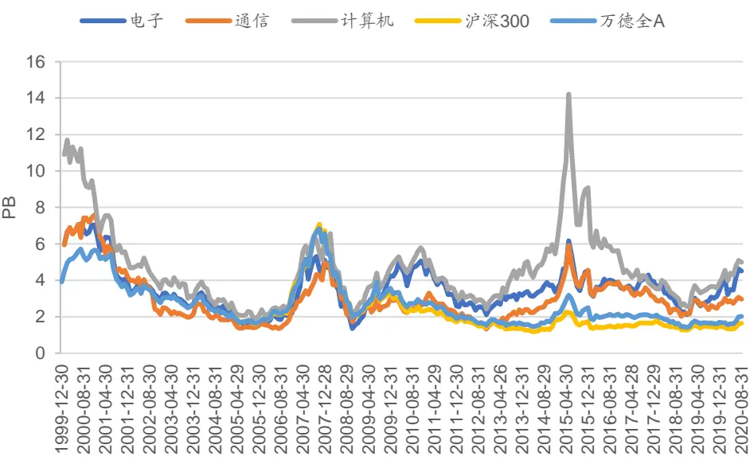
数据来源：Wind，广发证券发展研究中心

根据2020 年半年报数据，科技股的PB相对于其他申万一级行业较高，而ROE处于相对较低的位置。

图 23：申万一级行业PB-ROE对比图
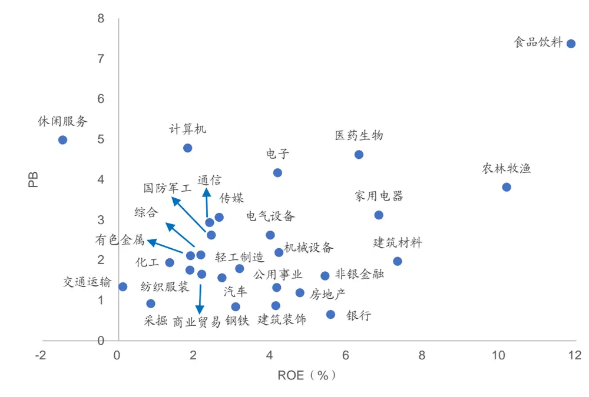
数据来源：Wind，广发证券发展研究中心

## （二）科技股估值因子选股能力

在科技板块中，估值因子具有不错的选股效果，估值较低的科技股在未来一个月相对表现较好。本报告考察BP（市净率倒数）、EP（市盈率倒数）和SP（市销率倒数）的选股效果，以上3个因子都具有不错的选股效果，IC 均值为4.1%～5.5%，多空年化超额为 11.93%～19.44%，其中，EP 的选股能力相对更好一些。

表7：估值因子月IC统计

| 因子 | 平均IC | 多空年化超额 | 相对基准年化超额 |
| --- | --- | --- | --- |
| BP | 0.055 | 11.93% | 2.26% |
| EP | 0.050 | 19.44% | 10.28% |
| SP | 0.041 | 13.82% | 5.15% |

数据来源：Wind，广发证券发展研究中心

图 24：估值因子多空收益表现
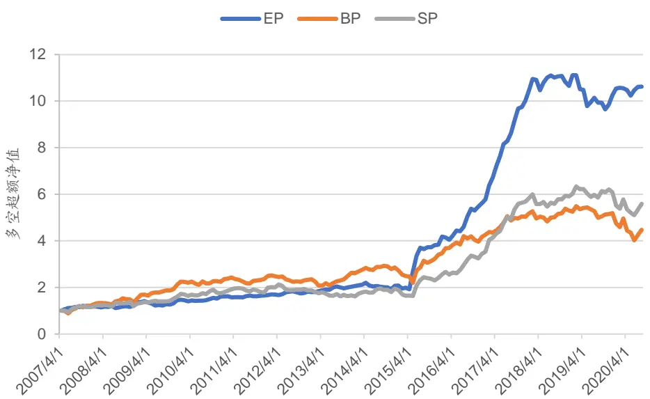
数据来源：Wind，广发证券发展研究中心

## （三）其他风格因子选股能力

除了以上因子，本报告也考察了流通市值、（1 月）换手率、（1 月）波动率、1 月反转和12月反转等常见风格因子在科技股的选股能力。

从因子IC来看，以上因子都具有一定的选股能力，低流通市值、低换手、低波动、前期超跌的个股在未来一个月一般会表现更好。

表8：估值因子月IC统计

| 因子 | 平均IC | 多空年化超额 | 相对基准年化超额 |
| --- | --- | --- | --- |
| 流通市值 | -0.030 | 34.88% | 22.85% |
| 换手率 | -0.097 | 42.98% | 20.05% |
| 波动率 | -0.058 | 7.39% | 1.54% |
| 1月反转 | -0.086 | 27.03% | 10.58% |
| 12月反转 | -0.042 | 9.03% | 3.85% |

数据来源：Wind，广发证券发展研究中心

从因子多空收益来看，低换手率和小市值因子具有相对更高的多空超额收益，其中，小市值因子在 2017 年以来表现不佳，而低换手的股票近年来依然有不错的表现。此外，1 月反转因子也始终有不错的表现。

图 25：其他风格因子多空收益表现
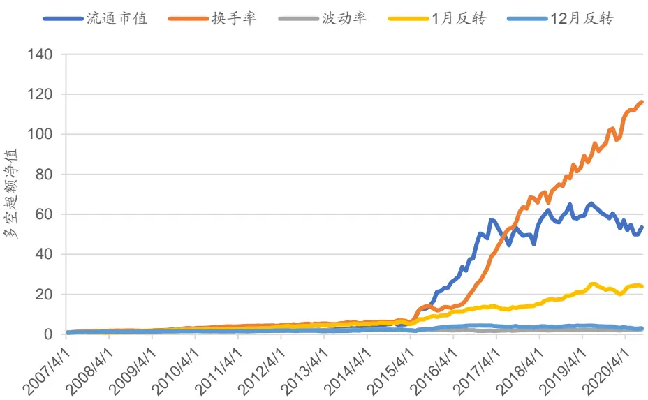
数据来源：Wind，广发证券发展研究中心

## 五、科技股选股策略与实证

本报告从创新投入、盈利、成长、估值、规模、流动性和技术面，选取7个因子进行科技股的筛选。

选股池：申万一级行业分类属于通信、电子、计算机的所有股票；

因子加权方案：大类因子等权；

组合股票数量：多因子打分位于前20%的股票；

基准：科技股等权指数（参考第一节）；

回测周期：2007年4月30日至2020年8月31日。

调仓周期：每月最后一个交易日；

交易成本：双边千分之三。

所采用的选股因子如下表所示。

表9：选股方案采用因子列表

| 大类因子 | 因子说明 |
| --- | --- |
| 创新投入 | 研发费用（市值中性） |
| 盈利 | 单季度 ROE |
| 成长 | 净利润同比增长 |
| 估值 | EP |
| 规模 | 流通市值 |
| 流动性 | 月换手 |
| 技术 | 1月反转 |

数据来源：Wind，广发证券发展研究中心
识别风险，发现价值

多因子选股策略表现如下图所示，多头策略年化收益为 37.05%，而基准策略的年化收益为 14.81%。从超额净值来看，多头相对基准的年化超额收益为 19.20%，超额最大回撤为-8.16%，最大回撤发生在 2015年1 季度。策略的年化换手率为5.43倍，月换手率约 45%，月胜率为 79.2%。

图 26：多因子选股策略表现
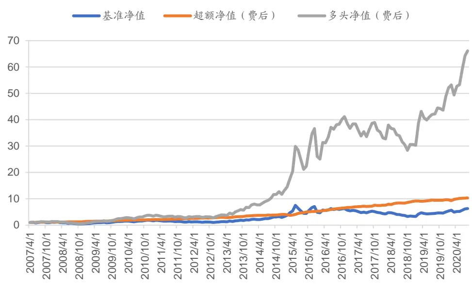
数据来源：Wind，广发证券发展研究中心

策略分年度表现如下表所示，从2017年以来，策略每年的累积超额收益率依次为10.81%，20.80%，6.86%，7.52%（2020年收益率数据截止到8月31日）。

表10：多因子选股策略分年度表现

| 年份 | 多头收益 | 基准收益 | 超额累积收益 | 月胜率 | 年换手率 |
| --- | --- | --- | --- | --- | --- |
| 2007 | 39.62% | 15.01% | 20.07% | 75.0% | 3.78 |
| 2008 | -47.65% | -53.98% | 13.02% | 58.3% | 5.29 |
| 2009 | 234.62% | 158.97% | 32.06% | 75.0% | 5.96 |
| 2010 | 50.69% | 31.67% | 14.77% | 75.0% | 5.96 |
| 2011 | -21.69% | -34.42% | 18.77% | 91.7% | 6.03 |
| 2012 | 14.14% | -2.46% | 16.34% | 83.3% | 5.66 |
| 2013 | 101.08% | 66.27% | 23.01% | 83.3% | 5.48 |
| 2014 | 75.62% | 51.16% | 16.05% | 83.3% | 5.60 |
| 2015 | 214.76% | 142.91% | 27.97% | 83.3% | 5.10 |
| 2016 | 5.20% | -19.29% | 29.54% | 100.0% | 4.95 |
| 2017 | -8.21% | -17.18% | 10.81% | 83.3% | 4.97 |
| 2018 | -13.45% | -28.61% | 20.80% | 75.0% | 5.27 |
| 2019 | 59.52% | 49.04% | 6.86% | 66.7% | 4.93 |
| 2020 | 35.50% | 25.28% | 7.52% | 75.0% | 2.67 |
| 年化平均 | 37.05% | 14.81% | 19.20% | 79.2% | 5.43 |

数据来源：Wind，广发证券发展研究中心
识别风险，发现价值

## 六、总结与展望

近年来，A股市场的科技股权重占比有明显上升，截至2020年6月底，沪深300指数中科技股权重占比为14.12%，而中证500指数中科技股权重占比为18.31%。

本报告从创新投入、盈利、成长、估值等角度对科技股的影响因子进行分析，总体而言，高研发费用、高盈利、高成长、低估值的科技股相对来说有更高的收益。

基于研发费用因子和其他风格因子，本报告构建了月度调仓的科技股多因子选股策略。从2007年以来，策略年化超额收益为19.20%，超额最大回撤为-8.16%，年化换手率为5.43倍，月胜率为79.2%。

## 七、风险提示

策略模型并非百分百有效，市场结构及交易行为的改变以及类似交易参与者的增多有可能使得策略失效。

## [Table_ResearchTeam] 广发金融工程研究小组

罗军 ：首席分析师，华南理工大学硕士，从业 14年，2010年进入广发证券发展研究中心。

安 宁 宁 ：联席首席分析师，暨南大学硕士，从业 12年，2011年进入广发证券发展研究中心。

史 庆 盛 ：资深分析师，华南理工大学硕士，从业 8年，2011年进入广发证券发展研究中心。

张 超 ：资深分析师，中山大学硕士，从业 7 年，2012 年进入广发证券发展研究中心。

文 巧 钧 ：资深分析师，浙江大学博士，从业 4年，2015年进入广发证券发展研究中心。

陈 原 文 ：资深分析师，中山大学硕士，从业 4年，2015年进入广发证券发展研究中心。

樊 瑞 铎 ：资深分析师，南开大学硕士，从业 4年，2015年进入广发证券发展研究中心。

李豪 ：资深分析师，上海交通大学硕士，从业 3年，2016年进入广发证券发展研究中心。

郭 圳 滨 ：高级分析师，中山大学硕士，2018年进入广发证券发展研究中心。

季 燕 妮 ：研究助理，厦门大学硕士，2020年进入广发证券发展研究中心。

张 钰 东 ：研究助理，中山大学硕士，2020年进入广发证券发展研究中心。

季 俊 男 ：南京大学硕士，2020年进入广发证券发展研究中心。

## [Table_IndustryInvestDescription] 广发证券—行业投资评级说明

买入： 预期未来 12 个月内，股价表现强于大盘 10%以上。

持有： 预期未来12个月内，股价相对大盘的变动幅度介于-10%～+10%。

卖出： 预期未来12个月内，股价表现弱于大盘10%以上。

## [Table_CompanyInvestDescription] 广发证券—公司投资评级说明

买入： 预期未来 12 个月内，股价表现强于大盘 15%以上。

增持： 预期未来12个月内，股价表现强于大盘5%-15%。

持有： 预期未来12个月内，股价相对大盘的变动幅度介于-5%～+5%。

卖出： 预期未来12个月内，股价表现弱于大盘5%以上。

## [Table_Address] 联系我们

| 地址 | 广州市 广州市天河区马场路 | 深圳市 深圳市福田区益田路 6001号太平金融大 | 北京市 北京市西城区月坛北 | 上海市 | 香港 |  |
| --- | --- | --- | --- | --- | --- | --- |
|  |  |  |  |  | 上海市浦东新区南泉 | 香港中环干诺道中 |
|  |  |  |  | 街2号月坛大厦18 | 北路 429号泰康保险 | 111号永安中心14 |
| 邮政编码 | 35楼 510627 | 厦31层 518026 | 层 100045 | 大厦37楼 200120 | 楼1401-1410 室 |  |

## [Table_LegalD 法律主体isclaimer 声明]

本报告由广发证券股份有限公司或其关联机构制作，广发证券股份有限公司及其关联机构以下统称为“广发证券”。本报告的分销依据不同国家、地区的法律、法规和监管要求由广发证券于该国家或地区的具有相关合法合规经营资质的子公司/经营机构完成。

广发证券股份有限公司具备中国证监会批复的证券投资咨询业务资格，接受中国证监会监管，负责本报告于中国（港澳台地区除外）的分销。

广发证券（香港）经纪有限公司具备香港证监会批复的就证券提供意见（4 号牌照）的牌照，接受香港证监会监管，负责本报告于中国香港地区的分销。

本报告署名研究人员所持中国证券业协会注册分析师资质信息和香港证监会批复的牌照信息已于署名研究人员姓名处披露。

## [Table_I 重要声明mportan

广发证券股份有限公司及其关联机构可能与本报告中提及的公司寻求或正在建立业务关系，因此，投资者应当考虑广发证券股份有限公司及其关联机构因可能存在的潜在利益冲突而对本报告的独立性产生影响。投资者不应仅依据本报告内容作出任何投资决策。投资者应自主作出投资决策并自行承担投资风险，任何形式的分享证券投资收益或者分担证券投资损失的书面或者口头承诺均为无效。

本报告署名研究人员、联系人（以下均简称“研究人员”）针对本报告中相关公司或证券的研究分析内容，在此声明：（ ）本报告的全部分析结论、研究观点均精确反映研究人员于本报告发出当日的关于相关公司或证券的所有个人观点，并不代表广发证券的立场；（2）研究人员的部分或全部的报酬无论在过去、现在还是将来均不会与本报告所述特定分析结论、研究观点具有直接或间接的联系。

研究人员制作本报告的报酬标准依据研究质量、客户评价、工作量等多种因素确定，其影响因素亦包括广发证券的整体经营收入，该等经营收入部分来源于广发证券的投资银行类业务。

本报告仅面向经广发证券授权使用的客户/特定合作机构发送，不对外公开发布，只有接收人才可以使用，且对于接收人而言具有保密义务。广发证券并不因相关人员通过其他途径收到或阅读本报告而视其为广发证券的客户。在特定国家或地区传播或者发布本报告可能违反当地法律，广发证券并未采取任何行动以允许于该等国家或地区传播或者分销本报告。

本报告所提及证券可能不被允许在某些国家或地区内出售。请注意，投资涉及风险，证券价格可能会波动，因此投资回报可能会有所变化，过去的业绩并不保证未来的表现。本报告的内容、观点或建议并未考虑任何个别客户的具体投资目标、财务状况和特殊需求，不应被视为对特定客户关于特定证券或金融工具的投资建议。本报告发送给某客户是基于该客户被认为有能力独立评估投资风险、独立行使投资决策并独立承担相应风险。

本报告所载资料的来源及观点的出处皆被广发证券认为可靠，但广发证券不对其准确性、完整性做出任何保证。报告内容仅供参考，报告中的信息或所表达观点不构成所涉证券买卖的出价或询价。广发证券不对因使用本报告的内容而引致的损失承担任何责任，除非法律法规有明确规定。客户不应以本报告取代其独立判断或仅根据本报告做出决策，如有需要，应先咨询专业意见。

广发证券可发出其它与本报告所载信息不一致及有不同结论的报告。本报告反映研究人员的不同观点、见解及分析方法，并不代表广发证券的立场。广发证券的销售人员、交易员或其他专业人士可能以书面或口头形式，向其客户或自营交易部门提供与本报告观点相反的市场评论或交易策略，广发证券的自营交易部门亦可能会有与本报告观点不一致，甚至相反的投资策略。报告所载资料、意见及推测仅反映研究人员于发出本报告当日的判断，可随时更改且无需另行通告。广发证券或其证券研究报告业务的相关董事、高级职员、分析师和员工可能拥有本报告所提及证券的权益。在阅读本报告时，收件人应了解相关的权益披露（若有）。

本研究报告可能包括和/或描述/呈列期货合约价格的事实历史信息（“信息”）。请注意此信息仅供用作组成我们的研究方法/分析中的部分论点/依据/证据，以支持我们对所述相关行业/公司的观点的结论。在任何情况下，它并不（明示或暗示）与香港证监会第5类受规管活动（就期货合约提供意见）有关联或构成此活动。

## [Table_Interest 权益披露Disc

(1)广发证券（香港）跟本研究报告所述公司在过去12 个月内并没有任何投资银行业务的关系。

## [Table_Copyrigh版权声明

未经广发证券事先书面许可，任何机构或个人不得以任何形式翻版、复制、刊登、转载和引用，否则由此造成的一切不良后果及法律责任由私自翻版、复制、刊登、转载和引用者承担。