# 高频价量数据的因子化方法

## 多因子 Alpha 系列报告之（四十一）

## 报告摘要：

高频因子的优势：与低频因子相比，高频数据在量化选股中的优势主要体现在：因子拥挤度相对较低、因子多样性好、检验因子的独立样本多。

研究内容：本报告从四类不同的角度构建因子：日内价格相关因子、日内价量相关因子、盘前信息因子、特定时段采样因子。考察了46个因子周频选股的表现。

其中，日内价格相关的因子是由日内收益率的高阶统计量和日内价格形态衍生的因子；日内价量相关因子包括成交量分布以及用价量关系构建的因子；盘前信息因子主要是从开盘集合竞价信息中提炼的因子；特定时段采样因子主要是指根据一定规则筛选出重要时段，在该时段采样提取的因子，主要包括尾盘数据构建的因子和大成交量时段构建的因子。

实证分析：采用因子 IC 和多空收益进行分析，筛选出 12 个周度选股能力较好的因子：real_skew（已实现偏度）、ret_intraday（日内收益率）、ratio_volumeH8（尾盘半小时成交量占比）、corr_VP（日内价量相关性）、corr_VRlag（量与滞后收益率相关性）、Amihud_illiq（Amihud非流动性因子）、ret_open2AH1（开盘价相对第一阶段集合竞价最高价的收益率）、ret_open2AL1（开盘价相对第一阶段集合竞价最低价的收益率）、ret_H8（尾盘半小时收益率）、real_skewlarge（大成交量已实现偏度）、corr_VPlarge（大成交量价量相关性）、corr_VRlaglarge（大成交量量与滞后收益率相关性）。

从因子表现来看，本报告筛选出来的因子都展示出了不错的多空超额能力。但除了 Amihud_illiq 因子外，其他因子的正 Alpha 收益显著弱于负 Alpha 收益。在扣除交易成本之后，因子选股组合相对基准的超额收益降低了很多。除了 Amihud_illiq 因子具有较高的相对 500 指数的超额收益，其他因子的多头年化超额收益（费后）基本上处于-1%~9%之间。

风险提示：策略模型并非百分百有效，市场结构及交易行为的改变以及类似交易参与者的增多有可能使得策略失效。

图 1：real_skewlarge 多空收益
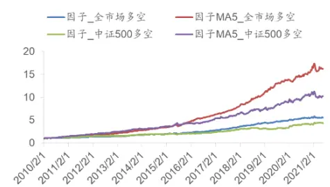
数据来源：Wind，广发证券发展研究中心

图 2：Amihud_illiq 多空收益
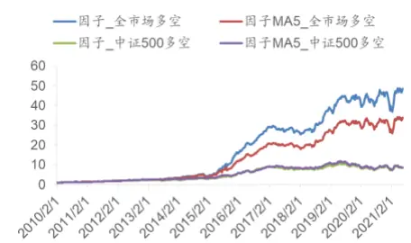
数据来源：Wind，广发证券发展研究中心
[Table_Author] 分析师： 文巧钧

0755-88286935

wenqiaojun@gf.com.cn分析师： 安宁宁

SAC 执证号：S0260512020003

SFC CE No. BNW179

0755-23948352

anningning@gf.com.cn分析师： 罗军

同SAC 执证号：S0260511010004

020-66335128

luojun@gf.com.cn

请注意，罗军并非香港证券及期货事务监察委员会的注册持牌人，不可在香港从事受监管活动。

## 一、高频信息因子的优势

与低频因子相比，高频数据在量化选股中存在一定优势：

（1）因子拥挤度相对较低。高频价量数据的体量明显大于低频数据。以分钟行情为例，用压缩效果较好的mat格式存储2020年全市场股票的分钟行情数据（包括分钟频的开高低收价格数据、买卖盘挂单数据等），约为12GB。如果是快照行情（目前上交所和深交所都是3秒一笔）或者level 2行情，数据量要大很多。因此，高频数据因子挖掘对信息处理能力和处理效率的要求较高。而且，日内数据，尤其是level 2数据，一般要额外付费，甚至需要自行下载存储实时行情，在此基础上构建的因子拥挤度较低。

（2）因子多样性好。高频价量数据一般是多维的时间序列数据，数据中噪声比例较高，而且与ROE、PE这类低频指标本身就具有选股能力不同的是，原始的高频行情数据一般不能直接用作选股因子，而要通过信号变换、时间序列分析、机器学习等方法从高频数据中构建特征，才能作为选股因子。此类因子与低频信号的相关性较低，而且由于因子开发流程相对复杂，不同投资者构建的因子更具有多样性。

（3）独立样本多。高频数据开发的因子一般调仓周期较短，意味着在检验因子有效性的时候，同一段测试期内具有更多的独立样本。例如，在一年的测试期内，只有12个独立的样本段用于检验月频调仓的因子，与之相比，有约50个独立的时段用于检验周频调仓因子，有超过240个独立的时段用于检验日频调仓的因子。独立样本的增多有助于检验高频因子的有效性。

高频数据挖掘因子的难点在于数据维度大、噪声高。因子挖掘的主要方法包括：

（1）人工构建因子：凭借专业投资者的经验或者是参阅已发表的文献，从高频数据中提炼出有选股能力的特征。包括将日频的动量反转因子、波动率因子等用高频数据实现，测试选股性能。

（2）机器挖掘因子。机器学习方法擅长从数据中寻找规律和特征，是高频数据因子挖掘的有力工具。一般采用遗传规划算法或者深度学习算法从高频数据中提炼因子。具体可以参考报告《深度学习框架下高频数据因子挖掘》。

本报告将股票日内分钟行情数据因子化，构建了46个日频价量因子。采用IC测试和多空收益检验，筛选了其中12个表现较好的因子。本报告的目的是通过对因子构建方法的讨论和比较分析，为投资者的因子挖掘工作提供参考。

## 二、因子构建方法和主要性能指标

## （一）因子构建方法

因子构建分为两步，第一步是对日内高频信息进行计算，生成日频因子，第二步是对日频因子进行加窗“平滑”，生成平滑后的因子。本报告主要采用平滑后的因子选股和进行相关测试。

图 1：因子构建方法
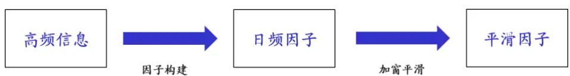
数据来源：广发证券发展研究中心

本报告构建因子时，从四大类不同的角度构建因子：日内价格相关因子、日内价量相关因子、盘前信息因子、特定时段采样因子。其中，日内价格相关的因子是由日内收益率的高阶统计量和日内价格形态衍生的因子，共计10个因子。日内价量相关因子包括成交量分布以及用价量关系构建的因子，共计13个因子。盘前信息因子主要是从开盘集合竞价信息中提炼的因子，共计7个因子。特定时段采样因子主要是指根据一定规则筛选出重要时段，在该时段采样并计算提取的因子，主要包括尾盘数据构建的因子和大成交量时段构建的因子，共计16个因子。

用单日日内信息构建的因子仅包含当日的股票价量信息。一般来说，数据观察期窗口很短的因子对未来多日的预测能力比不上观察期窗口较长的因子。为了延长观察窗口以获取对未来5个交易日左右的预测能力，本报告一般采用5天的观察期将日频因子进行均值处理平滑，即MA5处理。设D日的日频因子为 $f_{D}$ ，则MA5平滑后因子为

$$
f_{D}^{MA5}=\frac{1}{5}\sum_{d=0}^{5}f_{D-d}
$$

在本报告最后一节，比较了MA5、MA20、EMA5、EMA20等4种不同方法处理的因子的性能差异。其中，EMA5和EMA20分别表示5日指数移动平均和20日指数移动平均，

$$
f_{D}^{EMA5}=(1-\rho)f_{D-1}^{EMA5}+\rho f_{D}
$$

其中，EMA5的 $\rho=2/(5+1)$ ，EMA20的 $\rho=2/(20+1)$ 。与简单移动平均相比，指数移动平均增加了最近样本的权重。

## （二）因子分析指标

因子分析时，首先分析因子与常见风格因子的相关性，由于本报告考察的是日内高频数据生成的因子，因此我们主要考虑高频因子和对数市值、月动量、月波动率、月换手率等4个低频风格因子的相关性。在将高频信息因子中性化时，也是采用上述4个风格因子对高频信息因子进行回归，获得中性化的因子。

收益预测时，统一按照周度调仓的假设进行分析。T日收盘后计算的因子预测的是从T+1日开盘后，股票未来5个交易日的收益率（以T+1日开盘价为基准），因子IC测试和收益回测都按照T+1日开盘价进行计算。

股票池：全市场或者中证500指数成分股，剔除新股、ST个股、因子计算当日和交易日停牌或者涨跌停的个股。

IC：T日因子与T+1日开盘后5个交易日收益率的秩相关系数。

IC胜率：IC与因子方向相同的比率（因子方向按照整个回测区间因子IC均值的正负号确定）。

年化ICIR：IC绝对值与IC标准差之比的年化值，即

$$
\mathrm{ICIR}=\mathrm{sqrt}(\mathrm{N})*\mathrm{abs}(\mathrm{IC})/\mathrm{std}(\mathrm{IC})
$$

其中N表示一年内包含的交易周数。

在选股测试时，按照因子方向和因子取值将股票池内股票平均分为10组，第10组为多头组合，第1组为空头组合，组内股票等权。

多空超额收益率：因子多头组合收益相对因子空头组合的年化超额，越大则表示因子选股能力越强。

多空超额胜率：因子多头组合收益相对因子空头组合的超额胜率。

正Alpha：因子多头组合收益相对股票池股票平均收益的年化超额，越大则表示因子多头相对基准的超额收益越高。

负Alpha：因子空头组合收益相对股票池股票平均收益的年化超额，越小（为负且绝对值越大）则表示因子空头相对基准负的超额收益越高。

本报告的多空超额收益率、正Alpha、负Alpha是分别根据各自组合的累计超额计算出来的，由于存在复利效应，因子的正Alpha、负Alpha之差一般与因子多空超额收益率略有差异。

## 三、日内价格相关因子

价格数据中蕴含了丰富的股票信息，在传统多因子体系中，股价反转、波动率都是重要的风格因子。在高频数据中，可以用类似方法构建相关的特征。本报告根据收益率的高阶统计量构建了如下选股因子：

表1：日内收益率高阶统计量因子

| 因子名 | 因子描述 |
| --- | --- |
| real_var | 已实现方差，分钟行情收益率的方差 |
| real_skew | 已实现偏度，分钟行情收益率的偏度 |
| real_kurtosis | 已实现峰度，分钟行情收益率的峰度 |
| real_upvar | 上行收益率方差，仅考虑收益率大于0时的分钟行情收益率方差 |
| real_downvar | 下行收益率方差，仅考虑收益率小于0时的分钟行情收益率方差 |
| ratio_realupvar | 上行收益率方差比值，real_upvar/ real_var |
| ratio_realdownvar | 下行收益率方差比值，ratio_realdownvar / real_var |

数据来源：广发证券发展研究中心

设个股 i 在D日的日内分钟频率下的股票价格序列为 $\big\{p_{t,D,i}\big\},t=1,2,3,\cdots,T$收益率序列为 $\left\{\boldsymbol{r}_{t,D,i}\right\}$ ，其中

$$
r_{t,D,i}=\frac{p_{t,D,i}}{p_{t-1,D,i}}-1,i=2,3,\cdots,T
$$

则已实现收益率方差为

$$
real\_var_{D,i}=\frac{1}{T-2}{\sum}^{T}{_t}=2^{\left({r}_{t,D,i}-{\bar{r}_{D,i}}\right)^{2}}
$$

其中， $\bar{r}_{D,i}$ 表示股票日内收益率的均值。收益率方差取值范围为 $[0,+\infty)$ 已实现收益率偏度为

$$
real\_skew_{D,i}=\frac{1}{T-1}{\sum}^{T}_{t=2}\frac{\left(r_{t,D,i}-{{\bar{r}}_{D,i}}\right)^{3}}{real_{-}var_{D,i}^{\ 3/2}}
$$

收益率偏度可以用来度量收益率分布的不对称性，取值范围为 $(-\infty,+\infty)$ ，当偏度<0时，表示收益率分布左偏，当偏度>0时，表示收益率分布右偏。

已实现收益率峰度为

$$
real\_kurtosis_{D,i}=\frac{1}{T-1}{\sum}^{T}{\frac{\left(r_{t,D,i}-{\bar{r}}_{D,i}\right)^{4}}{real\_var_{D,i}}}^{2}
$$

峰度可以用来度量随机变量概率分布的陡峭程度。收益率峰度取值范围为[1,+∞)，当峰度超过3时，认为该分布厚尾。

real_upvar为仅考虑 ${\mathbf{\nabla}}\cdot r_{t,D,i}>0$ 时的已实现收益率方差，real_downvar为仅考虑$r_{t,D,i}<$ 0时的已实现收益率方差。可以进一步展开，构建上行收益率方差比值和下行收益率方差比值：

$$
\begin{array}{c}{{ratio\_realupvar_{D,i}=\displaystyle\frac{real\_upvar_{D,i}}{real\_var_{D,i}}}}\\{{}}\\{{{}}}\\{{ratio\_realdownvar_{D,i}=\displaystyle\frac{real\_downvar_{D,i}}{real\_var_{D,i}}}}\end{array}
$$

根据日内股价的形态，可以构建如下因子。

表2：价格形态衍生因子

| 因子名 | 因子描述 |
| --- | --- |
| trendratio | 趋势占比，日内价格变化/分钟频价格变化绝对值之和 |
| ret_intraday | 日内收益率，收盘价/开盘价-1 |
| intraday_maxdrawdown | 日内最大回撤，日内分钟频行情的最大回撤 |

数据来源：广发证券发展研究中心

其中，趋势占比可以衡量日内股价的趋势强度，取值范围为[−1,1]，其计算方法为

$$
trendratio_{D,i}=\frac{p_{T,D,i}-p_{1,D,i}}{\sum_{t=2}^{T}\left|p_{t,D,i}-p_{t-1,D,i}\right|}
$$

日内收益率仅考虑日内的股价变化，

$$
ret\_intraday_{D,i}=\frac{p_{T,D,i}}{open_{D,i}}-1
$$

其中， $open_{D,i}$ 为股票当日开盘价， $p_{T,D,i}$ 为股票当日收盘价。日内最大回撤表示分钟行情价格的最大回撤，取值范围为(−1,0]：

$$
intraday\_maxdrawdown_{D,i}=\operatorname*{min}_{0<t<T}\operatorname*{min}_{0<\tau\leq T-t}\frac{p_{t+\tau,D,i}}{p_{t,D,i}}-1
$$

考察日内价格相关因子与低频风格因子的相关性。在回测区间内，上述价格相关因子与风格因子的相关性如下表所示。

表3：日内价格相关因子与风格因子相关性

| 因子名 | 对数市值 | 动量 | 波动率 | 月换手率 |
| --- | --- | --- | --- | --- |
| real_var | -12.19% | 29.34% | 41.26% | 27.24% |
| real_skew | -3.78% | 7.54% | 6.17% | 7.40% |
| real_kurtosis | -25.72% | 3.71% | 10.88% | 8.38% |
| real_upvar | -26.32% | 26.52% | 41.10% | 30.50% |
| real_downvar | -28.11% | 24.70% | 42.55% | 30.39% |
| ratio_realupvar | -27.02% | 8.95% | 15.40% | 12.04% |
| ratio_realdownvar | -27.94% | 2.96% | 14.96% | 9.61% |
| trendratio | -1.86% | 13.43% | -0.10% | 0.49% |
| ret_intraday | -1.18% | 14.70% | 1.19% | 1.33% |
| intraday_maxdrawdown | 8.84% | -20.03% | -49.34% | -40.03% |

数据来源：天软科技，广发证券发展研究中心

从相关性数据来看，已实现偏度、趋势占比、日内收益率因子与低频风格因子的相关性较低。

相关性较高的数据展示了如下特点：高波动股票（低频波动率较高）一般具有较大的已实现方差，小市值股票更容易产生高频收益率的厚尾现象（更高的已实现峰度），低波动和低换手的个股日内最大回撤（绝对值）较小。

在回测期内，日内价格相关因子以及MA5平滑后的因子的IC如下表所示。按照5日窗口平滑的因子对未来5天的收益预测能力一般强于原始的因子，尤其是real_skew和trendratio、ret_intraday这三个因子。从原因子和因子MA5的ICIR来看，预测能力较强的日内价格因子是real_skew和ret_intraday。

表4：日内价格相关因子IC

| 是否平滑 | 原因子 |  | 因子 MA5 平滑 |  |  |
| --- | --- | --- | --- | --- | --- |
| 因子名 | IC 均值 | IC 标准差 | 年化 ICIR | IC 均值 IC 标准差 | 年化 ICIR |
| real_var | -3.41% | 10.99% | 2.20 -3.92% | 12.56% | 2.21 |
| real_skew | -2.73% | 5.62% | 3.44 -4.48% | 6.27% | 5.05 |
| real_kurtosis | -1.02% | 8.61% | 0.84 | -1.87% 9.75% | 1.36 |
| real_upvar | -3.22% | 12.69% | 1.80 | -3.92% 13.95% | 1.99 |
| real_downvar | -1.90% | 13.67% | 0.98 | -1.98% 15.43% | 0.91 |
| ratio_realupvar | -1.26% | 10.91% | 0.82 | -1.93% 12.63% | 1.08 |
| ratio_realdownvar | 1.69% | 12.49% | 0.96 | 1.81% 14.54% | 0.88 |
| trendratio | -2.04% | 11.72% | 1.23 | -3.99% 12.81% | 2.20 |
| ret_intraday | -2.51% | 11.90% | 1.49 | -4.94% 13.11% | 2.66 |
| intraday_maxdrawdown | 2.95% | 13.23% | 1.58 | 3.42% 16.61% | 1.46 |

数据来源：天软科技，广发证券发展研究中心

MA5平滑后，real_skew因子的IC均值为-4.48%，IC胜率为79.46%，年化ICIR为5.05。该因子长期表现比较稳定，在近2年依然表现出不错的收益预测能力。

图 2：real_skew因子MA5的IC
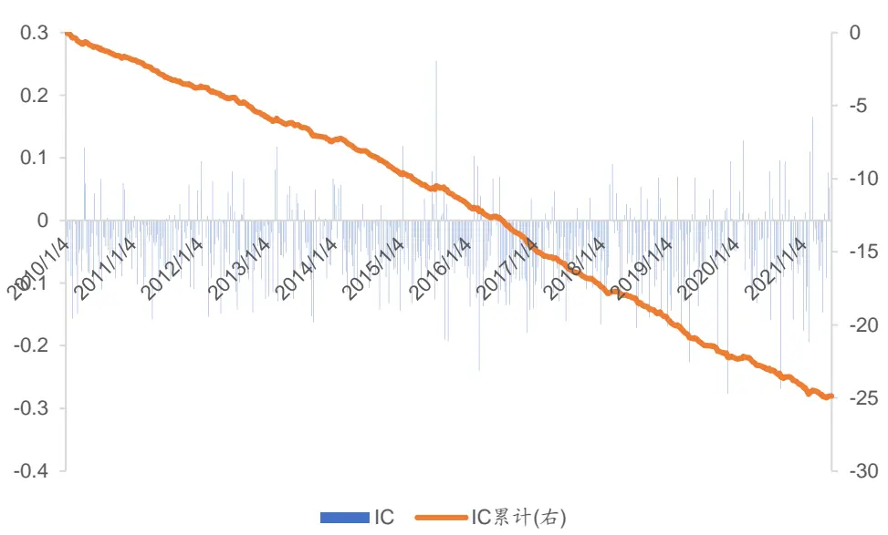
数据来源：天软科技，广发证券发展研究中心

ret_intraday因子MA5的IC均值为-4.94%，IC胜率为64.68%，年化ICIR为2.66。2017年以来，该因子收益预测能力有明显下降。

图 3：ret_intraday因子MA5的IC
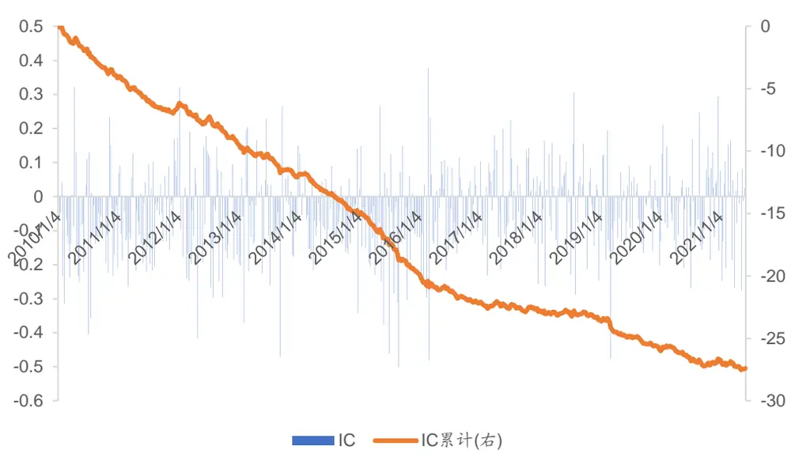
数据来源：天软科技，广发证券发展研究中心

在全市场选股，考察MA5平滑后日内价格相关因子的选股能力。在回测区间内，上述价格相关因子选股表现如下表所示。其中表现较好的因子是real_skew和ret_intraday。

但如果将股票多空收益率分解为正Alpha收益和负Alpha收益，则可以看到上述因子的正Alpha收益显著低于负Alpha收益（绝对值）。

表5：MA5平滑日内价格相关因子选股表现

| 因子名 | 多空超额收益率 | 正 Alpha | 负 Alpha | 多空最大回撤 | 多空胜率 | 年化换手率 |
| --- | --- | --- | --- | --- | --- | --- |
| real_var | 7.22% | -8.08% | -15.79% | -33.01% | 52.80% | 21.9 |
| real_skew | 29.27% | 5.87% | -18.42% | -8.49% | 72.88% | 43.0 |
| real_kurtosis | 10.92% | -2.00% | -12.02% | -19.70% | 53.35% | 23.8 |
| real_upvar | 11.44% | -5.35% | -16.33% | -23.83% | 54.97% | 22.7 |
| real_downvar | -3.12% | -8.21% | -6.98% | -62.89% | 48.28% | 21.3 |
| ratio_realupvar | 7.26% | 0.02% | -7.48% | -33.91% | 53.16% | 18.4 |
| ratio_realdownvar | 12.65% | 8.58% | -5.38% | -28.34% | 59.13% | 24.7 |
| trendratio | 26.65% | 2.68% | -20.26% | -18.08% | 59.49% | 43.7 |
| ret_intraday | 34.23% | 5.42% | -22.87% | -14.38% | 61.84% | 44.1 |
| intraday_maxdrawdown | -4.33% | -7.54% | -5.61% | -67.05% | 50.45% | 26.5 |

数据来源：天软科技，广发证券发展研究中心

将MA5平滑后高频因子用对数市值、动量、波动率和换手率等4个风格因子中 性化，中性化后因子选股能力如下表所示。中性化之后，real_skew和ret_intraday 的多空收益略有下降。

表6：MA5平滑日内价格相关因子选股表现（风格中性化）

| 因子名 | 多空超额收益率 | 正 Alpha | 负 Alpha | 多空最大回撤 | 多空胜率 | 年化换手率 |
| --- | --- | --- | --- | --- | --- | --- |
| real_var | 2.32% | -9.51% | -12.13% | -37.44% | 50.99% | 30.8 |
| real_skew | 25.87% | 3.47% | -18.02% | -6.69% | 72.69% | 42.0 |
| real_kurtosis | 17.56% | 1.25% | -14.09% | -8.56% | 63.11% | 31.5 |
| real_upvar | 9.67% | -5.32% | -14.01% | -12.08% | 56.24% | 30.8 |
| real_downvar | 6.09% | -2.55% | -8.57% | -17.30% | 55.15% | 30.9 |
| ratio_realupvar | 7.26% | -3.53% | -10.58% | -15.20% | 52.08% | 25.4 |
| ratio_realdownvar | 11.08% | 5.56% | -5.99% | -22.64% | 60.76% | 25.5 |
| trendratio | 25.73% | 4.07% | -17.81% | -11.93% | 64.01% | 43.4 |
| ret_intraday | 28.46% | 3.62% | -20.00% | -10.16% | 64.20% | 42.5 |
| intraday_maxdrawdown | 19.38% | 1.90% | -15.13% | -15.01% | 61.48% | 40.0 |

数据来源：天软科技，广发证券发展研究中心

分别在全市场和中证500指数成分股内进行因子选股测试。全市场选股时，real_skew因子MA5的多空收益率为29.27%，多空胜率为72.88%，多空收益最大回撤为-8.49%，多头年换手率为43.0倍。MA5平滑后因子表现显著优于原因子。

中证500指数成分股内选股时，real_skew因子MA5的多空收益率为24.69%，多空胜率为65.82%，多空收益最大回撤为-14.08%，多头年换手率为41.6倍。

图 4：real_skew因子多空收益走势
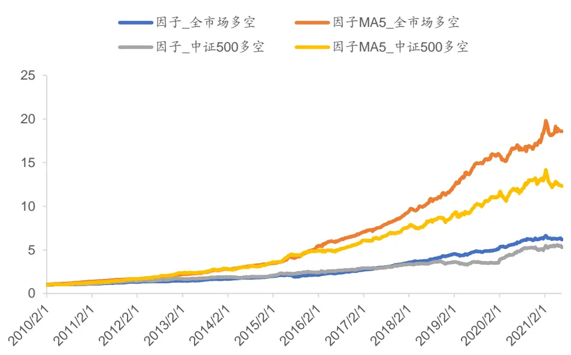
数据来源：天软科技，广发证券发展研究中心

全市场选股时，ret_intraday因子MA5的多空收益率为34.23%，多空胜率为61.84%，多空收益最大回撤为-14.38%，多头年换手率为44.1倍。MA5平滑后因子表现优于原因子。

中证500指数成分股内选股时，ret_intraday因子MA5的多空收益率为19.70%，多空胜率为58.59%，多空收益最大回撤为-24.97%，多头年换手率为

42.7倍。

图 5：ret_intraday因子多空收益走势
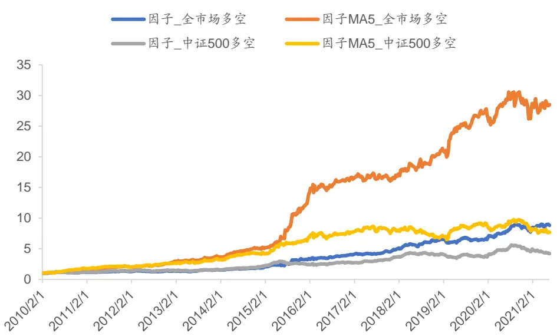
数据来源：天软科技，广发证券发展研究中心

## 四、日内价量相关因子

成交量也是日内行情信息的重要组成部分。一方面，成交量的分布可以反映投资者的行为特征，另一方面，成交量与价格或者价格走势的关系可以确认价格形态的信息。

将每天的4个小时交易时间按照时间平均分为8段，根据每段的成交量占全天成交量之比，构建如下因子：

表7：成交量分布因子

| 因子名 | 因子描述 |
| --- | --- |
| ratio_volumeH1 | 早盘成交量占比：开盘后第1个半小时成交量占全天成交量之比 |
| ratio_volumeH2 | 成交量占比H2：开盘后第2个半小时成交量占全天成交量之比 |
| ratio_volumeH3 | 成交量占比H3：开盘后第3个半小时成交量占全天成交量之比 |
| ratio_volumeH4 | 成交量占比H4：开盘后第4个半小时成交量占全天成交量之比 |
| ratio_volumeH5 | 成交量占比H5：开盘后第5个半小时成交量占全天成交量之比 |
| ratio_volumeH6 | 成交量占比H6：开盘后第6个半小时成交量占全天成交量之比 |
| ratio_volumeH7 | 成交量占比H7：开盘后第7个半小时成交量占全天成交量之比 |
| ratio_volumeH8 | 尾盘成交量占比：开盘后第8个半小时成交量占全天成交量之比 |

数据来源：广发证券发展研究中心

考虑到价格和成交量的相互关系，可以构建以下因子：

表8：价量相关因子

| 因子名 | 因子描述 |
| --- | --- |
| corr_VP | 价量相关性，分钟成交量与价格相关性 |
| corr_VR | 收益率与量相关性，分钟成交量与收益率相关性 |
| corr_VRlag | 量与滞后收益率相关性，分钟成交量与上一时刻收益率相关性 |
| corr_VRlead | 量与超前收益率相关性，分钟成交量与下一时刻收益率相关性 |
| Amihud_illiq | Amihud 非流动性因子 |

数据来源：广发证券发展研究中心

其中，价量相关性是指价格序列和成交量序列的相关性，记股票日内分钟频率下的成交量序列为 $\big\{v_{t,D,i}\big\},t=1,2,3,\cdots,T$ ，则该因子计算方法为

$$
corr\_VP_{D,i}=corr(v_{t,D,i},p_{t,D,i})
$$

收益率与量的相关性为

$$
\begin{array}{c}{{corr\_VR_{D,i}=corr(v_{t,D,i},r_{t,D,i})}}\\{{{}}}\\{{corr\_VRlag_{D,i}=corr(v_{t,D,i},r_{t-1,D,i})}}\\{{{}}}\\{{{}}}\\{{corr\_VRlead_{D,i}=corr(v_{t,D,i},r_{t+1,D,i})}}\end{array}
$$

其中， $corr\_VRlag_{D,i}$ 是指成交量与上一个时刻收益率（滞后收益率）的相关性， $corr\_VRlead_{D,i}$ 是指成交量与下一个时刻（超前收益率）的相关性，上述相关性因子的取值范围为[−1,1]。

Amihud非流动性因子是Amihud在2002年提出了衡量流动性的因子，考虑单位成交额驱动下，股价的变化幅度。因子值越大，说明股票的价格越容易被交易行为所影响（即流动性越低）。常见的Amihud非流动性因子是按照日频构建的，本报告在分钟频率下构建类似的因子，

$$
Amihud\_illiq_{D,i}=\frac{1}{T-1}{\sum_{t=2}^{T}}\frac{\left|r_{t,D,i}\right|}{p_{t,D,i}v_{t,D,i}}
$$

该因子是指在分钟频率下，单位成交额驱动下，股价的变化幅度。Amihud非流动性因子取值非负。

考察日内价量相关性因子与风格因子的相关性。在回测区间内，上述价量相关因子与风格因子的相关性如下表所示。

表9：日内价量相关因子与风格因子相关性

| 因子名 | 对数市值 | 动量 | 波动率 | 月换手率 |
| --- | --- | --- | --- | --- |
| ratio_volumeH1 | -0.18% | 9.13% | 19.88% | 20.75% |
| ratio_volumeH2 | 1.78% | 0.60% | 4.69% | 4.61% |
| ratio_volumeH3 | 3.48% | -3.08% | -2.76% | -2.59% |
| ratio_volumeH4 | 4.95% | -5.27% | -6.91% | -6.76% |
| ratio_volumeH5 | 6.74% | -5.88% | -9.72% | -11.50% |
| ratio_volumeH6 | 3.83% | -7.37% | -7.83% | -8.80% |
| ratio_volumeH7 | 2.63% | -7.94% | -8.94% | -9.07% |
| ratio_volumeH8 | -9.07% | -5.62% | -4.05% | -0.06% |
| corr_VP | 2.28% | 11.70% | 1.57% | 3.86% |
| corr_VR | 3.79% | 13.64% | -1.12% | -1.22% |
| corr_VRlag | 2.86% | 13.57% | 2.72% | 2.72% |
| corr_VRlead | 0.06% | 0.00% | -2.57% | -3.36% |
| Amihud_illiq | -50.24% | -15.70% | -27.48% | -32.13% |

数据来源：天软科技，广发证券发展研究中心

从相关性数据来看，大部分价量相关性因子与上述低频风格因子的相关性较低。只有Amihud非流动性因子展示出了较强的风格相关性：该因子值较大的股票一般市值较小、换手率和波动率较低。

日内价量相关因子以及平滑后的因子的IC如下表所示。按照5日窗口平滑的因子对未来5天的收益预测能力一般强于原始的因子。从原因子和因子MA5的ICIR来看，预测能力较强的价量相关因子是ratio_volumeH4、corr_VP、corr_VRlag、Amihud_illiq。

表10：日内价量相关因子IC

| 是否平滑 | 原因子 |  | 因子 MA5 平滑 |  |  |
| --- | --- | --- | --- | --- | --- |
| 因子名 | IC 均值 | IC 标准差 | 年化 ICIR | IC 均值 | IC 标准差 年化 ICIR |
| ratio_volumeH1 | -2.06% | 7.19% | 2.03 | -3.78% 8.86% | 3.02 |
| ratio_volumeH2 | 1.12% | 5.80% | 1.37 | 1.12% 6.26% | 1.27 |
| ratio_volumeH3 | 2.56% | 5.60% | 3.24 | 3.09% 5.46% | 4.01 |
| ratio_volumeH4 | 3.25% | 5.56% | 4.13 | 3.73% 5.96% | 4.42 |
| ratio_volumeH5 | 2.96% | 5.68% | 3.69 | 3.49% 6.41% | 3.85 |
| ratio_volumeH6 | 2.16% | 5.24% | 2.92 | 2.79% 5.65% | 3.49 |
| ratio_volumeH7 | 1.32% | 5.67% | 1.65 | 2.18% 6.14% | 2.51 |
| ratio_volumeH8 | -2.19% | 6.38% | 2.43 | -2.36% 7.88% | 2.11 |
| corr_VP | -5.49% | 8.31% | 4.67 | -6.15% 9.17% | 4.74 |
| corr_VR | -3.05% | 9.11% | 2.37 | -4.02% 10.30% | 2.76 |
| corr_VRlag | -3.80% | 9.14% | 2.94 | -5.46% 10.27% | 3.76 |
| corr_VRlead | 0.36% | 4.50% | 0.56 | 0.68% 4.88% | 0.98 |
| Amihud_illiq | 7.05% | 12.63% | 3.95 | 6.57% | 12.64% 3.68 |

数据来源：天软科技，广发证券发展研究中心
识别风险，发现价值

在回测期内，MA5平滑后ratio_volumeH4因子的IC均值为3.73%，IC胜率为78.20%，年化ICIR为4.42。

图 6：ratio_volumeH4因子MA5的IC
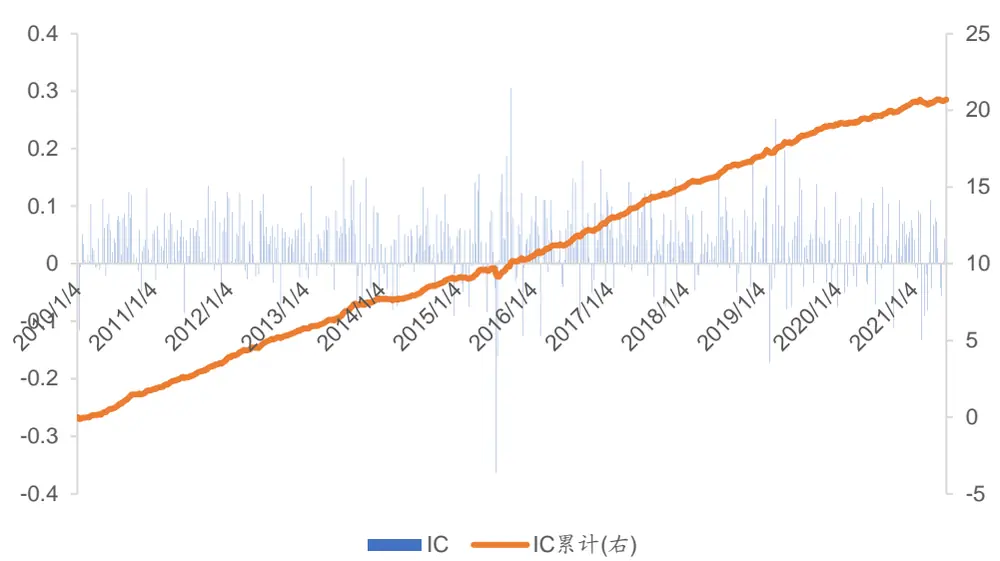
数据来源：天软科技，广发证券发展研究中心

corr_VP因子MA5的IC均值为-6.15%，IC胜率为76.58%，年化ICIR为4.74。从累计IC走势来看，该因子近两年收益预测能力有所下降。

图 7：corr_VP因子MA5的IC
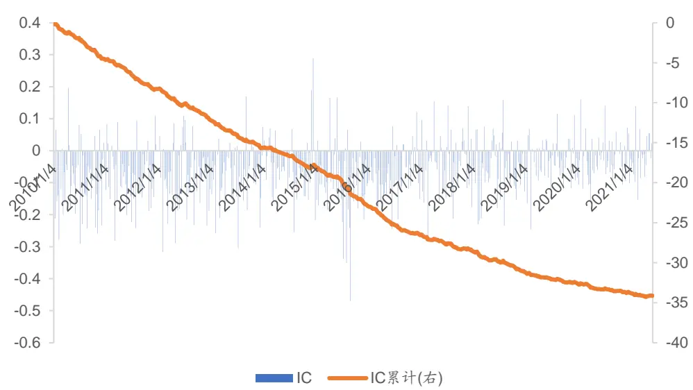
数据来源：天软科技，广发证券发展研究中心

corr_VRlag因子MA5的IC均值为-5.46%，IC胜率为69.91%，年化ICIR为3.76。从累计IC走势来看，该因子近两年收益预测能力略有下降。

图 8：corr_VRlag因子MA5的IC
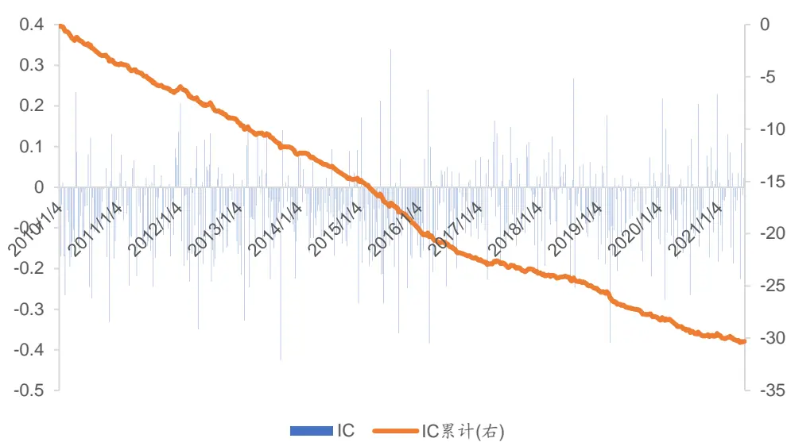
数据来源：天软科技，广发证券发展研究中心

Amihud_illiq因子MA5的IC均值为6.57%，IC胜率为72.61%，年化ICIR为3.68。从累计IC走势来看，该因子2017年以来收益预测能力略有下降。

图 9：Amihud_illiq因子MA5的IC
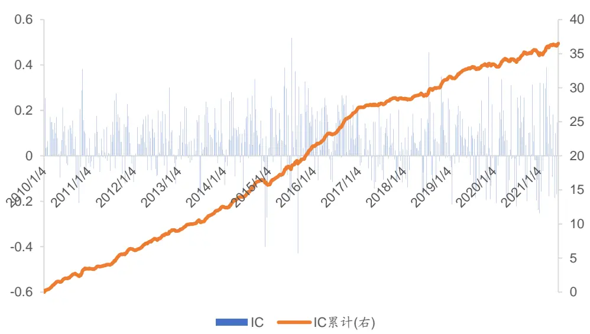
数据来源：天软科技，广发证券发展研究中心

在全市场选股，考察MA5平滑后价量相关因子的选股能力。在回测区间内，上述价量相关因子选股表现如下表所示。其中表现较好的因子是ratio_volumeH8、corr_VP、corr_VRlag和Amihud_illiq。

但如果将股票多空收益率分解为正Alpha收益和负Alpha收益，则可以看到除了

Amihud_illiq，其他上述因子的负Alpha收益（绝对值）显著超过正Alpha收益。
Amihud_illiq因子的正Alpha和负Alpha收益基本接近。

表11：MA5平滑价量相关因子选股表现

| 因子名 | 多空超额收益率 | 正 Alpha | 负 Alpha | 多空最大回撤 | 多空胜率 | 年化换手率 |
| --- | --- | --- | --- | --- | --- | --- |
| ratio_volumeH1 | 9.26% | -2.25% | -11.40% | -24.81% | 59.67% | 37.0 |
| ratio_volumeH2 | 15.50% | 2.91% | -11.26% | -8.96% | 61.84% | 43.0 |
| ratio_volumeH3 | 23.77% | 5.31% | -15.21% | -5.42% | 70.52% | 43.2 |
| ratio_volumeH4 | 23.28% | 5.10% | -15.24% | -23.67% | 71.61% | 42.9 |
| ratio_volumeH5 | 22.51% | 3.12% | -16.17% | -8.80% | 66.37% | 42.3 |
| ratio_volumeH6 | 11.72% | -0.86% | -11.66% | -7.09% | 60.58% | 42.6 |
| ratio_volumeH7 | 3.93% | -3.34% | -7.47% | -15.33% | 53.89% | 42.1 |
| ratio_volumeH8 | 33.91% | 10.96% | -17.71% | -11.62% | 71.07% | 39.4 |
| corr_VP | 47.57% | 10.17% | -26.09% | -8.88% | 73.42% | 43.0 |
| corr_VR | 27.10% | 3.15% | -19.65% | -14.07% | 64.56% | 42.4 |
| corr_VRlag | 31.87% | 1.78% | -23.76% | -11.40% | 64.38% | 43.9 |
| corr_VRlead | 5.09% | -0.48% | -5.55% | -12.06% | 56.96% | 42.7 |
| Amihud_illiq | 36.22% | 16.22% | -16.63% | -23.80% | 65.64% | 23.4 |

数据来源：天软科技，广发证券发展研究中心

将MA5高频因子用低频风格因子中性化，中性化后因子选股能力如下表所示。 中性化对ratio_volumeH8、corr_VP的选股能力影响不大。corr_VRlag中性化之后 选股能力略有下降，而原始Amihud_illiq因子和风格因子相关性较高，中性化之后 收益率下降非常明显。

表12：MA5平滑价量相关因子选股表现（风格中性化）

| 因子名 | 多空超额收益率 | 正Alpha | 负 Alpha | 多空最大回撤 | 多空胜率 | 年化换手率 |
| --- | --- | --- | --- | --- | --- | --- |
| ratio_volumeH1 | -1.23% | -8.93% | -8.22% | -27.21% | 49.73% | 37.9 |
| ratio_volumeH2 | 18.12% | 3.76% | -12.37% | -6.42% | 66.73% | 43.1 |
| ratio_volumeH3 | 19.22% | 4.51% | -12.55% | -7.08% | 69.44% | 43.2 |
| ratio_volumeH4 | 15.51% | 2.95% | -11.25% | -25.21% | 67.45% | 43.1 |
| ratio_volumeH5 | 13.86% | 1.80% | -10.76% | -5.92% | 64.74% | 42.7 |
| ratio_volumeH6 | 6.25% | -1.75% | -7.79% | -6.57% | 57.50% | 42.9 |
| ratio_volumeH7 | -0.91% | -5.21% | -4.71% | -22.92% | 50.63% | 42.4 |
| ratio_volumeH8 | 34.42% | 9.53% | -18.89% | -16.66% | 76.31% | 40.4 |
| corr_VP | 48.97% | 11.40% | -25.86% | -6.87% | 79.93% | 42.8 |
| corr_VR | 21.74% | 1.73% | -16.79% | -10.58% | 66.91% | 42.6 |
| corr_VRlag | 24.82% | 0.67% | -19.84% | -9.46% | 65.46% | 43.4 |
| corr_VRlead | -1.31% | -3.01% | -1.84% | -25.67% | 45.75% | 42.9 |
| Amihud_illiq | 1.30% | 0.91% | -0.78% | -35.87% | 50.45% | 25.4 |

数据来源：天软科技，广发证券发展研究中心

分别在全市场和中证500指数成分股内进行因子选股测试。全市场选股时，ratio_volumeH8因子MA5的多空收益率为33.91%，多空胜率为71.07%，多空收益最大回撤为-11.62%，多头年换手率为39.4倍。

中证500指数成分股内选股时，ratio_volumeH8因子MA5的多空收益率为30.19%，多空胜率为65.46%，多空收益最大回撤为-17.95%，多头年换手率为38.5倍。

图 10：ratio_volumeH8因子多空收益走势
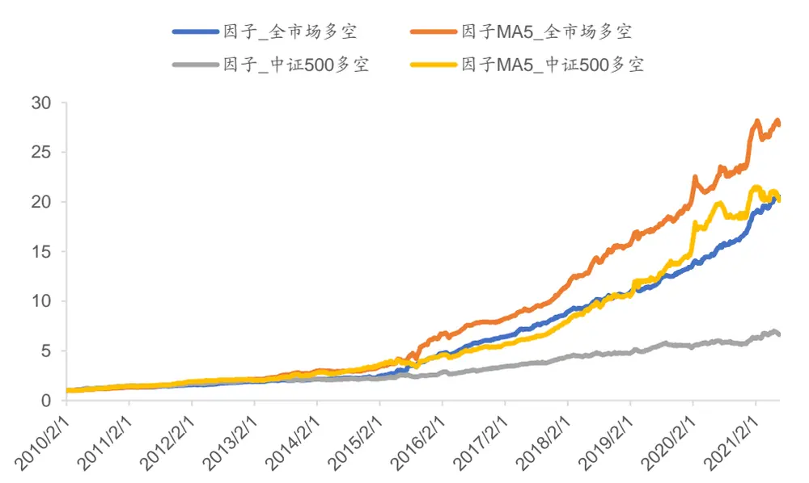
数据来源：天软科技，广发证券发展研究中心

全市场选股时，corr_VP因子MA5的多空收益率为47.57%，多空胜率为73.42%，多空收益最大回撤为-8.88%，多头年换手率为43.0倍。从多空收益来看，corr_VP因子近年来表现不佳。

中证500指数成分股内选股时，corr_VP因子MA5的多空收益率为34.51%，多空胜率为66.55%，多空收益最大回撤为-12.07%，多头年换手率为41.4倍。

图 11：corr_VP因子多空收益走势
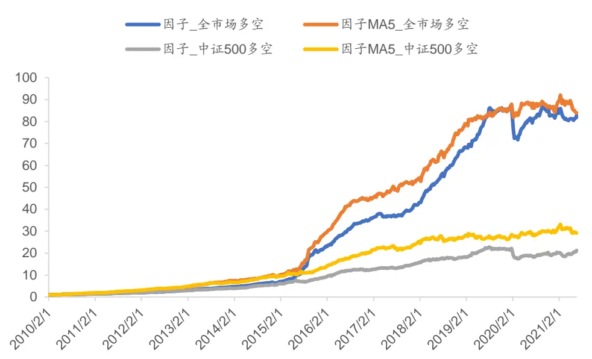
数据来源：天软科技，广发证券发展研究中心

全市场选股时，corr_VRlag因子MA5的多空收益率为31.87%，多空胜率为64.38%，多空收益最大回撤为-11.40%，多头年换手率为43.9倍。

中证500指数成分股内选股时，corr_VRlag因子MA5的多空收益率为20.61%，多空胜率为60.40%，多空收益最大回撤为-18.06%，多头年换手率为42.4倍。

图 12：corr_VRlag因子多空收益走势
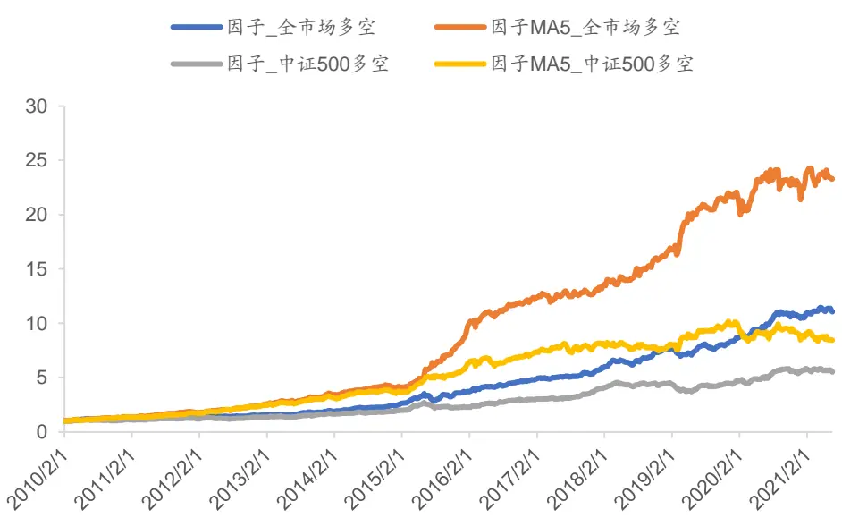
数据来源：天软科技，广发证券发展研究中心

全市场选股时，Amihud_illiq因子MA5的多空收益率为36.22%，多空胜率为65.64%，多空收益最大回撤为-23.80%，多头年换手率为23.4倍。从多空表现来看，Amihud_illiq因子今年来表现有明显下滑。

中证500指数成分股内选股时，Amihud_illiq因子MA5的多空收益率为

图 13：Amihud_illiq因子多空收益走势
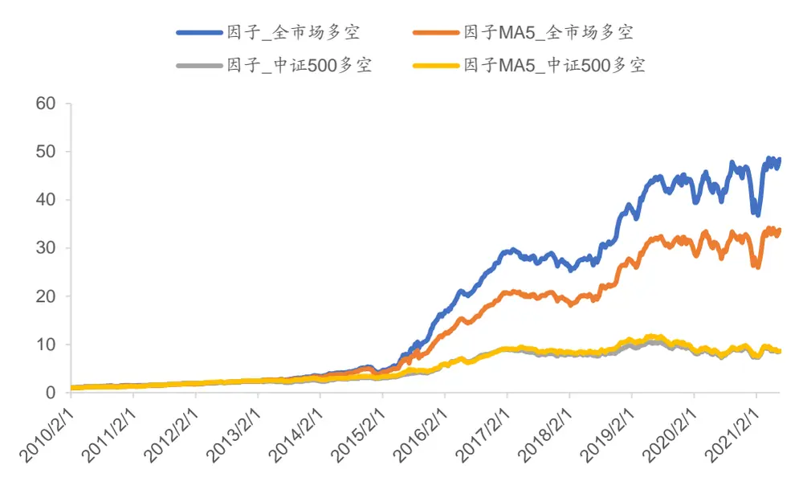
数据来源：天软科技，广发证券发展研究中心

## 五、盘前信息因子

盘前信息主要包括隔夜收益率（开盘价相对前收盘的收益率）和开盘前集合竞价信息。目前，A股证券交易所在每个交易日的9:15至9:25为开盘集合竞价时间。开盘集合竞价又分为两个阶段，其中第一阶段是9:15至9:20，该阶段允许撤销已经提交的订单；第二阶段是9:20至9:25，该阶段不允许撤销已经提交的订单。集合竞价信息反映出资金的试盘行为和多空双方的博弈。本报告考察隔夜收益率和集合竞价的相关因子如下所示。

表13：盘前信息因子列表

| 因子名 | 因子描述 |
| --- | --- |
| ret_overnight | 隔夜收益率，开盘价相对前收盘价的收益率 |
| ret_open2AH1 | 开盘价相对第一阶段集合竞价最高价的收益率 |
| ret_open2AL1 | 开盘价相对第一阶段集合竞价最低价的收益率 |
| ret_open2AH2 | 开盘价相对第二阶段集合竞价最高价的收益率 |
| ret_open2AL2 | 开盘价相对第二阶段集合竞价最高价的收益率 |
| diverge_A1 | 第一阶段集合竞价振幅 |
| diverge_A2 | 第二阶段集合竞价振幅 |

数据来源：广发证券发展研究中心

考察日内价量相关性因子与风格因子的相关性。在回测区间内，上述盘前信息因子与风格因子的相关性如下表所示。

表14：盘前信息因子与风格因子相关性

| 因子名 | 对数市值 | 动量 | 波动率 | 月换手率 |
| --- | --- | --- | --- | --- |
| ret_overnight | 3.55% | -10.45% | -10.37% | -11.43% |
| ret_open2AH1 | 8.55% | -9.18% | -15.50% | -16.68% |
| ret_open2AL1 | -2.34% | -5.13% | -3.08% | -3.73% |
| ret_open2AH2 | 12.03% | -8.32% | -16.36% | -14.42% |
| ret_open2AL2 | -10.35% | 4.23% | 7.67% | 4.73% |
| diverge_A1 | -7.81% | 5.64% | 12.63% | 13.40% |
| diverge_A2 | -19.47% | 10.59% | 19.75% | 14.96% |

数据来源：天软科技，广发证券发展研究中心

从相关性数据来看，大部分盘前信息因子与上述低频风格因子的相关性较低。

盘前信息因子以及平滑后的因子的IC如下表所示。与日内价格因子和价量相关因子不同的是，MA5平滑并不能提升大部分盘前信息因子的预测能力。从原因子和因子MA5的ICIR来看，预测能力较强的价量相关因子是ret_overnight（原始日频因子）和ret_open2AH1和ret_open2AL1。

表15：盘前信息因子IC

| 是否平滑 | 原因子 |  | 因子 MA5 平滑 |  |  |
| --- | --- | --- | --- | --- | --- |
| 因子名 | IC 均值 IC 标准差 | 年化ICIR | IC 均值 | IC 标准差 | 年化ICIR |
| ret_overnight | -4.41% | 7.14% 4.36 | -1.30% | 7.60% | 1.21 |
| ret_open2AH1 | 3.27% | 5.55% | 4.17 4.35% | 7.74% | 3.97 |
| ret_open2AL1 | 2.28% | 4.07% | 3.97 2.51% | 4.26% | 4.17 |
| ret_open2AH2 | 0.35% | 5.78% | 0.43 2.80% | 10.12% | 1.95 |
| ret_open2AL2 | -1.12% | 4.23% | 1.87 0.00% | 7.63% | 0.00 |
| diverge_A1 | -1.95% | 4.98% | 2.77 -2.49% | 7.71% | 2.29 |
| diverge_A2 | -1.33% | 6.82% | 1.38 | -2.46% 11.24% | 1.55 |

数据来源：天软科技，广发证券发展研究中心

在回测期内，原始日频ret_overnight因子的IC均值为-4.41%，IC胜率为78.42%，年化ICIR为4.36。

图 14：ret_overnight因子的IC
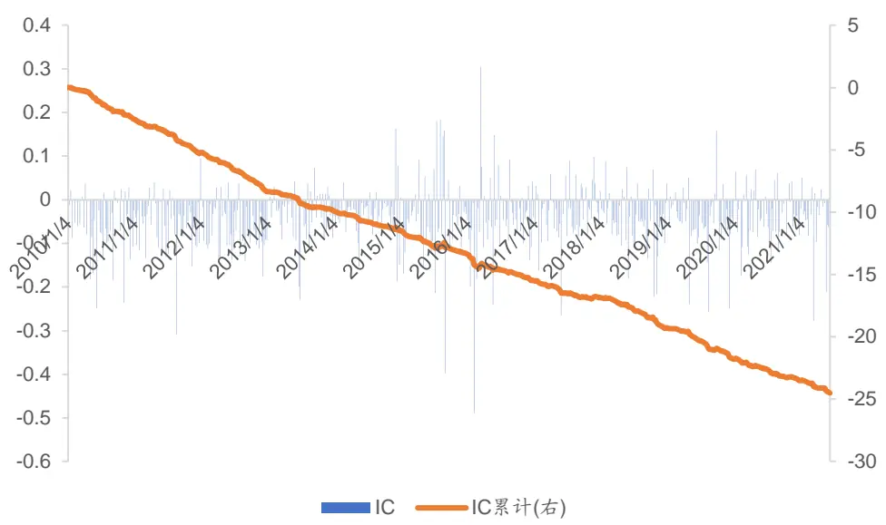
数据来源：天软科技，广发证券发展研究中心

ret_open2AH1因子MA5的IC均值为4.35%，IC胜率为72.97%，年化ICIR为3.97。

图 15：ret_open2AH1因子MA5的IC
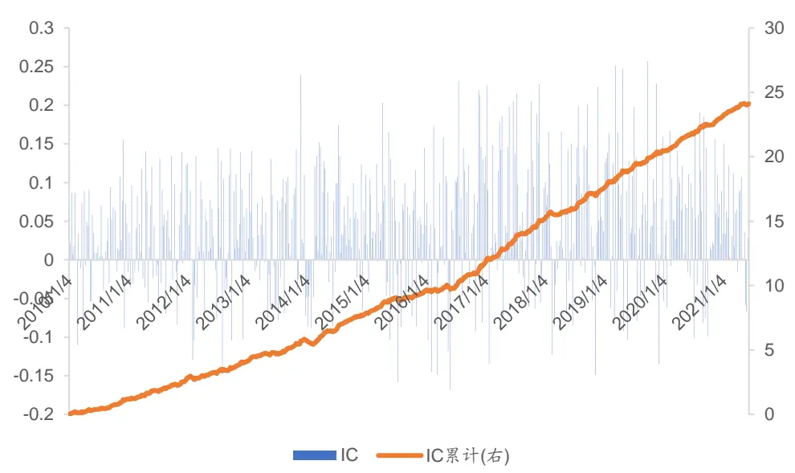
数据来源：天软科技，广发证券发展研究中心

ret_open2AL1因子MA5的IC均值为2.51%，IC胜率为74.41%，年化ICIR为4.17。

图 16：ret_open2AL1因子MA5的IC
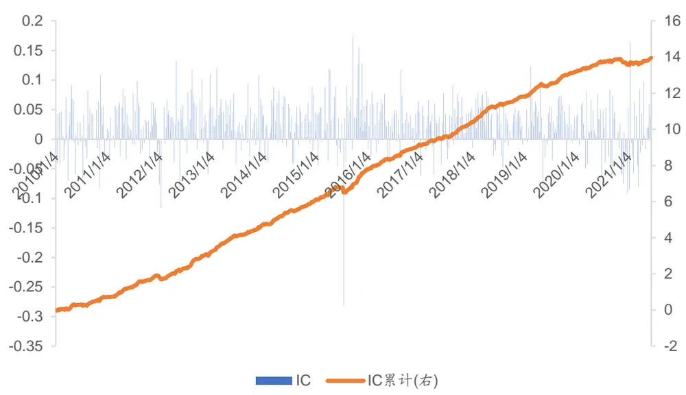
数据来源：天软科技，广发证券发展研究中心

在全市场选股，考察MA5平滑后盘前信息因子的选股能力。在回测区间内，上述因子选股表现如下表所示。其中表现较好的因子是ret_open2AH1和ret_open2AL1，而且多空收益的正Alpha收益略低于负Alpha收益（绝对值）。经过MA5平滑后，ret_overnight的选股能力较差。

表16：MA5平滑盘前信息因子选股表现

| 因子名 | 多空超额收益率 | 正 Alpha | 负 Alpha | 多空最大回撤 | 多空胜率 | 年化换手率 |
| --- | --- | --- | --- | --- | --- | --- |
| ret_overnight | -0.27% | -9.43% | -9.82% | -43.07% | 48.46% | 39.0 |
| ret_open2AH1 | 21.61% | 8.23% | -11.52% | -7.33% | 63.29% | 41.0 |
| ret_open2AL1 | 19.89% | 6.73% | -11.23% | -5.07% | 70.16% | 33.0 |
| ret_open2AH2 | 4.38% | -3.09% | -8.06% | -29.40% | 53.16% | 39.4 |
| ret_open2AL2 | 12.95% | 3.91% | -8.42% | -23.39% | 61.30% | 37.6 |
| diverge_A1 | 4.75% | 2.20% | -2.89% | -14.14% | 52.26% | 38.5 |
| diverge_A2 | -2.28% | -6.33% | -5.05% | -46.32% | 47.38% | 34.2 |

数据来源：天软科技，广发证券发展研究中心

将高频因子用低频风格因子中性化，中性化后因子选股能力如下表所示。中性化后，盘前信息因子的选股能力没有明显下降，甚至部分因子选股能力略有提升。

表17：MA5平滑盘前信息因子选股表现（风格中性化）

| 因子名 | 多空超额收益率 | 正Alpha | 负 Alpha | 多空最大回撤 | 多空胜率 | 年化换手率 |
| --- | --- | --- | --- | --- | --- | --- |
| ret_overnight | 14.15% | -2.75% | -15.22% | -21.00% | 60.04% | 39.7 |
| ret_open2AH1 | 25.86% | 12.68% | -10.65% | -3.80% | 74.32% | 38.1 |
| ret_open2AL1 | 19.28% | 6.98% | -10.52% | -3.78% | 71.43% | 33.2 |
| ret_open2AH2 | 21.29% | 10.86% | -8.81% | -4.73% | 69.98% | 39.5 |
| ret_open2AL2 | 3.78% | 4.24% | 0.30% | -14.89% | 54.43% | 40.0 |
| diverge_A1 | 5.26% | 2.82% | -2.43% | -16.05% | 55.88% | 35.4 |
| diverge_A2 | 15.84% | 7.10% | -7.88% | -17.66% | 67.09% | 37.0 |

数据来源：天软科技，广发证券发展研究中心

分别在全市场和中证500指数成分股内进行因子选股测试。全市场选股时，ret_open2AH1因子MA5的多空收益率为21.61%，多空胜率为63.29%，多空收益最大回撤为-7.33%，多头年换手率为41.0倍。

中证500指数成分股内选股时，ret_open2AH1因子MA5的多空收益率为14.67%，多空胜率为58.41%，多空收益最大回撤为-13.94%，多头年换手率为40.5倍。

图 17：ret_open2AH1因子多空收益走势
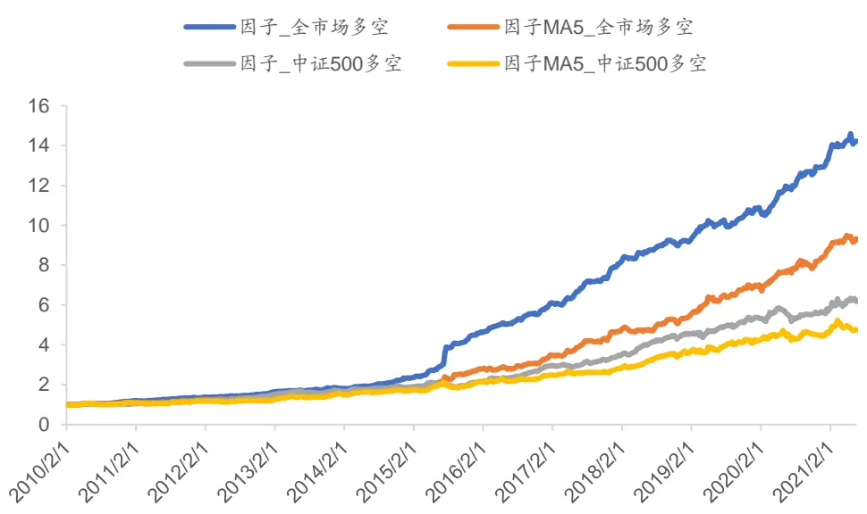
数据来源：天软科技，广发证券发展研究中心

全市场选股时，ret_open2AL1因子MA5的多空收益率为19.89%，多空胜率为70.16%，多空收益最大回撤为-5.07%，多头年换手率为33.0倍。

中证500指数成分股内选股时，ret_open2AL1因子MA5的多空收益率为17.72%，多空胜率为63.11%，多空收益最大回撤为-10.99%，多头年换手率为32.3倍。

图 18：ret_open2AL1因子多空收益走势
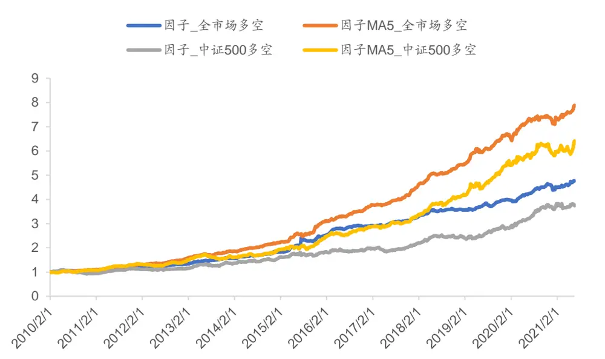
数据来源：天软科技，广发证券发展研究中心

## 六、特定时段采样因子

本报告将部分时段的数据进行重点分析，产生衍生因子。一般来说，开盘后半小时（9点半至10点）和收盘前半小时（14点半至收盘）的股票成交活跃，多空博弈激烈，蕴含的信息相对较多。本报告针对收盘前半小时的价量信息构建了如下因子。

表18：收盘前半小时因子列表

| 因子名 | 因子描述 |
| --- | --- |
| ret_H8 | 收盘前半小时的收益率 |
| corr_VPH8 | 收盘前半小时的 corr_VP |
| corr_VRH8 | 收盘前半小时的 corr_VR |
| corr_VRleadH8 | 收盘前半小时的 corr_VRlead |
| corr_VRlagH8 | 收盘前半小时的 corr_VRlag |
| real_varH8 | 收盘前半小时的 real_var |
| real_kurtosisH8 | 收盘前半小时的real_kurtosis |
| real_skewH8 | 收盘前半小时的 real_skew |

数据来源：广发证券发展研究中心

在不同的成交中，大单成交与主力资金关联较大，蕴含的信息可能更多。本报告将个股在每个交易日的分钟成交量时间序列按照成交量大小排序，将分钟成交量排名前1/3的成交量定义为“大成交量”。针对大成交量对应的时刻的股价信息，可以构建大成交量相关因子。

表19：大成交量相关因子列表

| 因子名 | 因子描述 |
| --- | --- |
| real_varlarge | 大成交量对应的收益率方差 |
| real_kurtosislarge | 大成交量对应的收益率峰度 |
| real_skewlarge | 大成交量对应的收益率偏度 |
| ratio_realvarlarge | 大成交量方差占比，real_varlarge/real_var |
| corr_VPlarge | 大成交量对应的 corr_VP |
| corr_VRlarge | 大成交量对应的 corr_VR |
| corr_VRleadlarge | 大成交量对应的 corr_VRlead |
| corr_VRlaglarge | 大成交量对应的 corr_VRlag |

数据来源：广发证券发展研究中心

考察特定时段采样因子与风格因子的相关性。在回测区间内，上述因子与风格因子的相关性如下表所示。

表20：特定时段采样因子与风格因子相关性

| 因子名 | 对数市值 | 动量 | 波动率 | 月换手率 |
| --- | --- | --- | --- | --- |
| ret_H8 | 0.19% | 3.95% | -5.20% | -4.98% |
| corr_VPH8 | -0.14% | 6.55% | -4.17% | -3.67% |
| corr_VRH8 | 1.05% | 8.28% | -0.89% | -0.37% |
| corr_VRleadH8 | 0.77% | 0.20% | 0.89% | 1.05% |
| corr_VRlagH8 | 0.88% | 4.61% | -1.09% | -1.20% |
| real_varH8 | -8.18% | 19.52% | 19.75% | 10.40% |
| real_kurtosisH8 | -16.82% | 3.39% | 5.61% | 2.39% |
| real_skewH8 | -2.07% | 3.62% | 1.54% | 1.96% |
| real_varlarge | -14.15% | 29.59% | 42.76% | 30.36% |
| real_kurtosislarge | -19.40% | -0.46% | 5.90% | 4.43% |
| real_skewlarge | -1.89% | 5.85% | 4.58% | 6.23% |
| ratio_realvarlarge | -10.22% | 13.62% | 20.77% | 21.01% |
| corr_VPlarge | 1.40% | 12.35% | 2.72% | 4.91% |
| corr_VRlarge | 2.77% | 11.98% | -0.26% | 0.47% |
| corr_VRleadlarge | -0.84% | -0.44% | -2.88% | -3.51% |
| corr_VRlaglarge | 2.20% | 12.04% | 3.30% | 4.16% |

数据来源：天软科技，广发证券发展研究中心

从相关性数据来看，大部分特定时段采样因子与低频风格因子的相关性较低。只有real_varH8、real_varlarge等已实现方差因子与波动率因子有较强的正相关性。

特定时段采样因子以及平滑后的因子的IC如下表所示。一般而言，按照5日窗口平滑的因子对未来5天的收益预测能力强于原始的因子。从原因子和因子MA5的ICIR来看，预测能力较强的因子是ret_H8、real_skewlarge、corr_VPlarge 和corr_VRlaglarge。

表21：特定时段采样因子IC

| 是否平滑 |  | 原因子 | 因子 MA5 平滑 |  |  |
| --- | --- | --- | --- | --- | --- |
| 因子名 | IC 均值 | IC 标准差 | 年化 ICIR | IC 均值 IC 标准差 | 年化 ICIR |
| ret_H8 | -3.44% | 7.16% | 3.40 | -4.35% 7.67% | 4.01 |
| corr_VPH8 | -3.14% | 6.59% | 3.36 | -2.88% 7.00% | 2.90 |
| corr_VRH8 | -2.45% | 5.16% | 3.36 | -2.62% 5.98% | 3.10 |
| corr_VRleadH8 | -0.13% | 2.75% | 0.34 | -0.52% 2.99% | 1.22 |
| corr_VRlagH8 | -2.12% | 4.75% | 3.16 | -2.64% 5.30% | 3.52 |
| real_varH8 | -2.17% | 7.69% | 2.00 | -2.78% 9.43% | 2.09 |
| real_kurtosisH8 | 0.47% | 7.10% | 0.47 | 0.63% 10.28% | 0.43 |
| real_skewH8 | -1.67% | 3.18% | 3.71 | -2.18% 3.90% | 3.96 |
| real_varlarge | -3.87% | 11.01% | 2.48 | -4.55% 12.69% | 2.54 |
| real_kurtosislarge | -0.72% | 6.34% | 0.80 | -1.26% 8.22% | 1.08 |
| real_skewlarge | -2.61% | 4.58% | 4.03 | -4.01% 5.21% | 5.44 |
| ratio_realvarlarge | -3.63% | 7.36% | 3.49 | -4.78% 9.18% | 3.68 |
| corr_VPlarge | -5.34% | 7.20% | 5.25 | -6.42% 8.44% | 5.38 |
| corr_VRlarge | -3.27% | 7.88% | 2.94 | -3.89% 8.86% | 3.10 |
| corr_VRleadlarge | 0.63% | 3.58% | 1.25 | 1.31% 4.02% | 2.31 |
| corr_VRlaglarge | -3.84% | 7.47% | 3.64 | -5.03% 8.80% | 4.04 |

数据来源：天软科技，广发证券发展研究中心

在回测期内，ret_H8因子MA5的IC均值为-4.35%，IC胜率为74.59%，年化ICIR为4.01。该因子2017年以来的收益预测能力有模型下降。

图 19：ret_H8因子MA5的IC
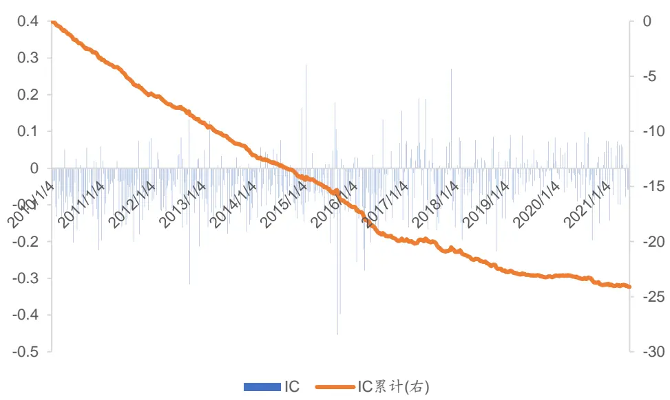
数据来源：天软科技，广发证券发展研究中心

real_skewlarge因子MA5的IC均值为-4.01%，IC胜率为80.51%，年化ICIR为5.44。

图 20：real_skewlarge因子MA5的IC
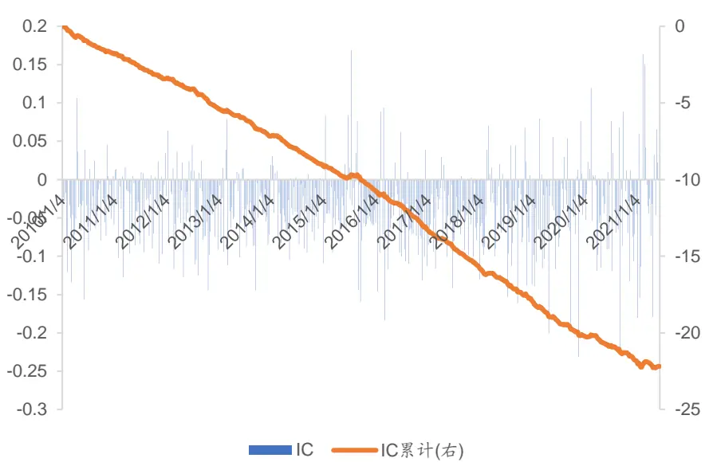
数据来源：天软科技，广发证券发展研究中心

corr_VPlarge因子MA5的IC均值为-6.42%，IC胜率为77.80%，年化ICIR为5.38。

图 21：corr_VPlarge因子MA5的IC
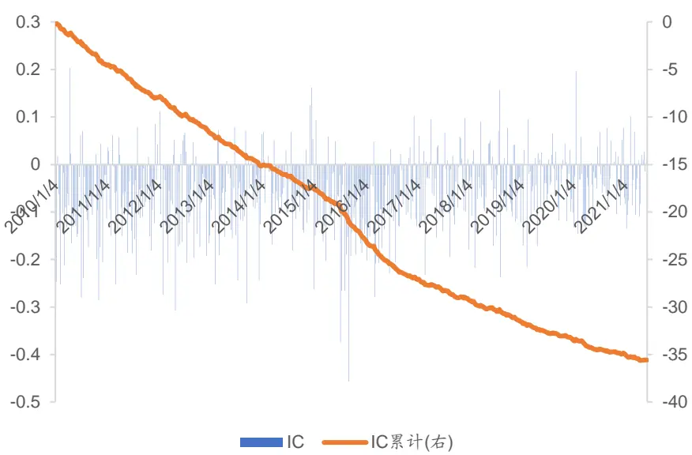
数据来源：天软科技，广发证券发展研究中心

corr_VRlaglarge因子MA5的IC均值为-5.03%，IC胜率为74.01%，年化ICIR为4.04。

图 22：corr_VRlaglarge因子MA5的IC
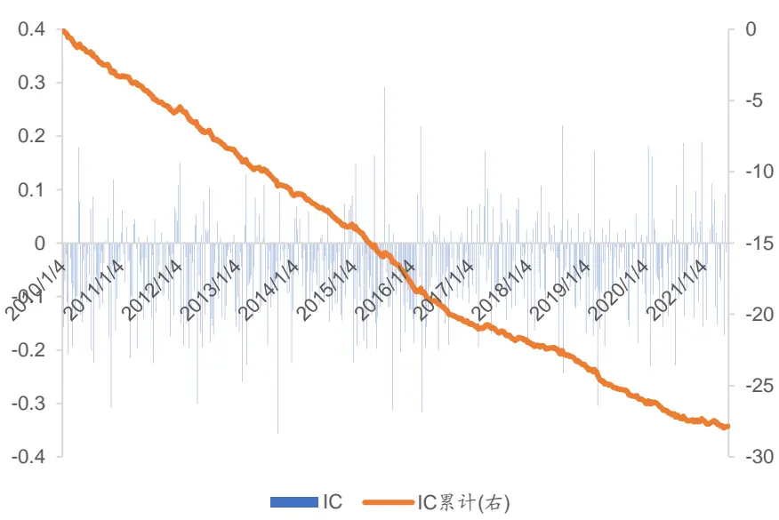
数据来源：天软科技，广发证券发展研究中心

在全市场选股，考察MA5平滑后因子的选股能力。在回测区间内，上述因子选股表现如下表所示。ret_H8、real_skewlarge、corr_VPlarge和corr_VRlaglarge等因子也具有不错的多空收益表现。从正Alpha收益和负Alpha收益的对比来看，负Alpha收益（绝对值）明显强于正Alpha收益。

表22：MA5平滑特定时段采样因子选股表现

| 因子名 | 多空超额收益率 | 正 Alpha | 负 Alpha | 多空最大回撤 | 多空胜率 | 年化换手率 |
| --- | --- | --- | --- | --- | --- | --- |
| ret_H8 | 50.04% | 11.20% | -26.38% | -6.26% | 77.03% | 41.7 |
| corr_VPH8 | 29.88% | 4.97% | -19.62% | -7.87% | 70.52% | 43.2 |
| corr_VRH8 | 22.44% | 5.71% | -14.06% | -11.32% | 66.37% | 43.2 |
| corr_VRleadH8 | 5.29% | 2.20% | -3.07% | -5.96% | 56.24% | 43.7 |
| corr_VRlagH8 | 23.94% | 5.73% | -15.00% | -7.22% | 69.62% | 44.0 |
| real_varH8 | 12.78% | -6.02% | -17.42% | -24.96% | 54.43% | 28.2 |
| real_kurtosisH8 | 0.12% | -3.67% | -4.59% | -31.70% | 53.53% | 36.8 |
| real_skewH8 | 21.06% | 6.01% | -12.62% | -4.51% | 72.15% | 43.3 |
| real_varlarge | 12.20% | -7.08% | -18.68% | -23.16% | 53.35% | 23.8 |
| real_kurtosislarge | 8.47% | -1.76% | -9.72% | -16.54% | 54.43% | 31.5 |
| real_skewlarge | 27.73% | 7.35% | -16.20% | -7.66% | 77.22% | 42.5 |
| ratio_realvarlarge | 26.41% | 2.31% | -19.62% | -12.36% | 60.94% | 25.3 |
| corr_VPlarge | 49.82% | 12.00% | -25.97% | -8.48% | 73.42% | 43.0 |
| corr_VRlarge | 25.46% | 3.71% | -17.89% | -12.90% | 65.46% | 42.7 |
| corr_VRleadlarge | 8.30% | 2.60% | -5.40% | -9.90% | 58.05% | 43.2 |
| corr_VRlaglarge | 29.28% | 3.02% | -21.06% | -10.03% | 65.64% | 43.9 |

数据来源：天软科技，广发证券发展研究中心

将高频因子用低频风格因子中性化，中性化后因子选股能力如下表所示。中性化之后，ret_H8因子选股能力基本不变，real_skewlarge、corr_VPlarge和corr_VRlaglarge因子选股能力略有下降。

表23：MA5平滑特定时段采样因子选股表现（风格中性化）

| 因子名 | 多空超额收益率 | 正 Alpha | 负 Alpha | 多空最大回撤 | 多空胜率 | 年化换手率 |
| --- | --- | --- | --- | --- | --- | --- |
| ret_H8 | 54.01% | 13.99% | -26.35% | -4.63% | 84.63% | 42.3 |
| corr_VPH8 | 34.03% | 7.85% | -19.81% | -5.64% | 79.75% | 43.5 |
| corr_VRH8 | 19.66% | 4.82% | -12.60% | -6.22% | 69.26% | 43.3 |
| corr_VRleadH8 | 2.86% | 0.96% | -1.94% | -7.11% | 52.44% | 43.7 |
| corr_VRlagH8 | 20.90% | 5.86% | -12.62% | -6.38% | 72.51% | 44.0 |
| real_varH8 | 8.50% | -6.33% | -13.95% | -23.64% | 57.50% | 33.8 |
| real_kurtosisH8 | 5.50% | -0.09% | -5.63% | -17.32% | 49.91% | 36.7 |
| real_skewH8 | 19.35% | 5.76% | -11.54% | -7.75% | 74.32% | 43.2 |
| real_varlarge | 11.19% | -6.84% | -16.68% | -12.76% | 55.52% | 31.6 |
| real_kurtosislarge | 17.79% | 4.97% | -11.03% | -6.93% | 67.09% | 35.6 |
| real_skewlarge | 23.83% | 5.91% | -14.65% | -6.95% | 75.59% | 42.5 |
| ratio_realvarlarge | 17.63% | 0.37% | -15.02% | -18.06% | 60.22% | 29.6 |
| corr_VPlarge | 43.06% | 10.39% | -23.28% | -7.15% | 79.20% | 43.0 |
| corr_VRlarge | 22.30% | 2.87% | -16.20% | -10.19% | 69.08% | 42.9 |
| corr_VRleadlarge | 2.10% | -0.33% | -2.46% | -14.90% | 54.61% | 43.3 |
| corr_VRlaglarge | 22.76% | 1.97% | -17.35% | -7.13% | 66.18% | 43.5 |

数据来源：天软科技，广发证券发展研究中心

分别在全市场和中证500指数成分股内进行因子选股测试。全市场选股时，ret_H8因子MA5的多空收益率为50.04%，多空胜率为77.03%，多空收益最大回撤为-6.26%，多头年换手率为41.7倍。

中证500指数成分股内选股时，ret_H8因子MA5的多空收益率为35.05%，多空胜率为66.91%，多空收益最大回撤为-11.20%，多头年换手率为40.4倍。

图 23：ret_H8因子多空收益走势
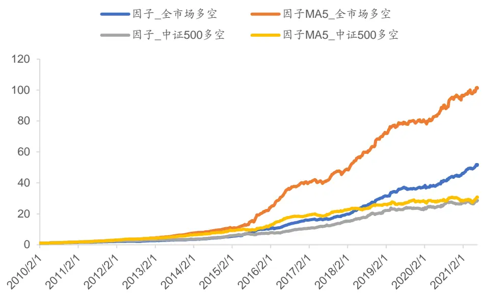
数据来源：天软科技，广发证券发展研究中心

全市场选股时，real_skewlarge因子MA5的多空收益率为27.73%，多空胜率为77.22%，多空收益最大回撤为-7.66%，多头年换手率为42.5倍。

中证500指数成分股内选股时，real_skewlarge因子MA5的多空收益率为22.60%，多空胜率为66.37%，多空收益最大回撤为-8.96%，多头年换手率为41.1倍。

图 24：real_skewlarge因子多空收益走势
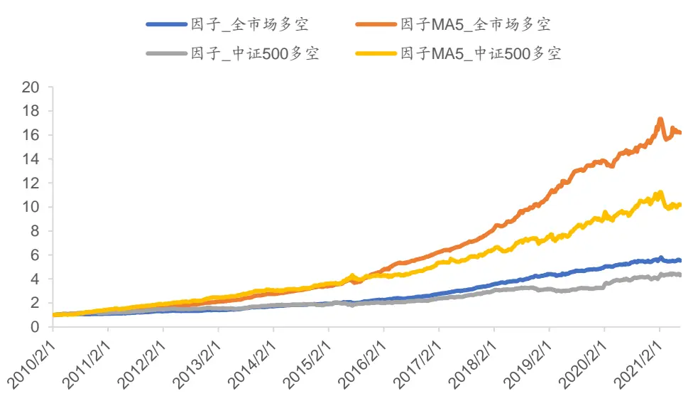
数据来源：天软科技，广发证券发展研究中心

全市场选股时，corr_VPlarge因子MA5的多空收益率为49.82%，多空胜率为73.42%，多空收益最大回撤为-8.48%，多头年换手率为43.0倍。

中证500指数成分股内选股时，corr_VPlarge因子MA5的多空收益率为35.32%，多空胜率为67.63%，多空收益最大回撤为-10.53%，多头年换手率为41.5倍。

图 25：corr_VPlarge因子多空收益走势
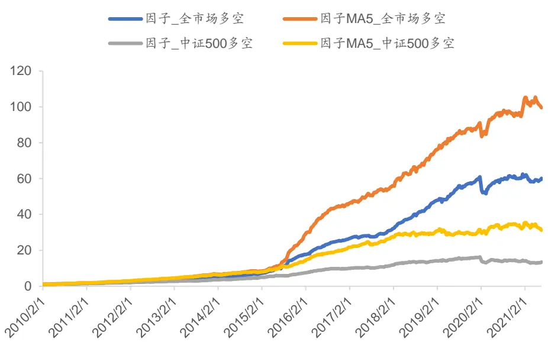
数据来源：天软科技，广发证券发展研究中心

全市场选股时，corr_VRlaglarge因子MA5的多空收益率为29.28%，多空胜率为65.64%，多空收益最大回撤为-10.03%，多头年换手率为43.9倍。

中证500指数成分股内选股时，corr_VRlaglarge因子MA5的多空收益率为19.75%，多空胜率为58.59%，多空收益最大回撤为-16.30%，多头年换手率为42.2倍。

图 26：corr_VRlag_large因子多空收益走势
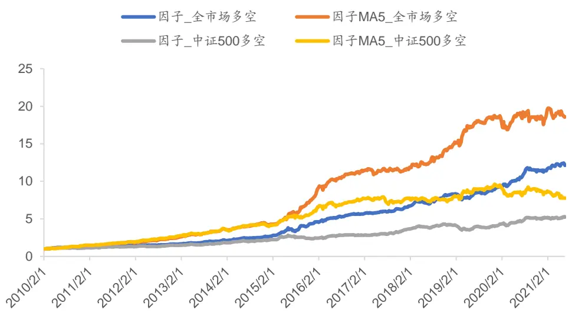
数据来源：天软科技，广发证券发展研究中心

## 七、筛选因子考察

## （一）因子多空收益表现

根据上文分析结论，我们筛选了如下 12 个因子：real_skew（已实现偏度）、ret_intraday（日内收益率）、ratio_volumeH8（尾盘半小时成交量占比）、corr_VP（日内价量相关性）、corr_VRlag（量与滞后收益率相关性）、Amihud_illiq（Amihud非流动性因子）、ret_open2AH1（开盘价相对第一阶段集合竞价最高价的收益率）、ret_open2AL1（开盘价相对第一阶段集合竞价最低价的收益率）、ret_H8（尾盘半小时收益率）、real_skewlarge（大成交量已实现偏度）、corr_VPlarge（大成交量价量相关性）、corr_VRlaglarge（大成交量量与滞后收益率相关性）。

因子多空表现如下图所示，上述筛选出来的因子都展示出了不错的多空超额能力。但除了 Amihud_illiq 因子外，其他因子的正 Alpha 收益显著弱于负 Alpha 收益。

表24：筛选因子多空表现

| 全部因子 | 多空超额收益率 | 正 Alpha | 负 Alpha |
| --- | --- | --- | --- |
| real_skew | 29.27% | 5.87% | -18.42% |
| ret_intraday | 34.23% | 5.42% | -22.87% |
| ratio_volumeH8 | 33.91% | 10.96% | -17.71% |
| corr_VP | 47.57% | 10.17% | -26.09% |
| corr_VRlag | 31.87% | 1.78% | -23.76% |
| Amihud_illiq | 36.22% | 16.22% | -16.63% |
| ret_open2AH1 | 21.61% | 8.23% | -11.52% |
| ret_open2AL1 | 19.89% | 6.73% | -11.23% |
| ret_H8 | 50.04% | 11.20% | -26.38% |
| real_skewlarge | 27.73% | 7.35% | -16.20% |
| corr_VPlarge | 49.82% | 12.00% | -25.97% |
| corr_VRlaglarge | 29.28% | 3.02% | -21.06% |

数据来源：天软科技，广发证券发展研究中心

## （二）因子相对 500超额收益表现

以中证 500 指数为基准，考察筛选因子的超额收益。在全市场进行周度调仓，选择因子值前 10%的股票构建多头组合，按照T+1日开盘价换仓，交易费用为双边千分之二。

从扣费后的收益情况来看，corr_VRlag 和 corr_VRlaglarge 相对中证 500 指数没有显著超额收益，其他因子相对中证 500 指数有正的超额收益。其中，超额收益最高的因子是 Amihud_illiq，年化超额收益率为 17.28%。Amihud_illiq 因子的选股表现如下图所示。

表25：筛选因子超额收益表现

| 因子名 | 超额收益率 （相对 500） | 超额最大回撤 | 超额胜率 |
| --- | --- | --- | --- |
| real_skew | 2.89% | -28.04% | 63.11% |
| ret_intraday | 2.08% | -52.62% | 58.95% |
| ratio_volumeH8 | 8.64% | -17.21% | 64.20% |
| corr_VP | 7.04% | -39.13% | 64.38% |
| corr_VRlag | -1.35% | -51.62% | 59.86% |
| Amihud_illiq | 17.28% | -22.93% | 64.01% |
| ret_open2AH1 | 5.72% | -17.89% | 64.38% |
| ret_open2AL1 | 5.78% | -28.23% | 64.38% |
| ret_H8 | 8.14% | -44.81% | 66.55% |
| real_skewlarge | 3.86% | -27.72% | 65.64% |
| corr_VPlarge | 8.22% | -37.11% | 66.00% |
| corr_VRlaglarge | -0.69% | -52.32% | 60.94% |

数据来源：天软科技，广发证券发展研究中心

图 27：Amihud_illiq因子MA5超额收益走势（费后）
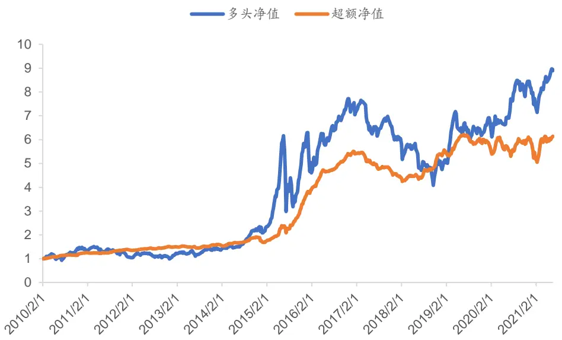
数据来源：天软科技，广发证券发展研究中心

## （三）不同因子“平滑”方法下性能比较

考察不同平滑方法下，因子选股性能的差异。除了5 天和 20天窗口的移动平均平滑 MA5、MA20，本报告也比较 EMA5和EMA20两种指数移动平滑下因子选股能力的差异。

从 IC 和多空收益的比较来看，大多数平滑后的因子相对原因子具有更高的 IC和多空收益。在5天调仓的情景下，MA5处理相比MA20处理有更高的选股收益率。与简单加窗平均的 MA5方法相比，5日指数移动平滑EMA5方法也值得考虑。

表26：不同平滑方法下筛选因子IC

| 平滑方法 | 原因子 | MA5 | EMA5 | MA20 | EMA20 |
| --- | --- | --- | --- | --- | --- |
| real_skew | 3.44 | 5.05 | 4.98 | 4.52 | 4.72 |
| ret_intraday | 1.49 | 2.66 | 2.67 | 2.71 | 2.83 |
| ratio_volumeH8 | 2.43 | 2.11 | 1.85 | 1.05 | 0.95 |
| corr_VP | 4.67 | 4.74 | 5.36 | 4.24 | 4.79 |
| corr_VRlag | 2.94 | 3.76 | 3.92 | 4.20 | 4.25 |
| Amihud_illiq | 3.95 | 3.68 | 3.81 | 2.98 | 3.26 |
| ret_open2AH1 | 4.17 | 3.97 | 4.09 | 2.63 | 3.12 |
| ret_open2AL1 | 3.97 | 4.17 | 4.52 | 4.00 | 4.18 |
| ret_H8 | 3.40 | 4.01 | 4.23 | 2.29 | 2.95 |
| real_skewlarge | 4.03 | 5.44 | 5.37 | 4.92 | 4.93 |
| corr_VPlarge | 5.25 | 5.38 | 5.83 | 5.13 | 5.45 |
| corr_VRlag_large | 3.64 | 4.04 | 4.36 | 4.54 | 4.54 |

数据来源：天软科技，广发证券发展研究中心

表27：不同平滑方法下筛选因子多空收益

| 平滑方法 | 原因子 | MA5 | EMA5 | MA20 | EMA20 |
| --- | --- | --- | --- | --- | --- |
| real_skew | 17.37% | 29.27% | 30.20% | 29.10% | 30.76% |
| ret_intraday | 21.07% | 34.23% | 34.44% | 31.54% | 33.37% |
| ratio_volumeH8 | 30.40% | 33.91% | 29.12% | 25.09% | 23.65% |
| corr_VP | 47.44% | 47.57% | 51.92% | 36.49% | 45.01% |
| corr_VRlag | 23.52% | 31.87% | 35.77% | 29.27% | 35.26% |
| Amihud_illiq | 40.62% | 36.22% | 40.61% | 31.42% | 35.46% |
| ret_open2AH1 | 26.28% | 21.61% | 27.04% | 14.04% | 19.45% |
| ret_open2AL1 | 14.70% | 19.89% | 22.84% | 20.12% | 23.65% |
| ret_H8 | 41.46% | 50.04% | 54.78% | 30.43% | 44.24% |
| real_skewlarge | 16.21% | 27.73% | 28.79% | 28.41% | 30.23% |
| corr_VPlarge | 43.32% | 49.82% | 48.28% | 41.88% | 47.70% |
| corr_VRlag_large | 24.52% | 29.28% | 35.73% | 28.94% | 36.54% |

数据来源：天软科技，广发证券发展研究中心

## 八、总结与展望

本报告从四类不同的角度构建因子：日内价格相关因子、日内价量相关因子、盘前信息因子、特定时段采样因子。考察了46个因子周频选股的表现。

采用 IC 和多空收益测试，筛选出 12 个周度选股能力较好的因子：real_skew（已实现偏度）、ret_intraday（日内收益率）、ratio_volumeH8（尾盘半小时成交量占比）、corr_VP（日内价量相关性）、corr_VRlag（量与滞后收益率相关性）、Amihud_illiq（Amihud 非流动性因子）、ret_open2AH1（开盘价相对第一阶段集合竞价最高价的收益率）、ret_open2AL1（开盘价相对第一阶段集合竞价最低价的收益率）、ret_H8（尾盘半小时收益率）、real_skewlarge（大成交量已实现偏度）、corr_VPlarge（大成交量价量相关性）、corr_VRlaglarge（大成交量量与滞后收益率相关性）。

从因子表现来看，本报告筛选出来的因子都展示出了不错的多空超额能力。但除了 Amihud_illiq 因子外，其他因子的正 Alpha 收益显著弱于负 Alpha 收益。在扣除交易成本之后，因子多头组合相对基准超额收益低了很多。除了 Amihud_illiq因子具有较高的相对 500超额，其他因子年化超额收益基本上处于-1%~9%之间。如何更好的将上述高频因子的选股能力转化为多头的超额收益，是非常有实际意义的课题。

## 九、风险提示

策略模型并非百分百有效，市场结构及交易行为的改变以及类似交易参与者的增多有可能使得策略失效。

## [Table_ResearchTeam] 广发金融工程研究小组

罗军 ：首席分析师，华南理工大学硕士，从业 14年，2010年进入广发证券发展研究中心。

安 宁 宁 ：联席首席分析师，暨南大学硕士，从业 12年，2011年进入广发证券发展研究中心。

史 庆 盛 ：资深分析师，华南理工大学硕士，从业 8年，2011年进入广发证券发展研究中心。

张 超 ：资深分析师，中山大学硕士，从业 7 年，2012 年进入广发证券发展研究中心。

文 巧 钧 ：资深分析师，浙江大学博士，从业 4年，2015年进入广发证券发展研究中心。

陈 原 文 ：资深分析师，中山大学硕士，从业 4年，2015年进入广发证券发展研究中心。

樊 瑞 铎 ：资深分析师，南开大学硕士，从业 4年，2015年进入广发证券发展研究中心。

李豪 ：资深分析师，上海交通大学硕士，从业 3年，2016年进入广发证券发展研究中心。

郭 圳 滨 ：高级分析师，中山大学硕士，2018年进入广发证券发展研究中心。

季 燕 妮 ：研究助理，厦门大学硕士，2020年进入广发证券发展研究中心。

张 钰 东 ：研究助理，中山大学硕士，2020年进入广发证券发展研究中心。

季 俊 男 ：南京大学硕士，2020年进入广发证券发展研究中心。

## [Table_IndustryInvestDescription] 广发证券—行业投资评级说明

买入： 预期未来 12 个月内，股价表现强于大盘 10%以上。

持有： 预期未来12个月内，股价相对大盘的变动幅度介于-10%～+10%。

卖出： 预期未来12个月内，股价表现弱于大盘10%以上。

## [Table_CompanyInvestDescription] 广发证券—公司投资评级说明

买入： 预期未来 12 个月内，股价表现强于大盘 15%以上。

增持： 预期未来12个月内，股价表现强于大盘5%-15%。

持有： 预期未来12个月内，股价相对大盘的变动幅度介于-5%～+5%。

卖出： 预期未来12个月内，股价表现弱于大盘5%以上。

## [Table_Address] 联系我们

| 地址 | 广州市 | 深圳市 | 北京市 | 上海市 | 香港 |
| --- | --- | --- | --- | --- | --- |
|  | 广州市天河区马场路 | 深圳市福田区益田路 | 北京市西城区月坛北 | 上海市浦东新区南泉 | 香港中环干诺道中 |
|  | 26号广发证券大厦 | 6001号太平金融大 | 街2号月坛大厦18 | 北路 429号泰康保险 | 111 号永安中心 14 |
| 邮政编码 | 35楼 | 厦31层 | 层 | 大厦37楼 | 楼1401-1410 室 |
| 客服邮箱 | 510627 gfzqyf@gf.com.cn | 518026 | 100045 | 200120 |  |

## [Table_LegalD 法律主体isclaimer 声明]

本报告由广发证券股份有限公司或其关联机构制作，广发证券股份有限公司及其关联机构以下统称为“广发证券”。本报告的分销依据不同国家、地区的法律、法规和监管要求由广发证券于该国家或地区的具有相关合法合规经营资质的子公司/经营机构完成。

广发证券股份有限公司具备中国证监会批复的证券投资咨询业务资格，接受中国证监会监管，负责本报告于中国（港澳台地区除外）的分销。

广发证券（香港）经纪有限公司具备香港证监会批复的就证券提供意见（4 号牌照）的牌照，接受香港证监会监管，负责本报告于中国香港地区的分销。

本报告署名研究人员所持中国证券业协会注册分析师资质信息和香港证监会批复的牌照信息已于署名研究人员姓名处披露。

## [Table_I 重要声明mportan

广发证券股份有限公司及其关联机构可能与本报告中提及的公司寻求或正在建立业务关系，因此，投资者应当考虑广发证券股份有限公司及其关联机构因可能存在的潜在利益冲突而对本报告的独立性产生影响。投资者不应仅依据本报告内容作出任何投资决策。投资者应自主作出投资决策并自行承担投资风险，任何形式的分享证券投资收益或者分担证券投资损失的书面或者口头承诺均为无效。

本报告署名研究人员、联系人（以下均简称“研究人员”）针对本报告中相关公司或证券的研究分析内容，在此声明：（ ）本报告的全部分析结论、研究观点均精确反映研究人员于本报告发出当日的关于相关公司或证券的所有个人观点，并不代表广发证券的立场；（2）研究人员的部分或全部的报酬无论在过去、现在还是将来均不会与本报告所述特定分析结论、研究观点具有直接或间接的联系。

研究人员制作本报告的报酬标准依据研究质量、客户评价、工作量等多种因素确定，其影响因素亦包括广发证券的整体经营收入，该等经营收入部分来源于广发证券的投资银行类业务。

本报告仅面向经广发证券授权使用的客户/特定合作机构发送，不对外公开发布，只有接收人才可以使用，且对于接收人而言具有保密义务。广发证券并不因相关人员通过其他途径收到或阅读本报告而视其为广发证券的客户。在特定国家或地区传播或者发布本报告可能违反当地法律，广发证券并未采取任何行动以允许于该等国家或地区传播或者分销本报告。

本报告所提及证券可能不被允许在某些国家或地区内出售。请注意，投资涉及风险，证券价格可能会波动，因此投资回报可能会有所变化，过去的业绩并不保证未来的表现。本报告的内容、观点或建议并未考虑任何个别客户的具体投资目标、财务状况和特殊需求，不应被视为对特定客户关于特定证券或金融工具的投资建议。本报告发送给某客户是基于该客户被认为有能力独立评估投资风险、独立行使投资决策并独立承担相应风险。

本报告所载资料的来源及观点的出处皆被广发证券认为可靠，但广发证券不对其准确性、完整性做出任何保证。报告内容仅供参考，报告中的信息或所表达观点不构成所涉证券买卖的出价或询价。广发证券不对因使用本报告的内容而引致的损失承担任何责任，除非法律法规有明确规定。客户不应以本报告取代其独立判断或仅根据本报告做出决策，如有需要，应先咨询专业意见。

广发证券可发出其它与本报告所载信息不一致及有不同结论的报告。本报告反映研究人员的不同观点、见解及分析方法，并不代表广发证券的立场。广发证券的销售人员、交易员或其他专业人士可能以书面或口头形式，向其客户或自营交易部门提供与本报告观点相反的市场评论或交易策略，广发证券的自营交易部门亦可能会有与本报告观点不一致，甚至相反的投资策略。报告所载资料、意见及推测仅反映研究人员于发出本报告当日的判断，可随时更改且无需另行通告。广发证券或其证券研究报告业务的相关董事、高级职员、分析师和员工可能拥有本报告所提及证券的权益。在阅读本报告时，收件人应了解相关的权益披露（若有）。

本研究报告可能包括和/或描述/呈列期货合约价格的事实历史信息（“信息”）。请注意此信息仅供用作组成我们的研究方法/分析中的部分论点/依据/证据，以支持我们对所述相关行业/公司的观点的结论。在任何情况下，它并不（明示或暗示）与香港证监会第5类受规管活动（就期货合约提供意见）有关联或构成此活动。

## [Table_Interest 权益披露Disc

(1)广发证券（香港）跟本研究报告所述公司在过去12 个月内并没有任何投资银行业务的关系。

## [Table_Copyrigh版权声明

未经广发证券事先书面许可，任何机构或个人不得以任何形式翻版、复制、刊登、转载和引用，否则由此造成的一切不良后果及法律责任由私自翻版、复制、刊登、转载和引用者承担。