# [Table_Title] 海量技术指标掘金 Alpha 因子

## 多因子 Alpha 系列报告之（四十二）

## 报告摘要：

基于技术分析的理念，考察技术因子能否带来超额收益。按照有效市场假说，即使是在弱式有效的情况下，通过技术分析也难以获得超额的收益。本篇专题报告希望通过对历史数据进行分析，构造出具有超额收益的投资组合，从而寻找到那个能带来超额收益的alpha因子！

共选取 8大类，62小类，102个技术因子。传统的多因子模型从数据维度上看较多地使用基本面因子。本篇专题报告所选用的全部是技术类因子，共8 大类，包括趋向指标、反趋向指标、能量指标、成交量指标、量价指标、摆动指标、强弱指标及其他类的指标，分为62个小类，一共 102个指标。

采用排序法筛选有效因子。本篇专题报告按照周度换仓频率，将个股在因子上的暴露经过标准化处理后按照因子值大小进行排序，然后构造投资组合。选择因子暴露排序靠前 20%的股票作为多头，同时选择因子暴露在靠后 20%的股票，从而得到相关组合收益率。衡量因子好坏的主要指标有因子的 IC (信息系数)、因子的IR (信息比)、因子的胜率、年化收益率、换手率等。

实证分析结果。在历史回测期内对相关的 102 个技术因子进行了详细的实证研究。其中，从因子 IC 绝对值角度看，BIAS 乖偏率 (6 日)、VSTD 成交量方差(20 日)、BBI_Close 多空指数_收盘价、ASI(SI)振动升降指标、成交金额方差(20 日)等因子表现较好，IC 绝对值分别为3.43%、3.02%、2.74%、2.71%、2.59%；从多头年化收益率角度看，VSTD 成交量方差(20 日)、成交金额方差(20 日)、价格线性回归系数（6 日）、BIAS 乖偏率 (6日)、VEMA交易量指数均值因子表现较好，多头年化收益率分别为：14.82%、14.47%、14.07%、14.07%、13.85%。

核心假设风险。本文所做的数据测算完全基于过去数据的推演，市场未来环境可能发生变化。投资者制定投资策略时，必须结合市场环境和自身投资理念。

图：因子 IC绝对值排序前15名
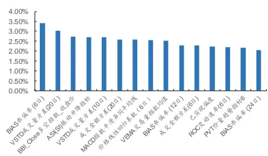
数据来源：Wind, 广发证券发展研究中心
（回测期为: 2010 年 1 月 1 日至 2021 年 6 月 15 日）

[分析师： Table_Author]陈原文

同SAC 执证号：S0260517080003

0755-82797057

chenyuanwen@gf.com.cn分析师： 罗军

同SAC 执证号：S0260511010004

020-66335128

luojun@gf.com.cn

分析师： 安宁宁

SAC 执证号：S0260512020003

SFC CE No. BNW179

0755-23948352

anningning@gf.com.cn

请注意，陈原文,罗军并非香港证券及期货事务监察委员会的注册持牌人，不可在香港从事受监管活动。

## [Table_ 相关研究：DocRe

2021 年中期基金组合配置策 2021-06-17略:关注价值，以守为攻

投资者关系活动事件驱动机2021-06-04
会研究:事件驱动策略研究之
十六

## 一、研究背景

## （一）有效市场假说

1964年奥斯本提出了“随机漫步理论”，该理论认为股票价格的变化类似于化学中的分子“布朗运动”具有“随机漫步”的特点，也就是说，它变动的路径是不可预期的。 1965年，尤金·法玛(Eugene Fama)在Financial Analysts Journal上发表文章《Random Walks in Stock Market Prices》。在这篇文章中第一次提到了Efficient Market 的概念：有效市场是这样一个市场，在这个市场中，存在着大量理性的、追求利益最大化的投资者，他们积极参与竞争，每一个人都试图预测单个股票未来的市场价格，每一个人都能轻易获得当前的重要信息。在一个有效市场上，众多精明投资者之间的竞争导致这样一种状况：在任何时候，单个股票的市场价格都反映了已经发生的和尚未发生、但市场预期会发生的事情。1970年，法玛提出了有效市场假说(Efficient Markets Hypothesis)，其对有效市场的定义是：如果在一个证券市场中，价格完全反映了所有可以获得的信息，那么就称这样的市场为有效市场。

法玛认为，有效市场有三种不同的形式。第一种是弱式有效市场假说：该假说认为在弱式有效的情况下，市场价格已充分反应出所有过去历史的证券价格信息，包括股票的成交价、成交量等。第二种是半强式有效市场假说：该假说认为价格已充分反应出所有已公开的有关公司营运前景的信息。这些信息有成交价、成交量、盈利资料、盈利预测值，公司管理状况及其它公开披露的财务信息等。假如投资者能迅速获得这些信息，股价应迅速作出反应。 第三种是强式有效市场假说：强式有效市场假说认为价格已充分地反应了所有关于公司营运的信息，这些信息包括已公开的或内部未公开的信息。

在法码的有效市场假说下，即使是在弱有效市场假说下，投资者也无法根据个股相关的过去的信息对股价进行有效的研判。在国内A股市场中，投资者往往通过与个股基本面相关的信息、价量相关的信息等维度对个股未来一段时间的涨跌进行研判，即在国内市场中，投资者认为市场是非充分有效的，可以通过相关的因子等对个股进行收益率等相关的概率预测。而在众多的数据维度中，价量相关的信息是一类较为重要的信息。

## （二）技术分析

技术分析是指以市场行为为研究对象，以判断市场趋势并跟随趋势的周期性变化来进行股票及一切金融衍生物交易决策的方法的总和。目的是为了寻找买入、卖出、止损信号，并通过资金管理而达成在风险市场中长期稳定获利。所有的技术分析都是建立在三大假设之上的。一、市场行为包容消化一切。即：所有的基础事件，如经济事件、社会事件、战争、自然灾害等等作用于市场的因素都会反映到价格变化中来。二、价格以趋势方式演变。三、历史会重演。

近年来，A股市场机构化趋势明显，量化私募机构的管理规模也迅速扩大，产生了一批管理规模超过百亿的量化私募机构。与此同时，传统的风格因子波动增大，从市场获取超额收益的难度在增加。

因子拥挤是因子收益下降的原因之一。因子代表着市场某方面的非有效性、或者是一段时期内的定价失效。当某类因子收益高的时候，会吸引更多的资金进入，从而出现因子拥挤，降低因子的预期收益。一旦新的因子被公开，套利资金的介入会使得错误定价收窄，因子收益也会跟着下降。因此，在多因子选股模型中，因子的开发和更新迭代变得越来越重要。

以传统日频价量和更低频财务数据为基础的因子开发是一种研究途径。本文专题报告中，将通过观察股票的历史价格变化和成交量、成交金额等相关价量指标的变化，处理并分析这些数据，计算出一定程度上能够反映和预测价格变化的指标，然后通过这些指标来选取股票。

## 二、研究思路

## （一）数据的选择及处理

标的样本池：中证800指数成分股，中证800指数的成份股由中证500和沪深300成份股一起构成，综合反映了沪深证券市场内大中小市值公司的整体状况，其作为投资标的能够很好地代表沪深两市股票的运行情况。为使测试结果更符合投资逻辑，设定了以下样本筛选规则：

1）剔除选股日的 ST 、*ST个股；

2）剔除上市不满三个月的股票；

3）剔除由于停牌等原因而无法买入的股票。

测试样本期：2010年1月1日至2021年6月15日，以下如果特别说明，数据截止至今统一为截止至2021年6月15日相关的测算结果。

数据处理：数据清洗的目的是避免可能的数据错误和极端数据对测试结果产生影响，使用标准化后的数据保证最终得到的模型的稳健性。数据清洗主要包括以下几个部分即异常值处理、缺失数据补齐以及数据标准化处理。

## 去极值化

由于离群值有较大可能为错误数据，并且会使得数据的分布偏离假设。因此一般需要对离群值进行去极值化处理。常见离群值处理方法为 “中位数去极植法”进行去极值化，公式如下：

$$
\begin{array}{r}{D_{i,\mathrm{\ upper}}=\mathsf{D}_{\mathsf{m}}+\mathsf{n}\times D_{MAD},\quad ifD_{i\ge}D_{m}+\mathsf{n}\times D_{MAD}}\\{D_{i,\ Iower}=D_{m}-\mathsf{n}\times D_{MAD},\quad ifD_{i}\le D_{m}+\mathsf{n}\times D_{MAD}}\end{array}
$$

其中D为第i个描述性变量的观察值， $D_{m}$ 为所有观察值的中位数， $D_{m}\dot{\ i}\vec{\mathrm{z}}$ 作观测值与中位数的绝对偏离，即 $\begin{array}{r}{D_{i,AD}{=}|\ D_{i}-D_{m}|}\end{array}$ ，DMAD记作 $Di,AD^{\sharp}{\overset{\cdot}{\rVert}}$ 中位数， $D_{I},\ upper{\#\sqcap\sqcap\sqcap}$ $D_{I,Iower}$ 分别表示中位数去极值化后描述性变量的上下限，n为用于控制 $D_{i},\ upper{\notinq{\pi}}D_{i},$ $Iower^{\sharp\sharp}$ 常数。

## 标准化

由于各个描述性因子所衡量的单位不同，导致因子数值范围差异较大，因此在进行因子分析之前，必须对其进行标准化，本研究采用最常见 $\cdot N(0,1)$ 正态标准化处理之，公式如下：

识别风险，发现价值

## 标准化后向量=(原向量-均值)/标准差

补全缺失异常值：

对于部分股票存在数据缺失的情况，由于数据已经经过了标准化操作，因此数据均值为0，因此我们也将缺失值补全为0。

## （二）因子测量指标

有效性的测量是因子研究的核心，一个有效的Alpha因子应该能够带来长期且稳定的Alpha收益，同时因子在各期的表现应该具备较好的持续性，即具备较低的波动性，另外，根据因子挑选出来的超低配组合是否具备较高的胜率也是我们考察的标准之一。借助以下的一些指标进行测算：

IC：信息系数，表示当期的个股截面因子数据与个股下一期的持有收益率的相关系数（Spearman或者Pearson方式）。若IC为正，表示持有因子值较大的股票有大概率能获得正收益，若IC为负，表示持有因子值较小的股票有大概率能获得正收益。

IC均值：在每一期均可以计算得到该因子的IC值，对IC值序列进行平均得到IC均值，用于衡量在整个回测区间IC的表现。

ICIR：等于IC值序列的均值与IC值序列的标准差的比值（需要进行年化的处理），用于衡量因子有效性的稳定性，当该值的绝对值越大，表示因子的有效性越稳定，ICIR的符号的意义与IC的相同。

多空收益率：基于每一期因子多空组合的超额收益率，计算因子平均收益用于衡量因子Alpha是否具有显著且可持续收益。

信息比率：利用策略回测的年化收益率除以策略回测的收益率的年化标准差得到信息比率，表示策略收益率的稳定性。

一般而言，在股票池、换仓频率等相同的情况下，ICIR越高，IR也越高。

多空胜率：表示多头组合减去空头组合的收益率为正的期数的占比，用于衡量Alpha因子是否在多数时间内有效。

t检验概率：用于衡量Alpha因子是否具有显著的因子回报，因子的t检验概率越小，说明该因子的选股效果越好，经统计发现，t检验的概率小于0.2时，相应的Alpha因子具有较好的选股效果！

（备注：因子多空对冲，是指在每个换仓期，将因子值进行排序，分为n值（例如分为10组或者5组），根据指定的因子方向，选择看多因子值最高（或最低）的一组，看空因子值最低（或最高）的一组。）

## （三）因子分类

基于个股价量相关的数据维度，从频率较低的日频角度看，个股相关的价量数据主要有价格序列、成交量序列、换手率序列等相关的数据维度。

本篇专题报告主要考虑基于日频维度个股相关的价量数据构建的常见技术指标在选股中的有效性。

基于广发金工日常维护跟踪的因子数据库，本报告主要围绕如下几类技术因子

进行分析：趋向、反趋向、能量、成交量、量价、摆动、强弱和其他类因子。

图1：技术因子类别
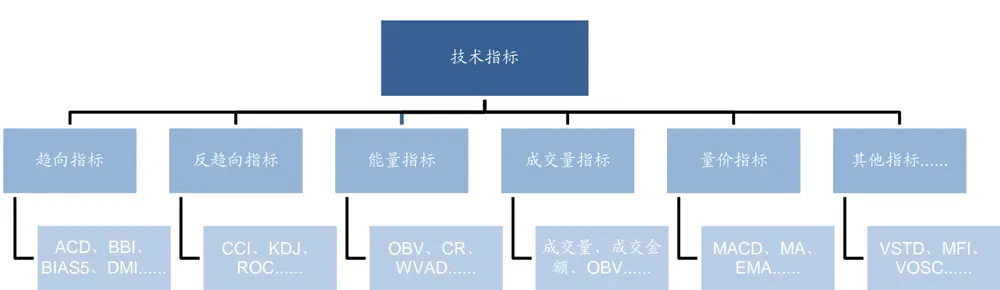
数据来源：广发证券发展研究中心

## （四）各技术指标介绍

该部分主要对本篇专题报告测算用到的技术指标因子相关算法进行介绍。

## (1) ACD收集派发指标

ACD指标将市场分为两股收集（买入）及派发（估出）的力量。若当天收盘价高于昨天收盘价，则收集力量等于当天收盘价与真实低位之差。真实低位是当天低位与昨天收盘价两者中的最低者。若当天收盘价低于昨天收盘价，则派发力量等于当天当天收盘价与真实高位之差。真实高位是当天高位与昨天收盘价两者较高者；若将收集力量（正数）及派发力量（负数）相加，便可得到市场的净收集力量，从而了解市场的强弱。

$$
\begin{array}{rl}&{\mathrm{LC}=\mathrm{REF}(\mathrm{CLOSE},1)}\\&{\mathrm{DIF}=\mathrm{CLOSE}-\mathrm{IF}\big(\mathrm{CLOSE}>\mathrm{LC},\mathrm{MIN}(\mathrm{LOW},\mathrm{LC}),\mathrm{MAX}(\mathrm{HIGH},\mathrm{LC})\big)}\\&{\quad\quad\quad\quad\quad\quad\mathrm{ACD}=\mathrm{SUM}(\mathrm{if}(\mathrm{CLOSE}=\mathrm{LC},0,\mathrm{DIF}),0)}\end{array}
$$

此处为了使得指标具有可比性，分别计算了ACD指标6个和20个交易日的收集力量与派发力量之和。

## (2) ADTM动态买卖气指标

ADTM是用开盘价的向上波动幅度和向下波动幅度的距离差值来描述人气高低的指标。

$$
{\begin{array}{rl}&{{\mathrm{DTM}}={\mathrm{IF}}(0<{\mathrm{REF}}(0,1),0,{\mathrm{MAX}}(({\mathrm{H}}-0),\left(0-{\mathrm{REF}}(0,1)\right)))}\\&{}\\&{{\mathrm{DBM}}={\mathrm{IF}}(0\geq{\mathrm{REF}}(0,1),0,{\mathrm{MAX}}\left((0-\mathrm{L}),\left(0-{\mathrm{REF}}(0,1)\right)\right))}\\&{}\\&{\qquad{\mathrm{STM}}={\mathrm{SUM}}({\mathrm{DTM}},\mathrm{P})}\end{array}}
$$

$$
\mathrm{SBM}=\mathrm{SUM}(\mathrm{DBM},\mathrm{P})
$$

$$
\mathrm{ADTM}=\mathrm{IF}(\mathrm{STM}>\mathrm{SBM},\frac{\mathrm{STM}-\mathrm{SBM}}{\mathrm{STM}},\mathrm{IF}(\mathrm{STM}=\mathrm{SBM},0,\frac{\mathrm{(STM-SBM)}}{\mathrm{SBM}})
$$

这里主要考虑个股在过去20个交易日的指标计算。

## (3) AD指标

AD指标将每日的成交量通过价格加权累计，用以计算成交量的动量。

$$
\mathrm{AD}=\mathrm{SUM}((\frac{2*\mathrm{CLOSE}-(\mathrm{HIGH}-\mathrm{CLOSE})}{\mathrm{HIGH}-\mathrm{LOW}}*\mathrm{VOL},0)
$$

为了使指标具有可比性，这里分别计算了过去1个交易日、6个和20个交易日的AD指标累加值。

## (4) APBR指标

AR指标是反映市场当前情况下多空双方力量发展对比的结果。它是以当日的开盘价为基点。与当日最高价相比较，依固定公式计算出来的强弱指标。

$$
{\cal A}{\sf R}=\frac{\mathrm{SUM}({\sf HIGH}-0\mathrm{PEN},{\sf M})}{\mathrm{SUM}(0{\sf PEN}-{\sf L0W},{\sf M})}*100
$$

BR指标也是反映当前情况下多空双方力量争斗的结果。不同的是它是以前一日的收盘价为基础，与当日的最高价、最低价相比较，依固定公式计算出来的强弱指标。

$$
BR=\frac{SUM\big(MAX\big(0,HIGH-REF(CLOSE,1)\big),M\big)}{SUM(MAX(0,REF(CLOSE,1)-LOW),\mathsf{M})}*100
$$

## (5) ARC变动率指数均值

ARC指标是股票的价格变化率RC指标的均值，用以判断前一段交易周期内股票的平均价格变化率。

$$
\begin{array}{c}{{\mathsf{RC}=\mathsf{C}/\mathsf{REF}(\mathsf{C},\mathsf{M})}}\\{{\mathsf{ARC}=\mathsf{SMA}(\mathsf{REF}(\mathsf{RC},1),\mathsf{M},1)}}\end{array}
$$

## (6) Aroon指数

Aroon指标是由图莎尔·钱德（Tushar Chande)1995年发明的，它通过计算自价格达到近期最高值和最低值以来所经过的期间数，帮助投资者预测证券价格趋势、强弱以及趋势的反转等。 该指标由三部分组成：Aroon上升数、Aroon下降数以及Aroon指标。Aroon上升数和Aroon下降数分别用以描述多头和空头的强弱。

$$
Aroon\bot+\frac{2\pi}{20}=[(i+\frac{\pi}{4}+\frac{4\pi}{4})\times\frac{4\pi}{20}-\frac{20}{12}\frac{\pi}{10}+\frac{2}{12}\times\frac{4\pi}{20}\times\frac{4\pi}{20}]+\frac{24}{12}\times\frac{4\pi}{20}\times\frac{4\pi}{20}
$$

$$
AroonT\mathbb{F}^{2}\neq\frac{4\pi}{4}=[(\hat{1}+\frac{4\pi}{4}+\frac{4\pi}{4})\mathbb{F}\mathbb{\frac{4\pi}{2\pi}}-\frac{\pi}{2\pi}\int\mathbb{\hat{X}}\left(\hat{1}\right)\hat{1}\cdot f_{1}=\hat{1}\times\frac{4\pi}{2\pi}]\cdot\hat{1}+\frac{\pi\pi}{4}\pi\frac{4\pi}{2\pi}]^{\times}100
$$

Aroon指标=Aroon上升数-Aroon下降数

## (7) ASI累计振动升降指标

累计振动升降指标(ASI)，由威尔斯·王尔德（Welles Wilder）所创。ASI指标以开盘、最高、最低、收盘价与前一交易日的各种价格相比较作为计算因子，研判市场的方向性。

$$
\mathrm{LC}=\mathrm{REF}(\mathrm{C},1)
$$

$$
\begin{array}{c}{AA=ABS(H-LC);BB=ABS(L-LC);CC=ABS\big(H-REF(L,1)\big);DD}\\{=ABS\big(LC-REF(O,1)\big)}\end{array}
$$

$$
\begin{array}{r}{R=\mathrm{IF}\left(\mathrm{AA}>\mathrm{BB}\mathrm{\ AND\ AA}>\mathrm{CC},\mathrm{AA}+\frac{\mathrm{BB}}{2}+\frac{\mathrm{DD}}{4},\mathrm{IF}\left(\mathrm{BB}>\mathrm{CC}\mathrm{AND\ BB}>\right)\right)}\end{array}
$$

AA, BB $\begin{array}{r}{+\frac{\mathtt{AA}}{2}+\frac{\mathtt{DD}}{4},\mathtt{CC}+\frac{\mathtt{DD}}{4}\Big)\Big)}\end{array}$

$$
X=(\mathrm{C-LC}+\frac{\mathrm{C-0}}{2}+\mathrm{LC}-\mathrm{REF}(0,1)
$$

$$
SI=16*{\frac{\mathrm{X}}{\mathrm{R}}}*\mathrm{MAX}(\mathrm{AA},\mathrm{BB})
$$

$$
ASI=\mathrm{SUM}(\mathrm{SI},0)
$$

## (8) ATR平均真实波幅

平均真实波幅(ATR)是显示市场变化率的指标。这一指标是由威尔斯·王尔德（Welles Wilder）所创立。ATR不指示价格的变动方向，只表示价格的波动程度。而价格波动幅度的突破通常也预示着价格的突破。即：该指标价值越高，趋势改变的可能性就越高；该指标的价值越低，趋势的移动性就越弱。

$$
\begin{array}{r}{ATR1=\mathrm{{MAX}}(\mathrm{{MAX}}(\mathrm{{HIGH}}-\mathrm{{LOW}},\mathrm{{ABS}}(\mathrm{{REF}}(\mathrm{{CLOSE}},1)-\mathrm{{HIGH}})),\mathrm{{ABS}}(\mathrm{{REF}}(\mathrm{{CLOSE}},1)}\\{-\mathrm{{LOW}}))}\end{array}
$$

$$
ATR=\mathrm{MA}(\mathrm{ATR}1,\mathrm{M})
$$

本篇报告采用过去12、20个交易日的数据对相关指标进行计算。

## (9) BBI多空指数

BBI多空指标，是一种将不同日数移动平均线加权平均之后的综合指标，属于均线型指标，一般选用3日、6日、12日、24日等4条平均线。在BBI指标中，近期数据较多，远期数据利用次数较少，因而是一种变相的加权计算。BBI指标既有短期移动平均线的灵敏，又有明显的中期趋势特征。

$$
BBI=(\mathrm{MA}(\mathrm{CLOSE},\mathrm{M1})+\mathrm{MA}(\mathrm{CLOSE},\mathrm{M2})+\mathrm{MA}(\mathrm{CLOSE},\mathrm{M3})+\mathrm{MA}(\mathrm{CLOSE},\mathrm{M4}))/4
$$

## (10) BIAS乖偏率

乖离率（BIAS）简称Y值也叫偏离率，是反映一定时期内股价与其移动平均数偏离程度的指标。移动平均数一般可视为某一时期内买卖双方都能接受的均衡价格。因此，股价距离移动平均线太远时会重新向平均线靠拢。乖离率指标就是通过测算股价在波动过程中与移动平均线出现的偏离程度，从而得出股价在剧烈波动时因偏离移动平均趋势可能形成的回档或反弹。

$$
BIAS=\frac{\mathrm{CLOSE}-\mathrm{MA}(\mathrm{CLOSE},\mathsf{P1})}{\mathrm{MA}(\mathrm{CLOSE},\mathsf{P1})}*100
$$

本篇报告采用过去6、12、24个交易日的数据对相关指标进行计算。

## (11) CCI顺势指标

顺势指标是由Donald Lambert所创，专门测量股价是否已超出常态分布范围。属于超买超卖类指标中较特殊的一种。像KDJ等大多数超买超卖型指标都有上下界限，因此对于那些短期内暴涨暴跌的股票的价格走势时，就可能会发生指标钝化的现象。

而CCI指标却是波动于正无穷大到负无穷大之间，因此不会出现指标钝化现象，这样就有利于投资者更好地研判行情，特别是那些短期内暴涨暴跌的非常态行情。

$$
TYP=(\mathrm{HIGH}+\mathrm{LOW}+\mathrm{CLOSE})/3
$$

$$
CCI=(\mathrm{TYP-MA}(\mathrm{TYP},\mathrm{M}))/(0.015*\mathrm{AVEDEV}(\mathrm{TYP},\mathrm{M}))
$$

## (12) Chaikin Oscillator佳庆指标

在Larry Williams和Joe Granville的工作的启发下，Marc Chaikin发明了Chaikin Oscillator佳庆指标。佳庆指标是基于AD曲线的指数移动均线而计算得到的。

$$
AD=\mathrm{VOL}*[(\mathrm{CLOSE-LOW})-(\mathrm{HIGH-CLOSE})]/(\mathrm{HIGH-CLOSE})
$$

$$
\mathsf{ChaikinOscillator=EMA(AD,10)\cdot EMA}\ (\mathsf{AD},3)
$$

## (13) Chaikin Oscillator佳庆指标

Chaikin Volatility是由Marc Chaikin发明的一种技术指标。Marc Chaikin认为，一个相对较短时间内的波动率上升意味着市场底部的到来，一段相对较长时间内波动率的下降意味着市场顶部的来到。因此，根据波动率，可以预测股票未来的趋势。

$$
\mathbb{C}\mathrm{\hbar}\mathrm{aikin~Volati|ity=}(\uparrow0\uparrow\mathsf{H}\mathsf{H}\mathsf{G}\mathsf{H}\mathsf{\mathrm{-}}\mathsf{LOW}_{\mathsf{H}}^{\prime}\mathsf{\xi}\mathsf{E}\mathsf{M}\mathsf{A}-\mathrm{\hbar}0\mathrm{\hbar}\check{\mathsf{\Omega}}\mathsf{\ddot{n}}\mathrm{\uparrow}\mathsf{H}\mathsf{G}\mathsf{H}\mathrm{-}\mathsf{LOW}_{\mathsf{H}}^{\prime}\mathsf{\xi}\mathsf{E}\mathsf{M}\mathsf{A})/\mathrm{\hbar}0\mathrm{\hbar}\mathrm{\hbar}\mathrm{\Omega},
$$

$$
\frac{2}{AD}\frac{1}{H}\vert GH-LOW//G^{\prime}MA^{\star}100
$$

## (14) Chande钱德动量摆动指标

钱德动量摆动指标是由图莎尔·钱德发明的，与其他动量指标摆动指标如相对强弱指标（RSI）和随机指标（KDJ）不同，钱德动量指标在计算公式的分子中采用上涨日和下跌日的数据。当动量摆动超过+50时，认为证券处于超买状态，当动量摆动低于-50时，认为证券处于超卖状态。一些技术投资者还在此摆动指标的基础上添加了九个周期的移动平均线，以作为信号线。当摆动线在信号线上方时，是多头的信号；当摆动先位于信号线下方时，是空头的信号。

$$
CZ1=\mathrm{IF}(\mathrm{CLOSE}-\mathrm{REF}(\mathrm{CLOSE},1)>0,\mathrm{CLOSE}-\mathrm{REF}(\mathrm{CLOSE},1),0)
$$

$$
\begin{array}{c}{CZ2=\mathrm{IF}(\mathrm{CLOSE-REF}(\mathrm{CLOSE},1)<0,\mathrm{ABS}(\mathrm{CLOSE-REF}(\mathrm{CLOSE},1)),0)}\\{SU=SUM(CZ1,N)}\end{array}
$$

$$
SD=SUM(CZ2,N)
$$

$$
CMO=\frac{SU-SD}{SU+SD}*100
$$

本篇报告采用过去10个交易日的数据对相关指标进行计算。

## (15) Coppock Curve估波指标

估波指标（Coppock Curve）又称“估波曲线”，通过计算月度价格的变化速率的加权平均值来测量市场的动量，属于长线指标。估波指标由Edwin SedgwickCoppock于1962年提出，主要用于判断牛市的到来。该指标只能产生买进讯号。依估波指标买进股票后，应另外寻求其他指标来辅助卖出讯号。

$$
\begin{array}{rl}&{R(\mathrm{n}1)=\frac{\mathrm{CLOSE-REF}(\mathrm{CLOSE},\mathrm{N}1)}{\mathrm{REF}(\mathrm{CLOSE},\mathrm{N}1)}*100}\\&{}\\&{R(\mathrm{n}2)=\frac{\mathrm{CLOSE-REF}(\mathrm{CLOSE},\mathrm{N}2)}{\mathrm{REF}(\mathrm{CLOSE},\mathrm{N}2)}*100}\\&{}\\&{RC(n1,n2)=R(n1)+R(n2)}\\&{Coppock(n1,n2,n3)=\mathrm{WMA}(\mathrm{RC}(\mathrm{n}1,\mathrm{n}2),\mathrm{n}3)}\end{array}
$$

## (16) CR能量指标

CR指标以上一个计算周期（如N日）的中间价比较当前周期（如日）的最高价、最低价，计算出一段时期内股价的“强弱”，从而在分析一些股价的异常波动行情时，有其独到的功能。另外，CR指标测量人气的热度、价格动量的潜能，而且能够显示出股价的压力带和支撑带，为分析预测股价未来的变化趋势，判断买卖股票的时机提供参考。

$$
\begin{array}{c}{{MID=(\mathrm{HIGH+LOW+CLOSE})/3}}\\{{{}}}\\{{CR=\displaystyle\frac{SUM\big(MAX\big(0,HIGH-REF(MID,1)\big),M\big)}{SUM(MAX(0,REF(MID,1)-L),M)}\ast100}}\end{array}
$$

## (17) DBCD异同离差乖离率

DBCD异同离差乖离先计算乖离率BIAS，然后计算不同日的乖离率之间的离差，最后对离差进行指数移动平滑处理。优点是能够保持指标的紧密同步，并且线条光滑，信号明确，能够有效的过滤掉伪信号。

$$
\begin{array}{rl}&{BIAS=(\mathrm{C}-\mathrm{MA}(\mathrm{C},\mathrm{P}))/\mathrm{MA}(\mathrm{C},\mathrm{P})}\\&{~DIF=(\mathrm{BIAS}-\mathrm{REF}(\mathrm{BIAS},\mathrm{N}))}\\&{~\mathrm{DBCD}=\mathrm{SMA}(\mathrm{DIF},\mathrm{W},1)}\end{array}
$$

## (18) DDI方向标准离差指数

如果（最高价+最低价）<=（昨日最高价+昨日最低价），DMZ=0；

如果（最高价+最低价）>（昨日最高价+昨日最低价），DMZ=（最高价-昨日最低价）的绝对值与（最低价-昨日最低价）的绝对值中较大值；

如果（最高价+最低价）>=（昨日最高价+昨日最低价），DMF=0；

如果（最高价+最低价）<（昨日最高价+昨日最低价），DMF=（最高价-昨日最低价）的绝对值与（最低价-昨日最低价）的绝对值中较大值。

$$
\begin{array}{rl}&{\mathrm{DIZ}=\mathrm{SUM}(\mathrm{DMZ,N})/(\mathrm{SUM}(\mathrm{DMZ,N})+\mathrm{SUM}(\mathrm{DMF,N}))}\\&{\mathrm{DIF}=\mathrm{SUM}(\mathrm{DMF,N})/(\mathrm{SUM}(\mathrm{DMF,N})+\mathrm{SUM}(\mathrm{DMZ,N}))}\\&{\qquad\mathrm{DDI}=\mathrm{DIZ}-\mathrm{DIF}}\end{array}
$$

本篇报告采用过去13个交易日的数据对相关指标进行计算。

## (19) DMI动向指标

DMI指标是由美国技术分析大师威尔斯·威尔德（Wells Wilder）所创造的，是一种中长期股市技术分析方法 DMI指标是通过分析股票价格在涨跌过程中买卖双方力量均衡点的变化情况，即多空双方的力量的变化受价格波动的影响而发生由均衡到失衡的循环过程，从而提供对趋势判断依据的一种技术指标。

DMI指标共有+DI、-DI、ADX、ADXR四条线。

$$
\begin{array}{rl}&{\mathrm{TRI}=\mathrm{SUM}(\mathrm{MAX}\Big(\mathrm{MAX}\Big(\mathrm{HIGH}-\mathrm{LOW},\mathrm{ABS}\big(\mathrm{HIGH}-\mathrm{REF}(\mathrm{CLOSE},1)\big)\Big),\mathrm{ABS}\big(\mathrm{LOW}}\\&{\qquad-\mathrm{REF}(\mathrm{CLOSE},1)\big)\Big),\mathrm{P})}\\&{\qquad\mathrm{HD}=\mathrm{HIGH}-\mathrm{REF}(\mathrm{HIGH},1)}\\&{\qquad\mathrm{LD}=\mathrm{REF}(\mathrm{LOW},1)-\mathrm{LOW}}\end{array}
$$

+DM代表正趋向变动值即上升动向值，其数值等于当日的最高价减去前一日的最高价，如果<=0 则+DM=0。通过平均化，得到方向线+DI。

$$
\begin{array}{c}{{\mathsf{DMP}=\mathsf{SUM}(\mathrm{IF}(\mathrm{HD}>0\mathrm{AND}\mathrm{HD}>\mathrm{LD},\mathrm{HD},0),\mathrm{P})}}\\{{\mathrm{PDI}=\mathsf{DMP}*100/\mathrm{TRI}}}\end{array}
$$

﹣DM代表负趋向变动值即下降动向值，其数值等于前一日的最低价减去当日的最低价，如果<=0 则-DM=0。注意-DM也是非负数。通过平均化，得到方向线-DI。

$$
\begin{array}{c}{{\tt DMM=SUM(IF(LD>0AND\mit LD>HD,LD,0),P)}}\\{{\mathrm{MDI=DMM*}100/\mathrm{TRI}}}\end{array}
$$

ADX是反映趋向变动程度的指数。ADX 无法告诉趋势的发展方向。可是如果趋势存在, ADX 可以衡量趋势的强度。

$$
\mathrm{ADX}=\mathrm{MA}(\frac{\mathrm{ABS}(\mathrm{MDI}-\mathrm{PDI})}{\mathrm{MDI}+\mathrm{PDI}}\ast100,\mathrm{M})
$$

ADXR为趋向平均值：

$$
{\mathrm{ADXR}}=({\mathrm{ADX}}+{\mathrm{REF}}({\mathrm{ADX}},\mathrm{{M}}))/2
$$

## (20) DPTB大盘同步指标

大盘同步指标计算m周期内股票运动同大盘运动同步的比例。

$$
\mathrm{COUNT}((\mathrm{C}>0\mathrm{~AND~INDEXC}>\mathrm{INDEXO})OR(C\leq AND\ INDEXC<INDEXO,M)
$$

## (21) Ease of Movement简易波动指标

简易波动指标（Ease of Movement Value）又称EMV指标，它是由RichardW．Arm Jr．根据等量图和压缩图的原理设计而成, 目的是将价格与成交量的变化结合成一个波动指标来反映股价或指数的变动状况。由于股价的变化和成交量的变化都可以引发该指标数值的变动,因此,EMV实际上也是一个量价合成指标。

$$
Ease\ of\ Movement=\mathrm{EMA}(\left(\frac{\ H\mathrm{IGH}+\mathrm{LOW}}{2}-\frac{\mathrm{REF}(\mathrm{HIGH},1)+\mathrm{REF}(\mathrm{LOW},1)}{2}\right)/\mathrm{VOL})
$$

## (22) Elder 透视指标

艾达透视指标是一种新的技术指标，它是由亚历山大·埃尔德(AlexanderElder)博士在1989年所设计，其名称由来是源自于X光，医生透过X光观察表层皮肤之下的骨骼结构，交易者可以经由艾达透视指标，观察市场表面之下的多头与空头力道。

$$
3\div13\div5=\frac{5}{12}\div5\cdots5+51\div5+11\div5\cdots11\div5=115
$$

$$
\therefore x=\frac{1}{2}\cdot x-12
$$

$$
\mathsf{Elder~ize2}\hbar\mathsf{U}\mathsf{\Sigma}+\mathsf{H}\hbar\mathsf{\Sigma}+\mathsf{F}=(\hbar\hbar\mathsf{\Sigma}+\hbar\mathsf{\Sigma}+\hbar\mathsf{\Sigma}+\hbar\mathsf{\Sigma}+\hbar\mathsf{\Sigma})\mathsf{\Sigma}/\hbar\mathsf{U}\hbar\mathsf{\Sigma}+\hbar\mathsf{\Sigma}
$$

## (23) Hurst指数

H.E.HURST（赫斯特）是英国水文学家。以他命名的HURST指数，被广泛用于资本市场的混沌分形分析。一个具有赫斯特统计特性的系统，不需要通常概率统计学的独立随机事件假设。它反映的是一长串相互联系事件的结果。今天发生的事将影响未来，过去的事也会影响现在。这正是我们分析资本市场所需要的理论和方法。

取交易窗口n

$$
\mathrm{m}=\frac{1}{n}\sum_{i=1}^{n}P_{i}
$$

$$
Y_{i}=p_{i}-m
$$

$$
\mathsf{Z}_{t}=\sum_{i=1}^{t}Y_{i}
$$

$$
\begin{array}{c}{\operatorname{R}(\mathrm{n})=\operatorname*{max}(\mathrm{Z}_{1},\mathrm{Z}_{2},\dots,\mathrm{Z}_{n})-\operatorname*{min}(\mathrm{Z}_{1},\mathrm{Z}_{2},\dots,\mathrm{Z}_{n})}\\{\quad\quad\quad\quad Hurst=R(n)/S(n)}\end{array}
$$

S(n)为价格的标准差。

## (24) JDQS阶段强势指标

阶段强势指标计算一定周期m内，大盘下跌时，个股上涨的比例。

$$
A=COUNT(C>0ANDINDEXC<INDEXO,m)
$$

$$
B=COUNT(INDEXC<INDEXO,m)
$$

$$
D=A/B
$$

## (25) KDJ指标

KDJ指标又叫随机指标，最早起源于期货市场，由乔治·莱恩（GeorgeLane）首创。 KDJ指标在设计过程中主要是研究最高价、最低价和收盘价之间的关系，同时也融合了动量观念、强弱指标和移动平均线的一些优点。因此，能够比较直观地研判行情，被广泛用于股市的中短期趋势分析，是证券市场上常用的技术分析工具。 KDJ的计算比较复杂，首先要计算周期（n日、n周等）的RSV值，即未成熟随机指标值，然后再计算K值、D值、J值等。以日KDJ数值的计算为例，其计算公式为:

$$
\begin{array}{r}{RSV=\frac{\mathrm{CLOSE-LLV(LOW,N)}}{\mathrm{HHV}(\mathrm{HIGH,N)-LLV(LOW,N)}}\ast100}\\{K=SMA(RSV,P1,1)}\\{D=SMA(K,P2,1)}\\{J=3\ast K-2\ast D}\end{array}
$$

K与D值永远介于0到100之间。D大于70时，行情呈现超买现象。D小于30时，行情呈现超卖现象。

## (26) Klinger 成交量摆动指标

Klinger成交量摆动指标由Stephen Klinger创立，该指标在决定长期资金流量趋势的同时保持了对于短期资金流量的敏感性，因而可以用于预测短期价格拐点。

$$
t\dot{\Xi}\dot{\mathsf{2}}\mathbin{\vrule hidde10SE+H1GH+LOW)}\beta
$$

若今日均价高于昨日均价则成交量记为正，反之记为负。然后计算55期和34期内经上述处理过的成交量的指数平均数，将两平均数相减得到差值。然后计算该差值的6日指数平均值。

## (27) MA/CLOSE均线价格比

由于股票的成交价格有响起均线回归的趋势，计算均线价格比可以预测股票在未来周期的运动趋势。

## (28) MA均价线性回归系数

取近n个交易日的对应的MA值做对n个周期的序数的普通最小二乘的线性回归。取股价关于周期序数的系数作为因子。

本篇报告采用过去6、12个交易日的数据对相关指标进行计算。

## (29) MACD指数平滑异动平均线

MACD称为指数平滑异同平均线，是从双移动平均线发展而来的，由快的移动平均线减去慢的移动平均线，MACD的意义和双移动平均线基本相同，但阅读起来更方便。当MACD从负数转向正数，是买的信号。当MACD从正数转向负数，是卖的信号。当MACD以大角度变化，表示快的移动平均线和慢的移动平均线的差距非常迅速的拉开，代表了一个市场大趋势的转变。

$$
{\cal D}IFF=\mathrm{EMA}(\mathrm{CLOSE},\mathrm{S})-\mathrm{EMA}(\mathrm{CLOSE},\mathrm{P})
$$

$$
DEA={\mathrm{EMA}}({\mathrm{DIFF}},{\mathrm{M}})
$$

$$
MACD=2*(\mathrm{DIFF}-\mathrm{DEA})
$$

## (30) Mass Index梅斯线

MASS梅斯线（Mass Index）是Donald Dorsey设计的震荡曲线。该指标最主要的作用，在于寻找飙涨股或者极度弱势股的重要趋势反转点。 MASS指标是所有区间震荡指标中，风险系数最小的一个。由于股价高低点之间的价差波带，忽而宽忽而窄，并且不断的重复循环。利用这种重复循环的波带，可以预测股价的趋势反转点。

$$
MassIndex=\mathrm{EMA}(\mathrm{HIGH-LOW},9)/\mathrm{EMA}((\mathrm{EMA}(\mathrm{HIGH-LOW},9),9)
$$

## (31) MFI资金流量指标

资金流量指标(Money Flow Index)由Welles Wilder将RSI加以修改后，演变而来。RSI以成交价为计算基础；MFI指标则结合价和量，将其列入综合考虑的范围。可以说，MFI指标是成交量的RSI指标。

$$
\begin{array}{c}{{TYP=(HIGH+CLOSE+LOW)/3}}\\{{\nonumber}}\\{{V1=SUM(IF(TYP>REF(TYP,1),TYP*VOL,0),N)}}\\{{/SUM(IF(TYP<REF(TYP,1),TYP*VOL,0),N)}}\\{{\nonumber}}\\{{MFI=100-(\displaystyle\frac{100}{1+V1})}}\end{array}
$$

## (32)MICD异同离差动力指数

计算MI动力指数的离差得DIF，再做它的10日移动平均线得MICD。

$$
\mathbf{MTM}=\mathbf{CLOSE}-\mathbf{REF}(\mathbf{CLOSE},1);
$$

$$
MTMMA=SMA(MI,N,1);
$$

$$
{DIFF}=MA(REF(MTMMA,1),N1)-MA(REF(MTMMA,1),N2)
$$

$$
\mathsf{MICD}=\mathsf{SMA}(\mathrm{DIF},10,1)
$$

## (33) Money Flow资金流量

用收盘价，最高价及最低价的均值乘以当日成交量即可得到该交易日的资金流量。

$$
\mathrm{Money}\mathrm{Flow}=\frac{\mathrm{CLOSE}+\mathrm{HIGH}+\mathrm{LOW}}{3}*\mathrm{VOL}
$$

## (34) MTM动量指标

在证券市场上有类似于物理学上的恒速原理的现象：如果股价的上涨（下跌）趋势在继续，则股价的上涨（下跌）速度会大体保持一致。动量指标（MomentumIndex）正是从股票的恒速原理出发，考察股价的涨跌速度，以股价涨跌速度的变化分析股价趋势的指标。

$$
\mathtt{MTM}=\mathtt{C}-\mathtt{REF}(\mathtt{C},\mathtt{m})
$$

$$
MTMMA=SMA(MTM,m,1);
$$

## (35) OBV能量潮

能量潮(On Balance Volume)由美国的投资分析家Joe Granville所创。该指标通过统计成交量变动的趋势来推测股价趋势。OBV以“N”字型为波动单位，并且由许许多多“N”型波构成了OBV的曲线图，对一浪高于一浪的“N”型波，称其为“上升潮”（UP TIDE），至于上升潮中的下跌回落则称为“跌潮”（DOWNFIELD）。

能量潮是将成交量数量化，制成趋势线，配合股价趋势线，从价格的变动及成交量的增减关系，推测市场气氛。其主要理论基础是市场价格的变化必须有成交量的配合，股价的波动与成交量的扩大或萎缩有密切的关连。通常股价上升所需的成交量总是较大；下跌时，则成交量可能放大，也可能较小。价格升降而成交量不相应升降，则市场价格的变动难以为继。

$$
\begin{array}{r}{\begin{array}{rl}&{\mathrm{OBV}=\mathrm{SUM}(\mathrm{IF}(\mathrm{CLOSE}}\\&{~>\mathrm{REF}(\mathrm{CLOSE},1),\mathrm{VOL},\mathrm{IF}(\mathrm{CLOSE}<\mathrm{REF}(\mathrm{CLOSE},1),-\mathrm{VOL},0),0)}\end{array}}\end{array}
$$

## (36) PSY心理线

研究人员发现：一方面，人们的心理预期与市势的高低成正比，即市势升，心理预期也升，市势跌，心理预期也跌；另一方面，当人们的心理预期接近或达到极端的时候，逆反心理开始起作用，并可能最终导致心理预期方向的逆转。心理线（PSY）指标将一定时期内投资者趋向买方或卖方的心理事实转化为数值，从而判断股价的未来趋势。

$$
\mathrm{PSY}=\frac{\mathrm{COUNT}(\mathrm{CLOSE}>\mathrm{REF}(\mathrm{CLOSE},1),\mathsf{M})}{\mathsf{M}}*100
$$

## (37) PVI正成交量指标

正成交量指标(Positive Volume Index)其主要作用是辨别目前市场行情是处于多头行情还是空头行情，并追踪市场资金流向。识别主力资金是否在不动声色地购进股票或抛出，从而得出市场的操作策略。

$$
\begin{array}{r}{{\operatorname{PV}}={\operatorname{IF}}({\operatorname{CLOSE}}>{\operatorname{REF}}({\operatorname{CLOSE}},1),\frac{{\operatorname{CLOSE}}-{\operatorname{REF}}({\operatorname{CLOSE}},1)}{{\operatorname{REF}}({\operatorname{CLOSE}},1)}}\\{*{\operatorname{REF}}({\operatorname{PVI}},1),{\operatorname{REF}}({\operatorname{PVI}},1),))}\end{array}
$$

## (38) PVT价量趋势指标

价量趋势(PVT)指标是指把能量变化与价格趋势有机地联系到了一起，从而构成了量价趋势指标。

$$
PVT=\frac{\mathrm{CLOSE}-\mathrm{REF}(\mathrm{CLOSE},1)}{\mathrm{REF}(\mathrm{CLOSE},1)}*\mathrm{VOL}
$$

本篇报告采用过去6、12个交易日的数据对相关指标进行计算。

## (39)RCCD异同离差变化率指数

$$
\begin{array}{r}{\mathsf{RC}=\mathsf{C}/\mathsf{REF}(\mathsf{C},\mathsf{m})\qquad}\\{\mathsf{ARC}\boldsymbol{1}=\mathsf{SMA}(\mathsf{REF}(\mathsf{RC},1),\mathsf{m},1)\qquad}\\{\mathsf{DIF}=\mathsf{MA}(\mathsf{REF}(\mathsf{ARC}1,1),\mathsf{p}1)-\mathsf{MA}(\mathsf{REF}(\mathsf{ARC}1,1),\mathsf{p}2)\qquad}\\{\mathsf{RCCD}=\mathsf{SMA}(\mathsf{DIF},\mathsf{m},1)\qquad}\end{array}
$$

## (40) RC变化率指数

RC=C/REF(C,m)

## (41) ROC变动速率

ROC(Price Rate of Change)是以今天之价格比较其N天前之价格的变化率。采用12天及25天周期可达到相当的效果。

## (42) RSI 相对强弱指标

相对强弱指标RSI 是由韦尔斯.怀尔德(Welles Wilder)提出的，是衡量证券自身内在相对强度的指标。相对强弱指数RSI是根据一定时期内上涨和下跌幅度之和的比率制作出的一种技术曲线。能够反映出市场在一定时期内的景气程度。

$$
RSI=\frac{\mathrm{SMA}(\mathrm{MAX}(\mathrm{CLOSE-LC},0),\mathrm{N1},1)}{\mathrm{SMA}(\mathrm{ABS}(\mathrm{CLOSE-LC}),\mathrm{N1},1)}*100
$$

由上面算式可知RSI指标的技术含义，即以向上的力量与向下的力量进行比较，若上的力量较大，则计算出来的指标上升；若下的力量较大，则指标下降，由此测算出市场走势的强弱。

## (43) RVI相对波动率指数

RVI用于预测波动率的方向，其通过计算波动率而不是价格的变化来预测价格的强度。

$$
\begin{array}{r}{\mathsf{UP\mathrm{=}}\mathsf{IF(CLOSE{\mathrm{\sim}}REF(CLOSE,\xi1),~\mathsf{STD}(CLOSE,\xi N),~0)}}\\{\mathsf{DOWN\mathrm{=}}\mathsf{IF(CLOSE{\mathrm{\sim}}REF(CLOSE,\xi1),~\mathsf{STD}(CLOSE,\xi N),~0)}}\\{\mathsf{AUP\mathrm{=}SMA(UP,~\mathsf{N},~1)}}\\{\mathsf{ADOWN\mathrm{=}SMA(DOWN,~\mathsf{N},~1)}}\\{\mathsf{RV}\mathsf{I}\mathsf{=}\mathsf{AUP/}(\mathsf{AUP\mathrm{+}ADOWN})^{\star}\mathsf{1}00}\end{array}
$$

## (44) SRMI修正动量指标

修正动量指标在当日收盘价小于前一交易日时，以前一交易日作为衡量基准，当日收盘价大于前一交易日时，以当日一交易日作为衡量基准。

$$
SRMI=\mathrm{IF}(\mathsf{C}<\mathrm{REF}(\mathsf{C},\mathsf{M}),\frac{\mathsf{C}-\mathsf{REF}(\mathsf{C},\mathsf{M})}{\mathsf{REF}(\mathsf{C},\mathsf{M})},\mathrm{IF}\left(\mathsf{C}=\mathsf{REF}(\mathsf{C},\mathsf{M}),0,\frac{\mathsf{C}-\mathsf{REF}(\mathsf{C},\mathsf{M})}{\mathsf{C}}\right))
$$

## (45) StochRSI随机强弱指数

$$
RSI=\frac{SMA(MAX(CLOSE-LC,0),N1,1)}{SMA(ABS(CLOSE-LC),N1,1)}*100
$$

StochRSI=（当日RSI-周期内最小RSI）/（周期内最大RSI-周期内最小RSI）

## (46)TEMA三重指数移动平均线

TEMA三重指数移动平均线是帕特里克 G 马洛于1994年开发的一个更平滑更快速的移动均线版本。

取时间n内的收盘价，取对数后分别计算其一至三重指数加权平均。

TEMA=3*一重指数加权平均-3*二重指数加权平均+三重指数加权平均

## (47) TRIX三重指数平滑平均线

TRIX指标是根据移动平均线理论，对一条平均线进行三次平滑处理，再根据这条移动平均线的变动情况来预测股价的长期走势。TRIX指标一方面忽略价格短期波动的干扰，除去移动平均线频繁发出假信号的缺陷，以最大可能地减少主力“骗线行为”的干扰，避免由于交易行为过于频繁而造成较大交易成本的浪费，二则保留移动平均线的效果，凸现股价未来长期运动趋势，使投资者对未来较长时间内股价运动趋势有个直观、准确地了解，从而降低投资者深度套牢等风险。

$$
\begin{array}{rl}&{TRIX=\mathrm{EMA}\left(\mathrm{EMA}\left(\mathrm{EMA}\left(\mathrm{LOG}(\mathrm{CLOSE})\right)\right)\right)}\\&{\qquad-\mathrm{REF}(\mathrm{EMA}\left(\mathrm{EMA}\left(\mathrm{EMA}\left(\mathrm{LOG}(\mathrm{CLOSE})\right)\right)\right),1))}\\&{\qquad/\mathrm{REF}(\mathrm{EMA}\left(\mathrm{EMA}\left(\mathrm{EMA}\left(\mathrm{LOG}(\mathrm{CLOSE})\right)\right)\right),1)}\end{array}
$$

即取时间n内的收盘价，取对数后计算其三重指数加权平均。TRIX为今日三重指数加权平均减去昨日三重指数加权平均后除以昨日三重指数加权平均。

## (48) TRI区间指数

TRI区间指数由Jack L.Weinberg创立并发表于1995年6月在”TechnicalAnalysis of Stocks & Commodities”杂志上。TRI的本质是正规化了的真实波动区间。

$$
\begin{array}{r}{\mathsf{X}1=\mathsf{IF}((\mathsf{CLOSE}>\mathsf{REF}(\mathsf{CLOSE},\mathsf{\Delta1})),\mathsf{T}/(\mathsf{CLOSE}\mathsf{-REF}(\mathsf{CLOSE},\mathsf{\Delta1})),\mathsf{T})}\\{\mathsf{X}2=\mathsf{X}1\mathsf{-MIN}(\mathsf{X}1)}\end{array}
$$

$$
\sf TRl{=}\sf EMA(X2/(\sf HIG\sf H{-}LOW)^{\star}100,~\sf N)
$$

## (49) Ulcer 指标

求出过去n日每日收盘价相对于n日内最高价的变动率Ri，Ri平方的平均值开二次方后得到Ulcer 指标。

$$
R_{i}=100*{\frac{CLOSE_{I}-MAX(CLOSE,M)}{MAX(CLOSE,M)}}
$$

$$
\mathrm{Ulcer}={\sqrt{\frac{R_{1}^{2}+R_{2}^{2}+\cdots+R_{m}^{2}}{m}}}
$$

## (50) UOS终极波动指标

终极波动（UOS）指标，由拉里·威廉姆斯（Larry Williams）所创。他认为

现行使用的各种振荡指标，对于周期参数的选择相当敏感。不同市况、不同参数设定的振荡指标，产生的结果截然不同。因此，选择最佳的参数组合，成为使用振荡指标之前最重要的一道手续。

$$
TH=\mathsf{MAX}\big(\mathrm{HIGH-REF}(\mathrm{CLOSE},1)\big)
$$

$$
TL=MIN\big(LOW,REF(CLOSE,1)\big)
$$

$$
ACC1=\frac{CLOSE-SUM(TL,N1)}{\mathrm{SUM}(\mathrm{TH}-\mathrm{TL},\mathrm{N1})}
$$

$$
ACC2={\frac{CLOSE-SUM(TL,N2)}{\mathrm{SUM}({\mathrm{TH}}-{\mathrm{TL}},{\mathrm{N}}2)}}
$$

$$
ACC3={\frac{CLOSE-SUM(TL,N3)}{\mathrm{SUM}({\mathrm{TH}}-{\mathrm{TL}},{\mathrm{N}}3)}}
$$

$$
{\begin{array}{rl}&{\mathrm{UOS}=(\mathrm{ACC1}*\mathrm{N2}*\mathrm{N3}+\mathrm{ACC2}*\mathrm{N1}*\mathrm{N3}+\mathrm{ACC3}*\mathrm{N1}(\mathrm{N2})*100/(\mathrm{N1}*\mathrm{N2}+\mathrm{N1}}\\&{\qquad*\mathrm{N3}+\mathrm{N2}*\mathrm{N3})}\end{array}}
$$

## (51) VEMA交易量指数均值

此处计算一个交易月成交量的指数均值。 VEMA=EMA (Vol)

## (52) VMACD量指数平滑异同平均线

量指数平滑异同移动平均线(Vol Moving Average Convergence andDivergence)是从双移动平均线发展而来的，由快的移动平均线减去慢的移动平均线, VMACD的意义和MACD基本相同, 但VMACD取用的数据源是成交量，MACD取用的数据源是成交价格，这是它们之间最大的区别。

$$
\mathsf{D}|\mathsf{F}\mathsf{F}=\mathsf{E}\mathsf{M}\mathsf{A}\left(\mathsf{V}\mathsf{O}\mathsf{L},\mathsf{S}\right)-\mathsf{E}\mathsf{M}\mathsf{A}\left(\mathsf{V}\mathsf{O}\mathsf{L},\mathsf{P}\right)
$$

$$
{\mathsf{DEA}}{=}{\mathsf{EMA}}\left({\mathsf{DIFF}},\ \mathsf{M}\right)
$$

$$
\mathsf{VMACD=DIFF-DEA}
$$

## (53) VOSC移动平均成交量指标

VOSC指标又名移动平均成交量指标，但是，它并非仅仅计算成交量的移动平均线，而是通过对成交量的长期移动平均线和短期移动平均线之间的比较，分析成交量的运行趋势和及时研判趋势转变方向。

$$
{\mathsf{VOSC}}=(\mathsf{MA}(\mathsf{Vol},~\mathsf{M})-\mathsf{MA}(\mathsf{Vol},~\mathsf{P}))/\mathsf{MA}(\mathsf{Vol},~\mathsf{S})^{\star}100~
$$

## (54) VROC量变动速率

VROC指标又名量变动速率指标，是以今天的成交量和N天前的成交量比较，通过计算某一段时间内成交量变动的幅度，应用成交量的移动比较来测量成交量运动趋向，达到事先探测成交量供需的强弱，进而分析成交量的发展趋势及其将来是否有转势的意愿，属于成交量的反趋向指标。

$$
(\mathsf{VOL-REF}(\mathsf{VOL},\mathsf{M}))/\mathsf{REF}(\mathsf{VOL},\mathsf{M})^{\star}100
$$

## (55) VRSI量相对强弱

VRSI的计算方法和判断原理基本和相对强弱指标RSI相同，但它重点考虑了量的因素，根据量比价先行的道理，能较好地超前判断价格走势。

$$
\begin{array}{r}{\mathsf{VRSl}=\mathsf{SMA}(\mathsf{MAX}(\mathsf{VOL}-\mathsf{REF}(\mathsf{VOL},\mathsf{\Lambda}1),\mathsf{\Lambda}0),\mathsf{\Lambda}\mathsf{M},\mathsf{\Lambda}1)/\mathsf{SMA}(\mathsf{ABS}(\mathsf{VOL}-\mathsf{I}),\mathsf{\Lambda}1),}\\{\mathsf{REF}(\mathsf{VOL},\mathsf{\Lambda}1)),\mathsf{\Lambda}\mathsf{M},\mathsf{\Lambda}1)^{\star}100}\end{array}
$$

## (56) VR成交量比率

成交量比率（Volume Ratio简称VR）），是一项通过分析股价上升日成交额（或成交量，下同）与股价下降日成交额比值，从而掌握市场买卖气势的中期技术指标。主要用于个股分析，其理论基础是“量价同步”及“量须先予价”，以成交量的变化确认低价和高价，从而确定买卖时法。

$$
\mathsf{LC}{=}\mathsf{REF}(\mathsf{CLOSE},\ 1)
$$

$$
\begin{array}{rl}{\mathsf{VR}}&{=\mathsf{SUM}(\mathsf{IF}(\mathsf{CLOSE}\mathsf{\mathrm{\mathsf{sLC}}},\mathsf{\nabla}\mathsf{VOL},\mathsf{\nabla}0),\mathsf{\nabla}\mathsf{M})/\mathsf{SUM}(\mathsf{IF}(\mathsf{CLOSE}\mathsf{\mathrm{<}}\mathsf{=LC},\mathsf{\nabla}\mathsf{VOL},\mathsf{\nabla}0),\mathsf{\nabla}\mathsf{NL})}\\&{\mathsf{0}),\mathsf{\nabla}\mathsf{M})^{\star}\mathsf{1}00}\end{array}
$$

## (57) VSTD成交量方差

此处为使得数据具有可比性，计算一个月的成交量方差。

## (58) W%R威廉指标

威廉指数又称威廉超买超卖指数，简记为WMS%R或%R，威廉指数主要用于研究股价的波动，通过分析股价波动变化中的峰与谷决定买卖时机。它利用振荡点来反映市场的超买超卖现象，可以预测循期内的高点与低点，从而显示出有效的买卖信号，是用来分析市场短期行情走势的技术指示。

$$
\begin{array}{r}{\mathsf{RSV}=(\mathsf{HHV}(\mathsf{HIGH},\mathsf{N})-\mathsf{CLOSE})/(\mathsf{HHV}(\mathsf{HIGH},\mathsf{N})-\mathsf{LLV}(\mathsf{LOW},\mathsf{N}))^{\star}100}\\{\mathsf{W}^{\circ}\rho_{\mathsf{R}}-\mathsf{SMA}(\mathsf{RSV},\mathsf{P1},1)}\end{array}
$$

## (59) 价格线性回归系数

取近n个交易日的收盘价对n个周期的序数做普通最小二乘的线性回归。取股价关于周期序数的系数作为因子。

## (60) 价格绝对方差均值

此处计算一个交易月的价格绝对方差均值。

$$
1)\because\texttt{HSE-MA+>\texttt{H\_4}}\texttt{M\_mA->}\texttt{MA->}\texttt{MA(ABS(CLOSE-MA(CLOSE,\texttt{M})),\texttt{M})}
$$

## (61) 成交金额

此处为使得数据具有可比性，计算一个月的成交金额的移动平均值。

## (62) 成交金额方差

此处为使得数据具有可比性，计算一个月的成交金额方差。

## 三、实证分析

## （一）因子测算结果

以下为主要的因子历史测算详细结果。

图2：ACD收集派发指标(20日)历史分档测算结果
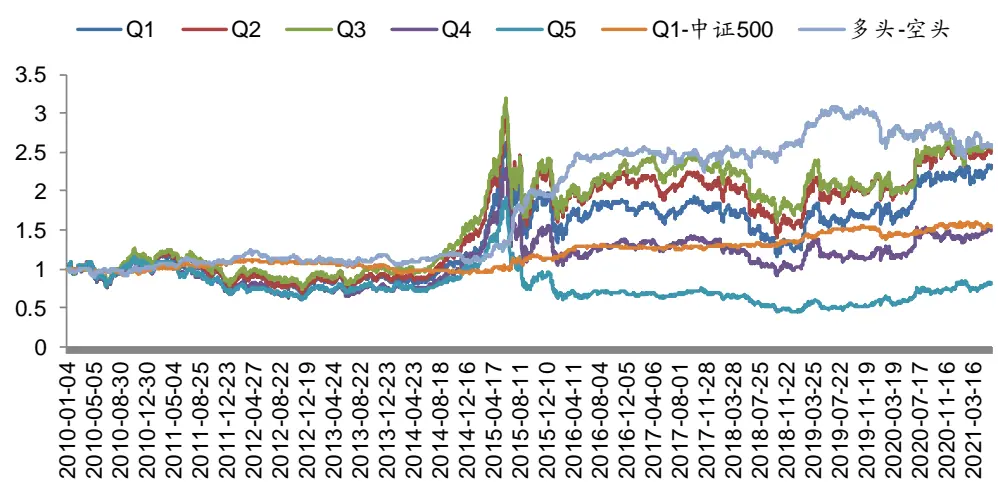
数据来源：Wind、广发证券发展研究中心

表1：ACD收集派发指标(20日)分年度绩效指标表现一览

|  | 多头收益 率 | 多头换 |  |  |  | 多头平 均收益 | 多头 IR | 多头收 益波动 |  |  | 超额胜 率 | 多空收益 率 | 夏普 比 |  |
| --- | --- | --- | --- | --- | --- | --- | --- | --- | --- | --- | --- | --- | --- | --- |
|  |  | 手率均 值 | IC 均值 | IC 胜率 ICIR | 最大回 撒 |  |  |  |  |  |  |  |  | 超额收 益率 |
| 2010 | 8.40% | 47.3% | -1.93% | 58.0% | -0.11 | 率 0.05% | 0.03 | 率 1.74% |  |  |  |  |  |  |
| 2011 | -27.66% | 41.6% | -1.11% | 52.9% | -0.11 | -0.12% | -0.08 | 1.55% | 10.30% 4.05% | -1.82% 9.19% | 45.0% 52.1% | 1.57% 6.87% | -0.11 1.54 |  |
| 2012 | 1.30% | 41.9% | -0.19% | 50.0% | -0.02 | 0.02% | 0.01 | 1.61% | 5.55% | 1.12% | 47.7% | 1.68% | 0.24 |  |
| 2013 | 11.35% | 39.2% | 0.18% | 54.9% | 0.02 | 0.06% | 0.04 | 1.44% | 8.29% | -5.09% | 41.6% | 5.48% | -0.6 |  |
| 2014 | 27.99% | 41.2% | 0.76% | 50.9% | 0.07 | 0.11% | 0.09 | 1.21% | 7.90% | -8.17% | 47.4% | -8.75% | -1.39 |  |
| 2015 | 69.95% | 50.3% | -4.78% | 59.6% | -0.34 | 0.27% | 0.08 | 3.18% | 7.69% | 20.65% | 49.2% | 84.69% | 1.33 |  |
| 2016 | -9.00% | 42.4% | -3.53% | 64.0% | -0.36 | -0.02% | -0.01 | 2.01% | 3.47% | 11.03% | 49.2% | 26.45% | 1.88 |  |
| 2017 | 1.86% | 39.1% | 0.08% | 51.0% | 0.01 | 0.01% | 0.01 | 0.95% | 4.13% | 1.95% | 52.9% | -0.63% | 0.37 |  |
| 2018 | -30.56% | 36.0% | -0.78% | 56.9% | -0.06 | -0.14% | -0.08 | 1.68% | 3.72% | 4.56% | 49.0% | 4.79% | 0.71 |  |
| 2019 | 43.96% | 38.1% | -2.64% | 64.7% | -0.26 | 0.16% | 0.11 | 1.50% | 3.24% | 13.83% | 54.1% | 16.30% | 2.17 |  |
| 2020 | 23.63% | 41.0% | 1.93% | 57.7% | 0.16 | 0.10% | 0.06 | 1.55% | 9.68% | 1.62% | 51.9% | -12.28% | 0.23 |  |
| 2021 | 3.59% | 35.0% | 0.47% | 54.2% | 0.03 | 0.04% | 0.03 | 1.24% | 6.16% | -1.03% | 46.7% | -2.64% | -0.15 |  |

数据来源：Wind、广发证券发展研究中心

图3：ACD收集派发指标(6日)历史分档测算结果
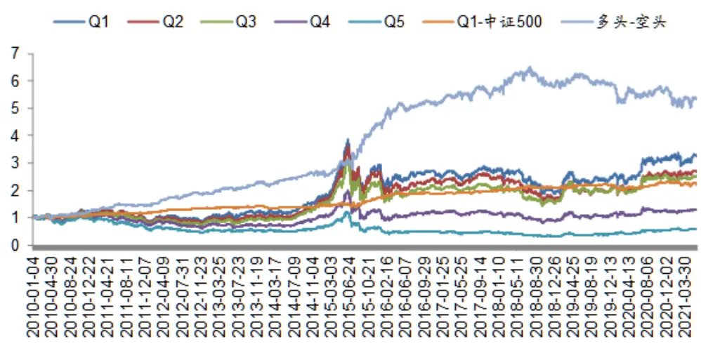
数据来源：Wind、广发证券发展研究中心

表2：ACD收集派发指标(6日)分年度绩效指标表现一览

|  | 多头收益 率 | 多头换 |  |  |  | 多头平 ICIR | 多头 IR | 多头收 益波动 率 | 最大回 撤 | 超额收 益率 | 超额胜 率 | 多空收益 率 | 夏普 比 |
| --- | --- | --- | --- | --- | --- | --- | --- | --- | --- | --- | --- | --- | --- |
|  |  | 手率均 值 | IC 均值 | IC 胜率 | 均收益 率 |  |  |  |  |  |  |  |  |
| 2010 | 18.83% | 72.1% | -3.13% | 60.0% | -0.24 | 0.09% | 0.05 | 1.80% | 6.15% | 8.10% | 53.3% | 23.42% | 0.92 |
| 2011 | -26.99% | 66.1% | -2.48% | 54.9% | -0.25 | -0.12% | -0.08 | 1.54% | 2.91% | 10.19% | 54.9% | 18.09% | 1.81 |
| 2012 | 13.92% | 70.9% | -3.12% | 56.0% | -0.29 | 0.07% | 0.04 | 1.57% | 1.97% | 13.57% | 59.3% | 29.50% | 2.63 |
| 2013 | 22.53% | 65.6% | -2.32% | 54.9% | -0.24 | 0.10% | 0.06 | 1.50% | 3.02% | 4.79% | 54.2% | 22.26% | 0.77 |
| 2014 | 42.29% | 69.7% | -1.04% | 60.4% | -0.12 | 0.15% | 0.12 | 1.25% | 6.05% | 2.24% | 47.8% | 12.82% | 0.43 |
| 2015 | 67.60% | 76.1% | -4.40% | 59.6% | -0.27 | 0.27% | 0.08 | 3.29% | 11.41% | 19.86% | 53.3% | 71.87% | 1.23 |
| 2016 | -11.99% | 69.0% | -2.61% | 62.0% | -0.23 | -0.03% | -0.02 | 2.00% | 2.90% | 7.36% | 51.2% | 16.09% | 1.27 |
| 2017 | 6.48% | 67.0% | -2.04% | 64.7% | -0.2 | 0.03% | 0.03 | 0.95% | 2.97% | 6.60% | 53.7% | 10.18% | 1.23 |
| 2018 | -30.39% | 62.8% | 0.83% | 51.0% | 0.07 | -0.13% | -0.08 | 1.68% | 3.66% | 4.85% | 54.3% | 1.61% | 0.82 |
| 2019 | 33.01% | 65.3% | -0.41% | 49.0% | -0.04 | 0.13% | 0.09 | 1.45% | 4.26% | 4.99% | 54.1% | 1.12% | 0.89 |
| 2020 | 27.77% | 66.1% | 0.61% | 51.9% | 0.06 | 0.11% | 0.07 | 1.66% | 7.92% | 5.60% | 49.8% | -6.33% | 0.8 |
| 2021 | 1.71% | 60.3% | 0.44% | 50.0% | 0.03 | 0.02% | 0.02 | 1.32% | 7.38% | -2.68% | 43.9% | -2.46% | -0.53 |

数据来源：Wind、广发证券发展研究中心

图4：AD指标历史分档测算结果
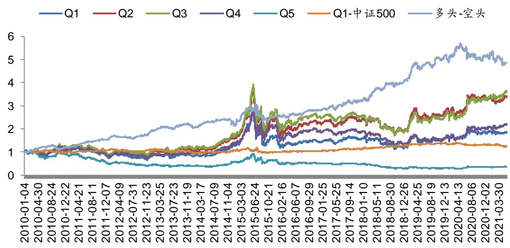
数据来源：Wind、广发证券发展研究中心

表3：AD指标分年度绩效指标表现一览

|  | 多头收益 率 | 多头换 手率均 | IC 均值 | IC 胜率 | ICIR | 多头平 均收益 | 多头 IR | 多头收 益波动 | 最大回 撒 | 超额收 益率 | 超额胜 率 | 多空收益 率 | 夏普 比 |
| --- | --- | --- | --- | --- | --- | --- | --- | --- | --- | --- | --- | --- | --- |
| 2010 | 5.15% | 值 70.9% | -2.70% | 64.0% | -0.21 | 率 0.04% | 0.02 | 率 1.76% | 12.57% | -4.46% | 45.9% | 16.47% |  |
| 2011 | -26.37% | 68.6% | -2.95% | 68.6% | -0.36 | -0.11% | -0.08 | 1.50% | 4.70% | 10.97% | 53.3% | 31.17% | -0.5 1.92 |
| 2012 | 4.35% | 71.7% | -2.73% | 56.0% | -0.28 | 0.03% | 0.02 | 1.56% | 9.60% | 3.99% | 52.3% | 22.68% | 0.78 |
| 2013 | 5.20% | 68.2% | -3.19% | 60.8% | -0.33 | 0.03% | 0.02 | 1.51% | 12.40% | -10.05% | 43.3% | 13.41% | -1.49 |
| 2014 | 49.59% | 68.8% | -0.54% | 52.8% | -0.06 | 0.17% | 0.14 | 1.26% | 5.74% | 7.36% | 51.0% | 1.67% | 0.94 |
| 2015 | 30.99% | 78.7% | -4.90% | 69.2% | -0.31 | 0.16% | 0.05 | 3.23% | 18.76% | -6.98% | 48.0% | 18.27% | -0.35 |
| 2016 | -14.40% | 71.4% | 1.55% | 64.0% | 0.16 | -0.05% | -0.02 | 1.92% | 3.81% | 3.95% | 46.3% | 9.69% | 0.66 |
| 2017 | 8.68% | 68.8% | -1.60% | 58.8% | -0.18 | 0.04% | 0.04 | 1.00% | 4.16% | 8.88% | 55.3% | 14.69% | 1.46 |
| 2018 | -25.20% | 71.5% | -0.29% | 54.9% | -0.03 | -0.11% | -0.07 | 1.62% | 4.38% | 12.37% | 56.0% | 24.66% | 1.93 |
| 2019 | 39.69% | 69.5% | -1.50% | 49.0% | -0.14 | 0.15% | 0.1 | 1.52% | 3.64% | 10.56% | 56.2% | 30.16% | 1.78 |
| 2020 | 14.14% | 74.0% | 1.17% | 57.7% | 0.12 | 0.07% | 0.04 | 1.56% | 8.59% | -6.13% | 46.1% | -2.31% | -0.74 |
| 2021 | -1.51% | 70.2% | 2.35% | 50.0% | 0.24 | -0.01% | -0.01 | 1.08% | 7.41% | -5.95% | 43.0% | -4.18% | -1.71 |

数据来源：Wind、广发证券发展研究中心

图5：AD指标(20日)历史分档测算结果
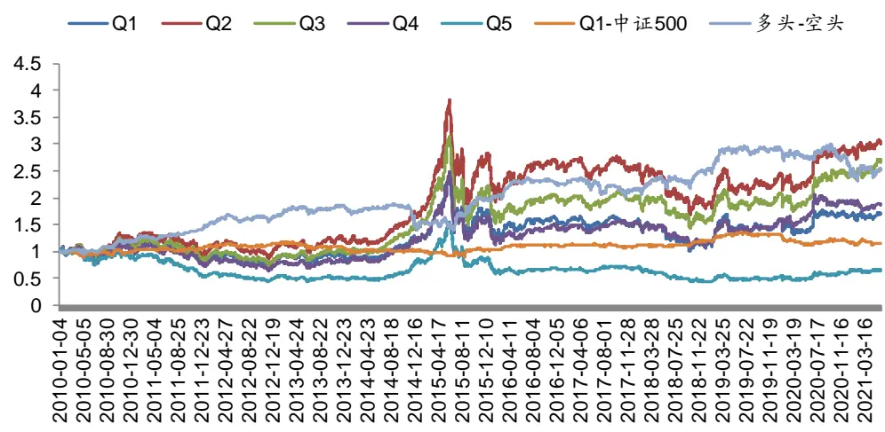
数据来源：Wind、广发证券发展研究中心

表4：AD指标(20日)分年度绩效指标表现一览

|  | 多头收益 率 | 多头换 |  |  |  | 多头平 | 多头 IR | 多头收 益波动 率 | 最大回 撤 | 超额收 益率 | 超额胜 率 | 多空收益 率 | 夏普 比 |
| --- | --- | --- | --- | --- | --- | --- | --- | --- | --- | --- | --- | --- | --- |
|  |  | 手率均 值 | IC 均值 | IC 胜率 | 均收益 率 |  |  |  |  |  |  |  |  |
| 2010 | 8.58% | 47.1% | -3.85% | 58.0% | -0.3 | 0.05% | 0.03 | 1.77% | 11.32% | -1.71% | 49.2% | 18.99% | -0.08 |
| 2011 | -28.16% | 38.9% | -2.91% | 62.8% | -0.32 | -0.12% | -0.08 | 1.52% | 4.73% | 8.27% | 49.6% | 20.11% | 1.27 |
| 2012 | 8.63% | 41.5% | -2.80% | 58.0% | -0.24 | 0.05% | 0.03 | 1.61% | 6.24% | 8.41% | 52.7% | 14.57% | 1.48 |
| 2013 | 8.09% | 38.0% | -1.68% | 58.8% | -0.17 | 0.04% | 0.03 | 1.48% | 10.82% | -7.78% | 40.8% | 12.51% | -0.89 |
| 2014 | 30.87% | 38.1% | 2.46% | 58.5% | 0.22 | 0.12% | 0.09 | 1.25% | 7.79% | -6.02% | 48.2% | -23.25% | -0.96 |
| 2015 | 42.86% | 48.3% | -3.91% | 57.7% | -0.28 | 0.20% | 0.06 | 3.20% | 13.24% | 1.46% | 45.1% | 38.96% | 0.17 |
| 2016 | -11.38% | 38.2% | -1.75% | 52.0% | -0.17 | -0.03% | -0.02 | 1.98% | 2.86% | 7.97% | 51.6% | 14.28% | 1.52 |
| 2017 | -1.50% | 36.6% | 1.04% | 52.9% | 0.07 | 0.00% | 0 | 1.02% | 6.88% | -1.25% | 50.4% | -4.76% | -0.19 |
| 2018 | -27.87% | 36.1% | -1.80% | 62.8% | -0.15 | -0.12% | -0.07 | 1.70% | 3.79% | 8.69% | 53.1% | 14.15% | 1.35 |
| 2019 | 42.59% | 35.3% | -1.52% | 49.0% | -0.13 | 0.16% | 0.1 | 1.54% | 4.49% | 12.89% | 51.6% | 20.36% | 2.04 |
| 2020 | 8.02% | 39.4% | 1.47% | 51.9% | 0.14 | 0.04% | 0.03 | 1.55% | 15.92% | -11.26% | 43.2% | -11.68% | -1.24 |
| 2021 | 1.34% | 32.1% | 0.26% | 45.8% | 0.02 | 0.02% | 0.02 | 1.03% | 8.24% | -3.41% | 43.9% | -2.81% | -0.66 |

数据来源：Wind、广发证券发展研究中心

图6：AD指标(6日)历史分档测算结果
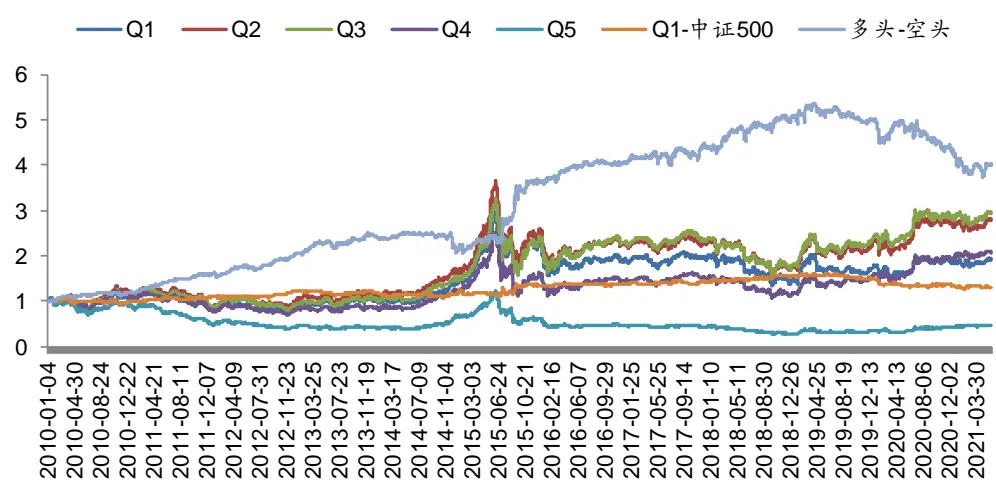
数据来源：Wind、广发证券发展研究中心

表5：AD指标(6日)分年度绩效指标表现一览

|  | 多头收益 率 | 多头换 手率均 | IC 均值 | IC 胜率 | ICIR | 多头平 均收益 | 多头 IR | 多头收 益波动 | 最大回 撤 | 超额收 益率 | 超额胜 率 | 多空收益 率 | 夏普 比 |
| --- | --- | --- | --- | --- | --- | --- | --- | --- | --- | --- | --- | --- | --- |
| 2010 | 7.49% | 值 71.4% | -3.58% | 60.0% | -0.31 | 率 0.05% | 0.03 | 率 1.78% | 8.82% | -2.43% | 48.4% | 18.77% | -0.19 |
| 2011 | -25.44% | 64.8% | -3.42% | 62.8% | -0.37 | -0.11% | -0.07 | 1.53% | 2.94% | 12.46% | 48.4% | 33.66% | 2.01 |
| 2012 | 10.96% | 70.0% | -3.16% | 62.0% | -0.28 | 0.06% | 0.03 | 1.59% | 4.00% | 10.68% | 55.1% | 26.48% | 1.95 |
| 2013 | 14.85% | 63.5% | -2.16% | 54.9% | -0.22 | 0.07% | 0.05 | 1.50% | 9.11% | -1.84% | 47.1% | 21.85% | -0.21 |
| 2014 | 40.96% | 66.8% | 0.93% | 50.9% | 0.09 | 0.15% | 0.12 | 1.25% | 8.24% | 1.23% | 50.6% | -12.37% | 0.22 |
| 2015 | 55.01% | 72.6% | -3.15% | 59.6% | -0.2 | 0.24% | 0.07 | 3.31% | 10.85% | 10.56% | 47.1% | 70.04% | 0.64 |
| 2016 | -15.94% | 66.7% | -0.38% | 46.0% | -0.04 | -0.05% | -0.03 | 1.97% | 2.93% | 2.39% | 46.7% | 11.09% | 0.48 |
| 2017 | 3.74% | 65.2% | -0.37% | 52.9% | -0.03 | 0.02% | 0.02 | 0.99% | 4.60% | 3.94% | 50.8% | 8.96% | 0.74 |
| 2018 | -28.21% | 65.4% | -1.31% | 51.0% | -0.12 | -0.12% | -0.07 | 1.67% | 3.19% | 8.08% | 51.0% | 12.02% | 1.3 |
| 2019 | 23.61% | 64.5% | 0.37% | 51.0% | 0.03 | 0.10% | 0.06 | 1.53% | 7.07% | -2.16% | 46.3% | 0.93% | -0.34 |
| 2020 | 8.04% | 63.4% | 1.66% | 46.2% | 0.15 | 0.04% | 0.03 | 1.61% | 13.03% | -10.93% | 39.1% | -15.65% | -1.41 |
| 2021 | 1.76% | 57.9% | 1.54% | 66.7% | 0.13 | 0.02% | 0.02 | 1.09% | 5.04% | -2.87% | 46.7% | -4.78% | -0.66 |

数据来源：Wind、广发证券发展研究中心

图7：ADTM动态买卖气指标历史分档测算结果
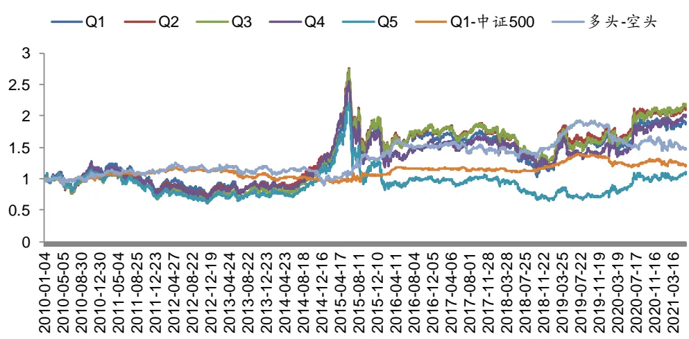
数据来源：Wind、广发证券发展研究中心

表6：ADTM动态买卖气指标分年度绩效指标表现一览

|  | 多头收益 率 | 多头换 手率均 | IC 均值 | IC 胜率 | ICIR | 多头平 均收益 率 | 多头 IR | 多头收 益波动 率 | 最大回 撒 | 超额收 益率 | 超额胜 率 | 多空收益 率 | 夏普 比 |
| --- | --- | --- | --- | --- | --- | --- | --- | --- | --- | --- | --- | --- | --- |
| 2010 | 13.63% | 44.8% | -1.51% | 54.0% | -0.08 | 0.07% | 0.04 | 1.73% | 9.48% | 2.64% | 47.5% | 6.76% | 0.27 |
| 2011 | -28.22% | 45.0% | -0.70% | 49.0% | -0.06 | -0.12% | -0.08 | 1.49% | 4.19% | 8.11% | 53.3% | 4.19% | 1.38 |
| 2012 | 2.54% | 43.8% | -0.24% | 48.0% | -0.02 | 0.02% | 0.01 | 1.56% | 6.81% | 2.15% | 49.4% | 2.23% | 0.4 |
| 2013 | 10.59% | 39.9% | 0.16% | 54.9% | 0.01 | 0.05% | 0.04 | 1.36% | 12.89% | -6.09% | 45.8% | 4.60% | -0.64 |
| 2014 | 22.46% | 38.2% | 2.89% | 60.4% | 0.23 | 0.09% | 0.08 | 1.18% | 11.76% | -12.25% | 46.5% | -23.57% | -1.93 |
| 2015 | 61.64% | 45.5% | -2.65% | 53.9% | -0.22 | 0.24% | 0.08 | 3.04% | 12.42% | 13.21% | 47.1% | 46.72% | 0.83 |
| 2016 | -11.12% | 41.3% | -2.28% | 62.0% | -0.19 | -0.03% | -0.01 | 1.98% | 4.65% | 8.31% | 50.4% | 13.96% | 1.52 |
| 2017 | -1.04% | 40.0% | 0.37% | 52.9% | 0.03 | 0.00% | 0 | 0.88% | 4.90% | -1.16% | 47.1% | -4.33% | -0.15 |
| 2018 | -30.19% | 39.1% | -1.04% | 60.8% | -0.08 | -0.14% | -0.09 | 1.53% | 6.15% | 4.47% | 49.8% | 1.28% | 0.66 |
| 2019 | 44.83% | 41.5% | -3.40% | 58.8% | -0.33 | 0.16% | 0.12 | 1.34% | 4.76% | 13.87% | 52.9% | 25.36% | 2.09 |
| 2020 | 16.43% | 43.2% | 1.49% | 61.5% | 0.12 | 0.07% | 0.05 | 1.46% | 11.66% | -4.69% | 49.4% | -14.47% | -0.45 |
| 2021 | -1.25% | 37.8% | 1.55% | 62.5% | 0.1 | -0.01% | -0.01 | 1.09% | 6.60% | -5.88% | 43.9% | -7.13% | -1.03 |

数据来源：Wind、广发证券发展研究中心

图8：DMI(ADX)历史分档测算结果
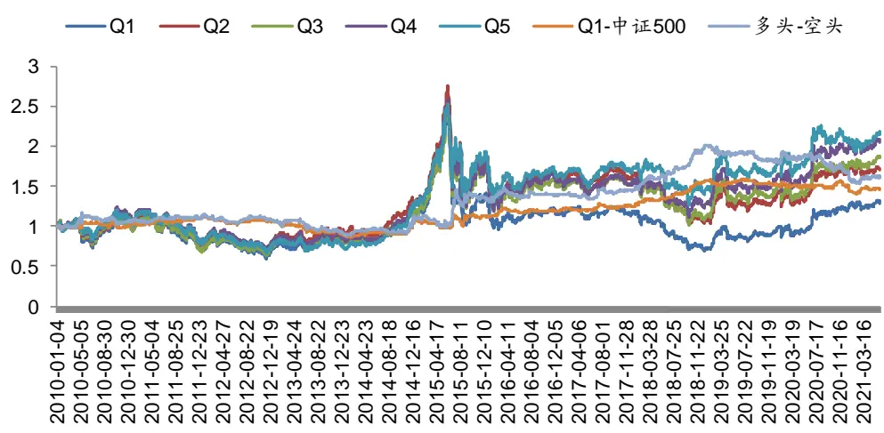
数据来源：Wind、广发证券发展研究中心

表7：DMI(ADX)分年度绩效指标表现一览

|  | 多头收益 率 | 多头换 |  |  |  | 多头平 ICIR | 多头 IR | 多头收 益波动 率 | 最大回 撤 | 超额收 益率 | 超额胜 率 | 多空收益 率 | 夏普 比 |
| --- | --- | --- | --- | --- | --- | --- | --- | --- | --- | --- | --- | --- | --- |
|  |  | 手率均 值 | IC 均值 | IC 胜率 | 均收益 率 |  |  |  |  |  |  |  |  |
| 2010 | 10.45% | 54.8% | 1.35% | 50.0% | 0.09 | 0.06% | 0.03 | 1.84% | 8.59% | 0.55% | 45.5% | 7.10% | 0.1 |
| 2011 | -27.14% | 54.0% | 0.84% | 52.9% | 0.09 | -0.12% | -0.08 | 1.52% | 3.14% | 9.90% | 53.3% | 3.58% | 1.94 |
| 2012 | -3.14% | 55.1% | -1.42% | 56.0% | -0.14 | 0.00% | 0 | 1.62% | 9.08% | -3.27% | 47.3% | -3.48% | -0.59 |
| 2013 | -0.79% | 51.0% | -1.70% | 56.9% | -0.17 | 0.01% | 0.01 | 1.53% | 15.56% | -15.13% | 42.0% | -13.66% | -2.15 |
| 2014 | 64.63% | 49.5% | 2.37% | 54.7% | 0.21 | 0.21% | 0.16 | 1.37% | 4.59% | 18.45% | 53.9% | 19.32% | 1.89 |
| 2015 | 45.65% | 56.9% | -0.34% | 65.4% | -0.02 | 0.21% | 0.06 | 3.27% | 12.58% | 4.07% | 48.0% | 20.73% | 0.34 |
| 2016 | -11.84% | 54.4% | 0.79% | 44.0% | 0.09 | -0.03% | -0.02 | 1.99% | 5.09% | 7.48% | 50.4% | 4.60% | 1.32 |
| 2017 | 3.16% | 49.3% | 0.63% | 47.1% | 0.08 | 0.02% | 0.02 | 0.92% | 4.48% | 3.23% | 50.0% | 3.49% | 0.66 |
| 2018 | -16.09% | 52.1% | 4.41% | 66.7% | 0.46 | -0.06% | -0.04 | 1.56% | 2.44% | 25.79% | 63.0% | 37.36% | 4.14 |
| 2019 | 24.61% | 52.5% | -1.54% | 62.8% | -0.2 | 0.10% | 0.07 | 1.43% | 4.93% | -1.66% | 45.5% | -7.58% | -0.33 |
| 2020 | 19.14% | 52.5% | -0.79% | 51.9% | -0.09 | 0.08% | 0.05 | 1.57% | 4.77% | -1.89% | 48.6% | -7.69% | -0.23 |
| 2021 | 1.73% | 50.1% | 1.30% | 50.0% | 0.14 | 0.02% | 0.02 | 1.02% | 5.62% | -2.89% | 49.5% | -3.86% | -0.92 |

数据来源：Wind、广发证券发展研究中心

图9：DMI(ADXR)历史分档测算结果
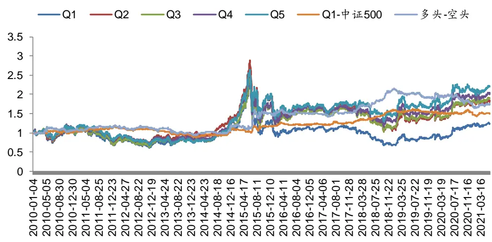
数据来源：Wind、广发证券发展研究中心

表8：DMI(ADXR)分年度绩效指标表现一览

|  | 多头收益 率 | 多头换 手率均 值 | IC 均值 | IC 胜率 | ICIR | 多头平 均收益 率 | 多头 IR | 多头收 益波动 | 最大回 撤 | 超额收 益率 | 超额胜 率 | 多空收益 率 | 夏普 比 |  |
| --- | --- | --- | --- | --- | --- | --- | --- | --- | --- | --- | --- | --- | --- | --- |
|  |  |  |  |  |  |  |  |  |  |  |  |  |  | 率 |
| 2010 | 11.32% | 54.4% | 1.44% | 50.0% | 0.09 | 0.06% | 0.03 | 1.84% | 8.11% | 1.33% | 45.9% | 7.30% | 0.18 |  |
| 2011 | -26.07% | 53.7% | 0.99% | 51.0% | 0.11 | -0.11% | -0.07 | 1.51% | 2.79% | 11.51% | 54.1% | 7.24% | 2.28 |  |
| 2012 | -3.11% | 54.6% | -1.21% | 56.0% | -0.12 | 0.00% | 0 | 1.63% | 9.06% | -3.22% | 45.3% | -3.86% | -0.57 |  |
| 2013 | -0.55% | 51.0% | -1.78% | 60.8% | -0.18 | 0.01% | 0.01 | 1.54% | 15.28% | -14.93% | 39.9% | -12.51% | -2.07 |  |
| 2014 | 65.16% | 48.9% | 2.38% | 56.6% | 0.21 | 0.21% | 0.16 | 1.37% | 4.91% | 18.82% | 55.5% | 22.80% | 1.88 |  |
| 2015 | 47.77% | 56.9% | -0.32% | 63.5% | -0.02 | 0.21% | 0.07 | 3.27% | 12.09% | 5.62% | 50.0% | 24.39% | 0.43 |  |
| 2016 | -14.58% | 54.0% | 0.82% | 44.0% | 0.09 | -0.04% | -0.02 | 1.98% | 5.59% | 4.12% | 45.5% | 1.50% | 0.77 |  |
| 2017 | 2.58% | 49.0% | 0.51% | 45.1% | 0.06 | 0.01% | 0.02 | 0.93% | 4.62% | 2.65% | 48.8% | 1.03% | 0.56 |  |
| 2018 | -15.75% | 51.6% | 4.43% | 66.7% | 0.48 | -0.06% | -0.04 | 1.56% | 2.35% | 26.30% | 63.0% | 38.91% | 4.19 |  |
| 2019 | 24.00% | 52.1% | -1.76% | 56.9% | -0.23 | 0.10% | 0.07 | 1.43% | 5.45% | -2.17% | 45.1% | -9.00% | -0.43 |  |
| 2020 | 20.70% | 52.3% | -0.90% | 55.8% | -0.1 | 0.09% | 0.06 | 1.57% | 4.74% | -0.60% | 47.3% | -7.25% | -0.05 |  |
| 2021 | 2.55% | 49.6% | 1.64% | 54.2% | 0.17 | 0.03% | 0.03 | 1.02% | 5.11% | -2.11% | 48.6% | -1.63% | -0.66 |  |

数据来源：Wind、广发证券发展研究中心

图10：成交金额(20日)历史分档测算结果
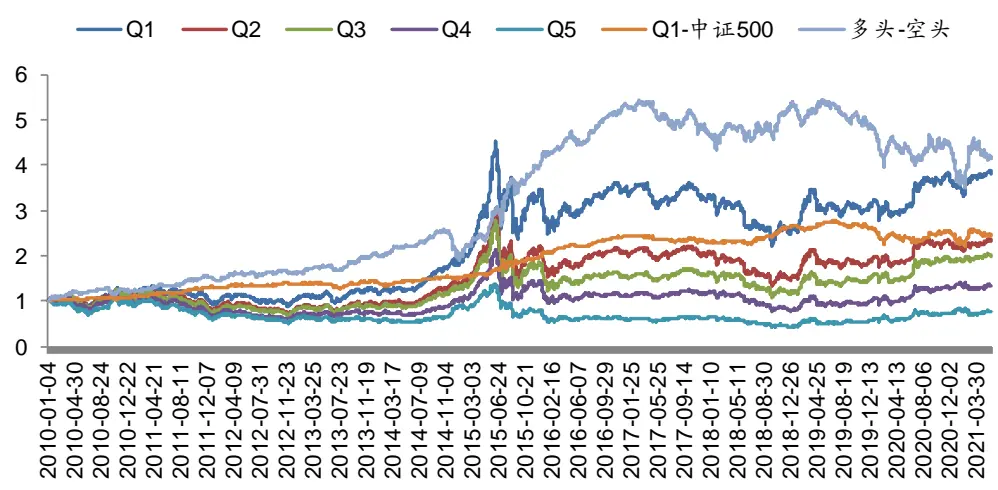
数据来源：Wind、广发证券发展研究中心

表9：成交金额(20日)分年度绩效指标表现一览

|  | 多头收益 率 | 多头换 手率均 | IC 均值 | IC 胜率 | ICIR | 多头平 均收益 率 | 多头 IR | 多头收 益波动 率 | 最大回 撤 | 超额收 益率 | 超额胜 率 | 多空收益 率 | 夏普 比 |
| --- | --- | --- | --- | --- | --- | --- | --- | --- | --- | --- | --- | --- | --- |
| 2010 | 17.34% | 20.0% | -3.09% | 72.0% | -0.25 | 0.08% | 0.05 | 1.61% | 6.32% | 5.99% | 50.4% | 20.49% | 0.75 |
| 2011 | -17.53% | 18.4% | -3.51% | 62.8% | -0.35 | -0.07% | -0.05 | 1.37% | 3.31% | 23.73% | 58.6% | 26.27% | 4.06 |
| 2012 | 6.11% | 16.5% | -1.51% | 60.0% | -0.12 | 0.04% | 0.02 | 1.46% | 3.32% | 5.40% | 54.3% | 5.28% | 1.22 |
| 2013 | 22.08% | 11.4% | -2.54% | 56.9% | -0.22 | 0.09% | 0.07 | 1.32% | 9.54% | 3.71% | 51.3% | 27.49% | 0.53 |
| 2014 | 45.59% | 11.9% | -0.78% | 62.3% | -0.06 | 0.16% | 0.14 | 1.16% | 6.15% | 4.32% | 47.4% | -5.62% | 0.72 |
| 2015 | 87.38% | 18.9% | -7.70% | 71.2% | -0.51 | 0.31% | 0.1 | 3.22% | 10.32% | 33.75% | 57.4% | 114.22% | 2.26 |
| 2016 | 0.74% | 11.8% | -5.03% | 72.0% | -0.52 | 0.02% | 0.01 | 1.85% | 2.75% | 22.04% | 61.5% | 29.85% | 4.27 |
| 2017 | -5.36% | 11.3% | 1.62% | 60.8% | 0.13 | -0.02% | -0.02 | 0.87% | 6.10% | -5.43% | 48.4% | -11.05% | -1.02 |
| 2018 | -23.51% | 9.0% | -1.24% | 47.1% | -0.08 | -0.10% | -0.07 | 1.45% | 3.57% | 14.18% | 56.4% | 10.47% | 2.11 |
| 2019 | 26.67% | 8.7% | 0.91% | 52.9% | 0.08 | 0.11% | 0.08 | 1.29% | 6.29% | -0.57% | 51.6% | -7.83% | -0.06 |
| 2020 | 13.59% | 10.9% | 2.60% | 59.6% | 0.16 | 0.06% | 0.05 | 1.33% | 13.41% | -7.62% | 44.9% | -17.80% | -0.62 |
| 2021 | 6.63% | 8.1% | -1.49% | 58.3% | -0.07 | 0.06% | 0.08 | 0.83% | 6.83% | 1.21% | 44.9% | 5.37% | 0.26 |

数据来源：Wind、广发证券发展研究中心

图11：成交金额方差(20日)历史分档测算结果
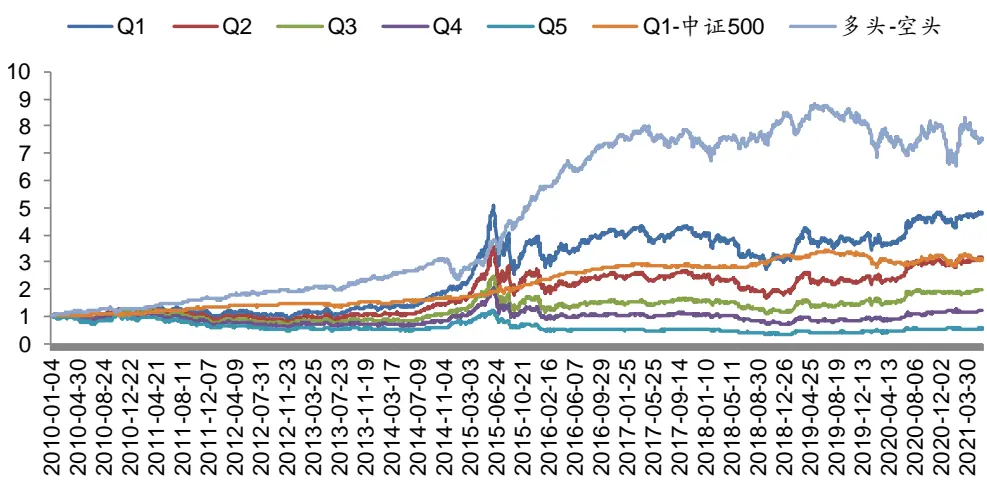
数据来源：Wind、广发证券发展研究中心

表10：成交金额方差(20日)分年度绩效指标表现一览

|  | 多头收益 率 | 多头换 手率均 | IC 均值 | IC 胜率 | ICIR | 多头平 均收益 率 | 多头 IR | 多头收 益波动 率 | 最大回 撤 | 超额收 益率 | 超额胜 率 | 多空收益 率 | 夏普 比 |
| --- | --- | --- | --- | --- | --- | --- | --- | --- | --- | --- | --- | --- | --- |
| 2010 | 17.34% | 28.3% | -3.99% | 76.0% | -0.35 | 0.08% | 0.05 | 1.64% | 5.49% | 6.13% | 52.1% | 24.70% | 0.76 |
| 2011 | -15.70% | 26.9% | -4.40% | 70.6% | -0.47 | -0.06% | -0.04 | 1.38% | 3.12% | 26.50% | 58.2% | 33.47% | 4.41 |
| 2012 | 8.29% | 24.0% | -2.49% | 64.0% | -0.19 | 0.04% | 0.03 | 1.48% | 2.98% | 7.64% | 56.0% | 13.69% | 1.69 |
| 2013 | 25.60% | 19.5% | -2.70% | 58.8% | -0.23 | 0.10% | 0.08 | 1.33% | 8.29% | 6.74% | 51.7% | 28.84% | 0.94 |
| 2014 | 48.51% | 20.0% | -1.06% | 56.6% | -0.08 | 0.17% | 0.14 | 1.16% | 5.44% | 6.40% | 49.0% | -3.04% | 1.02 |
| 2015 | 94.90% | 26.7% | -9.03% | 71.2% | -0.62 | 0.33% | 0.1 | 3.23% | 11.41% | 39.21% | 61.9% | 136.24% | 2.5 |
| 2016 | 3.58% | 20.3% | -5.79% | 72.0% | -0.6 | 0.03% | 0.02 | 1.87% | 2.47% | 25.61% | 65.2% | 37.48% | 5.03 |
| 2017 | -1.97% | 18.4% | 0.31% | 52.9% | 0.03 | 0.00% | 0 | 0.88% | 4.73% | -2.03% | 48.0% | -4.19% | -0.35 |
| 2018 | -23.56% | 15.8% | -1.54% | 49.0% | -0.11 | -0.10% | -0.07 | 1.46% | 3.14% | 14.17% | 55.6% | 13.34% | 2.19 |
| 2019 | 29.68% | 16.5% | -0.18% | 52.9% | -0.02 | 0.11% | 0.09 | 1.29% | 5.43% | 1.78% | 51.2% | -2.30% | 0.32 |
| 2020 | 15.79% | 17.5% | 1.55% | 55.8% | 0.11 | 0.07% | 0.05 | 1.33% | 13.52% | -5.82% | 46.1% | -10.63% | -0.45 |
| 2021 | 4.82% | 13.6% | -1.10% | 58.3% | -0.06 | 0.05% | 0.06 | 0.81% | 7.45% | -0.51% | 43.0% | 4.18% | -0.01 |

数据来源：Wind、广发证券发展研究中心

图12：成交金额方差(6日)历史分档测算结果
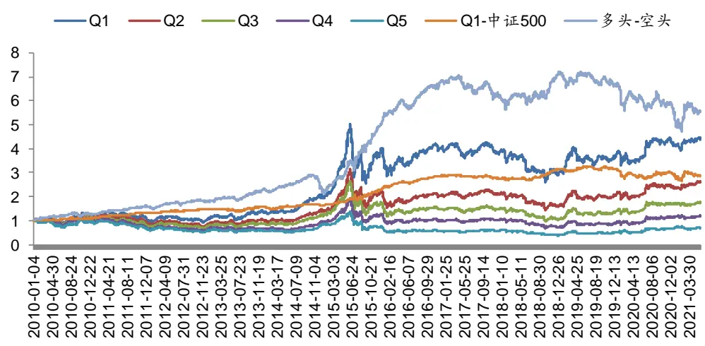
数据来源：Wind、广发证券发展研究中心

表11：成交金额方差(6日)分年度绩效指标表现一览

|  | 多头收益 率 | 多头换 手率均 | IC 均值 | IC 胜率 | ICIR | 多头平 均收益 率 | 多头 IR | 多头收 益波动 率 | 最大回 撤 | 超额收 益率 | 超额胜 率 | 多空收益 率 | 夏普 比 |
| --- | --- | --- | --- | --- | --- | --- | --- | --- | --- | --- | --- | --- | --- |
| 2010 | 20.33% | 48.4% | -4.11% | 78.0% | -0.37 | 0.09% | 0.05 | 1.67% | 4.37% | 8.97% | 52.1% | 25.99% | 1.1 |
| 2011 | -18.99% | 44.5% | -3.55% | 68.6% | -0.37 | -0.08% | -0.05 | 1.42% | 2.32% | 21.75% | 58.2% | 22.94% | 4.01 |
| 2012 | 10.43% | 43.6% | -2.58% | 64.0% | -0.21 | 0.05% | 0.03 | 1.50% | 2.47% | 9.86% | 53.5% | 15.21% | 2.27 |
| 2013 | 26.60% | 39.9% | -3.08% | 60.8% | -0.25 | 0.11% | 0.08 | 1.34% | 7.26% | 7.65% | 52.9% | 29.43% | 1.09 |
| 2014 | 44.22% | 40.2% | -0.58% | 54.7% | -0.04 | 0.16% | 0.13 | 1.17% | 6.11% | 3.37% | 53.1% | -7.15% | 0.57 |
| 2015 | 101.64% | 47.2% | -9.06% | 73.1% | -0.69 | 0.34% | 0.1 | 3.30% | 12.16% | 44.61% | 57.8% | 142.34% | 2.61 |
| 2016 | 0.99% | 43.1% | -5.61% | 72.0% | -0.56 | 0.02% | 0.01 | 1.89% | 2.47% | 22.57% | 70.5% | 31.94% | 4.63 |
| 2017 | -4.02% | 40.3% | 1.32% | 56.9% | 0.11 | -0.01% | -0.01 | 0.87% | 6.08% | -4.09% | 45.9% | -8.97% | -0.73 |
| 2018 | -23.81% | 36.3% | -1.39% | 52.9% | -0.1 | -0.10% | -0.07 | 1.48% | 3.43% | 13.85% | 56.8% | 13.71% | 2.15 |
| 2019 | 28.04% | 36.3% | 0.22% | 52.9% | 0.02 | 0.11% | 0.08 | 1.32% | 4.55% | 0.63% | 52.1% | -5.81% | 0.14 |
| 2020 | 11.80% | 35.9% | 2.58% | 59.6% | 0.19 | 0.06% | 0.04 | 1.35% | 13.39% | -8.98% | 44.0% | -19.72% | -0.77 |
| 2021 | 4.71% | 31.9% | -1.27% | 54.2% | -0.06 | 0.05% | 0.06 | 0.81% | 6.69% | -0.59% | 41.1% | 3.84% | -0.02 |

数据来源：Wind、广发证券发展研究中心

图13：ARBR(AR)历史分档测算结果
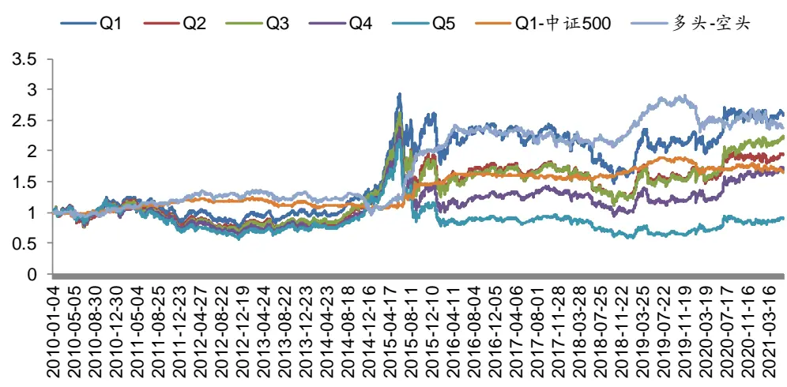
数据来源：Wind、广发证券发展研究中心

表12：ARBR(AR)分年度绩效指标表现一览

|  | 多头收益 率 | 多头换 手率均 | IC 均值 | IC 胜率 | ICIR | 多头平 均收益 | 多头 IR | 多头收 益波动 | 最大回 撤 | 超额收 益率 | 超额胜 率 | 多空收益 率 | 夏普 比 |
| --- | --- | --- | --- | --- | --- | --- | --- | --- | --- | --- | --- | --- | --- |
| 2010 | 13.53% | 值 39.4% | -1.69% | 50.0% | -0.09 | 率 0.07% | 0.04 | 率 1.73% | 8.38% | 2.60% | 46.7% | 4.52% | 0.27 |
| 2011 | -23.67% | 38.4% | -1.93% | 51.0% | -0.17 | -0.10% | -0.07 | 1.47% | 3.20% | 14.90% | 52.9% | 14.08% | 2.47 |
| 2012 | 1.91% | 37.4% | -1.19% | 48.0% | -0.09 | 0.02% | 0.01 | 1.55% | 6.75% | 1.47% | 51.4% | 5.16% | 0.28 |
| 2013 | 14.34% | 34.0% | 0.30% | 51.0% | 0.02 | 0.07% | 0.05 | 1.34% | 11.57% | -2.91% | 47.5% | 4.70% | -0.31 |
| 2014 | 26.06% | 31.9% | 3.30% | 52.8% | 0.23 | 0.10% | 0.09 | 1.15% | 9.40% | -9.75% | 45.7% | -26.09% | -1.51 |
| 2015 | 100.90% | 42.4% | -7.17% | 71.2% | -0.6 | 0.33% | 0.11 | 3.04% | 8.02% | 40.91% | 48.4% | 110.39% | 2.21 |
| 2016 | -10.88% | 34.1% | -3.06% | 56.0% | -0.29 | -0.03% | -0.01 | 1.91% | 3.34% | 8.28% | 50.4% | 13.27% | 1.6 |
| 2017 | -3.04% | 32.7% | 0.66% | 52.9% | 0.05 | -0.01% | -0.01 | 0.85% | 4.94% | -3.19% | 48.0% | -6.03% | -0.49 |
| 2018 | -28.57% | 32.6% | -1.08% | 52.9% | -0.08 | -0.13% | -0.08 | 1.51% | 5.22% | 6.80% | 49.8% | 4.30% | 0.95 |
| 2019 | 41.76% | 34.0% | -3.06% | 62.8% | -0.31 | 0.15% | 0.11 | 1.34% | 3.45% | 11.45% | 54.5% | 22.06% | 1.8 |
| 2020 | 16.27% | 35.9% | 0.77% | 50.0% | 0.06 | 0.07% | 0.05 | 1.46% | 11.69% | -4.79% | 52.7% | -7.20% | -0.49 |
| 2021 | -1.27% | 31.5% | 1.79% | 58.3% | 0.12 | -0.01% | -0.01 | 1.12% | 6.66% | -5.84% | 45.8% | -7.80% | -1.1 |

数据来源：Wind、广发证券发展研究中心

图14：ARBR(AR-BR)历史分档测算结果
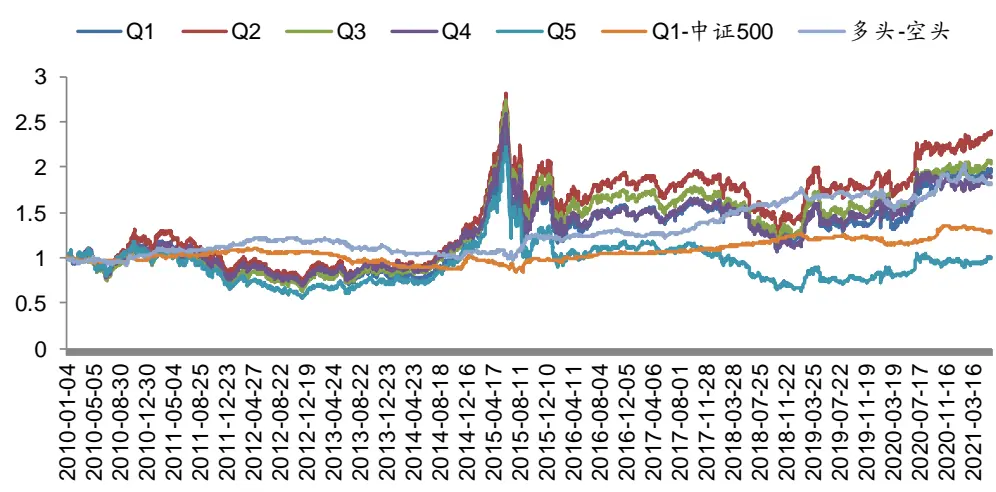
数据来源：Wind、广发证券发展研究中心

表13：ARBR(AR-BR)分年度绩效指标表现一览

|  | 多头收益 率 | 多头换 手率均 | IC 均值 | IC 胜率 | ICIR | 多头平 均收益 | 多头 IR | 多头收 益波动 | 最大回 撤 | 超额收 益率 | 超额胜 率 | 多空收益 率 | 夏普 比 |
| --- | --- | --- | --- | --- | --- | --- | --- | --- | --- | --- | --- | --- | --- |
|  | 8.07% | 值 36.2% | -0.31% |  |  | 率 0.05% | 0.03 | 率 1.74% | 7.10% | -1.94% |  |  |  |
| 2010 2011 | -27.20% | 37.5% | -1.03% | 48.0% 51.0% | -0.03 -0.14 | -0.12% | -0.08 | 1.42% | 3.00% | 9.43% | 41.3% 52.5% | 2.84% 8.35% | -0.17 1.93 |
| 2012 | -0.72% | 36.1% | -0.32% | 52.0% | -0.04 | 0.01% | 0.01 | 1.49% | 5.00% | -1.29% | 48.6% | 4.36% | -0.29 |
| 2013 | 5.34% | 29.1% | 1.29% | 49.0% | 0.17 | 0.03% | 0.02 | 1.41% | 12.08% | -10.19% | 39.5% | -5.08% | -1.69 |
| 2014 | 48.67% | 30.0% | 0.57% | 50.9% | 0.09 | 0.17% | 0.14 | 1.26% | 7.52% | 6.79% | 44.9% | -3.51% | 1.05 |
| 2015 | 36.82% | 38.9% | -0.68% | 53.9% | -0.08 | 0.18% | 0.06 | 3.05% | 18.27% | -3.50% | 41.8% | 16.17% | -0.22 |
| 2016 | -11.95% | 32.1% | -0.82% | 58.0% | -0.12 | -0.03% | -0.02 | 1.89% | 3.06% | 6.87% | 49.2% | 2.19% | 1.55 |
| 2017 | 4.50% | 29.5% | -2.00% | 62.8% | -0.24 | 0.02% | 0.02 | 0.88% | 1.26% | 4.53% | 49.6% | 11.87% | 1.37 |
| 2018 | -24.31% | 30.5% | -2.88% | 66.7% | -0.38 | -0.10% | -0.07 | 1.52% | 1.45% | 13.36% | 60.9% | 18.23% | 2.84 |
| 2019 | 25.04% | 31.5% | -0.76% | 58.8% | -0.1 | 0.10% | 0.07 | 1.38% | 5.68% | -1.50% | 49.6% | 3.40% | -0.29 |
| 2020 | 32.26% | 32.2% | -1.20% | 55.8% | -0.1 | 0.13% | 0.08 | 1.51% | 6.40% | 8.68% | 53.1% | 5.86% | 1.14 |
| 2021 | 0.77% | 28.9% | 0.15% | 50.0% | 0.01 | 0.01% | 0.01 | 1.03% | 5.84% | -3.75% | 49.5% | -0.56% | -1.71 |

数据来源：Wind、广发证券发展研究中心

图15：ARC变化率指数均值(50日)历史分档测算结果
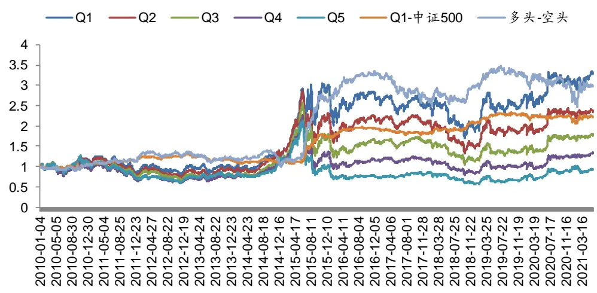
数据来源：Wind、广发证券发展研究中心

表14：ARC变化率指数均值(50日)分年度绩效指标表现一览

|  | 多头收益 率 | 多头换 手率均 | IC 均值 | IC 胜率 | ICIR | 多头平 均收益 率 | 多头 IR | 多头收 益波动 率 | 最大回 撤 | 超额收 益率 | 超额胜 率 | 多空收益 率 | 夏普 比 |
| --- | --- | --- | --- | --- | --- | --- | --- | --- | --- | --- | --- | --- | --- |
| 2010 | 15.05% | 27.6% | -1.11% | 48.0% | -0.06 | 0.07% | 0.04 | 1.82% | 8.56% | 4.25% | 49.6% | 2.96% | 0.38 |
| 2011 | -26.89% | 26.8% | -2.27% | 60.8% | -0.18 | -0.12% | -0.07 | 1.61% | 3.62% | 10.63% | 51.2% | 11.94% | 1.9 |
| 2012 | 10.65% | 25.8% | -1.69% | 50.0% | -0.11 | 0.06% | 0.03 | 1.70% | 5.74% | 10.73% | 53.5% | 12.28% | 1.52 |
| 2013 | 6.32% | 24.5% | 2.07% | 51.0% | 0.12 | 0.04% | 0.02 | 1.48% | 14.02% | -9.36% | 45.8% | -6.88% | -0.98 |
| 2014 | 27.29% | 23.1% | 1.54% | 54.7% | 0.1 | 0.11% | 0.09 | 1.24% | 11.10% | -8.67% | 48.2% | -17.61% | -1.24 |
| 2015 | 132.20% | 33.2% | -9.11% | 67.3% | -0.54 | 0.40% | 0.13 | 3.16% | 5.87% | 63.64% | 53.7% | 167.12% | 2.76 |
| 2016 | -8.99% | 26.1% | -3.61% | 60.0% | -0.31 | -0.02% | -0.01 | 2.11% | 2.70% | 11.60% | 51.6% | 24.17% | 1.81 |
| 2017 | -6.39% | 24.0% | 3.02% | 58.8% | 0.18 | -0.02% | -0.02 | 1.03% | 7.97% | -6.20% | 46.7% | -18.50% | -0.9 |
| 2018 | -24.32% | 23.6% | -1.23% | 47.1% | -0.07 | -0.10% | -0.06 | 1.74% | 5.49% | 14.08% | 52.7% | 9.47% | 1.61 |
| 2019 | 41.65% | 24.4% | -0.73% | 54.9% | -0.06 | 0.15% | 0.1 | 1.51% | 2.77% | 12.03% | 53.7% | 12.21% | 1.85 |
| 2020 | 15.37% | 25.8% | 1.61% | 63.5% | 0.13 | 0.07% | 0.05 | 1.54% | 7.47% | -5.29% | 44.4% | -14.13% | -0.53 |
| 2021 | 5.97% | 22.3% | -1.24% | 41.7% | -0.05 | 0.06% | 0.05 | 1.20% | 6.41% | 1.06% | 46.7% | 4.86% | 0.24 |

数据来源：Wind、广发证券发展研究中心

图16：Aroon指数历史分档测算结果
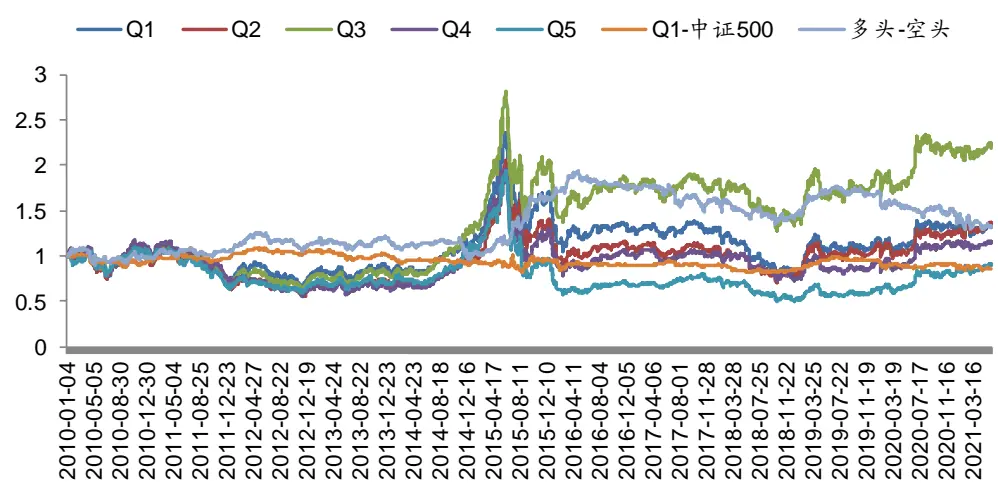
数据来源：Wind、广发证券发展研究中心

表15：Aroon指数分年度绩效指标表现一览

|  | 多头收益 率 | 多头换 |  |  |  | 多头平 ICIR | 多头 IR | 多头收 益波动 率 | 最大回 撤 | 超额收 益率 | 超额胜 率 | 多空收益 率 | 夏普 比 |
| --- | --- | --- | --- | --- | --- | --- | --- | --- | --- | --- | --- | --- | --- |
|  |  | 手率均 值 | IC 均值 | IC 胜率 | 均收益 率 |  |  |  |  |  |  |  |  |
| 2010 | 3.00% | 57.0% | -0.07% | 44.9% | 0 | 0.03% | 0.02 | 1.75% | 14.33% | -6.90% | 47.1% | -1.63% | -0.49 |
| 2011 | -30.29% | 64.9% | -1.53% | 51.0% | -0.14 | -0.14% | -0.09 | 1.49% | 7.76% | 4.91% | 54.1% | 7.07% | 0.71 |
| 2012 | 8.23% | 65.7% | -1.24% | 48.0% | -0.09 | 0.04% | 0.03 | 1.58% | 7.48% | 7.86% | 51.0% | 6.12% | 1.29 |
| 2013 | 12.70% | 56.6% | -1.03% | 52.9% | -0.08 | 0.06% | 0.04 | 1.42% | 11.06% | -4.05% | 45.0% | 6.90% | -0.43 |
| 2014 | 24.90% | 51.8% | 2.84% | 56.6% | 0.24 | 0.10% | 0.08 | 1.21% | 10.75% | -10.41% | 45.3% | -20.33% | -1.65 |
| 2015 | 50.31% | 58.7% | -4.32% | 62.8% | -0.31 | 0.22% | 0.07 | 3.13% | 19.02% | 5.17% | 45.9% | 72.22% | 0.34 |
| 2016 | -21.91% | 55.1% | -2.19% | 54.2% | -0.19 | -0.08% | -0.04 | 1.93% | 12.31% | -5.35% | 45.5% | 8.21% | -0.53 |
| 2017 | -0.87% | 56.2% | 1.30% | 52.9% | 0.1 | 0.00% | 0 | 0.89% | 7.32% | -0.92% | 49.2% | -8.98% | -0.14 |
| 2018 | -37.34% | 56.5% | 0.87% | 49.0% | 0.06 | -0.18% | -0.11 | 1.59% | 10.13% | -6.00% | 45.7% | -12.17% | -0.82 |
| 2019 | 44.41% | 59.0% | -3.39% | 58.8% | -0.31 | 0.16% | 0.11 | 1.41% | 4.57% | 13.84% | 52.5% | 18.72% | 2.3 |
| 2020 | 14.95% | 56.7% | 1.14% | 55.8% | 0.1 | 0.07% | 0.05 | 1.51% | 9.59% | -5.65% | 48.6% | -12.82% | -0.62 |
| 2021 | -0.71% | 51.7% | 1.28% | 50.0% | 0.07 | 0.00% | 0 | 1.20% | 6.11% | -5.29% | 44.9% | -10.43% | -0.86 |

数据来源：Wind、广发证券发展研究中心

图17：Aroon指数(下降数)历史分档测算结果
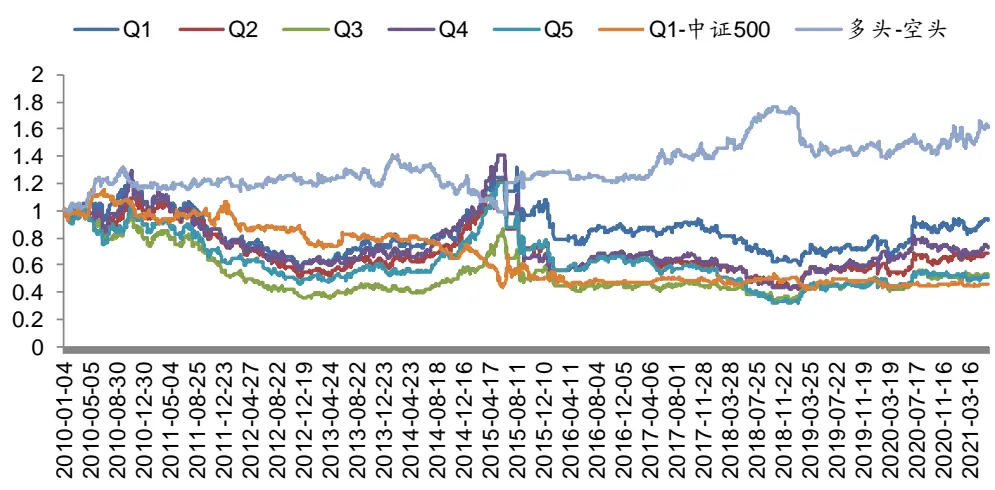
数据来源：Wind、广发证券发展研究中心

表16：Aroon指数(下降数)分年度绩效指标表现一览

|  | 多头收益 率 | 多头换 |  |  |  | 多头平 ICIR | 多头 IR | 多头收 益波动 率 | 最大回 撤 | 超额收 益率 | 超额胜 率 | 多空收益 率 | 夏普 比 |
| --- | --- | --- | --- | --- | --- | --- | --- | --- | --- | --- | --- | --- | --- |
|  |  | 手率均 值 | IC 均值 | IC 胜率 | 均收益 率 |  |  |  |  |  |  |  |  |
| 2010 | 7.01% | 49.2% | 0.63% | 43.9% | 0.05 | 0.04% | 0.03 | 1.52% | 17.57% | -4.46% | 53.7% | 17.46% | -0.23 |
| 2011 | -24.91% | 41.7% | -0.09% | 57.1% | -0.01 | -0.11% | -0.1 | 1.14% | 11.86% | 10.68% | 51.6% | 4.94% | 0.73 |
| 2012 | -23.25% | 38.6% | 1.58% | 51.5% | 0.13 | -0.10% | -0.09 | 1.10% | 26.24% | -25.52% | 47.7% | -1.63% | -1.75 |
| 2013 | 21.19% | 49.6% | 0.69% | 48.8% | 0.07 | 0.09% | 0.07 | 1.26% | 8.05% | 2.09% | 42.4% | 4.74% | 0.22 |
| 2014 | 29.43% | 51.6% | -1.96% | 52.2% | -0.17 | 0.11% | 0.1 | 1.14% | 21.99% | -7.68% | 49.8% | -2.12% | -0.69 |
| 2015 | 7.74% | 38.6% | 3.14% | 58.1% | 0.21 | 0.05% | 0.03 | 2.04% | 42.79% | -32.27% | 43.0% | 2.09% | -0.95 |
| 2016 | -19.97% | 45.6% | 0.80% | 50.0% | 0.12 | -0.08% | -0.06 | 1.40% | 19.34% | -6.91% | 43.9% | -2.61% | -0.22 |
| 2017 | 1.61% | 53.2% | -0.60% | 55.1% | -0.05 | 0.01% | 0.01 | 0.84% | 7.57% | 1.32% | 47.1% | 12.71% | 0.21 |
| 2018 | -27.18% | 44.7% | -3.37% | 62.9% | -0.32 | -0.12% | -0.1 | 1.19% | 13.33% | 6.71% | 52.3% | 26.56% | 0.49 |
| 2019 | 26.03% | 47.4% | 3.15% | 60.5% | 0.32 | 0.10% | 0.09 | 1.11% | 18.90% | -2.49% | 45.9% | -15.97% | -0.1 |
| 2020 | 14.97% | 53.4% | 0.10% | 42.2% | 0.01 | 0.07% | 0.05 | 1.45% | 12.05% | -6.23% | 49.0% | 4.48% | -0.45 |
| 2021 | 3.87% | 59.5% | -0.94% | 58.3% | -0.06 | 0.04% | 0.04 | 1.11% | 8.42% | -0.84% | 57.0% | 5.36% | -0.15 |

数据来源：Wind、广发证券发展研究中心

图18：Aroon指数(上升数)历史分档测算结果
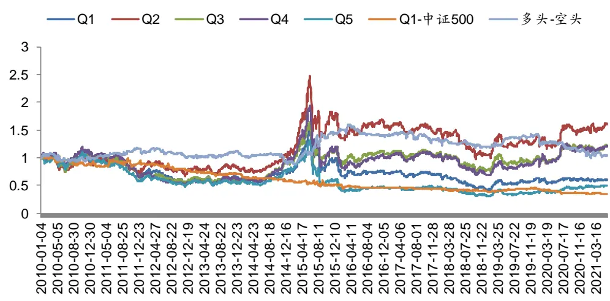
数据来源：Wind、广发证券发展研究中心

表17：Aroon指数(上升数)分年度绩效指标表现一览

|  | 多头收益 率 | 多头换 |  |  |  | 多头平 ICIR | 多头 IR | 多头收 益波动 率 | 最大回 撤 | 超额收 益率 | 超额胜 率 | 多空收益 率 | 夏普 比 |
| --- | --- | --- | --- | --- | --- | --- | --- | --- | --- | --- | --- | --- | --- |
|  |  | 手率均 值 | IC 均值 | IC 胜率 | 均收益 率 |  |  |  |  |  |  |  |  |
| 2010 | -2.33% | 54.2% | 0.53% | 57.1% | 0.03 | 0.00% | 0 | 1.60% | 16.33% | -12.63% | 44.6% | -1.08% | -0.76 |
| 2011 | -30.12% | 54.1% | -0.50% | 47.7% | -0.06 | -0.14% | -0.11 | 1.24% | 14.07% | 3.65% | 49.2% | 17.56% | 0.33 |
| 2012 | -13.59% | 57.2% | 0.01% | 55.6% | 0 | -0.05% | -0.04 | 1.33% | 20.04% | -15.15% | 46.9% | -11.59% | -1.24 |
| 2013 | 9.32% | 57.0% | -0.66% | 44.9% | -0.06 | 0.05% | 0.03 | 1.37% | 12.42% | -7.15% | 43.3% | 8.65% | -0.74 |
| 2014 | 12.55% | 51.9% | 2.49% | 60.0% | 0.24 | 0.05% | 0.05 | 1.07% | 20.35% | -19.85% | 44.9% | -21.47% | -2.1 |
| 2015 | 32.30% | 57.3% | -3.93% | 63.3% | -0.32 | 0.15% | 0.06 | 2.67% | 17.63% | -11.30% | 45.1% | 64.89% | -0.35 |
| 2016 | -25.14% | 58.7% | -2.06% | 60.9% | -0.18 | -0.10% | -0.06 | 1.79% | 14.47% | -10.20% | 46.3% | -2.35% | -0.76 |
| 2017 | -4.74% | 64.1% | 1.87% | 58.0% | 0.16 | -0.02% | -0.02 | 0.86% | 7.36% | -4.87% | 46.3% | -6.02% | -0.76 |
| 2018 | -37.41% | 57.7% | 1.21% | 50.0% | 0.1 | -0.18% | -0.12 | 1.46% | 8.47% | -6.81% | 46.5% | -10.79% | -0.66 |
| 2019 | 42.95% | 55.9% | -2.10% | 51.1% | -0.23 | 0.16% | 0.12 | 1.30% | 5.51% | 12.02% | 56.6% | 20.24% | 1.3 |
| 2020 | -1.61% | 61.8% | 1.01% | 49.0% | 0.08 | 0.00% | 0 | 1.35% | 24.51% | -20.14% | 47.7% | -22.58% | -1.58 |
| 2021 | -0.88% | 61.1% | 1.04% | 50.0% | 0.06 | 0.00% | 0 | 1.03% | 7.18% | -5.60% | 43.9% | -5.99% | -0.99 |

数据来源：Wind、广发证券发展研究中心

图19：ASI累计振动升降指标历史分档测算结果
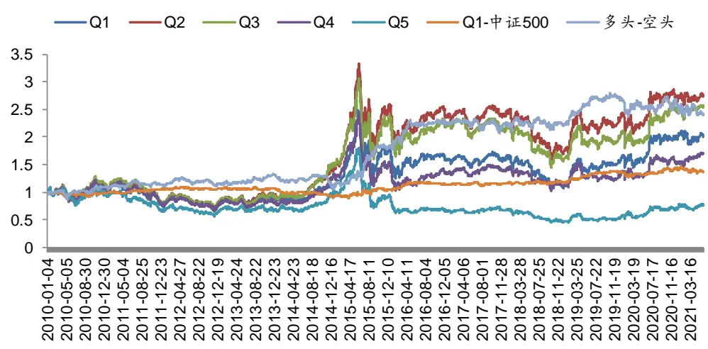
数据来源：Wind、广发证券发展研究中心

表18：ASI累计振动升降指标分年度绩效指标表现一览

|  | 多头收益 率 | 多头换 手率均 | IC 均值 | IC 胜率 | ICIR | 多头平 均收益 | 多头 IR | 多头收 益波动 | 最大回 撤 | 超额收 益率 | 超额胜 率 | 多空收益 率 | 夏普 比 |
| --- | --- | --- | --- | --- | --- | --- | --- | --- | --- | --- | --- | --- | --- |
| 2010 | 8.33% | 值 40.5% | -2.09% | 56.0% | -0.13 | 率 0.05% | 0.03 | 率 1.74% | 11.54% | -1.84% | 47.1% | 9.43% | -0.12 |
| 2011 | -28.45% | 35.3% | -0.71% | 58.8% | -0.07 | -0.13% | -0.08 | 1.55% | 4.35% | 8.00% | 54.1% | 4.52% | 1.41 |
| 2012 | 0.39% | 35.5% | -0.27% | 50.0% | -0.02 | 0.01% | 0.01 | 1.60% | 5.35% | 0.18% | 48.2% | 0.23% | 0.06 |
| 2013 | 17.55% | 34.0% | -0.61% | 47.1% | -0.05 | 0.08% | 0.05 | 1.44% | 5.13% | 0.22% | 47.1% | 14.73% | 0.07 |
| 2014 | 18.01% | 31.8% | 2.03% | 60.4% | 0.16 | 0.08% | 0.06 | 1.24% | 15.18% | -15.27% | 44.9% | -20.33% | -2.68 |
| 2015 | 65.28% | 45.6% | -5.75% | 69.2% | -0.46 | 0.25% | 0.08 | 3.10% | 8.78% | 16.75% | 48.8% | 76.16% | 1.16 |
| 2016 | -11.59% | 34.9% | -3.49% | 66.0% | -0.28 | -0.03% | -0.01 | 2.05% | 4.10% | 8.08% | 50.0% | 22.46% | 1.35 |
| 2017 | 1.61% | 32.5% | -0.03% | 43.1% | 0 | 0.01% | 0.01 | 0.94% | 5.73% | 1.68% | 50.8% | -1.21% | 0.32 |
| 2018 | -32.37% | 29.7% | -0.50% | 56.9% | -0.04 | -0.15% | -0.09 | 1.69% | 4.61% | 1.83% | 46.9% | -1.16% | 0.29 |
| 2019 | 46.81% | 32.3% | -3.54% | 64.7% | -0.37 | 0.17% | 0.11 | 1.49% | 3.36% | 16.05% | 57.8% | 22.80% | 2.55 |
| 2020 | 26.52% | 34.9% | 0.33% | 48.1% | 0.03 | 0.11% | 0.07 | 1.58% | 6.88% | 4.15% | 51.9% | -5.50% | 0.52 |
| 2021 | -0.15% | 27.4% | 1.94% | 62.5% | 0.13 | 0.01% | 0.01 | 1.27% | 8.22% | -4.55% | 47.7% | -6.41% | -0.89 |

数据来源：Wind、广发证券发展研究中心

图20：ATR平均真实波幅(12日)历史分档测算结果
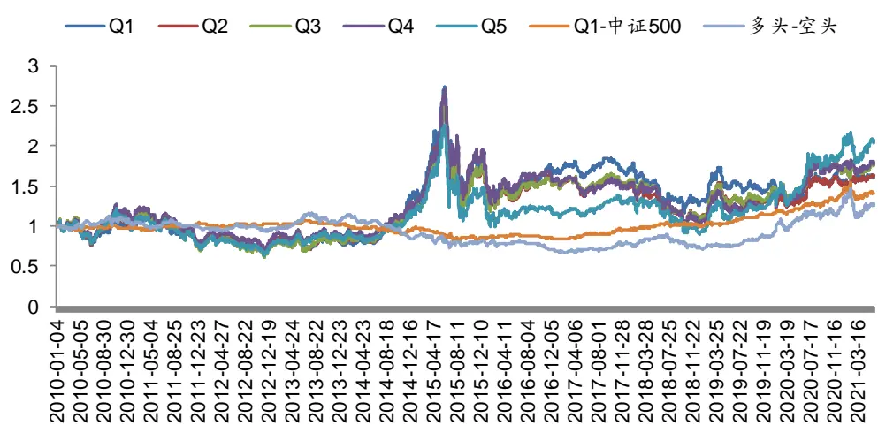
数据来源：Wind、广发证券发展研究中心

表19：ATR平均真实波幅(12日)分年度绩效指标表现一览

|  | 多头收益 率 | 多头换 手率均 | IC 均值 | IC 胜率 | ICIR | 多头平 均收益 率 | 多头 IR | 多头收 益波动 率 | 最大回 撤 | 超额收 益率 | 超额胜 率 | 多空收益 率 | 夏普 比 |
| --- | --- | --- | --- | --- | --- | --- | --- | --- | --- | --- | --- | --- | --- |
| 2010 | 7.67% | 16.3% | 1.93% | 54.0% | 0.17 | 0.05% | 0.03 | 1.79% | 6.80% | -1.88% | 49.6% | 9.04% | -0.3 |
| 2011 | -29.77% | 14.6% | -1.13% | 58.8% | -0.12 | -0.13% | -0.09 | 1.49% | 3.53% | 5.87% | 51.2% | -8.46% | 1.35 |
| 2012 | 0.07% | 13.2% | -0.57% | 44.0% | -0.06 | 0.01% | 0.01 | 1.50% | 4.77% | -0.49% | 44.9% | -3.48% | -0.09 |
| 2013 | 15.16% | 9.0% | 1.93% | 64.7% | 0.17 | 0.07% | 0.05 | 1.49% | 5.56% | -1.46% | 50.0% | 11.02% | -0.3 |
| 2014 | 32.47% | 10.3% | -2.19% | 54.7% | -0.23 | 0.12% | 0.1 | 1.28% | 12.21% | -4.71% | 43.3% | -20.79% | -0.95 |
| 2015 | 24.11% | 20.2% | -0.16% | 48.1% | -0.02 | 0.14% | 0.04 | 3.19% | 18.61% | -11.50% | 45.9% | -4.27% | -1.01 |
| 2016 | -19.88% | 10.9% | -2.38% | 58.0% | -0.22 | -0.07% | -0.04 | 1.99% | 6.26% | -2.24% | 46.7% | -14.43% | -0.57 |
| 2017 | 13.14% | 9.2% | 2.12% | 62.8% | 0.21 | 0.05% | 0.06 | 0.92% | 3.72% | 13.18% | 55.7% | 12.78% | 2.28 |
| 2018 | -29.52% | 6.8% | -0.73% | 49.0% | -0.05 | -0.13% | -0.08 | 1.66% | 4.64% | 5.99% | 51.4% | -6.35% | 0.89 |
| 2019 | 44.33% | 7.8% | 2.32% | 64.7% | 0.22 | 0.16% | 0.11 | 1.50% | 2.85% | 14.13% | 55.3% | 18.71% | 2.36 |
| 2020 | 48.47% | 11.9% | 5.30% | 65.4% | 0.33 | 0.18% | 0.1 | 1.73% | 4.46% | 23.10% | 58.9% | 44.06% | 2.82 |
| 2021 | 3.78% | 7.5% | 0.64% | 54.2% | 0.02 | 0.05% | 0.03 | 1.58% | 12.78% | -0.45% | 55.1% | 1.11% | -0.01 |

数据来源：Wind、广发证券发展研究中心

图21：ATR平均真实波幅(6日)历史分档测算结果
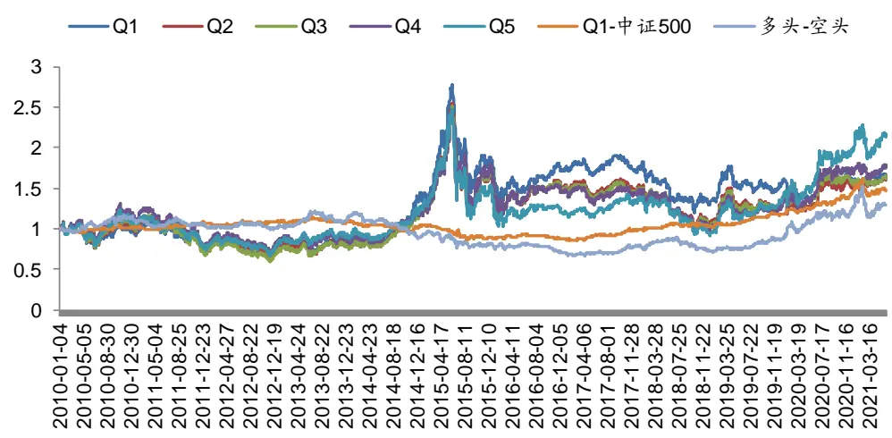
数据来源：Wind、广发证券发展研究中心

表20：ATR平均真实波幅(6日)分年度绩效指标表现一览

|  | 多头收益 率 | 多头换 |  |  |  | 多头平 ICIR | 多头 IR | 多头收 益波动 率 | 最大回 撒 | 超额收 益率 | 超额胜 率 | 多空收益 率 | 夏普 比 |
| --- | --- | --- | --- | --- | --- | --- | --- | --- | --- | --- | --- | --- | --- |
|  |  | 手率均 值 | IC 均值 | IC 胜率 | 均收益 率 |  |  |  |  |  |  |  |  |
| 2010 | 11.80% | 19.9% | 2.31% | 56.0% | 0.21 | 0.06% | 0.03 | 1.78% | 5.56% | 1.86% | 48.8% | 15.26% | 0.35 |
| 2011 | -29.66% | 18.7% | -0.97% | 58.8% | -0.1 | -0.13% | -0.09 | 1.48% | 3.96% | 6.01% | 50.0% | -8.19% | 1.43 |
| 2012 | 1.74% | 17.6% | -0.49% | 50.0% | -0.05 | 0.02% | 0.01 | 1.51% | 3.90% | 1.22% | 46.1% | -3.66% | 0.3 |
| 2013 | 15.43% | 13.1% | 1.82% | 64.7% | 0.16 | 0.07% | 0.05 | 1.49% | 5.92% | -1.24% | 48.7% | 9.05% | -0.24 |
| 2014 | 33.98% | 15.1% | -2.09% | 56.6% | -0.22 | 0.13% | 0.1 | 1.29% | 12.20% | -3.59% | 45.7% | -18.76% | -0.7 |
| 2015 | 19.85% | 25.0% | -0.51% | 51.9% | -0.05 | 0.13% | 0.04 | 3.20% | 19.52% | -14.44% | 44.7% | -10.07% | -1.3 |
| 2016 | -19.93% | 15.6% | -2.18% | 54.0% | -0.2 | -0.07% | -0.04 | 2.00% | 7.13% | -2.28% | 47.1% | -13.93% | -0.56 |
| 2017 | 12.36% | 14.4% | 2.18% | 62.8% | 0.21 | 0.05% | 0.06 | 0.93% | 3.81% | 12.40% | 54.9% | 12.45% | 2.14 |
| 2018 | -29.76% | 11.1% | -0.59% | 47.1% | -0.04 | -0.13% | -0.08 | 1.66% | 4.40% | 5.63% | 51.4% | -7.21% | 0.84 |
| 2019 | 44.81% | 12.4% | 2.35% | 62.8% | 0.22 | 0.16% | 0.11 | 1.49% | 2.68% | 14.49% | 54.5% | 19.41% | 2.41 |
| 2020 | 50.81% | 15.9% | 5.17% | 67.3% | 0.32 | 0.18% | 0.11 | 1.73% | 4.17% | 25.00% | 59.3% | 47.08% | 3.06 |
| 2021 | 4.00% | 11.3% | 0.58% | 54.2% | 0.02 | 0.05% | 0.03 | 1.57% | 12.59% | -0.25% | 57.0% | 1.37% | 0.02 |

数据来源：Wind、广发证券发展研究中心

图22：BBI多空指数历史分档测算结果
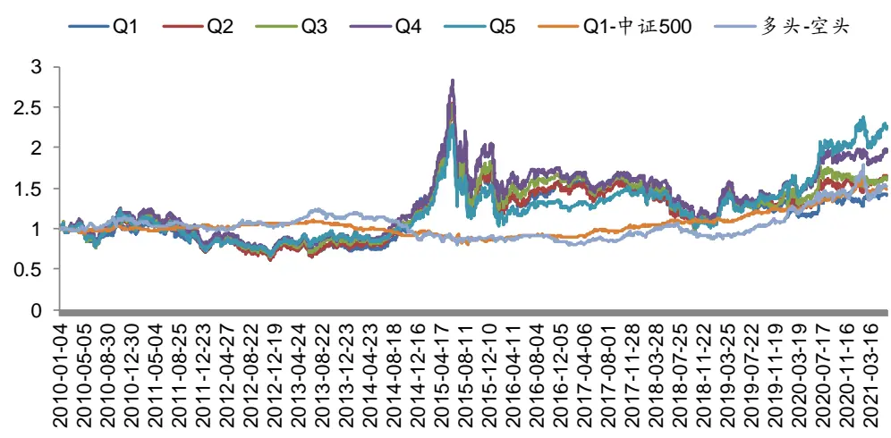
数据来源：Wind、广发证券发展研究中心

表21：BBI多空指数分年度绩效指标表现一览

|  | 多头收益 率 | 多头换 手率均 | IC 均值 | IC 胜率 | ICIR | 多头平 均收益 | 多头 IR | 多头收 益波动 | 最大回 撤 | 超额收 益率 | 超额胜 率 | 多空收益 率 | 夏普 比 |
| --- | --- | --- | --- | --- | --- | --- | --- | --- | --- | --- | --- | --- | --- |
| 2010 | 10.74% | 值 12.5% | 2.11% | 60.0% | 0.22 | 率 0.06% | 0.03 | 率 1.73% | 7.10% | 0.67% | 46.7% | 13.31% | 0.14 |
| 2011 | -31.05% | 11.8% | -1.10% | 49.0% | -0.13 | -0.14% | -0.1 | 1.42% | 4.19% | 3.67% | 46.3% | -9.67% | 0.79 |
| 2012 | 3.07% | 9.0% | -0.22% | 56.0% | -0.02 | 0.02% | 0.02 | 1.45% | 3.93% | 2.31% | 49.0% | 1.37% | 0.49 |
| 2013 | 14.19% | 3.9% | 1.71% | 64.7% | 0.19 | 0.07% | 0.05 | 1.42% | 5.60% | -2.52% | 52.5% | 11.57% | -0.54 |
| 2014 | 27.56% | 4.2% | -2.81% | 62.3% | -0.33 | 0.11% | 0.09 | 1.20% | 13.07% | -8.45% | 44.5% | -24.85% | -1.82 |
| 2015 | 29.32% | 14.7% | 0.43% | 53.9% | 0.05 | 0.15% | 0.05 | 3.07% | 16.63% | -8.60% | 43.0% | 3.79% | -0.71 |
| 2016 | -14.82% | 3.5% | -1.48% | 60.0% | -0.16 | -0.05% | -0.03 | 1.89% | 3.14% | 3.40% | 45.1% | -7.39% | 0.82 |
| 2017 | 13.25% | 2.7% | 2.47% | 60.8% | 0.24 | 0.05% | 0.07 | 0.81% | 4.10% | 12.98% | 53.3% | 12.84% | 2.04 |
| 2018 | -28.44% | 2.6% | -0.27% | 47.1% | -0.02 | -0.13% | -0.08 | 1.57% | 4.38% | 7.30% | 52.3% | -4.15% | 1.24 |
| 2019 | 43.76% | 2.6% | 2.73% | 58.8% | 0.28 | 0.16% | 0.11 | 1.40% | 3.92% | 13.26% | 52.1% | 19.81% | 2.08 |
| 2020 | 45.29% | 6.8% | 4.37% | 63.5% | 0.32 | 0.17% | 0.1 | 1.64% | 3.51% | 20.06% | 56.8% | 39.77% | 2.72 |
| 2021 | 4.16% | 3.1% | 0.17% | 54.2% | 0.01 | 0.05% | 0.03 | 1.47% | 11.37% | -0.20% | 56.1% | 0.70% | 0.02 |

数据来源：Wind、广发证券发展研究中心

图23：BBI_Close多空指数_收盘价历史分档测算结果
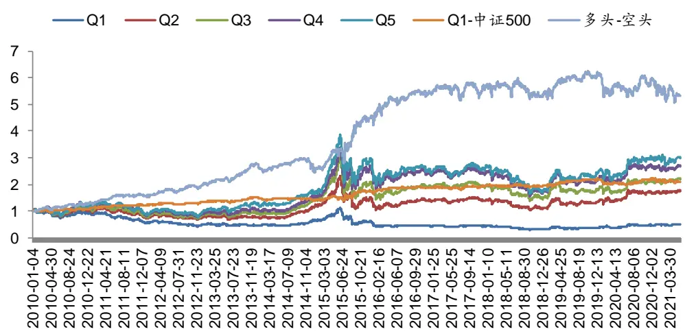
数据来源：Wind、广发证券发展研究中心

表22：BBI_Close多空指数_收盘价分年度绩效指标表现一览

|  | 多头收益 率 | 多头换 手率均 | IC 均值 | IC 胜率 | ICIR | 多头平 均收益 率 | 多头 IR | 多头收 益波动 率 | 最大回 撤 | 超额收 益率 | 超额胜 率 | 多空收益 率 | 夏普 比 |
| --- | --- | --- | --- | --- | --- | --- | --- | --- | --- | --- | --- | --- | --- |
| 2010 | 19.03% | 65.3% | 6.92% | 62.0% | 0.37 | 0.09% | 0.05 | 1.86% | 8.24% | 8.23% | 50.4% | 28.08% | 0.72 |
| 2011 | -25.35% | 63.9% | 3.63% | 56.9% | 0.27 | -0.11% | -0.07 | 1.63% | 2.95% | 13.00% | 56.2% | 22.55% | 1.96 |
| 2012 | 9.21% | 61.7% | 4.18% | 58.0% | 0.27 | 0.05% | 0.03 | 1.69% | 5.21% | 9.28% | 53.9% | 24.67% | 1.38 |
| 2013 | 31.77% | 62.6% | 5.03% | 66.7% | 0.44 | 0.13% | 0.08 | 1.51% | 5.87% | 12.65% | 53.8% | 41.03% | 1.55 |
| 2014 | 28.95% | 57.6% | -0.69% | 41.5% | -0.05 | 0.11% | 0.09 | 1.30% | 7.06% | -7.26% | 46.9% | -11.30% | -1.14 |
| 2015 | 75.13% | 64.5% | 6.53% | 59.6% | 0.33 | 0.29% | 0.09 | 3.31% | 10.82% | 25.04% | 51.6% | 86.34% | 1.34 |
| 2016 | -13.03% | 58.0% | 4.07% | 60.0% | 0.26 | -0.03% | -0.02 | 2.13% | 4.19% | 6.64% | 54.5% | 19.32% | 0.88 |
| 2017 | 4.02% | 59.0% | 1.32% | 52.9% | 0.09 | 0.02% | 0.02 | 1.04% | 5.82% | 4.30% | 54.9% | 4.50% | 0.68 |
| 2018 | -34.20% | 54.3% | -0.57% | 51.0% | -0.04 | -0.16% | -0.09 | 1.74% | 6.83% | -0.72% | 47.7% | -6.86% | -0.06 |
| 2019 | 44.49% | 57.9% | 2.19% | 51.0% | 0.16 | 0.16% | 0.11 | 1.50% | 4.67% | 14.18% | 57.0% | 16.52% | 1.95 |
| 2020 | 20.21% | 58.4% | -0.60% | 55.8% | -0.04 | 0.09% | 0.05 | 1.67% | 9.91% | -0.68% | 49.4% | -7.02% | -0.04 |
| 2021 | -0.16% | 54.3% | -0.71% | 54.2% | -0.04 | 0.01% | 0.01 | 1.31% | 6.97% | -4.57% | 47.7% | -7.29% | -0.79 |

数据来源：Wind、广发证券发展研究中心

图24：BIAS乖偏率(12日)历史分档测算结果
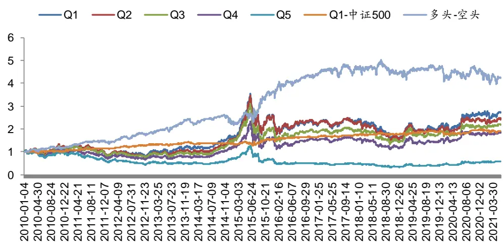
数据来源：Wind、广发证券发展研究中心

表23：BIAS乖偏率(12日)分年度绩效指标表现一览

|  | 多头收益 率 | 多头换 手率均 | IC 均值 | IC 胜率 | ICIR | 多头平 均收益 | 多头 IR | 多头收 益波动 率 | 最大回 撤 | 超额收 益率 | 超额胜 率 | 多空收益 率 | 夏普 比 |  |
| --- | --- | --- | --- | --- | --- | --- | --- | --- | --- | --- | --- | --- | --- | --- |
|  |  |  |  |  |  |  |  |  |  |  |  |  |  | 率 |
| 2010 | 13.45% | 66.7% | -5.70% | 58.0% | -0.32 | 0.07% | 0.04 | 1.85% | 8.26% | 3.20% | 50.8% | 20.56% | 0.33 |  |
| 2011 | -26.76% | 65.2% | -2.64% | 62.8% | -0.21 | -0.11% | -0.07 | 1.63% | 2.67% | 10.86% | 52.9% | 18.21% | 1.65 |  |
| 2012 | 13.92% | 65.2% | -3.52% | 58.0% | -0.24 | 0.07% | 0.04 | 1.68% | 4.32% | 13.95% | 58.4% | 25.63% | 2.06 |  |
| 2013 | 27.77% | 63.5% | -4.60% | 66.7% | -0.39 | 0.11% | 0.08 | 1.53% | 5.27% | 9.28% | 52.5% | 35.53% | 1.19 |  |
| 2014 | 31.48% | 60.7% | 0.50% | 43.4% | 0.04 | 0.12% | 0.09 | 1.29% | 6.72% | -5.44% | 46.1% | -8.75% | -0.88 |  |
| 2015 | 60.18% | 67.3% | -5.07% | 53.9% | -0.25 | 0.25% | 0.07 | 3.34% | 12.47% | 14.70% | 51.2% | 64.55% | 0.86 |  |
| 2016 | -13.29% | 62.9% | -4.02% | 62.0% | -0.26 | -0.04% | -0.02 | 2.12% | 4.09% | 6.26% | 54.1% | 19.70% | 0.85 |  |
| 2017 | 5.60% | 61.7% | -1.63% | 49.0% | -0.12 | 0.03% | 0.03 | 1.03% | 4.62% | 5.86% | 52.1% | 7.25% | 0.91 |  |
| 2018 | -32.81% | 59.0% | 0.91% | 51.0% | 0.06 | -0.15% | -0.09 | 1.73% | 6.23% | 1.36% | 49.0% | -5.54% | 0.23 |  |
| 2019 | 36.84% | 60.4% | -1.53% | 51.0% | -0.11 | 0.14% | 0.09 | 1.49% | 5.24% | 8.14% | 54.9% | 6.63% | 1.22 |  |
| 2020 | 24.54% | 61.6% | 0.53% | 55.8% | 0.04 | 0.11% | 0.06 | 1.71% | 8.58% | 3.06% | 55.6% | -5.57% | 0.4 |  |
| 2021 | 0.88% | 56.7% | 0.30% | 54.2% | 0.02 | 0.02% | 0.01 | 1.28% | 7.07% | -3.56% | 45.8% | -5.16% | -0.67 |  |

数据来源：Wind、广发证券发展研究中心

图25：BIAS乖偏率(24日)历史分档测算结果
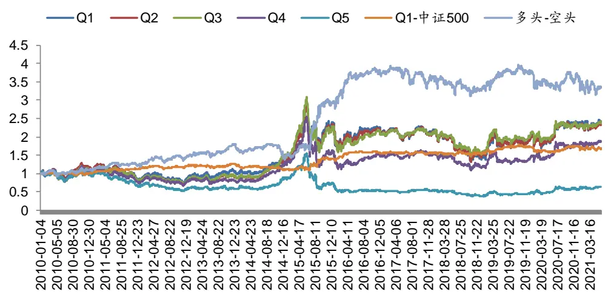
数据来源：Wind、广发证券发展研究中心

表24：BIAS乖偏率(24日)分年度绩效指标表现一览

|  | 多头收益 率 | 多头换 |  |  |  | 多头平 均收益 | 多头 IR | 多头收 益波动 |  |  | 超额胜 率 | 多空收益 率 | 夏普 比 |  |
| --- | --- | --- | --- | --- | --- | --- | --- | --- | --- | --- | --- | --- | --- | --- |
|  |  | 手率均 值 | IC 均值 | IC 胜率 ICIR | 最大回 撤 |  |  |  |  |  |  |  |  | 超额收 益率 |
| 2010 | 10.27% | 50.0% | -4.08% | 54.0% | -0.2 | 率 0.06% | 0.03 | 率 1.84% | 10.73% |  |  |  |  |  |
| 2011 | -25.50% | 50.3% | -2.26% | 51.0% | -0.16 | -0.11% | -0.07 | 1.64% | 4.16% | 0.04% 12.79% | 49.6% 52.9% | 9.79% 12.74% | 0.07 1.9 |  |
| 2012 | 6.85% | 48.2% | -3.35% | 52.0% | -0.2 | 0.04% | 0.02 | 1.71% | 7.40% | 6.99% | 53.5% | 17.48% | 0.99 |  |
| 2013 | 21.44% | 46.1% | -2.81% | 56.9% | -0.21 | 0.09% | 0.06 | 1.51% | 7.40% | 3.70% | 50.4% | 22.99% | 0.46 |  |
| 2014 | 20.41% | 41.5% | 1.84% | 50.9% | 0.12 | 0.08% | 0.07 | 1.29% | 13.16% | -13.46% | 45.3% | -22.70% | -2.02 |  |
| 2015 | 80.76% | 51.9% | -7.36% | 65.4% | -0.38 | 0.30% | 0.09 | 3.29% | 9.55% | 28.71% | 47.5% | 114.37% | 1.47 |  |
| 2016 | -9.05% | 44.3% | -4.81% | 62.0% | -0.3 | -0.02% | -0.01 | 2.15% | 4.08% | 11.64% | 53.7% | 26.94% | 1.46 |  |
| 2017 | 0.09% | 44.1% | -0.11% | 56.9% | -0.01 | 0.01% | 0.01 | 1.04% | 5.40% | 0.33% | 52.9% | -3.81% | 0.08 |  |
| 2018 | -34.59% | 40.0% | 0.40% | 49.0% | 0.02 | -0.16% | -0.09 | 1.75% | 6.59% | -1.30% | 46.5% | -9.95% | -0.12 |  |
| 2019 | 41.92% | 43.2% | -2.80% | 58.8% | -0.2 | 0.15% | 0.1 | 1.51% | 5.05% | 12.17% | 52.1% | 16.34% | 1.63 |  |
| 2020 | 21.34% | 45.3% | 1.13% | 55.8% | 0.08 | 0.09% | 0.06 | 1.66% | 9.24% | 0.14% | 47.7% | -5.44% | 0.06 |  |
| 2021 | 0.85% | 40.0% | 0.78% | 50.0% | 0.04 | 0.02% | 0.01 | 1.31% | 6.45% | -3.66% | 45.8% | -7.07% | -0.56 |  |

数据来源：Wind、广发证券发展研究中心

图26：BIAS乖偏率(6日)历史分档测算结果
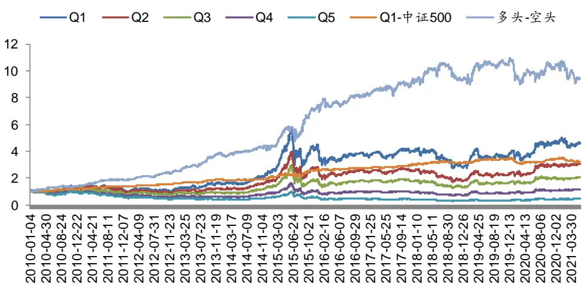
数据来源：Wind、广发证券发展研究中心

表25：BIAS乖偏率(6日)分年度绩效指标表现一览

|  | 多头收益 率 | 多头换 手率均 | IC 均值 | IC 胜率 | ICIR | 多头平 均收益 率 | 多头 IR | 多头收 益波动 | 最大回 撤 | 超额收 益率 | 超额胜 率 | 多空收益 率 | 夏普 比 |  |
| --- | --- | --- | --- | --- | --- | --- | --- | --- | --- | --- | --- | --- | --- | --- |
|  |  |  |  |  |  |  |  |  |  |  |  |  |  | 率 |
| 2010 | 29.49% | 84.3% | -8.82% | 70.0% | -0.55 | 0.12% | 0.07 | 1.85% | 4.50% | 17.92% | 54.6% | 40.21% | 1.66 |  |
| 2011 | -23.89% | 81.8% | -4.68% | 60.8% | -0.41 | -0.10% | -0.06 | 1.61% | 2.12% | 15.15% | 54.1% | 30.51% | 2.5 |  |
| 2012 | 17.58% | 81.6% | -4.59% | 62.0% | -0.34 | 0.08% | 0.05 | 1.63% | 3.01% | 17.45% | 60.1% | 35.79% | 2.82 |  |
| 2013 | 38.59% | 81.4% | -6.59% | 78.4% | -0.6 | 0.15% | 0.1 | 1.56% | 3.54% | 18.75% | 55.0% | 54.43% | 2.54 |  |
| 2014 | 50.03% | 79.4% | -1.58% | 60.4% | -0.14 | 0.17% | 0.13 | 1.31% | 4.32% | 7.96% | 53.9% | 8.26% | 1.23 |  |
| 2015 | 82.61% | 85.2% | -6.42% | 63.5% | -0.35 | 0.30% | 0.09 | 3.30% | 11.54% | 30.66% | 53.3% | 80.38% | 1.75 |  |
| 2016 | -16.18% | 80.9% | -2.41% | 64.0% | -0.18 | -0.05% | -0.02 | 2.07% | 4.56% | 2.53% | 52.5% | 9.77% | 0.4 |  |
| 2017 | 9.29% | 79.3% | -2.43% | 56.9% | -0.2 | 0.04% | 0.04 | 1.01% | 3.84% | 9.54% | 50.0% | 12.89% | 1.57 |  |
| 2018 | -31.24% | 77.2% | -0.56% | 52.9% | -0.04 | -0.14% | -0.08 | 1.73% | 5.19% | 3.72% | 52.7% | 0.13% | 0.56 |  |
| 2019 | 41.08% | 78.2% | -1.72% | 51.0% | -0.12 | 0.15% | 0.1 | 1.51% | 3.84% | 11.54% | 55.7% | 16.33% | 1.67 |  |
| 2020 | 20.92% | 78.4% | -0.23% | 51.9% | -0.02 | 0.09% | 0.06 | 1.68% | 12.12% | -0.03% | 49.0% | -4.12% | 0.04 |  |
| 2021 | -3.33% | 75.2% | 1.40% | 45.8% | 0.11 | -0.02% | -0.02 | 1.27% | 11.42% | -7.58% | 44.9% | -8.87% | -1.59 |  |

数据来源：Wind、广发证券发展研究中心

图27：ARBR(BR)历史分档测算结果
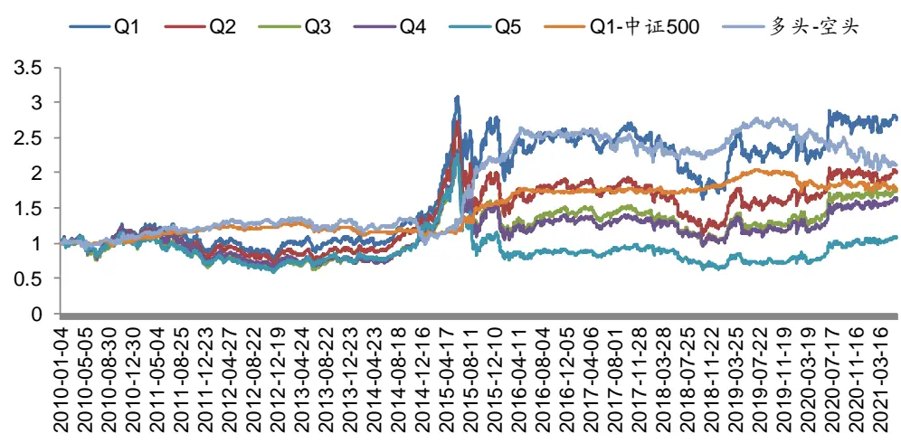
数据来源：Wind、广发证券发展研究中心

表26：ARBR(BR)分年度绩效指标表现一览

|  | 多头收益 率 | 多头换 手率均 | IC 均值 | IC 胜率 | ICIR | 多头平 均收益 率 | 多头 IR | 多头收 | 最大回 撤 | 超额收 益率 | 超额胜 率 | 多空收益 率 | 夏普 比 |  |
| --- | --- | --- | --- | --- | --- | --- | --- | --- | --- | --- | --- | --- | --- | --- |
|  |  |  |  |  |  |  |  |  |  |  |  |  |  | 益波动 率 |
| 2010 | 13.74% | 值 40.8% | -2.24% | 52.0% | -0.13 | 0.07% | 0.04 | 1.73% | 7.81% | 2.84% | 47.1% | 8.97% | 0.29 |  |
| 2011 | -21.44% | 40.8% | -1.80% | 51.0% | -0.16 | -0.09% | -0.06 | 1.49% | 2.86% | 18.33% | 54.9% | 12.27% | 3.06 |  |
| 2012 | 2.83% | 37.4% | -1.12% | 46.0% | -0.08 | 0.02% | 0.02 | 1.54% | 6.27% | 2.38% | 52.7% | 5.10% | 0.47 |  |
| 2013 | 15.10% | 34.5% | -0.28% | 49.0% | -0.02 | 0.07% | 0.05 | 1.34% | 10.62% | -2.25% | 49.2% | 2.94% | -0.22 |  |
| 2014 | 26.48% | 33.7% | 2.97% | 58.5% | 0.19 | 0.10% | 0.09 | 1.17% | 9.20% | -9.41% | 45.3% | -25.06% | -1.4 |  |
| 2015 | 103.20% | 43.6% | -7.59% | 69.2% | -0.59 | 0.34% | 0.11 | 3.05% | 7.41% | 42.39% | 52.5% | 121.65% | 2.15 |  |
| 2016 | -9.72% | 36.0% | -3.31% | 60.0% | -0.3 | -0.02% | -0.01 | 1.93% | 3.38% | 9.76% | 48.8% | 16.66% | 1.75 |  |
| 2017 | -0.06% | 33.9% | 1.46% | 56.9% | 0.12 | 0.00% | 0 | 0.82% | 3.83% | -0.28% | 48.8% | -8.18% | -0.01 |  |
| 2018 | -29.69% | 32.4% | 0.35% | 47.1% | 0.02 | -0.13% | -0.09 | 1.47% | 5.19% | 4.95% | 51.4% | -1.57% | 0.71 |  |
| 2019 | 40.44% | 34.8% | -2.24% | 60.8% | -0.24 | 0.15% | 0.11 | 1.36% | 3.82% | 10.49% | 51.2% | 14.07% | 1.71 |  |
| 2020 | 12.54% | 37.5% | 1.49% | 57.7% | 0.11 | 0.06% | 0.04 | 1.48% | 12.15% | -7.88% | 46.9% | -15.09% | -0.73 |  |
| 2021 | 0.72% | 34.2% | 2.07% | 62.5% | 0.11 | 0.01% | 0.01 | 1.13% | 5.90% | -3.96% | 43.0% | -6.41% | -0.67 |  |

数据来源：Wind、广发证券发展研究中心

图28：CCI顺势指标历史分档测算结果
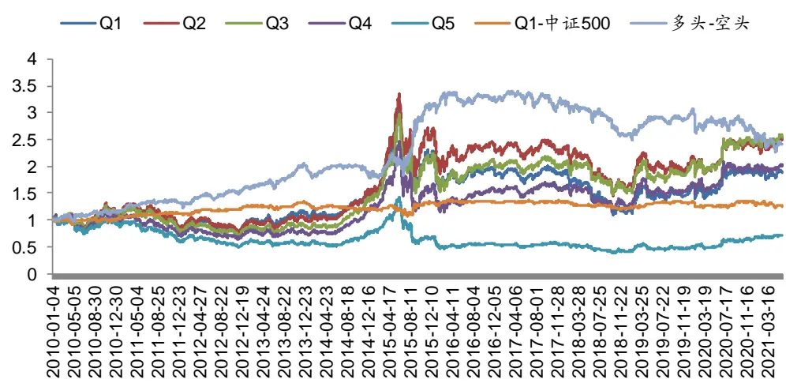
数据来源：Wind、广发证券发展研究中心

表27：CCI顺势指标分年度绩效指标表现一览

|  | 多头收益 率 | 多头换 手率均 | IC 均值 | IC 胜率 | ICIR | 多头平 均收益 率 | 多头 IR | 多头收 益波动 | 最大回 撤 | 超额收 益率 | 超额胜 率 | 多空收益 率 | 夏普 比 |
| --- | --- | --- | --- | --- | --- | --- | --- | --- | --- | --- | --- | --- | --- |
| 2010 | 10.79% | 值 69.9% | -4.70% | 58.0% | -0.27 | 0.06% | 0.03 | 率 1.78% | 8.69% | 0.44% | 45.5% | 15.54% | 0.1 |
| 2011 | -25.77% | 75.2% | -2.33% | 56.9% | -0.19 | -0.11% | -0.07 | 1.53% | 2.13% | 11.94% | 57.4% | 14.61% | 1.84 |
| 2012 | 11.04% | 74.1% | -2.63% | 54.0% | -0.18 | 0.06% | 0.04 | 1.57% | 3.80% | 10.66% | 56.8% | 19.42% | 1.82 |
| 2013 | 24.96% | 68.7% | -3.10% | 56.9% | -0.27 | 0.10% | 0.07 | 1.39% | 6.25% | 6.40% | 50.0% | 26.91% | 0.87 |
| 2014 | 25.23% | 63.7% | 0.71% | 49.1% | 0.07 | 0.10% | 0.08 | 1.23% | 10.59% | -10.10% | 44.5% | -11.10% | -1.77 |
| 2015 | 55.78% | 66.7% | -4.62% | 55.8% | -0.25 | 0.24% | 0.07 | 3.26% | 15.74% | 10.76% | 47.5% | 77.25% | 0.66 |
| 2016 | -17.01% | 68.8% | -2.08% | 58.0% | -0.16 | -0.06% | -0.03 | 1.96% | 4.12% | 1.01% | 51.6% | 3.70% | 0.21 |
| 2017 | 0.74% | 70.2% | -0.48% | 45.1% | -0.04 | 0.01% | 0.01 | 0.89% | 4.18% | 0.67% | 47.5% | -2.15% | 0.14 |
| 2018 | -39.82% | 69.3% | 1.91% | 52.9% | 0.13 | -0.20% | -0.12 | 1.60% | 11.64% | -9.67% | 49.0% | -20.07% | -1.41 |
| 2019 | 39.64% | 69.0% | -2.99% | 64.7% | -0.27 | 0.15% | 0.1 | 1.40% | 3.72% | 10.02% | 54.5% | 16.24% | 1.55 |
| 2020 | 20.95% | 69.4% | 0.77% | 50.0% | 0.05 | 0.09% | 0.06 | 1.53% | 8.42% | -0.64% | 53.1% | -11.63% | -0.03 |
| 2021 | -0.53% | 67.4% | 0.55% | 54.2% | 0.04 | 0.00% | 0 | 1.14% | 8.00% | -5.07% | 43.9% | -8.80% | -1 |

数据来源：Wind、广发证券发展研究中心

图29：Chande钱德动量摆动指标历史分档测算结果
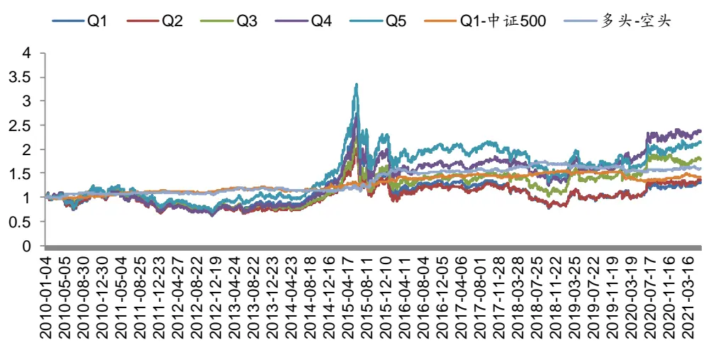
数据来源：Wind、广发证券发展研究中心

表28：Chande钱德动量摆动指标分年度绩效指标表现一览

|  | 多头收益 率 | 多头换 手率均 IC 均值 |  | IC 胜率 | ICIR | 多头平 均收益 率 | 多头 IR | 多头收 益波动 率 | 最大回 撤 | 超额收 益率 | 超额胜 率 | 多空收益 率 | 夏普 比 |
| --- | --- | --- | --- | --- | --- | --- | --- | --- | --- | --- | --- | --- | --- |
| 2010 | 12.49% | 78.2% | -0.48% | 56.0% | -0.06 | 0.06% | 0.04 | 1.78% | 5.40% | 2.41% | 48.4% | 7.32% | 0.37 |
| 2011 | -26.76% | 77.6% | -0.07% | 45.1% | -0.01 | -0.12% | -0.08 | 1.47% | 2.37% | 10.28% | 56.2% | 1.65% | 1.99 |
| 2012 | 0.76% | 77.9% | -1.16% | 54.0% | -0.18 | 0.01% | 0.01 | 1.53% | 4.83% | 0.36% | 49.8% | -0.71% | 0.11 |
| 2013 | 21.93% | 75.9% | 0.76% | 52.9% | 0.13 | 0.09% | 0.07 | 1.38% | 3.91% | 3.93% | 48.7% | 5.64% | 0.76 |
| 2014 | 46.37% | 77.4% | 0.53% | 50.9% | 0.09 | 0.16% | 0.13 | 1.21% | 5.64% | 5.08% | 48.2% | -0.46% | 0.99 |
| 2015 | 50.54% | 81.0% | 2.88% | 67.3% | 0.28 | 0.22% | 0.07 | 3.16% | 12.45% | 7.12% | 48.0% | 30.11% | 0.61 |
| 2016 | -11.56% | 78.3% | 0.24% | 50.0% | 0.03 | -0.03% | -0.02 | 1.93% | 3.94% | 7.52% | 51.2% | 3.35% | 1.32 |
| 2017 | -0.69% | 75.6% | 0.59% | 51.0% | 0.09 | 0.00% | 0 | 0.86% | 5.56% | -0.74% | 49.6% | 1.51% | -0.15 |
| 2018 | -27.16% | 76.9% | 2.51% | 56.9% | 0.39 | -0.12% | -0.08 | 1.55% | 4.15% | 9.15% | 53.9% | 9.12% | 1.62 |
| 2019 | 26.15% | 76.0% | -0.92% | 56.9% | -0.15 | 0.10% | 0.08 | 1.36% | 5.64% | -0.74% | 48.8% | -3.44% | -0.1 |
| 2020 | 12.05% | 76.5% | 0.84% | 53.9% | 0.11 | 0.06% | 0.04 | 1.51% | 13.67% | -7.92% | 45.7% | -3.04% | -1.16 |
| 2021 | 5.55% | 75.8% | -0.26% | 50.0% | -0.04 | 0.05% | 0.06 | 0.95% | 5.57% | 0.70% | 45.8% | 0.53% | 0.28 |

数据来源：Wind、广发证券发展研究中心

图30：Chande钱德动量摆动指标(SD)历史分档测算结果
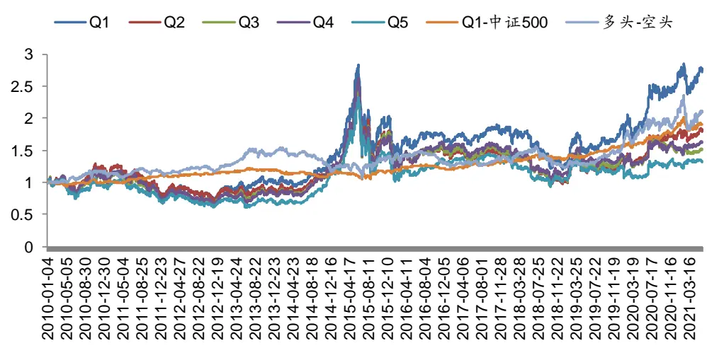
数据来源：Wind、广发证券发展研究中心

表29：Chande钱德动量摆动指标(SD)分年度绩效指标表现一览

|  | 多头收益 率 | 多头换 手率均 | IC 均值 | IC 胜率 | ICIR | 多头平 均收益 率 | 多头 IR | 多头收 益波动 率 | 最大回 撤 | 超额收 益率 | 超额胜 率 | 多空收益 率 | 夏普 比 |
| --- | --- | --- | --- | --- | --- | --- | --- | --- | --- | --- | --- | --- | --- |
| 2010 | 10.63% | 26.1% | -2.93% | 56.0% | -0.29 | 0.06% | 0.03 | 1.79% | 8.36% | 0.74% | 51.2% | 18.19% | 0.14 |
| 2011 | -26.54% | 25.0% | 0.37% | 56.9% | 0.04 | -0.11% | -0.08 | 1.51% | 3.25% | 10.82% | 54.1% | -1.02% | 2.42 |
| 2012 | 4.01% | 23.8% | 0.07% | 42.0% | 0.01 | 0.03% | 0.02 | 1.54% | 2.93% | 3.61% | 53.5% | 4.22% | 0.82 |
| 2013 | 20.88% | 20.0% | -2.40% | 66.7% | -0.23 | 0.09% | 0.06 | 1.48% | 2.49% | 3.40% | 50.0% | 21.05% | 0.73 |
| 2014 | 33.84% | 20.6% | 2.35% | 54.7% | 0.24 | 0.13% | 0.1 | 1.26% | 9.71% | -3.78% | 45.7% | -19.36% | -0.76 |
| 2015 | 43.22% | 29.5% | -1.58% | 51.9% | -0.14 | 0.20% | 0.06 | 3.23% | 10.54% | 2.42% | 44.7% | 18.36% | 0.26 |
| 2016 | -16.30% | 20.9% | 1.53% | 58.0% | 0.13 | -0.05% | -0.03 | 2.02% | 5.35% | 2.25% | 46.7% | -8.50% | 0.54 |
| 2017 | 9.56% | 21.8% | -1.57% | 54.9% | -0.16 | 0.04% | 0.04 | 0.95% | 2.88% | 9.68% | 53.7% | 7.52% | 1.9 |
| 2018 | -31.29% | 17.8% | 1.49% | 54.9% | 0.1 | -0.14% | -0.08 | 1.68% | 4.73% | 3.45% | 50.2% | -9.68% | 0.56 |
| 2019 | 43.56% | 18.8% | -2.38% | 64.7% | -0.25 | 0.16% | 0.11 | 1.50% | 3.72% | 13.53% | 55.7% | 17.93% | 2.28 |
| 2020 | 45.11% | 22.1% | -4.64% | 65.4% | -0.31 | 0.17% | 0.1 | 1.74% | 4.01% | 20.37% | 58.0% | 37.28% | 2.66 |
| 2021 | 6.11% | 19.9% | -0.76% | 54.2% | -0.03 | 0.07% | 0.04 | 1.47% | 10.71% | 1.69% | 55.1% | 3.60% | 0.38 |

数据来源：Wind、广发证券发展研究中心

图31：Chande钱德动量摆动指标(SU)历史分档测算结果
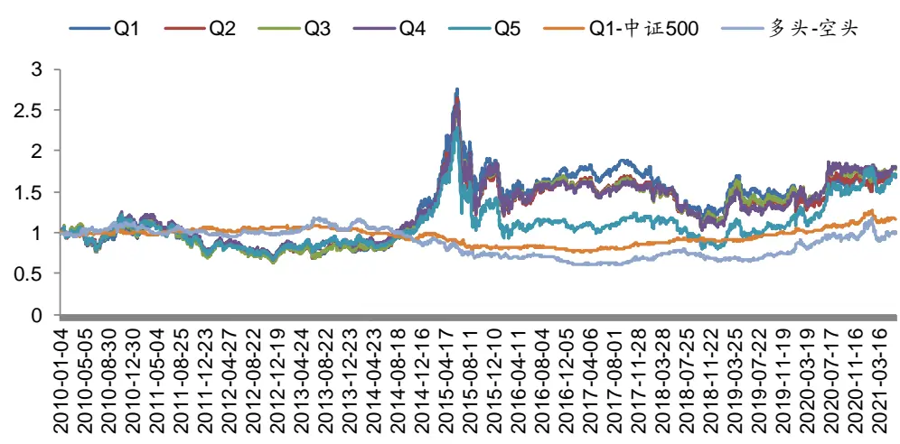
数据来源：Wind、广发证券发展研究中心

表30：Chande钱德动量摆动指标(SU)分年度绩效指标表现一览

|  | 多头收益 率 | 多头换 手率均 | IC 均值 | IC 胜率 | ICIR | 多头平 均收益 | 多头 IR | 多头收 益波动 率 | 最大回 撤 | 超额收 益率 | 超额胜 率 | 多空收益 率 | 夏普 比 |  |
| --- | --- | --- | --- | --- | --- | --- | --- | --- | --- | --- | --- | --- | --- | --- |
|  |  |  |  |  |  |  |  |  |  |  |  |  |  | 率 |
| 2010 | 10.24% | 27.1% | 1.67% | 56.0% | 0.14 | 0.06% | 0.03 | 1.81% | 5.32% | 0.52% | 43.0% | 11.00% | 0.12 |  |
| 2011 | -29.82% | 28.0% | -1.06% | 58.8% | -0.11 | -0.13% | -0.09 | 1.49% | 5.16% | 5.79% | 50.4% | -9.34% | 1.31 |  |
| 2012 | 1.08% | 25.2% | -0.42% | 56.0% | -0.04 | 0.02% | 0.01 | 1.51% | 5.23% | 0.57% | 42.4% | -1.57% | 0.14 |  |
| 2013 | 12.79% | 21.2% | 1.71% | 66.7% | 0.14 | 0.06% | 0.04 | 1.51% | 6.37% | -3.44% | 48.7% | 7.80% | -0.7 |  |
| 2014 | 32.81% | 22.9% | -1.76% | 62.3% | -0.18 | 0.12% | 0.09 | 1.32% | 13.93% | -4.36% | 44.5% | -18.54% | -0.8 |  |
| 2015 | 16.92% | 30.3% | -1.16% | 50.0% | -0.11 | 0.12% | 0.04 | 3.19% | 21.18% | -16.59% | 44.3% | -14.26% | -1.5 |  |
| 2016 | -22.64% | 24.3% | -2.78% | 60.0% | -0.27 | -0.08% | -0.04 | 2.00% | 7.89% | -5.57% | 46.3% | -15.44% | -1.34 |  |
| 2017 | 9.95% | 22.5% | 1.59% | 60.8% | 0.16 | 0.04% | 0.05 | 0.96% | 3.73% | 10.08% | 53.7% | 9.22% | 1.72 |  |
| 2018 | -30.05% | 19.3% | -0.29% | 51.0% | -0.02 | -0.13% | -0.08 | 1.66% | 4.33% | 5.18% | 50.2% | -2.56% | 0.75 |  |
| 2019 | 39.79% | 20.0% | 1.20% | 58.8% | 0.11 | 0.15% | 0.1 | 1.50% | 2.55% | 10.58% | 57.8% | 10.94% | 1.9 |  |
| 2020 | 43.68% | 23.5% | 4.54% | 65.4% | 0.29 | 0.16% | 0.1 | 1.71% | 4.84% | 19.08% | 59.3% | 36.63% | 2.64 |  |
| 2021 | 2.65% | 19.4% | 0.24% | 54.2% | 0.01 | 0.04% | 0.02 | 1.52% | 12.46% | -1.56% | 54.2% | -1.39% | -0.23 |  |

数据来源：Wind、广发证券发展研究中心

图32：Chaikin Oscillator佳庆指标历史分档测算结果
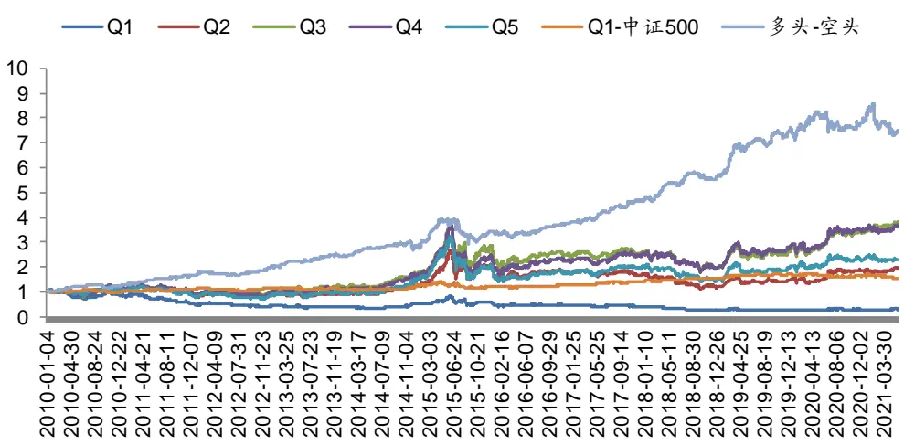
数据来源：Wind、广发证券发展研究中心

表31：Chaikin Oscillator佳庆指标分年度绩效指标表现一览

|  | 多头收益 率 | 多头换 |  |  |  | 多头平 ICIR | 多头 IR | 多头收 益波动 率 | 最大回 撤 | 超额收 益率 | 超额胜 率 | 多空收益 率 | 夏普 比 |
| --- | --- | --- | --- | --- | --- | --- | --- | --- | --- | --- | --- | --- | --- |
|  |  | 手率均 值 | IC 均值 | IC 胜率 | 均收益 率 |  |  |  |  |  |  |  |  |
| 2010 | 7.40% | 72.6% | 2.66% | 72.0% | 0.22 | 0.05% | 0.03 | 1.76% | 11.18% | -2.37% | 49.6% | 22.47% | -0.27 |
| 2011 | -25.08% | 74.4% | 3.07% | 66.7% | 0.38 | -0.11% | -0.07 | 1.51% | 4.07% | 12.94% | 51.6% | 35.38% | 2.27 |
| 2012 | 3.91% | 74.4% | 1.87% | 58.0% | 0.18 | 0.03% | 0.02 | 1.54% | 10.40% | 3.46% | 50.6% | 18.04% | 0.67 |
| 2013 | 11.93% | 69.7% | 4.38% | 68.6% | 0.41 | 0.06% | 0.04 | 1.51% | 7.99% | -4.29% | 46.2% | 24.88% | -0.58 |
| 2014 | 59.32% | 70.3% | 2.19% | 64.2% | 0.28 | 0.20% | 0.16 | 1.26% | 4.79% | 14.36% | 55.1% | 15.44% | 1.73 |
| 2015 | 35.32% | 77.7% | 4.52% | 67.3% | 0.29 | 0.17% | 0.06 | 3.18% | 20.11% | -4.11% | 49.2% | 22.10% | -0.19 |
| 2016 | -14.04% | 72.8% | -0.40% | 50.0% | -0.05 | -0.04% | -0.02 | 1.93% | 5.58% | 4.44% | 47.1% | 8.41% | 0.73 |
| 2017 | 12.05% | 71.7% | 2.97% | 72.6% | 0.35 | 0.05% | 0.05 | 0.94% | 3.21% | 12.10% | 52.5% | 25.47% | 1.88 |
| 2018 | -27.32% | 71.5% | 0.57% | 58.8% | 0.08 | -0.12% | -0.08 | 1.58% | 5.11% | 9.03% | 56.4% | 19.26% | 1.47 |
| 2019 | 42.73% | 72.6% | 1.56% | 54.9% | 0.15 | 0.16% | 0.1 | 1.51% | 3.90% | 12.90% | 54.9% | 35.66% | 2.14 |
| 2020 | 15.22% | 75.3% | -1.26% | 59.6% | -0.14 | 0.07% | 0.05 | 1.56% | 7.60% | -5.18% | 46.9% | 3.42% | -0.65 |
| 2021 | -2.31% | 72.8% | -2.17% | 50.0% | -0.21 | -0.02% | -0.01 | 1.13% | 9.81% | -6.67% | 48.6% | -5.41% | -1.86 |

数据来源：Wind、广发证券发展研究中心

图33：Chaikin Volatility佳庆变异指标历史分档测算结果
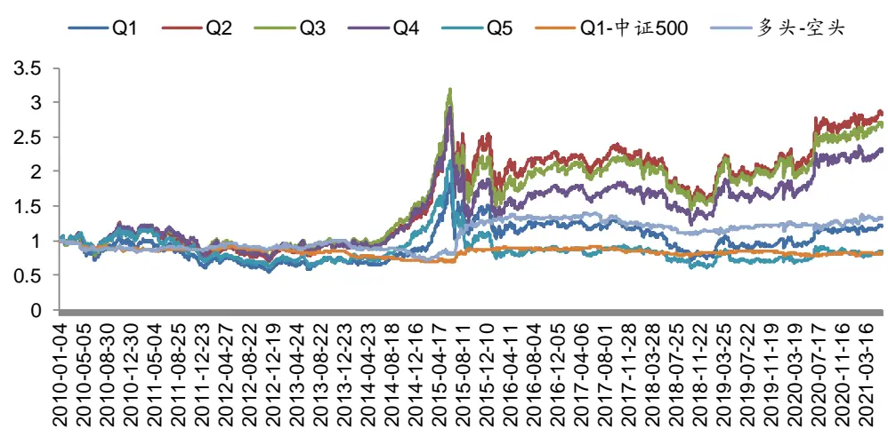
数据来源：Wind、广发证券发展研究中心

表32：Chaikin Volatility佳庆变异指标分年度绩效指标表现一览

|  | 多头收益 率 | 多头换 |  |  |  | 多头平 ICIR | 多头 IR | 多头收 益波动 率 | 最大回 撤 | 超额收 益率 | 超额胜 率 | 多空收益 率 | 夏普 比 |
| --- | --- | --- | --- | --- | --- | --- | --- | --- | --- | --- | --- | --- | --- |
|  |  | 手率均 值 | IC 均值 | IC 胜率 | 均收益 率 |  |  |  |  |  |  |  |  |
| 2010 | -4.66% | 63.8% | 0.08% | 48.0% | 0.01 | 0.00% | 0 | 1.79% | 16.32% | -13.36% | 47.1% | -12.20% | -1.46 |
| 2011 | -33.57% | 64.6% | 1.23% | 60.8% | 0.16 | -0.16% | -0.1 | 1.52% | 3.59% | 0.25% | 48.8% | -1.80% | 0.08 |
| 2012 | 1.54% | 64.4% | -1.81% | 58.0% | -0.16 | 0.02% | 0.01 | 1.56% | 6.17% | 1.22% | 47.3% | 4.15% | 0.29 |
| 2013 | 12.44% | 61.5% | -0.92% | 47.1% | -0.09 | 0.06% | 0.04 | 1.47% | 9.87% | -3.98% | 45.4% | 10.99% | -0.53 |
| 2014 | 19.06% | 60.6% | 2.96% | 66.0% | 0.27 | 0.08% | 0.06 | 1.22% | 15.91% | -14.57% | 40.0% | -24.34% | -2.6 |
| 2015 | 70.46% | 64.4% | -4.16% | 57.7% | -0.26 | 0.27% | 0.08 | 3.18% | 7.02% | 20.84% | 43.9% | 70.99% | 1.29 |
| 2016 | -17.90% | 62.9% | -0.65% | 58.0% | -0.06 | -0.06% | -0.03 | 1.96% | 4.22% | -0.02% | 49.6% | 3.29% | 0.02 |
| 2017 | -2.50% | 60.9% | -0.13% | 49.0% | -0.01 | -0.01% | -0.01 | 0.89% | 8.95% | -2.54% | 51.2% | -4.85% | -0.43 |
| 2018 | -35.55% | 62.4% | 1.26% | 54.9% | 0.11 | -0.17% | -0.11 | 1.54% | 9.07% | -3.44% | 47.3% | -10.35% | -0.56 |
| 2019 | 28.98% | 62.2% | -2.06% | 64.7% | -0.26 | 0.11% | 0.08 | 1.43% | 3.64% | 1.77% | 54.9% | 7.24% | 0.35 |
| 2020 | 20.01% | 61.2% | -0.35% | 48.1% | -0.03 | 0.09% | 0.06 | 1.52% | 7.07% | -1.39% | 50.2% | 6.30% | -0.14 |
| 2021 | 2.74% | 56.6% | 0.98% | 45.8% | 0.08 | 0.03% | 0.03 | 0.98% | 5.27% | -2.07% | 46.7% | 2.03% | -0.45 |

数据来源：Wind、广发证券发展研究中心

图34：价格绝对方差均值历史分档测算结果

数据来源：Wind、广发证券发展研究中心

表33：价格绝对方差均值分年度绩效指标表现一览

|  | 多头收益 率 | 多头换 |  |  |  | 多头平 ICIR | 多头 IR | 多头收 益波动 率 | 最大回 撤 | 超额收 益率 | 超额胜 率 | 多空收益 率 | 夏普 比 |
| --- | --- | --- | --- | --- | --- | --- | --- | --- | --- | --- | --- | --- | --- |
|  |  | 手率均 值 | IC 均值 | IC 胜率 | 均收益 率 |  |  |  |  |  |  |  |  |
| 2010 | 10.32% | 20.2% | 2.78% | 56.0% | 0.23 | 0.06% | 0.03 | 1.81% | 6.66% | 0.54% | 49.6% | 14.96% | 0.11 |
| 2011 | -27.10% | 20.0% | 0.13% | 45.1% | 0.01 | -0.12% | -0.08 | 1.51% | 3.66% | 9.90% | 53.7% | -4.24% | 1.92 |
| 2012 | 0.59% | 19.4% | 0.54% | 54.0% | 0.05 | 0.01% | 0.01 | 1.56% | 4.45% | 0.25% | 49.4% | 1.66% | 0.08 |
| 2013 | 12.64% | 11.9% | 1.92% | 62.8% | 0.16 | 0.06% | 0.04 | 1.51% | 7.52% | -3.54% | 47.1% | 10.71% | -0.71 |
| 2014 | 34.49% | 12.1% | -2.17% | 60.4% | -0.23 | 0.13% | 0.1 | 1.30% | 12.10% | -3.21% | 46.5% | -19.90% | -0.57 |
| 2015 | 38.11% | 22.1% | 1.36% | 51.9% | 0.11 | 0.19% | 0.06 | 3.23% | 14.20% | -1.19% | 46.3% | 15.11% | -0.04 |
| 2016 | -18.05% | 12.8% | -1.84% | 60.0% | -0.16 | -0.06% | -0.03 | 2.04% | 5.42% | 0.21% | 49.2% | -9.49% | 0.07 |
| 2017 | 14.54% | 12.0% | 2.56% | 60.8% | 0.24 | 0.06% | 0.06 | 0.95% | 3.29% | 14.68% | 58.6% | 12.56% | 2.78 |
| 2018 | -24.41% | 10.5% | 0.60% | 56.9% | 0.05 | -0.10% | -0.06 | 1.68% | 3.23% | 13.77% | 52.7% | 6.11% | 2.01 |
| 2019 | 41.21% | 10.5% | 2.18% | 62.8% | 0.22 | 0.15% | 0.1 | 1.50% | 4.21% | 11.68% | 54.1% | 16.43% | 1.94 |
| 2020 | 47.76% | 14.2% | 4.99% | 67.3% | 0.32 | 0.18% | 0.1 | 1.74% | 4.90% | 22.57% | 58.0% | 42.82% | 2.84 |
| 2021 | 2.26% | 9.8% | 0.48% | 54.2% | 0.02 | 0.03% | 0.02 | 1.53% | 12.10% | -1.95% | 55.1% | -1.63% | -0.28 |

数据来源：Wind、广发证券发展研究中心

图35：MA均价线性回归系数(12日)历史分档测算结果
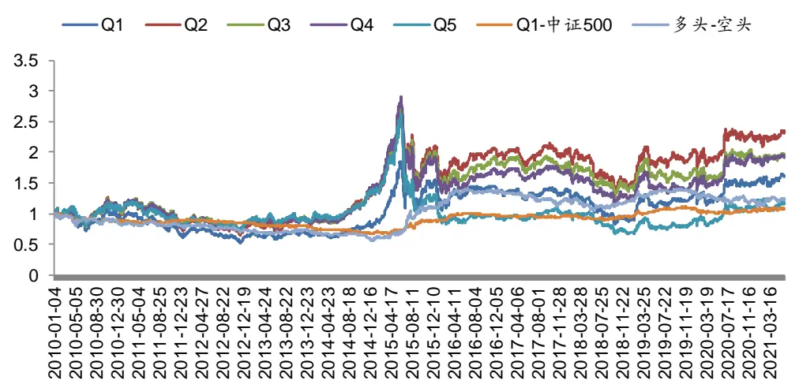
数据来源：Wind、广发证券发展研究中心

表34：MA均价线性回归系数(12日)分年度绩效指标表现一览

|  | 多头收益 率 | 多头换 |  |  |  | 多头平 ICIR 均收益 | 多头 IR | 多头收 益波动 率 | 最大回 撤 | 超额收 益率 | 超额胜 率 | 多空收益 率 | 夏普 比 |
| --- | --- | --- | --- | --- | --- | --- | --- | --- | --- | --- | --- | --- | --- |
|  |  | 手率均 值 | IC 均值 | IC 胜率 | 率 |  |  |  |  |  |  |  |  |
| 2010 | -2.93% | 45.7% | 1.66% | 54.0% | 0.09 | 0.00% | 0 | 1.75% | 16.38% | -12.09% | 43.0% | -13.58% | -1.09 |
| 2011 | -33.03% | 40.5% | 0.80% | 60.8% | 0.07 | -0.15% | -0.1 | 1.54% | 5.30% | 1.10% | 48.4% | -7.34% | 0.22 |
| 2012 | -3.28% | 42.7% | 0.95% | 54.0% | 0.08 | 0.00% | 0 | 1.60% | 7.11% | -3.49% | 46.9% | -9.09% | -0.62 |
| 2013 | 8.84% | 39.0% | 0.60% | 54.9% | 0.05 | 0.05% | 0.03 | 1.44% | 9.25% | -7.25% | 42.4% | 1.63% | -0.88 |
| 2014 | 16.75% | 41.0% | 3.01% | 66.0% | 0.25 | 0.07% | 0.06 | 1.23% | 16.34% | -16.23% | 42.0% | -24.77% | -2.65 |
| 2015 | 87.77% | 50.4% | -5.19% | 69.2% | -0.38 | 0.31% | 0.1 | 3.09% | 10.10% | 32.07% | 48.8% | 96.27% | 1.76 |
| 2016 | -9.94% | 43.5% | -3.72% | 64.0% | -0.31 | -0.02% | -0.01 | 2.00% | 4.68% | 9.78% | 48.8% | 25.08% | 1.48 |
| 2017 | -0.36% | 39.1% | 1.70% | 58.8% | 0.15 | 0.00% | 0 | 0.95% | 6.03% | -0.27% | 53.3% | -9.27% | -0.02 |
| 2018 | -34.48% | 36.4% | 0.18% | 49.0% | 0.01 | -0.16% | -0.1 | 1.67% | 8.38% | -1.44% | 49.0% | -3.65% | -0.16 |
| 2019 | 45.26% | 40.1% | -2.50% | 62.8% | -0.26 | 0.16% | 0.11 | 1.48% | 5.48% | 14.76% | 57.0% | 13.78% | 2.2 |
| 2020 | 17.61% | 42.4% | 1.89% | 59.6% | 0.16 | 0.08% | 0.05 | 1.58% | 8.78% | -3.19% | 52.3% | -12.61% | -0.35 |
| 2021 | 6.32% | 35.3% | -0.32% | 41.7% | -0.02 | 0.06% | 0.05 | 1.24% | 4.24% | 1.56% | 50.5% | 3.45% | 0.36 |

数据来源：Wind、广发证券发展研究中心

图36：MA均价线性回归系数(6日)历史分档测算结果
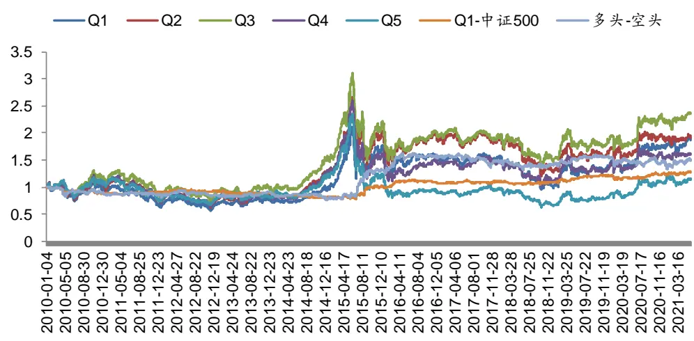
数据来源：Wind、广发证券发展研究中心

表35：MA均价线性回归系数(6日)分年度绩效指标表现一览

|  | 多头收益 率 | 多头换 手率均 | IC 均值 | IC 胜率 | ICIR | 多头平 均收益 率 | 多头 IR | 多头收 益波动 率 | 最大回 撒 | 超额收 益率 | 超额胜 率 | 多空收益 率 | 夏普 比 |
| --- | --- | --- | --- | --- | --- | --- | --- | --- | --- | --- | --- | --- | --- |
| 2010 | -2.07% | 52.3% | 1.67% | 54.0% | 0.1 | 0.01% | 0 | 1.77% | 14.22% | -11.22% | 45.9% | -10.96% | -1 |
| 2011 | -31.72% | 46.7% | 0.55% | 54.9% | 0.05 | -0.14% | -0.09 | 1.53% | 5.03% | 3.04% | 51.6% | -2.78% | 0.58 |
| 2012 | 1.95% | 49.2% | 0.95% | 54.0% | 0.07 | 0.02% | 0.01 | 1.58% | 5.53% | 1.65% | 50.2% | -1.78% | 0.32 |
| 2013 | 13.14% | 46.6% | -0.23% | 45.1% | -0.02 | 0.06% | 0.04 | 1.45% | 6.86% | -3.53% | 48.3% | 8.10% | -0.4 |
| 2014 | 23.89% | 48.3% | 2.45% | 67.9% | 0.21 | 0.10% | 0.08 | 1.24% | 11.60% | -11.09% | 46.5% | -17.40% | -1.72 |
| 2015 | 76.70% | 57.5% | -4.73% | 65.4% | -0.32 | 0.28% | 0.09 | 3.18% | 7.89% | 25.07% | 44.3% | 71.98% | 1.41 |
| 2016 | -11.48% | 50.3% | -4.13% | 66.0% | -0.31 | -0.03% | -0.01 | 2.04% | 5.12% | 8.09% | 50.0% | 20.42% | 1.2 |
| 2017 | 1.91% | 45.5% | 1.07% | 54.9% | 0.09 | 0.01% | 0.01 | 0.95% | 5.09% | 2.00% | 49.2% | -5.13% | 0.37 |
| 2018 | -33.91% | 43.8% | 1.00% | 54.9% | 0.08 | -0.16% | -0.09 | 1.68% | 5.65% | -0.50% | 49.0% | -5.10% | -0.04 |
| 2019 | 39.75% | 47.3% | -1.86% | 56.9% | -0.18 | 0.15% | 0.1 | 1.47% | 4.88% | 10.37% | 56.2% | 9.09% | 1.63 |
| 2020 | 25.07% | 49.8% | 0.76% | 53.9% | 0.06 | 0.11% | 0.06 | 1.63% | 8.01% | 3.20% | 54.7% | -7.18% | 0.43 |
| 2021 | 6.35% | 41.3% | -0.69% | 50.0% | -0.05 | 0.07% | 0.05 | 1.25% | 4.62% | 1.64% | 49.5% | 4.80% | 0.39 |

数据来源：Wind、广发证券发展研究中心

图37：价格线性回归系数(12日)历史分档测算结果
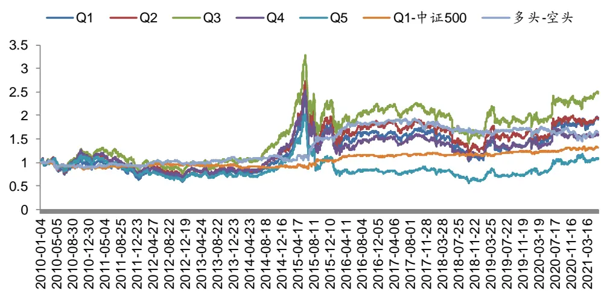
数据来源：Wind、广发证券发展研究中心

表36：价格线性回归系数(12日)分年度绩效指标表现一览

|  | 多头收益 率 | 多头换 手率均 | IC 均值 | IC 胜率 | ICIR | 多头平 均收益 率 | 多头 IR | 多头收 益波动 率 | 最大回 撒 | 超额收 益率 | 超额胜 率 | 多空收益 率 | 夏普 比 |
| --- | --- | --- | --- | --- | --- | --- | --- | --- | --- | --- | --- | --- | --- |
| 2010 | -3.31% | 58.0% | 0.68% | 48.0% | 0.04 | 0.00% | 0 | 1.76% | 15.82% | -12.37% | 48.8% | -9.79% | -1.17 |
| 2011 | -29.80% | 51.8% | 0.22% | 52.9% | 0.02 | -0.13% | -0.09 | 1.54% | 3.26% | 5.97% | 52.5% | 3.10% | 1.08 |
| 2012 | 3.37% | 53.7% | 0.42% | 48.0% | 0.03 | 0.03% | 0.02 | 1.59% | 3.86% | 3.10% | 51.0% | 4.84% | 0.58 |
| 2013 | 16.38% | 50.7% | -0.66% | 51.0% | -0.06 | 0.07% | 0.05 | 1.46% | 5.68% | -0.72% | 47.1% | 14.19% | -0.05 |
| 2014 | 33.42% | 55.0% | 1.38% | 66.0% | 0.13 | 0.13% | 0.1 | 1.23% | 7.80% | -4.25% | 49.0% | -6.53% | -0.65 |
| 2015 | 60.33% | 64.0% | -3.21% | 61.5% | -0.21 | 0.25% | 0.08 | 3.21% | 7.88% | 13.90% | 45.5% | 46.25% | 0.88 |
| 2016 | -11.00% | 54.8% | -4.05% | 62.0% | -0.31 | -0.03% | -0.01 | 2.02% | 3.77% | 8.61% | 51.6% | 21.01% | 1.37 |
| 2017 | 5.30% | 51.2% | -0.07% | 54.9% | -0.01 | 0.03% | 0.03 | 0.95% | 4.23% | 5.36% | 50.8% | 0.26% | 0.91 |
| 2018 | -35.12% | 49.0% | 1.31% | 56.9% | 0.1 | -0.16% | -0.1 | 1.68% | 5.70% | -2.34% | 46.1% | -11.17% | -0.3 |
| 2019 | 34.54% | 52.2% | -1.35% | 60.8% | -0.13 | 0.13% | 0.09 | 1.48% | 4.90% | 6.28% | 55.7% | 3.95% | 1.02 |
| 2020 | 26.96% | 54.4% | 0.86% | 50.0% | 0.07 | 0.11% | 0.07 | 1.66% | 5.04% | 4.89% | 52.7% | -7.73% | 0.66 |
| 2021 | 5.68% | 46.7% | -0.99% | 50.0% | -0.07 | 0.06% | 0.05 | 1.29% | 5.09% | 1.05% | 44.9% | 4.07% | 0.27 |

数据来源：Wind、广发证券发展研究中心

图38：价格线性回归系数(6日)历史分档测算结果
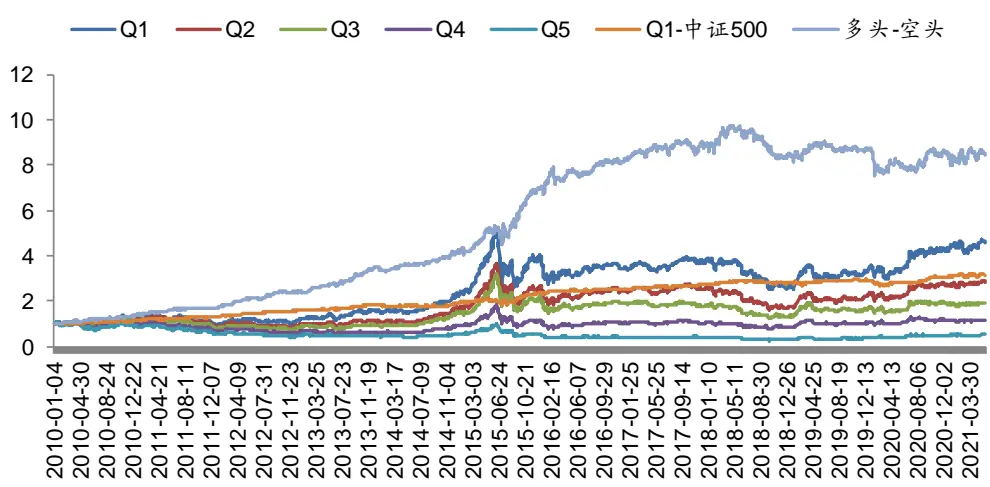
数据来源：Wind、广发证券发展研究中心

表37：价格线性回归系数(6日)分年度绩效指标表现一览

|  | 多头收益 率 | 多头换 手率均 | IC 均值 | IC 胜率 | ICIR | 多头平 均收益 率 | 多头 IR | 多头收 益波动 率 | 最大回 撤 | 超额收 益率 | 超额胜 率 | 多空收益 率 | 夏普 比 |
| --- | --- | --- | --- | --- | --- | --- | --- | --- | --- | --- | --- | --- | --- |
| 2010 | 24.52% | 77.1% | -4.95% | 68.0% | -0.38 | 0.11% | 0.06 | 1.81% | 6.40% | 13.30% | 55.4% | 36.19% | 1.4 |
| 2011 | -23.51% | 72.3% | -3.75% | 62.8% | -0.37 | -0.10% | -0.06 | 1.53% | 2.92% | 15.39% | 54.1% | 25.78% | 2.58 |
| 2012 | 21.02% | 74.7% | -4.13% | 58.0% | -0.38 | 0.09% | 0.06 | 1.55% | 1.58% | 20.54% | 58.0% | 39.79% | 3.45 |
| 2013 | 36.87% | 73.7% | -4.65% | 64.7% | -0.45 | 0.14% | 0.09 | 1.52% | 2.34% | 17.15% | 60.5% | 47.25% | 2.47 |
| 2014 | 45.08% | 75.8% | -1.25% | 54.7% | -0.14 | 0.16% | 0.13 | 1.27% | 5.07% | 4.31% | 44.5% | 16.33% | 0.78 |
| 2015 | 71.88% | 81.9% | -5.02% | 57.7% | -0.31 | 0.27% | 0.09 | 3.23% | 12.20% | 22.26% | 56.2% | 72.34% | 1.33 |
| 2016 | -12.87% | 76.0% | -3.13% | 60.0% | -0.27 | -0.04% | -0.02 | 1.99% | 2.64% | 6.23% | 53.7% | 15.72% | 1.13 |
| 2017 | 9.29% | 74.1% | -2.14% | 64.7% | -0.2 | 0.04% | 0.04 | 0.93% | 3.77% | 9.32% | 54.1% | 9.02% | 1.56 |
| 2018 | -32.18% | 69.8% | 0.70% | 60.8% | 0.06 | -0.15% | -0.09 | 1.68% | 4.86% | 2.15% | 47.3% | -6.81% | 0.38 |
| 2019 | 33.07% | 73.3% | -0.97% | 52.9% | -0.09 | 0.13% | 0.09 | 1.43% | 6.01% | 4.95% | 50.0% | 4.98% | 0.86 |
| 2020 | 28.25% | 72.4% | 0.36% | 50.0% | 0.03 | 0.12% | 0.07 | 1.63% | 8.16% | 5.84% | 50.2% | -3.43% | 0.77 |
| 2021 | 5.35% | 66.3% | -0.93% | 50.0% | -0.07 | 0.06% | 0.04 | 1.30% | 5.66% | 0.78% | 46.7% | 0.17% | 0.22 |

数据来源：Wind、广发证券发展研究中心

图39：Coppock Curve估波指标历史分档测算结果
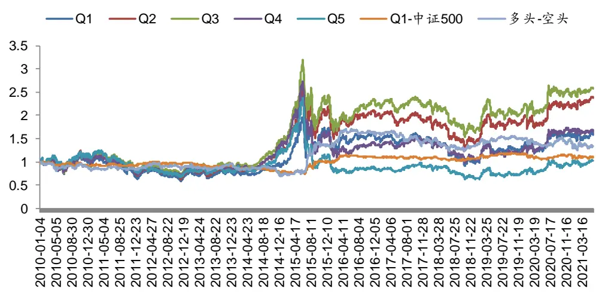
数据来源：Wind、广发证券发展研究中心

表38：Coppock Curve估波指标分年度绩效指标表现一览

|  | 多头收益 率 | 多头换 |  |  |  | 多头平 ICIR 均收益 | 多头 IR | 多头收 益波动 率 | 最大回 撤 | 超额收 益率 | 超额胜 率 | 多空收益 率 | 夏普 比 |
| --- | --- | --- | --- | --- | --- | --- | --- | --- | --- | --- | --- | --- | --- |
|  |  | 手率均 值 | IC 均值 | IC 胜率 | 率 |  |  |  |  |  |  |  |  |
| 2010 | 1.78% | 44.6% | 1.17% | 54.0% | 0.06 | 0.02% | 0.01 | 1.82% | 13.89% | -7.79% | 45.9% | -12.97% | -0.54 |
| 2011 | -33.73% | 43.8% | 0.64% | 54.9% | 0.05 | -0.16% | -0.09 | 1.63% | 5.40% | 0.38% | 47.1% | -3.84% | 0.09 |
| 2012 | 5.81% | 44.7% | -1.43% | 48.0% | -0.09 | 0.04% | 0.02 | 1.73% | 7.20% | 6.02% | 54.3% | 7.20% | 0.87 |
| 2013 | 9.96% | 43.1% | -0.05% | 51.0% | 0 | 0.05% | 0.03 | 1.50% | 11.90% | -6.17% | 46.2% | 6.21% | -0.65 |
| 2014 | 15.73% | 40.6% | 3.58% | 60.4% | 0.24 | 0.07% | 0.05 | 1.27% | 16.55% | -16.87% | 41.6% | -28.12% | -2.66 |
| 2015 | 82.99% | 49.9% | -5.71% | 69.2% | -0.31 | 0.30% | 0.09 | 3.27% | 10.13% | 30.08% | 49.2% | 95.42% | 1.52 |
| 2016 | -10.46% | 44.4% | -4.04% | 64.0% | -0.27 | -0.02% | -0.01 | 2.12% | 5.55% | 9.73% | 48.8% | 21.60% | 1.25 |
| 2017 | -0.80% | 43.1% | 1.68% | 54.9% | 0.12 | 0.00% | 0 | 1.03% | 6.60% | -0.56% | 53.7% | -8.98% | -0.05 |
| 2018 | -34.85% | 40.2% | 0.36% | 51.0% | 0.02 | -0.16% | -0.09 | 1.71% | 8.84% | -1.87% | 48.6% | -10.42% | -0.19 |
| 2019 | 38.83% | 42.8% | -2.40% | 58.8% | -0.19 | 0.15% | 0.1 | 1.48% | 5.41% | 9.60% | 55.3% | 12.85% | 1.34 |
| 2020 | 18.83% | 44.7% | 1.41% | 61.5% | 0.11 | 0.08% | 0.05 | 1.61% | 10.28% | -2.14% | 52.3% | -4.98% | -0.18 |
| 2021 | -0.06% | 38.8% | 0.20% | 45.8% | 0.01 | 0.01% | 0.01 | 1.30% | 6.02% | -4.58% | 43.9% | -6.93% | -0.69 |

数据来源：Wind、广发证券发展研究中心

图40：CR能量指标历史分档测算结果
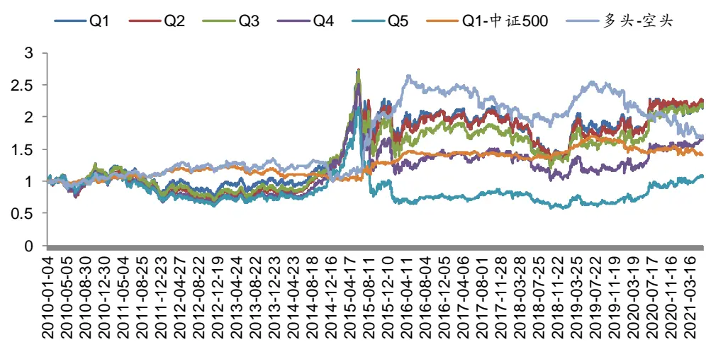
数据来源：Wind、广发证券发展研究中心

表39：CR能量指标分年度绩效指标表现一览

|  | 多头收益 率 | 多头换 |  |  |  | 多头平 ICIR | 多头 IR | 多头收 益波动 率 | 最大回 撤 | 超额收 益率 | 超额胜 率 | 多空收益 率 | 夏普 比 |
| --- | --- | --- | --- | --- | --- | --- | --- | --- | --- | --- | --- | --- | --- |
|  |  | 手率均 值 | IC 均值 | IC 胜率 | 均收益 率 |  |  |  |  |  |  |  |  |
| 2010 | 11.69% | 46.4% | -2.09% | 56.0% | -0.1 | 0.06% | 0.03 | 1.77% | 10.56% | 0.96% | 48.4% | 4.75% | 0.14 |
| 2011 | -26.27% | 48.2% | -0.84% | 51.0% | -0.06 | -0.11% | -0.07 | 1.53% | 3.93% | 11.20% | 54.1% | 6.22% | 1.82 |
| 2012 | 7.57% | 45.8% | -1.18% | 50.0% | -0.07 | 0.04% | 0.03 | 1.61% | 6.63% | 7.30% | 52.3% | 8.10% | 1.13 |
| 2013 | 14.48% | 42.4% | -0.49% | 49.0% | -0.03 | 0.07% | 0.05 | 1.39% | 11.46% | -2.70% | 47.9% | 9.64% | -0.25 |
| 2014 | 20.21% | 40.0% | 2.57% | 52.8% | 0.16 | 0.08% | 0.07 | 1.21% | 13.32% | -13.80% | 44.5% | -24.56% | -2.14 |
| 2015 | 79.69% | 50.8% | -6.10% | 67.3% | -0.41 | 0.29% | 0.09 | 3.17% | 10.29% | 26.95% | 50.0% | 104.97% | 1.47 |
| 2016 | -10.02% | 44.3% | -3.62% | 68.0% | -0.26 | -0.02% | -0.01 | 1.97% | 5.47% | 9.59% | 52.9% | 17.50% | 1.64 |
| 2017 | -0.86% | 41.6% | 1.48% | 60.8% | 0.1 | 0.00% | 0 | 0.90% | 5.33% | -0.94% | 49.6% | -10.47% | -0.11 |
| 2018 | -31.23% | 39.2% | -0.13% | 52.9% | -0.01 | -0.14% | -0.09 | 1.59% | 6.86% | 3.09% | 50.6% | -7.04% | 0.44 |
| 2019 | 44.24% | 42.3% | -3.63% | 62.8% | -0.3 | 0.16% | 0.11 | 1.39% | 5.63% | 13.57% | 50.8% | 18.85% | 1.96 |
| 2020 | 12.30% | 43.9% | 2.23% | 61.5% | 0.15 | 0.06% | 0.04 | 1.50% | 12.33% | -7.95% | 46.9% | -19.94% | -0.79 |
| 2021 | -1.69% | 38.0% | 2.25% | 58.3% | 0.12 | -0.01% | -0.01 | 1.14% | 6.90% | -6.29% | 43.0% | -10.73% | -1.05 |

数据来源：Wind、广发证券发展研究中心

图41：DBCD异同离差乖离率历史分档测算结果
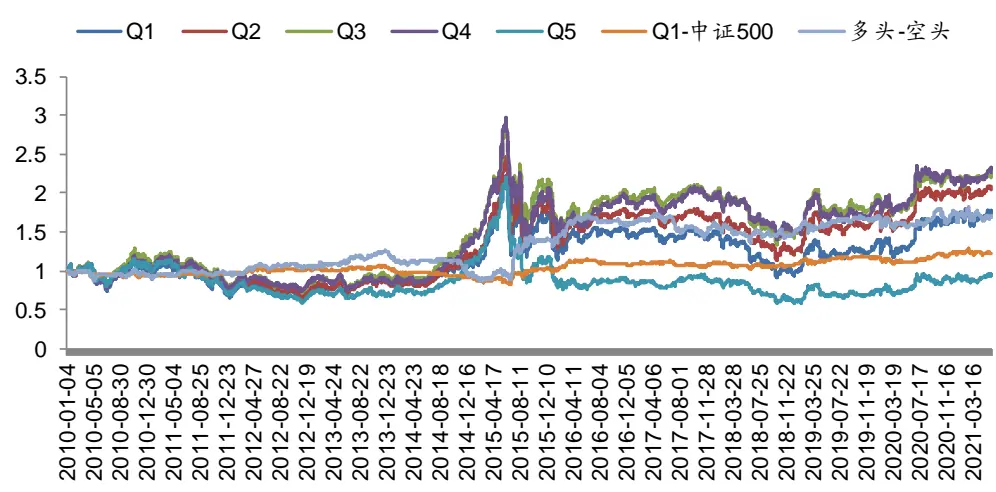
数据来源：Wind、广发证券发展研究中心

表40：DBCD异同离差乖离率分年度绩效指标表现一览

|  | 多头收益 率 | 多头换 手率均 | IC 均值 | IC 胜率 | ICIR | 多头平 均收益 率 | 多头 IR | 多头收 益波动 率 | 最大回 撤 | 超额收 益率 | 超额胜 率 | 多空收益 率 | 夏普 比 |
| --- | --- | --- | --- | --- | --- | --- | --- | --- | --- | --- | --- | --- | --- |
| 2010 | 2.91% | 42.2% | -0.25% | 56.0% | -0.02 | 0.03% | 0.02 | 1.82% | 11.50% | -6.43% | 49.2% | -3.91% | -0.57 |
| 2011 | -32.05% | 40.9% | 0.20% | 52.9% | 0.02 | -0.15% | -0.09 | 1.62% | 3.48% | 2.90% | 49.2% | 0.52% | 0.58 |
| 2012 | 6.41% | 41.4% | -1.49% | 44.0% | -0.12 | 0.04% | 0.02 | 1.64% | 4.40% | 6.36% | 55.1% | 10.22% | 1.12 |
| 2013 | 19.89% | 41.8% | -2.21% | 64.7% | -0.21 | 0.09% | 0.06 | 1.54% | 3.96% | 2.64% | 49.2% | 17.77% | 0.4 |
| 2014 | 21.58% | 40.0% | 3.11% | 58.5% | 0.24 | 0.09% | 0.07 | 1.30% | 12.86% | -12.51% | 44.9% | -24.92% | -2.31 |
| 2015 | 55.16% | 46.2% | -2.11% | 48.1% | -0.12 | 0.24% | 0.07 | 3.35% | 11.96% | 11.43% | 48.4% | 48.81% | 0.76 |
| 2016 | -14.04% | 42.1% | -2.98% | 60.0% | -0.22 | -0.04% | -0.02 | 2.10% | 6.90% | 5.29% | 47.5% | 15.60% | 0.78 |
| 2017 | 1.20% | 42.2% | -0.37% | 52.9% | -0.03 | 0.01% | 0.01 | 1.01% | 7.08% | 1.43% | 50.4% | -1.72% | 0.28 |
| 2018 | -34.99% | 40.1% | -0.22% | 51.0% | -0.01 | -0.16% | -0.1 | 1.67% | 7.07% | -2.16% | 47.7% | -7.26% | -0.27 |
| 2019 | 38.42% | 42.7% | -3.17% | 66.7% | -0.28 | 0.14% | 0.1 | 1.51% | 5.44% | 9.43% | 57.0% | 13.68% | 1.31 |
| 2020 | 29.13% | 44.4% | -0.78% | 48.1% | -0.06 | 0.12% | 0.07 | 1.70% | 7.27% | 6.83% | 54.7% | 4.22% | 0.82 |
| 2021 | 2.33% | 39.8% | 0.65% | 54.2% | 0.04 | 0.03% | 0.02 | 1.31% | 5.69% | -2.16% | 50.5% | -2.97% | -0.36 |

数据来源：Wind、广发证券发展研究中心

图42：DDI方向标准离差指数历史分档测算结果
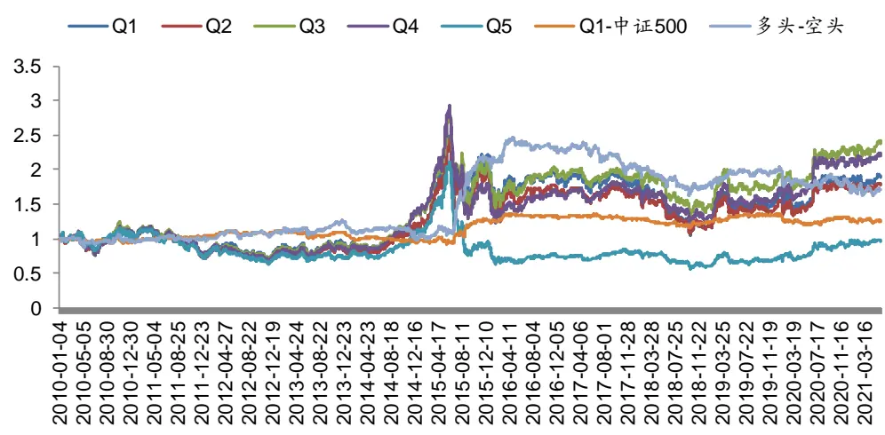
数据来源：Wind、广发证券发展研究中心

表41：DDI方向标准离差指数分年度绩效指标表现一览

|  | 多头收益 率 | 多头换 手率均 | IC 均值 | IC 胜率 | ICIR | 多头平 均收益 | 多头 IR | 多头收 益波动 率 | 最大回 撤 | 超额收 益率 | 超额胜 率 | 多空收益 率 | 夏普 比 |  |
| --- | --- | --- | --- | --- | --- | --- | --- | --- | --- | --- | --- | --- | --- | --- |
|  |  |  |  |  |  |  |  |  |  |  |  |  |  | 率 |
| 2010 | 4.54% | 56.3% | -0.12% | 44.0% | -0.01 | 0.03% | 0.02 | 1.78% | 10.33% | -5.37% | 48.4% | -3.21% | -0.37 |  |
| 2011 | -27.70% | 54.8% | -0.29% | 51.0% | -0.02 | -0.12% | -0.08 | 1.53% | 3.41% | 9.08% | 53.7% | 2.92% | 1.53 |  |
| 2012 | 7.02% | 54.7% | -1.90% | 52.0% | -0.13 | 0.04% | 0.03 | 1.59% | 5.30% | 6.71% | 54.7% | 8.54% | 1.07 |  |
| 2013 | 15.66% | 51.9% | -1.47% | 52.9% | -0.12 | 0.07% | 0.05 | 1.43% | 10.21% | -1.49% | 48.3% | 14.84% | -0.13 |  |
| 2014 | 21.55% | 50.7% | 3.17% | 58.5% | 0.25 | 0.09% | 0.07 | 1.24% | 12.54% | -12.74% | 44.9% | -21.07% | -2.09 |  |
| 2015 | 89.49% | 59.7% | -5.79% | 65.4% | -0.33 | 0.31% | 0.1 | 3.18% | 10.04% | 34.10% | 50.8% | 118.99% | 1.79 |  |
| 2016 | -15.21% | 53.3% | -1.67% | 56.0% | -0.13 | -0.05% | -0.02 | 1.96% | 4.25% | 3.21% | 50.4% | 7.16% | 0.55 |  |
| 2017 | -1.59% | 50.6% | 1.47% | 54.9% | 0.1 | 0.00% | 0 | 0.93% | 6.38% | -1.58% | 49.6% | -9.74% | -0.22 |  |
| 2018 | -36.55% | 49.7% | 1.86% | 58.8% | 0.13 | -0.17% | -0.11 | 1.62% | 10.62% | -4.71% | 48.2% | -16.05% | -0.63 |  |
| 2019 | 39.47% | 52.3% | -2.28% | 60.8% | -0.19 | 0.15% | 0.11 | 1.37% | 3.65% | 9.75% | 52.9% | 14.55% | 1.45 |  |
| 2020 | 16.92% | 53.7% | 1.42% | 55.8% | 0.1 | 0.08% | 0.05 | 1.51% | 11.05% | -4.00% | 49.0% | -9.91% | -0.44 |  |
| 2021 | 1.09% | 48.2% | 0.46% | 54.2% | 0.03 | 0.02% | 0.01 | 1.14% | 5.73% | -3.58% | 46.7% | -5.16% | -0.61 |  |

数据来源：Wind、广发证券发展研究中心

图43：DDI(DIF)方向标准离差指数(DIF)历史分档测算结果
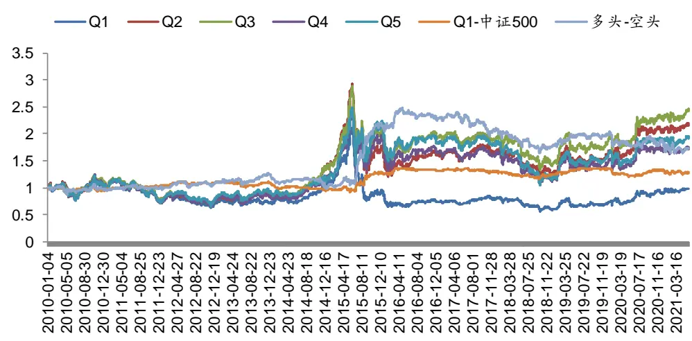
数据来源：Wind、广发证券发展研究中心

表42：DDI(DIF)方向标准离差指数(DIF)分年度绩效指标表现一览

|  | 多头收益 率 | 多头换 |  |  |  | 多头平 ICIR | 多头 IR | 多头收 益波动 率 | 最大回 撤 | 超额收 益率 | 超额胜 率 | 多空收益 率 | 夏普 比 |
| --- | --- | --- | --- | --- | --- | --- | --- | --- | --- | --- | --- | --- | --- |
|  |  | 手率均 值 | IC 均值 | IC 胜率 | 均收益 率 |  |  |  |  |  |  |  |  |
| 2010 | 4.73% | 56.2% | 0.12% | 44.0% | 0.01 | 0.04% | 0.02 | 1.78% | 10.31% | -5.19% | 48.4% | -3.01% | -0.36 |
| 2011 | -27.75% | 54.6% | 0.29% | 51.0% | 0.02 | -0.12% | -0.08 | 1.53% | 3.48% | 9.00% | 54.1% | 2.65% | 1.53 |
| 2012 | 6.92% | 54.6% | 1.90% | 52.0% | 0.13 | 0.04% | 0.03 | 1.59% | 5.38% | 6.61% | 55.6% | 8.74% | 1.06 |
| 2013 | 15.97% | 51.8% | 1.47% | 52.9% | 0.12 | 0.07% | 0.05 | 1.43% | 10.10% | -1.22% | 48.3% | 15.39% | -0.1 |
| 2014 | 21.55% | 50.5% | -3.17% | 58.5% | -0.25 | 0.09% | 0.07 | 1.24% | 12.53% | -12.74% | 44.5% | -21.20% | -2.1 |
| 2015 | 89.99% | 59.6% | 5.79% | 65.4% | 0.33 | 0.31% | 0.1 | 3.18% | 10.04% | 34.43% | 51.2% | 118.56% | 1.81 |
| 2016 | -15.17% | 53.2% | 1.67% | 56.0% | 0.13 | -0.05% | -0.02 | 1.96% | 4.29% | 3.24% | 50.0% | 7.18% | 0.56 |
| 2017 | -1.60% | 50.5% | -1.47% | 54.9% | -0.1 | 0.00% | 0 | 0.93% | 6.44% | -1.59% | 50.0% | -9.60% | -0.23 |
| 2018 | -36.43% | 49.6% | -1.86% | 58.8% | -0.13 | -0.17% | -0.11 | 1.62% | 10.63% | -4.52% | 48.6% | -15.99% | -0.6 |
| 2019 | 39.40% | 52.2% | 2.28% | 60.8% | 0.19 | 0.15% | 0.11 | 1.37% | 3.61% | 9.69% | 53.3% | 14.26% | 1.45 |
| 2020 | 17.97% | 53.5% | -1.42% | 55.8% | -0.1 | 0.08% | 0.05 | 1.51% | 11.06% | -3.14% | 50.6% | -9.25% | -0.34 |
| 2021 | 1.22% | 48.2% | -0.46% | 54.2% | -0.03 | 0.02% | 0.02 | 1.14% | 5.73% | -3.46% | 46.7% | -4.90% | -0.58 |

数据来源：Wind、广发证券发展研究中心

图44：DDI(DIZ)方向标准离差指数(DIZ)历史分档测算结果
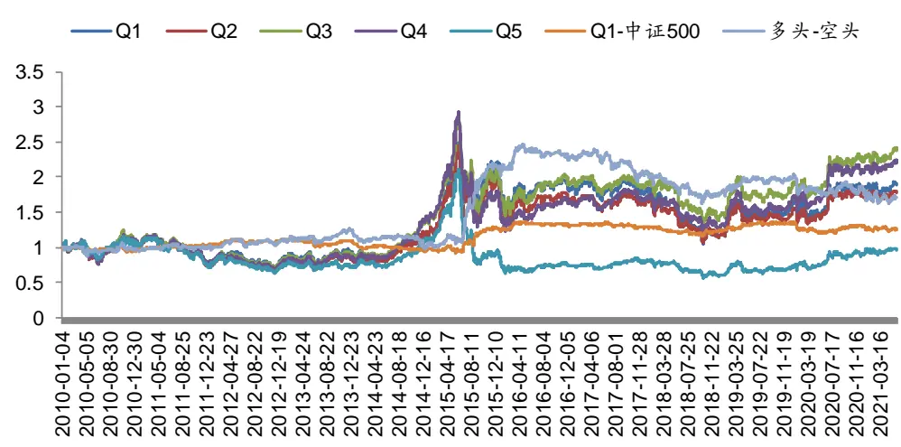
数据来源：Wind、广发证券发展研究中心

表43：DDI(DIZ)方向标准离差指数(DIZ)分年度绩效指标表现一览

|  | 多头收益 率 | 多头换 手率均 | IC 均值 | IC 胜率 | ICIR | 多头平 均收益 率 | 多头 IR | 多头收 益波动 率 | 最大回 撤 | 超额收 益率 | 超额胜 率 | 多空收益 率 | 夏普 比 |
| --- | --- | --- | --- | --- | --- | --- | --- | --- | --- | --- | --- | --- | --- |
| 2010 | 4.54% | 56.3% | -0.12% | 44.0% | -0.01 | 0.03% | 0.02 | 1.78% | 10.33% | -5.37% | 48.4% | -3.21% | -0.37 |
| 2011 | -27.70% | 54.8% | -0.29% | 51.0% | -0.02 | -0.12% | -0.08 | 1.53% | 3.41% | 9.08% | 53.7% | 2.92% | 1.53 |
| 2012 | 7.02% | 54.7% | -1.90% | 52.0% | -0.13 | 0.04% | 0.03 | 1.59% | 5.30% | 6.71% | 54.7% | 8.54% | 1.07 |
| 2013 | 15.66% | 51.9% | -1.47% | 52.9% | -0.12 | 0.07% | 0.05 | 1.43% | 10.21% | -1.49% | 48.3% | 14.84% | -0.13 |
| 2014 | 21.55% | 50.7% | 3.17% | 58.5% | 0.25 | 0.09% | 0.07 | 1.24% | 12.54% | -12.74% | 44.9% | -21.07% | -2.09 |
| 2015 | 89.49% | 59.7% | -5.79% | 65.4% | -0.33 | 0.31% | 0.1 | 3.18% | 10.04% | 34.10% | 50.8% | 118.99% | 1.79 |
| 2016 | -15.21% | 53.3% | -1.67% | 56.0% | -0.13 | -0.05% | -0.02 | 1.96% | 4.25% | 3.21% | 50.4% | 7.16% | 0.55 |
| 2017 | -1.59% | 50.6% | 1.47% | 54.9% | 0.1 | 0.00% | 0 | 0.93% | 6.38% | -1.58% | 49.6% | -9.74% | -0.22 |
| 2018 | -36.55% | 49.7% | 1.86% | 58.8% | 0.13 | -0.17% | -0.11 | 1.62% | 10.62% | -4.71% | 48.2% | -16.05% | -0.63 |
| 2019 | 39.47% | 52.3% | -2.28% | 60.8% | -0.19 | 0.15% | 0.11 | 1.37% | 3.65% | 9.75% | 52.9% | 14.55% | 1.45 |
| 2020 | 16.92% | 53.7% | 1.42% | 55.8% | 0.1 | 0.08% | 0.05 | 1.51% | 11.05% | -4.00% | 49.0% | -9.91% | -0.44 |
| 2021 | 1.09% | 48.2% | 0.46% | 54.2% | 0.03 | 0.02% | 0.01 | 1.14% | 5.73% | -3.58% | 46.7% | -5.16% | -0.61 |

数据来源：Wind、广发证券发展研究中心

图45：DPTB大盘同步指标历史分档测算结果
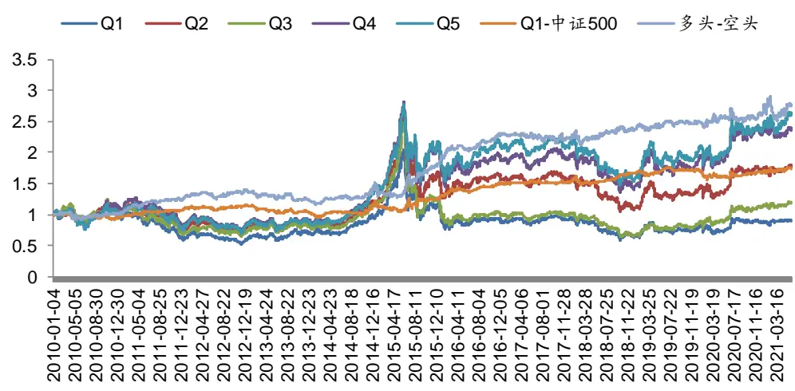
数据来源：Wind、广发证券发展研究中心

表44：DPTB大盘同步指标分年度绩效指标表现一览

|  | 多头收益 率 | 多头换 手率均 | IC 均值 | IC 胜率 | ICIR | 多头平 均收益 率 | 多头 IR | 多头收 益波动 | 最大回 撤 | 超额收 益率 | 超额胜 率 | 多空收益 率 | 夏普 比 |  |
| --- | --- | --- | --- | --- | --- | --- | --- | --- | --- | --- | --- | --- | --- | --- |
|  |  |  |  |  |  |  |  |  |  |  |  |  |  | 率 |
| 2010 | 3.07% | 50.3% | 0.04% | 44.0% | 0 | 0.03% | 0.02 | 1.79% | 10.02% | -6.44% | 46.3% | 0.24% | -0.55 |  |
| 2011 | -24.24% | 53.6% | 3.34% | 72.6% | 0.39 | -0.10% | -0.07 | 1.54% | 2.12% | 14.34% | 53.3% | 23.89% | 2.52 |  |
| 2012 | 7.98% | 52.4% | 0.60% | 50.0% | 0.06 | 0.05% | 0.03 | 1.66% | 5.73% | 7.96% | 52.3% | 12.23% | 1.34 |  |
| 2013 | 4.57% | 52.5% | -1.98% | 54.9% | -0.23 | 0.03% | 0.02 | 1.49% | 12.22% | -10.72% | 43.7% | -11.54% | -1.37 |  |
| 2014 | 63.08% | 51.4% | 2.65% | 54.7% | 0.29 | 0.21% | 0.17 | 1.22% | 6.52% | 16.85% | 50.2% | 21.61% | 1.86 |  |
| 2015 | 47.46% | 54.8% | 1.57% | 57.7% | 0.13 | 0.21% | 0.07 | 3.19% | 14.80% | 4.59% | 43.4% | 21.57% | 0.36 |  |
| 2016 | -1.69% | 54.2% | 2.76% | 60.0% | 0.38 | 0.01% | 0.01 | 1.88% | 3.62% | 19.13% | 54.1% | 26.62% | 2.8 |  |
| 2017 | 1.37% | 52.9% | 0.29% | 47.1% | 0.03 | 0.01% | 0.01 | 0.88% | 4.65% | 1.28% | 52.9% | -2.52% | 0.25 |  |
| 2018 | -26.66% | 50.3% | 1.12% | 51.0% | 0.11 | -0.12% | -0.07 | 1.54% | 7.66% | 9.84% | 59.7% | 5.45% | 1.5 |  |
| 2019 | 31.26% | 51.2% | 1.43% | 56.9% | 0.19 | 0.12% | 0.08 | 1.44% | 4.72% | 3.58% | 51.6% | 6.10% | 0.69 |  |
| 2020 | 18.33% | 53.2% | 1.20% | 57.7% | 0.14 | 0.08% | 0.05 | 1.60% | 9.80% | -2.55% | 49.4% | 5.00% | -0.25 |  |
| 2021 | 7.69% | 42.7% | 1.33% | 54.2% | 0.07 | 0.08% | 0.06 | 1.34% | 4.02% | 3.11% | 51.4% | 5.32% | 0.75 |  |

数据来源：Wind、广发证券发展研究中心

图46：Ease of Movement简易波动指标(14日)历史分档测算结果

数据来源：Wind、广发证券发展研究中心

表45：Ease of Movement简易波动指标(14日)分年度绩效指标表现一览

|  | 多头收益 率 | 多头换 |  |  |  | 多头平 ICIR | 多头 IR | 多头收 益波动 率 | 最大回 撤 | 超额收 益率 | 超额胜 率 | 多空收益 率 | 夏普 比 |
| --- | --- | --- | --- | --- | --- | --- | --- | --- | --- | --- | --- | --- | --- |
|  |  | 手率均 值 | IC 均值 | IC 胜率 | 均收益 率 |  |  |  |  |  |  |  |  |
| 2010 | 19.94% | 8.4% | 4.08% | 64.0% | 0.35 | 0.09% | 0.05 | 1.72% | 2.88% | 9.02% | 51.7% | 29.24% | 1.72 |
| 2011 | -29.09% | 7.4% | -0.22% | 41.2% | -0.02 | -0.13% | -0.09 | 1.41% | 4.92% | 6.60% | 48.0% | -4.57% | 1.5 |
| 2012 | 1.22% | 6.8% | -0.46% | 54.0% | -0.04 | 0.02% | 0.01 | 1.45% | 4.84% | 0.51% | 45.3% | -1.17% | 0.14 |
| 2013 | 16.25% | 5.5% | 3.14% | 62.8% | 0.29 | 0.07% | 0.05 | 1.40% | 4.84% | -0.82% | 53.4% | 21.41% | -0.16 |
| 2014 | 24.79% | 6.5% | -3.34% | 56.6% | -0.32 | 0.10% | 0.08 | 1.20% | 12.17% | -10.41% | 41.2% | -30.93% | -2.77 |
| 2015 | 51.57% | 14.9% | 2.56% | 63.5% | 0.2 | 0.22% | 0.07 | 3.17% | 8.15% | 8.02% | 47.5% | 32.63% | 0.78 |
| 2016 | -14.92% | 5.2% | -0.52% | 52.0% | -0.05 | -0.05% | -0.02 | 1.93% | 3.49% | 3.52% | 48.8% | -5.55% | 0.87 |
| 2017 | 11.72% | 4.5% | 2.46% | 62.8% | 0.19 | 0.05% | 0.06 | 0.82% | 4.70% | 11.52% | 52.5% | 11.64% | 1.97 |
| 2018 | -27.14% | 4.0% | 0.42% | 60.8% | 0.03 | -0.12% | -0.08 | 1.56% | 3.95% | 9.23% | 54.7% | -0.53% | 1.74 |
| 2019 | 43.92% | 3.5% | 3.08% | 58.8% | 0.26 | 0.16% | 0.12 | 1.35% | 5.12% | 13.21% | 54.1% | 20.13% | 2.14 |
| 2020 | 39.75% | 5.5% | 5.09% | 63.5% | 0.35 | 0.15% | 0.1 | 1.57% | 4.02% | 15.17% | 59.3% | 35.57% | 2.19 |
| 2021 | 4.81% | 3.6% | 0.70% | 58.3% | 0.03 | 0.05% | 0.04 | 1.30% | 9.90% | 0.28% | 56.1% | 1.92% | 0.11 |

数据来源：Wind、广发证券发展研究中心

图47：Ease of Movement简易波动指标(6日)历史分档测算结果
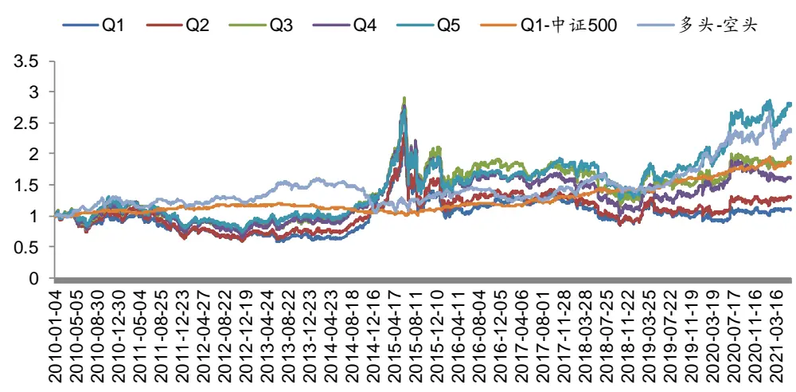
数据来源：Wind、广发证券发展研究中心

表46：Ease of Movement简易波动指标(6日)分年度绩效指标表现一览

|  | 多头收益 率 | 多头换 |  |  |  | 多头平 ICIR | 多头 IR | 多头收 益波动 率 | 最大回 撤 | 超额收 益率 | 超额胜 率 | 多空收益 率 | 夏普 比 |
| --- | --- | --- | --- | --- | --- | --- | --- | --- | --- | --- | --- | --- | --- |
|  |  | 手率均 值 | IC 均值 | IC 胜率 | 均收益 率 |  |  |  |  |  |  |  |  |
| 2010 | 19.84% | 10.3% | 4.18% | 64.0% | 0.35 | 0.09% | 0.05 | 1.72% | 2.92% | 8.93% | 54.1% | 29.60% | 1.68 |
| 2011 | -29.04% | 9.2% | -0.17% | 47.1% | -0.02 | -0.13% | -0.09 | 1.41% | 4.95% | 6.68% | 50.4% | -4.94% | 1.53 |
| 2012 | 1.63% | 8.5% | -0.42% | 54.0% | -0.04 | 0.02% | 0.01 | 1.45% | 4.92% | 0.91% | 46.9% | -0.06% | 0.23 |
| 2013 | 16.98% | 7.7% | 3.13% | 62.8% | 0.29 | 0.08% | 0.05 | 1.40% | 4.43% | -0.20% | 52.1% | 23.08% | -0.02 |
| 2014 | 24.76% | 7.9% | -3.27% | 56.6% | -0.31 | 0.10% | 0.08 | 1.21% | 11.97% | -10.42% | 42.9% | -30.31% | -2.81 |
| 2015 | 49.98% | 16.3% | 2.40% | 61.5% | 0.19 | 0.22% | 0.07 | 3.16% | 9.49% | 6.80% | 48.0% | 30.59% | 0.66 |
| 2016 | -14.45% | 7.0% | -0.47% | 52.0% | -0.04 | -0.05% | -0.02 | 1.93% | 3.51% | 4.06% | 50.0% | -5.53% | 0.99 |
| 2017 | 11.91% | 6.4% | 2.47% | 62.8% | 0.19 | 0.05% | 0.06 | 0.82% | 4.83% | 11.68% | 53.3% | 11.20% | 1.98 |
| 2018 | -27.09% | 5.9% | 0.41% | 60.8% | 0.03 | -0.12% | -0.08 | 1.55% | 4.09% | 9.29% | 54.7% | -0.58% | 1.74 |
| 2019 | 44.07% | 5.0% | 3.07% | 58.8% | 0.26 | 0.16% | 0.12 | 1.35% | 5.04% | 13.35% | 53.7% | 20.31% | 2.19 |
| 2020 | 38.93% | 7.0% | 5.09% | 63.5% | 0.35 | 0.15% | 0.09 | 1.57% | 4.13% | 14.49% | 58.0% | 34.97% | 2.08 |
| 2021 | 4.74% | 4.7% | 0.74% | 58.3% | 0.03 | 0.05% | 0.04 | 1.30% | 9.83% | 0.22% | 55.1% | 1.88% | 0.1 |

数据来源：Wind、广发证券发展研究中心

图48：Elder透视指标历史分档测算结果
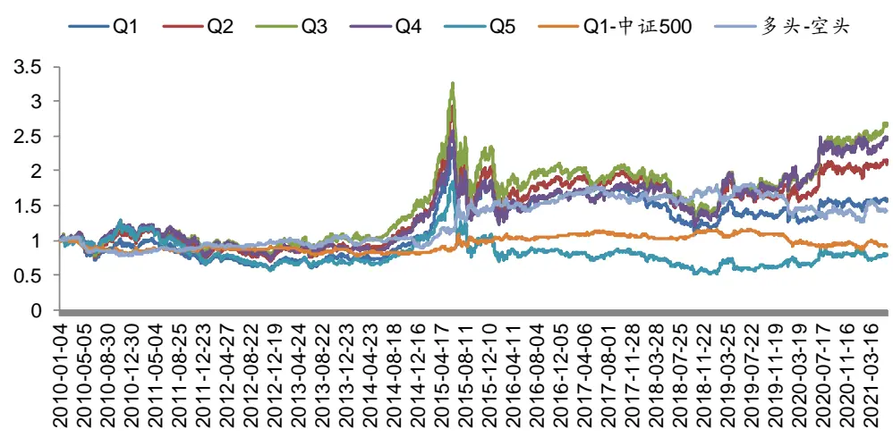
数据来源：Wind、广发证券发展研究中心

表47：Elder透视指标分年度绩效指标表现一览

|  | 多头收益 率 | 多头换 手率均 | IC 均值 | IC 胜率 | ICIR | 多头平 均收益 | 多头 IR | 多头收 益波动 | 最大回 撤 | 超额收 益率 | 超额胜 率 | 多空收益 率 | 夏普 比 |
| --- | --- | --- | --- | --- | --- | --- | --- | --- | --- | --- | --- | --- | --- |
| 2010 | -9.33% | 值 63.6% | 2.73% | 50.0% | 0.2 | 率 -0.03% | -0.02 | 率 1.61% | 21.05% | -18.33% | 41.7% | -21.19% | -1.79 |
| 2011 | -26.05% | 63.9% | -1.35% | 56.9% | -0.13 | -0.12% | -0.09 | 1.30% | 7.40% | 10.56% | 49.6% | 18.92% | 1.41 |
| 2012 | -0.36% | 60.2% | -0.02% | 52.0% | 0 | 0.01% | 0.01 | 1.28% | 7.62% | -1.73% | 44.0% | 2.32% | -0.24 |
| 2013 | 14.89% | 60.3% | 0.47% | 52.9% | 0.03 | 0.07% | 0.05 | 1.25% | 12.70% | -2.72% | 47.5% | 9.93% | -0.28 |
| 2014 | 31.22% | 61.2% | 2.09% | 54.7% | 0.16 | 0.12% | 0.11 | 1.06% | 9.76% | -6.37% | 43.3% | -16.48% | -0.79 |
| 2015 | 78.88% | 64.2% | -3.76% | 67.3% | -0.24 | 0.28% | 0.1 | 2.81% | 16.14% | 22.79% | 49.6% | 66.51% | 1.19 |
| 2016 | -9.53% | 55.1% | -1.64% | 60.0% | -0.12 | -0.03% | -0.02 | 1.58% | 7.51% | 8.02% | 50.0% | 13.05% | 0.91 |
| 2017 | -1.44% | 58.3% | 0.80% | 51.0% | 0.07 | 0.00% | -0.01 | 0.68% | 8.32% | -1.99% | 44.7% | -4.33% | -0.24 |
| 2018 | -26.89% | 57.1% | -1.39% | 52.9% | -0.11 | -0.12% | -0.09 | 1.28% | 8.58% | 8.40% | 53.9% | 10.59% | 1.07 |
| 2019 | 22.21% | 54.4% | 0.01% | 54.9% | 0 | 0.09% | 0.08 | 1.14% | 9.91% | -4.71% | 48.4% | -6.70% | -0.49 |
| 2020 | 5.30% | 52.2% | 2.30% | 65.4% | 0.16 | 0.03% | 0.02 | 1.24% | 17.34% | -14.73% | 43.2% | -17.93% | -1.18 |
| 2021 | 3.63% | 46.3% | 0.38% | 58.3% | 0.02 | 0.04% | 0.05 | 0.73% | 8.67% | -1.63% | 44.9% | 5.19% | -0.21 |

数据来源：Wind、广发证券发展研究中心

图49：Hurst指数历史分档测算结果
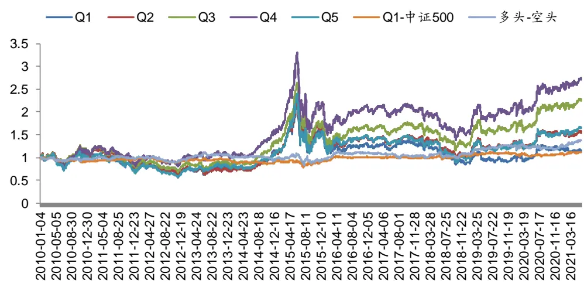
数据来源：Wind、广发证券发展研究中心

表48：Hurst指数分年度绩效指标表现一览

|  | 多头收益 率 | 多头换 手率均 | IC 均值 | IC 胜率 | ICIR | 多头平 均收益 | 多头 IR | 多头收 益波动 | 最大回 撤 | 超额收 益率 | 超额胜 率 | 多空收益 率 | 夏普 比 |
| --- | --- | --- | --- | --- | --- | --- | --- | --- | --- | --- | --- | --- | --- |
| 2010 | 0.03% | 值 62.4% | 0.24% | 48.0% | 0.02 | 率 0.02% | 0.01 | 率 1.75% | 12.92% | -9.14% | 46.3% | -3.36% | -1.11 |
| 2011 | -30.95% | 64.2% | -0.04% | 52.9% | -0.01 | -0.14% | -0.09 | 1.48% | 3.07% | 4.04% | 48.4% | -0.54% | 0.85 |
| 2012 | -2.24% | 63.5% | 1.43% | 44.0% | 0.13 | 0.00% | 0 | 1.54% | 12.05% | -2.69% | 46.9% | -2.75% | -0.47 |
| 2013 | 22.33% | 56.5% | 3.36% | 64.7% | 0.38 | 0.10% | 0.07 | 1.45% | 5.36% | 4.42% | 51.3% | 14.04% | 0.69 |
| 2014 | 34.99% | 59.6% | -1.23% | 58.5% | -0.15 | 0.13% | 0.11 | 1.20% | 11.04% | -3.18% | 42.0% | -8.29% | -0.48 |
| 2015 | 38.01% | 62.3% | 0.90% | 51.9% | 0.07 | 0.18% | 0.06 | 3.19% | 16.81% | -1.90% | 48.4% | -2.26% | -0.06 |
| 2016 | -9.89% | 60.8% | 1.94% | 54.0% | 0.19 | -0.02% | -0.01 | 1.96% | 4.11% | 9.70% | 53.7% | 14.78% | 1.77 |
| 2017 | -2.02% | 58.4% | -0.49% | 52.9% | -0.05 | 0.00% | -0.01 | 0.87% | 4.34% | -2.07% | 46.3% | -5.99% | -0.4 |
| 2018 | -28.73% | 61.4% | 1.47% | 56.9% | 0.12 | -0.13% | -0.08 | 1.62% | 6.70% | 7.06% | 56.4% | 6.50% | 1.07 |
| 2019 | 30.96% | 58.7% | 0.73% | 52.9% | 0.09 | 0.12% | 0.08 | 1.47% | 3.28% | 3.48% | 51.6% | 13.14% | 0.67 |
| 2020 | 21.82% | 60.5% | 0.46% | 48.1% | 0.05 | 0.09% | 0.06 | 1.55% | 6.65% | 0.12% | 47.7% | -0.19% | 0.06 |
| 2021 | 6.23% | 55.5% | 1.11% | 62.5% | 0.11 | 0.06% | 0.06 | 0.97% | 3.21% | 1.34% | 49.5% | 11.00% | 0.44 |

数据来源：Wind、广发证券发展研究中心

图50：JDQS阶段强势指标历史分档测算结果
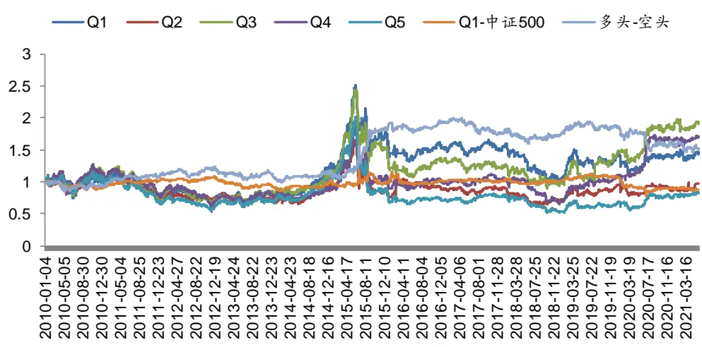
数据来源：Wind、广发证券发展研究中心

表49：JDQS阶段强势指标分年度绩效指标表现一览

|  | 多头收益 率 | 多头换 | IC 胜率 |  |  | 多头平 均收益 率 | 多头 IR | 多头收 益波动 率 | 最大回 撤 | 超额收 益率 | 超额胜 率 | 多空收益 率 | 夏普 比 |
| --- | --- | --- | --- | --- | --- | --- | --- | --- | --- | --- | --- | --- | --- |
|  |  |  | 手率均 值 | IC 均值 | ICIR |  |  |  |  |  |  |  |  |
| 2010 | -0.62% | 49.6% | 0.36% | 53.1% | 0.02 | 0.01% | 0.01 | 1.74% | 13.53% | -10.20% | 45.5% | -6.66% | -0.78 |
| 2011 | -25.01% | 53.8% | -2.56% | 62.8% | -0.26 | -0.11% | -0.07 | 1.52% | 3.64% | 13.07% | 52.1% | 15.39% | 2.18 |
| 2012 | 4.27% | 50.9% | -0.49% | 50.0% | -0.04 | 0.03% | 0.02 | 1.58% | 5.74% | 3.91% | 48.6% | 10.49% | 0.63 |
| 2013 | 4.90% | 53.8% | 1.50% | 54.9% | 0.13 | 0.03% | 0.02 | 1.40% | 16.33% | -10.84% | 45.0% | -5.97% | -1.15 |
| 2014 | 51.00% | 56.8% | -0.57% | 48.1% | -0.06 | 0.18% | 0.15 | 1.16% | 7.39% | 8.00% | 49.8% | 4.41% | 0.95 |
| 2015 | 40.71% | 55.2% | -2.99% | 51.0% | -0.24 | 0.18% | 0.06 | 2.84% | 19.01% | -3.96% | 47.1% | 57.15% | -0.07 |
| 2016 | -12.31% | 49.6% | -2.31% | 57.8% | -0.27 | -0.04% | -0.03 | 1.58% | 17.19% | 3.79% | 48.8% | 5.76% | 0.31 |
| 2017 | -0.26% | 57.8% | 1.11% | 49.0% | 0.12 | 0.00% | 0 | 0.82% | 5.08% | -0.44% | 48.4% | -8.72% | -0.05 |
| 2018 | -32.94% | 55.3% | 0.33% | 54.0% | 0.03 | -0.15% | -0.1 | 1.52% | 9.00% | 0.27% | 51.0% | -2.93% | 0.07 |
| 2019 | 36.89% | 52.5% | -1.85% | 62.8% | -0.2 | 0.14% | 0.1 | 1.39% | 4.35% | 7.82% | 51.6% | 9.24% | 1.3 |
| 2020 | 1.63% | 53.0% | 0.14% | 64.0% | 0.01 | 0.02% | 0.01 | 1.35% | 27.42% | -17.47% | 46.9% | -15.06% | -1.38 |
| 2021 | 1.42% | 53.4% | 0.02% | 52.2% | 0 | 0.02% | 0.02 | 1.15% | 6.40% | -3.12% | 43.9% | -5.18% | -0.72 |

数据来源：Wind、广发证券发展研究中心

图51：KDJ(D)历史分档测算结果
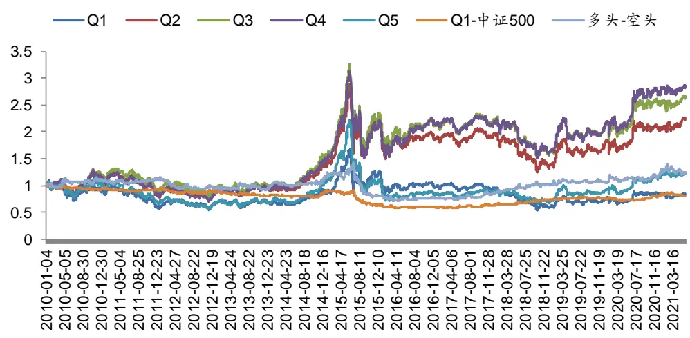
数据来源：Wind、广发证券发展研究中心

表50：KDJ(D)分年度绩效指标表现一览

|  | 多头收益 率 | 多头换 手率均 | IC 均值 | IC 胜率 | ICIR | 多头平 均收益 | 多头 IR | 多头收 益波动 | 最大回 撤 | 超额收 益率 | 超额胜 率 | 多空收益 率 | 夏普 比 |
| --- | --- | --- | --- | --- | --- | --- | --- | --- | --- | --- | --- | --- | --- |
| 2010 | 1.86% | 值 65.6% | 1.03% | 56.0% | 0.06 | 率 0.02% | 0.01 | 率 1.83% | 11.11% | -7.13% | 43.8% | 10.44% | -0.95 |
| 2011 | -33.48% | 64.9% | 1.27% | 51.0% | 0.1 | -0.16% | -0.11 | 1.45% | 7.60% | 0.08% | 49.2% | 0.50% | 0.04 |
| 2012 | -2.82% | 64.1% | -0.88% | 50.0% | -0.06 | 0.00% | 0 | 1.48% | 12.10% | -3.52% | 45.7% | -12.44% | -0.53 |
| 2013 | 4.39% | 61.6% | 0.89% | 54.9% | 0.07 | 0.03% | 0.02 | 1.48% | 11.08% | -10.80% | 41.2% | -2.80% | -1.79 |
| 2014 | 54.80% | 63.5% | 2.90% | 56.6% | 0.24 | 0.19% | 0.14 | 1.29% | 5.17% | 11.30% | 51.8% | 24.73% | 1.54 |
| 2015 | 1.54% | 70.3% | -1.46% | 46.2% | -0.08 | 0.06% | 0.02 | 3.13% | 30.45% | -28.50% | 44.3% | -31.83% | -1.88 |
| 2016 | -23.82% | 65.4% | -1.24% | 54.0% | -0.09 | -0.09% | -0.05 | 1.93% | 9.96% | -7.48% | 45.9% | -5.84% | -1.01 |
| 2017 | 7.01% | 62.4% | 1.26% | 49.0% | 0.09 | 0.03% | 0.04 | 0.91% | 5.76% | 6.90% | 50.4% | 11.62% | 0.99 |
| 2018 | -21.97% | 59.7% | 2.55% | 54.9% | 0.17 | -0.09% | -0.06 | 1.48% | 5.43% | 16.44% | 54.3% | 21.52% | 2 |
| 2019 | 30.91% | 61.4% | -0.64% | 54.9% | -0.05 | 0.12% | 0.09 | 1.40% | 3.55% | 3.14% | 48.0% | 4.17% | 0.55 |
| 2020 | 30.27% | 62.4% | 2.40% | 61.5% | 0.18 | 0.12% | 0.08 | 1.56% | 8.05% | 7.16% | 52.7% | 13.74% | 0.87 |
| 2021 | 3.43% | 57.5% | 0.57% | 62.5% | 0.03 | 0.04% | 0.03 | 1.19% | 8.27% | -1.20% | 49.5% | 2.30% | -0.21 |

数据来源：Wind、广发证券发展研究中心

图52：KDJ(J)历史分档测算结果
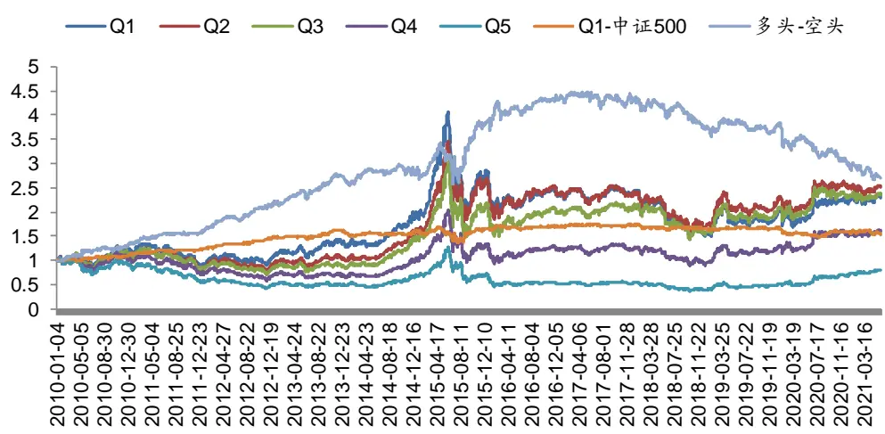
数据来源：Wind、广发证券发展研究中心

表51：KDJ(J)分年度绩效指标表现一览

|  | 多头收益 率 | 多头换 手率均 | IC 均值 | IC 胜率 | ICIR | 多头平 均收益 | 多头 IR | 多头收 益波动 | 最大回 撤 | 超额收 益率 | 超额胜 率 | 多空收益 率 | 夏普 比 |
| --- | --- | --- | --- | --- | --- | --- | --- | --- | --- | --- | --- | --- | --- |
| 2010 | 20.38% | 值 80.8% | -4.97% | 58.0% | -0.34 | 率 0.09% | 0.05 | 率 1.76% | 4.94% | 9.15% | 50.0% | 30.86% | 0.88 |
| 2011 | -25.28% | 80.4% | -1.80% | 58.8% | -0.15 | -0.11% | -0.07 | 1.53% | 2.78% | 12.70% | 56.6% | 20.67% | 2.01 |
| 2012 | 19.36% | 81.6% | -3.60% | 56.0% | -0.29 | 0.09% | 0.05 | 1.57% | 2.31% | 19.01% | 60.5% | 35.33% | 3.59 |
| 2013 | 28.82% | 79.5% | -2.63% | 54.9% | -0.25 | 0.12% | 0.08 | 1.45% | 4.87% | 9.94% | 52.5% | 28.26% | 1.46 |
| 2014 | 37.24% | 77.6% | -1.18% | 58.5% | -0.12 | 0.14% | 0.11 | 1.26% | 7.30% | -1.37% | 49.8% | 0.92% | -0.21 |
| 2015 | 46.96% | 81.4% | -3.30% | 53.9% | -0.18 | 0.21% | 0.06 | 3.30% | 19.18% | 5.06% | 52.9% | 41.01% | 0.38 |
| 2016 | -16.19% | 78.3% | -2.12% | 62.0% | -0.2 | -0.05% | -0.03 | 1.97% | 4.80% | 2.08% | 50.4% | 11.55% | 0.39 |
| 2017 | 1.32% | 78.0% | -0.42% | 52.9% | -0.04 | 0.01% | 0.01 | 0.92% | 3.37% | 1.33% | 52.1% | -0.63% | 0.25 |
| 2018 | -36.67% | 76.1% | 0.55% | 47.1% | 0.04 | -0.17% | -0.11 | 1.64% | 7.83% | -4.74% | 49.8% | -14.20% | -0.74 |
| 2019 | 28.92% | 77.7% | -0.75% | 54.9% | -0.07 | 0.11% | 0.08 | 1.41% | 2.95% | 1.60% | 51.6% | 2.24% | 0.29 |
| 2020 | 15.73% | 78.6% | 2.47% | 55.8% | 0.21 | 0.07% | 0.05 | 1.52% | 11.60% | -4.88% | 50.6% | -21.62% | -0.63 |
| 2021 | 1.57% | 75.1% | 1.94% | 62.5% | 0.14 | 0.02% | 0.02 | 1.09% | 6.32% | -3.06% | 46.7% | -9.42% | -0.71 |

数据来源：Wind、广发证券发展研究中心

图53：KDJ(K)历史分档测算结果
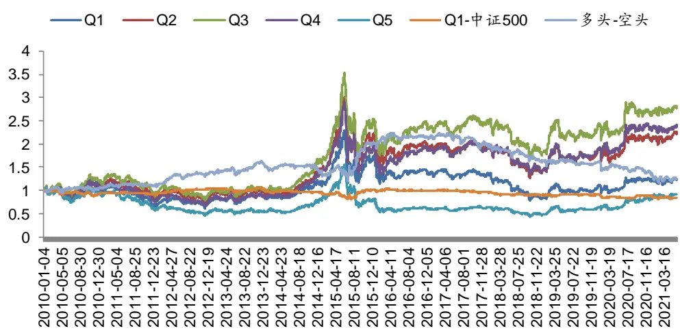
数据来源：Wind、广发证券发展研究中心

表52：KDJ(K)分年度绩效指标表现一览

|  | 多头收益 率 | 多头换 |  |  |  | 多头平 均收益 | 多头 IR | 多头收 益波动 | 最大回 |  | 超额胜 率 | 多空收益 率 | 夏普 比 |  |
| --- | --- | --- | --- | --- | --- | --- | --- | --- | --- | --- | --- | --- | --- | --- |
|  |  | 手率均 值 | IC 均值 | IC 胜率 ICIR | 撒 |  |  |  |  |  |  |  |  | 超额收 益率 |
| 2010 | 0.42% | 69.4% | -1.27% | 48.0% | -0.08 | 率 0.02% | 0.01 | 率 1.78% | 13.27% |  |  |  |  |  |
| 2011 | -32.53% | 68.6% | -0.06% | 52.9% | -0.01 | -0.15% | -0.1 | 1.56% | 5.23% | -9.03% 1.88% | 44.6% 48.0% | 3.05% 7.82% | -0.71 0.33 |  |
| 2012 | 12.41% | 69.9% | -1.84% | 52.0% | -0.13 | 0.06% | 0.04 | 1.61% | 4.40% | 12.16% | 55.6% | 22.73% | 1.93 |  |
| 2013 | 17.04% | 66.9% | -0.85% | 49.0% | -0.07 | 0.08% | 0.05 | 1.45% | 9.67% | -0.19% | 49.2% | 16.09% | 0.02 |  |
| 2014 | 27.32% | 66.6% | 1.53% | 52.8% | 0.14 | 0.11% | 0.09 | 1.24% | 8.85% | -8.56% | 45.3% | -13.69% | -1.5 |  |
| 2015 | 49.46% | 69.7% | -2.22% | 51.9% | -0.11 | 0.22% | 0.07 | 3.30% | 17.31% | 6.63% | 51.2% | 47.62% | 0.45 |  |
| 2016 | -19.80% | 68.2% | -1.78% | 56.0% | -0.14 | -0.07% | -0.03 | 2.01% | 5.75% | -2.15% | 49.2% | 7.01% | -0.33 |  |
| 2017 | -2.87% | 66.4% | 0.73% | 52.9% | 0.06 | -0.01% | -0.01 | 0.95% | 6.01% | -2.83% | 49.2% | -7.57% | -0.42 |  |
| 2018 | -38.07% | 64.1% | 1.67% | 52.9% | 0.11 | -0.18% | -0.11 | 1.67% | 9.53% | -6.79% | 46.1% | -18.93% | -0.98 |  |
| 2019 | 28.83% | 68.3% | -0.95% | 52.9% | -0.08 | 0.11% | 0.08 | 1.41% | 4.63% | 1.51% | 52.1% | -1.24% | 0.27 |  |
| 2020 | 15.97% | 67.7% | 2.62% | 63.5% | 0.2 | 0.07% | 0.05 | 1.57% | 10.72% | -4.56% | 47.3% | -16.57% | -0.52 |  |
| 2021 | 0.60% | 63.0% | 1.10% | 62.5% | 0.07 | 0.01% | 0.01 | 1.16% | 6.09% | -3.97% | 44.9% | -7.00% | -0.76 |  |

数据来源：Wind、广发证券发展研究中心

图54：Klinger指标历史分档测算结果
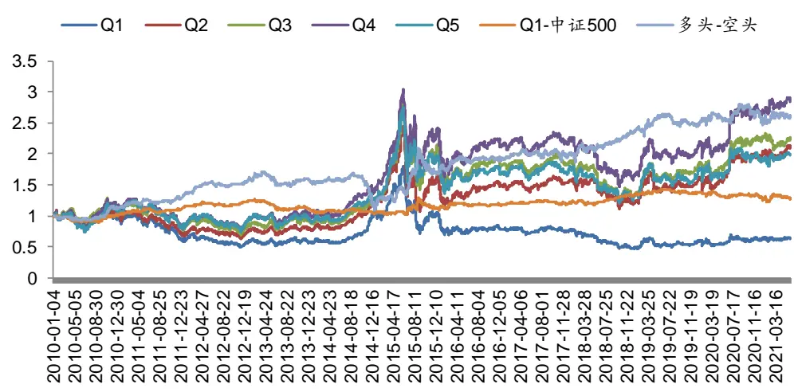
数据来源：Wind、广发证券发展研究中心

表53：Klinger指标分年度绩效指标表现一览

|  | 多头收益 率 | 多头换 |  |  |  | 多头平 均收益 率 | 多头 IR | 多头收 益波动 | 最大回 撤 益率 | 超额收 | 超额胜 率 | 多空收益 率 | 夏普 比 |
| --- | --- | --- | --- | --- | --- | --- | --- | --- | --- | --- | --- | --- | --- |
|  |  | 手率均 值 | IC 均值 | IC 胜率 ICIR | 率 |  |  |  |  |  |  |  |  |
| 2010 | 10.65% | 21.0% | 1.74% | 58.0% | 0.15 | 0.06% | 0.03 | 1.70% | 12.10% | 0.15% | 44.2% | 12.39% | 0.06 |
| 2011 | -26.16% | 16.2% | 2.36% | 62.8% | 0.26 | -0.11% | -0.08 | 1.48% | 5.83% | 11.15% | 50.4% | 14.77% | 1.78 |
| 2012 | 10.67% | 19.2% | 3.22% | 66.0% | 0.34 | 0.05% | 0.03 | 1.53% | 5.14% | 10.17% | 56.0% | 19.89% | 2.04 |
| 2013 | 6.38% | 18.3% | -0.07% | 47.1% | -0.01 | 0.04% | 0.03 | 1.44% | 13.22% | -9.34% | 41.6% | 2.34% | -1.15 |
| 2014 | 28.93% | 18.1% | -3.84% | 56.6% | -0.28 | 0.11% | 0.09 | 1.23% | 7.13% | -7.46% | 43.3% | -29.48% | -1.17 |
| 2015 | 54.04% | 24.3% | 3.10% | 57.7% | 0.18 | 0.22% | 0.07 | 3.05% | 13.94% | 7.56% | 46.3% | 52.81% | 0.48 |
| 2016 | -12.38% | 14.8% | 1.25% | 56.0% | 0.13 | -0.04% | -0.02 | 1.83% | 4.56% | 5.91% | 50.4% | 12.68% | 0.84 |
| 2017 | 2.27% | 14.3% | 1.03% | 58.8% | 0.09 | 0.01% | 0.01 | 0.86% | 6.84% | 2.10% | 51.6% | 3.87% | 0.35 |
| 2018 | -26.34% | 14.5% | 2.66% | 64.7% | 0.21 | -0.11% | -0.07 | 1.54% | 4.71% | 10.27% | 56.4% | 16.38% | 1.48 |
| 2019 | 32.27% | 16.0% | 1.10% | 58.8% | 0.11 | 0.12% | 0.09 | 1.41% | 5.74% | 4.26% | 50.8% | 5.88% | 0.73 |
| 2020 | 14.90% | 20.7% | 0.39% | 53.9% | 0.04 | 0.07% | 0.04 | 1.56% | 7.90% | -5.47% | 45.7% | 4.39% | -0.65 |
| 2021 | 3.27% | 15.6% | -0.04% | 50.0% | 0 | 0.03% | 0.04 | 0.97% | 6.80% | -1.64% | 43.0% | 1.55% | -0.28 |

数据来源：Wind、广发证券发展研究中心

图55：MA_CLOSE均线价格比历史分档测算结果
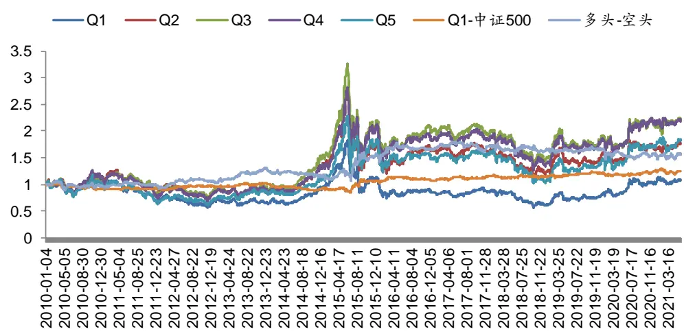
数据来源：Wind、广发证券发展研究中心

表54：MA_CLOSE均线价格比分年度绩效指标表现一览

|  | 多头收益 率 | 多头换 |  |  |  | 多头平 均收益 | 多头 IR | 多头收 益波动 | 最大回 |  | 超额胜 率 | 多空收益 率 | 夏普 比 |  |
| --- | --- | --- | --- | --- | --- | --- | --- | --- | --- | --- | --- | --- | --- | --- |
|  |  | 手率均 值 | IC 均值 | IC 胜率 ICIR | 撤 |  |  |  |  |  |  |  |  | 超额收 益率 |
| 2010 | 0.65% | 45.0% | 0.23% | 54.0% | 0.01 | 率 0.02% | 0.01 | 率 1.80% | 11.92% | -8.54% | 50.0% | -2.65% |  |  |
| 2011 | -32.82% | 43.5% | -0.14% | 49.0% | -0.01 | -0.15% | -0.1 | 1.55% | 4.32% | 1.42% | 48.4% | 1.38% | -0.85 0.28 |  |
| 2012 | 5.03% | 45.9% | 0.29% | 42.0% | 0.03 | 0.03% | 0.02 | 1.55% | 3.94% | 4.60% | 54.3% | 7.22% | 0.87 |  |
| 2013 | 23.36% | 42.5% | 2.28% | 56.9% | 0.22 | 0.10% | 0.07 | 1.48% | 3.85% | 5.40% | 50.4% | 23.91% | 0.82 |  |
| 2014 | 25.38% | 44.1% | -1.92% | 60.4% | -0.21 | 0.10% | 0.08 | 1.28% | 13.79% | -9.84% | 42.9% | -12.65% | -1.88 |  |
| 2015 | 62.62% | 51.6% | 2.46% | 51.9% | 0.15 | 0.25% | 0.08 | 3.23% | 9.99% | 15.73% | 47.5% | 33.87% | 0.99 |  |
| 2016 | -17.57% | 44.2% | 1.35% | 54.0% | 0.12 | -0.06% | -0.03 | 2.00% | 6.74% | 0.51% | 46.7% | 8.41% | 0.11 |  |
| 2017 | 7.02% | 43.6% | 0.90% | 43.1% | 0.09 | 0.03% | 0.03 | 0.95% | 4.48% | 7.13% | 52.9% | 3.72% | 1.26 |  |
| 2018 | -33.77% | 43.5% | -0.68% | 52.9% | -0.06 | -0.16% | -0.09 | 1.65% | 5.28% | -0.40% | 51.9% | -5.94% | -0.03 |  |
| 2019 | 33.80% | 42.7% | 1.85% | 60.8% | 0.24 | 0.13% | 0.09 | 1.44% | 5.02% | 5.56% | 52.9% | 2.31% | 0.91 |  |
| 2020 | 25.59% | 45.7% | -0.84% | 53.9% | -0.07 | 0.11% | 0.06 | 1.66% | 5.62% | 3.80% | 54.7% | -6.20% | 0.56 |  |
| 2021 | 3.65% | 41.4% | -0.15% | 54.2% | -0.01 | 0.04% | 0.03 | 1.31% | 8.09% | -0.84% | 50.5% | 0.81% | -0.12 |  |

数据来源：Wind、广发证券发展研究中心

图56：MACD指数平滑异同平均线历史分档测算结果
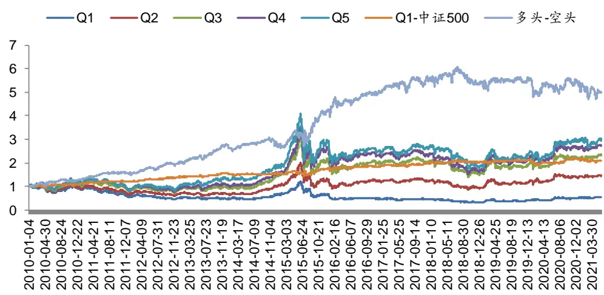
数据来源：Wind、广发证券发展研究中心

表55：MACD指数平滑异同平均线分年度绩效指标表现一览

|  | 多头收益 率 | 多头换 |  |  |  | 多头平 均收益 率 | 多头 IR | 多头收 | 最大回 撤 益率 | 超额收 | 超额胜 率 | 多空收益 率 | 夏普 比 |
| --- | --- | --- | --- | --- | --- | --- | --- | --- | --- | --- | --- | --- | --- |
|  |  | 手率均 值 | IC 均值 | IC 胜率 ICIR | 益波动 率 |  |  |  |  |  |  |  |  |
| 2010 | 19.34% | 72.4% | 6.55% | 66.0% | 0.38 | 0.09% | 0.05 | 1.85% | 7.32% | 8.59% | 52.1% | 26.99% | 0.8 |
| 2011 | -25.86% | 70.0% | 3.15% | 60.8% | 0.26 | -0.11% | -0.07 | 1.63% | 2.83% | 12.24% | 52.9% | 22.61% | 1.89 |
| 2012 | 14.04% | 70.1% | 3.75% | 62.0% | 0.25 | 0.07% | 0.04 | 1.65% | 3.54% | 13.98% | 60.1% | 26.79% | 2.18 |
| 2013 | 31.74% | 68.6% | 5.08% | 68.6% | 0.44 | 0.13% | 0.08 | 1.52% | 5.06% | 12.71% | 55.0% | 40.00% | 1.73 |
| 2014 | 36.04% | 66.0% | 0.20% | 60.4% | 0.02 | 0.13% | 0.1 | 1.29% | 5.65% | -2.15% | 49.0% | -4.07% | -0.34 |
| 2015 | 60.10% | 73.2% | 5.15% | 59.6% | 0.25 | 0.25% | 0.07 | 3.35% | 12.92% | 14.83% | 54.5% | 61.55% | 0.88 |
| 2016 | -14.39% | 68.5% | 3.61% | 62.0% | 0.25 | -0.04% | -0.02 | 2.10% | 4.48% | 4.85% | 53.3% | 16.58% | 0.68 |
| 2017 | 6.68% | 67.1% | 2.05% | 49.0% | 0.16 | 0.03% | 0.03 | 1.03% | 4.20% | 6.93% | 52.1% | 11.17% | 1.09 |
| 2018 | -32.04% | 64.6% | -0.61% | 49.0% | -0.04 | -0.14% | -0.08 | 1.73% | 5.43% | 2.52% | 52.7% | -3.76% | 0.39 |
| 2019 | 32.87% | 65.6% | 1.36% | 52.9% | 0.1 | 0.13% | 0.09 | 1.50% | 5.75% | 5.01% | 53.3% | 4.16% | 0.77 |
| 2020 | 24.23% | 67.2% | -0.24% | 53.9% | -0.02 | 0.10% | 0.06 | 1.70% | 10.19% | 2.76% | 51.4% | -4.19% | 0.37 |
| 2021 | -0.62% | 61.8% | -0.49% | 54.2% | -0.03 | 0.00% | 0 | 1.28% | 8.57% | -4.98% | 42.1% | -6.66% | -0.98 |

数据来源：Wind、广发证券发展研究中心

图57：Mass Index梅斯线历史分档测算结果
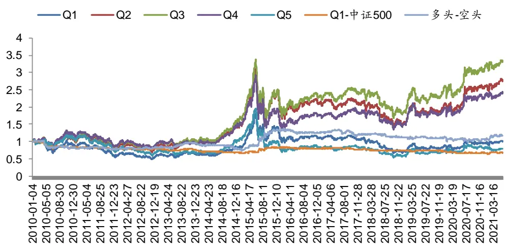
数据来源：Wind、广发证券发展研究中心

表56：Mass Index梅斯线分年度绩效指标表现一览

|  | 多头收益 率 | 多头换 |  |  |  | 多头平 均收益 | 多头 IR | 多头收 益波动 | 最大回 |  | 超额胜 率 | 多空收益 率 | 夏普 比 |  |
| --- | --- | --- | --- | --- | --- | --- | --- | --- | --- | --- | --- | --- | --- | --- |
|  |  | 手率均 值 | IC 均值 | IC 胜率 ICIR | 撤 率 |  |  |  |  |  |  |  |  | 超额收 益率 |
| 2010 | -9.34% | 71.0% | 1.29% | 46.0% | 0.09 | 率 -0.02% | -0.01 | 1.83% | 20.84% | -17.49% | 46.3% | -18.26% | -1.84 |  |
| 2011 | -36.07% | 71.4% | 1.41% | 64.7% | 0.16 | -0.17% | -0.11 | 1.52% | 7.26% | -3.52% | 45.9% | -4.68% | -0.74 |  |
| 2012 | -0.81% | 71.8% | -0.85% | 58.0% | -0.08 | 0.01% | 0.01 | 1.57% | 5.38% | -1.09% | 48.6% | 5.38% | -0.21 |  |
| 2013 | 13.76% | 69.5% | -1.41% | 47.1% | -0.13 | 0.07% | 0.04 | 1.48% | 8.32% | -2.81% | 44.1% | 16.44% | -0.37 |  |
| 2014 | 23.74% | 68.4% | 2.46% | 58.5% | 0.23 | 0.09% | 0.08 | 1.23% | 12.19% | -11.17% | 44.1% | -18.94% | -2.03 |  |
| 2015 | 71.34% | 70.4% | -4.22% | 59.6% | -0.27 | 0.27% | 0.09 | 3.14% | 7.31% | 21.17% | 45.9% | 71.66% | 1.31 |  |
| 2016 | -20.98% | 69.0% | 0.32% | 40.0% | 0.03 | -0.08% | -0.04 | 1.96% | 6.66% | -3.78% | 47.5% | -5.63% | -0.74 |  |
| 2017 | -3.30% | 68.3% | 0.08% | 49.0% | 0.01 | -0.01% | -0.01 | 0.89% | 8.85% | -3.34% | 50.4% | -3.41% | -0.62 |  |
| 2018 | -35.16% | 68.5% | 0.87% | 56.9% | 0.08 | -0.17% | -0.11 | 1.52% | 8.07% | -2.94% | 50.2% | -7.27% | -0.48 |  |
| 2019 | 23.81% | 68.8% | -0.84% | 52.9% | -0.09 | 0.10% | 0.07 | 1.39% | 4.46% | -2.49% | 51.6% | -1.66% | -0.39 |  |
| 2020 | 12.55% | 67.2% | -0.37% | 46.2% | -0.03 | 0.06% | 0.04 | 1.52% | 9.33% | -7.53% | 46.1% | -3.22% | -0.94 |  |
| 2021 | 4.70% | 63.8% | -0.02% | 45.8% | 0 | 0.05% | 0.05 | 0.98% | 5.22% | -0.19% | 46.7% | 9.17% | 0 |  |

数据来源：Wind、广发证券发展研究中心

图58：MFI资金流量指标历史分档测算结果
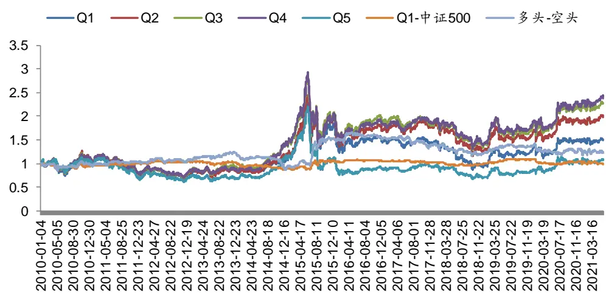
数据来源：Wind、广发证券发展研究中心

表57：MFI资金流量指标分年度绩效指标表现一览

|  | 多头收益 率 | 多头换 |  |  |  | 多头平 均收益 | 多头 IR | 多头收 益波动 | 最大回 益率 | 超额收 | 超额胜 率 | 多空收益 率 | 夏普 比 |
| --- | --- | --- | --- | --- | --- | --- | --- | --- | --- | --- | --- | --- | --- |
|  |  | 手率均 值 | IC 均值 | IC 胜率 ICIR | 撤 |  |  |  |  |  |  |  |  |
| 2010 | 4.60% | 49.6% | -0.72% | 44.0% | -0.04 | 率 0.03% | 0.02 | 率 1.76% | 13.43% | -5.36% | 45.5% | -1.20% |  |
| 2011 | -29.49% | 51.1% | -0.36% | 47.1% | -0.03 | -0.13% | -0.09 | 1.52% | 3.63% | 6.32% | 53.7% | 5.55% | -0.38 1.14 |
| 2012 | 3.71% | 51.2% | -0.55% | 42.0% | -0.04 | 0.03% | 0.02 | 1.56% | 4.95% | 3.31% | 51.4% | 2.40% | 0.59 |
| 2013 | 15.28% | 49.2% | -1.78% | 54.9% | -0.17 | 0.07% | 0.05 | 1.40% | 8.61% | -1.89% | 46.2% | 15.39% | -0.19 |
| 2014 | 19.17% | 46.6% | 4.23% | 60.4% | 0.34 | 0.08% | 0.07 | 1.21% | 15.14% | -14.51% | 44.1% | -28.43% | -2.5 |
| 2015 | 70.32% | 55.8% | -3.44% | 55.8% | -0.22 | 0.27% | 0.08 | 3.18% | 10.82% | 20.68% | 48.4% | 72.12% | 1.24 |
| 2016 | -17.85% | 50.4% | -0.74% | 52.0% | -0.06 | -0.06% | -0.03 | 1.96% | 3.63% | 0.02% | 46.7% | 2.10% | 0.03 |
| 2017 | -2.79% | 49.6% | 1.03% | 49.0% | 0.09 | -0.01% | -0.01 | 0.88% | 6.13% | -2.86% | 47.1% | -8.64% | -0.47 |
| 2018 | -35.63% | 48.4% | 1.63% | 58.8% | 0.12 | -0.17% | -0.11 | 1.59% | 8.09% | -3.39% | 52.3% | -15.00% | -0.5 |
| 2019 | 40.42% | 50.5% | -2.38% | 60.8% | -0.23 | 0.15% | 0.11 | 1.36% | 3.40% | 10.50% | 57.4% | 14.44% | 1.67 |
| 2020 | 16.21% | 51.4% | 0.46% | 59.6% | 0.04 | 0.07% | 0.05 | 1.48% | 11.40% | -4.66% | 50.6% | -7.06% | -0.54 |
| 2021 | -0.64% | 45.5% | 0.71% | 50.0% | 0.05 | 0.00% | 0 | 1.13% | 5.63% | -5.27% | 43.0% | -3.35% | -0.92 |

数据来源：Wind、广发证券发展研究中心

图59：MICD异同离差动力指数历史分档测算结果
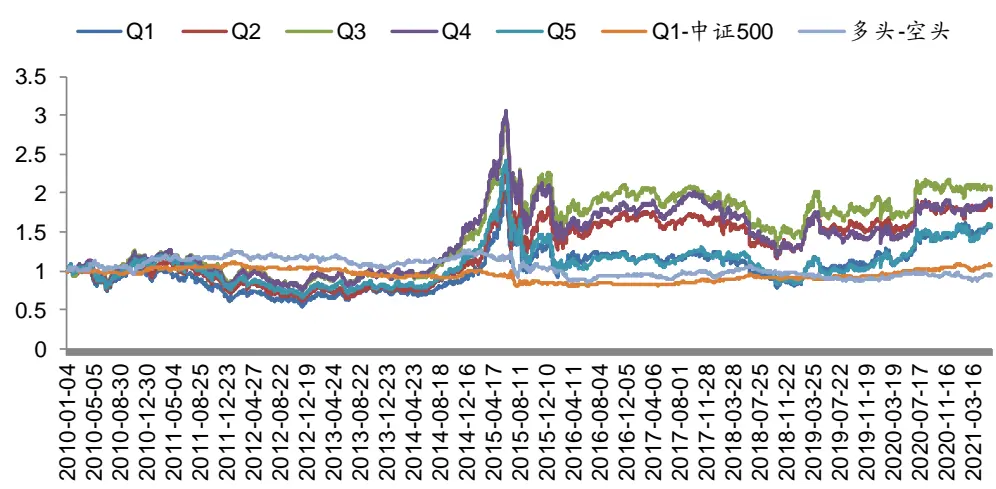
数据来源：Wind、广发证券发展研究中心

表58：MICD异同离差动力指数分年度绩效指标表现一览

|  | 多头收益 率 | 多头换 |  |  |  | 多头平 均收益 | 多头 | 多头收 |  |  |  |  |  |  |  |
| --- | --- | --- | --- | --- | --- | --- | --- | --- | --- | --- | --- | --- | --- | --- | --- |
|  |  | 手率均 值 | IC 均值 | IC 胜率 | ICIR 率 |  |  |  | IR | 益波动 率 | 最大回 撤 | 超额收 益率 | 超额胜 率 | 多空收益 率 | 夏普 比 |
| 2010 | 10.50% | 53.7% | 0.81% | 54.0% | 0.05 | 0.06% | 0.03 | 1.83% |  | 7.97% | 0.82% | 51.2% | 10.92% | 0.15 |  |
| 2011 | -27.99% | 57.7% | 1.82% | 51.0% | 0.19 | -0.12% | -0.09 | 1.45% | 4.26% |  | 8.37% | 52.9% | 8.85% | 1.63 |  |
| 2012 | -4.81% | 55.7% | -0.24% | 52.0% | -0.02 | -0.01% | -0.01 | 1.57% |  | 9.44% | -5.14% | 46.5% | -4.24% | -0.96 |  |
| 2013 | 3.95% | 48.5% | -0.87% | 60.8% | -0.1 | 0.03% | 0.02 | 1.48% |  | 12.16% | -11.15% | 42.0% | -11.08% | -2.07 |  |
| 2014 | 51.75% | 48.7% | 2.32% | 62.3% | 0.28 | 0.18% | 0.14 | 1.27% |  | 5.04% | 9.13% | 53.5% | 20.26% | 1.58 |  |
| 2015 | 19.85% | 56.0% | -0.30% | 50.0% | -0.02 | 0.12% | 0.04 | 3.14% |  | 21.12% | -15.33% | 41.0% | -15.89% | -0.97 |  |
| 2016 | -20.70% | 53.0% | -1.64% | 54.0% | -0.14 | -0.08% | -0.04 | 1.96% |  | 5.34% | -3.44% | 49.6% | -9.63% | -0.61 |  |
| 2017 | 3.73% | 47.7% | 0.09% | 49.0% | 0.01 | 0.02% | 0.02 | 0.93% |  | 4.77% | 3.80% | 52.5% | -1.03% | 0.79 |  |
| 2018 | -28.75% | 51.9% | -0.25% | 45.1% | -0.03 | -0.13% | -0.08 | 1.55% |  | 7.36% | 6.74% | 50.6% | 4.61% | 1.08 |  |
| 2019 | 30.54% | 48.2% | -2.04% | 54.9% | -0.25 | 0.12% | 0.08 | 1.46% |  | 3.90% | 3.14% | 51.2% | -8.67% | 0.67 |  |
| 2020 | 36.70% | 49.9% | 0.55% | 53.9% | 0.05 | 0.14% | 0.09 | 1.64% |  | 3.23% | 12.97% | 53.1% | 5.80% | 1.97 |  |
| 2021 | 5.18% | 44.3% | 0.66% | 50.0% | 0.06 | 0.06% | 0.04 |  | 1.30% | 9.16% | 0.69% | 53.3% | 0.52% | 0.22 |  |

数据来源：Wind、广发证券发展研究中心

图60：Money Flow资金流量(20日)历史分档测算结果
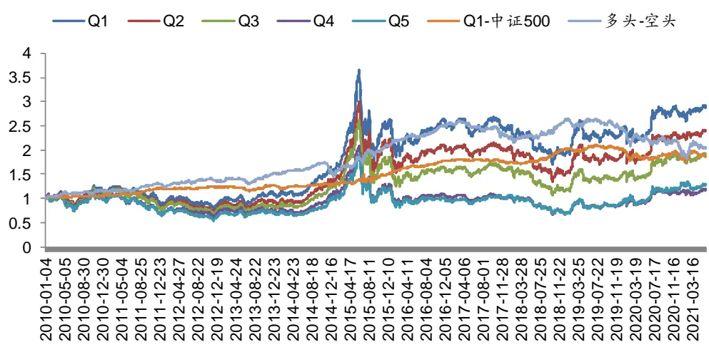
数据来源：Wind、广发证券发展研究中心

表59：Money Flow资金流量(20日)分年度绩效指标表现一览

|  | 多头收益 率 | 多头换 |  |  |  | 多头平 均收益 | 多头 IR | 多头收 益波动 | 最大回 |  | 超额胜 率 | 多空收益 率 | 夏普 比 |  |
| --- | --- | --- | --- | --- | --- | --- | --- | --- | --- | --- | --- | --- | --- | --- |
|  |  | 手率均 值 | IC 均值 | IC 胜率 ICIR | 撤 率 |  |  |  |  |  |  |  |  | 超额收 益率 |
| 2010 | 16.10% | 16.7% | -1.92% | 66.0% | -0.27 | 率 0.08% | 0.05 | 1.65% | 5.31% | 5.10% | 48.8% | 15.07% |  |  |
| 2011 | -23.07% | 15.7% | -2.47% | 66.7% | -0.35 | -0.10% | -0.07 | 1.38% | 2.94% | 15.50% | 57.0% | 12.73% | 0.72 3.23 |  |
| 2012 | 2.21% | 13.3% | -1.00% | 52.0% | -0.12 | 0.02% | 0.01 | 1.46% | 3.37% | 1.55% | 49.4% | 3.71% | 0.4 |  |
| 2013 | 20.77% | 8.5% | -1.04% | 52.9% | -0.13 | 0.09% | 0.07 | 1.35% | 8.11% | 2.77% | 47.1% | 13.12% | 0.48 |  |
| 2014 | 40.57% | 8.5% | -0.29% | 58.5% | -0.04 | 0.15% | 0.12 | 1.17% | 4.95% | 0.77% | 49.4% | -3.47% | 0.16 |  |
| 2015 | 66.19% | 16.3% | -4.44% | 61.5% | -0.51 | 0.26% | 0.08 | 3.26% | 11.43% | 19.02% | 54.9% | 43.96% | 1.36 |  |
| 2016 | -3.03% | 7.8% | -3.26% | 74.0% | -0.47 | 0.01% | 0 | 1.91% | 2.08% | 17.79% | 60.7% | 20.75% | 3.66 |  |
| 2017 | -2.36% | 7.6% | 1.19% | 54.9% | 0.17 | -0.01% | -0.01 | 0.84% | 4.37% | -2.46% | 48.8% | -9.97% | -0.49 |  |
| 2018 | -22.45% | 5.8% | -2.04% | 58.8% | -0.19 | -0.09% | -0.06 | 1.46% | 2.70% | 15.85% | 55.1% | 13.93% | 2.74 |  |
| 2019 | 28.28% | 5.5% | 0.59% | 45.1% | 0.08 | 0.11% | 0.09 | 1.30% | 4.51% | 0.75% | 50.4% | -6.02% | 0.16 |  |
| 2020 | 13.70% | 9.3% | 2.24% | 59.6% | 0.17 | 0.06% | 0.05 | 1.37% | 12.83% | -7.24% | 46.9% | -17.37% | -0.7 |  |
| 2021 | 3.92% | 6.2% | -0.60% | 58.3% | -0.04 | 0.04% | 0.05 | 0.78% | 6.10% | -1.23% | 44.9% | 1.05% | -0.18 |  |

数据来源：Wind、广发证券发展研究中心

图61：MTM动量指标历史分档测算结果
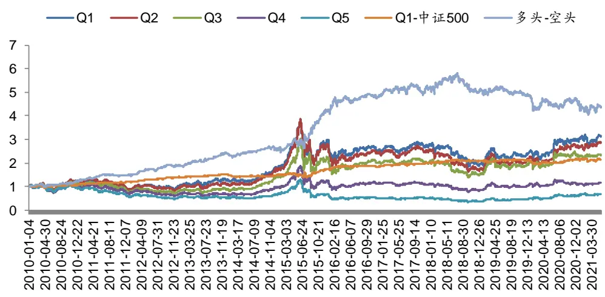
数据来源：Wind、广发证券发展研究中心

表60：MTM动量指标分年度绩效指标表现一览

|  | 多头收益 率 | 多头换 |  |  |  | 多头平 均收益 | 多头 IR | 多头收 益波动 | 最大回 |  | 超额胜 率 | 多空收益 率 | 夏普 比 |  |
| --- | --- | --- | --- | --- | --- | --- | --- | --- | --- | --- | --- | --- | --- | --- |
|  |  | 手率均 值 | IC 均值 | IC 胜率 ICIR | 撤 |  |  |  |  |  |  |  |  | 超额收 益率 |
| 2010 | 16.72% | 70.1% | -3.92% | 64.0% | -0.28 | 率 0.08% | 0.04 | 率 1.80% | 7.86% |  |  |  |  |  |
| 2011 | -24.73% | 63.4% | -3.32% | 54.9% | -0.32 | -0.10% | -0.07 | 1.55% | 2.98% | 6.16% 13.60% | 54.1% 56.2% | 23.23% 21.20% | 0.68 2.25 |  |
| 2012 | 15.98% | 69.0% | -3.18% | 62.0% | -0.26 | 0.07% | 0.05 | 1.57% | 2.18% | 15.60% | 57.2% | 25.88% | 2.82 |  |
| 2013 | 26.56% | 65.0% | -3.04% | 54.9% | -0.29 | 0.11% | 0.07 | 1.50% | 2.18% | 8.24% | 56.3% | 28.82% | 1.27 |  |
| 2014 | 36.74% | 69.8% | -0.87% | 60.4% | -0.09 | 0.14% | 0.11 | 1.26% | 7.14% | -1.72% | 46.1% | 5.30% | -0.27 |  |
| 2015 | 65.15% | 75.6% | -4.60% | 59.6% | -0.27 | 0.26% | 0.08 | 3.26% | 12.30% | 17.73% | 52.5% | 67.54% | 1.09 |  |
| 2016 | -13.26% | 68.1% | -2.95% | 58.0% | -0.25 | -0.04% | -0.02 | 2.00% | 2.89% | 5.78% | 50.8% | 13.07% | 1.03 |  |
| 2017 | 7.73% | 65.4% | -1.92% | 60.8% | -0.18 | 0.03% | 0.04 | 0.94% | 3.48% | 7.82% | 55.3% | 7.64% | 1.39 |  |
| 2018 | -31.01% | 62.4% | 1.13% | 56.9% | 0.09 | -0.14% | -0.08 | 1.68% | 4.41% | 3.91% | 52.7% | -4.01% | 0.64 |  |
| 2019 | 29.03% | 65.1% | -0.92% | 52.9% | -0.08 | 0.11% | 0.08 | 1.43% | 6.17% | 1.78% | 52.1% | -2.25% | 0.33 |  |
| 2020 | 24.07% | 66.2% | 0.35% | 51.9% | 0.03 | 0.10% | 0.06 | 1.66% | 8.53% | 2.56% | 49.4% | -7.19% | 0.38 |  |
| 2021 | 1.34% | 32.1% | 0.26% | 45.8% | 0.02 | 0.02% | 0.02 | 1.03% | 8.24% | -3.41% | 43.9% | -2.81% | -0.66 |  |

数据来源：Wind、广发证券发展研究中心

图62：MTMMA平均动量指标历史分档测算结果
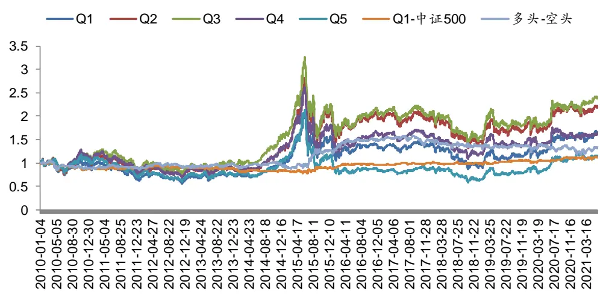
数据来源：Wind、广发证券发展研究中心

表61：MTMMA平均动量指标分年度绩效指标表现一览

|  | 多头收益 率 | 多头换 |  |  |  | 多头平 均收益 率 | 多头 IR | 多头收 | 最大回 撤 益率 | 超额收 | 超额胜 率 | 多空收益 率 | 夏普 比 |
| --- | --- | --- | --- | --- | --- | --- | --- | --- | --- | --- | --- | --- | --- |
|  |  | 手率均 值 | IC 均值 | IC 胜率 ICIR | 益波动 率 |  |  |  |  |  |  |  |  |
| 2010 | -4.17% | 61.6% | 1.44% | 46.0% | 0.09 | 0.00% | 0 | 1.76% | 16.86% | -13.14% | 47.5% | -10.69% | -1.26 |
| 2011 | -31.47% | 55.8% | 0.76% | 51.0% | 0.08 | -0.14% | -0.09 | 1.54% | 4.72% | 3.46% | 50.0% | 1.14% | 0.64 |
| 2012 | 1.65% | 57.0% | 0.57% | 50.0% | 0.04 | 0.02% | 0.01 | 1.59% | 4.77% | 1.38% | 49.0% | 1.45% | 0.27 |
| 2013 | 13.24% | 56.0% | -0.23% | 54.9% | -0.02 | 0.06% | 0.04 | 1.47% | 6.14% | -3.33% | 44.5% | 7.62% | -0.4 |
| 2014 | 31.75% | 58.4% | 1.19% | 62.3% | 0.11 | 0.12% | 0.1 | 1.23% | 8.41% | -5.44% | 47.4% | -6.94% | -0.87 |
| 2015 | 51.31% | 67.7% | -2.61% | 55.8% | -0.17 | 0.22% | 0.07 | 3.20% | 8.80% | 7.35% | 44.7% | 36.73% | 0.52 |
| 2016 | -12.82% | 58.3% | -3.72% | 62.0% | -0.3 | -0.04% | -0.02 | 2.02% | 3.68% | 6.40% | 50.8% | 19.91% | 1.06 |
| 2017 | 4.80% | 54.4% | -0.16% | 52.9% | -0.01 | 0.02% | 0.02 | 0.95% | 4.30% | 4.88% | 49.2% | -1.03% | 0.87 |
| 2018 | -34.02% | 53.3% | 1.40% | 58.8% | 0.11 | -0.16% | -0.09 | 1.68% | 5.04% | -0.69% | 48.6% | -8.71% | -0.06 |
| 2019 | 33.98% | 55.3% | -0.90% | 58.8% | -0.09 | 0.13% | 0.09 | 1.48% | 4.76% | 5.85% | 55.3% | -0.34% | 0.97 |
| 2020 | 27.58% | 58.0% | 0.58% | 46.2% | 0.05 | 0.11% | 0.07 | 1.66% | 5.44% | 5.39% | 51.0% | -6.35% | 0.72 |
| 2021 | 5.18% | 49.6% | -1.30% | 50.0% | -0.09 | 0.06% | 0.04 | 1.29% | 5.38% | 0.59% | 47.7% | 3.72% | 0.18 |

数据来源：Wind、广发证券发展研究中心

图63：OBV能量潮历史分档测算结果
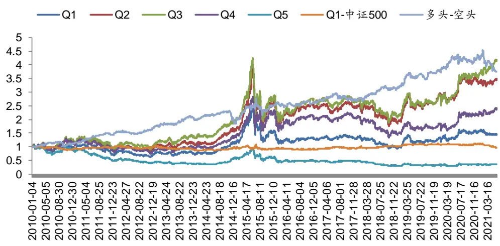
数据来源：Wind、广发证券发展研究中心

表62：OBV能量潮分年度绩效指标表现一览

|  | 多头收益 率 | 多头换 |  |  |  | 多头平 均收益 率 | 多头 IR | 多头收 | 最大回 撤 | 超额收 益率 | 超额胜 率 | 多空收益 率 | 夏普 比 |
| --- | --- | --- | --- | --- | --- | --- | --- | --- | --- | --- | --- | --- | --- |
|  |  | 手率均 值 | IC 均值 | IC 胜率 ICIR | 益波动 率 |  |  |  |  |  |  |  |  |
| 2010 | -2.34% | 70.9% | -3.49% | 62.0% | -0.28 | 0.01% | 0 | 1.76% | 13.88% | -11.22% | 41.3% | 9.34% | -1.51 |
| 2011 | -27.66% | 64.1% | -3.59% | 72.6% | -0.41 | -0.12% | -0.08 | 1.52% | 5.00% | 9.07% | 51.6% | 30.98% | 1.56 |
| 2012 | 3.67% | 68.7% | -2.59% | 56.0% | -0.24 | 0.03% | 0.02 | 1.55% | 9.55% | 3.25% | 47.3% | 18.71% | 0.62 |
| 2013 | 4.79% | 64.4% | -3.60% | 56.9% | -0.36 | 0.03% | 0.02 | 1.52% | 12.54% | -10.35% | 41.2% | 21.40% | -1.53 |
| 2014 | 47.94% | 67.5% | 0.83% | 50.9% | 0.09 | 0.17% | 0.13 | 1.25% | 5.25% | 6.19% | 51.0% | -9.07% | 0.83 |
| 2015 | 36.58% | 73.4% | -4.68% | 69.2% | -0.36 | 0.18% | 0.06 | 3.17% | 17.19% | -3.48% | 48.4% | 35.93% | -0.12 |
| 2016 | -19.29% | 67.8% | 1.70% | 60.0% | 0.18 | -0.07% | -0.04 | 1.89% | 6.29% | -2.10% | 42.6% | 2.61% | -0.34 |
| 2017 | 3.81% | 63.4% | -0.29% | 51.0% | -0.03 | 0.02% | 0.02 | 0.97% | 6.74% | 3.92% | 48.4% | 3.59% | 0.65 |
| 2018 | -28.35% | 68.8% | 0.08% | 49.0% | 0.01 | -0.12% | -0.08 | 1.57% | 6.75% | 7.43% | 54.3% | 16.16% | 1.14 |
| 2019 | 38.00% | 66.0% | -1.38% | 52.9% | -0.14 | 0.14% | 0.09 | 1.52% | 4.57% | 9.24% | 51.6% | 19.85% | 1.61 |
| 2020 | 22.46% | 68.8% | -0.47% | 48.1% | -0.05 | 0.10% | 0.06 | 1.57% | 4.54% | 0.83% | 49.4% | 14.49% | 0.15 |
| 2021 | -9.36% | 65.8% | 2.37% | 62.5% | 0.22 | -0.09% | -0.08 | 1.12% | 13.32% | -13.45% | 44.9% | -13.32% | -3.55 |

数据来源：Wind、广发证券发展研究中心

图64：OBV能量潮(20日)历史分档测算结果
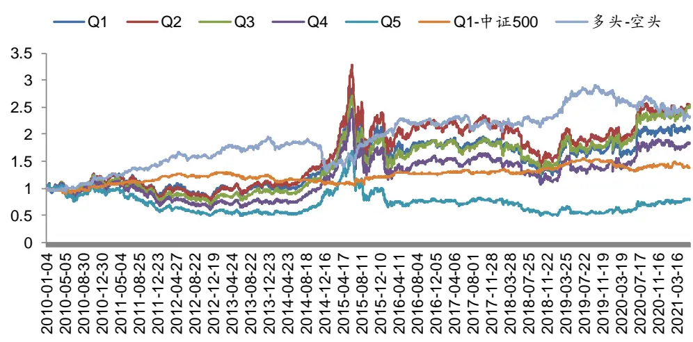
数据来源：Wind、广发证券发展研究中心

表63：OBV能量潮(20日)分年度绩效指标表现一览

|  | 多头收益 率 | 多头换 |  |  |  | 多头平 均收益 | 多头 IR | 多头收 益波动 | 最大回 益率 | 超额收 | 超额胜 率 | 多空收益 率 | 夏普 比 |
| --- | --- | --- | --- | --- | --- | --- | --- | --- | --- | --- | --- | --- | --- |
|  |  | 手率均 值 | IC 均值 | IC 胜率 ICIR | 撤 |  |  |  |  |  |  |  |  |
| 2010 | 13.43% | 41.9% | -3.66% | 58.0% | -0.25 | 率 0.07% | 0.04 | 率 1.72% | 10.98% | 2.56% | 48.8% |  |  |
| 2011 | -24.60% | 41.4% | -2.69% | 56.9% | -0.32 | -0.10% | -0.07 | 1.51% | 2.88% | 13.64% | 51.2% | 18.39% 20.06% | 0.27 2.22 |
| 2012 | 10.09% | 42.3% | -2.41% | 54.0% | -0.21 | 0.05% | 0.03 | 1.56% | 5.94% | 9.68% | 51.9% | 13.88% | 1.74 |
| 2013 | 11.94% | 39.7% | -2.01% | 54.9% | -0.16 | 0.06% | 0.04 | 1.40% | 10.47% | -4.74% | 45.4% | 19.05% | -0.55 |
| 2014 | 24.45% | 40.2% | 4.89% | 66.0% | 0.35 | 0.10% | 0.08 | 1.19% | 10.90% | -10.80% | 43.7% | -32.17% | -1.74 |
| 2015 | 56.67% | 48.2% | -3.72% | 59.6% | -0.3 | 0.23% | 0.08 | 3.08% | 8.72% | 10.62% | 46.7% | 52.21% | 0.81 |
| 2016 | -13.88% | 43.3% | -1.67% | 58.0% | -0.15 | -0.04% | -0.02 | 1.97% | 3.86% | 4.92% | 51.6% | 9.88% | 1.02 |
| 2017 | 3.62% | 40.2% | -0.67% | 52.9% | -0.05 | 0.02% | 0.02 | 0.87% | 5.86% | 3.51% | 51.2% | 1.80% | 0.61 |
| 2018 | -31.26% | 37.9% | -0.72% | 54.9% | -0.06 | -0.14% | -0.09 | 1.59% | 6.04% | 3.12% | 52.3% | 2.62% | 0.5 |
| 2019 | 43.05% | 39.9% | -2.66% | 47.1% | -0.27 | 0.16% | 0.11 | 1.41% | 4.18% | 12.74% | 54.1% | 21.84% | 2.02 |
| 2020 | 15.16% | 41.2% | 1.25% | 61.5% | 0.11 | 0.07% | 0.05 | 1.48% | 12.97% | -5.65% | 48.2% | -10.56% | -0.57 |
| 2021 | 0.53% | 37.7% | 0.76% | 58.3% | 0.06 | 0.01% | 0.01 | 1.06% | 7.53% | -4.14% | 49.5% | -6.72% | -0.84 |

数据来源：Wind、广发证券发展研究中心

图65：OBV能量潮(6日)历史分档测算结果
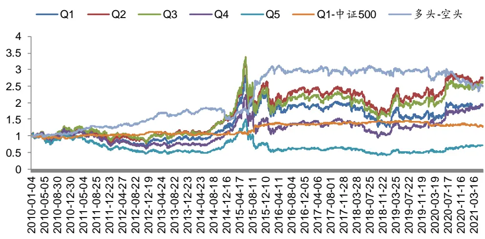
数据来源：Wind、广发证券发展研究中心

表64：OBV能量潮(6日)分年度绩效指标表现一览

|  | 多头收益 率 | 多头换 |  |  |  | 多头平 均收益 率 | 多头 IR | 多头收 益波动 | 最大回 益率 | 超额收 | 超额胜 率 | 多空收益 率 | 夏普 比 |
| --- | --- | --- | --- | --- | --- | --- | --- | --- | --- | --- | --- | --- | --- |
|  |  | 手率均 值 | IC 均值 | IC 胜率 ICIR | 撒 |  |  |  |  |  |  |  |  |
| 2010 | 3.25% | 69.5% | -2.44% | 62.0% | -0.19 | 0.03% | 0.02 | 率 1.77% | 11.08% | -6.29% | 45.5% | 7.36% | -0.58 |
| 2011 | -27.35% | 68.3% | -2.39% | 56.9% | -0.26 | -0.12% | -0.08 | 1.53% | 4.20% | 9.60% | 53.3% | 17.15% | 1.58 |
| 2012 | 8.91% | 71.9% | -3.20% | 64.0% | -0.3 | 0.05% | 0.03 | 1.54% | 3.86% | 8.44% | 56.8% | 18.86% | 1.63 |
| 2013 | 15.30% | 67.0% | -2.09% | 54.9% | -0.19 | 0.07% | 0.05 | 1.45% | 7.61% | -1.63% | 47.5% | 18.74% | -0.19 |
| 2014 | 38.49% | 70.8% | 2.12% | 49.1% | 0.19 | 0.14% | 0.12 | 1.22% | 6.85% | -0.65% | 46.1% | -15.31% | -0.07 |
| 2015 | 72.91% | 76.5% | -4.52% | 57.7% | -0.33 | 0.28% | 0.09 | 3.28% | 8.22% | 23.19% | 49.2% | 94.40% | 1.26 |
| 2016 | -17.96% | 71.2% | -0.24% | 52.0% | -0.02 | -0.06% | -0.03 | 1.93% | 4.48% | -0.25% | 45.9% | 1.05% | -0.03 |
| 2017 | 3.74% | 67.4% | -0.73% | 43.1% | -0.07 | 0.02% | 0.02 | 0.89% | 3.76% | 3.70% | 47.5% | 2.18% | 0.68 |
| 2018 | -32.93% | 65.6% | 0.14% | 54.9% | 0.01 | -0.15% | -0.09 | 1.60% | 4.87% | 0.71% | 51.0% | -4.83% | 0.15 |
| 2019 | 28.60% | 67.2% | -1.25% | 52.9% | -0.1 | 0.11% | 0.08 | 1.46% | 4.28% | 1.55% | 50.4% | 3.62% | 0.3 |
| 2020 | 16.05% | 67.0% | 0.93% | 55.8% | 0.08 | 0.07% | 0.05 | 1.57% | 9.83% | -4.51% | 44.9% | -11.58% | -0.51 |
| 2021 | -1.25% | 62.1% | 3.16% | 75.0% | 0.29 | -0.01% | -0.01 | 1.08% | 6.89% | -5.74% | 46.7% | -5.25% | -1.49 |

数据来源：Wind、广发证券发展研究中心

图66：PSY心理线(12日)历史分档测算结果
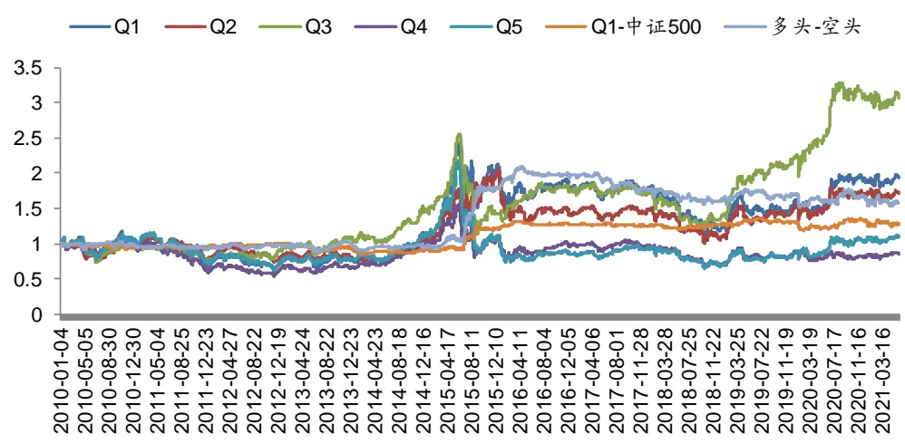
数据来源：Wind、广发证券发展研究中心

表65：PSY心理线(12日)分年度绩效指标表现一览

|  | 多头收益 率 | 多头换 |  |  |  | 多头平 均收益 率 | 多头 IR | 多头收 益波动 | 最大回 益率 | 超额收 | 超额胜 率 | 多空收益 率 | 夏普 比 |
| --- | --- | --- | --- | --- | --- | --- | --- | --- | --- | --- | --- | --- | --- |
|  |  | 手率均 值 | IC 均值 | IC 胜率 ICIR | 撤 |  |  |  |  |  |  |  |  |
| 2010 | 3.46% | 62.1% | 0.24% | 58.0% | 0.02 | 0.03% | 0.02 | 率 1.76% | 9.64% | -6.22% | 47.1% | -2.24% | -0.53 |
| 2011 | -32.57% | 61.3% | 0.62% | 51.0% | 0.08 | -0.15% | -0.1 | 1.49% | 3.07% | 1.65% | 47.5% | -5.59% | 0.37 |
| 2012 | 5.89% | 61.1% | 0.17% | 58.0% | 0.02 | 0.04% | 0.02 | 1.54% | 4.90% | 5.45% | 54.7% | 5.99% | 1.1 |
| 2013 | 8.74% | 57.5% | 0.27% | 56.9% | 0.03 | 0.04% | 0.03 | 1.37% | 13.39% | -7.56% | 44.5% | 2.24% | -0.9 |
| 2014 | 36.47% | 59.4% | 2.45% | 52.8% | 0.27 | 0.13% | 0.11 | 1.17% | 8.81% | -2.21% | 46.5% | -6.63% | -0.33 |
| 2015 | 88.29% | 64.0% | -3.81% | 51.9% | -0.25 | 0.31% | 0.1 | 3.22% | 5.34% | 33.87% | 48.8% | 91.78% | 1.89 |
| 2016 | -13.73% | 61.2% | -0.85% | 52.0% | -0.09 | -0.04% | -0.02 | 1.90% | 4.48% | 4.75% | 51.6% | 10.53% | 0.95 |
| 2017 | -2.39% | 58.8% | 1.89% | 56.9% | 0.21 | -0.01% | -0.01 | 0.84% | 4.25% | -2.52% | 46.3% | -11.07% | -0.43 |
| 2018 | -31.99% | 58.4% | 1.46% | 56.9% | 0.14 | -0.15% | -0.1 | 1.52% | 5.68% | 1.81% | 53.9% | -9.17% | 0.33 |
| 2019 | 31.92% | 58.6% | -1.29% | 52.9% | -0.12 | 0.12% | 0.09 | 1.36% | 5.18% | 3.78% | 53.3% | 6.23% | 0.64 |
| 2020 | 22.02% | 59.9% | 0.94% | 57.7% | 0.07 | 0.09% | 0.06 | 1.45% | 10.05% | -0.09% | 50.6% | -3.93% | 0.04 |
| 2021 | 1.27% | 56.5% | 2.09% | 50.0% | 0.15 | 0.02% | 0.02 | 1.08% | 5.87% | -3.47% | 43.9% | -3.63% | -0.6 |

数据来源：Wind、广发证券发展研究中心

图67：PSY心理线(20日)历史分档测算结果
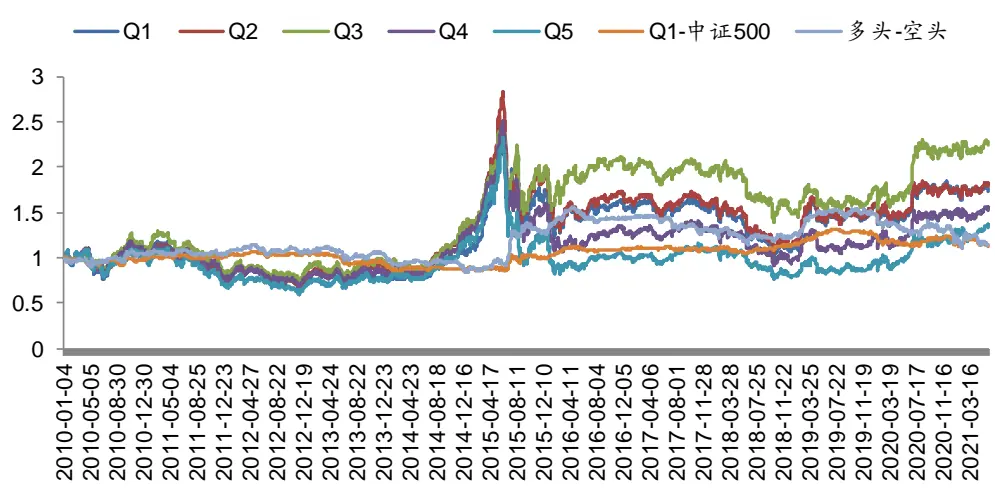
数据来源：Wind、广发证券发展研究中心

表66：PSY心理线(20日)分年度绩效指标表现一览

|  | 多头收益 率 | 多头换 |  |  |  | 多头平 均收益 | 多头 IR | 多头收 益波动 | 最大回 益率 | 超额收 | 超额胜 率 | 多空收益 率 | 夏普 比 |
| --- | --- | --- | --- | --- | --- | --- | --- | --- | --- | --- | --- | --- | --- |
|  |  | 手率均 值 | IC 均值 | IC 胜率 ICIR | 撒 |  |  |  |  |  |  |  |  |
| 2010 | 8.00% | 49.1% | -0.69% | 50.0% | -0.05 | 率 0.05% | 0.03 | 率 1.73% | 10.59% | -2.32% | 46.3% | 4.51% |  |
| 2011 | -31.14% | 52.0% | 0.57% | 60.8% | 0.07 | -0.14% | -0.09 | 1.50% | 4.40% | 3.79% | 52.1% | -0.17% | -0.14 0.74 |
| 2012 | 3.69% | 47.4% | -0.08% | 50.0% | -0.01 | 0.03% | 0.02 | 1.54% | 5.55% | 3.26% | 50.2% | 2.51% | 0.7 |
| 2013 | 5.29% | 43.1% | 0.88% | 54.9% | 0.09 | 0.03% | 0.02 | 1.36% | 12.74% | -10.55% | 42.4% | -3.88% | -1.22 |
| 2014 | 28.79% | 44.8% | 2.80% | 66.0% | 0.28 | 0.11% | 0.1 | 1.15% | 8.35% | -7.77% | 45.3% | -18.55% | -1.24 |
| 2015 | 62.67% | 50.6% | -2.22% | 53.9% | -0.17 | 0.25% | 0.08 | 3.18% | 9.77% | 15.55% | 48.0% | 54.44% | 1.08 |
| 2016 | -9.40% | 47.4% | -1.26% | 58.0% | -0.14 | -0.02% | -0.01 | 1.90% | 4.99% | 9.99% | 53.3% | 11.41% | 1.99 |
| 2017 | -1.04% | 45.2% | 1.29% | 52.9% | 0.13 | 0.00% | 0 | 0.81% | 4.99% | -1.25% | 50.0% | -10.08% | -0.19 |
| 2018 | -30.06% | 47.5% | 1.12% | 58.8% | 0.11 | -0.14% | -0.09 | 1.50% | 6.68% | 4.58% | 53.9% | -5.60% | 0.74 |
| 2019 | 44.12% | 48.8% | -2.57% | 54.9% | -0.25 | 0.16% | 0.12 | 1.34% | 4.50% | 13.30% | 53.3% | 23.33% | 2.05 |
| 2020 | 14.84% | 46.1% | 2.32% | 61.5% | 0.2 | 0.07% | 0.05 | 1.43% | 11.92% | -6.13% | 45.3% | -15.19% | -0.58 |
| 2021 | -1.30% | 43.5% | 1.92% | 54.2% | 0.11 | -0.01% | -0.01 | 0.99% | 6.92% | -6.04% | 41.1% | -11.25% | -1.06 |

数据来源：Wind、广发证券发展研究中心

图68：PVT价量趋势指标12历史分档测算结果
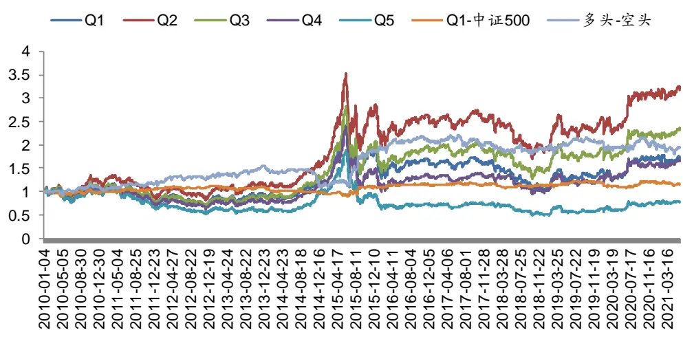
数据来源：Wind、广发证券发展研究中心

表67：PVT价量趋势指标12分年度绩效指标表现一览

|  | 多头收益 率 | 多头换 |  |  |  | 多头平 均收益 | 多头 IR | 多头收 益波动 |  |  | 超额胜 率 | 多空收益 率 | 夏普 比 |  |
| --- | --- | --- | --- | --- | --- | --- | --- | --- | --- | --- | --- | --- | --- | --- |
|  |  | 手率均 值 | IC 均值 | IC 胜率 ICIR | 最大回 撤 |  |  |  |  |  |  |  |  | 超额收 益率 |
| 2010 | 7.65% | 55.9% | -2.81% | 58.0% | -0.17 | 率 0.05% | 0.03 | 率 1.81% | 12.23% |  |  |  |  |  |
| 2011 | -28.44% | 53.9% | -1.92% | 54.9% | -0.17 | -0.12% | -0.08 | 1.56% | 3.22% | -2.41% 8.07% | 49.6% 48.4% | 9.18% 7.80% | -0.13 1.4 |  |
| 2012 | 6.19% | 52.4% | -3.02% | 58.0% | -0.22 | 0.04% | 0.02 | 1.61% | 5.08% | 5.95% | 51.0% | 12.05% | 0.97 |  |
| 2013 | 14.01% | 51.0% | -2.54% | 56.9% | -0.21 | 0.07% | 0.04 | 1.50% | 10.07% | -2.63% | 47.1% | 18.12% | -0.28 |  |
| 2014 | 24.69% | 52.0% | 3.75% | 56.6% | 0.27 | 0.10% | 0.08 | 1.24% | 11.04% | -10.50% | 46.5% | -30.05% | -1.73 |  |
| 2015 | 58.59% | 59.4% | -5.21% | 65.4% | -0.37 | 0.24% | 0.08 | 3.15% | 10.07% | 11.75% | 48.8% | 73.58% | 0.7 |  |
| 2016 | -14.62% | 55.7% | -2.86% | 62.0% | -0.23 | -0.04% | -0.02 | 1.99% | 3.00% | 4.13% | 50.8% | 10.76% | 0.8 |  |
| 2017 | 1.39% | 48.8% | -0.61% | 51.0% | -0.05 | 0.01% | 0.01 | 0.98% | 6.18% | 1.52% | 48.8% | -2.02% | 0.28 |  |
| 2018 | -35.37% | 47.6% | -0.40% | 51.0% | -0.03 | -0.17% | -0.1 | 1.65% | 9.04% | -2.81% | 47.3% | -8.02% | -0.37 |  |
| 2019 | 36.18% | 51.0% | -2.13% | 56.9% | -0.18 | 0.14% | 0.09 | 1.45% | 5.17% | 7.47% | 54.1% | 8.97% | 1.17 |  |
| 2020 | 22.79% | 54.7% | 0.40% | 59.6% | 0.03 | 0.10% | 0.06 | 1.59% | 10.53% | 1.10% | 53.5% | -1.27% | 0.17 |  |
| 2021 | -0.98% | 44.1% | 0.23% | 54.2% | 0.02 | 0.00% | 0 | 1.21% | 7.50% | -5.41% | 46.7% | -4.99% | -1.1 |  |

数据来源：Wind、广发证券发展研究中心

图69：PVT价量趋势指标历史分档测算结果
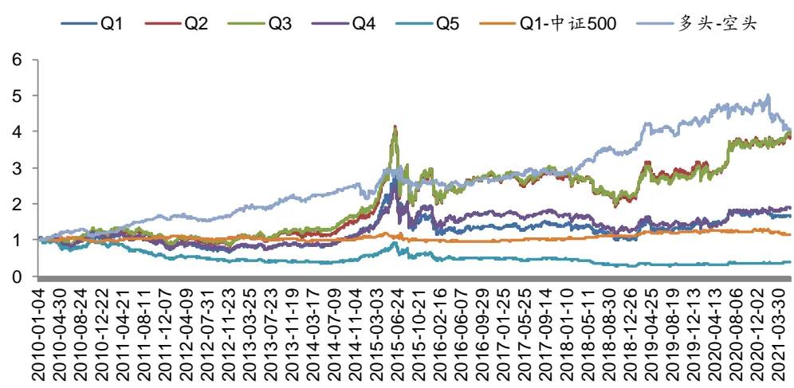
数据来源：Wind、广发证券发展研究中心

表68：PVT价量趋势指标分年度绩效指标表现一览

|  | 多头收益 率 | 多头换 |  |  |  | 多头平 均收益 率 | 多头 IR | 多头收 | 最大回 撤 益率 | 超额收 | 超额胜 率 | 多空收益 率 | 夏普 比 |
| --- | --- | --- | --- | --- | --- | --- | --- | --- | --- | --- | --- | --- | --- |
|  |  | 手率均 值 | IC 均值 | IC 胜率 ICIR | 益波动 率 |  |  |  |  |  |  |  |  |
| 2010 | 5.40% | 77.3% | -5.55% | 68.0% | -0.38 | 0.04% | 0.02 | 1.82% | 10.96% | -3.97% | 45.9% | 17.31% | -0.44 |
| 2011 | -26.82% | 71.5% | -4.33% | 66.7% | -0.46 | -0.12% | -0.07 | 1.56% | 5.24% | 10.50% | 51.2% | 33.56% | 1.84 |
| 2012 | 1.72% | 74.8% | -2.54% | 60.0% | -0.22 | 0.02% | 0.01 | 1.59% | 9.87% | 1.48% | 49.8% | 13.09% | 0.3 |
| 2013 | 9.47% | 72.3% | -4.02% | 68.6% | -0.37 | 0.05% | 0.03 | 1.55% | 10.95% | -6.26% | 45.4% | 22.19% | -0.87 |
| 2014 | 48.67% | 73.3% | -0.07% | 56.6% | -0.01 | 0.17% | 0.13 | 1.28% | 3.90% | 6.85% | 54.7% | -0.17% | 1.01 |
| 2015 | 28.48% | 77.9% | -4.91% | 65.4% | -0.34 | 0.16% | 0.05 | 3.24% | 19.19% | -8.65% | 48.4% | 20.69% | -0.46 |
| 2016 | -19.79% | 74.1% | 1.34% | 54.0% | 0.14 | -0.07% | -0.04 | 1.95% | 6.55% | -2.41% | 45.5% | 2.01% | -0.39 |
| 2017 | 4.82% | 71.3% | -0.94% | 52.9% | -0.1 | 0.02% | 0.02 | 1.03% | 4.28% | 5.09% | 50.8% | 6.93% | 0.86 |
| 2018 | -27.67% | 74.1% | -0.02% | 51.0% | 0 | -0.12% | -0.07 | 1.62% | 5.15% | 8.63% | 54.3% | 21.64% | 1.27 |
| 2019 | 43.32% | 72.2% | -1.87% | 54.9% | -0.17 | 0.16% | 0.1 | 1.56% | 3.93% | 13.58% | 58.2% | 25.44% | 2.19 |
| 2020 | 24.67% | 74.6% | -0.78% | 51.9% | -0.08 | 0.10% | 0.06 | 1.59% | 5.14% | 2.76% | 51.0% | 10.77% | 0.41 |
| 2021 | -7.35% | 72.3% | 1.97% | 58.3% | 0.16 | -0.06% | -0.05 | 1.20% | 11.63% | -11.49% | 44.9% | -15.21% | -2.63 |

数据来源：Wind、广发证券发展研究中心

图70：PVT价量趋势指标6历史分档测算结果
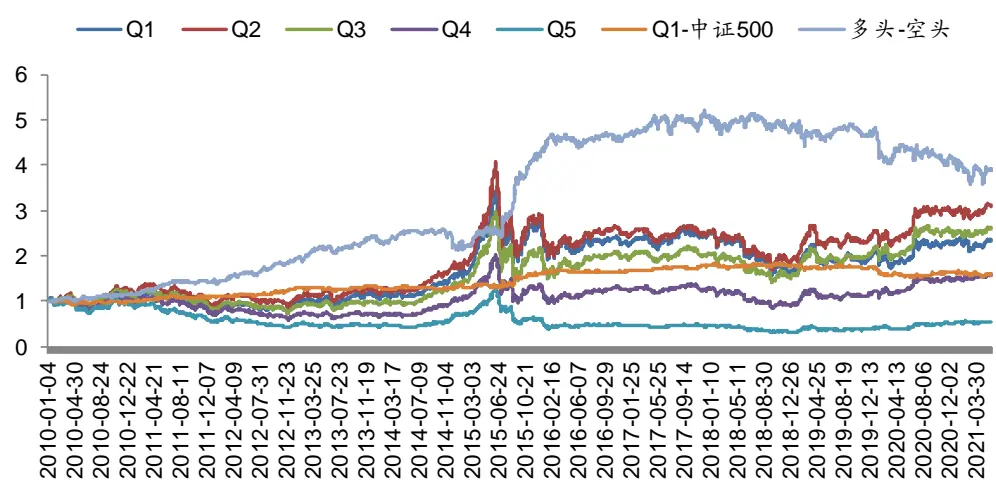
数据来源：Wind、广发证券发展研究中心

表69：PVT价量趋势指标6分年度绩效指标表现一览

|  | 多头收益 率 | 多头换 |  |  |  | 多头平 均收益 | 多头 IR | 多头收 益波动 | 最大回 益率 | 超额收 | 超额胜 率 | 多空收益 率 | 夏普 比 |
| --- | --- | --- | --- | --- | --- | --- | --- | --- | --- | --- | --- | --- | --- |
|  |  | 手率均 值 | IC 均值 | IC 胜率 ICIR | 撒 |  |  |  |  |  |  |  |  |
| 2010 | 7.68% | 73.3% | -3.79% | 64.0% | -0.27 | 率 0.05% | 0.03 | 率 1.78% | 10.48% | -2.26% | 49.2% | 14.31% |  |
| 2011 | -25.63% | 69.6% | -3.55% | 60.8% | -0.34 | -0.11% | -0.07 | 1.58% | 3.42% | 12.37% | 51.2% | 25.53% | -0.16 1.96 |
| 2012 | 16.39% | 72.5% | -5.22% | 62.0% | -0.37 | 0.07% | 0.05 | 1.58% | 3.29% | 16.04% | 58.9% | 32.69% | 2.58 |
| 2013 | 21.52% | 68.0% | -3.56% | 52.9% | -0.29 | 0.09% | 0.06 | 1.51% | 5.68% | 3.91% | 50.4% | 27.26% | 0.58 |
| 2014 | 40.11% | 72.2% | 0.56% | 43.4% | 0.04 | 0.15% | 0.12 | 1.26% | 5.17% | 0.63% | 46.9% | -11.20% | 0.13 |
| 2015 | 71.12% | 76.4% | -5.45% | 69.2% | -0.37 | 0.27% | 0.08 | 3.25% | 9.63% | 21.44% | 49.2% | 101.74% | 1.13 |
| 2016 | -16.30% | 71.4% | -1.34% | 50.0% | -0.13 | -0.05% | -0.03 | 1.95% | 3.89% | 1.88% | 51.2% | 7.09% | 0.41 |
| 2017 | 7.79% | 66.7% | -2.42% | 56.9% | -0.21 | 0.04% | 0.04 | 0.97% | 3.59% | 7.93% | 51.2% | 10.08% | 1.33 |
| 2018 | -34.16% | 65.9% | 0.59% | 54.9% | 0.04 | -0.16% | -0.09 | 1.68% | 5.53% | -0.86% | 49.0% | -6.97% | -0.09 |
| 2019 | 24.58% | 68.1% | -1.39% | 58.8% | -0.11 | 0.10% | 0.07 | 1.48% | 6.01% | -1.60% | 50.4% | -1.71% | -0.21 |
| 2020 | 14.87% | 70.4% | 0.02% | 51.9% | 0 | 0.07% | 0.04 | 1.65% | 12.35% | -5.14% | 46.1% | -12.42% | -0.61 |
| 2021 | 0.13% | 62.1% | 1.32% | 70.8% | 0.1 | 0.01% | 0.01 | 1.19% | 7.64% | -4.32% | 44.9% | -4.74% | -1.02 |

数据来源：Wind、广发证券发展研究中心

图71：RCCD异同离差变化率指数历史分档测算结果
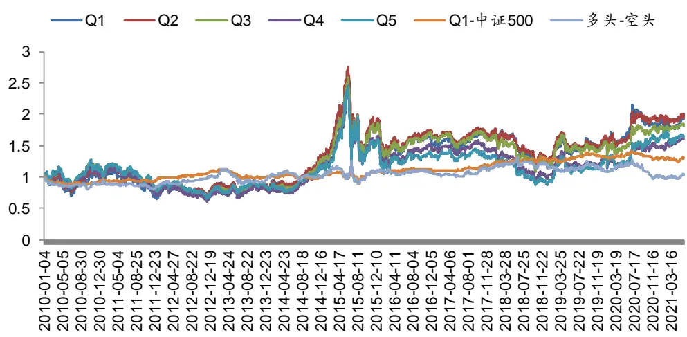
数据来源：Wind、广发证券发展研究中心

表70：RCCD异同离差变化率指数分年度绩效指标表现一览

|  | 多头收益 率 | 多头换 |  |  |  | 多头平 ICIR | 多头 IR | 多头收 益波动 率 | 最大回 撤 | 超额收 益率 | 超额胜 率 | 多空收益 率 | 夏普 比 |
| --- | --- | --- | --- | --- | --- | --- | --- | --- | --- | --- | --- | --- | --- |
|  |  | 手率均 值 | IC 均值 | IC 胜率 | 均收益 率 |  |  |  |  |  |  |  |  |
| 32010 | 0.21% | 14.5% | 2.11% | 50.0% | 0.16 | 0.02% | 0.01 | 1.82% | 14.14% | -8.69% | 45.9% | -13.23% | -1.1 |
| 2011 | -31.23% | 14.1% | 0.03% | 54.9% | 0 | -0.14% | -0.09 | 1.54% | 5.36% | 3.82% | 50.8% | -3.70% | 0.71 |
| 2012 | 15.60% | 13.6% | -4.26% | 66.0% | -0.36 | 0.07% | 0.04 | 1.62% | 1.90% | 15.44% | 53.9% | 21.47% | 2.77 |
| 2013 | 6.60% | 11.4% | 1.64% | 56.9% | 0.11 | 0.04% | 0.03 | 1.46% | 14.37% | -9.17% | 45.8% | -6.17% | -1.03 |
| 2014 | 42.01% | 11.9% | -0.92% | 54.7% | -0.08 | 0.15% | 0.12 | 1.24% | 7.45% | 2.00% | 50.2% | 5.02% | 0.39 |
| 2015 | 52.96% | 21.3% | -2.81% | 53.9% | -0.17 | 0.22% | 0.07 | 3.12% | 21.37% | 7.56% | 52.1% | 9.64% | 0.5 |
| 2016 | -17.64% | 13.0% | 0.53% | 52.0% | 0.05 | -0.06% | -0.03 | 2.01% | 4.10% | 0.58% | 50.8% | -4.07% | 0.15 |
| 2017 | 8.78% | 11.6% | -1.24% | 51.0% | -0.12 | 0.04% | 0.04 | 0.89% | 3.74% | 8.77% | 56.6% | 8.33% | 1.64 |
| 2018 | -28.70% | 11.6% | -0.63% | 51.0% | -0.05 | -0.12% | -0.07 | 1.71% | 6.05% | 7.46% | 51.0% | 5.17% | 1.08 |
| 2019 | 32.71% | 10.9% | 0.21% | 49.0% | 0.02 | 0.13% | 0.09 | 1.37% | 5.35% | 4.44% | 51.6% | -5.50% | 0.72 |
| 2020 | 17.48% | 14.6% | 1.60% | 59.6% | 0.15 | 0.08% | 0.05 | 1.62% | 9.23% | -3.03% | 47.7% | -10.82% | -0.43 |
| 2021 | 4.82% | 11.7% | -0.80% | 54.2% | -0.08 | 0.05% | 0.05 | 1.07% | 5.50% | 0.14% | 46.7% | 2.81% | 0.08 |

数据来源：Wind、广发证券发展研究中心

图72：RC变化率指数历史分档测算结果
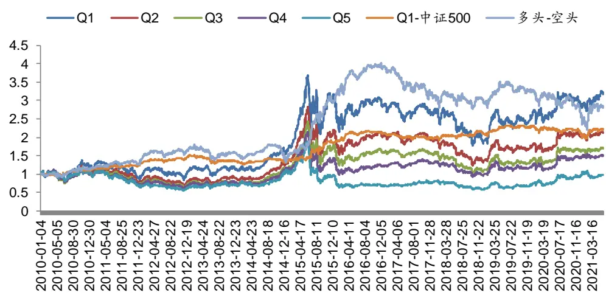
数据来源：Wind、广发证券发展研究中心

表71：RC变化率指数分年度绩效指标表现一览

|  | 多头收益 率 | 多头换 |  |  |  | 多头平 均收益 率 | 多头 IR | 多头收 益波动 | 最大回 撤 益率 | 超额收 | 超额胜 率 | 多空收益 率 | 夏普 比 |
| --- | --- | --- | --- | --- | --- | --- | --- | --- | --- | --- | --- | --- | --- |
|  |  | 手率均 值 | IC 均值 | IC 胜率 ICIR | 率 |  |  |  |  |  |  |  |  |
| 2010 | 20.71% | 31.4% | -2.78% | 52.0% | -0.13 | 0.09% | 0.05 | 1.83% | 8.71% | 9.31% | 50.0% | 11.46% | 0.71 |
| 2011 | -25.34% | 31.2% | -2.87% | 64.7% | -0.2 | -0.11% | -0.06 | 1.66% | 3.62% | 13.17% | 52.5% | 15.41% | 2.12 |
| 2012 | 18.32% | 31.4% | -4.07% | 56.0% | -0.23 | 0.08% | 0.05 | 1.73% | 5.55% | 18.58% | 55.6% | 27.06% | 2.45 |
| 2013 | 8.43% | 29.0% | 2.18% | 54.9% | 0.11 | 0.05% | 0.03 | 1.48% | 14.95% | -7.63% | 46.6% | -3.72% | -0.72 |
| 2014 | 34.62% | 27.0% | 0.88% | 50.9% | 0.06 | 0.13% | 0.1 | 1.24% | 8.67% | -3.43% | 50.6% | -15.42% | -0.42 |
| 2015 | 98.02% | 37.7% | -8.92% | 63.5% | -0.56 | 0.34% | 0.1 | 3.32% | 8.69% | 41.77% | 54.1% | 127.30% | 2.15 |
| 2016 | -7.39% | 31.1% | -4.78% | 66.0% | -0.31 | -0.01% | 0 | 2.14% | 3.46% | 13.66% | 51.6% | 30.08% | 1.86 |
| 2017 | -6.66% | 26.3% | 3.28% | 60.8% | 0.2 | -0.02% | -0.02 | 1.06% | 8.45% | -6.43% | 47.5% | -20.35% | -0.87 |
| 2018 | -29.55% | 25.9% | 0.42% | 56.9% | 0.02 | -0.13% | -0.07 | 1.80% | 4.82% | 6.52% | 52.7% | -4.38% | 0.82 |
| 2019 | 39.17% | 28.4% | -1.43% | 56.9% | -0.09 | 0.15% | 0.1 | 1.45% | 3.42% | 9.77% | 51.6% | 9.67% | 1.35 |
| 2020 | 10.86% | 29.7% | 3.33% | 59.6% | 0.23 | 0.05% | 0.04 | 1.53% | 10.46% | -9.07% | 46.9% | -21.20% | -0.89 |
| 2021 | 9.34% | 26.1% | -2.38% | 50.0% | -0.09 | 0.09% | 0.08 | 1.20% | 6.18% | 4.24% | 49.5% | 8.33% | 0.73 |

数据来源：Wind、广发证券发展研究中心

图73：已实现峰度历史分档测算结果
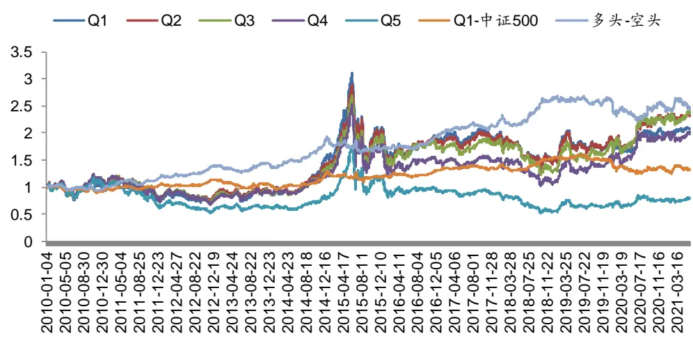
数据来源：Wind、广发证券发展研究中心

表72：已实现峰度分年度绩效指标表现一览

|  | 多头收益 率 | 多头换 |  |  |  | 多头平 均收益 率 | 多头 IR | 多头收 益波动 | 最大回 益率 | 超额收 | 超额胜 率 | 多空收益 率 | 夏普 比 |
| --- | --- | --- | --- | --- | --- | --- | --- | --- | --- | --- | --- | --- | --- |
|  |  | 手率均 值 | IC 均值 | IC 胜率 ICIR | 撤 率 |  |  |  |  |  |  |  |  |
| 2010 | 1.26% | 62.1% | 0.69% | 50.0% | 0.08 | 0.02% | 0.01 | 1.71% | 11.62% | -8.25% | 44.6% | -3.92% | -0.87 |
| 2011 | -25.96% | 55.4% | -2.15% | 51.0% | -0.28 | -0.11% | -0.08 | 1.42% | 6.38% | 11.24% | 50.0% | 20.15% | 1.85 |
| 2012 | 11.44% | 52.4% | -2.32% | 64.0% | -0.27 | 0.05% | 0.04 | 1.45% | 5.04% | 10.57% | 53.9% | 19.54% | 1.87 |
| 2013 | 8.20% | 49.4% | 0.55% | 54.9% | 0.07 | 0.04% | 0.03 | 1.34% | 14.50% | -8.08% | 45.4% | 2.46% | -1.02 |
| 2014 | 71.88% | 51.1% | -3.84% | 66.0% | -0.5 | 0.23% | 0.2 | 1.16% | 7.23% | 22.92% | 53.5% | 35.94% | 2.39 |
| 2015 | 31.26% | 71.9% | 1.53% | 50.0% | 0.17 | 0.16% | 0.05 | 3.15% | 14.97% | -7.00% | 45.1% | -11.17% | -0.43 |
| 2016 | -8.76% | 52.1% | -2.37% | 62.0% | -0.34 | -0.02% | -0.01 | 1.87% | 5.76% | 10.53% | 52.5% | 15.41% | 1.65 |
| 2017 | 2.58% | 45.7% | -1.08% | 62.8% | -0.17 | 0.01% | 0.02 | 0.78% | 5.72% | 2.30% | 48.0% | 7.90% | 0.44 |
| 2018 | -23.52% | 48.5% | -2.05% | 64.7% | -0.24 | -0.10% | -0.07 | 1.40% | 8.92% | 13.93% | 56.4% | 23.41% | 1.95 |
| 2019 | 26.04% | 46.4% | -0.04% | 49.0% | -0.01 | 0.10% | 0.08 | 1.30% | 7.72% | -1.08% | 50.4% | 0.32% | -0.12 |
| 2020 | 8.42% | 45.0% | 1.16% | 61.5% | 0.12 | 0.04% | 0.03 | 1.38% | 17.11% | -11.74% | 44.0% | -5.47% | -0.95 |
| 2021 | 3.80% | 42.9% | 0.18% | 50.0% | 0.02 | 0.04% | 0.05 | 0.80% | 7.14% | -1.36% | 48.6% | -0.27% | -0.19 |

数据来源：Wind、广发证券发展研究中心

图74：已实现偏度历史分档测算结果
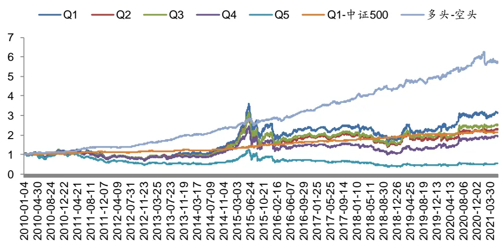
数据来源：Wind、广发证券发展研究中心

表73：已实现偏度分年度绩效指标表现一览

|  | 多头收益 率 | 多头换 |  |  |  | 多头平 均收益 | 多头 IR | 多头收 益波动 | 最大回 益率 | 超额收 | 超额胜 率 | 多空收益 率 | 夏普 比 |
| --- | --- | --- | --- | --- | --- | --- | --- | --- | --- | --- | --- | --- | --- |
|  |  | 手率均 值 | IC 均值 | IC 胜率 ICIR | 撤 |  |  |  |  |  |  |  |  |
| 2010 | 13.67% | 79.4% | -2.74% | 66.0% | -0.41 | 率 0.07% | 0.04 | 率 1.77% | 3.51% |  | 49.6% |  |  |
| 2011 | -27.80% | 80.1% | -2.82% | 66.7% | -0.53 | -0.12% | -0.08 | 1.48% | 2.15% | 3.44% 8.83% | 53.7% | 12.76% 21.24% | 0.53 2.32 |
| 2012 | 4.67% | 79.4% | -2.31% | 68.0% | -0.43 | 0.03% | 0.02 | 1.55% | 4.23% | 4.35% | 54.3% | 16.20% | 1.29 |
| 2013 | 22.70% | 79.3% | -2.59% | 64.7% | -0.46 | 0.10% | 0.07 | 1.45% | 4.20% | 4.86% | 52.9% | 26.25% | 1.09 |
| 2014 | 48.66% | 79.1% | -3.10% | 77.4% | -0.56 | 0.17% | 0.14 | 1.23% | 3.92% | 6.84% | 52.7% | 19.59% | 1.56 |
| 2015 | 61.18% | 81.4% | -2.19% | 76.9% | -0.26 | 0.25% | 0.08 | 3.20% | 8.46% | 15.20% | 55.7% | 17.59% | 1.33 |
| 2016 | -11.82% | 80.2% | -2.72% | 70.0% | -0.43 | -0.03% | -0.02 | 1.95% | 3.22% | 7.38% | 56.6% | 15.81% | 1.7 |
| 2017 | 6.54% | 79.0% | -2.32% | 68.6% | -0.38 | 0.03% | 0.03 | 0.89% | 2.86% | 6.58% | 57.0% | 18.66% | 1.72 |
| 2018 | -27.43% | 79.5% | -2.22% | 58.8% | -0.37 | -0.12% | -0.08 | 1.55% | 3.33% | 8.82% | 63.8% | 13.32% | 1.83 |
| 2019 | 37.60% | 79.4% | -1.50% | 58.8% | -0.18 | 0.14% | 0.1 | 1.41% | 3.65% | 8.55% | 54.5% | 14.31% | 1.71 |
| 2020 | 30.49% | 80.3% | -1.42% | 63.5% | -0.17 | 0.12% | 0.08 | 1.47% | 3.55% | 7.10% | 52.7% | 19.17% | 1.04 |
| 2021 | 1.31% | 77.9% | 1.02% | 45.8% | 0.1 | 0.02% | 0.02 | 0.99% | 4.65% | -3.30% | 47.7% | -3.40% | -1.21 |

数据来源：Wind、广发证券发展研究中心

图75：已实现方差历史分档测算结果
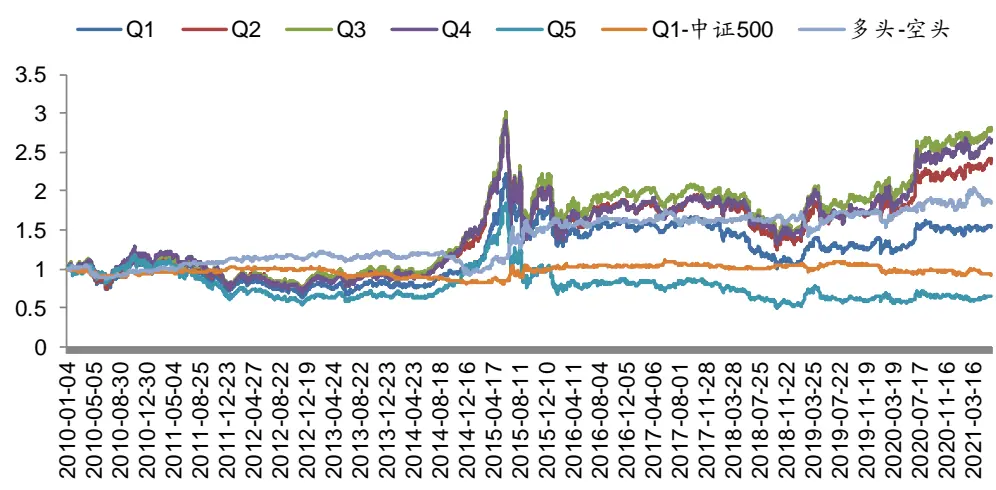
数据来源：Wind、广发证券发展研究中心

表74：已实现方差分年度绩效指标表现一览

|  | 多头收益 率 | 多头换 |  |  |  | 多头平 均收益 率 | 多头 IR | 多头收 益波动 | 益率 | 超额收 | 超额胜 率 | 多空收益 率 | 夏普 比 |
| --- | --- | --- | --- | --- | --- | --- | --- | --- | --- | --- | --- | --- | --- |
|  |  | 手率均 值 | IC 均值 | IC 胜率 ICIR | 最大回 撤 |  |  |  |  |  |  |  |  |
| 2010 | 3.04% | 53.9% | 0.02% | 46.0% | 0 | 0.03% | 0.02 | 率 1.68% | 11.81% | -6.88% | 43.4% | -2.92% | -0.62 |
| 2011 | -28.15% | 55.6% | -0.95% | 47.1% | -0.11 | -0.13% | -0.09 | 1.43% | 3.63% | 8.00% | 48.0% | 14.97% | 1.37 |
| 2012 | 0.84% | 52.5% | -0.18% | 54.0% | -0.02 | 0.01% | 0.01 | 1.45% | 4.81% | 0.08% | 46.1% | 3.75% | 0.04 |
| 2013 | 9.68% | 51.3% | 1.10% | 54.9% | 0.1 | 0.05% | 0.04 | 1.38% | 12.19% | -6.66% | 42.0% | 4.77% | -0.88 |
| 2014 | 21.04% | 46.7% | 3.73% | 64.2% | 0.33 | 0.08% | 0.07 | 1.14% | 14.00% | -13.39% | 41.2% | -25.51% | -2.13 |
| 2015 | 78.57% | 53.9% | -4.62% | 63.5% | -0.27 | 0.28% | 0.1 | 2.82% | 15.74% | 22.41% | 43.9% | 73.99% | 1.12 |
| 2016 | -13.35% | 44.6% | -0.32% | 56.0% | -0.03 | -0.04% | -0.03 | 1.65% | 4.42% | 3.90% | 48.4% | 3.66% | 0.53 |
| 2017 | -0.30% | 43.7% | 0.19% | 52.9% | 0.02 | 0.00% | 0 | 0.69% | 7.38% | -0.86% | 43.9% | -0.99% | -0.08 |
| 2018 | -31.27% | 43.9% | -0.30% | 51.0% | -0.03 | -0.14% | -0.1 | 1.39% | 5.76% | 2.36% | 49.8% | 4.47% | 0.39 |
| 2019 | 28.75% | 40.3% | -2.43% | 52.9% | -0.18 | 0.11% | 0.09 | 1.18% | 9.92% | 0.56% | 52.5% | 3.66% | 0.11 |
| 2020 | 9.53% | 39.9% | -0.61% | 46.2% | -0.05 | 0.05% | 0.03 | 1.33% | 12.06% | -10.88% | 45.7% | 2.62% | -0.97 |
| 2021 | 2.81% | 35.8% | 0.77% | 62.5% | 0.06 | 0.03% | 0.03 | 0.85% | 7.98% | -2.22% | 40.2% | 2.28% | -0.38 |

数据来源：Wind、广发证券发展研究中心

图76：ROC变动速率(20日)历史分档测算结果
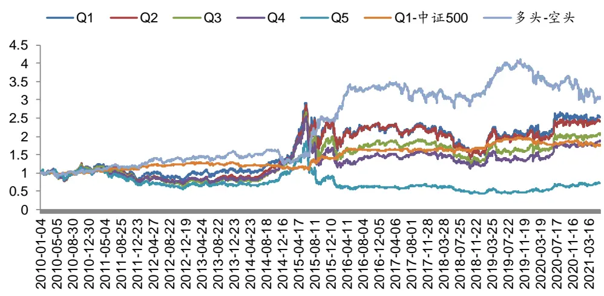
数据来源：Wind、广发证券发展研究中心

表75：ROC变动速率(20日)分年度绩效指标表现一览

|  | 多头收益 率 | 多头换 |  |  |  | 多头平 均收益 | 多头 IR | 多头收 益波动 | 最大回 益率 | 超额收 | 超额胜 率 | 多空收益 率 | 夏普 比 |
| --- | --- | --- | --- | --- | --- | --- | --- | --- | --- | --- | --- | --- | --- |
|  |  | 手率均 值 | IC 均值 | IC 胜率 ICIR | 撤 |  |  |  |  |  |  |  |  |
| 2010 | 11.78% | 45.4% | -2.95% | 56.0% | -0.14 | 率 0.06% | 0.03 | 率 1.84% | 11.25% | 1.35% | 48.4% | 4.42% |  |
| 2011 | -27.71% | 45.1% | -1.48% | 56.9% | -0.11 | -0.12% | -0.07 | 1.65% | 4.22% | 9.52% | 53.7% | 10.75% | 0.17 1.52 |
| 2012 | 12.78% | 43.5% | -2.36% | 50.0% | -0.14 | 0.06% | 0.04 | 1.74% | 5.99% | 13.06% | 54.7% | 18.24% | 1.78 |
| 2013 | 18.67% | 44.0% | -1.34% | 47.1% | -0.1 | 0.08% | 0.06 | 1.48% | 6.86% | 1.23% | 48.3% | 14.46% | 0.18 |
| 2014 | 21.78% | 40.6% | 1.92% | 54.7% | 0.12 | 0.09% | 0.07 | 1.28% | 12.35% | -12.49% | 43.7% | -21.77% | -1.9 |
| 2015 | 75.83% | 50.5% | -6.81% | 63.5% | -0.37 | 0.29% | 0.09 | 3.34% | 9.72% | 25.87% | 48.0% | 101.48% | 1.38 |
| 2016 | -6.57% | 44.7% | -5.10% | 64.0% | -0.35 | 0.00% | 0 | 2.13% | 4.56% | 14.58% | 49.6% | 34.98% | 1.92 |
| 2017 | 0.73% | 43.0% | 0.90% | 54.9% | 0.06 | 0.01% | 0.01 | 1.04% | 6.23% | 0.96% | 51.6% | -5.21% | 0.17 |
| 2018 | -32.29% | 38.7% | -0.58% | 54.9% | -0.04 | -0.15% | -0.08 | 1.74% | 7.83% | 2.11% | 48.2% | -2.25% | 0.3 |
| 2019 | 48.14% | 42.2% | -3.52% | 60.8% | -0.27 | 0.17% | 0.11 | 1.50% | 4.26% | 17.08% | 52.9% | 26.38% | 2.34 |
| 2020 | 16.53% | 43.9% | 1.86% | 55.8% | 0.14 | 0.08% | 0.05 | 1.62% | 9.37% | -3.98% | 48.2% | -13.93% | -0.39 |
| 2021 | -1.42% | 38.5% | 0.90% | 54.2% | 0.05 | -0.01% | 0 | 1.27% | 7.33% | -5.89% | 43.9% | -9.41% | -0.96 |

数据来源：Wind、广发证券发展研究中心

图77：ROC变动速率(6日)历史分档测算结果
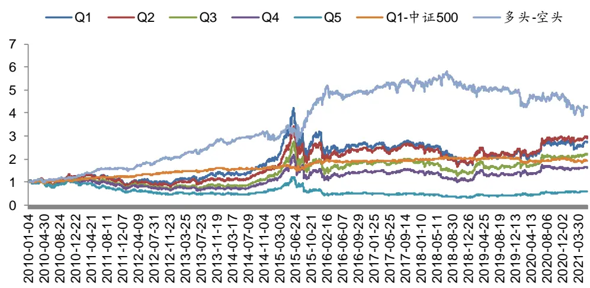
数据来源：Wind、广发证券发展研究中心

表76：ROC变动速率(6日)分年度绩效指标表现一览

|  | 多头收益 率 | 多头换 |  |  |  | 多头平 均收益 | 多头 IR | 多头收 益波动 | 最大回 撤 益率 | 超额收 | 超额胜 率 | 多空收益 率 | 夏普 比 |
| --- | --- | --- | --- | --- | --- | --- | --- | --- | --- | --- | --- | --- | --- |
|  |  | 手率均 值 | IC 均值 | IC 胜率 ICIR | 率 |  |  |  |  |  |  |  |  |
| 2010 | 17.96% | 77.4% | -4.92% | 66.0% | -0.32 | 率 0.09% | 0.05 | 1.83% | 7.49% | 7.34% | 57.0% | 22.70% | 0.73 |
| 2011 | -24.23% | 75.6% | -3.38% | 56.9% | -0.27 | -0.10% | -0.06 | 1.62% | 2.76% | 14.66% | 54.5% | 27.59% | 2.34 |
| 2012 | 17.04% | 76.1% | -4.29% | 62.0% | -0.28 | 0.08% | 0.05 | 1.65% | 3.89% | 16.99% | 61.7% | 31.32% | 2.59 |
| 2013 | 30.81% | 74.9% | -4.22% | 56.9% | -0.35 | 0.12% | 0.08 | 1.53% | 4.65% | 11.98% | 54.2% | 39.03% | 1.67 |
| 2014 | 41.60% | 72.4% | -0.29% | 66.0% | -0.02 | 0.15% | 0.12 | 1.30% | 5.77% | 1.86% | 48.6% | 0.91% | 0.32 |
| 2015 | 60.37% | 79.3% | -4.46% | 57.7% | -0.23 | 0.25% | 0.07 | 3.39% | 13.84% | 15.30% | 52.9% | 62.22% | 0.9 |
| 2016 | -18.57% | 75.6% | -2.17% | 56.0% | -0.15 | -0.06% | -0.03 | 2.10% | 5.87% | -0.28% | 49.2% | 5.28% | 0 |
| 2017 | 4.04% | 72.6% | -2.19% | 54.9% | -0.18 | 0.02% | 0.02 | 1.03% | 3.96% | 4.29% | 51.6% | 9.01% | 0.71 |
| 2018 | -32.91% | 70.8% | 0.80% | 54.9% | 0.05 | -0.15% | -0.09 | 1.72% | 5.24% | 1.19% | 51.0% | -6.51% | 0.2 |
| 2019 | 28.49% | 70.5% | -1.16% | 52.9% | -0.08 | 0.11% | 0.08 | 1.51% | 6.81% | 1.60% | 53.7% | -2.44% | 0.27 |
| 2020 | 20.24% | 73.1% | 0.13% | 51.9% | 0.01 | 0.09% | 0.05 | 1.72% | 10.33% | -0.46% | 46.1% | -6.54% | -0.01 |
| 2021 | -0.72% | 67.3% | 1.43% | 62.5% | 0.09 | 0.00% | 0 | 1.28% | 9.39% | -5.08% | 39.3% | -7.79% | -1.03 |

数据来源：Wind、广发证券发展研究中心

图78：RSI相对强弱指标(12日)历史分档测算结果
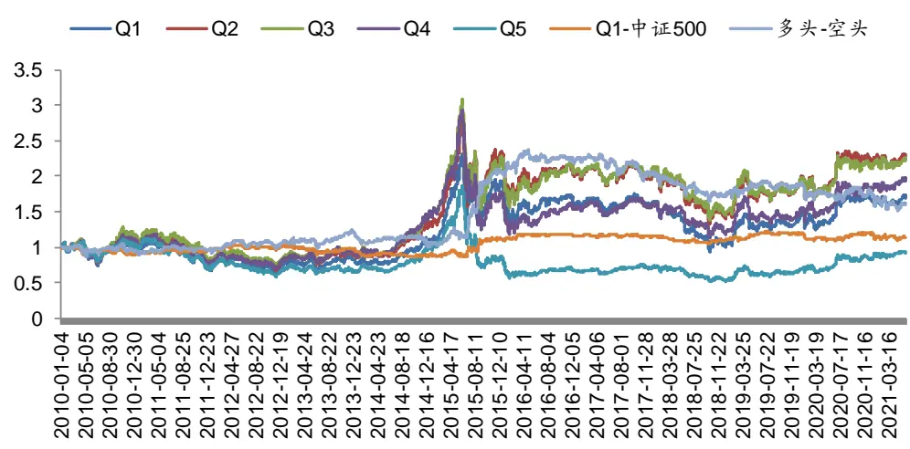
数据来源：Wind、广发证券发展研究中心

表77：RSI相对强弱指标(12日)分年度绩效指标表现一览

|  | 多头收益 率 | 多头换 |  |  |  | 多头平 均收益 | 多头 IR | 多头收 益波动 | 最大回 |  | 超额胜 率 | 多空收益 率 | 夏普 比 |  |
| --- | --- | --- | --- | --- | --- | --- | --- | --- | --- | --- | --- | --- | --- | --- |
|  |  | 手率均 值 | IC 均值 | IC 胜率 ICIR | 撤 |  |  |  |  |  |  |  |  | 超额收 益率 |
| 2010 | -0.69% | 58.5% | -0.99% | 44.0% | -0.05 | 率 0.01% | 0.01 | 率 1.80% | 12.42% | -10.07% | 45.0% | -5.08% |  |  |
| 2011 | -29.31% | 59.2% | -0.11% | 49.0% | -0.01 | -0.13% | -0.08 | 1.55% | 4.55% | 6.70% | 52.9% | 1.93% | -0.73 1.16 |  |
| 2012 | 5.55% | 57.4% | -1.26% | 48.0% | -0.08 | 0.04% | 0.02 | 1.61% | 5.54% | 5.30% | 53.9% | 9.21% | 0.84 |  |
| 2013 | 12.50% | 56.0% | -1.27% | 47.1% | -0.1 | 0.06% | 0.04 | 1.44% | 12.17% | -4.17% | 44.5% | 14.59% | -0.43 |  |
| 2014 | 26.07% | 54.8% | 2.53% | 54.7% | 0.2 | 0.10% | 0.08 | 1.24% | 10.19% | -9.49% | 45.7% | -16.85% | -1.51 |  |
| 2015 | 78.07% | 61.9% | -6.08% | 63.5% | -0.33 | 0.29% | 0.09 | 3.21% | 10.40% | 26.12% | 49.2% | 103.28% | 1.4 |  |
| 2016 | -13.79% | 57.0% | -2.23% | 58.0% | -0.15 | -0.04% | -0.02 | 2.00% | 3.16% | 5.11% | 51.6% | 9.89% | 0.86 |  |
| 2017 | -1.52% | 55.0% | 2.10% | 54.9% | 0.15 | 0.00% | 0 | 0.93% | 5.04% | -1.53% | 50.4% | -9.40% | -0.21 |  |
| 2018 | -36.10% | 53.3% | 2.26% | 56.9% | 0.15 | -0.17% | -0.11 | 1.61% | 10.57% | -4.09% | 46.5% | -15.62% | -0.55 |  |
| 2019 | 38.27% | 56.4% | -2.41% | 52.9% | -0.2 | 0.14% | 0.1 | 1.38% | 4.86% | 8.82% | 54.9% | 8.82% | 1.32 |  |
| 2020 | 20.02% | 57.3% | 1.40% | 57.7% | 0.09 | 0.09% | 0.06 | 1.54% | 9.13% | -1.36% | 51.0% | -7.82% | -0.12 |  |
| 2021 | 0.38% | 50.5% | 1.31% | 50.0% | 0.08 | 0.01% | 0.01 | 1.17% | 5.93% | -4.26% | 45.8% | -6.97% | -0.7 |  |

数据来源：Wind、广发证券发展研究中心

图79：RSI相对强弱指标(24日)历史分档测算结果
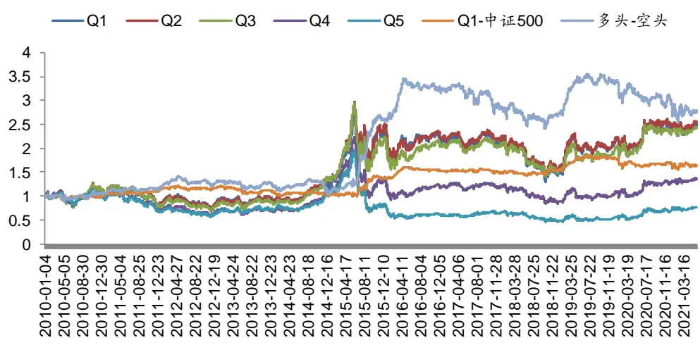
数据来源：Wind、广发证券发展研究中心

表78：RSI相对强弱指标(24日)分年度绩效指标表现一览

|  | 多头收益 率 | 多头换 |  |  |  | 多头平 均收益 | 多头 IR | 多头收 益波动 |  |  | 超额胜 率 | 多空收益 率 | 夏普 比 |  |
| --- | --- | --- | --- | --- | --- | --- | --- | --- | --- | --- | --- | --- | --- | --- |
|  |  | 手率均 值 | IC 均值 | IC 胜率 ICIR | 最大回 撤 |  |  |  |  |  |  |  |  | 超额收 益率 |
| 2010 | 9.93% | 46.3% | -2.27% | 56.0% | -0.11 | 率 0.05% | 0.03 | 率 1.76% | 9.49% | -0.62% | 48.8% | 5.49% |  |  |
| 2011 | -25.73% | 46.7% | -1.95% | 54.9% | -0.15 | -0.11% | -0.07 | 1.53% | 4.11% | 12.00% | 54.5% | 9.61% | 0.02 1.92 |  |
| 2012 | 5.59% | 43.6% | -1.48% | 50.0% | -0.09 | 0.04% | 0.02 | 1.61% | 7.42% | 5.35% | 53.9% | 9.01% | 0.85 |  |
| 2013 | 11.06% | 41.4% | 0.74% | 52.9% | 0.05 | 0.05% | 0.04 | 1.42% | 13.47% | -5.55% | 45.4% | 0.38% | -0.55 |  |
| 2014 | 25.79% | 38.3% | 2.56% | 56.6% | 0.16 | 0.10% | 0.08 | 1.20% | 9.43% | -9.85% | 44.1% | -19.45% | -1.4 |  |
| 2015 | 93.61% | 48.3% | -9.63% | 71.2% | -0.59 | 0.32% | 0.1 | 3.16% | 7.47% | 36.76% | 49.6% | 156.67% | 1.91 |  |
| 2016 | -8.11% | 42.3% | -3.78% | 66.0% | -0.28 | -0.01% | -0.01 | 1.98% | 5.78% | 11.95% | 53.3% | 23.98% | 2.01 |  |
| 2017 | -3.04% | 40.1% | 1.54% | 58.8% | 0.1 | -0.01% | -0.01 | 0.95% | 6.57% | -3.02% | 48.4% | -11.99% | -0.43 |  |
| 2018 | -30.99% | 37.8% | -0.21% | 54.9% | -0.01 | -0.14% | -0.09 | 1.61% | 7.13% | 3.54% | 50.2% | -6.41% | 0.49 |  |
| 2019 | 48.26% | 41.8% | -3.20% | 60.8% | -0.25 | 0.17% | 0.12 | 1.44% | 3.88% | 16.94% | 53.7% | 26.98% | 2.55 |  |
| 2020 | 14.00% | 42.8% | 1.76% | 61.5% | 0.14 | 0.07% | 0.04 | 1.51% | 11.94% | -6.55% | 45.3% | -13.48% | -0.62 |  |
| 2021 | 1.41% | 37.1% | 1.67% | 54.2% | 0.08 | 0.02% | 0.02 | 1.12% | 7.17% | -3.36% | 43.9% | -6.25% | -0.52 |  |

数据来源：Wind、广发证券发展研究中心

图80：RSI相对强弱指标(6日)历史分档测算结果
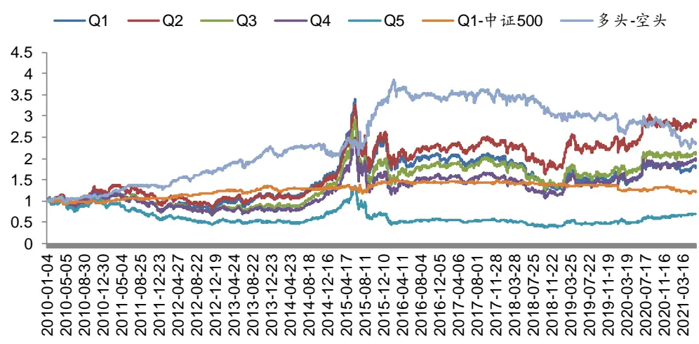
数据来源：Wind、广发证券发展研究中心

表79：RSI相对强弱指标(6日)分年度绩效指标表现一览

|  | 多头收益 率 | 多头换 |  |  |  | 多头平 均收益 | 多头 IR | 多头收 益波动 | 最大回 |  | 超额胜 率 | 多空收益 率 | 夏普 比 |  |
| --- | --- | --- | --- | --- | --- | --- | --- | --- | --- | --- | --- | --- | --- | --- |
|  |  | 手率均 值 | IC 均值 | IC 胜率 ICIR | 撤 |  |  |  |  |  |  |  |  | 超额收 益率 |
| 2010 | 5.93% | 77.3% | -3.25% | 56.0% | -0.2 | 率 0.04% | 0.02 | 率 1.79% | 9.77% | -3.89% | 49.2% | 10.97% | -0.3 |  |
| 2011 | -27.02% | 78.4% | -2.34% | 54.9% | -0.19 | -0.12% | -0.08 | 1.53% | 3.01% | 10.09% | 52.5% | 20.60% | 1.65 |  |
| 2012 | 14.98% | 78.5% | -2.93% | 58.0% | -0.21 | 0.07% | 0.04 | 1.57% | 3.35% | 14.60% | 58.0% | 27.66% | 2.51 |  |
| 2013 | 27.86% | 75.8% | -2.93% | 58.8% | -0.24 | 0.11% | 0.08 | 1.44% | 7.52% | 9.01% | 54.2% | 30.52% | 1.16 |  |
| 2014 | 36.76% | 74.7% | 0.51% | 47.2% | 0.04 | 0.14% | 0.11 | 1.23% | 7.46% | -1.82% | 50.2% | -6.98% | -0.27 |  |
| 2015 | 55.39% | 79.4% | -3.22% | 50.0% | -0.17 | 0.24% | 0.07 | 3.29% | 14.60% | 10.90% | 48.0% | 64.58% | 0.69 |  |
| 2016 | -18.74% | 76.1% | -1.14% | 54.0% | -0.09 | -0.07% | -0.03 | 1.97% | 6.98% | -1.01% | 48.0% | -0.08% | -0.15 |  |
| 2017 | 0.69% | 75.5% | -1.23% | 51.0% | -0.1 | 0.01% | 0.01 | 0.90% | 4.60% | 0.61% | 50.8% | 3.12% | 0.12 |  |
| 2018 | -36.36% | 73.0% | 2.34% | 54.9% | 0.17 | -0.17% | -0.11 | 1.59% | 7.05% | -4.45% | 49.8% | -15.39% | -0.71 |  |
| 2019 | 26.27% | 74.5% | -1.20% | 54.9% | -0.1 | 0.11% | 0.08 | 1.39% | 5.22% | -0.55% | 52.1% | -0.42% | -0.06 |  |
| 2020 | 16.37% | 75.0% | 0.62% | 53.9% | 0.05 | 0.07% | 0.05 | 1.58% | 10.65% | -4.23% | 48.6% | -9.24% | -0.46 |  |
| 2021 | -3.60% | 69.6% | 3.27% | 70.8% | 0.22 | -0.03% | -0.02 | 1.12% | 9.77% | -7.99% | 43.9% | -12.57% | -1.75 |  |

数据来源：Wind、广发证券发展研究中心

图81：RVI相对波动率指数历史分档测算结果
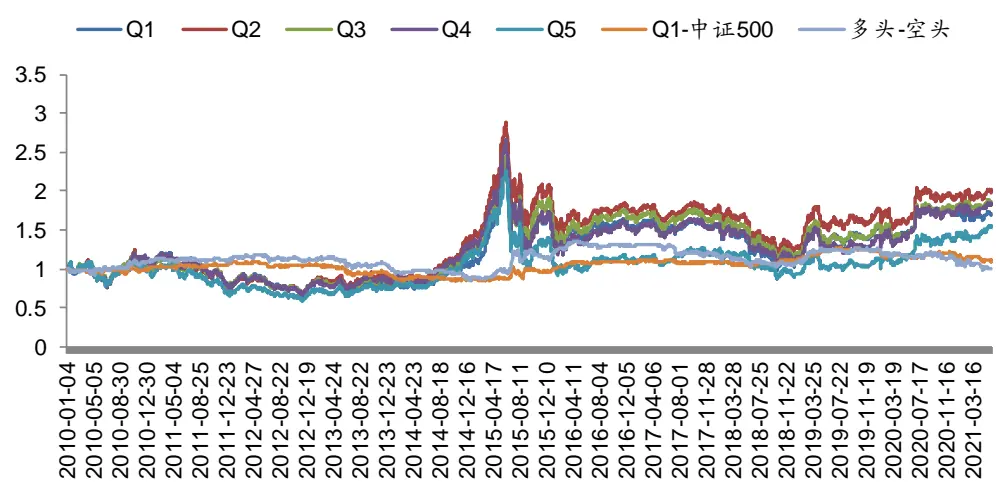
数据来源：Wind、广发证券发展研究中心

表80：RVI相对波动率指数分年度绩效指标表现一览

|  | 多头收益 率 | 多头换 |  |  |  | 多头平 均收益 | 多头 IR | 多头收 益波动 | 益率 | 超额收 | 超额胜 率 | 多空收益 率 | 夏普 比 |
| --- | --- | --- | --- | --- | --- | --- | --- | --- | --- | --- | --- | --- | --- |
|  |  | 手率均 值 | IC 均值 | IC 胜率 ICIR | 最大回 撤 |  |  |  |  |  |  |  |  |
| 2010 | 9.55% | 46.4% | -1.94% | 52.0% | -0.13 | 率 0.05% | 0.03 | 率 1.73% | 8.63% |  |  |  |  |
| 2011 | -28.79% | 49.4% | 0.34% | 58.8% | 0.04 | -0.13% | -0.09 | 1.49% | 4.78% | -0.84% 7.25% | 48.4% 54.9% | 9.71% 1.78% | -0.02 1.25 |
| 2012 | -0.70% | 48.0% | 0.41% | 48.0% | 0.04 | 0.01% | 0.01 | 1.56% | 7.61% | -1.03% | 50.6% | -0.01% | -0.18 |
| 2013 | 4.84% | 41.6% | 1.19% | 60.8% | 0.13 | 0.03% | 0.02 | 1.39% | 13.75% | -10.83% | 45.8% | -6.96% | -1.28 |
| 2014 | 27.97% | 41.7% | 2.86% | 58.5% | 0.29 | 0.11% | 0.09 | 1.16% | 8.65% | -8.32% | 42.5% | -18.66% | -1.42 |
| 2015 | 59.01% | 46.9% | -1.97% | 55.8% | -0.14 | 0.24% | 0.08 | 3.09% | 14.52% | 12.00% | 46.7% | 35.29% | 0.81 |
| 2016 | -7.45% | 44.5% | -1.08% | 52.0% | -0.12 | -0.01% | -0.01 | 1.88% | 2.20% | 12.25% | 56.2% | 13.51% | 2.48 |
| 2017 | -0.05% | 43.4% | 1.45% | 52.9% | 0.14 | 0.00% | 0 | 0.84% | 5.21% | -0.20% | 49.2% | -8.54% | -0.01 |
| 2018 | -32.01% | 42.0% | 1.48% | 60.8% | 0.14 | -0.15% | -0.09 | 1.55% | 5.29% | 1.91% | 49.8% | -10.99% | 0.37 |
| 2019 | 44.04% | 43.2% | -2.35% | 58.8% | -0.26 | 0.16% | 0.12 | 1.36% | 2.96% | 13.37% | 57.0% | 18.86% | 2.27 |
| 2020 | 15.54% | 44.2% | 1.44% | 61.5% | 0.13 | 0.07% | 0.05 | 1.47% | 8.79% | -5.32% | 47.7% | -10.91% | -0.59 |
| 2021 | -2.42% | 40.2% | 2.20% | 50.0% | 0.15 | -0.02% | -0.02 | 1.03% | 6.54% | -7.01% | 43.9% | -10.78% | -1.37 |

数据来源：Wind、广发证券发展研究中心

图82：RVI(DOWN)相对波动率指数(DOWN)历史分档测算结果
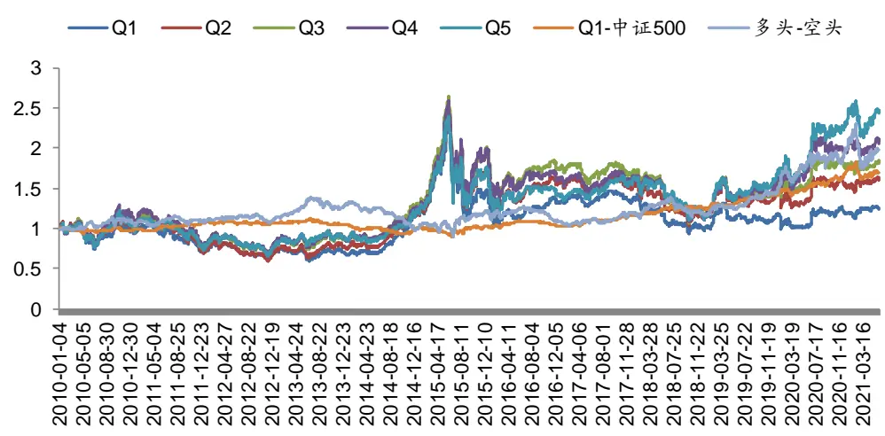
数据来源：Wind、广发证券发展研究中心

表81：RVI(DOWN)相对波动率指数(DOWN)分年度绩效指标表现一览

|  | 多头收益 率 | 多头换 |  |  |  | 多头平 均收益 | 多头 IR | 多头收 益波动 | 最大回 |  | 超额胜 率 | 多空收益 率 | 夏普 比 |  |
| --- | --- | --- | --- | --- | --- | --- | --- | --- | --- | --- | --- | --- | --- | --- |
|  |  | 手率均 值 | IC 均值 | IC 胜率 ICIR | 撤 率 |  |  |  |  |  |  |  |  | 超额收 益率 |
| 2010 | 7.43% | 19.7% | 2.80% | 60.0% | 0.26 | 率 0.05% | 0.03 | 1.79% | 7.83% | -2.15% | 50.8% | 11.45% | -0.28 |  |
| 2011 | -27.77% | 18.9% | -0.20% | 54.9% | -0.02 | -0.12% | -0.08 | 1.50% | 3.50% | 8.87% | 49.6% | -1.69% | 1.73 |  |
| 2012 | 1.34% | 18.1% | 0.22% | 54.0% | 0.02 | 0.02% | 0.01 | 1.56% | 4.44% | 0.98% | 47.3% | 2.17% | 0.23 |  |
| 2013 | 14.34% | 11.5% | 2.08% | 62.8% | 0.2 | 0.07% | 0.05 | 1.48% | 6.89% | -2.21% | 48.7% | 14.28% | -0.44 |  |
| 2014 | 32.83% | 12.3% | -2.75% | 58.5% | -0.28 | 0.12% | 0.1 | 1.27% | 11.48% | -4.48% | 44.1% | -21.88% | -0.87 |  |
| 2015 | 43.00% | 21.6% | 1.72% | 50.0% | 0.14 | 0.20% | 0.06 | 3.20% | 11.36% | 2.11% | 48.4% | 20.71% | 0.24 |  |
| 2016 | -17.69% | 11.8% | -1.72% | 58.0% | -0.14 | -0.06% | -0.03 | 2.04% | 6.47% | 0.65% | 48.8% | -9.86% | 0.17 |  |
| 2017 | 11.79% | 11.5% | 2.44% | 56.9% | 0.21 | 0.05% | 0.05 | 0.93% | 3.05% | 11.87% | 55.3% | 9.67% | 2.28 |  |
| 2018 | -27.75% | 9.0% | -0.02% | 43.1% | 0 | -0.12% | -0.07 | 1.67% | 3.74% | 8.73% | 52.7% | -0.91% | 1.36 |  |
| 2019 | 43.32% | 9.8% | 2.73% | 64.7% | 0.28 | 0.16% | 0.11 | 1.50% | 3.12% | 13.33% | 53.7% | 21.52% | 2.26 |  |
| 2020 | 46.16% | 13.2% | 4.82% | 65.4% | 0.31 | 0.17% | 0.1 | 1.73% | 4.89% | 21.18% | 56.8% | 40.72% | 2.73 |  |
| 2021 | 2.38% | 9.6% | 0.14% | 54.2% | 0.01 | 0.03% | 0.02 | 1.49% | 11.94% | -1.87% | 54.2% | -1.84% | -0.29 |  |

数据来源：Wind、广发证券发展研究中心

图83：RVI(AUP)相对波动率指数(AUP)历史分档测算结果
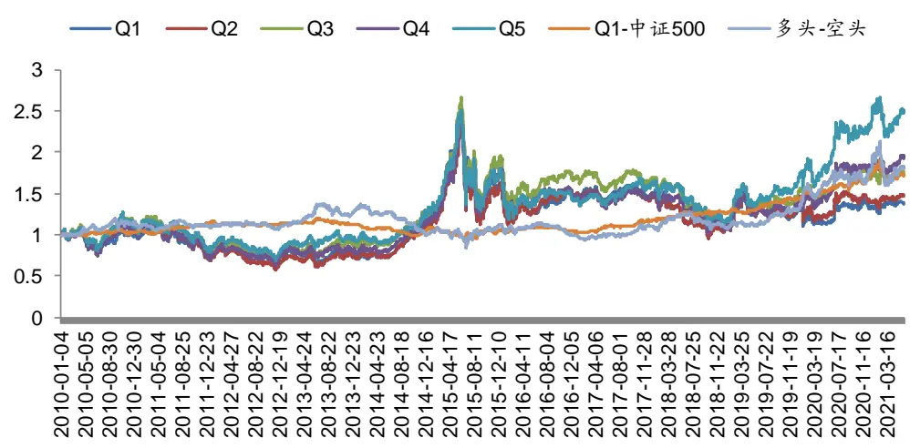
数据来源：Wind、广发证券发展研究中心

表82：RVI(AUP)相对波动率指数(AUP)分年度绩效指标表现一览

|  | 多头收益 率 | 多头换 |  |  |  | 多头平 均收益 率 | 多头 IR | 多头收 益波动 | 最大回 益率 | 超额收 | 超额胜 率 | 多空收益 率 | 夏普 比 |
| --- | --- | --- | --- | --- | --- | --- | --- | --- | --- | --- | --- | --- | --- |
|  |  | 手率均 值 | IC 均值 | IC 胜率 ICIR | 撤 率 |  |  |  |  |  |  |  |  |
| 2010 | 13.53% | 19.6% | 2.43% | 56.0% | 0.2 | 0.07% | 0.04 | 1.80% | 5.28% | 3.49% | 52.1% | 15.64% | 0.56 |
| 2011 | -26.95% | 19.7% | 0.38% | 58.8% | 0.04 | -0.12% | -0.08 | 1.50% | 3.79% | 10.13% | 52.1% | -3.89% | 2.14 |
| 2012 | 0.52% | 18.5% | 0.25% | 52.0% | 0.02 | 0.01% | 0.01 | 1.53% | 4.14% | 0.09% | 49.0% | -0.58% | 0.04 |
| 2013 | 15.20% | 10.7% | 2.30% | 60.8% | 0.19 | 0.07% | 0.05 | 1.50% | 7.27% | -1.41% | 48.7% | 15.20% | -0.29 |
| 2014 | 33.51% | 11.1% | -2.21% | 60.4% | -0.24 | 0.13% | 0.1 | 1.29% | 12.80% | -3.92% | 46.1% | -20.02% | -0.74 |
| 2015 | 36.34% | 20.7% | 1.19% | 55.8% | 0.1 | 0.18% | 0.06 | 3.20% | 13.83% | -2.67% | 46.7% | 9.89% | -0.17 |
| 2016 | -19.15% | 11.9% | -2.07% | 62.0% | -0.18 | -0.07% | -0.03 | 2.02% | 5.77% | -1.20% | 47.5% | -11.82% | -0.27 |
| 2017 | 11.99% | 10.7% | 2.64% | 58.8% | 0.25 | 0.05% | 0.05 | 0.94% | 3.58% | 12.10% | 57.4% | 12.01% | 2.26 |
| 2018 | -27.38% | 9.8% | 0.52% | 54.9% | 0.04 | -0.12% | -0.07 | 1.68% | 4.17% | 9.29% | 55.6% | -0.16% | 1.37 |
| 2019 | 42.88% | 9.8% | 2.23% | 64.7% | 0.22 | 0.16% | 0.1 | 1.51% | 4.07% | 13.00% | 54.1% | 17.67% | 2.08 |
| 2020 | 45.76% | 13.3% | 5.24% | 69.2% | 0.33 | 0.17% | 0.1 | 1.75% | 4.46% | 20.92% | 58.0% | 39.58% | 2.62 |
| 2021 | 3.33% | 8.9% | 0.36% | 50.0% | 0.01 | 0.04% | 0.03 | 1.56% | 12.94% | -0.90% | 54.2% | 0.52% | -0.09 |

数据来源：Wind、广发证券发展研究中心

图84：ADTM(SBM)动态买卖气指标(SBM)历史分档测算结果
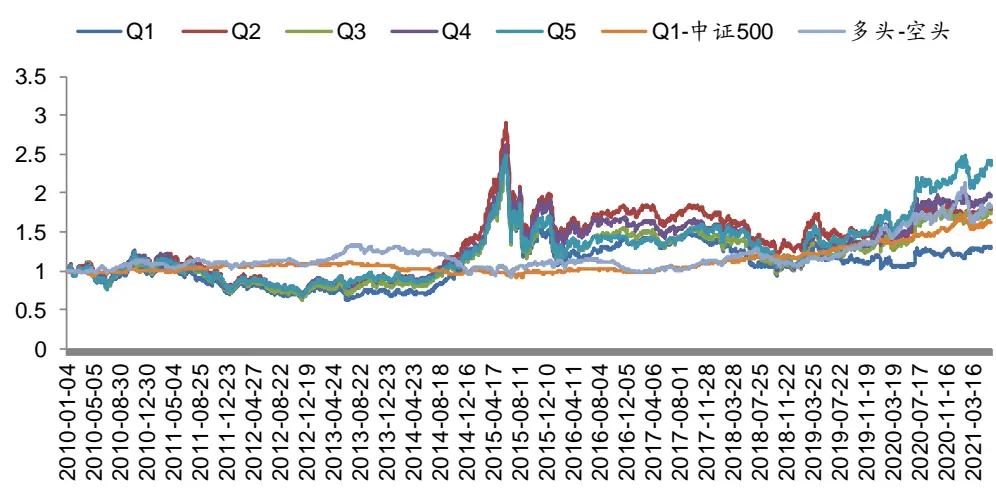
数据来源：Wind、广发证券发展研究中心

表83：ADTM(SBM)动态买卖气指标(SBM)分年度绩效指标表现一览

|  | 多头收益 率 | 多头换 |  |  |  | 多头平 均收益 率 | 多头 IR | 多头收 益波动 | 最大回 撤 益率 | 超额收 | 超额胜 率 | 多空收益 率 | 夏普 比 |
| --- | --- | --- | --- | --- | --- | --- | --- | --- | --- | --- | --- | --- | --- |
|  |  | 手率均 值 | IC 均值 | IC 胜率 ICIR | 率 |  |  |  |  |  |  |  |  |
| 2010 | 10.61% | 20.9% | 2.08% | 54.0% | 0.2 | 0.06% | 0.03 | 1.77% | 8.63% | 0.65% | 50.8% | 13.16% | 0.13 |
| 2011 | -29.11% | 19.5% | -0.87% | 52.9% | -0.1 | -0.13% | -0.09 | 1.50% | 3.26% | 6.88% | 52.9% | -3.51% | 1.55 |
| 2012 | 2.16% | 18.4% | -0.09% | 50.0% | -0.01 | 0.02% | 0.01 | 1.51% | 2.57% | 1.64% | 46.9% | 0.37% | 0.39 |
| 2013 | 13.74% | 13.3% | 1.80% | 64.7% | 0.19 | 0.06% | 0.04 | 1.44% | 5.24% | -2.87% | 48.3% | 15.59% | -0.57 |
| 2014 | 30.32% | 13.7% | -3.03% | 58.5% | -0.3 | 0.12% | 0.09 | 1.24% | 10.74% | -6.37% | 46.1% | -23.44% | -1.3 |
| 2015 | 39.27% | 23.2% | 1.23% | 51.9% | 0.12 | 0.19% | 0.06 | 3.14% | 11.00% | -1.06% | 46.3% | 15.72% | -0.04 |
| 2016 | -18.63% | 13.6% | -1.69% | 58.0% | -0.14 | -0.06% | -0.03 | 2.02% | 5.66% | -0.61% | 47.1% | -10.17% | -0.12 |
| 2017 | 12.73% | 13.8% | 2.31% | 58.8% | 0.23 | 0.05% | 0.06 | 0.88% | 3.54% | 12.68% | 54.1% | 12.04% | 2.39 |
| 2018 | -29.21% | 11.7% | -0.56% | 49.0% | -0.04 | -0.13% | -0.08 | 1.64% | 3.74% | 6.41% | 51.4% | -4.46% | 1.03 |
| 2019 | 47.53% | 12.3% | 3.35% | 62.8% | 0.35 | 0.17% | 0.12 | 1.48% | 2.54% | 16.58% | 57.0% | 25.37% | 2.7 |
| 2020 | 43.82% | 14.8% | 4.36% | 63.5% | 0.28 | 0.16% | 0.1 | 1.68% | 5.45% | 18.96% | 56.8% | 38.07% | 2.32 |
| 2021 | 3.77% | 11.6% | 0.22% | 50.0% | 0.01 | 0.05% | 0.03 | 1.49% | 11.45% | -0.55% | 51.4% | -1.65% | -0.04 |

数据来源：Wind、广发证券发展研究中心

图85：ASI(SI)振动升降指标历史分档测算结果
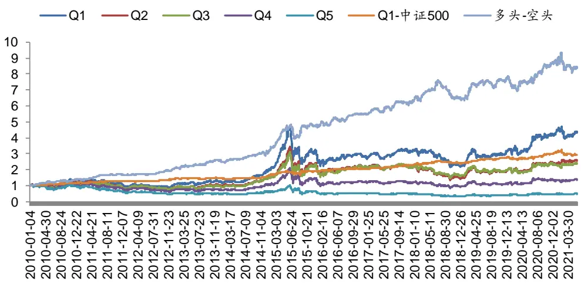
数据来源：Wind、广发证券发展研究中心

表84：ASI(SI)振动升降指标分年度绩效指标表现一览

|  | 多头收益 率 | 多头换 |  |  |  | 多头平 均收益 | 多头 IR | 多头收 益波动 | 最大回 益率 | 超额收 | 超额胜 率 | 多空收益 率 | 夏普 比 |
| --- | --- | --- | --- | --- | --- | --- | --- | --- | --- | --- | --- | --- | --- |
|  |  | 手率均 值 | IC 均值 | IC 胜率 ICIR | 撤 |  |  |  |  |  |  |  |  |
| 2010 | 28.30% | 75.6% | -7.29% | 72.0% | -0.51 | 率 0.12% | 0.07 | 率 1.82% | 3.12% | 16.91% | 54.1% | 37.93% | 1.97 |
| 2011 | -27.17% | 74.1% | -3.23% | 56.9% | -0.34 | -0.12% | -0.08 | 1.53% | 3.73% | 9.91% | 55.7% | 20.55% | 1.84 |
| 2012 | 10.20% | 75.3% | -3.92% | 62.0% | -0.4 | 0.05% | 0.03 | 1.55% | 3.63% | 9.79% | 56.4% | 21.66% | 2.16 |
| 2013 | 22.31% | 71.1% | -4.06% | 72.6% | -0.45 | 0.10% | 0.06 | 1.49% | 4.33% | 4.58% | 49.6% | 27.89% | 0.77 |
| 2014 | 53.40% | 72.2% | -2.12% | 60.4% | -0.23 | 0.18% | 0.14 | 1.27% | 4.87% | 10.27% | 55.5% | 20.26% | 1.68 |
| 2015 | 63.79% | 79.0% | -3.85% | 67.3% | -0.31 | 0.25% | 0.08 | 3.15% | 12.19% | 16.31% | 51.2% | 54.36% | 1.24 |
| 2016 | -11.60% | 73.5% | -1.63% | 56.0% | -0.15 | -0.03% | -0.02 | 1.96% | 2.82% | 7.63% | 50.8% | 14.48% | 1.35 |
| 2017 | 12.51% | 72.6% | -1.96% | 54.9% | -0.2 | 0.05% | 0.06 | 0.94% | 3.25% | 12.63% | 56.2% | 14.41% | 2.42 |
| 2018 | -30.49% | 69.0% | -0.26% | 60.8% | -0.02 | -0.14% | -0.08 | 1.65% | 7.03% | 4.57% | 53.9% | 2.97% | 0.74 |
| 2019 | 47.77% | 68.7% | -1.63% | 51.0% | -0.17 | 0.17% | 0.12 | 1.46% | 3.30% | 16.69% | 55.7% | 21.20% | 2.73 |
| 2020 | 32.91% | 70.0% | -1.00% | 53.9% | -0.1 | 0.13% | 0.08 | 1.62% | 6.79% | 9.64% | 55.6% | 11.29% | 1.21 |
| 2021 | -0.16% | 70.0% | -0.63% | 58.3% | -0.05 | 0.01% | 0.01 | 1.31% | 11.35% | -4.51% | 51.4% | -3.53% | -0.89 |

数据来源：Wind、广发证券发展研究中心

图86：SRMI动量修正指标历史分档测算结果
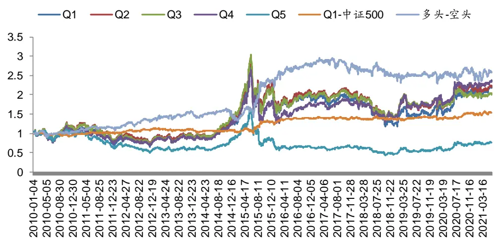
数据来源：Wind、广发证券发展研究中心

表85：SRMI动量修正指标分年度绩效指标表现一览

|  | 多头收益 率 | 多头换 |  |  |  | 多头平 均收益 | 多头 IR | 多头收 益波动 | 最大回 |  | 超额胜 率 | 多空收益 率 | 夏普 比 |  |
| --- | --- | --- | --- | --- | --- | --- | --- | --- | --- | --- | --- | --- | --- | --- |
|  |  | 手率均 值 | IC 均值 | IC 胜率 ICIR | 撤 |  |  |  |  |  |  |  |  | 超额收 益率 |
| 2010 | 4.95% | 64.8% | -2.95% | 56.0% | -0.16 | 率 0.04% | 0.02 | 率 1.84% | 10.78% | -4.61% | 48.4% | 3.78% |  |  |
| 2011 | -29.75% | 62.4% | -1.13% | 60.8% | -0.09 | -0.13% | -0.08 | 1.64% | 3.73% | 6.40% | 50.4% | 10.07% | -0.35 1.06 |  |
| 2012 | 9.82% | 61.8% | -2.85% | 54.0% | -0.2 | 0.05% | 0.03 | 1.69% | 4.38% | 9.93% | 54.7% | 18.00% | 1.51 |  |
| 2013 | 15.52% | 61.7% | -2.25% | 60.8% | -0.18 | 0.07% | 0.05 | 1.51% | 8.50% | -1.29% | 46.6% | 15.51% | -0.12 |  |
| 2014 | 34.29% | 60.8% | 1.28% | 43.4% | 0.1 | 0.13% | 0.1 | 1.27% | 6.80% | -3.49% | 50.2% | -10.62% | -0.56 |  |
| 2015 | 70.31% | 66.3% | -5.09% | 57.7% | -0.27 | 0.27% | 0.08 | 3.33% | 11.49% | 21.84% | 49.6% | 70.96% | 1.22 |  |
| 2016 | -12.90% | 62.8% | -4.18% | 62.0% | -0.28 | -0.03% | -0.02 | 2.12% | 3.99% | 6.78% | 51.6% | 18.59% | 0.92 |  |
| 2017 | 0.83% | 60.2% | 0.06% | 49.0% | 0 | 0.01% | 0.01 | 1.01% | 5.06% | 1.01% | 53.7% | -2.26% | 0.19 |  |
| 2018 | -35.14% | 57.5% | 1.38% | 51.0% | 0.09 | -0.16% | -0.09 | 1.72% | 6.38% | -2.19% | 46.1% | -10.02% | -0.27 |  |
| 2019 | 32.83% | 60.0% | -1.31% | 54.9% | -0.1 | 0.13% | 0.08 | 1.51% | 5.40% | 5.03% | 55.7% | 2.83% | 0.77 |  |
| 2020 | 28.15% | 61.6% | 0.51% | 57.7% | 0.03 | 0.12% | 0.07 | 1.70% | 6.78% | 6.03% | 52.7% | 0.21% | 0.75 |  |
| 2021 | 5.04% | 56.0% | -1.37% | 45.8% | -0.08 | 0.05% | 0.04 | 1.28% | 5.38% | 0.40% | 45.8% | 1.03% | 0.13 |  |

数据来源：Wind、广发证券发展研究中心

图87：StochRSI随机强弱指数历史分档测算结果
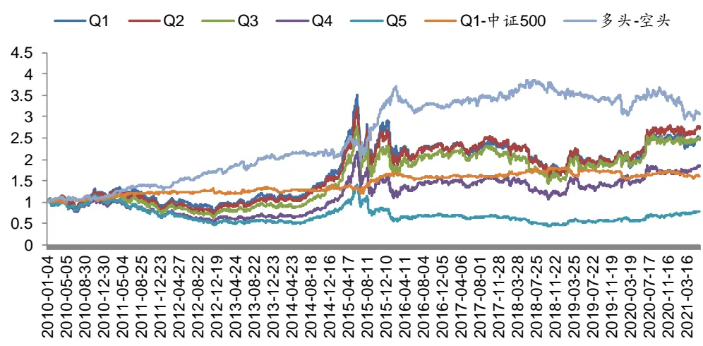
数据来源：Wind、广发证券发展研究中心

表86：StochRSI随机强弱指数分年度绩效指标表现一览

|  | 多头收益 率 | 多头换 |  |  |  | 多头平 均收益 | 多头 IR | 多头收 益波动 | 最大回 益率 | 超额收 | 超额胜 率 | 多空收益 率 | 夏普 比 |
| --- | --- | --- | --- | --- | --- | --- | --- | --- | --- | --- | --- | --- | --- |
|  |  | 手率均 值 | IC 均值 | IC 胜率 ICIR | 撤 |  |  |  |  |  |  |  |  |
| 2010 | 16.54% | 78.0% | -4.65% | 67.4% | -0.33 | 率 0.08% | 0.04 | 率 1.75% | 5.41% | 5.61% | 54.6% | 11.35% | 0.56 |
| 2011 | -22.01% | 77.1% | -3.01% | 60.0% | -0.27 | -0.09% | -0.06 | 1.47% | 3.41% | 17.20% | 55.7% | 21.50% | 2.06 |
| 2012 | 0.27% | 74.2% | -3.24% | 64.6% | -0.27 | 0.01% | 0.01 | 1.46% | 8.65% | -0.69% | 55.6% | 28.02% | -0.04 |
| 2013 | 24.38% | 73.0% | -4.05% | 59.2% | -0.36 | 0.10% | 0.07 | 1.41% | 5.74% | 5.88% | 50.8% | 20.57% | 0.71 |
| 2014 | 44.66% | 76.1% | -1.01% | 66.0% | -0.11 | 0.16% | 0.13 | 1.25% | 5.27% | 3.96% | 51.4% | 2.71% | 0.73 |
| 2015 | 73.19% | 77.3% | -2.92% | 58.0% | -0.16 | 0.28% | 0.09 | 3.22% | 14.74% | 22.08% | 53.3% | 59.43% | 1.06 |
| 2016 | -21.36% | 75.5% | -0.37% | 55.1% | -0.03 | -0.08% | -0.04 | 1.92% | 9.05% | -4.40% | 51.2% | -5.08% | -0.83 |
| 2017 | 2.39% | 77.9% | -2.15% | 58.8% | -0.19 | 0.01% | 0.02 | 0.89% | 3.74% | 2.35% | 47.5% | 7.54% | 0.44 |
| 2018 | -26.67% | 71.3% | 2.01% | 54.0% | 0.16 | -0.12% | -0.08 | 1.46% | 5.61% | 9.17% | 50.2% | 0.84% | 0.92 |
| 2019 | 24.11% | 73.4% | -0.28% | 50.0% | -0.02 | 0.10% | 0.08 | 1.28% | 10.07% | -2.94% | 47.1% | -2.67% | -0.24 |
| 2020 | 20.14% | 77.3% | -1.00% | 57.7% | -0.09 | 0.09% | 0.06 | 1.59% | 10.66% | -0.96% | 50.2% | -2.08% | -0.1 |
| 2021 | -1.59% | 72.8% | 2.15% | 66.7% | 0.19 | -0.01% | -0.01 | 1.14% | 9.41% | -6.02% | 38.3% | -8.85% | -1.46 |

数据来源：Wind、广发证券发展研究中心

图88：TEMA三重指数移动平均线历史分档测算结果
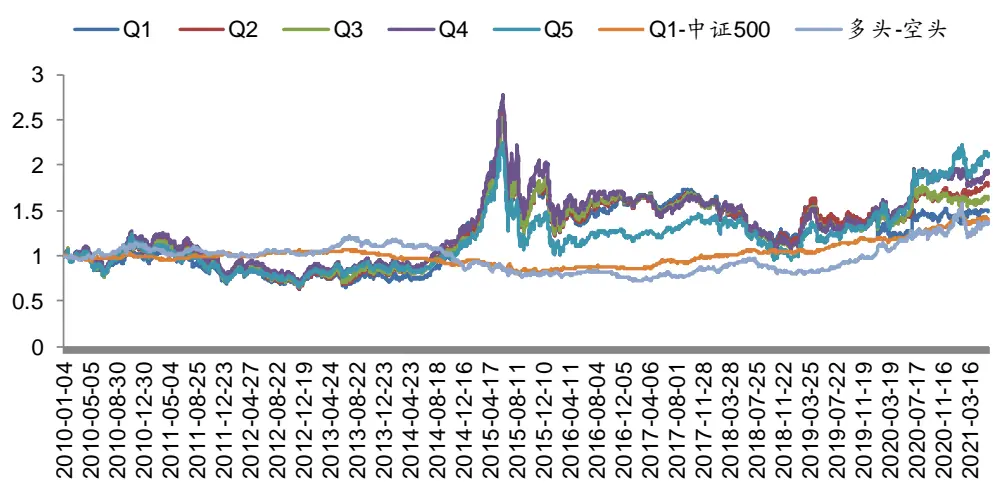
数据来源：Wind、广发证券发展研究中心

表87：TEMA三重指数移动平均线分年度绩效指标表现一览

|  | 多头收益 率 | 多头换 |  |  |  | 多头平 均收益 | 多头 IR | 多头收 益波动 | 最大回 |  | 超额胜 率 | 多空收益 率 | 夏普 比 |  |
| --- | --- | --- | --- | --- | --- | --- | --- | --- | --- | --- | --- | --- | --- | --- |
|  |  | 手率均 值 | IC 均值 | IC 胜率 ICIR | 撤 率 |  |  |  |  |  |  |  |  | 超额收 益率 |
| 2010 | 9.41% | 8.6% | 1.79% | 56.0% | 0.2 | 率 0.05% | 0.03 | 1.73% | 6.91% | -0.52% | 47.9% | 12.62% |  |  |
| 2011 | -31.01% | 6.7% | -0.97% | 56.9% | -0.12 | -0.14% | -0.1 | 1.43% | 4.31% | 3.78% | 49.2% | -7.83% | -0.07 0.87 |  |
| 2012 | 2.44% | 5.0% | -0.69% | 58.0% | -0.08 | 0.02% | 0.01 | 1.46% | 3.86% | 1.74% | 48.6% | -1.47% | 0.4 |  |
| 2013 | 12.93% | 4.6% | 1.50% | 66.7% | 0.17 | 0.06% | 0.04 | 1.42% | 5.73% | -3.58% | 51.7% | 10.30% | -0.81 |  |
| 2014 | 29.53% | 4.4% | -2.65% | 60.4% | -0.32 | 0.11% | 0.09 | 1.20% | 11.96% | -7.02% | 46.1% | -23.77% | -1.53 |  |
| 2015 | 26.06% | 15.1% | -0.21% | 50.0% | -0.02 | 0.14% | 0.05 | 3.06% | 18.19% | -10.90% | 42.6% | -4.86% | -0.99 |  |
| 2016 | -15.40% | 4.1% | -1.67% | 58.0% | -0.18 | -0.05% | -0.03 | 1.89% | 3.05% | 2.73% | 45.5% | -7.46% | 0.69 |  |
| 2017 | 14.03% | 3.2% | 2.38% | 62.8% | 0.23 | 0.06% | 0.07 | 0.82% | 3.86% | 13.76% | 50.4% | 13.60% | 2.13 |  |
| 2018 | -29.01% | 3.3% | -0.43% | 49.0% | -0.04 | -0.13% | -0.08 | 1.57% | 4.15% | 6.45% | 50.6% | -4.58% | 1.1 |  |
| 2019 | 43.26% | 3.4% | 2.64% | 66.7% | 0.27 | 0.16% | 0.11 | 1.40% | 4.16% | 12.86% | 52.9% | 18.81% | 2 |  |
| 2020 | 42.95% | 7.7% | 4.43% | 65.4% | 0.32 | 0.16% | 0.1 | 1.64% | 4.16% | 18.12% | 56.4% | 37.21% | 2.5 |  |
| 2021 | 4.63% | 3.7% | 0.07% | 54.2% | 0 | 0.05% | 0.04 | 1.47% | 11.26% | 0.26% | 56.1% | 1.33% | 0.11 |  |

数据来源：Wind、广发证券发展研究中心

图89：TRI区间指数历史分档测算结果
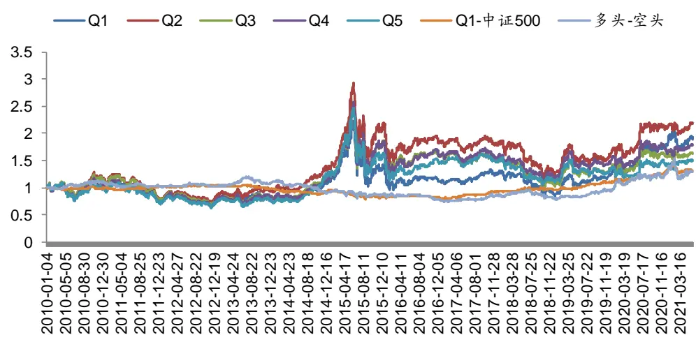
数据来源：Wind、广发证券发展研究中心

表88：TRI区间指数分年度绩效指标表现一览

|  | 多头收益 率 | 多头换 |  |  |  | 多头平 均收益 率 | 多头 IR | 多头收 益波动 | 最大回 益率 | 超额收 | 超额胜 率 | 多空收益 率 | 夏普 比 |
| --- | --- | --- | --- | --- | --- | --- | --- | --- | --- | --- | --- | --- | --- |
|  |  | 手率均 值 | IC 均值 | IC 胜率 ICIR | 撒 率 |  |  |  |  |  |  |  |  |
| 2010 | 9.03% | 19.0% | -2.50% | 62.0% | -0.26 | 0.05% | 0.03 | 1.78% | 5.85% | -0.66% | 48.8% | 11.76% |  |
| 2011 | -31.52% | 19.7% | 1.20% | 60.8% | 0.14 | -0.14% | -0.1 | 1.48% | 3.79% | 3.20% | 49.6% | -7.72% | -0.1 0.81 |
| 2012 | 1.68% | 19.4% | 0.07% | 44.0% | 0.01 | 0.02% | 0.01 | 1.52% | 2.79% | 1.24% | 46.9% | 0.12% | 0.34 |
| 2013 | 10.40% | 15.0% | -1.72% | 66.7% | -0.19 | 0.05% | 0.04 | 1.47% | 6.81% | -5.58% | 48.3% | 5.15% | -1.3 |
| 2014 | 33.55% | 15.7% | 1.93% | 56.6% | 0.21 | 0.13% | 0.1 | 1.28% | 11.23% | -3.92% | 45.3% | -16.32% | -0.77 |
| 2015 | 23.15% | 23.4% | -1.20% | 48.1% | -0.1 | 0.14% | 0.04 | 3.20% | 17.32% | -12.02% | 43.4% | -3.67% | -1.1 |
| 2016 | -19.96% | 16.7% | 1.65% | 52.0% | 0.16 | -0.07% | -0.04 | 2.01% | 5.85% | -2.26% | 48.4% | -12.43% | -0.55 |
| 2017 | 13.98% | 14.8% | -0.72% | 52.9% | -0.08 | 0.06% | 0.06 | 0.92% | 3.66% | 14.02% | 54.1% | 11.99% | 2.45 |
| 2018 | -31.24% | 12.7% | 1.36% | 54.9% | 0.11 | -0.14% | -0.08 | 1.65% | 4.40% | 3.41% | 49.8% | -7.18% | 0.56 |
| 2019 | 45.80% | 12.8% | -2.15% | 62.8% | -0.25 | 0.17% | 0.11 | 1.48% | 2.95% | 15.22% | 54.5% | 18.62% | 2.6 |
| 2020 | 46.01% | 14.5% | -4.22% | 65.4% | -0.3 | 0.17% | 0.1 | 1.74% | 4.10% | 21.10% | 58.4% | 37.81% | 2.69 |
| 2021 | 2.83% | 9.8% | -0.13% | 54.2% | -0.01 | 0.04% | 0.02 | 1.59% | 13.21% | -1.36% | 53.3% | -0.96% | -0.16 |

数据来源：Wind、广发证券发展研究中心

图90：TRIX三重指数平滑平均线历史分档测算结果
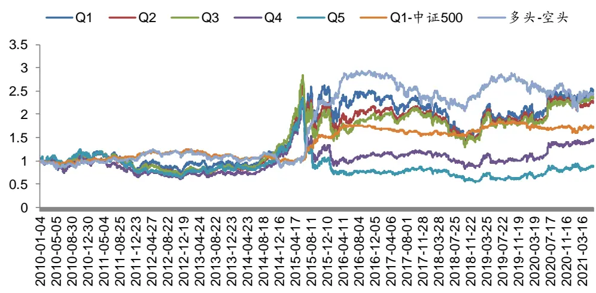
数据来源：Wind、广发证券发展研究中心

表89：TRIX三重指数平滑平均线分年度绩效指标表现一览

|  | 多头收益 率 | 多头换 |  |  |  | 多头平 均收益 | 多头 IR | 多头收 益波动 | 最大回 益率 | 超额收 | 超额胜 率 | 多空收益 率 | 夏普 比 |
| --- | --- | --- | --- | --- | --- | --- | --- | --- | --- | --- | --- | --- | --- |
|  |  | 手率均 值 | IC 均值 | IC 胜率 ICIR | 撒 |  |  |  |  |  |  |  |  |
| 2010 | 10.45% | 28.5% | -0.48% | 52.0% | -0.02 | 率 0.06% | 0.03 | 率 1.83% | 12.25% | 0.03% | 51.2% | -4.16% |  |
| 2011 | -27.83% | 28.3% | -1.05% | 52.9% | -0.08 | -0.12% | -0.07 | 1.63% | 3.73% | 9.30% | 53.7% | 5.85% | 0.07 1.58 |
| 2012 | 10.79% | 27.1% | -1.96% | 50.0% | -0.11 | 0.06% | 0.03 | 1.73% | 6.33% | 11.00% | 53.5% | 13.55% | 1.5 |
| 2013 | 7.10% | 25.8% | 1.33% | 56.9% | 0.08 | 0.04% | 0.03 | 1.49% | 13.20% | -8.72% | 46.2% | -4.26% | -0.85 |
| 2014 | 23.49% | 24.4% | 2.67% | 56.6% | 0.16 | 0.09% | 0.08 | 1.25% | 12.16% | -11.40% | 45.7% | -23.18% | -1.56 |
| 2015 | 114.79% | 34.6% | -9.32% | 63.5% | -0.52 | 0.37% | 0.11 | 3.26% | 6.73% | 52.66% | 54.1% | 161.88% | 2.45 |
| 2016 | -7.65% | 26.5% | -4.69% | 60.0% | -0.33 | -0.01% | 0 | 2.13% | 4.48% | 13.32% | 50.8% | 29.35% | 1.9 |
| 2017 | -7.74% | 25.1% | 2.72% | 56.9% | 0.17 | -0.03% | -0.03 | 1.05% | 9.74% | -7.52% | 48.4% | -17.20% | -1.06 |
| 2018 | -31.25% | 24.3% | -0.47% | 49.0% | -0.03 | -0.14% | -0.08 | 1.76% | 7.46% | 3.67% | 51.0% | -1.37% | 0.46 |
| 2019 | 41.98% | 25.8% | -2.13% | 54.9% | -0.16 | 0.15% | 0.1 | 1.49% | 3.14% | 12.15% | 52.1% | 16.18% | 1.73 |
| 2020 | 13.14% | 27.7% | 2.20% | 55.8% | 0.17 | 0.06% | 0.04 | 1.59% | 8.88% | -6.98% | 45.3% | -13.00% | -0.69 |
| 2021 | 5.59% | 23.1% | -0.21% | 50.0% | -0.01 | 0.06% | 0.05 | 1.27% | 6.44% | 0.75% | 47.7% | 2.45% | 0.19 |

数据来源：Wind、广发证券发展研究中心

图91：Ulicer指标历史分档测算结果
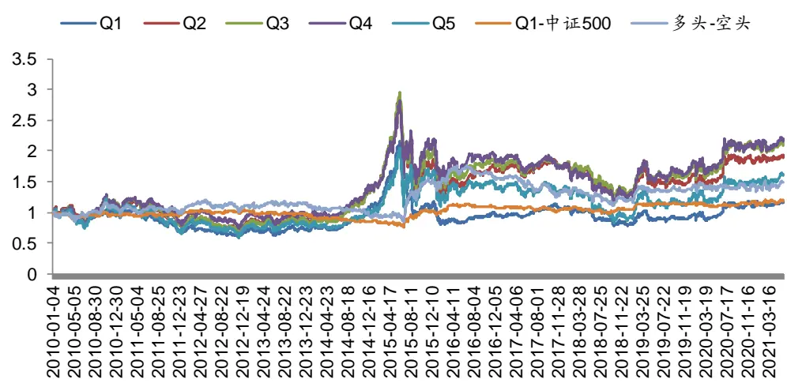
数据来源：Wind、广发证券发展研究中心

表90：Ulicer指标分年度绩效指标表现一览

|  | 多头收益 率 | 多头换 |  |  |  | 多头平 均收益 | 多头 IR | 多头收 益波动 | 最大回 益率 | 超额收 | 超额胜 率 | 多空收益 率 | 夏普 比 |
| --- | --- | --- | --- | --- | --- | --- | --- | --- | --- | --- | --- | --- | --- |
|  |  | 手率均 值 | IC 均值 | IC 胜率 ICIR | 撤 |  |  |  |  |  |  |  |  |
| 2010 | 4.65% | 41.7% | 1.09% | 54.0% | 0.06 | 率 0.04% | 0.02 | 率 1.90% | 14.09% | -4.71% | 50.4% |  |  |
| 2011 | -33.87% | 39.2% | -0.80% | 51.0% | -0.05 | -0.15% | -0.09 | 1.71% | 5.40% | 0.49% | 49.2% | 8.00% -7.50% | -0.33 0.12 |
| 2012 | 7.61% | 38.2% | 1.59% | 54.0% | 0.09 | 0.05% | 0.03 | 1.79% | 5.41% | 8.12% | 55.6% | 10.68% | 1.18 |
| 2013 | 9.26% | 34.5% | 1.01% | 54.9% | 0.08 | 0.05% | 0.03 | 1.62% | 8.05% | -6.27% | 47.9% | 4.13% | -0.74 |
| 2014 | 21.10% | 32.0% | -3.57% | 66.0% | -0.3 | 0.09% | 0.06 | 1.35% | 12.81% | -12.72% | 43.3% | -20.41% | -2.28 |
| 2015 | 63.52% | 43.2% | 3.88% | 50.0% | 0.19 | 0.26% | 0.08 | 3.49% | 12.35% | 18.77% | 52.1% | 60.25% | 1.12 |
| 2016 | -13.85% | 33.2% | 1.03% | 44.0% | 0.06 | -0.03% | -0.02 | 2.28% | 5.86% | 6.45% | 53.3% | 5.98% | 0.82 |
| 2017 | -2.30% | 32.7% | -2.07% | 52.9% | -0.13 | 0.00% | 0 | 1.13% | 8.19% | -1.83% | 54.1% | -13.16% | -0.25 |
| 2018 | -34.59% | 32.0% | -0.39% | 45.1% | -0.03 | -0.16% | -0.09 | 1.80% | 9.68% | -1.07% | 50.6% | -13.15% | -0.1 |
| 2019 | 36.18% | 31.9% | 1.58% | 51.0% | 0.12 | 0.14% | 0.08 | 1.67% | 2.70% | 8.38% | 54.9% | 16.31% | 1.36 |
| 2020 | 24.89% | 34.1% | 1.37% | 48.1% | 0.11 | 0.11% | 0.06 | 1.80% | 6.35% | 3.79% | 55.1% | 5.72% | 0.52 |
| 2021 | 6.33% | 32.6% | 1.31% | 62.5% | 0.1 | 0.07% | 0.05 | 1.31% | 4.42% | 1.65% | 51.4% | 2.88% | 0.37 |

数据来源：Wind、广发证券发展研究中心

图92：UOS终极波动指标历史分档测算结果
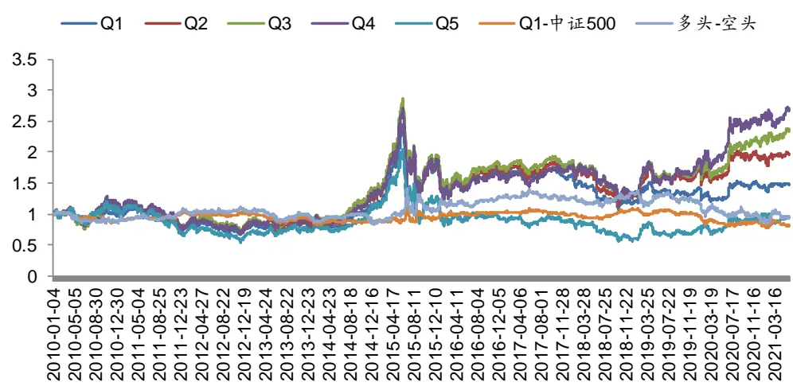
数据来源：Wind、广发证券发展研究中心

表91：UOS终极波动指标分年度绩效指标表现一览

|  | 多头收益 率 | 多头换 |  |  |  | 多头平 均收益 | 多头 IR | 多头收 益波动 | 最大回 益率 | 超额收 | 超额胜 率 | 多空收益 率 | 夏普 比 |
| --- | --- | --- | --- | --- | --- | --- | --- | --- | --- | --- | --- | --- | --- |
|  |  | 手率均 值 | IC 均值 | IC 胜率 ICIR | 撤 |  |  |  |  |  |  |  |  |
| 2010 | -2.51% | 37.0% | 2.25% | 54.0% | 0.13 | 率 0.00% | 0 | 率 1.51% | 17.15% | -12.74% | 42.2% | -13.26% |  |
| 2011 | -22.62% | 37.8% | -2.37% | 56.9% | -0.17 | -0.10% | -0.08 | 1.23% | 8.71% | 15.34% | 49.2% | 19.52% | -0.98 1.74 |
| 2012 | 1.10% | 33.2% | 0.09% | 46.0% | 0.01 | 0.01% | 0.01 | 1.18% | 8.10% | -0.73% | 44.9% | 0.59% | -0.05 |
| 2013 | 8.73% | 30.9% | 1.80% | 60.8% | 0.1 | 0.04% | 0.04 | 1.19% | 15.17% | -8.20% | 42.9% | -5.41% | -0.8 |
| 2014 | 32.10% | 32.3% | 2.12% | 58.5% | 0.15 | 0.12% | 0.11 | 1.04% | 9.36% | -5.86% | 41.2% | -17.19% | -0.65 |
| 2015 | 62.00% | 37.2% | -2.17% | 50.0% | -0.1 | 0.23% | 0.09 | 2.60% | 22.55% | 8.57% | 44.3% | 33.56% | 0.47 |
| 2016 | -7.59% | 29.7% | -2.24% | 58.0% | -0.15 | -0.02% | -0.01 | 1.49% | 6.11% | 9.82% | 54.9% | 17.93% | 0.96 |
| 2017 | -3.73% | 29.1% | 0.59% | 49.0% | 0.05 | -0.01% | -0.02 | 0.60% | 9.49% | -4.43% | 45.5% | -3.43% | -0.53 |
| 2018 | -26.25% | 28.1% | -1.11% | 54.9% | -0.06 | -0.12% | -0.1 | 1.22% | 9.06% | 9.06% | 53.1% | 8.66% | 1.03 |
| 2019 | 19.20% | 27.2% | 0.47% | 54.9% | 0.03 | 0.08% | 0.07 | 1.10% | 11.00% | -7.21% | 47.5% | -9.68% | -0.74 |
| 2020 | 4.03% | 27.8% | 3.81% | 67.3% | 0.23 | 0.02% | 0.02 | 1.23% | 18.56% | -15.95% | 43.6% | -24.32% | -1.14 |
| 2021 | 2.09% | 21.4% | 1.70% | 54.2% | 0.09 | 0.02% | 0.03 | 0.72% | 9.16% | -3.15% | 45.8% | 0.77% | -0.44 |

数据来源：Wind、广发证券发展研究中心

图93：VEMA交易量指数均值历史分档测算结果
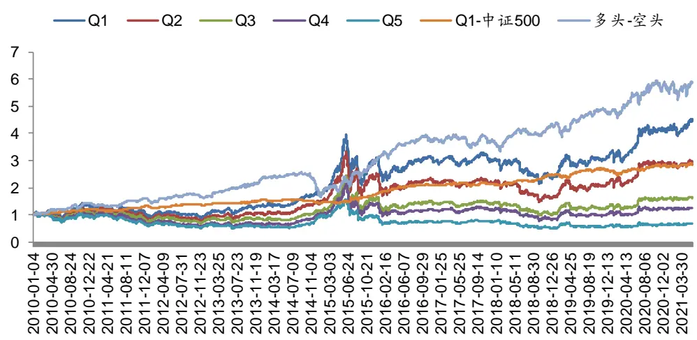
数据来源：Wind、广发证券发展研究中心

表92：VEMA交易量指数均值分年度绩效指标表现一览

|  | 多头收益 率 | 多头换 |  |  |  | 多头平 均收益 率 | 多头 IR | 多头收 益波动 | 最大回 撤 益率 | 超额收 | 超额胜 率 | 多空收益 率 | 夏普 比 |
| --- | --- | --- | --- | --- | --- | --- | --- | --- | --- | --- | --- | --- | --- |
|  |  | 手率均 值 | IC 均值 | IC 胜率 ICIR | 率 |  |  |  |  |  |  |  |  |
| 2010 | 32.32% | 16.3% | -5.51% | 72.0% | -0.44 | 0.13% | 0.08 | 1.67% | 2.88% | 20.00% | 59.9% | 42.79% | 3.21 |
| 2011 | -26.60% | 14.3% | -2.26% | 52.9% | -0.2 | -0.12% | -0.09 | 1.37% | 6.73% | 10.11% | 54.1% | 10.04% | 1.9 |
| 2012 | 4.22% | 15.2% | -1.36% | 56.0% | -0.1 | 0.03% | 0.02 | 1.45% | 4.81% | 3.48% | 51.9% | 5.01% | 0.77 |
| 2013 | 33.30% | 15.5% | -4.64% | 62.8% | -0.36 | 0.13% | 0.1 | 1.35% | 2.86% | 13.49% | 57.1% | 42.10% | 2.44 |
| 2014 | 27.61% | 13.0% | 3.02% | 52.8% | 0.22 | 0.11% | 0.09 | 1.16% | 9.21% | -8.54% | 42.0% | -28.27% | -1.82 |
| 2015 | 78.43% | 18.2% | -7.16% | 65.4% | -0.43 | 0.29% | 0.09 | 3.11% | 7.34% | 26.53% | 55.3% | 86.30% | 2.06 |
| 2016 | -3.25% | 11.9% | -3.71% | 60.0% | -0.32 | 0.00% | 0 | 1.85% | 2.33% | 17.19% | 56.6% | 22.30% | 3.4 |
| 2017 | 1.15% | 12.3% | 0.34% | 54.9% | 0.02 | 0.01% | 0.01 | 0.83% | 5.54% | 0.99% | 48.4% | -2.90% | 0.21 |
| 2018 | -21.72% | 11.0% | -2.27% | 60.8% | -0.18 | -0.09% | -0.06 | 1.45% | 1.81% | 16.96% | 60.5% | 17.33% | 3.71 |
| 2019 | 35.88% | 10.0% | -2.31% | 52.9% | -0.2 | 0.13% | 0.11 | 1.23% | 6.65% | 6.45% | 51.2% | 9.63% | 0.98 |
| 2020 | 29.36% | 12.2% | -2.58% | 57.7% | -0.24 | 0.12% | 0.08 | 1.40% | 7.30% | 5.80% | 54.3% | 18.42% | 0.71 |
| 2021 | 7.72% | 9.0% | -1.36% | 66.7% | -0.1 | 0.07% | 0.08 | 0.95% | 4.44% | 2.70% | 50.5% | 4.41% | 0.77 |

数据来源：Wind、广发证券发展研究中心

图94：VMACD量指数平滑异同平均线历史分档测算结果
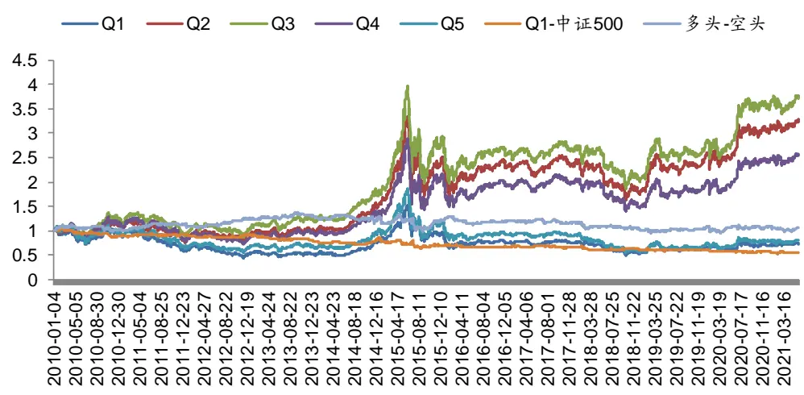
数据来源：Wind、广发证券发展研究中心

表93：VMACD量指数平滑异同平均线分年度绩效指标表现一览

|  | 多头收益 率 | 多头换 |  |  |  | 多头平 均收益 率 | 多头 IR | 多头收 | 最大回 撤 益率 | 超额收 | 超额胜 率 | 多空收益 率 | 夏普 比 |
| --- | --- | --- | --- | --- | --- | --- | --- | --- | --- | --- | --- | --- | --- |
|  |  | 手率均 值 | IC 均值 | IC 胜率 ICIR | 益波动 率 |  |  |  |  |  |  |  |  |
| 2010 | -3.98% | 53.3% | 1.84% | 64.0% | 0.18 | 0.00% | 0 | 1.81% | 17.39% | -12.59% | 45.0% | 1.57% | -1.53 |
| 2011 | -30.82% | 52.3% | 0.51% | 43.1% | 0.06 | -0.14% | -0.09 | 1.58% | 4.00% | 4.57% | 51.6% | 10.51% | 0.84 |
| 2012 | -0.59% | 53.9% | 1.17% | 52.0% | 0.11 | 0.01% | 0.01 | 1.58% | 8.09% | -0.87% | 46.5% | 11.07% | -0.15 |
| 2013 | 3.28% | 49.6% | 0.67% | 45.1% | 0.08 | 0.03% | 0.02 | 1.55% | 12.71% | -11.51% | 43.7% | 5.37% | -1.91 |
| 2014 | 46.09% | 51.8% | -0.01% | 50.9% | 0 | 0.16% | 0.13 | 1.31% | 10.66% | 4.94% | 49.4% | -3.79% | 0.6 |
| 2015 | 14.76% | 55.6% | -0.36% | 51.9% | -0.02 | 0.11% | 0.03 | 3.29% | 27.75% | -18.27% | 45.9% | -3.31% | -1.02 |
| 2016 | -20.63% | 50.4% | -0.15% | 40.0% | -0.01 | -0.08% | -0.04 | 1.95% | 7.94% | -3.43% | 46.3% | -2.13% | -0.61 |
| 2017 | -1.38% | 47.9% | 0.77% | 49.0% | 0.07 | 0.00% | 0 | 0.94% | 6.70% | -1.29% | 50.0% | -1.49% | -0.21 |
| 2018 | -37.70% | 49.6% | -2.47% | 58.8% | -0.21 | -0.18% | -0.11 | 1.61% | 12.30% | -6.43% | 48.6% | -12.37% | -1.03 |
| 2019 | 25.23% | 51.0% | 0.75% | 51.0% | 0.08 | 0.10% | 0.07 | 1.48% | 5.50% | -1.04% | 49.2% | 0.79% | -0.17 |
| 2020 | 12.79% | 50.8% | 0.44% | 53.9% | 0.04 | 0.06% | 0.04 | 1.63% | 11.03% | -6.92% | 46.5% | 4.07% | -0.9 |
| 2021 | 0.73% | 45.5% | -0.72% | 62.5% | -0.08 | 0.01% | 0.01 | 1.11% | 6.90% | -3.79% | 47.7% | -3.33% | -1.02 |

数据来源：Wind、广发证券发展研究中心

图95：VOSC移动平均成交量指标历史分档测算结果
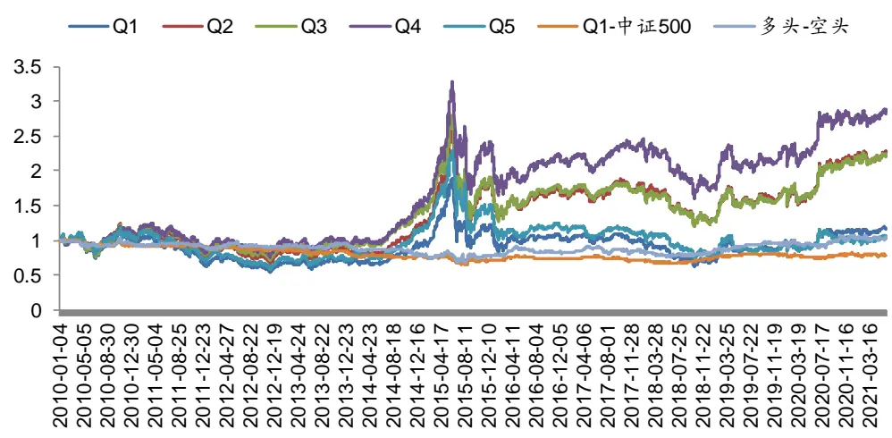
数据来源：Wind、广发证券发展研究中心

表94：VOSC移动平均成交量指标分年度绩效指标表现一览

|  | 多头收益 率 | 多头换 |  |  |  | 多头平 均收益 | 多头 IR | 多头收 益波动 | 最大回 |  | 超额胜 率 | 多空收益 率 | 夏普 比 |  |
| --- | --- | --- | --- | --- | --- | --- | --- | --- | --- | --- | --- | --- | --- | --- |
|  |  | 手率均 值 | IC 均值 | IC 胜率 ICIR | 撤 率 |  |  |  |  |  |  |  |  | 超额收 益率 |
| 2010 | 1.69% | 50.9% | 0.19% | 46.0% | 0.02 | 率 0.02% | 0.01 | 1.76% | 10.51% | -7.56% | 49.6% | -3.59% | -0.94 |  |
| 2011 | -34.56% | 49.5% | 1.20% | 54.9% | 0.14 | -0.16% | -0.11 | 1.52% | 3.38% | -1.27% | 48.0% | -5.19% | -0.24 |  |
| 2012 | -3.73% | 49.3% | -0.43% | 58.0% | -0.04 | 0.00% | 0 | 1.57% | 6.29% | -4.00% | 48.2% | 0.59% | -0.91 |  |
| 2013 | 11.70% | 45.1% | -1.41% | 51.0% | -0.15 | 0.06% | 0.04 | 1.45% | 8.74% | -4.64% | 45.8% | 4.31% | -0.73 |  |
| 2014 | 29.51% | 44.1% | 2.47% | 54.7% | 0.26 | 0.11% | 0.09 | 1.26% | 11.09% | -6.92% | 45.3% | -18.11% | -1.27 |  |
| 2015 | 28.39% | 50.5% | 1.34% | 51.9% | 0.1 | 0.15% | 0.05 | 3.20% | 17.55% | -8.99% | 46.3% | -0.89% | -0.48 |  |
| 2016 | -14.89% | 45.5% | -0.72% | 60.0% | -0.06 | -0.05% | -0.02 | 1.92% | 5.93% | 3.44% | 49.2% | 6.33% | 0.68 |  |
| 2017 | -2.56% | 43.8% | -0.57% | 58.8% | -0.05 | -0.01% | -0.01 | 0.90% | 9.66% | -2.55% | 49.2% | 3.78% | -0.47 |  |
| 2018 | -32.29% | 44.0% | -0.60% | 54.9% | -0.05 | -0.15% | -0.09 | 1.58% | 7.29% | 1.59% | 53.5% | -6.06% | 0.3 |  |
| 2019 | 39.74% | 45.1% | -3.03% | 58.8% | -0.31 | 0.15% | 0.1 | 1.44% | 3.48% | 10.29% | 57.0% | 17.70% | 1.81 |  |
| 2020 | 22.56% | 46.8% | -0.90% | 44.2% | -0.07 | 0.10% | 0.06 | 1.53% | 8.06% | 0.68% | 50.2% | 12.17% | 0.12 |  |
| 2021 | 1.86% | 40.8% | 0.99% | 45.8% | 0.09 | 0.02% | 0.02 | 0.96% | 5.07% | -2.90% | 45.8% | -3.82% | -0.69 |  |

数据来源：Wind、广发证券发展研究中心

图96：VR成交量比率历史分档测算结果
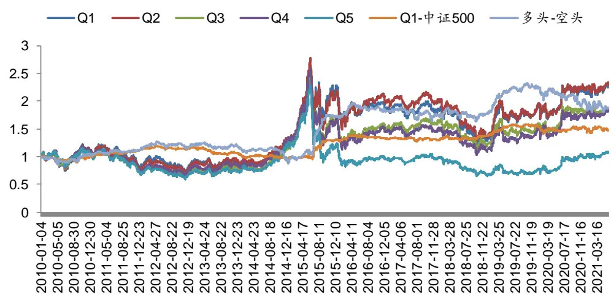
数据来源：Wind、广发证券发展研究中心

表95：VR成交量比率分年度绩效指标表现一览

|  | 多头收益 率 | 多头换 |  |  |  | 多头平 均收益 | 多头 IR | 多头收 益波动 | 最大回 |  | 超额胜 率 | 多空收益 率 | 夏普 比 |  |
| --- | --- | --- | --- | --- | --- | --- | --- | --- | --- | --- | --- | --- | --- | --- |
|  |  | 手率均 值 | IC 均值 | IC 胜率 ICIR | 撤 |  |  |  |  |  |  |  |  | 超额收 益率 |
| 2010 | 9.49% | 38.4% | -1.34% | 58.0% | -0.09 | 率 0.05% | 0.03 | 率 1.74% | 11.84% | -0.93% | 45.9% | 2.98% |  |  |
| 2011 | -24.82% | 41.0% | -1.01% | 51.0% | -0.11 | -0.11% | -0.07 | 1.47% | 3.40% | 13.21% | 53.3% | 9.67% | -0.02 2.38 |  |
| 2012 | 3.03% | 40.0% | -0.48% | 50.0% | -0.05 | 0.02% | 0.02 | 1.55% | 5.28% | 2.65% | 51.4% | 4.56% | 0.57 |  |
| 2013 | 8.30% | 35.9% | 0.17% | 45.1% | 0.02 | 0.04% | 0.03 | 1.37% | 12.50% | -7.92% | 44.1% | 0.86% | -0.97 |  |
| 2014 | 24.80% | 36.4% | 3.74% | 66.0% | 0.31 | 0.10% | 0.08 | 1.17% | 10.02% | -10.59% | 42.5% | -24.76% | -1.72 |  |
| 2015 | 93.28% | 45.6% | -6.15% | 67.3% | -0.48 | 0.32% | 0.1 | 3.17% | 5.93% | 37.20% | 53.3% | 93.52% | 2.3 |  |
| 2016 | -16.45% | 37.8% | -1.74% | 54.0% | -0.17 | -0.05% | -0.03 | 1.97% | 4.86% | 1.82% | 51.6% | 5.59% | 0.42 |  |
| 2017 | -1.68% | 37.4% | 0.22% | 51.0% | 0.02 | 0.00% | 0 | 0.88% | 4.91% | -1.77% | 45.9% | -4.35% | -0.26 |  |
| 2018 | -29.64% | 36.4% | 0.17% | 47.1% | 0.01 | -0.13% | -0.08 | 1.56% | 5.66% | 5.43% | 53.5% | 1.15% | 0.83 |  |
| 2019 | 45.38% | 37.5% | -3.20% | 60.8% | -0.33 | 0.16% | 0.12 | 1.37% | 3.12% | 14.46% | 53.3% | 28.09% | 2.45 |  |
| 2020 | 17.12% | 38.6% | 1.92% | 59.6% | 0.15 | 0.08% | 0.05 | 1.44% | 9.44% | -4.15% | 47.3% | -14.27% | -0.41 |  |
| 2021 | 2.92% | 35.2% | 1.76% | 54.2% | 0.1 | 0.03% | 0.03 | 1.06% | 5.81% | -1.94% | 43.9% | -4.14% | -0.3 |  |

数据来源：Wind、广发证券发展研究中心

图97：VROC量变动速率历史分档测算结果
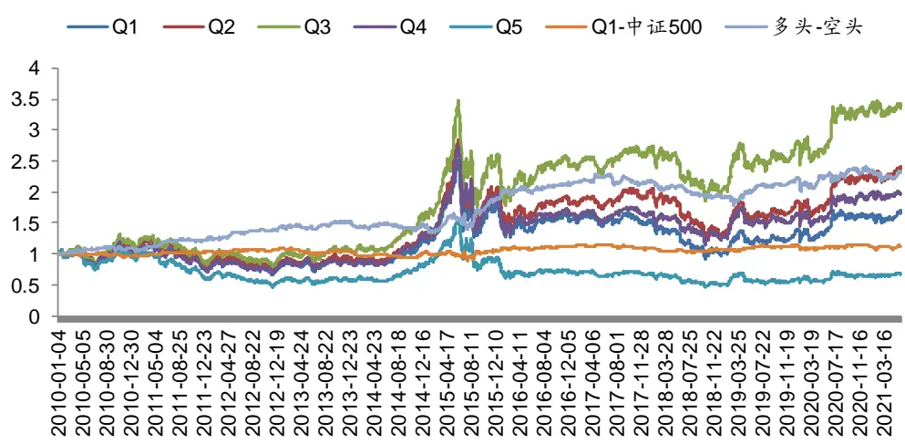
数据来源：Wind、广发证券发展研究中心

表96：VROC量变动速率年度绩效指标表现一览

|  | 多头收益 率 | 多头换 |  |  |  | 多头平 均收益 | 多头 IR | 多头收 益波动 |  |  | 超额胜 率 | 多空收益 率 | 夏普 比 |  |
| --- | --- | --- | --- | --- | --- | --- | --- | --- | --- | --- | --- | --- | --- | --- |
|  |  | 手率均 值 | IC 均值 | IC 胜率 ICIR | 最大回 撒 |  |  |  |  |  |  |  |  | 超额收 益率 |
| 2010 | 5.97% | 74.2% | -2.68% | 60.0% | -0.26 | 率 0.04% | 0.02 | 率 1.80% |  |  |  |  |  |  |
| 2011 | -29.24% | 72.7% | -0.59% | 47.1% | -0.07 | -0.13% | -0.08 | 1.53% | 7.70% 2.46% | -3.49% 6.83% | 46.7% 54.9% | 8.98% 11.56% | -0.44 1.62 |  |
| 2012 | 4.94% | 74.4% | -2.19% | 54.0% | -0.23 | 0.03% | 0.02 | 1.57% | 2.83% | 4.65% | 53.5% | 16.30% | 1.18 |  |
| 2013 | 12.74% | 72.0% | -1.17% | 66.7% | -0.14 | 0.06% | 0.04 | 1.46% | 8.88% | -3.65% | 48.7% | 7.58% | -0.67 |  |
| 2014 | 37.14% | 73.1% | 1.75% | 62.3% | 0.2 | 0.14% | 0.11 | 1.26% | 9.41% | -1.41% | 47.4% | -5.46% | -0.25 |  |
| 2015 | 44.37% | 75.3% | -2.43% | 67.3% | -0.19 | 0.20% | 0.06 | 3.18% | 13.65% | 2.40% | 49.2% | 31.24% | 0.23 |  |
| 2016 | -11.85% | 74.0% | -1.94% | 62.0% | -0.21 | -0.03% | -0.02 | 1.91% | 3.72% | 7.11% | 55.7% | 14.11% | 1.5 |  |
| 2017 | -2.98% | 72.5% | -1.57% | 56.9% | -0.16 | -0.01% | -0.01 | 0.91% | 6.50% | -2.96% | 47.1% | 1.56% | -0.58 |  |
| 2018 | -34.44% | 72.1% | 1.72% | 60.8% | 0.19 | -0.16% | -0.1 | 1.54% | 7.06% | -1.73% | 49.0% | -11.54% | -0.32 |  |
| 2019 | 34.09% | 74.0% | -1.77% | 58.8% | -0.22 | 0.13% | 0.09 | 1.40% | 4.05% | 5.70% | 53.3% | 11.79% | 1.12 |  |
| 2020 | 22.01% | 72.8% | -0.54% | 55.8% | -0.04 | 0.09% | 0.06 | 1.53% | 7.07% | 0.34% | 55.6% | 8.92% | 0.08 |  |
| 2021 | 3.09% | 71.2% | 0.04% | 45.8% | 0 | 0.03% | 0.03 | 1.00% | 4.48% | -1.62% | 45.8% | -1.55% | -0.47 |  |

数据来源：Wind、广发证券发展研究中心

图98：VRSI量相对强弱历史分档测算结果
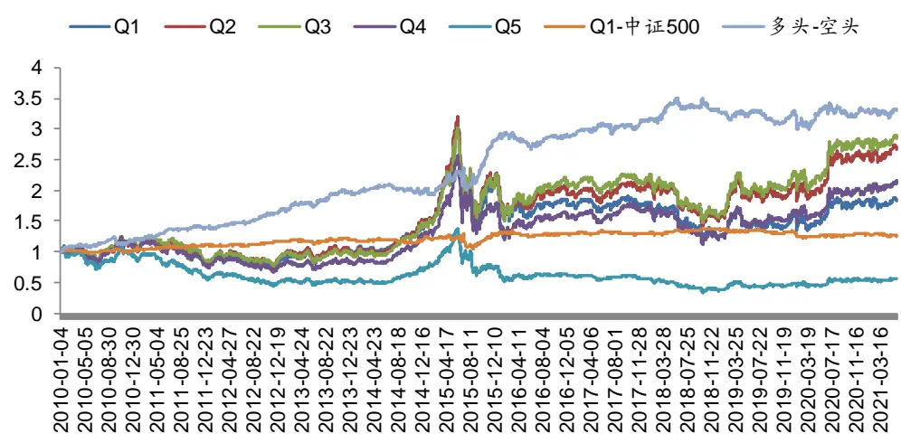
数据来源：Wind、广发证券发展研究中心

表97：VRSI量相对强弱分年度绩效指标表现一览

|  | 多头收益 率 | 多头换 |  |  |  | 多头平 均收益 | 多头 IR | 多头收 益波动 | 最大回 益率 | 超额收 | 超额胜 率 | 多空收益 率 | 夏普 比 |
| --- | --- | --- | --- | --- | --- | --- | --- | --- | --- | --- | --- | --- | --- |
|  |  | 手率均 值 | IC 均值 | IC 胜率 ICIR | 撤 率 |  |  |  |  |  |  |  |  |
| 2010 | 10.56% | 84.5% | -2.64% | 60.0% | -0.26 | 率 0.06% | 0.03 | 1.80% | 5.51% | 0.75% | 50.8% | 16.80% |  |
| 2011 | -26.92% | 85.6% | -1.56% | 51.0% | -0.18 | -0.12% | -0.08 | 1.53% | 2.79% | 10.30% | 51.2% | 19.32% | 0.14 2.13 |
| 2012 | 5.82% | 85.0% | -2.13% | 62.0% | -0.29 | 0.04% | 0.02 | 1.58% | 2.95% | 5.59% | 53.1% | 18.77% | 1.33 |
| 2013 | 19.61% | 83.8% | -1.27% | 54.9% | -0.13 | 0.09% | 0.06 | 1.51% | 5.92% | 2.37% | 50.0% | 18.63% | 0.44 |
| 2014 | 41.03% | 83.3% | 0.01% | 45.3% | 0 | 0.15% | 0.12 | 1.26% | 5.52% | 1.40% | 45.7% | 0.89% | 0.31 |
| 2015 | 47.81% | 87.6% | -2.87% | 65.4% | -0.25 | 0.22% | 0.07 | 3.30% | 19.80% | 5.79% | 50.8% | 44.37% | 0.44 |
| 2016 | -18.06% | 84.2% | -0.08% | 52.0% | -0.01 | -0.06% | -0.03 | 1.97% | 6.56% | -0.16% | 47.5% | 1.05% | -0.01 |
| 2017 | 0.83% | 84.6% | -0.80% | 54.9% | -0.09 | 0.01% | 0.01 | 0.92% | 4.35% | 0.90% | 50.4% | 8.85% | 0.22 |
| 2018 | -29.77% | 83.4% | 0.80% | 52.9% | 0.1 | -0.13% | -0.09 | 1.56% | 3.08% | 5.37% | 51.4% | 5.24% | 1.16 |
| 2019 | 23.00% | 84.3% | 0.20% | 58.8% | 0.03 | 0.10% | 0.07 | 1.43% | 5.22% | -2.94% | 48.0% | -2.84% | -0.61 |
| 2020 | 18.51% | 84.3% | -0.59% | 53.9% | -0.07 | 0.08% | 0.05 | 1.58% | 7.80% | -2.29% | 49.4% | 2.03% | -0.33 |
| 2021 | 1.64% | 83.0% | 0.75% | 54.2% | 0.09 | 0.02% | 0.02 | 0.97% | 4.34% | -3.02% | 45.8% | 0.16% | -1.02 |

数据来源：Wind、广发证券发展研究中心

图99：VSTD成交量方差(10日)历史分档测算结果
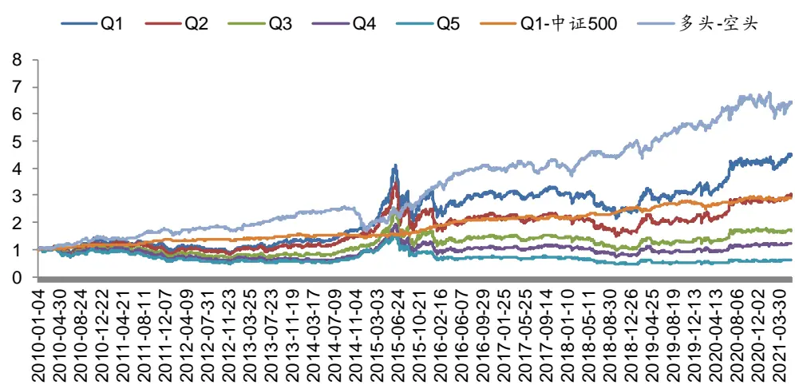
数据来源：Wind、广发证券发展研究中心

表98：VSTD成交量方差(10日)分年度绩效指标表现一览

|  | 多头收益 率 | 多头换 |  |  |  | 多头平 均收益 率 | 多头 IR | 多头收 | 最大回 撤 | 超额收 益率 | 超额胜 率 | 多空收益 率 | 夏普 |
| --- | --- | --- | --- | --- | --- | --- | --- | --- | --- | --- | --- | --- | --- |
|  |  | 手率均 值 | IC 均值 | IC 胜率 ICIR | 益波动 率 |  |  |  |  |  |  |  |  |
| 2010 | 30.75% | 34.8% | -5.88% | 70.0% | -0.48 | 0.13% | 0.07 | 1.69% | 3.41% | 18.67% | 59.5% | 45.15% | 3.03 |
| 2011 | -22.98% | 31.9% | -2.82% | 54.9% | -0.26 | -0.10% | -0.07 | 1.39% | 3.28% | 15.67% | 57.0% | 17.32% | 3.19 |
| 2012 | -0.78% | 32.1% | -1.48% | 54.0% | -0.11 | 0.01% | 0.01 | 1.49% | 4.99% | -1.35% | 49.0% | 0.96% | -0.27 |
| 2013 | 35.69% | 29.9% | -4.56% | 64.7% | -0.35 | 0.14% | 0.1 | 1.36% | 2.17% | 15.57% | 57.1% | 38.30% | 2.83 |
| 2014 | 28.16% | 26.1% | 2.79% | 50.9% | 0.2 | 0.11% | 0.09 | 1.17% | 8.65% | -8.11% | 43.3% | -28.30% | -1.7 |
| 2015 | 79.00% | 30.1% | -7.39% | 67.3% | -0.48 | 0.29% | 0.09 | 3.14% | 11.28% | 27.12% | 57.4% | 95.04% | 1.98 |
| 2016 | -4.48% | 26.4% | -4.04% | 58.0% | -0.33 | 0.00% | 0 | 1.89% | 1.91% | 15.97% | 57.4% | 21.14% | 3.57 |
| 2017 | 2.61% | 25.7% | -0.36% | 49.0% | -0.03 | 0.01% | 0.02 | 0.83% | 5.16% | 2.46% | 50.4% | 2.56% | 0.48 |
| 2018 | -21.83% | 24.3% | -2.21% | 60.8% | -0.19 | -0.09% | -0.06 | 1.49% | 2.91% | 16.96% | 58.9% | 18.94% | 3.7 |
| 2019 | 36.85% | 23.6% | -2.41% | 56.9% | -0.22 | 0.14% | 0.11 | 1.26% | 6.88% | 7.29% | 50.8% | 12.67% | 1.11 |
| 2020 | 29.91% | 24.5% | -2.67% | 55.8% | -0.26 | 0.12% | 0.08 | 1.42% | 7.59% | 6.32% | 53.9% | 17.81% | 0.76 |
| 2021 | 4.92% | 19.7% | -0.24% | 54.2% | -0.02 | 0.05% | 0.05 | 0.97% | 5.55% | 0.07% | 49.5% | -0.75% | 0.06 |

数据来源：Wind、广发证券发展研究中心

图100：VSDT成交量方差(20日)历史分档测算结果
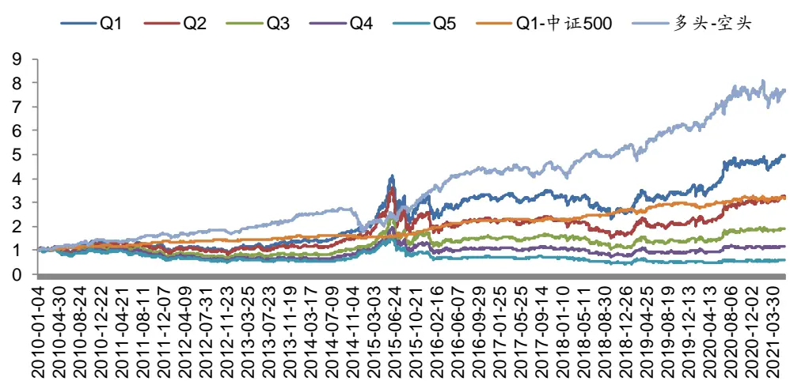
数据来源：Wind、广发证券发展研究中心

表99：VSDT成交量方差(20日)分年度绩效指标表现一览

|  | 多头收益 率 | 多头换 |  |  |  | 多头平 均收益 率 | 多头 IR | 多头收 益波动 | 最大回 益率 | 超额收 | 超额胜 率 | 多空收益 率 | 夏普 比 |
| --- | --- | --- | --- | --- | --- | --- | --- | --- | --- | --- | --- | --- | --- |
|  |  | 手率均 值 | IC 均值 | IC 胜率 ICIR | 撤 |  |  |  |  |  |  |  |  |
| 2010 | 30.40% | 25.2% | -6.11% | 70.0% | -0.5 | 0.12% | 0.07 | 率 1.68% | 3.44% | 18.30% | 58.3% | 42.91% | 2.91 |
| 2011 | -22.82% | 23.4% | -3.20% | 60.8% | -0.3 | -0.10% | -0.07 | 1.37% | 4.84% | 15.80% | 55.7% | 16.43% | 2.96 |
| 2012 | 1.96% | 23.2% | -1.66% | 52.0% | -0.12 | 0.02% | 0.01 | 1.47% | 4.73% | 1.29% | 49.0% | 3.53% | 0.29 |
| 2013 | 34.30% | 18.5% | -4.24% | 60.8% | -0.33 | 0.13% | 0.1 | 1.35% | 2.53% | 14.33% | 53.8% | 40.81% | 2.46 |
| 2014 | 30.37% | 16.8% | 2.19% | 52.8% | 0.16 | 0.11% | 0.1 | 1.15% | 8.43% | -6.57% | 46.1% | -25.42% | -1.33 |
| 2015 | 77.72% | 22.3% | -7.65% | 71.2% | -0.47 | 0.28% | 0.09 | 3.10% | 10.93% | 25.87% | 55.3% | 91.89% | 1.93 |
| 2016 | -1.10% | 15.9% | -4.34% | 68.0% | -0.35 | 0.01% | 0.01 | 1.86% | 1.88% | 19.89% | 60.3% | 26.19% | 4.14 |
| 2017 | 2.18% | 16.4% | -0.95% | 47.1% | -0.07 | 0.01% | 0.01 | 0.83% | 5.14% | 2.03% | 50.4% | 1.59% | 0.41 |
| 2018 | -21.17% | 14.2% | -2.33% | 58.8% | -0.2 | -0.09% | -0.06 | 1.47% | 1.86% | 17.87% | 60.9% | 20.43% | 3.92 |
| 2019 | 38.91% | 14.1% | -2.51% | 54.9% | -0.22 | 0.14% | 0.11 | 1.24% | 6.84% | 8.83% | 52.5% | 13.94% | 1.29 |
| 2020 | 32.82% | 16.9% | -3.61% | 63.5% | -0.34 | 0.13% | 0.09 | 1.42% | 6.55% | 8.67% | 56.0% | 24.68% | 0.98 |
| 2021 | 4.79% | 11.4% | -0.83% | 62.5% | -0.06 | 0.05% | 0.05 | 0.97% | 6.14% | -0.08% | 50.5% | 1.63% | 0.02 |

数据来源：Wind、广发证券发展研究中心

图101：W%R威廉指标(15日)历史分档测算结果
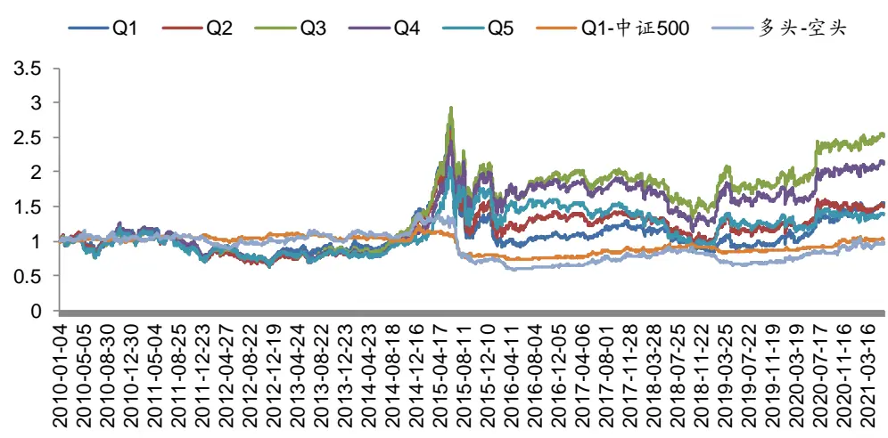
数据来源：Wind、广发证券发展研究中心

表100：W%R威廉指标(15日)分年度绩效指标表现一览

|  | 多头收益 率 | 多头换 |  |  |  | 多头平 均收益 率 | 多头 IR | 多头收 | 最大回 撤 益率 | 超额收 | 超额胜 率 | 多空收益 率 | 夏普 比 |
| --- | --- | --- | --- | --- | --- | --- | --- | --- | --- | --- | --- | --- | --- |
|  |  | 手率均 值 | IC 均值 | IC 胜率 ICIR | 益波动 率 |  |  |  |  |  |  |  |  |
| 2010 | 11.29% | 40.7% | -1.02% | 48.0% | -0.05 | 0.06% | 0.03 | 1.90% | 7.35% | 1.79% | 53.3% | 4.90% | 0.27 |
| 2011 | -29.53% | 38.6% | -0.09% | 54.9% | -0.01 | -0.13% | -0.09 | 1.49% | 4.63% | 6.08% | 51.6% | -0.46% | 0.94 |
| 2012 | 2.36% | 36.6% | 0.21% | 52.0% | 0.01 | 0.02% | 0.01 | 1.46% | 9.29% | 1.52% | 48.2% | -4.16% | 0.25 |
| 2013 | 8.45% | 34.4% | -1.28% | 56.9% | -0.1 | 0.05% | 0.03 | 1.56% | 8.72% | -7.05% | 46.2% | 0.36% | -1.19 |
| 2014 | 64.25% | 35.0% | -4.21% | 66.0% | -0.3 | 0.21% | 0.15 | 1.38% | 6.16% | 18.34% | 52.2% | 39.44% | 2.1 |
| 2015 | -6.42% | 44.1% | 4.30% | 50.0% | 0.25 | 0.03% | 0.01 | 3.21% | 38.32% | -33.56% | 44.7% | -47.66% | -2.44 |
| 2016 | -21.56% | 35.7% | 1.87% | 56.0% | 0.14 | -0.08% | -0.04 | 1.92% | 10.43% | -4.78% | 46.7% | -11.64% | -0.68 |
| 2017 | 12.38% | 32.9% | -2.68% | 56.9% | -0.19 | 0.05% | 0.05 | 0.99% | 6.01% | 12.37% | 53.3% | 20.16% | 1.46 |
| 2018 | -27.91% | 32.4% | -0.30% | 52.9% | -0.02 | -0.12% | -0.08 | 1.51% | 7.01% | 7.68% | 51.9% | 5.24% | 0.92 |
| 2019 | 20.37% | 34.3% | 2.40% | 56.9% | 0.2 | 0.09% | 0.06 | 1.40% | 9.63% | -5.19% | 48.0% | -14.62% | -0.83 |
| 2020 | 40.14% | 35.8% | -2.90% | 63.5% | -0.21 | 0.15% | 0.09 | 1.64% | 4.55% | 15.58% | 51.9% | 31.34% | 1.68 |
| 2021 | 6.28% | 32.1% | -1.15% | 54.2% | -0.06 | 0.07% | 0.05 | 1.33% | 7.01% | 1.68% | 54.2% | 5.20% | 0.4 |

数据来源：Wind、广发证券发展研究中心

图102：ACD收集派发指标(20日)历史分档测算结果
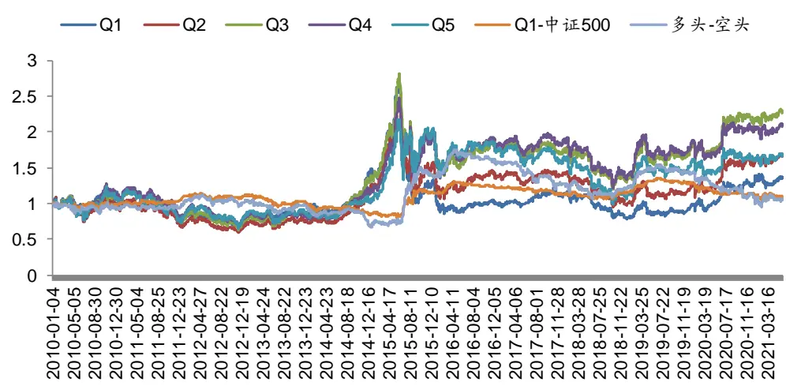
数据来源：Wind、广发证券发展研究中心

表101：W%R威廉指标(20日)分年度绩效指标表现一览

|  | 多头收益 率 | 多头换 |  |  |  | 多头平 均收益 | 多头 IR | 多头收 益波动 | 最大回 |  | 超额胜 率 | 多空收益 率 | 夏普 比 |  |
| --- | --- | --- | --- | --- | --- | --- | --- | --- | --- | --- | --- | --- | --- | --- |
|  |  | 手率均 值 | IC 均值 | IC 胜率 ICIR | 撤 |  |  |  |  |  |  |  |  | 超额收 益率 |
| 2010 | 7.98% | 36.8% | -0.12% | 54.0% | -0.01 | 率 0.05% | 0.03 | 率 1.75% | 10.47% | -2.46% |  |  |  |  |
| 2011 | -28.46% | 38.4% | 0.59% | 51.0% | 0.05 | -0.13% | -0.08 | 1.51% | 4.78% | 7.80% | 47.5% 50.0% | -6.99% 2.54% | -0.12 1.22 |  |
| 2012 | 5.02% | 37.2% | 0.16% | 54.0% | 0.01 | 0.03% | 0.02 | 1.64% | 8.88% | 4.87% | 49.4% | 5.82% | 0.75 |  |
| 2013 | 8.30% | 31.5% | -1.70% | 60.8% | -0.13 | 0.04% | 0.03 | 1.41% | 14.83% | -7.90% | 43.3% | -3.94% | -0.81 |  |
| 2014 | 16.10% | 30.5% | -4.24% | 66.0% | -0.29 | 0.07% | 0.06 | 1.21% | 16.42% | -16.78% | 44.9% | -31.41% | -2.47 |  |
| 2015 | 93.01% | 37.4% | 5.78% | 51.9% | 0.33 | 0.32% | 0.1 | 3.13% | 9.01% | 35.47% | 48.0% | 108.46% | 1.67 |  |
| 2016 | -11.98% | 33.0% | 2.09% | 60.0% | 0.17 | -0.03% | -0.02 | 1.96% | 7.05% | 7.12% | 47.5% | 14.09% | 1.14 |  |
| 2017 | -8.44% | 32.0% | -2.85% | 60.8% | -0.2 | -0.03% | -0.03 | 0.96% | 9.14% | -8.38% | 46.7% | -19.61% | -1.35 |  |
| 2018 | -31.91% | 30.7% | -0.05% | 47.1% | 0 | -0.14% | -0.09 | 1.66% | 8.93% | 2.34% | 49.8% | -5.96% | 0.33 |  |
| 2019 | 43.18% | 32.8% | 2.07% | 56.9% | 0.16 | 0.16% | 0.11 | 1.45% | 5.34% | 12.98% | 48.8% | 20.15% | 1.92 |  |
| 2020 | 6.15% | 33.4% | -2.92% | 59.6% | -0.21 | 0.04% | 0.02 | 1.46% | 14.17% | -13.13% | 42.0% | -24.46% | -1.37 |  |
| 2021 | 1.20% | 30.7% | -1.06% | 54.2% | -0.05 | 0.02% | 0.02 | 1.13% | 6.74% | -3.57% | 46.7% | -3.59% | -0.54 |  |

数据来源：Wind、广发证券发展研究中心

图103：W%R威廉指标(9日)历史分档测算结果
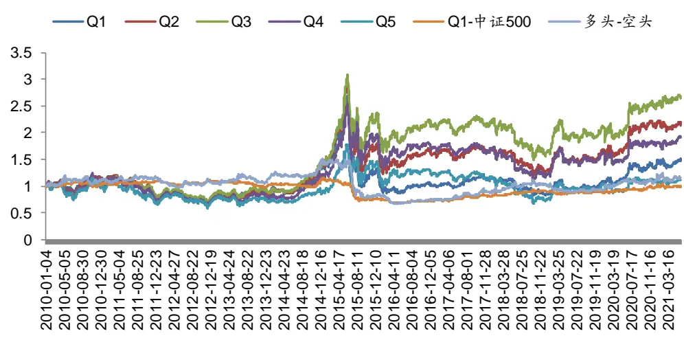
数据来源：Wind、广发证券发展研究中心

表102：W%R威廉指标(9日)分年度绩效指标表现一览

|  | 多头收益 率 | 多头换 |  |  |  | 多头平 均收益 | 多头 IR | 多头收 益波动 |  |  | 超额胜 率 | 多空收益 率 | 夏普 比 |  |
| --- | --- | --- | --- | --- | --- | --- | --- | --- | --- | --- | --- | --- | --- | --- |
|  |  | 手率均 值 | IC 均值 | IC 胜率 ICIR | 最大回 撤 |  |  |  |  |  |  |  |  | 超额收 益率 |
| 2010 | 12.61% | 43.8% | -1.57% | 56.0% | -0.08 | 率 0.07% | 0.04 | 率 1.87% | 8.93% | 2.84% | 49.6% |  |  |  |
| 2011 | -29.24% | 42.2% | -0.66% | 54.9% | -0.05 | -0.13% | -0.09 | 1.48% | 4.84% | 6.50% | 53.3% | 11.09% 3.55% | 0.4 1.04 |  |
| 2012 | 0.52% | 40.6% | 0.90% | 54.0% | 0.06 | 0.01% | 0.01 | 1.44% | 9.71% | -0.36% | 46.5% | -7.94% | -0.02 |  |
| 2013 | 5.54% | 39.1% | -1.17% | 54.9% | -0.09 | 0.03% | 0.02 | 1.55% | 10.10% | -9.58% | 45.8% | 1.23% | -1.66 |  |
| 2014 | 62.88% | 39.3% | -4.25% | 64.2% | -0.32 | 0.21% | 0.15 | 1.36% | 6.58% | 17.27% | 52.7% | 40.31% | 2.03 |  |
| 2015 | -7.46% | 48.2% | 2.76% | 51.9% | 0.15 | 0.02% | 0.01 | 3.23% | 37.99% | -34.31% | 45.5% | -44.88% | -2.37 |  |
| 2016 | -21.77% | 40.2% | 1.52% | 52.0% | 0.11 | -0.08% | -0.04 | 1.94% | 11.57% | -4.92% | 45.5% | -10.56% | -0.68 |  |
| 2017 | 11.73% | 37.9% | -3.10% | 60.8% | -0.22 | 0.05% | 0.05 | 0.95% | 5.65% | 11.67% | 54.5% | 19.52% | 1.45 |  |
| 2018 | -24.05% | 36.5% | -1.50% | 56.9% | -0.1 | -0.10% | -0.07 | 1.48% | 6.37% | 13.31% | 56.4% | 17.07% | 1.54 |  |
| 2019 | 23.23% | 39.1% | 2.03% | 58.8% | 0.17 | 0.10% | 0.07 | 1.42% | 7.41% | -2.85% | 47.1% | -10.16% | -0.45 |  |
| 2020 | 33.58% | 39.9% | -2.98% | 61.5% | -0.21 | 0.13% | 0.08 | 1.62% | 4.41% | 10.12% | 53.5% | 18.65% | 1.17 |  |
| 2021 | 5.96% | 35.8% | -0.74% | 45.8% | -0.04 | 0.06% | 0.05 | 1.32% | 7.11% | 1.37% | 53.3% | 4.85% | 0.34 |  |

数据来源：Wind、广发证券发展研究中心

## （二）因子总结

以下为因子主要绩效指标历史整体测算结果。

表103：W%R威廉指标(9日)分年度绩效指标表现一览

|  | 多空胜率 | IC 均值 | ICIR | 多头胜率 | 多头年化收益率 | 多空年化收益率 |
| --- | --- | --- | --- | --- | --- | --- |
| ACD 收集派发指标(20 日) | 52.90% | -1.02% | -0.083 | 52.90% | 7.40% | 8.57% |
| ACD 收集派发指标(6 日) | 58.53% | -1.73% | -0.152 | 54.95% | 10.77% | 15.80% |
| AD 指标 | 60.58% | -1.44% | -0.138 | 55.12% | 5.30% | 14.84% |
| AD 指标(20日) | 55.12% | -1.30% | -0.110 | 53.24% | 4.58% | 8.41% |
| AD 指标(6 日) | 59.22% | -1.19% | -0.104 | 53.07% | 5.68% | 12.87% |
| ADTM 动态买卖气指标 | 51.54% | -0.52% | -0.040 | 53.41% | 5.55% | 3.40% |
| DMI(ADX) | 46.76% | 0.46% | 0.043 | 53.92% | 6.71% | 4.32% |
| DMI(ADXR) | 47.44% | 0.47% | 0.044 | 53.92% | 6.97% | 5.00% |
| 成交金额(20 日) | 59.22% | -1.82% | -0.133 | 56.66% | 12.30% | 13.35% |
| 成交金额方差(20 日) | 60.41% | -2.59% | -0.199 | 57.17% | 14.47% | 19.33% |
| 成交金额方差(6日) | 61.26% | -2.29% | -0.178 | 55.97% | 13.66% | 16.17% |
| ARBR(AR) | 52.56% | -1.15% | -0.086 | 54.44% | 8.50% | 7.81% |
| ARBR(AR-BR) | 55.63% | -0.70% | -0.083 | 55.12% | 5.91% | 5.36% |
| ARC 变化率指数均值(50 日) | 51.37% | -1.05% | -0.066 | 53.75% | 10.81% | 9.96% |
| Aroon 指数 | 51.19% | -0.59% | -0.044 | 51.71% | 2.33% | 2.42% |
| Aroon 指数（下降数） | 49.32% | 0.24% | 0.021 | 46.76% | -0.64% | 4.36% |
| Aroon 指数（上升数） | 50.00% | -0.11% | -0.009 | 50.51% | -4.48% | 0.31% |
| ASI 累计振动升降指标 | 52.73% | -1.18% | -0.093 | 51.88% | 6.20% | 7.93% |
| ATR 平均真实波幅(12 日) | 56.14% | 0.59% | 0.048 | 54.27% | 6.31% | 2.09% |
| ATR 平均真实波幅(6 日) | 54.78% | 0.63% | 0.051 | 54.78% | 6.72% | 2.31% |
| BBI 多空指数 | 55.97% | 0.70% | 0.063 | 55.29% | 7.13% | 3.75% |
| BBI_Close 多空指数_收盘价 | 57.34% | 2.74% | 0.177 | 54.95% | 9.90% | 15.70% |
| BIAS 乖偏率(12 日) | 57.34% | -2.30% | -0.152 | 55.46% | 8.94% | 13.38% |
| BIAS 乖偏率(24 日) BIAS 乖偏率(6日） | 57.00% | -2.06% | -0.126 | 53.41% | 7.83% | 11.07% |
|  | 59.39% | -3.42% | -0.248 | 55.29% | 14.07% | 21.65% |
| ARBR(BR) CCI 顺势指标 | 50.34% | -0.98% | -0.071 | 52.56% | 9.12% | 6.69% |
| Chande 钱德动量摆动指标 | 55.97% | -1.67% | -0.119 | 53.92% | 5.57% | 7.95% |
|  | 52.22% | 0.50% | 0.069 | 53.41% | 6.75% | 4.17% |
| Chande 钱德动量摆动指标(SD) | 57.34% | -0.87% | -0.073 | 55.46% | 9.06% | 6.69% |
| Chande 钱德动量摆动指标(SU) Chaikin Oscillator 佳庆指标 | 52.90% | 0.30% | 0.024 | 54.27% | 4.54% | 0.03% |
|  | 62.12% | 1.84% | 0.181 | 53.75% | 7.34% | 19.10% |
| Chaikin Volatility 佳庆变异率指标 | 53.07% | -0.35% | -0.030 | 53.07% | 1.55% | 2.46% |
| 价格绝对方差均值 | 54.44% | 1.16% | 0.092 | 55.80% | 8.47% | 6.33% |
| MA 均价线性回归系数(12 日) | 47.61% | -0.06% | -0.005 | 52.90% | 4.13% | 1.81% |
| MA 均价线性回归系数(6 日) | 50.68% | -0.24% | -0.019 | 53.75% | 5.53% | 3.61% |
| 价格线性回归系数（12日） | 52.73% | -0.42% | -0.033 | 53.92% | 5.75% | 4.40% |
| 价格线性回归系数（6日） Coppock Curve 估波指标 | 59.90% 48.29% | -2.55% -0.40% | -0.218 -0.025 | 55.12% 53.41% | 14.07% 4.02% | 20.45% 2.48% |
| CR 能量指标 | 50.51% | -0.92% | -0.060 | 53.58% | 6.77% | 4.71% |

识别风险，发现价值

| DBCD 异同离差乖离率 | 54.44% | -0.85% | -0.063 | 54.10% | 4.88% | 4.72% |
| --- | --- | --- | --- | --- | --- | --- |
| DDI方向标准离差指数 | 52.73% | -0.46% | -0.032 | 53.41% | 5.57% | 4.77% |
| DDI(DIF)方向标准离差指数(DIF) | 53.07% | 0.46% | 0.032 | 53.41% | 5.73% | 4.88% |
| DDI(DIZ)方向标准离差指数(DIZ) | 52.73% | -0.46% | -0.032 | 53.41% | 5.57% | 4.77% |
| DPTB 大盘同步指标 | 53.07% | 1.20% | 0.116 | 54.61% | 8.58% | 9.34% |
| Ease of Movement 简易波动指标(14 日) | 58.19% | 1.44% | 0.113 | 55.80% | 9.19% | 7.78% |
| Ease of Movement 简易波动指标(6 日) | 57.85% | 1.46% | 0.114 | 55.97% | 9.21% | 7.87% |
| Elder 透视指标 | 51.02% | 0.04% | 0.003 | 54.44% | 3.90% | 3.06% |
| Hurst 指数 | 52.73% | 0.80% | 0.079 | 53.75% | 4.32% | 2.83% |
| JDQS 阶段强势指标 | 52.05% | -0.62% | -0.055 | 52.05% | 3.12% | 3.68% |
| KDJ(D) | 51.37% | 0.74% | 0.051 | 54.78% | 1.59% | 1.92% |
| KDJ(J) | 55.46% | -1.45% | -0.115 | 53.41% | 7.34% | 9.02% |
| KDJ(K) | 52.22% | -0.15% | -0.011 | 53.41% | 1.75% | 1.89% |
| Klinger 指标 | 54.27% | 1.11% | 0.094 | 54.27% | 6.09% | 8.72% |
| MA_CLOSE 均线价格比 | 53.58% | 0.49% | 0.042 | 54.44% | 5.28% | 4.01% |
| MACD 指数平滑异同平均线 | 57.68% | 2.58% | 0.175 | 55.46% | 9.81% | 15.03% |
| Mass Index 梅斯线 | 52.05% | -0.11% | -0.010 | 52.39% | -0.06% | 1.37% |
| MFI 资金流量指标 | 49.32% | -0.19% | -0.014 | 53.58% | 3.48% | 1.87% |
| MICD 异同离差动力指数 | 49.66% | 0.06% | 0.005 | 54.61% | 3.93% | -0.49% |
| Money Flow 资金流量(20 日) | 56.14% | -1.10% | -0.121 | 55.97% | 9.52% | 6.49% |
| MTM 动量指标 | 55.80% | -2.02% | -0.167 | 55.97% | 10.28% | 13.80% |
| MTMMA 平均动量指标 | 53.24% | -0.20% | -0.016 | 53.58% | 4.29% | 2.43% |
| OBV 能量潮 | 57.68% | -1.42% | -0.138 | 52.73% | 3.08% | 12.21% |
| OBV 能量潮(20 日) | 51.88% | -1.17% | -0.097 | 53.92% | 6.55% | 7.62% |
| OBV 能量潮(6 日) | 54.61% | -1.05% | -0.093 | 53.07% | 5.68% | 8.30% |
| PSY 心理线(12 日) | 50.17% | 0.27% | 0.024 | 52.05% | 5.84% | 4.03% |
| PSY心理线(20 日) | 47.61% | 0.28% | 0.025 | 51.19% | 4.90% | 1.11% |
| PVT 价量趋势指标 12 | 51.88% | -1.48% | -0.111 | 53.41% | 4.70% | 5.90% |
| PVT 价量趋势指标 | 57.34% | -1.98% | -0.175 | 54.44% | 4.40% | 13.04% |
| PVT 价量趋势指标 6 | 56.66% | -2.16% | -0.170 | 53.41% | 7.52% | 12.62% |
| RCCD 异同离差变化率指数 | 49.66% | -0.36% | -0.029 | 53.07% | 5.83% | 0.33% |
| RC 变化率指数 | 50.85% | -1.37% | -0.079 | 54.78% | 10.49% | 9.42% |
| 已实现峰度 | 53.58% | -0.86% | -0.103 | 55.12% | 6.45% | 8.25% |
| 已实现偏度 | 67.58% | -2.22% | -0.328 | 57.85% | 10.39% | 16.54% |
| 已实现方差 | 52.90% | -0.35% | -0.028 | 53.58% | 3.68% | 5.43% |
| ROC 变动速率(20 日) | 52.05% | -1.64% | -0.102 | 53.24% | 8.27% | 10.19% |
| ROC 变动速率(6 日) | 57.17% | -2.21% | -0.152 | 54.95% | 9.01% | 13.39% |
| RSI 相对强弱指标 (12 日) | 52.22% | -0.47% | -0.031 | 52.22% | 4.60% | 4.21% |
| RSI 相对强弱指标(24 日) | 52.22% | -1.31% | -0.084 | 53.07% | 8.07% | 9.23% |
| RSI 相对强弱指标(6 日) | 55.46% | -1.14% | -0.082 | 53.75% | 5.09% | 7.74% |
| RVI 相对波动率指数 | 47.27% | 0.26% | 0.024 | 52.05% | 4.60% | -0.02% |
| RVI(DOWN)相对波动率指数(DOWN) | 55.80% | 1.06% | 0.085 | 54.78% | 8.00% | 6.16% |
| RVI(AUP)相对波动率指数(AUP) | 55.63% | 1.14% | 0.090 | 55.12% | 8.14% | 5.37% |

识别风险，发现价值

| ADTM(SBM)动态买卖气指标(SBM) | 56.31% | 0.78% | 0.066 | 55.29% | 7.71% | 5.45% |
| --- | --- | --- | --- | --- | --- | --- |
| ASI(SI)振动升降指标 | 61.09% | -2.71% | -0.250 | 56.31% | 13.45% | 20.44% |
| SRMI 动量修正指标 | 55.97% | -1.48% | -0.100 | 53.92% | 6.95% | 8.63% |
| StochRSI 随机强弱指数 | 57.00% | -1.69% | -0.137 | 53.24% | 8.07% | 10.24% |
| TEMA 三重指数移动平均线 | 54.10% | 0.53% | 0.049 | 55.12% | 6.58% | 2.69% |
| TRI 区间指数 | 54.10% | -0.55% | -0.051 | 54.44% | 5.63% | 2.25% |
| TRIX 三重指数平滑平均线 | 51.02% | -0.97% | -0.058 | 52.39% | 8.22% | 8.04% |
| Ulcer 指标 | 50.00% | 0.45% | 0.029 | 52.90% | 4.13% | 3.51% |
| UOS 终极波动指标 | 47.61% | 0.36% | 0.022 | 54.27% | 3.37% | -0.63% |
| VEMA 交易量指数均值 | 58.70% | -2.52% | -0.193 | 58.53% | 13.85% | 16.78% |
| VMACD 量指数平滑异同平均线 | 53.92% | 0.24% | 0.022 | 51.37% | -2.09% | 0.40% |
| VOSC 移动平均成交量指标 | 53.24% | -0.16% | -0.015 | 54.10% | 1.29% | 0.21% |
| VR 成交量比率 | 53.41% | -0.59% | -0.049 | 52.56% | 7.25% | 5.59% |
| VROC 量变动速率 | 56.48% | -0.98% | -0.099 | 53.92% | 4.45% | 7.61% |
| VRSI 量相对强弱 | 59.04% | -0.92% | -0.104 | 53.58% | 5.33% | 10.94% |
| VSTD 成交量方差(10 日) | 59.22% | -2.70% | -0.211 | 58.53% | 13.80% | 17.69% |
| VSTD 成交量方差(20 日) | 59.39% | -3.02% | -0.234 | 58.02% | 14.82% | 19.54% |
| W%R 威廉指标(15 日) | 52.39% | -0.38% | -0.025 | 53.58% | 3.59% | -0.30% |
| W%R 威廉指标(20 日) | 47.61% | -0.16% | -0.010 | 51.71% | 4.43% | 0.39% |
| W%R 威廉指标(9 日) | 53.58% | -0.74% | -0.049 | 53.92% | 3.32% | 1.30% |

数据来源：Wind、广发证券发展研究中心

从因子历史多空收益率胜率角度上看，多空收益胜率靠前的因子分别为：已实现偏度、Chaikin Oscillator佳庆指标、成交金额方差(6日)、ASI(SI)振动升降指标、AD指标、成交金额方差(20日)、价格线性回归系数（6日）、BIAS乖偏率 (6日)、VSTD成交量方差(20日)、AD指标(6日)、成交金额(20日)、VSTD成交量方差(10日)、VRSI量相对强弱、VEMA交易量指数均值、ACD收集派发指标(6日)。

图104：因子多空收益率胜率排名前15因子表现
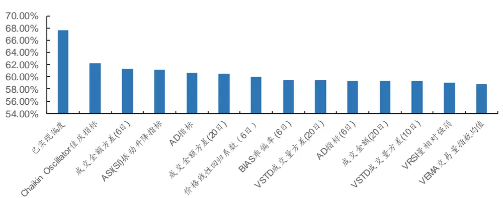
数据来源：Wind、广发证券发展研究中心

从因子IC绝对值角度看，IC绝对值靠前的因子分别为: BIAS乖偏率 (6日)、VSTD成交量方差(20日)、BBI_Close多空指数_收盘价、ASI(SI)振动升降指标、

识别风险，发现价值

VSTD成交量方差(10日)、成交金额方差(20日)、MACD指数平滑异同平均线、价格线性回归系数（6日）、VEMA交易量指数均值、BIAS乖偏率 (12日)、成交金额方差(6日)、已实现偏度、ROC变动速率(6日)、PVT价量趋势指标6、BIAS乖偏率(24日) 。

图105：因子IC绝对值排名前15因子表现
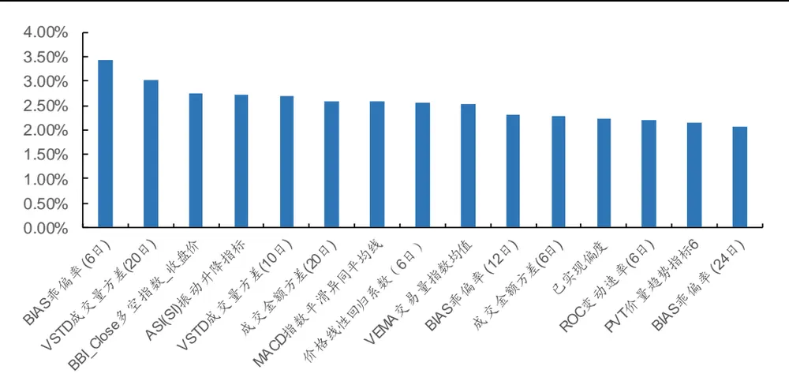
数据来源：Wind、广发证券发展研究中心

从因子多头年化收益率表现角度上看，在回测期内多头年化收益率排序靠前的因子分别为：VSTD成交量方差(20日)、成交金额方差(20日)、价格线性回归系数（6日）、BIAS乖偏率 (6日)、VEMA交易量指数均值、VSTD成交量方差(10日)、成交金额方差(6日)、ASI(SI)振动升降指标、成交金额(20日)、ARC变化率指数均值(50日)、ACD收集派发指标(6日)、RC变化率指数、已实现偏度、MTM动量指标、BBI_Close多空指数_收盘价。

图106：因子多头年化收益率排名前15因子表现
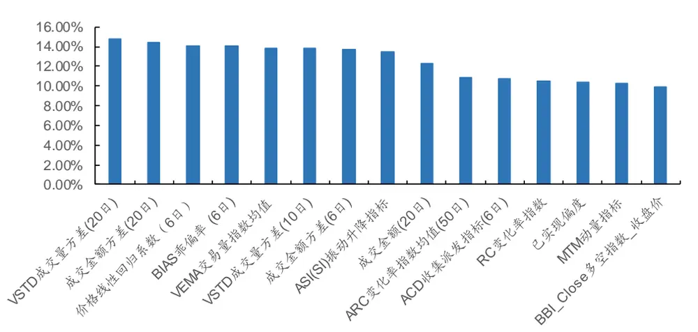
数据来源：Wind、广发证券发展研究中心

## 四、风险提示

本文所做的数据测算完全基于过去数据的推演，市场未来环境可能发生变化。投资者制定投资策略时，必须结合市场环境和自身投资理念。

## [Table_ResearchTeam] 广发金融工程研究小组

罗军 ：首席分析师，华南理工大学硕士，从业 14年，2010年进入广发证券发展研究中心。

安 宁 宁 ：联席首席分析师，暨南大学硕士，从业 12年，2011年进入广发证券发展研究中心。

史 庆 盛 ：资深分析师，华南理工大学硕士，从业 8年，2011年进入广发证券发展研究中心。

张 超 ：资深分析师，中山大学硕士，从业 7年，2012年进入广发证券发展研究中心。

文 巧 钧 ：资深分析师，浙江大学博士，从业 4年，2015年进入广发证券发展研究中心。

陈 原 文 ：资深分析师，中山大学硕士，从业 4年，2015年进入广发证券发展研究中心。

樊 瑞 铎 ：资深分析师，南开大学硕士，从业 4年，2015年进入广发证券发展研究中心。

李豪 ：资深分析师，上海交通大学硕士，从业 3年，2016年进入广发证券发展研究中心。

郭 圳 滨 ：高级分析师，中山大学硕士，2018年进入广发证券发展研究中心。

季 燕 妮 ：研究助理，厦门大学硕士，2020年进入广发证券发展研究中心。

张 钰 东 ：研究助理，中山大学硕士，2020年进入广发证券发展研究中心。

季 俊 男 ：南京大学硕士，2020年进入广发证券发展研究中心。

## [Table_IndustryInvestDescription] 广发证券—行业投资评级说明

买入： 预期未来12个月内，股价表现强于大盘10%以上。

持有： 预期未来12个月内，股价相对大盘的变动幅度介于-10%～+10%。

卖出： 预期未来12个月内，股价表现弱于大盘10%以上。

## [Table_CompanyInvestDescription] 广发证券—公司投资评级说明

买入： 预期未来12个月内，股价表现强于大盘15%以上。

增持： 预期未来12个月内，股价表现强于大盘5%-15%。

持有： 预期未来12个月内，股价相对大盘的变动幅度介于-5%～+5%。

卖出： 预期未来12个月内，股价表现弱于大盘5%以上。

## [Table_Address] 联系我们

| 地址 | 广州市 | 深圳市 | 北京市 | 上海市 | 香港 |
| --- | --- | --- | --- | --- | --- |
|  | 广州市天河区马场路 | 深圳市福田区益田路 | 北京市西城区月坛北 | 上海市浦东新区南泉 | 香港德辅道中189号 |
|  | 26号广发证券大厦 | 6001号太平金融大 | 街2号月坛大厦18 | 北路429号泰康保险 | 李宝椿大厦29及30 |
| 邮政编码 | 35楼 | 厦31层 | 层 | 大厦37楼 | 楼 |
| 客服邮箱 | 510627 gfzqyf@gf.com.cn | 518026 | 100045 | 200120 |  |

## [Table_LegalD 法律主体isclaimer 声明]

本报告由广发证券股份有限公司或其关联机构制作，广发证券股份有限公司及其关联机构以下统称为“广发证券”。本报告的分销依据不同国家、地区的法律、法规和监管要求由广发证券于该国家或地区的具有相关合法合规经营资质的子公司/经营机构完成。

广发证券股份有限公司具备中国证监会批复的证券投资咨询业务资格，接受中国证监会监管，负责本报告于中国（港澳台地区除外）的分销。

广发证券（香港）经纪有限公司具备香港证监会批复的就证券提供意见（4 号牌照）的牌照，接受香港证监会监管，负责本报告于中国香港地区的分销。

本报告署名研究人员所持中国证券业协会注册分析师资质信息和香港证监会批复的牌照信息已于署名研究人员姓名处披露。

## [Table_I 重要mportant 声明N

广发证券股份有限公司及其关联机构可能与本报告中提及的公司寻求或正在建立业务关系，因此，投资者应当考虑广发证券股份有限公司及其关联机构因可能存在的潜在利益冲突而对本报告的独立性产生影响。投资者不应仅依据本报告内容作出任何投资决策。投资者应自主作出投资决策并自行承担投资风险，任何形式的分享证券投资收益或者分担证券投资损失的书面或者口头承诺均为无效。

本报告署名研究人员、联系人（以下均简称“研究人员”）针对本报告中相关公司或证券的研究分析内容，在此声明：（1）本报告的全部分析结论、研究观点均精确反映研究人员于本报告发出当日的关于相关公司或证券的所有个人观点，并不代表广发证券的立场；（2）研究人员的部分或全部的报酬无论在过去、现在还是将来均不会与本报告所述特定分析结论、研究观点具有直接或间接的联系。

研究人员制作本报告的报酬标准依据研究质量、客户评价、工作量等多种因素确定，其影响因素亦包括广发证券的整体经营收入，该等经营收入部分来源于广发证券的投资银行类业务。

本报告仅面向经广发证券授权使用的客户/特定合作机构发送，不对外公开发布，只有接收人才可以使用，且对于接收人而言具有保密义务。广发证券并不因相关人员通过其他途径收到或阅读本报告而视其为广发证券的客户。在特定国家或地区传播或者发布本报告可能违反当地法律，广发证券并未采取任何行动以允许于该等国家或地区传播或者分销本报告。

本报告所提及证券可能不被允许在某些国家或地区内出售。请注意，投资涉及风险，证券价格可能会波动，因此投资回报可能会有所变化，过去的业绩并不保证未来的表现。本报告的内容、观点或建议并未考虑任何个别客户的具体投资目标、财务状况和特殊需求，不应被视为对特定客户关于特定证券或金融工具的投资建议。本报告发送给某客户是基于该客户被认为有能力独立评估投资风险、独立行使投资决策并独立承担相应风险。

本报告所载资料的来源及观点的出处皆被广发证券认为可靠，但广发证券不对其准确性、完整性做出任何保证。报告内容仅供参考，报告中的信息或所表达观点不构成所涉证券买卖的出价或询价。广发证券不对因使用本报告的内容而引致的损失承担任何责任，除非法律法规有明确规定。客户不应以本报告取代其独立判断或仅根据本报告做出决策，如有需要，应先咨询专业意见。

广发证券可发出其它与本报告所载信息不一致及有不同结论的报告。本报告反映研究人员的不同观点、见解及分析方法，并不代表广发证券的立场。广发证券的销售人员、交易员或其他专业人士可能以书面或口头形式，向其客户或自营交易部门提供与本报告观点相反的市场评论或交易策略，广发证券的自营交易部门亦可能会有与本报告观点不一致，甚至相反的投资策略。报告所载资料、意见及推测仅反映研究人员于发出本报告当日的判断，可随时更改且无需另行通告。广发证券或其证券研究报告业务的相关董事、高级职员、分析师和员工可能拥有本报告所提及证券的权益。在阅读本报告时，收件人应了解相关的权益披露（若有）。

本研究报告可能包括和/或描述/呈列期货合约价格的事实历史信息（“信息”）。请注意此信息仅供用作组成我们的研究方法/分析中的部分论点/依据/证据，以支持我们对所述相关行业/公司的观点的结论。在任何情况下，它并不（明示或暗示）与香港证监会第5类受规管活动（就期货合约提供意见）有关联或构成此活动。

## [Table_Interest 权益披露Disclosur

(1)广发证券（香港）跟本研究报告所述公司在过去12 个月内并没有任何投资银行业务的关系。

## [Table_Copyright] 版权声明

未经广发证券事先书面许可，任何机构或个人不得以任何形式翻版、复制、刊登、转载和引用，否则由此造成的一切不良后果及法律责任由私自翻版、复制、刊登、转载和引用者承担。