# [Table_Title] 再谈地理关联度因子研究

# 多因子 Alpha 系列报告之(四十四)

## 报告摘要：

因子开发迭代更新越来越重要。近几年来，随着传统多因子模型在市场的应用逐渐广泛，因子的波动特征逐渐加大，因子拥挤等原因造成了因子的收益逐渐下降。为了能够寻找更好的 Alpha 收益来源，在多因子模型框架中，因子作为底层 Alpha 来源输入的基础，因子的开发、迭代、更新就显得越来越重要。低频相关的数据的因子开发目前难度越来越大，增量的信息越来越有限。本篇专题探讨个股基于地理和行业关联数据在因子选股中的应用。

领先滞后效应与关联度概念。传统的有效市场假说认为，在完全有效的金融市场上，价格能够及时、充分反映资产的所有公开信息以及私有信息。但实证研究表明，股票市场中存在着“领先滞后效应”。例如，面对行业层面新信息，行业内不同股票对于信息的反映速度存在差异，部分股票价格率先变动，另一部分股票价格滞后变动。结合上篇研究报告《基于地理关联度因子研究——多因子 Alpha 系列报告之（四十三）》思路，本报告尝试定义关联度为同一行业不同区位的股票之间的关联程度，据此构造相关系数因子及其优化因子，并研究该类因子在A股中的有效性。

相关系数因子实证分析。本篇专题报告共构建了五种相关系数类因子并在全市场范围了进行月频调仓的实证分析。实证分析结果表明，除INDUCORRJP因子外，其余 4 种相关系数类因子的分档效果均显著。其中，INDUCORRP因子整体表现较好，因子整体的IC 均值为0.065，正IC占比88.31%，多头相对中证500指数年化超额收益率为15.32%，信息比率为 1.816。

相关性分析与稳健性检验。本篇专题报告针对回测表现较好的 2 种相关系数类因子，进行与 BARRA 因子相关性分析与稳健性检验。实证结果表明，相关系数类因子能够挖掘传统因子外的增量信息，即股票之间的关联信息。INDUCORR因子与INDUCORRP因子在中证 1000 股票池内仍具有较好表现。

风险提示。本专题报告所述模型用量化方法通过历史数据统计、建模和测算完成，所得结论与规律在市场政策、环境变化时可能存在失效风险；策略在市场结构及交易行为的改变时有可能存在策略失效风险。

图：全市场分档表现
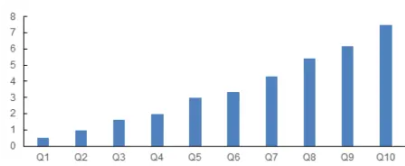
数据来源：Wind, 广发证券发展研究中心

[分析师： Table_Author]陈原文

同SAC 执证号：S0260517080003

0755-82797057

chenyuanwen@gf.com.cn分析师： 罗军

同SAC 执证号：S0260511010004

020-66335128

luojun@gf.com.cn

分析师： 安宁宁

SAC 执证号：S0260512020003

SFC CE No. BNW179

0755-23948352

anningning@gf.com.cn

请注意，陈原文,罗军并非香港证券及期货事务监察委员会的注册持牌人，不可在香港从事受监管活动。

## [Table_ 相关研究：DocRe

金融工程:——风险溢价视角 2022-06-14下的股债“固收+”策略

日内价量数据因子化研究:高 2022-06-06频数据因子研究系列八

中国经济综合领先指数:方法 2022-06-01与实践

## 一、因子挖掘思考

## （一）高频信息

近年来，A股市场机构化趋势明显，量化私募机构的管理规模也迅速扩大，产生了一批管理规模超过百亿的量化私募机构。与此同时，传统的风格因子波动增大，从市场获取超额收益的难度在增加。

因子拥挤是因子收益下降的原因之一。因子代表着市场某方面的非有效性、或者是一段时期内的定价失效。当某类因子收益高的时候，会吸引更多的资金进入，从而出现因子拥挤，降低因子的预期收益。一旦新的因子被公开，套利资金的介入会使得错误定价收窄，因子收益也会跟着下降。因此，在多因子选股模型中，因子的开发和更新迭代变得越来越重要。

与低频因子相比，高频数据在用于量化投资中存在一定优势。

首先，高频价量数据的体量明显大于低频数据。以分钟行情为例，用压缩效果较好的mat格式存储2020年全市场股票的分钟行情数据（包括分钟频的开高低收价格数据、买卖盘挂单数据等），约为12GB。如果是快照行情（目前上交所和深交所都是3秒一笔）或者level 2行情，数据量要大很多。因此，高频数据因子挖掘对信息处理能力和处理效率的要求较高。而且，日内数据，尤其是level 2数据，一般要额外付费，甚至需要自行下载存储实时行情，在此基础上构建的因子拥挤度较低。

其次，高频价量数据一般是多维的时间序列数据，数据中噪声比例较高，而且与ROE、PE这类低频指标本身就具有选股能力不同的是，原始的高频行情数据一般不能直接用作选股因子，而要通过信号变换、时间序列分析、机器学习等方法从高频数据中构建特征，才能作为选股因子。此类因子与低频信号的相关性较低，而且由于因子开发流程相对复杂，不同投资者构建的因子更具有多样性。

此外，高频数据开发的因子一般调仓周期较短，意味着在检验因子有效性的时候，同一段测试期具有更多的独立样本。例如，在一年的测试期内，只有12个独立的样本段用于检验月频调仓的因子，与之相比，有约50个独立的时段用于检验周频调仓因子，有超过240个独立的时段用于检验日频调仓的因子。独立样本的增多有助于检验高频因子的有效性。

高频数据挖掘因子的难点在于数据维度大、噪声高。凭借专业投资者的经验或者是参阅已发表的文献，可以从高频数据中提炼出一部分有选股能力的特征。此外，机器学习方法擅长从数据中寻找规律和特征，是高频数据因子挖掘的有力工具。

表 1：广发金工高频数据因子挖掘系列报告一览

| 高频价量数据的因子化方法-多因子Alpha系列报告之（四十一） |
| --- |
| 深度学习框架下高频数据因子挖掘-深度学习研究报告之七 |
| 基于个股羊群效应的选股因子研究-高频数据因子研究系列三 |
| 基于日内高频数据的短周期选股因子研究-高频数据因子研究系列二 |
| 基于日内高频数据的短周期选股因子研究-高频数据因子研究系列一 |
| 信息不对称理论下的高频因子挖掘 |
| 再谈信息不对称理论下的因子挖掘 |
| 日内价量数据因子化研究 |

数据来源：Wind，广发证券发展研究中心

## （二）低频信息

以传统日频价量和更低频财务数据为基础的因子开发是一种研究途径。由于基础因子广为人知，在此基础上进行因子挖掘的收益提升空间相对有限。而且日频数据由于本身的数据量和信息量有限，过度挖掘会增大过拟合的风险。

对于低频信息的挖掘，从最近几年的进展上看，低频里的增量信息成果越来越少。从数据维度上看，低频的因子建模更多是从一些另类数据或者是新的方法、理论成果中出发构建相关的因子。如另类数据角度，从互联网中的股吧、新闻、关注度等角度，或者是专利数据、供应链相关数据等。新的理论成果如从图网络等角度出发构建相关的因子。

本篇专题报告基于个股的“关联度”角度出发，研究个股所在行业关联度角度构建因子。

## 二、关联度因子研究进展

## （一）关联度因子的理论研究进展

传统的有效市场假说认为，在完全有效的金融市场上，价格能够及时、充分反映资产的所有公开信息以及私有信息。但是，Kalok等(2005)[3]、刘菁哲(2010)[12]等众多学者通过实证研究发现，股票市场中存在着“领先滞后效应”，即不同公司对相同基本面信息的反应速度存在差异，一些公司能够迅速对新信息做出反应，另一些公司对于新信息的反应存在时滞。

本报告对国内外学者基于行业关联、科技关联、供应链关联、地理关联信息的“领先滞后效应”研究成果进行了简单梳理。对于行业关联信息，Cohen和Lou(2012)[5]实证检验了，面对影响全行业的信息事件，单一经营部门公司的股价能够更迅速的反映新信息，同时对于多经营部门公司未来股票收益存在显著预测能力。胡聪慧等(2015)[10]采用A股上市公司数据验证了这一结论，并证实了集团公司股价变动的滞后性主要在于投资者关注度与处理能力有限性，以及行业估值的复杂性。向诚等(2018)[13]实证说明了行业内受关注度最高的30%公司组合的收益率，显著引领受关注度最低30%公司组合的未来收益率。段丙蕾等(2022)[9]认为行业关联回报率仅在月度层面显著，在周度层面不显著。同时，Parsons和Sabbatucci(2018)[1]对于行业关联公司的收益预测能力的有效性提出质疑。他们认为，随着证券分析师覆盖率不断提升，股票价格的有效性增强；随着个股证券分析师重复率上升，股票价格反映的行业一致预期信息越多，因此基于行业关联构建的股票投资策略效果可能衰减。

对于科技关联信息，Lee等(2019)[6]构建科技关联指标并进行实证分析，研究结论表明科技关联企业的收益对研究企业的收益具有很强的预测能力。国内学者借鉴Lee等(2019)[6]的科技关联指标构建方法，研究该指标在我国股票市场的适用性。李绪泉等(2020)[11]的实证分析结果说明，A股市场存在科技溢出效应。段丙蕾等(2022)[9]进一步证明了科技关联因子仅在周度上具有显著收益预测能力，认为造成这一结果的原因在于A股市场中存在较多博彩倾向的散户投资者，该类投资者追涨杀跌的交易行为缩短了科技关联信息融入股价所需的时间。

对于供应链关联信息，Cohen和Frazzini(2008)[4]、Menzly和Ozbas(2010)[7]验证了公司客户信息能够有效预测公司未来股票收益。国内学者对于供应链关联相关研究相对较少，现有的研究成果也未提供在控制变量基础上，供应链关联能够有效预测股票收益的证据(段丙蕾等, 2022)[9]。

对于地理关联信息，Peng和Lin在其发表论文《Investor Attention,Overconfidence, and Category Learning》(Journal of Financial Economics, 2006)[8]中提出，总部位于同一地理区位的公司，会受到相同基本面因素的影响，从而这些公司股价都会对新信息作出反应。基于这一研究思路，Parsons和Sabbatucci在其发表论文《Geographic Lead-Lag Effects》(The Review of Financial Studies，2018)[1]中提出地理关联公司的概念，具体指与研究个股处于相同地理区位不同行业的所有上市公司。认为地理关联公司股票与目标股票的价格变动存在领先滞后关系（本文将此关系简称为地理关联度），前者对后者未来收益具有预测能力。并且采用面板数据回归方法，实证检验了这一结论。研究结果表明：（1）在控制行业影响基础上，地理关联公司的基本面因素（EPS、销售收入、雇员数量等）变动对目标股票的基本面变动具有显著的解释能力。（2）地理关联公司股票的平均收益对目标股票未来收益具有显著的预测能力，地理关联公司股票的平均收益越高，目标股票未来收益越高。（3）由于证券分析师通常是基于行业而非省份分类的，因此，共同分析师覆盖率提升并不会导致地理关联度的领先滞后关系减弱甚至消失。

## （二）关联度因子的实证研究进展

上一篇研究报告《基于地理关联度因子研究——多因子Alpha系列报告之（四十三）》针对地理关联度因子的理论逻辑、因子构建与改进思路、因子在A股市场中的实际应用效果进行了全面的探讨。重点分析了基于学术论文《Geographic Lead-LagEffects》构建的地理关联度因子存在的局限性，并且构造了六种改进的地理相关系数类因子。实证分析结论表明，报告中构建的GEOGCORR、GEOGCORRP与GEOGCORRIP共3种地理相关系数类因子的分档效果明显。

考虑到上述地理相关系数类因子在回溯测试中具有较好的表现，同时，理论研究表明行业关联度信息对于股票未来收益存在显著的区分能力，因此，本篇报告将沿用地理相关系数类因子的构建方法，构造行业相关系数类因子，并探讨这类因子在A股的有效性。

## 三、行业关联度因子构造方法与策略框架

## （一）因子构造方法

《基于地理关联度因子研究——多因子Alpha系列报告之（四十三）》报告共构建了相关系数、相关系数变动、相关系数拆解三大类共6种因子。其中，相关系数、相关系数拆解类因子回测表现相对较好。因此，本篇专题报告基于这两大类因子构造方法构建行业相关系数类因子。具体的因子定义、构造逻辑与计算方法如下。

## 1. 行业相关系数因子

本篇报告定义行业相关系数因子(INDUCORR)，用以度量个股与其行业关联(不同省份相同申万一级行业)公司股票之间的整体相关程度，具体由个股和行业关联公司股票相关系数均值表示。

以股票i在t月月末的行业相关系数因子为例，具体计算方式如下。首先，在全市场范围剔除t月的st股、 ∗st股、停牌股以及上市不满一年的股票；其次，筛选出与股票i办公地所属省份不同、申万一级行业相同的全部共N支股票j，并分别计算与股票i在t月日频收益序列的皮尔森相关系数，即 $CORR_{i,j,t}.$ 。最后，对所有相关系数进行加权求和(若不做特殊说明， $w_{j,t}$ 均设置为 $1/N$ ，即等权)，得到股票i在t月月末换仓日的行业相关系数因子 $INDUCORR_{i,t}$ 0

$$
CORR_{i,j,t}=\frac{cov(R_{i},R_{j})}{std(R_{i})*std(R_{j})}
$$

$$
INDUCORR_{i,t}={\sum}_{j=1}^{N}w_{j,t}*CORR_{i,j,t},
$$

$$
\begin{aligned}geog_{i}&\neq geog_{j}\\industry_{i}&=industry_{j}\end{aligned}
$$

其中， $geog_{i}(geog_{j})$ 分别为股票i(j)的办公地归属省份。 $industry_{i}\big(industry_{j}\big)$ 为股票i(j)的申万一级行业分类。

## 2. 行业相关系数拆解因子

Bollerslev等(2022)[2]在发表论文《Realized semibetas: Disentangling “good”and “bad” downside risks》(Journal of Financial Economics)中，根据市场收益与资产收益序列的符号将传统市场贝塔拆分为四个半贝塔，并实证说明了基于负市场收益与负资产收益序列协方差构建的半贝塔与资产未来收益显著正相关，基于负市场收益与正资产收益序列协方差构建的半贝塔与资产未来收益显著负相关。这一结论对本报告的启示在于：基于不同数值方向收益序列构建的相关系数，可能蕴含的信息量也存在差异。因此，本报告将股票i与股票j的收益序列进行拆分，并定义四种具体的行业相关系数拆解因子(INDUCORRP、INDUCORRN、INDUCORRIP与INDUCORRJP)，用以度量个股与行业关联公司股票的调整后收益序列的相关程度。

以股票i在t月的行业相关系数拆解因子 $(INDUCORRP_{i,t})$ 为例，具体计算方式如下。首先，对于股票i与全部N个股票j，利用 $R_{i}^{+}$ 公式对其日度收益序列进行调整，也就是将负日度收益调整为0。其次，根据行业相关系数因子构造步骤，得到行业相关系数拆解因子 $INDUCORRP_{i,t}$ 。其余三种行业相关系数拆解因子 $I(INDUCORRN_{i,t}$ $INDUCORRIP_{i,t}与INDUCORRIP_{i,t}$ 构造方式同理可得。

$$
R_{i}^{+}=max(R_{i},0)\quad R_{i}^{-}=min(R_{i},0)
$$

$$
INDUCORP_{i,t}=\sum_{j=1}^{N}w_{j}*CORR\big(R_{i}^{+},R_{j}^{+}\big)
$$

$$
INDUCOR_{i,t}=\sum_{j=1}^{N}w_{j}*CORR\big(R_{i}^{-},R_{j}^{-}\big)
$$

$$
INDUCORRIP_{i,t}=\sum_{j=1}^{N}w_{j}*CORR\big(R_{i}^{+},R_{j}^{-}\big)
$$

$$
INDUCORIP_{i,t}=\sum_{j=1}^{N}w_{j}*CORR\big(R_{i}^{-},R_{j}^{+}\big)
$$

## （二）因子特征分析

在构建具体的因子投资策略前，本报告先对行业相关系数因子特征进行分析，以了解因子更偏向哪些行业与市值特征股票，并据此判断是否需要进行因子层面的行业与市值中性化处理。

图1表明，行业相关系数因子在行业层面存在显著差异。具体地，银行业的行业相关系数均值显著高于其他行业因子均值。为排除行业暴露对行业相关系数因子的影响，本报告在实证分析部分将对因子进行行业中性化处理。

图 1：行业相关系数因子的申万一级行业分布特征
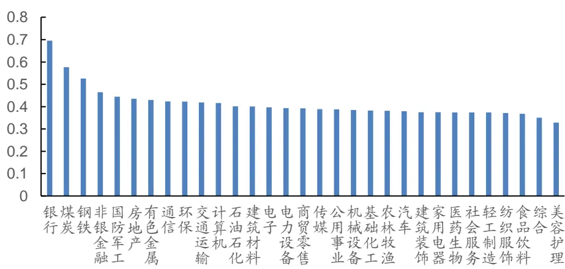
数据来源：Wind，广发证券发展研究中心

图2表明，行业相关系数因子在市值层面存在显著差异。具体表现为市值越小(大)，行业相关系数因子值越低(高)。这意味着，大市值股票更容易受到共同行业因素影响，其股价变动与行业关联公司股价变动相关程度更高。为排除市值暴露对行业相关系数因子的影响，本报告在实证分析部分将对因子进行市值中性化处理。

图 2：行业相关系数因子的市值分布特征
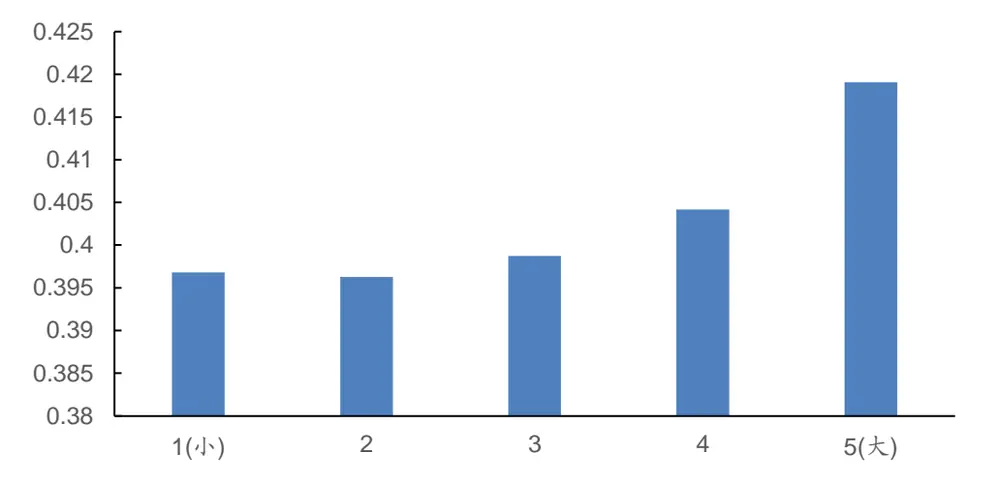
数据来源：Wind，广发证券发展研究中心

## （三）因子策略构建

从全市场行业相关系数因子均值与中证全指指数收益走势可以看出，整体而言，全市场股票月度因子均值为0.397，与中证全指指数同期收益呈负相关关系(相关系数-0.382)，与下期收益呈正相关关系(相关系数0.018)。仅考虑中证全指指数收益为负的月份时，因子均值增长至为0.439，因子均值与中证全指指数同期收益相关系数增强至-0.631，与下期收益相关系数增强至0.111。该结果说明：（1）整体样本区间而言，全市场股票行业相关系数因子均值与下期市场收益序列呈正向变动关系。当期的全市场因子均值越高，下期反转效应越强，市场收益越高；（2）第（1）点结论在中证全指指数收益小于0时效果更显著。

图 3：全市场月度行业相关系数因子均值与中证全指月度收益走势图
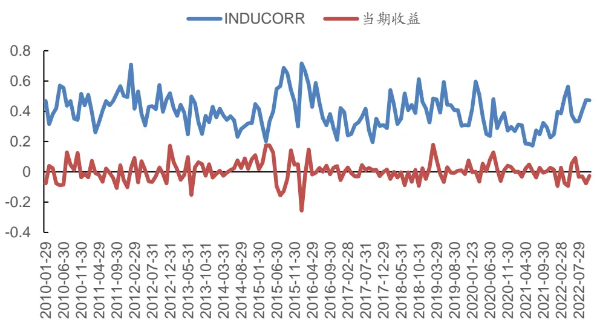
数据来源：Wind，广发证券发展研究中心

表 2：全市场股票行业相关系数因子均值与中证全指收益序列相关性

| 因子值均值 |  | 因子值与 市场同期收益 | 因子均值与市场 未来1月收益 |
| --- | --- | --- | --- |
| 总样本 | 0.397 | -0.382 | 0.018 |
| 中证全指收益>0样本 | 0.359 | 0.195 | -0.005 |
| 中证全指收益<0样本 | 0.439 | -0.631 | 0.111 |

数据来源：Wind，广发证券发展研究中心

据此，本篇专题报告构造如下交易策略：根据行业相关系数类因子值，在调仓日买入行业关联程度最高的股票，同时卖出行业关联程度最低的股票。

图 4：策略构建框架
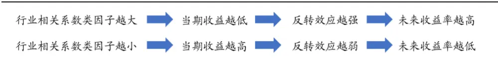
数据来源：广发证券发展研究中心

## 四、实证分析

## （一）数据说明

选股范围：全市场

股票预处理：剔除非上市、摘牌、ST/*ST、涨跌停板、上市未满1年股票

因子预处理：MAD去极值、Z-Score标准化、行业市值中性化

回测区间： 2010.01.01 – 2022.10.31

分档方式：根据当期股票的因子值，从小到大分为十档

调仓周期：每个月最后一个交易日以收盘价调仓

交易费用：千分之三（卖出时收取）

## （二）因子分档表现

图 5：全市场 INDUCORR因子十档-月度调仓
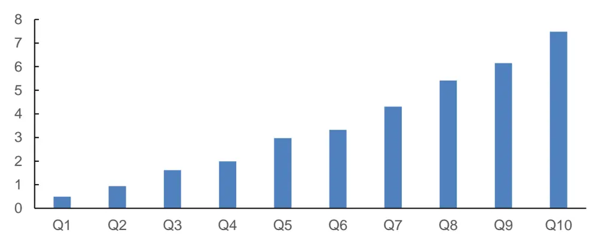
数据来源：Wind，广发证券发展研究中心

图 6：全市场 INDUCORRP因子十档-月度调仓
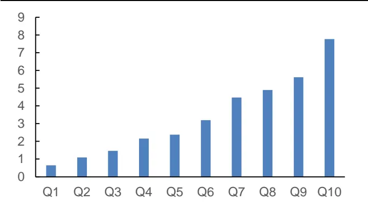
数据来源：Wind，广发证券发展研究中心

图 7：全市场 INDUCORRN因子十档-月度调仓
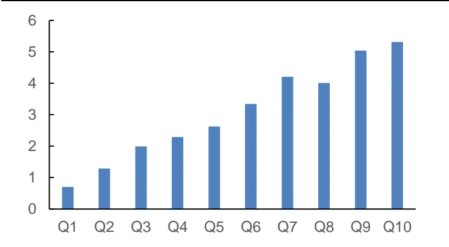
数据来源：Wind，广发证券发展研究中心

图 8：全市场 INDUCORRIP因子十档-月度调仓
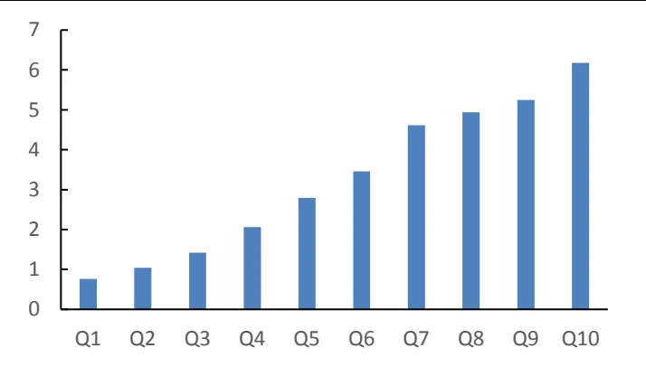
数据来源：Wind，广发证券发展研究中心

图 9：全市场 INDUCORRJP因子十档-月度调仓
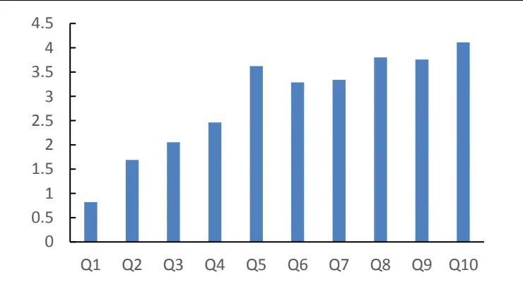
数据来源：Wind，广发证券发展研究中心

在月度调仓的历史回测下，5种行业相关系数类因子的整体分层效果较好。除INDUCORRJP因子外，其余4种行业相关系数类因子的分层效果均显著，分层收益区分度高。

## （三）因子实证结果

本小节中，首先，将对构建的5种行业相关系数类因子在IC、多空策略、多头相对基准策略以及换手率方面的回测表现进行整体展示。其次，通过对比各因子在回测期中的绩效，选取INDUCORR因子与INDUCORRP因子，对其分年度表现进行详细展示。

## 1. 整体表现

整体来看，5种行业相关系数类因子在选股方向上与构建的交易策略保持一致，即个股与行业关联公司股票的整体相关性越高，股票未来收益表现越好。各因子的IC表现、多空对冲策略表现与因子分档测试结果一致各因子的多头平均换手率在80%左右。具体来看，INDUCORR与INDUCORRP共2个因子在IC分析、多空策略绩效、多头相对基准策略绩效上总体表现较好。

表 3：行业相关系数类因子整体绩效表现

|  |  |  |  |  |  |  |  | 多头相对基准策略 |  |  |  |
| --- | --- | --- | --- | --- | --- | --- | --- | --- | --- | --- | --- |
| 因子名称 | 因子代码 | IC 均值 | IC T统计量 | 正IC 占比 | 年化 | 多空策略表现 信息 | 最大 | 年化 | 信息 | 最大 | 多头平均 换手率 |
|  |  |  |  |  | 收益 | 比率 | 回撤 | 收益 | 比率 | 回撤 |  |
| 相关系数 | INDUCORR | 0.071 | 13.014 | 85.71% | 22.70% | 2.827 | 6.54% | 14.98% | 1.773 | 13.31% | 77.90% |
| 相关拆解 | INDUCORRP | 0.065 | 14.199 | 88.31% | 20.72% | 2.872 | 5.36% | 15.32% | 1.816 | 13.42% | 81.03% |
| 相关拆解 | INDUCORRN | 0.052 | 9.339 | 77.92% | 16.31% | 1.924 | 5.34% | 11.87% | 1.403 | 14.12% | 81.81% |
| 相关拆解 | INDUCORRIP | 0.061 | 15.061 | 87.66% | 17.16% | 2.788 | 6.90% | 13.40% | 1.615 | 12.57% | 85.13% |
| 相关拆解 | INDUCORRJP | 0.037 | 7.298 | 72.73% | 12.80% | 1.543 | 5.72% | 9.84% | 1.107 | 16.79% | 86.47% |

数据来源：Wind，广发证券发展研究中心

## 2. INDUCORR因子具体表现

表 4：INDUCORR 因子-整体与分年度 IC 表现

| 范围 | IC 均值 | IC 标准差 | IC最大值 | IC最小值 | ICT统计量 | IC累计值 | 正IC占比 |
| --- | --- | --- | --- | --- | --- | --- | --- |
| 2010 | 0.069 | 0.079 | 0.224 | -0.059 | 3.000 | 0.822 | 83.33% |
| 2011 | 0.084 | 0.063 | 0.211 | 0.008 | 4.588 | 1.005 | 100.00% |
| 2012 | 0.095 | 0.072 | 0.241 | -0.009 | 4.525 | 1.136 | 91.67% |
| 2013 | 0.072 | 0.047 | 0.147 | -0.012 | 5.348 | 0.865 | 91.67% |
| 2014 | 0.080 | 0.055 | 0.149 | -0.021 | 5.000 | 0.959 | 83.33% |
| 2015 | 0.105 | 0.088 | 0.254 | -0.030 | 4.139 | 1.260 | 83.33% |
| 2016 | 0.078 | 0.067 | 0.154 | -0.066 | 4.057 | 0.938 | 83.33% |
| 2017 | 0.038 | 0.080 | 0.178 | -0.102 | 1.649 | 0.457 | 66.67% |
| 2018 | 0.057 | 0.071 | 0.182 | -0.050 | 2.750 | 0.680 | 83.33% |
| 2019 | 0.063 | 0.062 | 0.144 | -0.064 | 3.484 | 0.751 | 83.33% |
| 2020 | 0.059 | 0.079 | 0.220 | -0.084 | 2.574 | 0.703 | 91.67% |
| 2021 | 0.058 | 0.064 | 0.199 | -0.038 | 3.144 | 0.694 | 75.00% |
| 2022 | 0.074 | 0.050 | 0.141 | 0.001 | 4.705 | 0.739 | 100.00% |
| ALL | 0.071 | 0.068 | 0.254 | -0.102 | 13.014 | 11.008 | 85.71% |

数据来源：Wind，广发证券发展研究中心
2022指截止至 2022年 10月 31日，如下若无特别说明，该表述与此一致

图 10：INDUCORR因子-IC值与IC累计值走势
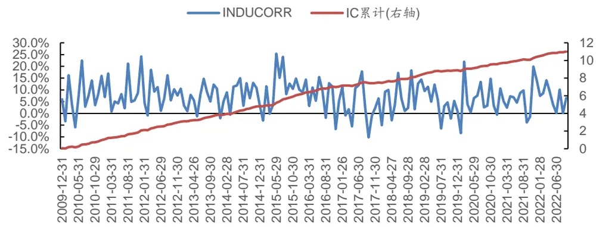
数据来源：Wind，广发证券发展研究中心

表 5：INDUCORR 因子-多空对冲策略与多头相对中证 500 指数策略-整体与分年度表现-月度调仓

| 年份 | 多头 | 多空对冲策略 |  |  |  |  |  | 多头-中证500 策略 |  |  |  |
| --- | --- | --- | --- | --- | --- | --- | --- | --- | --- | --- | --- |
|  | 累计 | 累计 | 年化 | 年化 | 信息 | 最大 | 累计 | 年化 | 年化 | 信息 | 最大 |
|  | 收益率 | 收益率 | 收益率 | 波动率 | 比率 | 回撤 | 收益率 | 收益率 | 波动率 | 比率 | 回撤 |
| 2010 | 22.86% | 16.33% | 16.33% | 5.86% | 2.789 | 2.43% | 12.19% | 12.19% | 5.35% | 2.277 | 1.81% |
| 2011 | -20.45% | 33.04% | 33.04% | 5.82% | 5.676 | 0.00% | 18.88% | 18.88% | 5.18% | 3.647 | 0.33% |
| 2012 2013 | 15.01% | 31.00% | 31.00% | 6.99% | 4.436 | 0.67% | 14.51% | 14.51% | 4.34% | 3.344 | 0.74% |
| 2014 | 39.50% | 27.01% | 27.01% | 4.72% | 5.722 | 0.34% | 20.20% | 20.20% | 4.77% | 4.238 | 0.03% |
| 2015 | 67.21% 122.65% | 26.46% | 26.46% | 8.07% | 3.278 | 0.13% | 21.35% | 21.35% | 6.03% | 3.540 | 0.69% |
| 2016 | -5.91% | 44.31% 16.04% | 44.31% | 16.20% | 2.736 | 3.31% | 57.18% | 57.18% | 12.48% | 4.581 | 1.62% |
| 2017 | -10.73% | 13.89% | 16.04% 13.89% | 6.60% | 2.431 | 1.69% | 15.72% -10.25% | 15.72% | 5.33% | 2.948 | 1.27% |
| 2018 | -24.91% | 24.16% | 24.16% | 7.15% | 1.944 4.222 | 3.50% |  | -10.25% | 4.92% | -2.084 | 10.71% |
| 2019 | 33.21% | 14.46% | 14.46% | 5.72% 6.64% | 2.176 | 0.15% 3.09% | 12.65% 5.49% | 12.65% 5.49% | 7.08% | 1.786 | 1.86% |
| 2020 | 23.25% | 20.41% | 20.41% | 10.36% | 1.969 | 4.69% | 1.51% |  | 5.98% | 0.918 | 3.21% |
| 2021 | 35.72% | 17.67% | 17.67% | 7.40% | 2.387 | 4.39% | 17.81% | 1.51% 17.81% | 11.52% | 0.131 | 4.86% |
| 2022 | -8.79% | 10.38% | 12.59% | 6.34% | 1.984 | 3.33% | 16.02% | 19.53% | 13.40% 9.34% | 1.329 | 2.36% |
|  | 648.32% | 1280.35% | 22.70% |  | 2.827 | 6.54% | 499.75% | 14.98% |  | 2.091 | 3.34% |
| ALL |  |  |  | 8.03% |  |  |  |  | 8.45% | 1.773 | 13.31% |

数据来源：Wind，广发证券发展研究中心

表 6：INDUCORR因子-多空对冲策略与多头相对中证 500指数策略(行业中性)-整体与分年度表现-月度调仓

| 年份 | 多头 | 多空对冲策略 |  |  |  | 多头-中证500 策略 |  |  |  |  |
| --- | --- | --- | --- | --- | --- | --- | --- | --- | --- | --- |
|  | 累计 | 累计 | 年化 | 年化 | 信息 | 最大 | 累计 年化 | 年化 | 信息 | 最大 |
|  | 收益率 | 收益率 | 收益率 | 波动率 | 比率 | 回撤 收益率 | 收益率 | 波动率 | 比率 | 回撤 |
| 2010 | 22.12% | 23.18% | 23.18% | 6.19% | 3.744 1.98% | 11.54% | 11.54% | 5.29% | 2.184 | 1.55% |
| 2011 | -19.82% | 33.48% | 33.48% | 8.74% | 3.830 2.34% | 19.78% | 19.78% | 5.13% | 3.854 | 0.00% |
| 2012 | 15.09% | 33.13% | 33.13% | 8.06% | 4.108 1.00% | 14.60% | 14.60% | 3.55% | 4.106 | 0.60% |
| 2013 | 38.90% | 24.93% | 24.93% | 5.78% | 4.309 0.68% | 19.77% | 19.77% | 5.19% | 3.809 | 0.22% |
| 2014 | 67.83% | 20.05% | 20.05% | 12.30% | 1.631 | 1.39% 21.92% | 21.92% | 6.18% | 3.546 | 0.78% |
| 2015 | 112.40% | 45.25% | 45.25% | 18.77% | 2.411 | 7.78% 50.51% | 50.51% | 12.24% | 4.127 | 2.96% |
| 2016 | -4.06% | 19.88% | 19.88% | 6.60% | 3.010 | 0.63% | 18.08% 18.08% | 5.86% | 3.082 | 0.54% |
| 2017 | -9.80% | 13.01% | 13.01% | 7.26% | 1.792 | 3.24% | -9.32% -9.32% | 4.94% | -1.885 | 9.76% |
| 2018 | -24.88% | 25.77% | 25.77% | 7.04% | 3.659 | 0.39% | 12.64% 12.64% | 6.72% | 1.879 | 2.44% |
| 2019 | 33.99% | 14.75% | 14.75% | 6.89% | 2.142 | 2.98% | 5.97% 5.97% | 5.91% | 1.010 | 3.24% |
| 2020 | 24.62% | 20.03% | 20.03% | 9.59% | 2.088 | 2.92% | 2.60% 2.60% | 11.26% | 0.231 | 4.24% |
| 2021 | 38.48% | 20.39% | 20.39% | 9.19% | 2.220 | 5.83% | 20.24% | 20.24% 12.49% | 1.621 | 2.07% |
| 2022 | -7.44% | 13.50% | 16.41% | 8.48% | 1.936 | 3.43% | 17.57% | 21.44% 8.14% | 2.634 | 2.14% |
| ALL | 676.30% | 1429.32% | 23.68% | 9.30% | 2.545 | 7.78% | 523.80% | 15.33% | 8.09% 1.895 | 11.86% |

数据来源：Wind，广发证券发展研究中心

图 11：INDUCORR因子-多空策略净值走势
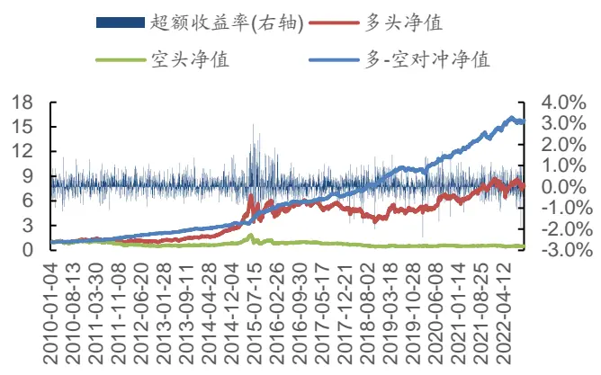
数据来源：Wind，广发证券发展研究中心

图 12：INDUCORR因子-多-中证500策略净值走势
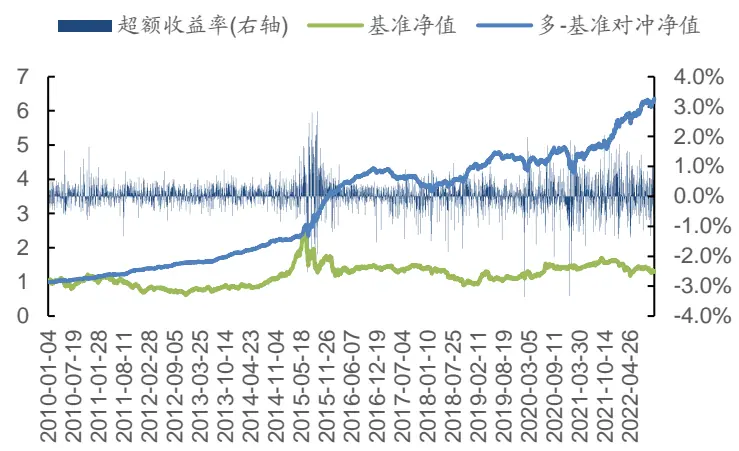
数据来源：Wind，广发证券发展研究中心

表 7：INDUCORR 因子-分年度换手率

| 统计区间 | 均值 | 最大值 | 最小值 | 标准差 | 累计值 |
| --- | --- | --- | --- | --- | --- |
| 2010 | 79.91% | 87.12% | 75.19% | 0.040 | 879.06% |
| 2011 | 77.83% | 81.08% | 70.73% | 0.032 | 933.99% |
| 2012 | 78.86% | 84.36% | 74.87% | 0.026 | 946.36% |
| 2013 | 78.88% | 83.03% | 73.27% | 0.031 | 946.56% |
| 2014 | 78.92% | 83.10% | 75.81% | 0.025 | 947.02% |
| 2015 | 81.74% | 88.12% | 70.89% | 0.048 | 980.85% |
| 2016 | 78.32% | 81.48% | 75.41% | 0.019 | 939.83% |
| 2017 | 73.91% | 83.47% | 67.04% | 0.044 | 886.94% |
| 2018 | 75.23% | 79.43% | 70.00% | 0.029 | 902.75% |
| 2019 | 75.57% | 79.82% | 69.97% | 0.031 | 906.88% |
| 2020 | 78.95% | 84.32% | 71.04% | 0.036 | 947.44% |
| 2021 | 78.42% | 81.56% | 74.14% | 0.023 | 941.08% |
| 2022 | 75.96% | 79.30% | 72.07% | 0.025 | 759.63% |
| ALL | 77.90% | 88.12% | 67.04% | 0.037 | 11918.39% |

数据来源：Wind，广发证券发展研究中心

在全市场选股中，INDUCORR因子的选股区分度较高，因子IC均值为0.071，IC胜率为85.71%，2022年以来的IC均值为0.074。在多头相对中证500指数策略的回测中，策略整体的年化超额收益率为14.98%，信息比率为1.773。除2017年外，其余年份均可取得超额收益。整体换手率保持在77.90%左右。

## 3. INDUCORRP因子具体表现

表 8：INDUCORRP 因子-整体与分年度 IC 表现

| 范围 | IC 均值 | IC 标准差 | IC 最大值 | IC 最小值 | ICT统计量 | IC累计值 | 正IC占比 |
| --- | --- | --- | --- | --- | --- | --- | --- |
| 2010 | 0.065 | 0.066 | 0.177 | -0.046 | 3.443 | 0.783 | 83.33% |
| 2011 | 0.071 | 0.065 | 0.206 | 0.008 | 3.760 | 0.847 | 100.00% |
| 2012 | 0.078 | 0.045 | 0.146 | 0.002 | 5.973 | 0.941 | 100.00% |
| 2013 | 0.080 | 0.050 | 0.145 | -0.005 | 5.518 | 0.955 | 91.67% |
| 2014 | 0.060 | 0.045 | 0.124 | -0.040 | 4.568 | 0.719 | 91.67% |
| 2015 | 0.084 | 0.068 | 0.235 | -0.010 | 4.290 | 1.004 | 91.67% |
| 2016 | 0.069 | 0.050 | 0.134 | -0.019 | 4.795 | 0.832 | 83.33% |
| 2017 | 0.046 | 0.064 | 0.133 | -0.085 | 2.495 | 0.550 | 83.33% |
| 2018 | 0.055 | 0.062 | 0.180 | -0.040 | 3.048 | 0.655 | 83.33% |
| 2019 | 0.068 | 0.055 | 0.141 | -0.027 | 4.334 | 0.819 | 83.33% |
| 2020 | 0.060 | 0.071 | 0.178 | -0.065 | 2.938 | 0.723 | 91.67% |
| 2021 | 0.044 | 0.055 | 0.157 | -0.045 | 2.770 | 0.525 | 75.00% |
| 2022 | 0.064 | 0.045 | 0.150 | -0.002 | 4.519 | 0.640 | 90.00% |
| ALL | 0.065 | 0.057 | 0.235 | -0.085 | 14.199 | 9.994 | 88.31% |

数据来源：Wind，广发证券发展研究中心

图 13：INDUCORRP因子-IC值与IC累计值走势
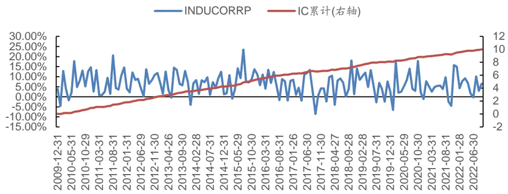
数据来源：Wind，广发证券发展研究中心

表 9：INDUCORRP因子-多空对冲策略与多头相对中证 500指数策略-整体与分年度表现

|  | 多头 | 多空对冲策略 |  |  |  |  | 多头-中证500 策略 |  |  |  |  |
| --- | --- | --- | --- | --- | --- | --- | --- | --- | --- | --- | --- |
|  | 累计 | 累计 | 年化 | 年化 | 信息 | 最大 | 累计 | 年化 | 年化 | 信息 | 最大 |
| 年份 | 收益率 | 收益率 | 收益率 | 波动率 | 比率 | 回撤 | 收益率 | 收益率 | 波动率 | 比率 | 回撤 |
| 2010 | 29.52% | 27.86% | 27.86% | 5.55% | 5.024 | 0.43% | 18.32% | 18.32% | 6.10% | 3.002 | 0.88% |
| 2011 | -20.80% | 25.53% | 25.53% | 6.77% | 3.772 | 1.35% | 18.15% | 18.15% | 4.58% | 3.958 | 0.02% |
| 2012 | 10.98% | 22.33% | 22.33% | 4.64% | 4.813 | 0.44% | 10.58% | 10.58% | 2.86% | 3.702 | 0.24% |
| 2013 | 42.64% | 31.10% | 31.10% | 6.16% | 5.052 | 0.25% | 23.18% | 23.18% | 6.18% | 3.751 | 0.46% |
| 2014 | 71.18% | 31.81% | 31.81% | 10.18% | 3.123 | 0.00% | 24.09% | 24.09% | 4.79% | 5.031 | 0.00% |
| 2015 | 112.15% | 31.47% | 31.47% | 12.66% | 2.486 | 2.92% | 50.77% | 50.77% | 12.20% | 4.160 | 4.44% |
| 2016 | -4.87% | 11.68% | 11.68% | 5.56% | 2.102 | 3.41% | 17.20% | 17.20% | 5.81% | 2.961 | 0.00% |
| 2017 | -10.17% | 12.02% | 12.02% | 5.09% | 2.360 | 2.64% | -9.72% | -9.72% | 5.29% | -1.837 | 10.12% |
| 2018 | -24.18% | 18.54% | 18.54% | 6.02% | 3.078 | 1.88% | 13.68% | 13.68% | 8.47% | 1.615 | 1.98% |
| 2019 | 33.77% | 16.62% | 16.62% | 5.26% | 3.160 | 1.00% | 5.81% | 5.81% | 5.82% | 0.999 | 2.81% |
| 2020 | 28.06% | 18.33% | 18.33% | 7.16% | 2.560 | 1.91% | 5.42% | 5.42% | 11.86% | 0.457 | 4.47% |
| 2021 | 30.49% | 11.83% | 11.83% | 8.26% | 1.432 | 5.36% | 13.04% | 13.04% | 13.29% | 0.981 | 2.93% |
| 2022 | -9.04% | 9.76% | 11.83% | 6.49% | 1.822 | 2.66% | 15.35% | 18.69% | 9.70% | 1.927 | 3.78% |
| ALL | 676.90% | 1020.43% | 20.72% | 7.21% | 2.872 | 5.36% | 523.23% | 15.32% | 8.44% | 1.816 | 13.42% |

数据来源：Wind，广发证券发展研究中心

表 10：INDUCORRP因子-多空对冲策略与多头相对中证 500指数策略(行业中性)-整体与分年度表现

|  | 多头 | 多空对冲策略 |  |  |  |  | 多头-中证500 策略 |  |  |  |  |
| --- | --- | --- | --- | --- | --- | --- | --- | --- | --- | --- | --- |
|  | 累计 | 累计 | 年化 | 年化 | 信息 | 最大 | 累计 | 年化 | 年化 | 信息 | 最大 |
| 年份 | 收益率 | 收益率 | 收益率 | 波动率 | 比率 | 回撤 | 收益率 | 收益率 | 波动率 | 比率 | 回撤 |
| 2010 | 26.44% | 40.95% | 40.95% | 6.50% | 6.304 | 0.26% | 15.36% | 15.36% | 5.44% | 2.823 | 0.53% |
| 2011 | -20.18% | 28.92% | 28.92% | 7.97% | 3.626 | 1.67% | 19.26% | 19.26% | 3.71% | 5.184 | 0.00% |
| 2012 | 10.54% | 26.63% | 26.63% | 4.16% | 6.400 | 0.16% | 10.23% | 10.23% | 3.13% | 3.265 | 0.52% |
| 2013 | 38.92% | 26.07% | 26.07% | 8.13% | 3.205 | 1.19% | 19.89% | 19.89% | 5.68% | 3.500 | 0.21% |
| 2014 | 63.24% | 29.33% | 29.33% | 5.06% | 5.799 | 0.00% | 18.46% | 18.46% | 7.71% | 2.396 | 3.43% |
| 2015 | 106.21% | 34.47% | 34.47% | 11.22% | 3.073 | 1.33% | 47.05% | 47.05% | 12.50% | 3.764 | 5.37% |
| 2016 | -4.77% | 18.15% | 18.15% | 5.80% | 3.130 | 1.58% | 17.29% | 17.29% | 5.71% | 3.028 | 0.08% |
| 2017 | -10.43% | 11.40% | 11.40% | 6.15% | 1.853 | 3.02% | -9.95% | -9.95% | 5.12% | -1.944 | 10.61% |
| 2018 | -24.85% | 24.02% | 24.02% | 6.52% | 3.683 | 1.40% | 12.66% | 12.66% | 7.52% | 1.684 | 2.25% |
| 2019 | 33.33% | 18.46% | 18.46% | 6.16% | 2.995 | 1.45% | 5.48% | 5.48% | 5.78% | 0.947 | 3.33% |
| 2020 | 26.25% | 17.12% | 17.12% | 8.42% | 2.033 | 1.44% | 3.81% | 3.81% | 11.25% | 0.338 | 5.13% |
| 2021 | 35.50% | 11.99% | 11.99% | 8.23% | 1.457 | 6.32% | 17.58% | 17.58% | 12.52% | 1.404 | 2.24% |
| 2022 | -8.62% | 11.26% | 13.66% | 7.20% | 1.898 | 2.85% | 15.99% | 19.48% | 8.76% | 2.225 | 2.79% |
| ALL | 597.01% | 1323.49% | 22.99% | 7.26% | 3.168 | 6.32% | 462.74% | 14.41% | 8.20% | 1.758 | 13.04% |

数据来源：Wind，广发证券发展研究中心

图 14：INDUCORRP因子-多空策略净值走势
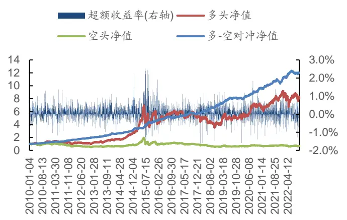
数据来源：Wind，广发证券发展研究中心

图 15：INDUCORRP因子-多-中证500策略净值走势
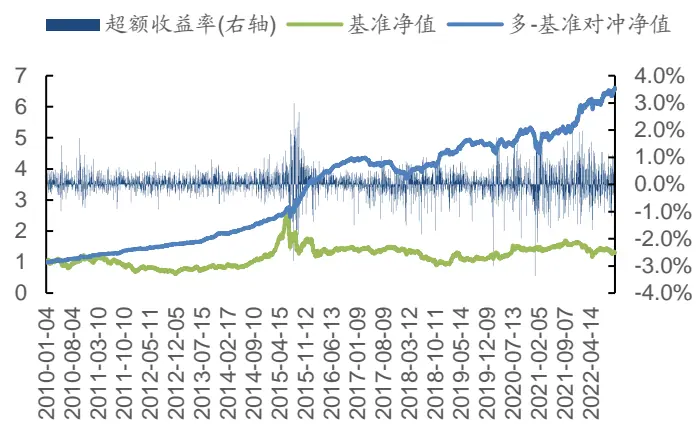
数据来源：Wind，广发证券发展研究中心

表 11：INDUCORRP 因子-分年度换手率

| 统计区间 | 均值 | 最大值 | 最小值 | 标准差 | 累计值 |
| --- | --- | --- | --- | --- | --- |
| 2010 | 83.04% | 86.47% | 75.57% | 0.035 | 913.39% |
| 2011 | 81.68% | 85.71% | 76.60% | 0.025 | 980.20% |
| 2012 | 81.90% | 85.47% | 76.92% | 0.023 | 982.75% |
| 2013 | 81.05% | 85.25% | 74.19% | 0.032 | 972.58% |
| 2014 | 81.68% | 89.15% | 76.92% | 0.034 | 980.21% |
| 2015 | 81.92% | 89.73% | 76.44% | 0.043 | 983.00% |
| 2016 | 81.02% | 84.65% | 77.78% | 0.022 | 972.19% |
| 2017 | 78.13% | 84.09% | 72.40% | 0.037 | 937.60% |
| 2018 | 80.69% | 84.62% | 75.19% | 0.028 | 968.23% |
| 2019 | 78.97% | 82.99% | 75.08% | 0.025 | 947.61% |
| 2020 | 81.59% | 84.29% | 76.12% | 0.024 | 979.11% |
| 2021 | 82.39% | 86.10% | 78.25% | 0.022 | 988.65% |
| 2022 | 79.22% | 86.28% | 74.23% | 0.036 | 792.16% |
| ALL | 81.03% | 89.73% | 72.40% | 0.032 | 12397.67% |

数据来源：Wind，广发证券发展研究中心

在全市场选股中，INDUCORRP因子的选股区分度较高，因子IC均值为0.065，累计IC为9.994，正IC占比为88.31%，2022年以来的IC均值为0.064。在多头相对中证500指数策略的回测中，策略整体的年化超额收益率为15.32%，信息比率为1.816。除2017年外，其余年份均可取得超额收益。整体换手率保持在81.03%左右。

综合上述2个因子的实证分析结果，INDUCORRP因子整体表现优于INDUCORR因子。由于该因子对行业相关系数进行拆解，仅考虑了研究个股与行业关联股票在日度收益不为负情况下的相关关系，因此，更能精确地度量多头策略所需要的基于行业共性挖掘的正向共同基本面信息。

## （四）因子实证结果(行业分组)

上述因子特征分析表明，31个申万一级行业之间的行业相关系数类因子均值存在显著差异，而第三部分在全市场范围内仅利用行业中性化后的因子值进行回测分析，无法了解对于单个行业而言，该类因子是否具有显著的选股能力。因此，本小节对2种表现较好的行业相关系数类因子进行了行业内的IC测试与五档分层测试，回测结果如下表所示。

表 12：INDUCORR 因子在不同申万一级行业的绩效表现(按多头相对基准策略的信息比率由高到低排序)

|  | IC分析 |  |  | 多空策略 |  |  | 多头相对基准策略 |  |  |
| --- | --- | --- | --- | --- | --- | --- | --- | --- | --- |
|  | IC 均值 | IC累计 | IC正向占比 | 年化收益 | 信息比率 | 最大回撤 | 年化收益 | 信息比率 | 最大回撤 |
| 机械设备 | 0.092 | 14.152 | 78.57% | 24.14% | 1.905 | 10.72% | 10.75% | 1.688 | 5.63% |
| 电子 | 0.081 | 12.462 | 71.43% | 26.26% | 1.842 | 10.98% | 11.50% | 1.628 | 5.09% |
| 汽车 | 0.104 | 15.949 | 75.97% | 29.78% | 2.162 | 13.09% | 12.83% | 1.580 | 9.40% |
| 基础化工 | 0.086 | 13.251 | 75.32% | 22.15% | 1.793 | 12.60% | 8.69% | 1.418 | 5.87% |
| 商贸零售 | 0.086 | 13.168 | 72.73% | 15.29% | 1.080 | 30.39% | 9.25% | 1.244 | 11.78% |
| 纺织服饰 | 0.094 | 14.445 | 76.62% | 21.90% | 1.378 | 23.60% | 11.22% | 1.215 | 13.33% |
| 电力设备 | 0.076 | 11.761 | 77.27% | 20.32% | 1.567 | 12.72% | 9.09% | 1.144 | 8.64% |
| 农林牧渔 | 0.078 | 11.955 | 66.88% | 26.84% | 1.373 | 17.53% | 11.99% | 1.064 | 16.83% |
| 房地产 | 0.099 | 15.195 | 74.68% | 15.38% | 1.097 | 17.60% | 6.31% | 0.971 | 6.24% |
| 公用事业 | 0.084 | 12.863 | 69.48% | 20.14% | 1.200 | 33.31% | 8.86% | 0.952 | 17.52% |
| 建筑装饰 | 0.086 | 13.197 | 70.78% | 20.38% | 1.474 | 10.90% | 6.63% | 0.905 | 11.95% |
| 建筑材料 | 0.091 | 13.996 | 66.23% | 25.17% | 1.220 | 20.32% | 10.33% | 0.887 | 19.36% |
| 轻工制造 | 0.080 | 12.311 | 66.88% | 20.56% | 1.275 | 17.11% | 7.46% | 0.827 | 19.29% |
| 计算机 | 0.063 | 9.636 | 70.13% | 14.88% | 1.060 | 18.48% | 6.49% | 0.827 | 9.35% |
| 传媒 | 0.091 | 14.074 | 74.68% | 21.69% | 1.174 | 17.54% | 8.11% | 0.795 | 12.49% |
| 交通运输 | 0.088 | 13.520 | 69.48% | 14.14% | 0.823 | 22.95% | 6.26% | 0.733 | 12.46% |
| 社会服务 | 0.070 | 10.830 | 62.34% | 11.09% | 0.577 | 24.13% | 7.58% | 0.676 | 12.29% |
| 国防军工 | 0.047 | 7.192 | 61.69% | 6.81% | 0.330 | 49.89% | 6.65% | 0.622 | 21.13% |
| 环保 | 0.071 | 10.948 | 68.83% | 14.61% | 0.869 | 18.15% | 5.58% | 0.598 | 14.52% |
| 医药生物 | 0.041 | 6.252 | 62.99% | 8.58% | 0.755 | 23.37% | 3.48% | 0.581 | 15.93% |
| 家用电器 | 0.074 | 11.433 | 69.48% | 12.06% | 0.629 | 41.72% | 4.83% | 0.488 | 24.08% |
| 通信 | 0.078 | 11.955 | 66.23% | 9.81% | 0.553 | 40.58% | 4.17% | 0.456 | 18.89% |
| 食品饮料 | 0.052 | 8.031 | 64.94% | 8.92% | 0.512 | 27.88% | 4.08% | 0.438 | 17.66% |
| 石油石化 | 0.062 | 9.528 | 63.64% | 8.00% | 0.364 | 37.79% | 4.94% | 0.430 | 22.94% |
| 有色金属 | 0.057 | 8.802 | 59.09% | 5.21% | 0.255 | 25.90% | 3.77% | 0.383 | 15.56% |
| 非银金融 | 0.061 | 9.464 | 64.29% | 8.62% | 0.312 | 46.23% | 4.71% | 0.331 | 24.76% |
| 综合 | 0.086 | 13.205 | 66.88% | 11.90% | 0.472 | 40.52% | 3.44% | 0.248 | 25.06% |
| 银行 | 0.033 | 5.113 | 52.60% | 2.92% | 0.237 | 22.67% | 1.51% | 0.223 | 16.95% |
| 钢铁 | 0.032 | 4.969 | 52.60% | -2.04% | -0.097 | 53.99% | 2.49% | 0.214 | 25.90% |
| 煤炭 | 0.032 | 4.857 | 55.84% | -1.75% | -0.090 | 63.99% | -0.84% | -0.090 | 38.07% |
| 美容护理 | 0.007 | 1.040 | 50.65% | -15.93% | -0.504 | 91.96% | -10.11% | -0.495 | 79.94% |

数据来源：Wind，广发证券发展研究中心

表 13：INDUCORRP 因子在不同申万一级行业的绩效表现(按多头相对基准策略的信息比率由高到低排序)

|  | IC 分析 |  |  | 多空策略 |  |  | 多头相对基准策略 |  |  |  |
| --- | --- | --- | --- | --- | --- | --- | --- | --- | --- | --- |
|  | IC 均值 | IC 累计 | IC正向占比 | 年化收益 | 信息比率 | 最大回撤 | 年化收益 | 信息比率 | 最大回撤 |  |
| 机械设备 | 0.081 | 12.551 | 80.52% | 20.94% | 1.945 | 11.77% | 9.70% | 1.733 | 6.59% |  |
| 汽车 | 0.094 | 14.490 | 76.62% | 28.39% | 2.246 | 9.73% | 11.89% | 1.609 | 6.85% |  |
| 基础化工 | 0.076 | 11.709 | 75.97% | 15.66% | 1.418 | 12.14% | 7.84% | 1.341 | 6.54% |  |
| 电力设备 | 0.068 | 10.490 | 72.08% | 16.68% | 1.340 | 11.72% | 8.41% | 1.159 |  | 9.28% |
| 电子 | 0.071 | 10.916 | 68.18% | 22.60% | 1.547 | 12.34% | 9.16% | 1.154 |  | 8.36% |
| 纺织服饰 | 0.082 | 12.562 | 72.73% | 19.26% | 1.517 | 15.78% | 8.80% | 1.145 |  | 6.32% |
| 商贸零售 | 0.068 | 10.480 | 68.83% | 14.48% | 0.954 | 18.31% | 9.02% | 1.079 |  | 6.71% |
| 传媒 | 0.087 | 13.473 | 75.32% | 21.01% | 1.211 | 21.87% | 10.62% | 1.053 |  | 11.69% |
| 农林牧渔 | 0.063 | 9.737 | 67.53% | 18.42% | 1.044 | 16.14% | 9.58% | 0.942 |  | 15.55% |
| 房地产 | 0.089 | 13.735 | 72.08% | 16.35% | 1.043 | 15.35% | 7.06% | 0.890 |  | 7.92% |
| 公用事业 | 0.064 | 9.846 | 65.58% | 15.11% | 0.927 | 42.70% | 7.83% | 0.864 |  | 25.87% |
| 计算机 | 0.057 | 8.706 | 68.83% | 14.03% | 1.031 | 17.13% | 5.99% | 0.824 |  | 8.50% |
| 建筑装饰 | 0.084 | 12.995 | 74.03% | 20.36% | 1.315 | 14.33% | 6.46% | 0.755 |  | 9.43% |
| 交通运输 | 0.082 | 12.560 | 68.18% | 10.70% | 0.668 | 29.89% | 4.64% | 0.575 |  | 13.56% |
| 医药生物 | 0.040 | 6.145 | 62.99% | 6.76% | 0.568 | 20.98% | 3.53% | 0.571 |  | 12.19% |
| 石油石化 | 0.051 | 7.819 | 59.09% | 10.22% | 0.435 | 30.47% | 6.28% | 0.530 |  | 18.76% |
| 通信 | 0.079 | 12.213 | 68.83% | 12.41% | 0.688 | 40.88% | 5.50% |  | 0.524 | 21.85% |
| 建筑材料 | 0.066 | 10.122 | 65.58% | 17.67% | 0.800 | 30.34% | 5.71% |  | 0.440 | 27.45% |
| 轻工制造 | 0.071 | 10.886 | 66.23% | 15.33% | 1.011 | 17.42% | 3.87% |  | 0.431 | 22.84% |
| 综合 | 0.072 | 11.056 | 66.23% | 10.15% | 0.410 | 44.55% | 6.15% |  | 0.418 | 31.60% |
| 家用电器 | 0.068 | 10.430 | 66.88% | 9.87% | 0.512 | 56.32% | 4.23% |  | 0.388 | 30.73% |
| 社会服务 | 0.053 | 8.168 | 61.69% | 8.45% | 0.512 | 25.68% | 3.80% |  | 0.368 | 19.83% |
| 环保 | 0.044 | 6.768 | 64.29% | 7.02% | 0.394 | 26.65% | 3.78% |  | 0.366 | 24.50% |
| 食品饮料 | 0.047 | 7.224 | 60.39% | 11.57% | 0.632 | 23.53% | 3.61% |  | 0.358 | 19.69% |
| 钢铁 | 0.033 | 5.110 | 51.30% | -0.31% | -0.014 | 50.51% | 2.77% |  | 0.230 | 17.49% |
| 国防军工 | 0.022 | 3.381 | 56.49% | -0.29% | -0.016 | 49.15% | 2.05% |  | 0.198 | 24.18% |
| 有色金属 | 0.045 | 6.963 | 56.49% | 4.36% | 0.219 | 33.81% | 1.36% |  | 0.132 | 26.00% |
| 非银金融 | 0.059 | 9.106 | 61.04% | 3.54% | 0.124 | 56.42% |  | 1.71% | 0.112 | 29.28% |
| 银行 | 0.029 | 4.407 | 53.90% | 3.17% | 0.273 | 21.25% |  | -0.07% | -0.010 | 20.53% |
| 美容护理 | 0.014 | 2.152 | 50.00% | -8.90% | -0.267 | 86.97% |  | -5.81% | -0.261 | 77.85% |
| 煤炭 | 0.027 | 4.128 | 53.25% | -5.62% | -0.282 |  | 72.24% | -4.04% | -0.450 | 52.89% |

数据来源：Wind，广发证券发展研究中心

对于INDUCORR因子而言，机械设备、电子与汽车行业的绩效表现相对较好。IC分析方面，三个行业的IC均值在0.08以上，IC累计值在12.0以上，IC胜率在70%以上。多空策略方面，汽车行业的年化收益率为29.78%，信息比率为2.162，最大回撤为13.09%。多头相对基准策略方面，机械设备行业的年化收益率为10.75%，信息比率为1.688%，最大回撤为5.63%。

对于INDUCORRP因子而言，机械设备、汽车与基础化工行业的绩效表现相对较好。IC分析方面，三个行业的IC均值在0.075以上，IC累计值在11.0以上，IC胜率均在75%以上。多空策略方面，汽车行业的年化收益率为28.39%，信息比率为2.246，最大回撤为9.73%。多头相对基准策略方面，机械设备行业的年化收益为9.7%，信息比率为1.733，最大回撤为6.59%。

## 五、行业关联度因子与 BARRA因子相关性分析

CNE6版本的BARRA因子模型将股票因子划分为市场、价值、成长、盈利、波动等大类因子。传统BARRA因子已经在市场中得到验证，能够较有效地刻画股票特征。本节将对INDUCORR因子、INDUCORRP因子与BARRA因子进行相关性分析。

## （一）BARRA因子说明

在CNE6版本的BARRA因子模型中，共详细阐述了数大类因子。本报告仅在各大类因子中选取其中一个因子进行说明。首先，对因子类型及计算公式进行说明：

表 14：BARRA 因子说明

| 因子类型 | 因子名称 | 因子计算公式/说明 |
| --- | --- | --- |
| Beta | HBETA | 对个股在过去252个交易日的日频收益率序列与同期市场指数收益率序列进行回归， 得到市场指数的回归系数β即为HBETA因子 |
| book to price | BTOP | $r_{t}^{i}-r_{t}^{f}=\alpha+\beta r_{t}^{m}+e_{t}$ 最新报告期的股东权益与当前流通市值的比值 |
| earnings quality | ATURNOVER | 最新财报的营业收入与当期平均资产总值的比值 |
| earnings variability | VSAL | 过去五期财报营业收入的标准差/过去五期财报营业收入的的均值 |
| earnings yield | CETOP | 个股历史12个月滚动的经营现金流净额与当前流通市值的比值 |
| growth | EGRO | 用个股过去五年的每股盈利对时间做回归，得到的斜率再除以五年每股盈利的平均值 |
| investment quality | AGRO | 用过去五年的总资产对时间做回归，得到的斜率再除以五年的平均值。数值乘-1 |
| leverage | MLEV | 长期资本与股东权益的比值，其中长期资本包括普通股市值、最新优先股市值以及付 息债券市值 |
| liquidity | STOM | 过去21个交易日的换手率之和的对数值 |
| long term reversal | RSTR | 计算过去504个交易日的个股超额对数收益率与过去21个交易日的超额对数收益率 的差额累计和，得到 RSTR 因子 $RSTR=\sum_{L}^{T+L}w_{t}[\ln\bigl(1+r_{t}^{i}\bigr)-\ln(1+r_{t}^{f})],$ |
| mid capitalization | MIDCAP | 用截面上个股的对数流通市值的三次方对对数流通市值进行回归，对回归残差进行 MAD去极值与中性化处理，获得MIDCAP因子 |
| momentum | HALPHA | 对个股在过去252个交易日的日频收益率序列与同期市场指数收益率序列进行回归， 得到截距项 α 为 HALPHA 因子 |
| profitability | ROA | $r_{t}^{i}-r_{t}^{f}=\alpha+\beta r_{t}^{m}+e_{t}$ 个股历史12个月滚动净利润与最新报告的总资产的比值 |
| residual volatility | HSIGMA | 对个股在过去252个交易日的日频收益率序列与同期市场指数收益率序列进行回归， 得到残差的标准差即为HSIGMA 因子 |
| size | LNCAP | $r_{t}^{i}-r_{t}^{f}=\alpha+\beta r_{t}^{m}+e_{t}$ 个股的对数流通市值 |

数据来源：Wind，广发证券发展研究中心

## （二）行业关联度因子与 BARRA相关性分析

本小节将数据预处理（MAD法去极值、Z-Score标准化、行业市值中性化）后的INDUCORR因子、INDUCORRP因子与BARRA因子进行Spearman秩相关性分析，相关性结果见下表15。如表所示，行业相关系数类因子与BTOP因子存在16%左右的正相关性。与STOM、HALPHA因子之间存在14%-20%的负相关性。整体而言，行业相关系数类因子与BARRA因子的相关系数控制在20%以内，能够挖掘传统因子外的增量信息，具体为股票之间的行业关联信息。

表 15：行业相关系数类因子与 BARRA因子相关系数

| INDUCORR | INDUCORRP |
| --- | --- |
| HBETA 11.33% | 9.65% |
| BTOP 17.50% | 15.54% |
| ATURNOVER -1.70% | -1.05% |
| VSAL -6.70% | -4.73% |
| CETOP 6.70% | 6.65% |
| EGRO -2.79% | -1.56% |
| AGRO 3.30% | 0.92% |
| STOM -18.11% | -14.98% |
| RSTR -10.85% | -8.50% |
| HALPHA -18.19% | -14.40% |
| ROA -2.12% | 0.76% |
| HSIGMA -13.49% | -11.87% |
| MIDCAP 1.73% | 2.05% |
| LNCAP -3.82% | -2.17% |
| MLEV 7.78% | 5.83% |

数据来源：Wind，广发证券发展研究中心

## 六、行业关联度因子敏感性分析

## （一）敏感性分析-选股范围

本报告在实证分析部分，仅在全市场选股范围内，详细展示了INDUCORR因子、INDUCORRP因子的选股策略表现。但是因子特征分析部分也表明，行业相关系数类因子与股票的市值大小存在显著关系，大市值股票往往具有更高的行业相关系数因子。因此，本节将重点分析上述2种因子对于选股范围的敏感性。具体而言，测试了沪深300、中证500、中证800、中证1000、创业板选股范围内，各因子的多空对冲策略、多头相对基准指数策略与换手率的整体表现。

表 16：行业相关系数类因子在不同选股范围的整体绩效表现

| 因子代码 | 选股范围 | 多空策略 |  |  | 多头相对基准策略 |  |  | 多头平均 换手率 |
| --- | --- | --- | --- | --- | --- | --- | --- | --- |
|  |  | 年化 收益 | 信息 比率 | 最大 回撤 | 年化 收益 | 信息 | 最大 回撤 |  |
| INDUCORR | 全市场 | 22.70% | 2.827 | 6.54% | 14.98% | 比率 1.773 | 13.31% | 77.90% |
|  | 沪深 300 | 10.04% | 0.945 | 10.29% | 4.56% | 0.402 | 19.56% | 78.32% |
|  | 中证 1000 | 21.46% | 2.110 | 8.47% | 12.50% | 1.440 | 8.29% | 77.29% |
|  | 中证 500 | 14.74% | 1.515 | 7.59% | 6.84% | 0.984 | 11.76% | 79.03% |
|  | 中证800 | 12.82% | 1.661 | 7.10% | 7.31% | 0.677 | 29.70% | 78.55% |
|  | 创业板 | 23.11% | 1.855 | 11.56% | 12.20% | 0.683 | 40.43% | 80.27% |
| INDUCORRP | 全市场 | 20.72% | 2.872 | 5.36% | 15.32% | 1.816 | 13.42% | 81.03% |
|  | 沪深 300 | 10.25% | 0.990 | 12.60% | 5.55% | 0.554 | 19.16% | 81.42% |
|  | 中证1000 | 19.21% | 2.145 | 7.68% | 11.81% | 1.504 | 9.20% | 81.52% |
|  | 中证500 | 14.06% | 1.481 | 6.33% | 7.28% | 0.985 | 12.63% | 82.44% |
|  | 中证 800 | 11.81% | 1.443 | 5.45% | 7.66% | 0.806 | 25.82% | 82.23% |
|  | 创业板 | 13.60% | 1.257 | 14.15% | 8.89% | 0.500 | 43.37% | 82.99% |

数据来源：Wind，广发证券发展研究中心

实证结果显示，INDUCORR因子与INDUCORRP因子在中证1000选股范围中存在较好表现。

## （二）敏感性分析-手续费费率

尽管上述分析表明，基于INDUCORR因子与INDUCORRP因子的选股策略能够在全市场表现相对较好，但是在整体与分年度换手率分析中，两类因子都呈现出高换手率的特征。因此，本节将重点分析2种因子对于手续费的敏感性。具体而言，测试了全市场选股范围内，因子在千一、千三、千五手续费费率设置下的多头基准(中证500)净值走势。

图 16：全市场 INDUCORR因子
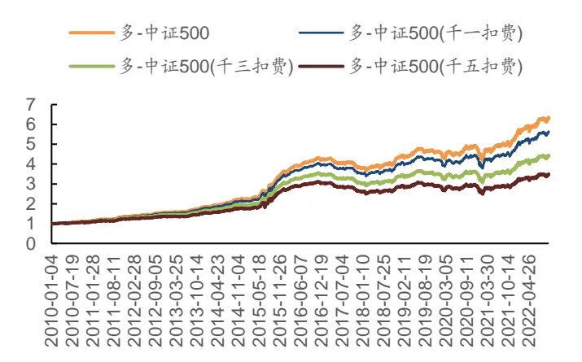
数据来源：Wind，广发证券发展研究中心

图 17：全市场 INDUCORRP因子
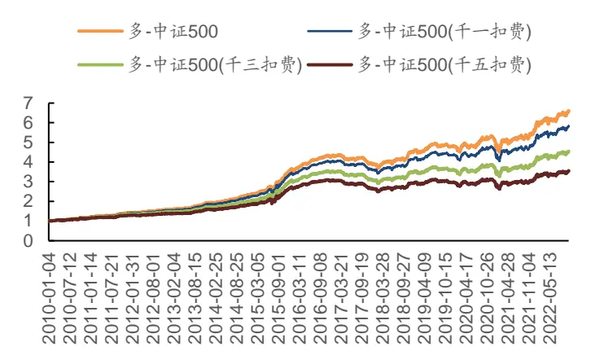
数据来源：Wind，广发证券发展研究中心

结果表明，2种因子策略扣除千五手续费后，仍然能够在长期获得超额收益，但随着手续费水平上升，策略净值表现整体下降。因此，当使用以上行业相关系数类因子进行选股，应当对手续费费率予以重点关注。

## 七、总结

本篇专题报告承接《基于地理关联度因子研究——多因子Alpha系列报告之（四十三）》，综合考虑地理相关系数类因子构造方法与行业关联信息在收益预测方面的有效性，构造5种行业相关系数因子及其优化因子，用来衡量个股与行业关联股票之间的相关程度，以期从共同基本面因素变动中获取个股反转收益。

从分档结果来看，5种行业相关系数类因子中，除INDUCORRJP因子外，其余4种因子在全市场选股范围内的分档效果明显，分层收益区分度较高。

从整体表现来看，全市场选股范围内，月频调仓频率下，INDUCORR因子、INDUCORRP因子的IC均值在0.065以上，IC胜率均超过85%，多头相对中证500策略中，上述2种因子年化收益率均在15%左右，信息比率均在1.7以上，多头换手率在80%左右。

通过对数据预处理后的INDUCORR因子与INDUCORRP因子和BARRA因子进行相关性分析，可以发现，行业相关系数类因子能够挖掘传统因子外的增量信息。因此，可以作为新因子加入多因子模型中。

此外，本报告进一步对INDUCORR因子与INDUCORRP因子进行了选股范围与手续费率方面的敏感性测试。测试结果表明，这两种因子在中证1000选股范围内仍具有较好表现。由于因子策略多头换手率较高，行业相关系数类因子对手续费敏感。因此，当考虑利用行业相关系数类因子进行选股时，应当设定合适的选股范围并对手续费率加以考虑。

## 八、风险提示

本专题报告所述模型用量化方法通过历史数据统计、建模和测算完成，所得结论与规律在市场政策、环境变化时可能存在失效风险；

本专题策略模型在市场结构及交易行为的改变时有可能存在策略失效风险。

## 九、参考文献

[1]. A, P.C., S. Riccardo, and T. Sheridan, Geographic Lead-Lag Effects. The Review of Financial Studies, 2020. 33(10).

[2]. Bollerslev, T., A.J. Patton, and R. Quaedvlieg, Realized semibetas: Disentangling “good” and “bad” downside risks. Journal of Financial Economics, 2022. 144(1): p. 227-246.

[3]. Chan, K. and A. Hameed, Stock price synchronicity and analyst coverage in emerging markets. Journal of Financial Economics, 2006. 80(1): p. 115-147.

[4]. Cohen, L. and A. Frazzini, Economic Links and Predictable Returns. The Journal of Finance, 2008. 63(4).

[5]. Cohen, L. and D. Lou, Complicated firms. Journal of Financial Economics, 2012. 104(2).

[6]. Lee, C.M.C., et al., Technological links and predictable returns. Journal of Financial Economics, 2019. 132(3): p. 76-96.

[7]. Menzly, L. and O. Ozbas, Market Segmentation and Cross-predictability of Returns. The Journal of Finance, 2010. 65(4): p. 1555-1580.

[8]. Peng, L. and W. Xiong, Investor attention, overconfidence and category learning. Journal of Financial Economics, 2006. 80(3): p. 563-602.

[9]. 段丙蕾, 汪荣飞, and 张然, 南橘北枳：A股市场的经济关联与股票回报. 金融研究, 2022(02): p. 171-188.

[10]. 胡聪慧, et al., 有限注意、行业信息扩散与股票收益. 经济学(季刊), 2015.14(03): p. 1173-1192.

[11]. 李绪泉, 张自力, and 赵学军, 科技溢出与有限关注度对股票收益的影响研究.价格理论与实践, 2020(06): p. 105-108.

[12]. 刘菁哲, 股票市场领先滞后效应的研究综述. 科技和产业, 2010. 10(04): p.93-95.

[13]. 向诚 and 陆静, 投资者有限关注、行业信息扩散与股票定价研究. 系统工程理论与实践, 2018. 38(04): p. 817-835.

## [Table_ResearchTeam] 广发金融工程研究小组

罗军 ：首席分析师，华南理工大学硕士，从业 16年，2010年进入广发证券发展研究中心。

安 宁 宁 ：联席首席分析师，暨南大学硕士，从业 14年，2011年进入广发证券发展研究中心。

史 庆 盛 ：资深分析师，华南理工大学硕士，2011年进入广发证券发展研究中心。

张 超 ： 资深分析师，中山大学硕士，2012 年进入广发证券发展研究中心。

陈 原 文 ：资深分析师，中山大学硕士，2015年进入广发证券发展研究中心。

樊 瑞 铎 ：资深分析师，南开大学硕士，2015年进入广发证券发展研究中心。

李豪 ：资深分析师，上海交通大学硕士，2016年进入广发证券发展研究中心。

周 飞 鹏 ：资深分析师，伯明翰大学硕士，2021年加入广发证券发展研究中心。

季 燕 妮 ：高级分析师，厦门大学硕士，2020年进入广发证券发展研究中心。

张 钰 东 ：高级分析师，中山大学硕士，2020年进入广发证券发展研究中心。

## [Table_IndustryInvestDescription] 广发证券—行业投资评级说明

买入： 预期未来12个月内，股价表现强于大盘10%以上。内

持有： 预期未来12个月内，股价相对大盘的变动幅度介于-10%～+10%。对

卖出： 预期未来12个月内，股价表现弱于大盘10%以上。

## [Table_CompanyInvestDescript 广发证券—公司投资评级说明ion]

买入： 预期未来 12 个月内，股价表现强于大盘 15%以上。

增持： 预期未来12个月内，股价表现强于大盘5%-15%。

持有： 预期未来12个月内，股价相对大盘的变动幅度介于-5%～+5%。

卖出： 预期未来12个月内，股价表现弱于大盘5%以上。

## [Table_Address] 联系我们

| 地址 | 广州市 | 深圳市 | 北京市 | 上海市 | 香港 |
| --- | --- | --- | --- | --- | --- |
|  | 广州市天河区马场路 | 深圳市福田区益田路 | 北京市西城区月坛北 | 上海市浦东新区南泉 | 香港德辅道中189号 |
|  | 26号广发证券大厦35 | 6001号太平金融大厦 | 街2号月坛大厦18层 | 北路429号泰康保险 | 李宝椿大厦29及30 |
|  | 楼 | 31层 |  | 大厦37楼 | 楼 |
|  | 510627 | 518026 |  |  |  |
| 邮政编码 客服邮箱 | gfzqyf@gf.com.cn |  | 100045 | 200120 | = |

## [Table_LegalD 法律主体isclaimer 声明]

本报告由广发证券股份有限公司或其关联机构制作，广发证券股份有限公司及其关联机构以下统称为“广发证券”。本报告的分销依据不同国依据不家、地区的法律、法规和监管要求由广发证券于该国家或地区的具有相关合法合规经营资质的子公司/经营机构完成。资

广发证券股份有限公司具备中国证监会批复的证券投资咨询业务资格，接受中国证监会监管，负责本报告于中国（港澳台地区除外）的分销。投广发证券（香港）经纪有限公司具备香港证监会批复的就证券提供意见（4 号牌照）的牌照，接受香港证监会监管，负责本报告于中国香港地区的分销。

本报告署名研究人员所持中国证券业协会注册分析师资质信息和香港证监会批复的牌照信息已于署名研究人员姓名处披露。

## [Table_I 重要mportant 声明N

广发证券股份有限公司及其关联机构可能与本报告中提及的公司寻求或正在建立业务关系，因此，投资者应当考虑广发证券股份有限公司及其系 因此 者应当考虑关联机构因可能存在的潜在利益冲突而对本报告的独立性产生影响。投资者不应仅依据本报告内容作出任何投资决策。投资者应自主作出投资存 潜 利益冲突而 独 性产生影响 仅 容决策并自行承担投资风险，任何形式的分享证券投资收益或者分担证券投资损失的书面或者口头承诺均为无效。

本报告署名研究人员、联系人（以下均简称“研究人员”）针对本报告中相关公司或证券的研究分析内容，在此声明：（1）本报告的全部分析结论、研究观点均精确反映研究人员于本报告发出当日的关于相关公司或证券的所有个人观点，并不代表广发证券的立场；（2）研究人员的部分或全部的报酬无论在过去、现在还是将来均不会与本报告所述特定分析结论、研究观点具有直接或间接的联系。

研究人员制作本报告的报酬标准依据研究质量、客户评价、工作量等多种因素确定，其影响因素亦包括广发证券的整体经营收入，该等经营收入部分来源于广发证券的投资银行类业务。

本报告仅面向经广发证券授权使用的客户/特定合作机构发送，不对外公开发布，只有接收人才可以使用，且对于接收人而言具有保密义务。广发证券并不因相关人员通过其他途径收到或阅读本报告而视其为广发证券的客户。在特定国家或地区传播或者发布本报告可能违反当地法律，广发证券并未采取任何行动以允许于该等国家或地区传播或者分销本报告。

本报告所提及证券可能不被允许在某些国家或地区内出售。请注意，投资涉及风险，证券价格可能会波动，因此投资回报可能会有所变化，过去的业绩并不保证未来的表现。本报告的内容、观点或建议并未考虑任何个别客户的具体投资目标、财务状况和特殊需求，不应被视为对特定客户关于特定证券或金融工具的投资建议。本报告发送给某客户是基于该客户被认为有能力独立评估投资风险、独立行使投资决策并独立承担相应风险。

本报告所载资料的来源及观点的出处皆被广发证券认为可靠，但广发证券不对其准确性、完整性做出任何保证。报告内容仅供参考，报告中的信息或所表达观点不构成所涉证券买卖的出价或询价。广发证券不对因使用本报告的内容而引致的损失承担任何责任，除非法律法规有明确规定。客户不应以本报告取代其独立判断或仅根据本报告做出决策，如有需要，应先咨询专业意见。

广发证券可发出其它与本报告所载信息不一致及有不同结论的报告。本报告反映研究人员的不同观点、见解及分析方法，并不代表广发证券的立场。广发证券的销售人员、交易员或其他专业人士可能以书面或口头形式，向其客户或自营交易部门提供与本报告观点相反的市场评论或交易策略，广发证券的自营交易部门亦可能会有与本报告观点不一致，甚至相反的投资策略。报告所载资料、意见及推测仅反映研究人员于发出本报告当日的判断，可随时更改且无需另行通告。广发证券或其证券研究报告业务的相关董事、高级职员、分析师和员工可能拥有本报告所提及证券的权益。在阅读本报告时，收件人应了解相关的权益披露（若有）。

本研究报告可能包括和/或描述/呈列期货合约价格的事实历史信息（“信息”）。请注意此信息仅供用作组成我们的研究方法/分析中的部分论点/依据/证据，以支持我们对所述相关行业/公司的观点的结论。在任何情况下，它并不（明示或暗示）与香港证监会第5类受规管活动（就期货合约提供意见）有关联或构成此活动。

## [Table_Interest 权益披露Disclosur

(1)广发证券（香港）跟本研究报告所述公司在过去12 个月内并没有任何投资银行业务的关系。

## [Table_Copyright] 版权声明

未经广发证券事先书面许可，任何机构或个人不得以任何形式翻版、复制、刊登、转载和引用，否则由此造成的一切不良后果及法律责任由私自翻版、复制、刊登、转载和引用者承担。