# [Table_Title] 基于 SemiBeta 的因子研究

# 多因子 Alpha 系列报告之(四十五)

## [Table_Summary]报告摘要：

研究背景和理论基础：传统Beta 因子在A股市场蕴含的Alpha 信息相对有限，并且因子忽略了投资者更在意资产的下行风险，这契合行为金融学中的有限理性投资者呈现出的“损失厌恶”（Loss Aversion）特征。我们借鉴 Bollerslev（2021）的研究思路，将传统 Beta 因子拆解为 SemiBeta 因子，并在A股市场实证检验。

SemiBeta因子构建：基于个股收益和市场收益方向的不同，将传统Beta 因子拆解为 4 个 SemiBeta（βt,iN 、βt,iP 、βt,iM−和βt,iM+），同时分别采取20、60、120 个交易日的回溯周期，分别以沪深300、中证 500、中证1000和创业板指作为市场基准，合计构建了48 个细分因子。

A 股实证分析：全市场选股范围内，月频调仓频率下，fBeta_MN（市场基准收益为负，股票收益为正）系列因子，即反映市场下行时具备对冲特征的因子，整体表现较好。计算 Beta 因子滚动回溯的周期越短，回测总收益越高，但换手率也相对更高。以fBeta_MN_60_S399006 为例，IC 均值为-7.4%、多空收益信息比为（LS_IR）为 1.88，IC_IR 为-0.86，年化收益为 128.7%，胜率为 72.2%，平均换股比例为 43.5%。

传统因子相关性分析：SemiBeta 系列因子和市值、短期动量因子的相关性相对较低，和波动率存在一定相关性。

指数增强策略构建：综合考虑因子 IC、换手率和长期收益等因素，筛选并保留了 fBeta_MN_60_S399905、fBeta_MN_60_S000852 和 fBeta_MN_60_S399006 作等权重配置，针对沪深 300、中证 500 和中证 1000 指数，构建市值行业中性的指数增强策略。月度换仓频率下，2015 年初至2022 年11月，沪深 300、中证500 和中证1000增强策略分别实现约5%、10%和 12%的年化超额收益。

风险提示。本专题报告所述模型用量化方法通过历史数据统计、建模和测算完成，所得结论与规律在市场政策、环境变化时可能存在失效风险；策略在市场结构及交易行为的改变时有可能存在策略失效风险。

图：SemiBeta 中证 1000 增强策略

相对超额（右轴）
SemiBeta中证1000增强策略
中证1000指数

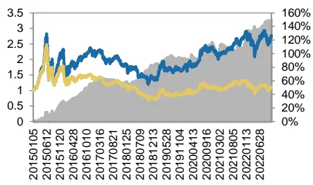
数据来源：Wind, 广发证券发展研究中心

[分析师： Table_Author]安宁宁

同SAC 执证号：S0260512020003

同 SFC CE No. BNW179

0755-23948352

anningning@gf.com.cn

分析师： 罗军

同SAC 执证号：S0260511010004

020-66335128

luojun@gf.com.cn

分析师： 张钰东

SAC 执证号：S0260522070006

zhangyudong@gf.com.cn

请注意，罗军,张钰东并非香港证券及期货事务监察委员会的注册持牌人，不可在香港从事受监管活动。

## [Table_ 相关研究：DocRe

再谈地理关联度因子研究:多2022-11-08
因子 Alpha 系列报告之(四十
四)
基于地理关联度因子研究:多2022-08-31
因子 Alpha 系列报告之(四十
三)

识别风险，发现价值

## 一、传统市场因子（Beta）研究背景

## （一）因子起源

CAPM模型（Capital Asset Pricing Model）于20世纪60年代问世，由Treynor（1961，1962）、Sharpe（1964）等多位学者分别独立提出，该模型首次清晰地刻画了风险和收益率之间的线性关系，指出了风险资产的预期超额收益是由市场整体的预期超额收益和该资产对市场风险的暴露水平共同决定，为后续大量线性多因子定价模型的研究奠定基石。

根据该模型，资产i的预期收益率由以下线性模型表达：

$$
E(R_{i})=R_{f}+\beta_{i}*(E(R_{m})-R_{f})
$$

$E(R_{i})$ 是风险资 $\cdot 产$ i的预期收益率；

$R_{f}$ 是无风险收益率；

$E(R_{m})$ 是市场整体的预期收益率；

$\beta_{i}.$ 是风险资产i与市场整体的系统性风险系数。

其中 $\beta_{i}=\frac{cov(R_{i},R_{M})}{var(R_{M})}$ 刻画了资产收益率对市场收益的敏感程度，即我们常说的市场（Beta，或β）因子。

CAPM模型简单清晰，但是诸如完全竞争市场、同质性预期和理性投资者等假设相对严苛。早期的研究成果，诸如Markowitz（1959）、Hogan and Warren（1972，1974）均提出传统Beta因子的假设情形过于简单化。同样诸多研究也显示了单凭Beta因子较难以解释不同资产（如股票）收益的截面差异。

## （二）A 股实证检验

对于传统Beta因子，我们在A股市场进行实证检验。我们以主要的宽基指数即沪深300、中证500和中证800，作为市场基准，滚动回溯过去20、60和120个交易日计算各股票换仓时点的传统Beta因子。

回测结果显示，传统Beta因子较难稳定贡献Alpha收益，即高Beta个股并未带来稳定的超额收益。

表1：常规Beta因子绩效表现

| 因子名称 | IC | LS_IR | IC_IR | 年化收益 | 胜率 | 换股比例 | ValidPercent |
| --- | --- | --- | --- | --- | --- | --- | --- |
| fBeta120D300 | -1.8% | 0.19 | -0.14 | 2.0% | 54.9% | 27.1% | 95.4% |
| fBeta120D500 | -1.4% | -0.17 | -0.10 | -4.2% | 52.1% | 24.4% | 95.4% |
| fBeta120D800 | -2.2% | 0.19 | -0.16 | 1.9% | 51.4% | 26.5% | 95.4% |
| fBeta20D300 | 1.2% | 0.52 | 0.05 | 10.0% | 51.4% | 78.5% | 95.6% |
| fBeta20D500 | 0.5% | 0.83 | 0.08 | 35.2% | 54.9% | 75.4% | 95.6% |

识别风险，发现价值

| fBeta20D800 | 0.7% | 0.67 | 0.06 | 16.2% | 55.6% | 77.9% | 95.6% |
| --- | --- | --- | --- | --- | --- | --- | --- |
| fBeta60D300 | -1.2% | -0.13 | -0.06 | -3.0% | 48.6% | 42.2% | 95.5% |
| fBeta60D500 | -2.1% | -0.44 | -0.03 | -6.3% | 49.3% | 38.8% | 95.5% |
| fBeta60D800 | -2.0% | -0.19 | -0.06 | -3.6% | 51.4% | 41.3% | 95.5% |

数据来源：Wind, 广发证券发展研究中心

综上所述，传统Beta因子存在一定局限性。一方面，后续研究朝多因子方向发展，即认为资产的收益率并非由单一的市场因子决定，如Ross（1976）提出APT（Arbitrage Pricing Theory）理论。另一方面，部分研究针对Beta因子，进行更加深入细化的拆解。

本报告将聚焦于后者，针对传统Beta因子的不足，参考Bollerslev（2021）构建SemiBeta因子，并在A股市场进行实证检验。

## 二、SemiBeta因子研究理论基础

行为金融学研究领域，Kahneman and Tversky（1979）提出“前景理论”（Prospect Theory）和“损失厌恶”（Loss Aversion）概念，即认为完全理性投资者的假设不完全符合实际，现实中的投资者更多是呈现有限理性的特征，面对同样数量的收益和损失时，认为损失带来更多的负效用，表现为“损失厌恶”，而非“风险厌恶”（Risk Aversion）的特征。因此面对盈利，投资者表现为风险厌恶，追求“落地为安”；面对亏损，投资者表现为风险偏好，追求“扭亏为盈”。

图1：有限理性投资者损失厌恶特征
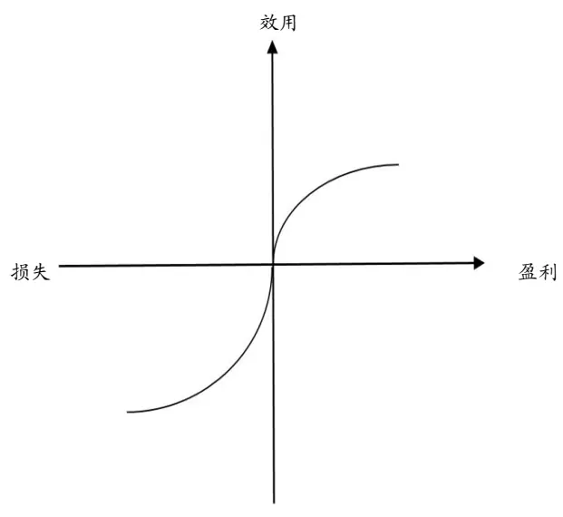
数据来源：广发证券发展研究中心

针对传统Beta因子，假设投资者只厌恶可能导致亏损的波动，那么相关的风险就应当只聚焦于负收益的部分。如果投资者只关注下行风险，那么个股和市场整体在上涨和下跌不同状态下的协方差则不应被均衡定价。

Ang等（2006）发现，相比于传统Beta因子，只聚焦于市场下跌状态下的Beta，即Downside Beta，能更好地解释美股权益市场的截面差异。但Levi and Welch（2020）等人发现Downside Beta并不能提供更好的预测能力。

基于上述研究背景，Bollerslev（2021）提出SemiBeta概念，即基于个股收益和市场基准收益方向的不同，将传统Beta因子拆解为4部分。

$$
\begin{aligned}\beta&\equiv\frac{Cov(R_{i},\ R_{m})}{Var(R_{m})}=\frac{N+P+M^{+}+M^{-}}{Var(R_{m})}\\&\equiv\beta^{N}+\beta^{P}-\beta^{M^{+}}-\beta^{M^{-}}\end{aligned}
$$

其中 $R_{i}.$ 表示某风险资产收益率， $R_{m}$ 表示市场基准收益率，N、P、 $M^{+}$ 、M−分别对应4个不同的组成结构。N表示市场和风险资产均为负收益，P表示市场和风险资产均为正收益，M+表示市场收益为正但风险资产为负，M−表示市场收益为负但风险资产为正。而为了方便描述，参考原文，报告后续采取同样的设定，即：

$$
\beta^{M^{+}}\equiv-\frac{M^{+}}{Var(R_{m})}
$$

$$
\beta^{M^{-}}\equiv-\frac{M^{-}}{Var(R_{m})}
$$

按照上述方法，即将传统Beta拆解为了4个不同的SemiBeta。

为进一步更好地理解相应概念，以下图为例，我们假设有4个传统Beta均为1的不同的风险资产，但是其SemiBeta呈现差异化的特征。

如果基于传统CAPM模型，那么这4个资产应当有相同的预期收益率。

引入SemiBeta模型，Panel A中的资产（后续称为资产A，其他资产采取类似处理）Beta保持稳定，而资产B的Beta在市场整体下跌时要低于市场整体上涨时的Beta，即 $\left\langle\beta^{N}<\beta^{P}\right.$ 。那么基于相关理论，投资者仅厌恶下行风险，因此相应资产若能在下跌环境中提供预期相对稳定的收益，则愿意接受相对较低的预期收益率，即意味资产B的预期回报率要低于资产A。

相似的，资 $\cdot 产\mathbf{C}.$ 与资产B特征相反，则资 $\cdot 产\mathbf{C}_{1}$ 要求相对高于资产A和资产B的预期回报率。而资产D相比于资产C有相对更好的对冲特性，因此资产D的预期回报率要低于资产C。

图2：不同SemiBeta结构的资产对比
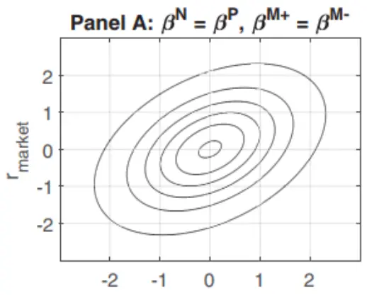

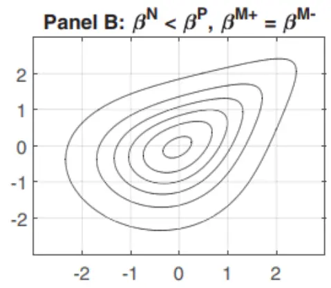

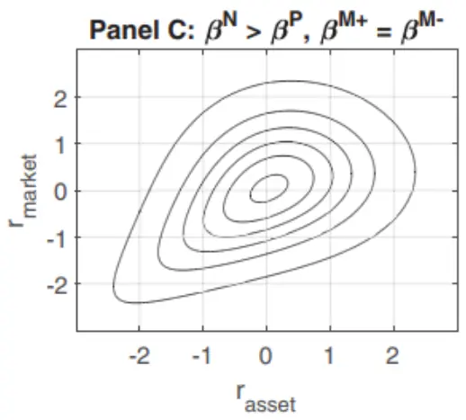

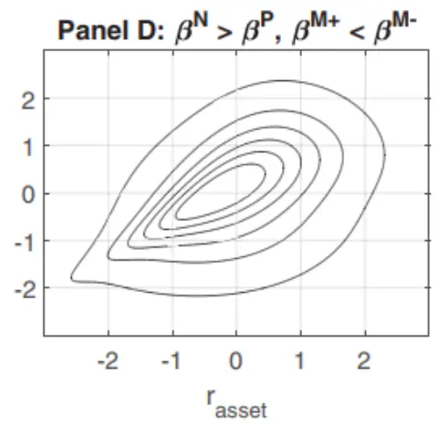
数据来源：Bollerslev, T. , Patton, A. J. , & Quaedvlieg, R. . 2021. Realized semibetas: disentangling "good" and "bad" downsiderisks. Journal of Financial Economics，广发证券发展研究中心

Bollerslev（2021）研究发现，对于美股市场，若基于日度数据计算月度的SemiBeta， $\beta^{N}$ 因子有相对明显的正溢价， $\beta^{M^{-}}$ 因子有相对明显的负溢价，其余两个SemiBeta因子特征不显著。

我们参考相应的构造方法，将SemiBeta因子引入到A股市场进行实证研究。

## 三、实证分析

## （一）数据说明

选股范围：全市场；

股票预处理：剔除摘牌、涨跌停板、ST/*ST、上市未满180个交易日的股票；

因子预处理：MAD去极值、Z-Score标准化；

回测区间： 2010.01.01 – 2021.12.31；

分档方式：根据当期股票的因子值，从小到大分为十档 ；

调仓周期：月度，每个月最后一个交易日以收盘价调仓。

## （二）因子构建

我们采取如下结构来构建SemiBeta因子：

$$
\beta_{t,i}^{N}=\frac{\sum_{k=1}^{m}r_{t,k,i}^{-}f_{t,k}^{-}}{\sum_{k=1}^{m}f_{t,k}^{2}}
$$

$$
\beta_{t,i}^{P}=\frac{\sum_{k=1}^{m}r_{t,k,i}^{+}f_{t,k}^{+}}{\sum_{k=1}^{m}f_{t,k}^{2}}
$$

$$
\beta_{t,i}^{M^{-}}=-\frac{\sum_{k=1}^{m}r_{t,k,i}^{+}f_{t,k}^{-}}{\sum_{k=1}^{m}f_{t,k}^{2}}
$$

$$
\beta_{t,i}^{M^{+}}=-\frac{\sum_{k=1}^{m}r_{t,k,i}^{-}f_{t,k}^{+}}{\sum_{k=1}^{m}f_{t,k}^{2}}
$$

$r_{t,k,i}$ 表示股票i在第t期，回溯第k个交易日的日度收益率数据；

$f_{t,k1}$ 表示市场基准在第t期，回溯第k个交易日的日度收益率数据。

其中 $以r_{t,k,i}$ 为例：

$$
\begin{aligned}r_{t,k,i}^{+}&=\max\left(r_{t,k,i},0\right)\\r_{t,k,i}^{-}&=\min\left(r_{t,k,i},0\right)\end{aligned}
$$

为方便表述，针对A股构建的SemiBeta因子，我们以符号N、P、MN、MP表示$\beta_{t,i}^{N}、\beta_{t,i}^{P}、\beta_{t,i}^{M^{-}}和\beta_{t,i}^{M^{+}}$

每期回溯的时间区间，我们分别采取20、60、120个交易日，即对应1个月、3个月和半年；市场基准方面，我们分别以沪深300、中证500、中证1000和创业板指作为市场基准。

将4个SemiBeta原始结构、3类回溯时间、4个比较基准进行排列组合，合计构建了48个后续用于A股实证检验的SemiBeta因子。如fBeta_MN_120_S000852，表示以中证1000作为基准（s000852）,每期回溯120个交易日（120）构建的 $\beta_{t,i}^{M^{-}}\left(\mathsf{MN}\right)$ 因子，并用于全市场选股（fBeta）。

表2：48个SemiBeta因子信息

| $16200$ 因子 | $16\times10=1000$ 因子 | $63\times3=133$ | $632$ |
| --- | --- | --- | --- |
| fBeta_MN_120_S000852 | fBeta_MP_120_S000852 | fBeta_N_120_S000852 | fBeta_P_120_S000852 |
| fBeta_MN_120_S399006 | fBeta_MP_120_S399006 | fBeta_N_120_S399006 | fBeta_P_120_S399006 |
| fBeta_MN_120_S399300 | fBeta_MP_120_S399300 | fBeta_N_120_S399300 | fBeta_P_120_S399300 |
| fBeta_MN_120_S399905 | fBeta_MP_120_S399905 | fBeta_N_120_S399905 | fBeta_P_120_S399905 |
| fBeta_MN_20_S000852 | fBeta_MP_20_S000852 | fBeta_N_20_S000852 | fBeta_P_20_S000852 |

识别风险，发现价值

| fBeta_MN_20_S399006 | fBeta_MP_20_S399006 | fBeta_N_20_S399006 | fBeta_P_20_S399006 |
| --- | --- | --- | --- |
| fBeta_MN_20_S399300 | fBeta_MP_20_S399300 | fBeta_N_20_S399300 | fBeta_P_20_S399300 |
| fBeta_MN_20_S399905 | fBeta_MP_20_S399905 | fBeta_N_20_S399905 | fBeta_P_20_S399905 |
| fBeta_MN_60_S000852 | fBeta_MP_60_S000852 | fBeta_N_60_S000852 | fBeta_P_60_S000852 |
| fBeta_MN_60_S399006 | fBeta_MP_60_S399006 | fBeta_N_60_S399006 | fBeta_P_60_S399006 |
| fBeta_MN_60_S399300 | fBeta_MP_60_S399300 | fBeta_N_60_S399300 | fBeta_P_60_S399300 |
| fBeta_MN_60_S399905 | fBeta_MP_60_S399905 | fBeta_N_60_S399905 | fBeta_P_60_S399905 |

数据来源：广发证券发展研究中心

## （三）因子绩效表现

## 1. fBeta_MN系列因子

多数fBeta_MN系列因子的覆盖度超过了90%，所有因子均表现出负IC的特征，其中综合较优的因子是fBeta_MN_60_S000852：IC均值为-7.1%、多空收益信息比为（LS_IR）为2.13，IC_IR为-0.98，年化收益为121%，胜率为75.7%，平均换股比例为46.6%，因子覆盖度达95.5%。

其中关于年化收益，以沪深300作为市场基准时的长期年化收益不够理想，其他宽基指数作为基准的年化收益均相对较高。

表3：fBeta_MN系列因子绩效表现

| 因子名称 | IC | LS_IR | IC_IR | 年化收益 | 胜率 | 换股比例 | ValidPercent |
| --- | --- | --- | --- | --- | --- | --- | --- |
| fBeta MN 120 S000852 | -5.8% | 1.64 | -0.81 | 76.5% | 65.3% | 30.6% | 95.4% |
| fBeta MN 120 S399006 | -4.9% | 1.47 | -0.72 | 71.6% | 65.3% | 27.9% | 87.7% |
| fBeta_MN_120_S399300 | -6.2% | 0.54 | -0.36 | 14.0% | 63.2% | 27.8% | 95.4% |
| fBeta_MN_120_S399905 | -6.2% | 1.59 | -0.75 | 65.2% | 67.4% | 30.5% | 95.4% |
| fBeta MN 20 S000852 | -6.7% | 2.05 | -0.87 | 147.7% | 75.0% | 84.3% | 95.6% |
| fBeta MN 20 S399006 | -6.7% | 1.97 | -0.85 | 180.0% | 71.5% | 80.4% | 91.4% |
| fBeta_MN_20_S399300 | -7.1% | 1.41 | -0.67 | 66.1% | 68.1% | 82.3% | 95.6% |
| fBeta_MN_20_S399905 | -6.8% | 2.12 | -0.94 | 131.6% | 73.6% | 84.3% | 95.6% |
| fBeta MN 60 S000852 | -7.1% | 2.13 | -0.98 | 121.0% | 75.7% | 46.6% | 95.5% |
| fBeta_MN_60_S399006 | -7.4% | 1.88 | -0.86 | 128.7% | 72.2% | 43.5% | 90.0% |
| fBeta MN 60 S399300 | -7.4% | 0.84 | -0.52 | 26.3% | 65.3% | 43.3% | 95.5% |
| fBeta MN 60 S399905 | -7.0% | 2.02 | -0.94 | 101.8% | 74.3% | 46.2% | 95.5% |

数据来源：Wind, 广发证券发展研究中心

## 2. fBeta_MP系列因子

多数fBeta_MP系列因子的覆盖度同样超过了90%，所有因子均表现出负IC的特征，其中综合较优的因子是fBeta_MP_20_S000852：IC均值为-6.6%、多空收益信息比为（LS_IR）为1.76，IC_IR为-0.71，年化收益为74.6%，胜率为69.4%，平均换股比例为82.4%，因子覆盖度达95.6%。

表4：fBeta_MP因子绩效表现

| 因子名称 | IC | LS_IR | IC_IR | 年化收益 | 胜率 | 换股比例 | ValidPercent |
| --- | --- | --- | --- | --- | --- | --- | --- |
| fBeta_MP_120_S000852 | -5.4% | 1.60 | -0.71 | 52.8% | 70.1% | 28.8% | 95.4% |
| fBeta_MP_120_S399006 | -6.1% | 1.39 | -0.54 | 47.1% | 61.8% | 26.8% | 87.7% |
| fBeta MP 120 S399300 | -5.5% | 0.25 | -0.21 | 3.5% | 56.3% | 26.6% | 95.4% |
| fBeta MP 120 S399905 | -5.3% | 1.11 | -0.54 | 31.2% | 64.6% | 28.9% | 95.4% |
| fBeta_MP_20_S000852 | -6.6% | 1.76 | -0.71 | 74.6% | 69.4% | 82.4% | 95.6% |
| fBeta_MP_20_S399006 | -6.0% | 1.62 | -0.59 | 58.5% | 69.4% | 79.9% | 91.4% |
| fBeta_MP_20_S399300 | -5.2% | 0.44 | -0.29 | 9.0% | 63.2% | 81.5% | 95.6% |
| fBeta_MP_20_S399905 | -6.3% | 1.40 | -0.59 | 52.3% | 72.9% | 82.2% | 95.6% |
| fBeta_MP_60_S000852 | -5.1% | 1.74 | -0.78 | 54.3% | 71.5% | 44.5% | 95.5% |
| fBeta_MP_60_S399006 | -5.7% | 1.62 | -0.60 | 58.4% | 69.4% | 42.6% | 90.0% |
| fBeta_MP_60_S399300 | -5.2% | 0.20 | -0.22 | 2.2% | 61.1% | 42.1% | 95.5% |
| fBeta MP 60 S399905 | -5.5% | 1.15 | -0.57 | 33.4% | 70.8% | 44.3% | 95.5% |

数据来源：Wind, 广发证券发展研究中心

## 3. fBeta_N系列因子

fBeta_N系列因子的有效性相对较弱，IC绝对值回测结果未超过5%。Bollerslev（2021）在美股中的实证结果显示高Beta_N个股具备较高的风险溢价，和我们基于A股的实证结果存在差异。

表5：fBeta_N因子绩效表现

| 因子名称 | IC | LS_IR | IC_IR | 年化收益 | 胜率 | 换股比例 | ValidPercent |
| --- | --- | --- | --- | --- | --- | --- | --- |
| fBeta_N_120_S000852 | -3.9% | -0.07 | -0.12 | -3.2% | 52.8% | 24.7% | 95.4% |
| fBeta N 120 S399006 | -1.4% | -0.03 | -0.14 | -2.8% | 48.6% | 22.0% | 87.7% |
| fBeta N 120 S399300 | -3.9% | 0.42 | -0.23 | 8.8% | 52.1% | 28.0% | 95.4% |
| fBeta_N_120_S399905 | -4.0% | 0.03 | -0.14 | -1.5% | 56.3% | 25.6% | 95.4% |
| fBeta_N_20_S000852 | -2.1% | 0.53 | 0.02 | 17.8% | 50.7% | 75.1% | 95.6% |
| fBeta N 20 S399006 | -0.1% | 0.53 | 0.00 | 17.3% | 47.2% | 70.9% | 91.4% |
| fBeta_N_20_S399300 | -2.5% | -0.16 | -0.06 | -3.5% | 53.5% | 79.1% | 95.6% |
| fBeta_N_20_S399905 | -2.9% | 0.40 | 0.01 | 9.9% | 49.3% | 75.9% | 95.6% |
| fBeta_N_60_S000852 | -2.9% | -0.30 | -0.04 | -5.7% | 50.0% | 38.8% | 95.5% |
| fBeta_N_60_S399006 | -2.5% | -0.28 | -0.08 | -5.7% | 49.3% | 35.6% | 90.0% |
| fBeta_N_60_S399300 | -3.5% | 0.00 | -0.12 | -1.5% | 53.5% | 42.5% | 95.5% |
| fBeta N 60 S399905 | -3.1% | -0.24 | -0.06 | -5.0% | 51.4% | 39.6% | 95.5% |

数据来源：Wind, 广发证券发展研究中心

## 4. fBeta_P系列因子

fBeta_P系列因子在A股的实证结果来看，整体有效性并不显著。

表6：SemiBeta-P因子绩效表现

| 因子名称 | IC | LS_IR | IC_IR | 年化收益 | 胜率 | 换股比例 | ValidPercent |
| --- | --- | --- | --- | --- | --- | --- | --- |
| fBeta_P_120_S000852 | -4.2% | 0.06 | -0.22 | -1.1% | 51.4% | 25.8% | 95.4% |
| fBeta_P_120_S399006 | -3.1% | 0.10 | -0.21 | -0.6% | 49.3% | 22.6% | 87.7% |
| fBeta_P_120_S399300 | -5.5% | 0.50 | -0.35 | 11.3% | 56.9% | 28.6% | 95.4% |
| fBeta_P_120_S399905 | -3.5% | 0.21 | -0.26 | 2.5% | 56.3% | 26.8% | 95.4% |
| fBeta_P_20_S000852 | -3.1% | 0.06 | -0.24 | -0.6% | 50.0% | 74.7% | 95.6% |
| fBeta_P_20_S399006 | -3.0% | 0.03 | -0.20 | -1.1% | 48.6% | 71.2% | 91.4% |
| fBeta_P_20_S399300 | -3.2% | 0.45 | -0.32 | 8.7% | 58.3% | 79.4% | 95.6% |
| fBeta_P_20_S399905 | -3.6% | 0.18 | -0.27 | 1.8% | 52.8% | 75.8% | 95.6% |
| fBeta_P_60_S000852 | -5.8% | 0.04 | -0.24 | -1.4% | 52.1% | 38.8% | 95.5% |
| fBeta_P_60_S399006 | -3.7% | 0.02 | -0.21 | -1.8% | 52.8% | 35.9% | 90.0% |
| fBeta_P_60_S399300 | -5.0% | 0.48 | -0.38 | 10.2% | 56.3% | 42.7% | 95.5% |
| fBeta_P_60_S399905 | -5.1% | 0.15 | -0.29 | 1.0% | 53.5% | 39.7% | 95.5% |

数据来源：Wind, 广发证券发展研究中心

综上所述，整体而言，fBeta_MN系列因子的有效性相对较高，我们将进一步展示fBeta_MN因子以中证500、中证1000和创业板指作为基准的特征和表现。

## 四、绩优因子详细表现

## （一）fBeta_MN_120 系列因子表现

对比其他MN系列因子，相对而言，fBeta_MN_120系列因子整体换手率相对较低，其中综合较优的因子是fBeta_MN_120_S000852：IC均值为-5.8%、多空收益信息比为（LS_IR）为1.64，IC_IR为-0.81，年化收益为76.5%，胜率为65.3%，平均换股比例为30.6%，因子覆盖度达95.4%。

## 1. fBeta_MN_120_S399905

图3：fBeta_MN_120_S399905因子IC值
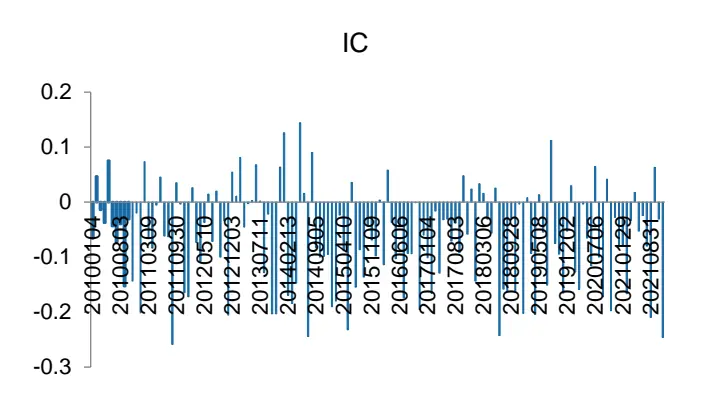
数据来源：Wind，广发证券发展研究中心

图 4：fBeta_MN_120_S399905 因子换手率
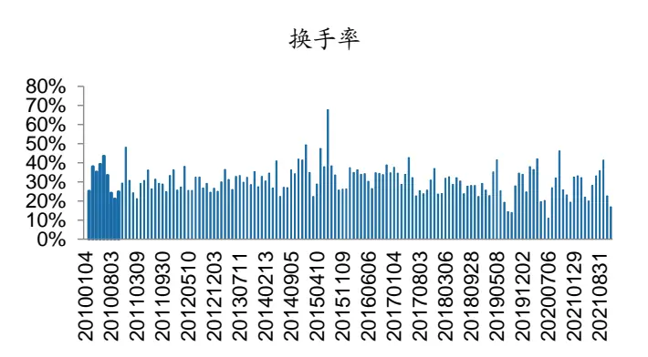
数据来源：Wind，广发证券发展研究中心

图5：fBeta_MN_120_S399905因子多空收益
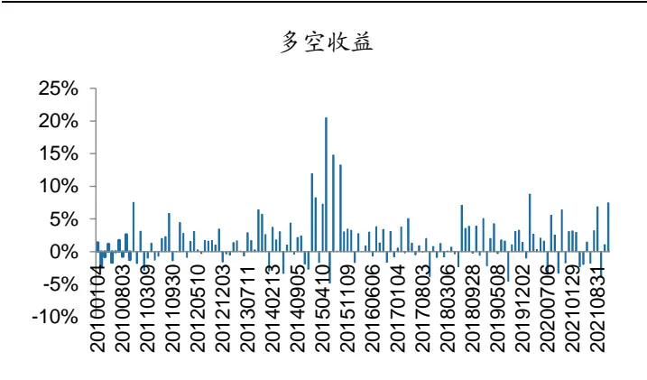
数据来源：Wind，广发证券发展研究中心

图 6：fBeta_MN_120_S399905 因子多空累计收益
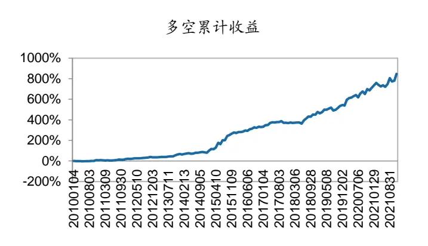
数据来源：Wind，广发证券发展研究中心

## 2. fBeta_MN_120_S000852

图7：fBeta_MN_120_S000852因子IC值
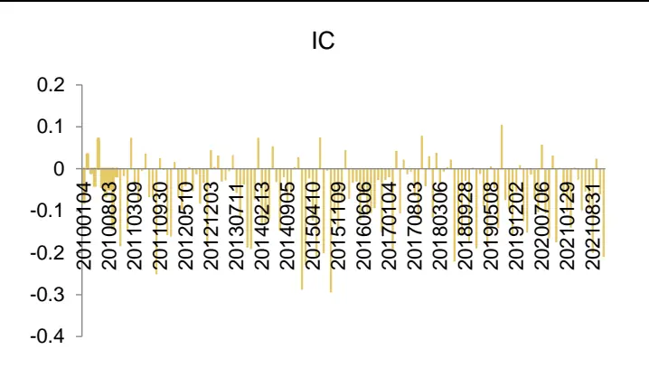
数据来源：Wind，广发证券发展研究中心

图 8：fBeta_MN_120_S000852 因子换手率
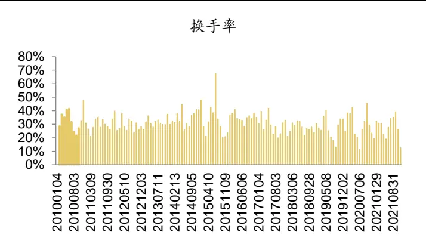
数据来源：Wind，广发证券发展研究中心

图9：fBeta_MN_120_S000852因子多空收益
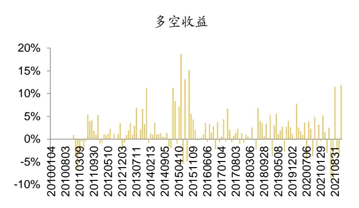
数据来源：Wind，广发证券发展研究中心

图 10：fBeta_MN_120_S000852 因子多空累计收益
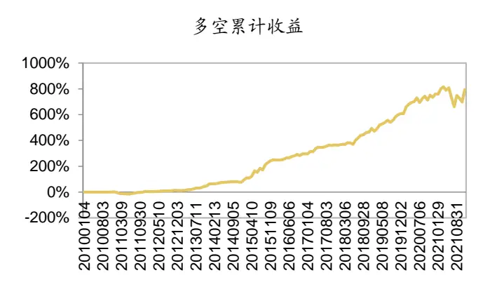
数据来源：Wind，广发证券发展研究中心

## 3. fBeta_MN_120_S399006

图11：fBeta_MN_120_S399006因子IC值
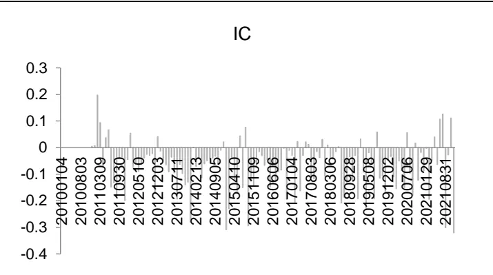
数据来源：Wind，广发证券发展研究中心

图 12：fBeta_MN_120_S399006 因子换手率
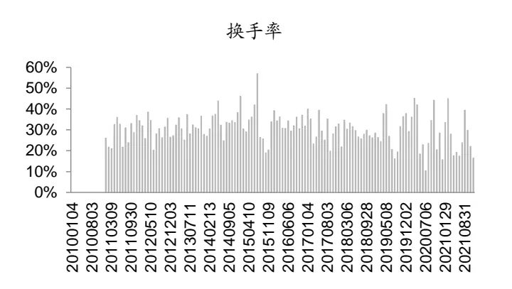
数据来源：Wind，广发证券发展研究中心

图13：fBeta_MN_120_S399006因子多空收益
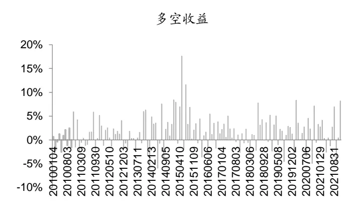
数据来源：Wind，广发证券发展研究中心

图 14：fBeta_MN_120_S399006 因子多空累计收益
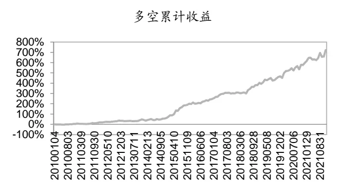
数据来源：Wind，广发证券发展研究中心

## （二）fBeta_MN_60 系列因子表现

fBeta_MN_60系列因子整体换手率相对高于fBeta_MN_120，长期收益也有较明显的提升。以fBeta_MN_60_S399006为例：IC均值为-7.4%、多空收益信息比为（LS_IR）为1.88，IC_IR为-0.86，年化收益为128.7%，胜率为72.2%，平均换股比例为43.5%，因子覆盖度达90.0%。

## 1. fBeta_MN_60_S399905

图15：fBeta_MN_60_S399905因子IC值
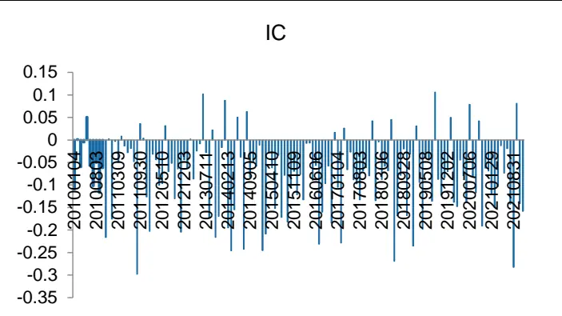
数据来源：Wind，广发证券发展研究中心

图 16：fBeta_MN_60_S399905 因子换手率
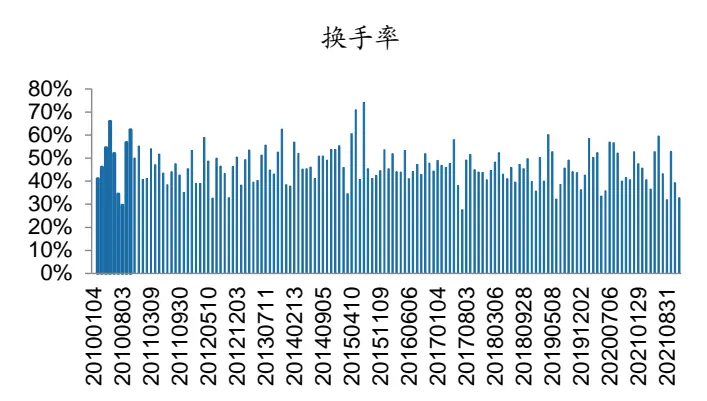
数据来源：Wind，广发证券发展研究中心

图17：fBeta_MN_60_S399905因子多空收益
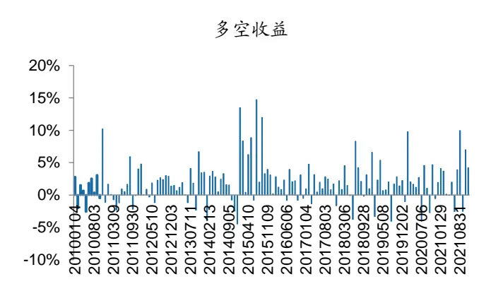
数据来源：Wind，广发证券发展研究中心

图 18：fBeta_MN_60_S399905 因子多空累计收益
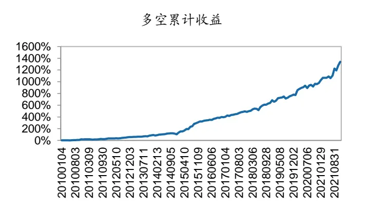
数据来源：Wind，广发证券发展研究中心

2. fBeta_MN_60_S000852

图19：fBeta_MN_60_S000852因子IC值
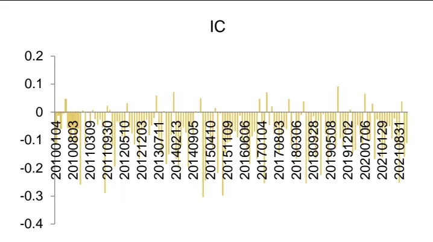
数据来源：Wind，广发证券发展研究中心

图 20：fBeta_MN_60_S000852 因子换手率
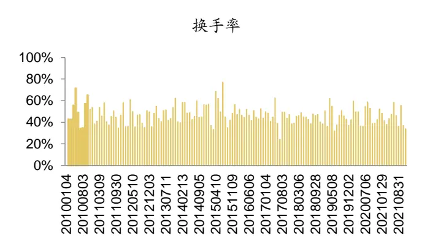
数据来源：Wind，广发证券发展研究中心

图21：fBeta_MN_60_S000852因子多空收益
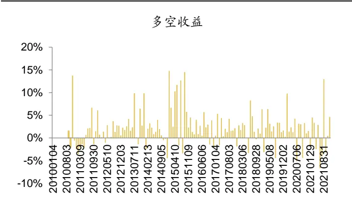
数据来源：Wind，广发证券发展研究中心

图 22：fBeta_MN_60_S000852 因子多空累计收益
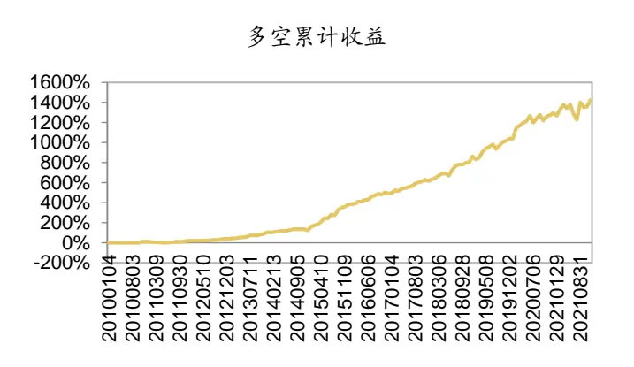
数据来源：Wind，广发证券发展研究中心

## 3. fBeta_MN_60_S399006

图23：fBeta_MN_60_S399006因子IC值
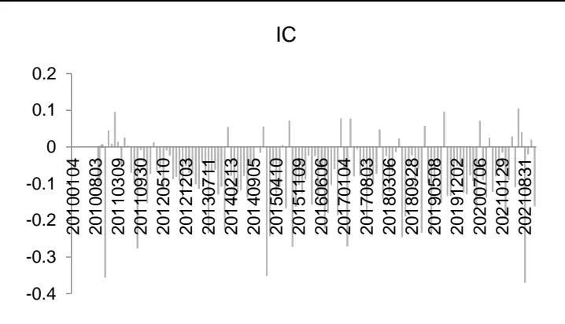
数据来源：Wind，广发证券发展研究中心

图 24：fBeta_MN_60_S399006 因子换手率
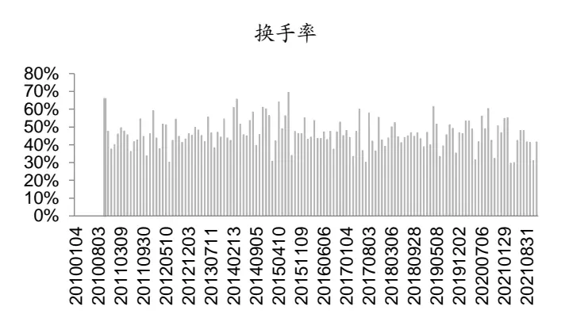
数据来源：Wind，广发证券发展研究中心

图25：fBeta_MN_60_S399006因子多空收益
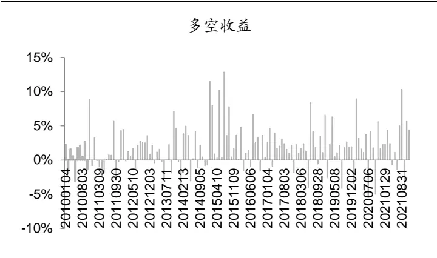
数据来源：Wind，广发证券发展研究中心

图 26：fBeta_MN_60_S399006 因子多空累计收益
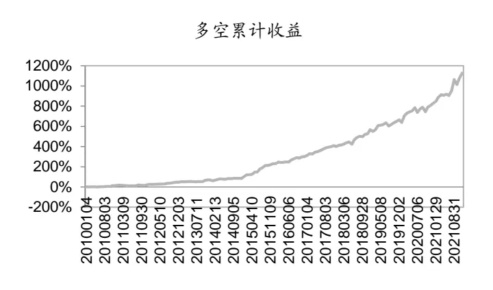
数据来源：Wind，广发证券发展研究中心

## （三）fBeta_MN_20 系列因子表现

fBeta_MN_20系列因子整体换手率相比于fBeta_MN_60系列因子进一步提高，同时回测收益也相对较高。以fBeta_MN_20_S399006为例：IC均值为-6.7%、多空收益信息比为（LS_IR）为1.97，IC_IR为-0.85，年化收益为180.0%，胜率为71.5%，平均换股比例为80.4%，因子覆盖度达91.4%。

## 1. fBeta_MN_20_S399905

图27：fBeta_MN_20_S399905因子IC值
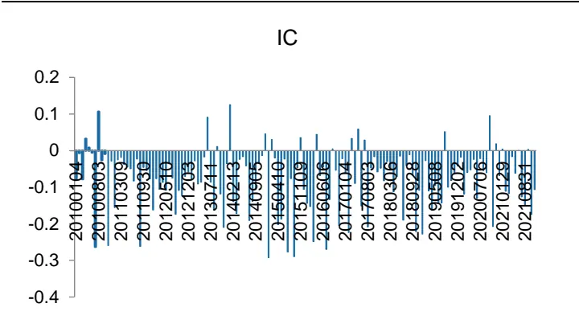
数据来源：Wind，广发证券发展研究中心

图 28：fBeta_MN_20_S399905 因子换手率
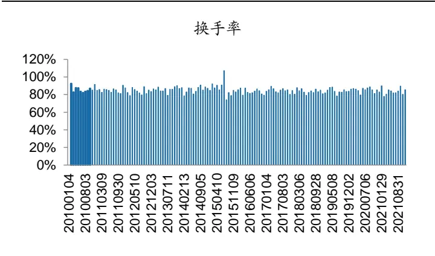
数据来源：Wind，广发证券发展研究中心

图29：fBeta_MN_20_S399905因子多空收益
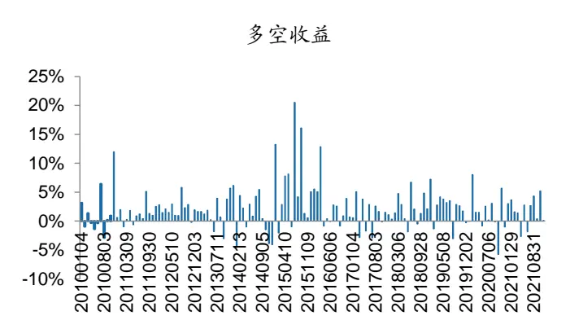
数据来源：Wind，广发证券发展研究中心

图 30：fBeta_MN_20_S399905 因子多空累计收益
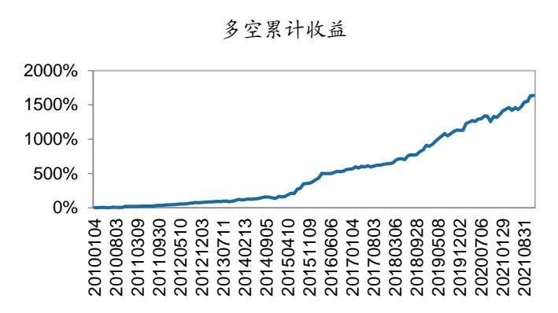
数据来源：Wind，广发证券发展研究中心

## 2. fBeta_MN_20_S000852

图31：fBeta_MN_20_S000852因子IC值
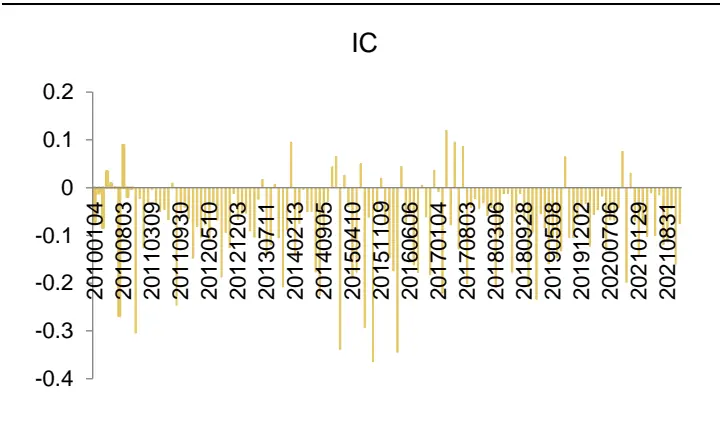
数据来源：Wind，广发证券发展研究中心

图 32：fBeta_MN_20_S000852 因子换手率
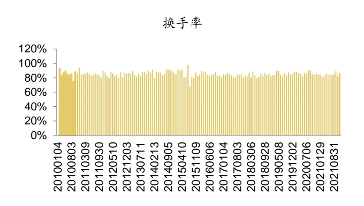
数据来源：Wind，广发证券发展研究中心

图33：fBeta_MN_20_S000852因子多空收益
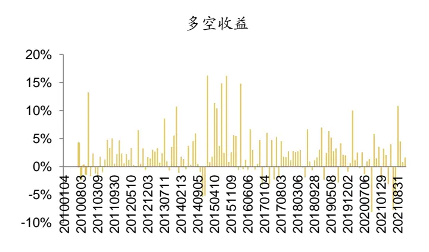
数据来源：Wind，广发证券发展研究中心

图 34：fBeta_MN_20_S000852 因子多空累计收益
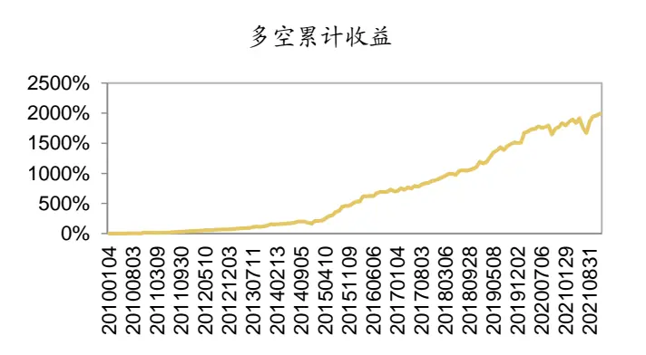
数据来源：Wind，广发证券发展研究中心

## 3. fBeta_MN_20_S399006

图35：fBeta_MN_20_S399006因子IC值
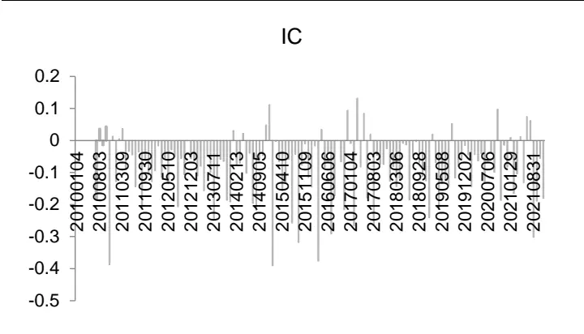
数据来源：Wind，广发证券发展研究中心

图 36：fBeta_MN_20_S399006 因子换手率
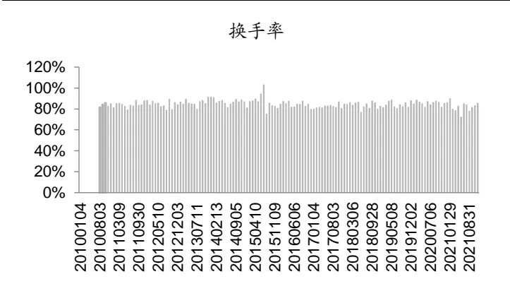
数据来源：Wind，广发证券发展研究中心

图37：fBeta_MN_20_S399006因子多空收益
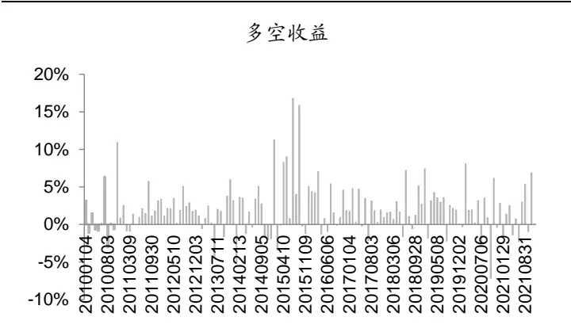
数据来源：Wind，广发证券发展研究中心

图 38：fBeta_MN_20_S399006 因子多空累计收益
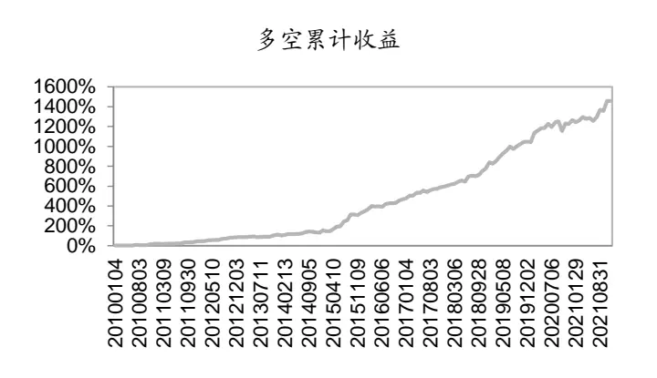
数据来源：Wind，广发证券发展研究中心

## 五、传统因子相关性分析

我们将SemiBeta系列因子和常见的市值、动量、波动率等因子做相关性分析。整体而言，SemiBeta系列因子和市值、短期动量的相关性相对较低，和波动率存在一定相关性。

表7：SemiBeta系列因子和常见因子的相关性分析

| 因子名称 | 总市值 | fMom5 | fMom60 | fMom120 | fAmountMa20 | fAmountStd20 | fVolatility20 | fBeta120D300 |
| --- | --- | --- | --- | --- | --- | --- | --- | --- |
| fBeta_MN_120_S000852 | 2.2% | 0.5% | 19.1% | 37.0% | 24.9% | 26.3% | 34.6% | -15.6% |
| fBeta_MN_120_S399006 | -2.8% | -0.1% | 17.6% | 34.8% | 22.9% | 24.8% | 35.9% | -7.9% |
| fBeta_MN_120_S399300 | -15.8% | 1.5% | 18.0% | 37.6% | 14.2% | 15.5% | 45.6% | -18.3% |
| fBeta_MN_120_S399905 | -4.3% | 0.4% | 18.3% | 36.6% | 22.5% | 23.7% | 38.5% | -18.2% |
| fBeta_MN_20_S000852 | 4.5% | 13.2% | 32.5% | 26.6% | 25.4% | 30.7% | 34.4% | -9.8% |

识别风险，发现价值

| fBeta_MN_20_S399006 | 1.5% | 13.0% | 32.1% | 25.0% | 25.4% | 31.7% | 36.6% | -6.9% |
| --- | --- | --- | --- | --- | --- | --- | --- | --- |
| fBeta_MN_20_S399300 | -8.1% | 13.8% | 35.9% | 30.0% | 21.4% | 27.5% | 45.6% | -11.6% |
| fBeta_MN_20_S399905 | 1.0% | 12.7% | 33.0% | 26.6% | 25.0% | 31.6% | 37.7% | -10.9% |
| fBeta_MN_60_S000852 | 3.5% | 2.6% | 39.8% | 34.5% | 27.6% | 30.3% | 37.4% | -13.3% |
| fBeta_MN_60_S399006 | 1.3% | 2.6% | 39.7% | 32.1% | 26.3% | 29.9% | 38.0% | -8.0% |
| fBeta_MN_60_S399300 | -12.7% | 4.9% | 40.8% | 36.7% | 19.8% | 22.0% | 49.1% | -15.8% |
| fBeta_MN_60__S399905 | -1.7% | 3.0% | 39.1% | 34.4% | 25.9% | 28.3% | 41.2% | -14.1% |
| fBeta_MP_120_S000852 | 13.7% | -7.1% | -4.2% | 8.3% | 25.1% | 24.3% | 25.9% | -11.7% |
| fBeta_MP_120_S399006 | 9.2% | -7.0% | -6.4% | 4.6% | 21.0% | 21.3% | 23.8% | -8.2% |
| fBeta_MP_120_S399300 | -21.8% | -5.9% | -1.7% | 7.9% | 6.1% | 6.9% | 41.8% | -14.1% |
| fBeta_MP_120_S399905 | 3.8% | -7.7% | -4.4% | 8.2% | 20.3% | 20.1% | 32.4% | -14.8% |
| fBeta_MP_20_S000852 | 12.0% | -17.1% | 10.4% | 14.4% | 27.2% | 29.0% | 29.1% | -7.5% |
| fBeta_MP_20_S399006 | 8.1% | -17.1% | 8.7% | 9.7% | 24.0% | 26.4% | 28.1% | -6.1% |
| fBeta_MP_20S399300 | -7.1% | -14.7% | 12.6% | 15.5% | 17.6% | 20.5% | 42.8% | -10.1% |
| fBeta_MP_20_S399905 | 7.6% | -17.7% | 10.3% | 15.1% | 25.5% | 27.4% | 33.5% | -10.3% |
| fBeta_MP_60_S000852 | 13.4% | -10.4% | 1.4% | 16.3% | 26.9% | 25.7% | 29.0% | -11.0% |
| fBeta_MP_60_S399006 | 7.5% | -10.1% | -3.1% | 11.3% | 23.3% | 23.3% | 27.1% | -7.6% |
| fBeta_MP_60_S399300 | -15.2% | -8.1% | 1.5% | 17.1% | 11.8% | 11.8% | 44.1% | -12.9% |
| fBeta_MP_60_S399905 | 6.5% | -10.4% | -0.1% | 16.8% | 23.8% | 23.5% | 33.3% | -13.7% |
| fBeta_N_120_S000852 | -30.4% | -4.2% | -13.8% | -19.0% | 4.3% | 3.5% | 41.8% | 65.0% |
| fBeta_N_120_S399006 | -25.4% | -4.5% | -14.1% | -17.3% | 8.2% | 6.0% | 44.9% | 64.5% |
| fBeta_N_120_S399300 | -9.7% | -5.2% | -15.1% | -20.1% | 14.8% | 13.4% | 36.5% | 80.7% |
| fBeta_N_120_S399905 | -27.9% | -4.5% | -14.5% | -18.7% | 6.9% | 5.4% | 41.6% | 68.2% |
| fBeta_N_20_S000852 | -17.7% | -13.7% | -9.9% | -3.9% | 10.6% | 7.4% | 55.0% | 33.5% |
| fBeta_N_20_S399006 | -16.6% | -14.8% | -7.9% | -0.6% | 14.1% | 11.7% | 56.3% | 33.3% |
| fBeta_N_20_S399300 | -6.9% | -13.6% | -10.8% | -4.3% | 17.1% | 15.6% | 47.1% | 39.9% |
| fBeta_N_20_S399905 | -15.5% | -13.8% | -10.1% | -3.8% | 11.8% | 10.1% | 53.9% | 35.1% |
| fBeta_N_60_S000852 | -27.5% | -6.2% | -23.8% | -8.0% | 7.6% | 5.5% | 46.0% | 50.6% |
| fBeta_N_60_S399006 | -23.1% | -6.6% | -21.0% | -5.4% | 11.6% | 9.0% | 48.6% | 50.9% |
| fBeta_N_60_S399300 | -10.5% | -8.0% | -25.3% | -12.3% | 16.1% | 13.6% | 42.1% | 62.3% |
| fBeta_N_60_S399905 | -24.6% | -5.9% | -23.2% | -9.8% | 9.5% | 7.0% | 45.1% | 53.5% |
| fBeta_P_120_S000852 | -3.7% | 2.0% | 15.2% | 30.5% | 31.8% | 28.6% | 54.9% | 57.6% |
| fBeta_P_120_S399006 | -4.9% | 2.2% | 13.2% | 29.1% | 29.3% | 25.4% | 54.6% | 58.1% |
| fBeta_P_120_S399300 | 11.4% | 1.1% | 13.3% | 29.5% | 40.4% | 37.2% | 46.9% | 74.9% |
| fBeta_P_120__S399905 | -0.1% | 1.1% | 15.5% | 32.4% | 33.9% | 30.3% | 54.1% | 62.1% |
| fBeta_P_20_S000852 | -3.6% | 16.5% | 32.8% | 27.4% | 29.0% | 30.8% | 66.4% | 31.8% |
| fBeta_P_20_S399006 | -3.2% | 16.1% | 30.7% | 25.6% | 27.8% | 29.6% | 65.5% | 30.3% |
| fBeta_P_20_S399300 | 6.7% | 17.5% | 27.8% | 24.9% | 32.1% | 33.8% | 56.8% | 38.5% |
| fBeta_P_20_S399905 | -0.7% | 17.1% | 32.6% | 27.1% | 30.3% | 32.7% | 65.3% | 34.2% |
| fBeta_P_60_S000852 | -3.1% | 5.0% | 35.5% | 31.9% | 33.6% | 32.3% | 60.3% | 44.5% |
| fBeta_P_60_S399006 | -3.4% | 4.7% | 34.4% | 30.7% | 32.2% | 30.9% | 60.3% | 43.5% |
| fBeta_P_60_S399300 | 9.5% | 4.6% | 35.1% | 29.7% | 41.0% | 38.7% | 52.0% | 58.6% |

识别风险，发现价值

| fBeta_P_60_S399905 | -0.4% | 5.2% | 37.0% | 33.1% | 36.3% | 34.9% | 59.7% | 48.3% |
| --- | --- | --- | --- | --- | --- | --- | --- | --- |

数据来源：Wind，广发证券发展研究中心

## 六、指数增强策略构建

## （一）策略说明

基于上述SemiBeta测算结果，针对沪深300、中证500和中证1000指数，构建市值中性且行业中性的指数增强策略。

因子筛选方面，综合考虑因子IC、换手率和长期收益等因素，我们筛选并保留了fBeta_MN_60_S399905、fBeta_MN_60_S000852和fBeta_MN_60_S399006作等权重配置。

其他设置如下。

选股范围：全市场；

股票预处理：剔除摘牌、ST/*ST、上市未满180个交易日的股票；

因子预处理：MAD去极值、Z-Score标准化、行业中性、市值中性；

回测区间： 2010.01.01 – 2022.11.15；

调仓周期：月度，每个月最后一个交易日以收盘价调仓

个股权重上限：2%（沪深300增强）；1%（中证500增强和中证1000增强）；

交易费用：双边千分之三。

## （二）沪深 300 指数增强

SemiBeta沪深300增强策略，在2015年初至2022年11月中旬期间，累计实现6.2%的年化收益，约5%的年化超额收益。2022年初至今，已实现约7.2%的超额收益。

表8：SemiBeta沪深300增强策略分年度统计

|  | 累计收益率 | 年化收益率 | 最大回撤 | 收益新高最大需日 | 夏普比 | 基准年化收益率 | 年化超额收益率 |
| --- | --- | --- | --- | --- | --- | --- | --- |
| 全样本 | 58.0% | 6.2% | 47.9% | 1806 | 0.37 | 1.2% | 5.0% |
| 2015 | 70.5% | 72.7% | 47.9% | 136 | 1.43 | 5.6% | 67.1% |
| 2016 | -8.6% | -8.7% | 31.5% | 244 | -0.17 | -11.3% | 2.6% |
| 2017 | -2.2% | -2.3% | 10.7% | 116 | -0.14 | 21.8% | -24.0% |
| 2018 | -23.0% | -23.5% | 31.6% | 226 | -1.19 | -25.3% | 1.8% |
| 2019 | 27.4% | 28.0% | 14.5% | 172 | 1.35 | 36.1% | -8.1% |
| 2020 | 20.9% | 21.5% | 13.8% | 110 | 1.03 | 27.2% | -5.8% |
| 2021 | 2.4% | 2.5% | 13.3% | 236 | 0.24 | -5.2% | 7.7% |
| 2022 | -14.6% | -17.1% | 21.8% | 209 | -0.85 | -21.7% | 4.7% |

数据来源：Wind，广发证券发展研究中心

图39：SemiBeta沪深300增强策略回测净值
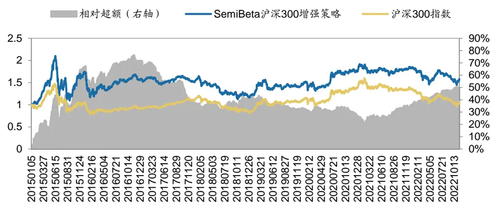
数据来源：Wind，广发证券发展研究中心

## （三）中证 500指数增强

SemiBeta中证500增强策略，在2015年初至2022年11月中旬期间，累计实现12.4%的年化收益，约10%的年化超额收益。2022年初至今，已实现约12%的超额收益。

表9：SemiBeta中证500增强策略分年度统计

|  | 累计收益率 | 年化收益率 | 最大回撤 | 收益新高最大需日 | 夏普比 | 基准年化收益率 | 年化超额收益率 |
| --- | --- | --- | --- | --- | --- | --- | --- |
| 全样本 | 145.1% | 12.4% | 56.8% | 1597 | 0.55 | 2.1% | 10.3% |
| 2015 | 105.1% | 108.7% | 53.4% | 136 | 1.63 | 43.1% | 65.6% |
| 2016 | -9.2% | -9.3% | 34.9% | 244 | -0.11 | -17.8% | 8.4% |
| 2017 | -12.1% | -12.3% | 17.5% | 203 | -0.71 | -0.2% | -12.1% |
| 2018 | -26.2% | -26.8% | 34.6% | 226 | -1.11 | -33.3% | 6.6% |
| 2019 | 30.7% | 31.4% | 19.1% | 181 | 1.28 | 26.4% | 5.1% |
| 2020 | 25.8% | 26.5% | 12.5% | 80 | 1.10 | 20.9% | 5.6% |
| 2021 | 27.6% | 28.3% | 10.8% | 68 | 1.77 | 15.6% | 12.7% |
| 2022 | -3.3% | -3.9% | 25.7% | 199 | -0.05 | -17.9% | 14.0% |

数据来源：Wind，广发证券发展研究中心

图40：SemiBeta中证500增强策略回测净值
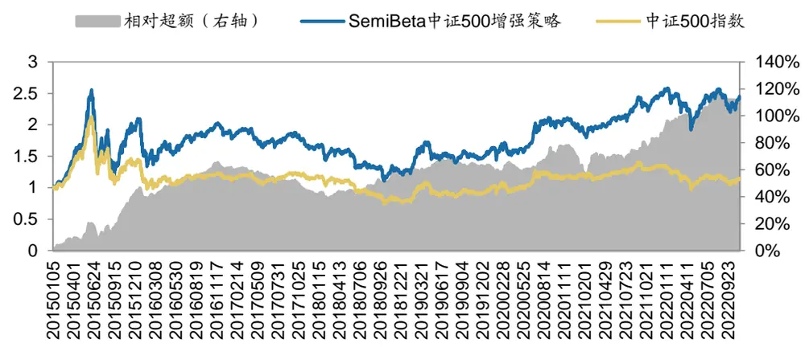
数据来源：Wind，广发证券发展研究中心

## （四）中证 1000指数增强

SemiBeta中证1000增强策略，在2015年初至2022年11月中旬期间，累计实现14.3%的年化收益，约12.8%的年化超额收益。2022年初至今，已实现约13.3%的超额收益。

表10：SemiBeta中证1000增强策略分年度统计

|  | 累计收益率 | 年化收益率 | 最大回撤 | 收益新高最大需日 | 夏普比 | 基准年化收益率 | 年化超额收益率 |
| --- | --- | --- | --- | --- | --- | --- | --- |
| 全样本 | 177.6% | 14.3% | 57.6% | 1596 | 0.59 | 1.5% | 12.8% |
| 2015 | 127.4% | 132.1% | 56.0% | 136 | 1.77 | 76.1% | 56.0% |
| 2016 | -3.3% | -3.3% | 35.7% | 205 | 0.09 | -20.0% | 16.7% |
| 2017 | -17.4% | -17.7% | 23.2% | 193 | -0.94 | -17.4% | -0.3% |
| 2018 | -26.8% | -27.4% | 35.4% | 238 | -1.08 | -36.9% | 9.5% |
| 2019 | 32.9% | 33.6% | 19.2% | 172 | 1.33 | 25.7% | 8.0% |
| 2020 | 28.1% | 28.8% | 12.5% | 76 | 1.16 | 19.4% | 9.5% |
| 2021 | 25.7% | 26.4% | 12.8% | 93 | 1.64 | 20.5% | 5.9% |
| 2022 | -2.4% | -2.9% | 28.3% | 136 | 0.01 | -18.4% | 15.5% |

数据来源：Wind，广发证券发展研究中心

图41：SemiBeta中证1000增强策略回测净值
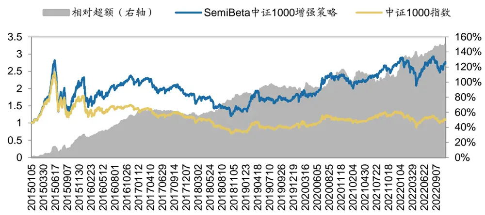
数据来源：Wind，广发证券发展研究中心

## 七、总结

研究背景和理论基础：传统Beta因子在A股市场蕴含的Alpha信息相对有限，行为金融学提出损失厌恶”（Loss Aversion）概念，即有限理性投资者认为等数量的损失的负效用高于收益的正效用，那么Beta因子的收益方向应纳入考量。本篇专题报告借鉴Bollerslev（2021）《Realized semibetas: Disentangling “good” and “bad”downside risks》的研究思路，对Beta因子进行深入细化拆分，构建SemiBeta因子，并在A股市场进行实证检验。

SemiBeta因子构建：基于个股收益和市场基准收益方向的不同，将传统Beta因子拆解为4个SemiBeta，同时分别采取20、60、120个交易日的Beta计算回溯周期，分别以沪深300、中证500、中证1000和创业板指作为市场基准，合计构建了48个细分因子。

A股实证分析：从整体表现来看，全市场选股范围内，月频调仓频率下，fBeta_MN系列因子表现较好，所有因子均表现出负IC的特征，计算Beta回溯周期越短，回测总收益越高，且和换手率呈现负相关。以fBeta_MN_60_S399006为例，IC均值为-7.4%、多空收益信息比为（LS_IR）为1.88，IC_IR为-0.86，年化收益为128.7%，胜率为72.2%，平均换股比例为43.5%，因子覆盖度达90.0%。

传统因子相关性分析：SemiBeta系列因子和市值、短期动量的相关性相对较低，和波动率存在一定相关性。

指数增强策略构建：综合考虑因子IC、换手率和长期收益等因素，我们筛选并保 留 了 fBeta_MN_60_S399905 fBeta_MN_60_S000852 和fBeta_MN_60_S399006作等权重配置，针对沪深300、中证500和中证1000指数，构建市值行业中性的指数增强策略。月度换仓频率下， 2015年初至2022年11月，SemiBeta沪深300增强策略实现约5%的年化超额收益，SemiBeta中证500增强策略实现约10%的年化超额收益，SemiBeta中证1000增强策略实现约12%的年化超额收益。

## 八、风险提示

本专题报告所述模型用量化方法通过历史数据统计、建模和测算完成，所得结论与规律在市场政策、环境变化时可能存在失效风险；

本专题策略模型在市场结构及交易行为的改变时有可能存在策略失效风险。

## 九、参考文献

1. Ang, A., Hodrick, R. J., Xing, Y., & Zhang, X. 2006. The cross‐section of volatility and expected returns. The journal of finance, 61(1), 259-299.

2. Bollerslev, T. , Patton, A. J. , & Quaedvlieg, R. . 2021. Realized semibetas: disentangling "good" and "bad" downside risks. Journal of Financial Economics(2).

3. Hogan, W.W., Warren, J.M., 1972. Computation of the efficient boundary in the ES portfolio selection model. J. Financ. Quant. Anal. 7 (4),1881–1896.

4. Hogan, W.W., Warren, J.M., 1974. Toward the development of an equilibrium capital-market model based on semivariance. J. Financ. Quant.Anal. 9 (1), 1–11.

5. Kahneman, D. and A. Tversky 1979. Prospect Theory: an analysis of decision under risk.Econometrica, Vol. 47(2), 263 – 292.

6. Levi, Y., & Welch, I. 2020. Symmetric and asymmetric market betas and downside risk. The Review of Financial Studies, 33(6), 2772-2795.

7. Markowitz, H., 1959. Portfolio Selection, Efficient Diversification of Investments. J. Wiley.

8. Parsons, C. A., Sabbatucci, R., & Titman, S. 2018. Geographic Lead-Lag Effects. Available at SSRN 2780139.

9. Ross, S. A. 1976. The arbitrage theory of capital asset pricing. Journal of Economic Theory, 13(3), 341-360.

10. Sharpe, W. F. 1964. Capital asset prices: A theory of market equilibrium under conditions of risk. The journal of finance, 19(3), 425-442.

11. Treynor, J. L. 1961. Market value, time, and risk. Time, and Risk (August 8, 1961).

12. Treynor, J. L. 1961. Toward a theory of market value of risky assets.

## [Table_ResearchTeam] 广发金融工程研究小组

罗军 ：首席分析师，华南理工大学硕士，从业 16 年，2010 年进入广发证券发展研究中心。

安 宁 宁 ：联席首席分析师，暨南大学硕士，从业 14 年，2011 年进入广发证券发展研究中心。

史 庆 盛 ：资深分析师，华南理工大学硕士，2011 年进入广发证券发展研究中心。

张 超 ：资深分析师，中山大学硕士，2012 年进入广发证券发展研究中心。

陈 原 文 ：资深分析师，中山大学硕士，2015 年进入广发证券发展研究中心。

樊 瑞 铎 ：资深分析师，南开大学硕士，2015 年进入广发证券发展研究中心。

李豪 ：资深分析师，上海交通大学硕士，2016 年进入广发证券发展研究中心。

周 飞 鹏 ：资深分析师，伯明翰大学硕士，2021 年加入广发证券发展研究中心。

季 燕 妮 ：高级分析师，厦门大学硕士，2020 年进入广发证券发展研究中心。

张 钰 东 ：高级分析师，中山大学硕士，2020 年进入广发证券发展研究中心。

## [Table_IndustryInvestDescription] 广发证券—行业投资评级说明

买入： 预期未来12个月内，股价表现强于大盘10%以上。内

持有： 预期未来12个月内，股价相对大盘的变动幅度介于-10%～+10%。对

卖出： 预期未来12个月内，股价表现弱于大盘10%以上。

## [Table_CompanyInvestDescription] 广发证券—公司投资评级说明

买入： 预期未来 12 个月内，股价表现强于大盘 15%以上。

增持： 预期未来12个月内，股价表现强于大盘5%-15%。

持有： 预期未来12个月内，股价相对大盘的变动幅度介于-5%～+5%。

卖出： 预期未来12个月内，股价表现弱于大盘5%以上。

## [Table_Address] 联系我们

| 地址 | 广州市 | 深圳市 | 北京市 | 上海市 | 香港 |
| --- | --- | --- | --- | --- | --- |
|  | 广州市天河区马场路 | 深圳市福田区益田路 | 北京市西城区月坛北 | 上海市浦东新区南泉 | 香港德辅道中189号 |
|  | 26号广发证券大厦 | 6001号太平金融大 | 街2号月坛大厦18 | 北路 429 号泰康保险 | 李宝椿大厦 29及30 |
|  | 35楼 | 厦31层 | 层 | 大厦37楼 | 楼 |
| 邮政编码 客服邮箱 | 510627 | 518026 | 100045 | 200120 |  |

## [Table_LegalDisclaimer] 法律主体声明

本报告由广发证券股份有限公司或其关联机构制作，广发证券股份有限公司及其关联机构以下统称为“广发证券”。本报告的分销依据不依据不同国家、地区的法律、法规和监管要求由广发证券于该国家或地区的具有相关合法合规经营资质的子公司/经营机构完成。资

广发证券股份有限公司具备中国证监会批复的证券投资咨询业务资格，接受中国证监会监管，负责本报告于中国（港澳台地区除外）的分投销。

广发证券（香港）经纪有限公司具备香港证监会批复的就证券提供意见（4 号牌照）的牌照，接受香港证监会监管，负责本报告于中国香港地区的分销。

本报告署名研究人员所持中国证券业协会注册分析师资质信息和香港证监会批复的牌照信息已于署名研究人员姓名处披露。

## [Table_Important重要声明

广发证券股份有限公司及其关联机构可能与本报告中提及的公司寻求或正在建立业务关系，因此，投资者应当考虑广发证券股份有限公司系 因此 者应当考虑及其关联机构因可能存在的潜在利益冲突而对本报告的独立性产生影响。投资者不应仅依据本报告内容作出任何投资决策。投资者应自主存 潜 利益冲突而 独 性产生影响 仅 容作出投资决策并自行承担投资风险，任何形式的分享证券投资收益或者分担证券投资损失的书面或者口头承诺均为无效。

本报告署名研究人员、联系人（以下均简称“研究人员”）针对本报告中相关公司或证券的研究分析内容，在此声明：（1）本报告的全部分析结论、研究观点均精确反映研究人员于本报告发出当日的关于相关公司或证券的所有个人观点，并不代表广发证券的立场；（2）研究人员的部分或全部的报酬无论在过去、现在还是将来均不会与本报告所述特定分析结论、研究观点具有直接或间接的联系。

研究人员制作本报告的报酬标准依据研究质量、客户评价、工作量等多种因素确定，其影响因素亦包括广发证券的整体经营收入，该等经营收入部分来源于广发证券的投资银行类业务。

本报告仅面向经广发证券授权使用的客户/特定合作机构发送，不对外公开发布，只有接收人才可以使用，且对于接收人而言具有保密义务。广发证券并不因相关人员通过其他途径收到或阅读本报告而视其为广发证券的客户。在特定国家或地区传播或者发布本报告可能违反当地法律，广发证券并未采取任何行动以允许于该等国家或地区传播或者分销本报告。

本报告所提及证券可能不被允许在某些国家或地区内出售。请注意，投资涉及风险，证券价格可能会波动，因此投资回报可能会有所变化，过去的业绩并不保证未来的表现。本报告的内容、观点或建议并未考虑任何个别客户的具体投资目标、财务状况和特殊需求，不应被视为对特定客户关于特定证券或金融工具的投资建议。本报告发送给某客户是基于该客户被认为有能力独立评估投资风险、独立行使投资决策并独立承担相应风险。

本报告所载资料的来源及观点的出处皆被广发证券认为可靠，但广发证券不对其准确性、完整性做出任何保证。报告内容仅供参考，报告中的信息或所表达观点不构成所涉证券买卖的出价或询价。广发证券不对因使用本报告的内容而引致的损失承担任何责任，除非法律法规有明确规定。客户不应以本报告取代其独立判断或仅根据本报告做出决策，如有需要，应先咨询专业意见。

广发证券可发出其它与本报告所载信息不一致及有不同结论的报告。本报告反映研究人员的不同观点、见解及分析方法，并不代表广发证券的立场。广发证券的销售人员、交易员或其他专业人士可能以书面或口头形式，向其客户或自营交易部门提供与本报告观点相反的市场评论或交易策略，广发证券的自营交易部门亦可能会有与本报告观点不一致，甚至相反的投资策略。报告所载资料、意见及推测仅反映研究人员于发出本报告当日的判断，可随时更改且无需另行通告。广发证券或其证券研究报告业务的相关董事、高级职员、分析师和员工可能拥有本报告所提及证券的权益。在阅读本报告时，收件人应了解相关的权益披露（若有）。

本研究报告可能包括和/或描述/呈列期货合约价格的事实历史信息（“信息”）。请注意此信息仅供用作组成我们的研究方法/分析中的部分论点/依据/证据，以支持我们对所述相关行业/公司的观点的结论。在任何情况下，它并不（明示或暗示）与香港证监会第5类受规管活动（就期货合约提供意见）有关联或构成此活动。

## [Table_InterestDisclos权益披露

(1)广发证券（香港）跟本研究报告所述公司在过去12 个月内并没有任何投资银行业务的关系。

## [Table_Copyright]版权声明

未经广发证券事先书面许可，任何机构或个人不得以任何形式翻版、复制、刊登、转载和引用，否则由此造成的一切不良后果及法律责任由私自翻版、复制、刊登、转载和引用者承担。