# [Table_Title] 再谈 SemiBeta 因子：高频测算[Table_Title]

# 多因子 Alpha 系列报告之(四十七)

## 报告摘要：

研究背景：传统Beta 因子在A股市场蕴含的Alpha信息相对有限，并且因子忽略了投资者更在意资产下行风险的潜在影响。我们借鉴Bollerslev（2021）的研究思路，将传统 Beta 因子拆解为 SemiBeta 因子。《基于 SemiBeta 的因子研究——多因子 Alpha 系列报告之(四十五)》报告中，我们基于日频数据构建因子进行测算，本报告进一步落脚到 A股市场的日内高频数据，进行相对更高频数据维度的实证检验。

SemiBeta 因子构建：基于个股收益和市场收益方向的不同，将传统Beta 因子拆解为 4 个 SemiBeta（βN、βP 、βM 和βM ）。参数设置方面，我们分别基于月频和周频的换仓频率进行检验，以沪深 300、中证500、中证 1000 和创业板指等作为市场基准，以及尝试 1 分钟级和 5分钟级等不同数据频率等内容。

A股实证分析：周频调仓频率下，全市场选股范围内，所有因子均表现出负 IC 的特征，对比MN、MP、N和 P各大类因子，MN系列因子表现较好。如 5avg_fBeta_MN_HF_S000300 均值为-5.3%，年化 ICIR 为-4.75，多空年化收益为 29.4%，多头年化收益为 18.5%，多空单期换股比例均值为 60.9%。将选股范围限定到如沪深 300、中证 500 和中证 1000指数成分股等不同的选股池内，因子有效性呈现一定程度的下降。

月频调仓频率下，全市场选股范围内，N 因子和 P 因子的因子表现较好。semi_beta_P_SH000852 因子的 IC 均值为-6.4%，多空年化收益为 14.8%。限定选股池后，中证 500 指数成分股范围内的因子效果相对较好。

因子相关性分析：反馈相似收益方向组合的因子相关性相对较高，即N因子和 P因子之间相关性较高，MN 因子和MP因子的相关性较高。高频 SemiBeta因子内部之间的相关性高于低频 SemiBeta因子内部。低频的P 因子和高频的N、P 因子存在一定相关性。

风险提示。本专题报告所述模型用量化方法通过历史数据统计、建模和测算完成，所得结论与规律在市场政策、环境变化时可能存在失效风险；策略在市场结构及交易行为的改变时有可能存在策略失效风险。

图：5avg_fBeta_MN_HF_S000300因子 IC信息

单期IC累计IC（右轴）

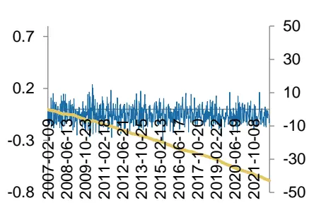
数据来源：天软科技, 广发证券发展研究中心
[分析师： Table_Author]安宁宁

同SAC 执证号：S0260512020003

0755-23948352

anningning@gf.com.cn

分析师： 罗军

同SAC 执证号：S0260511010004

020-66335128

luojun@gf.com.cn

分析师： 陈原文

同SAC 执证号：S0260517080003

0755-82797057

chenyuanwen@gf.com.cn

分析师： 张钰东

SAC 执证号：S0260522070006

zhangyudong@gf.com.cn

请注意，罗军 陈原文 张钰东并非香港证券及期货事务监察委员会的注册持牌人，不可在香港从事受监管活动。

## [Table_ 相关研究：DocRe

再谈股价跳跃因子研究:多因2022-12-09

子 Alpha 系列报告之(四十六)

基于 SemiBeta 的因子研究:2022-11-18

多因子 Alpha 系列报告之(四

十五)

## 一、研究背景

市场（Beta，或β）因子刻画了资产收益率对市场收益的敏感程度。早期的研究成果，诸如Markowitz（1959）、Hogan and Warren（1972，1974）均提出传统Beta因子的假设情形过于简单化，同样诸多研究也显示了单凭Beta因子较难以解释不同资产（如股票）收益的截面差异。

对于传统Beta因子，我们在A股市场进行实证检验。我们以主要的宽基指数，即沪深300、中证500和中证800，作为市场基准，滚动回溯过去20、60和120个交易日计算各股票换仓时点的传统Beta因子。回测结果显示，传统Beta因子较难稳定贡献Alpha收益，即高Beta个股并未带来稳定的超额收益。

表1：常规Beta因子绩效表现

| 因子名称 | IC | LS_IR | IC_IR | 胜率 | 换股比例 | ValidPercent |
| --- | --- | --- | --- | --- | --- | --- |
| fBeta120D300 | -1.8% | 0.19 | -0.14 | 54.9% | 27.1% | 95.4% |
| fBeta120D500 | -1.4% | -0.17 | -0.10 | 52.1% | 24.4% | 95.4% |
| fBeta120D800 | -2.2% | 0.19 | -0.16 | 51.4% | 26.5% | 95.4% |
| fBeta20D300 | 1.2% | 0.52 | 0.05 | 51.4% | 78.5% | 95.6% |
| fBeta20D500 | 0.5% | 0.83 | 0.08 | 54.9% | 75.4% | 95.6% |
| fBeta20D800 | 0.7% | 0.67 | 0.06 | 55.6% | 77.9% | 95.6% |
| fBeta60D300 | -1.2% | -0.13 | -0.06 | 48.6% | 42.2% | 95.5% |
| fBeta60D500 | -2.1% | -0.44 | -0.03 | 49.3% | 38.8% | 95.5% |
| fBeta60D800 | -2.0% | -0.19 | -0.06 | 51.4% | 41.3% | 95.5% |

数据来源：Wind, 广发证券发展研究中心

我们在《基于SemiBeta的因子研究——多因子Alpha系列报告之(四十五)》报告中，借鉴Bollerslev（2021）的研究思路，基于个股收益和市场收益方向的不同，将传统Beta因子拆解为4个SemiBeta。回测结果显示，月频调仓频率下，基于日度收益计算的fBeta_MN（市场基准收益为负，股票收益为正）系列因子，整体表现较好。

表2：低频SemiBeta因子绩效表现

| 因子名称 | IC | 年化 ICIR | 年化收益 | LS_IR | 胜率 | 换股比例 | ValidPercent |
| --- | --- | --- | --- | --- | --- | --- | --- |
| fBeta_MN_120_S000852 | -6.6% | -2.79 | 20.6% | 1.58 | 65.3% | 30.8% | 95.4% |
| fBeta_MN_120_S399006 | -7.0% | -2.66 | 20.0% | 1.48 | 65.3% | 30.5% | 87.7% |
| fBeta_MN_120_S399300 | -5.5% | -1.26 | 8.1% | 0.52 | 63.2% | 28.0% | 95.4% |
| fBeta_MN_120_S399905 | -6.6% | -2.59 | 19.2% | 1.53 | 67.4% | 30.7% | 95.4% |
| fBeta_MN_20_S000852 | -7.8% | -3.01 | 26.8% | 1.97 | 75.0% | 84.9% | 95.6% |
| fBeta_MN_20_S399006 | -8.7% | -3.04 | 28.8% | 1.95 | 71.5% | 84.5% | 91.4% |
| fBeta_MN_20_S399300 | -7.1% | -2.31 | 19.3% | 1.36 | 68.1% | 82.9% | 95.6% |

识别风险，发现价值

| fBeta_MN_20_S399905 | -7.9% | -3.25 | 25.7% | 2.03 | 73.6% | 84.9% | 95.6% |
| --- | --- | --- | --- | --- | --- | --- | --- |
| fBeta_MN_60_S000852 | -7.9% | -3.38 | 24.9% | 2.04 | 75.7% | 46.9% | 95.5% |
| fBeta_MN_60_S399006 | -8.3% | -3.15 | 25.5% | 1.87 | 72.2% | 46.4% | 90.0% |
| fBeta_MN_60_S399300 | -6.7% | -1.79 | 12.1% | 0.81 | 65.3% | 43.6% | 95.5% |
| fBeta_MN_60_S399905 | -7.9% | -3.27 | 23.2% | 1.94 | 74.3% | 46.5% | 95.5% |

数据来源：Wind, 广发证券发展研究中心

近年来，由于因子拥挤等因素影响，低频因子的增量信息成果放缓，日内高频价量信息的挖掘逐渐成为市场的关注重点。因此，针对SemiBeta的因子研究，本报告将进一步基于A股市场的日内高频数据，进行相对更高频维度的实证检验。

## 二、SemiBeta因子研究理论基础

Bollerslev（2021）提出SemiBeta概念，即基于个股收益和市场基准收益方向的不同，将传统Beta因子拆解为4部分。

$$
\begin{aligned}\beta&\equiv\frac{Cov(R_{i},\ R_{m})}{Var(R_{m})}=\frac{N+P+M^{+}+M^{-}}{Var(R_{m})}\\&\equiv\beta^{N}+\beta^{P}-\beta^{M^{+}}-\beta^{M^{-}}\end{aligned}
$$

其中 $R_{i}$ 表示某风险资产收益率， $R_{m}$ 表示市场基准收益率，N、P、 $M^{+}$ 、M−分别对应4个不同的组成结构。N表示市场和风险资产均为负收益，P表示市场和风险资产均为正收益， $M^{+}$ 表示市场收益为正但风险资产为负，M−表示市场收益为负但风险资产为正。而为了方便描述，参考原文，报告后续采取同样的设定，即：

$$
\beta^{M^{+}}\equiv-\frac{M^{+}}{Var(R_{m})}
$$

$$
\beta^{M^{-}}\equiv-\frac{M^{-}}{Var(R_{m})}
$$

按照上述方法，即将传统Beta拆解为了4个不同的SemiBeta。

为进一步更好地理解相应概念，以下图为例，我们假设有4个传统Beta均为1的不同的风险资产，但是其SemiBeta呈现差异化的特征。

如果基于传统CAPM模型，那么这4个资产应当有相同的预期收益率。

引入SemiBeta模型，Panel A中的资产（后续称为资产A，其他资产采取类似处理）Beta保持稳定，而资产B的Beta在市场整体下跌时要低于市场整体上涨时的Beta，即 $\prime\beta^{N}<\beta^{P}$ ，那么基于相关理论，投资者仅厌恶下行风险，因此相应资产若能在下跌

识别风险，发现价值

环境中提供预期相对稳定的收益，则愿意接受相对较低的预期收益率，即意味资产B的预期回报率要低于资产A。

相似的，资 $\cdot 产\mathbf{C}$ 与资产B特征相反，则资产C要求相对高于资产A和资产B的预期回报率。而资产D相比于资产C有相对更好的对冲特性，因此资产D的预期回报率要低于资 $产\mathbf{C}.$

图1：不同SemiBeta结构的资产对比
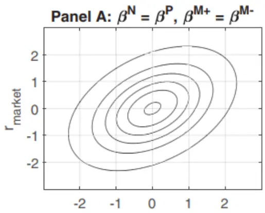

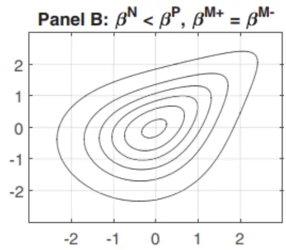

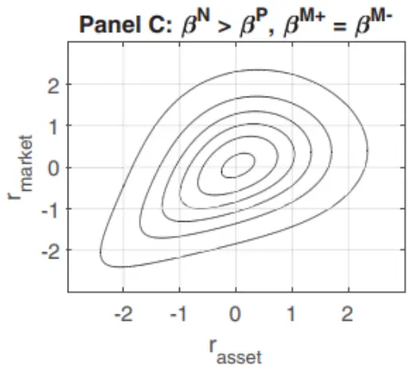

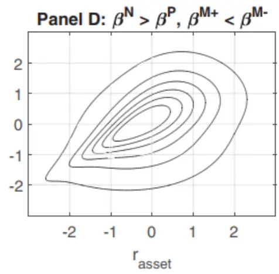
数据来源：Bollerslev, T. , Patton, A. J. , & Quaedvlieg, R. . 2021. Realized semibetas: disentangling "good" and "bad" downsiderisks. Journal of Financial Economics，广发证券发展研究中心

Bollerslev（2021）研究发现，对于美股市场，若基于日度数据计算月度的SemiBeta， $\beta^{N}$ 因子有相对明显的正溢价， $\beta^{M^{-}}$ 因子有相对明显的负溢价，其余两个SemiBeta因子特征不显著。我们参考相应的构造方法，将SemiBeta因子引入到A股市场进行实证研究。

## 三、实证分析：月频全市场选股

## （一）数据说明

选股范围：全市场；

股票预处理：剔除摘牌、涨跌停板、ST/*ST、上市未满180个交易日的股票；

因子预处理：MAD去极值、Z-Score标准化；

回测区间： 2010.01.01 – 2021.12.31；

分档方式：根据当期股票的因子值，从小到大分为十档 ；

调仓周期：月度，每个月最后一个交易日以收盘价调仓。

## （二）因子构建

因子构建的逻辑和我们在《基于SemiBeta的因子研究——多因子Alpha系列报告之(四十五)》中的方案保持一致，同样涉及4个SemiBeta原始结构，详情请参考对应报告。

针对高频数据，在参数设置方面，主要包括以下几个方面的内容：

1. 市场基准：沪深300、中证500、中证1000和创业板指；

2. 日内数据频率：1分钟级和5分钟级；

3. 是否平滑：（部分）采取滚动10日均值进行平滑。

最终构建了64个高频数据级别的细化的SemiBeta因子，应用于全市场选股。

表3：64个高频SemiBeta因子信息

| 因子t,i | BMX因子t,i | PN 因子t,i | 因子Pst,i |
| --- | --- | --- | --- |
| semi_beta_MN_SH000852 | semi_beta_MP_SH000852 | semi_beta_N_SH000852 | semi_beta_P_SH000852 |
| semi_beta_MN_SH000852_5m | semi_beta_MP_SH000852_5m | semi_beta_N_SH000852_5m | semi_beta_P_SH000852_5m |
| semi_beta_MN_SH000852_5m_ma10 | semi_beta_MP_SH000852_5m_ma10 | semi_beta_N_SH000852_5m_ma10 | semi_beta_P_SH000852_5m_ma10 |
| semi_beta_MN_SH000852_ma10 | semi_beta_MP_SH000852_ma10 | semi_beta_N_SH000852_ma10 | semi_beta_P_SH000852_ma10 |
| semi_beta_MN_SZ399006 | semi_beta_MP_SZ399006 | semi_beta_N_SZ399006 | semi_beta_P_SZ399006 |
| semi_beta_MN_SZ399006_5m | semi_beta_MP_SZ399006_5m | semi_beta_N_SZ399006_5m | semi_beta_P_SZ399006_5m |
| semi_beta_MN_SZ399006_5m_ma10 | semi_beta_MP_SZ399006_5m_ma10 | semi_beta_N_SZ399006_5m_ma10 | semi_beta_P_SZ399006_5m_ma10 |
| semi_beta_MN_SZ399006_ma10 | semi_beta_MP_SZ399006_ma10 | semi_beta_N_SZ399006_ma10 | semi_beta_P_SZ399006_ma10 |
| semi_beta_MN_SZ399300 | semi_beta_MP_SZ399300 | semi_beta_N_SZ399300 | semi_beta_P_SZ399300 |
| semi_beta_MN_SZ399300_5m | semi_beta_MP_SZ399300_5m | semi_beta_N_SZ399300_5m | semi_beta_P_SZ399300_5m |
| semi_beta_MN_SZ399300_5m_ma10 | semi_beta_MP_SZ399300_5m_ma10 | semi_beta_N_SZ399300_5m_ma10 | semi_beta_P_SZ399300_5m_ma10 |

识别风险，发现价值

| semi_beta_MN_SZ399300_ma10 | semi_beta_MP_SZ399300_ma10 | semi_beta_N_SZ399300_ma10 | semi_beta_P_SZ399300_ma10 |
| --- | --- | --- | --- |
| semi_beta_MN_SZ399905 | semi_beta_MP_SZ399905 | semi_beta_N_SZ399905 | semi_beta_P_SZ399905 |
| semi_beta_MN_SZ399905_5m | semi_beta_MP_SZ399905_5m | semi_beta_N_SZ399905_5m | semi_beta_P_SZ399905_5m |
| semi_beta_MN_SZ399905_5m_ma10 | semi_beta_MP_SZ399905_5m_ma10 | semi_beta_N_SZ399905_5m_ma10 | semi_beta_P_SZ399905_5m_ma10 |
| semi_beta_MN_SZ399905_ma10 | semi_beta_MP_SZ399905_ma10 | semi_beta_N_SZ399905_ma10 | semi_beta_P_SZ399905_ma10 |

数据来源：广发证券发展研究中心

## （三）因子实证结果

本小节中，主要将对各类SemiBeta因子在IC、多空策略、胜率以及换手率方面的回测表现进行整体展示。

月频全市场选股方式下，所有因子均表现出负IC的特征，即因子值相对较小的个股样本内的后续收益表现相对较好。对比MN、MP、N和P各大类因子，总体而言，N因子和P因子的IC均值绝对值相对较高。

N因子中，semi_beta_N_SH000852和semi_beta_N_SZ399300_ma10因子的总体效果相对较好，其中semi_beta_N_SH000852因子的IC均值为-6.1%，多空年化收益为12.6%。semi_beta_N_SZ399300_ma10因子的IC均值为-7.1%，多空年化收益为12.7%。

P因子中，semi_beta_P_SH000852和semi_beta_P_SZ399300因子的总体效果相对较好，其中semi_beta_P_SH000852因子的IC均值为-6.4%，多空年化收益为14.8%。semi_beta_P_SZ399300因子的IC均值为-6.0%，多空年化收益为13.0%。

表4：Beta_MN系列因子绩效表现：月频全市场选股

|  | IC均值 | 年化ICIR | IC胜率 | 多空年化收益 | 多空年化IR | 多空胜率 | 单期换股比例 | 有效因子比例 |
| --- | --- | --- | --- | --- | --- | --- | --- | --- |
| semi beta MN SH000852 | -3.1% | -1.32 | 68.5% | 8.4% | 2.59 | 58.7% | 79.4% | 95.5% |
| semi beta MN SH000852 5m | -2.8% | -1.37 | 60.0% | 5.7% | 3.24 | 32.9% | 83.2% | 94.9% |
| semi beta MN SH000852 5m ma10 | -5.5% | -2.12 | 76.5% | 7.3% | 3.51 | 40.6% | 70.7% | 93.2% |
| semi beta MN SH000852 ma10 | -3.7% | -1.22 | 66.2% | 3.9% | 1.20 | 58.7% | 63.0% | 90.7% |
| semi beta MN SZ399006 | -4.4% | -1.94 | 78.3% | 12.0% | 4.05 | 66.4% | 79.7% | 95.5% |
| semi beta MN SZ399006 5m | -3.0% | -1.46 | 63.0% | 10.4% | 4.05 | 58.0% | 83.8% | 95.5% |
| semi_beta_MN_SZ399006 5m ma10 | -5.2% | -1.77 | 67.9% | 10.8% | 3.13 | 56.6% | 70.6% | 91.0% |
| semi_beta_MN_SZ399006 ma10 | -5.6% | -1.89 | 71.5% | 12.5% | 3.37 | 62.9% | 63.4% | 91.0% |
| semi beta MN SZ399300 | -3.5% | -1.43 | 69.9% | 8.9% | 2.68 | 62.9% | 78.8% | 95.5% |
| semi beta MN SZ399300 5m | -2.4% | -0.98 | 59.4% | 7.4% | 2.25 | 56.6% | 82.5% | 95.5% |
| semi_beta_MN_SZ399300_5m_ma10 | -3.9% | -0.98 | 60.6% | 4.2% | 1.09 | 55.9% | 66.6% | 90.7% |
| semi_beta_MN_SZ399300_ma10 | -4.2% | -1.25 | 69.7% | 5.7% | 1.48 | 61.5% | 61.9% | 90.7% |
| semi_beta_MN SZ399905 | -3.7% | -1.62 | 70.6% | 10.7% | 3.34 | 63.6% | 79.6% | 95.5% |
| semi beta MN SZ399905 5m | -2.4% | -1.04 | 59.4% | 9.1% | 3.11 | 60.8% | 83.8% | 95.5% |
| semi_beta_MN_SZ399905_5m_ma10 | -4.4% | -1.32 | 62.7% | 8.1% | 2.11 | 60.1% | 70.7% | 90.7% |

识别风险，发现价值

| semi_beta_MN_SZ399905_ma10 | -4.7% | -1.58 | 71.8% | 8.7% | 2.35 | 62.9% | 63.9% | 90.7% |
| --- | --- | --- | --- | --- | --- | --- | --- | --- |

数据来源：天软科技, 广发证券发展研究中心

表5：Beta_MP系列因子绩效表现：月频全市场选股

|  | IC均值 | 年化ICIR | IC胜率 | 多空年化收益 | 多空年化IR | 多空胜率 | 单期换股比例 | 有效因子比例 |
| --- | --- | --- | --- | --- | --- | --- | --- | --- |
| semi beta MP SH000852 | -2.7% | -1.18 | 65.7% | 8.8% | 2.84 | 63.6% | 79.2% | 95.5% |
| semi_beta_MP SH000852 5m | -3.2% | -1.68 | 69.4% | 6.7% | 3.85 | 38.5% | 83.0% | 94.9% |
| semi_beta_MP_SH000852_5m_ma10 | -4.8% | -1.78 | 71.8% | 6.0% | 2.62 | 37.1% | 66.8% | 93.2% |
| semi beta MP SH000852 ma10 | -3.5% | -1.16 | 64.1% | 3.5% | 1.09 | 55.9% | 61.1% | 90.7% |
| semi_beta_MP SZ399006 | -4.1% | -1.88 | 73.2% | 10.8% | 3.73 | 66.4% | 79.9% | 95.5% |
| semi beta MP SZ399006 5m | -2.8% | -1.36 | 65.9% | 8.3% | 3.29 | 60.1% | 83.8% | 95.5% |
| semi_beta_MP_SZ399006_5m_ma10 | -4.7% | -1.61 | 69.3% | 10.9% | 3.24 | 59.4% | 67.7% | 91.0% |
| semi_beta_MP_SZ399006_ma10 | -5.2% | -1.86 | 75.9% | 11.1% | 3.11 | 64.3% | 62.0% | 91.0% |
| semi_beta_MP_SZ399300 | -3.1% | -1.25 | 65.0% | 9.1% | 2.78 | 64.3% | 78.8% | 95.5% |
| semi_beta_MP_SZ399300_5m | -1.9% | -0.75 | 57.3% | 4.8% | 1.59 | 55.2% | 82.5% | 95.5% |
| semi beta MP SZ399300 5m ma10 | -3.2% | -0.78 | 59.9% | 2.6% | 0.79 | 52.4% | 63.5% | 90.7% |
| semi_beta_MP_SZ399300 ma10 | -3.9% | -1.20 | 67.6% | 4.7% | 1.27 | 60.1% | 60.2% | 90.7% |
| semi_beta_MP SZ399905 | -3.5% | -1.57 | 71.3% | 12.5% | 4.05 | 67.1% | 79.1% | 95.5% |
| semi beta MP SZ399905 5m | -2.4% | -1.08 | 58.7% | 8.7% | 2.89 | 58.0% | 83.2% | 95.5% |
| semi_beta_MP_SZ399905_5m_ma10 | -4.0% | -1.20 | 62.7% | 7.4% | 1.87 | 55.9% | 67.1% | 90.7% |
| semi beta MP SZ399905 ma10 | -4.5% | -1.60 | 71.1% | 7.4% | 2.05 | 62.2% | 62.0% | 90.7% |

数据来源：天软科技, 广发证券发展研究中心

表6：Beta_N系列因子绩效表现：月频全市场选股

|  | IC均值 | 年化ICIR | IC胜率 | 多空年化收益 | 多空年化IR | 多空胜率 | 单期换股比例 | 有效因子比例 |
| --- | --- | --- | --- | --- | --- | --- | --- | --- |
| semi_beta_N_SH000852 | -6.1% | -1.69 | 68.5% | 12.6% | 2.91 | 62.2% | 75.3% | 95.5% |
| semi beta N SH000852 5m | -5.4% | -1.41 | 69.4% | 5.6% | 2.28 | 39.2% | 77.1% | 94.9% |
| semi beta N SH000852 5m ma10 | -7.8% | -1.53 | 70.6% | 4.8% | 1.61 | 35.7% | 56.6% | 93.2% |
| semi beta N SH000852 ma10 | -7.4% | -1.65 | 71.1% | 12.7% | 2.46 | 60.1% | 59.2% | 90.7% |
| semi_beta_N SZ399006 | -5.6% | -1.55 | 68.8% | 10.9% | 2.59 | 61.5% | 75.1% | 95.5% |
| semi_beta_N_SZ399006_5m | -5.3% | -1.39 | 68.8% | 9.2% | 2.28 | 60.1% | 78.3% | 95.5% |
| semi_beta_N_SZ399006_5m_ma10 | -6.9% | -1.36 | 67.9% | 6.4% | 1.43 | 55.9% | 57.9% | 91.0% |
| semi beta N SZ399006 ma10 | -6.7% | -1.50 | 69.3% | 8.6% | 1.84 | 57.3% | 58.3% | 91.0% |
| semi_beta_N_SZ399300 | -5.8% | -1.66 | 69.2% | 11.8% | 2.78 | 63.6% | 76.1% | 95.5% |
| semi_beta_N_SZ399300_5m | -5.3% | -1.47 | 68.5% | 11.2% | 2.75 | 66.4% | 79.4% | 95.5% |
| semi beta N SZ399300 5m ma10 | -7.3% | -1.53 | 69.7% | 11.0% | 2.12 | 58.0% | 60.6% | 90.7% |
| semi beta N SZ399300 ma10 | -7.1% | -1.63 | 72.5% | 12.7% | 2.48 | 61.5% | 60.2% | 90.7% |
| semi beta N SZ399905 | -5.5% | -1.48 | 69.2% | 9.7% | 2.31 | 60.8% | 75.3% | 95.5% |
| semi_beta_N_SZ399905_5m | -5.0% | -1.32 | 67.1% | 9.7% | 2.36 | 64.3% | 78.7% | 95.5% |

识别风险，发现价值

| semi_beta_N_SZ399905_5m_ma10 | -6.9% | -1.38 | 66.9% | 9.5% | 1.88 | 60.8% | 59.1% | 90.7% |
| --- | --- | --- | --- | --- | --- | --- | --- | --- |
| semi beta N SZ399905 ma10 | -6.5% | -1.44 | 69.0% | 10.0% | 2.01 | 59.4% | 59.0% | 90.7% |

数据来源：天软科技, 广发证券发展研究中心

表7：Beta_P系列因子绩效表现：月频全市场选股

|  | IC均值 | 年化ICIR | IC胜率 | 多空年化收益 | 多空年化IR | 多空胜率 | 单期换股比例 | 有效因子比例 |
| --- | --- | --- | --- | --- | --- | --- | --- | --- |
| semi beta P SH000852 | -6.4% | -1.86 | 76.2% | 14.8% | 3.36 | 64.3% | 74.8% | 95.5% |
| semi_beta_P_SH000852_5m | -5.8% | -1.60 | 72.9% | 4.2% | 1.71 | 36.4% | 77.2% | 94.9% |
| semi_beta_P_SH000852_5m_ma10 | -7.8% | -1.61 | 72.9% | 5.8% | 1.88 | 36.4% | 58.6% | 93.2% |
| semi beta P SH000852 ma10 | -7.3% | -1.69 | 70.4% | 12.8% | 2.52 | 58.7% | 60.0% | 90.7% |
| semi_beta_P SZ399006 | -5.8% | -1.72 | 73.9% | 13.1% | 3.10 | 60.8% | 75.2% | 95.5% |
| semi_beta_P_SZ399006_5m | -5.2% | -1.53 | 70.3% | 7.8% | 2.01 | 56.6% | 78.6% | 95.5% |
| semi beta P SZ399006 5m ma10 | -6.5% | -1.36 | 67.2% | 7.1% | 1.55 | 55.2% | 60.4% | 91.0% |
| semi_beta_P_SZ399006_ma10 | -6.4% | -1.47 | 70.8% | 7.8% | 1.73 | 56.6% | 59.1% | 91.0% |
| semi beta P SZ399300 | -6.0% | -1.86 | 74.1% | 13.0% | 3.18 | 65.7% | 76.3% | 95.5% |
| semi beta P SZ399300 5m | -5.4% | -1.66 | 72.7% | 10.3% | 2.63 | 65.7% | 80.0% | 95.5% |
| semi_beta_P_SZ399300_5m_ma10 | -7.2% | -1.63 | 70.4% | 11.3% | 2.28 | 60.1% | 62.6% | 90.7% |
| semi beta P SZ399300 ma10 | -6.8% | -1.64 | 71.8% | 11.3% | 2.29 | 61.5% | 60.8% | 90.7% |
| semi_beta_P_SZ399905 | -5.7% | -1.67 | 71.3% | 10.9% | 2.57 | 64.3% | 75.0% | 95.5% |
| semi beta P SZ399905 5m | -5.4% | -1.58 | 72.0% | 8.9% | 2.22 | 60.8% | 78.7% | 95.5% |
| semi_beta_P_SZ399905_5m_ma10 | -6.7% | -1.44 | 68.3% | 8.2% | 1.71 | 57.3% | 61.2% | 90.7% |
| semi_beta_P_SZ399905_ma10 | -6.3% | -1.42 | 69.0% | 8.0% | 1.70 | 55.9% | 59.8% | 90.7% |

数据来源：天软科技, 广发证券发展研究中心

## （四）因子实证结果补充

1. N因子

图2：semi_beta_N_SH000852因子IC值信息
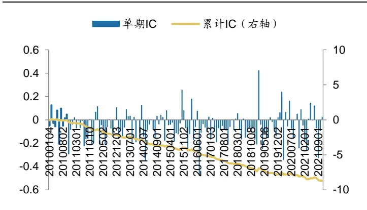
数据来源：天软科技，广发证券发展研究中心

图 3：semi_beta_N_SH000852 因子多空收益信息
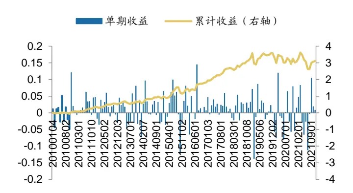
数据来源：天软科技，广发证券发展研究中心

图4：semi_beta_N_SZ399300_ma10因子IC值信息
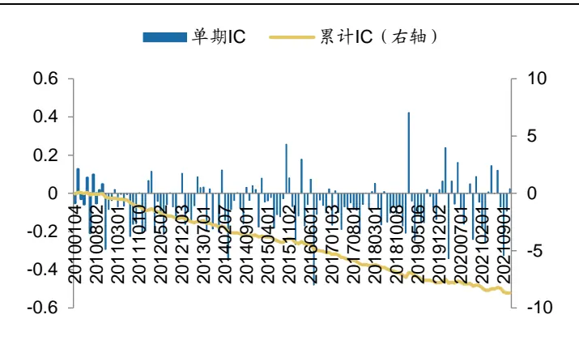
数据来源：天软科技，广发证券发展研究中心

图 5：semi_beta_N_SZ399300_ma10 因子多空收益信息
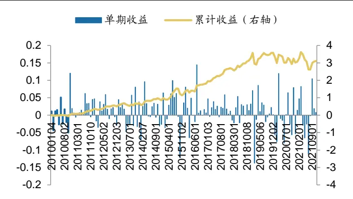
数据来源：天软科技，广发证券发展研究中心

## 2. P因子

图6：semi_beta_P_SH000852因子IC值信息
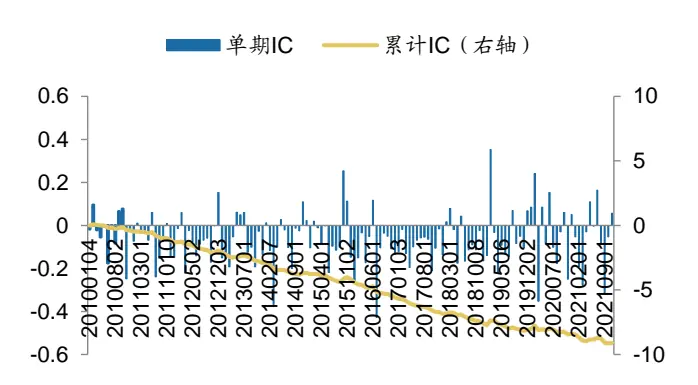
数据来源：天软科技，广发证券发展研究中心

图 7：semi_beta_P_SH000852 因子多空收益信息
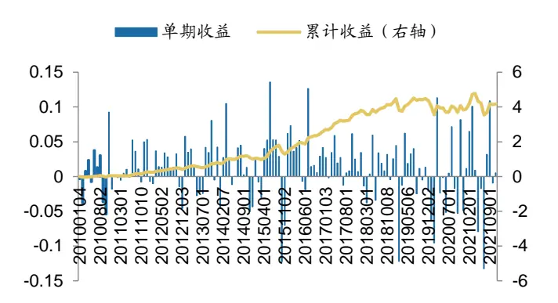
数据来源：天软科技，广发证券发展研究中心

图8：semi_beta_P_SZ399300因子IC值信息
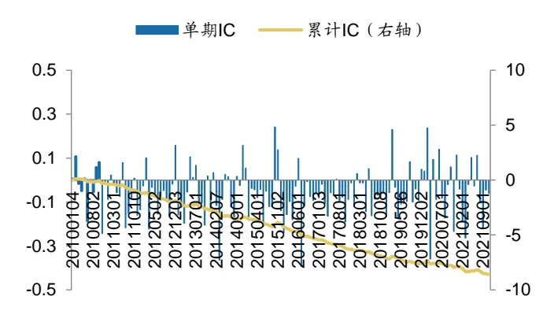
数据来源：天软科技，广发证券发展研究中心

图 9：semi_beta_P_SZ399300 因子多空收益信息
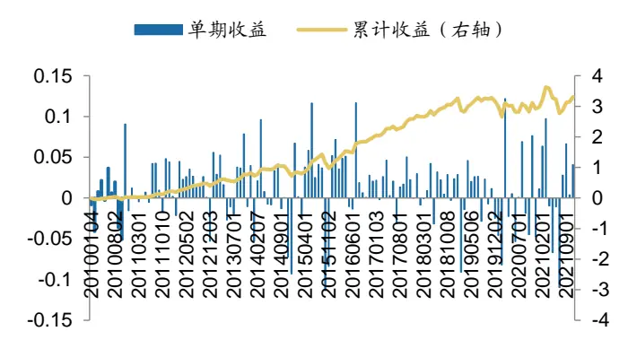
数据来源：天软科技，广发证券发展研究中心

## （五）相关性分析

本部分针对高频SemiBeta因子，以及报告《基于SemiBeta的因子研究——多因子Alpha系列报告之(四十五)》中的低频SemiBeta因子进行相关性分析。相应的因子均以中证1000作为基准。

低频因子方面，反馈相似收益方向组合的因子相关性相对较高，即N因子和P因子之间相关性为54%，MN因子和MP因子的相关性为47.5%；而反馈不同收益方向组合的因子之间相关性相对较低，如N因子和MP因子的相关性为-0.5%。

高频因子方面，相关性特征和低频因子内部基本相似，但总体相关性进一步上升。N因子和P因子之间相关性为70.7%，MN因子和MP因子的相关性为58.7%；反馈不同收益方向组合的因子之间相关性也有提高，如N因子和MP因子的相关性为37.6%。

高频因子和低频因子之间来看，总体相关性相对较小，其中低频的P因子和高频的N、P因子存在一定相关性。

表8：SemiBeta系列因子的相关性分析

| 因子名称 | 低频 MN | 低频 MP | 低频 N | 低频 P | 高频 MN | 高频 MP | 高频N | 高频P |
| --- | --- | --- | --- | --- | --- | --- | --- | --- |
| 低频 MN | 100.0% | 47.5% | -2.0% | 14.2% | 19.2% | 19.5% | 21.3% | 21.0% |
| 低频 MP |  | 100.0% | -0.5% | 10.1% | 10.6% | 12.2% | 13.1% | 11.4% |
| 低频 N |  |  | 100.0% | 54.0% | -0.4% | 0.5% | 25.1% | 25.3% |
| 低频 P |  |  |  | 100.0% | 12.6% | 11.9% | 39.2% | 39.9% |
| 高频 MN |  |  |  |  | 100.0% | 58.7% | 38.5% | 35.4% |
| 高频 MP |  |  |  |  |  | 100.0% | 37.6% | 38.9% |
| 高频 N |  |  |  |  |  |  | 100.0% | 70.7% |
| 高频P |  |  |  |  |  |  |  | 100.0% |

数据来源：Wind，天软科技, 广发证券发展研究中心

## 四、实证分析：月频_限定股票池

我们进一步将选股范围限定到如沪深300、中证500和中证1000指数成分股等不同的选股池内，以此检验不同股票池的高频Semi Beta因子的选股效果。

## （一）因子实证结果：沪深 300指数成分股

对于沪深300指数成分股，回测结果来看，相对于全市场选股，整体IC均值的绝对值有一定程度下滑，即使部分IC均值绝对值相对较高的个股，其长期收益也不够理想。

表9：Beta_MN系列因子绩效表现：月频_沪深300指数成分股选股

|  | IC均值 | 年化ICIR | IC胜率 | 多空年化收益 | 多空年化IR | 多空胜率 | 单期换股比例 | 有效因子比例 |
| --- | --- | --- | --- | --- | --- | --- | --- | --- |
| semi beta MN SH000852 | -0.1% | -0.04 | 51.0% | -8.0% | -1.52 | 43.4% | 72.6% | 97.2% |
| semi_beta_MN SH000852 5m | 1.6% | 0.43 | 52.9% | 5.0% | 2.00 | 33.6% | 83.2% | 97.0% |
| semi beta MN SH000852 5m ma10 | 0.3% | 0.09 | 56.5% | -0.2% | 0.18 | 34.3% | 68.8% | 95.9% |
| semi_beta_MN_SH000852 ma10 | 0.2% | 0.06 | 53.5% | 2.2% | 0.75 | 57.3% | 51.8% | 92.8% |
| semi_beta_MN SZ399006 | -1.1% | -0.30 | 58.0% | -5.4% | -0.80 | 43.4% | 73.1% | 97.2% |
| semi_beta_MN_SZ399006_5m | 0.5% | 0.13 | 50.7% | 2.3% | 0.78 | 50.3% | 84.2% | 97.2% |
| semi_beta_MN_SZ399006_5m_ma10 | -0.6% | -0.12 | 48.2% | -4.8% | -0.62 | 42.7% | 69.0% | 93.1% |
| semi beta MN SZ399006 ma10 | -1.4% | -0.31 | 51.1% | -2.1% | -0.08 | 44.1% | 51.7% | 93.1% |
| semi_beta_MN_SZ399300 | 0.2% | 0.07 | 53.8% | 10.1% | 2.29 | 60.1% | 70.7% | 97.2% |
| semi beta MN SZ399300 5m | 1.1% | 0.31 | 53.8% | 6.7% | 1.80 | 54.5% | 82.7% | 97.2% |
| semi beta MN SZ399300 5m ma10 | 0.5% | 0.10 | 53.5% | 5.7% | 1.31 | 58.0% | 62.2% | 92.8% |
| semi beta MN SZ399300 ma10 | 0.2% | 0.04 | 52.8% | 3.9% | 1.08 | 59.4% | 48.8% | 92.8% |
| semi beta MN SZ399905 | 0.0% | 0.00 | 48.3% | -8.1% | -1.43 | 44.1% | 72.7% | 97.2% |
| semi_beta_MN SZ399905 5m | 1.4% | 0.39 | 53.8% | 5.9% | 1.54 | 53.8% | 83.7% | 97.2% |
| semi beta MN SZ399905 5m ma10 | 0.4% | 0.09 | 51.4% | 1.1% | 0.54 | 59.4% | 68.1% | 92.8% |
| semi_beta_MN_SZ399905_ma10 | 0.0% | 0.01 | 51.4% | -1.1% | 0.15 | 55.2% | 52.3% | 92.8% |

数据来源：天软科技, 广发证券发展研究中心

表10：Beta_MP系列因子绩效表现：月频_沪深300指数成分股选股

|  | IC均值 | 年化ICIR | IC胜率 | 多空年化收益 | 多空年化IR | 多空胜率 | 单期换股比例 | 有效因子比例 |
| --- | --- | --- | --- | --- | --- | --- | --- | --- |
| semi_beta_MP_SH000852 | -0.1% | -0.02 | 49.0% | -1.6% | -0.15 | 46.2% | 72.6% | 97.2% |
| semi_beta_MP_SH000852_5m | 0.2% | 0.07 | 49.4% | 1.5% | 0.88 | 32.2% | 83.7% | 97.0% |
| semi_beta_MP_SH000852_5m_ma10 | -0.6% | -0.14 | 51.8% | -0.8% | 0.07 | 25.2% | 64.6% | 95.9% |
| semi_beta_MP_SH000852_ma10 | -0.1% | -0.02 | 47.2% | -4.4% | -0.65 | 47.6% | 50.1% | 92.8% |
| semi_beta_MP_SZ399006 | -1.2% | -0.34 | 55.1% | -3.3% | -0.57 | 44.8% | 73.1% | 97.2% |

识别风险，发现价值

| semi beta MP SZ399006 5m | 1.0% | 0.31 | 58.0% | 6.4% | 1.94 | 56.6% | 84.5% | 97.2% |
| --- | --- | --- | --- | --- | --- | --- | --- | --- |
| semi_beta_MP_SZ399006_5m_ma10 | -1.0% | -0.23 | 47.4% | 0.1% | 0.34 | 44.1% | 66.4% | 93.1% |
| semi_beta_MP_SZ399006_ma10 | -1.6% | -0.36 | 48.2% | 1.7% | 0.64 | 45.5% | 49.6% | 93.1% |
| semi_beta_MP_SZ399300 | 0.1% | 0.02 | 51.0% | 1.6% | 0.62 | 53.8% | 70.7% | 97.2% |
| semi beta MP SZ399300 5m | 1.1% | 0.29 | 57.3% | 5.8% | 1.62 | 55.9% | 82.5% | 97.2% |
| semi beta MP SZ399300 5m ma10 | 0.3% | 0.07 | 54.2% | 5.9% | 1.34 | 56.6% | 60.3% | 92.8% |
| semi_beta_MP_SZ399300_ma10 | 0.1% | 0.02 | 52.1% | 2.6% | 0.82 | 58.0% | 47.6% | 92.8% |
| semi_beta_MP_SZ399905 | -0.1% | -0.03 | 49.0% | -2.4% | -0.31 | 43.4% | 72.9% | 97.2% |
| semi_beta_MP_SZ399905_5m | 1.2% | 0.36 | 59.4% | 6.3% | 1.86 | 60.1% | 84.4% | 97.2% |
| semi_beta_MP_SZ399905_5m_ma10 | 0.2% | 0.05 | 50.7% | 3.5% | 0.98 | 60.8% | 65.2% | 92.8% |
| semi_beta_MP_SZ399905_ma10 | -0.4% | -0.09 | 50.0% | -3.9% | -0.51 | 46.9% | 50.2% | 92.8% |

数据来源：天软科技, 广发证券发展研究中心

表11：Beta_N系列因子绩效表现：月频_沪深300指数成分股选股

|  | IC均值 | 年化ICIR | IC胜率 | 多空年化收益 | 多空年化IR | 多空胜率 | 单期换股比例 | 有效因子比例 |
| --- | --- | --- | --- | --- | --- | --- | --- | --- |
| semi beta N SH000852 | -3.2% | -0.62 | 60.1% | -0.7% | 0.31 | 54.5% | 72.4% | 97.2% |
| semi beta N SH000852 5m | -3.0% | -0.55 | 64.7% | -2.8% | -0.26 | 32.9% | 74.4% | 97.0% |
| semi beta N SH000852 5m ma10 | -6.0% | -0.84 | 62.4% | -2.1% | 0.22 | 34.3% | 50.7% | 95.9% |
| semi_beta_N_SH000852 ma10 | -4.4% | -0.74 | 56.3% | -0.9% | 0.34 | 51.7% | 54.2% | 92.8% |
| semi beta N SZ399006 | -2.8% | -0.56 | 58.7% | -0.9% | 0.26 | 51.0% | 71.7% | 97.2% |
| semi_beta_N_SZ399006_5m | -4.0% | -0.75 | 61.6% | -0.8% | 0.26 | 55.2% | 75.2% | 97.2% |
| semi_beta_N_SZ399006_5m_ma10 | -5.6% | -0.83 | 61.3% | -2.3% | 0.20 | 49.7% | 52.3% | 93.1% |
| semi beta N SZ399006 ma10 | -4.2% | -0.71 | 58.4% | -3.4% | -0.02 | 50.3% | 52.2% | 93.1% |
| semi_beta_N SZ399300 | -3.4% | -0.68 | 62.2% | -0.6% | 0.32 | 54.5% | 73.5% | 97.2% |
| semi beta N SZ399300 5m | -4.3% | -0.83 | 65.0% | 1.7% | 0.65 | 58.0% | 75.9% | 97.2% |
| semi_beta_N_SZ399300 5m ma10 | -6.1% | -0.90 | 62.0% | 0.5% | 0.57 | 51.7% | 54.2% | 92.8% |
| semi beta N SZ399300 ma10 | -4.5% | -0.75 | 54.9% | -0.9% | 0.33 | 51.0% | 55.5% | 92.8% |
| semi beta N SZ399905 | -3.2% | -0.63 | 59.4% | -0.4% | 0.34 | 56.6% | 72.1% | 97.2% |
| semi beta N SZ399905 5m | -3.9% | -0.74 | 63.6% | -2.0% | 0.09 | 56.6% | 75.5% | 97.2% |
| semi beta N SZ399905 5m ma10 | -6.1% | -0.90 | 62.7% | -2.0% | 0.27 | 54.5% | 52.7% | 92.8% |
| semi_beta_N_SZ399905_ma10 | -4.8% | -0.79 | 61.3% | 0.4% | 0.50 | 51.7% | 53.2% | 92.8% |

数据来源：天软科技, 广发证券发展研究中心

表12：Beta_P系列因子绩效表现：月频_沪深300指数成分股选股

|  | IC均值 | 年化ICIR | IC胜率 | 多空年化收益 | 多空年化IR | 多空胜率 | 单期换股比例 | 有效因子比例 |
| --- | --- | --- | --- | --- | --- | --- | --- | --- |
| semi beta P SH000852 | -3.0% | -0.56 | 60.1% | -4.9% | -0.34 | 51.0% | 71.3% | 97.2% |
| semi beta P SH000852 5m | -4.4% | -0.75 | 65.9% | -5.5% | -0.75 | 32.2% | 72.8% | 97.0% |
| semi beta P SH000852 5m ma10 | -5.0% | -0.74 | 61.2% | -3.2% | -0.11 | 30.8% | 51.9% | 95.9% |
| semi_beta_P_SH000852_ma10 | -3.8% | -0.65 | 59.2% | -1.9% | 0.19 | 51.7% | 55.2% | 92.8% |

识别风险，发现价值

| semi_beta_P_SZ399006 | -2.9% | -0.57 | 58.0% | -4.8% | -0.37 | 49.0% | 71.1% | 97.2% |
| --- | --- | --- | --- | --- | --- | --- | --- | --- |
| semi_beta_P_SZ399006_5m | -3.8% | -0.71 | 62.3% | -1.6% | 0.15 | 58.7% | 75.5% | 97.2% |
| semi_beta_P_SZ399006_5m_ma10 | -4.5% | -0.69 | 59.9% | -4.6% | -0.13 | 51.7% | 54.4% | 93.1% |
| semi_beta_P_SZ399006_ma10 | -3.5% | -0.59 | 56.9% | -4.5% | -0.19 | 51.0% | 53.4% | 93.1% |
| semi_beta_P_SZ399300 | -3.2% | -0.61 | 60.8% | -0.6% | 0.28 | 52.4% | 74.2% | 97.2% |
| semi_beta_P_SZ399300_5m | -4.0% | -0.73 | 60.1% | -1.9% | 0.10 | 58.0% | 77.2% | 97.2% |
| semi_beta_P_SZ399300_5m_ma10 | -4.8% | -0.75 | 60.6% | -2.6% | 0.15 | 53.1% | 56.9% | 92.8% |
| semi_beta_P_SZ399300_ma10 | -3.9% | -0.65 | 55.6% | -5.0% | -0.22 | 51.0% | 56.0% | 92.8% |
| semi_beta_P_SZ399905 | -3.5% | -0.65 | 60.8% | -3.1% | -0.03 | 55.2% | 70.7% | 97.2% |
| semi beta P SZ399905 5m | -4.3% | -0.78 | 62.9% | -2.4% | 0.06 | 55.2% | 75.5% | 97.2% |
| semi_beta_P_SZ399905_5m_ma10 | -4.9% | -0.75 | 62.0% | -4.0% | -0.05 | 53.8% | 54.8% | 92.8% |
| semi_beta_P_SZ399905_ma10 | -4.2% | -0.70 | 56.3% | -2.0% | 0.17 | 53.1% | 54.1% | 92.8% |

数据来源：天软科技, 广发证券发展研究中心

## （二）因子实证结果：中证 500指数成分股

对于中证500指数成分股，回测结果来看，N因子和P因子整体的IC均值的绝对值相对较高，但回测的长期收益不够理想。

表13：Beta_MN系列因子绩效表现：月频_中证500指数成分股选股

|  | IC均值 | 年化ICIR | IC胜率 | 多空年化收益 | 多空年化IR | 多空胜率 | 单期换股比例 | 有效因子比例 |
| --- | --- | --- | --- | --- | --- | --- | --- | --- |
| semi beta MN SH000852 | -1.8% | -0.70 | 61.5% | -0.5% | 0.09 | 48.3% | 78.5% | 96.3% |
| semi beta MN SH000852 5m | -1.0% | -0.40 | 56.5% | 0.4% | 0.38 | 31.5% | 83.5% | 95.8% |
| semi beta MN SH000852 5m ma10 | -3.5% | -1.21 | 64.7% | 5.2% | 2.39 | 35.0% | 70.4% | 94.4% |
| semi_beta_MN_SH000852 ma10 | -2.6% | -0.83 | 59.9% | 3.5% | 1.15 | 54.5% | 62.1% | 91.6% |
| semi beta MN SZ399006 | -3.0% | -1.09 | 62.3% | 7.1% | 2.10 | 56.6% | 78.7% | 96.3% |
| semi_beta_MN_SZ399006_5m | -2.6% | -1.00 | 60.9% | 6.1% | 1.97 | 50.3% | 84.8% | 96.3% |
| semi_beta_MN_SZ399006_5m_ma10 | -4.6% | -1.45 | 63.5% | 8.0% | 2.30 | 55.9% | 72.1% | 91.9% |
| semi beta MN SZ399006 ma10 | -4.1% | -1.24 | 65.0% | 7.1% | 1.98 | 56.6% | 61.0% | 91.9% |
| semi_beta_MN SZ399300 | -2.2% | -0.79 | 58.7% | 3.4% | 1.10 | 51.0% | 78.7% | 96.3% |
| semi beta MN SZ399300 5m | -1.9% | -0.71 | 58.0% | 3.0% | 0.99 | 54.5% | 84.4% | 96.3% |
| semi_beta_MN_SZ399300_5m_ma10 | -3.5% | -0.90 | 62.7% | 3.4% | 0.97 | 52.4% | 71.5% | 91.6% |
| semi beta MN SZ399300 ma10 | -2.9% | -0.83 | 59.2% | 1.6% | 0.62 | 51.7% | 61.5% | 91.6% |
| semi beta MN SZ399905 | -1.9% | -0.69 | 58.0% | 1.7% | 0.68 | 52.4% | 78.8% | 96.3% |
| semi_beta_MN SZ399905 5m | -1.6% | -0.59 | 58.0% | 1.2% | 0.55 | 49.7% | 85.1% | 96.3% |
| semi beta MN SZ399905 5m ma10 | -3.3% | -0.98 | 61.3% | 5.8% | 1.56 | 53.8% | 72.4% | 91.6% |
| semi_beta_MN_SZ399905_ma10 | -2.8% | -0.85 | 61.3% | 1.8% | 0.69 | 53.8% | 61.4% | 91.6% |

数据来源：天软科技, 广发证券发展研究中心

表14：Beta_MP系列因子绩效表现：月频_中证500指数成分股选股

|  | IC均值 | 年化ICIR | IC胜率 | 多空年化收益 | 多空年化IR | 多空胜率 | 单期换股比例 | 有效因子比例 |
| --- | --- | --- | --- | --- | --- | --- | --- | --- |
| semi beta MP SH000852 | -1.4% | -0.53 | 53.8% | 2.7% | 0.99 | 51.7% | 78.7% | 96.3% |
| semi beta MP SH000852 5m | -0.6% | -0.28 | 54.1% | 1.7% | 1.00 | 32.2% | 83.9% | 95.8% |
| semi beta MP SH000852 5m ma10 | -2.6% | -0.89 | 61.2% | 1.5% | 0.82 | 32.9% | 67.4% | 94.4% |
| semi_beta_MP_SH000852 ma10 | -2.5% | -0.83 | 60.6% | 2.5% | 0.90 | 53.1% | 60.0% | 91.6% |
| semi beta MP SZ399006 | -2.5% | -0.92 | 58.7% | 3.4% | 1.21 | 47.6% | 78.6% | 96.3% |
| semi_beta_MP_SZ399006_5m | -1.5% | -0.65 | 58.0% | 1.9% | 0.78 | 53.8% | 85.0% | 96.3% |
| semi_beta_MP_SZ399006_5m_ma10 | -3.8% | -1.21 | 62.8% | 8.6% | 2.50 | 61.5% | 69.6% | 91.9% |
| semi_beta_MP_SZ399006_ma10 | -3.8% | -1.19 | 65.7% | 7.7% | 2.26 | 52.4% | 60.1% | 91.9% |
| semi_beta_MP_SZ399300 | -1.5% | -0.56 | 53.1% | 2.4% | 0.88 | 56.6% | 79.0% | 96.3% |
| semi beta MP SZ399300 5m | -0.7% | -0.27 | 53.8% | -1.9% | -0.30 | 55.9% | 84.7% | 96.3% |
| semi beta MP SZ399300 5m ma10 | -2.7% | -0.69 | 59.2% | 1.7% | 0.63 | 51.7% | 68.0% | 91.6% |
| semi beta MP SZ399300 ma10 | -2.6% | -0.76 | 59.9% | 3.7% | 1.10 | 52.4% | 60.2% | 91.6% |
| semi beta MP SZ399905 | -1.7% | -0.66 | 60.1% | 4.0% | 1.35 | 54.5% | 77.6% | 96.3% |
| semi_beta_MP_SZ399905_5m | -0.8% | -0.33 | 53.8% | 1.4% | 0.61 | 51.0% | 84.4% | 96.3% |
| semi_beta_MP_SZ399905_5m_ma10 | -3.0% | -0.87 | 58.5% | 3.6% | 1.07 | 54.5% | 69.9% | 91.6% |
| semi_beta_MP_SZ399905_ma10 | -2.8% | -0.89 | 63.4% | 3.6% | 1.13 | 55.2% | 59.8% | 91.6% |

数据来源：天软科技, 广发证券发展研究中心

表15：Beta_N系列因子绩效表现：月频_中证500指数成分股选股

|  | IC均值 | 年化ICIR | IC胜率 | 多空年化收益 | 多空年化IR | 多空胜率 | 单期换股比例 | 有效因子比例 |
| --- | --- | --- | --- | --- | --- | --- | --- | --- |
| semi beta N SH000852 | -4.5% | -1.09 | 62.9% | 3.0% | 0.88 | 57.3% | 76.2% | 96.3% |
| semi_beta_N_SH000852_5m | -4.4% | -1.08 | 67.1% | -0.1% | 0.31 | 28.7% | 78.6% | 95.8% |
| semi_beta_N_SH000852_5m_ma10 | -6.5% | -1.25 | 68.2% | 0.7% | 0.61 | 35.0% | 58.4% | 94.4% |
| semi beta N SH000852 ma10 | -5.8% | -1.22 | 66.2% | 3.0% | 0.85 | 53.1% | 60.2% | 91.6% |
| semi_beta_N SZ399006 | -4.0% | -1.00 | 64.5% | 2.9% | 0.89 | 53.1% | 75.9% | 96.3% |
| semi beta N SZ399006 5m | -4.3% | -1.08 | 65.2% | -0.3% | 0.23 | 51.7% | 79.9% | 96.3% |
| semi_beta_N_SZ399006_5m_ma10 | -6.0% | -1.16 | 65.7% | 1.6% | 0.65 | 54.5% | 60.1% | 91.9% |
| semi beta N SZ399006 ma10 | -5.3% | -1.14 | 65.7% | 1.5% | 0.62 | 51.0% | 58.9% | 91.9% |
| semi_beta_N_SZ399300 | -4.2% | -1.07 | 61.5% | 2.5% | 0.79 | 55.9% | 76.5% | 96.3% |
| semi_beta_N_SZ399300_5m | -4.2% | -1.09 | 65.0% | 2.7% | 0.85 | 52.4% | 81.0% | 96.3% |
| semi beta N SZ399300 5m ma10 | -6.4% | -1.28 | 68.3% | 7.0% | 1.47 | 59.4% | 61.8% | 91.6% |
| semi_beta_N_SZ399300 ma10 | -5.6% | -1.21 | 65.5% | 5.4% | 1.23 | 54.5% | 60.4% | 91.6% |
| semi_beta_N SZ399905 | -4.2% | -1.04 | 61.5% | 4.3% | 1.13 | 55.9% | 76.5% | 96.3% |
| semi_beta_N_SZ399905_5m | -4.4% | -1.10 | 65.7% | 3.8% | 1.06 | 53.8% | 80.3% | 96.3% |
| semi_beta_N_SZ399905_5m_ma10 | -6.3% | -1.25 | 69.0% | 5.0% | 1.16 | 58.7% | 61.5% | 91.6% |
| semi_beta_N_SZ399905_ma10 | -5.5% | -1.19 | 65.5% | 3.1% | 0.87 | 50.3% | 60.6% | 91.6% |

数据来源：天软科技, 广发证券发展研究中心
识别风险，发现价值

表16：Beta_P系列因子绩效表现：月频_中证500指数成分股选股

|  | IC均值 | 年化ICIR | IC胜率 | 多空年化收益 | 多空年化IR | 多空胜率 | 单期换股比例 | 有效因子比例 |
| --- | --- | --- | --- | --- | --- | --- | --- | --- |
| semi beta P SH000852 | -4.9% | -1.23 | 62.9% | 4.4% | 1.15 | 57.3% | 75.8% | 96.3% |
| semi_beta_P_SH000852_5m | -4.7% | -1.14 | 67.1% | 0.2% | 0.40 | 35.0% | 77.5% | 95.8% |
| semi_beta_P_SH000852_5m_ma10 | -5.9% | -1.18 | 65.9% | -1.2% | 0.15 | 33.6% | 59.5% | 94.4% |
| semi beta P SH000852 ma10 | -5.4% | -1.15 | 64.8% | 2.3% | 0.74 | 49.0% | 60.4% | 91.6% |
| semi_beta_P SZ399006 | -4.5% | -1.21 | 65.9% | 6.0% | 1.53 | 55.2% | 75.8% | 96.3% |
| semi_beta_P_SZ399006_5m | -4.6% | -1.18 | 65.9% | 4.7% | 1.29 | 53.8% | 79.6% | 96.3% |
| semi beta P SZ399006 5m ma10 | -5.2% | -1.06 | 62.8% | 0.5% | 0.45 | 47.6% | 62.3% | 91.9% |
| semi beta P SZ399006 ma10 | -5.0% | -1.09 | 65.0% | 0.6% | 0.47 | 49.0% | 59.4% | 91.9% |
| semi beta P SZ399300 | -4.7% | -1.24 | 63.6% | 6.0% | 1.49 | 57.3% | 76.8% | 96.3% |
| semi beta P SZ399300 5m | -4.7% | -1.26 | 65.0% | 6.3% | 1.55 | 58.7% | 81.1% | 96.3% |
| semi_beta_P_SZ399300_5m_ma10 | -5.7% | -1.20 | 62.7% | 2.1% | 0.71 | 53.8% | 63.5% | 91.6% |
| semi beta P SZ399300 ma10 | -5.1% | -1.13 | 64.8% | 4.1% | 1.04 | 53.8% | 60.9% | 91.6% |
| semi_beta_P_SZ399905 | -4.7% | -1.24 | 63.6% | 3.9% | 1.07 | 58.0% | 76.0% | 96.3% |
| semi_beta_P_SZ399905_5m | -4.9% | -1.25 | 65.0% | 5.8% | 1.42 | 57.3% | 80.3% | 96.3% |
| semi_beta_P_SZ399905_5m_ma10 | -5.5% | -1.14 | 64.1% | -0.2% | 0.36 | 54.5% | 63.3% | 91.6% |
| semi_beta_P_SZ399905_ma10 | -5.0% | -1.10 | 63.4% | 1.8% | 0.67 | 53.1% | 60.7% | 91.6% |

数据来源：天软科技, 广发证券发展研究中心

## （三）因子实证结果：中证 1000 指数成分股

对于中证1000指数成分股，回测结果来看，MN因子总体的效果相对较好，其中semi_beta_MN_SZ399006_5m_ma10因子的IC均值为-6.3%，多空年化收益为18.9%，semi_beta_MN_SZ399905_5m_ma10因子的IC均值为-5.8%，多空年化收益为15.8%。

表17：Beta_MN系列因子绩效表现：月频_中证1000指数成分股选股

|  | IC均值 | 年化ICIR | IC胜率 | 多空年化收益 | 多空年化IR | 多空胜率 | 单期换股比例 | 有效因子比例 |
| --- | --- | --- | --- | --- | --- | --- | --- | --- |
| semi_beta_MN_SH000852 | -3.3% | -1.27 | 68.2% | 10.0% | 2.69 | 62.4% | 80.5% | 94.7% |
| semi beta MN SH000852 5m | -3.1% | -1.37 | 64.7% | 11.2% | 3.30 | 62.4% | 84.5% | 94.7% |
| semi beta MN SH000852 5m ma10 | -5.5% | -1.92 | 70.6% | 14.1% | 3.75 | 58.8% | 74.0% | 92.9% |
| semi beta MN SH000852 ma10 | -4.6% | -1.46 | 68.2% | 10.6% | 2.43 | 62.4% | 65.7% | 92.9% |
| semi_beta_MN_SZ399006 | -4.3% | -1.63 | 75.3% | 12.6% | 3.29 | 62.4% | 80.8% | 94.7% |
| semi_beta_MN_SZ399006_5m | -3.5% | -1.59 | 65.9% | 14.6% | 4.59 | 65.9% | 85.2% | 94.7% |
| semi_beta_MN_SZ399006_5m_ma10 | -6.3% | -2.30 | 74.1% | 18.9% | 5.10 | 64.7% | 73.6% | 92.9% |
| semi beta MN SZ399006 ma10 | -6.2% | -1.91 | 72.9% | 14.3% | 3.11 | 63.5% | 65.6% | 92.9% |
| semi_beta_MN_SZ399300 | -3.9% | -1.45 | 71.8% | 8.9% | 2.39 | 63.5% | 80.5% | 94.7% |

识别风险，发现价值

| semi beta MN SZ399300 5m | -3.3% | -1.34 | 63.5% | 12.9% | 3.54 | 64.7% | 84.7% | 94.7% |
| --- | --- | --- | --- | --- | --- | --- | --- | --- |
| semi beta MN SZ399300 5m ma10 | -5.5% | -1.58 | 69.4% | 11.4% | 2.45 | 61.2% | 73.4% | 92.9% |
| semi beta MN SZ399300 ma10 | -5.3% | -1.48 | 71.8% | 11.6% | 2.41 | 64.7% | 65.1% | 92.9% |
| semi_beta_MN_SZ399905 | -4.0% | -1.48 | 69.4% | 12.8% | 3.09 | 62.4% | 80.3% | 94.7% |
| semi_beta_MN_SZ399905_5m | -3.4% | -1.45 | 62.4% | 14.3% | 4.21 | 69.4% | 85.1% | 94.7% |
| semi beta MN SZ399905 5m ma10 | -5.8% | -1.90 | 70.6% | 15.8% | 3.64 | 61.2% | 74.2% | 92.9% |
| semi_beta_MN_SZ399905_ma10 | -5.5% | -1.63 | 70.6% | 13.4% | 2.93 | 62.4% | 65.7% | 92.9% |

数据来源：天软科技, 广发证券发展研究中心

表18：Beta_MP系列因子绩效表现：月频_中证1000指数成分股选股

|  | IC均值 | 年化ICIR | IC胜率 | 多空年化收益 | 多空年化IR | 多空胜率 | 单期换股比例 | 有效因子比例 |
| --- | --- | --- | --- | --- | --- | --- | --- | --- |
| semi beta MP SH000852 | -3.1% | -1.25 | 67.1% | 12.0% | 3.26 | 62.4% | 80.3% | 94.7% |
| semi_beta_MP SH000852 5m | -3.2% | -1.53 | 68.2% | 9.8% | 2.98 | 61.2% | 84.1% | 94.7% |
| semi beta MP SH000852 5m ma10 | -5.0% | -1.65 | 71.8% | 9.6% | 2.36 | 60.0% | 69.8% | 92.9% |
| semi_beta_MP_SH000852 ma10 | -4.4% | -1.43 | 70.6% | 8.5% | 2.12 | 61.2% | 63.2% | 92.9% |
| semi_beta_MP SZ399006 | -4.1% | -1.58 | 70.6% | 15.5% | 4.19 | 69.4% | 80.5% | 94.7% |
| semi_beta_MP_SZ399006_5m | -3.8% | -1.84 | 74.1% | 12.0% | 3.85 | 65.9% | 84.8% | 94.7% |
| semi_beta_MP_SZ399006_5m_ma10 | -6.1% | -2.27 | 78.8% | 16.2% | 4.16 | 67.1% | 70.2% | 92.9% |
| semi beta MP SZ399006 ma10 | -5.9% | -1.86 | 72.9% | 14.7% | 3.36 | 64.7% | 63.7% | 92.9% |
| semi beta MP SZ399300 | -3.7% | -1.33 | 65.9% | 11.8% | 2.94 | 65.9% | 80.0% | 94.7% |
| semi beta MP SZ399300 5m | -3.0% | -1.29 | 61.2% | 6.4% | 1.82 | 62.4% | 84.3% | 94.7% |
| semi beta MP SZ399300 5m ma10 | -5.0% | -1.41 | 71.8% | 11.4% | 2.44 | 67.1% | 69.9% | 92.9% |
| semi beta MP SZ399300 ma10 | -5.1% | -1.43 | 70.6% | 8.5% | 1.87 | 58.8% | 63.2% | 92.9% |
| semi beta MP SZ399905 | -3.4% | -1.33 | 69.4% | 13.7% | 3.45 | 62.4% | 79.5% | 94.7% |
| semi_beta_MP_SZ399905_5m | -3.4% | -1.60 | 71.8% | 11.7% | 3.40 | 65.9% | 84.1% | 94.7% |
| semi beta MP SZ399905 5m ma10 | -5.2% | -1.66 | 72.9% | 11.4% | 2.66 | 61.2% | 69.8% | 92.9% |
| semi beta MP SZ399905 ma10 | -5.0% | -1.54 | 71.8% | 8.4% | 1.96 | 61.2% | 63.5% | 92.9% |

数据来源：天软科技, 广发证券发展研究中心

表19：Beta_N系列因子绩效表现：月频_中证1000指数成分股选股

|  | IC均值 | 年化ICIR | IC胜率 | 多空年化收益 | 多空年化IR | 多空胜率 | 单期换股比例 | 有效因子比例 |
| --- | --- | --- | --- | --- | --- | --- | --- | --- |
| semi beta N SH000852 | -5.2% | -1.27 | 68.2% | 8.4% | 1.85 | 61.2% | 75.2% | 94.7% |
| semi beta N SH000852 5m | -4.7% | -1.18 | 68.2% | 5.2% | 1.34 | 56.5% | 79.4% | 94.7% |
| semi beta N SH000852 5m ma10 | -7.5% | -1.44 | 69.4% | 3.2% | 0.88 | 52.9% | 60.0% | 92.9% |
| semi beta N SH000852 ma10 | -7.0% | -1.41 | 71.8% | 4.9% | 1.13 | 56.5% | 59.2% | 92.9% |
| semi_beta_N_SZ399006 | -4.4% | -1.11 | 63.5% | 7.5% | 1.71 | 62.4% | 75.3% | 94.7% |
| semi_beta_N_SZ399006_5m | -4.5% | -1.10 | 65.9% | 0.1% | 0.33 | 52.9% | 79.0% | 94.7% |
| semi_beta_N_SZ399006_5m_ma10 | -7.0% | -1.32 | 68.2% | 1.2% | 0.58 | 52.9% | 59.3% | 92.9% |
| semi beta N SZ399006 ma10 | -6.0% | -1.22 | 69.4% | 0.5% | 0.48 | 57.6% | 58.7% | 92.9% |

识别风险，发现价值

| semi beta N SZ399300 | -4.9% | -1.25 | 68.2% | 8.3% | 1.90 | 58.8% | 76.4% | 94.7% |
| --- | --- | --- | --- | --- | --- | --- | --- | --- |
| semi_beta_N_SZ399300_5m | -4.6% | -1.21 | 68.2% | 4.7% | 1.24 | 60.0% | 80.3% | 94.7% |
| semi beta N SZ399300 5m ma10 | -7.8% | -1.55 | 71.8% | 5.9% | 1.29 | 57.6% | 62.0% | 92.9% |
| semi_beta_N_SZ399300_ma10 | -6.8% | -1.43 | 71.8% | 7.1% | 1.48 | 60.0% | 60.5% | 92.9% |
| semi_beta_N_SZ399905 | -4.8% | -1.19 | 65.9% | 6.0% | 1.44 | 52.9% | 76.0% | 94.7% |
| semi beta N SZ399905 5m | -4.4% | -1.11 | 69.4% | 3.0% | 0.90 | 55.3% | 79.4% | 94.7% |
| semi_beta_N_SZ399905_5m_ma10 | -7.4% | -1.44 | 71.8% | 4.4% | 1.06 | 56.5% | 60.7% | 92.9% |
| semi_beta_N_SZ399905_ma10 | -6.6% | -1.35 | 71.8% | 5.3% | 1.19 | 58.8% | 59.8% | 92.9% |

数据来源：天软科技, 广发证券发展研究中心

表20：Beta_P系列因子绩效表现：月频_中证1000指数成分股选股

|  | IC均值 | 年化ICIR | IC胜率 | 多空年化收益 | 多空年化IR | 多空胜率 | 单期换股比例 | 有效因子比例 |
| --- | --- | --- | --- | --- | --- | --- | --- | --- |
| semi beta P SH000852 | -5.6% | -1.37 | 68.2% | 10.8% | 2.26 | 58.8% | 74.9% | 94.7% |
| semi beta P SH000852 5m | -5.1% | -1.35 | 69.4% | 3.6% | 1.00 | 58.8% | 79.3% | 94.7% |
| semi beta P SH000852 5m ma10 | -7.5% | -1.49 | 72.9% | 5.8% | 1.26 | 58.8% | 61.9% | 92.9% |
| semi_beta_P_SH000852 ma10 | -6.8% | -1.38 | 72.9% | 4.2% | 1.04 | 56.5% | 60.1% | 92.9% |
| semi beta P SZ399006 | -4.8% | -1.22 | 68.2% | 7.3% | 1.60 | 61.2% | 75.1% | 94.7% |
| semi_beta_P_SZ399006_5m | -4.6% | -1.20 | 67.1% | 3.3% | 0.94 | 56.5% | 79.4% | 94.7% |
| semi_beta_P_SZ399006_5m_ma10 | -6.8% | -1.33 | 70.6% | 4.2% | 1.01 | 60.0% | 61.4% | 92.9% |
| semi_beta_P_SZ399006_ma10 | -5.8% | -1.18 | 68.2% | 0.4% | 0.46 | 52.9% | 59.2% | 92.9% |
| semi_beta_P_SZ399300 | -5.4% | -1.48 | 69.4% | 7.7% | 1.80 | 57.6% | 76.4% | 94.7% |
| semi beta P SZ399300 5m | -5.0% | -1.44 | 70.6% | 5.9% | 1.49 | 57.6% | 80.9% | 94.7% |
| semi beta P SZ399300 5m ma10 | -7.6% | -1.63 | 75.3% | 10.1% | 1.97 | 62.4% | 64.0% | 92.9% |
| semi beta P SZ399300 ma10 | -6.5% | -1.41 | 71.8% | 4.3% | 1.04 | 55.3% | 60.8% | 92.9% |
| semi_beta_P_SZ399905 | -5.2% | -1.34 | 67.1% | 7.1% | 1.60 | 52.9% | 75.2% | 94.7% |
| semi beta P SZ399905 5m | -5.2% | -1.38 | 70.6% | 5.3% | 1.37 | 60.0% | 79.5% | 94.7% |
| semi_beta_P_SZ399905_5m_ma10 | -7.3% | -1.49 | 72.9% | 4.9% | 1.14 | 56.5% | 62.6% | 92.9% |
| semi_beta_P_SZ399905_ma10 | -6.3% | -1.32 | 71.8% | 2.1% | 0.71 | 51.8% | 60.6% | 92.9% |

数据来源：天软科技, 广发证券发展研究中心

## 五、实证分析：周频换仓全市场选股

我们进一步基于周度换仓频率进行回测检验。

## （一）数据说明

选股范围：全市场；

股票预处理：剔除摘牌、涨跌停板、ST/*ST、上市未满1年的股票；

因子预处理：MAD去极值、Z-Score标准化、行业市值中性化；

回测区间： 2007.02.01 – 2022.11.30；

分档方式：根据当期股票的因子值，从小到大分为十档 ；

调仓周期：周度。

## （二）因子构建

针对周度高频数据，在参数设置方面，主要包括以下几个方面的内容：

1. 市场基准：同样以沪深300、中证500、中证1000和创业板指；

2. 日内数据频率：1分钟级；

3. 平滑：滚动计算过去5个交易日的日内高频数据的因子均值。

最终构建了16个应用于周频换仓的细化的SemiBeta因子。

表21：16个SemiBeta因子信息：周频选股

| 因子t. | t,i 因子 | 因子t,i | 因子t,i |
| --- | --- | --- | --- |
| 5avg_fBeta_MN_HF_S000300 | 5avg_fBeta_MP_HF_S000300 | 5avg_fBeta_N_HF_S000300 | 5avg_fBeta_P_HF_S000300 |
| 5avg_fBeta_MN_HF_S000852 | 5avg_fBeta_MP_HF_S000852 | 5avg_fBeta_N_HF_S000852 | 5avg_fBeta_P_HF_S000852 |
| 5avg fBeta MN HF S000905 | 5avg_fBeta_MP_HF_S000905 | 5avg_fBeta_N_HF_S000905 | 5avg_fBeta_P_HF_S000905 |
| 5avg_fBeta_MN_HF_S399006 | 5avg_fBeta_MP_HF_S399006 | 5avg_fBeta_N_HF_S399006 | 5avg_fBeta_P_HF_S399006 |

数据来源：广发证券发展研究中心

## （三）因子实证结果

本部分将分别回溯采取全市场选股，以及限定选股池在沪深300、中证500和中证1000指数成分股的选股结果。

全 市 场 选 股 维 度 ， 整 体 来 看 MN 因 子 效 果 相 对 较 好 。 如5avg_fBeta_MN_HF_S000905均值为-5.0%，多空年化收益为26.8%，多头年化收益为17.0%；5avg_fBeta_MN_HF_S000300均值为-5.3%，多空年化收益为29.4%，多头年化收益为18.5%。

限定选股池之后，总体来看因子有效性呈现一定程度的下降。相对而言，中证500指数成分股的选股池的因子效果相对较好。区分因子细分类型，MN因子效果相对较好，如5avg_fBeta_MN_HF_S000300均值为-3.8%，多空年化收益为17.1%，多头年化收益为11.8%。

## 1.全市场选股

表22：SemiBeta系列因子绩效表现：周频_全市场选股

|  | IC均值 | 年化ICIR | IC胜率 | 多头年化收益 | 多空年化收益 | 多空年化IR | 多空胜率 | 单期换股比例 |
| --- | --- | --- | --- | --- | --- | --- | --- | --- |
| 5avg_fBeta_MN_HF_S000300 | -5.3% | -4.75 | 63.2% | 18.5% | 29.4% | 2.67 | 54.0% | 60.9% |
| 5avg_fBeta_MN_HF_S000852 | -5.2% | -5.33 | 64.7% | 6.3% | 15.0% | 1.47 | 54.8% | 59.0% |
| 5avg_fBeta_MN_HF_S000905 | -5.0% | -4.59 | 64.3% | 17.0% | 26.8% | 2.50 | 54.0% | 60.8% |
| 5avg_fBeta_MN_HF_S399006 | -5.7% | -5.51 | 66.6% | 11.3% | 25.0% | 2.47 | 55.9% | 59.7% |
| 5avg_fBeta_MP_HF_S000300 | -4.1% | -3.80 | 60.9% | 16.2% | 18.8% | 1.83 | 53.0% | 59.8% |
| 5avg_fBeta_MP_HF_S000852 | -4.8% | -4.98 | 64.7% | 5.0% | 11.2% | 1.19 | 52.4% | 57.0% |
| 5avg_fBeta_MP_HF_S000905 | -3.9% | -3.67 | 60.2% | 13.6% | 16.3% | 1.57 | 52.4% | 59.0% |
| 5avg_fBeta_MP_HF_S399006 | -4.9% | -4.90 | 63.3% | 10.4% | 19.3% | 2.07 | 53.8% | 59.0% |
| 5avg_fBeta_N_HF_S000300 | -4.4% | -2.80 | 55.1% | 16.3% | 18.0% | 1.20 | 52.2% | 54.7% |
| 5avg_fBeta_N_HF_S000852 | -5.5% | -3.33 | 56.8% | 4.8% | 10.4% | 0.70 | 54.6% | 50.9% |
| 5avg_fBeta_N_HF_S000905 | -4.6% | -2.80 | 55.5% | 17.1% | 19.6% | 1.31 | 53.0% | 54.0% |
| 5avg_fBeta_N_HF_S399006 | -4.8% | -3.10 | 56.0% | 8.4% | 13.3% | 1.00 | 51.6% | 52.1% |
| 5avg_fBeta_P_HF_S000300 | -5.0% | -3.37 | 58.3% | 17.7% | 23.7% | 1.64 | 53.9% | 55.7% |
| 5avg_fBeta_P_HF_S000852 | -5.8% | -3.62 | 58.7% | 4.9% | 12.4% | 0.87 | 54.1% | 52.1% |
| 5avg_fBeta_P_HF_S000905 | -5.2% | -3.26 | 58.7% | 18.0% | 24.4% | 1.67 | 53.3% | 54.7% |
| 5avg_fBeta_P_HF_S399006 | -5.2% | -3.45 | 59.9% | 9.2% | 16.8% | 1.27 | 53.9% | 53.2% |

数据来源：天软科技, 广发证券发展研究中心

## 2.沪深300指数成分股选股

表23：SemiBeta系列因子绩效表现：周频_沪深300指数成分股_选股

|  | IC均值 | 年化ICIR | IC胜率 | 多头年化收益 | 多空年化收益 | 多空年化IR | 多空胜率 | 单期换股比例 |
| --- | --- | --- | --- | --- | --- | --- | --- | --- |
| 5avg fBeta MN HF S000300 | -1.9% | -1.52 | 53.2% | 6.9% | 5.2% | 0.45 | 49.3% | 55.0% |
| 5avg_fBeta_MN_HF_S000852 | -1.8% | -1.66 | 51.3% | 3.1% | 0.8% | 0.07 | 44.7% | 53.0% |
| 5avg fBeta MN HF S000905 | -1.5% | -1.26 | 51.2% | 6.3% | 2.6% | 0.22 | 49.7% | 53.9% |
| 5avg fBeta MN HF S399006 | -2.0% | -1.69 | 51.5% | 4.4% | 4.2% | 0.40 | 49.4% | 52.8% |
| 5avg_fBeta_MP_HF_S000300 | -1.1% | -0.93 | 48.7% | 5.6% | -0.3% | -0.02 | 46.5% | 54.0% |
| 5avg_fBeta_MP_HF_S000852 | -1.5% | -1.40 | 48.4% | 3.2% | 0.1% | 0.01 | 49.0% | 51.0% |

识别风险，发现价值

| 5avg_fBeta_MP_HF_S000905 | -0.9% | -0.72 | 47.8% | 4.5% | -0.1% | -0.01 | 45.5% | 52.3% |
| --- | --- | --- | --- | --- | --- | --- | --- | --- |
| 5avg_fBeta_MP_HF_S399006 | -1.4% | -1.25 | 49.8% | 1.7% | 0.7% | 0.07 | 48.0% | 52.1% |
| 5avg_fBeta_N_HF_S000300 | -1.4% | -0.80 | 48.2% | 3.9% | 0.2% | 0.01 | 49.6% | 52.1% |
| 5avg_fBeta_N_HF_S000852 | -2.3% | -1.27 | 49.9% | 2.0% | 1.0% | 0.06 | 46.6% | 47.4% |
| 5avg_fBeta_N_HF_S000905 | -1.7% | -0.96 | 50.6% | 2.5% | -1.2% | -0.07 | 48.1% | 51.5% |
| 5avg_fBeta_N_HF_S399006 | -1.6% | -0.99 | 50.2% | 1.6% | 1.4% | 0.10 | 48.1% | 49.1% |
| 5avg_fBeta_P_HF_S000300 | -2.0% | -1.22 | 51.9% | 5.6% | 2.5% | 0.16 | 46.5% | 53.2% |
| 5avg_fBeta_P_HF_S000852 | -2.7% | -1.53 | 53.7% | 3.3% | 2.3% | 0.14 | 47.8% | 47.7% |
| 5avg_fBeta_P_HF_S000905 | -2.3% | -1.29 | 52.4% | 6.5% | 3.4% | 0.21 | 48.5% | 51.8% |
| 5avg_fBeta_P_HF_S399006 | -1.9% | -1.17 | 51.3% | 0.8% | -0.5% | -0.03 | 49.1% | 49.6% |

数据来源：天软科技, 广发证券发展研究中心

## 3.中证500指数成分股选股

表24：SemiBeta系列因子绩效表现：周频_中证500指数成分股_选股

|  | IC均值 | 年化ICIR | IC胜率 | 多头年化收益 | 多空年化收益 | 多空年化IR | 多空胜率 | 单期换股比例 |
| --- | --- | --- | --- | --- | --- | --- | --- | --- |
| 5avg fBeta MN HF S000300 | -3.8% | -3.08 | 58.4% | 11.8% | 17.1% | 1.43 | 49.8% | 60.3% |
| 5avg_fBeta_MN HF S000852 | -3.3% | -2.99 | 57.0% | 2.9% | 7.5% | 0.64 | 51.2% | 55.9% |
| 5avg_fBeta_MN_HF_S000905 | -3.5% | -2.88 | 58.1% | 8.8% | 14.1% | 1.22 | 49.1% | 60.3% |
| 5avg_fBeta_MN HF S399006 | -4.0% | -3.47 | 58.6% | 5.8% | 14.1% | 1.27 | 50.6% | 58.6% |
| 5avg_fBeta_MP_HF_S000300 | -2.6% | -2.30 | 54.5% | 8.5% | 6.6% | 0.57 | 46.9% | 59.3% |
| 5avg_fBeta_MP_HF_S000852 | -3.1% | -3.02 | 56.3% | 2.3% | 5.1% | 0.49 | 51.4% | 53.8% |
| 5avg_fBeta_MP_HF_S000905 | -2.6% | -2.27 | 55.2% | 7.7% | 6.3% | 0.56 | 47.8% | 58.5% |
| 5avg fBeta MP HF S399006 | -3.3% | -3.05 | 57.8% | 4.5% | 8.5% | 0.76 | 48.9% | 57.9% |
| 5avg_fBeta_N_HF_S000300 | -3.4% | -2.16 | 53.0% | 11.8% | 8.7% | 0.58 | 46.5% | 55.3% |
| 5avg_fBeta_N_HF_S000852 | -4.2% | -2.58 | 52.9% | 2.6% | 4.4% | 0.29 | 50.2% | 50.8% |
| 5avg_fBeta_N_HF_S000905 | -3.5% | -2.19 | 53.7% | 13.2% | 10.9% | 0.73 | 47.2% | 55.0% |
| 5avg_fBeta_N_HF_S399006 | -3.5% | -2.30 | 53.8% | 3.4% | 4.6% | 0.34 | 46.7% | 52.8% |
| 5avg_fBeta_P_HF_S000300 | -4.1% | -2.66 | 54.5% | 12.0% | 13.0% | 0.87 | 48.3% | 56.1% |
| 5avg_fBeta_P_HF_S000852 | -4.6% | -2.88 | 54.1% | 4.0% | 6.8% | 0.45 | 51.0% | 52.0% |
| 5avg_fBeta_P_HF_S000905 | -4.2% | -2.63 | 54.1% | 12.6% | 13.7% | 0.94 | 48.5% | 55.8% |
| 5avg_fBeta_P_HF_S399006 | -4.1% | -2.73 | 55.8% | 6.4% | 9.3% | 0.69 | 48.9% | 54.0% |

数据来源：天软科技, 广发证券发展研究中心

4.中证1000指数成分股选股
表25：SemiBeta系列因子绩效表现：周频_中证1000指数成分股_选股

|  | IC均值 | 年化ICIR | IC胜率 | 多头年化收益 | 多空年化收益 | 多空年化IR | 多空胜率 | 单期换股比例 |
| --- | --- | --- | --- | --- | --- | --- | --- | --- |
| 5avg_fBeta_MN_HF_S000300 | -5.1% | -4.35 | 60.9% | 3.7% | 12.3% | 0.85 | 52.9% | 60.0% |
| 5avg_fBeta_MN_HF_S000852 | -4.5% | -3.95 | 59.7% | 4.0% | 10.9% | 0.80 | 51.9% | 60.6% |

识别风险，发现价值

| 5avg fBeta MN HF S000905 | -4.9% | -4.20 | 60.9% | 4.2% | 11.4% | 0.82 | 51.7% | 60.1% |
| --- | --- | --- | --- | --- | --- | --- | --- | --- |
| 5avg_fBeta_MN_HF_S399006 | -5.2% | -4.49 | 63.0% | 4.2% | 13.8% | 1.08 | 51.0% | 60.5% |
| 5avg fBeta MP HF S000300 | -4.6% | -4.02 | 61.3% | 3.6% | 9.2% | 0.72 | 51.2% | 58.5% |
| 5avg_fBeta_MP_HF_S000852 | -4.0% | -3.62 | 60.1% | 3.1% | 8.5% | 0.68 | 51.0% | 58.3% |
| 5avg_fBeta_MP_HF_S000905 | -4.3% | -3.77 | 61.6% | 3.1% | 9.0% | 0.70 | 51.7% | 58.0% |
| 5avg fBeta MP HF S399006 | -4.8% | -4.30 | 62.6% | 3.6% | 11.6% | 0.97 | 52.4% | 59.1% |
| 5avg_fBeta_N_HF_S000300 | -4.0% | -2.57 | 54.4% | 1.5% | 7.0% | 0.47 | 49.3% | 53.5% |
| 5avg_fBeta_N_HF_S000852 | -4.5% | -2.71 | 56.0% | 1.7% | 7.0% | 0.44 | 47.8% | 52.8% |
| 5avg_fBeta_N_HF_S000905 | -4.1% | -2.56 | 54.8% | 1.4% | 5.8% | 0.37 | 49.0% | 53.0% |
| 5avg_fBeta_N_HF_S399006 | -3.9% | -2.42 | 53.9% | 1.9% | 6.0% | 0.38 | 48.8% | 52.6% |
| 5avg_fBeta_P_HF_S000300 | -4.5% | -2.95 | 56.0% | 1.5% | 8.0% | 0.54 | 50.5% | 54.6% |
| 5avg_fBeta_P_HF_S000852 | -4.8% | -3.00 | 56.3% | 1.4% | 7.7% | 0.50 | 51.4% | 53.7% |
| 5avg_fBeta_P_HF_S000905 | -4.4% | -2.86 | 55.3% | 1.3% | 7.1% | 0.48 | 51.4% | 53.9% |
| 5avg_fBeta_P_HF_S399006 | -4.3% | -2.73 | 54.1% | 1.8% | 6.8% | 0.46 | 50.0% | 53.3% |

数据来源：天软科技, 广发证券发展研究中心

## 六、总结

研究背景：借鉴Bollerslev（2021）《Realized semibetas: Disentangling “good”and “bad” downside risks》的研究思路，对Beta因子进行深入细化拆分，构建SemiBeta因子。本报告进一步基于A股市场的日内高频数据，进行相对更高频维度的实证检验。

SemiBeta因子构建：基于个股收益和市场基准收益方向的不同，将传统Beta因子拆解为4个SemiBeta。参数设置方面，涉及月频和周频的换仓频率，以沪深300、中证500、中证1000和创业板指等作为市场基准，以及1分钟级和5分钟级等不同数据频率等内容。

A股实证分析：周频调仓频率下，全市场选股范围内，所有因子均表现出负IC的特征，对比MN、MP、N和P各大类因子，MN系列因子表现较好。如5avg_fBeta_MN_HF_S000300均值为-5.3%，年化ICIR为-4.75，多空年化收益为29.4%，多头年化收益为18.5%，多空单期换股比例均值为60.9%。将选股范围限定到如沪深300、中证500和中证1000指数成分股等不同的选股池内，因子有效性呈现一定程度的下降。

月频调仓频率下，全市场选股方式下，N因子和P因子的因子相对表现较好。semi_beta_P_SH000852因子的IC均值为-6.4%，多空年化收益为14.8%。限定选股池后，中证500指数成分股范围内的因子效果相对较好。

因子相关性分析：反馈相似收益方向组合的因子相关性相对较高，即N因子和P因子之间相关性较高，MN因子和MP因子的相关性较高。高频SemiBeta因子内部之间的相关性高于低频SemiBeta因子内部。高频因子和低频因子之间来看，总体相关性相对较小，其中低频的P因子和高频的N、P因子存在一定相关性。

## 七、风险提示

本专题报告所述模型用量化方法通过历史数据统计、建模和测算完成，所得结论与规律在市场政策、环境变化时可能存在失效风险；

本专题策略模型在市场结构及交易行为的改变时有可能存在策略失效风险。

## 八、参考文献

1. Ang, A., Hodrick, R. J., Xing, Y., & Zhang, X. 2006. The cross‐section of volatility and expected returns. The journal of finance, 61(1), 259-299.

2. Bollerslev, T. , Patton, A. J. , & Quaedvlieg, R. . 2021. Realized semibetas: disentangling "good" and "bad" downside risks. Journal of Financial Economics(2).

3. Hogan, W.W., Warren, J.M., 1972. Computation of the efficient boundary in the ES portfolio selection model. J. Financ. Quant. Anal. 7 (4),1881–1896.

4. Hogan, W.W., Warren, J.M., 1974. Toward the development of an equilibrium capital-market model based on semivariance. J. Financ. Quant.Anal. 9 (1), 1–11.

5. Kahneman, D. and A. Tversky 1979. Prospect Theory: an analysis of decision under risk.Econometrica, Vol. 47(2), 263 – 292.

6. Levi, Y., & Welch, I. 2020. Symmetric and asymmetric market betas and downside risk. The Review of Financial Studies, 33(6), 2772-2795.

7. Markowitz, H., 1959. Portfolio Selection, Efficient Diversification of Investments. J. Wiley.

8. Parsons, C. A., Sabbatucci, R., & Titman, S. 2018. Geographic Lead-Lag Effects. Available at SSRN 2780139.

9. Ross, S. A. 1976. The arbitrage theory of capital asset pricing. Journal of Economic Theory, 13(3), 341-360.

10. Sharpe, W. F. 1964. Capital asset prices: A theory of market equilibrium under conditions of risk. The journal of finance, 19(3), 425-442.

11. Treynor, J. L. 1961. Market value, time, and risk. Time, and Risk (August 8, 1961).

12. Treynor, J. L. 1961. Toward a theory of market value of risky assets.

## [Table_ResearchTeam] 广发金融工程研究小组

罗军 ：首席分析师，华南理工大学硕士，从业 16 年，2010 年进入广发证券发展研究中心。

安 宁 宁 ：联席首席分析师，暨南大学硕士，从业 14 年，2011 年进入广发证券发展研究中心。

史 庆 盛 ：资深分析师，华南理工大学硕士，2011 年进入广发证券发展研究中心。

张 超 ：资深分析师，中山大学硕士，2012 年进入广发证券发展研究中心。

陈 原 文 ：资深分析师，中山大学硕士，2015 年进入广发证券发展研究中心。

樊 瑞 铎 ：资深分析师，南开大学硕士，2015 年进入广发证券发展研究中心。

李豪 ：资深分析师，上海交通大学硕士，2016 年进入广发证券发展研究中心。

周 飞 鹏 ：资深分析师，伯明翰大学硕士，2021 年加入广发证券发展研究中心。

季 燕 妮 ：高级分析师，厦门大学硕士，2020 年进入广发证券发展研究中心。

张 钰 东 ：高级分析师，中山大学硕士，2020 年进入广发证券发展研究中心。

## [Table_IndustryInvestDescription] 广发证券—行业投资评级说明

买入： 预期未来12个月内，股价表现强于大盘10%以上。内

持有： 预期未来12个月内，股价相对大盘的变动幅度介于-10%～+10%。对

卖出： 预期未来12个月内，股价表现弱于大盘10%以上。

## [Table_CompanyInvestDescription] 广发证券—公司投资评级说明

买入： 预期未来 12 个月内，股价表现强于大盘 15%以上。

增持： 预期未来12个月内，股价表现强于大盘5%-15%。

持有： 预期未来12个月内，股价相对大盘的变动幅度介于-5%～+5%。

卖出： 预期未来12个月内，股价表现弱于大盘5%以上。

## [Table_Address] 联系我们

| 地址 | 广州市 | 深圳市 | 北京市 | 上海市 | 香港 |
| --- | --- | --- | --- | --- | --- |
|  | 广州市天河区马场路 | 深圳市福田区益田路 | 北京市西城区月坛北 | 上海市浦东新区南泉 | 香港德辅道中189号 |
|  | 26号广发证券大厦 | 6001号太平金融大 | 街2号月坛大厦18 | 北路 429 号泰康保险 | 李宝椿大厦29及30 |
|  | 35楼 | 厦31层 | 层 | 大厦37楼 | 楼 |
| 邮政编码 客服邮箱 | 510627 | 518026 | 100045 | 200120 |  |

## [Table_LegalDisclaimer] 法律主体声明

本报告由广发证券股份有限公司或其关联机构制作，广发证券股份有限公司及其关联机构以下统称为“广发证券”。本报告的分销依据不依据不同国家、地区的法律、法规和监管要求由广发证券于该国家或地区的具有相关合法合规经营资质的子公司/经营机构完成。资

广发证券股份有限公司具备中国证监会批复的证券投资咨询业务资格，接受中国证监会监管，负责本报告于中国（港澳台地区除外）的分投销。

广发证券（香港）经纪有限公司具备香港证监会批复的就证券提供意见（4 号牌照）的牌照，接受香港证监会监管，负责本报告于中国香港地区的分销。

本报告署名研究人员所持中国证券业协会注册分析师资质信息和香港证监会批复的牌照信息已于署名研究人员姓名处披露。

## [Table_Important重要声明

广发证券股份有限公司及其关联机构可能与本报告中提及的公司寻求或正在建立业务关系，因此，投资者应当考虑广发证券股份有限公司系 因此 者应当考虑及其关联机构因可能存在的潜在利益冲突而对本报告的独立性产生影响。投资者不应仅依据本报告内容作出任何投资决策。投资者应自主存 潜 利益冲突而 独 性产生影响 仅 容作出投资决策并自行承担投资风险，任何形式的分享证券投资收益或者分担证券投资损失的书面或者口头承诺均为无效。

本报告署名研究人员、联系人（以下均简称“研究人员”）针对本报告中相关公司或证券的研究分析内容，在此声明：（1）本报告的全部分析结论、研究观点均精确反映研究人员于本报告发出当日的关于相关公司或证券的所有个人观点，并不代表广发证券的立场；（2）研究人员的部分或全部的报酬无论在过去、现在还是将来均不会与本报告所述特定分析结论、研究观点具有直接或间接的联系。

研究人员制作本报告的报酬标准依据研究质量、客户评价、工作量等多种因素确定，其影响因素亦包括广发证券的整体经营收入，该等经营收入部分来源于广发证券的投资银行类业务。

本报告仅面向经广发证券授权使用的客户/特定合作机构发送，不对外公开发布，只有接收人才可以使用，且对于接收人而言具有保密义务。广发证券并不因相关人员通过其他途径收到或阅读本报告而视其为广发证券的客户。在特定国家或地区传播或者发布本报告可能违反当地法律，广发证券并未采取任何行动以允许于该等国家或地区传播或者分销本报告。

本报告所提及证券可能不被允许在某些国家或地区内出售。请注意，投资涉及风险，证券价格可能会波动，因此投资回报可能会有所变化，过去的业绩并不保证未来的表现。本报告的内容、观点或建议并未考虑任何个别客户的具体投资目标、财务状况和特殊需求，不应被视为对特定客户关于特定证券或金融工具的投资建议。本报告发送给某客户是基于该客户被认为有能力独立评估投资风险、独立行使投资决策并独立承担相应风险。

本报告所载资料的来源及观点的出处皆被广发证券认为可靠，但广发证券不对其准确性、完整性做出任何保证。报告内容仅供参考，报告中的信息或所表达观点不构成所涉证券买卖的出价或询价。广发证券不对因使用本报告的内容而引致的损失承担任何责任，除非法律法规有明确规定。客户不应以本报告取代其独立判断或仅根据本报告做出决策，如有需要，应先咨询专业意见。

广发证券可发出其它与本报告所载信息不一致及有不同结论的报告。本报告反映研究人员的不同观点、见解及分析方法，并不代表广发证券的立场。广发证券的销售人员、交易员或其他专业人士可能以书面或口头形式，向其客户或自营交易部门提供与本报告观点相反的市场评论或交易策略，广发证券的自营交易部门亦可能会有与本报告观点不一致，甚至相反的投资策略。报告所载资料、意见及推测仅反映研究人员于发出本报告当日的判断，可随时更改且无需另行通告。广发证券或其证券研究报告业务的相关董事、高级职员、分析师和员工可能拥有本报告所提及证券的权益。在阅读本报告时，收件人应了解相关的权益披露（若有）。

本研究报告可能包括和/或描述/呈列期货合约价格的事实历史信息（“信息”）。请注意此信息仅供用作组成我们的研究方法/分析中的部分论点/依据/证据，以支持我们对所述相关行业/公司的观点的结论。在任何情况下，它并不（明示或暗示）与香港证监会第5类受规管活动（就期货合约提供意见）有关联或构成此活动。

## [Table_InterestDisclos权益披露

(1)广发证券（香港）跟本研究报告所述公司在过去12 个月内并没有任何投资银行业务的关系。

## [Table_Copyright]版权声明

未经广发证券事先书面许可，任何机构或个人不得以任何形式翻版、复制、刊登、转载和引用，否则由此造成的一切不良后果及法律责任由私自翻版、复制、刊登、转载和引用者承担。