# 高频数据的因子化研究

## 多因子 Alpha 系列报告之（四十八）

## 报告摘要：

高频因子的优势：与低频因子相比，高频数据在量化选股中的优势主要体现在：因子拥挤度相对较低、因子多样性好、检验因子的独立样本多。

研究内容：本报告从四类不同的角度构建因子：日内价格相关因子、日内价量相关因子、盘前信息因子、特定时段采样因子。考察了55个因子周频选股的表现。

其中，日内价格相关的因子是由日内收益率的高阶统计量和日内价格形态衍生的因子；日内价量相关因子包括成交量分布以及用价量关系构建的因子；盘前信息因子主要是从开盘集合竞价信息中提炼的因子；特定时段采样因子主要是指根据一定规则筛选出重要时段，在该时段采样提取的因子。

实证分析：采用因子 IC 和多空收益进行分析，筛选出 12 个周度选股能力较好的因子：real_skew（已实现偏度）、ret_intraday（日内收益率）、ratio_volumeH8（尾盘半小时成交量占比）、corr_VP（日内价量相关性）、corr_VRlag（量与滞后收益率相关性）、Amihud_illiq（Amihud非流动性因子）、ret_open2AH1（开盘价相对第一阶段集合竞价最高价的收益率）、ret_open2AL1（开盘价相对第一阶段集合竞价最低价的收益率）、ret_H8（尾盘半小时收益率）、real_skewlarge（大成交量已实现偏度）、corr_VPlarge（大成交量价量相关性）、corr_VRlaglarge（大成交量量与滞后收益率相关性）。

从因子表现来看，本报告筛选出来的因子都展示出了不错的多空超额能力。

风险提示：本专题报告所述模型用量化方法通过历史数据统计、建模和测算完成，所得结论与规律在市场政策、环境变化时可能存在失效风险；策略在市场结构及交易行为的改变时有可能存在策略失效风险。

图：real_var 全市场 RANK_IC 表现
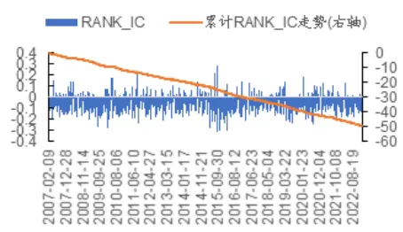
数据来源：Wind，广发证券发展研究中心

图：ret_open2AH1 多空收益
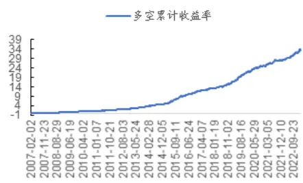
数据来源：Wind，广发证券发展研究中心

SAC 执证号：S02605170800030755-82797057

chenyuanwen@gf.com.cn分析师： 安宁宁

SAC 执证号：S0260512020003

0755-23948352

anningning@gf.com.cn分析师： 罗军

同SAC 执证号：S0260511010004

020-66335128

luojun@gf.com.cn

请注意，陈原文,罗军并非香港证券及期货事务监察委员会的注册持牌人，不可在香港从事受监管活动。

## 一、高频因子思考：从低频信息到高频信息

近年来，A股市场机构化趋势明显，量化私募机构的管理规模也迅速扩大，产生了一批管理规模超过百亿的量化私募机构。与此同时，传统的风格因子波动增大，从市场获取超额收益的难度在增加。

因子拥挤是因子收益下降的原因之一。因子代表着市场某方面的非有效性、或者是一段时期内的定价失效。当某类因子收益高的时候，会吸引更多的资金进入，从而出现因子拥挤，降低因子的预期收益。一旦新的因子被公开，套利资金的介入会使得错误定价收窄，因子收益也会跟着下降。因此，在多因子选股模型中，因子的开发和更新迭代变得越来越重要。

以传统日频价量和更低频财务数据为基础的因子开发是一种研究途径。由于基础因子广为人知，在此基础上进行因子挖掘的收益提升空间相对有限。而且日频数据由于本身的数据量和信息量有限，过度挖掘会增大过拟合的风险。

以高频价量数据为基础的因子开发在当下具有更大的收益提升空间。与低频因子相比，高频数据在用于量化投资中存在一定优势。

首先，高频价量数据的体量明显大于低频数据。以分钟行情为例，用压缩效果较好的mat格式存储2020年全市场股票的分钟行情数据（包括分钟频的开高低收价格数据、买卖盘挂单数据等），约为12GB。如果是快照行情（目前上交所和深交所都是3秒一笔）或者level 2行情，数据量要大很多。因此，高频数据因子挖掘对信息处理能力和处理效率的要求较高。而且，日内数据，尤其是level 2数据，一般要额外付费，甚至需要自行下载存储实时行情，在此基础上构建的因子拥挤度较低。

其次，高频价量数据一般是多维的时间序列数据，数据中噪声比例较高，而且与ROE、PE这类低频指标本身就具有选股能力不同的是，原始的高频行情数据一般不能直接用作选股因子，而要通过信号变换、时间序列分析、机器学习等方法从高频数据中构建特征，才能作为选股因子。此类因子与低频信号的相关性较低，而且由于因子开发流程相对复杂，不同投资者构建的因子更具有多样性。

此外，高频数据开发的因子一般调仓周期较短，意味着在检验因子有效性的时候，同一段测试期具有更多的独立样本。例如，在一年的测试期内，只有12个独立的样本段用于检验月频调仓的因子，与之相比，有约50个独立的时段用于检验周频调仓因子，有超过240个独立的时段用于检验日频调仓的因子。独立样本的增多有助于检验高频因子的有效性。

高频数据挖掘因子的难点在于数据维度大、噪声高。凭借专业投资者的经验或者是参阅已发表的文献，可以从高频数据中提炼出一部分有选股能力的特征。此外，机器学习方法擅长从数据中寻找规律和特征，是高频数据因子挖掘的有力工具。本篇专题报告通过将日内的数据分成几个数据维度，从不同的数据维度中建模提取选股因子。

## 二、因子构建方法和主要性能指标

## （一）因子构建方法

本报告构建因子时，从四大类不同的角度构建因子：日内价格相关因子、日内价量相关因子、盘前信息因子、特定时段采样因子。其中，日内价格相关的因子是由日内收益率的高阶统计量和日内价格形态衍生的因子，共计10个因子。日内价量相关因子包括成交量分布以及用价量关系构建的因子，共计13个因子。盘前信息因子主要是从开盘集合竞价信息中提炼的因子，共计7个因子。特定时段采样因子主要是指根据一定规则筛选出重要时段，在该时段采样并计算提取的因子，主要包括尾盘数据构建的因子和大成交量时段构建的因子，共计25个因子。

## （二）因子分析指标

收益预测时，统一按照周度调仓的假设进行分析。T日收盘后计算的因子预测的是从T+1日股票未来5个交易日的收益率，因子IC测试和收益回测都按照T+1日至T+5日进行计算。

股票池：全市场或者中证500指数成分股，剔除新股、ST个股、因子计算当日和交易日停牌或者涨跌停的个股。

IC：T日因子与T+1日开盘后5个交易日收益率的相关系数。

IC胜率：IC与因子方向相同的比率（因子方向按照整个回测区间因子IC均值的正负号确定）。

年化ICIR：IC绝对值与IC标准差之比的年化值，即

$$
\mathrm{ICIR}=\mathrm{sqrt}(\mathrm{N})*\mathrm{abs}(\mathrm{IC})/\mathrm{std}(\mathrm{IC})
$$

其中N表示一年内包含的交易周数。

在选股测试时，按照因子方向和因子取值将股票池内股票平均分为10组组内股票等权。

多空超额收益率：因子多头组合收益相对因子空头组合的年化超额，越大则表示因子选股能力越强。

多空超额胜率：因子多头组合收益相对因子空头组合的超额胜率。

正Alpha：因子多头组合收益相对基准指数的年化超额，越大则表示因子多头相对基准的超额收益越高。

负Alpha：因子空头组合收益相对基准指数收益的年化超额，越小（为负且绝对值越大）则表示因子空头相对基准负的超额收益越高。

本报告的多空超额收益率、正Alpha、负Alpha是分别根据各自组合的累计超额计算出来的，由于存在复利效应，因子的正Alpha、负Alpha之差一般与因子多空超额收益率略有差异。

## 三、日内价格相关因子

价格数据中蕴含了丰富的股票信息，在传统多因子体系中，股价反转、波动率都是重要的风格因子。在高频数据中，可以用类似方法构建相关的特征。本报告根据收益率的高阶统计量构建了如下选股因子：

表1：日内收益率高阶统计量因子

| 因子名 | 因子描述 |
| --- | --- |
| real_var | 已实现方差，分钟行情收益率的方差 |
| real_skew | 已实现偏度，分钟行情收益率的偏度 |
| real_kurtosis | 已实现峰度，分钟行情收益率的峰度 |
| real_upvar | 上行收益率方差，仅考虑收益率大于0时的分钟行情收益率方差 |
| real_downvar | 下行收益率方差，仅考虑收益率小于0时的分钟行情收益率方差 |
| ratio_realupvar | 上行收益率方差比值，real_upvar/ real_var |
| ratio_realdownvar | 下行收益率方差比值，ratio_realdownvar / real_var |

数据来源：广发证券发展研究中心

设个股 i 在D日的日内分钟频率下的股票价格序列为 $\{p_{t,D,i}\},t=1,2,3,\cdots,T$ 收益率序列为 $\left\{\boldsymbol{r}_{t,D,i}\right\}$ ，其中

$$
r_{t,D,i}=\frac{p_{t,D,i}}{p_{t-1,D,i}}-1,i=2,3,\cdots,T
$$

则已实现收益率方差为

$$
real\_var_{D,i}=\frac{1}{T-2}{\sum}^{T}{_t}=2^{\left({r}_{t,D,i}-{\bar{r}_{D,i}}\right)^{2}}
$$

其中， $\bar{r}_{D,i}$ 表示股票日内收益率的均值。收益率方差取值范围为 $[0,+\infty)$ 已实现收益率偏度为

$$
real\_skew_{D,i}=\frac{1}{T-1}{\sum}^{T}_{t=2}\frac{\left(r_{t,D,i}-{{\bar{r}}_{D,i}}\right)^{3}}{real_{-}var_{D,i}^{\ 3/2}}
$$

收益率偏度可以用来度量收益率分布的不对称性，取值范围为 $(-\infty,+\infty)$ ，当偏度<0时，表示收益率分布左偏，当偏度>0时，表示收益率分布右偏。

已实现收益率峰度为

$$
real\_kurtosis_{D,i}=\frac{1}{T-1}{\sum}^{T}{\frac{\left(r_{t,D,i}-{\bar{r}}_{D,i}\right)^{4}}{real\_var_{D,i}}}^{2}
$$

峰度可以用来度量随机变量概率分布的陡峭程度。收益率峰度取值范围为[1,+∞)，当峰度超过3时，认为该分布厚尾。

real_upvar为仅考虑 ${\mathbf{\nabla}}\cdot{r_{t,D,i}}>$ 0时的已实现收益率方差，real_downvar为仅考虑

$r_{t,D,i}<$ 0时的已实现收益率方差。可以进一步展开，构建上行收益率方差比值和下行收益率方差比值：

$$
ratio\_realupvar_{D,i}=\frac{real\_upvar_{D,i}}{real\_var_{D,i}}
$$

$$
ratio\_realdownvar{_{D,i}}=\frac{real\_downvar_{_{D,i}}}{real\_var_{_{D,i}}}
$$

根据日内股价的形态，可以构建如下因子。

表2：价格形态衍生因子

| 因子名 | 因子描述 |
| --- | --- |
| trendratio | 趋势占比，日内价格变化/分钟频价格变化绝对值之和 |
| ret_intraday | 日内收益率，收盘价/开盘价-1 |
| intraday_maxdrawdown | 日内最大回撤，日内分钟频行情的最大回撤 |

数据来源：广发证券发展研究中心

其中，趋势占比可以衡量日内股价的趋势强度，取值范围为[−1,1]，其计算方法为

$$
trendratio_{D,i}=\frac{p_{T,D,i}-p_{1,D,i}}{\sum_{t=2}^{T}\left|p_{t,D,i}-p_{t-1,D,i}\right|}
$$

日内收益率仅考虑日内的股价变化，

$$
ret\_intraday_{D,i}=\frac{p_{T,D,i}}{open_{D,i}}-1
$$

其中， $open_{D,i}$ 为股票当日开盘价， $p_{T,D,i}$ 为股票当日收盘价。日内最大回撤表示分钟行情价格的最大回撤，取值范围为(−1,0]：

$$
intraday\_maxdrawdown_{D,i}=\operatorname*{min}_{0<t<T}\operatorname*{min}_{0<\tau\leq T-t}\frac{p_{t+\tau,D,i}}{p_{t,D,i}}-1
$$

## （二）因子全市场选股、中证 500 内表现

从下表中可以看出，日内价格数据构建的因子中，real_var 、real_upvar、intraday_maxdrawdown因子在全市场及中证500中的效果较好，且最近几年这些因子整体上维持着较为有效的特征。

表 3：日内价格相关因子全市场绩效指标一览

|  | RANK_IC 均值 | IC 均值 | IC>0 胜率 | 多头年化收益率 | 多空年化收益率 | 正 Alpha |
| --- | --- | --- | --- | --- | --- | --- |
| real_var | -6.08% | -3.50% | 30.77% | 21.46% | 38.22% | 17.13% |
| real_skew | -2.90% | -2.14% | 27.47% | 13.52% | 20.38% | 9.59% |
| real_kurtosis | -2.49% | -1.81% | 34.55% | 18.71% | 19.96% | 14.84% |
| real_upvar | -6.29% | -3.73% | 29.55% | 23.02% | 41.72% | 18.73% |
| real_downvar | -4.90% | -2.62% | 33.70% | 18.22% | 27.05% | 14.05% |
| ratio_realupvar | -3.27% | -2.43% | 31.50% | 11.95% | 24.56% | 8.47% |
| ratio_realdownvar | 3.24% | 2.32% | 70.09% | 13.80% | 22.45% | 9.78% |
| trendratio | -3.11% | -2.48% | 36.63% | 10.95% | 21.75% | 7.33% |
| ret_intraday | -2.92% | -2.38% | 37.48% | 7.04% | 22.22% | 3.70% |
| intraday_maxdrawdown | 4.58% | 2.22% | 59.83% | 16.97% | 21.60% | 12.46% |

数据来源：天软科技、广发证券发展研究中心

表 4：日内价格相关因子中证500内选股绩效指标一览

|  | RANK_IC 均值 | IC 均值 | IC>0 胜率 | 多头年化收益率 | 多空年化收益率 | 正 Alpha |
| --- | --- | --- | --- | --- | --- | --- |
| real_var | -4.77% | -2.57% | 38.51% | 13.79% | 21.50% | 6.47% |
| real_skew | -2.66% | -2.04% | 34.35% | 13.03% | 21.37% | 5.98% |
| real_kurtosis | -2.44% | -1.57% | 39.61% | 14.99% | 13.86% | 8.13% |
| real_upvar | -5.06% | -2.89% | 36.43% | 16.38% | 26.11% | 9.02% |
| real_downvar | -3.61% | -1.70% | 43.03% | 11.78% | 12.27% | 4.71% |
| ratio_realupvar | -2.97% | -2.18% | 38.14% | 10.63% | 20.26% | 4.17% |
| ratio_realdownvar | 3.11% | 2.35% | 65.65% | 12.79% | 19.20% | 5.62% |
| trendratio | -3.39% | -2.77% | 38.14% | 12.20% | 20.77% | 5.47% |
| ret_intraday | -3.10% | -2.52% | 40.22% | 10.32% | 19.87% | 3.90% |
| intraday_maxdrawdown | 3.40% | 1.32% | 55.75% | 10.72% | 8.61% | 3.04% |

数据来源：天软科技、广发证券发展研究中心

图1：real_var因子全市场选股RANK_IC走势
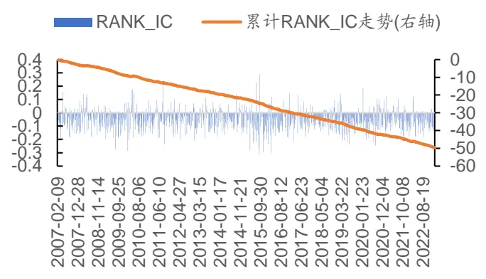
数据来源：天软科技、广发证券发展研究中心

图2：intraday_maxdrawdown因子全市场选股走势
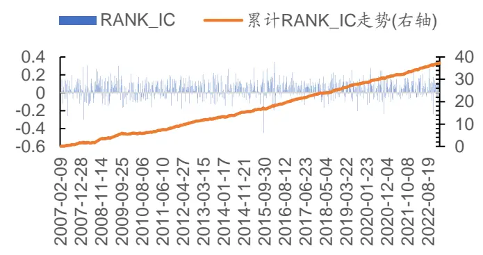
数据来源：天软科技、广发证券发展研究中心

图3：real_var因子中证500选股RANK_IC走势一览
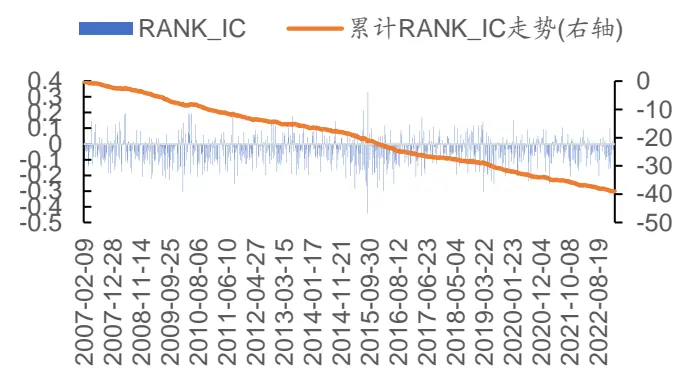
数据来源：天软科技、广发证券发展研究中心

图4：intraday_maxdrawdown因子中证500选股走势
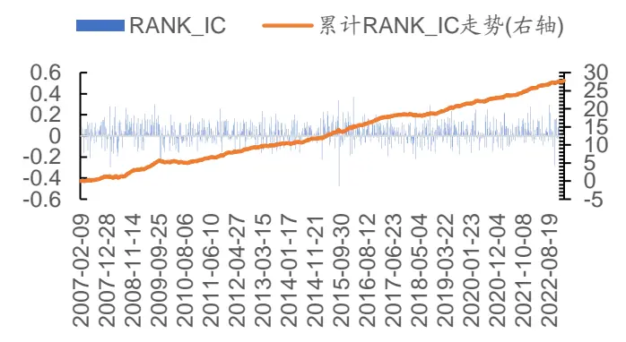
数据来源：天软科技、广发证券发展研究中心

图5：real_var因子全市场选股多空收益走势一览
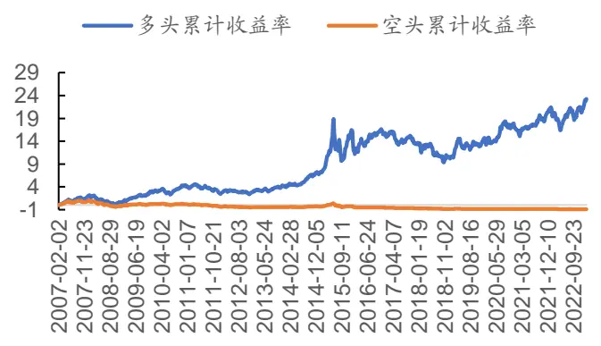
数据来源：天软科技、广发证券发展研究中心

图6：real_var因子全市场选股多空累计收益走势一览
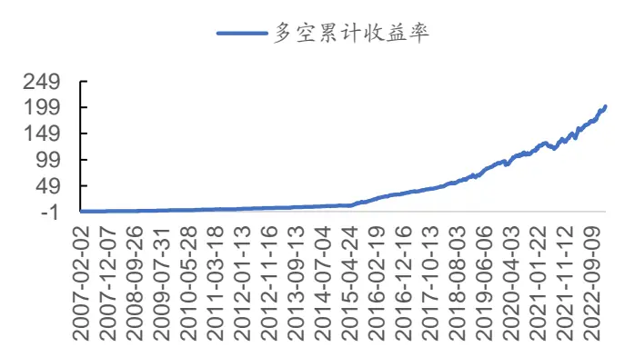
数据来源：天软科技、广发证券发展研究中心

图7：intraday_maxdrawdown因子全市场选股多空收 益走势一览
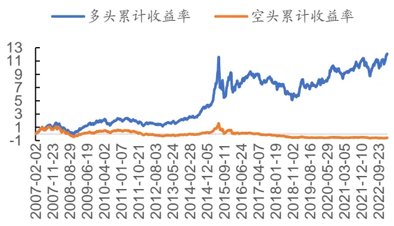
数据来源：天软科技、广发证券发展研究中心

图8：intraday_maxdrawdown因子全市场选股多空累 计收益走势一览
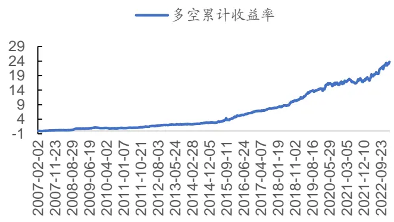
数据来源：天软科技、广发证券发展研究中心

图9：real_var因子中证500选股多空收益走势一览
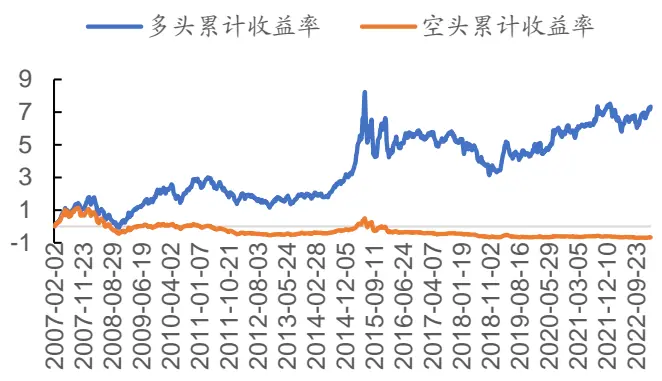
数据来源：天软科技、广发证券发展研究中心

图10：real_var因子中证500选股多空累计收益走势
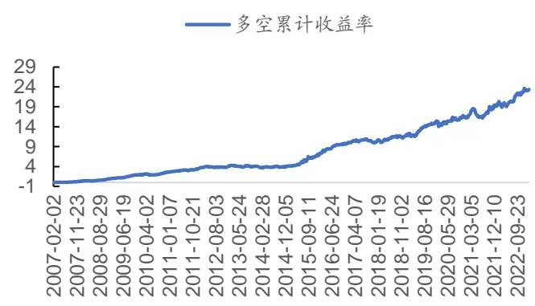
数据来源：天软科技、广发证券发展研究中心

图11：intraday_maxdrawdown因子中证500内多空收益走势一览
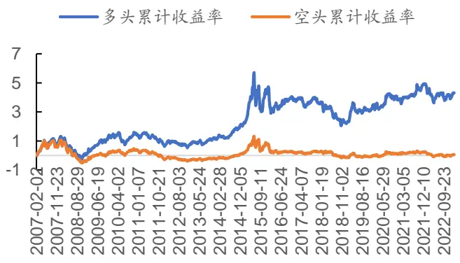
数据来源：天软科技、广发证券发展研究中心

图12：intraday_maxdrawdown因子中证500内多空累计收益走势一览
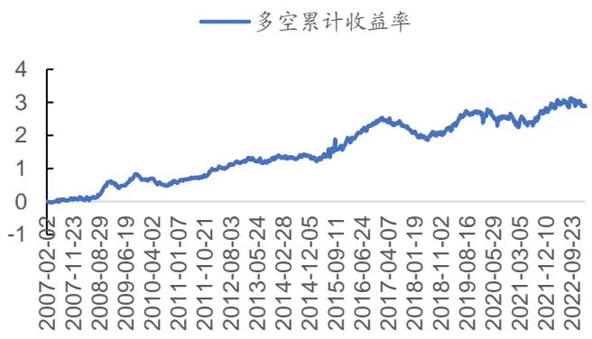
数据来源：天软科技、广发证券发展研究中心

## 四、日内价量相关因子

成交量是日内行情信息的重要组成部分。一方面，成交量的分布可以反映投资者的行为特征，另一方面，成交量与价格或者价格走势的关系可以确认价格形态的信息。

将每天的4个小时交易时间按照时间平均分为8段，根据每段的成交量占全天成交量之比，构建如下因子：

表5：成交量分布因子

| 因子名 | 因子描述 |
| --- | --- |
| ratio_volumeH1 | 早盘成交量占比：开盘后第1个半小时成交量占全天成交量之比 |
| ratio_volumeH2 | 成交量占比H2：开盘后第2个半小时成交量占全天成交量之比 |
| ratio_volumeH3 | 成交量占比 H3：开盘后第 3个半小时成交量占全天成交量之比 |
| ratio_volumeH4 | 成交量占比H4：开盘后第4个半小时成交量占全天成交量之比 |
| ratio_volumeH5 | 成交量占比H5： 开盘后第5个半小时成交量占全天成交量之比 |
| ratio_volumeH6 | 成交量占比H6： 开盘后第6个半小时成交量占全天成交量之比 |
| ratio_volumeH7 | 成交量占比 H7：开盘后第7个半小时成交量占全天成交量之比 |
| ratio_volumeH8 | 尾盘成交量占比：开盘后第8个半小时成交量占全天成交量之比 |

数据来源：广发证券发展研究中心

考虑到价格和成交量的相互关系，可以构建以下因子：

表6：价量相关因子

| 因子名 | 因子描述 |
| --- | --- |
| corr_VP | 价量相关性，分钟成交量与价格相关性 |
| corr_VR | 收益率与量相关性，分钟成交量与收益率相关性 |
| corr_VRlag | 量与滞后收益率相关性，分钟成交量与上一时刻收益率相关性 |
| corr_VRlead | 量与超前收益率相关性，分钟成交量与下一时刻收益率相关性 |
| Amihud_illiq | Amihud 非流动性因子 |

数据来源：广发证券发展研究中心

其中，价量相关性是指价格序列和成交量序列的相关性，记股票日内分钟频率下的成交量序列为 $\big\{v_{t,D,i}\big\},t=1,2,3,\cdots,T$ ，则该因子计算方法为

$$
corr\_VP_{D,i}=corr(v_{t,D,i},p_{t,D,i})
$$

收益率与量的相关性为

$$
\begin{array}{c}{{corr\_VR_{D,i}=corr(v_{t,D,i},r_{t,D,i})}}\\{{{}}}\\{{corr\_VRlag_{D,i}=corr(v_{t,D,i},r_{t-1,D,i})}}\\{{{}}}\\{{{}}}\\{{corr\_VRlead_{D,i}=corr(v_{t,D,i},r_{t+1,D,i})}}\end{array}
$$

其中， $corr\_VRlag_{D,i}$ 是指成交量与上一个时刻收益率（滞后收益率）的相关性，corr $.VRlead_{D,i}$ 是指成交量与下一个时刻（超前收益率）的相关性，上述相关

识别风险，发现价值

性因子的取值范围为[−1,1]。

Amihud非流动性因子是Amihud在2002年提出了衡量流动性的因子，考虑单位成交额驱动下，股价的变化幅度。因子值越大，说明股票的价格越容易被交易行为所影响（即流动性越低）。常见的Amihud非流动性因子是按照日频构建的，本报告在分钟频率下构建类似的因子，

$$
Amihud\_illiq_{D,i}=\frac{1}{T-1}{\sum_{t=2}^{T}}\frac{\left|r_{t,D,i}\right|}{p_{t,D,i}v_{t,D,i}}
$$

该因子是指在分钟频率下，单位成交额驱动下，股价的变化幅度。Amihud非流动性因子取值非负。

日内价量相关因子表现如下表所示。从下表中可以看出，日内价量类数据构建的因子中，ratio_volumeH1、corr_VP、ratio_volumeH5、corr_Vrlag、Amihud_illiq这5个因子在全市场及中证500中的选股效果较为显著。

表 7：日内价量相关因子全市场绩效指标一览

|  | RANK_IC 均值 | IC 均值 | IC>0 胜率 | 多头年化收益率 | 多空年化收益率 | 正 Alpha |
| --- | --- | --- | --- | --- | --- | --- |
| ratio_volumeH1 | -2.84% | -1.86% | 34.31% | 7.73% | 18.10% | 3.59% |
| ratio_volumeH2 | 0.95% | 0.92% | 60.20% | 12.91% | 9.94% | 8.93% |
| ratio_volumeH3 | 2.51% | 1.88% | 68.25% | 17.97% | 19.79% | 13.86% |
| ratio_volumeH4 | 3.12% | 2.13% | 72.77% | 17.88% | 21.14% | 13.75% |
| ratio_volumeH5 | 3.68% | 2.68% | 76.68% | 20.91% | 28.73% | 16.58% |
| ratio_volumeH6 | 3.34% | 2.33% | 75.58% | 16.15% | 23.77% | 11.96% |
| ratio_volumeH7 | 2.76% | 1.71% | 67.52% | 14.03% | 16.66% | 9.96% |
| ratio_volumeH8 | -0.35% | -0.89% | 40.17% | 11.62% | 9.49% | 7.54% |
| corr_VP | -6.15% | -4.91% | 20.02% | 24.20% | 54.01% | 20.13% |
| corr_VR | -3.61% | -2.82% | 32.84% | 14.83% | 26.71% | 11.17% |
| corr_VRlag | -4.15% | -3.34% | 28.57% | 10.44% | 33.39% | 6.99% |
| corr_VRlead | 0.47% | 0.48% | 58.00% | 9.82% | 5.30% | 6.08% |
| Amihud_illiq | 6.99% | 4.69% | 71.92% | 30.58% | 54.00% | 25.45% |

数据来源：天软科技、广发证券发展研究中心

表 8：日内价量相关因子中证500内选股绩效指标一览

|  | RANK_IC 均值 | IC 均值 | IC>0 胜率 | 多头年化收益率 | 多空年化收益率 | 正Alpha |
| --- | --- | --- | --- | --- | --- | --- |
| ratio_volumeH1 | -1.97% | -1.17% | 43.52% | 3.63% | 8.66% | -3.48% |
| ratio_volumeH2 | 0.81% | 0.74% | 55.01% | 11.45% | 8.78% | 4.53% |
| ratio_volumeH3 | 2.16% | 1.66% | 61.98% | 12.83% | 16.05% | 5.86% |
| ratio_volumeH4 | 2.62% | 1.73% | 62.71% | 12.48% | 14.53% | 5.31% |
| ratio_volumeH5 | 3.24% | 2.47% | 65.53% | 18.59% | 24.51% | 11.04% |
| ratio_volumeH6 | 2.77% | 1.94% | 62.47% | 14.24% | 19.61% | 6.68% |
| ratio_volumeH7 | 2.43% | 1.57% | 61.37% | 12.43% | 14.91% | 5.06% |
| ratio_volumeH8 | -0.41% | -1.03% | 42.42% | 8.45% | 11.48% | 1.49% |
| corr_VP | -5.72% | -4.56% | 27.26% | 21.36% | 44.68% | 14.10% |
| corr_VR | -3.74% | -2.96% | 35.33% | 13.75% | 26.88% | 6.99% |
| corr_VRlag | -3.82% | -2.94% | 34.60% | 7.87% | 24.19% | 1.68% |
| corr_VRlead | 0.37% | 0.46% | 52.93% | 7.63% | 5.15% | 0.94% |
| Amihud_illiq | 5.13% | 3.31% | 61.61% | 24.16% | 33.14% | 15.53% |

数据来源：天软科技、广发证券发展研究中心

图13：corr_VP因子全市场选股RANK_IC走势一览
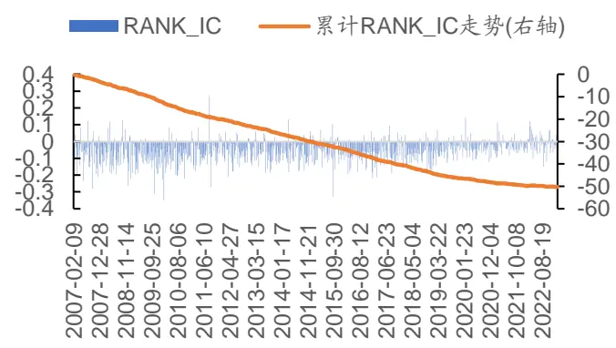
数据来源：天软科技、广发证券发展研究中心

图14：Amihud_illiq因子全市场选股走势一览
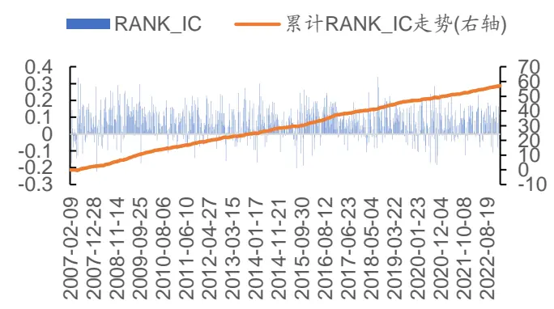
数据来源：天软科技、广发证券发展研究中心

图15：corr_VP因子中证500选股RANK_IC走势一览
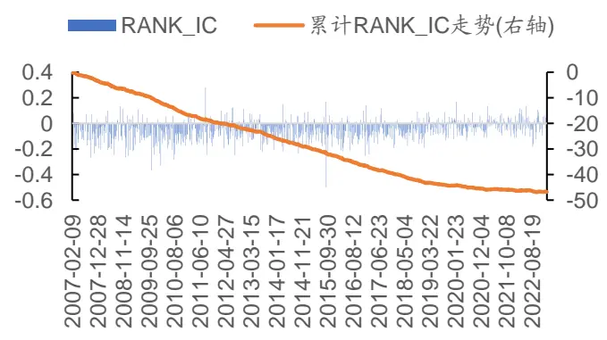
数据来源：天软科技、广发证券发展研究中心

图16：Amihud_illiq因子中证500选股走势一览
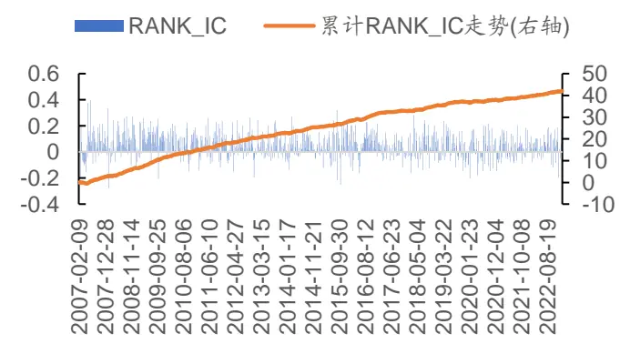
数据来源：天软科技、广发证券发展研究中心

图17：corr_VP因子全市场选股多空收益走势一览
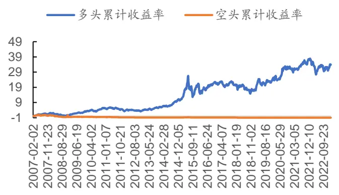
数据来源：天软科技、广发证券发展研究中心

图18：corr_VP因子全市场选股多空累计收益走势
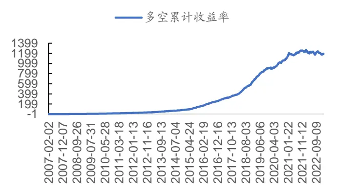
数据来源：天软科技、广发证券发展研究中心

图19：Amihud_illiq因子全市场选股多空收益走势
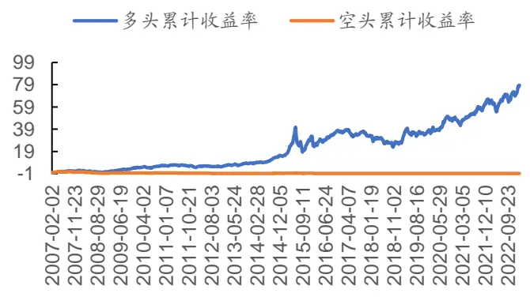
数据来源：天软科技、广发证券发展研究中心

图20：Amihud_illiq因子全市场选股多空累计收益
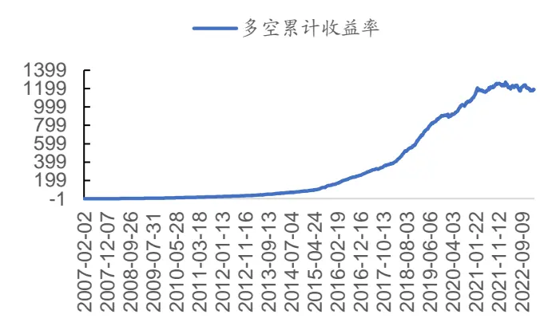
数据来源：天软科技、广发证券发展研究中心

图21：corr_VP因子中证500选股多空收益走势一览
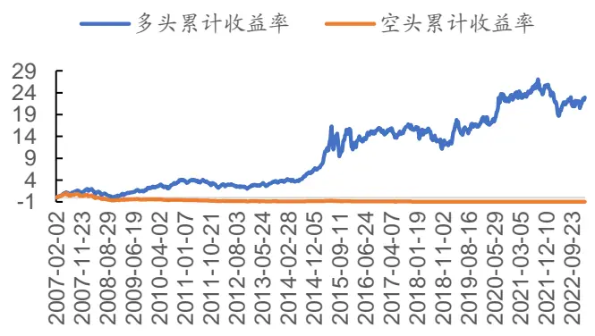
数据来源：天软科技、广发证券发展研究中心

图22：corr_VP因子中证500选股多空累计收益走势
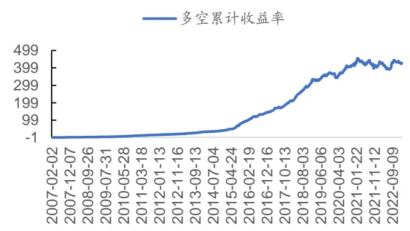
数据来源：天软科技、广发证券发展研究中心

图23：Amihud_illiq因子中证500内多空收益走势一览
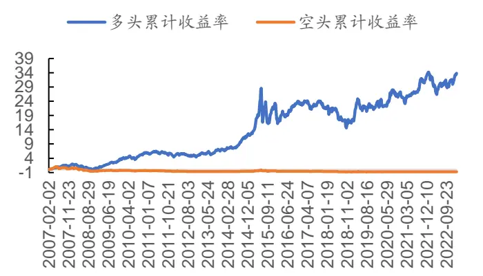
数据来源：天软科技、广发证券发展研究中心

图24：Amihud_illiq因子中证500内多空累计收益走势
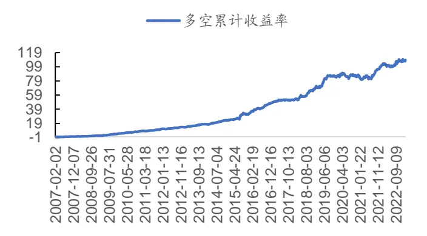
数据来源：天软科技、广发证券发展研究中心

## 五、盘前信息因子

盘前信息主要包括隔夜收益率（开盘价相对前收盘的收益率）和开盘前集合竞价信息。目前，A股证券交易所在每个交易日的9:15至9:25为开盘集合竞价时间。开盘集合竞价又分为两个阶段，其中第一阶段是9:15至9:20，该阶段允许撤销已经提交的订单；第二阶段是9:20至9:25，该阶段目前不允许撤销已经提交的订单。集合竞价信息反映出资金的试盘行为和多空双方的博弈。本报告考察隔夜收益率和集合竞价的相关因子如下所示。

表9 ：盘前信息因子列表

| 因子名 | 因子描述 |
| --- | --- |
| ret_overnight | 隔夜收益率，开盘价相对前收盘价的收益率 |
| ret_open2AH1 | 开盘价相对第一阶段集合竞价最高价的收益率 |
| ret_open2AL1 | 开盘价相对第一阶段集合竞价最低价的收益率 |
| ret_open2AH2 | 开盘价相对第二阶段集合竞价最高价的收益率 |
| ret_open2AL2 | 开盘价相对第二阶段集合竞价最高价的收益率 |
| diverge_A1 | 第一阶段集合竞价振幅 |
| diverge_A2 | 第二阶段集合竞价振幅 |

数据来源：广发证券发展研究中心

从下表中可以看到，盘前相关的信息中，ret_open2AH1、diverge_A2因子在全市场及中证1000中的选股效果较为显著。

表 10：日内价量相关因子全市场绩效指标一览

|  | RANK_IC 均值 | IC 均值 | IC>0 胜率 | 多头年化收益率 | 多空年化收益率 | 正 Alpha |
| --- | --- | --- | --- | --- | --- | --- |
| ret_overnight | 1.81% | 1.23% | 64.35% | 5.26% | 12.37% | 1.68% |
| ret_open2AH1 | 3.49% | 2.61% | 75.40% | 22.43% | 24.17% | 18.41% |
| ret_open2AL1 | 1.81% | 1.75% | 71.11% | 16.62% | 20.24% | 12.68% |
| ret_open2AH2 | 2.54% | 1.88% | 71.19% | 13.04% | 16.60% | 9.49% |
| ret_open2AL2 | 0.36% | 1.01% | 60.44% | 6.47% | 2.31% | 5.27% |
| diverge_A1 | -2.25% | -1.41% | 34.67% | 19.39% | 12.81% | 15.43% |
| diverge_A2 | -2.86% | -1.78% | 34.43% | 19.38% | 21.13% | 15.47% |

数据来源：天软科技、广发证券发展研究中心

表 11：日内价量相关因子中证500内选股绩效指标一览

|  | RANK_IC 均值 | IC 均值 | IC>0 胜率 | 多头年化收益率 | 多空年化收益率 | 正 Alpha |
| --- | --- | --- | --- | --- | --- | --- |
| ret_overnight | 1.08% | 0.63% | 54.16% | 2.62% | 3.78% | -3.70% |
| ret_open2AH1 | 2.74% | 1.98% | 61.03% | 14.67% | 13.24% | 7.84% |
| ret_open2AL1 | 1.34% | 1.20% | 59.07% | 12.53% | 14.63% | 5.65% |
| ret_open2AH2 | 2.00% | 1.40% | 60.72% | 11.42% | 14.83% | 4.90% |
| ret_open2AL2 | 0.39% | 0.74% | 53.28% | 4.35% | 2.01% | 1.03% |
| diverge_A1 | -1.74% | -1.17% | 42.74% | 12.99% | 6.06% | 6.00% |
| diverge_A2 | -2.44% | -1.49% | 41.62% | 12.84% | 13.01% | 5.99% |

数据来源：天软科技、广发证券发展研究中心

图25：ret_open2AH1因子全市场选股RANK_IC走势
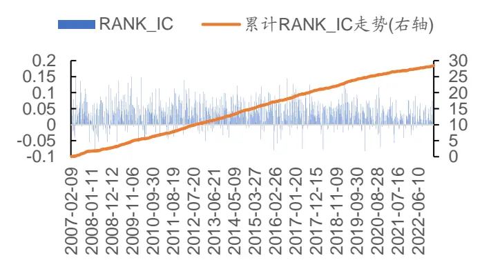
数据来源：天软科技、广发证券发展研究中心

图26：ret_open2AH2因子全市场选股走势一览
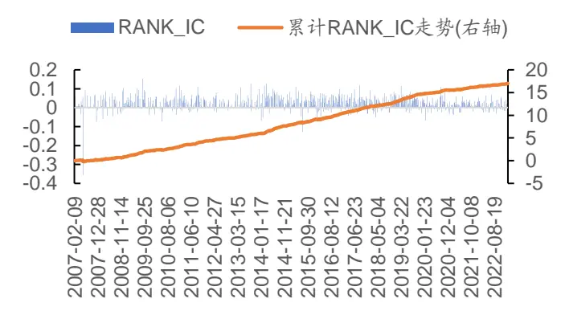
数据来源：天软科技、广发证券发展研究中心

图27：ret_open2AH1因子中证500选股RANK_IC走势
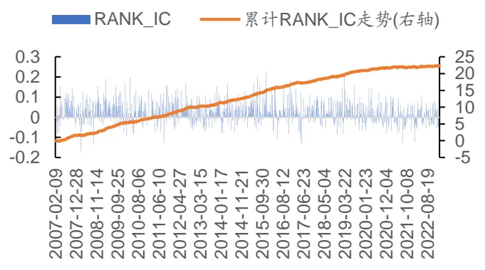
数据来源：天软科技、广发证券发展研究中心

图28：ret_open2AH2因子中证500选股走势
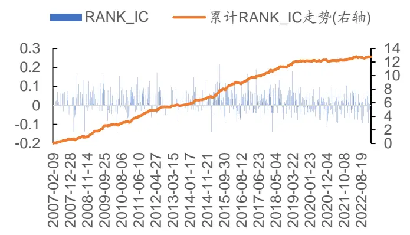
数据来源：天软科技、广发证券发展研究中心

图29：ret_open2AH1因子全市场选股多空收益走势
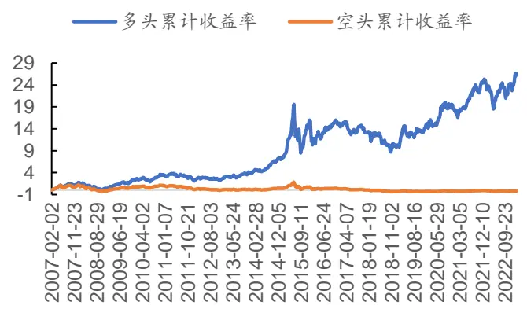
数据来源：天软科技、广发证券发展研究中心

图30：ret_open2AH1因子全市场选股多空累计收益
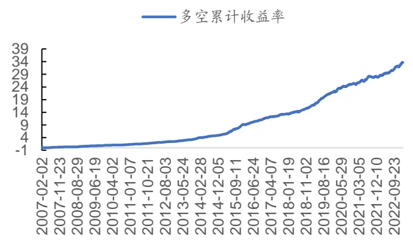
数据来源：天软科技、广发证券发展研究中心

图31：ret_open2AH2因子全市场选股多空收益走势
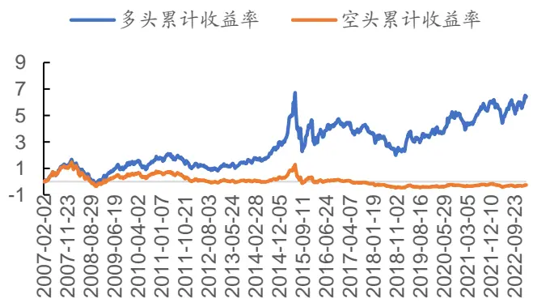
数据来源：天软科技、广发证券发展研究中心

图32：ret_open2AH2因子全市场选股多空累计收益
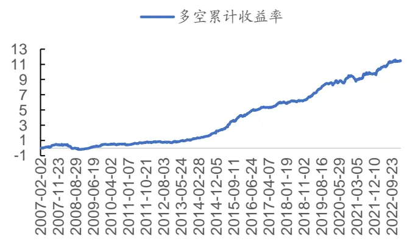
数据来源：天软科技、广发证券发展研究中心

图33：ret_open2AH1因子中证500选股多空收益走势
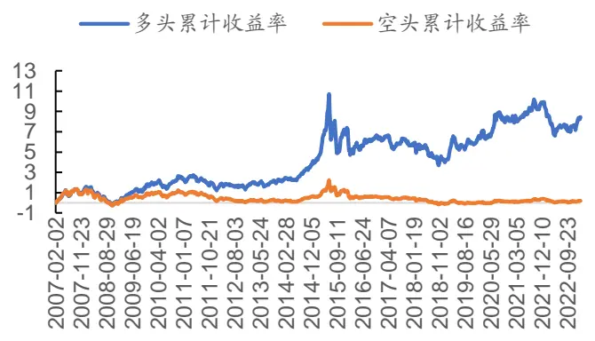
数据来源：天软科技、广发证券发展研究中心

图34：ret_open2AH1因子中证500选股多空累计收益
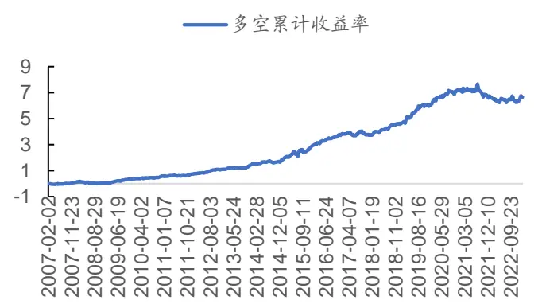
数据来源：天软科技、广发证券发展研究中心

图35：ret_open2AH2因子中证500内多空收益走势
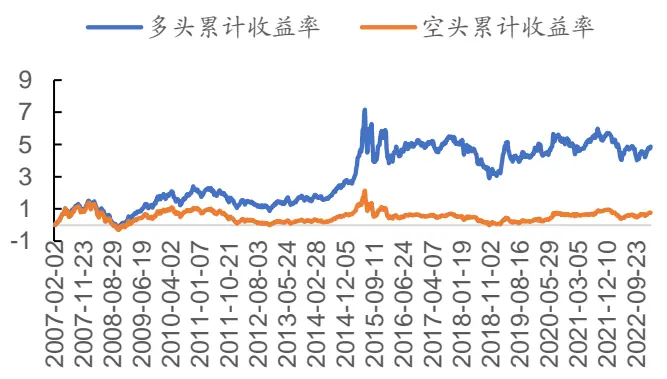
数据来源：天软科技、广发证券发展研究中心

图36：ret_open2AH2因子中证500内多空累计收益
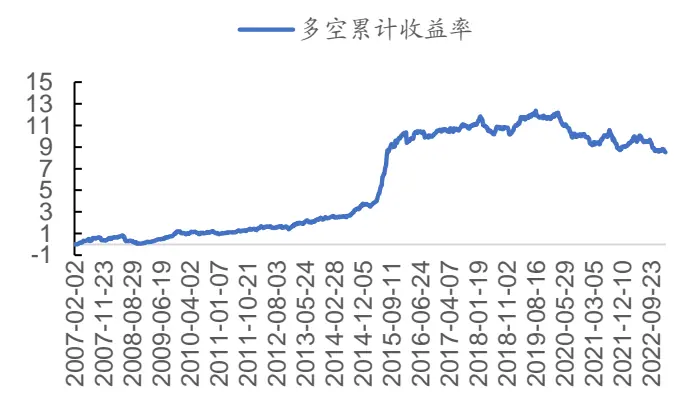
数据来源：天软科技、广发证券发展研究中心

## 六、特定时段采样因子

本报告将部分时段的数据进行重点分析，产生衍生因子。一般来说，开盘后半小时（9点半至10点）和收盘前半小时（14点半至收盘）的股票成交活跃，多空博弈激烈，蕴含的信息相对较多。本报告针对收盘前半小时的价量信息构建了如下因子。

表12：开盘后半小时因子列表

| 因子名 | 因子描述 |
| --- | --- |
| ret_H1 | 开盘后半小时的收益率 |
| ret_close2H1 | 开盘后半小时至收盘的收益率 |
| corr_VPH1 | 收盘前半小时的 corr_VP |
| corr_VRH1 | 收盘前半小时的 corr_VR |
| corr_VrleadH1 | 收盘前半小时的 corr_VRlead |
| corr_VrlagH1 | 收盘前半小时的 corr_VRlag |
| real_varH1 | 收盘前半小时的 real_var |
| real_kurtosisH1 | 收盘前半小时的 real_kurtosis |
| real_skewH1 | 收盘前半小时的 real_skew |

数据来源：广发证券发展研究中心

表13：收盘前半小时因子列表

| 因子名 | 因子描述 |
| --- | --- |
| ret_H8 | 收盘前半小时的收益率 |
| corr_VPH8 | 收盘前半小时的 corr_VP |
| corr_VRH8 | 收盘前半小时的 corr_VR |
| corr_VRleadH8 | 收盘前半小时的 corr_VRlead |
| corr_VRlagH8 | 收盘前半小时的 corr_VRlag |
| real_varH8 | 收盘前半小时的 real_var |
| real_kurtosisH8 | 收盘前半小时的 real_kurtosis |
| real_skewH8 | 收盘前半小时的 real_skew |

数据来源：广发证券发展研究中心

在不同的成交中，大单成交与主力资金关联较大，蕴含的信息可能更多。本报告将个股在每个交易日的分钟成交量时间序列按照成交量大小排序，将分钟成交量排名前1/3的成交量定义为“大成交量”。针对大成交量对应的时刻的股价信息，可以构建大成交量相关因子。

表14：大成交量相关因子列表

| 因子名 | 因子描述 |
| --- | --- |
| real_varlarge | 大成交量对应的收益率方差 |
| real_kurtosislarge | 大成交量对应的收益率峰度 |
| real_skewlarge | 大成交量对应的收益率偏度 |
| ratio_realvarlarge | 大成交量方差占比，real_varlarge/real_var |
| corr_VPlarge | 大成交量对应的 corr_VP |
| corr_VRlarge | 大成交量对应的 corr_VR |
| corr_VRleadlarge | 大成交量对应的 corr_VRlead |
| corr_VRlaglarge | 大成交量对应的 corr_VRlag |

数据来源：广发证券发展研究中心

开盘后半小时构建的因子中，其中ret_close2H1、real_varH1在全市场及中证500中的选股效果较为显著。

表 15：开盘后半小时因子全市场绩效指标一览

|  | RANK_IC 均值 | IC 均值 | IC>0 胜率 | 多头年化收益率 | 多空年化收益率 | 正 Alpha |
| --- | --- | --- | --- | --- | --- | --- |
| ret_H1 | 0.52% | 0.47% | 53.24% | 5.33% | 4.66% | 1.72% |
| ret_close2H1 | -3.65% | -3.24% | 30.65% | 13.45% | 34.93% | 9.94% |
| corr_VPH1 | -2.08% | -1.67% | 35.29% | 14.71% | 15.11% | 10.93% |
| corr_VRH1 | 0.78% | 0.63% | 57.02% | 15.16% | 5.68% | 11.11% |
| corr_VRleadH1 | 1.12% | 0.88% | 62.39% | 14.92% | 8.16% | 11.08% |
| corr_VRlagH1 | -0.39% | -0.30% | 46.28% | 5.54% | 2.85% | 2.11% |
| real_varH1 | -5.22% | -2.72% | 33.58% | 22.56% | 30.29% | 18.23% |
| real_skewH1 | 0.18% | 0.25% | 52.26% | 15.25% | 2.05% | 11.21% |
| real_kurtosisH1 | 0.84% | 0.60% | 56.41% | 14.42% | 2.47% | 10.30% |

数据来源：天软科技、广发证券发展研究中心

表 16：开盘后半小时因子中证500绩效指标一览

|  | RANK_IC 均值 | IC 均值 | IC>0 胜率 | 多头年化收益率 | 多空年化收益率 | 正 Alpha |
| --- | --- | --- | --- | --- | --- | --- |
| ret_H1 | 0.19% | 0.30% | 51.47% | 3.93% | 2.11% | -2.49% |
| ret_close2H1 | -3.65% | -3.31% | 34.72% | 14.76% | 30.69% | 8.15% |
| corr_VPH1 | -1.93% | -1.46% | 39.61% | 12.42% | 11.49% | 5.68% |
| corr_VRH1 | 0.18% | 0.14% | 51.10% | 11.95% | 1.06% | 4.89% |
| corr_VRleadH1 | 1.18% | 0.82% | 54.52% | 12.65% | 6.57% | 5.95% |
| corr_VRlagH1 | -0.40% | -0.15% | 48.41% | 4.72% | 1.67% | -1.54% |
| real_varH1 | -3.98% | -1.78% | 42.30% | 13.67% | 14.62% | 6.44% |
| real_skewH1 | 0.01% | 0.05% | 50.86% | 11.37% | 2.43% | 4.50% |
| real_kurtosisH1 | 0.47% | 0.42% | 51.10% | 10.12% | 1.01% | 3.09% |

数据来源：天软科技、广发证券发展研究中心

收盘前半小时构建的因子中，其中ret_H8、corr_VRH8在全市场及中证500中的选股效果较为显著。

表 17：收盘前半小时因子全市场绩效指标一览

|  | RANK_IC 均值 | IC 均值 | IC>0 胜率 | 多头年化收益率 | 多空年化收益率 | 正Alpha |
| --- | --- | --- | --- | --- | --- | --- |
| ret_H8 | -3.31% | -3.37% | 23.69% | 15.01% | 36.38% | 18.78% |
| corr_VPH8 | -2.96% | -2.83% | 26.86% | 12.67% | 28.69% | 12.37% |
| corr_VRH8 | -3.05% | -2.61% | 26.01% | 24.78% | 28.49% | 13.86% |
| corr_VRleadH8 | 0.25% | 0.17% | 53.72% | 12.65% | 0.04% | 17.06% |
| corr_VRlagH8 | -1.93% | -1.79% | 30.65% | 18.12% | 20.36% | 22.09% |
| real_varH8 | -3.47% | -2.29% | 31.75% | 18.35% | 25.50% | 16.51% |
| real_skewH8 | -2.06% | -1.87% | 26.25% | 19.81% | 23.14% | 9.44% |

数据来源：天软科技、广发证券发展研究中心

表 18：收盘前半小时因子中证500绩效指标一览

|  | RANK_IC 均值 | IC 均值 | IC>0 胜率 | 多头年化收益率 | 多空年化收益率 | 正 Alpha |
| --- | --- | --- | --- | --- | --- | --- |
| ret_H8 | -3.85% | -3.83% | 27.63% | 18.42% | 40.61% | 11.51% |
| corr_VPH8 | -3.18% | -3.07% | 31.91% | 13.56% | 27.09% | 7.01% |
| corr_VRH8 | -3.41% | -2.88% | 31.42% | 22.34% | 29.71% | 15.07% |
| corr_VRleadH8 | 0.25% | 0.32% | 52.20% | 9.61% | 1.65% | 2.90% |
| corr_VRlagH8 | -1.87% | -1.79% | 37.41% | 15.48% | 19.69% | 8.63% |
| real_varH8 | -2.67% | -1.72% | 40.95% | 13.16% | 15.39% | 6.03% |
| real_skewH8 | -1.83% | -1.64% | 37.78% | 15.87% | 18.03% | 8.80% |

数据来源：天软科技、广发证券发展研究中心

大成交量对应的时点构建的因子中，其中real_varlarge、ratio_realvarlarge、corr_Vplarge因子在全市场及中证500中的选股效果较为显著。

表 19：大成交量因子全市场绩效指标一览

|  | RANK_IC 均值 | IC 均值 | IC>0 胜率 | 多头年化收益率 | 多空年化收益率 | 正Alpha |
| --- | --- | --- | --- | --- | --- | --- |
| real_varlarge | -6.56% | -3.86% | 29.43% | 23.09% | 42.28% | 18.78% |
| real_kurtosislarge | -1.85% | -1.43% | 35.41% | 16.15% | 14.38% | 12.37% |
| real_skewlarge | -2.91% | -2.16% | 26.13% | 17.97% | 20.85% | 13.86% |
| ratio_realvarlarge | -4.98% | -3.39% | 23.57% | 21.31% | 36.58% | 17.06% |
| corr_VPlarge | -5.91% | -4.73% | 18.07% | 26.12% | 54.43% | 22.09% |
| corr_VRlarge | -3.74% | -2.95% | 28.69% | 20.45% | 30.62% | 16.51% |
| corr_VRleadlarge | 0.57% | 0.56% | 58.24% | 13.25% | 6.11% | 9.44% |

数据来源：天软科技、广发证券发展研究中心

表 20：大成交量因子中证500绩效指标一览

|  | RANK_IC 均值 | IC 均值 | IC>0 胜率 | 多头年化收益率 | 多空年化收益率 | 正Alpha |
| --- | --- | --- | --- | --- | --- | --- |
| real_varlarge | -5.29% | -2.89% | 36.55% | 15.09% | 24.70% | 7.67% |
| real_kurtosislarge | -1.67% | -1.24% | 41.81% | 12.48% | 9.38% | 5.80% |
| real_skewlarge | -2.47% | -1.97% | 35.82% | 14.39% | 18.41% | 7.11% |
| ratio_realvarlarge | -4.34% | -2.66% | 33.74% | 15.09% | 27.01% | 7.60% |
| corr_VPlarge | -5.35% | -4.29% | 27.14% | 19.03% | 40.34% | 11.99% |
| corr_VRlarge | -3.85% | -3.14% | 32.89% | 18.81% | 32.55% | 11.62% |
| corr_VRleadlarge | 0.38% | 0.41% | 54.89% | 10.69% | 4.53% | 3.89% |

数据来源：天软科技、广发证券发展研究中心

图37：ret_close2H1因子全市场选股RANK_IC走势
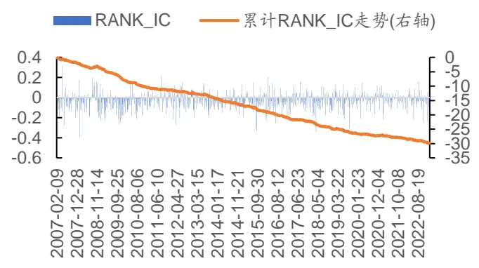
数据来源：天软科技、广发证券发展研究中心

图38：real_varH1因子全市场选股走势一览
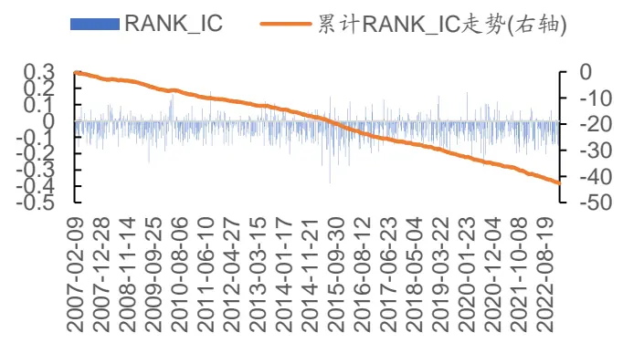
数据来源：天软科技、广发证券发展研究中心

图39：real_varH8因子全市场选股RANK_IC走势
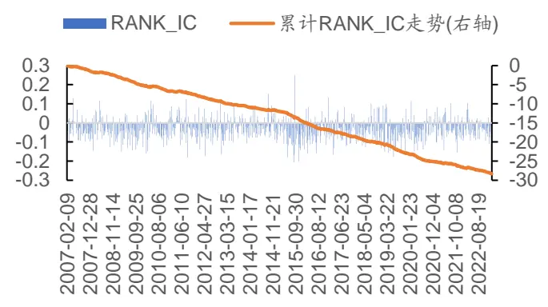
数据来源：天软科技、广发证券发展研究中心

图40：ratio_realvarlarge因子全市场选股走势一览
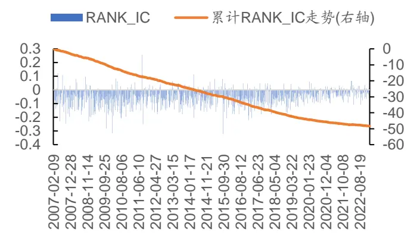
数据来源：天软科技、广发证券发展研究中心

图41：real_varH1因子中证500内 RANK_IC走势
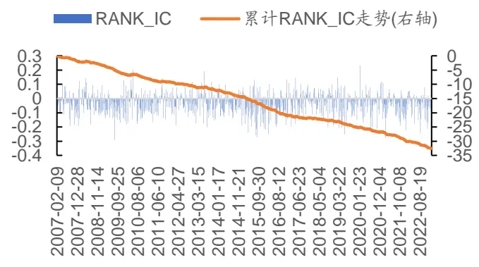
数据来源：天软科技、广发证券发展研究中心

图42：ret_close2H1因子全市场选股走势一览
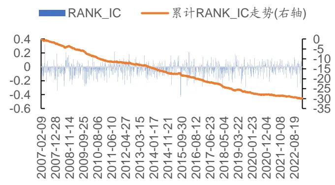
数据来源：天软科技、广发证券发展研究中心

图43：ret_close2H1因子全市场选股多空收益走势
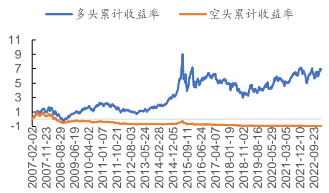
数据来源：天软科技、广发证券发展研究中心

图44：ret_close2H1因子全市场选股多空累计收益
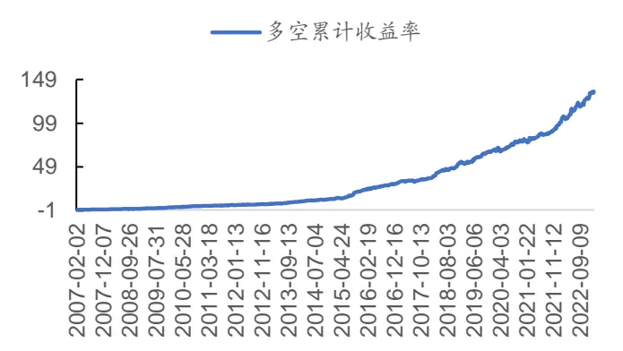
数据来源：天软科技、广发证券发展研究中心

图45：ret_H8因子全市场选股多空收益走势
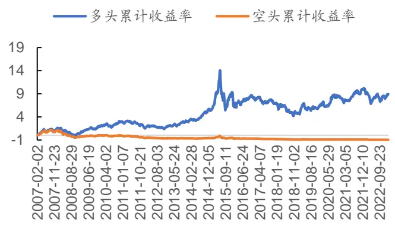
数据来源：天软科技、广发证券发展研究中心

图46：ret_H8因子全市场选股多空累计收益
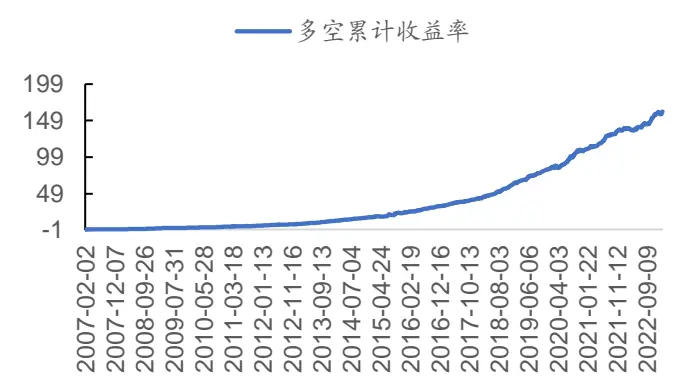
数据来源：天软科技、广发证券发展研究中心

图47：ret_close2H1因子中证500选股多空收益走势
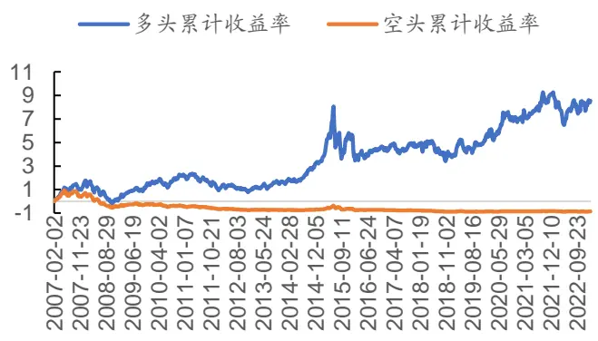
数据来源：天软科技、广发证券发展研究中心

图48：ret_close2H1因子中证500选股多空累计收益
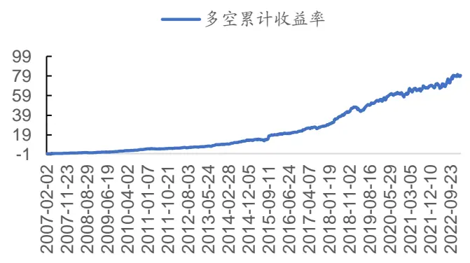
数据来源：天软科技、广发证券发展研究中心

图49：corr_VPlarge因子中证500内多空收益走势一览
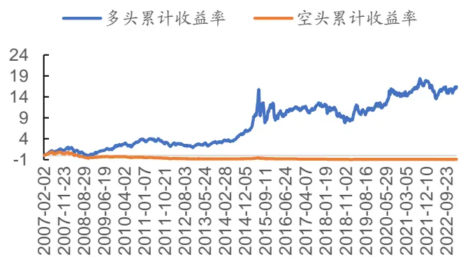
数据来源：天软科技、广发证券发展研究中心

图50：corr_VPlarge因子中证500内多空累计收益走势
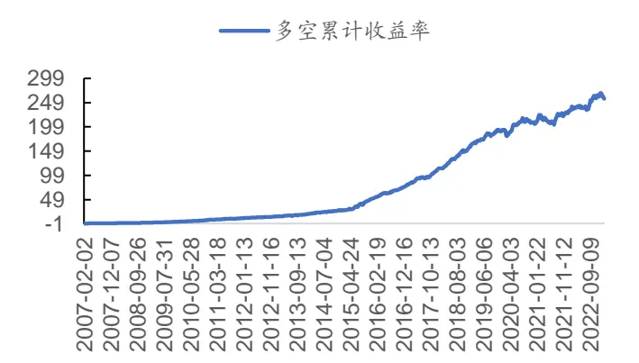
数据来源：天软科技、广发证券发展研究中心

## 七、总结与展望

本报告从四类不同的角度构建因子：日内价格相关因子、日内价量相关因子、盘前信息因子、特定时段采样因子。考察了55个因子周频选股的表现。

采用因子IC和多空收益进行分析，筛选出12个周度选股能力较好的因子：real_skew（已实现偏度）、ret_intraday（日内收益率）、ratio_volumeH8（尾盘半小时成交量占比）、corr_VP（日内价量相关性）、corr_VRlag（量与滞后收益率相关性）、Amihud_illiq（Amihud非流动性因子）、ret_open2AH1（开盘价相对第一阶段集合竞价最高价的收益率）、ret_open2AL1（开盘价相对第一阶段集合竞价最低价的收益率）、ret_H8（尾盘半小时收益率）、real_skewlarge（大成交量已实现偏度）、corr_VPlarge（大成交量价量相关性）、corr_VRlaglarge（大成交量量与滞后收益率相关性）。

从因子表现来看，本报告筛选出来的因子都展示出了不错的多空超额能力。

如何更好的将上述高频因子的选股能力转化为多头的超额收益，是非常有实际意义的课题。

## 八、风险提示

本专题报告所述模型用量化方法通过历史数据统计、建模和测算完成，所得结论与规律在市场政策、环境变化时可能存在失效风险；

策略在市场结构及交易行为的改变时有可能存在策略失效风险。

## [Table_ResearchTeam] 广发金融工程研究小组

罗军 ：首席分析师，华南理工大学硕士，从业 16年，2010年进入广发证券发展研究中心。

安 宁 宁 ：联席首席分析师，暨南大学硕士，从业 14年，2011年进入广发证券发展研究中心。

史 庆 盛 ：资深分析师，华南理工大学硕士，2011年进入广发证券发展研究中心。

张 超 ：资深分析师，中山大学硕士，2012年进入广发证券发展研究中心。

陈 原 文 ：资深分析师，中山大学硕士，2015年进入广发证券发展研究中心。

樊 瑞 铎 ：资深分析师，南开大学硕士，2015年进入广发证券发展研究中心。

李豪 ：资深分析师，上海交通大学硕士，2016年进入广发证券发展研究中心。

周 飞 鹏 ：资深分析师，伯明翰大学硕士，2021年加入广发证券发展研究中心。

季 燕 妮 ：高级分析师，厦门大学硕士，2020年进入广发证券发展研究中心。

张 钰 东 ：高级分析师，中山大学硕士，2020年进入广发证券发展研究中心。

## [Table_IndustryInvestDescription] 广发证券—行业投资评级说明

买入： 预期未来12个月内，股价表现强于大盘10%以上。

持有： 预期未来12个月内，股价相对大盘的变动幅度介于-10%～+10%。

卖出： 预期未来12个月内，股价表现弱于大盘10%以上。

## [Table_CompanyInvestDescription] 广发证券—公司投资评级说明

买入： 预期未来12个月内，股价表现强于大盘15%以上。

增持： 预期未来12个月内，股价表现强于大盘5%-15%。

持有： 预期未来12个月内，股价相对大盘的变动幅度介于-5%～+5%。

卖出： 预期未来12个月内，股价表现弱于大盘5%以上。

## [Table_Address] 联系我们

| 地址 | 广州市 | 深圳市 深圳市福田区益田路 | 北京市 | 上海市 | 香港 |
| --- | --- | --- | --- | --- | --- |
|  | 广州市天河区马场路 |  | 北京市西城区月坛北 | 上海市浦东新区南泉 | 香港德辅道中189号 |
|  | 26号广发证券大厦 | 6001号太平金融大 | 街2号月坛大厦18 | 北路429号泰康保险 | 李宝椿大厦29及30 |
|  | 47楼 | 厦31层 | 层 | 大厦37楼 | 楼 |
|  | 510627 | 518026 | 100045 |  |  |
| 邮政编码 客服邮箱 | gfzqyf@gf.com.cn |  |  | 200120 |  |

## [Table_LegalD 法律主体isclaimer 声明]

本报告由广发证券股份有限公司或其关联机构制作，广发证券股份有限公司及其关联机构以下统称为“广发证券”。本报告的分销依据不同国家、地区的法律、法规和监管要求由广发证券于该国家或地区的具有相关合法合规经营资质的子公司/经营机构完成。

广发证券股份有限公司具备中国证监会批复的证券投资咨询业务资格，接受中国证监会监管，负责本报告于中国（港澳台地区除外）的分销。

广发证券（香港）经纪有限公司具备香港证监会批复的就证券提供意见（4 号牌照）的牌照，接受香港证监会监管，负责本报告于中国香港地区的分销。

本报告署名研究人员所持中国证券业协会注册分析师资质信息和香港证监会批复的牌照信息已于署名研究人员姓名处披露。

## [Table_I 重要声明mportan

广发证券股份有限公司及其关联机构可能与本报告中提及的公司寻求或正在建立业务关系，因此，投资者应当考虑广发证券股份有限公司及其关联机构因可能存在的潜在利益冲突而对本报告的独立性产生影响。投资者不应仅依据本报告内容作出任何投资决策。投资者应自主作出投资决策并自行承担投资风险，任何形式的分享证券投资收益或者分担证券投资损失的书面或者口头承诺均为无效。

本报告署名研究人员、联系人（以下均简称“研究人员”）针对本报告中相关公司或证券的研究分析内容，在此声明：（1）本报告的全部分析结论、研究观点均精确反映研究人员于本报告发出当日的关于相关公司或证券的所有个人观点，并不代表广发证券的立场；（2）研究人员的部分或全部的报酬无论在过去、现在还是将来均不会与本报告所述特定分析结论、研究观点具有直接或间接的联系。

研究人员制作本报告的报酬标准依据研究质量、客户评价、工作量等多种因素确定，其影响因素亦包括广发证券的整体经营收入，该等经营收入部分来源于广发证券的投资银行类业务。

本报告仅面向经广发证券授权使用的客户/特定合作机构发送，不对外公开发布，只有接收人才可以使用，且对于接收人而言具有保密义务。广发证券并不因相关人员通过其他途径收到或阅读本报告而视其为广发证券的客户。在特定国家或地区传播或者发布本报告可能违反当地法律，广发证券并未采取任何行动以允许于该等国家或地区传播或者分销本报告。

本报告所提及证券可能不被允许在某些国家或地区内出售。请注意，投资涉及风险，证券价格可能会波动，因此投资回报可能会有所变化，过去的业绩并不保证未来的表现。本报告的内容、观点或建议并未考虑任何个别客户的具体投资目标、财务状况和特殊需求，不应被视为对特定客户关于特定证券或金融工具的投资建议。本报告发送给某客户是基于该客户被认为有能力独立评估投资风险、独立行使投资决策并独立承担相应风险。

本报告所载资料的来源及观点的出处皆被广发证券认为可靠，但广发证券不对其准确性、完整性做出任何保证。报告内容仅供参考，报告中的信息或所表达观点不构成所涉证券买卖的出价或询价。广发证券不对因使用本报告的内容而引致的损失承担任何责任，除非法律法规有明确规定。客户不应以本报告取代其独立判断或仅根据本报告做出决策，如有需要，应先咨询专业意见。

广发证券可发出其它与本报告所载信息不一致及有不同结论的报告。本报告反映研究人员的不同观点、见解及分析方法，并不代表广发证券的立场。广发证券的销售人员、交易员或其他专业人士可能以书面或口头形式，向其客户或自营交易部门提供与本报告观点相反的市场评论或交易策略，广发证券的自营交易部门亦可能会有与本报告观点不一致，甚至相反的投资策略。报告所载资料、意见及推测仅反映研究人员于发出本报告当日的判断，可随时更改且无需另行通告。广发证券或其证券研究报告业务的相关董事、高级职员、分析师和员工可能拥有本报告所提及证券的权益。在阅读本报告时，收件人应了解相关的权益披露（若有）。

本研究报告可能包括和/或描述/呈列期货合约价格的事实历史信息（“信息”）。请注意此信息仅供用作组成我们的研究方法/分析中的部分论点/依据/证据，以支持我们对所述相关行业/公司的观点的结论。在任何情况下，它并不（明示或暗示）与香港证监会第5类受规管活动（就期货合约提供意见）有关联或构成此活动。

## [Table_Interest 权益披露Disc

(1)广发证券（香港）跟本研究报告所述公司在过去12 个月内并没有任何投资银行业务的关系。

## [Table_Copyrigh版权声明

未经广发证券事先书面许可，任何机构或个人不得以任何形式翻版、复制、刊登、转载和引用，否则由此造成的一切不良后果及法律责任由私自翻版、复制、刊登、转载和引用者承担。