# 基于基金属性的因子选股策略研究

# 多因子 Alpha 系列报告之(四十九)

## 报告摘要：

因子开发迭代更新越来越重要。近几年来，随着传统多因子模型在市场的应用逐渐广泛，因子的波动特征逐渐加大，因子拥挤等原因造成了因子的收益逐渐下降。为了能够寻找更好的 Alpha 收益来源，在多因子模型框架中，因子作为底层 Alpha 来源输入的基础，因子的开发、迭代、更新就显得越来越重要。低频相关的数据的因子开发目前难度越来越大，增量的信息越来越有限。本篇专题报告基于公募基金的属性及持仓个股角度出发，研究基于公募基金持仓的因子研究。

基于基金属性因子与重仓股信息。近年来，公募基金的总资产净值与只数一直在稳步上升，个数已经超过 1000只。从长期角度看，公募基金净值整体呈现上升趋势。基金相对市场基准有着超额收益。利用基金持仓信息挖掘选股信息具有可行性。本文将“优秀”基金的持仓股票赋予更高的权重，将“普通”基金的持仓股票赋予更低的权重，从基金投资能力的差异性获取超额收益，构建基于基金属性的选股因子。

实证分析。基于基金属性的因子选股策略在基金重仓股、沪深 300、中证 500、中证 800 等选股域内较为有效。在月度调仓频率下，经过行业市值中性化处理的因子在基金重仓股股票池内，RANK_IC均值为0.025，RANK_IC 胜率为 65.91%，信息比为 0.80，换手率平均值为30%左右。在沪深 300 股票池内，经过中性化处理的因子在沪深 300股票池内分档效果显著，RANK_IC 均值为 0.035，RANK_IC 胜率为65.91%，信息比为1.05。通过对数据预处理后的综合基金属性因子与传统的风格因子进行相关性分析，发现综合基金属性因子能够挖掘传统因子外的增量信息，可以作为新因子加入多因子模型中。在剥离掉三个月股价动量因子后以及行业市值中性化后的综合基金属性因子在基金重仓股股票池范围内依然有较为显著的选股效果。

风险提示。本专题报告所述模型用量化方法通过历史数据统计、建模和测算完成，所得结论与规律在市场政策、环境变化时可能存在失效风险；策略在市场结构改变时有可能存在策略失效风险。策略在交易行为改变时存在可能失效风险。

图：因子在基金重仓股股票池中分层效果
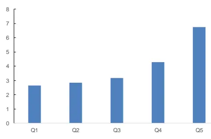
数据来源：Wind, 广发证券发展研究中心

[分析师： Table_Author]陈原文

同SAC 执证号：S0260517080003

0755-82797057

chenyuanwen@gf.com.cn分析师： 罗军

同SAC 执证号：S0260511010004

020-66335128

luojun@gf.com.cn

分析师： 安宁宁

SAC 执证号：S0260512020003

0755-23948352

anningning@gf.com.cn

请注意，陈原文,罗军并非香港证券及期货事务监察委员会的注册持牌人，不可在香港从事受监管活动。

## [Table_ 相关研究：DocRe

再谈 SemiBeta 因子：高频测 2023-01-16
算:多因子 Alpha系列报告之
(四十七)

再谈股价跳跃因子研究:多因2022-12-09子 Alpha系列报告之(四十六)

## 一、因子挖掘思考

## （一）高频信息

近年来，A股市场机构化趋势明显，量化私募机构的管理规模也迅速扩大，产生了一批管理规模超过百亿的量化私募机构。与此同时，传统的风格因子波动增大，从市场获取超额收益的难度在增加。

因子拥挤是因子收益下降的原因之一。因子代表着市场某方面的非有效性、或者是一段时期内的定价失效。当某类因子收益高的时候，会吸引更多的资金进入，从而出现因子拥挤，降低因子的预期收益。一旦新的因子被公开，套利资金的介入会使得错误定价收窄，因子收益也会跟着下降。因此，在多因子选股模型中，因子的开发和更新迭代变得越来越重要。

与低频因子相比，高频数据在用于量化投资中存在一定优势。

首先，高频价量数据的体量明显大于低频数据。以分钟行情为例，用压缩效果较好的mat格式存储2020年全市场股票的分钟行情数据（包括分钟频的开高低收价格数据、买卖盘挂单数据等），约为12GB。如果是快照行情（目前上交所和深交所都是3秒一笔）或者level 2行情，数据量要大很多。因此，高频数据因子挖掘对信息处理能力和处理效率的要求较高。而且，日内数据，尤其是level 2数据，一般要额外付费，甚至需要自行下载存储实时行情，在此基础上构建的因子拥挤度较低。

其次，高频价量数据一般是多维的时间序列数据，数据中噪声比例较高，而且与ROE、PE这类低频指标本身就具有选股能力不同的是，原始的高频行情数据一般不能直接用作选股因子，而要通过信号变换、时间序列分析、机器学习等方法从高频数据中构建特征，才能作为选股因子。此类因子与低频信号的相关性较低，而且由于因子开发流程相对复杂，不同投资者构建的因子更具有多样性。

此外，高频数据开发的因子一般调仓周期较短，意味着在检验因子有效性的时候，同一段测试期具有更多的独立样本。例如，在一年的测试期内，只有12个独立的样本段用于检验月频调仓的因子，与之相比，有约50个独立的时段用于检验周频调仓因子，有超过240个独立的时段用于检验日频调仓的因子。独立样本的增多有助于检验高频因子的有效性。

高频数据挖掘因子的难点在于数据维度大、噪声高。凭借专业投资者的经验或者是参阅已发表的文献，可以从高频数据中提炼出一部分有选股能力的特征。此外，机器学习方法擅长从数据中寻找规律和特征，是高频数据因子挖掘的有力工具。

表 1：广发金工高频数据因子挖掘系列报告一览

| 高频价量数据的因子化方法-多因子Alpha系列报告之（四十一） |
| --- |
| 深度学习框架下高频数据因子挖掘-深度学习研究报告之七 |
| 基于个股羊群效应的选股因子研究-高频数据因子研究系列三 |
| 基于日内高频数据的短周期选股因子研究-高频数据因子研究系列二 |
| 基于日内高频数据的短周期选股因子研究-高频数据因子研究系列一 |
| 信息不对称理论下的高频因子挖掘 |
| 再谈信息不对称理论下的因子挖掘 |
| 日内价量数据因子化研究 |
| 跳跃波动率因子研究 |
| 再谈跳跃波动率因子研究 |

数据来源：Wind，广发证券发展研究中心

## （二）低频信息

以传统日频价量和更低频财务数据为基础的因子开发是一种研究途径。由于基础因子广为人知，在此基础上进行因子挖掘的收益提升空间相对有限。而且日频数据由于本身的数据量和信息量有限，过度挖掘会增大过拟合的风险。

对于低频信息的挖掘，从最近几年的进展上看，低频里的增量信息成果越来越少。从数据维度上看，低频的因子建模更多是从一些另类数据或者是新的方法、理论成果中出发构建相关的因子。如另类数据角度，从互联网中的股吧、新闻、关注度等角度，或者是专利数据、供应链相关数据等。新的理论成果如从图网络等角度出发构建相关的因子。

本篇专题报告基于公募基金的属性及持仓个股角度出发，研究基于公募基金持仓的因子研究。

## 二、从基金到股票的思考

近年来，公募基金的总资产净值与只数一直在稳步上升，个数已经超过1000只。从长期角度看，公募基金净值整体呈现上升趋势。随着近年来，“买基”成为越来越多个人投资者的选择，公募基金规模不断提升，公募基金在股票市场上的影响力越来越重大，公募基金的持仓个股影响也越来越大。

图 1：公募基金总资产净值与规模
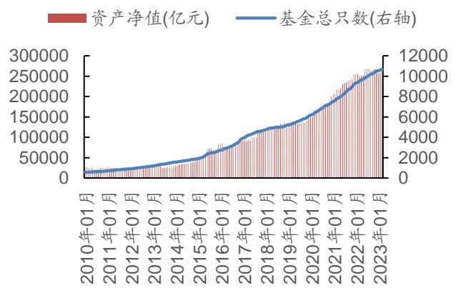
数据来源：Wind，广发证券发展研究中心

图 2：偏股混合型基金指数表现
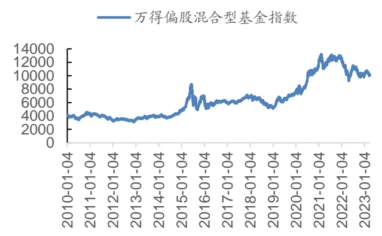
数据来源：Wind，广发证券发展研究中心

公募基金的管理者，基金经理，作为专业的投资人员，相对个人投资者来说，往往拥有着比较有效的选股和择时能力。公募基金每个季报披露的持仓个股信息，则在一定程度上反应了特定报告期截止点内截面基金经理的资产配置情况，公募基金每日披露的净值数据及定期披露的持仓个股数据为跟踪、发现优秀的基金经理及优秀的基金提供了一种可能。

如果基金经理拥有较为有效的选股及择时等能力，那么通过观察“优秀”基金的特征表现，则为从基金数据中挖掘“优秀”个股提供了一种可能。

## 三、建模思路

不同基金经理管理的基金，在选股及择时能力上的表现可能也是不同的，本篇专题报告希望利用基金在选股、择时能力的差异化构造一个选股因子。

前文已经提到，一般来说基金经理拥有相对散户而言更强的选股、择时能力，但是不同基金经理的选股、择时能力和擅长方向是有所不同的。从上图中可以看到，虽然公募基金业绩整体上是维持向上趋势的，但也有基金回撤较大甚至没有跑赢基准。基金个体之间呈现出差异化。

本篇专题报告认为，更加“优秀”的基金在选股及择时等方面的表现是更强的。以往的研究表现，基金经理的选股等方面的因子指标呈现出一定的趋势性特征，即过去比较“优秀”的基金在未来也会相对比较“优秀”。在构建因子时，本篇专题报告赋予“优秀”基金的持仓更高的权重，以获取“优秀”基金相对于“普通”基金更强选股、择时能力的超额收益。

定义何为“优秀”基金，广发金工搭建了较为完整的选基因子库，本篇专题报告基于选基因子的评价体系，根据月频维度的选基因子构建个股层面的因子。其中，在披露的基金数据中，基金与股票之间的联系通过基金持仓联系起来。基金一年内会发布四次季报，一次半年报，一次年报。四次季报的报告日分别为3月31日，6月30日，9月30日，12月31日，一般季报的最迟披露日在报告日后15个工作日内，披露的持仓中只包含报告日时间截面的前十大股票持仓。半年报，年报的报告日分别为6月30日，12月31日，半年报披露日一般需要在报告日后2个自然月内，年报公开日需要在报告日后3个自然月内。两者都包含了报告日截止时点时间截面的所有股票持仓。

后文构造的因子，“优秀”基金的持仓股票拥有较高权重的因子值，“普通”基金的持仓股票拥有较低权重的因子值，形成选基因子到基金，再基金到股票的传递。

## （一）构造公式

在t时刻，j基金的第k个选基因子值为 $fund\_attribute_{j,k,t},$ k为选基因子的序号。

在t时刻，持有i股票的第j个基金其持有i股票的持仓比例为 $Hold\_Ratio_{i,j,t}$

一个股票对应多个基金，一个基金对应若干个选基因子。对于每一个选基因子，都可以算出一个基金属性因子。对于一个选基因子k而言，在t时刻i股票的k基金属性因子 $fundattr\_factor_{i,k,t}$ 构造过程如下：

先将第k个选基因子 $fund\_attribute_{j,k,t}$ 在时间截面t内标准化。得到标准化后的第k个选基因子fund_attribute_standardj,k,t

将标准化后的第k个选基因子乘以对应基金的持仓比例再累和，最后再除以持仓比例之和，得到第k个选基因子 $fundattr\_factor_{i,k,t}.$

$$
fundattr_{-}factor_{i,k,t}=\frac{\sum_{j}(Hold_{-}Ratio_{i,j,t}*fund_{-}attribute_{-}standard_{j,k,t})}{\sum_{j}Hold_{-}Ratio_{i,j,t}}
$$

基于广发金工跟踪的选基因子库，选出若干个选基因子，构建出对应的选基因子相对应的基金属性因子。此时，若干个基金属性因子可以单独作为股票因子来进行实证研究。为综合考虑基金各个属性，考虑将各个选基因子对应的基金属性因子标准化后等权合并，得到综合基金属性因子fundattr_factor_combinationi,t。

## 四、实证分析

## （一）数据准备

基金类型：选用Wind数据库四个分类：普通股票、偏股混合、灵活配置、平衡混合类型基金。

对股票净值占基金总净值的比例进行限制。在一个报告期内，保留权益基金持仓占比超过40%的基金。

采用基金季报的前十大持仓。

图 3：季报报告期及持仓更新时间
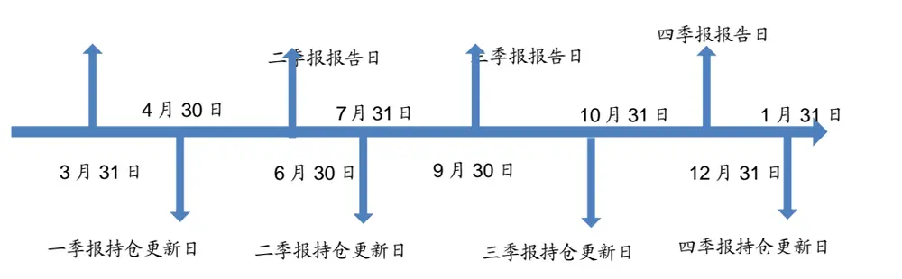
数据来源：Wind，广发证券发展研究中心

本篇专题报告认为不同类型的选基因子衡量了基金在不同维度上的能力，在不同“属性”上衡量了基金。因此，此因子被称为基金属性因子。

选股范围：共在四个股票池里进行回测，包括：主动权益基金重仓股股票池，中证800，中证500，沪深300。四个股票池其对应的基准分别为沪深300指数（000300.SH），中证800指数（000906.SH），中证500指数（000905.SH），沪深300指数（000300.SH）。

股票预处理：剔除非上市、摘牌、ST/*ST、上市未满1年股票。

回测区间：2012年1月30日至2022年12月31日。

因子预处理：MAD去极值、Z-Score标准化、行业市值中性化。市值采用总市值，行业采用申万一级行业分类。

将有因子值的股票从小到大分成5组，组内等权，分别计算每组的收益率。

因子值每月末更新，下月第一个交易日调仓。采用月频调仓。

超额收益率采用几何算法：一季报报告日

$$
\frac{3}{5}\div\frac{1}{10}\times\frac{3}{17}\times\frac{2}{17}\div\frac{3}{17}\times\frac{3}{17}\times\frac{3}{17}\times\frac{3}{17}\times17
$$

$$
\frac{3}{3}\div1\textcircled{1}x+\frac{3\times2}{2}\times\vert\frac{5}{2}\times\frac{3\times2}{3}\times\frac{2}{3}\times\frac{3}{4}=\frac{3\times\vert x-\frac{5}{2}\times\frac{2}{4}\times\frac{3}{4}\times(1+1)}{\frac{1+1\times2}{4}\times\frac{1+1}{4}\times\frac{1}{4}\times\frac{2}{4}\times\frac{3}{4}\times(1+1)}-1
$$

累积净值采用复利计算。

## （二）主动权益基金重仓股票池回测结果

## 1. 单基金属性因子分档表现

从下图中够可以看出，基金因子属性：历史一年信息比、历史1年WS板块剥离超额收益稳定型、历史1年月频创新高次数、历史1年交易信息比等因子在主动权益基金股票池中的分档效果较为显著。

图 4：主动权益基金股票池分档表现-基金属性因子：历史一年信息比
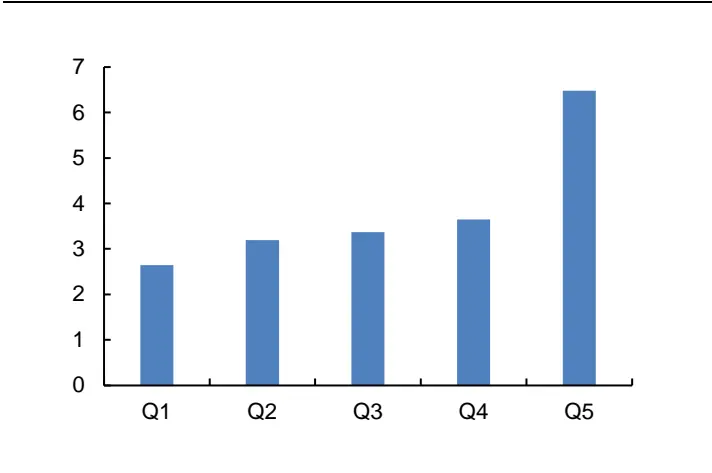
数据来源：Wind，广发证券发展研究中心

图 5：主动权益基金股票池分档表现-基金属性因子：历史1年WS板块剥离超额收益稳定型
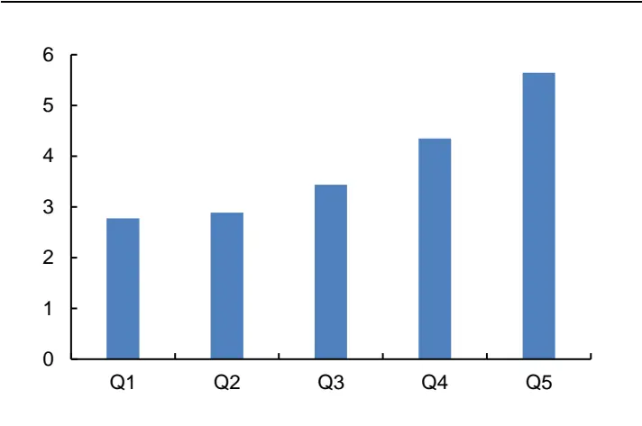
数据来源：Wind，广发证券发展研究中心

图 6：主动权益基金股票池分档表现：基金属性因子-历史1年月频创新高次数
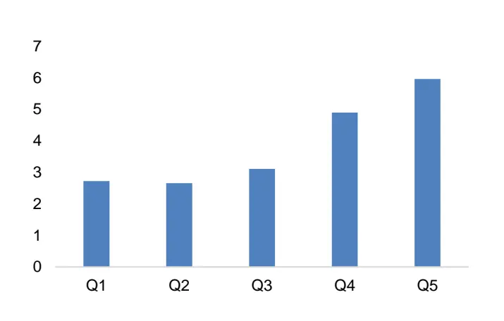
数据来源：Wind，广发证券发展研究中心

图 7：主动权益基金股票池分档表现-基金属性因子：历史1年交易信息比
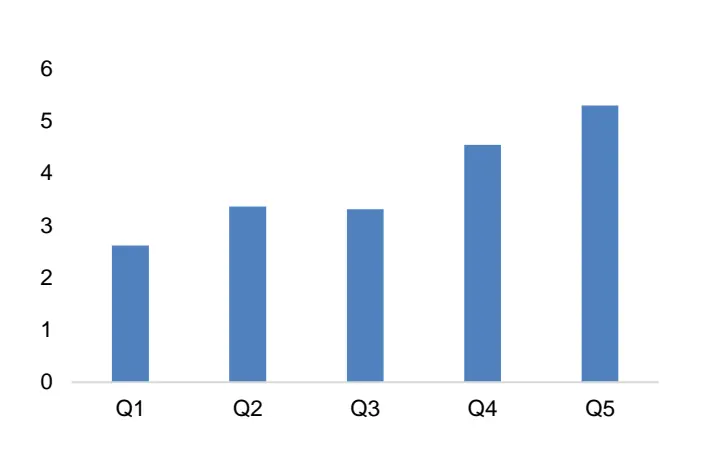
数据来源：Wind，广发证券发展研究中心

## 2. 综合基金属性因子分档表现-未行业市值中性化

未行业市值中性化的综合基金属性因子在月度调仓频率下RANK_IC为0.032，RANK_IC胜率为62.12%，因子分成5档情况下对个股下一期收益率区分度显著。

图 8：主动权益基金股票池分档表现-综合基金属性因子表现
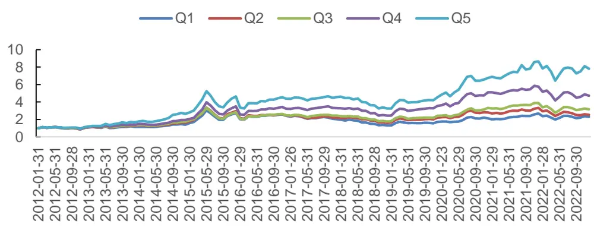
数据来源：Wind，广发证券发展研究中心

表 2：综合基金属性因子-整体与分年度 RANK_IC 表现

| 范围 | IC 均值 | IC 标准差 | IC最大值 | IC最小值 | ICT统计量 | IC 累计值 | 正IC占比 |
| --- | --- | --- | --- | --- | --- | --- | --- |
| 2012 | 0.032 | 0.070 | 0.148 | -0.077 | 1.599 | 0.357 | 50.00% |
| 2013 | 0.077 | 0.097 | 0.176 | -0.137 | 2.749 | 0.922 | 75.00% |
| 2014 | 0.063 | 0.085 | 0.198 | -0.114 | 2.564 | 0.754 | 75.00% |
| 2015 | -0.031 | 0.079 | 0.080 | -0.215 | -1.373 | -0.375 | 41.67% |
| 2016 | 0.042 | 0.059 | 0.145 | -0.038 | 2.468 | 0.506 | 66.67% |
| 2017 | 0.073 | 0.093 | 0.215 | -0.167 | 2.747 | 0.882 | 83.33% |
| 2018 | 0.017 | 0.085 | 0.176 | -0.162 | 0.690 | 0.203 | 50.00% |
| 2019 | 0.020 | 0.062 | 0.148 | -0.079 | 1.143 | 0.245 | 58.33% |
| 2020 | 0.046 | 0.122 | 0.218 | -0.135 | 1.313 | 0.553 | 58.33% |
| 2021 | -0.011 | 0.096 | 0.178 | -0.163 | -0.381 | -0.127 | 50.00% |
| 2022 | 0.025 | 0.054 | 0.112 | -0.089 | 1.602 | 0.298 | 75.00% |
| ALL | 0.032 | 0.090 | 0.218 | -0.215 | 4.105 | 4.218 | 62.12% |

数据来源：Wind，广发证券发展研究中心
2022指截止至 2022年 12月 31日，如下若无特别说明，该表述与此一致

图 9：综合基金属性因子-RANK_IC值走势
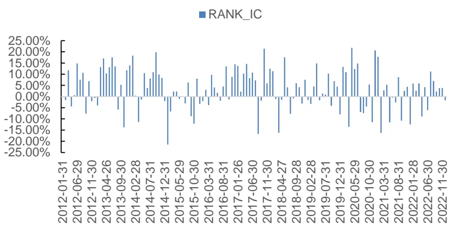
数据来源：Wind，广发证券发展研究中心

表 3：多空对冲策略与多头相对沪深 300指数策略-整体与分年度表现-月度调仓

| 年份 | 多空对冲策略 |  |  |  |  |  | 多头-沪深 300 策略 |  |  |  |
| --- | --- | --- | --- | --- | --- | --- | --- | --- | --- | --- |
|  | 累计 | 年化 | 年化 | 信息 | 最大 | 累计 | 年化 | 年化 | 信息 | 最大 |
| 2012 | 收益率 9.25% | 收益率 9.25% | 波动率 | 比率 | 回撤 | 收益率 | 收益率 | 波动率 | 比率 | 回撤 |
| 2013 | 34.21% | 34.21% | 5.39% 11.38% | 1.72 3.01 | 1.91% 4.72% | 9.76% 61.69% | 9.76% 61.69% | 0.12 0.15 | 0.78 | 7.71% 4.84% |
| 2014 | 28.56% | 28.56% |  | 3.05 | 3.65% | 3.84% | 3.84% | 0.32 | 4.05 |  |
| 2015 | -10.67% | -10.67% | 9.37% 8.99% |  |  | 66.24% | 66.24% |  | 0.12 | 27.49% |
| 2016 | 8.49% | 8.49% |  | -1.19 | 12.63% |  |  | 0.20 | 3.24 | 4.04% |
| 2017 | 22.19% | 22.19% | 4.44% | 1.91 | 2.48% | 6.64% | 6.64% | 0.14 | 0.48 | 8.92% |
| 2018 | 10.94% | 10.94% | 6.70% | 3.31 | 2.77% | -14.87% | -14.87% | 0.08 | -1.89 | 15.78% |
| 2019 | 6.20% | 6.20% | 9.15% | 1.20 | 4.40% | -4.37% | -4.37% | 0.09 | -0.50 | 10.86% |
| 2020 |  |  | 6.80% | 0.91 | 2.22% | 2.38% | 2.38% | 0.10 | 0.23 | 6.09% |
|  | 20.83% | 20.83% | 12.62% | 1.65 | 6.01% | 17.09% | 17.09% | 0.15 | 1.12 | 11.84% |
| 2021 | 1.79% | 1.79% | 13.70% | 0.13 | 6.52% | 35.34% | 35.34% | 0.19 | 1.90 | 7.15% |
| 2022 | 4.60% | 4.60% | 5.95% | 0.77 | 3.98% | 15.31% | 15.31% | 0.20 | 0.76 | 9.57% |
| ALL | 238.41% | 11.72% | 9.62% | 1.22 | 12.88% | 397.57% | 15.70% | 0.18 | 0.87 | 27.49% |

数据来源：Wind，广发证券发展研究中心

图 10：综合基金属性因子-多空策略净值走势
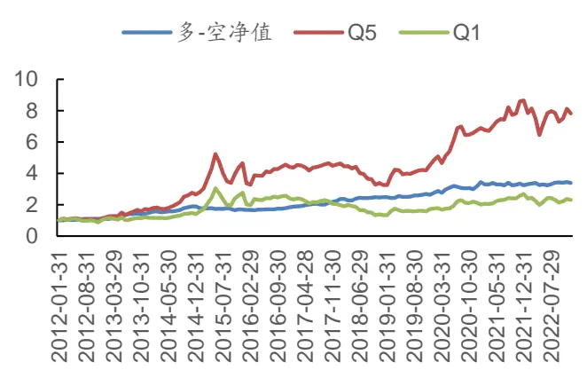
数据来源：Wind，广发证券发展研究中心

图 11：综合基金属性因子-多-沪深300策略净值走势
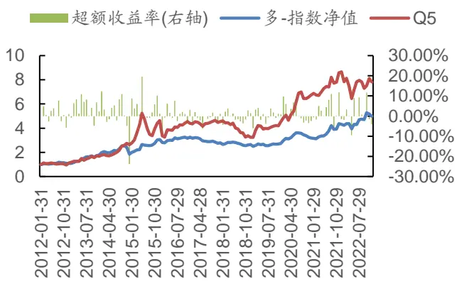
数据来源：Wind，广发证券发展研究中心

表 4：综合基金属性因子-分年度换手率

| 统计区间 | 均值 | 最大值 最小值 | 标准差 | 累计值 |
| --- | --- | --- | --- | --- |
| 2012 | 28.40% | 52.17% 9.09% | 0.17 | 312.44% |
| 2013 | 28.56% | 60.17% 4.20% | 0.19 | 342.77% |
| 2014 | 26.65% | 66.33% 2.04% | 0.24 | 319.83% |
| 2015 | 34.67% | 70.14% 10.85% | 0.25 | 416.10% |
| 2016 | 36.13% | 73.95% 7.56% | 0.25 | 433.52% |
| 2017 | 28.51% | 63.86% | 5.26% 0.22 | 342.12% |
| 2018 | 29.06% | 56.87% | 3.94% 0.20 | 348.75% |
| 2019 | 33.25% | 66.08% | 6.57% 0.20 | 399.01% |
| 2020 | 28.95% | 54.95% | 6.44% 0.18 | 347.43% |
| 2021 | 32.97% | 64.58% | 12.08% 0.20 | 395.58% |
| 2022 | 30.16% | 59.35% | 3.92% 0.21 | 361.95% |
| ALL | 30.68% | 73.95% | 2.04% 0.21 | 4019.49% |

数据来源：Wind，广发证券发展研究中心

## 3. 综合基金属性因子分档表现-行业市值中性化

行业市值中性化的综合基金属性因子在月度调仓频率下RANK_IC为0.025，RANK_IC胜率为65.19%，因子分成5档情况下对个股下一期收益率区分度显著。

图 12：主动权益基金股票池分档表现-中性化因子表现
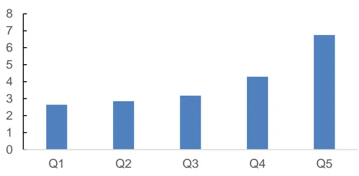
数据来源：Wind，广发证券发展研究中心

表 5：综合基金属性中性化因子-整体与分年度 RANK_IC表现

| 范围 | IC 均值 | IC标准差 | IC最大值 | IC最小值 | IC T统计量 | IC 累计值 | 正IC占比 |
| --- | --- | --- | --- | --- | --- | --- | --- |
| 2012 | 0.022 | 0.031 | 0.079 | -0.042 | 2.456 | 0.244 | 75.00% |
| 2013 | 0.031 | 0.057 | 0.111 | -0.055 | 1.886 | 0.372 | 66.67% |
| 2014 | 0.048 | 0.061 | 0.181 | -0.051 | 2.709 | 0.572 | 83.33% |
| 2015 | -0.014 | 0.059 | 0.074 | -0.148 | -0.806 | -0.164 | 50.00% |
| 2016 | 0.038 | 0.044 | 0.113 | -0.027 | 2.989 | 0.452 | 75.00% |
| 2017 | 0.057 | 0.069 | 0.167 | -0.115 | 2.900 | 0.689 | 91.67% |
| 2018 | 0.025 | 0.055 | 0.098 | -0.076 | 1.575 | 0.301 | 58.33% |
| 2019 | 0.019 | 0.052 | 0.109 | -0.085 | 1.283 | 0.229 | 58.33% |
| 2020 | 0.030 | 0.091 | 0.184 | -0.111 | 1.138 | 0.357 | 58.33% |
| 2021 | 0.001 | 0.066 | 0.147 | -0.120 | 0.074 | 0.017 | 50.00% |
| 2022 | 0.014 | 0.043 | 0.066 | -0.053 | 1.117 | 0.166 | 58.33% |
| ALL | 0.025 | 0.062 | 0.184 | -0.148 | 4.573 | 3.235 | 65.91% |

数据来源：Wind，广发证券发展研究中心

图 13：综合基金属性中性化因子-RANK_IC值走势
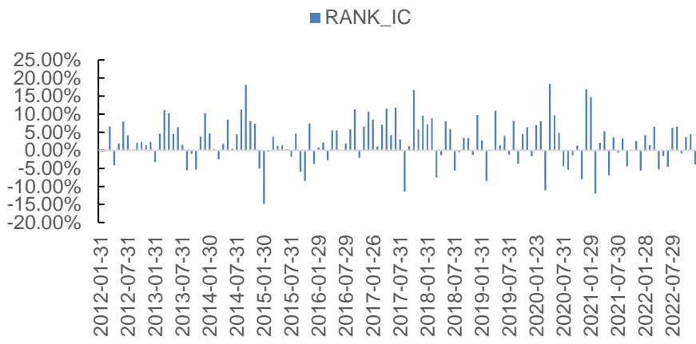
数据来源：Wind，广发证券发展研究中心

表 6：中性化因子多空策略与多头相对沪深 300指数策略-整体与分年度表现-月度调仓

| 年份 | 多空对冲策略 |  |  |  |  |  | 多头-沪深 300 策略 |  |  |  |
| --- | --- | --- | --- | --- | --- | --- | --- | --- | --- | --- |
|  | 累计 | 年化 | 年化 | 信息 | 最大 | 累计 | 年化 | 年化 | 信息 | 最大 |
|  | 收益率 | 收益率 | 波动率 | 比率 | 回撤 | 收益率 | 收益率 | 波动率 | 比率 | 回撤 |
| 2012 2013 | 4.03% 9.06% | 4.03% | 3.32% | 1.21 | 0.98% | 5.39% | 5.39% 48.68% | 0.11 | 0.49 | 7.52% |
| 2014 | 22.73% | 9.06% | 7.74% | 1.17 | 5.34% | 48.68% | 1.38% | 0.14 | 3.55 | 4.67% |
| 2015 |  | 22.73% | 6.39% | 3.56 | 1.05% | 1.38% |  | 0.31 | 0.04 | 27.98% |
| 2016 | -3.72% | -3.72% | 7.04% | -0.53 | 4.80% | 74.55% | 74.55% | 0.21 | 3.55 | 3.83% |
| 2017 | 10.08% | 10.08% | 2.82% | 3.57 | 0.89% | 6.56% | 6.56% | 0.13 | 0.50 | 7.83% |
| 2018 | 15.78% 13.05% | 15.78% | 4.49% | 3.51 | 1.64% | -17.10% | -17.10% | 0.09 | -1.99 | 17.45% |
| 2019 |  | 13.05% | 5.63% | 2.32 | 2.55% | -2.15% | -2.15% | 0.12 | -0.19 | 10.70% |
|  | 6.24% | 6.24% | 4.95% | 1.26 | 2.30% | 2.81% | 2.81% | 0.09 | 0.30 | 5.10% |
| 2020 | 13.87% | 13.87% | 9.06% | 1.53 | 3.52% | 11.09% | 11.09% | 0.13 | 0.84 | 11.92% |
| 2021 | 3.73% | 3.73% | 8.72% | 0.43 | 3.26% | 36.10% | 36.10% | 0.17 | 2.14 | 6.27% |
| 2022 | 5.32% | 5.32% | 3.73% | 1.43 | 1.78% | 15.31% | 15.31% | 0.19 | 0.79 | 8.78% |
| ALL | 155.28% | 8.89% | 6.42% | 1.38 | 5.80% | 329.62% | 14.17% | 0.18 | 0.80 | 27.98% |

数据来源：Wind，广发证券发展研究中心

图 14：综合基金属性因子-中性化多空策略净值走势
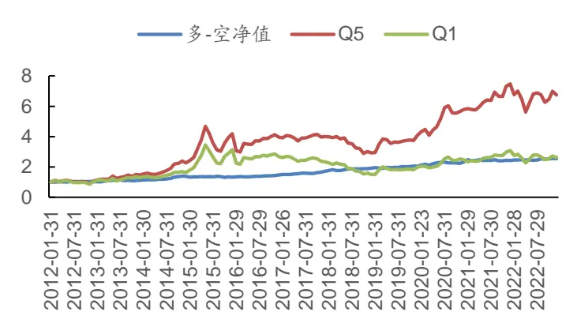
数据来源：Wind，广发证券发展研究中心

图 15：综合基金属性因子-中性化多-沪深300净值
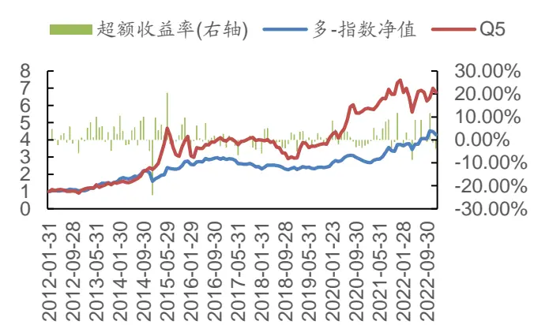
数据来源：Wind，广发证券发展研究中心

## （三）沪深 300股票池回测结果

从下图中结果可以看出，行业市值中性化后的因子在沪深300中的效果较为显著，因子分档净值呈现出较明显的单调性特征。在沪深300中月度调仓频率下，RANK_IC均值为0.035，RANK_IC胜率为65.91%。多头相对沪深300指数年化超额收益率为7.97%，除了2018年没有跑赢沪深300指数外，其他年度里面都稳定跑赢沪深300指数表现。

图 16：沪深300股票池分档表现-综合基金属性因子表现
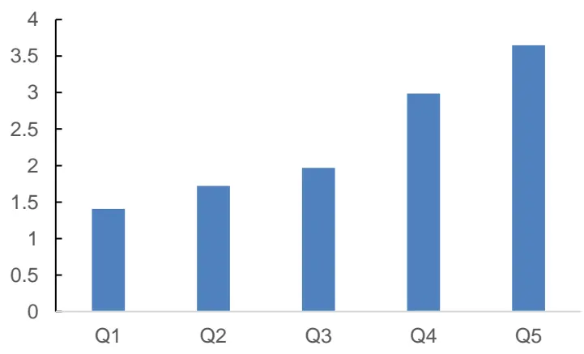
数据来源：Wind，广发证券发展研究中心

表 7：综合基金属性因子中性化-整体与分年度 RANK_IC表现

| 范围 | IC 均值 | IC 标准差 | IC 最大值 | IC 最小值 | ICT统计量 | IC累计值 | 正IC占比 |
| --- | --- | --- | --- | --- | --- | --- | --- |
| 2012 | 0.046 | 0.056 | 0.144 | -0.066 | 2.828 | 0.502 | 75.00% |
| 2013 | 0.037 | 0.107 | 0.225 | -0.133 | 1.198 | 0.443 | 66.67% |
| 2014 | 0.040 | 0.093 | 0.227 | -0.130 | 1.497 | 0.481 | 66.67% |
| 2015 | 0.009 | 0.092 | 0.193 | -0.109 | 0.339 | 0.108 | 50.00% |
| 2016 | 0.063 | 0.061 | 0.200 | -0.035 | 3.565 | 0.757 | 83.33% |
| 2017 | 0.104 | 0.095 | 0.264 | -0.029 | 3.811 | 1.249 | 75.00% |
| 2018 | 0.012 | 0.066 | 0.118 | -0.107 | 0.612 | 0.139 | 75.00% |
| 2019 | 0.014 | 0.069 | 0.122 | -0.102 | 0.685 | 0.163 | 58.33% |
| 2020 | 0.071 | 0.091 | 0.209 | -0.077 | 2.701 | 0.847 | 66.67% |
| 2021 | -0.017 | 0.093 | 0.156 | -0.174 | -0.647 | -0.209 | 41.67% |
| 2022 | 0.009 | 0.051 | 0.082 | -0.089 | 0.599 | 0.106 | 66.67% |
| ALL | 0.035 | 0.088 | 0.264 | -0.174 | 4.569 | 4.587 | 65.91% |

数据来源：Wind，广发证券发展研究中心

图 17：综合基金属性因子中性化-RANK_IC值走势
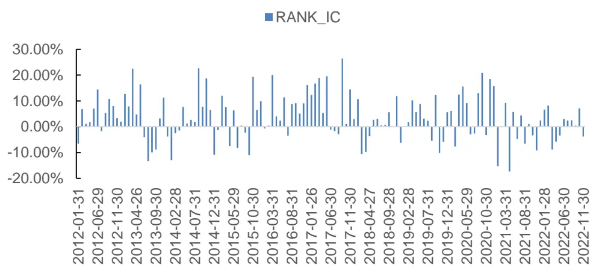
数据来源：Wind，广发证券发展研究中心

表 8：多空对冲策略与多头相对沪深 300指数策略-整体与分年度表现-月度调仓

| 年份 | 多空对冲策略 |  |  |  |  | 多头-沪深 300 策略 |  |  |  |  |
| --- | --- | --- | --- | --- | --- | --- | --- | --- | --- | --- |
|  | 累计 收益率 | 年化 | 年化 | 信息 | 最大 | 累计 | 年化 | 年化 | 信息 | 最大 |
| 2012 | 10.87% | 收益率 10.87% | 波动率 5.26% | 比率 2.07 | 回撤 1.69% | 收益率 6.47% | 收益率 6.47% | 波动率 5.33% | 比率 1.21 | 回撤 3.33% |
| 2013 | 6.53% | 6.53% | 8.84% | 0.74 | 9.21% | 16.09% | 16.09% | 7.43% | 2.17 | 4.43% |
| 2014 | 12.26% | 12.26% | 7.40% | 1.66 | 4.83% | 1.27% | 1.27% | 9.47% | 0.13 | 7.31% |
| 2015 | 3.03% | 3.03% | 9.36% | 0.32 | 4.74% | 25.80% | 25.80% | 9.61% | 2.68 | 3.36% |
| 2016 | 13.79% | 13.79% | 6.53% | 2.11 | 3.62% | 6.97% | 6.97% | 4.87% | 1.43 | 3.90% |
| 2017 | 22.20% | 22.20% | 8.50% | 2.61 | 2.75% | 0.87% | 0.87% | 4.94% | 0.18 | 3.17% |
| 2018 | 6.44% | 6.44% | 6.37% | 1.01 | 5.05% | -3.65% | -3.65% | 6.85% | -0.53 | 8.12% |
| 2019 | 6.66% | 6.66% | 4.58% | 1.45 | 2.89% | 5.19% | 5.19% | 7.03% | 0.74 |  |
| 2020 | 22.33% | 22.33% | 6.22% | 3.59 | 2.88% | 17.10% | 17.10% | 6.95% |  | 4.04% |
| 2021 | -4.39% | -4.39% | 10.43% | -0.42 | 9.41% | 4.63% | 4.63% | 5.30% | 2.46 0.87 | 1.75% |
| 2022 | 2.98% | 2.98% | 5.80% | 0.51 | 6.04% | 10.12% | 10.12% |  |  | 2.55% |
| ALL | 159.73% | 9.06% | 7.69% | 1.18 | 11.59% | 132.34% | 7.97% | 9.41% 7.56% | 1.08 1.05 | 5.85% 10.68% |

数据来源：Wind，广发证券发展研究中心

图 18：综合基金属性因子-多空策略净值走势
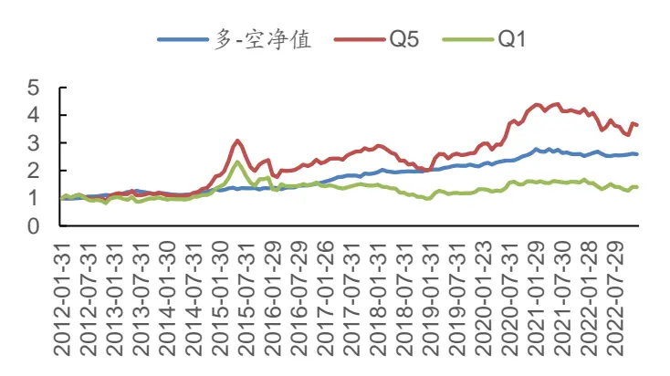
数据来源：Wind，广发证券发展研究中心

图 19：综合基金属性因子-多-沪深300策略净值走势
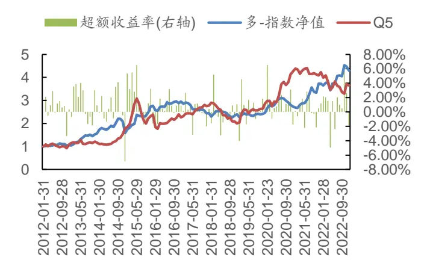
数据来源：Wind，广发证券发展研究中心

表 9：综合基金属性因子中性化-分年度换手率

| 统计区间 | 均值 | 最大值 | 最小值 标准差 | 累计值 |
| --- | --- | --- | --- | --- |
| 2012 | 27.26% | 54.76% | 7.50% 0.18 | 299.84% |
| 2013 | 29.22% | 64.29% | 4.76% 0.21 | 350.63% |
| 2014 | 28.99% | 54.55% | 4.88% 0.21 | 347.94% |
| 2015 | 33.96% | 69.05% | 7.14% 0.25 | 407.52% |
| 2016 | 36.48% | 75.61% | 4.55% 0.24 | 437.77% |
| 2017 | 29.54% | 68.75% | 2.13% 0.22 | 354.46% |
| 2018 | 31.40% | 60.87% | 2.22% 0.19 | 376.79% |
| 2019 | 31.04% | 59.18% | 8.00% 0.19 | 372.46% |
| 2020 | 30.70% | 60.42% | 10.42% 0.17 | 368.39% |
| 2021 | 29.81% | 54.90% | 9.80% 0.17 | 357.66% |
| 2022 | 27.96% | 52.83% | 5.66% 0.16 | 335.47% |
| ALL | 30.60% | 75.61% | 2.13% 0.20 | 4008.94% |

数据来源：Wind，广发证券发展研究中心

## （四）中证 500股票池回测结果

从下图中结果可以看出，行业市值中性化后的因子在中证500中的效果较为一般。在中证500中月度调仓频率下，RANK_IC均值为0.015，RANK_IC胜率为59.85%。多头相对中证500指数年化超额收益率为7.12%。

图 20：中证500股票池分档表现-综合基金属性因子表现
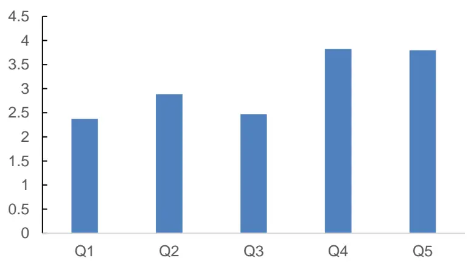
数据来源：Wind，广发证券发展研究中心

表 10：综合基金属性因子中性化-整体与分年度 RANK_IC表现

| 范围 | IC 均值 | IC 标准差 | IC最大值 | IC 最小值 | IC T统计量 | IC累计值 | 正IC占比 |
| --- | --- | --- | --- | --- | --- | --- | --- |
| 2012 | -0.009 | 0.068 | 0.104 | -0.139 | -0.456 | -0.099 | 41.67% |
| 2013 | 0.007 | 0.079 | 0.130 | -0.151 | 0.310 | 0.085 | 58.33% |
| 2014 | 0.063 | 0.091 | 0.252 | -0.086 | 2.412 | 0.761 | 75.00% |
| 2015 | -0.004 | 0.075 | 0.111 | -0.185 | -0.193 | -0.050 | 50.00% |
| 2016 | 0.033 | 0.048 | 0.093 | -0.055 | 2.409 | 0.401 | 75.00% |
| 2017 | 0.040 | 0.075 | 0.133 | -0.114 | 1.851 | 0.481 | 75.00% |
| 2018 | 0.003 | 0.068 | 0.115 | -0.098 | 0.136 | 0.032 | 58.33% |
| 2019 | 0.003 | 0.072 | 0.145 | -0.127 | 0.133 | 0.033 | 58.33% |
| 2020 | 0.001 | 0.073 | 0.128 | -0.137 | 0.043 | 0.011 | 50.00% |
| 2021 | 0.007 | 0.057 | 0.114 | -0.091 | 0.424 | 0.084 | 58.33% |
| 2022 | 0.019 | 0.078 | 0.116 | -0.130 | 0.867 | 0.233 | 58.33% |
| ALL | 0.015 | 0.075 | 0.252 | -0.185 | 2.299 | 1.973 | 59.85% |

数据来源：Wind，广发证券发展研究中心

图 21：综合基金属性因子中性化-RANK_IC值走势
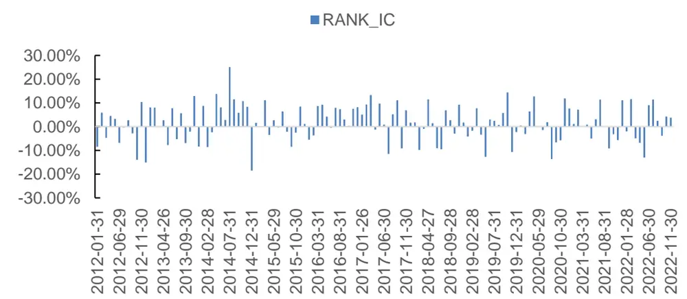
数据来源：Wind，广发证券发展研究中心

表 11：多空对冲策略与多头相对中证 500指数策略-整体与分年度表现-月度调仓

| 年份 | 多空对冲策略 |  |  |  |  | 多头-中证500 策略 |  |  |  |  |
| --- | --- | --- | --- | --- | --- | --- | --- | --- | --- | --- |
|  | 累计 收益率 | 年化 收益率 | 年化 | 信息 | 最大 | 累计 | 年化 | 年化 | 信息 | 最大 |
| 2012 | -0.39% | -0.39% | 波动率 6.30% | 比率 -0.06 | 回撤 3.73% | 收益率 7.79% | 收益率 7.79% | 波动率 7.10% | 比率 1.10 | 回撤 4.07% |
| 2013 | -4.43% | -4.43% | 8.27% | -0.54 | 7.74% | 6.18% | 6.18% | 6.70% | 0.92 | 3.07% |
| 2014 | 16.14% | 16.14% | 10.14% | 1.59 | 5.20% | 3.76% | 3.76% | 5.85% | 0.64 | 3.60% |
| 2015 | 9.69% | 9.69% | 11.40% | 0.85 | 6.47% | 18.94% | 18.94% | 7.75% | 2.44 | 3.31% |
| 2016 | 3.33% | 3.33% | 4.94% | 0.67 | 4.48% | 6.63% | 6.63% | 4.57% | 1.45 | 3.36% |
| 2017 | 5.57% | 5.57% | 6.24% | 0.89 | 3.31% | 1.40% | 1.40% | 4.16% | 0.34 | 2.89% |
| 2018 | 4.28% | 4.28% | 6.47% | 0.66 | 4.22% | 5.77% | 5.77% | 5.46% | 1.06 | 3.35% |
| 2019 | 2.35% | 2.35% | 5.92% | 0.40 | 4.38% | 4.37% | 4.37% | 4.61% | 0.95 | 3.43% |
| 2020 | 2.88% | 2.88% | 9.37% | 0.31 | 6.16% | 1.79% | 1.79% | 6.62% |  |  |
| 2021 | 0.34% | 0.34% | 5.59% | 0.06 | 3.32% | 9.59% | 9.59% | 4.46% | 0.27 | 3.84% |
| 2022 | 9.64% | 9.64% | 10.69% | 0.90 | 6.49% | 13.37% | 13.37% | 5.85% | 2.15 | 1.80% |
| ALL | 59.79% | 4.35% | 8.20% | 0.53 | 10.31% | 113.20% | 7.12% | 5.99% | 2.28 1.19 | 2.86% 4.38% |

数据来源：Wind，广发证券发展研究中心

图 22：综合基金属性因子-多空策略净值走势
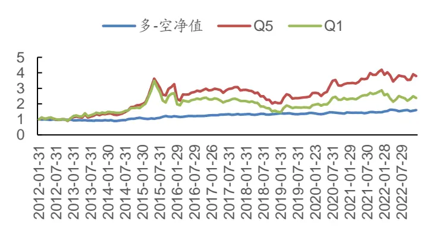
数据来源：Wind，广发证券发展研究中心

图 23：综合基金属性因子-多-中证500策略净值走势
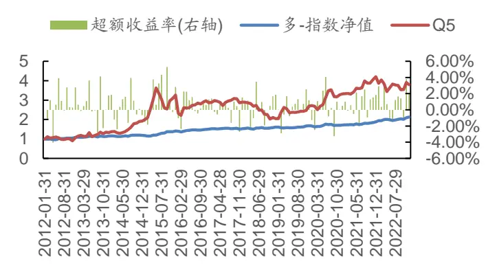
数据来源：Wind，广发证券发展研究中心

表 12：综合基金属性因子中性化-分年度换手率

| 统计区间 | 均值 | 最大值 最小值 | 标准差 | 累计值 |
| --- | --- | --- | --- | --- |
| 2012 | 33.09% | 78.13% | 9.38% 0.26 | 364.00% |
| 2013 | 34.91% | 75.00% | 6.25% 0.26 | 418.90% |
| 2014 | 30.40% | 68.09% | 4.88% 0.24 | 364.82% |
| 2015 | 37.91% | 84.91% | 8.16% 0.29 | 454.97% |
| 2016 | 38.70% | 72.92% | 8.33% 0.25 | 464.39% |
| 2017 | 29.13% | 60.71% | 5.36% 0.20 | 349.51% |
| 2018 | 29.66% | 62.07% | 1.92% 0.21 | 355.96% |
| 2019 | 37.09% | 69.81% | 10.87% 0.22 | 445.09% |
| 2020 | 34.43% | 68.75% | 8.33% 0.24 | 413.18% |
| 2021 | 33.33% | 68.97% | 6.12% 0.24 | 399.91% |
| 2022 | 28.08% | 60.66% | 8.20% 0.20 | 336.92% |
| ALL | 33.34% | 84.91% | 1.92% 0.23 | 4367.65% |

数据来源：Wind，广发证券发展研究中心

## （五）中证 800股票池回测结果

从下图中结果可以看出，行业市值中性化后的因子在中证800中的效果较为显著，在月度调仓频率下，因子分成5档对个股下一期收益率区分度显著。在中证800中月度调仓频率下，RANK_IC均值为0.025，RANK_IC胜率为61.36%。多头相对中证800指数年化超额收益率为8.34%。

图 24：中证800股票池分档表现-综合基金属性因子表现
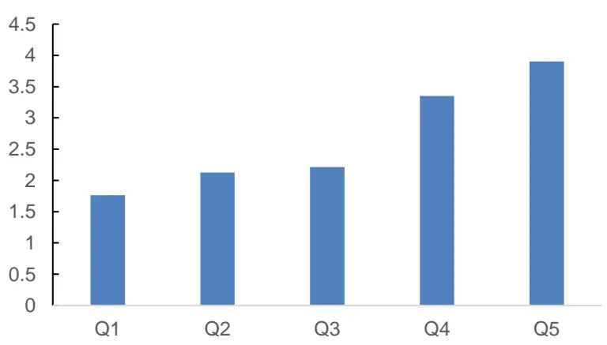
数据来源：Wind，广发证券发展研究中心

表 13：综合基金属性因子中性化-整体与分年度 RANK_IC表现

| 范围 | IC 均值 | IC 标准差 | IC最大值 | IC 最小值 | ICT统计量 | IC累计值 | 正IC占比 |
| --- | --- | --- | --- | --- | --- | --- | --- |
| 2012 | 0.011 | 0.053 | 0.066 | -0.113 | 0.720 | 0.121 | 66.67% |
| 2013 | 0.021 | 0.075 | 0.144 | -0.096 | 0.977 | 0.255 | 50.00% |
| 2014 | 0.055 | 0.086 | 0.203 | -0.060 | 2.223 | 0.664 | 66.67% |
| 2015 | 0.001 | 0.069 | 0.098 | -0.150 | 0.035 | 0.008 | 58.33% |
| 2016 | 0.049 | 0.051 | 0.153 | -0.042 | 3.328 | 0.587 | 83.33% |
| 2017 | 0.076 | 0.091 | 0.233 | -0.083 | 2.892 | 0.908 | 75.00% |
| 2018 | 0.013 | 0.061 | 0.094 | -0.126 | 0.771 | 0.162 | 58.33% |
| 2019 | 0.012 | 0.048 | 0.095 | -0.070 | 0.870 | 0.143 | 58.33% |
| 2020 | 0.034 | 0.075 | 0.182 | -0.068 | 1.558 | 0.407 | 58.33% |
| 2021 | -0.015 | 0.085 | 0.170 | -0.153 | -0.627 | -0.184 | 33.33% |
| 2022 | 0.020 | 0.075 | 0.120 | -0.128 | 0.921 | 0.239 | 66.67% |
| ALL | 0.025 | 0.076 | 0.233 | -0.153 | 3.836 | 3.310 | 61.36% |

数据来源：Wind，广发证券发展研究中心

图 25：综合基金属性因子中性化-RANK_IC值走势
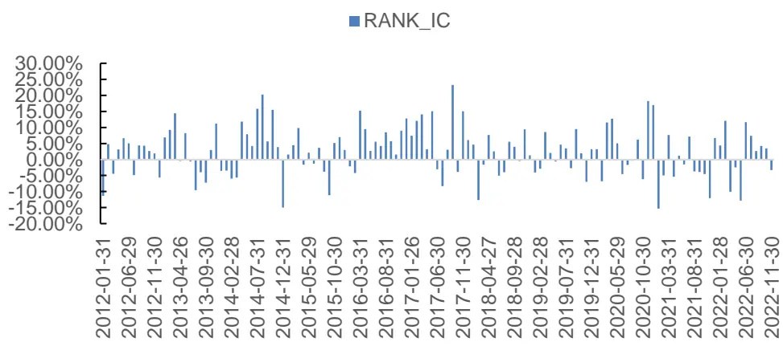
数据来源：Wind，广发证券发展研究中心

表 14：多空对冲策略与多头相对中证 800指数策略-整体与分年度表现-月度调仓

| 年份 | 多空对冲策略 |  |  |  |  |  | 多头-中证 800 策略 |  |  |  |
| --- | --- | --- | --- | --- | --- | --- | --- | --- | --- | --- |
|  | 累计 | 年化 | 年化 | 信息 | 最大 | 累计 | 年化 | 年化 | 信息 | 最大 |
|  | 收益率 | 收益率 | 波动率 | 比率 | 回撤 | 收益率 | 收益率 | 波动率 | 比率 | 回撤 |
| 2012 | 3.33% | 3.33% | 4.39% | 0.76 | 1.46% | 4.06% | 4.06% | 5.45% | 0.75 | 3.84% |
| 2013 | 4.03% | 4.03% | 6.74% | 0.60 | 5.74% | 16.38% | 16.38% | 7.14% | 2.29 | 3.85% |
| 2014 | 18.38% | 18.38% | 8.36% | 2.20 | 3.93% | 5.01% | 5.01% | 11.94% | 0.42 | 10.03% |
| 2015 | 3.55% | 3.55% | 8.95% | 0.40 | 4.69% | 27.68% | 27.68% | 7.58% | 3.65 | 0.94% |
| 2016 2017 | 11.78% | 11.78% | 5.24% | 2.25 | 3.43% | 8.05% | 8.05% | 5.46% | 1.48 | 4.02% |
| 2018 | 13.38% | 13.38% | 7.24% | 1.85 | 2.87% | -5.35% | -5.35% | 5.98% | -0.89 | 7.90% |
| 2019 | 4.33% | 4.33% | 5.98% | 0.72 | 4.71% | -2.83% | -2.83% | 5.96% | -0.47 | 6.71% |
|  | 3.72% | 3.72% | 3.08% | 1.21 | 1.07% | 1.29% | 1.29% | 6.00% | 0.22 | 3.67% |
| 2020 | 13.08% | 13.08% | 7.57% | 1.73 | 2.52% | 10.44% | 10.44% | 6.27% | 1.67 | 2.90% |
| 2021 | 1.20% | 1.20% | 9.17% | 0.13 | 5.45% | 17.46% | 17.46% | 6.30% | 2.77 | 2.33% |
| 2022 | 6.94% | 6.94% | 8.21% | 0.84 | 6.28% | 13.88% | 13.88% | 10.26% | 1.35 | 4.38% |
| ALL | 121.13% | 7.48% | 7.21% | 1.04 | 7.26% | 141.44% | 8.34% | 7.81% | 1.07 | 12.64% |

数据来源：Wind，广发证券发展研究中心

图 26：综合基金属性因子-多空策略净值走势
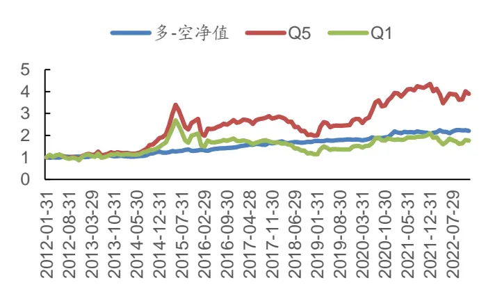
数据来源：Wind，广发证券发展研究中心

图 27：综合基金属性因子-多-中证800策略净值走势
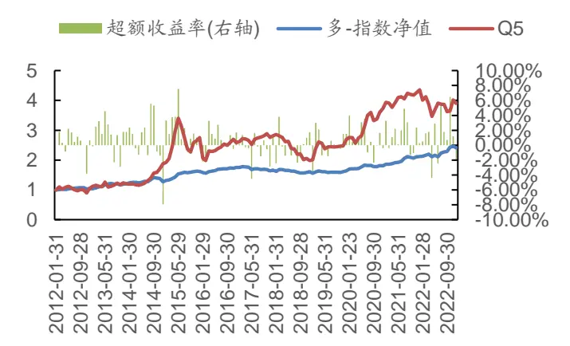
数据来源：Wind，广发证券发展研究中心

表 15：综合基金属性因子中性化-分年度换手率

| 统计区间 | 均值 | 最大值 | 最小值 标准差 | 累计值 |
| --- | --- | --- | --- | --- |
| 2012 | 29.53% | 59.72% | 5.56% 0.20 | 324.81% |
| 2013 | 31.07% | 64.38% | 8.22% 0.21 | 372.78% |
| 2014 | 27.43% | 62.22% | 3.90% 0.21 | 329.20% |
| 2015 | 35.72% | 75.76% | 7.37% 0.27 | 428.60% |
| 2016 | 37.51% | 73.03% | 8.25% 0.24 | 450.10% |
| 2017 | 28.57% | 55.86% | 3.92% 0.20 | 342.85% |
| 2018 | 31.03% | 61.22% | 7.22% 0.21 | 372.39% |
| 2019 | 34.25% | 64.08% | 7.61% 0.20 | 411.02% |
| 2020 | 29.96% | 58.95% | 7.53% 0.19 | 359.49% |
| 2021 | 28.69% | 54.08% | 7.48% 0.18 | 344.27% |
| 2022 | 28.91% | 52.21% | 7.08% 0.17 | 346.98% |
| ALL | 31.16% | 75.76% | 3.90% 0.20 | 4082.49% |

数据来源：Wind，广发证券发展研究中心

## （六）综合基金属性因子与传统因子相关性分析

本小节将数据预处理（MAD法去极值、Z-Score标准化、行业市值中性化）后的综合基金属性因子与广发金工因子库中的因子计算秩相关性，相关性结果见下表。

从下表中可以看出，经过行业市值中性化处理后的因子与常见因子相关性较低，其中与三个月股价动量因子相关性为12.88%。

表 16：综合基金属性因子中性化与常见因子相关性

| 因子 | 相关性 | 因子 | 相关性 |
| --- | --- | --- | --- |
| 一年股价反转-动量 | 15.89% | 固定比 | 2.08% |
| 六个月股价反转 | 14.45% | PE | 1.66% |
| 三个月股价反转 | 12.88% | EP | 0.43% |
| ROE | 7.07% | CFP | 0.17% |
| ROA | 6.53% | EP（行业相对） | -0.08% |
| 一个月股价反转 | 6.34% | SP | -0.38% |
| 净利润增长率 | 5.24% | 财务费用比例 | -1.03% |
| EPS 增长率 | 5.01% | 每股负债比 | -1.09% |
| ROE增长率 | 4.94% | EV-EBITDA | -1.11% |
| 净利润现金占比 | 2.92% | SP（行业相对） | -2.05% |
| 股东权益增长率 | 2.79% | 1个月成交金额 | -2.09% |
| 营业费用比例 | 2.66% | 换手率 | -2.66% |
| 存货周转率 | 2.36% | 总资产 | -3.06% |
| 5年累计现金流与归母利润之比 | 2.30% | BP | -4.46% |
| 毛利率 | 2.25% | 近3个月平均成交量 | -4.49% |
| EBITDA 同比增速的环比向上 | 2.17% | 最高点距离 | -4.88% |
| 销售净利率 | 2.10% | BP（行业相对） | -5.78% |

数据来源：Wind，广发证券发展研究中心

从上表中的结果中，可以看出经过行业市值中性化处理后的因子与常见因子的相关性较低，与三个月、六个月、一年股价动量有15%左右相关性，考虑将三个月股价动量因子中性化后，看因子是否依然有较为明显的选股效果。

从下图中可以看出，剔除行业市值中性及三个月股价动量中性化后的综合属性因子在基金重仓股股票池中依然有较为显著的效果效果，因子单调性依然较为显著。在回测期内，RANK_IC均值为0.029，RANK_IC胜率为68.94%。

图 28：主动权益基金股票池分档表现-中性化因子表现
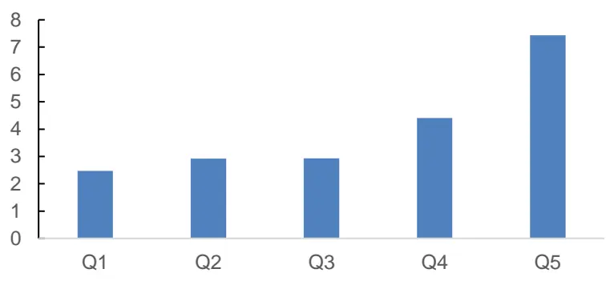
数据来源：Wind，广发证券发展研究中心

表 17：综合基金属性中性化因子-整体与分年度 RANK_IC表现

| 范围 | IC 均值 | IC 标准差 | IC 最大值 | IC最小值 | ICT统计量 | IC 累计值 | 正IC占比 |
| --- | --- | --- | --- | --- | --- | --- | --- |
| 2012 | 0.026 | 0.033 | 0.083 | -0.039 | 2.794 | 0.289 | 75.00% |
| 2013 | 0.031 | 0.050 | 0.112 | -0.039 | 2.133 | 0.367 | 75.00% |
| 2014 | 0.064 | 0.054 | 0.180 | -0.037 | 4.119 | 0.767 | 91.67% |
| 2015 | -0.004 | 0.051 | 0.075 | -0.107 | -0.251 | -0.045 | 50.00% |
| 2016 | 0.050 | 0.035 | 0.118 | -0.002 | 4.962 | 0.597 | 91.67% |
| 2017 | 0.055 | 0.060 | 0.171 | -0.083 | 3.219 | 0.665 | 91.67% |
| 2018 | 0.024 | 0.052 | 0.097 | -0.061 | 1.612 | 0.291 | 66.67% |
| 2019 | 0.017 | 0.049 | 0.109 | -0.074 | 1.230 | 0.208 | 58.33% |
| 2020 | 0.033 | 0.082 | 0.186 | -0.074 | 1.406 | 0.397 | 50.00% |
| 2021 | 0.013 | 0.051 | 0.120 | -0.064 | 0.902 | 0.158 | 50.00% |
| 2022 | 0.014 | 0.044 | 0.065 | -0.062 | 1.092 | 0.168 | 58.33% |
| ALL | 0.029 | 0.056 | 0.186 | -0.107 | 6.063 | 3.863 | 68.94% |

数据来源：Wind，广发证券发展研究中心

图 29：综合基金属性中性化因子-RANK_IC值走势
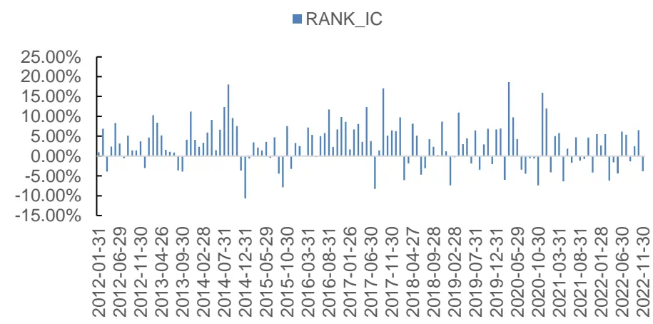
数据来源：Wind，广发证券发展研究中心

表 18：中性化因子多空策略与多头相对沪深 300指数策略-整体与分年度表现-月度调仓

| 年份 | 多空对冲策略 |  |  |  |  |  | 多头-沪深 300 策略 |  |  |  |
| --- | --- | --- | --- | --- | --- | --- | --- | --- | --- | --- |
|  | 累计 | 年化 | 年化 | 信息 | 最大 | 累计 | 年化 | 年化 | 信息 | 最大 |
|  | 收益率 | 收益率 | 波动率 | 比率 | 回撤 | 收益率 | 收益率 | 波动率 | 比率 | 回撤 |
| 2012 2013 | 6.21% 10.32% | 6.21% 10.32% | 3.55% | 1.75 | 1.28% | 6.82% | 6.82% | 11.34% | 0.60 | 7.42% |
| 2014 |  |  | 6.56% | 1.57 | 2.60% | 50.31% | 50.31% | 12.93% | 3.89 | 3.11% |
| 2015 | 32.09% | 32.09% | 4.83% | 6.64 | 0.00% | 5.59% | 5.59% | 29.56% | 0.19 | 26.14% |
| 2016 | 2.20% | 2.20% | 7.02% | 0.31 | 4.31% | 80.52% | 80.52% | 20.45% | 3.94 | 1.59% |
| 2017 | 12.04% | 12.04% | 3.08% | 3.91 | 0.64% | 7.73% | 7.73% | 12.47% | 0.62 | 7.46% |
| 2018 | 14.00% | 14.00% | 4.25% | 3.30 | 1.56% | -18.14% | -18.14% | 8.49% | -2.14 | 18.14% |
| 2019 | 10.06% | 10.06% | 5.53% | 1.82 | 2.51% | -3.78% | -3.78% | 12.14% | -0.31 | 11.96% |
|  | 4.69% | 4.69% | 4.67% | 1.00 | 2.52% | 2.12% | 2.12% | 9.16% | 0.23 | 5.11% |
| 2020 | 14.63% | 14.63% | 7.40% | 1.98 | 2.90% | 11.21% | 11.21% | 12.99% | 0.86 | 12.00% |
| 2021 | 8.34% | 8.34% | 6.65% | 1.26 | 1.80% | 39.12% | 39.12% | 17.01% | 2.30 | 5.64% |
| 2022 | 4.31% | 4.31% | 3.91% | 1.10 | 1.77% | 15.36% | 15.36% | 19.79% | 0.78 | 9.34% |
| ALL | 201.55% | 10.56% | 5.75% | 1.84 | 4.31% | 373.39% | 15.18% | 17.43% | 0.87 | 26.14% |

数据来源：Wind，广发证券发展研究中心

图 30：综合基金属性因子-中性化多空策略净值走势
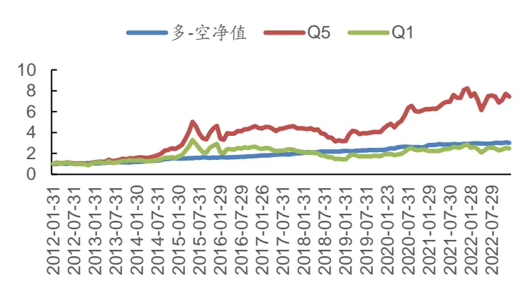
数据来源：Wind，广发证券发展研究中心

图 31：综合基金属性因子-多-沪深300策略净值
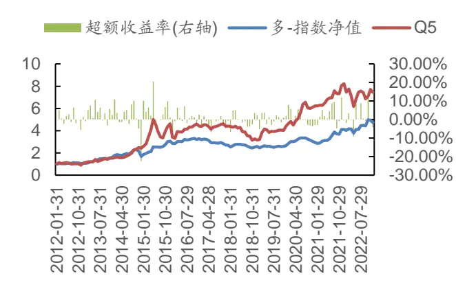
数据来源：Wind，广发证券发展研究中心

## 五、总结

本篇专题报告基于公募基金的重仓股及基金的属性因子，建立基金重仓股与基金属性因子之间的关系，研究了基金属性因子的选股策略的有效性。

实证结果表现，基于基金属性的因子选股策略在基金重仓股、沪深300、中证500、中证800等选股域内较为有效。在月度调仓频率下，经过行业市值中性化处理的因子在基金重仓股股票池内，RANK_IC均值为0.025，RANK_IC胜率为65.91%，信息比为0.80，换手率平均值为30%左右。在沪深300股票池内，经过中性化处理的因子在沪深300股票池内分档效果显著，RANK_IC均值为0.035，RANK_IC胜率为65.91%，信息比为1.05。

通过对数据预处理后的综合基金属性因子与传统的风格因子进行相关性分析，可以发现，综合基金属性因子能够挖掘传统因子外的增量信息。因此，可以作为新因子加入多因子模型中。

在剥离掉三个月股价动量因子后以及中性化后的综合基金属性因子在基金重仓股股票池范围内依然有较为显著的选股效果。

## 六、风险提示

本专题报告所述模型用量化方法通过历史数据统计、建模和测算完成，所得结论与规律在市场政策、环境变化时可能存在失效风险；

本专题策略模型在市场结构有可能存在策略失效风险。

本专题策略模型在交易行为改变时存在失效风险。

## [Table_ResearchTeam] 广发金融工程研究小组

罗军 ：首席分析师，华南理工大学硕士，从业 16年，2010年进入广发证券发展研究中心。

安 宁 宁 ：联席首席分析师，暨南大学硕士，从业 14年，2011年进入广发证券发展研究中心。

史 庆 盛 ：资深分析师，华南理工大学硕士，2011年进入广发证券发展研究中心。

张 超 ：资深分析师，中山大学硕士，2012 年进入广发证券发展研究中心。

陈 原 文 ：资深分析师，中山大学硕士，2015年进入广发证券发展研究中心。

樊 瑞 铎 ：资深分析师，南开大学硕士，2015年进入广发证券发展研究中心。

李豪 ：资深分析师，上海交通大学硕士，2016年进入广发证券发展研究中心。

周 飞 鹏 ：资深分析师，伯明翰大学硕士，2021年加入广发证券发展研究中心。

季 燕 妮 ：高级分析师，厦门大学硕士，2020年进入广发证券发展研究中心。

张 钰 东 ：高级分析师，中山大学硕士，2020年进入广发证券发展研究中心。

## [Table_IndustryInvestDescription] 广发证券—行业投资评级说明

买入： 预期未来12个月内，股价表现强于大盘10%以上。

持有： 预期未来12个月内，股价相对大盘的变动幅度介于-10%～+10%。

卖出： 预期未来12个月内，股价表现弱于大盘10%以上。

## [Table_CompanyInvestDescription] 广发证券—公司投资评级说明

买入： 预期未来 12 个月内，股价表现强于大盘 15%以上。

增持： 预期未来12个月内，股价表现强于大盘5%-15%。

持有： 预期未来12个月内，股价相对大盘的变动幅度介于-5%～+5%。

卖出： 预期未来12个月内，股价表现弱于大盘5%以上。

## [Table_Address] 联系我们

| 地址 | 广州市 | 深圳市 | 北京市 | 上海市 | 香港 |
| --- | --- | --- | --- | --- | --- |
|  | 广州市天河区马场路 | 深圳市福田区益田路 | 北京市西城区月坛北 | 上海市浦东新区南泉 | 香港德辅道中189号 |
|  | 26号广发证券大厦35 | 6001号太平金融大厦 | 街2号月坛大厦18层 | 北路429号泰康保险 | 李宝椿大厦29及30 |
|  | 楼 | 31层 |  | 大厦37楼 | 楼 |
|  | 510627 | 518026 | 100045 | 200120 |  |

## [Table_LegalD 法律主体isclaimer 声明]

## [Table_I 重要mportant 声明N

广发证券股份有限公司及其关联机构可能与本报告中提及的公司寻求或正在建立业务关系，因此，投资者应当考虑广发证券股份有限公司及其关联机构因可能存在的潜在利益冲突而对本报告的独立性产生影响。投资者不应仅依据本报告内容作出任何投资决策。投资者应自主作出投资决策并自行承担投资风险，任何形式的分享证券投资收益或者分担证券投资损失的书面或者口头承诺均为无效。

本报告署名研究人员、联系人（以下均简称“研究人员”）针对本报告中相关公司或证券的研究分析内容，在此声明：（1）本报告的全部分析结论、研究观点均精确反映研究人员于本报告发出当日的关于相关公司或证券的所有个人观点，并不代表广发证券的立场；（2）研究人员的部分或全部的报酬无论在过去、现在还是将来均不会与本报告所述特定分析结论、研究观点具有直接或间接的联系。

研究人员制作本报告的报酬标准依据研究质量、客户评价、工作量等多种因素确定，其影响因素亦包括广发证券的整体经营收入，该等经营收入部分来源于广发证券的投资银行类业务。

本报告仅面向经广发证券授权使用的客户/特定合作机构发送，不对外公开发布，只有接收人才可以使用，且对于接收人而言具有保密义务。广发证券并不因相关人员通过其他途径收到或阅读本报告而视其为广发证券的客户。在特定国家或地区传播或者发布本报告可能违反当地法律，广发证券并未采取任何行动以允许于该等国家或地区传播或者分销本报告。

本报告所提及证券可能不被允许在某些国家或地区内出售。请注意，投资涉及风险，证券价格可能会波动，因此投资回报可能会有所变化，过去的业绩并不保证未来的表现。本报告的内容、观点或建议并未考虑任何个别客户的具体投资目标、财务状况和特殊需求，不应被视为对特定客户关于特定证券或金融工具的投资建议。本报告发送给某客户是基于该客户被认为有能力独立评估投资风险、独立行使投资决策并独立承担相应风险。

本报告所载资料的来源及观点的出处皆被广发证券认为可靠，但广发证券不对其准确性、完整性做出任何保证。报告内容仅供参考，报告中的信息或所表达观点不构成所涉证券买卖的出价或询价。广发证券不对因使用本报告的内容而引致的损失承担任何责任，除非法律法规有明确规定。客户不应以本报告取代其独立判断或仅根据本报告做出决策，如有需要，应先咨询专业意见。

广发证券可发出其它与本报告所载信息不一致及有不同结论的报告。本报告反映研究人员的不同观点、见解及分析方法，并不代表广发证券的立场。广发证券的销售人员、交易员或其他专业人士可能以书面或口头形式，向其客户或自营交易部门提供与本报告观点相反的市场评论或交易策略，广发证券的自营交易部门亦可能会有与本报告观点不一致，甚至相反的投资策略。报告所载资料、意见及推测仅反映研究人员于发出本报告当日的判断，可随时更改且无需另行通告。广发证券或其证券研究报告业务的相关董事、高级职员、分析师和员工可能拥有本报告所提及证券的权益。在阅读本报告时，收件人应了解相关的权益披露（若有）。

本研究报告可能包括和/或描述/呈列期货合约价格的事实历史信息（“信息”）。请注意此信息仅供用作组成我们的研究方法/分析中的部分论点依据/证据，以支持我们对所述相关行业/公司的观点的结论。在任何情况下，它并不（明示或暗示）与香港证监会第5类受规管活动（就期货合约提供意见）有关联或构成此活动。

## [Table_Interest 权益披露Disclosur

(1)广发证券（香港）跟本研究报告所述公司在过去12 个月内并没有任何投资银行业务的关系。

## [Table_Copyright] 版权声明

未经广发证券事先书面许可，任何机构或个人不得以任何形式翻版、复制、刊登、转载和引用，否则由此造成的一切不良后果及法律责任由私自翻版、复制、刊登、转载和引用者承担。