# 弹性因子研究-从高频数据说起

# 多因子 Alpha 系列报告之(五十)

## 报告摘要：

因子开发迭代更新越来越重要。近几年来，随着传统多因子模型在市场的应用逐渐广泛，因子的波动特征逐渐加大，因子拥挤等原因造成了因子的收益逐渐下降。为了能够寻找更好的 Alpha 收益来源，在多因子模型框架中，因子作为底层 Alpha 来源输入的基础，因子的开发、迭代、更新就显得越来越重要。其中深度和广度作为表征流动性维度的两大类已被广泛研究。在《弹性因子研究——多因子 Alpha 系列报告之（四十六）》报告中，探讨了流动性股票市场的弹性测量，并基于日频数据明确构建出弹性因子，研究其在因子选股中的应用。在本报告中，进一步落脚到 A 股市场的日内高频数据，进行相对更高频数据维度的实证检验。

弹性因子的定义和构建。有关学术论文指出，弹性是指价格在响应流动性需求者或未知信息交易者发起的大量订单流失衡而发生变化后，价格恢复到价值交易者驱动的基本价值的速度。据此，弹性可以描述为价格从信息优势交易者驱动的暂时价格影响恢复到其基本价格的速度。基于以上定义，本篇专题报告基于日内高频数据构建弹性因子，其构建步骤可分为两部分：首先将每日股价分解为基本成分和暂时成分；然后将分解得到的暂时价格序列转换到频域，继而计算出暂时价格恢复速度作为弹性因子。

弹性因子选股实证分析。本篇专题报告以周频调仓对弹性因子在全市场、创业板、沪深300、中证500、中证800 和中证1000等板块的选股表现进行了实证分析。实证分析结果表明，弹性因子在各板块的分档效果均较为显著，其中在全市场中，Rank_IC 均值为-6.24%，Rank_IC 胜率为 79.27%，多空年化收益率为 24.62%；在中证 1000板块内，Rank_IC 均值为-5.89%，胜率为 78.41%。

风险提示。本专题报告所述模型用量化方法通过历史数据统计、建模和测算完成，所得结论与规律在市场政策、环境变化时可能存在失效风险；本专题策略模型在市场结构发生改变时有可能存在策略失效风险。本专题策略模型在交易行为改变时存在失效风险。

图：弹性因子全市场多空表现
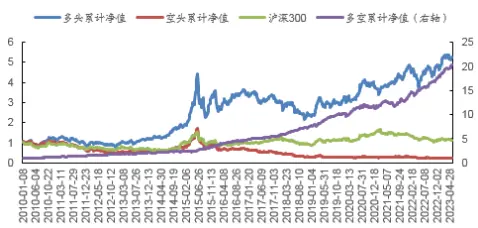
数据来源：广发证券发展研究中心，天软科技

分析师： 陈原文

SAC 执证号：S0260517080003

0755-82797057

chenyuanwen@gf.com.cn

分析师： 罗军

同SAC 执证号：S0260511010004

020-66335128

luojun@gf.com.cn

分析师： 安宁宁

SAC 执证号：S0260512020003

SFC CE No. BNW179

0755-23948352

anningning@gf.com.cn

请注意，陈原文,罗军并非香港证券及期货事务监察委员会的注册持牌人，不可在香港从事受监管活动。

## [Table_ 相关研究：DocRe

金融工程:——多维视角下的2023-01-28定增选股策略

再谈 SemiBeta 因子：高频测2023-01-16
算:多因子 Alpha系列报告之
(四十七)

再谈股价跳跃因子研究:多因2022-12-09子 Alpha系列报告之(四十六)

## 一、因子挖掘思考

## （一）高频信息

近年来，A股市场机构化趋势明显，量化私募机构的管理规模也迅速扩大，产生了一批管理规模超过百亿的量化私募机构。与此同时，传统的风格因子波动增大，从市场获取超额收益的难度在增加。

因子拥挤是因子收益下降的原因之一。因子代表着市场某方面的非有效性、或者是一段时期内的定价失效。当某类因子收益高的时候，会吸引更多的资金进入，从而出现因子拥挤，降低因子的预期收益。一旦新的因子被公开，套利资金的介入会使得错误定价收窄，因子收益也会跟着下降。因此，在多因子选股模型中，因子的开发和更新迭代变得越来越重要。

与低频因子相比，高频数据在用于量化投资中存在一定优势。

首先，高频价量数据的体量明显大于低频数据。以分钟行情为例，用压缩效果较好的mat格式存储2020年全市场股票的分钟行情数据（包括分钟频的开高低收价格数据、买卖盘挂单数据等），约为12GB。如果是快照行情（目前上交所和深交所都是3秒一笔）或者level 2行情，数据量要大很多。因此，高频数据因子挖掘对信息处理能力和处理效率的要求较高。而且，日内数据，尤其是level 2数据，一般要额外付费，甚至需要自行下载存储实时行情，在此基础上构建的因子拥挤度较低。

其次，高频价量数据一般是多维的时间序列数据，数据中噪声比例较高，而且与ROE、PE这类低频指标本身就具有选股能力不同的是，原始的高频行情数据一般不能直接用作选股因子，而要通过信号变换、时间序列分析、机器学习等方法从高频数据中构建特征，才能作为选股因子。此类因子与低频信号的相关性较低，而且由于因子开发流程相对复杂，不同投资者构建的因子更具有多样性。

此外，高频数据开发的因子一般调仓周期较短，意味着在检验因子有效性的时候，同一段测试期具有更多的独立样本。例如，在一年的测试期内，只有12个独立的样本段用于检验月频调仓的因子，与之相比，有约50个独立的时段用于检验周频调仓因子，有超过240个独立的时段用于检验日频调仓的因子。独立样本的增多有助于检验高频因子的有效性。

高频数据挖掘因子的难点在于数据维度大、噪声高。凭借专业投资者的经验或者是参阅已发表的文献，可以从高频数据中提炼出一部分有选股能力的特征。此外，机器学习方法擅长从数据中寻找规律和特征，是高频数据因子挖掘的有力工具。

本篇专题报告基于个股的流动性角度出发，研究个股基于流动性维度构建相关的因子进行研究。

表 1：广发金工高频数据因子挖掘系列报告一览

| 高频价量数据的因子化方法-多因子Alpha系列报告之（四十一） |
| --- |
| 深度学习框架下高频数据因子挖掘-深度学习研究报告之七 |
| 基于个股羊群效应的选股因子研究-高频数据因子研究系列三 |
| 基于日内高频数据的短周期选股因子研究-高频数据因子研究系列二 |
| 基于日内高频数据的短周期选股因子研究-高频数据因子研究系列一 |
| 信息不对称理论下的高频因子挖掘 |
| 再谈信息不对称理论下的因子挖掘 |
| 日内价量数据因子化研究 |
| 跳跃波动率因子研究 |
| 再谈跳跃波动率因子研究 |

数据来源：Wind，广发证券发展研究中心

## （二）低频信息

以传统日频价量和更低频财务数据为基础的因子开发是一种研究途径。由于基础因子广为人知，在此基础上进行因子挖掘的收益提升空间相对有限。而且日频数据由于本身的数据量和信息量有限，过度挖掘会增大过拟合的风险。

对于低频信息的挖掘，从最近几年的进展上看，低频里的增量信息成果越来越少。从数据维度上看，低频的因子建模更多是从一些另类数据或者是新的方法、理论成果中出发构建相关的因子。如另类数据角度，从互联网中的股吧、新闻、关注度等角度，或者是专利数据、供应链相关数据等。新的理论成果如从图网络等角度出发构建相关的因子。

## 二、背景介绍

## （一）深度、广度与弹性

正如 Bernstein (1987) 所述，深度、广度和弹性是流动性股票市场的基本要素。在这些要素中，深度和广度作为表征流动性维度的两大类已被广泛研究：一方面是交易活动，如总交易量或股票换手率，代表市场投资者如何积极交易资产。另一面是交易成本，通常通过 Amihud (2002) 的非流动性度量或买卖价差度量来估计，以捕捉投资者在执行市场订单时应承受的价格影响水平。关于这两大类的流动性度量已在大量文献中有明确的定义。然而，流动性维度的另一面，即弹性，相关研究较为稀少。

弹性的概念早在之前的几项研究中被引入。Black (1971) 将流动性市场描述为一个持续且有效的市场。在该市场中，可以以非常接近当前价格的价格立即买卖证券。Kyle (1985) 提到弹性是价格从无信息的随机冲击中恢复的速度。Bernstein(1987) 从秩序失衡的角度解释弹性。他认为，弹性意味着大量订单流抵消了由于临时订单不平衡而导致的交易价格变化。Harris (2003) 明确指出，弹性是指价格在响应流动性需求者或信息优势交易者发起的大量订单流失衡而发生变化后，价格恢复到价值交易者驱动的基本价值的速度。在这方面，弹性可以描述为价格从信息优势交易者驱动的先前暂时价格影响恢复到其基本价格的速度。

基于以上定义，本报告研究测量弹性并构建出弹性因子，度量其能否在股票市场中获得超额收益。为了计算出弹性水平并构建弹性因子，本文参考Jinyong Kim等人在2015年发表的学术论文《Transitory Price, Resiliency, and the Cross-Section ofStock Returns》，首先将股价分解为基本成分和暂时成分。在完成股价分解后，将估计的暂时价格序列转换为频域中的频谱函数形式，并计算出暂时价格恢复的速度作为弹性因子。

## （二）弹性因子的相关研究进展

现有研究对弹性的测量可以分为两大类。第一类是将弹性代表为股票价格的均值回归，这种方法主要关注股价本身的变动。Dong等(2007) 将弹性定义为股票在t-1 和 t 期间的日内定价误差过程的均值回归参数。实证结果表明公司的预期股票回报与弹性呈负相关。Alan等(2015) 将弹性计算为开盘半小时股票收益与剩余交易日股票收益的日内序列相关性。通过公司层面和投资组合层面的分析，发现弹性与股票收益的横截面呈负相关。另一种类型的弹性测量侧重于交易成本测量方面的恢复过程，例如买卖价差或市场深度。Anand等(2013) 建议用金融危机期间和之后交易成本相对于危机前时期超过two-sigma阈值的月份的平均百分比来衡量非弹性。实证结果表明，买方机构的流动性供应是后危机时期从流动性冲击中复苏的主要因素。Kempf等(2015) 也使用交易成本度量来计算弹性。类似于Dong等(2007)，Kempf等(2015) 使用盘中数据将弹性定义为先前交易成本水平和当前交易成本流的均值回归参数。

区别于上述相关研究，本报告定义的弹性测量直接衡量了暂时价格的恢复速度。通过频域的频谱分析得到暂时价格的距离和恢复时间，然后用距离除以恢复时间来计算速度。因此，本文对弹性的测量更符合弹性的字面定义。

## 三、弹性因子的构建方法

如前文所述，股票价格可以分解为两个部分： 一个是永久性或随机游走成分，代表股票的基本价格随信息冲击而变化；另一个是暂时的或固定的组成部分，其中包含偏离其基本价值的暂时价格变动。如上所述，弹性表示股票价格从短暂的价格影响中恢复到其基本价格的速度。在这方面，本文衡量的是暂时价格成分恢复到其基本价格的平均速度。更具体地说，为了度量股票的弹性并构建弹性因子，本文的构建方法分为以下两步程序：首先，将个股价格分解为基本价格和暂时价格。然后，使用频域中的频谱分析来计算暂时价格的恢复速度。此过程在以下部分中描述。

## （一）股票价格分解

为了将单个股票价格在时间t的自然对数 ${\bf{\mathcal{P}}}_{t}$ 分解为基本价格 ${\bf\nabla}\cdot{\bf q}_{t}$ 和暂时价格 $\cdot z_{t}$

$$
p_{t}=q_{t}+z_{t}
$$

本篇专题报告考虑了三种在经济学数据分析中常用的分解算法：Hodrick-Prescott(HP)，Unobserved components and ARIMA model (UC-ARIMA)和Unobservedcomponents with stochastic cycle (UC)。在理想状态下，基本价格应该体现为股票真实价格长期变动趋势的平滑曲线；而暂时价格则体现为围绕基本价格变动的跳跃，其在坐标轴上应为围绕0上下波动的曲线。以图1某股票从2005年1月至2022年12月的股价分解为例，HP算法分解结果中的基本价格最为平滑且能体现出其真实价格的长期变动趋势，同时暂时价格部分也最能体现波动。因此，本篇专题报告采用HP算法，将取自然对数后的股票价格分解为基本价格和暂时价格。

图 1：股价分解（取自然对数后）
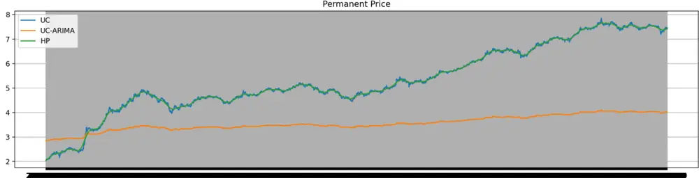

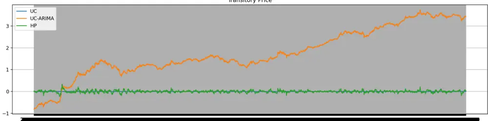
数据来源：天软科技，广发证券发展研究中心

## （二）弹性测量-日频维度建模

具有更高回归速度的股票表明它可以更快地从先前的短暂价格影响中恢复过来。因此，投资者认为这只股票更具弹性，因而更具流动性。换句话说，暂时价格回归较慢的股票被视为风险较高的资产，需要向投资者补偿较高的风险溢价。为了衡量恢复速度，本篇专题报告使用傅立叶变换将分解后的暂时价格序列转换为频域中的频谱函数形式。回归速度快的股票，其频谱函数主要分布在较高的频率水平，而回归速度慢的股票，其频谱函数主要分布在较低的频率水平。在这里假设暂时价格序列是一个有限信号，它包含一个以上的频率成分，恢复到其基本价格。有限时

识别风险，发现价值

间序列在时域和频域之间具有以下离散傅立叶变换关系，

$$
Z_{k}=\sum_{t=1}^{D}z_{t}e^{-{\frac{i2\pi kt}{D}}},\qquad(\mathrm{k}=1,2,\cdots,\mathrm{D})
$$

其中 $\mathbf{z}_{t}$ 为分解后的有限暂时价格序列， $\mathrm{Z}_{k}$ 是 $\scriptstyle{\mathbf{Z}}_{t}$ 进行离散傅立叶变换后的频谱函数，k是频域单位，D是交易日总天数，i是虚数单位。为了在不受交易日总天数影响的情况下估计频谱函数的纯幅度，使用D对 $\mathbf{z}_{k}$ 进行归一化，然后得到归一化函数形式 $\overline{{Z_{k}}}$ ，

$$
\overline{{Z_{k}}}=\frac{1}{D}Z_{k}
$$

进 $\bar{\hbar}$ 计算得到归一化后的频谱函数的幅度 $|\bar{Z}_{k}|_{\mathfrak{c}}$ 由于频率被定义为每单位时间的周期数，因此周期 $\begin{array}{r}{T_{k}=\frac{D}{k}}\end{array}$ 可以表示为频率分量的缩放版本的倒数 $f_{k}=\frac{k}{d}{\circ}$ 。幅度 $\lvert\bar{Z}_{k}\rvert$ |表示在每个频率水平上偏离其基本值的短暂价格波动峰值的距离。周期T捕获每个恢复摆动的周期完成的速度。因此，可以通过将 $\lvert\hat{Z}_{k}$ |除以其对应的周期来获得每个频率级别的暂时价格的移动速度。因此，暂时价格恢复的平均速度，即弹性因子的构建，可以通过以下等式获得：

$$
\begin{array}{r}{Resiliency_{i,t}=\frac{1}{\left[\frac{D_{i,t}}{2}\right]}\sum_{k=1}^{\left[{D_{i,t}}\right]_{2}}\frac{2\left|\bar{Z}_{\mathrm{k,i,t}}\right|}{\mathrm{T}_{\mathrm{k,i,t}}}\frac{1}{-\left[\frac{D_{i,t}}{2}\right]}\sum_{k=1}^{\left[D_{i,t},\left[_{2}\right]\right.}2\left|\bar{Z}_{\mathrm{k,i,t}}\right|\cdot f_{\mathrm{k,i,t}}}\end{array}
$$

其中 $D_{i,t}$ 是每个月t的滚动窗口中股票i的数据可用的样本天数， $\left[\frac{D_{i,t}}{2}\right]$ 是最接近 $\cdot\frac{D_{i,t}}{2}$ 的整数。

为了构建弹性因子，针对每个个股，使用自2005年1月起至该调仓日所有可用的过去股价数据进行HP分解，得到基本价格和暂时价格，然后以36个月的滚动窗口通过离散傅立叶变换进行逐月计算得出每个个股的弹性水平。

在《弹性因子研究——多因子Alpha系列报告之（四十六）》报告中，探讨了流动性股票市场的弹性测量，并基于日频数据明确构建出弹性因子，研究其在因子选股中的应用。在本报告中，进一步落脚到A股市场的日内 $\frac{\dot{\pi}}{\vert\nabla\pmb{\vert\tau}\vert}$ 频数据，进行相对更高频数据维度的实证检验。

## 四、实证分析

## （一）数据说明

选股范围：全市场，创业板，沪深300，中证500，中证800，中证1000

股票预处理：剔除ST/*ST、涨跌停板、上市未满1年股票

因子预处理：MAD去极值、Z-Score标准化、行业市值中性化

回测区间：2010.01.01 - 2023.05.26（创业板为2010.11.19 - 2023.05.26，中证1000为2014.10.17 – 2023.05.26），以下如无特别说明，2023至今指的是截止至2023.05.26

分档方式：根据当期股票的因子值，从小到大分为五档

调仓周期：周度换仓以收盘价调仓

## （二）不同板块实证结果

## 1. 全市场

高频弹性因子在全市场板块中取得了24.62%的多空年化收益率以及12.88%的多头年化收益率，多头相对沪深300指数的超额年化收益率达11.81%；因子Rank_IC均值为-6.24%，历史T统计量及负IC占比分别为-20.31和79.27%。

图 2：弹性因子在全市场多空表现
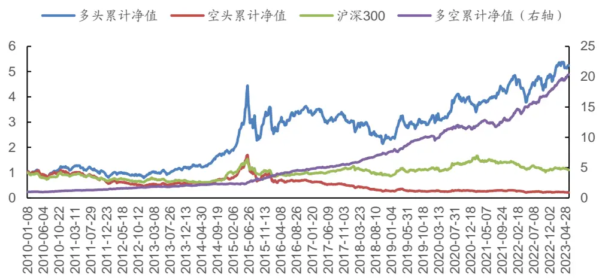
数据来源：天软科技，广发证券发展研究中心

图 3：弹性因子在全市场RANK_IC表现
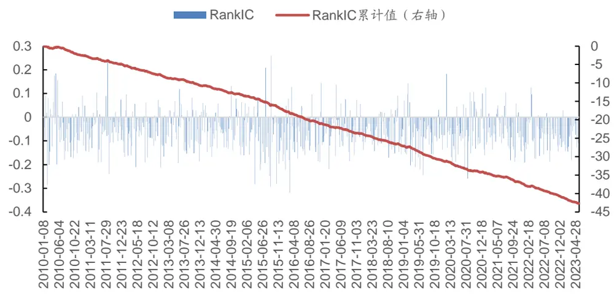
数据来源：天软科技，广发证券发展研究中心

表 2：弹性因子在全市场中-整体与分年度 RANK_IC表现

| 范围 | IC 均值 | IC 标准差 | IC最大值 | IC 最小值 | IC T统计量 | IC 累计值 | 负IC占比 |
| --- | --- | --- | --- | --- | --- | --- | --- |
| 2010 | -4.88% | 9.98% | 18.43% | -28.59% | -3.49 | -248.81% | 68.63% |
| 2011 | -4.95% | 7.84% | 22.95% | -23.90% | -4.51 | -252.65% | 82.35% |
| 2012 | -5.92% | 7.42% | 9.67% | -21.25% | -5.64 | -295.83% | 78.00% |
| 2013 | -5.44% | 7.64% | 11.88% | -19.32% | -5.09 | -277.45% | 68.63% |
| 2014 | -4.99% | 6.84% | 13.14% | -16.74% | -5.31 | -264.23% | 77.36% |
| 2015 | -7.80% | 11.07% | 25.77% | -29.42% | -5.08 | -405.39% | 78.85% |
| 2016 | -7.38% | 9.15% | 14.42% | -31.94% | -5.7 | -369.19% | 80.00% |
| 2017 | -5.31% | 6.98% | 13.59% | -21.88% | -5.43 | -270.87% | 78.43% |
| 2018 | -6.36% | 6.07% | 9.14% | -17.09% | -7.48 | -324.51% | 80.39% |
| 2019 | -7.88% | 7.94% | 14.29% | -24.35% | -7.09 | -401.66% | 88.24% |
| 2020 | -5.89% | 8.94% | 18.29% | -25.86% | -4.75 | -306.20% | 76.92% |
| 2021 | -6.39% | 7.13% | 12.52% | -18.97% | -6.46 | -332.13% | 78.85% |
| 2022 | -7.07% | 6.88% | 12.57% | -19.08% | -7.27 | -353.70% | 86.00% |
| 2023 至今 | -8.43% | 5.16% | -0.22% | -18.07% | -7.3 | -168.62% | 100.00% |
| ALL | -6.24% | 8.04% | 25.77% | -31.94% | -20.31 | -4271.24% | 79.27% |

数据来源：天软科技，广发证券发展研究中心

表 3：弹性因子在全市场收益表现（分年度）

| 年份 | 因子年化收 益率 | 沪深 300 指 年化收益率 | 超额年化收 益率 | 最大回撤率 | 年化波动率 | 信息比率 | 夏普比率 | 收益回撤比 |
| --- | --- | --- | --- | --- | --- | --- | --- | --- |
| 2010 至今 | 12.88% | 0.74% | 11.81% | 51.76% | 25.28% | 0.51 | 0.41 | 0.25 |
| 2010 | 18.16% | -10.11% | 31.11% | 29.28% | 28.28% | 0.64 | 0.55 | 0.62 |
| 2011 | -27.61% | -25.01% | -2.75% | 33.83% | 24.15% | -1.14 | -1.25 | -0.82 |
| 2012 | 7.32% | 5.85% | 1.71% | 22.62% | 24.04% | 0.3 | 0.2 | 0.32 |
| 2013 | 31.15% | -7.12% | 40.13% | 17.08% | 20.44% | 1.52 | 1.4 | 1.82 |
| 2014 | 44.62% | 50.90% | -6.35% | 7.60% | 19.00% | 2.35 | 2.22 | 5.87 |
| 2015 | 99.61% | 5.47% | 93.88% | 48.82% | 48.28% | 2.06 | 2.01 | 2.04 |
| 2016 | -4.92% | -11.50% | 9.09% | 15.43% | 29.86% | -0.16 | -0.25 | -0.32 |
| 2017 | -12.14% | 21.78% | -28.15% | 16.46% | 15.99% | -0.76 | -0.92 | -0.74 |
| 2018 | -22.80% | -25.31% | 2.96% | 30.16% | 25.82% | -0.88 | -0.98 | -0.76 |
| 2019 | 34.43% | 33.59% | 0.66% | 15.92% | 20.91% | 1.65 | 1.53 | 2.16 |
| 2020 | 19.89% | 28.91% | -7.36% | 9.73% | 22.34% | 0.89 | 0.78 | 2.04 |
| 2021 | 28.48% | -5.10% | 32.19% | 7.64% | 14.06% | 2.03 | 1.85 | 3.73 |
| 2022 | -3.54% | -22.02% | 22.98% | 22.09% | 20.16% | -0.18 | -0.3 | -0.16 |
| 2023 至今 | 37.40% | -1.40% | 38.48% | 4.78% | 13.80% | 2.71 | 2.53 | 7.82 |

数据来源：天软科技，广发证券发展研究中心

## 2. 创业板

高频弹性因子在创业板板块中取得了28.27%的多空年化收益率以及16.97%的多头年化收益率，多头相对创业板指数的超额年化收益率达11.53%；因子Rank_IC均值为-6.35%，历史T统计量及负IC占比分别为-15.37和76.09%。

图 4：弹性因子在创业板中多空表现
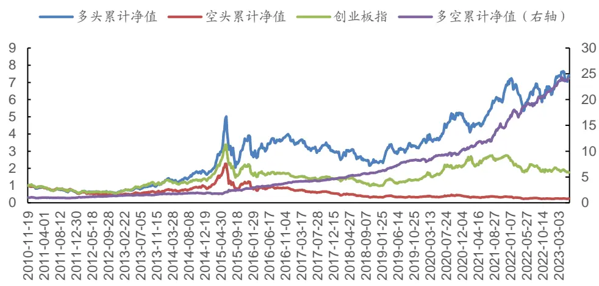
数据来源：天软科技，广发证券发展研究中心

图 5：弹性因子在创业板RANK_IC表现
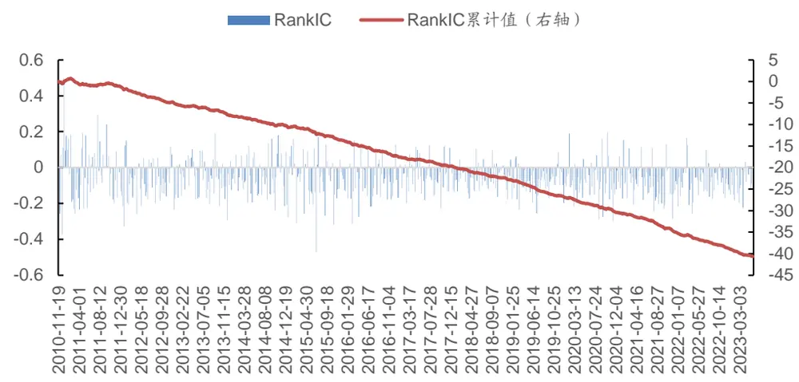
数据来源：天软科技，广发证券发展研究中心

表 4：弹性因子在创业板中-整体与分年度 RANK_IC表现

| 范围 | IC 均值 | IC 标准差 | IC最大值 | IC 最小值 | IC T统计量 | IC 累计值 | 负IC占比 |
| --- | --- | --- | --- | --- | --- | --- | --- |
| 2010 | 2.03% | 28.17% | 49.62% | -37.43% | 0.19 | 14.24% | 42.86% |
| 2011 | -2.71% | 13.85% | 29.16% | -26.12% | -1.4 | -138.07% | 60.78% |
| 2012 | -7.92% | 10.66% | 15.00% | -32.80% | -5.25 | -396.03% | 76.00% |
| 2013 | -5.21% | 9.84% | 19.03% | -29.50% | -3.78 | -265.52% | 66.67% |
| 2014 | -5.36% | 10.77% | 18.10% | -27.79% | -3.63 | -284.27% | 69.81% |
| 2015 | -5.92% | 12.79% | 16.99% | -47.14% | -3.31 | -302.07% | 68.63% |
| 2016 | -7.44% | 10.54% | 15.17% | -31.28% | -4.99 | -371.96% | 78.00% |
| 2017 | -4.63% | 8.60% | 12.31% | -22.68% | -3.85 | -236.16% | 70.59% |
| 2018 | -5.86% | 6.59% | 10.43% | -17.88% | -6.35 | -298.90% | 80.39% |
| 2019 | -7.99% | 7.25% | 8.59% | -25.57% | -7.87 | -407.45% | 88.24% |
| 2020 | -7.14% | 10.39% | 19.60% | -29.90% | -4.95 | -371.03% | 80.77% |
| 2021 | -8.75% | 9.73% | 15.46% | -28.63% | -6.49 | -455.07% | 86.54% |
| 2022 | -7.79% | 8.28% | 16.46% | -25.55% | -6.65 | -389.39% | 88.00% |
| 2023 至今 | -8.23% | 7.25% | 3.24% | -22.33% | -5.08 | -164.70% | 85.00% |
| ALL | -6.35% | 10.46% | 49.62% | -47.14% | -15.37 | -4066.36% | 76.09% |

数据来源：天软科技，广发证券发展研究中心

表 5：弹性因子在创业板中收益表现（分年度）

| 年份 | 因子年化收 益率 | 创业板指年 化收益率 | 超额年化收 益率 | 最大回撤率 | 年化波动率 | 信息比率 | 夏普比率 | 收益回撤比 |
| --- | --- | --- | --- | --- | --- | --- | --- | --- |
| 2010 至今 | 16.97% | 4.53% | 11.53% | 59.18% | 30.94% | 0.55 | 0.47 | 0.29 |
| 2010 | -29.35% | -10.67% | -20.23% | 8.92% | 35.10% | -0.84 | -0.91 | -3.29 |
| 2011 | -37.28% | -35.88% | -2.30% | 37.08% | 27.97% | -1.33 | -1.42 | -1.01 |
| 2012 | 5.95% | -3.05% | 9.24% | 22.13% | 28.16% | 0.21 | 0.12 | 0.27 |
| 2013 | 79.48% | 82.90% | -2.82% | 12.91% | 28.08% | 2.83 | 2.74 | 6.16 |
| 2014 | 40.98% | 13.15% | 25.07% | 15.05% | 26.79% | 1.53 | 1.44 | 2.72 |
| 2015 | 136.06% | 68.01% | 46.80% | 59.18% | 58.18% | 2.34 | 2.3 | 2.3 |
| 2016 | -6.15% | -28.18% | 33.34% | 15.36% | 38.66% | -0.16 | -0.22 | -0.4 |
| 2017 | -19.20% | -10.67% | -8.87% | 20.96% | 21.33% | -0.9 | -1.02 | -0.92 |
| 2018 | -20.82% | -28.65% | 11.22% | 30.68% | 31.41% | -0.66 | -0.74 | -0.68 |
| 2019 | 50.11% | 41.35% | 6.42% | 16.21% | 24.60% | 2.04 | 1.94 | 3.09 |
| 2020 | 34.91% | 66.12% | -20.55% | 10.57% | 26.76% | 1.3 | 1.21 | 3.3 |
| 2021 | 50.84% | 11.77% | 27.55% | 10.92% | 19.03% | 2.67 | 2.54 | 4.65 |
| 2022 | -12.33% | -29.87% | 21.48% | 26.27% | 22.56% | -0.55 | -0.66 | -0.47 |
| 2023 至今 | 52.61% | -12.64% | 72.99% | 7.87% | 17.65% | 2.98 | 2.84 | 6.68 |

数据来源：天软科技，广发证券发展研究中心

## 3. 沪深 300

高频弹性因子在沪深300板块中取得了3.13%的多空年化收益率以及2.16%的多头年化收益率，多头相对沪深300指数的超额年化收益率为1.25%；因子Rank_IC均值为-2.44%，历史T统计量及负IC占比分别为-7.27和63.21%。

图 6：弹性因子在沪深300多空表现
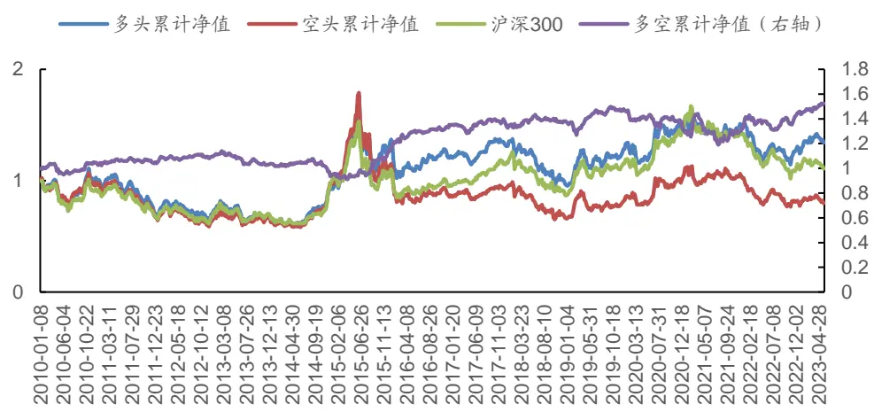
数据来源：天软科技，广发证券发展研究中心

图 7：弹性因子在沪深300RANK_IC表现
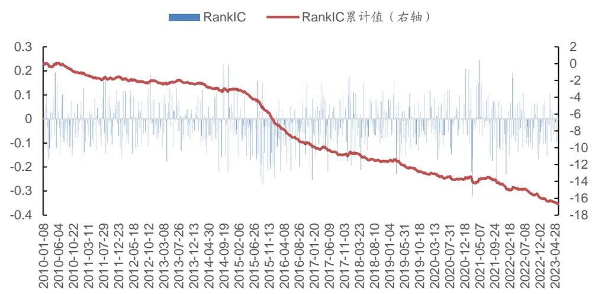
数据来源：天软科技，广发证券发展研究中心

表 6：弹性因子在沪深300中-整体与分年度 RANK_IC表现

| 范围 | IC 均值 | IC 标准差 | IC最大值 | IC 最小值 | IC T统计量 | IC 累计值 | 负IC占比 |
| --- | --- | --- | --- | --- | --- | --- | --- |
| 2010 | -2.04% | 8.85% | 19.61% | -16.70% | -1.65 | -104.17% | 60.78% |
| 2011 | -0.98% | 8.15% | 18.40% | -16.21% | -0.86 | -49.88% | 54.90% |
| 2012 | -1.29% | 8.02% | 18.75% | -15.84% | -1.13 | -64.35% | 64.00% |
| 2013 | -0.51% | 6.67% | 13.29% | -17.60% | -0.55 | -26.13% | 54.90% |
| 2014 | -1.09% | 9.34% | 22.84% | -22.08% | -0.85 | -57.55% | 58.49% |
| 2015 | -7.73% | 10.27% | 16.04% | -27.35% | -5.42 | -401.71% | 80.77% |
| 2016 | -5.70% | 8.54% | 14.90% | -25.51% | -4.72 | -285.12% | 78.00% |
| 2017 | -1.14% | 8.94% | 17.98% | -21.98% | -0.91 | -58.35% | 54.90% |
| 2018 | -2.18% | 7.80% | 14.61% | -21.32% | -1.99 | -111.01% | 62.75% |
| 2019 | -3.02% | 8.00% | 15.36% | -22.73% | -2.7 | -154.23% | 64.71% |
| 2020 | -0.78% | 7.52% | 20.82% | -16.85% | -0.75 | -40.50% | 63.46% |
| 2021 | -2.15% | 11.08% | 24.64% | -32.04% | -1.4 | -111.72% | 59.62% |
| 2022 | -2.69% | 8.68% | 19.33% | -22.89% | -2.19 | -134.67% | 60.00% |
| 2023 至今 | -3.60% | 6.82% | 10.79% | -15.78% | -2.36 | -72.06% | 75.00% |
| ALL | -2.44% | 8.79% | 24.64% | -32.04% | -7.27 | -1671.45% | 63.21% |

数据来源：天软科技，广发证券发展研究中心

表 7：弹性因子在沪深300中收益表现（分年度）

| 年份 | 因子年化收 益率 | 沪深 300 指 年化收益率 | 超额年化收 益率 | 最大回撤率 | 年化波动率 | 信息比率 | 夏普比率 | 收益回撤比 |
| --- | --- | --- | --- | --- | --- | --- | --- | --- |
| 2010 至今 | 2.16% | 0.74% | 1.25% | 21.32% | 0.10 | -0.02 | 0.05 | 21.32% |
| 2010 | -0.92% | -10.11% | 10.70% | 26.05% | -0.04 | -0.13 | -0.03 | 26.05% |
| 2011 | -29.65% | -25.01% | -5.81% | 20.86% | -1.42 | -1.54 | -0.87 | 20.86% |
| 2012 | 5.39% | 5.85% | -0.26% | 21.38% | 0.25 | 0.13 | 0.24 | 21.38% |
| 2013 | -10.61% | -7.12% | -4.18% | 19.22% | -0.55 | -0.68 | -0.47 | 19.22% |
| 2014 | 39.04% | 50.90% | -8.81% | 17.29% | 2.26 | 2.11 | 4.83 | 17.29% |
| 2015 | 44.68% | 5.47% | 38.13% | 38.19% | 1.17 | 1.1 | 1.17 | 38.19% |
| 2016 | -10.59% | -11.50% | 1.43% | 21.86% | -0.48 | -0.6 | -0.73 | 21.86% |
| 2017 | 8.61% | 21.78% | -11.06% | 9.60% | 0.90 | 0.64 | 0.94 | 9.60% |
| 2018 2019 | -26.89% | -25.31% | -2.45% | 21.78% | -1.23 | -1.35 | -0.87 | 21.78% |
|  | 34.15% | 33.59% | 0.26% | 17.81% | 1.92 | 1.78 | 2.59 | 17.81% |
| 2020 | 14.64% | 28.91% | -11.20% | 21.39% | 0.68 | 0.57 | 1.07 | 21.39% |
| 2021 | 1.77% | -5.10% | 5.90% | 14.58% | 0.12 | -0.05 | 0.14 | 14.58% |
| 2022 | -16.79% | -22.02% | 6.17% | 15.99% | -1.05 | -1.21 | -0.69 | 15.99% |
| 2023 至今 | 18.51% | -1.40% | 20.09% | 13.17% | 1.41 | 1.22 | 3.28 | 13.17% |

数据来源：天软科技，广发证券发展研究中心

## 4. 中证 500

高频弹性因子在中证500板块中取得了14.74%的多空年化收益率以及7.57%的多头年化收益率，多头相对中证500指数的超额年化收益率达6.15%；因子Rank_IC均值为-4.83%，历史T统计量及负IC占比分别为-14.28和71.35%。

图 8：弹性因子在中证500中多空表现
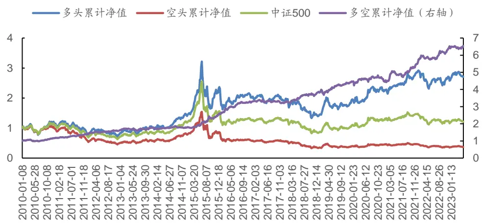
数据来源：天软科技，广发证券发展研究中心
识别风险，发现价值

图 9：弹性因子在中证500中RANK_IC表现
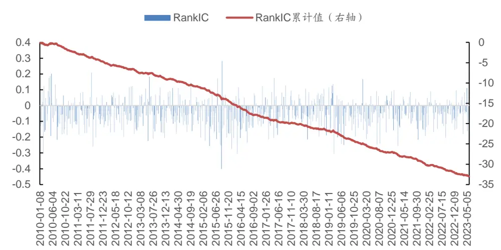
数据来源：天软科技，广发证券发展研究中心

表 8：弹性因子在中证500中-整体与分年度 RANK_IC表现

| 范围 | IC 均值 | IC 标准差 | IC最大值 | IC最小值 | IC T统计量 | IC累计值 | 负IC占比 |
| --- | --- | --- | --- | --- | --- | --- | --- |
| 2010 | -4.20% | 10.90% | 20.18% | -30.60% | -2.75 | -214.22% | 64.71% |
| 2011 | -5.18% | 8.33% | 20.88% | -25.95% | -4.44 | -264.42% | 76.47% |
| 2012 | -4.14% | 8.05% | 12.41% | -19.86% | -3.63 | -206.76% | 72.00% |
| 2013 | -4.53% | 9.11% | 18.24% | -22.46% | -3.55 | -231.02% | 70.59% |
| 2014 | -3.56% | 7.44% | 14.60% | -17.74% | -3.48 | -188.53% | 73.58% |
| 2015 | -8.07% | 12.43% | 28.12% | -40.14% | -4.64 | -411.53% | 72.55% |
| 2016 | -6.64% | 8.92% | 12.41% | -30.45% | -5.26 | -331.94% | 78.00% |
| 2017 | -3.00% | 8.12% | 17.57% | -21.36% | -2.64 | -152.95% | 68.63% |
| 2018 | -3.42% | 7.77% | 10.68% | -21.48% | -3.14 | -174.52% | 66.67% |
| 2019 | -5.98% | 9.75% | 13.52% | -30.49% | -4.38 | -304.77% | 68.63% |
| 2020 | -4.17% | 8.40% | 16.68% | -24.90% | -3.58 | -216.79% | 67.31% |
| 2021 | -5.60% | 7.33% | 9.77% | -25.65% | -5.51 | -291.05% | 76.92% |
| 2022 | -4.61% | 6.93% | 9.68% | -20.34% | -4.71 | -230.52% | 70.00% |
| 2023 至今 | -4.17% | 7.71% | 11.25% | -17.87% | -2.42 | -83.43% | 75.00% |
| ALL | -4.83% | 8.84% | 28.12% | -40.14% | -14.28 | -3302.46% | 71.35% |

数据来源：天软科技，广发证券发展研究中心

表 9：弹性因子在中证500中收益表现（分年度）

| 年份 | 因子年化收 益率 | 中证500 指 年化收益率 | 超额年化收 益率 | 最大回撤率 | 年化波动率 | 信息比率 | 夏普比率 | 收益回撤比 |
| --- | --- | --- | --- | --- | --- | --- | --- | --- |
| 2010 至今 | 7.57% | 1.41% | 6.15% | 58.67% | 25.06% | 0.3 | 0.2 | 0.13 |
| 2010 | 13.41% | 9.35% | 4.18% | 31.86% | 29.57% | 0.45 | 0.37 | 0.42 |
| 2011 | -28.35% | -33.83% | 8.22% | 34.20% | 24.58% | -1.15 | -1.26 | -0.83 |
| 2012 | 2.12% | -0.99% | 3.40% | 27.49% | 24.95% | 0.09 | -0.02 | 0.08 |
| 2013 | 23.21% | 17.48% | 4.94% | 19.06% | 21.39% | 1.09 | 0.97 | 1.22 |
| 2014 | 35.62% | 38.24% | -1.67% | 9.37% | 19.05% | 1.87 | 1.74 | 3.8 |
| 2015 | 64.91% | 29.69% | 28.28% | 48.83% | 48.15% | 1.35 | 1.3 | 1.33 |
| 2016 | -13.26% | -18.10% | 6.28% | 17.06% | 28.17% | -0.47 | -0.56 | -0.78 |
| 2017 | -4.19% | -0.20% | -3.92% | 13.12% | 14.27% | -0.29 | -0.47 | -0.32 |
| 2018 | -27.96% | -33.32% | 8.27% | 32.83% | 26.42% | -1.06 | -1.15 | -0.85 |
| 2019 | 32.22% | 24.26% | 6.20% | 19.58% | 20.74% | 1.55 | 1.43 | 1.65 |
| 2020 | 21.60% | 22.44% | -1.06% | 9.88% | 21.89% | 0.99 | 0.87 | 2.19 |
| 2021 | 28.74% | 15.26% | 11.13% | 7.28% | 14.01% | 2.05 | 1.87 | 3.95 |
| 2022 | -10.84% | -20.68% | 12.03% | 20.80% | 18.14% | -0.6 | -0.74 | -0.52 |
| 2023 至今 | 12.18% | 7.83% | 3.92% | 5.81% | 11.75% | 1.04 | 0.82 | 2.1 |

数据来源：天软科技，广发证券发展研究中心

## 5. 中证 800

高频弹性因子在中证800板块中取得了10.33%的多空年化收益率以及5.62%的多头年化收益率，多头相对中证800指数的超额年化收益率达4.59%；因子Rank_IC均值为-4.01%，历史T统计量及负IC占比分别为-12.59和69.64%。

图 10：弹性因子在中证800中多空表现
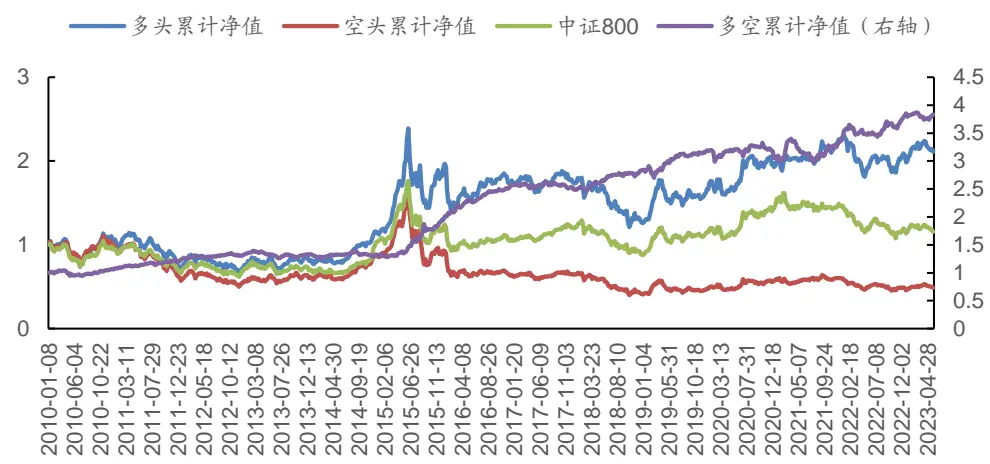
数据来源：天软科技，广发证券发展研究中心
识别风险，发现价值

图 11：弹性因子在中证800中RANK_IC表现
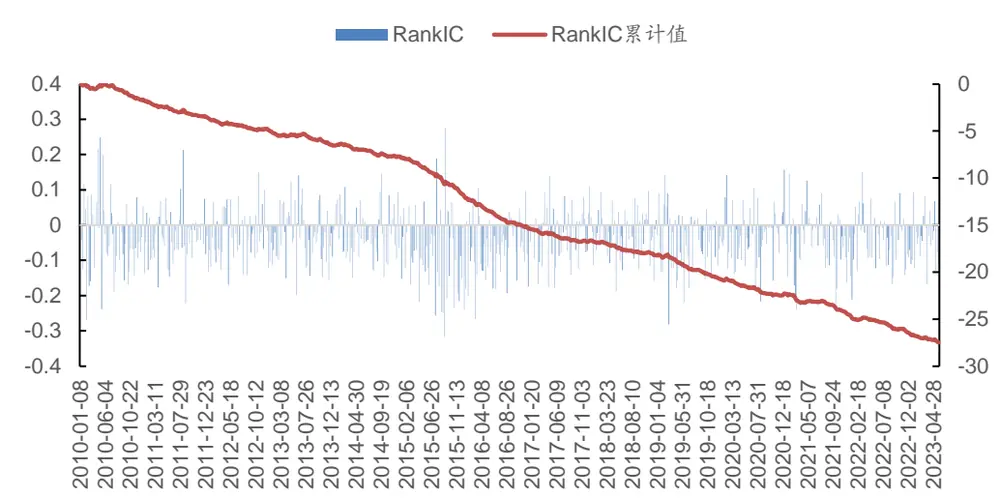
数据来源：天软科技，广发证券发展研究中心

表 10：弹性因子在中证800中-整体与分年度 RANK_IC表现

| 范围 | IC 均值 | IC标准差 | IC最大值 | IC最小值 | IC T统计量 | IC 累计值 | 负IC占比 |
| --- | --- | --- | --- | --- | --- | --- | --- |
| 2010 | -3.24% | 10.94% | 24.85% | -27.09% | -2.12 | -165.42% | 64.71% |
| 2011 | -3.65% | 7.41% | 21.29% | -22.18% | -3.52 | -186.01% | 70.59% |
| 2012 | -2.98% | 7.19% | 14.93% | -16.98% | -2.92 | -148.76% | 70.00% |
| 2013 | -3.06% | 7.80% | 14.04% | -19.96% | -2.8 | -155.89% | 68.63% |
| 2014 | -2.18% | 7.17% | 14.51% | -14.99% | -2.21 | -115.31% | 60.38% |
| 2015 | -8.50% | 11.58% | 27.53% | -31.65% | -5.3 | -442.17% | 78.85% |
| 2016 | -6.48% | 8.03% | 10.65% | -26.67% | -5.71 | -324.04% | 78.00% |
| 2017 | -2.49% | 7.44% | 13.94% | -17.85% | -2.39 | -127.16% | 60.78% |
| 2018 | -3.04% | 6.45% | 9.64% | -18.78% | -3.36 | -154.88% | 64.71% |
| 2019 | -5.01% | 8.50% | 14.18% | -28.26% | -4.21 | -255.53% | 68.63% |
| 2020 | -2.96% | 7.79% | 15.69% | -21.65% | -2.74 | -154.12% | 75.00% |
| 2021 | -4.63% | 8.24% | 14.52% | -23.89% | -4.05 | -240.52% | 71.15% |
| 2022 | -3.93% | 7.67% | 15.12% | -21.12% | -3.62 | -196.42% | 70.00% |
| 2023 至今 | -4.14% | 6.51% | 8.21% | -16.85% | -2.84 | -82.72% | 80.00% |
| ALL | -4.01% | 8.35% | 27.53% | -31.65% | -12.59 | -2748.96% | 69.64% |

数据来源：天软科技，广发证券发展研究中心

表 11：弹性因子在中证800中收益表现（分年度）

| 年份 | 因子年化收 益率 | 中证800 指 年化收益率 | 超额年化收 益率 | 最大回撤率 | 年化波动率 | 信息比率 | 夏普比率 | 收益回撤比 |
| --- | --- | --- | --- | --- | --- | --- | --- | --- |
| 2010 至今 | 5.62% | 1.07% | 4.59% | 49.18% | 22.84% | 0.25 | 0.14 | 0.11 |
| 2010 | 5.06% | -5.52% | 12.02% | 30.95% | 27.54% | 0.18 | 0.09 | 0.16 |
| 2011 | -29.76% | -27.38% | -2.67% | 35.48% | 23.09% | -1.29 | -1.4 | -0.84 |
| 2012 | 2.79% | 4.20% | -0.93% | 25.59% | 23.22% | 0.12 | 0.01 | 0.11 |
| 2013 | 7.71% | -1.58% | 9.26% | 18.33% | 20.12% | 0.38 | 0.26 | 0.42 |
| 2014 | 36.08% | 47.52% | -8.35% | 8.46% | 17.12% | 2.11 | 1.96 | 4.26 |
| 2015 | 69.45% | 14.60% | 49.14% | 39.67% | 40.79% | 1.7 | 1.64 | 1.75 |
| 2016 | -9.95% | -13.52% | 4.99% | 15.81% | 25.18% | -0.4 | -0.49 | -0.63 |
| 2017 | 0.05% | 15.16% | -13.10% | 10.69% | 11.98% | 0 | -0.2 | 0 |
| 2018 | -27.67% | -27.38% | -0.20% | 32.63% | 24.36% | -1.14 | -1.24 | -0.85 |
| 2019 | 32.25% | 31.32% | 0.81% | 16.98% | 19.68% | 1.64 | 1.51 | 1.9 |
| 2020 | 16.83% | 27.46% | -8.46% | 10.36% | 21.64% | 0.78 | 0.66 | 1.62 |
| 2021 | 17.23% | -0.74% | 16.63% | 5.95% | 13.49% | 1.28 | 1.09 | 2.89 |
| 2022 | -13.05% | -21.70% | 10.67% | 21.31% | 17.12% | -0.76 | -0.91 | -0.61 |
| 2023 至今 | 15.60% | 0.90% | 14.37% | 5.61% | 12.09% | 1.29 | 1.08 | 2.78 |

数据来源：天软科技，广发证券发展研究中心

## 6. 中证 1000

高频弹性因子在中证1000板块中取得了20.65%的多空年化收益率以及7.60%的多头年化收益率，多头相对中证1000指数的超额年化收益率达8.03%；因子RankI_C均值为-5.89%，历史T统计量及负IC占比分别为-14.15和78.41%。

图 12：弹性因子在中证1000中多空表现
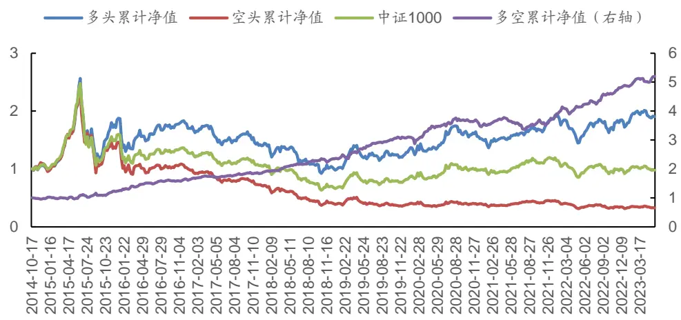
数据来源：天软科技，广发证券发展研究中心
识别风险，发现价值

图 13：弹性因子在中证1000中RANK_IC表现
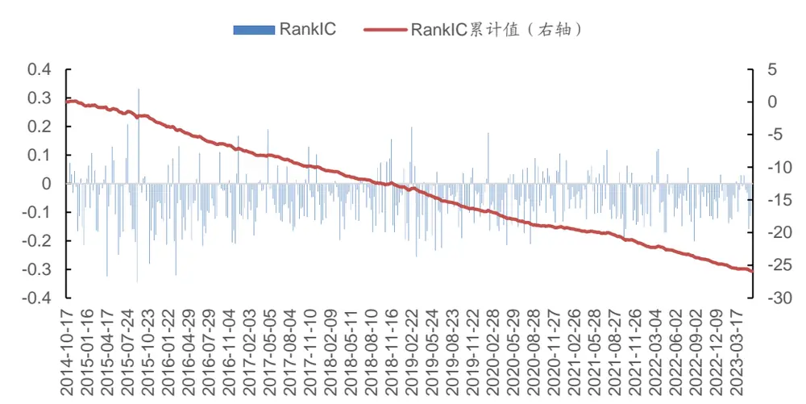
数据来源：天软科技，广发证券发展研究中心

表 12：弹性因子在中证1000中-整体与分年度 RANK_IC表现

| 范围 | IC 均值 | IC标准差 | IC最大值 | IC最小值 | IC T统计量 | IC累计值 | 负IC占比 |
| --- | --- | --- | --- | --- | --- | --- | --- |
| 2014 | -4.36% | 9.42% | 7.24% | -21.64% | -1.6 | -52.29% | 58.33% |
| 2015 | -5.88% | 12.70% | 33.15% | -34.49% | -3.3 | -299.70% | 74.51% |
| 2016 | -7.56% | 10.16% | 16.77% | -32.13% | -5.27 | -378.17% | 80.00% |
| 2017 | -5.67% | 7.66% | 18.97% | -18.22% | -5.28 | -288.95% | 80.39% |
| 2018 | -5.48% | 7.38% | 15.58% | -19.79% | -5.3 | -279.47% | 82.35% |
| 2019 | -7.11% | 9.22% | 19.83% | -25.57% | -5.51 | -362.69% | 80.39% |
| 2020 | -4.78% | 8.51% | 17.74% | -21.51% | -4.05 | -248.73% | 67.31% |
| 2021 | -5.15% | 7.08% | 11.76% | -19.35% | -5.25 | -267.71% | 78.85% |
| 2022 | -6.06% | 6.86% | 12.07% | -20.18% | -6.24 | -302.75% | 86.00% |
| 2023 至今 | -5.61% | 5.43% | 2.95% | -15.80% | -4.62 | -112.22% | 85.00% |
| ALL | -5.89% | 8.73% | 33.15% | -34.49% | -14.15 | -2592.67% | 78.41% |

数据来源：天软科技，广发证券发展研究中心

表 13：弹性因子在中证1000中收益表现（分年度）

| 年份 | 因子年化收 益率 | 中证1000指 年化收益率 | 超额年化收 益率 | 最大回撤率 | 年化波动率 | 信息比率 | 夏普比率 | 收益回撤比 |
| --- | --- | --- | --- | --- | --- | --- | --- | --- |
| 2014至今 | 7.60% | -0.27% | 8.03% | 63.98% | 28.73% | 0.26 | 0.18 | 0.12 |
| 2014 | -10.22% | -2.32% | -7.90% | 8.65% | 21.65% | -0.47 | -0.59 | -1.18 |
| 2015 | 91.36% | 59.10% | 22.86% | 56.82% | 55.44% | 1.65 | 1.6 | 1.61 |
| 2016 | -9.27% | -20.37% | 14.22% | 14.78% | 32.16% | -0.29 | -0.37 | -0.63 |
| 2017 | -17.24% | -17.35% | 0.44% | 20.19% | 17.80% | -0.97 | -1.11 | -0.85 |
| 2018 | -30.35% | -36.87% | 10.37% | 35.89% | 27.24% | -1.11 | -1.21 | -0.85 |
| 2019 | 31.43% | 24.13% | 5.51% | 18.57% | 21.80% | 1.44 | 1.33 | 1.69 |
| 2020 | 17.97% | 20.42% | -2.55% | 12.71% | 23.81% | 0.75 | 0.65 | 1.41 |
| 2021 | 25.90% | 20.08% | 4.50% | 9.63% | 15.93% | 1.63 | 1.47 | 2.69 |
| 2022 | -9.63% | -21.97% | 15.28% | 24.49% | 21.20% | -0.45 | -0.57 | -0.39 |
| 2023 至今 | 25.71% | 11.48% | 12.73% | 6.52% | 13.74% | 1.87 | 1.69 | 3.94 |

数据来源：天软科技，广发证券发展研究中心

## 五、总结

在《弹性因子研究——多因子Alpha系列报告之（四十六）》报告中，探讨了流动性股票市场的弹性测量，并基于日频数据明确构建出弹性因子，研究其在因子选股中的应用。在本报告中，进一步落脚到A股市场的日内高频数据，进行相对更高频数据维度的实证检验。

本篇报告以周频调仓对弹性因子在全市场、创业板、沪深300、中证500、中证800和中证1000等板块的选股表现进行了实证分析。实证分析结果表明，弹性因子在各板块的分档效果均较为显著，在全市场、创业板、沪深300、中证500、中证800和中证1000分别获得了24.62%、28.27%、3.13%、14.74%、10.33%、20.65%的多空年化收益率，以及12.88%、16.97%、2.16%、7.57%、5.62%、7.60%的多头年化收益率。

## 六、风险提示

本专题报告所述模型用量化方法通过历史数据统计、建模和测算完成，所得结论与规律在市场政策、环境变化时可能存在失效风险；

本专题策略模型在市场结构发生改变时有可能存在策略失效风险。

本专题策略模型在交易行为改变时存在失效风险。

## 七、参考文献

[1] Kim J, Kim Y. Transitory prices, resiliency, and the cross-section of stock returns[J]. International Review of Financial Analysis, 2019, 63: 243-256.

[2] Bernstein, P.L., 1987, Liquidity, stock markets, and market makers. Financial Management, 16(2), 54-62.

[3] Amihud, Y., 2002, Illiquidity and stock returns: cross-section and times-series effects, Journal of Financial Markets 5, 31-56.

[4] Black.F., 1971, Toward a fully automated stock exchange, Part 1. Financial Analysts journal, 27(4), 29-34.

[5] Kyle, A., 1985, Continous auctions and insider trading. Econometrica 53, 1315-1335.

[6] Bernstein, P.L., 1987, Liquidity, stock markets, and market makers. Financial Management, 16(2), 54-62.

[7] Harris, L, 2003, Trading & exchanges: Market microstructure for practitioner. Oxford University Press.

[8] Dong, J, A. Kempf, and P.K. Yadav, 2007, Resiliency, the neglected dimension of market liquidity: Empirical evidence from the New York Stock Exchange, Working Paper.

[9] Alan, N.S., J. Hua, L. Peng, and R.A. Schwartz, 2015, Stock resiliency and expected returns, Working Paper, version April 2015.

[10] Anand, A., P. Irvine, A. Puckett and K. Venkataraman, 2013, Institutional trading and stock resiliency: Evidence from the 2007-2009 financial crisis, Journal of Financial Economics 108, 773-797.

[11] Kempf, A., D. Mayston, M. Gehde-Trapp and P. K. Yadav, 2015, Resiliency: A dynamic view of liquidity, Working Paper.

## [Table_ResearchTeam] 广发金融工程研究小组

罗军 ：首席分析师，华南理工大学硕士，从业 16年，2010年进入广发证券发展研究中心。

安 宁 宁 ：联席首席分析师，暨南大学硕士，从业 14年，2011年进入广发证券发展研究中心。

史 庆 盛 ：资深分析师，华南理工大学硕士，2011年进入广发证券发展研究中心。

张 超 ：资深分析师，中山大学硕士，2012 年进入广发证券发展研究中心。

陈 原 文 ：资深分析师，中山大学硕士，2015年进入广发证券发展研究中心。

樊 瑞 铎 ：资深分析师，南开大学硕士，2015年进入广发证券发展研究中心。

李豪 ：资深分析师，上海交通大学硕士，2016年进入广发证券发展研究中心。

周 飞 鹏 ：资深分析师，伯明翰大学硕士，2021年加入广发证券发展研究中心。

季 燕 妮 ：高级分析师，厦门大学硕士，2020年进入广发证券发展研究中心。

张 钰 东 ：高级分析师，中山大学硕士，2020年进入广发证券发展研究中心。

## [Table_IndustryInvestDescription] 广发证券—行业投资评级说明

买入： 预期未来12个月内，股价表现强于大盘10%以上。内

持有： 预期未来12个月内，股价相对大盘的变动幅度介于-10%～+10%。对

卖出： 预期未来12个月内，股价表现弱于大盘10%以上。

## [Table_Comp 广发证券anyInvestDescription] —公司投资评级说明

买入： 预期未来 12 个月内，股价表现强于大盘 15%以上。

增持： 预期未来12个月内，股价表现强于大盘5%-15%。

持有： 预期未来12个月内，股价相对大盘的变动幅度介于-5%～+5%。

卖出： 预期未来12个月内，股价表现弱于大盘5%以上。

## [Table_Address] 联系我们

| 地址 | 广州市 | 深圳市 | 北京市 | 上海市 | 香港 |
| --- | --- | --- | --- | --- | --- |
|  | 广州市天河区马场路 | 深圳市福田区益田路 | 北京市西城区月坛北 | 上海市浦东新区南泉 | 香港德辅道中189号 |
|  | 26号广发证券大厦35 | 6001号太平金融大厦 | 街2号月坛大厦18层 | 北路 429号泰康保险 | 李宝椿大厦29及30 |
|  | 楼 | 31层 |  | 大厦37楼 | 楼 |
|  | 510627 | 518026 |  |  |  |
| 邮政编码 客服邮箱 | gfzqyf@gf.com.cn |  | 100045 | 200120 | = |

## [Table_LegalD 法律主体isclaimer 声明]

本报告由广发证券股份有限公司或其关联机构制作，广发证券股份有限公司及其关联机构以下统称为“广发证券”。本报告的分销依据不同国依据不家、地区的法律、法规和监管要求由广发证券于该国家或地区的具有相关合法合规经营资质的子公司/经营机构完成。资

广发证券股份有限公司具备中国证监会批复的证券投资咨询业务资格，接受中国证监会监管，负责本报告于中国（港澳台地区除外）的分销。投广发证券（香港）经纪有限公司具备香港证监会批复的就证券提供意见（4 号牌照）的牌照，接受香港证监会监管，负责本报告于中国香港地区的分销。

本报告署名研究人员所持中国证券业协会注册分析师资质信息和香港证监会批复的牌照信息已于署名研究人员姓名处披露。

## [Table_I 重要mportant 声明N

广发证券股份有限公司及其关联机构可能与本报告中提及的公司寻求或正在建立业务关系，因此，投资者应当考虑广发证券股份有限公司及其系 因此 者应当考虑关联机构因可能存在的潜在利益冲突而对本报告的独立性产生影响。投资者不应仅依据本报告内容作出任何投资决策。投资者应自主作出投资存 潜 利益冲突而 独 性产生影响 仅 容决策并自行承担投资风险，任何形式的分享证券投资收益或者分担证券投资损失的书面或者口头承诺均为无效。

本报告署名研究人员、联系人（以下均简称“研究人员”）针对本报告中相关公司或证券的研究分析内容，在此声明：（1）本报告的全部分析结论、研究观点均精确反映研究人员于本报告发出当日的关于相关公司或证券的所有个人观点，并不代表广发证券的立场；（2）研究人员的部分或全部的报酬无论在过去、现在还是将来均不会与本报告所述特定分析结论、研究观点具有直接或间接的联系。

研究人员制作本报告的报酬标准依据研究质量、客户评价、工作量等多种因素确定，其影响因素亦包括广发证券的整体经营收入，该等经营收入部分来源于广发证券的投资银行类业务。

本报告仅面向经广发证券授权使用的客户/特定合作机构发送，不对外公开发布，只有接收人才可以使用，且对于接收人而言具有保密义务。广发证券并不因相关人员通过其他途径收到或阅读本报告而视其为广发证券的客户。在特定国家或地区传播或者发布本报告可能违反当地法律，广发证券并未采取任何行动以允许于该等国家或地区传播或者分销本报告。

本报告所提及证券可能不被允许在某些国家或地区内出售。请注意，投资涉及风险，证券价格可能会波动，因此投资回报可能会有所变化，过去的业绩并不保证未来的表现。本报告的内容、观点或建议并未考虑任何个别客户的具体投资目标、财务状况和特殊需求，不应被视为对特定客户关于特定证券或金融工具的投资建议。本报告发送给某客户是基于该客户被认为有能力独立评估投资风险、独立行使投资决策并独立承担相应风险。

本报告所载资料的来源及观点的出处皆被广发证券认为可靠，但广发证券不对其准确性、完整性做出任何保证。报告内容仅供参考，报告中的信息或所表达观点不构成所涉证券买卖的出价或询价。广发证券不对因使用本报告的内容而引致的损失承担任何责任，除非法律法规有明确规定。客户不应以本报告取代其独立判断或仅根据本报告做出决策，如有需要，应先咨询专业意见。

广发证券可发出其它与本报告所载信息不一致及有不同结论的报告。本报告反映研究人员的不同观点、见解及分析方法，并不代表广发证券的立场。广发证券的销售人员、交易员或其他专业人士可能以书面或口头形式，向其客户或自营交易部门提供与本报告观点相反的市场评论或交易策略，广发证券的自营交易部门亦可能会有与本报告观点不一致，甚至相反的投资策略。报告所载资料、意见及推测仅反映研究人员于发出本报告当日的判断，可随时更改且无需另行通告。广发证券或其证券研究报告业务的相关董事、高级职员、分析师和员工可能拥有本报告所提及证券的权益。在阅读本报告时，收件人应了解相关的权益披露（若有）。

本研究报告可能包括和/或描述/呈列期货合约价格的事实历史信息（“信息”）。请注意此信息仅供用作组成我们的研究方法/分析中的部分论点/依据/证据，以支持我们对所述相关行业/公司的观点的结论。在任何情况下，它并不（明示或暗示）与香港证监会第5类受规管活动（就期货合约提供意见）有关联或构成此活动。

## [Table_Interest 权益披露Disclosur

(1)广发证券（香港）跟本研究报告所述公司在过去12 个月内并没有任何投资银行业务的关系。

## [Table_Copyright] 版权声明

未经广发证券事先书面许可，任何机构或个人不得以任何形式翻版、复制、刊登、转载和引用，否则由此造成的一切不良后果及法律责任由私自翻版、复制、刊登、转载和引用者承担。