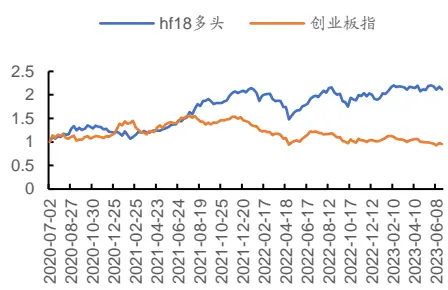
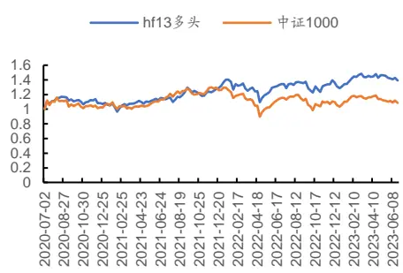
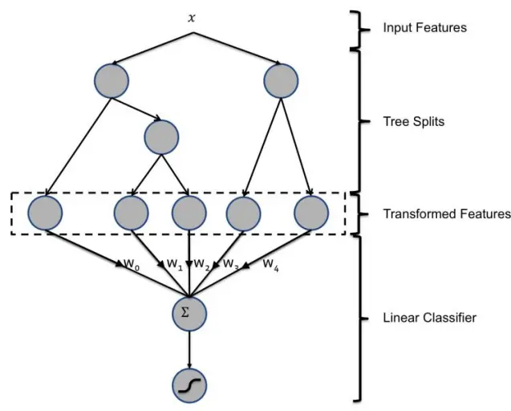
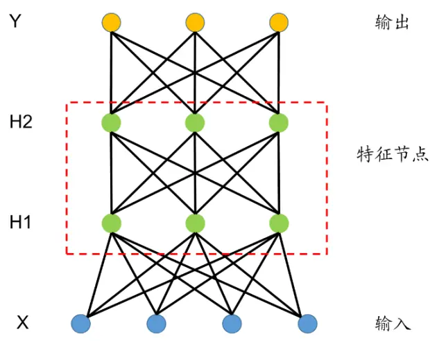
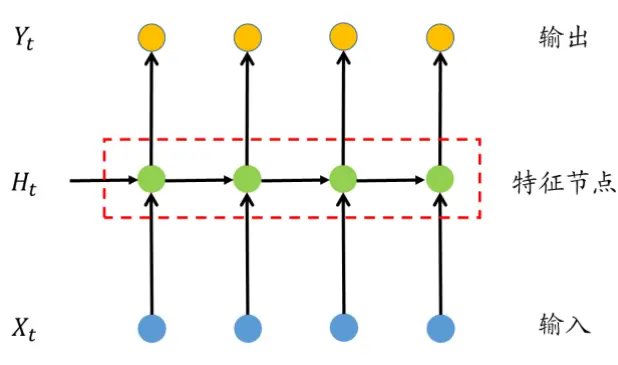
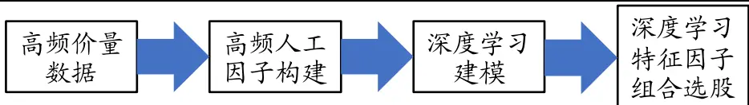
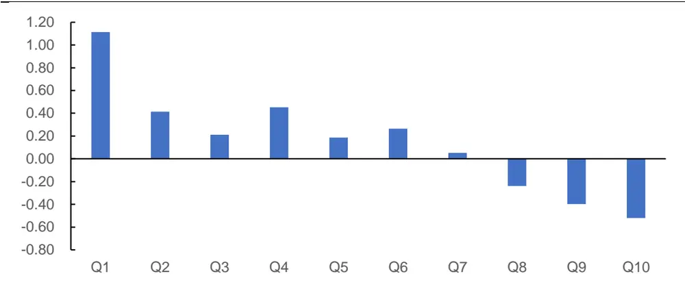
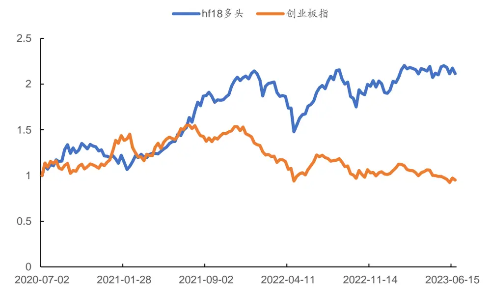
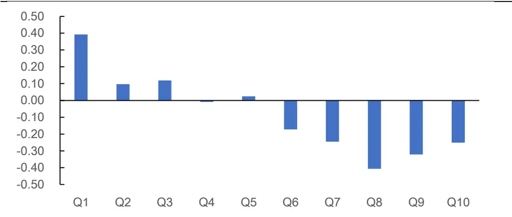
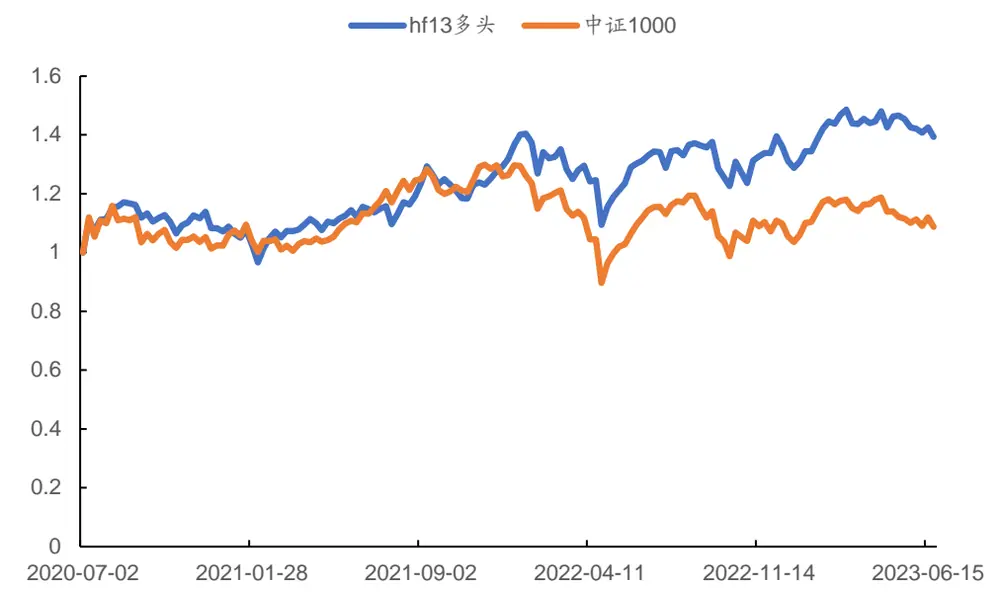

# 基于深度学习的高频数据因子挖掘

## 多因子 Alpha 系列报告之(五十一)

## 报告摘要：

机器学习高频因子挖掘的优势：在多因子选股模型中，因子的开发和更新迭代变得越来越重要。与低频因子相比，高频数据在用于量化投资中存在一定优势，而高频数据挖掘因子的难点在于数据维度大、噪声高。机器学习方法擅长从数据中寻找规律和特征，是高频数据因子挖掘的有力工具。

模型算法：本报告在预先将高频信息处理成日频因子之后，在日频因子的基础上，用深层全连接神经网络模型提取股票特征。模型采用了55个高频数据低频化的人工因子作为神经网络的输入，在深层神经网络提取特征之后，对特征进行分析并筛选合适的选股因子。

实证分析：深度学习模型共获得 32个特征因子，这些特征因子与模型输入的人工因子具有相对的独立性，在创业板和中证 1000股票池中展现出不错的选股性能。在周度换仓的频率下，双边千三计费后，在模型的训练和验证样本外的过去三年里，hf18 因子在创业板股票池中的Rank_IC 为-6.79%，取得了 27.25%的多头年化收益率，相对于同期的创业板指数取得了 25.50%的超额年化收益率，信息比为 1.04；hf13 因子在中证 1000 股票池中 Rank_IC 为 6.63%，取得了 11.25%的多头年化收益率，相对于同期的中证 1000 指数取得了 7.24%的超额年化收益率，信息比率为0.64。

风险提示：本专题报告所述模型用量化方法通过历史数据统计、建模和测算完成，所得结论与规律在市场政策、环境变化时可能存在失效风险；策略在市场结构及交易行为的改变时有可能存在策略失效风险。

图:hf18 因子在创业板表现

数据来源：Wind，广发证券发展研究中心

图:hf13 因子在中证 1000 表现

数据来源：Wind，广发证券发展研究中心

[Table_Author] 分析师： 陈原文

同SAC 执证号：S0260517080003

0755-82797057

chenyuanwen@gf.com.cn分析师： 安宁宁

SAC 执证号：S0260512020003

0755-23948352

anningning@gf.com.cn分析师： 罗军

SAC 执证号：S0260511010004

020-66335128

luojun@gf.com.cn

请注意，陈原文,罗军并非香港证券及期货事务监察委员会的注册持牌人，不可在香港从事受监管活动。

## [Table_ 相关研究：DocR

金融工程：权益型基金月报2023-08-07（2023年 7月）:大金融基
金涨幅居前，权益基金组合
超额显著

## 一、高频因子思考

## （一）从低频信息到高频信息

近年来，A股市场机构化趋势明显，量化私募机构的管理规模也迅速扩大，产生了一批管理规模超过百亿的量化私募机构。与此同时，传统的风格因子波动增大，从市场获取超额收益的难度在增加。

因子拥挤是因子收益下降的原因之一。因子代表着市场某方面的非有效性、或者是一段时期内的定价失效。当某类因子收益高的时候，会吸引更多的资金进入，从而出现因子拥挤，降低因子的预期收益。一旦新的因子被公开，套利资金的介入会使得错误定价收窄，因子收益也会跟着下降。因此，在多因子选股模型中，因子的开发和更新迭代变得越来越重要。

以传统日频价量和更低频财务数据为基础的因子开发是一种研究途径。由于基础因子广为人知，在此基础上进行因子挖掘的收益提升空间相对有限。而且日频数据由于本身的数据量和信息量有限，过度挖掘会增大过拟合的风险。

以高频价量数据为基础的因子开发在当下具有更大的收益提升空间。与低频因子相比，高频数据在用于量化投资中存在一定优势。

首先，高频价量数据的体量明显大于低频数据。以分钟行情为例，用压缩效果较好的mat格式存储2020年全市场股票的分钟行情数据（包括分钟频的开高低收价格数据、买卖盘挂单数据等），约为12GB。如果是快照行情（目前上交所和深交所都是3秒一笔）或者level 2行情，数据量要大很多。因此，高频数据因子挖掘对信息处理能力和处理效率的要求较高。而且，日内数据，尤其是level 2数据，一般要额外付费，甚至需要自行下载存储实时行情，在此基础上构建的因子拥挤度较低。

其次，高频价量数据一般是多维的时间序列数据，数据中噪声比例较高，而且与ROE、PE这类低频指标本身就具有选股能力不同的是，原始的高频行情数据一般不能直接用作选股因子，而要通过信号变换、时间序列分析、机器学习等方法从高频数据中构建特征，才能作为选股因子。此类因子与低频信号的相关性较低，而且由于因子开发流程相对复杂，不同投资者构建的因子更具有多样性。

此外，高频数据开发的因子一般调仓周期较短，意味着在检验因子有效性的时候，同一段测试期具有更多的独立样本。例如，在一年的测试期内，只有12个独立的样本段用于检验月频调仓的因子，与之相比，有约50个独立的时段用于检验周频调仓因子，有超过240个独立的时段用于检验日频调仓的因子。独立样本的增多有助于检验高频因子的有效性。

高频数据挖掘因子的难点在于数据维度大、噪声高。凭借专业投资者的经验或者是参阅已发表的文献，可以从高频数据中提炼出一部分有选股能力的特征。此外，机器学习方法擅长从数据中寻找规律和特征，是高频数据因子挖掘的有力工具。本报告借鉴机器学习领域特征工程的思路，从高频价量数据中提炼选股因子。

## （二）自动化特征工程

在机器学习领域，“正确”的特征应该适合当前的任务，并易于被模型使用。合理的特征设计可以使得后续模型建立更容易，提升模型的预测能力。特征工程就是在给定数据、模型和任务的情况下设计出最合适的特征的过程。

特征设计主要是指对原始数据进行加工、特征组合，生成有一定意义的新变量(新特征)。以健康管理为例，通过观察者的身高、体重、或者两者的线性加权，并不能直接判断其是否肥胖，而通过适当的变量组合之后形成的BMI指数（体重除以身高的平方）则是一个非常简明的指标，可以直接用BMI指数的大小判断观察者是否肥胖。

领域知识可以显著提升特征的挖掘效率。在多因子选股体系中，不同的选股因子即是结合金融市场特点构建的特征。盈利、成长、价值、质量、动量、流动性等因子都是投资者通过经济学逻辑和金融市场的特点构建的选股因子。基于上述因子筛选的股票组合有望跑赢市场。

随着我们将研究对象从低频数据转向高频数据，数据的维度变得更高、信息密度变得更低、噪声含量变得更高。此时，专家的金融领域知识相对匮乏，而机器学习等方法擅长处理海量数据和高维特征，在这种情景下更能体现其优势。

遗传规划是一种启发式搜索算法，在选股因子构建时，一般以因子收益率或者因子IC为优化目标，通过不断迭代进化因子计算表达式，获取预测能力强的因子。

机器学习特征生成是在机器学习方法对数据进行建模的同时，产生新特征。可以产生新特征的机器学习模型包括主成分分析、梯度提升树和深度学习等。

主成分分析是一种常见的数据预处理和特征生成方法，通过线性投影将原始的变量变换为主成分变量。但主成分分析是一种线性算法，不能产生更具有多样化的非线性特征，而且无监督学习方法生成的特征对后续分类或者回归模型的提升有限。

在2014年发表的论文《Practical Lessons from Predicting Clicks on Ads atFacebook》，Facebook研究团队提出了经典的梯度提升树（Gradient BoostingDecision Trees，GBDT）+逻辑回归的点击率预测模型结构，可以说开启了特征工程自动化的新阶段。该模型如下图所示，GBDT模型的决策树对样本进行处理，生成特征，将新特征输入给逻辑回归模型，实现分类目标。图中展示了两棵决策树，x为一条输入样本，遍历两棵树后，x样本分别落到两颗树的叶子节点上，每个叶子节点对应逻辑回归的某一维特征（0/1取值，如果样本落在该叶子节点上，则取值为1，否则取值为0）。通过遍历决策树，就得到了该样本对应的所有特征。下图的左树有三个叶子节点，右树有两个叶子节点，最终的特征即为5维的向量。对于输入x，如果落在左树第3个节点，则编码[0,0,1]，落在右树第1个节点则编码[1,0]，整体的编码为[0,0,1,1,0]。

图 1：梯度提升树特征提取示意图

数据来源：Xinran He, Junfeng Pan 等,《Practical Lessons from Predicting Clicks on Ads atFacebook》，广发证券发展研究中心

深度学习模型具有丰富的层次结构，低层次的网络节点从输入信号中学习低阶特征，高层次网络节点在此基础上学习高阶特征。深度学习是在对大量数据进行拟合的同时，获得其丰富的特征表达，对于特定的学习目标，相应的、合适的特征会被激活。因此，深度学习模型本身具有自动学习特征的能力。

图 2：深度学习特征提取示意图
数据来源：广发证券发展研究中心

深度学习模型一般参数数量庞大，随着网络层数的增加，模型的线性和非线性表达能力也会在一定范围内明显增强，在大量数据的情景下其优势就会凸显出来。因此，与其他机器学习模型相比，深度学习更适合海量数据和高频数据的建模。

深度学习模型具有灵活多样的网络结构，适合不同情景的建模问题。全连接神经网络不考虑样本的时序关系，在金融建模中，适合处理截面数据。因此，在用全连接神经网络建模时，需要预先从高频的时间序列数据中提取因子，在此基础上通过神经网络进一步挖掘特征。

图 3：全连接神经网络特征学习示意图

数据来源：广发证券发展研究中心

循环神经网络（RNN）适合处理时间序列数据，卷积神经网络（CNN）适合处理具有局部空间/时间结构的数据。因此，RNN和CNN适合对金融时间序列数据进行建模。在高频数据的因子挖掘中，对原始的行情数据、或者是稍作加工的特征时间序列进行建模，而不需要提前处理成低频因子。

图 4：循环神经网络特征学习示意图

数据来源：广发证券发展研究中心

在神经网络模型建立之后，可以观察不同的神经网络层节点，分析其特征提取情况。

本报告我们首先结合因子选股经验，对日内高频数据进行低频化，生成日频的基础因子，在此基础上，通过神经网络模型学习高阶特征，获取新的选股因子。

## 二、深度学习因子挖掘模型

本报告在预先将高频信息处理成日频因子后，在日频因子的基础上，用深层全连接神经网络模型提取股票特征。

深层神经网络是对股票因子和未来收益率之间的关系进行建模。本报告的网络模型采用了 55个日频变量作为神经网络的输入，这些日频变量是高频数据低频化的股票特征，具体特征定义在下一节所示。

在本报告的深度学习选股模型中，我们采用 7 层神经网络系统建立股票价格预测模型。其中包含输入层X，输出层 Y，和隐含层H1、H2、H3、H4、H5。各层的节点数如下表所示。

表 1：深度学习模型网络结构

| 层名称 | 层说明 | 节点数 |
| --- | --- | --- |
| X | 输入层 | 55 |
| H1 | 第 1 个隐含层 | 1 |
| H2 | 第 2 个隐含层 | 1 |
| H3 | 第3 个隐含层 | 1 |
| H4 | 第 4 个隐含层 | 1 |
| H5 | 第 5 个隐含层 | 1 |
| Y | 输出层 | 3 |

数据来源：Wind，广发证券发展研究中心

其中，X 是输入层，其节点数为 55 个，表示股票样本的 55 个原始因子。Y 是输出层，共3 个节点，表示股票未来走势的三种可能性：上涨（有超额收益）、平盘（无超额收益）、下跌（负的超额收益）。本报告中，用 3维的向量表示3 种不同的输出类别。 $\begin{array}{r}{\mathbf{y}=[1\quad0\quad0]^{T}}\end{array}$ 表示上涨样本（每个时间截面上，将全体股票按照未来 5个交易日收益率排序，收益率最高的前 10%的股票样本标记为“上涨样本”）， $y=$ $[0\_{1}\_{0}]^{T}$ 表示平盘样本（收益率居中的 10%的股票样本）， $\begin{array}{r}{\mathbf{{y}}=[0\quad0\quad1]^{T}}\end{array}$ 表示下跌样本（收益率最低的 10%的股票样本）。（注：本报告中，粗斜体表示向量和矩阵，不加粗的变量表示标量。）

深层神经网络是对输入向量x和输出向量y的关系进行拟合，建立对输出y的预测模型。记神经网络的参数为w，则神经网络模型可以记成 $\boldsymbol{y}=\operatorname{f}(\boldsymbol{x};\boldsymbol{w})$ 。隐层采用线性整流函数（ReLU）作为激活函数，输出层采用softmax激活函数。在预测时，输出层softmax激活函数的输入向量为 $\pmb{z}=[z_{1}\quad z_{2}\quad z_{3}]^{T}$ ，则经过softmax函数后，预测值为

$$
\widehat{\pmb{y}}=[\widehat{y}_{1}\quad\widehat{y}_{2}\quad\widehat{y}_{3}]^{T}=\left[\frac{e^{z_{1}}}{\sum_{i=1,2,3}e^{z_{i}}}\frac{e^{z_{2}}}{\sum_{i=1,2,3}e^{z_{i}}}\frac{e^{z_{3}}}{\sum_{i=1,2,3}e^{z_{i}}}\right]^{T}
$$

对于分类问题，可以采用交叉熵作为损失函数，进行参数的优化。本报告采用交叉熵损失函数，优化目标为：

$$
E(\pmb{w})=-\sum_{n=1}^{N}\sum_{k=1}^{K}[y_{nk}\log\hat{y}_{nk}+(1-y_{nk})\log(1-\hat{y}_{nk})]
$$

其中， $y_{nk}.$ 表示第n个样本的第k个输出类别， $\hat{y}_{nk}$ 表示对该输出的预测值。深度学习模型训练时，一般采用误差反向传播的方式求取梯度，优化参数。

策略总体流程如下图所示，深度学习建模生成机器学习因子的过程需要有大量训练数据（一般用过去几年的数据进行建模），用于生成对股票收益率预测能力较强的特征（因子）。

图 5：深度学习高频因子挖掘流程

数据来源：广发证券发展研究中心

## 三、高频人工因子

## （一）日内价格相关因子

价格数据中蕴含了丰富的股票信息，本报告从日内累积收益率、日内收益率的高阶统计量和日内价格的趋势强度进行考察，确定了10个候选因子，如下表所示。

表 2：日内价格相关因子列表

| 因子名 | 因子描述 |
| --- | --- |
| real_var | 收益率方差，分钟行情收益率的方差 |
| real_kurtosis | 收益率峰度，分钟行情收益率的峰度 |
| real_skew | 收益率偏度，分钟行情收益率的偏度 |
| real_upvar | 上行收益率方差，仅考虑收益率大于0时刻的分钟行情收益率方差 |
| real_downvar | 下行收益率方差，仅考虑收益率小于0时刻的分钟行情收益率方差 |
| ratio_realupvar | 上行收益率方差占比，real_upvar/real_var |
| ratio_realdownvar | 下行收益率方差占比，ratio_realdownvar /real_var |
| trendratio | 趋势占比，日内价格变化/分钟频价格变化绝对值之和 |
| ret_intraday | 日内收益率，收盘价/开盘价-1 |
| intraday_maxdrawdown | 日内最大回撤率，日内分钟频行情的最大回撤 |

数据来源：天软科技，广发证券发展研究中心

## （二）成交量相关因子

成交量也是日内行情信息的重要组成部分。一方面，成交量的分布可以反映投资者的行为特征，另一方面，成交量与价格或者价格走势的关系可以确认价格形态的信息。本报告考察的成交量相关因子如下表所示。

表 3：成交量相关因子列表

| 因子名 | 因子描述 |
| --- | --- |
| ratio_volumeH1 | 成交量占比：开盘后第1个半小时成交量占全天成交量之比 |
| ratio_volumeH2 | 成交量占比：开盘后第2个半小时成交量占全天成交量之比 |
| ratio_volumeH3 | 成交量占比：开盘后第3个半小时成交量占全天成交量之比 |
| ratio_volumeH4 | 成交量占比：开盘后第4个半小时成交量占全天成交量之比 |
| ratio_volumeH5 | 成交量占比：开盘后第5个半小时成交量占全天成交量之比 |
| ratio_volumeH6 | 成交量占比：开盘后第6个半小时成交量占全天成交量之比 |
| ratio_volumeH7 | 成交量占比：开盘后第7个半小时成交量占全天成交量之比 |
| ratio_volumeH8 | 成交量占比：开盘后第8个半小时成交量占全天成交量之比 |
| corr_VP | 分钟成交量与价格相关性 |
| corr_VR | 分钟成交量与收益率相关性 |
| corr_VRlag | 分钟成交量与上一时刻收益率相关性 |
| corr_VRlead | 分钟成交量与下一时刻收益率相关性 |
| Amihud_illiq | Amihud 非流动性因子 |

数据来源：天软科技，广发证券发展研究中心

## （三）盘前价量因子

盘前价量信息主要包括隔夜收益率（开盘价相对前收盘的收益率）和开盘前集合竞价信息。目前，A股证券交易所在每个交易日的9:15至9:25为开盘集合竞价时间。开盘集合竞价又分为两个阶段，其中第一阶段是9:15至9:20，该阶段允许撤销已经提交的订单；第二阶段是9:20至9:25，该阶段不允许撤销已经提交的订单。集合竞价信息反映出资金的试盘行为和多空双方的博弈。本报告考察隔夜收益率和集合竞价的相关因子如下所示。

表 4：盘前价量因子列表

| 因子名 | 因子描述 |
| --- | --- |
| ret_overnight | 隔夜收益率，开盘价相对前收盘价的收益率 |
| ret_open2AH1 | 开盘价相对第一阶段集合竞价最高价的收益率 |
| ret_open2AL1 | 开盘价相对第一阶段集合竞价最低价的收益率 |
| ret_open2AH2 | 开盘价相对第二阶段集合竞价最高价的收益率 |
| ret_open2AL2 | 开盘价相对第二阶段集合竞价最高价的收益率 |
| diverge_A1 | 第一阶段集合竞价振幅 |
| diverge_A2 | 第二阶段集合竞价振幅 |

数据来源：天软科技，广发证券发展研究中心

## （四）特定时段采样因子

此外，可以将部分时段的数据进行重点分析，产生衍生因子。一般来说，开盘后半小时（9点半至10点）和收盘前半小时（14点半至收盘）的股票成交活跃，多空博弈激烈，蕴含的信息相对较多。本报告针对开盘后半小时和收盘前半小时的价量信息构建了如下因子。

表 5：开盘后半小时和收盘前半小时因子列表

| 因子名 | 因子描述 |
| --- | --- |
| ret_H1 | 开盘后半小时的收益率 |
| ret_close2H1 | 开盘半小时到收盘的收益率 |
| corr_VPH1 | 开盘后半小时的 corr_VP |
| corr_VRH1 | 开盘后半小时的 corr_VR |
| corr_VRleadH1 | 开盘后半小时的 corr_VRlead |
| corr_VRlagH1 | 开盘后半小时的 corr_Vrlag |
| real_varH1 | 开盘后半小时的 real_var |
| real_kurtosisH1 | 开盘后半小时的 real_kurtosis |
| real_skewH1 | 开盘后半小时的 real_skew |
| ret_H8 | 收盘前半小时的收益率 |
| corr_VPH8 | 收盘前半小时的 corr_VP |
| corr_VRH8 | 收盘前半小时的 corr_VR |
| corr_VRleadH8 | 收盘前半小时的 corr_VRlead |
| corr_VRlagH8 | 收盘前半小时的 corr_Vrlag |
| real_varH8 | 收盘前半小时的 real_var |
| real_kurtosisH8 | 收盘前半小时的 real_kurtosis |
| real_skewH8 | 收盘前半小时的 real_skew |

数据来源：天软科技，广发证券发展研究中心

## （五）大成交量相关因子

在不同的成交中，大单成交与主力资金关联较多，蕴含的信息可能更多。本报告将个股在每个交易日的分钟成交量时间序列按照成交量大小排序，将分钟成交量排名前1/3的成交量定义为“大成交量”。针对大成交量对应的时刻的股价信息，可以构建大成交量相关因子。

表 6：大成交量相关因子列表

| 因子名 | 因子描述 |
| --- | --- |
| real_varlarge | 大成交量对应的收益率方差 |
| real_kurtosislarge | 大成交量对应的收益率峰度 |
| real_skewlarge | 大成交量对应的收益率偏度 |
| ratio_realvarlarge | 大成交量方差占比，real_varlarge/real_var |
| corr_VPlarge | 大成交量对应的 corr_VP |
| corr_VRlarge | 大成交量对应的 corr_VR |
| corr_VRleadlarge | 大成交量对应的 corr_VRlead |
| corr_VRlaglarge | 大成交量对应的 corr_VRlag |

数据来源：天软科技，广发证券发展研究中心

## 四、实证分析

## （一）高频人工因子表现

本报告考察 55 个高频人工因子在过去三年即 2020 年 7 月至 2023 年 6 月的因子表现，根据当期股票的因子值和方向分为 10 档，其中前 10%和后 10%分别作为多头和空头，每5 个交易日进行调仓，双边千三计费，并剔除了 ST/ST*、涨跌停板、上市未满1 年的股票。

在创业板中，表现较优的是 Amihud_illiq 非流动性因子，其 Rank_IC 均值达8.92%，多头年化收益率和多空年化收益率分别为27.91%和 39.72%。

表 7：55个高频人工因子表现统计（创业板）

| 因子名 | 因子类别 | Rank_IC | 多头年化收益率 | 多空年化收益率 |
| --- | --- | --- | --- | --- |
| Amihud_illiq | 成交量相关因子 | 8.92% | 27.91% | 39.72% |
| real_kurtosis | 日内价格相关因子 | -3.74% | 15.12% | 5.85% |
| ratio_realvarlarge | 大成交量相关因子 | -5.98% | 14.71% | 16.94% |
| ret_open2AH2 | 盘前价量因子 | 2.25% | 9.59% | 11.11% |
| diverge_A1 | 盘前价量因子 | -2.96% | 9.32% | 1.98% |
| ret_open2AH1 | 盘前价量因子 | 3.48% | 9.31% | 10.81% |
| ret_open2AL1 | 盘前价量因子 | 1.10% | 9.09% | 9.99% |
| real_varlarge | 大成交量相关因子 | -8.70% | 8.21% | 19.72% |
| ratio_realupvar | 日内价格相关因子 | -4.31% | 7.20% | 12.43% |
| real_kurtosisH8 | 特定时段采样因子 | -1.59% | 6.58% | -5.01% |
| real_varH1 | 特定时段采样因子 | -8.15% | 6.56% | 20.06% |
| real_upvar | 日内价格相关因子 | -8.39% | 6.21% | 17.56% |
| intraday_maxdrawdown | 日内价格相关因子 | 6.61% | 5.90% | 11.48% |
| real_var | 日内价格相关因子 | -8.18% | 5.81% | 14.53% |
| diverge_A2 | 盘前价量因子 | -3.35% | 5.63% | 6.50% |
| real_skewlarge | 大成交量相关因子 | -2.10% | 5.47% | -2.73% |
| real_kurtosisH1 | 特定时段采样因子 | 0.71% | 5.24% | -5.03% |
| real_downvar | 日内价格相关因子 | -7.55% | 4.22% | 12.57% |
| real_kurtosislarge | 大成交量相关因子 | -1.87% | 4.03% | -2.48% |
| corr_VRleadlarge | 大成交量相关因子 | 0.17% | 3.93% | -7.39% |
| corr_VRH1 | 特定时段采样因子 | 1.02% | 3.44% | -3.05% |
| ratio_volumeH4 | 成交量相关因子 | 2.37% | 3.23% | 1.68% |
| ret_open2AL2 | 盘前价量因子 | -0.94% | 2.96% | -8.62% |
| corr_VRleadH8 | 特定时段采样因子 | 0.46% | 2.91% | -6.84% |
| real_skew | 日内价格相关因子 | -2.91% | 2.66% | 0.71% |
| ret_overnight | 盘前价量因子 | 2.94% | 2.56% | 19.85% |
| corr_VRH8 | 特定时段采样因子 | -1.30% | 2.39% | -11.14% |
| ratio_volumeH7 | 成交量相关因子 | 3.28% | 2.32% | 5.73% |
| corr_VPlarge | 大成交量相关因子 | -2.87% | 1.97% | -1.74% |
| trendratio | 日内价格相关因子 | -3.23% | 1.71% | 6.68% |

识别风险，发现价值

| corr_VRleadH1 | 特定时段采样因子 | 0.22% | 1.26% | -12.21% |
| --- | --- | --- | --- | --- |
| real_skewH1 | 特定时段采样因子 | -0.09% | 1.24% | -9.38% |
| ratio_volumeH2 | 成交量相关因子 | 1.32% | 1.21% | -2.32% |
| ratio_volumeH5 | 成交量相关因子 | 2.62% | 1.04% | 0.47% |
| corr_VRlead | 成交量相关因子 | -0.17% | 0.95% | -5.57% |
| ratio_volumeH6 | 成交量相关因子 | 2.22% | 0.51% | -6.52% |
| ret_H1 | 特定时段采样因子 | -1.44% | 0.23% | 2.33% |
| ret_intraday | 日内价格相关因子 | -2.88% | 0.03% | 10.64% |
| ratio_realdownvar | 日内价格相关因子 | 3.08% | -0.19% | 5.06% |
| real_skewH8 | 特定时段采样因子 | -1.05% | -0.68% | -5.07% |
| ratio_volumeH1 | 成交量相关因子 | -2.78% | -1.21% | -3.51% |
| ret_H8 | 特定时段采样因子 | -3.07% | -1.36% | 19.73% |
| real_varH8 | 特定时段采样因子 | -3.94% | -1.58% | -1.68% |
| corr_VRlag | 成交量相关因子 | -3.50% | -1.80% | 11.75% |
| corr_VRlagH8 | 特定时段采样因子 | -1.27% | -2.40% | -4.37% |
| corr_VRlarge | 大成交量相关因子 | -1.26% | -2.60% | -12.48% |
| corr_VP | 成交量相关因子 | -2.25% | -2.88% | -5.93% |
| corr_VRlaglarge | 大成交量相关因子 | -3.10% | -2.94% | 5.68% |
| ratio_volumeH8 | 成交量相关因子 | 1.03% | -3.38% | -11.30% |
| ratio_volumeH3 | 成交量相关因子 | 1.34% | -3.40% | -8.51% |
| corr_VR | 成交量相关因子 | -1.46% | -4.26% | -13.93% |
| corr_VPH8 | 特定时段采样因子 | -2.14% | -4.32% | 10.44% |
| corr_VPH1 | 特定时段采样因子 | -1.14% | -4.73% | -13.70% |
| corr_VRlagH1 | 特定时段采样因子 | -0.94% | -4.74% | -3.29% |
| ret_close2H1 | 特定时段采样因子 | -2.01% | -6.00% | 6.70% |

数据来源：Wind，天软科技，广发证券发展研究中心

在中证 1000 板块中，表现较优的是 real_kurtosis 因子，其 Rank_IC 均值为-5.06%，多头年化收益率和多空年化收益率分别为 10.76%和 15.15%；其次是Amihud_illiq 非流动性因子，其 Rank_IC 均值为 6.57%，多头年化收益率和多空年化收益率分别为 10.07%和 22.11%。

表 8：55个高频人工因子表现统计（中证1000）

| 因子名 | 因子类别 | Rank_IC | 多头年化收益率 | 多空年化收益率 |
| --- | --- | --- | --- | --- |
| real_kurtosis | 日内价格相关因子 | -5.06% | 10.76% | 15.15% |
| Amihud_illiq | 成交量相关因子 | 6.57% | 10.07% | 22.11% |
| ratio_realvarlarge | 大成交量相关因子 | -5.95% | 8.74% | 17.90% |
| corr_VRH1 | 特定时段采样因子 | 1.04% | 3.19% | -5.38% |
| intraday_maxdrawdown | 日内价格相关因子 | 5.30% | 2.40% | 3.34% |
| ret_open2AH2 | 盘前价量因子 | 1.57% | 2.38% | -1.53% |
| real_kurtosislarge | 大成交量相关因子 | -3.13% | 2.34% | 4.99% |
| real_kurtosisH8 | 特定时段采样因子 | -2.43% | 1.07% | -3.62% |
| ret_open2AH1 | 盘前价量因子 | 2.61% | 0.40% | 5.08% |

识别风险，发现价值

| ret_open2AL1 | 盘前价量因子 | 0.51% | 0.06% | 3.91% |
| --- | --- | --- | --- | --- |
| diverge_A1 | 盘前价量因子 | -2.14% | -0.44% | -2.33% |
| real_downvar | 日内价格相关因子 | -5.13% | -0.92% | -3.31% |
| ratio_volumeH4 | 成交量相关因子 | 2.10% | -0.95% | 1.17% |
| real_varH1 | 特定时段采样因子 | -6.05% | -1.31% | 4.07% |
| real_var | 日内价格相关因子 | -5.30% | -1.32% | -0.78% |
| real_varlarge | 大成交量相关因子 | -6.28% | -2.25% | 2.42% |
| real_upvar | 日内价格相关因子 | -5.58% | -2.26% | 0.34% |
| ret_H8 | 特定时段采样因子 | -2.39% | -2.40% | 13.73% |
| corr_VPlarge | 大成交量相关因子 | -2.31% | -2.82% | -4.47% |
| corr_VRleadH1 | 特定时段采样因子 | 0.67% | -3.27% | -10.79% |
| ratio_volumeH2 | 成交量相关因子 | 0.29% | -3.40% | -4.95% |
| real_kurtosisH1 | 特定时段采样因子 | -0.83% | -3.57% | -8.08% |
| corr_VRlagH8 | 特定时段采样因子 | -0.21% | -3.67% | -8.40% |
| ret_H1 | 特定时段采样因子 | -0.55% | -3.73% | -0.80% |
| corr_VRleadlarge | 大成交量相关因子 | 0.85% | -4.35% | -10.30% |
| ratio_realupvar | 日内价格相关因子 | -3.51% | -4.53% | 3.32% |
| real_skewlarge | 大成交量相关因子 | -1.65% | -4.60% | -1.54% |
| corr_VRH8 | 特定时段采样因子 | -0.50% | -4.71% | -9.67% |
| ratio_volumeH3 | 成交量相关因子 | 1.16% | -4.77% | -4.05% |
| ratio_volumeH8 | 成交量相关因子 | 1.08% | -4.84% | -8.46% |
| ratio_volumeH5 | 成交量相关因子 | 1.62% | -4.97% | -6.34% |
| corr_VR | 成交量相关因子 | -0.27% | -5.12% | -4.99% |
| ratio_volumeH7 | 成交量相关因子 | 2.58% | -5.46% | -6.03% |
| ret_open2AL2 | 盘前价量因子 | -0.61% | -5.76% | -14.76% |
| real_skewH8 | 特定时段采样因子 | -1.16% | -5.85% | -6.91% |
| corr_VRlead | 成交量相关因子 | 0.97% | -6.02% | -9.52% |
| ret_intraday | 日内价格相关因子 | -1.15% | -6.10% | 0.99% |
| corr_VP | 成交量相关因子 | -1.95% | -6.37% | -8.37% |
| ret_overnight | 盘前价量因子 | 1.98% | -6.39% | 2.94% |
| corr_VRleadH8 | 特定时段采样因子 | -0.05% | -6.39% | -11.47% |
| real_skewH1 | 特定时段采样因子 | 0.12% | -6.83% | -11.33% |
| corr_VPH1 | 特定时段采样因子 | -1.44% | -6.91% | -13.05% |
| corr_VRlarge | 大成交量相关因子 | -0.53% | -7.48% | -10.77% |
| diverge_A2 | 盘前价量因子 | -2.23% | -7.51% | -7.43% |
| corr_VRlag | 成交量相关因子 | -1.58% | -7.83% | 0.09% |
| ratio_volumeH1 | 成交量相关因子 | -1.77% | -7.98% | -10.37% |
| corr_VRlaglarge | 大成交量相关因子 | -1.60% | -8.27% | -2.02% |
| corr_VRlagH1 | 特定时段采样因子 | -0.13% | -8.86% | -10.94% |
| corr_VPH8 | 特定时段采样因子 | -0.85% | -9.04% | -5.03% |
| real_skew | 日内价格相关因子 | -2.03% | -9.20% | -3.93% |
| ret_close2H1 | 特定时段采样因子 | -1.01% | -9.46% | -7.36% |
| ratio_realdownvar | 日内价格相关因子 | 1.16% | -9.85% | -7.56% |

识别风险，发现价值

| trendratio | 日内价格相关因子 | -1.06% | -10.33% | -8.42% |
| --- | --- | --- | --- | --- |
| real_varH8 | 特定时段采样因子 | -1.42% | -10.56% | -12.99% |
| ratio_volumeH6 | 成交量相关因子 | 1.23% | -12.77% | -12.71% |

数据来源：Wind，天软科技，广发证券发展研究中心

## （二）深度学习特征因子表现

以 2007年1月至2020年6月的全市场数据作为样本内的训练和验证数据，其中 2007 年 1 月至 2017 年 12 月的数据为训练数据，2018 年 1 月至 2020 年 6 月的数据为验证数据，用以确定模型在训练过程中的最佳早停时点。此外，将2020 年7月至 2023 年6 月期间的数据作为样本外回测数据。根据当期股票的因子值和方向分为 10 档，其中前 10%和后 10%分别作为多头和空头，每 5 个交易日进行调仓，双边千三计费，并剔除了ST/ST*、涨跌停板、上市未满1年的股票。

观察深层神经网络最顶端隐藏层（H5 层）的 32 个特征，将其节点依次编号为0，1，……，31，称之为因子 hf0，hf1，……，hf31。在创业板中，32 个深度学习特征因子在样本外选股表现如下表所示，共有 14 个因子的多头年化收益率超过了10%，其中hf18因子的多头年化收益率达27.25%最为突出，其Rank_IC为-6.79%，多空年化收益率为 39.44%；hf2 因子的多空年化收益率达 53.21%，Rank_IC 为-8.43%。

表 9：32个深度学习特征因子表现统计（创业板）

| 因子名 | Rank_IC | 多头年化收益率 | 多空年化收益率 |
| --- | --- | --- | --- |
| hf18 | -6.79% | 27.25% | 39.44% |
| hf2 | -8.43% | 18.24% | 53.21% |
| hf28 | -6.36% | 16.81% | 28.51% |
| hf13 | 7.54% | 15.73% | 14.69% |
| hf0 | -5.62% | 15.37% | 11.95% |
| hf3 | -1.94% | 15.12% | 1.51% |
| hf11 | -3.60% | 14.67% | 27.17% |
| hf27 | -3.77% | 12.90% | 6.42% |
| hf24 | -2.93% | 12.02% | 9.31% |
| hf26 | -3.96% | 11.55% | 18.93% |
| hf4 | 5.69% | 11.28% | 1.47% |
| hf20 | 4.36% | 11.23% | 10.39% |
| hf9 | -5.21% | 10.36% | 27.22% |
| hf17 | -1.65% | 10.11% | 4.31% |
| hf6 | -0.18% | 9.82% | 0.43% |
| hf29 | -4.37% |  |  |
| hf8 | 6.51% | 9.71% | 12.82% |
| hf7 |  | 9.08% | 6.32% |
| hf23 | 3.14% | 8.98% | -6.77% |
| hf31 | -0.38% 4.48% | 8.86% | -0.57% |
| hf25 | -3.13% | 7.51% 6.23% | -0.40% -0.53% |

识别风险，发现价值

| hf10 4.36% | 5.21% -13.66% |
| --- | --- |
| hf14 2.04% | 3.64% -11.30% |
| hf12 -0.50% | 2.27% -8.42% |
| hf15 -1.70% | 2.18% -12.79% |
| hf22 3.58% |  |
| hf21 5.41% | 1.38% -9.89% -8.58% |
| hf19 -0.98% | 1.23% 1.08% -14.81% |
| hf1 3.18% | 0.72% -14.12% |
| hf5 -3.29% | 0.49% -5.72% |
| hf16 0.27% | 0.11% -11.39% |
| hf30 -0.40% | -0.39% -10.74% |

数据来源：Wind，天软科技，广发证券发展研究中心

在创业板中选取最佳前10的深度学习特征因子计算其相关性，结果如下表所示，整体而言不同的深度学习特征因子之间展现出了一定的非相关性。

表 10：创业板最佳前10深度学习特征因子之间的相关性

| 因子名 | df18 | df2 | df28 | df13 | df0 | df3 | df11 | df27 | df24 | df26 |
| --- | --- | --- | --- | --- | --- | --- | --- | --- | --- | --- |
| hf18 | 100.00% | 47.29% | 71.85% | -60.95% | 58.25% | 39.49% | 18.39% | 43.75% | 50.22% | 60.14% |
| hf2 | 47.29% | 100.00% | 45.91% | -42.03% | 39.50% | 21.42% | 40.63% | 13.90% | 22.05% | 18.06% |
| hf28 | 71.85% | 45.91% | 100.00% | -49.84% | 55.04% | 49.08% | 14.44% | 31.02% | 64.80% | 49.39% |
| hf13 | -60.95% | -42.03% | -49.84% | 100.00% | -69.10% | -37.39% | -4.58% | -46.20% | -28.92% | -54.97% |
| hf0 | 58.25% | 39.50% | 55.04% | -69.10% | 100.00% | 58.42% | 25.53% | 50.90% | 40.71% | 48.59% |
| hf3 | 39.49% | 21.42% | 49.08% | -37.39% | 58.42% | 100.00% | 8.01% | 19.92% | 52.07% | 31.09% |
| hf11 | 18.39% | 40.63% | 14.44% | -4.58% | 25.53% | 8.01% | 100.00% | 28.53% | 4.66% | 4.21% |
| hf27 | 43.75% | 13.90% | 31.02% | -46.20% | 50.90% | 19.92% | 28.53% | 100.00% | 16.63% | 52.44% |
| hf24 | 50.22% | 22.05% | 64.80% | -28.92% | 40.71% | 52.07% | 4.66% | 16.63% | 100.00% | 35.65% |
| hf26 | 60.14% | 18.06% | 49.39% | -54.97% | 48.59% | 31.09% | 4.21% | 52.44% | 35.65% | 100.00% |

数据来源：Wind，天软科技，广发证券发展研究中心

在创业板中选取最佳前 5 的深度学习特征因子与高频人工因子计算其相关性，结果如下表所示，经过神经网络构建的深度学习特征因子与输入的高频因子之间的相关性较低，得到的深度学习特征因子是一组相对独立的新因子。

表 11：创业板最佳前5深度学习特征因子与高频人工因子之间的相关性

| 因子名 | Amihud_illiq | real_kurtosis | ratio_realvarlarge | ret_open2AH2 | diverge_A1 |
| --- | --- | --- | --- | --- | --- |
| hf18 | -16.29% | 51.12% | 50.77% | -11.29% | 11.51% |
| hf2 | -25.32% | 19.80% | 36.95% | -13.25% | 11.64% |
| hf28 | -13.15% | 31.31% | 35.17% | -10.03% | 8.98% |
| hf13 | 29.05% | -64.97% | -64.31% | 16.69% | -16.00% |
| hf0 | -15.46% | 47.06% | 48.37% | -9.72% | 9.99% |

数据来源：Wind，天软科技，广发证券发展研究中心

单独研究在创业板中表现最佳的 hf18 因子，其分档表现较为显著，其中 Q1 档作为多头的表现最为突出，多头年化收益率达 27.25%，相对于同期创业板指的超额年化收益率达 25.50%。

图 6：hf18因子分档表现（创业板）

数据来源：Wind，天软科技，广发证券发展研究中心

表 12：hf18因子收益表现（创业板）

|  | 年化收益率 | 最大回撤率 | 年化波动率 | 平均换手率 | 信息比率 | 夏普比率 | 收益回撤比 |
| --- | --- | --- | --- | --- | --- | --- | --- |
| 多头 | 27.25% | 31.00% | 26.67% | 68.43% | 1.02 | 0.93 | 0.88 |
| 创业板指 | -1.62% | 40.48% | 26.73% | 1 | -0.06 | -0.15 | -0.04 |
| 多头相对创业板指 | 25.50% | 39.92% | 24.58% | - | 1.04 | 0.94 | 0.64 |

数据来源：Wind，天软科技，广发证券发展研究中心

图 7：hf18因子累计收益（创业板）

数据来源：Wind，天软科技，广发证券发展研究中心

hf18 因子在创业板中的分年度Rank_IC 和收益表现统计如下表所示。在各年份中，hf18因子的表现较为稳定，负Rank_IC占比均超过了 75%，在 2021年之后超过了 85%；由hf18 因子筛选得到的创业板多头组合在2021 年之后的超额年化收益率超过了 29%，在 2023 年达 39.40%。

表 13：hf18因子分年度Rank_IC统计（创业板）

|  | IC 均值 | IC 标准差 | IC最大值 | IC最小值 | IC T统计量 | IC 累计值 | 负IC占比 |
| --- | --- | --- | --- | --- | --- | --- | --- |
| 2020 | -4.96% | 8.77% | 21.49% | -20.41% | -2.83 | -123.90% | 76.00% |
| 2021 | -8.35% | 6.94% | 8.25% | -22.06% | -8.43 | -409.34% | 87.76% |
| 2022 | -6.58% | 7.63% | 13.50% | -29.24% | -6.03 | -322.25% | 85.71% |
| 2023截止至6月30日 | -5.95% | 5.03% | 4.03% | -15.73% | -5.79 | -142.77% | 87.50% |
| 2020~2023 | -6.79% | 7.29% | 21.49% | -29.24% | -11.3 | -998.27% | 85.03% |

数据来源：Wind，天软科技，广发证券发展研究中心

表 14：hf18因子分年度收益表现统计（创业板）

|  | 多头年化收益率 | 创业板指 年化收益率 | 多头-创业板指 超额年化收益率 | 最大回撤率 | 年化波动率 | 信息比率 | 夏普比率 | 收益回撤比 |
| --- | --- | --- | --- | --- | --- | --- | --- | --- |
| 2020 | 42.26% | 36.40% | 2.17% | 17.64% | 20.80% | 0.1 | -0.02 | 0.12 |
| 2021 | 69.84% | 22.51% | 29.82% | 21.91% | 34.62% | 0.86 | 0.79 | 1.36 |
| 2022 | -7.46% | -29.38% | 29.70% | 6.90% | 18.20% | 1.63 | 1.49 | 4.3 |
| 2023截止至6月30日 | 24.42% | -11.77% | 39.40% | 4.77% | 14.22% | 2.77 | 2.59 | 8.26 |
| 2020~2023 | 27.25% | -1.62% | 25.50% | 39.92% | 24.66% | 1.03 | 0.93 | 0.64 |

数据来源：Wind，天软科技，广发证券发展研究中心

在中证1000板块中，32个深度学习特征因子在样本外选股表现如下表所示，其中hf13因子的多头年化收益率为11.25%，Rank_IC为6.63%。

表 15：32个深度学习特征因子表现统计（中证1000）

| 因子名 | Rank_IC | 多头年化收益率 | 多空年化收益率 |
| --- | --- | --- | --- |
| hf13 | 6.63% | 11.25% | 6.08% |
| hf17 | -1.83% | 7.20% | 4.68% |
| hf3 | -2.04% | 6.02% | -4.47% |
| hf10 | 4.63% | 5.50% | -2.30% |
| hf18 | -4.90% | 5.35% | 10.49% |
| hf0 | -4.67% | 4.86% | 4.67% |
| hf28 | -4.17% | 3.93% | 7.74% |
| hf11 | -1.44% | 3.08% | 6.91% |
| hf26 | -3.42% | 2.88% | 6.28% |
| hf27 | -3.29% | 2.80% | 4.16% |
| hf6 | 1.18% | 2.31% | -3.11% |
| hf2 | -5.52% | 2.09% | 16.36% |
| hf25 | -1.78% | 1.66% | -3.28% |

识别风险，发现价值

| hf16 -1.09% 1.56% |
| --- |
| hf23 -0.18% 1.42% |
| -6.53% hf29 -4.30% 1.36% 7.78% |
| hf5 -3.89% 1.23% -1.08% |
| hf4 4.08% 0.54% -0.18% |
| hf24 -1.69% 0.31% -0.01% |
| hf21 4.40% -0.40% -9.38% |
| hf8 5.04% -0.54% 4.13% |
| hf7 3.26% -0.56% -7.83% |
| hf30 -0.63% -0.56% -8.73% |
| hf1 3.56% -0.70% -6.44% |
| hf20 1.79% -0.70% 0.37% |
| hf12 -1.18% -0.87% -8.62% |
| hf31 2.55% -2.08% -10.94% |
| hf22 3.09% -2.26% -8.46% |
| hf14 2.56% -3.24% -13.32% |
| hf15 -1.02% -4.11% -11.40% |
| hf19 -1.98% -9.62% -17.71% |
| hf9 -2.69% -10.44% -3.77% |

数据来源：Wind，天软科技，广发证券发展研究中心

在中证 1000 板块中选取最佳前 10 的深度学习特征因子计算其相关性，结果如下表所示，不同的深度学习特征因子之间展现出了一定的非相关性。

表 16：中证1000最佳前10深度学习特征因子之间的相关性

| 因子名 | hf13 | hf17 | hf3 | hf10 | hf18 | hf0 | hf28 | hf11 | hf26 | hf27 |
| --- | --- | --- | --- | --- | --- | --- | --- | --- | --- | --- |
| hf13 | 100.00% | -41.41% | -37.39% | 44.56% | -60.95% | -69.10% | -49.84% | -4.58% | -54.97% | -46.20% |
| hf17 | -41.41% | 100.00% | 46.84% | 17.08% | 54.74% | 55.39% | 53.85% | 21.12% | 56.54% | 54.66% |
| hf3 | -37.39% | 46.84% | 100.00% | 4.46% | 39.49% | 58.42% | 49.08% | 8.01% | 31.09% | 19.92% |
| hf10 | 44.56% | 17.08% | 4.46% | 100.00% | -12.64% | -7.47% | -0.18% | 18.82% | -12.19% | -12.45% |
| hf18 | -60.95% | 54.74% | 39.49% | -12.64% | 100.00% | 58.25% | 71.85% | 18.39% | 60.14% | 43.75% |
| hf0 | -69.10% | 55.39% | 58.42% | -7.47% | 58.25% | 100.00% | 55.04% | 25.53% | 48.59% | 50.90% |
| hf28 | -49.84% | 53.85% | 49.08% | -0.18% | 71.85% | 55.04% | 100.00% | 14.44% | 49.39% | 31.02% |
| hf11 | -4.58% | 21.12% | 8.01% | 18.82% | 18.39% | 25.53% | 14.44% | 100.00% | 4.21% | 28.53% |
| hf26 | -54.97% | 56.54% | 31.09% | -12.19% | 60.14% | 48.59% | 49.39% | 4.21% | 100.00% | 52.44% |
| hf27 | -46.20% | 54.66% | 19.92% | -12.45% | 43.75% | 50.90% | 31.02% | 28.53% | 52.44% | 100.00% |

数据来源：Wind，天软科技，广发证券发展研究中心

在中证 1000 板块中选取最佳前 5 的深度学习特征因子与高频人工因子计算其相关性，结果如下表所示，经过神经网络构建的深度学习特征因子与输入的高频因子之间的相关性较低，得到的深度学习特征因子是一组相对独立的新因子。

表 17：中证1000最佳前5深度学习特征因子与高频人工因子之间的相关性

| 因子名 | real_kurtosis | Amihud_illiq | ratio_realvarlarge | corr_VRH1 | intraday_maxdrawdown |
| --- | --- | --- | --- | --- | --- |
| hf13 | -64.97% | 29.05% | -64.31% | 2.34% | 51.64% |
| hf17 | 45.16% | 2.75% | 29.25% | 6.60% | -7.04% |
| hf3 | 21.02% | -9.49% | 26.27% | -0.71% | -18.66% |
| hf10 | -43.11% | 30.41% | -54.15% | -9.02% | 40.96% |
| hf18 | 51.12% | -16.29% | 50.77% | 4.01% | -33.27% |

数据来源：Wind，天软科技，广发证券发展研究中心

单独研究在中证1000板块中表现最佳的hf13因子，其分档表现较为显著，其中第一档作为多头的表现最为突出，多头年化收益率为11.25%，相对于同期创业板指的超额年化收益率达7.24%。

图 8：hf13因子分档表现（中证1000）

数据来源：Wind，天软科技，广发证券发展研究中心

表 18：hf13因子收益表现（中证1000）

|  | 年化收益率 | 最大回撤率 | 年化波动率 | 平均换手率 | 信息比率 | 夏普比率 | 收益回撤比 |
| --- | --- | --- | --- | --- | --- | --- | --- |
| 多头 | 11.25% | 22.10% | 20.14% | 71.51% | 0.56 | 0.43 | 0.51 |
| 中证1000 | 2.73% | 31.00% | 21.77% |  | 0.13 | 0.01 | 0.09 |
| 多头相对中证 1000 | 7.24% | 13.89% | 11.24% |  | 0.64 | 0.42 | 0.52 |

数据来源：Wind，天软科技，广发证券发展研究中心

图 9：hf13因子累计收益（中证1000）

数据来源：Wind，天软科技，广发证券发展研究中心

hf13 因子在中证 1000 板块中的分年度 Rank_IC 和收益表现统计如下表所示。在各年份中，hf13 因子的表现较为稳定，在 2021 年之后正 Rank_IC 占比均超过了70%；由 hf13 因子筛选得到的中证 1000 多头组合在 2022 年的超额年化收益率达17.26%，在 2023 年为 5.84%。

表 19：hf13因子分年度Rank_IC统计（中证1000）

|  | IC 均值 | IC 标准差 | IC 最大值 | IC最小值 | IC T统计量 | IC 累计值 | 负IC占比 |
| --- | --- | --- | --- | --- | --- | --- | --- |
| 2020 | 4.90% | 11.19% | 33.14% | -14.93% | 2.19 | 122.43% | 44.00% |
| 2021 | 6.53% | 11.07% | 30.84% | -18.18% | 4.13 | 319.74% | 24.49% |
| 2022 | 7.94% | 11.87% | 40.20% | -13.70% | 4.69 | 389.28% | 24.49% |
| 2023截止至 6月 30日 | 5.95% | 10.96% | 22.41% | -15.58% | 2.66 | 142.70% | 29.17% |
| 2020~2023 | 6.63% | 11.28% | 40.20% | -18.18% | 7.12 | 974.16% | 28.57% |

数据来源：Wind，天软科技，广发证券发展研究中心

表 20：hf13因子分年度收益表现统计（中证1000）

|  | 多头年化收益率 | 中证1000 年化收益率 | 多头-中证1000 超额年化收益率 | 最大回撤率 | 年化波动率 | 信息比率 | 夏普比率 | 收益回撤比 |
| --- | --- | --- | --- | --- | --- | --- | --- | --- |
| 2020 | 14.53% | 4.55% | 7.26% | 3.29% | 11.93% | 0.61 | 0.4 | 2.21 |
| 2021 | 22.56% | 22.92% | -0.88% | 13.30% | 13.16% | -0.07 | -0.26 | -0.07 |
| 2022 | -2.33% | -17.65% | 17.26% | 6.96% | 10.63% | 1.62 | 1.39 | 2.48 |
| 2023 截止至 6月 30日 | 17.33% | 10.40% | 5.84% | 2.68% | 7.51% | 0.78 | 0.44 | 2.18 |
| 2020~2023 | 11.25% | 2.73% | 7.24% | 13.89% | 11.28% | 0.64 | 0.42 | 0.52 |

数据来源：Wind，天软科技，广发证券发展研究中心

## 五、总结与展望

本报告在预先将高频信息处理成日频因子之后，在日频因子的基础上，用深层全连接神经网络模型提取股票特征。模型采用了55个高频数据低频化的人工因子作为神经网络的输入，在深层神经网络提取特征之后，对特征进行分析并筛选合适的选股因子。

深度学习模型共获得32个特征因子，这些特征因子与模型输入的人工因子具有相对的独立性，在创业板和中证1000股票池中展现出不错的选股性能。周度频率换仓，双边千三计费后，在模型的训练和验证样本外的过去三年里， hf18因子在创业板股票池中取得了27.25%的多头年化收益率，相对于同期的创业板指数取得了25.50%的超额年化收益率；hf13因子在中证1000股票池中取得了11.25%的多头年化收益率，相对于同期的中证1000指数取得了7.24%的超额年化收益率。

## 六、风险提示

本专题报告所述模型用量化方法通过历史数据统计、建模和测算完成，所得结论与规律在市场政策、环境变化时可能存在失效风险；

策略在市场结构及交易行为的改变时有可能存在策略失效风险。

## [Table_ResearchTeam] 广发金融工程研究小组

罗军 ：首席分析师，华南理工大学硕士，从业 16年，2010年进入广发证券发展研究中心。

安 宁 宁 ：首席分析师，暨南大学硕士，从业 14年，2011年进入广发证券发展研究中心。

史 庆 盛 ：资深分析师，华南理工大学硕士，2011年进入广发证券发展研究中心。

张 超 ：资深分析师，中山大学硕士，2012年进入广发证券发展研究中心。

陈 原 文 ：资深分析师，中山大学硕士，2015年进入广发证券发展研究中心。

李 豪 ： 资深分析师，上海交通大学硕士，2016 年进入广发证券发展研究中心。

周 飞 鹏 ：资深分析师，伯明翰大学硕士，2021年加入广发证券发展研究中心。

张 钰 东 ：资深分析师，中山大学硕士，2020年进入广发证券发展研究中心。

季 燕 妮 ：资深分析师，厦门大学硕士，2020年进入广发证券发展研究中心。

## [Table_IndustryInvestDescription] 广发证券—行业投资评级说明

买入： 预期未来 12 个月内，股价表现强于大盘 10%以上。内

持有： 预期未来12个月内，股价相对大盘的变动幅度介于-10%～+10%。对

卖出： 预期未来12个月内，股价表现弱于大盘10%以上。

## [Table_CompanyInvestDescription] 广发证券—公司投资评级说明

买入： 预期未来12个月内，股价表现强于大盘15%以上。

增持： 预期未来12个月内，股价表现强于大盘5%-15%。

持有： 预期未来12个月内，股价相对大盘的变动幅度介于-5%～+5%。

卖出： 预期未来12个月内，股价表现弱于大盘5%以上。

## [Table_Address]联系我们

| 地址 | 广州市 | 深圳市 | 北京市 | 上海市 | 香港 |
| --- | --- | --- | --- | --- | --- |
|  | 广州市天河区马场路 | 深圳市福田区益田路 | 北京市西城区月坛北 |  | 上海市浦东新区南泉香港德辅道中189号 |
|  | 26号广发证券大厦 | 6001号太平金融大 | 街2号月坛大厦18 |  | 北路 429号泰康保险 李宝椿大厦 29及 30 |
| 邮政编码 | 47楼 | 厦31层 | 层 | 大厦37楼 | 楼 |
| 客服邮箱 | 510627 gfzqyf@gf.com.cn | 518026 | 100045 | 200120 | - |

## [Table_LegalD 法律主体isclaimer 声明]

本报告由广发证券股份有限公司或其关联机构制作，广发证券股份有限公司及其关联机构以下统称为“广发证券”。本报告的分销依据不同依据不国家、地区的法律、法规和监管要求由广发证券于该国家或地区的具有相关合法合规经营资质的子公司/经营机构完成。资

广发证券股份有限公司具备中国证监会批复的证券投资咨询业务资格，接受中国证监会监管，负责本报告于中国（港澳台地区除外）的分投销。

广发证券（香港）经纪有限公司具备香港证监会批复的就证券提供意见（4 号牌照）的牌照，接受香港证监会监管，负责本报告于中国香港地区的分销。

本报告署名研究人员所持中国证券业协会注册分析师资质信息和香港证监会批复的牌照信息已于署名研究人员姓名处披露。

## [Table_I 重要声明mportan

广发证券股份有限公司及其关联机构可能与本报告中提及的公司寻求或正在建立业务关系，因此，投资者应当考虑广发证券股份有限公司系 因此 者应当考虑及其关联机构因可能存在的潜在利益冲突而对本报告的独立性产生影响。投资者不应仅依据本报告内容作出任何投资决策。投资者应自主存 潜 利益冲突而 独 性产生影响 仅 容作出投资决策并自行承担投资风险，任何形式的分享证券投资收益或者分担证券投资损失的书面或者口头承诺均为无效。

本报告署名研究人员、联系人（以下均简称“研究人员”）针对本报告中相关公司或证券的研究分析内容，在此声明：（1）本报告的全部分析结论、研究观点均精确反映研究人员于本报告发出当日的关于相关公司或证券的所有个人观点，并不代表广发证券的立场；（2）研究人员的部分或全部的报酬无论在过去、现在还是将来均不会与本报告所述特定分析结论、研究观点具有直接或间接的联系。

研究人员制作本报告的报酬标准依据研究质量、客户评价、工作量等多种因素确定，其影响因素亦包括广发证券的整体经营收入，该等经营收入部分来源于广发证券的投资银行类业务。

本报告仅面向经广发证券授权使用的客户/特定合作机构发送，不对外公开发布，只有接收人才可以使用，且对于接收人而言具有保密义务。广发证券并不因相关人员通过其他途径收到或阅读本报告而视其为广发证券的客户。在特定国家或地区传播或者发布本报告可能违反当地法律，广发证券并未采取任何行动以允许于该等国家或地区传播或者分销本报告。

本报告所提及证券可能不被允许在某些国家或地区内出售。请注意，投资涉及风险，证券价格可能会波动，因此投资回报可能会有所变化，过去的业绩并不保证未来的表现。本报告的内容、观点或建议并未考虑任何个别客户的具体投资目标、财务状况和特殊需求，不应被视为对特定客户关于特定证券或金融工具的投资建议。本报告发送给某客户是基于该客户被认为有能力独立评估投资风险、独立行使投资决策并独立承担相应风险。

本报告所载资料的来源及观点的出处皆被广发证券认为可靠，但广发证券不对其准确性、完整性做出任何保证。报告内容仅供参考，报告中的信息或所表达观点不构成所涉证券买卖的出价或询价。广发证券不对因使用本报告的内容而引致的损失承担任何责任，除非法律法规有明确规定。客户不应以本报告取代其独立判断或仅根据本报告做出决策，如有需要，应先咨询专业意见。

广发证券可发出其它与本报告所载信息不一致及有不同结论的报告。本报告反映研究人员的不同观点、见解及分析方法，并不代表广发证券的立场。广发证券的销售人员、交易员或其他专业人士可能以书面或口头形式，向其客户或自营交易部门提供与本报告观点相反的市场评论或交易策略，广发证券的自营交易部门亦可能会有与本报告观点不一致，甚至相反的投资策略。报告所载资料、意见及推测仅反映研究人员于发出本报告当日的判断，可随时更改且无需另行通告。广发证券或其证券研究报告业务的相关董事、高级职员、分析师和员工可能拥有本报告所提及证券的权益。在阅读本报告时，收件人应了解相关的权益披露（若有）。

本研究报告可能包括和/或描述/呈列期货合约价格的事实历史信息（“信息”）。请注意此信息仅供用作组成我们的研究方法/分析中的部分论点/依据/证据，以支持我们对所述相关行业/公司的观点的结论。在任何情况下，它并不（明示或暗示）与香港证监会第5类受规管活动（就期货合约提供意见）有关联或构成此活动。

## [Table_Interest 权益披露Disc

(1)广发证券（香港）跟本研究报告所述公司在过去12 个月内并没有任何投资银行业务的关系。

## [Table_Copyrigh版权声明

未经广发证券事先书面许可，任何机构或个人不得以任何形式翻版、复制、刊登、转载和引用，否则由此造成的一切不良后果及法律责任由私自翻版、复制、刊登、转载和引用者承担。