# 基于融资融券因子研究

# 多因子 Alpha 系列报告之(五十二)

## 报告摘要：

因子开发迭代更新越来越重要。近几年来，随着传统多因子模型在市场的应用逐渐广泛，因子的波动特征逐渐加大，因子拥挤等原因造成了因子的收益逐渐下降。为了能够寻找更好的 Alpha 收益来源，在多因子模型框架中，因子作为底层 Alpha 来源输入的基础，因子的开发、迭代、更新就显得越来越重要。低频相关的数据的因子开发目前难度越来越大，增量的信息越来越有限。本篇专题探讨个股融资融券数据在因子选股中的应用。

融资融券因子实证分析。本篇专题报告构建了 20个融资融券指标相关因子并分别在全市场、中证 500 和中证 1000 范围进行实证分析。实证分析结果表明，在全市场、中证500、中证 1000中，融券余额占比因子、融资买入额占融资余额比因子在 IC 效果、因子分档和多空收益等方面表现突出。具体而言，在全市场中，对于通过当期融资买入额除以融资余额构建的融资买入额占融资余额比因子，调仓频率为 5天、10 天、20 天的 IC 均值分别为-4.27%、-5.20%和-5.21%，IC 胜率分别为 61.94%、63.87%和 64.58%；在中证 500 中，对于通过当期融券余额除以流通市值而构建的融券余额占比因子，调仓频率为 5 天、10天、20 天的 IC 均值分别为-3.39%、-3.69%和-4.15%，IC 胜率分别为64.95%、65.98%和 65.98%；在中证 1000 中，融券余额占比因子在调仓频率为 5 天、10 天、20 天的 IC 均值分别为-3.28%、-4.22%和-4.42%，IC 胜率分别为 61.60%、64.43%和 63.92%；同时融资买入额占融资余额比因子在调仓频率 5 天、10 天、20 天下的 IC 均值分别为-5.55%、-7.36%和-7.95%，IC 胜率分别为 63.92%、68.58%和63.92%。

稳健性检验。分别在全市场、中证500、中证1000对融券余额占比因子和融资买入额占融资余额比因子进行稳健性检验，其中，调仓周期选取为各因子表现最佳的调仓周期。在扣除千五手续费后，仍然能够在长期获得超额收益，但随着手续费水平上升，策略净值表现整体下降。因此，当使用以上融资融券类因子进行选股，应当对手续费费率予以重点关注。

风险提示。本专题报告所述模型用量化方法通过历史数据统计、建模和测算完成，所得结论与规律在市场政策、环境变化时可能存在失效风险；策略在市场结构及交易行为的改变时有可能存在策略失效风险；因量化模型不同，本报告提出的观点可能与其他量化模型结论存在差异。

图：融券余额占比中证 1000表现
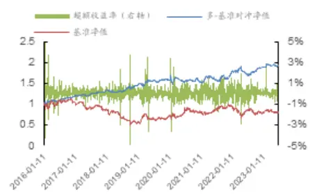
数据来源：天软科技, 广发证券发展研究中心

[分析师：Table_Author]陈原文

同SAC 执证号：S0260517080003

0755-82797057

chenyuanwen@gf.com.cn

分析师： 罗军

同SAC 执证号：S0260511010004

020-66335128

luojun@gf.com.cn

分析师： 安宁宁

SAC 执证号：S0260512020003

SFC CE No. BNW179

0755-23948352

anningning@gf.com.cn

请注意，陈原文,罗军并非香港证券及期货事务监察委员会的注册持牌人，不可在香港从事受监管活动。

## [Table_ 相关研究：DocRe

金融工程:基于预期损失的下 2023-12-10行贝塔因子研究

基于涨跌停溢出效应的因子2023-11-21研究:行为金融研究系列之八

金融工程:——基于宏观超预 2023-11-08期事件的行业配置策略

## 一、因子挖掘思考

## （一）高频信息

近年来，A股市场机构化趋势明显，量化私募机构的管理规模也迅速扩大，产生了一批管理规模超过百亿的量化私募机构。与此同时，传统的风格因子波动增大，从市场获取超额收益的难度在增加。

因子拥挤是因子收益下降的原因之一。因子代表着市场某方面的非有效性、或者是一段时期内的定价失效。当某类因子收益高的时候，会吸引更多的资金进入，从而出现因子拥挤，降低因子的预期收益。一旦新的因子被公开，套利资金的介入会使得错误定价范围收窄，因子收益也会跟着下降。因此，在多因子选股模型中，因子的开发和更新迭代变得越来越重要。

与低频因子相比，高频数据在用于量化投资中存在一定优势。

首先，高频价量数据的体量明显大于低频数据。以分钟行情为例，用压缩效果较好的mat格式存储2020年全市场股票的分钟行情数据（包括分钟频的开高低收价格数据、买卖盘挂单数据等），约为12GB。如果是快照行情（目前上交所和深交所都是3秒一笔）或者level 2行情，数据量要大很多。因此，高频数据因子挖掘对信息处理能力和处理效率的要求较高。而且，日内数据，尤其是level 2数据，一般要额外付费，甚至需要自行下载存储实时行情，在此基础上构建的因子拥挤度较低。

其次，高频价量数据一般是多维的时间序列数据，数据中噪声比例较高，而且与ROE、PE这类低频指标本身就具有选股能力不同的是，原始的高频行情数据一般不能直接用作选股因子，而要通过信号变换、时间序列分析、机器学习等方法从高频数据中构建特征，才能作为选股因子。此类因子与低频信号的相关性较低，而且由于因子开发流程相对复杂，不同投资者构建的因子更具有多样性。

此外，高频数据开发的因子一般调仓周期较短，意味着在检验因子有效性的时候，同一段测试期具有更多的独立样本。例如，在一年的测试期内，只有12个独立的样本段用于检验月频调仓的因子，与之相比，有约50个独立的时段用于检验周频调仓因子，有超过240个独立的时段用于检验日频调仓的因子。独立样本的增多有助于检验高频因子的有效性。

高频数据挖掘因子的难点在于数据维度大、噪声高。凭借专业投资者的经验或者是参阅已发表的文献，可以从高频数据中提炼出一部分有选股能力的特征。此外，机器学习方法擅长从数据中寻找规律和特征，是高频数据因子挖掘的有力工具。

## （二）低频信息

以传统日频价量和更低频财务数据为基础的因子开发是一种研究途径。由于基础因子广为人知，在此基础上进行因子挖掘的收益提升空间相对有限。而且日频数据由于本身的数据量和信息量有限，过度挖掘会增大过拟合的风险。

对于低频信息的挖掘，从最近几年的进展上看，低频里的增量信息成果越来越少。从数据维度上看，低频的因子建模更多是从一些另类数据或者是新的方法、理论成果中出发构建相关的因子。如另类数据角度，从互联网中的股吧、新闻、关注度等角度，或者是专利数据、供应链相关数据等。新的理论成果如从图网络等角度出发构建相关的因子。

本篇专题报告基于个股的融资融券情况出发，研究个股融资融券数据构建因子的选股效果。

## 二、融资融券因子研究进展

## （一）融资融券指标与 A股市场的关系

融资融券是指投资者向证券公司提交担保物，借入资金买入标的证券或者借入标的证券卖出的交易方式，2010年3月31日，我国资本市场正式启动融资融券交易试点，标志着我国资本市场做空机制的诞生。融资融券交易制度又被称作证券信用交易或是保证金制度，投资者在看涨或看跌个股或者市场行情时通过融资或融券的方式扩大交易筹码，买卖股票来达到获取收益的目的，所以融资融券相关的指标可以在一定程度上反映市场和对于个股的多空态度和情绪。

为探索融资融券与A股市场进行实证研究，本报告首先对两融余额与指数收益进行相关性统计。

图1表明，2016年至今，融资融券余额与上证指数和深证成指呈现正相关性，其相关系数分别为0.673和0.767。从曲线上观察，两市融资融券余额的变化要滞后于指数的变化。

图2表明，2016年至今，融资融券余额占A股流通市值与上证指数和深证成指数呈现正相关性，其相关系数为0.431和0.615。

图 1：两融余额与市场走势比较
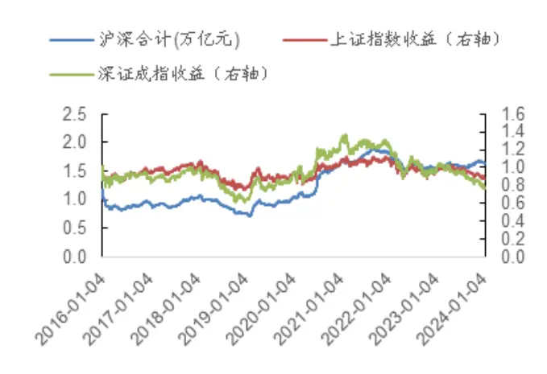
数据来源：东方财富 Choice数据，广发证券发展研究中心

图 2：两融余额占比与市场走势比较
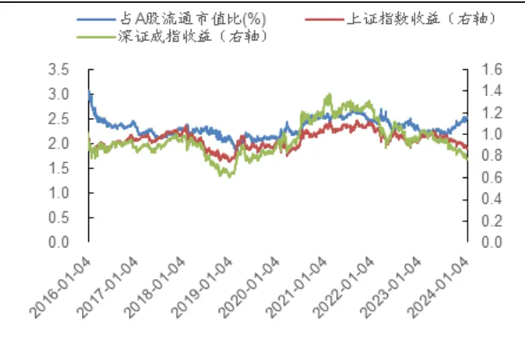
数据来源：东方财富 Choice数据，广发证券发展研究中心

表 1：两融余额数据与市场相关性分析

| 统计区间 | 上证指数 | 深证成指 |  | 上证指数 | 深证成指 |
| --- | --- | --- | --- | --- | --- |
| 2016 | 0.616 | 0.471 |  | -0.337 | -0.392 |
| 2017 | 0.797 | 0.882 |  | -0.063 | 0.076 |
| 2018 | 0.961 | 0.979 |  | 0.488 | 0.563 |
| 2019 | 0.732 | 0.875 |  | 0.002 两融余额 | 0.184 |
| 2020 | 0.911 | 0.952 |  | 0.694 | 0.771 |
| 2021 | 0.488 | 0.170 |  | -0.490 | -0.489 |
| 2022 | 0.843 | 0.882 | -0.087 | 0.006 |  |
| 2023 | -0.457 | -0.610 | -0.882 | -0.876 |  |
| ALL | 0.673 | 0.767 | 0.431 | 0.615 |  |

数据来源：天软科技，广发证券发展研究中心

## （二）融资融券因子初步实证结果与改进

本报告根据融资融券指标与A股市场的关系，研究融资融券余额对于股票收益的影响，对于某支股票而言，将其在每一交易日收盘时的融资融券余额作为这支股票的融资融券因子

本报告在全市场选股范围内，对20160101-20231231区间的融资融券因子进行周度（5天）调仓的回溯测试。实证结果表明，因子值越小，股票未来收益越高。融资融券因子在多头相对中证全指策略的表现较差，策略整体年化收益率0.16%，信息比率0.22，最大回撤16.93%。

图 3：全市场 融资融券因子-IC值与 IC累计值走势
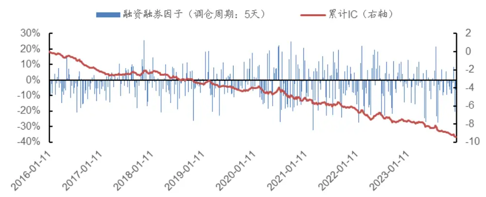
数据来源：东方财富 Choice数据，广发证券发展研究中心

表2：融资融券因子-多空对冲策略与多头相对市场策略-整体与分年度表现-5天调仓

| 纯多头 |  | 多空对冲策略 |  |  |  |  | 多头-全市场策略 |  |  |  |  |
| --- | --- | --- | --- | --- | --- | --- | --- | --- | --- | --- | --- |
| 统计 | 年度 | 年度 | 累计 | 年化 | 最大 | 信息 | 年度 | 累计 | 年化 | 最大 | 信息 |
| 区间 | 收益率 | 收益率 | 收益率 | 波动率 | 回撤 | 比率 | 收益率 | 收益率 | 波动率 | 回撤 | 比率 |
| 2016 | -7.58% | 12.14% | 12.35% | 6.83% | 3.94% | 0.84 | -5.08% | -2.91% | 15.47% | 10.24% | 0.04 |
| 2017 | -10.48% | -7.62% | 3.79% | 6.92% | 10.37% | -1.12 | -14.81% | -17.29% | 9.43% | 15.92% | -1.55 |
| 2018 | -32.24% | 3.57% | 7.49% | 6.35% | 5.32% | 1.45 | -7.72% | -23.67% | 11.03% | 16.46% | -0.86 |
| 2019 | 31.36% | 4.64% | 12.49% | 6.35% | 4.18% | -0.99 | 6.66% | -18.59% | 9.55% | 10.58% | 0.27 |
| 2020 | 11.77% | -5.02% | 6.84% | 6.53% | 6.86% | -0.81 | -4.70% | -22.41% | 15.03% | 12.44% | -0.78 |
| 2021 | 25.49% | 15.67% | 23.59% | 8.23% | 5.90% | 0.71 | 20.54% | -6.47% | 10.75% | 10.44% | 1.00 |
| 2022 | -5.58% | 19.19% | 47.31% | 6.82% | 3.51% | 1.85 | 8.87% | 1.82% | 10.45% | 8.38% | 1.27 |
| 2023 | -4.67% | 2.16% | 50.49% | 4.93% | 6.07% | 0.51 | -0.54% | 1.27% | 8.29% | 10.24% | 0.28 |
| ALL | -1.42% | 5.46% | 50.49% | 6.69% | 10.84% | 0.32 | 0.16% | 1.27% | 11.66% | 16.93% | 0.22 |

年度收益率表示每一年对应策略的收益率，其中在 ALL行中表示整个回测周期的年化收益率；累计收益率表示回测开始截止至当年年末的累计收益率，下同。
数据来源：天软科技，广发证券发展研究中心

由于融资融券余额因子在A股市场表现欠佳，本报告对融资融券类因子进行整合并提出新的融资融券类因子构造思路。融资融券相关指标一定程度上反映市场的多空态度和情绪，融资融券指标与个股的流动性、市值等因素共同作用对股票的收益率造成影响，所以在构建融资融券类因子的时候，需要纳入个股的成交量、流通市值等数据；同时，融资融券指标对于股票的影响存在时延性，考虑指标在一定时间内的变化程度可能更具合理性。本报告综合考虑上述两点，在考虑融资融券指标的同时，进一步从时序角度考虑融资融券指标在过去一段时间内的变动程度，构建基于融资融券指标的变化率及其优化因子，同时，考虑个股成交量、市值等其他价量数据，与现有的融资融券指标进行整合，构建新的因子，并探讨该类因子在A股的有效性。

## 三、融资融券因子构造方法与策略框架

## （一）因子构造方法

根据上述融资融券因子研究得出的初步结论，本篇专题报告构建20种融资融券类因子，具体的因子定义、构造逻辑与计算方法如下所示。

表 3：融资融券类因子

| 因子名称 | 因子计算方法 |
| --- | --- |
| 净融券卖出占比增速因子 | (t 期净融券卖出占比- t-N 期净融券卖出占比)/t-N 期净融券 卖出占比 |
| 净融资买入占比增速因子 | (t期净融资买入占比-t-N期净融资买入占比）/t-N 期净融资 买入占比 |
| 融券余额变化率因子 | (t 期融券余额- t-N 期融券余额)/ t-N 期融券余额 |
| 融券余额增长率因子 | t期融券余额占比-t-N 期融券余额占比 |
| 融券卖出占比增速因子 | (t 期融券卖出占比- t-N 期融券卖出占比)/t-N 期融券卖出占 比 |
| 融券余额占比增速因子 | (t 期融券余额占比- t-N 期融券余额占比）/t-N 期融券余额占 比 |
| 融资买入占比增速因子 | (t 期融资买入占比- t-N 期融资买入占比）/t-N 期融资买入占 比 |
| 融券卖出量比 | t期融券卖出量/t-N期融券卖出量 |
| 融资买入额比因子 | t 期融资买入额/t-N 期融资买入额 |
| 融资余额占比增速因子 | (t期融资余额占比- t-N 期融资余额占比）/t-N 期融资余额占 比 |
| 融资余额变化率因子 | (t 期融资余额- t-N 期融资余额) / t-N 期融资余额 |
| 融资余额增长率因子 | t期融资余额占比-t-N期融资余额占比 |
| 净融券卖出占比因子 | 过去N个交易日融券卖出之和-过去N个交易日融券偿还额之 和/过去N个交易日成交额之和 |
| 净融资买入占比因子 | （过去N个交易日融资买入之和-过去Ν个交易日融资偿还额 之和）/过去Ν个交易日成交额之和 |
| 融券余额占比因子 | 当期融券余额/流通市值 |
| 融资余额占比因子 | 当期融资余额/流通市值 |
| 融券卖出占比因子 | 过去N个交易日融券卖出之和/过去N个交易日成交额之和 |
| 融资买入占比因子 | 过去N个交易日融资买入之和/过去N个交易日成交额之和 |
| 融券卖出量占融券余额比 | 当期融券卖出额/融券余额 |
| 融资买入额占融资余额比 | 当期融资买入额/融资余额 |

数据来源：广发证券发展研究中心

## 四、实证分析

## （一）数据说明

选股范围：分为全市场、中证1000成分股、中证500成分股

股票预处理：剔除非上市、摘牌、ST/*ST、涨跌停板、上市未满1年股票

因子预处理：MAD去极值、Z-Score标准化、市值中性化

回测区间： 2016.01.01 – 2023.12.31

分档方式：根据当期股票的因子值，从小到大分为五档

调仓周期：5天，10天和20天以收盘价调仓

## （二）全市场中因子表现

根据表3中所展示的因子计算方法，在全市场选股域中计算个股的因子值，同时计算个股未来5天，10天和20天的收益，以研究因子对于股票未来收益的预测能力。因子对于股票未来收益的预测能力用IC值，IC-IR等进行衡量，将在全市场中计算得到的各因子预测能力指标记录如下：

表 4：融资融券类因子 IC表现-全市场

| 因子名称 | IC 均值 |  |  | IC-IR |  |  |
| --- | --- | --- | --- | --- | --- | --- |
|  | 预测 | 预测 | 预测 | 预测 | 预测 | 预测 |
|  | 5天 | 10天 | 20 天 | 5天 | 10 天 | 20 天 |
| 净融券卖出占比增速因子 净融券卖出占比增速因子 | -0.28% | -0.16% | -0.14% | -0.294 | -0.126 | -0.087 |
| (N=5) | -0.03% | 0.06% | -0.11% | -0.029 | 0.046 | -0.060 |
| 净融券卖出占比增速因子 （N=10） 净融券卖出占比增速因子 | 0.11% | -0.04% | 0.08% | 0.112 | -0.029 | 0.035 |
| (N=15) 净融券卖出占比增速因子 | 0.02% | 0.03% | 0.03% | 0.025 | 0.022 | 0.011 |
| （N=20） | 0.23% | 0.20% | 0.28% | 0.228 | 0.137 | 0.135 |
| 净融资买入占比增速因子 净融资买入占比增速因子 | -0.25% | 0.09% | 0.20% | -0.208 | 0.049 | 0.079 |
| （N=5） | -0.39% | -0.50% | -0.35% | -0.406 | -0.314 | -0.212 |
| 净融资买入占比增速因子 (N=10) | -0.09% | -0.08% | -0.20% | -0.084 | -0.055 | -0.095 |
| 净融资买入占比增速因子 （N=15） | 0.26% | 0.06% | 0.09% | 0.270 | 0.043 | 0.044 |
| 净融资买入占比增速因子 (N=20) | 0.03% | -0.17% | -0.13% | 0.030 | -0.112 | -0.061 |
| 融券余额变化率因子 融券余额变化率因子 | -0.55% | -0.38% | -0.26% | -0.953 | -0.475 | -0.213 |
| (N=5） | -1.42% | -1.16% | -1.28% | -2.178 | -1.427 | -1.035 |
| 融券余额变化率因子 （N=10） | -1.57% | -1.95% | -2.40% | -1.589 | -1.501 | -1.288 |
| 融券余额变化率因子 (N=15) | -1.78% | -2.28% | -3.29% | -1.724 | -1.499 | -1.694 |
| 融券余额变化率因子 （N=20） | -2.36% | -2.71% | -4.53% | -2.620 | -1.858 | -2.057 |
| 融券余额增长率因子 | -0.50% | -0.44% | -0.32% | -0.554 | -0.361 | -0.188 |
| 融券余额增长率因子 （N=5） | -1.29% | -1.33% | -1.51% | -1.333 | -1.055 | -0.744 |
| 融券余额增长率因子 (N=10) | -1.74% | -1.46% | -1.72% | -2.245 | -1.394 | -1.271 |
| 融券余额增长率因子 （N=15） | -1.94% | -1.74% | -2.09% | -2.604 | -1.734 | -1.285 |
| 融券余额增长率因子 (N=20) | -1.40% | -1.06% | -0.87% | -1.989 | -1.177 | -0.661 |
| 融券卖出占比增速因子 | 0.17% | -0.07% | -0.04% | 0.129 | -0.041 | -0.014 |
| 融券卖出占比增速因子 (N=5) | -0.22% | -0.36% | -0.12% | -0.169 | -0.163 | -0.053 |

识别风险，发现价值

| 融券卖出占比增速因子 （N=10） | -0.26% | -0.17% | -0.05% | -0.228 | -0.102 | -0.017 |
| --- | --- | --- | --- | --- | --- | --- |
| 融券卖出占比增速因子 (N=15) | 0.16% | 0.20% | -0.04% | 0.109 | 0.102 | -0.014 |
| 融券卖出占比增速因子 （N=20） | -0.20% | -0.18% | -0.40% | -0.139 | -0.103 | -0.167 |
| 融券余额占比增速因子 | -0.32% | 0.33% | -0.20% | -0.284 | 0.205 | -0.083 |
| 融券余额占比增速因子 （N=5） | -0.75% | -1.06% | -0.91% | -0.727 | -0.939 | -0.464 |
| 融券余额占比增速因子 (N=10) | -1.15% | -1.76% | -2.17% | -1.341 | -1.460 | -1.187 |
| 融券余额占比增速因子 （N=15） | -1.30% | -1.62% | -2.17% | -1.617 | -1.438 | -1.354 |
| 融券余额占比增速因子 (N=20） | -2.40% | -2.67% | -3.29% | -2.085 | -2.028 | -1.770 |
| 融资买入占比增速因子 | -1.44% | -0.05% | -0.08% | -1.581 | -0.050 | -0.035 |
| 融资买入占比增速因子 (N=5) | 0.07% | 0.18% | -0.20% | 0.058 | 0.096 | -0.073 |
| 融资买入占比增速因子 （N=10） | -0.01% | -0.06% | 0.03% | -0.007 | -0.040 | 0.017 |
| 融资买入占比增速因子 (N=15) | 0.13% | 0.03% | -0.05% | 0.121 | 0.023 | -0.025 |
| 融资买入占比增速因子 （N=20） | -0.10% | -0.08% | 0.12% | -0.098 | -0.054 | 0.053 |
| 融资买入额比因子 | -0.30% | 0.12% | 0.09% | -0.285 | 0.094 | 0.041 |
| 融资买入额比因子（N=5） | -0.69% | -0.06% | -0.55% | -0.570 | -0.042 | -0.244 |
| 融资买入额比因子 (N=10) | -0.44% | -0.10% | -0.41% | -0.323 | -0.041 | -0.154 |
| 融资买入额比因子 （N=15） | -1.51% | -1.22% | -1.79% | -0.930 | -0.613 | -0.608 |
| 融资买入额比因子 (N=20) | -1.83% | -1.63% | -1.83% | -1.349 | -0.725 | -0.807 |
| 融资余额占比增速因子 | -0.78% | -0.52% | -0.81% | -1.433 | -0.634 | -0.680 |
| 融资余额占比增速因子 (N=5) | -0.22% | -0.24% | -0.33% | -0.214 | -0.202 | -0.159 |
| 融资余额占比增速因子 （N=10） | 0.53% | 0.11% | 0.46% | 0.438 | 0.062 | 0.169 |
| 融资余额占比增速因子 (N=15) | 0.81% | 0.51% | 0.74% | 0.541 | 0.266 | 0.298 |
| 融资余额占比增速因子 | 0.88% | 0.30% | 0.03% | 0.648 | 0.143 | 0.010 |
| （N=20） 融资余额变化率因子 | -0.66% | -0.38% | -0.25% | -1.029 | -0.413 | -0.192 |
| 融资余额变化率因子 （N=5） | -1.40% | -1.24% | -1.34% | -1.829 | -1.446 | -1.098 |
| 融资余额变化率因子 (N=10) | -2.65% | -2.85% | -3.28% | -2.548 | -2.217 | -1.689 |
| 融资余额变化率因子 （N=15） | -2.60% | -3.63% | -4.16% | -2.702 | -2.395 | -1.879 |
| 融资余额变化率因子 (N=20) | -1.99% | -1.67% | -2.16% | -2.104 | -1.370 | -1.197 |
| 融资余额增长率因子 | -1.08% | -0.86% | -1.12% | -1.326 | -0.914 | -0.791 |
| 融资余额增长率因子 (N=5) | -1.32% | -1.31% | -1.26% | -1.261 | -1.131 | -0.675 |
| 融资余额增长率因子 （N=10） | -1.71% | -1.46% | -1.61% | -2.107 | -1.452 | -1.277 |
| 融资余额增长率因子 (N=15) | -1.55% | -1.78% | -1.97% | -2.536 | -1.534 | -1.364 |
| 融资余额增长率因子 （N=20） | -1.27% | -1.04% | -0.96% | -2.002 | -1.133 | -0.793 |
| 净融券卖出占比因子 | -0.15% | 0.00% | -0.07% | -0.183 | -0.003 | -0.044 |
| 净融资买入占比因子 | 0.13% | -0.01% | 0.08% | 0.175 | -0.011 | 0.048 |
| 融券余额占比因子 | -0.34% | -0.26% | -0.03% | -0.488 | -0.321 | -0.023 |
| 融资余额占比因子 | 0.42% | -0.10% | -0.42% | 0.315 | -0.057 | -0.185 |
| 融券卖出占比因子 | 0.02% | -0.12% | -0.16% | 0.019 | -0.094 | -0.099 |
| 融资买入占比因子 | 0.21% | 0.09% | 0.14% | 0.215 | 0.069 | 0.077 |
| 融券卖出量占融券余额比 | -2.74% | -2.67% | -2.37% | -1.878 | -1.820 | -1.354 |
| 融资买入额占融资余额比 | -4.27% | -5.20% | -5.21% | -2.208 | -1.944 | -1.478 |

数据来源：天软科技，广发证券发展研究中心
未标明 N的变化率型因子默认N=1，下同

表 5：融资融券类因子 RankIC表现-全市场

| 因子名称 | RankIC 均值 |  |  | RankIC-IR |  |  |
| --- | --- | --- | --- | --- | --- | --- |
|  | 预测 | 预测 | 预测 | 预测 | 预测 | 预测 |
|  | 5天 -0.28% | 10天 -0.15% | 20 天 -0.14% | 5天 -0.270 | 10 天 -0.109 | 20 天 -0.074 |
| 融券余额占比增速因子 融券余额占比增速因子 |  |  |  | -0.025 | 0.043 | -0.053 |
| （N=5） 融券余额占比增速因子 | -0.03% | 0.05% | -0.11% |  |  |  |
| (N=10) 融券余额占比增速因子 | 0.11% | -0.04% | 0.08% | 0.106 | -0.026 | 0.031 |
| （N=15） 融券余额占比增速因子 | 0.02% | 0.03% | 0.03% | 0.023 | 0.019 | 0.011 |
| (N=20) | 0.23% | 0.18% | 0.27% | 0.214 | 0.118 | 0.124 |
| 融资买入占比增速因子 融资买入占比增速因子 | -0.24% | 0.09% | 0.18% | -0.207 | 0.042 | 0.074 |
| (N=5) | -0.35% | -0.47% | -0.32% | -0.379 | -0.299 | -0.213 |
| 融资买入占比增速因子 （N=10） | -0.09% | -0.07% | -0.20% | -0.076 | -0.053 | -0.089 |
| 融资买入占比增速因子 (N=15) | 0.24% | 0.05% | 0.08% | 0.249 | 0.040 | 0.043 |
| 融资买入占比增速因子 （N=20） | 0.03% | -0.17% | -0.13% | 0.029 | -0.106 | -0.052 |
| 融资买入额比因子 | -0.53% | -0.34% | -0.25% | -0.807 | -0.441 | -0.193 |
| 融资买入额比因子（N=5） | -1.39% | -1.06% | -1.23% | -2.043 | -1.311 | -0.952 |
| 融资买入额比因子 (N=10) | -1.43% | -1.76% | -2.44% | -1.395 | -1.460 | -1.220 |
| 融资买入额比因子 （N=15） | -1.65% | -2.02% | -3.18% | -1.490 | -1.286 | -1.606 |
| 融资买入额比因子 (N=20) | -2.25% | -2.49% | -4.33% | -2.225 | -1.613 | -1.818 |
| 融资余额占比增速因子 | -0.46% | -0.40% | -0.30% | -0.519 | -0.326 | -0.167 |
| 融资余额占比增速因子 (N=5) | -1.20% | -1.30% | -1.43% | -1.262 | -1.015 | -0.703 |
| 融资余额占比增速因子 （N=10） | -1.66% | -1.41% | -1.65% | -2.051 | -1.338 | -1.152 |
| 融资余额占比增速因子 (N=15) | -1.96% | -1.70% | -1.87% | -2.324 | -1.599 | -1.078 |
| 融资余额占比增速因子 （N=20） | -1.30% | -0.98% | -0.80% | -1.911 | -1.124 | -0.562 |
| 融资余额变化率因子 | 0.17% | -0.07% | -0.04% | 0.126 | -0.037 | -0.012 |
| 融资余额变化率因子 （N=5） | -0.20% | -0.35% | -0.11% | -0.168 | -0.162 | -0.051 |
| 融资余额变化率因子 (N=10) | -0.24% | -0.16% | -0.05% | -0.229 | -0.091 | -0.015 |
| 融资余额变化率因子 （N=15） | 0.16% | 0.19% | -0.04% | 0.094 | 0.095 | -0.012 |
| 融资余额变化率因子 (N=20) | -0.19% | -0.16% | -0.38% | -0.132 | -0.090 | -0.144 |
| 融资余额增长率因子 | -0.29% | 0.30% | -0.19% | -0.249 | 0.205 | -0.079 |
| 融资余额增长率因子 (N=5) | -0.72% | -1.02% | -0.86% | -0.729 | -0.829 | -0.404 |
| 融资余额增长率因子 （N=10） | -1.05% | -1.67% | -1.97% | -1.268 | -1.307 | -1.006 |
| 融资余额增长率因子 (N=15) | -1.19% | -1.52% | -2.07% | -1.563 | -1.435 | -1.228 |
| 融资余额增长率因子 （N=20） | -2.24% | -2.45% | -3.09% | -2.064 | -1.948 | -1.743 |
| 净融券卖出占比增速因子 | -1.31% | -0.05% | -0.07% | -1.540 | -0.043 | -0.033 |
| 净融券卖出占比增速因子 （N=5） | 0.06% | 0.17% | -0.19% | 0.051 | 0.091 | -0.064 |
| 净融券卖出占比增速因子 (N=10) | -0.01% | -0.06% | 0.03% | -0.007 | -0.039 | 0.015 |
| 净融券卖出占比增速因子 （N=15） | 0.13% | 0.03% | -0.05% | 0.108 | 0.020 | -0.023 |
| 净融券卖出占比增速因子 | -0.10% | -0.08% | 0.12% | -0.096 | -0.053 | 0.047 |
| (N=20) 净融资买入占比增速因子 | -0.28% | 0.11% | 0.08% | -0.288 | 0.089 | 0.037 |
| 净融资买入占比增速因子 (N=5) | -0.66% | -0.06% | -0.53% | -0.577 | -0.041 | -0.233 |
| 净融资买入占比增速因子 | -0.43% | -0.09% | -0.41% | -0.273 | -0.036 | -0.140 |
| （N=10） 净融资买入占比增速因子 | -1.51% | -1.11% | -1.76% | -0.895 | -0.553 | -0.605 |
| (N=15) 净融资买入占比增速因子 | -1.82% | -1.60% | -1.81% | -1.230 | -0.720 | -0.758 |
| （N=20） 融券余额变化率因子 | -0.77% | -0.48% | -0.80% | -1.242 | -0.572 | -0.593 |
| 融券余额变化率因子 （N=5） | -0.20% | -0.22% | -0.32% | -0.185 | -0.183 | -0.150 |
| 融券余额变化率因子 | 0.48% | 0.11% | 0.44% | 0.368 | 0.054 | 0.161 |
| (N=10) 融券余额变化率因子 | 0.77% | 0.49% | 0.68% | 0.483 | 0.243 | 0.295 |
| （N=15） 融券余额变化率因子 | 0.84% | 0.29% | 0.03% | 0.563 | 0.131 | 0.009 |
| (N=20) 融券余额增长率因子 | -0.60% | -0.34% | -0.25% | -0.980 | -0.383 | -0.170 |

识别风险，发现价值

| 融券余额增长率因子 (N=5） | -1.33% | -1.22% | -1.28% | -1.560 | -1.409 | -0.949 |
| --- | --- | --- | --- | --- | --- | --- |
| 融券余额增长率因子 （N=10） | -2.62% | -2.57% | -3.09% | -2.512 | -2.071 | -1.586 |
| 融券余额增长率因子 (N=15) | -2.42% | -3.29% | -4.20% | -2.398 | -2.387 | -1.842 |
| 融券余额增长率因子 （N=20） | -1.82% | -1.53% | -2.07% | -1.982 | -1.330 | -1.142 |
| 融券卖出占比增速因子 | -1.04% | -0.86% | -1.00% | -1.158 | -0.783 | -0.739 |
| 融券卖出占比增速因子 （N=5） | -1.24% | -1.22% | -1.24% | -1.261 | -1.103 | -0.671 |
| 融券卖出占比增速因子 (N=10） | -1.60% | -1.41% | -1.47% | -1.995 | -1.263 | -1.282 |
| 融券卖出占比增速因子 （N=15） | -1.58% | -1.66% | -1.99% | -2.177 | -1.345 | -1.362 |
| 融券卖出占比增速因子 （N=20） | -1.16% | -0.95% | -0.89% | -1.791 | -1.059 | -0.747 |
| 净融券卖出占比因子 | -0.14% | 0.00% | -0.07% | -0.170 | -0.003 | -0.037 |
| 净融资买入占比因子 | 0.13% | -0.01% | 0.08% | 0.174 | -0.011 | 0.048 |
| 融券余额占比因子 | -0.34% | -0.25% | -0.03% | -0.444 | -0.274 | -0.022 |
| 融资余额占比因子 | 0.39% | -0.10% | -0.42% | 0.292 | -0.048 | -0.171 |
| 融券卖出占比因子 | 0.02% | -0.11% | -0.15% | 0.017 | -0.095 | -0.085 |
| 融资买入占比因子 | 0.21% | 0.09% | 0.13% | 0.201 | 0.066 | 0.065 |
| 融券卖出量占融券余量比 | -2.68% | -2.40% | -2.12% | -1.719 | -1.789 | -1.305 |
| 融资买入额占融资余额比 | -4.15% | -5.12% | -5.15% | -2.183 | -1.861 | -1.452 |

数据来源：天软科技，广发证券发展研究中心

表 6：融资融券类因子 IC/RankIC 胜率-全市场

| 因子名称 | IC 胜率 |  |  | RankIC 胜率 |  |  |
| --- | --- | --- | --- | --- | --- | --- |
|  | 预测 | 预测 | 预测 | 预测 | 预测 | 预测 |
|  | 5天 | 10天 | 20 天 53.33% | 5天 52.70% | 10 天 45.34% | 20 天 50.88% |
| 融券余额占比增速因子 融券余额占比增速因子 | 55.64% | 46.45% |  |  |  |  |
| （N=5） 融券余额占比增速因子 | 49.39% | 55.81% | 51.25% | 52.83% | 53.30% | 55.80% |
| (N=10) 融券余额占比增速因子 | 51.48% | 57.46% | 65.87% | 59.15% | 65.27% | 63.11% |
| （N=15） | 58.04% | 54.56% | 60.04% | 59.04% | 64.61% | 63.47% |
| 融券余额占比增速因子 (N=20) | 64.02% | 64.42% | 64.89% | 65.20% | 58.61% | 66.27% |
| 融资买入占比增速因子 | 60.33% | 47.02% | 49.06% | 59.08% | 48.95% | 49.57% |
| 融资买入占比增速因子 (N=5) | 51.13% | 51.84% | 48.75% | 52.06% | 50.48% | 46.01% |
| 融资买入占比增速因子 （N=10） | 52.36% | 50.68% | 45.62% | 49.65% | 48.36% | 49.23% |
| 融资买入占比增速因子 (N=15) | 49.09% | 49.80% | 50.35% | 50.59% | 48.31% | 52.97% |
| 融资买入占比增速因子 （N=20） | 51.01% | 50.42% | 48.95% | 51.21% | 52.54% | 47.84% |
| 融资买入额比因子 | 49.99% | 46.18% | 44.48% | 49.90% | 43.75% | 48.38% |
| 融资买入额比因子（N=5） | 53.78% | 49.46% | 50.17% | 49.34% | 49.69% | 52.40% |
| 融资买入额比因子 (N=10) | 53.17% | 48.57% | 46.55% | 51.83% | 53.69% | 50.42% |
| 融资买入额比因子 （N=15） | 56.86% | 56.90% | 49.64% | 55.27% | 54.82% | 53.04% |
| 融资买入额比因子 (N=20) | 63.89% | 54.87% | 57.56% | 59.05% | 59.89% | 55.76% |
| 融资余额占比增速因子 | 51.23% | 48.99% | 49.96% | 49.50% | 49.34% | 51.50% |
| 融资余额占比增速因子 (N=5) | 55.53% | 54.09% | 52.32% | 53.15% | 50.87% | 56.08% |
| 融资余额占比增速因子 （N=10） | 52.82% | 46.77% | 50.13% | 51.18% | 47.54% | 48.69% |
| 融资余额占比增速因子 (N=15) | 52.06% | 48.02% | 49.83% | 50.27% | 49.72% | 48.20% |
| 融资余额占比增速因子 | 50.90% | 47.55% | 47.46% | 51.69% | 48.74% | 46.14% |
| （N=20） 融资余额变化率因子 | 57.53% | 55.91% | 54.70% | 55.13% | 55.35% | 49.21% |
| 融资余额变化率因子 （N=5） | 63.92% | 62.14% | 64.04% | 60.68% | 63.12% | 61.78% |
| 融资余额变化率因子 (N=10) | 58.58% | 60.49% | 62.18% | 60.84% | 57.76% | 62.75% |
| 融资余额变化率因子 （N=15） | 59.73% | 62.58% | 62.85% | 57.11% | 58.54% | 63.43% |
| 融资余额变化率因子 (N=20) | 55.10% | 54.56% | 53.38% | 53.65% | 55.93% | 56.42% |
| 融资余额增长率因子 | 51.39% | 48.43% | 52.83% | 55.43% | 51.78% | 52.68% |
| 融资余额增长率因子 (N=5) | 59.31% | 55.96% | 59.52% | 59.46% | 60.79% | 58.89% |
| 融资余额增长率因子 （N=10） | 63.05% | 61.03% | 63.28% | 63.13% | 58.19% | 61.70% |
| 融资余额增长率因子 (N=15) | 63.73% | 60.57% | 65.39% | 60.55% | 63.49% | 67.39% |
| 融资余额增长率因子 （N=20） | 61.68% | 61.42% | 60.06% | 60.99% | 57.66% | 57.68% |
| 净融券卖出占比增速因子 | 52.97% | 51.02% | 50.82% | 50.82% | 51.97% | 51.38% |
| 净融券卖出占比增速因子 （N=5） | 50.44% | 49.06% | 49.82% | 47.31% | 49.06% | 50.86% |
| 净融券卖出占比增速因子 (N=10) | 50.38% | 47.96% | 49.99% | 50.57% | 49.84% | 50.76% |
| 净融券卖出占比增速因子 （N=15） | 50.99% | 50.23% | 50.20% | 49.40% | 51.89% | 48.01% |
| 净融券卖出占比增速因子 | 49.91% | 52.22% | 50.61% | 50.33% | 53.18% | 53.27% |
| (N=20) 净融资买入占比增速因子 | 47.38% | 50.48% | 46.20% | 50.61% | 48.38% | 49.51% |
| 净融资买入占比增速因子 (N=5) | 52.81% | 54.47% | 50.70% | 54.35% | 53.85% | 53.59% |
| 净融资买入占比增速因子 | 48.70% | 50.29% | 51.33% | 50.08% | 50.26% | 50.93% |
| （N=10） 净融资买入占比增速因子 (N=15) | 48.70% | 52.15% | 48.47% | 51.56% | 53.41% | 50.82% |
| 净融资买入占比增速因子 | 51.13% | 50.20% | 52.00% | 47.74% | 49.68% | 50.66% |
| （N=20） 融券余额变化率因子 | 46.43% | 47.23% | 44.89% | 47.84% | 47.75% | 49.24% |
| 融券余额变化率因子 （N=5） | 48.16% | 49.98% | 53.08% | 53.13% | 52.74% | 47.73% |
| 融券余额变化率因子 | 43.79% | 45.21% | 55.45% | 43.14% | 44.88% | 48.34% |
| (N=10) 融券余额变化率因子 | 42.42% | 47.46% | 48.90% | 46.51% | 42.75% | 50.94% |
| （N=15） 融券余额变化率因子 | 49.51% | 54.50% | 52.18% | 51.78% | 50.78% | 50.72% |
| (N=20) 融券余额增长率因子 | 55.14% | 55.62% | 51.96% | 57.18% | 55.76% | 49.74% |

识别风险，发现价值

| 融券余额增长率因子 (N=5） | 64.85% | 64.64% | 62.45% | 57.96% | 60.49% | 58.36% |
| --- | --- | --- | --- | --- | --- | --- |
| 融券余额增长率因子 （N=10） | 61.46% | 64.19% | 60.84% | 61.15% | 63.01% | 61.41% |
| 融券余额增长率因子 (N=15) | 60.68% | 62.74% | 65.96% | 61.58% | 61.06% | 66.97% |
| 融券余额增长率因子 （N=20） | 57.48% | 61.94% | 58.80% | 59.17% | 59.52% | 59.36% |
| 融券卖出占比增速因子 | 49.87% | 48.75% | 45.99% | 50.09% | 47.41% | 49.82% |
| 融券卖出占比增速因子 （N=5） | 47.26% | 55.54% | 50.01% | 46.49% | 55.88% | 48.49% |
| 融券卖出占比增速因子 (N=10) | 49.19% | 52.44% | 47.78% | 47.54% | 51.25% | 49.76% |
| 融券卖出占比增速因子 （N=15） | 47.05% | 49.04% | 45.89% | 49.41% | 49.82% | 51.69% |
| 融券卖出占比增速因子 (N=20) | 48.25% | 49.17% | 47.59% | 47.68% | 51.90% | 45.85% |
| 净融券卖出占比因子 | 49.47% | 51.68% | 49.84% | 49.04% | 50.05% | 50.44% |
| 净融资买入占比因子 | 49.41% | 50.83% | 47.62% | 51.83% | 51.54% | 48.24% |
| 融券余额占比因子 | 53.43% | 53.92% | 55.46% | 50.34% | 49.40% | 49.97% |
| 融资余额占比因子 | 49.64% | 52.17% | 53.74% | 52.38% | 49.91% | 53.90% |
| 融券卖出占比因子 | 49.84% | 50.19% | 48.22% | 50.21% | 49.52% | 51.43% |
| 融资买入占比因子 | 52.17% | 49.84% | 49.16% | 47.96% | 51.99% | 50.94% |
| 融券卖出量占融券余额比 | 57.84% | 58.70% | 55.47% | 55.48% | 55.06% | 57.40% |
| 融资买入额占融资余额比 | 61.94% | 63.87% | 64.58% | 59.18% | 61.95% | 63.09% |

数据来源：天软科技，广发证券发展研究中心

由各因子的IC等指标可以看出，融资融券类因子在全市场范围中收益预测能力一般，选取IC相对较高的融资余额变化率因子（N=10）、融资余额变化率因子（N=15）和融资买入额占融资余额比因子进行回测，其中融资余额变化率因子（N=10）、融资余额变化率因子（N=15）回测结果的分组单调性一般，且多头相对基准策略没有获得稳定超额收益的能力；而融资买入额占融资余额比因子在5天调仓下的分组单调性、在多空策略、多头相对基准策略中获得稳定超额回报的表现较好，故选取融资买入额占融资余额比因子在IC、多空策略、多头相对基准策略以及换手率方面的回测表现进行整体展示。同时，对其分年度表现进行详细展示。

图4：全市场 融资买入额占融资余额比因子五档-5天调仓
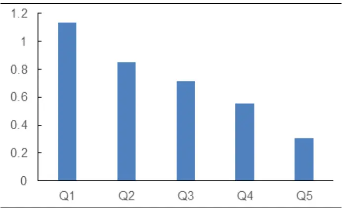
数据来源：天软科技，广发证券发展研究中心

图 5：全市场 融资买入额占融资余额比因子五档-10天调仓
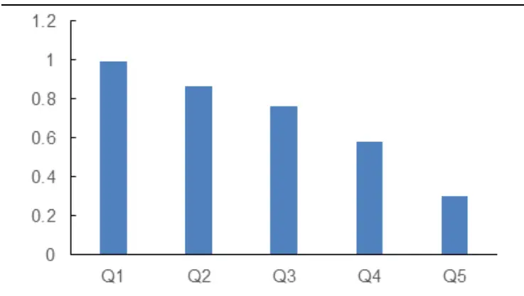
数据来源：天软科技，广发证券发展研究中心

图 6：全市场 融资买入额占融资余额比因子五档-20天调仓
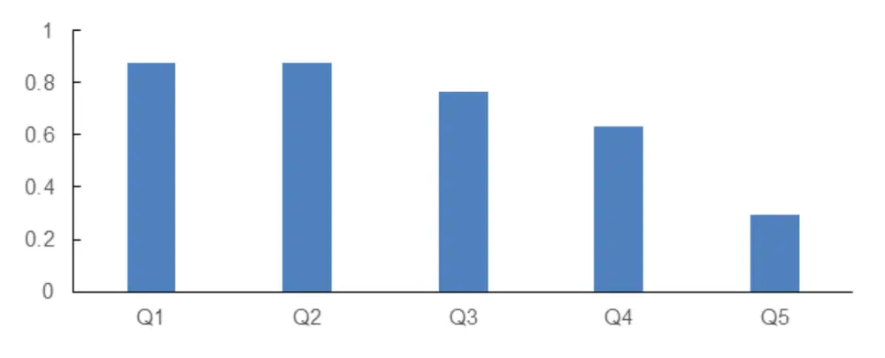
数据来源：天软科技，广发证券发展研究中心

以全市场作为选股域的融资买入额占融资余额比因子分组单调性较好，随着调仓周期的延长，其分档单调性有所降低。在不同的调仓周期中，分成5档的情况下，第一档均能获得相对于第五档的显著收益。

整体来看，融资买入额占融资余额比因子的IC值均为负值，即因子值越小的个股，股票在未来一段时间的收益表现越好。各因子的IC表现、多空对冲策略表现与因子分档测试的结果吻合，随着调仓周期的增大，融券余额占比因子的IC均值绝对值有所提高，但构建的多头相对基准策略的年化收益有所下降。策略的换手率水平适中，随着调仓周期的增加而减小。

表 7：全市场 融资买入额占融资余额比因子整体绩效表现

| 因子 | 调仓 周期 | IC 均值 | 多空策略表现 |  |  |  | 多头相对基准策略 |  |  |  |
| --- | --- | --- | --- | --- | --- | --- | --- | --- | --- | --- |
|  |  |  | IC 胜率 | 年化 | 信息 | 最大 | 年化 | 信息 | 最大 | 多头平均 换手率 |
| 融资买入额占融资 | 5天 | -4.27% | 61.94% | 收益 | 比率 | 回撤 | 收益 | 比率 | 回撤 |  |
|  |  | -5.20% | 63.87% | 15.19% 13.66% | 1.11 0.68 | 19.96% 15.66% | 3.31% | 0.72 0.46 | 25.72% 31.89% | 50.42% 45.33% |
| 余额比因子 | 10天 |  |  |  |  | 16.62% | 1.64% 0.09% |  | 39.35% |  |
|  | 20天 | -5.21% | 64.58% | 12.30% | 0.55 |  |  | 0.13 |  | 41.23% |

数据来源：天软科技，广发证券发展研究中心

表 8：全市场 融资买入额占融资余额比因子-5日调仓-整体与分年度 IC表现

| 统计区间 | IC 均值 | IC 标准差 | IC 最大值 | IC最小值 | IC 累计值 | IC 胜率 |
| --- | --- | --- | --- | --- | --- | --- |
| 2016 | -6.41% | 0.18 | 35.85% | -39.69% | -307.84% | 70.83% |
| 2017 | -2.50% | 0.14 | 28.50% | -39.81% | -122.69% | 53.06% |
| 2018 | -5.12% | 0.14 | 27.84% | -34.39% | -245.63% | 66.67% |
| 2019 | -4.50% | 0.11 | 13.17% | -35.50% | -215.86% | 62.50% |
| 2020 | -0.49% | 0.15 | 57.94% | -28.47% | -23.12% | 51.06% |
| 2021 | -5.17% | 0.14 | 25.00% | -35.52% | -248.29% | 68.75% |
| 2022 | -5.17% | 0.12 | 16.47% | -27.01% | -243.15% | 61.70% |
| 2023 | -4.80% | 0.11 | 14.95% | -32.81% | -216.20% | 60.87% |
| ALL | -4.27% | 0.14 | 57.94% | -39.81% | -1622.78% | 61.94% |

数据来源：天软科技，广发证券发展研究中心

表 9：全市场 融资买入额占融资余额比因子-10日调仓-整体与分年度 IC表现

| 统计区间 | IC 均值 | IC 标准差 | IC最大值 | IC 最小值 | IC累计值 | IC 胜率 |
| --- | --- | --- | --- | --- | --- | --- |
| 2016 | -7.99% | 0.20 | 33.88% | -38.61% | -191.76% | 58.33% |
| 2017 | -0.07% | 0.10 | 21.33% | -20.85% | -1.69% | 52.00% |
| 2018 | -7.82% | 0.11 | 14.98% | -34.74% | -187.63% | 66.67% |
| 2019 | -5.36% | 0.12 | 13.43% | -32.48% | -128.55% | 62.50% |
| 2020 | -3.05% | 0.16 | 30.18% | -41.23% | -70.22% | 65.22% |
| 2021 | -4.87% | 0.13 | 18.00% | -34.99% | -116.78% | 62.50% |
| 2022 | -6.62% | 0.10 | 19.82% | -23.91% | -158.93% | 83.33% |
| 2023 | -5.99% | 0.11 | 11.15% | -28.81% | -131.73% | 60.87% |
| ALL | -5.20% | 0.13 | 33.88% | -41.23% | -987.28% | 63.87% |

数据来源：天软科技，广发证券发展研究中心

表 10：全市场 融资买入额占融资余额比因子-20日调仓-整体与分年度 IC表现

| 统计区间 | IC 均值 | IC 标准差 | IC最大值 | IC最小值 | IC 累计值 | IC 胜率 |
| --- | --- | --- | --- | --- | --- | --- |
| 2016 | -11.33% | 0.13 | 9.94% | -37.63% | -135.97% | 83.33% |
| 2017 | 2.13% | 0.09 | 15.26% | -12.78% | 27.75% | 46.15% |
| 2018 | -9.12% | 0.10 | 11.37% | -24.39% | -109.49% | 91.67% |
| 2019 | -1.57% | 0.14 | 16.36% | -22.42% | -18.89% | 58.33% |
| 2020 | -2.31% | 0.21 | 42.53% | -34.07% | -25.42% | 54.55% |
| 2021 | -6.72% | 0.17 | 16.55% | -33.73% | -80.66% | 66.67% |
| 2022 | -7.04% | 0.13 | 18.11% | -30.25% | -84.49% | 66.67% |
| 2023 | -6.16% | 0.15 | 13.88% | -37.24% | -67.76% | 50.00% |
| ALL | -5.21% | 0.14 | 42.53% | -37.63% | -494.93% | 64.58% |

数据来源：天软科技，广发证券发展研究中心

图 7：全市场 融资买入额占融资余额比因子-预测 5天-IC值与 IC累计值走势
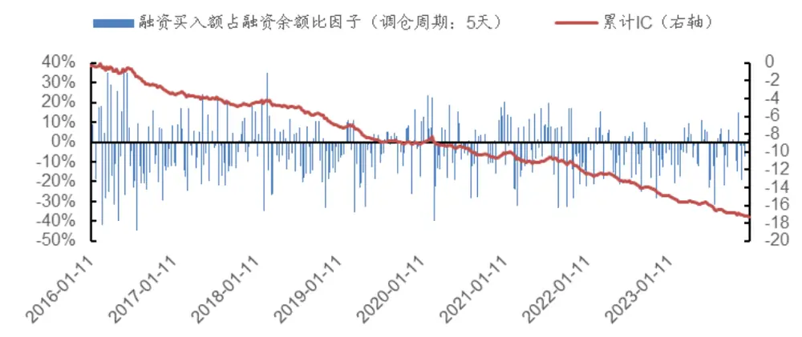
数据来源：天软科技，广发证券发展研究中心

图 8：全市场 融资买入额占融资余额比因子-预测10天-IC值与IC累计值走势
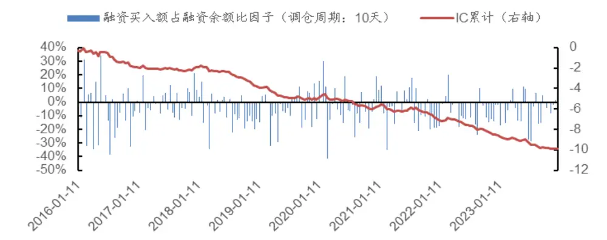
数据来源：天软科技，广发证券发展研究中心

图 9：全市场 融资买入额占融资余额比因子-预测20天-IC值与IC累计值走势
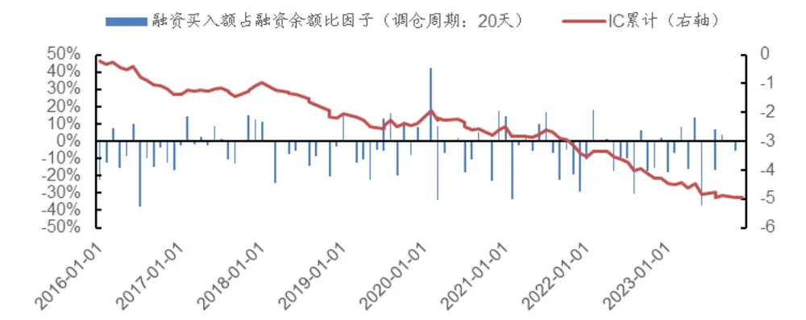
数据来源：天软科技，广发证券发展研究中心

表 11：融资买入额占融资余额比因子-多空对冲策略与多头相对全市场策略-5日调仓-整体与分年度表现

| 纯多头 |  | 多空对冲策略 |  |  |  |  | 多头-中证全指策略 |  |  |  |  |
| --- | --- | --- | --- | --- | --- | --- | --- | --- | --- | --- | --- |
| 统计 | 年度 | 年度 | 累计 | 年化 | 最大 | 信息 | 年度 | 累计 | 年化 | 最大 | 信息 |
| 区间 | 收益率 | 收益率 | 收益率 | 波动率 | 回撤 | 比率 | 收益率 | 收益率 | 波动率 | 回撤 | 比率 |
| 2016 | 9.25% | 49.30% | 48.35% | 19.81% | 7.25% | 1.60 | 12.74% | 15.41% | 8.50% | 4.17% | 0.89 |
| 2017 | -9.00% | -1.44% | 46.22% | 10.09% | 9.17% | -0.55 | -14.26% | -1.05% | 6.81% | 14.90% | -1.84 |
| 2018 | -28.35% | 23.43% | 80.48% | 12.19% | 5.77% | 2.12 | -3.18% | -4.20% | 11.00% | 13.83% | 1.05 |
| 2019 | 32.48% | 9.67% | 97.93% | 11.23% | 9.86% | -0.58 | 5.63% | 1.20% | 6.63% | 5.45% | -1.00 |
| 2020 | 9.18% | -4.11% | 89.80% | 13.16% | 16.59% | -0.64 | -5.03% | -3.89% | 14.87% | 11.25% | -0.76 |
| 2021 | 15.76% | 12.29% | 113.13% | 13.52% | 13.97% | 0.44 | 11.45% | 7.12% | 11.99% | 9.99% | 0.44 |
| 2022 | -0.69% | 23.17% | 162.51% | 10.38% | 5.38% | 1.85 | 14.57% | 22.72% | 9.59% | 8.50% | 1.57 |
| 2023 | -0.06% | 13.09% | 196.88% | 8.49% | 6.89% | 1.18 | 4.74% | 28.54% | 7.08% | 7.30% | 0.68 |
| ALL | 1.85% | 15.19% | 196.88% | 13.06% | 19.96% | 1.11 | 3.31% | 28.54% | 9.93% | 25.72% | 0.72 |

数据来源：天软科技，广发证券发展研究中心

表 12：融资买入额占融资余额比因子-多空对冲策略与多头相对全市场策略-10 日调仓-整体与分年度表现

| 纯多头 |  | 多空对冲策略 |  |  |  | 多头-中证全指策略 |  |  |  |  |
| --- | --- | --- | --- | --- | --- | --- | --- | --- | --- | --- |
| 统计 | 年度 | 年度 | 累计 | 年化 | 最大 | 信息 | 年度 | 累计 年化 | 最大 | 信息 |
| 区间 | 收益率 | 收益率 | 收益率 | 波动率 | 回撤 | 比率 收益率 | 收益率 | 波动率 | 回撤 | 比率 |
| 2016 | 1.30% | 34.91% | 34.04% | 18.55% | 8.10% 1.23 | 4.59% | 7.06% | 8.69% | 6.25% | 0.52 |
| 2017 | -8.98% | 0.60% | 34.84% | 9.91% | 5.90% -0.39 | -14.24% | -8.18% | 6.54% | 14.82% | -1.84 |
| 2018 | -30.23% | 19.19% | 60.72% | 12.35% | 5.91% 1.93 | -5.69% | -13.41% | 10.97% | 15.87% | 0.93 |
| 2019 | 26.19% | 3.02% | 65.57% | 10.82% | 10.28% | -0.87 0.61% | -12.88% | 6.73% | 7.62% | -1.28 |
| 2020 | 8.36% | -2.76% | 61.01% | 11.96% | 10.66% | -0.59 -5.73% | -17.88% | 13.97% | 12.24% | -0.80 |
| 2021 | 16.71% | 12.77% | 81.57% | 13.76% | 15.66% | 0.47 12.37% | -7.72% | 12.04% | 10.43% | 0.49 |
| 2022 | -0.29% | 26.06% | 128.89% | 10.13% | 6.03% | 2.05 15.02% | 6.14% | 9.43% | 8.40% | 1.61 |
| 2023 | 1.87% | 17.05% | 167.92% | 8.72% | 6.35% | 1.45 6.77% | 13.33% | 7.17% | 6.91% | 0.83 |
| ALL | 0.06% | 13.66% | 167.92% | 12.65% | 15.66% | 0.68 1.64% | 13.33% | 9.77% | 31.89% | 0.46 |

数据来源：天软科技，广发证券发展研究中心
识别风险，发现价值

表 13：融资买入额占融资余额比因子-多空对冲策略与多头相对全市场策略-20日调仓-整体与分年度表现

| 纯多头 |  | 多空对冲策略 |  |  |  | 多头-中证全指策略 |  |  |  |  |
| --- | --- | --- | --- | --- | --- | --- | --- | --- | --- | --- |
| 统计 | 年度 | 年度 | 累计 | 年化 | 最大 | 信息 | 年度 | 累计 年化 | 最大 | 信息 |
| 区间 | 收益率 | 收益率 | 收益率 | 波动率 | 回撤 | 比率 收益率 | 收益率 | 波动率 | 回撤 | 比率 |
| 2016 | -2.38% | 22.83% | 22.04% | 17.42% | 10.43% 0.90 | 0.88% | 3.26% | 8.53% | 8.04% | 0.33 |
| 2017 | -11.98% | -3.19% | 18.15% | 9.58% | 7.92% -0.71 | -17.04% | -14.34% | 6.84% | 17.50% | -2.09 |
| 2018 | -30.41% | 20.85% | 42.78% | 12.01% | 5.86% 2.03 | -5.93% | -19.42% | 11.21% | 15.89% | 0.92 |
| 2019 | 20.95% | -1.20% | 41.06% | 10.42% | 9.37% -1.06 | -3.60% | -22.32% | 6.50% | 10.26% | -1.54 |
| 2020 | 8.78% | 2.53% | 44.62% | 11.88% | 12.55% -0.39 | -5.36% | -26.48% | 13.86% | 11.78% | -0.79 |
| 2021 | 16.45% | 15.04% | 66.37% | 13.80% | 12.51% 0.57 | 12.13% | -17.57% | 12.04% | 10.90% | 0.47 |
| 2022 | -2.52% | 21.68% | 102.44% | 10.59% | 7.69% | 1.82 12.42% | -7.33% | 9.67% | 8.40% | 1.46 |
| 2023 | 3.70% | 20.60% | 144.14% | 8.59% | 5.30% | 1.70 8.70% | 0.73% | 7.22% | 6.08% | 0.97 |
| ALL | -1.41% | 12.30% | 144.14% | 12.36% | 16.62% | 0.55 0.09% | 0.73% | 9.81% | 39.35% | 0.13 |

数据来源：天软科技，广发证券发展研究中心

图 10：全市场融资买入额占融资余额比因子-5天调仓-多空策略净值走势
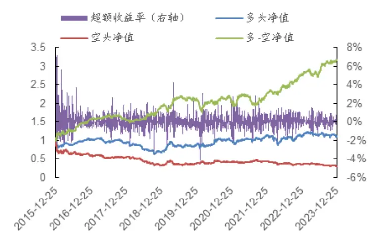
数据来源：天软科技，广发证券发展研究中心

图 11：融资买入额占融资余额比因子-5天调仓-多-全市场策略净值走势
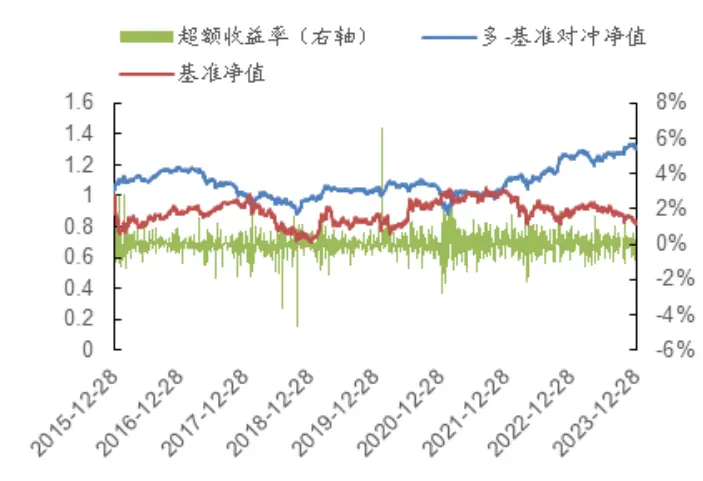
数据来源：天软科技，广发证券发展研究中心

图 12：全市场融资买入额占融资余额比因子-10天调仓-多空策略净值走势
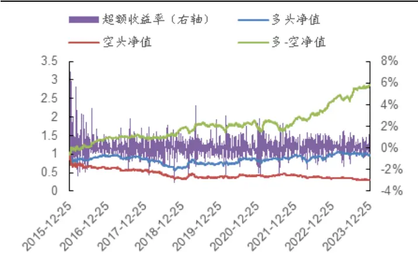
数据来源：天软科技，广发证券发展研究中心

图 13：融资买入额占融资余额比因子-10天调仓-多-全市场策略净值走势
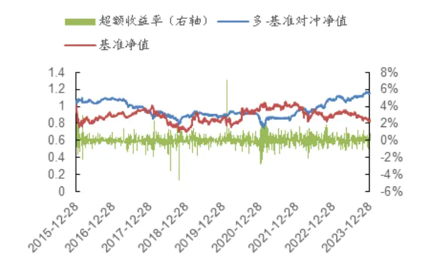
数据来源：天软科技，广发证券发展研究中心

图 14：全市场融资买入额占融资余额比因子-20天调仓-多空策略净值走势
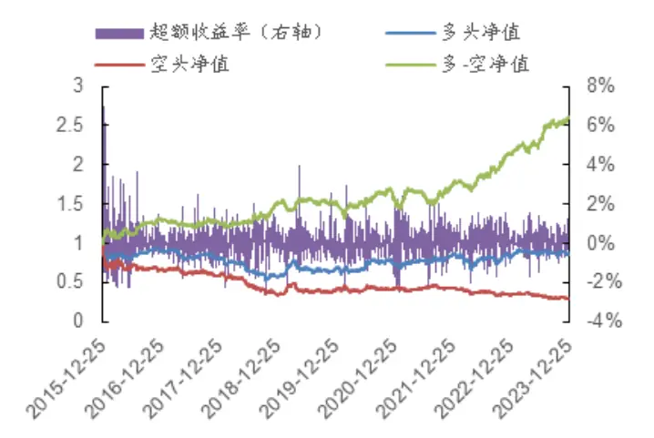
数据来源：天软科技，广发证券发展研究中心

图 15：融资买入额占融资余额比因子-20天调仓-多-全市场策略净值走势
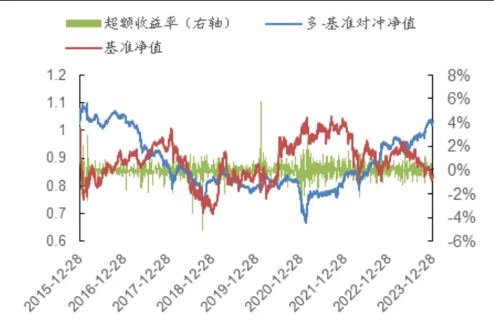
数据来源：天软科技，广发证券发展研究中心

表14：全市场 融资买入额占融资余额比因子-5天调仓-分年度换手率

| 统计区间 | 均值 | 最大值 | 最小值 | 标准差 | 累计值 |
| --- | --- | --- | --- | --- | --- |
| 2016 | 50.70% | 63.30% | 38.29% | 0.05 | 12370.44% |
| 2017 | 50.07% | 59.57% | 43.24% | 0.04 | 12166.51% |
| 2018 | 50.99% | 75.52% | 36.98% | 0.08 | 12237.53% |
| 2019 | 50.64% | 66.50% | 34.23% | 0.06 | 12305.41% |
| 2020 | 48.20% | 73.30% | 38.46% | 0.06 | 11182.47% |
| 2021 | 49.29% | 64.33% | 37.19% | 0.04 | 11878.46% |
| 2022 | 52.17% | 64.08% | 41.69% | 0.04 | 12206.72% |
| 2023 | 50.63% | 58.47% | 41.96% | 0.03 | 11695.92% |
| ALL | 50.42% | 75.52% | 34.23% | 0.06 | 96043.46% |

数据来源：天软科技，广发证券发展研究中心

表 15：全市场 融资买入额占融资余额比因子-10天调仓-分年度换手率

| 统计区间 | 均值 | 最大值 | 最小值 | 标准差 | 累计值 |
| --- | --- | --- | --- | --- | --- |
| 2016 | 44.73% | 58.52% | 33.71% | 0.05 | 10915% |
| 2017 | 45.22% | 58.49% | 36.13% | 0.04 | 10988% |
| 2018 | 45.07% | 73.58% | 33.16% | 0.07 | 10817% |
| 2019 | 46.44% | 62.05% | 31.34% | 0.07 | 11285% |
| 2020 | 44.17% | 74.15% | 32.47% | 0.06 | 10247% |
| 2021 | 44.45% | 56.96% | 34.19% | 0.04 | 10713% |
| 2022 | 47.45% | 58.47% | 37.00% | 0.04 | 11102% |
| 2023 | 47.15% | 55.67% | 40.15% | 0.03 | 10891% |
| ALL | 45.33% | 74.15% | 31.34% | 0.06 | 86958% |

数据来源：天软科技，广发证券发展研究中心

表16：全市场 融资买入额占融资余额比因子-20天调仓-分年度换手率

| 统计区间 | 均值 | 最大值 | 最小值 | 标准差 | 累计值 |
| --- | --- | --- | --- | --- | --- |
| 2016 | 39.91% | 50.29% | 28.00% | 0.05 | 9738.36% |
| 2017 | 41.00% | 51.04% | 33.33% | 0.04 | 9962.33% |
| 2018 | 41.12% | 71.50% | 30.77% | 0.06 | 9869.43% |
| 2019 | 43.01% | 60.36% | 30.24% | 0.06 | 10451.78% |
| 2020 | 40.58% | 73.58% | 26.30% | 0.06 | 9415.14% |
| 2021 | 41.03% | 54.56% | 31.75% | 0.04 | 9888.88% |
| 2022 | 43.78% | 55.74% | 33.66% | 0.04 | 10244.47% |
| 2023 | 44.07% | 51.41% | 38.09% | 0.03 | 10179.55% |
| ALL | 41.23% | 73.58% | 16.57% | 0.06 | 79749.94% |

数据来源：天软科技，广发证券发展研究中心

在全市场选股中，融资买入额占融资余额比因子的选股区分度较高，在全市场中不同调仓周期下的IC均值分别为-4.27%、-5.20%和-5.21%，IC胜率为61.94%、63.87%和64.58%，且在多头相对全市场策略中的累计收益达到28.54%，13.33%和0.73%。

## （三）中证 500 中因子表现

根据表3中所展示的因子计算方法，在中证500选股域中计算个股的因子值，同时计算个股未来5天，10天和20天的收益，以研究因子对于股票未来收益的预测能力。因子对于股票未来收益的预测能力用IC值，IC-IR等进行衡量，将在中证500中计算得到的各因子预测能力指标记录如下：

表 17：融资融券类因子 IC表现-中证 500

| 因子名称 | IC 均值 |  |  | IC-IR |  |  |
| --- | --- | --- | --- | --- | --- | --- |
|  | 预测 | 预测 | 预测 | 预测 | 预测 | 预测 |
|  | 5天 | 10 天 | 20 天 | 5天 0.361 | 10 天 0.041 | 20 天 -0.060 |
| 净融券卖出占比增速因子 净融券卖出占比增速因子 | 1.19% | 0.14% | -0.28% |  |  |  |
| （N=5） 净融券卖出占比增速因子 | -0.78% | -0.33% | -0.45% | -0.320 | -0.095 | -0.065 |
| (N=10) 净融券卖出占比增速因子 | 0.03% | -0.23% | -0.33% | 0.011 | -0.056 | -0.066 |
| （N=15) 净融券卖出占比增速因子 | 0.58% | 0.37% | 0.48% | 0.205 | 0.080 | 0.091 |
| (N=20） | -0.13% | -0.29% | 0.04% | -0.036 | -0.046 | 0.005 |
| 净融资买入占比增速因子 净融资买入占比增速因子 | -0.36% | -0.51% | -0.32% | -0.091 | -0.147 | -0.057 |
| (N=5) | 0.49% | 0.68% | -0.13% | 0.190 | 0.160 | -0.018 |
| 净融资买入占比增速因子 （N=10） 净融资买入占比增速因子 | 0.11% | 0.32% | 0.06% | 0.043 | 0.104 | 0.013 |
| (N=15) | 0.77% | 0.94% | 0.50% | 0.322 | 0.196 | 0.111 |
| 净融资买入占比增速因子 （N=20） | -0.38% | -0.16% | -0.34% | -0.154 | -0.046 | -0.065 |
| 融券余额变化率因子 融券余额变化率因子 | -0.98% | -0.70% | -0.27% | -1.054 | -0.565 | -0.206 |
| （N=5） | -1.49% | -1.56% | -0.84% | -1.351 | -0.821 | -0.454 |
| 融券余额变化率因子 (N=10) | -1.57% | -1.26% | -1.44% | -1.189 | -0.714 | -0.625 |
| 融券余额变化率因子 （N=15） | -1.61% | -0.99% | -2.58% | -1.342 | -0.785 | -0.740 |
| 融券余额变化率因子 (N=20） | -1.64% | -1.51% | -2.88% | -1.379 | -0.881 | -1.196 |
| 融券余额增长率因子 | -0.68% | -0.40% | -0.60% | -1.074 | -0.488 | -0.211 |
| 融券余额增长率因子(N=5) 融券余额增长率因子 | -1.55% | -1.38% | -0.98% | -1.545 | -0.948 | -0.661 |
| （N=10） | -1.39% | -0.90% | -1.74% | -1.745 | -0.947 | -0.695 |
| 融券余额增长率因子 (N=15) | -2.54% | -1.92% | -1.75% | -1.839 | -1.206 | -0.851 |

识别风险，发现价值

| 融券余额增长率因子 （N=20） | -1.64% | -2.67% | -3.00% | -1.920 | -1.538 | -1.077 |
| --- | --- | --- | --- | --- | --- | --- |
| 融券卖出占比增速因子 | -0.39% | -0.61% | -1.15% | -0.182 | -0.126 | -0.120 |
| 融券卖出占比增速因子 （N=5） | 0.16% | 0.58% | 0.52% | 0.041 | 0.099 | 0.109 |
| 融券卖出占比增速因子 (N=10) | 0.65% | -0.17% | 0.44% | 0.255 | -0.044 | 0.094 |
| 融券卖出占比增速因子 （N=15) | -0.06% | -0.05% | 0.89% | -0.017 | -0.021 | 0.167 |
| 融券卖出占比增速因子 (N=20) | 0.74% | 0.81% | 2.47% | 0.394 | 0.254 | 0.321 |
| 融券卖出量比因子 | -0.97% | -1.13% | -1.99% | -0.747 | -0.908 | -0.859 |
| 融券卖出量比因子（N=5） | -2.96% | -2.46% | -1.91% | -2.412 | -1.699 | -1.003 |
| 融券卖出量比因子 (N=10） | -3.13% | -1.88% | -1.76% | -2.545 | -1.365 | -0.636 |
| 融券卖出量比因子 (N=15) | -2.12% | -1.38% | -1.66% | -1.968 | -0.913 | -0.654 |
| 融券卖出量比因子 （N=20） | -2.97% | -2.68% | -2.70% | -1.910 | -1.306 | -0.962 |
| 融券余额占比增速因子 | -0.73% | -0.79% | -0.37% | -1.005 | -0.545 | -0.272 |
| 融券余额占比增速因子 （N=5） | -1.04% | -0.91% | -0.81% | -1.180 | -0.548 | -0.269 |
| 融券余额占比增速因子 (N=10) | -0.78% | -0.55% | -0.66% | -0.861 | -0.418 | -0.428 |
| 融券余额占比增速因子 （N=15) | -1.12% | -0.57% | -1.07% | -0.908 | -0.485 | -0.492 |
| 融券余额占比增速因子 (N=20) | -1.17% | -1.02% | -1.24% | -0.988 | -0.656 | -0.771 |
| 融资买入占比增速因子 | -0.24% | -0.58% | -0.53% | -0.090 | -0.116 | -0.099 |
| 融资买入占比增速因子 (N=5) | -0.11% | -0.35% | -0.39% | -0.029 | -0.107 | -0.076 |
| 融资买入占比增速因子 （N=10） | -0.06% | -0.90% | -0.35% | -0.028 | -0.177 | -0.059 |
| 融资买入占比增速因子 (N=15) | -1.11% | -1.69% | -0.83% | -0.291 | -0.380 | -0.120 |
| 融资买入占比增速因子 （N=20） | -0.47% | -1.31% | -0.61% | -0.206 | -0.290 | -0.096 |
| 融资买入额比因子 | -0.64% | -0.39% | -0.23% | -0.648 | -0.348 | -0.149 |
| 融资买入额比因子（N=5） | -2.59% | -0.98% | -0.57% | -1.244 | -0.711 | -0.346 |
| 融资买入额比因子 (N=10) | -2.91% | -1.40% | -1.83% | -2.062 | -1.110 | -0.542 |
| 融资买入额比因子 （N=15) | -2.11% | -1.97% | -1.76% | -1.717 | -1.044 | -0.567 |

识别风险，发现价值

| 融资买入额比因子 (N=20) | -3.92% | -1.99% | -2.39% | -2.219 | -1.227 | -0.668 |
| --- | --- | --- | --- | --- | --- | --- |
| 融资余额占比增速因子 | 0.54% | -0.23% | -0.44% | 0.275 | -0.153 | -0.151 |
| 融资余额占比增速因子 (N=5) | 0.36% | -0.05% | -0.08% | 0.208 | -0.024 | -0.034 |
| 融资余额占比增速因子 （N=10） | 0.27% | -0.02% | 0.20% | 0.163 | -0.014 | 0.058 |
| 融资余额占比增速因子 (N=15) | 0.57% | 0.19% | 0.34% | 0.375 | 0.072 | 0.160 |
| 融资余额占比增速因子 （N=20） | 0.63% | 0.52% | 0.33% | 0.422 | 0.198 | 0.197 |
| 融资余额变化率因子 | -1.75% | -1.55% | -1.69% | -2.226 | -1.327 | -0.778 |
| 融资余额变化率因子 （N=5） | -2.51% | -2.22% | -3.08% | -2.174 | -1.635 | -1.172 |
| 融资余额变化率因子 (N=10) | -2.88% | -4.09% | -2.38% | -2.477 | -1.629 | -1.302 |
| 融资余额变化率因子 （N=15） | -2.19% | -4.07% | -3.37% | -2.394 | -1.739 | -1.372 |
| 融资余额变化率因子 (N=20) | -2.28% | -3.29% | -3.39% | -2.373 | -1.805 | -1.451 |
| 融资余额增长率因子 | -0.93% | -0.46% | -0.59% | -0.976 | -0.529 | -0.265 |
| 融资余额增长率因子 (N=5) | -1.48% | -1.22% | -1.49% | -1.745 | -0.911 | -0.668 |
| 融资余额增长率因子 （N=10） | -1.20% | -1.53% | -1.13% | -1.496 | -1.046 | -0.756 |
| 融资余额增长率因子 (N=15) | -1.59% | -1.48% | -2.62% | -1.924 | -1.373 | -0.934 |
| 融资余额增长率因子 （N=20） | -1.50% | -1.77% | -2.99% | -1.970 | -1.437 | -1.070 |
| 净融券卖出占比因子 | -0.32% | -0.57% | -0.18% | -0.211 | -0.126 | -0.044 |
| 净融资买入占比因子 | -0.42% | -0.95% | -1.20% | -0.310 | -0.198 | -0.168 |
| 融券余额占比因子 | -2.37% | -4.01% | -7.13% | -1.790 | -1.684 | -1.361 |
| 融资余额占比因子 | -1.39% | -2.15% | -3.00% | -0.678 | -0.753 | -0.806 |
| 融券卖出占比因子 | 1.03% | 0.02% | 0.92% | 0.273 | 0.007 | 0.150 |
| 融资买入占比因子 | -0.29% | -0.83% | -0.29% | -0.144 | -0.213 | -0.040 |
| 融券卖出量占融券余量比 | -3.11% | -1.90% | -4.37% | -1.347 | -0.884 | -1.498 |
| 融资买入额占融资余额比 | -3.39% | -3.69% | -4.15% | -1.281 | -1.303 | -1.422 |

数据来源：天软科技，广发证券发展研究中心

表 18：融资融券类因子RankIC表现-中证 500

| 因子名称 | RankIC 均值 |  |  | RankIC-IR |  |  |
| --- | --- | --- | --- | --- | --- | --- |
|  | 预测 | 预测 | 预测 | 预测 | 预测 | 预测 |
|  | 5天 0.95% | 10天 0.07% | 20 天 -0.47% | 5天 0.290 | 10天 0.021 | 20 天 -0.084 |
| 净融券卖出占比增速因子 净融券卖出占比增速因子 |  |  |  | -0.251 |  |  |
| （N=5） 净融券卖出占比增速因子 | -0.80% | -0.26% | -0.34% |  | -0.096 | -0.060 |
| (N=10) 净融券卖出占比增速因子 | 0.04% | -0.13% | -0.57% | 0.015 | -0.042 | -0.070 |
| （N=15） 净融券卖出占比增速因子 | 0.63% | 0.44% | 0.37% | 0.238 | 0.091 | 0.088 |
| (N=20) | -0.25% | -0.19% | -0.02% | -0.077 | -0.057 | -0.002 |
| 净融资买入占比增速因子 净融资买入占比增速因子 | -0.14% | -0.44% | -0.20% | -0.051 | -0.117 | -0.041 |
| (N=5) | 0.51% | 0.60% | -0.08% | 0.145 | 0.124 | -0.020 |
| 净融资买入占比增速因子 （N=10） | 0.03% | 0.27% | 0.08% | 0.006 | 0.067 | 0.013 |
| 净融资买入占比增速因子 (N=15) | 0.94% | 0.80% | 0.87% | 0.318 | 0.213 | 0.103 |
| 净融资买入占比增速因子 （N=20） | -0.47% | -0.10% | -0.34% | -0.159 | -0.027 | -0.050 |
| 融券余额变化率因子 | -1.16% | -0.90% | -0.47% | -0.956 | -0.515 | -0.182 |
| 融券余额变化率因子 （N=5） | -2.26% | -1.16% | -1.21% | -1.345 | -0.802 | -0.393 |
| 融券余额变化率因子 (N=10) | -1.67% | -0.95% | -1.43% | -1.079 | -0.651 | -0.595 |
| 融券余额变化率因子 （N=15） | -1.52% | -0.76% | -2.03% | -1.156 | -0.667 | -0.683 |
| 融券余额变化率因子 (N=20） | -1.15% | -2.04% | -3.06% | -1.330 | -0.920 | -0.988 |
| 融券余额增长率因子 | -0.55% | -0.49% | -0.43% | -0.843 | -0.439 | -0.234 |
| 融券余额增长率因子(N=5) | -1.40% | -1.16% | -1.57% | -1.498 | -0.871 | -0.598 |
| 融券余额增长率因子 （N=10） | -1.42% | -1.55% | -1.11% | -1.362 | -0.904 | -0.732 |
| 融券余额增长率因子 (N=15) | -1.40% | -1.48% | -2.39% | -1.678 | -1.132 | -0.823 |
| 融券余额增长率因子 （N=20） | -2.37% | -1.24% | -2.84% | -1.974 | -1.259 | -0.910 |
| 融券卖出占比增速因子 | -0.37% | -0.58% | -0.72% | -0.131 | -0.102 | -0.113 |
| 融券卖出占比增速因子 （N=5） | 0.20% | 0.20% | 0.65% | 0.056 | 0.059 | 0.102 |
| 融券卖出占比增速因子 (N=10) | 0.54% | -0.18% | 0.33% | 0.221 | -0.046 | 0.072 |
| 融券卖出占比增速因子 （N=15） | -0.10% | -0.03% | 1.23% | -0.025 | -0.013 | 0.181 |
| 融券卖出占比增速因子 (N=20) | 1.06% | 0.96% | 2.35% | 0.386 | 0.226 | 0.298 |
| 融券卖出量比因子 | -0.49% | -1.15% | -1.55% | -0.591 | -0.774 | -0.819 |
| 融券卖出量比因子（N=5） | -2.66% | -2.45% | -2.46% | -2.148 | -1.527 | -0.912 |
| 融券卖出量比因子 （N=10） | -2.46% | -2.24% | -1.78% | -2.178 | -1.309 | -0.757 |
| 融券卖出量比因子 (N=15) | -2.92% | -0.93% | -1.34% | -1.728 | -0.917 | -0.630 |
| 融券卖出量比因子 （N=20） | -2.83% | -2.37% | -2.03% | -1.839 | -1.148 | -0.923 |
| 融券余额占比增速因子 | -1.14% | -0.49% | -0.31% | -0.951 | -0.659 | -0.223 |
| 融券余额占比增速因子 （N=5） | -1.00% | -0.74% | -0.51% | -1.102 | -0.579 | -0.305 |
| 融券余额占比增速因子 (N=10) | -0.87% | -0.52% | -0.73% | -0.852 | -0.410 | -0.367 |
| 融券余额占比增速因子 （N=15） | -0.58% | -0.85% | -1.18% | -0.796 | -0.441 | -0.432 |
| 融券余额占比增速因子 (N=20) | -0.98% | -0.81% | -2.15% | -0.908 | -0.603 | -0.594 |
| 融资买入占比增速因子 | -0.17% | -0.44% | -0.83% | -0.070 | -0.096 | -0.098 |
| 融资买入占比增速因子 (N=5) | -0.07% | -0.33% | -0.38% | -0.031 | -0.084 | -0.072 |
| 融资买入占比增速因子 （N=10） | -0.19% | -0.40% | -0.34% | -0.078 | -0.168 | -0.051 |
| 融资买入占比增速因子 (N=15) | -0.91% | -1.65% | -0.58% | -0.247 | -0.363 | -0.141 |
| 融资买入占比增速因子 （N=20） | -0.70% | -1.55% | -0.48% | -0.226 | -0.329 | -0.125 |
| 融资买入额比因子 | -0.59% | -0.58% | -0.32% | -0.575 | -0.295 | -0.122 |
| 融资买入额比因子（N=5） | -1.48% | -1.23% | -0.93% | -1.285 | -0.706 | -0.289 |
| 融资买入额比因子 (N=10) | -3.41% | -1.37% | -1.16% | -2.136 | -1.043 | -0.524 |
| 融资买入额比因子 （N=15） | -2.65% | -1.81% | -1.64% | -1.425 | -0.965 | -0.580 |
| 融资买入额比因子 | -2.51% | -3.13% | -2.15% | -1.962 | -1.032 | -0.686 |
| (N=20) 融资余额占比增速因子 | 0.33% | -0.36% | -0.48% | 0.230 | -0.133 | -0.146 |
| 融资余额占比增速因子 (N=5) | 0.30% | 0.01% | -0.05% | 0.267 | 0.005 | -0.013 |

识别风险，发现价值

| 融资余额占比增速因子 （N=10） | 0.16% | -0.01% | 0.14% | 0.177 | -0.003 | 0.041 |
| --- | --- | --- | --- | --- | --- | --- |
| 融资余额占比增速因子 (N=15) | 0.75% | 0.20% | 0.58% | 0.394 | 0.081 | 0.163 |
| 融资余额占比增速因子 （N=20） | 0.71% | 0.39% | 0.76% | 0.459 | 0.216 | 0.216 |
| 融资余额变化率因子 | -1.62% | -1.80% | -1.45% | -1.935 | -1.365 | -0.703 |
| 融资余额变化率因子 （N=5） | -1.60% | -2.34% | -1.66% | -2.319 | -1.782 | -1.109 |
| 融资余额变化率因子 (N=10) | -3.20% | -2.40% | -2.63% | -2.190 | -1.706 | -1.302 |
| 融资余额变化率因子 （N=15） | -2.08% | -3.46% | -3.14% | -2.410 | -1.899 | -1.250 |
| 融资余额变化率因子 (N=20) | -2.87% | -3.18% | -4.13% | -2.225 | -2.024 | -1.434 |
| 融资余额增长率因子 | -0.77% | -0.45% | -0.38% | -0.850 | -0.436 | -0.260 |
| 融资余额增长率因子 (N=5) | -1.12% | -0.69% | -1.10% | -1.514 | -0.954 | -0.677 |
| 融资余额增长率因子 （N=10） | -1.10% | -0.96% | -1.78% | -1.433 | -0.822 | -0.708 |
| 融资余额增长率因子 (N=15) | -1.71% | -1.35% | -1.36% | -1.605 | -1.079 | -0.846 |
| 融资余额增长率因子 （N=20） | -1.39% | -2.28% | -2.59% | -1.848 | -1.295 | -1.077 |
| 净融券卖出占比因子 | -0.44% | -0.43% | -0.22% | -0.204 | -0.122 | -0.042 |
| 净融资买入占比因子 | -0.79% | -0.47% | -1.45% | -0.262 | -0.178 | -0.187 |
| 融券余额占比因子 | -3.12% | -3.98% | -3.70% | -2.026 | -1.822 | -1.165 |
| 融资余额占比因子 | -0.93% | -1.95% | -3.08% | -0.732 | -0.696 | -0.739 |
| 融券卖出占比因子 | 1.04% | 0.31% | 0.81% | 0.289 | 0.069 | 0.201 |
| 融资买入占比因子 | -0.30% | -0.99% | -0.37% | -0.126 | -0.218 | -0.056 |
| 融券卖出量占融券余量比 | -2.59% | -3.00% | -3.77% | -2.385 | -1.465 | -1.203 |
| 融资买入额占融资余额比 | -4.36% | -6.85% | -4.15% | -2.438 | -2.188 | -1.212 |

数据来源：天软科技，广发证券发展研究中心

表 19：融资融券类因子 IC/RankIC 胜率-中证 500

| 因子名称 | IC 胜率 |  |  | RankIC 胜率 |  |  |
| --- | --- | --- | --- | --- | --- | --- |
|  | 预测 | 预测 | 预测 | 预测 | 预测 | 预测 |
|  | 5天 | 10 天 | 20 天 49.36% | 5天 54.75% | 10天 46.89% | 20 天 50.33% |
| 净融券卖出占比增速因子 净融券卖出占比增速因子 | 50.45% | 48.83% |  |  |  |  |
| （N=5） 净融券卖出占比增速因子 | 49.14% | 49.22% | 53.06% | 50.20% | 46.58% | 48.61% |
| (N=10) 净融券卖出占比增速因子 | 50.86% | 53.30% | 50.16% | 47.85% | 47.62% | 45.71% |
| （N=15） 净融券卖出占比增速因子 | 53.08% | 49.82% | 50.49% | 49.49% | 50.56% | 49.58% |
| (N=20) | 49.74% | 48.40% | 52.17% | 50.21% | 48.48% | 50.75% |
| 净融资买入占比增速因子 净融资买入占比增速因子 | 48.93% | 46.59% | 49.93% | 47.08% | 47.87% | 48.82% |
| (N=5) | 50.02% | 53.14% | 51.52% | 46.53% | 52.33% | 56.78% |
| 净融资买入占比增速因子 （N=10） | 47.13% | 45.62% | 49.41% | 45.19% | 44.54% | 49.96% |
| 净融资买入占比增速因子 (N=15) | 51.42% | 47.22% | 49.68% | 52.19% | 48.42% | 50.29% |
| 净融资买入占比增速因子 （N=20） | 50.72% | 50.18% | 51.84% | 48.51% | 53.05% | 53.46% |
| 融券余额变化率因子 | 53.46% | 56.52% | 49.56% | 57.22% | 50.80% | 54.09% |
| 融券余额变化率因子 （N=5） | 61.28% | 56.77% | 52.75% | 57.00% | 52.22% | 59.09% |
| 融券余额变化率因子 (N=10) | 55.81% | 53.78% | 56.74% | 59.97% | 55.30% | 60.47% |
| 融券余额变化率因子 （N=15） | 57.12% | 54.92% | 56.15% | 59.27% | 55.30% | 56.57% |
| 融券余额变化率因子 (N=20) | 55.95% | 56.63% | 58.17% | 59.95% | 53.75% | 61.29% |
| 融券余额增长率因子 | 58.41% | 54.00% | 51.43% | 58.63% | 52.86% | 54.17% |
| 融券余额增长率因子 (N=5) | 60.74% | 59.90% | 59.52% | 58.96% | 54.92% | 56.68% |
| 融券余额增长率因子 （N=10） | 62.32% | 55.64% | 61.04% | 59.51% | 59.26% | 57.97% |
| 融券余额增长率因子 (N=15) | 58.96% | 57.96% | 62.09% | 58.73% | 58.82% | 53.82% |
| 融券余额增长率因子 （N=20） | 58.45% | 63.94% | 61.35% | 63.18% | 60.13% | 54.47% |
| 融券卖出占比增速因子 | 48.77% | 50.17% | 48.89% | 52.63% | 49.94% | 52.50% |
| 融券卖出占比增速因子 （N=5） | 51.27% | 51.77% | 54.49% | 52.84% | 50.98% | 54.55% |

识别风险，发现价值

| 融券卖出占比增速因子 (N=10) | 52.87% | 50.49% | 50.71% | 53.11% | 49.45% | 49.50% |
| --- | --- | --- | --- | --- | --- | --- |
| 融券卖出占比增速因子 （N=15） | 49.62% | 51.46% | 50.13% | 50.06% | 48.66% | 52.45% |
| 融券卖出占比增速因子 (N=20) | 53.81% | 51.52% | 54.32% | 50.99% | 49.34% | 56.62% |
| 融券卖出量比因子 | 53.19% | 54.30% | 54.86% | 52.25% | 51.56% | 48.76% |
| 融券卖出量比因子（N=5） | 60.81% | 57.77% | 51.93% | 64.17% | 56.61% | 52.12% |
| 融券卖出量比因子 （N=10） | 64.76% | 59.62% | 56.88% | 62.10% | 57.04% | 58.52% |
| 融券卖出量比因子 (N=15) | 61.28% | 56.00% | 50.87% | 60.57% | 54.61% | 57.87% |
| 融券卖出量比因子 （N=20） | 61.74% | 55.63% | 56.80% | 64.17% | 57.68% | 54.27% |
| 融券余额占比增速因子 | 54.68% | 56.43% | 55.83% | 56.23% | 52.37% | 51.56% |
| 融券余额占比增速因子 （N=5） | 58.21% | 54.44% | 50.77% | 57.47% | 55.15% | 50.75% |
| 融券余额占比增速因子 | 54.62% | 52.84% | 56.50% | 54.41% | 51.25% | 56.58% |
| (N=10) 融券余额占比增速因子 （N=15） | 57.54% | 56.39% | 53.03% | 54.08% | 54.08% | 50.93% |
| 融券余额占比增速因子 (N=20) | 56.84% | 55.93% | 54.28% | 54.32% | 59.59% | 52.54% |
| 融资买入占比增速因子 | 52.85% | 45.99% | 48.82% | 52.78% | 47.83% | 50.48% |
| 融资买入占比增速因子 (N=5) | 51.62% | 47.19% | 49.71% | 48.01% | 52.09% | 53.85% |
| 融资买入占比增速因子 （N=10） | 52.77% | 52.90% | 50.52% | 49.30% | 53.12% | 48.87% |
| 融资买入占比增速因子 (N=15) | 51.93% | 54.62% | 53.04% | 53.71% | 52.65% | 52.18% |
| 融资买入占比增速因子 | 56.45% | 53.14% | 49.60% | 51.96% | 51.24% | 54.51% |
| （N=20） 融资买入额比因子 | 52.82% | 56.18% | 50.26% | 52.78% | 53.39% | 50.15% |
| 融资买入额比因子 （N=5） | 58.24% | 57.63% | 52.64% | 56.59% | 58.71% | 50.55% |
| 融资买入额比因子 (N=10) | 58.03% | 57.66% | 54.01% | 60.77% | 58.75% | 53.12% |
| 融资买入额比因子 （N=15） | 58.72% | 55.73% | 58.62% | 61.13% | 54.59% | 54.45% |
| 融资买入额比因子 | 57.33% | 57.11% | 54.07% | 60.07% | 57.18% | 49.01% |
| (N=20) 融资余额占比增速因子 | 51.80% | 52.03% | 53.16% | 49.34% | 53.41% | 53.55% |
| 融资余额占比增速因子 (N=5) | 53.51% | 53.96% | 51.93% | 51.28% | 44.85% | 69.10% |

识别风险，发现价值

| 融资余额占比增速因子 （N=10） | 47.05% | 50.40% | 49.73% 51.41% | 55.15% | 53.31% |
| --- | --- | --- | --- | --- | --- |
| 融资余额占比增速因子 (N=15) | 53.99% | 51.12% | 52.30% | 54.83% 49.02% | 53.51% |
| 融资余额占比增速因子 （N=20） | 51.96% | 52.57% | 52.26% 49.79% | 51.64% | 64.07% |
| 融资余额变化率因子 | 62.96% | 63.21% | 57.01% 64.65% | 61.36% | 58.99% |
| 融资余额变化率因子 （N=5） | 63.42% | 65.68% | 55.28% 61.79% | 61.41% | 59.45% |
| 融资余额变化率因子 (N=10) | 62.16% | 62.76% | 64.44% 66.91% | 61.04% | 66.91% |
| 融资余额变化率因子 （N=15） | 66.10% | 62.13% | 64.29% 65.79% | 64.97% | 56.32% |
| 融资余额变化率因子 (N=20) | 60.99% | 62.18% 67.00% | 60.63% | 65.19% | 58.14% |
| 融资余额增长率因子 | 54.42% | 54.03% 53.01% | 55.70% | 55.15% | 51.33% |
| 融资余额增长率因子 (N=5) | 57.02% | 58.41% 58.45% | 57.66% | 61.59% | 66.58% |
| 融资余额增长率因子 （N=10） | 57.72% | 59.73% 63.19% | 62.01% | 60.59% | 56.06% |
| 融资余额增长率因子 (N=15) | 58.35% | 60.98% 60.64% | 56.96% | 57.51% | 57.31% |
| 融资余额增长率因子 （N=20） | 61.22% | 57.96% | 63.48% 62.38% | 62.05% | 61.31% |
| 净融券卖出占比因子 | 52.67% | 54.80% | 50.55% 47.25% | 56.51% | 47.95% |
| 净融资买入占比因子 | 51.49% | 50.35% 52.59% | 51.10% | 54.45% | 61.29% |
| 融券余额占比因子 | 60.42% | 59.49% 65.17% | 58.90% | 62.59% | 51.39% |
| 融资余额占比因子 | 53.22% | 57.95% 59.86% | 52.72% | 53.35% | 58.49% |
| 融券卖出占比因子 | 52.99% | 49.00% 48.72% | 53.90% | 51.27% | 56.39% |
| 融资买入占比因子 | 49.47% | 48.76% | 45.05% 50.41% | 51.64% | 67.73% |
| 融券卖出量占融券余量比 | 64.78% | 60.67% | 64.59% 62.65% | 61.83% | 55.49% |
| 融资买入额占融资余额比 | 64.95% | 65.98% | 65.98% 67.89% | 64.92% | 59.56% |

数据来源：天软科技，广发证券发展研究中心

由各因子的IC等指标可以看出，融资融券类因子在中证500范围内的收益预测能力相较全市场有所提高，其中IC表现较为突出的有融资余额变化率因子、融券卖出量占融券余量比因子、融资买入额占融资余额比因子和融券余额占比因子等。同时这些因子也具有较高的IC胜率。选取IC相对较高的因子进行回测，得到融券余额占比因子和融券卖出量占融券余量比因子、融资买入额占融资余额比因子的回测结果的有效性和分组单调性较好，而融资余额变化率因子的分组单调性较差。根据因子构建多空策略、多头相对基准策略，融券余额占比因子在两种策略中可以获得较为稳定的超额收益。

根据回测结果，选取融券余额占比因子在IC、多空策略、多头相对基准策略以

及换手率方面的回测表现进行整体展示。同时，对其分年度表现进行详细展示。

图16：中证500 融券余额占比因子五档-5天调仓
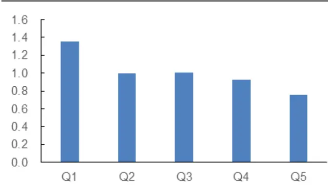
数据来源：天软科技，广发证券发展研究中心

图 17：中证500 融券余额占比因子五档-10天调仓
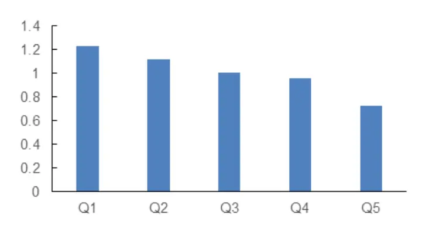
数据来源：天软科技，广发证券发展研究中心

图 18：中证500 融券余额占比因子五档-20天调仓
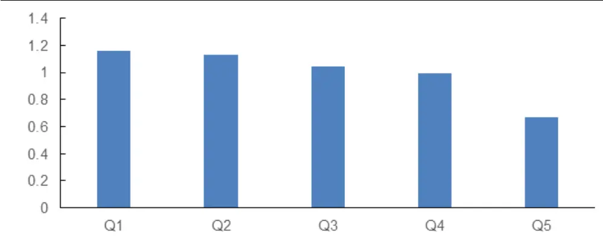
数据来源：天软科技，广发证券发展研究中心

以中证500作为选股域的融券余额占比因子分组单调性较好，随着调仓周期的加大单调性有所提升。在分成5档的情况下，第一档均能获得相对于第五档的显著收益。

整体来看，融券余额占比因子的IC值均为负值，即因子值越小的个股，股票在未来一段时间的收益表现越好。各因子的IC表现、多空对冲策略表现与因子分档测试的结果吻合，随着调仓周期的增大，融券余额占比因子的IC均值绝对值有所提高。策略的换手率水平不高，随着调仓周期的增加而减小。

表 20：中证500 融券余额占比因子整体绩效表现

| 因子 | 调仓 IC 均值 周期 |  | 多空策略表现 |  |  |  | 多头相对基准策略 |  |  |  |
| --- | --- | --- | --- | --- | --- | --- | --- | --- | --- | --- |
|  |  |  | IC 胜率 | 年化 | 信息 | 最大 | 年化 | 信息 | 最大 | 多头平均 换手率 |
| 融券余额占比因子 | 5天 | -3.39% | 64.95% | 收益 5.57% | 比率 0.93 | 回撤 15.13% | 收益 4.84% | 比率 0.70 | 回撤 14.57% | 32.47% |
|  | 10天 | -3.69% | 65.98% | 5.43% | 0.91 | 16.25% | 3.54% | 0.62 | 15.13% | 26.25% |
|  | 20天 | -4.15% | 65.98% | 6.08% | 0.96 | 13.89% | 2.90% | 0.53 | 16.52% | 21.46% |

数据来源：天软科技，广发证券发展研究中心

表 21：中证500 融券余额占比因子-5日调仓-整体与分年度 IC表现

| 统计区间 | IC 均值 | IC 标准差 | IC最大值 | IC最小值 | IC 累计值 | IC 胜率 |
| --- | --- | --- | --- | --- | --- | --- |
| 2016 | -2.91% | 0.08 | 14.04% | -21.78% | -139.80% | 66.67% |
| 2017 | -3.04% | 0.10 | 15.61% | -24.78% | -148.96% | 63.27% |
| 2018 | -4.67% | 0.09 | 15.17% | -27.39% | -228.76% | 79.59% |
| 2019 | -2.72% | 0.09 | 15.97% | -27.45% | -130.57% | 64.58% |
| 2020 | -1.93% | 0.09 | 19.50% | -24.36% | -94.74% | 63.27% |
| 2021 | -1.60% | 0.09 | 19.07% | -26.41% | -78.17% | 55.10% |
| 2022 | -6.30% | 0.15 | 28.56% | -30.79% | -302.59% | 68.75% |
| 2023 | -3.97% | 0.09 | 8.80% | -25.93% | -190.70% | 58.33% |
| ALL | -3.39% | 0.10 | 28.56% | -30.79% | -1314.29% | 64.95% |

数据来源：天软科技，广发证券发展研究中心

表 22：中证 500 融券余额占比因子-10 日调仓-整体与分年度 IC 表现

| 统计区间 | IC 均值 | IC 标准差 | IC最大值 | IC最小值 | IC 累计值 | IC 胜率 |
| --- | --- | --- | --- | --- | --- | --- |
| 2016 | -3.69% | 0.10 | 13.60% | -22.26% | -88.47% | 66.67% |
| 2017 | -3.66% | 0.08 | 13.64% | -23.41% | -91.59% | 68.00% |
| 2018 | -5.52% | 0.10 | 19.48% | -19.97% | -132.49% | 75.00% |
| 2019 | -1.34% | 0.08 | 18.96% | -17.30% | -32.10% | 62.50% |
| 2020 | -2.67% | 0.07 | 14.87% | -16.45% | -66.76% | 72.00% |
| 2021 | -0.77% | 0.07 | 13.36% | -9.63% | -18.59% | 66.67% |
| 2022 | -8.05% | 0.15 | 17.90% | -34.78% | -193.22% | 70.83% |
| 2023 | -3.85% | 0.13 | 12.84% | -29.91% | -92.37% | 45.83% |
| ALL | -3.69% | 0.10 | 19.48% | -34.78% | -715.58% | 65.98% |

数据来源：天软科技，广发证券发展研究中心

表 23：中证500 融券余额占比因子-20日调仓-整体与分年度 IC表现

| 统计区间 | IC 均值 | IC 标准差 | IC最大值 | IC最小值 | IC 累计值 | IC 胜率 |
| --- | --- | --- | --- | --- | --- | --- |
| 2016 | -3.84% | 0.11 | 13.25% | -21.09% | -46.08% | 66.67% |
| 2017 | -3.94% | 0.07 | 4.24% | -15.72% | -51.26% | 61.54% |
| 2018 | -4.78% | 0.11 | 21.74% | -21.14% | -57.31% | 66.67% |
| 2019 | -0.90% | 0.06 | 15.88% | -7.93% | -10.76% | 75.00% |
| 2020 | -3.50% | 0.04 | 4.26% | -7.21% | -42.05% | 75.00% |
| 2021 | -1.09% | 0.06 | 8.97% | -9.02% | -13.06% | 58.33% |
| 2022 | -10.00% | 0.17 | 19.24% | -35.72% | -119.95% | 75.00% |
| 2023 | -5.14% | 0.16 | 15.41% | -37.04% | -61.71% | 50.00% |
| ALL | -4.15% | 0.11 | 21.74% | -37.04% | -402.18% | 65.98% |

数据来源：天软科技，广发证券发展研究中心

图 19：中证500 融券余额占比因子-预测 5天-IC值与 IC累计值走势
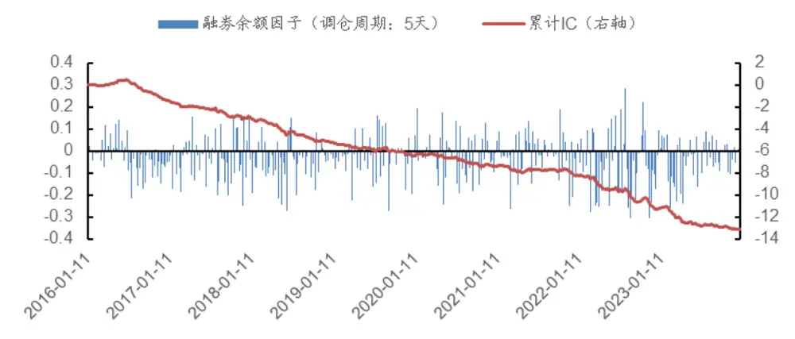
数据来源：天软科技，广发证券发展研究中心

图 20：中证500 融券余额占比因子-预测 10天-IC值与 IC累计值走势
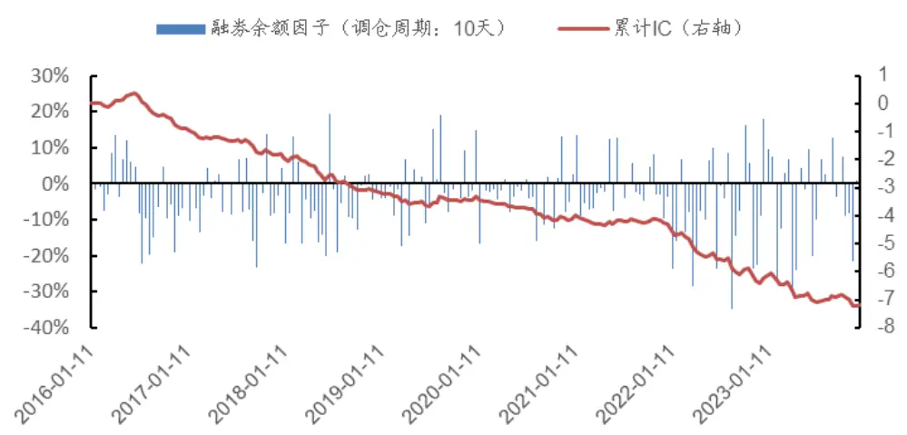
数据来源：天软科技，广发证券发展研究中心

图 21：中证500 融券余额占比因子-预测 20天-IC值与 IC累计值走势
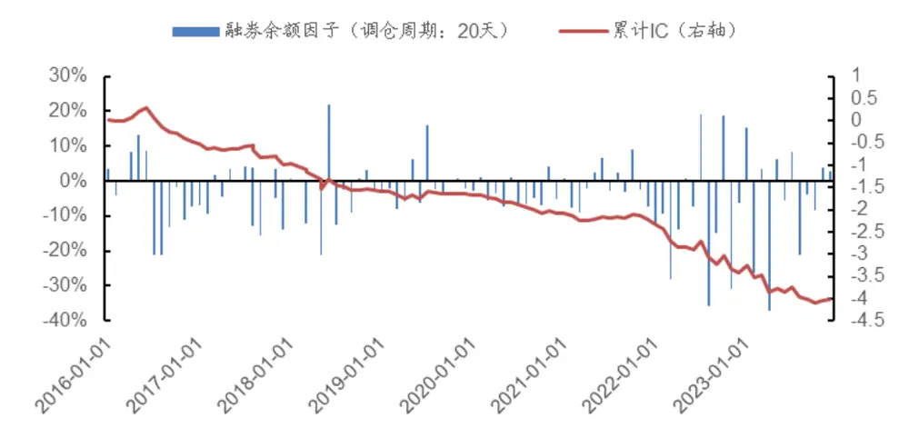
数据来源：天软科技，广发证券发展研究中心

表 24：融券余额占比因子-多空对冲策略与多头相对中证 500指数策略-5日调仓-整体与分年度表现

| 纯多头 |  | 多空对冲策略 |  |  |  |  | 多头-中证500策略 |  |  |  |  |
| --- | --- | --- | --- | --- | --- | --- | --- | --- | --- | --- | --- |
| 统计 | 年度 | 年度 | 累计 | 年化 | 最大 | 信息 | 年度 | 累计 | 年化 | 最大 | 信息 |
| 区间 | 收益率 | 收益率 | 收益率 | 波动率 | 回撤 | 比率 | 收益率 | 收益率 | 波动率 | 回撤 | 比率 |
| 2016 | -4.63% | -2.60% | -2.60% | 9.14% | 14.14% | 0.02 | 6.40% | 6.40% | 10.07% | 6.59% | 0.17 |
| 2017 | -1.73% | 3.31% | 0.62% | 9.86% | 7.26% | 0.25 | -1.32% | 5.00% | 5.39% | 6.43% | -0.01 |
| 2018 | -33.69% | 2.60% | 3.24% | 10.72% | 10.45% | 1.34 | 1.27% | 6.34% | 7.60% | 4.61% | 1.49 |
| 2019 | 35.66% | 4.15% | 7.52% | 9.67% | 6.40% | -0.87 | 2.42% | 8.91% | 7.55% | 8.28% | -1.11 |
| 2020 | 15.80% | -4.57% | 2.61% | 11.31% | 9.27% | -0.78 | -5.95% | 2.43% | 15.40% | 14.57% | -0.90 |
| 2021 | 25.58% | 10.99% | 13.89% | 11.71% | 12.93% | -0.13 | 10.70% | 13.39% | 9.78% | 9.81% | -0.16 |
| 2022 | -5.47% | 34.50% | 53.18% | 12.13% | 7.83% | 2.27 | 14.00% | 29.27% | 8.31% | 4.83% | 1.56 |
| 2023 | 2.67% | -0.93% | 51.76% | 11.30% | 7.70% | -0.10 | 11.29% | 43.86% | 13.04% | 10.31% | 1.07 |
| ALL | 2.95% | 5.57% | 51.76% | 10.74% | 15.13% | 0.93 | 4.84% | 43.86% | 10.09% | 14.57% | 0.70 |

数据来源：天软科技，广发证券发展研究中心

表 25：融券余额占比因子-多空对冲策略与多头相对中证 500指数策略-10日调仓-整体与分年度表现

| 纯多头 |  | 多空对冲策略 |  |  |  | 多头-中证 500 策略 |  |  |  |  |  |
| --- | --- | --- | --- | --- | --- | --- | --- | --- | --- | --- | --- |
| 统计 | 年度 | 年度 | 累计 | 年化 | 最大 | 信息 | 年度 | 累计 | 年化 | 最大 | 信息 |
| 区间 | 收益率 | 收益率 | 收益率 | 波动率 | 回撤 | 比率 | 收益率 | 收益率 | 波动率 | 回撤 | 比率 |
| 2016 | -6.77% | -0.11% | -0.11% | 8.57% | 12.13% | 0.10 | -1.98% | -1.98% | 9.64% | 11.98% | -0.17 |
| 2017 | -2.95% | 0.26% | 0.15% | 10.16% | 7.08% | 0.08 | -2.96% | -4.88% | 5.38% | 7.00% | -0.12 |
| 2018 | -33.42% | 2.17% | 2.32% | 11.12% | 9.43% | 1.31 | 1.74% | -3.22% | 7.86% | 3.94% | 1.51 |
| 2019 | 30.28% | -0.04% | 2.28% | 9.80% | 8.83% | -1.02 | -0.57% | -3.78% | 7.75% | 9.91% | -1.25 |
| 2020 | 16.02% | -4.37% | -2.19% | 11.52% | 8.11% | -0.76 | -5.62% | -9.19% | 15.15% | 13.22% | -0.89 |
| 2021 | 28.09% | 13.96% | 11.46% | 11.50% | 11.57% | 0.02 | 13.01% | 2.63% | 9.80% | 10.58% | -0.03 |
| 2022 | -5.15% | 34.38% | 49.78% | 12.01% | 6.95% | 2.27 | 14.29% | 17.29% | 8.40% | 5.63% | 1.57 |
| 2023 | 2.85% | 0.27% | 50.18% | 11.53% | 6.88% | -0.03 | 11.47% | 30.75% | 15.77% | 8.92% | 0.95 |
| ALL | 2.26% | 5.43% | 50.18% | 10.78% | 16.25% | 0.91 | 3.54% | 30.75% | 10.52% | 15.13% | 0.62 |

数据来源：天软科技，广发证券发展研究中心

表 26：融券余额占比因子-多空对冲策略与多头相对中证 500 指数策略-20 日调仓-整体与分年度表现

| 纯多头 |  | 多空对冲策略 |  |  |  | 多头-中证 500 策略 |  |  |  |  |
| --- | --- | --- | --- | --- | --- | --- | --- | --- | --- | --- |
| 统计 | 年度 | 年度 | 累计 | 年化 | 最大 | 信息 | 年度 | 累计 | 年化 | 最大 信息 |
| 区间 | 收益率 | 收益率 | 收益率 | 波动率 | 回撤 | 比率 | 收益率 收益率 | 波动率 | 回撤 | 比率 |
| 2016 | -3.45% | 4.48% | 4.48% | 8.88% | 9.72% 0.27 | -1.46% | -1.46% | 9.05% | 9.88% | -0.15 |
| 2017 | -1.83% | 2.16% | 6.74% | 9.86% | 6.41% | 0.19 -0.95% | -2.39% | 5.11% | 5.00% | 0.01 |
| 2018 | -29.54% | 10.24% | 17.67% | 9.72% | 6.73% | 1.63 8.01% | 5.43% | 6.41% | 4.71% | 1.81 |
| 2019 | 28.87% | -3.13% | 14.00% | 8.33% | 8.68% | -1.13 | -1.91% 3.41% | 6.72% | 7.70% | -1.28 |
| 2020 | 13.81% | -3.76% | 9.71% | 10.80% | 8.09% | -0.75 | -7.49% -4.34% | 14.55% | 13.77% | -0.96 |
| 2021 | 17.95% | 7.17% | 17.58% | 10.55% | 10.22% | -0.34 | 4.15% -0.37% | 8.98% | 10.22% | -0.56 |
| 2022 | -6.88% | 32.68% | 56.00% | 10.51% | 6.47% | 2.21 | 12.27% 11.86% | 7.24% | 5.23% | 1.48 |
| 2023 | 2.86% | 0.98% | 57.54% | 11.40% | 7.01% | 0.02 | 11.41% 24.62% | 15.63% | 12.08% | 1.02 |
| ALL | 1.75% | 6.08% | 57.54% | 9.94% | 13.89% | 0.96 | 2.90% | 24.62% 9.87% | 16.52% | 0.53 |

数据来源：天软科技，广发证券发展研究中心

图 22：中证500 融券余额占比因子-5天调仓-多空策略净值走势
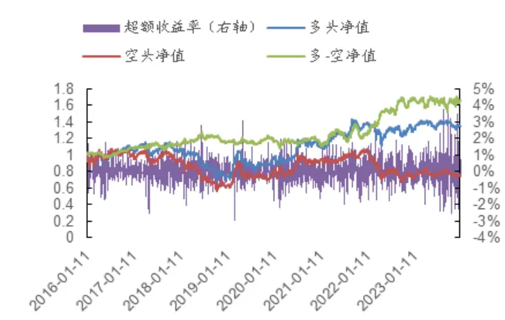
数据来源：天软科技，广发证券发展研究中心

图 23：融券余额占比因子-5天调仓-多-中证500策略净值走势
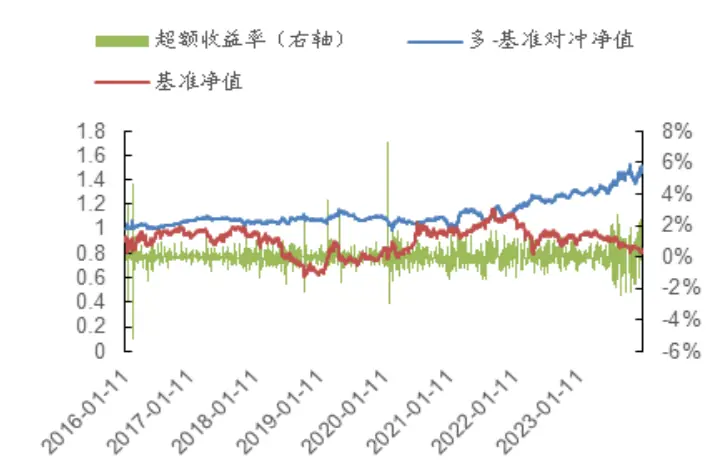
数据来源：天软科技，广发证券发展研究中心

图 24：中证500 融券余额占比因子-10天调仓-多空策略净值走势
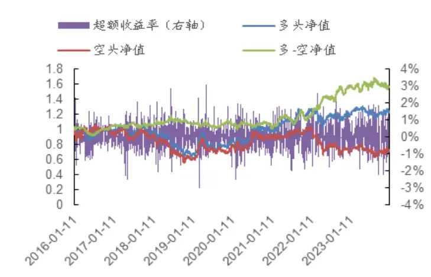
数据来源：天软科技，广发证券发展研究中心

图 25：融券余额占比因子-10天调仓-多-中证500策略净值走势
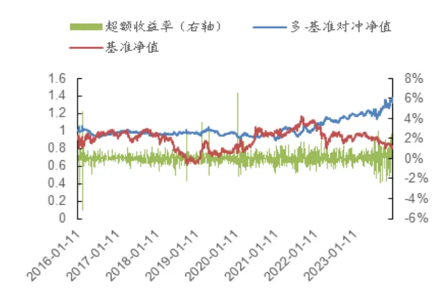
数据来源：天软科技，广发证券发展研究中心

图 26：中证500 融券余额占比因子-20天调仓-多空策略净值走势
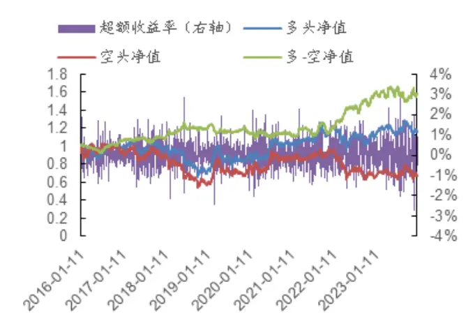
数据来源：天软科技，广发证券发展研究中心

图 27：融券余额占比因子-20天调仓-多-中证500策略净值走势
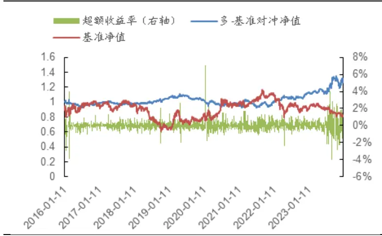
数据来源：天软科技，广发证券发展研究中心

表27：中证 500 融券余额占比因子-5天调仓-分年度换手率

| 统计区间 | 均值 | 最大值 | 最小值 | 标准差 | 累计值 |
| --- | --- | --- | --- | --- | --- |
| 2016 | 44.88% | 70.15% | 20.59% | 0.10 | 10949.50% |
| 2017 | 37.85% | 53.54% | 21.34% | 0.06 | 9235.82% |
| 2018 | 36.80% | 53.73% | 19.40% | 0.07 | 8941.65% |
| 2019 | 39.32% | 76.59% | 16.67% | 0.19 | 9593.32% |
| 2020 | 31.54% | 60.44% | 14.64% | 0.12 | 7663.29% |
| 2021 | 18.15% | 48.97% | 17.52% | 0.07 | 4411.38% |
| 2022 | 24.76% | 41.77% | 13.24% | 0.06 | 5991.55% |
| 2023 | 25.28% | 39.58% | 17.64% | 0.05 | 6115.72% |
| ALL | 32.47% | 76.59% | 13.24% | 0.13 | 62902.23% |

数据来源：天软科技，广发证券发展研究中心

表 28：中证 500 融券余额占比因子-10天调仓-分年度换手率

| 统计区间 | 均值 | 最大值 | 最小值 | 标准差 | 累计值 |
| --- | --- | --- | --- | --- | --- |
| 2016 | 40.62% | 64.18% | 16.18% | 0.12 | 9910.92% |
| 2017 | 32.53% | 45.71% | 15.71% | 0.05 | 7937.99% |
| 2018 | 29.82% | 44.93% | 16.42% | 0.06 | 7247.35% |
| 2019 | 30.68% | 41.88% | 13.27% | 0.16 | 7486.41% |
| 2020 | 23.88% | 51.94% | 15.44% | 0.10 | 5803.75% |
| 2021 | 13.70% | 35.51% | 12.75% | 0.06 | 3330.05% |
| 2022 | 18.84% | 36.46% | 8.14% | 0.06 | 4558.52% |
| 2023 | 19.15% | 37.18% | 10.42% | 0.05 | 4559.48% |
| ALL | 26.25% | 64.18% | 8.14% | 0.12 | 50834.47% |

数据来源：天软科技，广发证券发展研究中心

表29：中证 500 融券余额占比因子-20天调仓-分年度换手率

| 统计区间 | 均值 | 最大值 | 最小值 | 标准差 | 累计值 |
| --- | --- | --- | --- | --- | --- |
| 2016 | 38.70% | 67.16% | 7.46% | 0.13 | 9443.10% |
| 2017 | 27.83% | 43.48% | 14.29% | 0.05 | 6790.31% |
| 2018 | 25.16% | 42.65% | 10.45% | 0.06 | 6114.54% |
| 2019 | 24.18% | 41.84% | 10.99% | 0.12 | 5900.24% |
| 2020 | 17.09% | 51.09% | 14.40% | 0.08 | 4153.43% |
| 2021 | 10.06% | 31.35% | 13.35% | 0.05 | 2443.62% |
| 2022 | 13.77% | 39.11% | 15.62% | 0.05 | 3331.47% |
| 2023 | 14.33% | 31.25% | 17.22% | 0.05 | 3491.22% |
| ALL | 21.46% | 67.16% | 7.46% | 0.12 | 41667.93% |

数据来源：天软科技，广发证券发展研究中心

在中证500成分股选股中，融券余额占比因子的选股区分度较高，在5天、10天、20天的调仓周期下，因子IC均值分别为-3.39%、-3.69%和-4.15%， IC胜率占比分别为64.95%、65.98%和65.98%。因子在2021年的预测收益表现相对较弱，分年度IC的绝对值在不同预测周期中均不超过0.02。在多头相对中证500策略中，不同调仓周期下的累积超额收益率分别为43.86%、30.75%和24.62%。

## （四）中证 1000中因子表现

表30：融资融券类因子IC表现-中证 1000

| 因子名称 | IC 均值 |  |  | IC-IR |  |  |
| --- | --- | --- | --- | --- | --- | --- |
|  | 预测 5天 | 预测 10天 | 预测 20 天 | 预测 5天 | 预测 10天 | 预测 20 天 |
| 净融券卖出占比增速因子 | 0.12% | 0.19% | 0.13% | 0.085 | 0.133 | 0.085 |
| 净融券卖出占比增速因子 （N=5） | 0.06% | 0.17% | 0.53% | 0.041 | 0.081 | 0.161 |
| 净融券卖出占比增速因子 (N=10) | 0.02% | 0.13% | 0.41% | 0.014 | 0.089 | 0.157 |
| 净融券卖出占比增速因子 （N=15） | -0.22% | -0.33% | -0.10% | -0.170 | -0.184 | -0.027 |
| 净融券卖出占比增速因子 (N=20) | 0.07% | 0.26% | 0.11% | 0.062 | 0.143 | 0.046 |
| 净融资买入占比增速因子 | -0.19% | 0.09% | 0.25% | -0.176 | 0.043 | 0.079 |
| 净融资买入占比增速因子 (N=5) | 0.28% | 0.64% | 0.39% | 0.222 | 0.328 | 0.166 |
| 净融资买入占比增速因子 （N=10） | -0.21% | 0.11% | -0.15% | -0.214 | 0.068 | -0.052 |
| 净融资买入占比增速因子 (N=15) | -0.15% | 0.09% | -0.20% | -0.105 | 0.052 | -0.061 |
| 净融资买入占比增速因子 （N=20） | 0.53% | 0.50% | 0.11% | 0.475 | 0.250 | 0.072 |
| 融券余额变化率因子 | 1.42% | 0.95% | 0.42% | 0.815 | 0.469 | 0.246 |
| 融券余额变化率因子 （N=5） | -1.19% | -1.15% | -1.23% | -0.723 | -0.868 | -0.870 |
| 融券余额变化率因子 (N=10) | -2.10% | -2.07% | -2.33% | -1.596 | -1.371 | -1.374 |
| 融券余额变化率因子 （N=15） | -2.01% | -2.58% | -3.06% | -2.226 | -1.874 | -1.890 |
| 融券余额变化率因子 (N=20) | -2.26% | -2.70% | -5.27% | -2.636 | -2.073 | -1.795 |
| 融券余额增长率因子 融券余额增长率因子 | -0.71% | -0.57% | -0.35% | -0.552 | -0.374 | -0.224 |
| (N=5) | -1.55% | -1.65% | -1.36% | -1.219 | -1.103 | -0.841 |
| 融券余额增长率因子 （N=10） | -1.81% | -1.57% | -2.44% | -1.778 | -1.807 | -1.516 |
| 融券余额增长率因子 (N=15) | -2.34% | -3.03% | -2.44% | -2.687 | -1.770 | -1.862 |
| 融券余额增长率因子 （N=20） | -2.48% | -3.12% | -2.79% | -2.288 | -2.027 | -2.011 |
| 融券卖出占比增速因子 | 0.13% | -0.09% | -0.06% | 0.161 | -0.042 | -0.019 |
| 融券卖出占比增速因子 （N=5） | -0.18% | -0.39% | -0.16% | -0.207 | -0.236 | -0.046 |
| 融券卖出占比增速因子 (N=10) | -0.24% | -0.20% | -0.06% | -0.201 | -0.124 | -0.019 |
| 融券卖出占比增速因子 （N=15） | 0.21% | 0.22% | -0.05% | 0.154 | 0.116 | -0.021 |
| 融券卖出占比增速因子 (N=20） | -0.21% | -0.23% | -0.42% | -0.183 | -0.097 | -0.145 |
| 融券余额占比增速因子 | -0.29% | 0.36% | -0.19% | -0.329 | 0.218 | -0.100 |
| 融券余额占比增速因子 (N=5) | -0.65% | -1.18% | -1.05% | -0.929 | -1.128 | -0.544 |
| 融券余额占比增速因子 （N=10） | -1.53% | -1.56% | -2.19% | -1.692 | -1.476 | -1.330 |
| 融券余额占比增速因子 (N=15) | -1.52% | -1.89% | -2.71% | -1.483 | -1.713 | -1.779 |
| 融券余额占比增速因子 （N=20） | -2.63% | -3.13% | -4.70% | -2.939 | -2.732 | -1.713 |
| 融资买入占比增速因子 | 0.07% | 0.00% | -0.10% | 0.047 | -0.001 | -0.032 |
| 融资买入占比增速因子 （N=5） | 0.07% | 0.20% | -0.15% | 0.056 | 0.120 | -0.087 |
| 融资买入占比增速因子 (N=10) | 0.18% | 0.32% | -0.42% | 0.099 | 0.122 | -0.167 |
| 融资买入占比增速因子 （N=15） | -0.03% | -0.12% | -0.42% | -0.018 | -0.068 | -0.155 |

识别风险，发现价值

| 融资买入占比增速因子 (N=20) | -0.04% | -0.21% | -0.61% | -0.050 | -0.155 | -0.305 |
| --- | --- | --- | --- | --- | --- | --- |
| 融资买入额比因子 | -0.25% | 0.13% | 0.08% | -0.259 | 0.085 | 0.051 |
| 融资买入额比因子（N=5） | -0.95% | -0.06% | -0.46% | -0.765 | -0.040 | -0.226 |
| 融资买入额比因子 （N=10） | -0.72% | -0.11% | -0.45% | -0.392 | -0.054 | -0.162 |
| 融资买入额比因子 (N=15) | -1.72% | -1.18% | -1.98% | -1.087 | -0.753 | -0.690 |
| 融资买入额比因子 （N=20） | -1.13% | -2.31% | -1.84% | -1.377 | -0.821 | -0.724 |
| 融资余额占比增速因子 | 0.89% | 0.13% | -0.23% | 0.505 | 0.046 | -0.078 |
| 融资余额占比增速因子 （N=5） | 1.02% | 0.54% | 0.36% | 0.746 | 0.303 | 0.208 |
| 融资余额占比增速因子 (N=10) | 1.38% | 0.68% | 1.11% | 0.834 | 0.385 | 0.332 |
| 融资余额占比增速因子 （N=15） | 1.02% | 0.65% | 0.79% | 0.696 | 0.493 | 0.387 |
| 融资余额占比增速因子 (N=20) | 1.22% | 0.90% | 1.81% | 1.112 | 0.684 | 0.366 |
| 融资余额变化率因子 | -1.04% | -1.11% | -1.44% | -1.256 | -0.856 | -0.607 |
| 融资余额变化率因子 (N=5) | -1.71% | -2.37% | -1.79% | -1.661 | -1.202 | -1.273 |
| 融资余额变化率因子 （N=10） | -2.05% | -2.83% | -3.62% | -2.225 | -1.644 | -1.575 |
| 融资余额变化率因子 | -2.91% | -2.99% | -3.01% | -2.069 | -2.144 | -1.642 |
| (N=15) 融资余额变化率因子 | -3.27% | -3.30% | -3.45% | -2.558 | -2.347 | -1.848 |
| （N=20） 融资余额增长率因子 | -0.62% | -0.46% | -0.30% | -0.559 | -0.404 | -0.164 |
| 融资余额增长率因子 | -1.83% | -1.26% | -1.59% | -1.196 | -1.041 | -0.892 |
| （N=5） 融资余额增长率因子 | -2.27% | -2.00% | -1.63% | -1.541 | -1.698 | -1.497 |
| (N=10) 融资余额增长率因子 | -2.28% | -2.26% | -2.98% | -2.128 | -1.844 | -1.547 |
| （N=15） 融资余额增长率因子 | -3.28% | -3.05% | -2.65% | -2.254 | -2.359 | -1.561 |
| (N=20) 净融券卖出占比因子 | -0.11% | 0.02% | -0.09% | -0.090 | 0.022 | -0.028 |
| 净融资买入占比因子 | -0.48% | -0.68% | -0.63% | -0.460 | -0.313 | -0.310 |
| 融券余额占比因子 | -3.28% | -4.22% | -4.42% | -2.947 | -2.167 | -1.626 |
| 融资余额占比因子 | 0.19% | -0.05% | 0.03% | 0.071 | -0.013 | 0.006 |
| 融券卖出占比因子 | -0.16% | -0.21% | -0.05% | -0.158 | -0.168 | -0.020 |
| 融资买入占比因子 | -0.06% | -0.22% | -0.58% | -0.064 | -0.110 | -0.265 |

识别风险，发现价值

| 融券卖出量占融券余量比 | -1.49% | -2.20% | -1.92% | -1.778 | -1.402 | -0.930 |
| --- | --- | --- | --- | --- | --- | --- |
| 融资买入额占融资余额比 | -5.55% | -7.36% | -7.95% | -2.275 | -2.231 | -2.071 |

数据来源：天软科技，广发证券发展研究中心

表 31：融资融券类因子 RankIC 表现-中证 1000

| 因子名称 | RankIC 均值 |  |  | RankIC-IR |  |  |
| --- | --- | --- | --- | --- | --- | --- |
|  | 预测 | 预测 | 预测 | 预测 | 预测 | 预测 |
|  | 5天 0.09% | 10天 0.12% | 20 天 0.20% | 5天 0.077 | 10 天 0.089 | 20 天 0.080 |
| 净融券卖出占比增速因子 净融券卖出占比增速因子 |  |  |  |  |  |  |
| （N=5） 净融券卖出占比增速因子 | 0.05% | 0.14% | 0.25% | 0.024 | 0.082 | 0.186 |
| (N=10) 净融券卖出占比增速因子 | 0.02% | 0.13% | 0.39% | 0.012 | 0.087 | 0.097 |
| （N=15） 净融券卖出占比增速因子 | -0.13% | -0.20% | -0.05% | -0.184 | -0.155 | -0.029 |
| (N=20) | 0.05% | 0.19% | 0.08% | 0.049 | 0.148 | 0.041 |
| 净融资买入占比增速因子 净融资买入占比增速因子 | -0.19% | 0.09% | 0.24% | -0.175 | 0.059 | 0.054 |
| (N=5) 净融资买入占比增速因子 | 0.22% | 0.57% | 0.38% | 0.214 | 0.304 | 0.193 |
| （N=10） 净融资买入占比增速因子 | -0.25% | 0.06% | -0.14% | -0.124 | 0.058 | -0.032 |
| (N=15) 净融资买入占比增速因子 | -0.21% | 0.08% | -0.19% | -0.085 | 0.034 | -0.057 |
| （N=20） | 0.46% | 0.48% | 0.16% | 0.318 | 0.299 | 0.074 |
| 融券余额变化率因子 融券余额变化率因子 | 0.67% | 1.02% | 0.46% | 0.996 | 0.552 | 0.165 |
| （N=5） | -0.96% | -1.26% | -1.70% | -0.937 | -0.820 | -0.850 |
| 融券余额变化率因子 (N=10) | -1.80% | -1.76% | -3.40% | -1.698 | -1.167 | -1.658 |
| 融券余额变化率因子 （N=15） 融券余额变化率因子 | -1.61% | -2.67% | -3.25% | -1.145 | -1.249 | -1.152 |
| (N=20) | -2.79% | -3.41% | -4.68% | -1.804 | -2.104 | -2.498 |
| 融券余额增长率因子 融券余额增长率因子 | -0.41% | -0.54% | -0.41% | -0.402 | -0.298 | -0.212 |
| (N=5) | -1.72% | -1.82% | -1.49% | -1.920 | -0.608 | -0.650 |
| 融券余额增长率因子 （N=10） | -1.52% | -1.63% | -2.77% | -2.243 | -1.300 | -1.193 |
| 融券余额增长率因子 (N=15) | -2.43% | -2.78% | -2.83% | -1.765 | -1.340 | -1.069 |

识别风险，发现价值

| 融券余额增长率因子 （N=20） | -2.82% | -3.06% | -2.68% | -2.497 | -1.523 | -1.789 |
| --- | --- | --- | --- | --- | --- | --- |
| 融券卖出占比增速因子 | 0.25% | -0.08% | -0.04% | 0.092 | -0.032 | -0.014 |
| 融券卖出占比增速因子 （N=5） | -0.16% | -0.32% | -0.15% | -0.175 | -0.170 | -0.067 |
| 融券卖出占比增速因子 (N=10) | -0.30% | -0.14% | -0.04% | -0.159 | -0.088 | -0.013 |
| 融券卖出占比增速因子 （N=15） | 0.12% | 0.23% | -0.04% | 0.117 | 0.063 | -0.012 |
| 融券卖出占比增速因子 (N=20) | -0.17% | -0.17% | -0.26% | -0.193 | -0.083 | -0.132 |
| 融券余额占比增速因子 | -0.21% | 0.34% | -0.18% | -0.301 | 0.259 | -0.117 |
| 融券余额占比增速因子 (N=5) | -0.74% | -0.87% | -1.13% | -0.546 | -0.763 | -0.388 |
| 融券余额占比增速因子 （N=10） | -1.19% | -1.81% | -1.67% | -1.397 | -1.849 | -1.524 |
| 融券余额占比增速因子 (N=15) | -1.09% | -1.83% | -1.79% | -1.560 | -1.436 | -1.751 |
| 融券余额占比增速因子 （N=20） | -1.98% | -1.28% | -3.36% | -3.093 | -2.506 | -2.168 |
| 融资买入占比增速因子 | 0.06% | 0.00% | -0.06% | 0.051 | -0.001 | -0.026 |
| 融资买入占比增速因子 （N=5） | 0.05% | 0.16% | -0.23% | 0.055 | 0.148 | -0.064 |
| 融资买入占比增速因子 (N=10) | 0.11% | 0.33% | -0.46% | 0.117 | 0.187 | -0.171 |
| 融资买入占比增速因子 （N=15） | -0.02% | -0.10% | -0.36% | -0.017 | -0.057 | -0.198 |
| 融资买入占比增速因子 | -0.06% | -0.27% | -0.66% | -0.058 | -0.122 | -0.226 |
| (N=20) 融资买入额比因子 | -0.33% | 0.11% | 0.07% | -0.236 | 0.080 | 0.031 |
| 融资买入额比因子（N=5） | -0.85% | -0.05% | -0.52% | -0.348 | -0.043 | -0.307 |
| 融资买入额比因子 （N=10） | -0.52% | -0.11% | -0.32% | -0.412 | -0.049 | -0.166 |
| 融资买入额比因子 (N=15) | -0.97% | -1.50% | -2.36% | -0.979 | -0.798 | -0.624 |
| 融资买入额比因子 （N=20） | -1.60% | -1.82% | -2.52% | -0.705 | -1.085 | -0.836 |
| 融资余额占比增速因子 | 0.41% | 0.09% | -0.19% | 0.448 | 0.035 | -0.075 |
| 融资余额占比增速因子 （N=5） | 1.02% | 0.49% | 0.46% | 0.682 | 0.338 | 0.122 |
| 融资余额占比增速因子 (N=10) | 1.23% | 0.68% | 1.11% | 0.465 | 0.210 | 0.244 |

识别风险，发现价值

| 融资余额占比增速因子 （N=15) | 0.99% | 0.84% | 0.63% | 0.541 | 0.490 | 0.360 |
| --- | --- | --- | --- | --- | --- | --- |
| 融资余额占比增速因子 (N=20） | 1.08% | 0.95% | 1.42% | 0.530 | 0.739 | 0.358 |
| 融资余额变化率因子 | -1.24% | -0.83% | -1.41% | -1.306 | -0.848 | -0.382 |
| 融资余额变化率因子 (N=5) | -1.71% | -1.32% | -2.49% | -1.566 | -1.153 | -0.626 |
| 融资余额变化率因子 （N=10） | -2.43% | -2.51% | -3.26% | -1.611 | -1.820 | -1.527 |
| 融资余额变化率因子 (N=15) | -2.28% | -2.86% | -4.57% | -1.789 | -1.798 | -1.621 |
| 融资余额变化率因子 （N=20） | -2.54% | -4.15% | -3.23% | -1.637 | -1.455 | -1.530 |
| 融资余额增长率因子 | -0.40% | -0.51% | -0.21% | -0.548 | -0.373 | -0.101 |
| 融资余额增长率因子 （N=5） | -1.04% | -1.13% | -1.65% | -1.459 | -0.969 | -0.747 |
| 融资余额增长率因子 (N=10) | -1.47% | -2.32% | -2.17% | -1.718 | -1.430 | -1.128 |
| 融资余额增长率因子 （N=15） | -2.56% | -1.61% | -2.36% | -2.068 | -1.488 | -1.026 |
| 融资余额增长率因子 (N=20) | -2.32% | -3.23% | -2.56% | -1.875 | -1.479 | -1.197 |
| 净融券卖出占比因子 | -0.09% | 0.03% | -0.05% | -0.100 | 0.018 | -0.024 |
| 净融资买入占比因子 | -0.38% | -0.30% | -0.55% | -0.432 | -0.335 | -0.300 |
| 融券余额占比因子 | -3.54% | -4.22% | -4.03% | -1.356 | -1.498 | -1.582 |
| 融资余额占比因子 | 0.12% | -0.05% | 0.01% | 0.075 | -0.016 | 0.005 |
| 融券卖出占比因子 | -0.22% | -0.27% | -0.03% | -0.156 | -0.158 | -0.022 |
| 融资买入占比因子 | -0.04% | -0.18% | -0.60% | -0.039 | -0.069 | -0.279 |
| 融券卖出量占融券余量比 | -1.65% | -1.90% | -2.10% | -1.780 | -1.114 | -0.970 |
| 融资买入额占融资余额比 | -4.73% | -5.35% | -6.83% | -1.965 | -2.135 | -1.444 |

数据来源：天软科技，广发证券发展研究中心

表 32：融资融券类因子 IC/RankIC 胜率-中证 1000

| 因子名称 | IC 胜率 |  |  | RankIC 胜率 |  |  |
| --- | --- | --- | --- | --- | --- | --- |
|  | 预测 | 预测 | 预测 | 预测 | 预测 | 预测 |
|  | 5天 | 10天 | 20 天 53.77% | 5天 55.31% | 10 天 48.33% | 20 天 53.79% |
| 融券余额占比增速因子 融券余额占比增速因子 | 55.64% | 48.27% |  |  |  |  |
| （N=5） 融券余额占比增速因子 | 52.80% | 59.45% | 53.02% | 54.09% | 57.53% | 54.73% |
| (N=10) 融券余额占比增速因子 | 55.80% | 60.69% | 64.47% | 59.65% | 59.63% | 64.87% |
| （N=15） | 59.15% | 61.87% | 65.91% | 58.41% | 60.28% | 64.95% |
| 融券余额占比增速因子 (N=20) | 64.65% | 64.18% | 66.61% | 64.85% | 65.08% | 67.29% |
| 融资买入占比增速因子 | 48.41% | 50.74% | 50.79% | 48.45% | 48.99% | 51.04% |
| 融资买入占比增速因子 (N=5) | 50.04% | 51.01% | 49.77% | 51.26% | 51.82% | 49.23% |
| 融资买入占比增速因子 （N=10） | 52.42% | 52.10% | 50.64% | 50.99% | 51.24% | 48.79% |
| 融资买入占比增速因子 (N=15) | 50.71% | 50.32% | 53.50% | 50.58% | 48.47% | 51.65% |
| 融资买入占比增速因子 （N=20） | 51.41% | 51.00% | 54.48% | 49.91% | 50.91% | 53.69% |
| 融资买入额比因子 | 49.65% | 47.95% | 47.17% | 50.58% | 45.60% | 48.04% |
| 融资买入额比因子（N=5） | 52.24% | 48.32% | 51.05% | 51.80% | 49.42% | 52.50% |
| 融资买入额比因子 (N=10) | 52.94% | 48.21% | 49.00% | 50.41% | 53.26% | 48.32% |
| 融资买入额比因子 （N=15） | 59.25% | 58.57% | 52.98% | 58.25% | 56.70% | 55.04% |
| 融资买入额比因子 (N=20) | 60.57% | 56.80% | 57.56% | 59.36% | 57.79% | 56.02% |
| 融资余额占比增速因子 | 50.87% | 49.22% | 50.92% | 51.60% | 51.26% | 51.07% |
| 融资余额占比增速因子 (N=5) | 51.23% | 49.45% | 49.71% | 52.12% | 50.81% | 49.39% |
| 融资余额占比增速因子 （N=10） | 52.07% | 52.27% | 53.17% | 52.64% | 52.29% | 54.38% |
| 融资余额占比增速因子 (N=15) | 52.56% | 50.66% | 54.96% | 54.24% | 52.43% | 54.08% |
| 融资余额占比增速因子 （N=20） | 54.18% | 52.95% | 53.08% | 55.45% | 54.32% | 55.29% |
| 融资余额变化率因子 | 51.83% | 48.87% | 50.05% | 53.39% | 50.99% | 50.27% |
| 融资余额变化率因子 （N=5） | 54.18% | 51.98% | 56.43% | 54.62% | 52.67% | 57.29% |
| 融资余额变化率因子 (N=10) | 54.51% | 56.58% | 59.62% | 54.23% | 54.22% | 57.69% |
| 融资余额变化率因子 （N=15） | 56.42% | 57.13% | 62.24% | 58.03% | 58.09% | 62.55% |
| 融资余额变化率因子 (N=20) | 58.58% | 57.57% | 61.96% | 57.55% | 59.27% | 61.45% |
| 融资余额增长率因子 | 54.11% | 54.02% | 50.69% | 55.46% | 53.80% | 50.75% |
| 融资余额增长率因子 (N=5) | 57.62% | 56.39% | 58.13% | 59.46% | 59.02% | 56.97% |
| 融资余额增长率因子 （N=10） | 60.03% | 61.81% | 62.09% | 61.74% | 61.18% | 63.78% |
| 融资余额增长率因子 (N=15) | 63.83% | 64.81% | 64.97% | 62.41% | 64.43% | 65.55% |
| 融资余额增长率因子 （N=20） | 65.04% | 67.75% | 68.47% | 65.37% | 68.34% | 68.23% |
| 净融券卖出占比增速因子 | 49.37% | 50.82% | 51.81% | 50.47% | 49.60% | 48.81% |
| 净融券卖出占比增速因子 （N=5） | 49.66% | 49.72% | 52.30% | 49.94% | 51.11% | 52.69% |
| 净融券卖出占比增速因子 (N=10) | 50.22% | 48.08% | 49.22% | 48.56% | 47.69% | 49.16% |
| 净融券卖出占比增速因子 （N=15） | 50.27% | 50.95% | 50.11% | 51.33% | 50.32% | 50.92% |
| 净融券卖出占比增速因子 | 49.90% | 51.53% | 51.99% | 50.95% | 51.66% | 50.81% |
| (N=20) 净融资买入占比增速因子 | 49.79% | 50.71% | 50.33% | 50.59% | 50.43% | 51.70% |
| 净融资买入占比增速因子 (N=5) | 50.77% | 51.64% | 53.36% | 50.01% | 51.54% | 51.11% |
| 净融资买入占比增速因子 （N=10） | 51.44% | 51.27% | 48.91% | 51.85% | 50.13% | 49.82% |
| 净融资买入占比增速因子 (N=15) | 50.50% | 48.52% | 50.59% | 50.97% | 49.67% | 49.92% |
| 净融资买入占比增速因子 | 52.72% | 52.32% | 51.91% | 53.35% | 53.14% | 52.48% |
| （N=20） 融券余额变化率因子 | 47.73% | 49.36% | 47.35% | 48.43% | 48.57% | 51.10% |
| 融券余额变化率因子 （N=5） | 49.71% | 53.01% | 54.57% | 52.21% | 51.01% | 52.36% |
| 融券余额变化率因子 (N=10) | 45.98% | 47.45% | 54.62% | 42.64% | 47.51% | 50.15% |
| 融券余额变化率因子 （N=15） | 44.96% | 48.18% | 51.41% | 46.28% | 46.13% | 53.05% |
| 融券余额变化率因子 | 49.73% | 53.69% | 53.84% | 50.51% | 51.19% | 53.62% |
| (N=20) 融券余额增长率因子 | 53.19% | 52.89% | 52.06% | 54.37% | 55.11% | 53.63% |

识别风险，发现价值

| 融券余额增长率因子 (N=5） | 57.73% | 59.42% | 57.86% | 60.24% | 57.58% | 56.76% |
| --- | --- | --- | --- | --- | --- | --- |
| 融券余额增长率因子 （N=10） | 62.76% | 63.64% | 63.15% | 60.02% | 61.44% | 62.75% |
| 融券余额增长率因子 (N=15) | 62.32% | 65.04% | 65.98% | 61.25% | 62.96% | 65.80% |
| 融券余额增长率因子 （N=20） | 64.76% | 67.20% | 67.58% | 65.39% | 64.96% | 68.09% |
| 融券卖出占比增速因子 | 49.10% | 50.43% | 48.93% | 49.05% | 50.74% | 48.95% |
| 融券卖出占比增速因子 （N=5） | 49.64% | 52.79% | 51.34% | 50.18% | 54.41% | 50.47% |
| 融券卖出占比增速因子 (N=10) | 51.87% | 51.13% | 49.19% | 50.84% | 51.53% | 48.11% |
| 融券卖出占比增速因子 （N=15） | 50.73% | 50.03% | 49.99% | 49.78% | 51.69% | 50.35% |
| 融券卖出占比增速因子 （N=20） | 50.51% | 49.58% | 50.31% | 50.98% | 49.85% | 48.73% |
| 净融券卖出占比因子 | 51.72% | 49.90% | 49.99% | 51.89% | 49.37% | 49.43% |
| 净融资买入占比因子 | 52.62% | 52.35% | 54.33% | 53.18% | 53.57% | 55.38% |
| 融券余额占比因子 | 61.60% | 64.43% | 63.92% | 64.47% | 67.17% | 66.21% |
| 融资余额占比因子 | 50.83% | 50.45% | 52.00% | 50.89% | 50.90% | 51.37% |
| 融券卖出占比因子 | 50.62% | 49.49% | 48.65% | 50.29% | 49.80% | 50.44% |
| 融资买入占比因子 | 49.91% | 50.93% | 56.17% | 51.32% | 52.03% | 54.05% |
| 融券卖出量占融券余量比 | 57.06% | 57.75% | 55.37% | 57.54% | 60.30% | 57.20% |
| 融资买入额占融资余额比 | 63.92% | 68.58% | 63.92% | 63.06% | 67.68% | 66.31% |

数据来源：天软科技，广发证券发展研究中心

由各因子的IC等指标可以看出，融资融券类因子在中证1000范围内的收益预测能力相较全市场和中证500均有所提高，其中IC表现较为突出的有融券余额增长率因子、融资余额增长率因子、融券卖出量占融券余量比因子、融资买入额占融资余额比因子和融券余额占比因子等。同时这些因子也具有较高的IC胜率。选取IC相对较高的因子进行回测，得到融资买入额占融资余额比因子和融券余额占比因子的回测结果的有效性和分组单调性较好。根据因子构建多空策略、多头相对基准策略，两个因子均可以获得较为稳定的超额收益。

根据回测结果，选取融资买入额占融资余额比因子和融券余额占比因子在IC、多空策略、多头相对基准策略以及换手率方面的回测表现进行整体展示。同时，对其分年度表现进行详细展示。

图 28：中证1000 融券余额占比因子五档-5天调仓
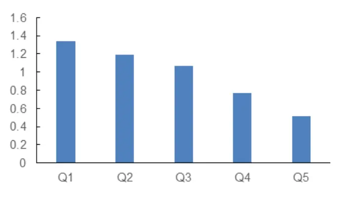
数据来源：天软科技，广发证券发展研究中心

图 29：中证1000 融券余额占比因子五档-10天调仓
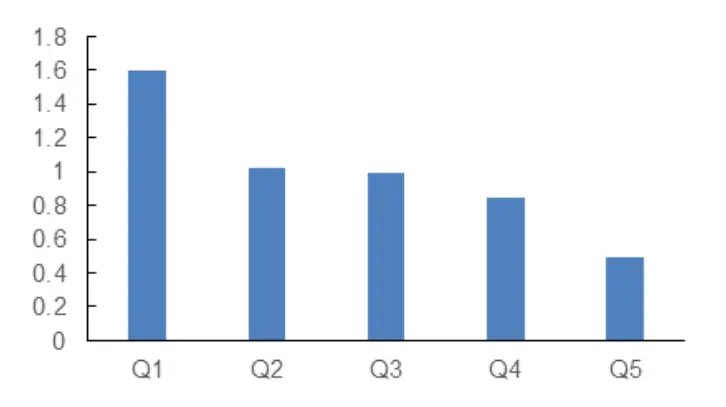
数据来源：天软科技，广发证券发展研究中心

图 30：中证1000 融券余额占比因子五档-20天调仓
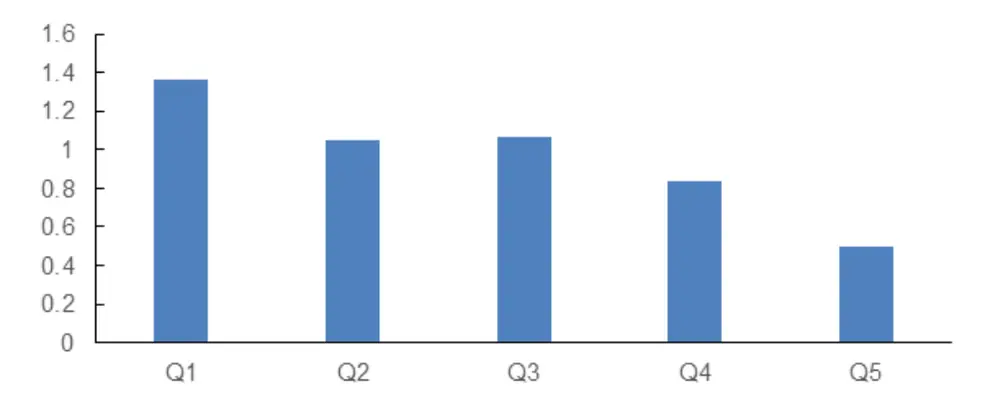
数据来源：天软科技，广发证券发展研究中心

图31：中证1000 融资买入额占融资余额比因子五档- 5天调仓
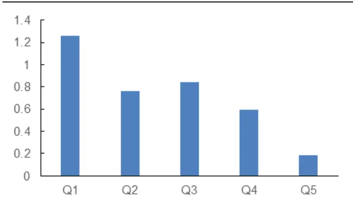
数据来源：天软科技，广发证券发展研究中心

图 32：中证 1000 融资买入额占融资余额比因子五档-10天调仓
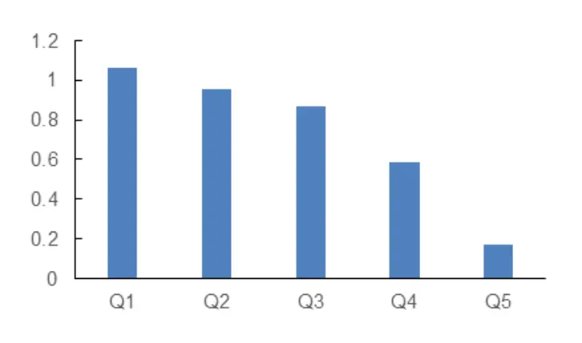
数据来源：天软科技，广发证券发展研究中心

图33：中证1000 融资买入额占融资余额比因子五档-20天调仓
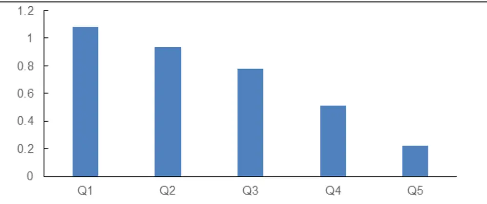
数据来源：天软科技，广发证券发展研究中心

以中证1000作为选股域的融券余额占比因子和融资买入额占融资余额比因子分组单调性较好，两个因子的单调性效果与调仓周期的关系有所不同，其中融券余额占比因子随着调仓周期的加大单调性有所下降，而融资买入额占融资余额比因子的情况则相反。在分成5档的情况下，两个因子的第一档均能获得相对于第五档的显著收益，但分层收益在中间档次的分层效果不佳。

整体来看，两个因子的IC值均为负值，各因子的IC表现、多空对冲策略表现与因子分档测试的结果吻合，其中融资买入额占融资余额比因子的IC均值绝对值要大于融券余额占比因子，同时在信息比率和多空策略方面的表现也要优于融券余额占比因子，但融券余额占比因子在多头相对基准策略的超额收益表现更加突出。策略的换手率水平适中，随着调仓周期的增加而减小。

表 33：中证1000 融券余额占比因子整体绩效表现

| 因子 | 调仓 周期 | 多空策略表现 |  |  |  |  | 多头相对基准策略 |  |  |  |
| --- | --- | --- | --- | --- | --- | --- | --- | --- | --- | --- |
|  |  | IC 均值 | IC 胜率 | 年化 | 信息 | 最大 | 年化 | 信息 | 最大 | 多头平均 换手率 |
| 融券余额占比因子 | 5天 |  |  | 收益 | 比率 | 回撤 | 收益 | 比率 | 回撤 |  |
|  |  | -3.28% | 61.60% | 12.14% | 1.38 | 18.78% | 10.31% | 1.25 | 13.96% | 43.15% |
|  | 10天 | -4.22% | 64.43% | 16.80% | 1.59 | 13.00% | 13.03% | 1.54 | 14.31% | 37.46% |
|  | 20天 | -4.42% | 63.92% | 13.53% | 1.44 | 12.18% | 10.37% | 1.29 | 14.31% | 32.97% |

数据来源：天软科技，广发证券发展研究中心

表 34：中证1000 融资买入额占融资余额比因子整体绩效表现

| 因子 | 调仓 周期 | 多空策略表现 |  |  |  |  | 多头相对基准策略 |  |  |  |
| --- | --- | --- | --- | --- | --- | --- | --- | --- | --- | --- |
|  |  | IC 均值 | IC 胜率 | 年化 | 信息 | 最大 | 年化 | 信息 | 最大 | 多头平均 换手率 |
| 融券余额占比因子 |  |  |  | 收益 | 比率 | 回撤 | 收益 | 比率 | 回撤 |  |
|  | 5天 | -5.55% | 63.92% | 24.55% | 2.59 | 24.95% | 6.76% | 1.05 | 22.71% | 51.45% |
|  | 10天 | -7.36% | 68.58% | 23.21% | 1.37 | 16.61% | 4.53% | 1.04 | 24.20% | 45.70% |
|  | 20天 | -7.95% | 63.92% | 17.21% | 1.14 | 17.93% | 5.82% | 0.59 | 25.61% | 41.15% |

数据来源：天软科技，广发证券发展研究中心

表 35：中证1000 融券余额占比因子-5日调仓-整体与分年度 IC表现

| 统计区间 | IC 均值 | IC 标准差 | IC最大值 | IC最小值 | IC累计值 | IC 胜率 |
| --- | --- | --- | --- | --- | --- | --- |
| 2016 | -4.05% | 0.08 | 11.20% | -23.01% | -194.45% | 66.67% |
| 2017 | -3.29% | 0.10 | 19.79% | -21.43% | -161.02% | 65.31% |
| 2018 | -4.73% | 0.10 | 20.39% | -23.74% | -231.67% | 71.43% |
| 2019 | -1.90% | 0.10 | 19.82% | -22.28% | -91.41% | 50.00% |
| 2020 | -2.74% | 0.12 | 23.81% | -24.37% | -126.20% | 53.06% |
| 2021 | -2.61% | 0.12 | 28.16% | -26.37% | -127.67% | 59.18% |
| 2022 | -3.32% | 0.12 | 19.21% | -27.23% | -159.38% | 60.42% |
| 2023 | -3.56% | 0.10 | 24.99% | -23.13% | -171.10% | 66.67% |
| ALL | -3.28% | 0.11 | 28.16% | -27.23% | -1262.90% | 61.60% |

数据来源：天软科技，广发证券发展研究中心

表 36：中证1000 融券余额占比因子-10日调仓-整体与分年度 IC表现

| 统计区间 | IC 均值 | IC 标准差 | IC最大值 | IC最小值 | IC 累计值 | IC 胜率 |
| --- | --- | --- | --- | --- | --- | --- |
| 2016 | -4.29% | 0.10 | 10.00% | -23.68% | -103.06% | 62.50% |
| 2017 | -3.48% | 0.11 | 20.04% | -22.65% | -86.99% | 64.00% |
| 2018 | -4.79% | 0.12 | 19.78% | -33.49% | -114.89% | 66.67% |
| 2019 | -2.03% | 0.12 | 17.12% | -26.05% | -48.65% | 54.17% |
| 2020 | -4.58% | 0.11 | 16.50% | -27.53% | -109.91% | 68.00% |
| 2021 | -5.40% | 0.15 | 20.98% | -33.53% | -129.58% | 70.83% |
| 2022 | -5.38% | 0.09 | 13.58% | -22.24% | -129.04% | 66.67% |
| 2023 | -3.84% | 0.11 | 16.03% | -18.41% | -92.04% | 62.50% |
| ALL | -4.22% | 0.11 | 20.98% | -33.53% | -814.17% | 64.43% |

数据来源：天软科技，广发证券发展研究中心

表 37：中证1000 融券余额占比因子-20日调仓-整体与分年度 IC表现

| 统计区间 | IC 均值 | IC 标准差 | IC最大值 | IC最小值 | IC 累计值 | IC 胜率 |
| --- | --- | --- | --- | --- | --- | --- |
| 2016 | -5.85% | 0.10 | 9.76% | -26.76% | -70.26% | 75.00% |
| 2017 | -3.02% | 0.10 | 8.69% | -24.71% | -39.20% | 53.85% |
| 2018 | -7.02% | 0.08 | 6.82% | -22.87% | -84.23% | 83.33% |
| 2019 | -0.81% | 0.14 | 17.28% | -31.52% | -9.72% | 58.33% |
| 2020 | -4.88% | 0.11 | 10.41% | -27.45% | -53.64% | 58.33% |
| 2021 | -5.48% | 0.15 | 13.74% | -27.96% | -65.70% | 50.00% |
| 2022 | -2.84% | 0.07 | 12.02% | -13.39% | -34.04% | 58.33% |
| 2023 | -5.63% | 0.12 | 19.99% | -20.94% | -67.50% | 75.00% |
| ALL | -4.42% | 0.11 | 19.99% | -31.52% | -424.30% | 63.92% |

数据来源：天软科技，广发证券发展研究中心

图 34：中证1000 融券余额占比因子-5日调仓-IC值与IC累计值走势
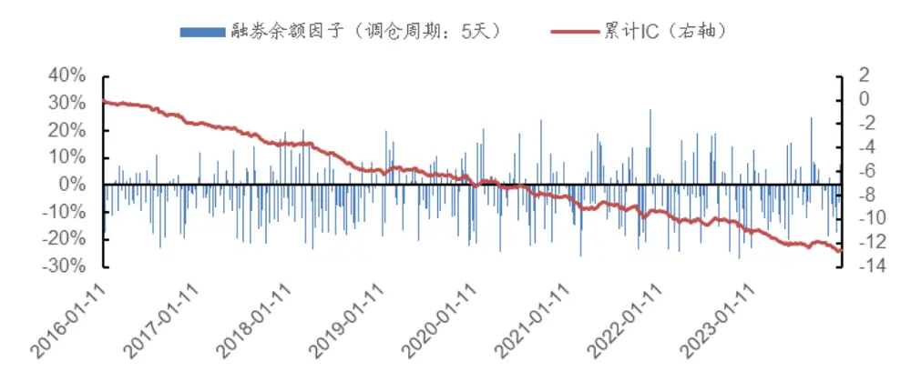
数据来源：天软科技，广发证券发展研究中心

图 35：中证1000 融券余额占比因子-10日调仓-IC值与IC累计值走势
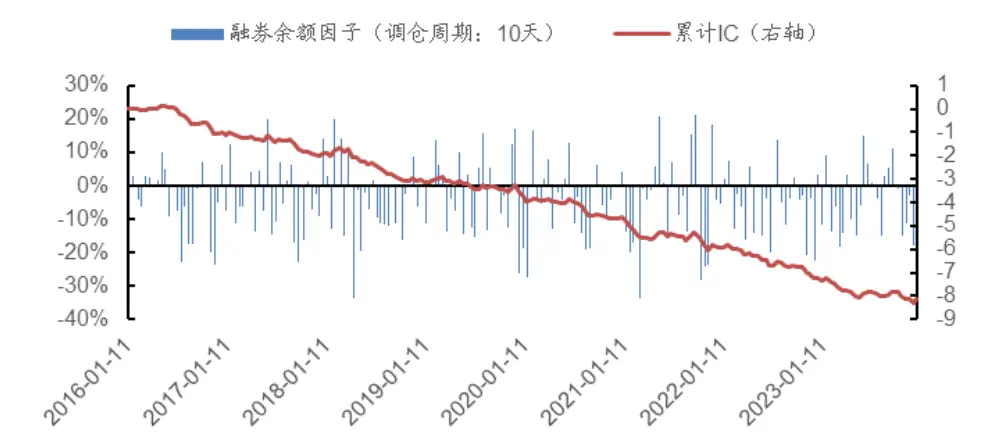
数据来源：天软科技，广发证券发展研究中心

图 36：中证1000 融券余额占比因子-20日调仓-IC值与IC累计值走势
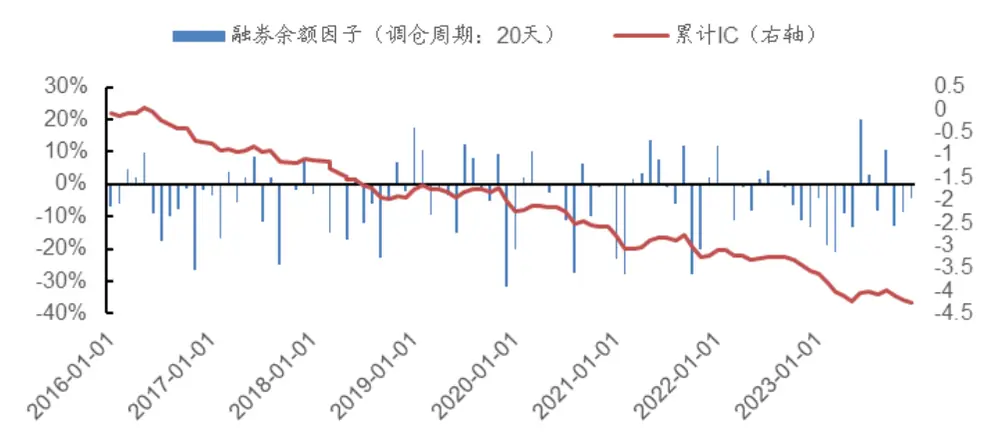
数据来源：天软科技，广发证券发展研究中心

表 38：融券余额占比因子-多空对冲策略与多头相对中证 1000指数策略-5日调仓-整体与分年度表现

| 纯多头 |  | 多空对冲策略 |  |  |  |  | 多头-中证1000 策略 |  |  |  |  |
| --- | --- | --- | --- | --- | --- | --- | --- | --- | --- | --- | --- |
| 统计 | 年度 | 年度 | 累计 | 年化 | 最大 | 信息 | 年度 | 累计 | 年化 | 最大 | 信息 |
| 区间 | 收益率 | 收益率 | 收益率 | 波动率 | 回撤 | 比率 | 收益率 | 收益率 | 波动率 | 回撤 | 比率 |
| 2016 | 21.42% | 20.75% | 20.75% | 9.90% | 8.40% | 0.53 | 19.23% | 19.23% | 13.54% | 6.40% | 0.87 |
| 2017 | -11.58% | 23.09% | 48.64% | 9.84% | 3.82% | 2.07 | 8.31% | 29.14% | 5.25% | 3.55% | 0.29 |
| 2018 | -35.93% | -3.70% | 43.15% | 11.95% | 9.82% | -0.94 | -8.70% | 17.90% | 9.51% | 13.92% | -0.69 |
| 2019 | 27.15% | -0.51% | 42.41% | 9.93% | 8.19% | 0.14 | 10.85% | 30.69% | 9.40% | 12.31% | 0.83 |
| 2020 | 16.81% | 1.82% | 45.01% | 12.05% | 11.98% | 0.49 | 3.90% | 35.79% | 14.00% | 9.47% | 0.40 |
| 2021 | 32.76% | 15.72% | 67.80% | 12.64% | 18.78% | 1.09 | 15.80% | 57.24% | 9.96% | 10.42% | 0.74 |
| 2022 | -4.64% | 25.44% | 110.49% | 10.25% | 5.24% | 1.69 | 15.13% | 81.04% | 8.84% | 5.28% | 1.64 |
| 2023 | 8.09% | 14.70% | 141.43% | 8.11% | 3.45% | 0.69 | 23.53% | 128.65% | 16.24% | 11.34% | 1.42 |
| ALL | 5.49% | 12.14% | 141.43% | 10.83% | 18.78% | 1.38 | 10.31% | 128.65% | 11.30% | 13.96% | 1.25 |

数据来源：天软科技，广发证券发展研究中心

表 39：融券余额占比因子-多空对冲策略与多头相对中证 1000 指数策略-10 日调仓-整体与分年度表现

| 纯多头 |  | 多空对冲策略 |  |  |  |  | 多头-中证1000 策略 |  |  |  |  |
| --- | --- | --- | --- | --- | --- | --- | --- | --- | --- | --- | --- |
| 统计 | 年度 | 年度 | 累计 | 年化 | 最大 | 信息 | 年度 | 累计 | 年化 | 最大 | 信息 |
| 区间 | 收益率 | 收益率 | 收益率 | 波动率 | 回撤 | 比率 | 收益率 | 收益率 | 波动率 | 回撤 | 比率 |
| 2016 | 9.89% | 26.86% | 26.86% | 10.49% | 4.64% | 0.71 | 23.35% | 23.35% | 13.76% | 6.16% | 1.06 |
| 2017 | -18.99% | 24.02% | 57.33% | 10.33% | 3.93% | 2.07 | 10.33% | 36.09% | 5.40% | 4.34% | 0.48 |
| 2018 | -36.06% | 7.17% | 68.61% | 11.17% | 7.01% | 0.41 | -1.56% | 33.97% | 10.54% | 10.96% | -0.08 |
| 2019 | 23.45% | 14.85% | 93.65% | 9.22% | 10.47% | 1.54 | 25.19% | 67.72% | 9.14% | 6.22% | 1.16 |
| 2020 | 10.86% | 0.79% | 95.19% | 11.12% | 9.81% | -0.52 | 4.62% | 75.47% | 12.74% | 8.59% | 0.37 |
| 2021 | 34.18% | 18.15% | 130.62% | 11.32% | 13.00% | 0.02 | 18.44% | 107.82% | 9.45% | 5.75% | 0.93 |
| 2022 | -3.45% | 16.38% | 168.39% | 9.57% | 7.87% | 1.42 | 7.11% | 122.59% | 9.02% | 7.40% | 1.27 |
| 2023 | 7.07% | 13.03% | 203.36% | 8.28% | 2.85% | 0.61 | 18.05% | 165.77% | 16.08% | 14.31% | 1.14 |
| ALL | 6.28% | 16.80% | 203.36% | 10.34% | 13.00% | 1.59 | 13.03% | 165.77% | 11.17% | 14.31% | 1.54 |

数据来源：天软科技，广发证券发展研究中心

表 40：融券余额占比因子-多空对冲策略与多头相对中证 1000 指数策略-20 日调仓-整体与分年度表现

| 纯多头 |  | 多空对冲策略 |  |  |  |  | 多头-中证 1000 策略 |  |  |  |  |
| --- | --- | --- | --- | --- | --- | --- | --- | --- | --- | --- | --- |
| 统计 | 年度 | 年度 | 累计 | 年化 | 最大 | 信息 | 年度 | 累计 | 年化 | 最大 | 信息 |
| 区间 | 收益率 | 收益率 | 收益率 | 波动率 | 回撤 | 比率 | 收益率 | 收益率 | 波动率 | 回撤 | 比率 |
| 2016 | 12.00% | 23.11% | 23.11% | 10.63% | 7.29% | 0.59 | 20.12% | 20.12% | 14.07% | 7.41% | 0.88 |
| 2017 | -20.21% | 21.50% | 49.58% | 10.22% | 3.72% | 1.90 | 10.57% | 32.82% | 5.06% | 4.17% | 0.52 |
| 2018 | -36.75% | 2.00% | 52.58% | 11.05% | 8.82% | 0.25 | -2.95% | 28.89% | 9.91% | 10.27% | 0.00 |
| 2019 | 22.60% | 19.58% | 82.45% | 9.42% | 9.74% | 1.36 | 23.78% | 59.54% | 9.39% | 6.15% | 1.12 |
| 2020 | 11.10% | 1.84% | 85.81% | 10.63% | 7.91% | -0.51 | 1.65% | 62.18% | 12.62% | 8.53% | -0.52 |
| 2021 | 36.57% | 16.26% | 116.03% | 11.58% | 12.18% | 0.07 | 15.64% | 87.54% | 9.53% | 5.97% | 0.75 |
| 2022 | -3.91% | 11.42% | 140.71% | 9.29% | 8.27% | 1.21 | 4.32% | 95.65% | 8.42% | 7.79% | 1.10 |
| 2023 | 6.82% | 10.29% | 165.48% | 7.73% | 3.45% | 0.46 | 19.04% | 136.89% | 18.18% | 19.29% | 1.09 |
| ALL | 4.07% | 13.53% | 165.48% | 10.26% | 12.18% | 1.44 | 10.37% | 136.89% | 11.48% | 14.31% | 1.29 |

数据来源：天软科技，广发证券发展研究中心

图 37：中证1000 融券余额占比因子-5天调仓-多空策略净值走势
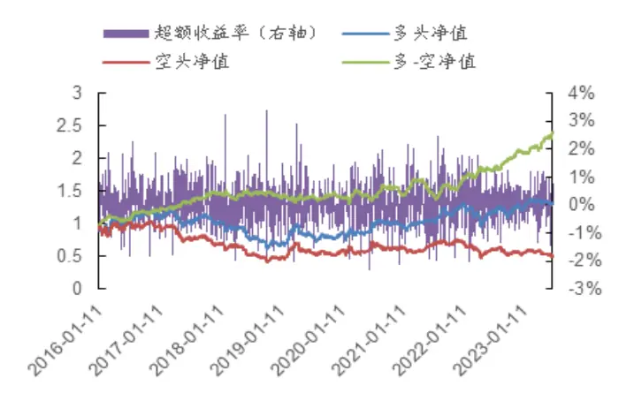
数据来源：天软科技，广发证券发展研究中心

图 38：融券余额占比因子-5天调仓-多-中证1000策略净值走势
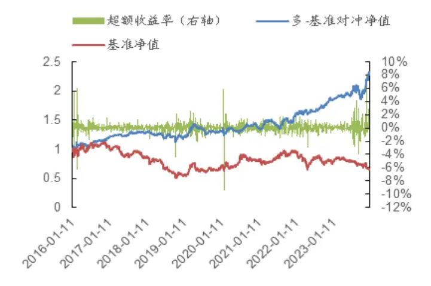
数据来源：天软科技，广发证券发展研究中心

图 39：中证1000 融券余额占比因子-10天调仓-多空策略净值走势
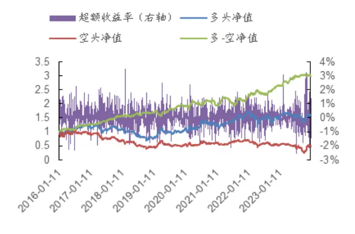
数据来源：天软科技，广发证券发展研究中心

图 40：融券余额占比因子-10天调仓-多-中证1000策略净值走势
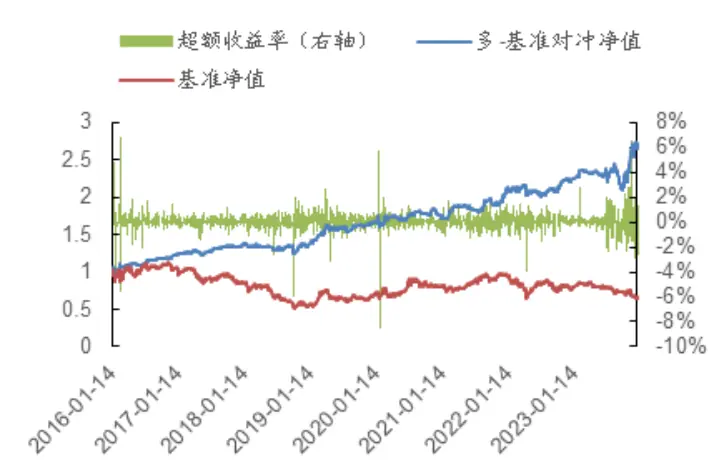
数据来源：天软科技，广发证券发展研究中心

图 41：中证1000 融券余额占比因子-20天调仓-多空策略净值走势
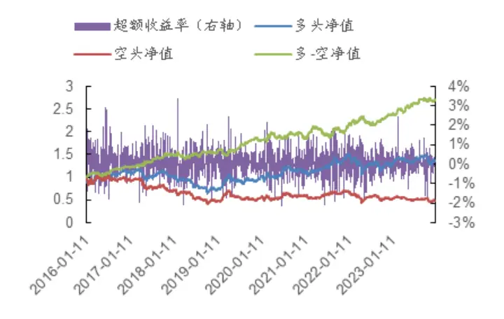
数据来源：天软科技，广发证券发展研究中心

图 42：融券余额占比因子-20天调仓-多-中证1000策略净值走势
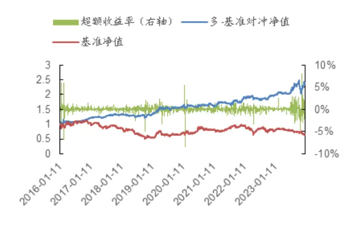
数据来源：天软科技，广发证券发展研究中心

表 41：中证 1000 融券余额占比因子-5天调仓-分年度换手率

| 统计区间 | 均值 | 最大值 | 最小值 | 标准差 | 累计值 |
| --- | --- | --- | --- | --- | --- |
| 2016 | 64.19% | 84.21% | 41.91% | 0.07 | 15661.82% |
| 2017 | 55.90% | 76.74% | 35.56% | 0.07 | 13639.05% |
| 2018 | 42.25% | 61.73% | 23.91% | 0.10 | 10266.73% |
| 2019 | 42.26% | 95.37% | 13.04% | 0.20 | 10311.49% |
| 2020 | 41.94% | 60.18% | 21.43% | 0.08 | 10191.20% |
| 2021 | 36.15% | 51.79% | 21.93% | 0.07 | 8783.60% |
| 2022 | 36.54% | 61.37% | 16.24% | 0.14 | 8842.01% |
| 2023 | 37.84% | 50.89% | 28.99% | 0.05 | 8924.68% |
| ALL | 43.15% | 95.37% | 13.04% | 0.16 | 86620.58% |

数据来源：天软科技，广发证券发展研究中心

表 42：中证 1000 融券余额占比因子-10天调仓-分年度换手率

| 统计区间 | 均值 | 最大值 | 最小值 | 标准差 | 累计值 |
| --- | --- | --- | --- | --- | --- |
| 2016 | 62.25% | 79.49% | 41.71% | 0.08 | 15187.88% |
| 2017 | 53.50% | 72.09% | 35.22% | 0.07 | 13054.67% |
| 2018 | 35.26% | 62.85% | 14.83% | 0.11 | 8376.83% |
| 2019 | 35.19% | 96.26% | 17.42% | 0.18 | 8586.87% |
| 2020 | 35.45% | 58.41% | 20.54% | 0.09 | 8615.07% |
| 2021 | 29.43% | 48.67% | 16.81% | 0.07 | 7152.17% |
| 2022 | 28.84% | 61.81% | 11.97% | 0.14 | 6978.75% |
| 2023 | 32.34% | 54.29% | 20.12% | 0.06 | 7614.89% |
| ALL | 37.46% | 96.26% | 11.97% | 0.17 | 75567.13% |

数据来源：天软科技，广发证券发展研究中心

表 43：中证 1000 融券余额占比因子-20天调仓-分年度换手率

| 统计区间 | 均值 | 最大值 | 最小值 | 标准差 | 累计值 |
| --- | --- | --- | --- | --- | --- |
| 2016 | 60.91% | 84.62% | 24.66% | 0.08 | 14862.74% |
| 2017 | 50.75% | 74.42% | 30.95% | 0.07 | 12381.83% |
| 2018 | 29.39% | 62.46% | 12.81% | 0.11 | 7141.16% |
| 2019 | 30.86% | 96.30% | 16.82% | 0.18 | 7530.46% |
| 2020 | 29.14% | 61.06% | 12.45% | 0.09 | 7081.89% |
| 2021 | 23.33% | 43.75% | 11.50% | 0.05 | 5670.35% |
| 2022 | 22.49% | 47.87% | 11.86% | 0.12 | 5441.98% |
| 2023 | 26.60% | 43.43% | 15.98% | 0.05 | 6136.43% |
| ALL | 32.97% | 96.30% | 11.50% | 0.17 | 66246.84% |

数据来源：天软科技，广发证券发展研究中心

在中证1000成分股选股中，融券余额占比因子的选股区分度较高，在5天、10天、20天的调仓周期下，因子IC均值的绝对值分别为3.28%、4.22%和4.42%， IC胜率占比分别为61.60%、64.43%和63.92%。不同年度的因子IC均值均保持在较高高的水平，其中在2019年的表现相对较弱。在多头相对中证1000指数策略中，不同调仓周期下的累计超额收益率表现分别为128.65%，165.77%和136.89%。

表 44：中证1000 融资买入额占融资余额比因子-5日调仓-整体与分年度IC表现

| 统计区间 | IC 均值 | IC 标准差 | IC最大值 | IC最小值 | IC 累计值 | IC 胜率 |
| --- | --- | --- | --- | --- | --- | --- |
| 2016 | -7.37% | 0.20 | 40.42% | -48.31% | -353.53% | 64.58% |
| 2017 | -3.78% | 0.13 | 20.28% | -41.84% | -184.99% | 55.10% |
| 2018 | -7.77% | 0.12 | 19.14% | -34.94% | -380.52% | 75.51% |
| 2019 | -6.06% | 0.15 | 37.39% | -38.59% | -290.75% | 70.83% |
| 2020 | -4.71% | 0.16 | 33.09% | -31.13% | -226.16% | 63.27% |
| 2021 | -6.40% | 0.18 | 32.10% | -46.96% | -313.45% | 63.27% |
| 2022 | -2.95% | 0.15 | 24.52% | -34.80% | -141.53% | 54.17% |
| 2023 | -5.38% | 0.15 | 19.52% | -34.56% | -258.15% | 64.58% |
| ALL | -5.55% | 0.15 | 40.42% | -48.31% | -2149.08% | 63.92% |

数据来源：天软科技，广发证券发展研究中心

表 45：中证1000 融资买入额占融资余额比因子-10日调仓-整体与分年度 IC表现

| 统计区间 | IC 均值 | IC 标准差 | IC最大值 | IC最小值 | IC 累计值 | IC 胜率 |
| --- | --- | --- | --- | --- | --- | --- |
| 2016 | -9.23% | 0.21 | 39.37% | -52.65% | -221.54% | 70.83% |
| 2017 | -3.50% | 0.14 | 17.01% | -34.95% | -87.40% | 52.00% |
| 2018 | -6.61% | 0.11 | 14.36% | -23.89% | -158.63% | 66.67% |
| 2019 | -6.93% | 0.19 | 28.34% | -37.51% | -166.31% | 62.50% |
| 2020 | -5.69% | 0.12 | 21.31% | -35.17% | -136.61% | 76.00% |
| 2021 | -12.38% | 0.20 | 28.56% | -66.43% | -297.18% | 70.83% |
| 2022 | -6.00% | 0.14 | 37.49% | -27.06% | -144.09% | 70.83% |
| 2023 | -8.69% | 0.15 | 15.28% | -48.51% | -208.48% | 79.17% |
| ALL | -7.36% | 0.16 | 39.37% | -66.43% | -1420.24% | 68.56% |

数据来源：天软科技，广发证券发展研究中心

表 46：中证 1000 融资买入额占融资余额比因子-20 日调仓-整体与分年度 IC 表现

| 统计区间 | IC 均值 | IC 标准差 | IC最大值 | IC最小值 | IC累计值 | IC 胜率 |
| --- | --- | --- | --- | --- | --- | --- |
| 2016 | -11.69% | 0.23 | 25.87% | -60.96% | -140.22% | 75.00% |
| 2017 | -5.80% | 0.13 | 10.03% | -32.50% | -75.34% | 61.54% |
| 2018 | -6.25% | 0.11 | 11.46% | -31.19% | -74.97% | 66.67% |
| 2019 | -6.11% | 0.18 | 18.18% | -33.66% | -73.38% | 50.00% |
| 2020 | -9.61% | 0.14 | 8.44% | -44.61% | -105.74% | 66.67% |
| 2021 | -7.83% | 0.17 | 12.73% | -34.88% | -93.97% | 58.33% |
| 2022 | -11.85% | 0.19 | 14.87% | -48.03% | -142.24% | 66.67% |
| 2023 | -4.79% | 0.09 | 4.50% | -22.94% | -57.53% | 66.67% |
| ALL | -7.95% | 0.16 | 25.87% | -60.96% | -763.39% | 63.92% |

数据来源：天软科技，广发证券发展研究中心

图 43：中证1000 融资买入额占融资余额比因子-5日调仓-IC值与IC累计值走势
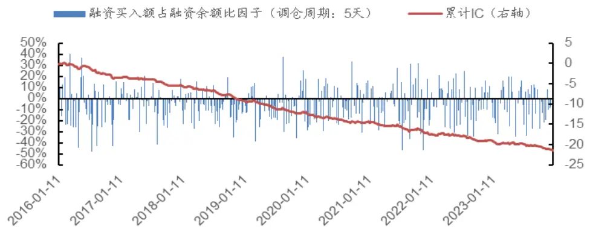
数据来源：天软科技，广发证券发展研究中心

图 44：中证1000融资买入额占融资余额比因子-10日调仓-IC值与IC累计值走势
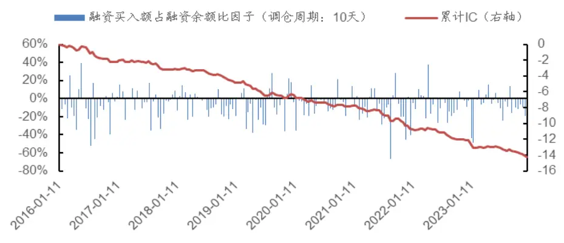
数据来源：天软科技，广发证券发展研究中心

图 45：中证 1000 融资买入额占融资余额比因子-20 日调仓-IC 与 IC 累计值走势
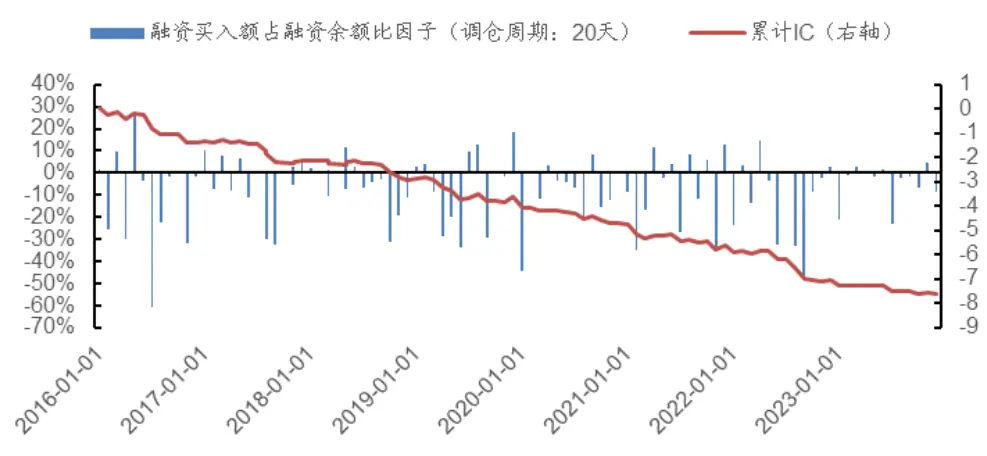
数据来源：天软科技，广发证券发展研究中心

表 47：融资买入额占融资余额比因子-多空对冲策略与多头相对中证 1000指数策略-5日调仓-整体与分年度表现

| 纯多头 |  | 多空对冲策略 |  |  |  | 多头-中证 1000 策略 |  |  |  |  |
| --- | --- | --- | --- | --- | --- | --- | --- | --- | --- | --- |
| 统计 | 年度 | 年度 | 累计 | 年化 | 最大 | 信息 | 年度 | 累计 | 年化 | 最大 信息 |
| 区间 | 收益率 | 收益率 | 收益率 | 波动率 | 回撤 | 比率 | 收益率 收益率 | 波动率 | 回撤 | 比率 |
| 2016 | 30.55% | 37.82% | 37.82% | 20.94% | 11.72% | 0.86 20.21% | 20.21% | 15.55% | 9.33% | 0.55 |
| 2017 | -20.90% | 8.10% | 48.98% | 12.83% | 6.36% | 1.26 -4.01% | 15.39% | 6.93% | 6.88% | 0.82 |
| 2018 | -32.37% | 13.88% | 69.66% | 12.98% | 7.24% | 1.97 | 7.93% 24.53% | 12.22% | 8.90% | 1.91 |
| 2019 | 41.83% | 31.32% | 122.80% | 15.52% | 5.66% | 0.15 | 8.13% 34.66% | 8.13% | 5.08% | -0.69 |
| 2020 | 5.91% | -4.04% | 113.81% | 20.75% | 22.67% | -0.63 | -13.40% 16.62% | 20.32% | 19.01% | -0.98 |
| 2021 | 26.01% | 26.51% | 170.49% | 18.01% | 13.17% | 0.33 | 5.73% 23.31% | 14.05% | 15.84% | -0.55 |
| 2022 | -2.83% | 52.74% | 313.15% | 12.37% | 5.71% | 2.59 | 16.67% 43.86% | 9.54% | 6.83% | 1.50 |
| 2023 | -1.00% | 25.03% | 416.57% | 10.15% | 5.99% | 0.79 | 15.02% | 65.47% 7.43% | 4.32% | 0.62 |
| ALL | 2.94% | 24.55% | 416.57% | 15.83% | 24.95% | 2.59 | 6.76% | 65.47% 12.50% | 22.71% | 1.05 |

数据来源：天软科技，广发证券发展研究中心

表 48：融资买入额占融资余额比因子-多空对冲策略与多头相对中证 1000指数策略-10日调仓-整体与分年度表现

| 纯多头 |  | 多空对冲策略 |  |  |  |  | 多头-中证1000 策略 |  |  |  |  |
| --- | --- | --- | --- | --- | --- | --- | --- | --- | --- | --- | --- |
| 统计 区间 | 年度 | 年度 | 累计 | 年化 | 最大 | 信息 | 年度 | 累计 | 年化 | 最大 | 信息 |
|  | 收益率 | 收益率 | 收益率 | 波动率 | 回撤 | 比率 | 收益率 | 收益率 | 波动率 | 回撤 | 比率 |
| 2016 | 22.01% | 35.56% | 35.56% | 20.42% | 12.74% | 0.82 | 12.26% | 12.26% | 16.74% | 10.16% | 0.29 |
| 2017 | -23.42% | 7.19% | 45.30% | 11.92% | 6.43% | 1.26 | -6.99% | 4.42% | 6.34% | 9.93% | -0.67 |
| 2018 | -33.46% | 14.32% | 66.11% | 13.33% | 7.89% | 1.90 | 6.21% | 10.90% | 12.43% | 9.46% | 1.82 |
| 2019 | 40.75% | 32.32% | 119.79% | 15.15% | 5.67% | 0.18 | 7.26% | 18.95% | 8.15% | 4.68% | 0.73 |
| 2020 | 6.35% | 0.53% | 120.95% | 13.87% | 13.69% | -0.49 | -13.12% | 3.35% | 16.64% | 17.18% | -0.99 |
| 2021 | 21.02% | 17.84% | 160.37% | 17.56% | 13.92% | 0.00 | 1.51% | 4.90% | 14.06% | 14.83% | -0.74 |
| 2022 | -3.04% | 46.89% | 282.45% | 12.58% | 6.60% | 2.41 | 16.32% | 22.02% | 9.61% | 6.98% | 1.48 |
| 2023 | -0.80% | 30.27% | 398.23% | 9.94% | 5.16% | 0.89 | 15.27% | 40.66% | 7.34% | 4.08% | 0.62 |
| ALL | 1.22% | 23.21% | 398.23% | 14.61% | 16.61% | 1.37 | 4.53% | 40.66% | 12.00% | 24.20% | 1.04 |

数据来源：天软科技，广发证券发展研究中心

表 49：融资买入额占融资余额比因子-多空对冲策略与多头相对中证 1000指数策略-20日调仓-整体与分年度表现

| 纯多头 |  |  | 多空对冲策略 |  |  | 多头-中证1000策略 |  |  |  |  |
| --- | --- | --- | --- | --- | --- | --- | --- | --- | --- | --- |
| 统计 | 年度 | 年度 | 累计 | 年化 | 最大 | 信息 | 年度 | 累计 | 年化 | 最大 信息 |
| 区间 | 收益率 | 收益率 | 收益率 | 波动率 | 回撤 | 比率 | 收益率 | 收益率 波动率 | 回撤 | 比率 |
| 2016 | 10.12% | 32.01% | 32.01% | 17.66% | 9.75% 0.79 | 17.63% | 17.63% | 12.82% | 8.23% | 0.51 |
| 2017 | -23.85% | -1.09% | 30.57% | 12.63% | 7.09% | 0.83 | 6.06% 24.76% | 6.62% | 5.27% | 1.42 |
| 2018 | -37.28% | 13.69% | 48.43% | 12.71% | 8.37% | 1.87 | 13.10% 41.10% | 10.50% | 5.54% | 2.13 |
| 2019 | 32.51% | 12.07% | 66.35% | 11.88% | 8.31% | -0.47 | -0.92% 39.81% | 7.72% | 8.53% | -1.06 |
| 2020 | 9.14% | -0.64% | 65.28% | 13.29% | 11.51% | -0.54 | -11.07% | 24.33% 14.95% | 15.89% | -0.98 |
| 2021 | 27.36% | 20.61% | 99.35% | 16.80% | 13.91% | 0.11 | 0.04% | 24.37% 11.73% | 14.61% | -0.86 |
| 2022 | -1.52% | 40.35% | 179.78% | 12.12% | 5.65% | 2.21 | 14.64% | 42.58% 8.27% | 10.05% | 1.43 |
| 2023 | 0.22% | 21.25% | 239.23% | 9.71% | 6.85% | 0.72 | 8.35% | 54.48% 5.78% | 5.48% | 0.29 |
| ALL | -0.43% | 17.21% | 239.23% | 13.52% | 17.93% | 1.14 | 5.82% | 54.48% 10.04% | 25.61% | 0.59 |

数据来源：天软科技，广发证券发展研究中心

图 46：中证1000 融资买入额占融资余额比因子-5天调仓-多空策略净值走势
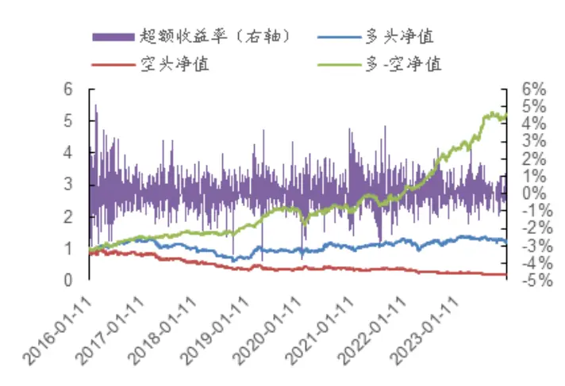
数据来源：天软科技，广发证券发展研究中心

图 47：融资买入额占融资余额比因子-多-中证1000策略净值走势
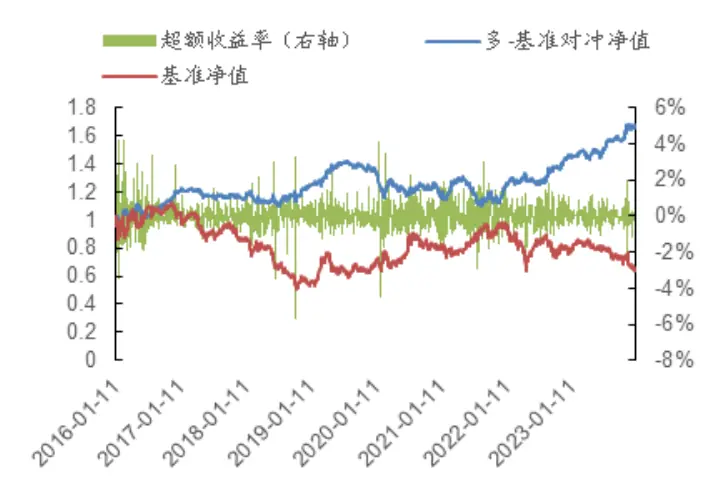
数据来源：天软科技，广发证券发展研究中心

图 48：中证1000 融资买入额占融资余额比因子-10天调仓-多空策略净值走势
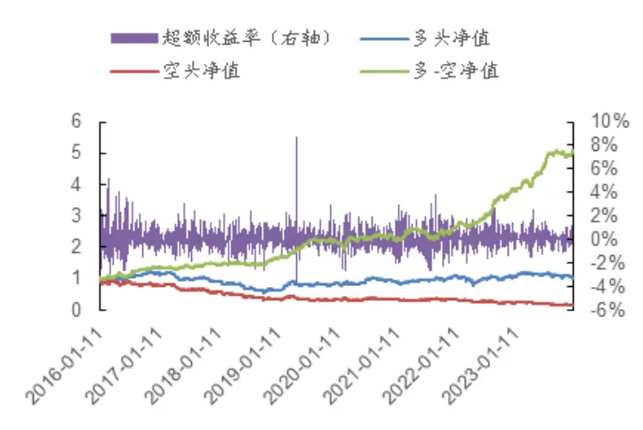
数据来源：天软科技，广发证券发展研究中心

图 49：融资买入额占融资余额比因子-10天调仓-多-中证1000策略净值走势
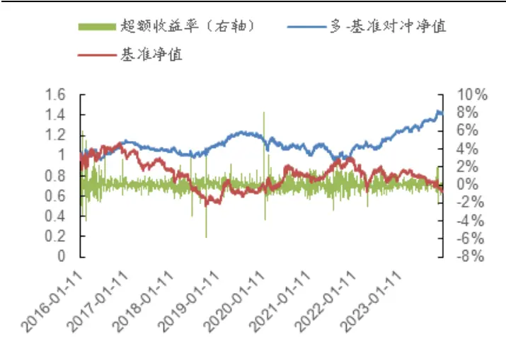
数据来源：天软科技，广发证券发展研究中心

图 50：中证1000 融资买入额占融资余额比因子-20天调仓-多空策略净值走势
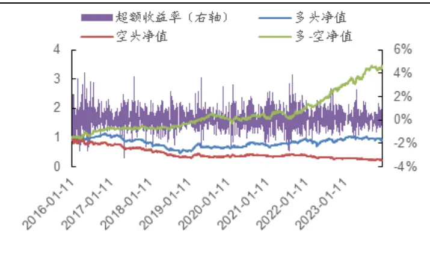
数据来源：天软科技，广发证券发展研究中心

图 51：融资买入额占融资余额比因子-10天调仓-多-中证 1000策略净值走势
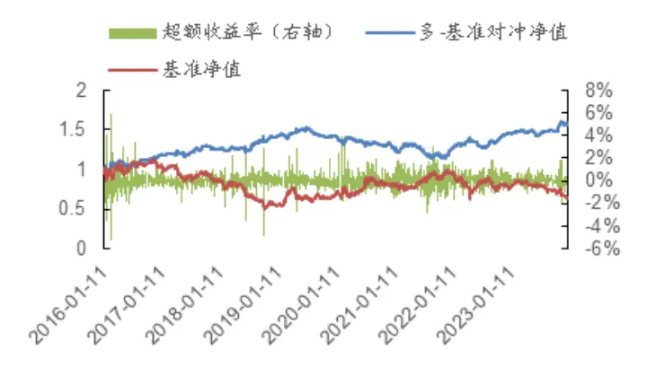
数据来源：天软科技，广发证券发展研究中心

表 50：中证 1000 融资买入额占融资余额比因子-5天调仓-分年度换手率

| 统计区间 | 均值 | 最大值 | 最小值 | 标准差 | 累计值 |
| --- | --- | --- | --- | --- | --- |
| 2016 | 51.68% | 79.49% | 30.77% | 0.09 | 12610.08% |
| 2017 | 51.26% | 67.95% | 32.56% | 0.06 | 12508.01% |
| 2018 | 51.37% | 70.28% | 31.84% | 0.07 | 12483.08% |
| 2019 | 51.30% | 70.45% | 28.70% | 0.10 | 12517.28% |
| 2020 | 50.12% | 70.54% | 32.46% | 0.07 | 12179.64% |
| 2021 | 52.45% | 73.04% | 30.18% | 0.06 | 12746.07% |
| 2022 | 54.61% | 66.09% | 38.79% | 0.05 | 13215.63% |
| 2023 | 49.16% | 59.41% | 40.83% | 0.04 | 11601.23% |
| ALL | 51.45% | 79.49% | 28.70% | 0.08 | 99861.02% |

数据来源：天软科技，广发证券发展研究中心
识别风险，发现价值

表 51：中证 1000 融资买入额占融资余额比因子-10天调仓-分年度换手率

| 统计区间 | 均值 | 最大值 | 最小值 | 标准差 | 累计值 |
| --- | --- | --- | --- | --- | --- |
| 2016 | 44.35% | 62.79% | 26.32% | 0.08 | 10820.32% |
| 2017 | 46.59% | 63.04% | 30.95% | 0.07 | 11368.85% |
| 2018 | 46.08% | 65.99% | 27.56% | 0.07 | 11198.18% |
| 2019 | 45.68% | 71.56% | 22.02% | 0.10 | 11145.38% |
| 2020 | 45.49% | 70.54% | 28.32% | 0.07 | 11053.65% |
| 2021 | 47.13% | 63.64% | 30.70% | 0.07 | 11453.27% |
| 2022 | 49.03% | 63.48% | 32.53% | 0.06 | 11866.46% |
| 2023 | 44.61% | 53.14% | 35.88% | 0.04 | 10252.45% |
| ALL | 45.70% | 71.56% | 22.02% | 0.08 | 89158.56% |

数据来源：天软科技，广发证券发展研究中心

表 52：中证 1000 融资买入额占融资余额比因子-20天调仓-分年度换手率

| 统计区间 | 均值 | 最大值 | 最小值 | 标准差 | 累计值 |
| --- | --- | --- | --- | --- | --- |
| 2016 | 38.97% | 61.54% | 21.05% | 0.08 | 9509.74% |
| 2017 | 41.79% | 56.52% | 26.19% | 0.06 | 10195.59% |
| 2018 | 42.60% | 62.13% | 26.67% | 0.06 | 10351.12% |
| 2019 | 41.22% | 67.16% | 20.19% | 0.09 | 10057.02% |
| 2020 | 41.68% | 73.21% | 25.66% | 0.07 | 10129.23% |
| 2021 | 42.76% | 58.26% | 26.32% | 0.06 | 10390.83% |
| 2022 | 44.72% | 57.39% | 30.51% | 0.06 | 10822.86% |
| 2023 | 42.15% | 53.53% | 33.73% | 0.04 | 9976.42% |
| ALL | 41.15% | 73.21% | 20.19% | 0.08 | 81432.81% |

数据来源：天软科技，广发证券发展研究中心

在中证1000成分股选股中，融资买入额占融资余额比因子的选股区分度较高，在5天、10天、20天的调仓周期下，因子IC均值的绝对值分别为5.55%、7.36%和7.95%， IC胜率占比分别为63.92%、68.58%和63.92%。因子IC均值在各年度都维持在较高的水平。在多头相对中证1000指数的回测中，策略整体的累计超额收益率在不同调仓周期的表现分别为65.47%，40.66%和54.48%，超额收益率较为稳定。

综合上述在全市场、中证500和中证1000三个市场的实证分析结果，由各因子的IC结果可以看出，融资融券类因子在全市场范围中收益预测能力普遍一般，选取IC相对较高的因子进行回测，结果表明，在三个股票池中，融券余额占比因子、融资买入额占融资余额比因子在IC效果、因子分档和多空收益等方面表现突出。在各自最佳调仓周期下，融资买入额占融资余额比因子在全市场股票池中的IC为4.27%，相对于同期基准指数取得了3.31%的超额年化收益率，在中证1000股票池中的IC为-5.55%，相对于同期基准指数取得了6.76%的超额年化收益率；融券余额占比因子在中证500股票池中的IC为-3.39%，相对于同期的中证500指数取得了4.84%的超额年化收益率，在中证1000股票池中的IC为-4.22%，相对于同期基准指数取得了13.03%的超额年化收益率。大部分融资融券因子均表现为负面的预测效果，即相对应的因子值越小，对应股票在未来一段时间的收益越高。

在相同调仓期的历史回测下，表现较为突出的4种融资融券类因子的整体分层效果表现不一，同时相同的因子在不同市场中的分层收益也有所区别。具体而言，以中证1000为选股域，融券余额占比因子相较融资买入额占融资余额比因子而言有着更显著的分层效果，分层收益单调性高；对于融券余额占比因子，其在中证1000中的分层收益效果相比中证500也要更加优异，分层收益区分度高。在分成5档的情况下，第一档均能获得相对于第五档的显著收益。

中证1000成分股选股的融券余额占比因子整体表现在四个因子中最佳，优于中证500成分股选股的融券余额占比因子与全市场选股和中证1000成分股选股的融资买入额占融资余额比因子。

## 五、融券因子敏感性分析

## （一）敏感性分析-手续费费率

上述分析表明，基于选股域为中证500、中证1000的融券余额占比因子和选股域为全市场和中证1000的融资买入额占融资余额比因子的选股策略表现相对较好，且因子的换手率水平不高。本节将分析手续费的设定对于策略收益的影响。具体而言，本节将重点分析4种因子在最佳调仓周期下对于手续费的敏感性。具体而言，测试了不同选股范围内，各因子在千一、千三、千五手续费费率设置下的多头基准净值走势。

图 52：中证500 融券余额占比因子
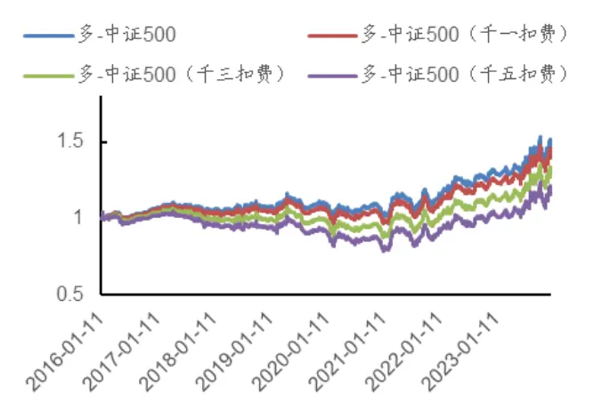
数据来源：天软科技，广发证券发展研究中心

图 53：中证1000 融券余额占比因子
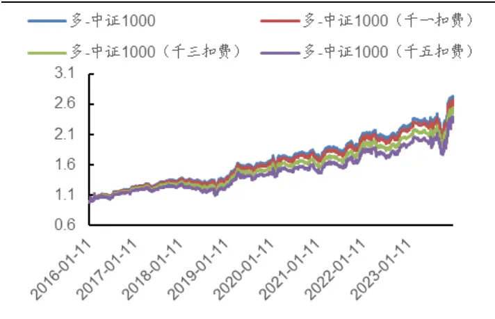
数据来源：天软科技，广发证券发展研究中心

图 54：中证1000 融资买入额占融资余额因子
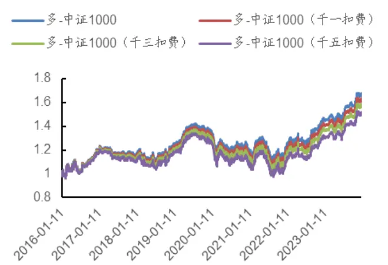
数据来源：天软科技，广发证券发展研究中心

图 55：全市场融资买入额占融资余额因子
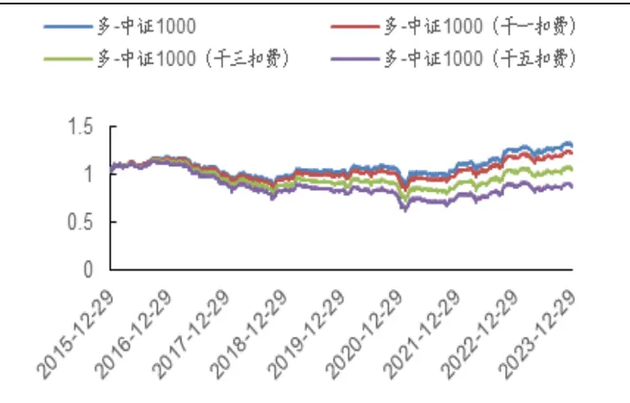
数据来源：天软科技，广发证券发展研究中心

结果表明，4种因子策略扣除千五手续费后，仍然能够在长期获得超额收益，但随着手续费水平上升，策略净值表现整体下降。因此，当使用以上融资融券类因子进行选股，应当对手续费费率予以重点关注。

## 六、总结

本篇专题报告基于A股市场个股的融资融券交易情况，通过改进融资融券指标构建融资融券因子。融资融券因子的构建综合考虑了融资融券指标、时序角度的变动程度以及其他价量数据，使得新因子能更好地反映了市场多空态度和情绪。时序角度的考虑增强了对指标变动的灵敏性，使因子更具合理性。共构建24种融资融券类因子，用来衡量个股在每一交易日的融资融券情况，并尝试用融资融券因子对股票未来收益率进行预测，以获取收益。

根据初步的IC分析和分层收益单调性检验，从全市场、中证500和中证1000中选择表现突出的因子进行进一步分析，其中，融资买入额占融资余额比因子在全市场和中证1000中的整体表现优于其他因子；融券余额占比因子在中证500、中证1000中的整体表现优于其他因子。分别来看，融资买入额占融资余额比因子在多头相对全市场的回测中，策略整体的累计超额收益率在不同调仓周期的表现分别为28.54%，13.33%和0.73%；在多头相对中证1000指数的回测中，不同调仓周期下策略整体的累计超额收益率的表现分别为65.47%，40.66%和54.48%。融券余额占比因子在多头相对中证500策略中，不同调仓周期下的累积超额收益率分别为43.86%、30.75%和24.62%；在多头相对中证1000指数策略中，不同调仓周期下的累计超额收益率表现分别为128.65%，165.77%和136.89%。

此外，本报告进一步对四个因子进行了手续费率方面的敏感性测试。测试结果表明，随着手续费水平上升，策略净值表现整体下降。因此，当考虑利用因子进行选股时，应当设定合适的选股范围并对手续费率加以考虑。

## 七、风险提示

本专题报告所述模型用量化方法通过历史数据统计、建模和测算完成，所得结

## 论与规律在市场政策、环境变化时可能存在失效风险；

本专题策略模型在市场结构及交易行为的改变时有可能存在策略失效风险；

因量化模型不同，本报告提出的观点可能与其他量化模型结论存在差异。

## [Table_ResearchTeam] 广发金融工程研究小组

罗军 ： 首席分析师，华南理工大学硕士，从业 16年，2010年进入广发证券发展研究中心。

安 宁 宁 ： 首席分析师，暨南大学硕士，从业 14年，2011年进入广发证券发展研究中心。

史 庆 盛 ： 资深分析师，华南理工大学硕士，2011年进入广发证券发展研究中心。

张 超 ： 资深分析师，中山大学硕士，2012 年进入广发证券发展研究中心。

陈 原 文 ： 资深分析师，中山大学硕士，2015年进入广发证券发展研究中心。

李 豪 ： 资深分析师，上海交通大学硕士，2016 年进入广发证券发展研究中心。

周 飞 鹏 ： 资深分析师，伯明翰大学硕士，2021年加入广发证券发展研究中心。

张 钰 东 ： 资深分析师，中山大学硕士，2020年进入广发证券发展研究中心。

季 燕 妮 ： 资深分析师，厦门大学硕士，2020年进入广发证券发展研究中心。

## [Table_IndustryInvestDescription] 广发证券—行业投资评级说明

买入： 预期未来 12 个月内，股价表现强于大盘 10%以上。内

持有： 预期未来12个月内，股价相对大盘的变动幅度介于-10%～+10%。对

卖出： 预期未来12个月内，股价表现弱于大盘10%以上。

## [Table_CompanyInvestDescription] 广发证券—公司投资评级说明

买入： 预期未来12个月内，股价表现强于大盘15%以上。

增持： 预期未来 12 个月内，股价表现强于大盘 5%-15%。

持有： 预期未来12个月内，股价相对大盘的变动幅度介于-5%～+5%。

卖出： 预期未来12个月内，股价表现弱于大盘5%以上。

## [Table_Address] 联系我们

| 地址 | 广州市 | 深圳市 | 北京市 | 上海市 | 香港 |
| --- | --- | --- | --- | --- | --- |
|  | 广州市天河区马场路 | 深圳市福田区益田路 | 北京市西城区月坛北 | 上海市浦东新区南泉 | 香港德辅道中189号 |
|  | 26号广发证券大厦 | 6001号太平金融大 | 街2号月坛大厦18 | 北路 429号泰康保险 | 李宝椿大厦29及30 |
|  | 47楼 | 厦31层 | 层 | 大厦37楼 | 楼 |
|  | 邮政编码 510627 | 518026 | 100045 | 200120 |  |

## [Table_LegalDisclaimer] 法律主体声明

本报告由广发证券股份有限公司或其关联机构制作，广发证券股份有限公司及其关联机构以下统称为“广发证券”。本报告的分销依据不同依据不国家、地区的法律、法规和监管要求由广发证券于该国家或地区的具有相关合法合规经营资质的子公司/经营机构完成。资

广发证券股份有限公司具备中国证监会批复的证券投资咨询业务资格，接受中国证监会监管，负责本报告于中国（港澳台地区除外）的分投销。

广发证券（香港）经纪有限公司具备香港证监会批复的就证券提供意见（4 号牌照）的牌照，接受香港证监会监管，负责本报告于中国香港地区的分销。

本报告署名研究人员所持中国证券业协会注册分析师资质信息和香港证监会批复的牌照信息已于署名研究人员姓名处披露。

## [Table_Important重要声明

广发证券股份有限公司及其关联机构可能与本报告中提及的公司寻求或正在建立业务关系，因此，投资者应当考虑广发证券股份有限公司系 因此 者应当考虑及其关联机构因可能存在的潜在利益冲突而对本报告的独立性产生影响。投资者不应仅依据本报告内容作出任何投资决策。投资者应自主存 潜 利益冲突而 独 性产生影响 仅 容作出投资决策并自行承担投资风险，任何形式的分享证券投资收益或者分担证券投资损失的书面或者口头承诺均为无效。

本报告署名研究人员、联系人（以下均简称“研究人员”）针对本报告中相关公司或证券的研究分析内容，在此声明：（1）本报告的全部分析结论、研究观点均精确反映研究人员于本报告发出当日的关于相关公司或证券的所有个人观点，并不代表广发证券的立场；（2）研究人员的部分或全部的报酬无论在过去、现在还是将来均不会与本报告所述特定分析结论、研究观点具有直接或间接的联系。

研究人员制作本报告的报酬标准依据研究质量、客户评价、工作量等多种因素确定，其影响因素亦包括广发证券的整体经营收入，该等经营收入部分来源于广发证券的投资银行类业务。

本报告仅面向经广发证券授权使用的客户/特定合作机构发送，不对外公开发布，只有接收人才可以使用，且对于接收人而言具有保密义务。广发证券并不因相关人员通过其他途径收到或阅读本报告而视其为广发证券的客户。在特定国家或地区传播或者发布本报告可能违反当地法律，广发证券并未采取任何行动以允许于该等国家或地区传播或者分销本报告。

本报告所提及证券可能不被允许在某些国家或地区内出售。请注意，投资涉及风险，证券价格可能会波动，因此投资回报可能会有所变化，过去的业绩并不保证未来的表现。本报告的内容、观点或建议并未考虑任何个别客户的具体投资目标、财务状况和特殊需求，不应被视为对特定客户关于特定证券或金融工具的投资建议。本报告发送给某客户是基于该客户被认为有能力独立评估投资风险、独立行使投资决策并独立承担相应风险。

本报告所载资料的来源及观点的出处皆被广发证券认为可靠，但广发证券不对其准确性、完整性做出任何保证。报告内容仅供参考，报告中的信息或所表达观点不构成所涉证券买卖的出价或询价。广发证券不对因使用本报告的内容而引致的损失承担任何责任，除非法律法规有明确规定。客户不应以本报告取代其独立判断或仅根据本报告做出决策，如有需要，应先咨询专业意见。

广发证券可发出其它与本报告所载信息不一致及有不同结论的报告。本报告反映研究人员的不同观点、见解及分析方法，并不代表广发证券的立场。广发证券的销售人员、交易员或其他专业人士可能以书面或口头形式，向其客户或自营交易部门提供与本报告观点相反的市场评论或交易策略，广发证券的自营交易部门亦可能会有与本报告观点不一致，甚至相反的投资策略。报告所载资料、意见及推测仅反映研究人员于发出本报告当日的判断，可随时更改且无需另行通告。广发证券或其证券研究报告业务的相关董事、高级职员、分析师和员工可能拥有本报告所提及证券的权益。在阅读本报告时，收件人应了解相关的权益披露（若有）。

本研究报告可能包括和/或描述/呈列期货合约价格的事实历史信息（“信息”）。请注意此信息仅供用作组成我们的研究方法/分析中的部分论点/依据/证据，以支持我们对所述相关行业/公司的观点的结论。在任何情况下，它并不（明示或暗示）与香港证监会第5类受规管活动（就期货合约提供意见）有关联或构成此活动。

## [Table_InterestDisclos权益披露

(1)广发证券（香港）跟本研究报告所述公司在过去12 个月内并没有任何投资银行业务的关系。

## [Table_Copyright]版权声明

未经广发证券事先书面许可，任何机构或个人不得以任何形式翻版、复制、刊登、转载和引用，否则由此造成的一切不良后果及法律责任由私自翻版、复制、刊登、转载和引用者承担。