# [Table_Title] 基于相似度的因子研究

# 多因子 Alpha 系列报告之(五十三)

## 报告摘要：

研究背景：金融市场存在羊群效应，即股票之间存在一定领先滞后效应，当某只股票收益率较高时，会吸引投资者的关注，而这种关注会溢出到具有相似特征的股票上，即若相似股票在上一期获得较高收益时，预期该股票本期可获得高收益。通过挖掘股票之间的相似性信息，可以捕捉潜在的投资机会。

相似度刻画基本逻辑：结合近期学术成果，本报告从财务、市场特征等指标相关度出发，刻画相似股票的关联特征。我们最终筛选价格、市值、估值、盈利和投资等五个角度刻画股票之间的相关性。我们通过特征之间的欧几里得距离来衡量股票之间的相关性。具体而言，以相似股票的收益加权均值、相对差值、“相关性程度”等作为因子。

回测结果：月频全市场选股方式下，SIM_corr因子的IC 均值为 7.6%,IC胜率为 74.8%，多空年化收益为 25%，夏普比率为 1.96，多头年化收益为 14%。行业市值中性化后，因子的 ICIR、IC 胜率、夏普比等特征进一步增厚。周频全市场选股方式下，SIM_corr 因子的 IC 均值为6.8%,IC 胜率为 76.8%，多空年化收益为 47%，夏普比率为 3.24，多头年化收益为 18%。

进一步检验：基于不同数值方向收益序列构建的因子，可能蕴含的信息量也存在差异，进一步将收益序列进行拆分，测算显示，拆解之后的收益特征和拆解前基本一致。

分域检验：分析因子在周频换仓周期下对于在沪深300、中证500 和中证 1000 池子的敏感性。测算结果显示，因子在中证 1000 股票池中的回测 IC 相对更高，多头组的区分度更加突出。

风险提示：本专题报告所述模型用量化方法通过历史数据统计、建模和测算完成，所得结论与规律在市场政策、环境变化时可能存在失效风险；策略在市场结构及交易行为的改变时有可能存在策略失效风险；因量化模型不同，本报告提出的观点可能与其他量化模型结论存在差异。

图：SIM_corr 因子分组收益统计
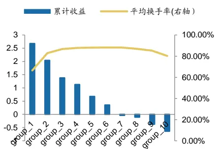
数据来源：中证指数，广发证券发展研究中心

[分析师： Table_Author]张钰东

同SAC 执证号：S0260522070006

0755-23487806

zhangyudong@gf.com.cn分析师： 安宁宁

SAC 执证号：S0260512020003

SFC CE No. BNW179

0755-23948352

anningning@gf.com.cn

请注意，张钰东并非香港证券及期货事务监察委员会的注册持牌人，不可在香港从事受监管活动。

## 一、研究背景

## （一）羊群效应

传统金融市场理论通常假设市场上的每个投资者都是完全理性的，都能高效地获取并分析市场信息，并做出最优决策。然而，现实中的金融市场往往是非理性的，在A股市场上，个人投资者占比较高，卖空存在限制，股价异象繁生。

无论是国外还是国内，投资者的投资行为一直是学术界及实业界热门研究的领域之一。而投资者的羊群行为，在行为金融学领域，一直是其中研究的一个热点。羊群行为通常被定义为投资者对他人行为的模仿。Devenow and Welch (1996)提出造成这一现象的原因有三点。第一个原因来源于报酬的外部性，指一个行为带来的回报随着实施这一行为的人数增加而增加。例如，投资者倾向于同时交易，这样能为他们带来更好的流动性。第二个原因来自于声誉问题和与委托代理理论。当一个基金经理人的业绩是相对于一个基准来评估时，例如，通过使用其他经理人的平均业绩或市场/行业指数的业绩评价该经理人的绩效，那么该经理人更加倾向于模仿这个基准的做法。虽然这样做会使得经理人丧失比平均水平表现的更好的潜力，但却能够防止由于相对表现较差而带来的损失。第三个原因是信息的外部性，指投资者通过观察其他投资人的行为来获取信息。这种外部性可能非常强，以至于投资者甚至会忽略自己的信息而依赖这种噪音信息。

羊群行为的存在对市场有效假说提出了挑战，市场有效假说认为所有投资者都是理性的，并且有着相同的信息集，因此可以形成一致的股价预期，市场上的股票价格能够真实的反映股票的内在价值。但是羊群行为的投资不一定是理性的。投资者不是通过对于公司的理性分析，而是通过观察和跟踪其他投资者的行为来进行投资，即不是所有的市场参与者都完全知情，因此羊群行为可能会使得股票价格偏离其基本面，从而影响股票的实际价值。

Tan, Chiang, Mason (2008)等人的研究表明羊群行为会增加市场波动性和套利机会。羊群行为可能还会影响股票的价格变动过程，根据Grinblatt (1995)和Wermers(1999)等人的研究结果，羊群行为有利于信息的快速传递，从而使得股价能够随着信息快速变化，有助于价格发现过程。通常认为，短期羊群效应会伴随着价格的反转，即当出现买入（卖出）羊群行为时，未来股价可能会下跌（上涨）。同时，买入（卖出）效应越强烈，未来价格下跌（上涨）的幅度越大，即未来价格变动和羊群行为的剧烈程度相关。

## （二）关联度信息

传统的有效市场假说认为，在完全有效的金融市场上，价格能够及时、充分反映资产的所有公开信息以及私有信息。但是，Kalok等(2005)、刘菁哲(2010)等众多学者通过实证研究发现，股票市场中存在着“领先滞后效应”，即不同公司对相同基本面信息的反应速度存在差异，一些公司能够迅速对新信息做出反应，另一些公司对于新信息的反应存在时滞。

以行业关联信息为例，Cohen和Lou(2012)实证检验，面对影响全行业的信息事件，单一经营部门公司的股价能够更迅速的反映新信息，同时对于多经营部门公司未来股票收益存在显著预测能力。胡聪慧等(2015)采用A股上市公司数据验证了这一结论，并证实了集团公司股价变动的滞后性主要在于投资者关注度与处理能力有限性，以及行业估值的复杂性。向诚等(2018)实证说明了行业内受关注度最高的30%公司组合的收益率，显著引领受关注度最低30%公司组合的未来收益率。段丙蕾等(2022)认为行业关联回报率仅在月度层面显著，在周度层面不显著。同时，Parsons和Sabbatucci(2018)对于行业关联公司的收益预测能力的有效性提出质疑。他们认为，随着证券分析师覆盖率不断提升，股票价格的有效性增强；随着个股证券分析师重复率上升，股票价格反映的行业一致预期信息越多，因此基于行业关联构建的股票投资策略效果可能衰减。

综上所述，金融市场存在羊群效应，即股票之间存在一定领先滞后效应，通过挖掘股票之间的相似性信息，可以捕捉潜在的投资机会。过往相似性主题研究从行业、产业链等角度出发刻画相应特征，结合近期学术成果，本报告从财务、市场特征等指标相关度出发，刻画相似股票的关联特征。

## 二、相似度指标筛选

## （一）基本指标信息

上市股票主要包括两方面的信息，即财务报表和市场交易特征，财务报表包括盈利能力、成长能力、债务比例等因素，上市交易信息包括成交价、市值、成交额、成交量等多维特征。从上述两方面出发，本报告首先初步筛选以下指标。

表1：基本指标信息

| 符号 | 含义 | 类型 |
| --- | --- | --- |
| operate_rt | 滚动前推12个月营业收入 | 财务 |
| profit | 滚动前推12个月归属母公司股东的净利润 | 财务 |
| cashflow | 滚动前推12个月现金净流量 | 财务 |
| roa1_ttm | 公司净利润与平均资产总额的百分比，该指标反映的是公司运用全部资产所获得利润的水平 | 财务 |
| roe_ttm | ROE，是企业净利润与平均净资产的比率，反映所有者权益所获报酬的水平(TTM) | 财务 |
| capital | 全部投入资本(MRQ) | 财务 |
| fixast | 固定资产合计(MRQ) | 财务 |
| debtoasset | 资产负债率(MRQ) | 财务 |
| opgrow | (本期营业利润(TTM)-上年同期营业利润(TTM))/ABS(上年同期营业利润(TTM))*100 | 财务 |
| profitgrownet | (本期归母净利润(TTM)-上年同期归母净利润(TTM))/ABS(上年同期归母净利润(TTM))*100 | 财务 |
| profittomv_5 | 5年平均收益市值比，归母净利润TTM/现金分红总额 | 财务 |
| roa_ttm_5 | AVG(净利润*2/(本年资产总计(MRQ)+上年末资产总计(MRQ))*100，限定只计算过去五年的年报 | 财务 |
| roe_ttm_5 | AVG(净利润*2/(本年股东权益(MRQ)+上年末股东权益(MRQ))*100，限定只计算过去五年的年报 | 财务 |
| pd_ttm | 股息率，也称股票获利率，是近12个月分配给股东的股息占股价的百分比 | 估值 |

识别风险，发现价值

| ps_ttm | 每股市价为过去12个月每股营业收入的倍数 | 估值 |
| --- | --- | --- |
| pe_ttm | 最新每股市价为最近12个月每股收益的倍数 | 估值 |
| pb_lf | 最新每股市价为最近12个月每股收益的倍数 | 估值 |
| price | 最新股价 | 价量 |
| mv | 最新流通市值 | 价量 |

数据来源：广发证券发展研究中心

## （二）基本指标回测

按照如下的回测框架，检测前述指标直接用于选股的区分度效果。

选股范围：全市场；

股票预处理：剔除非上市、摘牌、ST/*ST、涨跌停板、上市未满1年股票；

因子预处理：MAD去极值、Z-Score标准化；

回测区间： 2015.01.01 – 2024.09.30；

分档方式：根据当期股票的因子值，从小到大分为十档 ；

调仓周期：每月/周的最后一个交易日的次日均价；

交易费用：千分之三（卖出时收取）。

回测结果显示，前述指标的RANKIC、ICIR总体相对较低，即说明相应指标直接用于选股，总体效果不够理想。

表2：基本指标绩效分析_周度

|  | RANK_IC | ICIR | IC 胜率 | 多空年化 | 多空胜率 | 波动率 | 夏普比 | 多头年化 |
| --- | --- | --- | --- | --- | --- | --- | --- | --- |
| operate_rt | 0.3% | 0.02 | 48.6% | -14.2% | 41.7% | 19.7% | -0.72 | -1.8% |
| profit | 0.7% | 0.04 | 47.2% | -10.5% | 41.7% | 17.7% | -0.60 | -2.2% |
| cashflow | 0.1% | 0.01 | 46.7% | -2.5% | 48.0% | 5.7% | -0.44 | 1.9% |
| roa1_ttm | 0.6% | 0.05 | 50.3% | -3.1% | 45.5% | 16.9% | -0.18 | 6.2% |
| roe_ttm | 0.6% | 0.05 | 48.0% | -4.5% | 43.2% | 17.0% | -0.27 | 5.2% |
| capital | -0.2% | -0.01 | 53.7% | 15.1% | 59.8% | 21.2% | 0.71 | 10.1% |
| fixast | 0.5% | 0.03 | 50.1% | -11.2% | 43.8% | 19.3% | -0.58 | -2.5% |
| debtoasset | -0.4% | -0.04 | 53.7% | 2.2% | 53.9% | 15.8% | 0.14 | 6.9% |
| opgrow | 0.3% | 0.04 | 49.9% | -0.6% | 48.2% | 9.9% | -0.06 | 5.8% |
| profitgrownet | 0.2% | 0.03 | 49.9% | -1.8% | 49.7% | 10.0% | -0.18 | 5.0% |
| profittomv_5 | -1.2% | -0.25 | 61.3% | 7.6% | 57.1% | 6.1% | 1.24 | 9.4% |
| roa_ttm_5 | 0.8% | 0.07 | 53.5% | -0.4% | 47.6% | 14.0% | -0.03 | 7.2% |
| roe_ttm_5 | 0.6% | 0.05 | 50.5% | -0.7% | 47.8% | 14.0% | -0.05 | 7.1% |
| pd_ttm | 3.0% | 0.20 | 57.1% | 10.5% | 51.2% | 19.7% | 0.53 | 13.7% |
| ps_ttm | -2.6% | -0.19 | 57.1% | 11.9% | 52.4% | 17.4% | 0.68 | 11.5% |
| pe_ttm | -1.7% | -0.16 | 52.0% | 9.1% | 56.2% | 8.4% | 1.09 | 6.6% |

识别风险，发现价值

| pb_If | -3.7% | -0.23 | 58.1% | 14.1% | 50.9% | 21.8% | 0.65 | 12.7% |
| --- | --- | --- | --- | --- | --- | --- | --- | --- |
| price | -2.4% | -0.14 | 53.5% | 13.0% | 52.8% | 23.0% | 0.56 | 14.5% |
| mv | -1.9% | -0.10 | 58.9% | 19.4% | 60.4% | 23.6% | 0.82 | 15.0% |

数据来源：Wind，广发证券发展研究中心

表3：基本指标绩效分析_月度

|  | RANK_IC | ICIR | IC 胜率 | 多空年化 | 多空胜率 | 波动率 | 夏普比 | 多头年化 |
| --- | --- | --- | --- | --- | --- | --- | --- | --- |
| operate_rt | 0.5% | 0.03 | 53.4% | -9.8% | 45.8% | 20.8% | -0.47 | 3.5% |
| profit | 0.9% | 0.05 | 47.5% | -5.4% | 44.1% | 16.4% | -0.33 | 2.7% |
| cashflow | 0.0% | 0.01 | 47.5% | -0.4% | 54.2% | 5.2% | -0.08 | 3.6% |
| roa1_ttm | 0.6% | 0.05 | 50.0% | -4.3% | 45.8% | 15.0% | -0.28 | 4.1% |
| roe_ttm | 0.7% | 0.05 | 47.5% | -4.0% | 46.6% | 15.1% | -0.26 | 4.5% |
| capital | -0.3% | -0.01 | 51.7% | 7.0% | 55.1% | 23.0% | 0.30 | 10.0% |
| fixast | 1.0% | 0.05 | 55.1% | -7.9% | 50.8% | 21.0% | -0.37 | 3.5% |
| debtoasset | -0.3% | -0.02 | 53.4% | 3.6% | 55.1% | 15.8% | 0.23 | 5.4% |
| opgrow | 0.4% | 0.05 | 51.7% | 0.0% | 51.7% | 9.6% | 0.00 | 5.8% |
| profitgrownet | 0.2% | 0.03 | 47.5% | -1.6% | 48.3% | 9.3% | -0.17 | 4.8% |
| profittomv_5 | -2.0% | -0.38 | 66.9% | 6.4% | 66.1% | 6.1% | 1.05 | 9.0% |
| roa_ttm_5 | 1.1% | 0.09 | 53.4% | -1.4% | 50.0% | 13.1% | -0.11 | 5.9% |
| roe_ttm_5 | 0.7% | 0.07 | 50.0% | -2.5% | 51.7% | 12.2% | -0.21 | 5.2% |
| pd_ttm | 4.5% | 0.28 | 62.7% | 3.2% | 55.9% | 20.7% | 0.15 | 11.7% |
| ps_ttm | -3.8% | -0.25 | 58.5% | 5.5% | 51.7% | 19.1% | 0.29 | 9.6% |
| pe_ttm | -2.4% | -0.20 | 60.2% | 3.4% | 55.9% | 7.3% | 0.46 | 5.8% |
| pb_If | -5.2% | -0.30 | 60.2% | 5.5% | 53.4% | 22.9% | 0.24 | 9.0% |
| price | -3.4% | -0.19 | 56.4% | 4.6% | 51.3% | 23.6% | 0.19 | 10.1% |
| mv | -2.9% | -0.15 | 56.4% | 12.0% | 57.3% | 23.6% | 0.51 | 13.2% |

数据来源：Wind，广发证券发展研究中心

## （三）基本指标相关性

进一步观察相应基本指标的相关性，测算结果显示，反映相似特征的指标具备一定的相关性，如operate_rt表示滚动前推12个月营业收入，profit表示滚动前推12个月归属母公司股东的净利润，两个指标的内部相关性约53%。

因此，刻画股票之间的相关性，应当从多维不同角度出发更加合理。

表4：基本指标内部相关性统计一

|  | operate_rt | profit | cashflow | roa1_ttm | roe_ttm | capital | fixast | debtoasset | opgrow |
| --- | --- | --- | --- | --- | --- | --- | --- | --- | --- |
| operate_rt | 100.00% | 52.51% | 11.87% | 0.07% | 0.21% | 84.51% | 72.47% | 4.75% | 0.09% |
| profit | 52.51% | 100.00% | 28.20% | 1.00% | 0.56% | 71.69% | 43.72% | 3.64% | 0.23% |
| cashflow | 11.87% | 28.20% | 100.00% | 0.08% | 0.08% | 18.71% | 9.68% | 1.12% | 0.04% |

识别风险，发现价值

| roa1_ttm | 0.07% | 1.00% | 0.08% | 100.00% | 9.25% | 0.12% | 0.00% | -28.04% | 0.56% |
| --- | --- | --- | --- | --- | --- | --- | --- | --- | --- |
| roe_ttm | 0.21% | 0.56% | 0.08% | 9.25% | 100.00% | 0.21% | 0.15% | -3.20% | 0.14% |
| capital | 84.51% | 71.69% | 18.71% | 0.12% | 0.21% | 100.00% | 79.19% | 4.79% | 0.13% |
| fixast | 72.47% | 43.72% | 9.68% | 0.00% | 0.15% | 79.19% | 100.00% | 4.38% | 0.03% |
| debtoasset | 4.75% | 3.64% | 1.12% | -28.04% | -3.20% | 4.79% | 4.38% | 100.00% | -0.20% |
| opgrow | 0.09% | 0.23% | 0.04% | 0.56% | 0.14% | 0.13% | 0.03% | -0.20% | 100.00% |
| profitgrownet | 0.02% | 0.07% | 0.02% | 0.26% | 0.06% | 0.02% | 0.01% | -0.18% | 0.82% |
| profittomv_5 | 0.11% | -0.41% | -0.18% | -1.44% | -0.57% | -0.21% | -1.53% | 6.04% | 0.06% |
| roa_ttm_5 | -1.42% | 0.17% | -0.25% | 12.09% | 3.82% | -1.39% | -2.60% | -18.84% | 0.67% |
| roe_ttm_5 | 0.85% | 1.60% | 0.25% | 1.63% | 1.54% | 0.77% | 0.45% | -2.00% | -0.05% |
| pd_ttm | 18.33% | 20.27% | 3.53% | 13.50% | 2.92% | 18.26% | 17.54% | 11.02% | -0.38% |
| ps_ttm | -0.11% | -0.09% | 0.00% | -0.20% | -0.03% | -0.10% | -0.13% | -0.24% | 0.00% |
| pe_ttm | 0.00% | -0.02% | 0.00% | 0.02% | 0.01% | -0.01% | 0.01% | -0.04% | 0.01% |
| pb_If | -0.49% | -0.33% | -0.07% | 0.81% | -16.37% | -0.65% | -0.59% | 0.85% | 0.00% |
| price | -0.51% | 4.50% | 1.28% | 6.41% | 1.13% | -0.11% | -2.24% | -6.03% | -0.12% |
| mv | 56.15% | 66.87% | 23.28% | 1.80% | 0.55% | 54.86% | 50.80% | 3.74% | 0.11% |

数据来源：Wind，广发证券发展研究中心

表5：基本指标内部相关性统计二

|  | profitgrownet | Profittomv5 | roa_ttm5 | roe_ttm5 | pd_ttm | ps_ttm | pe_ttm | pb_If | price | mv |
| --- | --- | --- | --- | --- | --- | --- | --- | --- | --- | --- |
| operate_rt | 0.02% | 0.11% | -1.42% | 0.85% | 18.33% | -0.11% | 0.00% | -0.49% | -0.51% | 56.15% |
| profit | 0.07% | -0.41% | 0.17% | 1.60% | 20.27% | -0.09% | -0.02% | -0.33% | 4.50% | 66.87% |
| cashflow | 0.02% | -0.18% | -0.25% | 0.25% | 3.53% | 0.00% | 0.00% | -0.07% | 1.28% | 23.28% |
| roa1_ttm | 0.26% | -1.44% | 12.09% | 1.63% | 13.50% | -0.20% | 0.02% | 0.81% | 6.41% | 1.80% |
| roe_ttm | 0.06% | -0.57% | 3.82% | 1.54% | 2.92% | -0.03% | 0.01% | -16.37% | 1.13% | 0.55% |
| capital | 0.02% | -0.21% | -1.39% | 0.77% | 18.26% | -0.10% | -0.01% | -0.65% | -0.11% | 54.86% |
| fixast | 0.01% | -1.53% | -2.60% | 0.45% | 17.54% | -0.13% | 0.01% | -0.59% | -2.24% | 50.80% |
| debtoasset | -0.18% | 6.04% | -18.84% | -2.00% | 11.02% | -0.24% | -0.04% | 0.85% | -6.03% | 3.74% |
| opgrow | 0.82% | 0.06% | 0.67% | -0.05% | -0.38% | 0.00% | 0.01% | 0.00% | -0.12% | 0.11% |
| profitgrownet | 1 | -0.68% | 0.15% | 0.06% | -0.35% | 0.00% | 0.00% | -0.02% | 0.07% | 0.02% |
| profittomv_5 | -0.68% | 1 | -1.22% | -1.14% | -20.22% | 4.38% | -0.21% | 1.28% | 1.62% | -0.29% |
| roa_ttm_5 | 0.15% | -1.22% | 1 | 10.04% | 5.93% | -2.81% | 0.06% | -3.61% | 19.58% | 2.72% |
| roe_ttm_5 | 0.06% | -1.14% | 10.04% | 1 | 9.90% | -0.36% | 0.04% | -1.41% | 4.64% | 1.95% |
| pd_ttm | -0.35% | -20.22% | 5.93% | 9.90% | 1 | -4.35% | 0.21% | -25.30% | -11.32% | 12.38% |
| ps_ttm | 0.00% | 4.38% | -2.81% | -0.36% | -4.35% | 1 | 0.00% | 0.02% | -0.02% | -0.13% |
| pe_ttm | 0.00% | -0.21% | 0.06% | 0.04% | 0.21% | 0.00% | 1 | -0.02% | 0.09% | 0.00% |
| pb_If | -0.02% | 1.28% | -3.61% | -1.41% | -25.30% | 0.02% | -0.02% | 1 | 0.99% | -0.17% |
| price | 0.07% | 1.62% | 19.58% | 4.64% | -11.32% | -0.02% | 0.09% | 0.99% | 1 | 34.18% |
| mv | 0.02% | -0.29% | 2.72% | 1.95% | 12.38% | -0.13% | 0.00% | -0.17% | 34.18% | 1 |

数据来源：Wind，广发证券发展研究中心
识别风险，发现价值

综上所述，我们最终筛选价格、市值、估值、盈利和投资等五个角度刻画股票之间的相关性。

## 三、实证回测

## （一）相似度刻画

当某只股票收益率较高时，会吸引投资者的关注，而这种关注会溢出到具有相似特征的股票上，即若相似股票在上一期获得较高收益时，预期该股票本期可获得高收益。

我们通过特征之间的距离来衡量股票之间的相关性。对计算股票之间所有特征的欧几里得距离，然后筛选相似股票，计算相似股票的收益加权均值（SIM），以及计算相似股票收益的相对差值（RSIM）。

## （二）数据说明

选股范围：全市场；

股票预处理：剔除非上市、摘牌、ST/*ST、涨跌停板、上市未满1年股票；

因子预处理：MAD去极值、Z-Score标准化、（行业市值中性化）；

回测区间： 2015.01.01 – 2024.10.31；

分档方式：根据当期股票的因子值，从小到大分为十档 ；

调仓周期：每月/周的最后一个交易日的次日均价；

交易费用：千分之三（卖出时收取）。

## （三）实证结果

本小节中，主要对SIM、RSIM因子在IC、多空策略、胜率以及换手率方面的回测表现进行整体展示，并对比行业市值中性化前后是否有不同。

月频全市场选股方式下，SIM因子的IC均值为-2.9%，多空年化收益为8%，其中多头年化收益为4.4%，但收益特征相对不够突出。

表6：SIM、RSIM系列因子绩效分析

|  | 加权方式 | 数量 | 频率 | RANK_IC | ICIR | IC 胜率 | 多空年化 | 多空胜率 | 波动率 | 夏普比 | 多头年化 |
| --- | --- | --- | --- | --- | --- | --- | --- | --- | --- | --- | --- |
| SIM(中性化) | 市值 | 50 | 月度 | -2.4% | -0.26 | 60.5% | 7.7% | 53.8% | 11.8% | 0.65 | 4.1% |
| SIM(中性化) | 市值 | 50 | 周度 | -1.7% | -0.20 | 59.4% | 6.6% | 53.1% | 12.3% | 0.53 | -0.5% |
| SIM | 市值 | 50 | 月度 | -2.9% | -0.20 | 54.6% | 8.1% | 52.1% | 18.2% | 0.45 | 4.4% |
| SIM | 市值 | 50 | 周度 | -1.8% | -0.12 | 54.4% | 3.3% | 51.3% | 20.2% | 0.16 | -2.5% |
| RSIM(中性化) | 市值 | 50 | 月度 | -0.6% | -0.08 | 50.4% | 0.5% | 50.4% | 9.6% | 0.06 | -0.8% |
| RSIM(中性化) | 市值 | 50 | 周度 | -0.1% | -0.02 | 51.5% | -5.2% | 46.2% | 10.4% | -0.49 | -7.7% |
| RSIM | 市值 | 50 | 月度 | -1.2% | -0.09 | 51.3% | 1.7% | 50.4% | 15.2% | 0.11 | 0.0% |
| RSIM | 市值 | 50 | 周度 | -0.2% | -0.02 | 51.7% | -9.4% | 46.7% | 16.7% | -0.57 | -10.1% |

数据来源：Wind，广发证券发展研究中心

## 1.SIM因子

图1：SIM因子IC值信息
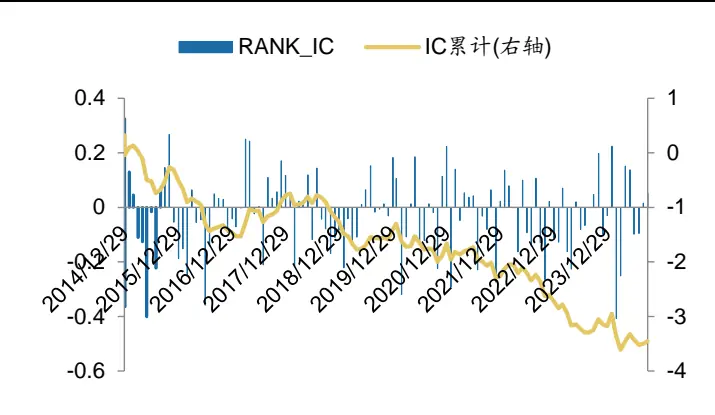
数据来源：Wind，广发证券发展研究中心

图 2：SIM 因子分组平均收益统计
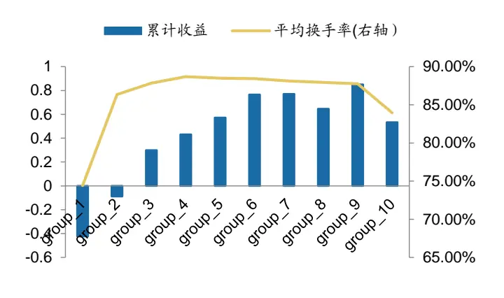
数据来源：Wind，广发证券发展研究中心

图3：SIM因子多头空头累计净值
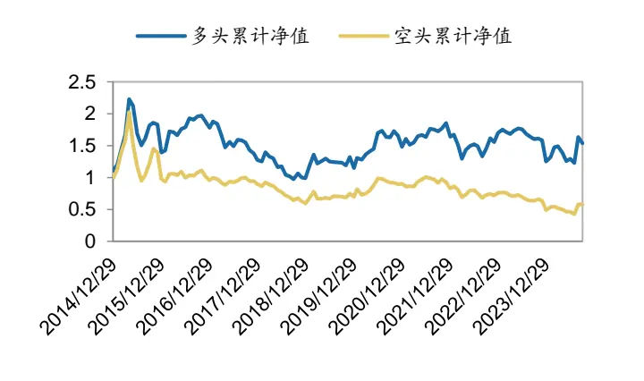
数据来源：Wind，广发证券发展研究中心

图 4：SIM因子多空累计净值
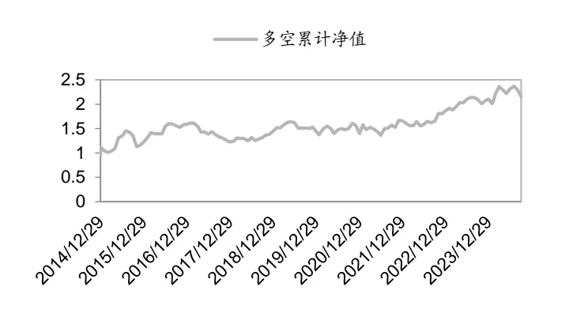
数据来源：Wind，广发证券发展研究中心

表7：SIM因子分年度绩效表现

|  | 年化收益率 | 年化波动率 | 夏普比 | 多头收益 | 指数收益 | 超额收益 |
| --- | --- | --- | --- | --- | --- | --- |
| 2015 | 21.7% | 34.6% | 0.63 | 83.8% | 32.6% | 51.3% |
| 2016 | 36.3% | 15.2% | 2.40 | 2.5% | -14.4% | 16.9% |
| 2017 | -20.5% | 10.4% | -1.98 | -26.7% | 2.3% | -29.0% |
| 2018 | 9.9% | 11.6% | 0.86 | -27.5% | -29.9% | 2.5% |
| 2019 | 10.7% | 11.2% | 0.96 | 32.1% | 31.1% | 1.0% |
| 2020 | 2.5% | 18.2% | 0.14 | 25.3% | 24.9% | 0.4% |
| 2021 | 6.4% | 25.4% | 0.25 | 12.0% | 6.2% | 5.8% |
| 2022 | 8.1% | 14.1% | 0.57 | -16.0% | -20.3% | 4.4% |
| 2023 | 14.6% | 9.5% | 1.54 | 1.6% | -7.0% | 8.7% |
| 2024 | 5.7% | 18.6% | 0.31 | -3.0% | 8.4% | -11.4% |

数据来源：Wind，广发证券发展研究中心
注：指数为000985.CSI，即中证全指，后续表格未作特别说明，指数收益均指代中证全指收益。

相关性结果来看，因子和常见风格因子的相关性总体相对较小。

表8：因子与风格因子的相关性分析

|  | 因子 | 动量 | 市值 | 成长 | 杠杆 | 残差波动 | 流动性 | 盈利 | 贝塔 | 账面市值比 | 非线性市值 |
| --- | --- | --- | --- | --- | --- | --- | --- | --- | --- | --- | --- |
| 因子 | 100.0% | 13.6% | 20.4% | 3.0% | -2.6% | 15.3% | 9.5% | -8.0% | -0.1% | -25.5% | 11.5% |
| 动量 | 13.6% | 100.0% | 23.3% | 4.4% | -3.5% | 33.0% | 23.6% | 8.1% | -0.2% | -26.8% | 9.4% |
| 市值 | 20.4% | 23.3% | 100.0% | 20.0% | 13.5% | 4.2% | 3.6% | 33.8% | -4.5% | -0.4% | 42.2% |
| 成长 | 3.0% | 4.4% | 20.0% | 100.0% | 9.0% | -3.2% | 2.1% | 28.1% | 2.6% | -2.4% | 5.2% |
| 杠杆 | -2.6% | -3.5% | 13.5% | 9.0% | 100.0% | -5.0% | -11.6% | 6.0% | -12.2% | 23.7% | 0.9% |
| 残差波动 | 15.3% | 33.0% | 4.2% | -3.2% | -5.0% | 100.0% | 55.0% | -31.5% | 7.2% | -43.7% | 0.5% |
| 流动性 | 9.5% | 23.6% | 3.6% | 2.1% | -11.6% | 55.0% | 100.0% | -18.3% | 42.3% | -29.2% | 6.9% |
| 盈利 | -8.0% | 8.1% | 33.8% | 28.1% | 6.0% | -31.5% | -18.3% | 100.0% | -12.0% | 35.6% | 14.8% |
| 贝塔 | -0.1% | -0.2% | -4.5% | 2.6% | -12.2% | 7.2% | 42.3% | -12.0% | 100.0% | -13.2% | 5.4% |
| 账面市值比 | -25.5% | -26.8% | -0.4% | -2.4% | 23.7% | -43.7% | -29.2% | 35.6% | -13.2% | 100.0% | 5.0% |
| 非线性市值 | 11.5% | 9.4% | 42.2% | 5.2% | 0.9% | 0.5% | 6.9% | 14.8% | 5.4% | 5.0% | 100.0% |

数据来源：Wind，广发证券发展研究中心

## （四）参数调整影响

周频、月频全市场选股方式下，调整因子计算的股票数量、收益的加权方式，以观察参数的潜在影响。

测算结果显示，参数调整后的因子IC、收益等特征相对一致，仍未出现明显的改进效果。

表9：SIM系列因子参数调整绩效分析

| 中性化 | 加权方式 | 数量 | 频率 | RANK_IC | ICIR | IC 胜率 | 多空年化 | 多空胜率 | 波动率 | 夏普比 | 多头年化 |
| --- | --- | --- | --- | --- | --- | --- | --- | --- | --- | --- | --- |
| 是 | 等权 | 100 | 月度 | -2.6% | -0.27 | 58.8% | 8.3% | 54.6% | 12.2% | 0.68 | 4.4% |
| 是 | 等权 | 100 | 周度 | -1.9% | -0.21 | 59.4% | 7.7% | 52.7% | 12.9% | 0.60 | 0.7% |
| 否 | 等权 | 100 | 月度 | -3.1% | -0.20 | 53.8% | 9.4% | 51.3% | 19.2% | 0.49 | 5.8% |
| 否 | 等权 | 100 | 周度 | -1.9% | -0.12 | 54.6% | 4.2% | 51.3% | 21.0% | 0.20 | -2.4% |
| 是 | 等权 | 30 | 月度 | -2.2% | -0.25 | 60.5% | 6.9% | 52.1% | 11.0% | 0.63 | 3.7% |
| 是 | 等权 | 30 | 周度 | -1.6% | -0.20 | 59.4% | 7.0% | 54.4% | 12.4% | 0.56 | -0.8% |
| 否 | 等权 | 30 | 月度 | -2.7% | -0.19 | 55.5% | 7.7% | 52.9% | 17.5% | 0.44 | 4.3% |
| 否 | 等权 | 30 | 周度 | -1.7% | -0.12 | 53.8% | 3.5% | 50.4% | 19.3% | 0.18 | -3.2% |
| 是 | 等权 | 50 | 月度 | -1.2% | -0.14 | 50.4% | 5.4% | 50.4% | 11.5% | 0.47 | 3.2% |
| 是 | 等权 | 50 | 周度 | -0.9% | -0.10 | 53.6% | 0.2% | 50.8% | 12.6% | 0.02 | -4.8% |
| 否 | 等权 | 50 | 月度 | -1.5% | -0.10 | 52.1% | 5.2% | 50.4% | 19.0% | 0.27 | 4.8% |
| 否 | 等权 | 50 | 周度 | -0.3% | -0.02 | 51.9% | -9.8% | 47.7% | 20.0% | -0.49 | -11.2% |
| 是 | 市值 | 50 | 月度 | -2.4% | -0.26 | 60.5% | 7.7% | 53.8% | 11.8% | 0.65 | 4.1% |
| 是 | 市值 | 50 | 周度 | -1.7% | -0.20 | 59.4% | 6.6% | 53.1% | 12.3% | 0.53 | -0.5% |
| 否 | 市值 | 50 | 月度 | -2.9% | -0.20 | 54.6% | 8.1% | 52.1% | 18.2% | 0.45 | 4.4% |
| 否 | 市值 | 50 | 周度 | -1.8% | -0.12 | 54.4% | 3.3% | 51.3% | 20.2% | 0.16 | -2.5% |

数据来源：Wind，广发证券发展研究中心

表10：RSIM系列因子参数调整绩效分析

| 中性化 | 加权方式 | 数量 | 频率 | RANK_IC | ICIR | IC 胜率 | 多空年化 | 多空胜率 | 波动率 | 夏普比 | 多头年化 |
| --- | --- | --- | --- | --- | --- | --- | --- | --- | --- | --- | --- |
| 是 | 等权 | 100 | 月度 | -0.8% | -0.09 | 49.6% | 2.1% | 47.1% | 10.4% | 0.20 | 0.1% |
| 是 | 等权 | 100 | 周度 | -0.3% | -0.03 | 51.5% | -5.8% | 46.2% | 11.4% | -0.51 | -8.1% |
| 否 | 等权 | 100 | 月度 | -1.4% | -0.10 | 51.3% | 3.1% | 51.3% | 16.5% | 0.19 | 1.4% |
| 否 | 等权 | 100 | 周度 | -0.3% | -0.03 | 51.3% | -8.6% | 45.6% | 17.6% | -0.49 | -9.7% |
| 是 | 等权 | 30 | 月度 | -0.4% | -0.06 | 49.6% | 0.7% | 47.1% | 8.7% | 0.08 | -0.2% |
| 是 | 等权 | 30 | 周度 | -0.1% | -0.01 | 51.7% | -5.1% | 48.1% | 9.9% | -0.52 | -8.2% |
| 否 | 等权 | 30 | 月度 | -1.0% | -0.09 | 52.9% | 2.0% | 51.3% | 14.1% | 0.14 | 0.2% |
| 否 | 等权 | 30 | 周度 | -0.2% | -0.02 | 51.5% | -8.2% | 46.2% | 15.9% | -0.51 | -9.8% |
| 是 | 等权 | 50 | 月度 | -0.1% | -0.02 | 47.9% | 0.6% | 45.4% | 10.2% | 0.06 | -0.1% |
| 是 | 等权 | 50 | 周度 | 0.3% | 0.04 | 53.3% | 9.5% | 56.3% | 10.3% | 0.92 | -3.2% |
| 否 | 等权 | 50 | 月度 | -0.3% | -0.02 | 50.4% | -0.3% | 46.2% | 16.6% | -0.02 | 0.8% |
| 否 | 等权 | 50 | 周度 | 0.8% | 0.06 | 52.1% | 17.1% | 54.6% | 17.2% | 0.99 | -0.2% |
| 是 | 市值 | 50 | 月度 | -0.6% | -0.08 | 50.4% | 0.5% | 50.4% | 9.6% | 0.06 | -0.8% |
| 是 | 市值 | 50 | 周度 | -0.1% | -0.02 | 51.5% | -5.2% | 46.2% | 10.4% | -0.49 | -7.7% |
| 否 | 市值 | 50 | 月度 | -1.2% | -0.09 | 51.3% | 1.7% | 50.4% | 15.2% | 0.11 | 0.0% |
| 否 | 市值 | 50 | 周度 | -0.2% | -0.02 | 51.7% | -9.4% | 46.7% | 16.7% | -0.57 | -10.1% |

数据来源：Wind，广发证券发展研究中心

## 四、因子改进回测

## （一）代理变量调整

直接以收益率或相对收益率作为代理变量的回测结果不够理想，本部分采取以“相关性程度”的方式构建因子。

## （二）实证结果

月频全市场选股方式下，SIM_corr因子的IC均值为7.6%,IC胜率为74.8%，多空年化收益为25%，夏普比率为1.96，多头年化收益为14%。行业市值中性化后，因子的ICIR、IC胜率、夏普比等特征进一步增厚。

周频全市场选股方式下，SIM_corr因子的IC均值为6.8%,IC胜率为76.8%，多空年化收益为47%，夏普比率为3.24，多头年化收益为18%。

表11：SIM_corr系列因子绩效分析

|  | 中性化 | 频率 | RANK_IC | ICIR | IC 胜率 | 多空年化 | 多空胜率 | 波动率 | 夏普比 | 多头年化 |
| --- | --- | --- | --- | --- | --- | --- | --- | --- | --- | --- |
| SIM_corr | 是 | 月度 | 7.0% | 0.84 | 82.4% | 21.8% | 79.0% | 9.2% | 2.36 | 11.3% |
| SIM_corr | 是 | 周度 | 6.3% | 0.79 | 80.8% | 45.0% | 74.1% | 10.9% | 4.14 | 14.5% |
| SIM_corr | 否 | 月度 | 7.6% | 0.65 | 74.8% | 25.0% | 73.1% | 12.8% | 1.96 | 14.0% |
| SIM_corr | 否 | 周度 | 6.8% | 0.60 | 76.8% | 47.3% | 67.8% | 14.6% | 3.24 | 17.9% |

数据来源：Wind，广发证券发展研究中心

## 1.SIM_corr因子（月度）

图5：因子IC值信息
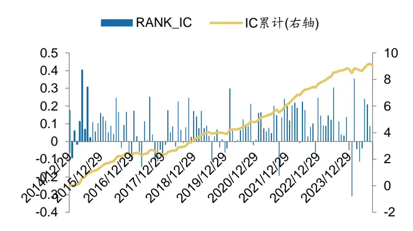
数据来源：Wind，广发证券发展研究中心

图 6：因子分组平均收益统计
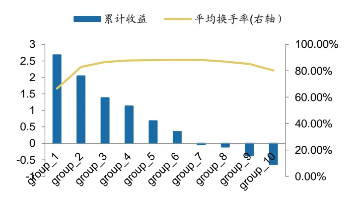
数据来源：Wind，广发证券发展研究中心

图7：因子多头空头累计净值
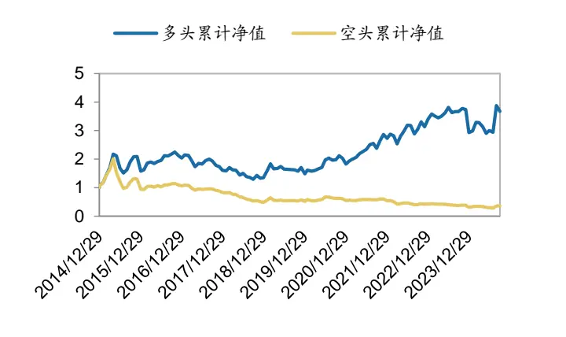
数据来源：Wind，广发证券发展研究中心

图 8：因子多空累计净值
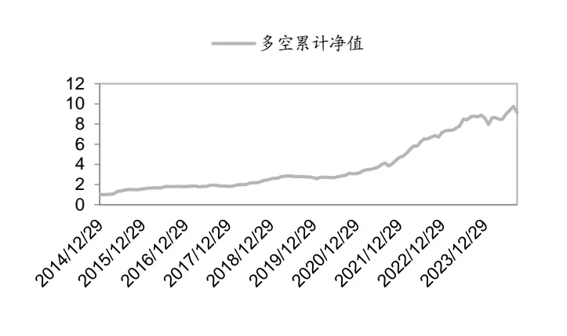
数据来源：Wind，广发证券发展研究中心

表12：因子分年度绩效表现

|  | 年化收益率 | 年化波动率 | 夏普比 | 多头收益 | 指数收益 | 超额收益 |
| --- | --- | --- | --- | --- | --- | --- |
| 2015 | 52.2% | 21.9% | 2.39 | 107.5% | 32.6% | 75.0% |
| 2016 | 18.7% | 7.9% | 2.37 | 1.8% | -14.4% | 16.2% |
| 2017 | 2.7% | 8.1% | 0.33 | -18.7% | 2.3% | -21.0% |
| 2018 | 32.3% | 10.3% | 3.14 | -23.0% | -29.9% | 7.0% |
| 2019 | 12.4% | 7.6% | 1.64 | 27.8% | 31.1% | -3.3% |
| 2020 | 11.9% | 10.6% | 1.13 | 18.9% | 24.9% | -6.0% |
| 2021 | 42.5% | 13.2% | 3.22 | 41.4% | 6.2% | 35.2% |
| 2022 | 53.0% | 11.1% | 4.79 | 9.3% | -20.3% | 29.6% |
| 2023 | 32.3% | 9.9% | 3.26 | 19.3% | -7.0% | 26.4% |
| 2024 | 3.9% | 18.4% | 0.21 | -1.6% | 8.4% | -10.0% |

数据来源：Wind，广发证券发展研究中心

表13：因子与风格因子的相关性分析

|  | 因子 | 动量 | 市值 | 成长 | 杠杆 | 残差波动 | 流动性 | 盈利 | 贝塔 | 账面市值比 | 非线性市值 |
| --- | --- | --- | --- | --- | --- | --- | --- | --- | --- | --- | --- |
| 因子 | 100.0% | -24.4% | -18.4% | -2.9% | 1.7% | -44.0% | -17.7% | 12.5% | 24.4% | 37.0% | -7.6% |
| 动量 | -24.4% | 100.0% | 23.3% | 4.4% | -3.5% | 33.0% | 23.6% | 8.1% | -0.2% | -26.8% | 9.4% |
| 市值 | -18.4% | 23.3% | 100.0% | 20.0% | 13.5% | 4.2% | 3.6% | 33.8% | -4.5% | -0.4% | 42.2% |
| 成长 | -2.9% | 4.4% | 20.0% | 100.0% | 9.0% | -3.2% | 2.1% | 28.0% | 2.6% | -2.4% | 5.2% |
| 杠杆 | 1.7% | -3.5% | 13.5% | 9.0% | 100.0% | -5.0% | -11.6% | 6.0% | -12.3% | 23.7% | 0.9% |
| 残差波动 | -44.0% | 33.0% | 4.2% | -3.2% | -5.0% | 100.0% | 55.1% | -31.5% | 7.2% | -43.8% | 0.5% |
| 流动性 | -17.7% | 23.6% | 3.6% | 2.1% | -11.6% | 55.1% | 100.0% | -18.4% | 42.2% | -29.3% | 6.9% |
| 盈利 | 12.5% | 8.1% | 33.8% | 28.0% | 6.0% | -31.5% | -18.4% | 100.0% | -12.1% | 35.6% | 14.8% |
| 贝塔 | 24.4% | -0.2% | -4.5% | 2.6% | -12.3% | 7.2% | 42.2% | -12.1% | 100.0% | -13.3% | 5.4% |
| 账面市值比 | 37.0% | -26.8% | -0.4% | -2.4% | 23.7% | -43.8% | -29.3% | 35.6% | -13.3% | 100.0% | 5.0% |

识别风险，发现价值

| 非线性市值 | -7.6% | 9.4% | 42.2% | 5.2% | 0.9% | 0.5% | 6.9% | 14.8% | 5.4% | 5.0% | 100.0% |
| --- | --- | --- | --- | --- | --- | --- | --- | --- | --- | --- | --- |

数据来源：Wind，广发证券发展研究中心

进一步筛选因子值靠前的30只或50只股票等权构建多头组合，观察多头组合的表现情况。

表14：因子Top30分年度绩效表现

|  | 收益率 | 年化波动率 | 夏普比 | 最大回撤 | 指数收益 | 超额收益 |
| --- | --- | --- | --- | --- | --- | --- |
| 2015 | 62.6% | 0.59 | 1.05 | 42.9% | 32.6% | 30.0% |
| 2016 | 23.4% | 0.22 | 1.08 | 22.5% | -14.4% | 37.8% |
| 2017 | -23.2% | 0.21 | -1.08 | 25.0% | 2.3% | -25.6% |
| 2018 | -12.6% | 0.23 | -0.55 | 29.8% | -29.9% | 17.3% |
| 2019 | 3.0% | 0.33 | 0.09 | 22.2% | 31.1% | -28.1% |
| 2020 | 13.8% | 0.23 | 0.61 | 16.0% | 24.9% | -11.1% |
| 2021 | 71.8% | 0.19 | 3.83 | 17.2% | 6.2% | 65.6% |
| 2022 | 23.0% | 0.21 | 1.11 | 14.7% | -20.3% | 43.3% |
| 2023 | -14.2% | 0.26 | -0.54 | 11.8% | -7.0% | -7.1% |
| 2024 | 20.2% | 0.42 | 0.66 | 32.8% | 8.4% | 11.8% |

数据来源：Wind，广发证券发展研究中心

表15：因子Top50分年度绩效表现

|  | 收益率 | 年化波动率 | 夏普比 | 最大回撤 | 指数收益 | 超额收益 |
| --- | --- | --- | --- | --- | --- | --- |
| 2015 | 53.6% | 0.57 | 0.94 | 44.6% | 32.6% | 21.1% |
| 2016 | 23.2% | 0.20 | 1.18 | 23.5% | -14.4% | 37.6% |
| 2017 | -23.2% | 0.21 | -1.13 | 25.6% | 2.3% | -25.5% |
| 2018 | -9.3% | 0.23 | -0.41 | 28.4% | -29.9% | 20.6% |
| 2019 | 8.8% | 0.34 | 0.26 | 21.9% | 31.1% | -22.3% |
| 2020 | 12.0% | 0.23 | 0.51 | 16.1% | 24.9% | -13.0% |
| 2021 | 59.3% | 0.18 | 3.38 | 16.9% | 6.2% | 53.1% |
| 2022 | 23.5% | 0.23 | 1.03 | 17.0% | -20.3% | 43.9% |
| 2023 | -15.0% | 0.26 | -0.57 | 11.9% | -7.0% | -7.9% |
| 2024 | 16.6% | 0.41 | 0.55 | 33.8% | 8.4% | 8.1% |

数据来源：Wind，广发证券发展研究中心

2.SIM_corr因子（月度、中性化）

图9：因子IC值信息
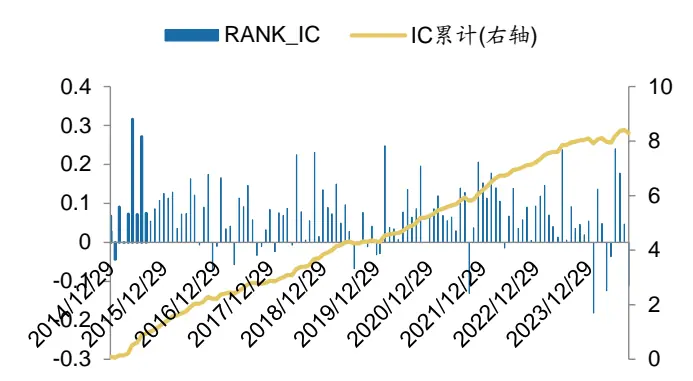
数据来源：Wind，广发证券发展研究中心

图 10：因子分组平均收益统计
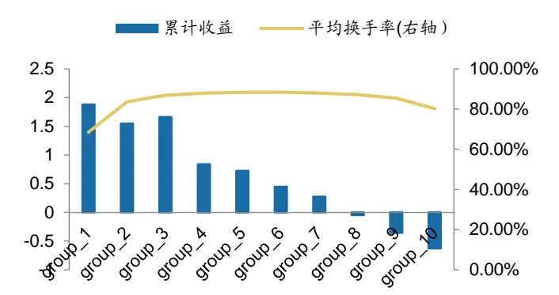
数据来源：Wind，广发证券发展研究中心

图11：因子多头空头累计净值
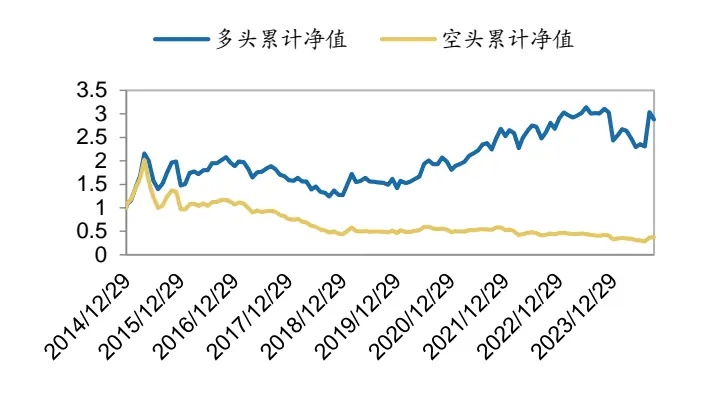
数据来源：Wind，广发证券发展研究中心

图 12：因子多空累计净值
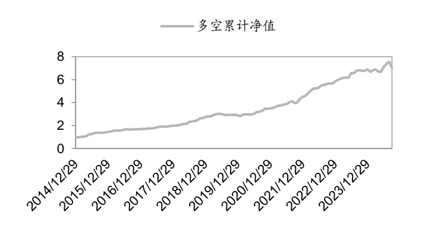
数据来源：Wind，广发证券发展研究中心

表16：因子分年度绩效表现

|  | 收益率 | 年化波动率 | 夏普比 | 最大回撤 | 指数收益 | 超额收益 |
| --- | --- | --- | --- | --- | --- | --- |
| 2015 | 95.6% | 0.50 | 1.90 | 50.5% | 32.6% | 63.1% |
| 2016 | -1.2% | 0.35 | -0.03 | 28.1% | -14.4% | 13.2% |
| 2017 | -14.8% | 0.18 | -0.81 | 20.0% | 2.3% | -17.1% |
| 2018 | -23.8% | 0.21 | -1.12 | 33.5% | -29.9% | 6.1% |
| 2019 | 27.2% | 0.28 | 0.97 | 20.5% | 31.1% | -3.9% |
| 2020 | 22.5% | 0.26 | 0.87 | 15.8% | 24.9% | -2.4% |
| 2021 | 35.1% | 0.19 | 1.85 | 12.5% | 6.2% | 28.9% |
| 2022 | 0.0% | 0.25 | 0.00 | 20.6% | -20.3% | 20.4% |
| 2023 | 13.0% | 0.12 | 1.07 | 11.0% | -7.0% | 20.0% |
| 2024 | -5.0% | 0.46 | -0.13 | 30.4% | 8.4% | -13.4% |

数据来源：Wind，广发证券发展研究中心
识别风险，发现价值

表17：因子与风格因子的相关性分析

|  | 因子 | 动量 | 市值 | 成长 | 杠杆 | 残差波动 | 流动性 | 盈利 | 贝塔 | 账面市值比 | 非线性市值 |
| --- | --- | --- | --- | --- | --- | --- | --- | --- | --- | --- | --- |
| 因子 | 100.0% | -21.5% | -8.8% | -1.4% | 0.5% | -43.3% | -17.2% | 14.4% | 22.3% | 34.9% | -6.3% |
| 动量 | -21.5% | 100.0% | 23.3% | 4.4% | -3.5% | 33.0% | 23.6% | 8.1% | -0.2% | -26.8% | 9.4% |
| 市值 | -8.8% | 23.3% | 100.0% | 20.0% | 13.5% | 4.2% | 3.6% | 33.8% | -4.5% | -0.4% | 42.2% |
| 成长 | -1.4% | 4.4% | 20.0% | 100.0% | 9.0% | -3.2% | 2.1% | 28.0% | 2.6% | -2.4% | 5.2% |
| 杠杆 | 0.5% | -3.5% | 13.5% | 9.0% | 100.0% | -5.0% | -11.6% | 6.0% | -12.3% | 23.7% | 0.9% |
| 残差波动 | -43.3% | 33.0% | 4.2% | -3.2% | -5.0% | 100.0% | 55.1% | -31.5% | 7.2% | -43.8% | 0.5% |
| 流动性 | -17.2% | 23.6% | 3.6% | 2.1% | -11.6% | 55.1% | 100.0% | -18.4% | 42.2% | -29.3% | 6.9% |
| 盈利 | 14.4% | 8.1% | 33.8% | 28.0% | 6.0% | -31.5% | -18.4% | 100.0% | -12.1% | 35.6% | 14.8% |
| 贝塔 | 22.3% | -0.2% | -4.5% | 2.6% | -12.3% | 7.2% | 42.2% | -12.1% | 100.0% | -13.3% | 5.4% |
| 账面市值比 | 34.9% | -26.8% | -0.4% | -2.4% | 23.7% | -43.8% | -29.3% | 35.6% | -13.3% | 100.0% | 5.0% |
| 非线性市值 | -6.3% | 9.4% | 42.2% | 5.2% | 0.9% | 0.5% | 6.9% | 14.8% | 5.4% | 5.0% | 100.0% |

数据来源：Wind，广发证券发展研究中心

进一步筛选因子值靠前的30只或50只股票等权构建多头组合，观察多头组合的表现情况。

表18：因子Top30分年度绩效表现

|  | 收益率 | 年化波动率 | 夏普比 | 最大回撤 | 指数收益 | 超额收益 |
| --- | --- | --- | --- | --- | --- | --- |
| 2015 | 50.5% | 0.63 | 0.80 | 51.0% | 32.6% | 17.9% |
| 2016 | 24.4% | 0.21 | 1.16 | 27.7% | -14.4% | 38.8% |
| 2017 | -16.2% | 0.17 | -0.98 | 23.1% | 2.3% | -18.5% |
| 2018 | -19.0% | 0.22 | -0.86 | 30.5% | -29.9% | 10.9% |
| 2019 | 4.1% | 0.30 | 0.14 | 24.7% | 31.1% | -27.0% |
| 2020 | 22.3% | 0.23 | 0.96 | 14.8% | 24.9% | -2.6% |
| 2021 | 34.3% | 0.17 | 2.01 | 12.4% | 6.2% | 28.1% |
| 2022 | 5.4% | 0.21 | 0.26 | 19.5% | -20.3% | 25.8% |
| 2023 | -15.5% | 0.21 | -0.74 | 13.6% | -7.0% | -8.4% |
| 2024 | 17.8% | 0.43 | 0.57 | 25.1% | 8.4% | 9.4% |

数据来源：Wind，广发证券发展研究中心

表19：因子Top50分年度绩效表现

|  | 收益率 | 年化波动率 | 夏普比 | 最大回撤 | 指数收益 | 超额收益 |
| --- | --- | --- | --- | --- | --- | --- |
| 2015 | 46.1% | 0.61 | 0.76 | 49.4% | 32.6% | 13.5% |
| 2016 | 22.5% | 0.21 | 1.08 | 28.2% | -14.4% | 36.9% |
| 2017 | -16.2% | 0.17 | -0.95 | 22.4% | 2.3% | -18.5% |
| 2018 | -20.7% | 0.22 | -0.95 | 32.0% | -29.9% | 9.3% |

识别风险，发现价值

| 2019 | 4.9% | 0.31 | 0.16 | 25.3% | 31.1% | -26.2% |
| --- | --- | --- | --- | --- | --- | --- |
| 2020 | 30.9% | 0.23 | 1.34 | 14.6% | 24.9% | 6.0% |
| 2021 | 36.1% | 0.15 | 2.38 | 12.3% | 6.2% | 30.0% |
| 2022 | 9.2% | 0.21 | 0.43 | 19.8% | -20.3% | 29.5% |
| 2023 | -15.1% | 0.22 | -0.68 | 12.0% | -7.0% | -8.1% |
| 2024 | 18.1% | 0.43 | 0.58 | 27.0% | 8.4% | 9.7% |

数据来源：Wind，广发证券发展研究中心

## 3.SIM_corr因子（周度）

图13：因子IC值信息
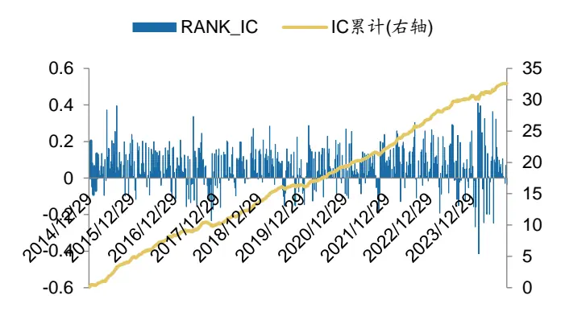
数据来源：Wind，广发证券发展研究中心

图 14：因子分组平均收益统计
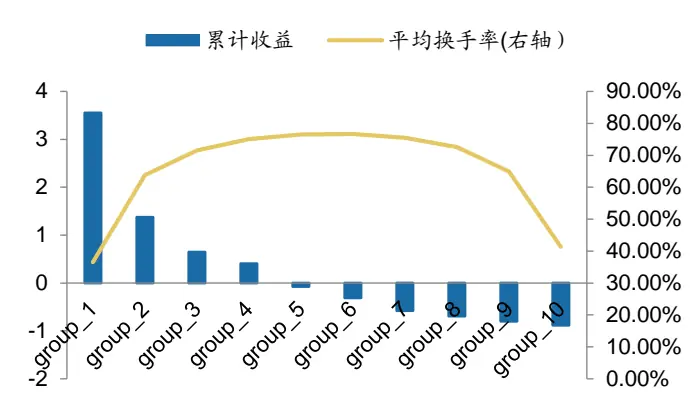
数据来源：Wind，广发证券发展研究中心

图15：因子多头空头累计净值
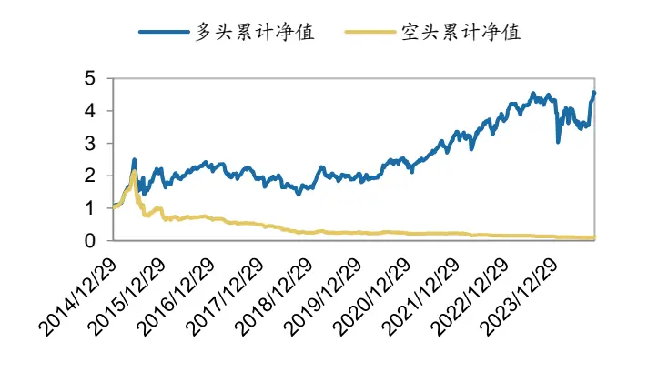
数据来源：Wind，广发证券发展研究中心

图 16：因子多空累计净值
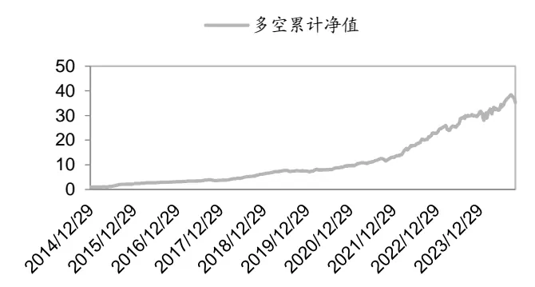
数据来源：Wind，广发证券发展研究中心

表20：因子分年度绩效表现

|  | 收益率 | 年化波动率 | 夏普比 | 最大回撤 | 指数收益 | 超额收益 |
| --- | --- | --- | --- | --- | --- | --- |
| 2015 | 121.4% | 60.1% | 2.20 | 44.7% | 35.4% | 85.9% |
| 2016 | 4.3% | 27.0% | 0.17 | 25.5% | -15.6% | 19.9% |
| 2017 | -18.0% | 22.3% | -0.87 | 21.0% | 1.9% | -19.9% |
| 2018 | -15.5% | 28.9% | -0.57 | 31.1% | -29.3% | 13.8% |

识别风险，发现价值

| 2019 | 25.7% | 22.5% | 1.22 | 20.4% | 29.9% | -4.2% |
| --- | --- | --- | --- | --- | --- | --- |
| 2020 | 18.7% | 23.3% | 0.87 | 16.5% | 22.4% | -3.8% |
| 2021 | 36.3% | 21.0% | 1.85 | 13.8% | 7.3% | 29.0% |
| 2022 | 13.3% | 25.5% | 0.57 | 19.4% | -19.5% | 32.8% |
| 2023 | 17.7% | 13.9% | 1.36 | 11.9% | -7.6% | 25.3% |
| 2024 | 4.9% | 46.0% | 0.14 | 36.0% | 9.5% | -4.6% |

数据来源：Wind，广发证券发展研究中心

表21：因子Top30分年度绩效表现

|  | 收益率 | 年化波动率 | 夏普比 | 最大回撤 | 指数收益 | 超额收益 |
| --- | --- | --- | --- | --- | --- | --- |
| 2015 | 101.0% | 0.59 | 1.87 | 38.8% | 35.4% | 65.6% |
| 2016 | 16.7% | 0.24 | 0.73 | 24.4% | -15.6% | 32.3% |
| 2017 | -7.9% | 0.24 | -0.36 | 18.2% | 1.9% | -9.8% |
| 2018 | -14.1% | 0.31 | -0.49 | 29.5% | -29.3% | 15.2% |
| 2019 | 13.0% | 0.22 | 0.63 | 22.9% | 29.9% | -16.9% |
| 2020 | 0.1% | 0.22 | 0.00 | 16.2% | 22.4% | -22.4% |
| 2021 | 54.3% | 0.24 | 2.39 | 14.6% | 7.3% | 47.0% |
| 2022 | 16.6% | 0.25 | 0.71 | 16.1% | -19.5% | 36.1% |
| 2023 | 13.9% | 0.15 | 0.99 | 14.1% | -7.6% | 21.4% |
| 2024 | 10.2% | 0.51 | 0.27 | 33.6% | 9.5% | 0.8% |

数据来源：Wind，广发证券发展研究中心

表22：因子Top50分年度绩效表现

|  | 收益率 | 年化波动率 | 夏普比 | 最大回撤 | 指数收益 | 超额收益 |
| --- | --- | --- | --- | --- | --- | --- |
| 2015 | 83.6% | 0.59 | 1.53 | 42.2% | 35.4% | 48.2% |
| 2016 | 21.5% | 0.24 | 0.95 | 24.0% | -15.6% | 37.1% |
| 2017 | -9.8% | 0.23 | -0.45 | 18.6% | 1.9% | -11.7% |
| 2018 | -12.8% | 0.30 | -0.46 | 30.2% | -29.3% | 16.5% |
| 2019 | 13.7% | 0.22 | 0.66 | 24.4% | 29.9% | -16.2% |
| 2020 | 2.5% | 0.23 | 0.12 | 16.4% | 22.4% | -19.9% |
| 2021 | 43.2% | 0.23 | 1.99 | 14.9% | 7.3% | 36.0% |
| 2022 | 13.2% | 0.25 | 0.58 | 17.1% | -19.5% | 32.6% |
| 2023 | 13.7% | 0.15 | 1.00 | 13.4% | -7.6% | 21.3% |
| 2024 | 3.1% | 0.50 | 0.08 | 36.6% | 9.5% | -6.4% |

数据来源：Wind，广发证券发展研究中心

4.SIM_corr因子（周度、中性化）

图17：因子IC值信息
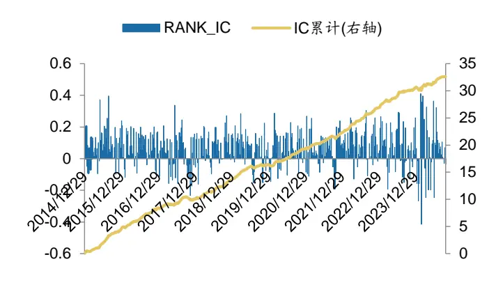
数据来源：Wind，广发证券发展研究中心

图 18：因子分组平均收益统计
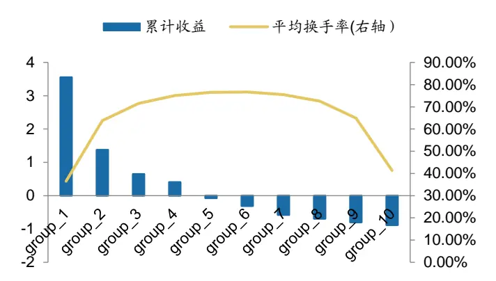
数据来源：Wind，广发证券发展研究中心

图19：因子多头空头累计净值
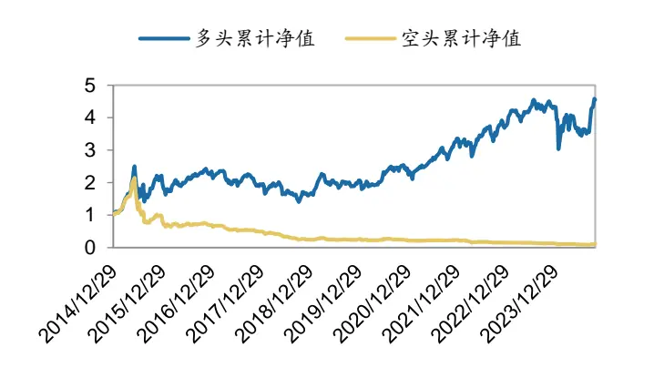
数据来源：Wind，广发证券发展研究中心

图 20：因子多空累计净值
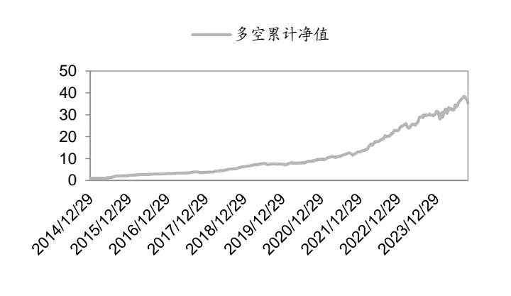
数据来源：Wind，广发证券发展研究中心

表23：因子分年度绩效表现

|  | 收益率 | 年化波动率 | 夏普比 | 最大回撤 | 指数收益 | 超额收益 |
| --- | --- | --- | --- | --- | --- | --- |
| 2015 | 115.7% | 60.6% | 2.08 | 50.9% | 35.4% | 80.2% |
| 2016 | 2.8% | 30.0% | 0.10 | 28.2% | -15.6% | 18.4% |
| 2017 | -16.7% | 20.6% | -0.87 | 20.2% | 1.9% | -18.6% |
| 2018 | -19.0% | 27.9% | -0.72 | 32.9% | -29.3% | 10.3% |
| 2019 | 26.6% | 22.5% | 1.26 | 19.7% | 29.9% | -3.3% |
| 2020 | 21.4% | 23.6% | 0.99 | 16.3% | 22.4% | -1.1% |
| 2021 | 35.8% | 17.8% | 2.16 | 11.4% | 7.3% | 28.6% |
| 2022 | 1.1% | 24.2% | 0.05 | 22.2% | -19.5% | 20.6% |
| 2023 | 10.1% | 12.5% | 0.86 | 12.5% | -7.6% | 17.7% |
| 2024 | -0.1% | 39.1% | 0.00 | 28.4% | 9.5% | -9.5% |

数据来源：Wind，广发证券发展研究中心

表24：因子Top30分年度绩效表现

|  | 收益率 | 年化波动率 | 夏普比 | 最大回撤 | 指数收益 | 超额收益 |
| --- | --- | --- | --- | --- | --- | --- |
| 2015 | 83.7% | 0.63 | 1.43 | 48.5% | 35.4% | 48.2% |
| 2016 | 22.9% | 0.26 | 0.95 | 26.6% | -15.6% | 38.4% |
| 2017 | -12.7% | 0.20 | -0.68 | 20.1% | 1.9% | -14.6% |
| 2018 | -18.5% | 0.29 | -0.68 | 33.1% | -29.3% | 10.8% |
| 2019 | 14.9% | 0.23 | 0.68 | 24.9% | 29.9% | -15.0% |
| 2020 | 11.1% | 0.24 | 0.51 | 16.2% | 22.4% | -11.3% |
| 2021 | 49.9% | 0.19 | 2.81 | 11.5% | 7.3% | 42.6% |
| 2022 | -4.4% | 0.23 | -0.20 | 20.5% | -19.5% | 15.1% |
| 2023 | 5.6% | 0.13 | 0.45 | 13.5% | -7.6% | 13.2% |
| 2024 | -5.7% | 0.36 | -0.21 | 28.7% | 9.5% | -15.2% |

数据来源：Wind，广发证券发展研究中心

表25：因子Top50分年度绩效表现

|  | 收益率 | 年化波动率 | 夏普比 | 最大回撤 | 指数收益 | 超额收益 |
| --- | --- | --- | --- | --- | --- | --- |
| 2015 | 71.1% | 0.63 | 1.22 | 50.9% | 35.4% | 35.6% |
| 2016 | 22.0% | 0.25 | 0.93 | 26.9% | -15.6% | 37.5% |
| 2017 | -13.5% | 0.20 | -0.72 | 19.8% | 1.9% | -15.5% |
| 2018 | -18.0% | 0.29 | -0.67 | 32.6% | -29.3% | 11.3% |
| 2019 | 19.0% | 0.24 | 0.86 | 23.9% | 29.9% | -10.9% |
| 2020 | 10.8% | 0.23 | 0.51 | 15.7% | 22.4% | -11.7% |
| 2021 | 52.3% | 0.19 | 2.92 | 11.6% | 7.3% | 45.0% |
| 2022 | -1.4% | 0.23 | -0.06 | 20.8% | -19.5% | 18.1% |
| 2023 | 6.8% | 0.13 | 0.57 | 12.4% | -7.6% | 14.4% |
| 2024 | -2.7% | 0.37 | -0.10 | 25.7% | 9.5% | -12.2% |

数据来源：Wind，广发证券发展研究中心

## （三）因子拆解改进实证

已有学术论文中，根据市场收益与资产收益序列的符号将传统市场贝塔拆分为四个半贝塔，并实证说明了基于负市场收益与负资产收益序列协方差构建的半贝塔与资产未来收益显著正相关，基于负市场收益与正资产收益序列协方差构建的半贝塔与资产未来收益显著负相关。这一结论对本报告的启示在于：基于不同数值方向收益序列构建的相关系数，可能蕴含的信息量也存在差异。因此，本部分进一步将股票与相似股票的收益序列进行拆分。

测算显示，拆解之后的收益特征和拆解前基本一致。

表26：SIM_corr系列因子拆分后绩效分析_月度

| 参数1 | 参数2 | 中性化 | 频率 | RANK_IC | ICIR | IC 胜率 | 多空年化 | 多头年化 |
| --- | --- | --- | --- | --- | --- | --- | --- | --- |
| 1 | 1 | 否 | 月度 | 7.6% | 0.65 | 74.8% | 25.0% | 14.0% |
| 一 | 负 | 否 | 月度 | 6.0% | 0.49 | 68.1% | 20.5% | 13.0% |
| 一 | 正 | 否 | 月度 | 7.5% | 0.78 | 79.8% | 23.4% | 13.6% |
| 负 | 1 | 否 | 月度 | 6.9% | 0.59 | 71.4% | 23.7% | 13.1% |
| 负 | 负 | 否 | 月度 | 5.6% | 0.46 | 68.9% | 19.9% | 12.4% |
| 负 | 正 | 否 | 月度 | 6.5% | 0.73 | 79.0% | 20.9% | 12.4% |
| 正 | 1 | 否 | 月度 | 7.6% | 0.75 | 78.2% | 23.4% | 13.3% |
| 正 | 负 | 否 | 月度 | 5.9% | 0.60 | 73.1% | 21.1% | 13.5% |
| 正 | 正 | 否 | 月度 | 7.8% | 0.79 | 81.5% | 23.1% | 13.6% |
| 1 | 1 | 是 | 月度 | 7.0% | 0.84 | 82.4% | 21.8% | 11.3% |
| 一 | 负 | 是 | 月度 | 5.4% | 0.66 | 77.3% | 17.2% | 9.6% |
| 一 | 正 | 是 | 月度 | 6.8% | 0.97 | 86.6% | 19.7% | 11.2% |
| 负 | 1 | 是 | 月度 | 6.3% | 0.78 | 79.8% | 19.9% | 10.0% |
| 负 | 负 | 是 | 月度 | 5.0% | 0.62 | 74.8% | 15.4% | 8.5% |
| 负 | 正 | 是 | 月度 | 5.8% | 0.94 | 84.0% | 16.9% | 9.8% |
| 正 | 一 | 是 | 月度 | 6.9% | 0.93 | 86.6% | 21.2% | 11.3% |
| 正 | 负 | 是 | 月度 | 5.0% | 0.72 | 80.7% | 16.3% | 10.0% |
| 正 | 正 | 是 | 月度 | 7.0% | 0.99 | 89.1% | 20.7% | 11.9% |

数据来源：Wind，广发证券发展研究中心

表27：SIM_corr系列因子拆分后绩效分析_周度

| 参数1 | 参数2 | 中性化 | 频率 | RANK_IC | ICIR | IC 胜率 | 多空年化 | 多头年化 |
| --- | --- | --- | --- | --- | --- | --- | --- | --- |
| 一 | 1 | 否 | 周度 | 6.8% | 0.60 | 76.8% | 47.3% | 17.9% |
| 一 | 负 | 否 | 周度 | 5.6% | 0.48 | 72.8% | 42.0% | 16.7% |
| 一 | 正 | 否 | 周度 | 6.3% | 0.67 | 78.2% | 40.8% | 15.1% |
| 负 | 一 | 否 | 周度 | 6.5% | 0.56 | 76.2% | 47.9% | 17.8% |
| 负 | 负 | 否 | 周度 | 5.3% | 0.45 | 69.9% | 40.2% | 15.7% |
| 负 | 正 | 否 | 周度 | 5.8% | 0.62 | 77.4% | 40.5% | 14.3% |
| 正 | 一 | 否 | 周度 | 6.3% | 0.63 | 75.7% | 43.8% | 15.3% |
| 正 | 负 | 否 | 周度 | 5.2% | 0.51 | 74.5% | 37.6% | 14.4% |
| 正 | 正 | 否 | 周度 | 6.3% | 0.65 | 74.9% | 39.8% | 15.2% |
| 1 | 一 | 是 | 周度 | 6.3% | 0.79 | 80.8% | 45.0% | 14.5% |
| 一 | 负 | 是 | 周度 | 5.1% | 0.64 | 75.9% | 36.8% | 12.4% |
| 一 | 正 | 是 | 周度 | 5.8% | 0.85 | 82.8% | 37.6% | 12.8% |
| 负 | 一 | 是 | 周度 | 6.0% | 0.75 | 79.1% | 42.0% | 13.2% |
| 负 | 负 | 是 | 周度 | 4.9% | 0.61 | 75.1% | 33.7% | 10.6% |
| 负 | 正 | 是 | 周度 | 5.2% | 0.82 | 81.6% | 35.8% | 11.2% |
| 正 | 一 | 是 | 周度 | 5.8% | 0.82 | 80.8% | 41.6% | 13.4% |
| 正 | 负 | 是 | 周度 | 4.5% | 0.67 | 76.2% | 33.4% | 10.1% |

识别风险，发现价值

| 正 | 正 | 是 | 周度 | 5.7% | 0.85 | 81.0% | 37.7% | 13.8% |
| --- | --- | --- | --- | --- | --- | --- | --- | --- |

数据来源：Wind，广发证券发展研究中心

## （四）分域检验

本节将分析股票池的调整对于策略收益的影响。具体而言，本节分析因子在周频换仓周期下对于在沪深300、中证500和中证1000池子的敏感性。

测算结果显示，因子在中证1000股票池中的回测IC相对更高，多头组的区分度更加突出。

表28：SIM_corr系列因子分域分析

| 选股池 | 是否中性 | 频率 | RANK_IC | ICIR | IC 胜率 | 多空年化 | 多头年化 |
| --- | --- | --- | --- | --- | --- | --- | --- |
| 300 | 是 | 月度 | 1.0% | 0.08 | 55.5% | 3.7% | 0.9% |
| 1000 | 是 | 月度 | 6.4% | 0.72 | 77.3% | 19.6% | 9.1% |
| 500 | 是 | 月度 | 2.6% | 0.24 | 61.3% | 7.0% | 3.0% |
| 300 | 是 | 周度 | 2.5% | 0.19 | 58.2% | 14.9% | -0.5% |
| 1000 | 是 | 周度 | 5.6% | 0.61 | 73.2% | 36.3% | 5.5% |
| 500 | 是 | 周度 | 3.5% | 0.32 | 65.1% | 14.4% | -0.4% |
| 300 | 否 | 月度 | 1.2% | 0.08 | 52.9% | 5.8% | 3.6% |
| 1000 | 否 | 月度 | 6.9% | 0.62 | 77.3% | 19.8% | 9.5% |
| 500 | 否 | 月度 | 3.1% | 0.24 | 58.0% | 8.7% | 3.2% |
| 300 | 否 | 周度 | 2.4% | 0.16 | 58.2% | 14.5% | 1.1% |
| 1000 | 否 | 周度 | 6.0% | 0.53 | 71.3% | 40.6% | 9.4% |
| 500 | 否 | 周度 | 3.9% | 0.29 | 62.8% | 15.4% | 0.6% |

数据来源：Wind，广发证券发展研究中心

## 五、总结

研究背景：金融市场存在羊群效应，即股票之间存在一定领先滞后效应，当某只股票收益率较高时，会吸引投资者的关注，而这种关注会溢出到具有相似特征的股票上，即若相似股票在上一期获得较高收益时，预期该股票本期可获得高收益。通过挖掘股票之间的相似性信息，可以捕捉潜在的投资机会。

相似度刻画基本逻辑：结合近期学术成果，本报告从财务、市场特征等指标相关度出发，刻画相似股票的关联特征。我们最终筛选价格、市值、估值、盈利和投资等五个角度刻画股票之间的相关性。我们通过特征之间的欧几里得距离来衡量股票之间的相关性。具体而言，构建相似股票的收益率加权均值（SIM），收益的相对差值（RSIM）、“相关性程度”（CORR）作为因子。

回测结果：月频全市场选股方式下， SIM_corr因子的IC均值为7.6%,IC胜率为74.8%，多空年化收益为25%，夏普比率为1.96，多头年化收益为14%。行业市值中性化后，因子的ICIR、IC胜率、夏普比等特征进一步增厚。周频全市场选股方式下，

识别风险，发现价值

SIM_corr因子的IC均值为6.8%,IC胜率为76.8%，多空年化收益为47%，夏普比率为3.24，多头年化收益为18%。

进一步检验：基于不同数值方向收益序列构建的相关系数，可能蕴含的信息量也存在差异，进一步将股票与相似股票的收益序列进行拆分，拆解之后的收益特征和拆解前基本一致。

分域检验：分析因子在周频换仓周期下对于在沪深300、中证500和中证1000池子的敏感性。测算结果显示，因子在中证1000股票池中的回测IC相对更高，多头组的区分度更加突出。

## 六、风险提示

本专题报告所述模型用量化方法通过历史数据统计、建模和测算完成，所得结论与规律在市场政策、环境变化时可能存在失效风险。

本专题策略模型在市场结构及交易行为的改变时有可能存在策略失效风险。

因量化模型不同，本报告提出的观点可能与其他量化模型结论存在差异。

## 七、附录

参考 Barra CNE5 因子算法计算整理。

表 29：风格因子含义

| 风格因子 | 描述因子 | 算法解析 | 权重 |
| --- | --- | --- | --- |
| 市值 | 规模 | 对数总市值。 | 100% |
| 贝塔 | 贝塔 | 过去252个交易日的股票超额收益率对市场指数超额收益率进行半衰指数加权回归的回归系数，半衰期为63个交易日。 | 100% |
| 动量 | 相对强弱 | 滞后21个交易日的过去504个交易日对数超额收益率的指数加权移动平均，半衰期为126个交易日。 | 100% |
| 残差波动 | 日标准差 | 过去252个交易日的股票超额收益率的指数加权移动标准差，半衰期为42个交易日。 | 74% |
|  | 累积收益范围 | 过去12个月累计超额收益率的离差。 | 16% |
|  | 历史 sigma | 计算Beta 因子时回归残差的波动率。 | 10% |
| 非线性市值 | 中市值 | 市值因子经过标准化后，再取立方。 | 100% |
| 账面市值比 | 账面市值比 | 最近报告期普通股账面价值与市值之比。 | 100% |
| 流动性 | 月换手率 | 最近1个月（21个交易日）换手率的对数。 | 35% |
|  | 季换手率 | 最近3个月换手率的对数。 | 35% |
|  | 年换手率 | 最近12个月换手率的对数。 | 30% |
| 盈利 | 市现率倒数 | 过去12个月现金流与市值之比，即最近12个月市现率的倒数。 | 21% |
|  | 市盈率倒数 | 过去12个月净利润与市值之比，即最近12个月市盈率的倒数。 | 79% |
| 成长 | 长期净利润复合增长率 | 过去3 净利润复合增长率。 | 18% |

识别风险，发现价值

|  | 短净利润复合增长率 | 过去1年净利润复合增长率。 | 11% |
| --- | --- | --- | --- |
|  | 每股收益增长率 | 过去5年盈利增长率（回归算法）。 | 24% |
|  | 每股营业收入增长率 | 过去。5年营业收入增长率（回归算法）。 | 47% |
| 杠杆 | 市场杠杆 | mlev=(me+ld)/me，mlev是市场杠杆，me是普通股市值，Id 是长期负债账面价值 | 38% |
|  | 资产负债比 | dtoa=td/ta，dtoa是资产负债比，td是总负债账面价值，ta是总资产账面价值 | 35% |
|  | 账面杠杆 | blev=(be+ld)/be，blev是账面杠杆，be是普通股账面价值，Id是长期负债账面价值。 | 27% |

数据来源：广发证券发展研究中

## [Table_ResearchTeam] 广发金融工程研究小组

罗军 ：首席分析师，华南理工大学硕士，从业 16 年，2010 年进入广发证券发展研究中心。

安 宁 宁 ：首席分析师，暨南大学硕士，从业 14 年，2011 年进入广发证券发展研究中心。

史 庆 盛 ：资深分析师，华南理工大学硕士，2011 年进入广发证券发展研究中心。

张 超 ：资深分析师，中山大学硕士，2012 年进入广发证券发展研究中心。

陈 原 文 ：资深分析师，中山大学硕士，2015 年进入广发证券发展研究中心。

李 豪 ：资深分析师，上海交通大学硕士，2016 年进入广发证券发展研究中心。

周 飞 鹏 ：资深分析师，伯明翰大学硕士，2021 年加入广发证券发展研究中心。

张 钰 东 ：资深分析师，中山大学硕士，2020 年进入广发证券发展研究中心。

季 燕 妮 ：资深分析师，厦门大学硕士，2020 年进入广发证券发展研究中心。

林 涛 ：研究员，中山大学硕士，2024年进入广发证券发展研究中心。

## [Table_IndustryInvestDescription] 广发证券—行业投资评级说明

买入： 预期未来12个月内，股价表现强于大盘10%以上。内

持有： 预期未来12个月内，股价相对大盘的变动幅度介于-10%～+10%。对

卖出： 预期未来12个月内，股价表现弱于大盘10%以上。

## [Table_CompanyInvestDescription] 广发证券—公司投资评级说明

买入：预期未来12个月内，股价表现强于大盘15%以上。

增持： 预期未来12个月内，股价表现强于大盘5%-15%。

持有： 预期未来12个月内，股价相对大盘的变动幅度介于-5%～+5%。

卖出： 预期未来12个月内，股价表现弱于大盘5%以上。

## [Table_Address] 联系我们

| 地址 | 广州市 | 深圳市 | 北京市 | 上海市 | 香港 |
| --- | --- | --- | --- | --- | --- |
|  | 广州市天河区马场路 | 深圳市福田区益田路 | 北京市西城区月坛北 | 上海市浦东新区南泉 | 香港湾仔骆克道81 |
|  | 26号广发证券大厦 47楼 | 6001号太平金融大 厦31层 | 街2号月坛大厦18 | 北路429号泰康保险 号广发大厦27 楼 |  |
| 邮政编码 | 510627 | 518026 | 层 100045 | 大厦37楼 200120 |  |
| 客服邮箱 | gfzqyf@gf.com.cn |  |  |  |  |

## [Table_LegalDisclaimer] 法律主体声明

本报告由广发证券股份有限公司或其关联机构制作，广发证券股份有限公司及其关联机构以下统称为“广发证券”。本报告的分销依据不依据不同国家、地区的法律、法规和监管要求由广发证券于该国家或地区的具有相关合法合规经营资质的子公司/经营机构完成。资

广发证券股份有限公司具备中国证监会批复的证券投资咨询业务资格，接受中国证监会监管，负责本报告于中国（港澳台地区除外）的分投销。

广发证券（香港）经纪有限公司具备香港证监会批复的就证券提供意见（4 号牌照）的牌照，接受香港证监会监管，负责本报告于中国香港地区的分销。

本报告署名研究人员所持中国证券业协会注册分析师资质信息和香港证监会批复的牌照信息已于署名研究人员姓名处披露。

## [Table_Important重要声明

广发证券股份有限公司及其关联机构可能与本报告中提及的公司寻求或正在建立业务关系，因此，投资者应当考虑广发证券股份有限公司系 因此 者应当考虑及其关联机构因可能存在的潜在利益冲突而对本报告的独立性产生影响。投资者不应仅依据本报告内容作出任何投资决策。投资者应自主存 潜 利益冲突而 独 性产生影响 仅 容作出投资决策并自行承担投资风险，任何形式的分享证券投资收益或者分担证券投资损失的书面或者口头承诺均为无效。

本报告署名研究人员、联系人（以下均简称“研究人员”）针对本报告中相关公司或证券的研究分析内容，在此声明：（1）本报告的全部分析结论、研究观点均精确反映研究人员于本报告发出当日的关于相关公司或证券的所有个人观点，并不代表广发证券的立场；（2）研究人员的部分或全部的报酬无论在过去、现在还是将来均不会与本报告所述特定分析结论、研究观点具有直接或间接的联系。

研究人员制作本报告的报酬标准依据研究质量、客户评价、工作量等多种因素确定，其影响因素亦包括广发证券的整体经营收入，该等经营收入部分来源于广发证券的投资银行类业务。

本报告仅面向经广发证券授权使用的客户/特定合作机构发送，不对外公开发布，只有接收人才可以使用，且对于接收人而言具有保密义务。广发证券并不因相关人员通过其他途径收到或阅读本报告而视其为广发证券的客户。在特定国家或地区传播或者发布本报告可能违反当地法律，广发证券并未采取任何行动以允许于该等国家或地区传播或者分销本报告。

本报告所提及证券可能不被允许在某些国家或地区内出售。请注意，投资涉及风险，证券价格可能会波动，因此投资回报可能会有所变化，过去的业绩并不保证未来的表现。本报告的内容、观点或建议并未考虑任何个别客户的具体投资目标、财务状况和特殊需求，不应被视为对特定客户关于特定证券或金融工具的投资建议。本报告发送给某客户是基于该客户被认为有能力独立评估投资风险、独立行使投资决策并独立承担相应风险。

本报告所载资料的来源及观点的出处皆被广发证券认为可靠，但广发证券不对其准确性、完整性做出任何保证。报告内容仅供参考，报告中的信息或所表达观点不构成所涉证券买卖的出价或询价。广发证券不对因使用本报告的内容而引致的损失承担任何责任，除非法律法规有明确规定。客户不应以本报告取代其独立判断或仅根据本报告做出决策，如有需要，应先咨询专业意见。

广发证券可发出其它与本报告所载信息不一致及有不同结论的报告。本报告反映研究人员的不同观点、见解及分析方法，并不代表广发证券的立场。广发证券的销售人员、交易员或其他专业人士可能以书面或口头形式，向其客户或自营交易部门提供与本报告观点相反的市场评论或交易策略，广发证券的自营交易部门亦可能会有与本报告观点不一致，甚至相反的投资策略。报告所载资料、意见及推测仅反映研究人员于发出本报告当日的判断，可随时更改且无需另行通告。广发证券或其证券研究报告业务的相关董事、高级职员、分析师和员工可能拥有本报告所提及证券的权益。在阅读本报告时，收件人应了解相关的权益披露（若有）。

本研究报告可能包括和/或描述/呈列期货合约价格的事实历史信息（“信息”）。请注意此信息仅供用作组成我们的研究方法/分析中的部分论点/依据/证据，以支持我们对所述相关行业/公司的观点的结论。在任何情况下，它并不（明示或暗示）与香港证监会第5类受规管活动（就期货合约提供意见）有关联或构成此活动。

## [Table_InterestDisclos权益披露

(1)广发证券（香港）跟本研究报告所述公司在过去12 个月内并没有任何投资银行业务的关系。

## [Table_Copyright]版权声明

未经广发证券事先书面许可，任何机构或个人不得以任何形式翻版、复制、刊登、转载和引用，否则由此造成的一切不良后果及法律责任由私自翻版、复制、刊登、转载和引用者承担。