# [Table_Title] 基于隔夜相关性的因子研究[Table_Title]

# 多因子 Alpha 系列报告之(五十五)

## [Table_Summary]报告摘要：

研究背景：股票市场存在一定的隔夜相关性特征，日度收益可以拆解为隔夜收益和日间收益。结合近期学术成果，本报告从日间、隔夜等特征相关度出发，刻画相似股票的关联特征。

隔夜涨跌幅相关性研究思路：将多空信号和交易执行进行分离，通过信号与执行分离的机制，只捕捉跨股票的信息效应。基于夜收益和日间收益来构建相关性矩阵，然后划分领先群组（Leader）和滞后群组（Lagger），在此基础上构建交易策略，仅从领先群组生成信号，仅在滞后群组内交易。

实证研究：基于相关文献方案，潜在的问题在于股票之间的特征值差异相对较小，进一步尝试直接基于特征进行 KMEANS 聚类分析，并基于平均数值强度确认领先群组和滞后群组。测算显示，日度调仓下，A股的领先滞后效应呈现反转效应，即基于领先群组发出预期看多信号后，空头组合表现相对更加强势，发出看空信号则相反，且策略相对适用于中小盘股票。

因子研究：基于隔夜相关信息构建周度月度选股因子。直接构建领先滞后相关性因子，选股区分度不够突出。进一步引入常规相关性，即先筛选隔夜收益和日间收益相关性最高的股票群组，再计算常规相关性，该因子与常规方法计算的相关性因子内部相关性不高于 60%，提供边际增量，其中 corr_combined1 的月度 RANK_IC 为 8.13%，多头年化收益为 18.2%，周度 RANK_IC 为 6.59%，多头年化收益为 22.1%。

相关性分析：因子内部相关性方面，隔夜日间和常规相关性因子的相关程度相对较低。与风格因子的相关程度方面，相关性因子与残差波动等风格呈现一定相似性。

风险提示：本专题报告所述模型用量化方法通过历史数据统计、建模和测算完成，所得结论与规律在市场政策、环境变化时可能存在失效风险；策略在市场结构及交易行为的改变时有可能存在策略失效风险；因量化模型不同，本报告提出的观点可能与其他量化模型结论存在差异。

图：因子分组收益统计
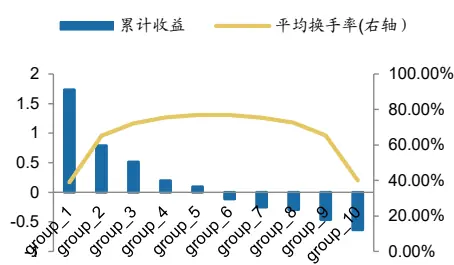
数据来源：Wind，广发证券发展研究中心

[分析师： Table_Author]张钰东

同SAC 执证号：S0260522070006

公0755-23487806

zhangyudong@gf.com.cn

分析师： 安宁宁

SAC 执证号：S0260512020003

SFC CE No. BNW179

0755-23948352

anningning@gf.com.cn

分析师： 陈原文

同SAC 执证号：S0260517080003

0755-82797057

chenyuanwen@gf.com.cn

请注意，张钰东,陈原文并非香港证券及期货事务监察委员会的注册持牌人，不可在香港从事受监管活动。

## 一、研究背景

## （一）羊群效应

传统金融市场理论通常假设市场上的每个投资者都是完全理性的，都能高效地获取并分析市场信息，并做出最优决策。然而，现实中的金融市场往往是非理性的，在A股市场上，个人投资者占比较高，卖空存在限制，股价异象繁生。

无论是国外还是国内，投资者的投资行为一直是学术界及实业界热门研究的领域之一。而投资者的羊群行为，在行为金融学领域，一直是其中研究的一个热点。羊群行为通常被定义为投资者对他人行为的模仿。Devenow and Welch (1996)提出造成这一现象的原因有三点。第一个原因来源于报酬的外部性，指一个行为带来的回报随着实施这一行为的人数增加而增加。例如，投资者倾向于同时交易，这样能为他们带来更好的流动性。第二个原因来自于声誉问题与委托代理理论。当一个基金经理人的业绩是相对于一个基准来评估时，例如，通过使用其他经理人的平均业绩或市场/行业指数的业绩评价该经理人的绩效，那么该经理人更加倾向于模仿这个基准的做法。虽然这样做会使得经理人丧失比平均水平表现的更好的潜力，但却能够防止由于相对表现较差而带来的损失。第三个原因是信息的外部性，指投资者通过观察其他投资人的行为来获取信息。这种外部性可能非常强，以至于投资者甚至会忽略自己的信息而依赖这种噪音信息。

羊群行为的存在对市场有效假说提出了挑战，市场有效假说认为所有投资者都是理性的，并且有着相同的信息集，因此可以形成一致的股价预期，市场上的股票价格能够真实的反映股票的内在价值。但是羊群行为的投资不一定是理性的。投资者不是通过对于公司的理性分析，而是通过观察和跟踪其他投资者的行为来进行投资，即不是所有的市场参与者都完全知情，因此羊群行为可能会使得股票价格偏离其基本面，从而影响股票的实际价值。

Tan, Chiang, Mason (2008)等人的研究表明羊群行为会增加市场波动性和套利机会。羊群行为可能还会影响股票的价格变动过程，根据Grinblatt (1995)和Wermers (1999)等人的研究结果，羊群行为有利于信息的快速传递，从而使得股价能够随着信息快速变化，有助于价格发现过程。通常认为，短期羊群效应会伴随着价格的反转，即当出现买入（卖出）羊群行为时，未来股价可能会下跌（上涨）。同时，买入（卖出）效应越强烈，未来价格下跌（上涨）的幅度越大，即未来价格变动和羊群行为的剧烈程度相关。

## （二）关联度信息

传统的有效市场假说认为，在完全有效的金融市场上，价格能够及时、充分反映资产的所有公开信息以及私有信息。但是，Kalok等(2005)、刘菁哲(2010)等众多学者通过实证研究发现，股票市场中存在着“领先滞后效应”，即不同公司对相同基本面信息的反应速度存在差异，一些公司能够迅速对新信息做出反应，另一些公司对于新信息的反应存在时滞。

以行业关联信息为例，Cohen和Lou(2012)实证检验，面对影响全行业的信息事件，单一经营部门公司的股价能够更迅速的反映新信息，同时对于多经营部门公司未来股票收益存在显著预测能力。胡聪慧等(2015)采用A股上市公司数据验证了这一结论，并证实了集团公司股价变动的滞后性主要在于投资者关注度与处理能力有限性，以及行业估值的复杂性。向诚等(2018)实证说明了行业内受关注度最高的30%公司组合的收益率，显著引领受关注度最低30%公司组合的未来收益率。段丙蕾等(2022)认为行业关联回报率仅在月度层面显著，在周度层面不显著。同时，Parsons和Sabbatucci(2018)对于行业关联公司的收益预测能力的有效性提出质疑。他们认为，随着证券分析师覆盖率不断提升，股票价格的有效性增强；随着个股证券分析师重复率上升，股票价格反映的行业一致预期信息越多，因此基于行业关联构建的股票投资策略效果可能衰减。

综上所述，金融市场存在羊群效应，即股票之间存在一定领先滞后效应，通过挖掘股票之间的相似性信息，可以捕捉潜在的投资机会。过往相似性主题研究从行业、产业链、财务基本面等角度出发刻画相应特征，结合近期学术成果，本报告从日间、隔夜等特征相关度出发，刻画相似股票的关联特征。

## 二、隔夜涨跌幅相关性研究思路

## （一）基本研究思路

首先，日度收益可以拆解为隔夜收益和日间收益。

股票市场存在一定的隔夜相关性特征，即两个交易日之间的涨跌幅变动可以拆分为日间收益和隔夜收益两部分，Lou et al.（2019）的研究证明，美国市场中，单只股票维度，隔夜的上涨往往伴随着日间交易时间段的下跌，即隔夜收益和日间收益存在显著的负相关关系，而两者的负相关关系可能来源于噪音相关的套利行为。

上述过往研究停留于单一股票层级，而实际投资场景中，投资者的投资决策通常是构建一篮子的股票组合，因此套利等行为也可能在多个股票之间扩散。

因此，关于股票之间的隔夜收益关联特征研究，基于隔夜收益预测日间收益，核心是需要找到哪些股票具备领先或滞后关系，即找到领先群组的股票，计算其隔夜收益，基于隔夜收益预测滞后股票的日间收益表现。

图1：日度涨跌幅拆解为隔夜和日间涨跌幅
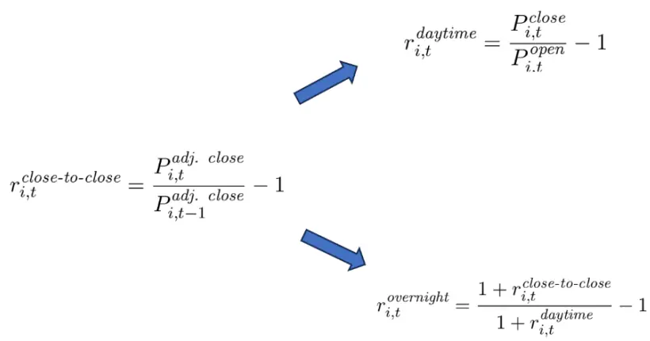
数据来源：广发证券发展研究中心

其次，构建股票的相关性矩阵。

具体而言，是以隔夜收益和日间收益来构建相关性矩阵，以此来确定领先股票群组和滞后股票群组。该定义反映的是某只股票的隔夜收益是否能预测另一只股票的日间收益，以此形成有向加权矩阵，矩阵中元素的绝对值越大，表面影响程度越高，即具备相对明显的预测效果。而隔夜和日间的相关性构建，在矩阵中的数据具备不对称性，以此呈现出领先和滞后的结构特征。

图2：隔夜收益和日间收益的不对称矩阵
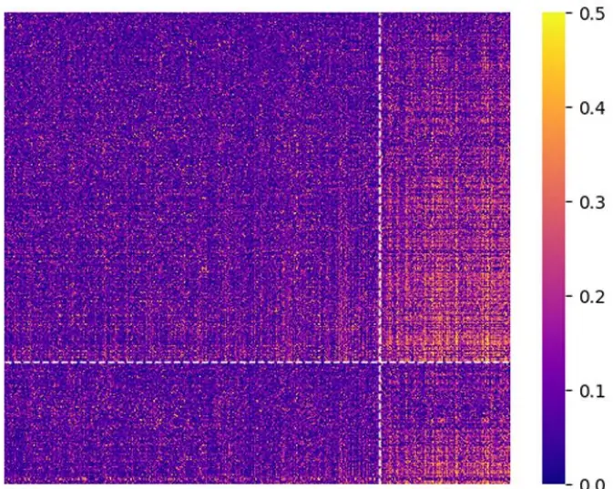
数据来源：《A tug of war across the market: overnight-vs-daytime lead-lag networks andclustering-based portfolio strategies》，广发证券发展研究中心

然后，基于矩阵信息，划分群组。

具体而言，采取定向谱聚类算法 d-LE-SC（directed Likelihood Estimation SpectralClustering），划分领先群组（Leader）和滞后群组（Lagger），即滞后群组受领先群组的影响。

在此基础上构建交易策略，仅从领先群组生成信号，仅在滞后群组内交易，若领先群组平均收益为正，则在滞后群组中做多“受领先群组正影响”的股票，做空“受领先群组负影响”的股票；反之方向相反。

图3：划分股票群组并构建交易策略
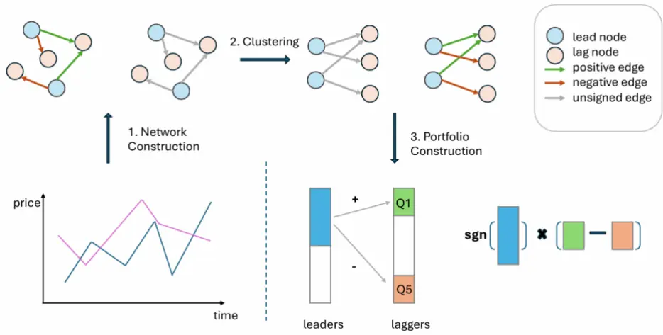
数据来源：《A tug of war across the market: overnight-vs-daytime lead-lag networks andclustering-based portfolio strategies》，广发证券发展研究中心

关于算法 d-LE-SC，主要特点在于其方向性，目的是为了识别领先群组（Leader）和滞后群组（Lagger）。

传统谱聚类中，在无向网络（如相关矩阵）中，数值仅反映相似程度，没有方向性，若直接用普通谱聚类，只能识别出相关性较高的股票群组，而无法揭示领先滞后关系。

参考相关文献，衡量聚类好坏的标准，可以用两个指标刻画网络的方向性特征，净流量（NF）与总流量（TF）。

净流量Net Flow (NF)：衡量两个群体之间的信息“单向性”。基于网络的邻接矩阵，若净流量大，说明一方对另一方具有明显的方向性影响；若净流量小，则信息流是双向均衡的，难以区分主次。换句话说，净流量衡量的是领先滞后的强度。

总流量Total Flow (TF)：衡量两个群体之间的总体连接程度。若两个群体间的总流量太小，意味着它们之间几乎没有联系，聚类结构不显著；若总流量很大，但净流量很小，则表明双方互动频繁但无明确方向。

目标函数：联合刻画方向性与连通性算法，希望在聚类结果中同时获得强方向性（净流量大）和连通性（总流量适中且显著）。通过最大化该似然函数，算法在“方向性”和“连通性”之间找到平衡。

图4：定向谱聚类算法特征

$$
\begin{aligned}{\mathbf{NF}(C_{\operatorname{lead}},C_{\operatorname{lag}})=\sum_{i\in C_{\operatorname{lead}},j\in C_{\operatorname{lag}}}}&{{}\mathbf{A}_{ij}-\mathbf{A}_{ji}}&{\mathbf{TF}(C_{\operatorname{lead}},C_{\operatorname{lag}})=\sum_{i\in C_{\operatorname{lead}},j\in C_{\operatorname{lag}}}\mathbf{A}_{ij}+\mathbf{A}_{ji}}\\{}&{{}\bigvee}&{\nearrow}\\{}&{{}\underbrace{\operatorname*{max}_{C_{\operatorname{lead}},C_{\operatorname{lag}}}\operatorname{log}\left(\frac{1-\eta}{\eta}\right)\mathbf{NF}(C_{\operatorname{lead}},C_{\operatorname{lag}})+\operatorname{log}\Bigl(\frac{1}{4\eta(1-\eta)}\Bigr)\mathbf{TF}(C_{\operatorname{lead}},C_{\operatorname{lag}})}.}\\\end{aligned}
$$

数据来源：《A tug of war across the market: overnight-vs-daytime lead-lag networks andclustering-based portfolio strategies》，广发证券发展研究中心

使用谱松弛（spectral relaxation）方法优化上述离散目标函数，即将邻接矩阵转换为归一化的有向拉普拉斯矩阵，计算其主特征向量，作为节点的潜在嵌入表示，再用k-means对节点嵌入向量聚类，得到最终的领先群组和滞后群组。

图5：定向谱聚类算法逻辑
1 Input: Directed adjacency matrix At, number of iteration m; 
2 Initialize: Randomly set initial values for directed SBM parameters η; 
3 for i = 1 : m do 
4 Compute the Hermitian matrix 
$\begin{array}{l}{{\bf{H}}=i\operatorname{log}\Bigl({\frac{{1-\eta}}{\eta}}\Bigr)\left({{{\bf{A}}_{t}}-{\bf{A}}_{t}^{T}}\right)+\operatorname{log}\Bigl({\frac{1}{{4\eta(1-\eta)}}}\Bigr)\left({{{\bf{A}}_{t}}+{\bf{A}}_{t}^{T}}\right)}\\\end{array}.$ 
5 Compute the top eigenvector $\mathbf{v_{1}}$ of H; 
6 Form the embedding $[\Re(\mathbf{v}_{1}),\:\Im(\mathbf{v}_{1})]$ and cluster into two communities $C_{\mathrm{lead}}$ 
and $C_{\mathrm{lag}}$ via k-means; 
7 Update the directed SBM parameter 
$\eta\leftarrow\operatorname*{min}\biggl\{\frac{|C_{\operatorname{lead}}\to C_{\operatorname{lag}}|}{\mathbf{TF}(C_{\operatorname{lead}},C_{\operatorname{lag}})},\frac{|C_{\operatorname{lag}}\to C_{\operatorname{lead}}|}{\mathbf{TF}(C_{\operatorname{lead}},C_{\operatorname{lag}})}\biggr\}$ 
where $\textstyle|C_{1}\to C_{2}|=\sum_{i\in C_{1},j\in C_{2}}(\mathbf{A}_{t})_{ij}$ denotes the total directed flow from 
community $C_{1}$ to $C_{2}.$ 
8 end 
9 Output: Lead-lag communities $C_{\mathrm{lead}}$ and $C_{\mathrm{lag}}$

数据来源：《A tug of war across the market: overnight-vs-daytime lead-lag networks andclustering-based portfolio strategies》，广发证券发展研究中心

## （二）投资组合构建流程

总体框架方面，将多空信号和交易执行进行分离。传统反转或动量策略往往依赖单只股票的自身收益序列，而该策略的创新点在于通过信号与执行分离的机制，只捕捉跨股票的信息效应。

第一步，构建相关性矩阵。在每个交易日，基于回溯N个交易日滚动窗口计算出相关性矩阵，由于矩阵既包含方向又包含正负值，首先对矩阵取绝对值，此矩阵代表领先关系的强度，用作网络的邻接矩阵。

第二步，识别领先群组和滞后群组，确定主导簇。

第三步，提取交易信号。从领先群组提取信号。计算每只股票的平均影响得分，选取得分最高的前50%股票形成子集 ，计算其平均收益，表示市场在该日的方向性信号。若信号为正，则暗示滞后群组在日间上涨，若为负，则相反。

第四步，计算滞后群组中每只股票的受影响程度，根据该得分进行排序：若第三步的信号为正，则做多滞后群组前20%，做空后20%；若信号为负，则方向相反。

图6：投资组合构建流程

$$
S_{a\to b}(t)=\frac{1}{|C_{a}||C_{b}|}\sum_{i\in C_{a}}\sum_{j\in C_{b}}(\mathbf{A}_{t})_{i,j}.
$$

$$
(C_{\operatorname{lead}},C_{\operatorname{lag}})=\operatorname{arg}\operatorname*{max}_{a\neq b}S_{a\to b}(t).
$$

$$
\operatorname{LeadScore}_{i}(t)=\sum_{j}(\mathbf{A}_{t})_{i,j},\quad i\in C_{\operatorname{lead}}.
$$

$$
\operatorname{Signal}(t)=\frac{1}{|\mathcal{T}_{\operatorname{lead}}|}\sum_{i\in\mathcal{T}_{\operatorname{lead}}}r_{i,t},
$$

$$
\operatorname{LagScore}_{j}(t)=\sum_{i\in C_{\operatorname{lead}}}(\mathbf{M}_{t})_{i,j}.
$$

$$
R_{t+1}^{\operatorname{port}}=\operatorname{sgn}(\operatorname{Signal}(t))\left(\frac{1}{|\mathcal{T}_{\operatorname{top}}|}\sum_{j\in\mathcal{T}_{\operatorname{top}}}r_{j,t+1}-\frac{1}{|\mathcal{T}_{\operatorname{bottom}}|}\sum_{j\in\mathcal{T}_{\operatorname{bottom}}}r_{j,t+1}\right)
$$

数据来源：《A tug of war across the market: overnight-vs-daytime lead-lag networks andclustering-based portfolio strategies》，广发证券发展研究中心

## 三、实证研究

## （一）群组识别

相关文献中，主要是针对美股头部10%的股票做相应的研究。本报告中，针对A股，分别尝试在沪深300、中证1000和全市场所有股票中进行尝试测算。

基于参考文献测算方式，潜在的问题在于股票之间的特征值差异相对较小，且受随机种子影响较明显，因此群组区分效果不够理想。如沪深300成分股内作群组区分，会出现某一群组股票不足5只的情况。可能的原因在于，一方面，中美的股市特征存在一定的差异，另一方面，如沪深300成分股的股票，内部相关性相对比较高。

因此，对滞后群组和领先群组的划分，我们进一步尝试基于领先和滞后的相关性矩阵特征，进行群组分类。测算结果显示，该方法下，群组分类结果相对稳定。

图7：沪深300成分股群组分类
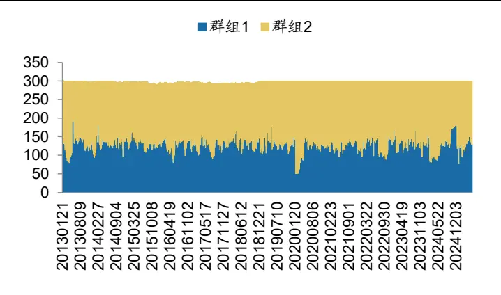
数据来源：Wind，广发证券发展研究中心

图 8：中证 1000成分股群组分类
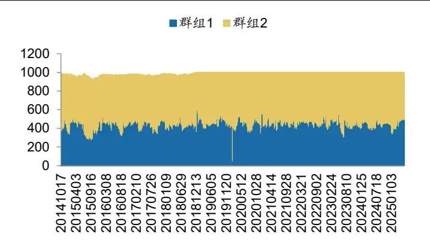
数据来源：，Wind，广发证券发展研究中心

图9：全市场股票群组分类
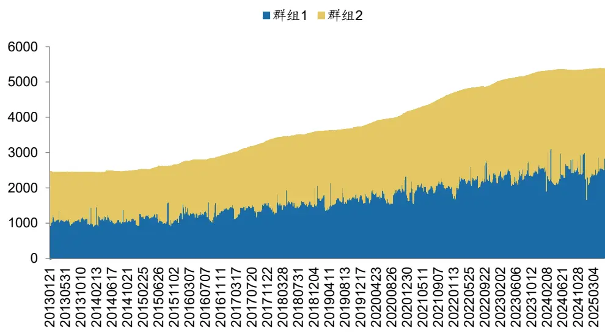
数据来源：Wind，广发证券发展研究中心

## （二）组合回测

区分群组之后，基于平均信息流强度，确认主导簇和受影响簇，即领先群组和滞后群组。参考相关文献方法，在领先群组中，选取得分最高的前50%股票形成子集 ，计算其平均收益，表示市场在该日的方向性信号，以此决定滞后群组的多空配置方向。

关于滞后群组多空组合的构建，尝试两种持仓周期。一种是次日开盘，收盘卖出，即只考虑日间收益部分；另一种是次日开盘买入，后一日开盘卖出并买入新的股票，以此对比两种方案的收益差异。另外，引入理想情况下，当日收盘买入，次日收盘调仓的情况以作对比。

全市场股票方面，在滞后群组内，根据信号筛选前20%和后20%构建多空组合，测算结果显示，和文献于美国市场的测算结果不完全一致。

一方面，A股的领先滞后效应呈现反转效应，即基于领先群组发出预期看多信号后，空头组合表现相对更加强势，发出看空信号则相反。

另一方面，多头组和空头组的区分度相对明显，即在回溯期内，采取统一次日开盘调仓的方案，多空收益能实现约8.81%的年化收益，但多头组和空头组的表现会受到市场波动影响。

图10：全市场股票_滞后组_多空净值表现一
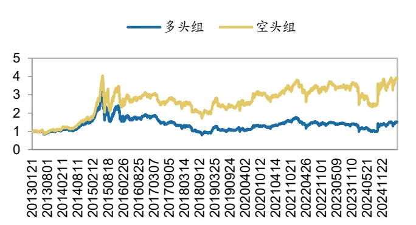
数据来源：Wind，广发证券发展研究中心

图 11：全市场股票_滞后组_多空净值表现二
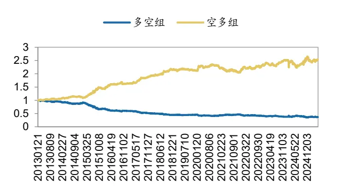
数据来源：，Wind，广发证券发展研究中心

若只考虑日间收益，则多头组和空头组的收益区分度相对不够明显，但只保留日间收益，多头组和空头组的净值表现更加突出，说明市场的上涨更多来源于日间，而非隔夜。

若考虑理想情况下的收盘调仓，则特征和次日开盘调仓的特征基本一致。

图12：全市场股票_滞后组_多空净值表现一（日间）
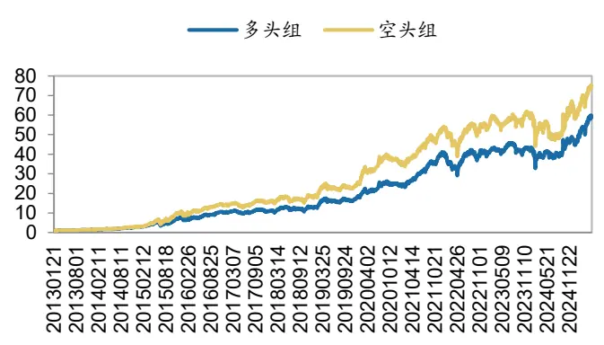
数据来源：Wind，广发证券发展研究中心

图 13：全市场股票_滞后组_多空净值表现二（日间）
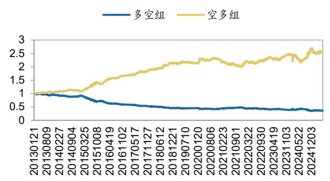
数据来源：，Wind，广发证券发展研究中心

图14：全市场股票_滞后组_多空净值表现一（日间）
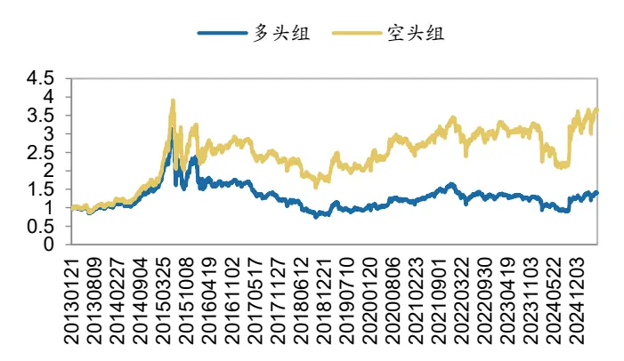
数据来源：Wind，广发证券发展研究中心

图 15：全市场股票_滞后组_多空净值表现二（日间）
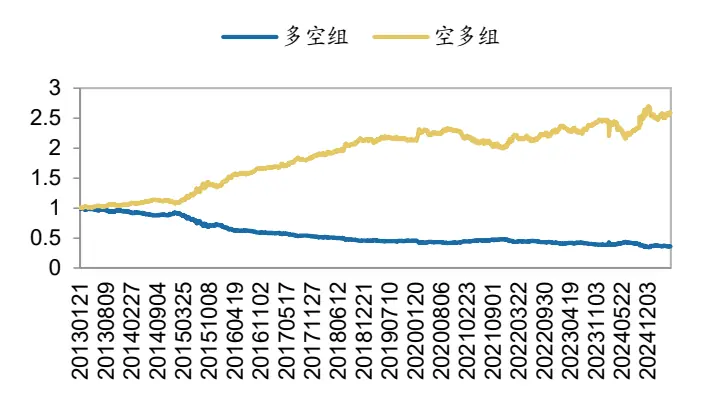
数据来源：，Wind，广发证券发展研究中心

筛选股票池，只保留中证1000成分股后，总体特征和全市场股票的特征基本一致，多空组合（空头组-多头组）在回测区间内能实现约10.51%的年化收益。而在沪深300成分股中，多空组合的区分度相对不够突出，说明该策略相对适用于中小盘股票。

图16：300成分股_滞后组_多空净值表现一
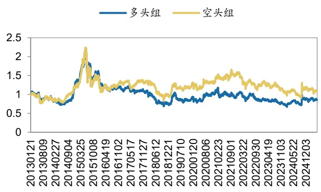
数据来源：Wind，广发证券发展研究中心

图 17：300成分股_滞后组_多空净值表现二
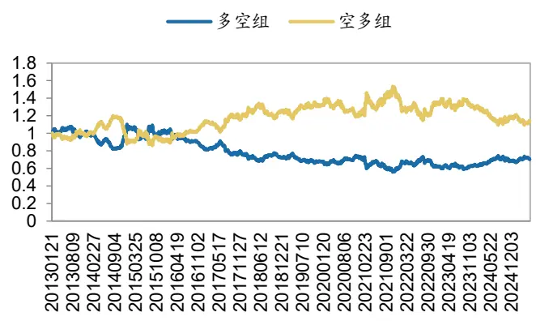
数据来源：，Wind，广发证券发展研究中心

图18：300成分股_滞后组_多空净值表现一（日间）
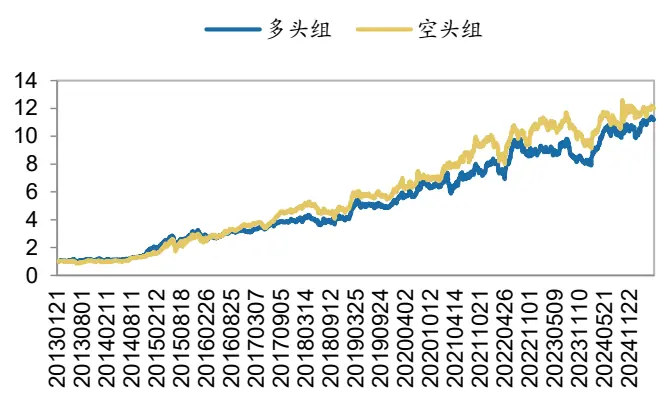
数据来源：Wind，广发证券发展研究中心

图 19：300成分股_滞后组_多空净值表现二（日间）
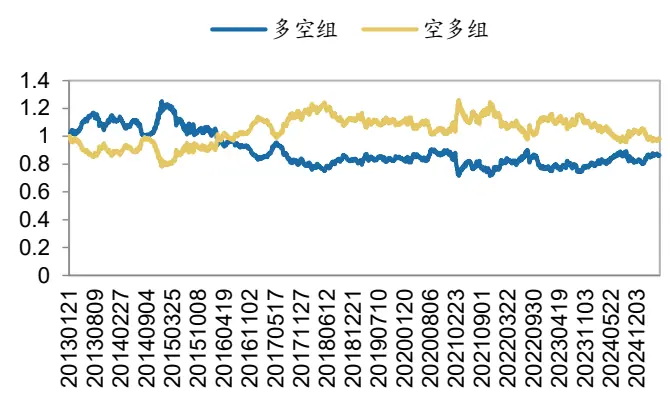
数据来源：，Wind，广发证券发展研究中心

图20：1000成分股_滞后组_多空净值表现一
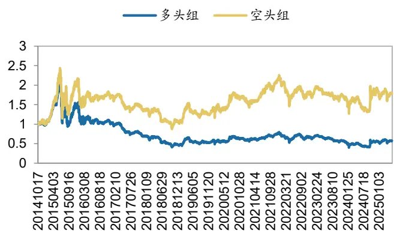
数据来源：Wind，广发证券发展研究中心

图 21：1000成分股_滞后组_多空净值表现二
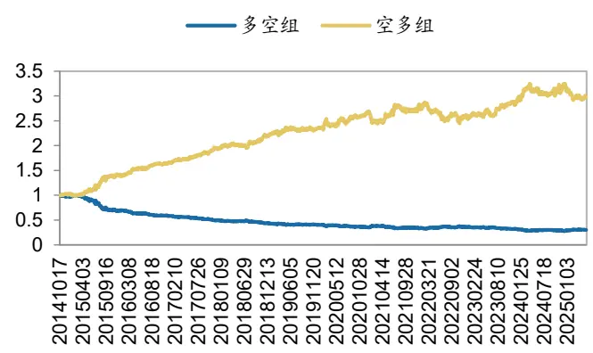
数据来源：，Wind，广发证券发展研究中心

图22：1000成分股_滞后组_多空净值表现一（日间）
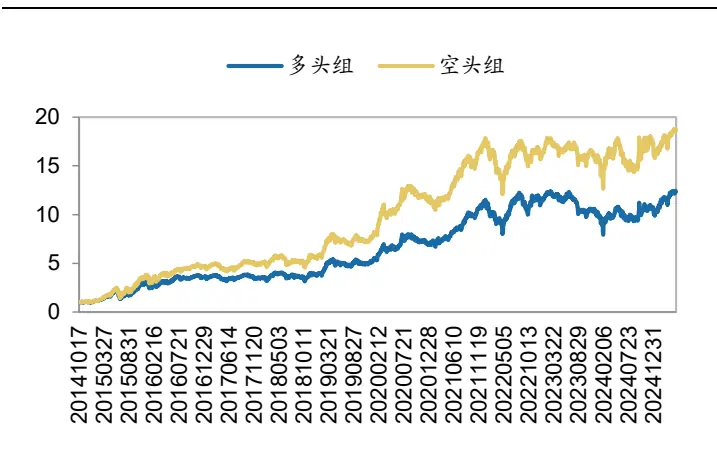
数据来源：Wind，广发证券发展研究中心

图 23：1000成分股_滞后组_多空净值表现二（日间）
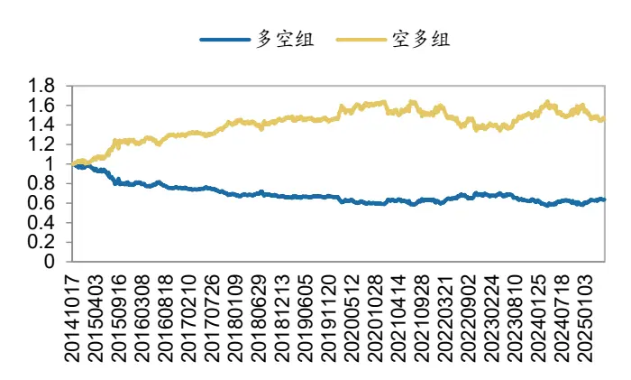
数据来源：，Wind，广发证券发展研究中心

## 四、因子构建研究

## （一）数据说明

前一章的研究，采取的是日度调仓的方案，实际投资场景中可能更偏好采取周频或者月频的方案，进一步测算相对月度和周度换仓频率下的组合表现，即上述研究同样可以作为选股因子应用于投资组合中。过往研究，我们从行业、产业链、财务基本面等角度出发刻画相应特征构建选股因子，本篇报告进一步基于隔夜相关信息，构建选股因子，观察隔夜信息在因子端的效果。

关于因子的回测，总体采取如下的回测框架。

选股范围：全市场；

股票预处理：剔除非上市、摘牌、ST/*ST、涨跌停板、上市未满1年股票；

因子预处理：MAD去极值、Z-Score标准化；

分档方式：根据当期股票的因子值，从小到大分为十档 ；

调仓周期：滚动每月/周的最后一个交易日的次日均价；

交易费用：千分之三（卖出时收取）。

## （二）因子构建及组合回测

参照上一章的思路，构建因子，同时引入领先群组作为选股池（滞后组作为信号）以作对比。测算结果显示,无论是多头组还是多空组的表现，在月频和周频换仓维度下，均没有明显的区分度特征。

表1：隔夜相关性因子基本信息

| 因子名称 | 是否筛选股票 | 信号来源 | 待选股票池 | 相关性类型 |
| --- | --- | --- | --- | --- |
| factor_lead | 是 | 领先群组 | 滞后群组 | 隔夜日间 |
| factor_lag | 是 | 滞后群组 | 领先群组 | 隔夜日间 |

数据来源：Wind，广发证券发展研究中心

表2：隔夜相关性因子回测绩效信息

| 因子名 | 换仓频率 | RANK_IC | ICIR | IC 胜率 | 多空年化 | 多头年化 |
| --- | --- | --- | --- | --- | --- | --- |
| factor_lead | 月度 | 0.29% | 0.03 | 49.2% | -1.5% | 1.4% |
| factor_lead | 周度 | 1.30% | 0.13 | 56.5% | 9.5% | 3.0% |
| factor_lag | 月度 | 0.13% | 0.01 | 49.2% | -2.7% | 3.5% |
| factor_lag | 周度 | 0.54% | 0.05 | 54.2% | 2.9% | -2.7% |

数据来源：Wind，广发证券发展研究中心

进一步尝试对因子进行改进调整。

一方面，过往的因子方向信号，仅基于1个交易日的涨跌幅，调整为基于滚动5个交易日、21个交易日，即基于过去1个月或者1周的涨跌幅确认信号的多空方向。

另一方面，参考过往研究成果，基于相关性靠前的50只股票作因子构建，并引入常规相关性因子，观察收益差异特征。

表3：隔夜相关性因子基本信息_调整

| 因子名称 | 是否筛选股票 | 信号来源 | 待选股票池 | 相关性类型 | 是否调整方向 |
| --- | --- | --- | --- | --- | --- |
| factor_top50_lead_signal_5 | 是 | 领先群组 | 滞后群组 | 隔夜日间 | 是 |
| factor_top50_lead_signal_21 | 是 | 领先群组 | 滞后群组 | 隔夜日间 | 是 |
| factor_top50_allday_lead_signal_5 | 是 | 领先群组 | 滞后群组 | 全天 | 是 |
| factor_top50_allday_lead_signal_21 | 是 | 领先群组 | 滞后群组 | 全天 | 是 |

数据来源：Wind，广发证券发展研究中心

测算结果显示，基于滚动5个交易日、21个交易日调整因子方向后，未出现明显变化。相对而言，将相关性从日间隔夜相关性调整为普通相关性后，因子IC提升明显，说明隔夜相关性对于股票在周频月频的预测效果不够理想，常规的日度涨跌幅相关性更加适用。

表4：隔夜相关性因子回测绩效信息_调整

| 因子名 | 换仓频率 | RANK_IC | ICIR | IC 胜率 | 多空年化 | 多头年化 |
| --- | --- | --- | --- | --- | --- | --- |
| factor_top50_lead_signal_5 | 月度 | -0.29% | -0.03 | 49.2% | -1.5% | 1.4% |
| factor_top50_lead_signal_5 | 周度 | -1.30% | -0.13 | 56.5% | 9.6% | 3.0% |
| factor_top50_lead_signal_21 | 月度 | -0.29% | -0.03 | 49.2% | -1.5% | 1.4% |
| factor_top50_lead_signal_21 | 周度 | -1.30% | -0.13 | 56.5% | 9.6% | 3.0% |
| factor_top50_allday_lead_signal_5 | 月度 | -8.80% | -0.75 | 75.4% | 31.9% | 16.6% |
| factor_top50_allday_lead_signal_5 | 周度 | -6.09% | -0.53 | 71.0% | 47.1% | 16.1% |
| factor_top50_allday_lead_signal_21 | 月度 | -8.80% | -0.75 | 75.4% | 31.9% | 16.6% |
| factor_top50_allday_lead_signal_21 | 周度 | -6.09% | -0.53 | 71.0% | 47.1% | 16.1% |

数据来源：Wind，广发证券发展研究中心

在上述测算结果的基础之上，进一步衍生至全市场股票维度，检验相关因子的选股效果。

1.基于隔夜日间相关性，不区分领先和滞后群组，以所有其他股票的隔夜收益和该股票的日间收益相关性均值作为因子，分别尝试回溯21个交易日和60个交易日。

2.基于隔夜日间相关性，不区分领先和滞后群组，筛选相关性最高的前50只股票、后50只股票的隔夜收益和该股票的日间收益相关性均值作为因子，以及将两者相减作为因子。

3. 基于隔夜日间相关性，不区分领先和滞后群组，基于相关性绝对值，重复“2”中的思路。

表5：隔夜相关性因子基本信息_调整2

| 因子名称 | 是否筛选股票 | 信号来源 | 待选股票池 | 相关性类型 | 是否调整方向 |
| --- | --- | --- | --- | --- | --- |
| corr_lag_21 | 否 | 所有股票 | 所有股票 | 隔夜日间 | 否 |
| corr_lag_60 | 否 | 所有股票 | 所有股票 | 隔夜日间 | 否 |
| factor_top50 | 否 | 前50 只 | 所有股票 | 隔夜日间 | 否 |
| factor_bottom50 | 否 | 后50只 | 所有股票 | 隔夜日间 | 否 |
| factor_net | 否 | 前50 只-后 50 只 | 所有股票 | 隔夜日间 | 否 |
| factor_top50_abs | 否 | 前50只 | 所有股票 | 隔夜日间绝对值 | 否 |
| factor_bottom50_abs | 否 | 后50只 | 所有股票 | 隔夜日间绝对值 | 否 |
| factor_net_abs | 否 | 前 50 只-后 50 只 | 所有股票 | 隔夜日间绝对值 | 否 |

数据来源：Wind，广发证券发展研究中心

测算结果显示，调整为全市场股票池后，隔夜相关性有边际提升，如corr_lag_21因子和corr_lag_60因子在周度的多空收益等方面提升较明显，但总体显著性低于常规相关性因子的计算结果。

表6：隔夜相关性因子回测绩效信息_调整2

| 因子名 | 换仓频率 | RANK_IC | ICIR | IC 胜率 | 多空年化 | 多头年化 |
| --- | --- | --- | --- | --- | --- | --- |
| corr_lag_21 | 月度 | 1.29% | 0.11 | 55.4% | 2.8% | 4.5% |
| corr_lag_21 | 周度 | 2.35% | 0.18 | 58.8% | 12.6% | 5.8% |
| corr_lag_60 | 月度 | 2.68% | 0.21 | 60.0% | 9.4% | 8.9% |
| corr_lag_60 | 周度 | 2.15% | 0.15 | 60.3% | 14.1% | 10.2% |
| factor_top50 | 月度 | 1.09% | 0.10 | 52.3% | 0.8% | 4.2% |
| factor_top50 | 周度 | 1.61% | 0.14 | 56.1% | 9.7% | 3.4% |
| factor_bottom50 | 月度 | 0.94% | 0.11 | 50.8% | 3.1% | 4.5% |
| factor_bottom50 | 周度 | 1.12% | 0.11 | 51.9% | 7.9% | 2.9% |
| factor_net | 月度 | 0.08% | 0.01 | 56.9% | -1.1% | 3.7% |
| factor_net | 周度 | 0.61% | 0.08 | 48.1% | 1.9% | -0.7% |
| factor_top50_abs | 月度 | 1.13% | 0.10 | 47.7% | 3.4% | 4.9% |
| factor_top50_abs | 周度 | 1.64% | 0.13 | 55.3% | 7.8% | 4.0% |
| factor_bottom50 | 月度 | 0.94% | 0.11 | 50.8% | 3.1% | 4.5% |
| factor_bottom50 | 周度 | 1.12% | 0.11 | 51.9% | 7.9% | 2.9% |
| factor_net50_abs | 月度 | 1.12% | 0.10 | 47.7% | 3.1% | 4.7% |
| factor_net50_abs | 周度 | 1.64% | 0.13 | 55.3% | 7.8% | 4.1% |

数据来源：Wind，广发证券发展研究中心

进一步测算常规相关性的因子效果。

一方面，参考前述的方案，基于常规相关性，不区分领先和滞后群组，筛选相关性最高的前50只股票、后50只股票的相关性均值作为因子，以及将两者相减作为因子。

另一方面，筛选隔夜收益和该股票的日间收益相关性最高的前50只股票、后50只股票的常规相关性均值作为因子，即将两者进行结合。

表7：隔夜相关性因子基本信息_调整3

| 因子名称 | 是否筛选股票 | 信号来源 | 待选股票池 | 相关性类型 |
| --- | --- | --- | --- | --- |
| factor_top50_allday | 否 | 前50 只 | 所有股票 | 全天 |
| factor_bottom50_allday | 否 | 后50只 | 所有股票 | 全天 |
| factor_net_allday | 否 | 前 50 只-后 50 只 | 所有股票 | 全天 |
| factor_top50_corr_by_lag | 否 | 前 50 只（隔夜日间相关性） | 所有股票 | 全天 |
| factor_small50_corr_by_lag | 否 | 后 50只（隔夜日间相关性） | 所有股票 | 全天 |

数据来源：Wind，广发证券发展研究中心

测算结果显示，常规相关性在周度和月度换仓频率下的区分度相对明显，其中factor_top50_allday 的月度RANK_IC 为8.11%，多头 年化收益为18.3%，周度RANK_IC为6.57%，多头年化收益为22.4%。

另外，基于领先滞后关系筛选相关股票群组，领先滞后相关性数值最小的50只股票，基于常规性构建因子，即factor_small50_corr_by_lag，仍旧具备一定的预测效果。

表8：隔夜相关性因子回测绩效信息_调整3

| 因子名 | 换仓频率 | RANK_IC | ICIR | IC 胜率 | 多空年化 | 多头年化 |
| --- | --- | --- | --- | --- | --- | --- |
| factor_top50_allday | 月度 | 8.11% | 0.67 | 75.4% | 27.6% | 18.3% |
| factor_top50_allday | 周度 | 6.57% | 0.53 | 73.3% | 50.0% | 22.4% |
| factor_bottom50_allday | 月度 | 4.45% | 0.47 | 73.8% | 14.7% | 8.5% |
| factor_bottom50_allday | 周度 | 2.54% | 0.28 | 66.0% | 13.4% | 3.2% |
| factor_net_allday | 月度 | 5.20% | 0.42 | 67.7% | 13.4% | 10.3% |
| factor_net_allday | 周度 | 4.73% | 0.42 | 67.6% | 32.1% | 15.3% |
| factor_top50_corr_by_lag | 月度 | 6.65% | 0.60 | 67.7% | 23.2% | 14.1% |
| factor_top50_corr_by_lag | 周度 | 5.19% | 0.45 | 68.3% | 33.4% | 11.2% |
| factor_small50_corr_by_lag | 月度 | 5.65% | 0.67 | 69.2% | 19.8% | 12.0% |
| factor_small50_corr_by_lag | 周度 | 4.27% | 0.43 | 66.0% | 28.4% | 10.1% |

数据来源：Wind，广发证券发展研究中心

## （三）相关性检验

进一步测算相对显著因子的内部相关性情况。

测算显示，隔夜日间和常规相关性因子的相关程度相对较低。常规相关性因子方面，内部总体相关程度高于和隔夜日间数据计算的因子的相关程度，而基于领先隔夜日间数据筛选股票群组，和直接基于常规数据计算股票群组结果来看，因子值内部相关性不高于60%，说明能带来边际的增量。

表9：隔夜相关性因子相关性分析

|  | corr_lag_21 | corr_lag_60 | factor_top50_allday | factor_bottom50_allday | factor_net_allday | factor_top50_corr_by_lag | factor_small50_corr_by_lag |
| --- | --- | --- | --- | --- | --- | --- | --- |
| corr_lag_21 | 100.0% | 55.4% | 18.7% | 16.5% | 2.1% | 34.5% | -16.3% |
| corr_lag_60 | 55.4% | 100.0% | 10.5% | 9.7% | 0.6% | 21.3% | -8.9% |
| factor_top50_allday | 18.7% | 10.5% | 100.0% | 58.1% | 44.2% | 83.0% | 64.0% |
| factor_bottom50_allday | 16.5% | 9.7% | 58.1% | 100.0% | -47.3% | 67.9% | 69.6% |
| factor_net_allday | 2.1% | 0.6% | 44.2% | -47.3% | 100.0% | 14.8% | -7.4% |
| factor_top50_corr_by_lag | 34.5% | 21.3% | 83.0% | 67.9% | 14.8% | 100.0% | 55.6% |
| factor_small50_corr_by_lag | -16.3% | -8.9% | 64.0% | 69.6% | -7.4% | 55.6% | 100.0% |

数据来源：Wind，广发证券发展研究中心

## （四）部分因子信息详情

将相关性较低的factor_small50_corr_by_lag和factor_top50_allday等权加权，进一步观察因子的具体表现。corr_combined1的月度RANK_IC为8.13%，多头年化收益为18.2%，周度RANK_IC为6.59%，多头年化收益为22.1%。

表10：隔夜相关性因子回测绩效信息_调整4

| 因子名 | 换仓频率 | RANK_IC | ICIR | IC 胜率 | 多空年化 | 多头年化 |
| --- | --- | --- | --- | --- | --- | --- |
| corr_combined1 | 月度 | 8.13% | 0.68 | 75.4% | 27.6% | 18.2% |
| corr_combined1 | 周度 | 6.59% | 0.53 | 72.9% | 49.9% | 22.1% |

数据来源：Wind，广发证券发展研究中心

## 1. 月度换仓

图24：因子IC值信息
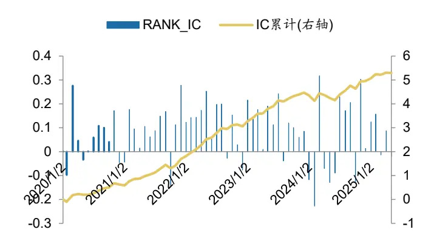
数据来源：Wind，广发证券发展研究中心

图 25：因子分组平均收益统计
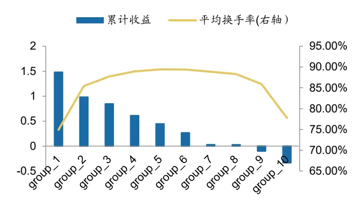
数据来源： Wind，广发证券发展研究中心

图26：因子多头空头累计净值
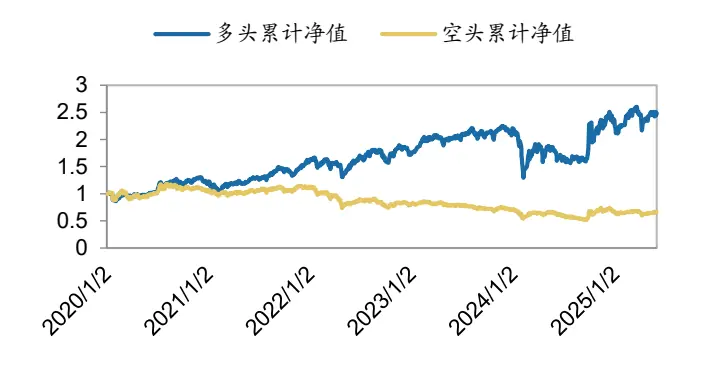
数据来源：Wind，广发证券发展研究中心

图 27：因子多空累计净值
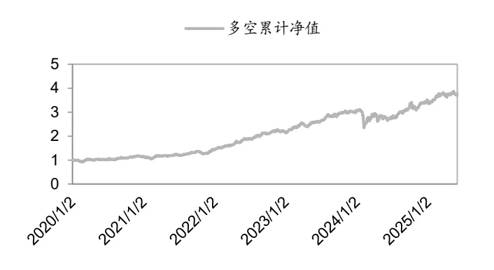
数据来源： Wind，广发证券发展研究中心

表11：因子分年度绩效表现

|  | 年化收益率 | 年化波动率 | 夏普比 | 最大回撤 | 指数收益 | 超额收益 |
| --- | --- | --- | --- | --- | --- | --- |
| 2020 | 22.3% | 25.1% | 0.89 | 15.3% | 23.0% | -0.6% |
| 2021 | 33.4% | 21.6% | 1.54 | 16.5% | 6.2% | 27.2% |
| 2022 | 6.7% | 28.9% | 0.23 | 21.6% | -20.3% | 27.0% |
| 2023 | 26.8% | 13.1% | 2.04 | 9.8% | -7.0% | 33.9% |
| 2024 | 1.7% | 51.4% | 0.03 | 41.5% | 7.4% | -5.8% |

数据来源： Wind，广发证券发展研究中心

## 2. 周度换仓

图28：因子IC值信息
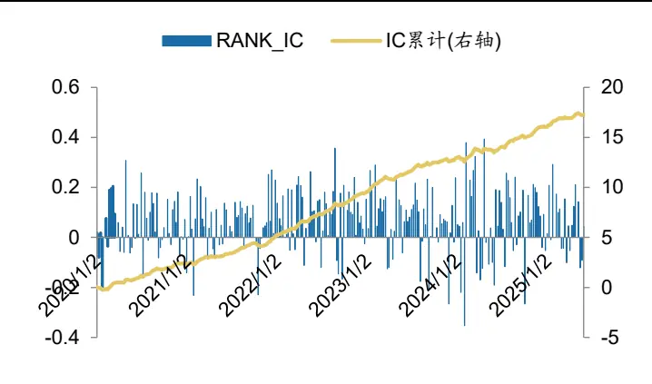
数据来源：Wind，广发证券发展研究中心

图 29：因子分组平均收益统计
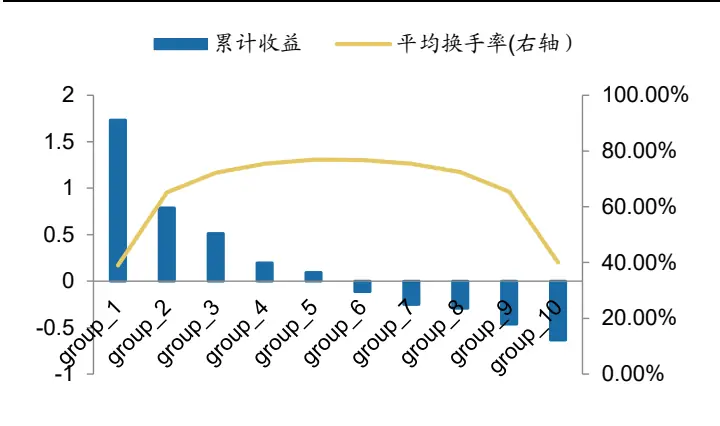
数据来源：Wind，广发证券发展研究中心

图30：因子多头空头累计净值
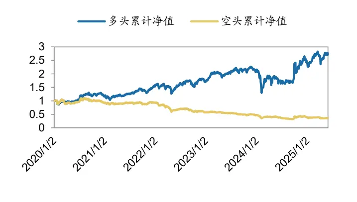
数据来源：Wind，广发证券发展研究中心

图 31：因子多空累计净值
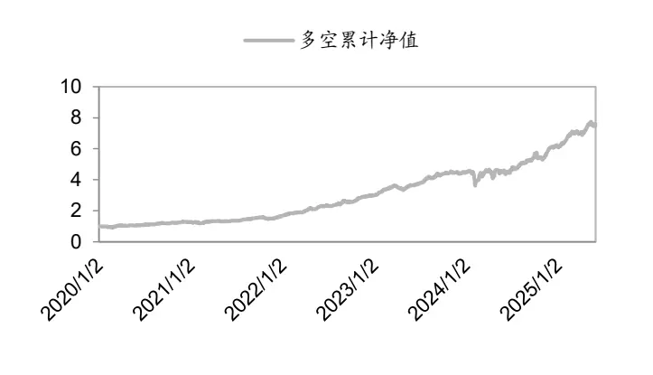
数据来源：Wind，广发证券发展研究中心

表12：因子分年度绩效表现

|  | 年化收益率 | 年化波动率 | 夏普比 | 最大回撤 | 指数收益 | 超额收益 |
| --- | --- | --- | --- | --- | --- | --- |
| 2020 | 17.7% | 27.4% | 0.70 | 15.4% | 19.3% | -1.6% |
| 2021 | 35.3% | 20.6% | 1.83 | 14.3% | 9.4% | 25.9% |
| 2022 | 7.0% | 25.6% | 0.30 | 22.6% | -20.4% | 27.4% |
| 2023 | 21.5% | 17.5% | 1.35 | 10.1% | -9.2% | 30.7% |
| 2024 | 17.3% | 60.3% | 0.31 | 40.2% | 12.6% | 4.6% |

数据来源： Wind，广发证券发展研究中心

## 3. 相关性分析

与风格因子的相关性方面，相关性因子与残差波动等风格等风格呈现一定相关性。

表13：因子与风格因子的相关性分析

|  | 动量 | 市值 | 成长 | 杠杆 | 残差波动 | 流动性 | 盈利 | 贝塔 | 账面市值比 | 非线性市值 |
| --- | --- | --- | --- | --- | --- | --- | --- | --- | --- | --- |
| corr_combine | -24.1% | -16.7% | -2.9% | -2.6% | -42.2% | -12.1% | 4.2% | 27.0% | 22.7% | -0.7% |
| factor_top50_allday | -24.1% | -16.6% | -2.8% | -2.6% | -42.1% | -12.0% | 4.2% | 27.0% | 22.7% | -0.7% |
| factor_bottom50 | -11.6% | -10.7% | -2.3% | -3.8% | -27.6% | -6.5% | 0.6% | 20.7% | 9.3% | 3.9% |
| factor_net_allday | -15.9% | -7.3% | -0.3% | 0.0% | -23.4% | -7.3% | 5.3% | 13.3% | 17.1% | -3.4% |
| factor_top50_corr_by_lag | -19.3% | -21.0% | -3.8% | -6.2% | -35.6% | -11.5% | 0.1% | 25.3% | 15.3% | 2.2% |
| factor_small50_corr_by_lag | -14.1% | -14.0% | -2.7% | -4.1% | -29.8% | -6.9% | 0.2% | 19.8% | 11.6% | 2.0% |

数据来源：通联数据，Wind，广发证券发展研究中心

## 五、风险提示

本专题报告所述模型用量化方法通过历史数据统计、建模和测算完成，所得结论与规律在市场政策、环境变化时可能存在失效风险。

本专题策略模型在市场结构及交易行为的改变时有可能存在策略失效风险。

因量化模型不同，本报告提出的观点可能与其他量化模型结论存在差异。

## 六、附录

参考 Barra CNE5 因子算法计算整理。

表 14：风格因子含义

| 风格因子 | 描述因子 | 算法解析 | 权重 |
| --- | --- | --- | --- |
| 市值 | 规模 | 对数总市值。 | 100% |
| 贝塔 | 贝塔 | 过去252个交易日的股票超额收益率对市场指数超额收益率进行半衰指数加权回归的回归系数，半衰期为63个交易日。 | 100% |
| 动量 | 相对强弱 | 滞后21个交易日的过去504个交易日对数超额收益率的指数加权移动平均，半衰期为126个交易日。 | 100% |
| 残差波动 | 日标准差 | 过去252个交易日的股票超额收益率的指数加权移动标准差，半衰期为42个交易日。 | 74% |
|  | 累积收益范围 | 过去12个月累计超额收益率的离差。 | 16% |
|  | 历史 sigma | 计算Beta因子时回归残差的波动率。 | 10% |
| 非线性市值 | 中市值 | 市值因子经过标准化后，再取立方。 | 100% |
| 账面市值比 | 账面市值比 | 最近报告期普通股账面价值与市值之比。 | 100% |
| 流动性 | 月换手率 | 最近1个月（21个交易日）换手率的对数。 | 35% |
|  | 季换手率 | 最近3个月换手率的对数。 | 35% |

识别风险，发现价值

|  | 年换手率 | 最近12个月换手率的对数。 | 30% |
| --- | --- | --- | --- |
| 盈利 | 市现率倒数 | 过去12个月现金流与市值之比，即最近12个月市现率的倒数。 | 21% |
|  | 市盈率倒数 | 过去12个月净利润与市值之比，即最近12个月市盈率的倒数。 | 79% |
| 成长 | 长期净利润复合增长率 | 过去3 净利润复合增长率。 | 18% |
|  | 短净利润复合增长率 | 过去1年净利润复合增长率。 | 11% |
|  | 每股收益增长率 | 过去5年盈利增长率（回归算法）。 | 24% |
|  | 每股营业收入增长率 | 过去5年营业收入增长率（回归算法）。 | 47% |
| 杠杆 | 市场杠杆 | mlev=(me+ld)/me，mlev是市场杠杆，me是普通股市值，Id是长期负债账面价值。 | 38% |
|  | 资产负债比 | dtoa=td/ta，dtoa是资产负债比，td是总负债账面价值，ta是总资产账面价值。 | 35% |
|  | 账面杠杆 | blev=(be+ld)/be，blev是账面杠杆，be是普通股账面价值，Id是长期负债账面价值。 | 27% |

数据来源：广发证券发展研究中

## [Table_ResearchTeam] 广发金融工程研究小组

安 宁 宁 ：首席分析师，暨南大学硕士，从业 14 年，2011 年进入广发证券发展研究中心。

陈 原 文 ：联席首席分析师，中山大学硕士，2015 年进入广发证券发展研究中心。

张 超 ：资深分析师，中山大学硕士，2012 年进入广发证券发展研究中心。

李 豪 ：资深分析师，上海交通大学硕士，2016 年进入广发证券发展研究中心。

周 飞 鹏 ：资深分析师，伯明翰大学硕士，2021 年加入广发证券发展研究中心。

王 小 康 ：资深分析师，波士顿大学硕士，2025 年加入广发证券。

张 钰 东 ：资深分析师，中山大学硕士，2020 年进入广发证券发展研究中心。

林 涛 ：高级研究员，中山大学硕士，2024 年进入广发证券发展研究中心。

## [Table_IndustryInvestDescription] 广发证券—行业投资评级说明

买入： 预期未来 12 个月内，股价表现强于大盘 10%以上。

持有： 预期未来12个月内，股价相对大盘的变动幅度介于-10%～+10%。

卖出： 预期未来12个月内，股价表现弱于大盘10%以上。出

## [Table_CompanyInvestDescription] 广发证券—公司投资评级说明

买入： 预期未来12个月内，股价表现强于大盘15%以上。

增持： 预期未来12个月内，股价表现强于大盘5%-15%。

持有： 预期未来12个月内，股价相对大盘的变动幅度介于-5%～+5%。

卖出： 预期未来 12 个月内，股价表现弱于大盘 5%以上。

## [Table_Address] 联系我们

|  | 广州市 | 深圳市 | 北京市 | 上海市 | 香港 |
| --- | --- | --- | --- | --- | --- |
| 地址 | 广州市天河区马场路 | 深圳市福田区益田路 | 北京市西城区月坛北 | 上海市浦东新区南泉 | 香港湾仔骆克道 81 |
|  | 26号广发证券大厦 | 6001号太平金融大 | 街2号月坛大厦18 | 北路429号泰康保险 | 号广发大厦 27 楼 |
|  | 47楼 | 厦31层 | 层 | 大厦37楼 |  |
| 邮政编码 客服邮箱 | 510627 gfzqyf@gf.com.cn | 518026 | 100045 | 200120 |  |

## [Table_LegalDisclaimer] 法律主体声明

本报告由广发证券股份有限公司或其关联机构制作，广发证券股份有限公司及其关联机构以下统称为“广发证券”。本报告的分销依据不为 分同国家、地区的法律、法规和监管要求由广发证券于该国家或地区的具有相关合法合规经营资质的子公司/经营机构完成。

广发证券股份有限公司具备中国证监会批复的证券投资咨询业务资格，接受中国证监会监管，负责本报告于中国（港澳台地区除外）的分销。

广发证券（香港）经纪有限公司具备香港证监会批复的就证券提供意见（4 号牌照）的牌照，接受香港证监会监管，负责本报告于中国香港地区的分销。

本报告署名研究人员所持中国证券业协会注册分析师资质信息和香港证监会批复的牌照信息已于署名研究人员姓名处披露。署名研究人

## [Table_Important重要声明

广发证券股份有限公司及其关联机构可能与本报告中提及的公司寻求或正在建立业务关系，因此，投资者应当考虑广发证券股份有限公司及其关联机构因可能存在的潜在利益冲突而对本报告的独立性产生影响。投资者不应仅依据本报告内容作出任何投资决策。投资者应自主容 任何 决策 自作出投资决策并自行承担投资风险，任何形式的分享证券投资收益或者分担证券投资损失的书面或者口头承诺均为无效。并 行承担 风险 形式 收 损失 书面 口头 均 无

本报告署名研究人员、联系人（以下均简称“研究人员”）针对本报告中相关公司或证券的研究分析内容，在此声明：（1）本报告的全部分析结论、研究观点均精确反映研究人员于本报告发出当日的关于相关公司或证券的所有个人观点，并不代表广发证券的立场；（2）研究人员的部分或全部的报酬无论在过去、现在还是将来均不会与本报告所述特定分析结论、研究观点具有直接或间接的联系。

研究人员制作本报告的报酬标准依据研究质量、客户评价、工作量等多种因素确定，其影响因素亦包括广发证券的整体经营收入，该等经营收入部分来源于广发证券的投资银行类业务。

本报告仅面向经广发证券授权使用的客户/特定合作机构发送，不对外公开发布，只有接收人才可以使用，且对于接收人而言具有保密义务。广发证券并不因相关人员通过其他途径收到或阅读本报告而视其为广发证券的客户。在特定国家或地区传播或者发布本报告可能违反当地法律，广发证券并未采取任何行动以允许于该等国家或地区传播或者分销本报告。

本报告所提及证券可能不被允许在某些国家或地区内出售。请注意，投资涉及风险，证券价格可能会波动，因此投资回报可能会有所变化，过去的业绩并不保证未来的表现。本报告的内容、观点或建议并未考虑任何个别客户的具体投资目标、财务状况和特殊需求，不应被视为对特定客户关于特定证券或金融工具的投资建议。本报告发送给某客户是基于该客户被认为有能力独立评估投资风险、独立行使投资决策并独立承担相应风险。

本报告所载资料的来源及观点的出处皆被广发证券认为可靠，但广发证券不对其准确性、完整性做出任何保证。报告内容仅供参考，报告中的信息或所表达观点不构成所涉证券买卖的出价或询价。广发证券不对因使用本报告的内容而引致的损失承担任何责任，除非法律法规有明确规定。客户不应以本报告取代其独立判断或仅根据本报告做出决策，如有需要，应先咨询专业意见。

广发证券可发出其它与本报告所载信息不一致及有不同结论的报告。本报告反映研究人员的不同观点、见解及分析方法，并不代表广发证券的立场。广发证券的销售人员、交易员或其他专业人士可能以书面或口头形式，向其客户或自营交易部门提供与本报告观点相反的市场评论或交易策略，广发证券的自营交易部门亦可能会有与本报告观点不一致，甚至相反的投资策略。报告所载资料、意见及推测仅反映研究人员于发出本报告当日的判断，可随时更改且无需另行通告。广发证券或其证券研究报告业务的相关董事、高级职员、分析师和员工可能拥有本报告所提及证券的权益。在阅读本报告时，收件人应了解相关的权益披露（若有）。

本研究报告可能包括和/或描述/呈列期货合约价格的事实历史信息（“信息”）。请注意此信息仅供用作组成我们的研究方法/分析中的部分论点/依据/证据，以支持我们对所述相关行业/公司的观点的结论。在任何情况下，它并不（明示或暗示）与香港证监会第5类受规管活动（就期货合约提供意见）有关联或构成此活动。

## [Table_InterestDisclos权益披露

(1)广发证券（香港）跟本研究报告所述公司在过去12 个月内并没有任何投资银行业务的关系。

## [Table_Copyright]版权声明

未经广发证券事先书面许可，任何机构或个人不得以任何形式翻版、复制、刊登、转载和引用，否则由此造成的一切不良后果及法律责任由私自翻版、复制、刊登、转载和引用者承担。