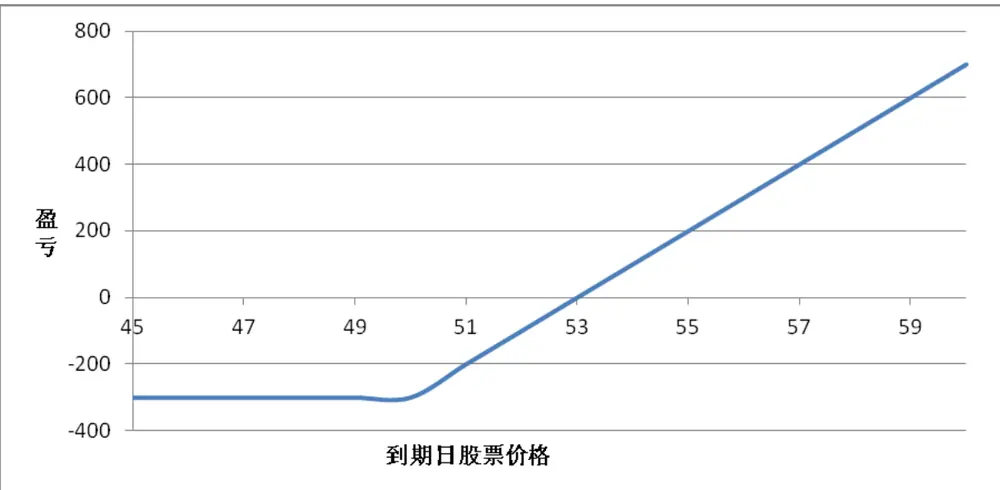
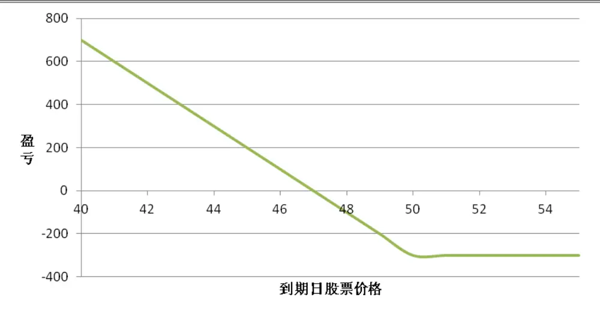
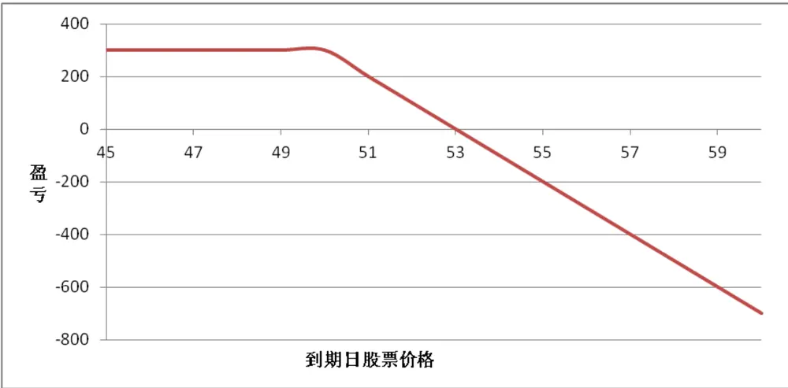
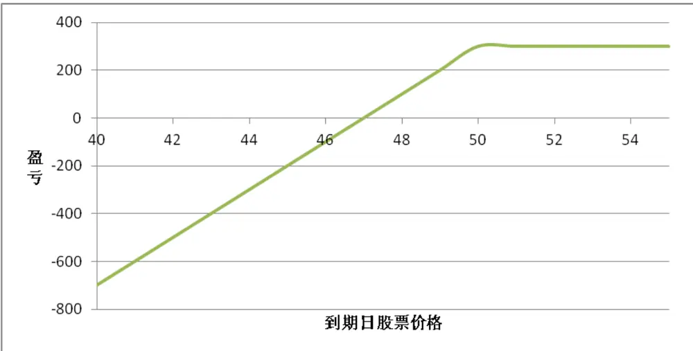
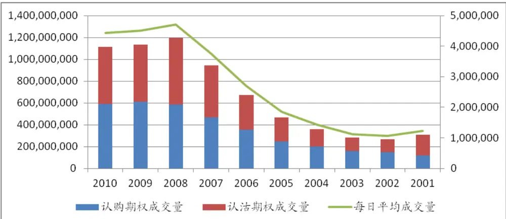
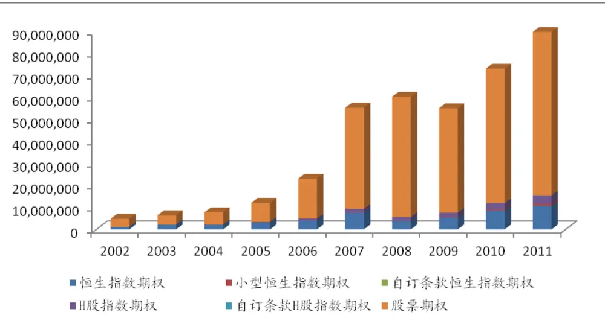

# Table_Title期权基础知识指南

# ——期权研究系列之一

李明Table_Author 分析师

罗军 首席分析师

电话：020-87555888-8687

电话：020-87555888-8655

eMail：lm8@gf.com.cn

eMail：lj33@gf.com.cn

执业编号：S0260512050004

执业编号：S0260511010004

## Table_Summ何谓期权？

期权（Option）是衍生型金融产品，它给予持有者权利在未来以协商价格对特定资产进行交易，但该持有者并无必须履行的义务。按期权的权利行使方向，可分为认购期权（ ）以及认沽期权（ ）。而按照行使履约权利期间来分类，期权也可分为美式期权以及欧式期权。期权的买卖通常都牵扯到两方，买入期权的可理解为买入方，而卖出期权的称为期权沽出方，对于认购期权买入方（无论欧式或美式），其收益来至于标的资产价格上升所带来的潜在利润，而其最大亏损为已经付出的权利金。对于认沽期权买入方，期收益来自标的资产价格下跌所带来的利润，而其最大亏损也只限于权利金。

## 美国期权成交量近况

据CBOE官网发布的统计数据来看，以2010年为例，在美国所有交易所内交易的期权合约全年总额为38亿份，比年全年总额上升 左右。其中美国芝加哥期权交易所（ ）在成交量中的占比最大，达到 ，其年的全年成交量为11亿份。以芝加哥期权交易所为例，我们可以看到近10年期权交易量呈逐年递增之势。在2001年是，当年在芝加哥交易所中交易的期权总量仅为3亿份出头。而时至2010年，全年的成交量就已经突破11亿份，比10年前翻了3倍，其成功经验值得各交易所借鉴。而美国日均超千万的成交量也证明其市场的成熟与完善，也是其他各国的学习榜样！

## 期权的特点

期权其中一个最吸引投资者的地方就是杠杆效应。而且，其杠杆效应与期货的保证金效应有所不同，它体现在期权自身定价时所具有的特性。所谓的杠杆，就是四两拨千斤，以小博大的投资方式。杠杆越大，其获利的能力就越大，但同时面临损失的风险也越高。但由于期权买入者所需要付出的仅为权利金，所以其损失有限。而只要股价往有利方向前进，其获利的空间可能是无限的。进一步来说，期权能够成为投资者的一个套期保值工具，有效帮助投资者规避现有资产的投资风险。

## 期权价值=内在价值+时间价值

期权的价值是由两部分组成：内在价值与时间价值。影响期权价值比较关键的几大因素如下：标的资产价格、行权价、存续期、波动率、利率以及红利

## 期权定价里程碑：B-S模型

早在70年代以前，已经有不少的西方学者试图找到一种权利金的定价方法，以确保期权买卖双方的利益。直到1973年，该定价难题终于得到解答。美国的费希尔•布莱克(Fischer•Black)和马龙•舒尔斯(Myron•Merton)利用随机微分方程等数学工具，建立起Black–Schole模型，该公式也成为了期权定价的里程碑。B-S公式背后的基本原理是：假设在风险中性的世界里，我们可以构建一个无风险的组合，该组合由两部分组成：期权和标的资产。在没有套利的情况下，该组合仅能获得无风险的收益。

1973年4月，美国的CBOE（芝加哥期权交易所）成立，而期权也首次在有组织的交易所内开始交易。当时虽然只是买权交易，但也标志着期权合约的标准化、期权合约的规范化。70年代中期，美洲交易所、费城股票交易所和太平洋股票交易所等相继引入期权交易，极大的促进了期权的发展。1977年，卖权交易也应运而生，从此期权市场进入了真正的发展时期。如今，在世界各地的不同交易所中都有期权交易，银行以及其他金融机构同时也进行巨额期权合约的场外交易。在不同的市场情况下，期权的杠杆特性以及风险控制能力都备受投资者的青睐。无论对于进取或保守的投资者，期权都可谓是灵活的投资工具。国内虽然还没推出期权合约，但据了解首个期权正在紧张筹备中，预计仿真交易也会相继启动。考虑到投资者对于对冲需求的日益增强，相关部门有可能加快期权推出的步伐。所以，我们有必要提早认识一下期权。本文的结构如下：第一部分介绍期权的相关基础知识，第二部分展示美国以及香港交易所内期权交易量的近况，第三部分探讨期权的特点，第四部分探讨期权价值的影响因素，第五部介绍著名的B-S期权模型以及对其原理进行浅析。

## 一、 认识期权

## （一）期权的定义

期权（Option）是衍生型金融产品，它给予持有者权利在未来以协商价格对特定资产进行交易，但该持有者并无必须履行的义务。这与期货有本质上的区别。对于参与期货合约的双方，其权利与义务是对等的，即双方都相互承担责任，也具有要求对方履约的权利。所以参与期货交易并不需要支付任何权利金（但有保证金需求）。但期权并不相同，由于双方权利不对等，所以期权购买者必须先支付期权发行者权利金以获得其权利。

## （二）期权的分类

按期权的权利行使方向，可分为认购期权（Call）以及认沽期权（Put）。

认购期权指的是投资者支付权利金买入一份认购期权合约，他等同于买入一个权利，这让期权持有者有权决定是否在指定日期，以协议价格来买入一定数量的资产，但他并不一定需要实施交易。而认沽期权则是指期权拥有者在支付权利金后，有权在指定日期，以协议价格向发行者卖出一定数量的资产。上述的指定日期通常称之为到期日，而协议价则称之为期权的执行价或行权价。

而按照行使履约权利期间来分类，期权也可分为美式期权以及欧式期权。欧式期权指的是持有者只有在到期日才能行使履约的权利，而美式期权则可以在到期日前（包含到期日）的任意交易时间行使其权利。如今大部分在交易所中交易的期权为美式期权，但欧式期权比美式期权容易分析，而且美式期权的某些特质都是由欧式期权演绎而来。

我们接下来将会以两个例子来解释认购期权和认沽期权：

假设投资者买了一个欧式认购期权，该期权的合约规定持有者以50元的行权价在一个月后的指定日期可买入100份的A股票。又假设当前A股票价格为48，而期权购买一股A股票的权利金为3元，投资者的最初投资额度为300元。由于是欧式期权，投资者仅能在到期日行权。若一个月后的到期日，股票的价格升至55元，投资者可行使权利，以每股50元买入100份的股票，并及时在市场卖出，他可立即获得5500-5000=500元的利润。扣除300元权利金成本，投资者可最终获得净利润200元（不考虑交易费用）。但上述只是股价向有利方向行走时的行权情况，若在到期日，股票价格低于50元（例如49），投资者会选择不行权，并损失掉300元的权利金。当然，股票高于行权价也有可能为投资者带来亏损。假如到期日股价为51元，高于行权价，投资者行权并卖出股票，赚得100元，但考虑前期支付的权利金，所以投资者还是面临200元的亏损。但即使如此，投资者也应该进行行权，最终不至于损失掉所有权利金。下图显示了投资者持有一份欧式认购期权以购买1股A股票在到期日的损益情况：

图 1.购买一份欧式认购期权到期日损益图

数据来源：广发证券研究发展中心

接下来是认沽期权例子。假设投资者以3元买入一个认沽欧式期权，在到期日可以以行权价50元卖出100份的A股票，当前A股票价格为49,。到了到期日，股票价格跌至45，投资者可选择行权，融券卖出100份的A股票，获得5000元，并在市场上以45元的价格买入A股票还券，扣除权利金后投资者可获利200元（不考虑融券以及交易费用）。但若到期日股票价格在47到50元之间，则意味着投资者会亏损部分权利金。如最终股票价格高于或等于50元，投资者可选择放弃行权，这样则导致所有权利金的亏损。下图展示了投资者若持有一份欧式认沽期权以卖出一股A股票在到期日的损益。

图 2.购买一份欧式认沽期权到期日损益图

数据来源：广发证券研究发展中心

当然了，上述所说的例子仅限于欧式期权。若换做美式期权，套用以上例子，若A股票股价在到期日前的任一交易日突破53元，投资者可以即时行权买入股票，并高价卖出，提前获取利润，无需等到到期日。而对于美式认沽期权，若A股价格在到期日前已经回落到47元以下，投资者也可即时行权卖空股票，然后低价买入还券，最终实现提前盈利。

## （三）期权的权利、责任以及盈亏

期权的买卖通常都牵扯到两方，买入期权的可理解为买入方，而卖出期权的称为期权沽出方。期权双方的权利以及责任并不对等，结合认购期权以及认沽期权，我们可以看到一共有四种持仓情况：

1. 认购期权的买入方：该方投资者付出权利金，获得以行权价买入标的资产的权利。

2. 认购期权的沽出方：该方投资者获取权利金，但被行权时有责任以行权价出售标的资产。

3. 认沽期权的买入方：该方投资者也需付出权利金，但可获取以行权价卖出标的资产的权利。

4. 认沽期权的沽出方：该方投资者能获取权利金，但被行权时有责任以行权价买入标的资产。

买入方以及沽出方最终的盈亏与标的资产价格表现关联性十分大。以股票为标的资产，在上一部分已经介绍过欧式认购期权和认沽期权的买入方的最终损益情况。对于认购期权买入方（无论欧式或美式），其收益来至于标的资产价格上升所带来的潜在利润，而其最大亏损为已经付出的权利金。对于认沽期权买入方，期收益来自标的资产价格下跌所带来的利润，而其最大亏损也只限于权利金。

从期权沽出方的责任来看，不难发现其损益情况与买入方刚好相反。延续上部分的例子，下图显示了投资者沽出一份欧式认购期权以购买一股A股票在到期日的损益情况：

图 3.沽出一份欧式认购期权到期日的损益情况

数据来源：广发证券研究发展中心

由上图推断，无论欧式或美式期权，认购期权的沽出方的最大收益来至于所收取的权利金，而其面临的风险则在于标的资产价格（例如股票价格）上升所带来的潜在亏损。下图显示了投资者沽出一份欧式认沽期权以卖出一股A股票在到期日的损益情况：

图 4.沽出一份欧式认沽期权到期日收益情况

数据来源：广发证券研究发展中心

无论欧式或美式，认沽期权的沽出方的最大收益也是来至于所收取的权利金，而其面临的风险是标的资产价格下跌所带来的潜在亏损。

## （四）期权的标的

在世界各地交易所中进行交易的期权，其标的资产可囊括股票、外汇、股票指数等股票期权

在美国，提供股票期权交易的交易所有芝加哥期权交易所（CBOE），费城交易所（PHLX），美国股票交易所（AMEX），太平洋交易所（Pacifex）以及国际证券交易所。所包括的股票期权有1000个以上，每一期权合约赋予投资者以行权价买或卖100股票的权利。在香港，我们可以通过港交所进行期权买卖，它如今所涵盖的股票期权数目为65个。

## 外汇期权

现在大部分的外汇期权都通过场外交易，只有小部分通过交易所交易。在美国最主要的外汇期权交易所为费城交易所。他提供澳元、英镑、加拿大元、欧元、日元等多种货币的欧式以及美式期权合约的交易。而合约价值的大小就要视乎实际币种而定。

## 股指期权

无论在场内以及场外，都有不少的股指期权合约在进行交易。在美国，最出名的股指合约是在芝加哥期权交易所交易的S&P500指数期权合约、S&P100指数期权合约、Nasdaq 100指数期权合约和道琼斯工业指数期权合约。大部分的指数期权合约为欧式期权，只有S&P100为美式期权。每一合约购买或出售的金额为特定指数价格的100倍，并且以现金结算而非实物结算。而在香港，较为出名的便是在港交所交易的恒生指数期权。

## （五）期权合约概要

由于中国还没有正式的期权合约推出，本文以在香港交易所交易的恒生指数股指期权的标准合约概要来进行展示：

表 1.香港交易所恒生指数期权合约概要

| 项目 | 合约细则 |
| --- | --- |
| 相关指数 | 恒生指数 |
| HKATS 代码 | HSI |
| 合约乘数 | 每指数点港币$50 |
| 最低价格波幅 | 一个指数点 |
| 合约月份 | 短期期权：-现月，下两个月及之后的三个季月长期期权：-之后五个六月及十二月合约月份 |
| 行使方式 | 欧式 |
| 期权金 | 以完整指数点报价 |
| 行使价 | 短期期权：-指数点 行使价分隔低于2,000点 502,000点或以上但低于8,000点 1008,000点或以上 200长期期权：-指数点 行使价分隔低于4,000点 1004,000点或以上但低于8,000点 2008,000点或以上但低于12,000点 400 |

识别风险，发现价值

|  | 12,000点或以上但低于15,000点 60015,000点或以上但低于19,000点 80019,000点或以上 1,000 |
| --- | --- |
| 交易时间 | 上午9时15分至中午12时正及下午1时正至下午4时15分(到期合约月份在合约到期日收市时间为下午4时正) |
| 合约到期日 | 该月最后第二个营业日 |
| 最后结算价 | 在到期日当天下列时间所报指数点的平均数为依归，下调至最接近的整数指数点：(i)联交所持续交易时段开始后的五(5)分钟起直至持续交易时段完结前的五(5)分钟止期间每隔五(5)分钟所报的指数点，与(ii)联交所收市时。 |
| 交易费用及征费 | 交易所费用 港币10.00证监会征费 港币0.60佣金 商议 |

数据来源：广发证券研究发展中心，香港交易所网站

从合约月份来看，恒生指数期权可以分为短期期权与长期权，短期期权一共有6个月份的期权合约同时挂牌上市，而长期期权则有5个月份的期权合约同时挂牌上市。新月份合约挂牌日为当月合约到期日的下一个交易日。合约到期月份的设计主要考虑到合约的流动性以及投资者的需求。据了解，像美国的股指期权的交割月份设计也有长短期期权，而且合约月份的选择比香港股指期权更多。

合约概要中的行权价间距指的是不同行权价之间的差价，间距小，则挂牌的序列较多。而挂牌序列指的是到期日与标的资产相同，但行权价不同的一系列认购和认沽期权。新月份合约初次挂牌时，合约序列是以前一个交易日的收盘价为中心，向上或向下加减行权价间距来生成新的合约组。

所以，对于给定的时间，给定的资产，可能有许多不同的合约在同时交易。所有类型相同的期权（认购或认沽期权）都可划分为一个期权类（Option Class）。以恒生指数期权为例，截止到12年6月4日，结合不同月份合约以及每个月份的合约序列，在港交所同时交易的短期认购期权和认沽期权分别有388个合约，而同时交易的长期认购（认沽）期权则有92个合约。

最后，我们来了解一下行权方式，在香港，股票期权都是美式的行权方式，期权持有人可于任何营业日（包括最后交易日）的下午6时45 分之前随时行使。但其指数期权则一般使用欧式期权行权方式，这与美国是一致的。由于我国此前并无期权产品，在推出期权交易的初期，更适合采用相对简单的欧式行权方式。

## （六）价内、价外和平价的定义

在一般的期权术语中，不同行权价的期权可分为价内（in the money）、价外（out ofthe money）或平价（at the money）。对于认购期权，当标的资产的当前价格高于行权价，我们则认为是价内期权。而当标的资产当前价格低于行权价时，该期权变为价外。平价是指当前资产价格等于行权价。对于认沽期权，情况则相反，当标的资产价格低于行权价是，我们称之为价内。但如资产价格高于行权价，认沽期权变为价外。认沽期权平价也是指当前资产价格等于行权价。所以，无论是认购或认沽，只有价内期权才值得履约。

## 二、 香港和美国期权市场状况

## （一）场内vs场外交易

期权的交易一般分为场内和场外。金融机构和大公司双方直接进行交易一般称为场外交易，而在交易所内进行的则称之为场内交易。而比起场外交易，在交易所内交易期权有以下优点：交易所内期权由于是标准合约，允许买多或卖空，灵活配合投资者不同的投资需求。交易所能提供不同行权价和到期月份的期权供投资者选择。交易所利用电子交易系统进行期权交易，这可以为投资者提供一个公平、高效以及透明的交易平台。最后，投资者在完善监管的市场内交易能获得更高的保障。近年来，交易所内的期权交易量日趋上升，以下我们将以美国和香港两个市场的期权成交量情况进行举例。

## （二）美国期权成交量近况

据CBOE官网发布的统计数据来看，以2010年为例，在美国所有交易所内交易的期权合约全年总额为38亿份，比2009年全年总额上升8%左右。其中美国芝加哥期权交易所（CBOE）在成交量中的占比最大，达到29%，其2010年的全年成交量为11亿份。占比排名第二的为费城交易所（PHLX），其期权合约的成交量为8.4亿份，占比22%。美国国际证券交易所占比排行第三，2010年有7.4亿份期权合约在此交易所交易。其余交易量较大的交易所还分别有美国证券交易所(AMEX)和纽交所群岛交易所(NYSE Arca)，分别占比11%和12%。

图 5.芝加哥期权交易所 2001-2010年期权成交量数据

数据来源：广发证券研究发展中心，美国芝加哥期权交易所（CBOE）网站

以芝加哥期权交易所为例，我们可以看到近10年期权交易量呈逐年递增之势。在2001年是，当年在芝加哥交易所中交易的期权总量仅为3亿份出头。而时至2010年，全年的成交量就已经突波11亿份，比10年前翻了3倍。交易量的高峰出现在2008年，当年成交量接近12亿。此后，由于美国次贷危机，期权交易量有所放缓，但还是维持在较高的水平。从认购以及认沽期权的占比来看，每年认购期权的交易量要比认沽期权略为占优。但07年以及08年除外，08年次贷危机使得投资者对市场一度失去信心，做空力量占领上风，所以当年认沽期权交易量高于认购期权1千9百万份。由以上数据可知，芝加哥期权交易所经过这些年的发展，每日平均规模已经达到数百万份，其成功经验值得各交易所借鉴。而美国日均超千万的成交量也证明其市场的成熟与完善，也是其他各国的学习榜样！

## （三）香港期权成交量近况

香港交易所从1993年开始进行期权交易，它的首个期权产品为恒生指数期权。时至今天，港交所在交易的指数期权一共有5只，分别是恒生指数期权、小型恒生指数期权、自订条款恒生指数期权、H股指数期权和自定条款H股指数期权。而在交易的股票期权一共有60只。下图展示了逐年不同期权产品在港交所的交易情况：

图 6.香港交易所 2002-2011 年期权成交量数据

数据来源：广发证券研究发展中心，香港交易所网站

纵观过去10年港交所的期权交易量情况，我们看到06年以前，期权的交易还不甚活跃， 年全年所有期权加总也只有 千万份的成交量。但 年开始成交量明显有质的飞跃。07年全年成交量比06年翻了1倍有多。虽然受08年金融危机影响，09年交易量有所下滑，但10以及11年成交量重拾升势。11年全年所有期权的交易量已经接近9千万份。从比例来看，股票期权的逐年成交量还是占据主导地位，排行第二便是恒生指数期权。港交所期权交易的历史虽然不够20年，但其迅速的发展步伐依然值得中国交易所的学习。

## 三、 期权的特点

## （一）杠杆效应

期权其中一个最吸引投资者的地方就是杠杆效应。而且，其杠杆效应与期货的保证金效应有所不同，它体现在期权自身定价时所具有的特性。所谓的杠杆，就是四两拨千斤，以小博大的投资方式。以股票认购期权为例，投资者只需要付出权利金，就能把握相当于一手股票价格变动所带来的利润。而相对于一手股票的成本，权利金占比很小。杠杆比率=资产现有价格/每股权利金。杠杆越大，其获利的能力就越大，但同时面临损失的风险也越高。

## （二）有限的风险，潜力较高的收益

前面已经提到，期权买入者所需要付出的仅为权利金，而且，其最大的损失也只是该权利金。但其获利的空间可能是无限的，当一个股票价格不断上涨，其对应的认购期权的买入者的获利空间也不断增大；或当一个股票价格不断下跌，其对应的认沽期权也能为投资者带来源源不断的收益。所以投资者在有限的损失里面，理论上可获得无穷的收益。

## （三）避险功能

期权的另一个特点是能够成为投资者的一个套期保值工具，有效帮助投资者规避现有资产的投资风险。例如，某个投资者拥有一只股票的现货头寸，但他担心股票市场波动为他的投资带来下行风险。这时，他可以买入该股票对应的认沽期权来对冲市场风险。在股价下跌时，期权的获利部分会填补现货价格上的损失。若现货如期上涨，其股票已经获利匪浅，而损失的只不过是小部分的权利金。若投资者看空某只股票，在沽空该只股票的同时，也可买入认购期权来达到对冲股价上行的风险。

## 四、 决定期权价值因素

期权的价值是由两部分组成：内在价值与时间价值

## （一）期权内在价值与时间价值

内在价值指的是期权立即行使后的价值，是标的资产当前价格以及行权价之间的价差。而期权的最小价值等于0和内在价值之间的最大值。对与认购期权，其内在价值=标的资产价格-行权价，而认沽期权的内在价值=行权价-标的资产价格。而对于时间价值，则是相对较为难评价的一个部分。对于一个价内的美式期权，其买入者的最理想做法是持有期权到到期日，而不是立即执行，所以我们可以说美式期权具有时间价值。一般情况下欧式期权也具有时间价值。（但这不一定是最优选择，特殊情况在下一节做详细介绍）。而期权的总价值就相等于内在价值加时间价值。

## （二）影响期权价值的因素

凡是能影响内在价值或时间价值的因素，都是影响期权价值的因素。而其中比较关键的几大因素如下：

## 1．标的资产价格以及行权价

对于认购期权，随着标的资产价格的上升，其内在价值也会上涨，所以期权的价值也会随之提升。但若其行权价提升，则会降低期权的价值。对于认沽期权，情况则相反。标的资产价格越跌，认沽期权的价值越高。但行权价的降低则会对其产生负面效果。

## 2． 波动率

波动率是用来衡量资产价格未来走势的不确定性。对于一个股票持有者，更大的波动为他带来的是更大的盈利或更深的损失，所以波动率的增大对于股票持有者而言是把双刃剑。但对于期权持有者来说，高波动率则是他们所追求的。对于认购期权拥有者，标的价格上涨可以为他带来十分可观的利润，而价格的下跌，他也仅是面临了有限的下行风险，这是由于他最大的损失也仅是权利金而已。与此相似，当标的资产价格下降较多时，认沽期权投资者可从中获利。若标的价格上涨，他所受到的损失有限。所以波动越大，期权价格越高，而波动越小，期权的价格越低。“没有波动性的市场，期权便是多余的！”期权的价格更是无从谈起了。

## 3． 利率

利率对于期权价值的影响并不那么的直观。当利率增加时，标的资产价格的预期增长率也会随之增加，但期权持有者的未来现金流的现值将会缩水，该两种情况对认沽期权十分不利。所以利率上升，认沽期权价值下跌。而对于认购期权，前一种情况将增加它的价值，而后一情况则减少认购期权的价值。但前者的影响占主导地位，所以总体来说利率上升可增加认购期权的价值。

但不可忽视的是，上述结果是基于其他因素恒定不变的情况下，当利率上升（下降）时，标的价格有可能出现下跌（上涨），所以随之而来标的价格净效应可能改变上述结果。

## 4． 存续期

越长的存续期对于美式认购以及认沽期权来说都是好事。从期权的权利来说，假设有两个期权，他们之间的差别仅限于到期期限的长短，那么存续期较长的期权的买入者至少拥有所有短存续期期权持有者的行权机会，或者更多。这给与前者更多的获利机会。所以存续期越长，美式期权的价值越高。

对于欧式期权，存续期越长，标的价格朝期权买入者所设想方向移动的概率就越大，一般来说期权的价值也会越高。但这并不一定是全部的情况，对于股票期权而言，若同一股票的两个欧式认购期权，一个的存续期只有1个月，另外一个有2个月。假设该股票在1个半月后支付大量的红利，那么短期的认购期权就比长期的期权更优，价值也会更高。

## 5． 红利

对于股票期权，分红也是影响期权价值的重要因素之一。在除息日后，红利将会减少股票的价格，对于认购期权来说是坏消息，而对于认沽期权来讲则是利好消息。所以分红越多，认购期权价值越低，而认沽期权的价值越高。

最后，我们以下表总结一下各个因素对期权价值的影响：

表 2.影响期权价值的因素列表

| 农2.影响期权价值的因系列农 |  |  |  |  |
| --- | --- | --- | --- | --- |
| 影响因素 | 欧式认购期权 | 欧式认沽期权 | 美式认购期权 | 美式认沽期权 |
| 标的价格 | 十 | 一 | 十 | 一 |
| 行权价 | 一 | 十 | - | + |
| 存续期 | ? | ？ | + | + |
| 波动率 | 十 | 十 | + | + |
| 无风险利率 | + | 一 | + | 一 |
| 红利 | 一 | + | 一 | 十 |

数据来源：广发证券研究发展中心

## 五、 期权基础定价公式以及背后原理浅析

## （一）欧式期权定价公式

前面已经提及，权利金是期权沽方的唯一收入，它也是期权买方的最大风险损失。所以，权利金的高低牵扯到买卖方的实际利益。早在70年代以前，已经有不少的西方学者试图找到一种权利金的定价方法，以确保期权买卖双方的利益。由于权利金的与标的资产价格之间存在非线性关系，而且还受时间因素影响，所以权利金的确定问题变得十分的复杂。直到1973年，该定价难题终于得到解答。美国的费希尔〃布莱克(Fischer〃Black)和马龙〃舒尔斯(Myron〃Merton)利用随机微分方程等数学工具，建立起Black –Schole模型，也就是我们如今常用的欧式股票期权的定价公式。该公式也成为了期权定价的里程碑。下面是认购以及认沽期权的B-S定价公式：

认购期权：

$$
c=S_{0}N(d_{1})-Ke^{-rT}N(d_{2})
$$

认沽期权：

$$
p=Ke^{-rT}N(-d_2)-S_0N(-d_1)
$$

其中

$$
d_{1}=\frac{\ln(S_{0}/K)+(r+\sigma^{2}/2)T}{\sigma\sqrt{T}}
$$

$$
d_{2}=d_{1}-\sigma\sqrt{T}
$$

以下是对公式中的各项内容加以说明：

c代表的是认购期权的权利金，p则代表认沽期权权利金

$S_{0}$ 代表标的资 $\cdot 产$ 当前价格，K代表行权价

T代表了期权到期日前的剩余的有效期限，也可称为剩余存续期，通常以年为单位。例如，6个月可表示为1/2年。

r代表无风险利率，通常用国债收益率来表示

$\sigma$ 代表标的资产价格收益的波动率

$$
$N(d_{_1})_{\mathrm{\tiny{~和~}}}N(d_{_2})_{\mathrm{\tiny{~代表标准正态分布变量的累计概率分布函数。}}}$
$$

此模型在欧式期权定价上面应用广泛，投资者只需输入相应的变量，就可以依据公式算出期权的理论价值，这对于期权买卖双方都是公平，合理的（由于本文仅为介绍期权的基础知识，所以对于期权公式的数理逻辑并不进行深探）。现在，不少期权买卖代理商或交易所的网站都有给出期权权利金计算器，可以令投资者很快的计算出他们想买的期权的合理价值，省去投资者自己计算的时间。

但对于美式期权，由于可以提前行权，B-S公式并不能很好的为其定价。为此，不少学者一般会使用其他的数值方法来为美式期权定价。

## （二）期权公式背后原理浅析

尽管上述的公式看似十分的复杂，但是其基本原理并不难懂。其概念是：假设在风险中性的世界里，我们可以构建一个无风险的组合，该组合由两部分组成：期权和标的资产。在没有套利的情况下，该组合仅能获得无风险的收益。这也是B-S公式背后的基本原理。

为什么我们能构建如此一个无风险的组合，原因在于标的资产价格和期权价格都同时间受到同一因素的影响：标的价格的变动。在一个很短暂的时间内，期权的价格与标的价格走势完全一致的。所以当我们以恰当份数的标的与期权构建成一个组合，资产头寸的盈利会抵消期权头寸的盈利，因此在短时间末我们总能得到该组合确定的价值。确定价值组合理所当然只能获得无风险的收益。

以认购期权的B-S公式为例，我们可看到其价值可以分为两个部分：第一部分是SN（d），可以理解为股票部分的价值，而第二部分则是投资者需要借入的额外资金。投资者通过卖出期权，可以获得权利金，结合借回来的资金，投资者可以买入N(d)份标的资产，并试图得出与期权价值相同的资产值。所以，我们可以构建一个无风险组合：一个认购期权的空头以及N(d)份标的的多头。在非常短的时间内，该组合的收益必须是无风险收益。这便是B-S定价公式的关键所在。

## Table_AuthorSum 广发金融工程研究小组mary

罗军，首席分析师，华南理工大学理学硕士，2010年1月加盟广发证券发展研究中心。

俞文冰，CFA，首席分析师，上海财经大学统计学硕士，2012年2月加盟广发证券发展研究中心。

叶涛，CFA，资深分析师，上海交通大学管理科学与工程硕士，2012年2月加盟广发证券发展研究中心。

安宁宁，资深分析师，暨南大学数量经济学硕士，2011年7月加盟广发证券发展研究中心。

胡海涛，分析师，华南理工大学理学硕士，2010年3月加盟广发证券发展研究中心。

夏潇阳，分析师，上海交通大学金融工程硕士，2012年2月加盟广发证券发展研究中心。

蓝昭钦，分析师，中山大学理学硕士，2010年5月加盟广发证券发展研究中心。

李明，分析师，伦敦城市大学卡斯商学院计量金融硕士，2010年3月加盟广发证券发展研究中心。

史庆盛，分析师，华南理工大学金融工程硕士，2011年6月加盟广发证券发展研究中心。

汪鑫，分析师，中国科学技术大学金融工程硕士，2012年2月加盟广发证券发展研究中心。

谢琳，分析师，上海交通大学金融学博士，2011年12月加盟广发证券发展研究中心。

## Table_Report 相关研究报告

|  | 广州市 | 深圳市 | 北京市 | 上海市 |
| --- | --- | --- | --- | --- |
| 地址 | 广州市天河北路183号 | 深圳市福田区民田路178 |  | 北京市西城区月坛北街2号上海市浦东南路528号 |
| 邮政编码 | 大都会广场5 楼 | 号华融大厦9楼 | 月坛大厦18层 | 上海证券大厦北塔17楼 |
| 客服邮箱 | 510075 | 518026 | 100045 | 200120 |
| 服务热线 | gfyf@gf.com.cn 020-87555888-8612 |  |  |  |

## 免责声明

le_Disclaimer广发证券股份有限公司具备证券投资咨询业务资格。本报告只发送给广发证券重点客户，不对外公开发布。

本报告所载资料的来源及观点的出处皆被广发证券股份有限公司认为可靠，但广发证券不对其准确性或完整性做出任何保证。报告内容仅供参考，报告中的信息或所表达观点不构成所涉证券买卖的出价或询价。广发证券不对因使用本报告的内容而引致的损失承担任何责任，除非法律法规有明确规定。客户不应以本报告取代其独立判断或仅根据本报告做出决策。

广发证券可发出其它与本报告所载信息不一致及有不同结论的报告。本报告反映研究人员的不同观点、见解及分析方法，并不代表广发证券或其附属机构的立场。报告所载资料、意见及推测仅反映研究人员于发出本报告当日的判断，可随时更改且不予通告。

本报告旨在发送给广发证券的特定客户及其它专业人士。未经广发证券事先书面许可，任何机构或个人不得以任何形式翻版、复制、刊登、转载和引用，否则由此造成的一切不良后果及法律责任由私自翻版、复制、刊登、转载和引用者承担。