# Table_Title灵活多样的期权投资策略

——期权研究系列之二

李明Table_Author 分析师

罗军 首席分析师

电话：020-87555888-8687

电话：020-87555888-8655

eMail：lm8@gf.com.cn

eMail：lj33@gf.com.cn

执业编号：S0260512050004

执业编号：S0260511010004

## Table_Summary 不同期权策略可满足不同投资需求

期权的灵活在于它们能够产生不同损益状态的能力，本文将为读者介绍利用期权以及其标的，或不同期权的组合来产生不同的损益，以配合投资者多种的投资目标。

## 股票与期权的套保组合

对于很多投资者来说，当他们看好某一只股票的时候，就会选择长期持有。但市场涨跌不可期，系统性风险来临时也会导致该股票股价的下跌。在此时，投资者可以在买入股票的同时，买入一个认沽期权，这也称之为防御性认沽期权。这样投资者便能对冲股票下跌带来的亏损。

## 差价期权

该类期权组合是由两个或以上相同类型的期权来构建而成（两个或以上的认购或认沽期权）。在以下不同的市场情况中，我们都能运用差价期权来进行获利：（一）温和市场中的低风险策略：在温和上升的市场中，我们可利用牛市差价期权有限的风险来捕捉此温和升势。但若市场小幅下跌，我们也可以低成本买入熊市差价期权来获利。（二）稳定市场中的获利良机：在平稳市场中，我们可用蝶式期权来捕获一定的收益，若市场小幅波动，投资者也可通过略高成本的秃鹰式期权来盈利。（三）攻守兼备的单边市场投资策略：只要市场波动幅度够大，我们便可利用2比1牛市期权或2比1熊市期权来捕获收益。在标的价格向有利方向行进时，投资者能一路赚钱，但若市场向反方向行驶，投资者也能获得权利金差价。（四）强烈看多/看空的进取策略：如投资者对市场上升或下跌十分有把握，他们便可以较高的成本来买入认购带式期权或认沽带式期权，博取比一般策略更高的收益。

## 组合期权

该种期权策略包括同一标的认购以及认沽期权的期权组合。利用不同的组合期权，投资者也能在不同市场环境中获利：（一）捕捉大幅波动市场中的投资机会：当市场上发生一些重大信息时，股价会发生较大的波动。若投资者摸不透后市股票走势是涨是跌，但确信股价会有很强的波幅，这时他可以买入跨式组合期权或宽跨式期权来抓住机会。（二）单边市场的波动中性策略：牛市（熊市）混合期权的损益状态与期货多头（空头）相似，但在标的股票一定价格范围内，它提供投资者一个不受价格波动影响的平台。若投资者对于未来股价（上涨）下跌比较笃定，但想规避一定价格内的波动风险，该策略比较合适。

## 日历期权

本文最后为投资者介绍的是日历期权，它的构建包含行权价相同，但到期日不同的两个认购（认沽）期权。该策略也称之为时间价差交易策略。日历期权的损益牵扯到期权的时间价值衰减特性，对比投资者卖出的近月认购期权和买入的远月认购期权，近月期权在临近到期日时，其时间价值会以更快的速度衰减。正是因为近月与远月在时间价值衰减上的快慢程度，造就了时间价差，使得投资者能够从中获利。

## 一、 前言

在前一篇报告中我们已经介绍过如何利用单个期权来投资（具体请参考《期权基础知识指南-期权研究系列之一》），以及投资者在不同情况下所能获得的报酬。期权的灵活在于它们能够产生不同损益状态的能力，本文将为读者介绍利用期权以及其标的，或不同期权的组合来产生不同的损益，以配合投资者多种的投资目标。由于是策略的初级介绍，所以本文的策略都运用如下的一些设定：期权的标的假设为股票，期权的行权条件设为欧式期权。美式期权由于可以提前行权，所以会与欧式期权结果有所差别。为了简单起见，所有策略的例子中都忽略了交易成本，而且不同策略最终损益的计算都是根据组合最终报酬减初始成本所得。同时，每一个认购（认沽）期权给予投资者买入（卖出）100股股票的权利。

## 二、 股票与期权的套保组合

股票以及期权的组合可以生成不同的投资组合，这里我们给出的是其中一种：股票与认沽期权。对于很多投资者来说，当他们看好某一只股票的时候，就会选择长期持有。但市场涨跌不可期，系统性风险来临时也会导致该股票股价的下跌。在此时，投资者可以在买入股票的同时，买入一个认沽期权，这也称之为防御性认沽期权。我们可以结合例子来说明该一策略。假如投资者手上持有一手（100股）的A股票，该股票当前的价格为53元，其1个月到期，行权价为55元的认沽期权权利金为2.65。投资者买入100股A股票的同时，担心股价下跌，也买入该期权。那么，投资者一个月后的损益情况如下：

| 表1. 股票与期权套保组合案例投资者损益情况表 |  |  |  |
| --- | --- | --- | --- |
| 比较 | 认沽期权多头 | 股票多头 | 股票期权组合 |
| 行权价 成本（每手100股） | 55 |  | 55 |
|  | -265 | -5300 | -5565 |
|  | 若最终股价在48元 435 | -500 | -65 |
| 若最终股价为 58 | -265 | 500 | 235 |

数据来源：广发证券研究发展中心

从上表我们可以看出，整个组合的初始成本（按100股算）为5565元。我们模拟了最终两种股价情况，若A股票最终跌至48元，投资者在股票头寸上损失500元，而在认沽期权上投资者行使其权利并获得收益55*100-4800-265=435。所以投资者在最后仅损失65元，达到了套保的目的。若股价向反方向行走到了58元，股票多头获得500元的利润，而认沽期权的多头到期时，由于期权在价外，所以投资者选择不行权，并损失掉权利金265元。所以最终该组合的收益为235，获利甚丰。以下是到期日不同股票价格下的盈亏图：

图 1. 股票与期权套保组合案例不同股票价格下的盈亏图

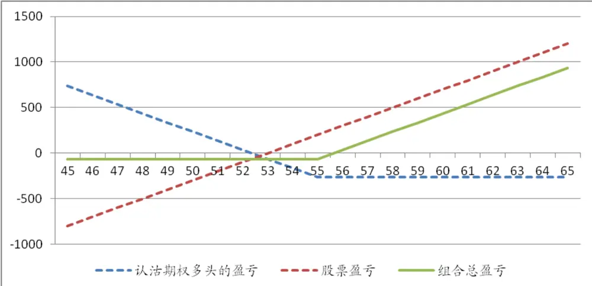
数据来源：广发证券研究发展中心

由上图可看出，股价在56元或以上时，组合策略开始盈利，股价越往上升，获利越丰。而当股价下跌时，由于认沽期权的对冲，组合下行风险有限，有效的控制了下跌的风险。若ST代表到期日的股价，K代表认沽期权的行权价，S0代表初始股价，P代表权利金，那么该组合的盈亏计算如下表所示：

表 2.股票与期权套保组合盈亏计算表

| 到期日股价范围 | 认沽期权多头的盈亏 | 股票盈亏 | 组合总盈亏 |
| --- | --- | --- | --- |
| ST<K | K-ST-P | ST-S0 | K-S0-P |
| ST>=K | -P | ST-S0 | ST-S0-P |

数据来源：广发证券研究发展中心

在实际当中，我们还可以通过取票以及期权的买多或卖空来构建其他不同的投资策略。由于其操作与该例子相似，我们就不一一列举。

## 三、 差价期权

接下来我们将介绍差价期权，该类期权组合是由两个或以上相同类型的期权来构建而成（两个或以上的认购或认沽期权）。

## （一）温和市场中的低风险策略

## 牛市差价期权：有限风险捕捉温和升势

牛市差价期权是差价期权中比较受欢迎的一种。假如投资者预期股价在未来会以一定幅度上涨，但他想稳中求胜。这时他可以选择较低成本的牛市差价期权，在股价一定幅度的上升以后，发挥止盈止损的功效。投资者要实现该种策略的做法是：买入一份认购期权，同时卖出一份到期日相同，但行权价较高的认购期权。沽出期权的权利金可以抵消一部分低行权价期权的权利金成本。

以下述例子为例：假设当前A股票价格为53，投资者预计该股票会温和上涨，所以以353元买入一份行权价为50元的认购期权，同时以78元卖出一份行权价为55元的认购期权，两个期权的存续期都剩1个月。而在一个月后，投资者损益情况如下：

表 3.牛市差价期权案例投资者损益情况表

| 比较 | 认购期权多头 | 认购期权空头 | 牛市差价期权组合 |
| --- | --- | --- | --- |
| 行权价 | 50 | 55 | 50/55 |
| 成本（每手100股） | -353 | 78 | -275 |
| 若最终股价在53元 | -53 | 78 | 25 |
| 若最终股价为 57 | 347 | -122 | 225 |
| 若最终股价为 48 | -353 | 78 | -275 |

数据来源：广发证券研究发展中心

对于投资者，购买这个牛市价差期权的成本为275元。当股票最终价格上升至57元时，投资者可获利225元。而当价格下跌至48元时，投资者也仅损失了它的初始成本。下图展示不同到期股价下投资者的获利情况：

图 2. 牛市差价期权案例不同股票价格下的盈亏图
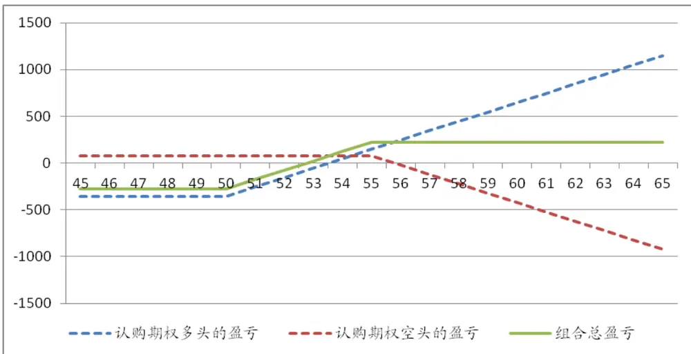
数据来源：广发证券研究发展中心

上图展示出，若股价到达55元，投资者就到了他的止盈点，就算股价继续往上，他也仅能获得225元。若股价下跌到50元以下，投资者的损失只为-275元，也即是到达他的止损点，再多的股价下滑对他而言并无更多影响。所以该种策略对于想捕捉股票温和上涨，而又不想有太多的下行风险的投资者十分适合。假设ST为最终股票价格，C1为低行权价认购期权的权利金，K1为它的行权价，C2为高行权价认购期权的权利金，K2为其行权价，我们可通过下表计算投资者的最终收益：

| 表4.牛市差价期权盈亏计算表 |  |  |  |
| --- | --- | --- | --- |
| 股价范围 | 认购期权多头的盈亏 | 认购期权空头的盈亏 | 组合总盈亏 |
| ST>=K2 | ST-K1-C1 | C2-(ST-K2) | K2-K1+C2-C1 |
| K1<ST<K2 | ST-K1-C1 | C2 | ST-K1+C2-C1 |
| ST<=K1 | -C1 | C2 | C2-C1 |

数据来源：广发证券研究发展中心

## 熊市差价期权：温和跌势中的低成本获利

与牛市差价期权相反，投资者若判断未来一段时间内股票会温和下跌，他可以利用熊市差价期权来实现低成本的盈利。该种策略也是一种止盈止损策略，投资者在熊市里获利有限，但若股票不跌反升，投资者也不会面临大的亏损。该策略的操作方法是买入一份高行权价的认沽股票期权，同时卖出一份到期日相同，但低行权价的认沽期权。值得注意的是，高行权价的认沽期权权利金要较低行权价的认沽期权要高，所卖出期权的权利金只可抵消部分买入期权的成本。

以下述例子为例：假设当前A股票价格为53，投资者预计该股票会温和下跌，他可以以265元买入一份行权价为55元的认沽期权，同时以41元卖出一份行权价为50元的认沽期权，两个期权的存续期都剩1个月。而在一个月后，投资者损益情况如下：

表 5.熊市差价期权案例投资者损益情况表

| 比较 | 认沽期权多头 | 认沽期权空头 | 熊市差价期权组合 |
| --- | --- | --- | --- |
| 行权价 | 55 | 50 | 50/55 |
| 成本（每手100股） | -265 | 41 | -224 |
| 若最终股价在53 元 | -65 | 41 | -24 |
| 若最终股价为 57 | -265 | 41 | -224 |
| 若最终股价为 48 | 435 | -159 | 276 |

数据来源：广发证券研究发展中心

对于投资者，购买这个牛市价差期权的成本为224元。当股票最终价格下跌至48元时，投资者可获利276元。而当价格上升至57元时，投资者只损失其成本。下图展示不同到期股价下投资者的获利情况

图 3. 熊市差价期权案例不同股票价格下的盈亏图
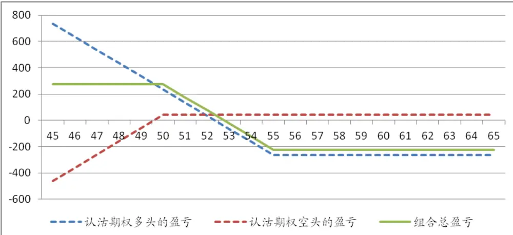
数据来源：广发证券研究发展中心

从上图我们可看出，对于该策略，投资者在熊市中的止盈位臵是276元，若投资者判断失误，股票不跌反升，其最大亏损也仅为224元的成本。假设ST为最终股票价格，P1为低行权价认沽期权的权利金，K1为它的行权价，P2为高行权价认沽期权的权利金，K2为其行权价，我们可通过下表计算投资者的最终收益：

表 6.熊市差价期权组合盈亏计算表

| 股价范围 | 认沽期权多头的盈亏 | 认沽期权空头的盈亏 | 组合总盈亏 |
| --- | --- | --- | --- |
| ST>=K2 | -P2 | P1 | P1-P2 |
| K1<ST<K2 | K2-ST-P2 | P1 | K2-ST-P2+P1 |
| ST<=K1 | K2-ST-P2 | P1-(K1-ST) | K2-K1-P2+P1 |

数据来源：广发证券研究发展中心

## （二）稳定市场中的获利良机

## 蝶式差价期权：追求市场稳定时的获利机会

第三种比较有名的差价策略为蝶式差价期权。该种期权能使投资者付出较低成本的情况下，在平稳的市场中获取不错的收益。策略的具体执行包括：买入一个较低行权价的认购期权，买入一个较高行权价的认购期权，卖出两个以前两个期权行权价的中间值为行权价的认购期权。卖出两个期权的权利金能覆盖部分其余买入期权的权利金成本，从而体现低成本的优势。

以下述例子为例：假设当前A股票价格为53，投资者预计该股票未来一个月股价变动较小，他以278元买入一份行权价为51元的认购期权，同时以78元买入一份行权价为55元的认购期权，再以158元卖出两份行权价为53元的认购期权，合计收取316元的权利金。所有期权存续期都剩1个月。而在到期日，投资者损益情况如下：

表 7.蝶式差价期权案例投资者损益情况表

| 比较 | 认购期权1多头 | 认购期权3多头 | 2*认购期权 2 空头 | 蝶式差价期权组合 |
| --- | --- | --- | --- | --- |
| 行权价 | 50 | 55 | 53 | 50/55/53 |
| 成本（每手100股） | -278 | -78 | 316 | -40 |
| 若最终股价在 52 元 | -178 | -78 | 316 | 60 |
| 若最终股价在53元 | -78 | -78 | 316 | 160 |
| 若最终股价为 57 | 322 | 122 | -484 | -40 |
| 若最终股价为 48 | -278 | -78 | 316 | -40 |

数据来源：广发证券研究发展中心

对于投资者，由于卖出期权的权利金对冲大部分买入期权的权利金，所以整个策略的成本仅为40元。若到期日股价维持不变在53元，投资者可获得160元的最大利润。但若股价上升至57元，或下降至48元，他也只损失40元的成本。下图展示不同到期股价下投资者的获利情况：

图 4. 蝶式差价期权案例不同股票价格下的盈亏图
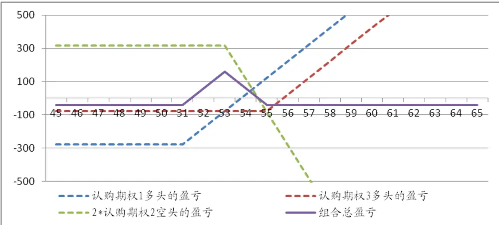
数据来源：广发证券研究发展中心

对于上述策略，股价在52-54元之间，投资者都可获得收益。但若股价波动超出该范围，投资者也仅蒙受40元的损失。所以该种策略在平稳市场中备受投资者的喜爱！设ST为最终股票价格，C1为低行权价认购期权的权利金，K1为它的行权价，C3为高行权价认购期权的权利金，K3为其行权价，C2为中间行权价认购期权的权利金，K2为其行权价，我们可通过下表计算投资者的最终收益：

| 表8. 蝶式差价期权盈亏计算表 |  |  |  |  |
| --- | --- | --- | --- | --- |
| 股价范围 | 认购期权1多头的盈 亏 | 认购期权2多头的盈 亏 | 认购期权空头的盈亏 | 组合总盈亏 |
| ST<=K1 | -C1 | -C3 | 2*C2 | 2*C2-C1-C3 |
| K1<ST<=K2 | ST-K1-C1 | -C3 | 2*C2 | ST-K1+2*C2-C1-C3 |
| K2<ST<=K3 | ST-K1-C1 | -C3 | 2*(C2-ST+K2) | 2*K2-K1-ST+2*C2-C1-C3 |
| ST>K3 | ST-K1-C1 | ST-K3-C3 | 2*(C2-ST+K2) | 2*C2-C1-C3+2*K2-K1-K3 |

数据来源：广发证券研究发展中心

## 秃鹰式差价期权：市场小幅震荡中的获利武器

当然了，市场的振幅往往出乎投资者预料。市场的小幅震荡有可能就超出蝶式期权所提供给投资者的获利区间，使得投资者蒙受亏损。这时候，我们可利用秃鹰式差价期权来捕捉小幅震荡市场中的获利机会。策略的具体执行包括：买入一个较低行权价的认购期权，卖出两个较高行权价的认购期权，最后卖出一个更高价格的认购期权。该策略以较高的成本来给予投资者高于蝶式期权的获利区间。

以下述例子为例：假设当前A股票价格为53，投资者预计该股票未来一个月股价在一定范围内小幅波动，他可以以353元买入一份行权价为50元的认购期权，同时以158元和79元卖出一份行权价为53元和一份行权价为55元的认购期权，最后以21元买入一份行权价为58元的认购期权。所有期权存续期都剩1个月。而在到期日，投资者损益情况如下：

| 表9. 秃鹰式差价期权案例投资者损益情况表 |  |  |  |  |  |
| --- | --- | --- | --- | --- | --- |
| 比较 | 认购期权1多头 | 认购期权2 空头 | 认购期权3空头 | 认购期权4多 头 | 秃鹰式差价 期权 |
| 行权价 | 50 | 53 | 55 | 58 | 50/53/55/58 |
| 成本（每手100股） | -353 | 158 | 79 | -21 | -138 |
| 若最终股价在48元 | -353 | 158 | 79 | -21 | -138 |
| 若最终股价在53元 | -53 | 158 | 79 | -21 | 162 |
| 若最终股价在 55 元 | 147 | -42 | 79 | -21 | 162 |
| 若最终股价为 59 | 547 | -442 | -321 | 79 | -138 |

数据来源：广发证券研究发展中心

对于投资者，由于卖出两个认购期权的权利金能够分摊部分买入期权的成本，但由于认购期权1在购买时已经是深度价内期权，所以其对应的权利金也较高，所以与前面蝶式期权的例子相比较，投资者会付出较高的成本。若在到期日，股价维持在53或小幅升至55，投资者都可获得162元的利润。而当股价跌至48元或上升至59元，投资者将会面临大于或等于成本损失的风险。下图展示不同到期股价下投资者的获利情况：

图 5. 秃鹰式差价期权案例不同股票价格下的盈亏图

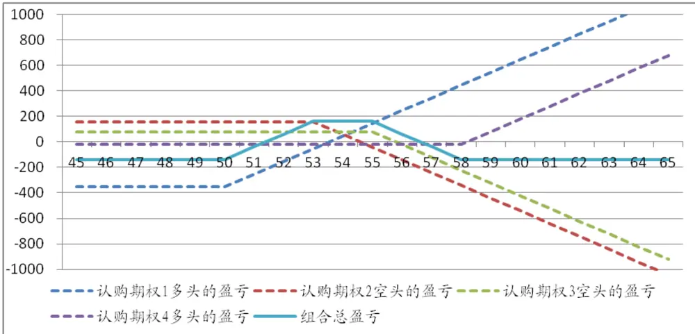
数据来源：广发证券研究发展中心

对于上述策略，股价在52-56元之间，投资者都可获得收益，比蝶式拥有更宽的获利区间。但若股价波动超出该范围，投资者也会蒙受较高的损失。该种策略在小幅震荡的行情中会更受欢迎！设ST为最终股票价格，C1为低行权价认购期权的权利金，K1为它的行权价，C2和C3为较高行权价认购期权的权利金，K2和K3为与其对应的行权价，C4为最高行权价认购期权的权利金，K4为其行权价，我们可通过下表计算投资者的最终收益：

表 10. 秃鹰式差价期权盈亏计算表

| 股价范围 | 认购期权1多头 的盈亏 | 认购期权2空 头的盈亏 | 认购期权3 空头的盈亏 | 认购期权4 多头的盈亏 | 组合总盈亏 |
| --- | --- | --- | --- | --- | --- |
| ST<=K1 | -C1 | C2 | C3 | -C4 | C2+C3-C1-C4 |
| K1<ST<=K2 | ST-K1-C1 | C2 | C3 | -C4 | C2+C3+ST-K1-C1-C4 |
| K2<ST<=K3 | ST-K1-C1 | C2-(ST-K2) | C3 | -C4 | C2+C3+K2-K1-C1-C4 |
| K3<ST<=K4 | ST-K1-C1 | C2-(ST-K2) | C3-(ST-K3) | -C4 | C2+C3+K2+K3-ST-K1-C1-C4 |
| ST>K4 | ST-K1-C1 | C2-(ST-K2) | C3-(ST-K3) | ST-K4-C4 | C2+C3+K2+K3-K1-K4-C1-C4 |

数据来源：广发证券研究发展中心

值得一提的是，若我们把上述策略中所有的认购期权改为认沽期权，也能构成秃鹰式期权，为投资者带来相似的损益情况。

## （三）攻守兼备的单边市场投资策略

## 2比1牛市差价期权：牛市能获利，熊市赚价差

当投资者对后市有较强的看多预期，并认为市场会随之大幅震荡，他可考虑2比1牛市差价期权。该期权能让投资者随着股票价格上涨一路获利，但若市场向不利方向行进，投资者也能获得一笔小的价差收益。该策略的具体操作是：卖出一个较低行权价的认购期权，同时买入2个同样的较高行权价的认购期权。

以下述例子为例：假设当前A股票价格为53，投资者预计该股票未来一个月股价会持续上升，而且价格震荡也会相对强烈。他可以以353元卖出一份行权价为50元的认购期权，同时以158元买入两份行权价为53元的认购期权，合计支付316元的权利金。所有期权存续期都剩1个月。而在到期日，投资者损益情况如下：

表 11.2比1牛市差价期权案例投资者损益情况表

| 比较 | 认购期权1空头 | 2*认购期权2 多头 | 2 比 1 牛市差价期权 |
| --- | --- | --- | --- |
| 行权价 | 50 | 53 | 50/53 |
| 成本（每手100股） | 353 | -316 | 37 |
| 若最终股价在48元 | 353 | -316 | 37 |
| 若最终股价在53元 | 53 | -316 | -263 |
| 若最终股价为 58元 | -447 | 684 | 237 |

数据来源：广发证券研究发展中心

对于投资者，他在此次的操作中首先获得37元的权利金差价。在到期日若股价如期上涨，并上升至58元，投资者在多头方面的获利将会盖过空头头寸的损失，最终能获得237元的盈利。若股价拐头向下跌至48元，所有期权都不会被行权，投资者依然可保留其37元的权利金差额。但当股价维持在53元，投资者则会蒙受263元的损失，这也是投资者所蒙受的最大亏损。下图展示不同到期股价下投资者的获利情况：

图 6. 2比 1牛市差价期权案例不同股票价格下的盈亏图
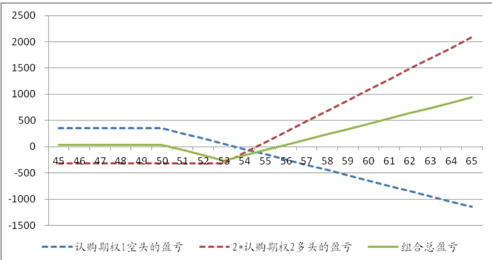
数据来源：广发证券研究发展中心

对于该策略，当股票价格高于56元，投资者便会开始盈利，而且随着股价的不断上涨，投资者的获利越丰。若股价跌至50元或以下，投资者也可获得37元的权利金差额。权利金差额的大小与投资者选择期权的行权价有直接关系，卖出期权行权价越低，或买入期权行权价越高，投资者能获得的权利金价差越多，但也需要市场更大的波动来实现盈利。投资于本策略最担心的是市场的风平浪静，若A股股价在51元至54元间小幅波动，投资者将蒙受亏损。设ST为最终股票价格，C1为低行权价认购期权的权利金，K1为它的行权价，C2为较高行权价认购期权的权利金，K2为其行权价，我们可通过下表计算投资者的最终收益：

表 12. 2比 1牛市差价期权盈亏计算表

| 股价范围 | 认购期权1空头的盈亏 | 认购期权2多头的盈亏 | 组合总盈亏 |
| --- | --- | --- | --- |
| ST<=K1 | C1 | -2*C2 | C1-2*C2 |
| K1<ST<=K2 | C1-(ST-K1) | -2*C2 | C1-(ST-K1)-2*C2 |
| ST>K2 | C1-(ST-K1) | 2*(ST-K2-C2) | C1+ST+K1-2*(K2+C2) |

数据来源：广发证券研究发展中心

## 2比1熊市差价期权：熊市能获利，牛市赚价差

与2比1牛市对应的策略则为2比1熊市差价期权，当投资者对于后市有较强的下跌预期，并认为市场波动加剧，他可利用该策略进行获利。具体的操作包括：卖出一个较高行权价的认沽期权，同时买入2个相同的较低行权价的认沽期权。

以下述例子为例：假设A股票当前价格为53元，投资者预计该股票未来一个月股价会震荡下行。他可以以339元卖出一份行权价为56元的认沽期权，同时以145元买入两份行权价为53元的沽购期权，合计支付290元的权利金。所有期权存续期都剩1个月。而在到期日，投资者损益情况如下：

表 13.2比1熊市差价期权案例投资者损益情况表

| 比较 | 认沽期权1多头 | 认沽期权2 空头 | 2 比 1 熊市差价期权 |
| --- | --- | --- | --- |
| 行权价 | 53 | 56 | 53/56 |
| 成本（每手100股） | -290 | 339 | 49 |
| 若最终股价在48元 | 710 | -461 | 249 |
| 若最终股价在53元 | -290 | 39 | -251 |
| 若最终股价为 58 | -290 | 339 | 49 |

数据来源：广发证券研究发展中心

对于该策略，投资者优先获得49元的权利金差价。一个月后，若股价在到期日下跌至48元，他将获得2个认沽期权的多头战胜认购期权空头的收益。若市场出现反弹，股价上升至58元，他也能保住前期获得的49元。但若股票价格维持不变，投资者将蒙受的最大损失为251元。下图展示不同到期股价下投资者的获利情况：

图 7. 2比 1熊市差价期权案例不同股票价格下的盈亏图
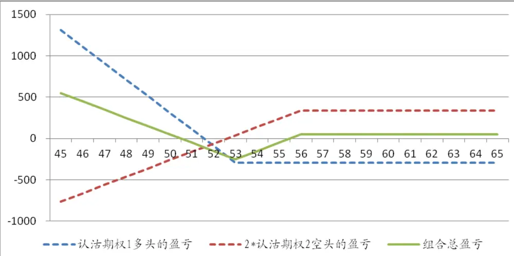
数据来源：广发证券研究发展中心

可以看到，与2比1牛市期权相反，该策略在熊市时获利甚丰，而当市场不跌反升时，投资者也能获得权利金差额。但当市场表现稳定时，投资者同样得面临亏损。设ST为最终股票价格，P1为较低行权价认沽期权的权利金，K1为它的行权价，P2为较高行权价认沽期权的权利金，K2为其行权价，我们可通过下表计算投资者的最终收益：

| 表 14. 2 比1 熊市差价期权盈亏计算表 |  |  |  |
| --- | --- | --- | --- |
| 股价范围 | 认沽期权1多头的盈亏 | 认沽期权2 空头的盈亏 | 组合总盈亏 |
| ST<=K1 | 2*（K1-ST-C1) | P2-(K2-ST) | P2-(K2-ST)+2*(K1-ST-C1) |
| K1<ST<=K2 | -2*P1 | P2-(K2-ST) | P2-(K2-ST)-2*P1 |
| ST>K2 | -2*P1 | P2 | P2-2*P1 |

数据来源：广发证券研究发展中心

## （四）强烈看多/看空的进取策略

## 认购带式期权：强烈看多的进取策略

当投资者对于标的股票拥有十分强的上涨预期，并且确信股价未来一段时间将会以很快的速度攀升。这时，他可利用认购带式期权来增加他在标的中的正向风险暴露度。本策略的操作十分简单，同时买入期限相同、行权价不同的一系列认购期权，通常的操作为3-8个期权。

本文以3个认购期权为例进行分析：假设A股票现在价格为53元，投资者经过仔细分析，强烈看好该只股票。他可同时以353元、158元和79元买入行权价为50、53和55元的认购期权来捕捉该股票的上涨收益，所有期权存续期都剩1个月。在到期日，投资者损益情况如下：

表 15.认购带式期权案例投资者损益情况表

| 比较 | 认购期权1多头 | 认购期权2 多头 | 认购期权3多头 | 认购带式期权 |
| --- | --- | --- | --- | --- |
| 行权价 | 50 | 53 | 55 | 50/53/55 |
| 成本（每手100股） | -353 | -158 | -79 | -589 |
| 若最终股价在48元 | -353 | -158 | -79 | -589 |
| 若最终股价为 58 | 447 | 342 | 221 | 1011 |

数据来源：广发证券研究发展中心

本策略投资者需先付出589元的买权成本。若在到期日股价上涨至58元，投资者便可获得1011元的丰厚利润，与期权1的447元利润相比增厚了2倍以上。而当股价下跌至48元，投资者放弃行权，损失掉所有的成本，这也是投资者的最大亏损。下图展示不同到期股价下投资者的获利情况：

图 8. 认购带式期权案例不同股票价格下的盈亏图

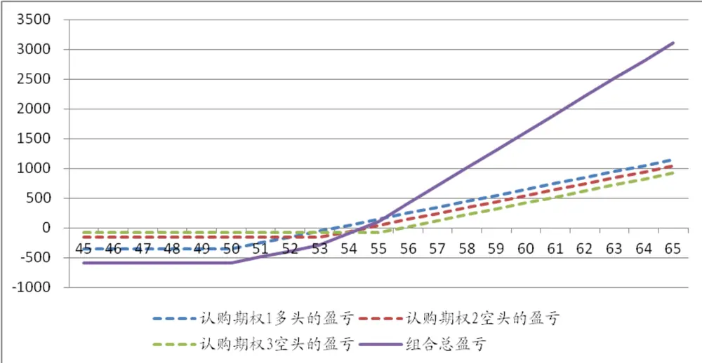
数据来源：广发证券研究发展中心

对于该策略，当最终股价超越55元，投资者便可开始获利。随着股价的攀升，投资者的利润将会直线上升。但当股价低于54元，投资者便开始亏损。当股价跌至50元以下，由于所有期权都不选择行权，所以投资者损失所有成本。设ST为最终股价，C1、C2、C3为低、中、高行权价的认购期权权利金，K1、K2和K3为对应行权价，我们可通过下表计算投资者的最终收益：

表 16. 认购带式期权盈亏计算表

| 股价范围 | 认购期权1多头的盈 亏 | 认购期权2多头的盈 亏 | 认购期权3多头的盈 亏 | 组合总盈亏 |
| --- | --- | --- | --- | --- |
| ST<=K1 | -C1 | -C2 | -C3 | -C1-C2-C3 |
| K1<ST<=K2 | ST-K1-C1 | -C2 | -C3 | ST-K1-C1-C2-C3 |
| K2<ST<=K3 | ST-K1-C1 | ST-K2-C2 | -C3 | 2*ST-K1-K2-C1-C2-C3 |
| ST>K3 | ST-K1-C1 | ST-K2-C2 | ST-K3-C3 | 3*ST-K1-K2-K3-C1-C2-C3 |

数据来源：广发证券研究发展中心

## 认沽带式期权（Put Strip）：强烈看空的进取策略

与认购带式期权相反，当投资者强烈看空某只股票时，他可利用认沽带式期权来增加他在标的股票中的反向风险暴露。该策略操作也十分简便，以不同权利金买入行权价不同，但到期日相同的一系列认沽期权，利用较高的权利金成本获得更高的杠杆效应。

本文也以3个认沽期权为例来展开说明：假如A股票当前价格为53，投资者对其后市强烈看空，他便同时以41元、145元、265元买入行权价为50、53和55元的认沽期权，所有期权存续期都剩1个月。在到期日，投资者损益情况如下：

表 17.认沽带式期权案例投资者损益情况表

| 比较 | 认沽期权1多头 | 认沽期权2 多头 | 认沽期权3多头 | 认沽带式期权 |
| --- | --- | --- | --- | --- |
| 行权价 | 50 | 53 | 55 | 50/53/55 |
| 成本（每手100股） | -41 | -145 | -265 | -451 |
| 若最终股价在48元 | 159 | 355 | 435 | 949 |
| 若最终股价为 58 | -41 | -145 | -265 | -451 |

数据来源：广发证券研究发展中心

对于本策略，投资者需先支付451元的权利金成本。在到期日股价若如期下跌至48元，投资者行使所有认沽期权，他便可获得949元的利润，相比起获利最多的认沽期权3还多出一倍收益。但若股价不跌反升，投资者的最大亏损为所有权利金451元。下图展示不同到期股价下投资者的获利情况：

图 9. 认沽带式期权案例不同股票价格下的盈亏图
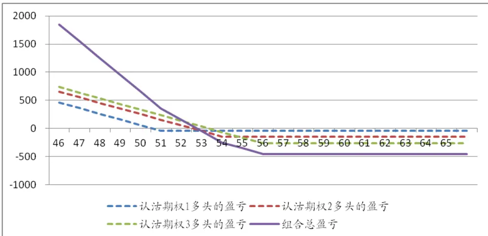
数据来源：广发证券研究发展中心

当最终股价跌破52元，随着股价下跌，投资者的获利能力呈递增式的增长。但若股价不断上涨，投资者能行权的期权数量也相应减少，最终当股价升至54元或以上，投资者将损失所有成本。该策略适合对股票未来下跌有十足信心的投资者。设ST为最终股价，P1、P2、P3为低、中、高行权价的认购期权权利金，K1、K2和K3为对应行权价，我们可通过下表计算投资者的最终收益：

表 18. 认沽带式期权盈亏计算表

| 股价范围 | 认沽期权1多头的盈 亏 | 认沽期权2 多头的盈 亏 | 认沽期权3多头的盈 亏 | 组合总盈亏 |
| --- | --- | --- | --- | --- |
| ST<=K1 | K1-ST-P1 | K2-ST-P2 | K3-ST-P3 | K3+K2+K1-3*ST-P1-P2-P3 |
| K1<ST<=K2 | -P1 | K2-ST-P2 | K3-ST-P3 | K3+K2-2*ST-P1-P2-P3 |
| K2<ST<=K3 | -P1 | -P2 | K3-ST-P3 | K3-ST-P1-P2-P3 |
| ST>K3 | -P1 | -P2 | -P3 | -P1-P2-P3 |

数据来源：广发证券研究发展中心

## 四、 组合期权

组合期权是一种期权投资策略，该种期权包括同一标的认购以及认沽期权。本文将介绍较为常见的几种组合期权。

## （一）捕捉大幅波动市场中的投资机会

## 跨式组合期权：捕捉波动市场回报

当市场上发生一些重大信息时，股价会发生较大的波动。若投资者摸不透后市股票走势是涨是跌，但确信股价会有很强的波幅，这时他可以买入跨式组合期权。无论后市股票价格大涨或者大跌，投资者都能收获甚丰。该策略由相同行权价以及相同到期日的认购和认沽期权组合而成。

举例：假设当前A股票价格为53，投资者确信未来股价有很大异动，但方向未明，他以158元买入一份认购期权，同时以145元买入一份认沽期权，所有期权存续期都剩1个月。在到期日，投资者损益情况如下：

表 19.跨式组合期权案例投资者损益情况表

| 比较 | 认购期权多头 | 认沽期权多头 | 跨式期权组合 |
| --- | --- | --- | --- |
| 行权价 | 53 | 53 | 53 |
| 成本（每手100股） | -158 | -145 | -303 |
| 若最终股价在46元 | -158 | 555 | 397 |
| 若最终股价为60 | 542 | -145 | 397 |

数据来源：广发证券研究发展中心

对于该策略，投资者付出的成本为303元。当股价在到期日升至60元，他可获得397元的回报。同样，当股票价格跌至46元，他也能获得同等的利润。但若最终股票价格没有发生变化，投资者可能就要损失所有的权利金成本。下图展示不同到期股价下投资者的获利情况：

图 10. 跨式组合期权案例不同股票价格下的盈亏图
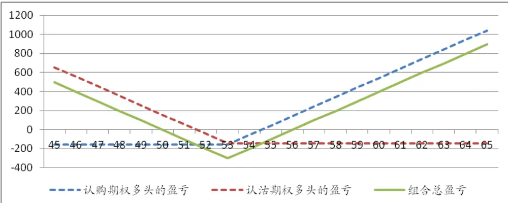
数据来源：广发证券研究发展中心

可以看出，随着股价的波幅越大，该策略的利润越丰厚。对于投资者来说，这种策略不需要投资者去判断方向，是投机性较高而风险有限的投资方式。设ST为最终股价，C为认购期权的权利金，P为认沽期权权利金，那么投资者的最终收益计算如下：

表 20. 跨式组合期权盈亏计算表

| 股价范围 | 认购期权多头的盈亏 | 认沽期权多头的盈亏 | 组合总盈亏 |
| --- | --- | --- | --- |
| ST<=K | -C | K-ST-P | K-ST-C-P |
| ST>K | ST-K-C | -P | ST-K-P-C |

数据来源：广发证券研究发展中心

## 宽跨式组合期权：低成本捕捉波动市场回报

相对于跨式组合期权，宽跨式期权需要更大的股价波动才能获利。款跨式期权的构成：一个高行权价认购期权的多头和一个低行权价认沽期权的多头。

继续引用跨式期权的例子，投资者认为市场将有大幅波动，他以78元买入一份行权价为55元的认购期权，再以41元买入一份行权价为50的认沽期权，两个期权一个月后到期。在到期日，投资者损益情况如下：

表 21.宽跨式组合期权案例投资者损益情况表

| 比较 | 认购期权多头 | 认沽期权多头 | 宽跨式期权组合 |
| --- | --- | --- | --- |
| 行权价 | 55 | 50 | 55/50 |
| 成本（每手100股） | -78 | -41 | -119 |
| 若最终股价在48元 | -78 | 359 | 281 |
| 若最终股价为 58 | 222 | -41 | 181 |

数据来源：广发证券研究发展中心

投资者本次策略的成本为119元，明显少于跨式期权的成本。若股价在到期日上涨至58元，或下跌至48元，投资者都能获利。下图展示不同到期股价下投资者的获利情况：

图 11.宽跨式组合期权案例不同股票价格下的盈亏图
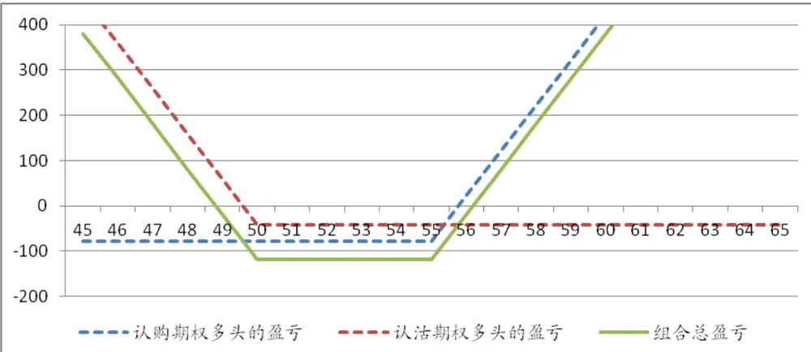
数据来源：广发证券研究发展中心

我们可看出，投资者若利用该种策略，其成本确实比跨期组合期权要少，但要求股价变动的幅度更高，不然投资者就要面临成本亏损的风险。设ST为最终股价，C为认购期权的权利金，K1为其行权价，P为认沽期权权利金，K2为其行权价，那么投资者的最终收益计算如下：

表 22. 宽跨式组合期权盈亏计算表

| 股价范围 | 认购期权多头的盈亏 | 认沽期权多头的盈亏 | 组合总盈亏 |
| --- | --- | --- | --- |
| ST<=K2 | -C | K2-ST-P | K2-ST-C-P |
| K2<ST<K1 | -C | -P | -C-P |
| ST>=K1 | ST-K1-C | -P | ST-K1-C-P |

数据来源：广发证券研究发展中心

## （二）单边市场的波动中性策略

## 牛市混合期权：看多市场的波动中性策略

牛市混合期权的损益状态与期货多头相似，但与期货不同的是它在一定的最终标的价格范围内，可以提供一个无损益状态的平台。而正是该一平台提供给投资者一个有别于期货的看多市场波动中性策略。该策略的具体操作是：买入一个高行权价的认购期权，同时卖出一个低行权价的认沽期权。两个期权权利金越相近，投资者所承担的成本越小，或赚取小幅价差。

举例：假设A股票现在价格为53元，投资者看多该股票后期走势，但对短期波动并不明朗，他可以79元买入一份行权价为55元的认购期权，同时卖出一份行权价为51元的认沽期权，所有期权存续期都剩1个月。在到期日，投资者损益情况如下：

表 23.牛市混合期权案例投资者损益情况表

| 比较 | 认购期权多头 | 认沽期权空头 | 牛市混合期权 |
| --- | --- | --- | --- |
| 行权价 | 55 | 51 | 55/51 |
| 成本（每手100股） | -79 | 66 | -13 |
| 若最终股价在48 元 | -79 | -234 | -313 |
| 若最终股价在 51 元 | -79 | 66 | -13 |
| 若最终股价为 58 | 221 | 66 | 287 |

数据来源：广发证券研究发展中心

对于本策略，投资者的最初投入仅为13元。若到期日，股价如期上升至58元，投资者可获287元。但若股价突然杀跌至48元，投资者会蒙受313元的损失。所以理论上该策略的收益与损失都可以为无限。然而，若股价下跌至51元，投资者仅失去13元的成本，并不会受股价小幅下跌所影响。下图展示不同到期股价下投资者的获利情况：

图 12.牛市混合期权案例不同股票价格下的盈亏图
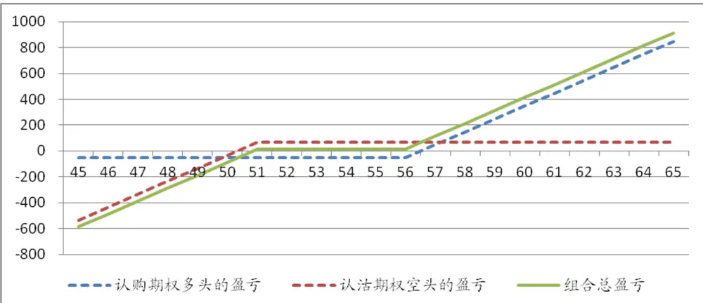
数据来源：广发证券研究发展中心

若股价在51元-55元间浮动，投资者将不受股价波动影响。只有在股价超出此范围，投资者才会开始盈利，或开始亏损。该策略适用与对于大方向较有把握，但短期对股价风险把握不准的投资者。设ST为最终股价，C为认购期权的权利金，K1为其行权价。P为认沽期权权利金，K2为对应行权价，那么投资者的最终收益计算如下：

表 24. 牛市混合期权盈亏计算表

| 股价范围 | 认购期权多头的盈亏 | 认沽期权空头的盈亏 | 组合总盈亏 |
| --- | --- | --- | --- |
| ST<=K2 | -C | P-K2-ST | P-K2-ST-C |

识别风险，发现价值

| K2<ST<K1 | -C | P | P-C |
| --- | --- | --- | --- |
| ST>=K1 | ST-K1-C | P | P+ST-K1-C |

数据来源：广发证券研究发展中心

## 熊市混合期权：看空市场的波动中性策略

熊市混合期权的损益状态与期货空头相似，但在标的的一定价格范围内，它提供投资者一个不受价格波动影响的平台。其具体操作与牛市混合期权相反：买入一个低行权价的认沽期权，同时卖出高行权价的认购期权。两个期权权利金越接近，投资者所需成本越小，或者能赚得价差。

我们沿用上述例子，投资者以79元卖出一份行权价为55元的认购期权，再以66元买入行权价为51元的认沽期权，在到期日，投资者损益情况如下：

表 25.熊市混合期权案例投资者损益情况表

| 比较 | 认购期权空头 | 认沽期权多头 | 熊市混合期权 |
| --- | --- | --- | --- |
| 行权价 | 55 | 51 | 55/51 |
| 成本（每手100股） | 79 | -66 | 13 |
| 若最终股价在48元 | 79 | 234 | 313 |
| 若最终股价在 55 元 | 79 | -66 | 13 |
| 若最终股价为 58 | -221 | -66 | -287 |

数据来源：广发证券研究发展中心

对于该策略，投资者一开始能获得13元的少量价差。若到期日股价下跌至48元，投资者可顺势获得313元的收益。但若股价急升至58元，投资者会以亏损收场。而当股价小幅上升至55元，投资者还是能够力保不失。下图展示不同到期股价下投资者的获利情况：

图 13. 熊市混合期权案例不同股票价格下的盈亏图
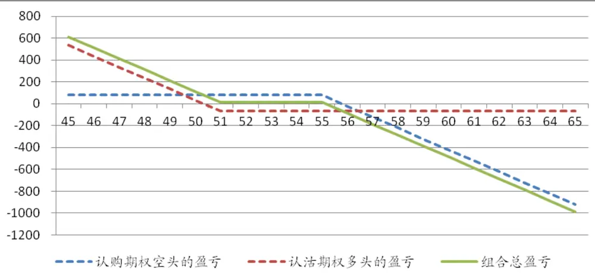
数据来源：广发证券研究发展中心

在51元-55元之间，投资者不会受标的股价波动所影响，只有在超出该范围后，投资者才会开始盈利或亏损。若投资者对于未来股价下跌比较笃定，但想规避一定价格内的波动风险，该策略比较合适。设ST为最终股价，C为认购期权的权利金，K1为其行权价。P为认沽期权权利金，K2为对应行权价，那么投资者的最终收益计算如下：

表 26. 熊市混合期权盈亏计算表

| 股价范围 | 认购期权空头的盈亏 | 认沽期权多头的盈亏 | 组合总盈亏 |
| --- | --- | --- | --- |
| ST<=K2 | C | K2-ST-P | K2+C-ST-P |
| K2<ST<K1 | C | -P | C-P |
| ST>=K1 | C-ST+K1 | -P | C-ST+K1-P |

数据来源：广发证券研究发展中心

## 五、 日历期权

直到现在我们所列举的例子中，所有期权的到期日都是相同的。而我们将要介绍的日历期权，它的构建包含行权价相同，但到期日不同的两个认购（认沽）期权。该策略也称之为时间价差交易策略。我们将以以下例子来进行说明：

假设A股票当前价格为53元，投资者以158元卖出一份行权价为53元，1个月后到期的平价认购期权，同时再以227元买入一份2个月后到期的平价认购期权。一个月后，投资者根据情况接受行权，然后卖出远月期权来进行获利。在到期日，投资者损益情况如下：

表 27.日历期权案例投资者损益情况表

| 比较 | 近月认购期权空头 | 远月认购期权多头 | 日历期权 |
| --- | --- | --- | --- |
| 行权价 | 53 | 53 | 53 |
| 成本（每手100股） | 158 | -227 | -69 |
| 若最终股价在46 元 | 158 | -223 | -66 |
| 若最终股价在53元 | 158 | -69 | 89 |
| 若最终股价为 62 | -742 | 688 | -54 |

数据来源：广发证券研究发展中心

日历期权的损益牵扯到期权的时间价值衰减特性，对比投资者卖出的近月认购期权和买入的远月认购期权，近月期权在临近到期日时，其时间价值会以更快的速度衰减。正是因为近月与远月在时间价值衰减上的快慢程度，造就了时间价差，使得投资者能够从中获利。对于本例子，投资者一开始要付出69元的成本来构建此策略。一个月后，若股价下降到46元，近月合约将会一文不值，投资者的权利金得以保留。而远月合约价值将会接近于0，投资者损失绝大部分的权利金。最终投资者蒙受66元、接近于成本的损失。而当股价升至62元，近月合约将会被行权，投资者在期权空头头寸上损失742元，而其远月合约价值在减去权利金后仅为688元，所以最终投资者的组合也将面临相当于成本的损失。而当股价维持在53元，近月期权将不会被行权，而远月期权虽然失去其内在价值，但它还具有一定的时间价值，所以最终投资者可以获得89元的利润。下图展示不同到期股价下投资者的获利情况：

图 14.日历期权案例不同股票价格下的盈亏图

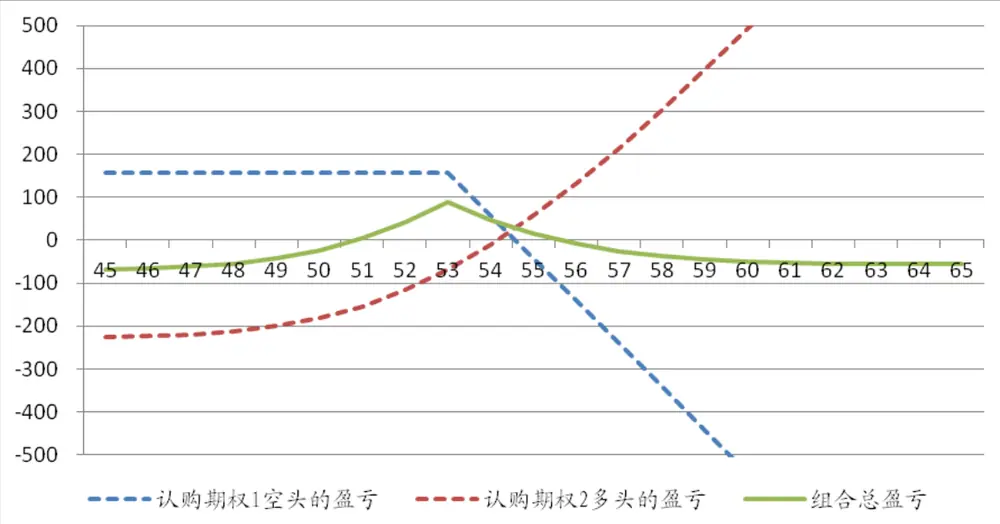
数据来源：广发证券研究发展中心

对于该策略，在50到55元之间，投资者都能不同程度的获利。但若股价最终升跌幅度较大，投资者将面临接近于成本的亏损。上述例子所列举的是一个中性日历期权，也就是所选取期权的行权价等于标的现在价格。而根据投资者对于后市的判断，他也可设臵牛市日历期：选择行权价较高期权来构建，或一个熊市日历齐全：选择行权价较低期权来构建。所以，当投资者预期一个月后，标的股票的价格不会与自己目标价格相去深远，他可利用日历期权来获利。设ST为股票最终价格，C1为当前近月认购期权权利金，C2为当前远月认购期权权利金，K为行权价，CT2为远月一个月后的权利金，那么投资者的最终收益计算如下：

表 28. 日历期权盈亏计算表

| 股价范围 | 近月认购期权空头的盈亏 | 远月认购期权多头的盈亏 | 组合总盈亏 |
| --- | --- | --- | --- |
| ST<=K | C1 | CT2-C02 | C1+CT2-C02 |
| ST>K | C1-(ST-K1) | CT2-C02 | C1+ST+K1-2*(K2+C2) |

数据来源：广发证券研究发展中心

| 罗军，首席分析师，华南理工大学理学硕士，2010年1月加盟广发证券发展研究中心。 俞文冰，CFA，首席分析师，上海财经大学统计学硕士，2012年2月加盟广发证券发展研究中心。 叶涛，CFA，资深分析师，上海交通大学管理科学与工程硕士，2012年2月加盟广发证券发展研究中心。 安宁宁，资深分析师，暨南大学数量经济学硕士，2011年7月加盟广发证券发展研究中心。 胡海涛，分析师，华南理工大学理学硕士，2010年3月加盟广发证券发展研究中心。 |
| --- |

| 期权基础知识指南-期权研究系列之一 李明 2012.6.2 |
| --- |

## Table_AuthorSum 广发金融工程研究小组mary

## Table_Report 相关研究报告

|  | 广州市 | 深圳市 | 北京市 | 上海市 |
| --- | --- | --- | --- | --- |
| 地址 | 广州市天河北路183号 | 深圳市福田区民田路178 |  | 北京市西城区月坛北街2号上海市浦东南路528号 |
| 邮政编码 | 大都会广场5 楼 | 号华融大厦9楼 | 月坛大厦18层 | 上海证券大厦北塔17楼 |
| 客服邮箱 | 510075 | 518026 | 100045 | 200120 |
| 服务热线 | gfyf@gf.com.cn 020-87555888-8612 |  |  |  |

## 免责声明

le_Disclaimer广发证券股份有限公司具备证券投资咨询业务资格。本报告只发送给广发证券重点客户，不对外公开发布。

本报告所载资料的来源及观点的出处皆被广发证券股份有限公司认为可靠，但广发证券不对其准确性或完整性做出任何保证。报告内容仅供参考，报告中的信息或所表达观点不构成所涉证券买卖的出价或询价。广发证券不对因使用本报告的内容而引致的损失承担任何责任，除非法律法规有明确规定。客户不应以本报告取代其独立判断或仅根据本报告做出决策。

广发证券可发出其它与本报告所载信息不一致及有不同结论的报告。本报告反映研究人员的不同观点、见解及分析方法，并不代表广发证券或其附属机构的立场。报告所载资料、意见及推测仅反映研究人员于发出本报告当日的判断，可随时更改且不予通告。

本报告旨在发送给广发证券的特定客户及其它专业人士。未经广发证券事先书面许可，任何机构或个人不得以任何形式翻版、复制、刊登、转载和引用，否则由此造成的一切不良后果及法律责任由私自翻版、复制、刊登、转载和引用者承担。