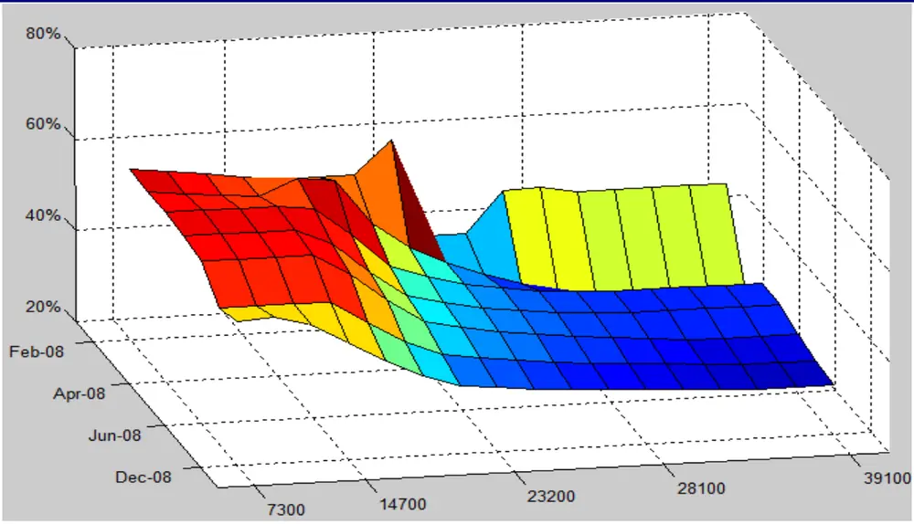
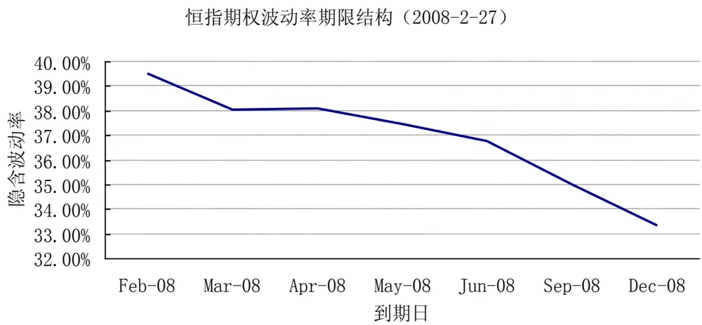
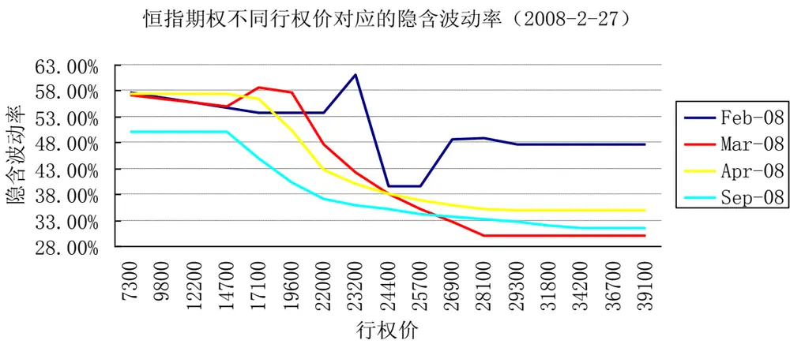
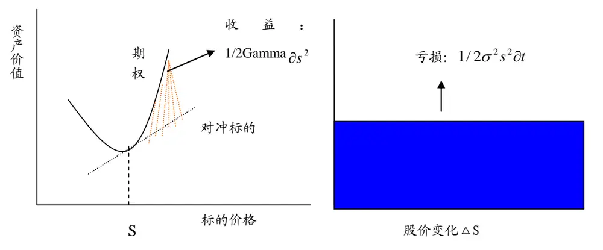
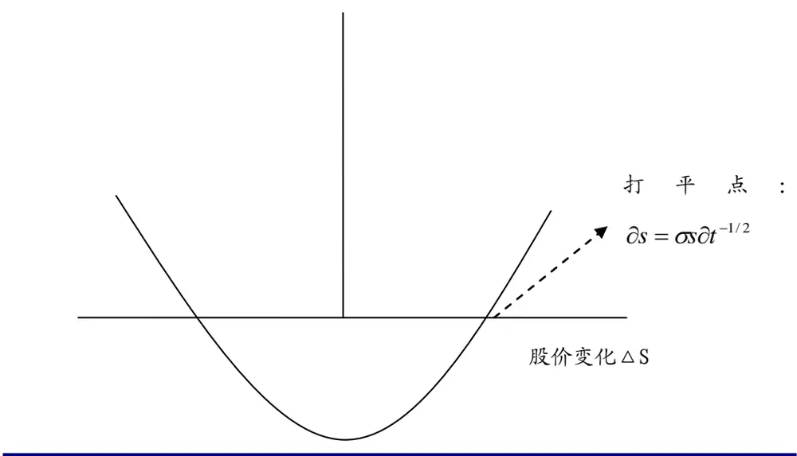
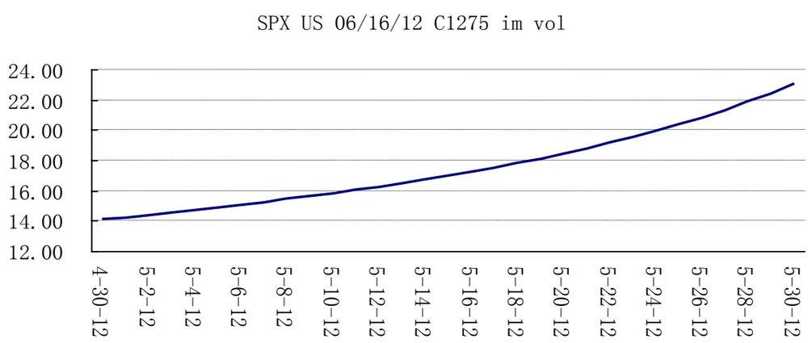

# Table_Title期权的动态对冲策略：Trade Vega

——期权研究系列之四

罗军Table_Author 首席分析师

电话：020-87555888-8655

eMail：lj33@gf.com.cn

执业编号：S0260511010004

## Table_Summary BS 定价过程揭示了动态对冲的思想

BS期权定价模型的诞生为日后金融工程技术的发展以及各类金融工具的产生起着里程碑式的作用。其建立的基础为无套利定价模型，即在一定的条件下，期权收益可以通过标的资产和无风险债券进行复制。

## Delta 不是动态对冲的全部

Delta风险管理不是动态对冲的全部， Gamma、Vega、Theta等风险同样重要，对于更复杂的期权而言，更高阶的风险依然不能忽视。当前国内期权市场的缺失使得这类风险无法对冲，为资产管理人发行类期权产品仅实施Delta对冲带来众多难度

## 波动率演化类比：波动率 V.S 利率

BS公式中引入了波动率作为期权定价的参数，类似于到期收益率作为债券价值定价的参数一样，期权的报价也可以以隐含波动率来度量。相对于债券的利率期限结构，通常，不同期限的债券具有不同的到期收益率（假设信用等级相同）。不同期限以及不同行权价的期权也有不同的隐含波动率，构成隐含波动率曲面。只是，隐含波动率曲面中波动率取决于期限与行权价二维参数，较之利率期限结构更复杂。

## 捕捉实际波动率：Gamma V.S Theta

期权隐含波动率本质上由剩余期限内标的资产未来实际波动率决定，当判断某个期权的隐含波动率相对实际波动率存在明显的高估（低估）时，可以通过标的资产与该期权利用 Delta 动态对冲的方法捕捉该差异收益。但是，采用此类方法完全捕捉该套利收益实施难度较大。由于不少投资者对博弈股票未来实际波动率的变化感兴趣，在欧美等成熟市场逐渐出现了新的衍生品产品，即 Volatility Swap、Various Swap 等。

## 隐含波动率趋势交易：Trade Vega

正是由于隐含波动率反应了投资者的预期，结合对实际波动率的变化情况，投资者可以对隐含波动率的趋势变化进行判断，并通过动态对冲剥离其他风险，获取Vega收益。

但是，对于临到期的价平期权，由于Theta较大，期权的时间价值消耗过快，此时即使看多隐含波动率实施long vega交易需非常小心，可能即使隐含波动率上升，但是由于theta导致时间价值下降过快，可能得不偿失。纯粹的Vega交易策略仍然具备不小的风险，需要对期权的Delta、Pho等风险进行良好的对冲，并且，尽可能的不要对期限较短的期权进行此类交易。短的期权进行此类交易。

## 一、 前言

在前一篇报告中我们已经介绍过在不同的市场走势下，如何利用期权来投资（具体请参考《灵活多样的期权策略-期权研究系列之二》），以及投资者在不同情况下所能获得的报酬。众所周知，期权的损益形态是非线性的，它的定价受股价、波动率、利率、剩余期限等因素的影响。正是因为期权的这种特性，我们不仅可以判断市场的方向利用期权的杠杆与组合特点能赚钱，而且，可以判断波动率的走势投资期权来盈利。而这种盈利模式与市场的方向无关，需要通过金融工程的手段动态对冲Delta等其他风险因素，剥离期权的波动率价值（Vega），又称之为动态对冲策略。

## 二、 动态对冲原理

## （一）BS定价过程揭示了动态对冲的思想

BS 期权定价模型的诞生为日后金融工程技术的发展以及各类金融工具的 $\dot{\mathcal{P}}$ 生起着里程碑式的作用。其建立的基础为无套利定价模型，即在一定的条件下，期权收益可以通过标的资产和无风险债券进行复制。

在股价服从几何布朗运动以及其他若干假设下，根据Ito定理，任何期权以及标的资产的收益都受相同的随机因素dz(t)的影响，通过一定的股票与期权构造投资组合，可以消除该不确定性。相应的投资组合为：

$$
-1\uparrow\frac{\partial}{\partial\mathbf{\mathscr{f}}}1\dot{\geq}\frac{\partial}{\partial\mathbf{\mathscr{f}}}1\dot{\geq}\frac{\partial\mathbf{\mathscr{f}}}{\partial\mathbf{\mathscr{f}}}1\dot{\geq}\frac{\partial\mathbf{\mathscr{f}}}{\partial\mathbf{\mathscr{s}}}\uparrow\pounds\frac{\partial\mathbf{\mathscr{f}}}{\partial\mathbf{\mathscr{s}}}1\dot{\geq}\frac{\partial}{\partial\mathbf{\mathscr{s}}}\frac{\partial\mathbf{\mathscr{s}}}{\partial\mathbf{\mathscr{s}}}
$$

即，发行人卖出一个单位期权的同时，买入 $\frac{\partial f}{\partial s}$ 个单位股票进行对冲，通过构造该对冲组合II，在无套利的情况下，使得在极短的时间内，组合价值的变化独立于股价的变化，而只与市场中的无风险收益相关，即：

$$
dII=IIrdt
$$

通过一系列的数学推导，得到期权定价的 BS方程：

$$
{\frac{\partial f}{\partial t}}+{\frac{1}{2}}\sigma^{2}S^{2}{\frac{\partial^{2}f}{\partial S^{2}}}+rS{\frac{\partial f}{\partial S}}-rf=0
$$

无套利定价原理不仅可以对各类期权进行定价，同时也表明了，期权可以通过标的资产与无风险收益债券进行动态复制。这也就是为什么当前国内没有期权市场，但是仍然可以动态对冲复制期权的原因。

## （二）Delta不是动态对冲的全部

通过以上 BS 定价的过程可以发现，期权的沽出方买入 $\mathrm{Del}\mathrm{ta}~(\frac{\partial f}{\partial s}~)$ 份标的股票对冲风险，随着时间变化以及Delta 值的变化，连续调整组合中所持有的标的股票数量。这种只根据 Delta值的变化随时间调整对冲仓位的策略，通常被称为Delta中性策略。

然而对于期权这种非线性产品而言，仅仅对冲 Delta 是不够的。通过对期权价格关于各变量的偏导，得到：

$$
df=\frac{df}{ds}ds+\frac{d^{2}f}{2ds^{2}}ds^{2}+\frac{df}{d\sigma}d\sigma+\frac{df}{dt}dt+\frac{df}{dr}dr...
$$

即：

$$
df=Deltads+\frac{1}{2}Gammads^{2}+Vegad\sigma+Thetadt+Phodr...
$$

通过上式可以看出，Delta风险管理不是动态对冲的全部， Gamma、Vega、Theta等风险同样重要，对于更复杂的期权而言，更高阶的风险依然不能忽视。

由于 Gamma、Vega、Theta 等风险的对冲需要期权才能实施，当前国内期权市场的缺失使得这类风险无法对冲，为资产管理人发行类期权 $\dot{\mathcal{I}}$ 品仅实施 Delta对冲带来众多难度，包括：

I）Gamma反应了股价变化时Delta的变化幅度，过高的 Gamma导致 Delta变化加大，在对冲交易中面临冲击成本以及交易成本较高等难点。尤其是对于股票价格波动较大的市场中持有较高的 Short Gamma头寸，发行人将在高买低卖的Delta 对冲中直接实现亏损。

II）Vega 反应了期权价格对隐含波动率的敏感性。BS 定价的重要假设是波动率是不变的。然而，期权市场中的隐含波动率始终在变化，其与股票价格构成影响期权价格最重要的两个因素。优秀的期权交易员，可以通过对冲 Delta风险捕捉波动率的趋势变化获取风险中性收益。Vega风险的体现在于期权存续过程中Gamma 风险的累积。

## （三）动态对冲举例——恒指场内期权对冲交易

我们以香港恒生指数场内期权模拟交易为例，描述实施动态对冲的过程。

表 1.香港恒生指数期权模拟对冲交易

| 日期 | 恒生指数 | 持仓情况（张） |  |  | 风险暴露头寸（万元） |  |  |  | 日盈亏 (万元) |
| --- | --- | --- | --- | --- | --- | --- | --- | --- | --- |
|  |  | HSI24000C8.HF | HSI2400008.HF | HSIc1 (Future) | Delta￥ | Gamma1% ￥ | VegaY | Theta 1-Day |  |
| 29-Feb-08 | 24331.67 | 2.00 | (30.00) | (10.00) | 464.14 | (113.37) | (369.32) | 7.93 |  |
| 3-Mar-08 | 23584.97 | 2.00 | (30.00) | (15.00) | 205.60 | (110.30) | (343.94) | 2.94 | (9.16) |
| 4-Mar-08 | 23119.87 | 2.00 | (30.00) | (15.00) | 428.66 | (108.15) | (321.16) | 2.82 | (13.96) |
| 5-Mar-08 | 23114.34 | 2.00 | (30.00) | (15.00) | 397.33 | (100.44) | (316.23) | 3.23 | (23.72) |
| 6-Mar-08 | 23342.73 | 2.00 | (30.00) | (15.00) | 356.32 | (118.52) | (314.58) | 2.96 | 40.97 |
| 7-Mar-08 | 22501.33 | 2.00 | (30.00) | (21.00) | 284.48 | (118.50) | (229.50) | 4.87 | (14.20) |

识别风险，发现价值

| 10-Mar-08 | 22705.05 | 2.00 | (30.00) | (24.00) | (323.90) | (110.95) | (250.84) | 3.00 | (33.94) |
| --- | --- | --- | --- | --- | --- | --- | --- | --- | --- |
| 11-Mar-08 | 22995.35 | 2.00 | (29.00) | (24.00) | (511.29) | (120.35) | (247.95) | 3.05 | 26.84 |
| 12-Mar-08 | 23422.76 | 12.00 | (29.00) | (23.00) | (220.13) | (54.40) | (166.62) | 2.99 | (37.00) |
| 13-Mar-08 | 22301.64 | 12.00 | (29.00) | (25.00) | 287.60 | (62.09) | (62.26) | 12.75 | 61.38 |
| 14-Mar-08 | 22237.11 | 12.00 | (29.00) | (25.00) | 64.48 | (62.12) | (103.89) | 4.37 | (31.78) |
| 17-Mar-08 | 21084.61 | 12.00 | (29.00) | (28.00) | 22.47 | (24.40) | (30.79) | 0.39 | (56.84) |

数据来源：广发证券发展研究中心

交易初始：由于认沽期权 HSI24000O8 引申波幅在 45％左右，认购期权 HSI24000C8引申波幅在 38％左右，同时指数实际波动率在 35％左右，我们在 2008-2-29 卖出 30份认沽，买入 2 份认购期权，同时卖出 10 份即月股指期货进行对冲。由于看多第二日指数走势，并没有完全对冲，组合当日收盘头寸Delta暴露464.14万元。

第二日，恒生指数暴跌 3.07％，由于前日留有 Delta 正头寸 464.14 万元，导致该日Delta 亏损达到 13 万元左右。由于头日 Gamma 产生负头寸，在指数下跌时导致当日Delta头寸增加300多万元，为了降低当日收盘后的Delta风险，在 08-3-3日这天，继续做空 5张合约，Delta暴露降至205.60万元。

08 年 3 月上旬，恒指波动加大，为了降低 Gamma风险，我们在 08-3-12 买入10 份认购期权，把Gamma头寸降至54.40万元，并看空指数走势，保留负的Delta头寸-220.13万元。

08-3-13 日，恒指继续暴跌 4.79％，3-12 收盘持有的-220.13 万元头寸产生近 80 万的利润，扣除 Gamma以及Vega的亏损，当日收益在60 万元左右。

从上述过程，我们近半个月的操作整体损失近 90 万元，其中，Delta 亏损近 60万元，由于我们看空波动率保留 short gamma 、short vega，而期间恒指波动加剧，产生近30万元的损失。因此，Delta是动态对冲首要管理的风险，但不并是期权交易的全部，Gamma、Vega在期权交易中也需特别关注。

## 三、 波动率交易策略

## （一）波动率演化类型

通常而言，波动率以标的资产价格的标准差来衡量。波动率对于期权而言，不仅仅只是意味着标准差，在期权等非线性产品的交易领域，波动率之于期权与利率之于债券存在某种类似性。我们以利率为类比，说明波动率的演化类型。

对于债券价值的衡量，最早通常由其绝对价格衡量。很快，分析师发现用利率衡量债券的相对价值更科学，并由此提出了到期收益率、利率期限结构以及远期收益率曲线等多种评估债券价值的模型。

BS 公式中首次引人了波动率做为期权定价的参数，类似于到期收益率作为债券价值定价的参数一样，期权的报价也可以以隐含波动率来度量。相对于债券的利率期限结构，通常，不同期限的债券具有不同的到期收益率（假设信用等级相同）。不同期限以及不同行权价的期权也有不同的隐含波动率，构成隐含波动率曲面。只是，隐含波动率曲面中波动率取决于期限与行权价二维参数，较之利率期限结构更复杂。债券到期收益率最大的影响因素来自于基础利率的变化。类似的是，期权隐含波动率与标的资产的未来存续期内的实际波动率密切相关。标的资产实际波动率的变化、期权自身引申波动率的趋势变化判断等均构成期权投资的重要课题。

## 隐含波动率曲面：smile少、skew 多

上面提到了隐含波动率反映的是期权市场报价隐含的波动率情况，反映了市场上投资者对标的股票的波动率在未来一段时间的变化预期。全球大多数指数的隐含波动率均和剩余期限以及行权价强相关，形成隐含波动率的三维曲面。

图 1. 恒指期权隐含波动率曲面

数据来源：广发证券发展研究中心

波动率随着剩余期限的不同而变化，通常称为波动率期限结构，在某种程度上可以由不同期限的实际波动率的不同产生不同的期权复制成本来解释。

图 2. 恒指期权隐含波动率期限结构

数据来源：广发证券发展研究中心

而隐含波动率与行权价也有较强的相关性，存在较明显的波动率“Skew”，偶尔也呈现“Smile”的特点。主要反映了投资者对剩余期限内标的资产所能达到的价格位臵的一种预期，因为越临到期，平价期权的复制成本越高，期权价格也越贵。观察图3中恒指期权在2008-2-27日的波动率表现，除了剩余期限在当月的期权存在Smile的特点，价平期权隐含波动率低，价内以及价位都较高外，其他期限的期权都呈现出Skew的特点，并且都是往下倾斜，表明投资者对未来市场走势的预期较差。

图 3. 恒指期权不同行权价对应的隐含波动率

数据来源：广发证券发展研究中心

## （二）捕捉实际波动率：Gamma V.S Theta

## 基本原理：

前面，我们提到了期权隐含波动率本质上由剩余期限内标的资产未来实际波动率决定。当判断某个期权的隐含波动率存在明显的高估（低估）时，可以通过标的资产与该期权利用 Delta动态对冲的方法捕捉该差异收益。以持有欧式认购期权的多头为例，说明该收益率差是如何产生的。

对于持有欧式认购期权的多头投资者，同时卖空 Delta份股票进行动态对冲。当标的资产价格瞬间∂t内变化幅度为∂s，当隐含波动率、无风险利率保持不变的假设下，由于 Gamma以及Theta的存在，投资组合的净收益为：

$$
\frac{1\hbar}{2}\frac{\varkappa}{\varkappa}\frac{\varkappa}{\varkappa}\frac{\angle}{\varrho}\mathbb{I}\longleftrightarrow\mathbb{I}\Bigg|\mathcal{E}\frac{\breve{\varkappa}}{\bar{\mathfrak{m}}}=\frac{1}{2}gamma\hat{\oslash}s^{2}-theta\hat{\oslash}t=\frac{1}{2}gamma(\hat{\oslash}s^{2}-\sigma^{2}s^{2}\hat{\oslash}t)
$$

由此，我们可以发现Delta对冲的投资组合收益与股票实际波动率、期权隐含波动率存在相关性。当 $\sigma=\frac{\widehat{\partial}s}{s}\sqrt{\widehat{\partial}t}$ 时，瞬间•t时间内投资组合的收益为 0。而通过方差的表达式可以把 $\frac{\partial s}{s}\sqrt{\partial t}$ 理解为•t时间内股票的实际波动率。尽管每天的 gamma不一样，但是，我们由此能看出来如果实际波动率与隐含波动率存在较大的差异，我们可以用Delta动态对冲的手段从中套利。

当然，如果要精确的获取股票实际方差与隐含波动率的平方之间差的收益，需要构造期权组合使得组合 gamma 与 $\frac{1}{s^{2}}$ 成比例，假设比例系数为 m，投资组合期末收益为：

$$
\mathrm{PL}=\frac{1}{2}m^{*}(\frac{\displaystyle\sum_{i=0}^{T-1}(\frac{\partial s_{i}}{s_{i}})^{2}}{T-1}-\sigma^{2})
$$

以下的图 4、图5展示了对冲组合的PL产生过程。

图 4. 对冲组合 Gamma 收益与 Theta 损失

数据来源：广发证券发展研究中心

图 5. 对冲组合总收益

数据来源：广发证券发展研究中心

## 捕捉实际波动率的便利工具：波动率（方差）互换

从上述捕捉实际波动率与隐含波动率差的过程可以发现，仅仅通过期权合约和标的资产进行 Delta对冲完全捕捉该套利收益实施难度较大，主要包括：

I）完美的对冲几乎不可能，BS定价过程要求的连续时间对冲成本太高。

II）由于每日需要构造期权组合的 Gamma与初始价格倒数成正比，且要求期权的隐含波动率保持不变，几乎难以找到。

III）现实中，股票价格通常带跳跃，并不完全服从几何布朗运动。

由于投资者对博弈股票未来实际波动率的变化感兴趣，在欧美等成熟市场逐渐出现了新的衍生品产品，即 Volatility Swap、Various Swap 等。这些合约以股票实际波动率为标的，期末以标准的公式计算实际波动率进行结算获取波动率差的收益。

## Vol Swap 合约举例：

多空双方二投资者为了博弈未来 S&P500 指数未来三个月的实际波动率，合约规定，如果未来指数以标准差计算的波动率高于 30％，每高一个波幅点空方付给多方50美金，反之，每低于30％一个波幅点多方付给空方50美金。如果三个月以后，S&P500指数实际波幅在 45％，合约的卖出方将亏损 15×50＝750 美金。通常，持有大量正Vega头寸的投资者会持有该合约的空头进行避险。

## （三）隐含波动率趋势交易：Trade Vega

正是由于隐含波动率反应了投资者的预期，结合对实际波动率的变化情况，投资者可以对隐含波动率的趋势变化判断获取 Vega 收益。从图 6 我们可以发现，S&P50006/16/12 到期的行权价为1275 的欧式看涨期权，期权隐含波动率 2012 年 4月 30日至 2012年 05月 13日上升较大，投资者可以买期权做空 s&p500指数期货进行 Delta对冲以期望获取波动率上升的收益。对冲交易过程可以参考表 2.期间，隐含波动率上升接近2 个波幅点，对冲交易盈利接近1957美元。

但是，对于临到期的价平期权，由于 Theta较大，期权价值的时间消耗过快，此时即使看多隐含波动率实施 long vega 交易需非常小心，可能即使隐含波动率上升，但是由于 theta 导致时间价值下降过快，可能得不偿失。纯粹的 Vega 交易策略仍然具备不小的风险，需要对期权的 Delta、Pho 等风险进行良好的对冲，并且，尽可能的不要对期限较短的期权进行此类交易。

图 6. SPX US 06/16/12 C1275 Implied Vol 走势

数据来源：广发证券发展研究中心

表 2. SPX US 06/16/12 C1275 Trade Vega 交易过程

| 日期 | 期权隐含波动率 | S&P500 指数 | 期权价格 | delta | 对冲交易现金流 |
| --- | --- | --- | --- | --- | --- |
| 2012-4-30 | 0.1408 | 1397.91 | 115.75 | 0.9662 | 135059.27 |
| 2012-5-1 | 0.1423 | 1405.82 | 134.45 | 0.9737 | 1068.08 |
| 2012-5-2 | 0.1438 | 1402.31 | 134.45 | 0.9706 | -440.29 |
| 2012-5-3 | 0.1454 | 1391.57 | 134.45 | 0.9589 | -1631.63 |
| 2012-5-4 | 0.1471 | 1369.1 | 102.4 | 0.9216 | -5108.82 |
| 2012-5-5 | 0.1488 | 1369.1 | 102.4 | 0.9216 | 5.07 |
| 2012-5-6 | 0.1505 | 1369.1 | 102.4 | 0.9216 | 5.19 |
| 2012-5-7 | 0.1524 | 1369.58 | 100.5 | 0.9227 | 144.05 |
| 2012-5-8 | 0.1543 | 1363.72 | 92 | 0.9097 | -1776.82 |
| 2012-5-9 | 0.1562 | 1354.58 | 92 | 0.8860 | -3204.28 |
| 2012-5-10 | 0.1583 | 1357.99 | 93.2 | 0.8954 | 1274.43 |
| 2012-5-11 | 0.1604 | 1353.39 | 93.2 | 0.8827 | -1715.53 |
| 2012-5-12 | 0.1626 | 1353.39 | 93.2 | 0.8828 | 7.84 |
| 2012-5-13 | 0.1649 | 1353.39 | 93.2 | 0.8828 | 8.69 |
|  |  |  |  | 现货平仓PL | -119482.99 |
|  |  |  |  | 期权合约交易PL | -2255.00 |
|  |  |  |  | 总PL | 1957.26 |

数据来源：广发证券发展研究中心

## Table_AuthorSum 广发金融工程研究小组mary

罗军，首席分析师，华南理工大学理学硕士，2010年1月加盟广发证券发展研究中心。

俞文冰，CFA，首席分析师，上海财经大学统计学硕士，2012年2月加盟广发证券发展研究中心。

叶涛，CFA，资深分析师，上海交通大学管理科学与工程硕士，2012年2月加盟广发证券发展研究中心。

安宁宁，资深分析师，暨南大学数量经济学硕士，2011年7月加盟广发证券发展研究中心。

胡海涛，分析师，华南理工大学理学硕士，2010年3月加盟广发证券发展研究中心。

夏潇阳，分析师，上海交通大学金融工程硕士，2012年2月加盟广发证券发展研究中心。

蓝昭钦，分析师，中山大学理学硕士，2010年5月加盟广发证券发展研究中心。

李明，分析师，伦敦城市大学卡斯商学院计量金融硕士，2010年3月加盟广发证券发展研究中心。

史庆盛，分析师，华南理工大学金融工程硕士，2011年6月加盟广发证券发展研究中心。

汪鑫，分析师，中国科学技术大学金融工程硕士，2012年2月加盟广发证券发展研究中心。

谢琳，分析师，上海交通大学金融学博士，2011年12月加盟广发证券发展研究中心。

## 敬请关注广发证券金融工程的官方微博！http://weibo.com/gfquant

## Table_Report 相关研究报告

| 期权基础知识指南-期权研究系列之一 李明 |
| --- |
| 2012.6.2 |
| 灵活多样的期权策略-期权研究系列之二 李明 2012.6.3 |
| 期权套利策略研究-期权研究系列之三 李明 2012.6.4 |

|  | 广州市 | 深圳市 | 北京市 | 上海市 |
| --- | --- | --- | --- | --- |
| 地址 | 广州市天河北路183号 深圳市福田区民田路178 大都会广场5楼 | 号华融大厦9楼 | 3 北京市西城区月坛北街2号 上海市浦东南路528号 |  |
| 邮政编码 | 510075 | 518026 | 月坛大厦18层 100045 | 上海证券大厦北塔17楼 200120 |
| 客服邮箱 | gfyf@gf.com.cn |  |  |  |
| 服务热线 | 020-87555888-8612 |  |  |  |

## 免责声明

le_Disclaimer广发证券股份有限公司具备证券投资咨询业务资格。本报告只发送给广发证券重点客户，不对外公开发布。

本报告所载资料的来源及观点的出处皆被广发证券股份有限公司认为可靠，但广发证券不对其准确性或完整性做出任何保证。报告内容仅供参考，报告中的信息或所表达观点不构成所涉证券买卖的出价或询价。广发证券不对因使用本报告的内容而引致的损失承担任何责任，除非法律法规有明确规定。客户不应以本报告取代其独立判断或仅根据本报告做出决策。

广发证券可发出其它与本报告所载信息不一致及有不同结论的报告。本报告反映研究人员的不同观点、见解及分析方法，并不代表广发证券或其附属机构的立场。报告所载资料、意见及推测仅反映研究人员于发出本报告当日的判断，可随时更改且不予通告。

本报告旨在发送给广发证券的特定客户及其它专业人士。未经广发证券事先书面许可，任何机构或个人不得以任何形式翻版、复制、刊登、转载和引用，否则由此造成的一切不良后果及法律责任由私自翻版、复制、刊登、转载和引用者承担。