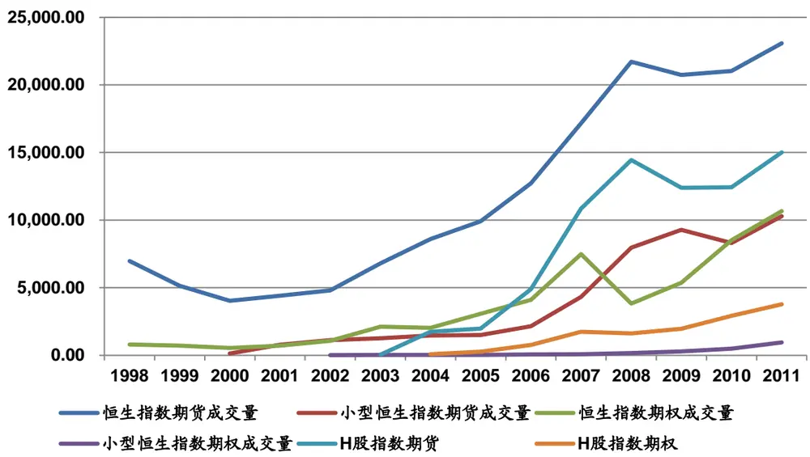
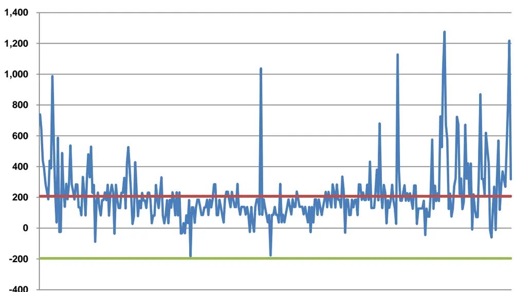
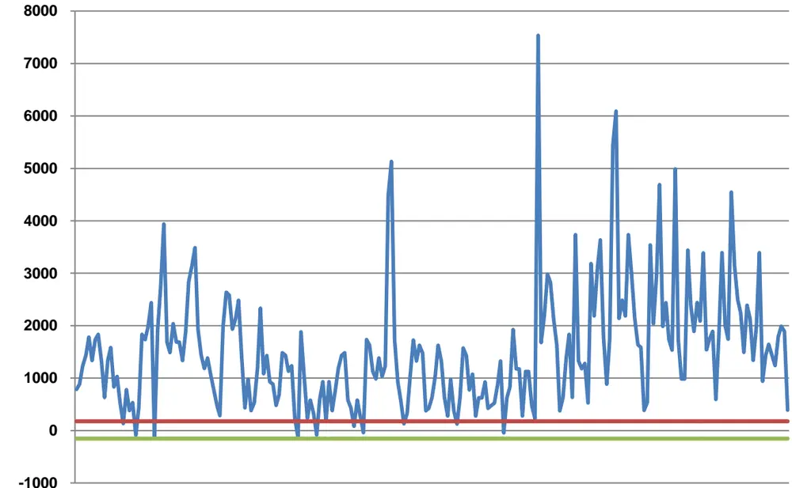
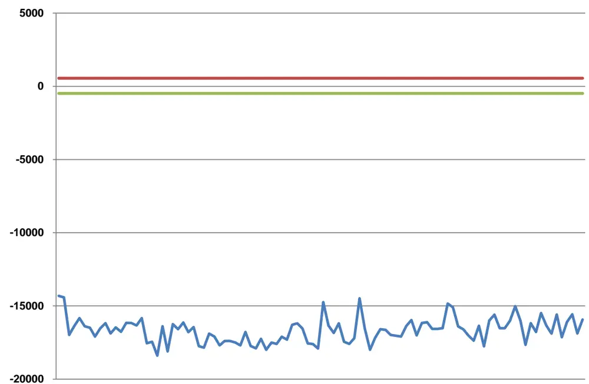
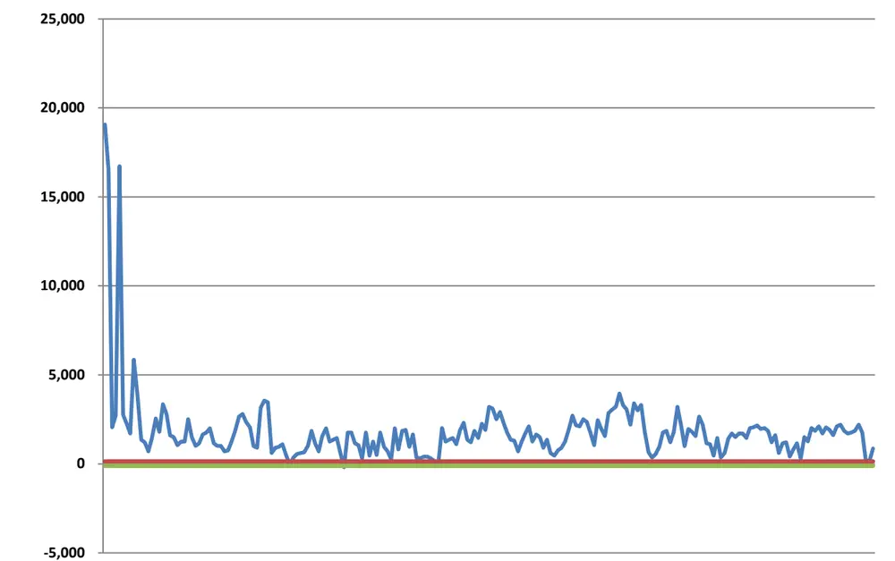

# 香港期权市场速览及平价套利机会

## ——期权研究系列之五

俞文冰 首席分析师

电话：021-60750622

eMail: ywb2@gf.com.cn

执业编号：S0260512040002

## 香港期权市场综述

香港市场的期权产品始于1993年，至今有近20年的历史。在最近几年中曾经一度风光无限的权证和牛熊证增长放缓，而期权在最近三年的增长非常迅速。相比较而言，标准化合约的期权更透明，定价更合理。

从期权条款设计来看：合约月份数，执行价格区间，合约价值等方面，拟推出的沪深300股指期权都更接近香港的小型恒指期权。

## 期权平价套利原理

买卖权平价理论认为：对于同一标的、同一到期日、相同交割价的认购以及认沽期权，在特定时间里认购期权与认沽期权的差价应该等于当时标的价格与交割价现值的差额，不然就会存在套利机会。这一原理不需要对收益率和波动率进行假设，是始终成立的，因此可以作为期权的基础定价原理。
在实际测算中，还需要考虑交易费用，按金比例，按金成本等方面的问题。

## 期权平价套利实证

无论用期权的实际成交价格还是高频的报价数据进行测算，香港期权市场都存在一定的套利机会。套利机会和空间明显大于期现套利。

其中有一些规律：1、近月合约基本没有出现过套利机会，下月合约的可能的套利机会较大，更远的合约交易过于清淡；2、在套利空间很小的时候，由于基差等原因，导致用期货进行套利收益未必好于现货，但是如果套利空间较大的时候，用期货可以减少2/3的总按金，套利的收益率可以大幅度提升：3、市场波动较大的交易日，套利机会明显增多。

## 一、香港期权市场综述

## (一) 香港衍生品市场发展历程

对于香港市场，内地投资者最为熟悉的应该是权证，也就是当地投资者所谓的“窝轮”，从表1中可以看到，香港的权证推出至今有接近40年的历史了。虽然时间上要比权证晚了20年，但是香港市场的指数期权推出至今也有接近20年的历史了。

表1：香港市场主要衍生品推出时间

| 年代 事件及金融衍生品 |
| --- |
| 1973年 香港开始发行认股权证 |
| 1986年5月 香港恒生指数期货合约 |
| 1993年3月 香港恒生指数期权合约 |
| 1995年3月 上市股票期货合约 |
| 1995年9月 上市股票期权合约 |
| 1996年6月 长期恒生指数期权合约 |
| 1997年9月 恒生香港中资企业指数期货合约 |
| 2000年10月 小型恒生指数期货合约 |
| 2002年11月 小型恒生指数期权合约 |
| 2006年6月 牛熊证 |
| 2008年3月 小型H股指数期货合约 |
| 2010年2月 自订条款指数期权 |

数据来源：香港联交所、广发证券发展研究中心

在2007年的大牛市中，权证由于其高杠杆的特性为国内投资者所熟悉，并且很多投资者和研究人员会根据香港权证市场的一些特征作为A股权证投资的参考。当然，香港市场的权证相对于A股市场而言，定价要合理很多，这与他们相对完善的做市商制度，以及近乎无限的创设(相当于做空)制度有关。

但是经过了2007年的无限风光之后，权证市场并没有持续高速的增长，成交金额停滞不前，而发行的市价总值甚至逐步下滑。或许有人认为这与市场本身不景气有一定关系，但是即使行情上涨的几年，权证市场也没有再次大规模扩张，因此市场环境只是原因之一。

与期权一样一度风光无限的是是2006年推出的牛熊证，在最近三年的增长也逐步停滞了。

这两种简单方便的衍生产品发展步伐放缓与其自身的缺陷是有关系的。权证虽然有做市商，但是做市商往往是发行商，而发行商在权证过了主要推介期之后，做市的动力就大幅下降，报价的bid-askspread逐步扩大，流动性下降。同时权证本身的隐含波动率又较高，但是一般参与的投资者只能购买而不能做空这些权证，依然会导致权证的定价偏高。而牛熊证，虽然没有隐含波动率的困扰，但是由于强制赎回条款的存在，致使其危险性大幅度增加，个人投资者在“爆仓”几次之后，参与热情就会大幅度降低。

表2：香港期权和牛熊证市价及成交金额表

| 年 | 数目 市价总值(百万港元) |  | 成交金额(百万港元) |
| --- | --- | --- | --- |
| 股本权证 |  |  |  |
| 2007 | 30 | 6,873.37 | 5,099.36 |
| 2008 | 34 | 548.52 | 1,130.25 |
| 2009 | 25 | 1,103.37 | 524.07 |
| 2010 | 22 | 2,049.41 | 1,790.05 |
| 2011 | 13 | 602.75 | 923.93 |
| 衍生权证 |  |  |  |
| 2007 | 4,483 | 696,995.85 | 4,693,859.57 |
| 2008 | 3,011 | 169,573.55 | 3,433,736.34 |
| 2009 | 3,367 | 136,441.34 | 1,654,894.76 |
| 2010 | 5,148 | 142,445.77 | 2,692,462.26 |
| 2011 | 4,027 | 75,484.38 | 2,629,886.30 |
| 牛熊证 |  |  |  |
| 2007 | 131 | 20,406.20 | 71,379.93 |
| 2008 | 1,314 | 195,229.08 | 1,039,556.77 |
| 2009 | 1,692 | 91,190.57 | 1,676,064.95 |
| 2010 | 1,064 | 49,816.76 | 1,455,404.28 |
| 2011 | 901 | 43,598.79 | 1,852,136.14 |

数据来源：香港联交所、广发证券发展研究中心

与之形成对比的是，最近几年香港市场的指数期权大幅度增长。由于香港将期权和期货归于衍生产品板，而权证和牛熊证属于主板，所以两组信息的披露格式也略有区别，衍生产品由于保证金(按金)比例千差万别，所以一般只公布合约张数。

表3：香港衍生品市场年成交量表

| 期权期货年成交量(千张合约) |  |  |  |  |  |
| --- | --- | --- | --- | --- | --- |
| 年 | 恒生 指数期货 | 小型恒生 指数期货 | 恒生 小型恒生 指数期权 指数期权 | H股 指数期货 | H股 指数期权 |
| 2004 | 8,602.00 | 1,458.00 2,029.00 | 27.00 | 1,744.00 | 81.00 |
| 2005 | 9,911.00 1,501.00 | 3,072.00 | 31.00 | 1,979.00 | 259.00 |
| 2006 | 12,718.00 2,140.00 | 4,096.00 | 53.00 | 4,880.00 | 758.00 |
| 2007 | 17,161.00 4,326.00 | 7,480.00 | 70.00 | 10,846.00 | 1,728.00 |
| 2008 | 21,717.00 7,961.00 | 3,821.00 | 157.00 | 14,441.00 | 1,614.00 |
| 2009 | 20,728.00 | 9,280.00 5,367.00 | 287.00 | 12,394.00 | 1,961.00 |
| 2010 | 21,031.00 | 8,301.00 8,515.00 | 483.00 | 12,430.00 | 2,911.00 |
| 2011 | 23,086.00 10,295.00 | 10,667.00 | 954.00 | 15,004.00 | 3,772.00 |

数据来源：香港联交所、广发证券发展研究中心
识别风险，发现价值

图1：香港市场衍生产品成交量增长图

数据来源：香港联交所、广发证券发展研究中心

每天收市后，香港联交所都会公布期权成交的信息，当然由于期权数量非常多(后文会讲到)，因此大部分期权的在很长时间内都是没有成交的，比较活跃的权证，一天的成交金额大约是几千万元。不过对于流动性倒是不比太多担心，因为香港有比较成熟的做市商制度，大部分时间，价格是由做市商维持的。而且由于可以做空，因此投资者发现价格过分高估的时候也可以获得获利机会。

表4：香港市场某交易日成交最活跃10大权证

| 合约月份 | 合约 | 成交 量 | 正式 收市价 | 引申 波幅% | 全日 最高 | 全日 最低 | 未平仓 合约 | 正式收市价 |
| --- | --- | --- | --- | --- | --- | --- | --- | --- |
| 2012年6月 | 19000 认购 | 2033 | 140 | 26 | 180 | 129 | 4735 | 变动 -124 |
| 2012年6月 | 17000 认沽 | 1917 | 249 | 34 | 306 | 229 | 7576 | 91 |
| 2012年6月 | 19400 认购 | 1735 | 65 | 25 | 94 | 65 | 2845 | -80 |
| 2012年6月 | 18600 认购 | 1614 | 252 | 27 | 308 | 237 | 2274 | -183 |
| 2012年6月 | 18800 认购 | 1569 | 189 | 26 | 235 | 175 | 1823 | -152 |
| 2012年6月 | 19200 认购 | 1553 | 97 | 25 | 131 | 93 | 3867 | -101 |
| 2012年6月 | 18000 认沽 | 1319 | 579 | 29 | 643 | 534 | 6394 | 199 |
| 2012年6月 | 19600 认购 | 1302 | 41 | 24 | 66 | 46 | 2617 | -64 |
| 2012年6月 | 19800 认购 | 1294 | 24 | 23 | 48 | 31 | 3451 | -47 |
| 2012年6月 | 16000 认沽 | 1267 | 100 | 38 | 143 | 95 | 2964 | 38 |

数据来源：香港联交所、广发证券发展研究中心

## (二)期权条款比较

如果比较拟推出的沪深300指数期权的方案，会发现和香港市场的期权有一些异同：

表5：香港期权条款与沪深300仿真期权条款对比

|  | 沪深300指数期权(仿真) | 恒生指数期权 | 小型恒生指数期权 |
| --- | --- | --- | --- |
| 合约标的 | 沪深300指数 | 恒生指数 | 恒生指数 |
| 合约乘数 | 每点100元人民币 | 每个指数点50港元 | 每个指数点10港元 |
| 合约类型 | 买权、卖权 | 买权、卖权 | 买权、卖权 |
| 最小变动 价位 | 0.1指数点 | 1个指数点 | 1个指数点 |
| 合约月份 | 当月、下月及随后两个季月 | 短期期权：现月、下两个月、之后的三个季月； 长期期权：之后五个六月以及十二月合约月份 | 现月，下月，及之后的两个季月 |
| 执行价格 区间 | 当月与下月合约：50点， 季月合约：100点 | (短期期权：同小型恒生指数期权) 长期期权：低于4000点：100点； 4000点或以上但低于8000点：200点； 8000点或以上但低于12000点：400点； 12000点或以上但低于15000点：600点； 15000点或以上但低于19000点：800点； | 低于2000点：50点； 2000点以上但低于8000点：100点； 8000点以上：200点 |
| 交易时间 | 9:15-11:30,13:00-15:15 | 19000点或以上：1000点 9:15-12:00,13:00-16:15 | 9:15-12:00,13:00-16:15 |
| 到期日 交易时间 | 9:15-11:30,13:00-15:00 | 9:15-12:00,13:00-16:00) | 9:15-12:00,13:00-16:00 |
| 到期日 | 同最后交易日 | 紧接合约月份最后营业日之前一个营业日 | 同恒生指数期权 |
| 最后 |  | 到期日之后的第一个营业日 | 到期日之后的第一个营业日 |
| 结算日 交割方式 | 现金 | 现金 | 现金 |
| 上市 | 中国金融期货交易所 | 香港联交所 | 香港联交所 |
| 交易所 交易 |  |  |  |
| 手续费 | 每手5元 | 每张合约每边10港元 | 每张合约每边2港元 |
| 行权 手续费 | 每手10元 | 每份合约10港元 | 每份合约2港元 |

数据来源：香港联交所、中国金融期货交易所宣传资料、广发证券发展研究中心

1、期权的乘数，沪深300是100元，恒生的是50和10，相对于每张合约的标的资产的价格，沪深300是2000点左右乘以100，等于20万元左右；而恒生指数是两万点左右乘以50，等于100万港元左右；小型恒指期权则是20万港元左右。鉴于沪深300的点数是恒指的1/10左右，乘数正好是恒指期权的10倍，最小变动价位也正好是小型恒指期权的1/10，看上去似乎更接近小型恒指期权一点。

2、从合约月份和执行价格区间来看，恒生指数期权非常复杂，数量很多。沪深300和小型恒指期权要少很多，但是基本够用。

3、其它交易规则与各自交易所其它衍生品比较接近。

## 二、期权平价套利原理及实务

## (一) 买卖权平价原理

如我们的报告《期权套利策略介绍-期权研究系列之三》中介绍的：买卖权平价理论认为，对于同一标的、同一到期日、相同交割价的认购以及认沽期权，在特定时间里认购期权与认沽期权的差价应该等于当时标的价格与交割价现值的差额，不然就会存在套利机会。该一理论的前提假设是：

期权行权方式为欧式

- 标的资产在存续期内不会发生分红事件

- 利率在存续期间不会发生变动，且借贷利率相等

- 忽略交易成本以及保证金机会成本

在以上的假设的基础上，买卖权的平价理论可以用下述公式来表述：

$$
c+Ke^{-rT}=p+S
$$

以上公式是以现货价格S作为标的价格，1991年，Tucker在原有的买卖权平价理论基础上，提出了买卖权与期货平价理论。将原来理论中的现货改为期货。

$$
c+Ke^{-rT}=p+Fe^{-rT}
$$

其中，c是看涨期权的价格，p是看跌期权的价格，K是期权的执行价，S是现货价格，F是期货的价格，r为可以自由借贷的利率，T为合约的到期时间。

在实际构建套利组合时，进行如下试算：

$$
\Pi_{1S}=c+Ke^{-rT}-p-S
$$

$$
\Pi_{1F}=c+Ke^{-rT}-p-Fe^{-rT}
$$

若计算出的结果小于0，则说明套利方向错误，即应该为下式：

$$
\begin{array}{r}{\Pi_{2S}=p+S-c-Ke^{-rT}}\end{array}
$$

$$
\begin{array}{r}{\Pi_{2F}=p+Fe^{-rT}-c-Ke^{-rT}}\end{array}
$$

只要有一种组合的值大于0，那么理论上就有套利机会。

买卖权平价套利是期权定价最基本的套利公式，也是不依赖于任何条件假设可以成立的，如果用这个公式都能够计算出套利的空间，也就意味着更复杂的套利模型，或者带一定敞口的“统计套利”类的模型可能有更大的获利空间。

## (二) 套利空间计算注意事项

在套利的实务处理中，需要面对的问题会更多一点，主要是需要考虑各种费用和成本。

## 1、交易费用

期货、看涨期权和看跌期权的交易双方均需要支付手续费，期权需要执行时还需要支付执行的费用。对于用现货进行套利的策略，需要买入或者卖出ETF，这实际上属于股票买卖，需要更多的手续费。另外在交易的时候还需要支付一定的佣金，对于ETF是一个比较大的支出。

## 2、保证金(按金)成本

理论上的平价公式不需要使用自有资金，但是实际套利还是需要支付一定的按金(A股市场称为保证金)。对于HSI的期权，无论多头还是空头，都需要支付一定的按金，具体数额与合约时间、交割价格、多头还是空头有关，每天都会公布。HSI的期权的按金相对比较稳定。

由于在实际利用现货套利的计算中发现全部需要卖出ETF套利，因此ETF的按金成本也需要考虑。按金的成本实际上是一个机会成本，可以认定为如果将这笔钱用于借款可以得到的最大收入。因此实际套利结果如下：

## 实际套利利润=理论套利结果-交易手续费-按金的机会成本

## 3、费用和成本汇总

我们讲需要考虑的各种费用和成本汇总以后，如表6所示：

表6：香港期权期货成本费用汇总表

|  | HSIO | HSIF |
| --- | --- | --- |
| 合约乘数 | HK$50.00 |  |
| 交易费 | HK$10.60 |  |
| 庄家优惠交易费 | HK$2.60 | HK$4.10 |
| 期权执行手续费 | HK$10.00 |  |
| 交易佣金 | （商议，参考值 HK$50.00） |  |
| 合约月份 | 当月、下月、下两月、下3个季月、后5个6、12月 | 当月、下月、下2个季月 |
| 执行日 | 当月的倒数第二个营业日 |  |
| 按金 | 每日公布，一般根据合约的执行价、到期日、多空头的差别而有所不同。可能即时调整。 | 每日公布，一般所有期限合约的要求都一致。可能即时调整。 |

数据来源：香港联交所，广发证券发展研究中心

表7：恒生指数 ETF成本和费用表

| HSI ETF |  |
| --- | --- |
| 交易费 | 0.1130% |
| 交易佣金 | (商议，参考值 0.1%） |
| 融券保证金比率 | 40% |
| 融券利率 | (商议，参考值 6%) |

数据来源：香港联交所，广发证券发展研究中心

## 三、期权平价套利实证

## (一) 实际成交价试算

在以上各种假设条件下，我们对香港市场买卖权平价套利机会进行了测算。由于期权成交连续性较差，我们根据的是Call和Put都有成交的时间点两者的实际成交价，假设现货(以及之后测算的期货)都可以按照分钟收盘价买到，以此测算的套利空间。

为了计算方便，我们试算套利空间用的是上文公式的∏2，由于这个∏2的正负与线性工具(期货或者现货)一致，所以可以简单的理解，∏2为正的时候，可以通过：买入Put和现货(期货)，同时卖出Call并且借入现金方式套利；Ⅱ2为负的时候，可以通过：买入Call和贷出现金，同时卖出Put并且卖空现货(期货)的方式套利。

计算用到的各种费用，按金等数据都是采取前文的实际交易规则。

表8：利用现货进行期权平价套利试算表

| 合约 | 时间段 | 期限 (天) | 执行价 | Call | Put | 现货价 | Call 多 Put 空 按金 | Call 空 Put多 按金 | 套利 试算 Π2 | 融券 按金 | 按金 成本 | 交易 费用 | 套利 收益 | 套利 总按金 | 收益率 |
| --- | --- | --- | --- | --- | --- | --- | --- | --- | --- | --- | --- | --- | --- | --- | --- |
| 1205 | 5/17:15:20 | 13 | 18600 | 630 | 207 | 19179.67 | 83400 | 68000 | -155.77 | 383593 | 506 | 6180 | 1103 | 466993 | 0.24% |
| 1205 | 5/17:15:30 | 13 | 18600 | 615 | 214 | 19153.61 | 83400 | 68000 | -151.75 | 383072 | 505 | 6171 | 911 | 466472 | 0.20% |
| … .: |  | . | .. | . | . | . |  | … | 1 | . | . | . | . | .. | ' |
| 1205 | 5/16:11:25 | 14 | 19000 | 495 | 274 | 19387.10 | 85100 | 66900 | -165.59 | 387742 | 552 | 6408 | 1320 | 472842 | 0.28% |
| 1205 | 5/16:11:30 | 14 | 19000 | 490 | 277 | 19379.71 | 85100 | 66900 | -166.22 | 387594 | 551 | 6406 | 1354 | 472694 | 0.29% |
| … | … | … | … | … | … | … | … | … | … | … | … | … | …… | … | … |
| 1205 | 5/11:9:20 | 19 | 20000 | 290 | 460 | 20083.27 | 71600 | 74100 | -253.80 | 401665 | 749 | 7474 | 4466 | 473265 | 0.94% |
| 1205 | 5/11:9:30 | 19 | 20000 | 280 | 475 | 20009.58 | 71600 | 74100 | -205.19 | 400192 | 747 | 7447 | 2066 | 471792 | 0.44% |
| . |  | . | . | …. | .. | …. | . | … | …. | . | .. | …. | …. | . |  |
| 1206 | 5/17:9:55 | 42 | 18400 | 925 | 435 | 19321.31 | 85100 | 76500 | -427.92 | 386426 | 1650 | 10895 | 8851 | 471526 | 1.88% |
| 1206 | 5/17:10:15 | 42 | 18600 | 839 | 483 | 19332.01 | 83500 | 77300 | -373.54 | 386640 | 1645 | 10901 | 6131 | 470140 | 1.30% |

识别风险，发现价值

| … |  | … | . | … | … | … | … | … | … | … | … | . | … | . | … |
| --- | --- | --- | --- | --- | --- | --- | --- | --- | --- | --- | --- | --- | --- | --- | --- |
| 1206 | 5/11:9:55 | 48 | 20000 | 413 | 1053 | 20007.11 | 76700 | 82100 | -652.18 | 400142 | 1907 | 12281 | 18421 | 476842 | 3.86% |
| 1206 | 5/16:11:45 | 43 | 20000 | 205 | 1538 | 19357.25 | 73000 | 85100 | -699.71 | 387145 | 1649 | 11076 | 22260 | 460145 | 4.84% |
| … | .· | .. | … | .· |  |  | .· | .…. | .· | … | … | …. | .· | .· | · |
| 1205 | 5/18:9:20 | 12 | 20000 | 28 | 1350 | 18787.00 | 67700 | 92800 | -111.61 | 375740 | 443 | 5897 | 0 | 443440 | 0.00% |
| 1205 | 5/18:9:30 | 12 | 20000 | 27 | 1408 | 18772.96 | 67700 | 92800 | -156.69 | 375459 | 443 | 5893 | 1499 | 443159 | 0.34% |
| … … |  | … |  | … |  |  |  | … | … | … | … | … | … | … | … |
| 1206 | 5/18:15:25 | 41 | 19600 | 211 | 1209 | 18945.01 | 72700 | 87000 | -349.76 | 378900 | 1543 | 10525 | 5420 | 451600 | 1.20% |
| 1206 | 5/18:9:20 | 41 | 19800 | 160 | 1500 | 18787.00 | 71400 | 89400 | -336.06 | 375740 | 1528 | 10437 | 4838 | 447140 | 1.08% |
| .. .. |  | . | … | .. |  | … | .. | … | . | …. | … | .… | .· | … | · |
| 1206 | 5/18:10:30 | 41 | 20000 | 110 | 2041 | 18779.51 | 69900 | 91000 | -723.57 | 375590 | 1522 | 10433 | 24223 | 445490 | 5.44% |
| 1206 | 5/18:10:35 | 41 | 20000 | 109 | 2044 | 18789.24 | 69900 | 91000 | -737.33 | 375785 | 1523 | 10438 | 24905 | 445685 | 5.59% |

数据来源：香港联交所、彭博资讯、广发证券发展研究中心

表9：利用期货进行期权平价套利试算表

| 合约 | 时间段 | 期限 (天) | 执行价 | Call | Put | 期货价 | Call 多 Put 空 按金 | Call 空 Put 多 按金 | 期货 按金 | 套利 试算Π | 按金 成本 | 交易 套利 费用 收益 | 套利 总按金 | 收益率 |
| --- | --- | --- | --- | --- | --- | --- | --- | --- | --- | --- | --- | --- | --- | --- |
| 1205 | 5/16:13:40 | 14 | 18000 | 1269 | 90 | 19168 | 92300 | 65900 66300 |  | 12 154 | 17 | 447 | 132200 | 0.34% |
| 1205 | 5/17:15:25 | 13 | 18200 | 950 | 127 | 19015 | 89200 | 67500 | 66300 | 9 145 | 17 | 282 | 133800 | 0.21% |
| … | … | … | … … | … | … | … | … | … | … | … | … | … | … | … |
| 1205 | 5/11:10:40 | 19 | 19000 | 979 | 126 | 19848 | 89300 | 68400 66300 |  | 6 213 | 17 | 87 | 134700 | 0.06% |
| 1205 | 5/11:15:35 | 19 | 19000 | 925 | 155 | 19755 | 89300 | 68400 | 66300 | 16 213 | 17 | 580 | 134700 | 0.43% |
| … |  | … |  | … | … | … |  | … |  | … |  | … | . | .. |
| 1205 | 5/17:15:50 | 13 | 20000 | 48 | 995 | 19067 | 67200 | 88400 | 66300 | -16 145 |  | 17 640 | 133500 | 0.48% |
| 1205 | 5/17:15:55 | 13 | 20000 | 46 | 990 | 19042 | 67200 | 88400 | 66300 | 13 168 |  | 17 465 | 154700 | 0.30% |
|  |  |  |  |  |  |  |  |  |  |  |  |  |  | … |
| 1206 | 5/17:9:55 | 42 | 18400 | 925 | 435 | 18973 | 85100 | 76500 66300 |  | -80 530 |  | 17 3434 | 151400 | 2.27% |
| 1206 | 5/17:10:15 | 42 | 18600 | 839 | 483 | 18974 | 83500 77300 | 66300 |  | -16 524 | 17 | 236 | 149800 | 0.16% |
|  |  |  |  | … |  |  |  |  |  |  |  |  |  | .. |
| 1206 | 5/11:9:55 | 48 | 20000 | 413 | 1053 | 19606 | 76700 | 82100 66300 |  | -251 572 |  | 17 11965 | 143000 | 8.37% |
| 1206 | 5/16:11:45 | 43 | 20000 | 205 1538 |  | 18977 | 73000 85100 | 66300 | -319 | 499 | 17 | 15457 | 139300 | 11.10% |
|  |  | …… | … … | … | … | … | … | … | … |  |  | … | … | … |
| 1205 | 5/18:9:20 | 12 | 20000 | 28 | 1350 | 18653 | 67700 | 92800 | 23.7 | 443 159 |  | 17 1009 | 159100 | 0.63% |
| 1205 | 5/18:9:30 | 12 | 20000 | 27 | 1408 | 18622 | 67700 | 92800 | -5.73 | 443 134 |  | 17 136 | 134000 | 0.10% |

识别风险，发现价值

|  |  |  |  |  |  |  |  |  |  | … |  |  |  |  | … |
| --- | --- | --- | --- | --- | --- | --- | --- | --- | --- | --- | --- | --- | --- | --- | --- |
| 1206 | 5/18:15:25 | 41 | 19600 | 211 | 1209 | 18605 | 72700 | 87000 | -9.75 | 1543 | 475 | 17 | 0 | 139000 | 0.00% |
| 1206 | 5/18:9:20 | 41 | 19800 | 160 | 1500 | 18455 | 71400 | 89400 | -4.06 | 1528 | 470 | 17 | 0 | 137700 | 0.00% |
|  |  |  |  |  |  |  |  |  |  |  |  |  |  |  | .… |
| 1206 | 5/18:10:30 | 41 | 20000 | 110 | 2041 | 18417 | 69900 | 91000 | -361.06 | 1522 | 465 | 17 | 17571 | 136200 | 12.90% |
| 1206 | 5/18:10:35 | 41 | 20000 | 109 | 2044 | 18429 | 69900 | 91000 | -377.09 | 1523 | 465 | 17 | 18372 | 136200 | 13.49% |

数据来源：香港联交所、彭博资讯、广发证券发展研究中心

通过以上表格我们可以发现以下一些规律：

1、期权市场存在套利机会，而且远远大于期货市场；

2、近月合约基本没有出现过套利机会；

3、下月合约的可能的套利机会较大；

4、在套利空间很小的时候，由于基差等原因，导致用期货进行套利收益未必好于现货，但是如果套利空间较大的时候，用期货可以减少2/3的总按金，套利的收益率可以大幅度提升；

5、市场波动较大的交易日，套利机会明显增多。

## (二) 按照报价试算

如果只是看成交价的情况，会不会有失偏颇呢？于是我们又找出了期权的报价情况，测算套利空间，同时也更方便我们查看日内，日间基差的变动情况。

为了计算方便，我们统一按照Bid的价格来测算，但是我们知道，做套利必然要横跨Bid-Ask两端，不过鉴于当月和近月合约的Bid-AskSpread一般在3-5点之间，也就是150-250元，因此我们可以在看图的时候考虑这一点。从图2到图5中纵轴的单位都是套利收益，单位是港元。

从这些图中我们大致可以看到这样的规律：

1、当月合约在市场波动较小是几乎没有机会，偶尔有脉冲，回复很快；

2、当市场波动较大时(20120518)，当月合约的套利机会也会出现；

3、市场波动较大时，下月合约的套利机会可能更大；

4、市场波动减小时，下月合约的套利机会也大于当月合约。

从这些现象，我们可以看出，期权作为非线性的衍生品，合约数量有非常庞大，期间的套利机会要远远大于期货。

当然套利机会很小的当月合约，定价更合理，可以作为套保的良好工具。关于如何更好的利用期权作为套保工具，我们系列报告的下一篇将会重点阐述。

图2:HSI 1205 C-P(20000) Bid期权期货套利曲线(交易日：20120514)

数据来源：香港联交所、彭博资讯、广发证券发展研究中心

图3:HSI 0512 C-P(20000) Bid期权期货套利曲线(交易日：20120518)

数据来源：香港联交所、彭博资讯、广发证券发展研究中心

图4:HSI 1206 C-P(20000) Bid期权期货套利曲线(交易日：20120518)

数据来源：香港联交所、彭博资讯、广发证券发展研究中心

图5:HSI 1205 C-P(20000) Bid期权期货套利曲线(交易日：20120521)

数据来源：香港联交所、彭博资讯、广发证券发展研究中心

## 广发金融工程研究小组

罗军，首席分析师，华南理工大学理学硕士，2010年进入广发证券发展研究中心。

俞文冰，首席分析师，CFA，上海财经大学统计学硕士，2012年进入广发证券发展研究中心。

叶涛，资深分析师，CFA，上海交通大学管理科学与工程硕士，2012年进入广发证券发展研究中心。

安宁宁，资深分析师，暨南大学数量经济学硕士，2011年进入广发证券发展研究中心。

胡海涛，分析师，华南理工大学理学硕士，2010年进入广发证券发展研究中心。

夏潇阳，分析师，上海交通大学金融工程硕士，2012年进入广发证券发展研究中心。

汪鑫，分析师，中国科学技术大学金融工程硕士，2012年进入广发证券发展研究中心。

李明，分析师，伦敦城市大学卡斯商学院计量金融硕士，2010年进入广发证券发展研究中心。

蓝昭钦，分析师，中山大学理学硕士，2010年进入广发证券发展研究中心。

史庆盛，研究助理，华南理工大学金融工程硕士，2011年进入广发证券发展研究中心。

张超，研究助理，中山大学理学硕士，2012年进入广发证券发展研究中心。

## 相关研究报告

期权套利策略研究：——期权研究系列之三

期权基础知识指南：——期权研究系列之一

|  | 广州市 | 深圳市 | 北京市 | 上海市 |
| --- | --- | --- | --- | --- |
| 地址 | 广州市天河北路183 号 大都会广场5楼 | 深圳市福田区民田路178 | 北京市西城区月坛北街2号 | 上海市浦东南路 528 号 |
| 邮政编码 | 510075 | 号华融大厦9楼 518026 | 月坛大厦18层 100045 | 上海证券大厦北塔17楼 200120 |
| 客服邮箱 | gfyf@gf.com.cn |  |  |  |
| 服务热线 | 020-87555888-8612 |  |  |  |

## 免责声明

广发证券股份有限公司具备证券投资咨询业务资格。本报告只发送给广发证券重点客户，不对外公开发布。

本报告所载资料的来源及观点的出处皆被广发证券股份有限公司认为可靠，但广发证券不对其准确性或完整性做出任何保证。报告内容仅供参考，报告中的信息或所表达观点不构成所涉证券买卖的出价或询价。广发证券不对因使用本报告的内容而引致的损失承担任何责任，除非法律法规有明确规定。客户不应以本报告取代其独立判断或仅根据本报告做出决策。

广发证券可发出其它与本报告所载信息不一致及有不同结论的报告。本报告反映研究人员的不同观点、见解及分析方法，并不代表广发证券或其附属机构的立场。报告所载资料、意见及推测仅反映研究人员于发出本报告当日的判断，可随时更改且不予通告。

本报告旨在发送给广发证券的特定客户及其它专业人士。未经广发证券事先书面许可，任何机构或个人不得以任何形式翻版、复制刊登、转载和引用，否则由此造成的一切不良后果及法律责任由私自翻版、复制、刊登、转载和引用者承担。