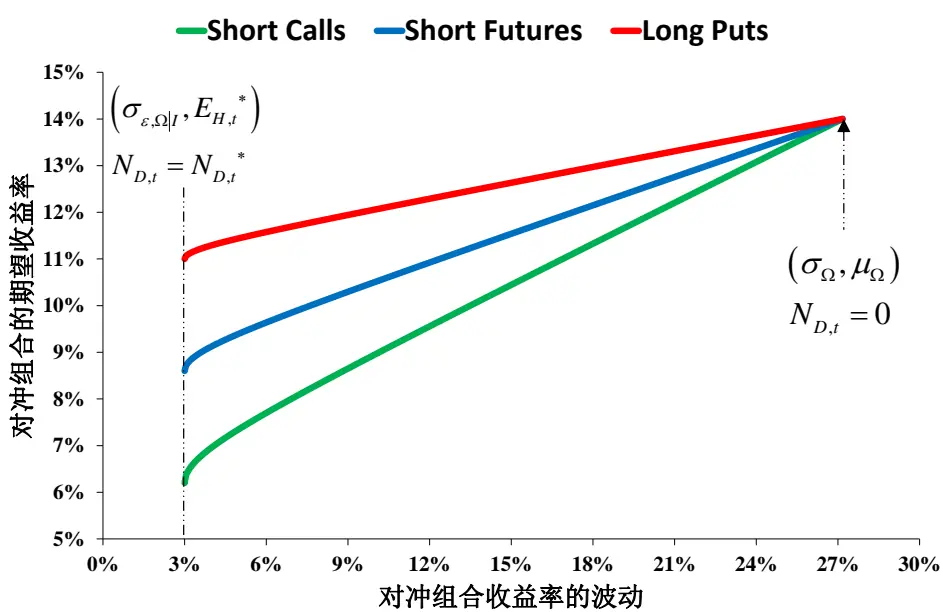
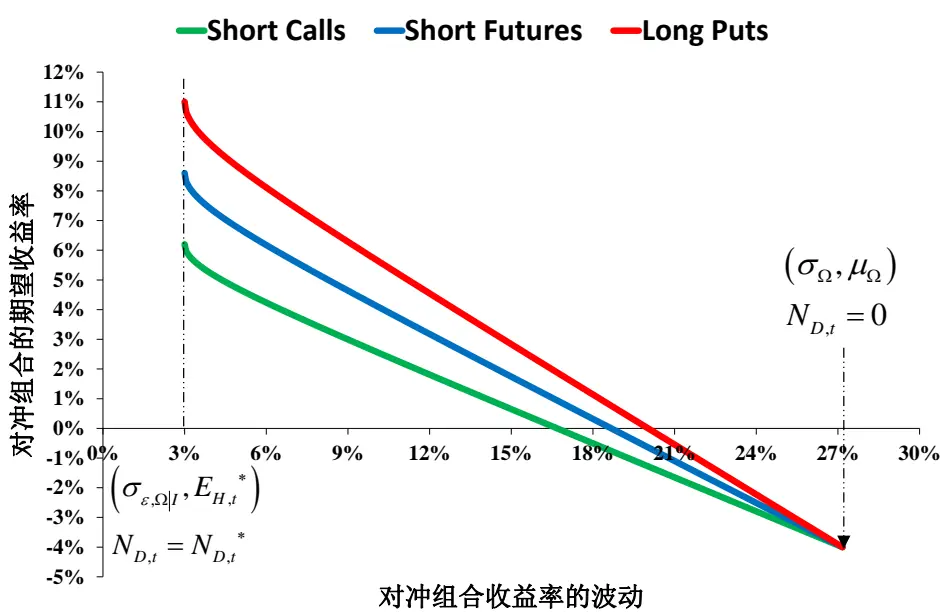
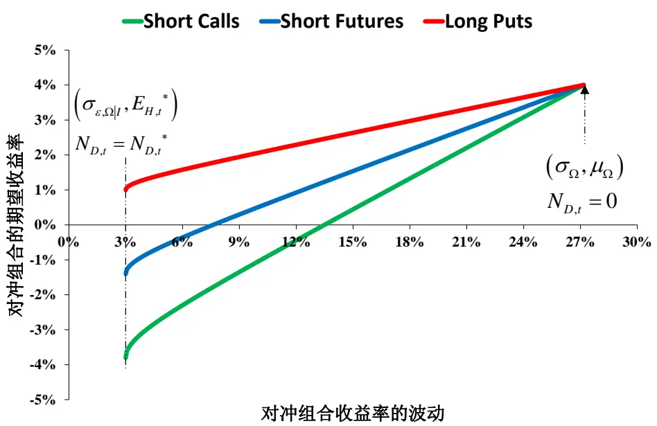
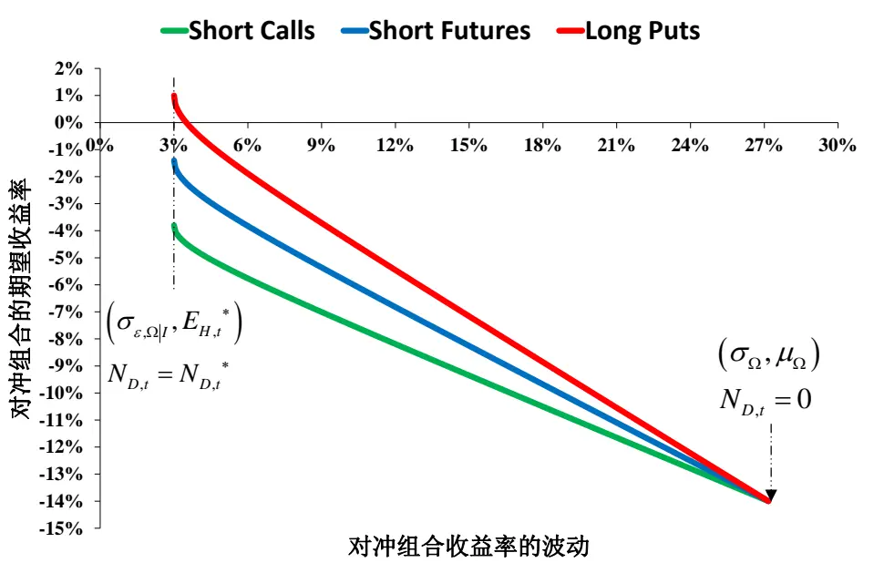

# 指数期权在动态对冲策略中的风险收益特征研究

——期权研究系列之六

叶涛资深分析师

电话：021-60750623

eMail: yetao@gf.com.cn

执业编号：S0260512030002

## 股票资产的 Beta 对冲与 Delta 对冲

股票资产系统性风险的常用对冲方式包括Beta对冲与Delta对冲：

1、如果使用线性衍生工具和与其对应的标的股票资产构建对冲组合，那么在这种情况下Beta对冲与Delta对冲是完全等效的，比如使用指数期货对其标的股价指数组合进行风险对冲就属于两者完全等效的情况。

2、如果使用非线性衍生工具和非合约标的股票资产来构建对冲组合，那么在这种情况下就需要将Beta对冲与Delta对冲结合使用，比如使用指数期权对一般的股票组合进行风险对冲就属于两者结合使用的情况。

## 完全对冲所需的合约数量

股票资产系统性风险的对冲可以通过三种方式来实现，即做空指数期货、做空看涨期权与做多看跌期权，三种方式在实现股票资产的系统性风险完全对冲时所需的合约数量与合约头寸持有方向均可统一的表述为“股票资产的系统性风险市值”与“衍生工具的等效市值”之比再取相反数，其中：股票资产的系统性风险市值为股票资产的系统性风险暴露度与股票资产市值的乘积，体现了Beta对冲的特征：衍生工具的等效市值为衍生工具的有效杠杆倍数与每份合约市值的乘积，体现了Delta对冲的特征，是更具有一般意义的完全对冲所需合约数量与合约头寸持有方向的表述形式，Beta对冲与Delta对冲的结合使用在股票资产系统性风险的管理中具有广泛的适用性。

## 完全对冲组合的风险收益比较

在衍生工具的定价参数可比的条件下，做多看跌期权所对应的完全对冲组合的期望收益率最高，且期望收益率与有效杠杆倍数的绝对值负相关；做空看涨期权所对应的完全对冲组合的期望收益率最低，且期望收益率与有效杠杆倍数的绝对值正相关；做空指数期货所对应的完全对冲组合的期望收益率总是居中。

## 风险收益曲线的形态特征

1、对冲组合风险收益曲线的左端（起点）对应于完全对冲组合，那么做多看跌期权所对应的风险收益曲线的左端位置最高，做空看涨期权所对应的风险收益曲线的左端位置最低，做空指数期货所对应的风险收益曲线的左端位置居中。对冲组合风险收益曲线的右端（终点）对应于完全不对冲组合，那么三种实现方式所对应的风险收益曲线的右端完全重合。

2、在衍生工具的定价参数可比的条件下，做多看跌期权所对应的风险收益曲线总是处于最高的位置，是最优的选择；做空看涨期权所对应的风险收益曲线总是处于最低的位置，是最差的选择；做空指数期货所对应的风险收益曲线总是处于居中的位置，是中性的选择：三种对冲组合风险收益曲线的垂直距离（对冲组合期望收益率的差异）随着风险水平（对冲组合收益率波动）的增大而逐渐缩小直至为零。

## 一、股票资产的Beta对冲与Delta对冲

金融资产的风险是指资产未来收益率的不确定性，对冲策略的本质并非是提高资产未来收益率的期望水平，而是将资产未来收益率的分布予以收窄，降低或者最小化未来不确定性的一种手段。

股票资产的风险包括非系统性风险与系统性风险：非系统性风险只能通过分散投资来化解，分散的效率取决于资产组合内个股收益率的平均相关系数；系统性风险可以使用衍生工具予以对冲，对冲的效率取决于股票资产、标的资产以及衍生工具之间收益率时变的联动性。

表1：股票资产的Beta对冲与Delta对冲的特征对比

| 类型比较 | Beta对冲 | Delta对冲 |
| --- | --- | --- |
| 数值意义 | 衍生工具与股票资产持有市值的比例 | 股票资产与衍生工具持有份数的比例 |
| 对冲目标 | 对冲组合收益率波动的最小化 | 对冲组合市值波动的最小化 |
| 适用的衍生工具 | 线性衍生工具Gamma≡0 | 无限制 |
| 适用的股票资产 | 无限制 | 仅限于衍生工具的标的资产 |

数据来源：Wind资讯、广发证券发展研究中心

股价指数衍生工具是较为常用的股票资产系统性风险的对冲工具，主要包括线性的指数期货与非线性的指数期权。股票资产系统性风险的常用对冲方式包括Beta对冲与Delta对冲，两者之间又存在特征上的差异：

(1)Beta对冲中的Beta值表示在所构建的对冲组合中衍生工具与股票资产持有市值的比例，而Delta对冲中的Delta值表示在所构建的对冲组合中股票资产与衍生工具持有份数的比例，持有市值的比例与持有份数的比例可以唯一的对应与换算，因此这并不是两者之间的本质差异。

(2)Beta对冲的目标是对冲组合收益率波动的最小化，而Delta对冲的目标是对冲组合市值波动的最小化。若对冲组合的市值波动达到最小，那么必然会使得对冲组合的收益率波动也达到最小，但反之却并不一定能够成立，因此从这个角度看Delta对冲的目标相比Beta对冲的目标更加严格。

(3）从两者的适用条件来看，Beta对冲对股票资产的选择并无限制，但却仅限于使用线性衍生工具；而Delta对冲对衍生工具的选择并无限制，但股票资产却仅限于衍生工具的标的资产。

表2：Beta对冲与Delta对冲适用条件的组合方式

| 股票资产衍生工具 | 衍生工具的标的资产 | 非衍生工具的标的资产 |
| --- | --- | --- |
| 线性 | Beta对冲与Delta对冲完全等效 | Beta对冲 |
| 非线性 | Delta对冲 | Beta对冲与Delta对冲结合使用 |

数据来源：Wind资讯、广发证券发展研究中心

表2给出了将Beta对冲与Delta对冲的适用条件交叉组合后所对应的对冲方式：

(1）如果使用线性衍生工具和与其对应的标的股票资产构建对冲组合，那么在这种情况下Beta对冲与Delta对冲是完全等效的，比如使用指数期货对其标的股价指数组合进行风险对冲就属于两者完全等效的情况。

(2）如果使用非线性衍生工具和非合约标的股票资产来构建对冲组合，那么在这种情况下就需要将Beta对冲与Delta对冲结合使用，比如使用指数期权对一般的股票组合进行风险对冲就属于两者结合使用的情况。

《考虑非预期基差效应的期指对冲模型构建方法研究（叶涛、汪鑫，2012-9-10)》分析了指数期货合约的定价偏差将如何影响期指对冲比率的测算并给出了标准Beta对冲模型的扩展形式，指数期权是另一类常用的股价指数衍生工具，也能够被用于管理与调整股票资产的系统性风险暴露度。由于非线性衍生工具与线性衍生工具存在定价属性上的差异，因此指数期权与指数期货在动态对冲策略中的特征表现也就自然会有所不同。

中金所有望于明年推出沪深300指数期权，那么面对多种可用的股价指数衍生工具，投资者在构建动态对冲策略时应当如何来进行选择呢？本文从解析分析的角度比较了指数期权与指数期货在动态对冲策略中的特征差异，给出了两者在实现股票资产的系统性风险完全对冲时所需合约数量以及对冲组合风险收益曲线的一般表述形式，为投资者在构建动态对冲策略时如何选择合适的衍生工具提供了一些基础性的结论。

## 二、完全对冲所需合约数量的确定方式

## (一) 股票资产的瞬时价格波动

在有效市场假说与资本资产定价模型等经典理论中，股票资产的价格波动可以分解为跟随市场整体的波动以及由个体因素驱动的波动，这两种波动在统计意义上呈现出正交特征，即收益率的可加性(市场平均回报与超额收益的叠加)以及波动率的可加性(系统性风险与非系统性风险的叠加）。

基于这样的一些经典理论，我们对股价指数、单个股票资产以及股票组合的瞬时市

值波动给出如下假设：

## 1、股价指数 $\boldsymbol{I}_{\mathbf{\Pi}_{t}}$ 的瞬时市值波动

$$
\Delta I_{_t}=I_{_t}(\mu_{_I}\cdot\Delta t+\sigma_{_I}\cdot\Delta Z_{_I}),\quad\Delta Z_{_I}\sim N(0,\Delta t)\tag{式(1}
$$

其中： $\boldsymbol{\mu}_{\boldsymbol{I}},\boldsymbol{\sigma}_{\boldsymbol{I}}$ 分别为股价指数 $\boldsymbol{I}_{\mathbf{\Pi}_{t}}$ 的期望收益率与波动率。

## 2、单个股票资产 $\boldsymbol{S}_{\boldsymbol{i},t}$ 的瞬时市值波动

由股票资产价格波动的正交特征可以得到：

$$
\Delta S_{i,t}=S_{i,t}(\alpha_{i\mid t}\cdot\Delta t+\beta_{i\mid t}\frac{\Delta I_{t}}{I_{t}}+\sigma_{\varepsilon,i\mid t}\cdot\Delta Z_{\varepsilon,i\mid t}),\Delta Z_{\varepsilon,i\mid t}\sim N(0,\Delta t)\tag{式(2}
$$

其中： $\alpha_{_{i|I}},\beta_{_{i|I}},\sigma_{_{\varepsilon,i|I}}$ 分别为单个股票资产 $\boldsymbol{S}_{\boldsymbol{i},t}$ 以股价指数 $\boldsymbol{I}_{\mathbf{\Pi}_{t}}$ 为参照的超额收益率、系统性风险暴露度以及非系统性风险，且∀i均有 $Co\nu(\Delta Z_{\varepsilon,i|I},\Delta Z_{_I})=0$ 0

由式(1)和式(2)就能得到：

$$
\begin{array}{r}{\left\{\begin{array}{ll}{\Delta S_{i,t}=S_{i,t}(\boldsymbol{\mu}_{i}\cdot\Delta t+\boldsymbol{\sigma}_{i}\cdot\Delta\boldsymbol{Z}_{i}),\Delta\boldsymbol{Z}_{i}\sim N(0,\Delta t)}\\{\qquad}\\{\left|\boldsymbol{\mu}_{i}=\boldsymbol{\alpha}_{i|I}+\boldsymbol{\beta}_{i|I}\cdot\boldsymbol{\mu}_{I},\boldsymbol{\sigma}_{i}=\sqrt{\boldsymbol{\beta}_{i|I}\mathrm{\bar{\Omega}}\cdot\boldsymbol{\sigma}_{I}\mathrm{\bar{\Omega}}^{2}+\boldsymbol{\sigma}_{\varepsilon,i}\mathrm{\bar{|}I}}^{2}\right.}\end{array}\right.}\end{array}\tag{式(3}
$$

其中： $\boldsymbol{\mu}_{i},\boldsymbol{\sigma}$ 分别为单个股票资产 $\boldsymbol{S}_{i,t}$ 的期望收益率与波动率。

## 3、股票组合Ω的瞬时市值波动

令股票组合Ω，由M个股票资产构成，对股票资产i的配置权重为 $\boldsymbol{\omega}_{i,t}$ ，那么有：

$$
\Delta\Omega_{\mathrm{\Lambda}_{t}}=\Omega_{\mathrm{\Lambda}_{t}}\sum_{i=1}^{M}\omega_{i,t}\frac{\Delta S_{\mathrm{\Lambda}_{i,t}}}{S_{\mathrm{\Lambda}_{i,t}}}\tag{式(4}
$$

由式(2)和式(4)就能得到：

$$
\left\{\begin{array}{ll}{\displaystyle\Delta\Omega_{_t}=\Omega_{_t}(\alpha_{\mathfrak{A}|_{t}}\cdot\Delta t+\beta_{_\Omega|{\tau}}\frac{\Delta I_{_t}}{I_{_t}}+\sigma_{_\varepsilon,\mathfrak{a}|_{t}}\cdot\Delta Z_{_{\varepsilon,\Omega|{t}}}),}&{\displaystyle\Delta Z_{_\varepsilon,\Omega|_{t}}\sim N(0,\Delta t)}\\{\displaystyle}\\{\displaystyle\alpha_{\Omega|_{t}}=\sum_{i=1}^{M}\omega_{i,t}\cdot\alpha_{i|_{t}},}&{\displaystyle\beta_{\mathfrak{a}|_{t}}=\sum_{i=1}^{M}\omega_{i,t}\cdot\beta_{i|_{t}},\sigma_{_\varepsilon,\Omega|_{t}}=\sqrt{\sum_{i=1}^{M}{\omega_{i,t}}^{2}\cdot\sigma_{_\varepsilon,i|_{t}}}^{2}}\end{array}\right.\tag{式(5}
$$

其中： $\alpha_{_\Omega\left|I\right.},\beta_{_\Omega\left|I\right.},\sigma_{_\varepsilon,\Omega\left|I\right.}$ 分别为股票组合 $\Omega_{\mathbf{\Gamma}_{t}}$ 以股价指数 $\boldsymbol{I}_{\mathbf{\Pi}_{t}}$ 为参照的超额收益率、系统性风险暴露度以及非系统性风险。

由式(3)和式(4)就能得到：

$$
\begin{array}{l}{\displaystyle\int\Delta\Omega_{_t}=\Omega_{_t}(\mu_{_{\Omega}}\cdot\Delta t+\sigma_{_{\Omega}}\cdot\Delta Z_{_\Omega}),\quad\Delta Z_{_\Omega}\sim N\left(0,\Delta t\right)}\\{\displaystyle\Bigg\lbrace\mu_{_{\Omega}}=\alpha_{_{\Omega}|I}+\beta_{_{\Omega}|I}\cdot\mu_{_{I}},\quad\sigma_{_{\Omega}}=\sqrt{\beta_{{\Omega}|I}^{2}\cdot\sigma_{_{I}}^{^{2}}+\sum_{i=1}^{M}{\omega_{_{i,t}}}^{^{2}}\cdot\sigma_{_{\varepsilon,i}|I}^{^{2}}}}\end{array}\tag{式(6}
$$

其中： $\mu_{\Omega},\sigma_{\Omega}$ 分别为股票组合 $\Omega_{\mathbf{\Gamma}_{t}}$ 的期望收益率与波动率。

## (二) 完全对冲所需的合约数量

某个以股价指数 $\boldsymbol{I}_{\mathbf{\Pi}_{t}}$ 为标的资 $\cdot\vec{j^{z}}$ 的衍生工具，其每份合约的市值为 $D_{\mathbf{\Phi}_{t}}$ ，那么 $D_{\mathbf{\Phi}_{t}}$ 必定是关于股价指数 $\boldsymbol{I}_{\mathbf{\Pi}_{t}}$ 和当前时刻t的函数，即 $\boldsymbol{D}_{t}=\boldsymbol{D}\left(\boldsymbol{I}_{t},t\right)$ 。令股票组合 $\Omega_{\mathbf{\Gamma}_{t}}$ 与 $N_{{_{D,t}}}$ 份该合约在当前时刻t构建对冲组合 $\textit{ H }_{t}$ ，对冲组合 $\textit{ H }_{t}$ 在 $\left[t,t+\Delta t\right]$ 内的瞬时价值变动为 $\Delta H_{\mathbf{\Gamma}_{t}}$ 那么对 $\Delta H$ 则需要按两种情况来进行分析：

（1）如果 $D_{\mathbf{\Phi}_{t}}$ 表示线性的指数期货合约，那么当 $D_{\mathbf{\Phi}_{t}}$ 满足无风险套利的定价关系时就能得到：

$$
\begin{array}{l}{\displaystyle\Delta H_{\mathrm{\Omega}_{t}}=(\frac{\Omega_{\mathrm{\Omega}_{t}}\cdot\beta_{\Omega}|\mathrm{\Omega}_{t}}{I_{\mathrm{\Omega}_{t}}}+N_{\mathrm{\Omega}_{D,t}}\frac{\partial D_{t}}{\partial I_{t}})\Delta I_{\mathrm{\Omega}_{t}}}\\{\displaystyle+(\Omega_{\mathrm{\Omega}_{t}}\cdot\alpha_{\Omega|I}-N_{\mathrm{\Omega}_{D,t}}\frac{\partial D_{t}}{\partial I_{t}}I_{\mathrm{\Omega}}\cdot r_{f})\Delta t+\Omega_{\mathrm{\Omega}_{t}}\cdot\sigma_{\varepsilon,\Omega|I}\cdot\Delta Z_{\mathrm{\Omega}_{\varepsilon,\Omega}|I}}\end{array}\tag{式(7}
$$

(2）如果 $D_{\mathbf{\Phi}_{t}}$ 表示非线性的指数期权合约，那么当 $D_{\mathbf{\Phi}_{t}}$ 满足无风险套利的定价关系时就能得到：

$$
\begin{array}{l}{{\displaystyle\Delta H_{_{t}}=(\frac{\Omega_{_t}\cdot\beta_{\mathfrak{o}|_{t}}}{I_{_t}}+N_{_{D,t}}\frac{\partial D_{_t}}{\partial I_{_t}})\Delta I_{_{t}}+[\Omega_{_t}\cdot\alpha_{\mathfrak{o}|_{l}}+N_{_{D,t}}(D_{_t}-\frac{\partial D_{_t}}{\partial I_{_t}}I_{_t})r_{f}]\Delta t}}\\{{\displaystyle+\frac{N_{_{D,t}}}{2}\cdot\frac{\hat{\sigma}^{2}D_{_t}}{\hat{\sigma}I_{_t}^{2}}I_{_t}^{2}\cdot\sigma_{_t}^{2}(\varepsilon_{_t}^{2}-1)\Delta t+\Omega_{_t}\cdot\sigma_{_{\varepsilon,\Omega|_{l}}}\cdot\Delta Z_{_{\varepsilon,\Omega|_{l}}}}}\end{array}\tag{式(8}
$$

其中： $\boldsymbol{\varepsilon}_{\scriptscriptstyle I}=\frac{\Delta Z_{\scriptscriptstyle I}}{\sqrt{\Delta t}},\quad\boldsymbol{r}_{{f}}$ 为市场无风险利率。

式(7)与式(8)的差异源于指数期货与指数期权静态价值属性的不同，关于这部分内容可参见《考虑非预期基差效应的期指对冲模型构建方法研究》一文中的第三章第二节“合约的价格与合约的价值”。

在以上的分析中我们均未考虑股票资产的现金分红 $q$ ，如果需要考虑现金分红 $^{\mathbf{\nabla}}q$ 的影响，那么只要将相关结论中的 $\boldsymbol{r}_{f}$ 替换为 $r_{f}\mathrm{~-~}q$ 即可。若不考虑保证金收支差异，那么由式(7)和式(8)所得到的对冲组合收益率的波动 $\sigma_{\textit{ H }}$ 具有完全相同的表述形式：

$$
\sigma_{{_H,t}}^{\mathrm{~\scriptsize~2~}}=(\beta_{{_\Omega\vert I}}+N_{\mathrm{~\scriptsize~D~,~t~}}\frac{\hat{\sigma}D_{\mathrm{~\scriptsize~t~}}}{\hat{\sigma}I_{\mathrm{~\scriptsize~t~}}}\cdot\frac{I_{\mathrm{~\scriptsize~t~}}}{\Omega_{\mathrm{~\scriptsize~t~}}})^{2}\sigma_{\mathrm{~\scriptsize~I~}}^{\mathrm{~\scriptsize~2~}}+\sigma_{\mathrm{~\scriptsize~\varepsilon,\Omega\vert~}}^{\mathrm{~\scriptsize~2~}}\tag{式(9}
$$

所谓完全对冲就是要使得对冲组合收益率的波动达到最小，那么由式(9)就能得到完全对冲所需的合约数量 $\boldsymbol{N}_{D,t}^{*}$

$$
{N_{\mathrm{\Lambda}_{D}}}_{,t}^{*}=-\frac{\beta_{\Omega|I}\cdot\Omega_{t}}{\lambda_{\mathrm{\Lambda}_{D},t}\cdot D_{t}}\tag{式(10}
$$

其中： $\lambda_{{_D,t}}=\frac{\partial D_{{_t}}}{\partial I_{{_t}}}\Bigg/\frac{D_{{_t}}}{I_{{_t}}}$ 为衍生工具 $D_{\mathbf{\Phi}_{t}}$ 在t时刻的有效杠杆倍数(Effective Gearing)，有效杠杆倍数可以近似（但非严格）的理解为衍生工具相对其标的资产的价格弹性。

股票资产系统性风险的对冲可以通过三种方式来实现，即做空指数期货、做空看涨期权与做多看跌期权。如式(10)所示，三种方式在实现股票资 $\dot{\mathcal{P}}$ 的系统性风险完全对冲时所需的合约数量与合约头寸持有方向均可统一的表述为“股票资产的系统性风险市值”与“衍生工具的等效市值”之比再取相反数，其中：股票资产的系统性风险市值为股票资产的系统性风险暴露度与股票资产市值的乘积，体现了Beta对冲的特征；衍生工具的等效市值为衍生工具的有效杠杆倍数与每份合约市值的乘积，体现了Delta对冲的特征。

如果使用线性衍生工具和非合约标的股票资产来构建对冲组合，那么由 $\lambda_{\textit{ D },t}=1$ 代入式(10)就能得到 ${N_{\mathrm{\Lambda}_{D},t}}^{*}=-\beta_{{{\Omega}\left|I\right.}}\frac{{{\Omega}_{t}}}{{{D}_{\mathrm{\Lambda}_{t}}}}$ ，即对应于标准的Beta对冲方式。如果使用非线性衍生工具和与其对应的标的股票资产构建对冲组合，那么由 $\beta_{{\scriptscriptstyle\Omega}\parallel{\cal I}}=1$ 代入式(10)就能得到 ${N_{\mathrm{\Lambda}_{D,t}}}^{*}=-\frac{\Omega_{t}}{I_{t}}\Bigg/\frac{\partial D_{t}}{\partial I_{t}}$ ，即对应于标准的Delta对冲方式。如果使用线性衍生工具和与其对应的标的股票资产构建对冲组合，那么由 $\beta_{{\scriptscriptstyle\Omega}|_{I}}=1,\lambda_{{\scriptscriptstyle D},t}=1$ 就能得到 ${N_{\mathrm{\Lambda}_{D}}}_{,t}^{*}=-\frac{\Omega_{\mathrm{\Lambda}_{t}}}{D_{\mathrm{\Lambda}_{t}}}$ ，即对应于Beta对冲与Delta对冲完全等效的情况。

由此可见式(10)是更具有一般意义的完全对冲所需合约数量与合约头寸持有方向的表述形式，因此Beta对冲与Delta对冲的结合使用在股票资 $\cdot\vec{p}$ 系统性风险的管理中具有广泛的适用性。

## 三、对冲组合的风险收益曲线

## (一) 完全对冲组合的风险收益比较

由式(9)和式(10)可知：当对冲组合H中衍生工具的持有合约数量与完全对冲所需的合约数量相等时，即 $N_{_{D,t}}=N_{_{D,t}}^{}$ ，对冲组合收益率的波动σ达到下限，那么称对 $\sigma_{\textit{ H }}$ 冲组合 $\textit{ H }_{t}$ 成为完全对冲组合 $\boldsymbol{H}_{\mathrm{~}_{t}}^{\mathrm{~*~}}$ ，将完全对冲组合的期望收益率与收益率的波动分别记为 ${E_{\scriptscriptstyle H,t}}^{*},\sigma_{\scriptscriptstyle H,t}^{*}$

做空指数期货、做空看涨期权与做多看跌期权等三种方式均能实现股票资产系统性风险的完全对冲，完全对冲组合在三种实现方式下的收益率波动同为股票资 $\cdot\dot{\vec{r}}$ 的非系统性风险，即 $\sigma_{\textit{ H },t}^{*}=\sigma_{\textit{ \varepsilon },\Omega\left|I\right.}$ ，但完全对冲组合在三种实现方式下的期望收益率 $E_{{_H},t}{^t}$ 却并不相同。

如果 $D_{\mathbf{\Phi}_{t}}$ 表示线性的指数期货合约，那么由式(7)和式(10)可以得到：

$$
\begin{array}{r}{\boldsymbol{E_{H,t}}^{*}=\boldsymbol{\alpha}_{\Omega\big|I}+\boldsymbol{\beta}_{\Omega\big|I}\cdot\boldsymbol{r}_{f}}\end{array}\tag{式(11}
$$

由式(11)可知：通过做空指数期货所形成的完全对冲组合的期望收益率 ${E_{H}}_{\mathrm{~,~}t}^{*}$ 包括股票组合的超额收益 $\alpha_{\mathfrak{a}|_{I}}$ 以及做空指数期货所带来的基差收益贡献 $\boldsymbol{\beta}_{\Omega}|_{I}\cdot\boldsymbol{r}_{f}$

如果 $D_{\mathbf{\Phi}_{t}}$ 表示非线性的指数期权合约，那么由式(8)和式(10)可以得到：

$$
{E_{_{H,t}}}^{*}=\alpha_{_{\Omega\left|I\right.}}+\beta_{_{\Omega\left|I\right.}}\cdot r_{_f}\left(1-\frac{1}{\lambda_{_{D,t}}}\right)\tag{式(12}
$$

式(12)的形式与式(11)相似，区别在于式(12)还反映了有效杠杆倍数取值的影响。考虑到看涨期权的有效杠杆倍数总是大于1，而看跌期权的有效杠杆倍数总是小于-1，那么在衍生工具的定价参数可比的条件下，做多看跌期权所对应的完全对冲组合的期望收益率最高，且期望收益率与有效杠杆倍数的绝对值负相关；做空看涨期权所对应的完全对冲组合的期望收益率最低，且期望收益率与有效杠杆倍数的绝对值正相关；做空指数期货所对应的完全对冲组合的期望收益率总是居中。

## (二) 风险收益曲线的形态特征

式(9)给出了对冲组合收益率波动 $\sigma_{\textit{ H },}$ 的一般表述形式，要绘制出对冲组合的风险收益曲线我们还需要得到对冲组合的期望收益率 $E_{\scriptscriptstyle H,\scriptscriptstyle i}$

如果 $D_{\mathbf{\Phi}_{t}}$ 表示线性的指数期货合约，那么由式(7)和式(10)可以得到：

$$
E_{_{H,t}}=\mu_{_{\Omega}\left|I\right.}-\beta_{_{\Omega}\left|I\right.}(\mu_{_{I}}-r_{f})\frac{N_{_{D,t}}}{N_{_{D,t}}}\tag{式(13}
$$

如果 $D_{\mathbf{\Phi}_{t}}$ 表示非线性的指数期权合约，那么由式(8)和式(10)可以得到：

$$
E_{_{H,t}}=\mu_{_{\Omega}|_{I}}-\beta_{_{\Omega}|_{I}}\lbrack\mu_{_{I}}-(1-\frac{1}{\lambda_{_t}})r_{_f}\rbrack\frac{N_{_{D,t}}}{N_{_{D,t}}}\tag{式(14}
$$

式(13)和式(14)给出了以衍生工具的持有合约数量 $\boldsymbol{N}_{\scriptscriptstyle D,t}$ 表示的对冲组合的期望收益率 $E_{\scriptscriptstyle H,t}$ ，我们同样也能将式(9)也改写为以 $\boldsymbol{N}_{\scriptscriptstyle D,t}$ 表示的对冲组合收益率的波动σ： $\sigma_{\textit{ H },t}$

$$
\sigma_{{_{H,t}}^{2}}=[\beta_{_{\Omega}\left|I\right.}\cdot\sigma_{_{I}}(1-\frac{N_{_{_{D,t}}}}{N_{_{_{D,t}}}})]^{2}+\sigma_{_{_{\varepsilon,\Omega}\left|I\right.}}^{2}{}_{}\tag{式(15}
$$

对冲组合收益率波动的下限对应于完全对冲组合的收益率波动，也就是股票资产的非系统性风险；对冲组合收益率波动的上限对应于完全不对冲组合的收益率波动，也就是股票资 $\cdot\vec{j^{z}}$ 的总风险，那么由式(11)、式(12)、式(13)、式(14)和式(15)就能得到：

$$
E_{_{H,t}}=E_{_{H,t}}^{\therefore}+\frac{\mu_{\Omega}-E_{_{H,t}}^{}}{\beta_{\Omega|t}}\sqrt{\frac{\sigma_{_{H,t}}^{_{\ A,t}^{2}}-\sigma_{_{\varepsilon,\Omega}|t}^{_{2}}}{{\sigma_{_{I}}}^{2}}},\sigma_{_{H,t}}\in[\sigma_{_{\varepsilon,\Omega|t}},\sigma_{_{\Omega}}]\tag{式(16}
$$

式(16)给出了对冲组合风险收益曲线 $\left(\sigma_{_{H,t}},E_{_{H,t}}\right)$ 的一般表述形式，那么我们就能在风险水平 $\sigma_{\textit{ H },t}$ 给定的条件下比较由于衍生工具选择的不同所导致的对冲组合期望收益率的差别。

对冲组合风险收益曲线的左端（起点）对应于完全对冲组合，那么做多看跌期权所对应的风险收益曲线的左端位置最高，做空看涨期权所对应的风险收益曲线的左端位置最低，做空指数期货所对应的风险收益曲线的左端位置居中。对冲组合风险收益曲线的右端（终点）对应于完全不对冲组合，那么三种实现方式所对应的风险收益曲线的右端完全重合。

在衍生工具的定价参数可比的条件下，做多看跌期权所对应的风险收益曲线总是处于最高的位置，是最优的选择；做空看涨期权所对应的风险收益曲线总是处于最低的位置，是最差的选择；做空指数期货所对应的风险收益曲线总是处于居中的位置，是中性的选择；三种对冲组合风险收益曲线的垂直距离（对冲组合期望收益率的差异）随着风险水平（对冲组合收益率波动）的增大而逐渐缩小直至为零。

图1：对冲组合的风险收益曲线（市场整体上涨、股票组合产生正的超额收益）

数据来源：Wind资讯、广发证券发展研究中心

图2：对冲组合的风险收益曲线（市场整体下跌、股票组合产生正的超额收益）

数据来源：Wind资讯、广发证券发展研究中心

图3：对冲组合的风险收益曲线（市场整体上涨、股票组合产生负的超额收益）

数据来源：Wind资讯、广发证券发展研究中心

图4：对冲组合的风险收益曲线（市场整体下跌、股票组合产生负的超额收益）

数据来源：Wind资讯、广发证券发展研究中心

图1至图4展示了三种对冲组合风险收益曲线的形态与相对位置关系，计算中的参数取值如下：

（1）市场整体上涨 $\mu_{\scriptscriptstyle textsl{I}}=10\%$ 年，整体下跌取-10%/年；

(2)股票组合产生正的超额收益 $\alpha_{\Omega\left.I\right.}=5\%/\hbar\mathscr{F}$ ，产生负的超额收益 $\alpha_{\Omega|I}=-5\%/\Im$ ；

（3）看涨期权合约 $\lambda_{_{D,t}}=1.5$ ，看跌期权合约 $\lambda_{_{D,t}}=1.5;$

(4) $\beta_{\Omega\vert I}=0.9$ $r_{_f}=4\%/.$ 年， $\sigma_{_{I}}=30\%/5$ 年， $\sigma_{_{\varepsilon,\Omega}|_{I}}=3\%/\mathcal{F}$ 。

## 四、附录

## 式(7)、式(8)

对 $D_{\mathbf{\Phi}_{t}}$ 在 $(I_{\mathbf{\Gamma}_{t}},t)$ 处二阶泰勒展开并忽略 $o\left(\Delta t\right)$ 时可以得到：

$$
\begin{array}{l}{\displaystyle\Delta D_{t}=D\left(I_{t+\Delta t},t+\Delta t\right)-D\left(I_{t},t\right)}\\{=\displaystyle\frac{\partial D_{t}}{\partial I_{t}}\Delta I_{t}+\frac{\partial D_{t}}{\partial t}\Delta t+\frac{1}{2}\frac{{\partial}^{2}D_{t}}{\partial I_{t}^{2}}{\left(\Delta I_{t}\right)}^{2}}\\{=\displaystyle\frac{\partial D_{t}}{\partial I_{t}}\Delta I_{t}+\frac{\partial D_{t}}{\partial t}\Delta t+\frac{1}{2}\frac{{\partial}^{2}D_{t}}{\partial I_{t}^{2}}{I_{t}}^{2}\cdot{\sigma_{_{I}}}^{2}\cdot{\varepsilon_{_{I}}}^{2}\cdot\Delta t}\end{array}
$$

进而就有：

$$
\begin{array}{rl}&{\Delta H_{\prime}=\Delta\Omega_{\tau}+N_{p,s}\Delta D,}\\&{\qquad=\Omega_{\epsilon}(\alpha_{\mathfrak{a},\mathfrak{t}}\cdot\Delta t+\beta_{\mathfrak{a}\mathfrak{p}_{\tau}}\frac{\Lambda I_{\mathfrak{c}}}{I_{\mathfrak{c}}}+\sigma_{\mathfrak{c},\mathfrak{a}\mathfrak{a}\mathfrak{p}}\cdot\Delta Z_{\mathfrak{c},\mathfrak{a}\mathfrak{p}})}\\&{\qquad=N_{p,s}(\frac{\bar{\partial}D}{\bar{\partial}I_{\mathfrak{c}}}\Delta I_{\mathfrak{c}}+\frac{\bar{\partial}D_{\mathfrak{c}}}{\bar{\partial}t}\Delta t+\frac{1}{2}\cdot\frac{\bar{\partial}^{2}D_{\mathfrak{c}}}{\bar{\partial}I_{\mathfrak{c}}^{2}}I_{\mathfrak{c}}^{2}\cdot\sigma_{\mathfrak{c}}^{2}\cdot\mathscr{c}_{\mathfrak{c}}^{2}\cdot\Delta t)}\\&{\qquad=(\frac{\Omega_{\tau}\cdot\bar{\beta}_{\mathfrak{a}}|\qquad}{I_{\mathfrak{c}}}+N_{p,s}\cdot\frac{\bar{\partial}D_{\mathfrak{c}}}{\bar{\partial}I_{\mathfrak{c}}})\Lambda I_{\mathfrak{c}}+\Omega_{\tau}\cdot\alpha_{\mathfrak{a}\mathfrak{p}}\cdot\Lambda t+\Omega_{\mathfrak{c}}\cdot\sigma_{\mathfrak{c},\mathfrak{a}\mathfrak{p}}|\cdot\Lambda Z_{\mathfrak{c},\mathfrak{a}\mathfrak{a}\mathfrak{p}}|}\\&\qquad=N_{p,s}(\frac{\bar{\partial}D_{\mathfrak{c}}}{\bar{\partial}t}+\frac{1}{2}\cdot\frac{\bar{\partial}^{2}D_{\mathfrak{c}}}{\bar{\partial}I_{\mathfrak{c}}^{2}}I_{\mathfrak{c}}^2\end{array}
$$

对 $\Delta H$ 则需要按两种情况来进行分析：

（1）如果 $D_{\mathbf{\Phi}_{t}}$ 表示线性的指数期货合约，那么当 $D_{\ t}$ 满足无风险套利的定价关系时就能得到：

$$
\begin{array}{l}{\displaystyle\Delta H_{\mathrm{\Omega}_{t}}=(\frac{\Omega_{\mathrm{\Omega}_{t}}\cdot\beta_{\Omega}|\mathrm{\Omega}_{t}}{I_{\mathrm{\Omega}_{t}}}+N_{\mathrm{\Omega}_{D,t}}\frac{\partial D_{t}}{\partial I_{t}})\Delta I_{\mathrm{\Omega}_{t}}}\\{\displaystyle+(\Omega_{\mathrm{\Omega}_{t}}\cdot\alpha_{\Omega|I}-N_{\mathrm{\Omega}_{D,t}}\frac{\partial D_{t}}{\partial I_{t}}I_{\mathrm{\Omega}}\cdot r_{f})\Delta t+\Omega_{\mathrm{\Omega}_{t}}\cdot\sigma_{\varepsilon,\Omega|I}\cdot\Delta Z_{\mathrm{\Omega}_{\varepsilon,\Omega}|I}}\end{array}
$$

（2）如果 $D_{\mathbf{\Phi}_{t}}$ 表示非线性的指数期权合约，那么当 $D_{\mathbf{\Phi}_{t}}$ 满足无风险套利的定价关系时就能得到：

$$
\begin{array}{l}{{\displaystyle\Delta H_{_{t}}=(\frac{\Omega_{_t}\cdot\beta_{\Omega|_{t}}}{I_{_t}}+N_{_{_{D,t}}}\frac{\partial D_{_t}}{\partial I_{_t}})\Delta I_{_{t}}+[\Omega_{_t}\cdot\alpha_{\Omega|_{t}}+N_{_{D,t}}(D_{_t}-\frac{\partial D_{_t}}{\partial I_{_t}}I_{_t})r_{f}]\Delta t}}\\{{\displaystyle+\frac{N_{_{D,t}}}{2}\cdot\frac{\hat{\sigma}^{2}D_{_t}}{\hat{\sigma}I_{_t}^{2}}I_{_t}^{2}\cdot\sigma_{_t}^{2}(\varepsilon_{_t}^{2}-1)\Delta t+\Omega_{_t}\cdot\sigma_{_{\varepsilon,\Omega|_{t}}}\cdot\Delta Z_{_{\varepsilon,\Omega|_{t}}}}}\end{array}
$$

式(9)

$$
\begin{array}{l}{\displaystyle\prod_{i}Co\nu(\Delta I,\sigma_{\varepsilon,\Omega|I}\cdot\Delta Z_{\varepsilon,\Omega|I})=I_{\varepsilon}\cdot\sigma_{\iota}\sum_{i=1}^{M}\sigma_{i,\iota}\cdot\sigma_{\varepsilon,i|I}\cdot Co\nu(\Delta Z_{I},\Delta Z_{\varepsilon,i|I})=0}\\{\displaystyle\Big|}\\{\displaystyle\sum_{i}Co\nu(\Delta I_{t},\varepsilon_{\iota}^{\textrm{ 2 }}\cdot\Delta t)=I_{t}\cdot\sigma_{\iota}\cdot\Delta t^{\frac{3}{2}}Co\nu(\varepsilon_{I},\varepsilon_{\iota}^{\textrm{ 2 }})=I_{t}\cdot\sigma_{\iota}\cdot(\Delta t)^{\frac{3}{2}}(E\left[\varepsilon_{\iota}^{\textrm{ 3 }}\right]-E\left[\varepsilon_{\iota}\right]E\left[\varepsilon_{\iota}^{\textrm{ 2 }}\right])=0}\\{\displaystyle\Big|\sigma^{2}\left[\varepsilon_{\iota}^{\textrm{ 2 }}\cdot\Delta t\right]=2(\Delta t)^{2}}\\{\displaystyle}\end{array}
$$

若不考虑保证金收支差异并忽略 $o\left(\Delta t\right)$ ，那么由式(7)和式(8)均能得到：

$$
\begin{array}{l}{{\displaystyle\sigma^{2}\left[{\bf A}H_{\varepsilon}\right]=[({\frac{{\bf\nabla}\Omega_{,}\cdot\partial_{\Omega|i}}{I_{,}}}+{\bf\nabla}_{N_{\varepsilon,}}{\frac{\partial{\cal D}_{t}}{\partial I_{,}}})^{2}I_{t}^{2}\cdot{\sigma_{_{I}}}^{2}+{\Omega_{\varepsilon^{2}}}\cdot{\sigma_{\varepsilon,\Omega|i}}^{2}]{\bf\widehat{\Omega}}t}}\\{{\displaystyle=[(\beta_{\Omega|i}+N_{\varepsilon,}{\frac{\partial{\cal D}_{t}}{\partial I_{,}}}\cdot{\frac{I_{\tau}}{{\Omega_{t}}}})^{2}{\sigma_{_{I}}}^{2}+{\sigma_{\varepsilon,\Omega|i}}^{2}]{\Omega_{\tau}}^{2}\cdot{\bf\widehat{\Omega}}t}}\\{{\displaystyle\Rightarrow[{\frac{{\bf\nabla}\Omega}{I_{,t}}}^{2}={\frac{{\sigma^{2}}\left[{\frac{\Delta H_{\tau_{t}}}{{\Omega_{t}}}}\right]}{{\Delta t}}}=(\beta_{\Omega|i}+N_{\varepsilon,}{\frac{\partial{\cal D}_{t}}{\partial I_{t}}}\cdot{\frac{I_{\tau}}{{\Omega_{t}}}})^{2}{\sigma_{_{I}}}^{2}+{\sigma_{\varepsilon,\Omega|i}}^{2}]^{2}}}\end{array}
$$

## 广发金融工程研究小组

罗军，首席分析师，华南理工大学理学硕士，2010年进入广发证券发展研究中心。

俞文冰，首席分析师，CFA，上海财经大学统计学硕士，2012年进入广发证券发展研究中心。

叶涛，资深分析师，CFA，上海交通大学管理科学与工程硕士，2012年进入广发证券发展研究中心。

安宁宁，资深分析师，暨南大学数量经济学硕士，2011年进入广发证券发展研究中心。

胡海涛，分析师，华南理工大学理学硕士，2010年进入广发证券发展研究中心。

夏潇阳，分析师，上海交通大学金融工程硕士，2012年进入广发证券发展研究中心。

汪鑫，分析师，中国科学技术大学金融工程硕士，2012年进入广发证券发展研究中心。

李明，分析师，伦敦城市大学卡斯商学院计量金融硕士，2010年进入广发证券发展研究中心。

蓝昭钦，分析师，中山大学理学硕士，2010年进入广发证券发展研究中心。

史庆盛，研究助理，华南理工大学金融工程硕士，2011年进入广发证券发展研究中心。

张超，研究助理，中山大学理学硕士，2012年进入广发证券发展研究中心。

## 相关研究报告

考虑非预期基差效应的期指对冲模型构建方法研究：——标准β对冲模型的一种扩展形式叶涛2012-07-12

期权的动态对冲策略：Trade Vega:——期权研究系列之四

|  | 广州市 | 深圳市 | 北京市 | 上海市 |
| --- | --- | --- | --- | --- |
| 地址 | 广州市天河北路183 号 大都会广场5楼 | 深圳市福田区民田路178 | 3 北京市西城区月坛北街2号 上海市浦东南路 528 号 |  |
| 邮政编码 | 510075 | 号华融大厦9楼 518026 | 月坛大厦18层 100045 | 上海证券大厦北塔17楼 200120 |
| 客服邮箱 | gfyf@gf.com.cn |  |  |  |
| 服务热线 | 020-87555888-8612 |  |  |  |

## 免责声明

广发证券股份有限公司具备证券投资咨询业务资格。本报告只发送给广发证券重点客户，不对外公开发布。

本报告所载资料的来源及观点的出处皆被广发证券股份有限公司认为可靠，但广发证券不对其准确性或完整性做出任何保证。报告内容仅供参考，报告中的信息或所表达观点不构成所涉证券买卖的出价或询价。广发证券不对因使用本报告的内容而引致的损失承担任何责任，除非法律法规有明确规定。客户不应以本报告取代其独立判断或仅根据本报告做出决策。

广发证券可发出其它与本报告所载信息不一致及有不同结论的报告。本报告反映研究人员的不同观点、见解及分析方法，并不代表广发证券或其附属机构的立场。报告所载资料、意见及推测仅反映研究人员于发出本报告当日的判断，可随时更改且不予通告。

本报告旨在发送给广发证券的特定客户及其它专业人士。未经广发证券事先书面许可，任何机构或个人不得以任何形式翻版、复制、刊登、转载和引用，否则由此造成的一切不良后果及法律责任由私自翻版、复制、刊登、转载和引用者承担。