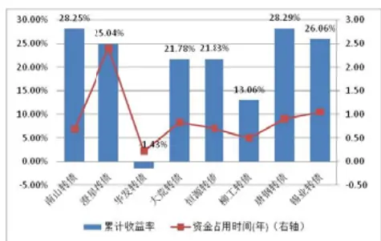
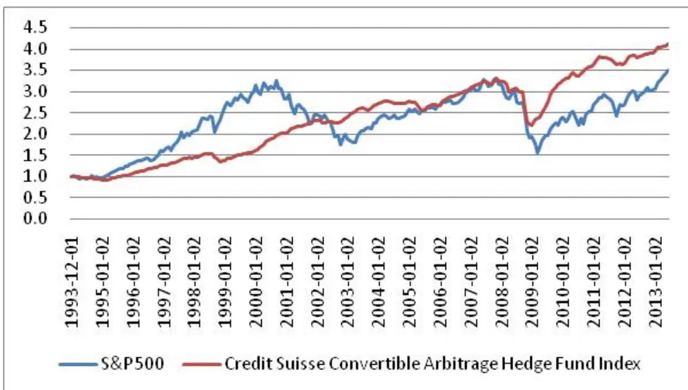
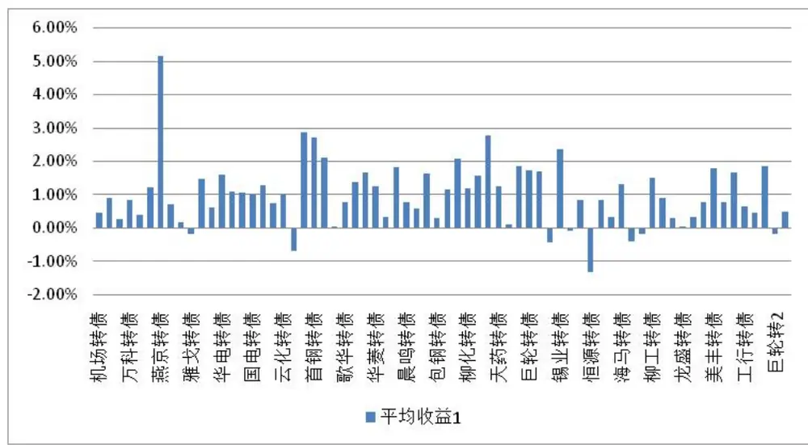
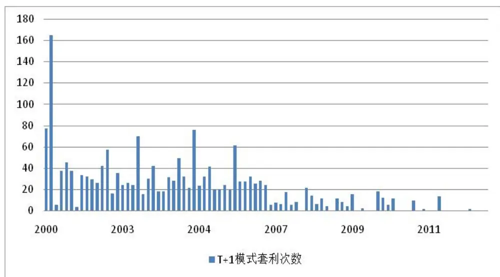
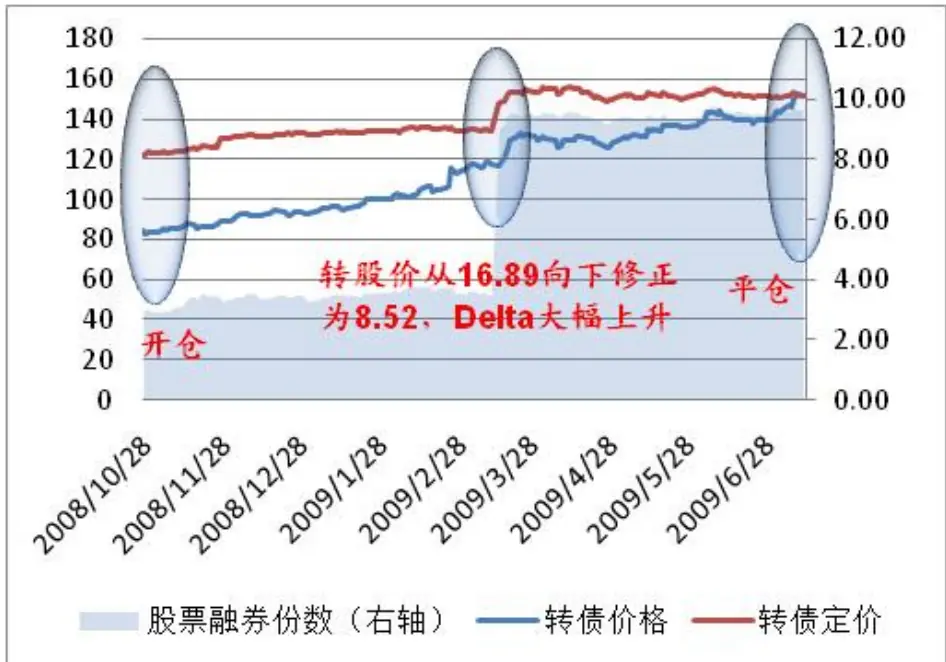
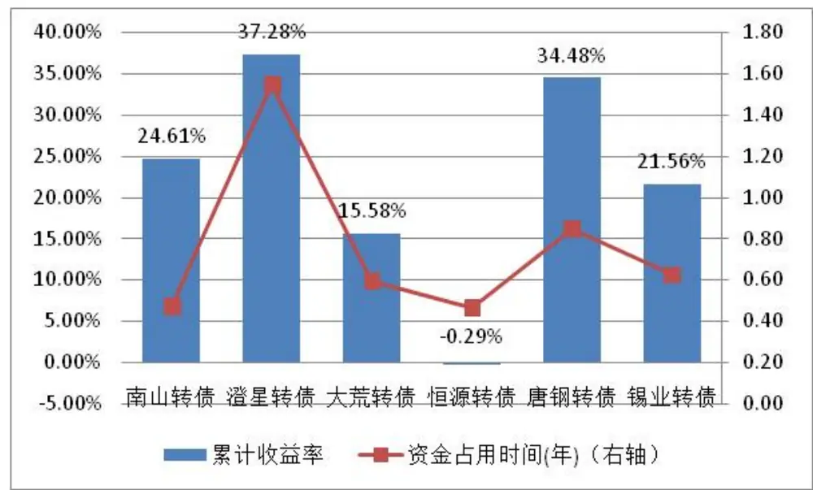
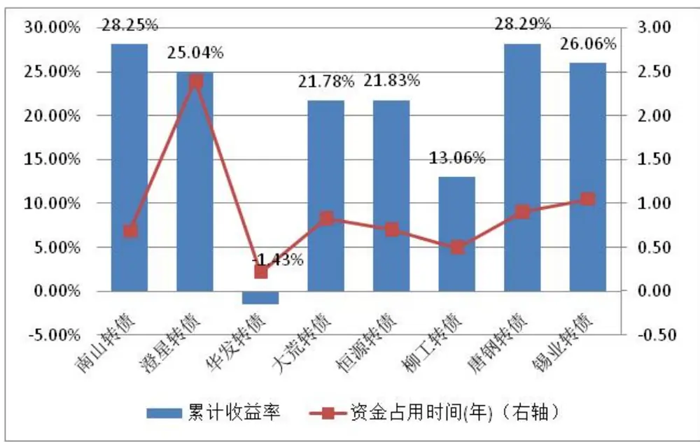
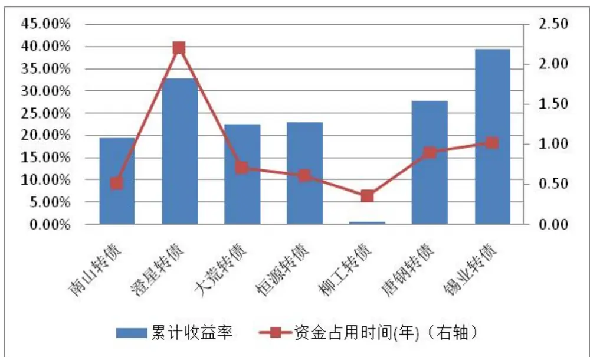

# 可转债的波动率套利策略研究

## 期权研究系列之五

## 报告摘要：

## z 可转债的关键要素决定了可转债的价值

可转债跟一般债券的最大区别是，它能够让持有者将债券转换为一定数量的标的公司股票，使得投资者能够分享资本利得收益。可转债与普通债券所区别的特性，决定了可转债的价值，同时也是决定可转债套利策略的关键参数。因此，我们应该重点关注可转债的转股期、转股价格、修正条款、回售条款以及赎回条款等关键要素。

## z 传统的可转债套利策略已经几乎没有空间

传统的可转债套利主要包括三种模式：T+1 卖出模式、转股期融券模式以及非转股期融券模式，这三种模式的套利策略要不就是胜率低、波动大，要不就是机会少、收益低，目前几乎已经没有套利空间的存在。

## z 可转债波动率套利原理

可转债的波动率套利策略也被称为 Delta对冲套利策略。其基本原理就是在可转债内嵌期权的市场价格（隐含波动率）低于其理论定价（实际波动率），或者看好可转债未来的隐含波动率上升的时候，买入低估的可转债，同时计算可转债的 Delta，在市场上卖空对应数量的股票，然后每日进行Delta 对冲，使得可转债与融券卖空的组合能够保持 Delta 中性。这一策略本质上是赚取可转债内嵌期权的隐含波动率上升或收敛所带来的收益，故称为波动率套利策略。

## z 可转债波动率套利策略设计

我们建议将套利开仓边界设定为：转债理论定价＞转债市场价格×(1+融券费率×转债剩余期限×0.5×(1+内嵌期权 Delta))；而平仓条件设置为可转债的理论价格≤可转债的市场价格，或者直到可转债退市。平仓的时候，可以选择买股还券或者转股还券中收益较高的方式进行平仓。

## z 可转债波动率套利实证结果

我们对 2005年后上市的融券标的可转债进行了套利策略实证。一共有7只可转债出现了 11套利机会。收益最差的柳工转债也有 0.6%的收益，没有出现亏损。其余的可转债，累计收益介于 19%至 40%之间。平均每只转债的累计收益为 23.73%，年化收益为 28.58%。从套利机会的出现时间来看，大部分套利机会集中出现于剩余期限 3.82年的时候。

## z 核心假设风险：

如果未来可转债的实际波动率降低，甚至低于期初买入转债时的隐含波动率，则对冲结果可能将导致出现亏损。

图 1 南山转债波动率套利示例

图 2 波动率套利结果

表 1 现存可转债的价格情况

| 转债名称 | 转债理 | 转债价 | 低估幅 |
| --- | --- | --- | --- |
| 石化转债 | 论价格 111.88 | 格 98.74 | 度 11.75% |
| 川投转债 | 138.54 | 129.57 | 6.47% |
| 同仁转债 | 140.84 | 136.51 | 3.07% |
| 中行转债 | 110.79 | 99.50 | 10.19% |
| 工行转债 | 122.48 | 111.53 | 8.94% |
| 重工转债 | 121.40 | 109.32 | 9.95% |
| 深机转债 | 110.58 | 95.80 | 13.37% |
| 中鼎转债 | 131.17 | 117.89 | 10.12% |

分析师：胡海涛 S0260511020010区020-87555888-8406hht@gf.com.cn

## 相关研究：

## 一、可转债介绍

## 1.1 可转债的基本概念

可转债全称为可转换公司债券，它是一种特殊的企业债券。可转债持有人既可以获得债券利息，也有权在规定期限内按照一定的比率和相应的条件将其转换成确定数量的发债公司的普通股票，分享公司股票上涨带来的收益。因此，可转债同时具有债权和期权的双重属性。

自美国的纽约益利铁路公司于1843年发行第一只可转债以来，可转债已经走过了170年的历程，可谓历史悠久。国内的可转债市场则是从20世纪90年代开始起步，当时国内企业尝试采用可转债来解决企业的融资问题。到了1997年3月，国务院证券委颁布了《可转换公司债券管理暂行办法》，对可转债市场进行了规范，使得国内可转债迎来了发展契机。自此以后，国内一共发行过91只可转债，其中有69只因为已经到期或者全部转股而退市。现存的22只可转债都是5年期或者6年期的。

表 1：国内现存市场可转债一览

| 转债名称 | 标的股票 | 期限(年) | 起息日期 | 到期日期 | 转股起始日 | 剩余期限(年) |
| --- | --- | --- | --- | --- | --- | --- |
| 东华转债 | 东华软件 | 6 | 2013/7/26 | 2019/7/25 | -- | 5.95 |
| 民生转债 | 民生银行 | 6 | 2013/3/15 | 2019/3/15 | 2013/9/16 | 5.58 |
| 海直转债 | 中信海直 | 6 | 2012/12/19 | 2018/12/18 | 2013/6/19 | 5.35 |
| 南山转债 | 南山铝业 | 6 | 2012/10/16 | 2018/10/16 | 2013/4/17 | 5.17 |
| 重工转债 | 中国重工 | 6 | 2012/6/4 | 2018/6/4 | 2012/12/5 | 4.81 |
| 泰尔转债 | 泰尔重工 | 5 | 2013/1/9 | 2018/1/8 | 2013/7/15 | 4.40 |
| 同仁转债 | 同仁堂 | 5 | 2012/12/4 | 2017/12/4 | 2013/6/5 | 4.31 |
| 国电转债 | 国电电力 | 6 | 2011/8/19 | 2017/8/19 | 2012/2/20 | 4.01 |
| 中海转债 | 中海发展 | 6 | 2011/8/1 | 2017/8/1 | 2012/2/2 | 3.97 |
| 深机转债 | 深圳机场 | 6 | 2011/7/15 | 2017/7/14 | 2012/1/16 | 3.92 |
| 恒丰转债 | 恒丰纸业 | 5 | 2012/3/23 | 2017/3/23 | 2012/9/24 | 3.61 |
| 川投转债 | 川投能源 | 6 | 2011/3/21 | 2017/3/21 | 2011/9/22 | 3.60 |
| 石化转债 | 中国石化 | 6 | 2011/2/23 | 2017/2/23 | 2011/8/24 | 3.53 |
| 歌华转债 | 歌华有线 | 6 | 2010/11/25 | 2016/11/25 | 2011/5/26 | 3.28 |
| 工行转债 | 工商银行 | 6 | 2010/8/31 | 2016/8/31 | 2011/3/1 | 3.05 |
| 中行转债 | 中国银行 | 6 | 2010/6/2 | 2016/6/2 | 2010/12/2 | 2.80 |
| 中鼎转债 | 中鼎股份 | 5 | 2011/2/11 | 2016/2/11 | 2011/8/11 | 2.49 |
| 海运转债 | 宁波海运 | 5 | 2011/1/7 | 2016/1/7 | 2011/7/8 | 2.40 |
| 燕京转债 | 燕京啤酒 | 5 | 2010/10/15 | 2015/10/14 | 2011/4/15 | 2.17 |
| 双良转债 | 双良节能 | 5 | 2010/5/4 | 2015/5/4 | 2010/11/4 | 1.72 |
| 博汇转债 | 博汇纸业 | 5 | 2009/9/23 | 2014/9/23 | 2010/3/23 | 1.11 |
| 新钢转债 | 新钢股份 | 5 | 2008/8/21 | 2013/8/20 | 2009/2/23 | 0.01 |

数据来源：广发证券发展研究中心

## 1.2 可转债的基本要素

可转债本质上也是债券的一种，因此同样具有一般债券所具有的面值、期限、票面利率、计息时间等因素，在此不再赘述。

可转债跟一般债券的最大区别是，它能够让持有者将债券转换为一定数量的标的公司股票，使得投资者能够分享资本利得收益。可转债与普通债券所区别的特性，决定了可转债的价值，同时也是决定可转债套利策略的关键参数。因此，我们还应该关注可转债的以下指标：

转股期：可转债会设定一个转股起始日和截止日，在这两个日期之间的期限内，债券持有者能够按照一定的比例将可转债转换为公司股票。目前国内可转债的转股期一般都是在起息日之后半年直到可转债退市。

转股价格、转换比率：转股价格是指可转债转换为每股股票所支付的价格。与转股价格紧密相联的一个概念是转换比率。转换比率是指一个单位的债券转换成股票的数量，即：转换比率＝单位可转债的面值／转股价格。

转股价值：也称为转股平价。转股价值＝股票价格×转换比率。转股价值表明了将可转债转股后所能取得的价值。

转股价修正：转股价格并不是一成不变的，在一定的条件下，如上市公司分红、送股，或者股价长期大幅低于转股价格等，上市公司会对转股价格进行调整。一般转股价格只会向下调整，调整以后转债的转股价值得到提高，有利于促使投资者进行转股。

回售条款：可转债一般还安排了回售条款，约定在股价连续大幅低于转股价的时候，投资者可以选择将可转债按照回售价格卖给上市公司。回售价格一般高于债券面值。

到期赎回条款：有一些债券规定了到期赎回条款，约定如果投资者一直不转股，而选择将转债持有到期，则上市公司将按照赎回价格向投资者购回可转债。可转债的到期赎回价格一般不低于转债面值与最后一期利息之和。

提前赎回条款：现在国内大部分发行的可转债都有提前赎回条款，约定在股价连续大幅高于转股价的情况下，上市公司有权将可转债按照一个提前赎回价格买回。提前赎回的价格一般稍高于债券面值。

## 二、传统的可转债套利策略

## 2.1 可转债套利在海外市场的表现

由于可转债具有股债相结合的特殊性质，其作为一种衍生产品工具，像期货、期权一样，跟标的股票结合起来就有可能产生套利的机会。

在海外的成熟市场，有不少专门有针对可转债套利的基金，并且普遍表现较好。

瑞信指数公司专门编制了可转债套利对冲基金指数（Credit Suisse ConvertibleArbitrage Hedge Fund Index），自1993年12月起对可转债套利的对冲基金策略进行跟踪。

图1：可转债套利对冲基金指数的历史表现

数据来源：Credit Suisse, 广发证券发展研究中心

我们将其与S&P500指数的同期表现进行了对比。我们看到，从1993年12月至2013年6月，S&P500指数累计上涨了244%，年化收益率为6.55%，而信息比只有49.29%；而同期可转债套利对冲基金指数上涨了310%，年化收益率为7.5%，信息比高达110.63%，明显跑赢S&P500。这表明，在海外，可转债套利是能够获得长期稳定收益、跑赢市场的有效策略。

## 2.2 传统的可转债套利策略介绍

在转股期内，可转债可以转换为一定数量的股票，所以一个很自然的想法就是，如果转债的市场价格低于转股价值，则投资者可以买入可转债实施转股，然后将转换后的股票卖出赚取两者的价差。这就是传统的可转债套利策略思路。由于卖出的股票正好与转换比率向匹配，不需要来回调整股票头寸，因此也可以称为可转债的静态套利策略。

值得注意的是，我国目前的可转债转股实施的是“T+1”的政策，也就是说，T日买入转债，当日可以立即申请转股，但是转股后的股票只能在T+1日可用卖出。所以如果采用这种转债套利方法，需要承担1个交易日的股价波动风险。

不过，自2010年3月以来，A股市场已经进入了融资融券时代，投资者如果需要进行可转债套利，可以在买入转债的当日同时融券卖空股票，将收益锁定，在下一交易日将转股后的股票用于还券，所需要付出的只是1天左右的融券成本，风险比T+1的套利策略风险要小得多。

另外，如果结合融券进行套利，则不需要等到转股期才实施静态套利。在转债上市后，一旦出现套利机会的价差，则可以买入可转债，同时融券卖出股票；然后一直等到转股期再转股还券。不过这就需要考虑从融券当日一直到转股期的融券利息成本。

所以，我们将传统的可转债静态套利策略分为下面3种模式进行具体描述：

（1）T+1卖出模式：在转股期内的T日，如果转债面值÷转股价格×股票价格＞可转债的买入价格+所估计的股票、转债交易成本，则买入可转债并实施转股，等到T+1日将股票卖出；

（2）转股期融券模式：在转股期内的T日，如果转债面值÷转股价格×股票价格＞可转债的买入价格+所估计的股票、转债交易成本+T日至T+1日的股票融券利息，则买入可转债，申请转股，同时融券卖空股票，等到T+1日将转换的股票用于还券；

（3）非转股期融券模式：在非转股期内的T日，如果转债面值÷转股价格×股票价格＞可转债的买入价格+所估计的股票、转债交易成本+T日至转股期首日的股票融券利息，则买入可转债，申请转股，同时融券卖空股票，等到转股期后将转换的股票用于还券。

## 2.3 可转债的 T+1套利——胜率低，波动大

我们将上述3种模式的静态套利策略应用于国内的可转债市场，观察传统的可转债套利的收益情况。

对于T+1模式的套利，在统计了2000年以来上市的87只可转债标的后，我们发现这种模式虽然套利的单次平均收益有1.07%，但是胜率并不高，只有64.6%。平均每只转债在转股期内出现这种套利机会的次数只有大概26次左右。而在2007年以后，随着国内市场的日渐成熟，套利机会已经大幅减少。因此，我们现在不提倡投资者采用这种低胜率的套利模式。

图2：可转债T+1模式套利的单次平均收益

数据来源：广发证券发展研究中心

图3：可转债T+1模式套利机会

数据来源：广发证券发展研究中心

## 2.4 可转债的融券模式套利——机会少，收益低

对于采用融券模式的两种套利策略，我们针对2005年后发行、标的股票在融券标的范围内的可转债进行实证。从结果来看，在27只可转债中，有17只在转股期内出现过融券套利机会，而有4只在非转股期内出现过融券套利机会。两种模式的套利都是具有100%的胜率，可谓相当稳健。其中转股期内融券套利的单次平均收益为0.53%，而非转股期内融券套利的单次平均收益为2.51%。

不过，从套利机会的角度考虑，每只可转债在转股期内平均只有10.4次的套利机会，也就是说在转债的整个转股期内，采用这种模式套利的收益大概为5.51%左右。而非转股期内具有套利机会的可转债数量本来就不多，而且在进行套利的时候，有可能需要锁定几个月甚至半年的时间。

表 2：采用融券模式进行可转债套利的单次平均收益率

| 转债简称 | 标的股票 | 起息日期 | 到期日期 | 转股期内融券 | 非转股期融券 |
| --- | --- | --- | --- | --- | --- |
| 华发转债 | 华发股份 | 2006/7/27 | 2011/7/27 | 0.53% | 2.59% |
| 招商转债 | 招商地产 | 2006/8/30 | 2011/8/30 | 0.94% | 2.05% |
| 澄星转债 | 澄星股份 | 2007/5/10 | 2012/5/10 | 0.39% | -- |
| 锡业转债 | 锡业股份 | 2007/5/14 | 2012/5/13 | 0.36% | -- |
| 恒源转债 | 恒源煤电 | 2007/9/24 | 2012/9/24 | 0.22% | -- |
| 大荒转债 | 北大荒 | 2007/12/19 | 2012/12/19 | 0.35% | 3.62% |
| 海马转债 | 海马汽车 | 2008/1/16 | 2013/1/15 | 0.66% | -- |
| 南山转债 | 南山铝业 | 2008/4/18 | 2013/4/17 | 0.28% | -- |
| 厦工转债 | 厦工股份 | 2009/8/28 | 2014/8/28 | 0.67% | -- |
| 国投转债 | 国投电力 | 2011/1/25 | 2017/1/25 | 0.17% | -- |
| 石化转债 | 中国石化 | 2011/2/23 | 2017/2/23 | 0.58% | -- |
| 同仁转债 | 同仁堂 | 2012/12/4 | 2017/12/4 | 0.17% | -- |

识别风险，发现价值

| 工行转债 | 工商银行 | 2010/8/31 | 2016/8/31 | 0.44% | -- |
| --- | --- | --- | --- | --- | --- |
| 柳工转债 | 柳工 | 2008/4/18 | 2014/4/17 | 1.23% | -- |
| 安泰转债 | 安泰科技 | 2009/9/16 | 2015/9/16 | 0.52% | -- |
| 铜陵转债 | 铜陵有色 | 2010/7/15 | 2016/7/15 | 0.44% | 1.83% |
| 塔牌转债 | 塔牌集团 | 2010/8/26 | 2015/8/25 | 0.33% | -- |
| 整体平均收益 |  |  |  | 0.53% | 2.51% |

数据来源：广发证券发展研究中心

## 三、可转债的波动率套利策略

## 3.1 可转债的波动率套利原理介绍

前面我们分析过，自从A股市场有了融券这一做空工具后，转债价格低于转股价值的机会变得可遇不可求了。因为普通投资者一旦发现转股价格低于转股价值，马上就可以通过买入转债、同时融券卖空股票来实现套利，这就导致传统的可转债套利机会减少了很多。实际上，在海外的有效市场，传统的套利机会几乎绝迹，而可转债套利基金主要采用的是波动率套利策略。

可转债的波动率套利策略也被称为Delta对冲套利策略。其基本原理就是在可转债内嵌期权的市场价格（隐含波动率）低于其理论定价（实际波动率）的时候，买入低估的可转债，同时计算可转债的Delta，根据计算的Delta值在市场上卖空对应数量的股票，然后每日进行Delta对冲，使得可转债与融券卖空的组合能够保持Delta中性。

由于可转债内嵌的是看涨期权，波动率越高期权价值也越高，因此这样对冲后构建的是一个Delta中性、Vega>0（看涨波动率）的组合。所以，波动率套利策略的实施标准为两块：看好未来隐含波动率上升，或者当前的银行波动率显著低于实际波动率。如果未来隐含波动率上升，则我们可以获得波动率上升的收益；而如果隐含波动率一直没有上升，反而出现下降，由于可转债的实际价格在到期前一般会收敛至其理论价格（即隐含波动率收敛至实际波动率），我们可以持有到期或者转股，捕捉初始隐含波动率与期权剩余实际波动率的差额收益。可转债的波动率套利本质上是赚取了可转债的利息收入，以及内嵌期权的隐含波动率上升或收敛所带来的收益，故称为波动率套利策略。

当然，波动率套利策略也不是完全无风险的策略，如果未来可转债的实际波动率降低，甚至低于期初买入转债时的隐含波动率，则对冲结果可能将导致出现亏损。

## 3.2 可转债的理论定价

在可转债的波动率套利中，理论定价是非常重要的一环，只有正确的定价，才能有助于定出合理的套利组合开仓边界。在这里我们将对可转债的理论定价进行介绍。

## （一）可转债的条款影响分析

可转债的内嵌期权是一个可以提前执行的看涨期权，因此业内有些简单粗暴的定价模型认为可转债价值=纯债价值+美式看涨期权价值（采用BS公式直接定价）。但是因为国内的可转债不能做空，而且大都带有回售、提前赎回条款，以及可转债价格向下修正条款，因此可转债的定价比普通的美式看涨期权更为复杂。

我们参考了国内的一些可转债的理论定价模型，将国内可转债的条款对定价所产生的影响进行下述分析：

（1）回售条款：可转债一般规定有回售条款，即股票价格在连续M个交易日中如果有N个交易日是低于转股价格的一定比例（目前国内大部分转债将这一比例定为70%），则投资者可以向发行人提前回售可转债。这一条款是对可转债投资者的保护，使得投资者可以提前拿回现金，也就是说，一旦发生回售，则发行人很可能得提前掏出现金还款给投资者，这对上市公司来说将产生较大的现金压力，也违背了上市公司的低成本融资初衷。所以，我们假定一旦满足回售的条件，则上市公司将下调转股价格。下调转股价一般不低于max(上市公司股票最近20个交易日的均价，最新收盘价)，因此我们也将这一转股价上限定为调整后的转股价。

（2）提前赎回条款：大部分提前赎回条款规定：如果股票价格在连续M个交易日中如果有N个交易日是高于转股价格的一定比例（目前国内大部分转债将这一比例定为130%），则发行人可以提前赎回可转债。但是赎回价格一般是低于转股价值的。所以实际上一旦触发了赎回条件，则投资者的最佳选择是立即进行转股。事实上，上市公司在进行赎回公告后，一般仍然有5个工作日可供投资者进行转股。

（3）修正转股价条款：由于向下修正转股价将提高转股比率，使得可转债的转股会对原有股东的股权产生更大的稀释作用。因此一般上市公司只会被动的修正转股价，也就是在分红送股的时候，或者满足回售条件的时候进行修正。

## （二）蒙特卡洛模拟定价

对于路径依赖的期权，目前普遍采用蒙特卡洛模拟进行定价。因此，我们定价的时候，首先根据股票的当前价格、波动率、市场利率、转债的剩余期限等因素生成一系列的股价路径。

对于每一条股价路径，我们搜索其中满足回售条件的节点，对于满足回售条件的节点，我们将这一节点直至期末的转股价格都进行修正，修正后的转股价为max(上市公司股票最近20个交易日的均价，最新收盘价)。并且，我们根据国内可转债的条款，约定每一个计息年度最多只修正一次转股价格。

然后，我们重新搜索所有的路径，看哪些节点满足提前赎回的条件。在满足赎回条件的节点，我们进行转股操作，这些路径的可转债现值，就定为（期初到触发提前赎回时点的利息+提前赎回时点的转股价值）的贴现值。

对于剩下没有触发提前赎回条件的路径，由于国内的转股价格都会根据股利发放的情况进行向下调整，我们可以看做是无红利的美式看涨期权，因此不会被提前执行。

最后确定的定价结果如下表所示：

表 3：可转债上市首日的定价情况

| 转债名称 | 上市首日收盘(A) | 纯债价值+看涨期权(B) | 蒙特卡洛模拟(C) | (A-C)/C | (B-C)/C |
| --- | --- | --- | --- | --- | --- |
| 机场转债 | 101.06 | 96.56 | 125.77 | -20% | -23% |
| 民生转债 | 100.01 | 100.51 | 126.56 | -21% | -21% |
| 水运转债 | 99.29 | 98.39 | 128.32 | -23% | -23% |
| 云化转债 | 100.12 | 100.67 | 113.08 | -11% | -11% |
| 西钢转债 | 103.31 | 100.59 | 131.65 | -22% | -24% |
| 雅戈转债 | 109.88 | 101.90 | 130.13 | -16% | -22% |
| 复星转债 | 99.00 | 102.78 | 131.09 | -24% | -22% |
| 阳光转债 | 98.58 | 99.27 | 116.55 | -15% | -15% |
| 桂冠转债 | 103.00 | 101.35 | 128.74 | -20% | -21% |
| 山鹰转债 | 102.24 | 101.91 | 135.11 | -24% | -25% |
| 华电转债 | 108.00 | 100.17 | 134.68 | -20% | -26% |
| 国电转债 | 108.04 | 101.90 | 138.59 | -22% | -26% |
| 邯钢转债 | 103.55 | 100.52 | 129.31 | -20% | -22% |
| 南山转债 | 107.52 | 100.80 | 142.99 | -25% | -30% |
| 新钢转债 | 96.50 | 97.30 | 140.01 | -31% | -31% |
| 厦工转债 | 129.95 | 106.17 | 149.50 | -13% | -29% |
| 西洋转债 | 132.40 | 106.91 | 151.06 | -12% | -29% |
| 龙盛转债 | 122.30 | 103.17 | 148.89 | -18% | -31% |
| 博汇转债 | 127.11 | 105.05 | 141.90 | -10% | -26% |
| 王府转债 | 141.52 | 109.90 | 143.23 | -1% | -23% |
| 双良转债 | 118.02 | 101.21 | 143.86 | -18% | -30% |
| 包钢转债 | 98.98 | 99.08 | 131.12 | -25% | -24% |
| 歌华转债 | 126.98 | 100.89 | 128.07 | -1% | -21% |
| 海运转债 | 115.68 | 94.87 | 129.23 | -10% | -27% |
| 国投转债 | 117.81 | 98.51 | 124.31 | -5% | -21% |
| 石化转债 | 108.20 | 96.78 | 116.89 | -7% | -17% |
| 川投转债 | 118.67 | 102.33 | 128.34 | -8% | -20% |
| 中海转债 | 104.01 | 91.82 | 118.18 | -12% | -22% |
| 国电转债 | 99.50 | 95.22 | 120.94 | -18% | -21% |
| 恒丰转债 | 109.20 | 94.59 | 132.61 | -18% | -29% |
| 南山转债 | 99.11 | 109.64 | 129.59 | -24% | -15% |
| 上电转债 | 113.79 | 101.54 | 134.25 | -15% | -24% |
| 同仁转债 | 110.02 | 97.07 | 125.69 | -12% | -23% |
| 民生转债 | 105.94 | 96.34 | 120.68 | -12% | -20% |
| 中海转债 | 128.57 | 107.48 | 145.62 | -12% | -26% |
| 招行转债 | 104.01 | 99.78 | 121.61 | -14% | -18% |
| 歌华转债 | 110.90 | 106.71 | 138.36 | -20% | -23% |

识别风险，发现价值

| 澄星转债 | 141.94 | 104.17 | 144.37 | -2% | -28% |
| --- | --- | --- | --- | --- | --- |
| 南山转债 | 105.04 | 102.03 | 140.24 | -25% | -27% |
| 赤化转债 | 162.10 | 107.82 | 142.17 | 14% | -24% |
| 金鹰转债 | 111.18 | 99.07 | 133.60 | -17% | -26% |
| 营港转债 | 107.00 | 103.78 | 135.87 | -21% | -24% |
| 华发转债 | 110.50 | 101.37 | 145.00 | -24% | -30% |
| 五洲转债 | 118.43 | 96.95 | 152.04 | -22% | -36% |
| 凯诺转债 | 109.62 | 99.02 | 131.28 | -16% | -25% |
| 江淮转债 | 108.87 | 103.37 | 126.78 | -14% | -18% |
| 柳化转债 | 107.92 | 107.00 | 142.68 | -24% | -25% |
| 天药转债 | 107.18 | 100.29 | 139.44 | -23% | -28% |
| 山鹰转债 | 143.54 | 95.66 | 146.42 | -2% | -35% |
| 大荒转债 | 135.00 | 100.87 | 152.45 | -11% | -34% |
| 创业转债 | 103.77 | 102.72 | 129.63 | -20% | -21% |
| 恒源转债 | 174.91 | 122.72 | 150.31 | 16% | -18% |
| 中行转债 | 99.92 | 98.62 | 116.62 | -14% | -15% |
| 工行转债 | 111.60 | 94.21 | 116.98 | -5% | -19% |
| 重工转债 | 107.55 | 93.72 | 123.88 | -13% | -24% |
| 万科转债 | 101.90 | 102.27 | 139.54 | -27% | -27% |
| 招商转债 | 122.00 | 106.63 | 143.21 | -15% | -26% |
| 侨城转债 | 104.30 | 100.85 | 124.00 | -16% | -19% |
| 深机转债 | 103.07 | 92.90 | 115.26 | -11% | -19% |
| 晨鸣转债 | 109.33 | 104.14 | 142.73 | -23% | -27% |
| 柳工转债 | 126.90 | 111.49 | 150.16 | -15% | -26% |
| 海马转债 | 119.78 | 101.11 | 146.59 | -18% | -31% |
| 钢钒转债 | 100.42 | 102.08 | 125.41 | -20% | -19% |
| 铜都转债 | 109.45 | 98.75 | 135.49 | -19% | -27% |
| 唐钢转债 | 151.00 | 110.84 | 165.75 | -9% | -33% |
| 韶钢转债 | 140.06 | 103.53 | 150.61 | -7% | -31% |
| 燕京转债 | 96.39 | 98.08 | 127.61 | -24% | -23% |
| 美丰转债 | 107.15 | 100.26 | 130.30 | -18% | -23% |
| 海化转债 | 108.99 | 103.09 | 137.57 | -21% | -25% |
| 中鼎转债 | 130.00 | 106.90 | 140.83 | -8% | -24% |
| 鞍钢转债 | 99.20 | 97.12 | 148.00 | -33% | -34% |
| 丰原转债 | 104.29 | 103.82 | 138.67 | -25% | -25% |
| 华菱转债 | 101.98 | 100.65 | 135.66 | -25% | -26% |
| 华西转债 | 100.68 | 102.50 | 122.85 | -18% | -17% |
| 金牛转债 | 103.31 | 103.17 | 120.90 | -15% | -15% |
| 首钢转债 | 102.20 | 99.59 | 130.09 | -21% | -23% |
| 锡业转债 | 167.05 | 117.59 | 153.95 | 9% | -24% |
| 安泰转债 | 136.60 | 114.77 | 162.63 | -16% | -29% |
| 万科转2 | 108.80 | 104.73 | 134.07 | -19% | -22% |
| 丝绸转2 | 98.52 | 101.92 | 134.68 | -27% | -24% |

识别风险，发现价值

| 铜陵转债 | 127.75 | 105.48 | 145.06 | -12% | -27% |
| --- | --- | --- | --- | --- | --- |
| 燕京转债 | 140.00 | 99.28 | 132.66 | 6% | -25% |
| 海直转债 | 114.08 | 98.15 | 133.89 | -15% | -27% |
| 泰尔转债 | 112.37 | 97.06 | 130.51 | -14% | -26% |
| 巨轮转债 | 145.06 | 104.26 | 162.37 | -11% | -36% |
| 塔牌转债 | 134.00 | 108.28 | 140.30 | -4% | -23% |
| 巨轮转2 | 114.57 | 93.49 | 134.47 | -15% | -30% |
| 平均水平 |  |  |  | -15% | -24% |

数据来源：广发证券发展研究中心

从定价结果来看，转债的实际价格要高于纯债价值+BS公式的定价，但是低于蒙特卡洛模拟定价的结果，并且一般要比理论价值低15%左右。也就是说，国内市场的可转债价格普遍被低估了。

## 3.3 可转债的波动率套利策略设计

由于可转债的波动率套利需要融券卖空股票对冲，对冲的时间跨度可能比较长，而目前国内的融券成本是年化8.6%，因此融券成本必须在套利开仓边界中予以重点考虑。为了保守起见，我们假定套利操作是直到可转债到期结束。所以，我们的套利开仓边界设定为：转债理论定价＞转债市场价格×(1+融券费率×转债剩余期限×调整因子F)。其中调整因子F满足0≤F≤1，如果策略是偏保守的，则可以将F设置得大一些，如果策略偏激进的，则可以将F设置得小一些。

实际上，未来股价的波动率是上升还是下跌我们是很难估计的，但是有一点是可以肯定的，就是可转债的实际价格在到期前会逐渐向理论价格收敛，也就是隐含波动率会向实际波动率收敛。所以，我们以可转债的价格收敛作为平仓的基准，将平仓条件设置为可转债的理论价格≤可转债的市场价格。

策略平仓的时候，我们比较买股还券以及转股还券两种方式的收益，选取收益较高的方式来进行平仓。

## 3.4 套利案例演示

我们以2008年发行的南山转债（110002.SH）为例，来说明波动率套利的实施情况。为了保险起见，我们这里假定调整因子F=1。2008年10月28日，南山转债的剩余期限为4.47年，市场价为84.59元，而标的股票南山铝业股价为4.92元。根据我们的可转债定价模型，当日南山转债的理论定价为122.34元。由于84.59×(1+8.6%×4.47×1)=117.11<122.34，所以触发了波动率套利的开仓条件。当日我们买入1份南山转债，同时计算得到Delta值为0.51，再根据当时的可转债转股价格16.89元，推断出需要融券卖空的南山铝业股票数量为0.51×100÷16.89=3.02股。

在此之后，我们每日计算新的Delta，并据此调整需要融券卖空的股票数量。直至2009年7月13日，我们发现转债价格回到了理论定价之上，这时候，我们进行套

识别风险，发现价值

利头寸的平仓处理。在平仓的时候我们有两种选择：一种是将可转债进行转股后用于还券，然后剩余部分在二级市场上卖出；另一种是将可转债卖出，同时将股票买回还券。经过比较后，我们发现第一种做法的收益更高，因此选择了转股还券的做法进行平仓。套利过程的具体现金流情况请参考下表：

表 4：南山转债的波动率套利现金流情况

| 日期 | 转债价 格 | 转债定 价 | 股票价 格 | 股票融券份数 | 转债现金流 | 股票现金 流 | 融券费用 | 利息收入 |
| --- | --- | --- | --- | --- | --- | --- | --- | --- |
| 2008/10/28 | 84.59 | 122.34 | 4.92 | 3.02 | -84.67 | 14.83 | 0.00 | 0.00 |
| 2008/10/29 | 82.99 | 122.01 | 4.76 | 2.97 | 0.00 | -0.25 | 0.00 | 0.00 |
| 2008/10/30 | 84.15 | 123.44 | 4.89 | 2.99 | 0.00 | 0.12 | 0.00 | 0.00 |
|  |  |  |  |  |  |  |  | … |
| 2009/3/13 | 117.90 | 134.35 | 7.69 | 3.49 | 0.00 | -0.28 | -0.01 | 0.00 |
| 2009/3/16 | 117.26 | 148.47 | 7.77 | 8.94 | 0.00 | 42.28 | -0.02 | 0.00 |
| 2009/3/17 | 119.96 | 149.11 | 8.25 | 9.09 | 0.00 | 1.26 | -0.02 | 0.00 |
| 2009/3/18 | 121.01 | 148.96 | 8.31 | 9.09 | 0.00 | -0.01 | -0.02 | 0.00 |
| 2009/3/19 | 126.10 | 152.52 | 9.14 | 9.34 | 0.00 | 2.28 | -0.02 | 0.00 |
| 2009/3/20 | 129.39 | 153.97 | 9.70 | 9.48 | 0.00 | 1.35 | -0.02 | 0.00 |
| 2009/3/23 | 131.51 | 153.84 | 9.71 | 9.48 | 0.00 | -0.07 | -0.07 | 0.00 |
| 2009/3/24 | 133.40 | 153.52 | 9.43 | 9.41 | 0.00 | -0.66 | -0.02 | 0.00 |
|  |  |  |  |  |  |  |  | … |
| 2009/7/9 | 149.70 | 153.84 | 11.19 | 9.68 | 0.00 | 0.98 | -0.02 | 0.00 |
| 2009/7/10 | 152.77 | 153.05 | 11.05 | 9.64 | 0.00 | -0.48 | -0.03 | 0.00 |
| 2009/7/13 | 152.24 | 152.18 | 10.85 | 9.59 | 152.09 | -104.69 | -0.08 | 0.00 |

数据来源：广发证券发展研究中心

图4：南山转债波动率套利示例

数据来源：广发证券发展研究中心
识别风险，发现价值

值得注意的是，在2009年3月16日，由于南山转债将转股价从16.89元向下修正为8.52元，使得Delta大幅上升，因此融券卖空的股票数量也有了较大的增加。转股价的修正也让市场意识到了南山转债的内在价值，此后南山转债加快了价值回归的步伐。整个套利期间，南山转债并未获得利息收入，套利赚取的纯粹是南山转债波动率收敛所产生的的价值。

## 3.5 波动率套利实证分析

## （一）保守的套利条件下的情况（F=1）

我们对于2005年后发行的、标的股票属于融券范围的27只可转债进行了实证分析。保守起见，我们将F设置为1，即考虑对冲时需要融券的股票数量跟转股比率完全匹配。这样的做法是很保守的，因为由于Delta大部分时间都不会达到1，因此实际的融券成本并不会那么高。由于设置比较保守，因此实际的套利机会不会太多，27只可转债中，只有6只出现过套利机会。分别是南山转债、澄星转债、大荒转债、恒源转债、唐钢转债以及锡业转债。除了澄星转债在整个存续期内出现过3次套利机会外，其他的几次套利都是只做了一次。

从出现套利机会的时间来看，首次套利机会的出现大多是在距离到期时间4年左右，每次套利操作的持续时间从半年到10个月左右不等。

从结果来看，除了恒源转债最后微亏0.29%，其他各个转债都有正收益，累计收益率从15%至37%不等。平均的套利收益率为22.2%，年化后的收益率可以高达31%。这一结果还是比较可观的。

图5：波动率套利结果（F=1）

数据来源：广发证券发展研究中心

## （二）激进的套利条件下的情况（F=内嵌期权Delta）

前面我们也提到，将F设置为1是偏保守的，因为对冲过程的大部分时间内Delta值并不会到达1，另外，套利操作的持续时间也不会需要占用转债的整个剩余期限。所以，我们尝试将F设为套利机会判定当天的Delta值，看看是否能产生更多的套利机会。即将套利边界设定为：转债理论定价＞转债市场价格×（1+融券费率×转债剩余期限×可转债内嵌期权的Delta值）。这样的调整是较为激进的，因为如果股价上涨，则融券成本有可能估计不足。

在将F值设置为Delta值后，套利条件比较宽松，因此，有套利机会的转债数量从6只提高到8只。8只转债一共出现了12次的套利机会，只有一只转债的套利出现1.43%亏损。其余盈利的可转债累计收益率从13%至28%不等。平均每只转债的累计收益率达到了20.36%，年化收益为23.93%，比起保守套利条件下的收益稍有降低。

图6：波动率套利结果（F=内嵌期权Delta）

数据来源：广发证券发展研究中心

## （三）中庸的套利条件下的情况（F=0.5×(1+内嵌期权Delta)）

将F值设置为期权Delta值是较为激进的，如果期初的Delta值较小，而开仓后股价迅速大幅上升，则Delta值会迅速增大，导致融券成本超出预期，最终可能导致套利失败，亏损离场。于是，我们选择了一条了保守与激进之间的中庸之道，将F设置为0.5×(1+内嵌期权Delta)。这样的设置既不会过于保守，也为融券费用的增加预留了成本空间。

在进行了调整以后，一共有7只可转债出现了11套利机会，刚好介于保守与激进之间。收益最差的柳工转债也有0.6%的收益，没有出现亏损。其余的可转债，累计收益介于19%至40%之间。平均每只转债的累计收益为23.73%，年化收益为28.58%。

识别风险，发现价值

从套利机会的出现时间来看，大部分套利机会集中出现于剩余期限3.82年的时候。

图7：波动率套利结果（F=0.5×(1+内嵌期权Delta)）

数据来源：广发证券发展研究中心

## 四、总结

在本篇文章中，我们介绍了目前对冲基金常用的可转债套利策略——波动率套利策略，并针对国内的市场进行了实证。其主要原理就是利用可转债的价值被低估，在转债价格大幅低于理论价格的时候买入可转债，并进行Delta对冲融券卖空标的股票。套利最终赚取的是内嵌期权的隐含波动率上升或收敛所带来的收益。

经过实证，我们建议将套利开仓边界设定为：转债理论定价＞转债市场价格×(1+融券费率×转债剩余期限×0.5×(1+内嵌期权Delta))；而平仓条件设置为可转债的理论价格≤可转债的市场价格，或者直到可转债退市。平仓的时候，可以选择买股还券或者转股还券中收益较高的方式进行平仓。

最后，我们统计了目前国内现存未退市的可转债，发现目前国内的可转债仍然是普遍被低估的，但是低估程度都未能满足开仓条件。从低估程度来看，我们建议投资者关注深机转债、中鼎转债以及中行转债，一旦满足开仓条件，则投资者可以考虑介入进行套利。

表 5：现存可转债的价格情况

| 转债名称 | 剩余期 限 | 转债理论价格 | 转债价格 | 低估幅度 | 到期日 | 转债开仓价 | 与当前价格差 异 |  |
| --- | --- | --- | --- | --- | --- | --- | --- | --- |
|  |  |  |  |  |  |  |  | 格 |
| 石化转债 | 3.55 | 111.88 | 98.74 | 11.75% | 2017/2/23 | 90.74 | -8.10% |  |

识别风险，发现价值

| 川投转债 | 3.62 | 138.54 | 129.57 | 6.47% | 2017/3/21 | 107.91 | -16.72% |
| --- | --- | --- | --- | --- | --- | --- | --- |
| 同仁转债 | 4.33 | 140.84 | 136.51 | 3.07% | 2017/12/4 | 104.84 | -23.20% |
| 中行转债 | 2.82 | 110.79 | 99.50 | 10.19% | 2016/6/2 | 92.80 | -6.73% |
| 工行转债 | 3.07 | 122.48 | 111.53 | 8.94% | 2016/8/31 | 99.02 | -11.21% |
| 重工转债 | 4.83 | 121.40 | 109.32 | 9.95% | 2018/6/4 | 90.44 | -17.27% |
| 深机转债 | 3.94 | 110.58 | 95.80 | 13.37% | 2017/7/14 | 90.47 | -5.57% |
| 中鼎转债 | 2.52 | 131.17 | 117.89 | 10.12% | 2016/2/11 | 111.03 | -5.82% |

数据来源：广发证券发展研究中心

## 风险提示

当未来可转债的实际波动率降低，甚至低于期初买入转债时的隐含波动率，则可转债波动率套利策略的结果可能出现亏损。

## 广发金融工程研究小组

罗 军： 首席分析师，华南理工大学理学硕士，2010年进入广发证券发展研究中心。

俞文冰： 首席分析师，CFA，上海财经大学统计学硕士，2012年进入广发证券发展研究中心。

叶 涛： 资深分析师，CFA ，上海交通大学管理科学与工程硕士，2012 年进入广发证券发展研究中心。

安宁宁： 资深分析师，暨南大学数量经济学硕士，2011年进入广发证券发展研究中心。

胡海涛： 分析师， 华南理工大学理学硕士， 2010年进入广发证券发展研究中心。

夏潇阳： 分析师， 上海交通大学金融工程硕士， 2012年进入广发证券发展研究中心。

蓝昭钦： 分析师， 中山大学理学硕士， 2010年进入广发证券发展研究中心。

史庆盛： 分析师， 华南理工大学金融工程硕士， 2011年进入广发证券发展研究中心。

张 超：研究助理， 中山大学理学硕士，2012年进入广发证券发展研究中心。

汪 鑫： 研究助理， 中国科学技术大学金融工程硕士， 2012年进入广发证券发展研究中心。

## 广发证券—行业投资评级说明

买入： 预期未来 12 个月内，股价表现强于大盘 10%以上。

持有： 预期未来12个月内，股价相对大盘的变动幅度介于-10%～+10%。

卖出： 预期未来12个月内，股价表现弱于大盘10%以上。

## 广发证券—公司投资评级说明

买入： 预期未来12个月内，股价表现强于大盘15%以上。

谨慎增持： 预期未来12个月内，股价表现强于大盘5%-15%。

持有： 预期未来12个月内，股价相对大盘的变动幅度介于-5%～+5%。

卖出： 预期未来12个月内，股价表现弱于大盘5%以上。

## 联系我们

|  | 广州市 | 深圳市 | 北京市 | 上海市 |
| --- | --- | --- | --- | --- |
| 地址 | 广州市天河北路183号 大都会广场5楼 | 深圳市福田区金田路4018 号安联大厦 15 楼 A 座 | 北京市西城区月坛北街2号 | 上海市浦东新区富城路99号 |
|  |  | 03-04 | 月坛大厦18层 | 震旦大厦18楼 |
| 邮政编码 | 510075 | 518026 | 100045 | 200120 |
| 客服邮箱 | gfyf@gf.com.cn |  |  |  |
| 服务热线 | 020-87555888-8612 |  |  |  |

## 免责声明

广发证券股份有限公司具备证券投资咨询业务资格。本报告只发送给广发证券重点客户，不对外公开发布。

本报告所载资料的来源及观点的出处皆被广发证券股份有限公司认为可靠，但广发证券不对其准确性或完整性做出任何保证。报告内容仅供参考，报告中的信息或所表达观点不构成所涉证券买卖的出价或询价。广发证券不对因使用本报告的内容而引致的损失承担任何责任，除非法律法规有明确规定。客户不应以本报告取代其独立判断或仅根据本报告做出决策。

广发证券可发出其它与本报告所载信息不一致及有不同结论的报告。本报告反映研究人员的不同观点、见解及分析方法，并不代表广发证券或其附属机构的立场。报告所载资料、意见及推测仅反映研究人员于发出本报告当日的判断，可随时更改且不予通告。

本报告旨在发送给广发证券的特定客户及其它专业人士。未经广发证券事先书面许可，任何机构或个人不得以任何形式翻版、复制、刊登、转载和引用，否则由此造成的一切不良后果及法律责任由私自翻版、复制、刊登、转载和引用者承担。