# 全球个股期权市场发展概述

## ——期权研究系列之八

## Table_Sum ary报告摘要 ：

## 全球股票期权快速发展，美国、巴西占比集中，亚洲以香港为主

本节对全球主要期权市场的发展概况进行介绍，将全球期权市场划分为美国市场、欧洲市场、亚太市场以及“金砖国家”市场。

近几年来全球股票期权规模发展快速，2013年全球股票期权成交约 40亿美元。从交易所区分来看，股票期权主要集中在美国的几大交易所中，交易额约占全球成交总量的 60%，但从单个交易所来看，个股期权交易额最大的交易所依然是巴西证券期货交易所（BM&FBOVESPA），自从 2010年以来该交易所交易额均为全球第一，2013 年其个股期权成交量占全球主要期权交易所约 24%；规模其次的分别是美国的四个期权交易所：NASDAQOMX、ISE、NYSE Euronext 以及 CBOE；除了美洲国家交易所之外，欧洲国家中的Deutsche Borse和NYSE Euronext交易所内个股期权交易也比较活跃；而亚太国家中则以澳大利亚、香港及印度为主要的个股期权交易市场，虽然绝对规模占比不大，但这几个市场近几年的规模占比稳步提升。

按各区域个股期权规模变化趋势来看，美洲个股期权在2004年至 2008年出现了快速增长，近几年则趋于平缓；欧洲市场从 2001年以来个股期权没有得到显著发展，交易额稳定，亚太市场和金砖国家等新兴证券市场则迎来了蓬勃的发展。

## ETF期权高度集中在美国四大期权交易所

2004年开始全球范围内才正式开始有了场内ETF期权交易，ETF期权规模比股票期权要小得多，2013年全球成交约 15亿美元。从区域来看，以美国为首的美洲依然是主要的交易场所，与其相比其余各区域的规模几乎可以忽略。但个大洲内部交易所的ETF期权成交规模依然存在较大分化。

从各交易所统计数据来看，美国的几大交易所几乎垄断了全球 ETF 期权交易，在我们重点统计的各洲 6 个重要交易所交易额中，美国 4 大交易所约占 98%，霸主地位不可撼动。

## 国内推出个股期权存在强烈的客观需求，上交所筹备充分一触即发

目前我国在场内交易的衍生品种类主要为在各大商品交易所上市的商品期货以及在中国金融期货交易所上市的沪深 300 股指期货和国债期货。因此个股期权的推出存在迫切的客观需求。

图1：2013年个股期权按交易所划分占比
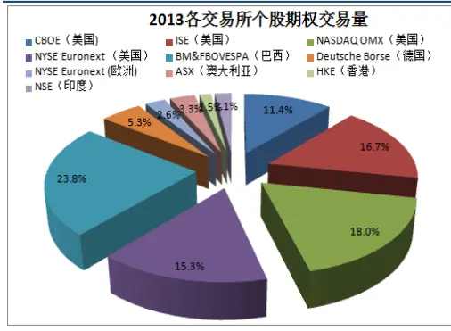

图2：各交易所推出个股期权后股票表现
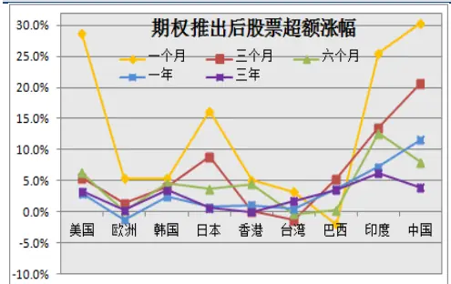
图3：中国市场个股期权上市对成交量影响

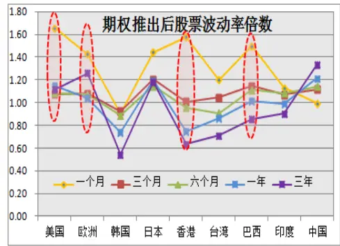

分析师： 史庆盛 S0260513070004

020-87555888-8618

sqs@gf.com.cn

## Table_Report 相关研究：

2013年，中国A股市市场投资者翘首已久的交易所期权终于渐行渐近，目前上交所和中金所都分别在紧锣密鼓地进行个股期权和股指期权的测试准备，前者于11 月8 日推出沪深300 指数期权仿真交易，后者则于12 月26 日推出了个股期权和ETF期权的仿真交易。作为活跃市场、增加风险对冲手段、丰富投资策略的重要衍生工具，期权等相关业务的推出必然会对国内证券市场产生重大的影响，本文将对海外各主要个股期权市场进行概述。

## 一、海外主要市场个股期权发展情况概述

## 1.1 海外期权发展历史

自1973年芝加哥期权交易所问世以来，经过近40年的发展，期权在全球范围内随着金融市场和金融衍生品的完善逐步成长起来，交易规模不断增加，交易品种日渐丰富，交易所也取得了长足的发展。在20世纪70年代末，伦敦证券交易所开辟了LTOM（London Traded Options Market），荷兰成立了EOE（European OptionExchange），1982年芝加哥期货交易所推出了美国长期国债期货期权合约，标志着金融期货期权的诞生，引发了期货交易的又一场革命。同年，新加坡的DIMEX开始交易期权合约，此后，费城股票交易所（PHLX）推出了外币期权交易，加拿大、瑞典、日本、马来西亚和中国香港也先后推出了期权交易。而德国、比利时、新加坡等过，更是在期货交易所成立3~5年的时间内，便推出了期权交易。期权交易从最初的股票扩展到目前包括大宗农副产品、债券、股指等金融产品、外汇以及黄金白银在内的近100个品种。

表 1：海外期权发展时间表

| 阶段 | 时间 | 事件 |
| --- | --- | --- |
| 起源 | 公元前1700年 | 《圣经.创世纪》中记录的类似期权结婚契 |
|  | 未知 | 亚里士多德的《政治学》一书中记载古希腊哲学家数家泰利斯购买橄榄榨汁机“使用权”的事件。 |
| 早起期权交易 | 17 世纪 | 荷兰郁金香泡沫事件中出现了球茎期权的二级市场。 |
| 场外期权市场诞生 | 18世纪 | 在工业革命和运输贸易的刺激下，欧洲出现了有组织期权交易。 |
|  | 1733年-1860年 | 1733年，英国颁布巴纳德法宣布期权非法，1860年撤销，期间存在少量期权交易。 |
|  | 18世纪末 | 美国出现场外股票期权市场 |
|  | 20世纪 30年代 | 英美等国家干预甚至禁止期权市场 |
| 场内期权市场发展历程 | 1973年 | 美国芝加哥期权交易所（CBOE）成立，进行对股票看涨期权合约进行统一标准化。 |
|  | 1975年 | 美国股票交易所（AMEX)及费城股票交易所（PHLX）开始交易期权 |
|  | 1977年 | CBOE推出看跌期权。 |
|  | 1982年 | 芝加哥期货交易所（CBOT）推出长期国债期货期权。 |

识别风险，发现价值

| 1982 年-1983年 | 由于芝加哥商业交易所(CME)S&P500指数期货的带动，美国股票指数期权蓬勃发展。 |
| --- | --- |
| 1985年 | 芝加哥及费城交易所推出外汇期权 |
| 20 世纪 80年代 | 债券、农产品及原油期货等期权产品纷纷面世，全球期权市场百花齐放。 |

数据来源：FIA，广发证券发展研究中心

## 1.2 海外期权市场规模统计

本节对全球主要期权市场的发展概况进行介绍，将全球期权市场划分为美国市场、欧洲市场、亚太市场以及“金砖国家”市场。欧美亚三大市场的划分自然可以理解，而单独划分出“金砖国家”市场的意义在于印度、巴西、俄罗斯、南非等新兴国家的期权市场发展非常迅速，且各有特点，同样具有新兴国家特点的中国无疑将能从金砖国家市场的发展历史中学习到宝贵的经验。

近几年来全球股票期权规模发展快速，2013年全球股票期权成交约40亿美元。

从交易所区分来看，股票期权主要集中在美国的几大交易所中，交易额约占全球成交总量的60%，但从单个交易所来看，个股期权交易额最大的交易所依然是巴西证券期货交易所（BM&FBOVESPA），自从2010年以来该交易所交易额均为全球第一，2013年其个股期权成交量占全球主要期权交易所约24%；规模其次的分别是美国的四个期权交易所：NASDAQ OMX、ISE、NYSE Euronext以及CBOE；除了美洲国家交易所之外，欧洲国家中的Deutsche Borse和NYSE Euronext交易所内个股期权交易也比较活跃；而亚太国家中则以澳大利亚、香港及印度为主要的个股期权交易市场，虽然绝对规模占比不大，但这几个市场近几年的规模占比稳步提升。

图4：2013年个股期权按交易所划分占比
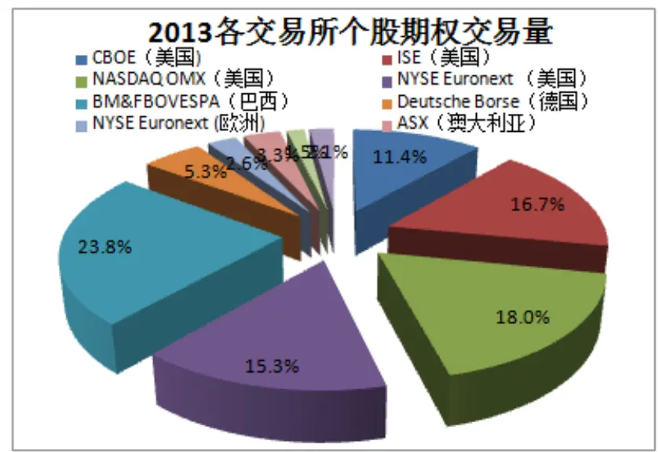
数据来源：WFE，广发证券发展研究中心

ETF期权规模比股票期权要小得多，2013年全球成交约15亿美元，从各交易所统计数据来看，美国的几大交易所几乎垄断了全球ETF期权交易，在我们重点统计的各洲6个重要交易所交易额中，美国4大交易所约占98%，霸主地位不可撼动。

图5：2013年ETF期权按交易所划分占比
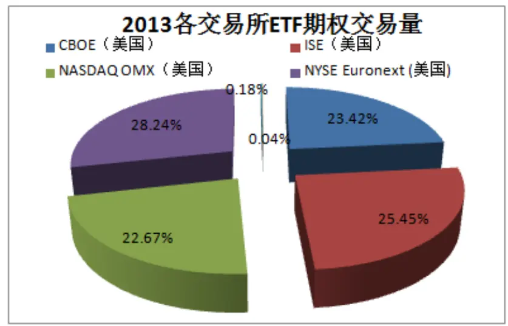
数据来源：WFE，广发证券发展研究中心

从区域划分来看，2013年以美国为首的美洲集中了67%的交易额，而由于同样包含了巴西证券期货交易所（重叠），金砖国家的交易额约占20%，欧洲和亚太交易所分类其次。

图6：2013年个股期权按区域划分占比
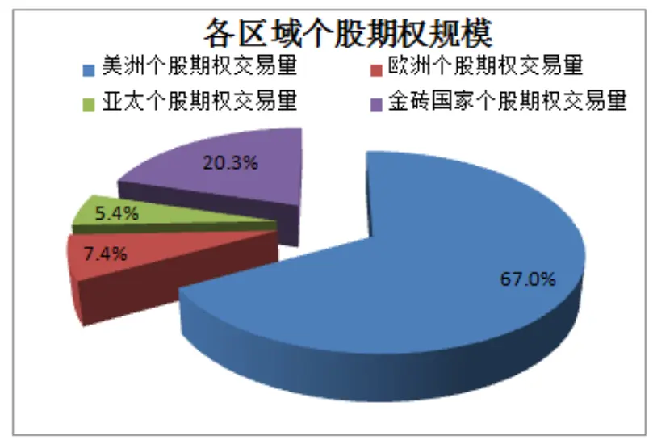
数据来源：WFE，广发证券发展研究中心

按各区域个股期权规模变化趋势来看，美洲个股期权在2004年至2008年出现了快速增长，近几年则趋于平缓；欧洲市场从2001年以来个股期权没有得到显著发展，交易额稳定，亚太市场和金砖国家等新兴证券市场则迎来了蓬勃的发展。

图7：2013年个股期权按区域划分占比
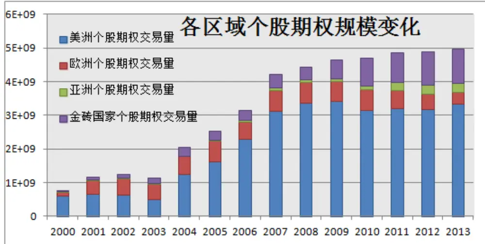
数据来源：WFE，广发证券发展研究中心

2004年开始全球范围内才正式开始有了场内ETF期权交易，从下图来看，以美国为首的美洲依然是主要的交易场所，与其相比其余各区域的规模几乎可以忽略。但个大洲内部交易所的ETF期权成交规模依然存在较大分化，下文我们将对各区域不同交易所内的不同品种规模进行展开比较。

图8：2013年ETF期权按区域划分占比
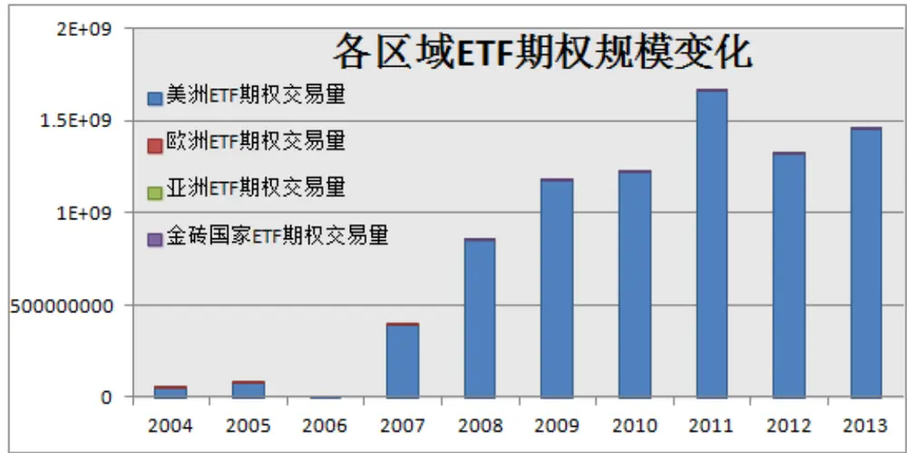
数据来源：WFE，广发证券发展研究中心

## 二、美洲期权市场概述

股票期权：股票期权最主要的交易区域是以美国为代表的美洲，股票期权也是美洲竞争最激烈的期权品种。下图显示从美洲共有10个期权交易所，其中美国就有6个，超过半数；而从19世纪以来，美国交易所便占据绝对的规模领先优势；巴西交易所则逐年增长，拥有个股期权交易规模最大的交易所；其次，阿根廷、加拿大以及墨西哥等国家均有少量的个股期权交易。

图9：美洲国家个股期权规模统计
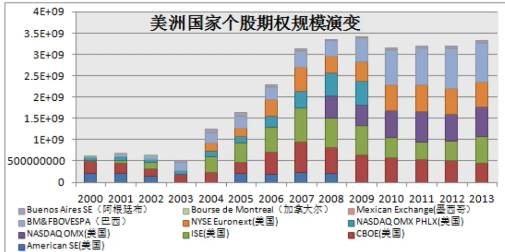
数据来源：WFE，广发证券发展研究中心

从各美洲国家交易所的规模变化趋势可以看出，巴西等新兴国家的期权规模稳步上涨，而美国交易所的股票期权交易重则趋于稳定，其中，股票期权的重心正在从以CBOE和ISE为代表的主营或专营期权交易所转向以纳斯达克(NASDAQ)和纽约股票交易（NYSE Euronext）所为代表的综合性交易所。下一节我们将选择该4个交易所中作为美国代表，分析美国个股期权推出对现货标的影响。

ETF期权：美国同样是ETF期权交易最主要交易区域，四家主要期权交易所CBOE、ISE、NYSE和NASDAQ的发展历史与股票期权较相似，但规模占比更为集中。在2008年金融危机以前，CBOE和ISE的市场份额较大，随后NYSE和NASDAQ的交易额增长迅速， 2011年NYSE成为最大的ETF期权交易所，截止2013年的交易额都超过了CBOE和ISE。从所有市场来看，ETF期权的规模在2011年达到最高峰，随后两年有所下降并趋于平稳。

图10：美洲国家ETF期权规模统计
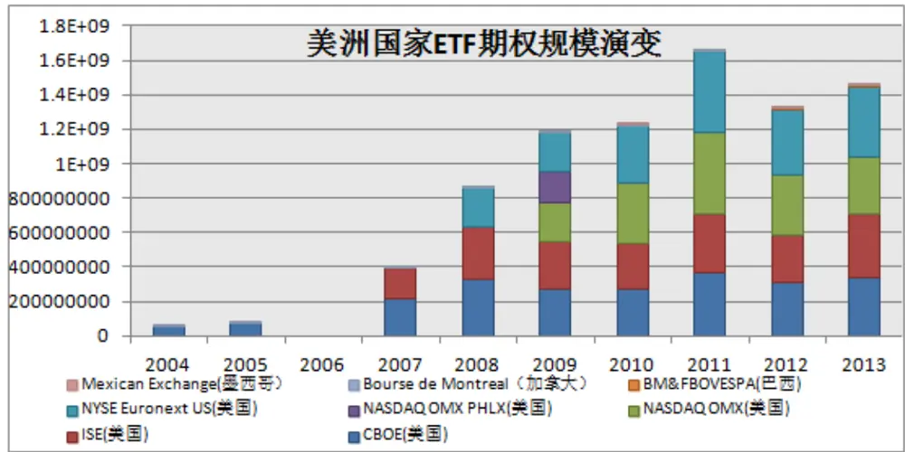
数据来源：WFE，广发证券发展研究中心

## 三、欧洲期权市场概述

## 股票期权：

欧洲的两大衍生品市场为德国期货交易所DTB(后来和瑞士SOFFEX交易所合并为Eurex)和泛欧期货交易所（Euronext），两者的交易额占欧洲全部交易额约80%。

其中，DTB的交易额呈上升趋势而Euronext的交易额呈下降趋势，DTB曾是世界上最大的期货和期权交易所，随着美国股票期权、ETF期权兴起，以及韩国、印度股指期权的爆发，DTB从交易额上有所下降。但是仍然是世界最大衍生品交易所之一，在欧洲具有绝对优势。通过合并顺应了欧洲一体化的趋势，节省投资者交易成本，在全球设立交易终端，积极吸纳全球投资者。DTB主要交易股票期权、股指期权、长期利率期权以及奇异期权，交易额在欧洲均排第一。

NYSE Euronext则由荷兰阿姆斯特丹、法国巴黎、比利时布鲁塞尔3家证券交易所根据荷兰法律，于2000年9月通过合并方式设立。

相比于美国股票期权从2003年开始快速增长的状况，欧洲股票期权市场则发展较为缓慢。从图25的交易额数据计算得到，从2002年到2011年这10年间，欧洲股票期权市场的交易总量只增长了3%，而同时期美国股票期权交易额增长了近2倍。从2010年到2013年，欧洲交易所

图11：欧洲国家个股期权规模统计
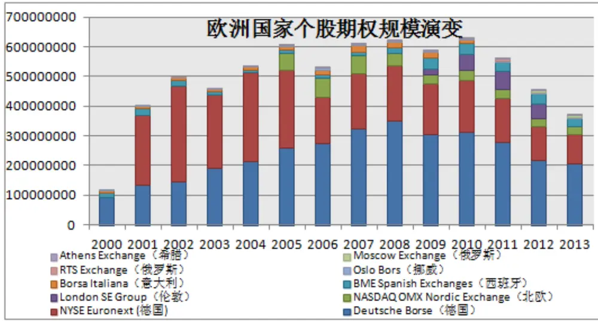
数据来源：WFE，广发证券发展研究中心

ETF期权：相比股票期权，ETF期权在欧洲略显屌丝，仅有DTB和NYSE Euronext存在交易，其中2012年只交易了66321美元。2008年交易额最高达339471美元，但随后2009年跌落到7761美元，成交量中DTB交易所占大头。

图12：欧洲国家ETF期权规模统计
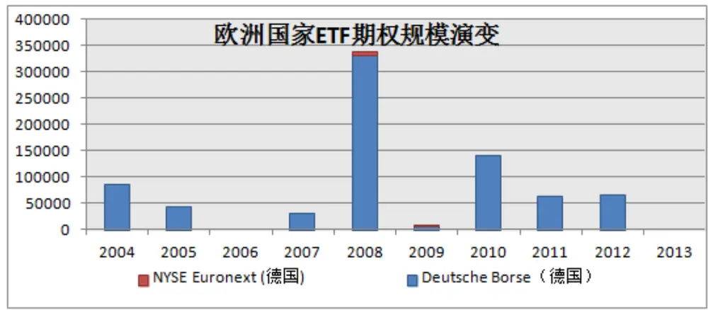
数据来源：WFE，广发证券发展研究中心

## 四、亚太期权市场概述

个股期权：

亚太地区个股期权主要在澳大利亚、香港以及印度等交易场所交易，此外日本、韩国以及台湾等地区也有少量的交易，各类型期权发展很不平衡，ASX主要交易股票期权、股指期权、长期利率期权；HKEx交易股指期权、股票期权；NSE交易股指

识别风险，发现价值

期权、外汇期权、股票期权；日本交易所集团（JEX）主要交易股指期权、股票期权、长期利率期权；KRX主要交易股指期权；TAIFEX主要交易股指期权；

HKEx：香港交易所由香港联合交易所有限公司、香港期货交易所有限公司、香港中央结算有限公司在2000年合并而成，合并后的香港交易所在联交所上市。港交所主要交易股票期权和股指期权，另外还交易少量的ETF期权。股票期权占交易额比例超过80%，无论从成交量还是成交量的增长率看，港交所在亚太都保持绝对优势，截止2013年港交所共上市70种股票期权，名义价值前三的标的主要是银行股，如建设银行、工商银行、汇丰控股等。

ASX：澳大利亚证券交易所是澳大利亚股票交易所和悉尼期货交易所在2006年合并而成。澳大利亚证券交易所主要交易的期权品种是股票期权、利率期权、股指期权等。2011年澳大利亚证券交易所（ASX）将股票期权合约调小为原来的十分之一，流动性大大改善，从而交易额增长了一个数量级，从下图中可以看到2011年之后爆发式增长的主要原因。在此之前，亚太交易所中交易额最大的一直是香港交易所（HKEx），2010年交易额占亚太总量一半以上。

另外，印度国家证券交易所（NSE）的个股期权也比较活跃，交易额从2007年以来保持近30%的复合增长率。

TAIFEX：台湾期货交易所于1998年7月正式开业，并推出股指期货。2001年12月推出台指期权，2003年1月推出股票期权。

JEX：东京交易所1997年7月推出股票期权，大阪交易所1997年7月推出股票期权。2011年，东京证交所与大阪证交所将于2013年1月1日合并。

KRX：截止目前，KRX交易活跃的仍然只有Kospi200指数期权这一个期权品种。1997年到2003年是Kospi200指数期权的高速发展时期，交易额在1999年超过CBOE，并一直占据第一的位置。

图13：亚太区个股期权规模统计
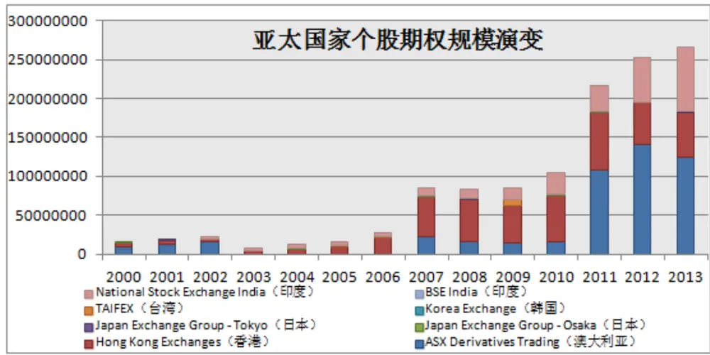
数据来源：WFE，广发证券发展研究中心

ETF期权：

亚太地区ETF期权主要集中在在香港交易所，日本仅有少数成交额，澳大利亚几乎没有，韩国、印度以及台湾等市场均无ETF期权。

综上，亚太区我们重点选择香港作为参考比较对象，印度则放在后面的金砖国家中进行重点比较。

图14：亚太区ETF个股期权规模统计
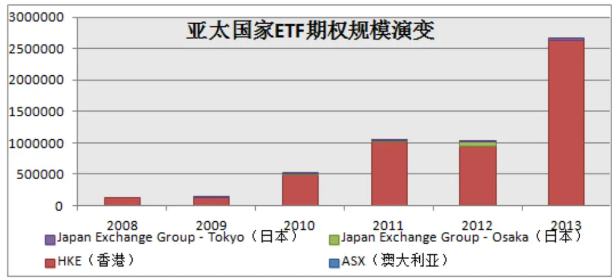
数据来源：WFE，广发证券发展研究中心

## 五、金砖国家期权市场概述

“金砖四国”包含了全球最大的四个新兴市场国家：巴西、俄罗斯、中国及印度。2010年，南非作为新成员正式加入“金砖国家”合作机制，2011年10月，来自中国、巴西、俄罗斯、印度和南非的证券交易所代表宣布成立合作联盟，以方便全球投资者涉足新兴交易市场。计划设想金砖国家各成员市场的基准股市指数衍生品将可以在其他交易所以当地货币挂牌买卖，该计划由港交所提出，国际将其解读为新兴市场国家的创新，也是新兴市场交易所向全球扩张的一个重大机会。

巴西交易所早在1979年就挂牌股票期权，但直到2000年巴西开始对国内证券市场进行改革之后，其期权规模才出现了快速的增长。从下图可以看出，金砖国家中巴西的个股期权规模占比最高达90%。

印度的期权交易所同样有两个，分别是NSE和BSE，前者为个股期权的主要交易场所，在金砖国家中规模排名第2。

俄罗斯期权交易所有两个，分别是FORTS和Moscow，后者从2012年以来成为主要的交易场所，但交易额都很小。

约翰内斯堡股票交易所（JSE）是非洲最大的交易所，它在2001年并购了南非期货交易所，从而获得了衍生品业务。JSE交易额最大的期权是股票期权，占60%以上，股指期权约占25%，其余主要为外汇期权及实物期权，从绝对规模来看南非的占比依然较低，2013年成交额仅占金砖国家1%。

识别风险，发现价值

图15：金砖国家个股期权规模统计
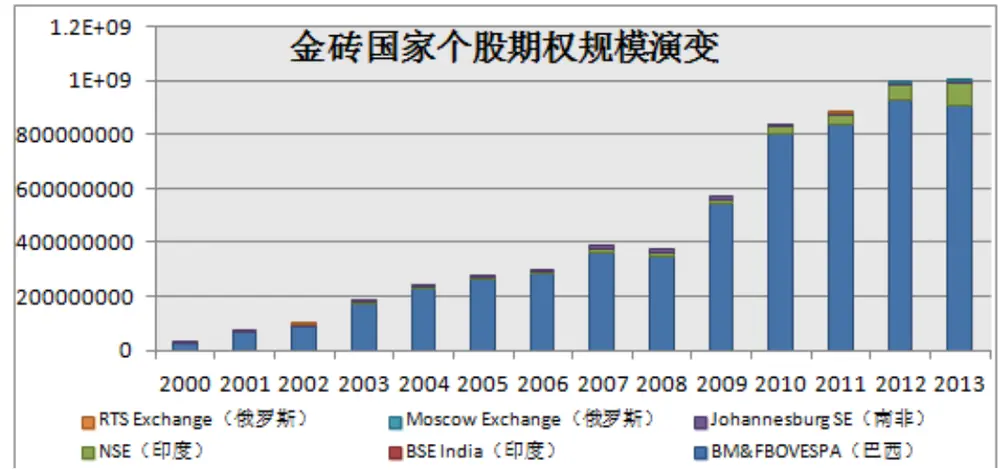
数据来源：WFE，广发证券发展研究中心

金砖国家中目前仅有巴西存在ETF期权，其规模在2011年达到顶峰，随后出现下滑，其规模依然难以比肩美国。

图16：金砖国家ETF期权规模统计
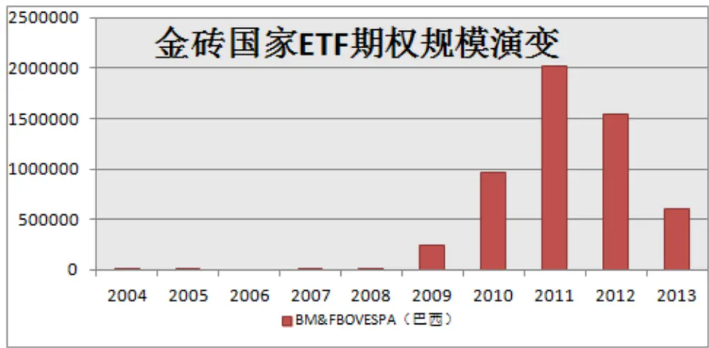
数据来源：WFE，广发证券发展研究中心

综上所述，下文我们重点选择巴西和印度作为金砖国家的代表于我国进行比较。

## 六、中国期权发展情况概述

早在1992年6月，为解决国有股股东资金到位问题，飞乐股份发行了我国第一个正式意义的认股权证，同年10月30日，深宝安发行了我国第一张中长期(一年)认股权证，在市场上掀起了一股炒作狂潮，价格从4元一直飙到20元，其间其价值始终为负值，随着权证存续期最后期限的临近，归零成为必然。

90年代中期，为了在配股过程中保护老股东的权益，便于无力认购配股的老股东有偿转让其配股权，深沪两交易所又推出配股权证，即A2权证，到了90年代末，沪深两市相继推出武凤凰、桂柳工等多只股票权证。这批权证到期后，因为市场低迷，转配股无法实施，管理层特批权证延期交易半年，此举导致市场再次对权证疯狂炒作。例如，1995年桂柳工股价仅2.50元，转配股价格为2.60元，但A2权证价格却高达2元多。而股价为7元左右的悦达股份，权证价格竟高达15元，并出现过一天涨637%的奇观，1996年6月底管理层对权证的这种“击鼓传花”式投机现象忍无可忍，于是叫停了权证交易，之后9年再也没有发行新权证。

直到2005年，证监会宣布启动股权分置改革，随后上交所与深交所分别推出了《权证管理暂行办法》，权证交易又重新出现。2005年8月，宝钢股份首先引入认股权证进行股权分置改革，但稀缺性和T+0特征再次引发了权证炒作狂潮，自权证产品上市以来，上交所共实施权证临时停牌16次；异常交易调查217起，涉及近48家营业部；发出警示函、监管问询函、监管关注函90份；先后有223个异常交易账户被限制交易。为了抑制市场过热的投机氛围，上交所引入创设机制，允许部分券商有成本地创设权证，相当于是无限量地增加了权证的供应量，一定程度上解决了权证稀缺性。

随着我国市场化水平的不断提高，以及经济和金融市场改革的不断深化，自2010年以来相继推出了股指期货、融资融券以及国债期货等，金融衍生品市场变得更加丰富，作为世界各衍生品市场中最具活力的品种，期权的呼声更加高涨了，2012年，个股期权的筹备再次被启动，在上交所发布的2013 年工作重点中，“推出个股期权”已被列在重点工作之中，11月12日十八届三中全会讨论并审议通过了《中共中央关于全面深化改革若干重大问题的决定》，明确了资本市场在发展社会主义市场经济中的重要地位和作用，为资本市场改革发展指明了方向，资本市场将迎来新一轮难得的发展机遇。

且从目前情况看，在我国开展个股期权试点的条件已基本成熟，目前各交易所都在进行期权合约仿真交易，各种理论研究以及投资者教育活动也在如火如荼地进行中，更有乐观者估计2014上半年期权正式上市的可能性非常之大。

在这样的背景下，本文将对海外已经发展了多年的期权市场以及我国期权的前身——权证进行统计分析，挖掘不久的将来个股期权的推出所到底会对股票带来怎样的冲击效应，也算是为期权的正式上市未雨绸缪，提前研究一种简单实用的投资策略。

国内正在进行仿真交易的个股期权跟海外成熟市场的个股期权之间到底有没有可比性？下面我们挑选了正在上交所目前正在仿真交易的“中国平安”和“上海汽车”两只期权，分别与美国及巴西两大期权交易所最活跃的标的进行比较，其中美国是全球个股期权交易最为活跃的国家，我们选择其中最活跃的苹果（Apple Inc.），而巴西期货交易所则连续数年期权成交量全球最大，我们选择其中成交量最高的巴西石油（Petrobras PN）。

四个标的合约条款如下表所示。

表 2：上交所个股期权仿真合约与美国和巴西活跃期权合约条款对比
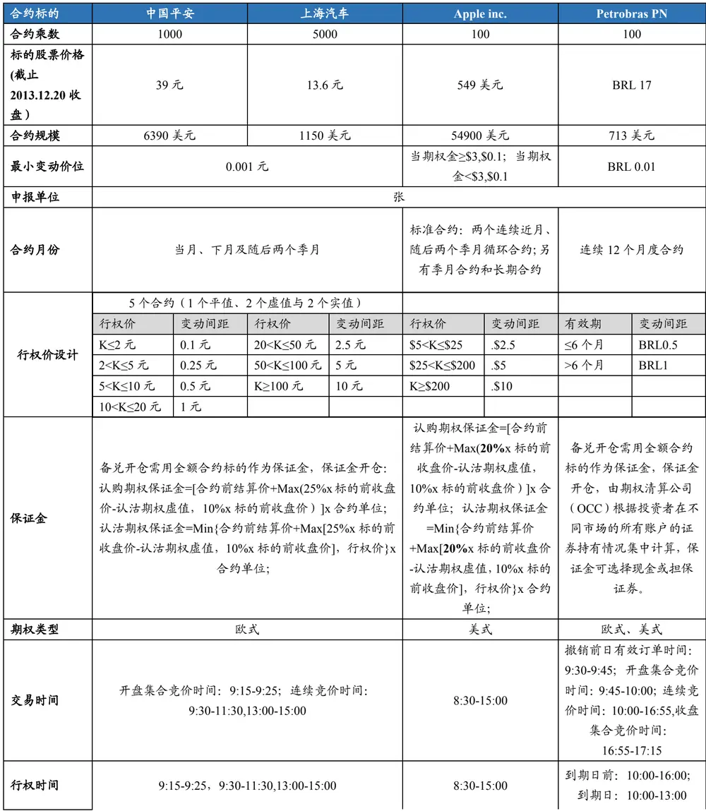
识别风险，发现价值

| 最后交易日 | 到期月份第四个星期三（遇法定节假日顺延） | 到期日前一个交易日 | 到期日前一个交易日 |
| --- | --- | --- | --- |
| 到期日 | 同最后交易日 | 2015.2.15之前，到期月份的第三个星期五之后的星期六；2015.2.15之后，到期月份的第三个星期五 | 到期月份的第三个星期一 |
| 行权日 | 同最后交易日 | 在行权后三个交易日结算 | 在行权后三个交易日结算 |
| 交割方式 | 实物交割（特殊情况下允许现金交割） | 实物交割 | 实物交割 |
| 上市交易所 | 上海证券交易所 | 芝加哥期权交易所 | 巴西证券期货交易所 |

数据来源：Bloomberg，广发证券发展研究中心

从上述表格所列4个期权合约的比较来看，内地期权行权方式是欧式的，美国个股期权为美式，巴西个股期权也是以美式为主；内地股票期权的规模适中，各种交易条款也主要借鉴自上述两个交易所，因此差别不大，期权卖方杠杆与美国相近，约5-10倍。

因此，基于海外成熟期权交易所进行经验总结，对分析我国个股期权未来推出后可能带来的影响具有很强的借鉴意义。

## 七、总结

## 7.1 中国推出个股期权的客观需求

国内证券市场对股票期权的需求到底有多大呢？目前如火如荼的仿真交易到底是市场存在强大需求的客观体现还是管理层的一厢情愿呢？

从国内目前衍生品发展情况来看便可回答这个问题，目前我国在场内交易的衍生品种类主要为在各大商品交易所上市的商品期货以及在中国金融期货交易所上市的沪深300 股指期货和国债期货。其中90%以上的交易额都来自商品期货。金融类衍生品发展滞后，品种稀少是目前我国衍生品面临的最大问题与挑战。因此个股期权的推出存在迫切的客观需求，其比然为我国衍生品市场的进步做出重要贡献。

从去年六月开始，我国各大券商与个人投资者已经开始在上交所和中金所等各大交易所启动各类期权的仿真模拟交易，为推动我国期权的上市做出重要贡献，同时也为其推出奠定了良好的基础。

鉴于许多投资者比较关注个股期权推出前后相应的股票标的变化情况，因此我们将通过这篇报告对欧美，香港金砖国家等成熟市场进行全面综述，在随后的专题报告中，将分别对各期权市场推出期权后对市场及标的带来的影响进行介绍和分析。

## 7.2 个股期权推出可能对个股带来的市场影响

## （1） 利好标的股票，或带来个股大幅上涨

由于期权具有双向交易、日内回转交易等特点，有利于优化资产配置，且必然会催生更多丰富的股票投资策略，甚至带来新的套利机会，此外，我国个股期权主要采用实物交割，因此期权组合投资策略对正股标的需求加大，因此会对股价造成正面的刺激作用，可能带来股价大幅上涨。

## （2） 期权能发挥价格发现功能，降低个股波动

当个股期权推出后，投资者可以对个股进行双向投资，在看空个股时也可以通过运用期权实现套期保值，从而降低股票买卖成本，也规避了对个股助涨助跌，从而降低个股波动。

## （3） 期权交易量有望井喷，引发期货行业大变革

由于期权具有灵活的功能，必然会吸引大量的投资和投机资金参与从而显著增加正股交易量，提升其在A股市场的活跃度，为许多许多投资策略带来了便利；另一方面也将会给证券及期货公司等带来客观的经纪等业务收入增量，大大利好国内金融业发展。

## （4） 其他影响

期权的推出还有助于开发各种新型产品，如保本产品，还可以催生出一些波动率管理策略，股票套利策略甚至有助于企业制定股权激励方案等；但同时期权的推出也可能给正股的其他相关业务带来冲击，比如融资融券业务等。由于本报告重点探讨个股期权推出之后对正股的二级市场表现带来的直接影响，其余方面可能带来的影响暂不展开介绍。

## 风险提示

本篇报告主要介绍了个股期权合约的推出在海外市场的影响，供国内投资者参考。由于我国市场各方面情况与海外市场存在差异，因此具体影响状况要等期权发布后才能明确判断。

## Table_Res arch 广发金融工程研究小组

罗 军： 首席分析师，华南理工大学理学硕士，2010 年进入广发证券发展研究中心。

俞文冰： 首席分析师，CFA，上海财经大学统计学硕士，2012年进入广发证券发展研究中心。

叶 涛： 资深分析师，CFA ，上海交通大学管理科学与工程硕士，2012年进入广发证券发展研究中心。

安宁宁： 资深分析师，暨南大学数量经济学硕士，2011年进入广发证券发展研究中心。

胡海涛： 分析师， 华南理工大学理学硕士， 2010年进入广发证券发展研究中心。

夏潇阳： 分析师， 上海交通大学金融工程硕士， 2012年进入广发证券发展研究中心。

蓝昭钦： 分析师， 中山大学理学硕士， 2010年进入广发证券发展研究中心。

史庆盛： 分析师， 华南理工大学金融工程硕士， 2011年进入广发证券发展研究中心。

汪 鑫： 研究助理， 中国科学技术大学金融工程硕士， 2012年进入广发证券发展研究中心。

张 超：研究助理， 中山大学理学硕士，2012年进入广发证券发展研究中心。

## Table_RatingIndustry 广发证券—行业投资评级说明

买入： 预期未来12个月内，股价表现强于大盘10%以上。

持有： 预期未来12个月内，股价相对大盘的变动幅度介于-10%～+10%。

卖出： 预期未来12个月内，股价表现弱于大盘10%以上。

## Table_RatingCompany 广发证券—公司投资评级说明

买入： 预期未来12个月内，股价表现强于大盘15%以上。

谨慎增持： 预期未来12个月内，股价表现强于大盘5%-15%。

持有： 预期未来12个月内，股价相对大盘的变动幅度介于-5%～+5%。

卖出： 预期未来12个月内，股价表现弱于大盘5%以上。

## Table_Ad联系我们

|  | 广州市 | 深圳市 | 北京市 | 上海市 |
| --- | --- | --- | --- | --- |
| 地址 | 广州市天河北路183号大 | 深圳市福田区金田路4018 | 北京市西城区月坛北街2号 | 上海市浦东新区富城路99号 |
|  | 都会广场5 楼 | 号安联大厦15楼A座03-04 月坛大厦18层 |  | 震旦大厦18楼 |
| 邮政编码 | 510075 | 518026 | 100045 | 200120 |
| 客服邮箱 服务热线 | gfyf@gf.com.cn 020-87555888-8612 |  |  |  |

## Table_Disclaimer 免 责声 明

广发证券股份有限公司具备证券投资咨询业务资格。本报告只发送给广发证券重点客户，不对外公开发布。

本报告所载资料的来源及观点的出处皆被广发证券股份有限公司认为可靠，但广发证券不对其准确性或完整性做出任何保证。报告内容仅供参考，报告中的信息或所表达观点不构成所涉证券买卖的出价或询价。广发证券不对因使用本报告的内容而引致的损失承担任何责任，除非法律法规有明确规定。客户不应以本报告取代其独立判断或仅根据本报告做出决策。

广发证券可发出其它与本报告所载信息不一致及有不同结论的报告。本报告反映研究人员的不同观点、见解及分析方法，并不代表广发证券或其附属机构的立场。报告所载资料、意见及推测仅反映研究人员于发出本报告当日的判断，可随时更改且不予通告。

本报告旨在发送给广发证券的特定客户及其它专业人士。未经广发证券事先书面许可，任何机构或个人不得以任何形式翻版、复制、刊登、转载和引用，否则由此造成的一切不良后果及法律责任由私自翻版、复制、刊登、转载和引用者承担。