# Tabl e_Title 个股期权推出对标的影响分析

## ——期权研究系列之九

## Table_Sum ary报告摘要 ：

## 全球个股期权快速发展，美国、巴西占比集中，亚洲以香港为主

按交易所区分来看，股票期权主要集中在美国的几大交易所中，交易额约占全球成交总量的 60%，但从单个交易所来看，个股期权交易额最大的交易所依然是巴西证券期货交易所（BM&FBOVESPA）；除了美洲国家交易所之外，欧洲国家中的DTB 和NYSE Euronext个股期权交易也比较活跃；而亚太则以澳大利亚、香港及印度为主要的期权交易市场，虽然规模不大，但近几年的规模占比稳步提升。

## 国内推出个股期权存在强烈的客观需求，上交所筹备充分一触即发

目前我国在场内交易的衍生品种类主要为在各大商品交易所上市的商品期货以及在中国金融期货交易所上市的沪深 300 股指期货和国债期货。因此个股期权的推出存在迫切的客观需求。

鉴于许多投资者比较关注个股期权推出前后相应的股票标的变化情况，因此我们将通过这篇报告对欧美，香港金砖国家等成熟市场在推出个股期权前后长短期内给标的股票所带来的影响进行全面分析，并总结其经验和规律，以其在国内成功推出个股期权后为投资者提供及时的参考。

## 海外经验为为我国推出个股期权提供宝贵的启发

## （1） 期权推出后相应股票上涨是大概率事件

经统计，海外个股期权的推出能够刺激股票价格，这一结论几乎适用于所有交易所，其中印度、中国（权证）以及日本等国家股价的反映最为激烈，美国、巴西以及香港等成熟市场表现则较为平稳。

## （2） 期权推出后波动率短期上扬长期收敛

各交易所在期权推出的初期，相应的多数股票价格波动率都会有显著地提高，但随着时间推进（3 个月至半年后），由于期权市场逐步成熟，相关品种的丰富，投资者回归理性，股票的波动率也将逐渐收敛。

## （3） 期权能有效激活各种股票交易策略，成交量有望迎来井喷

各交易所在期权推出后，相应的多数股票成交量都迎来了稳定的增长，而且这种增长是可长期持续的，随着时间的推进，投资者对于个股及期权的运用更加科学和灵活，形成一定的粘附和依赖性，在期权推出 1-3年内股票持续来井喷式的增长。

图1：2013年个股期权按交易所划分占比
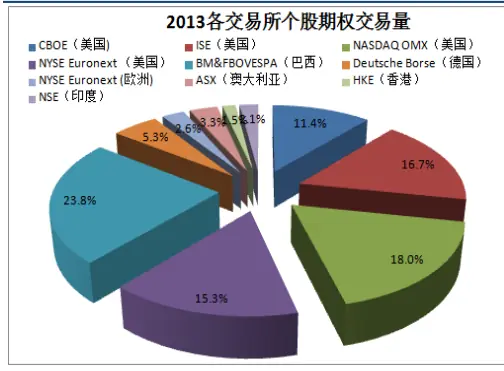

图2：各交易所推出个股期权后股票表现
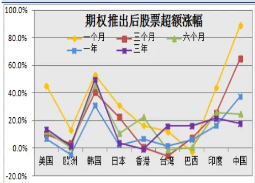
图3：中国市场个股期权上市对成交量影响

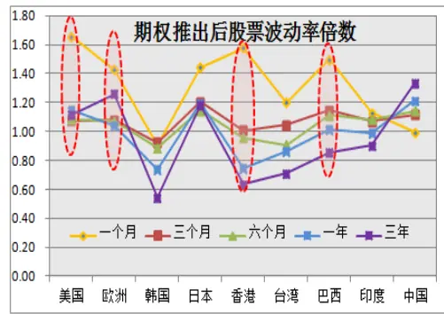

分析师： 史庆盛 S0260513070004

公020-87555888-8618

sqs@gf.com.cn

## Table_Report 相关研究：

全球个股期权市场发展概述 2014-02-27——期权研究系列之八

## 一、海外个股期权发展成熟，国内期权一触即发

## 1.1 海外主要市场个股期权发展情况

近几年来全球股票期权规模发展快速，2013年全球股票期权成交约40亿美元。

报告将全球期权市场划分为美国市场、欧洲市场、亚太市场以及“金砖国家”市场。欧美亚三大市场的划分自然可以理解，而单独划分出“金砖国家”市场的意义在于印度、巴西、俄罗斯、南非等新兴国家的期权市场发展非常迅速，且各有特点，因此同样具有新兴国家特点的中国无疑将能从金砖国家市场的发展历史中学习到宝贵的经验。

按区域划分来看，2013年以美国为首的美洲集中了67%的交易额，而由于同样包含了巴西证券期货交易所（重叠），金砖国家的交易额约占20%，欧洲和亚太交易所分列其次。

图4：2013年个股期权按区域划分占比
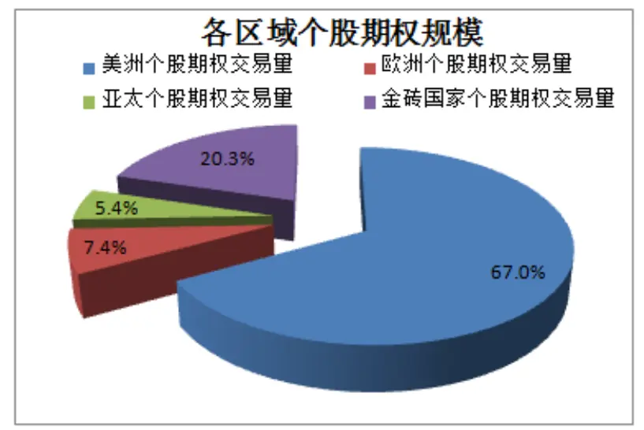
数据来源：WFE，广发证券发展研究中心

按交易所区分来看，股票期权主要集中在美国的几大交易所中，交易额约占全球成交总量的60%，但从单个交易所来看，个股期权交易额最大的交易所依然是巴西证券期货交易所（BM&FBOVESPA），自从2010年以来该交易所交易额均为全球第一，2013年其个股期权成交量占全球主要期权交易所约24%；规模其次的分别是美国的四个期权交易所：NASDAQ OMX、ISE、NYSE Euronext以及CBOE；除了美洲国家交易所之外，欧洲国家中的Deutsche Borse和NYSE Euronext交易所内个股期权交易也比较活跃；而亚太国家中则以澳大利亚、香港及印度为主要的个股期权交易市场，虽然绝对规模占比不大，但这几个市场近几年的规模占比稳步提升。

图5：2013年个股期权按交易所划分占比
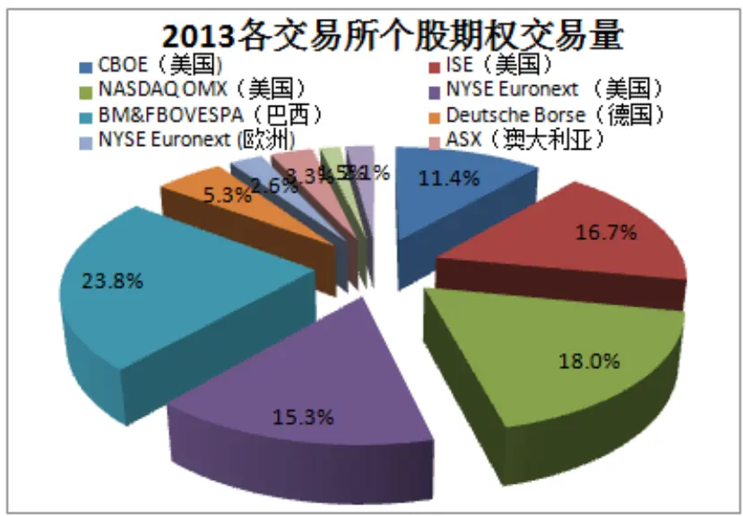
数据来源：WFE，广发证券发展研究中心

## 1.2 国内期权发展进度

早在1992年6月，为解决国有股股东资金到位问题，飞乐股份发行了我国第一个认股权证，同年10月30日，深宝安发行了我国第一张中长期(一年)认股权证，在市场上掀起了一股炒作狂潮，价格从4元一直飙到20元，其间其价值始终为负值。90年代中期，为了在配股过程中保护老股东的权益，便于无力认购配股的老股东有偿转让其配股权，深沪两交易所又推出配股权证，即A2权证，直到1996年，沪深两市相继推出武凤凰、桂柳工等多只股票权证，随后管理层对权证的这种“击鼓传花”式投机现象忍无可忍，于是叫停了权证交易，之后9年再也没有发行新权证。

直到2005年，证监会宣布启动股权分置改革，随后上交所与深交所分别推出了《权证管理暂行办法》，权证交易又重新出现。2005年8月，宝钢股份首先引入认股权证进行股权分置改革，但稀缺性和T+0特征再次引发了权证炒作狂潮，自权证产品上市以来，上交所共实施权证临时停牌16次；异常交易调查217起。为了抑制市场过热的投机氛围，上交所引入创设机制，允许部分券商有成本地创设权证，相当于是无限量地增加了权证的供应量，一定程度上解决了权证稀缺性。

从目前情况看，在我国开展个股期权试点的条件已基本成熟，2013年底，中国A股市市场投资者翘首已久的交易所期权终于渐行渐近，目前上交所和中金所都分别在紧锣密鼓地进行个股期权和股指期权的测试准备，前者于11 月8 日推出沪深300指数期权仿真交易，后者则于12 月26 日推出了个股期权和ETF 期权的仿真交易，作为活跃市场、增加风险对冲手段、丰富投资策略的重要衍生工具，期权等相关业务的推出必然会对国内证券市场产生重大的影响，许多投资者比较关注个股期权推出前后相应的股票标的变化情况。

在这样的背景下，本文将对海外已经发展了多年的欧美，香港以及金砖国家等期权市场以及我国期权的前身——权证进行统计分析，挖掘不久的将来个股期权的推出所到底会对股票带来怎样的冲击效应，也算是为期权的正式上市未雨绸缪。上一篇报告中，我们探讨了海外一些主要成熟证券市场推出股指期权后对大盘指数的走势影响；本文将从个股期权的角度出发，探讨其推出对相应个股的影响。

## 二、我国推出个股期权的意义

## 2.1 中国推出个股期权的客观需求

国内证券市场对股票期权的需求到底有多大呢？目前如火如荼的仿真交易到底是市场存在强大需求的客观体现还是管理层的一厢情愿呢？

从国内目前衍生品发展情况来看便可回答这个问题，目前我国在场内交易的衍生品种类主要为在各大商品交易所上市的商品期货以及在中国金融期货交易所上市的沪深300 股指期货和国债期货。其中90%以上的交易额都来自商品期货。金融类衍生品发展滞后，品种稀少是目前我国衍生品面临的最大问题与挑战。因此个股期权的推出存在迫切的客观需求，其比然为我国衍生品市场的进步做出重要贡献。

从下图可以清楚看出，自从 2010年中金所发布沪深300股指期货以来，连续三年都受到广大投资者的关注与青睐，规模节节攀高，可见市场对于更多的新衍生品种需求很大。

图6：沪深300指数期货上市后成交量变化（成交金额：百万元）
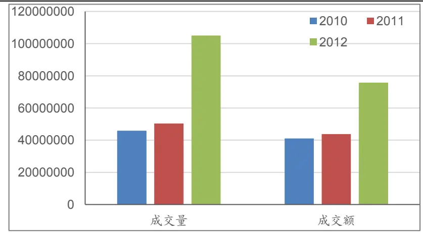
数据来源：中国金融期货交易所，广发证券发展研究中心

从去年六月开始，我国各大券商与个人投资者已经开始在上交所和中金所等各大交易所启动各类期权的仿真模拟交易，为推动我国期权的上市做出重要贡献，同时也为其推出奠定了良好的基础。

鉴于许多投资者比较关注个股期权推出前后相应的股票标的变化情况，因此我们将通过这篇报告对欧美，香港金砖国家等成熟市场在推出个股期权前后长短期内给标的股票所带来的影响进行全面分析，并总结其经验和规律，以其在国内成功推出个股期权后为投资者提供及时的参考。

## 2.2 个股期权推出可能对个股带来的市场影响前瞻

## （1） 利好标的股票，或带来个股大幅上涨

由于期权具有双向交易、日内回转交易等特点，有利于优化资产配置，且必然会催生更多丰富的股票投资策略，甚至带来新的套利机会，此外，我国个股期权主要采用实物交割，因此期权组合投资策略对正股标的需求加大，因此会对股价造成正面的刺激作用，可能带来股价大幅上涨。

## （2） 期权能发挥价格发现功能，降低个股波动

当个股期权推出后，投资者可以对个股进行双向投资，在看空个股时也可以通过运用期权实现套期保值，从而降低股票买卖成本，也规避了对个股助涨助跌，从而降低个股波动。

## （3） 期权交易量有望井喷，引发期货行业大变革

由于期权具有灵活的功能，必然会吸引大量的投资和投机资金参与从而显著增加正股交易量，提升其在A股市场的活跃度，为许多许多投资策略带来了便利；另一方面也将会给证券及期货公司等带来客观的经纪等业务收入增量，大大利好国内金融业发展。

## （4） 其他影响

期权的推出还有助于开发各种新型产品，如保本产品，还可以催生出一些波动率管理策略，股票套利策略甚至有助于企业制定股权激励方案等；但同时期权的推出也可能给正股的其他相关业务带来冲击，比如融资融券业务等。由于本报告重点探讨个股期权推出之后对正股的二级市场表现带来的直接影响，其余方面可能带来的影响暂不展开介绍。

## 三、各国推出个股期权带来影响

本文我们将借鉴海外主要成熟证券市场的经验，探讨国内个股期权推出后将对标的股票的影响。

## 3.1国内外期权合约条款对比

国内正在进行仿真交易的个股期权跟海外成熟市场的个股期权之间到底有没有可比性？下面我们挑选了正在上交所目前正在仿真交易的“中国平安”和“上海汽车”两只期权，分别与美国及巴西两大期权交易所最活跃的标的进行比较，其中美国是全球个股期权交易最为活跃的国家，我们选择其中最活跃的苹果（Apple Inc.），而巴西期货交易所则连续数年期权成交量全球最大，我们选择其中成交量最高的巴西石油（Petrobras PN）。

四个标的合约条款如下表所示。

表 1：上交所个股期权仿真合约与美国和巴西活跃期权合约条款对比

| 合约标的 | 中国平安 | 上海汽车 | Apple inc. | Petrobras PN |
| --- | --- | --- | --- | --- |
| 合约乘数 | 1000 | 5000 | 100 | 100 |
| 标的股票价格(截止2013.12.20 收盘） | 39元 | 13.6元 | 549 美元 | BRL 17 |
| 合约规模 | 6390 美元 | 1150 美元 | 54900 美元 | 713 美元 |
| 最小变动价位 | 0.001元 |  | 当期权金≥$3,$0.1；当期权金<$3,$0.1 | BRL 0.01 |
| 申报单位 | 张 |  |  |  |

识别风险，发现价值

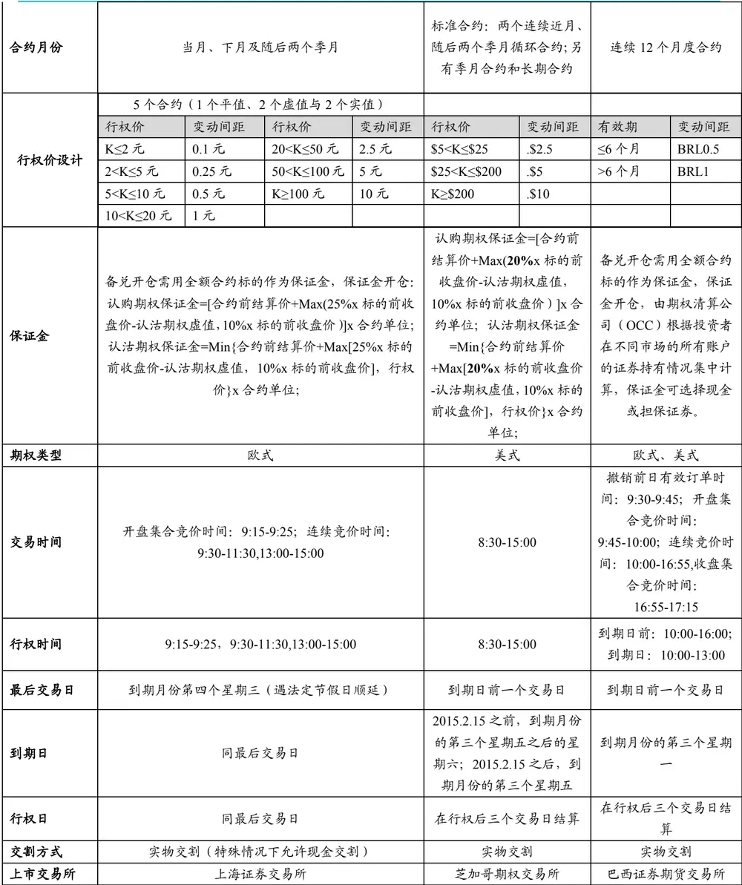
数据来源：Bloomberg，广发证券发展研究中心

从上述表格所列4个期权合约的比较来看，内地期权行权方式是欧式的，美国个股期权为美式，巴西个股期权也是以美式为主；内地股票期权的规模适中，各种交易条款也主要借鉴自上述两个交易所，因此差别不大，期权卖方杠杆与美国相近，约5-10倍。

因此，基于海外成熟期权交易所进行经验总结，对分析我国个股期权未来推出后可能带来的影响具有很强的借鉴意义。

## 3.2 美国市场个股期权推出后影响

美国期权市场历史悠久，以产品的多样性，创新性以及高流动性吸引了广大投资者并且发展成为世界最成熟市场之一，目前个股期权种类多达数千种，我们选择其中流动性最活跃的 100只作为分析对象。

## (1) 美国市场个股期权上市后股价变化

统计结果显示，美国市场个股期权（含 ETF 期权）推出之后，现货标的股票的涨幅非常显著，推出后一个月内平均绝对年化涨幅高达 50.4%，超额涨幅同样高达 45.5%（相对标普 500 指数）。股票上涨概率显著超过 50%，表明大多数股票都能够享受期权推出带来的股价上涨，中长期来看股价同样有出色的表现，可见期权的推出对现货标的来说是重大利好。

表 2：美国市场个股期权上市后股价涨幅统计（年化）

|  | 绝对涨幅 | 上涨概率 |
| --- | --- | --- |
| 一个月 | 50.4% | 58.1% |
| 三个月 | 8.5% | 54.6% |
| 六个月 | 16.4% | 56.0% |
| 一年 | 9.2% | 62.8% |
| 三年 | 27.5% | 79.2% |

数据来源：Bloomberg，广发证券发展研究中心

图7：美国市场个股期权上市后股价表现
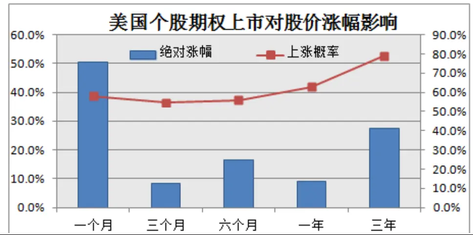
数据来源：Bloomberg，广发证券发展研究中心

表 3：美国市场个股期权上市后超额涨幅统计（年化）

|  | 超额涨幅 | 超额上涨概率 |
| --- | --- | --- |
| 一个月 | 45.5% | 55.6% |
| 三个月 | 9.9% | 56.4% |
| 六个月 | 12.5% | 56.0% |
| 一年 | 6.8% | 55.8% |
| 三年 | 13.8% | 62.5% |

数据来源：Bloomberg，广发证券发展研究中心

图8：美国市场个股期权上市后股价超额表现
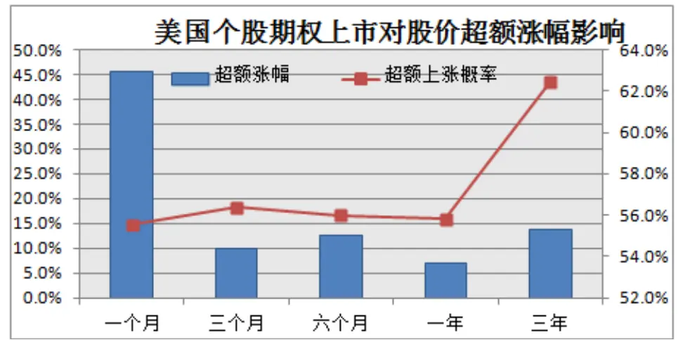
数据来源：Bloomberg，广发证券发展研究中心

## (2) 美国市场个股期权上市后股价波动率变化

统计结果显示，美国市场个股期权（含 ETF 期权）推出之后，现货标的股票的价格波动普遍有所提高，这与前面的理论分析并不相符，数据显示期权推出后个股一个月内波动率提升非常显著，随着时间的推移开始恢复正常但仍然高于期权推出前的波动。

表 4：美国市场个股期权上市后股价波动率变化统计

|  | 期权推出后与推出前波动率比 | 期权推出后波动率上涨概率 |
| --- | --- | --- |
| 一个月 | 1.66 | 54.0% |
| 三个月 | 1.07 | 49.1% |
| 六个月 | 1.08 | 52.0% |
| 一年 | 1.15 | 62.8% |
| 三年 | 1.12 | 62.5% |

数据来源：Bloomberg，广发证券发展研究中心

图9：美国市场个股期权上市后股价波动率变化
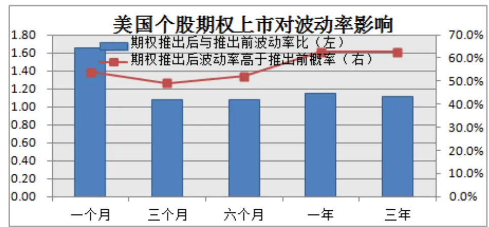
数据来源：Bloomberg，广发证券发展研究中心

## (3) 美国市场个股期权上市后成交量变化

统计结果显示，美国市场个股期权（含 ETF 期权）推出之后，现货标的股票成交量有大幅度提高，这与前面的理论分析基本相符，期权的推出极大丰富了个股的投资策略，从而吸引了更多投资者对其进行双向投资。

表 5：美国市场个股期权上市后股价成交量变化统计

|  | 期权推出后与推出前成交量比 | 期权推出后成交量上涨概率 |
| --- | --- | --- |
| 一个月 | 1.38 | 57.1% |
| 三个月 | 1.64 | 72.7% |
| 六个月 | 1.85 | 82.0% |
| 一年 | 2.95 | 88.4% |
| 三年 | 4.55 | 95.8% |

数据来源：Bloomberg，广发证券发展研究中心

图10：美国市场个股期权上市对成交量影响
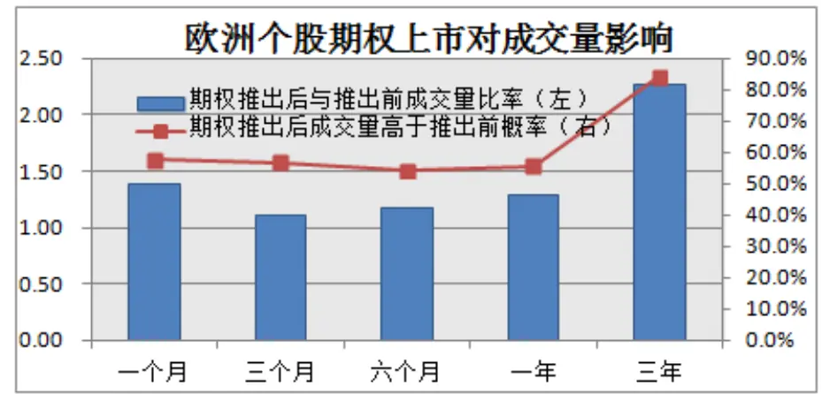
数据来源：Bloomberg，广发证券发展研究中心
识别风险，发现价值

## 3.3 欧洲市场个股期权推出后影响

欧洲衍生品市场产品丰富，交易活跃，股指期权尤为突出，个股期权则主要集中在德国期货交易所（DTB）以及NYSE Euronext 交易所，我们同样从中挑选最为活跃的前100 只个股期权作为分析对象。

## (1) 欧洲市场个股期权上市后股价变化

统计结果显示，欧洲市场个股期权（含 ETF 期权）推出之后，现货标的股票的短期一个月内过半数个股上涨，但少数股票跌幅较大，平均来看下跌为主，也就是说欧洲各国期权的推出时点不算一个好的择时点，相对大盘来说超额收益同样不显著。

表 6：欧洲市场个股期权上市后股价涨幅统计（年化）

|  | 绝对涨幅 | 上涨概率 |
| --- | --- | --- |
| 一个月 | -5.0% | 57.5% |
| 三个月 | 11.2% | 51.4% |
| 六个月 | 12.5% | 56.8% |
| 一年 | 2.4% | 55.6% |
| 三年 | 8.0% | 63.2% |

数据来源：Bloomberg，广发证券发展研究中心

图11：欧洲市场个股期权上市后股价表现
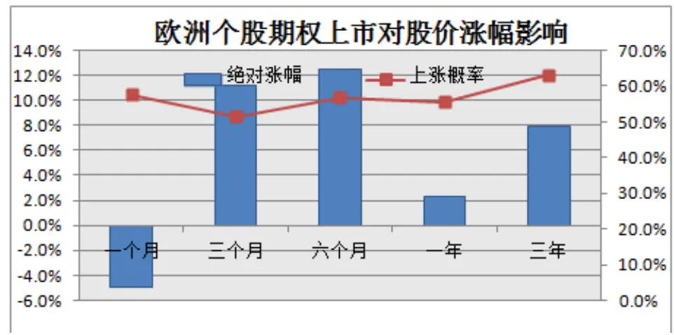
数据来源：Bloomberg，广发证券发展研究中心

表 7：欧洲市场个股期权上市后股价超额统计（年化）

|  | 超额涨幅 | 超额上涨概率 |
| --- | --- | --- |
| 一个月 | 13.4% | 42.5% |
| 三个月 | 3.5% | 51.4% |
| 六个月 | 0.4% | 51.4% |
| 一年 | -4.8% | 48.2% |
| 三年 | 1.5% | 42.1% |

数据来源：Bloomberg，广发证券发展研究中心

图12：欧洲市场个股期权上市后股价超额表现
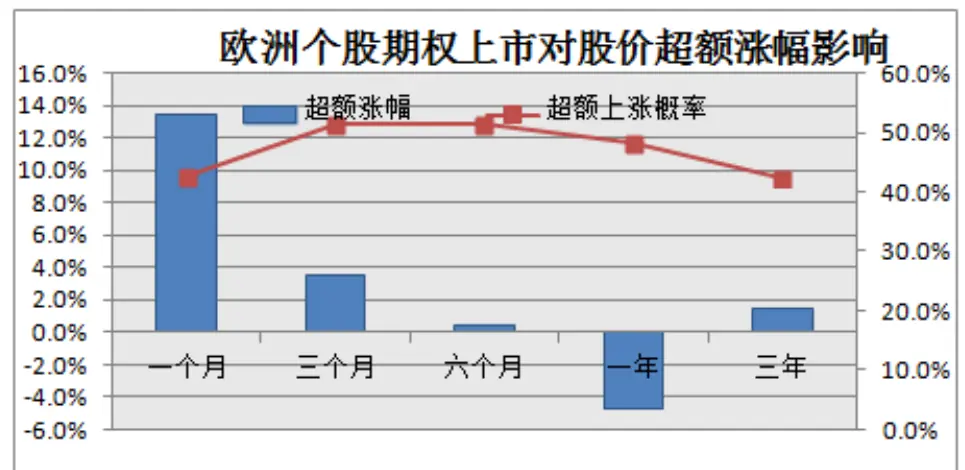
数据来源：Bloomberg，广发证券发展研究中心

## (2) 欧洲市场个股期权上市后股价波动率变化

统计结果显示，欧洲市场个股期权（含 ETF 期权）推出之后，现货标的股票的价格波动普遍有所提高，这同样与前面的理论分析似乎并不相符，数据显示尤其是期权推出后个股一个月内波动率提升非常显著；但右栏显示波动率提高的概率并不显著，尤其是短期 1个月，这意味着欧洲市场个股期权上市后分化非常明显，少部分正股出现剧烈的波动，其余大多数个股波动率变小。

表 8：欧洲市场个股期权上市后股价波动率变化统计

|  | 期权推出后与推出前波动率比 | 期权推出后波动率上涨概率 |
| --- | --- | --- |
| 一个月 | 1.43 | 42.5% |
| 三个月 | 1.08 | 46.0% |
| 六个月 | 1.07 | 51.4% |
| 一年 | 1.04 | 44.4% |
| 三年 | 1.26 | 73.7% |

数据来源：Bloomberg，广发证券发展研究中心

图13：欧洲市场个股期权上市后股价波动率变化
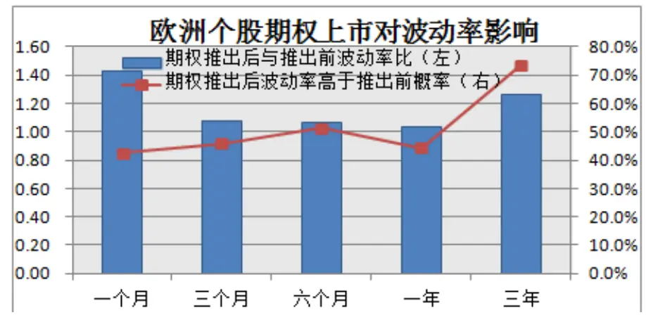
数据来源：Bloomberg，广发证券发展研究中心
识别风险，发现价值

## (3) 欧洲市场个股期权上市后成交量变化

统计结果显示，欧洲市场个股期权（含 ETF 期权）推出之后，极大丰富了个股的投资策略，从而吸引了更多投资者对其进行双向投资。现货股票成交量大幅度提高。

表 9：欧洲市场个股期权上市后股价成交量变化统计

|  | 期权推出后与推出前成交量比 | 期权推出后成交量上涨概率 |
| --- | --- | --- |
| 一个月 | 1.39 | 57.5% |
| 三个月 | 1.11 | 56.8% |
| 六个月 | 1.17 | 54.1% |
| 一年 | 1.29 | 55.6% |
| 三年 | 2.26 | 84.2% |

数据来源：Bloomberg，广发证券发展研究中心

图14：欧洲市场个股期权上市对成交量影响
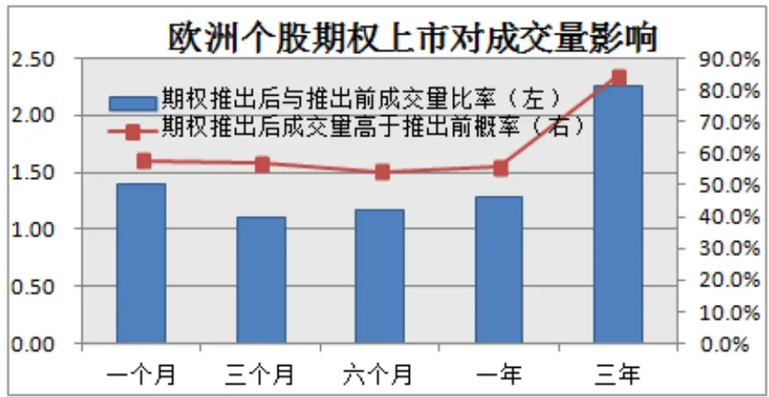
数据来源：Bloomberg，广发证券发展研究中心

## 3.4 亚洲市场个股期权推出后影响

亚洲市场个股期权主要在香港进行交易，此外日本和台湾地区也有少量交易，韩国市场则以指数期权为主，个股期权非常冷淡，这里不把其作为比较对象。印度个股期权比较活跃，我们将其放在金砖国家中一起来比较分析。

## 3.4.1香港市场

香港衍生品市场始于上实际70年代，种类相对丰富，参与度高，成交量大，现已成为全球重要的衍生品交易市场，因此研究香港个股期权发布后的带来的影响对我国期权市场的发展有更为重要的参考价值。截止2013年底香港共发行了70只个股期权(含ETF期权)，下文将全部作为分析对象。

## (1) 香港市场个股期权上市后股价变化

统计结果显示，香港市场个股期权（含 ETF 期权）推出之后，现货标的股票的涨幅非常显著，短中期来看推出后个股年化绝对涨幅和超额涨幅都比较显著，上涨个股数量也过半，可见香港市场期权的推出短期来说（1 年内）对现货标的来说是重大利好，能够持续带来稳定的上涨。

表 10：香港市场个股期权上市后股价涨幅统计（年化）

|  | 绝对涨幅 | 上涨概率 |
| --- | --- | --- |
| 一个月 | 12.4% | 56.7% |
| 三个月 | 29.4% | 72.0% |
| 六个月 | 49.6% | 63.2% |
| 一年 | 14.9% | 62.5% |
| 三年 | -2.2% | 33.3% |

数据来源：Bloomberg，广发证券发展研究中心

图15：香港市场个股期权上市后股价表现
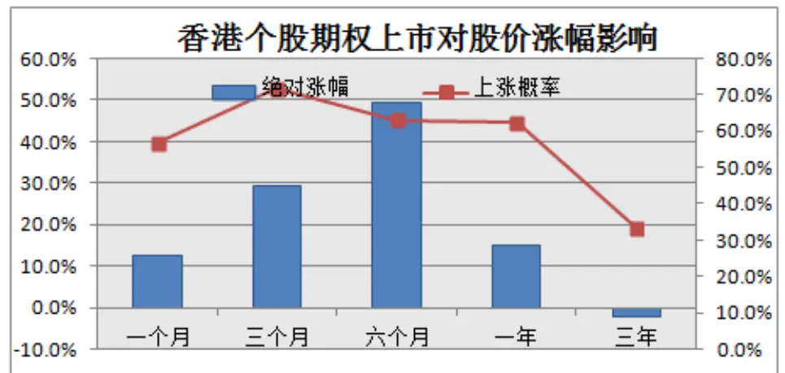
数据来源：Bloomberg，广发证券发展研究中心

表 11：香港市场个股期权上市后股价超额统计（年化）

|  | 超额涨幅 | 超额上涨概率 |
| --- | --- | --- |
| 一个月 | 16.5% | 58.1% |
| 三个月 | 0.3% | 56.0% |
| 六个月 | 22.5% | 50.0% |
| 一年 | 6.8% | 31.3% |
| 三年 | -0.7% | 33.3% |

数据来源：Bloomberg，广发证券发展研究中心

图16：香港市场个股期权上市后股价超额表现
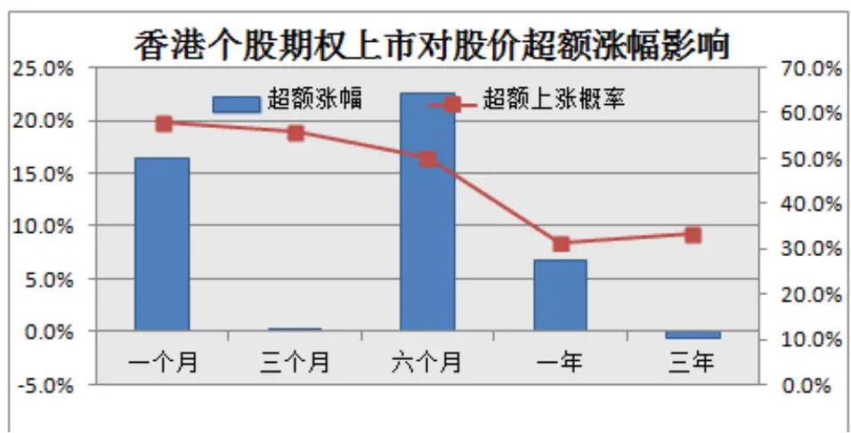
数据来源：Bloomberg，广发证券发展研究中心

## (2) 香港市场个股期权上市后股价波动率变化

统计结果显示，香港市场个股期权（含 ETF 期权）推出之后，现货标的股票一个月内波动率提升非常显著；但随着时间推移，80%个股在期权推出后波动降低。

可见香港投资者对于个股期权的应用相对比较稳健，充分利用了其双向套保的功能实现风险规避，从而维持了个股的长期平稳，避免了个股的大幅度震荡。

表 12：香港市场个股期权上市后股价波动率变化统计

|  | 期权推出后与推出前波动率比 | 期权推出后波动率上涨概率 |
| --- | --- | --- |
| 一个月 | 1.57 | 51.6% |
| 三个月 | 1.01 | 20.0% |
| 六个月 | 0.96 | 25.0% |
| 一年 | 0.75 | 18.8% |
| 三年 | 0.64 | 0.0% |

数据来源：Bloomberg，广发证券发展研究中心

图17：香港市场个股期权上市后股价波动率变化
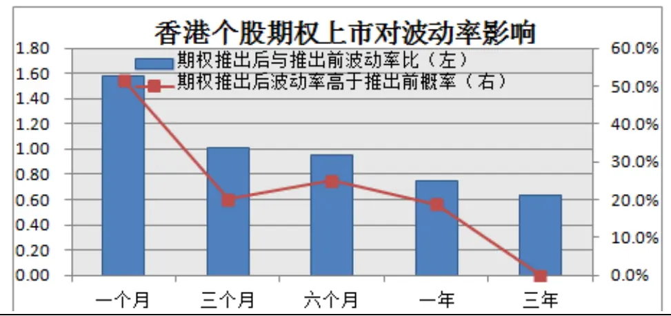
数据来源：Bloomberg，广发证券发展研究中心
识别风险，发现价值

## (3) 香港市场个股期权上市后成交量变化

统计结果显示，香港市场个股期权（含 ETF 期权）推出之后，现货标的股票成交量有大幅度提高，这与前面的理论分析基本相符，期权的推出极大丰富了个股的投资策略，从而吸引了更多投资者对其进行双向投资。

但成交量得到提高的股票数量占比并不高，这反映了投资者热衷于把资金集中炒作少部分股票，大多数股票未必能够得到人们的青睐！

表 13：香港市场个股期权上市后股价成交量变化统计

|  | 期权推出后与推出前成交量比 | 期权推出后成交量上涨概率 |
| --- | --- | --- |
| 一个月 | 1.09 | 45.2% |
| 三个月 | 1.27 | 52.0% |
| 六个月 | 1.48 | 45.0% |
| 一年 | 1.10 | 31.3% |
| 三年 | 1.12 | 50.0% |

数据来源：Bloomberg，广发证券发展研究中心

图18：香港市场个股期权上市对成交量影响
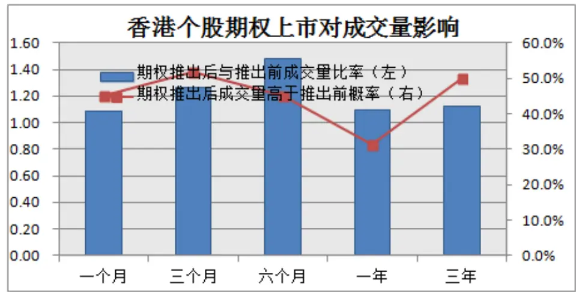
数据来源：Bloomberg，广发证券发展研究中心

## 3.4.2日本市场

JEX：东京交易所1997年7月推出股票期权，大阪交易所1997年7月推出股票期权。2011年，东京证交所与大阪证交所将于2013年1月1日合并。截止2013年底共发行了207只个股期权(含ETF期权)，下文将全部作为分析对象。

## (1) 日本市场个股期权上市后股价变化

统计结果显示，日本市场个股期权（含 ETF 期权）推出之后，现货标的股票的涨幅非常显著，推出后一个月内平均绝对年化涨幅高达 55%，超额涨幅同样高达 31%（相对日经指数）。中期（半年内）来看股价同样有出色的表现，可见期权的推出对现货标的来说同样属于利好。

表 14：日本市场个股期权上市后股价涨幅统计（年化）

|  | 绝对涨幅 | 上涨概率 |
| --- | --- | --- |
| 一个月 | 54.6% | 59.6% |
| 三个月 | 22.5% | 72.5% |
| 六个月 | 1.2% | 50.0% |
| 一年 | -0.7% | 35.5% |
| 三年 | -1.0% | 37.5% |

数据来源：Bloomberg，广发证券发展研究中心

图19：日本市场个股期权上市后股价表现
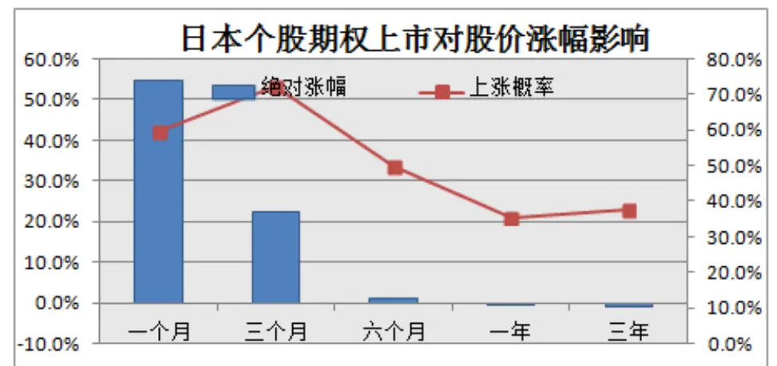
数据来源：Bloomberg，广发证券发展研究中心

表 15：日本市场个股期权上市后股价超额统计（年化）

|  | 超额涨幅 | 超额上涨概率 |
| --- | --- | --- |
| 一个月 | 31.1% | 51.9% |
| 三个月 | 22.2% | 70.0% |
| 六个月 | 10.8% | 55.9% |
| 一年 | 2.4% | 46.9% |
| 三年 | 4.1% | 62.5% |

数据来源：Bloomberg，广发证券发展研究中心

图20：日本市场个股期权上市后股价超额表现
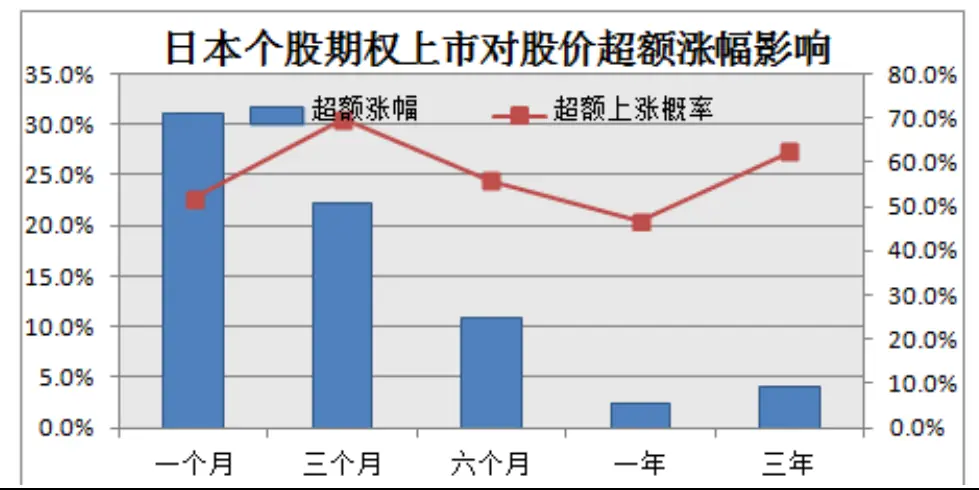
数据来源：Bloomberg，广发证券发展研究中心

## (2) 日本市场个股期权上市后股价波动率变化

统计结果显示，日本市场个股期权（含 ETF 期权）推出之后，现货标的股票的价格波动普遍有所提高，这与前面的理论分析并不相符，数据显示期权推出后个股的波动率持续增加。

表 16：日本市场个股期权上市后股价波动率变化统计

|  | 期权推出后与推出前波动率比 | 期权推出后波动率上涨概率 |
| --- | --- | --- |
| 一个月 | 1.44 | 55.8% |
| 三个月 | 1.21 | 70.0% |
| 六个月 | 1.15 | 64.7% |
| 一年 | 1.19 | 71.9% |
| 三年 | 1.18 | 50.0% |

数据来源：Bloomberg，广发证券发展研究中心

图21：日本市场个股期权上市后股价波动率变化
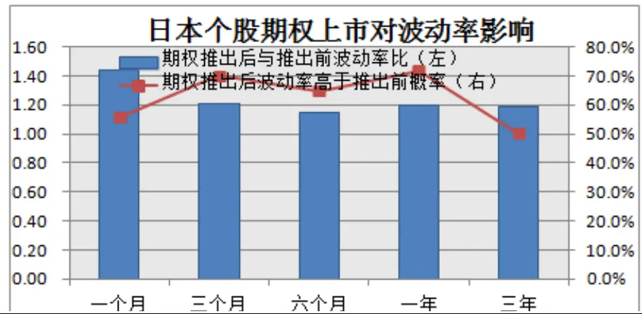
数据来源：Bloomberg，广发证券发展研究中心

## (3) 日本市场个股期权上市后成交量变化

统计结果显示，日本市场个股期权（含 ETF 期权）推出之后，现货标的股票成交量有大幅度提高，这与前面的理论分析基本相符，期权的推出极大丰富了个股的投资策略，从而吸引了更多投资者对其进行双向投资。

同样，并不是大多数个股成交量都会得到提升，资金依然集中在少部分股票中炒作。

表 17：日本市场个股期权上市后股价成交量变化统计

|  | 期权推出后与推出前成交量比 | 期权推出后成交量上涨概率 |
| --- | --- | --- |
| 一个月 | 1.24 | 48.1% |
| 三个月 | 1.11 | 45.0% |
| 六个月 | 1.27 | 44.1% |
| 一年 | 1.33 | 59.4% |
| 三年 | 2.23 | 68.8% |

数据来源：Bloomberg，广发证券发展研究中心

图22：日本市场个股期权上市对成交量影响
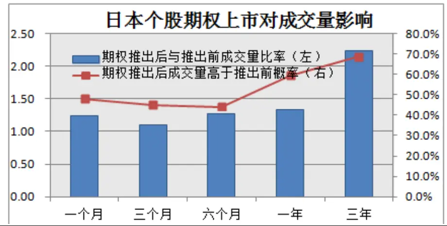
数据来源：Bloomberg，广发证券发展研究中心

## 3.4.3台湾市场

TAIFEX：台湾期货交易所于1998年7月正式开业，并推出股指期货。2001年12月推出台指期权，2003年1月推出股票期权。截止2013年底共发行了42只个股期权(含ETF期权)，下文将全部作为分析对象。

## (1) 台湾市场个股期权上市后股价变化

统计结果显示，台湾市场个股期权（含 ETF 期权）推出之后，现货标的股票的短期涨幅比较显著，但具有超额收益的个股数量并没过半，需要在备选标的中优选个股，且中长期来看股价并没有出色的表现（其中个股超额收益我们选择与台湾加权指数进行比较），这跟台湾期权市场尚未成熟且个股期权规模较小有关系，投资者喜欢在期权推出初期对相关个股进行热炒，随后热情开始下降股价沦为泯然。因此整体来说期权推出对台湾个股并不算显著的利好。

表 18：台湾市场个股期权上市后股价涨幅统计（年化）

|  | 绝对涨幅 | 上涨概率 |
| --- | --- | --- |
| 一个月 | 17.5% | 57.7% |
| 三个月 | -13.7% | 48.0% |
| 六个月 | 0.2% | 56.0% |
| 一年 | 4.1% | 52.0% |
| 三年 | 25.9% | 72.7% |

数据来源：Bloomberg，广发证券发展研究中心

图23：台湾市场个股期权上市后股价表现
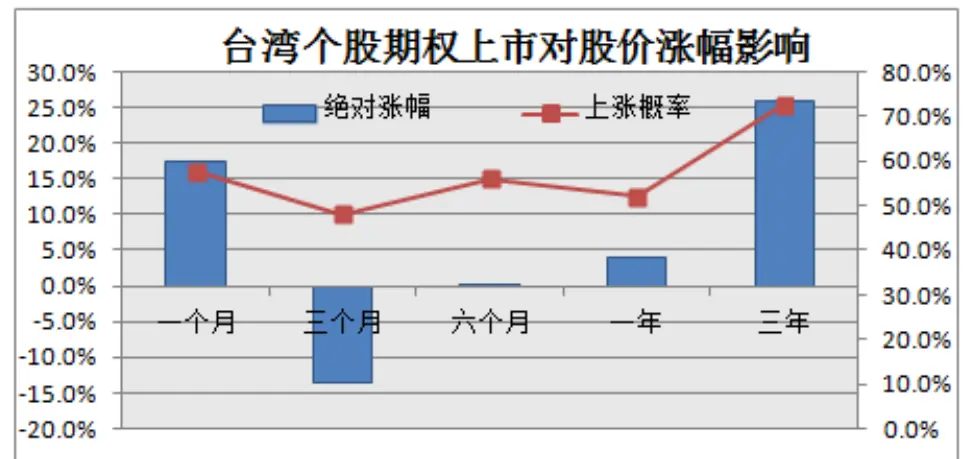
数据来源：Bloomberg，广发证券发展研究中心

表 19：台湾市场个股期权上市后股价超额统计（年化）

|  | 超额涨幅 | 超额上涨概率 |
| --- | --- | --- |
| 一个月 | 12.1% | 46.2% |
| 三个月 | -5.6% | 52.0% |
| 六个月 | -1.4% | 56.0% |
| 一年 | 1.9% | 48.0% |
| 三年 | 16.0% | 63.6% |

数据来源：Bloomberg，广发证券发展研究中心

图24：台湾市场个股期权上市后股价超额表现
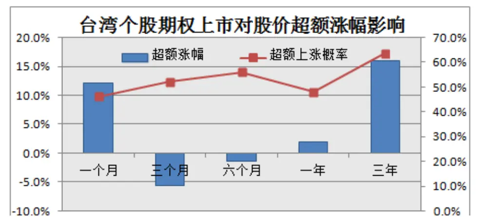
数据来源：Bloomberg，广发证券发展研究中心

## (2) 台湾市场个股期权上市后股价波动率变化

统计结果显示，台湾市场个股期权（含 ETF 期权）推出之后，现货标的股票三个月内波动率提升非常显著；但随着时间推移，多数个股在期权推出后相对推出前波动率降为 1倍以下。

台湾的股权交易虽然并不特别活跃，但长期来看，其投资者对于个股期权的应用相对比较稳健，充分利用了其双向套保的功能实现风险规避，从而维持了个股的长期平稳，避免了个股的大幅度震荡。

表 20：台湾市场个股期权上市后股价波动率变化统计

|  | 期权推出后与推出前波动率比 | 期权推出后波动率上涨概率 |
| --- | --- | --- |
| 一个月 | 1.20 | 69.2% |
| 三个月 | 1.05 | 56.0% |
| 六个月 | 0.90 | 32.0% |
| 一年 | 0.86 | 20.0% |
| 三年 | 0.71 | 0.0% |

数据来源：Bloomberg，广发证券发展研究中心

图25：台湾市场个股期权上市后股价波动率变化

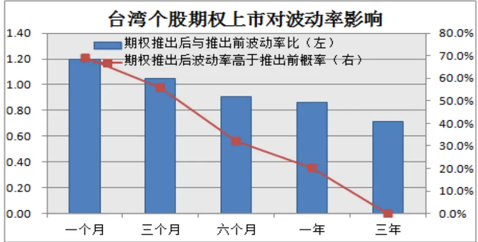
数据来源：Bloomberg，广发证券发展研究中心

## (3) 台湾市场个股期权上市后成交量变化

统计结果显示，台湾市场个股期权（含 ETF 期权）推出之后，现货标的股票成交量有大幅度提高，这与前面的理论分析基本相符，期权的推出极大丰富了个股的投资策略，从而吸引了更多投资者对其进行双向投资。

表 21：台湾市场个股期权上市后股价成交量变化统计

|  | 期权推出后与推出前成交量比 | 期权推出后成交量上涨概率 |
| --- | --- | --- |
| 一个月 | 1.10 | 61.5% |
| 三个月 | 1.23 | 76.0% |
| 六个月 | 1.35 | 76.0% |
| 一年 | 1.56 | 68.0% |
| 三年 | 4.80 | 45.5% |

数据来源：Bloomberg，广发证券发展研究中心

图26：台湾市场个股期权上市对成交量影响
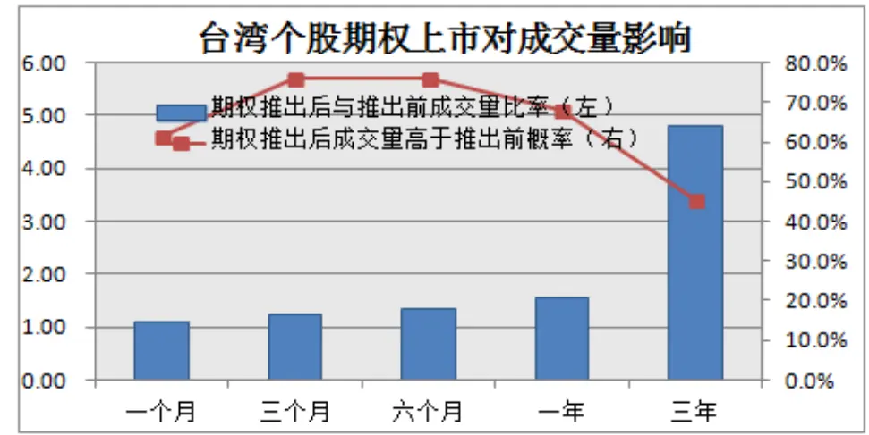
数据来源：Bloomberg，广发证券发展研究中心

## 3.5 金砖国家个股期权推出后影响

“金砖四国”包含了全球最大的四个新兴市场国家：巴西、俄罗斯、中国及印度以及2010年新加入的南非。其中俄罗斯与南非个股期权规模非常小，因子不对其进行单独分析，下面重点分析巴西、印度以及中国的期权市场。

## 3.5.1巴西市场

巴西交易所早在1979年就挂牌股票期权，但直到2000年巴西开始对国内证券市场进行改革之后，其期权规模才出现了快速的增长。金砖国家中巴西的个股期权规模占比最高达90%。

截止2013年底香港共发行了124只个股期权(含ETF期权)，下文将全部作为分析对象。

## (1) 巴西市场个股期权上市后股价变化

统计结果显示，巴西市场个股期权（含 ETF 期权）推出之后，现货标的股票短期一个月内出现大幅调整，随后随着时间推进，相应个股表现强劲，具有绝对收益和超额收益（相对巴西综合指数），且过半个股都能跑赢大盘！

表 22：巴西市场个股期权上市后股价涨幅统计（年化）

|  | 绝对涨幅 | 上涨概率 |
| --- | --- | --- |
| 一个月 | -10.4% | 48.1% |
| 三个月 | 13.6% | 52.8% |
| 六个月 | 2.8% | 53.0% |
| 一年 | 18.0% | 63.8% |
| 三年 | 23.4% | 77.3% |

数据来源：Bloomberg，广发证券发展研究中心

图27：巴西市场个股期权上市后股价表现
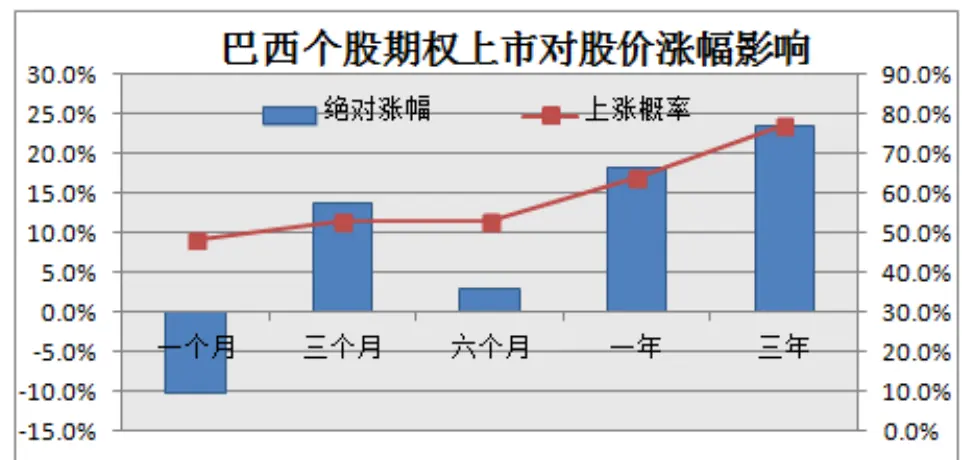
数据来源：Bloomberg，广发证券发展研究中心

表 23：巴西市场个股期权上市后股价超额统计（年化）

|  | 超额涨幅 | 超额上涨概率 |
| --- | --- | --- |
| 一个月 | -2.5% | 44.3% |
| 三个月 | 7.4% | 51.4% |
| 六个月 | 0.4% | 45.5% |
| 一年 | 6.4% | 46.6% |
| 三年 | 16.3% | 81.8% |

数据来源：Bloomberg，广发证券发展研究中心

图28：巴西市场个股期权上市后股价表现
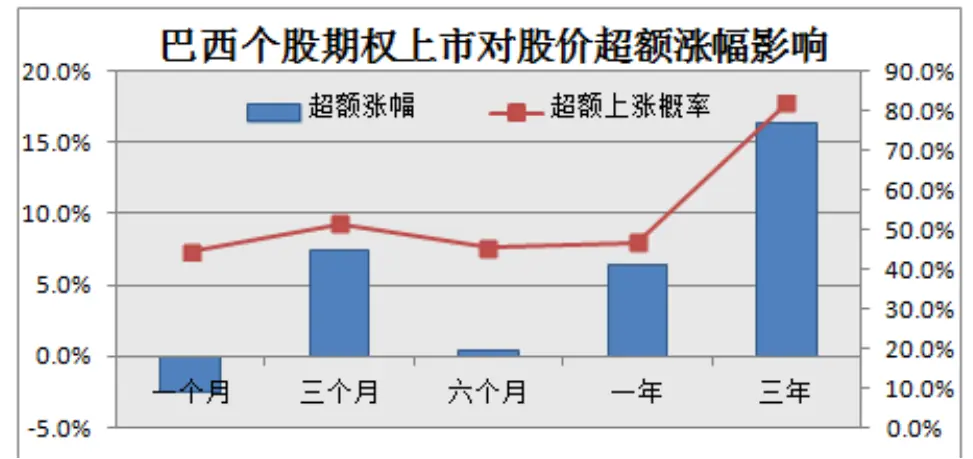
数据来源：Bloomberg，广发证券发展研究中心

## (2) 巴西市场个股期权上市后股价波动率变化

统计结果显示，巴西市场个股期权（含 ETF 期权）推出之后，现货标的股票的价格波动短期内普遍有所提高，随着时间的推移开始恢复理性，个股波动恢复正常并逐步有所降低。

表 24：巴西市场个股期权上市后股价波动率变化统计

|  | 期权推出后与推出前波动率比 | 期权推出后波动率上涨概率 |
| --- | --- | --- |
| 一个月 | 1.50 | 53.2% |
| 三个月 | 1.15 | 55.6% |
| 六个月 | 1.11 | 56.1% |
| 一年 | 1.01 | 48.3% |
| 三年 | 0.86 | 27.3% |

数据来源：Bloomberg，广发证券发展研究中心

图29：巴西市场个股期权上市后股价波动率变化
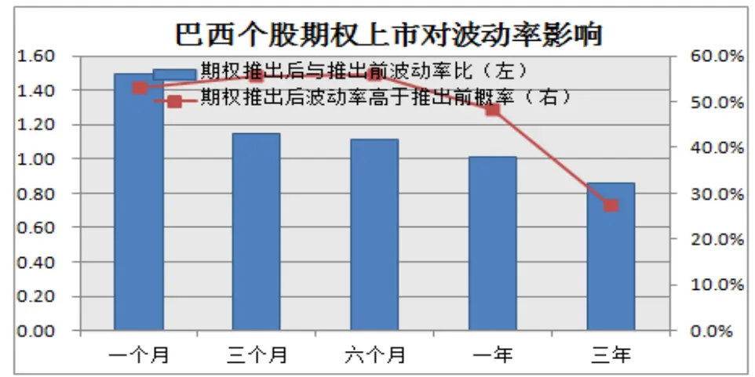
数据来源：Bloomberg，广发证券发展研究中心

## (3) 巴西市场个股期权上市后成交量变化

统计结果显示，巴西市场个股期权（含 ETF 期权）推出之后，现货标的股票成交量有大幅度提高，这与前面的理论分析基本相符，期权的推出极大丰富了个股的投资策略，从而吸引了更多投资者对其进行双向投资。

表 25：巴西市场个股期权上市后股价成交量变化统计

|  | 期权推出后与推出前成交量比 | 期权推出后成交量上涨概率 |
| --- | --- | --- |
| 一个月 | 1.12 | 53.2% |
| 三个月 | 1.21 | 55.6% |
| 六个月 | 1.22 | 51.5% |
| 一年 | 1.23 | 46.6% |
| 三年 | 2.31 | 90.9% |

数据来源：Bloomberg，广发证券发展研究中心

图30：巴西市场个股期权上市对成交量影响
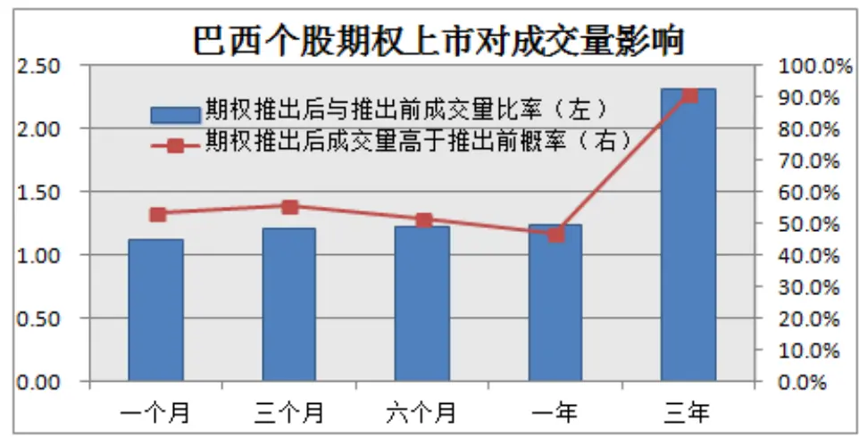
数据来源：Bloomberg，广发证券发展研究中心

## 3.5.2印度市场

印度的期权交易所同样有两个，分别是NSE和BSE，前者为个股期权的主要交易场所，在金砖国家中规模排名第2。截止2013年底香港共发行了135只个股期权(含ETF期权)，下文将全部作为分析对象。

## (1) 印度市场个股期权上市后股价变化

统计结果显示，印度市场个股期权（含 ETF 期权）推出之后，现货标的股票显著上涨，一个月内平均年化涨幅达 86%，而平均超额涨幅（相对孟买指数）同样高达72.4%，中长期来看，期权的推出对印度股票同样是重大利好，70%以上个股在推出期权之后都会被热炒较长时间。这与印度市场个股期权的稀缺性有很大关系。

表 26：印度市场个股期权上市后股价涨幅统计（年化）

|  | 绝对涨幅 | 上涨概率 |
| --- | --- | --- |
| 一个月 | 85.9% | 72.4% |
| 三个月 | 58.4% | 68.5% |
| 六个月 | 59.8% | 77.6% |
| 一年 | 44.5% | 75.0% |
| 三年 | 52.8% | 89.7% |

数据来源：Bloomberg，广发证券发展研究中心

图31：印度市场个股期权上市后股价表现
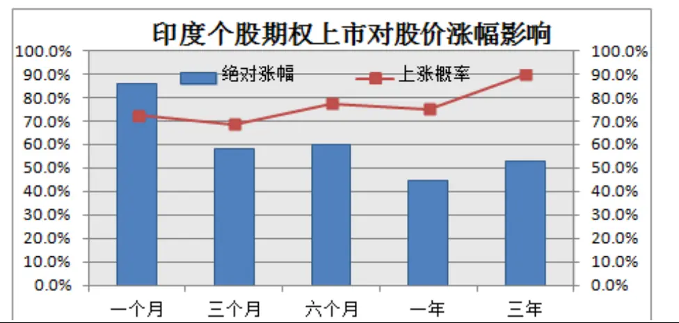
数据来源：Bloomberg，广发证券发展研究中心

表 27：印度市场个股期权上市后股价超额统计（年化）

|  | 超额涨幅 | 超额上涨概率 |
| --- | --- | --- |
| 一个月 | 44.0% | 62.1% |
| 三个月 | 25.0% | 63.0% |
| 六个月 | 25.9% | 61.2% |
| 一年 | 16.4% | 61.4% |
| 三年 | 21.7% | 75.9% |

数据来源：Bloomberg，广发证券发展研究中心
识别风险，发现价值

图32：印度市场个股期权上市后股价超额表现
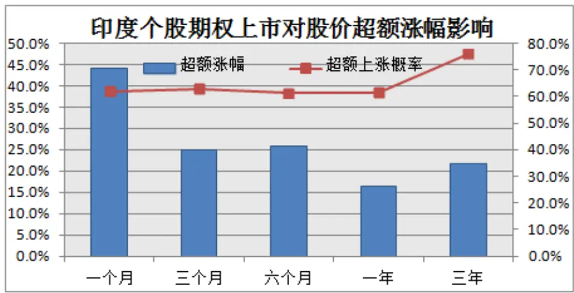
数据来源：Bloomberg，广发证券发展研究中心

## (2) 印度市场个股期权上市后股价波动率变化

统计结果显示，印度市场个股期权（含 ETF 期权）推出之后，大多数现货标的股票的价格波动有所下降，但平均来看波动率变化幅度并不大。

表 28：印度市场个股期权上市后股价波动率变化统计

|  | 期权推出后与推出前波动率比 | 期权推出后波动率上涨概率 |
| --- | --- | --- |
| 一个月 | 1.13 | 43.1% |
| 三个月 | 1.07 | 53.7% |
| 六个月 | 1.08 | 51.0% |
| 一年 | 0.99 | 29.6% |
| 三年 | 0.90 | 31.0% |

数据来源：Bloomberg，广发证券发展研究中心

图33：印度市场个股期权上市后股价波动率变化
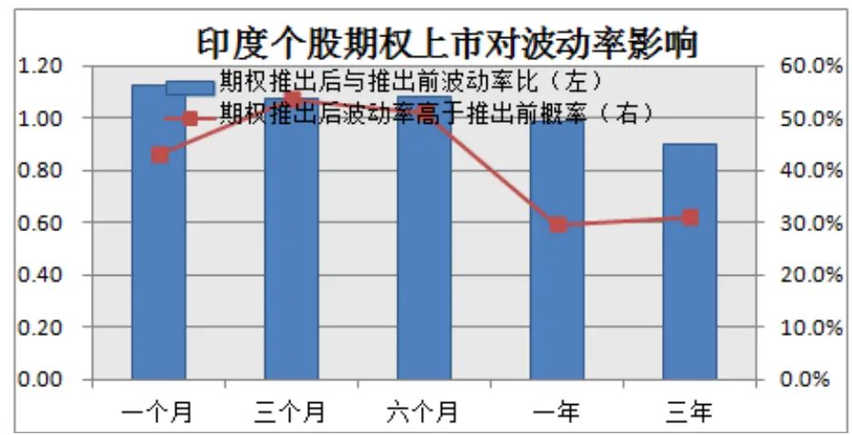
数据来源：Bloomberg，广发证券发展研究中心

## (3) 印度市场个股期权上市后成交量变化

统计结果显示，印度市场个股期权（含 ETF 期权）推出之后，现货标的股票成交量有显著提高，这与前面的理论分析基本相符，期权的推出极大丰富了个股的投资策略，从而吸引了更多投资者对其进行双向投资。

表 29：印度市场个股期权上市后股价成交量变化统计

|  | 期权推出后与推出前成交量比 | 期权推出后成交量上涨概率 |
| --- | --- | --- |
| 一个月 | 1.00 | 41.4% |
| 三个月 | 1.13 | 48.2% |
| 六个月 | 1.24 | 51.0% |
| 一年 | 1.51 | 59.1% |
| 三年 | 1.82 | 65.5% |

数据来源：Bloomberg，广发证券发展研究中心

图34：印度市场个股期权上市对成交量影响
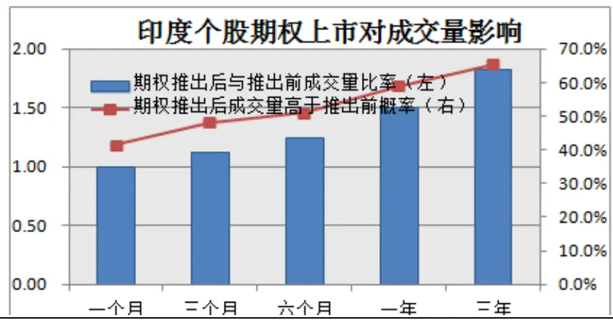
数据来源：Bloomberg，广发证券发展研究中心
识别风险，发现价值

## 3.5.3中国市场

中国证券市场并没有正式推出过期权，但90年代却曾经存在过权证，两者之间有许多共同之处，这里我们同样分析中国市场股票权证的曾经上市是否对相关股票带来显著影响进行分析和比较。

## (1) 中国市场权证上市后股价变化

统计结果显示，中国市场权证推出之后，由于权证资源的稀缺性导致了正股收到同样受到热炒，在权证推出一个月内，股价涨幅高达 149%，超额收益（相对上证指数）跌幅也高达89%，虽然后来交易所推出了券商的创设机制，但依然改变不了权证和相关股票被热炒的现状，中长期来看个股涨幅同样相当显著，过半个股在推出期权之后都具有显著涨幅，其中少数股票涨幅更是巨大。

表 30：中国市场权证上市后股价涨幅统计（年化）

|  | 绝对涨幅 | 上涨概率 |
| --- | --- | --- |
| 一个月 | 149.2% | 52.9% |
| 三个月 | 114.6% | 68.8% |
| 六个月 | 77.0% | 75.0% |
| 一年 | 113.2% | 77.4% |
| 三年 | 32.7% | 81.8% |

数据来源：Bloomberg，广发证券发展研究中心

图35：中国市场权证上市后股价表现
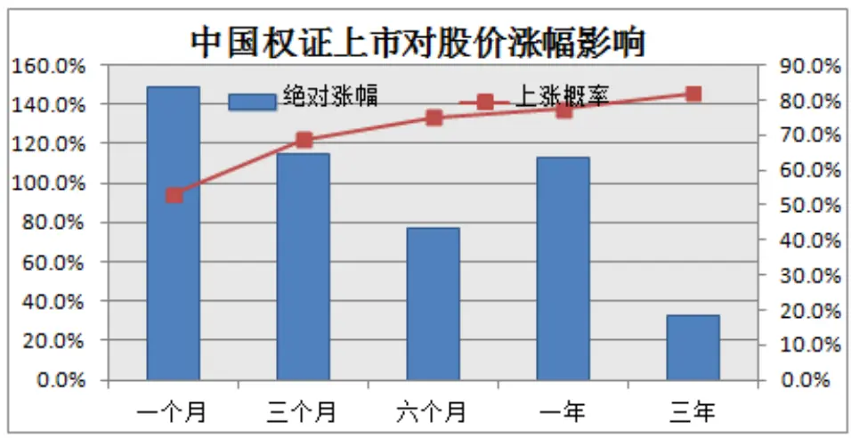
数据来源：Bloomberg，广发证券发展研究中心

表 31：中国市场权证上市后股价超额统计（年化）

|  | 超额涨幅 | 超额上涨概率 |
| --- | --- | --- |
| 一个月 | 89.4% | 47.1% |
| 三个月 | 65.0% | 62.5% |
| 六个月 | 24.9% | 53.1% |
| 一年 | 37.5% | 58.1% |
| 三年 | 17.9% | 63.6% |

数据来源：Bloomberg，广发证券发展研究中心

图36：中国权证上市后股价超额表现
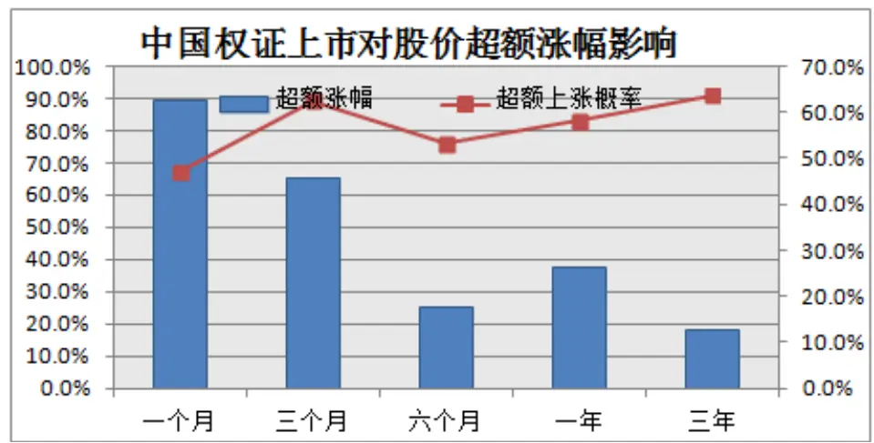
数据来源：Bloomberg，广发证券发展研究中心

## (2) 中国权证上市后股价波动率变化

统计结果显示，中国的权证推出之后，现货标的股票的价格波动普遍且持续提高，这与前面的理论分析并不相符，数据显示期权推出后个股一个月后波动率提升非常显著，随着时间的推移仍然高于期权推出前的波动，这反映出一方面国内的投资者对于权证的应用非常不理性，更多的是作为投机炒作的标的，而不是当成风险对冲的工具；另一方面也反映了国内市场对于期权工具的需求非常之大，有限的衍生产品决定了其稀缺性必然受到热捧。

后续正式意义上的个股期权一旦推出，由于期权标的及品种都及其有限，因此类似的非理性炒作现象依然值得我们关注和防范！

表 32：中国权证上市后股价波动率变化统计

|  | 期权推出后与推出前波动率比 | 期权推出后波动率上涨概率 |
| --- | --- | --- |
| 一个月 | 0.99 | 35.3% |
| 三个月 | 1.12 | 56.3% |
| 六个月 | 1.14 | 59.4% |
| 一年 | 1.21 | 61.3% |
| 三年 | 1.34 | 68.2% |

数据来源：Bloomberg，广发证券发展研究中心

图37：中国权证上市后股价波动率变化

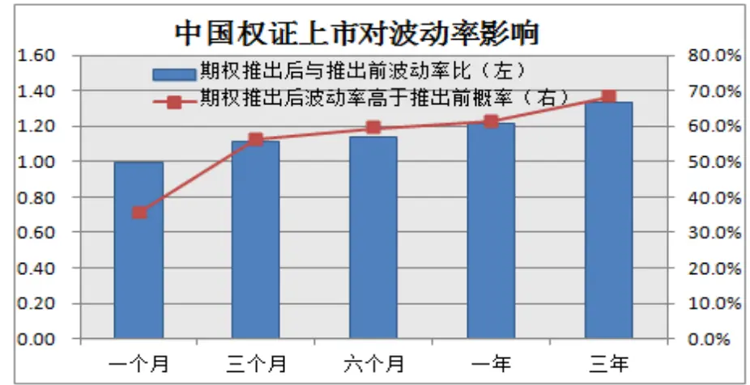
数据来源：Bloomberg，广发证券发展研究中心

## (3) 中国权证上市后成交量变化

统计结果显示，中国权证推出之后，现货标的股票被热炒，从而吸引了更多投资者对其进行短期双向博弈（投机），成交量同样有大幅度提高，

表 33：中国权证上市后股价成交量变化统计

|  | 期权推出后与推出前成交量比 | 期权推出后成交量上涨概率 |
| --- | --- | --- |
| 一个月 | 1.09 | 55.9% |
| 三个月 | 1.14 | 59.4% |
| 六个月 | 1.27 | 71.9% |
| 一年 | 1.65 | 87.1% |
| 三年 | 2.44 | 90.9% |

数据来源：Bloomberg，广发证券发展研究中心

图38：中国权证上市对成交量影响
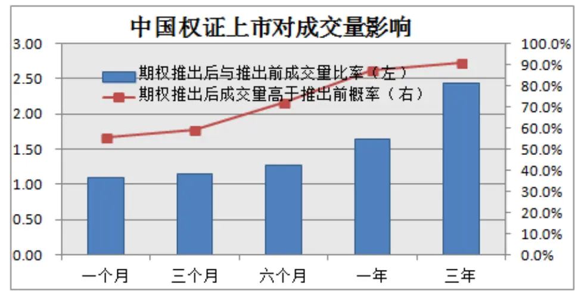
数据来源：Bloomberg，广发证券发展研究中心

## 四、海外期权市场经验总结与对我国的启发

上一节分别基于各区域及各国主要期权交易所对个股期权推出后对相应股票的影响进行了详细的讨论和分析，并结合各国场内期权交易特征给出了相应的结论分析。本节将从更加大局的角度出发，探讨各国期权市场的历史经验背后是否隐藏着比较一致的规律，基于这些规律来对我国不久的未来即将正式退出的个股期权进行启发式的思考和借鉴。

## 4.1 海外期权市场经验总结

## （1）期权推出或带来股价上涨

首先来看各国期权交易所推出个股期权后，不同期限内正股股价表现的变化。从下图可以清楚地看到，期权的推出对现货标的起到非常积极的刺激作用，这一结论几乎适用于所有交易所，其中印度、中国（权证）以及日本等国家由于衍生品种类有限，股价的反映最为激烈，美国、巴西以及香港等成熟市场表现较为平稳，但其中美国市场长期来看还是给与了期权标的股票较高的溢价补偿。总体而言，期权对推出利好相应股票！

图39：各国交易所推出个股期权后股票超额涨幅
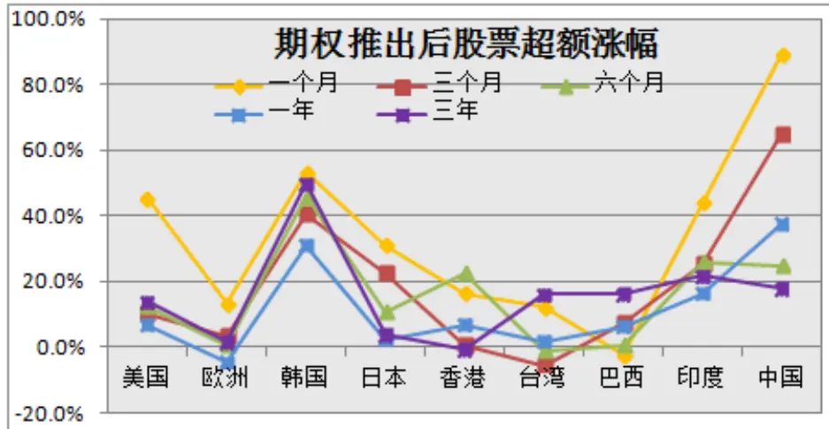
数据来源：Bloomberg，广发证券发展研究中心

## （2）期权推出后波动率短期上扬长期收敛

再来看各国期权交易所推出个股期权后，不同期限内股价波动率表现的变化。从下图可以清楚地看到，各交易所在期权推出的初期，相应的多数股票价格波动率都会有显著地提高，但随着时间推进，波动率开始出现显著的回调。

以香港和巴西两个国家为例，在个股期权推出的1-3个月内，个股平均股价波动率显著提高到期权推出前的1.5倍左右，且超过半数的个股波动率均提高了。但再来看半年后，一方面股价的平均波动率显著下降到1倍以下，其次多数股票波动变小了，香港交易所仅有30%左右的股票在推出期权之后平均波动率有所增加。

再以美国及欧洲的交易所为例，虽然期权推出后股票平均波动率一直高于推出之前，但中长期波动率相比短期的大幅上扬显然有所改善，因此说长期来看，随着期权市场的成熟以及相关品种的丰富，投资者应该会长期回归理性，股票的波动率也将慢慢收敛。

图40：各国交易所推出个股期权后股票波动率倍数统计

数据来源：Bloomberg，广发证券发展研究中心

图41：各国交易所推出个股期权后股票波动率提高概率统计
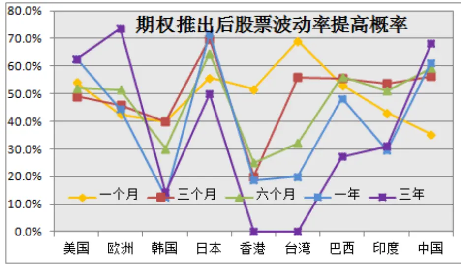
数据来源：Bloomberg，广发证券发展研究中心

## （3）期权推出激活个股交易，成交量迎来井喷

最后总结一下各国期权交易所推出个股期权后，不同期限内股票成交量的变化情况。从下图可以清楚地看到，各交易所在期权推出后，相应的多数股票成交量都迎来了稳定的增长，而且这种增长是可长期持续的，随着时间的推进，投资者对于个股及期权的运用更加科学和灵活，容易形成一定的粘附和依赖性，因此成交量在期权推出1-3年内甚至可能迎来井喷式的增长。

图42：各国交易所推出个股期权后股票成交量倍数统计
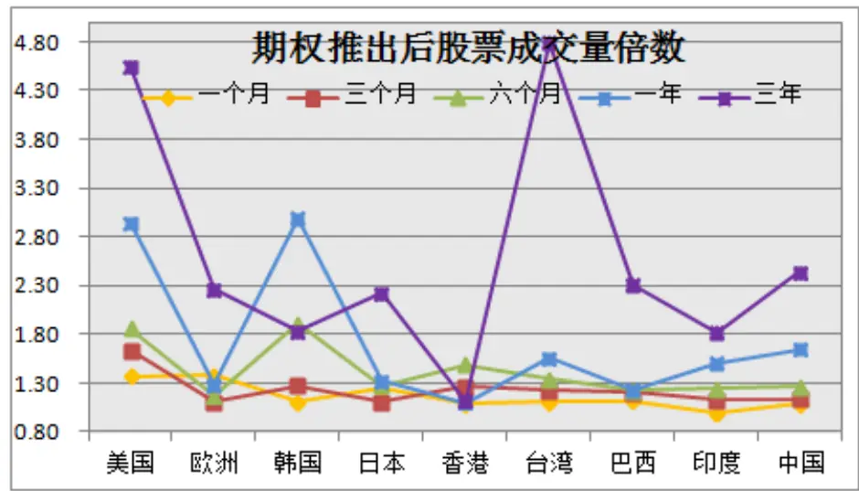
数据来源：Bloomberg，广发证券发展研究中心

图43：各国交易所推出个股期权后股票成交量提高概率统计
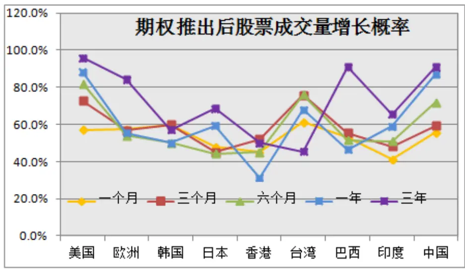
数据来源：Bloomberg，广发证券发展研究中心

综上所述，我们进一步把各交易所的大致规律绘制成下面表格，方便对照查询并统一出简单的规律和结论：

表 34：各国交易所推出个股期权后对股票影响规律统计

|  |  | 股票价格走势 |  |  |  | 股票价格波动率 |  |  |  | 股票成交量 |  |  |  |
| --- | --- | --- | --- | --- | --- | --- | --- | --- | --- | --- | --- | --- | --- |
| 国家 |  | 超额涨幅 |  | 超额上涨概率 |  | 波动率比率 |  | 波动率增长概率 |  | 成交量比率 |  | 成交量增长概率 |  |
|  |  | 短期 | 长期 | 短期 | 长期 | 短期 | 长期 | 短期 | 长期 | 短期 | 长期 | 短期 | 长期 |
| 美国 |  | ↑ | ↑ | → | ↑ | ↑ | → | → | ↑ | ↑ | ↑ | ↑ | ↑ |
| 欧洲 |  | ↑ | → | → | → | ↑ | → | ↑ | → | ↑ | ↑ | ↑ | ↑ |
| 亚洲 | 香港 | ↑ | → | ↑ | ↓ | ↑ | → | → | ↑ | → | ↑ | → | → |
|  | 日本 | ↑ | → | ↑ | ↑ | ↑ | → | → | → | → | ↑ | → | ↑ |
|  | 台湾 | ↑ | → | → | → | ↑ | ↓ | ↑ | ↓ | → | ↑ | ↑ | ↓ |
|  | 中国 | ↑ | ↑ | ↑ | ↑ | → | ↓ | → | ↑ | ↑ | ↑ | ↑ | ↑ |
| 金砖国家 | 巴西 | → | ↑ | → | ↑ | ↑ | ↓ | ↑ | ↓ | → | ↑ | → | ↑ |
|  | 印度 | ↑ | ↑ | ↑ | ↑ | ↑ | ↓ | ↓ | ↓ | → | ↑ | → | ↑ |

数据来源：WFE，Bloomberg，Wind，广发证券发展研究中心

## 4.2 对我国期权的若干启发

基于上述规律总结，我们可以大概得出如下启发：

## （1）期权推出后相应股票上涨是大概率事件

期权的推出显然刺激了股票价格，这一结论几乎适用于所有交易所，其中印度、中国（权证）以及日本等国家股价的反映最为激烈，美国、巴西以及香港等成熟市场表现较为平稳。

因此在个股期权推出之初，对相应股票进行配置并持有1-3个月不失为一个很好地事件驱动策略，考虑到市场风险因素，在配置股票的同时甚至可以卖空股指期货以获取更为稳定的超额收益。

## （2）期权推出后波动率短期上扬长期收敛

各交易所在期权推出的初期，相应的多数股票价格波动率都会有显著地提高，但随着时间推进，短则3个月长则半年后，随着期权市场的成熟以及相关品种的丰富，投资者长期回归理性，股票的波动率也将慢慢收敛。

由于个股波动显著提升，因此在对相应股票标的进行短期波段操作时需要对涨跌周期预判进行必要的调整，甚至可能催生个股的短期趋势交易策略。但在应用波动率策略进行股票投机时，要注意的是仅有少部分个股的波动率显著提升，且长期来看由于波动率趋于收敛，因此应该格外谨慎风险。

## （3）期权能有效激活个股，成交量有望迎来井喷

各交易所在期权推出后，相应的多数股票成交量都迎来了稳定的增长，而且这种增长是可长期持续的，随着时间的推进，投资者对于个股及期权的运用更加科学和灵活，形成一定的粘附和依赖性，在期权推出1-3年内股票持续来井喷式的增长。

正股成交量的大幅增加一方面增加了个股的流动性，为许多投资策略带来了便利；另一方面也将会给证券及期货公司等带来客观的经纪等业务收入增量，显著利好国内金融业发展。

## 风险提示

本篇报告主要介绍了个股期权合约的推出在海外市场的影响，供国内投资者参考。由于我国市场各方面情况与海外市场存在差异，因此具体影响状况要等期权发布后才能明确判断。

## Table_Res arch 广发金融工程研究小组

罗 军： 首席分析师，华南理工大学理学硕士，2010 年进入广发证券发展研究中心。

俞文冰： 首席分析师，CFA，上海财经大学统计学硕士，2012年进入广发证券发展研究中心。

叶 涛： 资深分析师，CFA ，上海交通大学管理科学与工程硕士，2012年进入广发证券发展研究中心。

安宁宁： 资深分析师，暨南大学数量经济学硕士，2011年进入广发证券发展研究中心。

胡海涛： 分析师， 华南理工大学理学硕士， 2010年进入广发证券发展研究中心。

夏潇阳： 分析师， 上海交通大学金融工程硕士， 2012年进入广发证券发展研究中心。

蓝昭钦： 分析师， 中山大学理学硕士， 2010年进入广发证券发展研究中心。

史庆盛： 分析师， 华南理工大学金融工程硕士， 2011年进入广发证券发展研究中心。

汪 鑫： 研究助理， 中国科学技术大学金融工程硕士， 2012年进入广发证券发展研究中心。

张 超：研究助理， 中山大学理学硕士，2012年进入广发证券发展研究中心。

## Table_RatingIndustry 广发证券—行业投资评级说明

买入： 预期未来12个月内，股价表现强于大盘10%以上。

持有： 预期未来12个月内，股价相对大盘的变动幅度介于-10%～+10%。

卖出： 预期未来12个月内，股价表现弱于大盘10%以上。

## Table_RatingCompany 广发证券—公司投资评级说明

买入： 预期未来12个月内，股价表现强于大盘15%以上。

谨慎增持： 预期未来12个月内，股价表现强于大盘5%-15%。

持有： 预期未来12个月内，股价相对大盘的变动幅度介于-5%～+5%。

卖出： 预期未来12个月内，股价表现弱于大盘5%以上。

## Table_Ad联系我们

|  | 广州市 | 深圳市 | 北京市 | 上海市 |
| --- | --- | --- | --- | --- |
| 地址 | 广州市天河北路183号大 | 深圳市福田区金田路4018 | 北京市西城区月坛北街2号 | 上海市浦东新区富城路99号 |
|  | 都会广场5 楼 | 号安联大厦15楼A座03-04 月坛大厦18层 |  | 震旦大厦18楼 |
| 邮政编码 | 510075 | 518026 | 100045 | 200120 |
| 客服邮箱 服务热线 | gfyf@gf.com.cn 020-87555888-8612 |  |  |  |

## Table_Disclaimer 免 责声 明

广发证券股份有限公司具备证券投资咨询业务资格。本报告只发送给广发证券重点客户，不对外公开发布。

本报告所载资料的来源及观点的出处皆被广发证券股份有限公司认为可靠，但广发证券不对其准确性或完整性做出任何保证。报告内容仅供参考，报告中的信息或所表达观点不构成所涉证券买卖的出价或询价。广发证券不对因使用本报告的内容而引致的损失承担任何责任，除非法律法规有明确规定。客户不应以本报告取代其独立判断或仅根据本报告做出决策。

广发证券可发出其它与本报告所载信息不一致及有不同结论的报告。本报告反映研究人员的不同观点、见解及分析方法，并不代表广发证券或其附属机构的立场。报告所载资料、意见及推测仅反映研究人员于发出本报告当日的判断，可随时更改且不予通告。

本报告旨在发送给广发证券的特定客户及其它专业人士。未经广发证券事先书面许可，任何机构或个人不得以任何形式翻版、复制、刊登、转载和引用，否则由此造成的一切不良后果及法律责任由私自翻版、复制、刊登、转载和引用者承担。