# Tabl e_Title 指数期权推出对市场的影响分析

## 期权研究系列之十

## Table_Sum ary报告摘要 ：

## 我国衍生品市场推出股指期权的意义

随着衍生品市场的不断发展与成熟，期权合约作为促进欧美股票市场的重要金融衍生品工具，不断促进着欧美国家经济进步。虽然我国近十年衍生品市场发展迅速，但 90%以上的交易量都来自商品期货。我国指数期货的日渐成熟使股票市场更加稳定，投资者更加成熟，同时也为期权的推出创造了良好的机遇与市场环境。

## 海外市场经验

我们在报告中研究美国，韩国，德国，香港以及台湾市场股指期权发布的经验。从股指走势方面，五个市场都显示出指数值会在指数期权发布前短期内增加，除台湾市场其余四个都在期权发布后短期内降低；从股指波动率方面，所有的股指波动率在期权发布后短期内会小幅度增加；从对指数期货成交量的影响看，五个国家的指数都显示出指数期权的发布在长期对促进股指期货成交量增加有一定效果；从市场成交量看，韩国和香港证券交易所都会在指数期权发布后短期内交易量减少而长期增加，台湾市场正好相反。

## 海外市场对我国的启发

从海外市场经验，我们可以对我国沪深300指数期权的发布做出如下预测：

沪深 300指数走势有很大可能会在期权上市前三个月开始递增并且在期权发布后三个月小幅度递减；根据香港和台湾亚洲市场，沪深 300 指数波动率会在期权发布前后三个月内有所增加，投资者面临更大风险；根据亚洲市场在指数期货成交量变化的一致性可以预测，沪深 300指数期货交易量在期权发布前短期内会增长，但发布后短期内会减少；长期成交量保持增长趋势。

图 1 全球活跃指数期权 2012 年成交量占比
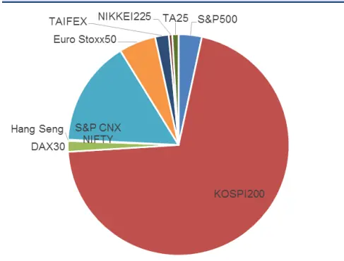

图 2沪深 300指数期货成交量统计
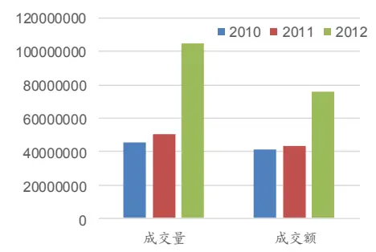

图 3标普 500指数期权合约交易量
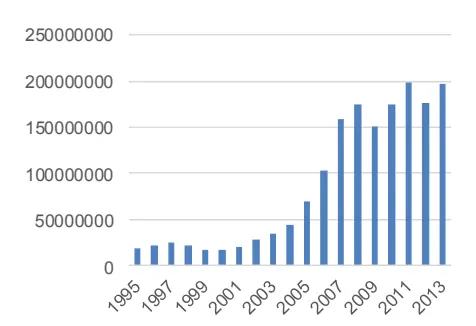

分析师： 史庆盛 S0260513070004

020-87555888-8618

sqs@gf.com.cn

## Table_Report 相关研究：

个股期权的推出对标的影响2014-02-27分析——期权研究系列之九

近二十年，随着衍生品市场的不断发展与成熟，期权合约作为促进欧美股票市场的重要金融衍生品工具，不断促进着欧美国家经济进步。美国期权市场的成功随后带动了韩国，印度，香港等亚洲新兴市场的发展，尤其以韩国股指期权 KOSPI200 的脱颖而出为代表。基于海外市场各类期权的成功发布，研究开发期权合约也成为了促进我国衍生品市场的成功发展必须走上的一条道路。

图 1 为全球各国市场较为活跃的期权合约在 2012 年成交量分布情况。我们可以明显看出，成交量最大的为韩国 KOSPI200指数期权合约，占活跃期权总量的 71%。

图1：全球活跃指数期权2012年成交量占比
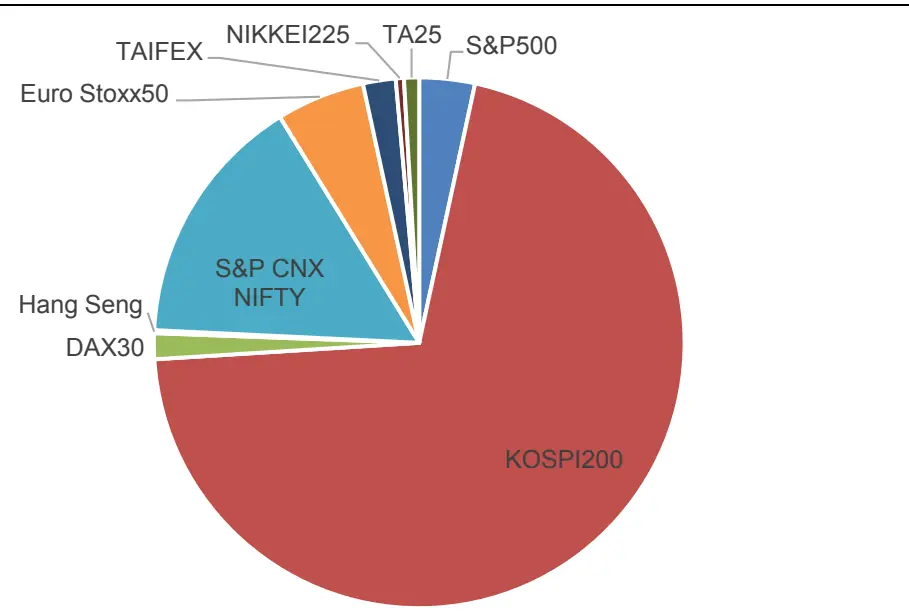
数据来源：Bloomberg，广发证券发展研究中心

## 一、我国衍生品市场及推出股指期权的意义

目前我国在场内交易的衍生品种类主要为在各大商品交易所上市的商品期货以及在中国金融期货交易所上市的沪深 300 股指期货和年今（2013）推出的五年期国债期货合约。虽然我国近十年衍生品市场发展迅速，但 90%以上的交易量都来自商品期货。金融类衍生品发展滞后，品种稀少是目前我国衍生品面临的最大问题与挑战。因此个股和指数类期权的推出将为我国衍生品市场的进步做出重要贡献。

2010 年中国金融期货交易所发布我国首支股指期货沪深 300 股指期货，推出三年来受到广大投资者的关注与欢迎，从图 2 可以看出，成交量与成交额在 2012 年度都迅速增长，年交易量突破一亿手。

图2：沪深300指数期货2010-2012年度统计数据（成交量：手，成交金额：百万元）
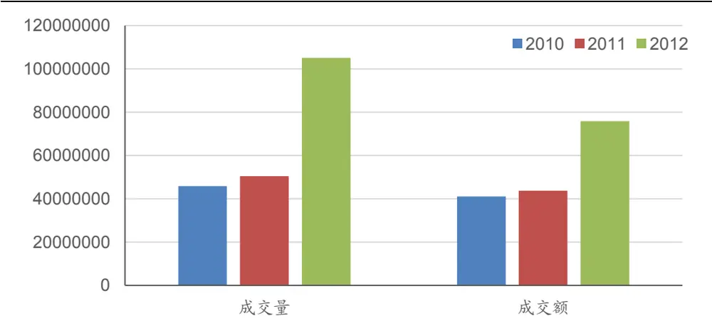
数据来源：中国金融期货交易所，广发证券发展研究中心

我国近年经济的快速发展，指数期货的日渐成熟使股票市场更加稳定，产品更加丰富，投资者更加成熟，同时也为期权合约的推出创造了良好的机遇与市场环境。从去年六月开始，我国各大券商与个人投资者已经开始在上交所和中金所等各大交易所启动各类期权的仿真模拟交易，为推动我国期权的上市做出重要贡献，同时也为其推出奠定了良好的基础。

与此同时，期权推出前后证券市场的变化情况也成为了各类投资者关心的话题。我们将通过这篇报告分析欧美，韩国,香港以及台湾市场在推出股指期权前后长短期内市场走势的变化情况，总结其经验，为国内成功推出股指期权做参考。

## 二、海外市场经验

## 2.1 海外期权合约条款介绍

期权是给予其持有者以协商价格在未来某一行权日对给定标的资产进行交易的权利合约。每一张合约都由一系列条款组成，从定义可以看出，主要规定条款包括标的资产，行权价格，行权日期和行权类型等。

指数期权以该指数为标的资产，行权价格和日期多数根据长期和短期合约来确定。合约的价值为合约乘数乘以指数得到的值。行权类型以能否提前行权分为欧式和美式，欧式期权只能在到期日行权而美式可以提前行权。大多数在全球各大交易所交易的期权都为欧式。

表1：全球部分国家地区指数期权合约条款

|  | 美国 | 韩国 | 德国 | 香港 |
| --- | --- | --- | --- | --- |
| 标的资产 | S&P500 指数 | KOSPI200 指数 | DAX30 指数 | 恒生指数 |
| 合约乘数 | 100美元 | 500,000 韩元 | 25 欧元 | 50港币 |
| 最小变动单位 | 0.01点 | 权利金<3：0.01点 | 0.1点 | 1点 |
|  |  | 权利金>=3：0.05点 |  |  |

识别风险，发现价值

| 行权月 | 3个近月 | 3个连续近月与3、6、9、12月最靠近的一个月 | 3个近月、之后三个季月及其后的6月与12月 |  | 3个连续近月与3、6、9、12月最靠近的一个月 |  |  |
| --- | --- | --- | --- | --- | --- | --- | --- |
| 行权日期 | 行权月第三个周五后一天 | 行权月第二个周四后一天 | 行权月第三个周五或前一交易日 |  | 短期：现月，下两个月及之后季月 |  |  |
|  |  |  |  |  | 长期：之后五个6月及12月 |  |  |
| 行权价格区间 | 5点 | 近月：2.5点 |  | 6个月内：50点 | 短期 | <2000点：50点 |  |
|  |  |  |  |  |  | 2000-8000点：100点 |  |
|  |  |  |  |  |  | >8000：200点 |  |
|  |  | 季月：5点 | 权利期 | 6-12个月：100点 |  | <4000点：100点 |  |
|  |  |  |  |  |  |  | 4000-8000：200点 |
|  |  |  |  | 12-60个月：200点 | 长 | 8000-12000：400点 |  |
|  |  |  |  |  | 12000-15000：600点 |  |  |
|  |  |  |  |  | 15000-19000：800点 |  |  |
|  |  |  |  |  | >19000：1000点 |  |  |
| 行权类型 | 欧式 | 欧式 | 欧式 |  | 欧式 |  |  |
| 计算方式 | 现金 | 现金 | 现金 |  | 现金 |  |  |

数据来源：Bloomberg，广发证券发展研究中心

下面部分我们将详细分析美国，韩国，德国，香港和台湾市场发布期权前后长期以及短期对股指走势，股指波动率，市场和期货成交量的影响；长期时间为发布期权的前一年以及后一年，短期为前后三个月或者更短。

## 2.2 美国市场标普 500 指数期权（S&P500 Index）

美国期权市场历史悠久，以产品的多样性，创新性以及高流动性吸引了广大投资者并且发展成为世界最成熟市场之一。芝加哥期权交易所（CBOE）于 1983 年 3 月11日发布的全球首只股指期权--S&P100 指数期权，与同年7月 1日发布的S&P500指数期权开创了期权交易市场的先河并带动了日后期权在世界各国市场的迅速萌芽与发展。

S&P500指数覆盖美国经济中主要行业的500 家代表性公司，占美国股票市场总市值的 75%。图 3 和图 4 分别为 S&P500 指数期权近二十年成交量和芝加哥期权交易所近五年的成交量，可以看出从 2003 年到 2010 年 S&P500 指数期权逐年递增，2010年成交量为174.3万份，是2005年成交量的2.5 倍；而芝加哥期权交易所成交量在2011年达到最大值，约为63.3 亿份。

图3：标普500指数期权合约年交易量（份）
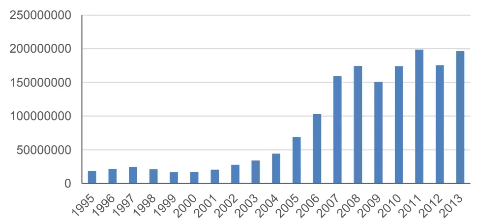
数据来源：Bloomberg，广发证券发展研究中心

图 4：芝加哥期权交易所（CBOT）近年指数期权合约成交量（份）
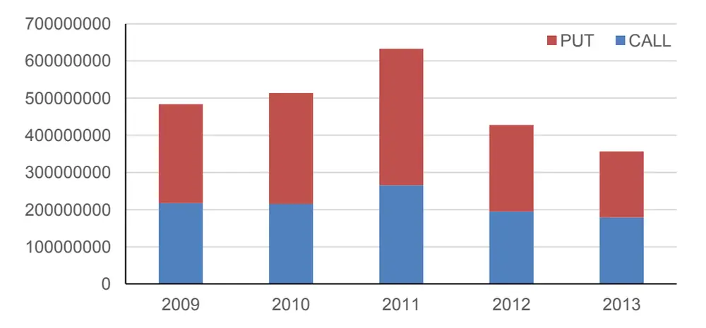
数据来源：Bloomberg，广发证券发展研究中心

我们将以 S&P500 指数期权发布以前到之后一年的时间即 1982 年 7 月 1 日到1984 年 7 月 1 日为研究区间，分析 S&P500 指数期权在发布前后短期与长期内对指数走势，波动率和期货成交量的影响。

## （一）S&P500指数走势

股指作为期权的标的资产，是反映市场价格变动和走势的最直接指标，因此我们首先分析期权发布前后对股指的影响。

美国S&P500指数期权发布于 1983 年7 月1日，即为图5 中红点位置。从股指前后两年间的整体变化看，股指在指数期权发布前一年呈递增之势而后一年中缓慢下降；并且前一年的增长速率大于后一年的减少速率。

图5：S&P500指数长期（指数期权上市前后一年）走势
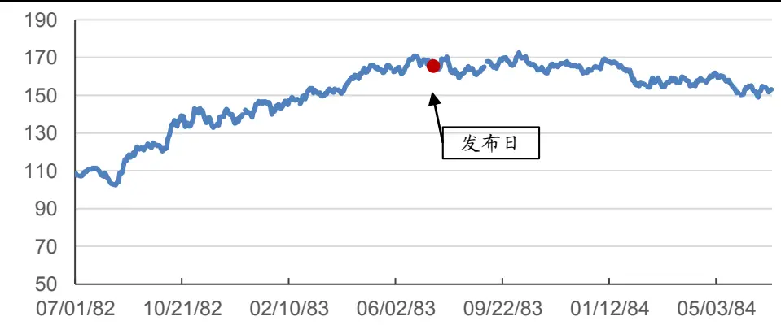
数据来源：Bloomberg，广发证券发展研究中心

图6：S&P500指数短期（指数期权上市前后三个月）走势
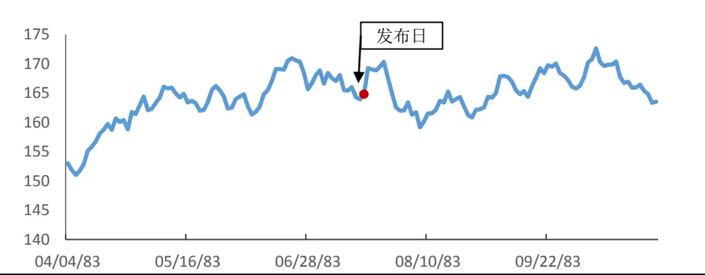
数据来源：Bloomberg，广发证券发展研究中心

从短期走势看，在 S&P500 指数期权 ，后指数出现一次相对大幅下降，随后的半年时间中，指数走势持续在 165点上下波动，振幅不超过 5%。

因此，指数走势在 S&P500指数期权推出前后短期内增长，在推出后长期内下降。

## （二）S&P500指数波动率

大多数衍生品都有不确定性，与未来的市场和价格相关，因此衡量指数的波动率在产品定价与风险分析等方面起着很重要的作用。我们分别取 10 天和50 天观察样本来分析。

图 7中红点为期权发布的日期。从长期波动率图可以看出，S&P500 股指波动率在发布期权的前一年明显高于后一年，与走势图相对应，期权发布前一年的指数变化速率大于后一年。另外，波动率在发布期权的前八个月开始减少直到发布前一周。从短期波动率图可以看到，波动率在期权发布前后没有太大变化，在发布期权后 20 天波动率有小幅增加并持续两个月后再次降低。

图7：S&P500指数长期（指数期权上市前后一年）波动率
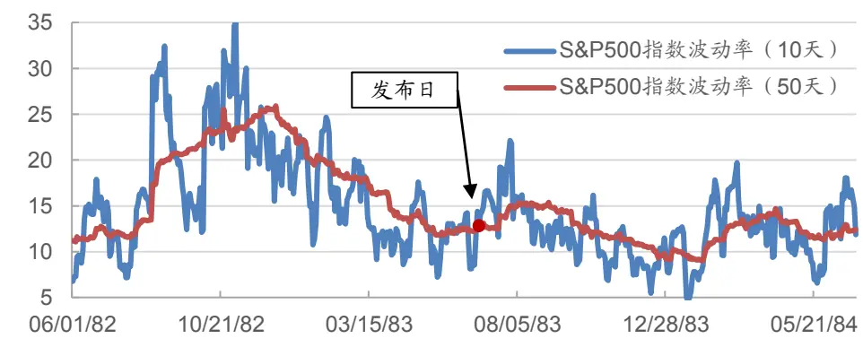
数据来源：Bloomberg，广发证券发展研究中心

图8：S&P500指数短期（指数期权上市前后三个月）波动率
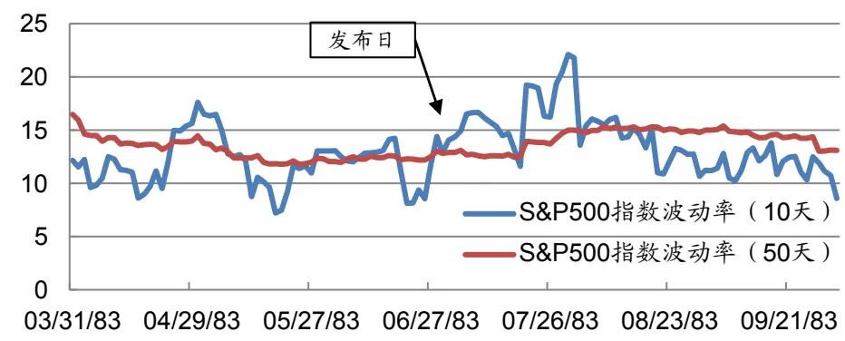
数据来源：Bloomberg，广发证券发展研究中心

## （三）S&P500 指数期货成交量

指数期货作为衍生品市场重要交易产品，与指数期权有很多共同点。相对于期货，期权具有杠杆效应，高收益和避险等特点，因此期权的发布对期货市场会有一定影响。S&P500 指数期货是全球应用最广泛的财务基准，为高效参与美国大型股票市场提供了重要途径。图9 中红色为期权发布月，图中显示，S&P500指数期货成交量在期权发布前一年成小幅度上涨趋势；在发布一个月后成交量上涨 26%，随后四个月持续递减直到第二年一月回升，涨幅高达四成；之后的半年内月成交量一直维持在较高的水平，月成交量平均约为 85 万份。因此 S&P500 指数期权发布后短期内，指数期货成交量会减少。

图9：S&P500指数期货月成交量(份)
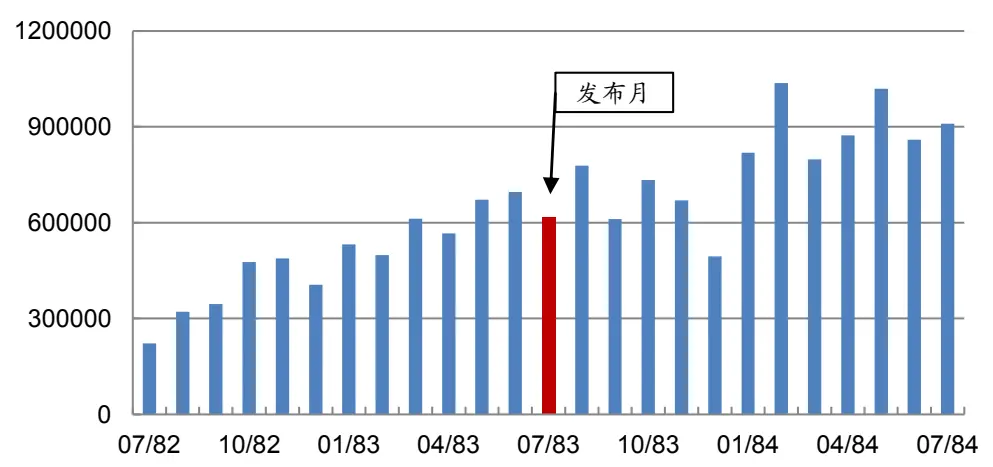
数据来源：Bloomberg，广发证券发展研究中心

## 2.3 韩国市场 KOSPI200 指数期权

二十世纪末期，受到美国衍生品市场的影响，亚洲地区以韩国，印度和台湾为代表的新兴市场陆续引入金融类衍生品交易。韩国证券交易所（KSE）在 1996年和1997年相继发布以 KOSPI200 为标的资产的期货和期权，并取得巨大成功，至今依然是最活跃，交易量占比最高的指数期权。

图 10显示出从2001 年到2005年KOSPI200 指数期权交易量迅速增长，5 年时间交易量翻了五倍。随后的五年交易量有所放缓当仍在持续增长，去年（2012）指数期权合约成交量已突破 36亿。

图10：KOSPI200指数期权年成交量（亿份）
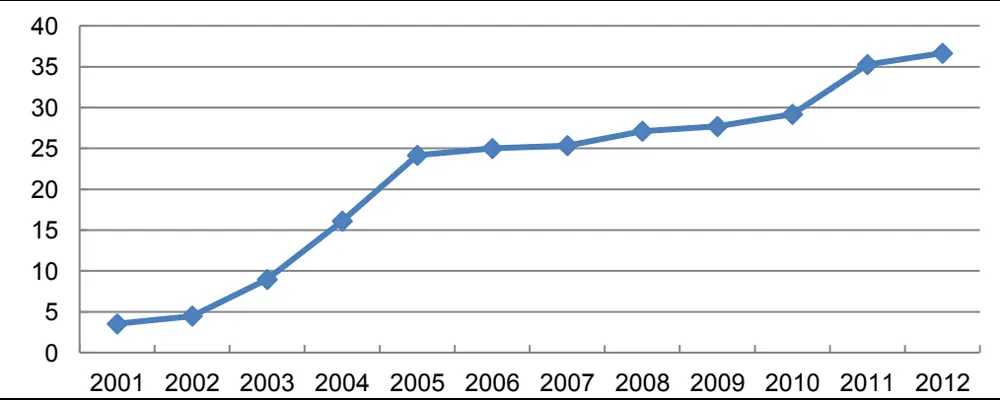
数据来源：Bloomberg，广发证券发展研究中心

## （一）KOSPI200 指数走势

韩国KOSPI200 指数期权发布于 1997年 7月 7日，从发布前后一年来看，指数呈递减趋势。在期权发布后一个月到半年时间内，指数持续递减，97年9 月到 12月期间最大减幅超过五成。从短期走势图可以看到，在期权发布前一周股指小幅上涨但发布后一个月内缓慢下降。因此韩国KOSPI200 指数在期权推出后的长期和短期内都减少。

图11：韩国KOSPI200指数长期（指数期权上市前后一年）走势
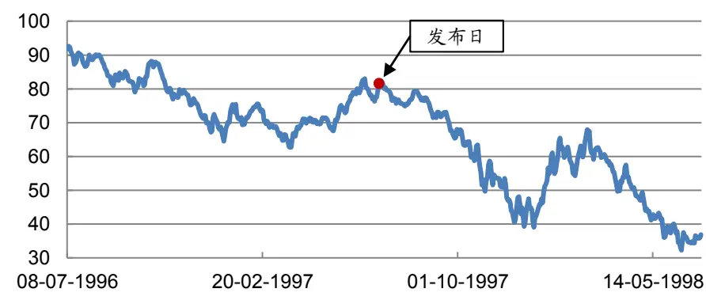
数据来源：Bloomberg，广发证券发展研究中心

图12：韩国KOSPI200指数短期（指数期权上市前后三个月）走势
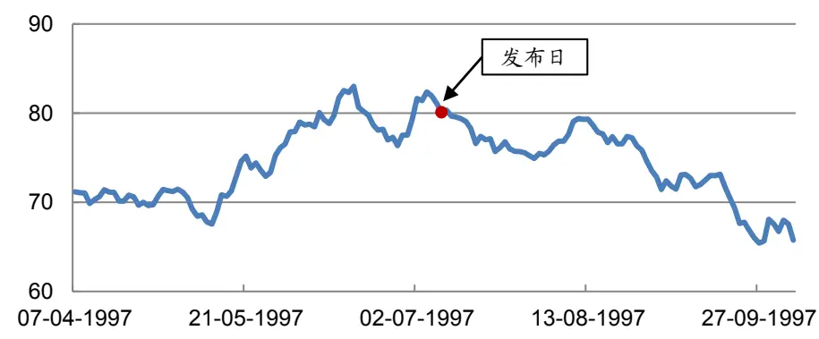
数据来源：Bloomberg，广发证券发展研究中心

## （二）KOSPI200 指数波动率

我们同样选择 10 天和 50 天观察样本。从图中可以明显看到，指数波动率一直保持平稳直到 97 年 9 月，即指数期权发布两个月后开始大幅度上涨。从短期来看，期权发布后一个月指数波动率小幅下降随后开始快速增长。因此，KOSPI200 指数期权的发布在一定程度上加剧了股指的波动。

图13：KOSPI200指数长期（指数期权上市前后一年）波动率
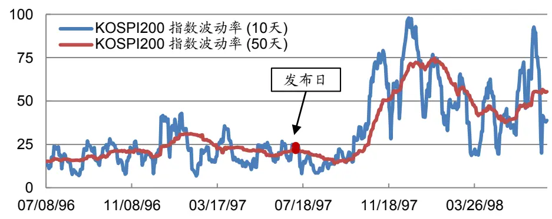
数据来源：Bloomberg，广发证券发展研究中心

图14：KOSPI200指数短期（指数期权上市前后三个月）波动率
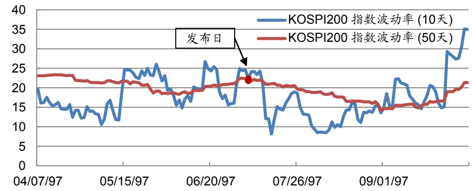
数据来源：Bloomberg，广发证券发展研究中心

## （三）KOSPI200 市场成交量

我们这部分将分析KOSPI200指数期权推出对市场成交量的影响。

图 15 记录了 KOSPI 指数所有在韩国证券交易所（KSE）交易股票的总成交量。从长期变化可以看到期权发布后市场成交量明显增多，在发布后第七个月即 98 年 2月市场成交量最大,平均每天81.68 亿股。从短期变化看，在指数期权发布前三个月，市场成交量缓慢减少并且在期权发布两个月内继续减少，在发布后第三个月开始增加。因此，KOSIP200指数期权发布后长期时间内市场成交量增加。

图15：KOSPI指数包含股票在韩国交易所的成交量（股）
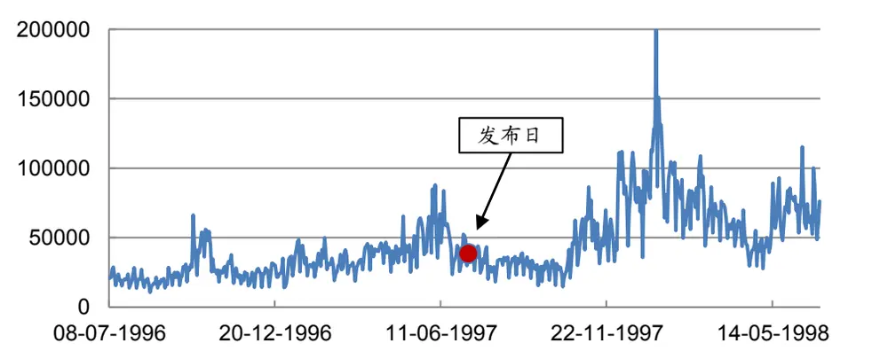
数据来源：Bloomberg，广发证券发展研究中心

## （四）KOSPI200指数期货成交量

图16显示，KOSPI200指数期货月成交量在期权发布前一年保持在一万股左右，没有明显涨幅；然而在期权发布后成交量开始有较大幅度增长，在发布十一个月后即98 年 6 月，成交量高达 15 万份，然而在 98 年 7 月又减少为 5 万股。从短期看，期权发布后三个月期货成交量持续增长。因此，KOSPI200指数期权的发布对期货市场短期有明显的促进作用。

图16：KOSPI200指数期货月成交量（份）
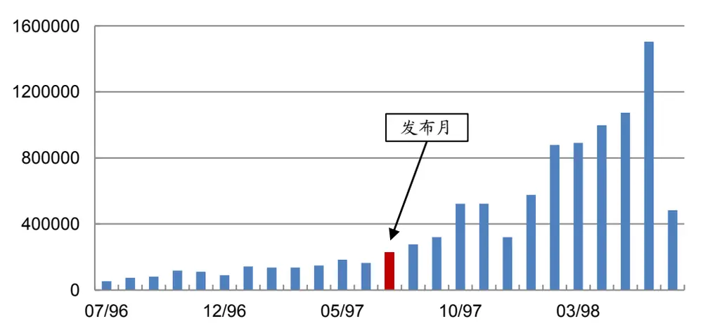
数据来源：Bloomberg，广发证券发展研究中心

## 2.4 欧洲市场德国 DAX30 指数期权（The Deutscher Aktien Index）

欧洲衍生品市场产品丰富，交易活跃，股指期权尤为突出；其中包括巴黎证券交易所（PSE）1988 年推出的 CAC40 指数期权，德国期货交易所（DTB）1991 年推出的DAX30 指数期权，荷兰阿姆斯特丹期权交易所（AME）推出的AEX指数期权和欧洲期货交易所（Eurex）上市的Euro Stoxx50 指数期权等。本部分主要研究DAX30指数期权对市场的影响。DAX30 指数是由 30 种蓝筹股组成，其期权于 1991 年 8 月开始交易。

## （一）DAX30 指数走势

DAX30 指数在期权发布前一年变化相对较大，从90年 8月到90年 10月大幅下降，随后上下波动直到 91年一月开始增长。在期权发布后半年中，DAX30 指数平稳且缓慢减少随后小幅增长。从短走势期看，期权发布前两个月指数下降 6.5%，期权发布后一个月又下降了 6.6%但随后一周内又涨回 1650，随后的三个月内缓慢下降。因此，DAX30指数期权的发布后在长期使指数缓慢增长，但在短期内会下降。

图17：DAX30指数长期（指数期权上市前后一年）走势
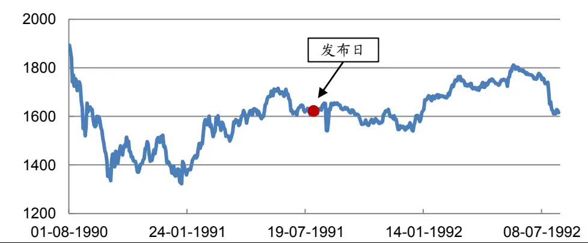
数据来源：Bloomberg，广发证券发展研究中心

图18：DAX30指数短期（指数期权上市前后三个月）走势
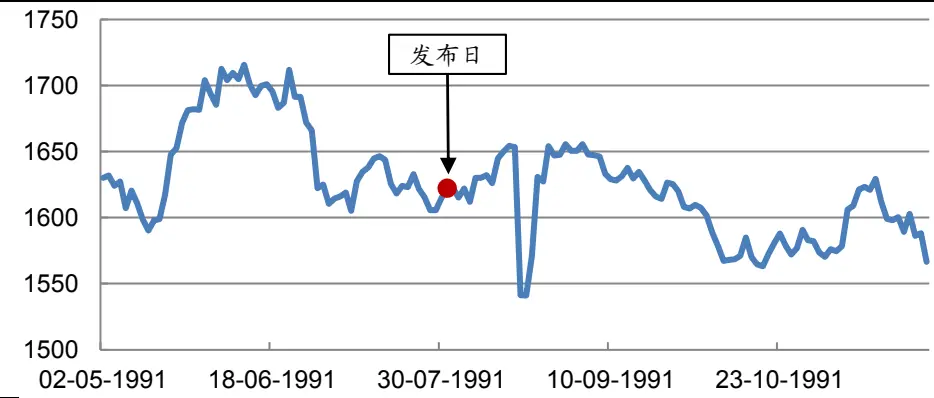
数据来源：Bloomberg，广发证券发展研究中心

## （二）DAX30 指数波动率

我们同样选择10天和 50 天观察样本。图 19 可以明显看到期权发布后一年波动率明显低于发布前一年，与走势图相对应，91 年 8 月以后走势较为平稳。DAX30短期波动率图显示，从 91年 8月 15日即期权发布后的半个月到 9月中旬，波动率明显增大，与短期走势图同样时间内的下降又增长相对应。因此 DAX30 指数期权的发布在长期内减少股指波动率而在短期内会增加波动率。

图19：DAX30指数长期（指数期权上市前后一年）波动率
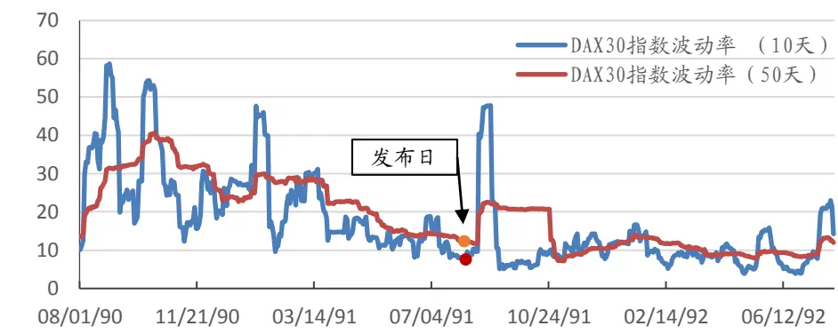
数据来源：Bloomberg，广发证券发展研究中心

图20：DAX30指数短期（指数期权上市前后三个月）波动率
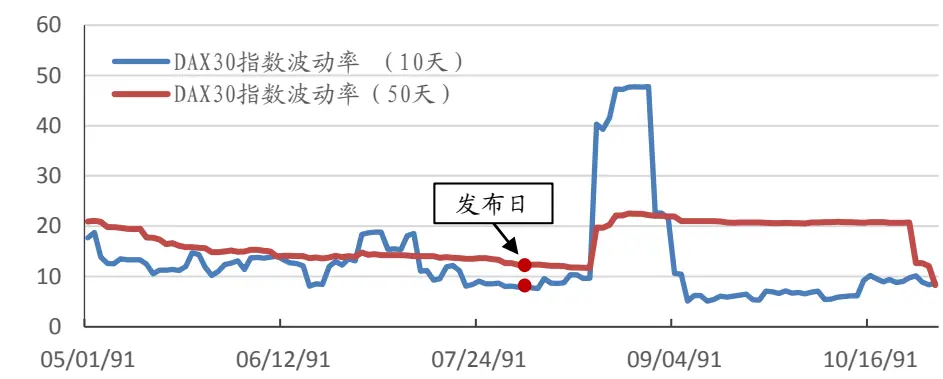
数据来源：Bloomberg，广发证券发展研究中心

## （三）DAX30 指数期货成交量

DAX30 指数期货上市于1990年11月23日，自上市以来到第二年五月底成交量小幅度波动上升，从开始不到一千张增长到五月品均每天 3537 张。期货成交量从 6月即期权发布前两个月开始发幅度上涨，然而在 7月又跌回每日 4000。在DAX30指数期货发布后的一个月，期货成交量由 5032 张快速增长到 14942 张（91 年 8 月 19日）随后在下一月又下降，每日成交量在 4000到 8000张波动。因此DAX30指数期权的发布在长期对期货市场影响不大但是在短期内会使成交量有明显的增长与回落。

图21：DAX30指数期货日成交量（份）
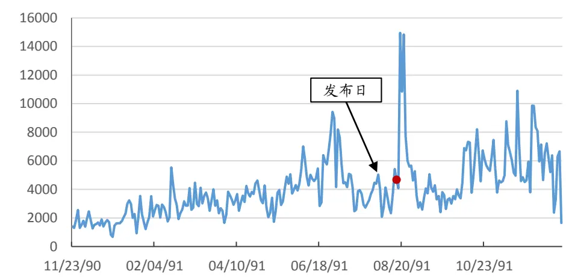
数据来源：Bloomberg，广发证券发展研究中心

## 2.5 香港市场恒生指数期权(Hang Seng Index)

香港衍生品市场始于上实际70年代，于1977年推出棉花，糖，黄金等商品期货，1986年5月年推出恒生指数期货，1993年3月推出恒生指数期权，随后又推出货币，利率类衍生品。香港衍生品市场种类相对丰富，参与度高，成交量大，现已成为全球重要的衍生品交易市场，恒生指数期权和期货也成为亚洲很多国家学习的榜样。因此研究香港恒生股指期货的发布对我国期权市场的发展有一定指导作用。

图22：香港证券交易所近年指数期权成交量（千股）
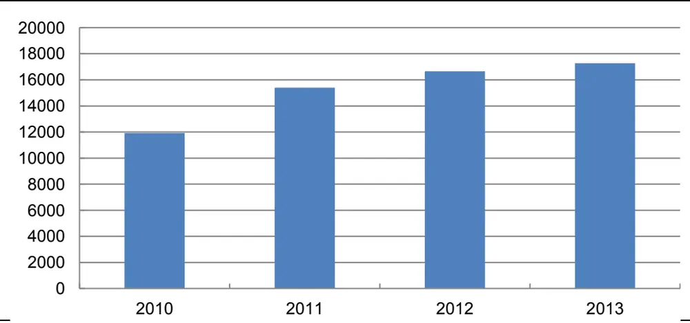
数据来源：Bloomberg，广发证券发展研究中心

## (一)恒生指数走势

恒生指数期权发布于 1993 年 3 月 5 日，从长期来看，发布前一年指数走势变化不大，在 6000 点上下波动；期权发布后指数开始缓慢增长，发布半年后开始快速增长。因此从长期角度，恒生指数期权的发布加剧了指数的增长。

图23：恒生指数长期（指数期权上市前后一年）走势

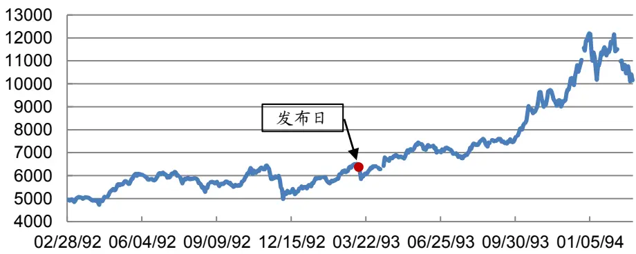
数据来源：Bloomberg，广发证券发展研究中心

图24：恒生指数长期（指数期权上市后一周）走势
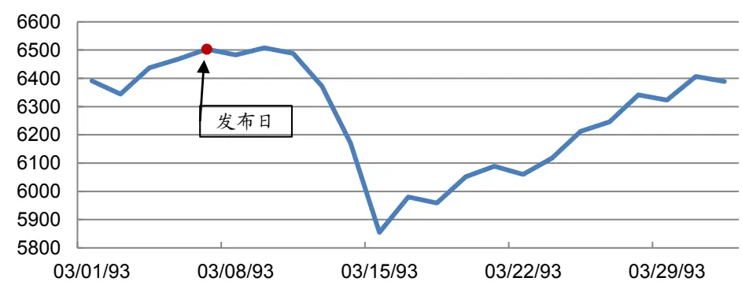
数据来源：Bloomberg，广发证券发展研究中心

从短期走势图看，恒生指数在期权发布前走势平稳，在发布后一周内下降 9.7%，随后又持续增长。因此，恒生指数期权发布后在很短期内与会使指数下降但随后又继续增长。

## （二）恒生指数波动率

我们同样选择 10天和50天观察样本,与S&P500和KOSPI200指数不同，恒生指数的波动率在期权发布前后没有明显差距。在期权发布前一年，波动率平稳在 20左右，在期权发布前四个月即 92 年 11 月，波动率明显上升并且持续到 93 年 2 月即发布期权前一个月，之后又平稳波动在 20，直到同年 8 月波动率开始增长。从短期波动率可以看出，期权发布的前后三个月内波动率没有明显的增减，因此恒生指数期权发布对指数波动影响不大；从长期看，较弱的增加了波动率。

图25：恒生指数长期（指数期权上市前后一年）波动率
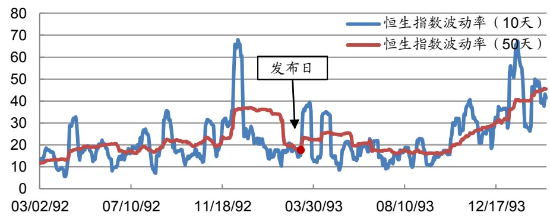
数据来源：Bloomberg，广发证券发展研究中心

图26：恒生指数短期（指数期权上市前后三个月）波动率
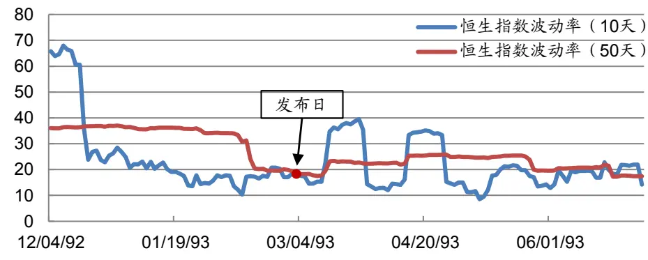
数据来源：Bloomberg，广发证券发展研究中心

## (三)市场成交量

图 27 记录香港证券交易所（HKSE）每个交易日场内交易所有证券的总成交量，包括股票，基金，权证等。由图可以看出在恒生指数期权发布前两个月，市场成交量增加而在期权发布后一个月又减少。随后短期的四个月内成交量上涨，平均每日 21.67亿股，随后三个月下降，平均每日成交量为 12.19亿股。因此，恒生指数期权的推出在短期可以一定程度上促进市场成交量。

图27：香港证券交易所证券成交量（百万股）
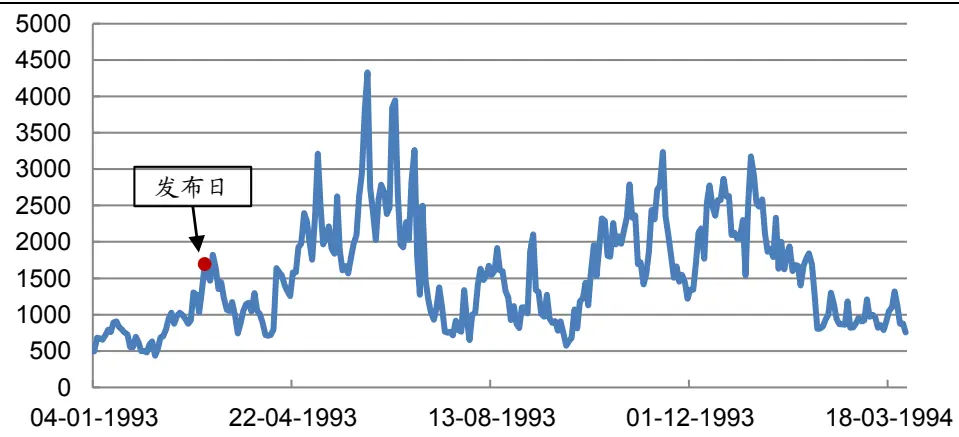
数据来源：Bloomberg，广发证券发展研究中心

## (四)恒生指数期货交易量

图 28 显示，恒生指数期货成交量在期权发布前两个月连续增长，增长率分别为29.7%和 37.6%；并且交易量在 93 年 3 月达到当前最大值。指数期权发布后一个月期货成交量减少 36.4%随后又缓慢增长。因此恒生指数期权的发布在短期内使期货成交减少但长期对期货市场有一定的促进作用。

图28：恒生指数期货月成交量（份）
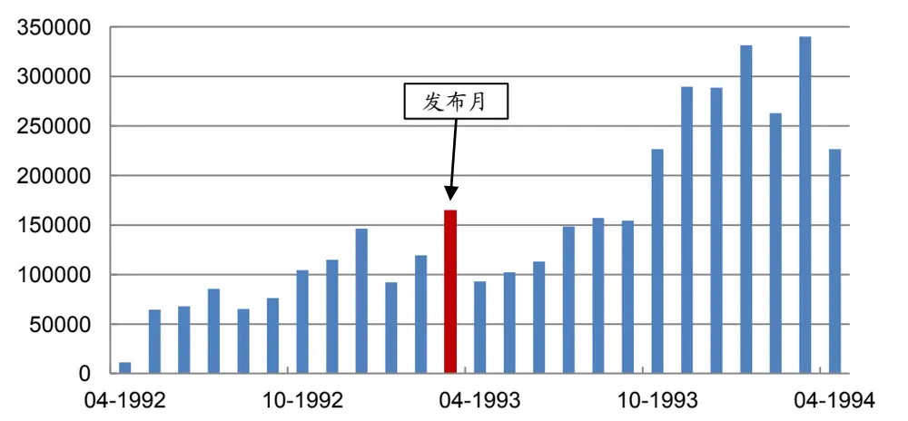
数据来源：Bloomberg，广发证券发展研究中心

## 2.6 台湾市场台湾证券交易所指数期权（TWSE Index）

与以上四个市场不同，台湾衍生品市场的发展是采取先海外化之后再带动本土化的模式。新加坡国际金融期货交易所于 1997 年率先推出台指期货。同年九月，台湾期货交易所成立并于 1998 年 9 月发布台湾证券交易所指数期货。2001 年 12 月 24日台湾证券交易所指数期权的发布带动了台湾衍生品市场的快速发展与进步，赢得了广大投资者的青睐。图29显示，台指期权自发布以来成交量逐年递增，2005年度成交量为 7.96千万份，发布四年来成交量是发布第一年的约53倍。

图29：台指期权合约自发布起日成交量（份）
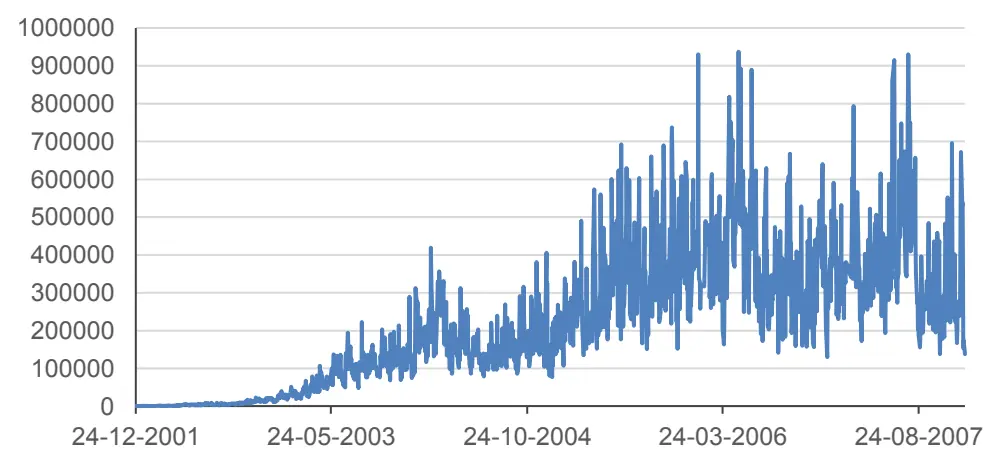
数据来源：Bloomberg，广发证券发展研究中心

## （一）台湾证券交易所股指走势

图中红点为期权发布日期。从长期走势图可以看出指数在期权发布前一年先呈递减趋势，直到九月底即发布期权前三个月指数开始增长；指数发布后四个月指数依然增长但增长速度没有发布期权前三个月快。2002 年 5 月即发布期权半年后指数又开始下跌。同样从短期走势也可以明显看到在期权发布前后指数都是成上升趋势。

图30：台湾证券交易所指数长期（指数期权发布前后一年）走势
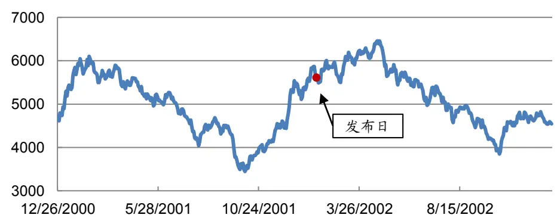
数据来源：Bloomberg，广发证券发展研究中心

图31：台湾证券交易所指数短期（指数期权发布前后三个月）走势
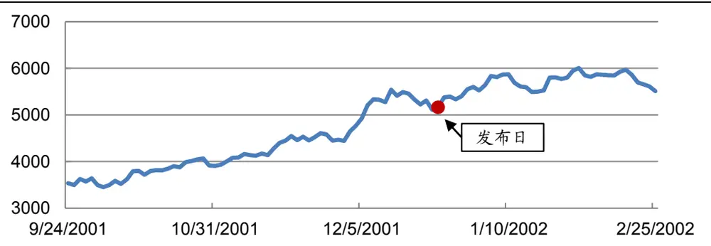
数据来源：Bloomberg，广发证券发展研究中心

## （二）台湾证券交易所股指波动率

我们这里同样选择 10 天和 50 天观察样本。长期波动图显示指数波动率在期权发布日前后半年内略高于更远的日期，因此指数期权的发布在一定程度上加大了股指走势的波动。而从短期图可以看到，期权发布前后短期内波动率基本保持不变。

图32：台湾证券交易所指数长期（指数期权发布前后一年）波动率
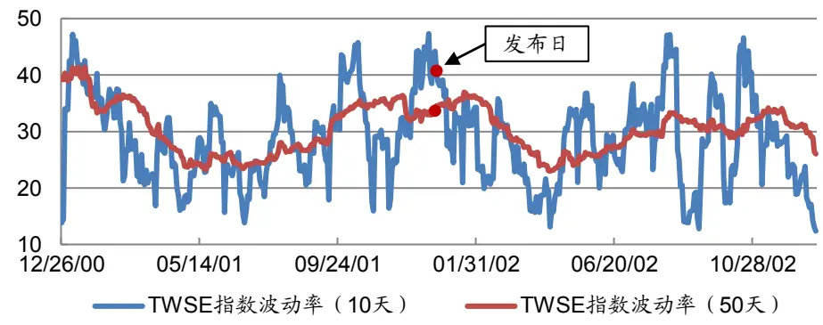
数据来源：Bloomberg，广发证券发展研究中心

图33：台湾证券交易所指数短期（指数期权发布前后三个月）波动率
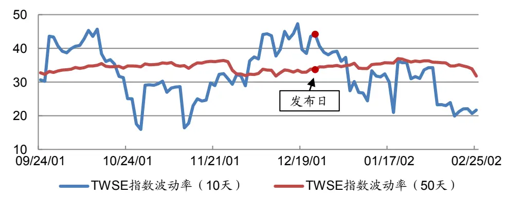
数据来源：Bloomberg，广发证券发展研究中心

## （三）台湾证券交易所市场成交量

图 34记录了台湾证券交易所每日的总成交量，红点处为期权发布日期。从图中可以看到，在台指期权发布前半年成交量开始上涨，在期权发布前一个月大幅增长，01年 12 月 26 日突破70 亿，成交量为一个月前的三倍。然而台指期权发布五个月后日成交量大幅下降随后持续缓慢下降。因此，台指期权的发布在短期内可以促进市场成交量。

图34：台湾证券交易所日成交量（股）
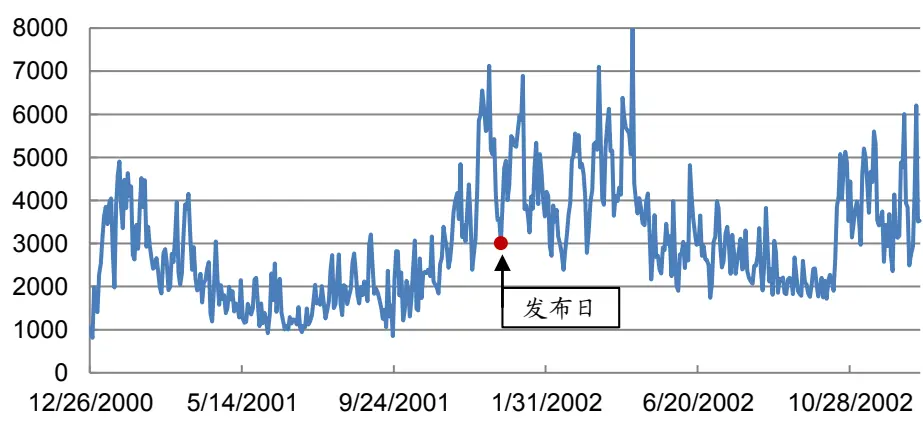
数据来源：Bloomberg，广发证券发展研究中心

## （四）台湾证券交易所指数期货合约月成交量

从月成交量图可以看出，指数期货成交量从发布期权的前半年开始增长并在发布期权当月达到当时最大值，约 40 万份。发布期权后的两个月指数期货成交量递减，随后又增加。

图35：台湾证券交易所指数期货合约月成交量（份）
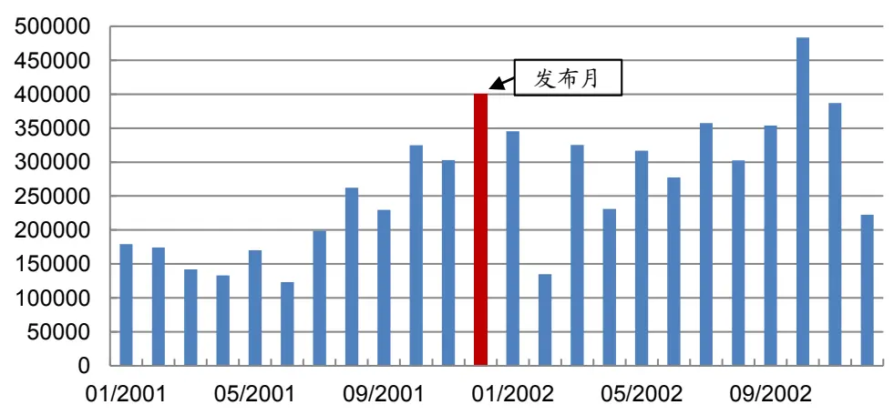
数据来源：Bloomberg，广发证券发展研究中心
识别风险，发现价值

## 三、海外市场经验总结与对我国的启发

根据以上对各国市场的描述与分析，指数期权发布前后市场各指标的变化可以总结为表2：

表2：美国韩国德国香港台湾期权发布前后总结

|  | 股指走势 |  |  |  | 股指波动率 |  |  |  | 股指期货成交量 |  |  |  | 市场成交量 |  |  |  |
| --- | --- | --- | --- | --- | --- | --- | --- | --- | --- | --- | --- | --- | --- | --- | --- | --- |
| 时间 | 前 |  | 后 |  | 前 |  | 后 |  | 前 |  | 后 |  | 前 |  | 后 |  |
|  | 长期 | 短期 | 长期 | 短期 | 长期 | 短 | 长期 | 短期 | 长期 | 短 | 长 | 短 | 长期 | 短期 | 长期 | 短 |
|  |  |  |  |  |  | 期 |  |  |  | 期 | 期 | 期 |  |  |  | 期 |
| 美国S&P500 指数 | ↑ | ↑ | ↓ | ↓ | ↑ | ↓ | ↓ | ↑ | ↑ | ↑ | ↑ | ↓ | N/A |  |  |  |
| 韩国KOSPI200指数 | ↓ | ↑ | ↓ | ↓ | → | ↓ | ↑ | ↑ | → | → | ↑ | ↑ | → | ↓ | ↑ | ↓ |
| 德国 DAX30指数 | ↓ | ↑ | ↑ | ↓ | ↑ | ↓ | ↓ | ↑ | ↑ | ↓ | ↑ | ↑ | N/A |  |  |  |
| 香港恒生指数 | → | ↑ | ↑ | ↓ | → | ↑ | ↑ | → | ↑ | ↑ | ↑ | ↓ | ↑ | ↑ | ↑ | ↓ |
| 台湾证券交易所指数 | ↓ | ↑ | ↓ | ↑ | ↓ | ↑ | ↓ | ↑ | ↑ | ↑ | ↑ | ↓ | ↓ | ↑ | ↓ | ↑ |

数据来源：Bloomberg，广发证券发展研究中心

影响市场的因素多种多样，但从指数期权发布对市场的影响这一点，从上述表格可以看出可以得出以下结论：

1）首先从股指走势方面，五个市场都显示出指数值会在指数期权发布前短期内增加，除台湾市场其余四个都在期权发布后短期内降低。美国S&P500，韩国KOSPI200和台湾证券交易所指数在期权发布后长期内继续减少然而德国 DAX30 和香港恒生指数会在长期增加。

2）从股指波动率方面，所有的股指波动率在期权发布后短期内会小幅度增加。长期欧美和台湾市场都显示股指期权的发布会大幅度减少股指波动率，相反，韩国市场在长期大幅度增加了股指波动率。香港市场恒生指数长期波动率不大，而期权发布前后短期内会有小幅度增加。

3）从对指数期货成交量的影响看，五个国家的指数都显示出指数期权的发布在长期对促进股指期货成交量增加有一定效果；而美国香港和台湾市场指数期权的发布会使该期货在短期内成交量减少。

4）从市场成交量看，韩国和香港证券交易所都会在指数期权发布后短期内交易量减

识别风险，发现价值

少而长期增加，台湾市场正好相反。

因此根据上表，我们可以对我国沪深 300 指数期权的发布做出如下预测：

1）沪深 300 指数走势有很大可能会在期权上市前三个月开始递增并且在期权发布后三个月小幅度递减。

2）根据香港和台湾亚洲市场，沪深 300 指数波动率会在期权发布前后三个月内有所增加，投资者面临更大风险。

3）同样根据亚洲市场在指数期货成交量变化的一致性可以预测，沪深 300 指数期货交易量在期权发布前短期内会增长，但发布后短期内会减少；长期成交量保持增长趋势。

4）市场成交量变化不定，从表 2 仅可以预测发布指数期权前三个月交易所成交量有很大可能会有增长趋势。

## 风险提示

本篇报告主要介绍了指数期权合约的推出在海外市场的影响，供国内投资者参考。由于我国市场各方面情况与海外市场存在差异，因此具体影响状况要等期权发布后才能明确判断。

## Table_Res arch 广发金融工程研究小组

罗 军： 首席分析师，华南理工大学理学硕士，2010 年进入广发证券发展研究中心。

俞文冰： 首席分析师，CFA，上海财经大学统计学硕士，2012年进入广发证券发展研究中心。

叶 涛： 资深分析师，CFA ，上海交通大学管理科学与工程硕士，2012年进入广发证券发展研究中心。

安宁宁： 资深分析师，暨南大学数量经济学硕士，2011年进入广发证券发展研究中心。

胡海涛： 分析师， 华南理工大学理学硕士， 2010年进入广发证券发展研究中心。

夏潇阳： 分析师， 上海交通大学金融工程硕士， 2012年进入广发证券发展研究中心。

蓝昭钦： 分析师， 中山大学理学硕士， 2010年进入广发证券发展研究中心。

史庆盛： 分析师， 华南理工大学金融工程硕士， 2011年进入广发证券发展研究中心。

张 超：研究助理， 中山大学理学硕士，2012年进入广发证券发展研究中心。

汪 鑫： 研究助理， 中国科学技术大学金融工程硕士， 2012年进入广发证券发展研究中心。

## Table_RatingIndustry 广发证券—行业投资评级说明

买入： 预期未来12个月内，股价表现强于大盘10%以上。

持有： 预期未来12个月内，股价相对大盘的变动幅度介于-10%～+10%。

卖出： 预期未来12个月内，股价表现弱于大盘10%以上。

## Table_RatingCompany 广发证券—公司投资评级说明

买入： 预期未来12个月内，股价表现强于大盘15%以上。

谨慎增持： 预期未来12个月内，股价表现强于大盘5%-15%。

持有： 预期未来12个月内，股价相对大盘的变动幅度介于-5%～+5%。

卖出： 预期未来12个月内，股价表现弱于大盘5%以上。

## Table_Ad联系我们

|  | 广州市 | 深圳市 | 北京市 | 上海市 |
| --- | --- | --- | --- | --- |
| 地址 | 广州市天河北路183号 大都会广场5楼 | 深圳市福田区金田路4018 号安联大厦 15 楼 A 座 | 北京市西城区月坛北街2号 月坛大厦18层 | 上海市浦东新区富城路99号 震旦大厦18楼 |
| 邮政编码 | 510075 | 03-04 |  |  |
| 客服邮箱 | gfyf@gf.com.cn | 518026 | 100045 | 200120 |
| 服务热线 | 020-87555888-8612 |  |  |  |

## Table_Disclaimer 免 责声 明

广发证券股份有限公司具备证券投资咨询业务资格。本报告只发送给广发证券重点客户，不对外公开发布。

本报告所载资料的来源及观点的出处皆被广发证券股份有限公司认为可靠，但广发证券不对其准确性或完整性做出任何保证。报告内容仅供参考，报告中的信息或所表达观点不构成所涉证券买卖的出价或询价。广发证券不对因使用本报告的内容而引致的损失承担任何责任，除非法律法规有明确规定。客户不应以本报告取代其独立判断或仅根据本报告做出决策。

广发证券可发出其它与本报告所载信息不一致及有不同结论的报告。本报告反映研究人员的不同观点、见解及分析方法，并不代表广发证券或其附属机构的立场。报告所载资料、意见及推测仅反映研究人员于发出本报告当日的判断，可随时更改且不予通告。

本报告旨在发送给广发证券的特定客户及其它专业人士。未经广发证券事先书面许可，任何机构或个人不得以任何形式翻版、复制、刊登、转载和引用，否则由此造成的一切不良后果及法律责任由私自翻版、复制、刊登、转载和引用者承担。