# 期权在公募基金中的应用

## 期权研究系列之十一

## 报告摘要：

## 股票型基金应用期权的策略

在欧美成熟市场，股票型基金应用股指/股票期权主要用来对冲市场下跌风险，降低投资组合的波动率，获取更高风险调整后收益。有时候，基金也会采用小部分仓位来构建期权头寸，进行方向性投资。归纳海外股票型基金的投资策略，主要为做空认购期权、做多认沽期权以及做空差价期权等静态期权策略。

## 海外利用期权投资的公募基金产品

我们以 3个基金作为例子进行介绍。GATEWAY FUND 通过期权对冲，寻求较低的波动，控制回撤。PIMCO 新兴市场基金则是利用小仓位进行期权的方向性投资。BlackRock International Growth and Income Trust 通过卖出股票期权获取权利金收入，同时实现对基金资产的避险增值。

## 期权在量化基金中的应用

与股票型基金类似，量化基金通常也应用股指/股票期权主要用来对冲市场下跌风险，降低投资组合的波动率，获取更高的信息比。海外量化基金的期权投资策略，也主要为做空认购期权、做多认沽期权以及做空差价期权等静态期权策略。

Nuveen Core Equity Alpha Fund 采用期权降低投资组合的波动率，增强基金的收益风险比，基金做空一篮子股票期权的名义价值不超过股票组合的 50%。AllianzGI红利策略基金主要是卖空宽基指数期权以及行业指数期权，一般卖空的都是轻微价外的 3个月期限的期权，其主要目的是优化行业组合配置。

## 期权在保本基金中的应用

海外基于期权策略的保本基金又称结构化基金。发行人或者担保人在产品条款中承诺保本或者保收益。投资者期末的收益按照一定的公式根据挂钩标的表现获取。因此，该类基金产品又称“公式化基金”。多数产品采用价值底线+期权的模式，通常执行相对静态的投资策略，即一定比例资金投资于无风险资产实施保本，剩余资金购买匹配的期权资产产生潜在收益。

LYXOR 夺宝保本基金资产有 5%用于支付预缴管理费，剩下的 95%投资于法兴银行的欧洲中期票据（EMTN），这部分资金投资其实分为两部分，其中 75.15%投资于固定收益产品，起到保本作用。而剩下的部分则用于购买实现利息收入的期权。

## 核心假设风险

由于目前国内仍未推出期权，因此期权在国内产品的应用需要等待相关的产品推出以及法规完善后才能实现。

图 1 股票与看涨期权空头组合盈亏图
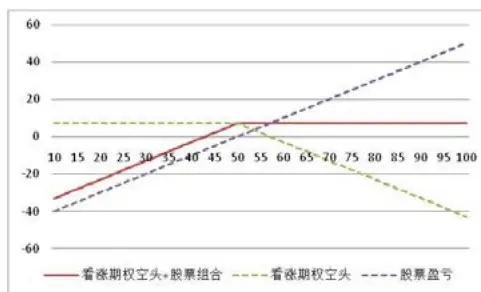

图 2 股票与看跌期权套保组合盈亏图
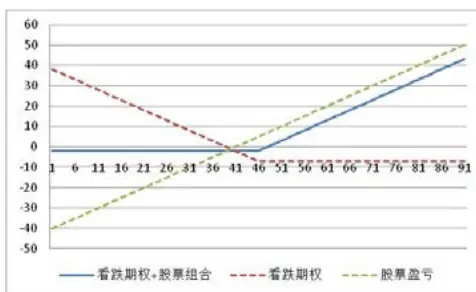

图 3 牛市差价期权空头损益图
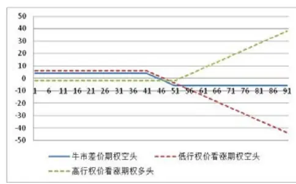

分析师： 安宁宁 S0260512020003

公0755-23948352

ann@gf.com.cn

## 相关研究：

## 一、期权应用概述

海外资产管理行业中，对于期权的应用主要包括公募与对冲基金两大领域。对冲基金对于期权的应用，策略使用比较广泛。包括公募中常用的各种期权静态投资策略，但应用最广的是基于期权的动态对冲策略，通过判断市场的方向、波动率走势，保留Delta、Vega等相应的Greeks敞口，获取绝对收益。对于公募基金而言，其目的是战胜基准，获取好的相对排名，对于期权的使用相对比较简单，一般只应用几种静态策略，对于动态对冲策略应用较少。在这篇报告中，我们主要针对公募中的普通股票型基金、量化基金与保本基金的期权策略进行介绍。

## 二、期权在普通股票型基金中的应用

## 2.1 股票型基金应用期权的策略

在欧美成熟市场，股票型基金应用股指/股票期权主要用来对冲市场下跌风险，降低投资组合的波动率，获取更高风险调整后收益。有时候，基金也会采用小部分仓位来构建期权头寸，进行方向性投资。

归纳海外股票型基金的投资策略，主要为做空认购期权、做多认沽期权以及做 空差价期权等静态期权策略。

## （一）做空看涨期权策略

该策略在众多基金募集说明书中又被称为保护性看涨期权（covered call），是海外股票型基金中最常用的期权策略。指持有股票组合的同时，通过做空看涨期权达到避险增值的目的。组合的收益形态如下图：

图1：股票与看涨期权空头组合盈亏图
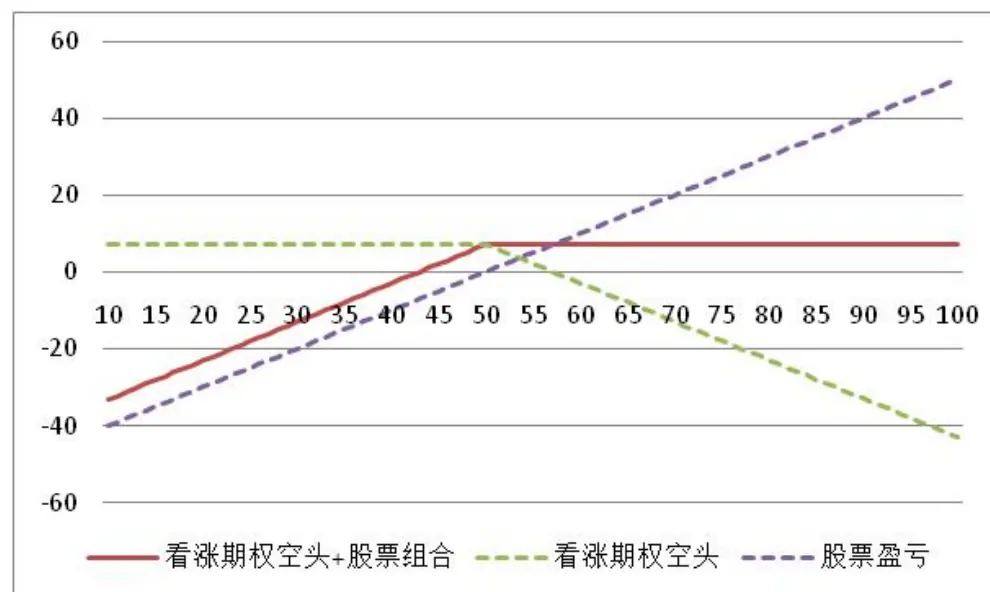
识别风险，发现价值

数据来源：广发证券发展研究中心

保护性看涨期权策略通常通过卖出看涨期权获取权利金收入，规避市场下跌的风险，降低组合的波动，通常在预期市场在如下情况时比较适用：

## 1）市场不会出现大幅下跌

## 2）市场不会出现大幅上涨

如果市场出现大幅上涨，卖空期权导致对手行权会丧失股票组合的上涨收益；如果市场出现大幅下跌，卖空期权的权利金收入不足以规避下跌的风险。因此，如果预期市场出现温和的震荡，可以通过做空看涨期权来获取权利金收入保护组合在震荡的时候降低亏损，或者获取超额收益。

股票型基金通常通过沽出期限在3个月左右的期权来构建此策略，并且期权最好是平值期权或者轻度价外的期权。轻度价外的期权，在股票上涨时不会过快的丧失股票组合的上涨收益。

## （二）做多认沽期权策略

如果预期市场下跌幅度比较大，并且基金经理不希望判断错误丧失组合上涨的收益，一般会采取做多认沽期权而不是做空期货来进行对冲。但是，做多认沽期权的策略在股票型基金中用的不如做空认购期权，原因在于市场预期快速下跌时，认沽期权的价格通常会比较贵，对冲成本会比较高，基金经理相对更愿意通过调整仓位来进行风险控制。

考虑的对冲成本的因素，期限在3个月左右的平值以及轻度价内的认沽期权比较适合。

图2：股票与看跌期权套保组合盈亏图
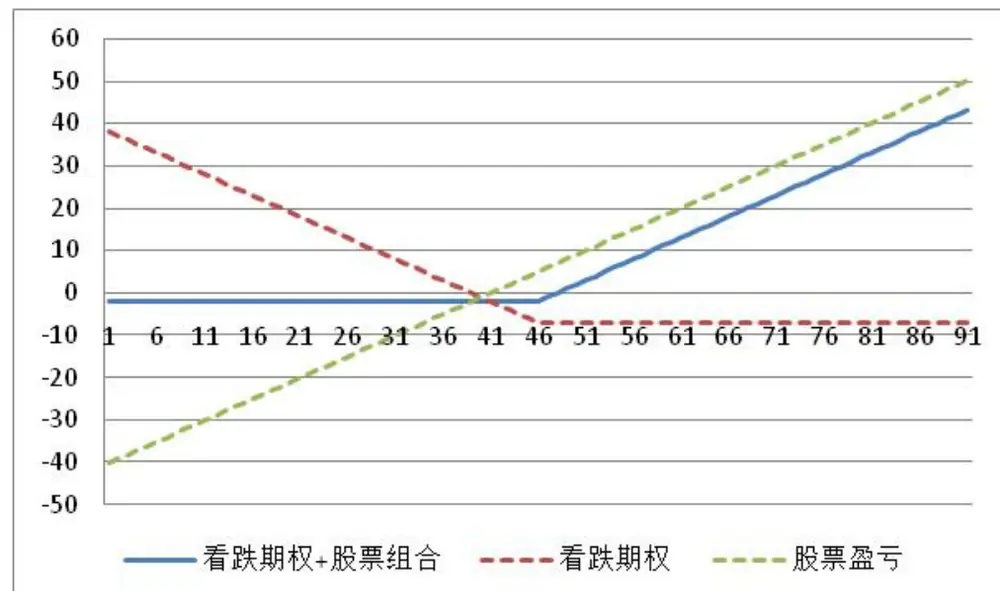
数据来源：广发证券发展研究中心

## （三）做空牛市价差期权策略

综合上述的两种策略，做空认购期权策略当市场出现大幅上涨或者大幅下跌时会出现风险，而做多认沽期权通常成本比较高，因此，部分基金开始采用做空牛市价差期权策略，即做空一个低行权价的认购期权，同时做多一个期限相同的高行权价的认购期权。做空该价差期权组合可以获得权利金收入，降低投资组合的波动，提升投资组合的风险调整后收益。该策略能够在市场下跌时组合受到保护，同时股票大幅上涨时，不会出现做空认购期权那样丧失股票上涨的收益。

通常可以通过构建期限在3个月左右，做空平值认购期权同时做多轻度价外的认购期权来构建此策略。

图3：牛市差价期权空头损益图
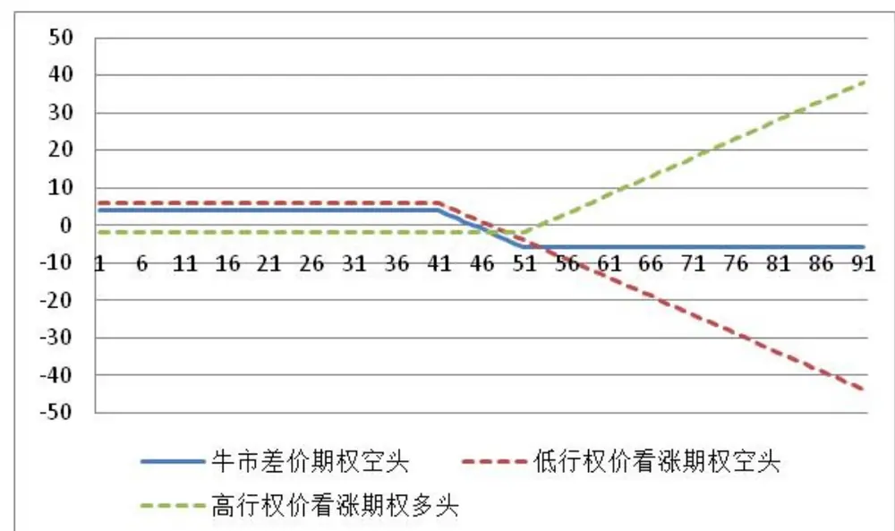
数据来源：广发证券发展研究中心

## 2.2 海外应用期权策略的产品简介

我们对部分海外使用期权策略的股票型基金产品条款进行梳理，汇总如下：

## （一）Gateway Fund

Gateway Fund是Gateway Investment Advisers公司在1977年7月12日成立的对冲基金，目前资产规模77亿美金，而整个Gateway公司的管理资产规模也就只有118亿美金，Gateway Fund可以说是该公司当之无愧的旗舰基金。

图4：Gateway Fund最近11年的收益表现

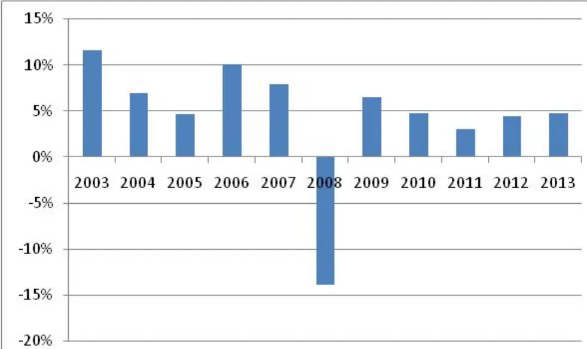
数据来源：Bloomberg，广发证券发展研究中心

表 1：Gateway Fund 的期权投资情况

| 产品名称 | Gateway Fund |  |  |
| --- | --- | --- | --- |
| 投资目标 | 捕捉股票市场相关的投资机会，寻求相对其他股票投资产品具备较低的风险，较高的风险调整后收益。 |  |  |
| 期权投资策略 | 1、投资于高度分散化的组合尽可能的跟踪美国股票市场走势，并通过指数认购以及认沽期权来对冲风险。2、通过期权对冲，基金寻求低的波动，控制回撤。3、通过做空指数认购期权，降低波动率并获取稳定的现金流。4、当指数短期可能发生大幅下跌时，可以通过购买指数认沽期权达到对冲的目的。 |  |  |
| 期权组合统计(2013 年 3季报） |  | 看涨期权 | 看跌期权 |
|  | 期权对冲的比例 | 100% | >95% |
|  | 加权价内外程度 | 价内1.5%-2.5% | 价外 10%-12.5% |
|  | 加权剩余期限（天数） | 51 | 57 |
|  | 加权年化现金流比例 | <10% | N/A |
|  | 加权年化期权成本 | N/A | <2.5% |

数据来源：Gateway Fund 2013 年 3季报，广发证券发展研究中心

## （二）PIMCO新兴市场基金

PIMCO（Pacific Investment Management Company, LLC，太平洋投资管理公司）成立于1971年，是美国最著名的债券投资管理机构。截止2012年底，PIMCO公司以2万亿的资产管理规模成为全球最大的债券投资机构。虽然是靠债券投资起家，但实际上PIMCO公司目前已经形成了包括固定收益、权益类、实物资产、外汇、多策略等的多种投资方向的产品风格，产品体系也涵盖了共同基金、特定资产管理、

ETF、封闭式基金等多种形式。

PIMCO EqS (Equity Series) Emerging Market Fund是PIMCO公司2011年3月22日成立的，以新兴市场的权益类证券作为主要投资标的的共同基金。新兴市场主要指亚洲、非洲、中东、拉美以及欧洲的发展中国家。截止2013年9月底，这一基金规模已达到4.55亿美金的规模。基金在2012年、2013年（截止10月底）分别取得12.38%以及1.02%的收益。

图5：PIMCO EqS Emerging Market Fund的净值历史表现
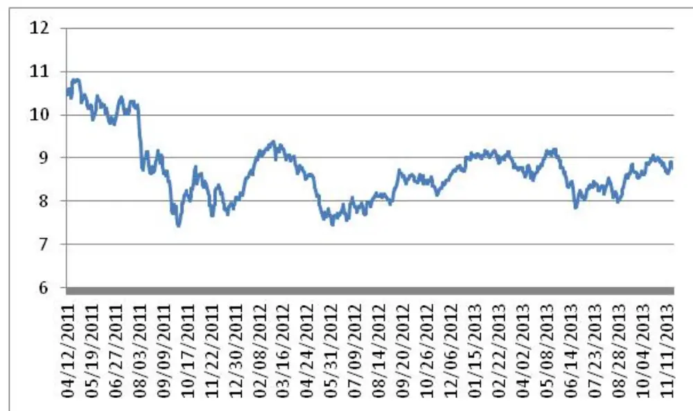
数据来源：Bloomberg，广发证券发展研究中心

表 2：PIMCO EqS Emerging Market Fund 的期权投资情况

| 产品名称 | PIMCO EqS Emerging Market Fund |  |  |  |  |  |  |  |
| --- | --- | --- | --- | --- | --- | --- | --- | --- |
| 投资目标 | 以新兴市场权益类证券作为投资标的，分享新兴市场的资本上涨收益 |  |  |  |  |  |  |  |
| 期权投资策略 | 利用小部分仓位来进行期权的方向性投资 |  |  |  |  |  |  |  |
| 期权持仓（截止2013年9月底） | 期权名称 | 期权类型 | 行权价 | 到期日 | 结算币种 | 合约数量 | 市场价值 | 资产占比 |
|  | Call - CBOE PotashCorp. of Saskatchewan,Inc. | 股票期权多头 | 32 | 10/19/2013 | 美元 | 777 | 39650 | 0.01% |
|  | Call - CBOE PotashCorp. of Saskatchewan,Inc. | 股票期权多头 | 33 | 10/19/2013 | 美元 | 1050 | 26621 | 0.01% |
|  | Call - OTC 港交所恒指国企指数 | 股票期权多头 | 10823.54 | 10/30/2013 | 港币 | 573700 | 51813 | 0.01% |
|  | Call - OTC 港交所恒指国企指数 | 股票期权多头 | 9958.3 | 10/30/2013 | 港币 | 1306700 | 816500 | 0.18% |
|  | Call - OTC 台湾加权指 | 股票期权 | 8381.82 | 10/16/2013 | 新台 | 9627900 | 51410 | 0.01% |

识别风险，发现价值

| 数 | 多头 |  |  | 币 |  |  |  |
| --- | --- | --- | --- | --- | --- | --- | --- |
| Call - OTC 港交所恒指国企指数 | 股票期权多头 | 10653.6 | 10/30/2013 | 港币 | 730000 | 106588 | 0.02% |
| Put - OTC 港交所恒指国企指数 | 指数期权空头 | 8535.69 | 10/30/2013 | 港币 | 653400 | -5159 | 0.00% |
| Call - OTC 台湾加权指数 | 指数期权空头 | 8788.71 | 10/16/2013 | 新台币 | 9627900 | -502 | 0.00% |
| Call - OTC Sberbank ofRussia | 股票期权空头 | 13.9 | 12/20/2013 | 美元 | 36620000 | -47336 | -0.01% |

数据来源：PIMCO EqS Emerging Market Fund 2013 年 3 季报，广发证券发展研究中心

## （三）BlackRock国际成长收入信托

BlackRock是全球最大的资产管理公司，专为投资者提供投资管理、投资咨询以及风险管理服务。International Growth and Income Trust是由BlackRock担当投资顾问的一只封闭式信托基金，成立于2007年5月30日，以实现资产的稳定增值作为其投资目标。虽然这是一只美国的信托基金，但是它的投资范围遍布全球，80%以上的资产都投资于美国以外的资本市场。

国际成长收入信托通过做空看涨期权来获取权利金收入，同时实现对资产的避险增值。根据信托基金的2013年3季报，目前基金规模为9.615亿美金，其中有46.85%的资产通过卖出个股期权完成了套保。

表 3：BlackRock International Growth and Income Trust 的期权投资情况

| 产品名称 | International Growth and Income Trust(纽交所代码：BGY) |  |
| --- | --- | --- |
| 投资目标 | 寻求长期资本增值的同时，获取当期收益 |  |
| 期权投资策略 | 通过卖出股票期权获取权利金收入，同时实现对基金资产的避险增值 |  |
| 期权头寸情况(2013 年 3 季报) | 净资产 | 9.615 亿美金 |
|  | 期权类型 | 个股期权 |
|  | 资产套保比例 | 50.19% |

数据来源：BlackRock International Growth and Income Trust 2013 年 3 季报，广发证券发展研究中心

## 三、期权在量化基金中的应用

与股票型基金类似，量化基金通常也应用股指/股票期权主要用来对冲市场下跌风险，降低投资组合的波动率，获取更高的信息比。海外量化基金的期权投资策略，也主要为做空认购期权、做多认沽期权以及做空差价期权等静态期权策略。下面我们也简单介绍两个量化基金的例子。

## （一）Nuveen Core Equity Alpha Fund

Nuveen是总部位于芝加哥的一家历史悠久的资产管理公司，它于1898年成立，以其创始人的名字命名，最早以投资地方政府债而闻名。目前旗下资产管理规模2149亿美金，投资范围以固定收益类和权益类资产为主，产品包括共同基金、封闭式基金、专项管理基金等等。

Nuveen核心权益Alpha基金（纽交所代码：JCE）成立于2007年3月27日，目前资产规模2.69亿美金。基金的投资策略分为两大块，包括股票投资与期权投资。股票投资由INTECH公司负责，主要是做S&P 500指数的增强投资，从S&P 500指数成分股中选出150~450只进行配置；期权投资则由Nuveen自己的团队NAM负责，主要通过卖出看涨期权进行，目标是对股票投资进行套保，减少资产净值的波动，但是套保比例一般不超过股票资产的50%。

图6：Nuveen Core Equity Alpha Fund的净值历史表现
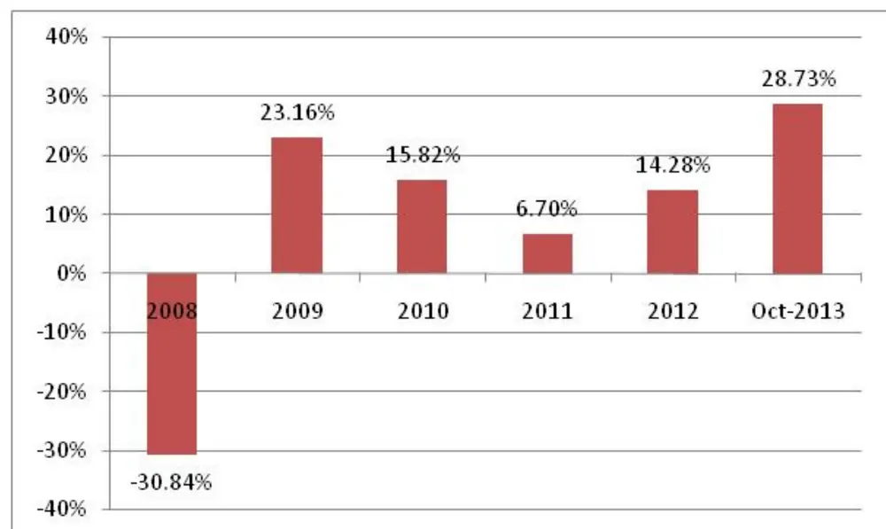
数据来源：Nuveen，广发证券发展研究中心

表 4：Nuveen Core Equity Alpha Fund 的期权投资情况
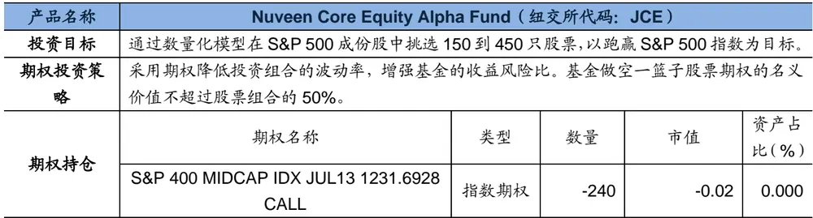
识别风险，发现价值

| S&P 400 MIDCAP IDX JUL13 1192.04CALL | 指数期权 | -260 | -214,441.92 | -0.080 |
| --- | --- | --- | --- | --- |
| CUSTOM BASKET 3 JUL13 104 CALL | 指数期权 | -229,564 | -18,135.59 | -0.007 |

数据来源：Nuveen Core Equity Alpha Fund 2013年半年报，广发证券发展研究中心

## （二）AllianzGI红利策略基金

Allian（安联）集团总部位于德国慕尼黑，是全球最大的跨国金融集团之一，在全球超过70个国家都设有分支机构，员工人数超过18万。旗下的AllianGI是全球前5大的主动型投资管理机构之一。

AllianzGI Dividend Interest & Premium Strategy Fund（纽交所代码：NFJ）成立于2005年2月28日，目前总资产17亿美金。正如基金名称一样，其投资主要集中于低PE、高分红的价值型公司。它采用量化选股的方法，根据股价动量、盈利变化、基本面改变的驱动因素，从1000家最大市值的价值型股票中挑出250~300个，然后根据盈利情况、现金流以及产品潜力，最终选出40~50只股票构建组合。其股票头寸占基金总资产的77%。

除了股票投资外，红利策略基金还可以投资于可转债以及指数期权。可转债的头寸占了基金资产的近22%。指数期权主要是卖空宽基指数期权以及行业指数期权，一般卖空的都是轻微价外的3个月期限的期权，其主要目的是优化行业组合配置。

图7：AllianzGI红利策略基金的净值历史表现
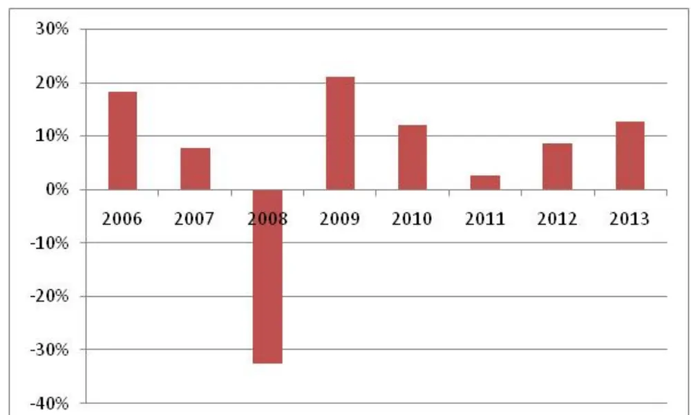
数据来源：NFJ 2013年3季报，广发证券发展研究中心

表 5：NFJ的期权投资情况

| 产品名称 | NFJ Dividend Interest & Premium Strategy Fund (纽交所代码：NFJ) |  |
| --- | --- | --- |
| 投资目标 | 采用量化选股的方法，根据股价动量、盈利变化、基本面改变的驱动因素，从1000家最大市值的价值型股票中挑出250~300个，然后根据盈利情况、现金流以及产品潜力，最终选出40~50只股票构建组合。 |  |
| 期权投资策略 | 卖空宽基指数期权以及行业指数期权，一般卖空的都是轻微价外的3个月期限的期权，其主要目的是优化行业组合配置。 |  |
| 卖出带保护看涨期权的情况(2013年3季报) | 加权平均的价外程度 | 4.07% |
|  | 加权平均的到期天数 | 56.3 |
|  | 覆盖股票资产的比例 | 86.50% |
|  | 覆盖基金总资产的比例 | 66.70% |

数据来源：NFJ 2013年 3季报，广发证券发展研究中心

## 四、期权在保本基金中的应用

在欧美成熟市场，利用期权较多的主要是保本/保证基金。这类基金不同于国内的保本策略，国内保本基金主要通过CPPI/TIPP策略寻求本金保护。海外的保本/保证基金通过购买期权以及固定收益组合的方式，在保本的基础上寻求收益的最大化，或者达到基金条款规定的收益要求。

海外基于期权策略的保本基金又称结构化基金。发行人或者担保人在产品条款中承诺保本或者保收益。投资者期末的收益按照一定的公式根据挂钩标的表现获取。因此，该类基金产品又称“公式化基金”。多数产品采用价值底线+期权的模式，通常执行相对静态的投资策略，即一定比例资金投资于无风险资产实施保本，剩余资金购买匹配的期权资产产生潜在收益（如下图表所示）。

图8：基于期权的保本策略示例
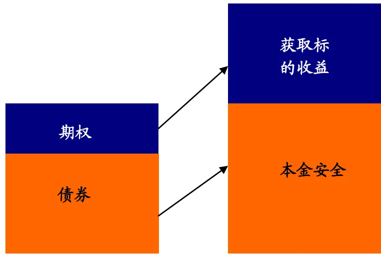
数据来源：广发证券发展研究中心

譬如某产品的条款规定投资者期末获取本金100%安全的同时，参与沪深300指数30%的上涨机会。要求投资者按照当前利率贴现的资产投资于债券获得本金安全，剩余资产购买欧式看涨期权。当期末产品未能实现指数30%上涨时，发行人或者担保人需要承担此类风险。当然，也可以设计非担保的条款，满足风险偏好型投资者的需求，降低发行人或者担保人的风险。

这类策略中产品条款可以多样化，通常而言挂钩指数以及一篮子股票仍然是主要选择。正是由于海外成熟的期权市场，使得保本基金的挂钩标的可以多样化，条款更加灵活，设计出的产品更能满足投资者的多种需要，这也是海外保本基金近年发展较为迅速的主要原因。

根据Bloomberg统计，目前全球专门采用衍生品作为投资策略的保本基金共有11.4亿美金规模。这些保本基金投资范围非常灵活，遍布全球各地。

图9：保本基金的投向区域比例分布
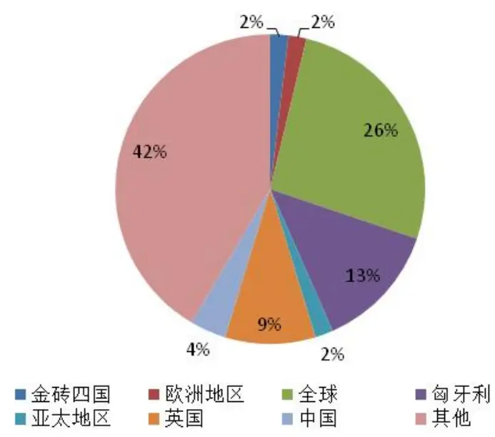
数据来源：广发证券发展研究中心

下面我们介绍一款典型的采用期权进行投资的保本型产品——LYXOR夺宝保本基金。

## LYXOR夺宝保本基金

法国兴业银行是欧洲第8大银行，旗下的全资子公司领先资产管理公司（LYXOR）主要以发行指数基金以及结构化产品为主，而它发行的保本产品曾经多次获得过最佳保本产品的荣誉。

2004年3月，领先发行了一款10年期的保本产品——夺宝保本基金。这款基金以法国兴业集团为担保，初始发行价为10美金，每年计息1次，到期日为2014年3月5日。第1年的利息固定为10%，从第2年开始，利息则是浮动计算。

产品选择了全球24只股票作为观察篮子，参与率为50%；其中表现最差的6只股票作为挑选篮子，第2年的利率回报为：

Max(0%,，10%+参与率×挑选篮子的第2年相比期初的平均收益)

第3年开始直至产品到期，第i年的利率为：

Max(第i-1年利率，10%+参与率×挑选篮子的第i年相比期初的平均收益)

基金的目标回报为20%，如果在某一年基金的累计利息回报达到或超过了20%，则产品提前终止。

下表是一个基金回报的举例。第1年利息回报10%，第2年由于最差的6只股票平均回报-18%，所以当年的利率为10%+50%×(-18%)=1%；第4年虽然表现比第3年更差，其利率回报不能低于第3年；到了第5年，基金累计回报已经超过20%，因此产品提前终止。

表 6：领先夺宝保本基金回报示例

|  | 第1年 | 第2年 | 第3年 | 第4年 | 第5年 |
| --- | --- | --- | --- | --- | --- |
| 挑选篮子的表现 | 不适用 | -18% | -12% | -16% | -8% |
| 首个派息日固定利率 | 10% |  |  |  |  |
| 浮动票息率 |  | 1% | 4% | 4% | 6% |
| 票息总和 |  | 11% | 15% | 19% | 25% |
| 赎回本金 |  |  |  |  | 10美金 |

数据来源：领先夺宝保本基金说明书，广发证券发展研究中心

实际上，目前该产品已经运行了近10年，仍然处于存续期，未能达到20%的目标回报，其主要原因是挑选篮子的表现太差所致。截止目前，最差的6只股票平均跌幅达到了70%。

表 7：领先夺宝保本基金篮子股票表现（2013年 9月 30日）

| 篮子股票 | 收盘价(20130930) | 期初价格 | 股价变动 |
| --- | --- | --- | --- |
| 奥驰亚 | 154.78 | 57.88 | 167.42% |
| 亚马逊 | 312.64 | 42.59 | 634.03% |
| 美国电话电报公司 | 33.82 | 21.42 | 57.91% |
| 英杰华集团 | 3.97 | 5.73 | -30.70% |
| 美国银行 | 13.8 | 40.65 | -66.05% |
| 百特国际 | 65.69 | 29.58 | 122.05% |
| BMY | 46.28 | 20.42 | 199.71% |
| 陶氏化学 | 3840 | 40.79 | -5.86% |
| 意大利国家电力公司 | 2.83 | 2.89 | -1.85% |
| 意大利埃尼集团 | 16.95 | 16.33 | 3.82% |
| 霍尼韦尔国际 | 83.04 | 33.76 | 145.94% |
| KMART | 67.82 | 127.45 | -46.79% |
| 默克 | 47.61 | 46.84 | 1.65% |
| 微软 | 33.31 | 70.42 | -99.90% |
| 澳大利亚国家银行 | 34.32 | 31.78 | 7.98% |
| 英国国家电力供应 | 7.31 | 4.29 | 89.47% |
| 日本电气 | 227 | 836 | -72.85% |
| 野村控股 | 765 | 1827 | -58.13% |
| NSSMC | 333 | 226.4 | 47.08% |
| 日本电信电话 | 508000 | 531800 | -4.48% |
| 松下电工 | 948 | 1602 | -40.82% |
| 武田药品工业 | 4635 | 4748 | -2.38% |
| 意大利电信 | 0.61 | 2.57 | -76.27% |
| 威讯通信 | 47.66 | 38.67 | 23.26% |
| 表现最差的6只股票平均表现 |  |  | -70% |

数据来源：领先夺宝保本基金2013年 3季报，广发证券发展研究中心

在投资策略方面，我们将基金的资产进行分解来看。基金资产有5%用于支付预缴管理费，剩下的95%投资于法兴银行的欧洲中期票据（EMTN），这部分资金投资其实分为两部分，其中75.15%投资于固定收益产品，起到保本作用。而剩下的部分则用于购买实现利息收入的期权。

图10：夺宝保本基金投资策略
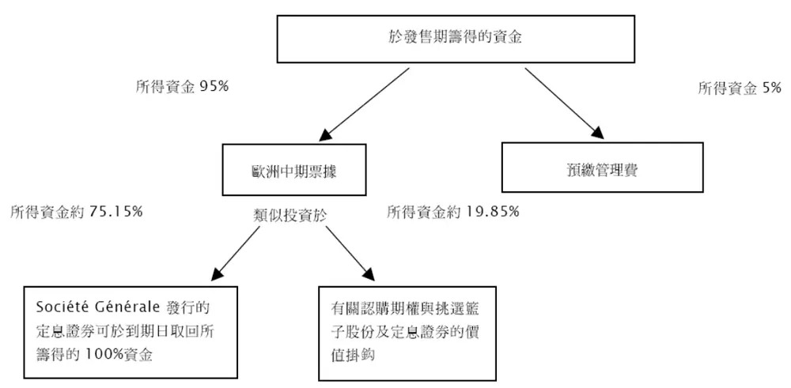
数据来源：领先夺宝保本基金说明书，广发证券发展研究中心

当然，投资者可以对产品选择提前赎回，但是如果提前赎回，则本金部分投资者拿回保本基金的当前净值。在前面几年时间，如果按净值赎回基金，对投资者来说是非常不划算的。

图11：夺宝保本基金历史净值

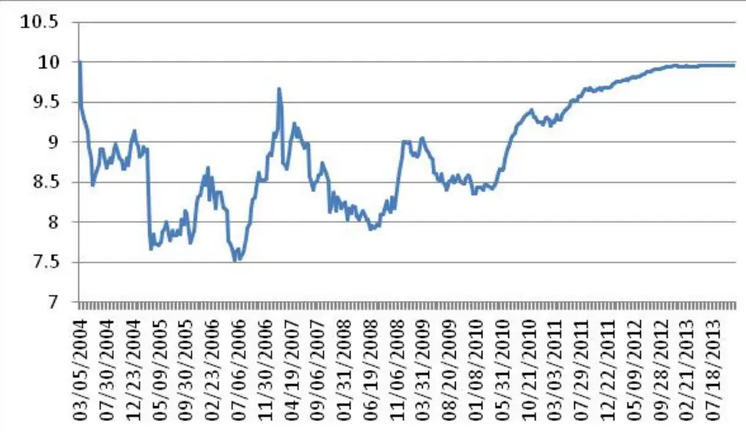
数据来源：LYXOR，广发证券发展研究中心

## 五、对我国公募基金产品设计的启发

从我们整理的案例中发现，公募基金对于期权的应用主要是静态期权策略，在股票型基金以及保本基金中应用较多。对于我国公募产品的启发在于：

1）拓宽保本基金的设计空间，可以针对不同的市场情况、投资者的偏好设计条款多样化的保本产品。国内目前的保本基金几乎都是利用CPPI/TIPP策略进行策略保本，投资的标的主要是固定收益以及股票市场。保本形式比较单一，投资标的同样单一。我们认为，通过采用期权策略，除了满足现有保本产品策略的需求，还可以设计出有明确的挂钩标的、在保本的基础上有明确的收益测算规则等条款，让投资者对产品的风险收益可预期，使得保本产品风险收益特征鲜明，真正满足投资者资产配置的需求。

2）股票型基金的套期保值策略更灵活。通过对于不同的市场走势的预期，采用不同的静态期权策略，不仅可以规避市场的系统性风险，更重要的是，对于譬如卖出期权策略而言，可以增加现金流收入，提升基金的收益风险比。

3）丰富各类对冲策略，提升基金专户产品设计的灵活性。应用期权的动态对冲策略，期权与期货的结合、期权与个股的结合、期权与ETF的结合以及期权与转债的结合等等，可以衍生出多种绝对回报型策略，提升专户产品设计的空间。

## 风险提示

本篇报告主要介绍了期权在海外资产管理产品中的应用，供国内投资者参考。由于目前国内仍未推出期权，因此期权在国内产品的应用需要等待相关的产品推出以及法规完善后才能实现。

## 广发金融工程研究小组

罗 军： 首席分析师，华南理工大学理学硕士，2010年进入广发证券发展研究中心。

俞文冰： 首席分析师，CFA，上海财经大学统计学硕士，2012年进入广发证券发展研究中心。

叶 涛： 资深分析师，CFA ，上海交通大学管理科学与工程硕士，2012 年进入广发证券发展研究中心。

安宁宁： 资深分析师，暨南大学数量经济学硕士，2011年进入广发证券发展研究中心。

胡海涛： 分析师， 华南理工大学理学硕士， 2010年进入广发证券发展研究中心。

夏潇阳： 分析师， 上海交通大学金融工程硕士， 2012年进入广发证券发展研究中心。

蓝昭钦： 分析师， 中山大学理学硕士， 2010年进入广发证券发展研究中心。

史庆盛： 分析师， 华南理工大学金融工程硕士， 2011年进入广发证券发展研究中心。

张 超：研究助理， 中山大学理学硕士，2012年进入广发证券发展研究中心。

汪 鑫： 研究助理， 中国科学技术大学金融工程硕士， 2012年进入广发证券发展研究中心。

## 广发证券—行业投资评级说明

买入： 预期未来12个月内，股价表现强于大盘10%以上。

持有： 预期未来12个月内，股价相对大盘的变动幅度介于-10%～+10%。

卖出： 预期未来12个月内，股价表现弱于大盘10%以上。

## 广发证券—公司投资评级说明

买入： 预期未来12个月内，股价表现强于大盘15%以上。

谨慎增持： 预期未来12个月内，股价表现强于大盘5%-15%。

持有： 预期未来12个月内，股价相对大盘的变动幅度介于-5%～+5%。

卖出： 预期未来12个月内，股价表现弱于大盘5%以上。

## 联系我们

|  | 广州市 | 深圳市 | 北京市 | 上海市 |
| --- | --- | --- | --- | --- |
| 地址 | 广州市天河北路183号 大都会广场5楼 | 深圳市福田区金田路4018 号安联大厦 15 楼 A 座 | 北京市西城区月坛北街2号 | 上海市浦东新区富城路99号 |
|  |  | 03-04 | 月坛大厦18层 | 震旦大厦18楼 |
| 邮政编码 | 510075 | 518026 | 100045 | 200120 |
| 客服邮箱 | gfyf@gf.com.cn |  |  |  |
| 服务热线 | 020-87555888-8612 |  |  |  |

## 免责声明

广发证券股份有限公司具备证券投资咨询业务资格。本报告只发送给广发证券重点客户，不对外公开发布。

本报告所载资料的来源及观点的出处皆被广发证券股份有限公司认为可靠，但广发证券不对其准确性或完整性做出任何保证。报告内容仅供参考，报告中的信息或所表达观点不构成所涉证券买卖的出价或询价。广发证券不对因使用本报告的内容而引致的损失承担任何责任，除非法律法规有明确规定。客户不应以本报告取代其独立判断或仅根据本报告做出决策。

广发证券可发出其它与本报告所载信息不一致及有不同结论的报告。本报告反映研究人员的不同观点、见解及分析方法，并不代表广发证券或其附属机构的立场。报告所载资料、意见及推测仅反映研究人员于发出本报告当日的判断，可随时更改且不予通告。

本报告旨在发送给广发证券的特定客户及其它专业人士。未经广发证券事先书面许可，任何机构或个人不得以任何形式翻版、复制、刊登、转载和引用，否则由此造成的一切不良后果及法律责任由私自翻版、复制、刊登、转载和引用者承担。