# 期权在机构投资者中的应用之绝对收益

## 期权研究系列之十二

## Table_Sum ary报告摘要 ：

## 绝对收益与波动率交易

期权的交易方式可以分为套期保值、投机和套利，其中波动率套利是获得绝对收益的主要方式之一。波动率是决定期权价格时相对较为复杂的一个变量，也是投资者在交易时无法确定的一个因素。我们可以将期权的市场价格代入BS理论定价公式，反推出其中的隐含波动率。当市场波动率被低估（隐含波动率较低）时，做多波动率；当市场波动率被高估（隐含波动率较高）时，做空波动率——这种交易方式称为波动率套利，也叫做波动率交易。在进行波动率交易之前，有必要通过一定的对冲手段，将其他影响期权价格的因素剥离，使得交易产生的收益与资产价格等因素的变化无关。在国内市场，该剥离过程主要通过delta对冲完成。

## 波动率交易在海外对冲基金中的应用

从十九世纪开始的可转债波动率套利，到期权组合的波动率交易，再到 VIX 指数及相关衍生品的推出，波动率套利已逐渐成为海外对冲基金的主流交易策略之一。本篇报告分别介绍了 Guardian Fund Management, LLC、Acorn Derivatives Management Corp.、ABC Square AM LLP、Shooter FundManagement LLP、SGAM Alternative Investments、North of Zero LLC 等几家海外对冲基金的波动率套利产品。在不易对市场趋势做出判断、但波动率被明显低估或高估的情况下，波动率交易有望为相关产品带来可观收益。从全球波动率交易对冲基金的运作情况来看，波动率套利不能算得上是一种低风险的交易策略。所以在相关交易过程中，投资者要注意其可能带来的风险。

## 常见的波动率交易策略

通过简单“期权+标的资产”组合，经过 delta 对冲，可以实现对波动率的剥离。但是在海外进行波动率交易的对冲基金中，更为常用的是通过组合不同执行价格或不同到期期限的欧式看涨、看跌期权，完成波动率的暴露，这样一方面可以降低组合的构建成本，另一方面可以增加组合对波动率的敏感性。这类常用的策略包括跨式组合、宽跨式组合、蝶式组合、秃鹰组合、比例价差组合、后价差组合、圣诞树组合、跨期组合、对角组合等。上述组合策略虽然也称之为波动率套利，但实际上是对波动率方向的投机交易。此外，也可以进行相对波动率的套利，比如对于同一标的资产的不同期权品种（例如黄金商品期权和黄金 ETF期权），当隐含波动率相差较大时，可以同时做多“相对低估”的波动率和做空“相对高估”的波动率，形成跨品种套利。最后，我们还介绍了离差交易，即在成分股期权组合与指数期权之间形成波动率套利的机制。

图 VIX 指数历史走势（1990 至 2004）
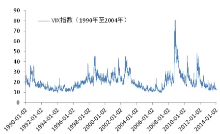

Table_Aut hor 分析师： 安宁宁 S0260512020003

0755-23948352

ann@gf.com.cn

## Table_Report 相关研究：

可转债的波动率套利策略研 2013-09-04究

基于波动率预测的交易策略2013-09-03

Table_Contacter 联系人： 张超

020-87555888-8646

zhangchao@gf.com.cn

## 一、期权与绝对收益

期权最初是为了规避市场风险而设计的。但实际上与期权相关的投资策略有很多，包括套期保值、投机和套利。其中投机和套利都可以在承担一定风险的前提下攫取绝对收益。而由于投机策略较为简单，即进行单一期权的做多或做空，我们这里不做过多讨论。

期权的套利策略，可以通过期权与期权、期货或现货的组合完成。而使用最为广泛的是波动率套利，即通过上述组合，剥离掉除了波动率以外其他会对组合价值造成影响的因素，从而进行单纯的波动率交易。波动率套利同其它如期现套利、ETF套利等策略不同，其可以在波动率之间进行传统套利（即做空高波动率的同时做多等量的低波动率），也可以进行单一方向的波动率交易（即只做空波动率或只做多波动率）。也就是说，对波动率进行投机交易也是波动率套利的一种，而且从市场统计上来看，这类策略在波动率套利中占有较高比例。因此为了避免歧义，我们也喜欢称“波动率套利”为“波动率交易”。

本篇报告中，我们主要讨论波动率交易在海外机构投资者中的应用。

## 二、波动率概述

期权价格受到六个变量的影响，分别是标的资产价格、期权执行价格、到期时间、无风险收益率、标的资产收益和波动率。其中前五个都较为直观，而波动率则相对较为复杂，也是投资者在交易时无法确定的一个因素。但波动率却往往是决定交易策略成功与否最重要的一个变量。

波动率由价格变动引起，而价格变动由市场供需关系决定。传统上可以通过计算历史上一段时间标的资产收益率的标准差对波动率进行估算，即历史波动率（Historical Volatility）。更为复杂地，可以基于历史波动率，通过一些数学的方法，如线性模型、GARCH模型等对波动率进行估计（详见广发证券金融工程专题报告《基于波动率预测的交易策略》）。但是由于在期权中，标的资产价格的波动率主要用来衡量资产未来价格变动的不确定性，或者说波动率并非常数，因此采用历史波动率对未来波动率进行估计，就可能会出现一定的偏差。

由于Black-Scholes模型（BS模型）在推导中假设证券价格的变化过程可以用漂移率为 $\mu S$ 、方差率为 $\sigma^{2}S^{2}$ 的伊藤过程表示为 $dS=\mu Sdt+\sigma Sdz$ ，其中dz为标准布朗运动。因此，我们可以将期权的市场价格代入 BS 理论定价公式，反推出其中的 ，即隐含波动率（Implied Volatility）。因此，在其他参数确定的情况下，隐含波动率由期权的市场价格决定。而另一方面，期权市场价格由期权的供需关系决定，所以可以说，期权的市场供需关系决定了隐含波动率的大小。

隐含波动率有两个重要作用：一是通过计算隐含波动率，可以为其他期权进行

识别风险，发现价值

定价；二是当隐含波动率与投资者所预测的波动率出现较大偏差时，产生套利机会，可以进行相关的波动率交易（Volatility Trading）。

采用不同的执行价格（Strike Price）和不同的期限结构(Term Structure)都可以对期权的隐含波动率进行估计，如图 1 所示。

如果尝试分别通过价外期权（Out of the Money）与价内期权（In of the Money）对隐含波动率进行估计，会发现所得结果与平价期权（At the Money）都会产生一些偏差。也就是说，采用不同执行价格的期权所计算得到的隐含波动率有一定差异，这在期权理论中被称之为波动率偏离（Volatility Skew）或者波动率微笑（Volatility Smile）。在货币期权中，这种隐含波动率随执行价格变化的曲线通常是微笑状，而在股指期权和股票期权中，往往表现为随着执行价格增加而下降的波动率偏离。

除了执行价格，另一个影响隐含波动率估计的重要因素是期权的到期时间，或者称为期限结构。不同到期时间的期权在同一时刻计算得到的隐含波动率也有所差别。在相同的执行价格下，期权的到期时间越短，其隐含波动率往往越高。

把不同执行价格和不同期限结构的隐含波动率放在一个 2×2的矩阵里，就形成了波动率矩阵。在任意时刻，可以通过在市场上找到矩阵中的某些期权，估计其隐含波动率。矩阵中其他缺失的部分，可以通过插值的方法补齐。

在实际交易过程中，对隐含波动率的估计通常通过平价期权完成，而在平价期权中，近月合约对隐含波动率的变化最为敏感。因此，选择近月平价期权对隐含波动率进行估计是一个比较不错的选择。

图1：不同执行价格和不同到期时间的期权
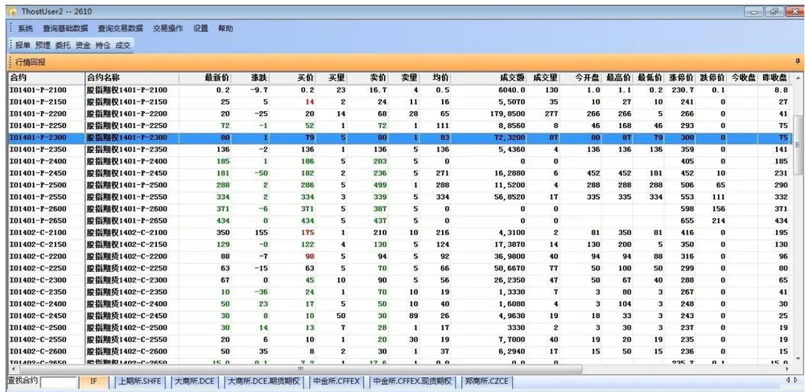
资料来源：中金所股指期权仿真交易

## 三、波动率交易在海外对冲基金中的应用

## （一）海外波动率交易概述

波动率套利最早来自于可转债交易。十九世纪，美国市场出现可转债后，人们发现这种债券实际是一种内嵌期权的金融产品，由传统债券和期权组合而成。通过买入价格被低估的可转债并卖空相应的股票，可以将内嵌期权剥离出来进行波动率交易（详见广发证券金融工程专题报告《可转债的波动率套利策略研究》）。

波动率对冲基金的兴起来自于金融危机。在全球金融危机的背景下，股票及商品市场剧烈波动，为波动率交易带来了巨大的机会。在金融衍生品市场日益丰富的大环境中，一些对冲基金将目光投向了波动率市场，并在金融危机中大幅获利。其相关产品收益排名稳居前列，使得波动率交易逐渐成为全球对冲基金中的主流交易策略之一。

作为跟踪波动率的比较基准，VIX 指数（Volatility Index）由 CBOE（芝加哥期权交易所）于 1993年推出，最初只跟踪 S&P100指数平价期权的隐含波动率，后来改为跟踪一系列指数期权的加权平均隐含波动率。如今，VIX已成为跟踪S&P500股指期权平均隐含波动率的波动率指数，在波动率交易市场中非常具有影响力。

随着波动率交易的流行，越来越多的波动率指数出现在全球金融市场，例如跟踪新兴市场 ETF 波动率的 VXEEM 指数（CBOE Emerging Market ETF Volatility Index）、跟踪黄金波动率的 GVZ 指数（CBOE Gold Volatility Index）、跟踪纳斯达克 100 指数波动率的 VXN 指数（NASDAQ Volatility Index）、跟踪欧洲股票市场波动率的 VDAX指数和 V2X指数等。

2004年，市场推出了首款波动率期货VIX Futures（Volatility Index Futures）。2006年，VIX指数期权开始在芝加哥期权交易所交易。随着波动率衍生品的不断丰富，波动率交易的方法也不再仅限于我们之前介绍的一些传统组合方法。不过由于国内市场目前在这一领域处于起步阶段，因此我们仍有必要对传统波动率交易方法进行简单的介绍。

图2：VIX指数历史走势
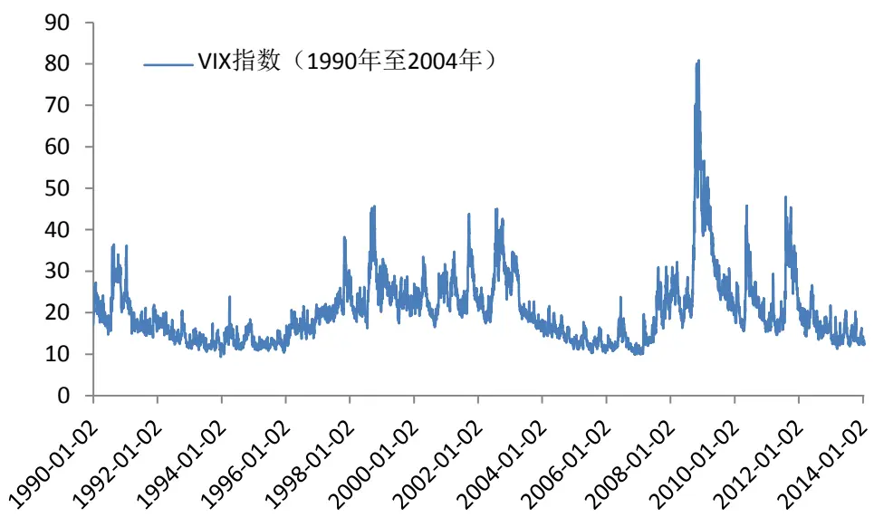
数据来源：雅虎财经YAHOO.com
识别风险，发现价值

## （二）波动率交易市场概况

截止至2013年年底，全球对冲基金规模约为2.2万亿美元。对冲基金的种类形形色色，包括股票多空对冲、多策略、事件驱动、CTA、宏观对冲、套利、固定收益等，数量分布如图 3所示。

可以看出，套利策略在所以策略中的占比并不高，约为 8%左右，而其中采用波动率套利的对冲基金数量更为稀少。所以，在海外对冲基金当中，以波动率交易策略为主的基金数量相当有限。

图3：全球对冲基金策略数量分布
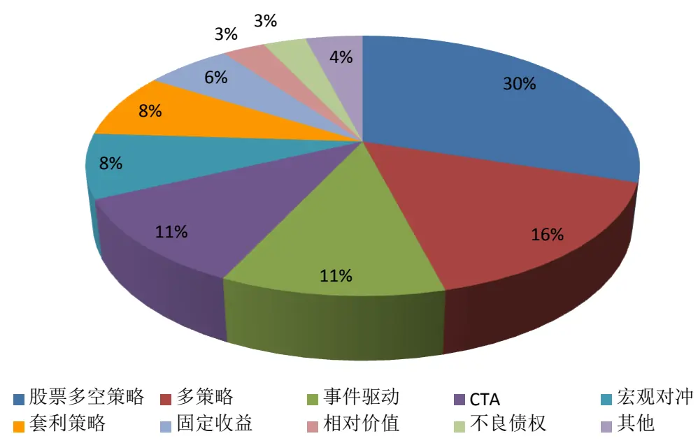
数据来源：TheCityUK

为数不多的对冲基金经理采用以波动率交易为主的策略，使得波动率基金可以承受相对较大的资金规模，也较少受到策略同质性的影响。另外，相对于传统套利策略，波动率套利的风险和收益都相对要更高一些。我们这里陈列了全球目前仍在运行的波动率交易基金，以及其规模与收益情况，如表1所示。

表1：海外波动率交易对冲基金收益与规模概况

| 基金名称 | 报告期 | 资产规模(百万美元) | 报告期前1年收益率 |
| --- | --- | --- | --- |
| ADMC Absolute Return Strat 0/S II LTD | 2013-6-30 |  | -19% |
| AM Investment Catalyst Fund LP | 2011-7-31 |  | 0% |
| Balance Volatility Program | 2013-12-31 | 一 | -31% |
| Blackheath Vol Arb Offshore LTD | 2014-1-31 |  | -5% |
| Blackheath Volatility Arbitrage Fund LP | 2014-1-31 |  | -4% |
| Capstone Vol (Offshore) Limited | 2014-1-31 | 2260 | 3% |
| Cassiopeia Fund - Class A | 2013-12-31 | 622 | 1% |
| CC Athena OS Fund | 2012-12-31 | 4 | 0% |
| CCR Long Vo1 I | 2014-1-31 | 一 | -3% |

识别风险，发现价值

| CCR Long Vol R | 2014-1-31 |  | -4% |
| --- | --- | --- | --- |
| CPR Volatility | 2011-8-31 | 一 | -5% |
| Da Vinci Arbitrage Class I | 2011-4-30 | 7 | -18% |
| Da Vinci Arbitrage Class R | 2011-4-30 | 7 | -19% |
| Dexia Volatility Opportunities Acc. | 2011-10-31 |  | -5% |
| Dexia Volatility Opportunities C Acc | 2011-6-30 | 一 | -3% |
| Dynamic Hedge LLC | 2013-12-31 |  | 3% |
| Emory Partners LP | 2011-7-31 |  | 5% |
| Exagroup's Omega Fund | 2010-11-30 |  | -2% |
| Fortress Convex Asia Fund | 2013-12-31 |  | -3% |
| Guardian Fund LP | 2013-11-30 |  | 60% |
| Hyman Beck Ltd Volatility Analytics Stra | 2013-10-31 | 一 | -1% |
| KBD Capital Partners Ltd, Class B | 2012-10-31 | 11 | 8% |
| KBD Capital Partners Ltd, Class C | 2012-10-31 | 11 | 15% |
| Kohinoor Core Fund | 2013-12-31 | 782 | -10% |
| Kohinoor Series Three Fund | 2013-12-31 | 一 | -4% |
| Nexar Short Bias Fund | 2012-5-31 |  | 0% |
| NorCap Diversified Premium Fund | 2013-12-3 |  | 12% |
| PHI Single Index Option Fund | 2013-12-31 | 2 | 29% |
| Quaesta Capital v-Pro B | 2013-6-30 | 一 | 2% |
| Structured Alpha - Absolute Yield | 2012-7-31 |  | 1% |
| SunMoon Capital LP | 2014-1-31 | 2 | 5% |
| Theta Funds | 2013-12-31 |  | 15% |
| Titan Asia Volatility Fund | 2013-8-31 |  | 1% |
| Twin Tree Capital Master Fund, L.P. | 2013-10-31 |  | 0% |
| V1 - Volatility Trading program | 2014-1-31 | 一 | 6% |
| VIX Portfolio Hedging (VXH) Program | 2013-4-30 |  | -31% |
| Vol Edge A | 2014-1-31 | 14 | -64% |
| Vol Edge B | 2014-1-31 | 19 | -65% |
| Volatility Arbitrage Program | 2013-12-31 | 一 | 38% |
| Volatility Risk Premium Fund | 2011-7-31 |  | 1% |
| Yedid Advantage (QP) Fund, LP | 2011-6-30 | 一 | 36% |
| Yedid Offshore Advantage Fund SPC | 2011-6-30 |  | 35% |
| 平均值 |  | 312 | 0% |

数据来源：globalfunddata.com

值得一提的是，globalfunddata.com收录了全球约6000只对冲基金的数据，而波动率交易基金仅上述42只，反映了波动率基金在海外对冲基金中数量占比较低的状况。

根据表1中的数据，我们可以看出波动率对冲基金规模小可以小到几百万美元，大可以大至几十亿美元，规模较为灵活。另外，我们绘制了上述 42只波动率交易基金的年收益率分布图，如图 4 所示。

图4：海外波动率对冲基金年收益率分布
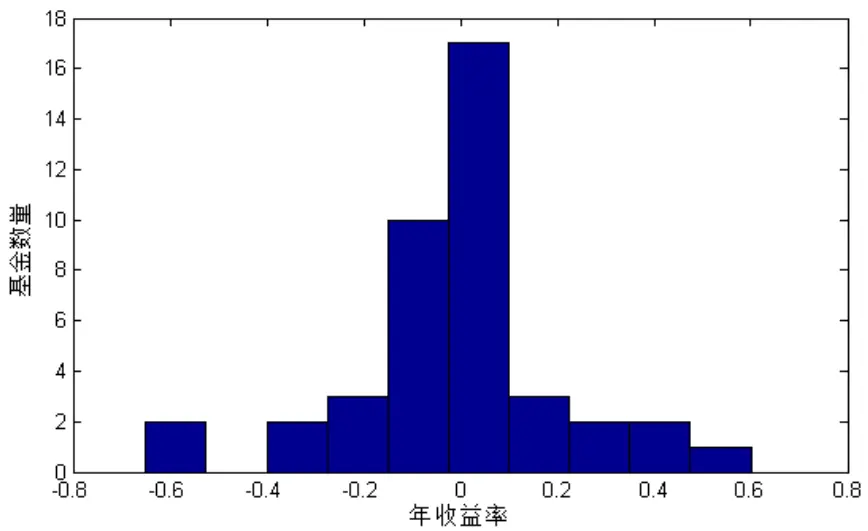
数据来源：globalfunddata.com

从图4可以看出，在上述 42 只基金中，年收益率最高的是 Guardian Fund LP，高达 60%；最低的是Vol Edge 系列，年跌幅也超过60%。

下面，我们将介绍一些海外专注于波动率交易的对冲基金及产品。

## （三）海外波动率对冲基金案例

## 1、Guardian Fund Management, LLC

我们首先关注一下上述列表中收益率最高的波动率对冲基金 Guardian Fund, LP，其来自于美国的对冲基金公司 Guardian Fund Management, LLC。该基金于 2009 年1月 1日发行，并没有赶上金融危机市场大幅震荡的行情。然而，在Barclay举办的最佳对冲基金排名中，该基金于 2011年和2012年连续两年获得期权策略收益率第一名的荣誉。

表 2：Guardian Fund, LP 部分产品条款

| 成立时间 | 2009年1月 |
| --- | --- |
| 管理费（Mgmt.Fee） | 最高2.00% |
| 盈利提成（Incentive Fee） | 20.00% |
| 最小认购额（Min. Acc.） | 25万美元 |

数据来源：globalfunddata.com

表 3：Guardian Fund, LP 部分历史业绩

| 报告期 | 2013-11-30 |
| --- | --- |
| 报告期前1个月收益率 | 4.33% |
| 报告期前2个月收益率 | 8.51% |
| 报告期前3个月收益率 | 18.12% |

识别风险，发现价值

| 报告期前6个月收益率 | 37.14% |
| --- | --- |
| 报告期前9个月收益率 | 43.26% |
| 报告期前12个月收益率 | 60.75% |
| 近四年年化收益率 | 57.85% |

数据来源：globalfunddata.com

## 2、Acorn Derivatives Management Corp.

Acorn 是注册在美国纽约的一家对冲基金。1989 年，其创始人 William O. MelvinJr 建立了Acorn，主要投资方式是卖一些场外期权给机构客户。

2001 年，Acorn 发行了第一支基金产品 ADMC Absolute Return Strategies LP；同年 12 月，其发行了首只海外对冲基金 ADMC Absolute Return Strategies offshoreLtd.。这两只产品主要的投资方式都是交易S&P500场内期权的隐含波动率（起初他们也交易欧洲市场和亚洲市场的波动率，但是随着全球金融市场相关性逐步增强，现在只专注于美国市场）。Acorn的投资经理发现市场上的指数期权波动率往往被高估。当指数期权的隐含波动率偏离历史波动率太多时，Acorn 喜欢通过蝶式组合或者秃鹰组合沽空波动率。

截止至 2013 年，ADMC Absolute Return Strategies LP 的规模大约为 1600 万美元，接下来我们看一下其部分产品的条款及业绩，如表 4、表 5所示。

表 4：ADMC Absolute Return Strategies LP 部分产品条款

| 成立时间 | 2001年6月 |
| --- | --- |
| 管理费（Mgmt. Fee） | 1.00% |
| 盈利提成（Incentive Fee） | 20.00% |
| 最小认购额（Min. Acc.） | 100万美元 |
| 是否封闭 | 否 |
| 高水位线（基金净值超过历史最高值后才能收取盈利提成） | 有 |
| 赎回打开频率 | 每月一次 |

数据来源：hedgez.com

表 5：ADMC Absolute Return Strategies LP 部分历史业绩

| 2010年 0.29% |
| --- |
| 2011年 8.84% |
| 2012年 -5.36% |
| 2013年 -21.48% |
| 成立至今2013年年底 34.18% |
| 年化收益率 2.46% |
| 月化收益率 0.23% |
| 盈利月数 61 |
| 亏损月数 39 |
| 盈利比率 61% |

数据来源：hedgez.com

图5：ADMC Absolute Return Strategies LP近四年收益
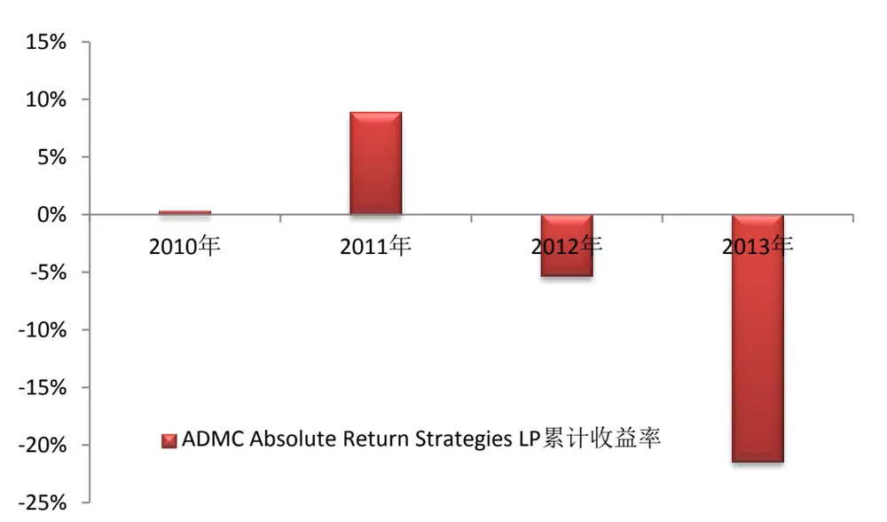
数据来源：hedgez.com

## 3、ABC Square AM LLP

ABC Square 是位于英国伦敦的一家对冲基金，其旗下产品 Sigma Square 专注于波动率套利交易。Sigma Square 的资产中，有超过80%的资金进行波动率交易，不足 20%进行方向性投机交易。

Sigma Square主要交易标的包括欧洲股票及指数的衍生品，此外也对海外资产，如美国和亚洲的固定收益产品、货币产品和商品进行少量交易。在波动率交易部分，Sigma Square的交易策略包括：离差交易、价差组合、跨期组合、波动率偏离套利（即通过波动率偏离曲线进行波动率的低买高卖套利）、theta 套利（例如在长假前投入资金做空 delta中性的期权组合）。

Sigma Square在投资方面采用人机结合的方式。由于涉及策略种类较多，因此ABC Square 开发了专用的程序化交易系统。在程序发现交易机会后，由于不涉及高频交易，往往由投资经理进行进一步筛选，挑选出值得交易的标的进行套利。SigmaSquare 对期权组合的平均调仓时间为1 个月左右，因此，其有必要在每个交易日收盘前通过买卖股票或股指期货对组合进行 delta对冲。

表 6：Sigma Square 部分产品条款

| 成立时间 | 2005年1月 |
| --- | --- |
| 产品规模 | 5 亿美元 |
| 目标年化收益率 | 10%至12% |
| 目标波动率 | 5%至 8% |
| 主要经纪方（Prime Broker） | Fimat, Citigroup |
| 管理费 | 2%/年 |
| 盈利提成 | 20% |
| 高水位线 | 有 |
| 赎回打开频率 | 每月一次 |

数据来源：hedgefundsreview.com
识别风险，发现价值

## 4、Shooter Fund Management LLP

Shooter Fund Management 同样是一家注册在伦敦的对冲基金，创始人 MarkShooter 曾在90年代任职于SBC O’Connor，主要工作就是波动率交易。其发起的波动率套利产品 Shooter Multi-strategy Fund 主要进行标准常规期权（VanillaOption）、外汇期权和商品期权的波动率套利，团队成员均具备海外对冲基金工作经验，并且专门有一支的博士团队负责相关策略的量化研究。

Shooter Multi-strategy Fund 完全采用波动率套利策略进行投资，每个交易日都通过期货进行 delta 对冲，保持严格 delta 中性。Shooter Multi-strategy Fund采用手工下单，并没有成熟的程序化交易系统，这与该团队特定的投资风格和投资经验有关。

表 7：Shooter Multi-strategy Fund 部分产品条款

| 成立时间 | 2004年11月 |
| --- | --- |
| 产品规模 | 5 亿美元 |
| 目标年化收益率 | 15%至 18% |
| 通道方（Administrator） | JP Morgan Tranaut |
| 主要经纪方（Prime Broker） | Deutsche Bank, Fimat, Lehman |
| 管理费 | 2%/年 |
| 盈利提成 | 20% |
| 最小认购额 | 100万美元 |

数据来源：hedgefundsreview.com

## 5、SGAM Alternative Investments

SGAM Alternative Investments（SGAM AI）是法兴银行的孙公司（子公司的子公司），主要从事离岸对冲基金业务，注册地在爱尔兰。其旗下的波动率对冲基金 SGAMAI Global Volatility Fund 主要进行包括股票市场、外汇市场和利率市场的全球指数期权波动率套利，兼做一些各国政府发行债券的投资。

SGAM AI 在 Arie Assayag 的领导下，从 2001 年开始进行波动率策略研究。2005年，首只专注于波动率套利的对冲基金 SGAM AI Global Volatility Fund 发行，两位投资经理 Bernard Kalfon 和 Daniel Mantini 在东京办公，主要进行场内期权的波动率套利交易。

表 8：SGAM AI Global Volatility Fund 部分产品条款

| 成立时间 | 2004年11月 |
| --- | --- |
| 控制人 | Societe Generale |
| 管理费 | 2%/年 |
| 盈利提成 | 20% |
| 最小认购额 | 25万美元 |

数据来源：hedgefundsreview.com

## 6、North of Zero LLC

North of Zero LLC 是的美国的一家对冲基金公司，其旗下产品 Global

Volatility Fund SP是 2011年成立的一只波动率套利对冲基金，主要进行股指期权和商品指数期权的波动率交易，并通过期货头寸保持组合 delta中性。目前GlobalVolatility Fund SP 产品规模约 1700 万美元。

表 9：Global Volatility Fund SP 部分产品条款

| 成立时间 | 2011年5月 |
| --- | --- |
| 管理费（Mgmt.Fee） | 3.00% |
| 盈利提成（Incentive Fee） | 20.00% |
| 最小认购额（Min. Acc） | 100万美元 |
| 是否封闭 | 否 |
| 高水位线 | 有 |
| 赎回打开频率 | 每月一次 |

数据来源：hedgez.com

表 10：Global Volatility Fund SP 历史业绩

| 2011年 | 0.74% |
| --- | --- |
| 2012年 | 14.94% |
| 2013年 | -13.53% |
| 成立至今 2013 年年底 | 0.12% |
| 年化收益率 | 0.05% |
| 月化收益率 | 0.04% |
| 盈利月数 | 50 |
| 亏损月数 | 50 |
| 盈利比率 | 50% |

数据来源：hedgez.com

图6：Global Volatility Fund SP近三年收益
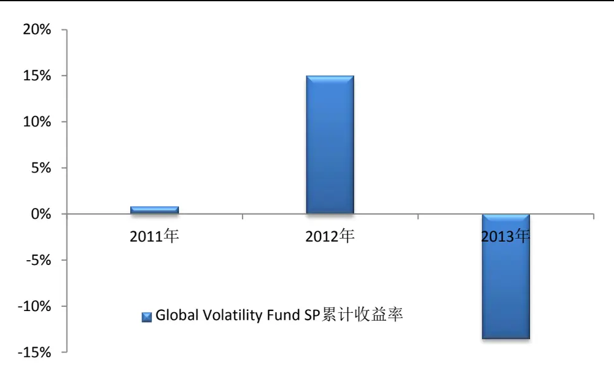
数据来源：hedgez.com

## 四、波动率交易原理

传统金融市场的股票、期货投资主要关注标的资产的价格变化。而在期权市场，波动率是和价格同样重要的一个指标，除了对资产价格进行交易以外，很多投资者还选择对波动率进行交易。

交易波动率也称为波动率套利，其原理为，当市场波动率被低估（隐含波动率较低）时，做多波动率；当市场波动率被高估（隐含波动率较高）时，做空波动率。这样简单的交易规则在期权市场却并非十分容易实现，因为隐含波动率在期权价格中所反映，而期权价格并非仅由波动率决定，其中还参杂了标的资产价格、无风险收益等可能发生变动的因素。因此在进行波动率交易之前，有必要通过一定的对冲手段，将其他影响期权价格的因素剥离，使得交易产生的收益与资产价格等因素的变化无关，从而保留纯粹的波动率进行交易（当然，也可以不对这些因素进行对冲，但这种交易并非严格意义上的波动率套利，本篇报告不对该类混合交易策略进行讨论）。

在海外市场，无风险收益率可以通过回购合约或者远期利率合约（FRA）、利率互换、利率期货、利率期权等利率衍生品进行对冲。在国内，由于目前交易所还未推出利率衍生品，并且近年来利率调整并不频繁，因此我们这里暂不考虑无风险收益变动对波动率交易的影响。

至于股价对期权价格的影响，可以通过Delta对冲消除。具体到国内金融市场，其可以通过每个交易日调整现货或期货的头寸完成。另外在期权市场中，也可以通过不同期权之间的组合实现Delta中性，即Delta等于零。通过这样的Delta中性组合，即可以把波动率剥离出来进行交易。不过，由于Delta往往会随时间变化而发生变化，因此需要不断调整投资组合的Delta值，这种对冲方法也称之为动态对冲。

## 五、常见的波动率交易策略

## （一）简单“期权+标的资产”组合

通过构造有担保的期权（Covered Option）多头或空头，即通过以下四种“期现组合”，可以分别构造波动率的多头与空头。

1、买入看涨期权，做空股票或期货

2、买入看跌期权，做多股票或期货

1、卖出看涨期权，做多股票或期货

2、卖出看跌期权，做空股票或期货

这里的期权指普通欧式期权（后文未特殊说明的，均为普通欧式期权）。通过对上述组合进行动态 Delta对冲，保持整个组合的 Delta中性状态，即可实现对波动率的交易。

虽然通过上述期权与标的资产组合的Delta对冲可以将波动率剥离出来进行交易，但是实际上很少有人采用这种方法进行波动率套利。原因在于，通过标的资产（如股票或期货）进行 Delta 对冲并不是最为理想的对冲方法。因为在Delta对冲过程当中，我们假设了标的资产价格连续运动、零交易成本，并且 Delta头寸数量依赖于历史波动率的估计。而在实际操作过程中，很难时刻保持 Delta中性，因此需要不断的调整头寸数量，从而产生大量的交易成本，并有可能覆盖进行波动率交易的收益。

在海外进行波动率套利的对冲基金中，投资经理或者交易员往往通过对不同期权进行组合，保持投资组合的 Delta中性状态，从而进行波动率套利。这样做一方面可以节省交易成本，另一方面可以增加波动率暴露（波动率敏感性），接下来我们将介绍一些海外常用波动率套利组合的构建方法。

## （二）跨式组合（Straddle）

在波动率交易过程中，往往通过组合不同到期时间和不同执行价格的期权，从而保持组合的 Delta中性状态。跨式组合就是最为常用的一种组合。

跨式组合由具有相同执行价格、相同到期时间的一份看涨期权和一份看跌期权构成。在波动率交易当中，上述期权均指平价期权，并且到期时间较长。

买入上述期权组合，构建跨式组合多头，如图7 所示。

卖出上述期权组合，构建跨式组合空头，如图8 所示。

图7：跨式组合多头到期盈亏
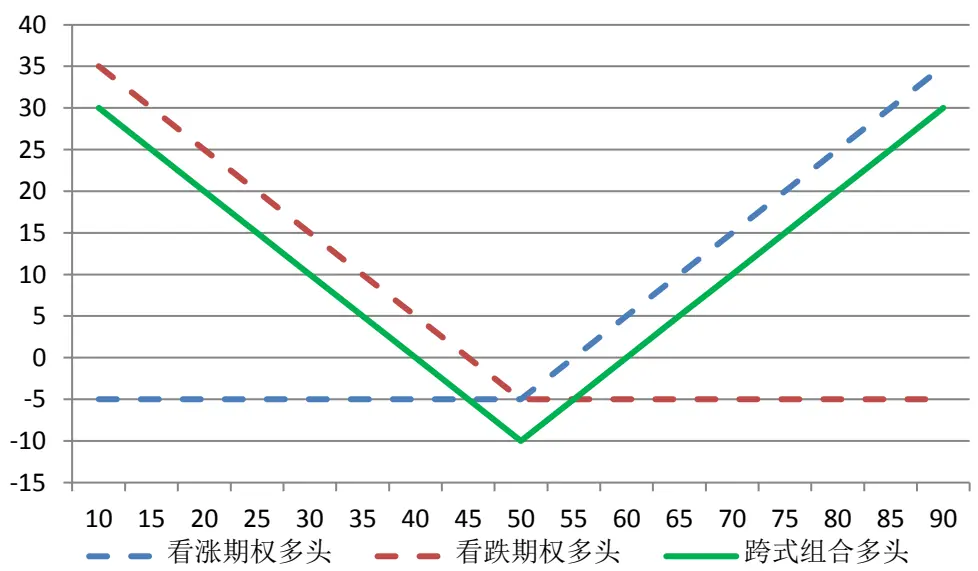
数据来源：广发证券发展研究中心

当市场波动率上升时，跨式组合将产生盈利。由于买入的两份期权均为平价期权，并且其到期日相对较远，因此 Delta分别约等于0.5和-0.5，实现了Delta中性。在此基础上，相对于只有 1份期权的“期权+标的资产”组合，跨式组合的波动率暴露也有所增加，有利于波动率交易。并且通过选择平价期权，也可以使组合的时间价值最大化。跨式组合多头仅用于波动率的短线交易（一般为几个交易日），这是因为跨式组合多头对时间衰减非常敏感。

图8：跨式组合空头到期盈亏
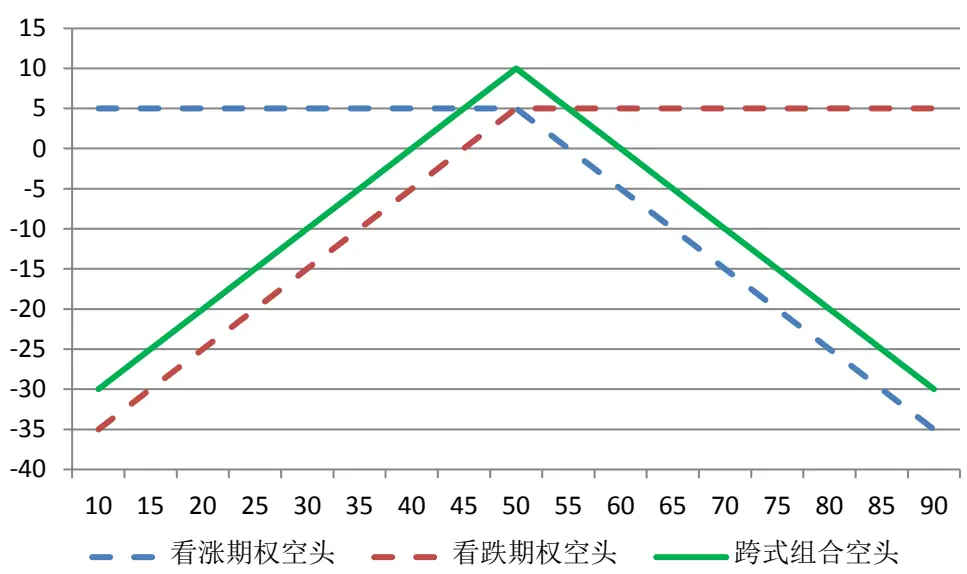
数据来源：广发证券发展研究中心

同理，跨式组合空头也实现了Delta中性，具有最大时间价值和最强的波动率敏感性，当波动率下降时，组合将获得盈利。

## （三）宽跨式组合（Strangle）

宽跨式组合由具有相同到期时间但执行价格不同的一份看涨期权和一份看跌期权组成。在波动率交易当中，一般使用两个价外期权构建宽跨式组合，并且保证它们的到期时间较长。

买入上述期权组合，构建宽跨式组合多头，如图9 所示。

卖出上述期权组合，构建宽跨式组合空头，如图10所示。

图9：宽跨式组合多头到期盈亏
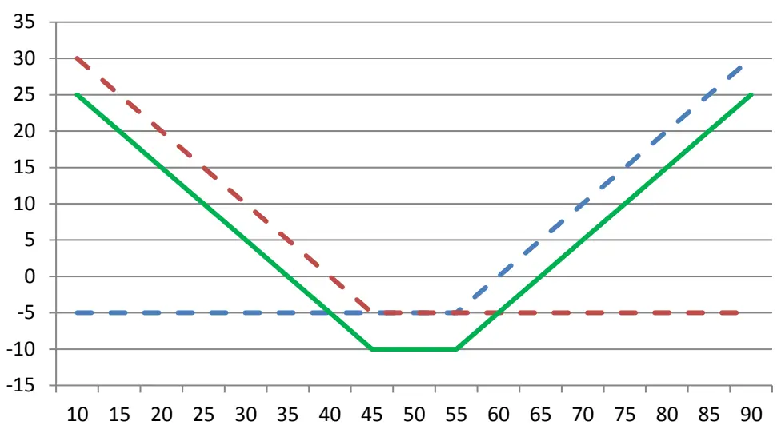
看涨期权多头 看跌期权多头 跨式组合多头
数据来源：广发证券发展研究中心

与跨式组合类似，在构建多头头寸初期，宽跨式组合基本处于 delta中性。但与跨式组合不同的是，宽跨式组合多头由于采用了价外期权，因此构建成本相对较低，可能带来的亏损较小；时间衰减对其影响也相对较小，因此其持有时间也相对较长，从海外经验来看，一般会有 7至10 个交易日。

从图9的到期收益分布图可以看到，宽跨式组合到期收益不受市场方向影响，但在一定程度上受市场振幅影响。组合到期时，只有市场价格偏离建仓价格较多时，组合才有可能产生盈利，这一偏离宽度要大于跨式组合多头，这也反映了宽跨式组合由于构建成本较低，获得高收益也相对较难。不过通过宽跨式组合做多波动率，一般也不会持有到期。

图10：宽跨式组合空头到期盈亏
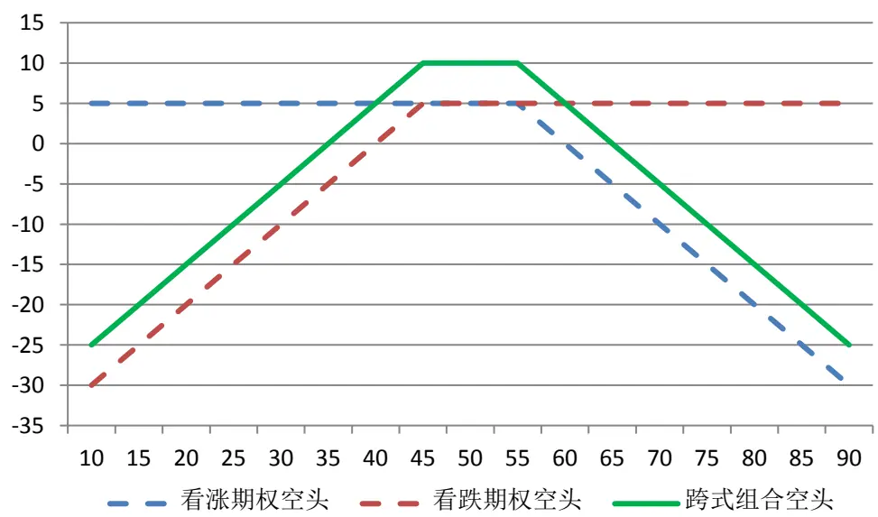
数据来源：广发证券发展研究中心
识别风险，发现价值

同样，可以构建图10中的宽跨式组合空头沽空波动率。该组合的收益将会来自于两部分——波动率下降和时间衰减。

## （四）蝶式组合（Butterfly）

蝶式组合由4份具有相同到期时间、而执行价格不同的期权合约组成。若其执行价格分别满足 $X_{1}<X_{2}<X_{3}$ 和 $X_{2}=\left(X_{1}+X_{3}\right)/2$ ，则可以分别构建蝶式组合的波动率多头与波动率空头。在波动率套利中， $X_{2}$ 往往对应于平价期权。

（1）卖出执行价为 $X_{1}$ 和 $X_{3}$ 的看涨期权各一份，买入执行价为 $X_{2}$ 的看涨期权两份。

（2）卖出执行价为 $X_{\mathrm{1}}$ 的看涨期权和执行价为 $X_{3}$ 的看跌期权各一份，买入执行价为 $X_{2}$ 的看涨期权和看跌期权各一份。

（3）卖出执行价为 $X_{\mathrm{1}}$ 的看跌期权和执行价为 $X_{3}$ 的看涨期权各一份，买入执行价为 $X_{2}$ 的看涨期权和看跌期权各一份。

（4）卖出执行价为 $X_{1}$ 和 $X_{3}$ 的看跌期权各一份，买入执行价为 $X_{2}$ 的看跌期权两份。

（1）买入执行价为 $X_{1}$ 和 $X_{3}$ 的看涨期权各一份，卖出执行价为 $X_{2}$ 的看涨期权两份。

（2）买入执行价为 $X_{\mathrm{1}}$ 的看涨期权和执行价为 $X_{3}$ 的看跌期权各一份，卖出执行价为 $X_{2}$ 的看涨期权和看跌期权各一份。

（3）买入执行价为 $X_{\mathrm{1}}$ 的看跌期权和执行价为 $X_{3}$ 的看涨期权各一份，卖出执行价为 $X_{2}$ 的看涨期权和看跌期权各一份。

（4）买入执行价为 $X_{1}$ 和 $X_{3}$ 的看跌期权各一份，卖出执行价为 $X_{2}$ 的看跌期权两份。

蝶式组合波动率多头与波动率空头的到期收益分别如图 11、图 12所示。

图11：蝶式组合波动率多头到期盈亏
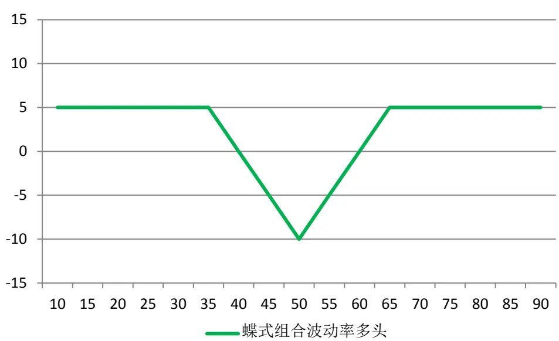
数据来源：广发证券发展研究中心

与跨式组合波动率多头和宽跨式组合波动率多头类似，由于对时间衰减的敏感性较强，蝶式组合波动率多头往往适用于看跌波动率的短线交易（若干个交易日）。

图12：蝶式组合波动率空头到期盈亏
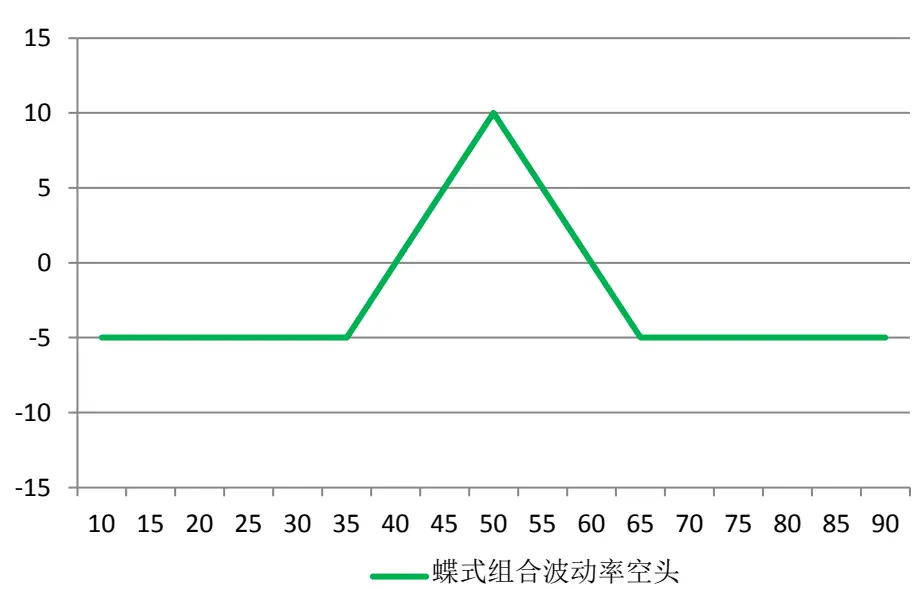
数据来源：广发证券发展研究中心

对于蝶式组合波动率空头，时间衰减对该头寸也产生有利影响。与跨式组合和宽跨式组合不同的是，蝶式组合通过期权对冲，将头寸的亏损风险控制在一定范围内。对于市场出现暴涨暴跌的情况，蝶式组合波动率空头可以更好地控制交易回撤风险。

## （五）秃鹰组合（Condor）

秃鹰组合与蝶式组合有些类似，也是由4份具有相同到期时间、而执行价格不同的期权合约组成。不同的是，其执行价格满足 $X_{1}<X_{2}<X_{3}<X_{4}$ ，且

$X_{1}+X_{4}=X_{2}+X_{3}$ 。在波动率套利中， $X_{1}$ 和 $X_{2}$ 小于标的资产当前价格， $X_{3}$ 和 $X_{\star}$ 大于标的资产当前价格。构建秃鹰组合的波动率多头和波动率空头分别具有以下八种方式。

（1）卖出执行价为 $X_{1}$ 和 $X_{4}$ 的看涨期权各一份，买入执行价为 $X_{2}$ 和 $X_{3}$ 的看涨期权各一份。

（2）卖出执行价为 $X_{\mathrm{1}}$ 和 $X_{4}$ 的看涨期权和看跌期权各一份，买入执行价为 $X_{2}$ 和$X_{3}$ 的看涨期权和看跌期权各一份。

（3）卖出执行价为 $X_{\mathrm{1}}$ 和 $X_{4}$ 的看跌期权和看涨期权各一份，买入执行价为 $X_{2}$ 和$X_{3}$ 的看跌期权和看涨期权各一份。

（4）卖出执行价为 $X_{1}$ 和 $X_{4}$ 的看跌期权各一份，买入执行价为 $X_{2}$ 和 $X_{3}$ 的看跌期权各一份。

（1）买入执行价为 $X_{1}$ 和 $X_{4}$ 的看涨期权各一份，卖出执行价为 $X_{2}$ 和 $X_{3}$ 的看涨期权各一份。

（2）买入执行价为 $X_{1}$ 和 $X_{4}$ 的看涨期权和看跌期权各一份，卖出执行价为 $X_{2}$ 和 $X_{3}$ 的看涨期权和看跌期权各一份。

（3）买入执行价为 $X_{1}$ 和 $X_{4}$ 的看跌期权和看涨期权各一份，卖出执行价为 $X_{2}$ 和$X_{3}$ 的看跌期权和看涨期权各一份。

（4）买入执行价为 $X_{1}$ 和 $X_{4}$ 的看跌期权各一份，卖出执行价为 $X_{2}$ 和 $X_{3}$ 的看跌期权各一份。

秃鹰组合波动率多头与波动率空头的到期收益分别如图 13、图 14所示。

图13：秃鹰组合波动率多头到期盈亏
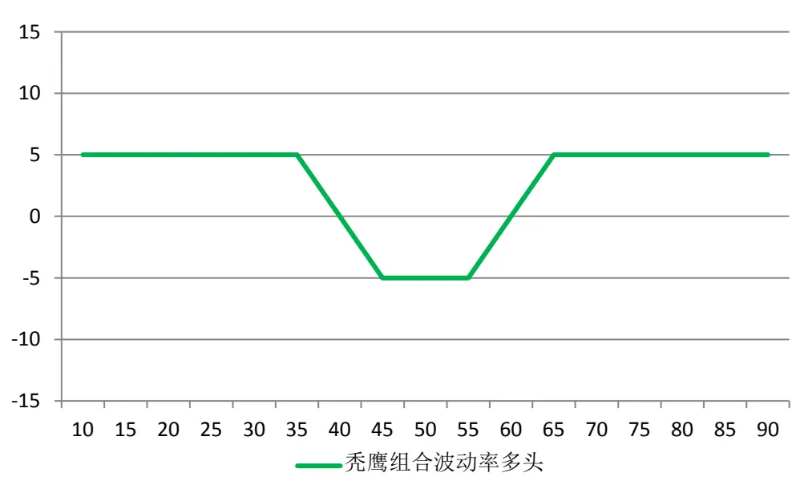
数据来源：广发证券发展研究中心

可以看出，秃鹰组合与蝶式组合的不同之处，在于执行价格居中的两张合约执行价有所不同，并且由此带来的结果是构建波动率多头组合的初始现金流会有所下降。

图14：秃鹰组合波动率空头到期盈亏
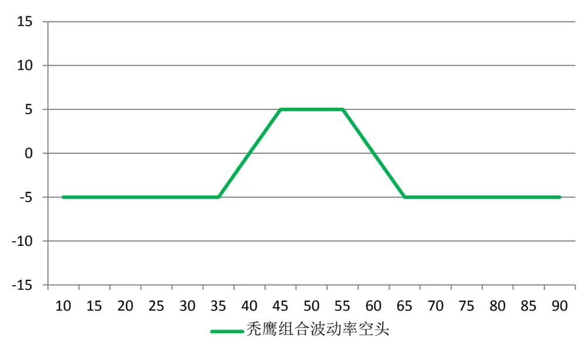
数据来源：广发证券发展研究中心

同样，波动率空头组合的初始投资成本会有所下降，但收益也在一定程度上受到限制（可类比跨式组合与宽跨式组合的异同）。

## （六）比例价差组合（Ratio Spreads）与后价差组合（Back Spreads）

比例价差组合和后价差组合的基本原理是同时买入、卖出不同份数执行价格不同但具有相同到期时间的看涨期权或看跌期权。通过调节买卖数量的比例，在保持delta中性的情况下，可以进行短期的波动率套利。其中，比例价差组合用于沽空隐含波动率，后价差组合用于做多波动率。

后价差组合的构建方式是，通过买入 $a_{2}$ 份执行价格较高（较低）的看涨期权（看跌期权）并卖出 $a_{1}$ 份执行价格较低（较高）的看涨期权（看跌期权），其中 $a_{_1}<a_{_2}$ 所有的期权的到期时间相同。比较典型的一种后价差组合满足 $2a_{1}=a_{2}$ o

比例价差组合的构建方式是，通过买入 $a_{1}$ 份执行价格较低（较高）的看涨期权（看跌期权），卖出 $a_{2}$ 份执行价格较高（较低）的看涨期权（看跌期权），其中 $a_{_1}<a_{_2}$ 所有的期权的到期时间相同。比较典型的一种比例价差组合满足 $2a_{_1}=a_{_2}$ 0

后价差组合（波动率多头）与比例价差组合（波动率空头）的到期收益分别如图 15、图 16所示。

图15：后价差组合（波动率多头）到期盈亏
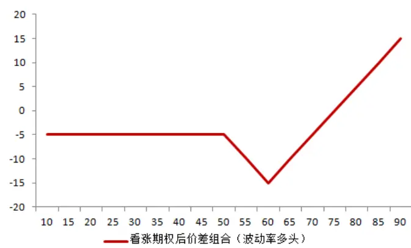

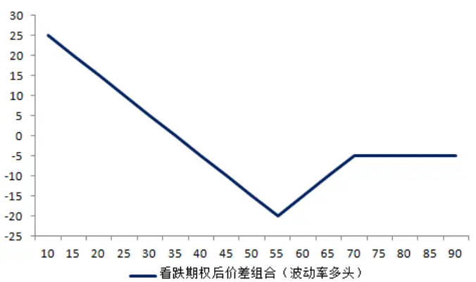
数据来源：广发证券发展研究中心

后价差组合不但要考虑到基础资产价格移动的方向，尤其在后价差组合买入期权数量较多的时候，更要判断价格移动的速度。相比纯粹赌波动的跨式组合，后价差期权组合要更加便宜，但其除了要求投资者判断出正确的方向，还要求投资者能正确的解读标的资产价格变化的快慢。以看涨期权的后价差组合为例，对收益起主要作用的是买入的看涨期权，卖出的看涨期权主要用来为买入融资，降低买入的成本，提高收益率。

图16：比例价差组合（波动率空头）到期盈亏
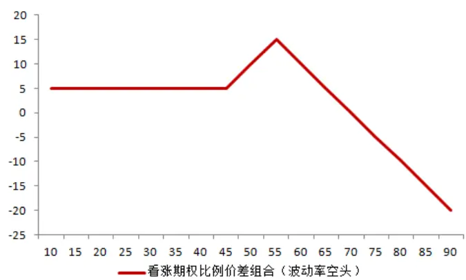
数据来源：广发证券发展研究中心

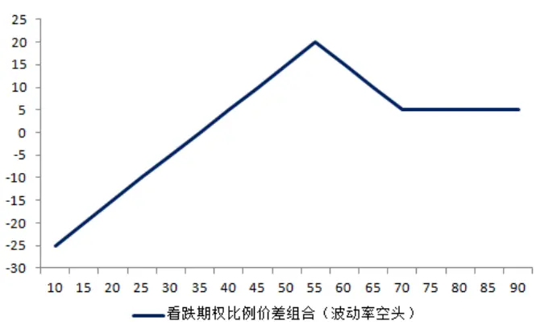

同理，在比例价差组合中，以看涨期权为例，买入的看涨期权起相对主导作用，卖出的看涨期权用来降低买入的成本，提高收益率。

## （七）圣诞树组合（Christmas Tree Spread）

圣诞树组合实际是对比例价差组合和后价差组合的一种推广。在比例价差组合和后价差组合当中，通常买入或者卖出较多的期权合约具有相同的执行价格，例如可以通过买入 2份执行价格较高的看涨期权并卖出1 份执行价格较低的看涨期权构建波动率多头。而在圣诞树组合中，通常买入或卖出数量较多的期权合约，其执行价也不尽相同。同样的，在构建波动率套利组合的时候，通过调整不同合约的头寸数量保持整个组合的 delta中性状态。

（1）一种典型看涨期权圣诞树组合（波动率多头）的构建方式是，通过买入1份执行价格为 $X_{1}$ 、1 份执行价格为 $X_{2}$ 的看涨期权并卖出 1份执行价格为 $X_{3}$ 的看涨期权，其中 $X_{1}>X_{2}>X_{3}$ ，所有期权的到期时间相同。

（2）一种典型的看跌期权圣诞树组合（波动率多头）的构建方式是，通过买入1份执行价格为 $X_{3}$ 、1份执行价格为 $X_{2}$ 的看跌期权并卖出1 份执行价格为 $X_{1}$ 的看跌期权，其中 $X_{1}>X_{2}>X_{3}$ ，所有期权的到期时间相同。

（1）一种典型的看涨期权圣诞树组合（波动率空头）的构建方式是，通过卖出1份执行价格为 $X_{1}$ 、1份执行价格为 $X_{2}$ 的看涨期权并买入1 份执行价格为 $X_{3}$ 的看涨期权，其中 $X_{1}>X_{2}>X_{3}$ ，所有期权的到期时间相同。

（2）一种典型的看跌期权圣诞树组合（波动率空头）的构建方式是，通过卖出1份执行价格为 $X_{3}$ 、1份执行价格为 $X_{2}$ 的看跌期权并买入1 份执行价格为 $X_{1}$ 的看跌期权，其中 $X_{1}>X_{2}>X_{3}$ ，所有期权的到期时间相同。

圣诞树组合的波动率多头与波动率空头到期收益分别如图 17、图 18所示。

图17：圣诞树组合（波动率多头）到期盈亏
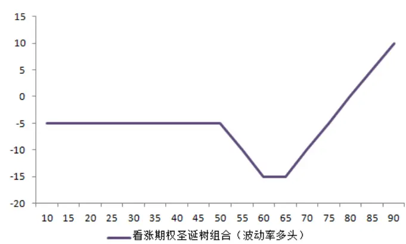
数据来源：广发证券发展研究中心

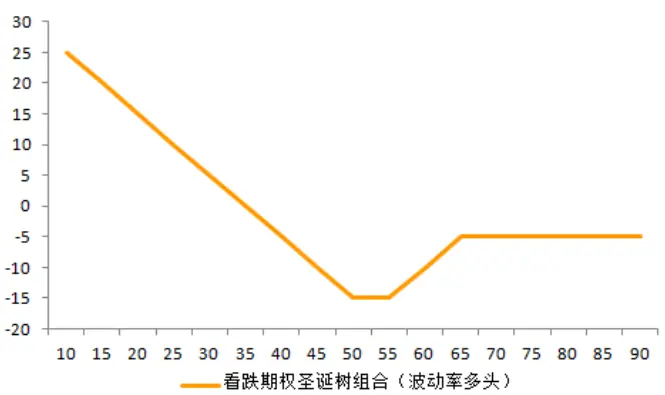

可以类比跨式组合与宽跨式组合，或蝶式组合与秃鹰组合——圣诞树组合也是在后价差组合与比例价差组合的基础之上，在通过降低期权组合构建成本的同时，降低了潜在收益。

图18：圣诞树组合（波动率空头）到期盈亏
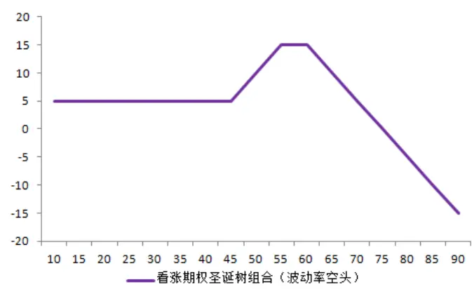
数据来源：广发证券发展研究中心

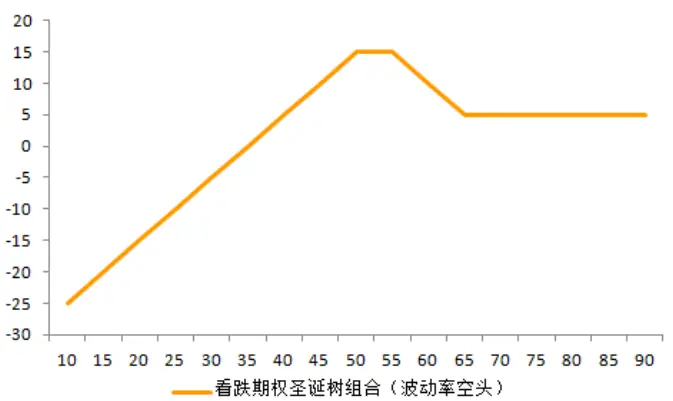

## （八）跨期组合（Calendar Spread）与对角组合（Diagonal Spread）

上述介绍的组合都是基于不同执行价格的期权所组成的头寸。但实际上还可以通过具有相同执行价、不同到期时间的期权组成 delta中性的投资组合进行波动率交易。

从期权的性质可以知道，在相同的执行价格下，期权的到期时间越短，其隐含波动率往往越高。因此我们可以卖空接近到期的期权，同时买入离到期日较远的期权，实现相对波动率交易（Relative-value Volatility Trading）。

跨期组合是一种最为常见的相对波动率交易策略，其构建方式为：卖空接近到期的（波动率较高的）期权，买入远离到期日的（波动率较低的）同种期权。但是这样的波动率交易并非完全 delta 中性的。

更好的办法是构建一个对角组合，即分别买入和卖出到期时间和执行价格均不相同的两张期权合约，但通过调整四个参数，可以保持组合的 delta中性。例如，可以卖空接近到期的虚值看涨期权，同时买入远离到期日的平价看涨期权。这样一来，既可以通过不同到期时间所产生的隐含波动率差异进行波动率交易，又可以从不同执行价格所引起的波动率偏离中进行套利，可以算得上是两全其美。

## （九）跨品种波动率套利（Cross-asset Volatility Trading）

跨品种波动率套利往往发生在相关性较强的两个期权品种上，例如黄金商品期权和黄金 ETF期权，当计算发现具有相同期限和相同执行价格（或等价执行价格）的隐含波动率不同时，可以通过卖出隐含波动率较高的期权、买入隐含波动率较低的期权进行套利。不过国内市场即将推出的股票期权和股指期权尚不具备跨品种套利的条件，我们这里不做过多讨论。

## （十）离差交易（Dispersion Trading）

离差交易是指交易成分股和指数之间的相对波动率，例如与指数对应的一揽子成分股的期权隐含波动率与指数期权的隐含波动率相差较多时（成分股平均隐含波动率的加权方法可以参考文献 Relative implied-volatility arbitrage with indexoptions, M Ammann and S Herriger, Financial Analysts Journal, 2002），可以做空波动率较高的指数期权（或期权组合）、做空波动率较低的期权组合（或指数期权）进行波动率套利。该方法目前在国内市场也不太适用，因此也不做过多展开。

## 六、总结

从海外波动率对冲基金的运作情况来看，目前大多数波动率对冲基金的投资方式仍然是通过组合各类期权，在保持 delta中性的情况下，对波动率进行做多或做空交易。从海外的一些波动率对冲基金案例可以看出，波动率交易策略的风险收益比并不是十分理想，特别是在 2013年全球波动率下滑的情况下，该类产品的盈利显著下滑。不过，由于波动率交易和其他投资策略的相关性较低，可以将其作为投资的一类辅助策略。在不易对市场趋势做出判断、但波动率被明显低估或高估的情况下，波动率交易有望为产品带来可观的收益。

## 风险提示

隐含波动率虽然具有一定的均值回复特性，但同其它套利交易策略一样，其回复的反转点并没有绝对性规律。因此，波动率套利并非无风险投资策略。

1998 年，著名的海外对冲基金长期资本（Long-term Capital）在 S&P500 指数隐含波动率高企的情况下决定进行卖空波动率交易。但是在此之后，隐含波动率持续走强，长期资本在几次追加投资、摊薄成本之后，终于无法与持续上涨的波动率抗衡，以波动率交易巨亏15 亿美元收场。这是全球历史上对于波动率套利风险失控的典型案例之一。

因此，从全球波动率交易对冲基金的运作情况来看，波动率套利交易不能算得上是一种低风险的交易策略。所以在相关交易过程中，投资者要注意其可能带来的各种风险。

## Table_Res arch 广发金融工程研究小组

罗 军： 首席分析师，华南理工大学理学硕士，2010年进入广发证券发展研究中心。

俞文冰： 首席分析师，CFA，上海财经大学统计学硕士，2012年进入广发证券发展研究中心。

叶 涛： 资深分析师，CFA ，上海交通大学管理科学与工程硕士，2012年进入广发证券发展研究中心。

安宁宁： 资深分析师，暨南大学数量经济学硕士，2011年进入广发证券发展研究中心。

胡海涛： 分析师， 华南理工大学理学硕士， 2010年进入广发证券发展研究中心。

夏潇阳： 分析师， 上海交通大学金融工程硕士， 2012年进入广发证券发展研究中心。

蓝昭钦： 分析师，中山大学理学硕士， 2010年进入广发证券发展研究中心。

史庆盛： 分析师，华南理工大学金融工程硕士， 2011年进入广发证券发展研究中心。

汪 鑫： 研究助理， 中国科学技术大学金融工程硕士， 2012年进入广发证券发展研究中心。

张 超： 研究助理，中山大学理学硕士， 2012年进入广发证券发展研究中心。

## Table_RatingIndustry 广发证券—行业投资评级说明

买入： 预期未来 12 个月内，股价表现强于大盘 10%以上。

持有： 预期未来12个月内，股价相对大盘的变动幅度介于-10%～+10%。

卖出： 预期未来12个月内，股价表现弱于大盘10%以上。

## Table_RatingCompany 广发证券—公司投资评级说明

买入： 预期未来12个月内，股价表现强于大盘15%以上。

谨慎增持： 预期未来12个月内，股价表现强于大盘5%-15%。

持有： 预期未来12个月内，股价相对大盘的变动幅度介于-5%～+5%。

卖出： 预期未来12个月内，股价表现弱于大盘5%以上。

## Table_Ad联系我们

|  | 广州市 | 深圳市 | 北京市 | 上海市 |
| --- | --- | --- | --- | --- |
| 地址 | 广州市天河北路183号 大都会广场5楼 | 深圳市福田区金田路4018 号安联大厦 15 楼 A 座 | 北京市西城区月坛北街2号 月坛大厦18层 | 上海市浦东新区富城路99号 震旦大厦 18楼 |
|  |  | 03-04 |  |  |
| 邮政编码 | 510075 | 518026 | 100045 | 200120 |
| 客服邮箱 | gfyf@gf.com.cn |  |  |  |
| 服务热线 | 020-87555888-8612 |  |  |  |

## Table_Disclaimer 免 责声 明

广发证券股份有限公司具备证券投资咨询业务资格。本报告只发送给广发证券重点客户，不对外公开发布。

本报告所载资料的来源及观点的出处皆被广发证券股份有限公司认为可靠，但广发证券不对其准确性或完整性做出任何保证。报告内容仅供参考，报告中的信息或所表达观点不构成所涉证券买卖的出价或询价。广发证券不对因使用本报告的内容而引致的损失承担任何责任，除非法律法规有明确规定。客户不应以本报告取代其独立判断或仅根据本报告做出决策。

广发证券可发出其它与本报告所载信息不一致及有不同结论的报告。本报告反映研究人员的不同观点、见解及分析方法，并不代表广发证券或其附属机构的立场。报告所载资料、意见及推测仅反映研究人员于发出本报告当日的判断，可随时更改且不予通告。

本报告旨在发送给广发证券的特定客户及其它专业人士。未经广发证券事先书面许可，任何机构或个人不得以任何形式翻版、复制、刊登、转载和引用，否则由此造成的一切不良后果及法律责任由私自翻版、复制、刊登、转载和引用者承担。