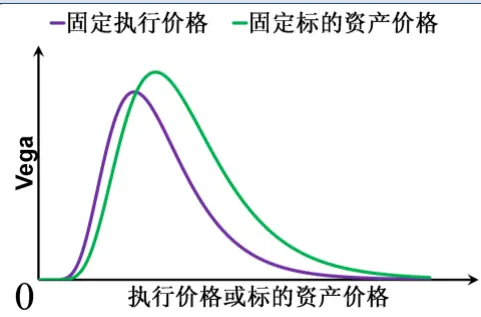
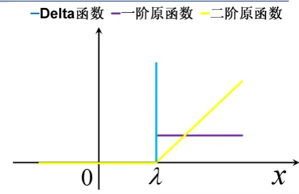
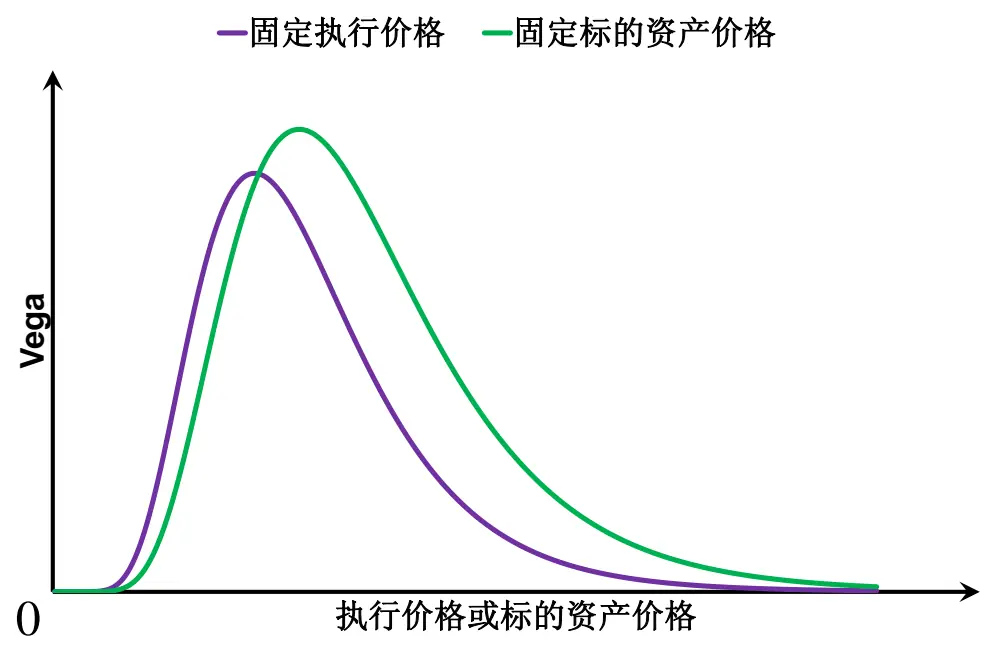
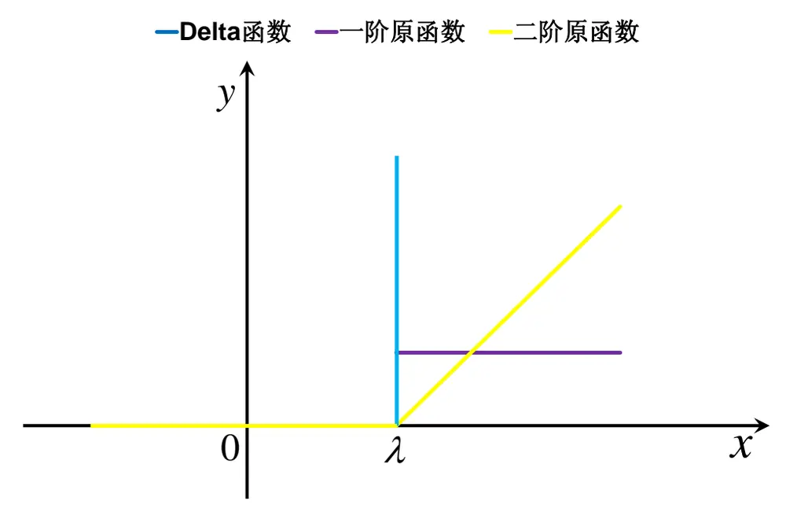

# 无模型隐含波动率的度量方法研究

# 期权系列报告之十三

## 报告摘要：

## BS 期权定价模型

BS期权定价模型是基于市场风险中性假设与无套利定价方法得到的欧式期权定价模型，即由期权与标的资产构建动态无风险组合产生的瞬时收益扣减该组合的瞬时资金成本后的净收益稳定为零，被视为衍生品定价理论的基石，其主要优点可归纳为简单、实用而且易于执行，因此也是应用最为广泛的期权定价模型。

## BS 隐含波动率与波动率曲面

BS隐含波动率是使得期权价值与市场价格一致的波动率。当到期日给定时，BS隐含波动率随执行价格变化产生的曲线被称为“波动率微笑曲线”；当执行价格给定时，BS隐含波动率随剩余期限变化产生的曲线被称为“波动率期限结构”；BS隐含波动率随执行价格和剩余期限变化产生的曲面被称为“隐含波动率曲面”，隐含波动率曲面同时包含了波动率微笑曲线与波动率期限结构。

## 非线性工具的复制

动态复制，动态调整标的资产和无风险资产的数量来复制期权。这类方法的问题在于，如果定价模型存在问题，自然会导致工具复制存在风险。

静态拆分，拆分为线性部分与非线性的高阶部分，但要求是能够找到高阶部分对应的工具载体，优势只需静态持有。

## 无模型隐含波动率的度量

无模型隐含波动不仅包含了历史波动率所包含的信息，而且更加准确的综合了一组同一标的资产、相同到期时间但不同执行价格期权的波动率预测信息。

我们可以从一组期权组合的市场交易价格中抽取投资者对标的资产未来波动率的预期水平，由于这种方法是以期权市场交易价格为计算依据同时又无需先验的设定所使用的期权定价模型以及期权定价模型所需的假设，故被称为“无模型的隐含波动率”。

## 风险提示

本文中所引入的假设以及基于假设所构建的模型，均是对所要研究问题的主要矛盾以及矛盾主要方面的一种抽象，因此模型以及基于模型所得出的相关结论并不能完全准确的刻画现实环境与预测未来。

图 1：Vega 最大值

数据来源：Wind资讯、广发证券发展研究中心

图 2：Delta 函数与其原函数

数据来源：Wind资讯、广发证券发展研究中心

分析师：叶涛S0260512030002

021-60750623

yetao@gf.com.cn

分析师：夏潇阳 S0260512030005

021-60750625

xxy2@gf.com.cn

联系人：汪鑫gfwangxin@gf.com.cn

## 一、基于 BS模型的隐含波动率

## 1.1 BS 期权定价模型的假设与形式

BS期权定价模型是基于市场风险中性假设与无套利定价方法得到的欧式期权定价模型，即由期权与标的资 $-\frac{\triangledown\cdot\triangledown}{\triangledown^{\prime}}$ 构建动态无风险组合产生的瞬时收益扣减该组合的瞬时资金成本后的净收益稳定为零，被视为衍生品定价理论的基石，其主要优点可归纳为简单、实用而且易于执行，因此也是应用最为广泛的期权定价模型。

BS期权定价模型所用到的假设：

（1）标的资产的价格服从几何布朗运动。

（2）标的资产可连续交易。

(3)在合约期限内市场无风险利率为常数，且投资者可以按市场无风险利率无 限借贷。

（4）标的资产在合约期限内无现金或者其他形式的利润分配。

（5）标的资产与期权合约均无交易成本。

（6）标的资产可卖空。

由以上假设可以得到基于BS定价模型的看涨期权与看跌期权的定价形式：

$$
\left\{\begin{array}{l}{{C_{t}^{\phantom{ss}}=\exp\left(-r_{f}^{\phantom{}}(T-t)\right)(F_{t}^{\phantom{}T}\cdot\Phi\left(d\right)-X\cdot\Phi\left(d-\sigma\sqrt{T-t}\right))}}\\{{\phantom{\frac{1}{2}}}}\\{{P_{t}^{\phantom{}}=\exp\left(-r_{f}^{\phantom{}}(T-t)\right)(X\cdot\Phi\left(\sigma\sqrt{T-t}-d\right)-F_{t}^{\phantom{}T}\cdot\Phi\left(-d\right))}}\end{array}\right.\tag{式(1}
$$

其中：t为当期时刻，T为期权合约的到期时刻， $\boldsymbol{F}_{t}^{\phantom{\dagger}T}$ 为标的资产 $\boldsymbol{S}_{\iota}$ 的理论远期价格，即 $\boldsymbol{F_{t}^{\textit{ T }}}=\boldsymbol{S_{t}}\cdot\mathbf{exp}\left(\boldsymbol{r_{f}}\left(T-t\right)\right)$ $d={\frac{\ln{\left({\boldsymbol{F}}_{t}^{T}\left/X\right.\right)}}{\sigma{\sqrt{T-t}}}}+{\frac{1}{2}}\sigma{\sqrt{T-t}}$ ，Φ(·) 为标准正态分布的概率分布函数。

## 1.2 BS 隐含波动率

在BS期权定价模型中标的资产的价格、执行价格与剩余期限对于每一个交易者都是相同的，而市场无风险利率的取值差别也不会很大，因此标的资产波动率就成为最关键的参数。

由BS期权定价模型可知期权的价值对标的资 $\cdot\vec{j^{z}}$ 波动率变动的敏感性为：

$$
Vega_{_t}^{^{BS}}=S_{_t}\cdot\Phi^{\prime}\bigl(d\mathbf{\Sigma}\bigr)\sqrt{T-t}\tag{式(2}
$$

由式（2）可以得到：

$$
\begin{array}{c}\begin{array}{l}{\displaystyle|{\mathbf{\Psi}}_{\forall}\mathbf{\mathbf{\Psi}}>0,S_{t}^{*}=\mathop{\mathrm{arg~max}}_{s_{t}>0}\{Vega_{t}\}=X\cdot\exp((\frac{\sigma^{2}}{2}-r_{f})(T-t))}\\{\displaystyle|{\mathbf{\Psi}}_{\forall}S_{t}>0,X^{*}=\mathop{\mathrm{arg~max}}_{x>0}\{Vega_{t}\}=S_{t}\cdot\exp((\frac{\sigma^{2}}{2}+r_{f})(T-t))}\\{\displaystyle|{\mathbf{\Psi}}_{\forall}S_{t}>0,X^{*}=\mathop{\mathrm{arg~max}}_{x>0}\{Vega_{t}\}=S_{t}\cdot\exp((\frac{\sigma^{2}}{2}+r_{f})(T-t))}\end{array})\end{array}\tag{式(3}
$$

图1：Vega最大值

数据来源：Wind资讯、广发证券发展研究中心

由式（3）可知：

（1）对于给定的期权，当标的资产价格 $S_{_t}=X\cdot\exp\left(\frac{\sigma^{2}}{2}-r_{_f})(T-t)\right)$ 时，期权的价值对于标的资产波动率变动的敏感性达到最大值。

（2）对于给定的标的资产，当执行价格 $X\ =\ S_{_t}\cdot\exp\left((\frac{\sigma^{2}}{2}+r_{_f})(T\ -\ t)\ \right)$ 时，期权价值对于标的资产波动率变动的敏感性达到最大值。

期权的价值总是关于标的资产波动率的严格单调增函数，那么当某个期权的价格给定时，我们就可以由BS期权定价模型唯一的计算出对应的波动率数值，我们将其称为基于BS定价模型的隐含波动率。

期权的价值应当由标的资产未来的实现波动率决定，BS隐含波动率是使得期权价值与市场价格一致的波动率。期权市场价格的形成是交易双方相互博弈的结果，因此BS隐含波动率反映了市场投资者对未来波动率的预期。同时，期权本身也是BS隐含波动率的一种映射，期权的市场价格直接反映了波动率的市场价格，因此期权

识别风险，发现价值

交易的本质就是投资者对波动率的交易。

## 1.3 波动率曲面

BS期权定价模型假设标的资产的价格变动服从几何布朗运动且标的资产的波动率常数，如果这一假设能够成立，那么在同一时点上相同标的资产的期权都应该隐含相同的波动率价格，即BS隐含波动率都完全相同。但事实上，对于同一标的资产但执行价格与到期日不同的期权，BS隐含波动率一般并不相同。当到期日给定时，BS隐含波动率随执行价格变化产生的曲线被称为“波动率微笑曲线”；当执行价格给定时，BS隐含波动率随剩余期限变化产生的曲线被称为“波动率期限结构”；BS隐含波动率随执行价格和剩余期限变化产生的曲面被称为“隐含波动率曲面”，隐含波动率曲面同时包含了波动率微笑曲线与波动率期限结构。

受到套利机制的约束，期权平价关系的成立与定价模型的假设与形式无关：

$$
\left\{\begin{array}{l}{C_{t}^{^{BS}}+X\cdot\exp\left(r_{f}\left(T-t\right)\right)=P_{_t}^{^{BS}}+S_{_t}}\\{\qquad\Rightarrow C_{_t}-C_{_t}^{^{BS}}=P_{_t}-P_{_t}^{^{BS}}}\\{C_{_t}+X\cdot\exp\left(r_{f}\left(T-t\right)\right)=P_{_t}+S_{_t}}\end{array}\right.\Rightarrow C_{_t}-C_{_t}^{^{BS}}=P_{_t}-P_{_t}^{^{BS}}\tag{式(4}
$$

那么由式（4）可知：对于同一标的资产、相同执行价格和到期日的看涨与看跌期权所对应的波动率微笑曲线具有对称性。

波动率微笑的成因：

## （1）投机性行

大多数投资者一般都预期在给定时间段内标的资产发生剧烈变动的可能性不大，因此在对于同一标的资产且到期日相同的期权中，处于接近平价状态的期权成交最为活跃，其交易量的占比很高。而对于那些愿意买入处于深度价外状态期权的投资者，往往是期待标的资产发生不可预知的剧烈波动，这种剧烈波动足以使得所持有的期权发生根本性的价值状态变化，因此深度价外期权的BS隐含波动率往往处于被膨胀的状态。同时，由于期权平价关系的存在，致使BS隐含波动率曲线呈现出“微笑”。

## （2）供需不平衡

投资者一般并不乐意去卖出一个深度价内的期权，除非他预期标的资产价格将出现根本性的方向变动，因此深度价内期权的供给相对较少，从而导致过高的溢价，BS隐含波动率被膨胀，同样是由于期权平价关系的存在致使BS隐含波动率曲线呈现出微笑。

## （3）标的资产的价格分布

BS期权定价模型假设标的资产到期日的价格服从对数正态分布，那么对应的收益率应当服从正态分布，但实际的收益率分布相对于正态分布具有更厚的尾部，因此标的资产出现非正常价格波动的概率会高于理论值。由此可知，BS期权定价模型必然是低估了深度价内与深度价外期权在到期日发生行权的概率和当期的价值，因此投资者的纠偏行为致使BS隐含波动率曲线呈现出微笑。

## 二、无模型隐含波动率的度量

## 2.1 两类隐含波动率的差异

期权价格反映了市场投资者对未来波动率的预期，如果假设期权市场有效且BS期权定价模型是正确的，那么BS隐含波动率应当包含了过去的已实现波动率的所有波动率预测信息。

一般对于未来波动率的预测能力是通过波动率的预测值与未来真实的波动率之间的相关性分析来检验的，而不同预测方法之间是否相互包含波动率预测信息的检验则是通过包含回归来完成的。

在对于同一标的资产、相同到期日的期权中，处于接近平价状态的期权成交最为活跃，因此平价期权的BS隐含波动率的波动率预测信息会更为有效。由于BS期权定价模型本身的缺陷，价内和价外期权的BS隐含波动率的波动率预测信息被混入了大量的噪声，但如果仅对平价期权提取BS隐含波动率的波动率预测信息又会造成信息漏损。为了解决BS隐含波动率所存在的问题，我们以下将引入不以任何一种期权定价模型为基础的无模型隐含波动率。

无模型隐含波动率是基于市场风险中性假设，由无套利定价关系直接从同一标的资产且相同到期日的看涨与看跌期权的市场价格中提取波动率的预测信息。无模型隐含波动不仅包含了历史波动率所包含的信息，而且更加准确的综合了同一标的资产、相同到期日但不同执行价格期权的波动率预测信息。

## 2.2 波动率交易工具

当合约条款给定时，标的资产的价格和标的资产的波动率就成为影响期权价值变动最主要的2个不确定因素。理论上，我们基于BS期权定价模型可以由期权以及期权对应的标的资产基于Delta对冲构建风险中性组合，从而可以剥离标的资产价格变动对期权价值的影响，而保留标的资产波动率对期权价值的影响部分，使得期权成为真正的波动率交易工具。但实际上，由于BS期权定价模型的假设与现实状况有距离，都使得期权的Delta对冲无法纯净的剥离两种价值变动因素的影响。

波动率互换与波动率方差互换是可以直接对标的资产未来波动率进行远期交易的两类工具。尽管以波动率报价更为常见，但是波动率方差具有可加性等优点，因此在模型构建中使用波动率方差则更为直接和方便。

首先，我们放松BS期权定价模型中对于标的资产价格波动的假设，不再限制标的资产的瞬时漂移率和瞬时波动率为已知的常数，而是某个时变的量。

令波动率方差互换合约当期时点t时刻的期末交割价格为 $\boldsymbol{\sigma}_{x,t}^{2}$ ，合约的名义本金

为 $N^{^{\sigma^{2}}}$ ，到期日为T。在当期时点t时刻，这份合约多头部位的期末收益在风险中性

环境下的现值 ${V_{t}}^{\sigma^{2}}$

$$
V_{_t}^{\sigma^{2}}=E_{_t}\underset{\left\lfloor\begin{array}{l}{1}\\{\frac{d}{d_{t}}\left(T-t\right)}\end{array}\right\rfloor}{\overset{\sim}{\operatorname{F}}}(-r_{_f}\left(T-t\right)\right)(\frac{\displaystyle\int_{t}^{T}\sigma_{_{\varepsilon}}^{^2}\cdot d\varepsilon}{T-t}-\sigma_{_{X,t}}^{^2})\boldsymbol{N}^{\sigma^{2}}\underset{}{\overset{\left.}{\operatorname{F}}}\tag{式(5}
$$

由式（5）可以得到这份波动率方差互换合约的合理定价：

$$
\sigma_{_{X,t}}^{2}=\tilde{\sigma}_{_{[t,T]}}^{2}=\frac{E_{\scriptscriptstyle t}\bigg[\displaystyle\int_{t}^{T}\sigma_{_{\varepsilon}}^{2}\cdot d\varepsilon\bigg]}{T-t}\tag{式(6}
$$

波动率方差互换的合理定价反映了对市场对标的资产未来波动率的预期，但难点在于未来波动率并没有直接的工具，而且标的资产的瞬时漂移率是时变的且也不恒等于市场的无风险利率，那么用什么方法来复制未来波动率？

由式（6）可以得到波动率的一种复制方法：

$$
\begin{array}{rl}&{\left\{\begin{array}{ll}{dS_{t}=S_{t}(\mu_{t}\cdot dt+\sigma_{t}\cdot dW_{t})}\\{\ }\\{\displaystyle\left\{\begin{array}{ll}{d\ln\big(S_{t}\big)=(\mu_{t}-\frac{1}{2}\sigma_{t}^{2})dt+\sigma_{t}\cdot dW_{t}}\end{array}\right.}\\{\displaystyle\Rightarrow\int_{t}^{T}\sigma_{\varepsilon}^{2}\cdot d\varepsilon=2(\int_{t}^{T}\frac{dS_{\varepsilon}}{S_{\varepsilon}}-\ln\Big\{\frac{S_{T}}{S_{t}}\Big\})}\end{array}\right.}\end{array}\tag{式(7}
$$

由式（7）可知，标的资产的未来波动率可以通过两种持仓方式来复制：

（1）动态调整标的资产的持有数量使得标的资产持有市值保持不变。

（2）做空标的资产的对数远期合约。

## 2.3 非线性工具的复制

尽管我们找到了标的资产未来波动率的复制方法，但在现实环境下对数远期合约并不常见，因此流动性必然也是个问题。当非线性工具流动性存在问题，或者甚至是没有的时候，复制这种工具就成了唯一的办法。

非线性工具复制的两种思路：

1、动态复制，动态调整标的资产和无风险资产的数量来复制期权。这类方法的问题在于，如果定价模型存在问题，自然会导致工具复制存在风险。

2、静态拆分，拆分为线性部分与非线性的高阶部分，但要求是能够找到高阶部分对应的工具载体，优势在于只需静态持有。

对于对数远期合约我们将采用静态拆分方法，将对数远期合约分解为线性部分和非线性的高阶部分。令对数远期合约当期时点t时刻的期末交割价格为 $\ln{\left(S_{x,t}\right)}$合约的名义本金为 $N^{^{\ln(s)}}$ ，合约到期日为T，那么这份合约的多头部位在到期日的收益 $V_{_T}^{_{[n(S)}}$

$$
V_{_T}^{^{\ln(s)}}=\left(\ln\left(S_{_T}\right)-\ln\left(S_{_{X,t}}\right)\right){\cal N}^{^{\ln(s)}}\tag{式(8}
$$

由光滑函数基于DiracDelta函数的分解形式和式（8）可以得到：

$$
\frac{V_{T}^{\ln(s)}}{N^{\ln(s)}}=\frac{S_{_T}-S_{_{X,t}}}{S_{_{X,t}}}-\int_{0}^{s_{_{X,t}}}\frac{\left(x-S_{_{T}}\right)^{+}}{{X^{\mathrm{~2~}}}}\cdot dX-\int_{s_{_{X,t}}}^{+\infty}\frac{\left(S_{_T}-X\right)^{+}}{{X^{\mathrm{~2~}}}}\cdot dX\tag{式(9}
$$

对光滑函数基于DiracDelta函数的分解感兴趣的投资者可参见本文的第三部分我们对于DiracDelta函数的基本性质与光滑函数分解形式的推导过程都由详细的论述。

对数远期合约可以由三类工具进行复制：

(1)所有到期日相同且执行价格高于期末交割交割的标的资产看涨期权空头组 合，每个期权的配置数量均为执行价格平方的倒数。

(2)所有相同到期日且执行价格低于期末交割价格的标的资产看跌期权空头组 合，每个期权的配置数量均为执行价格平方的倒数。

(3)相同到期日和期末交割价格的远期合约的多头，合约份数为期末交割价格的倒数。

## 2.4 无模型隐含波动率

由式（7）和式（9）可以得到：

$$
\tilde{\sigma_{[t,T]}}^{2}=\frac{2}{T-t}[r_{f}\left(T-t\right)-\ln\frac{S_{x,t}}{S_{t}}-E_{t}\left|\ln\left(\frac{S_{T}}{S_{x,t}}\right)\right|]\tag{式(10}
$$

由式（9）和式（10）可以得到：

$$
\begin{array}{l}{\displaystyle{\tilde{\sigma}_{[t,T]}^{2}=\frac{2}{T-t}[\ln\left(\frac{F_{t}}{S_{x,t}}\right)-\frac{F_{t}-S_{x,t}}{S_{x,t}}}}\\{\displaystyle{~+\exp\left(r_{t}(T-t)\right)(\int_{0}^{s_{x,t}}\frac{P\left(S_{t},X\right)}{{X^{2}}}\cdot dX+\int_{s_{x,t}}^{+\infty}\frac{C\left(S_{t},X\right)}{{X^{^2}}}\cdot dX)]}}\end{array}\tag{式(11}
$$

## 三、Dirac Delta 函数

若某一随机变量X服从期望为λ、方差为 $\sigma^{2}$ 的正态分布，该随机变量的概率密度函数记为 $\phi\left(\boldsymbol{x},\lambda,\sigma\right)$ ，那么定义Dirac Delta函数 $\delta(x-\lambda)=\operatorname*{lim}_{\sigma0^{+}}\phi(x,\lambda,\sigma)$ Delta函数的基本性质列举：

性质1: $\delta\left(x-\lambda\right)=\delta\left(\lambda-x\right)={\left\{\begin{array}{ll}{+\infty,x=\lambda}\\{}\\{0,}&{x\neq\lambda}\end{array}\right.}$

性质2: $\begin{array}{rl}&{\left\{\begin{array}{ll}{\displaystyle\int_{-\infty}^{+\infty}\delta\left(x-\lambda\right)dx=1}\\{\displaystyle\int_{-\infty}^{y}\delta\left(x-\lambda\right)dx=1\left(y\geq\lambda\right)}\end{array}\right.}\\&{\left\{\begin{array}{ll}{\displaystyle\int_{-\infty}^{+\infty}\delta\left(x-\lambda\right)dx=1\left(y\leq\lambda\right)}\\{\displaystyle\int_{y}^{+\infty}\delta\left(x-\lambda\right)dx=1\left(y\leq\lambda\right)}\end{array}\right.}\\&{\left\{\begin{array}{ll}{\displaystyle\int_{-\infty}^{z}\left(\int_{-\infty}^{y}\delta\left(x-\lambda\right)dx\right)dy=\left(z-\lambda\right)^{+}}\\{\displaystyle\int_{-\infty}^{+\infty}(\int_{y}^{+\infty}\delta\left(x-\lambda\right)dx)dy=\left(\lambda-z\right)^{+}}\end{array}\right.}\\&{\left\{\begin{array}{ll}{\displaystyle\int_{z}^{+\infty}\delta\left(\frac{1}{y}\right)^{d}\delta\left(x-\lambda\right)dx)dy=\left(\lambda-z\right)^{+}}\end{array}\right.}\end{array}$

性质3: $f\left(\lambda\right)=\int_{a}^{b}f\left(x\right)\cdot\delta\left(x-\lambda\right)dx$ $\lambda\in\left[a,b\right]$ 性质4: $\scriptstyle\|\begin{array}{l}{{\scriptstyle1}(x\leq{\lambda})_{x}^{*}=\delta(x-{\lambda})}\\\scriptstyle\|\begin{array}{l}{{\scriptstyle1}(x\leq{\lambda})_{x}^{*}=-\delta(x-{\lambda})}\\{{\scriptstyle{\|\begin{array}{l}{{\scriptstyle(x-{\lambda}\end{array}})_{y}^{*}=1(x\leq{\lambda})}}\\{{\scriptstyle{\|\begin{array}{l}{{\scriptstyle(x-{\lambda}\end{array}})_{y}^{*}=-1(x\leq{\lambda})}}\\{{\scriptstyle{\|\begin{array}{l}{{\scriptstyle1}(x-x)_{y}^{*}=-1(x\leq{\lambda})}}\\{{\scriptstyle{\|\begin{array}{l}{{\scriptstyle1}(x-{\lambda})_{y}^{*}=\delta(x-{\lambda})}}\end{array}}}}\end{array}}}}}\\{{\scriptstyle{\|\begin{array}{l}{{\scriptstyle{\|\begin{array}{l}{{\scriptstyle{(x-x)_{x}^{*}=\delta(x-{\lambda})}}\\{{\scriptstyle{\|\begin{array}{l}{{\scriptstyle1}(x-x)_{y}^{*}=-\delta(x-{\lambda})}}\end{array}}}}}}\end{array}}}}\end{array}}}\end{array}\end{array}$

图2：Delta函数、一阶、二阶原函数

数据来源：Wind资讯、广发证券发展研究中心

在(0,+∞)内定义某个光滑函数f(y)，即f(y)在(0,+∞)内处处二阶可导，并令 ${\boldsymbol{y}}^{*}\in\left(0,+\infty\right)$ ，那么由性质3可以到的：

$$
\begin{array}{l}{f\left(\boldsymbol{y}\right)=\displaystyle\int_{0}^{+\infty}f\left(\boldsymbol{x}\right)\cdot\delta\left(\boldsymbol{x}-\boldsymbol{y}\right)d\boldsymbol{x}}\\{=\displaystyle\int_{0}^{\boldsymbol{y}^{*}}f\left(\boldsymbol{x}\right)\cdot\delta\left(\boldsymbol{x}-\boldsymbol{y}\right)d\boldsymbol{x}+\displaystyle\int_{\boldsymbol{y}^{*}}^{+\infty}f\left(\boldsymbol{x}\right)\cdot\delta\left(\boldsymbol{x}-\boldsymbol{y}\right)d\boldsymbol{x}}\end{array}\tag{式(12}
$$

由性质4对式（12）中的第一项连续使用两次分部积分可以得到：

$$
\begin{array}{rl}&{\int_{0}^{x^{\prime}}f(x)\cdot\delta(x-y)\cdot dx}\\&{=\int_{0}^{x^{\prime}}f(x)\cdot d(1(x\ge y))}\\&{=f(x)\cdot1(x\ge y)|_{0}^{x^{\prime}}-\int_{0}^{x^{\prime}}(x\ge y)\cdot f^{\prime}(x)\cdot dx}\\&{=f(y^{*})\cdot1(y^{*}\ge y)-\int_{0}^{x^{\prime}}f^{\prime}(x)\cdot d((x-y)^{\prime})}\\&{=f(y^{*})\cdot1(y^{*}\ge y)-f^{\prime}(x)\cdot(x-y)^{*}|_{0}^{x^{\prime}}+\int_{0}^{x^{\prime}}(x-y)^{*}\cdot f^{*}(x)\cdot dx}\\&{=f(y^{*})\cdot1(y^{*}\ge y)-f^{\prime}(y^{*})\cdot(y^{*}-y)^{*}+\int_{0}^{x^{\prime}}(x-y)^{*}\cdot f^{*}(x)\cdot dx}\\&{=f(y^{*})\cdot1(y^{*}\ge y)-f^{\prime}(y^{*})\cdot(y^{*}-y)^{*}+\int_{0}^{x^{\prime}}(x-y)^{*}\cdot f^{*}(x)\cdot dx}\end{array}\tag{式(13}
$$

同样由性质4对式（12）中的第二项也连续使用两次分部积分可以得到：

$$
\begin{array}{rl}&{\int_{\gamma^{\prime}}^{\infty}f\left(x\right)\cdot\delta\left(x-y\right)\cdot dx}\\&{=\int_{\gamma^{\prime}}^{\infty}f\left(x\right)\cdot d\left(-1\left(x\leq y\right)\right)}\\&{=-f\left(x\right)\cdot1\left(x\leq y\right)\bigg|_{\gamma^{\prime}}^{\infty}+\int_{\gamma^{\prime}}^{\infty}1\left(x\leq y\right)\cdot f^{\prime}\left(x\right)\cdot dx}\\&{=f\left(y^{*}\right)\cdot1\left(y^{*}\leq y\right)+\int_{\gamma^{\prime}}^{\infty}f^{\prime}\left(x\right)\cdot d\left(-\left(y-x\right)^{*}\right)}\\&{=f\left(y^{*}\right)\cdot1\left(y^{*}\leq y\right)-f^{\prime}\left(x\right)\cdot\left(y-x\right)^{*}\bigg|_{\gamma^{\prime}}^{\infty}+\int_{\gamma^{\prime}}^{\infty}\left(y-x\right)^{*}\cdot f^{*}\left(x\right)\cdot dx}\\&{=f\left(y^{*}\right)\cdot1\left(y^{*}\leq y\right)+f^{\prime}\left(y^{*}\right)\cdot\left(y-y^{*}\right)^{*}+\int_{\gamma^{\prime}}^{\infty}\left(y-x\right)^{*}\cdot f^{*}\left(x\right)\cdot dx}\end{array}\tag{式(14}
$$

将式（13）、式（14）代入式（12）整理后就能得到：

$$
\begin{array}{l}{{f\left(y\right)=f\left(y^{*}\right)+f^{\prime}\left(y^{*}\right)\left(y-y^{*}\right)}}\\{{\ }}\\{{\displaystyle\qquad+\int_{0}^{y^{*}}f^{\prime\prime}\left(x\right)\cdot\left(x-y\right)^{+}\cdot dx+\int_{y^{*}}^{+\infty}f^{\prime\prime}\left(x\right)\cdot\left(y-x\right)^{+}\cdot dx}}\end{array}\tag{式(15}
$$

式（15）即为 $\left(0,+\infty\right)$ 内任意光滑函数基于DiracDelta函数的分解形式。

## 风险提示

本文中所引入的假设以及基于假设所构建的模型，均是对所要研究问题的主要矛盾以及矛盾主要方面的一种抽象，因此模型以及基于模型所得出的相关结论并不能完全准确的刻画现实环境与预测未来。

## 广发金融工程研究小组

罗 军：首席分析师，华南理工大学理学硕士，2010年进入广发证券发展研究中心。

俞文冰：首席分析师，CFA，上海财经大学统计学硕士，2012年进入广发证券发展研究中心。

叶 涛：资深分析师，CFA，上海交通大学管理科学与工程硕士，2012年进入广发证券发展研究中心。

安宁宁：资深分析师，暨南大学数量经济学硕士，2011年进入广发证券发展研究中心。

胡海涛：分析师，华南理工大学理学硕士，2010年进入广发证券发展研究中心。

夏潇阳：分析师，上海交通大学金融工程硕士，2012年进入广发证券发展研究中心。

蓝昭钦：分析师，中山大学理学硕士，2010年进入广发证券发展研究中心。

史庆盛：分析师，华南理工大学金融工程硕士，2011年进入广发证券发展研究中心。

汪鑫：研究助理，中国科学技术大学金融工程硕士，2012年进入广发证券发展研究中心。

张超：研究助理，中山大学理学硕士，2012年进入广发证券发展研究中心。

## 广发证券—行业投资评级说明

买入：预期未来12个月内，股价表现强于大盘10%以上。

持有：预期未来12个月内，股价相对大盘的变动幅度介于-10%~+10%。

卖出：预期未来12个月内，股价表现弱于大盘10%以上。

## 广发证券—公司投资评级说明

买入：预期未来12个月内，股价表现强于大盘15%以上。

谨慎增持：预期未来12个月内，股价表现强于大盘5%-15%。

持有：预期未来12个月内，股价相对大盘的变动幅度介于-5%~+5%。

卖出：预期未来12个月内，股价表现弱于大盘5%以上。

## 联系我们

|  | 广州市 | 深圳市 | 北京市 | 上海市 |
| --- | --- | --- | --- | --- |
| 地址 | 广州市天河北路183号 大都会广场5楼 | 深圳市福田区金田路4018 号安联大厦 15 楼 A 座 | 北京市西城区月坛北街2号 月坛大厦18层 | 上海市浦东新区富城路99号 震旦大厦 18楼 |
|  |  | 03-04 |  |  |
| 邮政编码 | 510075 | 518026 | 100045 | 200120 |
| 客服邮箱 | gfyf@gf.com.cn |  |  |  |
| 服务热线 | 020-87555888-8612 |  |  |  |

## 免责声明

广发证券股份有限公司具备证券投资咨询业务资格。本报告只发送给广发证券重点客户，不对外公开发布。

本报告所载资料的来源及观点的出处皆被广发证券股份有限公司认为可靠，但广发证券不对其准确性或完整性做出任何保证。报告内容仅供参考，报告中的信息或所表达观点不构成所涉证券买卖的出价或询价。广发证券不对因使用本报告的内容而引致的损失承担任何责任，除非法律法规有明确规定。客户不应以本报告取代其独立判断或仅根据本报告做出决策。

广发证券可发出其它与本报告所载信息不一致及有不同结论的报告。本报告反映研究人员的不同观点、见解及分析方法，并不代表广发证券或其附属机构的立场。报告所载资料、意见及推测仅反映研究人员于发出本报告当日的判断，可随时更改且不予通告。

本报告旨在发送给广发证券的特定客户及其它专业人士。未经广发证券事先书面许可，任何机构或个人不得以任何形式翻版、复制、刊登、转载和引用，否则由此造成的一切不良后果及法律责任由私自翻版、复制、刊登、转载和引用者承担。