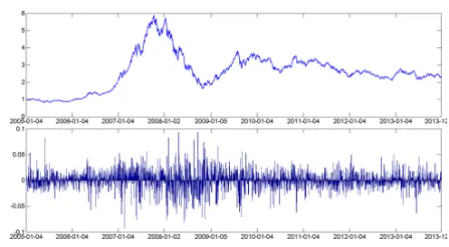
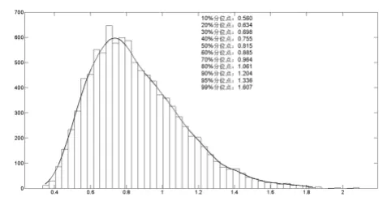
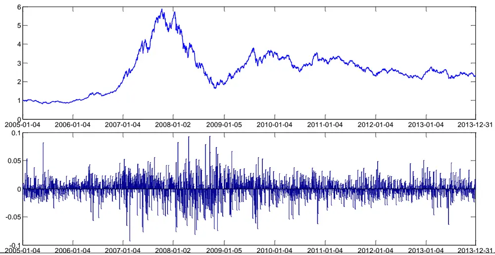
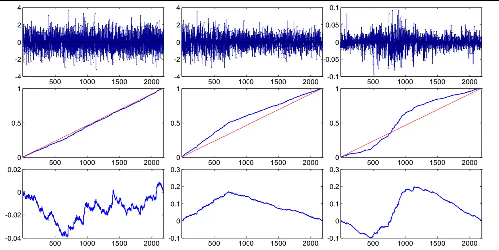
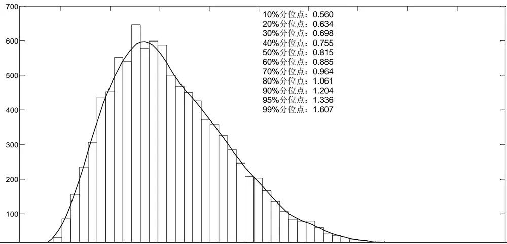
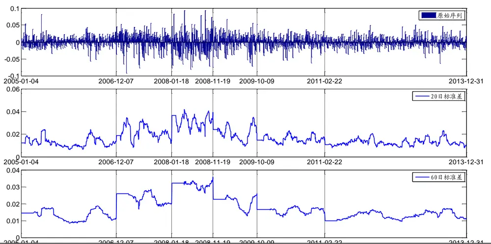

# 波动率突变的检测与应用

## 期权系列报告之十四

## 报告摘要：

## 背景介绍

本篇报告关注的是波动率本身的度量问题。我们使用ICSS 算法寻找波动率的突变点，然后将突变点信息带入到现有的波动率模型中，对现有模型进行修正。

## 累积平方和与波动率突变的检验

我们使用蒙特卡洛模拟的方法获得标准布朗桥运动的最大绝对偏移分位点，将之与原始序列对应统计量进行比较，以此检验原始序列是否发生过波动率突变。使用这种方法，我们发现沪深 300 指数存在显著地波动率突变

## 传统考虑了波动率模型的修正

我们将波动率突变点应用到传统的波动率模型中去，构建分段波动率模型或者在原模型中加入虚拟变量。我们发现，考虑了波动率突变之后，沪深 300指数的波动相关性稍有降低。

## 风险提示

本文所引入的假设以及根据假设所得到的模型，是对复杂的现实市场的某些特性的抽象和简化。因此模型以及基于模型得到的相关结论并不能准确的刻画现实环境或预测未来。

图1 沪深 300指数日收益率

图 2 模拟分布

分析师： 叶 涛 S0260512030002

021-60750623

yetao@gf.com.cn

分析师： 夏潇阳 S0260512030005

公021-60750625

xxy2@gf.com.cn

## 相关研究：

联系人： 汪鑫

gfwangxin@gf.com.cn

## 一、背景介绍

不少研究指出，波动率对收益率有一定的预测作用。在前期的相关基础研究中，我们着重分析了波动率的预测值与未来收益率之间的统计关系，并据此构建了有效的基于波动率的择时策略。在前期研究中，我们将波动率作为其他变量的解释变量。而在本篇报告中，我们将关注点集中到波动率本身。因为，波动率作为风险度量方式，本身就是值得专门研究的对象。

本篇报告中除附录外，所有涉及到具体标的资产的，都是选取沪深300指数为案例。

图1：沪深300指数日收盘价与日涨跌幅序列（起点开盘价调整为1，2005/01/04~2013/12/31）

数据来源：Wind资讯、广发证券发展研究中心

没有经过加工的序列能够提供的信息并不多。图1下方所示的沪深300日收益率，给我们提供了关于波动的直观印象，但是也留给我们一些疑问：

(a) 波动率是常数吗？

(b) 如果波动率不是常数，那么是在什么时候发生变化的？图形上的峰值是否就对应了波动率发生结构性变化的时点？

本篇报告关注的问题就是检测波动率发生结构性变动的时点，经过这样的检测，我们可以将波动率刻画为分段常量，或者将这种预先检测出的结构性变动带入到诸如GARCH等更复杂的模型中去。如果这种结构性变动确实存在，那么任何没有考虑到这些结构性变动的模型都会因高估波动率的持续性而产生偏差，因此这种划分是非常必要的。

## 二、收益率累计平方和与突变点检测

对于序列 $r_{t},t=1,\ldots,T$ ，令

$$
a_{t}=r_{t}-\frac{1}{T}\sum_{i=1}^{T}r_{i}
$$

$$
C_{t}=\sum_{i=1}^{t}a_{i}^{2}
$$

$$
D_{t}=\frac{C_{t}}{C_{T}}-\frac{t}{T}
$$

其中 $C_{t}$ 就是是累积平方和，而 $D_{t}$ 则是对 $C_{t}$ 的标准化或者中心化。统计上，如果序列 $r_{t^{\prime}}$ 存在波动率的突变，则 $D_{t}$ 会突破某个阈值。

图1展示的分别是模拟的标准正态分布、包含波动率突变的正态分布（前三分之一的数据用标准正态分布 $\dot{\bar{y}}$ 生，后三分之二的数据用方差为0.5的正态分布产生）、沪深300指数的累积平方和与中心化平方和。

图2：N(0,1)（左）、N(0,1) “+” N(0,0.5)（中）、沪深300指数收益率（右）的累积平方和对比

数据来源：Wind资讯、广发证券发展研究中心

从 $D_{t}$ 的公式可以知道， $D_{0}=D_{T}=0$ ，即不论原始序列的分布如何、波动率是否发生变化， $D_{t}$ 曲线的一定是固定在0。

图1中模拟标准正态分布（左）的 $D_{t}$ 曲线偏离0较少，最多只偏离了不到0.02，而包含波动率突变的正态分布（中）与沪深300指数收益率序列（右）的 $D_{t}$ 曲线的偏离则接近或者超过了0.2 ——标准正态分布（左）的10倍以上。

统计上认为如果 $.r_{t}{\sim}iid(0,\sigma^{2}),E(r_{t}^{4})\equiv\eta_{4}<\infty$ ,则

$$
\left.sup\left|\sqrt{\frac{T}{2}}D_{t}\right|\quad\right.\quad\sqrt{\frac{\eta_{4}-\sigma^{4}}{2\sigma^{4}}}\underset{t}{sup}\left|W^{*}(\frac{t}{T})\right|
$$

其中 $W^{*}(r)\equiv W(r)-r*W(1)$ 为标准布朗桥过程， 为标准的布朗运动过程。

特别的，如果 ${\it r}_{t}{\sim}iid~N(0,\sigma^{2})$ ，则有 $\eta_{4}=3\sigma^{4}$ ，于是

$$
s\mathrm{up}\left|\sqrt{\frac{T}{2}}D_{t}\right|~\to~\operatorname*{sup}_{t}|W^{*}(t)|
$$

所以，我们可以通过检验

$$
\kappa=\operatorname*{sup}_{t}\left|\frac{1}{\sqrt{T}}B_{t}\right|=\operatorname*{sup}_{t}\left|\frac{1}{\sqrt{T}}\frac{C_{t}-\frac{t}{T}C_{T}}{\sqrt{\hat{\eta}_{4}-\hat{\sigma}^{4}}}\right|
$$

是否达到某个阈值来判断关于波动率维持不变的假设是否合理。而这个阈值则可以通过对布朗桥过程的蒙特卡洛模拟而获得。

沪深300指数2005/01/04~2013/12/31共2182个数据点，我们模拟的时候取数据点个数为2200作为近似。模拟次数为10000次，即模拟生成10000条布朗桥序列，每条序列含有2200个元素。蒙特卡洛模拟得到的结果如下：

图3：蒙特卡洛模拟

数据来源：Wind资讯、广发证券发展研究中心0
识别风险，发现价值

对于沪深300指数2005/01/04~2013/12/31共2182个日收益率数据（图1右），对应的

$$
\kappa=\operatorname*{sup}_{t}\left|\frac{1}{\sqrt{T}}B_{t}\right|=\operatorname*{sup}_{t}\left|\frac{1}{\sqrt{T}}\frac{C_{t}-\frac{t}{T}C_{T}}{\sqrt{\hat{\eta}_{4}-\hat{\sigma}^{4}}}\right|=4.237
$$

远超过模拟得到的99%分位点，所以沪深300指数在2005/01/04~2013/12/31这段时间发生过波动率突变。

类似地，由波动率不同的两个白噪声拼接起来的序列（图1中）的波动率突变也可以被成功的检验出来。

## 三、沪深 300指数上的结果

上一节中的检验方法解决了我们在第一部分中提到的第一个问题：波动率是否是常数。确认波动率发生过突变之后，随之而来的问题便是：变动发生的具体时点是如何寻找？变动一共发生了几次？

我们通过ICSS迭代算法来寻找波动率发生突变的时点。另外，我们使用蒙特卡洛模拟的方法获得标准布朗桥过程最大绝对偏移的分位点，其中 表示序列的长度。在迭代过程中使用到不同长度的序列，对不同长度的序列，分位点可能有所不同，所以我们对 时的情况都做了模拟，我们发现序列长度对阈值影响不大。为简单计，迭代过程中我们选择的置信度为5%，并保守地将所有序列长度下的阈值都设置为各种长度下模拟得到的最大值1.362。

将ICSS算法应用于沪深300指数（2005/01/04~2013/12/31），得到的波动率突变点如表1所示，其中“序号”表示将从2005/01/04开始的交易日用1 $^{,2,3,}$ …编号。

表1：沪深300指数波动率突变点（2005/01/04~2013/12/31）

| 时点 | 2006-12-07 | 2008-01-18 | 2008-11-19 | 2009-10-09 | 2011-02-22 |
| --- | --- | --- | --- | --- | --- |
| 序号 $\cdot(T_{k})$ | 467 | 738 | 941 | 1156 | 1488 |

数据来源：广发证券发展研究中心

我们以一个简单而常用的例子来说明识别波动率的突变点对于波动率的估计有什么作用。

假设在2013-12-31的时候我们希望使用标准差公式计算波动率：

$$
\sigma_{t}=\sqrt{\frac{\sum_{i=0}^{T-1}(r_{t-i}-\bar{r})^{2}}{T-1}}
$$

对于T取多长，可能不同的情况下有不同的偏好。但是我们可以知道这个T不应该大于694（从2011-2-22到2013-12-31的交易日数目），因为在2011-2-22时波动率发生了显著的突变，我们使用标准差计算波动率时，不应该让估计区间内包含波

识别风险，发现价值

动率突变点。

推而广之，有了波动率的突变点之后，我们可以

(a) 分段模型：在每个不包含波动率突变点的区间内分别构建模型；

(b) 虚拟变量：在已有的模型中加入突变点虚拟变量。

分段模型相对简单，对不同段上所使用的模型类型没有限制；虚拟变量方法相对复杂，好处是不会破坏原始样本。图4显示的是分段的20日标准差和60日标准差。下节中我们以GARCH模型为例，讨论在已有模型中加入突变点虚拟变量。

图4：分段计算的沪深300指数日收益率标准差

数据来源：Wind资讯、广发证券发展研究中心

## 四、传统波动率模型的修正

我们使用GARCH(1,1)模型来研究序列的波动相关性

$$
r_{t}=\mu+\epsilon_{t},\epsilon_{t}=z_{t}\sqrt{h_{t}},z_{t}{\sim}N(0,1)
$$

$$
h_{t}=\omega+\alpha\epsilon_{t-1}^{2}+\beta h_{t-1}
$$

其中 $\omega>0,\alpha\geq0,\beta\geq0,\alpha+\beta<1$ ，模型拟合结果如下表：

表2：GARCH(1,1)模型拟合参数（沪深300指数，2005/01/01~2013/12/31）

| 常数项 | ARCH 项(α) | GARCH 项(β) | Likelihood |
| --- | --- | --- | --- |
| 2.58E-06 | 0.0453 | 0.9470 | 5805.71 |

数据来源：广发证券发展研究中心

从模型的系数上看，由于ARCH项和GARCH项系数之和约为，与1相当接近，说明波动率的持续性非常强。然而实际上，通过本报告一开始的检测，我们知道沪深300指数这段时间内发生了几次显著的波动率突变。而GARCH模型由于没有将突变点的影响考虑到模型中去，所以在结论上可能发生偏差。

下面，我们就对原始的GARCH模型作一些修正，将突变点作为虚拟变量加入到GARCH模型中。

假设已知序列 $\{r_{t}\}$ 中存在n个波动率突变点，对应时点为 $\mathrm{T}_{1},\mathrm{T}_{2},\ldots,\mathrm{T}_{\mathrm{n}}$ ，令

$$
D_{k,t}={\left\{\begin{array}{ll}{0,t<T_{k}}\\{1,t\geq T_{k}}\end{array}\right.}
$$

则可以将考虑了波动率突变的GARCH(1,1)模型表示为：

$$
\begin{array}{c}{r_{t}=\mu+\epsilon_{t},\epsilon_{t}=z_{t}\sqrt{h_{t}},z_{t}{\sim}N(0,1)}\\{\ }\\{h_{t}=\omega+d_{1}*D_{1,t}+\cdots+d_{n}*D_{n,t}+\alpha\epsilon_{t-1}^{2}+\beta h_{t-1}}\end{array}
$$

其中 $\omega>0,\alpha\geq0,\beta\geq0,\alpha+\beta<1$

对于沪深300指数（2005/01/04 ~ 2013/12/31），我们已经通过ICSS迭代方法找到了5个波动率的突变点，其发生时点如表1所示。

表3：带突变点的 GARCH(1,1) 模型拟合参数

| 常数项 | ARCH | GARCH | d1 | d2 | d3 | d4 | d5 | Likelihood |
| --- | --- | --- | --- | --- | --- | --- | --- | --- |
| 1.53E-05 | 0.030 | 0.886 | 3.09E-05 | 4.64E-05 | -5.65E-05 | -1.43E-05 | -6.90E-06 | 5831.04 |

数据来源：广发证券发展研究中心

表4：带突变点的 GARCH(1,1)模型残差序列LM检验结果

| Lag | 1 | 2 | 3 | 4 | 5 |
| --- | --- | --- | --- | --- | --- |
| Val | 0.58 | 5.59 | 6.31 | 7.70 | 9.65 |
| PValue | 0.45 | 0.06 | 0.10 | 0.10 | 0.09 |

数据来源：广发证券发展研究中心

我们发现上述残差序列仍然存在一定的波动相关性（特别是 时），说明此时我们将GARCH模型的阶数取为1并不合理。

我们首先将尝试了带突变点的GARCH(2,2)模型，发现此时残差序列已经不存在波动相关性，然而其滞后2阶的GARCH项系数不显著。所以我们又尝试带突变点的GARCH(2,1)模型，即将上述带突变点的GARCH(1,1)模型的波动率过程替换为：

$$
h_{t}=\omega+d_{1}*D_{1,t}+\cdots+d_{n}*D_{n,t}+\alpha_{1}\epsilon_{t-1}^{2}+\alpha_{2}\epsilon_{t-2}^{2}+\beta h_{t-1}
$$

我们将模型拟合结果展示在表5与表6中。

表5：带突变点的 GARCH(2,1) 模型拟合参数

| 常数项 | ARCH(1) | ARCH(2) | GARCH | d1 | d2 | d3 | d4 | d5 | Likelihood |
| --- | --- | --- | --- | --- | --- | --- | --- | --- | --- |
| 1.95E-05 | 0.000 | 0.040 | 0.851 | 4.10E-05 | 6.11E-05 | -7.52E-05 | -1.81E-05 | -9.15E-06 | 5834.16 |

数据来源：广发证券发展研究中心

表6：带突变点的GARCH(2,1)模型残差序列LM检验结果

| Lag | 1 | 2 | 3 | 4 | 5 |
| --- | --- | --- | --- | --- | --- |
| Val | 0.69 | 2.26 | 3.15 | 4.68 | 6.20 |
| PValue | 0.41 | 0.32 | 0.37 | 0.32 | 0.29 |

数据来源：广发证券发展研究中心

表6显示，带突变点的GARCH(2,1)模型可以刻画沪深300指数的波动相关性。

由表5可以知道，沪深300指数波动率在2006年12月和2008年1月发生了连续两次向上跳跃，2008年11月、2009年10月、2011年2月发生了连续三次向下跳跃。

另外，考虑突变点之后的模型中， $\textstyle\sum_{i=1}^{p}\alpha_{i}+\sum_{j=1}^{q}\beta_{j}=0.891$ ，低于不考虑突变点时的0.992。说明原始的GARCH模型由于没有考虑到波动率突变，一定程度上夸大了沪深300指数的波动相关性。

## 五、总结

本篇报告中，我们介绍了使用ICSS方法寻找波动率的突变点。突变点的测算方法，一方面可以对现有模型的参数估计给出有用的参考，另一方面也可以直接大大丰富我们的波动率预测工具。即任何一个现有的模型，我们都可以将其进一步细分为考虑了波动率突变的和没有考虑波动率突变的两类，而在考虑了波动率突变的子类模型中，我们又可以进一步的细分为是使用分段形式还是虚拟变量形式。

本篇报告中并没有对于选用哪一种模型给出具体的建议。这是因为波动率是隐藏变量（即不存在“真实波动率”），所以我们构建的任何一个用于评价波动率预测效果的指标其本身也是个随机变量。关于这个问题，我们将在下一篇报告中专门讨论。

## 风险提示

本文所引入的假设以及根据假设所得到的模型，是对复杂的现实市场的某些特性的抽象和简化。因此模型以及基于模型得到的相关结论并不能准确的刻画现实环境或预测未来。

## Table_Res arch 广发金融工程研究小组

罗 军： 首席分析师，华南理工大学理学硕士，2010年进入广发证券发展研究中心。

俞文冰： 首席分析师，CFA，上海财经大学统计学硕士，2012年进入广发证券发展研究中心。

叶 涛： 资深分析师，CFA ，上海交通大学管理科学与工程硕士，2012年进入广发证券发展研究中心。

安宁宁： 资深分析师，暨南大学数量经济学硕士，2011年进入广发证券发展研究中心。

胡海涛： 分析师， 华南理工大学理学硕士， 2010年进入广发证券发展研究中心。

夏潇阳： 分析师， 上海交通大学金融工程硕士， 2012年进入广发证券发展研究中心。

蓝昭钦： 分析师，中山大学理学硕士， 2010年进入广发证券发展研究中心。

史庆盛： 分析师，华南理工大学金融工程硕士， 2011年进入广发证券发展研究中心。

汪 鑫： 研究助理， 中国科学技术大学金融工程硕士， 2012年进入广发证券发展研究中心。

张 超： 研究助理，中山大学理学硕士， 2012年进入广发证券发展研究中心。

## Table_RatingIndustry 广发证券—行业投资评级说明

买入： 预期未来 12 个月内，股价表现强于大盘 10%以上。

持有： 预期未来12个月内，股价相对大盘的变动幅度介于-10%～+10%。

卖出： 预期未来12个月内，股价表现弱于大盘10%以上。

## Table_RatingCompany 广发证券—公司投资评级说明

买入： 预期未来12个月内，股价表现强于大盘15%以上。

谨慎增持： 预期未来12个月内，股价表现强于大盘5%-15%。

持有： 预期未来12个月内，股价相对大盘的变动幅度介于-5%～+5%。

卖出： 预期未来12个月内，股价表现弱于大盘5%以上。

## Table_Ad联系我们

|  | 广州市 | 深圳市 | 北京市 | 上海市 |
| --- | --- | --- | --- | --- |
| 地址 | 广州市天河北路183号 大都会广场5楼 | 深圳市福田区金田路4018 号安联大厦 15 楼 A 座 | 北京市西城区月坛北街2号 月坛大厦18层 | 上海市浦东新区富城路99号 震旦大厦 18楼 |
|  |  | 03-04 |  |  |
| 邮政编码 | 510075 | 518026 | 100045 | 200120 |
| 客服邮箱 | gfyf@gf.com.cn |  |  |  |
| 服务热线 | 020-87555888-8612 |  |  |  |

## Table_Disclaimer 免 责声 明

广发证券股份有限公司具备证券投资咨询业务资格。本报告只发送给广发证券重点客户，不对外公开发布。

本报告所载资料的来源及观点的出处皆被广发证券股份有限公司认为可靠，但广发证券不对其准确性或完整性做出任何保证。报告内容仅供参考，报告中的信息或所表达观点不构成所涉证券买卖的出价或询价。广发证券不对因使用本报告的内容而引致的损失承担任何责任，除非法律法规有明确规定。客户不应以本报告取代其独立判断或仅根据本报告做出决策。

广发证券可发出其它与本报告所载信息不一致及有不同结论的报告。本报告反映研究人员的不同观点、见解及分析方法，并不代表广发证券或其附属机构的立场。报告所载资料、意见及推测仅反映研究人员于发出本报告当日的判断，可随时更改且不予通告。

本报告旨在发送给广发证券的特定客户及其它专业人士。未经广发证券事先书面许可，任何机构或个人不得以任何形式翻版、复制、刊登、转载和引用，否则由此造成的一切不良后果及法律责任由私自翻版、复制、刊登、转载和引用者承担。