# [Table_Title] 多维度解耦的 94 个大小单因子

## 海量 Level 2 数据因子挖掘系列（一）

## 报告摘要：

数据制胜。如何能在股票市场的博弈中胜出？对于量化投资者来说，关键在于对数据的全面收集，并结合数学模型和算法进行深入分析，从海量数据中挖掘出隐藏的市场规律。

基于 Level 2 逐笔订单数据构建的大小单占比因子。Level 1 行情数据为 3 秒一笔的快照（Snapshot）数据，包含了简单的开高低收交易量交易金额等常规数据，所含信息有限。Level 2 行情数据则不仅提供了 10档买卖委托等更丰富的快照数据，而且提供了股票市场在交易时段中的每一笔委托、成交和撤单的详细信息。

本文是“海量 Level 2 数据因子挖掘”系列研究报告的第一篇，从所有行情数据的根源——Level 2 逐笔订单数据出发，从订单的大小角度进行窥探，并结合多维度解耦的分析方法构建出有效的大小单因子。

从多维度解耦的大小单占比因子。隔夜知情交易者通常会在第二天开盘后迅速根据已掌握的信息进行买入或卖出，以谋求更大的收益或减少踩踏。因此，开盘后 15 分钟或 30 分钟内的大小订单信息尤其值得关注。基于此观察，本文构建了 24个从时间维度进行解耦的大单占比因子。与此同时，同一笔成交订单同时存在着买入和卖出两个方向上的大小单属性。据此，本文构建出了 12个从订单维度解耦的大小单占比因子。进一步的，本文尝试同时从时间维度和订单维度来对大小单因子进行解耦，构建出了48 个多维度解耦的大小单占比因子。

精选大小单因子组合。最后，本文从上述 93 个大小单因子中挑选出表现优异者，并构建出了精选大小单因子组合。在2020~2023年期间的20 日换仓下，实证结果表明精选大小单因子组合在A 股全市场及各大板块上均取得了较为出色的表现。在 200 档分档组合构建下，大小单因子组合在全市场板块的多头较为显著，取得了36.61%的多头年化收益率，最大回撤率为 17.52%，夏普比率为 2.03，相对同期的中证全指取得了 33.07%的超额年化收益率。在 50 档分档组合构建下，大小单因子组合在沪深300、中证500、中证800、中证1000和创业板板块的多头较为显著，分别取得了 12.24%、22.55%、18.54%、24.61%、36.20%的多头年化收益率，夏普比率分别为 0.75、1.12、1.14、1.36、1.59，相比同期的板块指数分别取得了 13.40%、18.67%、18.95%、17.39%、25.07%的超额年化收益率。

风险提示：（1）本文所述模型用量化方法通过历史数据统计、建模和测算完成，所得结论与规律在市场政策、环境变化时存在失效风险；（2）本文策略在市场结构及交易行为改变时有可能存在失效风险；（3）因量化模型不同，本文提出的观点可能与其他量化模型结论存在差异。

图 1：精选大小单因子组合表现
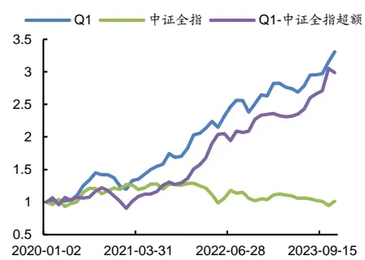
数据来源：通联数据，Wind, 广发证券发展研究中心

图 2：精选大小单因子组合 RankIC
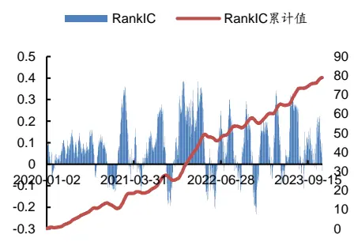
数据来源：通联数据，Wind, 广发证券发展研究中心

[分析师： Table_Author]安宁宁

SAC 执证号：S0260512020003同

0755-23948352

anningning@gf.com.cn

## [Table_ 相关研究：DocRe

资金流视角下的指数轮动及2024-07-08
ETF 配置策略:基金产品专题
研究系列之六十一
金融工程：债券型基金月报2024-07-02
（2024年 6 月）:中长期纯债
基金整体收益占优

金融工程:私募基金月报2024-07-02（2024 年 6 月）

[联系人： Table_Contacts] 林涛gflintao@gf.com.cn

## 一、Level 1 与 Level 2 行情数据介绍

如何能在股票市场的博弈中胜出？关键在于对市场信息的掌握和对市场规律的理解。对于量化投资者来说，更在于对数据的全面收集和深度分析，并结合数学模型和算法，从海量数据中挖掘出隐藏的市场规律。这些规律可能是某些股票价格的趋势，市场的周期性波动，抑或是短期的交易信号。一旦这些规律被发现并加以利用，量化投资者便能在股票市场的博弈中获得优势。

股票行情数据源于上交所和深交所，根据数据的频率和丰富度通常分为Level 1数据和Level 2数据。如表1所示，Level 1数据为3秒一笔的快照（Snapshot）数据，包含了常用行情软件上可以看到的最高价、最低价、开盘价、收盘价、成交量、成交额、成交笔数、委买委卖量、5档申买申卖价、5档申买申卖量等数据。而相比数据频率较低、数据丰富度有限的Level 1数据，Level 2数据中则不仅提供了更为丰富的快照（Snapshot）数据，如10档申买申卖价、10档申买申卖量、最优买卖价前50笔委托、买卖委托价位数、买卖撤单信息等，而且提供了Level 1数据中所不包含的逐笔订单（Tick）数据。逐笔订单数据包含了当日交易时段中集合竞价和连续竞价的每一笔订单数据，其中的关键信息包括精确到毫秒的订单时间、逐笔序号、频道代码、价格、数量、金额、买入卖出订单号和订单类别等详细数据。Level 2数据中的逐笔订单数据是一切行情数据的根源，不同频率的快照数据均由逐笔订单数据聚合而成。

在“海量Level 2数据因子挖掘”系列研究报告中，将尝试对Level 2数据中详细的快照数据和逐笔订单数据进行深入分析并加以利用，有望能够从中获得更为丰富的价格趋势、周期波动、交易信号等规律和信息，从而挖掘出更为有效的因子，构建出具有超额收益的股票投资组合。

本文是“海量Level 2数据因子挖掘”系列研究报告的第一篇，从所有行情数据的根源——Level 2逐笔订单出发，通过大小订单的角度对所有交易订单进行窥探，并结合多维度解耦的分析方法构建出了93个有效的大小单因子。最后，本文从上述93个大小单因子中挑选出表现优异者，并构建出了精选大小单因子组合。实证结果表明，精选大小单因子组合在A股全市场及各大板块中均取得了较为突出的表现。

表 1：Level 1与Level 2主要行情数据对比

| 数据类别 | 数据名称 | Level 1 | Level 2 |
| --- | --- | --- | --- |
| 快照数据 | 时间 | 最快3秒一笔 | 最快3秒一笔 |
|  | 最高价 | V | √ |
|  | 最低价 | > | √ |
|  | 开盘价 | V | √ |
|  | 收盘价 | > | √ |
|  | 成交数量 | > | √ |
|  | 成交金额 | V | √ |
|  | 成交笔数 | V | √ |
|  | 委买量/委卖量 | V | √ |

识别风险，发现价值

|  | 申买价/申卖价 | 5档 10档 |
| --- | --- | --- |
|  | 申买量/申卖量 5档 | 10档 |
|  | 最优买/卖价前 50 笔委托 | x V |
|  | 申买/申卖委托笔数 | × V |
|  | 买入/卖出最大等待时间 | × √（仅上交所） |
|  | 买方/卖方委托价位数 | × √（仅上交所） |
|  | 买入/卖出撤单笔数 | x √（仅上交所） |
| 买入/卖出撤单数量 | x √（仅上交所） |  |
| 买入/卖出撤单金额 | × ✓（仅上交所） |  |
| 买入/卖出总笔数 | x √（仅上交所） |  |
| 时间 | × ✓（精确到毫秒） |  |
| 频道代码 | × V |  |
| 逐笔订单数据 | 逐笔序号 |  |
|  | 价格 | x V |
|  | 数量 | × V |
|  | 金额 | x V |
|  |  | × V |
|  | 买入订单号 | × V |
|  | 卖出订单号 订单类别 | × V |

数据来源：通联数据、广发证券发展研究中心

## 二、数据聚合与大小单因子构建

## （一）数据聚合

对于Level 2逐笔订单数据中的每一笔成交信息而言，逐笔序号是唯一的，而买入订单号和卖出订单号并不是唯一的，这是因为同一笔委托可能会由于对手下单数量的不同而被拆解为多个订单成交。因此，逐笔订单中的成交信息并不能直接反应原始委托订单的大小。在本文研究中，为了能够真实反映原始委托订单的大小，首先分别把归属相同买入订单号和卖出订单号的逐笔成交订单进行聚合，得到原始委买订单和委卖订单中的信息。

## （二）大小单因子构建

在Wind等常用行情软件的大小单界定规则中，通常将挂单金额小于4万元的归类为小单、挂单金额大于4万元但小于20万元的归类为中单、挂单金额大于20万元但小于100万元的归类为大单、挂单金额大于100万元的归类为超大单。但这样基于绝对金额阈值筛选的订单通常与股票市值和股价有明显的关联，同样的挂单金额在大市值的股票中可能实际上只是一个小单，但在小市值的股票中却是一个超大单。

基于以上观察，本文在对大小单进行界定时并未使用绝对的金额阈值，而是分别对买卖订单中成交量大于均值+N倍标准差的订单界定为大单，剩余的则相应地界定为小单。本文分别采用3个不同的标准差阈值来对大小单进行界定，假设买卖订单中的成交量服从如图1所示的高斯分布，则买卖订单中大于均值+1.0倍标准差的大单约占15.8%，大于均值+1.5倍标准差的大单约占6.7%，大于均值+2.0倍标准差的大单约占2.3%，以此构建出了大买单占比因子BigBuy_1p0、BigBuy_1p5、BigBuy_2p0，以及大卖单占比因子BigSell_1p0、BigSell_1p5、BigSell_2p0。此外，还可以同时从买卖双向考虑大小单问题，将大买单占比因子和大卖单占比因子相加得到大买大卖单占比因子BigBuySell_1p0、BigBuySell_1p5、BigBuySell_2p0。而小单占比因子实际上等于1-大单占比因子，它们之间呈现出同向的线性关系，因此大单占比因子实际上已包含小单占比因子信息，无需额外构建小单占比因子。

图 1：高斯分布
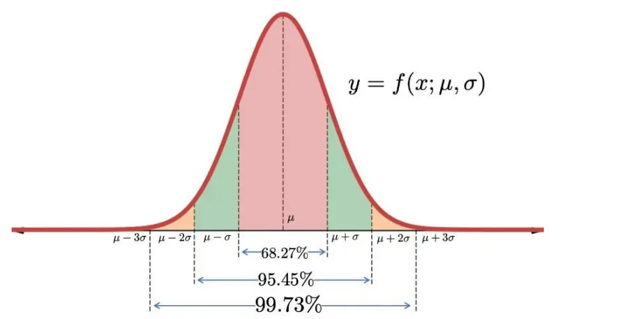
数据来源：广发证券发展研究中心

大小单占比因子在全市场中的20档回测如表2~表5所示。其中大买单占比因子BigBuy_1p0的表现较为突出，5日换仓RankIC均值为5.4%、胜率为64%，多头年化收益率达33.15%、最大回撤率为13.43%、夏普比率为1.83；经因子平滑后的5日换仓RankIC均值为5.4%、胜率为63%，多头年化收益率为30.85%、最大回撤率为14.24%、夏普比率为1.64。

在20日换仓条件下，大买单占比因子BigBuy_1p0的RankIC均值为7.9%、胜率为70%，多头年化收益率达28.08%、最大回撤率为9.18%、夏普比率为1.80；而经过因子平滑后的20日换仓RankIC均值为7.9%、胜率为65%，多头年化收益率达28.92%、最大回撤率为9.16%、夏普比率为1.78。整体而言，未经因子平滑的原始大小单占比因子表现更优，5日换仓条件下的因子能取得更好的多头年化收益率，而20日换仓条件下的因子RankIC更高。

表 2：大单占比因子5天换仓表现（2020-2023）

| 因子名 | RanklC |  | 多头 |  |  | 多空 |  |  |
| --- | --- | --- | --- | --- | --- | --- | --- | --- |
|  | 均值 | 胜率 | 年化收益率 | 最大回撤率 | 夏普比率 | 年化收益率 | 最大回撤率 | 夏普比率 |
| BigBuy_1p0 | 5.4% | 64% | 33.15% | 13.43% | 1.83 | 32.23% | 11.42% | 1.94 |
| BigBuy_1p5 | 5.2% | 64% | 32.16% | 11.70% | 1.79 | 31.69% | 9.97% | 2.06 |
| BigBuy_2p0 | 4.8% | 64% | 29.09% | 11.43% | 1.64 | 28.78% | 10.00% | 1.98 |
| BigSell_1p0 | 4.7% | 62% | 24.05% | 15.39% | 1.26 | 18.94% | 15.58% | 1.11 |
| BigSell_1p5 | 4.5% | 61% | 22.16% | 15.34% | 1.16 | 18.15% | 11.65% | 1.14 |
| BigSell_2p0 | 4.2% | 61% | 21.57% | 15.38% | 1.14 | 18.33% | 8.77% | 1.22 |
| BigBuySell_1p0 | 5.7% | 64% | 30.91% | 14.70% | 1.66 | 28.52% | 15.96% | 1.57 |
| BigBuySell_1p5 | 5.4% | 64% | 28.14% | 13.42% | 1.52 | 27.08% | 12.64% | 1.57 |
| BigBuySell_2p0 | 5.1% | 63% | 26.02% | 12.98% | 1.41 | 26.09% | 10.34% | 1.59 |

数据来源：通联数据、Wind、广发证券发展研究中心

表 3：大单占比因子（平滑）5天换仓表现（2020-2023）

| 因子名 | RankIC |  | 多头 |  |  | 多空 |  |  |
| --- | --- | --- | --- | --- | --- | --- | --- | --- |
|  | 均值 | 胜率 | 年化收益率 | 最大回撤率 | 夏普比率 | 年化收益率 | 最大回撤率 | 夏普比率 |
| BigBuy_1p0 | 5.4% | 63% | 30.85% | 14.24% | 1.64 | 28.25% | 17.46% | 1.45 |
| BigBuy_1p5 | 5.1% | 62% | 28.70% | 13.05% | 1.55 | 29.69% | 13.27% | 1.61 |
| BigBuy_2p0 | 4.7% | 61% | 24.86% | 12.25% | 1.33 | 27.31% | 13.87% | 1.55 |
| BigSell_1p0 | 5.1% | 61% | 23.39% | 15.88% | 1.20 | 21.33% | 20.22% | 1.06 |
| BigSell_1p5 | 4.9% | 61% | 21.65% | 15.13% | 1.12 | 21.19% | 16.93% | 1.11 |
| BigSell_2p0 | 4.6% | 60% | 20.35% | 14.25% | 1.06 | 21.28% | 12.72% | 1.17 |
| BigBuySell_1p0 | 5.5% | 63% | 29.28% | 15.77% | 1.52 | 26.67% | 21.06% | 1.30 |
| BigBuySell_1p5 | 5.2% | 62% | 26.54% | 14.18% | 1.40 | 26.83% | 16.86% | 1.38 |
| BigBuySell_2p0 | 4.8% | 61% | 24.45% | 12.76% | 1.30 | 26.84% | 13.37% | 1.45 |

数据来源：通联数据、Wind、广发证券发展研究中心

表 4：大单占比因子20天换仓表现（2020-2023）

| 因子名 | RanklC |  | 多头 |  |  | 多空 |  |  |
| --- | --- | --- | --- | --- | --- | --- | --- | --- |
|  | 均值 | 胜率 | 年化收益率 | 最大回撤率 | 夏普比率 | 年化收益率 | 最大回撤率 | 夏普比率 |
| BigBuy_1p0 | 7.9% | 70% | 28.08% | 9.18% | 1.8 | 24.14% | 7.57% | 1.31 |
| BigBuy_1p5 | 7.6% | 71% | 26.73% | 8.73% | 1.73 | 23.42% | 6.58% | 1.38 |
| BigBuy_2p0 | 7.1% | 71% | 25.08% | 7.93% | 1.64 | 21.91% | 5.50% | 1.38 |
| BigSell_1p0 | 7.0% | 66% | 24.36% | 9.54% | 1.53 | 17.86% | 12.61% | 0.94 |
| BigSell_1p5 | 6.7% | 66% | 23.48% | 8.75% | 1.48 | 17.41% | 8.27% | 0.98 |
| BigSell_2p0 | 6.3% | 68% | 22.27% | 8.91% | 1.41 | 16.78% | 6.88% | 1.02 |
| BigBuySell_1p0 | 8.4% | 68% | 27.96% | 9.28% | 1.76 | 23.33% | 11.26% | 1.14 |
| BigBuySell_1p5 | 8.0% | 69% | 26.21% | 8.30% | 1.66 | 22.90% | 8.31% | 1.20 |
| BigBuySell_2p0 | 7.6% | 69% | 24.96% | 7.06% | 1.60 | 22.50% | 7.62% | 1.25 |

数据来源：通联数据、Wind、广发证券发展研究中心
识别风险，发现价值

表 5：大单占比因子（平滑）20天换仓表现（2020-2023）

| 因子名 | RankIC |  | 多头 |  |  | 多空 |  |  |
| --- | --- | --- | --- | --- | --- | --- | --- | --- |
|  | 均值 | 胜率 | 年化收益率 | 最大回撤率 | 夏普比率 | 年化收益率 | 最大回撤率 | 夏普比率 |
| BigBuy_1p0 | 7.9% | 65% | 28.92% | 9.16% | 1.78 | 25.97% | 11.70% | 1.15 |
| BigBuy_1p5 | 7.4% | 65% | 25.88% | 7.52% | 1.64 | 24.72% | 10.47% | 1.17 |
| BigBuy_2p0 | 6.7% | 63% | 23.63% | 6.49% | 1.50 | 24.51% | 9.22% | 1.22 |
| BigSell_1p0 | 7.8% | 64% | 24.61% | 10.86% | 1.48 | 18.41% | 21.00% | 0.77 |
| BigSell_1p5 | 7.4% | 63% | 22.97% | 8.81% | 1.42 | 19.16% | 15.55% | 0.85 |
| BigSell_2p0 | 7.0% | 63% | 21.95% | 7.40% | 1.37 | 21.01% | 9.90% | 1.02 |
| BigBuySell_1p0 | 8.0% | 65% | 27.26% | 10.54% | 1.66 | 22.80% | 16.79% | 0.98 |
| BigBuySell_1p5 | 7.6% | 64% | 25.42% | 8.19% | 1.57 | 22.98% | 11.41% | 1.06 |
| BigBuySell_2p0 | 7.0% | 63% | 23.20% | 6.56% | 1.45 | 23.48% | 9.79% | 1.14 |

数据来源：通联数据、Wind、广发证券发展研究中心

## 三、多维度解耦大小单因子

在上一章节中，本文根据聚合后的原始买卖委托订单对大小单进行了界定划分，并构建出了大小单因子。在本章节中，将利用Level 2数据中逐笔订单的丰富信息，进一步从时间维度和订单维度上对大小单因子进行解耦，谋求挖掘出更有效的信息。

## （一）从时间维度解耦大小单因子

由于聚合后的原始买卖委托订单，可能会出现同一委托订单号横跨多个时间段与不同对手完成交易情况，因此无法直接对聚合后的原始买卖委托订单进行时间划分。为了对大小单进行正确的时间解耦划分，本小节采用聚合后的原始委托大小单界定，来对原始的逐笔订单进行大小单划分。

隔夜知情交易者通常会在第二天开盘后迅速根据已掌握的信息进行买入或卖出，以谋求更大的收益或减少踩踏。因此，开盘后15分钟或30分钟内的大小订单信息尤其值得关注，类似的现象有时也会出现在收盘前15分钟或30分钟内，这也正是从时间维度解耦大小单因子的逻辑所在。基于此观察，本小节尝试根据不同的时间段来对大单占比因子进行解耦。例如，以均值+1.0倍标准差作为大单划分阈值，在开盘后15分钟即09:30-09:45时段的大单占比因子为BigBuy_1p0_09300945。以此类推，本小节基于3种不同的大小单界定阈值（大于均值+1.0/1.5/2.0倍标准差），在4个开盘和收盘时间段总共构建了24个从时间维度解耦的大买单占比和大卖单占比因子。

经时间维度解耦后的大小单占比因子在全市场中的20档回测表现如表6~表9所示。其中开盘后半小时的大买单占比因子BigBuy_1p0_09301000的表现较为突出，5日换仓RankIC均值为3.4%、胜率为63%，多头年化收益率达29.78%、最大回撤率为13.02%、夏普比率为1.63；经因子平滑后的5日换仓RankIC均值为4.0%、胜率为61%，多头年化收益率为29.01%、最大回撤率为13.03%、夏普比率为1.51。

在20日换仓条件下，开盘后半小时的大买单占比因子BigBuy_1p0_09301000的RankIC均值为4.5%、胜率为70%，多头年化收益率达26.63%、最大回撤率为8.37%、夏普比率为1.73；而经过因子平滑后的20日换仓RankIC均值为6.0%、胜率为64%，多头年化收益率达27.27%、最大回撤率为6.40%、夏普比率为1.72。而未经解耦的大买单占比平滑因子的20日换仓多头年化收益率为28.92%、最大回撤率为9.16%，相比之下解耦后的大小单因子能够在取得同等绝对收益的情况下，降低最大回撤率，取得更平稳的收益表现。

此外，值得讨论的是，尽管经时间维度解耦后的大小单占比因子的RankIC有较大幅度的降低，但对多头年化收益率的影响并不大。比如在5日换仓条件下，未解耦的大买单占比因子BigBuy_1p0的RankIC均值为5.4%、多头年化收益率为33.15%；而经时间维度解耦后的开盘后半小时大买单占比因子BigBuy_1p0_09301000的RankIC均值为3.4%、多头年化收益率为29.78%。这是因为大买单占比因子主要考虑了主力买入订单因素，而主力买入订单与多头深度绑定，因此对多头的影响较大，而对空头的影响较小。尽管整体RankIC下降，但下降的因素更多来自于非多头部分的相关性，而多头则保持较为密切的关联。因而通过大买单占比因子在构建分档股票组合时，能够较为有效地构建多头组合。这也正是回测统计结果中多头收益通常高于多空收益的逻辑所在。

表 6：时间维度解耦的大单占比因子5天换仓表现（2020-2023）

| 因子名 | RanklC |  | 多头 |  |  | 多空 |  |  |
| --- | --- | --- | --- | --- | --- | --- | --- | --- |
|  | 均值 | 胜率 | 年化收益率 | 最大回撤率 | 夏普比率 | 年化收益率 | 最大回撤率 | 夏普比率 |
| BigBuy_1p0_09300945 | 2.5% | 60% | 28.29% | 13.20% | 1.54 | 23.12% | 4.19% | 2.55 |
| BigBuy_1p0_09301000 | 3.4% | 63% | 29.78% | 13.02% | 1.63 | 27.71% | 4.64% | 2.79 |
| BigBuy_1p0_14301457 | 2.1% | 60% | 21.23% | 16.37% | 1.13 | 12.01% | 6.73% | 1.19 |
| BigBuy_1p0_14451457 | 1.6% | 59% | 20.81% | 17.79% | 1.09 | 8.65% | 7.76% | 0.95 |
| BigBuy_1p5_09300945 | 2.1% | 57% | 26.31% | 13.80% | 1.43 | 18.61% | 3.80% | 2.27 |
| BigBuy_1p5_09301000 | 3.0% | 62% | 27.52% | 13.38% | 1.51 | 24.31% | 4.02% | 2.76 |
| BigBuy_1p5_14301457 | 1.9% | 59% | 19.94% | 17.39% | 1.06 | 9.37% | 6.88% | 0.98 |
| BigBuy_1p5_14451457 | 1.3% | 58% | 19.23% | 18.31% | 1.00 | 6.24% | 6.26% | 0.67 |
| BigBuy_2p0_09300945 | 1.7% | 57% | 24.64% | 14.81% | 1.34 | 16.27% | 4.04% | 2.09 |
| BigBuy_2p0_09301000 | 2.5% | 61% | 25.90% | 13.81% | 1.43 | 21.01% | 4.14% | 2.53 |
| BigBuy_2p0_14301457 | 1.7% | 58% | 19.44% | 17.36% | 1.04 | 7.98% | 7.67% | 0.88 |
| BigBuy_2p0_14451457 | 1.1% | 56% | 19.22% | 18.81% | 1.01 | 4.99% | 5.78% | 0.50 |
| BigSell_1p0_09300945 | 0.6% | 50% | 19.86% | 15.82% | 1.04 | 8.06% | 9.52% | 0.70 |
| BigSell_1p0_09301000 | 1.6% | 53% | 21.79% | 14.63% | 1.15 | 10.37% | 8.60% | 0.87 |
| BigSell_1p0_14301457 | 2.4% | 65% | 24.59% | 17.40% | 1.29 | 13.62% | 4.81% | 1.59 |
| BigSell_1p0_14451457 | 1.9% | 64% | 25.47% | 17.72% | 1.35 | 13.13% | 3.53% | 1.93 |
| BigSell_1p5_09300945 | 0.4% | 49% | 19.01% | 16.16% | 0.99 | 6.41% | 8.75% | 0.56 |
| BigSell_1p5_09301000 | 1.3% | 53% | 21.19% | 15.07% | 1.12 | 9.72% | 7.15% | 0.91 |
| BigSell_1p5_14301457 | 2.0% | 63% | 24.21% | 17.99% | 1.27 | 12.13% | 4.19% | 1.61 |
| BigSell_1p5_14451457 | 1.5% | 63% | 24.40% | 18.13% | 1.29 | 9.91% | 3.12% | 1.55 |
| BigSell_2p0_09300945 | 0.1% | 48% | 17.83% | 17.09% | 0.92 | 4.79% | 9.87% | 0.35 |

识别风险，发现价值

| BigSell_2p0_09301000 | 1.0% | 52% | 19.81% | 15.97% | 1.04 | 7.08% | 7.50% | 0.61 |
| --- | --- | --- | --- | --- | --- | --- | --- | --- |
| BigSell_2p0_14301457 | 1.7% | 62% | 22.49% | 18.08% | 1.18 | 9.84% | 4.07% | 1.34 |
| BigSell_2p0_14451457 | 1.2% | 60% | 23.82% | 18.26% | 1.25 | 8.32% | 3.75% | 1.3 |

数据来源：通联数据、Wind、广发证券发展研究中心

表 7：时间维度解耦的大单占比因子（平滑）5天换仓表现（2020-2023）

| 因子名 | RankIC |  | 多头 |  |  | 多空 |  |  |
| --- | --- | --- | --- | --- | --- | --- | --- | --- |
|  | 均值 | 胜率 | 年化收益率 | 最大回撤率 | 夏普比率 | 年化收益率 | 最大回撤率 | 夏普比率 |
| BigBuy_1p0_09300945 | 3.0% | 58% | 27.61% | 12.60% | 1.43 | 26.80% | 9.88% | 1.94 |
| BigBuy_1p0_09301000 | 4.0% | 61% | 29.01% | 13.03% | 1.51 | 29.70% | 9.02% | 2.03 |
| BigBuy_1p0_14301457 | 2.5% | 58% | 15.05% | 17.90% | 0.72 | 9.52% | 18.88% | 0.53 |
| BigBuy_1p0_14451457 | 2.0% | 57% | 16.13% | 17.67% | 0.77 | 10.55% | 14.67% | 0.71 |
| BigBuy_1p5_09300945 | 2.5% | 57% | 26.69% | 12.82% | 1.40 | 24.77% | 9.71% | 1.91 |
| BigBuy_1p5_09301000 | 3.6% | 60% | 27.70% | 12.41% | 1.47 | 27.50% | 9.13% | 2.02 |
| BigBuy_1p5_14301457 | 2.3% | 57% | 12.37% | 18.34% | 0.57 | 6.98% | 17.99% | 0.38 |
| BigBuy_1p5_14451457 | 1.7% | 56% | 13.35% | 18.47% | 0.62 | 6.13% | 16.81% | 0.36 |
| BigBuy_2p0_09300945 | 2.1% | 56% | 24.40% | 13.27% | 1.28 | 20.80% | 9.62% | 1.67 |
| BigBuy_2p0_09301000 | 3.1% | 59% | 25.19% | 12.80% | 1.33 | 24.19% | 9.58% | 1.86 |
| BigBuy_2p0_14301457 | 2.0% | 55% | 10.56% | 18.79% | 0.47 | 4.89% | 16.74% | 0.22 |
| BigBuy_2p0_14451457 | 1.4% | 54% | 11.17% | 18.65% | 0.50 | 2.96% | 19.41% | 0.05 |
| BigSell_1p0_09300945 | 1.1% | 49% | 21.07% | 14.85% | 1.06 | 16.02% | 16.13% | 1.02 |
| BigSell_1p0_09301000 | 2.3% | 53% | 22.74% | 14.39% | 1.17 | 18.97% | 12.83% | 1.17 |
| BigSell_1p0_14301457 | 3.3% | 61% | 24.05% | 15.86% | 1.22 | 18.88% | 10.06% | 1.33 |
| BigSell_1p0_14451457 | 2.7% | 62% | 25.47% | 15.03% | 1.30 | 19.93% | 7.98% | 1.71 |
| BigSell_1p5_09300945 | 0.8% | 48% | 19.31% | 14.37% | 0.97 | 13.61% | 15.94% | 0.90 |
| BigSell_1p5_09301000 | 2.0% | 52% | 21.63% | 12.99% | 1.12 | 16.83% | 11.85% | 1.09 |
| BigSell_1p5_14301457 | 2.9% | 59% | 22.85% | 15.18% | 1.18 | 17.56% | 9.01% | 1.41 |
| BigSell_1p5_14451457 | 2.2% | 60% | 23.70% | 14.81% | 1.22 | 17.24% | 6.64% | 1.63 |
| BigSell_2p0_09300945 | 0.5% | 48% | 17.87% | 13.28% | 0.90 | 10.91% | 15.31% | 0.73 |
| BigSell_2p0_09301000 | 1.7% | 51% | 19.92% | 12.91% | 1.04 | 14.56% | 11.93% | 0.98 |
| BigSell_2p0_14301457 | 2.5% | 58% | 21.16% | 15.13% | 1.10 | 15.51% | 8.35% | 1.33 |
| BigSell_2p0_14451457 | 1.9% | 58% | 22.29% | 14.47% | 1.15 | 14.59% | 7.21% | 1.45 |

数据来源：通联数据、Wind、广发证券发展研究中心

表 8：时间维度解耦的大单占比因子20天换仓表现（2020-2023）

| 因子名 | RanklC |  | 多头 |  |  | 多空 |  |  |
| --- | --- | --- | --- | --- | --- | --- | --- | --- |
|  | 均值 | 胜率 | 年化收益率 | 最大回撤率 | 夏普比率 | 年化收益率 | 最大回撤率 | 夏普比率 |
| BigBuy_1p0_09300945 | 3.2% | 65% | 25.07% | 9.10% | 1.62 | 14.19% | 5.12% | 1.34 |
| BigBuy_1p0_09301000 | 4.5% | 70% | 26.63% | 8.37% | 1.73 | 18.11% | 4.64% | 1.59 |
| BigBuy_1p0_14301457 | 3.4% | 64% | 21.86% | 11.94% | 1.35 | 9.72% | 6.02% | 0.82 |
| BigBuy_1p0_14451457 | 2.7% | 65% | 21.15% | 13.25% | 1.29 | 7.57% | 4.89% | 0.73 |

识别风险，发现价值

| BigBuy_1p5_09300945 | 2.6% | 64% | 24.17% | 8.40% | 1.57 | 11.89% | 4.25% | 1.23 |
| --- | --- | --- | --- | --- | --- | --- | --- | --- |
| BigBuy_1p5_09301000 | 3.9% | 68% | 25.34% | 7.73% | 1.65 | 15.52% | 3.74% | 1.48 |
| BigBuy_1p5_14301457 | 3.0% | 63% | 20.65% | 12.74% | 1.27 | 7.84% | 5.06% | 0.73 |
| BigBuy_1p5_14451457 | 2.2% | 63% | 20.53% | 13.58% | 1.26 | 5.90% | 4.33% | 0.59 |
| BigBuy_2p0_09300945 | 2.1% | 61% | 22.84% | 9.46% | 1.48 | 10.01% | 4.08% | 1.08 |
| BigBuy_2p0_09301000 | 3.4% | 67% | 24.39% | 8.04% | 1.60 | 13.36% | 3.46% | 1.35 |
| BigBuy_2p0_14301457 | 2.7% | 62% | 20.54% | 12.56% | 1.28 | 6.96% | 4.14% | 0.67 |
| BigBuy_2p0_14451457 | 1.8% | 60% | 20.11% | 13.82% | 1.23 | 4.68% | 3.93% | 0.43 |
| BigSell_1p0_09300945 | 1.8% | 55% | 21.30% | 9.78% | 1.35 | 8.38% | 8.30% | 0.64 |
| BigSell_1p0_09301000 | 3.1% | 58% | 22.14% | 9.50% | 1.42 | 10.87% | 7.82% | 0.81 |
| BigSell_1p0_14301457 | 3.3% | 67% | 22.87% | 12.85% | 1.39 | 10.52% | 3.63% | 1.08 |
| BigSell_1p0_14451457 | 2.6% | 68% | 22.63% | 13.63% | 1.37 | 8.61% | 3.06% | 1.05 |
| BigSell_1p5_09300945 | 1.4% | 54% | 20.64% | 9.70% | 1.32 | 7.18% | 6.90% | 0.58 |
| BigSell_1p5_09301000 | 2.6% | 58% | 21.32% | 9.01% | 1.37 | 9.14% | 7.25% | 0.73 |
| BigSell_1p5_14301457 | 2.8% | 67% | 22.09% | 13.41% | 1.35 | 8.64% | 3.05% | 0.99 |
| BigSell_1p5_14451457 | 2.0% | 65% | 21.93% | 14.01% | 1.32 | 6.35% | 2.38% | 0.79 |
| BigSell_2p0_09300945 | 1.0% | 54% | 20.25% | 10.46% | 1.29 | 6.26% | 7.59% | 0.51 |
| BigSell_2p0_09301000 | 2.2% | 57% | 20.64% | 9.70% | 1.34 | 7.80% | 6.58% | 0.64 |
| BigSell_2p0_14301457 | 2.4% | 65% | 21.47% | 13.43% | 1.31 | 7.41% | 2.41% | 0.9 |
| BigSell_2p0_14451457 | 1.6% | 64% | 21.46% | 14.00% | 1.29 | 5.05% | 3.04% | 0.57 |

数据来源：通联数据、Wind、广发证券发展研究中心

表 9：时间维度解耦的大单占比因子（平滑）20天换仓表现（2020-2023）

| 因子名 | RanklC |  | 多头 |  |  | 多空 |  |  |
| --- | --- | --- | --- | --- | --- | --- | --- | --- |
|  | 均值 | 胜率 | 年化收益率 | 最大回撤率 | 夏普比率 | 年化收益率 | 最大回撤率 | 夏普比率 |
| BigBuy_1p0_09300945 | 4.3% | 60% | 24.26% | 6.45% | 1.50 | 18.07% | 10.34% | 0.96 |
| BigBuy_1p0_09301000 | 6.0% | 64% | 27.27% | 6.40% | 1.72 | 22.24% | 9.79% | 1.14 |
| BigBuy_1p0_14301457 | 4.2% | 61% | 20.48% | 13.87% | 1.18 | 11.84% | 22.44% | 0.49 |
| BigBuy_1p0_14451457 | 3.2% | 58% | 19.61% | 16.18% | 1.10 | 10.64% | 20.61% | 0.47 |
| BigBuy_1p5_09300945 | 3.7% | 60% | 21.75% | 6.76% | 1.33 | 15.18% | 12.19% | 0.81 |
| BigBuy_1p5_09301000 | 5.3% | 63% | 24.99% | 6.18% | 1.58 | 20.46% | 10.49% | 1.07 |
| BigBuy_1p5_14301457 | 3.8% | 57% | 17.89% | 13.40% | 1.04 | 9.16% | 23.62% | 0.38 |
| BigBuy_1p5_14451457 | 2.6% | 55% | 16.54% | 15.98% | 0.91 | 7.29% | 23.91% | 0.31 |
| BigBuy_2p0_09300945 | 2.9% | 59% | 19.71% | 7.93% | 1.18 | 12.04% | 12.90% | 0.62 |
| BigBuy_2p0_09301000 | 4.5% | 61% | 23.15% | 6.06% | 1.43 | 18.43% | 10.92% | 0.97 |
| BigBuy_2p0_14301457 | 3.2% | 54% | 16.53% | 11.83% | 0.96 | 8.08% | 22.31% | 0.35 |
| BigBuy_2p0_14451457 | 2.0% | 52% | 15.95% | 13.64% | 0.89 | 6.04% | 22.13% | 0.25 |
| BigSell_1p0_09300945 | 2.5% | 52% | 19.37% | 8.42% | 1.17 | 10.55% | 18.03% | 0.47 |
| BigSell_1p0_09301000 | 4.2% | 57% | 21.64% | 8.37% | 1.31 | 14.88% | 15.01% | 0.69 |
| BigSell_1p0_14301457 | 6.1% | 63% | 24.63% | 10.46% | 1.48 | 17.35% | 10.62% | 0.86 |
| BigSell_1p0_14451457 | 5.1% | 64% | 24.27% | 10.72% | 1.43 | 15.94% | 9.13% | 0.92 |
| BigSell_1p5_09300945 | 2.1% | 53% | 18.37% | 6.62% | 1.12 | 10.19% | 16.84% | 0.48 |

识别风险，发现价值

| BigSell_1p5_09301000 | 3.8% | 56% | 20.42% | 6.26% | 1.25 | 14.37% | 14.79% | 0.71 |
| --- | --- | --- | --- | --- | --- | --- | --- | --- |
| BigSell_1p5_14301457 | 5.5% | 61% | 23.47% | 9.87% | 1.41 | 17.71% | 9.02% | 0.99 |
| BigSell_1p5_14451457 | 4.4% | 61% | 22.46% | 10.47% | 1.34 | 14.13% | 8.94% | 0.89 |
| BigSell_2p0_09300945 | 1.6% | 52% | 16.67% | 6.28% | 1.01 | 8.52% | 16.44% | 0.39 |
| BigSell_2p0_09301000 | 3.4% | 56% | 18.77% | 5.97% | 1.16 | 13.30% | 14.20% | 0.68 |
| BigSell_2p0_14301457 | 4.9% | 61% | 22.24% | 9.20% | 1.35 | 16.11% | 8.89% | 0.96 |
| BigSell_2p0_14451457 | 3.7% | 62% | 21.03% | 10.11% | 1.26 | 12.06% | 8.82% | 0.77 |

数据来源：通联数据、Wind、广发证券发展研究中心

## （二）从订单维度解耦大小单因子

从本文第二章节中对大小单的界定划分可以看出，同一笔成交订单同时存在着买入和卖出两个方向上的大小单属性。因此，大小单因子可以拆解为大买单大卖单、大买单小卖单、小买单大卖单、小买单小卖单四种订单属性不同的因子。文小节基于三种不同的大小单划分阈值构建出了12个从订单维度解耦的大小单占比因子。

经时间维度解耦后的大小单占比因子在全市场中的20档回测表现如表10~表13所示。其中买卖双向同属于大订单的因子取得了不错的选股效果，大买单大卖单占比因子BigBuy_BigSell_1p0的表现较为突出，5日换仓RankIC均值为6.7%、胜率为72%，多头年化收益率达31.01%、最大回撤率为15.44%、夏普比率为1.67，多空年化收益率达47.09%、最大回撤率为9.71%、夏普比率为3.19；经因子平滑后的5日换仓RankIC均值为6.9%、胜率为70%，多头年化收益率为30.88%、最大回撤率为15.98%、夏普比率为1.63，多空年化收益率为51.69%、最大回撤率为12.73%、夏普比率为3.03。

在20日换仓条件下，大买单大卖单占比因子BigBuy_BigSell_1p0的RankIC均值为9.8%、胜率达82%，多头年化收益率达28.57%、最大回撤率为11.53%、夏普比率为1.80，多空年化收益率达35.12%、最大回撤率为8.35%、夏普比率为2.17；而经过因子平滑后的20日换仓RankIC均值达10.1%、胜率为78%，多头年化收益率达27.03%、最大回撤率为14.78%、夏普比率为1.65，多空年化收益率达37.61%、最大回撤率为10.92%、夏普比率为1.96。

尽管经订单维度解耦后的大小单占比因子在多头收益表现上并未具有优势，但其在多空组合上则相较于原始未解耦的大小单因子表现出了明显的提升。例如在5日换仓条件下，未解偶的大买单占比因子BigBuy_1p0的多空年化收益率为32.23%，而经订单维度解耦后的大买单大卖单占比因子BigBuy_BigSell_1p0取得了47.09%的多空年化收益率。这其中的逻辑与前文相似：大买单通常与多头深度绑定，在单独考虑大买单占比时，通常可以取得较为理想的多头收益；而大卖单则通常与空头深度绑定，因此同时考虑大买单和大卖单这两个属性时，可以在取得同等多头收益的同时，获取更理想的多空收益。这一现象在提升大买单界定阈值后更为突出，例如表11中BigBuy_BigSell_2p0取得了58.17%的多空年化收益率，且其最大回撤率仅为5.55%，夏普比率达4.34。

表 10：订单维度解耦的大小单占比因子5天换仓表现（2020-2023）

| 因子名 | RankIC |  | 多头 |  |  | 多空 |  |  |
| --- | --- | --- | --- | --- | --- | --- | --- | --- |
|  | 均值 | 胜率 | 年化收益率 | 最大回撤率 | 夏普比率 | 年化收益率 | 最大回撤率 | 夏普比率 |
| BigBuy_BigSell_1p0 | 6.7% | 72% | 31.01% | 15.44% | 1.67 | 47.09% | 9.71% | 3.19 |
| BigBuy_SmallSell_1p0 | -0.0% | 47% | 18.87% | 14.81% | 1.02 | 7.41% | 14.73% | 0.52 |
| SmallBuy_BigSell_1p0 | -0.9% | 43% | 5.22% | 22.57% | 0.16 | -8.47% | 34.84% | -1.16 |
| SmallBuy_SmallSell_1p0 | -4.3% | 43% | 4.11% | 34.69% | 0.08 | -19.64% | 65.26% | -1.31 |
| BigBuy_BigSell_1p5 | 6.5% | 74% | 28.82% | 15.09% | 1.57 | 48.47% | 6.53% | 3.86 |
| BigBuy_SmallSell_1p5 | 0.9% | 50% | 22.53% | 13.55% | 1.25 | 11.09% | 15.29% | 0.84 |
| SmallBuy_BigSell_1p5 | 0.1% | 46% | 9.29% | 20.91% | 0.41 | -3.27% | 24.18% | -0.56 |
| SmallBuy_SmallSell_1p5 | -4.2% | 43% | 3.03% | 34.58% | 0.03 | -19.07% | 64.08% | -1.33 |
| BigBuy_BigSell_2p0 | 6.1% | 76% | 26.81% | 14.96% | 1.47 | 44.39% | 4.53% | 4.08 |
| BigBuy_SmallSell_2p0 | 1.3% | 50% | 22.60% | 13.02% | 1.26 | 12.22% | 13.58% | 0.94 |
| SmallBuy_BigSell_2p0 | 0.7% | 47% | 11.83% | 20.04% | 0.56 | 0.12% | 18.44% | -0.23 |
| SmallBuy_SmallSell_2p0 | -3.9% | 44% | 1.57% | 33.68% | -0.05 | -19.19% | 63.46% | -1.41 |

数据来源：通联数据、Wind、广发证券发展研究中心

表 11：订单维度解耦的大小单占比因子（平滑）5天换仓表现（2020-2023）

| 因子名 | RankIC |  | 多头 |  |  | 多空 |  |  |
| --- | --- | --- | --- | --- | --- | --- | --- | --- |
|  | 均值 | 胜率 | 年化收益率 | 最大回撤率 | 夏普比率 | 年化收益率 | 最大回撤率 | 夏普比率 |
| BigBuy_BigSell_1p0 | 6.9% | 70% | 30.88% | 15.98% | 1.63 | 51.69% | 12.73% | 3.03 |
| BigBuy_SmallSell_1p0 | -0.2% | 46% | 10.43% | 17.01% | 0.47 | 0.14% | 26.25% | -0.18 |
| SmallBuy_BigSell_1p0 | -0.5% | 44% | 0.45% | 20.65% | -0.12 | -9.48% | 40.28% | -0.92 |
| SmallBuy_SmallSell_1p0 | -4.0% | 44% | 3.80% | 36.01% | 0.07 | -18.62% | 67.11% | -1.12 |
| BigBuy_BigSell_1p5 | 6.8% | 72% | 29.37% | 15.84% | 1.58 | 56.97% | 7.52% | 3.77 |
| BigBuy_SmallSell_1p5 | 0.8% | 48% | 16.31% | 12.84% | 0.83 | 8.67% | 23.78% | 0.44 |
| SmallBuy_BigSell_1p5 | 0.6% | 47% | 4.83% | 19.24% | 0.14 | -3.67% | 34.05% | -0.45 |
| SmallBuy_SmallSell_1p5 | -3.9% | 45% | 1.49% | 35.43% | -0.05 | -18.96% | 65.97% | -1.17 |
| BigBuy_BigSell_2p0 | 6.5% | 72% | 26.85% | 16.07% | 1.45 | 58.17% | 5.55% | 4.34 |
| BigBuy_SmallSell_2p0 | 1.1% | 49% | 15.47% | 12.96% | 0.78 | 8.51% | 24.05% | 0.42 |
| SmallBuy_BigSell_2p0 | 1.2% | 48% | 7.13% | 17.78% | 0.28 | -0.31% | 30.58% | -0.2 |
| SmallBuy_SmallSell_2p0 | -3.6% | 46% | -0.35% | 34.94% | -0.15 | -18.88% | 64.75% | -1.22 |

数据来源：通联数据、Wind、广发证券发展研究中心

表 12：订单维度解耦的大小单占比因子20天换仓表现（2020-2023）

| 因子名 | RankIC |  | 多头 |  |  | 多空 |  |  |
| --- | --- | --- | --- | --- | --- | --- | --- | --- |
|  | 均值 | 胜率 | 年化收益率 | 最大回撤率 | 夏普比率 | 年化收益率 | 最大回撤率 | 夏普比率 |
| BigBuy_BigSell_1p0 | 9.8% | 82% | 28.57% | 11.53% | 1.80 | 35.12% | 8.35% | 2.17 |
| BigBuy_SmallSell_1p0 | 0.2% | 51% | 17.81% | 11.77% | 1.14 | 4.89% | 11.43% | 0.24 |
| SmallBuy_BigSell_1p0 | -0.8% | 45% | 10.57% | 16.05% | 0.60 | -3.64% | 21.43% | -0.61 |
| SmallBuy_SmallSell_1p0 | -6.4% | 39% | 4.11% | 29.85% | 0.09 | -18.25% | 60.74% | -1.10 |

识别风险，发现价值

| BigBuy_BigSell_1p5 | 9.4% | 84% | 26.93% | 11.34% | 1.71 | 35.17% | 4.99% | 2.60 |
| --- | --- | --- | --- | --- | --- | --- | --- | --- |
|  | BigBuy_SmallSell_1p5 | 1.5% 54% | 20.25% | 10.16% | 1.32 | 8.10% | 10.82% | 0.53 |
|  | SmallBuy_BigSell_1p5 0.6% | 49% | 12.84% | 14.52% | 0.75 | -0.37% | 17.58% | -0.27 |
|  | -6.3% | 38% | 3.48% | 29.49% | 0.05 | -18.02% | 59.82% | -1.17 |
|  | SmallBuy_SmallSell_1p5 8.9% | 85% | 25.18% | 11.05% | 1.60 | 31.98% | 3.16% | 2.72 |
| BigBuy_BigSell_2p0 BigBuy_SmallSell_2p0 | 2.0% | 56% | 20.66% | 10.03% | 1.34 | 9.06% | 10.42% | 0.60 |
| SmallBuy_BigSell_2p0 | 1.4% | 52% | 14.69% | 13.62% | 0.89 | 2.02% | 13.80% | -0.04 |
| SmallBuy_SmallSell_2p0 | -6.0% | 37% | 2.52% | 28.86% | 0.00 | -17.67% | 58.90% | -1.22 |

数据来源：通联数据、Wind、广发证券发展研究中心

表 13：订单维度解耦的大小单占比因子（平滑）20天换仓表现（2020-2023）

| 因子名 | RankIC |  | 多头 |  |  | 多空 |  |  |
| --- | --- | --- | --- | --- | --- | --- | --- | --- |
|  | 均值 | 胜率 | 年化收益率 | 最大回撤率 | 夏普比率 | 年化收益率 | 最大回撤率 | 夏普比率 |
| BigBuy_BigSell_1p0 | 10.1% | 78% | 27.03% | 14.78% | 1.65 | 37.61% | 10.92% | 1.96 |
| BigBuy_SmallSell_1p0 | -0.2% | 49% | 4.73% | 14.37% | 0.17 | -3.11% | 29.66% | -0.35 |
| SmallBuy_BigSell_1p0 | 0.0% | 46% | 5.12% | 15.13% | 0.19 | -6.32% | 33.26% | -0.57 |
| SmallBuy_SmallSell_1p0 | -5.8% | 40% | 3.65% | 32.32% | 0.06 | -17.69% | 62.82% | -0.95 |
| BigBuy_BigSell_1p5 | 10.0% | 79% | 25.57% | 14.07% | 1.59 | 40.43% | 8.45% | 2.43 |
| BigBuy_SmallSell_1p5 | 1.2% | 52% | 11.42% | 11.01% | 0.68 | 3.50% | 23.81% | 0.06 |
| SmallBuy_BigSell_1p5 | 1.6% | 50% | 9.32% | 13.88% | 0.51 | -0.44% | 28.26% | -0.18 |
| SmallBuy_SmallSell_1p5 | -5.6% | 40% | 2.11% | 32.39% | -0.02 | -18.04% | 62.09% | -1.01 |
| BigBuy_BigSell_2p0 | 9.6% | 79% | 24.51% | 12.60% | 1.55 | 41.58% | 6.52% | 2.81 |
| BigBuy_SmallSell_2p0 | 1.6% | 53% | 12.42% | 9.83% | 0.75 | 4.51% | 24.31% | 0.12 |
| SmallBuy_BigSell_2p0 | 2.4% | 53% | 11.15% | 13.27% | 0.64 | 2.53% | 23.15% | 0.00 |
| SmallBuy_SmallSell_2p0 | -5.2% | 41% | 0.55% | 32.63% | -0.11 | -17.67% | 61.10% | -1.05 |

数据来源：通联数据、Wind、广发证券发展研究中心

## （三）从时间维度和订单维度解耦大小单因子

本小节进一步尝试同时结合时间维度和订单维度来解耦大小单因子，基于三种不同的大小单划分阈值构建出了48个多维度解耦的大小单占比因子。

经多维度解耦后的大小单占比因子在全市场中的20档回测表现如表14~表17所示。其中开盘后半小时的大买单大卖单占比因子BigBuy_BigSell_1p0_09301000和收盘前半小时的大买单大卖单占比因子BigBuy_BigSell_1p0_14301457的表现较为突出。5日换仓条件下，BigBuy_BigSell_1p0_09301000因子的RankIC均值为3.3%、胜率为66%，多头年化收益率为29.02%、最大回撤率为14.70%、夏普比率为1.56；经因子平滑后的5日换仓RankIC均值为4.5%、胜率为67%，多头年化收益率为30.25% 、 最 大 回 撤 率 为 14.24% 、 夏 普 比 率 为 1.59 。 而BigBuy_BigSell_1p0_14301457因子的RankIC均值为2.9%、胜率为71%，多头年化收益率为24.49%、最大回撤率为17.58%、夏普比率为1.30；经因子平滑后的5日换仓RankIC均值为4.2%、胜率为70%，多头年化收益率为25.72%、最大回撤率为16.35%、夏普比率为1.33。

在20日换仓条件下，BigBuy_BigSell_1p0_09301000因子的RankIC均值为4.9%、胜率为75%，多头年化收益率达26.56%、最大回撤率为9.82%、夏普比率为1.68；经过因子平滑后的20日换仓RankIC均值达7.4%、胜率为71%，多头年化收益率 达 28.79% 、 最 大 回 撤 率 为 9.05% 、 夏 普 比 率 为 1.74 。 而BigBuy_BigSell_1p0_14301457因子的RankIC均值为4.2%、胜率为78%，多头年化收益率达24.13%、最大回撤率为12.58%、夏普比率为1.47；而经过因子平滑后的20日换仓RankIC均值达7.4%、胜率为77%，多头年化收益率达25.32%、最大回撤率为14.25%、夏普比率为1.51。

表 14：多维度解耦的大小单占比因子5天换仓表现（2020-2023）

| 因子名 | RanklC |  | 多头 |  |  | 多空 |  |  |
| --- | --- | --- | --- | --- | --- | --- | --- | --- |
|  | 均值 | 胜率 | 年化收益率 | 最大回撤率 | 夏普比率 | 年化收益率 | 最大回撤率 | 夏普比率 |
| BigBuy_BigSell_1p0_09300945 | 2.1% | 61% | 27.29% | 14.79% | 1.46 | 18.97% | 4.56% | 2.41 |
| BigBuy_BigSell_1p0_09301000 | 3.3% | 66% | 29.02% | 14.70% | 1.56 | 24.07% | 5.02% | 2.69 |
| BigBuy_BigSell_1p0_14301457 | 2.9% | 71% | 24.49% | 17.58% | 1.30 | 16.31% | 3.43% | 2.35 |
| BigBuy_BigSell_1p0_14451457 | 2.2% | 70% | 25.24% | 18.02% | 1.34 | 13.56% | 3.20% | 2.33 |
| BigBuy_SmallSell_1p0_09300945 | 0.8% | 54% | 21.95% | 19.53% | 1.14 | 12.86% | 2.74% | 2.21 |
| BigBuy_SmallSell_1p0_09301000 | 0.9% | 53% | 21.15% | 19.59% | 1.11 | 11.52% | 3.53% | 1.81 |
| BigBuy_SmallSell_1p0_14301457 | -0.7% | 42% | 13.96% | 20.35% | 0.68 | -2.61% | 18.21% | -0.88 |
| BigBuy_SmallSell_1p0_14451457 | -0.9% | 40% | 14.82% | 20.12% | 0.73 | -2.76% | 15.55% | -1.06 |
| SmallBuy_BigSell_1p0_09300945 | -1.9% | 37% | 7.58% | 21.38% | 0.30 | -7.71% | 27.01% | -1.77 |
| SmallBuy_BigSell_1p0_09301000 | -1.7% | 39% | 6.25% | 21.27% | 0.22 | -8.70% | 30.22% | -1.72 |
| SmallBuy_BigSell_1p0_14301457 | -0.3% | 46% | 15.08% | 22.10% | 0.74 | 0.43% | 8.20% | -0.40 |
| SmallBuy_BigSell_1p0_14451457 | -0.4% | 46% | 17.67% | 20.28% | 0.90 | 3.15% | 5.96% | 0.14 |
| SmallBuy_SmallSell_1p0_09300945 | -1.5% | 48% | 7.26% | 29.32% | 0.27 | -13.26% | 49.76% | -1.48 |
| SmallBuy_SmallSell_1p0_09301000 | -2.4% | 46% | 4.82% | 30.96% | 0.13 | -16.30% | 55.56% | -1.59 |
| SmallBuy_SmallSell_1p0_14301457 | -2.5% | 43% | 8.28% | 30.90% | 0.33 | -13.82% | 50.19% | -1.45 |
| SmallBuy_SmallSell_1p0_14451457 | -2.0% | 44% | 10.08% | 29.21% | 0.44 | -12.09% | 45.29% | -1.55 |
| BigBuy_BigSell_1p5_09300945 | 1.6% | 59% | 24.96% | 16.29% | 1.32 | 15.31% | 3.47% | 2.24 |
| BigBuy_BigSell_1p5_09301000 | 2.8% | 67% | 26.68% | 15.11% | 1.44 | 19.91% | 3.77% | 2.57 |
| BigBuy_BigSell_1p5_14301457 | 2.5% | 74% | 24.01% | 18.32% | 1.28 | 13.86% | 2.60% | 2.53 |
| BigBuy_BigSell_1p5_14451457 | 1.7% | 69% | 23.59% | 18.87% | 1.24 | 8.65% | 4.03% | 1.50 |
| BigBuy_SmallSell_1p5_09300945 | 0.9% | 54% | 22.20% | 19.25% | 1.16 | 12.26% | 3.57% | 2.00 |
| BigBuy_SmallSell_1p5_09301000 | 1.1% | 54% | 22.50% | 18.45% | 1.20 | 13.43% | 3.43% | 2.02 |
| BigBuy_SmallSell_1p5_14301457 | -0.3% | 44% | 15.73% | 19.89% | 0.79 | -0.32% | 17.63% | -0.48 |
| BigBuy_SmallSell_1p5_14451457 | -0.6% | 43% | 17.17% | 19.74% | 0.86 | -0.45% | 12.22% | -0.59 |
| SmallBuy_BigSell_1p5_09300945 | -1.5% | 39% | 10.05% | 20.22% | 0.45 | -3.53% | 14.72% | -1.02 |
| SmallBuy_BigSell_1p5_09301000 | -1.2% | 41% | 10.06% | 20.29% | 0.45 | -4.36% | 17.60% | -1.04 |
| SmallBuy_BigSell_1p5_14301457 | 0.0% | 48% | 17.02% | 20.36% | 0.86 | 2.50% | 7.64% | 0.000 |
| SmallBuy_BigSell_1p5_14451457 | -0.2% | 47% | 19.73% | 19.84% | 1.02 | 4.10% | 6.33% | 0.35 |

识别风险，发现价值

| SmallBuy_SmallSell_1p5_09300945 | -1.2% | 49% | 8.32% | 29.06% | 0.34 | -11.07% | 44.46% | -1.39 |
| --- | --- | --- | --- | --- | --- | --- | --- | --- |
| SmallBuy_SmallSell_1p5_09301000 | -2.1% | 46% | 5.78% | 30.01% | 0.19 | -14.36% | 50.67% | -1.57 |
| SmallBuy_SmallSell_1p5_14301457 | -2.3% | 44% | 7.90% | 29.52% | 0.31 | -12.75% | 47.08% | -1.52 |
| SmallBuy_SmallSell_1p5_14451457 | -1.7% | 44% | 10.38% | 28.32% | 0.46 | -10.72% | 41.38% | -1.59 |
| BigBuy_BigSell_2p0_09300945 | 1.1% | 58% | 22.93% | 17.38% | 1.22 | 9.90% | 4.41% | 1.46 |
| BigBuy_BigSell_2p0_09301000 | 2.3% | 66% | 24.67% | 16.07% | 1.33 | 15.17% | 3.34% | 2.17 |
| BigBuy_BigSell_2p0_14301457 | 2.1% | 74% | 22.95% | 19.15% | 1.22 | 9.41% | 3.23% | 1.73 |
| BigBuy_BigSell_2p0_14451457 | 1.2% | 66% | 22.50% | 19.22% | 1.18 | 5.37% | 3.42% | 0.86 |
| BigBuy_SmallSell_2p0_09300945 | 0.8% | 53% | 22.15% | 18.98% | 1.17 | 12.14% | 3.43% | 1.94 |
| BigBuy_SmallSell_2p0_09301000 | 1.1% | 54% | 21.90% | 17.86% | 1.17 | 12.25% | 3.91% | 1.78 |
| BigBuy_SmallSell_2p0_14301457 | -0.1% | 45% | 16.34% | 18.80% | 0.83 | 1.02% | 15.55% | -0.26 |
| BigBuy_SmallSell_2p0_14451457 | -0.5% | 44% | 16.47% | 19.64% | 0.83 | -0.30% | 10.01% | -0.55 |
| SmallBuy_BigSell_2p0_09300945 | -1.3% | 40% | 11.55% | 19.80% | 0.54 | -1.71% | 13.73% | -0.72 |
| SmallBuy_BigSell_2p0_09301000 | -0.9% | 41% | 11.56% | 19.54% | 0.54 | -1.98% | 13.72% | -0.68 |
| SmallBuy_BigSell_2p0_14301457 | 0.1% | 48% | 18.14% | 20.00% | 0.92 | 3.17% | 7.70% | 0.13 |
| SmallBuy_BigSell_2p0_14451457 | -0.1% | 47% | 20.41% | 20.04% | 1.06 | 3.51% | 5.11% | 0.22 |
| SmallBuy_SmallSell_2p0_09300945 | -0.9% | 50% | 8.31% | 27.93% | 0.34 | -10.43% | 41.92% | -1.46 |
| SmallBuy_SmallSell_2p0_09301000 | -1.8% | 47% | 6.97% | 29.10% | 0.26 | -12.73% | 47.22% | -1.51 |
| SmallBuy_SmallSell_2p0_14301457 | -2.0% | 44% | 9.50% | 28.79% | 0.40 | -10.37% | 41.47% | -1.41 |
| SmallBuy_SmallSell_2p0_14451457 | -1.5% | 46% | 11.85% | 27.83% | 0.54 | -8.20% | 34.76% | -1.46 |

数据来源：通联数据、Wind、广发证券发展研究中心

表 15：多维度解耦的大小单占比因子（平滑）5天换仓表现（2020-2023）

| 因子名 | RanklC |  | 多头 |  |  | 多空 |  |  |
| --- | --- | --- | --- | --- | --- | --- | --- | --- |
|  | 均值 | 胜率 | 年化收益率 | 最大回撤率 | 夏普比率 | 年化收益率 | 最大回撤率 | 夏普比率 |
| BigBuy_BigSell_1p0_09300945 | 3.1% | 61% | 28.49% | 15.17% | 1.47 | 28.42% | 9.24% | 2.17 |
| BigBuy_BigSell_1p0_09301000 | 4.5% | 67% | 30.25% | 14.24% | 1.59 | 34.06% | 8.71% | 2.43 |
| BigBuy_BigSell_1p0_14301457 | 4.2% | 70% | 25.72% | 16.35% | 1.33 | 28.81% | 7.68% | 2.49 |
| BigBuy_BigSell_1p0_14451457 | 3.5% | 72% | 26.03% | 16.32% | 1.33 | 25.78% | 5.21% | 2.73 |
| BigBuy_SmallSell_1p0_09300945 | 0.9% | 52% | 17.64% | 18.65% | 0.90 | 9.82% | 8.09% | 0.98 |
| BigBuy_SmallSell_1p0_09301000 | 0.9% | 51% | 16.44% | 19.07% | 0.83 | 9.89% | 9.63% | 0.89 |
| BigBuy_SmallSell_1p0_14301457 | -0.9% | 43% | 0.47% | 21.59% | -0.12 | -11.98% | 40.99% | -1.44 |
| BigBuy_SmallSell_1p0_14451457 | -1.1% | 42% | 2.15% | 21.58% | -0.02 | -11.04% | 36.57% | -1.51 |
| SmallBuy_BigSell_1p0_09300945 | -1.9% | 41% | 3.69% | 19.69% | 0.07 | -8.61% | 30.15% | -1.08 |
| SmallBuy_BigSell_1p0_09301000 | -1.6% | 42% | 3.04% | 18.83% | 0.03 | -9.03% | 33.07% | -1.06 |
| SmallBuy_BigSell_1p0_14301457 | -0.1% | 47% | 10.04% | 19.08% | 0.45 | 0.09% | 16.60% | -0.26 |
| SmallBuy_BigSell_1p0_14451457 | -0.3% | 46% | 14.07% | 18.03% | 0.69 | 3.31% | 9.44% | 0.10 |
| SmallBuy_SmallSell_1p0_09300945 | -1.5% | 52% | 2.69% | 33.72% | 0.01 | -16.28% | 60.29% | -1.27 |
| SmallBuy_SmallSell_1p0_09301000 | -2.5% | 49% | 1.59% | 34.65% | -0.05 | -19.04% | 64.40% | -1.37 |
| SmallBuy_SmallSell_1p0_14301457 | -2.3% | 46% | 6.10% | 34.23% | 0.19 | -12.71% | 56.99% | -0.96 |
| SmallBuy_SmallSell_1p0_14451457 | -1.8% | 47% | 6.74% | 32.98% | 0.24 | -13.17% | 54.31% | -1.13 |
| BigBuy_BigSell_1p5_09300945 | 2.7% | 61% | 27.40% | 13.95% | 1.43 | 25.39% | 8.70% | 2.18 |

识别风险，发现价值

| BigBuy_BigSell_1p5_09301000 | 4.1% | 68% | 28.73% | 13.26% | 1.53 | 31.15% | 7.94% | 2.56 |
| --- | --- | --- | --- | --- | --- | --- | --- | --- |
| BigBuy_BigSell_1p5_14301457 | 3.8% | 71% | 23.03% | 16.77% | 1.20 | 23.31% | 4.73% | 2.47 |
| BigBuy_BigSell_1p5_14451457 | 3.0% | 72% | 22.97% | 17.03% | 1.19 | 19.80% | 4.63% | 2.56 |
| BigBuy_SmallSell_1p5_09300945 | 1.0% | 51% | 19.63% | 16.57% | 1.04 | 11.73% | 7.63% | 1.11 |
| BigBuy_SmallSell_1p5_09301000 | 1.2% | 51% | 18.16% | 16.84% | 0.94 | 11.92% | 9.49% | 1.04 |
| BigBuy_SmallSell_1p5_14301457 | -0.3% | 45% | 1.72% | 21.02% | -0.05 | -9.65% | 35.42% | -1.16 |
| BigBuy_SmallSell_1p5_14451457 | -0.5% | 45% | 3.36% | 21.59% | 0.05 | -9.28% | 32.05% | -1.25 |
| SmallBuy_BigSell_1p5_09300945 | -1.4% | 43% | 7.30% | 17.55% | 0.28 | -4.43% | 24.06% | -0.66 |
| SmallBuy_BigSell_1p5_09301000 | -0.9% | 43% | 7.23% | 16.97% | 0.28 | -4.82% | 25.77% | -0.66 |
| SmallBuy_BigSell_1p5_14301457 | 0.3% | 49% | 13.36% | 17.91% | 0.65 | 3.84% | 13.58% | 0.14 |
| SmallBuy_BigSell_1p5_14451457 | 0.0% | 47% | 15.88% | 17.66% | 0.80 | 5.22% | 8.85% | 0.34 |
| SmallBuy_SmallSell_1p5_09300945 | -1.2% | 53% | 2.40% | 32.54% | -0.01 | -15.29% | 58.15% | -1.28 |
| SmallBuy_SmallSell_1p5_09301000 | -2.2% | 50% | 1.85% | 33.20% | -0.04 | -17.22% | 61.15% | -1.34 |
| SmallBuy_SmallSell_1p5_14301457 | -2.1% | 48% | 5.53% | 32.95% | 0.17 | -11.22% | 52.35% | -0.95 |
| SmallBuy_SmallSell_1p5_14451457 | -1.6% | 48% | 6.41% | 32.08% | 0.22 | -11.09% | 49.43% | -1.07 |
| BigBuy_BigSell_2p0_09300945 | 2.3% | 59% | 26.02% | 14.65% | 1.37 | 22.36% | 7.71% | 2.13 |
| BigBuy_BigSell_2p0_09301000 | 3.6% | 66% | 27.65% | 13.14% | 1.48 | 28.27% | 6.98% | 2.51 |
| BigBuy_BigSell_2p0_14301457 | 3.4% | 73% | 20.81% | 17.03% | 1.09 | 18.63% | 4.57% | 2.32 |
| BigBuy_BigSell_2p0_14451457 | 2.6% | 72% | 21.79% | 17.04% | 1.13 | 15.85% | 3.59% | 2.30 |
| BigBuy_SmallSell_2p0_09300945 | 0.9% | 51% | 18.71% | 15.79% | 0.98 | 10.97% | 9.09% | 1.00 |
| BigBuy_SmallSell_2p0_09301000 | 1.2% | 51% | 17.91% | 16.08% | 0.93 | 11.61% | 9.61% | 0.98 |
| BigBuy_SmallSell_2p0_14301457 | -0.0% | 46% | 2.07% | 20.64% | -0.03 | -8.47% | 32.40% | -1.05 |
| BigBuy_SmallSell_2p0_14451457 | -0.3% | 46% | 3.67% | 20.59% | 0.07 | -9.58% | 33.16% | -1.31 |
| SmallBuy_BigSell_2p0_09300945 | -1.2% | 43% | 7.96% | 16.78% | 0.32 | -3.00% | 22.09% | -0.53 |
| SmallBuy_BigSell_2p0_09301000 | -0.6% | 44% | 9.29% | 15.35% | 0.40 | -1.52% | 21.10% | -0.36 |
| SmallBuy_BigSell_2p0_14301457 | 0.5% | 49% | 14.89% | 16.62% | 0.74 | 5.78% | 13.52% | 0.35 |
| SmallBuy_BigSell_2p0_14451457 | 0.2% | 47% | 17.80% | 15.61% | 0.91 | 7.05% | 9.59% | 0.56 |
| SmallBuy_SmallSell_2p0_09300945 | -0.9% | 52% | 3.12% | 30.76% | 0.04 | -13.24% | 53.92% | -1.19 |
| SmallBuy_SmallSell_2p0_09301000 | -1.9% | 51% | 2.24% | 31.80% | -0.01 | -15.46% | 57.33% | -1.28 |
| SmallBuy_SmallSell_2p0_14301457 | -1.9% | 50% | 5.68% | 32.17% | 0.18 | -9.25% | 46.93% | -0.89 |
| SmallBuy_SmallSell_2p0_14451457 | -1.3% | 50% | 7.31% | 30.82% | 0.27 | -8.69% | 43.92% | -0.94 |

数据来源：通联数据、Wind、广发证券发展研究中心

表 16：多维度解耦的大小单占比因子20天换仓表现（2020-2023）

| 因子名 | RanklC |  | 多头 |  |  | 多空 |  |  |
| --- | --- | --- | --- | --- | --- | --- | --- | --- |
|  | 均值 | 胜率 | 年化收益率 | 最大回撤率 | 夏普比率 | 年化收益率 | 最大回撤率 | 夏普比率 |
| BigBuy_BigSell_1p0_09300945 | 3.2% | 67% | 25.24% | 10.42% | 1.59 | 13.14% | 4.62% | 1.37 |
| BigBuy_BigSell_1p0_09301000 | 4.9% | 75% | 26.56% | 9.82% | 1.68 | 17.17% | 3.99% | 1.66 |
| BigBuy_BigSell_1p0_14301457 | 4.2% | 78% | 24.13% | 12.58% | 1.47 | 11.96% | 2.66% | 1.56 |
| BigBuy_BigSell_1p0_14451457 | 3.1% | 77% | 23.74% | 13.68% | 1.44 | 9.58% | 1.86% | 1.57 |
| BigBuy_SmallSell_1p0_09300945 | 0.3% | 53% | 18.94% | 15.11% | 1.14 | 4.89% | 4.45% | 0.55 |
| BigBuy_SmallSell_1p0_09301000 | 0.5% | 54% | 19.02% | 14.68% | 1.16 | 5.13% | 4.29% | 0.54 |

识别风险，发现价值

| BigBuy_SmallSell_1p0_14301457 | -0.5% | 46% | 15.82% | 15.44% | 0.93 | -0.52% | 13.45% | -0.49 |
| --- | --- | --- | --- | --- | --- | --- | --- | --- |
| BigBuy_SmallSell_1p0_14451457 | -0.7% | 43% | 16.63% | 15.33% | 0.98 | -0.39% | 11.02% | -0.54 |
| SmallBuy_BigSell_1p0_09300945 | -1.6% | 38% | 13.55% | 15.42% | 0.79 | -1.83% | 10.81% | -0.71 |
| SmallBuy_BigSell_1p0_09301000 | -1.5% | 41% | 12.29% | 15.75% | 0.71 | -2.86% | 13.00% | -0.84 |
| SmallBuy_BigSell_1p0_14301457 | -0.5% | 43% | 15.74% | 16.87% | 0.92 | 0.30% | 6.90% | -0.45 |
| SmallBuy_BigSell_1p0_14451457 | -0.7% | 41% | 16.98% | 16.11% | 1.00 | 0.84% | 5.90% | -0.39 |
| SmallBuy_SmallSell_1p0_09300945 | -2.5% | 44% | 8.85% | 24.87% | 0.39 | -11.95% | 44.15% | -1.18 |
| SmallBuy_SmallSell_1p0_09301000 | -3.8% | 41% | 6.84% | 26.24% | 0.27 | -14.31% | 49.72% | -1.25 |
| SmallBuy_SmalISell_ _1p0_14301457 | -3.8% | 40% | 9.56% | 26.08% | 0.42 | -11.63% | 43.40% | -1.14 |
| SmallBuy_SmallSell_1p0_14451457 | -3.2% | 40% | 10.88% | 24.18% | 0.51 | -10.55% | 40.13% | -1.23 |
| BigBuy_BigSell_1p5_09300945 | 2.5% | 66% | 24.01% | 9.93% | 1.52 | 10.27% | 3.88% | 1.25 |
| BigBuy_BigSell_1p5_09301000 | 4.2% | 74% | 25.32% | 9.27% | 1.62 | 13.87% | 3.43% | 1.55 |
| BigBuy_BigSell_1p5_14301457 | 3.4% | 79% | 23.22% | 13.30% | 1.42 | 9.22% | 1.74% | 1.56 |
| BigBuy_BigSell_1p5_14451457 | 2.3% | 76% | 22.36% | 14.24% | 1.35 | 5.61% | 2.06% | 0.82 |
| BigBuy_SmallSell_1p5_09300945 | 0.5% | 54% | 19.75% | 14.35% | 1.21 | 5.66% | 5.28% | 0.65 |
| BigBuy_SmallSell_1p5_ _09301000 | 0.9% | 55% | 19.99% | 13.44% | 1.24 | 6.47% | 4.50% | 0.72 |
| BigBuy_SmallSell_1p5_14301457 | 0.1% | 49% | 16.77% | 14.78% | 1.01 | 0.87% | 11.15% | -0.26 |
| BigBuy_SmallSell_1p5_14451457 | -0.3% | 46% | 17.51% | 14.82% | 1.04 | 0.58% | 8.20% | -0.36 |
| SmallBuy_BigSell_1p5_09300945 | -1.1% | 43% | 14.84% | 14.40% | 0.89 | 0.02% | 9.82% | -0.4 |
| SmallBuy_BigSell_1p5_09301000 | -0.8% | 46% | 14.17% | 14.48% | 0.85 | -0.46% | 10.24% | -0.43 |
| SmallBuy_BigSell_1p5_14301457 | -0.1% | 48% | 16.85% | 15.74% | 1.00 | 1.61% | 6.09% | -0.17 |
| SmallBuy_BigSell_1p5_ _14451457 | -0.4% | 46% | 18.53% | 15.55% | 1.11 | 2.00% | 5.87% | -0.11 |
| SmallBuy_SmallSell_1p5_09300945 | -2.1% | 44% | 9.80% | 24.35% | 0.46 | -9.97% | 39.09% | -1.13 |
| SmallBuy_SmallSell_1p5_09301000 | -3.4% | 42% | 7.97% | 24.77% | 0.34 | -12.17% | 44.24% | -1.21 |
| SmallBuy_SmallSell_1p5_14301457 | -3.5% | 41% | 10.31% | 24.44% | 0.48 | -10.07% | 39.10% | -1.17 |
| SmallBuy_SmallSell_1p5_14451457 | -2.7% | 41% | 12.10% | 23.48% | 0.6 | -8.39% | 33.87% | -1.21 |
| BigBuy_BigSell_2p0_09300945 | 1.8% | 64% | 23.31% | 10.59% | 1.47 | 7.75% | 3.64% | 0.92 |
| BigBuy_BigSell_2p0_09301000 | 3.5% | 73% | 24.11% | 9.80% | 1.52 | 11.50% | 2.83% | 1.40 |
| BigBuy_BigSell_2p0_14301457 | 2.8% | 79% | 22.38% | 13.63% | 1.37 | 6.65% | 1.67% | 1.08 |
| BigBuy_BigSell_ _2p0_14451457 | 1.6% | 72% | 21.66% | 14.67% | 1.30 | 3.45% | 2.73% | 0.30 |
| BigBuy_SmallSell_2p0_09300945 | 0.4% | 54% | 20.08% | 13.90% | 1.24 | 6.02% | 5.15% | 0.69 |
| BigBuy_SmallSell_2p0_09301000 | 0.9% | 55% | 20.24% | 12.83% | 1.27 | 6.57% | 4.85% | 0.69 |
| BigBuy_SmallSell_2p0_14301457 | 0.3% | 49% | 17.20% | 14.24% | 1.04 | 1.73% | 9.18% | -0.12 |
| BigBuy_SmallSell_2p0_14451457 | -0.2% | 47% | 17.58% | 14.89% | 1.04 | 0.83% | 7.29% | -0.33 |
| SmallBuy_BigSell_2p0_09300945 | -1.0% | 44% | 15.67% | 13.98% | 0.94 | 0.79% | 9.22% | -0.27 |
| SmallBuy_BigSell_2p0_09301000 | -0.4% | 47% | 15.41% | 13.93% | 0.94 | 0.92% | 9.90% | -0.23 |
| SmallBuy_BigSell_2p0_14301457 | 0.1% | 49% | 17.71% | 15.18% | 1.06 | 2.11% | 5.54% | -0.08 |
| SmallBuy_BigSell_2p0_14451457 | -0.4% | 45% | 18.81% | 15.16% | 1.13 | 1.52% | 5.66% | -0.22 |
| SmallBuy_SmallSell_2p0_09300945 | -1.6% | 44% | 10.32% | 23.76% | 0.49 | -8.74% | 35.20% | -1.12 |
| SmallBuy_SmallSell_2p0_09301000 | -2.9% | 42% | 8.90% | 24.17% | 0.40 | -10.60% | 40.32% | -1.15 |
| SmallBuy_SmallSell_2p0_14301457 | -3.1% | 41% | 10.86% | 23.72% | 0.52 | -9.01% | 35.92% | -1.19 |
| SmallBuy_SmallSell_2p0_14451457 | -2.3% | 42% | 12.65% | 23.30% | 0.63 | -7.34% | 30.48% | -1.21 |

数据来源：通联数据、Wind、广发证券发展研究中心
识别风险，发现价值

表 17：多维度解耦的大小单占比因子（平滑）20天换仓表现（2020-2023）

| 因子名 | RanklC 多头 |  |  |  | 多空 |  |  |
| --- | --- | --- | --- | --- | --- | --- | --- |
|  | 均值 胜率 | 年化收益率 | 最大回撤率 | 夏普比率 | 年化收益率 | 最大回撤率 | 夏普比率 |
| BigBuy_BigSell_1p0_09300945 | 5.3% 65% | 27.03% | 8.41% | 1.60 | 21.78% | 10.23% | 1.21 |
| BigBuy _BigSell _1p0_ _09301000 | 7.4% | 71% 28.79% | 9.05% | 1.74 | 27.84% | 8.65% | 1.55 |
| BigBuy_BigSell_1p0_ _14301457 | 7.4% | 77% 25.32% | 14.25% | 1.51 | 26.22% | 13.61% | 1.47 |
| BigBuy_BigSell_1p0_14451457 | 6.1% | 76% 24.24% | 14.11% | 1.41 | 21.95% | 10.32% | 1.48 |
| BigBuy_SmallSell_1p0_09300945 | 0.6% | 53% 13.26% | 12.25% | 0.82 | 3.45% | 13.79% | 0.08 |
| BigBuy_SmallSell_1p0_09301000 | 0.7% | 53% 11.67% | 12.62% | 0.71 | 2.41% | 16.06% | -0.01 |
| BigBuy_SmallSell_1p0_14301457 | -1.5% | 41% | 1.48% 17.47% | -0.08 | -9.57% | 38.33% | -0.84 |
| BigBuy_SmallSell_1p0_14451457 | -1.7% | 42% 2.58% | 17.39% | 0.01 | -9.14% | 36.53% | -0.85 |
| SmallBuy_BigSell_1p0_09300945 | -1.6% | 42% | 3.03% 15.70% | 0.04 | -8.52% | 32.73% | -0.83 |
| SmallBuy_BigSell_1p0_09301000 | -1.3% | 43% | 2.30% | 15.53% -0.02 | -7.65% | 31.64% | -0.74 |
| SmallBuy_BigSell_1p0_14301457 | 0.4% | 52% | 10.60% 15.21% | 0.59 | 0.06% | 15.29% | -0.19 |
| SmallBuy_BigSell_1p0_14451457 | 0.3% | 50% | 12.55% 14.14% | 0.75 | 1.11% | 12.27% | -0.12 |
| SmallBuy_SmallSell_1p0_09300945 | -2.2% | 47% | 5.91% | 28.61% 0.19 | -12.19% | 52.30% | -0.81 |
| SmallBuy_SmallSell_1p0_09301000 | -3.6% | 43% | 4.69% 29.22% | 0.12 | -15.47% | 57.87% | -0.95 |
| SmallBuy_SmallSell_1p0_14301457 | -3.8% | 44% | 7.40% | 30.46% 0.25 | -14.14% | 57.89% | -0.84 |
| SmallBuy _SmallSell_1p0_14451457 | -3.0% | 45% | 8.27% 29.37% | 0.30 | -12.80% | 53.99% | -0.85 |
| BigBuy_BigSell_1p5_09300945 | 4.8% | 65% | 26.12% | 6.50% 1.58 | 20.84% | 9.79% | 1.24 |
| BigBuy_BigSell_1p5_09301000 | 7.0% | 72% | 28.10% | 6.40% 1.73 | 27.38% | 7.78% | 1.65 |
| BigBuy_BigSell_1p5_14301457 | 6.9% | 79% | 22.96% 13.30% | 1.38 | 24.78% | 9.47% | 1.74 |
| BigBuy_BigSell_1p5_14451457 | 5.4% | 77% | 22.78% 12.77% | 1.33 | 19.25% | 6.73% | 1.64 |
| BigBuy_SmallSell_1p5_09300945 | 0.9% | 53% | 14.15% | 9.72% 0.90 | 4.71% | 15.02% | 0.17 |
| BigBuy_SmallSell_1p5_09301000 | 1.3% | 54% | 14.21% | 9.20% 0.90 | 5.57% | 15.55% | 0.22 |
| BigBuy_SmallSell_1p5_14301457 | -0.5% | 45% | 4.92% | 15.82% | 0.18 -6.13% | 35.01% | -0.58 |
| BigBuy_SmallSell_1p5_14451457 | -0.9% | 44% | 6.63% | 15.63% 0.29 | -5.30% | 32.88% | -0.55 |
| SmallBuy_BigSell_1p5_09300945 | -0.9% | 45% | 6.56% | 13.02% | 0.31 -4.24% | 25.68% | -0.49 |
| SmallBuy_BigSell_1p5_09301000 | -0.3% | 47% | 6.68% | 13.06% 0.31 | -3.18% | 26.28% | -0.40 |
| SmallBuy_BigSell_1p5_14301457 | 1.3% | 53% | 13.68% | 13.79% 0.80 | 4.96% | 12.70% | 0.19 |
| SmallBuy_BigSell_1p5_14451457 | 0.9% | 52% | 14.82% | 12.96% 0.91 | 4.64% | 10.59% | 0.18 |
| SmallBuy_SmallSell_1p5_09300945 | -1.9% | 47% | 5.18% | 27.90% | 0.15 -11.30% | 49.18% | -0.79 |
| SmallBuy_SmallSell_1p5_09301000 | -3.3% | 45% | 3.83% | 28.51% 0.08 | -14.37% | 55.28% | -0.93 |
| SmallBuy_SmallSell_1p5_14301457 | -3.5% | 45% | 6.70% | 29.91% | 0.22 | -13.18% 55.01% | -0.84 |
| SmallBuy_SmallSell_1p5_14451457 | -2.5% | 48% | 8.10% | 28.97% | 0.31 -10.34% | 49.07% | -0.78 |
| BigBuy_BigSell_2p0_09300945 | 4.1% | 64% | 24.73% | 6.44% | 1.52 | 17.92% 9.64% | 1.09 |
| BigBuy_BigSell_2p0_09301000 | 6.3% | 71% | 26.40% | 6.33% | 1.65 24.73% | 7.02% | 1.57 |
| BigBuy_BigSell_2p0_14301457 | 6.2% | 79% | 22.67% | 11.61% | 1.37 23.21% | 5.82% | 1.96 |
| BigBuy_BigSell_2p0_14451457 | 4.7% | 77% | 21.67% | 11.90% | 1.27 15.44% | 5.17% | 1.46 |
| BigBuy_SmallSell_2p0_09300945 | 0.7% | 52% | 13.70% | 8.23% | 0.84 4.41% | 14.90% | 0.14 |
|  |  |  |  |  |  | 14.45% |  |
| BigBuy_SmallSell_2p0_09301000 | 1.3% | 52% | 14.98% | 7.59% | 0.94 | 6.68% | 0.28 |

识别风险，发现价值

| BigBuy_SmallSell_2p0_14301457 | -0.2% | 46% | 6.40% | 15.11% | 0.28 | -5.44% | 35.40% | -0.53 |
| --- | --- | --- | --- | --- | --- | --- | --- | --- |
| BigBuy_SmallSell_2p0_14451457 | -0.6% | 45% | 7.77% | 15.08% | 0.37 | -4.99% | 32.33% | -0.54 |
| SmallBuy_BigSell_2p0_09300945 | -0.7% | 47% | 7.30% | 11.98% | 0.36 | -2.80% | 22.19% | -0.38 |
| SmallBuy_BigSell_2p0_09301000 | 0.2% | 48% | 7.89% | 11.72% | 0.41 | -1.30% | 22.81% | -0.27 |
| SmallBuy_BigSell_2p0_14301457 | 1.7% | 54% | 14.60% | 12.36% | 0.87 | 6.12% | 12.22% | 0.28 |
| SmallBuy_BigSell_2p0_14451457 | 1.1% | 52% | 15.76% | 12.37% | 0.95 | 5.87% | 10.62% | 0.30 |
| SmallBuy_SmallSell_2p0_09300945 | -1.4% | 48% | 5.19% | 26.98% | 0.16 | -10.10% | 45.96% | -0.75 |
| SmallBuy_SmallSell_2p0_ _09301000 | -2.8% | 46% | 3.18% | 27.78% | 0.04 | -13.29% | 52.07% | -0.91 |
| SmallBuy_SmallSell_2p0_14301457 | -3.1% | 46% | 6.35% | 29.53% | 0.21 | -12.47% | 51.93% | -0.87 |
| SmallBuy_SmallSell_2p0_14451457 | -2.0% | 50% | 8.27% | 28.19% | 0.32 | -9.18% | 44.96% | -0.76 |

数据来源：通联数据、Wind、广发证券发展研究中心

## （四）精选大小单因子组合

最后，本文从上述93个大小单因子中挑选出表现优异者，并构建出了精选大小单因子组合。在20日换仓条件下，本文对精选大小单因子组合在全市场、沪深300、中证500、中证800、中证1000、创业板板块上进行了回测，实证结果表明精选大小单因子组合在各大板块上均取得了较为出色的表现。

## 1. 精选大小单因子组合在全市场板块中的表现

本文对精选大小单因子组合在全市场板块上分200档构建组合进行测算，实证结果如图2~4和表18所示。大小单因子组合在全市场板块的200档多头较为显著，在2020~2023年间取得了36.61%的多头年化收益率，最大回撤率为17.52%，夏普比率为2.03，相对同期的中证全指取得了33.07%的超额年化收益率。

图 2：精选大小单因子组合在全市场板块中的200档分档表现
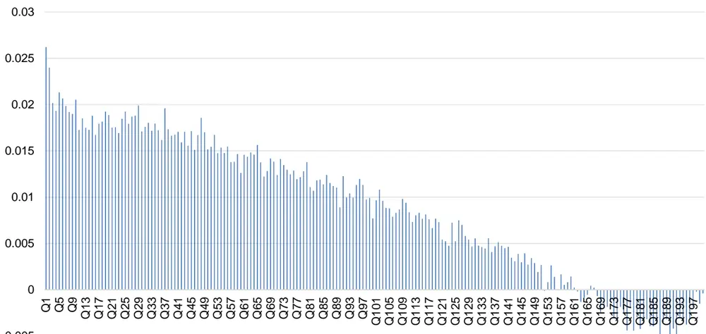
数据来源：通联数据、Wind，广发证券发展研究中心

图 3：精选大小单因子组合累计收益（全市场）
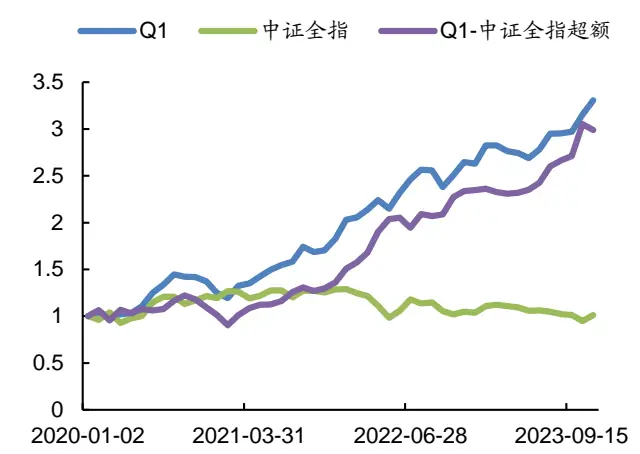
数据来源：通联数据、Wind，广发证券发展研究中心

图 4：精选大小单因子组合RankIC（全市场）
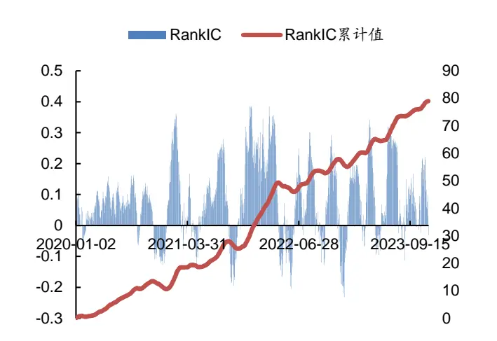
数据来源：通联数据、Wind，广发证券发展研究中心

表 18：精选大小单因子组合在全市场板块中的分年度表现统计

| 组合 | 年份 | 年化收益率 | 最大回撤率 | 年化波动率 | 信息比率 | 夏普比率 | 收益回撤比 |
| --- | --- | --- | --- | --- | --- | --- | --- |
| Q1多头 | 2020~2023年 | 36.61% | 17.52% | 16.82% | 2.18 | 2.03 | 2.09 |
|  | 2020年 | 27.05% | 13.93% | 21.06% | 1.28 | 1.17 | 1.94 |
|  | 2021年 | 70.58% | 3.22% | 17.78% | 3.97 | 3.83 | 21.94 |
|  | 2022年 | 32.44% | 7.17% | 15.65% | 2.07 | 1.91 | 4.52 |
|  | 2023年 | 31.69% | 4.85% | 12.16% | 2.61 | 2.40 | 6.54 |
| Q1-Q200 多空 | 2020~2023年 | 34.15% | 22.76% | 26.45% | 1.29 | 1.20 | 1.50 |
|  | 2020年 | -20.80% | 19.77% | 25.10% | -0.83 | -0.93 | -1.05 |
|  | 2021年 | 56.85% | 17.98% | 36.61% | 1.55 | 1.48 | 3.16 |
|  | 2022年 | 74.62% | 6.88% | 22.99% | 3.25 | 3.14 | 10.85 |
|  | 2023年 | 64.83% | 0.82% | 11.01% | 5.89 | 5.66 | 79.16 |
| 中证全指 | 2020~2023年 | 0.32% | 26.62% | 19.08% | 0.02 | -0.11 | 0.01 |
|  | 2020年 | 21.24% | 10.90% | 23.77% | 0.89 | 0.79 | 1.95 |
|  | 2021年 | 8.88% | 6.41% | 13.85% | 0.64 | 0.46 | 1.39 |
|  | 2022年 | -21.31% | 21.04% | 22.58% | -0.94 | -1.05 | -1.01 |
|  | 2023年 | -2.68% | 15.80% | 13.98% | -0.19 | -0.37 | -0.17 |
| Q1-中证全指超额 | 2020~2023年 | 33.07% | 25.98% | 19.89% | 1.66 | 1.54 |  |
|  | 2020年 | 1.24% |  | 24.15% | 0.05 | -0.05 | 1.27 |
|  | 2021年 | 54.52% | 17.19% 3.06% | 21.40% | 2.55 | 2.43 | 0.07 17.79 |
|  | 2022年 | 62.27% | 5.22% | 17.68% | 3.52 | 3.38 | 11.92 |
|  | 2023年 | 33.57% | 2.26% | 14.77% | 2.27 | 2.10 | 14.88 |

数据来源：通联数据、Wind，广发证券发展研究中心

## 2. 精选大小单因子组合在沪深300板块中的表现

本文对精选大小单因子组合在沪深300板块上分50档构建组合进行测算，实证结果如图5~7和表19所示。大小单因子组合在沪深300板块的50档多头较为显著，在2020~2023年间取得了12.24%的多头年化收益率，最大回撤率为14.51%，夏普比率为0.75，相对同期的沪深300指数取得了13.40%的超额年化收益率。

图 5：精选大小单因子组合在沪深300板块中的50档分档表现
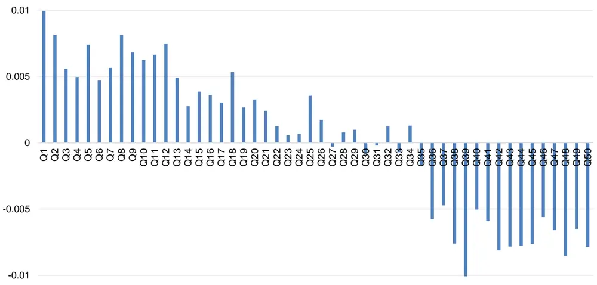
数据来源：通联数据、Wind，广发证券发展研究中心

图 6：精选大小单因子组合累计收益（沪深300）
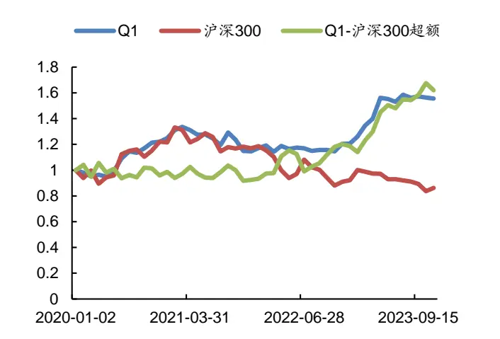
数据来源：通联数据、Wind，广发证券发展研究中心

图 7：精选大小单因子组合RankIC（沪深300）
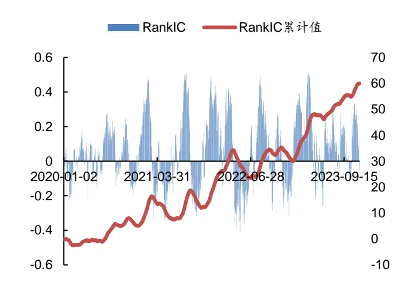
数据来源：通联数据、Wind，广发证券发展研究中心

表 19：精选大小单因子组合在沪深300板块中的分年度表现统计

|  | 年份 | 年化收益率 | 最大回撤率 | 年化波动率 | 信息比率 | 夏普比率 | 收益回撤比 |
| --- | --- | --- | --- | --- | --- | --- | --- |
|  | 2020~2023年 | 55.68% | 12.24% | 14.51% | 13.01% | 0.94 | 0.75 |
|  | 2020年 | 24.90% | 27.45% | 3.13% | 12.61% | 2.18 | 1.98 |
|  | 2021年 | -6.25% | -6.80% | 14.22% | 14.75% | -0.46 | -0.63 |
|  | 2022年 | 2.96% | 3.23% | 4.07% | 8.71% | 0.37 | 0.08 |
| Q1-Q50 多空 | 2023年 | 29.14% | 35.91% | 1.99% | 14.26% | 2.52 | 2.34 |
|  | 2020~2023年 | 99.34% | 19.72% | 28.00% | 25.95% | 0.76 | 0.66 |
|  | 2020年 | 6.14% | 6.71% | 9.73% | 20.08% | 0.33 | 0.21 |
|  | 2021年 | -6.04% | -6.57% | 28.00% | 39.42% | -0.17 | -0.23 |
|  | 2022年 | 19.42% | 21.36% | 10.73% | 16.31% | 1.31 | 1.16 |
|  | 2023年 | 67.39% | 85.56% | 2.85% | 21.39% | 4.00 | 3.88 |
| 沪深300 | 2020~2023年 | -13.87% | -3.82% | 37.15% | 19.31% | -0.20 | -0.33 |
|  | 2020年 | 21.45% | 23.62% | 10.28% | 24.63% | 0.96 | 0.86 |
|  | 2021年 | -2.41% | -2.63% | 13.88% | 16.95% | -0.16 | -0.30 |
|  | 2022年 | -22.16% | -23.92% | 23.60% | 20.25% | -1.18 | -1.30 |
|  | 2023年 | -6.64% | -7.91% | 16.40% | 13.24% | -0.60 | -0.79 |
| Q1-沪深 300 超额 | 2020~2023年 | 61.94% | 13.40% | 14.12% | 19.25% | 0.70 | 0.57 |
|  | 2020年 | -1.42% | -1.54% | 11.38% | 22.34% | -0.07 | -0.18 |
|  | 2021年 | -5.35% | -5.83% | 11.35% | 15.79% | -0.37 | -0.53 |
|  | 2022年 | 27.04% | 29.84% | 14.12% | 20.98% | 1.42 | 1.30 |
|  | 2023年 | 36.61% | 45.41% | 3.37% | 16.95% | 2.68 | 2.53 |

数据来源：通联数据、Wind，广发证券发展研究中心

## 3. 精选大小单因子组合在中证500板块中的表现

本文对精选大小单因子组合在中证500板块上分50档构建组合进行测算，实证结果如图8~10和表20所示。大小单因子组合在中证500板块的50档多头较为显著，在2020~2023年间取得了22.55%的多头年化收益率，最大回撤率为9.08%，夏普比率为1.12，相对同期的中证500指数取得了18.67%的超额年化收益率。

图 8：精选大小单因子组合在中证500板块中的50档分档表现
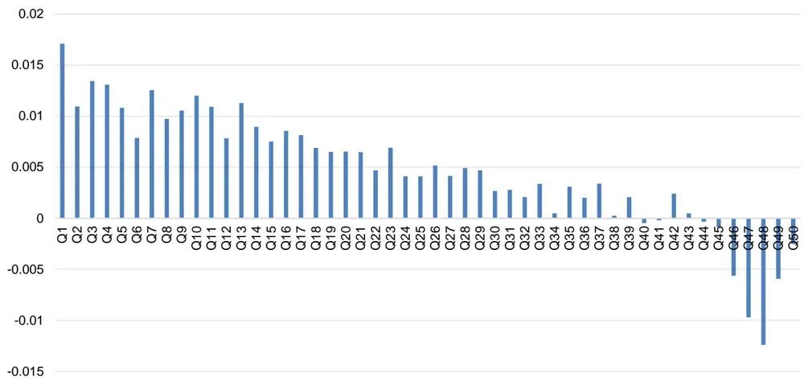
数据来源：通联数据、Wind，广发证券发展研究中心

图 9：精选大小单因子组合累计收益（中证500）
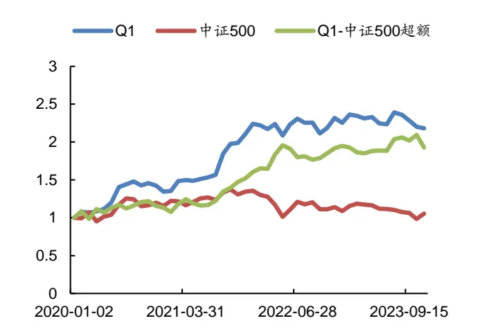
数据来源：通联数据、Wind，广发证券发展研究中心

图 10：精选大小单因子组合RankIC（中证500）
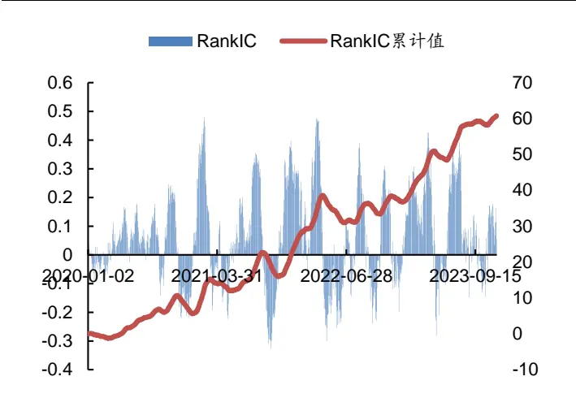
数据来源：通联数据、Wind，广发证券发展研究中心

表 20：精选大小单因子组合在中证500板块中的分年度表现统计

|  | 年份 | 年化收益率 | 最大回撤率 | 年化波动率 | 信息比率 | 夏普比率 | 收益回撤比 |
| --- | --- | --- | --- | --- | --- | --- | --- |
| Q1多头 | 2020~2023年 | 22.55% | 9.08% | 17.91% | 1.26 | 1.12 | 2.48 |
|  | 2020年 | 38.22% | 9.08% | 21.14% | 1.81 | 1.69 | 4.21 |
|  | 2021年 | 74.47% | 0.65% | 18.28% | 4.07 | 3.94 | 114.61 |
|  | 2022年 | 0.62% | 8.56% | 15.71% | 0.04 | -0.12 | 0.07 |
|  | 2023年 | -3.88% | 8.81% | 11.74% | -0.33 | -0.54 | -0.44 |
| Q1-Q50 多空 | 2020~2023年 | 24.27% | 30.06% | 25.58% | 0.95 | 0.85 | 0.81 |

识别风险，发现价值

|  | 2020年 | 18.02% | 11.63% | 17.71% | 1.02 | 0.88 | 1.55 |
| --- | --- | --- | --- | --- | --- | --- | --- |
|  | 2021年 | 33.85% | 30.06% | 42.62% | 0.79 | 0.74 | 1.13 |
|  | 2022年 | 29.11% | 14.63% | 22.52% | 1.29 | 1.18 | 1.99 |
|  | 2023年 | 24.07% | 2.58% | 9.47% | 2.54 | 2.28 | 9.32 |
|  | 2020~2023年 | 1.40% | 28.32% | 19.43% | 0.07 | -0.06 | 0.05 |
| 中证500 | 2020年 | 17.06% | 11.40% | 23.75% | 0.72 | 0.61 | 1.50 |
|  | 2021年 | 19.13% | 4.85% | 13.64% | 1.40 | 1.22 | 3.94 |
|  | 2022年 | -21.27% | 22.10% | 23.65% | -0.90 | -1.01 | -0.96 |
|  | 2023年 | -3.81% | 16.82% | 14.32% | -0.27 | -0.44 | -0.23 |
|  | 2020~2023年 | 18.67% | 11.81% | 17.50% |  |  |  |
| Q1-中证 500 超额 | 2020年 | 14.62% |  |  | 1.07 | 0.92 | 1.58 |
|  | 2021年 | 46.02% | 9.43% | 22.48% | 0.65 | 0.54 | 1.55 |
|  | 2022年 | 23.81% | 6.50% 9.76% | 17.13% 15.63% | 2.69 1.52 | 2.54 | 7.08 |
|  | 2023年 | -1.38% | 7.97% |  |  | 1.36 | 2.44 |
|  |  |  |  | 13.93% | -0.10 | -0.28 | -0.17 |

数据来源：通联数据、Wind，广发证券发展研究中心

## 4. 精选大小单因子组合在中证800板块中的表现

本文对精选大小单因子组合在中证800板块上分50档构建组合进行测算，实证结果如图11~13和表21所示。大小单因子组合在中证800板块的50档多头较为显著，在2020~2023年间取得了18.54%的多头年化收益率，最大回撤率为7.22%，夏普比率为1.14，相对同期的中证800指数取得了18.95%的超额年化收益率。

图 11：精选大小单因子组合在中证800板块中的50档分档表现
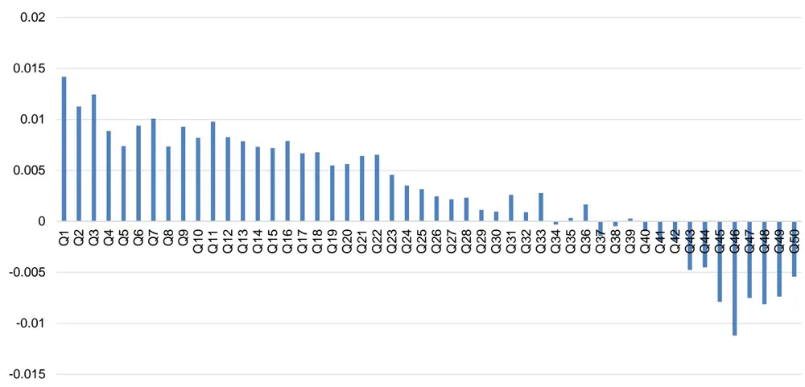
数据来源：通联数据、Wind，广发证券发展研究中心

图 12：精选大小单因子组合累计收益（中证800）
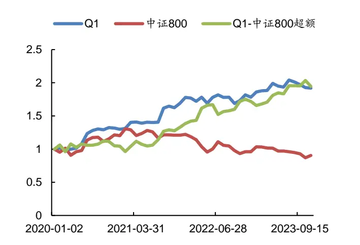
数据来源：通联数据、Wind，广发证券发展研究中心

图 13：精选大小单因子组合RankIC（中证800）
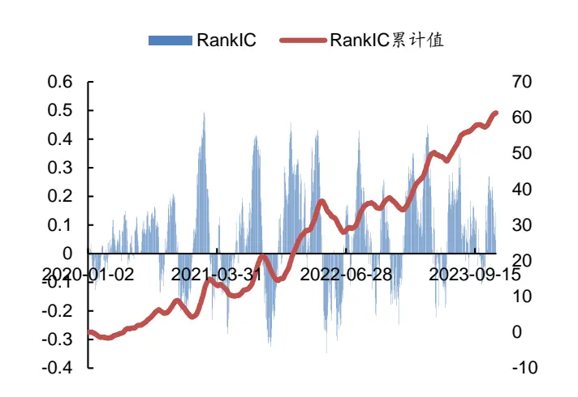
数据来源：通联数据、Wind，广发证券发展研究中心

表 21：精选大小单因子组合在中证800板块中的分年度表现统计

| 年份 |  | 年化收益率 | 最大回撤率 | 年化波动率 | 信息比率 | 夏普比率 | 收益回撤比 |
| --- | --- | --- | --- | --- | --- | --- | --- |
| Q1多头 | 2020~2023年 | 18.54% | 7.22% | 14.11% | 1.31 | 1.14 | 2.57 |
|  | 2020年 | 32.89% | 2.99% | 15.75% | 2.09 | 1.93 | 11.00 |
|  | 2021年 | 41.11% | 1.46% | 16.13% | 2.55 | 2.39 | 28.15 |
|  | 2022年 | 0.22% | 7.22% | 12.59% | 0.02 | -0.18 | 0.03 |
|  | 2023年 | 9.24% | 5.97% | 10.63% | 0.87 | 0.63 | 1.55 |
| Q1-Q50 多空 | 2020~2023年 | 23.88% | 28.05% | 24.36% | 0.98 | 0.88 | 0.85 |
|  | 2020年 | 11.05% | 8.83% | 15.78% | 0.70 | 0.54 | 1.25 |
|  | 2021年 | 26.46% | 28.05% | 41.48% | 0.64 | 0.58 | 0.94 |
|  | 2022年 | 27.01% | 11.58% | 18.81% | 1.44 | 1.30 | 2.33 |
|  | 2023年 | 41.73% | 2.58% | 12.16% | 3.43 | 3.23 | 16.19 |
| 中证800 | 2020~2023年 | -2.59% | 33.43% | 18.69% | -0.14 | -0.27 | -0.08 |
|  | 2020年 | 22.13% | 10.56% | 23.94% | 0.92 | 0.82 | 2.10 |
|  | 2021年 | 2.01% | 10.72% | 15.42% | 0.13 | -0.03 | 0.19 |
|  | 2022年 | -23.28% | 21.40% | 20.09% | -1.16 | -1.28 | -1.09 |
|  | 2023年 | -6.86% | 15.99% | 13.19% | -0.52 | -0.71 | -0.43 |
| Q1-中证 800 超额 | 2020~2023年 | 18.95% | 14.19% |  |  |  |  |
|  | 2020年 |  |  | 17.39% | 1.09 | 0.95 | 1.34 |
|  | 2021年 | 5.00% 35.92% | 9.63% 6.33% | 20.39% 19.44% | 0.25 1.85 | 0.12 1.72 | 0.52 |
|  | 2022年 | 26.53% | 8.81% | 17.52% | 1.51 | 1.37 | 5.67 3.01 |
|  | 2023年 | 15.98% | 4.42% | 12.19% | 1.31 | 1.11 | 3.62 |

数据来源：通联数据、Wind，广发证券发展研究中心

## 5. 精选大小单因子组合在中证1000板块中的表现

本文对精选大小单因子组合在中证1000板块上分50档构建组合进行测算，实证结果如图14~16和表22所示。大小单因子组合在中证1000板块的50档多头较为显著，在2020~2023年间取得了24.61%的多头年化收益率，最大回撤率为10.43%，夏普比率为1.36，相对同期的中证1000指数取得了17.39%的超额年化收益率。

图 14：精选大小单因子组合在中证1000板块中的50档分档表现
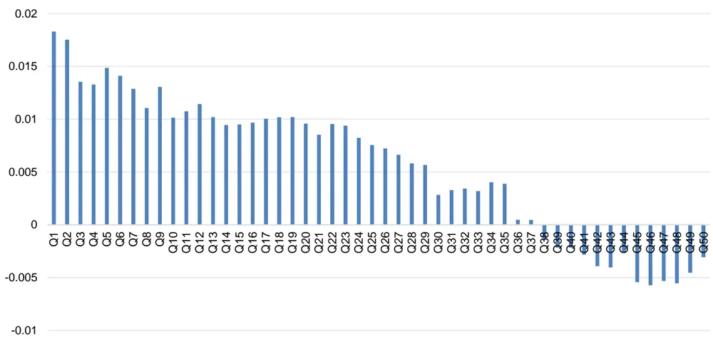
数据来源：通联数据、Wind，广发证券发展研究中心

图 15：精选大小单因子组合累计收益（中证1000）

数据来源：通联数据、Wind，广发证券发展研究中心

图 16：精选大小单因子组合RankIC（中证1000）
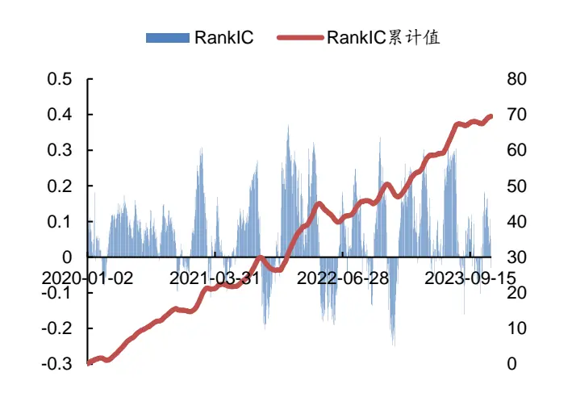
数据来源：通联数据、Wind，广发证券发展研究中心

表 22：精选大小单因子组合在中证1000板块中的分年度表现统计

|  | 年份 | 年化收益率 | 最大回撤率 | 年化波动率 | 信息比率 | 夏普比率 | 收益回撤比 |
| --- | --- | --- | --- | --- | --- | --- | --- |
|  | 2020~2023年 | 24.61% | 10.43% | 16.24% | 1.52 | 1.36 | 2.36 |
|  | 2020年 | 36.89% | 9.52% | 20.57% | 1.79 | 1.67 | 3.87 |
|  | 2021年 | 61.69% | 2.92% | 14.36% | 4.30 | 4.12 | 21.14 |
|  | 2022年 | 13.41% | 7.56% | 15.79% | 0.85 | 0.69 | 1.78 |
| Q1-Q50 多空 | 2023年 | -0.03% | 10.43% | 11.47% | -0.00 | -0.22 | -0.00 |
|  | 2020~2023年 | 27.13% | 16.70% | 21.38% | 1.27 | 1.15 | 1.62 |
|  | 2020年 | 25.68% | 10.36% | 16.37% | 1.57 | 1.42 | 2.48 |
|  | 2021年 | 49.87% | 15.11% | 29.69% | 1.68 | 1.60 | 3.30 |
|  | 2022年 | 26.91% | 16.70% | 25.23% | 1.07 | 0.97 | 1.61 |
|  | 2023年 | 15.66% | 3.64% | 9.98% | 1.57 | 1.32 | 4.31 |
| 中证1000 | 2020~2023年 | 2.56% | 30.22% | 23.97% | 0.11 | 0.00 | 0.08 |
|  | 2020年 | 15.48% | 12.54% | 27.30% | 0.57 | 0.48 | 1.23 |
|  | 2021年 | 22.07% | 4.95% | 17.18% | 1.28 | 1.14 | 4.46 |
|  | 2022年 | -20.67% | 25.38% | 31.46% | -0.66 | -0.74 | -0.81 |
|  | 2023年 | -0.68% | 19.07% | 18.08% | -0.04 | -0.18 | -0.04 |
| Q1-中证 1000 超额 | 2020~2023年 | 17.39% | 14.40% | 19.71% | 0.88 | 0.76 | 1.21 |
|  | 2020年 | 13.28% | 12.50% | 24.74% | 0.54 | 0.44 | 1.06 |
|  | 2021年 | 30.73% | 6.72% | 16.59% | 1.85 | 1.70 | 4.57 |
|  | 2022年 | 33.59% | 14.40% | 22.55% | 1.49 | 1.38 | 2.33 |
|  | 2023年 | -1.30% | 8.44% | 14.20% | -0.09 | -0.27 | -0.15 |

数据来源：通联数据、Wind，广发证券发展研究中心

## 6. 精选大小单因子组合在创业板板块中的表现

本文对精选大小单因子组合在创业板板块上分50档构建组合进行测算，实证结果如图17~19和表23所示。大小单因子组合在创业板板块的50档多头较为显著，在2020~2023年间取得了36.20%的多头年化收益率，最大回撤率为25.15%，夏普比率为1.59，相对同期的创业板指数取得了25.07%的超额年化收益率。

图 17：精选大小单因子组合在创业板板块中的50档分档表现
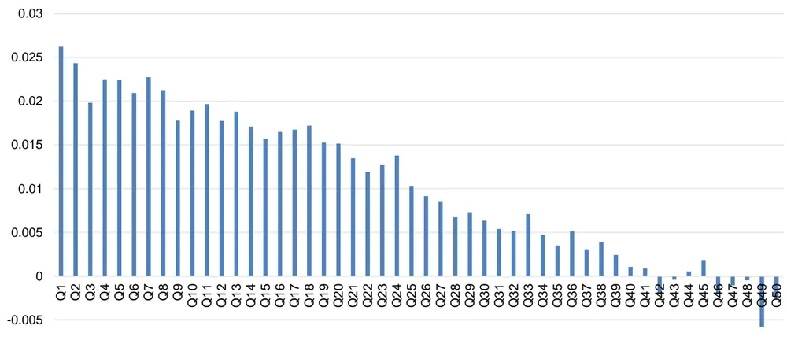
数据来源：通联数据、Wind，广发证券发展研究中心

图 18：精选大小单因子组合累计收益（创业板）
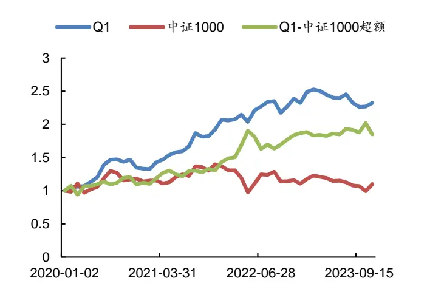
数据来源：通联数据、Wind，广发证券发展研究中心

图 19：精选大小单因子组合RankIC（创业板）
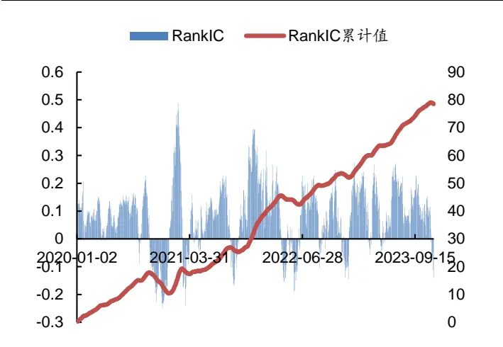
数据来源：通联数据、Wind，广发证券发展研究中心

表 23：精选大小单因子组合在创业板板块中的分年度表现统计

|  | 年份 | 年化收益率 | 最大回撤率 | 年化波动率 | 信息比率 | 夏普比率 | 收益回撤比 |
| --- | --- | --- | --- | --- | --- | --- | --- |
| Q1多头 | 2020~2023年 | 36.20% | 25.15% | 21.26% | 1.70 | 1.59 | 1.44 |
|  | 2020年 | 36.61% | 21.29% | 29.52% | 1.24 | 1.16 | 1.72 |
|  | 2021年 | 83.24% | 3.78% | 17.65% | 4.72 | 4.58 | 22.05 |
|  | 2022年 | -1.32% | 12.83% | 19.09% | -0.07 | -0.20 | -0.10 |
|  | 2023年 | 53.18% | 3.42% | 14.22% | 3.74 | 3.56 | 15.57 |
| Q1-Q50 多空 | 2020~2023年 | 38.58% | 23.88% | 24.82% | 1.55 | 1.45 | 1.62 |

识别风险，发现价值

|  | 2020年 | 2.44% | 23.88% | 34.31% | 0.07 | -0.00 | 0.10 |
| --- | --- | --- | --- | --- | --- | --- | --- |
|  | 2021年 | 92.83% | 7.36% | 26.88% | 3.45 | 3.36 | 12.62 |
|  | 2022年 | 19.11% | 17.41% | 20.46% | 0.93 | 0.81 | 1.10 |
|  | 2023年 | 75.00% | 0.03% | 8.02% | 9.35 | 9.04 | 2280.87 |
|  | 2020~2023年 | 2.21% | 46.37% | 29.15% | 0.08 | -0.01 | 0.05 |
| 创业板指 | 2020年 | 59.58% | 13.05% | 31.98% | 1.86 | 1.78 | 4.56 |
|  | 2021年 | 18.91% | 15.93% | 27.64% | 0.68 | 0.59 | 1.19 |
|  | 2022年 | -32.37% | 25.76% | 33.14% | -0.98 | -1.05 | -1.26 |
|  | 2023年 | -15.96% | 27.48% | 19.23% | -0.83 | -0.96 | -0.58 |
| Q1-创业板指超额 | 2020~2023年 | 25.07% | 45.40% | 30.10% | 0.83 | 0.75 | 0.55 |
|  | 2020年 | -21.71% | 30.42% | 39.23% | -0.55 | -0.62 | -0.71 |
|  | 2021年 | 42.76% | 2.15% | 34.60% | 1.24 | 1.16 | 19.87 |
|  | 2022年 | 35.79% | 14.95% | 22.75% | 1.57 | 1.46 | 2.39 |
|  | 2023年 | 76.88% | 1.85% | 18.03% | 4.26 | 4.13 | 41.47 |

数据来源：通联数据、Wind，广发证券发展研究中心

## 四、总结与展望

如何能在股票市场的博弈中胜出？对于量化投资者来说，关键在于对数据的全面收集，并结合数学模型和算法进行深入分析，从海量数据中挖掘出隐藏的市场规律。Level 1行情数据为3秒一笔的快照（Snapshot）数据，包含了简单的开高低收交易量交易金额等常规数据，所含信息有限。Level 2行情数据则不仅提供了10档买卖委托等更丰富的快照数据，而且提供了股票市场在交易时段中的每一笔委托、成交和撤单的详细信息。

本文是“海量Level 2数据因子挖掘”系列研究报告的第一篇，从所有行情数据的根源——Level 2逐笔订单数据出发，从订单的大小角度进行窥探，并结合多维度解耦的分析方法构建出有效的大小单因子。

隔夜知情交易者通常会在第二天开盘后迅速根据已掌握的信息进行买入或卖出，以谋求更大的收益或减少踩踏。因此，开盘后15分钟或30分钟内的大小订单信息尤其值得关注。基于此观察，本文构建了24个从时间维度进行解耦的大单占比因子。与此同时，同一笔成交订单同时存在着买入和卖出两个方向上的大小单属性。据此，本文构建出了12个从订单维度解耦的大小单占比因子。进一步的，本文尝试同时从时间维度和订单维度来对大小单因子进行解耦，构建出了48个多维度解耦的大小单占比因子。

最后，本文从上述93个大小单因子中挑选出表现优异者，并构建出了精选大小单因子组合。在2020~2023年期间的20日换仓下，实证结果表明精选大小单因子组合在全市场及各大板块上均取得了较为出色的表现。在200档分档组合构建下，大小单因子组合在全市场板块的多头较为显著，取得了36.61%的多头年化收益率，最大回撤率为17.52%，夏普比率为2.03，相对同期的中证全指取得了33.07%的超额年化收益率。在50档分档组合构建下，大小单因子组合在沪深300、中证500、中证800、中证1000和创业板板块的多头较为显著，分别取得了12.24%、22.55%、18.54%、

24.61%、36.20%的多头年化收益率，夏普比率分别为0.75、1.12、1.14、1.36、1.59，相比同期的板块指数分别取得了13.40%、18.67%、18.95%、17.39%、25.07%的超额年化收益率。

展望未来，“海量Level 2数据因子挖掘”系列研究报告将继续深入Level 2数据，从海量数据中挖掘出隐藏的市场规律，构建出更多的有效因子。

## 五、风险提示

本文所述模型用量化方法通过历史数据统计、建模和测算完成，所得结论与规律在市场政策、环境变化时存在失效风险；

本文策略在市场结构及交易行为改变时有可能存在失效风险；

因量化模型不同，本文提出的观点可能与其他量化模型结论存在差异。

## [Table_ResearchTeam] 广发金融工程研究小组

罗军 ：首席分析师，华南理工大学硕士，从业 16 年，2010 年进入广发证券发展研究中心。

安 宁 宁 ：首席分析师，暨南大学硕士，从业 14 年，2011 年进入广发证券发展研究中心。

史 庆 盛 ：资深分析师，华南理工大学硕士，2011 年进入广发证券发展研究中心。

张 超 ：资深分析师，中山大学硕士，2012 年进入广发证券发展研究中心。

陈 原 文 ：资深分析师，中山大学硕士，2015 年进入广发证券发展研究中心。

李豪 ：资深分析师，上海交通大学硕士，2016 年进入广发证券发展研究中心。

周 飞 鹏 ：资深分析师，伯明翰大学硕士，2021 年加入广发证券发展研究中心。

张 钰 东 ：资深分析师，中山大学硕士，2020 年进入广发证券发展研究中心。

季 燕 妮 ：资深分析师，厦门大学硕士，2020 年进入广发证券发展研究中心。

林 涛 ：研究员，中山大学硕士，2024 年进入广发证券发展研究中心。

## [Table_IndustryInvestDescription] 广发证券—行业投资评级说明

买入： 预期未来12个月内，股价表现强于大盘10%以上。

持有： 预期未来12个月内，股价相对大盘的变动幅度介于-10%～+10%。

卖出： 预期未来12个月内，股价表现弱于大盘10%以上。

## [Table_CompanyInvestDescription] 广发证券—公司投资评级说明

买入： 预期未来 12 个月内，股价表现强于大盘 15%以上。

增持： 预期未来12个月内，股价表现强于大盘5%-15%。

持有： 预期未来12个月内，股价相对大盘的变动幅度介于-5%～+5%。

卖出： 预期未来 12 个月内，股价表现弱于大盘 5%以上。

## [Table_Address] 联系我们

| 地址 | 广州市 | 深圳市 | 北京市 | 上海市 | 香港 |
| --- | --- | --- | --- | --- | --- |
|  | 广州市天河区马场路 | 深圳市福田区益田路 | 北京市西城区月坛北 | 上海市浦东新区南泉 | 香港湾仔骆克道81号 |
|  | 26号广发证券大厦47 | 6001号太平金融大厦 | 街2号月坛大厦18层 | 北路429号泰康保险 | 广发大厦27 楼 |
|  | 楼 | 31层 |  | 大厦37楼 |  |
|  | 邮政编码 510627 客服邮箱 gfzqyf@gf.com.cn | 518026 | 100045 | 200120 |  |

## [Table_LegalD 法律主体isclaimer 声明]

本报告由广发证券股份有限公司或其关联机构制作，广发证券股份有限公司及其关联机构以下统称为“广发证券”。本报告的分销依据不同国家、地区的法律、法规和监管要求由广发证券于该国家或地区的具有相关合法合规经营资质的子公司/经营机构完成。

广发证券股份有限公司具备中国证监会批复的证券投资咨询业务资格，接受中国证监会监管，负责本报告于中国（港澳台地区除外）的分销。广发证券（香港）经纪有限公司具备香港证监会批复的就证券提供意见（4 号牌照）的牌照，接受香港证监会监管，负责本报告于中国香港地区的分销。

本报告署名研究人员所持中国证券业协会注册分析师资质信息和香港证监会批复的牌照信息已于署名研究人员姓名处披露。

## [Table_I 重要mportant 声明N

广发证券股份有限公司及其关联机构可能与本报告中提及的公司寻求或正在建立业务关系，因此，投资者应当考虑广发证券股份有限公司及其关联机构因可能存在的潜在利益冲突而对本报告的独立性产生影响。投资者不应仅依据本报告内容作出任何投资决策。投资者应自主作出投资决策并自行承担投资风险，任何形式的分享证券投资收益或者分担证券投资损失的书面或者口头承诺均为无效。

本报告署名研究人员、联系人（以下均简称“研究人员”）针对本报告中相关公司或证券的研究分析内容，在此声明：（ ）本报告的全部分析结论、研究观点均精确反映研究人员于本报告发出当日的关于相关公司或证券的所有个人观点，并不代表广发证券的立场；（2）研究人员的部分或全部的报酬无论在过去、现在还是将来均不会与本报告所述特定分析结论、研究观点具有直接或间接的联系。

研究人员制作本报告的报酬标准依据研究质量、客户评价、工作量等多种因素确定，其影响因素亦包括广发证券的整体经营收入，该等经营收入部分来源于广发证券的投资银行类业务。

本报告仅面向经广发证券授权使用的客户/特定合作机构发送，不对外公开发布，只有接收人才可以使用，且对于接收人而言具有保密义务。广发证券并不因相关人员通过其他途径收到或阅读本报告而视其为广发证券的客户。在特定国家或地区传播或者发布本报告可能违反当地法律，广发证券并未采取任何行动以允许于该等国家或地区传播或者分销本报告。

本报告所提及证券可能不被允许在某些国家或地区内出售。请注意，投资涉及风险，证券价格可能会波动，因此投资回报可能会有所变化，过去的业绩并不保证未来的表现。本报告的内容、观点或建议并未考虑任何个别客户的具体投资目标、财务状况和特殊需求，不应被视为对特定客户关于特定证券或金融工具的投资建议。本报告发送给某客户是基于该客户被认为有能力独立评估投资风险、独立行使投资决策并独立承担相应风险。

本报告所载资料的来源及观点的出处皆被广发证券认为可靠，但广发证券不对其准确性、完整性做出任何保证。报告内容仅供参考，报告中的信息或所表达观点不构成所涉证券买卖的出价或询价。广发证券不对因使用本报告的内容而引致的损失承担任何责任，除非法律法规有明确规定。客户不应以本报告取代其独立判断或仅根据本报告做出决策，如有需要，应先咨询专业意见。

广发证券可发出其它与本报告所载信息不一致及有不同结论的报告。本报告反映研究人员的不同观点、见解及分析方法，并不代表广发证券的立场。广发证券的销售人员、交易员或其他专业人士可能以书面或口头形式，向其客户或自营交易部门提供与本报告观点相反的市场评论或交易策略，广发证券的自营交易部门亦可能会有与本报告观点不一致，甚至相反的投资策略。报告所载资料、意见及推测仅反映研究人员于发出本报告当日的判断，可随时更改且无需另行通告。广发证券或其证券研究报告业务的相关董事、高级职员、分析师和员工可能拥有本报告所提及证券的权益。在阅读本报告时，收件人应了解相关的权益披露（若有）。

本研究报告可能包括和/或描述/呈列期货合约价格的事实历史信息（“信息”）。请注意此信息仅供用作组成我们的研究方法/分析中的部分论点依据/证据，以支持我们对所述相关行业/公司的观点的结论。在任何情况下，它并不（明示或暗示）与香港证监会第5类受规管活动（就期货合约提供意见）有关联或构成此活动。

## [Table_Interest 权益披露Disclosur

(1)广发证券（香港）跟本研究报告所述公司在过去12 个月内并没有任何投资银行业务的关系。

## [Table_Copyright] 版权声明

未经广发证券事先书面许可，任何机构或个人不得以任何形式翻版、复制、刊登、转载和引用，否则由此造成的一切不良后果及法律责任由私自翻版、复制、刊登、转载和引用者承担。