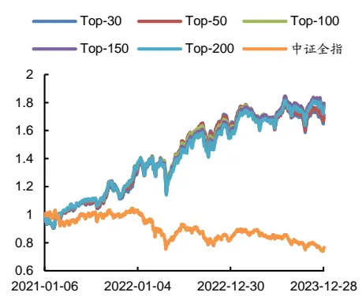
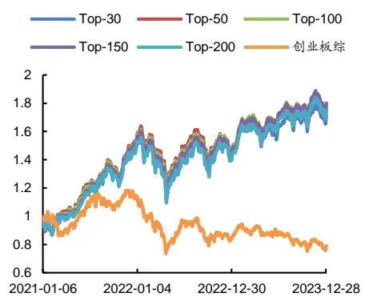
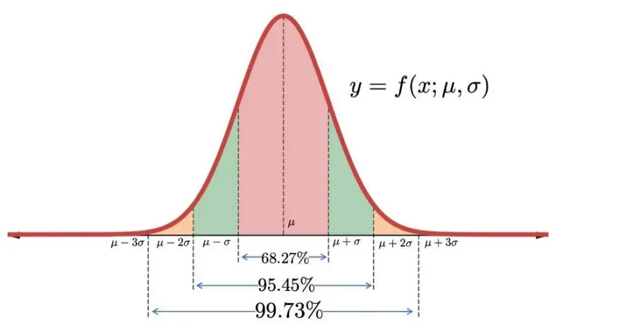
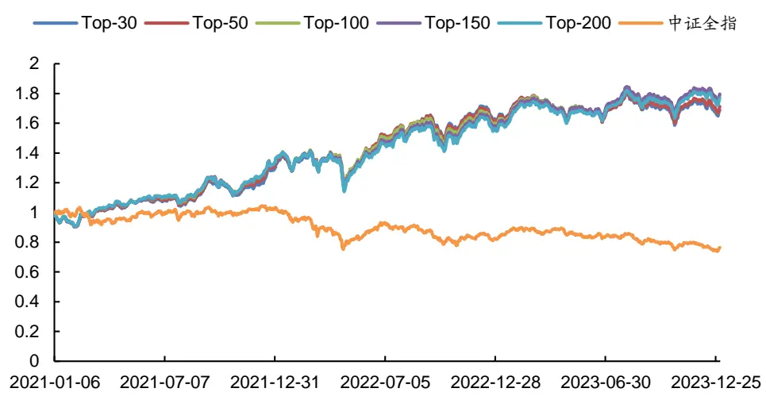
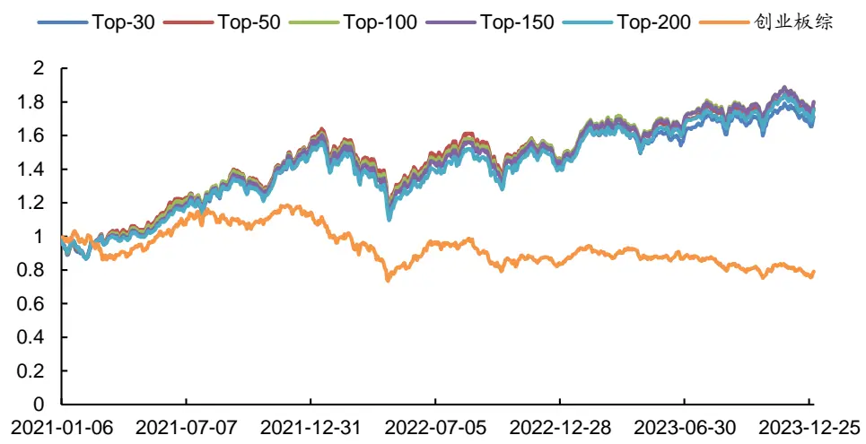
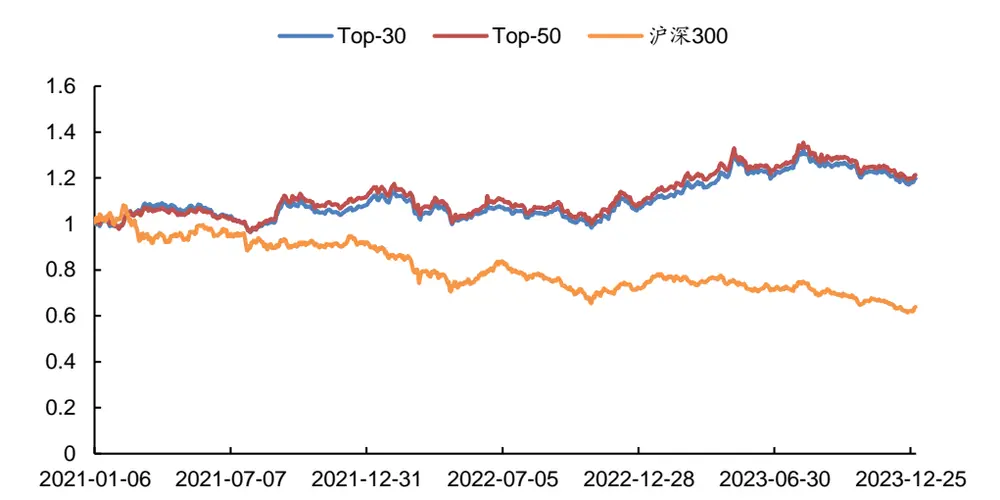
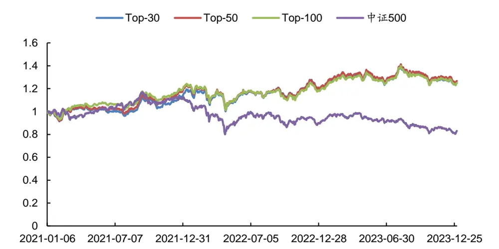
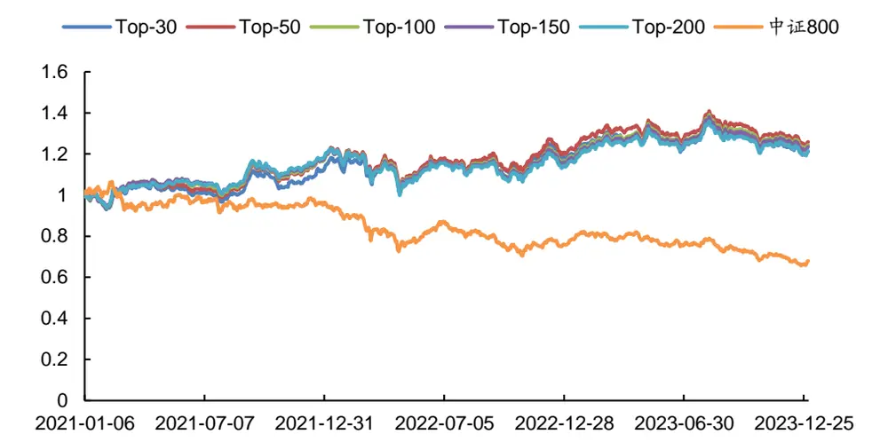
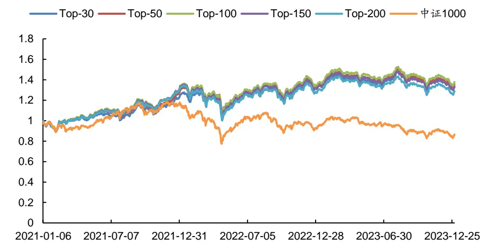

# [Table_Title] 订单维度解耦的 22 个长短单因子

## 海量 Level 2 数据因子挖掘系列（二）

## 报告摘要：

数据制胜。如何能在股票市场的博弈中胜出？对于量化投资者来说，关键在于对数据的全面收集，并结合数学模型和算法进行深入分析，从海量数据中挖掘出隐藏的市场规律。

在前序研究“多维度解耦的94个大小单因子：海量Level 2数据因子挖掘系列（一）”中，从订单的大小角度对Level 2逐笔订单数据进行窥探，并结合多维度解耦的分析方法构建出了有效的大小单因子。

基于 Level 2 逐笔订单数据构建的长短单因子。在股票交易所的订单撮合中，同一笔委托可能会由于对手下单数量的不同而被拆解为多个订单成交，而拆解后的多个订单既可能在短时间内连续完成，也可能在较长的一段时间内分散完成。因此，不同委托订单的成交完成时间并不相同。基于此观察，本文作为“海量 Level 2 数据因子挖掘”系列研究报告的第二篇，继续从 Level 2 数据出发，根据逐笔成交订单中不同买入或卖出订单号的实际成交完成时间进行成交量占比统计，并结合订单维度的解耦分析方法构建出有效的长短单因子。

精选长短单因子组合。本文进一步从上述原始长短单因子中挑选出表现优异者，构建出精选长短单因子组合。具体而言，采用因子值排序后的前 K个股票构建Top-K 组合，以t+1日均价买入，20个交易日换仓，双边千三计费，实证结果表明精选长短单因子组合在 A 股全市场及各大板块中均取得了较为出色的表现。

全市场板块。2021~2023 年间，精选因子 RankIC 均值达 13.2%、胜率达 80.5%，Top-150组合的平均年化收益率为 21.41%、最大回撤率为18.70%、夏普比率为1.31，同期中证全指平均年化收益率为-8.50%。

创业板板块。2021~2023 年间，精选因子 RankIC 均值达 13.2%、胜率达 80.3%，Top-150组合的平均年化收益率为 21.52%、最大回撤率为 29.49%、夏普比率为1.07，同期创业板综指指数平均年化收益率为-7.46%。2023 年，Top-150 组合的年化收益率为 25.69%、最大回撤率为 9.39%、夏普比率为1.76，同期创业板综指年化收益率为-5.39%。

沪深 300 板块。2021~2023 年间，精选因子 RankIC 均值为 10.2%、胜率为 65.9%，Top-50组合的平均年化收益率为 6.61%、最大回撤率为 14.87%、夏普比率为 0.35，而同期沪深 300 指数平均年化收益率为-13.79%，精选因子组合取得了较为显著的超额收益。

风险提示：（1）本文所述模型用量化方法通过历史数据统计、建模和测算完成，所得结论与规律在市场政策、环境变化时存在失效风险；（2）本文策略在市场结构及交易行为改变时有可能存在失效风险；（3）因量化模型不同，本文提出的观点可能与其他量化模型结论存在差异。

图1：精选长短单因子组合（全市场）

数据来源：通联数据，Wind, 广发证券发展研究中心

图2：精选长短单因子组合（创业板）

数据来源：通联数据，Wind, 广发证券发展研究中心

[分析师： Table_Author]安宁宁

同SAC 执证号：S0260512020003

SFC CE No. BNW179

0755 - 23948352

anningning@gf.com.cn

## [Table_ 相关研究：DocRe

多维度解耦的 94 个大小单因2024-07-15
子：海量 Level 2 数据因子挖
掘系列（一）

[联系人： Table_Contacts] 林涛

0755 - 82528531

gflintao@gf.com.cn

## 一、Level 1 与 Level 2 行情数据介绍

如何能在股票市场的博弈中胜出？关键在于对市场信息的掌握和对市场规律的理解。对于量化投资者来说，更在于对数据的全面收集和深度分析，并结合数学模型和算法，从海量数据中挖掘出隐藏的市场规律。这些规律可能是某些股票价格的趋势，市场的周期性波动，抑或是短期的交易信号。一旦这些规律被发现并加以利用，量化投资者便能在股票市场的博弈中获得优势。

股票行情数据源于上交所和深交所，根据数据的频率和丰富度通常分为Level 1数据和Level 2数据。如表1所示，Level 1数据为3秒一笔的快照（Snapshot）数据，包含了常用行情软件上可以看到的最高价、最低价、开盘价、收盘价、成交量、成交额、成交笔数、委买委卖量、5档申买申卖价、5档申买申卖量等数据。而相比数据频率较低、数据丰富度有限的Level 1数据，Level 2数据中则不仅提供了更为丰富的快照（Snapshot）数据，如10档申买申卖价、10档申买申卖量、最优买卖价前50笔委托、买卖委托价位数、买卖撤单信息等，而且提供了Level 1数据中所不包含的逐笔订单（Tick）数据。逐笔订单数据包含了当日交易时段中集合竞价阶段和连续竞价阶段的每一笔订单数据，其中的关键信息包括精确到毫秒的订单时间、逐笔序号、频道代码、价格、数量、金额、买入卖出订单号和订单类别等详细数据。Level2数据中的逐笔订单数据是一切行情数据的根源，不同频率的快照数据均由逐笔订单数据聚合而成。在“海量Level 2数据因子挖掘”系列研究报告中，将尝试对Level 2数据中详细的快照数据和逐笔订单数据进行深入分析并加以利用，有望能够从中获得更为丰富的价格趋势、周期波动、交易信号等规律和信息，从而挖掘出更为有效的因子，构建出具有超额收益的股票投资组合。

在前序研究“多维度解耦的94个大小单因子：海量Level 2数据因子挖掘系列（一）”中，从所有行情数据的根源——Level 2逐笔订单出发，通过“大小订单”的角度对所有交易订单进行窥探，结合多维度解耦的分析方法构建出了多个有效的大小单因子，并从中挑选出表现优异者构建出了精选大小单因子组合，在A股全市场及各大板块中均取得了较为突出的表现。

本文是在“海量Level 2数据因子挖掘”系列研究报告的第二篇，继续从Level 2逐笔订单数据出发，通过“长短订单”的角度对所有交易订单进行窥探，并结合多维度解耦的分析方法构建出了22个有效的长短单因子。

表 1：Level 1与Level 2主要行情数据对比

| 数据类别 | 数据名称 | Level 1 | Level 2 |
| --- | --- | --- | --- |
| 快照数据 (Snapshot) | 时间 | 最快3秒一笔 | 最快3秒一笔 |
|  | 最高价 | V | V |
|  | 最低价 | V | > |
|  | 开盘价 | V | V |
|  | 收盘价 | > | √ |
|  | 成交数量 | V | V |
|  | 成交金额 | V | V |

识别风险，发现价值

|  | 成交笔数 | V | V |
| --- | --- | --- | --- |
|  | 委买量/委卖量 | V | V |
|  | 申买价/申卖价 | 5档 | 10档 |
|  | 申买量/申卖量 | 5档 | 10档 |
|  | 最优买/卖价前 50 笔委托 | x | V |
|  | 申买/申卖委托笔数 | × | V |
|  | 买入/卖出最大等待时间 | x | √（仅上交所） |
| 买方/卖方委托价位数 | × | √（仅上交所） |  |
| 买入/卖出撤单笔数 | x | √（仅上交所） |  |
| 买入/卖出撤单数量 | × | √（仅上交所） |  |
| 买入/卖出撤单金额 | × | √（仅上交所） |  |
| 买入/卖出总笔数 | × | √（仅上交所） |  |
| 逐笔订单数据 (Tick) | 时间 | x | ✓（精确到毫秒） |
|  | 逐笔序号 | × | V |
|  | 频道代码 |  |  |
|  | 价格 | × | √ |
|  | 数量 | × | √ |
|  | 金额 | × × | V V |
|  | 买入订单号 | x |  |
|  | 卖出订单号 |  | V |
|  | 订单类别 | × x | V ✓（委托/成交/撤单） |

数据来源：通联数据、广发证券发展研究中心

## 二、长短单因子构建

在股票交易所的订单撮合中，同一笔委托可能会由于对手下单数量的不同而被拆解为多个订单成交，而拆解后的多个订单既可能在短时间内连续完成，也可能在较长的一段时间内分散完成。因此，不同委托订单的成交完成时间并不相同。基于此观察，本文分别对逐笔成交订单中不同买入或卖出订单号的实际成交完成时间进行统计，并对成交完成时长大于均值+N倍标准差的订单界定为长单，剩余的则相应地界定为短单。本文分别采用3个不同的标准差阈值来对长短单进行界定，假设买卖订单中的成交量服从如图1所示的高斯分布，则买卖订单中成交完成时长大于均值+1.0倍标准差的长单约占15.8%，大于均值+1.5倍标准差的长单约占6.7%，大于均值+2.0倍标准差的长单约占2.3%，以此构建出了长买单占比因子LongBuy_1p0、LongBuy_1p5、LongBuy_2p0，以及长卖单占比因子LongSell_1p0、LongSell_1p5、LongSell_2p0。此外，还可以将长买单占比因子和长卖单占比因子相加得到长买长卖单占比因子LongBuySell_1p0、LongBuySell_1p5、LongBuySell_2p0。而短单占比因子实际上等于1-长单占比因子，它们之间呈现出同向的线性关系，因此长单占比因子实际上已包含短单占比因子信息，无需额外构建短单占比因子。

图 1：高斯分布

数据来源：广发证券发展研究中心

长单占比因子在全市场中的20档回测如表2~表5所示。在5日换仓条件下（表2），各因子的多头表现较为集中，年化收益率均在21~23%之间，其中LongBuySell_1p0因子的RankIC均值最高，为7.4%，胜率为72%，多头年化收益率为22.63%，具有较低的最大回撤率15.91%和较高的夏普比率1.27；在多空组合上，LongBuySell_1p0因子的表现同样较为突出，取得了54.76%的年化收益率，最大回撤率为10.76%，夏普比率达3.80。

在经过因子平滑处理的5日换仓情况下（表3），各因子的RankIC均值和多头最大回撤率指标均有提升，但RankIC胜率和多头年化收益率略有衰减。其中表现较好的LongBuySell_1p0因子的RankIC均值为7.8%，胜率为68%，多头年化收益率为20.65%、最大回撤率为13.44%、夏普比率为1.19，多空年化收益率为55.32%、最大回撤率为14.93%、夏普比率为3.09。

在经过因子平滑处理的20日换仓情况下（表5），与5日换仓的情况类似，各因子的RankIC均值和多头最大回撤率指标均有提升，但RankIC胜率和多头年化收益率略有衰减。其中表现较好的LongBuySell_1p0因子的RankIC均值达11.7%，胜率为72%，多头年化收益率为21.78%、最大回撤率为6.84%、夏普比率为1.49，多空年化收益率为38.26%、最大回撤率为12.98%、夏普比率为1.76。

表 2：长单占比因子5天换仓表现

| 因子名 | RanklC |  | 多头 |  |  | 多空 |  |  |
| --- | --- | --- | --- | --- | --- | --- | --- | --- |
|  | 均值 | 胜率 | 年化收益率 | 最大回撤率 | 夏普比率 | 年化收益率 | 最大回撤率 | 夏普比率 |
| LongBuy_1p0 | 6.1% | 70% | 21.02% | 16.11% | 1.16 | 39.28% | 9.33% | 3.28 |
| LongBuy_1p5 | 5.7% | 71% | 21.17% | 16.57% | 1.17 | 35.76% | 8.78% | 3.20 |
| LongBuy_2p0 | 5.5% | 71% | 21.00% | 17.01% | 1.16 | 31.81% | 9.05% | 2.99 |
| LongSell_1p0 | 5.9% | 73% | 22.95% | 18.60% | 1.25 | 32.65% | 8.79% | 2.93 |
| LongSell_1p5 | 5.5% | 72% | 22.73% | 18.86% | 1.23 | 30.23% | 6.75% | 2.86 |
| LongSell_2p0 | 5.2% | 72% | 22.70% | 18.68% | 1.23 | 28.23% | 7.65% | 2.77 |
| LongBuySell_1p0 | 7.4% | 72% | 22.63% | 15.91% | 1.27 | 54.76% | 10.76% | 3.80 |
| LongBuySell_1p5 | 7.1% | 72% | 21.99% | 16.09% | 1.23 | 47.77% | 11.59% | 3.44 |
| LongBuySell_2p0 | 6.8% | 72% | 22.56% | 16.05% | 1.26 | 46.18% | 10.09% | 3.50 |

数据来源：通联数据、Wind、广发证券发展研究中心

表 3：长单占比因子（平滑）5天换仓表现

| 因子名 | RankIC |  | 多头 |  |  | 多空 |  |  |
| --- | --- | --- | --- | --- | --- | --- | --- | --- |
|  | 均值 | 胜率 | 年化收益率 | 最大回撤率 | 夏普比率 | 年化收益率 | 最大回撤率 | 夏普比率 |
| LongBuy_1p0 | 6.8% | 66% | 17.68% | 13.98% | 0.99 | 47.31% | 13.22% | 2.75 |
| LongBuy_1p5 | 6.6% | 67% | 16.64% | 14.81% | 0.92 | 44.42% | 12.37% | 2.68 |
| LongBuy_2p0 | 6.3% | 67% | 16.07% | 15.19% | 0.88 | 41.67% | 13.21% | 2.56 |
| LongSell_1p0 | 7.5% | 69% | 22.07% | 14.03% | 1.26 | 51.35% | 13.14% | 3.18 |
| LongSell_1p5 | 7.2% | 69% | 22.38% | 14.09% | 1.27 | 47.99% | 14.37% | 3.03 |
| LongSell_2p0 | 7.0% | 69% | 22.09% | 14.54% | 1.25 | 46.41% | 13.56% | 2.98 |
| LongBuySell_1p0 | 7.8% | 68% | 20.65% | 13.44% | 1.19 | 55.32% | 14.93% | 3.09 |
| LongBuySell_1p5 | 7.6% | 68% | 20.39% | 13.65% | 1.16 | 52.77% | 15.91% | 3.01 |
| LongBuySell_2p0 | 7.4% | 68% | 20.38% | 13.83% | 1.16 | 52.88% | 15.38% | 3.07 |

数据来源：通联数据、Wind、广发证券发展研究中心

表 4：长单占比因子20天换仓表现

| 因子名 | RanklC |  | 多头 |  |  | 多空 |  |  |
| --- | --- | --- | --- | --- | --- | --- | --- | --- |
|  | 均值 | 胜率 | 年化收益率 | 最大回撤率 | 夏普比率 | 年化收益率 | 最大回撤率 | 夏普比率 |
| LongBuy_1p0 | 8.8% | 77% | 22.64% | 10.52% | 1.49 | 29.49% | 8.20% | 2.17 |
| LongBuy_1p5 | 8.2% | 77% | 22.53% | 10.82% | 1.48 | 27.31% | 7.80% | 2.17 |
| LongBuy_2p0 | 7.8% | 78% | 22.34% | 11.38% | 1.46 | 24.92% | 7.70% | 2.06 |
| LongSell_1p0 | 8.0% | 77% | 22.29% | 11.88% | 1.43 | 23.22% | 6.23% | 1.89 |
| LongSell_1p5 | 7.5% | 77% | 22.30% | 12.05% | 1.44 | 21.10% | 6.69% | 1.77 |
| LongSell_2p0 | 7.2% | 76% | 22.45% | 11.97% | 1.45 | 20.68% | 6.18% | 1.84 |
| LongBuySell_1p0 | 10.4% | 77% | 23.17% | 9.31% | 1.54 | 37.74% | 9.03% | 2.34 |
| LongBuySell_1p5 | 9.9% | 77% | 22.95% | 9.73% | 1.53 | 34.81% | 9.04% | 2.28 |
| LongBuySell_2p0 | 9.6% | 78% | 23.27% | 9.80% | 1.54 | 33.50% | 8.44% | 2.30 |

数据来源：通联数据、Wind、广发证券发展研究中心

表 5：长单占比因子（平滑）20天换仓表现

| 因子名 | RankIC |  | 多头 |  |  | 多空 |  |  |
| --- | --- | --- | --- | --- | --- | --- | --- | --- |
|  | 均值 | 胜率 | 年化收益率 | 最大回撤率 | 夏普比率 | 年化收益率 | 最大回撤率 | 夏普比率 |
| LongBuy_1p0 | 11.0% | 71% | 22.41% | 6.89% | 1.53 | 35.42% | 14.03% | 1.64 |
| LongBuy_1p5 | 10.7% | 71% | 22.27% | 7.27% | 1.50 | 34.20% | 14.19% | 1.61 |
| LongBuy_2p0 | 10.4% | 72% | 22.26% | 6.99% | 1.51 | 33.83% | 13.95% | 1.62 |
| LongSell_1p0 | 11.7% | 74% | 21.71% | 7.04% | 1.48 | 38.44% | 10.28% | 1.87 |
| LongSell_1p5 | 11.5% | 74% | 21.81% | 6.70% | 1.50 | 38.58% | 10.60% | 1.94 |
| LongSell_2p0 | 11.4% | 75% | 22.20% | 6.51% | 1.54 | 38.55% | 11.20% | 1.98 |
| LongBuySell_1p0 | 11.7% | 72% | 21.78% | 6.84% | 1.49 | 38.26% | 12.98% | 1.76 |
| LongBuySell_1p5 | 11.6% | 73% | 22.06% | 6.84% | 1.52 | 37.99% | 13.09% | 1.78 |
| LongBuySell_2p0 | 11.4% | 73% | 22.32% | 6.48% | 1.54 | 37.77% | 13.27% | 1.79 |

数据来源：通联数据、Wind、广发证券发展研究中心

## 三、从订单维度解耦长短单因子

从本文第二章节中对长短单的界定划分可以看出，同一笔成交订单同时存在着买入和卖出两个方向上的长短单属性。因此，长短单因子可以拆解为长买单长卖单、长买单短卖单、短买单长卖单、短买单短卖单四种订单属性不同的因子。文小节基于三种不同的长短单划分阈值构建出了12个从订单维度解耦的长短单占比因子，谋求挖掘出更有效的信息。（值得注意是，本文并未像前序研究“多维度解耦的94个大小单因子：海量Level 2数据因子挖掘系列（一）”中一样对长短单因子从时间维度进行解耦。这是因为长短单因子本身即考虑了时间维度，且可能存在横跨多个时间段的情况，因此无需从时间维度对长短单因子进行解耦分析）

经订单维度解耦后的长短单占比因子在全市场中的20档回测表现如表6~表9所示。其中，在长短订单界定标准为当日所有成交订单的时长均值+1.0倍标准差情况下 ， 长 买 单 短 卖 单 因 子 LongBuy_ShortSell_1p0 、 短 买 单 长 卖 单 因 子ShortBuy_LongSell_1p0、短买单短卖单因子ShortBuy_ShortSell_1p0表现较为突出。

在5日换仓条件下（表6），三个因子的多头表现较为集中，年化收益率在20~23%之 间 ， 最大 回撤 率 在 15~18%之 间 ，夏 普比率 在 1.16~1.27 之间 。 其 中ShortBuy_ShortSell_1p0因子的RankIC均值绝对值最高，为-7.4%，胜率为28%。在多空组合上，ShortBuy_ShortSell_1p0因子的表现同样较为突出，取得了54.85%的年化收益率，最大回撤率为11.00%，夏普比率达3.78。

在经过因子平滑处理的5日换仓情况下（表7），各因子的RankIC均值绝对值和多头最大回撤率指标均有提升，但RankIC胜率和多头年化收益率略有衰减。其中ShortBuy_ShortSell_1p0因子的RankIC均值绝对值最高，为-7.8%，胜率为32%，多头组合的年化收益率为20.64%、最大回撤率为13.27%，夏普比率为1.19，多空组合年化收益率为55.43%，最大回撤率为15.19%，夏普比率达3.08。

在20日换仓条件下（表8），三个因子的多头表现较为集中，年化收益率在22~23%

识别风险，发现价值

之 间 ， 最 大 回 撤 率 在 9~12% 之 间 ， 夏 普 比 率 在 1.43~1.53 之 间 。 其 中ShortBuy_ShortSell_1p0因子的RankIC均值绝对值最高，达-10.4%，胜率达23%。在多空组合上，ShortBuy_ShortSell_1p0因子的表现同样较为突出，年化收益率为37.73%，最大回撤率为9.19%，夏普比率达2.31。

在经过因子平滑处理的20日换仓情况下（表9），与5日换仓情况类似，各因子的RankIC均值绝对值和多头最大回撤率指标均有提升，但RankIC胜率和多头年化收益率略有衰减。其中ShortBuy_ShortSell_1p0因子的RankIC均值绝对值最高，达-11.7%，胜率为28%，多头组合的年化收益率为21.65%、最大回撤率为6.79%，夏普比率为1.49，多空组合年化收益率为38.10%，最大回撤率为13.23%，夏普比率为1.74。

表 6：订单维度解耦的长短单占比因子5天换仓表现

| 因子名 | RankIC |  | 多头 |  |  | 多空 |  |  |
| --- | --- | --- | --- | --- | --- | --- | --- | --- |
|  | 均值 | 胜率 | 年化收益率 | 最大回撤率 | 夏普比率 | 年化收益率 | 最大回撤率 | 夏普比率 |
| LongBuy_LongSell_1p0 | -1.0% | 42% | 11.58% | 22.35% | 0.53 | -7.60% | 25.81% | -3.40 |
| LongBuy_ShortSell_1p0 | 6.0% | 70% | 20.99% | 16.05% | 1.16 | 39.27% | 9.28% | 3.27 |
| ShortBuy_LongSell_1p0 | 5.8% | 73% | 23.26% | 18.27% | 1.27 | 32.75% | 8.50% | 2.94 |
| ShortBuy_ShortSell_1p0 | -7.4% | 28% | 22.53% | 15.73% | 1.27 | 54.85% | 11.00% | 3.78 |
| LongBuy_LongSell_2p0 | -1.3% | 39% | 12.33% | 21.45% | 0.59 | -6.33% | 22.05% | -2.95 |
| LongBuy_ShortSell_2p0 | 5.7% | 71% | 21.14% | 16.57% | 1.17 | 35.55% | 9.32% | 3.16 |
| ShortBuy_LongSell_2p0 | 5.5% | 72% | 22.58% | 18.64% | 1.22 | 29.74% | 6.99% | 2.80 |
| ShortBuy_ShortSell_2p0 | -7.1% | 28% | 22.15% | 16.10% | 1.24 | 48.12% | 11.57% | 3.46 |
| LongBuy_LongSell_2p0 | -1.3% | 40% | 11.26% | 22.40% | 0.50 | -6.11% | 21.50% | -3.30 |
| LongBuy_ShortSell_2p0 | 5.5% | 71% | 20.80% | 17.06% | 1.15 | 31.44% | 9.33% | 2.95 |
| ShortBuy_LongSell_2p0 | 5.2% | 72% | 22.54% | 18.65% | 1.22 | 28.13% | 7.30% | 2.75 |
| ShortBuy_ShortSell_2p0 | -6.8% | 28% | 22.41% | 16.08% | 1.25 | 46.37% | 10.19% | 3.52 |

数据来源：通联数据、Wind、广发证券发展研究中心

表 7：订单维度解耦的长短单占比因子（平滑）5天换仓表现

| 因子名 | RankIC |  | 多头 |  |  | 多空 |  |  |
| --- | --- | --- | --- | --- | --- | --- | --- | --- |
|  | 均值 | 胜率 | 年化收益率 | 最大回撤率 | 夏普比率 | 年化收益率 | 最大回撤率 | 夏普比率 |
| LongBuy_LongSell_1p0 | 1.8% | 62% | 20.33% | 21.40% | 1.06 | 7.85% | 5.79% | 1.10 |
| LongBuy_ShortSell_1p0 | 6.8% | 66% | 17.24% | 13.87% | 0.96 | 46.22% | 13.59% | 2.67 |
| ShortBuy_LongSell_1p0 | 7.4% | 68% | 21.93% | 13.82% | 1.25 | 50.96% | 13.03% | 3.15 |
| ShortBuy_ShortSell_1p0 | -7.8% | 32% | 20.64% | 13.27% | 1.19 | 55.43% | 15.19% | 3.08 |
| LongBuy_LongSell_2p0 | 0.5% | 55% | 19.01% | 22.16% | 0.98 | 5.23% | 4.15% | 0.71 |
| LongBuy_ShortSell_2p0 | 6.5% | 67% | 16.42% | 14.56% | 0.90 | 44.08% | 12.73% | 2.65 |
| ShortBuy_LongSell_2p0 | 7.2% | 69% | 22.07% | 14.04% | 1.26 | 47.17% | 14.72% | 2.97 |
| ShortBuy_ShortSell_2p0 | -7.6% | 32% | 20.31% | 13.58% | 1.15 | 52.45% | 15.87% | 2.98 |
| LongBuy_LongSell_2p0 | -0.2% | 49% | 12.99% | 21.68% | 0.63 | -5.09% | 18.87% | -2.13 |
| LongBuy_ShortSell_2p0 | 6.3% | 67% | 15.90% | 15.04% | 0.87 | 41.33% | 13.33% | 2.53 |

识别风险，发现价值

| ShortBuy_LongSell_2p0 | 7.0% | 69% | 22.14% | 14.33% | 1.26 | 46.21% | 13.75% | 2.97 |
| --- | --- | --- | --- | --- | --- | --- | --- | --- |
| ShortBuy_ShortSell_2p0 | -7.4% | 32% | 20.37% | 13.79% | 1.16 | 53.10% | 15.62% | 3.07 |

数据来源：通联数据、Wind、广发证券发展研究中心

表 8：订单维度解耦的长短单占比因子20天换仓表现

| 因子名 | RankIC |  | 多头 |  |  | 多空 |  |  |
| --- | --- | --- | --- | --- | --- | --- | --- | --- |
|  | 均值 | 胜率 | 年化收益率 | 最大回撤率 | 夏普比率 | 年化收益率 | 最大回撤率 | 夏普比率 |
| LongBuy_LongSell_1p0 | -1.2% | 43% | 12.94% | 17.83% | 0.75 | -5.81% | 20.61% | -3.50 |
| LongBuy_ShortSell_1p0 | 8.7% | 77% | 22.69% | 10.48% | 1.49 | 29.44% | 8.22% | 2.16 |
| ShortBuy_LongSell_1p0 | 7.9% | 77% | 22.30% | 11.72% | 1.43 | 22.94% | 6.37% | 1.85 |
| ShortBuy_ShortSell_1p0 | -10.4% | 23% | 23.03% | 9.17% | 1.53 | 37.73% | 9.19% | 2.31 |
| LongBuy_LongSell_2p0 | -1.7% | 39% | 11.00% | 17.06% | 0.62 | -6.76% | 23.30% | -3.75 |
| LongBuy_ShortSell_2p0 | 8.2% | 77% | 22.57% | 10.67% | 1.49 | 27.12% | 7.95% | 2.13 |
| ShortBuy_LongSell_2p0 | 7.5% | 77% | 22.19% | 12.00% | 1.43 | 20.95% | 6.85% | 1.75 |
| ShortBuy_ShortSell_2p0 | -9.9% | 23% | 22.88% | 9.62% | 1.52 | 34.79% | 9.08% | 2.27 |
| LongBuy_LongSell_2p0 | -1.7% | 38% | 12.27% | 16.57% | 0.70 | -4.57% | 16.78% | -2.94 |
| LongBuy_ShortSell_2p0 | 7.8% | 78% | 22.25% | 11.39% | 1.45 | 24.81% | 7.74% | 2.04 |
| ShortBuy_LongSell_2p0 | 7.2% | 76% | 22.37% | 11.94% | 1.44 | 20.49% | 6.22% | 1.81 |
| ShortBuy_ShortSell_2p0 | -9.6% | 22% | 23.14% | 9.80% | 1.54 | 33.46% | 8.50% | 2.28 |

数据来源：通联数据、Wind、广发证券发展研究中心

表 9：订单维度解耦的长短单占比因子（平滑）20天换仓表现

| 因子名 | RankIC |  | 多头 |  |  | 多空 |  |  |
| --- | --- | --- | --- | --- | --- | --- | --- | --- |
|  | 均值 | 胜率 | 年化收益率 | 最大回撤率 | 夏普比率 | 年化收益率 | 最大回撤率 | 夏普比率 |
| LongBuy_LongSell_1p0 | 5.8% | 75% | 22.84% | 14.93% | 1.34 | 21.32% | 3.24% | 2.59 |
| LongBuy_ShortSell_1p0 | 10.9% | 71% | 21.92% | 6.84% | 1.50 | 34.67% | 14.42% | 1.60 |
| ShortBuy_LongSell_1p0 | 11.6% | 74% | 21.32% | 7.03% | 1.46 | 37.96% | 10.68% | 1.84 |
| ShortBuy _ShortSell_1p0 | -11.7% | 28% | 21.65% | 6.79% | 1.49 | 38.10% | 13.23% | 1.74 |
| LongBuy_LongSell_2p0 | 4.5% | 75% | 21.75% | 16.04% | 1.26 | 12.53% | 4.54% | 1.41 |
| LongBuy_ShortSell_2p0 | 10.7% | 71% | 22.11% | 7.19% | 1.50 | 34.04% | 14.42% | 1.59 |
| ShortBuy_LongSell_2p0 | 11.5% | 74% | 21.51% | 6.66% | 1.48 | 38.16% | 10.78% | 1.90 |
| ShortBuy_ShortSell_2p0 | -11.6% | 27% | 21.97% | 6.81% | 1.51 | 37.84% | 13.19% | 1.77 |
| LongBuy_LongSell_2p0 | 3.4% | 70% | 20.50% | 14.69% | 1.20 | 7.79% | 5.87% | 0.78 |
| LongBuy_ShortSell_2p0 | 10.4% | 71% | 22.22% | 6.88% | 1.52 | 33.85% | 14.00% | 1.62 |
| ShortBuy_LongSell_2p0 | 11.4% | 75% | 22.15% | 6.49% | 1.53 | 38.63% | 11.29% | 1.97 |
| ShortBuy_ShortSell_2p0 | -11.4% | 27% | 22.27% | 6.54% | 1.53 | 37.88% | 13.22% | 1.79 |

数据来源：通联数据、Wind、广发证券发展研究中心

## 四、精选长短单因子组合

最后，本文从上述21个长短单因子中挑选出表现优异者，构建出了精选长短单因子组合，并对其在各大版块上进行回测，实证分析表明精选长短单因子组合取得了较为出色的表现。

选股范围：全市场，创业板，沪深300，中证500，中证800，中证1000

股票预处理：剔除摘牌、ST/*ST、涨跌停、上市未满一年股票

回测区间：2021年1月~2023年12月

回测路径：以多路径回测均值作为统计数据

组合构建：采用因子值排序后的前K个股票构建Top-K组合

调仓策略：每20个交易日，根据t日因子值以t+1日均价买入，t+21日均价卖出

交易费率：双边千分之三（卖出时收取）

## 1. 精选长短单因子组合在全市场板块中的表现

在2021~2023年期间，精选长短单因子组合在全市场板块的RankIC均值达13.2%、胜率达80.5%。以因子值对全市场股票进行排序，分别取Top-30、50、100、150、200个股票构建组合进行测算，结果如图2和表10所示。在2021~2023年期间，各组合分别取得了18.97%、19.52%、21.25%、21.41%、20.83%的平均年化收益率，而同期中证全指的平均年化收益率为-8.50%，精选长短单因子组合取得了较为出色的超额收益。

图 2：精选长短单因子组合净值表现（全市场）

数据来源：通联数据、Wind，广发证券发展研究中心

表 10：精选长短单因子组合分年度表现统计（全市场）

| 组合 | 年份 | 年化收益率 | 最大回撤率 | 平均换手率 | 年化波动率 | 夏普比率 | 信息比率 |
| --- | --- | --- | --- | --- | --- | --- | --- |
|  | 2021~2023年 | 18.97% | 17.89% | 84.38% | 14.22% | 1.16 | 1.33 |
| Top-30 | 2021年 | 30.21% | 9.16% | 81.87% | 13.01% | 2.13 | 2.32 |
|  | 2022年 | 24.51% | 17.89% | 86.35% | 18.01% | 1.22 | 1.36 |
|  | 2023年 | 4.05% | 11.67% | 84.75% | 10.65% | 0.15 | 0.38 |
|  | 2021~2023年 | 19.52% | 17.41% | 80.74% | 14.18% | 1.20 | 1.38 |
| Top-50 | 2021年 | 32.02% | 9.48% | 78.04% | 12.84% | 2.30 | 2.49 |
|  | 2022年 | 22.14% | 17.41% | 82.36% | 18.01% | 1.09 | 1.23 |
|  | 2023年 | 6.09% | 11.27% | 81.68% | 10.71% | 0.33 | 0.57 |
| Top-100 | 2021~2023年 | 21.25% | 17.93% | 74.92% | 14.28% | 1.31 | 1.49 |
|  | 2021年 | 34.04% | 9.37% | 72.24% | 12.83% | 2.46 | 2.65 |
|  | 2022年 | 18.62% | 17.93% | 75.95% | 18.25% | 0.88 | 1.02 |
|  | 2023年 | 12.34% | 10.36% | 76.50% | 10.73% | 0.92 | 1.15 |
| Top-150 | 2021~2023年 | 21.41% | 18.70% | 70.66% | 14.39% | 1.31 | 1.49 |
|  | 2021年 | 34.00% | 9.62% | 67.90% | 12.92% | 2.44 | 2.63 |
|  | 2022年 | 17.36% | 18.70% | 71.56% | 18.42% | 0.81 | 0.94 |
|  | 2023年 | 14.03% | 10.27% | 72.45% | 10.76% | 1.07 | 1.30 |
| Top-200 | 2021~2023年 | 20.83% | 19.23% | 67.22% | 14.41% | 1.27 | 1.45 |
|  | 2021年 | 34.22% | 9.54% | 64.28% | 12.86% | 2.47 | 2.66 |
|  | 2022年 | 15.51% | 19.23% | 68.01% | 18.51% | 0.70 | 0.84 |
|  | 2023年 | 14.03% | 10.09% | 69.32% | 10.77% | 1.07 | 1.30 |
| 中证全指 | 2021~2023年 | -8.50% | 29.34% |  | 16.59% | -0.66 | -0.51 |
|  | 2021年 | 3.27% | 11.05% | 1 | 15.88% | 0.05 | 0.21 |
|  | 2022年 | -20.25% | 26.98% | 1 1 | 20.29% | -1.12 | -1.00 |
|  | 2023年 | -7.01% | 17.75% |  | 12.75% | -0.75 | -0.55 |

数据来源：通联数据、Wind，广发证券发展研究中心

## 2. 精选长短单因子组合在创业板板块中的表现

在2021~2023年期间，精选长短单因子组合在创业板板块的RankIC均值达13.2%、胜率达80.3%。以因子值对创业板股票进行排序，分别取Top-30、50、100、150、200个股票构建组合进行测算，结果如图3和表11所示。在2021~2023年期间，各组合分别取得了19.48%、20.67%、21.54%、21.52%、20.51%的平均年化收益率，而同期创业板综指指数的平均年化收益率为-7.46%；在2023年期间，各组合分别取得了19.86%、21.46%、24.22%、25.69%、25.58%的平均年化收益率，而2023年创业板综指指数的年化收益率为-5.39%，精选长短单因子组合取得了较为出色的超额收益。

图 3：精选长短单因子组合净值表现（创业板）

数据来源：通联数据、Wind，广发证券发展研究中心

表 11：精选长短单因子组合分年度表现统计（创业板）

| 组合 | 年份 | 年化收益率 | 最大回撤率 | 平均换手率 | 年化波动率 | 夏普比率 | 信息比率 |
| --- | --- | --- | --- | --- | --- | --- | --- |
| Top-30 | 2021~2023年 | 19.48% | 28.80% | 70.82% | 17.87% | 0.95 | 1.09 |
|  | 2021年 | 51.16% | 11.57% | 70.09% | 18.13% | 2.68 | 2.82 |
|  | 2022年 | -5.62% | 28.80% | 71.61% | 21.20% | -0.38 | -0.26 |
|  | 2023年 | 19.86% | 10.42% | 70.69% | 13.34% | 1.30 | 1.49 |
|  | 2021~2023年 | 20.67% | 29.00% | 64.51% | 17.78% | 1.02 | 1.16 |
| Top-50 | 2021年 | 56.03% | 11.37% | 62.99% | 17.94% | 2.98 | 3.12 |
|  | 2022年 | -7.03% | 29.00% | 65.53% | 21.16% | -0.45 | -0.33 |
|  | 2023年 | 21.46% | 9.86% | 64.93% | 13.29% | 1.43 | 1.61 |
|  | 2021~2023年 | 21.54% | 28.92% | 54.48% | 17.69% | 1.08 | 1.22 |
| Top-100 | 2021年 | 55.07% | 11.83% | 51.51% | 17.73% | 2.97 | 3.11 |
|  | 2022年 | -6.54% | 28.92% | 54.53% | 21.12% | -0.43 |  |
|  | 2023年 | 24.22% | 9.63% | 57.42% | 13.25% | 1.64 | -0.31 |
|  | 2021~2023年 | 21.52% | 29.49% | 47.79% | 17.72% | 1.07 | 1.83 |
| Top-150 | 2021年 |  |  |  |  |  | 1.21 |
|  | 2022年 | 54.18% | 11.85% | 44.15% | 17.78% | 2.91 | 3.05 |
|  | 2023年 | -7.16% 25.69% | 29.49% 9.39% | 47.72% 51.53% | 21.19% | -0.46 | -0.34 |
|  | 2021~2023年 |  |  |  | 13.21% | 1.76 | 1.94 |
| Top-200 |  | 20.51% | 29.86% | 42.33% | 17.81% | 1.01 | 1.15 |
|  | 2021年 | 50.63% | 12.26% | 39.10% | 17.94% | 2.68 | 2.82 |
|  | 2022年 | -7.25% | 29.86% | 41.70% | 21.33% | -0.46 | -0.34 |
|  | 2023年 | 25.58% | 9.20% | 46.26% | 13.14% | 1.76 | 1.95 |
| 创业板综指 | 2021~2023年 | -7.46% | 38.09% | 1 | 21.93% | -0.45 | -0.34 |
|  | 2021年 | 14.27% | 16.57% | 1 | 22.20% | 0.53 | 0.64 |
|  | 2022年 | -26.68% | 34.94% | 1 | 26.03% | -1.12 | -1.02 |
|  | 2023年 | -5.39% | 20.32% | - | 16.51% | -0.48 | -0.33 |

数据来源：通联数据、Wind，广发证券发展研究中心

## 3. 精选长短单因子组合在沪深300板块中的表现

在2021~2023年期间，精选长短单因子组合在沪深300板块的RankIC均值为10.2%、胜率为65.9%。以因子值对沪深300股票进行排序，分别取Top-30、50个股票构建组合进行测算，结果如图4和表12所示。在2021~2023年期间，各组合分别取得了6.15%、6.61%的平均年化收益率，而同期沪深300指数的平均年化收益率为-13.79%；在2023年期间，各组合分别取得了11.17%、11.13%的平均年化收益率，而2023年沪深300指数的年化收益率为-11.33%，精选长短单因子组合取得了较为出色的超额收益。

图 4：精选长短单因子组合净值表现（沪深300）

数据来源：通联数据、Wind，广发证券发展研究中心

表 12：精选长短单因子组合分年度表现统计（沪深300）

| 组合 | 年份 | 年化收益率 | 最大回撤率 | 平均换手率 | 年化波动率 | 夏普比率 | 信息比率 |
| --- | --- | --- | --- | --- | --- | --- | --- |
| Top-30 | 2021~2023年 | 6.15% | 14.10% | 37.00% | 11.25% | 0.32 | 0.55 |
|  | 2021年 | 8.44% | 11.65% | 40.28% | 10.19% | 0.58 | 0.83 |
|  | 2022年 | -0.73% | 14.10% | 33.07% | 12.30% | -0.26 | -0.06 |
|  | 2023年 | 11.17% | 11.48% | 37.98% | 11.19% | 0.78 | 1.00 |
| Top-50 | 2021~2023年 | 6.61% | 14.87% | 27.03% | 11.72% | 0.35 | 0.56 |
|  | 2021年 | 12.06% | 9.95% | 28.77% | 10.46% | 0.91 | 1.15 |
|  | 2022年 | -2.62% | 14.87% | 25.21% | 13.54% | -0.38 | -0.19 |
|  | 2023年 | 11.13% | 12.13% | 27.28% | 10.96% | 0.79 | 1.02 |
| 沪深300 | 2021~2023年 | -13.79% | 43.22% | 1 | 17.27% | -0.94 | -0.80 |
|  | 2021年 | -7.97% | 18.19% | 1 | 18.08% | -0.58 | -0.44 |
|  | 2022年 | -21.55% | 28.65% | 1 | 19.91% | -1.21 | -1.08 |
|  | 2023年 | -11.33% | 21.51% | 一 | 13.18% | -1.05 | -0.86 |

数据来源：通联数据、Wind，广发证券发展研究中心

## 4. 精选长短单因子组合在中证500板块中的表现

在2021~2023年期间，精选长短单因子组合在中证500板块的RankIC均值为11.1%、胜率为65.9%。以因子值对中证500股票进行排序，分别取Top-30、50、100个股票构建组合进行测算，结果如图5和表13所示。在2021~2023年期间，各组合分别取得了7.70%、8.18%、7.70%的平均年化收益率，而同期中证500指数的平均年化收益率为-5.98%；在2023年期间，各组合分别取得了4.13%、5.37%、5.76%的平均年化收益率，而2023年中证500指数的年化收益率为-7.39%，精选长短单因子组合取得了较为出色的超额收益。

图 5：精选长短单因子组合净值表现（中证500）

数据来源：通联数据、Wind，广发证券发展研究中心

表 13：精选长短单因子组合分年度表现统计（中证500）

| 组合 | 年份 | 年化收益率 | 最大回撤率 | 平均换手率 | 年化波动率 | 夏普比率 | 信息比率 |
| --- | --- | --- | --- | --- | --- | --- | --- |
| Top-30 | 2021~2023年 | 7.70% | 16.12% | 64.19% | 12.90% | 0.40 | 0.60 |
|  | 2021年 | 14.54% | 8.55% | 60.75% | 11.78% | 1.02 | 1.23 |
|  | 2022年 | 4.84% | 16.12% | 66.18% | 16.18% | 0.14 | 0.30 |
|  | 2023年 | 4.13% | 11.51% | 65.49% | 9.99% | 0.16 | 0.41 |
|  | 2021~2023年 | 8.18% | 17.63% | 55.49% | 12.81% | 0.44 | 0.64 |
| Top-50 | 2021年 | 18.95% | 8.38% | 50.65% | 11.46% | 1.44 | 1.65 |
|  | 2022年 | 1.13% | 17.63% | 57.00% | 16.03% | -0.09 | 0.07 |
|  | 2023年 | 5.37% | 11.76% | 58.72% | 10.24% | 0.28 | 0.52 |
|  | 2021~2023年 | 7.70% | 18.71% | 36.83% | 12.82% | 0.41 | 0.60 |
| Top-100 | 2021年 | 20.37% | 7.85% | 34.46% | 11.21% |  |  |
|  | 2022年 | -1.75% | 18.71% | 37.55% | 16.19% | 1.59 | 1.82 |
|  | 2023年 | 5.76% | 12.17% | 38.42% | 10.29% | -0.26 | -0.11 |
|  |  |  |  |  |  | 0.32 | 0.56 |
| 中证500 | 2021~2023年 | -5.98% | 31.57% | 1 | 16.80% | -0.51 | -0.36 |
|  | 2021年 | 12.53% | 9.57% | 1 | 15.02% | 0.67 | 0.83 |
|  | 2022年 2023年 | -20.24% | 28.83% | 1 | 21.36% | -1.06 | -0.95 |
|  |  | -7.39% | 18.66% | - | 12.83% | -0.77 | -0.58 |

数据来源：通联数据、Wind，广发证券发展研究中心

## 5. 精选长短单因子组合在中证800板块中的表现

在2021~2023年期间，精选长短单因子组合在中证800板块的RankIC均值为11.3%、胜率为68.7%。以因子值对中证800股票进行排序，分别取Top-30、50、100、150、200个股票构建组合进行测算，结果如图6和表14所示。在2021~2023年期间，各组合分别取得了6.59%、7.93%、7.53%、7.26%、6.64%的平均年化收益率，而同期中证800指数的平均年化收益率为-12.01%；在2023年期间，各组合分别取得了2.79%、4.49%、6.74%、6.58%、6.26%的平均年化收益率，而2023年中证800指数的年化收益率为-10.33%，精选长短单因子组合取得了较为出色的超额收益。

图 6：精选长短单因子组合净值表现（中证800）

数据来源：通联数据、Wind，广发证券发展研究中心

表 14：精选长短单因子组合分年度表现统计（中证800）

| 组合 | 年份 | 年化收益率 | 最大回撤率 | 平均换手率 | 年化波动率 | 夏普比率 | 信息比率 |
| --- | --- | --- | --- | --- | --- | --- | --- |
| Top-30 | 2021~2023年 | 6.59% | 15.26% | 67.17% | 12.52% | 0.33 | 0.53 |
|  | 2021年 | 13.31% | 8.63% | 62.96% | 11.48% | 0.94 | 1.16 |
|  | 2022年 | 4.05% | 15.26% | 69.77% | 15.58% | 0.10 | 0.26 |
|  | 2023年 | 2.79% | 12.45% | 68.58% | 9.85% | 0.03 | 0.28 |
| Top-50 | 2021~2023年 | 7.93% | 16.76% | 59.50% | 12.45% | 0.44 | 0.64 |
|  | 2021年 | 18.27% | 7.52% | 54.64% | 11.18% | 1.41 | 1.63 |
|  | 2022年 | 1.83% | 16.76% | 60.87% | 15.55% | -0.04 | 0.12 |
|  | 2023年 | 4.49% | 12.08% | 62.90% | 9.94% | 0.20 | 0.45 |
| Top-100 | 2021~2023年 | 7.53% | 16.74% | 44.56% | 12.27% | 0.41 | 0.61 |
|  | 2021年 | 17.96% | 7.27% | 41.22% | 10.85% | 1.42 | 1.66 |
|  | 2022年 | -1.16% | 16.74% | 44.92% | 15.21% | -0.24 | -0.08 |
|  | 2023年 | 6.74% | 11.95% | 47.52% | 10.16% | 0.42 | 0.66 |
| Top-150 | 2021~2023年 | 7.26% | 17.27% | 32.63% | 12.20% | 0.39 | 0.59 |
|  | 2021年 | 18.27% | 7.13% | 31.30% | 10.61% | 1.49 | 1.72 |
|  | 2022年 | -2.01% | 17.27% | 32.91% | 15.21% | -0.30 | -0.13 |

识别风险，发现价值

|  | 2023年 | 6.58% | 11.98% | 33.67% | 10.15% | 0.40 | 0.65 |
| --- | --- | --- | --- | --- | --- | --- | --- |
| Top-200 | 2021~2023年 | 6.64% | 18.60% | 26.87% | 12.36% | 0.34 | 0.54 |
|  | 2021年 | 19.02% | 7.06% | 27.11% | 10.67% | 1.55 | 1.78 |
|  | 2022年 | -4.01% | 18.60% | 26.85% | 15.57% | -0.42 | -0.26 |
|  | 2023年 | 6.26% | 12.15% | 26.64% | 10.12% | 0.37 | 0.62 |
| 中证800 | 2021~2023年 | -12.01% | 38.36% | 1 | 16.56% | -0.88 | -0.73 |
|  | 2021年 | -3.60% | 14.18% | 1 | 16.58% | -0.37 | -0.22 |
|  | 2022年 | -21.24% | 26.78% | 1 | 19.68% | -1.21 | -1.08 |
|  | 2023年 | -10.33% | 20.18% | - | 12.72% | -1.01 | -0.81 |

数据来源：通联数据、Wind，广发证券发展研究中心

## 6. 精选长短单因子组合在中证1000板块中的表现

在2021~2023年期间，精选长短单因子组合在中证1000板块的RankIC均值为10.0%、胜率为67.4%。以因子值对中证1000股票进行排序，分别取Top-30、50、100、150、200个股票构建组合进行测算，结果如图7和表15所示。在2021~2023年期间，各组合分别取得了9.83%、10.59%、11.21%、10.00%、8.76%的平均年化收益率，而同期中证1000指数的平均年化收益率为-4.70%，精选长短单因子组合取得了较为出色的超额收益。

图 7：精选长短单因子组合净值表现（中证1000）

数据来源：通联数据、Wind，广发证券发展研究中心

表 15：精选长短单因子组合分年度表现统计（中证1000）

| 组合 | 年份 | 年化收益率 | 最大回撤率 | 平均换手率 | 年化波动率 | 夏普比率 | 信息比率 |
| --- | --- | --- | --- | --- | --- | --- | --- |
| Top-30 | 2021~2023年 | 9.83% | 18.49% | 72.35% | 14.03% | 0.52 | 0.70 |
|  | 2021年 | 23.20% | 9.13% | 71.02% | 12.54% | 1.65 | 1.85 |
|  | 2022年 | 6.46% | 18.49% | 70.84% | 18.08% | 0.22 | 0.36 |
|  | 2023年 | 1.14% | 12.07% | 75.34% | 10.33% | -0.13 | 0.11 |
| Top-50 | 2021~2023年 | 10.59% | 20.40% | 66.68% | 14.04% | 0.58 | 0.75 |

识别风险，发现价值

|  | 2021年 | 28.07% | 8.66% | 66.62% | 12.48% | 2.05 | 2.25 |
| --- | --- | --- | --- | --- | --- | --- | --- |
|  | 2022年 | 3.86% | 20.40% | 65.31% | 18.11% | 0.08 | 0.21 |
|  | 2023年 | 1.82% | 12.57% | 68.24% | 10.38% | -0.07 | 0.18 |
|  | 2021~2023年 | 11.21% | 22.69% | 55.66% | 14.25% | 0.61 | 0.79 |
| Top-100 | 2021年 | 31.63% | 8.95% | 54.79% | 12.78% | 2.28 | 2.47 |
|  | 2022年 | 1.96% | 22.69% | 55.70% | 18.32% | -0.03 | 0.11 |
|  | 2023年 | 2.65% | 12.67% | 56.48% | 10.50% | 0.01 | 0.25 |
| Top-150 | 2021~2023年 | 10.00% | 24.21% | 48.90% | 14.36% | 0.52 | 0.70 |
|  | 2021年 | 31.19% | 9.57% | 48.70% | 13.01% | 2.21 | 2.40 |
|  | 2022年 | -0.20% | 24.21% | 49.31% | 18.41% | -0.15 | -0.01 |
|  | 2023年 | 1.82% | 12.75% | 48.67% | 10.50% | -0.06 | 0.17 |
| Top-200 | 2021~2023年 | 8.76% | 25.46% | 42.67% | 14.47% | 0.43 | 0.61 |
|  | 2021年 | 30.49% | 9.61% | 43.21% | 13.10% | 2.14 | 2.33 |
|  | 2022年 | -2.41% | 25.46% | 42.85% | 18.56% | -0.26 | -0.13 |
|  | 2023年 | 1.17% | 12.75% | 41.92% | 10.56% | -0.13 | 0.11 |
|  | 2021~2023年 | -4.70% | 34.62% | 1 | 19.79% | -0.36 | -0.24 |
| 中证1000 | 2021年 | 17.67% | 10.38% |  | 18.63% | 0.81 |  |
|  | 2022年 | -21.50% | 34.03% | 1 | 24.68% | -0.97 | 0.95 |
|  | 2023年 |  | 20.18% | 1 |  |  | -0.87 |
|  |  | -6.25% |  | - | 14.76% | -0.59 | -0.42 |

数据来源：通联数据、Wind，广发证券发展研究中心

## 五、总结与展望

如何能在股票市场的博弈中胜出？对于量化投资者来说，关键在于对数据的全面收集，并结合数学模型和算法进行深入分析，从海量数据中挖掘出隐藏的市场规律。Level 1行情数据为3秒一笔的快照（Snapshot）数据，包含了简单的开高低收交易量交易金额等常规数据，所含信息有限。而相比数据频率较低、数据丰富度有限的Level 1数据，Level 2数据中则不仅提供了更为丰富的快照（Snapshot）数据，如10档申买申卖价、10档申买申卖量、最优买卖价前50笔委托、买卖委托价位数、买卖撤单信息等，而且提供了Level 1数据中所不包含的逐笔订单（Tick）数据。

在前序研究“多维度解耦的94个大小单因子：海量Level 2数据因子挖掘系列（一）”中，从订单的大小角度对Level 2逐笔订单数据进行窥探，并结合多维度解耦的分析方法构建出了有效的大小单因子。

本文则是“海量Level 2数据因子挖掘”系列研究报告的第二篇，尝试了从Level2逐笔订单数据中构建出有效的长短单占比因子。在股票交易所的订单撮合中，同一笔委托可能会由于对手下单数量的不同而被拆解为多个订单成交，而拆解后的多个订单既可能在短时间内连续完成，也可能在较长的一段时间内分散完成。因此，不同委托订单的成交完成时间并不相同。基于此观察，本文作为“海量Level 2数据因子挖掘”系列研究报告的第二篇，继续从Level 2数据出发，根据逐笔成交订单中不同买入或卖出订单号的实际成交完成时间进行成交量占比统计，并结合订单维度的解耦分析方法构建出有效的长短单因子。

进一步的，本文从上述原始长短单因子中挑选出表现优异者，构建出精选长短单因子组合。具体而言，采用因子值排序后的前K个股票构建Top-K组合，以t+1日均价买入，20个交易日换仓，双边千三计费，实证结果表明精选长短单因子组合在A股全市场及各大板块中均取得了较为出色的表现。

全市场板块回测：2021~2023年间，因子RankIC均值达13.2%、胜率达80.5%，Top-150组合的平均年化收益率为21.41%、最大回撤率为18.70%、夏普比率为1.31，而同期中证全指平均年化收益率为-8.50%，精选长短单因子组合取得了较为显著的超额收益。

创业板板块回测：2021~2023年间，因子RankIC均值达13.2%、胜率达80.3%，Top-150组合的平均年化收益率为21.52%、最大回撤率为29.49%、夏普比率为1.07，同期创业板综指平均年化收益率为-7.46%。在2023年，Top-150组合的年化收益率为25.69%、最大回撤率为9.39%、夏普比率为1.76，而同期创业板综指年化收益率为-5.39%，精选长短单因子组合取得了较为显著的超额收益。

沪深300板块回测：2021~2023年间，因子RankIC均值为10.2%、胜率为65.9%，Top-50组合的平均年化收益率为6.61%、最大回撤率为14.87%、夏普比率为0.35，而同期沪深300指数平均年化收益率为-13.79%，精选长短单因子组合取得了较为显著的超额收益。

展望未来，“海量Level 2数据因子挖掘”系列研究报告将继续深入Level 2数据，从海量数据中挖掘出隐藏的市场规律，构建出更多的有效因子。

## 六、风险提示

本文所述模型用量化方法通过历史数据统计、建模和测算完成，所得结论与规律在市场政策、环境变化时存在失效风险；

本文策略在市场结构及交易行为改变时有可能存在失效风险；

因量化模型不同，本文提出的观点可能与其他量化模型结论存在差异。

## [Table_ResearchTeam] 广发金融工程研究小组

罗军 ：首席分析师，华南理工大学硕士，从业 16 年，2010 年进入广发证券发展研究中心。

安 宁 宁 ：首席分析师，暨南大学硕士，从业 14 年，2011 年进入广发证券发展研究中心。

史 庆 盛 ：资深分析师，华南理工大学硕士，2011 年进入广发证券发展研究中心。

张 超 ：资深分析师，中山大学硕士，2012 年进入广发证券发展研究中心。

陈 原 文 ：资深分析师，中山大学硕士，2015 年进入广发证券发展研究中心。

李豪 ：资深分析师，上海交通大学硕士，2016 年进入广发证券发展研究中心。

周 飞 鹏 ：资深分析师，伯明翰大学硕士，2021 年加入广发证券发展研究中心。

张 钰 东 ：资深分析师，中山大学硕士，2020 年进入广发证券发展研究中心。

季 燕 妮 ：资深分析师，厦门大学硕士，2020 年进入广发证券发展研究中心。

林 涛 ：研究员，中山大学硕士，2024 年进入广发证券发展研究中心。

## [Table_IndustryInvestDescription] 广发证券—行业投资评级说明

买入： 预期未来12个月内，股价表现强于大盘10%以上。

持有： 预期未来12个月内，股价相对大盘的变动幅度介于-10%～+10%。

卖出： 预期未来12个月内，股价表现弱于大盘10%以上。

## [Table_CompanyInvestDescription] 广发证券—公司投资评级说明

买入： 预期未来 12 个月内，股价表现强于大盘 15%以上。

增持： 预期未来12个月内，股价表现强于大盘5%-15%。

持有： 预期未来12个月内，股价相对大盘的变动幅度介于-5%～+5%。

卖出： 预期未来12个月内，股价表现弱于大盘5%以上。

## [Table_Address] 联系我们

| 地址 | 广州市 | 深圳市 | 北京市 | 上海市 | 香港 |
| --- | --- | --- | --- | --- | --- |
|  | 广州市天河区马场路 | 深圳市福田区益田路 | 北京市西城区月坛北 | 上海市浦东新区南泉 | 香港湾仔骆克道81号 |
|  | 26号广发证券大厦47 | 6001号太平金融大厦 | 街2号月坛大厦18层 | 北路429号泰康保险 | 广发大厦27 楼 |
|  | 楼 | 31层 |  | 大厦37楼 |  |
|  | 邮政编码 510627 客服邮箱 gfzqyf@gf.com.cn | 518026 | 100045 | 200120 |  |

## [Table_LegalD 法律主体isclaimer 声明]

本报告由广发证券股份有限公司或其关联机构制作，广发证券股份有限公司及其关联机构以下统称为“广发证券”。本报告的分销依据不同国家、地区的法律、法规和监管要求由广发证券于该国家或地区的具有相关合法合规经营资质的子公司/经营机构完成。

广发证券股份有限公司具备中国证监会批复的证券投资咨询业务资格，接受中国证监会监管，负责本报告于中国（港澳台地区除外）的分销。广发证券（香港）经纪有限公司具备香港证监会批复的就证券提供意见（4 号牌照）的牌照，接受香港证监会监管，负责本报告于中国香港地区的分销。

本报告署名研究人员所持中国证券业协会注册分析师资质信息和香港证监会批复的牌照信息已于署名研究人员姓名处披露。

## [Table_I 重要mportant 声明N

广发证券股份有限公司及其关联机构可能与本报告中提及的公司寻求或正在建立业务关系，因此，投资者应当考虑广发证券股份有限公司及其关联机构因可能存在的潜在利益冲突而对本报告的独立性产生影响。投资者不应仅依据本报告内容作出任何投资决策。投资者应自主作出投资决策并自行承担投资风险，任何形式的分享证券投资收益或者分担证券投资损失的书面或者口头承诺均为无效。

本报告署名研究人员、联系人（以下均简称“研究人员”）针对本报告中相关公司或证券的研究分析内容，在此声明：（ ）本报告的全部分析结论、研究观点均精确反映研究人员于本报告发出当日的关于相关公司或证券的所有个人观点，并不代表广发证券的立场；（2）研究人员的部分或全部的报酬无论在过去、现在还是将来均不会与本报告所述特定分析结论、研究观点具有直接或间接的联系。

研究人员制作本报告的报酬标准依据研究质量、客户评价、工作量等多种因素确定，其影响因素亦包括广发证券的整体经营收入，该等经营收入部分来源于广发证券的投资银行类业务。

本报告仅面向经广发证券授权使用的客户/特定合作机构发送，不对外公开发布，只有接收人才可以使用，且对于接收人而言具有保密义务。广发证券并不因相关人员通过其他途径收到或阅读本报告而视其为广发证券的客户。在特定国家或地区传播或者发布本报告可能违反当地法律，广发证券并未采取任何行动以允许于该等国家或地区传播或者分销本报告。

本报告所提及证券可能不被允许在某些国家或地区内出售。请注意，投资涉及风险，证券价格可能会波动，因此投资回报可能会有所变化，过去的业绩并不保证未来的表现。本报告的内容、观点或建议并未考虑任何个别客户的具体投资目标、财务状况和特殊需求，不应被视为对特定客户关于特定证券或金融工具的投资建议。本报告发送给某客户是基于该客户被认为有能力独立评估投资风险、独立行使投资决策并独立承担相应风险。

本报告所载资料的来源及观点的出处皆被广发证券认为可靠，但广发证券不对其准确性、完整性做出任何保证。报告内容仅供参考，报告中的信息或所表达观点不构成所涉证券买卖的出价或询价。广发证券不对因使用本报告的内容而引致的损失承担任何责任，除非法律法规有明确规定。客户不应以本报告取代其独立判断或仅根据本报告做出决策，如有需要，应先咨询专业意见。

广发证券可发出其它与本报告所载信息不一致及有不同结论的报告。本报告反映研究人员的不同观点、见解及分析方法，并不代表广发证券的立场。广发证券的销售人员、交易员或其他专业人士可能以书面或口头形式，向其客户或自营交易部门提供与本报告观点相反的市场评论或交易策略，广发证券的自营交易部门亦可能会有与本报告观点不一致，甚至相反的投资策略。报告所载资料、意见及推测仅反映研究人员于发出本报告当日的判断，可随时更改且无需另行通告。广发证券或其证券研究报告业务的相关董事、高级职员、分析师和员工可能拥有本报告所提及证券的权益。在阅读本报告时，收件人应了解相关的权益披露（若有）。

本研究报告可能包括和/或描述/呈列期货合约价格的事实历史信息（“信息”）。请注意此信息仅供用作组成我们的研究方法/分析中的部分论点依据/证据，以支持我们对所述相关行业/公司的观点的结论。在任何情况下，它并不（明示或暗示）与香港证监会第5类受规管活动（就期货合约提供意见）有关联或构成此活动。

## [Table_Interest 权益披露Disclosur

(1)广发证券（香港）跟本研究报告所述公司在过去12 个月内并没有任何投资银行业务的关系。

## [Table_Copyright] 版权声明

未经广发证券事先书面许可，任何机构或个人不得以任何形式翻版、复制、刊登、转载和引用，否则由此造成的一切不良后果及法律责任由私自翻版、复制、刊登、转载和引用者承担。