# [Table_Title] 大小单与长短单的 241 个碰撞火花

## 海量 Level 2 数据因子挖掘系列（三）

## 报告摘要：

数据制胜。如何能在股票市场的博弈中胜出？对于量化投资者来说，关键在于对数据的全面收集，并结合数学模型和算法进行深入分析，从海量数据中挖掘出隐藏的市场规律。

相关研究工作。在“海量 Level 2 数据因子挖掘”系列研究（一）和（二）中，分别从订单的大小角度和长短角度对 Level 2 逐笔订单数据展开研究，并结合多维度解耦的分析方法构建出了有效的大小单因子和长短单因子。

大小单和长短单因子的相关性。本文首先统计了前序研究中的大小单因子和长短单因子之间的相关性。从结果来看，大小单因子和长短单因子之间的相关性较低，相关系数范围在-0.19~0.19 之间，表明“大小”和“长短”是衡量逐笔订单的两个较为独立的维度。

有了以上研究基础和初步结论，本文作为“海量 Level 2 数据因子挖掘”系列研究报告的第三篇，进一步尝试同时结合订单的“大小”和“长短”维度对其进行深入剖析，构建出了 240 个同时从“大小”和“长短”角度进行解构的订单因子。其中，2021/01/01~2023/12/31期间以 20日进行换仓，RankIC 均值大于8%的因子数量超过 50 个。

精选订单因子组合。本文进一步从上述 240 个因子中挑选出表现优异者，构建出精选订单因子组合。具体而言，采用因子值排序后的前 K个股票构建 Top-K组合，以t+1 日均价买入，20 个交易日换仓，双边千三计费，实证结果表明精选订单因子组合在 A 股全市场及各大板块中均取得了较为出色的表现。

全市场板块。2021~2023 年间，精选因子 RankIC 均值达 13.3%、胜率达 78.3%，Top-30 组合的平均年化收益率为 31.33%、最大回撤率为 15.39%、夏普比率为1.86，而同期中证全指年化收益率为-8.50%。

创业板板块。2021~2023 年间，精选因子 RankIC 均值达 13.7%、胜率达 83.4%，Top-30 组合的平均年化收益率为 27.66%、最大回撤率为25.45%、夏普比率为1.30，而同期创业板综指年化收益率为-7.46%。

国证 2000 板块。2021~2023 年间，精选因子 RankIC 均值为 12.7%，胜率为 76.5%，Top-30 组合的平均年化收益率为 25.00%、最大回撤率为 17.50%、夏普比率为1.44，而同期国证2000 指数平均年化收益率为 1.22%，精选订单因子组合取得了较为显著的超额收益。

风险提示：（1）本文所述模型用量化方法通过历史数据统计、建模和测算完成，所得结论与规律在市场政策、环境变化时存在失效风险；（2）本文策略在市场结构及交易行为改变时有可能存在失效风险；（3）因量化模型不同，本文提出的观点可能与其他量化模型结论存在差异。

图 1：精选订单因子组合（全市场）
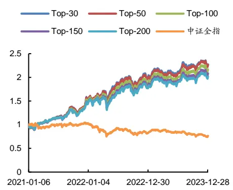
数据来源：通联数据，Wind, 广发证券发展研究中心

图 2：精选订单因子组合（创业板）
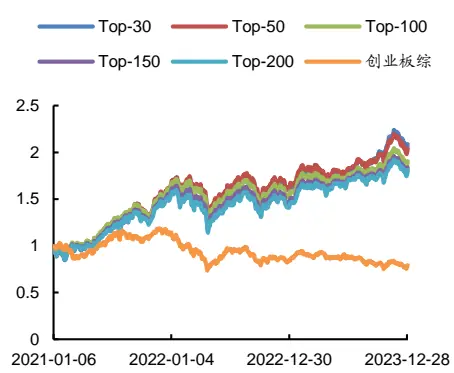
数据来源：通联数据，Wind, 广发证券发展研究中心

[分析师： Table_Author]安宁宁

SAC 执证号：S0260512020003

SFC CE No. BNW179

公0755 - 23948352

anningning@gf.com.cn

## [Table_ 相关研究：DocRe

订单维度解耦的 22 个长短单2024-08-01
因子：海量 Level 2 数据因子
挖掘系列（二）
多维度解耦的 94 个大小单因2024-07-15
子：海量 Level 2 数据因子挖
掘系列（一）

[联系人： Table_Contacts] 林涛

公0755 - 82528531

gflintao@gf.com.cn

## 一、Level 1 与 Level 2 行情数据介绍

如何能在股票市场的博弈中胜出？关键在于对市场信息的掌握和对市场规律的理解。对于量化投资者来说，更在于对数据的全面收集和深度分析，并结合数学模型和算法，从海量数据中挖掘出隐藏的市场规律。这些规律可能是某些股票价格的趋势，市场的周期性波动，抑或是短期的交易信号。一旦这些规律被发现并加以利用，量化投资者便能在股票市场的博弈中获得优势。

股票行情数据源于上交所和深交所，根据数据的频率和丰富度通常分为Level 1数据和Level 2数据。如表1所示，Level 1数据为3秒一笔的快照（Snapshot）数据，包含了常用行情软件上可以看到的最高价、最低价、开盘价、收盘价、成交量、成交额、成交笔数、委买委卖量、5档申买申卖价、5档申买申卖量等数据。而相比数据频率较低、数据丰富度有限的Level 1数据，Level 2数据中则不仅提供了更为丰富的快照（Snapshot）数据，如10档申买申卖价、10档申买申卖量、最优买卖价前50笔委托、买卖委托价位数、买卖撤单信息等，而且提供了Level 1数据中所不包含的逐笔订单（Tick）数据。逐笔订单数据包含了当日交易时段中集合竞价阶段和连续竞价阶段的每一笔订单数据，其中的关键信息包括精确到毫秒的订单时间、逐笔序号、频道代码、价格、数量、金额、买入卖出订单号和订单类别等详细数据。Level2数据中的逐笔订单数据是一切行情数据的根源，不同频率的快照数据均由逐笔订单数据聚合而成。在“海量Level 2数据因子挖掘”系列研究报告中，将尝试对Level 2数据中详细的快照数据和逐笔订单数据进行深入分析并加以利用，有望能够从中获得更为丰富的价格趋势、周期波动、交易信号等规律和信息，从而挖掘出更为有效的因子，构建出具有超额收益的股票投资组合。

表 1：Level 1与Level 2主要行情数据对比

| 数据类别 | 数据名称 | Level 1 | Level 2 |
| --- | --- | --- | --- |
| 快照数据 | 时间 | 最快3秒一笔 | 最快3秒一笔 |
|  | 最高价 | V | V |
|  | 最低价 | √ | √ |
|  | 开盘价 | √ | √ |
|  | 收盘价 | √ | √ |
|  | 成交数量 | √ | √ |
|  | 成交金额 | √ | V |
|  | 成交笔数 | √ | V |
|  | (Snapshot) 委买量/委卖量 | V | √ |
|  | 申买价/申卖价 | 5档 | 10档 |
|  | 申买量/申卖量 | 5档 | 10档 |
|  | 最优买/卖价前 50 笔委托 | x | V |
|  | 申买/申卖委托笔数 | x |  |
|  | 买入/卖出最大等待时间 |  | V |
|  |  | x | √（仅上交所） |
|  | 买方/卖方委托价位数 | x | √（仅上交所） |
|  | 买入/卖出撤单笔数 | x | √（仅上交所） |

识别风险，发现价值

|  | 买入/卖出撤单数量 | x √（仅上交所） |
| --- | --- | --- |
|  | 买入/卖出撤单金额 | x √（仅上交所） |
|  | 买入/卖出总笔数 | √（仅上交所） |
| 逐笔订单数据 (Tick) | 时间 | x ✓（精确到毫秒） |
|  | 逐笔序号 | × √ |
|  | 频道代码 | × V |
|  | 价格 | × V |
|  | 数量 | × √ |
|  | 金额 | × √ |
|  | 买入订单号 | × V |
|  | 卖出订单号 | × V |
|  | 订单类别 | x ✓（委托/成交/撤单） |

数据来源：通联数据、广发证券发展研究中心

## 二、相关研究工作

在前序研究“多维度解耦的94个大小单因子：海量Level 2数据因子挖掘系列（一）”中，从所有行情数据的根源——Level 2逐笔订单出发，通过“大小订单”的角度对所有交易订单进行窥探，结合多维度解耦的分析方法构建出了多个有效的大小单因子，并从中挑选出表现优异者构建出了精选大小单因子组合，在A股全市场及各大板块中均取得了较为突出的表现。

而在前序研究“多维度解耦的22个长短单因子：海量Level 2数据因子挖掘系列（二）”中，则通过“订单成交完成时长”的角度继续对Level 2逐笔订单数据展开研究，通过订单维度的解耦分析方法构建出了22个有效的长短单因子，并从中挑选出表现优异者构建出了精选长短单因子组合，在A股全市场及各大板块中均取得了较为突出的表现。

本文首先对前序研究中的大小单因子和长短单因子之间的相关性采用spearman相关系数进行计算，其中所有因子均采用原始值（未经平滑计算）。由于因子数量众多，这里采用以“均值+1.0倍标准差”作为大小单或长短单判断标准的因子进行相关性计算，结果如下表2所示。整体而言，大小单因子和长短单因子之间的相关性较低，相关系数范围在-0.19~0.19之间，这表明“大小”和“长短”是衡量逐笔订单的两个较为独立的维度。

有了以上研究基础和初步结论，本文作为“海量Level 2数据因子挖掘”系列研究报告的第三篇，将进一步尝试同时结合订单的“大小”和“长短”维度对其进行深入剖析，谋求挖掘出更有效的Level 2因子。

表 2：大小单因子和长短单因子之间的相关系数
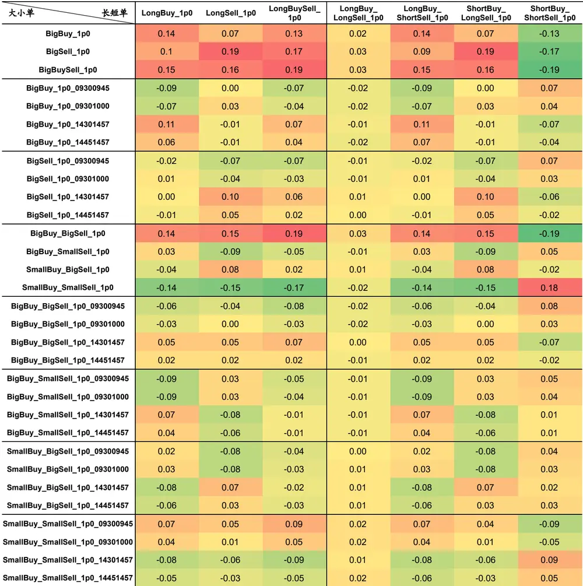
数据来源：通联数据、Wind、广发证券发展研究中心

## 三、从“大小”和“长短”进行解构的订单因子

在每个交易日中，股票的交易订单大小不一，而其中的大订单常常被认为是信息优势者发出的主力订单，对股票价格的未来走势具有揭示作用。而在股票交易所的订单撮合中，同一笔委托可能会由于对手下单数量的不同而被拆解为多个订单成交，而拆解后的多个订单既可能在短时间内连续完成，也可能在较长的一段时间内分散完成，即不同委托订单的成交完成时间并不相同。因此，可以同时从订单的“大小”和“长短”角度对其进行解构，并采用订单维度的解耦分析方法，结合同一笔订单中的“买入订单号”和“卖出订单号”属性，同时从买入和卖出两个角度进行分析，构建出相应的16种订单因子，如下表3所示。其中“大买_长买_大卖_长卖”因子“BigBuy_LongBuy_BigSell_LongSell”缩写为“BB_LB_BS_LS”，以此类推。

表 3：长单占比因子5天换仓表现

| 订单类型 |  |  |  |  |
| --- | --- | --- | --- | --- |
| 买 |  | 卖 |  | 因子缩写名称 |
| 大小 | 长短 | 大小 | 长短 |  |
| 大 | 长 | 大 | 长 | BB_LB_BS_LS |
| 大 | 长 | 大 | 短 | BB_LB_BS_SS |
| 大 | 长 | 小 | 长 | BB_LB_SS_LS |
| 大 | 长 | 小 | 短 | BB_LB_SS_SS |
| 大 | 短 | 大 | 长 | BB_SB_BS_LS |
| 大 | 短 | 大 | 短 | BB_SB_BS_SS |
| 大 | 短 | 小 | 长 | BB_SB_SS_LS |
| 大 | 短 | 小 | 短 | BB_SB_SS_SS |
| 小 | 长 | 大 | 长 | SB_LB_BS_LS |
| 小 | 长 | 大 | 短 | SB_LB_BS_SS |
| 小 | 长 | 小 | 长 | SB_LB_SS_LS |
| 小 | 长 | 小 | 短 | SB_LB_SS_SS |
| 小 | 短 | 大 | 长 | SB_SB_BS_LS |
| 小 | 短 | 大 | 短 | SB_SB_BS_SS |
| 小 | 短 | 小 | 长 | SB_SB_SS_LS |
| 小 | 短 | 小 | 短 | SB_SB_SS_SS |

数据来源：广发证券发展研究中心

对于订单的“大小”和“长短”界定，本文采用前序研究“多维度解耦的94个大小单因子：海量Level 2数据因子挖掘系列（一）”和多维度解耦的22个长短单因子：海量Level 2数据因子挖掘系列（二）”中的划分方法：将成交量（成交完成时长）大于均值+N倍标准差的订单界定为大单（长单），剩余的则相应地界定为小单（短单），并分别采用3个不同的标准差阈值来对大小单（长短单）进行界定。假设买卖订单中的成交量服从如图1所示的高斯分布，则买卖订单中成交量（成交完成时长）大于均值+1.0倍标准差的大单（长单）约占15.8%，大于均值+1.5倍标准差的大单（长单）约占6.7%，大于均值+2.0倍标准差的大单（长单）约占2.3%，以此基于3种不同阈值构建出16*3=48个同时从“大小”和“长短”进行解构的订单因子，比如“BB_LB_BS_LS_1p0”代表以均值+1.0倍标准差为大小（长短）订单划分阈值构建的因子。

图 1：高斯分布
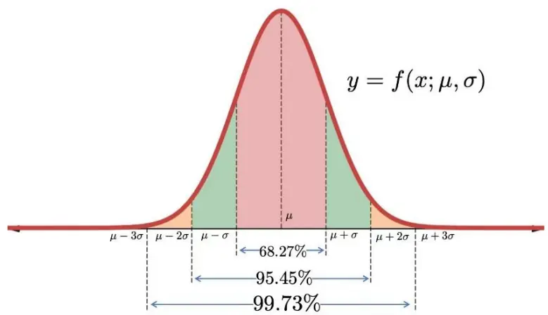
数据来源：广发证券发展研究中心

此外，如前序研究“多维度解耦的94个大小单因子：海量Level 2数据因子挖掘系列（一）”中所言，隔夜知情交易者通常会在第二天开盘后迅速根据已掌握的信息进行买入或卖出，以谋求更大的收益或减少踩踏。具体而言，开盘后15分钟或30分钟内的大小订单信息尤其值得关注，类似的现象有时也会出现在收盘前15分钟或30分钟内。因此，本文进一步采用时间维度的解耦分析方法，结合不同交易时段的统计信息对上述48个因子进行解耦。其中，本文采用全日连续竞价交易时段、开盘后15分钟、开盘后30分钟、收盘前30分钟、收盘前15分钟这5个时段，分别以09301457、09300945、09301000、14301457、14451457作为因子名称的后缀予以区分。比如，“BB_LB_BS_LS_1p0_09301457”代表以均值+1.0倍标准差为大小（长短）订单划分阈值，以全日连续竞价交易时段作为统计口径的“大买_长买_大卖_长卖”因子。综上所述，本文共构建了16*3*5=240个同时从“大小”和“长短”进行解构的订单因子。

上述240个因子在2021年1月1日~2023年12月31日期间A股全市场的RankIC表现如下表4~19所示，其中分别统计了原始因子值与未来5个、20个交易日收益的相关性，以及5日平滑因子和20日平滑因子分别与未来5个、20个交易日收益的相关性。

从统计结果来看，在20日换仓条件下，上述240个因子中有超过50个因子的RankIC均值大于8%，其中有18个因子的RankIC大于10%。整体而言，本文挖掘出了一大批可观的有效逐笔订单因子。

表 4：BB_LB_BS_LS系列因子RankIC表现

| 因子名 | 5 日换仓 |  | 5 日换仓（因子平滑） |  | 20 日换仓 |  | 20日换仓（因子平滑） |  |
| --- | --- | --- | --- | --- | --- | --- | --- | --- |
|  | IC 均值 | IC 胜率 | IC 均值 | IC 胜率 | IC 均值 | IC 胜率 | IC 均值 | IC 胜率 |
| BB_LB_BS_LS_1p0_09301457 | -0.9% | 39% | 1.4% | 64% | -1.2% | 36% | 6.5% | 81% |
| BB_LB_BS_LS_1p0_09300945 | -0.0% | 48% | -0.2% | 47% | -0.1% | 46% | -0.3% | 49% |
| BB_LB_BS_LS_1p0_09301000 | -0.2% | 46% | -0.4% | 44% | -0.3% | 42% | 0.3% | 51% |
| BB_LB_BS_LS_1p0_14301457 | -0.6% | 37% | -0.8% | 40% | -0.8% | 35% | -0.9% | 47% |
| BB_LB_BS_LS_1p0_14451457 | -0.4% | 41% | -0.7% | 37% | -0.5% | 40% | -1.4% | 39% |
| BB_LB_BS_LS_1p5_09301457 | -0.9% | 37% | 0.0% | 53% | -1.2% | 34% | 4.5% | 82% |
| BB_LB_BS_LS_1p5_09300945 | 0.0% | 49% | -0.2% | 46% | -0.0% | 48% | -0.2% | 44% |
| BB_LB_BS_LS_1p5_09301000 | -0.2% | 47% | -0.6% | 38% | -0.2% | 44% | -0.5% | 41% |
| BB_LB_BS_LS_1p5_14301457 | -0.3% | 43% | -0.5% | 42% | -0.5% | 40% | -1.4% | 38% |
| BB_LB_BS_LS_1p5_14451457 | -0.3% | 45% | -0.6% | 38% | -0.4% | 43% | -1.3% | 36% |
| BB_LB_BS_LS_2p0_09301457 | -0.7% | 37% | -0.6% | 43% | -1.0% | 35% | 2.6% | 77% |
| BB_LB_BS_LS_2p0_09300945 | 0.0% | 50% | 0.0% | 48% | 0.1% | 50% | -0.1% | 48% |
| BB_LB_BS_LS_2p0_09301000 | -0.2% | 47% | -0.5% | 40% | -0.1% | 47% | -0.4% | 45% |
| BB_LB_BS_LS_2p0_14301457 | -0.2% | 44% | -0.4% | 44% | -0.4% | 42% | -1.2% | 35% |
| BB_LB_BS_LS_2p0_14451457 | -0.3% | 45% | -0.5% | 39% | -0.3% | 45% | -0.9% | 33% |

数据来源：通联数据、Wind、广发证券发展研究中心

表 5：BB_LB_BS_SS系列因子RankIC表现

| 因子名 | 5 日换仓 |  | 5 日换仓（因子平滑） |  | 20 日换仓 |  | 20日换仓（因子平滑） |  |
| --- | --- | --- | --- | --- | --- | --- | --- | --- |
|  | IC 均值 | IC 胜率 | IC 均值 | IC 胜率 | IC 均值 | IC 胜率 | IC 均值 | IC 胜率 |
| BB_LB_BS_SS_1p0_09301457 | 5.3% | 73% | 7.4% | 71% | 8.1% | 82% | 12.9% | 78% |
| BB_LB_BS_SS_1p0_09300945 | -0.4% | 46% | 2.7% | 63% | -0.8% | 46% | 7.7% | 73% |
| BB_LB_BS_SS_1p0_09301000 | 1.0% | 57% | 4.4% | 69% | 1.3% | 59% | 9.8% | 76% |
| BB_LB_BS_SS_1p0_14301457 | 1.1% | 60% | 3.3% | 66% | 1.5% | 64% | 6.7% | 72% |
| BB_LB_BS_ _SS_1p0_14451457 | 0.3% | 54% | 2.4% | 67% | 0.2% | 53% | 5.3% | 72% |
| BB_LB_BS_SS_1p5_09301457 | 4.3% | 74% | 6.6% | 73% | 6.5% | 81% | 12.2% | 78% |
| BB_LB_BS_SS_1p5_09300945 | -0.9% | 42% | 1.3% | 57% | -1.6% | 39% | 5.7% | 72% |
| BB_LB_BS_SS_1p5_09301000 | -0.1% | 50% | 3.2% | 66% | -0.4% | 48% | 8.1% | 75% |
| BB_LB_BS_SS_1p5_14301457 | 0.1% | 50% | 2.2% | 62% | -0.0% | 50% | 5.1% | 70% |
| BB_LB_BS _SS_1p5_14451457 | -0.2% | 46% | 1.0% | 58% | -0.6% | 43% | 3.6% | 69% |
| BB_LB_BS_ _SS_2p0_ _09301457 | 3.3% | 71% | 5.9% | 74% | 4.9% | 78% | 11.4% | 79% |
| BB_LB_BS_SS_2p0_09300945 | -1.1% | 39% | 0.0% | 51% | -1.9% | 34% | 3.7% | 67% |
| BB_LB_BS_SS_2p0_09301000 | -0.7% | 44% | 1.9% | 62% | -1.3% | 40% | 6.4% | 74% |
| BB_LB_BS_SS_2p0_14301457 | -0.4% | 47% | 1.2% | 58% | -0.8% | 42% | 4.0% | 69% |
| BB_LB_BS_SS_2p0_14451457 | -0.4% | 42% | 0.1% | 52% | -0.8% | 38% | 2.4% | 69% |

数据来源：通联数据、Wind、广发证券发展研究中心

表 6：BB_LB_SS_LS系列因子RankIC表现

| 因子名 | 5 日换仓 |  | 5 日换仓（因子平滑） |  | 20 日换仓 |  | 20日换仓（因子平滑） |  |
| --- | --- | --- | --- | --- | --- | --- | --- | --- |
|  | IC 均值 | IC 胜率 | IC 均值 | IC 胜率 | IC 均值 | IC 胜率 | IC 均值 | IC 胜率 |
| BB_LB_SS_LS_1p0_09301457 | -1.5% | 37% | -1.5% | 40% | -2.2% | 32% | 1.5% | 54% |
| BB_LB_SS_LS_1p0_09300945 | -0.2% | 44% | -0.6% | 39% | -0.3% | 41% | -1.3% | 33% |
| BB_LB_SS_LS_1p0_09301000 | -0.4% | 39% | -1.0% | 35% | -0.6% | 37% | -1.8% | 35% |
| BB_LB_SS_LS_1p0_14301457 | -0.7% | 38% | -1.3% | 37% | -1.0% | 36% | -2.7% | 40% |
| BB_LB_SS_LS_1p0_14451457 | -0.3% | 43% | -0.8% | 38% | -0.6% | 39% | -2.2% | 35% |
| BB_LB_SS_LS_1p5_09301457 | -1.2% | 37% | -1.6% | 40% | -1.9% | 31% | 0.3% | 53% |
| BB_LB_SS_LS_1p5_09300945 | -0.1% | 46% | -0.4% | 45% | -0.2% | 46% | -1.1% | 29% |
| BB_LB_SS_LS_1p5_09301000 | -0.3% | 43% | -0.7% | 38% | -0.4% | 39% | -1.7% | 29% |
| BB_LB_SS_LS_1p5_14301457 | -0.5% | 39% | -1.0% | 37% | -0.8% | 34% | -2.5% | 36% |
| BB_LB_SS_LS_1p5_14451457 | -0.3% | 43% | -0.7% | 36% | -0.4% | 40% | -1.7% | 34% |
| BB_LB_SS_LS_2p0_09301457 | -0.9% | 37% | -1.3% | 39% | -1.4% | 34% | -0.5% | 48% |
| BB_LB_SS_LS_2p0_09300945 | 0.0% | 46% | -0.2% | 46% | -0.1% | 44% | -0.6% | 36% |
| BB_LB_SS_LS_2p0_09301000 | -0.1% | 49% | -0.5% | 41% | -0.3% | 44% | -1.2% | 33% |
| BB_LB_SS_LS_2p0_14301457 | -0.5% | 40% | -0.9% | 37% | -0.7% | 36% | -2.1% | 37% |
| BB_LB_SS_LS_2p0_14451457 | -0.2% | 45% | -0.5% | 39% | -0.4% | 39% | -1.5% | 33% |

数据来源：通联数据、Wind、广发证券发展研究中心

表 7：BB_LB_SS_SS系列因子RankIC表现

| 因子名 | 5 日换仓 |  | 5 日换仓（因子平滑） |  | 20 日换仓 |  | 20日换仓（因子平滑） |  |
| --- | --- | --- | --- | --- | --- | --- | --- | --- |
|  | IC 均值 | IC 胜率 | IC 均值 | IC 胜率 | IC 均值 | IC 胜率 | IC 均值 | IC 胜率 |
| BB_LB_SS_SS_1p0_09301457 | 6.1% | 69% | 7.4% | 66% | 9.2% | 74% | 12.1% | 70% |
| BB_LB_SS_ _SS_1p0_09300945 | 1.0% | 57% | 4.5% | 68% | 1.1% | 56% | 9.5% | 72% |
| BB_LB_SS_ _SS_1p0_09301000 | 2.6% | 64% | 5.8% | 68% | 3.6% | 67% | 10.9% | 72% |
| BB_LB_SS _SS_1p0_14301457 | 2.5% | 62% | 4.3% | 62% | 3.6% | 67% | 6.5% | 63% |
| BB_LB_SS_ _SS_1p0_ _14451457 | 1.6% | 59% | 3.5% | 63% | 2.1% | 64% | 5.7% | 64% |
| BB_LB_SS_ SS _1p5_09301457 | 5.7% | 69% | 7.1% | 66% | 8.4% | 74% | 11.7% | 70% |
| BB_LB_SS_ _SS_1p5_09300945 | 0.2% | 52% | 3.3% | 65% | -0.0% | 52% | 8.3% | 71% |
| SS SS _1p5_09301000 | 1.4% | 59% | 4.9% | 67% | 1.8% | 59% | 10.0% | 71% |
| BB_LB_SS_ _SS_1p5_14301457 | 1.6% | 59% | 3.6% | 61% | 2.1% | 62% | 5.6% | 62% |
| BB_LB _SS _SS _1p5 _14451457 | 0.8% | 58% | 2.6% | 61% | 1.0% | 56% | 4.6% | 61% |
| BB_LB _SS_ _SS_2p0_ _09301457 | 5.1% | 68% | 6.7% | 66% | 7.5% | 73% | 11.3% | 69% |
| BB_LB_SS _SS_2p0_09300945 | -0.3% | 49% | 2.3% | 61% | -0.7% | 45% | 7.1% | 68% |
| BB_LB_SS_ _SS_2p0_09301000 | 0.6% | 55% | 4.0% | 66% | 0.6% | 53% | 9.0% | 70% |
| BB_LB_SS_ _SS_2p0_14301457 | 0.9% | 56% | 2.9% | 60% | 1.1% | 56% | 5.0% | 62% |
| BB_LB_SS_SS_2p0_14451457 | 0.5% | 55% | 1.8% | 56% | 0.5% | 53% | 3.9% | 60% |

数据来源：通联数据、Wind、广发证券发展研究中心

表 8：BB_SB_BS_LS系列因子RankIC表现

| 因子名 | 5 日换仓 |  | 5 日换仓（因子平滑） |  | 20 日换仓 |  | 20日换仓（因子平滑） |  |
| --- | --- | --- | --- | --- | --- | --- | --- | --- |
|  | IC 均值 | IC 胜率 | IC 均值 | IC 胜率 | IC 均值 | IC 胜率 | IC 均值 | IC 胜率 |
| BB_SB_BS_ _LS_1p0_09301457 | 4.6% | 75% | 7.3% | 73% | 6.8% | 80% | 13.3% | 81% |
| BB_SB_BS_LS_1p0_09300945 | -0.4% | 48% | 2.2% | 62% | -0.9% | 44% | 6.9% | 71% |
| BB_SB_BS_ _LS_1p0_09301000 | 0.7% | 57% | 4.0% | 68% | 0.8% | 55% | 9.5% | 76% |
| BB_ _SB_BS _LS_1p0_14301457 | 0.6% | 57% | 3.8% | 72% | 0.9% | 59% | 9.7% | 82% |
| BB_ _SB_ BS 1p0 _14451457 | -0.0% | 53% | 3.0% | 72% | -0.2% | 49% | 8.1% | 84% |
| BB _SB_BS_ 1p5 _09301457 | 3.6% | 74% | 6.6% | 74% | 5.3% | 78% | 12.6% | 82% |
| BB _SB BS _LS_1p5_ _09300945 | -1.0% | 43% | 0.6% | 56% | -1.8% | 38% | 4.6% | 67% |
| BB_SB_BS_ _LS_1p5_09301000 | -0.4% | 48% | 2.5% | 63% | -0.9% | 45% | 7.4% | 74% |
| BB_SB _BS_ _14301457 1p5 | -0.3% | 49% | 2.6% | 70% | -0.5% | 44% | 8.2% | 84% |
| BB_SB_BS_ _1p5_ _14451457 | -0.5% | 45% | 1.6% | 67% | -0.9% | 39% | 6.3% | 85% |
| BB_SB_BS_ LS_2p0_ _09301457 | 2.6% | 70% | 5.8% | 75% | 3.8% | 73% | 11.8% | 82% |
| BB_SB_BS_ _LS _2p0_09300945 | -1.1% | 40% | -0.6% | 49% | -1.9% | 35% | 2.9% | 63% |
| BB_SB_BS_LS_2p0_09301000 | -1.0% | 43% | 1.1% | 57% | -1.7% | 39% | 5.8% | 74% |
| BB_SB_BS_LS_2p0_14301457 | -0.7% | 42% | 1.5% | 63% | -1.1% | 38% | 6.7% | 82% |
| BB_SB_BS_LS_2p0_14451457 | -0.7% | 42% | 0.5% | 59% | -1.1% | 36% | 4.8% | 83% |

数据来源：通联数据、Wind、广发证券发展研究中心

表 9：BB_SB_BS_SS系列因子RankIC表现

| 因子名 | 5 日换仓 |  | 5日换仓（因子平滑） |  | 20 日换仓 |  | 20日换仓（因子平滑） |  |
| --- | --- | --- | --- | --- | --- | --- | --- | --- |
|  | IC 均值 | IC 胜率 | IC 均值 | IC 胜率 | IC 均值 | IC 胜率 | IC 均值 | IC 胜率 |
| BB_SB_BS_SS_1p0_09301457 | 3.8% | 66% | 4.7% | 67% | 6.1% | 75% | 7.8% | 73% |
| BB_SB_BS_SS_1p0_09300945 | 1.5% | 58% | 2.7% | 59% | 2.6% | 64% | 5.0% | 64% |
| BB_SB_BS_SS_1p0_09301000 | 2.3% | 63% | 3.5% | 64% | 3.7% | 69% | 6.4% | 67% |
| BB_SB_BS_SS_1p0_14301457 | 1.4% | 65% | 2.9% | 70% | 2.1% | 71% | 5.7% | 75% |
| BB_SB_BS_ _SS_1p0_14451457 | 1.1% | 62% | 2.5% | 70% | 1.6% | 68% | 4.8% | 74% |
| BB_SB_BS_SS_1p5_09301457 | 4.3% | 69% | 5.3% | 69% | 6.7% | 78% | 8.5% | 76% |
| BB_SB_BS_SS_1p5_09300945 | 1.3% | 58% | 2.5% | 59% | 2.1% | 64% | 4.7% | 64% |
| BB_SB_BS_SS_1p5_09301000 | 2.2% | 63% | 3.5% | 64% | 3.4% | 69% | 6.4% | 69% |
| BB_SB_BS_ _SS_1p5_14301457 | 1.4% | 66% | 3.0% | 72% | 2.1% | 71% | 5.9% | 77% |
| BB_SB_BS _SS_1p5_14451457 | 1.0% | 62% | 2.5% | 72% | 1.4% | 68% | 4.7% | 77% |
| BB_SB_BS_ _SS_2p0_ _09301457 | 4.4% | 71% | 5.3% | 70% | 6.6% | 79% | 8.4% | 76% |
| BB_SB_BS _SS_2p0_09300945 | 1.0% | 56% | 2.2% | 58% | 1.6% | 60% | 4.0% | 62% |
| BB_SB_BS_SS_2p0_09301000 | 1.9% | 62% | 3.2% | 64% | 2.9% | 67% | 5.8% | 67% |
| BB_SB_BS_SS_2p0_14301457 | 1.3% | 65% | 2.9% | 74% | 1.7% | 71% | 5.6% | 78% |
| BB_SB_BS_SS_2p0_14451457 | 0.7% | 60% | 2.3% | 72% | 0.9% | 63% | 4.1% | 77% |

数据来源：通联数据、Wind、广发证券发展研究中心

表 10：BB_SB_SS_LS系列因子RankIC表现

| 因子名 | 5 日换仓 |  | 5 日换仓（因子平滑） |  | 20 日换仓 |  | 20日换仓（因子平滑） |  |
| --- | --- | --- | --- | --- | --- | --- | --- | --- |
|  | IC 均值 | IC 胜率 | IC 均值 | IC 胜率 | IC 均值 | IC 胜率 | IC 均值 | IC 胜率 |
| BB_SB_SS_LS_1p0_09301457 | 1.7% | 63% | 4.0% | 65% | 2.5% | 68% | 8.5% | 77% |
| BB_SB_SS_LS_1p0_09300945 | -2.3% | 30% | -0.4% | 46% | -3.6% | 22% | 3.2% | 80% |
| BB_SB_SS_LS_1p0_09301000 | -1.8% | 33% | 1.1% | 63% | -3.0% | 25% | 5.7% | 82% |
| BB_SB_SS_LS_1p0_14301457 | -2.0% | 35% | 0.2% | 52% | -3.2% | 28% | 3.9% | 63% |
| BB_SB_SS_LS_1p0_14451457 | -2.1% | 32% | -1.2% | 45% | -3.3% | 25% | 2.3% | 61% |
| BB_SB_SS_ _LS_1p5_09301457 | 1.2% | 62% | 3.9% | 66% | 1.8% | 65% | 8.5% | 78% |
| BB_SB_SS_LS_1p5_09300945 | -2.1% | 30% | -1.2% | 39% | -3.3% | 24% | 2.4% | 78% |
| BB_SB_SS_LS_1p5_09301000 | -2.0% | 33% | 0.4% | 57% | -3.2% | 25% | 5.1% | 86% |
| BB_SB_SS_LS_1p5_14301457 | -2.1% | 33% | -0.4% | 50% | -3.3% | 24% | 3.2% | 64% |
| BB_SB_SS_LS_1p5_14451457 | -2.1% | 30% | -1.7% | 40% | -3.2% | 22% | 1.5% | 62% |
| BB_SB_SS_LS_2p0_ _09301457 | 0.6% | 57% | 3.6% | 67% | 0.9% | 60% | 8.2% | 78% |
| BB_SB_SS_LS_2p0_09300945 | -1.9% | 34% | -1.7% | 35% | -3.0% | 24% | 1.2% | 67% |
| BB_SB_SS_LS_2p0_09301000 | -2.1% | 33% | -0.4% | 48% | -3.4% | 23% | 3.9% | 87% |
| BB_SB_SS_LS_2p0_14301457 | -2.1% | 31% | -0.9% | 46% | -3.4% | 22% | 2.6% | 63% |
| BB_SB_SS_LS_2p0_14451457 | -1.9% | 30% | -1.9% | 37% | -3.0% | 23% | 0.8% | 58% |

数据来源：通联数据、Wind、广发证券发展研究中心

表 11：BB_SB_SS_SS系列因子RankIC表现

| 因子名 | 5日换仓 |  | 5日换仓（因子平滑） |  | 20 日换仓 |  | 20日换仓（因子平滑） |  |
| --- | --- | --- | --- | --- | --- | --- | --- | --- |
|  | IC 均值 | IC 胜率 | IC 均值 | IC 胜率 | IC 均值 | IC 胜率 | IC 均值 | IC 胜率 |
| BB_SB_SS_SS_1p0_09301457 | -2.4% | 35% | -2.9% | 37% | -3.2% | 31% | -4.8% | 32% |
| BB_SB_SS_SS_1p0_09300945 | -0.1% | 45% | -0.1% | 49% | -0.6% | 44% | -1.4% | 44% |
| BB_SB_SS_SS_1p0_09301000 | -0.4% | 46% | -0.5% | 47% | -0.9% | 42% | -2.1% | 42% |
| BB_SB_SS_SS_1p0_14301457 | -1.2% | 40% | -1.0% | 44% | -1.7% | 34% | -2.0% | 39% |
| BB_SB_SS_SS_1p0_14451457 | -1.0% | 42% | -0.8% | 44% | -1.5% | 36% | -1.4% | 44% |
| BB_SB_SS_SS_1p5_09301457 | -0.7% | 44% | -0.9% | 47% | -0.9% | 47% | -1.7% | 45% |
| BB_SB_SS_SS_1p5_09300945 | 0.3% | 50% | 0.6% | 52% | -0.0% | 48% | 0.1% | 51% |
| BB_SB_SS_SS_1p5_09301000 | 0.3% | 50% | 0.5% | 52% | 0.1% | 50% | -0.0% | 51% |
| BB_SB_SS_SS_1p5_14301457 | -0.3% | 48% | 0.3% | 53% | -0.5% | 48% | 0.5% | 51% |
| BB_SB_SS_SS_1p5_14451457 | -0.3% | 49% | 0.4% | 52% | -0.5% | 48% | 0.8% | 53% |
| BB_SB_SS_SS_2p0_09301457 | 0.1% | 48% | 0.2% | 49% | 0.3% | 53% | -0.0% | 52% |
| BB_SB_SS_SS_2p0_09300945 | 0.4% | 51% | 0.7% | 52% | 0.1% | 51% | 0.3% | 51% |
| BB_SB_SS_SS_2p0_09301000 | 0.5% | 50% | 0.9% | 52% | 0.4% | 54% | 0.6% | 53% |
| BB_SB_SS_SS_2p0_14301457 | 0.1% | 51% | 0.9% | 54% | 0.1% | 53% | 1.7% | 54% |
| BB_SB_SS_SS_2p0_14451457 | -0.0% | 51% | 0.8% | 54% | -0.1% | 52% | 1.6% | 54% |

数据来源：通联数据、Wind、广发证券发展研究中心

表 12：SB_LB_BS_LS系列因子RankIC表现

| 因子名 | 5 日换仓 |  | 5 日换仓（因子平滑） |  | 20 日换仓 |  | 20日换仓（因子平滑） |  |
| --- | --- | --- | --- | --- | --- | --- | --- | --- |
|  | IC 均值 | IC 胜率 | IC 均值 | IC 胜率 | IC 均值 | IC 胜率 | IC 均值 | IC 胜率 |
| SB_LB_BS_LS_1p0_09301457 | -2.0% | 33% | -2.1% | 39% | -2.7% | 30% | -0.1% | 50% |
| SB_LB_BS_LS_1p0_09300945 | -0.2% | 44% | -0.7% | 37% | -0.3% | 43% | -1.5% | 29% |
| SB_LB_BS_LS_1p0_09301000 | -0.5% | 41% | -1.1% | 34% | -0.7% | 36% | -2.3% | 29% |
| SB_LB_BS_LS_1p0_14301457 | -0.7% | 35% | -1.5% | 35% | -1.1% | 33% | -3.4% | 33% |
| SB_LB_BS_LS_1p0_14451457 | -0.4% | 42% | -0.8% | 36% | -0.6% | 37% | -2.1% | 36% |
| SB_LB_BS_LS_1p5_09301457 | -1.5% | 33% | -2.2% | 38% | -2.2% | 31% | -1.2% | 48% |
| SB_LB_BS_LS_1p5_09300945 | -0.2% | 44% | -0.6% | 40% | -0.2% | 43% | -0.9% | 34% |
| SB_LB_BS_LS_1p5_09301000 | -0.4% | 42% | -0.9% | 35% | -0.5% | 39% | -1.8% | 30% |
| SB_LB_BS_LS_1p5_14301457 | -0.6% | 38% | -1.2% | 33% | -0.9% | 32% | -3.1% | 29% |
| SB_LB_BS_LS_1p5_14451457 | -0.3% | 45% | -0.7% | 36% | -0.5% | 41% | -1.6% | 36% |
| SB_LB_BS_LS_2p0_09301457 | -1.2% | 36% | -1.8% | 38% | -1.8% | 33% | -1.9% | 47% |
| SB_LB_BS_LS_2p0_09300945 | -0.0% | 41% | -0.2% | 46% | -0.1% | 42% | -0.8% | 35% |
| SB_LB_BS_LS_2p0_09301000 | -0.2% | 44% | -0.6% | 38% | -0.4% | 41% | -1.6% | 28% |
| SB_LB_BS_LS_2p0_14301457 | -0.5% | 40% | -1.1% | 33% | -0.8% | 35% | -2.5% | 29% |
| SB_LB_BS_LS_2p0_14451457 | -0.3% | 40% | -0.7% | 36% | -0.4% | 38% | -1.2% | 36% |

数据来源：通联数据、Wind、广发证券发展研究中心

表 13：SB_LB_BS_SS系列因子RankIC表现

| 因子名 | 5日换仓 |  | 5日换仓（因子平滑） |  | 20 日换仓 |  | 20日换仓（因子平滑） |  |
| --- | --- | --- | --- | --- | --- | --- | --- | --- |
|  | IC 均值 | IC 胜率 | IC 均值 | IC 胜率 | IC 均值 | IC 胜率 | IC 均值 | IC 胜率 |
| SB_LB_BS_SS_1p0_09301457 | 1.0% | 56% | 3.2% | 59% | 2.2% | 61% | 7.3% | 68% |
| SB_LB_BS_SS_1p0_09300945 | -2.9% | 27% | -1.2% | 34% | -4.3% | 18% | 2.5% | 75% |
| SB_LB_BS_SS_1p0_09301000 | -2.4% | 28% | 0.3% | 53% | -3.5% | 22% | 4.5% | 73% |
| SB_LB_BS_ _SS_1p0_14301457 | -2.3% | 33% | -0.3% | 51% | -3.4% | 26% | 2.6% | 60% |
| SB_LB_BS_ _SS_1p0_14451457 | -2.1% | 34% | -1.5% | 43% | -3.4% | 26% | 0.9% | 56% |
| SB_LB_BS_SS_1p5_09301457 | 0.6% | 55% | 3.2% | 61% | 1.5% | 60% | 7.4% | 70% |
| SB_LB_BS_SS_1p5_09300945 | -2.8% | 27% | -1.8% | 33% | -4.1% | 18% | 1.7% | 75% |
| SB_LB_BS_ _SS_1p5_09301000 | -2.7% | 28% | -0.3% | 45% | -3.9% | 18% | 4.3% | 81% |
| SB_LB_BS_ _SS_1p5_14301457 | -2.4% | 31% | -0.8% | 48% | -3.6% | 25% | 2.1% | 60% |
| SB_LB_BS_ _SS_1p5_14451457 | -2.0% | 33% | -1.8% | 41% | -3.2% | 24% | 0.2% | 54% |
| SB_LB_BS_ _SS_2p0_ _09301457 | 0.4% | 54% | 3.3% | 62% | 1.0% | 57% | 7.6% | 72% |
| SB_LB_BS_ _SS_2p0_09300945 | -2.4% | 30% | -2.1% | 34% | -3.7% | 19% | 0.9% | 64% |
| SB_LB_BS_SS_2p0_09301000 | -2.6% | 30% | -0.7% | 41% | -3.8% | 21% | 3.9% | 85% |
| SB_LB_BS_SS_2p0_14301457 | -2.3% | 31% | -1.0% | 48% | -3.5% | 22% | 1.9% | 62% |
| SB_LB_BS_SS_2p0_14451457 | -1.8% | 34% | -1.8% | 39% | -2.9% | 24% | -0.1% | 53% |

数据来源：通联数据、Wind、广发证券发展研究中心

表 14：SB_LB_SS_LS系列因子RankIC表现

| 因子名 | 5 日换仓 |  | 5 日换仓（因子平滑） |  | 20 日换仓 |  | 20日换仓（因子平滑） |  |
| --- | --- | --- | --- | --- | --- | --- | --- | --- |
|  | IC 均值 | IC 胜率 | IC 均值 | IC 胜率 | IC 均值 | IC 胜率 | IC 均值 | IC 胜率 |
| SB_LB_SS_LS_1p0_09301457 | -1.6% | 38% | -2.2% | 41% | -2.2% | 37% | -2.5% | 46% |
| SB_LB_SS_LS_1p0_09300945 | -0.2% | 46% | -0.4% | 40% | -0.2% | 42% | -0.5% | 41% |
| SB_LB_SS_LS_1p0_09301000 | -0.2% | 44% | -0.6% | 41% | -0.3% | 45% | -1.2% | 45% |
| SB_LB_SS_LS_1p0_14301457 | -0.4% | 41% | -0.8% | 39% | -0.6% | 40% | -2.3% | 36% |
| SB_LB_SS_LS_1p0_14451457 | -0.2% | 40% | -0.4% | 43% | -0.2% | 44% | -1.2% | 40% |
| SB_LB_SS_LS_1p5_09301457 | -1.5% | 38% | -2.1% | 39% | -2.0% | 36% | -2.6% | 44% |
| SB_LB_SS_LS_1p5_09300945 | -0.1% | 39% | -0.3% | 42% | -0.2% | 40% | -0.7% | 41% |
| SB_LB_SS_LS_1p5_09301000 | -0.2% | 47% | -0.5% | 39% | -0.3% | 44% | -1.3% | 43% |
| SB_LB_SS_LS_1p5_14301457 | -0.4% | 42% | -0.9% | 38% | -0.6% | 38% | -2.0% | 37% |
| SB_LB_SS_LS_1p5_14451457 | -0.2% | 34% | -0.4% | 41% | -0.2% | 35% | -1.0% | 38% |
| SB_LB_SS_LS_2p0_09301457 | -1.3% | 39% | -2.0% | 40% | -1.8% | 32% | -2.4% | 44% |
| SB_LB_SS_LS_2p0_09300945 | -0.1% | 34% | -0.4% | 41% | -0.1% | 33% | -0.3% | 41% |
| SB_LB_SS_LS_2p0_09301000 | -0.2% | 45% | -0.5% | 41% | -0.3% | 43% | -1.0% | 38% |
| SB_LB_SS_LS_2p0_14301457 | -0.4% | 40% | -0.9% | 36% | -0.6% | 37% | -2.0% | 31% |
| SB_LB_SS_LS_2p0_14451457 | -0.2% | 28% | -0.3% | 43% | -0.2% | 27% | -0.9% | 37% |

数据来源：通联数据、Wind、广发证券发展研究中心

表 15：SB_LB_SS_SS系列因子RankIC表现

| 因子名 | 5 日换仓 |  | 5 日换仓（因子平滑） |  | 20 日换仓 |  | 20日换仓（因子平滑） |  |
| --- | --- | --- | --- | --- | --- | --- | --- | --- |
|  | IC 均值 | IC 胜率 | IC 均值 | IC 胜率 | IC 均值 | IC 胜率 | IC 均值 | IC 胜率 |
| SB_LB_SS_SS_1p0_09301457 | 3.2% | 65% | 4.7% | 65% | 5.4% | 74% | 8.5% | 77% |
| SB_LB_SS_ _SS_1p0_09300945 | -0.5% | 45% | 2.8% | 68% | -0.8% | 40% | 7.5% | 80% |
| SB_LB_SS_SS_1p0_09301000 | 0.6% | 56% | 3.5% | 66% | 1.0% | 60% | 7.9% | 79% |
| SB_LB_SS _SS_1p0_14301457 | -0.3% | 47% | 2.5% | 62% | -0.4% | 50% | 5.4% | 70% |
| SB_LB_SS_ _SS_1p0_14451457 | -1.2% | 40% | 1.6% | 59% | -1.9% | 36% | 4.6% | 71% |
| SB_LB_SS_SS_1p5_09301457 | 3.4% | 66% | 5.0% | 66% | 5.7% | 76% | 9.0% | 78% |
| SB_LB_SS_SS_1p5_ _09300945 | -0.6% | 46% | 2.9% | 70% | -0.9% | 39% | 8.0% | 80% |
| SB_LB_SS_ _SS_1p5_09301000 | 0.5% | 55% | 3.7% | 68% | 0.7% | 58% | 8.6% | 80% |
| SB_LB_SS _SS_1p5_14301457 | -0.6% | 43% | 2.3% | 61% | -0.8% | 44% | 5.2% | 68% |
| SB_LB_SS_ _SS_ _1p5 _14451457 | -1.2% | 38% | 1.4% | 59% | -1.9% | 33% | 4.4% | 69% |
| SB_LB_SS_SS_2p0_ _09301457 | 3.7% | 68% | 5.4% | 68% | 6.1% | 78% | 9.5% | 79% |
| SB_LB_SS_ SS _2p0 _09300945 | -0.6% | 46% | 3.0% | 71% | -1.0% | 40% | 8.6% | 81% |
| SB_LB_SS_ _SS_2p0_09301000 | 0.3% | 55% | 3.9% | 70% | 0.6% | 58% | 9.3% | 82% |
| SB_LB_SS_SS_2p0_14301457 | -0.8% | 42% | 2.1% | 62% | -1.1% | 41% | 5.3% | 69% |
| SB_LB_SS_SS_2p0_14451457 | -1.2% | 39% | 1.0% | 58% | -1.9% | 33% | 4.2% | 68% |

数据来源：通联数据、Wind、广发证券发展研究中心

表 16：SB_SB_BS_LS系列因子RankIC表现

| 因子名 | 5 日换仓 |  | 5 日换仓（因子平滑） |  | 20 日换仓 |  | 20日换仓（因子平滑） |  |
| --- | --- | --- | --- | --- | --- | --- | --- | --- |
|  | IC 均值 | IC 胜率 | IC 均值 | IC 胜率 | IC 均值 | IC 胜率 | IC 均值 | IC 胜率 |
| SB_SB_BS_ _LS_1p0_ _09301457 | 5.6% | 67% | 7.6% | 66% | 8.2% | 73% | 12.8% | 73% |
| SB_SB_BS_LS_1p0_09300945 | 0.8% | 57% | 3.9% | 64% | 1.0% | 54% | 9.2% | 67% |
| SB_SB_BS_ _LS_1p0_ _09301000 | 2.2% | 60% | 5.3% | 66% | 3.2% | 65% | 10.8% | 71% |
| SB_SB_BS_ _LS_1p0_14301457 | 1.9% | 61% | 5.1% | 67% | 2.9% | 64% | 10.6% | 73% |
| SB_ _SB_ BS LS _14451457 1p0 | 1.1% | 58% | 4.5% | 68% | 1.6% | 59% | 9.9% | 75% |
| SB_ _SB_ BS LS 1p5 _09301457 | 4.9% | 65% | 7.2% | 65% | 7.3% | 71% | 12.5% | 73% |
| SB_SB_BS_ _LS_1p5_09300945 | -0.0% | 50% | 2.7% | 58% | -0.2% | 49% | 7.6% | 66% |
| SB_SB_ BS _1p5_09301000 | 1.0% | 55% | 4.3% | 64% | 1.3% | 57% | 9.6% | 68% |
| SB_SB _BS_ _14301457 LS _1p5 | 1.0% | 56% | 4.3% | 65% | 1.5% | 60% | 9.8% | 72% |
| SB_SB_BS_ _LS_1p5_ _14451457 | 0.4% | 54% | 3.4% | 66% | 0.6% | 55% | 8.7% | 75% |
| SB_SB_BS_ _LS_2p0_ _09301457 | 4.3% | 64% | 6.8% | 66% | 6.5% | 69% | 12.1% | 72% |
| SB_SB_BS_LS_ _2p0_09300945 | -0.4% | 48% | 1.6% | 56% | -0.8% | 46% | 6.4% | 64% |
| SB_SB_BS_ _LS_2p0_09301000 | 0.2% | 52% | 3.3% | 61% | 0.2% | 51% | 8.6% | 67% |
| SB_SB_BS_ _LS_2p0_14301457 | 0.4% | 53% | 3.6% | 64% | 0.6% | 55% | 8.9% | 72% |
| SB_SB_BS_LS_2p0_14451457 | 0.0% | 53% | 2.6% | 64% | 0.1% | 50% | 7.7% | 74% |

数据来源：通联数据、Wind、广发证券发展研究中心

表 17：SB_SB_BS_SS系列因子RankIC表现

| 因子名 | 5日换仓 |  | 5日换仓（因子平滑） |  | 20 日换仓 |  | 20日换仓（因子平滑） |  |
| --- | --- | --- | --- | --- | --- | --- | --- | --- |
|  | IC 均值 | IC 胜率 | IC 均值 | IC 胜率 | IC 均值 | IC 胜率 | IC 均值 | IC 胜率 |
| SB_SB_BS_SS_1p0_09301457 | -2.2% | 38% | -2.6% | 40% | -3.0% | 34% | -3.5% | 38% |
| SB_SB_BS_SS_1p0_09300945 | -1.5% | 39% | -1.6% | 43% | -1.5% | 40% | -1.5% | 45% |
| SB_SB_BS_SS_1p0_09301000 | -1.6% | 38% | -1.9% | 42% | -1.7% | 39% | -2.0% | 45% |
| SB_SB_BS_SS_1p0_14301457 | -1.7% | 35% | -2.0% | 37% | -2.2% | 30% | -3.2% | 36% |
| SB_SB_BS_SS_1p0_14451457 | -1.8% | 32% | -2.0% | 34% | -2.3% | 26% | -3.3% | 34% |
| SB_SB_BS_SS_1p5_09301457 | -0.8% | 47% | -0.6% | 48% | -0.7% | 48% | -0.2% | 50% |
| SB_SB_BS_SS_1p5_09300945 | -0.9% | 42% | -0.7% | 46% | -0.7% | 46% | -0.0% | 49% |
| SB_SB_BS_SS_1p5_09301000 | -0.9% | 43% | -0.6% | 46% | -0.5% | 47% | 0.2% | 50% |
| SB_SB_BS_SS_1p5_14301457 | -1.0% | 41% | -0.8% | 45% | -1.1% | 39% | -0.9% | 49% |
| SB_SB_BS_SS_1p5_14451457 | -1.2% | 39% | -0.9% | 44% | -1.4% | 36% | -1.2% | 47% |
| SB_SB_BS_SS_2p0_09301457 | 0.2% | 52% | 0.6% | 52% | 0.7% | 51% | 1.7% | 54% |
| SB_SB_BS_SS_2p0_09300945 | -0.7% | 44% | -0.3% | 47% | -0.4% | 47% | 0.5% | 51% |
| SB_SB_BS_SS_2p0_09301000 | -0.5% | 46% | -0.0% | 49% | -0.0% | 49% | 1.1% | 52% |
| SB_SB_BS_SS_2p0_14301457 | -0.7% | 44% | -0.2% | 48% | -0.7% | 45% | 0.3% | 53% |
| SB_SB_BS_SS_2p0_14451457 | -0.9% | 40% | -0.4% | 47% | -1.1% | 42% | -0.2% | 50% |

数据来源：通联数据、Wind、广发证券发展研究中心

表 18：SB_SB_SS_LS系列因子RankIC表现

| 因子名 | 5 日换仓 |  | 5 日换仓（因子平滑） |  | 20 日换仓 |  | 20日换仓（因子平滑） |  |
| --- | --- | --- | --- | --- | --- | --- | --- | --- |
|  | IC 均值 | IC 胜率 | IC 均值 | IC 胜率 | IC 均值 | IC 胜率 | IC 均值 | IC 胜率 |
| SB_SB_SS_LS_1p0_09301457 | 4.0% | 69% | 5.5% | 68% | 6.2% | 79% | 9.5% | 80% |
| SB_SB SS LS 1p0 _09300945 | -0.1% | 48% | 3.1% | 68% | -0.2% | 48% | 8.0% | 80% |
| SB_SB_ _SS_ _1p0_ _09301000 | 1.2% | 65% | 4.0% | 68% | 1.7% | 68% | 8.6% | 80% |
| SB_SB_SS_LS_1p0_14301457 | 0.2% | 52% | 3.5% | 65% | 0.3% | 54% | 7.8% | 76% |
| SB_SB _SS LS 1p0 _14451457 | -0.8% | 41% | 2.6% | 65% | -1.3% | 42% | 7.3% | 76% |
| SB_ _SB_ SS 1p5 _09301457 | 4.2% | 71% | 5.8% | 69% | 6.5% | 80% | 10.2% | 82% |
| SB_ SB SS _1p5 _09300945 | -0.2% | 48% | 3.2% | 69% | -0.4% | 48% | 8.7% | 83% |
| SB_ SB SS _09301000 1p5 | 1.1% | 63% | 4.2% | 69% | 1.5% | 66% | 9.4% | 83% |
| SB_SB _SS _1p5_14301457 LS | -0.2% | 49% | 3.2% | 65% | -0.2% | 47% | 7.9% | 78% |
| SB_SB_SS_ _1p5 _14451457 | -1.0% | 40% | 2.2% | 64% | -1.6% | 36% | 7.2% | 78% |
| SB_SB _SS_ _2p0_ _09301457 | 4.4% | 72% | 6.1% | 70% | 6.7% | 83% | 10.7% | 84% |
| SB_ SB SS 2p0 09300945 | -0.3% | 47% | 3.1% | 71% | -0.6% | 44% | 9.0% | 83% |
| SB_ _SB_ _SS_ 2p0 _09301000 | 0.9% | 62% | 4.3% | 71% | 1.2% | 65% | 9.9% | 83% |
| SB_SB_SS_LS_2p0_14301457 | -0.4% | 47% | 2.9% | 65% | -0.6% | 46% | 7.9% | 79% |
| SB_SB_SS_LS_2p0_14451457 | -1.1% | 37% | 1.8% | 63% | -1.7% | 33% | 7.1% | 79% |

数据来源：通联数据、Wind、广发证券发展研究中心

表 19：SB_SB_SS_SS系列因子RankIC表现

| 因子名 | 5日换仓 |  | 5日换仓（因子平滑） |  | 20 日换仓 |  | 20日换仓（因子平滑） |  |
| --- | --- | --- | --- | --- | --- | --- | --- | --- |
|  | IC 均值 | IC 胜率 | IC 均值 | IC 胜率 | IC 均值 | IC 胜率 | IC 均值 | IC 胜率 |
| SB_SB_SS_SS_1p0_09301457 | -5.7% | 38% | -5.8% | 39% | -9.0% | 35% | -8.9% | 35% |
| SB_SB_SS_SS_1p0_09300945 | -2.4% | 44% | -2.9% | 45% | -4.0% | 40% | -4.6% | 42% |
| SB_SB_SS_SS_1p0_09301000 | -3.4% | 42% | -3.9% | 43% | -5.5% | 39% | -6.2% | 40% |
| SB_SB_SS _SS_1p0_14301457 | -3.5% | 39% | -4.0% | 40% | -5.7% | 33% | -7.0% | 37% |
| SB_SB_SS_ _SS_1p0_14451457 | -3.0% | 39% | -3.4% | 42% | -4.8% | 34% | -6.0% | 38% |
| SB_SB_SS_ _SS_1p5_09301457 | -5.6% | 38% | -5.7% | 40% | -8.8% | 34% | -8.7% | 36% |
| SB_SB_SS _SS_1p5_09300945 | -2.1% | 45% | -2.5% | 46% | -3.4% | 41% | -4.0% | 42% |
| SB_SB_SS _SS_1p5_09301000 | -3.1% | 43% | -3.6% | 44% | -4.9% | 39% | -5.7% | 41% |
| SB_SB_SS _SS_1p5_14301457 | -3.3% | 39% | -3.7% | 41% | -5.2% | 34% | -6.5% | 38% |
| SB_SB_SS _SS_ _1p5 _14451457 | -2.7% | 39% | -3.1% | 43% | -4.2% | 34% | -5.4% | 40% |
| SB_SB_SS_ _SS_2p0_ _09301457 | -5.4% | 39% | -5.4% | 40% | -8.4% | 34% | -8.2% | 36% |
| SB_SB_SS _SS_2p0_09300945 | -1.7% | 46% | -2.1% | 47% | -2.7% | 41% | -3.3% | 43% |
| SB_SB_SS_SS_2p0_09301000 | -2.7% | 43% | -3.2% | 45% | -4.3% | 39% | -5.0% | 41% |
| SB_SB_SS_SS_2p0_14301457 | -2.9% | 39% | -3.4% | 43% | -4.6% | 36% | -5.8% | 40% |
| SB_SB_SS_SS_2p0_14451457 | -2.3% | 41% | -2.7% | 44% | -3.6% | 36% | -4.6% | 42% |

数据来源：通联数据、Wind、广发证券发展研究中心

## 四、精选订单因子组合

进一步的，本文从上述240个基于“大小”和“长短”进行解构的订单因子中挑选出表现优异者，构建出精选订单因子组合，并对其在各大板块上进行回测。实证分析结果表明，精选订单因子组合取得了较为出色的表现。

选股范围：全市场，创业板，沪深300，中证500，中证800，中证1000

股票预处理：剔除摘牌、ST/*ST、涨跌停、上市未满一年股票

回测区间：2021年1月~2023年12月

回测路径：以多路径回测均值作为统计数据

组合构建：采用因子值排序后的前K个股票构建Top-K组合

调仓策略：每20个交易日，根据t日因子值以t+1日均价买入，t+21日均价卖出

交易费率：双边千分之三（卖出时收取）

## 1. 精选订单因子组合在全市场板块中的表现

在2021~2023年期间，精选订单因子组合在全市场板块的RankIC均值达13.3%、胜率达78.3%。以因子值对全市场股票进行排序，分别取Top-30、50、100、150、200个股票构建组合进行测算，结果如图2和表20所示。在2021~2023年期间，各组合分别取得了31.33%、31.15%、29.26%、27.55%、26.21%的平均年化收益率，而同期中证全指的平均年化收益率为-8.50%，精选订单因子组合取得了较为出色的超额收益。

图 2：精选订单因子组合净值表现（全市场）
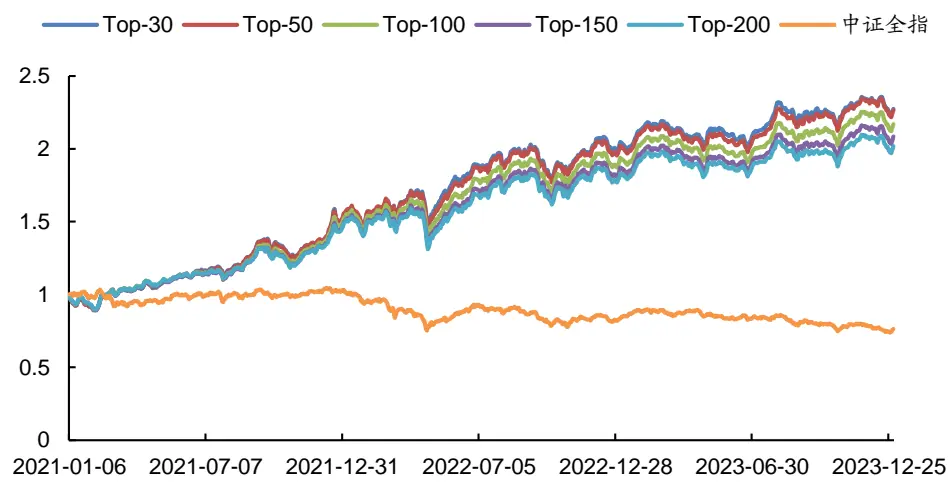
数据来源：通联数据、Wind，广发证券发展研究中心

表 20：精选订单因子组合分年度表现统计（全市场）

| 组合 | 年份 | 年化收益率 | 最大回撤率 | 平均换手率 | 年化波动率 | 夏普比率 | 信息比率 |
| --- | --- | --- | --- | --- | --- | --- | --- |
| Top-30 | 2021~2023年 | 31.33% | 15.39% | 70.31% | 15.46% | 1.86 | 2.03 |
|  | 2021年 | 51.75% | 10.10% | 73.59% | 15.98% | 3.08 | 3.24 |
|  | 2022年 | 31.50% | 15.39% | 68.20% | 18.43% | 1.57 | 1.71 |
|  | 2023年 | 13.85% | 8.47% | 69.31% | 11.07% | 1.02 | 1.25 |
|  | 2021~2023年 | 31.15% | 16.06% | 66.94% | 15.44% | 1.86 | 2.02 |
| Top-50 | 2021年 | 52.46% | 9.93% | 69.46% | 15.72% | 3.18 | 3.34 |
|  | 2022年 | 28.99% | 16.06% | 64.91% | 18.57% | 1.43 | 1.56 |
|  | 2023年 | 15.02% | 8.82% | 66.61% | 11.11% | 1.13 | 1.35 |
|  | 2021~2023年 | 29.26% | 16.69% | 60.53% | 15.45% | 1.73 | 1.89 |
| Top-100 | 2021年 | 49.71% | 10.35% | 63.38% | 15.35% | 3.07 |  |
|  | 2022年 | 25.69% | 16.69% | 57.93% | 18.84% |  | 3.24 |
|  | 2023年 | 15.10% | 8.85% | 60.51% | 11.24% | 1.23 1.12 | 1.36 |
|  | 2021~2023年 | 27.55% | 17.43% | 56.10% | 15.43% |  | 1.34 |
| Top-150 |  |  |  |  |  | 1.62 | 1.78 |
|  | 2021年 2022年 | 46.77% | 10.35% | 59.07% | 15.10% | 2.93 | 3.10 |
|  | 2023年 | 23.81% | 17.43% | 53.34% | 18.99% | 1.12 | 1.25 |
|  |  | 14.49% | 8.92% | 56.13% | 11.24% | 1.07 | 1.29 |
| Top-200 | 2021~2023年 | 26.21% | 17.75% | 52.39% | 15.36% | 1.54 | 1.71 |
|  | 2021年 | 45.94% | 10.45% | 55.41% | 14.90% | 2.91 | 3.08 |
|  | 2022年 | 21.83% | 17.75% | 49.48% | 18.99% | 1.02 | 1.15 |
|  | 2023年 | 13.36% | 8.84% | 52.54% | 11.20% | 0.97 | 1.19 |
| 中证全指 | 2021~2023年 | -8.50% | 29.34% | 1 | 16.59% | -0.66 | -0.51 |
|  | 2021年 | 3.27% | 11.05% | 1 | 15.88% | 0.05 | 0.21 |
|  | 2022年 | -20.25% | 26.98% | 1 | 20.29% | -1.12 | -1.00 |
|  | 2023年 | -7.01% | 17.75% | - | 12.75% | -0.75 | -0.55 |

数据来源：通联数据、Wind，广发证券发展研究中心

## 2. 精选订单因子组合在创业板板块中的表现

在2021~2023年期间，精选订单因子组合在创业板板块的RankIC均值达13.7%、胜率达83.4%。以因子值对创业板股票进行排序，分别取Top-30、50、100、150、200个股票构建组合进行测算，结果如图3和表21所示。在2021~2023年期间，各组合分别取得了27.66%、26.72%、23.80%、22.33%、21.69%的平均年化收益率，而同期创业板综指指数的平均年化收益率为-7.46%；在2023年期间，各组合分别取得了30.55%、26.33%、24.64%、26.13%、27.85%的平均年化收益率，而2023年创业板综指指数的年化收益率为-5.39%，精选订单因子组合取得了较为出色的超额收益。

图 3：精选订单因子组合净值表现（创业板）
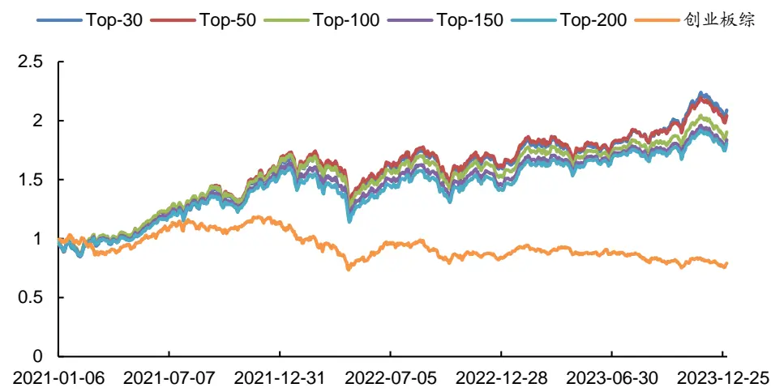
数据来源：通联数据、Wind，广发证券发展研究中心

表 21：精选订单因子组合分年度表现统计（创业板）

| 组合 | 年份 | 年化收益率 | 最大回撤率 | 平均换手率 | 年化波动率 | 夏普比率 | 信息比率 |
| --- | --- | --- | --- | --- | --- | --- | --- |
| Top-30 | 2021~2023年 | 27.66% | 25.45% | 50.74% | 19.38% | 1.30 | 1.43 |
|  | 2021年 | 62.21% | 13.31% | 53.35% | 21.70% | 2.75 | 2.87 |
|  | 2022年 | -1.45% | 25.45% | 47.63% | 21.68% | -0.18 | -0.07 |
|  | 2023年 | 30.55% | 10.63% | 51.51% | 13.59% | 2.06 | 2.25 |
| Top-50 | 2021~2023年 | 26.72% | 25.50% | 43.68% | 19.02% | 1.27 | 1.40 |
|  | 2021年 | 66.20% | 12.10% | 46.79% | 20.89% | 3.05 | 3.17 |
|  | 2022年 | -2.78% | 25.50% | 40.73% | 21.61% | -0.24 | -0.13 |
|  | 2023年 | 26.33% | 10.53% | 43.77% | 13.39% | 1.78 | 1.97 |
| Top-100 | 2021~2023年 | 23.80% | 26.91% | 35.19% | 18.77% | 1.13 | 1.27 |
|  | 2021年 | 64.71% | 11.62% | 38.96% | 20.04% | 3.10 | 3.23 |
|  | 2022年 | -7.31% | 26.91% | 33.07% | 21.80% | -0.45 | -0.34 |
|  | 2023年 | 24.64% | 9.94% | 33.71% | 13.28% | 1.67 | 1.86 |
| Top-150 | 2021~2023年 | 22.33% | 28.02% | 30.73% | 18.59% | 1.07 | 1.20 |
|  | 2021年 | 58.45% | 12.43% | 34.02% | 19.74% | 2.83 | 2.96 |
|  | 2022年 | -8.16% | 28.02% | 29.48% | 21.69% | -0.49 | -0.38 |
|  | 2023年 | 26.13% | 9.50% | 28.77% | 13.19% | 1.79 | 1.98 |
| Top-200 | 2021~2023年 | 21.69% | 28.87% | 27.53% | 18.48% | 1.04 |  |
|  | 2021年 | 54.75% | 13.11% | 29.87% |  |  | 1.17 |
|  | 2022年 | -8.67% | 28.87% | 26.43% | 19.44% 21.70% | 2.69 | 2.82 |
|  | 2023年 | 27.85% | 9.21% |  |  | -0.51 | -0.40 |
| 创业板综指 | 2021~2023年 |  |  | 26.38% | 13.16% | 1.93 | 2.12 |
|  | 2021年 | -7.46% | 38.09% | 1 | 21.93% | -0.45 | -0.34 |
|  | 2022年 | 14.27% -26.68% | 16.57% 34.94% | 1 | 22.20% 26.03% | 0.53 -1.12 | 0.64 -1.02 |
|  | 2023年 | -5.39% | 20.32% | 1 - | 16.51% | -0.48 | -0.33 |

数据来源：通联数据、Wind，广发证券发展研究中心
识别风险，发现价值

## 3. 精选订单因子组合在沪深300板块中的表现

在2021~2023年期间，精选订单因子组合在沪深300板块的RankIC均值为10.5%、胜率为64.6%。以因子值对沪深300股票进行排序，分别取Top-30、50个股票构建组合进行测算，结果如图4和表22所示。在2021~2023年期间，各组合分别取得了10.62%、7.49%的平均年化收益率，而同期沪深300指数的平均年化收益率为-13.79%；在2023年期间，各组合分别取得了11.64%、9.96%的平均年化收益率，而2023年沪深300指数的年化收益率为-11.33%，精选订单因子组合取得了较为出色的超额收益。

图 4：精选长短单因子组合净值表现（沪深300）
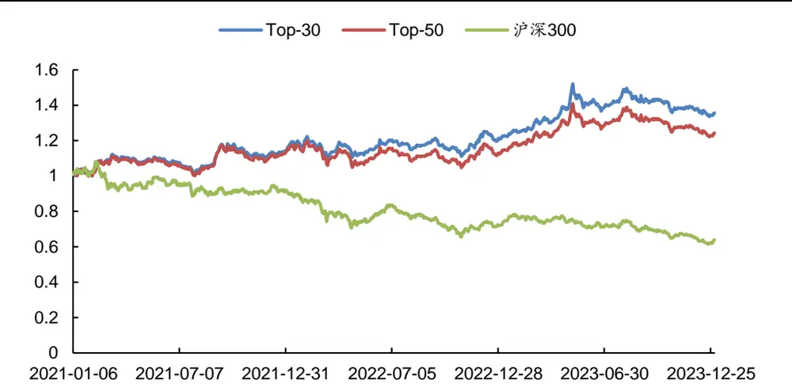
数据来源：通联数据、Wind，广发证券发展研究中心

表 22：精选订单因子组合分年度表现统计（沪深300）

| 组合 | 年份 | 年化收益率 | 最大回撤率 | 平均换手率 | 年化波动率 | 夏普比率 | 信息比率 |
| --- | --- | --- | --- | --- | --- | --- | --- |
| Top-30 | 2021~2023年 | 10.62% | 12.24% | 25.05% | 11.55% | 0.70 | 0.92 |
|  | 2021年 | 14.34% | 9.53% | 26.59% | 10.41% | 1.14 | 1.38 |
|  | 2022年 | 6.14% | 10.82% | 24.57% | 12.41% | 0.29 | 0.49 |
|  | 2023年 | 11.64% | 12.24% | 24.01% | 11.79% | 0.78 | 0.99 |
| Top-50 | 2021~2023年 | 7.49% | 13.38% | 20.87% | 12.21% | 0.41 | 0.61 |
|  | 2021年 | 13.47% | 9.88% | 23.10% | 11.21% | 0.98 | 1.20 |
|  | 2022年 | -0.39% | 12.68% | 20.45% | 13.63% | -0.21 | -0.03 |
|  | 2023年 | 9.96% | 13.38% | 19.09% | 11.68% | 0.64 | 0.85 |
| 沪深300 | 2021~2023年 | -13.79% | 43.22% | 1 | 17.27% | -0.94 | -0.80 |
|  | 2021年 | -7.97% | 18.19% | 1 | 18.08% | -0.58 | -0.44 |
|  | 2022年 | -21.55% | 28.65% | 1 | 19.91% | -1.21 | -1.08 |
|  | 2023年 | -11.33% | 21.51% | - | 13.18% | -1.05 | -0.86 |

数据来源：通联数据、Wind，广发证券发展研究中心

## 4. 精选订单因子组合在中证500板块中的表现

在2021~2023年期间，精选订单因子组合在中证500板块的RankIC均值为11.1%、胜率为63.9%。以因子值对中证500股票进行排序，分别取Top-30、50、100个股票构建组合进行测算，结果如图5和表23所示。在2021~2023年期间，各组合分别取得了8.79%、10.22%、10.00%的平均年化收益率，而同期中证500指数的平均年化收益率为-5.98%，精选订单因子组合取得了较为出色的超额收益。

图 5：精选订单因子组合净值表现（中证500）
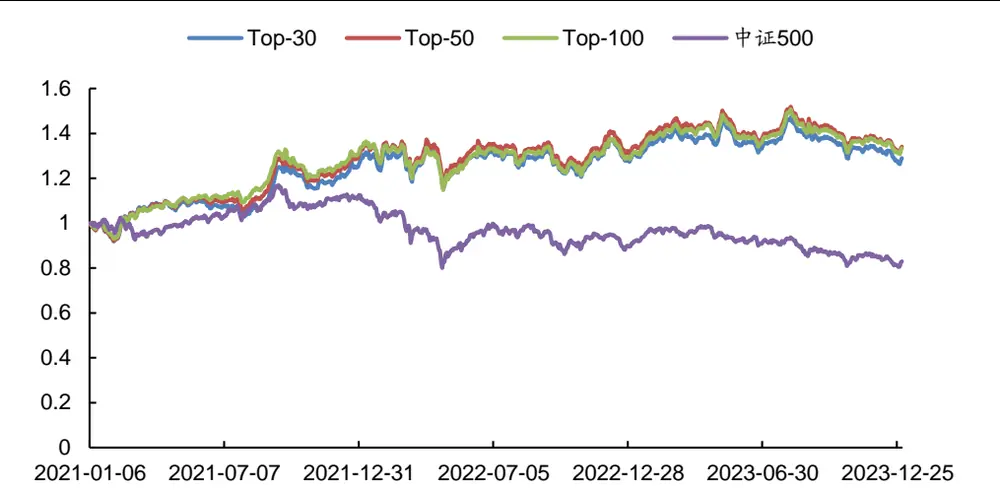
数据来源：通联数据、Wind，广发证券发展研究中心

表 23：精选订单因子组合分年度表现统计（中证500）

| 组合 | 年份 | 年化收益率 | 最大回撤率 | 平均换手率 | 年化波动率 | 夏普比率 | 信息比率 |
| --- | --- | --- | --- | --- | --- | --- | --- |
| Top-30 | 2021~2023年 | 8.79% | 14.56% | 43.87% | 14.05% | 0.45 | 0.63 |
|  | 2021年 | 26.44% | 9.31% | 45.80% | 14.06% | 1.70 | 1.88 |
|  | 2022年 | 1.54% | 14.56% | 43.20% | 16.61% | -0.06 | 0.09 |
|  | 2023年 | 0.43% | 14.19% | 42.65% | 10.92% | -0.19 | 0.04 |
| Top-50 | 2021~2023年 | 10.22% | 14.58% | 36.08% | 13.83% | 0.56 | 0.74 |
|  | 2021年 | 30.36% | 9.27% | 39.81% | 13.43% | 2.07 | 2.26 |
|  | 2022年 | 1.11% | 14.58% | 33.57% | 16.61% | -0.08 | 0.07 |
|  | 2023年 | 1.74% | 13.54% | 35.06% | 10.83% | -0.07 | 0.16 |
| Top-100 | 2021~2023年 | 10.00% | 15.94% | 26.82% | 13.51% | 0.56 | 0.74 |
|  | 2021年 | 31.90% | 9.68% | 30.17% | 12.52% | 2.35 | 2.55 |
|  | 2022年 | -2.02% | 15.94% | 25.88% | 16.57% | -0.27 | -0.12 |
|  | 2023年 | 3.15% | 13.22% | 24.47% | 10.76% | 0.06 | 0.29 |
| 中证500 | 2021~2023年 | -5.98% | 31.57% | 1 | 16.80% | -0.51 | -0.36 |
|  | 2021年 | 12.53% | 9.57% | 1 | 15.02% | 0.67 | 0.83 |
|  | 2022年 | -20.24% | 28.83% | 1 | 21.36% | -1.06 | -0.95 |
|  | 2023年 | -7.39% | 18.66% |  | 12.83% | -0.77 | -0.58 |

数据来源：通联数据、Wind，广发证券发展研究中心

## 5. 精选订单因子组合在中证800板块中的表现

在2021~2023年期间，精选订单因子组合在中证800板块的RankIC均值为11.3%、胜率为65.6%。以因子值对中证800股票进行排序，分别取Top-30、50、100、150、200个股票构建组合进行测算，结果如图6和表24所示。在2021~2023年期间，各组合分别取得了6.86%、8.78%、10.23%、9.32%、7.86%的平均年化收益率，而同期中证800指数的平均年化收益率为-12.01%，精选订单因子组合取得了较为出色的超额收益。

图 6：精选订单因子组合净值表现（中证800）
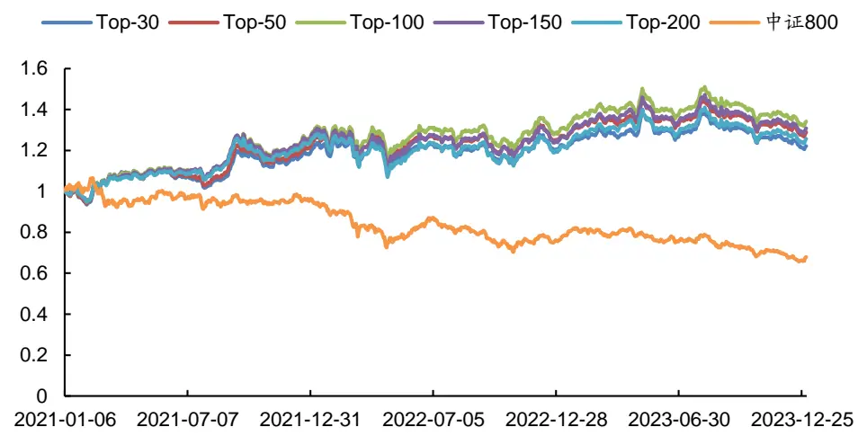
数据来源：通联数据、Wind，广发证券发展研究中心

表 24：精选订单因子组合分年度表现统计（中证800）

| 组合 | 年份 | 年化收益率 | 最大回撤率 | 平均换手率 | 年化波动率 | 夏普比率 | 信息比率 |
| --- | --- | --- | --- | --- | --- | --- | --- |
| Top-30 | 2021~2023年 | 6.86% | 13.96% | 44.01% | 12.70% | 0.34 | 0.54 |
|  | 2021年 | 19.18% | 7.93% | 45.32% | 12.32% | 1.35 | 1.56 |
|  | 2022年 | 1.31% | 12.35% | 44.49% | 14.79% | -0.08 | 0.09 |
|  | 2023年 | 1.17% | 13.96% | 42.16% | 10.67% | -0.12 | 0.11 |
| Top-50 | 2021~2023年 | 8.78% | 13.14% | 37.42% | 12.71% | 0.49 | 0.69 |
|  | 2021年 | 22.31% | 7.74% | 39.37% | 12.20% | 1.62 | 1.83 |
|  | 2022年 | 2.33% | 12.57% | 36.35% | 14.98% | -0.01 | 0.16 |
|  | 2023年 | 2.98% | 13.14% | 36.62% | 10.58% | 0.05 | 0.28 |
| Top-100 | 2021~2023年 | 10.23% | 12.79% | 29.36% | 12.66% | 0.61 | 0.81 |
|  | 2021年 | 27.01% | 8.13% | 31.96% | 11.72% | 2.09 | 2.30 |
|  | 2022年 | 1.44% | 12.79% | 28.12% | 15.24% | -0.07 | 0.09 |
|  | 2023年 | 4.11% | 12.63% | 28.11% | 10.57% | 0.15 | 0.39 |
| Top-150 | 2021~2023年 | 9.32% | 15.04% | 24.56% | 12.73% | 0.54 | 0.73 |
|  | 2021年 | 26.47% | 8.53% | 27.30% | 11.53% | 2.08 | 2.30 |
|  | 2022年 | -1.48% | 15.04% | 24.15% | 15.57% | -0.26 | -0.09 |
|  | 2023年 | 4.98% | 12.64% | 22.25% | 10.54% | 0.24 | 0.47 |
| Top-200 | 2021~2023年 | 7.86% | 16.61% | 20.57% | 12.85% | 0.42 | 0.61 |

识别风险，发现价值

|  | 2021年 | 24.62% | 8.73% | 22.95% | 11.62% | 1.90 | 2.12 |
| --- | --- | --- | --- | --- | --- | --- | --- |
|  | 2022年 | -3.89% | 16.61% | 20.05% | 15.84% | -0.40 | -0.25 |
|  | 2023年 | 4.90% | 12.42% | 18.75% | 10.47% | 0.23 | 0.47 |
|  | 2021~2023年 | -12.01% | 38.36% | 1 | 16.56% | -0.88 | -0.73 |
| 中证800 | 2021年 | -3.60% | 14.18% |  | 16.58% | -0.37 | -0.22 |
|  | 2022年 | -21.24% | 26.78% | 1 | 19.68% | -1.21 | -1.08 |
|  | 2023年 | -10.33% | 20.18% | 1 - | 12.72% | -1.01 |  |
|  |  |  |  |  |  |  | -0.81 |

数据来源：通联数据、Wind，广发证券发展研究中心

## 6. 精选订单因子组合在中证1000板块中的表现

在2021~2023年期间，精选订单因子组合在中证1000板块的RankIC均值为10.7%、胜率为67.4%。以因子值对中证1000股票进行排序，分别取Top-30、50、100、150、200个股票构建组合进行测算，结果如图7和表25所示。在2021~2023年期间，各组合分别取得了15.39%、14.88%、12.33%、12.16%、12.22%的平均年化收益率，而同期中证1000指数的平均年化收益率为-4.70%，精选订单因子组合取得了较为出色的超额收益。

图 7：精选订单因子组合净值表现（中证1000）
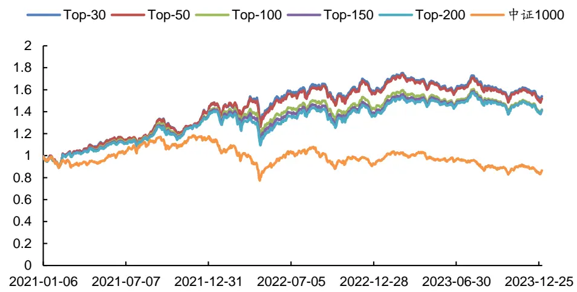
数据来源：通联数据、Wind，广发证券发展研究中心

表 25：精选订单因子组合分年度表现统计（中证1000）

| 组合 | 年份 | 年化收益率 | 最大回撤率 | 平均换手率 | 年化波动率 | 夏普比率 | 信息比率 |
| --- | --- | --- | --- | --- | --- | --- | --- |
| Top-30 | 2021~2023年 | 15.39% | 16.68% | 57.24% | 15.32% | 0.84 | 1.00 |
|  | 2021年 | 41.78% | 10.79% | 57.80% | 14.61% | 2.69 | 2.86 |
|  | 2022年 | 11.57% | 16.68% | 55.10% | 19.31% | 0.47 | 0.60 |
|  | 2023年 | -2.67% | 14.57% | 59.00% | 10.81% | -0.48 | -0.25 |
| Top-50 | 2021~2023年 | 14.88% | 17.18% | 49.85% | 15.10% | 0.82 | 0.99 |
|  | 2021年 | 42.00% | 10.34% | 51.26% | 14.46% | 2.73 | 2.90 |
|  | 2022年 | 10.07% | 17.18% | 48.69% | 18.87% | 0.40 | 0.53 |
|  | 2023年 | -2.81% | 14.70% | 49.70% | 10.85% | -0.49 | -0.26 |

识别风险，发现价值

| Top-100 | 2021~2023年 | 12.33% | 18.45% | 40.22% | 14.90% | 0.66 | 0.83 |
| --- | --- | --- | --- | --- | --- | --- | --- |
|  | 2021年 | 38.25% | 10.09% | 44.30% | 14.18% | 2.52 | 2.70 |
|  | 2022年 | 3.07% | 18.45% | 38.49% | 18.63% | 0.03 | 0.16 |
|  | 2023年 | -0.36% | 13.73% | 38.01% | 10.81% | -0.26 | -0.03 |
| Top-150 | 2021~2023年 | 12.16% | 20.51% | 34.42% | 14.89% | 0.65 | 0.82 |
|  | 2021年 | 37.49% | 9.66% | 39.09% | 14.14% | 2.47 | 2.65 |
|  | 2022年 | 0.70% | 20.51% | 32.57% | 18.68% | -0.10 | 0.04 |
|  | 2023年 | 2.10% | 13.26% | 31.73% | 10.74% | -0.04 | 0.20 |
| Top-200 | 2021~2023年 | 12.22% | 22.18% | 30.06% | 14.91% | 0.65 | 0.82 |
|  | 2021年 | 36.74% | 9.66% | 35.01% | 14.14% | 2.42 | 2.60 |
|  | 2022年 | -0.54% | 22.18% | 28.54% | 18.77% | -0.16 | -0.03 |
|  | 2023年 | 4.09% | 12.68% | 26.74% | 10.67% | 0.15 | 0.38 |
| 中证1000 | 2021~2023年 | -4.70% | 34.62% | 1 | 19.79% | -0.36 | -0.24 |
|  | 2021年 | 17.67% | 10.38% | - | 18.63% | 0.81 | 0.95 |
|  | 2022年 | -21.50% | 34.03% | 1 | 24.68% | -0.97 | -0.87 |
|  | 2023年 | -6.25% | 20.18% | - | 14.76% | -0.59 | -0.42 |

数据来源：通联数据、Wind，广发证券发展研究中心

## 7. 精选订单因子组合在国证2000板块中的表现

在2021~2023年期间，精选订单因子组合在国证2000板块的RankIC均值为12.7%、胜率为76.5%。以因子值对国证2000股票进行排序，分别取Top-30、50、100、150、200个股票构建组合进行测算，结果如图8和表26所示。在2021~2023年期间，各组合分别取得了25.00%、24.76%、22.99%、22.72%、21.84%的平均年化收益率，而同期国证2000指数的平均年化收益率为1.22%，精选订单因子组合取得了较为出色的超额收益。

图 8：精选订单因子组合净值表现（国证2000）
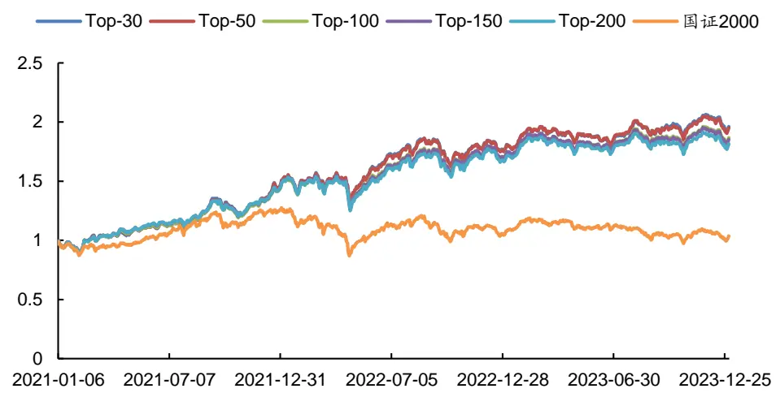
数据来源：通联数据、Wind，广发证券发展研究中心

表 26：精选订单因子组合分年度表现统计（国证2000）

| 组合 | 年份 | 年化收益率 | 最大回撤率 | 平均换手率 | 年化波动率 | 夏普比率 | 信息比率 |
| --- | --- | --- | --- | --- | --- | --- | --- |
| Top-30 | 2021~2023年 | 25.00% | 17.50% | 66.70% | 15.64% | 1.44 | 1.60 |
|  | 2021年 | 47.13% | 10.77% | 70.97% | 15.58% | 2.86 | 3.02 |
|  | 2022年 | 19.90% | 17.50% | 64.34% | 19.16% | 0.91 | 1.04 |
|  | 2023年 | 11.00% | 8.31% | 64.96% | 11.15% | 0.76 | 0.99 |
|  | 2021~2023年 | 24.76% | 17.15% | 61.19% | 15.51% | 1.44 | 1.60 |
| Top-50 | 2021年 | 47.27% | 10.69% | 65.91% | 15.25% | 2.94 | 3.10 |
|  | 2022年 | 19.47% | 17.15% | 57.93% | 19.13% | 0.89 | 1.02 |
|  | 2023年 | 10.65% | 8.16% | 60.00% | 11.09% | 0.73 | 0.96 |
|  | 2021~2023年 | 22.99% | 18.25% | 53.34% | 15.41% | 1.33 | 1.49 |
| Top-100 | 2021年 | 44.90% | 10.73% | 58.84% | 14.81% | 2.86 | 3.03 |
|  | 2022年 | 17.50% | 18.25% | 49.45% | 19.25% | 0.78 | 0.91 |
|  | 2023年 | 9.54% | 9.00% | 52.05% | 11.07% | 0.64 |  |
|  | 2021~2023年 | 22.72% | 18.58% | 47.62% | 15.39% | 1.31 | 0.86 |
| Top-150 | 2021年 |  |  |  |  |  | 1.48 |
|  | 2022年 | 45.67% | 10.34% | 53.14% | 14.76% | 2.93 | 3.10 |
|  | 2023年 | 16.76% | 18.58% | 44.14% | 19.25% | 0.74 | 0.87 |
|  |  | 8.93% | 8.90% | 45.84% | 11.05% | 0.58 | 0.81 |
| Top-200 | 2021~2023年 | 21.84% | 18.77% | 43.29% | 15.36% | 1.26 | 1.42 |
|  | 2021年 | 45.67% | 10.05% | 48.85% | 14.72% | 2.93 | 3.10 |
|  | 2022年 | 14.59% | 18.77% | 40.70% | 19.20% | 0.63 | 0.76 |
|  | 2023年 | 8.63% | 9.38% | 40.52% | 11.05% | 0.55 | 0.78 |
| 国证 2000 | 2021~2023年 | 1.22% | 31.86% | 1 | 20.10% | -0.06 | 0.06 |
|  | 2021年 | 26.74% | 11.54% | 1 | 18.61% | 1.30 | 1.44 |
|  | 2022年 | -17.14% | 31.86% | 1 | 25.05% | -0.78 | -0.68 |
|  | 2023年 | -1.16% | 18.22% | - | 15.42% | -0.24 | -0.07 |

数据来源：通联数据、Wind，广发证券发展研究中心

## 五、总结与展望

如何能在股票市场的博弈中胜出？对于量化投资者来说，关键在于对数据的全面收集，并结合数学模型和算法进行深入分析，从海量数据中挖掘出隐藏的市场规律。Level 1行情数据为3秒一笔的快照（Snapshot）数据，包含了简单的开高低收交易量交易金额等常规数据，所含信息有限。而相比数据频率较低、数据丰富度有限的Level 1数据，Level 2数据中则不仅提供了更为丰富的快照（Snapshot）数据，如10档申买申卖价、10档申买申卖量、最优买卖价前50笔委托、买卖委托价位数、买卖撤单信息等，而且提供了Level 1数据中所不包含的逐笔订单（Tick）数据。

在前序研究“多维度解耦的94个大小单因子：海量Level 2数据因子挖掘系列（一）”中，从所有行情数据的根源——Level 2逐笔订单出发，通过“大小订单”的角度对所有交易订单进行窥探，结合多维度解耦的分析方法构建出了多个有效的大小单因子，并从中挑选出表现优异者构建出了精选大小单因子组合，在A股全市场及各大板块中均取得了较为突出的表现。

而在前序研究“多维度解耦的22个长短单因子：海量Level 2数据因子挖掘系列（二）”中，则通过“订单成交完成时长”的角度继续对Level 2逐笔订单数据展开研究，通过订单维度的解耦分析方法构建出了多个有效的长短单因子，并从中挑选出表现优异者构建出了精选长短单因子组合，在A股全市场及各大板块中均取得了较为显著的超额收益

本文首先对前序研究中的大小单因子和长短单因子之间的相关性采用spearman相关系数进行计算。从测算结果来看，大小单因子和长短单因子之间的相关性较低，相关系数范围在-0.19~0.19之间，这表明“大小”和“长短”是衡量逐笔订单的两个较为独立的维度。

有了以上研究基础和初步结论，本文作为“海量Level 2数据因子挖掘”系列研究报告的第三篇，同时结合订单的“大小”和“长短”维度对Level 2逐笔订单数据进行深入剖析，构建出了240个从“大小”和“长短”角度进行解构的订单因子。

本文进一步从上述240个因子中挑选出表现优异者，构建出精选订单因子组合。具体而言，采用因子值排序后的前K个股票构建Top-K组合，以t+1日均价买入，20个交易日换仓，双边千三计费，实证结果表明精选订单因子组合在A股全市场及各大板块中均取得了较为出色的表现。

全市场板块：在2021~2023年间，精选订单因子组合的RankIC均值达13.3%、胜率达78.3%，Top-30组合的平均年化收益率为31.33%、最大回撤率为15.39%、夏普比率为1.86，而同期中证全指年化收益率为-8.50%。

创业板板块：在2021~2023年间，精选订单因子组合的RankIC均值达13.7%、胜率达83.4%，Top-30组合的平均年化收益率为27.66%、最大回撤率为25.45%、夏普比率为1.30，而同期创业板综指年化收益率为-7.46%。

国证2000板块：在2021~2023年间，精选订单因子组合的RankIC均值为12.7%，胜率为76.5%，Top-30组合的平均年化收益率为25.00%、最大回撤率为17.50%、夏普比率为1.44，而同期国证2000指数平均年化收益率为1.22%，精选订单因子组合取得了较为显著的超额收益。

展望未来，“海量Level 2数据因子挖掘”系列研究报告将继续深入Level 2数据，从海量数据中挖掘出隐藏的市场规律，构建出更多的有效因子。

## 六、风险提示

本文所述模型用量化方法通过历史数据统计、建模和测算完成，所得结论与规律在市场政策、环境变化时存在失效风险；

本文策略在市场结构及交易行为改变时有可能存在失效风险；

因量化模型不同，本文提出的观点可能与其他量化模型结论存在差异。

## 广发金融工程研究小组

罗军 ：首席分析师，华南理工大学硕士，从业 16 年，2010 年进入广发证券发展研究中心。

安 宁 宁 ：首席分析师，暨南大学硕士，从业 14 年，2011 年进入广发证券发展研究中心。

史 庆 盛 ：资深分析师，华南理工大学硕士，2011 年进入广发证券发展研究中心。

张 超 ：资深分析师，中山大学硕士，2012 年进入广发证券发展研究中心。

陈 原 文 ：资深分析师，中山大学硕士，2015 年进入广发证券发展研究中心。

李豪 ：资深分析师，上海交通大学硕士，2016 年进入广发证券发展研究中心。

周 飞 鹏 ：资深分析师，伯明翰大学硕士，2021 年加入广发证券发展研究中心。

张 钰 东 ：资深分析师，中山大学硕士，2020 年进入广发证券发展研究中心。

季 燕 妮 ：资深分析师，厦门大学硕士，2020 年进入广发证券发展研究中心。

林 涛 ：研究员，中山大学硕士，2024年进入广发证券发展研究中心。

## [Table_IndustryInvestDescription] 广发证券—行业投资评级说明

买入： 预期未来 12 个月内，股价表现强于大盘 10%以上。

持有： 预期未来12个月内，股价相对大盘的变动幅度介于-10%～+10%。

卖出： 预期未来12个月内，股价表现弱于大盘10%以上。

## [Table_CompanyInvestDescription] 广发证券—公司投资评级说明

买入： 预期未来 12 个月内，股价表现强于大盘 15%以上。

增持： 预期未来12个月内，股价表现强于大盘5%-15%。

持有： 预期未来12个月内，股价相对大盘的变动幅度介于-5%～+5%。

卖出： 预期未来12个月内，股价表现弱于大盘5%以上。

## [Table_Address] 联系我们

| 地址 | 广州市 | 深圳市 | 北京市 | 上海市 | 香港 |
| --- | --- | --- | --- | --- | --- |
|  | 广州市天河区马场路 | 深圳市福田区益田路 | 北京市西城区月坛北 | 上海市浦东新区南泉 | 香港湾仔骆克道81号 |
|  | 26号广发证券大厦47 | 6001号太平金融大厦 | 街2号月坛大厦18层 | 北路429号泰康保险 | 广发大厦27楼 |
|  | 楼 邮政编码 | 31层 |  | 大厦37楼 |  |
|  | 510627 | 518026 | 100045 | 200120 |  |
|  | gfzqyf@gf.com.cn |  |  |  |  |

## [Table_LegalD 法律主体isclaimer 声明]

本报告由广发证券股份有限公司或其关联机构制作，广发证券股份有限公司及其关联机构以下统称为“广发证券”。本报告的分销依据不同国家、地区的法律、法规和监管要求由广发证券于该国家或地区的具有相关合法合规经营资质的子公司/经营机构完成。

广发证券股份有限公司具备中国证监会批复的证券投资咨询业务资格，接受中国证监会监管，负责本报告于中国（港澳台地区除外）的分销。广发证券（香港）经纪有限公司具备香港证监会批复的就证券提供意见（4 号牌照）的牌照，接受香港证监会监管，负责本报告于中国香港地区的分销。

本报告署名研究人员所持中国证券业协会注册分析师资质信息和香港证监会批复的牌照信息已于署名研究人员姓名处披露。

## [Table_I 重要mportant 声明N

广发证券股份有限公司及其关联机构可能与本报告中提及的公司寻求或正在建立业务关系，因此，投资者应当考虑广发证券股份有限公司及其关联机构因可能存在的潜在利益冲突而对本报告的独立性产生影响。投资者不应仅依据本报告内容作出任何投资决策。投资者应自主作出投资决策并自行承担投资风险，任何形式的分享证券投资收益或者分担证券投资损失的书面或者口头承诺均为无效。

本报告署名研究人员、联系人（以下均简称“研究人员”）针对本报告中相关公司或证券的研究分析内容，在此声明：（ ）本报告的全部分析结论、研究观点均精确反映研究人员于本报告发出当日的关于相关公司或证券的所有个人观点，并不代表广发证券的立场；（2）研究人员的部分或全部的报酬无论在过去、现在还是将来均不会与本报告所述特定分析结论、研究观点具有直接或间接的联系。

研究人员制作本报告的报酬标准依据研究质量、客户评价、工作量等多种因素确定，其影响因素亦包括广发证券的整体经营收入，该等经营收入部分来源于广发证券的投资银行类业务。

本报告仅面向经广发证券授权使用的客户/特定合作机构发送，不对外公开发布，只有接收人才可以使用，且对于接收人而言具有保密义务。广发证券并不因相关人员通过其他途径收到或阅读本报告而视其为广发证券的客户。在特定国家或地区传播或者发布本报告可能违反当地法律，广发证券并未采取任何行动以允许于该等国家或地区传播或者分销本报告。

本报告所提及证券可能不被允许在某些国家或地区内出售。请注意，投资涉及风险，证券价格可能会波动，因此投资回报可能会有所变化，过去的业绩并不保证未来的表现。本报告的内容、观点或建议并未考虑任何个别客户的具体投资目标、财务状况和特殊需求，不应被视为对特定客户关于特定证券或金融工具的投资建议。本报告发送给某客户是基于该客户被认为有能力独立评估投资风险、独立行使投资决策并独立承担相应风险。

本报告所载资料的来源及观点的出处皆被广发证券认为可靠，但广发证券不对其准确性、完整性做出任何保证。报告内容仅供参考，报告中的信息或所表达观点不构成所涉证券买卖的出价或询价。广发证券不对因使用本报告的内容而引致的损失承担任何责任，除非法律法规有明确规定。客户不应以本报告取代其独立判断或仅根据本报告做出决策，如有需要，应先咨询专业意见。

广发证券可发出其它与本报告所载信息不一致及有不同结论的报告。本报告反映研究人员的不同观点、见解及分析方法，并不代表广发证券的立场。广发证券的销售人员、交易员或其他专业人士可能以书面或口头形式，向其客户或自营交易部门提供与本报告观点相反的市场评论或交易策略，广发证券的自营交易部门亦可能会有与本报告观点不一致，甚至相反的投资策略。报告所载资料、意见及推测仅反映研究人员于发出本报告当日的判断，可随时更改且无需另行通告。广发证券或其证券研究报告业务的相关董事、高级职员、分析师和员工可能拥有本报告所提及证券的权益。在阅读本报告时，收件人应了解相关的权益披露（若有）。

本研究报告可能包括和/或描述/呈列期货合约价格的事实历史信息（“信息”）。请注意此信息仅供用作组成我们的研究方法/分析中的部分论点依据/证据，以支持我们对所述相关行业/公司的观点的结论。在任何情况下，它并不（明示或暗示）与香港证监会第5类受规管活动（就期货合约提供意见）有关联或构成此活动。

## [Table_Interest 权益披露Disclosur

(1)广发证券（香港）跟本研究报告所述公司在过去12 个月内并没有任何投资银行业务的关系。

## [Table_Copyright] 版权声明

未经广发证券事先书面许可，任何机构或个人不得以任何形式翻版、复制、刊登、转载和引用，否则由此造成的一切不良后果及法律责任由私自翻版、复制、刊登、转载和引用者承担。