# 海量 Level 2 数据因子挖掘系列（四）

## 报告摘要：

数据制胜：如何能在股票市场的博弈中胜出？对于量化投资者来说，关键在于对数据的全面收集，并结合数学模型和算法进行深入分析，从海量数据中挖掘出隐藏的市场规律。

集合竞价：A 股市场的竞价时段主要分为集合竞价阶段和连续竞价阶段，而集合竞价阶段又可以分为开盘集合竞价和收盘集合竞价。其中，开盘集合竞价在 09:15~09:20 时段内是可以撤回委托单的；而开盘集合竞价在 09:20~09:25 时段内和收盘集合竞价 14:57~15:00 时段内是不可撤回委托单的。

集合竞价因子：开盘集合竞价和收盘集合竞价作为当天股票市场的开始和结束，其中的委托、成交、撤单情况反映了当天个股的活跃度等情况，与股票市场的未来走势存在关联性。因此，本文基于 level2 数据中的逐笔订单信息，利用集合竞价期间的委托、成交、撤单数据构建出了 15个集合竞价相关因子。

因子回测表现：由于上交所和深交所对集合竞价期间的 level2 逐笔订单数据结构差异，本文针对深证 A指成分股范围内个股构建了上述15个集合竞价相关因子，并对其在 2019 年 3 月~2024 年 5 月期间的深证 A指成分股范围内选股性能进行了统计。

09:15~09:20 时段：成交比例因子中表现较好的是买单方向因子，20日平滑换仓 RankIC 均值为-9.20%，胜率为 22%；撤单比例因子中表现较好的仍为买单方向因子，其20日平滑换仓RankIC均值为-5.00%，胜率为 27%。

09:20~09:25 时段：成交比例因子中表现较好的是买卖双向考虑的因子，其 20 日平滑换仓 RankIC 均值为-9.20%，胜率为 28%。

09:15~09:25 时段：成交比例因子中表现较好的是买单方向因子，20日平滑换仓 RankIC 均值为-10.10%，胜率为 28%。

14:57~15:00时段：该时段成交比例因子中，买单方向因子RankIC均值接近于 0%，胜率徘徊在 50%左右，是一个几乎没有选股能力的因子。但与之相反的卖单方向因子则展现出了较为有效的选股性能，其RankIC 均值为-9.60%，胜率为 23%。这表明在收盘集合竞价阶段，卖单中的成交比例越大，则该股票在未来的看空可能性更大；而买单中的成交比例则与未来股价走势关系甚微。

风险提示：（1）本文所述模型用量化方法通过历史数据统计、建模和测算完成，所得结论与规律在市场政策、环境变化时存在失效风险；（2）本文策略在市场结构及交易行为改变时有可能存在失效风险；（3）因量化模型不同，本文提出的观点可能与其他量化模型结论存在差异。

tio_09150920 因子 50 档分档收益

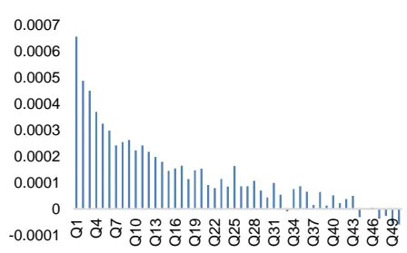
数据来源：通联数据，Wind, 广发证券发展研究中心

图 2：SellTransaction_SellOrder_

ratio_14571500 因子 50 档分档收益

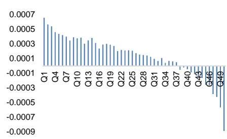
数据来源：通联数据，Wind, 广发证券发展研究中心

[分析师： Table_Author]安宁宁

SAC 执证号：S0260512020003

SFC CE No. BNW179

0755 - 23948352

anningning@gf.com.cn

## [Table_ 相关研究：DocRe

大小单与长短单的 241 个碰2024-08-21
撞火花：海量 Level 2 数据因
子挖掘系列（三）
订单维度解耦的 22 个长短单2024-08-01
因子：海量 Level 2 数据因子
挖掘系列（二）
多维度解耦的 94 个大小单因2024-07-15
子：海量 Level 2 数据因子挖
掘系列（一）

[联系人： Table_Contacts] 林涛

0755 - 82528531

gflintao@gf.com.cn

识别风险，发现价值

## 一、Level 1 与 Level 2 行情数据介绍

如何能在股票市场的博弈中胜出？关键在于对市场信息的掌握和对市场规律的理解。对于量化投资者来说，更在于对数据的全面收集和深度分析，并结合数学模型和算法，从海量数据中挖掘出隐藏的市场规律。这些规律可能是某些股票价格的趋势，市场的周期性波动，抑或是短期的交易信号。一旦这些规律被发现并加以利用，量化投资者便能在股票市场的博弈中获得优势。

股票行情数据源于上交所和深交所，根据数据的频率和丰富度通常分为Level 1数据和Level 2数据。如表1所示，Level 1数据为3秒一笔的快照（Snapshot）数据，包含了常用行情软件上可以看到的最高价、最低价、开盘价、收盘价、成交量、成交额、成交笔数、委买委卖量、5档申买申卖价、5档申买申卖量等数据。而相比数据频率较低、数据丰富度有限的Level 1数据，Level 2数据中则不仅提供了更为丰富的快照（Snapshot）数据，如10档申买申卖价、10档申买申卖量、最优买卖价前50笔委托、买卖委托价位数、买卖撤单信息等，而且提供了Level 1数据中所不包含的逐笔订单（Tick）数据。逐笔订单数据包含了当日交易时段中集合竞价阶段和连续竞价阶段的每一笔订单数据，其中的关键信息包括精确到毫秒的订单时间、逐笔序号、频道代码、价格、数量、金额、买入卖出订单号和订单类别等详细数据。Level2数据中的逐笔订单数据是一切行情数据的根源，不同频率的快照数据均由逐笔订单数据聚合而成。在“海量Level 2数据因子挖掘”系列研究报告中，将尝试对Level 2数据中详细的快照数据和逐笔订单数据进行深入分析并加以利用，有望能够从中获得更为丰富的价格趋势、周期波动、交易信号等规律和信息，从而挖掘出更为有效的因子，构建出具有超额收益的股票投资组合。

表 1：Level 1与Level 2主要行情数据对比

| 数据类别 | 数据名称 | Level 1 | Level 2 |
| --- | --- | --- | --- |
| 快照数据 | 时间 | 最快3秒一笔 | 最快3秒一笔 |
|  | 最高价 | V | V |
|  | 最低价 | √ | √ |
|  | 开盘价 | V | √ |
|  | 收盘价 | √ | V |
|  | 成交数量 | V | V |
|  | 成交金额 | V | V |
|  | (Snapshot) 成交笔数 | √ | √ |
|  | 委买量/委卖量 | V | V |
|  | 申买价/申卖价 | 5档 | 10档 |
|  | 申买量/申卖量 | 5档 | 10档 |
|  | 最优买/卖价前 50 笔委托 | x | V |
|  | 申买/申卖委托笔数 |  |  |
|  | 买入/卖出最大等待时间 | x x | V ✓（仅上交所） |

识别风险，发现价值

|  | 买方/卖方委托价位数 | x | ✓（仅上交所） |  |
| --- | --- | --- | --- | --- |
|  | 买入/卖出撤单笔数 | x | √（仅上交所） |  |
|  | 买入/卖出撤单数量 | x | √（仅上交所） |  |
|  | 买入/卖出撤单金额 | x | √（仅上交所） |  |
|  | 买入/卖出总笔数 | x | √（仅上交所） |  |
|  | 时间 | x | ✓（精确到毫秒） |  |
|  | 逐笔订单数据 (Tick) | 逐笔序号 | x | V |
| 频道代码 |  | x | V |  |
| 价格 |  | x | √ |  |
| 数量 |  | x | √ |  |
| 金额 |  | x | V |  |
| 买入订单号 |  | x | V |  |
| 卖出订单号 |  | × V |  |  |
| 订单类别 |  | x | ✓（委托/成交/撤单） |  |

数据来源：通联数据、广发证券发展研究中心

## 二、相关研究工作

表 2：海量Level 2数据因子挖掘系列研究报告

| 系列报告 | 标题 | 研究内容简介 | 发表时间 |
| --- | --- | --- | --- |
|  | 多维度解耦的94个大小单因子 | 从所有行情数据的根源——Level2逐笔订单出发，通过“大小订单” 的角度对所有交易订单进行窥探，结合多维度解耦的分析方法构建出 了多个有效的大小单因子，并从中挑选出表现优异者构建出了精选大 小单因子组合。精选大小单因子组合在全市场范围内的历史RankIC 均值为 9.2%，胜率为 76.0%。 | 2024-07-15 |
| 二 | 订单维度解耦的22个长短单因子 | 通过“订单成交完成时长”的角度对Level2逐笔订单数据展开研究， 通过订单维度的解耦分析方法构建出了22个有效的长短单因子，并 从中挑选出表现优异者构建出了精选长短单因子组合。精选长短单因 子组合在全市场范围内的历史RankIC均值为 13.1%，胜率为 80.3%。 基于大小单因子和长短单因子之间相关系数范围在-0.19~0.19之间的 | 2024-08-01 |
| 三 | 大小单与长短单的241个碰撞火花 | 较低相关性，进一步尝试同时结合订单的“大小”和“长短”维度对 其进行深入剖析，构建出了240个订单因子。进一步的，本文从上述 240个基于“大小”和“长短”进行解构的订单因子中挑选出表现优 异者，构建出精选订单因子组合。精选订单因子组合在全市场范围内 的历史RankIC 均值为 13.3%，胜率为 78.3%，同时取得了更为显著 的多头组合收益。 | 2024-08-21 |

数据来源：广发证券发展研究中心

## 三、集合竞价因子定义

如下表3所示，A股市场的竞价时段主要分为集合竞价阶段和连续竞价阶段，而集合竞价阶段又可以分为开盘集合竞价和收盘集合竞价。其中，开盘集合竞价在09:15~09:20时段内是可以撤回委托单的；而开盘集合竞价在09:20~09:25时段内和收盘集合竞价14:57~15:00时段内是不可撤回委托单的。

表 3：A股市场的竞价时段

| 时间段 | 竞价类型 | 时段内是否可以撤单 |
| --- | --- | --- |
| 09:15~09:20 | 集合竞价 | √ |
| 09:20~09:25 | 集合竞价 | x |
| 09:30~11:30/13:00~14:57 | 连续竞价 | √ |
| 14:57~15:00 | 集合竞价 | x |

数据来源：广发证券发展研究中心

开盘集合竞价和收盘集合竞价作为当天股票市场的开始和结束，其中的委托、成交、撤单情况反映了当天个股的活跃度等情况，与股票市场的未来走势存在一定关联性。因此，本文基于level2数据中的逐笔订单信息，利用集合竞价期间的委托、成交、撤单数据构建出了15个集合竞价相关因子。因子定义如下表4所示。

表 4：集合竞价相关因子定义

| 时间段 | 因子名称 | 因子定义 |
| --- | --- | --- |
| 09:15~09:20 | BuyTransaction_BuyOrder_ratio_09150920 SellTransaction_SellOrder_ratio_09150920 | 详细定义请联系作者 |
|  | Transaction_Order_ratio_09150920 |  |
|  | BuyWithdrew_BuyOrder_ratio_09150920 |  |
|  | SellWithdrew_SellOrder_ratio_09150920 | 详细定义请联系作者 |
| 09:20~09:25 | Withdrew_Order_ratio_09150920 BuyTransaction_BuyOrder_ratio_09200925 |  |
|  | SellTransaction_SellOrder_ratio_09200925 | 详细定义请联系作者 |
|  | Transaction_Order_ratio_09200925 |  |
| 09:15~09:25 | BuyTransaction_BuyOrder_ratio_09150925 |  |
|  | SellTransaction_SellOrder_ratio_09150925 |  |
|  | Transaction_Order_ratio_09150925 | 详细定义请联系作者 |
| 14:57~15:00 | BuyTransaction_BuyOrder_ratio_14571500 |  |
|  | SellTransaction_SellOrder_ratio_14571500 | 详细定义请联系作者 |

数据来源：广发证券发展研究中心

由于上交所和深交所对集合竞价期间的level2逐笔订单数据结构差异，本文针对深证A指成分股范围内个股构建了上述15个集合竞价相关因子，并对其在2019年3月~2024年5月期间的深证A指成分股范围内选股性能进行了统计，结果如下表5所示。

在09:15~09:20时段内，成交比例因子中表现较好的是买单方向因子，其20日平滑换仓RankIC均值为-9.20%，胜率为22%；撤单比例因子中表现较好的仍为买单方向因子，其20日平滑换仓RankIC均值为-5.00%，胜率为27%。

在09:20~09:25时段内，成交比例因子中表现较好的是买卖单双向方向考虑的因子，其20日平滑换仓RankIC均值为-9.20%，胜率为28%。

在09:15~09:25时段内，成交比例因子中表现较好的是买单方向因子，其20日平滑换仓RankIC均值为-10.10%，胜率为28%。

在14:57~15:00时段内，虽然作为收盘集合竞价阶段仅有3分钟，但其中买单和卖单方向因子展现出了截然不同的选股性能。在该时段的成交比例因子中，买单方向因子RankIC均值接近于0%，胜率徘徊在50%左右，是一个几乎没有选股能力的因子。但与之相反的卖单方向因子则展现出了较为有效的选股性能，其RankIC均值为-9.60%，胜率为23%。这表明在收盘集合竞价阶段，卖单中的成交比例越大，则该股票在未来的看空可能性更大；而买单中的成交比例则与未来股价走势关系甚微。

表 5：集合竞价相关因子RankIC表现（201903~202405，深证A指成分股）

| 因子名 | 5 日换仓(原始因子)IC 均值IC 胜率 |  | 5 日换仓(5 日平滑因子)IC 均值 IC 胜率 |  | 20 日换仓(原始因子)IC 均值IC 胜率 |  | 20 日换仓(5 日平滑因子)IC 均值IC 胜率 |  | 20 日换仓(20 日平滑因子）IC 均值 IC 胜率 |  |
| --- | --- | --- | --- | --- | --- | --- | --- | --- | --- | --- |
| BuyTransaction_BuyOrder_ratio_09150920SellTransaction_SellOrder_ratio_09150920Transaction_Order_ratio_09150920 | -4.40% | 24% | -6.10% | 23% | -5.70% | 18% | -7.90% | 18% | -9.20% | 22% |
|  | -3.50% | 28% | -4.00% | 29% | -4.50% | 24% | -4.90% | 27% | -5.30% | 29% |
|  | -4.60% | 25% | -5.80% | 26% | -5.90% | 21% | -7.30% | 22% | -7.90% | 25% |
| BuyWithdrew_BuyOrder_ratio_09150920SellWithdrew_SellOrder_ratio_09150920Withdrew_Order_ratio_09150920 | -3.60% | 23% | -3.60% | 27% | -4.70% | 17% | -4.60% | 23% | -5.00% | 27% |
|  | -3.70% | 21% | -3.40% | 24% | -5.10% | 15% | -4.50% | 20% | -4.30% | 25% |
|  | -3.40% | 23% | -3.50% | 26% | -4.50% | 17% | -4.40% | 23% | -4.50% | 25% |
| BuyTransaction_BuyOrder_ratio_09200925SellTransaction_SellOrder_ratio_09200925 | -4.00% | 27% | -5.70% | 31% | -5.30% | 26% | -7.70% | 26% | -8.90% | 28% |
|  | -4.60% | 28% | -6.00% | 31% | -6.10% | 26% | -7.70% | 27% | -8.30% | 30% |
| Transaction Order ratio 09200925 | -5.00% | 27% | -6.50% | 31% | -6.70% | 25% | -8.60% | 25% | -9.20% | 28% |
| BuyTransaction_BuyOrder_ratio_09150925SellTransaction_SellOrder_ratio_09150925 | -5.70% | 27% | -7.10% | 30% | -7.50% | 25% | -9.40% | 25% | -10.10% | 28% |
|  | -5.60% | 28% | -6.60% | 30% | -7.30% | 25% | -8.50% | 25% | -8.90% | 29% |
| Transaction_Order_ratio_09150925 | -5.90% | 27% | -7.00% | 30% | -7.70% | 25% | -9.20% | 25% | -9.60% | 28% |
| BuyTransaction_BuyOrder_ratio_14571500 | -0.50% | 45% | -0.20% | 50% | -0.70% | 44% | -0.70% | 47% | -0.60% | 50% |
| SellTransaction_SellOrder_ratio_14571500 | -3.80% | 26% | -6.00% | 24% | -5.20% | 21% | -8.40% | 21% | -9.60% | 23% |
| Transaction_Order_ratio_14571500 | -3.50% | 27% | -4.60% | 29% | -5.00% | 21% | -6.90% | 23% | -7.80% | 26% |

数据来源：通联数据、Wind、广发证券发展研究中心

下表6统计了集合竞价因子和前序报告《多维度解耦的94个大小单因子》中部分高相关性大小单因子之间的相关性，两类因子之间的相关系数在-13%~11%之间，相关性较低。整体而言，虽然同样作为level2逐笔订单数据构建的因子，集合竞价因子是一组相较于大小单因子高度独立的因子。

表 6：集合竞价因子和大小单因子之间的相关性

| 大小单因子集合竞价因子 | BigBuy_1p0 | BigSell_1p0 | BigBuySell_1p0 | BigBuy_BigSell_1p0 | BigBuy_SmaIISell_1p0 | SmallBuy_BigSell_1p0 | SmallBuy_SmallSell_1p0 |
| --- | --- | --- | --- | --- | --- | --- | --- |
| BuyTransaction_BuyOrder_ratio_09150920SellTransaction_SellOrder_ratio_09150920Transaction Order ratio 09150920 | -10% | -6% | -9% | -11% | 0% | 5% | 7% |
|  | -4% | -8% | -7% | -8% | 4% | -2% | 6% |
|  | -8% | -9% | -10% | -11% | 2% | 1% | 9% |
| BuyWithdrew_BuyOrder_ratio_09150920SellWithdrew_SellOrder_ratio_09150920Withdrew_Order_ratio_09150920 | -4% | -3% | -4% | -6% | 3% | 4% | 2% |
|  | -4% | -4% | -5% | -7% | 3% | 3% | 3% |
|  | -3% | -3% | -4% | -5% | 2% | 3% | 2% |
| BuyTransaction_BuyOrder_ratio_09200925 | -8% | -7% | -9% | -10% | 1% | 2% | 8% |
| SellTransaction_SellOrder_ratio_09200925Transaction Order ratio 09200925 | -7% | -10% | -10% | -10% | 3% | -1% | 9% |
|  | -8% | -10% | -11% | -12% | 4% | 1% | 9% |
| BuyTransaction_BuyOrder_ratio_09150925 | -10% | -10% | -12% | -13% | 2% | 2% | 10% |
| SellTransaction_SellOrder_ratio_09150925 | -8% | -12% | -12% | -12% | 4% | -1% | 11% |
| Transaction_Order_ratio_09150925 | -9% | -11% | -13% | -13% | 4% | 1% | 11% |
| BuyTransaction_BuyOrder_ratio_14571500SellTransaction_SellOrder_ratio_14571500 | -2% | -2% | -2% | -2% | 0% | 0% | 2% |
|  | -2% | -5% | -4% | -5% | 5% | 1% | 2% |
| Transaction_Order_ratio_14571500 | -3% | -4% | -5% | -6% | 4% | 2% | 3% |

数据来源：通联数据、Wind、广发证券发展研究中心

下表7统计了集合竞价因子和前序报告《订单维度解耦的22个大小单因子》中部分高相关性长短单因子之间的相关性，两类因子之间的相关系数在-30%~30%之间，相关性较低。整体而言，虽然同样作为level2逐笔订单数据构建的因子，集合竞价因子是一组相较于长短单因子较为独立的因子。

表 7：集合竞价因子和长短单因子之间的相关性

| 长短单因子集合竞价因子 | LongBuy_1p0L | ongSell_1p0 | LongBuySell_1p0 | LongBuy_LongSell_1p0 | LongBuy_ShortSell_1p0 | ShortBuy_LongSell_1p0 | ShortBuy_ShortSell_1p0 |
| --- | --- | --- | --- | --- | --- | --- | --- |
| BuyTransaction_BuyOrder_ratio_09150920SellTransaction_SellOrder_ratio_09150920Transaction_Order_ratio_09150920 | -14% | -12% | -17% | 4% | -14% | -12% | 17% |
|  | -13% | -14% | -17% | 3% | -13% | -14% | 17% |
|  | -17% | -17% | -22% | 4% | -17% | -17% | 22% |
| BuyWithdrew_BuyOrder_ratio_09150920SellWithdrew_SellOrder_ratio_09150920Withdrew_Order_ratio_09150920 | -9% | -9% | -12% | 2% | -9% | -9% | 12%13%12% |
|  | -10%-9% | -10%-10% | -13% | 2% | -10%-9% | -10%-10% |  |
|  |  |  | -12% | 2% |  |  |  |
| BuyTransaction_BuyOrder_ratio_09200925SellTransaction_SellOrder_ratio_09200925Transaction_Order_ratio_09200925 | -17% | -15% | -21% | 3% | -17% | -15% | 21% |
|  | -18% | -20% | -25% | 4% | -18% | -20% | 25% |
|  | -20% | -21% | -27% | 4% | -20% | -21% | 27% |

识别风险，发现价值

| BuyTransaction_BuyOrder_ratio_09150925 | -22% | -20% | -27% | 5% | -22% | -20% | 27% |
| --- | --- | --- | --- | --- | --- | --- | --- |
| SellTransaction_SellOrder_ratio_09150925 | -22% | -23% | -29% | 5% | -21% | -23% | 29% |
| Transaction_Order_ratio_09150925 | -23% | -23% | -30% | 5% | -23% | -23% | 30% |
| BuyTransaction_BuyOrder_ratio_14571500 | -6% | -4% | -7% | 1% | -6% | -4% | 7% |
| SellTransaction_SellOrder_ratio_14571500 | -7% | -10% | -11% | 3% | -7% | -10% | 11% |
| Transaction Order ratio 14571500 | -12% | -11% | -16% | 3% | -12% | -11% | 16% |

数据来源：通联数据、Wind、广发证券发展研究中心

下表8统计了集合竞价因子和Barra风格因子之间的相关性，两类因子之间的相关系数在-7%~29%之间，相关性较低。其中，相关性较高的三个Barra风格因子分别为流动性因子、波动率因子、市值因子。

表 8：集合竞价因子和Barra风格因子之间的相关性

| Barra 风格因子集合竞价因子 | 市值因子 | 杠杆因子 | 成长因子 | 动量因子 | 贝塔因子 | 盈利因子 | 流动性因子 | 波动率因子 |
| --- | --- | --- | --- | --- | --- | --- | --- | --- |
| BuyTransaction_BuyOrder_ratio_09150920SellTransaction_SellOrder_ratio_09150920Transaction_Order_ratio_09150920 | 11% | -3% | 0% | 6% | 3% | -3% | 17% 16% |  |
|  | 13% | -2% | -1% | 9% | 5% | -6% | 16% 16% |  |
|  | 14% | -4% | 0% | 9% | 6% | -6% | 20% | 20% |
| BuyWithdrew_BuyOrder_ratio_09150920SellWithdrew_SellOrder_ratio_09150920Withdrew_Order_ratio_09150920 | 8% | 0% | -2% | 3% | 1% | -1% | 16% | 13% |
|  | 8% | 0% | -2% | 5% | 3% | -2% | 18% | 16% |
|  | 6% | -1% | -1% | 4% | 3% | -2% | 15% | 13% |
| BuyTransaction_BuyOrder_ratio_09200925SellTransaction_SellOrder_ratio_09200925Transaction_Order_ratio_09200925 | 16% | -2% | -1% | 10% | 5% | -6% | 19% | 17% |
|  | 18% | -3% | -1% | 11% | 7% | -6% | 23% | 21% |
|  | 19% | -2% | -2% | 12% | 7% | -6% | 25% | 22% |
| BuyTransaction_BuyOrder_ratio_09150925SellTransaction_SellOrder_ratio_09150925Transaction_Order_ratio_09150925 | 20% | -3% | -1% | 13% | 7% | -7% | 27% | 24% |
|  | 20%21% | -4%-4% | -1%-1% | 13% | 9% | -7% | 28% | 26% |
|  |  |  |  | 14% | 9% | -7% | 29% | 27% |
| BuyTransaction_BuyOrder_ratio_14571500SellTransaction_SellOrder_ratio_14571500Transaction_Order_ratio_14571500 | 4% | 0% | -1% | 4% | 0% | -2% | 3% | 2% |
|  | 7%8% | -2% | 1% | 3% | 5% | -1% | 18% | 16% |
|  |  | 0% | 0% | 5% | 4% | -1% | 17% | 13% |

数据来源：通联数据、Wind、广发证券发展研究中心

## 四、集合竞价因子选股表现

本小节从上述15个集合竞价因子中，每组均挑选出1个表现较好的因子在深证A指成分股范围内构建股票组合。结合因子的多头表现情况，这里采用因子的5日滚动均值，每20个交易日进行换仓。实证分析结果表明，集合竞价因子取得了较为出色的表现。

选股范围：深证A指成分股

股票预处理：剔除摘牌、ST/*ST、涨跌停、上市未满一年股票

回测区间：2019年3月~2024年5月

回测路径：以多路径回测均值作为统计数据

组合构建：采用因子值排序后的前K个股票构建Top-K组合

调仓策略：每20个交易日，根据t日因子值以t+1日均价买入，t+21日均价卖出

交易费率：双边千分之三（卖出时收取）

## 1. BuyTransaction_BuyOrder_ratio_09150920因子表现

BuyTransaction_BuyOrder_ratio_09150920因子在深证A指成分股的50档分档收益如图1所示，分档组合收益呈现出较好的单调性。以因子值对深证A指成分股进行排序，分别取Top-30、50、100、150、200个股票构建组合进行测算，结果如图2和表9所示。在2019年3月~2024年5月期间，各组合相对深证A指指数分别取得了6.73%、5.91%、5.82%、5.65%、5.81%的超额年化收益率。

图 1：BuyTransaction_BuyOrder_ratio_09150920因子在深证A指成分股中的50档分档表现
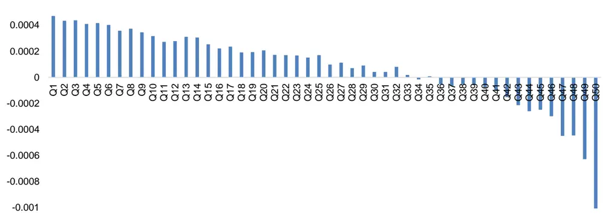
数据来源：通联数据、Wind，广发证券发展研究中心

图 2：BuyTransaction_BuyOrder_ratio_09150920因子在深证A指成分股中净值表现（绝对收益）
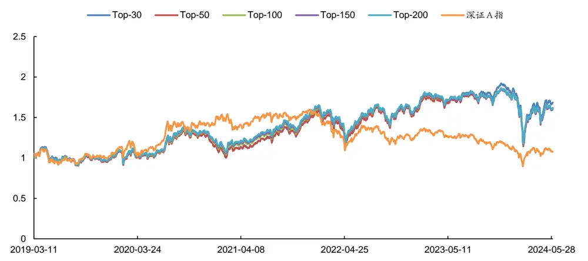
数据来源：通联数据、Wind，广发证券发展研究中心

表 9：BuyTransaction_BuyOrder_ratio_09150920因子在深证A指成分股中分年度表现（相对超额收益）

| 组合 | 年份 | 总收益 | 年化收益率 | 最大回撤率 | 平均换手率 | 年化波动率 | 夏普比率 | 信息比率 |
| --- | --- | --- | --- | --- | --- | --- | --- | --- |
| Top30 深证 A 指超额 | 2019.03~2024.05 | 41.05% | 6.73% | 39.31% | 95.73% | 19.33% | 0.22 | 0.35 |
|  | 2019.03-12 | -5.42% | -6.47% | 10.75% | 95.81% | 15.94% | -0.56 | -0.41 |
|  | 2020年 | -19.59% | -19.44% | 22.48% | 94.68% | 20.99% | -1.05 | -0.93 |
|  | 2021年 | 21.96% | 21.76% | 15.18% | 95.83% | 19.52% | 0.99 | 1.11 |
|  | 2022年 | 22.95% | 22.84% | 9.01% | 96.05% | 18.78% | 1.08 | 1.22 |
|  | 2023年 | 27.85% | 27.72% | 4.40% | 96.53% | 11.90% | 2.12 | 2.33 |
|  | 2024.01~05 | -3.26% | -7.87% | 25.28% | 94.98% | 32.64% | -0.32 | -0.24 |
| Top50 深证 A 指超额 | 2019.03~2024.05 | 35.43% | 5.91% | 38.63% | 93.75% | 19.18% | 0.18 | 0.31 |
|  | 2019.03-12 | -6.30% | -7.52% | 10.48% | 93.95% | 15.98% | -0.63 | -0.47 |
|  | 2020年 | -18.94% | -18.80% | 20.92% | 92.37% | 21.06% | -1.01 | -0.89 |
|  | 2021年 | 21.16% | 20.97% | 15.25% | 94.20% | 19.42% | 0.95 | 1.08 |
|  | 2022年 | 22.99% | 22.88% | 9.23% | 94.08% | 18.68% | 1.09 | 1.22 |
|  | 2023年 | 25.19% | 25.07% | 4.48% | 94.33% | 11.72% | 1.93 | 2.14 |
|  | 2024.01~05 | -4.42% | -10.57% | 24.40% | 93.38% | 31.75% | -0.41 | -0.33 |
| Top100 深证 A 指超额 | 2019.03~2024.05 | 34.82% | 5.82% | 36.64% | 90.11% | 18.98% | 0.17 | 0.31 |
|  | 2019.03-12 | -4.96% | -5.92% | 9.59% | 89.98% | 15.96% | -0.53 | -0.37 |
|  | 2020年 | -17.21% | -17.08% | 19.24% | 89.12% | 21.06% | -0.93 |  |
|  | 2021年 | 19.82% | 19.64% | 15.09% | 90.16% | 19.19% | 0.89 | -0.81 |
|  | 2022年 | 21.80% | 21.70% | 9.31% | 90.49% | 18.57% | 1.03 | 1.02 |
|  | 2023年 | 23.50% | 23.39% | 4.52% | 90.50% | 11.64% | 1.79 | 1.17 |
|  | 2024.01~05 | -4.93% | -11.75% | 23.66% | 90.92% | 30.83% | -0.46 | 2.01 |
| Top150 | 2019.03~2024.05 | 33.71% | 5.65% | 35.68% | 86.82% | 18.83% | 0.17 | -0.38 0.30 |

识别风险，发现价值

| 深证 A 指超额 | 2019.03-12 | -4.85% | -5.79% | 9.45% | 86.44% | 16.00% | -0.52 | -0.36 |
| --- | --- | --- | --- | --- | --- | --- | --- | --- |
|  |  | 2020年 -16.31% | -16.19% | 19.04% | 85.90% | 20.94% | -0.89 | -0.77 |
|  |  | 2021年 19.28% | 19.11% | 14.86% | 86.77% | 19.05% | 0.87 | 1.00 |
|  |  | 2022年 21.35% | 21.26% | 9.31% | 87.38% | 18.51% | 1.01 | 1.15 |
|  |  | 2023年 | 22.27% 22.17% | 4.63% | 87.17% | 11.55% | 1.70 | 1.92 |
|  |  | 2024.01~05 -5.13% | -12.22% | 22.99% | 87.85% | 30.20% | -0.49 | -0.40 |
| Top200 深证 A 指超额 | 2019.03~2024.05 | 34.80% | 5.81% | 34.52% | 83.77% | 18.70% | 0.18 | 0.31 |
|  | 2019.03-12 | -4.87% | -5.81% | 9.12% | 83.20% | 16.00% | -0.52 | -0.36 |
|  | 2020年 | -15.59% | -15.47% | 18.59% | 82.92% | 20.85% | -0.86 | -0.74 |
|  | 2021年 | 19.23% | 19.06% | 14.57% | 83.59% | 18.94% | 0.87 | 1.01 |
|  | 2022年 | 21.44% | 21.34% | 9.28% | 84.30% | 18.47% | 1.02 | 1.16 |
|  | 2023年 | 21.63% | 21.53% | 4.62% | 84.28% | 11.50% | 1.65 | 1.87 |
|  | 2024.01~05 | -4.68% | -11.19% | 22.14% | 85.05% | 29.57% | -0.46 | -0.38 |
| 深证A指 | 2019.03~2024.05 | 7.76% | 1.42% | 44.09% | 1 | 20.99% | -0.05 | 0.07 |
|  | 2019.03-12 | 7.35% | 8.89% | 17.92% | 1 | 21.87% | 0.29 | 0.41 |
|  | 2020年 | 35.25% | 34.91% | 16.02% | 1 | 25.17% | 1.29 | 1.39 |
|  | 2021年 | 8.62% | 8.54% | 12.48% | 1 | 17.85% | 0.34 | 0.48 |
|  | 2022年 | -21.94% | -21.86% | 30.70% | 1 | 22.09% | -1.10 | -0.99 |
|  | 2023年 | -6.97% | -6.95% | 19.36% | 1 | 13.99% | -0.68 | -0.50 |
|  | 2024.01~05 | -5.90% | -13.98% | 21.44% | 1 | 26.11% | -0.63 | -0.54 |

数据来源：通联数据、Wind，广发证券发展研究中心

## 2. BuyWithdrew_BuyOrder_ratio_09150920因子表现

BuyWithdrew_BuyOrder_ratio_09150920因子在深证A指成分股的50档分档收益如图3所示，分档组合收益呈现出较好的单调性。以因子值对深证A指成分股进行排序，分别取Top-30、50、100、150、200个股票构建组合进行测算，结果如图4和表10所示。在2019年3月~2024年5月期间，各组合相对深证A指指数分别取得了11.88%、10.26%、8.28%、7.41%、6.55%的超额年化收益率。

图 3：BuyWithdrew_BuyOrder_ratio_09150920因子在深证A指成分股中的50档分档表现
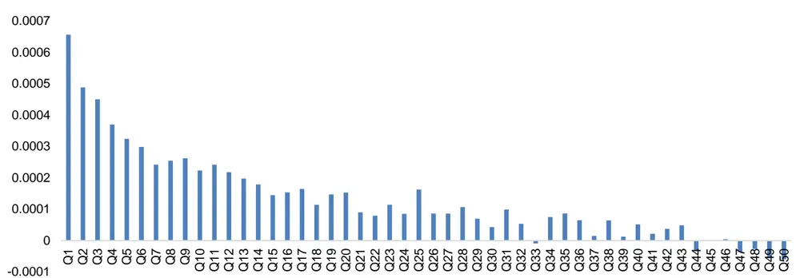
数据来源：通联数据、Wind，广发证券发展研究中心

图 4：BuyWithdrew_BuyOrder_ratio_09150920因子在深证A指成分股中净值表现（绝对收益）
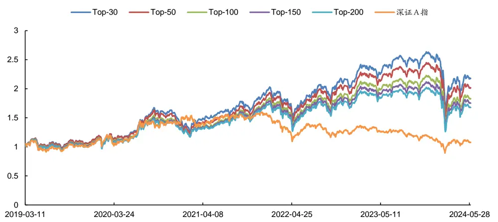
数据来源：通联数据、Wind，广发证券发展研究中心

表 10：BuyWithdrew_BuyOrder_ratio_09150920因子在深证A指成分股中分年度表现（相对超额收益）

| 组合 | 年份 | 总收益 | 年化收益率 | 最大回撤率 | 平均换手率 | 年化波动率 | 夏普比率 | 信息比率 |
| --- | --- | --- | --- | --- | --- | --- | --- | --- |
| Top30 深证 A 指超额 | 2019.03~2024.05 | 81.00% | 11.88% | 32.13% | 93.00% | 19.84% | 0.47 | 0.60 |
|  | 2019.03-12 | 3.92% | 4.72% | 5.36% | 93.44% | 15.88% | 0.14 | 0.30 |
|  | 2020年 | -9.39% | -9.32% | 20.06% | 92.55% | 21.44% | -0.55 | -0.43 |
|  | 2021年 | 21.49% | 21.29% | 13.97% | 92.98% | 19.12% | 0.98 | 1.11 |
|  | 2022年 | 31.21% | 31.06% | 8.70% | 93.18% | 18.73% | 1.52 | 1.66 |
|  | 2023年 | 34.16% | 33.99% | 5.87% | 92.33% | 12.58% | 2.50 | 2.70 |
|  | 2024.01~05 | -10.11% | -23.18% | 29.65% | 94.98% | 35.87% | -0.72 | -0.65 |
| Top50 | 2019.03~2024.05 | 67.51% | 10.26% | 32.75% | 91.03% | 19.60% | 0.40 | 0.52 |

识别风险，发现价值

| 深证 A 指超额 | 2019.03-12 | 3.60% | 4.34% | 5.21% | 91.62% | 15.77% | 0.12 | 0.28 |
| --- | --- | --- | --- | --- | --- | --- | --- | --- |
| Top100 深证 A 指超额 | 2020年 | -12.10% | -12.01% | 20.59% | 90.47% | 21.10% | -0.69 | -0.57 |
|  | 2021年 | 20.43% | 20.25% | 14.01% | 91.13% | 19.08% | 0.93 | 1.06 |
|  | 2022年 | 29.89% | 29.75% | 8.93% | 91.09% | 18.52% | 1.47 | 1.61 |
|  | 2023年 | 31.50% | 31.35% | 5.47% | 90.61% | 12.34% | 2.34 | 2.54 |
|  | 2024.01~05 | -10.57% | -24.15% | 29.53% | 92.16% | 35.29% | -0.76 | -0.68 |
|  | 2019.03~2024.05 | 52.25% | 8.28% | 31.28% | 86.85% | 19.22% | 0.30 | 0.43 |
|  | 2019.03-12 | 0.67% | 0.80% | 5.94% | 87.56% | 15.78% | -0.11 | 0.05 |
|  | 2020年 | -12.87% | -12.77% | 19.10% | 86.50% | 20.54% | -0.74 | -0.62 |
|  | 2021年 | 19.89% | 19.71% | 13.83% | 86.76% | 18.69% | 0.92 | 1.05 |
|  | 2022年 | 26.94% | 26.82% | 9.09% | 86.33% | 18.41% | 1.32 | 1.46 |
|  | 2023年 | 27.76% | 27.63% | 5.20% | 86.72% | 12.08% | 2.08 | 2.29 |
|  | 2024.01~05 | -10.73% | -24.48% | 28.76% | 88.65% | 34.26% | -0.79 | -0.71 |
| Top150 深证 A 指超额 | 2019.03~2024.05 | 45.89% | 7.41% | 29.54% | 83.60% | 18.80% | 0.26 | 0.39 |
|  | 2019.03-12 | -0.73% | -0.88% | 6.27% | 83.87% | 15.70% | -0.22 | -0.06 |
|  | 2020年 | -12.37% | -12.28% | 17.64% | 83.39% | 20.28% | -0.73 | -0.61 |
|  | 2021年 | 18.81% | 18.64% | 13.28% | 83.21% | 18.33% | 0.88 | 1.02 |
|  | 2022年 | 24.89% | 24.78% | 8.85% | 83.49% | 18.21% | 1.22 | 1.36 |
|  | 2023年 | 25.47% | 25.35% | 4.81% | 83.52% | 11.87% | 1.93 | 2.14 |
|  | 2024.01~05 -9.92% | -22.77% | 26.79% | 85.47% | 32.57% | -0.78 | -0.70 |  |
| Top200 深证 A 指超额 | 2019.03~2024.05 | 39.80% | 6.55% | 28.93% | 80.67% | 18.57% | 0.22 | 0.35 |
|  | 2019.03-12 | -1.85% | -2.22% | 6.94% | 80.54% | 15.71% | -0.30 | -0.14 |
|  | 2020年 | -11.96% | -11.87% | 16.84% | 80.53% | 20.13% | -0.71 | -0.59 |
|  | 2021年 | 17.01% | 16.86% | 13.28% | 80.17% | 18.16% | 0.79 | 0.93 |
|  | 2022年 | 23.51% | 23.41% | 8.75% | 80.73% | 18.12% | 1.15 | 1.29 |
|  | 2023年 | 23.83% | 23.72% | 4.50% | 80.65% | 11.71% | 1.81 | 2.02 |
|  | 2024.01~05 | -9.60% | -22.09% | 25.58% | 82.81% | 31.55% | -0.78 | -0.70 |
| 深证A指 | 2019.03~2024.05 | 7.76% | 1.42% | 44.09% | 1 | 20.99% | -0.05 | 0.07 |
|  | 2019.03-12 | 7.35% | 8.89% | 17.92% | 1 | 21.87% | 0.29 | 0.41 |
|  | 2020年 | 35.25% | 34.91% | 16.02% | 1 | 25.17% | 1.29 | 1.39 |
|  | 2021年 | 8.62% | 8.54% | 12.48% | 1 | 17.85% | 0.34 | 0.48 |
|  | 2022年 | -21.94% | -21.86% | 30.70% | 1 | 22.09% | -1.10 | -0.99 |
|  | 2023年 | -6.97% | -6.95% | 19.36% | 1 | 13.99% | -0.68 | -0.50 |
|  | 2024.01~05 | -5.90% | -13.98% | 21.44% | – | 26.11% | -0.63 | -0.54 |

数据来源：通联数据、Wind，广发证券发展研究中心

## 3. Transaction_Order_ratio_09200925因子表现

Transaction_Order_ratio_09200925因子在深证A指成分股的50档分档收益如图5所示，分档组合收益呈现出较好的单调性。以因子值对深证A指成分股进行排序，分别取Top-30、50、100、150、200个股票构建组合进行测算，结果如图6和表11所示。在2019年3月~2024年5月期间，各组合相对深证A指指数分别取得了6.49%、5.94%、5.20%、4.90%、4.63%的超额年化收益率。

图 5：Transaction_Order_ratio_09200925因子在深证A指成分股中的50档分档表现
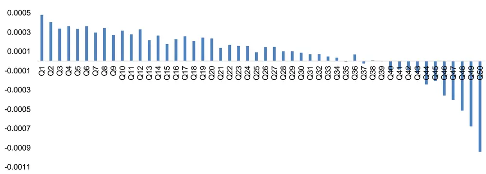
数据来源：通联数据、Wind，广发证券发展研究中心

图 6：Transaction_Order_ratio_09200925因子在深证A指成分股中净值表现（绝对收益）
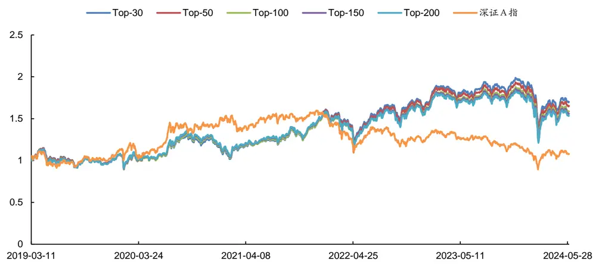
数据来源：通联数据、Wind，广发证券发展研究中心

表 11：Transaction_Order_ratio_09200925因子在深证A指成分股中分年度表现（相对超额收益）

| 组合 | 年份 | 总收益 | 年化收益率 | 最大回撤率 | 平均换手率 | 年化波动率 | 夏普比率 | 信息比率 |
| --- | --- | --- | --- | --- | --- | --- | --- | --- |
| Top30 深证 A 指超额 | 2019.03~2024.05 | 39.43% | 6.49% | 40.55% | 93.66% | 19.18% | 0.21 | 0.34 |
|  | 2019.03-12 | -6.06% | -7.22% | 13.61% | 92.71% | 16.25% | -0.60 | -0.44 |
|  | 2020年 | -18.81% | -18.67% | 19.86% | 93.37% | 21.96% | -0.96 | -0.85 |
|  | 2021年 | 17.88% | 17.72% | 14.74% | 92.43% | 20.01% | 0.76 | 0.89 |
|  | 2022年 | 33.08% | 32.92% | 9.04% | 95.21% | 19.10% | 1.59 | 1.72 |
|  | 2023年 | 24.85% | 24.74% | 6.92% | 94.89% | 12.39% | 1.80 | 2.00 |
|  | 2024.01~05 | -6.67% | -15.70% | 19.18% | 91.99% | 27.49% | -0.66 | -0.57 |
| Top50 深证 A 指超额 | 2019.03~2024.05 | 35.67% | 5.94% | 38.97% | 91.57% | 19.08% | 0.18 | 0.31 |
|  | 2019.03-12 | -5.95% | -7.10% | 13.23% | 90.97% | 16.16% | -0.59 | -0.44 |
|  | 2020年 | -17.48% | -17.35% | 18.83% | 91.03% | 21.91% | -0.91 | -0.79 |
|  | 2021年 | 16.25% | 16.10% | 14.70% | 90.15% | 19.74% | 0.69 | 0.82 |
|  | 2022年 | 31.16% | 31.01% | 9.36% | 93.24% | 19.04% | 1.50 | 1.63 |
|  | 2023年 | 22.96% | 22.86% | 7.00% | 92.43% | 12.25% | 1.66 | 1.87 |
|  | 2024.01~05 | -6.76% | -15.89% | 19.28% | 91.30% | 27.55% | -0.67 | -0.58 |
| Top100 深证 A 指超额 | 2019.03~2024.05 | 30.72% | 5.20% | 38.57% | 87.17% | 18.95% | 0.14 | 0.27 |
|  | 2019.03-12 | -6.14% | -7.32% | 12.55% | 86.91% | 16.07% | -0.61 | -0.46 |
|  | 2020年 | -17.31% | -17.18% | 18.57% | 86.15% | 21.75% | -0.90 | -0.79 |
|  | 2021年 | 15.00% | 14.87% | 15.09% | 85.60% | 19.52% | 0.63 | 0.76 |
|  | 2022年 | 29.49% | 29.35% | 9.37% | 88.93% | 18.98% | 1.42 | 1.55 |
|  | 2023年 | 22.27% | 22.17% | 6.26% | 87.95% | 12.13% | 1.62 | 1.83 |
| Top150 深证 A 指超额 | 2024.01~05 | -7.51% | -17.56% | 19.29% | 87.99% | 27.44% | -0.73 | -0.64 |
|  | 2019.03~2024.05 | 28.79% | 4.90% | 37.51% | 83.33% | 18.85% | 0.13 | 0.26 |
|  | 2019.03-12 | -5.82% | -6.94% | 11.83% | 82.97% | 16.04% | -0.59 | -0.43 |
|  | 2020年 | -16.62% | -16.49% | 18.77% | 82.09% | 21.64% | -0.88 | -0.76 |
|  | 2021年 | 15.03% | 14.89% | 15.11% | 81.70% | 19.37% | 0.64 | 0.77 |
|  | 2022年 | 27.31% | 27.18% | 9.31% | 85.32% | 18.85% | 1.31 | 1.44 |
|  | 2023年 | 21.46% | 21.36% | 6.15% | 84.12% | 12.01% | 1.57 | 1.78 |
|  | 2024.01~05 | -7.80% | -18.21% | 19.13% | 84.54% | 27.42% | -0.76 | -0.66 |
| Top200 深证 A 指超额 | 2019.03~2024.05 | 27.04% | 4.63% | 36.76% | 79.98% | 18.79% | 0.11 | 0.25 |
|  | 2019.03-12 | -5.77% | -6.88% | 11.51% | 79.90% | 16.03% | -0.59 | -0.43 |
|  | 2020年 | -16.13% | -16.01% | 18.54% | 78.54% | 21.56% | -0.86 | -0.74 |
|  | 2021年 | 14.76% | 14.63% | 14.98% | 78.09% | 19.25% | 0.63 | 0.76 |
|  | 2022年 | 25.99% | 25.87% | 9.34% | 82.32% | 18.81% | 1.24 | 1.38 |
|  | 2023年 | 20.75% | 20.66% | 6.01% | 80.64% | 11.91% | 1.52 | 1.73 |
| 深证A指 | 2024.01~05 | -7.93% | -18.50% | 19.19% | 81.22% | 27.47% | -0.76 | -0.67 |
|  | 2019.03~2024.05 | 7.76% | 1.42% | 44.09% |  | 20.99% | -0.05 | 0.07 |
|  |  |  |  |  | - |  |  |  |
|  | 2019.03-12 | 7.35% | 8.89% | 17.92% | 1 | 21.87% | 0.29 | 0.41 |
|  | 2020年 | 35.25% | 34.91% | 16.02% | 1 | 25.17% | 1.29 | 1.39 |
|  | 2021年 | 8.62% | 8.54% | 12.48% | - | 17.85% | 0.34 | 0.48 |

识别风险，发现价值

| 2022年 | -21.94% | -21.86% | 30.70% | 1 | 22.09% | -1.10 | -0.99 |
| --- | --- | --- | --- | --- | --- | --- | --- |
| 2023年 | -6.97% | -6.95% | 19.36% | 1 | 13.99% | -0.68 | -0.50 |
| 2024.01~05 | -5.90% | -13.98% | 21.44% | - | 26.11% | -0.63 | -0.54 |

数据来源：通联数据、Wind，广发证券发展研究中心

## 4. BuyTransaction_BuyOrder_ratio_09150925因子表现

BuyTransaction_BuyOrder_ratio_09150925因子在深证A指成分股的50档分档收益如图7所示，分档组合收益呈现出较好的单调性。以因子值对深证A指成分股进行排序，分别取Top-30、50、100、150、200个股票构建组合进行测算，结果如图8和表12所示。在2019年3月~2024年5月期间，各组合相对深证A指指数分别取得了5.63%、6.07%、5.47%、5.20%、5.25%的超额年化收益率。

图 7：BuyTransaction_BuyOrder_ratio_09150925因子在深证A指成分股中的50档分档表现
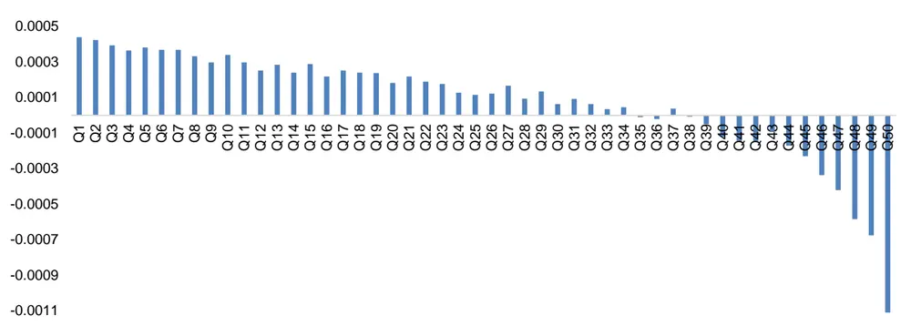
数据来源：通联数据、Wind，广发证券发展研究中心

图 8：BuyTransaction_BuyOrder_ratio_09150925因子在深证A指成分股中净值表现（绝对收益）
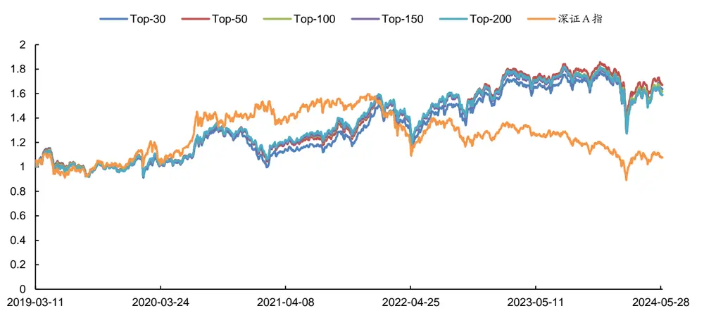
数据来源：通联数据、Wind，广发证券发展研究中心

表 12：BuyTransaction_BuyOrder_ratio_09150925因子在深证A指成分股中分年度表现（相对超额收益）

| 组合 | 年份 | 总收益 | 年化收益率 | 最大回撤率 | 平均换手率 | 年化波动率 | 夏普比率 | 信息比率 |
| --- | --- | --- | --- | --- | --- | --- | --- | --- |
| Top30 深证 A 指超额 | 2019.03~2024.05 | 33.54% | 5.63% | 42.01% | 89.19% | 18.65% | 0.17 | 0.30 |
|  | 2019.03-12 | -5.96% | -7.11% | 13.40% | 87.67% | 16.16% | -0.59 | -0.44 |
|  | 2020年 | -20.49% | -20.34% | 22.29% | 88.23% | 21.41% | -1.07 | -0.95 |
|  | 2021年 | 12.97% | 12.86% | 14.99% | 90.82% | 19.79% | 0.52 | 0.65 |
|  | 2022年 | 30.28% | 30.14% | 8.85% | 91.74% | 19.02% | 1.45 | 1.58 |
|  | 2023年 | 20.78% | 20.69% | 5.84% | 89.79% | 12.26% | 1.48 | 1.69 |
|  | 2024.01~05 | 0.46% | 1.13% | 12.43% | 80.74% | 24.43% | -0.06 | 0.05 |
| Top50 深证 A 指超额 | 2019.03~2024.05 | 36.52% | 6.07% | 38.96% | 87.18% | 18.53% | 0.19 | 0.33 |
|  | 2019.03-12 | -4.45% | -5.32% | 12.23% | 86.49% | 16.06% | -0.49 | -0.33 |
|  | 2020年 | -18.58% | -18.44% | 20.27% | 86.31% | 21.34% | -0.98 | -0.86 |
|  | 2021年 | 13.79% | 13.67% | 14.38% | 88.26% | 19.60% | 0.57 | 0.70 |
|  | 2022年 | 30.04% | 29.89% | 8.82% | 89.46% | 18.99% | 1.44 | 1.57 |
|  | 2023年 | 20.80% | 20.70% | 6.04% | 87.45% | 12.11% | 1.50 | 1.71 |
|  | 2024.01~05 | -1.82% | -4.44% | 12.78% | 80.16% | 24.22% | -0.29 | -0.18 |
| Top100 深证 A 指超额 | 2019.03~2024.05 | 32.52% | 5.47% | 37.63% | 82.73% | 18.43% | 0.16 | 0.30 |
|  | 2019.03-12 | -4.75% | -5.68% | 11.78% | 82.69% | 15.95% | -0.51 | -0.36 |
|  | 2020年 | -17.67% | -17.53% | 19.07% | 81.81% | 21.24% | -0.94 | -0.83 |
|  | 2021年 | 13.90% | 13.78% | 14.09% | 83.08% | 19.27% | 0.59 | 0.72 |
|  | 2022年 | 27.75% | 27.62% | 9.07% | 84.94% | 18.95% | 1.33 | 1.46 |
|  | 2023年 | 19.60% | 19.51% | 5.81% | 83.05% | 11.95% | 1.42 | 1.63 |
|  | 2024.01~05 | -2.90% | -7.01% | 13.96% | 76.65% | 24.54% | -0.39 | -0.29 |
| Top150 深证 A 指超额 | 2019.03~2024.05 | 30.73% | 5.20% | 37.01% | 79.16% | 18.41% | 0.15 | 0.28 |
|  | 2019.03-12 | -5.21% | -6.22% | 11.26% | 79.44% | 15.90% | -0.55 | -0.39 |
|  | 2020年 | -17.28% | -17.15% | 19.05% | 77.96% | 21.19% | -0.93 | -0.81 |
|  | 2021年 | 14.43% | 14.31% | 14.14% | 79.13% | 19.21% | 0.61 | 0.74 |
|  | 2022年 | 26.58% | 26.46% | 9.03% | 81.44% | 18.92% | 1.27 | 1.40 |
|  | 2023年 | 19.29% | 19.21% | 5.64% | 79.47% | 11.88% | 1.41 | 1.62 |
|  | 2024.01~05 | -3.51% | -8.47% | 14.65% | 74.20% |  | -0.44 |  |
| Top200 深证 A 指超额 | 2019.03~2024.05 | 31.04% | 5.25% | 36.10% | 76.06% | 24.79% | 0.15 | -0.34 0.29 |
|  | 2019.03-12 | -4.98% | -5.94% | 10.88% | 76.46% | 18.38% 15.89% | -0.53 | -0.37 |
|  | 2020年 | -16.54% | -16.41% | 18.60% | 74.91% | 21.14% | -0.89 | -0.78 |
|  | 2021年 | 14.63% | 14.50% | 14.19% | 75.67% | 19.17% | 0.63 | 0.76 |
|  | 2022年 | 26.06% | 25.94% | 8.94% | 78.25% | 18.87% | 1.24 | 1.37 |
|  | 2023年 | 19.14% | 19.05% | 5.44% | 76.43% | 11.81% | 1.40 | 1.61 |
| 深证A指 | 2024.01~05 | -4.02% | -9.66% | 15.05% | 72.01% | 24.95% | -0.49 | -0.39 |
|  | 2019.03~2024.05 | 7.76% | 1.42% | 44.09% |  | 20.99% | -0.05 | 0.07 |
|  |  |  |  |  | - |  |  |  |
|  | 2019.03-12 | 7.35% | 8.89% | 17.92% | 1 | 21.87% | 0.29 | 0.41 |
|  | 2020年 | 35.25% | 34.91% | 16.02% | 1 | 25.17% | 1.29 | 1.39 |
|  | 2021年 | 8.62% | 8.54% | 12.48% | - | 17.85% | 0.34 | 0.48 |

识别风险，发现价值

| 2022年 | -21.94% | -21.86% | 30.70% | 1 | 22.09% | -1.10 | -0.99 |
| --- | --- | --- | --- | --- | --- | --- | --- |
| 2023年 | -6.97% | -6.95% | 19.36% | 1 | 13.99% | -0.68 | -0.50 |
| 2024.01~05 | -5.90% | -13.98% | 21.44% | - | 26.11% | -0.63 | -0.54 |

数据来源：通联数据、Wind，广发证券发展研究中心

## 5. SellTransaction_SellOrder_ratio_14571500因子表现

SellTransaction_SellOrder_ratio_14571500因子在深证A指成分股的50档分档收益如图9所示，分档组合收益呈现出较好的单调性。以因子值对深证A指成分股进行排序，分别取Top-30、50、100、150、200个股票构建组合进行测算，结果如图10和表13所示。在2019年3月~2024年5月期间，各组合相对深证A指指数分别取得了10.90%、10.37%、9.98%、9.22%、8.62%的超额年化收益率。

图 9：SellTransaction_SellOrder_ratio_14571500因子在深证A指成分股中的50档分档表现
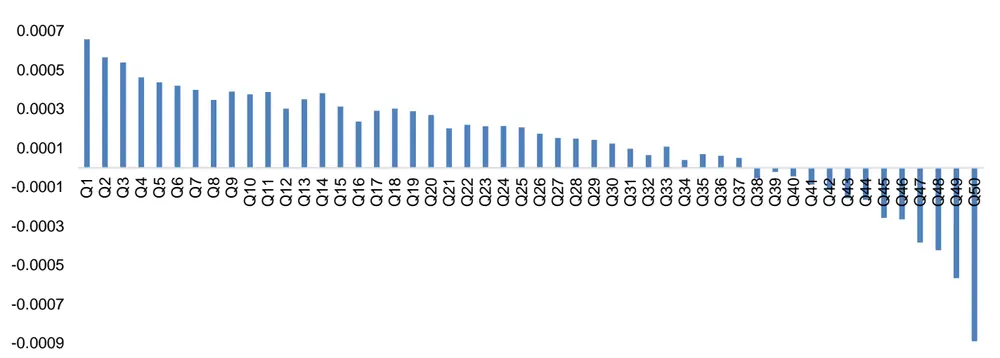
数据来源：通联数据、Wind，广发证券发展研究中心

图 10：SellTransaction_SellOrder_ratio_14571500因子在深证A指成分股中净值表现（绝对收益）
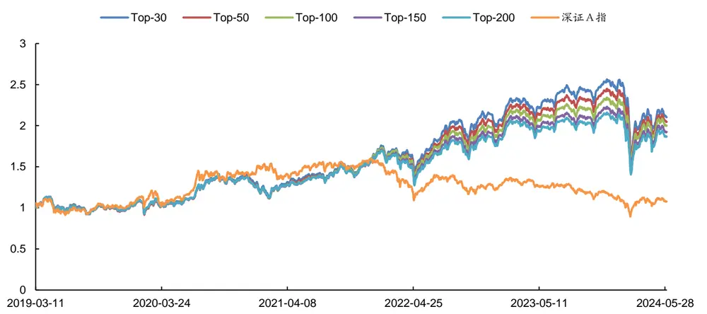
数据来源：通联数据、Wind，广发证券发展研究中心
识别风险，发现价值

表 13：SellTransaction_SellOrder_ratio_14571500因子在深证A指成分股中分年度表现（相对超额收益）

| 组合 | 年份 | 总收益 | 年化收益率 | 最大回撤率 | 平均换手率 | 年化波动率 | 夏普比率 | 信息比率 |
| --- | --- | --- | --- | --- | --- | --- | --- | --- |
| Top30 深证 A 指超额 | 2019.03~2024.05 | 72.77% | 10.90% | 32.62% | 81.28% | 20.07% | 0.42 | 0.54 |
|  | 2019.03-12 | -4.15% | -4.96% | 11.94% | 88.76% | 16.10% | -0.46 | -0.31 |
|  | 2020年 | -10.86% | -10.78% | 14.69% | 83.06% | 21.04% | -0.63 | -0.51 |
|  | 2021年 | 15.81% | 15.67% | 15.46% | 74.88% | 19.13% | 0.69 | 0.82 |
|  | 2022年 | 47.54% | 47.30% | 8.84% | 76.83% | 19.64% | 2.28 | 2.41 |
|  | 2023年 | 34.46% | 34.29% | 7.69% | 83.58% | 13.49% | 2.36 | 2.54 |
|  | 2024.01~05 | -11.98% | -27.07% | 30.33% | 84.89% | 35.74% | -0.83 | -0.76 |
| Top50 深证 A 指超额 | 2019.03~2024.05 | 68.40% | 10.37% | 33.38% | 79.44% | 19.64% | 0.40 | 0.53 |
|  | 2019.03-12 | -4.95% | -5.91% | 11.54% | 87.19% | 16.15% | -0.52 | -0.37 |
|  | 2020年 | -12.13% | -12.04% | 14.93% | 81.43% | 20.79% | -0.70 | -0.58 |
|  | 2021年 | 16.36% | 16.21% | 15.09% | 71.91% | 19.01% | 0.72 | 0.85 |
|  | 2022年 | 45.43% | 45.20% | 8.87% | 76.77% | 19.40% | 2.20 | 2.33 |
|  | 2023年 | 32.47% | 32.31% | 7.59% | 80.54% | 13.25% | 2.25 | 2.44 |
|  | 2024.01~05 | -10.05% | -23.06% | 27.87% | 83.43% | 33.64% | -0.76 | -0.69 |
| Top100 深证 A 指超额 | 2019.03~2024.05 | 65.28% | 9.98% | 33.40% | 76.97% | 19.13% | 0.39 | 0.52 |
|  | 2019.03-12 | -4.49% | -5.36% | 10.82% | 82.60% | 16.05% | -0.49 | -0.33 |
|  | 2020年 | -13.14% | -13.04% | 15.62% | 78.55% | 20.49% | -0.76 | -0.64 |
|  | 2021年 | 18.70% | 18.53% | 14.50% | 71.00% | 18.66% | 0.86 | 0.99 |
|  | 2022年 | 39.39% | 39.20% | 8.75% | 77.51% | 19.00% | 1.93 | 2.06 |
|  | 2023年 | 30.63% | 30.49% | 7.38% | 75.54% | 12.89% | 2.17 | 2.36 |
| Top150 深证 A 指超额 | 2024.01~05 | -7.83% | -18.26% | 25.34% | 80.23% | 31.73% | -0.65 | -0.58 |
|  | 2019.03~2024.05 | 59.36% | 9.22% | 32.92% | 74.85% | 18.94% | 0.35 | 0.49 |
|  | 2019.03-12 | -4.42% | -5.28% | 10.35% | 79.23% | 16.00% | -0.49 | -0.33 |
|  | 2020年 | -13.27% | -13.17% | 15.70% | 76.18% | 20.46% | -0.77 | -0.64 |
|  | 2021年 | 17.39% | 17.24% | 14.06% | 70.31% | 18.47% | 0.80 | 0.93 |
|  | 2022年 | 36.56% | 36.39% | 8.78% | 76.58% | 18.81% | 1.80 | 1.93 |
|  | 2023年 | 28.54% | 28.41% | 7.01% | 71.87% | 12.69% | 2.04 | 2.24 |
|  | 2024.01~05 | -6.71% | -15.79% | 24.29% | 78.47% | 31.11% | -0.59 | -0.51 |
| Top200 深证 A 指超额 | 2019.03~2024.05 | 54.81% | 8.62% | 32.26% | 72.98% | 18.78% | 0.33 | 0.46 |
|  | 2019.03-12 | -4.47% | -5.34% | 10.09% | 76.04% | 15.98% | -0.49 | -0.33 |
|  | 2020年 | -12.99% | -12.89% | 15.82% | 74.05% | 20.40% | -0.75 | -0.63 |
|  | 2021年 | 16.82% | 16.67% | 13.70% | 69.46% | 18.35% | 0.77 | 0.91 |
|  | 2022年 | 33.67% | 33.51% | 8.87% | 75.32% | 18.67% | 1.66 | 1.80 |
|  | 2023年 | 27.55% | 27.42% | 6.81% | 69.60% | 12.53% | 1.99 | 2.19 |
| 深证A指 | 2024.01~05 | -6.50% | -15.32% | 23.44% | 76.77% | 30.55% | -0.58 | -0.50 |
|  | 2019.03~2024.05 | 7.76% | 1.42% | 44.09% |  | 20.99% | -0.05 | 0.07 |
|  |  |  |  |  | - |  |  |  |
|  | 2019.03-12 | 7.35% | 8.89% | 17.92% | 1 | 21.87% | 0.29 | 0.41 |
|  | 2020年 | 35.25% | 34.91% | 16.02% | 1 | 25.17% | 1.29 | 1.39 |
|  | 2021年 | 8.62% | 8.54% | 12.48% | - | 17.85% | 0.34 | 0.48 |

识别风险，发现价值

| 2022年 | -21.94% | -21.86% | 30.70% |  | 22.09% | -1.10 | -0.99 |
| --- | --- | --- | --- | --- | --- | --- | --- |
| 2023年 | -6.97% | -6.95% | 19.36% | 1 | 13.99% | -0.68 | -0.50 |
| 2024.01~05 | -5.90% | -13.98% | 21.44% | - | 26.11% | -0.63 | -0.54 |

数据来源：通联数据、Wind，广发证券发展研究中心

## 五、总结与展望

如何能在股票市场的博弈中胜出？对于量化投资者来说，关键在于对数据的全面收集，并结合数学模型和算法进行深入分析，从海量数据中挖掘出隐藏的市场规律。Level 1行情数据为3秒一笔的快照（Snapshot）数据，包含了简单的开高低收交易量交易金额等常规数据，所含信息有限。而相比数据频率较低、数据丰富度有限的Level 1数据，Level 2数据中则不仅提供了更为丰富的快照（Snapshot）数据，如10档申买申卖价、10档申买申卖量、最优买卖价前50笔委托、买卖委托价位数、买卖撤单信息等，而且提供了Level 1数据中所不包含的逐笔订单（Tick）数据。

A股市场的竞价时段主要分为集合竞价阶段和连续竞价阶段，而集合竞价阶段又可以分为开盘集合竞价和收盘集合竞价。其中，开盘集合竞价在09:15~09:20时段内是可以撤回委托单的；而开盘集合竞价在09:20~09:25时段内和收盘集合竞价14:57~15:00时段内是不可撤回委托单的。

开盘集合竞价和收盘集合竞价作为当天股票市场的开始和结束，其中的委托、成交、撤单情况反映了当天个股的活跃度等情况，与股票市场的近期未来走势存在一定关联性。因此，本文基于level2数据中的逐笔订单信息，利用集合竞价期间的委托、成交、撤单数据构建出了15个集合竞价相关因子。

由于上交所和深交所对集合竞价期间的level2逐笔订单数据结构差异，本文针对深证A指成分股范围内个股构建了上述15个集合竞价相关因子，并对其在2019年3月~2024年5月期间的深证A指成分股范围内选股性能进行了统计。

在09:15~09:20时段内，成交比例因子中表现较好的是买单方向因子，其20日平滑换仓RankIC均值为-9.20%，胜率为22%；撤单比例因子中表现较好的仍为买单方向因子，其20日平滑换仓RankIC均值为-5.00%，胜率为27%。

在09:20~09:25时段内，成交比例因子中表现较好的是买卖单双向方向考虑的因子，其20日平滑换仓RankIC均值为-9.20%，胜率为28%。

在09:15~09:25时段内，成交比例因子中表现较好的是买单方向因子，其20日平滑换仓RankIC均值为-10.10%，胜率为28%。

在14:57~15:00时段内，虽然作为收盘集合竞价阶段仅有3分钟，但其中买单和卖单方向因子展现出了截然不同的选股性能。在该时段的成交比例因子中，买单方向因子RankIC均值接近于0%，胜率徘徊在50%左右，是一个几乎没有选股能力的因子。但与之相反的卖单方向因子则展现出了较为有效的选股性能，其RankIC均值为-9.60%，胜率为23%。这表明在收盘集合竞价阶段，卖单中的成交比例越大，则该股票在未来的看空可能性更大；而买单中的成交比例则与未来股价走势关系甚微。

识别风险，发现价值

展望未来，“海量Level 2数据因子挖掘”系列研究报告将继续深入Level 2数据，从海量数据中挖掘出隐藏的市场规律，构建出更多的有效因子。

## 六、风险提示

本文所述模型用量化方法通过历史数据统计、建模和测算完成，所得结论与规律在市场政策、环境变化时存在失效风险；

本文策略在市场结构及交易行为改变时有可能存在失效风险；

因量化模型不同，本文提出的观点可能与其他量化模型结论存在差异。

## [Table_ResearchTeam] 广发金融工程研究小组

罗军 ：首席分析师，华南理工大学硕士，从业 16 年，2010 年进入广发证券发展研究中心。

安 宁 宁 ：首席分析师，暨南大学硕士，从业 14 年，2011 年进入广发证券发展研究中心。

史 庆 盛 ：资深分析师，华南理工大学硕士，2011 年进入广发证券发展研究中心。

张 超 ：资深分析师，中山大学硕士，2012 年进入广发证券发展研究中心。

陈 原 文 ：资深分析师，中山大学硕士，2015 年进入广发证券发展研究中心。

李豪 ：资深分析师，上海交通大学硕士，2016 年进入广发证券发展研究中心。

周 飞 鹏 ：资深分析师，伯明翰大学硕士，2021 年加入广发证券发展研究中心。

张 钰 东 ：资深分析师，中山大学硕士，2020 年进入广发证券发展研究中心。

季 燕 妮 ：资深分析师，厦门大学硕士，2020 年进入广发证券发展研究中心。

林 涛 ：研究员，中山大学硕士，2024 年进入广发证券发展研究中心。

## [Table_IndustryInvestDescription] 广发证券—行业投资评级说明

买入： 预期未来12个月内，股价表现强于大盘10%以上。

持有： 预期未来12个月内，股价相对大盘的变动幅度介于-10%～+10%。

卖出： 预期未来12个月内，股价表现弱于大盘10%以上。

## [Table_CompanyInvestDescription] 广发证券—公司投资评级说明

买入： 预期未来 12 个月内，股价表现强于大盘 15%以上。

增持： 预期未来12个月内，股价表现强于大盘5%-15%。

持有： 预期未来12个月内，股价相对大盘的变动幅度介于-5%～+5%。

卖出： 预期未来12个月内，股价表现弱于大盘5%以上。

## [Table_Address] 联系我们

| 地址 | 广州市 | 深圳市 | 北京市 | 上海市 | 香港 |
| --- | --- | --- | --- | --- | --- |
|  | 广州市天河区马场路 | 深圳市福田区益田路 | 北京市西城区月坛北 | 上海市浦东新区南泉 | 香港湾仔骆克道81号 |
|  | 26号广发证券大厦47 | 6001号太平金融大厦 | 街2号月坛大厦18层 | 北路429号泰康保险 | 广发大厦27 楼 |
|  | 楼 | 31层 |  | 大厦37楼 |  |
|  | 邮政编码 510627 客服邮箱 gfzqyf@gf.com.cn | 518026 | 100045 | 200120 |  |

## [Table_LegalD 法律主体isclaimer 声明]

本报告由广发证券股份有限公司或其关联机构制作，广发证券股份有限公司及其关联机构以下统称为“广发证券”。本报告的分销依据不同国家、地区的法律、法规和监管要求由广发证券于该国家或地区的具有相关合法合规经营资质的子公司/经营机构完成。

广发证券股份有限公司具备中国证监会批复的证券投资咨询业务资格，接受中国证监会监管，负责本报告于中国（港澳台地区除外）的分销。广发证券（香港）经纪有限公司具备香港证监会批复的就证券提供意见（4 号牌照）的牌照，接受香港证监会监管，负责本报告于中国香港地区的分销。

本报告署名研究人员所持中国证券业协会注册分析师资质信息和香港证监会批复的牌照信息已于署名研究人员姓名处披露。

## [Table_I 重要mportant 声明N

广发证券股份有限公司及其关联机构可能与本报告中提及的公司寻求或正在建立业务关系，因此，投资者应当考虑广发证券股份有限公司及其关联机构因可能存在的潜在利益冲突而对本报告的独立性产生影响。投资者不应仅依据本报告内容作出任何投资决策。投资者应自主作出投资决策并自行承担投资风险，任何形式的分享证券投资收益或者分担证券投资损失的书面或者口头承诺均为无效。

本报告署名研究人员、联系人（以下均简称“研究人员”）针对本报告中相关公司或证券的研究分析内容，在此声明：（ ）本报告的全部分析结论、研究观点均精确反映研究人员于本报告发出当日的关于相关公司或证券的所有个人观点，并不代表广发证券的立场；（2）研究人员的部分或全部的报酬无论在过去、现在还是将来均不会与本报告所述特定分析结论、研究观点具有直接或间接的联系。

研究人员制作本报告的报酬标准依据研究质量、客户评价、工作量等多种因素确定，其影响因素亦包括广发证券的整体经营收入，该等经营收入部分来源于广发证券的投资银行类业务。

本报告仅面向经广发证券授权使用的客户/特定合作机构发送，不对外公开发布，只有接收人才可以使用，且对于接收人而言具有保密义务。广发证券并不因相关人员通过其他途径收到或阅读本报告而视其为广发证券的客户。在特定国家或地区传播或者发布本报告可能违反当地法律，广发证券并未采取任何行动以允许于该等国家或地区传播或者分销本报告。

本报告所提及证券可能不被允许在某些国家或地区内出售。请注意，投资涉及风险，证券价格可能会波动，因此投资回报可能会有所变化，过去的业绩并不保证未来的表现。本报告的内容、观点或建议并未考虑任何个别客户的具体投资目标、财务状况和特殊需求，不应被视为对特定客户关于特定证券或金融工具的投资建议。本报告发送给某客户是基于该客户被认为有能力独立评估投资风险、独立行使投资决策并独立承担相应风险。

本报告所载资料的来源及观点的出处皆被广发证券认为可靠，但广发证券不对其准确性、完整性做出任何保证。报告内容仅供参考，报告中的信息或所表达观点不构成所涉证券买卖的出价或询价。广发证券不对因使用本报告的内容而引致的损失承担任何责任，除非法律法规有明确规定。客户不应以本报告取代其独立判断或仅根据本报告做出决策，如有需要，应先咨询专业意见。

广发证券可发出其它与本报告所载信息不一致及有不同结论的报告。本报告反映研究人员的不同观点、见解及分析方法，并不代表广发证券的立场。广发证券的销售人员、交易员或其他专业人士可能以书面或口头形式，向其客户或自营交易部门提供与本报告观点相反的市场评论或交易策略，广发证券的自营交易部门亦可能会有与本报告观点不一致，甚至相反的投资策略。报告所载资料、意见及推测仅反映研究人员于发出本报告当日的判断，可随时更改且无需另行通告。广发证券或其证券研究报告业务的相关董事、高级职员、分析师和员工可能拥有本报告所提及证券的权益。在阅读本报告时，收件人应了解相关的权益披露（若有）。

本研究报告可能包括和/或描述/呈列期货合约价格的事实历史信息（“信息”）。请注意此信息仅供用作组成我们的研究方法/分析中的部分论点依据/证据，以支持我们对所述相关行业/公司的观点的结论。在任何情况下，它并不（明示或暗示）与香港证监会第5类受规管活动（就期货合约提供意见）有关联或构成此活动。

## [Table_Interest 权益披露Disclosur

(1)广发证券（香港）跟本研究报告所述公司在过去12 个月内并没有任何投资银行业务的关系。

## [Table_Copyright] 版权声明

未经广发证券事先书面许可，任何机构或个人不得以任何形式翻版、复制、刊登、转载和引用，否则由此造成的一切不良后果及法律责任由私自翻版、复制、刊登、转载和引用者承担。