# [Table_Title] 牛市中的市价订单与相关因子

# 海量 Level 2 数据因子挖掘系列（五）

## 报告摘要：

数据制胜：如何能在股票市场的博弈中胜出？对于量化投资者来说，关键在于对数据的全面收集，并结合数学模型和算法进行深入分析，从海量数据中挖掘出隐藏的市场规律。

交易机制与订单类型：按照交易机制，证券市场主要可分为订单驱动市场和报价驱动市场两种。中国沪深交易所采用的是订单驱动交易机制，即交易是基于买卖双方提交的订单来撮合完成的。订单驱动市场通过限价单和市价单等订单类型来实现交易的执行。

限价订单是指投资者设定一个指定价格，只有当市场价格达到或超过这一价格时，订单才会被执行。在中国 A 股市场中，绝大部分的订单类型为限价订单。

市价订单则是指提交订单时以当时订单簿中最优价格完成交易，其撮合顺序将优于限价订单，所以市价单的执行可能性大于限价订单，也不像限价单那样具有较高的逆向选择成本。当市场参与者的成交意愿十分强烈时，提交市价订单是成交机会最高的订单方式。

市价订单占比：在 2024/09/18~2024/09/30 期间，市价单占比快速上升，在 2024/09/30 达到市价单占比的峰值，是历史均值的2倍以上。进一步对市价单中的买卖力量进行统计，在 2024/09/30 深证 A股的市价单中，买单占比达到峰值66%；在沪深300、中证500、中证 800、中证 1000 板块内的占比更是分别高达 77%、85%、82%和 90%，表明了市场参与者对于买入的决心。

市价订单相关因子：本文不仅利用 Level 2 逐笔订单数据对市价订单进行统计，而且构建出了 8 个市价订单相关因子。市价订单因子与大小单因子、长短单因子、集合竞价因子、Barra 风格因子的相关性均较低，是一组较为独立的因子。

在深证 A股内，2019 年3月至 2024 年9 月期间，采用 5日平滑因子以 20 日换仓进行选股，其中 6 个因子的 RankIC 均值大于 6.0%，胜率大于 70%。其中，MarketSellOrder_LimitSellOrder_ratio 因子的选股性能最优，分档组合收益的单调性显著，其 RankIC 均值为-6.6%、胜率为 25%，根据该因子构建的 Top-30组合在双边千三计费后的年化收益率为 13.66%、最大回撤率为36.72%、夏普比率为0.56，相比同期的深证A 指指数取得了7.57%的超额年化收益率。

风险提示：（1）本文所述模型用量化方法通过历史数据统计、建模和测算完成，所得结论与规律在市场政策、环境变化时存在失效风险；（2）本文策略在市场结构及交易行为改变时有可能存在失效风险；（3）因量化模型不同，本文提出的观点可能与其他量化模型结论存在差异。

图 1：2024/09/18-2024/09/30 深证 A

股市价单占比统计
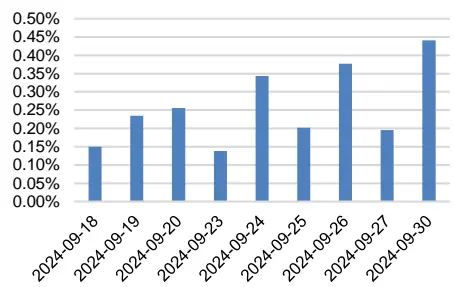
数据来源：通联数据, Wind，广发证券发展研究中心

图 2：市价单占比因子 20 分档收益
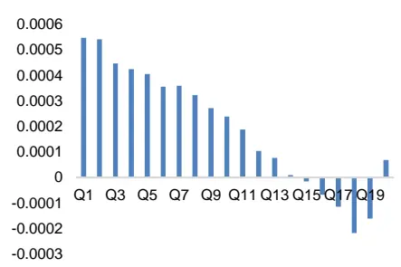
数据来源：通联数据，Wind, 广发证券发展研究中心

## [分析师： Table_Author]安宁宁

同SAC 执证号：S0260512020003

SFC CE No. BNW179

0755 - 23948352

anningning@gf.com.cn

## [Table_ 相关研究：DocRe

集合竞价因子: 海量 Level 2 2024-09-12数据因子挖掘系列（四）

大小单与长短单的 241 个碰2024-08-21
撞火花：海量 Level 2 数据因
子挖掘系列（三）
订单维度解耦的 22 个长短单2024-08-01
因子：海量 Level 2 数据因子
挖掘系列（二）
多维度解耦的 94 个大小单因2024-07-15
子：海量 Level 2 数据因子挖
掘系列（一）

[联系人： Table_Contacts] 林涛

公0755 - 82528531

gflintao@gf.com.cn

## 一、Level 1 与 Level 2 行情数据介绍

如何能在股票市场的博弈中胜出？关键在于对市场信息的掌握和对市场规律的理解。对于量化投资者来说，更在于对数据的全面收集和深度分析，并结合数学模型和算法，从海量数据中挖掘出隐藏的市场规律。这些规律可能是某些股票价格的趋势，市场的周期性波动，抑或是短期的交易信号。一旦这些规律被发现并加以利用，量化投资者便能在股票市场的博弈中获得优势。

股票行情数据源于上交所和深交所，根据数据的频率和丰富度通常分为Level 1数据和Level 2数据。如表1所示，Level 1数据为3秒一笔的快照（Snapshot）数据，包含了常用行情软件上可以看到的最高价、最低价、开盘价、收盘价、成交量、成交额、成交笔数、委买委卖量、5档申买申卖价、5档申买申卖量等数据。而相比数据频率较低、数据丰富度有限的Level 1数据，Level 2数据中则不仅提供了更为丰富的快照（Snapshot）数据，如10档申买申卖价、10档申买申卖量、最优买卖价前50笔委托、买卖委托价位数、买卖撤单信息等，而且提供了Level 1数据中所不包含的逐笔订单（Tick）数据。逐笔订单数据包含了当日交易时段中集合竞价阶段和连续竞价阶段的每一笔订单数据，其中的关键信息包括精确到毫秒的订单时间、逐笔序号、频道代码、价格、数量、金额、买入卖出订单号和订单类别等详细数据。Level2数据中的逐笔订单数据是一切行情数据的根源，不同频率的快照数据均由逐笔订单数据聚合而成。在“海量Level 2数据因子挖掘”系列研究报告中，将尝试对Level 2数据中详细的快照数据和逐笔订单数据进行深入分析并加以利用，有望能够从中获得更为丰富的价格趋势、周期波动、交易信号等规律和信息，从而挖掘出更为有效的因子，构建出具有超额收益的股票投资组合。

表 1：Level 1与Level 2主要行情数据对比

| 数据类别 | 数据名称 | Level 1 | Level 2 |
| --- | --- | --- | --- |
| 快照数据 | 时间 | 最快3秒一笔 | 最快3秒一笔 |
|  | 最高价 | V | V |
|  | 最低价 | √ | √ |
|  | 开盘价 | √ | √ |
|  | 收盘价 | √ | √ |
|  | 成交数量 | √ | √ |
|  | 成交金额 | √ | V |
|  | 成交笔数 | √ | V |
|  | (Snapshot) 委买量/委卖量 | V | √ |
|  | 申买价/申卖价 | 5档 | 10档 |
|  | 申买量/申卖量 | 5档 | 10档 |
|  | 最优买/卖价前 50 笔委托 | x | V |
|  | 申买/申卖委托笔数 | x |  |
|  | 买入/卖出最大等待时间 |  | V |
|  |  | x | √（仅上交所） |
|  | 买方/卖方委托价位数 | x | √（仅上交所） |
|  | 买入/卖出撤单笔数 | x | √（仅上交所） |

识别风险，发现价值

|  | 买入/卖出撤单数量 | x √（仅上交所） |
| --- | --- | --- |
|  | 买入/卖出撤单金额 | × √（仅上交所） |
|  | 买入/卖出总笔数 | x √（仅上交所） |
| 逐笔订单数据 (Tick) | 时间 | x ✓（精确到毫秒） |
|  | 逐笔序号 | x √ |
|  | 频道代码 | x V |
|  | 价格 | x √ |
|  | 数量 | × √ |
|  | 金额 | x V |
|  | 买入订单号 | x √ |
|  | 卖出订单号 | V |
|  | 订单类别 | × x ✓（委托/成交/撤单） |

数据来源：通联数据、广发证券发展研究中心

## 二、相关研究工作

表 2：海量Level 2数据因子挖掘系列研究报告

| 系列报告 | 标题 | 研究内容简介 | 发表时间 |
| --- | --- | --- | --- |
|  | 多维度解耦的94个大小单因子 | 从所有行情数据的根源——Level2逐笔订单出发，通过“大小订单” 的角度对所有交易订单进行窥探，结合多维度解耦的分析方法构建出 了多个有效的大小单因子，并从中挑选出表现优异者构建出了精选大 小单因子组合。精选大小单因子组合在全市场范围内的历史RankIC 均值为 9.2%，胜率为 76.0%。 | 2024-07-15 |
| 二 | 订单维度解耦的22个长短单因子 | 通过订单维度的解耦分析方法构建出了22个有效的长短单因子，并 从中挑选出表现优异者构建出了精选长短单因子组合。精选长短单因 子组合在全市场范围内的历史 RankIC 均值为 13.1%，胜率为 80.3%。 基于大小单因子和长短单因子之间相关系数范围在-0.19~0.19之间的 | 2024-08-01 |
| 三 | 大小单与长短单的241个碰撞火花 | 较低相关性，进一步尝试同时结合订单的“大小”和“长短”维度对 其进行深入剖析，构建出了240个订单因子。进一步的，本文从上述 240个基于“大小”和“长短”进行解构的订单因子中挑选出表现优 异者，构建出精选订单因子组合。精选订单因子组合在全市场范围内 的历史 RankIC 均值为 13.3%，胜率为 78.3%，同时取得了更为显著 的多头组合收益。 | 2024-08-21 |
| 四 | 集合竞价相关因子 | 本文基于level2数据中的逐笔订单信息，利用集合竞价期间的委托、 成交、撤单数据构建出了15个集合竞价相关因子。集合竞价因子与 上述大小单、长短单及Barra风格因子的相关性较低，其中10个集 合竞价因子的RankIC历史均值大于10%，具有不错的选股性能。 | 2024-09-12 |

数据来源：广发证券发展研究中心

## 三、市场机制与订单类型

## （一）订单驱动市场与报价驱动市场

证券市场的交易机制主要分为订单驱动市场（Order-driven Market）和报价驱动市场（Quote-driven Market）两种。订单驱动市场是基于买卖双方的订单撮合来完成交易的市场。这种市场的特征是买家和卖家直接提交买入或卖出订单，并且按照预定的规则（通常是价格优先和时间优先）撮合成交。报价驱动市场则是依靠做市商（Market Makers）来提供持续的买卖报价，并通过这些报价进行交易的市场。在这种市场中，做市商是重要的中介，他们通过提供买入价和卖出价来维持市场的流动性。订单驱动市场和报价驱动市场的特点对比如下表所示：

表 3：订单驱动市场与报价驱动市场的对比

| 特点 | 订单驱动市场 | 报价驱动市场 |
| --- | --- | --- |
| 价格发现机制 | 通过投资者订单自然产生 | 做市商提供买入价和卖出价 |
| 流动性提供者 | 市场参与者 | 做市商 |
| 透明度 | 较高，所有订单可见 | 较低，无法看到所有报价 |
| 适用市场 | 股票市场、去中心化交易所 | 外汇市场、债券市场、某些大宗商品市场 |
| 流动性 | 取决于市场参与者的活跃度 | 由做市商保证流动性 |
| 价格波动 | 波动较大，受大额订单影响明显 | 较稳定，做市商通过调整报价来平滑价格波动 |

数据来源：广发证券发展研究中心

## （二）限价订单与市价订单

中国沪深交易所采用的是订单驱动交易机制，即交易是基于买卖双方提交的订单来撮合完成的。市场没有专门的做市商提供持续报价，价格是根据投资者提交的订单自动形成的。沪深交易所作为订单驱动市场，允许投资者通过限价单和市价单进行交易。限价单提供了价格控制，但未必能够立即成交；市价单保证了快速成交，但价格可能不确定。这两种订单类型反映了订单驱动市场中供需双方的自发交易机制，也为投资者提供了灵活的交易策略选择。

限价单是指投资者设定一个指定价格，只有当市场价格达到或超过这一价格时，订单才会被执行。买入限价单会在指定价格或更低的价格成交，卖出限价单会在指定价格或更高的价格成交。限价单的优势是允许投资者指定期望的成交价格，从而在交易中更好地控制风险。但如果市场价格未达到限价单的设定价格，订单可能无法成交。举一个例子，假如投资者希望买入某股票，当前市场价格为10元，但交易者不愿以超过9.5元的价格买入，则可以提交一个9.5元的买入限价单。当市场价格跌至9.5元或更低时，订单才会成交。对于卖出订单而言亦然。在中国A股市场中，绝大部分的订单类型为限价订单。

市价单是指投资者希望立即以当前市场价格完成交易，因此不指定具体的成交价格。市价单的目的是确保订单立即执行，而不是追求某个特定的价格。在对手单充足的情况下，市价单通常会立即按当前市场最优价格成交。市价单通常可以确保成交，但实际成交价格可能会与预期有所不同，尤其是在市场波动较大的时候。如果某股票当前的买入价为10元，卖出价为10.2元，投资者提交市价买入单，则该单将以10.2元的价格立即成交，而不是等待价格回落到特定的水平。

## 四、中国 A股市场的市价订单统计概况

按照大家的共识，在中国A股市场中，绝大部分的订单类型是限价订单，通常只有一小部分订单是市价订单。但市价订单的具体占比是多少？在不同年份的占比有何变化？在不同板块的占比区别如何？在本小节中，将通过Level 2逐笔订单数据中的订单类型信息，对市价订单进行完整的统计，解答以上问题。（值得注意的是，在沪深交易所披露的Level 2逐笔订单数据中，只有深交所对每笔委托订单的限价单/市价单类型进行了标注，而上交所并未提供该信息，因此本文聚焦于深交所范围内的个股展开研究）

下图1统计了深证A股中2019年3月~2024年9月的市价单占比情况。整体而言，市价单的占比较小，各板块各年份的市价单占比均在0.5%以下。在不包含上证A股的分板块统计中，沪深300、中证500作为A股市场中市值最大、流动性最好的成分股，其市价单占比略高于其他板块。

图 1：深证A股市价单占比统计（2019-2024分年度统计）
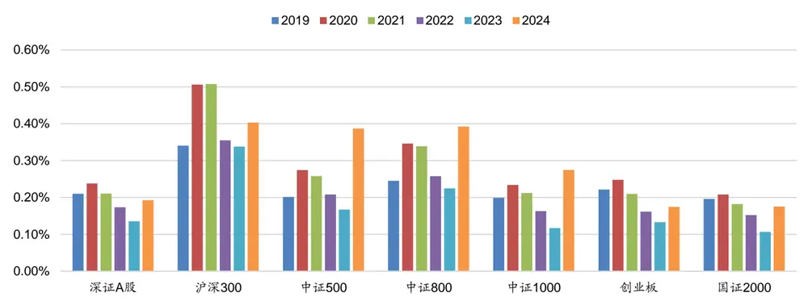
数据来源：通联数据、Wind，广发证券发展研究中心（注：2019 年指当年3-12 月，2024年指当年 1-9 月）

下图2统计了深证A股中2024年9月18日~2024年9月30日期间的每日市价单占比情况。在这几天中，市价单占比快速上升，在2024年9月30日达到市价单占比的峰值，是历史均值的2倍以上。但沪深300、中证500、中证800的市价单占比峰值并非出现在2024年9月30日，而是出现在2024年9月24日及26日。

图 2：深证A股市价单占比统计（2024/09/18~2024/09/30日频统计）
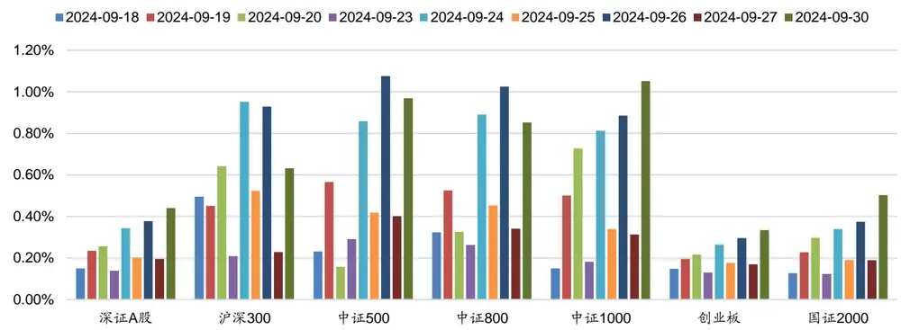
数据来源：通联数据、Wind，广发证券发展研究中心

下图3统计了在2019年3月~2024年9月期间，深证A股市价单中的买单占比情况。可以看出，在2019~2023年间，深证A股市价单中的买单占比均小于50%，表明深证A股市价单中的卖单多于买单。而在2024年期间，深证A股市价单中的买单占比有所上升，在沪深300、中证500、中证800、中证1000内大于50%，大于卖单占比。

图 3：深证A股市价单中的买单占比统计（2019-2024分年度统计）
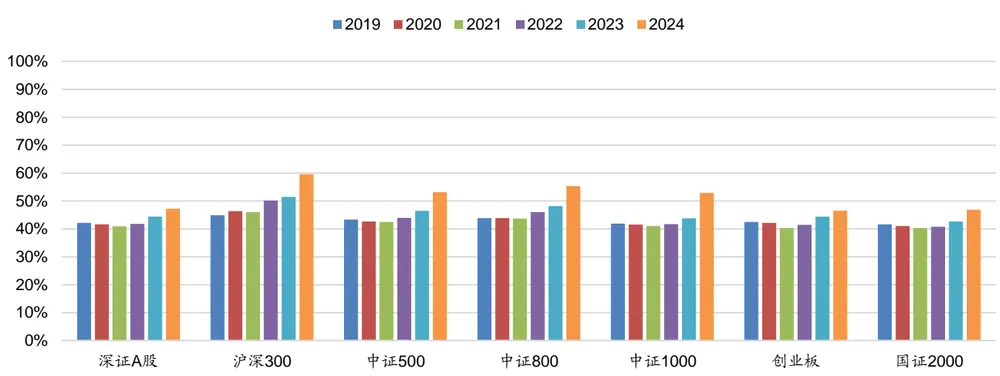
数据来源：通联数据、Wind，广发证券发展研究中心（注：2019 年指当年3-12 月，2024年指当年 1-9 月）

下图4统计了深证A股中2024年9月18日~2024年9月30日期间，每日市价单中的买单占比情况。在这几天中，市价单中的买单占比快速上升。在沪深300、中证500、中证800、中证1000板块内的深证A股中，市价单中的买单占比一度超过80%，远远高于历史平均值，表明了市场参与者对于买入的决心。

图 4：深证A股市价单中的买单占比统计（2024/09/18~2024/09/30日频统计）
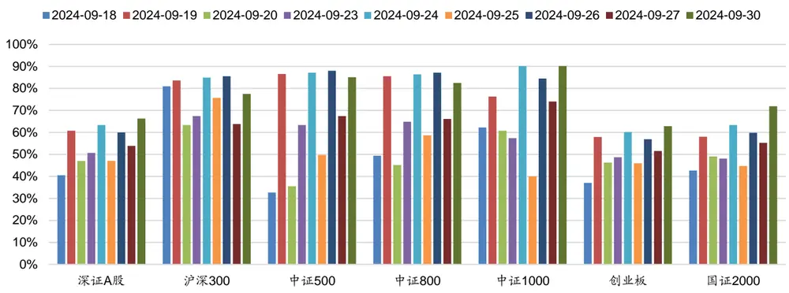
数据来源：通联数据、Wind，广发证券发展研究中心

## 五、市价订单相关因子定义

本文不仅利用Level 2逐笔订单数据对市价订单进行统计，而且构建出了8个市价订单相关因子。因子定义如下表4所示。

表 4：市价订单相关因子定义

| 因子名称 | 因子定义 |
| --- | --- |
| MarketOrder_ratio |  |
| MarketOrder_LimitOrder_ratio |  |
| MarketBuyOrder_MarketOrder_ratio |  |
| MarketBuyOrder_LimitBuyOrder_ratio |  |
| MarketBuyOrder_LimitSellOrder_ratio | 详细定义请联系作者 |
| MarketSellOrder_LimitBuyOrder_ratio |  |
| MarketSellOrder_LimitSellOrder_ratio |  |
| LimitBuyOrder_LimitOrder_ratio |  |

由于上交所Level2逐笔订单数据中并未对订单的市价/限价类别进行标记，因此本文针对深证A股范围构建了上述8个市价单相关因子，并对其在2019年3月~2024年9月期间的深证A股范围内的选股性能进行了统计，结果如下表5所示。整体而言，5日平滑因子以20日进行换仓的选股性能最优，其中6个因子的RankIC均值大于6.0%，胜率大于70%。

表 5：市价单相关因子RankIC表现（201903~202409，深证A股）

| 因子名 | 5 日换仓 (原始因子) |  | 5 日换仓 (5 日平滑因子) |  | 20 日换仓 (原始因子) |  | 20 日换仓 (5 日平滑因子) |  | 20 日换仓 (20日平滑因子) |  |
| --- | --- | --- | --- | --- | --- | --- | --- | --- | --- | --- |
|  | IC 均值 | IC 胜率 | IC 均值 | IC 胜率 | IC 均值 | IC 胜率 | IC 均值 | IC 胜率 | IC 均值 | IC 胜率 |
| MarketOrder_ratio | -4.90% | 27% | -4.70% | 30% | -6.50% | 24% | -6.50% | 25% | -6.30% | 26% |
| MarketOrder_LimitOrder_ratio | -4.90% | 27% | -4.70% | 30% | -6.50% | 24% | -6.50% | 25% | -6.20% | 26% |
| MarketBuyOrder_MarketOrder_ratio | -0.60% | 44% | -0.40% | 47% | -0.60% | 45% | 0.10% | 52% | 0.70% | 55% |
| MarketBuyOrder_LimitBuyOrder_ratio | -4.80% | 27% | -4.50% | 30% | -6.20% | 24% | -6.00% | 27% | -5.70% | 28% |
| MarketBuyOrder_LimitSellOrder_ratio | -4.80% | 28% | -4.80% | 29% | -6.30% | 25% | -6.20% | 27% | -6.10% | 28% |
| MarketSellOrder_LimitBuyOrder_ratio | -4.80% | 28% | -4.50% | 30% | -6.60% | 24% | -6.40% | 25% | -6.10% | 27% |
| MarketSellOrder_LimitSellOrder_ratio | -4.80% | 28% | -4.70% | 29% | -6.60% | 25% | -6.60% | 25% | -6.40% | 26% |
| LimitBuyOrder_LimitOrder_ratio | -1.10% | 44% | -2.30% | 39% | -0.80% | 45% | -2.30% | 40% | -3.50% | 34% |

数据来源：通联数据、Wind、广发证券发展研究中心

下表6统计了市价单因子和前序报告《多维度解耦的94个大小单因子》中部分高相关性大小单因子之间的相关性，两类因子之间的相关系数在-13%~10%之间，相关性较低。整体而言，虽然同样作为Level 2逐笔订单数据构建的因子，市价单因子是一组相较于大小单因子高度独立的因子。

表 6：市价单因子和大小单因子之间的相关性

| 大小单因子市价单因子 | BigBuy_1p0 | BigSell_1p0 | BigBuySell_1p0 | BigBuy_BigSell_1p0 | BigBuy_SmaIISell_1p0 | SmallBuy_BigSell_1p0 | SmallBuy_SmallSell_1p0 |
| --- | --- | --- | --- | --- | --- | --- | --- |
| MarketOrder_ratioMarketOrder_LimitOrder_ratioMarketBuyOrder_MarketOrder_ratioMarketBuyOrder_LimitBuyOrder_ratioMarketBuyOrder_LimitSellOrder_ratioMarketSellOrder_LimitBuyOrder_ratioMarketSellOrder_LimitSellOrder_ratioLimitBuyOrder_LimitOrder_ratio | -10% | -10% | -12% | -13% | 3% | 3% | 10% |
|  | -10% | -10% | -12% | -13% | 3% | 3% | 10% |
|  | 4% | -6% | -1% | -1% | 7% | -7% | 1% |
|  | 3% | -9% | -3% | -1% | 6% | -10% | 4% |
|  | -6% | -12% | -11% | -12% | 7% | -2% | 9% |
|  | -5% | -13% | -11% | -12% | 8% | -3% | 8% |
|  | -12% | -7% | -12% | -13% | -1% | 7% | 9% |
|  | -12% | -8% | -12% | -13% | 0% | 6% | 9% |

数据来源：通联数据、Wind、广发证券发展研究中心

下表7统计了市价单因子和前序报告《订单维度解耦的22个大小单因子》中部分高相关性长短单因子之间的相关性，两类因子之间的相关系数在-19%~20%之间，相关性较低。整体而言，虽然同样作为Level 2逐笔订单数据构建的因子，市价单因子是一组相较于长短单因子较为独立的因子。

表 7：市价单因子和长短单因子之间的相关性

| 长短单因子市价单因子 | LongBuy_1p0L | ongSell_1p0 | LongBuySell_1p0 | LongBuy_LongSell_1p0 | LongBuy_ShortSell_1p0 | ShortBuy_LongSell_1p0 | ShortBuy_ShortSell_1p0 |
| --- | --- | --- | --- | --- | --- | --- | --- |
| MarketOrder_ratioMarketOrder_LimitOrder_ratio | -15%-15% | -14%-14% | -19% | 5% | -15% | -14% | 20%20% |
|  |  |  | -19% | 5% | -15% | -14% |  |

识别风险，发现价值

| MarketBuyOrder_MarketOrder_ratioMarketBuyOrder_LimitBuyOrder_ratioMarketBuyOrder_LimitSellOrder_ratioMarketSellOrder_LimitBuyOrder_ratioMarketSellOrder_LimitSellOrder_ratioLimitBuyOrder_LimitOrder_ratio | -1% | -4% | -3% | -1% | -1% | -4% | 3% |
| --- | --- | --- | --- | --- | --- | --- | --- |
|  | 0% | -18% | -11% | -1% | 0% | -18% | 11% |
|  | -15% | -15% | -19% | 4% | -15% | -15% | 20% |
|  | -14% | -16% | -19% | 4% | -14% | -16% | 19% |
|  | -15% | -12% | -19% | 5% | -15% | -12% | 19% |
|  | -15% | -14% | -19% | 5% | -15% | -14% | 19% |

数据来源：通联数据、Wind、广发证券发展研究中心

下表8统计了市价单因子和前序报告《集合竞价相关因子》中部分高相关性集合竞价因子之间的相关性，两类因子之间的相关系数在1%~27%之间，相关性较低。整体而言，虽然同样作为Level 2逐笔订单数据构建的因子，市价单因子是一组相较于集合竞价因子较为独立的因子。

表 8：市价单因子和集合竞价因子之间的相关性

| 集合竞价因子市价单因子 | Transaction_Order_ratio_09150920 | Withdrew_Order_ratio_09150920 | Transaction_Order_ratio_09200925 | Transaction_Order_ratio_09150925 | SellTransaction_SelIOrder_ratio_14571500 |
| --- | --- | --- | --- | --- | --- |
| MarketOrder_ratioMarketOrder_LimitOrder_ratioMarketBuyOrder_MarketOrder_ratioMarketBuyOrder_LimitBuyOrder_ratioMarketBuyOrder_LimitSellOrder_ratioMarketSellOrder_LimitBuyOrder_ratioMarketSellOrder_LimitSellOrder_ratioLimitBuyOrder_LimitOrder_ratio | 22%22% | 9% | 23%23% | 27% | 12%12% |
|  |  | 9% |  | 27% |  |
|  | 1% | 2% | 2% | 2% | 1% |
|  | 14% | 7% | 15% | 17% | 12% |
|  | 18% | 9% | 20% | 23% | 10% |
|  | 19% | 10% | 21% | 24% | 12% |
|  | 21% | 9% | 22% | 25% | 11% |
|  | 22% | 10% | 23% | 27% | 13% |

数据来源：通联数据、Wind、广发证券发展研究中心

下表9统计了市价单因子和Barra风格因子之间的相关性，两类因子之间的相关系数在-7%~23%之间，相关性较低。其中，相关性最高的三个Barra风格因子分别为流动性因子、波动率因子、市值因子。

表 9：市价单因子和Barra风格因子之间的相关性

| Barra 风格因子市价单因子 | 市值因子 | 杠杆因子 | 成长因子 | 动量因子 | 贝塔因子 | 盈利因子 | 流动性因子 | 波动率因子 |  |  |  |
| --- | --- | --- | --- | --- | --- | --- | --- | --- | --- | --- | --- |
| MarketOrder_ratioMarketOrder_LimitOrder_ratioMarketBuyOrder_MarketOrder_ratioMarketBuyOrder_LimitBuyOrder_ratioMarketBuyOrder_LimitSellOrder_ratioMarketSellOrder_LimitBuyOrder_ratioMarketSellOrder_LimitSellOrder_ratioLimitBuyOrder_LimitOrder_ratio | 13% | -3% | 1% | 5% | 4% | -1% | 19% | 17% |  |  |  |
|  | 13% | -3% | 1% | 5% | 4% | -1% | 19% | 17% |  |  |  |
|  | 3% | 1% | -1% | 1% | 2% | -1% | -2% | -2% |  |  |  |
|  | 9% | 0% | 1% | 7% | 7% | -7% | 2% | 1% |  |  |  |
|  | 14% | -1% | 0% | 6% | 4% | -1% | 18% | 14% |  |  |  |
|  | 15% | -1% | 0% | 6% | 5% | -2% | 18% | 15% |  |  |  |
|  |  |  |  | 13% | -3% | 1% | 6% | 2% | 0% | 23% | 20% |
|  | 14% | -3% | 1% | 7% | 3% | -1% | 23% | 21% |  |  |  |

数据来源：通联数据、Wind、广发证券发展研究中心

## 六、市价单因子选股表现

本小节对上述8个市价单因子在深证A股范围内构建股票组合，测试其选股性能。结合因子的多头表现情况，这里采用因子的5日滚动均值，每20个交易日进行换仓。实证分析结果表明，市价单因子取得了较为出色的表现。

选股范围：深证A股

股票预处理：剔除摘牌、ST/*ST、涨跌停、上市未满一年股票

回测区间：2019年3月~2024年9月

回测路径：以多路径回测均值作为统计数据

组合构建：采用因子值排序后的前K个股票构建Top-K组合

调仓策略：每20个交易日，根据t日因子值以t+1日均价买入，t+21日均价卖出

交易费率：双边千分之三（卖出时收取）

## （一）MarketOrder_ratio 因子表现

MarketOrder_ratio因子在深证A股的20档分档收益如图5所示，分档组合收益呈现出较好的单调性。以因子值对深证A指成分股进行排序，分别取Top-30、50、100、150、200个股票构建组合进行测算，结果如图6和表10所示。在2019年3月~2024年9月期间，各组合相对深证A指指数分别取得了5.91%、5.89%、5.78%、6.00%、6.19%的超额年化收益率。

图 5：MarketOrder_ratio因子在深证A股中的20档分档表现
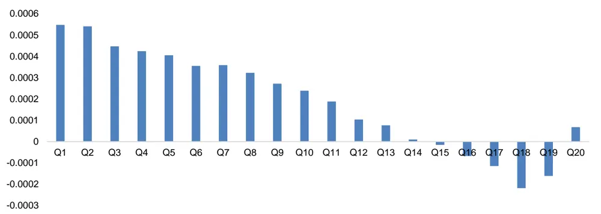
数据来源：通联数据、Wind，广发证券发展研究中心

图 6：MarketOrder_ratio因子在深证A股中净值表现（绝对收益）
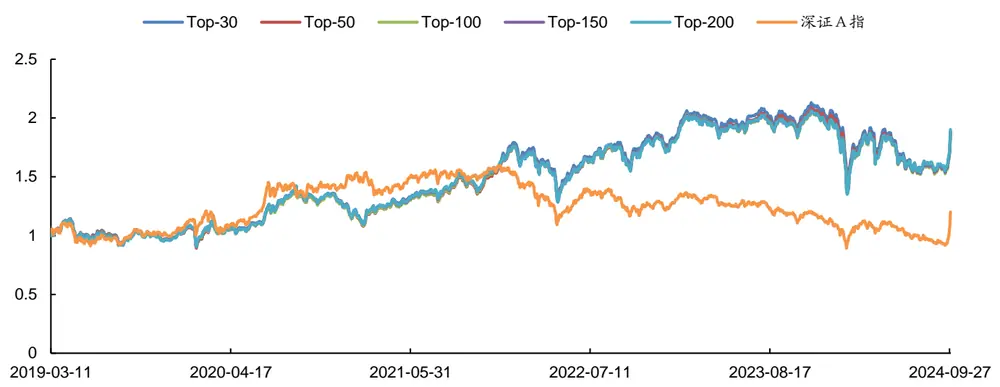
数据来源：通联数据、Wind，广发证券发展研究中心

表 10：MarketOrder_ratio因子在深证A股中分年度表现（相对超额收益）

| 组合 | 年份 | 总收益 | 年化收益率 | 最大回撤率 | 平均换手率 | 年化波动率 | 夏普比率 | 信息比率 |
| --- | --- | --- | --- | --- | --- | --- | --- | --- |
| Top30 深证 A 指超额 | 2019.03~2024.09 | 38.16% | 5.91% | 34.91% | 92.30% | 19.37% | 0.18 | 0.31 |
|  | 2019.03-12 | -5.52% | -6.59% | 11.65% | 91.71% | 16.24% | -0.56 | -0.41 |
|  | 2020年 | -12.39% | -12.30% | 17.15% | 89.64% | 21.92% | -0.68 | -0.56 |
|  | 2021年 | 21.57% | 21.37% | 15.50% | 90.14% | 19.83% | 0.95 | 1.08 |
|  | 2022年 | 27.95% | 27.82% | 9.16% | 94.86% | 18.77% | 1.35 | 1.48 |
|  | 2023年 | 24.19% | 24.08% | 6.06% | 94.94% | 12.34% | 1.75 | 1.95 |
|  | 2024.01~09 | -13.59% | -17.70% | 20.71% | 92.42% | 25.78% | -0.78 | -0.69 |
| Top50 深证 A 指超额 | 2019.03~2024.09 | 38.01% | 5.89% | 35.46% | 89.77% | 19.31% | 0.18 | 0.31 |
|  | 2019.03-12 | -5.88% | -7.02% | 11.53% | 89.02% | 16.20% | -0.59 | -0.43 |
|  | 2020年 | -13.13% | -13.03% | 17.72% | 86.75% | 21.93% | -0.71 | -0.59 |
|  | 2021年 | 20.90% | 20.71% | 15.54% | 88.01% | 19.88% | 0.92 | 1.04 |
|  | 2022年 | 28.77% | 28.64% | 9.21% | 92.36% | 18.75% | 1.39 | 1.53 |
|  | 2023年 | 23.42% | 23.31% | 5.94% | 92.46% | 12.11% | 1.72 | 1.92 |
|  | 2024.01~09 | -12.15% | -15.86% | 20.52% | 89.89% | 25.55% | -0.72 | -0.62 |
| Top100 深证 A 指超额 | 2019.03~2024.09 | 37.22% | 5.78% | 34.84% | 84.24% | 19.22% | 0.17 | 0.30 |
|  | 2019.03-12 | -5.27% | -6.29% | 11.27% | 83.63% | 16.15% | -0.54 |  |
|  | 2020年 | -13.76% | -13.65% | 17.78% | 81.20% | 21.77% | -0.74 | -0.39 |
|  | 2021年 | 21.75% | 21.55% | 14.97% | 81.91% | 19.86% | 0.96 | -0.63 |
|  | 2022年 | 27.72% | 27.59% | 9.39% | 87.40% | 18.74% |  | 1.08 |
|  | 2023年 | 21.49% | 21.39% | 5.93% | 87.62% | 11.81% | 1.34 | 1.47 |
|  | 2024.01~09 | -11.09% | -14.50% | 19.90% | 83.22% |  | 1.60 | 1.81 |
|  | 2019.03~2024.09 |  |  |  |  | 25.49% | -0.67 | -0.57 |
| Top150 |  | 38.83% | 6.00% | 33.88% | 80.02% | 19.20% | 0.18 | 0.31 |
| 深证 A 指超额 | 2019.03-12 | -5.16% | -6.16% | 11.02% | 79.45% | 16.19% | -0.53 | -0.38 |
|  | 2020年 | -13.19% | -13.09% | 18.01% | 76.76% | 21.67% | -0.72 | -0.60 |

识别风险，发现价值

|  | 2021年 | 21.30% | 21.11% | 14.60% | 77.39% | 19.87% | 0.94 | 1.06 |
| --- | --- | --- | --- | --- | --- | --- | --- | --- |
|  |  | 2022年 | 27.41% 27.28% | 9.42% | 83.74% | 18.70% | 1.33 | 1.46 |
|  | 2023年 2024.01~09 | 21.78% | 21.68% | 5.56% | 83.70% | 11.63% | 1.65 | 1.86 |
| Top200 深证 A 指超额 |  | -10.40% | -13.62% | 19.87% | 78.42% | 25.60% | -0.63 | -0.53 |
|  | 2019.03~2024.09 | 40.26% | 6.19% | 33.79% | 76.34% | 19.17% | 0.19 | 0.32 |
|  | 2019.03-12 | -5.25% | -6.26% | 11.07% | 75.42% | 16.21% | -0.54 | -0.39 |
|  | 2020年 | -13.21% | -13.11% | 18.02% | 72.92% | 21.63% | -0.72 | -0.61 |
|  | 2021年 | 21.54% | 21.35% | 14.60% | 73.34% | 19.87% | 0.95 | 1.07 |
|  | 2022年 | 27.08% | 26.95% | 9.40% | 80.46% | 18.66% | 1.31 | 1.44 |
|  | 2023年 2024.01~09 | 21.95% | 21.85% | 5.16% | 80.51% | 11.54% | 1.68 | 1.89 |
| 深证A指 | 2019.03~2024.09 | -9.45% 20.09% | -12.40% | 19.77% | 74.61% | 25.58% | -0.58 | -0.48 |
|  | 2019.03-12 |  | 3.30% | 44.09% | 1 | 21.55% | 0.04 | 0.15 |
|  | 2020年 | 7.35% | 8.89% | 17.92% | 1 | 21.87% | 0.29 | 0.41 |
|  | 2021年 | 35.25% 8.62% | 34.91% 8.54% | 16.02% | - | 25.17% | 1.29 | 1.39 |
|  | 2022年 |  | -21.86% | 12.48% 30.70% | 1 | 17.85% | 0.34 | 0.48 |
|  | 2023年 | -21.94% -6.97% | -6.95% | 19.36% | - | 22.09% 13.99% | -1.10 | -0.99 |
|  | 2024.01~09 | 4.86% | 6.53% | 21.44% | 1 - | 27.36% | -0.68 0.15 | -0.50 0.24 |

数据来源：通联数据、Wind，广发证券发展研究中心

## （二）MarketOrder_LimitOrder_ratio 因子表现

MarketOrder_LimitOrder_ratio因子在深证A股的20档分档收益如图7所示，分档组合收益呈现出较好的单调性。以因子值对深证A指成分股进行排序，分别取Top-30、50、100、150、200个股票构建组合进行测算，结果如图8和表11所示。在2019年3月~2024年9月期间，各组合相对深证A指指数分别取得了5.91%、5.89%、5.78%、6.00%、6.20%的超额年化收益率。

图 7：MarketOrder_LimitOrder_ratio因子在深证A股中的20档分档表现
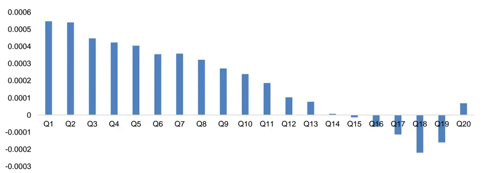
数据来源：通联数据、Wind，广发证券发展研究中心

图 8：MarketOrder_LimitOrder_ratio因子在深证A股中净值表现（绝对收益）

数据来源：通联数据、Wind，广发证券发展研究中心

表 11：MarketOrder_LimitOrder_ratio因子在深证A股中分年度表现（相对超额收益）

| 组合 | 年份 | 总收益 | 年化收益率 | 最大回撤率 | 平均换手率 | 年化波动率 | 夏普比率 | 信息比率 |
| --- | --- | --- | --- | --- | --- | --- | --- | --- |
| Top30 深证 A 指超额 | 2019.03~2024.09 | 38.16% | 5.91% | 34.92% | 92.30% | 19.37% | 0.18 | 0.31 |
|  | 2019.03-12 | -5.50% | -6.57% | 11.65% | 91.69% | 16.24% | -0.56 | -0.40 |
|  | 2020年 | -12.40% | -12.31% | 17.15% | 89.64% | 21.92% | -0.68 | -0.56 |
|  | 2021年 | 21.57% | 21.37% | 15.50% | 90.14% | 19.83% | 0.95 | 1.08 |
|  | 2022年 | 27.94% | 27.81% | 9.16% | 94.86% | 18.76% | 1.35 | 1.48 |
|  | 2023年 | 24.19% | 24.08% | 6.06% | 94.94% | 12.34% | 1.75 | 1.95 |
|  | 2024.01~09 | -13.59% | -17.70% | 20.71% | 92.42% | 25.78% | -0.78 | -0.69 |
| Top50 深证 A 指超额 | 2019.03~2024.09 | 38.02% | 5.89% | 35.47% | 89.77% | 19.31% | 0.18 | 0.31 |
|  | 2019.03-12 | -5.88% | -7.02% | 11.53% | 89.02% | 16.20% | -0.59 | -0.43 |
|  | 2020年 | -13.13% | -13.03% | 17.72% | 86.76% | 21.93% | -0.71 | -0.59 |
|  | 2021年 | 20.90% | 20.71% | 15.54% | 88.01% | 19.88% | 0.92 | 1.04 |
|  | 2022年 | 28.78% | 28.64% | 9.21% | 92.36% | 18.75% | 1.39 | 1.53 |
|  | 2023年 | 23.42% | 23.31% | 5.94% | 92.46% | 12.11% | 1.72 | 1.92 |
|  | 2024.01~09 | -12.15% | -15.86% | 20.52% | 89.89% | 25.55% | -0.72 | -0.62 |
| Top100 深证 A 指超额 | 2019.03~2024.09 | 37.20% | 5.78% | 34.85% | 84.24% | 19.22% | 0.17 | 0.30 |
|  | 2019.03-12 | -5.26% | -6.27% | 11.25% | 83.65% | 16.15% | -0.54 | -0.39 |
|  | 2020年 | -13.78% | -13.67% | 17.77% | 81.20% | 21.77% | -0.74 |  |
|  | 2021年 | 21.74% | 21.55% | 14.97% | 81.91% | 19.86% | 0.96 | -0.63 |
|  | 2022年 | 27.71% | 27.59% | 9.40% | 87.40% | 18.74% |  | 1.08 |
|  | 2023年 | 21.49% | 21.39% |  |  |  | 1.34 | 1.47 |
|  | 2024.01~09 | -11.09% |  | 5.93% | 87.62% | 11.81% | 1.60 | 1.81 |
| Top150 深证 A 指超额 |  |  | -14.50% | 19.90% | 83.22% | 25.49% | -0.67 | -0.57 |
|  | 2019.03~2024.09 | 38.80% | 6.00% | 33.91% | 80.02% | 19.20% | 0.18 | 0.31 |
|  | 2019.03-12 2020年 | -5.16% | -6.16% | 11.03% | 79.43% | 16.19% | -0.54 | -0.38 |
|  |  | -13.22% | -13.12% | 18.02% | 76.75% | 21.67% | -0.72 | -0.61 |

识别风险，发现价值

|  | 2021年 | 21.32% | 21.13% | 14.60% | 77.39% | 19.87% | 0.94 | 1.06 |
| --- | --- | --- | --- | --- | --- | --- | --- | --- |
|  |  | 2022年 | 27.42% 27.29% | 9.42% | 83.75% | 18.70% | 1.33 | 1.46 |
|  | 2023年 2024.01~09 | 21.77% | 21.67% | 5.56% | 83.70% | 11.63% | 1.65 | 1.86 |
| Top200 深证 A 指超额 |  | -10.40% | -13.62% | 19.87% | 78.42% | 25.60% | -0.63 | -0.53 |
|  | 2019.03~2024.09 | 40.27% | 6.20% | 33.79% | 76.34% | 19.17% | 0.19 | 0.32 |
|  | 2019.03-12 | -5.24% | -6.26% | 11.07% | 75.41% | 16.21% | -0.54 | -0.39 |
|  | 2020年 | -13.21% | -13.11% | 18.01% | 72.92% | 21.63% | -0.72 | -0.61 |
|  | 2021年 | 21.57% | 21.38% | 14.60% | 73.34% | 19.87% | 0.95 | 1.08 |
|  | 2022年 | 27.07% | 26.95% | 9.41% | 80.46% | 18.66% | 1.31 | 1.44 |
|  | 2023年 2024.01~09 | 21.95% | 21.85% | 5.16% | 80.51% | 11.54% | 1.68 | 1.89 |
| 深证A指 | 2019.03~2024.09 | -9.46% 20.09% | -12.42% 3.30% | 19.77% | 74.61% | 25.58% | -0.58 | -0.49 |
|  | 2019.03-12 | 7.35% |  | 44.09% | 1 | 21.55% | 0.04 | 0.15 |
|  | 2020年 | 35.25% | 8.89% | 17.92% | - | 21.87% | 0.29 | 0.41 |
|  | 2021年 | 8.62% | 34.91% 8.54% | 16.02% | 1 | 25.17% | 1.29 | 1.39 |
|  | 2022年 | -21.94% | -21.86% | 12.48% 30.70% | 1 | 17.85% | 0.34 | 0.48 |
|  | 2023年 | -6.97% | -6.95% | 19.36% | 1 | 22.09% 13.99% | -1.10 -0.68 | -0.99 |
|  | 2024.01~09 | 4.86% | 6.53% | 21.44% | 1 - | 27.36% | 0.15 | -0.50 0.24 |

数据来源：通联数据、Wind，广发证券发展研究中心

## （三）MarketBuyOrder_MarketOrder_ratio 因子表现

MarketBuyOrder_MarketOrder_ratio因子在深证A股的20档分档收益如图9所示，分档组合收益呈现出两头高、中间低的独特走势。这说明在市价订单中，当买卖订单委托量出现失衡时，则该个股在未来有更大的可能性上涨。以因子值对深证A指成分股进行排序，分别取Top-30、50、100、150、200个股票构建组合进行测算，结果如图10和表12所示。在2019年3月~2024年9月期间，各组合相对深证A指指数分别取得了3.92%、3.33%、2.74%、2.27%、1.71%的超额年化收益率。

图 9：MarketBuyOrder_MarketOrder_ratio因子在深证A股中的20档分档表现
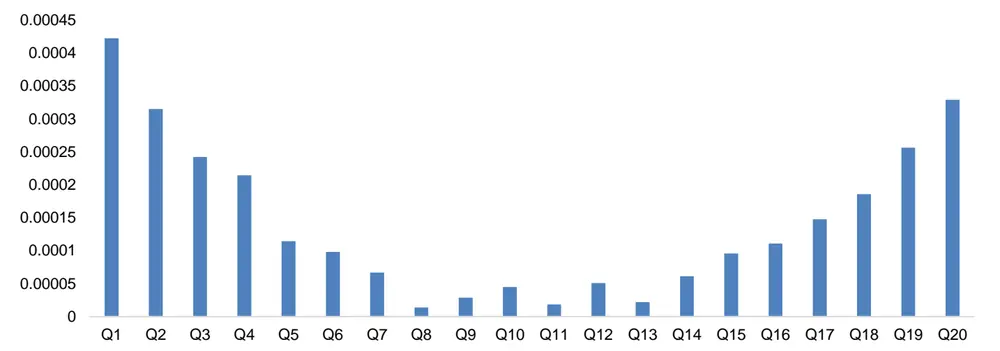
数据来源：通联数据、Wind，广发证券发展研究中心
识别风险，发现价值

图 10：MarketBuyOrder_MarketOrder_ratio因子在深证A股中净值表现（绝对收益）
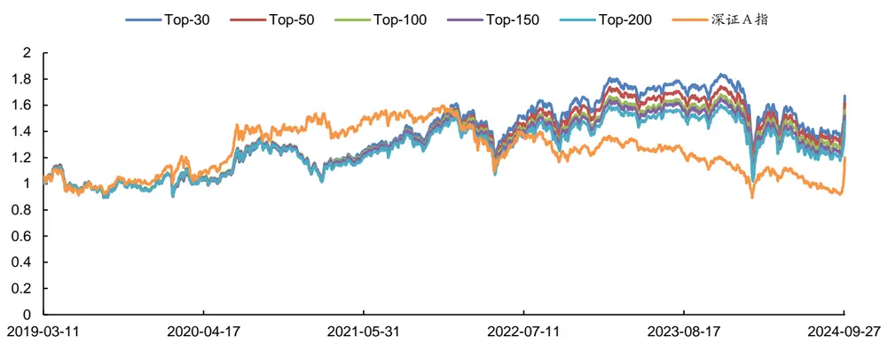
数据来源：通联数据、Wind，广发证券发展研究中心

表 12：MarketBuyOrder_MarketOrder_ratio因子在深证A股中分年度表现（相对超额收益）

| 组合 | 年份 | 总收益 | 年化收益率 | 最大回撤率 | 平均换手率 | 年化波动率 | 夏普比率 | 信息比率 |
| --- | --- | --- | --- | --- | --- | --- | --- | --- |
| Top30 深证 A 指超额 | 2019.03~2024.09 | 24.19% | 3.92% | 37.79% | 97.26% | 19.10% | 0.07 | 0.21 |
|  | 2019.03-12 | -6.71% | -7.99% | 11.85% | 97.63% | 16.16% | -0.65 | -0.49 |
|  | 2020年 | -17.20% | -17.07% | 19.04% | 96.80% | 21.30% | -0.92 | -0.80 |
|  | 2021年 | 20.86% | 20.67% | 14.13% | 96.80% | 19.30% | 0.94 | 1.07 |
|  | 2022年 | 23.83% | 23.72% | 9.00% | 97.95% | 18.75% | 1.13 | 1.26 |
|  | 2023年 | 20.70% | 20.61% | 5.07% | 96.83% | 11.66% | 1.55 | 1.77 |
|  | 2024.01~09 | -11.00% | -14.40% | 22.15% | 97.85% | 25.97% | -0.65 | -0.55 |
| Top50 深证 A 指超额 | 2019.03~2024.09 | 20.27% | 3.33% | 37.68% | 96.06% | 18.98% | 0.04 | 0.18 |
|  | 2019.03-12 | -6.66% | -7.94% | 11.04% | 96.17% | 16.42% | -0.64 | -0.48 |
|  | 2020年 | -17.66% | -17.53% | 19.85% | 95.30% | 21.15% | -0.95 | -0.83 |
|  | 2021年 | 18.80% | 18.63% | 14.24% | 95.56% | 19.16% | 0.84 | 0.97 |
|  | 2022年 | 21.55% | 21.45% | 9.31% | 96.76% | 18.65% | 1.02 | 1.15 |
|  | 2023年 | 19.63% | 19.54% | 4.96% | 96.06% | 11.44% | 1.49 | 1.71 |
|  | 2024.01~09 | -9.41% | -12.35% | 21.21% | 96.83% | 25.68% | -0.58 | -0.48 |
| Top100 深证 A 指超额 | 2019.03~2024.09 | 16.46% | 2.74% | 36.65% | 93.43% | 18.85% | 0.01 | 0.15 |
|  | 2019.03-12 | -6.21% | -7.40% | 10.19% | 93.20% | 16.34% | -0.61 | -0.45 |
|  | 2020年 | -16.63% | -16.50% | 19.70% | 92.37% | 21.00% | -0.91 | -0.79 |
|  | 2021年 | 16.14% | 16.00% | 14.96% | 92.77% | 19.02% | 0.71 | 0.84 |
|  | 2022年 | 18.01% | 17.93% | 9.72% | 93.94% | 18.51% | 0.83 | 0.97 |
|  | 2023年 | 19.19% | 19.10% | 4.70% | 94.24% | 11.27% | 1.47 |  |
|  | 2024.01~09 | -8.83% | -11.60% | 21.14% | 94.32% | 25.61% | -0.55 | 1.70 |
| Top150 | 2019.03~2024.09 | 13.49% | 2.27% | 36.66% | 90.83% | 18.73% | -0.01 | -0.45 |
|  | 2019.03-12 | -6.84% | -8.15% |  | 90.47% | 16.32% | -0.65 | 0.12 |
| 深证 A 指超额 |  |  |  | 10.27% |  |  |  | -0.50 |
|  | 2020年 | -16.46% | -16.33% | 19.47% | 89.34% | 20.85% | -0.90 | -0.78 |

识别风险，发现价值

|  | 2021年 | 15.41% | 15.27% | 14.94% | 90.14% | 18.85% | 0.68 | 0.81 |
| --- | --- | --- | --- | --- | --- | --- | --- | --- |
|  |  | 2022年 17.42% | 17.34% | 9.74% | 91.30% | 18.43% | 0.81 | 0.94 |
|  | 2023年 2024.01~09 | 18.68% | 18.59% | 4.68% | 92.04% | 11.19% | 1.44 | 1.66 |
| Top200 深证 A 指超额 | 2019.03~2024.09 | -9.33% | -12.24% | 21.07% | 92.03% | 25.44% | -0.58 | -0.48 |
|  |  | 10.03% | 1.71% | 37.46% | 88.41% | 18.67% | -0.04 | 0.09 |
|  | 2019.03-12 | -7.00% | -8.34% | 10.40% | 87.83% | 16.28% | -0.67 | -0.51 |
|  | 2020年 | -17.37% | -17.24% | 20.00% | 86.67% | 20.73% | -0.95 | -0.83 |
|  | 2021年 | 14.67% | 14.54% | 15.10% | 87.65% | 18.71% | 0.64 | 0.78 |
|  | 2022年 | 16.61% | 16.53% | 9.98% | 89.12% | 18.40% | 0.76 | 0.90 |
|  | 2023年 2024.01~09 | 18.12% -9.35% | 18.03% -12.26% | 4.59% 20.88% | 89.70% | 11.17% | 1.39 | 1.61 |
| 深证A指 | 2019.03~2024.09 | 20.09% | 3.30% |  | 89.84% | 25.40% | -0.58 | -0.48 |
|  | 2019.03-12 | 7.35% |  | 44.09% | 1 | 21.55% | 0.04 | 0.15 |
|  | 2020年 | 35.25% | 8.89% 34.91% | 17.92% | - | 21.87% | 0.29 | 0.41 |
|  | 2021年 | 8.62% | 8.54% | 16.02% 12.48% | 1 | 25.17% | 1.29 | 1.39 |
|  | 2022年 | -21.94% | -21.86% | 30.70% | - | 17.85% 22.09% | 0.34 -1.10 | 0.48 |
|  | 2023年 | -6.97% | -6.95% | 19.36% | - | 13.99% | -0.68 | -0.99 |
|  | 2024.01~09 | 4.86% | 6.53% | 21.44% | 1 - | 27.36% | 0.15 | -0.50 0.24 |

数据来源：通联数据、Wind，广发证券发展研究中心

## （四）MarketBuyOrder_LimitBuyOrder_ratio 因子表现

MarketBuyOrder_LimitBuyOrder_ratio因子在深证A股的20档分档收益如图11所示，分档组合收益呈现出较好的单调性。以因子值对深证A指成分股进行排序，分别取Top-30、50、100、150、200个股票构建组合进行测算，结果如图12和表13所示。在2019年3月~2024年9月期间，各组合相对深证A指指数分别取得了6.51%、6.65%、6.51%、6.22%、5.69%的超额年化收益率。

图 11：MarketBuyOrder_LimitBuyOrder_ratio因子在深证A股中的20档分档表现
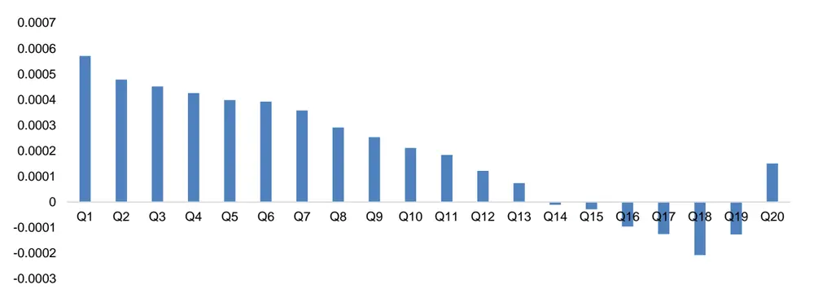
数据来源：通联数据、Wind，广发证券发展研究中心

图 12：MarketBuyOrder_LimitBuyOrder_ratio因子在深证A股中净值表现（绝对收益）
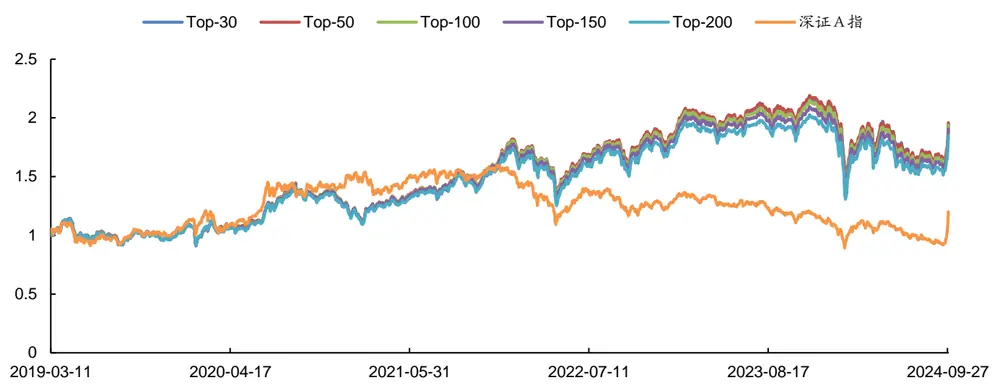
数据来源：通联数据、Wind，广发证券发展研究中心

表 13：MarketBuyOrder_LimitBuyOrder_ratio因子在深证A股中分年度表现（相对超额收益）

| 组合 | 年份 | 总收益 | 年化收益率 | 最大回撤率 | 平均换手率 | 年化波动率 | 夏普比率 | 信息比率 |
| --- | --- | --- | --- | --- | --- | --- | --- | --- |
| Top30 深证 A 指超额 | 2019.03~2024.09 | 42.64% | 6.51% | 33.11% | 92.67% | 19.52% | 0.21 | 0.33 |
|  | 2019.03-12 | -4.46% | -5.33% | 10.16% | 92.60% | 16.24% | -0.48 | -0.33 |
|  | 2020年 | -12.98% | -12.88% | 18.42% | 90.23% | 22.13% | -0.70 | -0.58 |
|  | 2021年 | 20.25% | 20.07% | 14.67% | 90.47% | 19.65% | 0.89 | 1.02 |
|  | 2022年 | 28.95% | 28.81% | 9.19% | 95.11% | 18.86% | 1.39 | 1.53 |
|  | 2023年 | 28.40% | 28.27% | 5.63% | 95.34% | 12.23% | 2.11 | 2.31 |
|  | 2024.01~09 | -13.83% | -18.00% | 23.44% | 92.08% | 26.54% | -0.77 | -0.68 |
| Top50 深证 A 指超额 | 2019.03~2024.09 | 43.71% | 6.65% | 33.07% | 90.34% | 19.53% | 0.21 | 0.34 |
|  | 2019.03-12 | -4.67% | -5.58% | 10.81% | 89.97% | 16.21% | -0.50 | -0.34 |
|  | 2020年 | -12.50% | -12.41% | 18.21% | 86.95% | 22.07% | -0.68 | -0.56 |
|  | 2021年 | 23.11% | 22.90% | 14.42% | 87.89% | 19.73% | 1.03 | 1.16 |
|  | 2022年 | 27.38% | 27.26% | 9.31% | 93.57% | 18.82% | 1.32 | 1.45 |
|  | 2023年 | 27.24% | 27.11% | 5.88% | 93.33% | 12.11% | 2.03 | 2.24 |
|  | 2024.01~09 | -13.65% | -17.78% | 23.40% | 90.19% | 26.71% | -0.76 | -0.67 |
| Top100 深证 A 指超额 | 2019.03~2024.09 | 42.65% | 6.51% | 33.29% | 85.67% | 19.43% | 0.21 | 0.34 |
|  | 2019.03-12 | -4.69% | -5.60% | 10.73% | 84.70% | 16.22% | -0.50 | -0.34 |
|  | 2020年 | -12.49% | -12.40% | 18.29% | 82.37% | 21.84% | -0.68 | -0.57 |
|  | 2021年 | 22.77% | 22.56% | 14.63% | 82.66% | 19.84% | 1.01 | 1.14 |
|  | 2022年 | 26.18% | 26.06% | 9.61% | 89.27% | 18.80% | 1.25 |  |
|  | 2023年 | 26.07% | 25.95% | 5.18% | 89.15% | 11.91% | 1.97 | 1.39 |
|  | 2024.01~09 | -12.43% | -16.22% | 22.58% | 85.68% | 26.45% |  | 2.18 |
| Top150 | 2019.03~2024.09 | 40.47% | 6.22% | 33.34% | 81.75% | 19.33% | -0.71 0.19 | -0.61 0.32 |
|  | 2019.03-12 | -4.92% | -5.87% | 10.92% | 80.90% | 16.21% | -0.52 | -0.36 |
| 深证 A 指超额 | 2020年 | -12.72% | -12.63% | 18.19% | 77.97% | 21.74% | -0.70 | -0.58 |

识别风险，发现价值

|  | 2021年 | 21.91% | 21.72% | 14.50% | 78.24% | 19.75% | 0.97 | 1.10 |
| --- | --- | --- | --- | --- | --- | --- | --- | --- |
|  |  | 2022年 | 25.56% 25.44% | 9.69% | 85.55% | 18.72% | 1.23 | 1.36 |
|  | 2023年 2024.01~09 | 24.82% | 24.71% | 4.95% | 85.78% | 11.79% | 1.88 | 2.10 |
| Top200 深证 A 指超额 |  | -11.40% | -14.91% | 21.76% | 81.94% | 26.26% | -0.66 | -0.57 |
|  | 2019.03~2024.09 | 36.57% | 5.69% | 33.96% | 78.37% | 19.26% | 0.17 | 0.30 |
|  | 2019.03-12 | -5.05% | -6.03% | 10.74% | 77.16% | 16.22% | -0.53 | -0.37 |
|  | 2020年 | -13.58% | -13.47% | 18.00% | 74.38% | 21.62% | -0.74 | -0.62 |
|  | 2021年 | 20.60% | 20.41% | 14.70% | 74.68% | 19.68% | 0.91 | 1.04 |
|  | 2022年 | 25.12% | 25.00% | 9.65% | 82.40% | 18.69% | 1.20 | 1.34 |
|  | 2023年 2024.01~09 | 23.72% | 23.61% | 4.92% | 83.06% | 11.67% | 1.81 | 2.02 |
| 深证A指 | 2019.03~2024.09 | -10.85% | -14.20% | 21.40% | 78.22% | 26.17% | -0.64 | -0.54 |
|  | 2019.03-12 | 20.09% | 3.30% | 44.09% | 1 | 21.55% | 0.04 | 0.15 |
|  | 2020年 | 7.35% | 8.89% | 17.92% | 1 | 21.87% | 0.29 | 0.41 |
|  | 2021年 | 35.25% 8.62% | 34.91% 8.54% | 16.02% | - | 25.17% | 1.29 | 1.39 |
|  | 2022年 |  | -21.86% | 12.48% 30.70% | - | 17.85% | 0.34 | 0.48 |
|  | 2023年 | -21.94% -6.97% | -6.95% | 19.36% | - | 22.09% 13.99% | -1.10 | -0.99 |
|  | 2024.01~09 | 4.86% | 6.53% | 21.44% | 1 - | 27.36% | -0.68 0.15 | -0.50 0.24 |

数据来源：通联数据、Wind，广发证券发展研究中心

## （五）MarketBuyOrder_LimitSellOrder_ratio 因子表现

MarketBuyOrder_LimitSellOrder_ratio因子在深证A股的20档分档收益如图13所示，分档组合收益呈现出较好的单调性。以因子值对深证A指成分股进行排序，分别取Top-30、50、100、150、200个股票构建组合进行测算，结果如图14和表14所示。在2019年3月~2024年9月期间，各组合相对深证A指指数分别取得了6.09%、6.67%、6.52%、6.02%、5.70%的超额年化收益率。

图 13：MarketBuyOrder_LimitSellOrder_ratio因子在深证A股中的20档分档表现
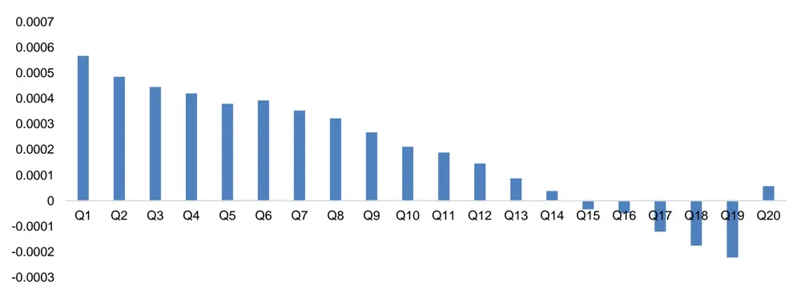
数据来源：通联数据、Wind，广发证券发展研究中心

图 14：MarketBuyOrder_LimitSellOrder_ratio因子在深证A股中净值表现（绝对收益）
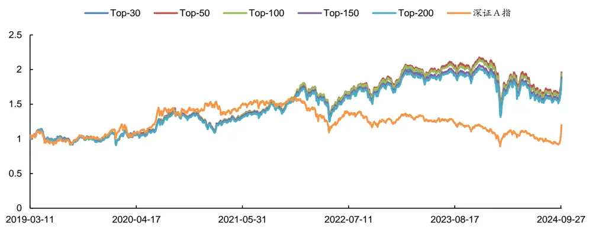
数据来源：通联数据、Wind，广发证券发展研究中心

表 14：MarketBuyOrder_LimitSellOrder_ratio因子在深证A股中分年度表现（相对超额收益）

| 组合 | 年份 | 总收益 | 年化收益率 | 最大回撤率 | 平均换手率 | 年化波动率 | 夏普比率 | 信息比率 |
| --- | --- | --- | --- | --- | --- | --- | --- | --- |
| Top30 深证 A 指超额 | 2019.03~2024.09 | 39.52% | 6.09% | 33.16% | 92.65% | 19.59% | 0.18 | 0.31 |
|  | 2019.03-12 | -4.03% | -4.82% | 10.23% | 92.64% | 16.34% | -0.45 | -0.29 |
|  | 2020年 | -13.13% | -13.03% | 18.18% | 90.14% | 22.09% | -0.70 | -0.59 |
|  | 2021年 | 19.66% | 19.48% | 14.59% | 90.51% | 19.64% | 0.86 | 0.99 |
|  | 2022年 | 28.36% | 28.23% | 9.36% | 95.18% | 18.92% | 1.36 | 1.49 |
|  | 2023年 | 28.01% | 27.88% | 5.75% | 95.06% | 12.27% | 2.07 | 2.27 |
|  | 2024.01~09 | -14.88% | -19.33% | 23.81% | 92.25% | 26.83% | -0.81 | -0.72 |
| Top50 深证 A 指超额 | 2019.03~2024.09 | 43.85% | 6.67% | 33.43% | 90.29% | 19.53% | 0.21 | 0.34 |
|  | 2019.03-12 | -4.65% | -5.55% | 10.92% | 89.90% | 16.21% | -0.50 | -0.34 |
|  | 2020年 | -12.72% | -12.62% | 18.16% | 87.16% | 22.04% | -0.69 | -0.57 |
|  | 2021年 | 22.60% | 22.40% | 14.68% | 87.70% | 19.77% | 1.01 | 1.13 |
|  | 2022年 | 27.68% | 27.55% | 9.36% | 93.74% | 18.79% | 1.33 | 1.47 |
|  | 2023年 | 27.25% | 27.13% | 5.79% | 93.12% | 12.14% | 2.03 | 2.23 |
|  | 2024.01~09 | -13.23% | -17.23% | 23.26% | 89.95% | 26.71% | -0.74 | -0.65 |
| Top100 深证 A 指超额 | 2019.03~2024.09 | 42.69% | 6.52% | 33.35% | 85.48% | 19.43% | 0.21 | 0.34 |
|  | 2019.03-12 | -4.73% | -5.65% |  |  |  |  |  |
|  | 2020年 | -12.53% |  | 10.78% | 84.73% | 16.20% | -0.50 | -0.35 |
|  | 2021年 | 22.69% | -12.44% | 18.09% | 82.24% | 21.87% | -0.68 | -0.57 |
|  | 2022年 | 26.20% | 22.48% | 14.59% | 82.42% | 19.85% | 1.01 | 1.13 |
|  | 2023年 |  | 26.08% | 9.58% | 88.98% | 18.79% | 1.25 | 1.39 |
|  |  | 26.04% | 25.92% | 5.27% | 88.82% | 11.95% | 1.96 | 2.17 |
|  | 2024.01~09 | -12.25% | -15.99% | 22.26% | 85.58% | 26.37% | -0.70 | -0.61 |
| Top150 深证 A 指超额 | 2019.03~2024.09 | 38.98% | 6.02% | 33.75% | 81.50% | 19.32% | 0.18 | 0.31 |
|  | 2019.03-12 | -4.94% | -5.90% | 10.94% | 80.79% | 16.20% | -0.52 | -0.36 |
|  | 2020年 | -13.14% | -13.04% | 18.16% | 77.74% | 21.76% | -0.71 | -0.60 |

识别风险，发现价值

|  | 2021年 | 21.10% | 20.90% | 14.56% | 78.01% | 19.74% | 0.93 | 1.06 |
| --- | --- | --- | --- | --- | --- | --- | --- | --- |
|  |  | 2022年 | 25.26% 25.15% | 9.71% | 85.38% | 18.76% | 1.21 | 1.34 |
|  | 2023年 2024.01~09 | 24.97% | 24.86% | 5.07% | 85.32% | 11.84% | 1.89 | 2.10 |
| Top200 深证 A 指超额 |  | -11.22% | -14.67% | 21.28% | 81.71% | 26.14% | -0.66 | -0.56 |
|  | 2019.03~2024.09 | 36.62% | 5.70% | 34.39% | 78.06% | 19.26% | 0.17 | 0.30 |
|  | 2019.03-12 | -5.30% | -6.32% | 11.06% | 77.27% | 16.22% | -0.54 | -0.39 |
|  | 2020年 | -13.87% | -13.76% | 18.08% | 74.03% | 21.66% | -0.75 | -0.64 |
|  | 2021年 | 20.79% | 20.60% | 14.66% | 74.32% | 19.68% | 0.92 | 1.05 |
|  | 2022年 | 25.61% | 25.49% | 9.63% | 82.20% | 18.74% | 1.23 | 1.36 |
|  | 2023年 2024.01~09 | 23.64% | 23.53% | 4.96% | 82.31% | 11.72% | 1.79 | 2.01 |
| 深证A指 | 2019.03~2024.09 | -10.72% 20.09% | -14.03% | 21.01% | 78.08% | 26.07% | -0.63 | -0.54 |
|  | 2019.03-12 |  | 3.30% | 44.09% | 1 | 21.55% | 0.04 | 0.15 |
|  | 2020年 | 7.35% | 8.89% | 17.92% | 1 | 21.87% | 0.29 | 0.41 |
|  | 2021年 | 35.25% 8.62% | 34.91% 8.54% | 16.02% | - | 25.17% | 1.29 | 1.39 |
|  | 2022年 | -21.94% | -21.86% | 12.48% 30.70% | - | 17.85% | 0.34 | 0.48 |
|  | 2023年 | -6.97% | -6.95% | 19.36% | - | 22.09% 13.99% | -1.10 | -0.99 |
|  | 2024.01~09 | 4.86% | 6.53% | 21.44% | 1 - | 27.36% | -0.68 0.15 | -0.50 0.24 |

数据来源：通联数据、Wind，广发证券发展研究中心

## （六）MarketSellOrder_LimitBuyOrder_ratio 因子表现

MarketSellOrder_LimitBuyOrder_ratio因子在深证A股的20档分档收益如图15所示，分档组合收益呈现出较好的单调性。以因子值对深证A指成分股进行排序，分别取Top-30、50、100、150、200个股票构建组合进行测算，结果如图16和表15所示。在2019年3月~2024年9月期间，各组合相对深证A指指数分别取得了7.50%、7.46%、7.15%、6.79%、6.53%的超额年化收益率。

图 15：MarketSellOrder_LimitBuyOrder_ratio因子在深证A股中的20档分档表现
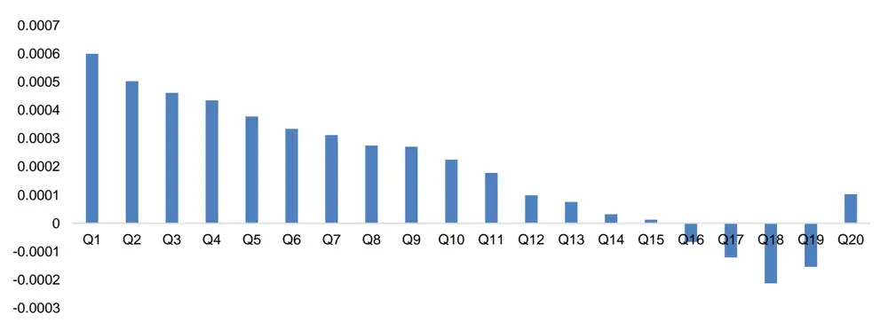
数据来源：通联数据、Wind，广发证券发展研究中心

图 16：MarketSellOrder_LimitBuyOrder_ratio因子在深证A股中净值表现（绝对收益）
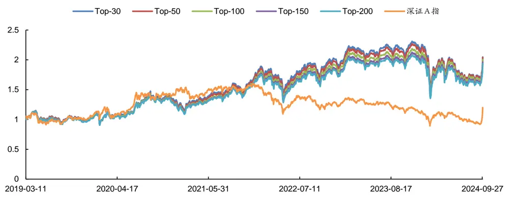
数据来源：通联数据、Wind，广发证券发展研究中心

表 15：MarketSellOrder_LimitBuyOrder_ratio因子在深证A股中分年度表现（相对超额收益）

| 组合 | 年份 | 总收益 | 年化收益率 | 最大回撤率 | 平均换手率 | 年化波动率 | 夏普比率 | 信息比率 |
| --- | --- | --- | --- | --- | --- | --- | --- | --- |
| Top30 深证 A 指超额 | 2019.03~2024.09 | 50.22% | 7.50% | 32.45% | 92.82% | 19.63% | 0.25 | 0.38 |
|  | 2019.03-12 | -3.26% | -3.90% | 11.28% | 91.55% | 16.28% | -0.39 | -0.24 |
|  | 2020年 | -10.52% | -10.43% | 16.67% | 91.29% | 21.83% | -0.59 | -0.48 |
|  | 2021年 | 21.87% | 21.67% | 15.05% | 91.12% | 19.63% | 0.98 | 1.10 |
|  | 2022年 | 32.34% | 32.18% | 9.02% | 95.26% | 18.98% | 1.56 | 1.70 |
|  | 2023年 | 24.97% | 24.86% | 5.94% | 94.67% | 12.32% | 1.82 | 2.02 |
|  | 2024.01~09 | -13.90% | -18.09% | 25.09% | 92.71% | 27.26% | -0.76 | -0.66 |
| Top50 深证 A 指超额 | 2019.03~2024.09 | 49.97% | 7.46% | 33.23% | 90.35% | 19.52% | 0.25 | 0.38 |
|  | 2019.03-12 | -4.42% | -5.28% | 11.35% | 88.62% | 16.20% | -0.48 | -0.33 |
|  | 2020年 | -11.59% | -11.50% | 17.14% | 88.76% | 21.82% | -0.64 | -0.53 |
|  | 2021年 | 23.30% | 23.08% | 14.51% | 88.08% | 19.74% | 1.04 | 1.17 |
|  | 2022年 | 31.42% | 31.27% | 9.42% | 93.12% | 18.89% | 1.52 | 1.66 |
|  | 2023年 | 25.02% | 24.91% | 5.92% | 92.82% | 12.12% | 1.85 | 2.06 |
|  | 2024.01~09 | -12.40% | -16.18% | 23.82% | 90.25% | 26.87% | -0.70 | -0.60 |
| Top100 深证 A 指超额 | 2019.03~2024.09 | 47.48% | 7.15% | 33.63% | 85.55% | 19.37% | 0.24 | 0.37 |
|  | 2019.03-12 | -4.66% | -5.56% | 10.79% | 83.74% | 16.14% | -0.50 | -0.34 |
|  | 2020年 | -12.85% | -12.75% | 17.77% | 83.43% | 21.73% | -0.70 | -0.59 |
|  | 2021年 | 22.43% | 22.23% | 14.58% | 82.89% | 19.74% | 1.00 | 1.13 |
|  | 2022年 | 31.05% | 30.91% | 9.11% | 88.71% | 18.76% | 1.51 |  |
|  | 2023年 | 23.82% | 23.71% | 5.86% | 88.94% | 11.87% | 1.79 | 1.65 |
|  | 2024.01~09 | -10.66% | -13.95% | 22.29% | 84.92% | 26.46% |  | 2.00 |
| Top150 | 2019.03~2024.09 | 44.73% | 6.79% | 33.95% | 81.55% | 19.30% | -0.62 0.22 | -0.53 0.35 |
| 深证 A 指超额 | 2019.03-12 | -5.19% | -6.19% | 10.77% | 79.63% | 16.10% | -0.54 | -0.38 |
|  | 2020年 | -13.30% | -13.20% | 17.83% | 79.26% | 21.61% | -0.73 | -0.61 |

识别风险，发现价值

|  | 2021年 | 21.90% | 21.70% | 14.65% | 78.83% | 19.77% | 0.97 | 1.10 |
| --- | --- | --- | --- | --- | --- | --- | --- | --- |
|  |  | 2022年 | 29.21% 29.07% | 9.18% | 84.56% | 18.70% | 1.42 | 1.56 |
|  | 2023年 2024.01~09 | 23.82% | 23.71% | 5.60% | 85.72% | 11.74% | 1.81 | 2.02 |
| Top200 深证 A 指超额 |  | -9.73% | -12.75% | 21.76% | 80.47% | 26.32% | -0.58 | -0.48 |
|  | 2019.03~2024.09 | 42.80% | 6.53% | 33.94% | 77.93% | 19.24% | 0.21 | 0.34 |
|  | 2019.03-12 | -5.43% | -6.47% | 10.78% | 76.16% | 16.12% | -0.56 | -0.40 |
|  | 2020年 | -13.61% | -13.50% | 18.26% | 75.25% | 21.58% | -0.74 | -0.63 |
|  | 2021年 | 21.62% | 21.43% | 14.43% | 75.03% | 19.71% | 0.96 | 1.09 |
|  | 2022年 | 28.41% | 28.28% | 9.15% | 81.14% | 18.65% | 1.38 | 1.52 |
|  | 2023年 2024.01~09 | 23.06% | 22.95% | 5.43% | 82.49% | 11.63% | 1.76 | 1.97 |
| 深证A指 | 2019.03~2024.09 | -9.06% 20.09% | -11.90% | 21.29% | 76.69% | 26.18% | -0.55 | -0.45 |
|  | 2019.03-12 |  | 3.30% | 44.09% | 1 | 21.55% | 0.04 | 0.15 |
|  | 2020年 | 7.35% | 8.89% | 17.92% | 1 | 21.87% | 0.29 | 0.41 |
|  | 2021年 | 35.25% 8.62% | 34.91% 8.54% | 16.02% | - | 25.17% | 1.29 | 1.39 |
|  | 2022年 |  | -21.86% | 12.48% 30.70% | 1 | 17.85% | 0.34 | 0.48 |
|  | 2023年 | -21.94% -6.97% | -6.95% | 19.36% | - | 22.09% 13.99% | -1.10 | -0.99 |
|  | 2024.01~09 | 4.86% | 6.53% | 21.44% | 1 - | 27.36% | -0.68 0.15 | -0.50 0.24 |

数据来源：通联数据、Wind，广发证券发展研究中心

## （七）MarketSellOrder_LimitSellOrder_ratio 因子表现

MarketSellOrder_LimitSellOrder_ratio因子在深证A股的20档分档收益如图17所示，分档组合收益呈现出较好的单调性。以因子值对深证A指成分股进行排序，分别取Top-30、50、100、150、200个股票构建组合进行测算，结果如图18和表16所示。在2019年3月~2024年9月期间，各组合相对深证A指指数分别取得了7.57%、7.26%、7.16%、6.84%、6.65%的超额年化收益率。

图 17：MarketSellOrder_LimitSellOrder_ratio因子在深证A股中的20档分档表现
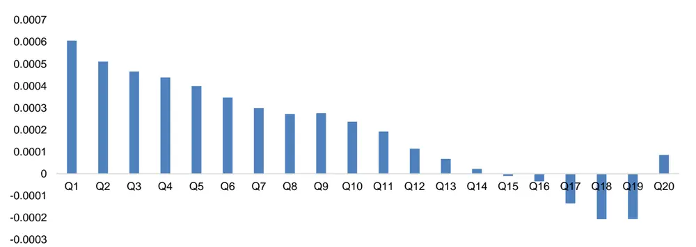
数据来源：通联数据、Wind，广发证券发展研究中心

图 18：MarketSellOrder_LimitSellOrder_ratio因子在深证A股中净值表现（绝对收益）

数据来源：通联数据、Wind，广发证券发展研究中心

表 16：MarketSellOrder_LimitSellOrder_ratio因子在深证A股中分年度表现（相对超额收益）

| 组合 | 年份 | 总收益 | 年化收益率 | 最大回撤率 | 平均换手率 | 年化波动率 | 夏普比率 | 信息比率 |
| --- | --- | --- | --- | --- | --- | --- | --- | --- |
| Top30 深证 A 指超额 | 2019.03~2024.09 | 50.79% | 7.57% | 32.33% | 92.69% | 19.60% | 0.26 | 0.39 |
|  | 2019.03-12 | -3.14% | -3.75% | 11.07% | 91.57% | 16.28% | -0.38 | -0.23 |
|  | 2020年 | -10.32% | -10.24% | 16.69% | 91.07% | 21.76% | -0.59 | -0.47 |
|  | 2021年 | 21.32% | 21.13% | 15.22% | 90.89% | 19.58% | 0.95 | 1.08 |
|  | 2022年 | 32.74% | 32.58% | 8.95% | 95.07% | 18.96% | 1.59 | 1.72 |
|  | 2023年 | 25.23% | 25.11% | 5.88% | 94.44% | 12.29% | 1.84 | 2.04 |
|  | 2024.01~09 | -13.92% | -18.11% | 25.01% | 92.90% | 27.29% | -0.76 | -0.66 |
| Top50 深证 A 指超额 | 2019.03~2024.09 | 48.40% | 7.26% | 33.14% | 90.19% | 19.52% | 0.24 | 0.37 |
|  | 2019.03-12 | -4.31% | -5.15% | 11.48% | 88.71% | 16.17% | -0.47 | -0.32 |
|  | 2020年 | -11.18% | -11.09% | 17.03% | 88.69% | 21.87% | -0.62 | -0.51 |
|  | 2021年 | 21.49% | 21.30% | 14.68% | 87.60% | 19.72% | 0.95 | 1.08 |
|  | 2022年 | 31.21% | 31.06% | 9.36% | 92.71% | 18.90% | 1.51 | 1.64 |
|  | 2023年 | 24.94% | 24.82% | 5.75% | 92.74% | 12.12% | 1.84 | 2.05 |
|  | 2024.01~09 | -12.34% | -16.10% | 23.52% | 90.39% | 26.83% | -0.69 | -0.60 |
| Top100 深证 A 指超额 | 2019.03~2024.09 | 47.56% | 7.16% | 33.53% | 85.34% | 19.36% | 0.24 | 0.37 |
|  | 2019.03-12 | -4.25% | -5.08% |  |  |  |  |  |
|  | 2020年 | -12.73% |  | 10.75% | 83.75% | 16.07% | -0.47 | -0.32 |
|  | 2021年 | 21.47% | -12.63% | 17.44% | 83.19% | 21.75% | -0.70 | -0.58 |
|  | 2022年 |  | 21.28% | 14.63% | 82.46% | 19.76% | 0.95 | 1.08 |
|  | 2023年 | 31.18% | 31.03% | 9.25% | 88.28% | 18.79% | 1.52 | 1.65 |
|  |  | 24.40% | 24.29% | 5.76% | 88.79% | 11.92% | 1.83 | 2.04 |
|  | 2024.01~09 | -10.92% | -14.28% | 21.83% | 85.09% | 26.32% | -0.64 | -0.54 |
| Top150 深证 A 指超额 | 2019.03~2024.09 | 45.12% | 6.84% | 33.91% | 81.19% | 19.31% | 0.22 | 0.35 |
|  | 2019.03-12 | -5.11% | -6.10% | 10.93% | 79.48% | 16.06% | -0.54 | -0.38 |
|  | 2020年 | -13.06% | -12.95% | 17.66% | 78.57% | 21.67% | -0.71 | -0.60 |

识别风险，发现价值

|  | 2021年 | 21.71% | 21.51% | 14.63% | 78.28% | 19.81% | 0.96 | 1.09 |
| --- | --- | --- | --- | --- | --- | --- | --- | --- |
|  | 2022年 | 29.29% | 29.16% | 9.25% | 84.24% | 18.76% | 1.42 | 1.55 |
|  | 2023年 | 23.47% | 23.36% | 5.85% | 85.50% | 11.79% | 1.77 | 1.98 |
|  | 2024.01~09 | -9.47% | -12.42% | 21.33% | 80.40% | 26.21% | -0.57 | -0.47 |
| Top200 深证 A 指超额 | 2019.03~2024.09 | 43.71% | 6.65% | 33.80% | 77.57% | 19.23% | 0.22 | 0.35 |
|  | 2019.03-12 | -5.28% | -6.30% | 10.87% | 76.05% | 16.10% | -0.55 | -0.39 |
|  | 2020年 | -13.30% | -13.19% | 18.10% | 74.67% | 21.62% | -0.73 | -0.61 |
|  | 2021年 | 21.59% | 21.39% | 14.44% | 74.50% | 19.72% | 0.96 | 1.09 |
|  | 2022年 | 28.53% | 28.40% | 9.26% | 80.72% | 18.73% | 1.38 | 1.52 |
|  | 2023年 | 22.98% | 22.88% | 5.71% | 82.14% | 11.66% | 1.75 | 1.96 |
|  | 2024.01~09 | -8.96% | -11.76% | 20.81% | 76.67% | 26.01% | -0.55 | -0.45 |
| 深证A指 | 2019.03~2024.09 | 20.09% | 3.30% | 44.09% | 1 | 21.55% | 0.04 | 0.15 |
|  | 2019.03-12 | 7.35% | 8.89% | 17.92% | 1 | 21.87% | 0.29 | 0.41 |
|  | 2020年 | 35.25% | 34.91% | 16.02% | 1 | 25.17% | 1.29 | 1.39 |
|  | 2021年 | 8.62% | 8.54% | 12.48% | 1 | 17.85% | 0.34 | 0.48 |
|  | 2022年 | -21.94% | -21.86% | 30.70% | - | 22.09% | -1.10 | -0.99 |
|  | 2023年 | -6.97% | -6.95% | 19.36% | 1 | 13.99% | -0.68 | -0.50 |
|  | 2024.01~09 | 4.86% | 6.53% | 21.44% | - | 27.36% | 0.15 | 0.24 |

数据来源：通联数据、Wind，广发证券发展研究中心

## （八）LimitBuyOrder_LimitOrder_ratio 因子表现

LimitBuyOrder_LimitOrder_ratio因子在深证A股的20档分档收益如图19所示，从分档结果来看该因子几乎没有选股能力。以因子值对深证A指成分股进行排序，分别取Top-30、50、100、150、200个股票构建组合进行测算，结果如图20和表17所示。在2019年3月~2024年9月期间，各组合相对深证A指指数均取得了负的超额年化收益率，表明该因子无效。

图 19：LimitBuyOrder_LimitOrder_ratio因子在深证A股中的20档分档表现
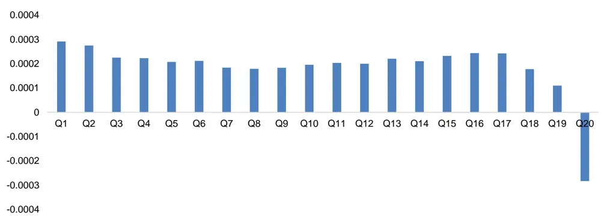
数据来源：通联数据、Wind，广发证券发展研究中心

图 20：LimitBuyOrder_LimitOrder_ratio因子在深证A股中净值表现（绝对收益）
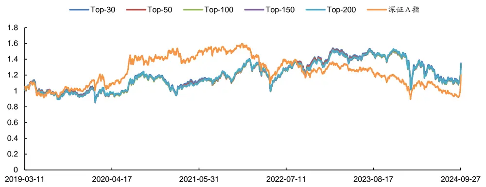
数据来源：通联数据、Wind，广发证券发展研究中心

表 17：LimitBuyOrder_LimitOrder_ratio因子在深证A股中分年度表现（相对超额收益）

| 组合 | 年份 | 总收益 | 年化收益率 | 最大回撤率 | 平均换手率 | 年化波动率 | 夏普比率 | 信息比率 |
| --- | --- | --- | --- | --- | --- | --- | --- | --- |
| Top30 深证 A 指超额 | 2019.03~2024.09 | -1.03% | -0.18% | 42.53% | 83.28% | 19.10% | -0.14 | -0.01 |
|  | 2019.03-12 | -6.90% | -8.22% | 13.01% | 84.13% | 15.85% | -0.68 | -0.52 |
|  | 2020年 | -22.45% | -22.28% | 22.87% | 83.99% | 21.37% | -1.16 | -1.04 |
|  | 2021年 | 10.38% | 10.29% | 14.80% | 79.52% | 19.17% | 0.41 | 0.54 |
|  | 2022年 | 23.77% | 23.66% | 9.96% | 86.60% | 19.24% | 1.10 | 1.23 |
|  | 2023年 | 15.88% | 15.81% | 7.50% | 81.52% | 12.30% | 1.08 | 1.29 |
|  | 2024.01~09 | -13.42% | -17.48% | 18.84% | 84.60% | 25.37% | -0.79 | -0.69 |
| Top50 深证 A 指超额 | 2019.03~2024.09 | -2.57% | -0.46% | 42.92% | 81.28% | 19.09% | -0.16 | -0.02 |
|  | 2019.03-12 | -8.39% | -9.99% | 13.39% | 81.97% | 15.94% | -0.78 | -0.63 |
|  | 2020年 | -22.30% | -22.14% | 22.88% | 82.19% | 21.54% | -1.14 | -1.03 |
|  | 2021年 | 11.12% | 11.02% | 15.01% | 78.39% | 19.09% | 0.45 | 0.58 |
|  | 2022年 | 23.69% | 23.58% | 10.07% | 84.03% | 19.13% | 1.10 | 1.23 |
|  | 2023年 | 16.14% | 16.07% | 7.67% | 79.02% | 12.18% | 1.11 | 1.32 |
|  | 2024.01~09 | -14.25% | -18.53% | 19.19% | 82.75% | 25.31% | -0.83 | -0.73 |
| Top100 深证 A 指超额 | 2019.03~2024.09 | -3.20% | -0.58% | 42.80% | 77.73% | 19.08% | -0.16 | -0.03 |
|  | 2019.03-12 | -9.26% | -11.00% | 13.18% | 78.09% |  | -0.85 |  |
|  | 2020年 | -21.93% |  |  |  | 15.95% |  | -0.69 |
|  | 2021年 | 11.78% | -21.77% | 22.51% | 79.32% | 21.66% | -1.12 | -1.01 |
|  | 2022年 | 22.03% | 11.67% | 15.27% | 75.50% | 19.09% | 0.48 | 0.61 |
|  | 2023年 |  | 21.93% | 10.02% | 79.61% | 19.09% | 1.02 | 1.15 |
|  | 2024.01~09 | 17.90% | 17.82% | 7.50% | 74.78% | 12.13% | 1.26 | 1.47 |
|  |  | -15.04% | -19.53% | 19.36% | 79.89% | 25.19% | -0.87 | -0.78 |
| Top150 深证 A 指超额 | 2019.03~2024.09 | -1.61% | -0.29% | 42.36% | 74.69% | 19.07% | -0.15 | -0.02 |
|  | 2019.03-12 | -9.52% | -11.31% | 13.02% | 75.04% | 16.09% | -0.86 | -0.70 |
|  | 2020年 | -21.12% | -20.97% | 21.68% | 76.50% | 21.70% | -1.08 | -0.97 |

识别风险，发现价值

|  | 2021年 | 11.70% | 11.59% | 15.54% | 72.69% | 19.10% | 0.48 | 0.61 |
| --- | --- | --- | --- | --- | --- | --- | --- | --- |
|  | 2022年 | 21.07% | 20.98% | 10.13% | 76.15% | 19.00% | 0.97 | 1.10 |
|  | 2023年 | 19.10% | 19.02% | 7.33% | 71.59% | 12.09% | 1.37 | 1.57 |
|  | 2024.01~09 | -14.41% | -18.74% | 19.53% | 77.03% | 25.09% | -0.85 | -0.75 |
|  | 2019.03~2024.09 | -0.79% | -0.14% | 42.26% | 72.04% | 19.04% | -0.14 | -0.01 |
| Top200 深证 A 指超额 | 2019.03-12 | -9.22% | -10.96% | 12.69% | 72.33% | 16.13% | -0.83 | -0.68 |
|  | 2020年 | -21.13% | -20.98% | 21.80% | 73.79% | 21.62% | -1.09 | -0.97 |
|  | 2021年 | 11.84% | 11.74% | 15.75% | 70.12% | 19.10% | 0.48 | 0.61 |
|  | 2022年 | 20.68% | 20.58% | 10.40% | 73.30% | 18.98% | 0.95 | 1.08 |
|  | 2023年 | 19.55% | 19.46% | 7.12% | 69.15% | 12.04% | 1.41 | 1.62 |
| 深证A指 | 2024.01~09 | -14.11% | -18.36% | 19.58% | 74.43% | 25.06% | -0.83 | -0.73 |
|  | 2019.03~2024.09 | 20.09% | 3.30% | 44.09% | 1 | 21.55% | 0.04 | 0.15 |
|  | 2019.03-12 | 7.35% | 8.89% | 17.92% |  | 21.87% | 0.29 | 0.41 |
|  | 2020年 | 35.25% | 34.91% | 16.02% | 1 | 25.17% | 1.29 | 1.39 |
|  | 2021年 | 8.62% | 8.54% | 12.48% | 1 | 17.85% | 0.34 | 0.48 |
|  | 2022年 | -21.94% | -21.86% | 30.70% | - | 22.09% | -1.10 | -0.99 |
|  | 2023年 | -6.97% | -6.95% | 19.36% | 1 | 13.99% | -0.68 | -0.50 |
|  | 2024.01~09 | 4.86% | 6.53% | 21.44% | - | 27.36% | 0.15 | 0.24 |

数据来源：通联数据、Wind，广发证券发展研究中心

## 七、总结与展望

如何能在股票市场的博弈中胜出？对于量化投资者来说，关键在于对数据的全面收集，并结合数学模型和算法进行深入分析，从海量数据中挖掘出隐藏的市场规律。Level 1行情数据为3秒一笔的快照（Snapshot）数据，包含了简单的开高低收交易量交易金额等常规数据，所含信息有限。而相比数据频率较低、数据丰富度有限的Level 1数据，Level 2数据中则不仅提供了更为丰富的快照（Snapshot）数据，如10档申买申卖价、10档申买申卖量、最优买卖价前50笔委托、买卖委托价位数、买卖撤单信息等，而且提供了Level 1数据中所不包含的逐笔订单（Tick）数据。

按照交易机制，证券市场主要可分为订单驱动市场和报价驱动市场两种。中国沪深交易所采用的是订单驱动交易机制，即交易是基于买卖双方提交的订单来撮合完成的。订单驱动市场通过限价单和市价单等订单类型来实现交易的执行。

限价订单是指投资者设定一个指定价格，只有当市场价格达到或超过这一价格时，订单才会被执行。在中国A股市场中，绝大部分的订单类型为限价订单。

市价订单则是指提交订单时以当时订单簿中最优价格完成交易，其撮合顺序将优于限价订单，所以市价单的执行可能性大于限价订单，也不像限价单那样具有较高的逆向选择成本。当市场参与者的成交意愿十分强烈时，提交市价订单是成交机会最高的订单方式。

在2024/09/18~2024/09/30期间，市价单占比快速上升，在2024/09/30达到市价单占比的峰值，是历史均值的2倍以上。进一步对市价单中的买卖力量进行统计，在2024/09/30，深证A股的市价单中买单占比达到峰值66%，而在沪深300、中证500、中证800、中证1000板块内的占比更是分别高达77%、85%、82%和90%，表明了市场参与者对于买入的决心。

本文不仅利用Level 2逐笔订单数据对市价订单进行统计，而且构建出了8个市价订单相关因子。市价订单因子与大小单因子、长短单因子、集合竞价因子、Barra风格因子的相关性均较低，是一组较为独立的因子。

在深证A股内，2019年3月至2024年9月期间，采用5日平滑因子以20日换仓进行选股，其中6个因子的RankIC均值大于6.0%，胜率大于70%。其中，MarketSellOrder_LimitSellOrder_ratio因子的选股性能最优，分档组合收益的单调性显著，其RankIC均值为-6.6%、胜率为25%，根据该因子构建的Top-30组合在双边千三计费后的年化收益率为13.66%、最大回撤率为36.72%、夏普比率为0.56，相比同期的深证A指指数取得了7.57%的超额年化收益率。

展望未来，“海量Level 2数据因子挖掘”系列研究报告将继续深入Level 2数据，从海量数据中挖掘出隐藏的市场规律，构建出更多的有效因子。

## 八、风险提示

本文所述模型用量化方法通过历史数据统计、建模和测算完成，所得结论与规律在市场政策、环境变化时存在失效风险；

本文策略在市场结构及交易行为改变时有可能存在失效风险；

因量化模型不同，本文提出的观点可能与其他量化模型结论存在差异。

## [Table_ResearchTeam] 广发金融工程研究小组

罗军 ：首席分析师，华南理工大学硕士，从业 16 年，2010 年进入广发证券发展研究中心。

安 宁 宁 ：首席分析师，暨南大学硕士，从业 14 年，2011 年进入广发证券发展研究中心。

史 庆 盛 ：资深分析师，华南理工大学硕士，2011 年进入广发证券发展研究中心。

张 超 ：资深分析师，中山大学硕士，2012 年进入广发证券发展研究中心。

陈 原 文 ：资深分析师，中山大学硕士，2015 年进入广发证券发展研究中心。

李豪 ：资深分析师，上海交通大学硕士，2016 年进入广发证券发展研究中心。

周 飞 鹏 ：资深分析师，伯明翰大学硕士，2021 年加入广发证券发展研究中心。

张 钰 东 ：资深分析师，中山大学硕士，2020 年进入广发证券发展研究中心。

季 燕 妮 ：资深分析师，厦门大学硕士，2020 年进入广发证券发展研究中心。

林 涛 ：研究员，中山大学硕士，2024 年进入广发证券发展研究中心。

## [Table_IndustryInvestDescription] 广发证券—行业投资评级说明

买入： 预期未来12个月内，股价表现强于大盘10%以上。

持有： 预期未来12个月内，股价相对大盘的变动幅度介于-10%～+10%。

卖出： 预期未来12个月内，股价表现弱于大盘10%以上。

## [Table_CompanyInvestDescription] 广发证券—公司投资评级说明

买入： 预期未来 12 个月内，股价表现强于大盘 15%以上。

增持： 预期未来12个月内，股价表现强于大盘5%-15%。

持有： 预期未来12个月内，股价相对大盘的变动幅度介于-5%～+5%。

卖出： 预期未来12个月内，股价表现弱于大盘5%以上。

## [Table_Address] 联系我们

| 地址 | 广州市 | 深圳市 | 北京市 | 上海市 | 香港 |
| --- | --- | --- | --- | --- | --- |
|  | 广州市天河区马场路 | 深圳市福田区益田路 | 北京市西城区月坛北 | 上海市浦东新区南泉 | 香港湾仔骆克道81号 |
|  | 26号广发证券大厦47 | 6001号太平金融大厦 | 街2号月坛大厦18层 | 北路429号泰康保险 | 广发大厦27 楼 |
|  | 楼 | 31层 |  | 大厦37楼 |  |
|  | 邮政编码 510627 客服邮箱 gfzqyf@gf.com.cn | 518026 | 100045 | 200120 |  |

## [Table_LegalD 法律主体isclaimer 声明]

本报告由广发证券股份有限公司或其关联机构制作，广发证券股份有限公司及其关联机构以下统称为“广发证券”。本报告的分销依据不同国家、地区的法律、法规和监管要求由广发证券于该国家或地区的具有相关合法合规经营资质的子公司/经营机构完成。

广发证券股份有限公司具备中国证监会批复的证券投资咨询业务资格，接受中国证监会监管，负责本报告于中国（港澳台地区除外）的分销。广发证券（香港）经纪有限公司具备香港证监会批复的就证券提供意见（4 号牌照）的牌照，接受香港证监会监管，负责本报告于中国香港地区的分销。

本报告署名研究人员所持中国证券业协会注册分析师资质信息和香港证监会批复的牌照信息已于署名研究人员姓名处披露。

## [Table_I 重要mportant 声明N

广发证券股份有限公司及其关联机构可能与本报告中提及的公司寻求或正在建立业务关系，因此，投资者应当考虑广发证券股份有限公司及其关联机构因可能存在的潜在利益冲突而对本报告的独立性产生影响。投资者不应仅依据本报告内容作出任何投资决策。投资者应自主作出投资决策并自行承担投资风险，任何形式的分享证券投资收益或者分担证券投资损失的书面或者口头承诺均为无效。

本报告署名研究人员、联系人（以下均简称“研究人员”）针对本报告中相关公司或证券的研究分析内容，在此声明：（ ）本报告的全部分析结论、研究观点均精确反映研究人员于本报告发出当日的关于相关公司或证券的所有个人观点，并不代表广发证券的立场；（2）研究人员的部分或全部的报酬无论在过去、现在还是将来均不会与本报告所述特定分析结论、研究观点具有直接或间接的联系。

研究人员制作本报告的报酬标准依据研究质量、客户评价、工作量等多种因素确定，其影响因素亦包括广发证券的整体经营收入，该等经营收入部分来源于广发证券的投资银行类业务。

本报告仅面向经广发证券授权使用的客户/特定合作机构发送，不对外公开发布，只有接收人才可以使用，且对于接收人而言具有保密义务。广发证券并不因相关人员通过其他途径收到或阅读本报告而视其为广发证券的客户。在特定国家或地区传播或者发布本报告可能违反当地法律，广发证券并未采取任何行动以允许于该等国家或地区传播或者分销本报告。

本报告所提及证券可能不被允许在某些国家或地区内出售。请注意，投资涉及风险，证券价格可能会波动，因此投资回报可能会有所变化，过去的业绩并不保证未来的表现。本报告的内容、观点或建议并未考虑任何个别客户的具体投资目标、财务状况和特殊需求，不应被视为对特定客户关于特定证券或金融工具的投资建议。本报告发送给某客户是基于该客户被认为有能力独立评估投资风险、独立行使投资决策并独立承担相应风险。

本报告所载资料的来源及观点的出处皆被广发证券认为可靠，但广发证券不对其准确性、完整性做出任何保证。报告内容仅供参考，报告中的信息或所表达观点不构成所涉证券买卖的出价或询价。广发证券不对因使用本报告的内容而引致的损失承担任何责任，除非法律法规有明确规定。客户不应以本报告取代其独立判断或仅根据本报告做出决策，如有需要，应先咨询专业意见。

广发证券可发出其它与本报告所载信息不一致及有不同结论的报告。本报告反映研究人员的不同观点、见解及分析方法，并不代表广发证券的立场。广发证券的销售人员、交易员或其他专业人士可能以书面或口头形式，向其客户或自营交易部门提供与本报告观点相反的市场评论或交易策略，广发证券的自营交易部门亦可能会有与本报告观点不一致，甚至相反的投资策略。报告所载资料、意见及推测仅反映研究人员于发出本报告当日的判断，可随时更改且无需另行通告。广发证券或其证券研究报告业务的相关董事、高级职员、分析师和员工可能拥有本报告所提及证券的权益。在阅读本报告时，收件人应了解相关的权益披露（若有）。

本研究报告可能包括和/或描述/呈列期货合约价格的事实历史信息（“信息”）。请注意此信息仅供用作组成我们的研究方法/分析中的部分论点依据/证据，以支持我们对所述相关行业/公司的观点的结论。在任何情况下，它并不（明示或暗示）与香港证监会第5类受规管活动（就期货合约提供意见）有关联或构成此活动。

## [Table_Interest 权益披露Disclosur

(1)广发证券（香港）跟本研究报告所述公司在过去12 个月内并没有任何投资银行业务的关系。

## [Table_Copyright] 版权声明

未经广发证券事先书面许可，任何机构或个人不得以任何形式翻版、复制、刊登、转载和引用，否则由此造成的一切不良后果及法律责任由私自翻版、复制、刊登、转载和引用者承担。