# [Table_Title] 用逐笔订单数据改进分钟频因子

## 海量 Level 2 数据因子挖掘系列（六）

## 报告摘要：

数据制胜：如何能在股票市场的博弈中胜出？对于量化投资者来说，关键在于对数据的全面收集，并结合数学模型和算法进行深入分析，从海量数据中挖掘出隐藏的市场规律。

用逐笔订单数据改进分钟频因子：在《基于深度学习的高频数据因子挖掘：多因子 Alpha系列报告之(五十一)》等前序报告中，基于分钟频数据构建了一批有效的 Alpha 因子，其中一个重要逻辑是：基于成交量、涨跌幅、股价等指标对日内重点分钟时段进行区分，然后统计这些重点时段内的量价特征。本文尝试采用逐笔订单数据对分钟频因子进行改进，构建了一批日内重点时段（KeyPeriod）的 Level 2因子。这些新构建的因子包括涨跌、价格、成交金额、量价协同共 4大类、123 个因子，同时予以不同阈值的指标划分标准、以及主买/主卖区分。

33 个涨跌类因子：横盘时段因子 KeyPeriod_ret_zero 的 20 日换仓历史 RankIC 均值为-5.36%、胜率为 85.1%；下跌时段因子 KeyPeriod_ret_low5pct 的 20 日换仓历史 RankIC 均值为 5.47%、胜率为 84.1%。

30 个价格类因子：低价时段因子 KeyPeriod_price_low5pct 的 20 日换仓历史 RankIC 均值为 5.59%、胜率为 85.3%。

30 个成交金额类因子：大成交金额时段因子 KeyPeriod_amount_top30pct 的 20 日换仓历史 RankIC 均值为 11.23%、胜率为 84.8%；小成交金额时段因子 KeyPeriod_amount_low50pct 的 20 日换仓历史RankIC 均值为-10.50%、胜率为 75.0%。

30 个量价协同类因子：量价背离时段因子 KeyPeriod_sync_low50pct的 20 日换仓历史 RankIC 均值为 6.00%、胜率为 81.5%。

风险提示：（1）本文所述模型用量化方法通过历史数据统计、建模和测算完成，所得结论与规律在市场政策、环境变化时存在失效风险；（2）本文策略在市场结构及交易行为改变时有可能存在失效风险；（3）因量化模型不同，本文提出的观点可能与其他量化模型结论存在差异。

图 1：KeyPeriod_ret_zero-RankIC
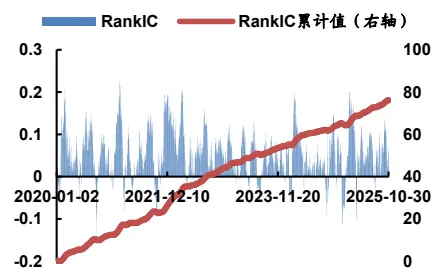
数据来源：通联数据，Wind，广发证券发展研究中心

[分析师： Table_Author]安宁宁

SAC 执证号：S0260512020003

SFC CE No. BNW179

0755-23948352

anningning@gf.com.cn

分析师： 陈原文

同SAC 执证号：S0260517080003

0755-82797057

chenyuanwen@gf.com.cn

请注意，陈原文并非香港证券及期货事务监察委员会的注册持牌人，不可在香港从事受监管活动。

## [Table_ 相关研究：DocRe

牛市中的市价订单与相关因2024-10-17
子: 海量 Level 2 数据因子挖
掘系列（五）

集合竞价因子: 海量 Level 2 2024-09-12数据因子挖掘系列（四）

大小单与长短单的 241 个碰2024-08-21
撞火花：海量Level 2数据因
子挖掘系列（三）
订单维度解耦的 22 个长短单2024-08-01
因子：海量Level 2数据因子
挖掘系列（二）
多维度解耦的 94 个大小单因2024-07-15
子：海量Level 2数据因子挖
掘系列（一）

[联系人： Table_Contacts] 林涛

公0755 - 82528531

gflintao@gf.com.cn

## 一、Level 1 与 Level 2 行情数据介绍

如何能在股票市场的博弈中胜出？关键在于对市场信息的掌握和对市场规律的理解。对于量化投资者来说，更在于对数据的全面收集和深度分析，并结合数学模型和算法，从海量数据中挖掘出隐藏的市场规律。这些规律可能是某些股票价格的趋势，市场的周期性波动，抑或是短期的交易信号。一旦这些规律被发现并加以利用，量化投资者便能在股票市场的博弈中获得优势。

股票行情数据源于上交所和深交所，根据数据的频率和丰富度通常分为Level 1数据和Level 2数据。如表1所示，Level 1数据为3秒一笔的快照（Snapshot）数据，包含了常用行情软件上可以看到的最高价、最低价、开盘价、收盘价、成交量、成交额、成交笔数、委买委卖量、5档申买申卖价、5档申买申卖量等数据。而相比数据频率较低、数据丰富度有限的Level 1数据，Level 2数据中则不仅提供了更为丰富的快照（Snapshot）数据，如10档申买申卖价、10档申买申卖量、最优买卖价前50笔委托、买卖委托价位数、买卖撤单信息等，而且提供了Level 1数据中所不包含的逐笔订单（Tick）数据。逐笔订单数据包含了当日交易时段中集合竞价阶段和连续竞价阶段的每一笔订单数据，其中的关键信息包括精确到毫秒的订单时间、逐笔序号、频道代码、价格、数量、金额、买入卖出订单号和订单类别等详细数据。Level2数据中的逐笔订单数据是一切行情数据的根源，不同频率的快照数据均由逐笔订单数据聚合而成。在“海量Level 2数据因子挖掘”系列研究报告中，将尝试对Level 2数据中详细的快照数据和逐笔订单数据进行深入分析并加以利用，有望能够从中获得更为丰富的价格趋势、周期波动、交易信号等规律和信息，从而挖掘出更为有效的因子，构建出具有超额收益的股票投资组合。

表 1：Level 1与Level 2主要行情数据对比

| 数据类别 | 数据名称 | Level 1 | Level 2 |
| --- | --- | --- | --- |
| 快照数据 (Snapshot) | 时间 | 最快3秒一笔 | 最快3秒一笔 |
|  | 最高价 | V | V |
|  | 最低价 | √ | V |
|  | 开盘价 | √ | √ |
|  | 收盘价 | √ | √ |
|  | 成交数量 | √ | V |
|  | 成交金额 | √ | V |
|  | 成交笔数 | √ | V |
|  | 委买量/委卖量 | V | V |
|  | 申买价/申卖价 | 5档 | 10档 |
|  | 申买量/申卖量 | 5档 | 10档 |
|  | 最优买/卖价前 50 笔委托 | x | V |
|  | 申买/申卖委托笔数 |  |  |
|  | 买入/卖出最大等待时间 | x | V |
|  |  | x | √（仅上交所） |
|  | 买方/卖方委托价位数 | x | √（仅上交所） |
|  | 买入/卖出撤单笔数 | x | √（仅上交所） |

识别风险，发现价值

|  | 买入/卖出撤单数量 x | √（仅上交所） |
| --- | --- | --- |
|  | 买入/卖出撤单金额 | x √（仅上交所） |
|  | 买入/卖出总笔数 | x ✓（仅上交所） |
|  | 时间 | x ✓（精确到毫秒） |
| 逐笔订单数据 (Tick) | 逐笔序号 | √ |
|  | 频道代码 | x |
|  | 价格 | x √ |
|  | 数量 | x V x √ |
|  | 金额 | x V |
|  | 买入订单号 | x √ |
|  | 卖出订单号 |  |
|  | 订单类别 | x V x ✓（委托/成交/撤单） |

数据来源：通联数据、广发证券发展研究中心

## 二、相关研究工作

表 2：海量Level 2数据因子挖掘系列研究报告

| 系列报告 | 标题 | 研究内容简介 | 发表时间 |
| --- | --- | --- | --- |
|  | 多维度解耦的94个大小单因子 | 从所有行情数据的根源——Level2逐笔订单出发，通过“大小订单” 的角度对所有交易订单进行窥探，结合多维度解耦的分析方法构建出 | 2024-07-15 |
|  |  | 了多个有效的大小单因子，并从中挑选出表现优异者构建出了精选大 |  |
|  |  | 小单因子组合。精选大小单因子组合在全市场范围内的历史RankIC |  |
| 二 | 订单维度解耦的22个长短单因子 | 通过“订单成交完成时长”的角度对Level2逐笔订单数据展开研究， | 2024-08-01 |
|  |  | 通过订单维度的解耦分析方法构建出了22个有效的长短单因子，并 |  |
|  |  | 从中挑选出表现优异者构建出了精选长短单因子组合。精选长短单因 |  |
|  |  | 子组合在全市场范围内的历史RankIC均值为13.1%，胜率为80.3%。 |  |
| 三 | 大小单与长短单的241个碰撞火花 | 基于大小单因子和长短单因子之间相关系数范围在-0.19~0.19之间的 较低相关性，进一步尝试同时结合订单的“大小”和“长短”维度对 | 2024-08-21 |
|  |  | 其进行深入剖析，构建出了240个订单因子。进一步的，本文从上述 |  |
|  |  | 240个基于“大小”和“长短”进行解构的订单因子中挑选出表现优 |  |
|  |  | 异者，构建出精选订单因子组合。精选订单因子组合在全市场范围内 |  |
|  |  | 的历史RankIC 均值为13.3%，胜率为 78.3%，同时取得了更为显著 的多头组合收益。 |  |
| 四 | 集合竞价相关因子 | 基于level2数据中的逐笔订单信息，利用集合竞价期间的委托、成交、 | 2024-09-12 |
|  |  | 撤单数据构建出了15个集合竞价相关因子。集合竞价因子与上述大 |  |
|  |  | 小单、长短单及Barra风格因子的相关性较低，其中10个集合竞价 |  |
| 五 | 牛市中的市价订单与相关因子 | 因子的RankIC历史均值大于10%，具有不错的选股性能。 | 2024-10-17 |
|  |  | 本研究首先对2024年“9.24”行情中的市价订单占比进行了统计分 析，然后系统性地构建了若干市价单占比因子。 |  |

数据来源：广发证券发展研究中心

上述5篇“海量Level 2数据因子挖掘”系列研究报告从Level 2逐笔订单数据中挖掘了数百个因子，其中部分绩优因子已纳入广发金工Alpha因子数据库超过1年的时间，期间因子跟踪表现优异。在20200101~20251128期间的全市场月度换仓RankIC指标和分组表现统计如下：

表 3：Level 2系列因子表现分析（全市场，月度换仓）19.
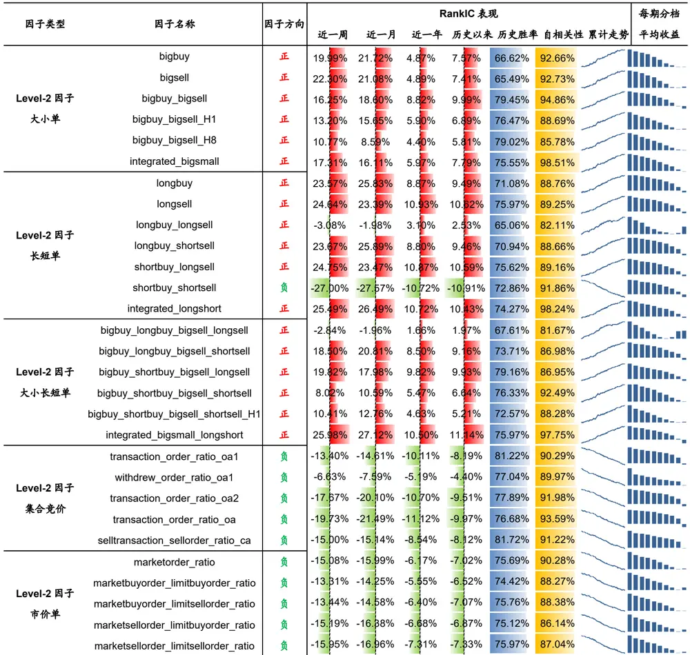
数据来源：Wind，天软科技，通联数据，广发证券发展研究中心-12.

## 三、用逐笔订单数据改进分钟频因子

在《基于深度学习的高频数据因子挖掘：多因子Alpha系列报告之(五十一)》等前序报告中，基于分钟频数据构建了一批有效的Alpha因子，其中一个重要逻辑是：基于成交量、涨跌幅、股价等指标对日内重点分钟时段进行区分，然后统计这些重点时段内的量价特征。基于上述思想，本文尝试采用逐笔订单数据对分钟频因子进行改进，构建了一批日内重点时段（KeyPeriod）的Level 2因子。

重点时段Level 2因子包括涨跌、价格、成交金额、量价协同共4大类、123个因子，同时予以不同阈值的指标划分标准、以及主买/主卖区分。

## （一）涨跌类因子 KeyPeriod_ret

表 4：涨跌类因子KeyPeriod_ret表现统计（201903~202511）

| 因子类型 | 因子名 | 5 日换仓(原始因子)IC 均值 IC 胜率 |  |  | 5 日换仓(5 日平滑因子)IC 均值 IC 胜率 |  |  | 20 日换仓(原始因子)IC 均值 IC 胜率 |  |  | 20 日换仓(5 日平滑因子)IC 均值 IC 胜率 |  |  | 20 日换仓(20 日平滑因子)IC 均值 IC 胜率 |  |  |  |  |  |
| --- | --- | --- | --- | --- | --- | --- | --- | --- | --- | --- | --- | --- | --- | --- | --- | --- | --- | --- | --- |
| 横盘 | KeyPeriod ret zeroKeyPeriod_ret_zero_buyKeyPeriod_ret_zero_sell | -1 | 18% | 72.4% | -3.4 | 9% | 75.6% | -2. | 85% | 81.1% | -5.3 | 6% | 85.1% | -6.6 | 7% | 80.7% |  |  |  |
|  |  | -1 | 53% | 65.5% | -2.2 | 1% | 66.1% | -2.3 | 6% | 72.0% | -3.5 | 9% | 75.1% | -4.1 | 5% | 68.4% |  |  |  |
|  |  | -06 | 3% | 58.1% | -1.3 | 9% | 63.5% | -1.0 | 6% | 63.0% | -2.2 | 6% | 73.5% | -3.3 | 8% | 78.1% |  |  |  |
| 下跌 | KeyPeriod_ret_low5pctKeyPeriod_ret_low10pctKeyPeriod_ret_low20pctKeyPeriod_ret_low30pctKeyPeriod_ret_low50pct | 2. | 11% | 70.2% | 3.8 | 0% | 76.5% | 2.8 | 4% | 76.0% | 5.4 | 7% | 84.1% | 6.5 | 2% | 79.6% |  |  |  |
|  |  | 2 | 20% | 70.1% | 3. | 77% | 75.9% | 2.9 | 3% | 74.9% | 5.3 | 8% | 82.0% | 6.3 | 5% | 80.1% |  |  |  |
|  |  | 1.. | 67% | 64.2% | 2.9 | 0% | 71.1% | 2. | 20% | 67.1% | 4. | 12% | 76.5% | 4.9 | 3% | 76.5% |  |  |  |
|  |  | 0.0 | 5% | 50.5% | -0.1 | 7% | 51.9% | -0.0 | 2% | 50.4% | -0.1 | 8% | 52.6% | -0.4 | 4% | 53.2% |  |  |  |
|  |  | -03 | 2% | 52.5% | -1.1 | 9% | 55.9% | -0.6 | 2% | 54.6% | -1.9 | 4% | 60.8% | -2.8 | 9% | 60.7% |  |  |  |
| 下跌(主买) | KeyPeriod_ret_low5pct_buyKeyPeriod_ret_low10pct_buyKeyPeriod_ret_low20pct_buyKeyPeriod_ret_low30pct_buyKeyPeriod_ret_low50pct_buy | -24 | 1% | 71.0% | -3.0 | 9% | 68.9% | -3.2 | 7% | 74.4% | -4.2 | 4% | 71.8% | -5.1 | 0% | 68.5% |  |  |  |
|  |  | -2 | 65% | 70.0% | -3.5 | 7% | 67.1% | -3.6 | 0% | 73.4% | -4. | 95% | 71.6% | -5.9 | 5% | 67.7% |  |  |  |
|  |  | -2 | 281% | 70.9% | -3.9 | 4% | 68.4% | -3.9 | 0% | 76.3% | -5.6 | 4% | 75.5% | -6.5 | 7% | 70.3% |  |  |  |
|  |  | -2 | 252% | 71.8% | -3.5 | 7% | 70.8% | -3. | 59% | 78.1% | -5.2 | 7% | 78.4% | -6.1 | 5% | 73.4% |  |  |  |
|  |  | -2 | -264% | 69.9% | -3. | 56% | 69.2% | -3.8 | 2% | 77.5% | -5. | 41% | 76.9% | -6.1 | 1% | 71.9% |  |  |  |
| 下跌(主卖) | KeyPeriod_ret_low5pct_sellKeyPeriod_ret_low10pct_sellKeyPeriod_ret_low20pct_sellKeyPeriod_ret_low30pct_sellKeyPeriod_ret_low50pct_sell | 4. | 75% | 75.6% | 5.9 | 7% | 72.7% | 5.9 | 5% | 76.9% | 7.9 | 7% | 77.2% | 7.8 | 0% | 73.1% |  |  |  |
|  |  | 4 | 51% | 72.8% | 5.4 | 47% | 69.9% | 5.6 | 5% | 75.0% | 7.3 | 5% | 75.0% | 7.1 | 9% | 71.5% |  |  |  |
|  |  | 3.3 | 5% | 66.1% | 4. | 7% | 67.0% | 4.2 | 1% | 68.7% | 5.5 | 3% | 70.8% | 5.3 | 0% | 68.7% |  |  |  |
|  |  | 0. | .50% | 51.7% | 0. | 36% | 51.2% | 0.4 | 7% | 52.2% | 0.6 | 3% | 52.9% | 0.4 | 4% | 53.6% |  |  |  |
|  |  | 0.2 | 4% | 50.8% | -0.0 | 8% | 50.3% | 0. | 5% | 50.3% | 0.0 | 8% | 50.6% | 0.0 | 5% | 51.0% |  |  |  |
|  | KeyPeriod_ret_top5pctKeyPeriod_ret_top10pct | 0. | 89% | 59.5% | 1.9 | 1% | 66.7% | 1.3 | 4% | 64.6% | 2.9 | 2% | 73.9% | 3.3 | 5% | 70.5% |  |  |  |
|  |  | 0. | 58% | 55.9% | 1.2 | 9% | 62.7% | 0. | 96% | 59.8% | 2. | 10% | 69.3% | 2.3 | 8% | 66.0% |  |  |  |
| 上涨 | KeyPeriod_ret_top20pctKeyPeriod_ret_top30pctKeyPeriod_ret_top50pct | -0 | 23% | 52.0% | 0.0 | 7% | 51.4% | -0. | 15% | 51.5% | 0.3 | 1% | 51.5% | 0.3 | 0% | 50.9% |  |  |  |
|  |  | -2 | 15% | 63.4% | -3. | 45% | 63.9% | -2.9 | 0% | 67.6% | -4.7 | 0% | 68.6% | -5.5 | 0% | 66.2% |  |  |  |
|  |  | -2 | 246% | 66.7% | -4. | 30% | 71.5% | -3. | 27% | 72.8% | -6.0 | 0% | 77.8% | -7.4 | 5% | 74.0% |  |  |  |
| 上涨(主买) | KeyPeriod_ret_top5pct_buyKeyPeriod_ret_top10pct_buyKeyPeriod_ret_top20pct_buyKeyPeriod_ret_top30pct_buyKeyPeriod_ret_top50pct_buy | 1. | 51% | 65.5% | 2. | 79% | 69.8% | 2. | 07% | 69.9% | 3.9 | 9% | 76.6% | 4.6 | 5% | 73.7% |  |  |  |
|  |  |  |  |  | 1. | 29% | 63.3% | 2.3 | 3% | 68.6% | 1. | 79% | 65.9% | 3.3 | 9% | 74.2% | 4.0 | 5% | 72.4% |
|  |  |  |  | 0. | 76% | 56.4% | 1.5 | 5% | 63.0% | 1.0 | 5% | 58.3% | 2.2 | 1% | 65.7% | 2.7 | 8% | 67.4% |  |
|  |  | y |  |  |  |  |  |  |  |  |  |  |  |  |  |  |  |  |  |
|  |  | -0 | 0.68% | 52.8% | -0. | 98% | 54.5% | -0.9 | 7% | 55.2% | -1.1. | 37% | 57.2% | -1.6 | 4% | 55.2% |  |  |  |
|  |  | -0 | 73% | 53.8% | -1. | 02% | 55.1% | -1. | 00% | 56.6% | -1.4 | 5% | 59.4% | -1.5 | 8% | 57.0% |  |  |  |

识别风险，发现价值
请务必阅读末页的免责声明

| 上涨(主卖) | KeyPeriod_ret_top5pct_sellKeyPeriod_ret_top10pct_sellKeyPeriod_ret_top20pct_sellKeyPeriod_ret_top30pct_sellKeyPeriod_ret_top50pct_sell | -30 | 0% | 68.7% | -4.2 | 4% | 72.2% | -4. | 17% | 75.6% | -5.8 | 2% | 80.6% | -6.0 | 4% | 76.3% |
| --- | --- | --- | --- | --- | --- | --- | --- | --- | --- | --- | --- | --- | --- | --- | --- | --- |
|  |  | -32 | 7% | 69.4% | -4.6 | 4% | 73.2% | -4. | 45% | 75.9% | -6.2 | 5% | 80.5% | -6.3 | 1% | 76.5% |
|  |  | -29 | 2% | 66.8% | -4.0 | 6% | 70.7% | -3.9 | 9% | 72.8% | -5.39% |  | 74.7% | -4.8 | 4% | 69.1% |
|  |  | -06 | 1% | 54.0% | -0.9 | 0% | 54.3% | -0.9 | 5% | 57.0% | -1.1 | 6% | 56.3% | -0.5 | 2% | 56.5% |
|  |  | -1 | 32% | 57.3% | 2 | 99% | 59.9% | -1.9 | 6% | 61.8% | -2.6 | 9% | 63.3% | -1.8 | 9% | 60.2% |

数据来源：通联数据、Wind、广发证券发展研究中心

## （二）价格类因子 KeyPeriod_price

表 5：价格类因子KeyPeriod_price表现统计（201903~202511）

| 因子类型 |  |  | 因子名 | 5 日换仓(原始因子)IC 均值 IC 胜率 |  |  | 5 日换仓(5 日平滑因子)IC 均值 IC 胜率 |  |  | 20 日换仓(原始因子)IC 均值IC 胜率 |  |  | 20 日换仓(5 日平滑因子) |  |  | 20 日换仓(20 日平滑因子)IC 均值 IC 胜率 |  |  |  |  |  |
| --- | --- | --- | --- | --- | --- | --- | --- | --- | --- | --- | --- | --- | --- | --- | --- | --- | --- | --- | --- | --- | --- |
|  |  |  |  |  |  |  |  |  |  |  |  |  | IC 均值IC 胜率 |  |  |  |  |  |  |  |  |
|  |  |  | KeyPeriod_price_low5pct | 2.3 | 7% | 72.5% | 4.3 | 31% | 80.6% | 2.7 | 76% | 73.9% | 5.5 | 9% | 85.3% | 7.2 | 27% | 85.1% |  |  |  |
|  |  |  | KeyPeriod_price_low10pct | 2.2 | 8% | 70.7% | 4.0 | 7% | 78.7% | 2.6 | 5% | 72.8% | 5.2 | 6% | 83.0% | 6.9 | 5% | 83.4% |  |  |  |
|  |  |  |  |  |  | KeyPeriod price low20pctKeyPeriod_price_low30pctKeyPeriod_price_low50pct | 2.0 | 08% | 68.3% | 3.5 | 3% | 75.9% | 2.3 | 3% | 69.6% | 4.5 | 0% | 79.1% | 6.0 | 8% | 80.7% |
| 1.8 | 5% | 66.9% |  |  |  |  | 3.0 | 5% | 73.4% | 2.0 | 4% | 66.2% | 3.8 | 1% | 74.4% | 5.1 | 14% | 76.6% |  |  |  |
| 1.3 | 7% | 60.6% |  |  |  |  | 2. | 11% | 65.5% | 1.4 | 41% | 60.4% | 2.4 | 4% | 66.6% | 3.1 | 10% | 65.8% |  |  |  |
| 低价(主买) |  |  | KeyPeriod_price_low5pct_buyKeyPeriod_price_low10pct_buyKeyPeriod_price_low20pct_buyKeyPeriod_price_low30pct_buyKeyPeriod_price_low50pct_buy | -0.3 | 6% | 53.9% | -0. | 0% | 50.4% | -0.7 | 76% | 57.5% | -0. | 34% | 51.5% | -0.5 | 3% | 54.2% |  |  |  |
|  |  |  |  | -0.3 | 9% | 54.1% | -0.3 | 5% | 50.8% | -0.8 | 3% | 58.3% | -0. | 66% | 54.0% | -0.9 | 6% | 55.1% |  |  |  |
|  |  |  |  | -0.5 | 4% | 55.4% | -0.7 | 7% | 53.7% | -1.0 | 6% | 59.5% | -1. | 21% | 57.8% | -1.5 | 9% | 57.4% |  |  |  |
|  |  |  |  | -0.7 | 73% | 57.0% | -1.1 | 0% | 55.8% | -1.2 | 7% | 60.1% | -1. | 66% | 60.8% | -2.0 | 4% | 59.2% |  |  |  |
|  |  |  |  | -1.0 | 3% | 58.0% | -1.5 | 8% | 59.9% | -1.6 | 6% | 62.4% | -2. | 41% | 65.1% | -2. | 93% | 62.7% |  |  |  |
| 低价(主卖) |  |  | KeyPeriod_price_low5pct_sellKeyPeriod_price_low10pct_sellKeyPeriod_price_low20pct_sellKeyPeriod_price_low30pct_sell | 1.8 | 1% | 60.2% | 3.2 | 4% | 62.9% | 2.2 | 2% | 62.2% | 4.4 | 44% | 66.9% | 5.5 | 8% | 65.7% |  |  |  |
|  |  |  |  | 1.5 | 2% | 58.0% | 2.6 | 3% | 60.1% | 1.8 | 3% | 58.9% | 3.5 | 9% | 63.1% | 4.5 | 5% | 61.9% |  |  |  |
|  |  |  |  | 1.1 | 11% | 55.0% | 1.8 | 6% | 56.8% | 1.2 | 6% | 55.2% | 2.4 | 48% | 59.4% | 3.3 | 4% | 58.3% |  |  |  |
|  |  |  |  | 0.8 | 0% | 53.6% | 1.3 | 2% | 54.4% | 0.8 | 6% | 53.3% | 1.7 | 74% | 57.4% | 2.5 | 4% | 56.7% |  |  |  |
|  |  |  | KeyPeriod_price_low50pct_sell | 0.2 | 9% | 51.3% | 0.4 | 8% | 51.0% | 0.2 | 0% | 50.2% | 0.6 | 2% | 52.5% | 1.3 | 4% | 53.6% |  |  |  |
| 高价 |  |  | KeyPeriod_price_top5pctKeyPeriod_price_top10pct | -0.5 | 8% | 54.4% | -0.4 | 8% | 52.4% | -0.3 | 6% | 50.8% | -0. | 03% | 51.9% | 0.1 | 17% | 53.5% |  |  |  |
|  |  |  |  | -0.8 | 9% | 56.5% | -1. | 9% | 57.5% | -0.7 | 9% | 55.2% | -1.0 | 2% | 56.0% | -1.1 | 5% | 53.7% |  |  |  |
|  |  |  |  |  | KeyPeriod_price_top20pct | -1.3 | 0% | 60.5% | -2.0 | 5% | 63.0% | -1.3 | 6% | 60.0% | -2. | 28% | 64.6% | -2.9 | 5% | 63.9% |  |
|  |  |  | KeyPeriod_price_top30pct | -1.6 | 2% | 63.1% | -2. | 71% | 67.6% | -1. | .76% | 64.2% | -3. | 16% | 70.4% | -4. | 28% | 69.2% |  |  |  |
|  |  |  | KeyPeriod_price_top50pct | -2.1 | 8% | 68.6% | -3.7 | 3% | 74.3% | -2.4 | 9% | 69.5% | -4. | 66% | 78.8% | -6. | 41% | 75.9% |  |  |  |
| 高价(主买) |  |  | KeyPeriod_price_top5pct_buyKeyPeriod_price_top10pct_buyKeyPeriod_price_top20pct_buyKeyPeriod_price_top30pct_buyKeyPeriod_price_top50pct_buy | 0.2 | 9% | 53.3% | 1.1 | 7% | 56.5% | 0.5 | 9% | 57.3% | 1.8 | 9% | 63.1% | 2.7 | 75% | 66.2% |  |  |  |
|  |  |  |  | -0.0 | 4% | 51.9% | 0.5 | 3% | 52.9% | 0.1 | 4% | 53.6% | 0.9 | 7% | 57.3% | 1.7 | 0% | 62.9% |  |  |  |
|  |  |  |  | -0.4 | 8% | 51.5% | -0.3 | 2% | 51.3% | -0.4 | 8% | 51.1% | -0. | 25% | 50.2% | 0.1 | 16% | 55.2% |  |  |  |
|  |  |  |  | -0.8 | 2% | 53.8% | -0.9 | 7% | 55.4% | -0.9 | 3% | 54.9% | -1. | 14% | 55.8% | -1. | 04% | 52.5% |  |  |  |
|  |  |  |  | -1.3 | 3% | 58.9% | -1.9 | 0% | 61.8% | -1.6 | 1% | 60.9% | -2. | 47% | 66.9% | -2. | 92% | 65.4% |  |  |  |
| 高价(主卖) |  |  | KeyPeriod_price_top5pct_sellKeyPeriod_price_top10pct_sellKeyPeriod_price_top20pct_sellKeyPeriod_price_top30pct_sellKeyPeriod_price_top50pct_sell | -1.7 | 2% | 62.5% | -2.8 | 9% | 68.9% | -2.1 | 15% | 64.9% | -3. | 45% | 71.6% | -4. | 24% | 75.4% |  |  |  |
|  |  |  |  | -1.5 | 8% | 61.1% | -2.8 | 5% | 68.0% | -2.0 | 7% | 63.8% | -3. | 46% | 70.0% | -4. | 26% | 75.2% |  |  |  |
|  |  |  |  | -1.4 | 7% | 59.4% | -2.8 | 4% | 66.7% | -2.0 | 3% | 64.0% | -3. | 57% | 70.0% | -4.3 | 8% | 74.5% |  |  |  |
|  |  |  |  | -1.3 | 8% | 58.5% | -2.7 | 4% | 65.5% | -1.9 | 4% | 63.2% | -3. | 48% | 68.0% | -4. | 24% | 73.8% |  |  |  |
|  |  |  |  | -1. | 19% | 57.8% | -2.4 | 8% | 64.3% | -1.1 | 74% | 62.1% | -3. | 14% | 66.4% | -3. | 67% | 70.0% |  |  |  |

数据来源：通联数据、Wind、广发证券发展研究中心
识别风险，发现价值

（三）成交金额类因子 KeyPeriod_amount
表 6：成交金额类因子KeyPeriod_amount表现统计（201903~202511）

| 因子类型 | 因子名 |  | 5 日换仓(原始因子)IC 均值IC 胜率 |  |  | 5 日换仓(5 日平滑因子)IC 均值IC 胜率 |  |  | 20 日换仓(原始因子)IC 均值IC 胜率 |  |  | 20 日换仓(5 日平滑因子) |  |  | 20 日换仓(20 日平滑因子)IC 均值 IC 胜率 |  |  |  |  |
| --- | --- | --- | --- | --- | --- | --- | --- | --- | --- | --- | --- | --- | --- | --- | --- | --- | --- | --- | --- |
|  |  |  |  |  |  |  |  |  |  |  |  | IC 均值 IC 胜率 |  |  |  |  |  |  |  |
| 大成交金额 | KeyPeriod_amount_top5pct |  | 7.5 | 4% | 79.6% | 8.1 | 17% | 76.2% | 10.2 | 4% | 85.2% | 11. | 62% | 82.7% | 10. | 86% | 79.4% |  |  |
|  | KeyPeriod_amount_top10pctKeyPeriod_amount_top20pct |  | 7.8 | 0% | 80.4% | 8.2 | 1% | 76.6% | 10.6 | 5% | 85.7% | 11. | 74% | 82.3% | 10. | 91% | 79.7% |  |  |
|  |  |  | 7.7 | 76% | 80.9% | 8.0 | 7% | 76.6% | 10.6 | 4% | 86.8% | 11. | 61% | 83.5% | 10. | 77% | 80.1% |  |  |
|  | KeyPeriod_amount_top30pctKeyPeriod_amount_top50pct |  | 7.5 | 0% | 81.5% | 7.8 | 2% | 77.2% | 10.2 | 7% | 87.7% | 11. | 23% | 84.8% | 10. | 40% | 80.6% |  |  |
|  |  |  | 6.2 | 25% | 80.4% | 6.6 | 4% | 76.9% | 8.4 | 9% | 86.2% | 9.4 | 44% | 84.4% | 8.6 | 0% | 79.1% |  |  |
| 大成交金额(主买) | KeyPeriod_amount_top5pct_buyKeyPeriod_amount_top10pct_buyKeyPeriod_amount_top20pct_buyKeyPeriod_amount_top30pct_buyKeyPeriod_amount_top50pct_buy |  | 5.6 | 7% | 80.6% | 7.1 | 19% | 77.2% | 7.5 | 2% | 85.7% | 10. | 02% | 83.8% | 9.9 | 2% | 79.3% |  |  |
|  |  |  | 5.5 | 6% | 80.3% | 6.9 | 5% | 77.5% | 7.3 | 7% | 85.4% | 9.6 | 9% | 83.7% | 9.6 | 4% | 79.2% |  |  |
|  |  |  | 4.7 | 71% | 78.8% | 6.1 | 13% | 77.7% | 6.2 | 4% | 83.5% | 8.5 | 8% | 83.9% | 8.8 | 6% | 79.9% |  |  |
|  |  |  | 3.7 | 70% | 74.8% | 5.0 | 9% | 75.7% | 4.8 | 7% | 79.0% | 7.1 | 10% | 82.8% | 7.7 | 71% | 80.1% |  |  |
|  |  |  | 1.5 | 1%1 | 63.0% | 2.3 | 6% | 67.6% | 1.9 | 2% | 65.9% | 3. | 9% | 71.8% | 3.8 | 4% | 71.4% |  |  |
| 大成交金额(主卖) | KeyPeriod_amount_top5pct_sellKeyPeriod_amount_top10pct_sellKeyPeriod_amount_top20pct_sellKeyPeriod_amount_top30pct_sellKeyPeriod_amount_top50pct_sell |  | 3. | 7% | 63.2% | 5.0 | 2% | 68.4% | 3.7 | 5% | 65.8% | 6.5 | 8% | 70.8% | 7.9 | 1% | 68.2% |  |  |
|  |  |  | 3.0 | 5% | 62.0% | 4.7 | 3% | 67.2% | 3.6 | 4% | 64.6% | 6.2 | 2% | 69.9% | 7.5 | 6% | 67.9% |  |  |
|  |  |  | 2.4 | 7% | 58.8% | 3.7 | 9% | 63.8% | 2.9 | 4% | 61.6% | 5.0 | 6% | 66.8% | 6.4 | 8% | 66.6% |  |  |
|  |  |  | 1.9 | 1% | 56.7% | 2.8 | 9% | 60.2% | 2.2 | 3% | 58.6% | 3.8 | 8% | 63.4% | 5.2 | 7% | 64.2% |  |  |
|  |  |  | 0.9 | 2% | 53.1% | 1.2 | 5% | 53.8% | 0.9 | 2% | 52.4% | 1.6 | 4% | 56.0% | 2.7 | 73% | 57.8% |  |  |
| 小成交金额 | KeyPeriod_amount_low5pctKeyPeriod_amount_low10pct |  | -6.2 | 2% | 67.1% | -6.1 | 6% | 65.4% | -9.1 | 1% | 71.6% | -9.2 | 0% | 71.4% | -7.5 | 5% | 67.3% |  |  |
|  |  |  | riod_amount_low10pct | -6.6 | 3% | 68.5% | -6.6 | 1% | 66.9% | -9.6 | 5% | 72.4% | -9.9 | 2% | 72.1% | -8.4 | 8% | 69.0% |  |
|  | 金额 | KeyPeriod_amount_low20pct |  | -6.8 | 3% | 69.6% | -6.8 | 8% | 68.1% | -9.9 | 2% | 74.0% | -10 | 34% | 73.0% | -9.2 | 3% | 71.3% |  |
|  |  |  | KeyPeriod_amount_low30pctKeyPeriod_amount_low50pct |  | -6.8 | 8% | 70.2% | -6.8 | 9% | 68.1% | -10. | 01% | 74.7% | -10 | 43% | 73.9% | -9.5 | 0% | 72.0% |
|  | -6.9 | 0% |  |  | 71.2% | -6.8 | 7% | 69.4% | -10. | 09% | 76.0% | -10 | 50% | 75.0% | -9.6 | 4% | 73.4% |  |  |
| 小成交金额(主买) | KeyPeriod_amount_low5pct_buyKeyPeriod_amount_low10pct_buyKeyPeriod_amount_low20pct_buyKeyPeriod_amount_low30pct_buy |  | -6.2 | 1% | 67.4% | -5.9 | 8% | 64.9% | -9.0 | 4% | 71.8% | -8. | 8% | 71.4% | -6.5 | 3% | 65.5% |  |  |
|  |  |  | -6.7 | 0% | 69.0% | -6.5 | 6% | 67.0% | -9.7 | 2% | 73.3% | -9.7 | 5% | 71.7% | -7.6 | 1% | 66.7% |  |  |
|  |  |  | -6.9 | 0% | 70.1% | -6.9 | 2% | 67.6% | -9.9 | 8% | 74.2% | -10 | 29% | 72.7% | -8.5 | 2% | 68.3% |  |  |
|  |  |  | -6.8 | 8% | 70.4% | -6.9 | 5% | 68.3% | -9.9 | 7% | 75.5% | -10 | 42% | 73.5% | -8.9 | 1% | 69.5% |  |  |
|  | KeyPeriod_amount_low50pct_buy |  | -6.6 | 5% | 71.7% | -6.8 | 5% | 69.2% | -9.7 | 2% | 76.3% | -10 | 40% | 74.8% | -9.1 | 5% | 71.4% |  |  |
| 小成交金额(主卖) | KeyPeriod_amount_low5pct_sellKeyPeriod_amount_low10pct_sellKeyPeriod_amount_low20pct_sellKeyPeriod_amount_low30pct_sellKeyPeriod_amount_low50pct_sell |  | -4.3 | 2% | 68.2% | -4.7 | 4% | 67.5% | -6.2 | 6% | 73.5% | -6. | 3% | 71.3% | -5.5 | 1% | 65.4% |  |  |
|  |  |  | -4.9 | 6% | 69.9% | -5.6 | 2% | 68.8% | -7.1 | 1% | 74.7% | -8.0 | 4% | 72.2% | -6.7 | 9% | 66.3% |  |  |
|  |  |  | -5.4 | 3% | 71.2% | -6.2 | 7% | 69.8% | -7.7 | .78% | 76.0% | -9. | 1% | 74.0% | -8.0 | 0% | 68.6% |  |  |
|  |  |  | -5.6 | 2% | 72.7% | -6.5 | 5% | 70.9% | -8.0 | 5% | 76.9% | -9.4 | 5% | 75.5% | -8.6 | 3% | 71.1% |  |  |
|  |  |  | -5.6 | 3% | 74.1% | -6.7 | 1% | 72.9% | -8.0 | 1% | 78.6% | -9.6 | 8% | 77.8% | -9.0 | 8% | 74.4% |  |  |

数据来源：通联数据、Wind、广发证券发展研究中心

（四）量价协同类因子 KeyPeriod_sync
表 7：量价协同类因子KeyPeriod_sync表现统计（201903~202511）

| 因子类型 | 因子名 | 5 日换仓(原始因子)IC 均值IC 胜率 |  |  | 5 日换仓(5 日平滑因子)IC 均值IC 胜率 |  |  | 20 日换仓(原始因子)IC 均值IC 胜率 |  |  | 20 日换仓(5 日平滑因子)IC 均值IC 胜率 |  |  | 20 日换仓(20 日平滑因子)IC 均值 IC 胜率 |  |  |  |
| --- | --- | --- | --- | --- | --- | --- | --- | --- | --- | --- | --- | --- | --- | --- | --- | --- | --- |
| 量价协同 | KeyPeriod_sync_top5pctKeyPeriod_sync_top10pct | -1.5 | 9% | 60.7% | -1.8 | 8% | 56.9% | -2.3 | 4% | 66.3% | -2.9 | 3% | 61.6% |  | 24% | 58.7% |  |
|  |  | -1.1 | 2% | 57.8% | -1.2 | 0% | 53.8% | -1.6 | 4% | 63.2% | -1.9 | 1% | 57.8% | -2 | 05% | 55.3% |  |
|  |  |  |  |  |  |  |  |  |  |  |  |  |  |  |  |  | KeyPeriod_sync_top20pctKeyPeriod_sync_top30pctKeyPeriod_sync_top50pct |
|  | -0.4 | 5% | 54.9% | -0.2 | 8% | 50.2% | -0.6 | 6% | 56.4% | -0.5 | 2% | 53.6% | -0 | 46% | 51.3% |  |  |
|  | -0.3 | 5% | 54.2% | -0.2 | 2% | 50.3% | -0.4 | 0% | 54.2% | -0.3 | 0% | 52.2% | -0 | 29% | 52.3% |  |  |
|  | -1.0 | 5% | 66.4% | -1. | .79% | 69.9% | -1.2 | 3% | 68.4% | -2.2 | 3% | 73.9% | -3 | 337% | 75.8% |  |  |
| 量价协同(主买) | KeyPeriod_sync_top5pct_buyKeyPeriod_sync_top10pct_buyKeyPeriod_sync_top20pct_buyKeyPeriod_sync_top30pct_buyKeyPeriod_sync_top50pct_buy | 1.10 | % | 54.7% | 2.4 | 49% | 57.2% | 1.30 | %% | 54.5% | 3.2 | 0% | 56.4% | 3 | 93% | 55.3% |  |
|  |  | 1.500 | % | 56.8% | 2.8 | 4% | 57.8% | 1.88 | % | 55.6% | 3.6 | 8% | 57.3% | 4 | 26% | 56.2% |  |
|  |  | 1.82 | % | 57.4% | 3.0 | 9% | 57.6% | 2.31 | % | 56.7% | 4.0 | 5% | 58.1% |  | 449% | 55.9% |  |
|  |  | 1.609 | % | 55.2% | 2.8 | 4% | 57.0% | 2.089 | % | 55.9% | 3. | 1% | 56.9% |  | 22% | 55.0% |  |
|  |  | 0.76 | %0 | 52.4% | 1.5 | 9% | 54.4% | 1.03 | %0 | 52.1% | 2. | 10% | 54.3% | 2 | 70% | 52.9% |  |
| 量价协同(主卖) | KeyPeriod_sync_top5pct_sellKeyPeriod_sync_top10pct_sellKeyPeriod_sync_top20pct_sellKeyPeriod_sync_top30pct_sellKeyPeriod_sync_top50pct_sell | -1.1 | 0% | 63.2% | -0.6 | 7% | 56.3% | -1.8 | 6% | 69.8% | -1.2 | 3% | 62.2% | -0 | 53% | 56.2% |  |
|  |  | -1.4 | 7% | 63.4% | -1.6 | 3% | 59.9% | -2.3 | 7% | 67.9% | -2.5 | 3% | 67.3% | -2 | .27% | 64.0% |  |
|  |  | -1.6 | 2% | 59.8% | -2. | 10% | 59.7% | -2.5 | 2% | 64.4% | -3.0 | 3% | 64.6% | -2 | 83% | 62.9% |  |
|  |  | -1.5 | 8% | 58.7% | -2.1 | 7% | 59.4% | -2.4 | 3% | 61.9% | -3.0 | 7% | 63.9% | -2 | 85% | 62.2% |  |
|  |  | -1.2 | 2% | 57.9% | -1.8 | 7% | 59.0% | -1.9 | 5% | 60.8% | -2.6 | 6% | 62.9% | -2 | 256% | 62.5% |  |
| 量价背离 | KeyPeriod_sync_low5pctKeyPeriod_sync_low10pctKeyPeriod_sync_low20pct | -0.7 | 7% | 53.5% | -0.3 | 7% | 51.3% | -1.1 | 6% | 54.7% | -0.7 | 4% | 51.7% | -0 | 46% | 50.1% |  |
|  |  | 0.12 | % | 52.5% | 0.9 | 3% | 56.4% | 0.08 | % | 51.4% | 1. | 12% | 53.8% |  | 71% | 55.0% |  |
|  |  | 1.47 | % | 65.1% | 2.8 | 7% | 67.4% | 1.909 | % | 64.1% | 3.8 | 9% | 70.4% | 5 | 10% | 70.9% |  |
|  | KeyPeriod_sync_low30pctKeyPeriod_sync_low50pct | 2.239 | % | 73.7% | 3.9 | 3% | 75.8% | 2.94 | %9 | 77.6% | 5.4 | 0% | 80.2% | 6 | 83% | 79.5% |  |
|  |  | 2.479 | % | 75.3% | 4.1 | 19% | 75.9% | 3.39 | %9 | 80.2% | 6.0 | 0% | 81.5% | 7 | 61% | 81.3% |  |
| 量价背离(主买) | KeyPeriod_sync_low5pct_buy | -3.5 | 7% | 60.4% | -3.5 | 2% | 57.9% | -4.9 | 2% | 61.8% | -5.0 | 0% | 58.6% |  | 53% | 55.3% |  |
|  | KeyPeriod_sync_low10pct_buyKeyPeriod_sync_low20pct_buyKeyPeriod_sync_low30pct_buyKeyPeriod_sync_low50pct_buy | -3.1 | 3% | 59.3% | -3.0 | 9% | 56.3% | -4.3 | 2% | 59.8% | -4.3 | 3% | 56.4% | -3 | 77% | 54.5% |  |
|  |  | -2.3 | 6% | 57.7% | -2.3 | 4% | 54.5% | -3.2 | 3% | 57.5% | -3.2 | 6% | 54.5% | -2 | 277% | 53.0% |  |
|  |  | -1.9 | 1% | 56.2% | -1.9 | 9% | 53.7% | -2.5 | 6% | 56.8% | -2.7 | 1% | 53.7% | -2 | 31% | 52.2% |  |
|  |  | -1.6 | 3% | 56.6% | -2.0 | 2% | 55.6% | -2.0 | 7% | 57.4% | -2.5 | 7% | 55.6% | -2 | 237% | 52.3% |  |
| 量价背离(主卖) | KeyPeriod_sync_low5pct_sellKeyPeriod_sync_low10pct_sellKeyPeriod_sync_low20pct_sellKeyPeriod_sync_low30pct_sell | -0.5 | 1% | 53.9% | 0.1 | 9% | 52.9% | -0.7 | 1% | 54.6% | 0.4 | 8% | 51.9% |  | 44% | 55.7% |  |
|  |  | 0.28 | % | 51.8% | 1.2 | 4% | 58.4% | 0.37 | % | 53.6% | 1.9 | 2% | 61.6% | 3 | 12% | 62.3% |  |
|  |  | 1.249 | % | 56.6% | 2.4 | 49% | 64.4% | 1.58 | % | 60.9% | 3.5 | 9% | 68.0% | 5 | 35% | 71.3% |  |
|  |  | 1.67 | % | 58.7% | 2.9 | 5% | 62.4% | 2.06 | 9% | 61.1% | 4. | 4% | 68.7% | 5 | 90% | 69.0% |  |
|  | KeyPeriod_sync_low50pct_sell | 1.59 | olo | 56.0% | 2.5 | 3% | 56.9% | 1.80 | % | 57.4% | 3.4 | 41% | 62.3% | 4 | 77% | 63.4% |  |

数据来源：通联数据、Wind、广发证券发展研究中心

| 日期 | 总收益 | 年化收益率 | 最大回撤率 | 年化波动率 | 信息比率 | 夏普比率 | 收益回撤比 |
| --- | --- | --- | --- | --- | --- | --- | --- |
| 2020-2025 | 12.45% | 2.03% | -3.13% | 2.25% | 0.90 | -0.21 | 0.65 |
| 2020 | 1.98% | 2.12% | -1.27% | 2.12% | 1.00 | -0.18 | 1.67 |
| 2021 | 0.22% | 0.22% | -2.36% | 2.22% | 0.10 | -1.02 | 0.09 |
| 2022 | 2.57% | 2.58% | -1.41% | 2.16% | 1.19 | 0.04 | 1.82 |
| 2023 | 3.54% | 3.56% | -1.51% | 1.77% | 2.01 | 0.60 | 2.36 |
| 2024 | -0.43% | -0.43% | -3.13% | 2.94% | -0.15 | -0.99 | -0.14 |
| 2025 | 4.04% | 4.47% | -0.88% | 2.07% | 2.16 | 0.95 | 5.06 |

| 日期 | 总收益 | 年化收益率 | 最大回撤率 | 年化波动率 | 信息比率 | 夏普比率 | 收益回撤比 |
| --- | --- | --- | --- | --- | --- | --- | --- |
| 2020-2025 | 14.94% | 2.41% | -2.45% | 1.87% | 1.29 | -0.05 | 0.98 |
| 2020 | 2.10% | 2.25% | -1.39% | 1.77% | 1.27 | -0.14 | 1.62 |
| 2021 | 1.88% | 1.88% | -1.16% | 1.92% | 0.98 | -0.32 | 1.61 |
| 2022 | 2.03% | 2.03% | -1.62% | 1.95% | 1.05 | -0.24 | 1.26 |
| 2023 | 3.05% | 3.06% | -1.15% | 1.51% | 2.03 | 0.37 | 2.67 |
| 2024 | 0.46% | 0.46% | -2.37% | 2.19% | 0.21 | -0.93 | 0.19 |
| 2025 | 4.62% | 5.12% | -1.00% | 1.79% | 2.85 | 1.46 | 5.13 |

## 四、选股表现

本文从上述4大类、123个重点时段因子中挑选出6个表现较优的因子进行单因子测试，这些因子在2020年1月1日~2025年11月28日间在全市场以月度换仓的RankIC指标、10分档平均收益，以及在各大板块内的指数增强表现如下图所示。整体而言，这些因子的RankIC累计走势单调，具有较好的个股分档能力。

## （一）KeyPeriod_ret_zero 因子

图 1：KeyPeriod_ret_zero-RankIC
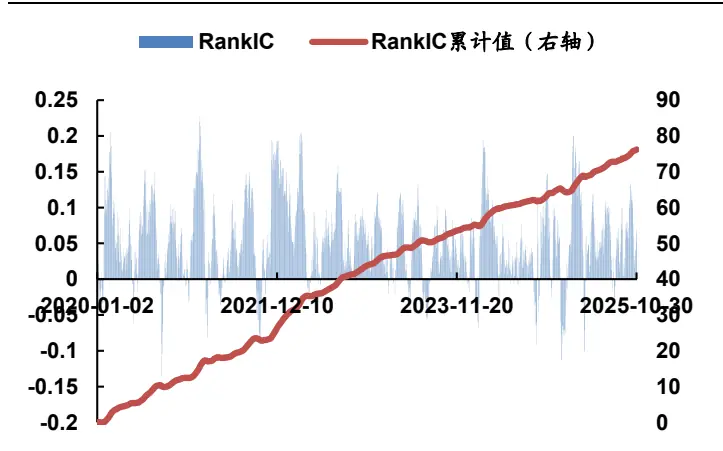
数据来源：通联数据、Wind，广发证券发展研究中心

图 2：KeyPeriod_ret_zero-十分档收益
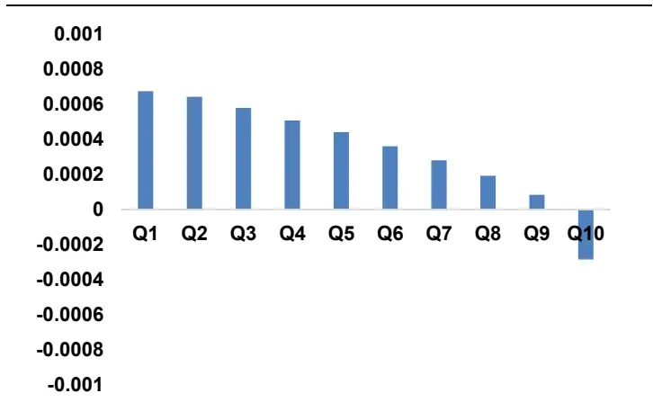
数据来源：通联数据、Wind，广发证券发展研究中心

图 3：KeyPeriod_ret_zero-沪深300
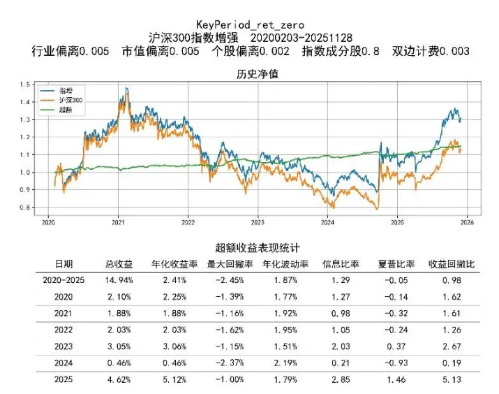
数据来源：通联数据、Wind，广发证券发展研究中心

图 4：KeyPeriod_ret_zero-中证A500
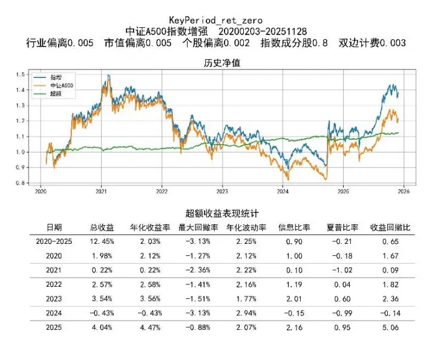
数据来源：通联数据、Wind，广发证券发展研究中心

图 5：KeyPeriod_ret_zero-中证500
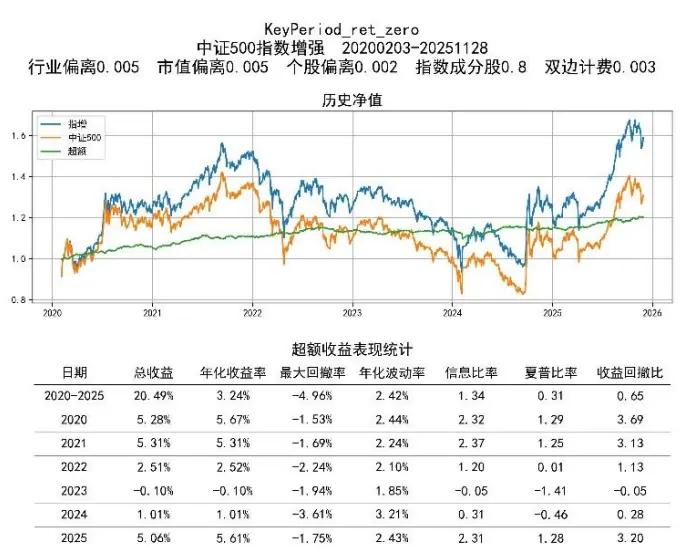

| 日期 | 总收益 | 年化收益率 | 最大回撤率 | 年化波动率 | 信息比率 | 夏普比率 | 收益回撤比 |
| --- | --- | --- | --- | --- | --- | --- | --- |
| 2020-2025 | 20.49% | 3.24% | -4.96% | 2.42% | 1.34 | 0.31 | 0.65 |
| 2020 | 5.28% | 5.67% | -1.53% | 2.44% | 2.32 | 1.29 | 3.69 |
| 2021 | 5.31% | 5.31% | -1.69% | 2.24% | 2.37 | 1.25 | 3.13 |
| 2022 | 2.51% | 2.52% | -2.24% | 2.10% | 1.20 | 0.01 | 1.13 |
| 2023 | -0.10% | -0.10% | -1.94% | 1.85% | -0.05 | -1.41 | -0.05 |
| 2024 | 1.01% | 1.01% | -3.61% | 3.21% | 0.31 | -0.46 | 0.28 |
| 2025 | 5.06% | 5.61% | -1.75% | 2.43% | 2.31 | 1.28 | 3.20 |

数据来源：通联数据、Wind，广发证券发展研究中心

图 6：KeyPeriod_ret_zero-中证800
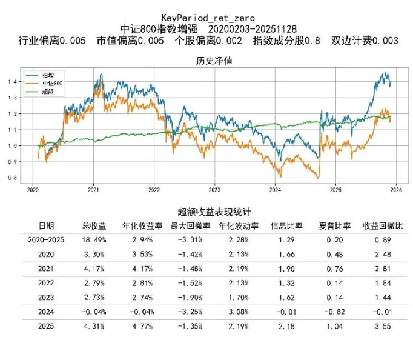

| 日期 | 总收益 | 年化收益率 | 最大回撤率 | 年化波动率 | 信息比率 | 夏普比率 | 收益回撤比 |
| --- | --- | --- | --- | --- | --- | --- | --- |
| 2020-2025 | 18.49% | 2.94% | -3.31% | 2.28% | 1.29 | 0.20 | 0.89 |
| 2020 | 3.30% | 3.53% | -1.42% | 2.13% | 1.66 | 0.48 | 2.48 |
| 2021 | 4.17% | 4.17% | -1.48% | 2.19% | 1.90 | 0.76 | 2.81 |
| 2022 | 2.79% | 2.81% | -1.52% | 2.13% | 1.32 | 0.14 | 1.84 |
| 2023 | 2.73% | 2.74% | -1.90% | 1.70% | 1.62 | 0.14 | 1.44 |
| 2024 | -0.04% | -0.04% | -3.25% | 3.08% | -0.01 | -0.82 | -0.01 |
| 2025 | 4.31% | 4.77% | -1.35% | 2.19% | 2.18 | 1.04 | 3.55 |

数据来源：通联数据、Wind，广发证券发展研究中心

图 7：KeyPeriod_ret_zero-中证1000
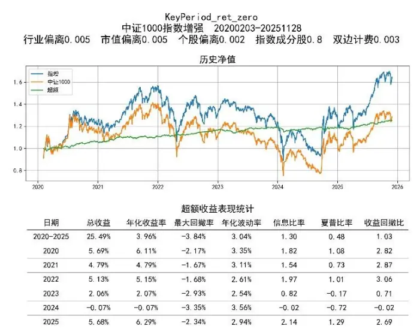

| 日期 | 总收益 | 年化收益率 | 最大回撤率 | 年化波动率 | 信息比率 | 夏普比率 | 收益回撤比 |
| --- | --- | --- | --- | --- | --- | --- | --- |
| 2020-2025 | 25.49% | 3.96% | -3.84% | 3.04% | 1.30 | 0.48 | 1.03 |
| 2020 | 5.69% | 6.11% | -2.17% | 3.35% | 1.82 | 1.08 | 2.82 |
| 2021 | 4.79% | 4.79% | -1.67% | 3.11% | 1.54 | 0.73 | 2.87 |
| 2022 | 5.13% | 5.15% | -1.68% | 2.61% | 1.97 | 1.01 | 3.06 |
| 2023 | 2.06% | 2.07% | -2.93% | 2.54% | 0.82 | -0.17 | 0.71 |
| 2024 | -0.07% | -0.07% | -3.35% | 3.56% | -0.02 | -0.72 | -0.02 |
| 2025 | 5.68% | 6.29% | -2.34% | 2.94% | 2.14 | 1.29 | 2.69 |

数据来源：通联数据、Wind，广发证券发展研究中心

图 8：KeyPeriod_ret_zero-中证全指
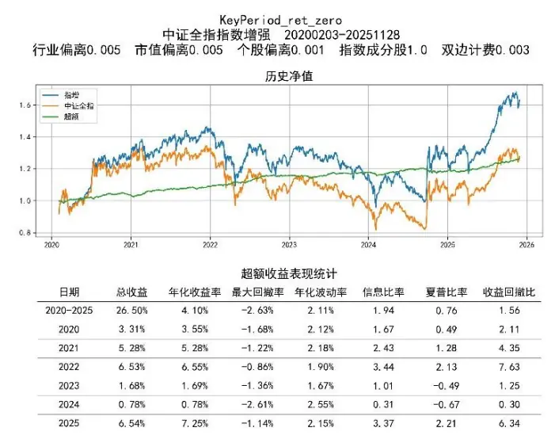

| 日期 | 总收益 | 年化收益率 | 最大回撤率 | 年化波动率 | 信息比率 | 夏普比率 | 收益回撤比 |
| --- | --- | --- | --- | --- | --- | --- | --- |
| 2020-2025 | 26.50% | 4.10% | -2.63% | 2.11% | 1.94 | 0.76 | 1.56 |
| 2020 | 3.31% | 3.55% | -1.68% | 2.12% | 1.67 | 0.49 | 2.11 |
| 2021 | 5.28% | 5.28% | -1.22% | 2.18% | 2.43 | 1.28 | 4.35 |
| 2022 | 6.53% | 6.55% | -0.86% | 1.90% | 3.44 | 2.13 | 7.63 |
| 2023 | 1.68% | 1.69% | -1.36% | 1.67% | 1.01 | -0.49 | 1.25 |
| 2024 | 0.78% | 0.78% | -2.61% | 2.55% | 0.31 | -0.67 | 0.30 |
| 2025 | 6.54% | 7.25% | -1.14% | 2.15% | 3.37 | 2.21 | 6.34 |

数据来源：通联数据、Wind，广发证券发展研究中心

| 日期 | 总收益 | 年化收益率 | 最大回撤率 | 年化波动率 | 信息比率 | 夏普比率 | 收益回撤比 |
| --- | --- | --- | --- | --- | --- | --- | --- |
| 2020-2025 | 23.96% | 3.74% | -2.84% | 1.92% | 1.95 | 0.65 | 1.32 |
| 2020 | 3.84% | 4.12% | -0.95% | 1.73% | 2.38 | 0.94 | 4.35 |
| 2021 | 3.79% | 3.79% | -1.13% | 2.22% | 1.71 | 0.58 | 3.35 |
| 2022 | 4.40% | 4.42% | -1.19% | 1.79% | 2.46 | 1.07 | 3.72 |
| 2023 | 4.40% | 4.42% | -0.73% | 1.61% | 2.75 | 1.19 | 6.02 |
| 2024 | 2.56% | 2.57% | -2.84% | 2.37% | 1.09 | 0.03 | 0.91 |
| 2025 | 2.89% | 3.20% | -1.36% | 1.66% | 1.93 | 0.42 | 2.36 |

| 日期 | 总收益 | 年化收益率 | 最大回撤率 | 年化波动率 | 信息比率 | 夏普比率 | 收益回撤比 |
| --- | --- | --- | --- | --- | --- | --- | --- |
| 2020-2025 | 23.97% | 3.74% | -4.05% | 2.48% | 1.51 | 0.50 | 0.92 |
| 2020 | 3.96% | 4.24% | -1.56% | 2.43% | 1.75 | 0.72 | 2.71 |
| 2021 | 2.94% | 2.94% | -2.20% | 2.57% | 1.14 | 0.17 | 1.33 |
| 2022 | 6.15% | 6.17% | -1.01% | 2.20% | 2.80 | 1.67 | 6.09 |
| 2023 | 5.65% | 5.67% | -0.77% | 1.95% | 2.91 | 1.63 | 7.37 |
| 2024 | 2.07% | 2.08% | -4.05% | 3.19% | 0.65 | -0.13 | 0.51 |
| 2025 | 1.21% | 1.33% | -2.94% | 2.35% | 0.57 | -0.50 | 0.45 |

## （二）KeyPeriod_ret_low5pct 因子

图 9：KeyPeriod_ret_low5pct-RankIC
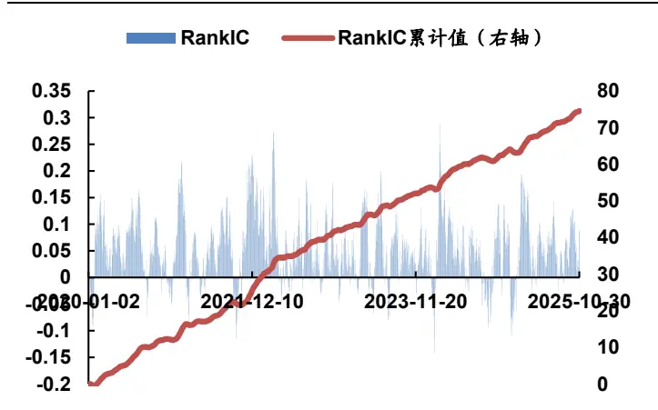
数据来源：通联数据、Wind，广发证券发展研究中心

图 10：KeyPeriod_ret_low5pct-十分档收益
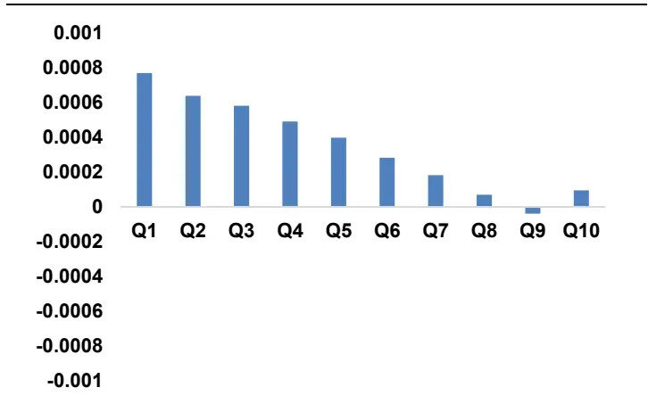
数据来源：通联数据、Wind，广发证券发展研究中心

图 11：KeyPeriod_ret_low5pct-沪深300
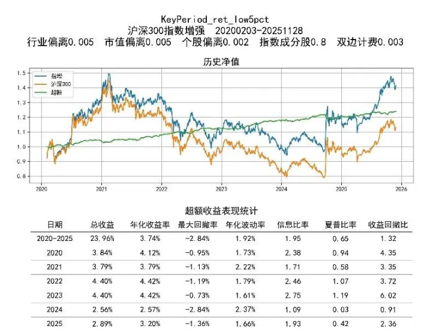
数据来源：通联数据、Wind，广发证券发展研究中心

图 12：KeyPeriod_ret_low5pct-中证A500
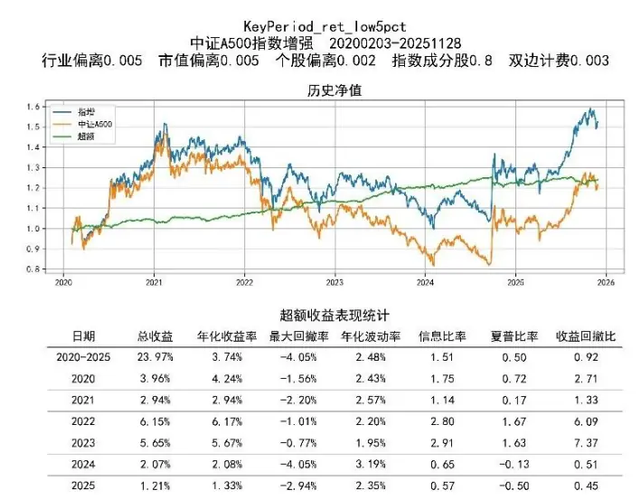
数据来源：通联数据、Wind，广发证券发展研究中心

图 13：KeyPeriod_ret_low5pct-中证500
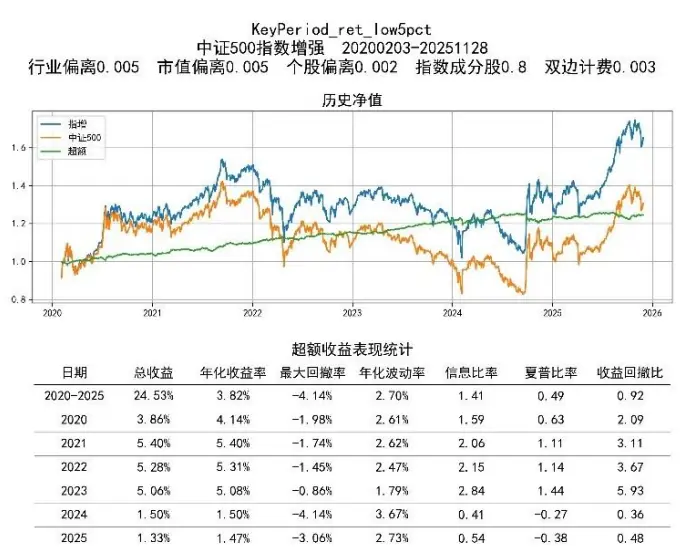

| 日期 | 总收益 | 年化收益率 | 最大回撤率 | 年化波动率 | 信息比率 | 夏普比率 | 收益回撤比 |
| --- | --- | --- | --- | --- | --- | --- | --- |
| 2020-2025 | 24.53% | 3.82% | -4.14% | 2.70% | 1.41 | 0.49 | 0.92 |
| 2020 | 3.86% | 4.14% | -1.98% | 2.61% | 1.59 | 0.63 | 2.09 |
| 2021 | 5.40% | 5.40% | -1.74% | 2.62% | 2.06 | 1.11 | 3.11 |
| 2022 | 5.28% | 5.31% | -1.45% | 2.47% | 2.15 | 1.14 | 3.67 |
| 2023 | 5.06% | 5.08% | -0.86% | 1.79% | 2.84 | 1.44 | 5.93 |
| 2024 | 1.50% | 1.50% | -4.14% | 3.67% | 0.41 | -0.27 | 0.36 |
| 2025 | 1.33% | 1.47% | -3.06% | 2.73% | 0.54 | -0.38 | 0.48 |

数据来源：通联数据、Wind，广发证券发展研究中心

图 14：KeyPeriod_ret_low5pct-中证800
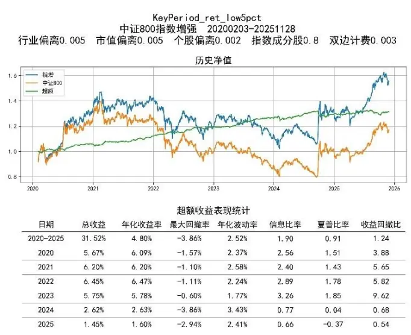

| 日期 | 总收益 | 年化收益率 | 最大回撤率 | 年化波动率 | 信息比率 | 夏普比率 | 收益回撤比 |
| --- | --- | --- | --- | --- | --- | --- | --- |
| 2020-2025 | 31.52% | 4.80% | -3.86% | 2.52% | 1.90 | 0.91 | 1.24 |
| 2020 | 5.67% | 6.09% | -1.57% | 2.37% | 2.56 | 1.51 | 3.88 |
| 2021 | 6.20% | 6.20% | -1.10% | 2.58% | 2.40 | 1.43 | 5.65 |
| 2022 | 6.45% | 6.47% | -1.11% | 2.24% | 2.89 | 1.78 | 5.82 |
| 2023 | 5.75% | 5.78% | -0.60% | 1.77% | 3.26 | 1.85 | 9.62 |
| 2024 | 2.62% | 2.63% | -3.86% | 3.43% | 0.77 | 0.04 | 0.68 |
| 2025 | 1.45% | 1.60% | -2.94% | 2.41% | 0.66 | -0.37 | 0.54 |

数据来源：通联数据、Wind，广发证券发展研究中心

图 15：KeyPeriod_ret_low5pct-中证1000
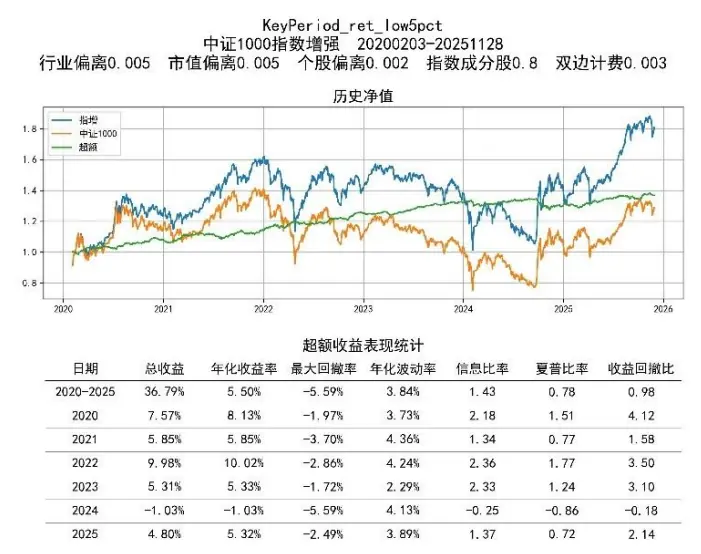

| 日期 | 总收益 | 年化收益率 | 最大回撤率 | 年化波动率 | 信息比率 | 夏普比率 | 收益回撤比 |
| --- | --- | --- | --- | --- | --- | --- | --- |
| 2020-2025 | 36.79% | 5.50% | -5.59% | 3.84% | 1.43 | 0.78 | 0.98 |
| 2020 | 7.57% | 8.13% | -1.97% | 3.73% | 2.18 | 1.51 | 4.12 |
| 2021 | 5.85% | 5.85% | -3.70% | 4.36% | 1.34 | 0.77 | 1.58 |
| 2022 | 9.98% | 10.02% | -2.86% | 4.24% | 2.36 | 1.77 | 3.50 |
| 2023 | 5.31% | 5.33% | -1.72% | 2.29% | 2.33 | 1.24 | 3.10 |
| 2024 | -1.03% | -1.03% | -5.59% | 4.13% | -0.25 | -0.86 | -0.18 |
| 2025 | 4.80% | 5.32% | -2.49% | 3.89% | 1.37 | 0.72 | 2.14 |

数据来源：通联数据、Wind，广发证券发展研究中心

图 16：KeyPeriod_ret_low5pct-中证全指
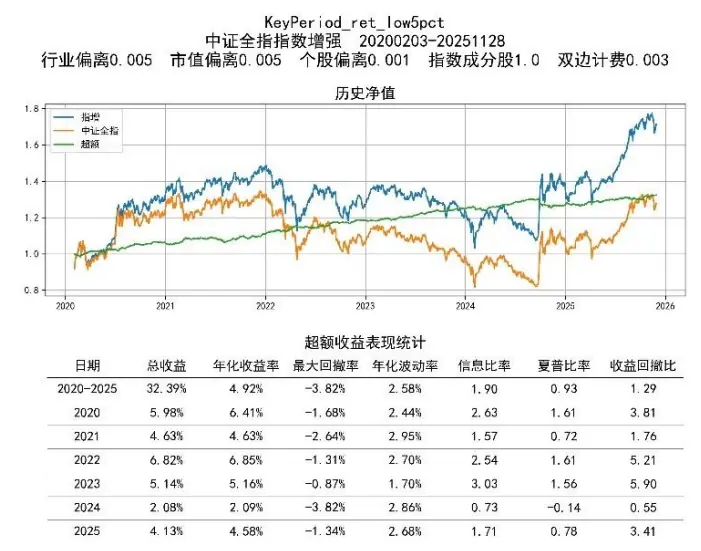

| 日期 | 总收益 | 年化收益率 | 最大回撤率 | 年化波动率 | 信息比率 | 夏普比率 | 收益回撤比 |
| --- | --- | --- | --- | --- | --- | --- | --- |
| 2020-2025 | 32.39% | 4.92% | -3.82% | 2.58% | 1.90 | 0.93 | 1.29 |
| 2020 | 5.98% | 6.41% | -1.68% | 2.44% | 2.63 | 1.61 | 3.81 |
| 2021 | 4.63% | 4.63% | -2.64% | 2.95% | 1.57 | 0.72 | 1.76 |
| 2022 | 6.82% | 6.85% | -1.31% | 2.70% | 2.54 | 1.61 | 5.21 |
| 2023 | 5.14% | 5.16% | -0.87% | 1.70% | 3.03 | 1.56 | 5.90 |
| 2024 | 2.08% | 2.09% | -3.82% | 2.86% | 0.73 | -0.14 | 0.55 |
| 2025 | 4.13% | 4.58% | -1.34% | 2.68% | 1.71 | 0.78 | 3.41 |

数据来源：通联数据、Wind，广发证券发展研究中心

| 日期 | 总收益 | 年化收益率 | 最大回撤率 | 年化波动率 | 信息比率 | 夏普比率 | 收益回撤比 |
| --- | --- | --- | --- | --- | --- | --- | --- |
| 2020-2025 | 31.59% | 4.81% | -1.92% | 1.78% | 2.70 | 1.29 | 2.50 |
| 2020 | 2.44% | 2.61% | -0.99% | 1.63% | 1.61 | 0.07 | 2.64 |
| 2021 | 4.16% | 4.16% | -1.05% | 1.97% | 2.11 | 0.84 | 3.98 |
| 2022 | 7.68% | 7.71% | -0.56% | 1.62% | 4.76 | 3.22 | 13.85 |
| 2023 | 5.79% | 5.82% | -0.59% | 1.45% | 4.00 | 2.28 | 9.89 |
| 2024 | 4.40% | 4.42% | -1.92% | 2.22% | 1.99 | 0.87 | 2.30 |
| 2025 | 3.69% | 4.09% | -1.29% | 1.68% | 2.43 | 0.95 | 3.18 |

| 日期 | 总收益 | 年化收益率 | 最大回撤率 | 年化波动率 | 信息比率 | 夏普比率 | 收益回撤比 |
| --- | --- | --- | --- | --- | --- | --- | --- |
| 2020-2025 | 32.76% | 4.97% | -3.16% | 2.23% | 2.22 | 1.10 | 1.57 |
| 2020 | 3.83% | 4.11% | -1.54% | 2.21% | 1.86 | 0.73 | 2.67 |
| 2021 | 2.41% | 2.41% | -1.95% | 2.15% | 1.12 | -0.04 | 1.24 |
| 2022 | 8.38% | 8.42% | -0.77% | 1.95% | 4.31 | 3.03 | 10.91 |
| 2023 | 6.43% | 6.46% | -0.72% | 1.80% | 3.58 | 2.19 | 8.97 |
| 2024 | 3.84% | 3.85% | -3.16% | 2.92% | 1.32 | 0.46 | 1.22 |
| 2025 | 4.24% | 4.70% | -1.36% | 2.20% | 2.14 | 1.00 | 3.45 |

## （三）KeyPeriod_price_low5pct 因子

图 17：KeyPeriod_price_low5pct-RankIC
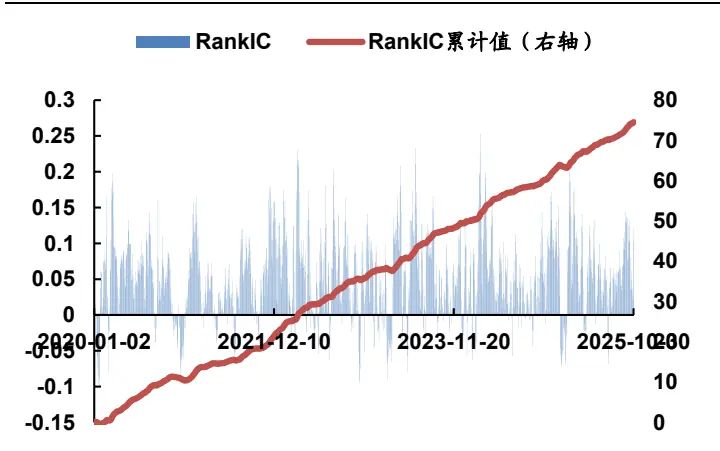
数据来源：通联数据、Wind，广发证券发展研究中心

图 18：KeyPeriod_price_low5pct-十分档收益
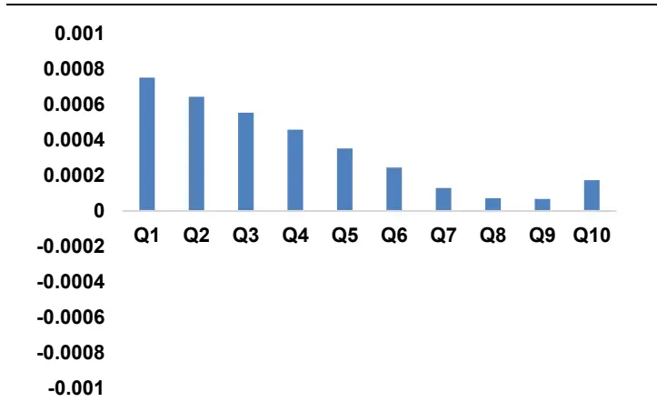
数据来源：通联数据、Wind，广发证券发展研究中心

图 19：KeyPeriod_price_low5pct-沪深300
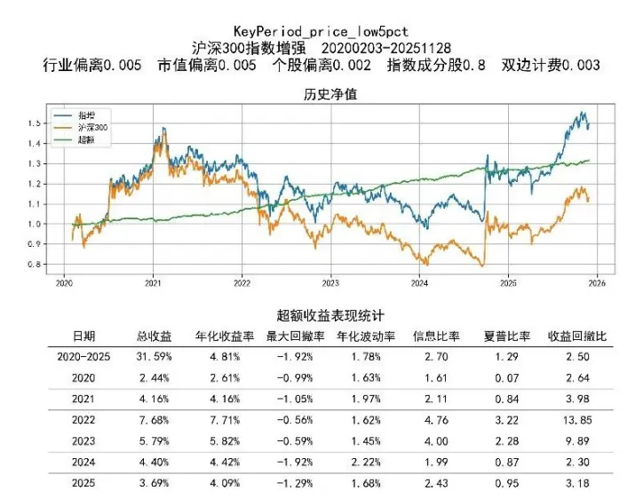
数据来源：通联数据、Wind，广发证券发展研究中心

图 20：KeyPeriod_price_low5pct-中证A500
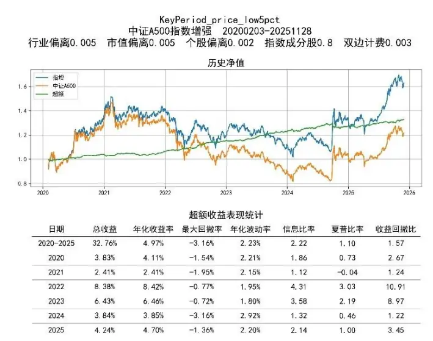
数据来源：通联数据、Wind，广发证券发展研究中心

图 21：KeyPeriod_price_low5pct-中证500
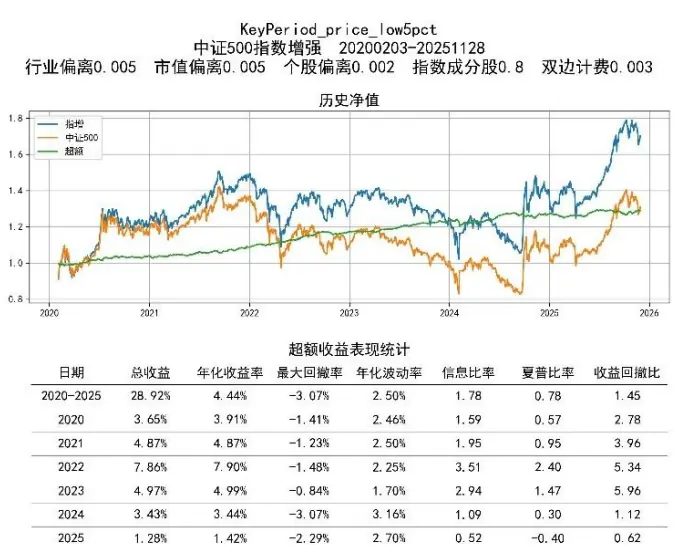

| 日期 | 总收益 | 年化收益率 | 最大回撤率 | 年化波动率 | 信息比率 | 夏普比率 | 收益回撤比 |
| --- | --- | --- | --- | --- | --- | --- | --- |
| 2020-2025 | 28.92% | 4.44% | -3.07% | 2.50% | 1.78 | 0.78 | 1.45 |
| 2020 | 3.65% | 3.91% | -1.41% | 2.46% | 1.59 | 0.57 | 2.78 |
| 2021 | 4.87% | 4.87% | -1.23% | 2.50% | 1.95 | 0.95 | 3.96 |
| 2022 | 7.86% | 7.90% | -1.48% | 2.25% | 3.51 | 2.40 | 5.34 |
| 2023 | 4.97% | 4.99% | -0.84% | 1.70% | 2.94 | 1.47 | 5.96 |
| 2024 | 3.43% | 3.44% | -3.07% | 3.16% | 1.09 | 0.30 | 1.12 |
| 2025 | 1.28% | 1.42% | -2.29% | 2.70% | 0.52 | -0.40 | 0.62 |

数据来源：通联数据、Wind，广发证券发展研究中心

图 22：KeyPeriod_price_low5pct-中证800
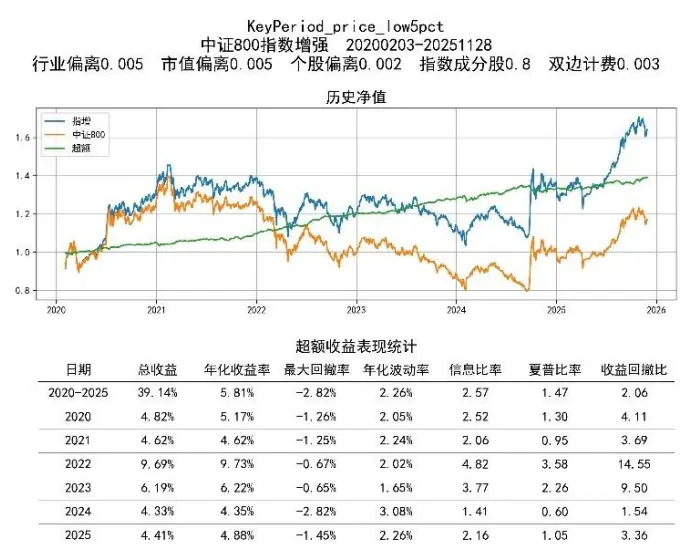

| 日期 | 总收益 | 年化收益率 | 最大回撤率 | 年化波动率 | 信息比率 | 夏普比率 | 收益回撤比 |
| --- | --- | --- | --- | --- | --- | --- | --- |
| 2020-2025 | 39.14% | 5.81% | -2.82% | 2.26% | 2.57 | 1.47 | 2.06 |
| 2020 | 4.82% | 5.17% | -1.26% | 2.05% | 2.52 | 1.30 | 4.11 |
| 2021 | 4.62% | 4.62% | -1.25% | 2.24% | 2.06 | 0.95 | 3.69 |
| 2022 | 9.69% | 9.73% | -0.67% | 2.02% | 4.82 | 3.58 | 14.55 |
| 2023 | 6.19% | 6.22% | -0.65% | 1.65% | 3.77 | 2.26 | 9.50 |
| 2024 | 4.33% | 4.35% | -2.82% | 3.08% | 1.41 | 0.60 | 1.54 |
| 2025 | 4.41% | 4.88% | -1.45% | 2.26% | 2.16 | 1.05 | 3.36 |

数据来源：通联数据、Wind，广发证券发展研究中心

图 23：KeyPeriod_price_low5pct-中证1000
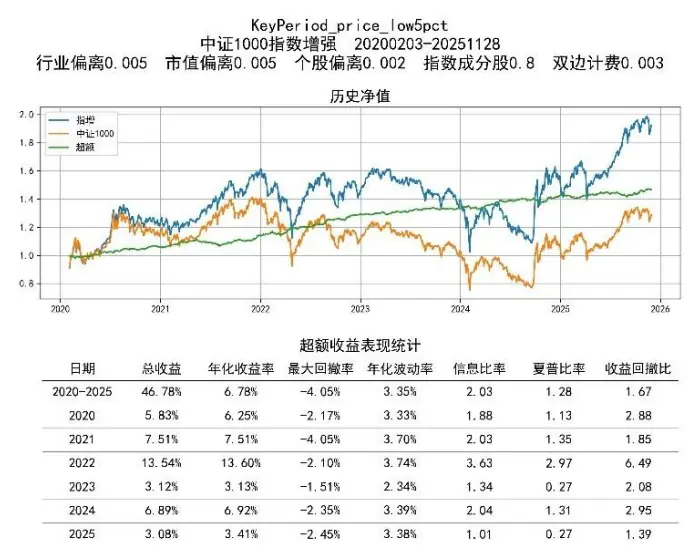

| 日期 | 总收益 | 年化收益率 | 最大回撤率 | 年化波动率 | 信息比率 | 夏普比率 | 收益回撤比 |
| --- | --- | --- | --- | --- | --- | --- | --- |
| 2020-2025 | 46.78% | 6.78% | -4.05% | 3.35% | 2.03 | 1.28 | 1.67 |
| 2020 | 5.83% | 6.25% | -2.17% | 3.33% | 1.88 | 1.13 | 2.88 |
| 2021 | 7.51% | 7.51% | -4.05% | 3.70% | 2.03 | 1.35 | 1.85 |
| 2022 | 13.54% | 13.60% | -2.10% | 3.74% | 3.63 | 2.97 | 6.49 |
| 2023 | 3.12% | 3.13% | -1.51% | 2.34% | 1.34 | 0.27 | 2.08 |
| 2024 | 6.89% | 6.92% | -2.35% | 3.39% | 2.04 | 1.31 | 2.95 |
| 2025 | 3.08% | 3.41% | -2.45% | 3.38% | 1.01 | 0.27 | 1.39 |

数据来源：通联数据、Wind，广发证券发展研究中心

图 24：KeyPeriod_price_low5pct-中证全指
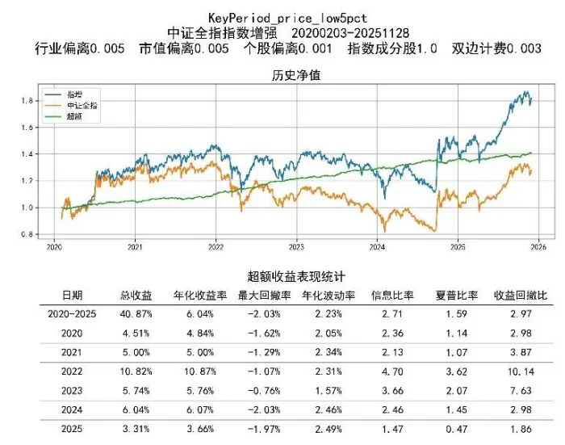

| 日期 | 总收益 | 年化收益率 | 最大回撤率 | 年化波动率 | 信息比率 | 夏普比率 | 收益回撤比 |
| --- | --- | --- | --- | --- | --- | --- | --- |
| 2020-2025 | 40.87% | 6.04% | -2.03% | 2.23% | 2.71 | 1.59 | 2.97 |
| 2020 | 4.51% | 4.84% | -1.62% | 2.05% | 2.36 | 1.14 | 2.98 |
| 2021 | 5.00% | 5.00% | -1.29% | 2.34% | 2.13 | 1.07 | 3.87 |
| 2022 | 10.82% | 10.87% | -1.07% | 2.31% | 4.70 | 3.62 | 10.14 |
| 2023 | 5.74% | 5.76% | -0.76% | 1.57% | 3.66 | 2.07 | 7.63 |
| 2024 | 6.04% | 6.07% | -2.03% | 2.46% | 2.46 | 1.45 | 2.98 |
| 2025 | 3.31% | 3.66% | -1.97% | 2.49% | 1.47 | 0.47 | 1.86 |

数据来源：通联数据、Wind，广发证券发展研究中心

（四）KeyPeriod_amount_top30pct 因子

图 25：KeyPeriod_amount_top30pct-RankIC
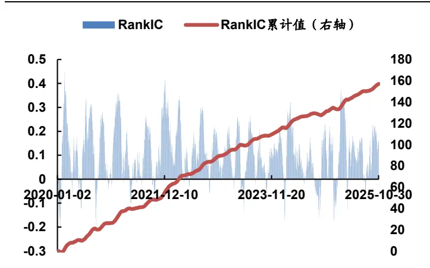
数据来源：通联数据、Wind，广发证券发展研究中心

图 26：KeyPeriod_amount_top30pct-十分档收益
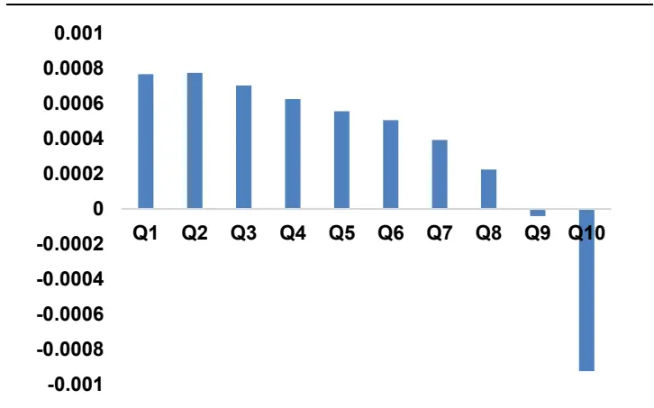
数据来源：通联数据、Wind，广发证券发展研究中心

图 27：KeyPeriod_amount_top30pct-沪深300
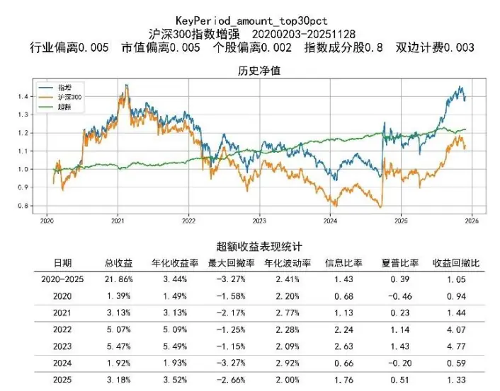

| 日期 | 总收益 | 年化收益率 | 最大回撤率 | 年化波动率 | 信息比率 | 夏普比率 | 收益回撤比 |
| --- | --- | --- | --- | --- | --- | --- | --- |
| 2020-2025 | 21.86% | 3.44% | -3.27% | 2.41% | 1.43 | 0.39 | 1.05 |
| 2020 | 1.39% | 1.49% | -1.58% | 2.20% | 0.68 | -0.46 | 0.94 |
| 2021 | 3.13% | 3.13% | -2.17% | 2.77% | 1.13 | 0.23 | 1.44 |
| 2022 | 5.07% | 5.09% | -1.25% | 2.28% | 2.24 | 1.14 | 4.07 |
| 2023 | 5.47% | 5.49% | -1.15% | 2.09% | 2.63 | 1.43 | 4.77 |
| 2024 | 1.92% | 1.93% | -3.27% | 2.92% | 0.66 | -0.20 | 0.59 |
| 2025 | 3.18% | 3.52% | -2.66% | 2.00% | 1.76 | 0.51 | 1.33 |

数据来源：通联数据、Wind，广发证券发展研究中心

图 28：KeyPeriod_amount_top30pct-中证A500
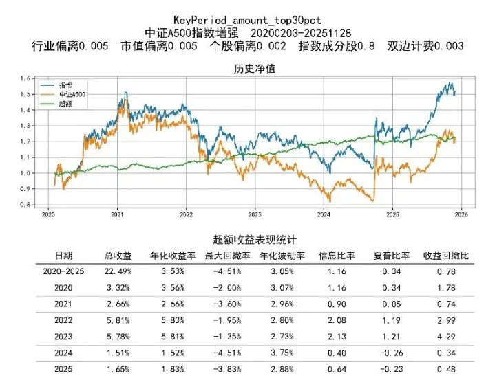

| 日期 | 总收益 | 年化收益率 | 最大回撤率 | 年化波动率 | 信息比率 | 夏普比率 | 收益回撤比 |
| --- | --- | --- | --- | --- | --- | --- | --- |
| 2020-2025 | 22.49% | 3.53% | -4.51% | 3.05% | 1.16 | 0.34 | 0.78 |
| 2020 | 3.32% | 3.56% | -2.00% | 3.07% | 1.16 | 0.34 | 1.78 |
| 2021 | 2.66% | 2.66% | -3.60% | 2.96% | 0.90 | 0.05 | 0.74 |
| 2022 | 5.81% | 5.83% | -1.95% | 2.80% | 2.08 | 1.19 | 2.99 |
| 2023 | 5.78% | 5.81% | -1.35% | 2.73% | 2.13 | 1.21 | 4.29 |
| 2024 | 1.51% | 1.52% | -4.51% | 3.75% | 0.40 | -0.26 | 0.34 |
| 2025 | 1.65% | 1.83% | -3.83% | 2.88% | 0.64 | -0.23 | 0.48 |

数据来源：通联数据、Wind，广发证券发展研究中心

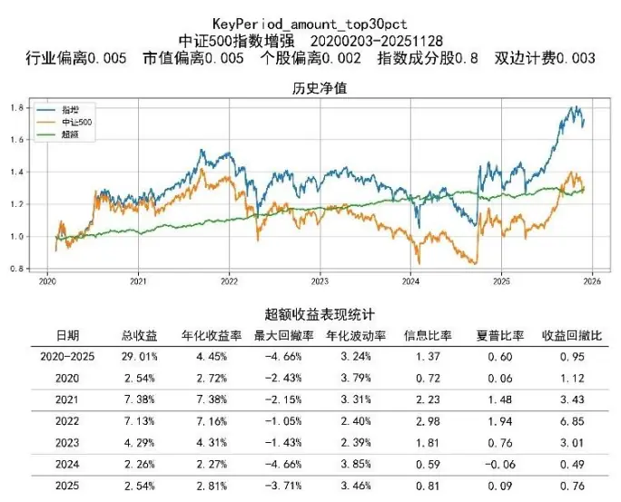

图 29：KeyPeriod_amount_top30pct-中证500

| 日期 | 总收益 | 年化收益率 | 最大回撤率 | 年化波动率 | 信息比率 | 夏普比率 | 收益回撤比 |
| --- | --- | --- | --- | --- | --- | --- | --- |
| 2020-2025 | 29.01% | 4.45% | -4.66% | 3.24% | 1.37 | 0.60 | 0.95 |
| 2020 | 2.54% | 2.72% | -2.43% | 3.79% | 0.72 | 0.06 | 1.12 |
| 2021 | 7.38% | 7.38% | -2.15% | 3.31% | 2.23 | 1.48 | 3.43 |
| 2022 | 7.13% | 7.16% | -1.05% | 2.40% | 2.98 | 1.94 | 6.85 |
| 2023 | 4.29% | 4.31% | -1.43% | 2.39% | 1.81 | 0.76 | 3.01 |
| 2024 | 2.26% | 2.27% | -4.66% | 3.85% | 0.59 | -0.06 | 0.49 |
| 2025 | 2.54% | 2.81% | -3.71% | 3.46% | 0.81 | 0.09 | 0.76 |

数据来源：通联数据、Wind，广发证券发展研究中心

图 30：KeyPeriod_amount_top30pct-中证800
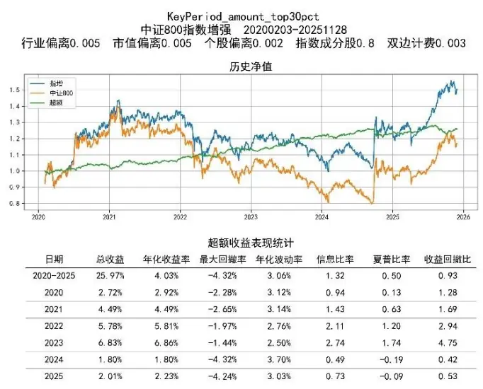

| 日期 | 总收益 | 年化收益率 | 最大回撤率 | 年化波动率 | 信息比率 | 夏普比率 | 收益回撤比 |
| --- | --- | --- | --- | --- | --- | --- | --- |
| 2020-2025 | 25.97% | 4.03% | -4.32% | 3.06% | 1.32 | 0.50 | 0.93 |
| 2020 | 2.72% | 2.92% | -2.28% | 3.12% | 0.94 | 0.13 | 1.28 |
| 2021 | 4.49% | 4.49% | -2.65% | 3.14% | 1.43 | 0.63 | 1.69 |
| 2022 | 5.78% | 5.81% | -1.97% | 2.76% | 2.11 | 1.20 | 2.94 |
| 2023 | 6.83% | 6.86% | -1.44% | 2.50% | 2.74 | 1.74 | 4.75 |
| 2024 | 1.80% | 1.80% | -4.32% | 3.70% | 0.49 | -0.19 | 0.42 |
| 2025 | 2.01% | 2.23% | -4.24% | 3.03% | 0.73 | -0.09 | 0.53 |

数据来源：通联数据、Wind，广发证券发展研究中心

图 31：KeyPeriod_amount_top30pct-中证1000
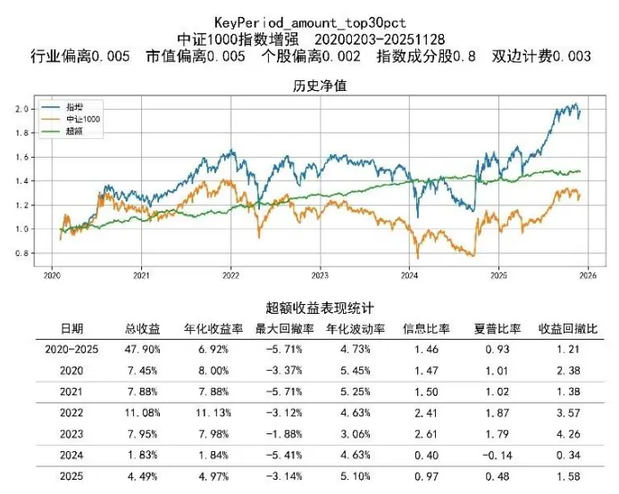

| 日期 | 总收益 | 年化收益率 | 最大回撤率 | 年化波动率 | 信息比率 | 夏普比率 | 收益回撤比 |
| --- | --- | --- | --- | --- | --- | --- | --- |
| 2020-2025 | 47.90% | 6.92% | -5.71% | 4.73% | 1.46 | 0.93 | 1.21 |
| 2020 | 7.45% | 8.00% | -3.37% | 5.45% | 1.47 | 1.01 | 2.38 |
| 2021 | 7.88% | 7.88% | -5.71% | 5.25% | 1.50 | 1.02 | 1.38 |
| 2022 | 11.08% | 11.13% | -3.12% | 4.63% | 2.41 | 1.87 | 3.57 |
| 2023 | 7.95% | 7.98% | -1.88% | 3.06% | 2.61 | 1.79 | 4.26 |
| 2024 | 1.83% | 1.84% | -5.41% | 4.63% | 0.40 | -0.14 | 0.34 |
| 2025 | 4.49% | 4.97% | -3.14% | 5.10% | 0.97 | 0.48 | 1.58 |

数据来源：通联数据、Wind，广发证券发展研究中心

图 32：KeyPeriod_amount_top30pct-中证全指
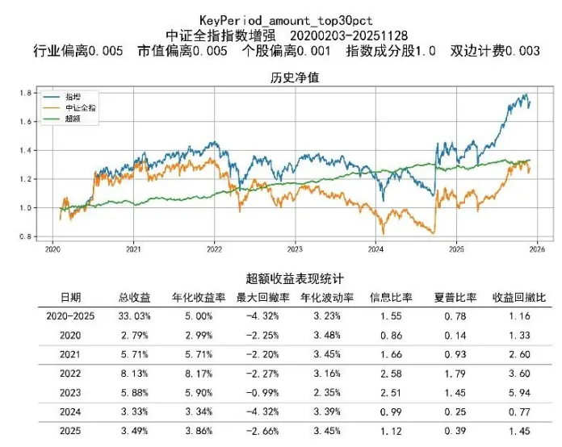

| 日期 | 总收益 | 年化收益率 | 最大回撤率 | 年化波动率 | 信息比率 | 夏普比率 | 收益回撤比 |
| --- | --- | --- | --- | --- | --- | --- | --- |
| 2020-2025 | 33.03% | 5.00% | -4.32% | 3.23% | 1.55 | 0.78 | 1.16 |
| 2020 | 2.79% | 2.99% | -2.25% | 3.48% | 0.86 | 0.14 | 1.33 |
| 2021 | 5.71% | 5.71% | -2.20% | 3.45% | 1.66 | 0.93 | 2.60 |
| 2022 | 8.13% | 8.17% | -2.27% | 3.16% | 2.58 | 1.79 | 3.60 |
| 2023 | 5.88% | 5.90% | -0.99% | 2.35% | 2.51 | 1.45 | 5.94 |
| 2024 | 3.33% | 3.34% | -4.32% | 3.39% | 0.99 | 0.25 | 0.77 |
| 2025 | 3.49% | 3.86% | -2.66% | 3.45% | 1.12 | 0.39 | 1.45 |

数据来源：通联数据、Wind，广发证券发展研究中心

（五）KeyPeriod_amount_low50pct 因子

图 33：KeyPeriod_amount_low50pct-RankIC
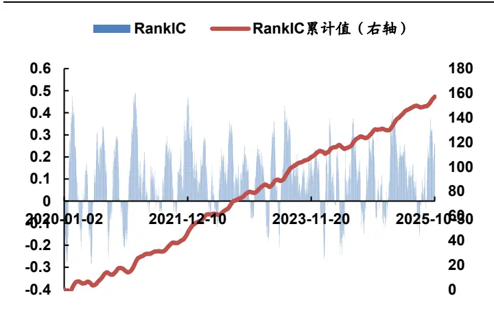
数据来源：通联数据、Wind，广发证券发展研究中心

图 34：KeyPeriod_amount_low50pct-十分档收益
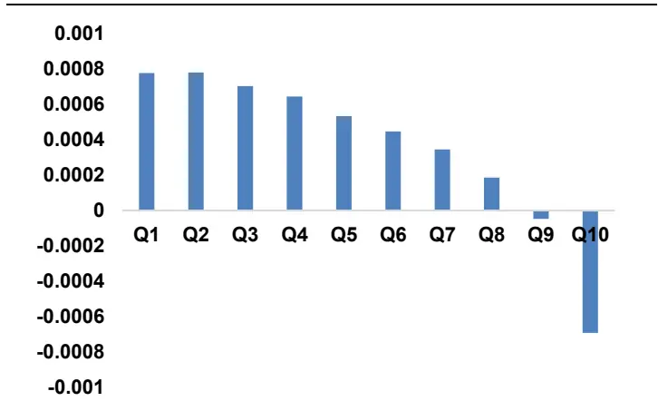
数据来源：通联数据、Wind，广发证券发展研究中心

图 35：KeyPeriod_amount_low50pct-沪深300
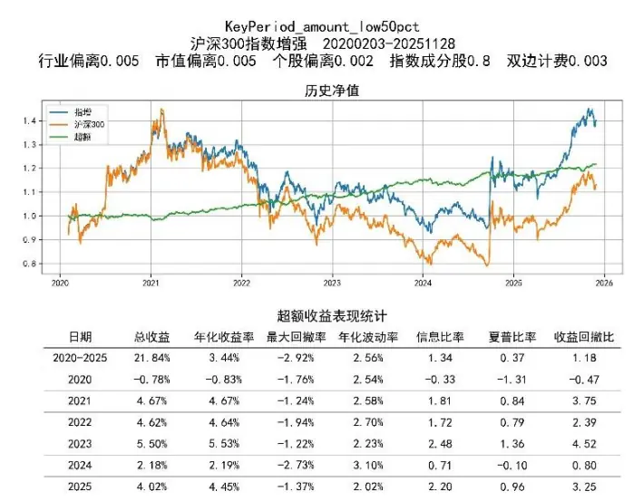

| 日期 | 总收益 | 年化收益率 | 最大回撤率 | 年化波动率 | 信息比率 | 夏普比率 | 收益回撤比 |
| --- | --- | --- | --- | --- | --- | --- | --- |
| 2020-2025 | 21.84% | 3.44% | -2.92% | 2.56% | 1.34 | 0.37 | 1.18 |
| 2020 | -0.78% | -0.83% | -1.76% | 2.54% | -0.33 | -1.31 | -0.47 |
| 2021 | 4.67% | 4.67% | -1.24% | 2.58% | 1.81 | 0.84 | 3.75 |
| 2022 | 4.62% | 4.64% | -1.94% | 2.70% | 1.72 | 0.79 | 2.39 |
| 2023 | 5.50% | 5.53% | -1.22% | 2.23% | 2.48 | 1.36 | 4.52 |
| 2024 | 2.18% | 2.19% | -2.73% | 3.10% | 0.71 | -0.10 | 0.80 |
| 2025 | 4.02% | 4.45% | -1.37% | 2.02% | 2.20 | 0.96 | 3.25 |

数据来源：通联数据、Wind，广发证券发展研究中心

图 36：KeyPeriod_amount_low50pct-中证A500
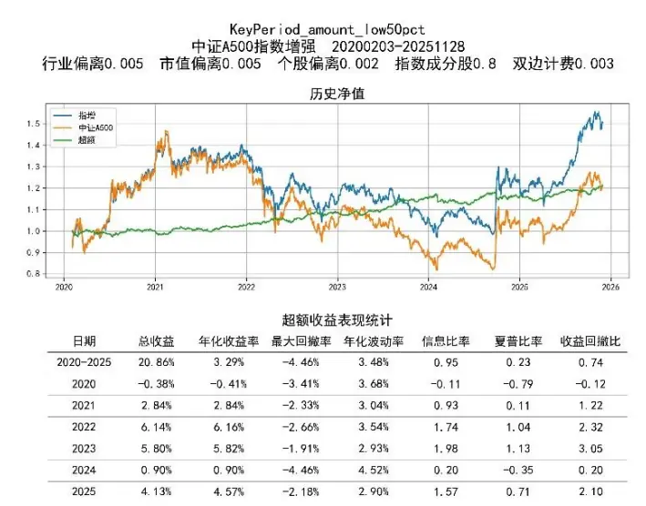

| 日期 | 总收益 | 年化收益率 | 最大回撤率 | 年化波动率 | 信息比率 | 夏普比率 | 收益回撤比 |
| --- | --- | --- | --- | --- | --- | --- | --- |
| 2020-2025 | 20.86% | 3.29% | -4.46% | 3.48% | 0.95 | 0.23 | 0.74 |
| 2020 | -0.38% | -0.41% | -3.41% | 3.68% | -0.11 | -0.79 | -0.12 |
| 2021 | 2.84% | 2.84% | -2.33% | 3.04% | 0.93 | 0.11 | 1.22 |
| 2022 | 6.14% | 6.16% | -2.66% | 3.54% | 1.74 | 1.04 | 2.32 |
| 2023 | 5.80% | 5.82% | -1.91% | 2.93% | 1.98 | 1.13 | 3.05 |
| 2024 | 0.90% | 0.90% | -4.46% | 4.52% | 0.20 | -0.35 | 0.20 |
| 2025 | 4.13% | 4.57% | -2.18% | 2.90% | 1.57 | 0.71 | 2.10 |

数据来源：通联数据、Wind，广发证券发展研究中心

图 37：KeyPeriod_amount_low50pct-中证500
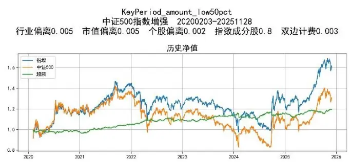

| 日期 | 总收益 | 年化收益率 | 最大回撤率 | 年化波动率 | 信息比率 | 夏普比率 | 收益回撤比 |
| --- | --- | --- | --- | --- | --- | --- | --- |
| 2020-2025 | 19.66% | 3.12% | -4.91% | 4.03% | 0.77 | 0.15 | 0.63 |
| 2020 | -2.56% | -2.74% | -4.19% | 4.49% | -0.61 | -1.17 | -0.65 |
| 2021 | 7.22% | 7.22% | -1.51% | 3.50% | 2.06 | 1.35 | 4.79 |
| 2022 | 4.96% | 4.98% | -2.88% | 3.71% | 1.34 | 0.67 | 1.73 |
| 2023 | 3.12% | 3.13% | -1.85% | 2.99% | 1.05 | 0.21 | 1.70 |
| 2024 | 2.29% | 2.30% | -4.91% | 5.38% | 0.43 | -0.04 | 0.47 |
| 2025 | 3.45% | 3.82% | -3.86% | 3.71% | 1.03 | 0.36 | 0.99 |

数据来源：通联数据、Wind，广发证券发展研究中心

图 38：KeyPeriod_amount_low50pct-中证800
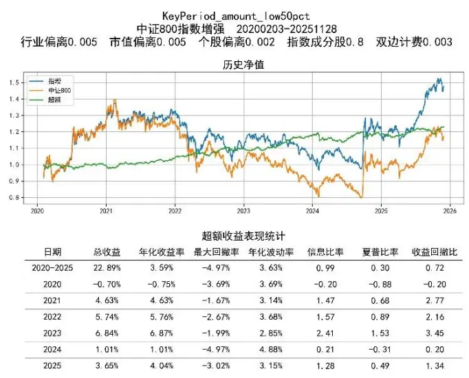

| 日期 | 总收益 | 年化收益率 | 最大回撤率 | 年化波动率 | 信息比率 | 夏普比率 | 收益回撤比 |
| --- | --- | --- | --- | --- | --- | --- | --- |
| 2020-2025 | 22.89% | 3.59% | -4.97% | 3.63% | 0.99 | 0.30 | 0.72 |
| 2020 | -0.70% | -0.75% | -3.69% | 3.69% | -0.20 | -0.88 | -0.20 |
| 2021 | 4.63% | 4.63% | -1.67% | 3.14% | 1.47 | 0.68 | 2.77 |
| 2022 | 5.74% | 5.76% | -2.67% | 3.68% | 1.57 | 0.89 | 2.16 |
| 2023 | 6.84% | 6.87% | -1.99% | 2.85% | 2.41 | 1.53 | 3.45 |
| 2024 | 1.01% | 1.01% | -4.97% | 4.88% | 0.21 | -0.31 | 0.20 |
| 2025 | 3.65% | 4.04% | -3.02% | 3.15% | 1.28 | 0.49 | 1.34 |

数据来源：通联数据、Wind，广发证券发展研究中心

图 39：KeyPeriod_amount_low50pct-中证1000
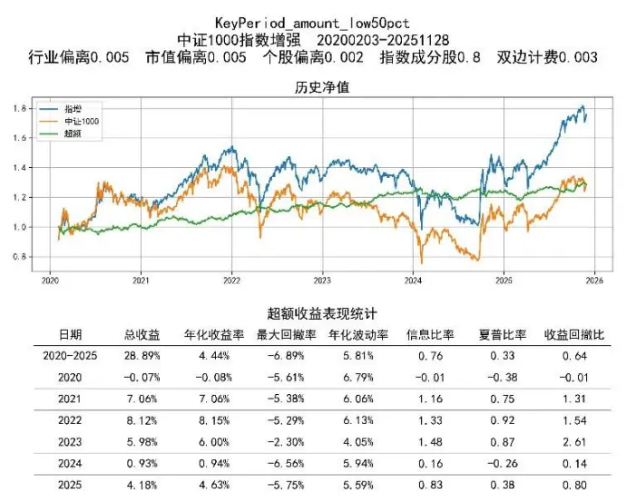

| 日期 | 总收益 | 年化收益率 | 最大回撤率 | 年化波动率 | 信息比率 | 夏普比率 | 收益回撤比 |
| --- | --- | --- | --- | --- | --- | --- | --- |
| 2020-2025 | 28.89% | 4.44% | -6.89% | 5.81% | 0.76 | 0.33 | 0.64 |
| 2020 | -0.07% | -0.08% | -5.61% | 6.79% | -0.01 | -0.38 | -0.01 |
| 2021 | 7.06% | 7.06% | -5.38% | 6.06% | 1.16 | 0.75 | 1.31 |
| 2022 | 8.12% | 8.15% | -5.29% | 6.13% | 1.33 | 0.92 | 1.54 |
| 2023 | 5.98% | 6.00% | -2.30% | 4.05% | 1.48 | 0.87 | 2.61 |
| 2024 | 0.93% | 0.94% | -6.56% | 5.94% | 0.16 | -0.26 | 0.14 |
| 2025 | 4.18% | 4.63% | -5.75% | 5.59% | 0.83 | 0.38 | 0.80 |

数据来源：通联数据、Wind，广发证券发展研究中心

图 40：KeyPeriod_amount_low50pct-中证全指
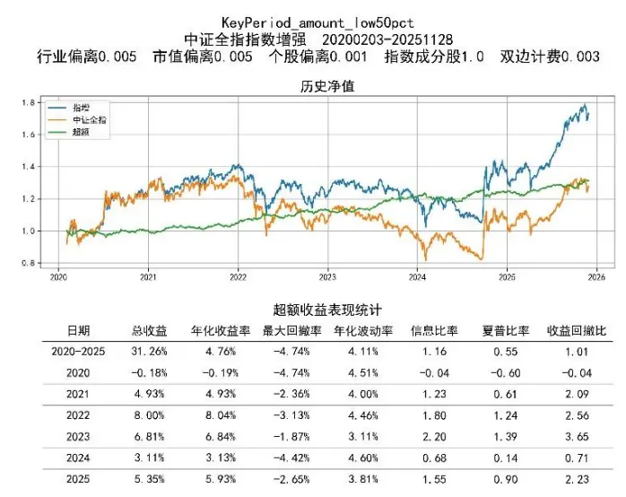

| 日期 | 总收益 | 年化收益率 | 最大回撤率 | 年化波动率 | 信息比率 | 夏普比率 | 收益回撤比 |
| --- | --- | --- | --- | --- | --- | --- | --- |
| 2020-2025 | 31.26% | 4.76% | -4.74% | 4.11% | 1.16 | 0.55 | 1.01 |
| 2020 | -0.18% | -0.19% | -4.74% | 4.51% | -0.04 | -0.60 | -0.04 |
| 2021 | 4.93% | 4.93% | -2.36% | 4.00% | 1.23 | 0.61 | 2.09 |
| 2022 | 8.00% | 8.04% | -3.13% | 4.46% | 1.80 | 1.24 | 2.56 |
| 2023 | 6.81% | 6.84% | -1.87% | 3.11% | 2.20 | 1.39 | 3.65 |
| 2024 | 3.11% | 3.13% | -4.42% | 4.60% | 0.68 | 0.14 | 0.71 |
| 2025 | 5.35% | 5.93% | -2.65% | 3.81% | 1.55 | 0.90 | 2.23 |

数据来源：通联数据、Wind，广发证券发展研究中心

（六）KeyPeriod_sync_low50pct 因子

图 41：KeyPeriod_sync_low50pct-RankIC
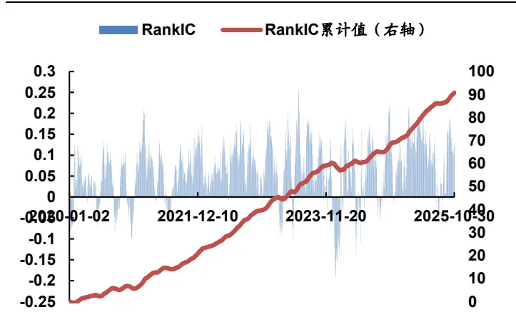
数据来源：通联数据、Wind，广发证券发展研究中心

图 42：KeyPeriod_sync_low50pct-十分档收益
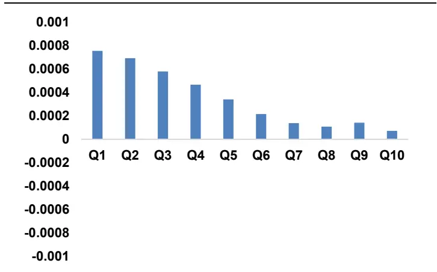
数据来源：通联数据、Wind，广发证券发展研究中心

图 43：KeyPeriod_sync_low50pct-沪深300
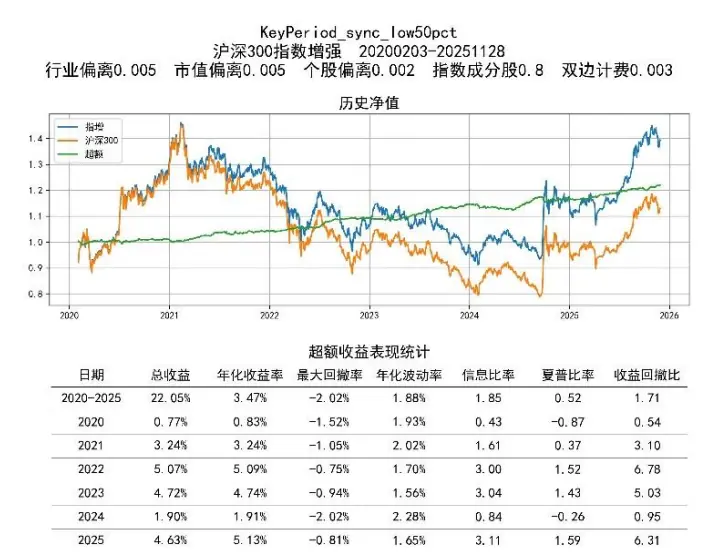

| 日期 | 总收益 | 年化收益率 | 最大回撤率 | 年化波动率 | 信息比率 | 夏普比率 | 收益回撤比 |
| --- | --- | --- | --- | --- | --- | --- | --- |
| 2020-2025 | 22.05% | 3.47% | -2.02% | 1.88% | 1.85 | 0.52 | 1.71 |
| 2020 | 0.77% | 0.83% | -1.52% | 1.93% | 0.43 | -0.87 | 0.54 |
| 2021 | 3.24% | 3.24% | -1.05% | 2.02% | 1.61 | 0.37 | 3.10 |
| 2022 | 5.07% | 5.09% | -0.75% | 1.70% | 3.00 | 1.52 | 6.78 |
| 2023 | 4.72% | 4.74% | -0.94% | 1.56% | 3.04 | 1.43 | 5.03 |
| 2024 | 1.90% | 1.91% | -2.02% | 2.28% | 0.84 | -0.26 | 0.95 |
| 2025 | 4.63% | 5.13% | -0.81% | 1.65% | 3.11 | 1.59 | 6.31 |

数据来源：通联数据、Wind，广发证券发展研究中心

图 44：KeyPeriod_sync_low50pct-中证A500
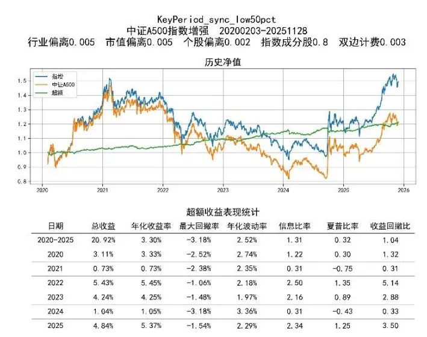

| 日期 | 总收益 | 年化收益率 | 最大回撤率 | 年化波动率 | 信息比率 | 夏普比率 | 收益回撤比 |
| --- | --- | --- | --- | --- | --- | --- | --- |
| 2020-2025 | 20.92% | 3.30% | -3.18% | 2.52% | 1.31 | 0.32 | 1.04 |
| 2020 | 3.11% | 3.33% | -2.52% | 2.74% | 1.22 | 0.30 | 1.32 |
| 2021 | 0.73% | 0.73% | -2.38% | 2.35% | 0.31 | -0.75 | 0.31 |
| 2022 | 5.43% | 5.45% | -1.06% | 2.18% | 2.50 | 1.35 | 5.14 |
| 2023 | 4.24% | 4.25% | -1.48% | 1.97% | 2.16 | 0.89 | 2.88 |
| 2024 | 1.04% | 1.05% | -3.18% | 3.36% | 0.31 | -0.43 | 0.33 |
| 2025 | 4.84% | 5.37% | -1.54% | 2.29% | 2.34 | 1.25 | 3.50 |

数据来源：通联数据、Wind，广发证券发展研究中心

图 45：KeyPeriod_sync_low50pct-中证500
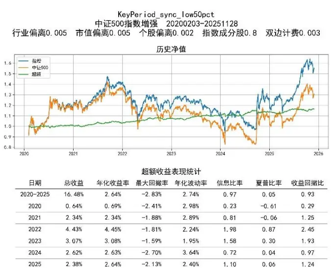

| 日期 | 总收益 | 年化收益率 | 最大回撤率 | 年化波动率 | 信息比率 | 夏普比率 | 收益回撤比 |
| --- | --- | --- | --- | --- | --- | --- | --- |
| 2020-2025 | 16.48% | 2.64% | -2.83% | 2.74% | 0.97 | 0.05 | 0.93 |
| 2020 | 0.64% | 0.69% | -2.41% | 2.98% | 0.23 | -0.61 | 0.29 |
| 2021 | 2.34% | 2.34% | -1.88% | 2.89% | 0.81 | -0.06 | 1.25 |
| 2022 | 4.43% | 4.45% | -1.81% | 2.24% | 1.98 | 0.87 | 2.45 |
| 2023 | 3.07% | 3.08% | -1.59% | 1.95% | 1.58 | 0.30 | 1.93 |
| 2024 | 2.62% | 2.63% | -2.70% | 3.64% | 0.72 | 0.04 | 0.97 |
| 2025 | 2.38% | 2.64% | -2.13% | 2.40% | 1.10 | 0.06 | 1.24 |

数据来源：通联数据、Wind，广发证券发展研究中心

图 46：KeyPeriod_sync_low50pct-中证800
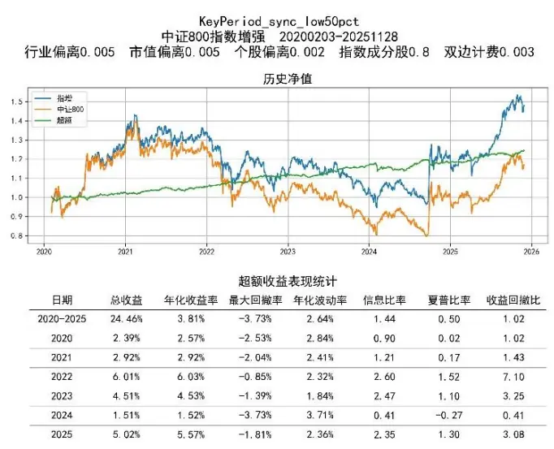

| 日期 | 总收益 | 年化收益率 | 最大回撤率 | 年化波动率 | 信息比率 | 夏普比率 | 收益回撤比 |
| --- | --- | --- | --- | --- | --- | --- | --- |
| 2020-2025 | 24.46% | 3.81% | -3.73% | 2.64% | 1.44 | 0.50 | 1.02 |
| 2020 | 2.39% | 2.57% | -2.53% | 2.84% | 0.90 | 0.02 | 1.02 |
| 2021 | 2.92% | 2.92% | -2.04% | 2.41% | 1.21 | 0.17 | 1.43 |
| 2022 | 6.01% | 6.03% | -0.85% | 2.32% | 2.60 | 1.52 | 7.10 |
| 2023 | 4.51% | 4.53% | -1.39% | 1.84% | 2.47 | 1.10 | 3.25 |
| 2024 | 1.51% | 1.52% | -3.73% | 3.71% | 0.41 | -0.27 | 0.41 |
| 2025 | 5.02% | 5.57% | -1.81% | 2.36% | 2.35 | 1.30 | 3.08 |

数据来源：通联数据、Wind，广发证券发展研究中心

图 47：KeyPeriod_sync_low50pct-中证1000
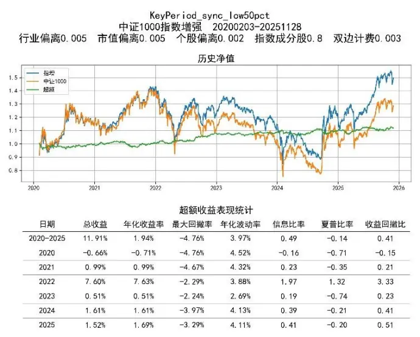

| 日期 | 总收益 | 年化收益率 | 最大回撤率 | 年化波动率 | 信息比率 | 夏普比率 | 收益回撤比 |
| --- | --- | --- | --- | --- | --- | --- | --- |
| 2020-2025 | 11.91% | 1.94% | -4.76% | 3.97% | 0.49 | -0.14 | 0.41 |
| 2020 | -0.66% | -0.71% | -4.76% | 4.52% | -0.16 | -0.71 | -0.15 |
| 2021 | 0.99% | 0.99% | -4.67% | 4.32% | 0.23 | -0.35 | 0.21 |
| 2022 | 7.60% | 7.63% | -2.29% | 3.88% | 1.97 | 1.32 | 3.33 |
| 2023 | 0.51% | 0.51% | -2.24% | 2.69% | 0.19 | -0.74 | 0.23 |
| 2024 | 1.61% | 1.61% | -3.97% | 4.13% | 0.39 | -0.21 | 0.41 |
| 2025 | 1.52% | 1.69% | -3.29% | 4.11% | 0.41 | -0.20 | 0.51 |

数据来源：通联数据、Wind，广发证券发展研究中心

图 48：KeyPeriod_sync_low50pct-中证全指
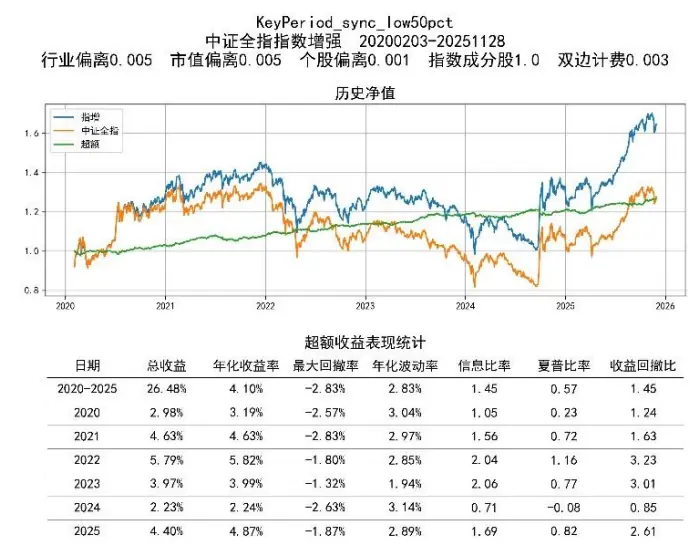

| 日期 | 总收益 | 年化收益率 | 最大回撤率 | 年化波动率 | 信息比率 | 夏普比率 | 收益回撤比 |
| --- | --- | --- | --- | --- | --- | --- | --- |
| 2020-2025 | 26.48% | 4.10% | -2.83% | 2.83% | 1.45 | 0.57 | 1.45 |
| 2020 | 2.98% | 3.19% | -2.57% | 3.04% | 1.05 | 0.23 | 1.24 |
| 2021 | 4.63% | 4.63% | -2.83% | 2.97% | 1.56 | 0.72 | 1.63 |
| 2022 | 5.79% | 5.82% | -1.80% | 2.85% | 2.04 | 1.16 | 3.23 |
| 2023 | 3.97% | 3.99% | -1.32% | 1.94% | 2.06 | 0.77 | 3.01 |
| 2024 | 2.23% | 2.24% | -2.63% | 3.14% | 0.71 | -0.08 | 0.85 |
| 2025 | 4.40% | 4.87% | -1.87% | 2.89% | 1.69 | 0.82 | 2.61 |

数据来源：通联数据、Wind，广发证券发展研究中心

## 五、与 Barra 风格、深度学习、同类因子相关性

上述6个表现较优的KeyPeriod因子，与Barra风格因子、深度学习因子、以及“海量Level 2数据因子挖掘”系列前序研究报告中的大小单、长短单、集合竞价、市价单等因子的相关性如下表所示。整体而言，其中关于股价涨跌幅、股价高低、量价协同性的KeyPeriod_ret_zero、KeyPeriod_ret_low5pct、KeyPeriod_price_low5pct、KeyPeriod_sync_low50pct这4个因子具有高度的独立性，与其他因子的相关系数基本保持在10%以内。而KeyPeriod_amount_top30pct、KeyPeriod_amount_low50pct这2个与成交金额大小相关的因子则相对而言与其他因子的相关性较高，但相关系数也整体保持在50%以内。

表 8：KeyPeriod因子和Barra风格因子之间的相关性

|  | KeyPeriod_ret_zero | KeyPeriod_ret_low5pct | KeyPeriod_pric | KeyPeriod_am | KeyPeriod_amount_low5ōpct | KeyPeriod_sync_low50pct |
| --- | --- | --- | --- | --- | --- | --- |
|  |  |  | e_low5pct | ount_top30pct |  |  |
| 账面市值比因子 | -2.83% | 6.07% | 3.05% | 20.63% | -25.43% | 3.59% |
| 市值因子 | 4.88% | -3.26% | -1.97% | -11.81% | 45.43% | -13.21% |
| 非线性市值因子 | 1.41% | -0.61% | 0.05% | -4.98% | 7.90% | -1.81% |
| 杠杆因子 | -0.11% | 1.19% | -0.26% | 4.79% | -6.29% | -1.98% |
| 成长因子 | 0.83% | -0.81% | 0.21% | -2.64% | 14.62% | -2.31% |
| 动量因子 | 1.22% | -1.69% | -0.02% | -11.64% | 26.81% | -5.54% |
| 贝塔因子 | 3.42% | -3.14% | -1.41% | -17.91% | 28.06% | -3.97% |
| 盈利因子 | -0.64% | 3.25% | 2.61% | 10.67% | 6.91% | -2.00% |
| 流动性因子 | 7.24% | -6.08% | -3.23% | -36.99% | 49.28% | -11.91% |
| 残差波动因子 | 3.94% | -4.96% | -3.15% | -28.22% | 32.18% | -8.47% |

数据来源：通联数据、Wind、广发证券发展研究中心

表 9：KeyPeriod因子和深度学习因子之间的相关性

|  | KeyPeriod_ret_zero | KeyPeriod_ret_low5pct | KeyPeriod_price_low5pct | KeyPeriod_amount_top3ōpct | KeyPeriod_amount_low50pct | KeyPeriod_sync_low50pct |
| --- | --- | --- | --- | --- | --- | --- |
| agru_dailyquoteDL_1fimage | -4.95% | 5.12% 6.95% |  | 25.54% | -21.94% | 8.99% |
|  | -6.17% | 6.40% | 8.26% | 32.51% | -37.98% | 15.01% |
|  | -2.26% | 2.52% 4.07% |  | 8.13% | -2.49% | 3.82% |

数据来源：通联数据、Wind、广发证券发展研究中心

表 10：KeyPeriod因子和大小单因子之间的相关性

|  | KeyPeriod_ret_zero | KeyPeriod_ret_low5pct | KeyPeriod_price_low5pct | KeyPeriod_amount_top30pct | KeyPeriod_amount_low50pct | KeyPeriod_sync_low50pct |
| --- | --- | --- | --- | --- | --- | --- |
| bigbuybigsellbigbuy_bigsellbigbuy_bigsell_H1bigbuy_bigsell_H8 | -6.60% | 7.69% | 1.91% | 27.80% | -36.44% | -0.96% |
|  | -4.87% | 8.54% | 7.44% | 28.09% | -35.99% | 5.94% |
|  | -12.01% | 11.03% | 6.29% | 45.60% | -52.51% | 7.89%3.23% |
|  | -14.92% | 18.56% | 11.65% | 22.84% | -20.29% |  |
|  | 4.08% | -0.71% | 7.70% | 15.62% | -16.98% | 1.56% |

数据来源：通联数据、Wind、广发证券发展研究中心

表 11：KeyPeriod因子和长短单因子之间的相关性

|  | KeyPeriod_ret_zero | KeyPeriod_ret_low5pct | KeyPeriod_price_low5pct | KeyPeriod_amount_top3ōpct | KeyPeriod_amount_low5ōpct | KeyPeriod_sync_low50pct |  |  |  |
| --- | --- | --- | --- | --- | --- | --- | --- | --- | --- |
| longbuylongbuy_longselllongbuy_shortsellshortbuy_longsellshortbuy_shortsell | 1.02% | 3.30% 0.95% |  | 25.95% | -42.17% | 7.49% |  |  |  |
|  | -2.63% | -0.31% | -1.78% | -1.05% | 1.28% | 0.37% |  |  |  |
|  | 1.19% | 3.28% | 0.95% | 25.74% | -41.79% | 7.37%8.53% |  |  |  |
|  |  |  |  | -0.42% | 0.94% |  | 4.26% | 25.15% | -36.57% |
|  | -0.78% | -2.27% | -2.86% | -32.11% | 50.51% | -10.04% |  |  |  |

数据来源：通联数据、Wind、广发证券发展研究中心

表 12：KeyPeriod因子和集合竞价因子之间的相关性

|  | KeyPeriod_ret_zero | KeyPeriod_ret_low5pct | KeyPeriod_price_low5pct | KeyPeriod_amount_top30pct | KeyPeriod_amount_low50pct | KeyPeriod_sync_low50pct |  |  |
| --- | --- | --- | --- | --- | --- | --- | --- | --- |
| transaction_order_ratio_oa1withdrew_order_ratio_oa1transaction_order_ratio_oa2transaction_order_ratio_oaselltransaction_sellorder_ratio_ca | 1.21% 0.52% -1.89% |  |  | -23.18% | 27.19% | -9.96% |  |  |
|  | 1.98% | -0.97% | -1.59% | -15.04% | 14.24% | -6.07% |  |  |
|  |  |  | 1.20% | 0.75% | -2.04% | -26.10% | 34.95% | -10.98% |
|  | 1.18% | 0.90% | -2.24% | -29.89% | 38.72% | -12.16% |  |  |
|  | 5.05% | -1.92% | -2.89% | -14.88% | 17.09% | -7.11% |  |  |

数据来源：通联数据、Wind、广发证券发展研究中心

表 13：KeyPeriod因子和市价单因子之间的相关性

|  | KeyPeriod_ret_zero | KeyPeriod_ret_low5pct | KeyPeriod_pric | KeyPeriod_am | KeyPeriod_amount_low50pct | KeyPeriod_sync_low50pct |
| --- | --- | --- | --- | --- | --- | --- |
|  |  |  | e_low5pct | ount_top30pct |  |  |
| marketorder_ratiomarketbuyorder_limitbuyorder_ratiomarketbuyorder_limitsellorder_ratiomarketsellorder_limitbuyorder_ratiomarketsellorder_limitsellorder_ratio | 3.70% | -2.71% | -3.00% | -22.07% | 34.84% | -9.75% |
|  | 1.81%2.59% | -5.37% | -7.80% | -21.70% | 33.86% | -10.43% |
|  |  | -5.92% | -8.69% | -22.22% | 33.18% | -11.20% |
|  | 5.11%5.89% | -0.79% | 1.11% | -22.34% | 36.04% | -8.85% |
|  |  | -1.30% | 0.11% | -23.15% | 35.99% | -9.77% |

数据来源：通联数据、Wind、广发证券发展研究中心

表 14：KeyPeriod因子的自身相关性

|  | KeyPeriod_ret_ zero | KeyPeriod_ret_ low5pct | KeyPeriod_pric e_low5pct | KeyPeriod_am ount_top30pct | KeyPeriod_am ount_low50pct | KeyPeriod_syn c_low50pct |
| --- | --- | --- | --- | --- | --- | --- |
| KeyPeriod_ret_zero | 1 |  |  |  |  |  |
| KeyPeriod_ret_low5pct | -26.34% | 1 |  |  |  |  |
| KeyPeriod_price_low5pct | -2.98% | 31.53% | 1 |  |  |  |
| KeyPeriod_amount_top30pct | -27.34% | 22.98% | 9.59% | 1 |  |  |
| KeyPeriod_amount_low50pct | 20.44% | -12.42% | -4.34% | -63.18% | 1 |  |
| KeyPeriod_sync_low50pct | -7.86% | 7.59% | 8.96% | 14.85% | -19.27% | 1 |

数据来源：通联数据、Wind、广发证券发展研究中心

## 六、风险提示

本文所述模型用量化方法通过历史数据统计、建模和测算完成，所得结论与规律在市场政策、环境变化时存在失效风险；

本文策略在市场结构及交易行为改变时有可能存在失效风险；

因量化模型不同，本文提出的观点可能与其他量化模型结论存在差异。

## [Table_ResearchTeam] 广发金融工程研究小组

安 宁 宁 ：首席分析师，暨南大学硕士，从业14年，2011年进入广发证券发展研究中心。

陈 原 文 ：联席首席分析师，中山大学硕士，2015年进入广发证券发展研究中心。

超 ：资深分析师，中山大学硕士，2012年进入广发证券发展研究中心。

李豪 ：资深分析师，上海交通大学硕士，2016年进入广发证券发展研究中心。

周 飞 鹏 ：资深分析师，伯明翰大学硕士，2021年加入广发证券发展研究中心。

王 小 康 ：资深分析师，波士顿大学硕士，2025年加入广发证券。

张 钰 东 ：资深分析师，中山大学硕士，2020年进入广发证券发展研究中心。

林 涛 ：高级研究员，中山大学硕士，2024年进入广发证券发展研究中心。

## [Table_IndustryInvestDescription] 广发证券—行业投资评级说明

买入： 预期未来12个月内，股价表现强于大盘10%以上。

持有： 预期未来12个月内，股价相对大盘的变动幅度介于-10%～+10%。

卖出： 预期未来12个月内，股价表现弱于大盘10%以上。

## [Table_CompanyInvestDescription] 广发证券—公司投资评级说明

买入： 预期未来12个月内，股价表现强于大盘15%以上。

增持： 预期未来 12 个月内，股价表现强于大盘 5%-15%。

持有： 预期未来12个月内，股价相对大盘的变动幅度介于-5%～+5%。

卖出： 预期未来12个月内，股价表现弱于大盘5%以上。

## [Table_Address] 联系我们

| 地址 | 广州市 广州市天河区马场路 | 深圳市 深圳市福田区益田路 | 北京市 北京市西城区月坛北 | 上海市 上海市浦东新区南泉 | 香港 香港湾仔骆克道81号 |  |
| --- | --- | --- | --- | --- | --- | --- |
|  |  |  |  |  |  | 北路429号泰康保险 |
| 邮政编码 | 楼 510627 | 26号广发证券大厦47 31层 | 6001号太平金融大厦 街2号月坛大厦18层 | 大厦37楼 | 广发大厦 27 楼 |  |
| 客服邮箱 | gfzqyf@gf.com.cn | 518026 | 100045 | 200120 |  |  |

## [Table_LegalD 法律主体isclaimer 声明]

本报告由广发证券股份有限公司或其关联机构制作，广发证券股份有限公司及其关联机构以下统称为“广发证券”。本报告的分销依据不同国家、地区的法律、法规和监管要求由广发证券于该国家或地区的具有相关合法合规经营资质的子公司/经营机构完成。

广发证券股份有限公司具备中国证监会批复的证券投资咨询业务资格，接受中国证监会监管，负责本报告于中国（港澳台地区除外）的分销。广发证券（香港）经纪有限公司具备香港证监会批复的就证券提供意见（4 号牌照）的牌照，接受香港证监会监管，负责本报告于中国香港地区的分销。

本报告署名研究人员所持中国证券业协会注册分析师资质信息和香港证监会批复的牌照信息已于署名研究人员姓名处披露。

## [Table_I 重要mportant 声明N

广发证券股份有限公司及其关联机构可能与本报告中提及的公司寻求或正在建立业务关系，因此，投资者应当考虑广发证券股份有限公司及其关联机构因可能存在的潜在利益冲突而对本报告的独立性产生影响。投资者不应仅依据本报告内容作出任何投资决策。投资者应自主作出投资决策并自行承担投资风险，任何形式的分享证券投资收益或者分担证券投资损失的书面或者口头承诺均为无效。

本报告署名研究人员、联系人（以下均简称“研究人员”）针对本报告中相关公司或证券的研究分析内容，在此声明：（ ）本报告的全部分析结论、研究观点均精确反映研究人员于本报告发出当日的关于相关公司或证券的所有个人观点，并不代表广发证券的立场；（2）研究人员的部分或全部的报酬无论在过去、现在还是将来均不会与本报告所述特定分析结论、研究观点具有直接或间接的联系。

研究人员制作本报告的报酬标准依据研究质量、客户评价、工作量等多种因素确定，其影响因素亦包括广发证券的整体经营收入，该等经营收入部分来源于广发证券的投资银行类业务。

本报告仅面向经广发证券授权使用的客户特定合作机构发送，不对外公开发布，只有接收人才可以使用，且对于接收人而言具有保密义务。广发证券并不因相关人员通过其他途径收到或阅读本报告而视其为广发证券的客户。在特定国家或地区传播或者发布本报告可能违反当地法律，广发证券并未采取任何行动以允许于该等国家或地区传播或者分销本报告。

本报告所提及证券可能不被允许在某些国家或地区内出售。请注意，投资涉及风险，证券价格可能会波动，因此投资回报可能会有所变化，过去的业绩并不保证未来的表现。本报告的内容、观点或建议并未考虑任何个别客户的具体投资目标、财务状况和特殊需求，不应被视为对特定客户关于特定证券或金融工具的投资建议。本报告发送给某客户是基于该客户被认为有能力独立评估投资风险、独立行使投资决策并独立承担相应风险。

本报告所载资料的来源及观点的出处皆被广发证券认为可靠，但广发证券不对其准确性、完整性做出任何保证。报告内容仅供参考，报告中的信息或所表达观点不构成所涉证券买卖的出价或询价。广发证券不对因使用本报告的内容而引致的损失承担任何责任，除非法律法规有明确规定。客户不应以本报告取代其独立判断或仅根据本报告做出决策，如有需要，应先咨询专业意见。

广发证券可发出其它与本报告所载信息不一致及有不同结论的报告。本报告反映研究人员的不同观点、见解及分析方法，并不代表广发证券的立场。广发证券的销售人员、交易员或其他专业人士可能以书面或口头形式，向其客户或自营交易部门提供与本报告观点相反的市场评论或交易策略，广发证券的自营交易部门亦可能会有与本报告观点不一致，甚至相反的投资策略。报告所载资料、意见及推测仅反映研究人员于发出本报告当日的判断，可随时更改且无需另行通告。广发证券或其证券研究报告业务的相关董事、高级职员、分析师和员工可能拥有本报告所提及证券的权益。在阅读本报告时，收件人应了解相关的权益披露（若有）。

本研究报告可能包括和/或描述/呈列期货合约价格的事实历史信息（“信息”）。请注意此信息仅供用作组成我们的研究方法/分析中的部分论点依据/证据，以支持我们对所述相关行业/公司的观点的结论。在任何情况下，它并不（明示或暗示）与香港证监会第5类受规管活动（就期货合约提供意见）有关联或构成此活动。

## [Table_Interest 权益披露Disclosur

(1)广发证券（香港）跟本研究报告所述公司在过去12 个月内并没有任何投资银行业务的关系。

## [Table_Copyright] 版权声明

未经广发证券事先书面许可，任何机构或个人不得以任何形式翻版、复制、刊登、转载和引用，否则由此造成的一切不良后果及法律责任由私自翻版、复制、刊登、转载和引用者承担。