# Tabl e_Title 深度学习新进展：Alpha 因子再挖掘

## 深度学习研究报告之三

## Table_S um ary 报告摘要 ：

## 知名对冲基金开始布局人工智能

随着深度学习技术的进步，人工智能领域迎来了最好的发展机遇。近年来，国内外知名的 IT 公司，如谷歌、微软、百度、腾讯等纷纷在人工智能上发力，创造了一系列突破性成果。同时，海外的对冲基金和投资银行也开始在人工智能上进行布局。Citadel、Two Sigma、桥水基金、文艺复兴科技公司等公司都已经建立自己的人工智能团队。

## 深度学习技术进展

近年来，深度学习技术上有了许多的提高，学者们提出了 ReLU 激活函数、Dropout、Batch Normalization、残差神经网络等新的模型和技术。新的技术手段大大提升了深度学习模型的性能，使得深度学习在语音识别、图像识别、自然语言处理、推荐系统、深度增强学习、医药生物等领域都获得了巨大的成功。

## 深度学习选股策略

本报告从股票市场选取了一些常用的选股因子和技术指标，作为股票样本的输入特征，通过训练深度学习预测模型，对股票未来走势进行预测打分和选股交易。

实证分析表明，深度学习预测模型可以用于月频调仓的选股交易上。实证策略每次调仓时从全市场选取 10%的股票进行配置，用中证 500 指数对冲，样本外年化收益率为 20.3%，最大回撤为 -4.77%，月度胜率为 88.0%。策略的整体表现不俗。

从深度学习选股因子与传统风格因子的相关性分析可以看到，深度学习选股因子与常见风格因子（规模、反转、流动性、估值）的相关性不高，可以考虑将深度学习因子与传统风格因子进行进一步的结合。

## 风险提示

策略模型并非百分百有效，市场结构及交易行为的改变以及类似交易参与者的增多有可能使得策略失效。

图 1深度学习策略表现
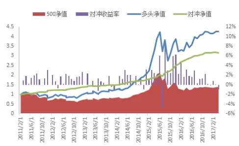

Table_A uthor 分析师： 安宁宁 S0260512020003

0755-23948352

ann@gf.com.cn

## Table_Re port 相关研究：

深度学习系列之一：深度学2014-06-18习之股指期货日内交易策略

深度学习系列之二：深度学2014-06-19习算法掘金 ALPHA 因子

联系人： 文巧钧

0755-23948352

区 wenqiaojun@gf.com.cn

## 一、背景介绍

## （一）量化投资领域人工智能的崛起

随着深度学习技术的进步，人工智能领域迎来了最好的发展机遇。近年来，国内外知名的 IT 公司，如谷歌、微软、百度、腾讯等纷纷在人工智能上发力，创造了一系列突破性成果。同时，海外的对冲基金和投资银行也开始在人工智能上进行布局。

早在 2007年，总部位于纽约的Rebellion Research公司就推出了第一个纯人工智能投资基金。该公司的交易系统是基于贝叶斯机器学习，结合预测算法进行判断，该系统可以根据新的信息和历史经验不断演化，有效地通过自学完成在全球 44个国家股票、债券、大宗商品和外汇上的交易。

近年来新成立的通过人工智能进行投资的知名机构还有，香港的 Aidyia，旧金山的 Sentient Technologies，伦敦的 Castilium 和 CommEq，日本的 Alpaca，等等。其中，Alpaca 和Sentient的核心算法是深度学习，CommEq的投资方法结合了定量模型与自然语言处理技术。

高盛在 2014 年年底向 Kensho 投资了 1500 万美元以支持该公司的智能化数据分析平台，目前该平台已经运作于高盛内部。该平台具有高效的分析能力，可以把长达几天的传统投资分析周期缩短到几分钟。同时，该平台具有强大的学习能力，可以根据各类不同的问题积累经验，完成自我更新。

桥水基金从 2013 年开始建立人工智能团队，基于历史数据与统计概率建立起交易算法，让系统能够自动学习市场变化并适应新的信息。

2017 年 5 月，微软的人工智能首席科学家邓力加入 Citadel，担任首席人工智能官，在人工智能领域和量化投资领域都吸引了大量的目光。

近年来，知名的对冲基金，如文艺复兴科技公司和Two Sigma也在扩充自己的人工智能团队。

人工智能已经成为了量化投资的新竞技场。

## （二）广发金工深度学习选股策略回顾

在 2014 年，广发证券金融工程团队就推出了基于深度学习的选股策略和股指期货交易策略，可以参见报告《深度学习系列之一：深度学习之股指期货日内交易策略》和《深度学习系列之二：深度学习算法掘金 ALPHA因子》。

其中，《深度学习系列之二：深度学习算法掘金ALPHA因子》通过深度学习算法对股票市场数据进行挖掘，建立起通过股票市场数据预测股价短期走势的模型，每周通过该预测模型对股票进行预测打分。根据预测打分，我们可以筛选出股票组合，获得超额收益。本报告中把该策略记为“深度学习 1.0”策略，策略表现如下图所示。

图1：深度学习1.0策略收益曲线
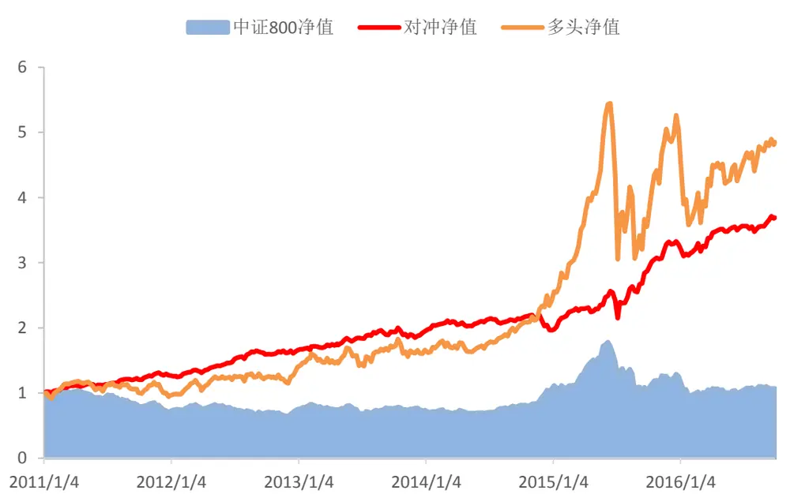
数据来源：广发证券发展研究中心，天软科技

本报告是在上述策略的基础上构建的，在以下三个方面有比较大的调整：

## 1）调仓频率方面

深度学习 1.0策略是周度调仓的选股策略，每周通过深度学习预测模型打分并且调仓。与一般的多因子策略相比，上述策略的调仓频率较高且每次调仓的换手率较高，在交易成本的花费比较大。

本报告提出的选股策略是按月（每 20 个交易日）进行调仓的。一般来说，机器学习模型对市场较长周期走势的判断比短期走势判断要难。本报告的实证结果说明较长持仓周期的机器学习选股模型也是有效的，而且较低频的调仓更适合国内投资机构的实际交易。

## 2）特征选择方面

由于深度学习具有强大的特征学习能力，因而深度学习1.0策略没有进行复杂的特征选择，而是把原始的市场数据经过预处理后直接用来训练模型和进行预测。从实证结果来看，深度学习算法可以从市场中学习出强势股票的特征，获取超额收益。深度学习1.0 策略中预测模型的输入变量如下表所示。

表1：深度学习1.0策略输入变量选取

| 选取输入变量 | 说明 |
| --- | --- |
| 收盘价 |  |
| 最高价 |  |
| 最低价 |  |
| 开盘价 |  |
| 买卖盘报价平均价格 | （买盘报价+卖盘报价）/2 |
| 成交量 |  |
| 委买委卖量之比 | 10g(委买量/委卖量) |
| 此前50个交易日收盘价格 |  |

数据来源：广发证券发展研究中心

一般来说，结合行业背景知识，选择合适的特征，有利于训练出性能更好的机器学习模型。换而言之，模型训练前的特征选择是机器学习中非常重要的一个课题。同样的，在金融市场中，特征选择的好坏会影响到预测模型的表现。因此，结合多因子模型的知识，我们挑选了一系列选股因子作为深度学习预测模型的输入特征。从实证结果来看，该模型取得了不错的效果。

## 3）深度学习技术方面

近年来，深度学习领域每年都有大量的论文和新技术产生。过去两年，以 BatchNormalization、深度残差网络等为代表的新技术就显著提升了深度学习模型的性能。本报告在深度学习1.0模型的基础上加入了一系列深度学习上应用成功的新技术，以获得性能更优的深度学习预测模型。

## 二、深度学习：回顾与新进展

## （一）深度学习回顾

2006 年，多伦多大学教授 Geoffrey Hinton 对深度学习模型训练方法的改进打破了深层神经网络发展的瓶颈。Hinton 在《Science》发表的论文中提出了两个观点：（1）深层神经网络模型有很强的特征学习能力，深度学习模型学习得到的特征数据对原始数据有更本质的表征，这将显著有利于解决分类和可视化问题；（2）对于深层神经网络很难训练出最优模型的问题，可以采用逐层训练方法解决。Hinton 的工作发表之后，深度学习领域迎来了春天。特别是在 2012年 6月，《纽约时报》披露“谷歌大脑”项目之后，深度学习吸引了学术界和科技公司的广泛关注。

近年来，在机器学习专家和科研机构的努力下，深度学习在算法上有了非常多的进展。同时，深度学习在图像识别、语音识别、自然语言处理、推荐系统、医药生物、增强学习等方面的应用上纷纷取得了突破。2016年4月，基于深度增强学习的 AlphaGo在围棋上战胜了人类顶级棋手，攻克了“人类智慧的最后高地”。

深度学习是在对大量的数据进行特征抽象的同时，获得其丰富的表达。而对于特定的学习目标，相应的、合适的表征会被激活，从而获得足够好的学习效果。深度学习的本质是对观察数据进行分层特征表示，实现将低级特征抽象成高级特征表示的功能。深度学习具有许多的层级结构，如下图所示。

图2：深度学习的层级结构
数据来源：广发证券发展研究中心

深层神经网络是目前主要的深度学习模型结构。2017 年，南京大学周志华教授提出了深度森林，这是一种非神经网络的深度学习模型。目前，绝大部分深度学习应用都是建立在深层神经网络的基础上，包括前向神经网络、卷积神经网络、循环神经网络和深度增强学习等。

人工神经网络是一种应用类似于大脑神经突触连接的结构进行信息处理的数学模型，工程上常简称为神经网络。神经网络由大量的节点（或称“神经元”）和节点之间的相互连接构成。每个节点代表一种特定的输出函数，称为激活函数。每两个节点间的连接都包含一个对于通过该连接信号的加权值，称之为权重。网络的输出则依网络的连接方式、权重值和激活函数的不同而不同。

图 3表示的是神经元的基本形式，将 D个输入变量和偏置项加权累加起来，经过激活函数，获得输出 y。常用的激活函数有 Sigmoid 函数，正切函数等。Sigmoid 函数也称为 Logistic函数，作为激活函数的表达式为

$$
y=\sigma(x)=\frac{1}{1+e^{-x}}
$$

如图 4所示。机器学习中常用的逻辑回归模型（Logistic Regression）就是采取这种形式的输出函数以达到分类的目的。

图3：神经元示意图
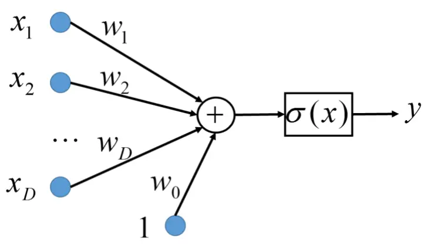
数据来源：广发证券发展研究中心

图4：逻辑函数输入输出图
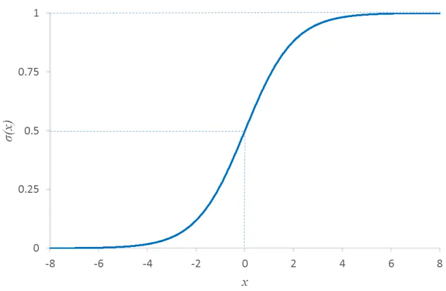
数据来源：广发证券发展研究中心

图 3中神经元的数学表达式为

$$
y=\sigma(\sum_{i=1}^{D}w_{i}x_{i}+w_{0})
$$

其中，权重系数 $w_{0},\ w_{1},\ \dots,\ w_{D}$ 为模型参数。

一个完整的神经网络模型通常将节点分成若干层次：输入层，输出层和隐含层，如下图所示。输入层即给定的模型输入特征；输出层即通过神经网络“预测”的内容，例如样本的标签或者函数值；隐含层相当于网络系统的中间状态。对于回归神经网络，输出层节点的个数即我们所要预测的变量个数；对于分类神经网络，输出层节点的个数通常是可能的分类问题的总类别数。下图是包含一个隐层的神经网络，其中神经网络第 k个输出的数学表达式为

$$
y_{k}=\sigma\Big\{\sum_{j=1}^{M}(w_{kj}^{(2)}h(\sum_{i=1}^{D}w_{ji}^{(1)}x_{i}+w_{j0}^{(1)})+w_{k0}^{(2)})\Big\}
$$

其中 σ(x)和 ℎ(x)分别为输出层和隐含层的激活函数。神经网络的参数为各层的网络系数 $w_{ij}$ ，可以一并记为向量w。

图5：神经网络示意图
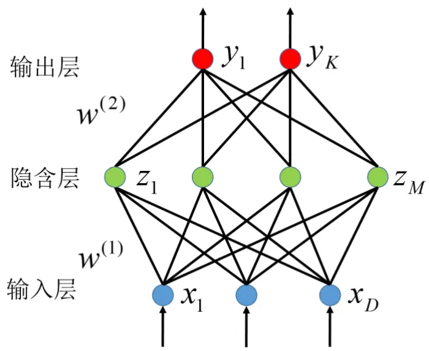
数据来源：广发证券发展研究中心

神经网络模型的学习是利用我们已经有的输入输出数据（训练集），对参数w 进行优化，使得模型给出的输出 y 尽可能地接近于样本的真实标签 t，即要使得如下的预测误差（损失函数）最小化

$$
E(\mathbf{w})=\sum_{n=1}^{N}E_{n}(\mathbf{w})=\sum_{n=1}^{N}\sum_{k=1}^{K}\big(y_{nk}-t_{nk}\big)^{2}
$$

该目标函数的优化问题称之为最小化均方误差。对于分类问题，也可以构建其他形式的目标函数，例如，交叉熵（Cross Entropy）损失函数更适合作为分类神经网络模型优化的目标函数。

对于一般的机器学习优化问题，可以通过梯度下降方法进行迭代寻优，获取最优的参数w：

$$
w_{ij}^{(n)}:=w_{ij}^{(n-1)}-\alpha\frac{\partial}{\partial w_{ij}}E(\mathbf{w})
$$

即，第n次迭代时，将第 n-1次迭代的参数沿梯度方向移动一定步长，获得最新的参数值。其中α为学习率，表示每一次迭代的步长。

当神经网络训练样本的数据量很大时，梯度下降法效率很低，可以采用计算效率比较高的随机梯度下降（Stochastic gradient descent）方法或者是迷你批量梯度下降（Mini-batch gradient descent）方法进行优化。深度学习中，神经网络的训练一般采取迷你批量的方式进行优化。迷你批量迭代优化的方式中，每次根据部分样本（一个迷你批次内的样本，相对于全体样本集而言只是少量样本）进行梯度计算和迭代优化。假如我们将全体训练样本划分为 M 个小的迷你批次，每处理一个批次时都更新一次参数。那么把所有的样本遍历一次时，进行了 M 次的参数迭代；而传统的梯度下降方法把所有的样本遍历一次时只进行了一次迭代。因此，迷你批量梯度下降方法的计算效率比传统的梯度下降法要高很多。

梯度下降方法（包括随机梯度下降方法和迷你批量梯度下降方法）的关键在于梯度的求取。在神经网络模型中，目前最流行的是 1986 年由 Rumelhart 和 McCelland 提出的反向传播算法（BP算法），从输出层开始后推，使用误差反向传播的方式优化参数。

深层神经网络一般比普通的神经网络具有更多的隐层（大于等于 2个隐层）。下图是一个具有 2个隐层的神经网络。深度学习模型中，由于模型的层次深、模型表达能力强，因此深层神经网络有能力表示大规模数据的特征。对于图像、语音这种特征不明显的问题，深层模型能够在大规模训练数据上取得更好的效果。

图6：深层神经网络示意图
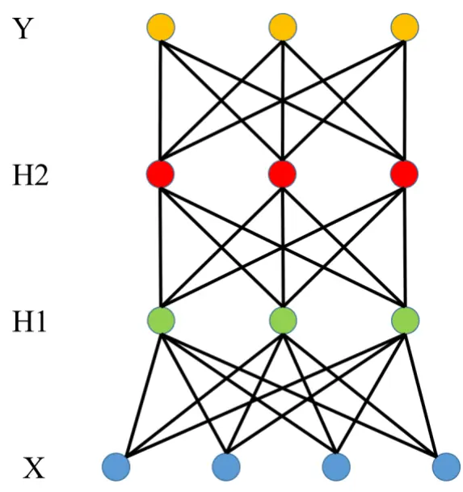
数据来源：广发证券发展研究中心

深层神经网络的问题是模型难以优化，或者说难以获得足够好的网络参数。由于深层神经网络的优化问题是非凸的而且模型训练时存在梯度弥散现象，因此，训练深层神经网络模型时难以获得最优的网络参数。2006年 Hinton提出的逐层学习预训练的方法解决了深层网络的训练问题，使得深层神经网络在机器学习实践中取得了巨大的成功。

近年来的大量研究进展表明，当训练数据足够大、并且采取适当的模型结构时，不进行预训练也可以训练出性能不错的深度学习模型。以下，我们选取近年来几个重要的训练技巧和模型结构进行简单说明。

## （二）Rectified Linear Unit 激活函数

激活函数是神经网络中的重要单元。通过非线性的激活函数，神经网络模型有能力拟合不同的非线性函数。在神经网络中，我们常用的激活函数有Sigmoid函数和正切函数等。其中，Sigmoid函数 $\sigma(x)=\frac{1}{1+e^{-x}}$ ，正切函数 $\operatorname{tanh}(x)={\frac{e^{x}-e^{-x}}{e^{x}+e^{-x}}}$ ，分别如下图所示。

Sigmoid 函数和正切函数作为激活函数的主要问题是存在“饱和区”。也就是在函数输入 x 远离 0 点的区域，激活函数的一阶导数接近于 0。因而，在求梯度优化神经网络参数的时候，很容易出现梯度消失的情况，导致参数更新会很慢，甚至会造成信息丢失，无法完成深层网络的训练。另一方面，在计算激活函数和误差反向传播求梯度的时候，Sigmoid函数和正切函数涉及指数运算，计算量相对较大。

图7：Sigmoid激活函数和正切激活函数
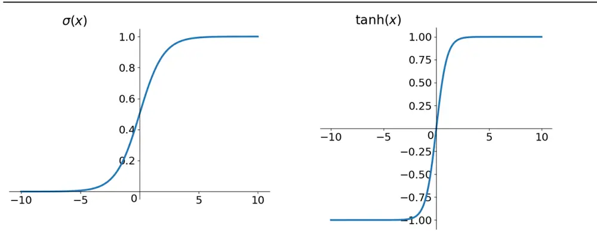
数据来源：广发证券发展研究中心

修正线性单元（Rectified Linear Unit，ReLU）是上述问题的一种解决方案。

生物学上，脑科学家基于对大脑能量消耗的观察，估测大脑中同时被激活的神经元只有 1%~4%。换而言之，同一时刻，神经元只对输入信号的小部分进行选择性响应，而屏蔽掉其它大量信号。从这个角度来看，ReLU 是一种比 Sigmoid 更接近生物学的激活函数，其表达式为f(x) = max(0,x)。如下图所示，当神经元的输入值小于0时，它的输出被强制置为 0（被屏蔽）；当输入值大于0时，神经元输出等于输入信号（正常输出）。这样的网络会“掩盖”部分神经元，因而具备了一定的稀疏性。从应用效果来看，这样的模型可以更好地提取稀疏特征，提高模型学习的精度。

在求梯度的时候，当输入 x 大于0 时，ReLU 函数的导数值为 1，没有饱和区。因而，模型训练时，梯度可以很好地在多层网络之间传播，大大改善了“梯度消失”现象，能够显著提高训练速度，加快模型参数收敛。

图8：ReLU激活函数
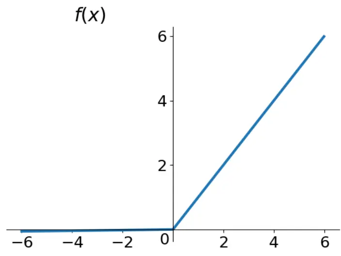
数据来源：广发证券发展研究中心

与 Sigmoid 函数和正切函数相比，ReLU 作为激活函数在信号正向传播和误差反向传播中计算简单（不含指数运算），运算速度非常快。因此，采用 ReLU 激活函数的神经网络的收敛速度远高于Sigmoid和正切激活函数。此外，ReLU具备稀疏表征的能力，使得神经网络具备更高的精度。目前在深层神经网络中，ReLU 激活函数及其变种已经成为主流。

## （三）Dropout 技术

深层神经网络包含多个非线性的隐层，这使得它具备表达输入与输出之间复杂关系的能力，是一种表达能力非常强大的机器学习系统。但是在训练数据有限的情况下，神经网络表达的某些特征可能源于噪声——这种数据特征只存在于训练集中，与数据中隐含的真实信息无关，这就会引起“过拟合”现象。

在深度学习模型的研究和应用中，人们在降低模型的过拟合上做了大量的工作。Dropout 是其中的一项重要技术。

Dropout 由Srivastava等人于 2014年提出，是一种有效减小深层神经网络过拟合的方法。Dropout 会设定概率 p,在每次迭代训练时，每个隐含节点按照概率 p 保留，按照概率1−p 被舍弃，如下图所示。对于一个包含 n个神经元的网络，每个节点都有被丢弃和不被丢弃两种可能性，因此训练带有Dropout的神经网络可以看成是在训练2n个“简化版”的神经网络。Dropout只用于训练模型。在模型应用时，使用不采取 Dropout的原始网络结构，即每个隐含节点都会采用，此时，通过对每个神经元输出乘上 p，使得模型应用时的输出值与训练时的预期输出值保持一致。从集成学习的角度来看，模型应用时，2n 个简化的神经网络被集成成单一的神经网络，可以显著提高模型的泛化能力，使其在测试集上有更好的表现。

Dropout每次迭代优化时都会随机选择丢弃不同的隐层节点，这驱使每个隐层节点去学习更加有用的、不依赖于其他节点的特征。这样就使得神经网络的鲁棒性得到了显著提高。

Dropout 自提出以来，已经被证实在大量深度学习场景中可以获得比其他正则化方法（如 L1正则化、L2正则化、Early Stopping等）更好的效果。

图9：Dropout示意图
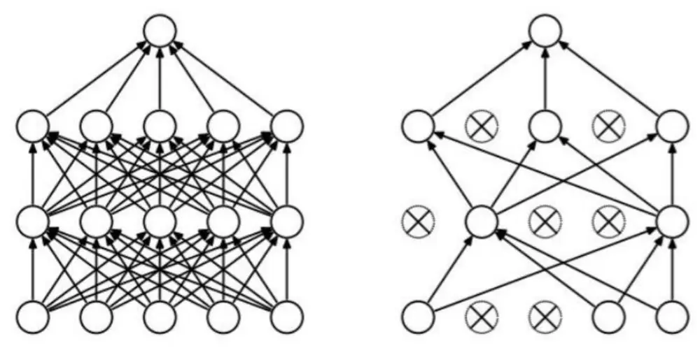
数据来源：广发证券发展研究中心

## （四）Batch Normalization

深层神经网络因为模型复杂度较高，往往需要大量时间来进行训练，如何加速模型的训练一直是学术界研究的热点之一。神经网络每一层的输入值都受到位于它之前的所有隐层节点的影响，因此任何参数的微小变化，随着深度增加，其实际起到的影响会逐渐扩大，使得隐层节点很容易进入饱和区，造成求导时梯度消失。因此，深层神经网络优化时需要降低学习率，并且小心地给模型参数设置初始值——这样导致了训练速率很低。

可以事先通过数据预处理，给神经网络模型标准化的输入。但是训练过程中随着参数的不断变化和模型层次的加深，每一层的输入值分布也会不断变化。Ioffe 和 Szegedy在 2015年提出了BatchNormalizaiton，在每一个隐层节点的激活函数之前，对激活函数输入值进行标准化操作，调整每一个神经元节点输入值的均值和方差。这能够使得神经元输入值的分布更稳定，有利于模型的梯度计算和参数的迭代优化。使得我们优化神经网络参数时能够使用更大的学习率，加快网络参数收敛。

Batch Normalization 具体的做法是：在神经网络训练时，在每个迷你批次里，对于每个隐层节点输入值 x，按照

$$
\hat{x}=\frac{x-E[x]}{\sqrt{Var[x]}}
$$

进行标准化。其中，E[x] 和 Var[x] 是该批次样本在该节点输入值 x 的均值和方差。这样标准化之后损失了节点变量的均值和方差信息，会降低神经网络的特征表达能力。因此，在上述标准化步骤之后，引入参数 γ 和 β，对每个节点的均值和方差进行调整：

$$
y=\gamma\hat{x}+\beta
$$

其中参数 γ 和 β 在训练过程中会不断更新，直到接近最优值。通过这样的变换，使得所有的样本在该节点输入值的均值变成 β ，标准差变成 γ 。

Batch Normalization能够使得每个批次样本的神经元非线性激活函数的输入值都服从相近的分布，减小神经元进入饱和区的几率，加快模型参数的收敛速度。同时，BatchNormalization 还能够起到正则化的作用，提升模型的泛化能力。如下图所示，在其他超参数相同的情况下，Batch Normalization 不仅能够加速收敛，而且可以获得更高的预测准确率。

图10：Batch Normalization效果
模型测试准确率随训练迭代次数变化的曲线
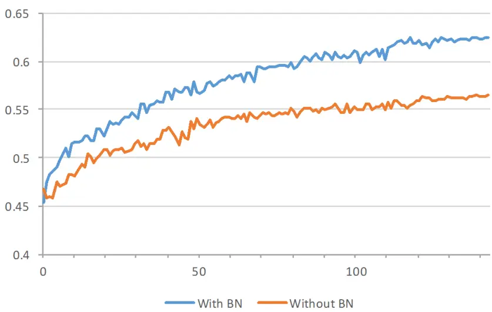
数据来源：广发证券发展研究中心
识别风险，发现价值

## （五）模型结构优化

深层神经网络包含大量超参数，如学习率、隐层数量、每个隐层的节点个数、正则化惩罚系数等。这些参数的不同取值会对神经网络的最终表现产生影响。然而，寻找最优的超参数是一个十分困难而且耗时的过程。

网格搜索是一种常用的超参数寻优方法，首先根据经验给每个超参数设定一组候选值，然后穷举各种参数组合，找到在验证集上表现最好的参数组合。网格搜索的优点是方法简单，可以并行计算，缺点是训练总次数会随超参数个数呈指数增长，现实情况下往往不能穷举出所有情况，效率较低。

随机搜索是另一种超参数寻优方法。其基本方法是首先根据经验给每个超参数设定一个范围，每次训练时，从每个超参数的设定范围内随机地选择一个数赋给对应的超参数。经过一定次数的搜索后，选择在验证集上表现最好的超参数组合作为最优的模型超参数。

本报告中，我们采用网格搜索的方法进行模型结构的优化。首先确定好一组候选的模型结构，包括模型的隐层数量，每个隐层的节点个数，Dropout 的节点保留概率等。通过穷举以上候选模型结构，筛选出在验证集样本上性能最佳的模型结构。

## 三、策略与实证分析

多因子选股策略在选股时，选取未来一段时间相对强势的股票构建组合，以获得超越基准的收益。

在深度学习选股策略中，通过深度学习模型对股票进行打分，预测未来一段时间的走势，选出相对强势的股票。

选股策略如下图所示，深度学习模型建立起当前时刻（t时刻）及此前市场数据和此后一段时间股票价格走势之间的关系，即使用t时刻信息 $X_{t}$ 通过深度学习模型对未来走势 $Y_{t}$ 进行预测。模型预测打分可以用来判断股票的相对强弱，可以作为选股因子来筛选股票。

图11：基于深度学习预测模型的Alpha策略示意图
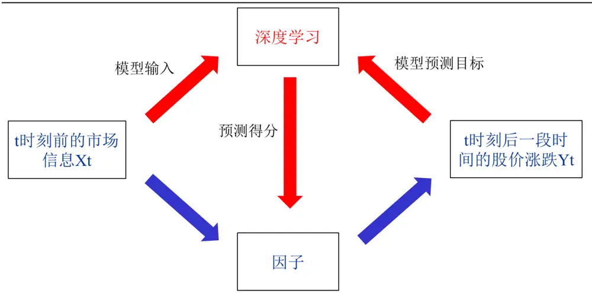
数据来源：广发证券发展研究中心

## （一）深度学习策略流程

本报告中，多因子策略的股票池为全市场股票，剔除上市交易时间不满一年的股票，剔除ST股票，剔除交易日停牌和涨停、跌停的股票。

策略调仓周期为20个交易日。每次调仓时把股票等分成十档，等权买入深度学习预测模型打分最高的一档。

考察时期为自2007年1月至2017年4月。我们采用2007年1月至2010年12月的数据来训练深度学习预测模型，用2011年1月以来的数据进行策略的回测。

交易策略的流程如下图所示。

在深度学习预测模型中，每期的每只股票都是一个样本，股票因子值是样本特征，也是深度学习模型的输入信息，股票未来的走势是样本的标签，也是深度学习模型的输出信息。

在模型训练阶段和选股交易时，都需要先对市场数据进行预处理。在模型训练阶段，需要把历史市场数据标准化成为适合深度学习模型的特征数据；在选股交易阶段，我们处理好当前市场的数据，作为每个股票的特征数据，通过训练好的深度学习模型，对每个股票的未来走势进行预测打分，然后根据每个股票的打分进行分档选股，构建组合。

图12：深度学习选股策略流程图
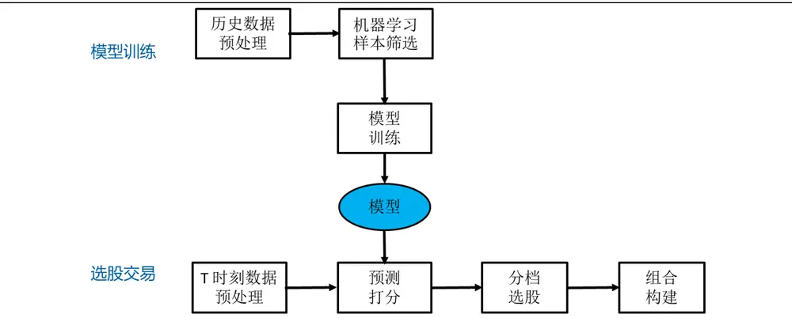
数据来源：广发证券发展研究中心

数据预处理分成两步：股票因子的提取计算和股票因子的标准化。

图13：深度学习策略数据预处理示意图

数据来源：广发证券发展研究中心

首先，我们从Wind、天软科技等金融数据终端提取市场数据，计算股票因子。

一般而言，结合专业领域知识，提取合适的特征，有利于提高机器学习模型的性能。在多因子选股中，常用的选股因子，如规模因子（流通市值）、反转因子（一个月股价反转）、PB、PE等本身就是比较有效的选股因子，这些数据可以作为深度学习选股模型的样本特征。除了常见的选股因子，技术指标也是大家关注的一大类指标，广发证券金融工程的研究报告《Alpha因子何处寻，掘金海量技术指标》中对技术指标进行了详细的描述，证实了技术指标选股也可以获取一定的超额收益。因此，我们也将技术指标作为样本特征。除了常用的选股指标之外，股票的一些其他属性，例如所属行业对股票的表现也有影响。因此，我们把股票的所属行业也作为机器学习预测模型的特征。

本报告中深度学习选股模型选择的特征一共有156个，包括估值因子、规模因子、反转因子、流动性因子、波动性因子、技术指标和行业属性。

因子标准化过程分成如下几个环节：

## 1、异常值、缺失值处理

对股票因子数据中的异常值和缺失值进行处理。例如，当股票某一期的因子值缺失或者数据有异常时，用上一期的因子值进行替代。

## 2、极值压边界处理

当股票的因子数据显著偏离同期该行业股票因子数据时，可以设置边界阈值进行极值处理。例如，我们可以令上边界为同期该行业内股票因子值的均值加上3倍标准差，即 $\mathbf{ub}=\operatorname{E}(\mathbf{x})+3{\mathrm{std}}(\mathbf{x})$ ；下边界等于同期该行业内股票因子值的均值减去3倍标准差， $\Theta\mathbf{|\mathrm{b}=E(x)-3std(x)}$ 。当股票因子值超出上边界，即当x > ub时，令x = ub；当股票因子值超出下边界，即当x < lb时，令 $\mathbf{\tilde{x}}=\mathbf{l}\mathbf{b}$ 。这样，可以使得所有的因子数据位于下边界 lb 和上边界 ub之间。

## 3、沿时间方向的因子标准化

沿时间方向的因子标准化使得不同时段的因子值可比。例如，2015年市场的成交量和当前市场有显著的区别，成交量相关的选股指标也与当前市场有较大的差异。可以对成交量相关的选股因子按照此前一段时间的成交量均值进行标准化处理，使得不同时期的因子值可比。沿时间方向因子标准化的好处是使得我们用历史数据训练出的模型可以用来对未来的市场进行预测。

## 4、沿截面的因子标准化

沿截面方向的因子标准化使得不同特征的值可比，例如流通市值和换手率的数据相差很大，通过因子标准化，可以使得标准化之后的流通市值和换手率可比。因子标准化的方法有z-score标准化、min-max标准化、排序标准化等。

假设在时刻 t，某股票 k 的因子 i 的值为 $\boldsymbol{x}_{t,k}^{i}.$ 。z-score标准化把变量处理成均值为0，方差为1：

$$
\widetilde{x}_{t,k}^{i}=\frac{x_{t,k}^{i}-\mathrm{E}[x_{t}^{i}]}{\mathrm{std}[x_{t}^{i}]}
$$

其中，E[xti]和std[xti]分别为该时刻所有股票的因子 i 的均值和标准差。

Min-Max标准化把变量处理成0到1之间的数：

$$
\tilde{x}_{t,k}^{i}=\frac{x_{t,k}^{i}-\operatorname*{min}x_{t}^{i}}{\operatorname*{max}x_{t}^{i}-\operatorname*{min}x_{t}^{i}}
$$

其中， $\operatorname*{min}x_{t}^{i}\mathcal{\neq}\operatorname*{max}x_{t}^{i}$ 分别为该时刻所有股票的因子 i 的最小值和最大值。

排序标准化是根据股票在因子i 的值进行排序，按照序号对应到0到1之间。因子值最小的标准化为0，因子值最大的标准化为1，其他标准化为小于1且大于0的数。

## 5、按照机器学习模型来调整因子分布

不同的机器学习模型对输入数据的假设有差别，需要根据模型的假设来调整因子分布。深层神经网络一般对输入数据的假设不强，可以同时容纳连续型的输入数据和离散型的输入数据（如行业的0、1哑变量）。如果采用自编码器或者受限玻尔兹曼机，需要注意模型对输入数据的分布假设。

在选股交易阶段，预处理完因子数据之后，我们可以直接把处理好的因子数据输入深度学习预测模型，给出预测打分。但在模型训练阶段，为了训练好深度学习预测模型，我们需要对不同的股票样本添加“标签”，并且进行训练样本的筛选。

多因子选股是通过挑选相对强势的股票，获取超额收益。因而，本文提出的深度学习预测模型也是希望预测出相对强势的股票。模型训练时，我们获得每一天股票池内的全体股票，根据未来20个交易日后的股票涨跌幅来给不同的股票样本贴“标签”：“上涨”、“下跌”和“平盘”：

标记为上涨的股票是指相对强势的股票，即未来20个交易日涨幅最大的一部分股票；标记为下跌的股票是指相对弱势的股票，即未来20个交易日涨幅最小的一部分股票；标记为平盘的股票是指未来20个交易日涨幅处于中间层的股票。

样本筛选的目的主要在两方面，一方面是使得不同类别样本之间的区别比较大，另一方面是使得不同类别样本的数量尽可能接近。

由于选股交易时对上涨幅度较大的股票更感兴趣，因而在模型训练之前可以对样本进行筛选。如下图所示，对样本内每天的股票按照未来20个交易日的涨跌幅进行排序，取涨幅最大的前10%的股票，标记为上涨股票；取涨幅最小的前10%的股票，标记为下跌股票；取涨幅居中的前10%的股票（未来20日涨幅位于45%分位数到55%分位数之间），标记为平盘股票。这样使得三类样本的样本数量相等，更有利于训练模型。

通过样本筛选，使得不同标签股票样本差别比较明显。如果不进行样本筛选，而是把所有股票按照涨幅三等分，就会把涨幅位于33%百分位处的股票标记为上涨股票，而涨幅位于34%百分位处的股票标记为下跌股票——实际上这两只股票的差异并没有那么大，这样的类别划分不利于机器学习模型的训练。

图14：深度学习策略股票样本筛选示意图
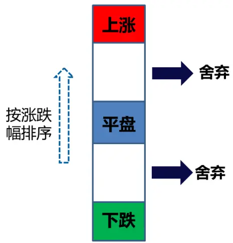
数据来源：广发证券发展研究中心
识别风险，发现价值

通过采用标记为上涨、下跌、平盘标签的股票数据进行训练，我们可以获得深度学习预测模型，预测每只股票在未来20个交易日的涨跌情况。

在样本外，我们可以对每只股票进行预测打分。根据股票的上涨打分，筛选前10%的股票构建组合。

## （二）深度学习预测模型

深度学习预测模型分成输入层、输出层和隐含层。

输入层是指股票样本的输入特征，包括股票的估值因子、规模因子、反转因子、流动性因子、波动性因子、以及其他技术指标，共计128个选股因子，以及28个申万一级行业类别因子。行业因子用0、1哑变量来表示股票的所属行业，当股票属于某行业时，对应元素的取值为1，其他元素的取值为0。因而，预测模型的输入层一共有156个节点。

输出层为股票的标签信息，本策略中用3维的向量表示。 $\mathrm{~y~}=[1\quad0\quad0]^{T}$ 表示上涨样本， $\mathbf{y}=[0\quad1\quad0]^{T}$ 表示平盘样本， $\mathrm{~y~}=\left[0\begin{array}{ll}{\mathrm{~0~}}&{\mathrm{~0~}}\end{array}\right]$ 1]T表示下跌样本。

输出层采用softmax激活函数。在预测时，输出层softmax激活函数的输入向量为$\mathbf{z}=[z_{1}\quad z_{2}\quad z_{3}]^{T}$ ，则经过softmax函数后，预测值为

$$
\hat{\mathbb{Y}}=[\hat{y}_{1}\hat{y}_{2}\hat{y}_{3}]^{T}=\left[\frac{e^{z_{1}}}{\sum_{i=1,2,3}e^{z_{i}}}\frac{e^{z_{2}}}{\sum_{i=1,2,3}e^{z_{i}}}\frac{e^{z_{3}}}{\sum_{i=1,2,3}e^{z_{i}}}\right]^{T}
$$

其中， $\hat{y}_{1},~\hat{y}_{2},~\hat{y}_{3}$ 都是大于0且小于1的数，而且 $\hat{y}_{1}+\hat{y}_{2}+\hat{y}_{3}=1$ 。第一个输出节点的预测值 $\begin{array}{r}{\hat{y}_{1}=\frac{e^{z_{1}}}{\sum_{i=1,2,3}e^{z_{i}}}}\end{array}$ 即是我们对股票的上涨预测打分。

在分类问题中，我们从 $\hat{y}_{1},\hat{y}_{2},\hat{y}_{3}$ 中选取最大的预测输出，将样本分成对应的类。例如，如果 $\hat{y}_{1}>\hat{y}_{2}$ 且 $\hat{y}_{1}>\hat{y}_{3}$ ，则我们将该样本划分为第一类（上涨类股票）。

而在选股时，我们根据不同股票样本的上涨打分 $\hat{y}_{1}$ 的大小进行选股，本策略中选取上涨打分 $\hat{y}_{1}$ 前10%的股票构建组合。

隐层的层数和每层的神经元节点数量需要我们提前设定，通过网格搜索方法，我们从一系列的隐层层数和神经网络结构中挑选了如下的模型结构：

156（输入层）-512（第1个隐层）-200（第2个隐层）-200（第3个隐层）-200（第4个隐层）-128（第5个隐层）-3（输出层）

该深层网络模型一共分为7层，其中包含5个隐层，每个隐层的隐层节点数依次为：512（隐层1）、 200（隐层2）、200（隐层3）、 200（隐层4）和 128（隐层5）。

通过样本筛选，我们从2007年至2010年获取了42万个样本，随机划分37万个样本作为训练数据，剩下的5万多个样本作为验证集数据，用来评估深度学习模型的有效性。

在训练样本上，模型的预测准确率为67.84%，在验证集样本上，模型的预测准确率为62.32%。显著高于随机预测的表现（对于三分类问题，随机预测的准确率大约为1/3，即33.33%）。

如下图所示，对于验证集的5万多个样本，深度学习模型将其划分为上涨一类的有22217个样本，其中有12403个样本实际上也是属于上涨一类（未来20日涨幅较大），预测准确率为55.8%，其中仅有3762个样本属于下跌一类（未来20日涨幅较小），占预测上涨股票的比例仅16.9%。

从测试结果来看，深度学习模型抓住了强势股票的某些特征，分类准确率显著优于随机预测的表现。

图15：深度学习模型预测效果

|  |  | 预测 |  |  |  |
| --- | --- | --- | --- | --- | --- |
|  |  | 上涨 | 平盘 | 下跌 | 合计 |
| 实际 | 上涨 | 12403 | 3087 | 1182 | 16672 |
|  | 平盘 | 6052 | 9103 | 2248 | 17403 |
|  | 下跌 | 3762 | 2535 | 9700 | 15997 |
|  | 合计 | 22217 | 14725 | 13130 | 50072 |

数据来源：广发证券发展研究中心，Wind

## （三）策略回测

在 2011年1月到2017年4 月（样本外），用训练好的深度学习预测模型进行策略回测。每20个交易日调仓，按照0.3%的交易成本进行回测。

调仓时，按照深度学习选股因子——即预测打分 $\hat{y}_{1}$ 进行选股。

选股因子的 IC表现如下图所示，模型在样本内的IC很高，而样本外弱了很多。一方面是由于机器学习模型的（样本外）泛化能力弱于（样本内）拟合能力，另一方面是由于样本外市场风格和市场结构可能有所变化，使得模型的性能不如样本内的表现。但总体而言，选股因子在样本外的IC平均值为0.092，标准差为0.065，而且大部分情况下，模型的 IC为正值。由此可见，该选股因子的 IC表现不错。

图16：深度学习选股因子的IC
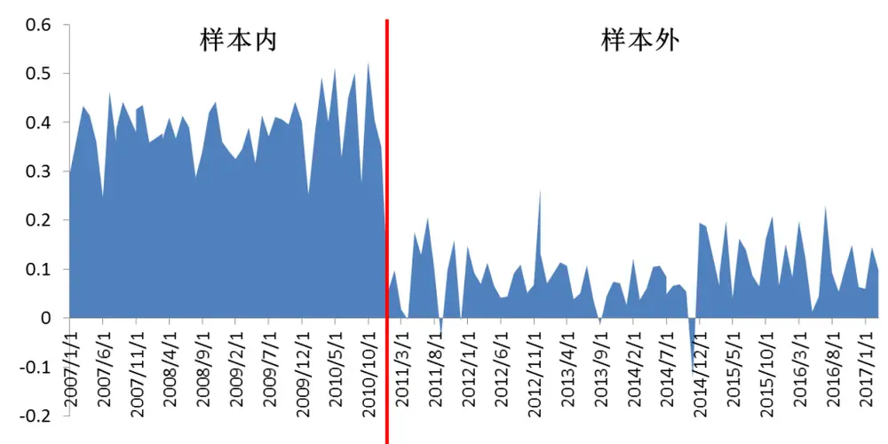
数据来源：广发证券发展研究中心，Wind

然后，对深度学习选股因子的选股表现的单调性进行了测试。在每一次调仓时，按照选股因子的值，将股票分成10档，依次记为D1，D2，……，D10，其中 D1 档选取的是选股因子值最大的股票，D10 档选取的是选股因子值最小的股票。

选股因子的分档表现和累积收益情况如下面两个图所示。从图上可以看到，选股因子值大的股票整体表现优于选股因子值小的股票，选股因子分档的单调性好。

图17：深度学习选股因子的分档表现
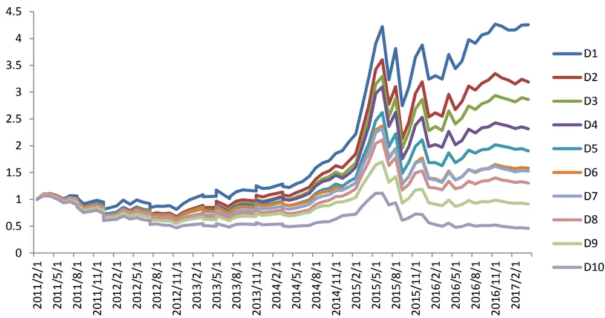
数据来源：广发证券发展研究中心，Wind
识别风险，发现价值

图18：深度学习选股因子的分档累积收益率
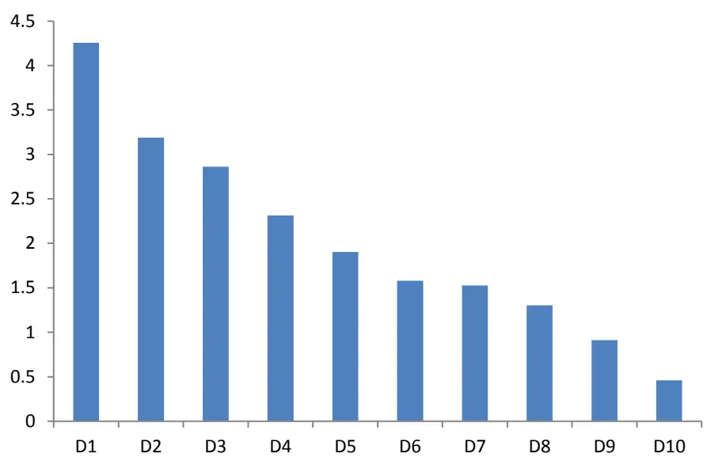
数据来源：广发证券发展研究中心，Wind

用中证 500 指数对冲时，对冲策略的表现如下图所示。从 2011 年以来，策略的年化收益率为 20.3%，最大回撤为-4.77%，月度胜率为88.0%。

图19：深度学习选股因子的分档累积收益率
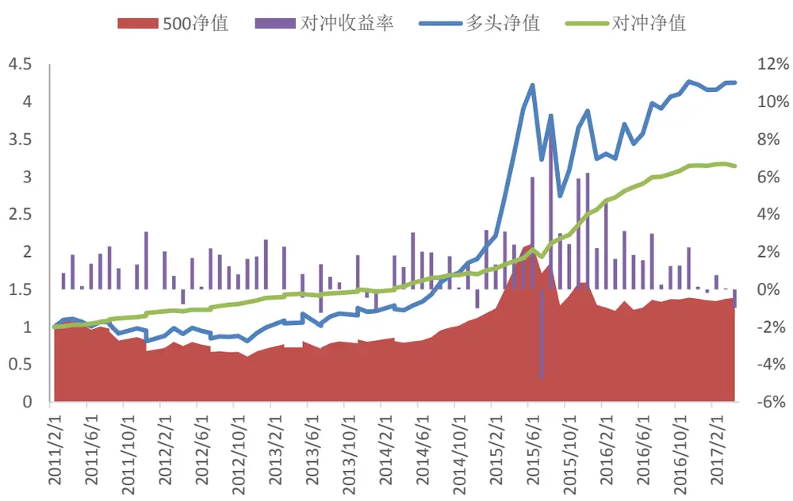
数据来源：广发证券发展研究中心，Wind
识别风险，发现价值

对冲策略分年度的收益回撤情况如下表所示。除了2017年前4个月之外，对冲策略在每年的收益都超过了10%。

表2：深度学习选股对冲策略分年度表现

| 年份 | 累积收益率 最大回撤 |
| --- | --- |
| 2011 | 21.59% -1.93% |
| 2012 | 17.98% -1.35% |
| 2013 | 13.00% -2.53% |
| 2014 | 18.72% -3.40% |
| 2015 | 52.48% -4.77% |
| 2016 | 26.43% -1.79% |
| 2017 | 0.83% -1.17% |

数据来源：广发证券发展研究中心，Wind

由于选股因子中技术类指标比较多，因而策略的换手率较高，每次调仓的平均换手率为78.9%。年化换手率为9.47倍。

图20：深度学习选股策略的每期调仓换手率
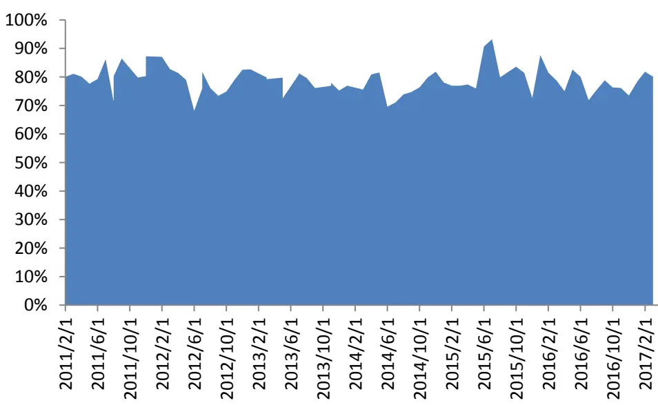
数据来源：广发证券发展研究中心，Wind

前文中是按照 0.3%的交易成本进行测算，如果将交易成本依次提高到 0.4%，0.5%和 0.6%，策略表现如下图所示。当交易成本提高时，策略表现有所下滑，但总体表现不错。

图21：交易成本提高之后的策略表现
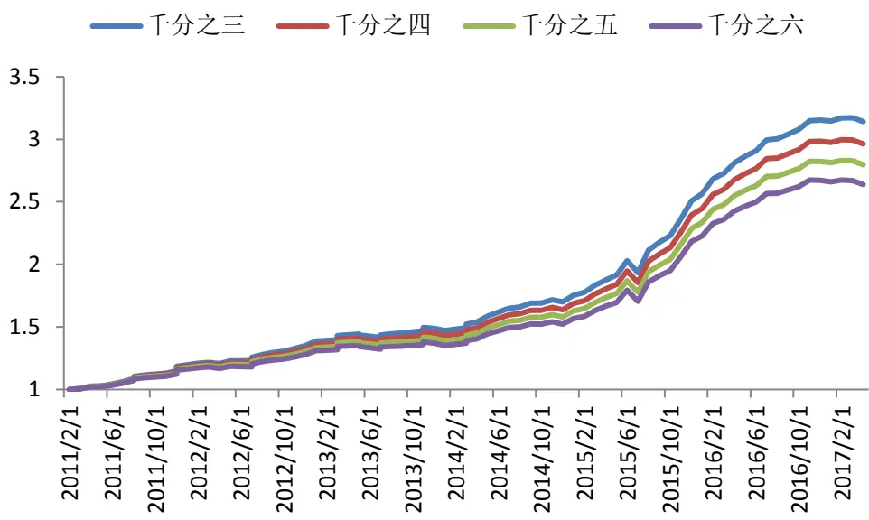
数据来源：广发证券发展研究中心，Wind

表3：不同交易成本下对冲策略的表现

| 交易成本 | 年化收益率 最大回撤 |
| --- | --- |
| 0.3% | 20.28% -4.77% |
| 0.4% | 19.15% -4.86% |
| 0.5% | 18.04% -4.95% |
| 0.6% | 16.93% -5.04% |

数据来源：广发证券发展研究中心，Wind

本报告中，深度学习选股因子与典型风格因子的相关性不高。如下图所示，深度学习选股因子与流通市值因子的平均秩相关系数为-0.060，与20日换手率因子的平均秩相关系数为-0.119，与20日股价反转因子的平均秩相关系数为-0.073，与盈市率因子的平均秩相关系数为0.017。

图22：深度学习选股因子与风格因子相关性
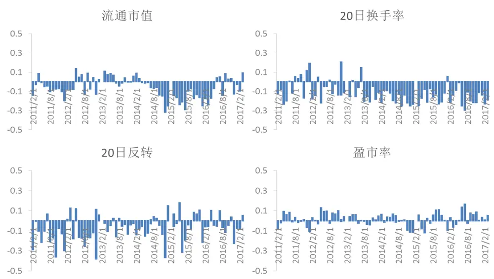
数据来源：广发证券发展研究中心，Wind

## （四）模型更新

前文中固定采用2010年之前的数据训练深度学习模型，2011 年之后的数据用于回测，在回测中不再更新模型。另一种常见的做法是定期更新深度学习模型。为了进行比较，我们对比展示了更新后模型和更新前模型的选股效果。

不更新的模型（模型2010）：在 2010年年底，采用2007年至 2010年的数据训练模型。

更新后的模型（模型2012）：在 2012年年底，采用2008年至 2012年的数据更新模型。

比较两个模型在 2013 年 1 月之后的表现，可以看到，更新后的模型在收益率和回撤上都有明显的改善。

图23：模型更新的对冲策略表现对比
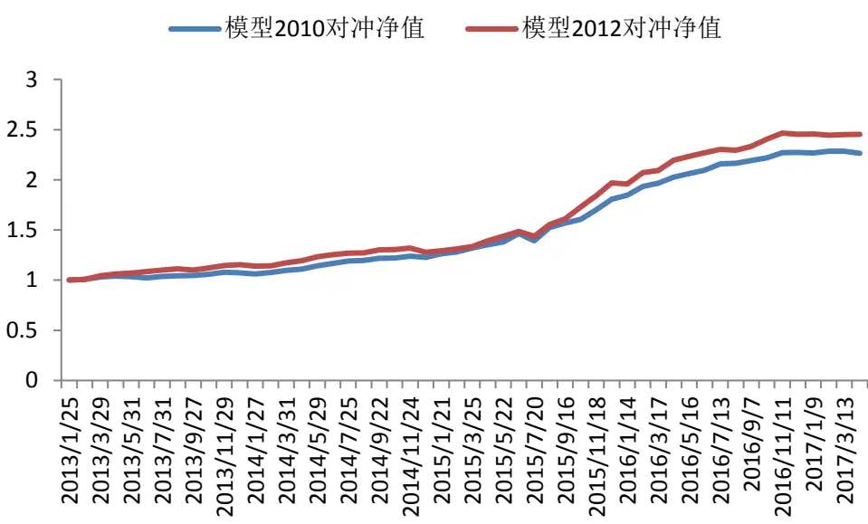
数据来源：广发证券发展研究中心，Wind

表4：模型更新后对冲策略的表现对比

| 模型 2010 | 模型 2012 |
| --- | --- |
| 年化收益率 | 22.24% 25.71% |
| 最大回撤 | -4.77% -3.34% |

数据来源：广发证券发展研究中心，Wind

## 四、总结与讨论

本报告通过实证分析，证实了深度学习预测模型可以用于月频的选股交易上。从全市场选股，每次选取市场上10%的股票进行配置，用中证 500指数对冲，从 2011年以来，年化收益率为 20.3%，最大回撤为 -4.77%，月度胜率为 88.0%。整体表现不俗。

从选股因子与传统风格因子的相关性分析中可以看到，深度学习选股因子与常见风格因子（规模、反转、流动性、估值）的相关性不高，可以考虑将深度学习因子作为一个新的选股因子，与传统风格因子进行组合。

从实证结果来看，模型更新有助于提高策略在实际交易中的性能。可以考虑定期更新模型，提高策略的收益。

## 风险提示

策略模型并非百分百有效，市场结构及交易行为的改变以及类似交易参与者的增多有可能使得策略失效。

## Table_RatingI ndustry 广发证券 —行业投资评级说明

买入： 预期未来12个月内，股价表现强于大盘10%以上。

持有： 预期未来12个月内，股价相对大盘的变动幅度介于-10%～+10%。

卖出： 预期未来12个月内，股价表现弱于大盘10%以上。

## Table_Rating Company 广发证券 —公司投资评级说明

买入： 预期未来12个月内，股价表现强于大盘15%以上。

谨慎增持： 预期未来12个月内，股价表现强于大盘5%-15%。

持有： 预期未来12个月内，股价相对大盘的变动幅度介于-5%～+5%。

卖出： 预期未来12个月内，股价表现弱于大盘5%以上。

## Table_Ad联系我们

|  | 广州市 | 深圳市 | 北京市 | 上海市 |
| --- | --- | --- | --- | --- |
| 地址 | 广州市天河北路183号 大都会广场5楼 | 号安联大厦15楼A座03- 号月坛大厦18层 | 深圳市福田区金田路4018 北京市西城区月坛北街2 | 上海浦东新区世纪大道8号 国金中心一期 16 层 |
|  |  | 04 |  |  |
| 邮政编码 客服邮箱 | 510075 | 518026 | 100045 | 200120 |
|  | gfyf@gf.com.cn |  |  |  |
| 服务热线 | 020-87555888-8612 |  |  |  |

## Table_Disclai mer 免责声明

广发证券股份有限公司（以下简称“广发证券”）具备证券投资咨询业务资格。本报告只发送给广发证券重点客户，不对外公开发布，只有接收客户才可以使用，且对于接收客户而言具有相关保密义务。广发证券并不因相关人员通过其他途径收到或阅读本报告而视其为广发证券的客户。本报告的内容、观点或建议并未考虑个别客户的特定状况，不应被视为对特定客户关于特定证券或金融工具的投资建议。本报告发送给某客户是基于该客户被认为有能力独立评估投资风险、独立行使投资决策并独立承担相应风险。

本报告所载资料的来源及观点的出处皆被广发证券股份有限公司认为可靠，但广发证券不对其准确性或完整性做出任何保证。报告内容仅供参考，报告中的信息或所表达观点不构成所涉证券买卖的出价或询价。广发证券不对因使用本报告的内容而引致的损失承担任何责任，除非法律法规有明确规定。客户不应以本报告取代其独立判断或仅根据本报告做出决策。

广发证券可发出其它与本报告所载信息不一致及有不同结论的报告。本报告反映研究人员的不同观点、见解及分析方法，并不代表广发证券或其附属机构的立场。报告所载资料、意见及推测仅反映研究人员于发出本报告当日的判断，可随时更改且不予通告。本报告旨在发送给广发证券的特定客户及其它专业人士。未经广发证券事先书面许可，任何机构或个人不得以任何形式翻版、复制、刊登、转载和引用，否则由此造成的一切不良后果及法律责任由私自翻版、复制、刊登、转载和引用者承担。