# 趋势策略的深度学习增强

## 深度学习研究报告之四

## Table_S um ary 报告摘要 ：

## 趋势策略的信号优选

一般而言，趋势策略在趋势市场盈利丰厚，而在震荡市场，趋势策略容易发生亏损。可以通过判断市场的趋势和震荡情况，筛选出趋势策略盈利机会高的交易信号进行交易；而在趋势策略盈利机会低时，放弃进行趋势交易。

## 非线性时间序列模型：循环神经网络（RNN）

近年来，神经网络研究进展飞速。除了传统的前向神经网络之外，还有擅长处理图像数据的卷积神经网络和擅长处理时间序列数据的循环神经网络。

循环神经网络与传统的前向神经网络相比，不同时刻的隐藏层的节点之间有连接，一个序列当前的输出会依赖于此前的系统状态，即网络会对此前的信息进行记忆并应用于当前输出的计算中。因此，循环神经网络非常擅长处理时间上有依赖关系的数据。目前，循环神经网络已经在文本生成、机器翻译、语音识别、图像描述生成等多个领域取得突出的表现，是处理时间序列问题的“专家”。

## 循环神经网络对趋势策略的增强

本报告提出了一种趋势策略的深度学习增强方案，在每个交易日取早盘行情数据，用循环神经网络模型来预测当日趋势策略能否盈利。若判断可以盈利，则根据早盘行情的走势进行趋势跟踪；若判断盈利机会小，则当日不开仓交易。实证分析证实策略在历史回测中表现良好，样本外（2014 年至 2017 年）年化收益率 18.47%，最大回撤为-8.63%，盈亏比为 2.27。同时，策略的单笔交易的平均收益率比较高，对交易成本不敏感。

## 风险提示

策略模型并非百分之百有效，市场结构及交易行为的改变以及类似交易参与者的增多有可能使得策略失效。

图 1策略样本外表现
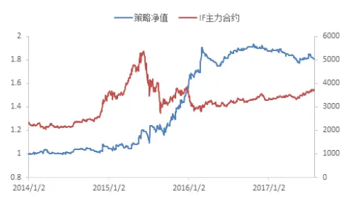

表 1 策略在 2014年以来表现

| 年化收益率 | 18.47% |
| --- | --- |
| 最大回撤率 | -8.63% |
| 盈亏比 | 2.27 |

分析师： 文巧钧 S0260517070001

0755-88286935

wenqiaojun@gf.com.cn

分析师： 安宁宁 S0260512020003

0755-23948352

ann@gf.com.cn

## Table_Re port 相关研究：

深度学习研究报告之一：深2014-06-18
度学习之股指期货日内交易
策略

深度学习研究报告之二：深2014-06-19度学习算法掘金 ALPHA因子

深度学习研究报告之三：深2017-07-11
度学习新进展：Alpha因子
的再挖掘

## 一、背景介绍：趋势策略的信号筛选

## （一）EMDT 策略

一般而言，趋势策略在趋势市场盈利丰厚，而在震荡市场，趋势策略容易发生亏损。

可以对市场的趋势和震荡进行判断，筛选交易信号，使策略具有更好的收益表现。此前，我们发布了一系列研究报告，用来评估市场趋势的强度，在趋势强的市场进行交易，而如果判断市场是震荡行情，则放弃进行趋势交易。

其中的一个典型策略就是《另类交易策略系列之十四：经验模态分解下的日内趋势交易策略》，即 EMDT 策略。该策略采用经验模态分解方法将股指期货的时间序列分解为噪声部分（震荡部分）和信号部分（趋势部分），然后计算这两部分的能量比值（信噪比）。如图1和图2 所示，策略发布三年多以来，在市场上取得了不错的表现。

图1：经验模态分解趋势提取示意图
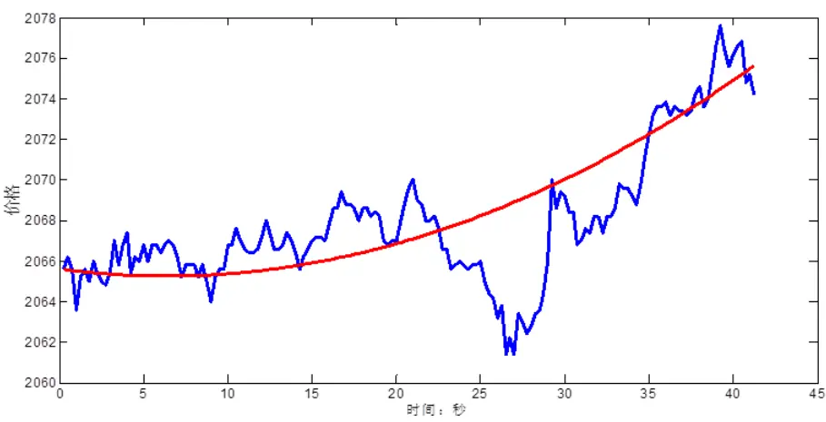
数据来源：广发证券发展研究中心，天软科技

图2：EMDT策略表现（自2010年4月16日起）
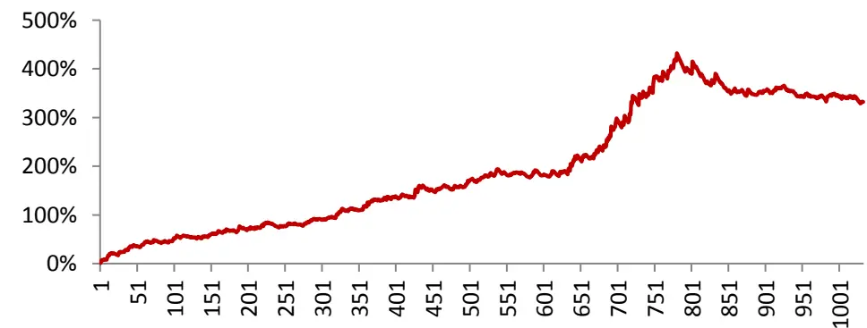
数据来源：广发证券发展研究中心，天软科技
识别风险，发现价值

## （二）成份股一致性选股策略

《另类交易策略系列之三十二：从成分股一致性来衡量市场的趋势》从市场成份股的一致性强弱出发，对市场指数未来的趋势强弱进行预判。

成份股一致性用来表示市场的成份股走势是否同涨同跌。图 3 展示了成份股一致性较强的时候，3个（标准化之后）股价序列的走势；图4 展示了成份股一致性较弱的时候，股价序列的走势。从直观上来看，图 3中成份股序列走势相似性高，而图 4中成份股序列走势之间的相似性弱。

在成份股一致性较强的市场，成份股同涨同跌，容易形成市场“合力”，产生趋势行情。而在成份股一致性较弱的市场，成份股随机波动，市场不易产生趋势。因而我们可以基于对市场成份股一致性强弱的计算，对市场的趋势进行估计，从而确定是否进行趋势交易。

我们构建了成份股的一致性指标 R为

$$
R={\frac{\lambda_{1}}{\sum_{i=1}^{300}\lambda_{i}}}\times100\%={\frac{\lambda_{1}}{\lambda_{1}+\lambda_{2}+\cdots+\lambda_{300}}}\times100\%
$$

其中， $\lambda_{1},\lambda_{2},\ldots,\lambda_{300}$ 是成份股走势的协方差矩阵Σ的所有特征值，一致性指标 R 是主成分分析中，第一个主成分的方差贡献率。

图3：成份股一致性强的市场（R=86.4）
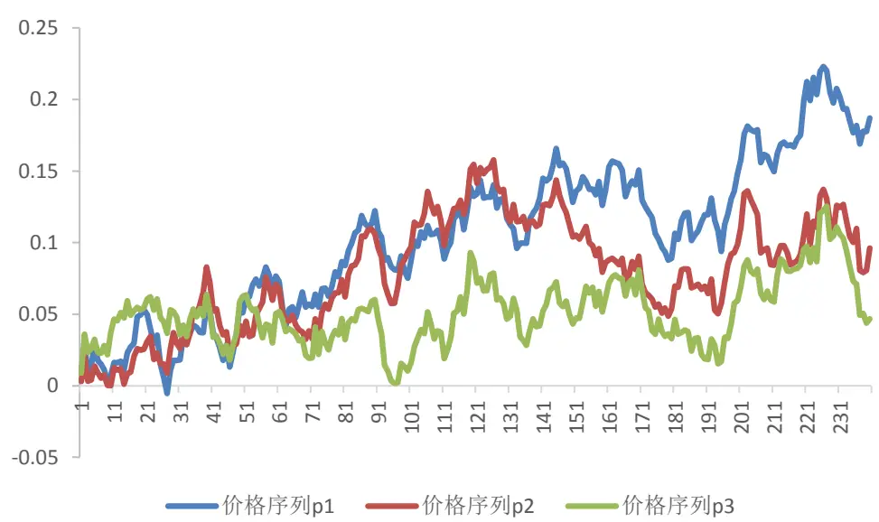
数据来源：广发证券发展研究中心

图4：成份股一致性弱的市场（R=45.2%）
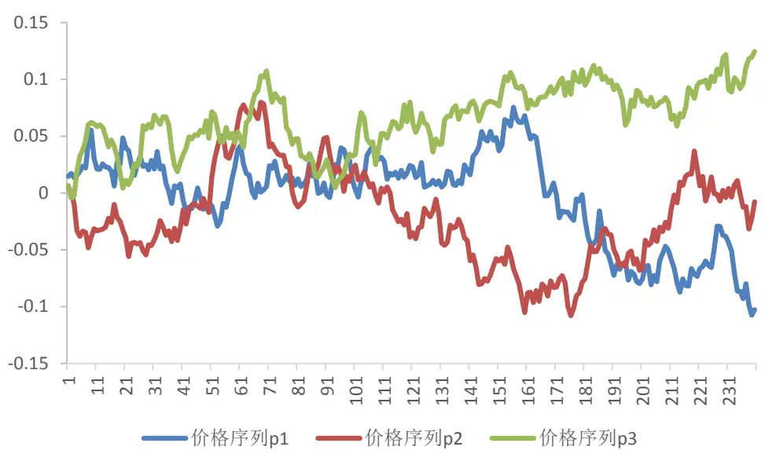
数据来源：广发证券发展研究中心

假如市场由图3或图4 中三只成份股构成，则图 3中三个成份股价格序列的走势一致时，R 较高，适合进行趋势交易；图 4中三个成份股价格序列的走势不一致，R较低，不适合进行趋势交易。

## （三）机器学习趋势信号优选

本报告研究的是用机器学习方法优选股指期货的趋势交易信号。股指期货行情数据是一个复杂的非线性时间序列。本报告通过循环神经网络（Recurrent Neural Network,RNN）来对股价行情数据进行建模。循环神经网络是神经网络的一种类型，对时间序列数据的建模分析非常有效，它在语音识别、文本分类、机器翻译等领域已经获得了成功的应用。本报告采用过去一段时间的股指期货行情数据建立RNN预测模型，用来预测当日趋势策略的盈利能力，如果预测当天趋势策略可以获利，则进行趋势交易；否则不进行交易。如下图所示。

图5：机器学习趋势信号筛选示意图
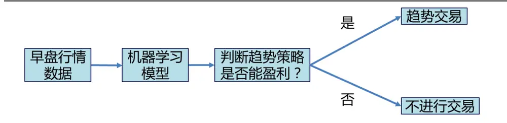
数据来源：广发证券发展研究中心，天软科技
识别风险，发现价值

## 二、循环神经网络

## （一）深度学习回顾

2006 年，多伦多大学教授 Geoffrey Hinton 提出的深度学习模型训练方法打破了深层神经网络发展的瓶颈。Hinton在《Science》发表的论文中提出了两个观点：（1）深层神经网络模型有很强的特征学习能力，深度学习模型学习得到的特征数据对原始数据有更本质的表征，这将显著有利于解决分类和可视化问题；（2）对于深层神经网络很难训练的问题，可以采用逐层训练方法解决。Hinton的工作发表之后，深度学习领域迎来了春天。特别是在2012年6月，《纽约时报》披露“谷歌大脑”项目之后，深度学习吸引了学术界和科技公司的广泛关注。

近年来，在机器学习专家和科研机构的努力下，深度学习在算法上有了非常大的进展。同时，深度学习在图像识别、语音识别、自然语言处理、推荐系统、医药生物、无人驾驶等方面的应用上纷纷取得了突破。2016年4月，基于深度增强学习的 AlphaGo在围棋上战胜了人类顶级棋手，攻克了“人类智慧的最后高地”。

深度学习是在对大量的数据进行特征抽象的同时，获得其丰富的表达。而对于特定的学习目标，相应的、合适的表征会被激活，从而获得足够好的学习效果。深度学习的本质是对观察数据进行分层特征表示，实现将低级特征抽象成高级特征表示的功能。深度学习具有许多的层级结构，如下图所示。

图6：深度学习的层级结构
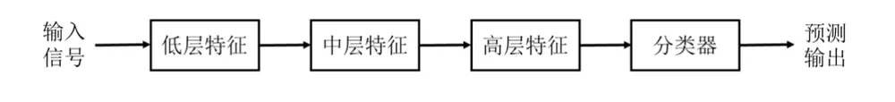
数据来源：广发证券发展研究中心

深层神经网络是目前主要的深度学习模型结构。2017 年，南京大学周志华教授提出了深度森林，这是一种非神经网络的深度学习模型。目前，绝大部分深度学习应用都是建立在深层神经网络的基础上，包括前向神经网络、卷积神经网络、循环神经网络和深度增强学习等。

神经网络由大量的节点（“神经元”）和节点之间的相互连接构成。每个节点代表一种特定的输出函数，称为激活函数。每两个节点间的连接都包含一个对于通过该连接信号的加权值，称之为权重。网络的输出则依网络的连接方式、权重值和激活函数的不同而不同。

图 7表示的是神经元的基本形式，将 D个输入变量和偏置项加权累加起来，经过激活函数，获得输出 y。常用的激活函数有 Sigmoid 函数、正切函数等。Sigmoid 函数也称为 Logistic函数，作为激活函数的表达式为

$$
y=\sigma(x)=\frac{1}{1+e^{-x}}
$$

如图 8所示。机器学习中常用的逻辑回归模型（Logistic Regression）就是采取这种形式的输出函数以达到分类的目的。

图7：神经元示意图
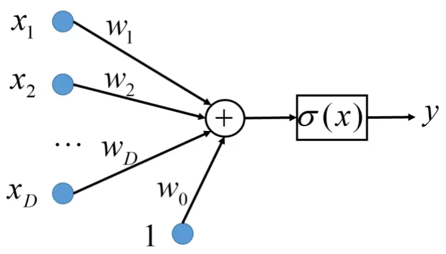
数据来源：广发证券发展研究中心

图8：逻辑函数输入输出图
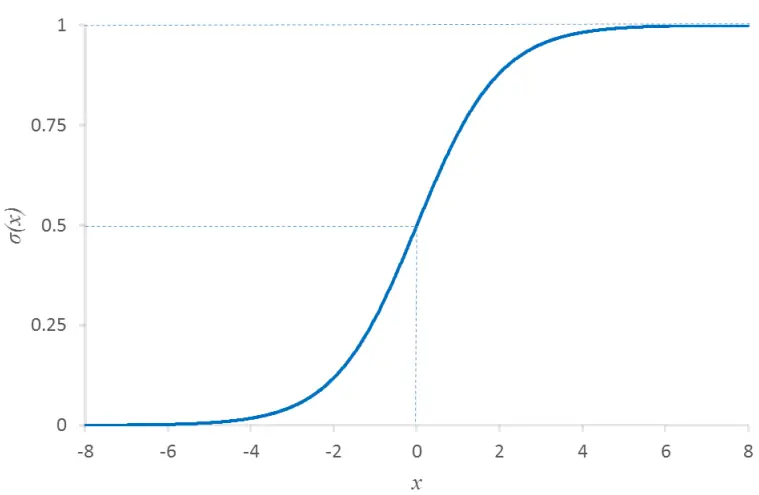
数据来源：广发证券发展研究中心
识别风险，发现价值

图 7中神经元的数学表达式为

$$
y=\sigma(\sum_{i=1}^{D}w_{i}x_{i}+w_{0})
$$

其中，权重系数 $w_{0},\ w_{1},\ \dots,\ w_{D}$ 为模型参数。

一个完整的神经网络模型通常将节点分成若干层次：输入层、输出层和隐含层，如下图所示。输入层即给定的模型输入特征；输出层即通过神经网络“预测”的内容，例如样本的标签或者函数值；隐含层相当于网络系统的中间状态。对于回归神经网络，输出层节点的个数即我们所要预测的变量个数；对于分类神经网络，输出层节点的个数通常是可能的分类问题的总类别数。下图是包含一个隐层的神经网络，其中神经网络第 k个输出的数学表达式为

$$
y_{k}=\sigma\Big\{\sum_{j=1}^{M}(w_{kj}^{(2)}h(\sum_{i=1}^{D}w_{ji}^{(1)}x_{i}+w_{j0}^{(1)})+w_{k0}^{(2)})\Big\}
$$

其中 $\sigma(x)$ 和 $h(x)$ 分别为输出层和隐含层的激活函数。神经网络的参数为各层的网络系数 $w_{ij}$ ，可以一并记为向量w 。

图9：神经网络示意图
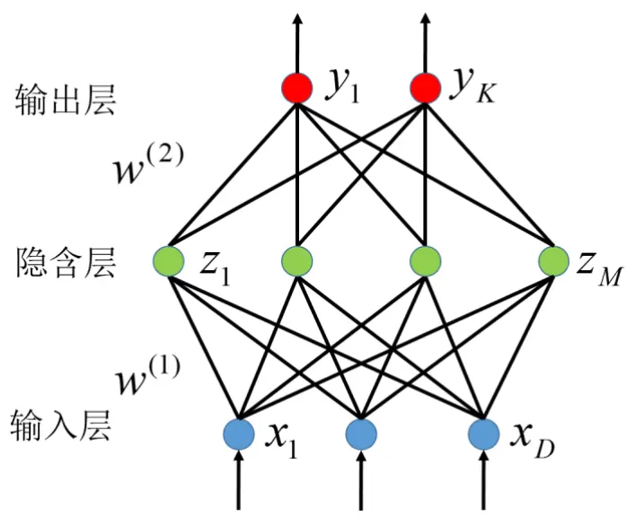
数据来源：广发证券发展研究中心

神经网络模型的学习是利用我们已经有的输入输出数据（训练集），对参数w 进行优化，使得模型给出的输出 y 尽可能地接近于样本的真实标签 t，即要使得如下的预测误差（损失函数）最小化

$$
E(\mathbf{w})=\sum_{n=1}^{N}E_{n}(\mathbf{w})=\sum_{n=1}^{N}{\sum_{k=1}^{K}\big(y_{nk}-t_{nk}\big)^{2}}
$$

该目标函数的优化问题称之为最小化均方误差。对于分类问题，也可以构建其他形式的目标函数，例如，交叉熵（Cross Entropy）损失函数更适合作为分类神经网络模型优化的目标函数。

对于一般的机器学习优化问题，可以通过梯度下降方法进行迭代寻优，获取最优的参数w：

$$
w_{ij}^{(n)}:=w_{ij}^{(n-1)}-\alpha\frac{\partial}{\partial w_{ij}}E(\mathbf{w})
$$

即，第n次迭代时，将第 n-1次迭代的参数沿梯度方向移动一定步长，获得最新的参数值。其中α为学习率，表示每一次迭代的步长。

当神经网络训练样本的数据量很大时，梯度下降法效率很低，可以采用计算效率比较高的随机梯度下降（Stochastic gradient descent）方法或者是迷你批量梯度下降（Mini-batch gradient descent）方法进行优化。深度学习中，神经网络的训练一般采取迷你批量的方式进行优化。迷你批量迭代优化的方式中，每次根据部分样本（一个迷你批次内的样本，相对于全体样本集而言只是少量样本）进行梯度计算和迭代优化。假如我们将全体训练样本划分为 M 个小的迷你批次，每处理一个批次时都更新一次参数。那么把所有的样本遍历一次时，进行了 M 次的参数迭代；而传统的梯度下降方法把所有的样本遍历一次时只进行了一次迭代。因此，迷你批量梯度下降方法的计算效率比传统的梯度下降法要高很多。

梯度下降方法（包括随机梯度下降方法和迷你批量梯度下降方法）的关键在于梯度的求取。在神经网络模型中，目前最流行的是 1986 年由 Rumelhart 和 McCelland 提出的反向传播算法（BP算法），从输出层开始后推，使用误差反向传播的方式优化参数。

深层神经网络一般比普通的神经网络具有更多的隐层（大于等于 2个隐层）。下图是一个具有 2个隐层的神经网络。深度学习模型中，由于模型的层次深、模型表达能力强，因此深层神经网络有能力表示大规模数据的特征。对于图像、语音这种特征不明显的问题，深层模型能够在大规模训练数据上取得更好的效果。

图10：深层神经网络示意图
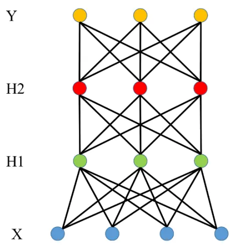
数据来源：广发证券发展研究中心

## （二）循环神经网络

神经网络是一种应用类似于大脑神经突触连接的结构进行信息处理的数学模型，但人类每次思考问题时，都不是从头开始，而是会利用之前的“记忆”为当前的决策提供支持。例如我们在对话时，我们会根据上下文的信息来理解一句话，如果仅仅分析单一的词句，就容易造成“断章取义”。前向神经网络不能实现这个“记忆”功能，因而不适合处理具有上下文依赖关系或者时序依赖关系的场景。

循环神经网络算法非常擅长处理这种时序上有依赖关系的数据。如图 11 所示,在传统的前向神经网络中，信息从输入层到隐含层，再到输出层，层与层之间是全连接的，但是不同时刻的节点之间是无连接的，这种网络无法直接处理时序问题；而循环神经网络中，不同时刻隐含层的节点之间是有连接的，一个序列当前的输出依赖于前面的状态，即网络会对前面的信息进行记忆并应用于当前输出的计算中。

以自然语言处理为例，针对两句话，“小明今天到达北京”和“小红今天离开北京”，需要通过神经网络判断“北京”是目的地还是出发地。那么循环神经网络可以利用“北京”前的“离开”或者“到达”两个词，来进行“北京”这个词的词义辨识。

图11：循环神经网络示意图
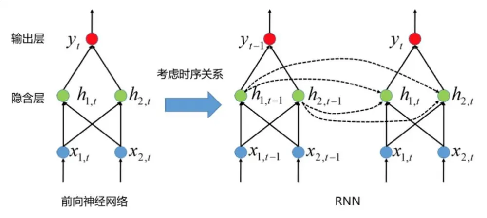
数据来源：广发证券发展研究中心

RNN 可以视为在时间维度上权值共享的神经网络。RNN 模型的输出为：$\mathbf{\nabla}y_{t}=\mathbf{\nabla}\sigma_{o}\big(\mathbf{W}_{y}\pmb{h}_{t}+\pmb{b}_{o}\big)$ ，模型输出依赖于该时刻的隐状态 $\pmb{h}_{t}$ 。隐状态 $\pmb{h}_{t}=\sigma_{h}(\pmb{W}_{x}\pmb{x}_{t}+$ ${\pmb W}_{h}{\pmb h}_{t-1}+{\pmb b}_{h})$ ，依赖于该时刻的输入 $\boldsymbol{x}_{t}$ 和上一时刻的隐状态 $\mathbf{\delta}\cdot\mathbf{h}_{t-1}$ 。由于隐状态具有时序依赖关系，因而 RNN模型的输出与此前时刻的输入信息有关系。

图12：循环神经网络的参数
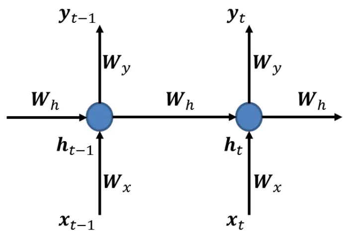
数据来源：广发证券发展研究中心

可以这样来分析RNN模型与普通时间序列模型的关系。考虑单变量的情况， $\dot{\tau}\mathfrak{L}\mathfrak{x}_{t}=$ $x_{t}$ $\boldsymbol{W_{h}}=\boldsymbol{\beta},\ :\ :\boldsymbol{W_{x}}=\boldsymbol{\alpha}$ ，令输出 $y_{t}=h_{t}$ ，而且令 $\cdot\sigma_{h}$ 为恒等变换，则RNN 模型可写成

$$
y_{t}=\alpha x_{t}+\beta y_{t-1}+b
$$

这是一个带外生变量的一阶自回归模型。因此，RNN是一种复杂的非线性时间序列模型。

## （二）RNN参数优化时的梯度消失和梯度爆炸

前向神经网络可以采用反向传播（Back Propagation, BP）算法求梯度，对参数进行更新，而循环神经网络则可以通过沿时反向传播（Back Propagation Through Time, BPTT）算法求梯度。

图13：循环神经网络参数学习示意图
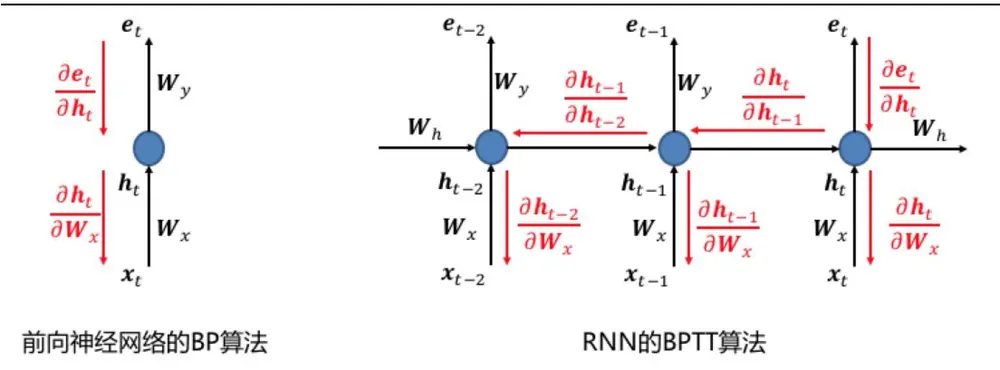
数据来源：广发证券发展研究中心

如上图所示，我们通过链式法则进行求导。在求误差项 $\mathbf{}e_{t}$ 相对于参数 $W_{x}$ 的梯度时，在前向神经网络中，

$$
\frac{\partial\pmb{e}_{t}}{\partial\pmb{W}_{x}}=\frac{\partial\pmb{e}_{t}}{\partial\pmb{h}_{t}}\frac{\partial\pmb{h}_{t}}{\partial\pmb{W}_{x}}
$$

其中 $\scriptstyle\mathbf{e}_{t}$ 表示输出误差。

在 RNN模型中，由于RNN的隐状态 $\pmb{h}_{t}$ 受此前时刻的隐状态 $\pmb{h}_{t-1}$ 影响，因此RNN的梯度求取与时间有关。通过BPTT，在时间上对其进行展开，RNN梯度计算的公式为：

$$
{\frac{\partial e_{t}}{\partial W_{x}}}={\frac{\partial e_{t}}{\partial h_{t}}}{\frac{\partial h_{t}}{\partial W_{x}}}+{\frac{\partial e_{t}}{\partial h_{t}}}{\frac{\partial h_{t}}{\partial h_{t-1}}}{\frac{\partial h_{t-1}}{\partial W_{x}}}+{\frac{\partial e_{t}}{\partial h_{t}}}{\frac{\partial h_{t}}{\partial h_{t-1}}}{\frac{\partial h_{t-1}}{\partial h_{t-2}}}{\frac{\partial h_{t-2}}{\partial W_{x}}}+\cdots
$$

RNN 模型的主要问题是参数学习难，存在梯度消失（大部分情况）和梯度爆炸问题（小部分情况）。

梯度消失问题发生的一个充分条件是 $\|\boldsymbol W_{h}\|<d$ 。例如，当隐层激活函数 $\sigma_{h}$ 为sigmoid函数时，d = 4。当隐层激活函数为线性函数时，d = 1。而当 $|W_{h}||>d$ 时，RNN模型容易发生梯度爆炸问题。梯度爆炸和梯度消失的原因的具体解释可以参考 R.Pascanu 等人的论文 On the difficulty of training recurrent neural networks。

由于梯度爆炸和梯度消失问题，RNN 模型的参数难以训练好，导致 RNN 事实上很难对长周期时序依赖关系进行建模。

## （三）长短期记忆模型（LSTM）的应用

长短期记忆单元（Long Short-Term Memory, LSTM）的提出有效地解决了简单循环神经网络的梯度爆炸和梯度消失问题，并在许多机器学习领域取得了成功。

LSTM 模型的关键是引入了一个门控单元系统,通过内部记忆单元——细胞的状态来保存历史信息，使用不同的“门”动态地让网络学习何时遗忘历史信息，何时用新信息更新细胞状态。通过这种方式避免 RNN的梯度消失和梯度爆炸问题。

图14：长短期记忆模型示意图
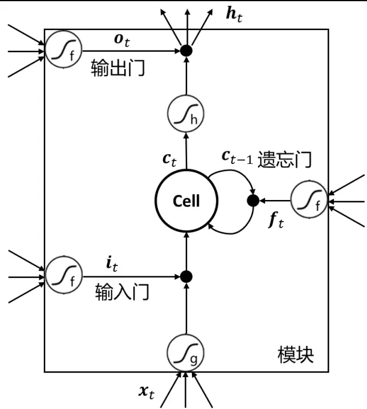
数据来源：广发证券发展研究中心

上图是LSTM单元的示意图。LSTM使用门来有选择地让一部分信息通过。在时刻t，内部记忆单元记录了到当前时刻为止的所有历史信息，并受三个“门”控制：

1) 输入门：决定什么样的新信息输入内部记忆单元

$$
i_{t}=\sigma(\boldsymbol{W}^{xi}\boldsymbol{x}_{t}+\boldsymbol{W}^{hi}\boldsymbol{h}_{t-1}+b^{i})
$$

激活函数 $\sigma.$ 为 sigmoid 函数， $\mathbf{\boldsymbol{x}}_{t}$ 是当前时刻的输入向量， $\pmb{h}_{t-1}$ 为此前时刻的隐状态向量， ${\pmb W}^{xi}$ 和 $\tau W^{hi}$ 是参数，b 是偏置项。只考虑一个记忆单元时， $i_{t}$ 为 0 到 1 之间的数。$i_{t}=1$ 时，门打开，所有信息都可以输入细胞； $i_{t}=0\hat{\ H}_{\cdot}^{+}$ ，门关闭，信息不能输入细胞。

2）遗忘门：决定内部记忆单元需要保存此前时刻的多少信息

$$
f_{t}=\sigma(W^{xf}x_{t}+W^{hf}h_{t-1}+b^{f})
$$

激活函数σ为 sigmoid 函数， $f_{t}$ 为 0到 1之间的数。 $f_{t}=1$ 时，门打开，前一时刻细胞状态全部输入细胞； $f_{t}=0$ 时，门关闭，舍弃前一时刻细胞状态。

3) 输出门：决定内部记忆单元输出多少信息

$$
o_{t}=\sigma(\boldsymbol{W}^{xo}x_{t}+\boldsymbol{W}^{ho}h_{t-1}+b^{o})
$$

激活函数σ为 sigmoid 函数， $o_{t}$ 为 0 到 1 之间的数。 $o_{t}=1$ 时，门打开，细胞状态可以输出； $o_{t}=0$ 时，门关闭，细胞状态不能输出。

内部记忆单元状态更新公式为：

$$
c_{t}=f_{t}c_{t-1}+i_{t}tanh((W^{xc}x_{t}+W^{hc}h_{t-1}+b^{c})
$$

前一部分是上一时刻的细胞状态受遗忘门控制后的信息，后一部分是输入信息受输入门控制后的信息。

该 LSTM单元的输出为：

$$
h_{t}=o_{t}tanh(c_{t})
$$

LSTM单元的输出作为RNN模型中的隐层状态。

在 RNN模型中，用不同的LSTM 单元替代原来的RNN 隐状态节点，构建基于LSTM的 RNN 网络。在 LSTM-RNN 网络中，LSTM 单元的输出 $\pmb{h}_{t}$ 上添加RNN 的输出层，或者再添加其他的 LSTM层，构建深层（多个隐层）的RNN 网络。

## （四）RNN的不同应用场景

RNN 的应用非常广，目前的应用主要集中在文本生成、机器翻译、文本分类、语音识别、图像理解等领域。

文本生成应用中，给定一个初始的单词序列，模型能够预测接下来每个单词出现的可能性。例如我们可以输入大量莎士比亚的剧本文字等信息给RNN，训练得到的语言模型能够模仿莎士比亚的写作风格，自动生成类似的诗歌或者剧本。

机器翻译是将一种源语言语句转换成意思相同的另一种源语言语句，如将英文语句翻译成中文语句。这是一个典型的从序列到序列的应用问题，并且输入和输出的序列长度不一定相同。

语音识别是另一种序列到序列的问题，它是指给定一段声波的信号，判断该声波对应的某种指定源语言的语句。语音识别本质上是个时间序列建模问题，因此非常适合用RNN 来进行处理。

文本分类是给定一篇文章的单词序列，判断该文本所属的类别或者其他属性。例如对新闻的类别进行判断，对文本的情绪进行识别等，是典型的序列到类别的应用。

RNN 还可以与卷积神经网络结合进行图像描述自动生成。卷积神经网络能够提取出图像的特征，识别图中的物体和场景，RNN对其进行分析和文本生成，自动得到图像的文本描述。

## 三、策略与实证分析

## （一）策略原理

此前的研究证实了 EMDT 策略和成份股一致性策略都能从早盘行情数据中判断市场是否具有趋势，获得了不错的交易表现。本报告主要研究的是，利用机器学习方法预测趋势交易策略能否盈利。

具体策略如下图所示，每个交易日开盘后一段时间，获得早盘的行情数据，用 RNN模型预测当日趋势策略能否盈利。如果判断可以盈利，则按照早盘走势进行趋势跟踪；若模型判断不能盈利，则当日不开仓交易。

在进行交易前，需要先训练 RNN 预测模型。本报告采用“时间序列输入——单标签输出”的模型结构，也就是输入数据为一段多变量时间序列，输出数据为 0、1 的标签数据。在模型训练时，需要对样本内数据的早盘行情进行标注，将行情标注为“适合趋势交易”和“不适合趋势交易”两种不同的类别。

行情标注时，可以通过历史回测，也就是使用历史行情数据，每天用开盘区间突破策略等方法进行回测，计算当天趋势策略是否盈利，盈利则记为“1”（适合趋势交易），亏损则记为“0”（不适合趋势交易）。

也可以通过 Hurst指数、小波分析、经验模态分解等方法分析行情数据当天市场的趋势是否强烈。

本报告采用了一个简单的指标来判断趋势策略能否盈利，定义趋势策略盈利指标为：

$$
R=\frac{|\tilde{\Xi}\cup\mathcal{Y}\ll\tilde{\Xi}\ll\mathcal{N}\uparrow\rangle}{\tilde{\Xi}\ \Theta\ \frac{\Theta}{\operatorname{R}\tilde{\Xi}}\ \tilde{\Xi}}-\frac{\cong}{\exists}\ \Theta\ \bar{\mathcal{H}}\underset{\tilde{\Xi}\ll\mathcal{N}\uparrow\uparrow}{\overleftrightarrow{\mathcal{H}}\ \frac{\partial}{\partial\mathcal{H}}\langle\hbar\vdash\big|}
$$

这里R 就是当天日K 线的实体部分的占比。一般情况下，当R 值较大时，当天趋势策略容易盈利；否则，趋势策略不易获利。本报告中，按照 R>0.5 和R<0.5 将不同交易日期的趋势策略盈利状态分为两类，作为正、负样本用来训练机器学习模型。

交易策略构建时，采用固定时刻判断的方法进行市场判断和下单。在每天股票开盘之后T 分钟，用模型预测当日的趋势策略盈利指标，得到盈利概率 p，并且计算过去120个交易日里，T 时刻概率 p 的均值MA120(p)，若p > MA120(p)，表明当天的趋势盈利概率较高，可以进行趋势交易，根据 IF 主力合约在开盘 T 分钟后的涨跌方向确立趋势方向；否则，认为当天的趋势盈利概率较低，当日不开仓交易。

开仓交易之后，持有头寸至当日收盘前平仓，如果盘中触发止损，那么在触发止损时刻立即平仓。

图15：策略原理示意图
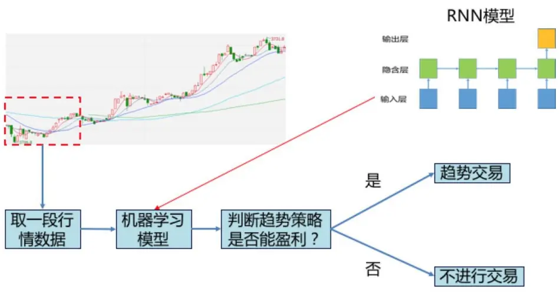
数据来源：广发证券发展研究中心

## （二）实证分析

数据选取：沪深 300 股指期货（IF）主力合约的1 分钟价格。2010 年 4 月 16 日至2013 年12 月31 日的数据为样本内，用这段时间的行情数据训练RNN 预测模型；2014年 1月1 日至2017 年7月 31日为样本外回测区间。

特征数据序列：分钟行情，取分钟行情的开盘价、收盘价、最高价、最低价、成交量、主买量、主卖量、收盘价变化率、收盘价序列的二阶差分、主买主卖量之比、成交量变化率、主买量变化率、主卖量变化率。将特征数据标准化。

机器学习模型：结构为 13（输入层）-200（LSTM 层）- 1（输出层）的 RNN 模型，激活函数为 Sigmoid函数，优化目标函数为最小化交叉熵。

回测保证金设置：100%，即不考虑杠杆。

交易成本：双边万分之二。

止损设置：按照固定比例的方式止损。

本篇报告选择在开盘后 33 分钟来预测全天的趋势策略盈利指标 R，盈利概率 p 的走势如下图所示，样本外预测准确率为59.1%。

图16：盈利概率p的走势图
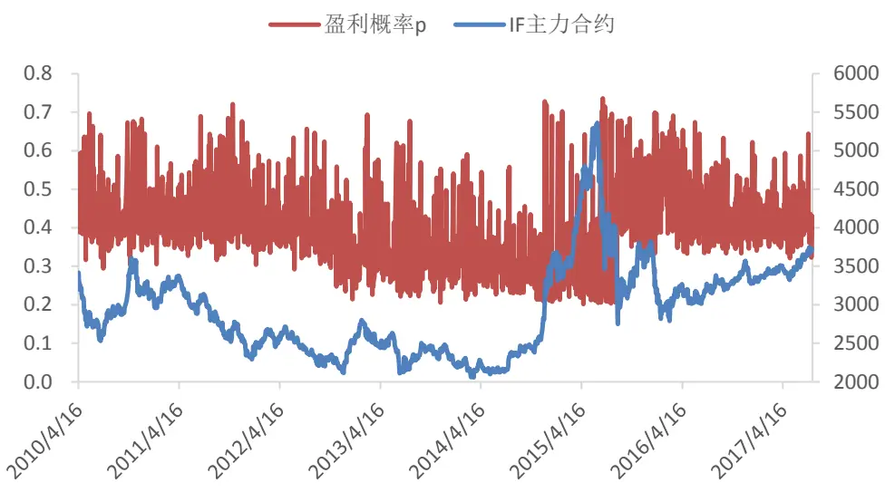
数据来源：广发证券发展研究中心,天软科技

策略在整个样本区间的表现如图 17 所示。自 2010 年 4 月开始，策略一共交易了707 次，取得了 223.46%的累积收益率，年化收益率为 18.01%，最大回撤为-8.63%，盈亏比为 2.17。

图17：策略全样本表现
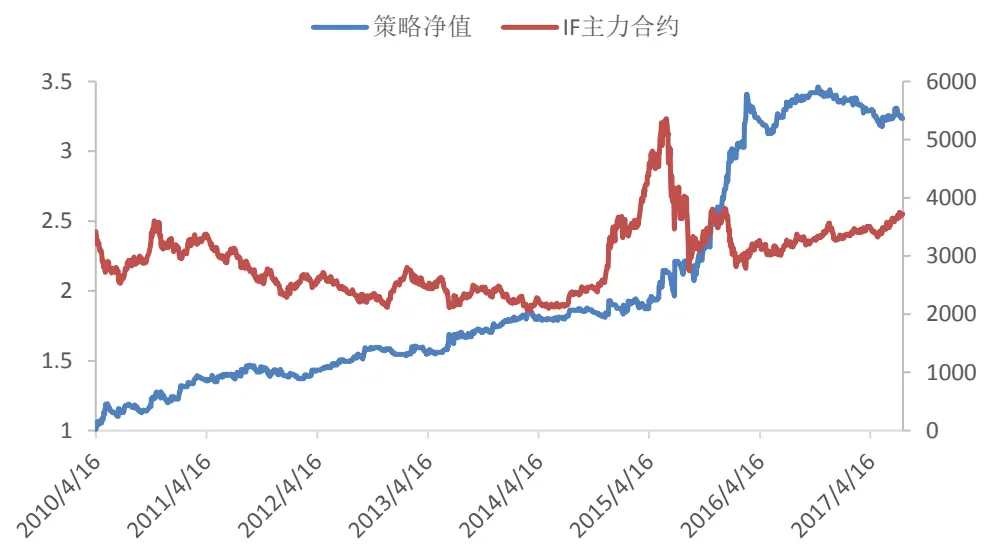
数据来源：广发证券发展研究中心, 天软科技
识别风险，发现价值

表1：2010年以来策略表现

| 年化收益率 | 18.01% |
| --- | --- |
| 累积收益率 | 223.46% |
| 最大回撤 | -8.63% |
| 交易次数 | 707 |
| 胜率 | 40.74% |
| 盈亏比 | 2.17 |
| 单次交易收益率 | 0.17% |

数据来源：广发证券发展研究中心，天软科技

样本外表现如图 18 所示，从 2014 年 1 月以来，策略一共交易了 372 次，取得了80.72%的累积收益率，年化收益率为 18.47%，最大回撤为-8.63%，盈亏比为2.27。样本外策略的表现与全样本差别不大，整体上策略性能比较稳定。

图18：策略样本外表现
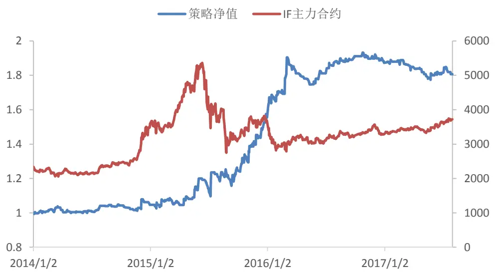
数据来源：广发证券发展研究中心

表2：2014年以来策略表现

| 年化收益率 | 18.47% |
| --- | --- |
| 累积收益率 | 80.72% |
| 最大回撤 | -8.63% |
| 交易次数 | 372 |
| 胜率 | 39.52% |
| 盈亏比 | 2.27 |
| 单次交易收益率 | 0.17% |

数据来源：广发证券发展研究中心，天软科技
识别风险，发现价值

本策略是带有止损机制的趋势交易策略，因此胜率不高，为 39.52%，但是策略的盈亏比较高，为2.27。策略的单次交易平均收益率为0.17%，与其他的股指 CTA短线策略相比，本策略的单次交易平均收益率较高，因此对交易成本和市场冲击成本的敏感性较低。在 2015 年 9 月份以来，股指期货交易受到很大限制，交易成本增加，市场流动性变差，冲击成本增大。因而 CTA策略的单次交易平均收益率是一个重要的指标。如果将交易成本上调为双边万分之五，策略在样本外的表现如下图所示。在交易成本大幅调高的情况下，策略的表现略有降低，但是 2014 年以来，策略的年化收益率达到 14.71%，单次交易平均收益率有0.14%，总体上表现仍然不错，说明本交易策略对交易成本不敏感。

图19：不同交易成本下的策略净值（样本外）
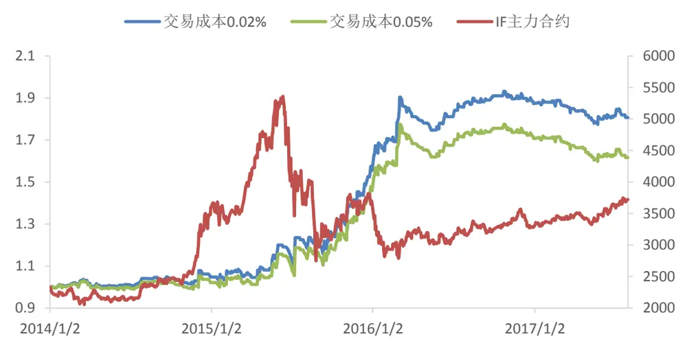
数据来源：广发证券发展研究中心, 天软科技

## （三）参数敏感性分析

开仓时间 T 是本策略的主要参数，T=33 分钟是本报告在样本内优化出来的策略开仓时间参数。如果不是选择T=33，而是在开盘后的其他某个固定时间 T筛选交易信号，策略的表现怎么样呢？

为了分析参数敏感性，选择不同的 T进行回测。具体策略同上，即根据开盘后T分钟前的行情数据来预测全天的趋势策略盈利概率 p，然后每天计算 T 时刻概率 p 的 120日均线。若p > MA120(p)，则进行趋势交易，根据 IF 主力合约在开盘 T 分钟后的涨跌方向确立趋势方向；否则，当日不开仓交易。

不同参数设置下，策略在样本外的表现如图 20 所示，从开盘后 22 分钟到 39 分钟内任意时刻执行交易策略，策略都有不错的表现，这说明本策略具有较好的参数稳定性。

图20：不同建仓时间下策略的表现（样本外）
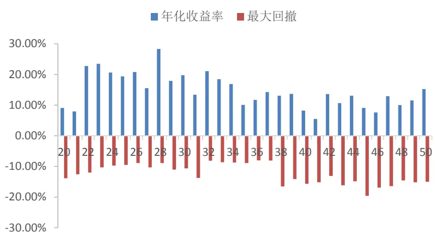
数据来源：广发证券发展研究中心, 天软科技

表3：不同建仓时间下策略的表现（样本外）

| 参数（分钟） | 年化收益率 | 最大回撤 | 参数（分钟） | 年化收益率 最大回撤 |
| --- | --- | --- | --- | --- |
| 20 | 9.06% | -13.84% | 36 | 11.69% -8.02% |
| 21 | 7.92% | -12.54% | 37 | 14.25% -8.06% |
| 22 | 22.77% | -11.98% | 38 | 13.07% -16.50% |
| 23 | 23.47% | -10.29% | 39 | 13.64% -14.13% |
| 24 | 20.61% | -9.71% | 40 | 8.23% -15.65% |
| 25 | 19.40% | -9.47% | 41 | 5.51% -15.14% |
| 26 | 20.79% | -8.89% | 42 | 13.63% -13.11% |
| 27 | 15.53% | -10.31% | 43 | 10.68% -16.14% |
| 28 | 28.32% | -8.87% | 44 | 13.04% -14.81% |
| 29 | 17.92% | -11.03% | 45 | 9.06% -19.58% |
| 30 | 19.75% | -10.66% | 46 | 7.59% -16.92% |
| 31 | 13.41% | -13.72% | 47 | 12.91% -16.40% |
| 32 | 21.09% | -8.15% | 48 | 10.03% -14.55% |
| 33 | 18.47% | -8.63% 49 | 11.54% | -15.18% |
| 34 | 16.88% | -8.71% | 50 | 15.23% -15.00% |
| 35 | 10.07% | -8.90% |  |  |

数据来源：广发证券发展研究中心，天软科技

## （四）策略对照分析

通过循环神经网络对当日趋势交易盈利可能性的预测，本策略只在约43%的交易日开仓交易，大约过滤掉了 57%的交易机会。被过滤掉的这些交易机会能否获得正的收益呢？为了说明这个问题，本报告设计了一个对照策略。

对照策略在每个交易日开盘T 分钟后预测当日趋势策略盈利的可能性。与前面策略不同的是，对照策略选择盈利概率p低于120日均线时，进行交易。在这种情况下，策略的样本外表现如图21所示。从结果可以看出，对照策略从2014年以来，总体上获得了负的累积收益率，与原策略相比，收益低很多，最大回撤更大，盈亏比也大幅降低。

因此，通过循环神经网络对交易信号的筛选，过滤掉趋势策略盈利期望不高的交易机会，是一种有效的方法，可以明显提高趋势策略的收益率。

图21：对照策略从2014年以来的表现（样本外）
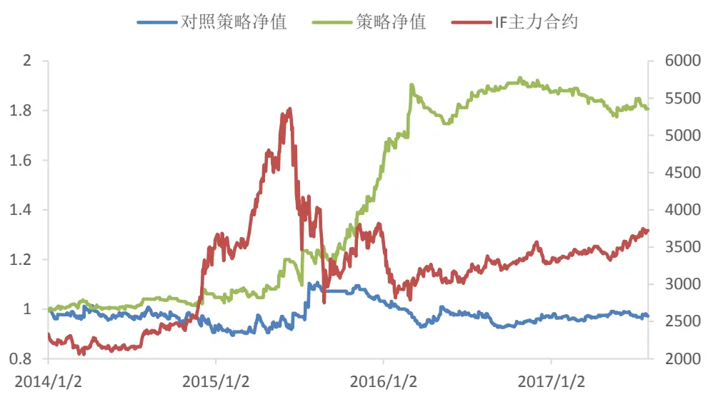
数据来源：广发证券发展研究中心, 天软科技

表4：2014年以来策略表现对比

|  | 对照策略 | 交易策略 |
| --- | --- | --- |
| 年化收益率 | -0.84% | 18.47% |
| 累积收益率 | -2.90% | 80.72% |
| 最大回撤 | -16.33% | -8.63% |
| 交易次数 | 501 | 372 |
| 胜率 | 38.72% | 39.52% |
| 盈亏比 | 1.58 | 2.27 |
| 单次交易收益率 | 0.00% | 0.17% |

数据来源：广发证券发展研究中心，天软科技

## 四、总结与讨论

本报告采用股指期货每日早盘行情，通过循环神经网络建立预测模型，对市场的趋势和震荡状况进行评估，预测当日股指期货市场趋势策略盈利的概率。基于这个概率判断当天是否适合进行趋势交易，决定是否开仓。实证表明，通过本交易策略，盈利机会较小的交易信号被过滤，策略只在趋势策略盈利概率大时才开仓交易，本策略有效提高了策略的盈利能力。

从 2014年以来的样本外回测表明，策略在样本外的年化收益18.47%，最大回撤为-8.63%。而且策略的单笔交易的平均盈利比较高，即使提高交易成本，策略依然有不俗的表现，适合当前流动性差的市场。此外，通过不同参数下的策略回测，证明了策略具有较好的参数稳定性。

## 风险提示

策略模型并非百分百有效，市场结构及交易行为的改变以及类似交易参与者的增多有可能使得策略失效。

## Table_RatingI ndustry 广发证券 —行业投资评级说明

买入： 预期未来12个月内，股价表现强于大盘10%以上。

持有： 预期未来12个月内，股价相对大盘的变动幅度介于-10%～+10%。

卖出： 预期未来 12 个月内，股价表现弱于大盘 10%以上。

## Table_Rating Company 广发证券 —公司投资评级说明

买入： 预期未来12个月内，股价表现强于大盘15%以上。

谨慎增持： 预期未来12个月内，股价表现强于大盘5%-15%。

持有： 预期未来12个月内，股价相对大盘的变动幅度介于-5%～+5%。

卖出： 预期未来12个月内，股价表现弱于大盘5%以上。

## Table_Ad联系我们

|  | 广州市 | 深圳市 | 北京市 | 上海市 |
| --- | --- | --- | --- | --- |
| 地址 | 广州市天河区林和西路 | 深圳福田区益田路6001 | 北京市西城区月坛北街2 | 上海浦东新区世纪大道8号 |
|  | 9 号耀中广场 A 座 1401 | 号太平金融大厦31楼 | 号月坛大厦18层 | 国金中心一期16层 |
| 邮政编码 | 510620 | 518000 | 100045 | 200120 |
| 客服邮箱 | gfyf@gf.com.cn |  |  |  |
| 服务热线 |  |  |  |  |

## Table_Disclai mer 免责声明

广发证券股份有限公司（以下简称“广发证券”）具备证券投资咨询业务资格。本报告只发送给广发证券重点客户，不对外公开发布，只有接收客户才可以使用，且对于接收客户而言具有相关保密义务。广发证券并不因相关人员通过其他途径收到或阅读本报告而视其为广发证券的客户。本报告的内容、观点或建议并未考虑个别客户的特定状况，不应被视为对特定客户关于特定证券或金融工具的投资建议。本报告发送给某客户是基于该客户被认为有能力独立评估投资风险、独立行使投资决策并独立承担相应风险。

本报告所载资料的来源及观点的出处皆被广发证券股份有限公司认为可靠，但广发证券不对其准确性或完整性做出任何保证。报告内容仅供参考，报告中的信息或所表达观点不构成所涉证券买卖的出价或询价。广发证券不对因使用本报告的内容而引致的损失承担任何责任，除非法律法规有明确规定。客户不应以本报告取代其独立判断或仅根据本报告做出决策。

广发证券可发出其它与本报告所载信息不一致及有不同结论的报告。本报告反映研究人员的不同观点、见解及分析方法，并不代表广发证券或其附属机构的立场。报告所载资料、意见及推测仅反映研究人员于发出本报告当日的判断，可随时更改且不予通告。本报告旨在发送给广发证券的特定客户及其它专业人士。未经广发证券事先书面许可，任何机构或个人不得以任何形式翻版、复制、刊登、转载和引用，否则由此造成的一切不良后果及法律责任由私自翻版、复制、刊登、转载和引用者承担。