# 风险中性的深度学习选股策略

## 深度学习研究报告之五

## Table_S um ary 报告摘要 ：

## 数据驱动型机器学习模型的问题

目前流行的机器学习方法，包括深度学习，大部分是数据驱动的方法，对训练集数据进行学习，提取知识。数据驱动型机器学习方法应用成功的前提是：从训练集数据中学习到的“知识”在样本外外推时依然适用。

然而在股票市场，由于市场参与者众多，充满大量的影响股市的因素和噪声；而且，市场存在着明显的风格切换和行业轮动。因此，可能会使得训练机器学习模型的历史场景和应用机器学习模型进行预测的“未来”场景存在显著差异，使得在样本内表现优异的机器学习模型在样本外表现一般。

## 风险中性的深度学习模型

为了解决这个问题，本报告尝试对股票样本进行风险中性化，减小风险因子轮动和行业轮动对机器学习模型训练和预测的影响。具体做法是：在对训练样本标注时，通过截面回归剥离风险因子影响，寻找在相同行业和相似市值区间内的强势股票和弱势股票进行样本标注。通过对风险因子的中性化处理，能够在一定程度上缓解风险因子轮动对模型训练的影响，使得训练出来的模型有更稳定的表现。

## 实证表现

本报告选取传统选股因子和技术指标作为股票样本的输入特征，对股票样本进行风险中性标注后，训练深度学习预测模型，对股票未来走势进行预测打分和选股交易。

通过实证研究，证实了将风险因子中性化处理后，训练出来的深度学习选股模型受市值因子的影响较小。2011 年以来，中证 500 内选股对冲策略年化收益率 21.95%，最大回撤 -5.03%，胜率为 74.6%，信息比 2.92。

## 风险提示

策略模型并非百分百有效，市场结构及交易行为的改变以及类似交易参与者的增多有可能使得策略失效。

图 1风险中性的深度学习策略表现
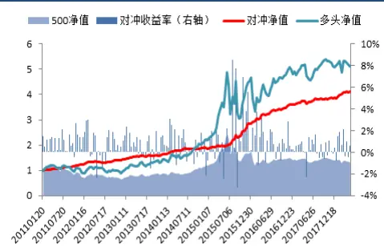

Table_A uthor 分析师： 文巧钧 S0260517070001

0755-88286935

wenqiaojun@gf.com.cn

分析师： 安宁宁 S0260512020003

0755-23948352

ann@gf.com.cn

## Table_Re port 相关研究：

深度学习系列之一：深度学2014-06-18习之股指期货日内交易策略

深度学习系列之二：深度学2014-06-19习算法掘金 ALPHA 因子

深度学习系列之三：深度学2017-07-11
习新进展，Alpha因子的再
挖掘

深度学习研究报告之四：趋 2017-10-26势策略的深度学习增强

## 一、背景介绍

## （一）策略回顾

近年来，随着深度学习等机器学习算法在计算机视觉、语音识别、专家系统等领域的巨大成功，金融投资领域也在通过机器学习方法提高投资表现。

2014年以来，广发证券金融工程团队在机器学习领域推出了一系列的报告，《深度学习系列之一：深度学习之股指期货日内交易策略》和《深度学习系列之四：趋势策略的深度学习增强》是通过深度学习算法对股指期货进行短线涨跌预测和趋势-震荡分析。《深度学习系列之二：深度学习算法掘金 ALPHA因子》（“深度学习选股策略 1”）和《深度学习系列之三：深度学习新进展，Alpha因子的再挖掘》（“深度学习选股策略2”）是用深度学习进行多因子选股的尝试。其中，深度学习选股策略 1 尝试从原始的价量数据中进行特征学习，挖掘超额收益；深度学习选股策略2 中，采用传统的选股因子，辅以经过处理之后的价量技术指标，取得了更好的表现。下图展示了深度学习选股策略 2在样本外的表现。

图1：深度学习选股策略2收益曲线
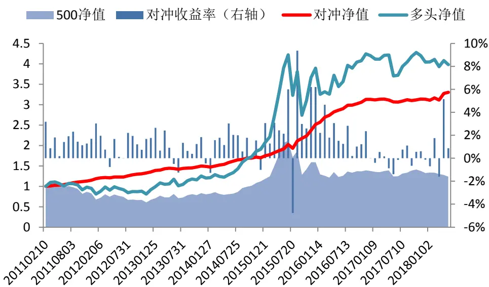
数据来源：广发证券发展研究中心，Wind

## （二）新的思考

目前流行的机器学习方法，包括深度学习，大部分是数据驱动的方法，对训练集数据学习来提取知识。数据驱动型机器学习方法应用成功的前提是：从训练集数据中学习到的“知识”在样本外外推时依然适用。

当机器学习方法应用于投资领域时，一般是以历史数据作为训练集数据来训练模型，应用在未来的市场中。在深度学习多因子选股策略中，也是通过对历史股票行情数据的学习，来建立预测模型。此类机器学习方法在投资领域的应用是否会成功，取决于从历史数据中学习到的模型在未来的外推中是否有效。

然而在股票市场，一方面由于市场参与者众多，充满大量的影响股市的因素和噪声；另一方面，市场存在着风格切换和行业轮动。因此，可能会使得训练机器学习模型的历史场景和应用机器学习模型进行预测的“未来”场景存在显著差异，使得在样本内表现优异的机器学习模型在样本外表现一般。

例如，如果用于训练模型的股票样本来自于小市值风格的市场，那么训练出来的模型在小市值市场中的预测能力更佳，而且会“认为”小市值是股票产生超额收益的重要原因。一旦市场风格切换到大市值，小市值风格下训练出来的模型就可能失效。

为了解决这个问题，本篇报告尝试对股票样本进行风险中性化，减小风险因子轮动和行业轮动对模型训练和预测的影响。需要指出的是，本报告所提到的“风险中性”是指机器学习模型层面的风险中性化，与多因子选股中通过组合优化方法减小组合风险暴露不同。

本报告首先回顾了深度学习多因子选股模型的模型结构和相关参数设置，然后介绍了对股票样本进行风险中性的方法，最后通过实证分析证实了所提出的方法的有效性。从结果来看，本报告提出的策略能够获得更好的市场表现。

## 二、深度学习预测模型

## （一）深度学习模型结构

近年来，深度学习在计算机视觉、自然语言处理、推荐系统、专家系统等方面的应用上纷纷取得了突破。2016 年 4 月，基于深度增强学习的 AlphaGo 在围棋上战胜了人类顶级棋手，攻克了“人类智慧的最后高地”。

深度学习是在对大量的数据进行特征抽象的同时，获得其丰富的表达。而对于特定的学习目标，相应的、合适的特征会被激活，从而获得足够好的学习效果。深度学习的本质是对观察数据进行分层特征表示，实现将低级特征抽象成高级特征表示的功能。深度学习具有许多的层级结构，如下图所示。

图2：深度学习的层级结构
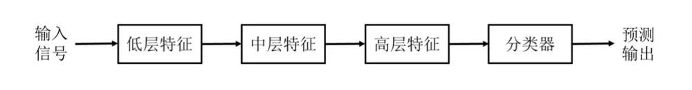
数据来源：广发证券发展研究中心

在本报告的深度学习选股模型中，我们采用 7 层深层神经网络系统建立股票价格预测模型。其中包含输入层X，输出层Y，和隐含层H1、H2、H3、……、H5。各层的节点数如下表所示。该深度学习模型的结构是通过网格搜索优化出来的模型结构（参考报告《深度学习系列之三：深度学习新进展，Alpha因子的再挖掘》）。

表 1：深度学习预测模型的网络结构

| 层名称 | 层说明 节点数 |
| --- | --- |
| X | 输入层 156 |
| H1 | 第 1 个隐含层 512 |
| H2 | 第 2 个隐含层 200 |
| H3 | 第 3 个隐含层 200 |
| H4 | 第 4 个隐含层 200 |
| H5 | 第 5 个隐含层 128 |
| Y | 输出层 3 |

数据来源：广发证券发展研究中心

其中，X是输入层，其节点数为 156个，表示股票样本的156 个特征，包括传统的选股因子（如估值因子、规模因子、反转因子、流动性因子、波动性因子），价量技术指标（如 MACD、KDJ等指标），以及 28个表示申万一级行业属性的 0-1变量。

Y是输出层，共3 个节点，表示股票未来走势的三种可能性：上涨（有超额收益）、平盘（无超额收益）、下跌（负的超额收益）。本报告中，用3维的向量表示 3种不同的输出类别。 $\mathbf{y}=[1\quad0\quad0]^{T}$ 表示上涨样本， $\mathbf{y}=[0\quad1\quad0]^{T}$ 表示平盘样本，y =[0 0 1]T表示下跌样本。

深层神经网络是对输入X和输出 Y的关系进行拟合，建立对输出Y的预测模型。其中，第 1个隐含层的节点j 为

$$
h_{j}^{(1)}=\sigma_{h}\left\{\sum_{i=1}^{N_{x}}\left(w_{ji}^{(0)}x_{i}+w_{j0}^{(0)}\right)\right\}
$$

第 m 个隐含层（m=2,3,4,5）的节点 j 为

$$
h_{j}^{(m)}=\sigma_{h}\left\{\sum_{i=1}^{N_{m-1}}\left(w_{ji}^{(m-1)}h_{i}^{(m-1)}+w_{ji}^{(m-1)}\right)\right\}
$$

输出层的节点k为

$$
y_{k}=\sigma_{o}\left\{\sum_{j=1}^{N_{5}}\left(w_{kj}^{(5)}h_{j}^{(5)}+w_{k0}^{(5)}\right)\right\}
$$

其中， $N_{x}$ 、 $N_{m-1}$ 和 $N_{5}$ 分别表示输入层、第m-1个隐含层、第 5个隐含层的节点个数； $\sigma_{h}$ 和 $\sigma_{o}$ 分别表示隐含层激活函数和输出层的激活函数； $w_{ji}^{(0)}\mathrm{、}w_{ji}^{(m-1)}$ 和 $w_{kj}^{(5)}$ 分别表示输入层、第 m-1 个隐含层、第 5 个隐含层的参数，可以一并记为参数w 。则神经网络可以记成 $\mathbf{y}=f(\mathbf{x};\mathbf{w})$ ，其中w为需要优化的参数。下图展示了具有2个隐含层H1 和H2的神经网络系统。

图3：具有2个隐含层的神经网络示意图
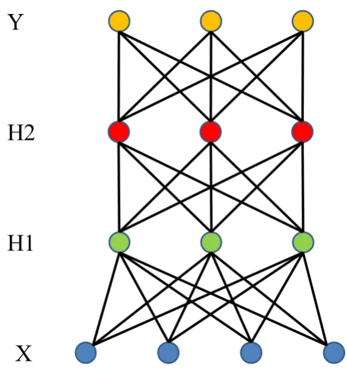
数据来源：广发证券发展研究中心

常用的激活函数有 Sigmoid 函数，正切函数等。Sigmoid 函数也称为 Logistic 函数，作为激活函数的表达式为

$$
y=\sigma(x)=\frac{1}{1+e^{-x}}
$$

如下图所示。机器学习中常用的逻辑回归模型（Logistic Regression）就是采取这种形式的输出函数以达到分类的目的。

Sigmoid 函数和正切函数作为激活函数的主要问题是存在“饱和区”。也就是在函数输入 x 远离 0 点的区域，激活函数的一阶导数接近于 0。因而，在求梯度优化神经网络参数的时候，很容易出现梯度消失的情况，导致参数更新会很慢，甚至会造成信息丢失，无法完成深层网络的训练。

图4：逻辑函数输入输出图
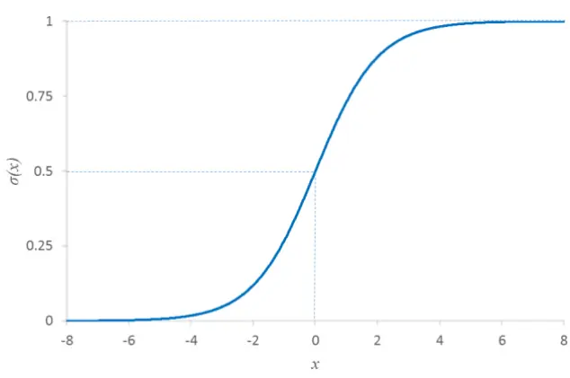
数据来源：广发证券发展研究中心

修正线性单元（Rectified Linear Unit，ReLU）是近年来深层神经网络应用中性能更好的一种激活函数，其表达式为 $f(x)=max(0,x)$ 。如下图所示，当神经元的输入值小于 0时，它的输出被强制置为 0（被屏蔽）；当输入值大于 0 时，神经元输出等于输入信号（正常输出）。这样的网络会“掩盖”部分神经元，因而具备了一定的稀疏性。从应用效果来看，这样的模型可以更好地提取稀疏特征，提高模型学习的精度。

在求梯度的时候，当输入 x 大于0 时，ReLU 函数的导数值为 1，没有饱和区。因而，模型训练时，梯度可以很好地在多层网络之间传播，大大改善了“梯度消失”现象，能够显著提高训练速度，加快模型参数收敛。

图5：ReLU激活函数
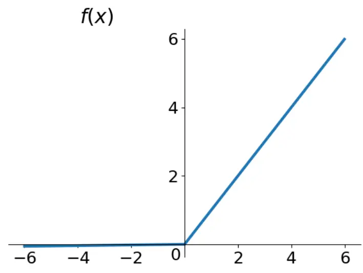
数据来源：广发证券发展研究中心

万能近似定理（Universal Approximation Theorem）证明神经网络具有强大的拟合能力。在应用神经网络进行预测前，需要采用大量的训练样本，通过优化的方法获得网络的参数w。具体来说，在深度学习中，通过训练样本数据（训练集），对参数w进行优化，使得模型给出的输出 y 尽可能地接近于样本的真实标签 t，即要使得如下的预测误差（损失函数）最小化

$$
E(\mathbf{w})=\sum_{n=1}^{N}E_n(\mathbf{w})=\sum_{n=1}^{N}\sum_{k=1}^{K}(y_{nk}-t_{nk})^2
$$

该目标函数的优化问题称之为最小化均方误差。对于分类问题，也可以构建其他形式的目标函数，例如，交叉熵（Cross Entropy）损失函数更适合作为分类神经网络模型优化的目标函数：

$$
E(\mathbf{w})=-\sum_{n=1}^{N}\sum_{k=1}^{K}\left\{t_{nk}\log y_{nk}+(1-t_{nk})\log(1-y_{nk})\right\}
$$

深度学习模型训练时，一般采用误差反向传播的方式求取梯度，优化参数。

为了提高模型的泛化能力，本报告采用Dropout方法，每次参数迭代更新时随机选择丢弃不同的隐层节点，这驱使每个隐层节点去学习更加有用的、不依赖于其他节点的特征。同时，本报告采用 Batch Normalization 技术提高模型的训练效率。关于 Dropout和 Batch Normalization的详细内容，可以参考报告《深度学习系列之三：深度学习新进展，Alpha 因子的再挖掘》。

## （二）股票样本标注

多因子选股中，我们希望挑选能够产生超额收益的股票构建组合，跑赢基准。因而，深度学习预测模型的目标是找出能够产生超额收益的股票。

相应的，为了构建深度学习模型，对于样本区间的每一个交易日，根据未来一段时间（本报告为10个交易日）的股票涨跌幅来给不同的股票样本贴“标签”（即深度学习模型的输出Y）：“上涨”、“下跌”和“平盘”。其中，标记为上涨的股票是指产生超额收益的股票，即未来10个交易日涨幅最大的一部分股票（涨幅超过90%分位数的）；标记为下跌的股票是有负的超额收益的股票，即未来10个交易日涨幅最小的一部分股票（涨幅低于10%分位数的）；标记为平盘的股票是指未来10个交易日涨幅处于中间位置的股票（涨幅位于45%分位数到55%分位数之间的）。如下图所示。这样使得三类样本的样本数量相等，更有利于训练分类模型。

图6：深度学习策略股票样本筛选示意图
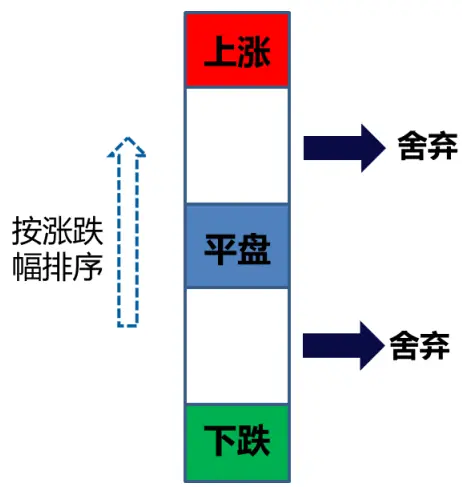
数据来源：广发证券发展研究中心

对股票样本进行标注和筛选之后，就可以训练深度学习预测模型。在选股时，按照上涨打分，即预测该股票属于“上涨”类别的概率 p("上涨"|x) ，进行选股。也就是寻找未来 10个交易日涨幅处于前10%位置的概率较大的股票。

这样进行样本标注的问题是：股票的标签容易受到市场风格轮动和行业轮动的影响。在小市值风格下，“上涨”类的股票大部分是小盘股，“下跌”类的股票大部分是大盘股。如果股票样本大部分来自小市值风格的市场，那么模型会倾向于将市值作为一个重要的特征，而且会倾向于把小市值的股票分类到“上涨”类别中。一旦市场风格切换到大市值风格，该模型就有比较大的失效风险。同样的，如果当前的行业板块中，某板块表现强势，那么该行业板块的成份股也更有可能被标注为“上涨”类别，对分类模型来说，容易造成行业偏离。

## （三）风险中性的股票样本标注

为了使得样本的标注（也就是选股的目标）不容易受到风险因子的影响，可以对样本标注过程进行风险中性化。

如果需要找出在每个行业内能够产生超额收益的股票，可以先将全市场的股票按照不同行业进行划分，分别在同一时间截面对不同行业内的股票进行收益率排序，选出每个行业“跑赢”和“跑输”的股票，如下图所示。这种样本标注方法的目标是寻找每个行业内能够产生超额收益的股票，因而股票样本的标签Y不会受到行业轮动的影响。因此，可以将这种方法称为“行业中性”的样本标注方法。

图7：行业中性的股票样本筛选示意图
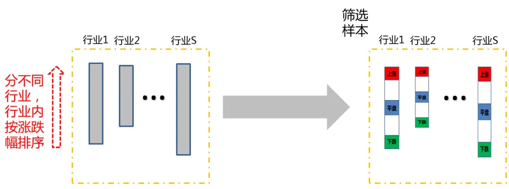
数据来源：广发证券发展研究中心

大小盘风格轮动是 A 股中非常显著的风格切换现象。如果希望寻找不易受到大小盘切换影响的能够产生超额收益的股票，可以将全市场股票按照不同市值区间进行划分，在不同市值区间内寻找产生超额收益的股票，也就是分别在同一时间截面对不同市值区间内的股票进行收益率排序，选出每个市值区间“跑赢”和“跑输”的股票，如下图所示。这种样本标注方法下，股票样本的标签 Y不容易受到大小盘风格切换的影响。因此，可以将这种方法称为“市值风格中性”的样本标注方法。

图8：市值风格中性的股票样本筛选示意图
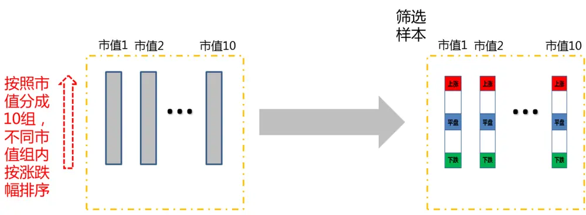
数据来源：广发证券发展研究中心

以上是针对单一风险因子进行中性化的做法。更一般的情况下，我们需要同时考虑多个风险因子。假设考虑K 个风险因子，可以通过回归的方法对风险因子进行剥离：

$$
r_{i}^{t+1}=X_{i1}^{t}f_{1}^{t}+X_{i2}^{t}f_{2}^{t}+\cdots+X_{iK}^{t}f_{K}^{t}+\epsilon_{i}^{t}
$$

其中， $r_{i}^{t+1}$ 是股票i在随后一期的收益率， $X_{i1}^{t}、X_{i2}^{t}\ldots\ldots 和X_{iK}^{t}$ 表示股票 i在 K个风险因子上的因子暴露值。对t时刻的市场股票进行截面回归，可以获得 K个风险因子的收益率f1t、 $f_{2}^{t}$ ……和fKt，以及剥离风险因子之后的股票收益率 $\cdot\epsilon_{i}^{t}\colon$ ，即回归残差。

然后按照残差 $\epsilon_{i}^{t}$ 在同一时间截面 t进行排序，将股票标记为“上涨”、“下跌”和“平盘”三类。预测模型的目标不再是寻找未来一期收益率在前 10%的股票， $而]$ 是剥离风险因子收益之后，收益率在前10%的股票。

本报告中，我们采用行业和流通市值作为风险因子进行风险中性处理。

## 三、策略与实证分析

## （一）深度学习预测模型

深度学习多因子选股交易策略的流程如下图所示。在模型训练和选股交易时，都需要先对市场数据进行预处理。在模型训练阶段，需要把历史市场数据标准化成为适合深度学习模型的特征数据；在选股交易阶段，从当前市场的数据中计算每个股票的特征数据，并且进行数据的标准化，通过训练好的深度学习模型，对每个股票的未来走势进行预测打分，然后根据每个股票的打分进行分档选股，构建组合。

图9：深度学习选股策略流程图
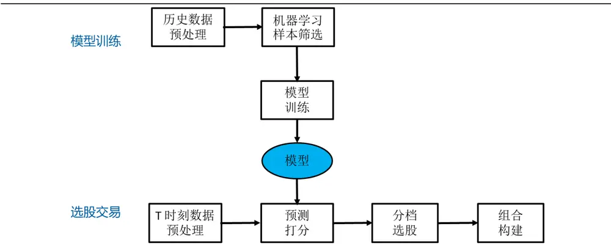
数据来源：广发证券发展研究中心

数据预处理分成两步：股票因子的计算和股票因子的标准化。

首先，我们从Wind、天软科技等金融数据终端提取市场数据，计算股票因子作为机器学习模型的特征。本报告中，我们选择了156个特征，包括传统的选股因子（如估值因子、规模因子、反转因子、流动性因子、波动性因子），价量技术指标（如MACD、KDJ等指标），以及28个表示申万一级行业属性的0-1变量。

图10：深度学习策略的股票特征
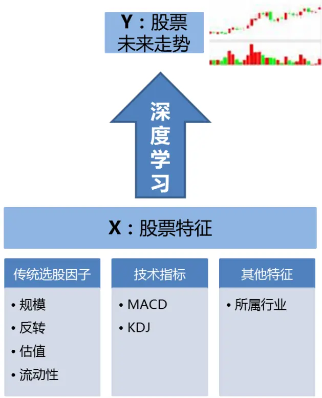
数据来源：广发证券发展研究中心

因子标准化过程分成如下几个环节：

## 1、异常值、缺失值处理

对股票因子数据中的异常值和缺失值进行处理。例如，当股票某一期的因子值缺失或者数据有异常时，用上一期的因子值进行替代。

## 2、极值压边界处理

当股票的因子数据显著偏离同期该行业股票因子数据时，可以设置边界阈值进行极值处理。例如，我们可以令上边界为同期该行业内股票因子值的均值加上3倍标准差，即ub = E(x)+3std(x)；下边界等于同期该行业内股票因子值的均值减去3倍标准差，即lb = E(x)− 3std(x)。当股票因子值超出上边界，即当x > ub时，令x = ub；当股票因子值超出下边界，即当x < lb时，令x = lb。这样，可以使得所有的因子数据位于下边界 lb 和上边界 ub之间。

## 3、沿时间方向的因子标准化

沿时间方向的因子标准化使得不同时段的因子值可比。例如，2015年市场的成交量和当前市场有显著的区别，成交量相关的选股指标也与当前市场有较大的差异。可以对成交量相关的选股因子按照此前一段时间的成交量均值进行标准化处理，使得不同时期的因子值具有可比性。沿时间方向因子标准化的好处是使得我们用历史数据训练出的模型可以用来对未来的市场进行预测。

## 4、沿截面的因子标准化

沿截面方向的因子标准化使得不同特征的值可比，例如流通市值和换手率的数据相差很大，通过因子标准化，可以使得标准化之后的流通市值和换手率可比。因子标准化的方法有z-score标准化、min-max标准化、排序标准化等。

假设在时刻 t，某股票 k 的因子 i 的值为 $x_{t,k}^{i},$ 。z-score标准化把变量处理成均值为0，方差为1：

$$
\tilde{x}_{t,k}^{i}=\frac{x_{t,k}^{i}-\operatorname{E}[x_{t}^{i}]}{\operatorname{std}[x_{t}^{i}]}.
$$

其中，E[xi]和std[xi]分别为该时刻所有股票的因子 i 的均值和标准差。

Min-Max标准化把变量处理成0到1之间的数：

$$
\tilde{x}_{t,k}^{i}=\frac{x_{t,k}^{i}-\min x_{t}^{i}}{\max x_{t}^{i}-\min x_{t}^{i}}
$$

其中， $\min x_{t}^{i}和\max x_{t}^{i}$ 分别为该时刻所有股票的因子 i 的最小值和最大值。

排序标准化是根据股票在因子i 的值进行排序，按照序号对应到0到1之间。因子值最小的标准化为0，因子值最大的标准化为1，其他按序号标准化为小于1且大于0的数。

## 5、按照机器学习模型来调整因子分布

不同的机器学习模型对输入数据的假设有差别，需要根据模型的假设来调整因子分布。深层神经网络一般对输入数据的假设不强，可以同时容纳连续型的输入数据和离散型的输入数据（如行业的0、1哑变量）。如果采用自编码器或者受限玻尔兹曼机，需要注意模型对输入数据的分布假设。

在选股交易阶段，将因子数据预处理之后，我们可以直接把处理好的因子数据输入深度学习预测模型，给出预测打分。但在模型训练阶段，为了训练好深度学习预测模型，我们需要对不同的股票样本添加“标签”，并且进行训练样本的筛选。

在样本标注和样本筛选环节，我们按照上节所示的方法将股票样本对风险因子进行截面回归，剥离风险因子的影响，然后进行样本的标注和模型学习。

在样本外，我们可以对每只股票进行预测打分。根据股票的上涨打分，筛选前10%的股票构建组合。

与隐含层采用ReLU激活函数不同，输出层采用softmax激活函数。在预测时，输出层softmax激活函数的输入向量为 $\mathbf{\nabla}_{\mathbf{\nabla}}\mathbf{z}=[z_{1}\quad z_{2}\quad z_{3}]^{T}$ ，则经过softmax函数后，预测值为

$$
\hat{\mathbf{y}}=[\hat{y}_{1}\quad\hat{y}_{2}\quad\hat{y}_{3}]^{T}=\left[\frac{e^{z_{1}}}{\sum_{i=1,2,3}e^{z_{i}}}\quad\frac{e^{z_{2}}}{\sum_{i=1,2,3}e^{z_{i}}}\quad\frac{e^{z_{3}}}{\sum_{i=1,2,3}e^{z_{i}}}\right]^{T}
$$

其中， $\hat{y}_{1},\quad\hat{y}_{2},\quad\hat{y}_{3}$ 都是大于0且小于1的数，而且 $\hat{y}_{1}+\hat{y}_{2}+\hat{y}_{3}=1$ 。第一个输出节点的预测值 $\begin{array}{r}{\hat{y}_{1}=\frac{e^{z_{1}}}{\sum_{i=1,2,3}e^{z_{i}}}}\end{array}$ 是我们对股票的上涨预测打分，即预测该股票属于“上涨”类别的概率。

本报告中，我们采用全市场股票来训练深度学习模型，剔除上市交易时间不满一年的股票，剔除ST股票，剔除交易日停牌和涨停、跌停的股票。

用于预测的是未来10个交易日的收益率。对于风险中性的深度学习模型，先用行业和市值因子进行截面回归，剥离风险因子影响，然后建立模型。

样本期为自2007年1月至2018年4月。模型按照每半年更新一次，每次训练采用最近4年的市场数据来训练模型。样本外数据从2011年1月开始（2007年至2010年的数据用于训练第一个深度学习预测模型）。

## （二）风险中性的作用

本报告中，我们对模型进行滚动更新，每半年重新训练一次模型。每次训练时采用最近4年的数据进行模型的训练。

将股票打分与未来10个交易日的收益率求截面的秩相关系数，计算IC，如下图所示。IC的平均值为0.082，标准差为0.108。大部分时间，选股模型的IC大于0。

图11：深度学习选股因子的IC
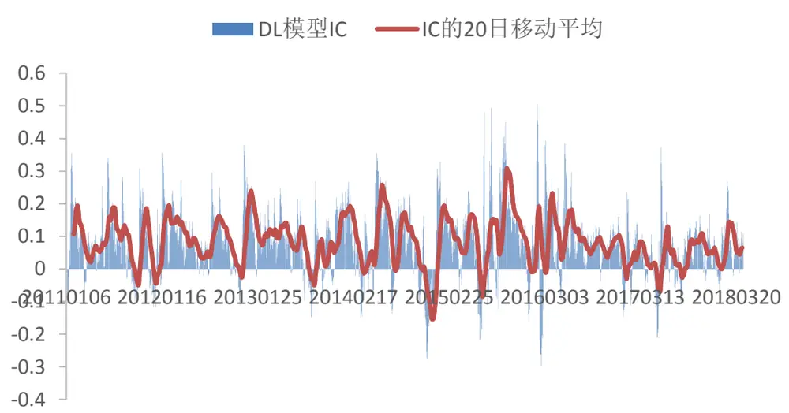
数据来源：广发证券发展研究中心，Wind

为了检验风险中性的作用，本报告分析了普通的深度学习策略和风险中性的深度学习策略分别与流通市值因子的关系。

首先来看深度学习选股模型的IC与流通市值因子IC的关系。下面左图展示了普通的深度学习选股模型IC与流通市值IC的关系，该相关性越强表示深度学习选股因子的表现与市值因子选股的表现关系越强。从图中可以看到，流通市值因子IC与普通的深度学习因子IC相关性较强，而且是负的相关性（因为流通市值因子是负向因子）。说明普通的深度学习因子的表现与流通市值因子表现有一定的相关性，当流通市值因子表现好时，普通的深度学习因子表现也比较好。

从右图中可以看到，在风险中性处理之后，深度学习因子IC与流通市值因子IC的相关性有明显的降低。这意味着风险中性的深度学习因子的表现与流通市值因子表现的相关性没有那么强了。

图12：深度学习选股因子的IC与市值因子IC的关系
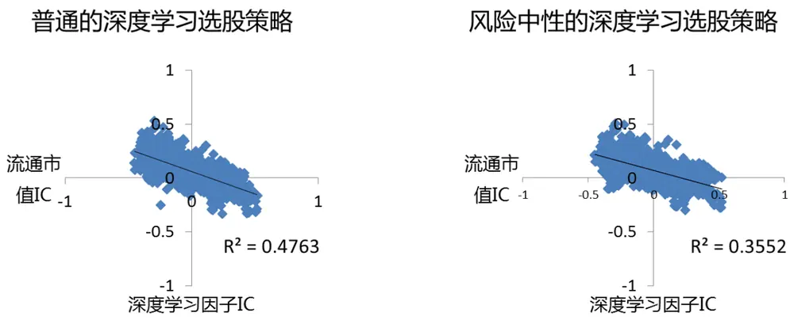
数据来源：广发证券发展研究中心，Wind

其次来看深度学习选股模型每期的打分与流通市值因子的关系。下图中的左图展示了普通的深度学习模型每期打分与流通市值的截面相关系数，截面相关系数的平均值为-0.20，这说明普通的深度学习模型中，市值越小的股票一般打分越高，模型的选股偏小市值。而风险中性的深度学习模型中，截面相关系数的平均值为-0.12，有明显的下降，没有那么偏向于小市值。而且在2017年以来，大部分时间截面相关系数大于0，表示模型的选股偏大市值风格。

图13：深度学习选股因子与流通市值的截面相关性
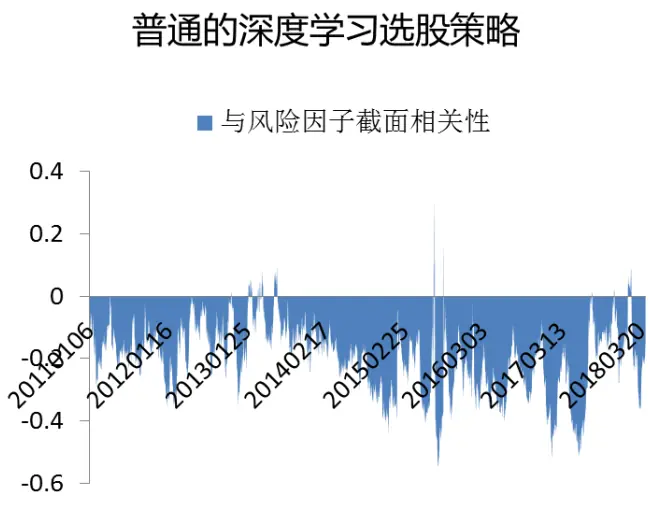
数据来源：广发证券发展研究中心，Wind

风险中性的深度学习选股策略
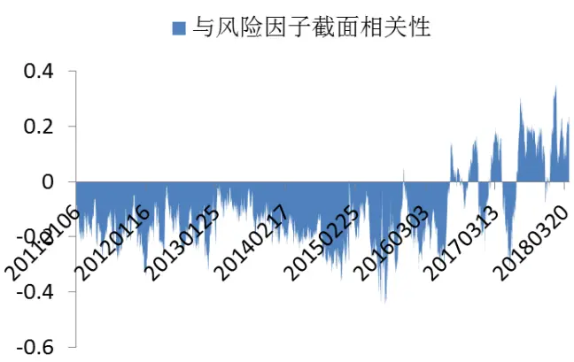

从以上分析可以看到，经过风险中性化处理，深度学习选股模型不容易受到市值因子的影响。但是，风险中性的深度学习模型的IC与市值因子的IC仍然有一定的相关性，说明当市值因子表现好的时候，深度学习模型也倾向于获得更好的收益。这是因为市值因子是A股市场长期以来表现较好的因子，基于历史数据训练出来的深度学习模型不能完全剥离市值因子的影响。

## （三）策略回测

本报告以中证500指数作为股票池，进行选股策略的回测。策略调仓周期为10个交易日。每次调仓时把股票等分成十档，等权买入深度学习预测模型打分最高的一档。按照0.3%的交易成本进行回测。

首先来看普通的深度学习模型的选股表现。如下图所示，普通的深度学习选股模型在中证500成份股内的年化超额收益率为19.71%，超额收益最大回撤-5.35%，超额胜率为69.5%，信息比2.47。

图14：普通深度学习选股模型的累积收益率
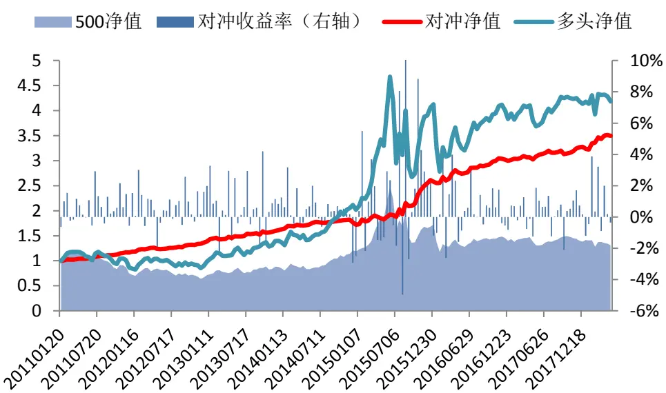
数据来源：广发证券发展研究中心，Wind

与之相比，风险中性的深度学习模型的选股表现更好一些。如下图所示，风险中性的深度学习选股模型在中证500成份股内的年化超额收益率为21.95%，超额收益最大回撤-5.03%，超额胜率为74.6%，信息比2.92。

图15：风险中性的深度学习选股模型的累积收益率
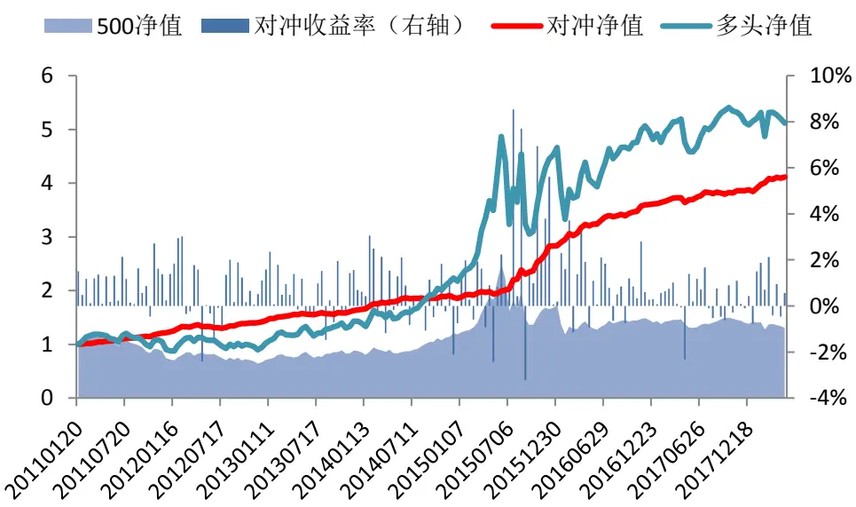
数据来源：广发证券发展研究中心，Wind
识别风险，发现价值

对冲策略分年度的收益回撤情况如下表所示。可以看到，策略每年都获得了正的超额收益，即使在传统的市值和反转因子表现不佳的2017年，策略也获得了6.93%的超额收益率。（注：2011年数据从2011年1月底开始；2018年数据截止到2018年4月底。）

表2：深度学习选股对冲策略分年度表现（股票组合规模为50只）

| 年份 | 累积 超额收益 | 超额收益 （年化） | 超额收益 最大回撤 | 多头 累积收益 | 基准 累积收益 | 换手率 | 信息比 |
| --- | --- | --- | --- | --- | --- | --- | --- |
| 2011 | 23.75% | 24.78% | -0.46% | -9.85% | -27.04% | 17.73 | 4.59 |
| 2012 | 17.54% | 17.54% | -5.03% | 17.46% | 0.28% | 17.77 | 2.89 |
| 2013 | 13.65% | 13.65% | -1.94% | 32.63% | 16.89% | 17.43 | 2.04 |
| 2014 | 13.68% | 13.68% | -2.85% | 57.41% | 39.01% | 16.83 | 2.38 |
| 2015 | 52.02% | 52.02% | -3.23% | 108.99% | 43.12% | 19.16 | 3.59 |
| 2016 | 26.28% | 26.28% | -1.14% | 3.66% | -17.78% | 17.63 | 3.17 |
| 2017 | 6.93% | 6.93% | -2.39% | 6.58% | -0.20% | 17.41 | 1.25 |
| 2018 | 6.90% | 20.69% | -0.78% | 0.21% | -6.24% | 5.19 | 3.42 |

数据来源：广发证券发展研究中心，Wind

由于选股因子中技术类指标比较多，策略的换手率较高，每次调仓的平均换手率为70.8%，年化换手率为 17.7 倍。

## （四）策略同质性分析

本报告提出的风险中性的深度学习模型与普通的深度学习模型在模型训练时的训练目标不一样。普通的深度学习模型是把每个时间截面上收益率不一样的股票区分开，希望寻找能够产生超额收益的股票；风险中性的深度学习模型是在每个截面上把收益率剥离风险因子影响后不一样的股票区分开，希望寻找在剥离风险因子影响后能够产生超额收益的股票。

在不同的机器学习目标下训练的策略表现不一样，如下图所示，总体而言，风险中性的深度学习策略长期表现更好。

图16：普通深度学习模型和风险中性深度学习模型的表现对比
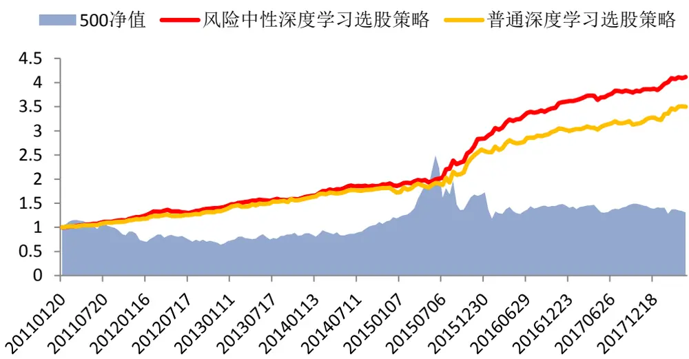
数据来源：广发证券发展研究中心，Wind

两种策略的相关性比较高，下图展示了普通深度学习模型的 IC 与风险中性的深度学习模型 IC 的关系。可以看到，风险中性的深度学习模型的表现与普通深度学习模型的表现相关性很高，一般情况下，当普通的深度学习模型表现好的时候，风险中性的深度学习模型表现也不错。两种策略的表现具有较强的同质性。

图17：普通深度学习模型IC和风险中性深度学习模型IC的相关性
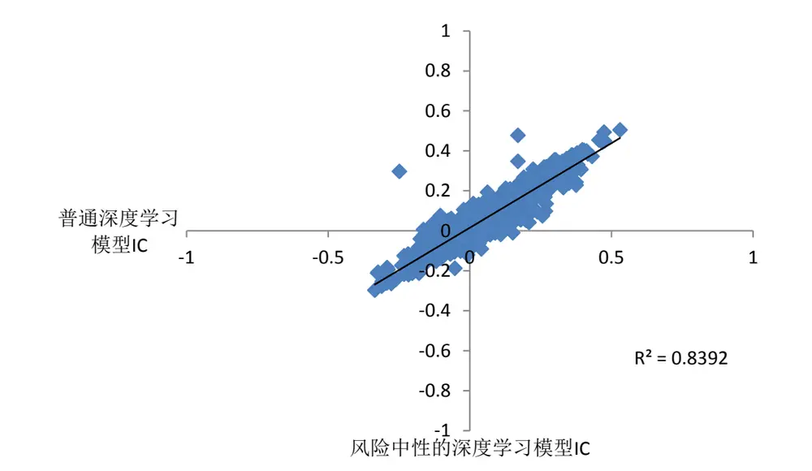
数据来源：广发证券发展研究中心，Wind
识别风险，发现价值

然而，两种深度学习模型选股有较大的差异。当组合规模为 50 只股票的时候，两种深度学习模型平均每期所选的股票有 21.0只重合（占比41.9%）；当组合规模为100只股票的时候，两种深度学习模型平均每一期所选的股票有53.3只重合（占比53.3%）。如下图所示。这说明，当给机器学习模型设定的训练目标不一样时，模型会从不同的角度筛选股票。

图18：普通深度学习模型和风险中性深度学习模型的选股重合度
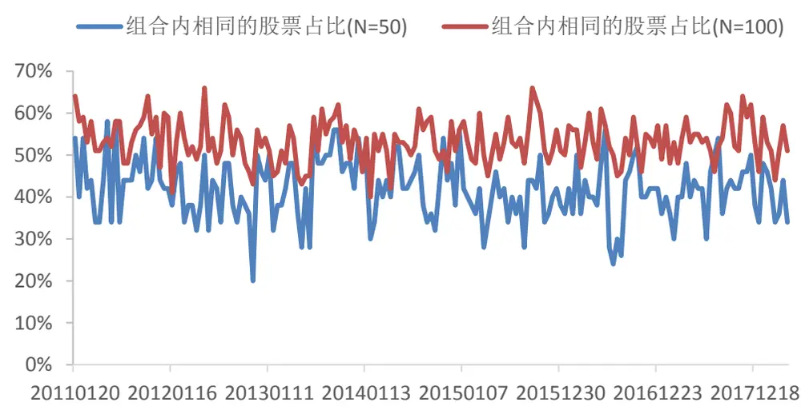
数据来源：广发证券发展研究中心，Wind

## 四、总结与讨论

机器学习的本质是从数据中学习知识。普通的深度学习选股模型的训练样本会受到所在区间风格轮动的影响，采用小市值风格市场的股票样本训练出来的模型会偏向小市值风格，从行业表现差异大的市场获取的股票样本训练出来的模型会有较大的行业偏离。在模型训练时，通过对风险因子的中性化处理，能够在一定程度上缓解风险因子轮动对模型训练的影响，使得训练出来的模型有更稳定的表现。

本报告通过实证分析，证实了将风险因子中性化处理后，训练出来的深度学习选股模型受市值因子的影响较小。2011 年以来，中证500 内选股对冲策略年化收益率21.95%，最大回撤 -5.03%，胜率为 74.6%，信息比 2.92。

## 风险提示

策略模型并非百分百有效，市场结构及交易行为的改变以及类似交易参与者的增多有可能使得策略失效。

## Table_RatingI ndustry 广发证券 —行业投资评级说明

买入： 预期未来12个月内，股价表现强于大盘10%以上。

持有： 预期未来12个月内，股价相对大盘的变动幅度介于-10%～+10%。

卖出： 预期未来12个月内，股价表现弱于大盘10%以上。

## Table_Rating Company 广发证券 —公司投资评级说明

买入： 预期未来12个月内，股价表现强于大盘15%以上。

谨慎增持： 预期未来12个月内，股价表现强于大盘5%-15%。

持有： 预期未来12个月内，股价相对大盘的变动幅度介于-5%～+5%。

卖出： 预期未来12个月内，股价表现弱于大盘5%以上。

## Table_Ad联系我们

|  | 广州市 | 深圳市 | 北京市 | 上海市 |
| --- | --- | --- | --- | --- |
| 地址 | 广州市天河区林和西路 | 深圳福田区益田路6001 | 北京市西城区月坛北街2 | 上海浦东新区世纪大道8号 |
|  | 9 号耀中广场 A 座 1401 | 号太平金融大厦31层 | 号月坛大厦18层 | 国金中心一期16层 |
| 邮政编码 | 510620 | 518000 | 100045 | 200120 |
| 客服邮箱 | gfyf@gf.com.cn |  |  |  |
| 服务热线 |  |  |  |  |

## Table_Disclai mer 免责声明

广发证券股份有限公司（以下简称“广发证券”）具备证券投资咨询业务资格。本报告只发送给广发证券重点客户，不对外公开发布，只有接收客户才可以使用，且对于接收客户而言具有相关保密义务。广发证券并不因相关人员通过其他途径收到或阅读本报告而视其为广发证券的客户。本报告的内容、观点或建议并未考虑个别客户的特定状况，不应被视为对特定客户关于特定证券或金融工具的投资建议。本报告发送给某客户是基于该客户被认为有能力独立评估投资风险、独立行使投资决策并独立承担相应风险。

本报告所载资料的来源及观点的出处皆被广发证券股份有限公司认为可靠，但广发证券不对其准确性或完整性做出任何保证。报告内容仅供参考，报告中的信息或所表达观点不构成所涉证券买卖的出价或询价。广发证券不对因使用本报告的内容而引致的损失承担任何责任，除非法律法规有明确规定。客户不应以本报告取代其独立判断或仅根据本报告做出决策。

广发证券可发出其它与本报告所载信息不一致及有不同结论的报告。本报告反映研究人员的不同观点、见解及分析方法，并不代表广发证券或其附属机构的立场。报告所载资料、意见及推测仅反映研究人员于发出本报告当日的判断，可随时更改且不予通告。本报告旨在发送给广发证券的特定客户及其它专业人士。未经广发证券事先书面许可，任何机构或个人不得以任何形式翻版、复制、刊登、转载和引用，否则由此造成的一切不良后果及法律责任由私自翻版、复制、刊登、转载和引用者承担。