# 深度学习在指数增强策略上的应用

## 深度学习研究报告之六

## [Table_Summary]报告摘要：

## 研究内容

本报告研究通过深度学习方法进行指数增强策略的构建。基于深度学习股价预测因子，通过组合优化技术控制策略的跟踪误差、行业偏离和风格偏离，可以获得稳定的超额收益。

## 指数增强策略表现

在中证 1000 指数、中证 500 指数和沪深 300 指数上的深度学习增强策略都能取得明显的正收益。其中，全市场选股的中证1000指数增强策略获得了 29.07%的年化超额收益，中证 500指数增强策略获得了 14.67%的年化超额收益，沪深300指数增强策略获得了 13.11%的年化超额收益。不同的指数增强策略的年化跟踪误差都符合预期。（注：本报告中超额收益是指相对基准指数的超额收益，例如中证 500 指数增强策略的基准指数是中证500 指数。）

## 如何调节指数增强策略的换手率

在组合优化问题中，通过在优化目标中引入“惩罚项”可以显著降低策略的换手率，减小组合的跟踪误差，提高组合的信息比。也可以直接对换手率进行约束，进行更精细的换手率控制。本报告实证了在年换手率 6 倍的约束下，指数增强策略也获得了不错的表现。

如果组合优化中不考虑交易成本，则会导致策略的换手率过高，带来的交易成本损耗会降低组合的超额收益，同时增大组合的跟踪误差。如果组合优化中给交易成本过高的“惩罚”会使得组合的换手率过低，可能会降低组合的超额收益来源，也会导致策略的信息比下降。

## 深度学习策略业绩归因分析

由于机器学习因子构建过程的“黑箱”属性，模型选股结果的可解释性弱。通过业绩归因了解模型的收益来源，有助于监测机器学习因子表现是否稳定和是否失效。

从业绩分析结果来看，对于本报告中的指数增强策略，行业因子的收益贡献较低，风格因子中，流动性因子和反转因子的收益贡献较高，其他风格因子的收益贡献较低，此外，大部分超额收益是由不能被行业因子和风格因子所解释的 Alpha 收益贡献的，说明深度学习模型能够从因子的非线性特征中获取额外信息。

## 风险提示

策略模型并非百分百有效，市场结构及交易行为的改变以及类似交易参与者的增多有可能使得策略失效。

图 1 中证 1000指数增强策略表现
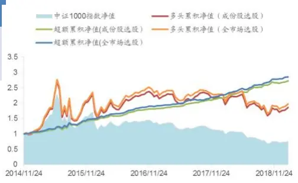
数据来源：Wind，广发证券发展研究中心

图 2 沪深 300 指数增强策略表现
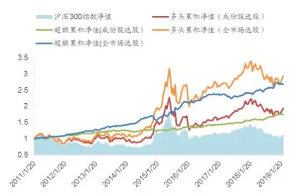
数据来源：Wind，广发证券发展研究中心
[分析师： Table_Author]文巧钧

SAC 执证号：S0260517070001

SFC CE No. BNI358

公0755-88286935

wenqiaojun@gf.com.cn

分析师： 安宁宁

SAC 执证号：S0260512020003

SFC CE No. BNW179

0755-23948352

anningning@gf.com.cn

分析师： 罗军

SAC 执证号：S0260511010004

020-66335128

luojun@gf.com.cn

请注意，罗军并非香港证券及期货事务监察委员会的注册持牌人，不可在香港从事受监管活动。

## [Table_ 相关研究：DocRe

深度学习研究报告之五：风险 2018-07-14中性的深度学习选股策略

## 一、指数增强产品蓬勃发展

从2015年以来，公募指数增强型基金迅速发展，每年有10只以上的指数增强基金发行。大部分指数增强基金以主流宽基指数为跟踪基准，包括上证50指数、沪深300指数、中证500指数、中证1000指数等。从规模上看，指数增强基金中管理规模最大的是“易方达上证50指数”，其管理规模达到124亿元（截至2018年年底）。

2018年国内公募基金一共发行了29只指数增强基金（包括A类和C类），其中7只基金的基准指数为沪深300指数，10只基金的基准指数为中证500指数，还有5只基金的基准指数为中证1000指数。

从投资思路来看，指数增强基金是指数型基金和主动型基金的结合。其投资目标是在控制跟踪误差的前提下，追求稳定、持续地超越标的指数的表现。从投资方法来看，大部分指数增强基金采用多因子量化投资的方式进行管理。

近年来，随着机器学习在计算机视觉、自然语言处理等领域的巨大成功，国内外越来越多的量化基金在研究如何将机器学习技术引入投资策略中，并且已经出现了众多成功案例。广发金融工程团队在此前的一系列研究中，实证了以深度学习为代表的机器学习方法在因子选股和CTA策略开发上具有不错的表现和发展前景。但同时，机器学习模型也由于换手率高、模型缺乏可解释性等问题而被人诟病。

本报告研究通过深度学习方法进行指数增强策略的构建。主要考虑三方面的问题：

1、如何使得深度学习选股策略稳定、持续地超越基准指数？

2、如何将策略的换手率调整至合适的水平？

3、深度学习模型本身是一个“黑箱”，如何对策略收益进行解释归因？

深度学习股票增强策略的流程如下图所示。通过组合优化技术控制策略的跟踪误差，追求稳定的超额收益（注：本报告中超额收益是指相对基准指数的超额收益，例如中证500指数增强策略的基准指数是中证500指数。）；并且在组合优化问题中对交易成本进行“惩罚”，控制策略的换手率；通过事后业绩归因，对深度学习选股因子的表现进行深入的分析和监测。本报告实证表明，深度学习策略在指数增强中具有不错的应用前景。

图 1：深度学习股票增强策略流程
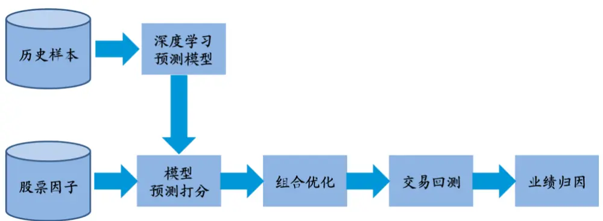
数据来源：Wind，广发证券发展研究中心

## 二、深度学习选股模型

深度学习选股模型通过深层神经网络，建立起股票因子和未来收益率之间的关系，根据对个股收益率的预测进行选股。模型采用了股票的 156 个特征，包括传统的选股因子（如估值因子、规模因子、反转因子、流动性因子、波动性因子），价量技术指标（如 MACD、KDJ 等指标），以及28个表示申万一级行业属性的 0-1变量。

在本报告的深度学习选股模型中，我们采用 7 层深层神经网络系统建立股票价格预测模型。其中包含输入层 X，输出层 Y，和隐含层 H1、H2、H3、……、H5。各层的节点数如下表所示。该深度学习模型的结构是通过网格搜索优化出来的模型结构（参考报告《深度学习系列之三：深度学习新进展，Alpha因子的再挖掘》和《深度学习研究报告之五：风险中性的深度学习选股策略》）。

表 1：深度学习模型网络结构

| 层名称 | 层说明 | 节点数 |
| --- | --- | --- |
| X | 输入层 | 156 |
| H1 | 第 1 个隐含层 | 512 |
| H2 | 第 2 个隐含层 | 200 |
| H3 | 第 3个隐含层 | 200 |
| H4 | 第 4 个隐含层 | 200 |
| H5 | 第 5 个隐含层 | 128 |
| Y | 输出层 | 3 |

数据来源：Wind，广发证券发展研究中心

其中，X 是输入层，其节点数为 156 个，表示股票样本的 156 个特征。Y 是输出层，共3 个节点，表示股票未来走势的三种可能性：上涨（有超额收益）、平盘（无超额收益）、下跌（负的超额收益）。本报告中，用 3 维的向量表示 3 种不同的输出类别。 $\begin{array}{r}{\mathbf{y}=[1\quad0\quad0]^{T}}\end{array}$ 表示上涨样本（每个时间截面上，将全体股票按照未来 10 个交易日收益率排序，收益率最高的前 10%的股票样本标记为“上涨样本”），y =$[0\_{1}\_{0}]^{T}$ 表示平盘样本（收益率居中的 10%的股票样本）， $\pmb{y}=[0\quad0\quad1\hdots]$ ]T表示下跌样本（收益率最低的10%的股票样本）。（注：本报告中，粗斜体表示向量和矩阵，不加粗的变量表示标量。）

深层神经网络是对输入向量x和输出向量y的关系进行拟合，建立对输出y的预测模型。记神经网络的参数为w，则神经网络模型可以记成 $\pmb{y}=\mathbf{f}(\pmb{x};\pmb{w})$ 。输出层采用softmax激活函数。在预测时，输出层softmax激活函数的输入向量为z =$\begin{array}{rl}{[z_{1}}&{{}z_{2}\quad z_{3}]^{T}}\end{array}$ ，则经过softmax函数后，预测值为

$$
\widehat{\pmb{y}}=[\widehat{y}_{1}\quad\widehat{y}_{2}\quad\widehat{y}_{3}]^{T}=\left[\frac{e^{z_{1}}}{\sum_{i=1,2,3}e^{z_{i}}}\frac{e^{z_{2}}}{\sum_{i=1,2,3}e^{z_{i}}}\frac{e^{z_{3}}}{\sum_{i=1,2,3}e^{z_{i}}}\right]^{T}
$$

对于分类问题，可以采用均方误差或者交叉熵作为损失函数，进行参数的优化。本报告采用交叉熵损失函数，优化目标为：

$$
E(\pmb{w})=-\sum_{n=1}^{N}\sum_{k=1}^{K}[y_{nk}\log\hat{y}_{nk}+(1-y_{nk})\log(1-\hat{y}_{nk})]
$$

其中， $y_{nk}$ 表示第n个样本的第k个输出类别， $\hat{\mathcal{Y}}_{nk}$ 表示对该输出的预测值。深度学习模型训练时，一般采用误差反向传播的方式求取梯度，优化参数。

为了提高模型的泛化能力，本报告采用Dropout方法，每次参数迭代更新时随机选择丢弃不同的隐层节点，这驱使每个隐层节点去学习更加有用的、不依赖于其他节点的特征。同时，本报告采用Batch Normalization技术提高模型的训练效率。关于Dropout和Batch Normalization的详细内容，可以参考报告《深度学习系列之三：深度学习新进展，Alpha因子的再挖掘》。

神经网络的预测输出 $\hat{y}_{1},\hat{y}_{2},\hat{y}_{3}$ 都是大于0且小于1的数，而且 $\hat{y}_{1}+\hat{y}_{2}+\hat{y}_{3}=1$ 第一个输出节点的预测值 ${\hat{y}}_{1}={\frac{e^{z_{1}}}{\sum_{i=1,2,3}e^{z_{i}}}}$ 是我们对股票的上涨预测打分，即预测该股票属于“上涨”类别的概率，下文中，我们称该打分为股票的深度学习因子。

本报告中，我们采用全市场股票来训练深度学习模型，剔除上市交易时间不满一年的股票，剔除ST股票，剔除交易日停牌和涨停、跌停的股票。用于预测的是未来10个交易日的收益率。在样本标注的时候，按照该股票未来10个交易日的收益率排序值进行样本的标注和筛选。

模型回测期为自2011年1月至2019年2月。模型按照每半年更新一次，每次训练采用最近6年的市场数据来训练模型。

## 三、组合优化技术

## 3.1 结构化风险模型

结构化多因子风险模型将股票收益率分解为因子暴露、因子收益率和特质因子收益率三个部分，第i只股票收益率的分解如下：

$$
r_{i}=f_{m}+\sum_{k=1}^{I}x_{ik}^{I}f_{k}^{I}+\sum_{k=1}^{S}x_{ik}^{s}f_{k}^{s}+u_{i}
$$

这里的因子包括市场因子、I个行业因子、S个风格因子三类。 $f_{m}$ 表示市场因子收益， $f_{k}^{I}$ 表示第k个行业因子的收益， $f_{k}^{S}$ 表示第k个风格因子的收益， $x_{ik}^{I}$ 表示期初股票在第k个行业因子上的因子暴露， $x_{ik}^{S}$ 表示期初股票在第k个风格因子上的因子暴露，$u_{i}.$ 表示第i只股票的特质收益率。在每一期期末，可以通过截面回归获得个股收益的分解。考虑到股票收益率的异方差性，我们以流通市值开根号作为权重，采用加权最小二乘（WLS）估计因子收益率模型。

本报告中，我们将股票按照申万一级28个行业划分，即有28个0-1变量的行业因子。此外，参考MSCI CNE5的构建与计算方法，选取了9类风格因子。

根据上述分解，可以获得股票收益率的协方差矩阵为

$$
\pmb{V}=\pmb{X}\pmb{F}\pmb{X}^{T}+\pmb{\varDelta}
$$

X表示N只个股在 $K=1+I+S$ 个因子（包括市场因子、I个行业因子和S个风格因子）上的因子载荷矩阵 $(N\times K)$ ，F表示K个因子的因子收益率协方差矩阵 $(K\times K)$ Δ表示N只股票的特质因子收益率协方差矩阵 $(N\times N)$ （假设每只股票的特质因子收益率相关性为0，Δ为对角矩阵）。

## 3.2 组合优化模型

在满足行业中性和风格中性约束，以及控制组合年化跟踪误差的约束条件下，我们可以以最大化组合收益率为目标函数，对组合权重进行优化，具体表述为：

$$
\begin{array}{c}{\displaystyle{\begin{array}{c}{{\operatorname*{max}_{w}B_{p}(w)-TC(w,w_{0})}\\{w}\end{array}}}}\\{{\mathrm{}}}\\{{\mathrm{}\mathrm{}}}\\{{\mathrm{}\mathrm{}\mathrm{}s.\mathrm{t}\ \sqrt{w_{a}^{'}(X^{T}FX+\Delta)w_{a}}\leq TE}}\\{{w_{a}^{'}{}d=0}}\\{{w_{a}^{'}{}X_{k}=0,\ \forall k}}\\{{w_{i}\geq0,\ \mathrm{i}=1,2,...,N}}\\{{}}\\{{\displaystyle{\begin{array}{c}{{{}}}\\{{{}}}\\{{{}}}\\{{{}}}\\{{{}}}\\{{{}}}\end{array}}}}\end{array}
$$

上述优化问题中， $R_{p}(w)$ 为组合的预期收益率，与组合在深度学习因子上的暴露成正比：

$$
R_{p}({\boldsymbol{\mathbf{\mathit{w}}}})=f_{DL}{\boldsymbol{\mathbf{\mathit{w}}}}^{\mathrm{T}}t
$$

其中，向量t表示不同股票的深度学习上涨打分向量， $f_{DL}$ 表示单位深度学习因子暴露带来的收益率，可以根据此前一段时间的深度学习组合表现进行估计。

$TC(\boldsymbol{w},\boldsymbol{w}_{0})$ 为组合的换仓成本， ${\pmb w}_{0}$ 为换仓前的股票权重，简单起见，我们可以假设

$$
TC(\pmb{w},\pmb{w}_{0})=tc\times\frac12\|\pmb{w}-\pmb{w}_{0}\|_{1}
$$

其中， $\lVert\boldsymbol{w}-\boldsymbol{w}_{0}\rVert_{1}$ 表示向量 ${\bf w}-{\pmb w}_{0}$ 的1-范数，tc表示交易成本，本报告按照千分之3进行计算。

组合优化问题的第一条约束代表控制跟踪误差，其中TE为给定的策略年化跟踪误差上限。 $\pmb{w}_{a}=\pmb{w}-\pmb{w}_{b}$ ，为组合相对基准指数的主动配置权重，其中 ${\pmb w}_{b}$ 为基准指数的配置权重。对指数增强基金而言，跟踪误差是考察组合对跟踪标的的偏离程度的重要指标。

第二条代表行业中性约束，其中H为组合中个股的行业因子哑变量矩阵。行业中性是指组合的行业配置与标的指数的行业配置一致，目的是消除行业偏离对策略收益的影响，仅考察行业内部个股的超额收益，增加组合表现的稳定性，减小回撤。

第三条代表风格中性约束，其中 $X_{k}$ 为样本第k个因子的载荷截面向量。风格中性是指组合的风格因子对标的指数的风险暴露为0，即组合的风格暴露与标的指数的风格暴露完全一致，没有风格偏离。其目的是剔除市场的风险因子对组合收益的影响，使组合的超额收益不来自于任何一种风格，以获得更稳健的阿尔法收益。

第四条代表不允许做空，第五条代表组合是满仓运行，不进行择时。

## 四、组合业绩归因

## 4.1 单期组合业绩归因

业绩归因将组合的收益率分解为各个部分，并为收益来源分析和选股模型有效性分析提供了一个非常有价值的视角。对于机器学习因子选股模型，由于机器学习因子构建过程的“黑箱”属性，模型选股结果的可解释性弱。通过业绩归因了解模型的收益来源，有助于监测机器学习因子表现是否稳定和是否失效。

本报告采用多因子模型进行组合业绩归因分析。与结构化风险模型类似，多因子模型将股票收益率线性分解为因子暴露、因子收益率和特质因子收益率三个部分：

$$
r_{i}=f_{m}+\sum_{k=1}^{I}x_{ik}^{I}f_{k}^{I}+\sum_{k=1}^{S}x_{ik}^{s}f_{k}^{s}+u_{i}
$$

在每一期期末，可以通过截面回归获得个股收益的分解。在归因分析中，不能被股票收益率模型所解释的个股收益率部分被认为是α，即

$$
\alpha_{i}=r_{i}-\hat{f}_{m}-\sum_{k=1}^{I}x_{ik}^{I}\hat{f}_{k}^{I}-\sum_{k=1}^{S}x_{ik}^{s}\hat{f}_{k}^{s}
$$

在每一期期初，通过个股的因子暴露，可以求得组合的因子暴露。因子暴露与因子收益的乘积，就是该期因子对组合的收益贡献。具体而言，组合收益可以拆分为

$$
r_{p}=\sum_{i}w_{i}r_{i}=f_{m}+\sum_{k=1}^{I}\sum_{i}w_{i}x_{ik}^{I}f_{k}^{I}+\sum_{k=1}^{S}\sum_{i}w_{i}x_{ik}^{S}f_{k}^{S}+\sum_{i}w_{i}\alpha_{i}
$$

而组合的超额收益可以拆分为

$$
r_{a}=r_{p}-r_{b}
$$

$$
=\sum_{k=1}^{I}\sum_{i}w_{i}^{a}x_{ik}^{I}f_{k}^{I}+\sum_{k=1}^{S}\sum_{i}w_{i}^{a}x_{ik}^{S}f_{k}^{S}+\sum_{i}w_{i}^{a}\alpha_{i}
$$

$$
=\sum_{k=1}^{I}RC_{k}^{I}+\sum_{k=1}^{S}RC_{k}^{S}+RC_{\alpha}
$$

其中， $RC_{k}^{I}$ 表示第k个行业因子的收益贡献， $RC_{k}^{S}$ 表示第k个风格因子的收益贡献，$RC_{\alpha}$ 表示组合的α收益贡献。 $w_{i}^{b}$ 表示基准指数中股票i的权重， $w_{i}^{a}=\boldsymbol{\mathsf{w}}_{i}-\boldsymbol{w}_{i}^{b}$ 表示组合在股票i上的主动配置权重。通过上述公式，可完成对每期组合超额收益的收益贡献归因。

## 4.2 多期组合业绩归因

由于收益率是一个累乘的结果，因此多期组合业绩归因并不是单期业绩归因的

简单叠加。如下表所示，在每个时段t $\left({\ t=1,2,3}\right)$ ，都有组合收益 $\begin{array}{r}{\boldsymbol{R}_{t}=\sum_{k=1}^{K}RC_{k,t}+}\end{array}$ $RC_{\alpha,t}$ ，但是根据每期组合收益和因子收益贡献计算出整个回测期的组合收益和因子收益贡献之后，会发现整个回测期组合收益 $\begin{array}{r}{R\neq\sum_{k=1}^{K}RC_{k}+RC_{\alpha}}\end{array}$

为了通过单期业绩归因计算多期业绩归因，目前常用的处理方法是通过调整系数进行处理。具体来说，对每一个时段t，计算一个调整系数 ${{\rho}_{t}}$ ，通过调整系数来合成调整之后的因子贡献：

$$
RC_{k,adj}=\sum_{t}\rho_{t}RC_{k,t}
$$

经过调整之后，组合收益满足 $\begin{array}{r}{{\cal R}=\sum_{k=1}^{K}RC_{k,adj}+RC_{\alpha,adj}}\end{array}$ ，可以完成对多期组合业绩的归因拆分。

表 2：多期组合业绩归因示意图

| 期数 | 组合超额收益 | 调整系数 | 因子1贡献 |  | 因子K贡献 | α贡献 |
| --- | --- | --- | --- | --- | --- | --- |
| 1 | $R_{1}$ | $\rho_{1}$ | $RC_{1,1}$ |  | $RC_{K,1}$ | $RC_{\alpha,1}$ |
| 2 | $R_{2}$ | $\rho_{2}$ | $RC_{1,2}$ |  | $RC_{K,2}$ | $RC_{\alpha,2}$ |
| 3 | $R_{3}$ | $\rho_{3}$ | $RC_{1,3}$ |  | $RC_{K,3}$ | $RC_{\alpha,3}$ |
| 总计 | R |  | $RC_{1}$ |  | $RC_{K}$ | $RC_{\alpha}$ |
| 调整后因子贡献 | R |  | $RC_{1,adj}$ | .. | $RC_{K,adj}$ | $RC_{\alpha,adj}$ |

数据来源：Wind，广发证券发展研究中心

调整系数 ${\bf\nabla}\cdot\rho_{t}$ 的计算方法为

$$
\rho_{t}=\mathsf{a}+\mathsf{b}R_{t}
$$

其中，

$$
{\sf a}=\frac{1}{T}\frac{R}{(1+R)^{\frac{1}{T}}-1}
$$

$$
{\mathsf{b}}={\frac{R-{\mathsf{a}}\sum_{t=1}^{T}R_{t}}{\sum_{t=1}^{T}(R_{t})^{2}}}
$$

## 五、实证分析

## 5.1 回测参数设置

指数增强基金在基金合同中一般规定投资于标的指数成份股和备选成份股的资产不低于非现金基金资产的80%。本报告考察用两种方法构建指数增强组合，标的指数成份股内选股和全市场选股。第一种方法是只从对应标的指数的成份股内选股，例如，中证500指数增强策略只从中证500指数的成份股内进行选股。第二种方法是从全A股市场股票中进行选股，但对应标的指数成份股内股票的权重不低于80%。例如，中证500指数增强策略从全市场进行选股，但其中不低于80%的权重配置中证500指数的成份股。优化目标为：

$$
\operatorname*{max}R_{p}(\pmb{w})-TC(\pmb{w},\pmb{w}_{0})
$$

$$
\mathrm{~s.~t.~}\sqrt{{w_{a}^{T}}(X^{T}FX+\Delta){w_{a}}}\leq TE
$$

$$
{\pmb w}_{a}^{T}{\pmb H}={\pmb0}
$$

$$
\mathbf{w}_{\mathrm{a}}^{T}\pmb{X}_{k}=0,\ \forall k
$$

$$
\mathbf{w}_{i}\geq0,\mathrm{i}=1,2,\ldots,\mathrm{N}
$$

$$
\sum_{i=1}^{N}w_{i}=1
$$

$$
\sum_{i=1}^{N}b_{i}w_{i}\geq0.8
$$

其中， $b_{i}$ 为表示股票i是否是标的指数成份股的指示变量。

指数增强基金在基金合同中一般规定了年化跟踪误差的上限，不同基金合同设置的跟踪误差上限可能不一样，本报告中统一采用7.75%的跟踪误差上限，即TE=7.75%。

对于风险因子的优化，本报告中只考虑行业和市值因子的中性化。行业中性方面，允许每个行业上的配置有10%的相对偏离，例如，对于行业j，标的指数的配置权重为 $w_{ind\_j}^{b}$ ，则增强策略的配置约束为

$$
0.9w_{ind_{-}j}^{b}\leq\sum_{\mathrm{i}=1}^{N}w_{i}h_{i,ind_{-}j}\leq1.1w_{ind_{-}j}^{b}
$$

其中， $h_{i,ind_{-}j}$ 为表示股票i是否属于行业j的0-1变量。类似的，市值中性方面，允许组合的加权平均市值相对标的指数的加权平均市值有1%的偏离。

本报告按每半月进行调仓，交易成本按照千分之三进行计算。

## 5.2 指数增强策略表现

## 1) 中证1000指数增强策略

深度学习因子在中证1000成份股内的IC如下图所示。IC均值为0.095，IC_IR为0.795。

图 2：深度学习因子IC（中证1000指数成份股）
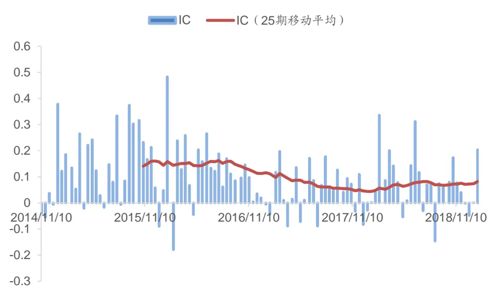
数据来源：Wind，广发证券发展研究中心

标的指数成份股选股的1000指数增强策略和全市场选股的1000指数增强策略表现如下图所示。从2010年11月开始，标的指数成份股选股的1000增强策略获得了27.56%的年化超额收益，超额收益最大回撤-4.84%。全市场选股的1000增强策略获得了29.07%的年化超额收益，超额收益最大回撤-5.09%。两者的收益表现比较相似，全市场选股的指数增强策略的年化收益较高，但最大回撤也更大一些。

图 3：中证1000指数增强策略表现
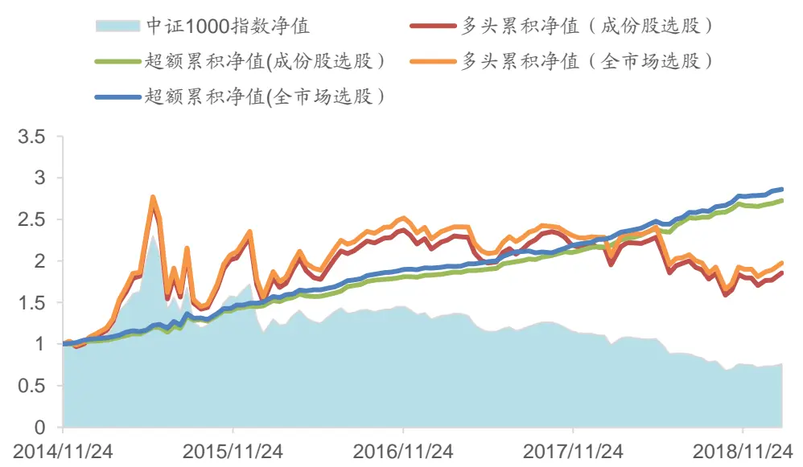
数据来源：Wind，广发证券发展研究中心

两种1000增强策略的分年度表现如以下两个表格所示（其中，2014年是从11月底开始，2019年截止到2月15日）。从2014年以来，两个策略每年都获得了正的增强收益，其中，2015年策略的超额收益分别为43.53%和43.33%。成份股内选股的指数增强策略的年换手率为15.1倍，而全市场选股的指数增强策略的年换手率为15.7倍，全市场选股策略的换手率略高于成份股内选股的策略。从跟踪误差来看，成份股内选股的指数增强策略的平均年化跟踪误差为6.11%，全市场选股的指数增强策略的平均年化跟踪误差为6.42%。除了2015年，其他年份的跟踪误差都小于优化目标上限7.75%。

表 3：中证1000指数增强表现（成份股内选股）

| 年度累积 |  |  |  | 超额收益 | 年化跟踪 |  |  |  |
| --- | --- | --- | --- | --- | --- | --- | --- | --- |
| 年份 | 多头收益 | 基准收益 | 超额收益 |  | 最大回撤 | 年换手率 | 误差 | 信息比 |
| 2014 | -2.73% | -4.22% | 1.57% | -0.68% | 127.83% | 5.85% | 2.47 |  |
| 2015 | 130.58% | 76.10% | 43.53% | -4.84% | 1526.42% | 11.40% | 3.37 |  |
| 2016 | -1.43% | -20.01% | 24.45% | -1.68% | 1481.06% | 5.60% | 4.02 |  |
| 2017 | -1.74% | -17.35% | 18.95% | -0.51% | 1494.08% | 4.13% | 4.32 |  |
| 2018 | -22.72% | -36.87% | 22.99% | -1.40% | 1526.56% | 4.91% | 4.34 |  |
| 2019 | 10.60% | 7.75% | 2.71% | 0.00% | 191.01% | 4.78% | 5.06 |  |

数据来源：Wind，广发证券发展研究中心

表 4：中证1000指数增强表现（全市场选股）

| 年度累积 |  |  |  | 超额收益 | 年化跟踪 |  |  |
| --- | --- | --- | --- | --- | --- | --- | --- |
| 年份 | 多头收益 | 基准收益 | 超额收益 |  | 最大回撤 | 年换手率 | 误差 信息比 |
| 2011 | -0.59% | -4.22% | 3.73% | 0.00% | 119.57% | 5.99% | 5.51 |
| 2012 | 132.04% | 76.10% | 43.33% | -5.09% | 1610.64% | 12.66% | 2.99 |
| 2016 | 1.89% | -20.01% | 28.35% | -0.98% | 1491.59% | 5.74% | 4.53 |
| 2017 | -3.56% | -17.35% | 16.57% | -1.12% | 1549.09% | 4.21% | 3.74 |
| 2018 | -21.00% | -36.87% | 25.61% | -1.46% | 1611.22% | 5.23% | 4.49 |
| 2019 | 10.30% | 7.75% | 2.40% | 0.00% | 212.56% | 4.66% | 4.63 |

数据来源：Wind，广发证券发展研究中心

## 2) 中证500指数增强策略

深度学习因子在中证500成份股内的IC如下图所示。IC均值为0.069，IC_IR为0.691。

图 4：深度学习因子IC（中证500指数成份股）
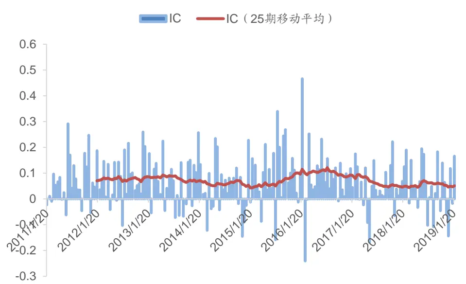
数据来源：Wind，广发证券发展研究中心

标的指数成份股选股的500指数增强策略和全市场选股的500指数增强策略表现如下图所示。从2011年1月开始，标的指数成份股选股的500增强策略获得了15.25%的年化超额收益，超额收益最大回撤-4.55%。全市场选股的500增强策略获得了14.67%的年化超额收益，超额收益最大回撤-4.55%。两者的收益表现基本一致。

图 5：中证500指数增强策略表现
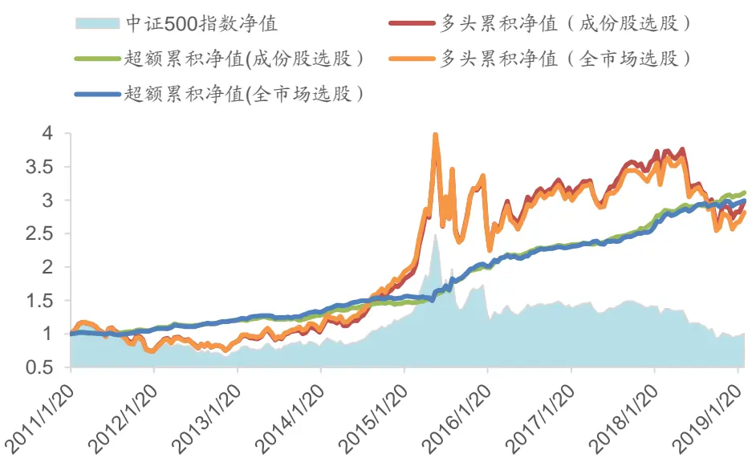
数据来源：Wind，广发证券发展研究中心

两种500指数增强策略的分年度表现如以下两个表格所示。从2011年以来，两个策略每年都获得了正的增强收益，其中，2015年策略的表现最佳。成份股内选股的指数增强策略的年换手率为14.4倍，而全市场选股的指数增强策略的年换手率为15.2倍，全市场选股策略的换手率略高于成份股内选股的策略。从跟踪误差来看，除了2015年，其他年份的跟踪误差都小于优化目标上限的7.75%，而且大部分年份里，全市场选股策略的跟踪误差较大一些。成份股内选股的指数增强策略的平均年化跟踪误差为5.30%，全市场选股的指数增强策略的平均年化跟踪误差为5.79%。

表 5：中证500指数增强表现（成份股内选股）

| 年度累积 |  |  |  | 超额收益 | 年化跟踪 |  |  |
| --- | --- | --- | --- | --- | --- | --- | --- |
| 年份 | 多头收益 | 基准收益 | 超额收益 |  | 最大回撤 | 年换手率 | 误差 信息比 |
| 2011 | -23.71% | -27.04% | 5.01% | -2.17% | 1286.78% | 4.29% | 1.26 |
| 2012 | 13.60% | 0.28% | 13.57% | -2.72% | 1388.50% | 4.76% | 2.77 |
| 2013 | 24.29% | 16.89% | 6.32% | -4.55% | 1397.97% | 5.25% | 1.24 |
| 2014 | 58.63% | 39.01% | 14.48% | -1.84% | 1488.10% | 5.22% | 2.63 |
| 2015 | 92.77% | 43.12% | 38.09% | -3.08% | 1488.55% | 9.61% | 3.45 |
| 2016 | -5.86% | -17.78% | 15.62% | -1.14% | 1341.07% | 5.43% | 2.73 |
| 2017 | 13.59% | -0.20% | 13.85% | -0.87% | 1487.99% | 4.31% | 3.12 |
| 2018 | -23.17% | -33.32% | 15.56% | -1.44% | 1458.97% | 5.06% | 2.97 |
| 2019 | 10.20% | 8.03% | 2.09% | -0.15% | 198.43% | 3.80% | 4.86 |

数据来源：Wind，广发证券发展研究中心

表 6：中证500指数增强表现（全市场选股）

| 年度累积 |  |  |  | 超额收益 | 年化跟踪 |  |  |
| --- | --- | --- | --- | --- | --- | --- | --- |
| 年份 | 多头收益 | 基准收益 | 超额收益 |  | 最大回撤 | 年换手率 | 误差 信息比 |
| 2011 | -24.22% | -27.04% | 4.41% | -3.39% | 1399.17% | 4.17% | 1.14 |
| 2012 | 14.79% | 0.28% | 14.61% | -2.07% | 1473.56% | 4.66% | 3.00 |
| 2013 | 29.91% | 16.89% | 11.27% | -2.82% | 1478.67% | 5.42% | 2.08 |
| 2014 | 60.92% | 39.01% | 16.19% | -1.46% | 1620.64% | 5.62% | 2.70 |
| 2015 | 81.48% | 43.12% | 31.60% | -4.55% | 1531.69% | 11.71% | 2.47 |
| 2016 | -8.63% | -17.78% | 12.46% | -1.92% | 1458.60% | 6.52% | 1.88 |
| 2017 | 10.49% | -0.20% | 10.71% | -2.05% | 1500.55% | 5.17% | 2.04 |
| 2018 | -23.66% | -33.32% | 15.09% | -2.38% | 1588.01% | 5.63% | 2.61 |
| 2019 | 10.63% | 8.03% | 2.48% | 0.00% | 209.97% | 3.23% | 6.79 |

数据来源：Wind，广发证券发展研究中心

## 3) 沪深300指数增强策略

深度学习因子在沪深300成份股内的IC如下图所示。IC均值为0.039，IC_IR为0.287。

图 6：深度学习因子IC（沪深300指数成份股）
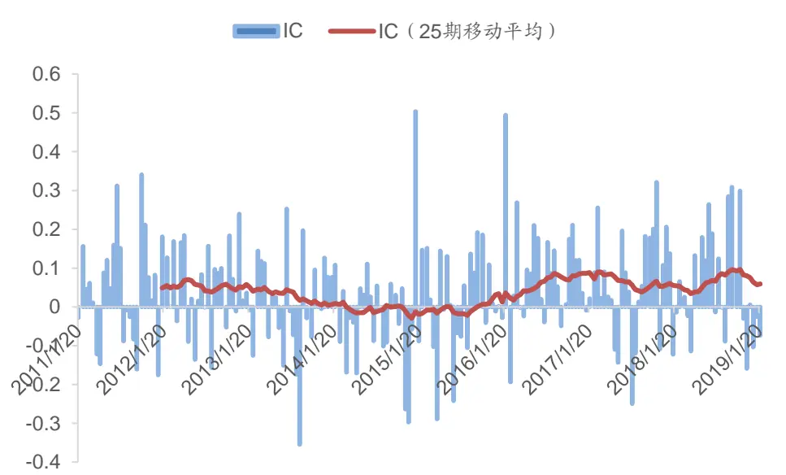
数据来源：Wind，广发证券发展研究中心

标的指数成份股选股的300指数增强策略和全市场选股的300指数增强策略表现如下图所示。从2011年1月开始，标的指数成份股选股的300增强策略获得了7.26%的年化超额收益，超额收益最大回撤-4.36%。全市场选股的300增强策略获得了13.11%的年化超额收益，超额收益最大回撤-8.20%。全市场选股的沪深300指数增强策略的年化收益明显更高，但回撤也大了很多。

图 7：沪深300指数增强策略表现
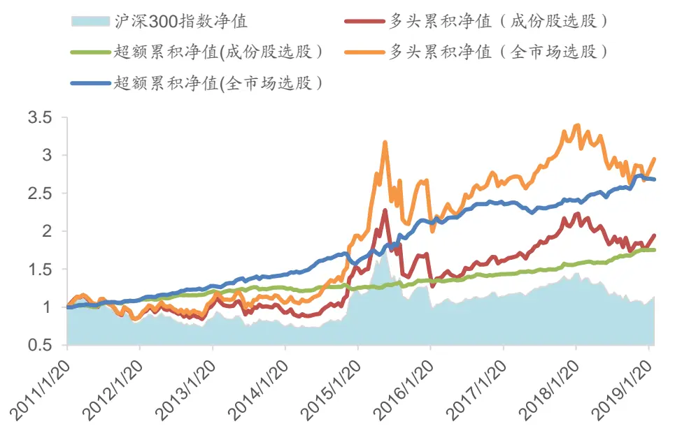
数据来源：Wind，广发证券发展研究中心

两种300增强策略的分年度表现如以下两个表格所示。两个策略在大部分年份里获得了正的增强收益，其中，成份股内选股的沪深300增强策略在2018年表现最佳，而全市场选股的沪深300增强策略在2015年表现最佳。在2019年的前一个半月，两个指数增强策略都没有正的超额收益。成份股内选股的指数增强策略的年换手率为8.0倍，而全市场选股的指数增强策略的年换手率为8.7倍，全市场选股策略的换手率略高于成份股内选股的策略。从跟踪误差来看，成份股内选股的沪深300指数增强策略每年的跟踪误差都小于优化目标上限的7.75%，而全市场选股策略的跟踪误差较大一些，在2015年的跟踪误差超出了优化目标上限。

表 7：沪深300指数增强表现（成份股内选股）

| 年度累积 |  |  |  | 超额收益 | 年化跟踪 |  |  |
| --- | --- | --- | --- | --- | --- | --- | --- |
| 年份 | 多头收益 | 基准收益 | 超额收益 |  | 最大回撤 | 年换手率 | 误差 信息比 |
| 2011 | -13.87% | -20.34% | 8.53% | -2.42% | 832.35% | 3.45% | 2.58 |
| 2012 | 18.22% | 7.55% | 10.36% | -1.24% | 807.10% | 3.41% | 2.97 |
| 2013 | -2.57% | -7.65% | 5.37% | -2.38% | 807.81% | 5.16% | 1.09 |
| 2014 | 49.01% | 51.66% | -2.02% | -4.36% | 767.92% | 5.24% | -0.37 |
| 2015 | 14.03% | 5.58% | 9.27% | -4.03% | 836.25% | 7.08% | 1.35 |
| 2016 | -6.30% | -11.28% | 5.90% | -1.41% | 813.46% | 4.26% | 1.40 |
| 2017 | 32.28% | 21.78% | 8.90% | -1.16% | 724.52% | 4.25% | 2.07 |
| 2018 | -15.73% | -25.31% | 12.96% | -1.50% | 836.09% | 4.42% | 2.86 |
| 2019 | 10.37% | 10.90% | -0.48% | -0.32% | 76.05% | 2.48% | -1.70 |

数据来源：Wind，广发证券发展研究中心

表 8：沪深300指数增强表现（全市场选股）

| 年度累积 |  |  |  | 超额收益 |  | 年化跟踪 |  |  |
| --- | --- | --- | --- | --- | --- | --- | --- | --- |
| 年份 | 多头收益 | 基准收益 | 超额收益 | 最大回撤 | 年换手率 | 误差 |  | 信息比 |
| 2011 | -13.87% | -20.34% | 8.44% | -1.18% | 846.43% |  | 4.13% | 2.13 |
| 2012 | 24.70% | 7.55% | 16.54% | -1.13% | 866.12% |  | 4.66% | 3.36 |
| 2013 | 4.11% | -7.65% | 12.67% | -2.90% | 882.32% |  | 5.66% | 2.25 |
| 2014 | 69.57% | 51.66% | 10.98% | -7.05% | 939.48% |  | 6.15% | 1.72 |
| 2015 | 39.49% | 5.58% | 34.81% | -3.31% | 826.59% |  | 9.74% | 3.23 |
| 2016 | -1.33% | -11.28% | 11.86% | -2.62% | 913.15% |  | 5.03% | 2.31 |
| 2017 | 23.14% | 21.78% | 1.19% | -6.07% | 763.42% |  | 5.51% | 0.25 |
| 2018 | -17.10% | -25.31% | 11.45% | -2.76% | 904.75% |  | 5.60% | 2.03 |
| 2019 | 10.59% | 10.90% | -0.30% | -0.77% | 91.71% |  | 3.80% | -0.69 |

数据来源：Wind，广发证券发展研究中心

## 4) 指数增强策略比较分析

不同指数增强策略的表现对比如下表所示。总体而言，在中证1000指数、中证500指数和沪深300指数上的深度学习增强策略都能取得明显的正收益，而且中证1000指数增强策略的增强效果最显著，沪深300指数增强策略的增强效果较弱。从长期来看，各策略的跟踪误差都符合预期，但在少数年份里（尤其是市场波动巨大的2015年），某些策略的跟踪误差可能超过优化目标上限，其中一个主要原因是因为本报告的组合优化中只实现了市值中性和行业中性，如果考虑更多维度的风格因子中性化，有助于实现更好的跟踪误差控制。

对于同一个标的指数的增强策略，从全市场选股一般会产生较高的年化收益，但同时会面临较大的年换手率、跟踪误差和最大回撤。

表 9：指数增强策略比较

| 策略 | 年化超额收益 | 超额收益最大回撤 | 年换手率 | 年化跟踪误差 |
| --- | --- | --- | --- | --- |
| 中证1000指数增强（成份股内选股） | 27.56% | -4.84% | 15.07 | 6.11% |
| 中证1000指数增强（全市场选股） | 29.07% | -5.09% | 15.66 | 6.42% |
| 中证500指数增强（成份股内选股） | 15.25% | -4.55% | 14.36 | 5.30% |
| 中证500指数增强（全市场选股） | 14.67% | -4.55% | 15.22 | 5.79% |
| 沪深300指数增强（成份股内选股） | 7.26% | -4.36% | 7.99 | 4.42% |
| 沪深300指数增强（全市场选股） | 13.11% | -8.20% | 8.71 | 5.59% |

数据来源：Wind，广发证券发展研究中心

## 5.3 指数增强策略的换手率优化

由于主要是通过价量指标对个股进行预测分析，深度学习选股因子比较偏短线，而且换手率较高。通过在组合优化问题中引入交易成本的考虑，可以控制策略的换手率。由上表所示，中证1000指数增强和中证500指数增强的年换手率在15倍左右，沪深300指数增强的换手率在8倍左右。

可以在优化问题中，通过引入交易费用的惩罚系数，对换手率进行调节。如下面优化公式所示，通过参数λ来调节交易费用在优化问题中的占比。当λ = 0时，优化问题里不考虑交易成本；当λ = 1时，优化问题的目标是最大化扣费之后的组合收益率；当λ > 1时，优化问题是在考虑交易成本的同时，对组合的换手进行进一步“惩罚”。上文的回测中，我们是采用λ = 1进行回测的。

$$
\begin{array}{c}{{\displaystyle\operatorname*{max}_{n_{o}}R_{p}(w)-\lambda TC(w,w_{0})}}\\{{\mathrm{}_{S:\mathrm{t}}\sqrt{w_{a}^{T}(X^{T}PKI+\Delta)w_{a}}\leq TE}}\\{{w_{a}^{T}{w}_{b}^{T}=0}}\\{{\displaystyle\mathbf{w}_{a}^{T}X_{k}=0,\ \forall k}}\\{{\mathrm{w}_{i}\geq0,\ \mathrm{i}=1,2,...,\mathrm{N}}}\\{{\displaystyle\sum_{i=1}^{N}w_{i}=1}}\end{array}
$$

我们考虑三种不同的优化方案， $\lambda=0,\ \lambda=1\sharp\lambda=2$ ，分别考察不同优化方案下，成份股内选股的指数增强策略的表现。结果如下表所示：

表 10：惩罚系数对指数增强策略影响的比较分析

| 策略 | 指标 | λ = 0 | λ = 1 | λ = 2 |
| --- | --- | --- | --- | --- |
| 中证1000指数增强（成份股内选股） | 年化超额收益 | 26.75% | 27.56% | 25.29% |
|  | 超额收益最大回撤 | -5.06% | -4.84% | -5.43% |
|  | 年换手率 | 18.64 | 15.07 | 13.94 |
|  | 年化跟踪误差 | 6.27% | 6.11% | 5.98% |
|  | 信息比 | 3.82 | 3.93 | 3.77 |
| 中证500指数增强（成份股内选股） | 年化超额收益 | 13.15% | 15.25% | 15.58% |
|  | 超额收益最大回撤 | -5.10% | -4.55% | -2.83% |
|  | 年换手率 | 19.12 | 14.36 | 12.83 |
|  | 年化跟踪误差 | 5.64% | 5.30% | 5.26% |
|  | 信息比 | 2.50 | 2.78 | 2.74 |
| 沪深300指数增强（成份股内选股） | 年化超额收益 | 5.42% | 7.26% | 2.44% |
|  | 超额收益最大回撤 | -6.28% | -4.36% | -3.58% |
|  | 年换手率 | 18.26 | 7.99 | 1.80 |
|  | 年化跟踪误差 | 5.22% | 4.66% | 3.63% |
|  | 信息比 | 1.14 | 1.74 | 0.74 |

数据来源：Wind，广发证券发展研究中心

可以看到，当λ从0变成2时，中证1000指数增强策略的年换手率从18.64下降到了13.94，中证500指数增强策略的年换手率从19.12下降到了12.83，沪深300指数增强策略的年换手率从18.26下降到了1.80。随着λ的增大，换手率的下降幅度非常显著。在沪深300指数增强策略中，由于深度学习选股因子的收益率相对较低，因此在最大化 $.R_{p}(\pmb{w})-\lambda TC(\pmb{w},\pmb{w}_{0})$ 时，交易成本项的影响很大，导致策略的换手率降低非常明显。

图 8：指数增强策略的换手率比较
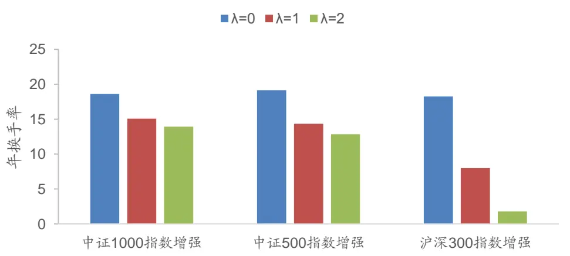
数据来源：Wind，广发证券发展研究中心

从跟踪误差来看，随着λ的增大，策略的跟踪误差一般会下降。可能的原因是组合优化问题在约束跟踪误差时，没有将交易成本考虑在内，因此实际交易的交易成本会增大策略的跟踪误差。通过 $\lambda TC(\pmb{w},\pmb{w}_{0})$ 降低交易成本之后，可以减小回测中交易成本对跟踪误差的影响。

图 9：指数增强策略的跟踪误差比较
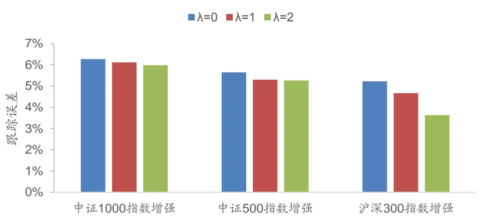
数据来源：Wind，广发证券发展研究中心

从信息比来看，当λ = 1时，三个指数增强策略都具有最高的信息比。当λ = 0时，过高的换手率带来的交易成本损耗降低了超额收益，同时增大了策略的跟踪误差，因而信息比降低。当λ = 2时，过低的换手率可能降低了超额收益来源，也导致策略的信息比下降。

图 10：指数增强策略信息比比较
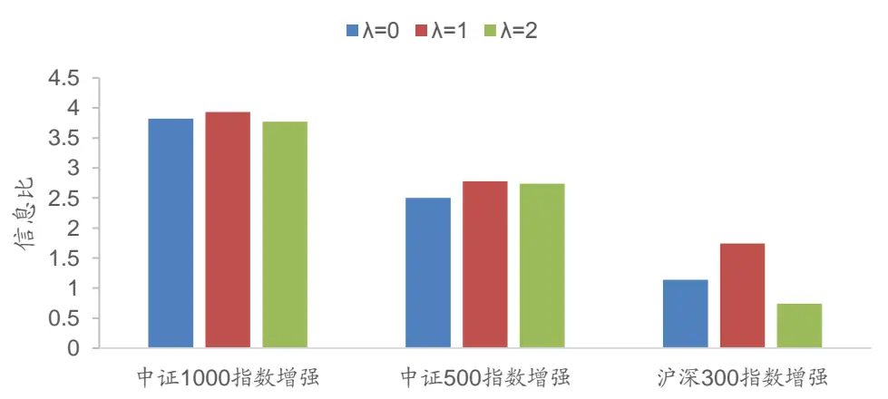
数据来源：Wind，广发证券发展研究中心

另一种对换手率更精准的控制方案是直接在优化问题中约束策略的换手率。即加入约束条件：

$$
turnover=\frac12\|w-w_{0}\|_{1}\le TO
$$

其中，TO表示单次调仓的换手率上限。本报告中，我们设定每次调仓的换手率

上限为24%（折合年化换手率6倍）。

在对换手率进行约束时的结果如下表所示。当组合优化问题中对换手率进行直接约束时，可以将换手率控制在期望范围内。如下表的最后一列所示，在不同成份股内构建的指数增强策略的年换手率都在6倍左右，符合我们的约束目标。在这种换手率较低的情况下，策略也获得了不错的收益。中证1000指数增强策略的年化超额收益为23.01%，中证500指数增强策略的年化超额收益为12.13%，沪深300指数增强策略的年化超额收益为6.07%。

但与不对换手率进行约束的策略相比，换手率约束的策略方案增加了约束条件，使得策略的年化超额收益有明显的下降，策略的信息比降低。

表 11：换手率约束对指数增强策略影响的比较分析

| 策略 | 指标 | 无换手率约束 | 换手率约束（24%） |
| --- | --- | --- | --- |
| 中证1000指数增强（成份股内选股） | 年化超额收益 | 27.56% | 23.01% |
|  | 超额收益最大回撤 | -4.84% | -4.31% |
|  | 年换手率 | 15.07 | 6.06 |
|  | 年化跟踪误差 | 6.11% | 5.33% |
|  | 信息比 | 3.93 | 3.64 |
| 中证500指数增强（成份股内选股） | 年化超额收益 | 15.25% | 12.13% |
|  | 超额收益最大回撤 | -4.55% | -3.29% |
|  | 年换手率 | 14.36 | 5.99 |
|  | 年化跟踪误差 | 5.30% | 4.68% |
|  | 信息比 | 2.78 | 2.41 |
| 沪深300指数增强（成份股内选股） | 年化超额收益 | 7.26% | 6.07% |
|  | 超额收益最大回撤 | -4.36% | -3.81% |
|  | 年换手率 | 7.99 | 5.77 |
|  | 年化跟踪误差 | 4.66% | 4.35% |
|  | 信息比 | 1.74 | 1.53 |

数据来源：Wind，广发证券发展研究中心

## 5.4 业绩归因分析

本报告采用了7个风格因子进行策略的归因分析。分别表示股票的规模因子、Beta因子、反转因子、波动性因子、流动性因子、估值因子和杠杆因子等7种不同的风格特征。并且根据因子方向进行调整，使得调整之后的因子的预期收益都变成正向的（因子值越大，预期收益越高）。然后，通过z-score方法进行因子标准化。

表 12：用于归因分析的风格因子列表

| 风格因子 | 因子说明 | 因子方向 |
| --- | --- | --- |
| 规模因子 | 流通市值 | 负向 |
| Beta 因子 | 股票的 120 日 beta | 负向 |
| 反转因子 | 月度反转 | 负向 |
| 波动性因子 | 月度波动率 | 负向 |
| 流动性因子 | 月均换手率 | 负向 |
| 估值因子 | 盈市率 | 正向 |
| 杠杆因子 | 资产负债率 | 负向 |

数据来源：Wind，广发证券发展研究中心

因子数据预处理之后，可以通过多因子模型回归得到各期的风格因子表现。下图展示了7大类风格因子滚动12个月的收益率。可以看到，流动性因子和规模因子的收益率最为显著。

图 11：风格因子收益率（滚动12个月）
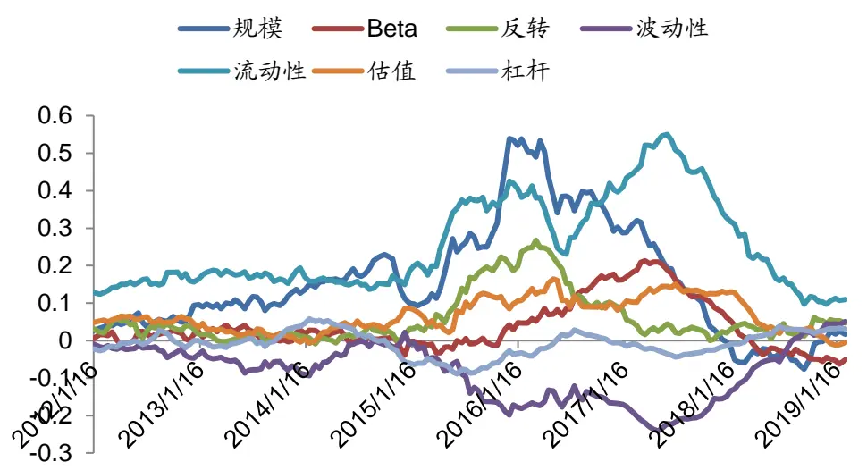
数据来源：Wind，广发证券发展研究中心

通过计算每期组合的风格暴露，可以获得不同的风格因子和行业因子的收益贡献，通过个股的权重和个股超额收益可以获得Alpha收益贡献。

对于成份股内选股的中证1000指数增强，业绩归因结果如下表所示。由于采用了行业中性，组合在行业因子上的相对暴露很小，行业因子的收益贡献也很小。7大类风格因子中，在流动性、反转和波动率等三个因子上的相对暴露较大。组合一共产生了221.37%的超额收益（业绩归因中，超额收益未扣除交易成本），在超额收益中，流动性因子贡献了62.23%的超额收益，反转因子贡献了23.23%的超额收益，而波动率因子贡献了负的超额收益。除了7大类风格因子和行业因子的收益贡献之外，还有138.22%的收益不能被风格因子和行业因子所解释，这是深度学习选股因子产生的Alpha收益（主要来源于股票因子对股票收益率的非线性影响）。

表 13：中证1000指数增强策略业绩归因

| 单期因子相对暴 |  |  | 单期因子 | 单期因子收益 |
| --- | --- | --- | --- | --- |
| 因子 | 露均值 | 因子收益贡献 | 收益贡献均值 | 贡献标准差 |
| Alpha | - | 138.22% | 0.7252% | 1.6468% |
| 规模因子 | 0.0273 | 5.74% | 0.0299% | 0.1188% |
| Beta 因子 | -0.0961 | 2.70% | 0.0145% | 0.1649% |
| 反转因子 | 0.2568 | 23.23% | 0.1211% | 0.2955% |
| 波动性因子 | 0.1581 | -14.95% | -0.0768% | 0.3331% |
| 流动性因子 | 0.2620 | 62.23% | 0.3217% | 0.3503% |
| 估值因子 | 0.0804 | 3.87% | 0.0200% | 0.0830% |
| 杠杆因子 | -0.0285 | 0.18% | 0.0009% | 0.0277% |
| 交通运输 | 0.0001 | 0.21% | 0.0011% | 0.0056% |
| 休闲服务 | -0.0002 | -0.01% | -0.0001% | 0.0019% |
| 传媒 | -0.0005 | -0.34% | -0.0018% | 0.0086% |
| 公用事业 | -0.0002 | -0.11% | -0.0006% | 0.0078% |
| 农林牧渔 | -0.0008 | -0.03% | -0.0001% | 0.0051% |
| 化工 | -0.0015 | -0.11% | -0.0006% | 0.0089% |
| 医药生物 | 0.0016 | -0.37% | -0.0019% | 0.0162% |
| 商业贸易 | -0.0011 | 0.24% | 0.0013% | 0.0044% |
| 国防军工 | 0.0010 | 0.07% | 0.0004% | 0.0076% |
| 家用电器 | -0.0002 | 0.00% | 0.0000% | 0.0035% |
| 建筑材料 | -0.0001 | -0.06% | -0.0003% | 0.0042% |
| 建筑装饰 | -0.0004 | -0.18% | -0.0009% | 0.0061% |
| 房地产 | 0.0012 | 0.06% | 0.0003% | 0.0087% |
| 有色金属 | 0.0020 | 0.15% | 0.0008% | 0.0105% |
| 机械设备 | -0.0015 | 0.10% | 0.0005% | 0.0070% |
| 汽车 | -0.0004 | 0.12% | 0.0006% | 0.0055% |
| 电子 | 0.0028 | 0.52% | 0.0027% | 0.0142% |
| 电气设备 | -0.0021 | 0.10% | 0.0005% | 0.0085% |
| 纺织服装 | -0.0008 | 0.02% | 0.0001% | 0.0032% |
| 综合 | 0.0000 | -0.06% | -0.0003% | 0.0026% |
| 计算机 | 0.0027 | -0.49% | -0.0025% | 0.0289% |
| 轻工制造 | -0.0011 | 0.08% | 0.0004% | 0.0057% |
| 通信 | -0.0003 | 0.05% | 0.0003% | 0.0077% |
| 采掘 | -0.0001 | 0.16% | 0.0008% | 0.0042% |
| 钢铁 | 0.0001 | 0.04% | 0.0002% | 0.0050% |
| 银行 | 0.0000 | 0.00% | 0.0000% | 0.0001% |
| 非银金融 | 0.0001 | 0.01% | 0.0001% | 0.0020% |
| 食品饮料 | -0.0002 | -0.02% | -0.0001% | 0.0062% |

数据来源：Wind，广发证券发展研究中心

累积的Alpha收益贡献和风格因子收益贡献由下图所示。可以看到，Alpha收益 和流动性因子贡献了主要的超额收益。

图 12：中证1000指数增强风格因子和Alpha收益贡献
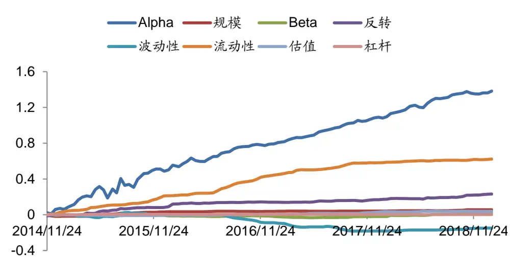
数据来源：Wind，广发证券发展研究中心

可以对各期组合产生的Alpha收益进行监测，验证深度学习选股策略的稳定性。由下图可见，Alpha收益贡献比较稳定，每期的均值为0.73%，标准差1.65% 。这也从另一方面验证了该深度学习选股策略产生了稳定的、不能被常规风格因子解释的超额收益。

图 13：中证1000指数增强Alpha收益贡献
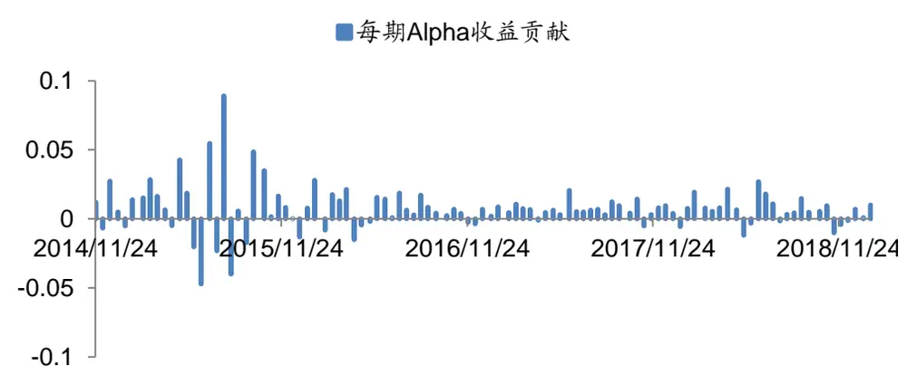
数据来源：Wind，广发证券发展研究中心

类似的，对于成份股内选股的中证500指数增强，业绩归因结果如下表所示。组合一共产生了326.66%的超额收益。其中，流动性因子贡献了86.58%的超额收益，反转因子贡献了26.54%的超额收益。除了7大类风格因子和行业因子的收益贡献之外，还有196.76%的收益来源于Alpha收益。

表 14：中证500指数增强策略业绩归因

| 单期因子相对暴 |  |  | 单期因子 | 单期因子收益 |
| --- | --- | --- | --- | --- |
| 因子 | 露均值 | 因子收益贡献 | 收益贡献均值 | 贡献标准差 |
| Alpha | 一 | 196.76% | 0.5410% | 1.2589% |
| 规模因子 | 0.0182 | 8.16% | 0.0361% | 0.1059% |
| Beta 因子 | -0.0536 | 14.98% | 0.0309% | 0.1969% |
| 反转因子 | 0.2143 | 26.54% | 0.0735% | 0.2165% |
| 波动性因子 | 0.1132 | -11.76% | -0.0699% | 0.2859% |
| 流动性因子 | 0.1904 | 86.58% | 0.2507% | 0.2813% |
| 估值因子 | 0.0861 | 8.56% | 0.0402% | 0.1555% |
| 杠杆因子 | -0.0383 | -2.48% | -0.0039% | 0.0479% |
| 交通运输 | -0.0011 | -0.12% | -0.0003% | 0.0072% |
| 休闲服务 | -0.0003 | -0.02% | 0.0000% | 0.0019% |
| 传媒 | 0.0000 | 0.32% | 0.0003% | 0.0083% |
| 公用事业 | -0.0007 | -0.44% | -0.0003% | 0.0069% |
| 农林牧渔 | -0.0002 | -0.12% | -0.0004% | 0.0068% |
| 化工 | -0.0019 | 0.15% | 0.0009% | 0.0085% |
| 医药生物 | 0.0019 | -0.57% | -0.0026% | 0.0189% |
| 商业贸易 | -0.0015 | 0.23% | 0.0004% | 0.0067% |
| 国防军工 | 0.0005 | 0.38% | 0.0004% | 0.0075% |
| 家用电器 | -0.0001 | -0.03% | -0.0001% | 0.0033% |
| 建筑材料 | 0.0006 | 0.04% | 0.0002% | 0.0050% |
| 建筑装饰 | 0.0004 | 0.01% | -0.0002% | 0.0066% |
| 房地产 | 0.0008 | -0.37% | 0.0000% | 0.0138% |
| 有色金属 | 0.0018 | 0.29% | 0.0016% | 0.0167% |
| 机械设备 | 0.0005 | -0.22% | 0.0000% | 0.0054% |
| 汽车 | -0.0001 | -0.03% | -0.0003% | 0.0053% |
| 电子 | 0.0013 | -0.32% | -0.0002% | 0.0124% |
| 电气设备 | -0.0019 | 0.08% | 0.0003% | 0.0076% |
| 纺织服装 | -0.0007 | 0.12% | 0.0004% | 0.0030% |
| 综合 | 0.0001 | 0.01% | 0.0000% | 0.0030% |
| 计算机 | 0.0008 | -0.26% | -0.0011% | 0.0196% |
| 轻工制造 | -0.0011 | 0.01% | 0.0002% | 0.0046% |
| 通信 | 0.0000 | -0.12% | -0.0004% | 0.0056% |
| 采掘 | 0.0001 | -0.01% | 0.0002% | 0.0050% |
| 钢铁 | -0.0002 | 0.26% | 0.0005% | 0.0059% |
| 银行 | -0.0001 | -0.03% | -0.0001% | 0.0006% |
| 非银金融 | 0.0007 | -0.19% | -0.0018% | 0.0108% |
| 食品饮料 | 0.0006 | 0.28% | 0.0015% | 0.0084% |

数据来源：Wind，广发证券发展研究中心

各期的Alpha收益贡献如下图所示，每期的均值为0.54%，标准差1.26% 。Alpha 收益贡献也很稳定。

图 14：中证500指数增强Alpha收益贡献
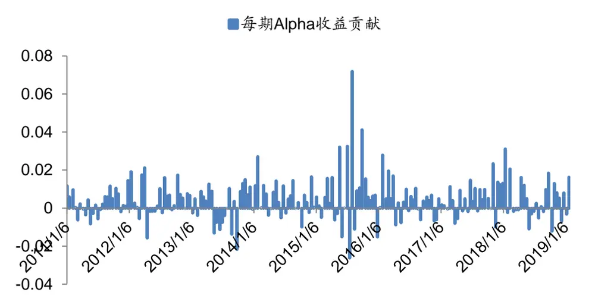
数据来源：Wind，广发证券发展研究中心

累积的Alpha收益贡献和风格因子收益贡献由下图所示。与中证1000指数增强 类似，Alpha收益和流动性因子贡献了主要的超额收益。

图 15：中证500指数增强风格因子和Alpha收益贡献
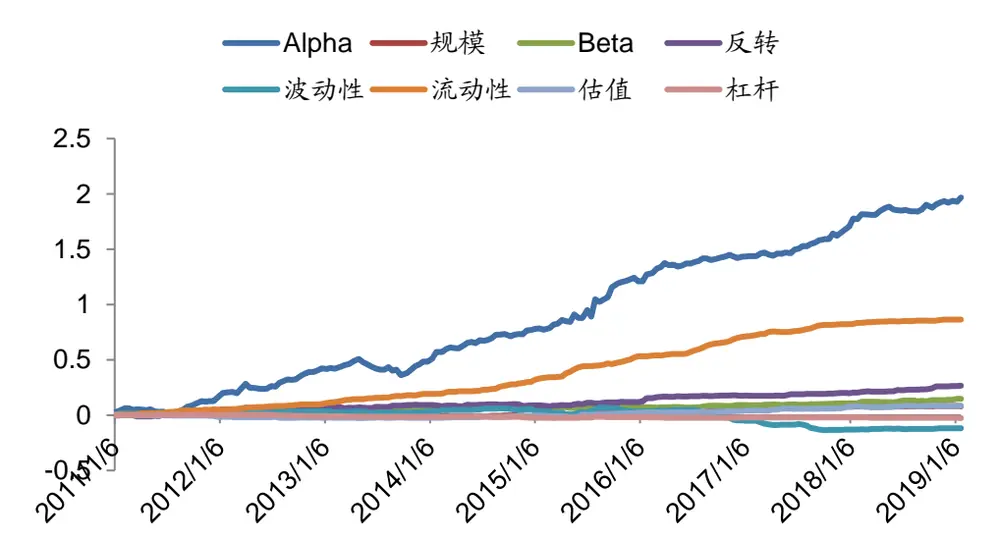
数据来源：Wind，广发证券发展研究中心

成份股内选股的沪深300指数增强的业绩归因结果如下表所示。组合一共产生了79.27%的超额收益。其中，50.46%的收益来源于Alpha收益。而其他风格因子和行业因子的收益贡献都不高，主要是由于组合在风格因子和行业因子上的相对暴露都比较低。

表 15：沪深300指数增强策略业绩归因

| 单期因子相对暴 |  |  | 单期因子 | 单期因子收益 |
| --- | --- | --- | --- | --- |
| 因子 | 露均值 | 因子收益贡献 | 收益贡献均值 | 贡献标准差 |
| Alpha | - | 50.46% | 0.1912% | 0.8044% |
| 规模因子 | 0.0665 | 9.20% | 0.0345% | 0.1919% |
| Beta 因子 | -0.0597 | 1.32% | 0.0052% | 0.2095% |
| 反转因子 | 0.0349 | 8.49% | 0.0318% | 0.1596% |
| 波动性因子 | -0.0673 | -2.50% | -0.0093% | 0.1572% |
| 流动性因子 | 0.0250 | 8.63% | 0.0322% | 0.1087% |
| 估值因子 | 0.0083 | 1.58% | 0.0059% | 0.1317% |
| 杠杆因子 | -0.0226 | 1.18% | 0.0044% | 0.0421% |
| 交通运输 | -0.0016 | 0.01% | 0.0000% | 0.0061% |
| 休闲服务 | -0.0003 | 0.03% | 0.0001% | 0.0007% |
| 传媒 | -0.0003 | 0.08% | 0.0003% | 0.0063% |
| 公用事业 | -0.0020 | 0.16% | 0.0006% | 0.0060% |
| 农林牧渔 | -0.0004 | 0.07% | 0.0003% | 0.0015% |
| 化工 | -0.0010 | 0.03% | 0.0001% | 0.0033% |
| 医药生物 | -0.0002 | -0.18% | -0.0007% | 0.0108% |
| 商业贸易 | -0.0009 | 0.11% | 0.0004% | 0.0038% |
| 国防军工 | 0.0000 | 0.14% | 0.0005% | 0.0077% |
| 家用电器 | -0.0002 | -0.17% | -0.0006% | 0.0066% |
| 建筑材料 | 0.0000 | 0.08% | 0.0003% | 0.0024% |
| 建筑装饰 | -0.0005 | 0.08% | 0.0003% | 0.0079% |
| 房地产 | 0.0002 | 0.20% | 0.0008% | 0.0115% |
| 有色金属 | 0.0004 | 0.19% | 0.0007% | 0.0100% |
| 机械设备 | 0.0003 | -0.05% | -0.0002% | 0.0037% |
| 汽车 | 0.0007 | 0.00% | 0.0000% | 0.0050% |
| 电子 | -0.0002 | -0.05% | -0.0002% | 0.0050% |
| 电气设备 | -0.0009 | 0.08% | 0.0003% | 0.0033% |
| 纺织服装 | -0.0003 | 0.04% | 0.0001% | 0.0006% |
| 综合 | -0.0003 | -0.01% | 0.0000% | 0.0009% |
| 计算机 | -0.0005 | 0.05% | 0.0002% | 0.0064% |
| 轻工制造 | 0.0000 | 0.00% | 0.0000% | 0.0001% |
| 通信 | -0.0007 | -0.08% | -0.0003% | 0.0038% |
| 采掘 | 0.0003 | -0.20% | -0.0008% | 0.0083% |
| 钢铁 | -0.0011 | 0.04% | 0.0002% | 0.0052% |
| 银行 | 0.0072 | 1.18% | 0.0044% | 0.0399% |
| 非银金融 | 0.0023 | -1.15% | -0.0043% | 0.0537% |
| 食品饮料 | 0.0002 | 0.25% | 0.0009% | 0.0156% |

数据来源：Wind，广发证券发展研究中心

沪深300指数增强中，各期的Alpha收益贡献如下图所示，每期的均值为0.19%，标准差0.80% 。相对中证1000指数增强策略和中证500指数增强策略而言，沪深300指数增强策略的Alpha收益稳定性较差。

图 16：沪深300指数增强Alpha收益贡献
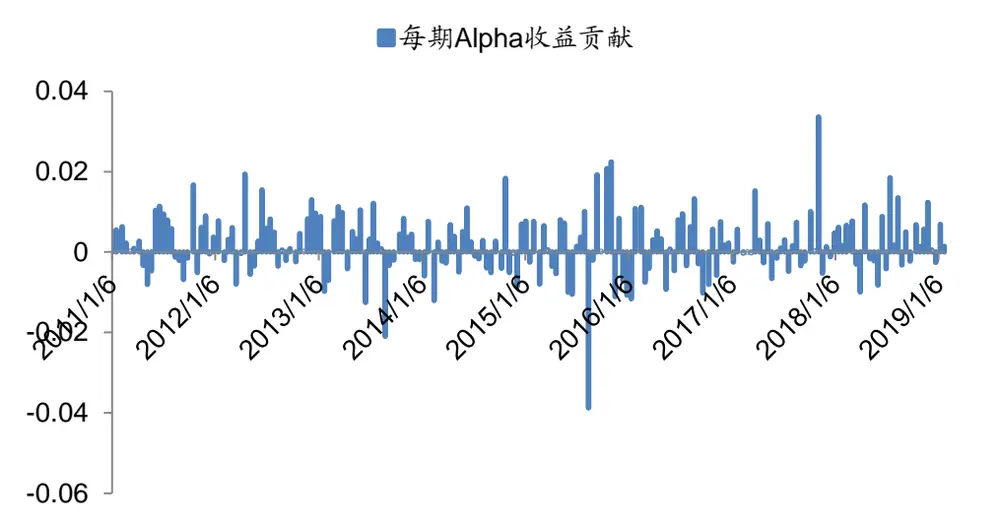
数据来源：Wind，广发证券发展研究中心

累积的Alpha收益贡献和风格因子收益贡献由下图所示。可以看到，风格因子的 收益贡献都比较弱。

图 17：沪深300指数增强风格因子和Alpha收益贡献
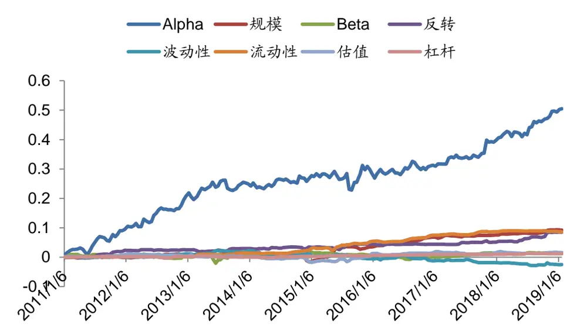
数据来源：Wind，广发证券发展研究中心

## 六、总结与展望

通过本报告的回测，证实了深度学习选股因子在构建主流宽基指数指数增强策略上的可行性。

实证分析表明，中证1000指数增强策略的年化超额收益为27.56%（成份股内选股）和29.07%（全市场选股），中证500指数增强策略的年化超额收益为15.25%（成份股内选股）和14.67%（全市场选股），表现都比较稳定，跟踪误差符合预期而且信息比高。沪深300指数增强策略表现稍差，年化超额收益分别为7.26%（成份股内选股）和13.11%（全市场选股），也可以和市场上主流的指数增强策略产品媲美。

对于深度学习选股因子的高换手率问题，可以通过组合优化问题中对交易成本进行惩罚来降低组合的换手率。本报告实证了三种方案，组合优化中不考虑交易成本、组合优化中加入交易成本的计算、以及组合优化中对交易成本进行加倍的惩罚，实证表明，在优化问题中扣除所用交易成本（而不加额外的惩罚）能够获得较好的指数增强信息比。此外，也可以直接对单次交易的换手率进行约束，获得期望的策略换手率。本报告实证展示了，在换手率较低的情况下，深度学习指数增强策略也有不错的表现。

由于深度学习因子等机器学习交易策略缺乏可解释性，会使得基金经理在选用该类因子时有较多的顾虑。业绩归因可以帮助我们更好的理解深度学习选股因子的表现，从策略中分离出传统大类风格因子的贡献，以及不能被传统风格因子所解释的Alpha收益贡献。并且可以对剥离出来的Alpha收益进行监测，有助于考察因子表现的有效性和稳定性。从实证结果来说，深度学习因子构建的中证1000指数增强策略和中证500指数增强策略都有较为稳定的Alpha收益贡献，沪深300指数增强策略的Alpha收益贡献稍微低一些。

## 风险提示

策略模型并非百分百有效，市场结构及交易行为的改变以及类似交易参与者的增多有可能使得策略失效。

## [Table_IndustryInvestDescription] 广发证券—行业投资评级说明

买入： 预期未来12个月内，股价表现强于大盘10%以上。

持有： 预期未来12个月内，股价相对大盘的变动幅度介于-10%～+10%。

卖出： 预期未来12个月内，股价表现弱于大盘10%以上。

## [Table_CompanyInvestDescription] 广发证券—公司投资评级说明

买入： 预期未来12个月内，股价表现强于大盘15%以上。

增持： 预期未来 12 个月内，股价表现强于大盘 5%-15%。

持有： 预期未来12个月内，股价相对大盘的变动幅度介于-5%～+5%。

卖出： 预期未来12个月内，股价表现弱于大盘5%以上。

## [Table_Address] 联系我们

| 地址 | 广州市 | 深圳市 | 北京市 | 上海市 | 香港 |
| --- | --- | --- | --- | --- | --- |
|  | 广州市天河区马场路 | 深圳市福田区益田路 | 北京市西城区月坛北 | 上海市浦东新区世纪 | 香港中环干诺道中 |
|  | 26号广发证券大厦35 | 6001号太平金融大厦 | 街2号月坛大厦18层 | 大道8号国金中心一 | 111 号永安中心 14 楼 |
|  | 楼 | 31层 |  | 期16楼 | 1401-1410 室 |
| 邮政编码 客服邮箱 | 510627 gfyf@gf.com.cn | 518026 | 100045 | 200120 |  |

## [Table_LegalD 法律主体isclaimer 声明]

本报告由广发证券股份有限公司或其关联机构制作，广发证券股份有限公司及其关联机构以下统称为“广发证券”。本报告的分销依据不同国家、地区的法律、法规和监管要求由广发证券于该国家或地区的具有相关合法合规经营资质的子公司/经营机构完成。

广发证券股份有限公司具备中国证监会批复的证券投资咨询业务资格，接受中国证监会监管，负责本报告于中国（港澳台地区除外）的分销。广发证券（香港）经纪有限公司具备香港证监会批复的就证券提供意见（4 号牌照）的牌照，接受香港证监会监管，负责本报告于中国香港地区的分销。

本报告署名研究人员所持中国证券业协会注册分析师资质信息和香港证监会批复的牌照信息已于署名研究人员姓名处披露。

## [Table_I 重要mportant 声明N

广发证券股份有限公司及其关联机构可能与本报告中提及的公司寻求或正在建立业务关系，因此，投资者应当考虑广发证券股份有限公司及其关联机构因可能存在的潜在利益冲突而对本报告的独立性产生影响。投资者不应仅依据本报告内容作出任何投资决策。

本报告署名研究人员、联系人（以下均简称“研究人员”）针对本报告中相关公司或证券的研究分析内容，在此声明：（1）本报告的全部分析结论、研究观点均精确反映研究人员于本报告发出当日的关于相关公司或证券的所有个人观点，并不代表广发证券的立场；（2）研究人员的部分或全部的报酬无论在过去、现在还是将来均不会与本报告所述特定分析结论、研究观点具有直接或间接的联系。

研究人员制作本报告的报酬标准依据研究质量、客户评价、工作量等多种因素确定，其影响因素亦包括广发证券的整体经营收入，该等经营收入部分来源于广发证券的投资银行类业务。

本报告仅面向经广发证券授权使用的客户特定合作机构发送，不对外公开发布，只有接收人才可以使用，且对于接收人而言具有保密义务。广发证券并不因相关人员通过其他途径收到或阅读本报告而视其为广发证券的客户。在特定国家或地区传播或者发布本报告可能违反当地法律，广发证券并未采取任何行动以允许于该等国家或地区传播或者分销本报告。

本报告所提及证券可能不被允许在某些国家或地区内出售。请注意，投资涉及风险，证券价格可能会波动，因此投资回报可能会有所变化，过去的业绩并不保证未来的表现。本报告的内容、观点或建议并未考虑任何个别客户的具体投资目标、财务状况和特殊需求，不应被视为对特定客户关于特定证券或金融工具的投资建议。本报告发送给某客户是基于该客户被认为有能力独立评估投资风险、独立行使投资决策并独立承担相应风险。

本报告所载资料的来源及观点的出处皆被广发证券认为可靠，但广发证券不对其准确性、完整性做出任何保证。报告内容仅供参考，报告中的信息或所表达观点不构成所涉证券买卖的出价或询价。广发证券不对因使用本报告的内容而引致的损失承担任何责任，除非法律法规有明确规定。客户不应以本报告取代其独立判断或仅根据本报告做出决策，如有需要，应先咨询专业意见。

广发证券可发出其它与本报告所载信息不一致及有不同结论的报告。本报告反映研究人员的不同观点、见解及分析方法，并不代表广发证券的立场。广发证券的销售人员、交易员或其他专业人士可能以书面或口头形式，向其客户或自营交易部门提供与本报告观点相反的市场评论或交易策略，广发证券的自营交易部门亦可能会有与本报告观点不一致，甚至相反的投资策略。报告所载资料、意见及推测仅反映研究人员于发出本报告当日的判断，可随时更改且无需另行通告。广发证券或其证券研究报告业务的相关董事、高级职员、分析师和员工可能拥有本报告所提及证券的权益。在阅读本报告时，收件人应了解相关的权益披露（若有）。

本研究报告可能包括和/或描述/呈列期货合约价格的事实历史信息（“信息”）。请注意此信息仅供用作组成我们的研究方法/分析中的部分论点依据/证据，以支持我们对所述相关行业/公司的观点的结论。在任何情况下，它并不（明示或暗示）与香港证监会第5类受规管活动（就期货合约提供意见）有关联或构成此活动。

## [Table_Interest 权益披露Disclosur

(1)广发证券（香港）跟本研究报告所述公司在过去12 个月内并没有任何投资银行业务的关系。

## [Table_Copyright] 版权声明

未经广发证券事先书面许可，任何机构或个人不得以任何形式翻版、复制、刊登、转载和引用，否则由此造成的一切不良后果及法律责任由私自翻版、复制、刊登、转载和引用者承担。