# [Table_Title] 基本面因子模型的深度学习增强

## 深度学习研究报告之八

## [Table_Summary]报告摘要：

研究内容：本报告使用深度学习方法对基本面模型进行增强。增强模型首先使用基本面模型选出初选股票池，然后使用深度学习模型对初选股票池进行第二次筛选。该策略在较低的换手率水平下可以获得更高的超额收益。

基本面模型和深度学习模型具备组合基础：一方面，深度学习模型和基本面因子模型均具有优选股票的能力，2011年至2021年3 月，两种模型的年化超额收益分别为 20.65%和14.07%。另一方面，两种模型之间的相关性较弱：深度学习模型打分与基本面因子间的相关性均值处于-0.05 与+0.05 之间，两者的十分档选股重合度均值最高仅为10.49%。此外，使用基本面因子中性化深度学习模型打分前后的选股能力并无显著变化。以上结果显示两种模型选股逻辑迥然不同，具备组合为一个增强模型的基础。

以中证 800指数为基准的增强模型表现：在千分之三的交易成本下，增强模型在2011 年至2021 年3 月获得了24.29%的年化超额收益，与深度学习模型和基本面因子模型相比有显著提升。分年度来看，在回测区间的 11 年里，增强模型每年都跑赢了基准指数，而且在其中8个年份，增强模型的收益高于基本面模型。

增强模型的年化换手率为8.83倍，低于深度学习模型的换手率（10.89倍）。即使交易成本提升至千分之五，增强模型的选股性能仍然显著优于基本面模型和深度学习模型。

以沪深 300指数为基准的增强模型表现：在千分之三的交易成本下，增强模型在2011 年至2021 年3 月获得了22.23%的年化超额收益，与之相比，深度学习模型的年化超额收益为 19.04%，基本面因子模型的年化超额收益为12.74%。在回测区间的11年里，增强模型收益超过基本面模型的有9年。

风险提示：策略模型并非百分百有效，市场结构及交易行为的改变以及类似交易参与者的增多有可能使得策略失效。

图 1 增强模型表现（基准：中证 800）
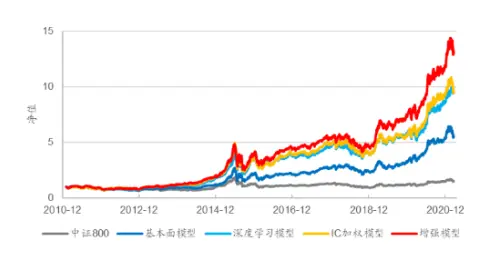
数据来源：Wind，广发证券发展研究中心

图 2 增强模型表现（基准：沪深 300）
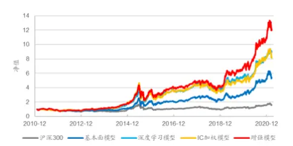
数据来源：Wind，广发证券发展研究中心

[分析师：Table_Author]文巧钧

同SAC 执证号：S0260517070001

SFC CE No. BNI358

0755-88286935

wenqiaojun@gf.com.cn分析师： 安宁宁

SAC 执证号：S0260512020003

SFC CE No. BNW179

0755-23948352

anningning@gf.com.cn分析师： 罗军

SAC 执证号：S0260511010004

020-66335128

luojun@gf.com.cn

请注意，罗军并非香港证券及期货事务监察委员会的注册持牌人，不可在香港从事受监管活动。

## [Table_ 相关研究：DocRe

深度学习框架下高频数据因2021-03-07
子挖掘:深度学习研究报告之
七

## 一、基本面投资和技术面投资结合时势所趋

基本面投资与技术面投资是量化投资中的两类重要方法。基本面投资主要基于对宏观经济、行业和公司基本情况的分析来遴选股票。基本面信息中最重要的为公司的盈利能力。盈利能力包括公司过去以及未来的盈利能力。过去的盈利能力可以通过公司公布的财报中的利润信息获取，比如使用净资产收益率（ROE）和毛利率（GPM）来代表公司的盈利能力；未来的盈利能力则可以通过过去的收入增长率来预测。此外，股票的估值水平可以用以与相似公司比较来判断股票是否被高估。通常，基本面信息具有频率低、更新速度慢等特点。低的信息更新频率对应着较低的换手率。

技术面投资则通过研究以往价格和交易量数据来预测未来的价格走向。此类分析方法可使用价量信息构成的图表或公式捕获当前市场的趋势，有助于识别市场中的买入或卖出机会。除了常见价量信息以及其衍生的指标外，技术面数据还可包括新闻舆情和卫星监测图像等另类数据。技术面分析所基于的价量信息更新迅速，可以达到日级、分钟级、甚至秒级、逐笔级等。更快速的信息更新频率则对应着较高的换手率。

考虑到技术面投资与基本面投资所使用的选股信息迥异，在基本面模型上叠加技术面选股模型可能带来更高的投资回报。基本面选股可以选择出从财务数据上来看中长期看好的股票，而技术面方法可以根据短期的价量信息和情绪指标得到短期看好的股票。通过组合两种模型，筛选出中长期和短期均看好的股票，从而优选出具有更高收益的股票组合。

近几年，国内量化市场以技术面投资为主的量化私募迅猛增长，产生了十多家管理规模超过百亿的量化私募公司。根据朝阳永续的数据，量化私募的资管规模由2019年底的不到2000亿增长到2020年底的约5000亿。随着量化私募的发展和量化投资领域的竞争白热化，传统价量因子的失效问题也更加严重。为了应对竞争愈发激烈的国内市场，机器学习和深度学习在其量化策略迭代升级中扮演着越来越重要的角色。尤其是一些头部量化公司已开始搭建自己的超级计算机来进行因子挖掘。虽然基于机器学习和深度学习构建的选股模型往往具有更高的收益率，但通常这些量化策略具有很高的换手率。高换手率策略的运作一般依赖较低的交易佣金和较快的交易系统，并且策略容量相对有限。从量化私募机构的需求来看，通过价量因子与基本面因子组合，有望在维持超额收益的前提下，降低策略的换手率，扩大策略的资金容量。

相比于量化私募，量化公募基金有着更多的限制。一方面，公募具有更高的交易费用。其次，公募基金对日内反向交易、衍生品交易等都有着严格的合规控制，而且交易风控相对复杂。这些因素使得公募基金更倾向于低换手的交易策略。基于基本面的交易策略具有更低的换手率，更符合公募基金的交易偏好。但随着行业竞争的加剧，公募量化机构期望在基本面因子的基础上，适当增加价量因子、提升换手率，以提升alpha源的多样性和策略的收益率。

本报告提出了一种在基本面模型的基础上，通过深度学习模型增强选股性能的方法。实证分析表明，该方法可以较好地结合基本面因子选股和深度学习选股的长处，策略的年化换手率在9倍左右，收益率显著优于基本面选股模型。

## 二、基本面多因子选股模型

## （一）基本面模型的构建

根据被盛誉为投资者圣经的《证券分析》中的讨论，股价估计可以简化为如下公式：

$$
Ag^{2}(\lambda)=-2\sqrt{5}-1\sqrt{5}-\frac{2}{\sqrt{5}}\times\sqrt{5}-\frac{5}{\sqrt{5}}\geq\frac{3}{\sqrt{5}-\sqrt{5}}
$$

其中，每股收益反应公司的盈利能力。“质量系数”主要取决于盈利趋势，而盈利趋势由过去一段时期内研报中披露的盈利数据计算得来。“质量系数”反映了（1）股息率，（2）公司现状（例如，公司规模、名声、公司在行业中的地位等），（3）公司的商业模式，（4）市场总体的现状（例如，牛市的“质量系数”一般高于熊市中的“质量系数”）。由以上讨论可知，盈利和成长是影响股价走势的核心因素。

此外，投资分析的主要目的是帮助投资者判断当前股票的价格是否被低估，即该股票是否具有“低买高卖”的机会，从而股票当前的估值水平是另外一个影响股票投资价值的重要因素。

本文中，我们选取了盈利、成长和估值三大类因子，分别对应公司的盈利能力、盈利的质量和股价当前的估值水平。通过三类基本面指标对全 A 股票池进行筛选来构建投资组合。除以上三类风格因子外，其他一些风格因子，例如质量因子和价值因子等，也可以纳入基本面多因子选股模型中，且选用合理的因子组合可能会获得更好的投资回报。更详细的有关基本面选股的探索可参考广发金融工程团队的长线选股系列报告。

图 1：基本面选股三要素
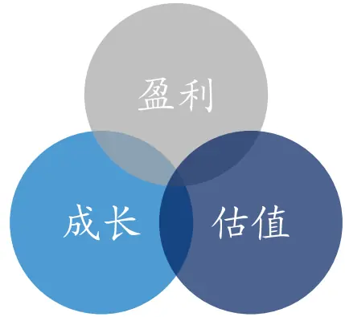
数据来源：Wind，广发证券发展研究中心

本报告中，每类风格因子选取 1-2 个代表因子。其中，盈利因子选取净资产收益率（ROE）和毛利率（GPM）作为代表，成长因子选取营业收益同比增长率（YoyOr）与资产同比增长率（YoyAsset），估值因子的代表为市现率倒数（CFP）。除表 1 列出的选股因子外，盈利因子还可以使用资产收益率、销售净利率、基本每股收益、经营活动净利润占比等指标，成长因子还可以使用股东权益增长率、净利润增长率、每股净资产增长率、每股收益增长率等，估值因子还可以使用市销率、市净率、市盈率等。

表 1：基本面模型中的选股因子

| 因子类别 | 因子 | 因子含义 | 中性化处理 |
| --- | --- | --- | --- |
| 盈利 | ROE | 净资产收益率 | 行业中性、市值中性 |
| 盈利 | GPM | 毛利率 | 行业中性、市值中性 |
| 成长 | YoyOr | 营业收入同比增长率 | 行业中性、市值中性 |
| 成长 | YoyAsset | 资产同比增长率 | 行业中性、市值中性 |
| 估值 | CFP | 市现率倒数 | 行业中性、市值中性 |

数据来源：Wind，广发证券发展研究中心

本报告通过因子筛选的方法构建基本面选股组合。对于盈利因子，使用净资产收益率作为主要的筛选标准挑选出全市场前 25%的股票，把毛利率作为次要的筛选标准挑选出全市场前 50%的股票。类似的，使用成长风格类的营业同比增长率作为主要标准筛选出前25%的股票，而将资产同比增长率作为次要标准筛选出50%的股票。此外，使用估值因子中的市现率倒数选出 70%的股票。最后，将同时满足上述 5 个条件的股票筛选出来，构建组合。从2011年以来，该方案选出的组合的股票个数中位数为 76只。

## （二）基本面模型的表现

本报告策略回测采用月度调仓的方式，在全市场进行选股。具体回测参数如下所示：

股票池：全A股票，

基准：中证800 指数，

回测区间：2011 年 1 月 1 日至 2021 年 3 月 15 日，

换仓周期：20 个交易日，

预处理：1.剔除上市 3 个月内的股票；2.剔除 ST 股票；3.剔除停盘股票；4.剔除前一日涨停/跌停的股票，

交易成本：千分之三，

股票权重：行业权重与基准保持一致，行业内的股票按照流通市值加权。

图 2：基本面选股模型的净值
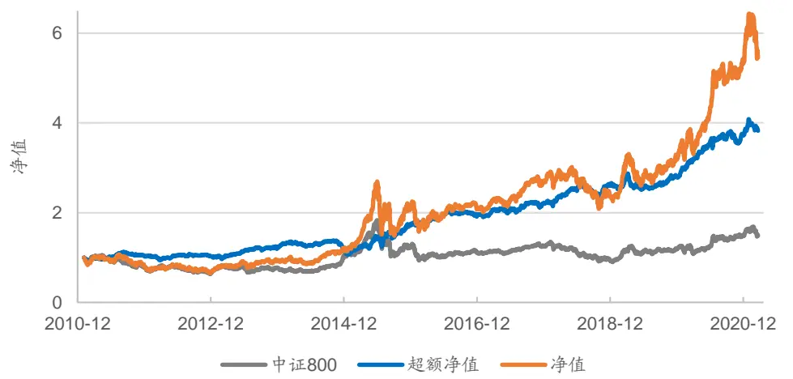
数据来源：Wind，广发证券发展研究中心

从上图可看出，基本面多因子模型选出的投资组合的收益显著超过中证 800 的表现。在整个回测区间内，基本面模型相对基准的超额收益稳定上升。

图 3：基本面选股模型的年化收益
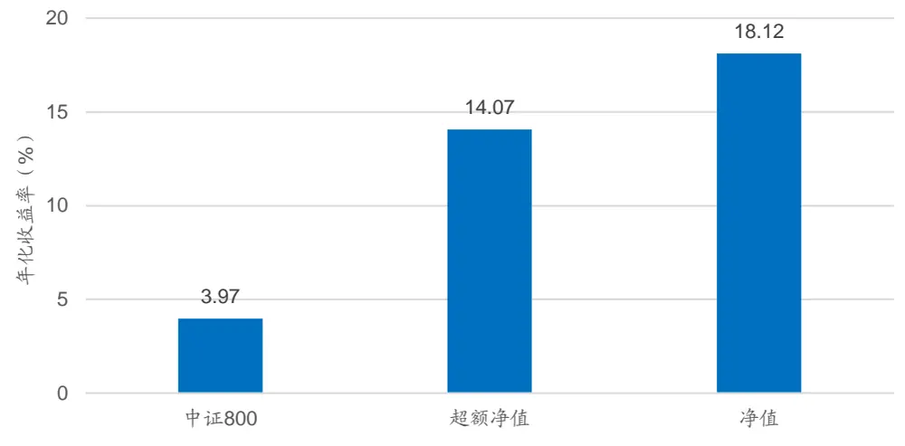
数据来源：Wind，广发证券发展研究中心
注：回测区间为 2011年 1月1日至 2021年 3月 15日

基本面模型的年化收益率为 18.12%，相对中证 800 指数的年化超额收益率为14.07%。

## 三、深度学习选股模型

## （一）深度学习模型的构建

本文采用的技术面模型为近年来在计算机视觉和量化投资领域大放异彩的深度学习模型。深度学习是机器学习的一种方法，其概念源于人工神经网络的研究。深度学习通过多层神经网络将低阶特征组合成更加抽象的高阶特征对数据进行全新描述，以发现数据的分布特征。通过模拟人脑的功能，深度学习可在输入特征和输出结果之间建立联系。

我们使用深层神经网络构建股票特征和股票预期收益率的关系，之后根据模型所预测的股票预期收益率选股。本报告采用的深度学习模型是一种 7 层深层神经网络。模型包含一个输入层、一个输出层和五个隐藏层。输入层共包括 156 个股票特征，其中包括传统的选股因子（如估值因子、规模因子、反转因子、流动性因子、波动性因子）和价量技术指标（如 MACD、KDJ等指标），以及28个表示申万一级行业属性的 0-1 变量。各层的节点数如下表所示。所使用的深度学习模型的详细结构可参考广发金融工程团队的深度学习系列研报。

表 2：深度学习模型网络结构

| 层名称 | 层说明 节点数 |
| --- | --- |
| X | 输入层 156 |
| H1 | 第 1 个隐含层 512 |
| H2 | 第 2 个隐含层 200 |
| H3 | 第 3 个隐含层 200 |
| H4 | 第 4 个隐含层 200 |
| H5 | 第 5 个隐含层 128 |
| Y | 输出层 3 |

数据来源：Wind，广发证券发展研究中心

输出层共包含3个节点，分别表示股票未来走势的三种可能性：上涨（有超额收益）、平盘（无超额收益）、下跌（负的超额收益）。在预测时，输出层softmax激活函数的输入向量为 $\pmb{z}=[z_{1}\quad z_{2}\quad z_{3}]^{T}$ ，则经过softmax函数后，预测值为

$$
\widehat{\boldsymbol{y}}=[\widehat{y}_{1}\quad\widehat{y}_{2}\quad\widehat{y}_{3}]^{T}=\left[\frac{e^{z_{1}}}{\sum_{i=1,2,3}e^{z_{i}}}\frac{e^{z_{2}}}{\sum_{i=1,2,3}e^{z_{i}}}\frac{e^{z_{3}}}{\sum_{i=1,2,3}e^{z_{i}}}\right]^{T}
$$

分别表示股票样本属于三个类别的概率。本报告使用股票上涨概率与股票下跌概率之差作为深度学习模型对股票的打分。

## （二）深度学习模型的表现

使用2.2节的回测参数对上一节讨论的深度学习模型进行回测，深度学习模型采用滚动更新的方式进行训练，每半年更新一次模型参数，每次采用过去6年的数据更新模型。每期按照深度学习打分选出与前述基本面模型持股数量相当的股票组合，每20天调仓。从2011年以来，该方案选出的组合的股票个数中位数为75只，组合表现如下图所示。

图 4：深度学习选股模型的净值

数据来源：Wind，广发证券发展研究中心

从上图可看出，深度学习模型选出的多头投资组合的收益显著超过基准中证800的表现。在整个回测区间内，深度学习模型相对基准的超额收益稳定上升。

图 5：深度学习选股模型的年化收益
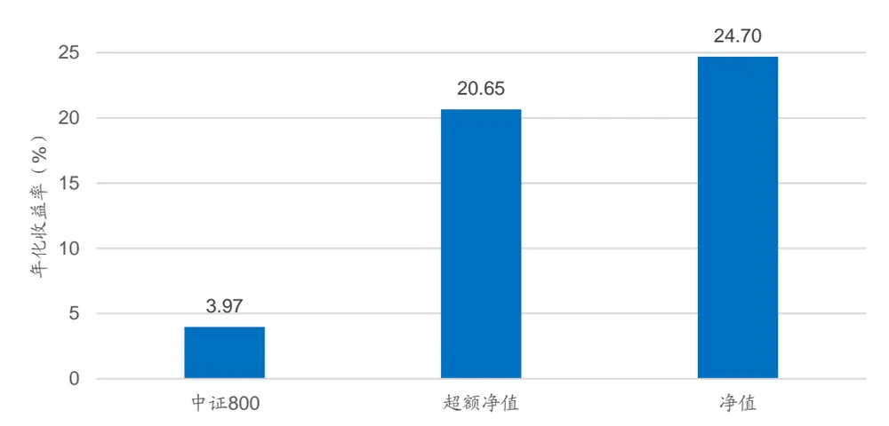
数据来源：Wind，广发证券发展研究中心
注：回测区间为 2011年 1月1日至 2021年 3月 15日

深度学习模型选出的投资组合的年化收益率为24.70%，相对中证800指数的年化超额收益率为20.65%。

## 四、两种模型的组合

## （一）模型组合的可能性

由前述基本面模型选股和深度学习模型选股的回测结果来看，两种模型均具有优选股票的能力。相对于基准中证 800 指数，基本面模型和深度学习模型的年化超额收益率分别为 14.07%和 20.65%。

图 6：两类模型的年化收益
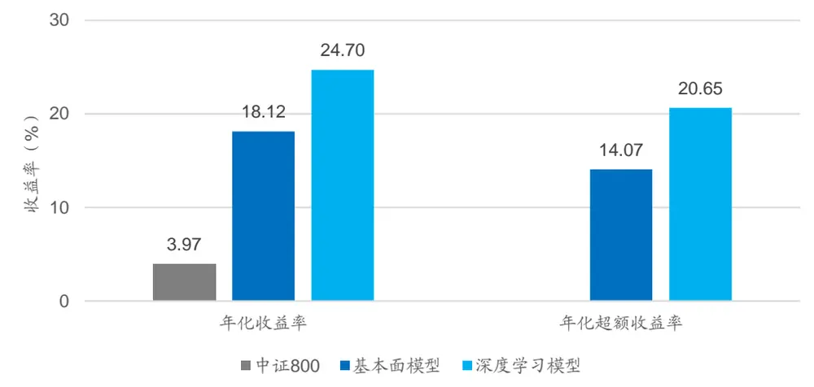
数据来源：Wind，广发证券发展研究中心
注：回测区间为 2011年 1月1日至 2021年 3月 15日

从选股逻辑上看，基本面模型从财务因子出发，依据盈利、成长和估值指标对股票进行筛选。而深度学习模型则主要是从价格、成交量以及两者的衍生指标出发，根据股票短期的价量特征来预测股价短期的走势。

那么，是否可以组合两种选股模型，从而得到一种既考虑了基本面信息又考虑了股票短期走势的模型？接下来的内容，我们将首先考察两种模型的相关性、选股重合度、和使用基本面因子中性化深度学习模型的选股能力变化三个方面，通过对这三个方面的讨论来探究模型组合的可能性。之后，我们将提出一种组合基本面模型和深度学习模型的方法，并对其进行实证分析。

首先，我们讨论基本面模型和深度学习模型的相关性。若两种模型的选股逻辑相似，则两者对股票的评价有较强的一致性，从而使用两种模型对股票的横截面排序具有较强的相关性。本文使用深度学习打分与基本面因子打分的 Spearman 相关性来描述两类模型选股结果的相似性。

通过深度学习模型与基本面因子之间的相关性曲线可知，各因子与深度学习模型的相关性系数均值在-0.05 至+0.05 之间，各个基本面因子和深度学习模型的选股逻辑相差很大。从较弱的选股相关性可以推测出，两者所基于的选股信息也有着很大的不同。

图 7：深度学习模型与基本面各风格因子的相关性
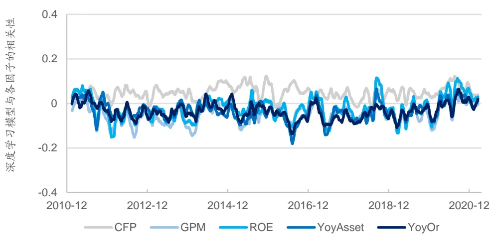
数据来源：Wind，广发证券发展研究中心

其次，若两种选股模型的选股相似，则若将横截面上股票按照模型的打分分组，两种模型选出来的多头组内的股票应该有较高的重合度，即两种模型选出了相同的股票。此处我们分别按照两种模型的打分将股票分十组，比较两种模型选出的多头组（第十组）中股票的重合度。较高的选股重合度对应相似度高的选股模型。从选股重合度曲线可以看出，十分组下，基本面因子和深度学习模型的选股多头组的股票重合度大多数时间处于10%上下。

在十分组下，各因子与深度学习模型的选股重合度最大仅为10.49%（市现率倒数与深度学习打分之间）。理论上，两种相关性为0的选股模型选出来的十分组多头组的股票重合度的期望值为10%。相关性为负的两种模型的选股重合度可低于10%。从各个基本面因子和深度学习模型的选股重合度的均值上推断，基本面模型与深度学习模型的选股迥然不同。

图 8：深度学习模型与基本面各风格因子的选股重合度
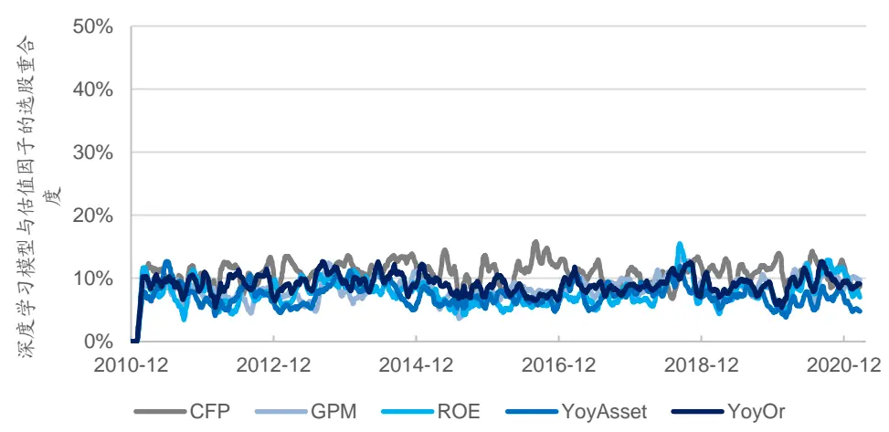
数据来源：Wind，广发证券发展研究中心

最后，对比经基本面风格因子中性化前后的深度学习模型的选股能力。若中性化前后选股能力差异较大，则可以说明基本面风格因子和深度学习模型的相关性强。反之，两类模型的选股逻辑相差很大。从下面的图表的数据可知，基本面因子中性化前的机器学习模型的IC均值为0.1361，ICIR为1.99；中性化之后的机器学习模型的IC的均值为0.1362，ICIR为2.06。中性化前后的深度学习选股能力变化不大。说明机器学习因子的选股逻辑与基本面选股逻辑不同。使用学生t-检验中性化前后的深度学习模型选股能力，p值为0.97，说明中性化前后深度学习模型的选股能力没有明显差异。这侧面印证了本文中的基本面因子和深度学习模型的选股相关性很低。

图 9：使用基本面因子中性化深度学习模型前后的选股能力
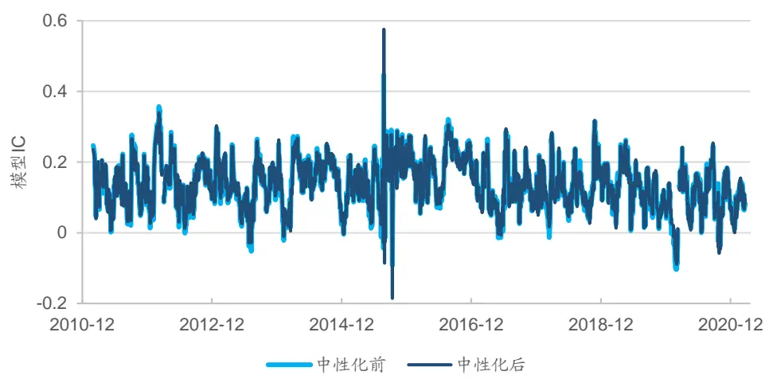
数据来源：Wind，广发证券发展研究中心

基于以上的讨论，我们分别从模型打分的相关性、模型分组中多头组的股票重合度和使用基本面因子对深度学习模型进行中性化前后的模型选股能力的比较等三个方面对两种选股模型进行了比较。结果表明：基本面因子与深度学习模型的选股差异度很大，选出来的股票也迥然不同。

另一方面，基本面模型和技术面模型都可以用来筛选股票以得到正向的投资收益。因此，是否可以寻找一种组合方法，同时使用这两种逻辑不同的模型，从不同的角度对股票进行评价，从而选出即得到基本面信息看好，又得到技术面信息支持的股票组合呢？以下的内容将围绕这一逻辑展开。

## （二）大类因子 IC 加权模型

一种基本面因子和深度学习因子组合的方案是将不同的因子加权，按照因子加权打分进行选股。本报告中，首先计算大类因子打分，每期根据大类因子IC加权获得综合打分，选出与前述两种模型持股数量相当的股票组合，月度调仓。因子组合的权重为大类因子过去120天IC的均值。从2011年以来，该方案选出的组合的股票个数中位数为78只，策略表现如下图所示。

图 10：IC加权模型的净值
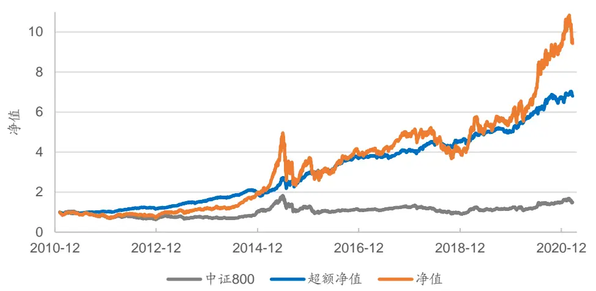
数据来源：Wind，广发证券发展研究中心

图 11：IC加权模型的年化收益率
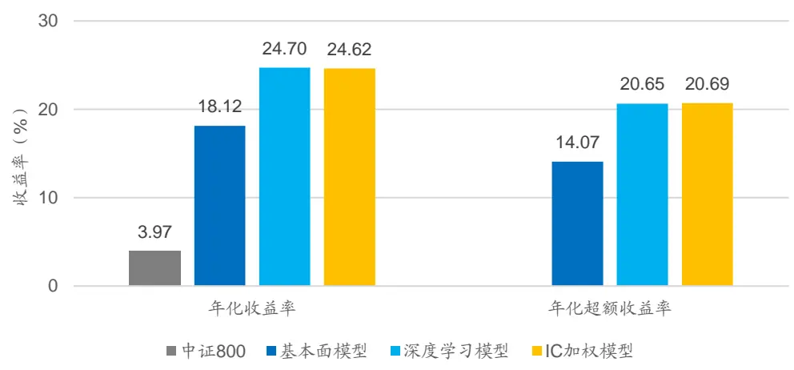
数据来源：Wind，广发证券发展研究中心
注：回测区间为 2011年 1月1日至 2021年 3月 15日

从回测结果上看，IC加权模型的年化收益率为24.62%，明显优于基准中证800的3.97%和基本面模型的18.12%，与深度学习模型的收益率相近。IC加权模型相对中证800指数的年化超额收益率为20.69%。

## （三）增强模型

大类因子IC加权的方法将基本面因子和深度学习因子组合起来，筛选综合打分靠前的股票。但由于综合打分是不同类别因子加权组合而成，最终综合打分靠前的股票可能在基本面因子和深度学习因子的暴露上都不靠前。

基本面因子的选股逻辑是寻找基本面优秀、具有中长期投资机会的股票，而深度学习模型的选股逻辑是基于价量指标，筛选短期具有不错机会的股票。为了更好地结合两者的长处，本报告提出了一种两层筛选的基本面模型增强方案：首先选取

识别风险，发现价值

基本面因子靠前的股票，在此基础上筛选深度学习因子靠前的股票。

图 12：增强模型选股方法
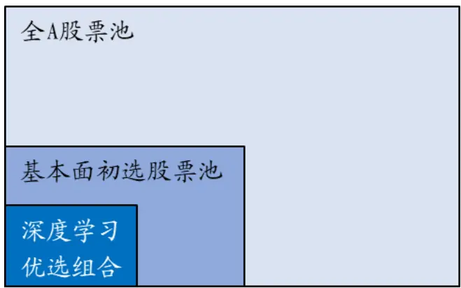
数据来源：Wind，广发证券发展研究中心

基本面增强模型（本报告中简称为“增强模型”）的选股步骤如下所示：

1. 使用基本面模型对全A股票池进行筛选，得到初选股票池。

2. 使用深度学习模型对初选股票池进一步筛选或分组，得到股票组合。

模型的第一步是基于基本面信息筛选出初选股票池。为了与前文2.1节提出的基本面模型进行对比（组合的持股数量基本一致），增强模型的基本面因子筛选条件有所放宽，以获得股票数量更多的初选股票池。值得注意的是，选择不同的参数可能会得到相似或更好的结果，但具体参数设置也应考虑投资者的资金管理规模、投资逻辑与投资目的等因素。本报告里，我们依据下表中的筛选参数获得的初选股票池，回测期内初选股票池的股票数量中位数为248只。

表 3：基本面模型的筛选条件

| 因子类别 | 因子 筛选条件 |
| --- | --- |
| 盈利 | ROE 前40% |
| 盈利 | GPM 前70% |
| 成长 | YoyOr 前 40% |
| 成长 | YoyAsset 前70% |
| 估值 | CFP 前70% |

数据来源：Wind，广发证券发展研究中心

在第二步采用深度学习模型优先股票时，本报告将基本面模型优选的股票池按照深度学习因子打分分为3组，选取深度学习因子最大的一组股票构建组合。在整个回测区间，该方案平均持股数量为83只，与前文单独采用基本面策略的持股数量接近，具有可比性。本报告后面讨论了不同分组下策略的表现，总体而言，不同的分组数量下，策略表现差别不大。

## 五、实证分析

## （一）回测参数设置

增强模型的回测设置与前文所述一致。此外，本报告讨论了不同交易成本和不同基准指数下，策略的表现。

## （二）增强模型相对于中证 800指数的表现

首先，我们考察在双边千分之三费率下的增强模型的表现。

图 13：增强模型的净值曲线（费率：双边千分之三）
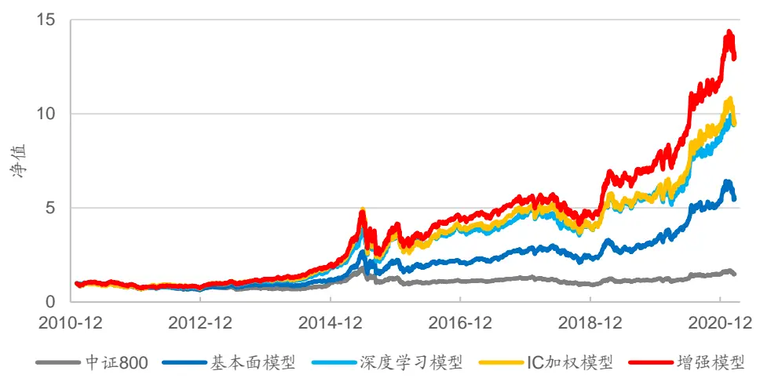
数据来源：Wind，广发证券发展研究中心

增强模型的净值曲线处于中证800指数、基本面模型、深度学习模型和IC加权模型的净值曲线之上，具有更出色的优选股票的能力。

图 14：增强模型的年化收益率（费率：双边千分之三）
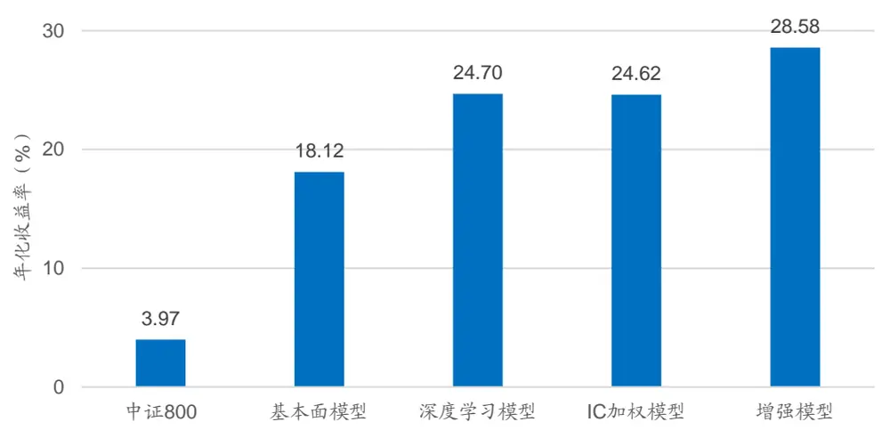
数据来源：Wind，广发证券发展研究中心

注：回测区间为 2011年 1月1日至 2021年 3月 15日

从年化收益率上看，在双边千分之三的交易费率下，增强模型的年化收益率为28.58%，相对于前述所有模型均有明显提升。

图 15：基本面初选股票池根据深度学习因子三分组的年化收益率对比
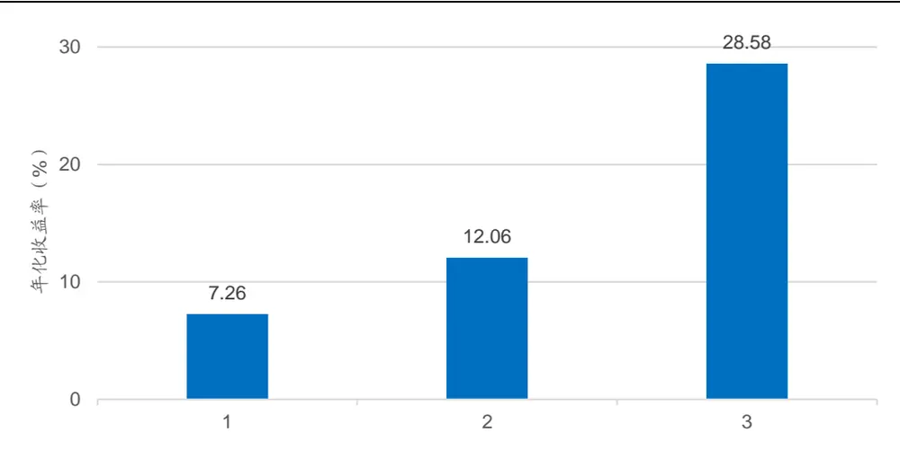
数据来源：Wind，广发证券发展研究中心
注：回测区间为 2011年 1月1日至 2021年 3月 15日

在使用深度学习模型在基本面初选股票池中三分组的年化收益率图中，从分组1至分组3，深度学习模型打分逐渐升高。该结果说明使用深度学习模型对初选股票池进一步优选是非常有效的，有助于从中长期看好的初选股票池中挑出短期也看好的股票组合。

图 16：增强模型的超额净值（费率：双边千分之三）
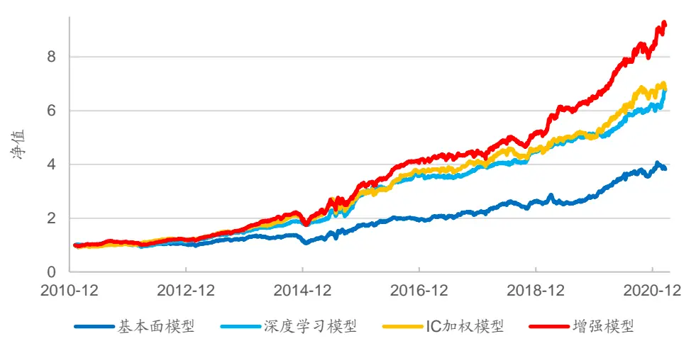
数据来源：Wind，广发证券发展研究中心

从以上的超额净值曲线上看，增强模型的表现明显优于IC加权模型，且对于基本面模型和深度学习模型均有显著的提升。

图 17：增强模型的年化超额收益（费率：双边千分之三）
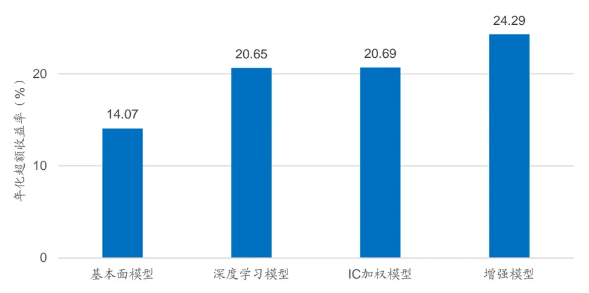
数据来源：Wind，广发证券发展研究中心
注：回测区间为 2011年 1月1日至 2021年 3月 15日

从超额收益上看，在交易费率为千分之三的情况下，增强模型的年化超额收益率为24.29%，相对于前述所有模型均有所提升。

图 18：增强模型的分年度超额收益
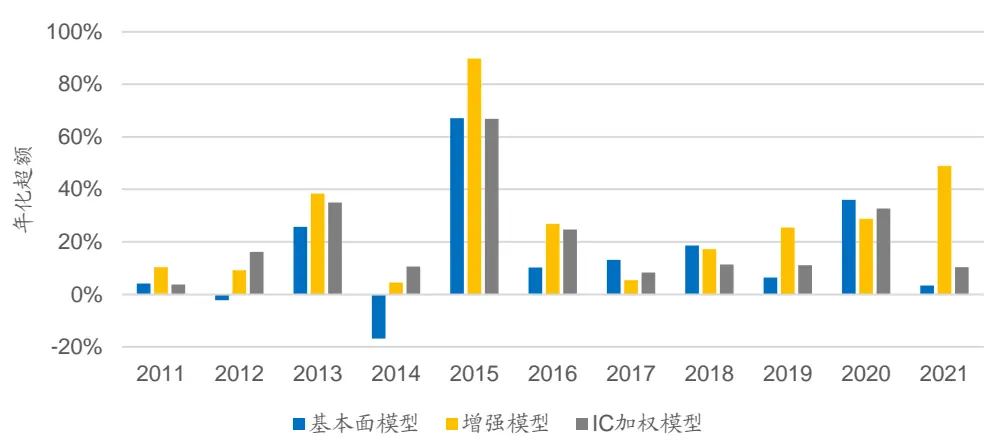
数据来源：Wind，广发证券发展研究中心
注：回测区间为 2011年 1月1日至 2021年 3月 15日

从分年度的超额收益率上看，回测区间内11个自然年中，有8年增强模型相比于基本面模型有提升。

图 19：增强模型的年化换手率
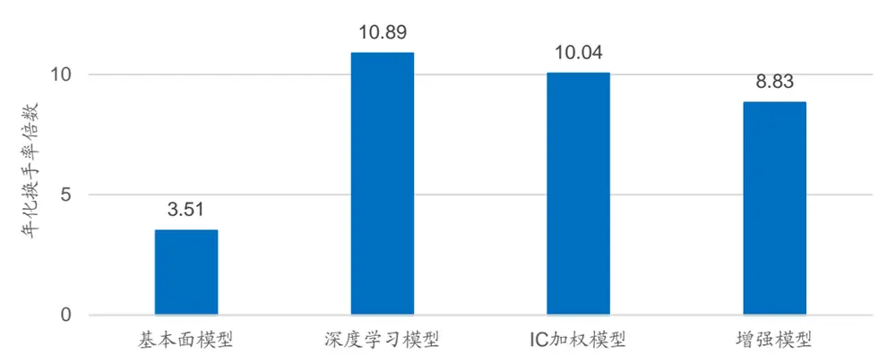
数据来源：Wind，广发证券发展研究中心
注：回测区间为 2011年 1月1日至 2021年 3月 15日

策略换手率较高是价量因子模型（包括机器学习选股模型）运作的一个主要阻力。本报告提出的增强模型的年化换手率倍数为8.83倍，由于选股流程的第二步使用了深度学习模型对初选股票池分组，其换手率显著高于基本面模型。但与深度学习模型和IC加权模型相比，增强模型的换手率有明显降低。

表 4：增强模型的分年度表现

| 年份 | 年化收益率 | 年化超额 | 超额胜率 | 超额最大回撤 | IC均值 | 年换手率 | 超额夏普比率 |
| --- | --- | --- | --- | --- | --- | --- | --- |
| 2011 | -21.47% | 10.36% | 61.54% | -6.17% | 0.05 | 8.22 | 1.36 |
| 2012 | 15.39% | 9.19% | 66.67% | -9.43% | 0.08 | 8.70 | 1.09 |
| 2013 | 35.73% | 38.44% | 100.00% | -5.96% | 0.07 | 9.00 | 3.76 |
| 2014 | 55.58% | 4.47% | 75.00% | -21.87% | 0.12 | 8.99 | 0.36 |
| 2015 | 112.58% | 89.82% | 91.67% | -14.42% | 0.06 | 9.34 | 4.43 |
| 2016 | 8.59% | 26.87% | 75.00% | -4.86% | 0.11 | 9.01 | 2.79 |
| 2017 | 21.15% | 5.37% | 69.23% | -5.06% | 0.09 | 8.81 | 0.61 |
| 2018 | -15.34% | 17.20% | 58.33% | -7.55% | 0.07 | 8.84 | 1.85 |
| 2019 | 67.47% | 25.51% | 58.33% | -3.57% | 0.04 | 9.20 | 2.68 |
| 2020 | 61.49% | 28.81% | 91.67% | -6.52% | 0.06 | 8.62 | 3.21 |
| 2021 | 30.76% | 49.94% | 100.00% | -15.74% | 0.04 | 9.10 | 4.30 |

数据来源：Wind，广发证券发展研究中心
注：数据截至2021年3月15日

从分年度的表现上看，增强模型每年相对于基准均有正的超额回报，平均超额胜率为77.04%，年换手率倍数处于8.22至9.10之间，超额最大回撤出现在2014年，为-21.87%。

由于基本面增强模型的换手率显著低于深度学习模型和IC增强模型，因而策略对交易费用的敏感度较低。为了比较不同交易成本下策略的表现，本报告讨论了在千分之五换手成本下策略的表现。

在千分之五的交易成本下，增强模型相对基本面模型的表现仍有显著的提升。

图 20：增强模型的净值曲线（费率：双边千分之五）
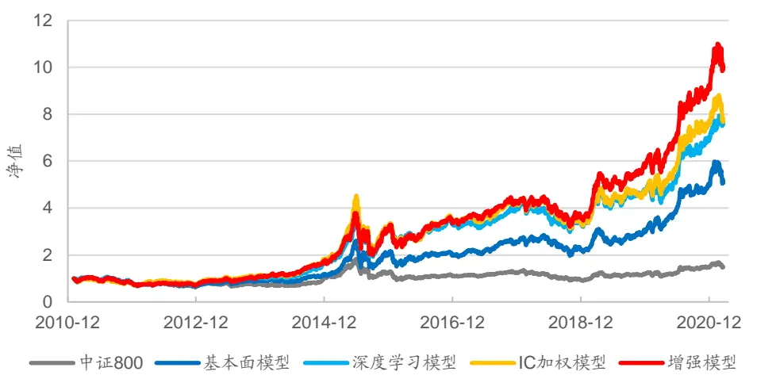
数据来源：Wind，广发证券发展研究中心

在双边千分之五的费率下，增强模型的净值曲线处于中证800指数、基本面模型、深度学习模型和IC加权模型的净值曲线之上，增强模型具有更出色的优选股票的能力。

图 21：增强模型的年化收益（费率：双边千分之五）
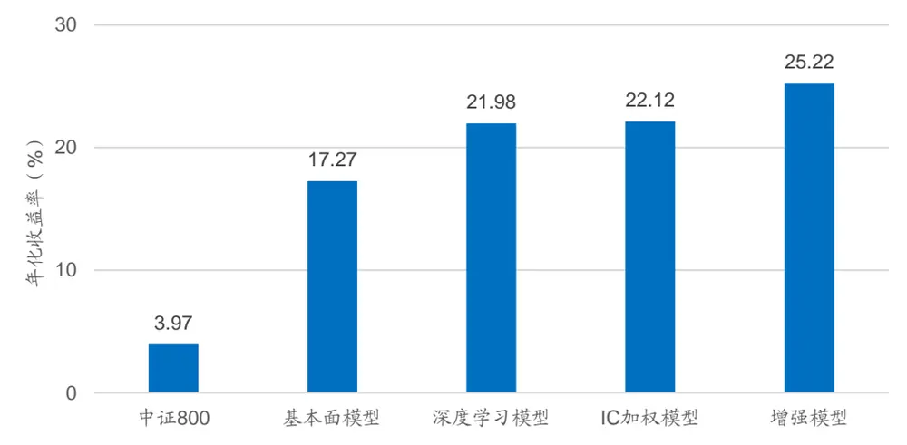
数据来源：Wind，广发证券发展研究中心
注：回测区间为 2011年 1月1日至 2021年 3月 15日

从年化收益率上看，在双边千分之五的交易费率下，增强模型的年化收益率为25.22%，依然优于前述的所有模型。

图 22：增强模型的超额净值（费率：双边千分之五）
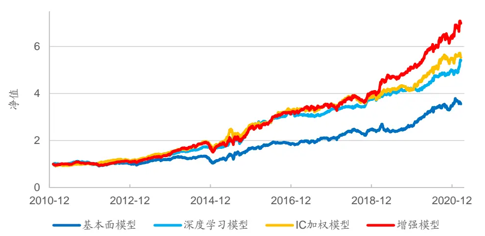
数据来源：Wind，广发证券发展研究中心

从超额净值上看，在双边千分之五的费率下，增强模型的表现仍明显优于IC加权模型，且对于基本面模型和深度学习模型依然有显著的提升。增强模型的年化超额收益率为21.00%。

图 23：增强模型的年化超额收益（费率：双边千分之五）
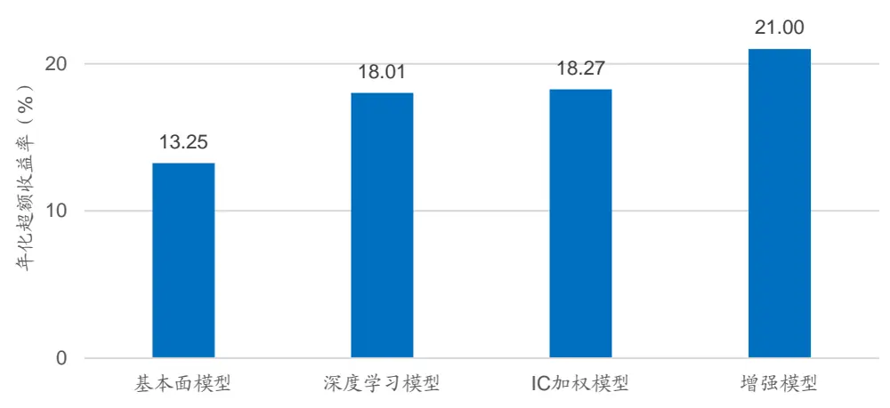
数据来源：Wind，广发证券发展研究中心
注：回测区间为 2011年 1月1日至 2021年 3月 15日

由于增强模型相对于IC加权模型等具有更低的换手率，其对交易费率的敏感度更低。从而，当交易费用升至双边千分之五时，增强模型依然具有更出色的表现。

## （三）增强模型相对于沪深 300指数的表现

在千分之三的交易成本下，以沪深300作为基准进行组合构建，保持行业中性，增强模型相对于基准和基本面模型依然有显著的超额表现。

图 24：增强模型的净值曲线（基准：沪深300）
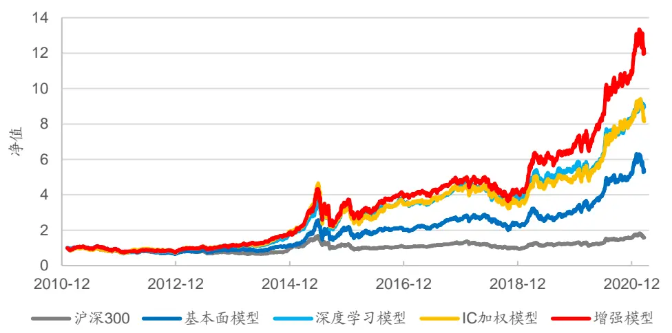
数据来源：Wind，广发证券发展研究中心

从净值曲线可以看出，以沪深300指数作为基准时，增强模型显著优于IC加权模型，相对基本面模型和深度学习模型也有显著提升。

图 25：增强模型的年化收益（基准：沪深300）
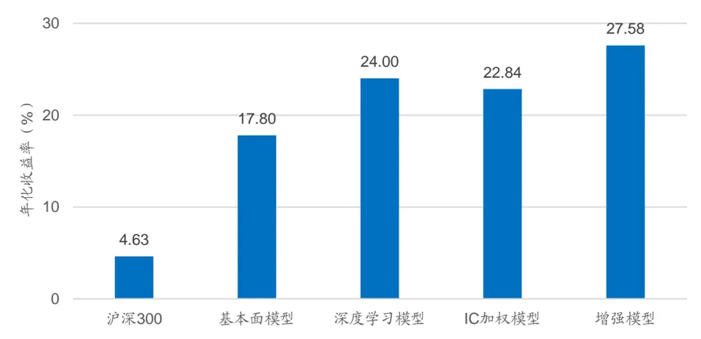
数据来源：Wind，广发证券发展研究中心

注：回测区间为 2011年 1月1日至 2021年 3月 15日

增强模型的年化收益率为27.58%，明显优于其他模型。

图 26：增强模型的超额净值（基准：沪深300）
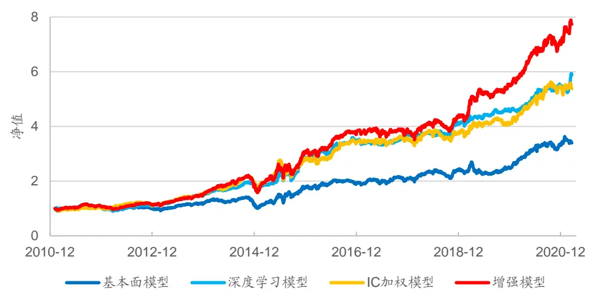
数据来源：Wind，广发证券发展研究中心

从超额净值上看，以沪深300为基准时，增强模型的表现依然明显优于IC加权模型、基本面模型和深度学习模型。增强模型的年化超额收益率为22.23%。

图 27：增强模型的年化超额收益率（基准：沪深300）
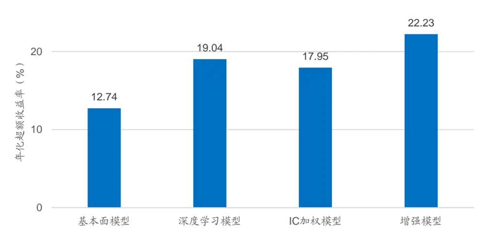
数据来源：Wind，广发证券发展研究中心
注：回测区间为 2011年 1月1日至 2021年 3月 15日

图 28：增强模型的分年度年化超额收益率（基准：沪深300）
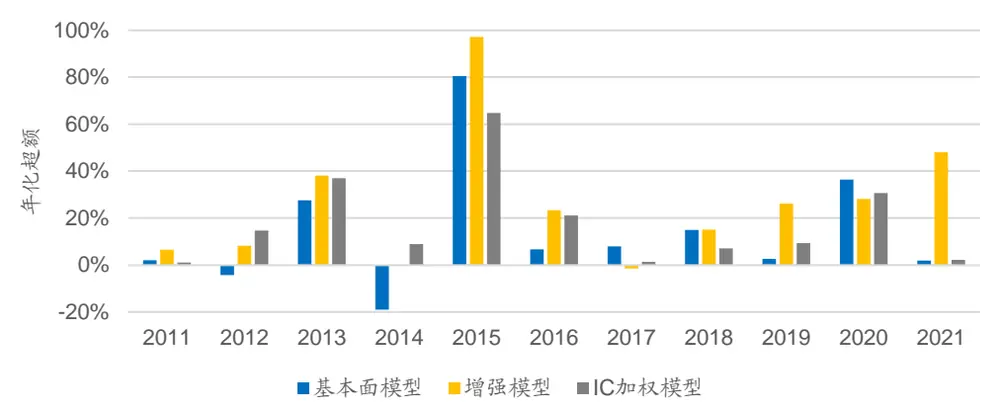
数据来源：Wind，广发证券发展研究中心
注：回测区间为 2011年 1月1日至 2021年 3月 15日

从分年度的数据上看，在以沪深300为基准下，回测区间内11个自然年中，有9年增强模型相比于基本面模型有提升。

图 29：增强模型的年化换手率（基准：沪深300）
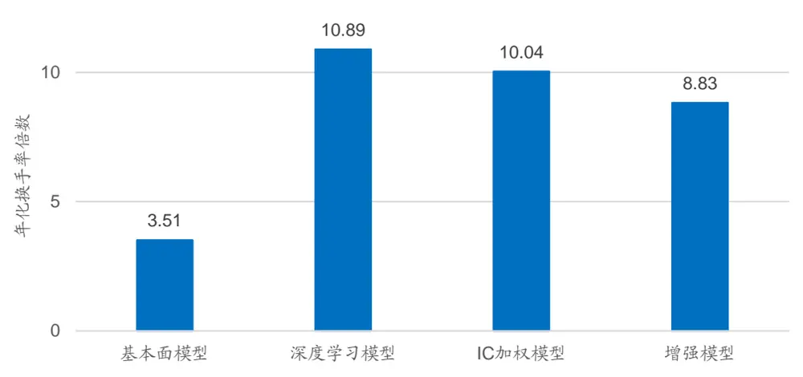
数据来源：Wind，广发证券发展研究中心
注：回测区间为 2011年 1月1日至 2021年 3月 15日

增强模型的年化换手率倍数为8.83倍，由于选股的第二步使用了深度学习模型对初选股票池分组，其换手率高于基本面模型。但增强模型的换手率显著低于深度学习模型和IC加权模型。

## （四）深度学习分组数与最终股票组合的表现

为了分析策略的参数敏感性，本报告讨论了在用深度学习模型优选基本面初选股票池时，在不同的分档数量下，基本面增强模型的表现。本报告中，我们使用深度学习模型将初选股票池分为n=3组，选择深度学习模型打分最高的一组构建组合。

当n=3，4，5时，分组数量与最终股票组合收益率的关系如下表所示：
表 5：深度学习分组数与最终股票组合的表现

| 分组数 | 持仓股票数量 中位数（只） | 年化超额 | 年化收益率 | 年化换手率倍数 |
| --- | --- | --- | --- | --- |
| 3 | 83 | 24.29% | 28.58% | 8.83 |
| 4 | 62 | 22.81% | 27.03% | 9.44 |
| 5 | 50 | 23.42% | 27.60% | 9.80 |

数据来源：Wind，广发证券发展研究中心
注：回测区间为 2011年 1月1日至 2021年 3月 15日

可以看出，将深度学习的分组数从3组增加到5组时，组合的持股数量减小，换手率有所提升，组合的年化收益率和年化超额收益率均有变化，但总体差别不大，且均明显优于前述的基本面模型和IC加权模型。

## 六、总结与展望

本报告基于深度学习选股模型对基本面模型进行增强。基本面模型依据盈利、成长和估值三类风格因子对全A股票进行筛选，深度学习模型则使用了深层神经网络模型提取股票特征，预测股票产生超额收益的概率。为了提升基本面模型的表现，本报告提出了一种分步筛选的增强模型，并进行了选股测试。增强模型的第一步是使用基本面模型选出初选股票池，然后使用深度学习模型对初选股票池进行第二次筛选。

实证分析表明，在费率为双边千分之三下，增强模型的年化收益率为28.58%，相对基本面选股模型和中证800指数有显著的提升。增强模型超额收益的夏普比率为1.52，与之相比，基本面模型超额收益的夏普比率为0.81。在提升收益率的同时，增强模型的换手率控制在年化9倍左右，换手率显著低于普通的深度学习选股模型。在更高的交易成本（比如双边千分之五）下，增强模型相对于基本面模型仍具有显著的提升作用。

## 七、风险提示

策略模型并非百分百有效，市场结构及交易行为的改变以及类似交易参与者的增多有可能使得策略失效。

## 广发金融工程研究小组 广发金融工程研究小组

广罗工程研究小组 军 ： 首席分析师，华南理工大学硕士，从业 14年，2010年进入广发证券发展研究中心。

安 宁 宁 ： 联席首席分析师，暨南大学硕士，从业 12年，2011年进入广发证券发展研究中心。

史 庆 盛 ： 资深分析师，华南理工大学硕士，从业 8年，2011年进入广发证券发展研究中心。

张 超 ： 资深分析师，中山大学硕士，从业 7 年，2012 年进入广发证券发展研究中心。

文 巧 钧 ： 资深分析师，浙江大学博士，从业 4年，2015年进入广发证券发展研究中心。

陈 原 文 ： 资深分析师，中山大学硕士，从业 4年，2015年进入广发证券发展研究中心。

樊 瑞 铎 ： 资深分析师，南开大学硕士，从业 4年，2015年进入广发证券发展研究中心。

李豪 ： 资深分析师，上海交通大学硕士，从业 3年，2016年进入广发证券发展研究中心。

郭 圳 滨 ： 高级分析师，中山大学硕士，2018年进入广发证券发展研究中心。

季 燕 妮 ： 研究助理，厦门大学硕士，2020年进入广发证券发展研究中心。

张 钰 东 ： 研究助理，中山大学硕士，2020年进入广发证券发展研究中心。

季 俊 男 ： 南京大学硕士，2020年进入广发证券发展研究中心。

## 广发证券—行业投资评级说明

买入： 预期未来12个月内，股价表现强于大盘10%以上。

持有： 预期未来 12 个月内，股价相对大盘的变动幅度介于-10%～+10%。

卖出： 预期未来12个月内，股价表现弱于大盘10%以上。

## [Table_CompanyInvestDescription] 广发证券—公司投资评级说明

买入： 预期未来12个月内，股价表现强于大盘15%以上。

增持： 预期未来12个月内，股价表现强于大盘5%-15%。

持有： 预期未来12个月内，股价相对大盘的变动幅度介于-5%～+5%。

卖出： 预期未来12个月内，股价表现弱于大盘5%以上。

## [Table_Address] 联系我们

| 地址 | 广州市 广州市天河区马场路 | 深圳市 深圳市福田区益田路 | 北京市 北京市西城区月坛北 | 上海市 上海市浦东新区南泉 | 香港 香港德辅道中189号 |
| --- | --- | --- | --- | --- | --- |
|  | 26号广发证券大厦 35楼 | 6001号太平金融大 厦31层 | 街2号月坛大厦18 层 | 北路 429 号泰康保险 大厦37楼 | 李宝椿大厦29及30 楼 |
| 邮政编码 客服邮箱 | 510627 | 518026 | 100045 | 200120 |  |

## [Table_LegalD 法律主体isclaimer 声明]

本报告由广发证券股份有限公司或其关联机构制作，广发证券股份有限公司及其关联机构以下统称为“广发证券”。本报告的分销依据不同国家、地区的法律、法规和监管要求由广发证券于该国家或地区的具有相关合法合规经营资质的子公司/经营机构完成。

广发证券股份有限公司具备中国证监会批复的证券投资咨询业务资格，接受中国证监会监管，负责本报告于中国（港澳台地区除外）的分销。

广发证券（香港）经纪有限公司具备香港证监会批复的就证券提供意见（4 号牌照）的牌照，接受香港证监会监管，负责本报告于中国香港地区的分销。

本报告署名研究人员所持中国证券业协会注册分析师资质信息和香港证监会批复的牌照信息已于署名研究人员姓名处披露。

## 重要声明

广发证券股份有限公司及其关联机构可能与本报告中提及的公司寻求或正在建立业务关系，因此，投资者应当考虑广发证券股份有限公司及其关联机构因可能存在的潜在利益冲突而对本报告的独立性产生影响。投资者不应仅依据本报告内容作出任何投资决策。投资者应自主作出投资决策并自行承担投资风险，任何形式的分享证券投资收益或者分担证券投资损失的书面或者口头承诺均为无效。

本报告署名研究人员、联系人（以下均简称“研究人员”）针对本报告中相关公司或证券的研究分析内容，在此声明：（ ）本报告的全部分析结论、研究观点均精确反映研究人员于本报告发出当日的关于相关公司或证券的所有个人观点，并不代表广发证券的立场；（2）研究人员的部分或全部的报酬无论在过去、现在还是将来均不会与本报告所述特定分析结论、研究观点具有直接或间接的联系。

研究人员制作本报告的报酬标准依据研究质量、客户评价、工作量等多种因素确定，其影响因素亦包括广发证券的整体经营收入，该等经营收入部分来源于广发证券的投资银行类业务。

本报告仅面向经广发证券授权使用的客户/特定合作机构发送，不对外公开发布，只有接收人才可以使用，且对于接收人而言具有保密义务。广发证券并不因相关人员通过其他途径收到或阅读本报告而视其为广发证券的客户。在特定国家或地区传播或者发布本报告可能违反当地法律，广发证券并未采取任何行动以允许于该等国家或地区传播或者分销本报告。

本报告所提及证券可能不被允许在某些国家或地区内出售。请注意，投资涉及风险，证券价格可能会波动，因此投资回报可能会有所变化，过去的业绩并不保证未来的表现。本报告的内容、观点或建议并未考虑任何个别客户的具体投资目标、财务状况和特殊需求，不应被视为对特定客户关于特定证券或金融工具的投资建议。本报告发送给某客户是基于该客户被认为有能力独立评估投资风险、独立行使投资决策并独立承担相应风险。

本报告所载资料的来源及观点的出处皆被广发证券认为可靠，但广发证券不对其准确性、完整性做出任何保证。报告内容仅供参考，报告中的信息或所表达观点不构成所涉证券买卖的出价或询价。广发证券不对因使用本报告的内容而引致的损失承担任何责任，除非法律法规有明确规定。客户不应以本报告取代其独立判断或仅根据本报告做出决策，如有需要，应先咨询专业意见。

广发证券可发出其它与本报告所载信息不一致及有不同结论的报告。本报告反映研究人员的不同观点、见解及分析方法，并不代表广发证券的立场。广发证券的销售人员、交易员或其他专业人士可能以书面或口头形式，向其客户或自营交易部门提供与本报告观点相反的市场评论或交易策略，广发证券的自营交易部门亦可能会有与本报告观点不一致，甚至相反的投资策略。报告所载资料、意见及推测仅反映研究人员于发出本报告当日的判断，可随时更改且无需另行通告。广发证券或其证券研究报告业务的相关董事、高级职员、分析师和员工可能拥有本报告所提及证券的权益。在阅读本报告时，收件人应了解相关的权益披露（若有）。

本研究报告可能包括和/或描述/呈列期货合约价格的事实历史信息（“信息”）。请注意此信息仅供用作组成我们的研究方法/分析中的部分论点/依据/证据，以支持我们对所述相关行业/公司的观点的结论。在任何情况下，它并不（明示或暗示）与香港证监会第5类受规管活动（就期货合约提供意见）有关联或构成此活动。

## [Table_Interest 权益披露Disclosur

(1)广发证券（香港）跟本研究报告所述公司在过去12 个月内并没有任何投资银行业务的关系。

## [Table_Copyright] 版权声明

未经广发证券事先书面许可，任何机构或个人不得以任何形式翻版、复制、刊登、转载和引用，否则由此造成的一切不良后果及法律责任由私自翻版、复制、刊登、转载和引用者承担。