# [Table_Title] 基于卷积神经网络的股价走势 AI 识别与分类

## 深度学习研究报告

## 报告摘要：

基于价量数据的机器学习量化选股策略。基于价量数据对未来股价走势进行预测作为一类重要的机器学习量化选股策略，在过去受到了较为广泛的研究和应用。由于价量数据是跟着交易活动的进行而产生的，其本质上是关于时间的一组序列。因此，为了建模价量数据与未来股价走势之间的关系，大多数现有研究方法都选择了使用循环神经网络等时序模型。然而，时序模型无法对价格和交易量的走势形态进行有效识别，其表现在一定程度上因此受限。

基于卷积神经网络的价量数据图表化选股策略。为了克服时序模型对序列数据建模的不足，本篇专题报告探究了使用卷积神经网络对图表化的价量数据与未来股价进行建模。本专题报告以 20 日窗口期的价量数据图表作为模型输入，分别对未来 20 日和 5 日的股价走势进行预测，从而构建出 I20R20 因子和 I20R5 因子。

实证分析。以 2020 年 2 月至 2023 年 2 月作为样本外回测区间，实证分析结果表明 I20R20 因子和 I20R5 因子的分档收益显著。每 20 个交易日进行换仓，双边千三计费，I20R20因子行业市值中性化后在全市场、沪深 300、中证 500、中证 800、创业板中的多头超额收益率显著；每5 个交易日进行换仓，双边千三计费，I20R5 因子在行业市值中性化后在全市场、沪深 300、中证 500、中证 800、创业板中的多头分别对应板块指数获得了较为显著的超额年化收益率。

风险提示。本专题报告所述模型用量化方法通过历史数据统计、建模和测算完成，所得结论与规律在市场政策、环境变化时可能存在失效风险；策略在市场结构改变时有可能存在策略失效风险。策略在交易行为改变时存在可能失效风险。

图：I20R20 因子在沪深 300 板块累计收益
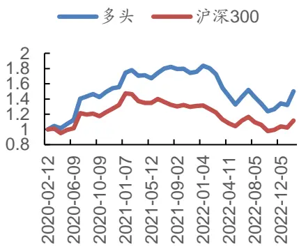
数据来源：天软科技, 广发证券发展研究中心

[分析师： Table_Author]陈原文

同SAC 执证号：S0260517080003

0755-82797057

chenyuanwen@gf.com.cn分析师： 安宁宁

SAC 执证号：S0260512020003

0755-23948352

anningning@gf.com.cn分析师： 罗军

同SAC 执证号：S0260511010004

公020-66335128

luojun@gf.com.cn

请注意，陈原文,罗军并非香港证券及期货事务监察委员会的注册持牌人，不可在香港从事受监管活动。

## [Table_ 相关研究：DocRe

再谈股价跳跃因子研究:多因 2022-12-09子 Alpha系列报告之(四十六)

识别风险，发现价值

## 一、背景介绍

## （一） 基于价量数据的机器学习量化选股策略

基于价量数据对未来股价走势进行预测作为一类重要的机器学习量化选股策略，在过去受到了广泛的研究和应用。由于个股的价量数据是随着交易活动的进行而产生的，其本质上是关于时间的一组序列。因此，为了建模价量数据与未来股价走势之间的关系，大多数研究方法自然而然地使用了循环神经网络（Recurrent NeuralNetwork，RNN）或Transformer这两大类时序模型。

在这些方法中，模型的输入是关于价量数据的一维或多维数组，输出则是股价的未来走势。然而，尽管时序模型在一定程度上能够捕捉到价量序列中诸如价格、交易量的上涨或下跌及其相互交织的高维信息，但其无法对价格和交易量的走势形态及其变化进行有效识别。

举个例子对此进行解释。以人类视角来看，通常在对股价的未来走势进行预测时，并不会选择直接观测一组关于价量的序列，因为能从中捕获到的不只是数字上的涨跌。为了能更好地捕捉到价格和交易量的形态走势，通常会选择观测包含k线图、移动平均价、交易量、MACD数据的图表（如图1），而不是一组纯粹的数字。

因此，本研究从上述观点出发，舍弃了使用时序模型对序列数据进行建模的传统方法。取而代之的是，本研究采用卷积神经网络（Convolutional Neural Network，CNN）对标准化价量数据图表和未来股价走势进行建模，以实现对未来股价走势的预测。对此，本方法首先构建了包含k线图、移动平均价、交易量、MACD数据的标准化价量数据图表（如图2）。然后，设计了能捕捉图表中价量数据走势形态的卷积神经网络来对其与未来股价走势进行建模。

图 1：Wind上某个股的20日行情数据
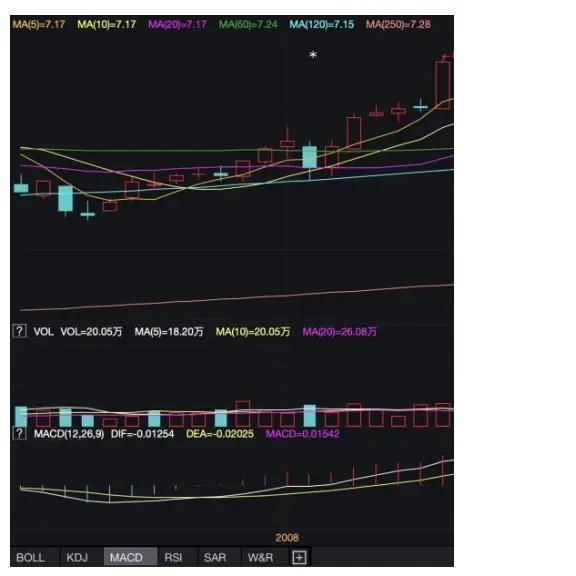
数据来源：Wind，广发证券发展研究中心

图 2：标准化价量数据图表
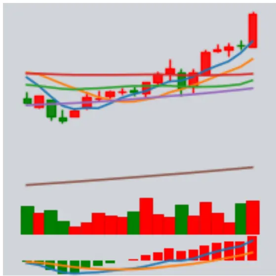
数据来源：天软科技，广发证券发展研究中心

## （二）循环神经网络

循环神经网络（Recurrent Neural Network，RNN）是一类以序列数据为输入，在序列的演进方向进行递归且所有节点（循环单元）按链式连接的递归神经网络。尽管循环神经网络演进出了长短期记忆（Long Short-Term Memory，LSTM）、门控循环单元（Gated Recurrent Units，GRU）等多种形式，但其基本结构相同，如图3所示。假设该网络以一组包含价格和交易量的二维序列数据为输入，循环神经网络节点首先将初始化的隐藏层状态（Hidden State）h 和第一个时间节点上的价格和交易量数据（即0.08和1000）作为输入，在信息处理后输出下一个隐藏层状态h 。随后在下一个节点的计算中，则以上一个隐藏层状态h 和第二个时间节点上的价格和交易量数据（即-0.03和8000）作为输入，然后输出下一个隐藏层状态h ，如此进行直至处理完输入中的最后一个时间节点的数据。在处理完所有数据后，通常将最后一个隐藏层状态h 作为最终输出，使用一个前馈神经网络（Feedforward neuralnetwork）对其进行降维后与未来股价走势进行建模，以此来实现模型的训练和回测。

此类循环神经网络虽然在一定程度上能够捕捉到序列数据中的数字关系，但其无法对股票市场中价格和交易量的走势形态进行有效识别。

图 3：循环神经网络结构
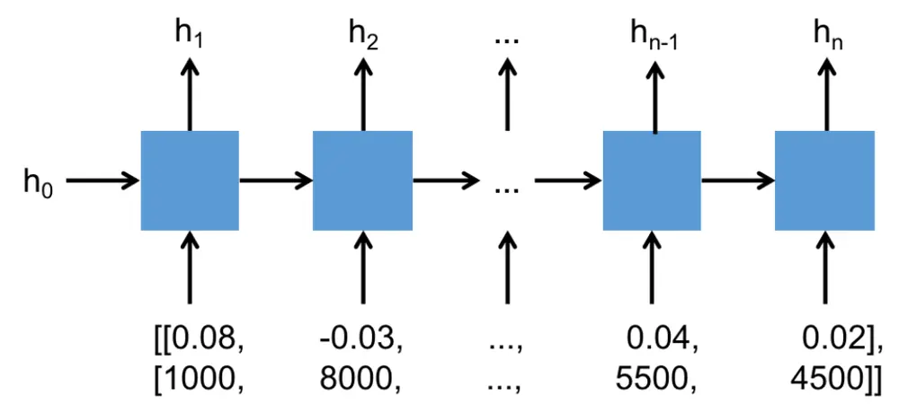
数据来源：广发证券发展研究中心

## （三）Transformer 模型

Transformer是近年来受到广泛研究和应用的一种时序模型，其通过多头注意力机制（Multi-Head Attention）来捕获输入时序数据中的前后关系，结构如图4所示。与传统的循环神经网络相比，Transformer克服了短期记忆的缺点，具有能建模超长序列数据之间关系的能力。此外，Transformer能够并行化处理数据，替代了传统循环神经网络递归式处理数据的范式，大大提高了运算速度。

尽管如此，Transformer作为一个时序模型，其仍无法对股票市场中价格和交易量的走势形态进行有效识别。

图 4：Transformer模型结构
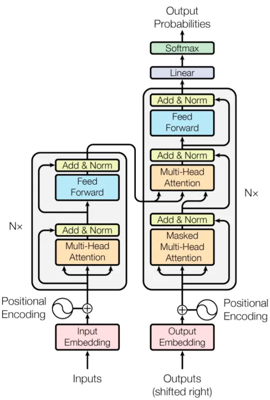
数据来源：Vaswani A, Shazeer N, Parmar N, et al.论文《Attention is all you need》，广发证券发展研究中心

## （四）卷积神经网络

卷积神经网络是当今计算机视觉领域的重要基础模型之一，其被广泛应用在图像识别领域。卷积神经网络的雏形为日本学者福岛邦彦（Kunihiko Fukushima）在其1979和1980年发表的论文中提出的neocognitron模型。neocognitron模型由S层（Simple-Layer）和C层（Complex-Layer）构成，是一个具有深度结构的神经网络。其通过S层单元和C层单元分别对图像特征进行提取、接收和响应不同感受野返回的特征。由于neocognitron模型初步实现了卷积神经网络中卷积层（Convolution Layer）和池化层（Pooling Layer）的功能，其在学界内被认为是卷积神经网络领域的开创性研究工作。

1987年，Alexander Waibel等提出第一个较为完备的卷积神经网络，即网络时间延迟网络（Time Delay Neural Network, TDNN）。TDNN使用FFT预处理的语音信号作为输入，由2个一维卷积核组成隐藏层，以提取语音信号频率域上的平移不变特征，其在语音识别领域上的表现超过了同等条件下当时的主流算法隐马尔可夫模型（Hidden Markov Model, HMM）。

1988年，第一个应用于医学影像检测的二维卷积神经网络由Wei Zhang等提出。1989年，Yann LeCun构建了包含2个卷积层、2个全连接层、共计6万个学习参数的卷积神经网络LeNet。在LeCun对其网络结构进行论述时首次使用了“卷积”一词，“卷积神经网络”因此得名。

1998年，Yann LeCun等人在LeNet的基础上构建了更加完备的卷积神经网络

LeNet-5。LeNet-5的结构如图5所示，其定义了现代卷积神经网络的基本结构。LeNet-5在手写数字识别任务上的成功使得卷积神经网络得到了广泛关注。2003年，微软基于卷积神经网络开发了光学字符读取（Optical Character Recognition，OCR）系统。

图 5：LeNet-5网络结构图
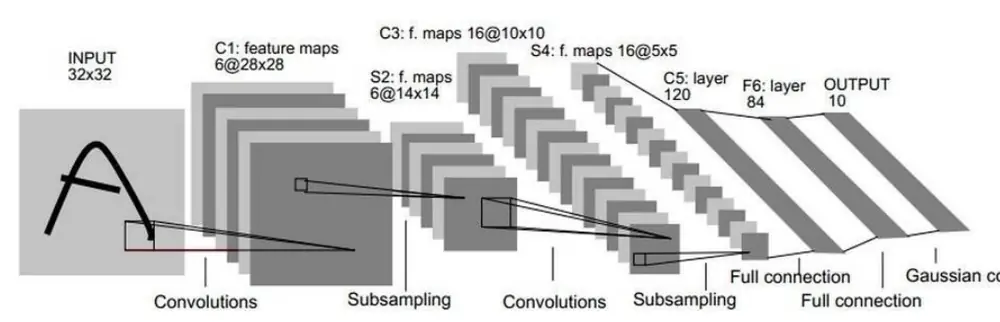
数据来源：Yann Lecun，Patrick Haffner, et all《Gradient-Based Learning Applied to DocumentRecognition》，广发证券发展研究中心

2006年，随着深度学习理论的提出，卷积神经网络的表征学习能力得到了更广泛的关注，并随着CPU、GPU等数值计算硬件设备的研发得到了快速发展。自2012年的AlexNet 开始，卷积神经网络多次成为ImageNet大规模视觉识别竞赛（ImageNet Large Scale Visual Recognition Challenge, ILSVRC）的优胜算法，包括2013年的ZFNet、2014年的VGGNet、GoogLeNet和2015年的ResNet。

以图像识别中最经典的卷积神经网络VGG16为例，其共包含了13个卷积层、3个全连接层、3个最大值池化层以及一个softmax分类层，结构如图6所示。下面对卷积神经网络中的主要部分进行介绍。

图 6：VGG16网络结构图
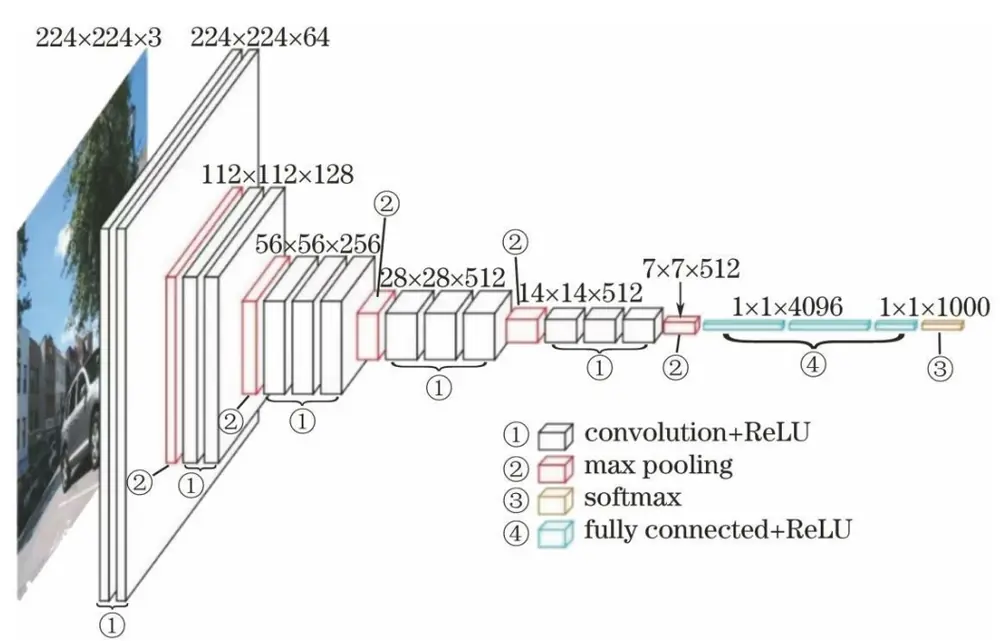
数据来源：SIMONYANK,ZISSERMANA《Very deep convolutional networks for large-scaleimage recognition》，广发证券发展研究中心

## 1. 卷积层

卷积层进行的是卷积（Convolution）即乘加运算，其目的与传统图像处理中的滤波器运算相似。如图7所示，将卷积核与输入数据进行卷积运算。在这个例子中，输入数据和卷积核都是有长和高的二维矩阵，输入的大小为（4，4），卷积核的大小为（3，3），输出的大小为（2，2）。如图中所示，在每个位置上将卷积核的元素与输入的元素相乘再求和，即乘积累加运算。然后将经过卷积核的运算结果输出到相应的位置。在逐次将卷积核与输入数据进行卷积运算并加上偏置量后即得到卷积层的输出。

图 7：卷积（Convolution）运算示意图
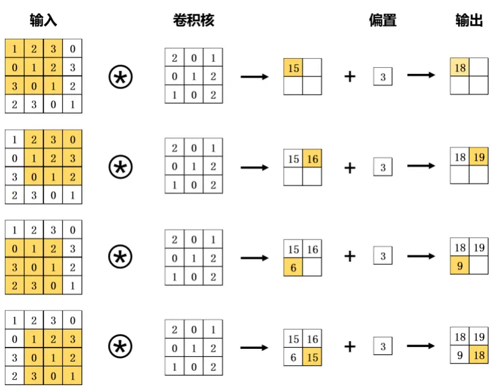
数据来源：斋藤康毅《深度学习入门》，广发证券发展研究中心

由于模型运算的需要，通常在卷积运算前会通过填充（adding）操作向输入数据的周围填入固定的数值（比如0 等）。如图8所示，将幅度为 1的填充操作应用于输入大小为（4，4）的数据。经过填充后的输入数据大小变为（6，6），将其与（3，3）的卷积核进行卷积运算得到（4，4）的输出数据。

图 8：填充（Padding）示意图
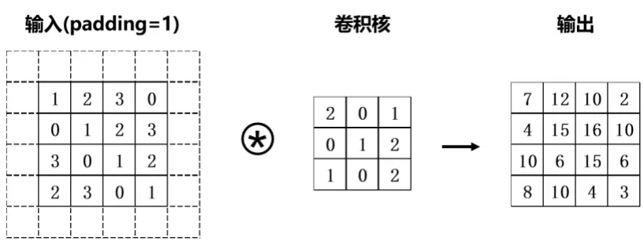
数据来源：斋藤康毅《深度学习入门》，广发证券发展研究中心

使用填充操作的目的是调整输出特征的大小。比如，将（3，3）的卷积核应用于大小为（4，4）的输入数据时，输出数据的大小变为（2，2），也就是说输出数据的大小比输入数据的大小缩减了 2 个元素。在深度网络中包含了众多的卷积运算操作，如果每次卷积运算都使数据的维度大小缩减，那么就有可能导致某一层数据的输出大小为 1，使卷积运算无法继续运行。而填充操作则可以避免这种情况。在上述例子中所应用的填充幅度大小为 1，使得输入数据和输出数据的大小得以保持，也就是说卷积运算可以在输入和输出两端维度大小不变的情况下进行。

卷积的运算间隔称为步幅（Stride）。若步幅由1变为2，卷积操作则如图9所示，即运算间隔变为两个元素。

图 9：步幅（Stride）为2的卷积运算示意图
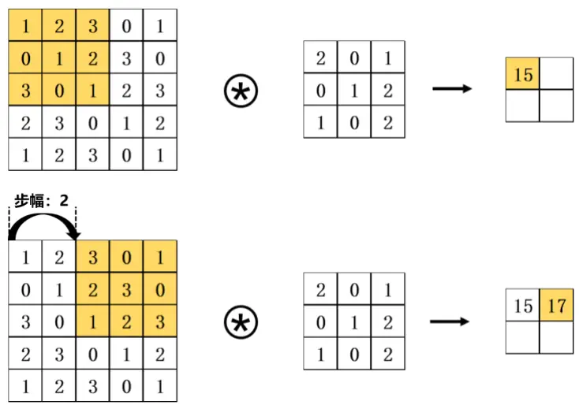
数据来源：斋藤康毅《深度学习入门》，广发证券发展研究中心

综上，假设输入大小为（H，W），卷积核的大小为（FH，FW），输出大小为（OH，OW），填充为P，步幅为S，通过下式可计算得到输出大小：

$$
0\mathsf{H}=\frac{\mathsf{H}+2\mathsf{P}-\mathsf{F}\mathsf{H}}{\mathsf{S}}+1,0\mathsf{W}=\frac{\mathsf{W}+2\mathsf{P}-\mathsf{F}\mathsf{W}}{\mathsf{S}}+1\mathsf{\Omega},
$$

## 2. 池化层

池化（Pooling）操作具有平移不变性、旋转不变性和尺度不变性，可以起到降维、去除冗余信息的作用，从而达到降低网络复杂度、减小计算量的目的。此外，池化本身可以实现非线性运算，还可以提高模型的鲁棒性。池化通常包括两种：最大值池化（Max Pooling）和平均池化（Average Pooling）。最大值池化是从目标区域中取出最大值，平均池化则是计算目标区域中的平均值，在目标检测领域通常使用最大值池化。图10是一个以步幅为2的2×2最大值池化运算示意图，其中2 x 2代表目标区域的大小。其2×2窗口的移动间隔为2个元素，从其中取出最大的元素。

图 10：池化（Pooling）运算示意图
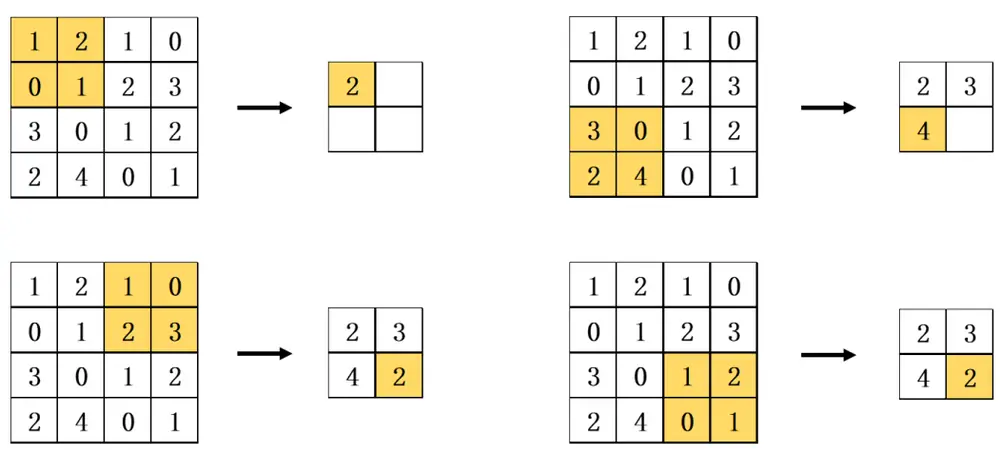
数据来源：斋藤康毅《深度学习入门》，广发证券发展研究中心

通过卷积运算，卷积神经网络能有效捕捉到图像中的局部结构特征，并通过深层网络不断提高感受野（Receptive Field）的大小，从而实现对图片全局特征的提取。因此，卷积神经网络能够有效识别价量数据图表中价格和交易量的走势形态，并与未来股价进行建模。

## 二、基于卷积神经网络的价量数据图表化选股策略

## （一）标准化价量数据图表

为了能更好地使用卷积神经网络对价量数据图表与未来股价走势进行建模，本方法对每个个股窗口期内的价量数据构建了标准化的图表，如图11所示。该图表包含了窗口期大小为20日的价量数据，其由三部分组成：

1.图表的上部分由k线图和移动平均线构成，包含了开、高、低、收价格，以及若干股价的移动平均线，如MA5、MA10等。。

2.图表的中部分由当日对应的成交量构成。

3.图表的下部分由股价的MACD信息构成，其中短期和长期移动平均线的窗口期。

由此构成了信息丰富的标准化价量数据图表。标准化图表构建完毕后，全市场范围内从2005年至2023年期间的图表数据量达115Gb，远超于同期以序列形式表达的价量数据，后者数据量仅为2Gb不到。

图 11：标准化价量数据图表
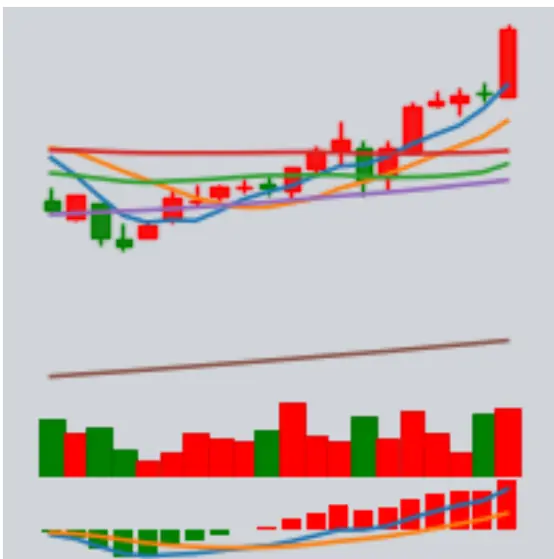
数据来源：天软科技，广发证券发展研究中心

## （二）价量数据图表卷积神经网络

为了对标准化图表和股价未来走势进行建模，本方法构建了卷积神经网络，其结构如图12所示。输入图片经过卷积结构后得到了512x10x10的特征图，将其摊平后得到51200维度的特征后送入一个全连接神经网络。模型的最终输出为3个概率，分别对应个股在未来截面日上收益率的百分位，即后1/3、中1/3、前1/3，以表示跌、平、涨。最终以股票上涨的概率作为因子进行选股。

在模型的实现细节上，采用Xavier、 Adam化器等技术对模型进行训练；采用训练数据外的验证集对训练中的模型进行验证，以确定最优早停（Early Stopping）时点。

通过分别训练两个不同的模型，将包含过去20日价量数据的标准化图表，与未来5日、20日的个股收益情况进行建模。在下文中，这以I{x}R{y}来表示，其中x为价量数据图表的窗口大小，y为预测未来y日的收益情况，换仓周期与y保持一致。即I20R5表示使用包含过去20日价量数据的标准化图表来预测未来5个交易日的收益情况。

图 12：价量数据图表卷积神经网络结构图
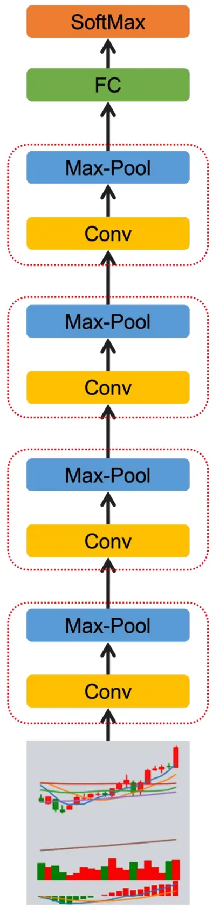
数据来源：广发证券发展研究中心

## （三）特征可视化

在完成卷积神经网络的训练后，以图12为例作为标准化价量数据图表对模型进行输入，分别对模型中的4个卷积神经网络结构的输出在特征维度随机抽取9张特征图进行可视化，结果如图13-16所示。

从特征可视化结果来看，卷积层1和卷积层2作为低维度特征提取器，其关注到了整幅标准化价量数据图表中的信息，均同时涵盖了k线图、移动平均线、交易量以及MACD信息。

而卷积层3和卷积层4作为高维度特征提取器，其对图表中代表不同信息的不同部位的关注点开始发生分化，有的特征图重点捕捉k线图、移动平均线中的信息，而有的特征图则重点捕捉交易量以及MACD中的信息。与此同时，也有的特征图关注到了全局信息。

由此可见，训练后的卷积神经网络能对标准化的价量数据图表进行有效的特征提取，识别出其中的价格以及交易量形态走势信息，从而与未来的股价走势进行建模，实现对未来股价的预测。

图 13：模型卷积层1输出特征可视化
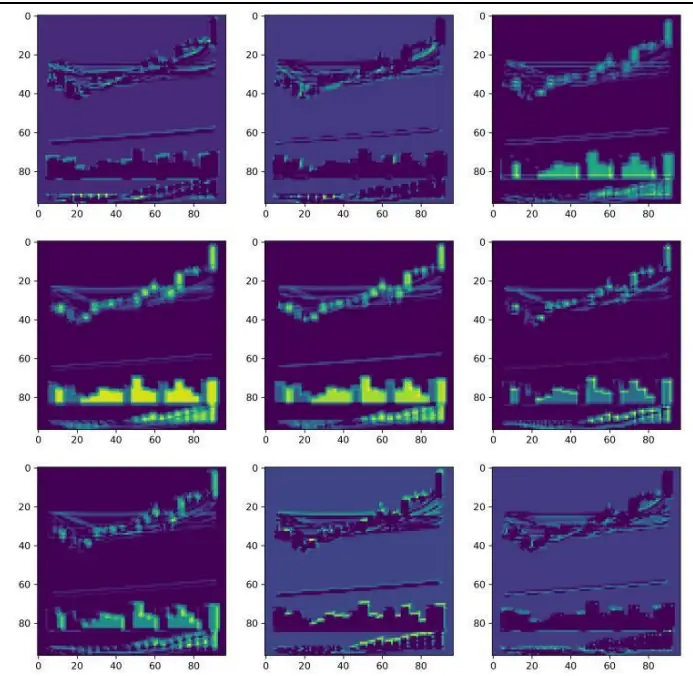
数据来源：广发证券发展研究中心

图 14：模型卷积层2输出特征可视化
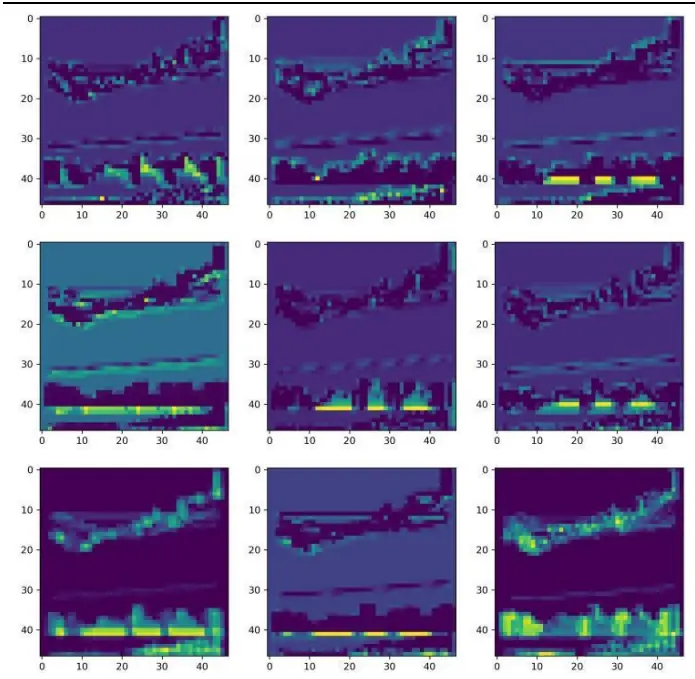
数据来源：广发证券发展研究中心

图 15：模型卷积层3输出特征可视化
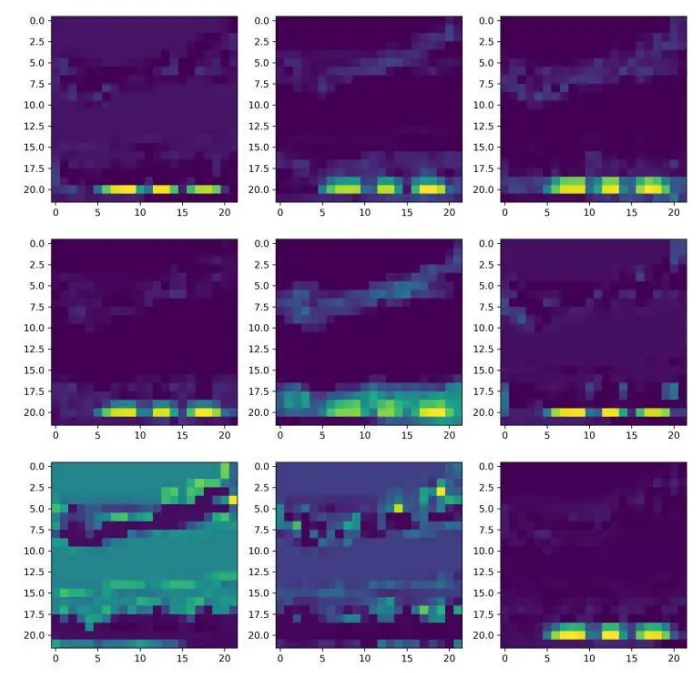
数据来源：广发证券发展研究中心

图 16：模型卷积层4输出特征可视化
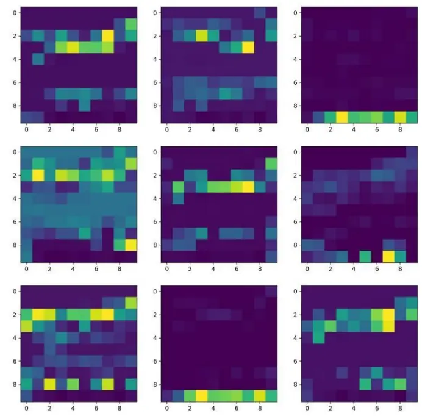
数据来源：广发证券发展研究中心

## 三、实证分析

## （一）数据说明

选股范围：全市场，沪深300，中证500，中证800，中证1000，创业板

股票预处理：剔除非上市、摘牌、ST/*ST、涨跌停板、上市未满1年股票

因子预处理：MAD去极值、Z-Score标准化、行业市值中性化

训练数据：全市场2005年1月～2014年12月。

验证数据：全市场2015年2月～2019年12月（与训练数据间隔1个月防止数据暴露）。

回测区间：2020年2月～2023年2月（与验证数据间隔1个月防止数据暴露）

分档方式：根据当期预测的个股价格未来上涨概率，从大到小分为10档

调仓周期：每5或20个交易日

交易费用：千分之三（卖出时收取）

## （二）I20R20因子分档表现

I20R20表示使用包含过去20日价量数据的标准化图表来预测未来20个交易日的收益情况，并以20个交易日为周期进行调仓。本文同时比较了是否进行行业市值中性化的结果。从结果来看，I20R20在各板块的分档表现较为显著，在整体上无中性化的分档单调性优于中性化后的单调性。

图 17：全市场 I20R20因子分档表现（无中性化）
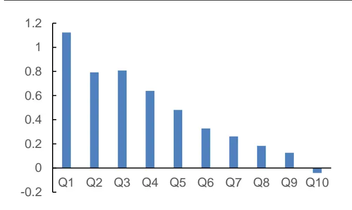
数据来源：天软科技，广发证券发展研究中心

图 18：全市场 I20R20因子分档表现（中性化）
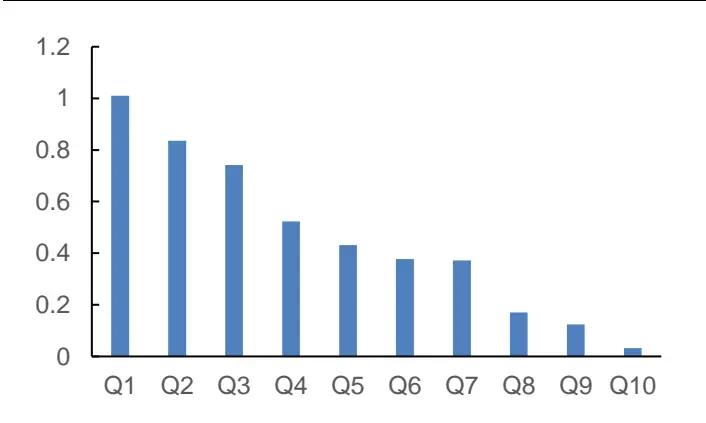
数据来源：天软科技，广发证券发展研究中心

图 19：沪深300 I20R20因子分档表现（无中性化）
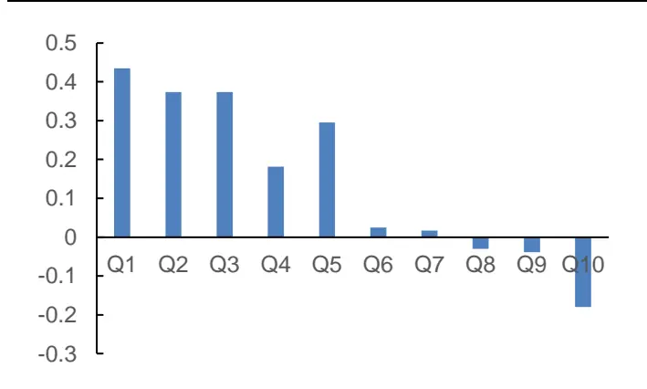
数据来源：天软科技，广发证券发展研究中心

图 20：沪深300 I20R20因子分档表现（中性化）
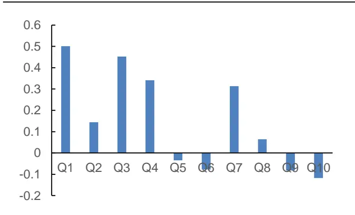
数据来源：天软科技，广发证券发展研究中心

图 21：中证500 I20R20因子分档表现（无中性化）
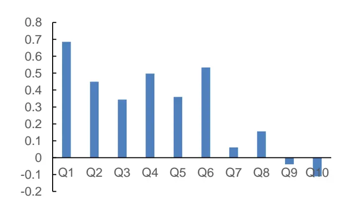
数据来源：天软科技，广发证券发展研究中心

图 22：中证500 I20R20因子分档表现（中性化）
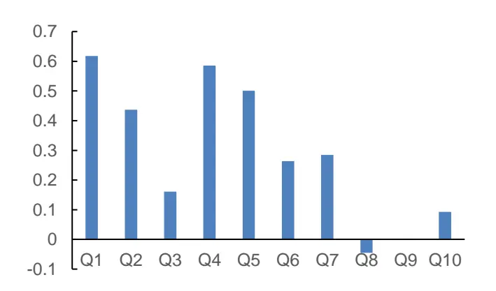
数据来源：天软科技，广发证券发展研究中心

图 23：中证800 I20R20因子分档表现（无中性化）
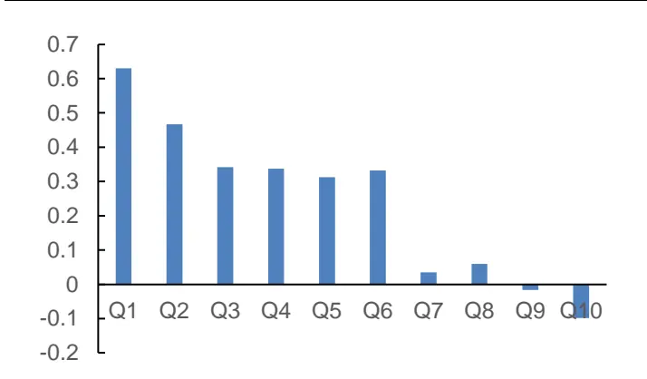
数据来源：天软科技，广发证券发展研究中心

图 24：中证800 I20R20因子分档表现（中性化）
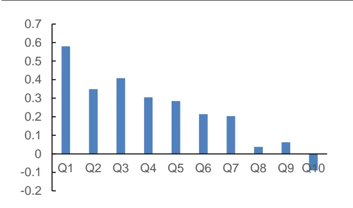
数据来源：天软科技，广发证券发展研究中心

图 25：中证1000 I20R20因子分档表现（无中性化）
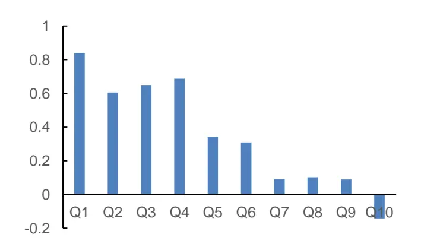
数据来源：天软科技，广发证券发展研究中心

图 26：中证1000 I20R20因子分档表现（中性化）
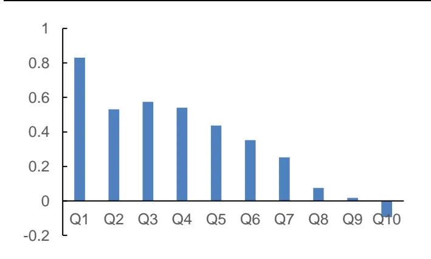
数据来源：天软科技，广发证券发展研究中心

图 27：创业板 I20R20因子分档表现（无中性化）
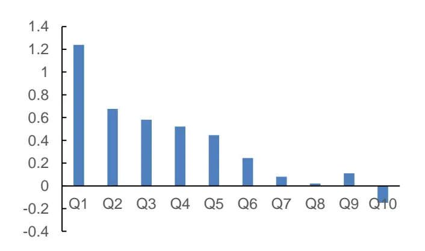
数据来源：天软科技，广发证券发展研究中心

图 28：创业板 I20R20因子分档表现（中性化）
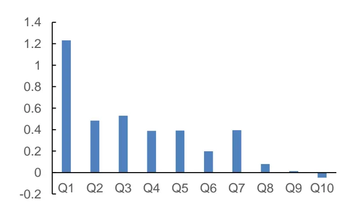
数据来源：天软科技，广发证券发展研究中心

## （三）I20R5 因子分档表现

I20R5表示使用包含过去20日价量数据的标准化图表来预测未来5个交易日的收益情况，并以5个交易日为周期进行调仓。从结果来看，I20R5在各板块的分档表现较为显著，在整体上无中性化的分档单调性优于中性化后的单调性。

图 29：全市场 I20R5因子分档表现（无中性化）
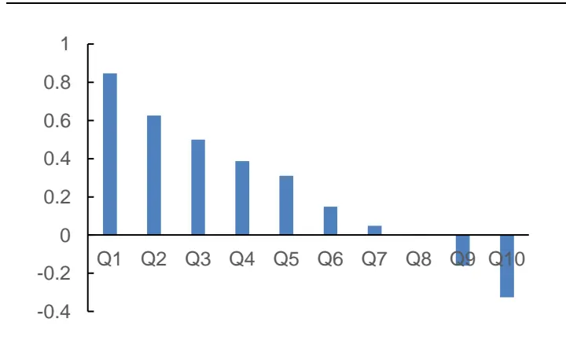
数据来源：天软科技，广发证券发展研究中心

图 30：全市场 I20R5因子分档表现（中性化）
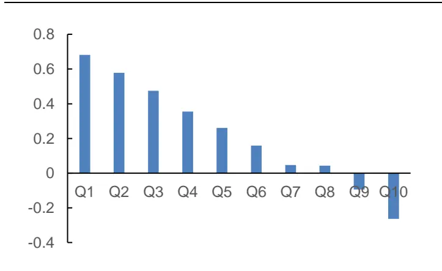
数据来源：天软科技，广发证券发展研究中心

图 31：沪深300 I20R5因子分档表现（无中性化）
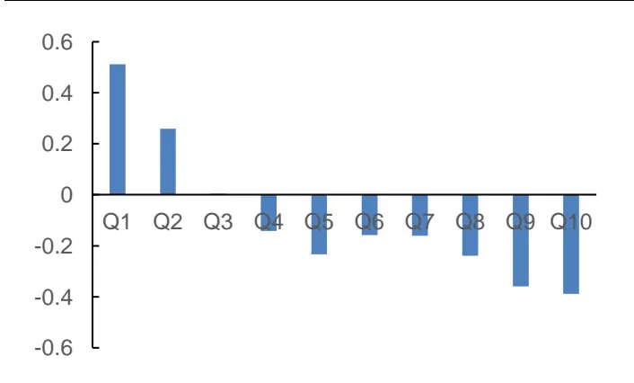
数据来源：天软科技，广发证券发展研究中心

图 32：沪深300 I20R5因子分档表现（中性化）
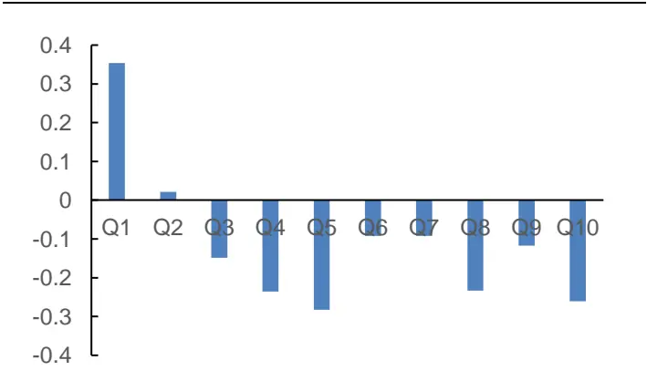
数据来源：天软科技，广发证券发展研究中心

图 33：中证500 I20R5因子分档表现（无中性化）
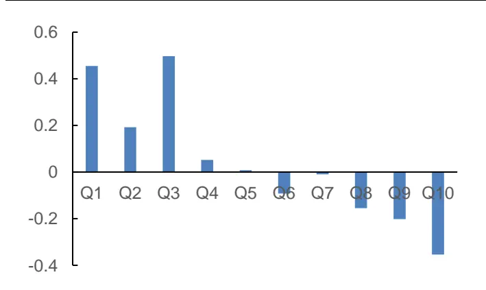
数据来源：天软科技，广发证券发展研究中心

图 34：中证500 I20R5因子分档表现（中性化）
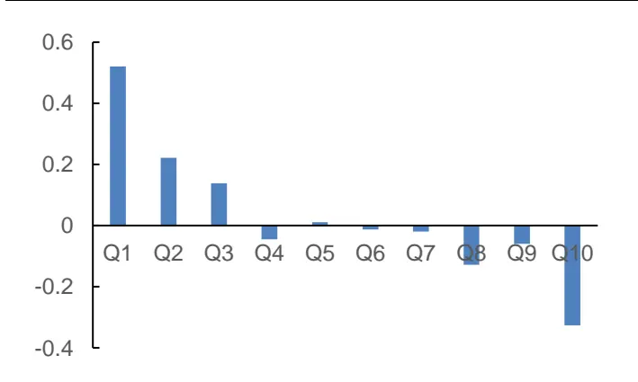
数据来源：天软科技，广发证券发展研究中心

图 35：中证800 I20R5因子分档表现（无中性化）
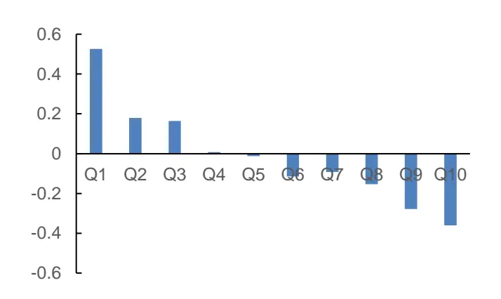
数据来源：天软科技，广发证券发展研究中心

图 36：中证800 I20R5因子分档表现（中性化）
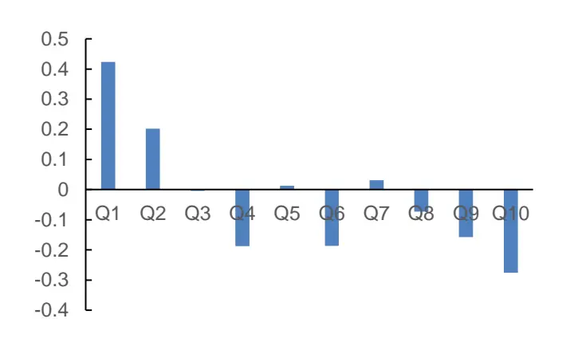
数据来源：天软科技，广发证券发展研究中心

图 37：中证1000 I20R5因子分档表现（无中性化）
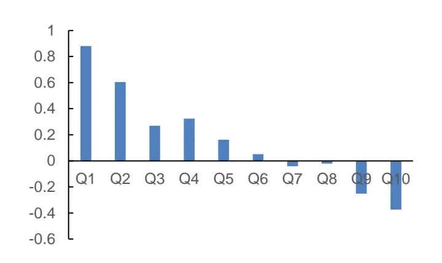
数据来源：天软科技，广发证券发展研究中心

图 38：中证1000 I20R5因子分档表现（中性化）
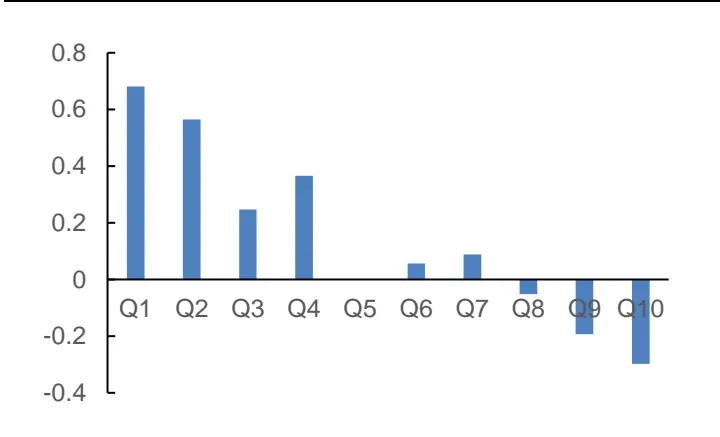
数据来源：天软科技，广发证券发展研究中心

图 39：创业板 I20R5因子分档表现（无中性化）
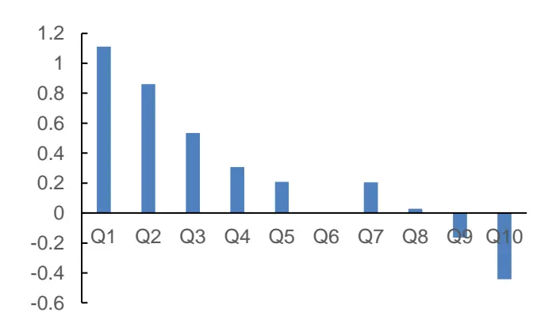
数据来源：天软科技，广发证券发展研究中心

图 40：创业板 I20R5因子分档表现（中性化）
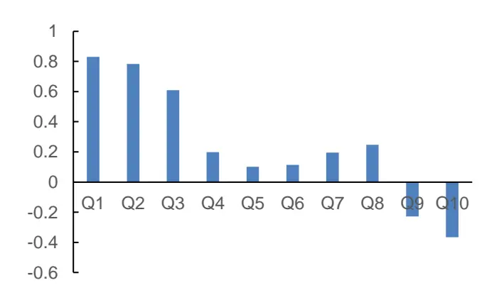
数据来源：天软科技，广发证券发展研究中心

## （四）I20R20因子表现统计

中性化前，I20R20因子在全市场、沪深300、中证500、中证800、中证1000、创业板中的RankIC均值分别为5.81%、5.15%、4.53%、4.61%、5.15%、6.40%，多头分别对应板块指数获得了21.06%、8.76%、10.70%、12.04%、12.54%、11.62%的超额年化收益率；中性化后，I20R20因子在全市场、沪深300、中证500、中证800、中证1000、创业板中的RankIC均值分别为5.11%、4.21%、3.43%、3.75%、4.85%、5.13%，多头分别对应板块指数获得了18.82%、10.30%、9.07%、10.76%、12.29%、11.40%的超额年化收益率。

表 1：I20R20因子在全市场收益表现（无中性化）

|  | 年化收益率 | 最大回撤率 | 年化波动率 | 平均换手率 | 信息比率 | 夏普比率 | 收益回撤比 |
| --- | --- | --- | --- | --- | --- | --- | --- |
| 多头 | 26.84% | 15.80% | 18.95% | 80.98% | 1.42 | 1.28 | 1.7 |
| 沪深300 | 3.52% | 33.57% | 18.47% | 0.00% | 0.19 | 0.06 | 0.1 |
| 多头相对沪深 300 | 21.06% | 22.93% | 16.55% | 0.00% | 1.27 | 1.12 | 0.92 |

数据来源：天软科技，广发证券发展研究中心

表 2：I20R20因子在全市场收益表现（中性化）

|  | 年化收益率 | 最大回撤率 | 年化波动率 | 平均换手率 | 信息比率 | 夏普比率 | 收益回撤比 |
| --- | --- | --- | --- | --- | --- | --- | --- |
| 多头 | 24.67% | 16.74% | 18.85% | 81.30% | 1.31 | 1.18 | 1.47 |
| 沪深300 | 3.52% | 33.57% | 18.47% | 0.00% | 0.19 | 0.06 | 0.1 |
| 多头相对沪深 300 | 18.82% | 26.22% | 17.15% | 0.00% | 1.1 | 0.95 | 0.72 |

数据来源：天软科技，广发证券发展研究中心

图 41：I20R20因子在全市场累计收益（无中性化）
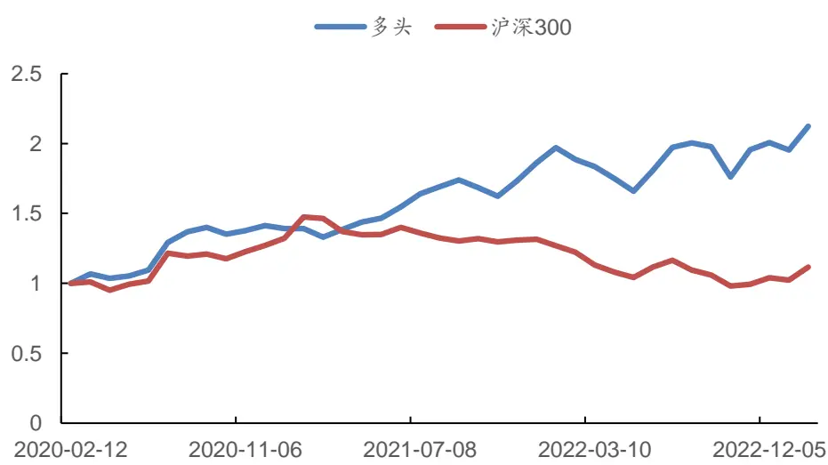
数据来源：天软科技，广发证券发展研究中心

图 42：I20R20因子在全市场累计收益（中性化）
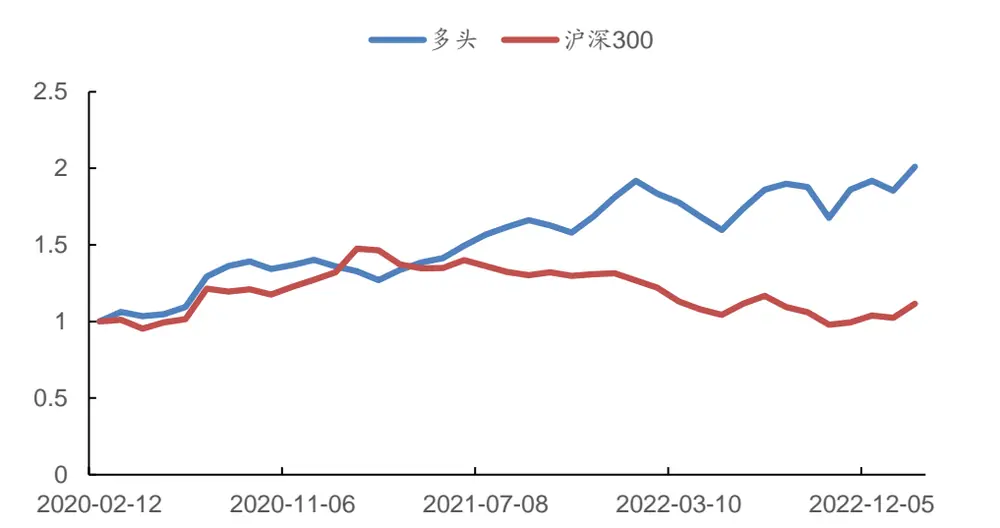
数据来源：天软科技，广发证券发展研究中心

表 3：I20R20因子在沪深300收益表现（无中性化）

|  | 年化收益率 | 最大回撤率 | 年化波动率 | 平均换手率 | 信息比率 | 夏普比率 | 收益回撤比 |
| --- | --- | --- | --- | --- | --- | --- | --- |
| 多头 | 12.06% | 29.53% | 22.67% | 80.40% | 0.53 | 0.42 | 0.41 |
| 沪深300 | 3.52% | 33.57% | 18.47% | 0.00% | 0.19 | 0.06 | 0.1 |
| 多头相对沪深 300 | 8.76% | 6.71% | 8.59% | 0.00% | 1.02 | 0.73 | 1.31 |

数据来源：天软科技，广发证券发展研究中心

表 4：I20R20因子在沪深300收益表现（中性化）

|  | 年化收益率 | 最大回撤率 | 年化波动率 | 平均换手率 | 信息比率 | 夏普比率 | 收益回撤比 |
| --- | --- | --- | --- | --- | --- | --- | --- |
| 多头 | 13.68% | 32.59% | 22.39% | 81.03% | 0.61 | 0.5 | 0.42 |
| 沪深300 | 3.52% | 33.57% | 18.47% | 0.00% | 0.19 | 0.06 | 0.1 |
| 多头相对沪深 300 | 10.30% | 10.49% | 8.30% | 0.00% | 1.24 | 0.94 | 0.98 |

数据来源：天软科技，广发证券发展研究中心

图 43：I20R20因子在沪深300累计收益（无中性化）
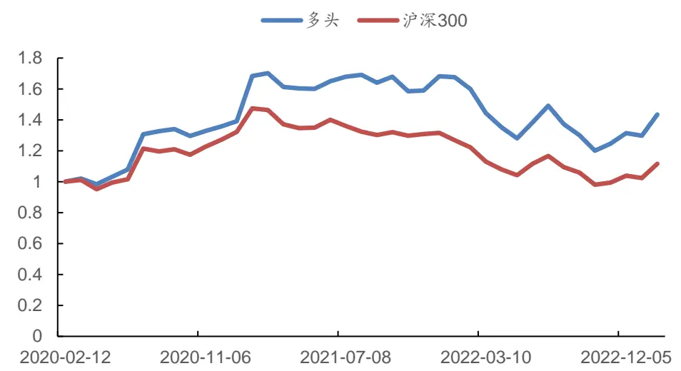
数据来源：天软科技，广发证券发展研究中心

图 44：I20R20因子在沪深300累计收益（中性化）
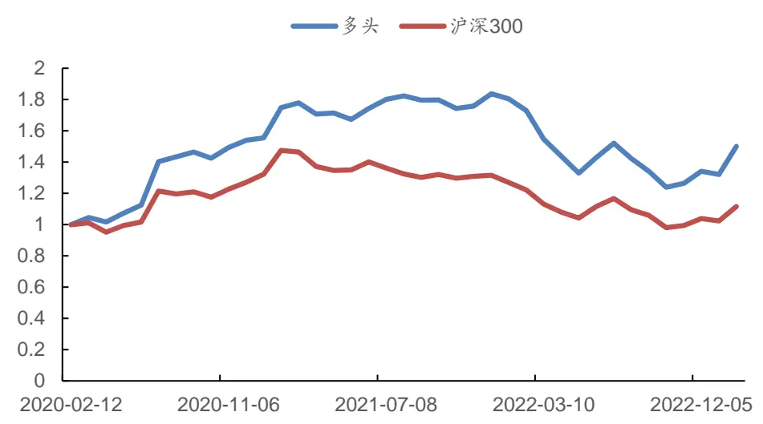
数据来源：天软科技，广发证券发展研究中心

表 5：I20R20因子在中证500收益表现（无中性化）

|  | 年化收益率 | 最大回撤率 | 年化波动率 | 平均换手率 | 信息比率 | 夏普比率 | 收益回撤比 |
| --- | --- | --- | --- | --- | --- | --- | --- |
| 多头 | 17.92% | 23.45% | 19.37% | 79.49% | 0.93 | 0.8 | 0.76 |
| 中证500 | 6.52% | 22.83% | 17.49% | 0.00% | 0.37 | 0.23 | 0.29 |
| 多头相对中证500 | 10.70% | 14.15% | 8.94% | 0.00% | 1.2 | 0.92 | 0.76 |

数据来源：天软科技，广发证券发展研究中心

表 6：I20R20因子在中证500收益表现（中性化）

|  | 年化收益率 | 最大回撤率 | 年化波动率 | 平均换手率 | 信息比率 | 夏普比率 | 收益回撤比 |
| --- | --- | --- | --- | --- | --- | --- | --- |
| 多头 | 16.41% | 20.27% | 17.82% | 80.39% | 0.92 | 0.78 | 0.81 |
| 中证 500 | 6.52% | 22.83% | 17.49% | 0.00% | 0.37 | 0.23 | 0.29 |
| 多头相对中证500 | 9.07% | 11.62% | 7.70% | 0.00% | 1.18 | 0.85 | 0.78 |

数据来源：天软科技，广发证券发展研究中心

图 45：I20R20因子在中证500累计收益（无中性化）
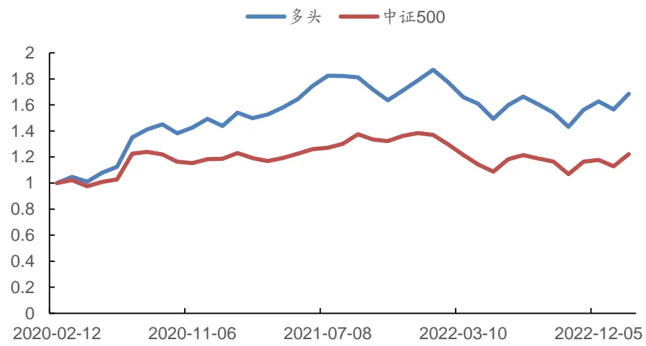
数据来源：天软科技，广发证券发展研究中心

图 46：I20R20因子在中证500累计收益（中性化）
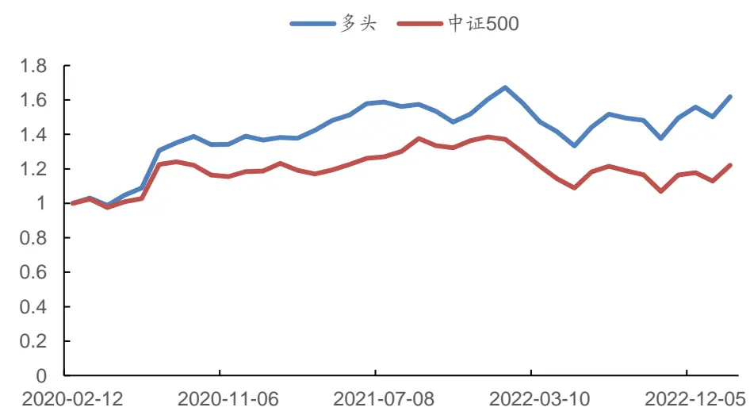
数据来源：天软科技，广发证券发展研究中心

表 7：I20R20因子在中证800收益表现（无中性化）

|  | 年化收益率 | 最大回撤率 | 年化波动率 | 平均换手率 | 信息比率 | 夏普比率 | 收益回撤比 |
| --- | --- | --- | --- | --- | --- | --- | --- |
| 多头 | 16.69% | 24.29% | 19.60% | 79.39% | 0.85 | 0.72 | 0.69 |
| 中证800 | 4.22% | 29.33% | 17.63% | 0.00% | 0.24 | 0.1 | 0.14 |
| 多头相对中证 800 | 12.04% | 8.07% | 8.21% | 0.00% | 1.47 | 1.16 | 1.49 |

数据来源：天软科技，广发证券发展研究中心

表 8：I20R20因子在中证800收益表现（中性化）

|  | 年化收益率 | 最大回撤率 | 年化波动率 | 平均换手率 | 信息比率 | 夏普比率 | 收益回撤比 |
| --- | --- | --- | --- | --- | --- | --- | --- |
| 多头 | 15.54% | 23.65% | 18.84% | 79.86% | 0.82 | 0.69 | 0.66 |
| 中证800 | 4.22% | 29.33% | 17.63% | 0.00% | 0.24 | 0.1 | 0.14 |
| 多头相对中证800 | 10.76% | 8.41% | 8.24% | 0.00% | 1.31 | 1 | 1.28 |

数据来源：天软科技，广发证券发展研究中心

图 47：I20R20因子在中证800累计收益（无中性化）
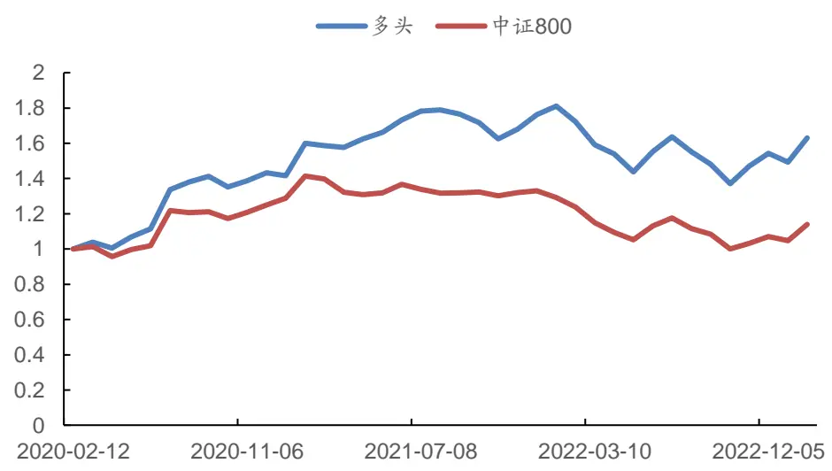
数据来源：天软科技，广发证券发展研究中心

图 48：I20R20因子在中证800累计收益（中性化）
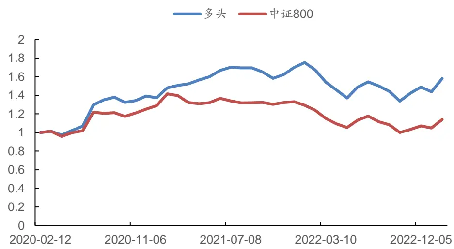
数据来源：天软科技，广发证券发展研究中心

表 9：I20R20因子在中证1000收益表现（无中性化）

|  | 年化收益率 | 最大回撤率 | 年化波动率 | 平均换手率 | 信息比率 | 夏普比率 | 收益回撤比 |
| --- | --- | --- | --- | --- | --- | --- | --- |
| 多头 | 21.24% | 18.71% | 21.06% | 82.08% | 1.01 | 0.89 | 1.14 |
| 中证1000 | 7.61% | 24.46% | 20.69% | 0.00% | 0.37 | 0.25 | 0.31 |
| 多头相对中证 1000 | 12.54% | 6.05% | 7.12% | 0.00% | 1.76 | 1.41 | 2.07 |

数据来源：天软科技，广发证券发展研究中心

表 10：I20R20因子在中证1000收益表现（中性化）

|  | 年化收益率 | 最大回撤率 | 年化波动率 | 平均换手率 | 信息比率 | 夏普比率 | 收益回撤比 |
| --- | --- | --- | --- | --- | --- | --- | --- |
| 多头 | 21.04% | 19.43% | 20.96% | 82.16% | 1 | 0.88 | 1.08 |
| 中证1000 | 7.61% | 24.46% | 20.69% | 0.00% | 0.37 | 0.25 | 0.31 |
| 多头相对中证 1000 | 12.29% | 4.83% | 7.45% | 0.00% | 1.65 | 1.32 | 2.54 |

数据来源：天软科技，广发证券发展研究中心

图 49：I20R20因子在中证1000累计收益（无中性化）
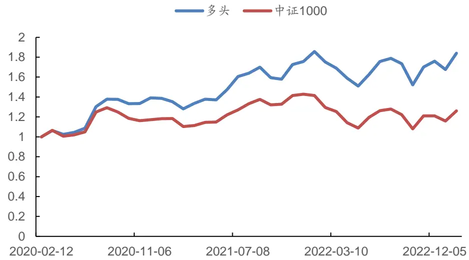
数据来源：天软科技，广发证券发展研究中心

图 50：I20R20因子在中证1000累计收益（中性化）
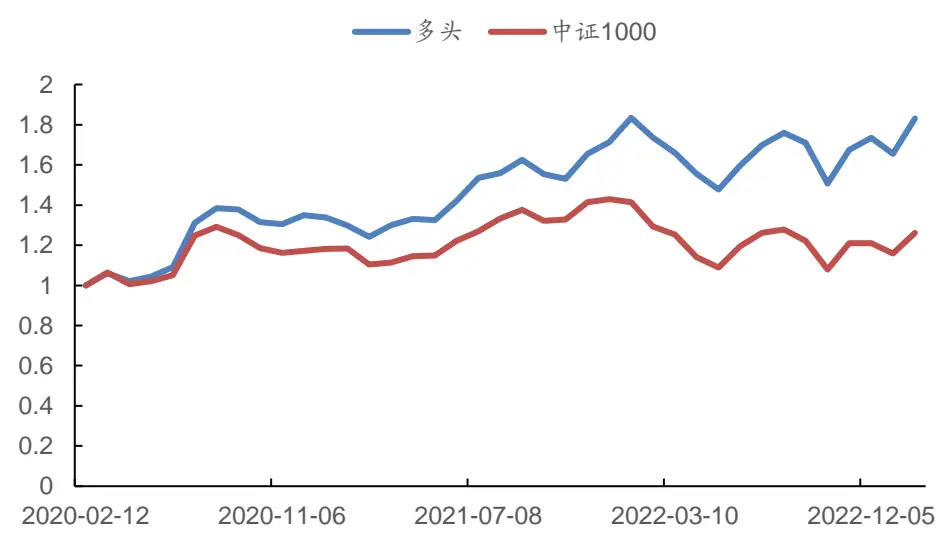
数据来源：天软科技，广发证券发展研究中心

表 11：I20R20因子在创业板收益表现（无中性化）

|  | 年化收益率 | 最大回撤率 | 年化波动率 | 平均换手率 | 信息比率 | 夏普比率 | 收益回撤比 |
| --- | --- | --- | --- | --- | --- | --- | --- |
| 多头 | 29.00% | 21.64% | 23.91% | 81.92% | 1.21 | 1.11 | 1.34 |
| 创业板指 | 10.67% | 39.92% | 28.66% | 0.00% | 0.37 | 0.29 | 0.27 |
| 多头相对创业板指 | 11.62% | 40.05% | 25.21% | 0.00% | 0.46 | 0.36 | 0.29 |

数据来源：天软科技，广发证券发展研究中心

表 12：I20R20因子在创业板收益表现（中性化）

|  | 年化收益率 | 最大回撤率 | 年化波动率 | 平均换手率 | 信息比率 | 夏普比率 | 收益回撤比 |
| --- | --- | --- | --- | --- | --- | --- | --- |
| 多头 | 28.85% | 22.25% | 24.49% | 82.43% | 1.18 | 1.08 | 1.3 |
| 创业板指 | 10.67% | 39.92% | 28.66% | 0.00% | 0.37 | 0.29 | 0.27 |
| 多头相对创业板指 | 11.40% | 42.76% | 25.96% | 0.00% | 0.44 | 0.34 | 0.27 |

数据来源：天软科技，广发证券发展研究中心

图 51：I20R20因子在创业板累计收益（无中性化）
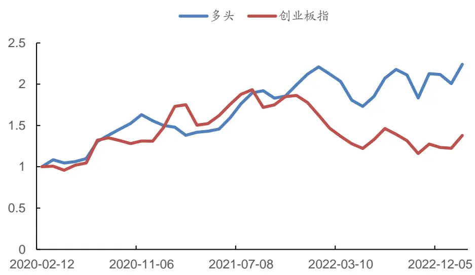
数据来源：天软科技，广发证券发展研究中心

图 52：I20R20因子在创业板累计收益（中性化）
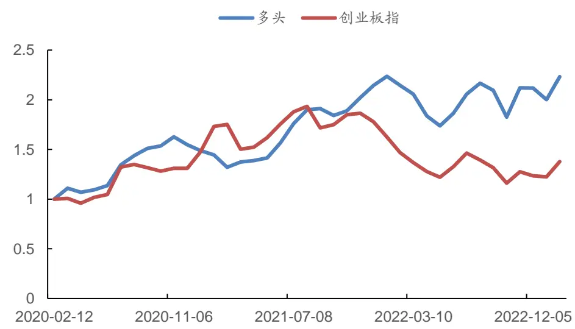
数据来源：天软科技，广发证券发展研究中心

## （五）I20R5 因子表现统计

中性化前，I20R5因子在全市场、沪深300、中证500、中证800、中证1000、创业板中的RankIC均值分别为3.64%、3.34%、3.26%、3.19%、3.65%、4.20%，多头分别对应板块指数获得了15.93%、9.77%、3.79%、8.76、10.82%、11.32%的超额年化收益率；中性化后，I20R5因子在全市场、沪深300、中证500、中证800、中证1000、创业板中的RankIC均值分别为3.01%、1.39%、2.60%、2.04%、3.00%、3.41%，多头分别对应板块指数获得了12.34%、5.72%、5.21%、6.21%、6.95%、5.89的超额年化收益率。

表 13：I20R5因子在全市场收益表现（无中性化）

|  | 年化收益率 | 最大回撤率 | 年化波动率 | 平均换手率 | 信息比率 | 夏普比率 | 收益回撤比 |
| --- | --- | --- | --- | --- | --- | --- | --- |
| 多头 | 21.82% | 23.89% | 22.42% | 74.97% | 0.97 | 0.86 | 0.91 |
| 沪深300 | 4.37% | 38.75% | 20.39% | 0.00% | 0.21 | 0.09 | 0.11 |
| 多头相对沪深 300 | 15.93% | 21.05% | 15.16% | 0.00% | 1.05 | 0.89 | 0.76 |

数据来源：天软科技，广发证券发展研究中心

表 14：I20R5因子在全市场收益表现（中性化）

|  | 年化收益率 | 最大回撤率 | 年化波动率 | 平均换手率 | 信息比率 | 夏普比率 | 收益回撤比 |
| --- | --- | --- | --- | --- | --- | --- | --- |
| 多头 | 18.22% | 25.28% | 22.32% | 74.84% | 0.82 | 0.7 | 0.72 |
| 沪深300 | 4.37% | 38.75% | 20.39% | 0.00% | 0.21 | 0.09 | 0.11 |
| 多头相对沪深 300 | 12.34% | 24.35% | 15.87% | 0.00% | 0.78 | 0.62 | 0.51 |

数据来源：天软科技，广发证券发展研究中心

图 53：I20R5因子在全市场累计收益（无中性化）
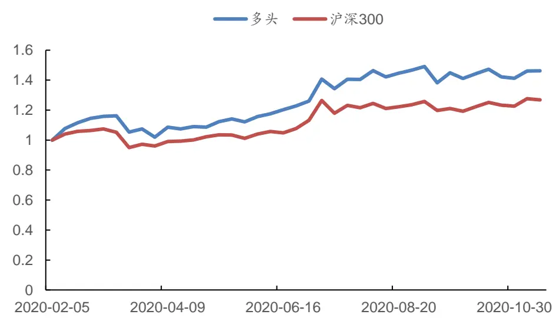
数据来源：天软科技，广发证券发展研究中心
识别风险，发现价值

图 54：I20R5因子在全市场累计收益（中性化）
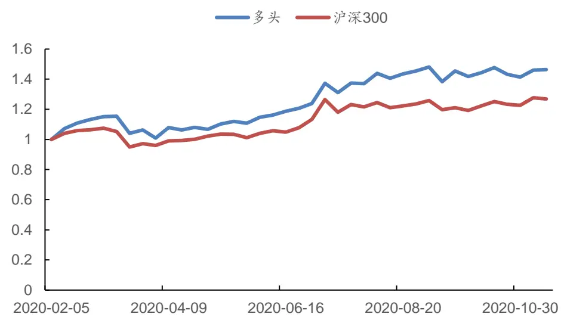
数据来源：天软科技，广发证券发展研究中心

表 15：I20R5因子在沪深300收益表现（无中性化）

|  | 年化收益率 | 最大回撤率 | 年化波动率 | 平均换手率 | 信息比率 | 夏普比率 | 收益回撤比 |
| --- | --- | --- | --- | --- | --- | --- | --- |
| 多头 | 14.22% | 32.50% | 23.80% | 74.29% | 0.6 | 0.49 | 0.44 |
| 沪深300 | 4.37% | 38.75% | 20.39% | 0.00% | 0.21 | 0.09 | 0.11 |
| 多头相对沪深 300 | 9.77% | 7.39% | 9.46% | 0.00% | 1.03 | 0.77 | 1.32 |

数据来源：天软科技，广发证券发展研究中心

表 16：I20R5因子在沪深300收益表现（中性化）

|  | 年化收益率 | 最大回撤率 | 年化波动率 | 平均换手率 | 信息比率 | 夏普比率 | 收益回撤比 |
| --- | --- | --- | --- | --- | --- | --- | --- |
| 多头 | 10.23% | 34.23% | 22.71% | 73.35% | 0.45 | 0.34 | 0.3 |
| 沪深300 | 4.37% | 38.75% | 20.39% | 0.00% | 0.21 | 0.09 | 0.11 |
| 多头相对沪深 300 | 5.72% | 9.33% | 8.81% | 0.00% | 0.65 | 0.37 | 0.61 |

数据来源：天软科技，广发证券发展研究中心

图 55：I20R5因子在沪深300累计收益（无中性化）

数据来源：天软科技，广发证券发展研究中心

图 56：I20R5因子在沪深300累计收益（中性化）
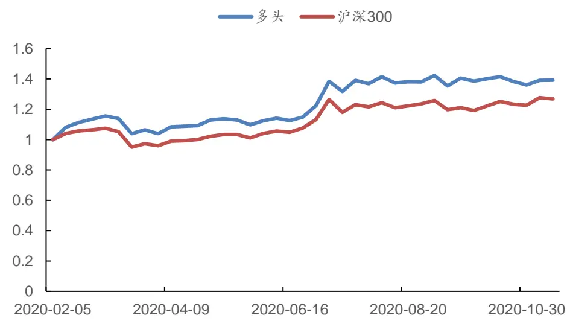
数据来源：天软科技，广发证券发展研究中心

表 17：I20R5因子在中证500收益表现（无中性化）

|  | 年化收益率 | 最大回撤率 | 年化波动率 | 平均换手率 | 信息比率 | 夏普比率 | 收益回撤比 |
| --- | --- | --- | --- | --- | --- | --- | --- |
| 多头 | 12.82% | 32.91% | 22.44% | 75.16% | 0.57 | 0.46 | 0.39 |
| 中证500 | 8.86% | 28.47% | 20.48% | 0.00% | 0.43 | 0.31 | 0.31 |
| 多头相对中证 500 | 3.79% | 12.00% | 7.73% | 0.00% | 0.49 | 0.17 | 0.32 |

数据来源：天软科技，广发证券发展研究中心

表 18：I20R5因子在中证500收益表现（中性化）

|  | 年化收益率 | 最大回撤率 | 年化波动率 | 平均换手率 | 信息比率 | 夏普比率 | 收益回撤比 |
| --- | --- | --- | --- | --- | --- | --- | --- |
| 多头 | 14.44% | 29.46% | 21.84% | 74.49% | 0.66 | 0.55 | 0.49 |
| 中证500 | 8.86% | 28.47% | 20.48% | 0.00% | 0.43 | 0.31 | 0.31 |
| 多头相对中证500 | 5.21% | 7.83% | 6.90% | 0.00% | 0.75 | 0.39 | 0.66 |

数据来源：天软科技，广发证券发展研究中心

图 57：I20R5因子在中证500累计收益（无中性化）
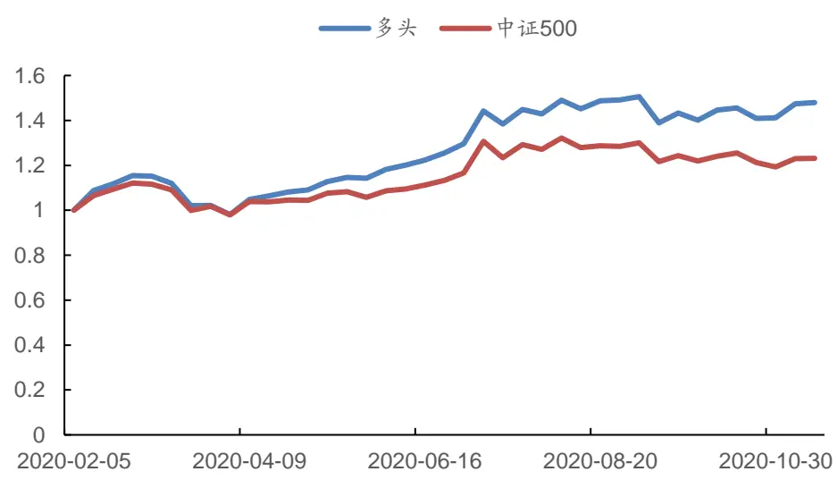
数据来源：天软科技，广发证券发展研究中心

图 58：I20R5因子在中证500累计收益（中性化）
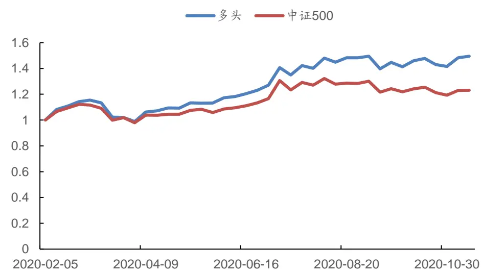
数据来源：天软科技，广发证券发展研究中心

表 19：I20R5因子在中证800收益表现（无中性化）

|  | 年化收益率 | 最大回撤率 | 年化波动率 | 平均换手率 | 信息比率 | 夏普比率 | 收益回撤比 |
| --- | --- | --- | --- | --- | --- | --- | --- |
| 多头 | 14.57% | 27.75% | 21.75% | 74.50% | 0.67 | 0.55 | 0.53 |
| 中证800 | 5.40% | 33.09% | 19.89% | 0.00% | 0.27 | 0.15 | 0.16 |
| 多头相对中证800 | 8.76% | 7.77% | 8.32% | 0.00% | 1.05 | 0.75 | 1.13 |

数据来源：天软科技，广发证券发展研究中心

表 20：I20R5因子在中证800收益表现（中性化）

|  | 年化收益率 | 最大回撤率 | 年化波动率 | 平均换手率 | 信息比率 | 夏普比率 | 收益回撤比 |
| --- | --- | --- | --- | --- | --- | --- | --- |
| 多头 | 12.03% | 25.81% | 21.09% | 73.80% | 0.57 | 0.45 | 0.47 |
| 中证800 | 5.40% | 33.09% | 19.89% | 0.00% | 0.27 | 0.15 | 0.16 |
| 多头相对中证800 | 6.21% | 10.28% | 8.18% | 0.00% | 0.76 | 0.45 | 0.6 |

数据来源：天软科技，广发证券发展研究中心

图 59：I20R5因子在中证800累计收益（无中性化）

数据来源：天软科技，广发证券发展研究中心

图 60：I20R5因子在中证800累计收益（中性化）
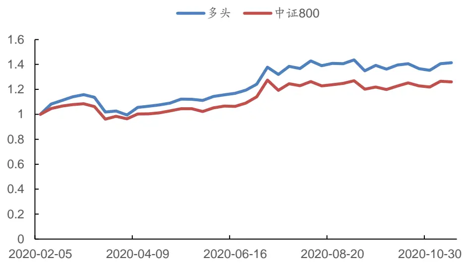
数据来源：天软科技，广发证券发展研究中心

表 21：I20R5因子在中证1000收益表现（无中性化）

|  | 年化收益率 | 最大回撤率 | 年化波动率 | 平均换手率 | 信息比率 | 夏普比率 | 收益回撤比 |
| --- | --- | --- | --- | --- | --- | --- | --- |
| 多头 | 22.54% | 26.88% | 24.45% | 75.18% | 0.92 | 0.82 | 0.84 |
| 中证1000 | 10.61% | 31.00% | 23.36% | 0.00% | 0.45 | 0.35 | 0.34 |
| 多头相对中证 1000 | 10.81% | 4.66% | 7.22% | 0.00% | 1.5 | 1.15 | 2.32 |

数据来源：天软科技，广发证券发展研究中心

表 22：I20R5因子在中证1000收益表现（中性化）

|  | 年化收益率 | 最大回撤率 | 年化波动率 | 平均换手率 | 信息比率 | 夏普比率 | 收益回撤比 |
| --- | --- | --- | --- | --- | --- | --- | --- |
| 多头 | 18.21% | 30.38% | 24.46% | 74.90% | 0.74 | 0.64 | 0.6 |
| 中证1000 | 10.61% | 31.00% | 23.36% | 0.00% | 0.45 | 0.35 | 0.34 |
| 多头相对中证1000 | 6.95% | 6.81% | 6.38% | 0.00% | 1.09 | 0.7 | 1.02 |

数据来源：天软科技，广发证券发展研究中心

图 61：I20R5因子在中证1000累计收益（无中性化）
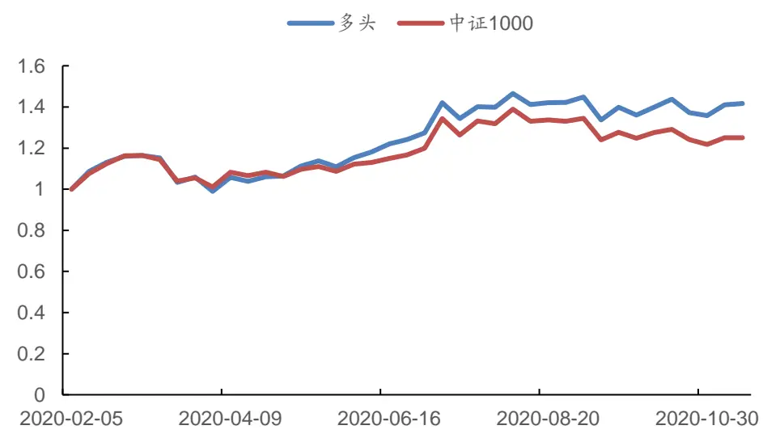
数据来源：天软科技，广发证券发展研究中心

图 62：I20R5因子在中证1000累计收益（中性化）
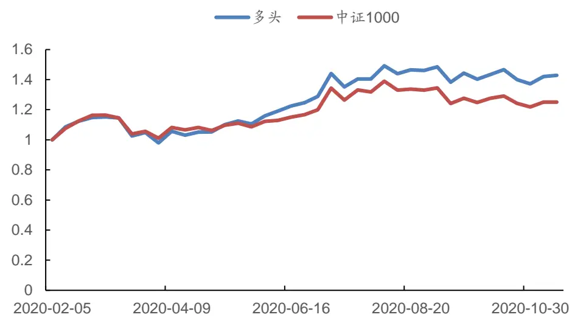
数据来源：天软科技，广发证券发展研究中心

表 23：I20R5因子在创业板收益表现（无中性化）

|  | 年化收益率 | 最大回撤率 | 年化波动率 | 平均换手率 | 信息比率 | 夏普比率 | 收益回撤比 |
| --- | --- | --- | --- | --- | --- | --- | --- |
| 多头 | 27.20% | 29.16% | 26.11% | 75.75% | 1.04 | 0.95 | 0.93 |
| 创业板指 | 11.58% | 39.40% | 27.75% | 0.00% | 0.42 | 0.33 | 0.29 |
| 多头相对创业板指 | 11.32% | 27.28% | 19.95% | 0.00% | 0.57 | 0.44 | 0.41 |

数据来源：天软科技，广发证券发展研究中心

表 24：I20R5因子在创业板收益表现（中性化）

|  | 年化收益率 | 最大回撤率 | 年化波动率 | 平均换手率 | 信息比率 | 夏普比率 | 收益回撤比 |
| --- | --- | --- | --- | --- | --- | --- | --- |
| 多头 | 21.46% | 32.23% | 26.10% | 75.31% | 0.82 | 0.73 | 0.67 |
| 创业板指 | 11.58% | 39.40% | 27.75% | 0.00% | 0.42 | 0.33 | 0.29 |
| 多头相对创业板指 | 5.89% | 33.67% | 21.70% | 0.00% | 0.27 | 0.16 | 0.17 |

数据来源：天软科技，广发证券发展研究中心

图 63：I20R5因子在创业板累计收益（无中性化）
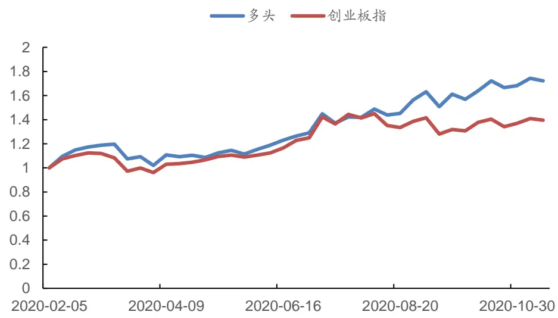
数据来源：天软科技，广发证券发展研究中心

图 64：I20R5因子在创业板累计收益（中性化）
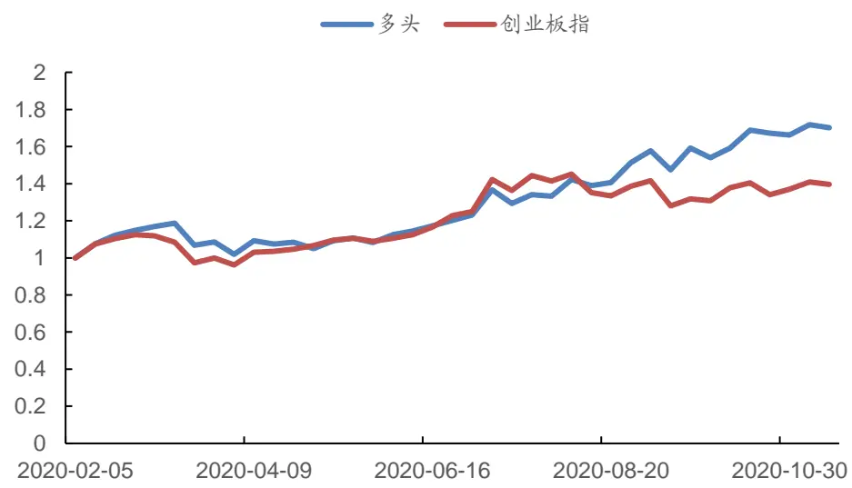
数据来源：天软科技，广发证券发展研究中心

## 四、总结

本篇专题探讨了卷积神经网络在选股策略中的应用。通过构建标准化的价量数据图表，设计了卷积神经网络识别其中价格和交易量的走势形态，将其与未来股价进行建模，从而实现对未来股价的预测。以20日窗口期的价量数据图表为模型输入，分别对未来20日和5日的股价走势进行预测，从而构建出I20R20因子和I20R5因子。

以2020年2月至2023年2月作为样本外回测区间，实证分析结果表明I20R20因子和I20R5因子的分档收益显著，均取得了较为可观的超额收益。

每20个交易日进行换仓，双边千三计费，中性化前I20R20因子在全市场、沪深300、中证500、中证800、创业板中的多头分别对应板块指数获得了21.06%、8.76%、10.70%、12.04%、12.54%、11.62%的超额年化收益率，中性化后则分别取得了18.82%、10.30%、9.07%、10.76%、12.29%、11.40%的超额年化收益率。

每5个交易日进行换仓，双边千三计费，中性化前I20R5因子在全市场、沪深300、中证500、中证800、创业板中的多头分别对应板块指数获得了15.93%、9.77%、3.79%、8.76、10.82%、11.32%的超额年化收益率，中性化后则分别取得了12.34%、5.72%、5.21%、6.21%、6.95%、5.89的超额年化收益率。

## 五、风险提示

本专题报告所述模型用量化方法通过历史数据统计、建模和测算完成，所得结论与规律在市场政策、环境变化时可能存在失效风险；

本专题策略模型在市场结构有可能存在策略失效风险。

本专题策略模型在交易行为改变时存在失效风险。

## [Table_ResearchTeam] 广发金融工程研究小组

罗军 ：首席分析师，华南理工大学硕士，从业 16年，2010年进入广发证券发展研究中心。

安 宁 宁 ：联席首席分析师，暨南大学硕士，从业 14年，2011年进入广发证券发展研究中心。

史 庆 盛 ：资深分析师，华南理工大学硕士，2011年进入广发证券发展研究中心。

张 超 ：资深分析师，中山大学硕士，2012 年进入广发证券发展研究中心。

陈 原 文 ：资深分析师，中山大学硕士，2015年进入广发证券发展研究中心。

樊 瑞 铎 ：资深分析师，南开大学硕士，2015年进入广发证券发展研究中心。

李豪 ：资深分析师，上海交通大学硕士，2016年进入广发证券发展研究中心。

周 飞 鹏 ：资深分析师，伯明翰大学硕士，2021年加入广发证券发展研究中心。

季 燕 妮 ：高级分析师，厦门大学硕士，2020年进入广发证券发展研究中心。

张 钰 东 ：高级分析师，中山大学硕士，2020年进入广发证券发展研究中心。

## [Table_IndustryInvestDescription] 广发证券—行业投资评级说明

买入： 预期未来12个月内，股价表现强于大盘10%以上。

持有： 预期未来12个月内，股价相对大盘的变动幅度介于-10%～+10%。

卖出： 预期未来12个月内，股价表现弱于大盘10%以上。

## [Table_CompanyInvestDescription] 广发证券—公司投资评级说明

买入： 预期未来 12 个月内，股价表现强于大盘 15%以上。

增持： 预期未来12个月内，股价表现强于大盘5%-15%。

持有： 预期未来12个月内，股价相对大盘的变动幅度介于-5%～+5%。

卖出： 预期未来12个月内，股价表现弱于大盘5%以上。

## [Table_Address] 联系我们

| 地址 | 广州市 | 深圳市 | 北京市 | 上海市 | 香港 |
| --- | --- | --- | --- | --- | --- |
|  | 广州市天河区马场路 | 深圳市福田区益田路 | 北京市西城区月坛北 | 上海市浦东新区南泉 | 香港德辅道中189号 |
|  | 26号广发证券大厦35 | 6001号太平金融大厦 | 街2号月坛大厦18层 | 北路429号泰康保险 | 李宝椿大厦 29及30 |
|  | 楼 | 31层 |  | 大厦37楼 | 楼 |
|  | 510627 | 518026 | 100045 | 200120 |  |

## [Table_LegalD 法律主体isclaimer 声明]

## [Table_I 重要mportant 声明N

广发证券股份有限公司及其关联机构可能与本报告中提及的公司寻求或正在建立业务关系，因此，投资者应当考虑广发证券股份有限公司及其关联机构因可能存在的潜在利益冲突而对本报告的独立性产生影响。投资者不应仅依据本报告内容作出任何投资决策。投资者应自主作出投资决策并自行承担投资风险，任何形式的分享证券投资收益或者分担证券投资损失的书面或者口头承诺均为无效。

本报告署名研究人员、联系人（以下均简称“研究人员”）针对本报告中相关公司或证券的研究分析内容，在此声明：（1）本报告的全部分析结论、研究观点均精确反映研究人员于本报告发出当日的关于相关公司或证券的所有个人观点，并不代表广发证券的立场；（2）研究人员的部分或全部的报酬无论在过去、现在还是将来均不会与本报告所述特定分析结论、研究观点具有直接或间接的联系。

研究人员制作本报告的报酬标准依据研究质量、客户评价、工作量等多种因素确定，其影响因素亦包括广发证券的整体经营收入，该等经营收入部分来源于广发证券的投资银行类业务。

本报告仅面向经广发证券授权使用的客户/特定合作机构发送，不对外公开发布，只有接收人才可以使用，且对于接收人而言具有保密义务。广发证券并不因相关人员通过其他途径收到或阅读本报告而视其为广发证券的客户。在特定国家或地区传播或者发布本报告可能违反当地法律，广发证券并未采取任何行动以允许于该等国家或地区传播或者分销本报告。

本报告所提及证券可能不被允许在某些国家或地区内出售。请注意，投资涉及风险，证券价格可能会波动，因此投资回报可能会有所变化，过去的业绩并不保证未来的表现。本报告的内容、观点或建议并未考虑任何个别客户的具体投资目标、财务状况和特殊需求，不应被视为对特定客户关于特定证券或金融工具的投资建议。本报告发送给某客户是基于该客户被认为有能力独立评估投资风险、独立行使投资决策并独立承担相应风险。

本报告所载资料的来源及观点的出处皆被广发证券认为可靠，但广发证券不对其准确性、完整性做出任何保证。报告内容仅供参考，报告中的信息或所表达观点不构成所涉证券买卖的出价或询价。广发证券不对因使用本报告的内容而引致的损失承担任何责任，除非法律法规有明确规定。客户不应以本报告取代其独立判断或仅根据本报告做出决策，如有需要，应先咨询专业意见。

广发证券可发出其它与本报告所载信息不一致及有不同结论的报告。本报告反映研究人员的不同观点、见解及分析方法，并不代表广发证券的立场。广发证券的销售人员、交易员或其他专业人士可能以书面或口头形式，向其客户或自营交易部门提供与本报告观点相反的市场评论或交易策略，广发证券的自营交易部门亦可能会有与本报告观点不一致，甚至相反的投资策略。报告所载资料、意见及推测仅反映研究人员于发出本报告当日的判断，可随时更改且无需另行通告。广发证券或其证券研究报告业务的相关董事、高级职员、分析师和员工可能拥有本报告所提及证券的权益。在阅读本报告时，收件人应了解相关的权益披露（若有）。

本研究报告可能包括和/或描述/呈列期货合约价格的事实历史信息（“信息”）。请注意此信息仅供用作组成我们的研究方法/分析中的部分论点依据/证据，以支持我们对所述相关行业/公司的观点的结论。在任何情况下，它并不（明示或暗示）与香港证监会第5类受规管活动（就期货合约提供意见）有关联或构成此活动。

## [Table_Interest 权益披露Disclosur

(1)广发证券（香港）跟本研究报告所述公司在过去12 个月内并没有任何投资银行业务的关系。

## [Table_Copyright] 版权声明

未经广发证券事先书面许可，任何机构或个人不得以任何形式翻版、复制、刊登、转载和引用，否则由此造成的一切不良后果及法律责任由私自翻版、复制、刊登、转载和引用者承担。