# 基于 Visibility Graph-CNN 创新架构的高效股价预测模型

## 深度学习研究报告

## 报告摘要：

可见性图：可见性图（Visibility Graph）是一种图论模型，它将空间中的物体（例如：点、线段、多边形）映射为图中的结点和边。在其拓展到时间序列分析领域后，可见性图能够高效地将时序数据（如价量数据）转化为图结构，以提取时序数据中的有效信息。此图结构在数据形式上体现为二维的整型矩阵，矩阵中的元素均为整数 0或 1，有效地降低了数据的冗余性，减少了后续深度学习模型在训练过程中的过拟合现象，提升了模型的泛化能力。

可见性图与卷积神经网络：本工作提出了基于Visibility Graph-CNN创新架构的高效股价预测模型。首先，使用可见性图算法模型对个股的历史价量数据进行初步的特征提取，而后将提取得到的可见性图送入特别设计的卷积神经网络中，以进一步提取价量特征，并与个股的未来走势进行建模，以实现对未来股价的预测。由于可见性图是低维度的整型矩阵，因此本工作设计了一个参数量少、复杂度低的卷积神经网络将其与未来股价进行建模，进一步减少了模型的过拟合情况，提升了模型在样本外数据的预测能力。

实证分析：本工作采用过往 20 日和 60 日价量数据分别构建了两个Visibility Graph-CNN 模型，以实现对未来 20 个交易日截面上的个股进行股价预测，并根据预测的股价上涨概率将个股分为 10 档，以此构建多、空组合。回测结果表明，两个模型的因子在各大板块当中均取得了较为单调的分档收益。在 2020～2023 年样本外回测期间，20 日模型因子在全市场的平均RankIC为5.39%，多头年化收益率为10.35%，最大回撤率为 17.85%，相比同期中证全指的超额年化收益率为9.57%；而60 日模型因子在全市场的平均 RankIC为5.61%，多头年化收益率为 10.24%，最大回撤率为 19.51%，相比同期中证全指的超额年化收益率为 9.61%；整体而言，20 日模型和 60 日模型的表现差异不大。在细分板块上，20 日模型因子在中证 500、中证 1000、创业板上分别取得了 6.41%、7.56%、8.79%的多头年化收益率；而60日模型因子在中证 500、中证1000、创业板上分别取得了4.83%、6.08%、11.79%的多头年化收益率。

风险提示：本专题报告所述模型用量化方法通过历史数据统计、建模和测算完成，所得结论与规律在市场政策、环境变化时可能存在失效风险；策略在市场结构及交易行为的改变时有可能存在策略失效风险;因量化模型不同，本报告提出的观点可能与其他量化模型结论存在差异。

图 1: 20 日模型因子在全市场表现
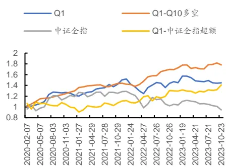
数据来源：Wind，广发证券发展研究中心

图2: 20日模型因子在全市场 IC
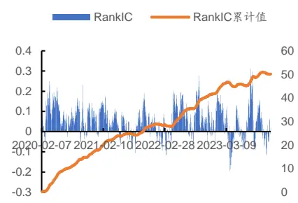
数据来源：Wind，广发证券发展研究中心
[Table_Author] 分析师： 安宁宁

同SAC 执证号：S0260512020003

0755-23948352

anningning@gf.com.cn

分析师： 陈原文

同SAC 执证号：S0260517080003

0755-82797057

chenyuanwen@gf.com.cn分析师： 张钰东

同SAC 执证号：S0260522070006

021-38003734

zhangyudong@gf.com.cn

请注意，陈原文 张钰东并非香港证券及期货事务监察委员会的注册持牌人，不可在香港从事受监管活动。

## 一、Visibility Graph-CNN 股价预测模型

## （一）可见性图（Visibility Graph）

可见性图（Visibility Graph）是一种图论模型，它将空间中的物体（例如：点、线段、多边形）映射为图中的结点和边。在其拓展到时间序列分析领域后，可见性图能够高效地将时序数据（如价量数据）转化为图结构，以提取时序数据中的有效信息。

在可见性图的构建算法中，采用了一种朴素的思想。如图1所示，图中包含20个数据的柱状图，从第1个柱状图起，将每个柱状图与其他所有柱状图在顶部相连，若该连接不穿过其他柱状图，则为“可见”，该节点以整形数字1来表示；若穿过其他柱状图，则为“不可见”，该节点以整形数字0来表示。举个例子，第1个柱状图与第2、3、4、5个柱状图是“可见的”，不穿插经过其他柱状图，以蓝色线表示；而第1个柱状图与第6个柱状图是“不可见的”，因为其穿插经过了第4和第5个柱状图，以红色线表示。

由于任意的时间序列数据都可以以此柱状图的形式来表达，因此可通过可见性图来对时序数据进行特征提取。此图结构在数据形式上体现为二维的整型矩阵，矩阵中的元素均为整数0或1，有效地降低了数据的冗余性，减少了后续深度学习模型在训练过程中的过拟合现象，提升了模型的泛化能力。

图 1：可见性图构建示意图
0.87,0.49,0.36,0.83,0.87,0.49,0.36,0.83,0.87,0.49,0.36,0.83,0.87,0.49,0.36,0.83,0.87,0.49,0.36,0.3.
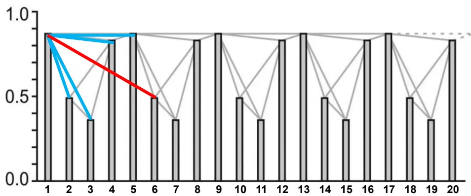

数据来源：《From Time Series to Complex Networks: The Visibility Graph》，由 Lacasa 等人发表于 Proceedings of the National Academy of Sciences；广发证券发展研究中心

此外，可见性图在水平和垂直方向上均具有仿射不变性的特征，如图2所示，图a为原时间序列对应的柱状图，图b发生了时间顺位移动，图c和图d发生了横纵坐标上的放缩，图e发生了其他仿射变换，但这些经过变换后的时序与原时序的可见性图是完全一致的。该特性使得可见性图能够有效提取价量数据中的形态特征，如相同的走势出现在不同的历史时期、不同的价格点上，可见性图可以识别出相似的形态

识别风险，发现价值

走势，从而提升特征提取和股价预测能力。

图 2：可见性图的仿射不变性
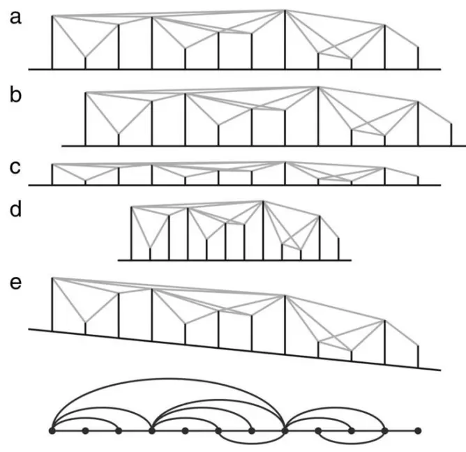
数据来源：《From Time Series to Complex Networks: The Visibility Graph》，由 Lacasa 等人发表于 Proceedings of the National Academy of Sciences；广发证券发展研究中心

## （二）可见性图与卷积神经网络

在前序工作《深度学习研究报告：基于卷积神经网络的股价走势AI识别与分类》中，我们对卷积神经网络进行了详细的介绍，提出了首先基于价量数据构建标准化的价量数据图表，而后采用卷积神经网络将价量数据图表与未来股价走势进行建模的股价预测模型。在该策略中，包含20日价量数据的图表矩阵维度为3*200*200，矩阵中的元素为常见图片的0～255整型数字，数据较为密集，在计算能力充分满足的情况下取得了可观的收益结果。

而在本工作中，我们另辟蹊径，提出了基于Visibility Graph-CNN创新架构的高效股价预测模型。首先，采用可见性图对价量数据进行初步的特征提取，对于20日（60日）价量数据得到维度为6*20*20（6*60*60）低维度特征矩阵，且矩阵的元素均为整数0或1。由于可见性图大大降低了数据的冗余性，且其本身具备高效的初步特征提取能力，因此本工作设计了一个参数量少、复杂度低的卷积神经网络将其与未来股价进行建模，该网络结构如图3所示。在对开盘价、最高价、最低价、收盘价、交易量、交易额6组价量数据提取可见性图后，将可见性图输入4层卷积神经网络中，并采用全连接层和SoftMax函数将其映射为3个概率，分别对应个股在未来截面日上收益率的百分位，即后1/3、中1/3、前1/3，以表示跌、平、涨，最终以股票上涨的概率作为因子进行选股。

图 3：Visibility Graph-CNN模型结构图
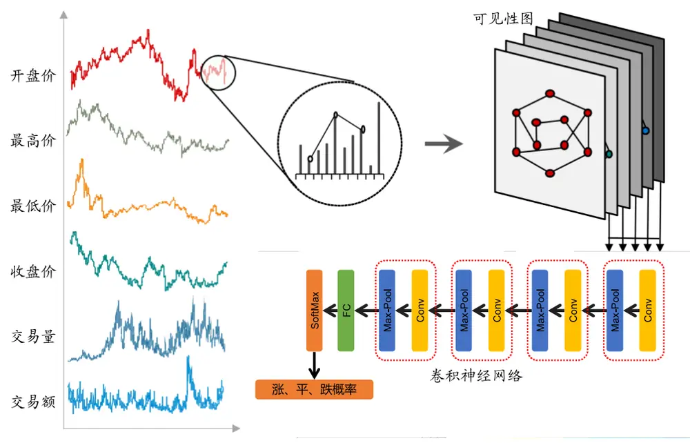
数据来源：《Price Graphs: Utilizing the Structural Information of Financial Time Series forStock Prediction》，由 Wu 等人发表于 Information Sciences；广发证券发展研究中心

在卷积神经网络模型的实现细节上，采用Xavier（Glorot and Bengio, 2010）的方式来对模型的参数进行初始化，使得模型的初始预测方差更接近数据标签，以加速模型在训练过程中的收敛速度；采用Adam（Kinga and Adam, 2015）优化器、1x10-5学习率、512批大小（Batch Size）对模型进行训练；采用训练数据外的验证集对训练中的模型进行验证，以确定最优早停（Early Stopping）时点。

本工作基于过去20日和60日的价量数据，分别训练了两个模型（在下文中分别称为20日模型及60日模型），以预测未来20个交易日的股票涨跌情况。

## 二、实证分析

## （一）数据说明

选股范围：全市场，沪深300，中证500，中证800，中证1000，创业板

股票预处理：剔除非上市、摘牌、ST/*ST、涨跌停板、上市未满60个交易日的股票

训练数据：全市场2005年1月～2016年12月

验证数据：全市场2017年2月～2019年11月（与训练数据间隔1个月防止数据暴露）

回测区间：2020年1月～2023年12月（与验证数据间隔1个月防止数据暴露）

分档方式：根据当期预测的个股价格未来上涨概率，从大到小分为10档

调仓周期：20个交易日，信号次日均价买入、20个交易日后均价卖出

数据来源：Wind，天软科技

## （二）因子分档表现

从下图可以看出，20日模型因子和60日模型因子在各大板块当中均取得了不错的分档效果，从Q1档多头到Q10档空头呈现出较为单调递减的收益，且Q1档多头相较于其他所有分档取得了较为突出的分档超额收益，因子具有不错的分层选股能力。

图 4：20日模型因子分档表现（全市场）
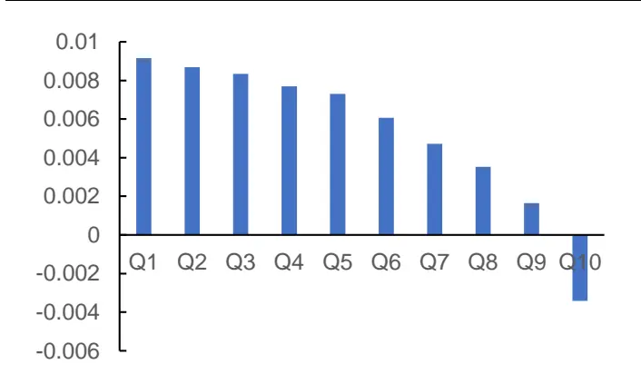
数据来源：Wind，广发证券发展研究中心

图 5：60日模型因子分档表现（全市场）
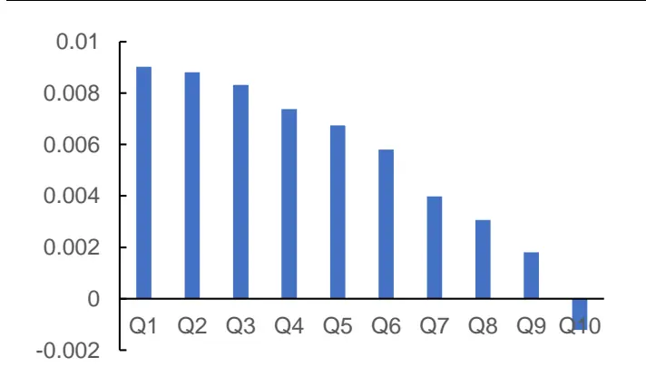
数据来源：Wind，广发证券发展研究中心

图 6：20日模型因子分档表现（沪深300）
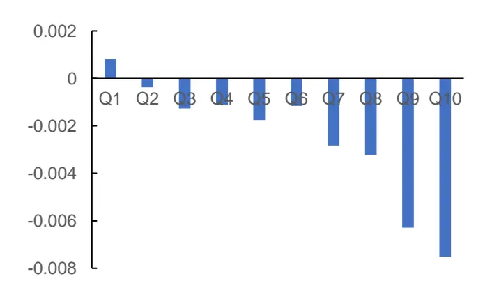
数据来源：Wind，广发证券发展研究中心

图 7：60日模型因子分档表现（沪深300）
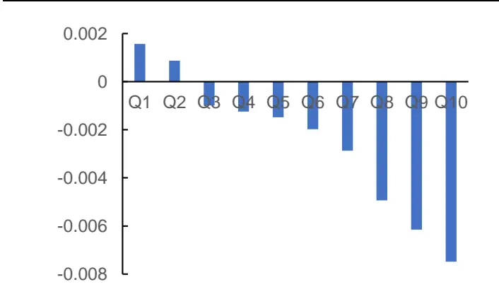
数据来源：Wind，广发证券发展研究中心

图 8：20日模型因子分档表现（中证500）
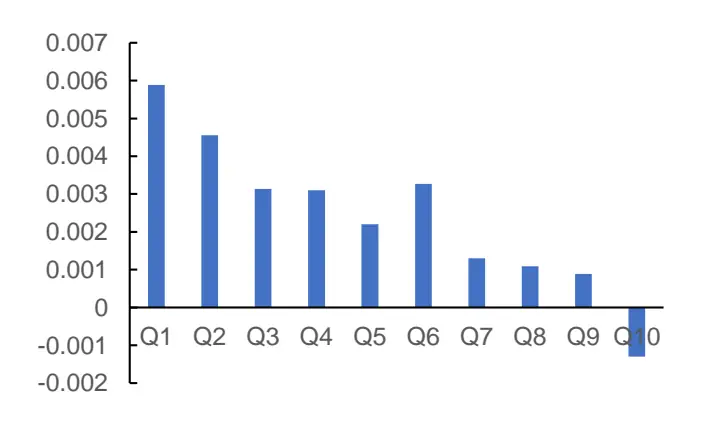
数据来源：Wind，广发证券发展研究中心

图 9：60日模型因子分档表现（中证500）
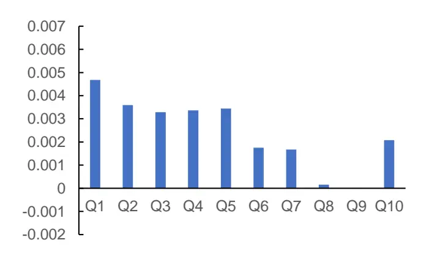
数据来源：Wind，广发证券发展研究中心

图 10：20日模型因子分档表现（中证800）
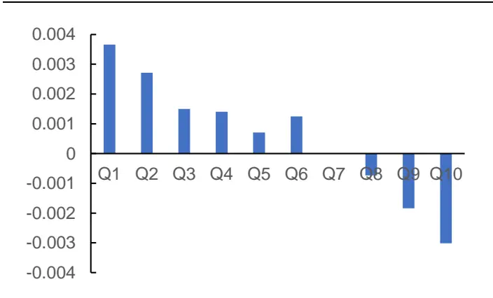
数据来源：Wind，广发证券发展研究中心

图 11：60日模型因子分档表现（中证800）
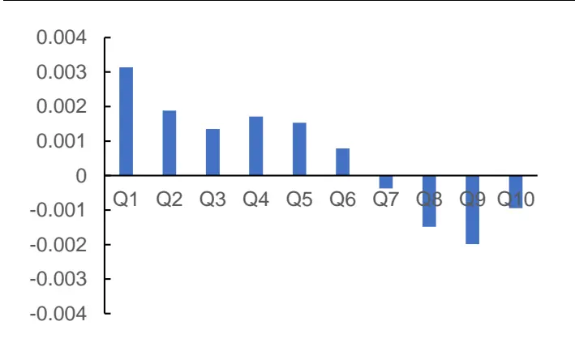
数据来源：Wind，广发证券发展研究中心

图 12：20日模型因子分档表现（中证1000）
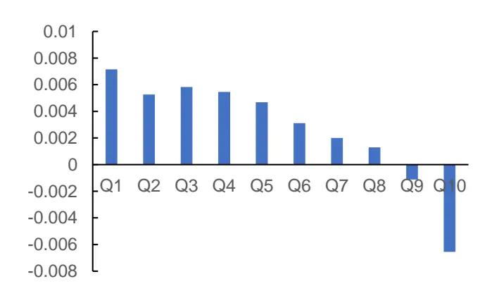
数据来源：Wind，广发证券发展研究中心

图 13：60日模型因子分档表现（中证1000）
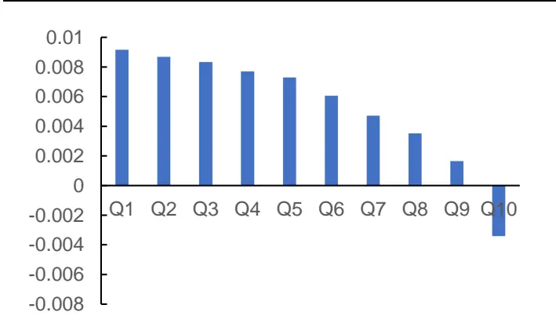
数据来源：Wind，广发证券发展研究中心

图 14：20日模型因子分档表现（创业板）
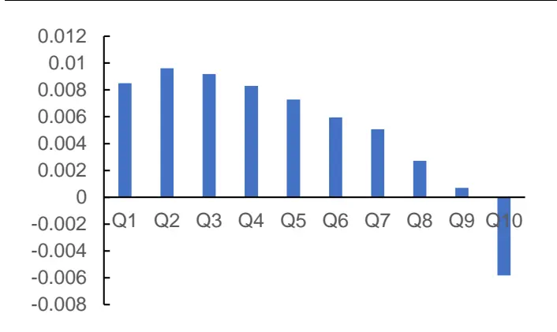
数据来源：Wind，广发证券发展研究中心

图 15：60日模型因子分档表现（创业板）
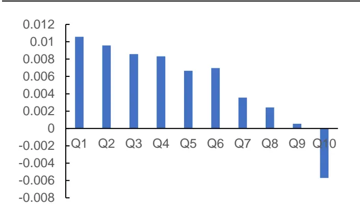
数据来源：Wind，广发证券发展研究中心

## （三）20日模型因子与常见风格因子的相关性

20日模型因子与常见风格因子的相关性如下表所示，除了与最高点距离因子的相关性为0.2387，与六个月股价反转、换手率、三个月股价反转、容量比、一个月股价反转等因子的相关性分别为-0.1190、-0.1549、-0.1867、-0.2238、-0.3007外，与其他风格因子的相关性绝对值均小于0.1，可见20日模型因子与常见风格因子的相关性较低，是一组较为新颖、拥挤度低的因子。

表 1：20日模型因子与常见风格因子的相关性

| 风格因子名称 | 相关性 | 风格因子名称 | 相关性 |
| --- | --- | --- | --- |
| 最高点距离 | 0.2387 | ROE增长率 | 0.0031 |
| 流通市值 | 0.0671 | PE | 0.0012 |
| 净利润过去三年 CAGR | 0.0532 | 5年累计现金流与归母利润之比 | 0.0009 |
| ROA | 0.0530 | 主营业务收入增长率 | 0.0003 |
| 总资产 | 0.0515 | EV-EBITDA | 0.0003 |
| EP | 0.0480 | SP（行业相对） | 0.0002 |
| DP | 0.0478 | EPS增长率 | -0.0008 |
| 毛利率 | 0.0371 | CFP（行业相对） | -0.0013 |
| EP（行业相对） | 0.0333 | EBITDA 同比增速的环比向上 | -0.0013 |
| 主营业务收入过去三年 CAGR | 0.0321 | 长期负债比率 | -0.0013 |
| ROIC | 0.0278 | 净利润增长率 | -0.0016 |
| BP | 0.0276 | 销售净利率 | -0.0020 |
| 每股负债比 | 0.0275 | 存货周转率 | -0.0025 |
| ROE | 0.0248 | 流通市值-总市值 | -0.0028 |
| BP（行业相对） | 0.0226 | 流通股本-总股本 | -0.0028 |
| 总资产增长率 | 0.0203 | 财务费用比例 | -0.0035 |
| 速动比率 | 0.0191 | 流动负债比 | -0.0117 |
| 流动比率 | 0.0178 | 过去五年 ROE 的波动率 | -0.0120 |
| 每股净资产增长率 | 0.0175 | 资产负债率 | -0.0273 |
| CFP | 0.0158 | 1个月成交金额 | -0.0311 |
| 过去三年的平均 ROE | 0.0127 | 近3个月平均成交量 | -0.0496 |
| 过去三年平均净资产收益率 | 0.0127 | 一年股价反转-动量 | -0.0634 |
| 股东权益增长率 | 0.0121 | 六个月股价反转 | -0.1190 |
| 总资产周转率 | 0.0088 | 换手率 | -0.1549 |
| SP | 0.0048 | 三个月股价反转 | -0.1867 |
| 固定比 | 0.0047 | 容量比 | -0.2238 |
| 营业费用比例 | 0.0045 | 一个月股价反转 | -0.3007 |
| 净利润现金占比 | 0.0039 |  |  |

数据来源：Wind，广发证券发展研究中心

## （四）60日模型因子与常见风格因子的相关性

60日模型因子与常见风格因子的相关性如下表所示，除了与最高点距离和流通市值因子的相关性分别为0.1929和0.1282，与六个月股价反转、容量比、换手率、三个月股价反转、一个月股价反转等因子的相关性分别为-0.1194、-0.1966、-0.2298、-0.2320、-0.2756外，与其他风格因子的相关性绝对值均小于0.1，可见60日模型因子与常见风格因子的相关性较低，是一组较为新颖、拥挤度低的因子。

表 2：60日模型因子与常见风格因子的相关性

| 风格因子名称 | 相关性 | 风格因子名称 | 相关性 |
| --- | --- | --- | --- |
| 最高点距离 | 0.1929 | EPS增长率 | 0.0039 |
| 流通市值 | 0.1282 | 净利润增长率 | 0.0038 |
| ROA | 0.0882 | SP | 0.0038 |
| 总资产 | 0.0857 | 长期负债比率 | 0.0032 |
| DP | 0.0834 | PE | 0.0013 |
| 净利润过去三年 CAGR | 0.0787 | BP（行业相对） | 0.0009 |
| EP | 0.0711 | EV-EBITDA | 0.0006 |
| 主营业务收入过去三年CAGR | 0.0547 | EBITDA 同比增速的环比向上 | -0.0002 |
| 毛利率 | 0.0544 | CFP（行业相对） | -0.0002 |
| 每股负债比 | 0.0491 | 5年累计现金流与归母利润之比 | -0.0004 |
| ROIC | 0.0467 | 销售净利率 | -0.0027 |
| EP（行业相对） | 0.0464 | SP（行业相对） | -0.0042 |
| ROE | 0.0384 | 存货周转率 | -0.0048 |
| 总资产增长率 | 0.0378 | 流通市值-总市值 | -0.0053 |
| 每股净资产增长率 | 0.0300 | 流通股本-总股本 | -0.0053 |
| 速动比率 | 0.0278 | 财务费用比例 | -0.0069 |
| CFP | 0.0274 | 过去五年 ROE 的波动率 | -0.0167 |
| 流动比率 | 0.0258 | 1个月成交金额 | -0.0186 |
| 股东权益增长率 | 0.0237 | 流动负债比 | -0.0192 |
| 总资产周转率 | 0.0196 | 资产负债率 | -0.0316 |
| 过去三年的平均 ROE | 0.0195 | 一年股价反转-动量 | -0.0373 |
| 过去三年平均净资产收益率 | 0.0195 | 近3个月平均成交量 | -0.0641 |
| BP | 0.0189 | 六个月股价反转 | -0.1194 |
| 固定比 | 0.0100 | 容量比 | -0.1966 |
| 营业费用比例 | 0.0092 | 换手率 | -0.2298 |
| 主营业务收入增长率 | 0.0083 | 三个月股价反转 | -0.2320 |
| 净利润现金占比 | 0.0057 | 一个月股价反转 | -0.2756 |
| ROE增长率 | 0.0043 |  |  |

数据来源：Wind，广发证券发展研究中心

## （五）20日模型因子具体表现（全市场）

20日模型因子在全市场股票池中的表现如下图表所示，在2020～2023年回测期间，Q1多头取得了10.35%的年化收益率，相对于同期中证全指的超额年化收益率为9.57%，Q1-Q10多空年化收益率为16.67%。

表 3：20日模型因子分年度表现统计（全市场）

| 年份 |  | 年化收益率 | 最大回撤率 | 年化波动率 | 信息比率 | 夏普比率 | 收益回撤比 |
| --- | --- | --- | --- | --- | --- | --- | --- |
| Q1多头 | 2020~2023年 | 10.35% | 17.85% | 13.14% | 0.79 | 0.6 | 0.58 |
|  | 2020年 | 23.76% | 4.80% | 13.34% | 1.78 | 1.59 | 4.95 |
|  | 2021年 | 27.51% | 2.91% | 8.50% | 3.23 | 2.94 | 9.45 |
|  | 2022年 | -5.00% | 12.24% | 17.23% | -0.29 | -0.44 | -0.41 |
|  | 2023年 | -0.23% | 8.43% | 11.68% | -0.02 | -0.23 | -0.03 |
| Q1-Q10 多空 | 2020~2023年 | 16.67% | 4.26% | 7.10% | 2.35 | 1.99 | 3.92 |
|  | 2020年 | 33.04% | 0.00% | 4.73% | 6.99 | 6.46 | - |
|  | 2021年 | 10.35% | 2.39% | 6.16% | 1.68 | 1.27 | 4.33 |
|  | 2022年 | 23.72% | 2.32% | 8.09% | 2.93 | 2.62 | 10.22 |
|  | 2023年 | 4.21% | 4.26% | 8.13% | 0.52 | 0.21 | 0.99 |
| 中证全指 | 2020~2023年 | -1.46% | 26.62% | 18.96% | -0.08 | -0.21 | -0.05 |
|  | 2020年 | 21.24% | 10.90% | 23.77% | 0.89 | 0.79 | 1.95 |
|  | 2021年 | 8.88% | 6.41% | 13.85% | 0.64 | 0.46 | 1.39 |
|  | 2022年 | -21.31% | 21.04% | 22.58% | -0.94 | -1.05 | -1.01 |
|  | 2023年 | -11.29% | 15.80% | 11.99% | -0.94 | -1.15 | -0.71 |
| Q1-中证全指超额 | 2020~2023年 | 9.57% | 16.77% | 15.87% | 0.6 | 0.45 | 0.57 |
|  | 2020年 | -1.93% | 9.84% | 20.68% | -0.09 | -0.21 | -0.2 |
|  | 2021年 | 15.18% | 4.44% | 15.41% | 0.98 | 0.82 | 3.42 |
|  | 2022年 | 17.44% | 7.87% | 16.67% | 1.05 | 0.9 | 2.22 |
|  | 2023年 | 11.80% | 4.49% | 9.46% | 1.25 | 0.98 | 2.63 |

数据来源：Wind，广发证券发展研究中心

图 16：20日模型因子累计收益（全市场）
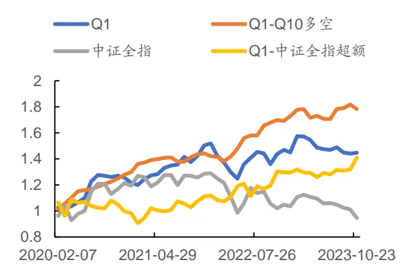
数据来源：Wind，广发证券发展研究中心

图 17：20日模型因子RankIC（全市场）
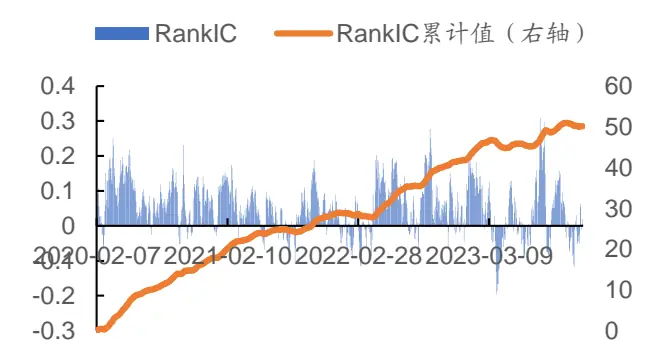
数据来源：Wind，广发证券发展研究中心

## （六）20日模型因子具体表现（中证 500）

20日模型因子在中证500股票池中的表现如下图表所示，在2020～2023年回测期间，Q1多头取得了6.41%的年化收益率，相对于同期中证500指数的超额年化收益率为4.33%，Q1-Q10多空年化收益率为8.92%。

表 4：20日模型因子分年度表现统计（中证500）

| 年份 |  | 年化收益率 | 最大回撤率 | 年化波动率 | 信息比率 | 夏普比率 | 收益回撤比 |
| --- | --- | --- | --- | --- | --- | --- | --- |
| Q1 多头 | 2020~2023年 | 6.41% | 18.17% | 12.78% | 0.5 | 0.31 | 0.35 |
|  | 2020年 | 35.74% | 2.87% | 13.58% | 2.63 | 2.45 | 12.46 |
|  | 2021年 | 18.17% | 1.41% | 6.51% | 2.79 | 2.41 | 12.84 |
|  | 2022年 | -9.51% | 10.97% | 15.96% | -0.6 | -0.75 | -0.87 |
|  | 2023年 | -13.48% | 14.97% | 10.24% | -1.32 | -1.56 | -0.9 |
| Q1-Q10 多空 | 2020~2023年 | 8.92% | 9.03% | 8.88% | 1 | 0.72 | 0.99 |
|  | 2020年 | 34.33% | 0.00% | 6.26% | 5.48 | 5.08 | - |
|  | 2021年 | -0.04% | 8.82% | 8.40% | -0.01 | -0.3 | - |
|  | 2022年 | 16.26% | 1.89% | 8.90% | 1.83 | 1.55 | 8.59 |
|  | 2023年 | -11.05% | 8.12% | 8.93% | -1.24 | -1.52 | -1.36 |
| 中证500 | 2020~2023年 | -0.38% | 28.32% | 19.33% | -0.02 | -0.15 | -0.01 |
|  | 2020年 | 17.06% | 11.40% | 23.75% | 0.72 | 0.61 | 1.5 |
|  | 2021年 | 19.13% | 4.85% | 13.64% | 1.4 | 1.22 | 3.94 |
|  | 2022年 | -21.27% | 22.10% | 23.65% | -0.9 | -1.01 | -0.96 |
|  | 2023年 | -12.46% | 16.82% | 12.32% | -1.01 | -1.21 | -0.74 |
| Q1-中证 500 超额 | 2020~2023年 | 4.33% | 11.34% | 16.13% | 0.27 | 0.11 | 0.38 |
|  | 2020年 | 11.29% | 11.07% | 22.01% | 0.51 | 0.4 | 1.02 |
|  | 2021年 | -2.51% | 11.11% | 14.29% | -0.18 | -0.35 | -0.23 |
|  | 2022年 | 11.22% | 8.93% | 17.40% | 0.64 | 0.5 | 1.26 |
|  | 2023年 | -1.73% | 6.27% | 8.44% | -0.21 | -0.5 | -0.28 |

数据来源：Wind，广发证券发展研究中心

图 18：20日模型因子累计收益（中证500）
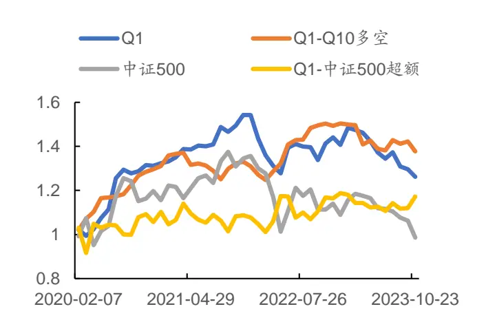
数据来源：Wind，广发证券发展研究中心

图 19：20日模型因子RankIC（中证500）
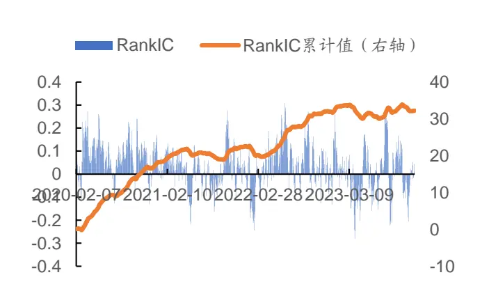
数据来源：Wind，广发证券发展研究中心

## （七）20日模型因子具体表现（中证 1000）

20日模型因子在中证1000股票池中的表现如下图表所示，在2020～2023年回测期间，Q1多头取得了7.56%的年化收益率，相对于同期中证1000指数的超额年化收益率为4.06%，Q1-Q10多空年化收益率为18.10%。

表 5：20日模型因子分年度表现统计（中证1000）

| 年份 |  | 年化收益率 | 最大回撤率 | 年化波动率 | 信息比率 | 夏普比率 | 收益回撤比 |
| --- | --- | --- | --- | --- | --- | --- | --- |
| Q1多头 | 2020~2023年 | 7.56% | 20.38% | 14.76% | 0.51 | 0.34 | 0.37 |
|  | 2020年 | 27.27% | 6.32% | 14.99% | 1.82 | 1.65 | 4.31 |
|  | 2021年 | 24.34% | 3.05% | 9.44% | 2.58 | 2.31 | 7.99 |
|  | 2022年 | -8.19% | 14.25% | 19.53% | -0.42 | -0.55 | -0.57 |
|  | 2023年 | -8.82% | 13.70% | 12.32% | -0.72 | -0.92 | -0.64 |
| Q1-Q10 多空 | 2020~2023年 | 18.10% | 6.21% | 7.75% | 2.34 | 2.01 | 2.91 |
|  | 2020年 | 38.11% | 0.00% | 5.40% | 7.06 | 6.59 | - |
|  | 2021年 | 10.35% | 2.16% | 6.33% | 1.64 | 1.24 | 4.79 |
|  | 2022年 | 27.83% | 2.31% | 7.70% | 3.62 | 3.29 | 12.04 |
|  | 2023年 | 1.69% | 6.21% | 9.60% | 0.18 | -0.08 | 0.27 |
| 中证1000 | 2020~2023年 | -0.18% | 30.22% | 23.61% | -0.01 | -0.11 | -0.01 |
|  | 2020年 | 15.48% | 12.54% | 27.30% | 0.57 | 0.48 | 1.23 |
|  | 2021年 | 22.07% | 4.95% | 17.18% | 1.28 | 1.14 | 4.46 |
|  | 2022年 | -20.67% | 25.38% | 31.46% | -0.66 | -0.74 | -0.81 |
|  | 2023年 | -13.56% | 19.07% | 13.82% | -0.98 | -1.16 | -0.71 |
| Q1-中证 1000 超额 | 2020~2023年 | 4.06% | 14.59% | 18.91% | 0.21 | 0.08 | 0.28 |
|  | 2020年 | 4.01% | 14.59% | 25.62% | 0.16 | 0.06 | 0.27 |
|  | 2021年 | -0.24% | 11.88% | 15.06% | -0.02 | -0.18 | -0.02 |
|  | 2022年 | 9.35% | 13.28% | 21.74% | 0.43 | 0.32 | 0.7 |
|  | 2023年 | 4.55% | 8.23% | 11.18% | 0.41 | 0.18 | 0.55 |

数据来源：Wind，广发证券发展研究中心

图 20：20日模型因子累计收益（中证1000）
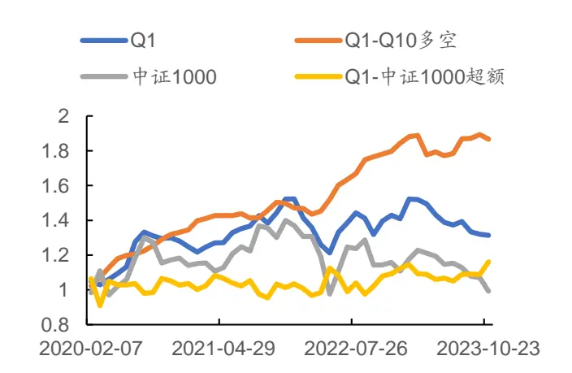
数据来源：Wind，广发证券发展研究中心

图 21：20日模型因子RankIC（中证1000）
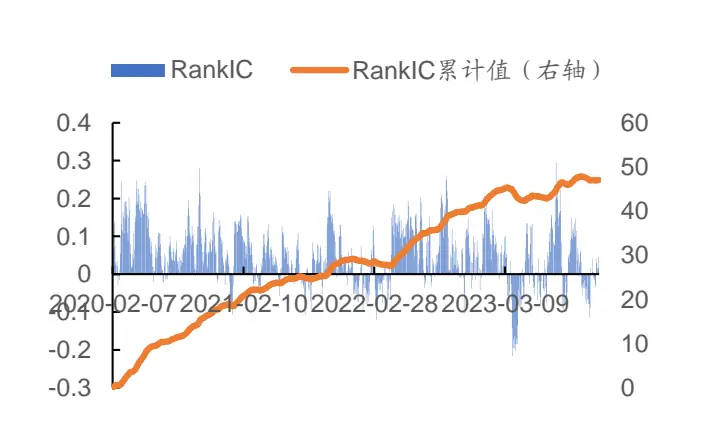
数据来源：Wind，广发证券发展研究中心

## （八）20日模型因子具体表现（创业板）

20日模型因子在创业板股票池中的表现如下图表所示，在2020～2023年回测期间，Q1多头取得了8.79%的年化收益率，Q1-Q10多空年化收益率为18.56%；在2023年期间，Q1多头相对于同期创业板指取得了37.74%的超额年化收益率。

表 6：20日模型因子分年度表现统计（创业板）

| 年份 |  | 年化收益率 | 最大回撤率 | 年化波动率 | 信息比率 | 夏普比率 | 收益回撤比 |
| --- | --- | --- | --- | --- | --- | --- | --- |
| Q1多头 | 2020~2023年 | 8.79% | 24.48% | 15.71% | 0.56 | 0.4 | 0.36 |
|  | 2020年 | 25.50% | 10.69% | 16.72% | 1.53 | 1.38 | 2.38 |
|  | 2021年 | 28.82% | 4.10% | 11.71% | 2.46 | 2.25 | 7.03 |
|  | 2022年 | -16.85% | 17.26% | 19.16% | -0.88 | -1.01 | -0.98 |
|  | 2023年 | 6.16% | 6.53% | 12.86% | 0.48 | 0.28 | 0.94 |
| Q1-Q10 多空 | 2020~2023年 | 18.56% | 6.28% | 9.98% | 1.86 | 1.61 | 2.95 |
|  | 2020年 | 28.72% | 5.80% | 11.14% | 2.58 | 2.35 | 4.95 |
|  | 2021年 | 18.79% | 3.32% | 8.43% | 2.23 | 1.93 | 5.67 |
|  | 2022年 | 28.06% | 4.11% | 11.28% | 2.49 | 2.27 | 6.83 |
|  | 2023年 | 3.03% | 6.28% | 8.73% | 0.35 | 0.06 | 0.48 |
| 创业板指 | 2020~2023年 | 0.47% | 46.37% | 29.29% | 0.02 | -0.07 | 0.01 |
|  | 2020年 | 59.58% | 13.05% | 31.98% | 1.86 | 1.78 | 4.56 |
|  | 2021年 | 18.91% | 15.93% | 27.64% | 0.68 | 0.59 | 1.19 |
|  | 2022年 | -32.37% | 25.76% | 33.14% | -0.98 | -1.05 | -1.26 |
|  | 2023年 | -24.55% | 27.48% | 17.78% | -1.38 | -1.52 | -0.89 |
| Q1-创业板指超额 | 2020~2023年 | 1.53% | 41.30% | 26.02% | 0.06 | -0.04 | 0.04 |
|  | 2020年 | -28.31% | 26.30% | 30.17% | -0.94 | -1.02 | -1.08 |
|  | 2021年 | 0.28% | 12.63% | 30.13% | 0.01 | -0.07 | 0.02 |
|  | 2022年 | 13.88% | 17.86% | 26.17% | 0.53 | 0.43 | 0.78 |
|  | 2023年 | 37.74% | 3.34% | 12.29% | 3.07 | 2.87 | 11.3 |

数据来源：Wind，广发证券发展研究中心

图 22：20日模型因子累计收益（创业板）
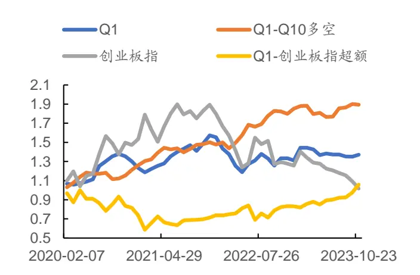
数据来源：Wind，广发证券发展研究中心

图 23：20日模型因子RankIC（创业板）
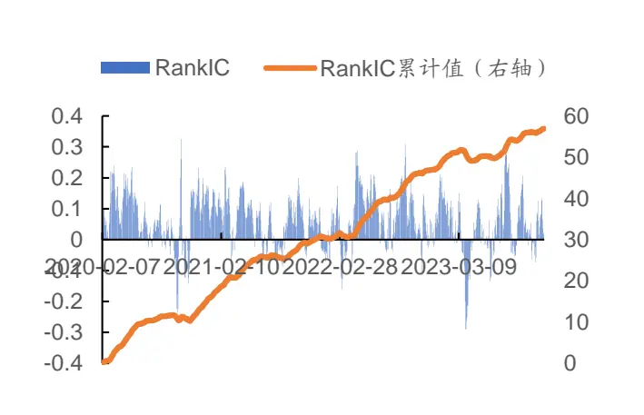
数据来源：Wind，广发证券发展研究中心

## （九）60日模型因子具体表现（全市场）

60日模型因子在全市场股票池中的表现如下图表所示，在2020～2023年回测期间，Q1多头取得了10.24%的年化收益率，相对于同期中证全指的超额年化收益率为9.61%，Q1-Q10多空年化收益率为13.36%。

表 7：60日模型因子分年度表现统计（全市场）

| 年份 |  | 年化收益率 | 最大回撤率 | 年化波动率 | 信息比率 | 夏普比率 | 收益回撤比 |
| --- | --- | --- | --- | --- | --- | --- | --- |
| Q1多头 | 2020~2023年 | 10.24% | 19.51% | 13.30% | 0.77 | 0.58 | 0.52 |
|  | 2020年 | 21.47% | 5.48% | 13.29% | 1.62 | 1.43 | 3.92 |
|  | 2021年 | 29.11% | 1.37% | 6.90% | 4.22 | 3.85 | 21.3 |
|  | 2022年 | -6.46% | 14.60% | 18.05% | -0.36 | -0.5 | -0.44 |
|  | 2023年 | 1.90% | 8.87% | 12.37% | 0.15 | -0.05 | 0.21 |
| Q1-Q10 多空 | 2020~2023年 | 13.36% | 6.38% | 8.99% | 1.49 | 1.21 | 2.1 |
|  | 2020年 | 22.11% | 1.20% | 6.49% | 3.4 | 3.02 | 18.46 |
|  | 2021年 | 12.12% | 6.28% | 9.61% | 1.26 | 1 | 1.93 |
|  | 2022年 | 18.64% | 4.26% | 10.39% | 1.79 | 1.55 | 4.37 |
|  | 2023年 | 3.48% | 6.38% | 9.70% | 0.36 | 0.1 | 0.55 |
| 中证全指 | 2020~2023年 | -1.46% | 26.62% | 18.96% | -0.08 | -0.21 | -0.05 |
|  | 2020年 | 21.24% | 10.90% | 23.77% | 0.89 | 0.79 | 1.95 |
|  | 2021年 | 8.88% | 6.41% | 13.85% | 0.64 | 0.46 | 1.39 |
|  | 2022年 | -21.31% | 21.04% | 22.58% | -0.94 | -1.05 | -1.01 |
|  | 2023年 | -11.29% | 15.80% | 11.99% | -0.94 | -1.15 | -0.71 |
| Q1-中证全指超额 | 2020~2023年 | 9.61% | 15.56% | 15.08% | 0.64 | 0.47 | 0.62 |
|  | 2020年 | -3.77% | 10.07% | 20.56% | -0.18 | -0.31 | -0.37 |
|  | 2021年 | 16.69% | 3.35% | 14.36% | 1.16 | 0.99 | 4.98 |
|  | 2022年 | 16.20% | 6.18% | 14.64% | 1.11 | 0.94 | 2.62 |
|  | 2023年 | 14.29% | 3.04% | 9.23% | 1.55 | 1.28 | 4.7 |

数据来源：Wind，广发证券发展研究中心

图 24：60日模型因子累计收益（全市场）
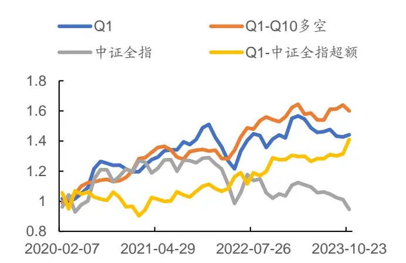
数据来源：Wind，广发证券发展研究中心

图 25：60日模型因子RankIC（全市场）
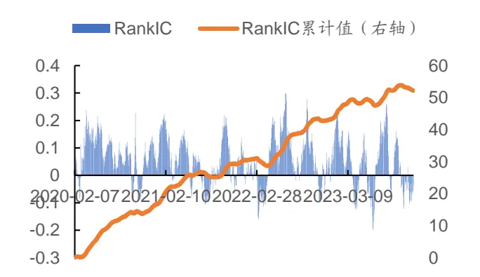
数据来源：Wind，广发证券发展研究中心

## （十）60日模型因子具体表现（中证 500）

60日模型因子在中证500股票池中的表现如下图表所示，在2020～2023年回测期间，Q1多头取得了4.83%的年化收益率，相对于同期中证500指数的超额年化收益率为3.00%。

表 8：60日模型因子分年度表现统计（中证500）

| 年份 |  | 年化收益率 | 最大回撤率 | 年化波动率 | 信息比率 | 夏普比率 | 收益回撤比 |
| --- | --- | --- | --- | --- | --- | --- | --- |
| Q1 多头 | 2020~2023年 | 4.83% | 18.03% | 12.56% | 0.38 | 0.19 | 0.27 |
|  | 2020年 | 27.25% | 3.59% | 14.03% | 1.94 | 1.76 | 7.58 |
|  | 2021年 | 12.19% | 3.51% | 7.00% | 1.74 | 1.38 | 3.48 |
|  | 2022年 | -8.49% | 14.59% | 15.63% | -0.54 | -0.7 | -0.58 |
|  | 2023年 | -8.68% | 12.96% | 10.87% | -0.8 | -1.03 | -0.67 |
| Q1-Q10 多空 | 2020~2023年 | 2.87% | 19.86% | 10.28% | 0.28 | 0.04 | 0.14 |
|  | 2020年 | 14.03% | 2.82% | 6.82% | 2.06 | 1.69 | 4.97 |
|  | 2021年 | -11.13% | 16.44% | 11.83% | -0.94 | -1.15 | -0.68 |
|  | 2022年 | 17.07% | 6.79% | 10.40% | 1.64 | 1.4 | 2.52 |
|  | 2023年 | -6.55% | 11.02% | 10.78% | -0.61 | -0.84 | -0.59 |
| 中证500 | 2020~2023年 | -0.38% | 28.32% | 19.33% | -0.02 | -0.15 | -0.01 |
|  | 2020年 | 17.06% | 11.40% | 23.75% | 0.72 | 0.61 | 1.5 |
|  | 2021年 | 19.13% | 4.85% | 13.64% | 1.4 | 1.22 | 3.94 |
|  | 2022年 | -21.27% | 22.10% | 23.65% | -0.9 | -1.01 | -0.96 |
|  | 2023年 | -12.46% | 16.82% | 12.32% | -1.01 | -1.21 | -0.74 |
| Q1-中证 500 超额 | 2020~2023年 | 3.00% | 13.57% | 14.55% | 0.21 | 0.03 | 0.22 |
|  | 2020年 | 4.36% | 10.12% | 21.70% | 0.2 | 0.09 | 0.43 |
|  | 2021年 | -7.15% | 13.57% | 11.51% | -0.62 | -0.84 | -0.53 |
|  | 2022年 | 13.05% | 5.89% | 13.61% | 0.96 | 0.77 | 2.22 |
|  | 2023年 | 3.71% | 6.25% | 8.68% | 0.43 | 0.14 | 0.59 |

数据来源：Wind，广发证券发展研究中心

图 26：60日模型因子累计收益（中证500）
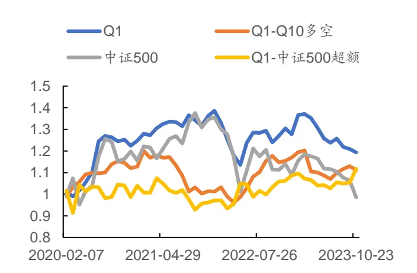
数据来源：Wind，广发证券发展研究中心

图 27：60日模型因子RankIC（中证500）
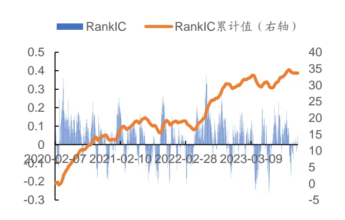
数据来源：Wind，广发证券发展研究中心

## （十一）60日模型因子具体表现（中证 1000）

60日模型因子在中证1000股票池中的表现如下图表所示，在2020～2023年回测期间，Q1多头取得了6.08%的年化收益率，相对于同期中证1000指数的超额年化收益率为2.65%，Q1-Q10多空年化收益率为13.79%。

表 9：60日模型因子分年度表现统计（中证1000）

| 年份 |  | 年化收益率 | 最大回撤率 | 年化波动率 | 信息比率 | 夏普比率 | 收益回撤比 |
| --- | --- | --- | --- | --- | --- | --- | --- |
| Q1多头 | 2020~2023年 | 6.08% | 22.28% | 14.45% | 0.42 | 0.25 | 0.27 |
|  | 2020年 | 23.37% | 7.70% | 14.27% | 1.64 | 1.46 | 3.03 |
|  | 2021年 | 24.34% | 1.17% | 7.03% | 3.46 | 3.11 | 20.86 |
|  | 2022年 | -11.02% | 16.94% | 19.34% | -0.57 | -0.7 | -0.65 |
|  | 2023年 | -8.17% | 15.11% | 13.89% | -0.59 | -0.77 | -0.54 |
| Q1-Q10 多空 | 2020~2023年 | 13.79% | 8.94% | 9.36% | 1.47 | 1.21 | 1.54 |
|  | 2020年 | 29.18% | 1.26% | 7.03% | 4.15 | 3.79 | 23.2 |
|  | 2021年 | 8.03% | 5.82% | 9.08% | 0.88 | 0.61 | 1.38 |
|  | 2022年 | 21.51% | 4.07% | 10.31% | 2.09 | 1.84 | 5.29 |
|  | 2023年 | 0.06% | 8.94% | 10.63% | 0.01 | -0.23 | 0.01 |
| 中证1000 | 2020~2023年 | -0.18% | 30.22% | 23.61% | -0.01 | -0.11 | -0.01 |
|  | 2020年 | 15.48% | 12.54% | 27.30% | 0.57 | 0.48 | 1.23 |
|  | 2021年 | 22.07% | 4.95% | 17.18% | 1.28 | 1.14 | 4.46 |
|  | 2022年 | -20.67% | 25.38% | 31.46% | -0.66 | -0.74 | -0.81 |
|  | 2023年 | -13.56% | 19.07% | 13.82% | -0.98 | -1.16 | -0.71 |
| Q1-中证 1000 超额 | 2020~2023年 | 2.65% | 14.85% | 18.54% | 0.14 | 0.01 | 0.18 |
|  | 2020年 | 0.72% | 14.85% | 25.43% | 0.03 | -0.07 | 0.05 |
|  | 2021年 | -0.57% | 13.46% | 15.88% | -0.04 | -0.19 | -0.04 |
|  | 2022年 | 6.38% | 11.97% | 20.00% | 0.32 | 0.19 | 0.53 |
|  | 2023年 | 5.47% | 8.61% | 11.35% | 0.48 | 0.26 | 0.64 |

数据来源：Wind，广发证券发展研究中心

图 28：60日模型因子累计收益（中证1000）
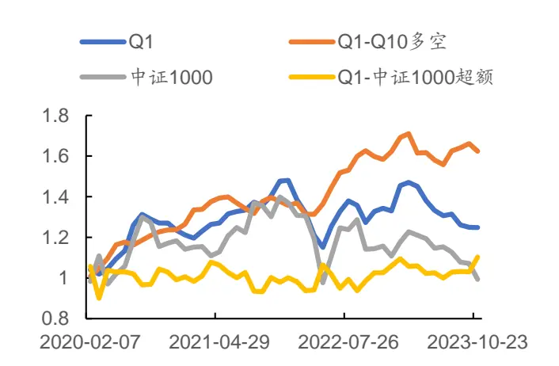
数据来源：Wind，广发证券发展研究中心

图 29：60日模型因子RankIC（中证1000）
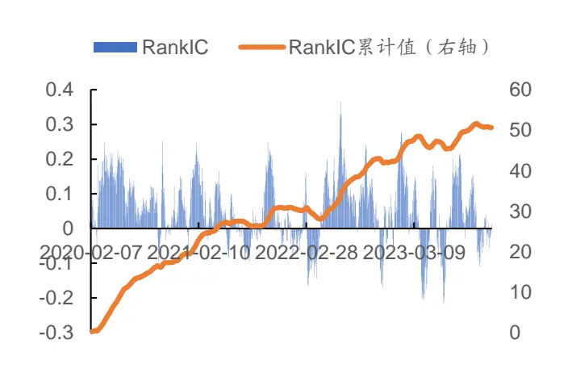
数据来源：Wind，广发证券发展研究中心

## （十二）60日模型因子具体表现（创业板）

60日模型因子在创业板股票池中的表现如下图表所示，在2020～2023年回测期间，Q1多头取得了11.79%的年化收益率，Q1-Q10多空年化收益率为20.85%；在2023年期间，Q1多头相对于同期创业板指取得了40.83%的超额年化收益率。

表 10：60日模型因子分年度表现统计（创业板）

| 年份 |  | 年化收益率 | 最大回撤率 | 年化波动率 | 信息比率 | 夏普比率 | 收益回撤比 |
| --- | --- | --- | --- | --- | --- | --- | --- |
| Q1多头 | 2020~2023年 | 11.79% | 26.24% | 15.75% | 0.75 | 0.59 | 0.45 |
|  | 2020年 | 33.65% | 3.23% | 14.15% | 2.38 | 2.2 | 10.4 |
|  | 2021年 | 33.19% | 1.95% | 8.95% | 3.71 | 3.43 | 17 |
|  | 2022年 | -17.03% | 18.93% | 21.05% | -0.81 | -0.93 | -0.9 |
|  | 2023年 | 8.43% | 8.73% | 14.91% | 0.57 | 0.4 | 0.97 |
| Q1-Q10 多空 | 2020~2023年 | 20.85% | 15.15% | 15.08% | 1.38 | 1.22 | 1.38 |
|  | 2020年 | 19.55% | 15.15% | 19.63% | 1 | 0.87 | 1.29 |
|  | 2021年 | 29.63% | 7.42% | 12.86% | 2.3 | 2.11 | 3.99 |
|  | 2022年 | 35.94% | 5.31% | 14.20% | 2.53 | 2.36 | 6.77 |
|  | 2023年 | 3.68% | 10.16% | 13.44% | 0.27 | 0.09 | 0.36 |
| 创业板指 | 2020~2023年 | 0.47% | 46.37% | 29.29% | 0.02 | -0.07 | 0.01 |
|  | 2020年 | 59.58% | 13.05% | 31.98% | 1.86 | 1.78 | 4.56 |
|  | 2021年 | 18.91% | 15.93% | 27.64% | 0.68 | 0.59 | 1.19 |
|  | 2022年 | -32.37% | 25.76% | 33.14% | -0.98 | -1.05 | -1.26 |
|  | 2023年 | -24.55% | 27.48% | 17.78% | -1.38 | -1.52 | -0.89 |
| Q1-创业板指超额 | 2020~2023年 | 4.79% | 36.71% | 24.52% | 0.2 | 0.09 | 0.13 |
|  | 2020年 | -23.23% | 22.37% | 27.78% | -0.84 | -0.93 | -1.04 |
|  | 2021年 | 3.93% | 13.37% | 28.86% | 0.14 | 0.05 | 0.29 |
|  | 2022年 | 14.71% | 15.74% | 24.24% | 0.61 | 0.5 | 0.93 |
|  | 2023年 | 40.83% | 4.04% | 13.32% | 3.07 | 2.88 | 10.11 |

数据来源：Wind，广发证券发展研究中心

图 30：60日模型因子累计收益（创业板）
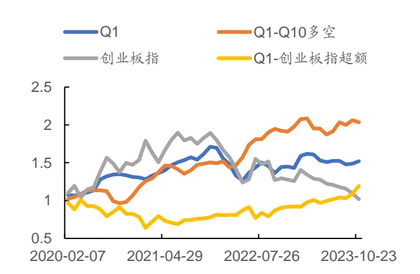
数据来源：Wind，广发证券发展研究中心

图 31：60日模型因子RankIC（创业板）
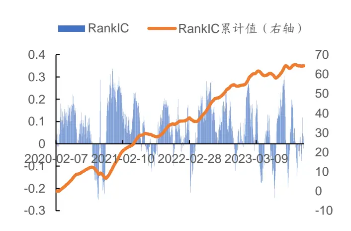
数据来源：Wind，广发证券发展研究中心

## 三、总结

本工作融合可见性图（Visibility Graph）和卷积神经网络（CNN），提出了基于Visibility Graph-CNN创新架构的高效股价预测模型。首先，使用可见性图算法模型对个股的历史价量数据进行初步的特征提取，而后将提取得到的可见性图送入特别设计的卷积神经网络中，以进一步提取价量特征，并与个股的未来走势进行建模，以实现对未来股价的预测。由于可见性图是低维度的整型矩阵，因此本工作设计了一个参数量少、复杂度低的卷积神经网络将其与未来股价进行建模，进一步减少了模型的过拟合情况，提升了模型在样本外数据的预测能力。

本工作采用过往20日和60日价量数据分别构建了两个Visibility Graph-CNN模型，以实现对未来20个交易日截面上的个股进行股价预测，并根据预测的股价上涨概率将个股分为10档，以此构建多、空组合。回测结果表明，两个模型的因子在各大板块当中均取得了较为单调的分档收益，表明了因子具有不错的分层选股能力。

在2020～2023年样本外回测期间，20日模型因子在全市场的平均RankIC为5.39%，多头年化收益率为10.35%，相比同期中证全指的超额年化收益率为9.57%；而60日模型因子在全市场的平均RankIC为5.61%，多头年化收益率为10.24%，相比同期中证全指的超额年化收益率为9.61%；整体而言，20日模型和60日模型的表现差异不大。在细分板块上，20日模型因子在中证500、中证1000、创业板上分别取得了6.41%、7.56%、8.79%的多头年化收益率；而60日模型因子在中证500、中证1000、创业板上分别取得了4.83%、6.08%、11.79%的多头年化收益率。

## 四、风险提示

本专题报告所述模型用量化方法通过历史数据统计、建模和测算完成，所得结论与规律在市场政策、环境变化时可能存在失效风险；

本专题策略模型在市场结构及交易行为的改变时有可能存在策略失效风险；

因量化模型不同，本报告提出的观点可能与其他量化模型结论存在差异。

客服邮箱 gfzqyf@gf.com.cn

## [Table_ResearchTeam] 广发金融工程研究小组

罗军 ：首席分析师，华南理工大学硕士，从业 16 年，2010 年进入广发证券发展研究中心。

安 宁 宁 ：首席分析师，暨南大学硕士，从业 14 年，2011 年进入广发证券发展研究中心。

史 庆 盛 ：资深分析师，华南理工大学硕士，2011 年进入广发证券发展研究中心。

张 超 ：资深分析师，中山大学硕士，2012 年进入广发证券发展研究中心。

陈 原 文 ：资深分析师，中山大学硕士，2015 年进入广发证券发展研究中心。

李豪 ：资深分析师，上海交通大学硕士，2016 年进入广发证券发展研究中心。

周 飞 鹏 ：资深分析师，伯明翰大学硕士，2021 年加入广发证券发展研究中心。

张 钰 东 ：资深分析师，中山大学硕士，2020 年进入广发证券发展研究中心。

季 燕 妮 ：资深分析师，厦门大学硕士，2020 年进入广发证券发展研究中心。

## [Table_IndustryInvestDescription] 广发证券—行业投资评级说明

买入： 预期未来12个月内，股价表现强于大盘10%以上。

持有： 预期未来12个月内，股价相对大盘的变动幅度介于-10%～+10%。

卖出： 预期未来 12 个月内，股价表现弱于大盘 10%以上。

## [Table_CompanyInvestDescription] 广发证券—公司投资评级说明

买入： 预期未来12个月内，股价表现强于大盘15%以上。

增持： 预期未来12个月内，股价表现强于大盘5%-15%。

持有： 预期未来12个月内，股价相对大盘的变动幅度介于-5%～+5%。

卖出： 预期未来 12 个月内，股价表现弱于大盘 5%以上。

## [Table_Address] 联系我们

| 地址 | 广州市 | 深圳市 | 北京市 | 上海市 | 香港 |
| --- | --- | --- | --- | --- | --- |
|  | 广州市天河区马场路 | 深圳市福田区益田路 | 北京市西城区月坛北 | 上海市浦东新区南泉 | 香港德辅道中189号 |
|  | 26号广发证券大厦 | 6001号太平金融大 | 街2号月坛大厦18 | 北路 429 号泰康保险 | 李宝椿大厦29及30 |
|  | 47楼 | 厦31层 | 层 | 大厦37楼 | 楼 |
|  | 510627 | 518026 | 100045 | 200120 |  |

[Table_LegalD 本报告由广发证券股份有限公司或其关联机构制作，广发证券股份有限公司及其关联机构以下统称isclaimer]为“广发证券”。本报告的分销依据不同国家、地区的法律、法规和监管要求由广发证券于该国家或地区的具有相关合法合规经营资质的子公司/经营机构完成。

广发证券股份有限公司具备中国证监会批复的证券投资咨询业务资格，接受中国证监会监管，负责本报告于中国（港澳台地区除外）的分销。

广发证券（香港）经纪有限公司具备香港证监会批复的就证券提供意见（4 号牌照）的牌照，接受香港证监会监管，负责本报告于中国香港地区的分销。

本报告署名研究人员所持中国证券业协会注册分析师资质信息和香港证监会批复的牌照信息已于署名研究人员姓名处披露。

## [Table_I 重要声明mportan

广发证券股份有限公司及其关联机构可能与本报告中提及的公司寻求或正在建立业务关系，因此，投资者应当考虑广发证券股份有限公司及其关联机构因可能存在的潜在利益冲突而对本报告的独立性产生影响。投资者不应仅依据本报告内容作出任何投资决策。投资者应自主作出投资决策并自行承担投资风险，任何形式的分享证券投资收益或者分担证券投资损失的书面或者口头承诺均为无效。

本报告署名研究人员、联系人（以下均简称“研究人员”）针对本报告中相关公司或证券的研究分析内容，在此声明：（1）本报告的全部分析结论、研究观点均精确反映研究人员于本报告发出当日的关于相关公司或证券的所有个人观点，并不代表广发证券的立场；（2）研究人员的部分或全部的报酬无论在过去、现在还是将来均不会与本报告所述特定分析结论、研究观点具有直接或间接的联系。

研究人员制作本报告的报酬标准依据研究质量、客户评价、工作量等多种因素确定，其影响因素亦包括广发证券的整体经营收入，该等经营收入部分来源于广发证券的投资银行类业务。

本报告仅面向经广发证券授权使用的客户特定合作机构发送，不对外公开发布，只有接收人才可以使用，且对于接收人而言具有保密义务。广发证券并不因相关人员通过其他途径收到或阅读本报告而视其为广发证券的客户。在特定国家或地区传播或者发布本报告可能违反当地法律，广发证券并未采取任何行动以允许于该等国家或地区传播或者分销本报告。

本报告所提及证券可能不被允许在某些国家或地区内出售。请注意，投资涉及风险，证券价格可能会波动，因此投资回报可能会有所变化，过去的业绩并不保证未来的表现。本报告的内容、观点或建议并未考虑任何个别客户的具体投资目标、财务状况和特殊需求，不应被视为对特定客户关于特定证券或金融工具的投资建议。本报告发送给某客户是基于该客户被认为有能力独立评估投资风险、独立行使投资决策并独立承担相应风险。

本报告所载资料的来源及观点的出处皆被广发证券认为可靠，但广发证券不对其准确性、完整性做出任何保证。报告内容仅供参考，报告中的信息或所表达观点不构成所涉证券买卖的出价或询价。广发证券不对因使用本报告的内容而引致的损失承担任何责任，除非法律法规有明确规定。客户不应以本报告取代其独立判断或仅根据本报告做出决策，如有需要，应先咨询专业意见。

广发证券可发出其它与本报告所载信息不一致及有不同结论的报告。本报告反映研究人员的不同观点、见解及分析方法，并不代表广发证券的立场。广发证券的销售人员、交易员或其他专业人士可能以书面或口头形式，向其客户或自营交易部门提供与本报告观点相反的市场评论或交易策略，广发证券的自营交易部门亦可能会有与本报告观点不一致，甚至相反的投资策略。报告所载资料、意见及推测仅反映研究人员于发出本报告当日的判断，可随时更改且无需另行通告。广发证券或其证券研究报告业务的相关董事、高级职员、分析师和员工可能拥有本报告所提及证券的权益。在阅读本报告时，收件人应了解相关的权益披露（若有）。

本研究报告可能包括和/或描述/呈列期货合约价格的事实历史信息（“信息”）。请注意此信息仅供用作组成我们的研究方法/分析中的部分论点/依据/证据，以支持我们对所述相关行业/公司的观点的结论。在任何情况下，它并不（明示或暗示）与香港证监会第5类受规管活动（就期货合约提供意见）有关联或构成此活动。

## [Table_Interest 权益披露Disc

(1)广发证券（香港）跟本研究报告所述公司在过去12 个月内并没有任何投资银行业务的关系。

## [Table_Copyrigh版权声明

未经广发证券事先书面许可，任何机构或个人不得以任何形式翻版、复制、刊登、转载和引用，否则由此造成的一切不良后果及法律责任由私自翻版、复制、刊登、转载和引用者承担。