# [Table_Title] 基于卷积神经网络的 ETF 轮动策略

# 深度学习研究报告

## [Table_Summary]报告摘要：

研究背景：境内 ETF 市场规模创历史新高，指数化投资已成为境内公募基金行业发展趋势。我们团队于近期发布过《基于卷积神经网络的股价走势 AI 识别与分类》等深度学习研究报告，样本外跟踪至今仍旧有相对稳定的市场表现。ETF 具备持仓透明、交易便利、费用低廉等特征。本报告探索将深度学习因子映射到ETF 产品轮动中的效果。

因子构建：通过构建标准化的价量数据图表，设计了卷积神经网络识别其中价格和交易量的走势形态，将其与未来股价进行建模，从而实现对未来股价的预测。然后基于个股因子值和权重数据计算权益指数的因子值，再进一步映射到 ETF中。

实证分析：周频 ETF 轮动模式下，ETF_fimage 因子的 IC 均值为6.9%,IC 胜率为 62%，多空年化收益为 20.4%，多空年化波动率为17.01%,多头年化收益为 14.4%，空头年化收益为-6.1%。因子分年度表现稳定，其中截至 3月底，该因子 2024年初至今已实现约 11%的多空收益。

固定持仓数量组合：等权配置 5、10、15和20只ETF，持有不同数量的 ETF 组合的回测收益特征基本一致，总体呈现持有较少数量，收益表现更加突出的特征。持有 5只 ETF 回测收益相对较高，2020 年以来实现约 16%的年化收益，年化波动率为 25.6%，相比于样本内等权配置所有 ETF 的超额收益为 14.5%，相比于偏股混合型基金指数年化超额收益为 13.9%。

进一步检验：流通性方面，相对严格的流动性条件会降低多头组的收益表现。费用方面，持仓5只ETF，在无交易费、双边千一和双边千二的条件下的回测年化收益分别为 19.9%、16.2%和 12.5%，年化波动率为25.6%。

风险提示：本专题报告所述模型用量化方法通过历史数据统计、建模和测算完成，所得结论与规律在市场政策、环境变化时可能存在失效风险；策略在市场结构及交易行为的改变时有可能存在策略失效风险；因量化模型不同，本报告提出的观点可能与其他量化模型结论存在差异。

图：ETF_fimage 因子分组收益统计
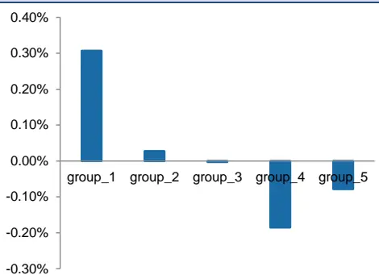
数据来源：Wind，天软科技，广发证券发展研究中心

[分析师： Table_Author]安宁宁

同SAC 执证号：S0260512020003同SFC CE No. BNW179

0755-23948352

anningning@gf.com.cn

分析师： 罗军

同SAC 执证号：S0260511010004

020-66335128

luojun@gf.com.cn

分析师： 张钰东

同SAC 执证号：S0260522070006

021-38003734

zhangyudong@gf.com.cn

请注意，罗军,张钰东并非香港证券及期货事务监察委员会的注册持牌人，不可在香港从事受监管活动。

## [Table_ 相关研究：DocRe

基于多期限动量与反转的因2024-05-08子研究

主要宽基指数成分股调整预2024-05-06测

凸显效应的高频应用:行为金 2024-02-27融研究系列之九

识别风险，发现价值

## 一、研究背景

## （一）指数化投资蓬勃发展

根据上交所的2024年度ETF行业发展报告，全球ETF市场规模于2023年首次突破11万亿美元，全年资金净流入接近万亿美元。截至2023年底，全球挂牌交易的ETF资产总规模达11.61万亿美元，较2022年底增长21.83%。近20年的全球ETF规模年均复合增长率达22.16%，产品数量连续20年保持正增长。从资产类别来看，权益ETF占主导地位。截至2023年底，全球权益ETF规模达8.62万亿美元，占比74.2%；债券ETF规模达2.06万亿美元，占比17.7%；商品ETF规模约1794亿美元，占比1.6%；其他类ETF规模约7506亿美元，占比6.5%。

回顾境内市场，指数化投资已成为境内公募基金行业发展趋势。根据上交所的2024年度ETF行业发展报告，境内ETF市场规模突破2万亿元，创历史新高。截至2023年底，境内交易所挂牌上市的ETF数量达889只，较2022年底增长18.06%；总规模达2.05万亿元，较2022年底增长28.13%。其中权益型ETF市值达到1.73万亿元，约占A股总市值的2%。2023年境内ETF规模增长4508.82亿元；其中新发产品贡献了778.96亿元的规模增量，占比17.28%；存量产品规模实现了3729.86亿元的增长，占比82.72%。

## （二）机器学习因子

基于价量数据对未来股价走势进行预测作为一类重要的机器学习量化选股策略，在过去受到了较为广泛的研究和应用。由于价量数据是跟着交易活动的进行而产生的，其本质上是关于时间的一组序列。因此，为了建模价量数据与未来股价走势之间的关系，大多数现有研究方法都选择了使用循环神经网络等时序模型。然而，时序模型无法对价格和交易量的走势形态进行有效识别，其表现在一定程度上因此受限。

我们团队于近期发布过《基于卷积神经网络的股价走势AI识别与分类》等深度学习研究报告，为了克服时序模型对序列数据建模的不足，探究了使用卷积神经网络对图表化的价量数据与未来股价进行建模，样本外跟踪至今仍旧有相对稳定的市场表现。

ETF产品相比于普通基金，可以于交易时间内确认交易，具备相对更好的交易便利性，相比于股票不用支付印花税等费用，具备费用优势。同时，ETF主要以跟踪标的指数为投资目标，底层资产透明清晰。因此如何基于ETF进行配置也是投资者相对关注的投资方向。

综上所述，本报告将进一步探索将深度学习因子映射到ETF产品轮动中的效果。

## 二、境内 ETF 市场概况

## （一）ETF 总体概况

ETF产品快速发展。根据上交所的2024年度ETF行业发展报告，截至2023年末，根据Wind，境内公募基金产品11514只，规模合计27.27万亿元，其中权益型基金规模7万亿元，占境内公募基金总规模的26%。指数化投资已成为境内公募基金行业发展趋势，截至2023年底，境内交易所挂牌上市的ETF数量达到889只，较2022年底（753只）增长18.06%，年末市值总规模达到2.05万亿元，较2022年底（1.60亿元）增长28.13%。其中权益型ETF市值达到1.73万亿元，创历史新高，约占A股总市值的2%。

图1：境内ETF产品规模数量变动统计
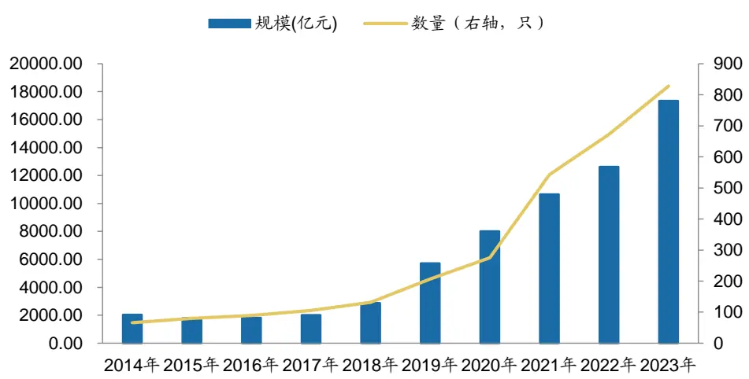
数据来源：Wind，广发证券发展研究中心

产品布局日趋完善。截至2023年末，境内ETF的投资标的涵盖了股票、债券、货币、商品、境外股票等大类资产，产品布局较为完善。根据Wind，其中股票ETF规模1.45万亿元，占比70.86%；跨境ETF规模2792.75亿元，占比13.66%；货币ETF规模2067.94亿元，占比10.11%；债券ETF规模788.92亿元，占比3.86%；商品ETF规模307.16亿元，占比1.50%。

图2：境内ETF产品基于资产类型的分布统计
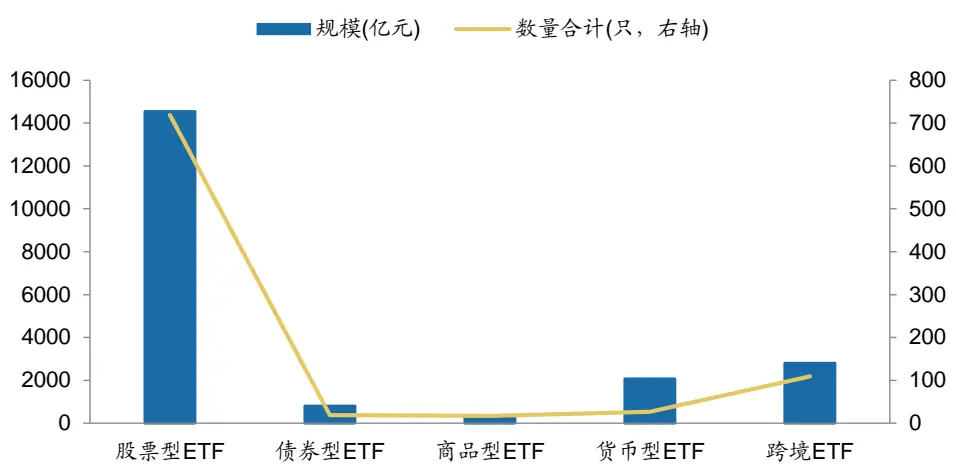
数据来源：Wind，广发证券发展研究中心（截至 20231231）

## （二）权益 ETF 概况

权益ETF的规模增量相对明显。下沉到资产类型，观察权益ETF的规模变动，根据Wind，权益ETF的总规模由2014年的约2000亿元增长至2023年末的1.73万亿元，在各资产类别中，规模增长相对明显。

图3：境内ETF产品规模数量变动统计
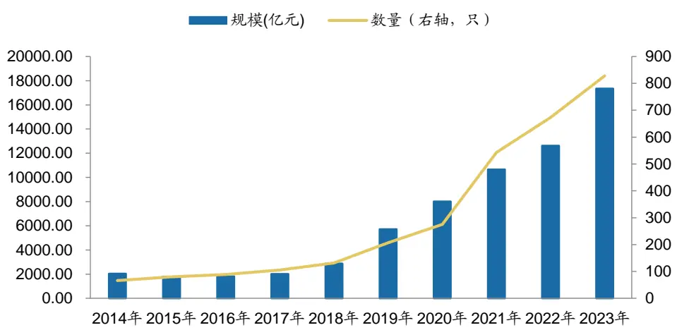
数据来源：Wind，广发证券发展研究中心

进一步观察权益ETF中，各大类型的产品规模最新情况。规模方面，宽基类ETF占比相对较高，根据Wind，截至2023年底，宽基ETF的规模合计为8424亿元，占比约49%，行业主题类产品规模合计为5668亿元，占比约33%。

图4：境内权益类ETF产品基于资产类型的分布统计
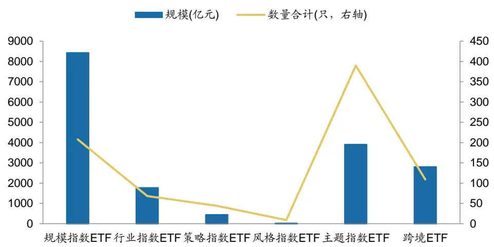
数据来源：Wind，广发证券发展研究中心（截至 20231231）

## （三）ETF 市场格局

截至2024年4月底，境内有51家基金公司拥有上市非货币ETF产品。根据Wind，排名前十的基金公司非货币管理规模合计为1.89万亿，占市场总规模的82%。已有7家管理人非货币ETF管理规模突破千亿，其中华夏基金管理规模已达4884亿元。

表1：基金公司ETF规模统计（亿元）

| 基金公司 | 非货币 ETF | 股票型 | 债券型 | 商品型 | QDII型 | 货币型 | 合计 |
| --- | --- | --- | --- | --- | --- | --- | --- |
| 华夏基金 | 4883.57 | 4076.23 | 3.97 | 18.45 | 784.93 | 0.97 | 4884.54 |
| 易方达基金 | 3798.83 | 3158.58 |  | 86.78 | 553.48 | 19.09 | 3817.92 |
| 华泰柏瑞基金 | 2746.66 | 2564.36 |  |  | 182.29 | 0.10 | 2746.75 |
| 南方基金 | 1571.42 | 1543.19 |  | 1.00 | 27.23 | 8.03 | 1579.45 |
| 嘉实基金 | 1453.61 | 1381.47 |  | 0.65 | 71.49 | 0.09 | 1453.70 |
| 国泰基金 | 1115.76 | 925.08 | 30.93 | 38.67 | 121.08 | 1.38 | 1117.13 |
| 广发基金 | 1060.32 | 708.91 |  | 1.42 | 349.99 | 0.21 | 1060.52 |
| 博时基金 | 826.55 | 282.16 | 158.36 | 118.74 | 267.29 | 0.39 | 826.93 |
| 华安基金 | 773.92 | 413.67 | 46.51 | 190.25 | 123.50 | 0.19 | 774.12 |
| 富国基金 | 691.69 | 523.43 | 157.43 | 4.21 | 6.62 | 4.05 | 695.74 |

数据来源：Wind，广发证券发展研究中心（截至20240430）

下沉到具体产品，规模靠前的产品已突破千亿元，跟踪指数以沪深300等宽基指数为主，其中华夏基金旗下的沪深300ETF的规模已超过2000亿元。

表2：ETF头部规模产品信息统计

| 基金代码 | 基金简称 | 基金管理人 | 基金上市日 | 业绩基准 | 基金规模(亿元) |
| --- | --- | --- | --- | --- | --- |
| 510300.SH | 沪深 300ETF | 华泰柏瑞基金 | 2012-05-28 | 沪深 300 指数 | 2066.75 |
| 510310.SH | 沪深 300ETF 易方达 | 易方达基金 | 2013-03-25 | 沪深 300 指数 | 1388.84 |
| 510050.SH | 上证 50ETF | 华夏基金 | 2005-02-23 | 上证 50 指数 | 1158.26 |
| 159919.SZ | 沪深 300ETF | 嘉实基金 | 2012-05-28 | 沪深 300 指数 | 1046.09 |
| 510330.SH | 沪深 300ETF 华夏 | 华夏基金 | 2013-01-16 | 沪深 300 指数 | 995.56 |
| 510500.SH | 中证 500ETF | 南方基金 | 2013-03-15 | 中证 500 指数 | 815.05 |
| 588000.SH | 科创 50ETF | 华夏基金 | 2020-11-16 | 上证科创板50成份指数收益率 | 739.38 |
| 159915.SZ | 创业板 ETF | 易方达基金 | 2011-12-09 | 创业板指数 | 571.13 |
| 513050.SH | 中概互联网 ETF | 易方达基金 | 2017-01-18 | 中证海外中国互联网50指数 | 367.37 |
| 588080.SH | 科创板 50ETF | 易方达基金 | 2020-11-16 | 上证科创板50成份指数收益率 | 355.74 |
| 512880.SH | 证券ETF | 国泰基金 | 2016-08-08 | 中证全指证券公司指数收益率 | 307.24 |
| 513330.SH | 恒生互联网 ETF | 华夏基金 | 2021-02-08 | 恒生互联网科技业指数收益率 | 305.97 |
| 512100.SH | 中证 1000ETF | 南方基金 | 2016-11-04 | 中证 1000 指数 | 281.21 |
| 512170.SH | 医疗 ETF | 华宝基金 | 2019-06-17 | 中证医疗指数收益率 | 232.12 |
| 513180.SH | 恒生科技指数ETF | 华夏基金 | 2021-05-25 | 恒生科技指数收益率 | 229.05 |
| 512000.SH | 券商ETF | 华宝基金 | 2016-09-14 | 中证全指证券公司指数 | 202.93 |
| 510180.SH | 上证 180ETF | 华安基金 | 2006-05-18 | 上证 180 指数 | 197.24 |
| 512480.SH | 半导体 ETF | 国联安基金 | 2019-06-12 | 中证全指半导体产品与设备指数收益率 | 195.56 |
| 159941.SZ | 纳指 ETF | 广发基金 | 2015-07-13 | 纳斯达克 100 指数(Nasdaq-100 Index)收益率 | 192.59 |

数据来源：Wind，广发证券发展研究中心（截至20240430）

基于指数分类，根据Wind，截至2024年4月底，871只权益类ETF的跟踪指数合计有369种，ETF合计规模靠前的指数同样以宽基指数为主。

图5：境内权益类ETF产品基于资产类型的分布统计
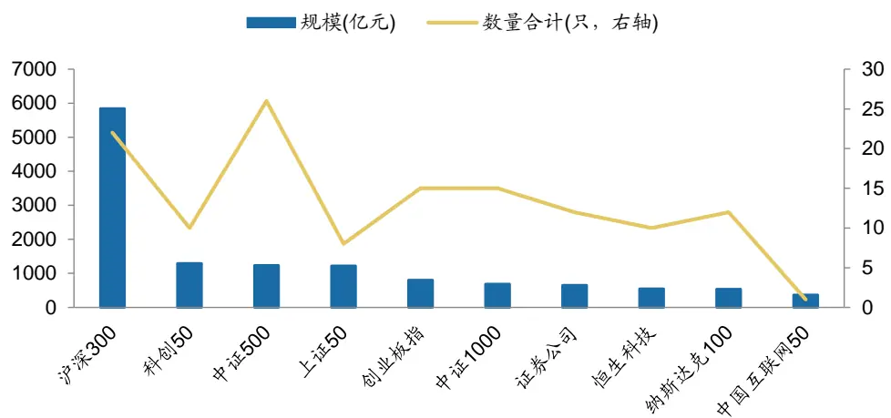
数据来源：Wind，广发证券发展研究中心（截至 20240430）

## 三、深度学习因子逻辑

## （一）标准化价量数据图表

为了能更好地使用卷积神经网络对价量数据图表与未来股价走势进行建模，本方法对每个个股窗口期内的价量数据构建了标准化的图表。该图表包含了窗口期大小为20日的价量数据，其由三部分组成：

1.图表的上部分由k线图和移动平均线构成，包含了开、高、低、收价格，以及若干股价的移动平均线，如MA5、MA10等。

2.图表的中部分由当日对应的成交量构成。

3.图表的下部分由股价的MACD信息构成，其中短期和长期移动平均线的窗口期。

由此构成了信息丰富的标准化价量数据图表。标准化图表构建完毕后，全市场范围内从2005年至2023年期间的图表数据量达115Gb，远超于同期以序列形式表达的价量数据，后者数据量仅为2Gb不到。

图6：标准化价量数据图表
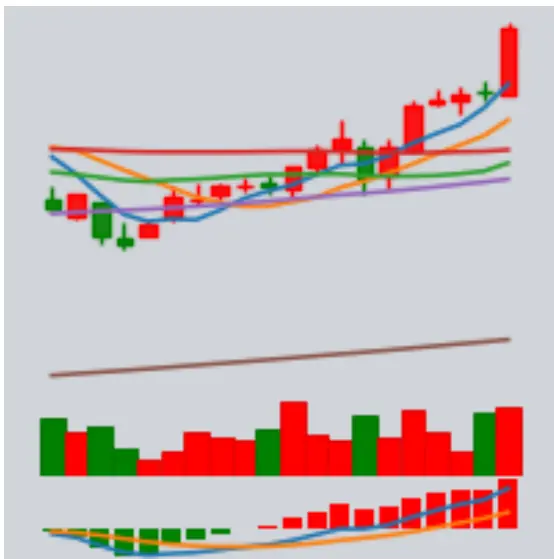
数据来源：天软科技，广发证券发展研究中心

## （二）价量数据图表卷积神经网络

为了对标准化图表和股价未来走势进行建模，本方法构建了卷积神经网络。输入图片经过卷积结构后得到了512x10x10的特征图，将其摊平后得到51200维度的特征后送入一个全连接神经网络。模型的最终输出为3个概率，分别对应个股在未来截面日上收益率的百分位，即后1/3、中1/3、前1/3，以表示跌、平、涨。最终以股票上涨的概率作为因子进行选股。

在模型的实现细节上，采用Xavier、 Adam化器等技术对模型进行训练；采用训练数据外的验证集对训练中的模型进行验证，以确定最优早停（EarlyStopping）时点。

通过分别训练两个不同的模型，将包含过去20日价量数据的标准化图表，与未来5日、20日的个股收益情况进行建模。在下文中，这以I{x}R{y}来表示，其中x为价量数据图表的窗口大小，y为预测未来y日的收益情况，换仓周期与y保持一致。即I20R5表示使用包含过去20日价量数据的标准化图表来预测未来5个交易日的收益情况。

图7：价量数据图表卷积神经网络结构图
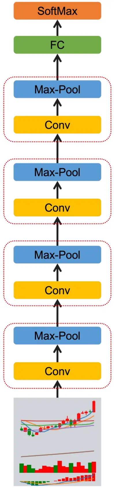
数据来源：广发证券发展研究中心

## （三）特征可视化

在完成卷积神经网络的训练后，标准化价量数据图表对模型进行输入，分别对模型中的4个卷积神经网络结构的输出在特征维度随机抽取9张特征图进行可视化。

从特征可视化结果来看，卷积层1和卷积层2作为低维度特征提取器，其关注到了整幅标准化价量数据图表中的信息，均同时涵盖了k线图、移动平均线、交易量以及MACD信息。

而卷积层3和卷积层4作为高维度特征提取器，其对图表中代表不同信息的不同部位的关注点开始发生分化，有的特征图重点捕捉k线图、移动平均线中的信息，而有的特征图则重点捕捉交易量以及MACD中的信息。与此同时，也有的特征图关注到了全局信息。

由此可见，训练后的卷积神经网络能对标准化的价量数据图表进行有效的特征提取，识别出其中的价格以及交易量形态走势信息，从而与未来的股价走势进行建模，实现对未来股价的预测。

图8：模型卷积层1输出特征可视化
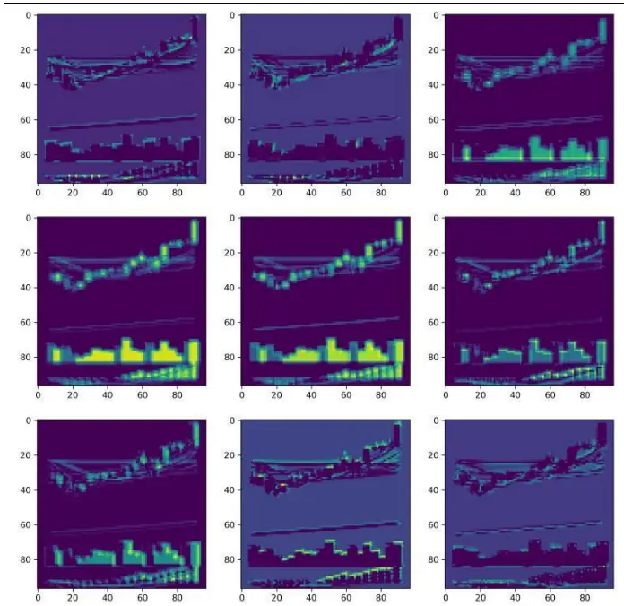
数据来源：广发证券发展研究中心

图9：模型卷积层2输出特征可视化
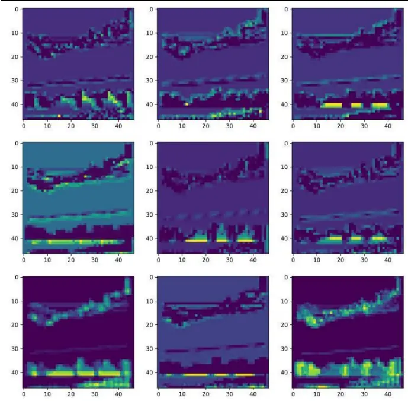
数据来源：广发证券发展研究中心

图10：模型卷积层3输出特征可视化
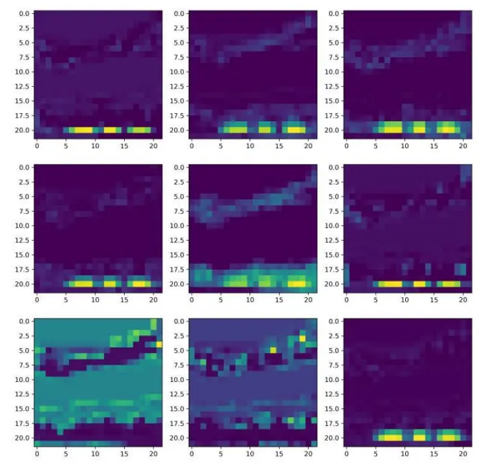
数据来源：广发证券发展研究中心

图11：模型卷积层4输出特征可视化
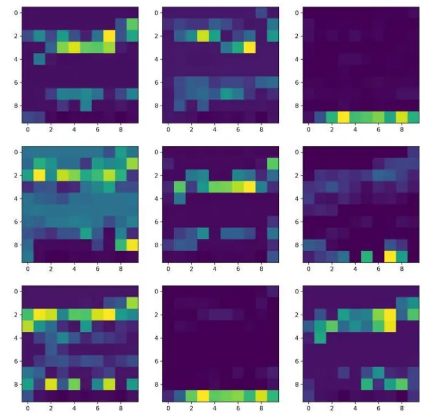
数据来源：广发证券发展研究中心

## 四、实证分析

## （一）数据说明

由个股汇总到指数，再映射ETF的逻辑，我们将选股因子应用到ETF轮动。考虑到ETF产品的流动性，对ETF产品作规模和成交额等基本要求。另外，个股因子只涉及境内A股市场，对跟踪海外和沪港深等指数的ETF作剔除处理。

ETF范围：境内权益ETF；

因子预处理：中位数去极值、Z-Score标准化；

回测区间：2020.01.01 – 2024.3.31；

分档方式：根据当期ETF的因子值，从小到大分为五档 ；

调仓周期：周度；

加权方式：等权；

流动性限制：换仓日滚动过去2周的日均规模超过1亿元，日均成交额超1000万元。

## （二）因子实证表现

周频ETF产品轮动模式下，因子回测结果收益相对明显。ETF_fimage因子的IC均值为6.9%,IC胜率为62%，多空年化收益为20.4%，多空波动率为17.01%，多头年化收益为14.4%，空头年化收益为-6.1%。

分档表现方面，5分组模式下多头组超额收益相对明显。

表3：ETF_fimage因子绩效分析

|  | RANK_IC | RANK_ICIR | IC 胜率 | 多空年化收益 | 多头年化收益 | 空头年化收益 |
| --- | --- | --- | --- | --- | --- | --- |
| ETF_fimage | 6.9% | 0.22 | 62.0% | 20.4% | 14.4% | -6.1% |

数据来源：Wind，天软科技，广发证券发展研究中心

图12：ETF_fimage因子IC值信息
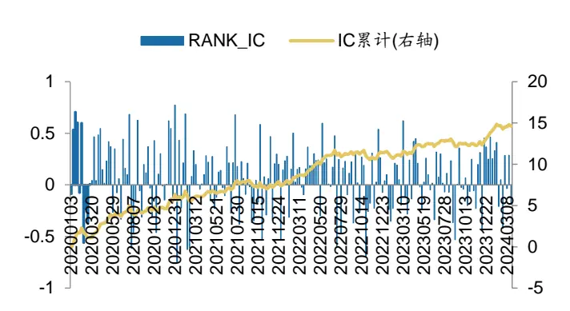
数据来源：Wind，天软科技，广发证券发展研究中心

图 13：ETF_fimage 因子分组平均收益统计
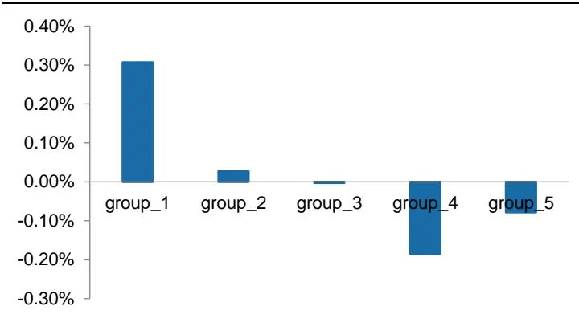
数据来源：Wind，天软科技，广发证券发展研究中心

图14：ETF_fimage因子多头空头累计净值

数据来源：Wind，天软科技，广发证券发展研究中心

图 15：ETF_fimage 因子多空累计净值
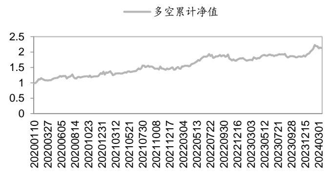
数据来源：Wind，天软科技，广发证券发展研究中心

观察ETF因子的分年度表现。回测结果显示，该因子2020年以来各年度均能实现正的多空收益，其中截至3月底，该因子2024年初至今已实现约11%的多空收益。

表4：ETF_fimage因子分年度多空绩效表现

|  | 收益率 | 年化收益率 | 年化波动率 | 夏普比 | 最大回撤 |
| --- | --- | --- | --- | --- | --- |
| 2020 | 29.0% | 29.6% | 19.2% | 1.54 | 10.6% |
| 2021 | 16.8% | 16.8% | 19.5% | 0.86 | 9.1% |
| 2022 | 19.0% | 19.8% | 17.3% | 1.15 | 11.2% |
| 2023 | 8.4% | 8.7% | 11.1% | 0.78 | 5.8% |
| 2024 | 10.9% | 56.5% | 16.7% | 3.38 | 5.0% |

数据来源：Wind，天软科技，广发证券发展研究中心（截至20240331）

进一步观察多头组的分年度表现，同时引入偏股混合型基金指数作为基准，对比能否实现超额收益。测算结果显示，绝对收益方面，除了2023年，该因子自2020年以来的各年度均实现了正收益，和偏股混合型基金指数的超额收益方面，该因子的多头组均能实现超额收益。

表5：ETF_fimage因子分年度多头绩效表现

|  | 年化收益率 | 年化波动率 | 夏普比 | 最大回撤 | 偏股混指数收益 | 超额收益 |
| --- | --- | --- | --- | --- | --- | --- |
| 2020 | 66.0% | 27.3% | 2.42 | 14.4% | 53.8% | 10.6% |
| 2021 | 16.9% | 24.4% | 0.69 | 19.2% | 7.7% | 9.2% |
| 2022 | 0.4% | 21.3% | 0.02 | 16.7% | -21.0% | 21.4% |
| 2023 | -12.6% | 14.7% | -0.85 | 21.2% | -13.5% | 1.4% |
| 2024 | 13.5% | 21.3% | 0.63 | 6.3% | -3.1% | 6.1% |

数据来源：Wind，天软科技，广发证券发展研究中心（截至20240331）

## （三）固定数量组合表现

回测结果显示，随着市场中的ETF产品发展，符合筛选要求的样本ETF产品逐渐增多，多头组的ETF产品数量也同步增加。实际投资中，我们也关注持有如5只10只等固定数量的ETF产品的收益状况。

因此本部分进一步测算基于因子等权配置5、10、15和20只ETF产品的回测效果。

图16：境内ETF产品规模数量变动统计
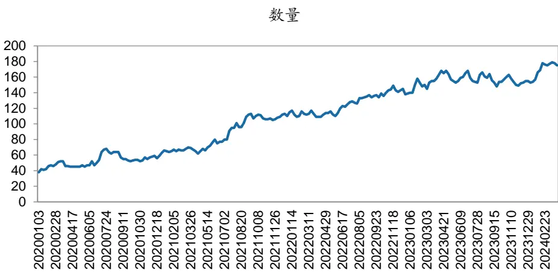
数据来源：Wind，天软科技，广发证券发展研究中心

测算结果显示，持有因子靠前的N只产品，相对偏股混合型基金指数和等权配置样本内所有ETF均能实现超额收益。对比持有不同数量的ETF，持有相对较少的5只ETF回测收益相对较高，2020年以来实现约16%的年化收益，年化波动率为25.6%，相比于样本内等权配置所有ETF的超额收益为14.5%，相比于偏股混合型基金指数年化超额收益为13.9%。

表6：ETF_fimage因子Top_N多头绩效表现

|  | 年化收益 | 胜率 | 波动率 | 夏普比 | 偏股混指数收益 | 相对超额 | 相对胜率 |
| --- | --- | --- | --- | --- | --- | --- | --- |
| top_5 | 16.2% | 50.7% | 25.6% | 0.63 | 2.2% | 13.9% | 53.0% |
| top_10 | 15.4% | 51.6% | 23.7% | 0.65 | 2.2% | 13.2% | 54.4% |
| top_15 | 12.1% | 48.8% | 22.2% | 0.55 | 2.2% | 9.9% | 52.6% |
| top_20 | 11.7% | 48.8% | 21.6% | 0.54 | 2.2% | 9.5% | 53.5% |
| all | 1.7% | 50.2% | 19.5% | 0.09 | 2.2% | -0.6% | 50.7% |

数据来源：Wind，天软科技，广发证券发展研究中心（截至20240331）

图17：ETF_fimage因子持仓组合净值
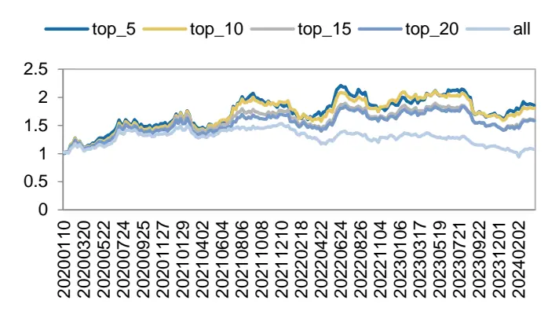
数据来源：Wind，天软科技，广发证券发展研究中心

图 18：ETF_fimage因子持仓组合平均收益统计

数据来源：Wind，天软科技，广发证券发展研究中心

分年度表现来看，持有不同数量的ETF组合的回测收益特征基本一致。对比不同数量持仓组合的表现，总体呈现持有较少的产品数量，收益表现更加突出的特征。

表7：ETF_fimage因子分年度多头绩效表现_Top5

|  | 年化收益率 | 年化波动率 | 夏普比 | 最大回撤 | 偏股混指数收益 | 超额收益 |
| --- | --- | --- | --- | --- | --- | --- |
| 2020 | 70.3% | 28.1% | 2.50 | 14.1% | 53.8% | 16.5% |
| 2021 | 3.2% | 29.6% | 0.11 | 19.4% | 7.7% | -4.5% |
| 2022 | 11.0% | 23.7% | 0.46 | 20.7% | -21.0% | 31.6% |
| 2023 | -9.1% | 21.0% | -0.43 | 24.7% | -13.5% | 4.7% |
| 2024 | 25.2% | 18.9% | 1.34 | 3.4% | -3.1% | 8.0% |

数据来源：Wind，天软科技，广发证券发展研究中心（截至20240331）

表8：ETF_fimage因子分年度多头绩效表现_Top10

|  | 年化收益率 | 年化波动率 | 夏普比 | 最大回撤 | 偏股混指数收益 | 超额收益 |
| --- | --- | --- | --- | --- | --- | --- |
| 2020 | 67.8% | 27.3% | 2.48 | 14.6% | 53.8% | 14.0% |
| 2021 | 7.4% | 27.3% | 0.27 | 19.7% | 7.7% | -0.3% |
| 2022 | 14.3% | 22.6% | 0.63 | 16.4% | -21.0% | 34.8% |
| 2023 | -18.5% | 16.7% | -1.11 | 24.8% | -13.5% | -4.3% |
| 2024 | 40.1% | 15.8% | 2.54 | 1.7% | -3.1% | 10.5% |

数据来源：Wind，天软科技，广发证券发展研究中心（截至20240331）

表9：ETF_fimage因子分年度多头绩效表现_Top15

|  | 年化收益率 | 年化波动率 | 夏普比 | 最大回撤 | 偏股混指数收益 | 超额收益 |
| --- | --- | --- | --- | --- | --- | --- |
| 2020 | 64.2% | 26.0% | 2.47 | 14.1% | 53.8% | 10.5% |
| 2021 | -0.2% | 24.7% | -0.01 | 18.8% | 7.7% | -7.8% |
| 2022 | 10.1% | 21.2% | 0.48 | 15.9% | -21.0% | 30.8% |

识别风险，发现价值

| 2023 | -18.4% | 15.5% | -1.18 | 25.1% | -13.5% | -4.2% |
| --- | --- | --- | --- | --- | --- | --- |
| 2024 | 46.6% | 17.8% | 2.61 | 2.8% | -3.1% | 11.6% |

数据来源：Wind，天软科技，广发证券发展研究中心（截至20240331）

表10：ETF_fimage因子分年度多头绩效表现_Top20

|  | 年化收益率 | 年化波动率 | 夏普比 | 最大回撤 | 偏股混指数收益 | 超额收益 |
| --- | --- | --- | --- | --- | --- | --- |
| 2020 | 59.9% | 25.4% | 2.36 | 13.5% | 53.8% | 6.1% |
| 2021 | -1.9% | 23.7% | -0.08 | 18.2% | 7.7% | -9.6% |
| 2022 | 10.1% | 20.2% | 0.50 | 14.7% | -21.0% | 30.7% |
| 2023 | -16.1% | 15.7% | -1.02 | 23.1% | -13.5% | -2.0% |
| 2024 | 49.6% | 18.2% | 2.73 | 2.6% | -3.1% | 12.0% |

数据来源：Wind，天软科技，广发证券发展研究中心（截至20240331）

## 五、进一步检验

## （一）剔除重复样本

上述内容的回测样本包含了跟踪同一指数的多只ETF，因此存在部分时期内回测的多头组合里的持仓有跟踪同一指数的多只ETF的情况。

因此，我们进一步尝试换仓时，样本中跟踪同一指数的多只ETF中只保留规模最大或流动性最好的一只。观察回测区间内符合要求的ETF样本数量，相比于剔除重复项前数量有所下降。

图19：样本ETF产品规模数量变动对比
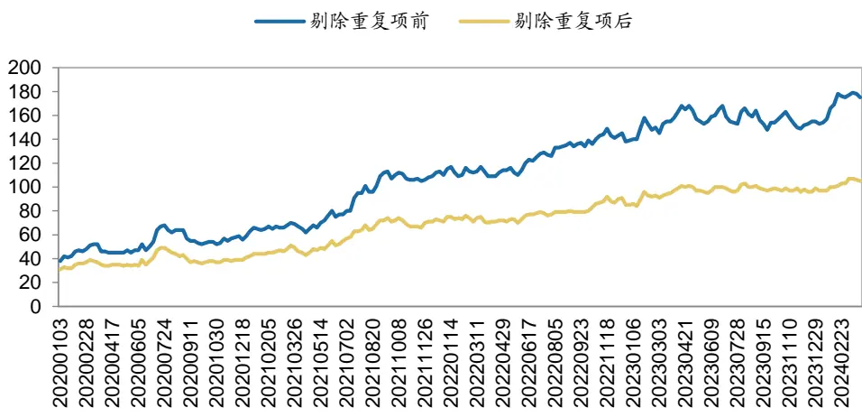
数据来源：Wind，天软科技，广发证券发展研究中心

剔除重复项后的，因子回测收益特征和未剔除前基本一致。ETF_fimage因子的IC均值为6.4%,IC胜率为60%，多空年化收益为19.1%，多头年化收益为14.2%，空头年化收益为-5.1%。

表11：ETF_fimage因子提纯后绩效分析

|  | RANK_IC | RANK_ICIR | IC 胜率 | 多空年化收益 | 多头年化收益 | 空头年化收益 |
| --- | --- | --- | --- | --- | --- | --- |
| ETF_fimage | 6.4% | 0.21 | 60.1% | 19.1% | 14.2% | -5.1% |

数据来源：Wind，天软科技，广发证券发展研究中心

图20：ETF_fimage因子提纯后IC值信息
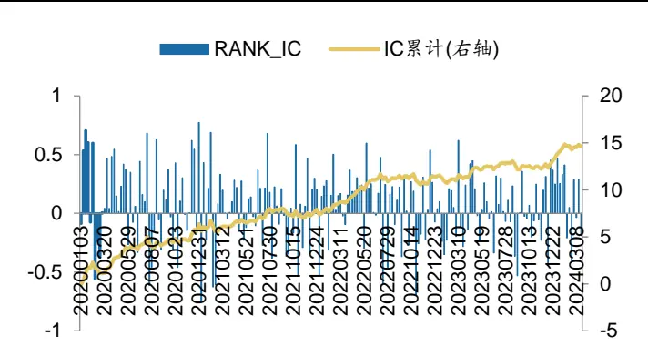
数据来源：Wind，天软科技，广发证券发展研究中心

图 21：ETF_fimage因子提纯后分组平均收益统计
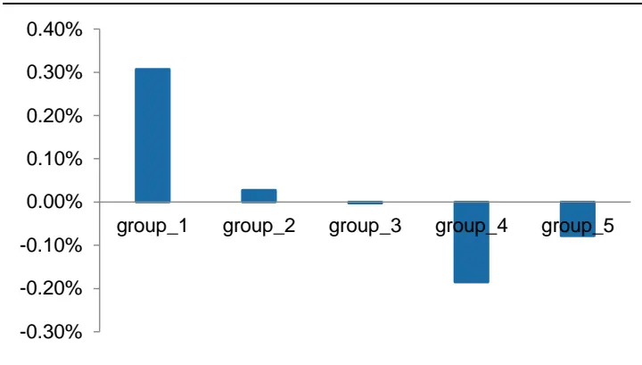
数据来源：Wind，天软科技，广发证券发展研究中心

图22：ETF_fimage因子提纯后多头空头累计净值
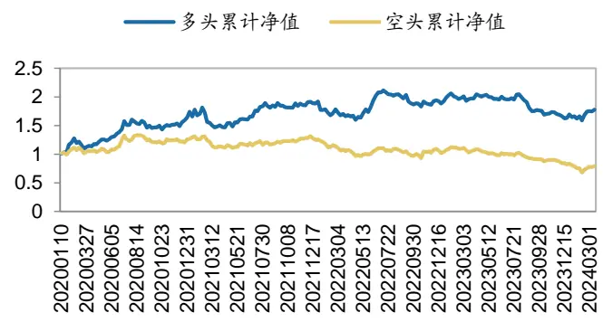
数据来源：Wind，天软科技，广发证券发展研究中心

图 23：ETF_fimage 因子提纯后多空累计净值
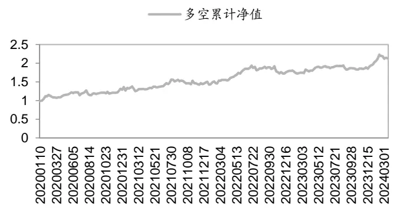
数据来源：Wind，天软科技，广发证券发展研究中心

表12：ETF_fimage因子提纯后分年度多空绩效表现

|  | 收益率 | 年化收益率 | 年化波动率 | 夏普比 | 最大回撤 |
| --- | --- | --- | --- | --- | --- |
| 2020 | 30.0% | 30.6% | 18.3% | 1.67 | 9.4% |
| 2021 | 22.6% | 22.6% | 20.1% | 1.13 | 9.1% |
| 2022 | 6.8% | 7.1% | 17.0% | 0.42 | 11.3% |
| 2023 | 7.5% | 7.8% | 11.2% | 0.70 | 5.3% |
| 2024 | 12.4% | 66.2% | 17.0% | 3.89 | 4.6% |

数据来源：Wind，天软科技，广发证券发展研究中心（截至20240331）识别风险，发现价值

表13：ETF_fimage因子提纯后分年度多头绩效表现

|  | 年化收益率 | 年化波动率 | 夏普比 | 最大回撤 | 偏股混指数收益 | 超额收益 |
| --- | --- | --- | --- | --- | --- | --- |
| 2020 | 60.1% | 27.2% | 2.21 | 15.7% | 53.8% | 4.9% |
| 2021 | 21.8% | 25.4% | 0.86 | 19.2% | 7.7% | 14.1% |
| 2022 | -5.9% | 20.6% | -0.29 | 17.9% | -21.0% | 15.3% |
| 2023 | -10.2% | 14.2% | -0.72 | 18.6% | -13.5% | 3.7% |
| 2024 | 25.9% | 20.3% | 1.27 | 4.4% | -3.1% | 8.6% |

数据来源：Wind，天软科技，广发证券发展研究中心（截至20240331）

对比持有不同数量的ETF，持有相对较少的5只ETF回测收益进一步增厚，相对较高，2020年以来实现约21%的年化收益。

表14：ETF_fimage因子提纯后Top_N多头绩效表现

|  | 年化收益 | 胜率 | 波动率 | 夏普比 | 偏股混指数收益 | 相对超额 | 相对胜率 |
| --- | --- | --- | --- | --- | --- | --- | --- |
| top_5 | 21.6% | 54.9% | 24.5% | 0.88 | 2.2% | 19.4% | 54.0% |
| top_10 | 14.8% | 50.7% | 22.4% | 0.66 | 2.2% | 12.6% | 54.0% |
| top_15 | 13.1% | 49.8% | 21.4% | 0.61 | 2.2% | 10.9% | 52.6% |
| top_20 | 10.4% | 50.7% | 20.7% | 0.51 | 2.2% | 8.2% | 53.5% |
| all | 3.4% | 50.2% | 19.3% | 0.17 | 2.2% | 1.1% | 50.2% |

数据来源：Wind，天软科技，广发证券发展研究中心（截至20240331）

图24：ETF_fimage因子提纯后持仓组合净值
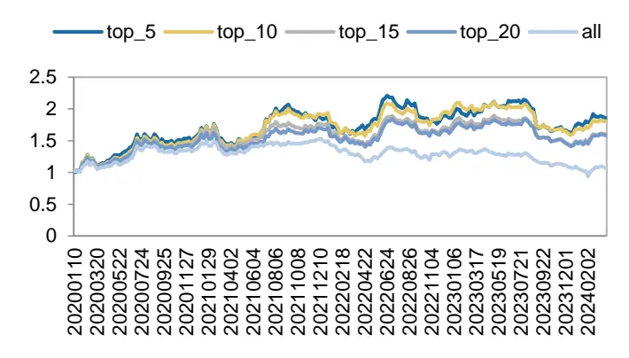
数据来源：Wind，天软科技，广发证券发展研究中心

图 25：ETF_fimage 因子提纯后组合平均收益统计
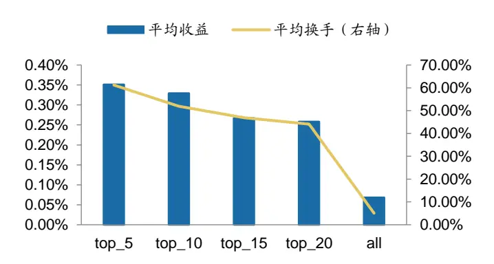
数据来源：Wind，天软科技，广发证券发展研究中心

## （二）流动性因素调整影响

流动性限制方面，前述方法是要求样本ETF换仓日滚动过去2周的日均规模超过1亿元，日均成交额超1000万元。

我们进一步调整规模和成交额要求以对比不同流通性条件的影响。测算结果显示，相对严格的流动性条件会降低多头组的收益表现。

表15：ETF_fimage因子流动性因素影响统计

| 规模下限（亿元） | 成交额下限(千万元) | RANK_IC | RANK_ICIR | IC 胜率 | 多空年化收益 | 多头年化收益 | 空头年化收益 |
| --- | --- | --- | --- | --- | --- | --- | --- |
| 1 | 1000 | 6.9% | 0.22 | 62.0% | 20.4% | 14.4% | -6.1% |
| 0.5 | 1000 | 7.1% | 0.23 | 62.0% | 21.4% | 15.1% | -6.3% |
| 2 | 1000 | 6.8% | 0.22 | 60.6% | 17.3% | 12.9% | -5.0% |
| 1 | 2000 | 7.1% | 0.23 | 60.1% | 19.3% | 15.8% | -4.0% |
| 1 | 500 | 7.1% | 0.23 | 60.1% | 19.3% | 15.8% | -4.0% |
| 1 | 5000 | 5.6% | 0.17 | 57.7% | 9.7% | 15.4% | 3.4% |

数据来源：Wind，天软科技，广发证券发展研究中心（截至20240331）

表16：ETF_fimage因子Top_5组合流动性因素影响统计

| 规模下限（亿元） | 成交额下限(千万元) | 年化收益 | 胜率 | 波动率 | 夏普比 | 偏股混指数收益 | 相对超额 | 相对胜率 |
| --- | --- | --- | --- | --- | --- | --- | --- | --- |
| 1 | 1000 | 16.2% | 50.7% | 25.6% | 0.63 | 2.2% | 13.9% | 53.0% |
| 0.5 | 1000 | 17.6% | 51.2% | 25.6% | 0.69 | 2.2% | 15.4% | 53.0% |
| 2 | 1000 | 16.2% | 53.0% | 24.8% | 0.66 | 2.2% | 14.0% | 55.3% |
| 1 | 2000 | 18.7% | 53.5% | 25.1% | 0.74 | 2.2% | 16.4% | 55.3% |
| 1 | 500 | 18.7% | 53.5% | 25.1% | 0.74 | 2.2% | 16.4% | 55.3% |
| 1 | 5000 | 14.6% | 52.6% | 24.0% | 0.61 | 2.2% | 12.4% | 54.4% |

数据来源：Wind，天软科技，广发证券发展研究中心（截至20240331）

表17：ETF_fimage因子Top_10组合流动性因素影响统计

| 规模下限（亿元） | 成交额下限(千万元) | 年化收益 | 胜率 | 波动率 | 夏普比 | 偏股混指数收益 | 相对超额 | 相对胜率 |
| --- | --- | --- | --- | --- | --- | --- | --- | --- |
| 1 | 1000 | 15.4% | 51.6% | 23.7% | 0.65 | 2.2% | 13.2% | 54.4% |
| 0.5 | 1000 | 16.4% | 52.6% | 23.6% | 0.69 | 2.2% | 14.2% | 53.5% |
| 2 | 1000 | 11.7% | 48.8% | 22.9% | 0.51 | 2.2% | 9.5% | 53.5% |
| 1 | 2000 | 14.8% | 49.8% | 22.9% | 0.65 | 2.2% | 12.6% | 54.0% |
| 1 | 500 | 14.8% | 49.8% | 22.9% | 0.65 | 2.2% | 12.6% | 54.0% |
| 1 | 5000 | 11.9% | 49.3% | 21.9% | 0.54 | 2.2% | 9.7% | 52.1% |

数据来源：Wind，天软科技，广发证券发展研究中心（截至20240331）

## （三）费用影响

费用方面，持仓5只ETF，在无交易费、双边千一和双边千二的条件下的回测年化收益分别为19.9%、16.2%和12.5%，年化波动率为25.6%。

表18：ETF_fimage因子Top_5组合费用因素影响统计

| 费用 | 年化收益 | 胜率 | 波动率 | 夏普比 | 偏股混指数收益 | 相对超额 | 相对胜率 |
| --- | --- | --- | --- | --- | --- | --- | --- |
| 0.001% | 16.2% | 50.7% | 25.6% | 0.63 | 2.2% | 13.9% | 53.0% |
| 0.000% | 19.9% | 52.6% | 25.5% | 0.78 | 2.2% | 17.7% | 53.0% |
| 0.002% | 12.5% | 50.7% | 25.6% | 0.49 | 2.2% | 10.3% | 52.1% |

数据来源：Wind，天软科技，广发证券发展研究中心（截至20240331）

表19：ETF_fimage因子Top_10组合费用因素影响统计

| 费用 | 年化收益 | 胜率 | 波动率 | 夏普比 | 偏股混指数收益 | 相对超额 | 相对胜率 |
| --- | --- | --- | --- | --- | --- | --- | --- |
| 0.001% | 15.4% | 51.6% | 23.7% | 0.65 | 2.2% | 13.2% | 54.4% |
| 0.000% | 18.6% | 53.5% | 23.7% | 0.78 | 2.2% | 16.3% | 54.9% |
| 0.002% | 12.3% | 49.3% | 23.7% | 0.52 | 2.2% | 10.1% | 53.5% |

数据来源：Wind，天软科技，广发证券发展研究中心（截至20240331）

图26：ETF_fimage因子Top_5组合净值
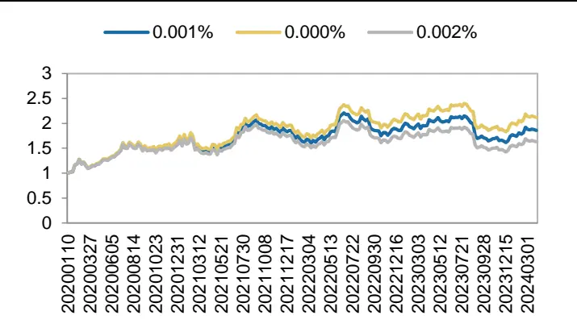
数据来源：Wind，天软科技，广发证券发展研究中心

图 27：ETF_fimage 因子 Top_10 组合净值
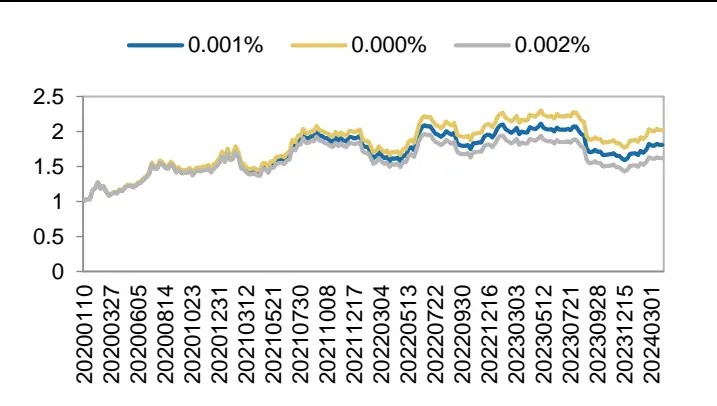
数据来源：Wind，天软科技，广发证券发展研究中心

## 六、总结

研究背景：境内ETF市场规模突破2万亿元，创历史新高，指数化投资已成为境内公募基金行业发展趋势。团队于近期发布过《基于卷积神经网络的股价走势AI识别与分类》等深度学习研究报告，样本外跟踪至今仍旧有相对稳定的市场表现。ETF具备持仓透明、交易便利、费用低廉等特征。本报告探索将深度学习因子映射到ETF产品轮动中的效果。

因子构建：通过构建标准化的价量数据图表，设计了卷积神经网络识别其中价格和交易量的走势形态，将其与未来股价进行建模，从而实现对未来股价的预测。然后基于个股因子值和权重数据计算权益指数的因子值，再进一步映射到ETF中。

实证分析：周频ETF产品轮动模式下，ETF_fimage因子的IC均值为6.9%,IC胜率为62%，多空年化收益为20.4%，多头年化收益为14.4%，空头年化收益为-6.1%。因子分年度表现稳定，其中截至3月底，该因子2024年初至今已实现约11%的多空收益。

固定持仓数量组合：等权配置5、10、15和20只ETF，持有不同数量的ETF组合的回测收益特征基本一致，总体呈现持有较少的产品数量，收益表现更加突出的特征。持有5只ETF回测收益相对较高，2020年以来实现约16%的年化收益，相比于样本内等权配置所有ETF的超额收益为14.5%，相比于偏股混合型基金指数年化超额收益为13.9%。

进一步检验：流通性条件的影响方面，相对严格的流动性条件会降低多头组的收益表现。费用方面，持仓5只ETF，在无交易费、双边千一和双边千二的条件下的回测年化收益分别为19.9%、16.2%和12.5%。

## 七、风险提示

本专题报告所述模型用量化方法通过历史数据统计、建模和测算完成，所得结论与规律在市场政策、环境变化时可能存在失效风险。

本专题策略模型在市场结构及交易行为的改变时有可能存在策略失效风险。

因量化模型不同，本报告提出的观点可能与其他量化模型结论存在差异。

## [Table_ResearchTeam] 广发金融工程研究小组

罗军 ：首席分析师，华南理工大学硕士，从业 16 年，2010 年进入广发证券发展研究中心。

安 宁 宁 ：首席分析师，暨南大学硕士，从业 14 年，2011 年进入广发证券发展研究中心。

史 庆 盛 ：资深分析师，华南理工大学硕士，2011 年进入广发证券发展研究中心。

张 超 ：资深分析师，中山大学硕士，2012 年进入广发证券发展研究中心。

陈 原 文 ：资深分析师，中山大学硕士，2015 年进入广发证券发展研究中心。

李 豪 ：资深分析师，上海交通大学硕士，2016 年进入广发证券发展研究中心。

周 飞 鹏 ：资深分析师，伯明翰大学硕士，2021 年加入广发证券发展研究中心。

张 钰 东 ：资深分析师，中山大学硕士，2020 年进入广发证券发展研究中心。

季 燕 妮 ：资深分析师，厦门大学硕士，2020 年进入广发证券发展研究中心。

## [Table_IndustryInvestDescription] 广发证券—行业投资评级说明

买入： 预期未来12个月内，股价表现强于大盘10%以上。

持有： 预期未来12个月内，股价相对大盘的变动幅度介于-10%～+10%。

卖出： 预期未来12个月内，股价表现弱于大盘10%以上。

## [Table_CompanyInvestDescription] 广发证券—公司投资评级说明

买入： 预期未来 12 个月内，股价表现强于大盘 15%以上。

增持： 预期未来12个月内，股价表现强于大盘5%-15%。

持有： 预期未来12个月内，股价相对大盘的变动幅度介于-5%～+5%。

卖出： 预期未来 12 个月内，股价表现弱于大盘 5%以上。

## [Table_Address] 联系我们

|  | 广州市 | 深圳市 | 北京市 | 上海市 | 香港 |
| --- | --- | --- | --- | --- | --- |
| 地址 | 广州市天河区马场路 26号广发证券大厦 | 深圳市福田区益田路 6001号太平金融大 | 北京市西城区月坛北 街2号月坛大厦18 | 上海市浦东新区南泉 北路429号泰康保险 | 香港湾仔骆克道81 号广发大厦27 楼 |
|  | 47 楼 | 厦31层 | 层 | 大厦37楼 |  |
| 邮政编码 | 510627 | 518026 | 100045 | 200120 |  |
| 客服邮箱 | gfzqyf@gf.com.cn |  |  |  |  |

## [Table_LegalDisclaimer] 法律主体声明

本报告由广发证券股份有限公司或其关联机构制作，广发证券股份有限公司及其关联机构以下统称为“广发证券”。本报告的分销依据不同国家、地区的法律、法规和监管要求由广发证券于该国家或地区的具有相关合法合规经营资质的子公司/经营机构完成。

广发证券股份有限公司具备中国证监会批复的证券投资咨询业务资格，接受中国证监会监管，负责本报告于中国（港澳台地区除外）的分销。

广发证券（香港）经纪有限公司具备香港证监会批复的就证券提供意见（4 号牌照）的牌照，接受香港证监会监管，负责本报告于中国香港地区的分销。

本报告署名研究人员所持中国证券业协会注册分析师资质信息和香港证监会批复的牌照信息已于署名研究人员姓名处披露。

## [Table_Important重要声明

广发证券股份有限公司及其关联机构可能与本报告中提及的公司寻求或正在建立业务关系，因此，投资者应当考虑广发证券股份有限公司及其关联机构因可能存在的潜在利益冲突而对本报告的独立性产生影响。投资者不应仅依据本报告内容作出任何投资决策。投资者应自主作出投资决策并自行承担投资风险，任何形式的分享证券投资收益或者分担证券投资损失的书面或者口头承诺均为无效。

本报告署名研究人员、联系人（以下均简称“研究人员”）针对本报告中相关公司或证券的研究分析内容，在此声明：（1）本报告的全部分析结论、研究观点均精确反映研究人员于本报告发出当日的关于相关公司或证券的所有个人观点，并不代表广发证券的立场；（2）研究人员的部分或全部的报酬无论在过去、现在还是将来均不会与本报告所述特定分析结论、研究观点具有直接或间接的联系。

研究人员制作本报告的报酬标准依据研究质量、客户评价、工作量等多种因素确定，其影响因素亦包括广发证券的整体经营收入，该等经营收入部分来源于广发证券的投资银行类业务。

本报告仅面向经广发证券授权使用的客户/特定合作机构发送，不对外公开发布，只有接收人才可以使用，且对于接收人而言具有保密义务。广发证券并不因相关人员通过其他途径收到或阅读本报告而视其为广发证券的客户。在特定国家或地区传播或者发布本报告可能违反当地法律，广发证券并未采取任何行动以允许于该等国家或地区传播或者分销本报告。

本报告所提及证券可能不被允许在某些国家或地区内出售。请注意，投资涉及风险，证券价格可能会波动，因此投资回报可能会有所变化，过去的业绩并不保证未来的表现。本报告的内容、观点或建议并未考虑任何个别客户的具体投资目标、财务状况和特殊需求，不应被视为对特定客户关于特定证券或金融工具的投资建议。本报告发送给某客户是基于该客户被认为有能力独立评估投资风险、独立行使投资决策并独立承担相应风险。

本报告所载资料的来源及观点的出处皆被广发证券认为可靠，但广发证券不对其准确性、完整性做出任何保证。报告内容仅供参考，报告中的信息或所表达观点不构成所涉证券买卖的出价或询价。广发证券不对因使用本报告的内容而引致的损失承担任何责任，除非法律法规有明确规定。客户不应以本报告取代其独立判断或仅根据本报告做出决策，如有需要，应先咨询专业意见。

广发证券可发出其它与本报告所载信息不一致及有不同结论的报告。本报告反映研究人员的不同观点、见解及分析方法，并不代表广发证券的立场。广发证券的销售人员、交易员或其他专业人士可能以书面或口头形式，向其客户或自营交易部门提供与本报告观点相反的市场评论或交易策略，广发证券的自营交易部门亦可能会有与本报告观点不一致，甚至相反的投资策略。报告所载资料、意见及推测仅反映研究人员于发出本报告当日的判断，可随时更改且无需另行通告。广发证券或其证券研究报告业务的相关董事、高级职员、分析师和员工可能拥有本报告所提及证券的权益。在阅读本报告时，收件人应了解相关的权益披露（若有）。

本研究报告可能包括和/或描述/呈列期货合约价格的事实历史信息（“信息”）。请注意此信息仅供用作组成我们的研究方法/分析中的部分论点/依据/证据，以支持我们对所述相关行业/公司的观点的结论。在任何情况下，它并不（明示或暗示）与香港证监会第5类受规管活动（就期货合约提供意见）有关联或构成此活动。

## [Table_InterestDisclos权益披露

(1)广发证券（香港）跟本研究报告所述公司在过去12 个月内并没有任何投资银行业务的关系。

## [Table_Copyright]版权声明

未经广发证券事先书面许可，任何机构或个人不得以任何形式翻版、复制、刊登、转载和引用，否则由此造成的一切不良后果及法律责任由私自翻版、复制、刊登、转载和引用者承担。