# [Table_Title] 股价预测之多模态多尺度

证券研究报告

## 深度学习研究报告

## 报告摘要：

AI看图：在去年发布的《基于卷积神经网络的股价走势AI识别与分类》研究报告中，创新性地采用基于深度学习的图像识别技术，将价量数据图表与未来股价走势进行建模，以实现股票价格预测。

股价预测之多模态多尺度：本文以“多模态、多尺度”为题，基于 AI看图初版模型进行了大幅改进，新的模型结构如右图 1 所示。本文模型在日度价量数据图表的基础上，加入了高频因子数据、日频时序数据、周度价量数据图表，采用 4 个独立的深度时序模型和深度卷积模型进行多模态、多尺度的特征提取，并同时采用回归损失和分类损失以端到端的方式进行模型训练，有效提升了模型对未来股价的预测能力，取得了更为显著的超额收益。

对比提升：以 2020/01/01~2024/10/31 作为样本外回测区间，每 20 个交易日进行换仓，本文模型预测结果在全市场、沪深 300、中证500、中证 800、中证 1000、国证 2000、创业板的 RankIC 均值分别为 8.7%、7.9%、6.6%、6.9%、8.2%、8.7、10.4%，RankIC 胜率分别为 86.7%、69.0%、73.5%、75.2%、84.8%、86.1%、89.2%。以全市场作为回测统计口径，对比 AI 看图初始版本，本文模型的 RankIC 均值提升了3.0%，RankIC 胜率提升了 7.8%。

超额表现：以 2020/01/01~2024/10/31 作为样本外回测区间，基于本文模型因子在全市场、沪深 300、中证 500、中证 800、中证 1000、国证 2000、创业板分别构建10分档多头股票组合，双边千三计费后，多头股票组合分别相对对应板块指数取得了 12.97%、9.17%、5.30%、8.38%、7.47、7.47%、11.52 的超额年化收益率。

与 Barra 风格因子相关性：整体而言，本文模型因子与 Barra 风格因子的相关性较低，其中，相关性最高的三个 Barra 风格因子为流动性因子、波动率因子和市值因子，相关系数分别为-18%、-16%和-8%。

展望：本报告以研发为主要目的，对模型进行了严谨的训练、验证、以及回测。其中，训练样本为2008~2016 年数据，验证样本为 2017~2019 年数据，回测样本为 2020~2024 年数据。从理论上来说，通过加入更新、更多的训练样本，结合滚动训练等方式，能够进一步提升模型对未来股价的预测能力，取得更为显著的超额收益。

风险提示：（1）本文所述模型用量化方法通过历史数据统计、建模和测算完成，所得结论与规律在市场政策、环境变化时存在失效风险；（2）本文策略在市场结构及交易行为改变时有可能存在失效风险；（3）因量化模型不同，本文提出的观点可能与其他量化模型结论存在差异。

图 1：多模态多尺度股价预测模型
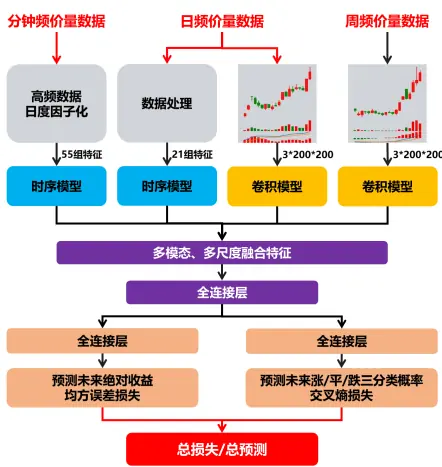
数据来源：广发证券发展研究中心

[分析师： Table_Author]安宁宁

SAC 执证号：S0260512020003

SFC CE No. BNW179

0755-23948352

anningning@gf.com.cn

分析师： 陈原文

SAC 执证号：S0260517080003

0755-82797057

chenyuanwen@gf.com.cn

请注意，陈原文并非香港证券及期货事务监察委员会的注册持牌人，不可在香港从事受监管活动。

## [Table_ 相关研究：DocRe

基于卷积神经网络的股价走 2023-04-06势 AI 识别与分类

基于深度学习的高频数据因2023-08-11子挖掘

[联系人： Table_Contacts] 林涛

0755 - 82528531

gflintao@gf.com.cn

识别风险，发现价值

## 一、AI 看图

基于价量数据对未来股价走势进行预测作为一类重要的机器学习量化选股策略，在过去受到了广泛的研究和应用。由于个股的价量数据是随着交易活动的进行而产生的，其本质上是关于时间的一组序列。因此，为了建模价量数据与未来股价走势之间的关系，大多数研究方法自然而然地使用了循环神经网络（Recurrent NeuralNetwork，RNN）或Transformer这两大类时序模型。

在这些方法中，模型的输入是关于价量数据的一维或多维数组，输出则是股价的未来走势。然而，尽管时序模型在一定程度上能够捕捉到价量序列中诸如价格、交易量的上涨或下跌及其相互交织的高维信息，但其无法对价格和交易量的走势形态及其变化进行有效识别。

举个例子对此进行解释。以人类视角来看，通常在对股价的未来走势进行预测时，并不会选择直接观测一组关于价量的序列，因为能从中捕获到的不只是数字上的涨跌。为了能更好地捕捉到价格和交易量的形态走势，通常会选择观测包含k线图、移动平均价、交易量、MACD数据的图表，而不是一组纯粹的数字。

基于以上观点，团队在去年发布的《基于卷积神经网络的股价走势AI识别与分类》研究报告中，创新性地基于日度价量数据，批量生成标准化价量数据图表。该图表包含了窗口期大小为20日的价量数据，其由三部分组成：（1）图表的上部分由k线图和移动平均线构成，包含了开、高、低、收价格，以及若干股价的移动平均线，如MA5、MA10等；（2）图表的中部分由当日对应的成交量构成；（3）图表的下部分由股价的MACD信息构成。

AI看图采用基于深度学习的图像识别技术，将价量数据图表与未来股价走势进行建模，以实现股价预测，整体模型结构如下图1所示。

图 1：AI看图——基于卷积神经网络的股价走势AI识别与分类
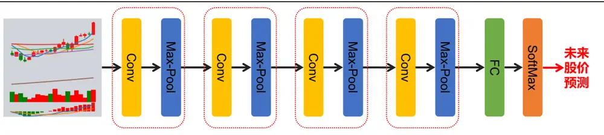
数据来源：广发证券发展研究中心

## 二、多模态多尺度股价预测模型

## （一）模型结构

本文以“多模态、多尺度”为题，基于AI看图初始版本模型进行了大幅改进，新的模型结构如下图2所示。本文模型在日度价量数据图表的基础上，加入了高频因子数据、日频时序数据、周度价量数据图表，采用4个独立的深度时序模型和深度卷积模型进行多模态、多尺度的特征提取，并同时采用回归损失和分类损失以端到端的方式进行模型训练，有效提升了模型对未来股价的预测能力。

图 2：多模态多尺度股价预测模型
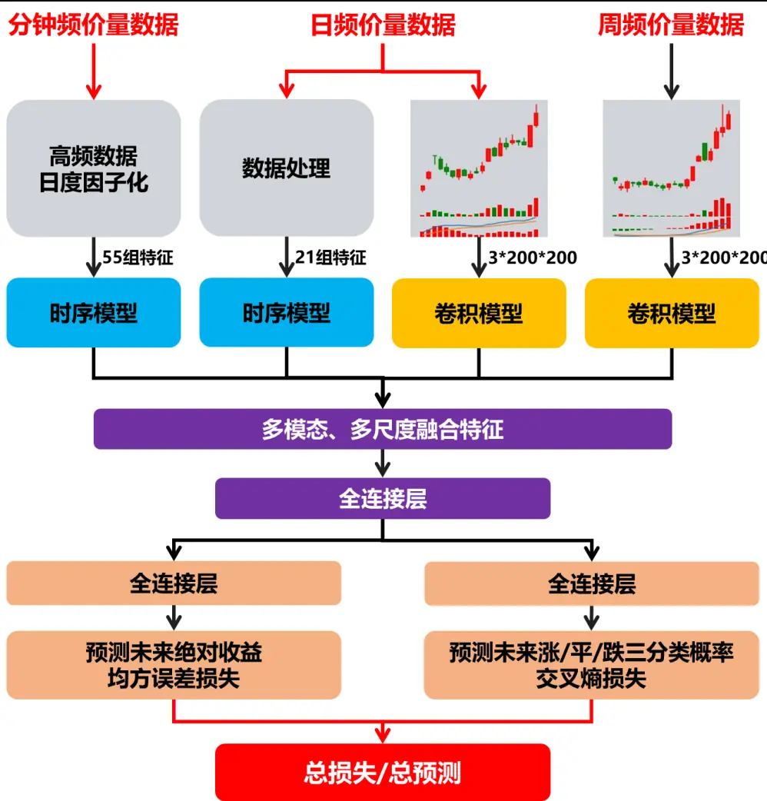
数据来源：广发证券发展研究中心

## （二）改进思路

本文模型主要有以下几个改进思路：

（1）多模态：尽管价量数据图表所蕴含的信息完全来自于原始的价量时序数据，但以不同模态（图表数据与时序数据）表征的数据，在深度学习模型中所捕获的信息具有较大差异。通常而言，时序模型能够有效捕获到原始价量数据中较为抽象的数量变化关系，而卷积模型则能够更有效地识别到价量数据图表中的形态走势。为了验证这一观点，以AI看图初始版本模型的预测结果作为卷积模型因子，以GRU模型的预测结果作为时序模型因子，二者虽同根同源，但它们的因子历史相关系数仅约为35%，具有较大的差异性。因此，本文分别采用时序模型和卷积模型，同时以时序价量数据和标准化价量数据图表作为输入，并对不同模态的特征进行融合，充分发挥不同模型、不同模态数据的各项优点，以端到端的方式进行模型训练和未来股价预测。

（2）多尺度：不同频率的价量数据，蕴含着不同维度的信息。日内高频数据反映了交易日中的博弈，但缺乏长周期的趋势信息；日频、周频数据则能够有效补充日内高频数据所难以表征的历史走势。因此，本文采用了1分钟频、日频、周频三种不同频率的价量数据作为改进后模型的原始输入数据。其中，对于1分钟频价量数据，采用高频数据日度因子化的方式，从中构建出了55组特征信息，再将多日的日度因子送入时序模型。这样的特征提取方法不仅能够更有效地捕获日内股价信息，而且能够有效降低模型复杂度，减少过拟合，提升样本外的股价预测效果。

（3）轻量化：尽管本文模型包含了4个独立的深度时序模型和深度卷积模型以实现多模态、多尺度的特征提取，但每个独立子模型的参数量都进行了大幅度的轻量化。以其中的卷积模型为例，其整体结构与AI看图初始模型一致，但每一个卷积模块的特征维度只有后者的1/4。轻量化不仅避免了因为多模态多尺度数据所带来的模型过拟合风险，而且减少了模型在训练过程中的巨额计算资源依赖和耗时，同时还提升了模型在训练完毕后的样本外股价预测效率，使得训练好的模型甚至能够在一台轻薄笔记本上运行。

（4）多头输出：在本文模型的输出端，包含了两个分支。其中一个分支以未来股价的绝对收益作为学习目标；另一个分支则以未来股价的涨、平、跌三类别作为学习目标。在训练过程中，两个分支分别以均方误差和交叉熵作为损失函数，两个损失在加总后以端到端的方式进行梯度回传。在模型训练完毕的样本外预测阶段，通过同时结合两个分支的预测结果，提升了模型的股价预测准确率，从而使得股票组合获得更为客观的超额收益。

## 三、实证分析

## （一）数据说明

选股范围：全市场，沪深300，中证500，中证800，中证1000，国证2000，创业板

选股处理：剔除非上市、摘牌、ST/*ST、涨跌停板、上市未满1年股票

训练数据：全市场2008年1月～2016年12月

验证数据：全市场2017年2月～2019年11月（与训练数据间隔1个月防止数据暴露）

回测区间：2020年1月～2024年10月（与验证数据间隔1个月防止数据暴露）

分档方式：根据当期预测的个股价格未来上涨概率，从大到小分为10档

回测路径：以多路径回测均值作为统计数据

调仓周期：每20个交易日，根据模型在t日的预测结果，以t+1日均价买入，t+1+n日均价卖出

交易费用：千分之三（卖出时收取），以下展示回测数据均为计费后的结果

## （二）对比提升

以2020/01/01~2024/10/31作为样本外回测区间，以20日作为换仓周期，本文模型预测结果在全市场、沪深300、中证500、中证800、中证1000、国证2000、创业板的RankIC均值分别为8.7%、7.9%、6.6%、6.9%、8.2%、8.7、10.4%，RankIC胜率分别为86.7%、69.0%、73.5%、75.2%、84.8%、86.1%、89.2%。以全市场作为回测统计口径，对比AI看图初始版本，本文模型的RankIC均值提升了3.0%，RankIC胜率提升了7.8%。

## （三）本文模型因子与 Barra风格因子相关性

本文模型因子与Barra风格因子的相关系数如下表所示。整体而言，本文模型因子与Barra风格因子的相关性较低，其中相关性最高的三个Barra风格因子为流动性因子、波动率因子和市值因子，相关系数分别为-18%、-16%和-8%。

表 1：本文模型因子和Barra风格因子之间的相关性

|  | 市值因子 | 杠杆因子 | 成长因子 | 动量因子 | 贝塔因子 | 盈利因子 | 流动性因子 | 波动率因子 |
| --- | --- | --- | --- | --- | --- | --- | --- | --- |
| 本文模型因子 | -8% | 3% | -2% | -2% | 7% | -1% | -18% | -16% |

数据来源：Wind，天软科技，广发证券发展研究中心

## （三）实证分析（全市场）

本文模型在全市场的样本外回测表现如下图表所示。本文模型因子在全市场的10分档收益单调性显著，RankIC历史均值为8.7%、胜率为86.7%。2020年~2024年10月期间，双边千三计费后的多头年化收益率为15.58%，相比同期的中证全指取得了12.97%的超额年化收益率。

图 3：10分档表现（全市场）
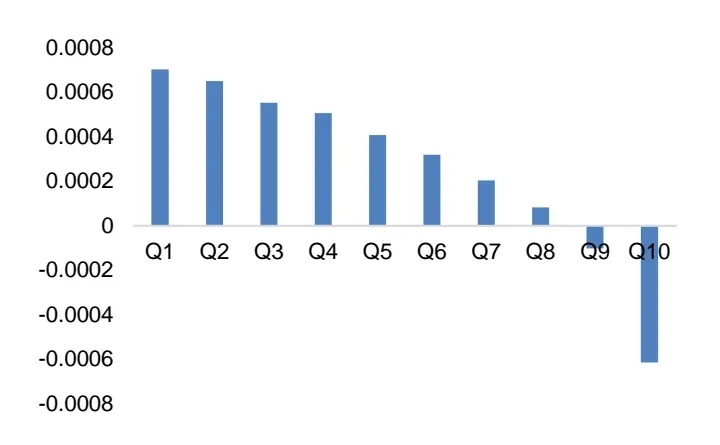
数据来源：Wind，天软科技，广发证券发展研究中心

图 4：RankIC表现（全市场）
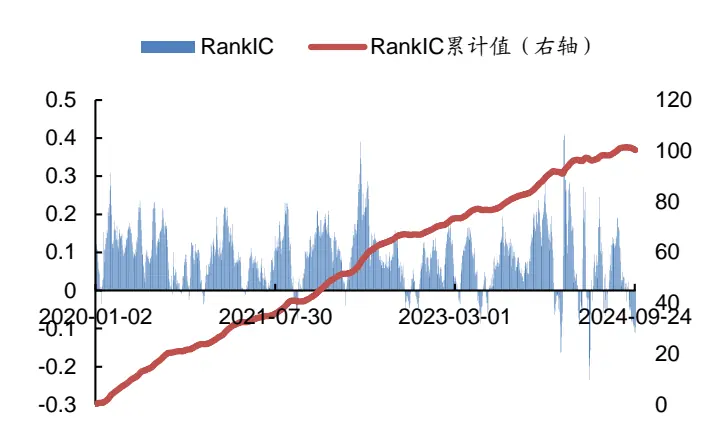
数据来源：Wind，天软科技，广发证券发展研究中心

图 5：多头及超额表现（全市场）
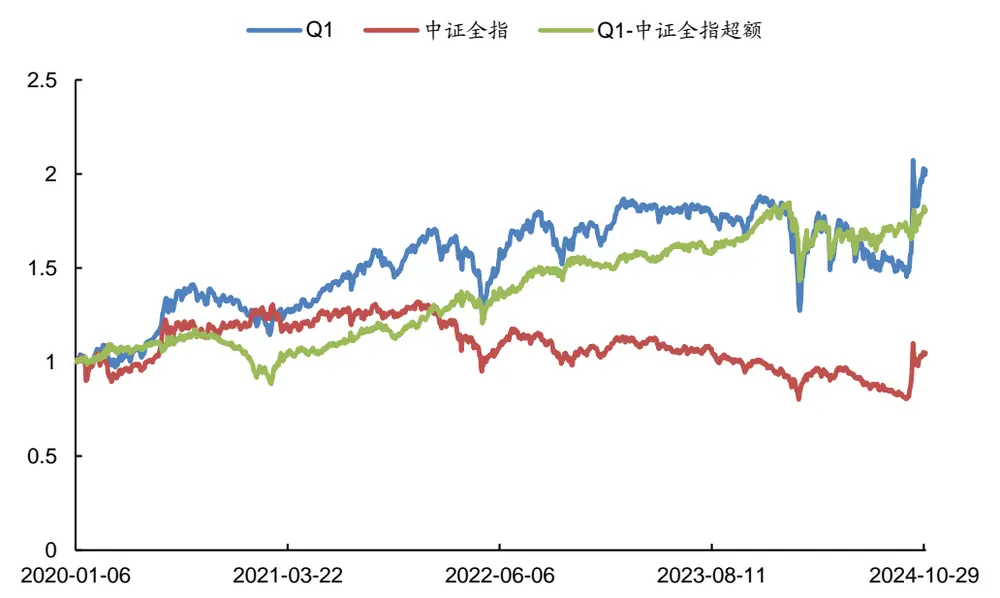
数据来源：Wind，天软科技，广发证券发展研究中心

表 2：分年度收益统计（全市场）

| 组合 | 年份 | 总收益 | 年化收益率 | 最大回撤率 | 平均换手率 | 年化波动率 | 夏普比率 | 信息比率 |
| --- | --- | --- | --- | --- | --- | --- | --- | --- |
| Q1多头 | 2020.01~2024.10 | 102.10% | 15.58% | 32.33% | 66.90% | 21.94% | 0.60 | 0.71 |
|  | 2020年 | 25.99% | 25.99% | 12.84% | 69.43% | 21.67% | 1.08 | 1.20 |
|  | 2021年 | 33.51% | 33.19% | 10.32% | 67.86% | 14.56% | 2.11 | 2.28 |
|  | 2022年 | -1.97% | -1.97% | 27.20% | 67.63% | 20.87% | -0.21 | -0.09 |
|  | 2023年 | 10.58% | 10.53% | 11.06% | 65.46% | 11.60% | 0.69 | 0.91 |
|  | 2024.01~10 | 10.85% | 13.30% | 31.08% | 63.39% | 36.18% | 0.30 | 0.37 |
| Q1多头 相对中证全指超额 | 2020.01~2024.10 | 80.81% | 12.97% | 24.66% | 66.90% | 18.73% | 0.56 | 0.69 |
|  | 2020年 | 0.52% | 0.52% | 14.33% | 69.43% | 18.44% | -0.11 | 0.03 |
|  | 2021年 | 23.73% | 23.52% | 11.76% | 67.86% | 16.64% | 1.26 | 1.41 |
|  | 2022年 | 21.09% | 20.99% | 12.20% | 67.63% | 18.25% | 1.01 | 1.15 |
|  | 2023年 | 18.02% | 17.94% | 3.87% | 65.46% | 11.29% | 1.37 | 1.59 |
|  | 2024.01~10 | 1.72% | 2.09% | 22.56% | 63.39% | 27.44% | -0.01 | 0.08 |
| Q1-Q10 多空 | 2020.01~2024.10 | 357.24% | 36.73% | 5.93% | 68.08% | 8.07% | 4.24 | 4.55 |
|  | 2020年 | 50.47% | 50.47% | 2.79% | 69.90% | 7.28% | 6.59 | 6.94 |
|  | 2021年 | 38.80% | 38.43% | 4.45% | 68.12% | 6.94% | 5.18 | 5.54 |
|  | 2022年 | 48.23% | 47.99% | 3.22% | 70.29% | 7.38% | 6.16 | 6.50 |
|  | 2023年 | 22.17% | 22.07% | 3.57% | 66.01% | 5.60% | 3.50 | 3.94 |
|  | 2024.01~10 | 20.89% | 25.85% | 5.93% | 65.53% | 12.41% | 1.88 | 2.08 |
| 中证全指 | 2020.01~2024.10 | 4.75% | 0.96% | 39.33% | 1 | 19.89% | -0.08 | 0.05 |
|  | 2020年 | 22.84% | 22.84% | 14.90% |  | 23.12% | 0.88 | 0.99 |
|  | 2021年 | 6.19% | 6.14% | 11.05% | 1 1 | 15.94% | 0.23 | 0.39 |
|  | 2022年 | -20.32% | -20.25% | 26.98% | 1 | 20.29% | -1.12 | -1.00 |
|  | 2023年 | -7.04% | -7.01% | 17.75% | 1 | 12.75% | -0.75 | -0.55 |
|  | 2024.01~10 | 8.42% | 10.29% | 17.16% | 1 | 25.82% | 0.30 | 0.40 |

数据来源：Wind，天软科技，广发证券发展研究中心

## （四）实证分析（沪深 300）

本文模型在沪深300的样本外回测表现如下图表所示。本文模型因子在沪深300的10分档收益单调性显著，RankIC历史均值为7.9%、胜率为69.0%。2020年~2024年10月期间，双边千三计费后的多头年化收益率为9.48%，相比同期的沪深300指数取得了9.17%的超额年化收益率。

图 6：10分档表现（沪深300）
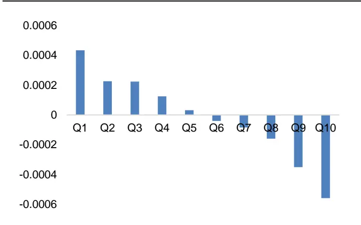
数据来源：Wind，天软科技，广发证券发展研究中心

图 7：RankIC表现（沪深300）
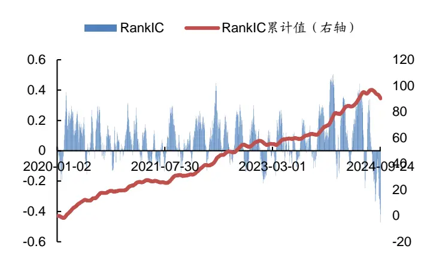
数据来源：Wind，天软科技，广发证券发展研究中心

图 8：多头及超额表现（沪深300）
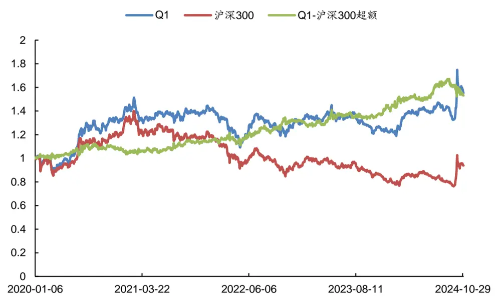
数据来源：Wind，天软科技，广发证券发展研究中心

表 3：分年度收益统计（沪深300）

| 组合 | 年份 | 总收益 | 年化收益率 | 最大回撤率 | 平均换手率 | 年化波动率 | 夏普比率 | 信息比率 |
| --- | --- | --- | --- | --- | --- | --- | --- | --- |
| Q1多头 | 2020.01~2024.10 | 55.29% | 9.48% | 27.92% | 65.81% | 16.48% | 0.42 | 0.58 |
|  | 2020年 | 35.17% | 35.17% | 13.89% | 65.75% | 20.18% | 1.62 | 1.74 |
|  | 2021年 | 5.53% | 5.49% | 14.24% | 69.89% | 13.66% | 0.22 | 0.40 |
|  | 2022年 | -8.91% | -8.87% | 23.31% | 69.94% | 16.36% | -0.70 | -0.54 |
|  | 2023年 | -5.09% | -5.07% | 16.71% | 61.91% | 11.42% | -0.66 | -0.44 |
|  | 2024.01~10 | 25.92% | 32.23% | 11.18% | 59.99% | 19.67% | 1.51 | 1.64 |
| Q1多头 相对沪深 300 超额 | 2020.01~2024.10 | 53.15% | 9.17% | 8.84% | 65.81% | 14.85% | 0.45 | 0.62 |
|  | 2020年 | 5.59% | 5.59% | 6.12% | 65.75% | 16.60% | 0.19 | 0.34 |
|  | 2021年 | 9.58% | 9.50% | 4.05% | 69.89% | 13.00% | 0.54 | 0.73 |
|  | 2022年 | 13.93% | 13.87% | 8.60% | 69.94% | 16.27% | 0.70 | 0.85 |
|  | 2023年 | 6.10% | 6.07% | 5.71% | 61.91% | 11.92% | 0.30 | 0.51 |
|  | 2024.01~10 | 9.50% | 11.62% | 8.84% | 59.99% | 16.23% | 0.56 | 0.72 |
| Q1-Q10 多空 | 2020.01~2024.10 | 206.29% | 25.91% | 21.59% | 67.67% | 12.50% | 1.87 | 2.07 |
|  | 2020年 | 30.00% | 30.00% | 8.65% | 67.04% | 11.13% | 2.47 | 2.70 |
|  | 2021年 | 19.05% | 18.88% | 6.21% | 69.44% | 9.96% | 1.64 | 1.90 |
|  | 2022年 | 40.06% | 39.87% | 4.67% | 72.81% | 9.28% | 4.02 | 4.29 |
|  | 2023年 | 10.75% | 10.70% | 9.27% | 64.36% | 10.70% | 0.77 | 1.00 |
|  | 2024.01~10 | 27.59% | 34.36% | 21.59% | 63.55% | 20.07% | 1.59 | 1.71 |
| 沪深300 | 2020.01~2024.10 | -6.13% | -1.29% | 45.60% | 1 | 19.18% | -0.20 | -0.07 |
|  | 2020年 | 25.73% | 25.73% | 16.08% |  | 22.28% | 1.04 | 1.15 |
|  | 2021年 | -5.20% | -5.16% | 18.19% | 1 1 | 18.14% | -0.42 | -0.28 |
|  | 2022年 | -21.63% | -21.55% | 28.65% | 1 | 19.91% | -1.21 | -1.08 |
|  | 2023年 | -11.38% | -11.33% | 21.51% | 1 | 13.18% | -1.05 | -0.86 |
|  | 2024.01~10 | 13.40% | 16.47% | 14.41% | 1 | 21.45% | 0.65 | 0.77 |

数据来源：Wind，天软科技，广发证券发展研究中心

## （五）实证分析（中证 500）

本文模型在中证500的样本外回测表现如下图表所示。本文模型因子在中证500的10分档收益单调性显著，RankIC历史均值为6.6%、胜率为73.5%。2020年~2024年10月期间，双边千三计费后的多头年化收益率为9.36%，相比同期的中证500指数取得了5.30%的超额年化收益率。

图 9：10分档表现（中证500）
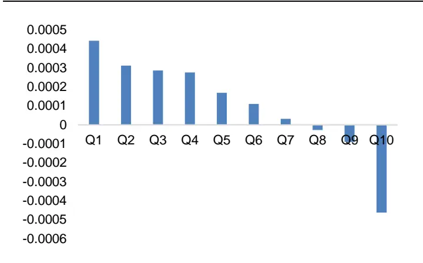
数据来源：Wind，天软科技，广发证券发展研究中心

图 10：RankIC表现（中证500）
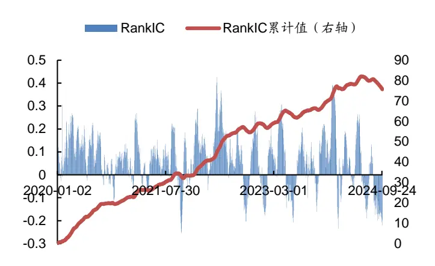
数据来源：Wind，天软科技，广发证券发展研究中心

图 11：多头及超额表现（中证500）
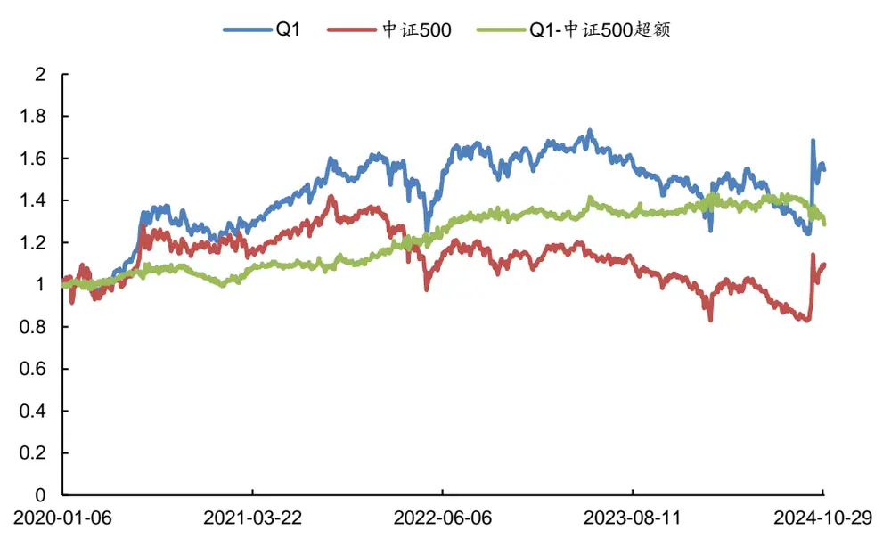
数据来源：Wind，天软科技，广发证券发展研究中心

表 4：分年度收益统计（中证500）

| 组合 | 年份 | 总收益 | 年化收益率 | 最大回撤率 | 平均换手率 | 年化波动率 | 夏普比率 | 信息比率 |
| --- | --- | --- | --- | --- | --- | --- | --- | --- |
| Q1多头 | 2020.01~2024.10 | 54.46% | 9.36% | 28.49% | 68.11% | 18.37% | 0.37 | 0.51 |
|  | 2020年 | 21.86% | 21.86% | 13.08% | 68.31% | 20.27% | 0.95 | 1.08 |
|  | 2021年 | 32.23% | 31.93% | 6.94% | 69.02% | 12.26% | 2.40 | 2.60 |
|  | 2022年 | -2.42% | -2.41% | 22.84% | 69.48% | 18.69% | -0.26 | -0.13 |
|  | 2023年 | -7.10% | -7.07% | 17.95% | 66.40% | 10.35% | -0.92 | -0.68 |
|  | 2024.01~10 | 5.73% | 6.99% | 20.03% | 67.07% | 27.30% | 0.16 | 0.26 |
| Q1多头 相对中证 500 超额 | 2020.01~2024.10 | 28.50% | 5.30% | 10.49% | 68.11% | 16.11% | 0.17 | 0.33 |
|  | 2020年 | 0.20% | 0.20% | 8.85% | 68.31% | 18.06% | -0.13 | 0.01 |
|  | 2021年 | 13.00% | 12.88% | 6.04% | 69.02% | 13.04% | 0.80 | 0.99 |
|  | 2022年 | 19.85% | 19.76% | 5.37% | 69.48% | 17.71% | 0.97 | 1.12 |
|  | 2023年 | -0.55% | -0.55% | 6.72% | 66.40% | 11.04% | -0.28 | -0.05 |
|  | 2024.01~10 | -4.78% | -5.76% | 10.49% | 67.07% | 19.81% | -0.42 | -0.29 |
| Q1-Q10 多空 | 2020.01~2024.10 | 180.02% | 23.61% | 17.98% | 68.52% | 10.11% | 2.09 | 2.33 |
|  | 2020年 | 29.45% | 29.45% | 4.98% | 68.66% | 10.35% | 2.60 | 2.84 |
|  | 2021年 | 32.61% | 32.30% | 6.86% | 69.14% | 10.16% | 2.93 | 3.18 |
|  | 2022年 | 46.15% | 45.92% | 6.63% | 71.32% | 9.93% | 4.37 | 4.62 |
|  | 2023年 | 8.81% | 8.77% | 7.50% | 65.74% | 8.53% | 0.74 | 1.03 |
|  | 2024.01~10 | 2.57% | 3.13% | 17.98% | 67.45% | 11.55% | 0.05 | 0.27 |
| 中证500 | 2020.01~2024.10 | 9.68% | 1.92% | 41.81% | 1 | 21.28% | -0.03 | 0.09 |
|  | 2020年 | 18.33% | 18.33% | 15.24% |  | 25.11% | 0.63 | 0.73 |
|  | 2021年 | 15.58% | 15.45% | 9.57% | 1 1 | 15.08% | 0.86 | 1.02 |
|  | 2022年 | -20.31% | -20.24% | 28.83% | 1 | 21.36% | -1.06 | -0.95 |
|  | 2023年 | -7.42% | -7.39% | 18.66% | 1 | 12.83% | -0.77 | -0.58 |
|  | 2024.01~10 | 8.69% | 10.63% | 19.90% | 1 | 29.38% | 0.28 | 0.36 |

数据来源：Wind，天软科技，广发证券发展研究中心

## （六）实证分析（中证 800）

本文模型在中证800的样本外回测表现如下图表所示。本文模型因子在中证800的10分档收益单调性显著，RankIC历史均值为6.9%、胜率为75.2%。2020年~2024年10月期间，双边千三计费后的多头年化收益率为9.43%，相比同期的中证800指数取得了8.38%的超额年化收益率。

图 12：10分档表现（中证800）
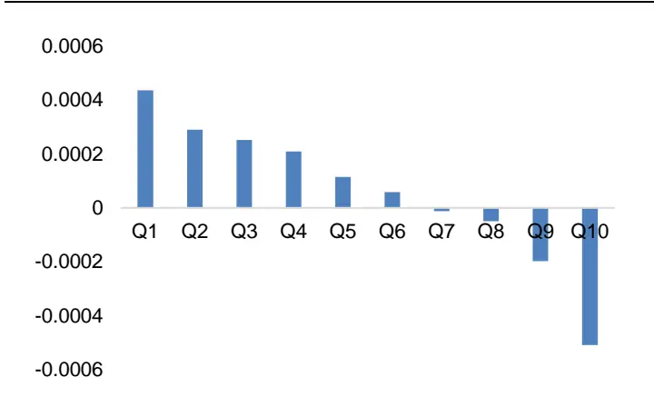
数据来源：Wind，天软科技，广发证券发展研究中心

图 13：RankIC表现（中证800）
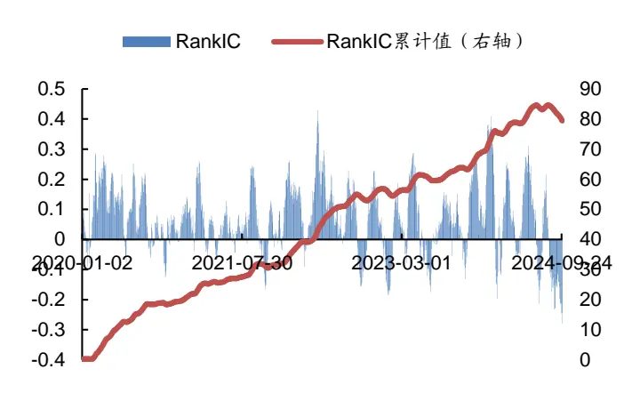
数据来源：Wind，天软科技，广发证券发展研究中心

图 14：多头及超额表现（中证800）
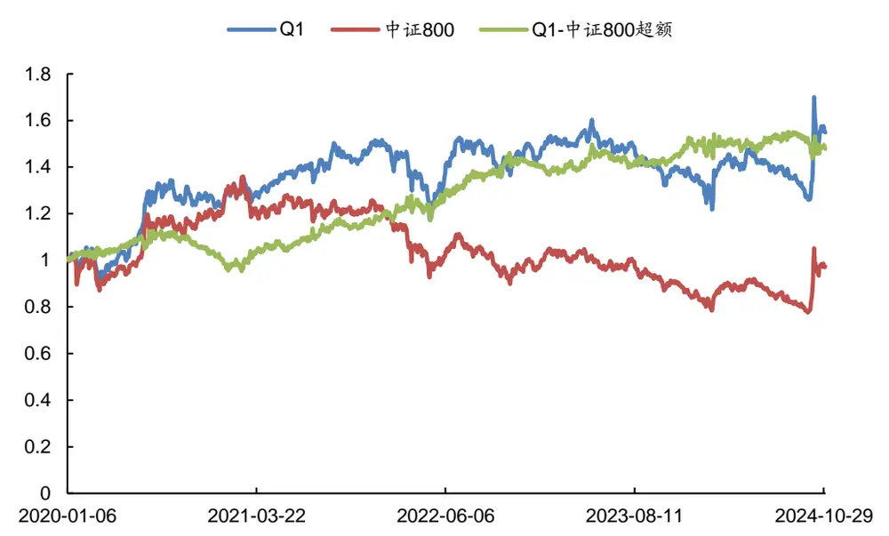
数据来源：Wind，天软科技，广发证券发展研究中心

表 5：分年度收益统计（中证800）

| 组合 | 年份 | 总收益 | 年化收益率 | 最大回撤率 | 平均换手率 | 年化波动率 | 夏普比率 | 信息比率 |
| --- | --- | --- | --- | --- | --- | --- | --- | --- |
| Q1多头 | 2020.01~2024.10 | 54.92% | 9.43% | 24.05% | 67.13% | 17.15% | 0.40 | 0.55 |
|  | 2020年 | 24.75% | 24.75% | 13.03% | 67.61% | 19.79% | 1.12 | 1.25 |
|  | 2021年 | 21.10% | 20.91% | 7.39% | 69.30% | 11.83% | 1.56 | 1.77 |
|  | 2022年 | -4.56% | -4.54% | 22.77% | 69.48% | 17.51% | -0.40 | -0.26 |
|  | 2023年 | -5.88% | -5.86% | 17.51% | 64.49% | 10.35% | -0.81 | -0.57 |
|  | 2024.01~10 | 14.16% | 17.41% | 14.69% | 63.97% | 24.05% | 0.62 | 0.72 |
| Q1多头 相对中证 800 超额 | 2020.01~2024.10 | 47.82% | 8.38% | 15.43% | 67.13% | 15.15% | 0.39 | 0.55 |
|  | 2020年 | -1.35% | -1.35% | 12.47% | 67.61% | 16.41% | -0.23 | -0.08 |
|  | 2021年 | 20.05% | 19.86% | 4.95% | 69.30% | 13.68% | 1.27 | 1.45 |
|  | 2022年 | 19.04% | 18.95% | 8.36% | 69.48% | 16.92% | 0.97 | 1.12 |
|  | 2023年 | 4.09% | 4.07% | 6.66% | 64.49% | 10.99% | 0.14 | 0.37 |
|  | 2024.01~10 | 0.74% | 0.90% | 7.33% | 63.97% | 17.30% | -0.09 | 0.05 |
| Q1-Q10 多空 | 2020.01~2024.10 | 194.06% | 24.86% | 16.42% | 68.01% | 9.77% | 2.29 | 2.54 |
|  | 2020年 | 26.18% | 26.18% | 5.96% | 68.05% | 9.72% | 2.44 | 2.69 |
|  | 2021年 | 27.41% | 27.15% | 3.98% | 69.02% | 8.06% | 3.06 | 3.37 |
|  | 2022年 | 44.89% | 44.66% | 4.71% | 71.82% | 8.82% | 4.78 | 5.07 |
|  | 2023年 | 10.84% | 10.79% | 6.85% | 64.98% | 8.72% | 0.95 | 1.24 |
|  | 2024.01~10 | 13.91% | 17.10% | 16.42% | 65.55% | 13.37% | 1.09 | 1.28 |
| 中证800 | 2020.01~2024.10 | -2.64% | -0.55% | 42.96% | 1 | 19.13% | -0.16 | -0.03 |
|  | 2020年 | 24.04% | 24.04% | 15.52% |  | 22.57% | 0.95 | 1.07 |
|  | 2021年 | -0.76% | -0.75% | 14.18% | 1 1 | 16.65% | -0.20 | -0.05 |
|  | 2022年 | -21.32% | -21.24% | 26.78% | 1 | 19.68% | -1.21 | -1.08 |
|  | 2023年 | -10.37% | -10.33% | 20.18% | 1 | 12.72% | -1.01 | -0.81 |
|  | 2024.01~10 | 12.14% | 14.90% | 15.70% | 1 | 22.89% | 0.54 | 0.65 |

数据来源：Wind，天软科技，广发证券发展研究中心

## （七）实证分析（中证 1000）

本文模型在中证1000的样本外回测表现如下图表所示。本文模型因子在中证1000的10分档收益单调性显著，RankIC历史均值为8.2%、胜率为84.8%。2020年~2024年10月期间，双边千三计费后的多头年化收益率为11.45%，相比同期的中证1000指数取得了7.47%的超额年化收益率。

图 15：10分档表现（中证1000）
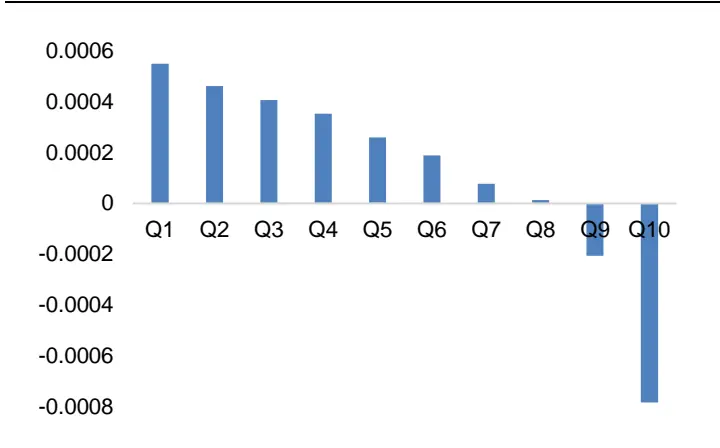
数据来源：Wind，天软科技，广发证券发展研究中心

图 16：RankIC表现（中证1000）
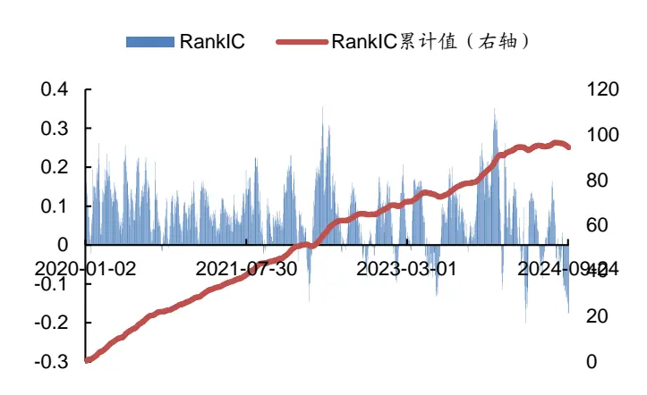
数据来源：Wind，天软科技，广发证券发展研究中心

图 17：多头及超额表现（中证1000）
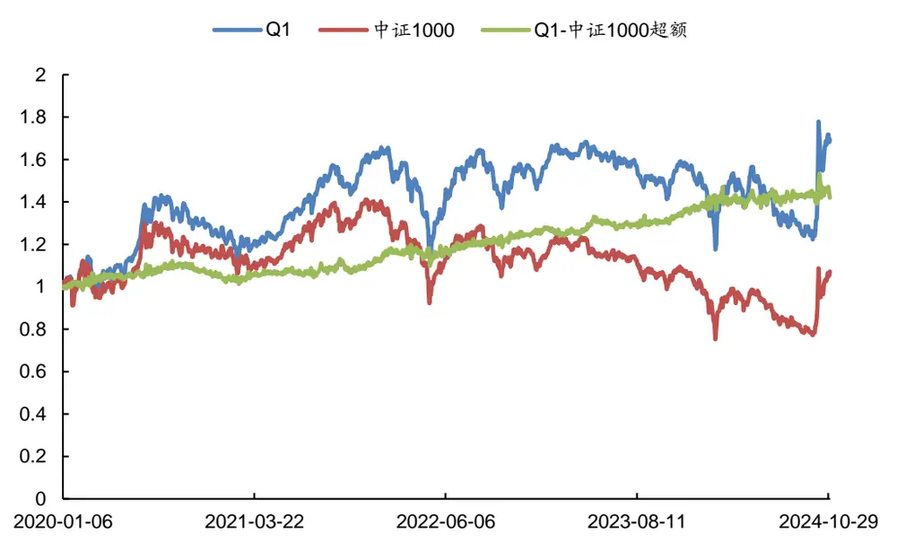
数据来源：Wind，天软科技，广发证券发展研究中心

表 6：分年度收益统计（中证1000）

| 组合 | 年份 | 总收益 | 年化收益率 | 最大回撤率 | 平均换手率 | 年化波动率 | 夏普比率 | 信息比率 |
| --- | --- | --- | --- | --- | --- | --- | --- | --- |
| Q1多头 | 2020.01~2024.10 | 69.34% | 11.45% | 31.77% | 68.98% | 21.73% | 0.41 | 0.53 |
|  | 2020年 | 26.02% | 26.02% | 13.58% | 71.43% | 22.90% | 1.03 | 1.14 |
|  | 2021年 | 30.64% | 30.36% | 11.60% | 70.64% | 15.09% | 1.85 | 2.01 |
|  | 2022年 | -9.18% | -9.15% | 31.77% | 71.25% | 21.66% | -0.54 | -0.42 |
|  | 2023年 | 2.10% | 2.09% | 16.13% | 65.41% | 11.83% | -0.03 | 0.18 |
|  | 2024.01~10 | 10.93% | 13.40% | 23.48% | 65.41% | 33.47% | 0.33 | 0.40 |
| Q1多头 相对中证 1000 超额 | 2020.01~2024.10 | 41.92% | 7.47% | 9.65% | 68.98% | 17.90% | 0.28 | 0.42 |
|  | 2020年 | 5.05% | 5.05% | 6.72% | 71.43% | 19.82% | 0.13 | 0.25 |
|  | 2021年 | 6.63% | 6.57% | 5.87% | 70.64% | 14.39% | 0.28 | 0.46 |
|  | 2022年 | 12.85% | 12.79% | 8.44% | 71.25% | 19.12% | 0.54 | 0.67 |
|  | 2023年 | 7.77% | 7.73% | 4.40% | 65.41% | 11.69% | 0.45 | 0.66 |
|  | 2024.01~10 | 4.18% | 5.09% | 7.40% | 65.41% | 23.39% | 0.11 | 0.22 |
| Q1-Q10 多空 | 2020.01~2024.10 | 364.63% | 37.19% | 8.97% | 69.50% | 8.28% | 4.19 | 4.49 |
|  | 2020年 | 57.74% | 57.74% | 2.80% | 70.79% | 8.47% | 6.52 | 6.82 |
|  | 2021年 | 43.45% | 43.02% | 3.01% | 70.74% | 7.36% | 5.50 | 5.84 |
|  | 2022年 | 45.94% | 45.71% | 6.01% | 71.92% | 8.79% | 4.91 | 5.20 |
|  | 2023年 | 20.55% | 20.46% | 5.06% | 66.49% | 6.61% | 2.72 | 3.10 |
|  | 2024.01~10 | 16.71% | 20.60% | 8.97% | 66.97% | 10.04% | 1.80 | 2.05 |
| 中证1000 | 2020.01~2024.10 | 7.20% | 1.44% | 46.71% | 1 | 24.25% | -0.04 | 0.06 |
|  | 2020年 | 16.48% | 16.48% | 15.67% |  | 26.84% | 0.52 | 0.61 |
|  | 2021年 | 20.52% | 20.33% | 11.20% | 1 1 | 18.69% | 0.95 | 1.09 |
|  | 2022年 | -21.58% | -21.50% | 34.03% | 1 | 24.68% | -0.97 | -0.87 |
|  | 2023年 | -6.28% | -6.25% | 20.18% | 1 | 14.76% | -0.59 | -0.42 |
|  | 2024.01~10 | 3.90% | 4.74% | 26.67% | 1 | 33.92% | 0.07 | 0.14 |

数据来源：Wind，天软科技，广发证券发展研究中心

## （八）实证分析（国证 2000）

本文模型在国证2000的样本外回测表现如下图表所示。本文模型因子在国证2000的10分档收益单调性显著，RankIC历史均值为8.7%、胜率为86.1%。2020年~2024年10月期间，双边千三计费后的多头年化收益率为14.30%，相比同期的国证2000指数取得了7.47%的超额年化收益率。

图 18：10分档表现（国证2000）
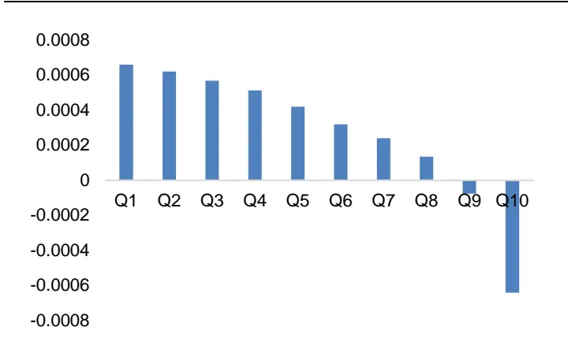
数据来源：Wind，天软科技，广发证券发展研究中心

图 19：RankIC表现（国证2000）
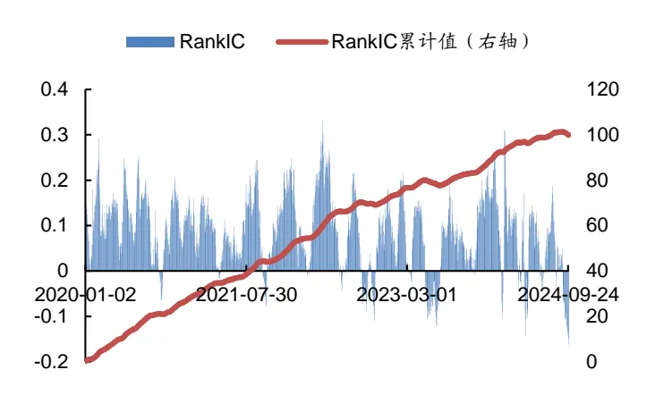
数据来源：Wind，天软科技，广发证券发展研究中心

图 20：多头及超额表现（国证2000）
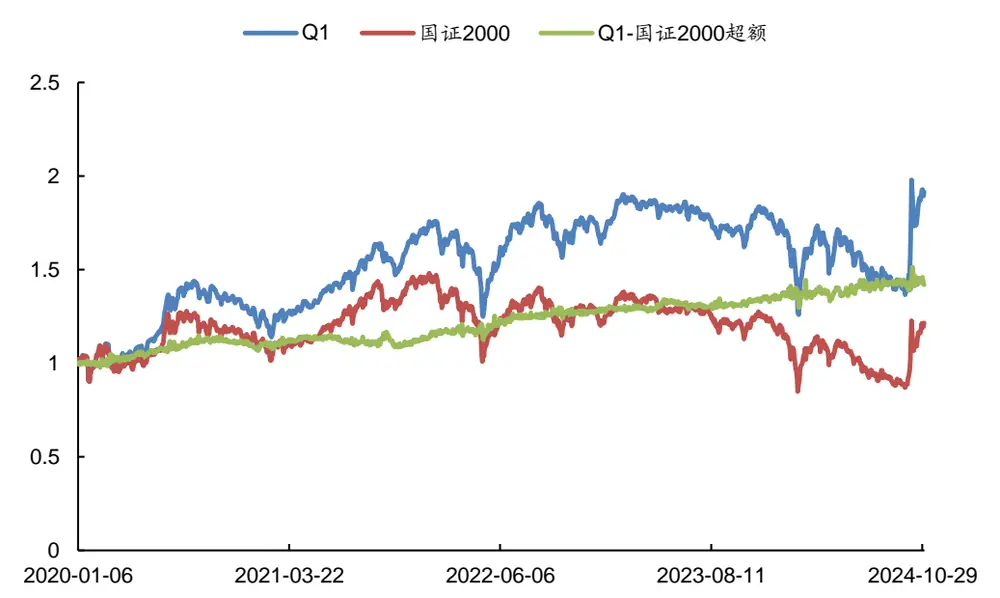
数据来源：Wind，天软科技，广发证券发展研究中心

表 7：分年度收益统计（国证2000）

| 组合 | 年份 | 总收益 | 年化收益率 | 最大回撤率 | 平均换手率 | 年化波动率 | 夏普比率 | 信息比率 |
| --- | --- | --- | --- | --- | --- | --- | --- | --- |
| Q1多头 | 2020.01~2024.10 | 91.40% | 14.30% | 33.76% | 68.61% | 22.29% | 0.53 | 0.64 |
|  | 2020年 | 27.82% | 27.82% | 13.72% | 70.26% | 22.67% | 1.12 | 1.23 |
|  | 2021年 | 35.75% | 35.41% | 12.09% | 68.66% | 15.92% | 2.07 | 2.22 |
|  | 2022年 | -3.53% | -3.51% | 28.98% | 70.57% | 21.64% | -0.28 | -0.16 |
|  | 2023年 | 4.37% | 4.35% | 14.78% | 66.79% | 12.20% | 0.15 | 0.36 |
|  | 2024.01~10 | 9.54% | 11.68% | 28.53% | 66.27% | 35.20% | 0.26 | 0.33 |
| Q1多头 相对国证 2000 超额 | 2020.01~2024.10 | 41.91% | 7.47% | 8.16% | 68.61% | 17.81% | 0.28 | 0.42 |
|  | 2020年 | 9.31% | 9.31% | 4.82% | 70.26% | 18.82% | 0.36 | 0.49 |
|  | 2021年 | 3.55% | 3.52% | 6.91% | 68.66% | 14.08% | 0.07 | 0.25 |
|  | 2022年 | 13.54% | 13.48% | 6.77% | 70.57% | 18.63% | 0.59 | 0.72 |
|  | 2023年 | 4.40% | 4.38% | 3.76% | 66.79% | 11.71% | 0.16 | 0.37 |
|  | 2024.01~10 | 5.76% | 7.03% | 8.16% | 66.27% | 24.62% | 0.18 | 0.29 |
| Q1-Q10 多空 | 2020.01~2024.10 | 349.07% | 36.23% | 5.99% | 69.41% | 7.68% | 4.39 | 4.72 |
|  | 2020年 | 59.70% | 59.70% | 2.86% | 71.04% | 7.99% | 7.16 | 7.47 |
|  | 2021年 | 37.53% | 37.17% | 5.99% | 69.11% | 7.17% | 4.84 | 5.19 |
|  | 2022年 | 46.77% | 46.54% | 3.04% | 71.78% | 7.69% | 5.72 | 6.05 |
|  | 2023年 | 14.25% | 14.19% | 5.74% | 67.04% | 6.18% | 1.89 | 2.30 |
|  | 2024.01~10 | 21.93% | 27.16% | 5.36% | 67.76% | 9.21% | 2.68 | 2.95 |
| 国证 2000 | 2020.01~2024.10 | 21.44% | 4.08% | 42.68% | 1 | 24.66% | 0.06 | 0.17 |
|  | 2020年 | 13.94% | 13.94% | 13.12% |  | 26.10% | 0.44 | 0.53 |
|  | 2021年 | 29.19% | 28.91% | 12.72% | 1 1 | 18.63% | 1.42 | 1.55 |
|  | 2022年 | -17.20% | -17.14% | 31.86% | 1 | 25.05% | -0.78 | -0.68 |
|  | 2023年 | -1.16% | -1.16% | 18.22% | 1 | 15.42% | -0.24 | -0.07 |
|  | 2024.01~10 | 0.81% | 0.98% | 29.29% | 1 | 35.66% | -0.04 | 0.03 |

数据来源：Wind，天软科技，广发证券发展研究中心

## （九）实证表现（创业板）

本文模型在创业板的样本外回测表现如下图表所示。本文模型因子在创业板的10分档收益单调性显著，RankIC历史均值为10.4%、胜率为89.2%。2020年~2024年10月期间，双边千三计费后的多头年化收益率为22.01%，相比同期的创业板综指取得了11.52%的超额年化收益率。

图 21：10分档表现（创业板）
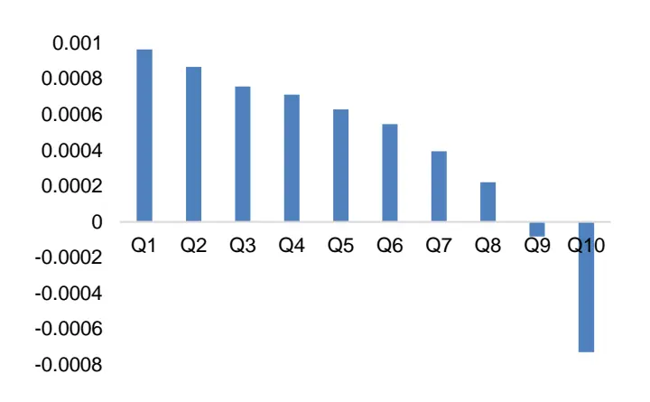
数据来源：Wind，天软科技，广发证券发展研究中心

图 22：RankIC表现（创业板）
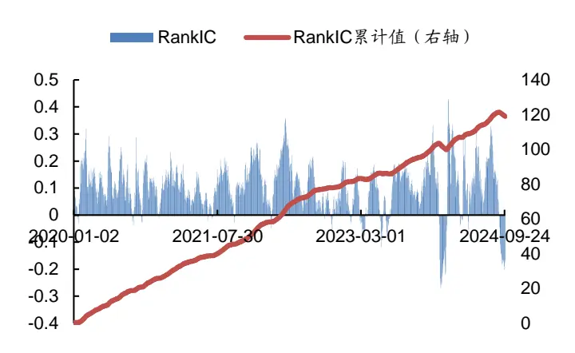
数据来源：Wind，天软科技，广发证券发展研究中心

图 23：多头及超额表现（创业板）
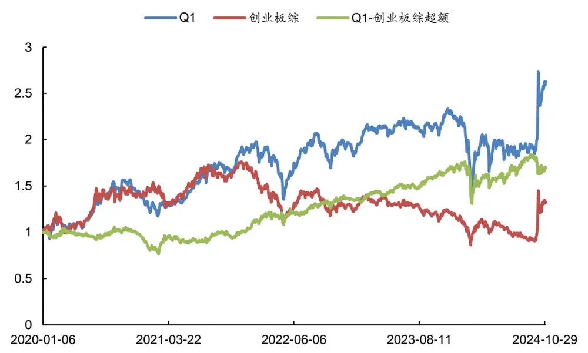
数据来源：Wind，天软科技，广发证券发展研究中心

表 8：分年度收益统计（创业板）

| 组合 | 年份 | 总收益 | 年化收益率 | 最大回撤率 | 平均换手率 | 年化波动率 | 夏普比率 | 信息比率 |
| --- | --- | --- | --- | --- | --- | --- | --- | --- |
| Q1多头 | 2020.01~2024.10 | 162.88% | 22.01% | 41.27% | 68.72% | 25.64% | 0.76 | 0.86 |
|  | 2020年 | 31.92% | 31.92% | 17.67% | 72.45% | 25.39% | 1.16 | 1.26 |
|  | 2021年 | 46.08% | 45.62% | 12.12% | 66.04% | 18.06% | 2.39 | 2.53 |
|  | 2022年 | -3.67% | -3.65% | 31.49% | 67.16% | 23.26% | -0.26 | -0.16 |
|  | 2023年 | 19.83% | 19.74% | 8.73% | 69.55% | 13.57% | 1.27 | 1.45 |
|  | 2024.01~10 | 18.18% | 22.44% | 39.09% | 68.69% | 42.46% | 0.47 | 0.53 |
| Q1多头 相对创业板综超额 | 2020.01~2024.10 | 69.84% | 11.52% | 27.83% | 68.72% | 22.97% | 0.39 | 0.50 |
|  | 2020年 | -12.07% | -12.07% | 17.00% | 72.45% | 23.35% | -0.62 | -0.52 |
|  | 2021年 | 19.91% | 19.73% | 11.76% | 66.04% | 21.91% | 0.79 | 0.90 |
|  | 2022年 | 27.54% | 27.41% | 11.28% | 67.16% | 21.68% | 1.15 | 1.26 |
|  | 2023年 | 24.96% | 24.85% | 3.87% | 69.55% | 13.58% | 1.65 | 1.83 |
|  | 2024.01~10 | 1.07% | 1.30% | 25.70% | 68.69% | 32.52% | -0.04 | 0.04 |
| Q1-Q10 多空 | 2020.01~2024.10 | 602.02% | 49.35% | 12.79% | 69.62% | 10.46% | 4.48 | 4.72 |
|  | 2020年 | 66.22% | 66.22% | 3.56% | 72.25% | 9.41% | 6.77 | 7.04 |
|  | 2021年 | 56.15% | 55.58% | 3.92% | 67.52% | 9.61% | 5.52 | 5.78 |
|  | 2022年 | 65.63% | 65.29% | 2.51% | 69.14% | 8.97% | 7.00 | 7.28 |
|  | 2023年 | 25.03% | 24.92% | 6.40% | 69.50% | 8.02% | 2.80 | 3.11 |
|  | 2024.01~10 | 30.60% | 38.21% | 12.79% | 70.02% | 15.65% | 2.28 | 2.44 |
| 创业板综 | 2020.01~2024.10 | 32.74% | 6.00% | 51.08% | 1 | 27.67% | 0.13 | 0.22 |
|  | 2020年 | 44.08% | 44.08% | 18.11% | 1 | 30.11% | 1.38 | 1.46 |
|  | 2021年 | 17.93% | 17.77% | 16.57% | 1 | 22.27% | 0.69 | 0.80 |
|  | 2022年 | -26.77% | -26.68% | 34.94% | 1 | 26.03% | -1.12 | -1.02 |
|  | 2023年 | -5.41% | -5.39% | 20.32% | 1 | 16.51% | -0.48 | -0.33 |
|  | 2024.01~10 | 12.78% | 15.70% | 25.93% | 1 | 40.41% | 0.33 | 0.39 |

数据来源：Wind，天软科技，广发证券发展研究中心

## 四、卷积模型与时序模型

若需进一步了解卷积模型和时序模型，可参考本小节的综述性介绍。

## （一）循环神经网络

循环神经网络（Recurrent Neural Network，RNN）是一类以序列数据为输入，在序列的演进方向进行递归且所有节点（循环单元）按链式连接的递归神经网络。尽管循环神经网络演进出了长短期记忆（Long Short-Term Memory，LSTM）、门控循环单元（Gated Recurrent Units，GRU）等多种形式，但其基本结构相同，如下图所示。假设该网络以一组包含价格和交易量的二维序列数据为输入，循环神经网络节点首先将初始化的隐藏层状态（Hidden State）h0和第一个时间节点上的价格和交易量数据（即0.08和1000）作为输入，在信息处理后输出下一个隐藏层状态h1。随后在下一个节点的计算中，则以上一个隐藏层状态h1和第二个时间节点上的价格和交易量数据（即-0.03和8000）作为输入，然后输出下一个隐藏层状态h2，如此进行直至处理完输入中的最后一个时间节点的数据。在处理完所有数据后，通常将最后一个隐藏层状态hn作为最终输出，使用一个前馈神经网络（Feedforwardneural network）对其进行降维后与未来股价走势进行建模，以此来实现模型的训练和回测。

图 24：循环神经网络结构
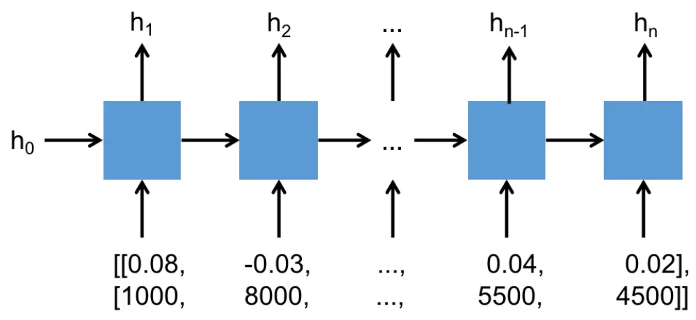
数据来源：广发证券发展研究中心

## （二）Transformer 模型

Transformer是近年来受到广泛研究和应用的一种时序模型，其通过多头注意力机制（Multi-Head Attention）来捕获输入时序数据中的前后关系，结构如下图所示。与传统的循环神经网络相比，Transformer克服了短期记忆的缺点，具有能建模超长序列数据之间关系的能力。此外，Transformer能够并行化处理数据，替代了传统循环神经网络递归式处理数据的范式，大大提高了运算速度。

图 25：Transformer模型结构

数据来源：Vaswani A, Shazeer N, Parmar N, et al.论文《Attention is all you need》，广发证券发展研究中心

## （三）卷积神经网络

卷积神经网络是当今计算机视觉领域的重要基础模型之一，其被广泛应用在图像识别领域。卷积神经网络的雏形为日本学者福岛邦彦（Kunihiko Fukushima）在其1979和1980年发表的论文中提出的neocognitron模型。neocognitron模型由S层（Simple-Layer）和C层（Complex-Layer）构成，是一个具有深度结构的神经网络。其通过S层单元和C层单元分别对图像特征进行提取、接收和响应不同感受野返回的特征。由于neocognitron模型初步实现了卷积神经网络中卷积层（Convolution Layer）和池化层（Pooling Layer）的功能，其在学界内被认为是卷积神经网络领域的开创性研究工作。

1987年，Alexander Waibel等提出第一个较为完备的卷积神经网络，即网络时间延迟网络（Time Delay Neural Network, TDNN）。TDNN使用FFT预处理的语音信号作为输入，由2个一维卷积核组成隐藏层，以提取语音信号频率域上的平移不变特征，其在语音识别领域上的表现超过了同等条件下当时的主流算法隐马尔可夫模型（Hidden Markov Model, HMM）。

1988年，第一个应用于医学影像检测的二维卷积神经网络由Wei Zhang等提出。1989年，Yann LeCun构建了包含2个卷积层、2个全连接层、共计6万个学习参数的卷积神经网络LeNet。在LeCun对其网络结构进行论述时首次使用了“卷积”一词，“卷积神经网络”因此得名。

1998年，Yann LeCun等人在LeNet的基础上构建了更加完备的卷积神经网络LeNet-5。LeNet-5结构如下图所示，其定义了现代卷积神经网络的基本结构。LeNet-5在手写数字识别任务上的成功使得卷积神经网络得到了广泛关注。2003年，微软基于卷积神经网络开发了光学字符读取（Optical Character Recognition，OCR）系统。

图 26：LeNet-5网络结构图
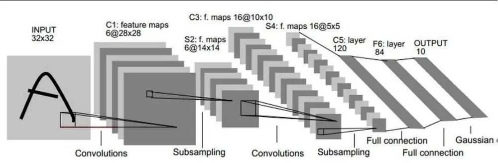
数据来源：Yann Lecun，Patrick Haffner, et all论文《Gradient-Based Learning Applied toDocument Recognition》，广发证券发展研究中心

2006年，随着深度学习理论的提出，卷积神经网络的表征学习能力得到了更广泛的关注，并随着CPU、GPU等数值计算硬件设备的研发得到了快速发展。自2012年的AlexNet 开始，卷积神经网络多次成为ImageNet大规模视觉识别竞赛（ImageNet Large Scale Visual Recognition Challenge, ILSVRC）的优胜算法，包括2013年的ZFNet、2014年的VGGNet、GoogLeNet和2015年的ResNet。

以图像识别中最经典的卷积神经网络VGG16为例，其共包含了13个卷积层、3个全连接层、3个最大值池化层以及一个softmax分类层，结构如下图所示。下面对卷积神经网络中的主要部分进行介绍。

图 27：VGG16网络结构图
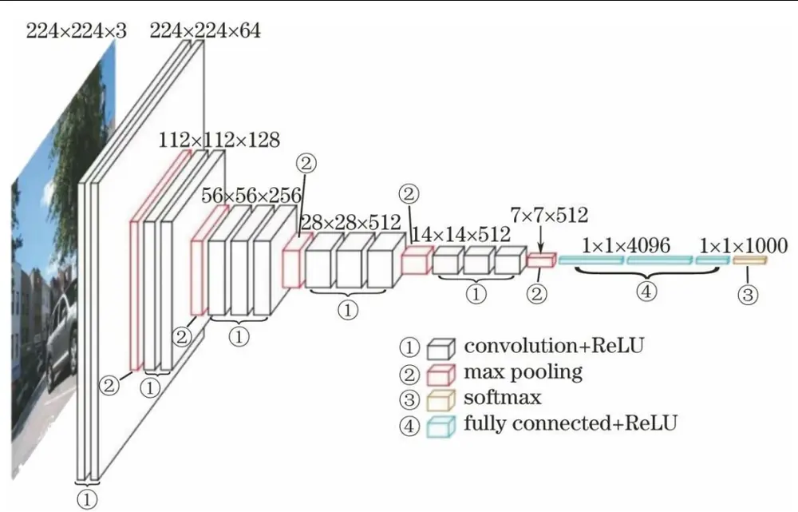
数据来源：Karen Simonyan, Andrew Zisserman论文《Very deep convolutional networks forlarge-scale image recognition》，广发证券发展研究中心
识别风险，发现价值

## 1. 卷积层

卷积层进行的是卷积（Convolution）即乘加运算，其目的与传统图像处理中的滤波器运算相似。如下图所示，将卷积核与输入数据进行卷积运算。在这个例子中，输入数据和卷积核都是有长和高的二维矩阵，输入的大小为（4，4），卷积核的大小为（3，3），输出的大小为（2，2）。如图中所示，在每个位置上将卷积核的元素与输入的元素相乘再求和，即乘积累加运算。然后将经过卷积核的运算结果输出到相应的位置。在逐次将卷积核与输入数据进行卷积运算并加上偏置量后即得到卷积层的输出。

图 28：卷积（Convolution）运算示意图
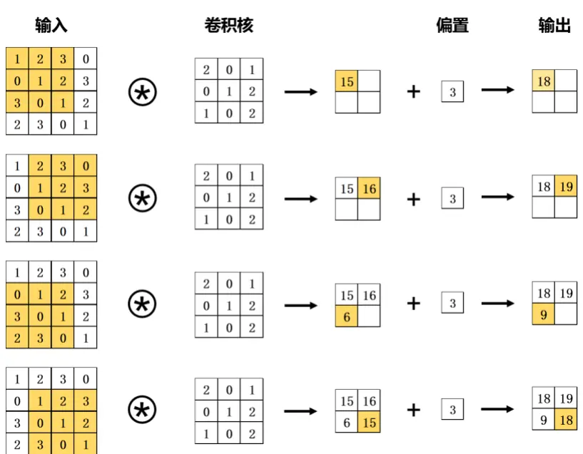
数据来源：斋藤康毅《深度学习入门》，广发证券发展研究中心

由于模型运算的需要，通常在卷积运算前会通过填充（adding）操作向输入数据的周围填入固定的数值（比如0等）。如图8所示，将幅度为1的填充操作应用于输入大小为（4，4）的数据。经过填充后的输入数据大小变为（6，6），将其与（3，3）的卷积核进行卷积运算得到（4，4）的输出数据。

图 29：填充（Padding）示意图
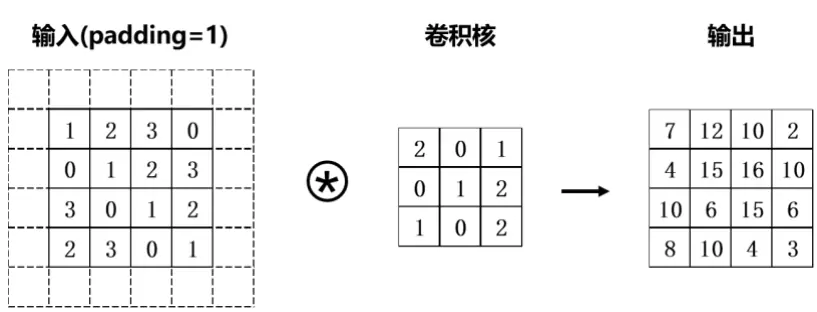
数据来源：斋藤康毅《深度学习入门》，广发证券发展研究中心

使用填充操作的目的是调整输出特征的大小。比如，将（3，3）的卷积核应用于大小为（4，4）的输入数据时，输出数据的大小变为（2，2），也就是说输出数据的大小比输入数据的大小缩减了 2 个元素。在深度网络中包含了众多的卷积运算操作，如果每次卷积运算都使数据的维度大小缩减，那么就有可能导致某一层数据的输出大小为 1，使卷积运算无法继续运行。而填充操作则可以避免这种情况。在上述例子中所应用的填充幅度大小为 1，使得输入数据和输出数据的大小得以保持，也就是说卷积运算可以在输入和输出两端维度大小不变的情况下进行。

卷积的运算间隔称为步幅（Stride）。若步幅由1变为2，卷积操作则如图9所示，即运算间隔变为两个元素。

图 30：步幅（Stride）为2的卷积运算示意图
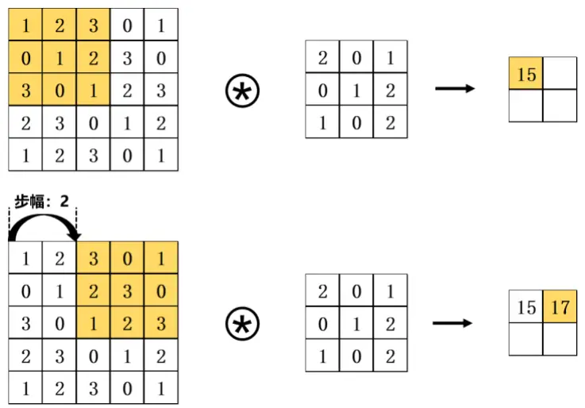
数据来源：斋藤康毅《深度学习入门》，广发证券发展研究中心

综上，假设输入大小为（H，W），卷积核的大小为（FH，FW），输出大小为（OH，OW），填充为P，步幅为S，通过下式可计算得到输出大小：

$$
\mathrm{OH}=\frac{\mathrm{H}+2\mathrm{P}-\mathrm{FH}}{\mathrm{S}}+1,\mathrm{OH}=\frac{\mathrm{W}+2\mathrm{P}-\mathrm{FW}}{\mathrm{S}}+1\text{ 。 }
$$

## 2. 池化层

池化（Pooling）操作具有平移不变性、旋转不变性和尺度不变性，可以起到降维、去除冗余信息的作用，从而达到降低网络复杂度、减小计算量的目的。此外，池化本身可以实现非线性运算，还可以提高模型的鲁棒性。池化通常包括两种：最大值池化（Max Pooling）和平均池化（Average Pooling）。最大值池化是从目标区域中取出最大值，平均池化则是计算目标区域中的平均值，在目标检测领域通常使用最大值池化。图10是一个以步幅为2的2×2最大值池化运算示意图，其中2 x 2代表目标区域的大小。其2×2窗口的移动间隔为2个元素，从其中取出最大的元素。

图 31：池化（Pooling）运算示意图
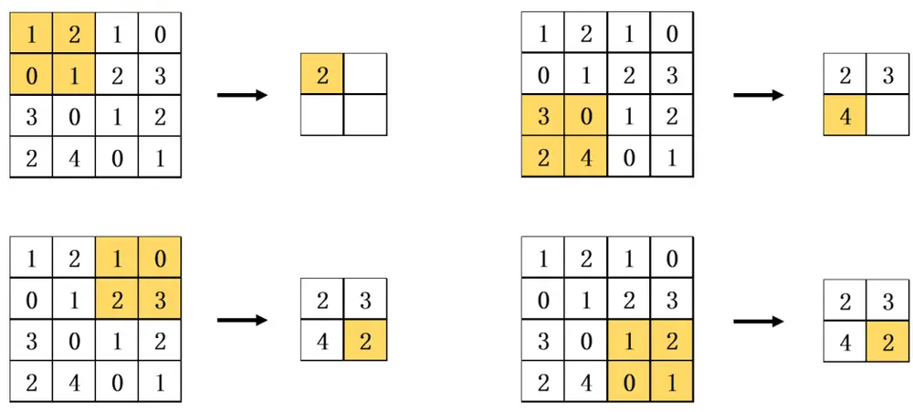
数据来源：斋藤康毅《深度学习入门》，广发证券发展研究中心

通过卷积运算，卷积神经网络能有效捕捉到图像中的局部结构特征，并通过深层网络不断提高感受野（Receptive Field）的大小，从而实现对图片全局特征的提取。因此，卷积神经网络能够有效识别价量数据图表中价格和交易量的走势形态，并与未来股价进行建模。

## 五、总结与展望

在去年发布的《基于卷积神经网络的股价走势AI识别与分类》研究报告中，创新性地采用基于深度学习的图像识别技术，将价量数据图表与未来股价走势进行建模，以实现股票价格预测。

本文以“多模态、多尺度”为题，基于AI看图初版模型进行了大幅改进，新的模型结构如右图1所示。本文模型在日度价量数据图表的基础上，加入了高频因子数据、日频时序数据、周度价量数据图表，采用4个独立的深度时序模型和深度卷积模型进行多模态、多尺度的特征提取，并同时采用回归损失和分类损失以端到端的方式进行模型训练，有效提升了模型对未来股价的预测能力，取得了更为显著的超额收益。

以2020/01/01~2024/10/31作为样本外回测区间，每20个交易日进行换仓，本文模型预测结果在全市场、沪深300、中证500、中证800、中证1000、国证2000、创业板的RankIC均值分别为8.7%、7.9%、6.6%、6.9%、8.2%、8.7、10.4%，RankIC胜率分别为86.7%、69.0%、73.5%、75.2%、84.8%、86.1%、89.2%。以全市场作为回测统计口径，对比AI看图初始版本，本文模型的RankIC均值提升了3.0%，RankIC胜率提升了7.8%。

以2020/01/01~2024/10/31作为样本外回测区间，基于本文模型因子在全市场、

识别风险，发现价值

沪深300、中证500、中证800、中证1000、国证2000、创业板分别构建10分档多头股票组合，双边千三计费后，多头股票组合分别相对对应板块指数取得了12.97%、9.17%、5.30%、8.38%、7.47、7.47%、11.52的超额年化收益率。

整体而言，本文模型因子与Barra风格因子的相关性较低，其中，相关性最高的三个Barra风格因子为流动性因子、波动率因子和市值因子，相关系数分别为-18%、-16%和-8%。

本报告以研发为主要目的，对模型进行了严谨的训练、验证、以及回测。其中，训练样本为2008~2016年数据，验证样本为2017~2019年数据，回测样本为2020~2024年数据。从理论上来说，通过加入更新、更多的训练样本，结合滚动训练等方式，能够进一步提升模型对未来股价的预测能力，取得更为显著的超额收益。

## 六、风险提示

本文所述模型用量化方法通过历史数据统计、建模和测算完成，所得结论与规律在市场政策、环境变化时存在失效风险；

本文策略在市场结构及交易行为改变时有可能存在失效风险；

因量化模型不同，本文提出的观点可能与其他量化模型结论存在差异。

## [Table_ResearchTeam] 广发金融工程研究小组

罗军 ：首席分析师，华南理工大学硕士，从业 16 年，2010 年进入广发证券发展研究中心。

安 宁 宁 ：首席分析师，暨南大学硕士，从业 14 年，2011 年进入广发证券发展研究中心。

史 庆 盛 ：资深分析师，华南理工大学硕士，2011 年进入广发证券发展研究中心。

张 超 ：资深分析师，中山大学硕士，2012 年进入广发证券发展研究中心。

陈 原 文 ：资深分析师，中山大学硕士，2015 年进入广发证券发展研究中心。

李豪 ：资深分析师，上海交通大学硕士，2016 年进入广发证券发展研究中心。

周 飞 鹏 ：资深分析师，伯明翰大学硕士，2021 年加入广发证券发展研究中心。

张 钰 东 ：资深分析师，中山大学硕士，2020 年进入广发证券发展研究中心。

季 燕 妮 ：资深分析师，厦门大学硕士，2020 年进入广发证券发展研究中心。

林 涛 ：研究员，中山大学硕士，2024 年进入广发证券发展研究中心。

## [Table_IndustryInvestDescription] 广发证券—行业投资评级说明

买入： 预期未来12个月内，股价表现强于大盘10%以上。

持有： 预期未来12个月内，股价相对大盘的变动幅度介于-10%～+10%。

卖出： 预期未来12个月内，股价表现弱于大盘10%以上。

## [Table_CompanyInvestDescription] 广发证券—公司投资评级说明

买入： 预期未来 12 个月内，股价表现强于大盘 15%以上。

增持： 预期未来12个月内，股价表现强于大盘5%-15%。

持有： 预期未来12个月内，股价相对大盘的变动幅度介于-5%～+5%。

卖出： 预期未来12个月内，股价表现弱于大盘5%以上。

## [Table_Address] 联系我们

| 地址 | 广州市 | 深圳市 | 北京市 | 上海市 | 香港 |
| --- | --- | --- | --- | --- | --- |
|  | 广州市天河区马场路 | 深圳市福田区益田路 | 北京市西城区月坛北 | 上海市浦东新区南泉 | 香港湾仔骆克道81号 |
|  | 26号广发证券大厦47 | 6001号太平金融大厦 | 街2号月坛大厦18层 | 北路429号泰康保险 | 广发大厦27楼 |
|  | 楼 | 31层 |  | 大厦37楼 |  |
|  | 邮政编码 510627 客服邮箱 gfzqyf@gf.com.cn | 518026 | 100045 | 200120 |  |

## [Table_LegalD 法律主体isclaimer 声明]

本报告由广发证券股份有限公司或其关联机构制作，广发证券股份有限公司及其关联机构以下统称为“广发证券”。本报告的分销依据不同国家、地区的法律、法规和监管要求由广发证券于该国家或地区的具有相关合法合规经营资质的子公司/经营机构完成。

广发证券股份有限公司具备中国证监会批复的证券投资咨询业务资格，接受中国证监会监管，负责本报告于中国（港澳台地区除外）的分销。广发证券（香港）经纪有限公司具备香港证监会批复的就证券提供意见（4 号牌照）的牌照，接受香港证监会监管，负责本报告于中国香港地区的分销。

本报告署名研究人员所持中国证券业协会注册分析师资质信息和香港证监会批复的牌照信息已于署名研究人员姓名处披露。

## [Table_I 重要mportant 声明N

广发证券股份有限公司及其关联机构可能与本报告中提及的公司寻求或正在建立业务关系，因此，投资者应当考虑广发证券股份有限公司及其关联机构因可能存在的潜在利益冲突而对本报告的独立性产生影响。投资者不应仅依据本报告内容作出任何投资决策。投资者应自主作出投资容决策并自行承担投资风险，任何形式的分享证券投资收益或者分担证券投资损失的书面或者口头承诺均为无效。

本报告署名研究人员、联系人（以下均简称“研究人员”）针对本报告中相关公司或证券的研究分析内容，在此声明：（ ）本报告的全部分析结论、研究观点均精确反映研究人员于本报告发出当日的关于相关公司或证券的所有个人观点，并不代表广发证券的立场；（2）研究人员的部分或全部的报酬无论在过去、现在还是将来均不会与本报告所述特定分析结论、研究观点具有直接或间接的联系。

研究人员制作本报告的报酬标准依据研究质量、客户评价、工作量等多种因素确定，其影响因素亦包括广发证券的整体经营收入，该等经营收入部分来源于广发证券的投资银行类业务。

本报告仅面向经广发证券授权使用的客户/特定合作机构发送，不对外公开发布，只有接收人才可以使用，且对于接收人而言具有保密义务。广发证券并不因相关人员通过其他途径收到或阅读本报告而视其为广发证券的客户。在特定国家或地区传播或者发布本报告可能违反当地法律，广发证券并未采取任何行动以允许于该等国家或地区传播或者分销本报告。

本报告所提及证券可能不被允许在某些国家或地区内出售。请注意，投资涉及风险，证券价格可能会波动，因此投资回报可能会有所变化，过去的业绩并不保证未来的表现。本报告的内容、观点或建议并未考虑任何个别客户的具体投资目标、财务状况和特殊需求，不应被视为对特定客户关于特定证券或金融工具的投资建议。本报告发送给某客户是基于该客户被认为有能力独立评估投资风险、独立行使投资决策并独立承担相应风险。

本报告所载资料的来源及观点的出处皆被广发证券认为可靠，但广发证券不对其准确性、完整性做出任何保证。报告内容仅供参考，报告中的信息或所表达观点不构成所涉证券买卖的出价或询价。广发证券不对因使用本报告的内容而引致的损失承担任何责任，除非法律法规有明确规定。客户不应以本报告取代其独立判断或仅根据本报告做出决策，如有需要，应先咨询专业意见。

广发证券可发出其它与本报告所载信息不一致及有不同结论的报告。本报告反映研究人员的不同观点、见解及分析方法，并不代表广发证券的立场。广发证券的销售人员、交易员或其他专业人士可能以书面或口头形式，向其客户或自营交易部门提供与本报告观点相反的市场评论或交易策略，广发证券的自营交易部门亦可能会有与本报告观点不一致，甚至相反的投资策略。报告所载资料、意见及推测仅反映研究人员于发出本报告当日的判断，可随时更改且无需另行通告。广发证券或其证券研究报告业务的相关董事、高级职员、分析师和员工可能拥有本报告所提及证券的权益。在阅读本报告时，收件人应了解相关的权益披露（若有）。

本研究报告可能包括和/或描述/呈列期货合约价格的事实历史信息（“信息”）。请注意此信息仅供用作组成我们的研究方法/分析中的部分论点依据/证据，以支持我们对所述相关行业/公司的观点的结论。在任何情况下，它并不（明示或暗示）与香港证监会第5类受规管活动（就期货合约提供意见）有关联或构成此活动。

## [Table_Interest 权益披露Disclosur

(1)广发证券（香港）跟本研究报告所述公司在过去12 个月内并没有任何投资银行业务的关系。

## [Table_Copyright] 版权声明

未经广发证券事先书面许可，任何机构或个人不得以任何形式翻版、复制、刊登、转载和引用，否则由此造成的一切不良后果及法律责任由私自翻版、复制、刊登、转载和引用者承担。