# [Table_Title]AI 复盘之精选 30 策略组合

# 深度学习研究报告

## 报告摘要：

技术分析：技术分析是一种通过分析历史价量数据来预测股票未来价格走势的方法。它的核心假设是价量数据可以充分解释市场信息，并且价格呈现出一定的趋势，历史数据会在某种程度上重复。技术分析通常采用各种图表和技术指标，如 K 线图、移动平均线、MACD 等，来识别市场趋势、潜在反转点和交易信号等。通过这些工具，投资者可以分析市场的买卖力量、价格波动及其变化趋势。

AI 复盘之精选 30 策略组合：传统的技术分析通常依靠长期的人类经验积累。在如今人工智能技术快速发展的时代背景下，图像识别技术或许能替代人工看图，更准确地进行技术分析。在这一方面，团队在去年曾发表相关研究报告《基于卷积神经网络的股价走势 AI 识别与分类》。团队在过去一年多的时间里，对 AI 复盘进行不断改进，构建出了大盘精选 30（Wind指数代码：GFAI30.WI）等多个策略组合。

大盘精选 30策略组合：在 2020~2024年期间，大盘精选 30策略组合取得了 244.56%的累计收益率，折合年化收益率为 29.42%，最大回撤率为 19.80%，年化波动率为 18.24%。在 2024年期间，大盘精选 30策略组合取得了 40.88%的年化收益率，最大回撤率为 8.82%，年化波动率为 20.47%。

风险提示：（1）本文所述模型用量化方法通过历史数据统计、建模和测算完成，所得结论与规律在市场政策、环境变化时存在失效风险；（2）本文策略在市场结构及交易行为改变时有可能存在失效风险；（3）因量化模型不同，本文提出的观点可能与其他量化模型结论存在差异。

图 1：大盘精选 30（GFAI30.WI）
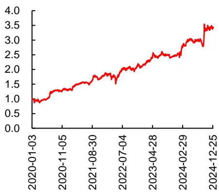
数据来源：Wind，广发证券发展研究中心

[分析师： Table_Author]安宁宁

SAC 执证号：S0260512020003

SFC CE No. BNW179

0755-23948352

anningning@gf.com.cn

分析师： 陈原文

SAC 执证号：S0260517080003

0755-82797057

chenyuanwen@gf.com.cn

请注意，陈原文并非香港证券及期货事务监察委员会的注册持牌人，不可在香港从事受监管活动。

## [Table_ 相关研究：DocRe

基于卷积神经网络的股价走 2023-04-06势AI识别与分类

[联系人： Table_Contacts] 林涛

0755 - 82528531

gflintao@gf.com.cn

## 一、技术分析与 AI 看图

股票技术分析是一种通过研究历史价格和交易量数据，预测未来股票价格走势的方法。其原理基于三个核心假设：（1）股票价格可以充分反映市场信息，包括公司基本面、新闻事件、市场情绪等；（2）价格是有趋势的，历史价格走势往往会沿着某一方向发展，因此，识别趋势是技术分析的重要任务；（3）历史会重复，市场行为具有周期性，过去的价格模式可能会在未来重复出现。因此，技术分析通过图表和各种技术指标来分析和预测未来的价格变化。

在方法上，技术分析使用多种工具和指标来解读市场信息。最基础的工具是K线图（蜡烛图），它通过每个交易周期的开盘、收盘、最高和最低价格描绘出市场的买卖情绪，揭示市场的价格行为和可能的趋势反转信号。趋势线则通过连接股票价格的高点或低点来显示价格的趋势方向。支撑和阻力是另一个常见的概念，用于识别价格反转的可能区域。支撑线表示价格下跌时可能遇到的“底部”，而阻力线则是价格上涨时可能遇到的“顶部”。技术分析还广泛使用移动平均线，如简单移动平均线（SMA）和指数移动平均线（EMA），它们能够平滑价格波动，揭示市场的总体趋势。相对强弱指数（RSI）和指数平滑异同移动平均线（MACD）是两种常用的动量指标，它们用来衡量市场的超买或超卖情况，帮助判断趋势的反转时机。

技术分析不仅能够帮助市场参与者在短期内抓住价格波动的机会，还能帮助市场参与者在中长期交易中识别长期趋势和关键支撑阻力区域时提供参考。技术分析不仅适用于股票市场，还可以应用于期货、外汇、债券等其他金融市场。通过分析价格走势、交易量和技术指标，投资者可以及时调整投资策略，把握市场潜在机会。

图 1：价量数据图表
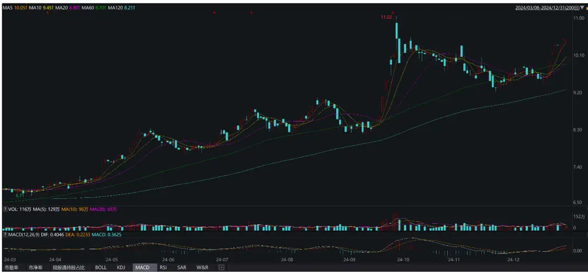
数据来源：Wind，广发证券发展研究中心

传统的技术分析通常依靠人类的长期经验积累。在如今人工智能技术快速发展的时代背景下，图像识别技术或许能替代人工看图，更准确地进行技术分析。在这一方面，团队在去年曾发表相关研究报告《基于卷积神经网络的股价走势AI识别与分类》。团队在过去一年多的时间里，对AI复盘进行不断改进，构建出了大盘精选30（Wind指数代码：GFAI30.WI）等多个策略组合。

AI看图主要由标准化价量数据图表和卷积神经网络所构成。其中，本文所采用的标准化价量数据图表如下图所示，包含60个交易日窗口期的价量数据，其由3部分构成：（1）图表的上部分由包含开、高、低、收价格的K线图构成；（2）图表的中部分由当日对应的成交量构成；（3）图表的下部分由股价的MACD信息构成。

图 2：标准化价量数据图表
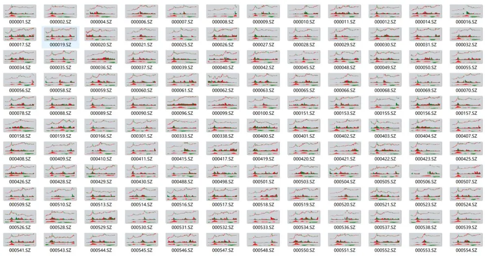
数据来源：广发证券发展研究中心

用于AI看图的卷积神经网络模型如下图所示，其由经典的ResNet残差卷积结构所构成，输入为标准化价量数据图表，输出为未来股价涨跌。在模型的实现细节上，采用Adam优化器对模型进行训练，采用训练数据外的验证集对训练中的模型进行验证，以确定最优的早停（Early Stopping）时点。

图 3：AI看图的卷积神经网络模型结构图
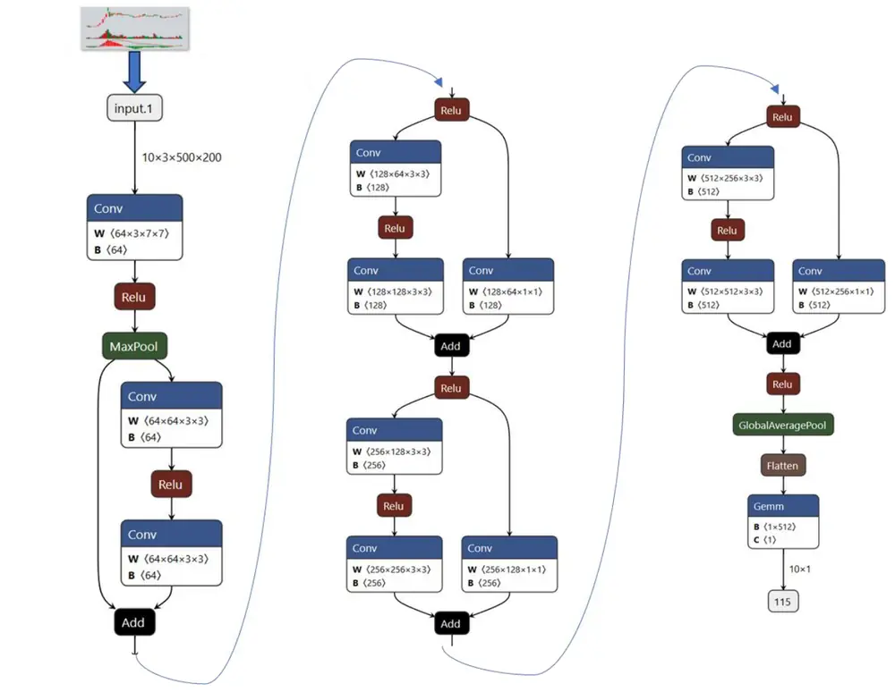
数据来源：广发证券发展研究中心

## 二、卷积模型与时序模型

基于价量数据对未来股价走势进行预测作为一类重要的机器学习量化选股策略，在过去受到了广泛的研究和应用。由于个股的价量数据是随着交易活动的进行而产生的，其本质上是关于时间的一组序列。因此，为了建模价量数据与未来股价走势之间的关系，大多数研究方法自然而然地使用了循环神经网络（Recurrent NeuralNetwork，RNN）或Transformer这两大类时序模型。

在这些方法中，模型的输入是关于价量数据的一维或多维数组，输出则是股价的未来走势。然而，尽管时序模型在一定程度上能够捕捉到价量序列中诸如价格、交易量的上涨或下跌及其相互交织的高维信息，但其无法对价格和交易量的走势形态及其变化进行有效识别。

举个例子对此进行解释。以人类视角来看，通常在对股价的未来走势进行预测时，并不会选择直接观测一组关于价量的序列，因为能从中捕获到的不只是数字上的涨跌。为了能更好地捕捉到价格和交易量的形态走势，通常会选择观测包含k线图、移动平均价、交易量、MACD数据的图表，而不是一组纯粹的数字。

因此，在本文及前序研究《基于卷积神经网络的股价走势AI识别与分类》中，创新性地采用图像识别技术，基于价量数据图表对股价的未来走势进行预测。

本小节将对卷积模型和时序模型进行综述性介绍。

## （一）循环神经网络

循环神经网络（Recurrent Neural Network，RNN）是一类以序列数据为输入，在序列的演进方向进行递归且所有节点（循环单元）按链式连接的递归神经网络。尽管循环神经网络演进出了长短期记忆（Long Short-Term Memory，LSTM）、门控循环单元（Gated Recurrent Units，GRU）等多种形式，但其基本结构相同，如下图所示。假设该网络以一组包含价格和交易量的二维序列数据为输入，循环神经网络节点首先将初始化的隐藏层状态（Hidden State）h0和第一个时间节点上的价格和交易量数据（即0.08和1000）作为输入，在信息处理后输出下一个隐藏层状态h1。随后在下一个节点的计算中，则以上一个隐藏层状态h1和第二个时间节点上的价格和交易量数据（即-0.03和8000）作为输入，然后输出下一个隐藏层状态h2，如此进行直至处理完输入中的最后一个时间节点的数据。在处理完所有数据后，通常将最后一个隐藏层状态hn作为最终输出，使用一个前馈神经网络（Feedforwardneural network）对其进行降维后与未来股价走势进行建模，以此来实现模型的训练和回测。

图 4：循环神经网络结构
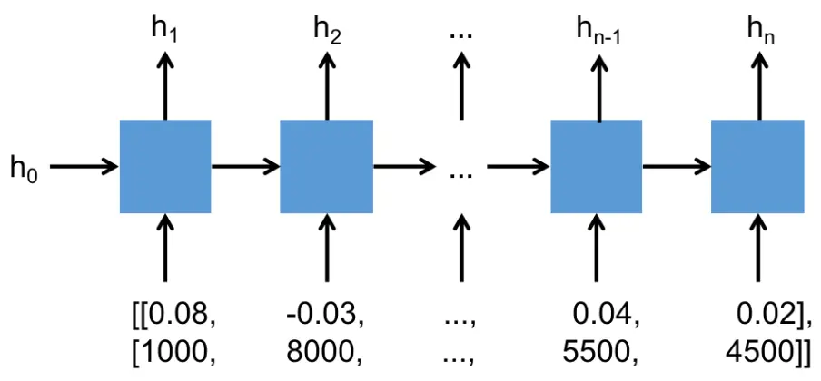
数据来源：广发证券发展研究中心

## （二）Transformer 模型

Transformer是近年来受到广泛研究和应用的一种时序模型，其通过多头注意力机制（Multi-Head Attention）来捕获输入时序数据中的前后关系，结构如下图所示。与传统的循环神经网络相比，Transformer克服了短期记忆的缺点，具有能建模超长序列数据之间关系的能力。此外，Transformer能够并行化处理数据，替代了传统循环神经网络递归式处理数据的范式，大大提高了运算速度。

图 5：Transformer模型结构
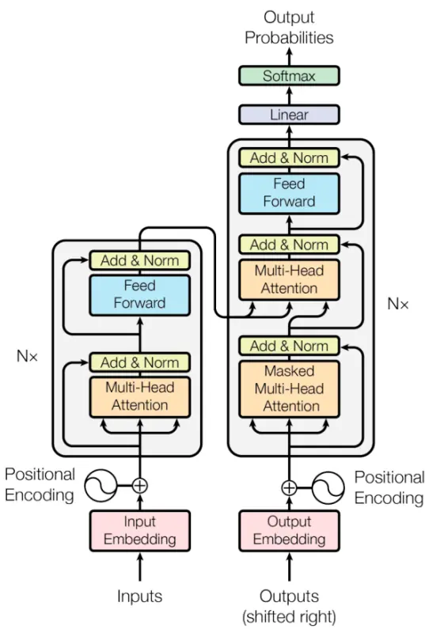
数据来源：Vaswani A, et al.论文《Attention is all you need》，广发证券发展研究中心

## （三）卷积神经网络

卷积神经网络是当今计算机视觉领域的重要基础模型之一，其被广泛应用在图像识别领域。卷积神经网络的雏形为日本学者福岛邦彦（Kunihiko Fukushima）在其1979和1980年发表的论文中提出的neocognitron模型。neocognitron模型由S层（Simple-Layer）和C层（Complex-Layer）构成，是一个具有深度结构的神经网络。其通过S层单元和C层单元分别对图像特征进行提取、接收和响应不同感受野返回的特征。由于neocognitron模型初步实现了卷积神经网络中卷积层（Convolution Layer）和池化层（Pooling Layer）的功能，其在学界内被认为是卷积神经网络领域的开创性研究工作。

1987年，Alexander Waibel等提出第一个较为完备的卷积神经网络，即网络时间延迟网络（Time Delay Neural Network, TDNN）。TDNN使用FFT预处理的语音信号作为输入，由2个一维卷积核组成隐藏层，以提取语音信号频率域上的平移不变特征，其在语音识别领域上的表现超过了同等条件下当时的主流算法隐马尔可夫模型（Hidden Markov Model, HMM）。

1988年，第一个应用于医学影像检测的二维卷积神经网络由Wei Zhang等提出。1989年，Yann LeCun构建了包含2个卷积层、2个全连接层、共计6万个学习参数的卷积神经网络LeNet。在LeCun对其网络结构进行论述时首次使用了“卷积”一词，“卷积神经网络”因此得名。

1998年，Yann LeCun等人在LeNet的基础上构建了更加完备的卷积神经网络LeNet-5。LeNet-5结构如下图所示，其定义了现代卷积神经网络的基本结构。LeNet-5在手写数字识别任务上的成功使得卷积神经网络得到了广泛关注。2003年，微软基于卷积神经网络开发了光学字符读取（Optical Character Recognition，OCR）系统。

图 6：LeNet-5网络结构图
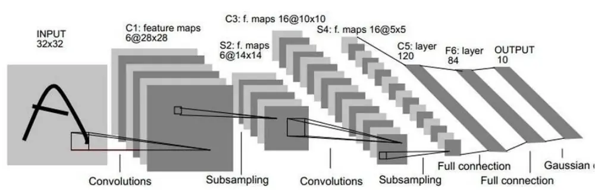
数据来源：Yann Lecun，Patrick Haffner, et all论文《Gradient-Based Learning Applied toDocument Recognition》，广发证券发展研究中心

2006年，随着深度学习理论的提出，卷积神经网络的表征学习能力得到了更广泛的关注，并随着CPU、GPU等数值计算硬件设备的研发得到了快速发展。自2012年的AlexNet 开始，卷积神经网络多次成为 ImageNet大规模视觉识别竞赛（ImageNet Large Scale Visual Recognition Challenge, ILSVRC）的优胜算法，包括2013年的ZFNet、2014年的VGGNet、GoogLeNet和2015年的ResNet。

以图像识别中最经典的卷积神经网络VGG16为例，其共包含了13个卷积层、3个全连接层、3个最大值池化层以及一个softmax分类层，结构如下图所示。下面对卷积神经网络中的主要部分进行介绍。

图 7：VGG16网络结构图
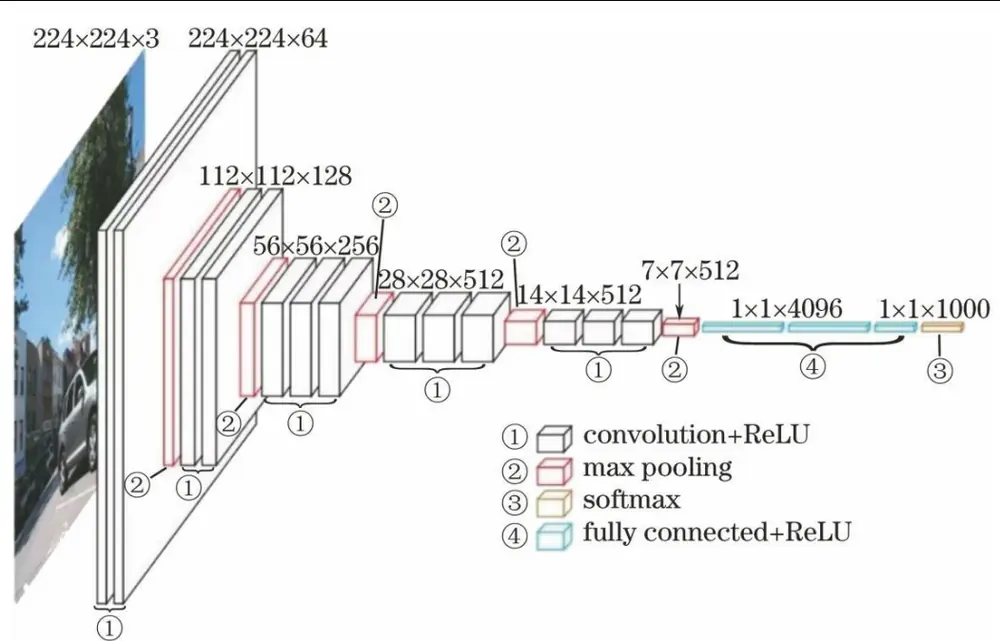
数据来源：Karen Simonyan, Andrew Zisserman论文《Very deep convolutional networks forlarge-scale image recognition》，广发证券发展研究中心

## 1. 卷积层

卷积层进行的是卷积（Convolution）即乘加运算，其目的与传统图像处理中的滤波器运算相似。如下图所示，将卷积核与输入数据进行卷积运算。在这个例子中，输入数据和卷积核都是有长和高的二维矩阵，输入的大小为（4，4），卷积核的大小为（3，3），输出的大小为（2，2）。如图中所示，在每个位置上将卷积核的元素与输入的元素相乘再求和，即乘积累加运算。然后将经过卷积核的运算结果输出到相应的位置。在逐次将卷积核与输入数据进行卷积运算并加上偏置量后即得到卷积层的输出。

图 8：卷积（Convolution）运算示意图
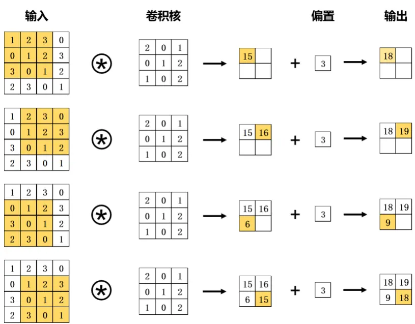
数据来源：斋藤康毅《深度学习入门》，广发证券发展研究中心

由于模型运算的需要，通常在卷积运算前会通过填充（adding）操作向输入数据的周围填入固定的数值（比如0等）。如下图所示，将幅度为1的填充操作应用于输入大小为（4，4）的数据。经过填充后的输入数据大小变为（6，6），将其与（3，3）的卷积核进行卷积运算得到（4，4）的输出数据。

图 9：填充（Padding）示意图
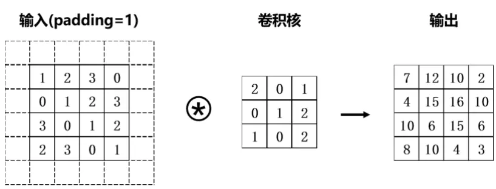
数据来源：斋藤康毅《深度学习入门》，广发证券发展研究中心

使用填充操作的目的是调整输出特征的大小。比如，将（3，3）的卷积核应用于大小为（4，4）的输入数据时，输出数据的大小变为（2，2），也就是说输出数据的大小比输入数据的大小缩减了 2 个元素。在深度网络中包含了众多的卷积运算操作，如果每次卷积运算都使数据的维度大小缩减，那么就有可能导致某一层数据的输出大小为 1，使卷积运算无法继续运行。而填充操作则可以避免这种情况。在上述例子中所应用的填充幅度大小为 1，使得输入数据和输出数据的大小得以保持，也就是说卷积运算可以在输入和输出两端维度大小不变的情况下进行。

卷积的运算间隔称为步幅（Stride）。若步幅由1变为2，卷积操作则如下图所示，即运算间隔变为两个元素。

图 10：步幅（Stride）为2的卷积运算示意图
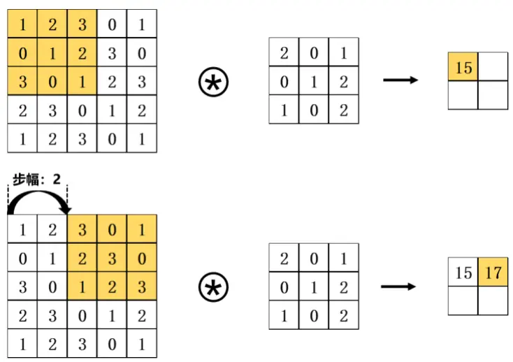
数据来源：斋藤康毅《深度学习入门》，广发证券发展研究中心

综上，假设输入大小为（H，W），卷积核的大小为（FH，FW），输出大小为（OH，OW），填充为P，步幅为S，通过下式可计算得到输出大小：

$$
\mathrm{OH}=\frac{\mathrm{H}+2\mathrm{P}-\mathrm{FH}}{\mathrm{S}}+1,\mathrm{OH}=\frac{\mathrm{W}+2\mathrm{P}-\mathrm{FW}}{\mathrm{S}}+1.
$$

## 2. 池化层

池化（Pooling）操作具有平移不变性、旋转不变性和尺度不变性，可以起到降维、去除冗余信息的作用，从而达到降低网络复杂度、减小计算量的目的。此外，池化本身可以实现非线性运算，还可以提高模型的鲁棒性。池化通常包括两种：最大值池化（Max Pooling）和平均池化（Average Pooling）。最大值池化是从目标区域中取出最大值，平均池化则是计算目标区域中的平均值，在目标检测领域通常使用最大值池化。下图是一个以步幅为2的2×2最大值池化运算示意图，其中2 x 2代表目标区域的大小。其2×2窗口的移动间隔为2个元素，从其中取出最大的元素。

图 11：最大值池化（Max Pooling）运算示意图
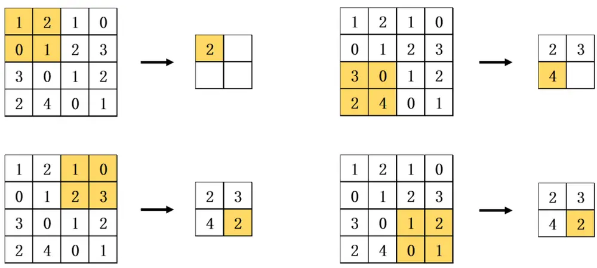
数据来源：斋藤康毅《深度学习入门》，广发证券发展研究中心

通过卷积运算，卷积神经网络能有效捕捉到图像中的局部结构特征，并通过深层网络不断提高感受野（Receptive Field）的大小，从而实现对图片全局特征的提取。因此，卷积神经网络能够有效识别价量数据图表中价格和交易量的走势形态，并与未来股价进行建模。

## 三、精选 30 策略组合

## （一）AI 看图因子分档表现

AI看图因子在全市场的50档分档表现如下图所示，分档组合展现出良好的区分度，单调性明显，多头、空头收益显著。

图 12：AI看图因子分档表现
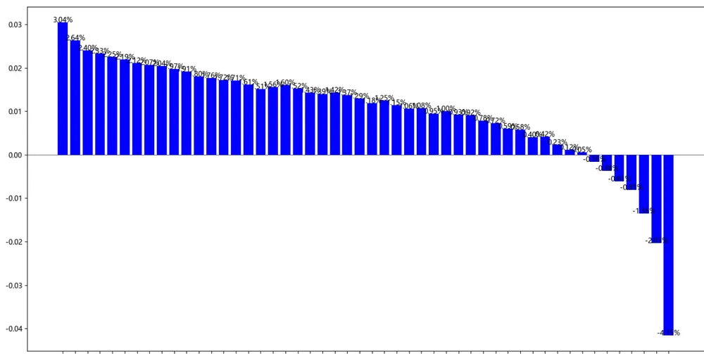
q1 g2 g3 q4 g5 g6 q7 g8 q9 q10q11q12q13q14q15q16q17q18q19q20q21q22q23q24q25q26q27q28q29q30q31g32q33q34q35q36q37q38q39g40q41q42q43q44q45q46q47g48q49q50
数据来源：Wind，广发证券发展研究中心

## （二）组合说明

选股因子：AI看图因子

选股范围：全市场市值前1000的个股

选股处理：剔除非上市、摘牌、ST/*ST、涨跌停板股票

换手控制：年换手控制在5倍以下

组合成分股数量：30只个股

组合指数：大盘精选30（Wind指数代码：GFAI30.WI）

根据AI看图因子，在全市场市值前1000的个股范围内，构建出大盘精选30策略组合（Wind指数代码：GFAI30.WI），控制年换手在5倍以下。组合成分股样例及行业分布如下图所示。

图 13：大盘精选30策略组合成分股样例

| 上期组合绿色为调出 |  |  | 最新组合红色为调入 |  |  |  |  |
| --- | --- | --- | --- | --- | --- | --- | --- |
| 代码 股票简称 | 市值 | 行业 | 权重 | 代码 股票简称 | 市值 | 行业 | 权重 |
|  | 21955 20376 | 国有大型银行 国有大型银行 | 3.33% 3.33% |  | 21955 20376 | 国有大型银行 国有大型银行 | 3.33% 3.33% |
|  | 16939 | 国有大型银行 | 3.33% |  | 14572 | 国有大型银行 | 3.33% |
|  | 14572 | 国有大型银行 | 3.33% |  | 5494 | 国有大型银行 | 3.33% |
|  | 5494 | 国有大型银行 | 3.33% |  | 3220 | 保险 | 3.33% |
|  | 3220 | 保险 | 3.33% |  | 2705 | 房屋建设 | 3.33% |
|  | 2705 | 房屋建设 | 3.33% |  | 2044 | 股份制银行 | 3.33% |
|  | 2044 | 股份制银行 | 3.33% |  | 1641 | 通信服务 | 3.33% |
|  | 1641 | 通信服务 | 3.33% |  | 508 | 专业工程 | 3.33% |
|  | 508 | 专业工程 | 3.33% |  | 488 | 工业金属 | 3.33% |
|  | 488 441 | 工业金属 | 3.33% |  | 441 | 油服工程 | 3.33% |
|  |  | 油服工程 | 3.33% |  | 294 | 电 | 3.33% |
|  | 294 276 | 电力 | 3.33% |  | 267 | 城商行 | 3.33% |
|  | 267 | 普钢 | 3.33% |  | 250 | 物流 | 3.33% |
|  | 250 | 城商行 | 3.33% |  | 250 | 航运港口 | 3.33% |
|  | 250 | 物流 | 3.33% |  | 248 | 普钢 | 3.33% |
|  | 244 | 航运港口 | 3.33% |  | 233 | 环境治理 | 3.33% |
|  | 220 | 化学制药 | 3.33% |  | 220 216 | 电力 | 3.33% |
|  | 216 | 电力 | 3.33% |  |  | 城商行 | 3.33% |
|  |  | 城商行 | 3.33% |  | 206 | 专用设备 | 3.33% |
|  | 206 | 专用设备 | 3.33% |  | 201 | 燃气 | 3.33% |
|  | 201 | 燃气 | 3.33% |  | 193 | 航运港口 | 3.33% |
|  | 193 | 航运港口 | 3.33% |  | 190 | 油服工程 | 3.33% |
|  | 190 | 油服工程 | 3.33% |  | 185 | 铁路公路 | 3.33% |
|  | 185 | 铁路公路 | 3.33% |  | 180 | 航运港口 | 3.33% |
|  | 180 | 航运港口 | 3.33% |  | 177 | 工业金属 | 3.33% |
|  | 177 | 工业金属 | 3.33% |  | 175 | 汽车零部件 | 3.33% |
|  | 175 | 汽车零部件 | 3.33% |  | 160 | 城商行 | 3.33% |
|  | 160 125 | 城商行 电力 | 3.33% 3.33% |  | 142 125 | 环保设备 电力 | 3.33% 3.33% |

数据来源：广发证券发展研究中心

图 14：大盘精选30策略组合行业分布
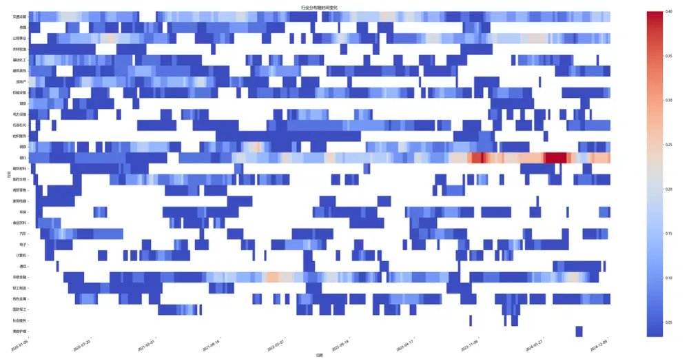
数据来源：广发证券发展研究中心

图 15：科技精选30策略组合成分股样例

| 上期组合绿色为调出 |  |  |  |  | 最新组合红色为调入 |  |  |  |  |  |
| --- | --- | --- | --- | --- | --- | --- | --- | --- | --- | --- |
| 代码 | 股票简称 | 市值 | 行业 | 权重 | 代码 | 股票简称 | 市值 | 行业 |  | 权重 |
|  |  | 656 599 | 软件开发 半导体 | 3.33% 3.33% |  |  | 656 430 |  | 软件开发 | 3.33% |
|  |  |  |  |  |  |  |  |  | 消费电子 | 3.33% |
|  |  | 578 | 元件 | 3.33% |  |  |  | 428 | 计算机设备 | 3.33% |
|  |  | 508 | 通信设备 | 3.33% |  |  |  | 307 | 半导体 | 3.33% |
|  |  | 430 | 消费电子 | 3.33% |  |  |  | 258 | 元件 | 3.33% |
|  |  | 428 | 计算机设备 | 3.33% |  |  |  | 159 | 半导体 | 3.33% |
|  |  | 307 | 半导体 | 3.33% |  |  |  | 157 | 半导体 | 3.33% |
|  |  | 258 | 元件 | 3.33% |  |  |  | 155 | 半导体 | 3.33% |
|  |  | 159 | 半导体 | 3.33% |  |  |  | 109 | 软件开发 | 3.33% |
|  |  | 157 | 半导体 | 3.33% |  |  |  | 94 | 电子化学品 | 3.33% |
|  |  | 155 | 半导体 | 3.33% |  |  |  | 68 | 光学光电子 | 3.33% |
|  |  | 109 | 软件开发 | 3.33% |  |  |  | 66 | 消费电子 | 3.33% |
|  |  | 102 | 半导体 | 3.33% |  |  |  | 61 | 通信设备 | 3.33% |
|  |  | 94 | 电子化学品 | 3.33% |  |  |  | 59 | 消费电子 | 3.33% |
|  |  | 68 | 光学光电子 | 3.33% |  |  |  | 58 | 电子化学品 | 3.33% |
|  |  | 61 | 通信设备 | 3.33% |  |  |  | 58 | 元件 | 3.33% |
|  |  | 59 | 消费电子 | 3.33% |  |  |  | 55 | 通信服务 | 3.33% |
|  |  | 58 | 电子化学品 | 3.33% |  |  | 53 |  | 电子化学品 | 3.33% |
|  |  | 58 | 元件 | 3.33% |  |  |  | 48 | 通信设备 | 3.33% |
|  |  | 57 | 计算机设备 | 3.33% |  |  |  | 48 | IT服务 | 3.33% |
|  |  | 53 | 电子化学品 | 3.33% |  |  |  | 47 | 其他电子 | 3.33% |
|  |  | 48 | 通信设备 | 3.33% |  |  |  | 45 | 光学光电子 | 3.33% |
|  |  | 48 | IT服务 | 3.33% |  |  |  | 45 | 元件 | 3.33% |
|  |  | 47 | 其他电子 | 3.33% |  |  |  | 40 | 消费电子 | 3.33% |
|  |  | 45 | 光学光电子 | 3.33% |  |  |  | 39 | 光学光电子 | 3.33% |
|  |  | 40 | 消费电子 | 3.33% |  |  |  | 39 | 消费电子 | 3.33% |
|  |  | 39 | 消费电子 | 3.33% |  |  |  | 38 | 光学光电子 | 3.33% |
|  |  | 38 | 光学光电子 | 3.33% |  |  |  | 36 | 消费电子 | 3.33% |
|  |  | 36 | 消费电子 | 3.33% |  |  |  | 36 | 消费电子 | 3.33% |
|  |  | 35 | 光学光电子 | 3.33% |  |  |  | 35 | 光学光电子 | 3.33% |

数据来源：广发证券发展研究中心

图 16：科技精选30策略组合行业分布
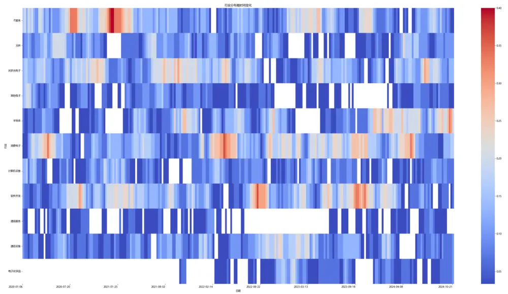
数据来源：广发证券发展研究中心

图 17：医药精选30策略组合成分股样例

| 上期组合绿色为调出 |  |  |  | 最新组合红色为调入 |  |  |  |  |
| --- | --- | --- | --- | --- | --- | --- | --- | --- |
| 代码 | 股票简称 | 市值 | 行业 | 权重 | 代码 股票简称 | 市值 | 行业 | 权重 |
|  | 792 426 | 化学制药 化学制药 | 3.33% 3.33% |  |  | 792 426 | 化学制药 化学制药 | 3.33% 3.33% |
|  | 405 |  |  |  |  |  |  |  |
|  |  |  | 化学制药 | 3.33% |  | 373 | 化学制药 | 3.33% |
|  |  | 373 | 化学制药 | 3.33% |  | 276 | 中药 | 3.33% |
|  |  | 276 | 中药 | 3.33% |  | 244 | 化学制药 | 3.33% |
|  |  | 244 | 化学制药 | 3.33% |  | 188 | 中药 | 3.33% |
|  |  | 188 | 中药 | 3.33% |  | 181 | 医疗器械 | 3.33% |
|  |  | 181 | 医疗器械 | 3.33% |  | 163 | 化学制药 | 3.33% |
|  |  | 163 | 化学制药 | 3.33% |  | 161 | 化学制药 | 3.33% |
|  |  | 158 | 生物制品 | 3.33% |  | 158 | 生物制品 | 3.33% |
|  |  | 146 | 医疗器械 | 3.33% |  | 146 | 医疗器械 | 3.33% |
|  |  | 141 | 中药 | 3.33% |  | 141 | 中药 | 3.33% |
|  |  | 137 | 化学制药 | 3.33% |  | 116 | 化学制药 | 3.33% |
|  |  | 116 | 化学制药 | 3.33% |  | 115 | 生物制品 | 3.33% |
|  |  | 115 | 生物制品 | 3.33% |  | 113 | 中药 | 3.33% |
|  |  | 113 | 中药 | 3.33% |  | 109 | 医疗器械 | 3.33% |
|  |  | 109 | 医疗器械 | 3.33% |  | 108 | 化学制药 | 3.33% |
|  |  | 108 92 | 化学制药 | 3.33% |  | 106 | 化学制药 | 3.33% |
|  |  |  | 化学制药 | 3.33% |  | 92 | 化学制药 | 3.33% |
|  |  |  | 化学制药 | 3.33% |  | 90 | 化学制药 | 3.33% |
|  |  |  | 化学制药 | 3.33% |  | 87 | 化学制药 | 3.33% |
|  |  |  | 中药 | 3.33% |  | 87 | 中药 | 3.33% |
|  |  |  | 中药 | 3.33% |  | 83 | 中药 | 3.33% |
|  |  |  | 医疗器械 | 3.33% |  | 78 | 化学制药 | 3.33% |
|  |  |  | 化学制药 | 3.33% |  | 74 | 化学制药 | 3.33% |
|  |  |  | 化学制药 | 3.33% |  | 66 | 中药 | 3.33% |
|  |  |  | 中药 | 3.33% |  | 64 | 医疗器械 | 3.33% |
|  |  |  | 医疗器械 | 3.33% |  | 57 | 中药 | 3.33% |
|  |  | 57 | 中药 | 3.33% |  | 53 | 医疗器械 | 3.33% |
|  |  | 53 | 医疗器械 | 3.33% |  | 51 | 医疗器械 | 3.33% |

数据来源：广发证券发展研究中心

图 18：医药精选30策略组合行业分布
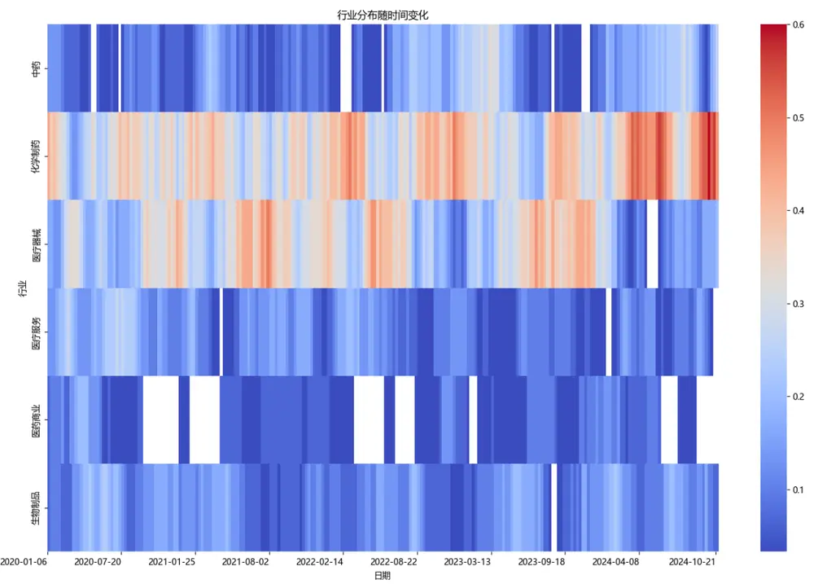
数据来源：广发证券发展研究中心
识别风险，发现价值

## （三）大盘精选 30策略组合表现

大盘精选30策略组合净值曲线和分年度表现统计如下图表所示，在2020~2024年期间，组合取得了244.56%的累计收益率，折合年化收益率为29.42%，最大回撤率为19.80%，年化波动率为18.24%。在2024年期间，组合取得了40.88%的年化收益率，最大回撤率为8.82%，年化波动率为20.47%。

图 19：大盘精选30策略组合净值曲线
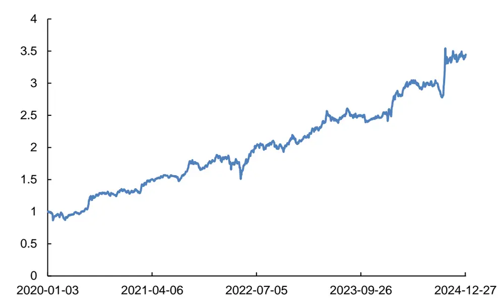
数据来源：Wind，广发证券发展研究中心

表 1：大盘精选30策略组合分年度收益统计

| 年份 | 总收益 | 年化收益率 | 最大回撤率 | 年化波动率 | 信息比率 | 夏普比率 | 收益回撤比 |
| --- | --- | --- | --- | --- | --- | --- | --- |
| 2020~2024 | 244.56% | 29.42% | 19.80% | 18.24% | 1.61 | 1.48 | 1.49 |
| 2020年 | 31.54% | 33.20% | 13.95% | 21.84% | 1.52 | 1.41 | 2.38 |
| 2021年 | 38.27% | 40.13% | 8.54% | 13.53% | 2.97 | 2.78 | 4.70 |
| 2022年 | 14.45% | 15.16% | 19.80% | 21.36% | 0.71 | 0.59 | 0.77 |
| 2023年 | 19.43% | 20.40% | 8.30% | 11.59% | 1.76 | 1.54 | 2.46 |
| 2024年 | 38.60% | 40.88% | 8.82% | 20.47% | 2.00 | 1.87 | 4.64 |

数据来源：Wind，广发证券发展研究中心

## 四、总结与展望

技术分析是一种通过分析历史价量数据来预测股票未来价格走势的方法。它的核心假设是价量数据可以充分解释市场信息，并且价格呈现出一定的趋势，历史数据会在某种程度上重复。技术分析通常采用各种图表和技术指标，如K线图、移动平均线、MACD等，来识别市场趋势、潜在反转点和交易信号等。通过这些工具，投资者可以分析市场的买卖力量、价格波动及其变化趋势。

传统的技术分析通常依靠人类经验积累。在如今人工智能技术快速发展的时代背景下，图像识别技术或许能替代人工看图，更准确地进行技术分析。在这一方面，团队在去年曾发表相关研究报告《基于卷积神经网络的股价走势AI识别与分类》。团队在过去一年多的时间里，对AI复盘进行不断改进，构建出了大盘精选30（Wind指数代码：GFAI30.WI）等多个策略组合。

在2020~2024年期间，大盘精选30策略组合取得了244.56%的累计收益率，折合年化收益率为29.42%，最大回撤率为19.80%，年化波动率为18.24%。在2024年期间，大盘精选30策略组合取得了40.88%的年化收益率，最大回撤率为8.82%，年化波动率为20.47%。

## 五、风险提示

本文所述模型用量化方法通过历史数据统计、建模和测算完成，所得结论与规律在市场政策、环境变化时存在失效风险；

本文策略在市场结构及交易行为改变时有可能存在失效风险；

因量化模型不同，本文提出的观点可能与其他量化模型结论存在差异。

## [Table_ResearchTeam] 广发金融工程研究小组

安 宁 宁 ： 首席分析师，暨南大学硕士，从业14年，2011年进入广发证券发展研究中心。

张 超 ： 资深分析师，中山大学硕士，2012 年进入广发证券发展研究中心。

陈 原 文 ： 资深分析师，中山大学硕士，2015年进入广发证券发展研究中心。

豪 ： 资深分析师，上海交通大学硕士，2016年进入广发证券发展研究中心。

周 飞 鹏 ： 资深分析师，伯明翰大学硕士，2021年加入广发证券发展研究中心。

张 钰 东 ： 资深分析师，中山大学硕士，2020年进入广发证券发展研究中心。

季 燕 妮 ： 资深分析师，厦门大学硕士，2020年进入广发证券发展研究中心。

林 涛 ： 研究员，中山大学硕士，2024 年进入广发证券发展研究中心。

## [Table_IndustryInvestDescription] 广发证券—行业投资评级说明投资

买入： 预期未来12个月内，股价表现强于大盘10%以上。内

持有： 预期未来12个月内，股价相对大盘的变动幅度介于-10%～+10%。对

卖出： 预期未来12个月内，股价表现弱于大盘10%以上。

## [Table_CompanyInvestDescription] 广发证券—公司投资评级说明

买入： 预期未来12个月内，股价表现强于大盘15%以上。

增持： 预期未来 12 个月内，股价表现强于大盘 5%-15%。

持有： 预期未来12个月内，股价相对大盘的变动幅度介于-5%～+5%。

卖出： 预期未来12个月内，股价表现弱于大盘5%以上。

## [Table_Address] 联系我们

| 地址 | 广州市 | 深圳市 | 北京市 | 上海市 | 香港 |
| --- | --- | --- | --- | --- | --- |
|  | 广州市天河区马场路 | 深圳市福田区益田路 | 北京市西城区月坛北 | 上海市浦东新区南泉 | 香港湾仔骆克道81号 |
|  | 26号广发证券大厦47 楼 | 6001号太平金融大厦 31层 | 街2号月坛大厦18层 | 北路429号泰康保险 大厦37楼 | 广发大厦 27 楼 |
| 邮政编码 客服邮箱 | 510627 gfzqyf@gf.com.cn | 518026 | 100045 | 200120 |  |

## [Table_LegalD 法律主体isclaimer 声明]

本报告由广发证券股份有限公司或其关联机构制作，广发证券股份有限公司及其关联机构以下统称为“广发证券”。本报告的分销依据不同国不依据家、地区的法律、法规和监管要求由广发证券于该国家或地区的具有相关合法合规经营资质的子公司/经营机构完成。

广发证券股份有限公司具备中国证监会批复的证券投资咨询业务资格，接受中国证监会监管，负责本报告于中国（港澳台地区除外）的分销。广发证券（香港）经纪有限公司具备香港证监会批复的就证券提供意见（4 号牌照）的牌照，接受香港证监会监管，负责本报告于中国香港地区的分销。

本报告署名研究人员所持中国证券业协会注册分析师资质信息和香港证监会批复的牌照信息已于署名研究人员姓名处披露。

## [Table_I 重要mportant 声明N

广发证券股份有限公司及其关联机构可能与本报告中提及的公司寻求或正在建立业务关系，因此，投资者应当考虑广发证券股份有限公司及其系 因此 者应当考虑关联机构因可能存在的潜在利益冲突而对本报告的独立性产生影响。投资者不应仅依据本报告内容作出任何投资决策。投资者应自主作出投资存 潜 利益冲突而 独 性产生影响 仅 容决策并自行承担投资风险，任何形式的分享证券投资收益或者分担证券投资损失的书面或者口头承诺均为无效。

本报告署名研究人员、联系人（以下均简称“研究人员”）针对本报告中相关公司或证券的研究分析内容，在此声明：（ ）本报告的全部分析结论、研究观点均精确反映研究人员于本报告发出当日的关于相关公司或证券的所有个人观点，并不代表广发证券的立场；（2）研究人员的部分或全部的报酬无论在过去、现在还是将来均不会与本报告所述特定分析结论、研究观点具有直接或间接的联系。

研究人员制作本报告的报酬标准依据研究质量、客户评价、工作量等多种因素确定，其影响因素亦包括广发证券的整体经营收入，该等经营收入部分来源于广发证券的投资银行类业务。

本报告仅面向经广发证券授权使用的客户特定合作机构发送，不对外公开发布，只有接收人才可以使用，且对于接收人而言具有保密义务。广发证券并不因相关人员通过其他途径收到或阅读本报告而视其为广发证券的客户。在特定国家或地区传播或者发布本报告可能违反当地法律，广发证券并未采取任何行动以允许于该等国家或地区传播或者分销本报告。

本报告所提及证券可能不被允许在某些国家或地区内出售。请注意，投资涉及风险，证券价格可能会波动，因此投资回报可能会有所变化，过去的业绩并不保证未来的表现。本报告的内容、观点或建议并未考虑任何个别客户的具体投资目标、财务状况和特殊需求，不应被视为对特定客户关于特定证券或金融工具的投资建议。本报告发送给某客户是基于该客户被认为有能力独立评估投资风险、独立行使投资决策并独立承担相应风险。

本报告所载资料的来源及观点的出处皆被广发证券认为可靠，但广发证券不对其准确性、完整性做出任何保证。报告内容仅供参考，报告中的信息或所表达观点不构成所涉证券买卖的出价或询价。广发证券不对因使用本报告的内容而引致的损失承担任何责任，除非法律法规有明确规定。客户不应以本报告取代其独立判断或仅根据本报告做出决策，如有需要，应先咨询专业意见。

广发证券可发出其它与本报告所载信息不一致及有不同结论的报告。本报告反映研究人员的不同观点、见解及分析方法，并不代表广发证券的立场。广发证券的销售人员、交易员或其他专业人士可能以书面或口头形式，向其客户或自营交易部门提供与本报告观点相反的市场评论或交易策略，广发证券的自营交易部门亦可能会有与本报告观点不一致，甚至相反的投资策略。报告所载资料、意见及推测仅反映研究人员于发出本报告当日的判断，可随时更改且无需另行通告。广发证券或其证券研究报告业务的相关董事、高级职员、分析师和员工可能拥有本报告所提及证券的权益。在阅读本报告时，收件人应了解相关的权益披露（若有）。

本研究报告可能包括和/或描述/呈列期货合约价格的事实历史信息（“信息”）。请注意此信息仅供用作组成我们的研究方法/分析中的部分论点依据/证据，以支持我们对所述相关行业/公司的观点的结论。在任何情况下，它并不（明示或暗示）与香港证监会第5类受规管活动（就期货合约提供意见）有关联或构成此活动。

## [Table_Interest 权益披露Disclosur

(1)广发证券（香港）跟本研究报告所述公司在过去12 个月内并没有任何投资银行业务的关系。

## [Table_Copyright] 版权声明

未经广发证券事先书面许可，任何机构或个人不得以任何形式翻版、复制、刊登、转载和引用，否则由此造成的一切不良后果及法律责任由私自翻版、复制、刊登、转载和引用者承担。